cola Report for Consensus Partitioning
==================

**Date**: 2019-12-07 07:56:54 CET, **cola version**: 1.3.2

----------------------------------------------------------------

<style type='text/css'>

body, td, th {
   font-family: Arial,Helvetica,sans-serif;
   background-color: white;
   font-size: 13px;
  max-width: 800px;
  margin: auto;
  margin-left:210px;
  padding: 0px 10px 0px 10px;
  border-left: 1px solid #EEEEEE;
  line-height: 150%;
}

tt, code, pre {
   font-family: 'DejaVu Sans Mono', 'Droid Sans Mono', 'Lucida Console', Consolas, Monaco, 

monospace;
}

h1 {
   font-size:2.2em;
}

h2 {
   font-size:1.8em;
}

h3 {
   font-size:1.4em;
}

h4 {
   font-size:1.0em;
}

h5 {
   font-size:0.9em;
}

h6 {
   font-size:0.8em;
}

a {
  text-decoration: none;
  color: #0366d6;
}

a:hover {
  text-decoration: underline;
}

a:visited {
   color: #0366d6;
}

pre, img {
  max-width: 100%;
}
pre {
  overflow-x: auto;
}
pre code {
   display: block; padding: 0.5em;
}

code {
  font-size: 92%;
  border: 1px solid #ccc;
}

code[class] {
  background-color: #F8F8F8;
}

table, td, th {
  border: 1px solid #ccc;
}

blockquote {
   color:#666666;
   margin:0;
   padding-left: 1em;
   border-left: 0.5em #EEE solid;
}

hr {
   height: 0px;
   border-bottom: none;
   border-top-width: thin;
   border-top-style: dotted;
   border-top-color: #999999;
}

@media print {
   * {
      background: transparent !important;
      color: black !important;
      filter:none !important;
      -ms-filter: none !important;
   }

   body {
      font-size:12pt;
      max-width:100%;
   }

   a, a:visited {
      text-decoration: underline;
   }

   hr {
      visibility: hidden;
      page-break-before: always;
   }

   pre, blockquote {
      padding-right: 1em;
      page-break-inside: avoid;
   }

   tr, img {
      page-break-inside: avoid;
   }

   img {
      max-width: 100% !important;
   }

   @page :left {
      margin: 15mm 20mm 15mm 10mm;
   }

   @page :right {
      margin: 15mm 10mm 15mm 20mm;
   }

   p, h2, h3 {
      orphans: 3; widows: 3;
   }

   h2, h3 {
      page-break-after: avoid;
   }
}
</style>


## Summary


All available functions which can be applied to this `res_list` object:


```r
res_list
```

```
#> A 'ConsensusPartitionList' object with 24 methods.
#>   On a matrix with 17723 rows and 374 columns.
#>   Top rows are extracted by 'SD, CV, MAD, ATC' methods.
#>   Subgroups are detected by 'hclust, kmeans, skmeans, pam, mclust, NMF' method.
#>   Number of partitions are tried for k = 2, 3, 4, 5, 6.
#>   Performed in total 30000 partitions by row resampling.
#> 
#> Following methods can be applied to this 'ConsensusPartitionList' object:
#>  [1] "cola_report"           "collect_classes"       "collect_plots"         "collect_stats"        
#>  [5] "colnames"              "functional_enrichment" "get_anno_col"          "get_anno"             
#>  [9] "get_classes"           "get_matrix"            "get_membership"        "get_stats"            
#> [13] "is_best_k"             "is_stable_k"           "ncol"                  "nrow"                 
#> [17] "rownames"              "show"                  "suggest_best_k"        "test_to_known_factors"
#> [21] "top_rows_heatmap"      "top_rows_overlap"     
#> 
#> You can get result for a single method by, e.g. object["SD", "hclust"] or object["SD:hclust"]
#> or a subset of methods by object[c("SD", "CV")], c("hclust", "kmeans")]
```

The call of `run_all_consensus_partition_methods()` was:


```
#> run_all_consensus_partition_methods(data = mat, mc.cores = 4)
```

Dimension of the input matrix:


```r
mat = get_matrix(res_list)
dim(mat)
```

```
#> [1] 17723   374
```

### Density distribution

The density distribution for each sample is visualized as in one column in the
following heatmap. The clustering is based on the distance which is the
Kolmogorov-Smirnov statistic between two distributions.


```r
library(ComplexHeatmap)
densityHeatmap(mat, ylab = "value", cluster_columns = TRUE, show_column_names = FALSE,
    mc.cores = 4)
```


### Suggest the best k


Folowing table shows the best `k` (number of partitions) for each combination
of top-value methods and partition methods. Clicking on the method name in
the table goes to the section for a single combination of methods.

[The cola vignette](http://bioconductor.org/packages/devel/bioc/vignettes/cola/inst/doc/cola.html#toc_13)
explains the definition of the metrics used for determining the best
number of partitions.


```r
suggest_best_k(res_list)
```


|                            | The best k| 1-PAC| Mean silhouette| Concordance|   |Optional k |
|:---------------------------|----------:|-----:|---------------:|-----------:|:--|:----------|
|[ATC:kmeans](#ATC-kmeans)   |          2| 1.000|           0.999|       0.999|** |           |
|[MAD:kmeans](#MAD-kmeans)   |          2| 1.000|           0.969|       0.986|** |           |
|[ATC:mclust](#ATC-mclust)   |          2| 0.994|           0.969|       0.986|** |           |
|[ATC:pam](#ATC-pam)         |          3| 0.986|           0.945|       0.979|** |2          |
|[SD:skmeans](#SD-skmeans)   |          2| 0.983|           0.960|       0.984|** |           |
|[MAD:NMF](#MAD-NMF)         |          2| 0.966|           0.957|       0.982|** |           |
|[SD:kmeans](#SD-kmeans)     |          2| 0.961|           0.949|       0.976|** |           |
|[CV:kmeans](#CV-kmeans)     |          3| 0.953|           0.927|       0.960|** |           |
|[ATC:skmeans](#ATC-skmeans) |          4| 0.944|           0.921|       0.967|*  |2,3        |
|[CV:NMF](#CV-NMF)           |          3| 0.943|           0.930|       0.972|*  |           |
|[SD:NMF](#SD-NMF)           |          2| 0.933|           0.940|       0.975|*  |           |
|[MAD:skmeans](#MAD-skmeans) |          3| 0.930|           0.932|       0.969|*  |2          |
|[ATC:NMF](#ATC-NMF)         |          2| 0.924|           0.943|       0.975|*  |           |
|[CV:mclust](#CV-mclust)     |          3| 0.913|           0.916|       0.963|*  |           |
|[MAD:pam](#MAD-pam)         |          2| 0.886|           0.936|       0.973|   |           |
|[CV:skmeans](#CV-skmeans)   |          3| 0.862|           0.894|       0.955|   |           |
|[SD:pam](#SD-pam)           |          2| 0.854|           0.918|       0.965|   |           |
|[CV:pam](#CV-pam)           |          3| 0.823|           0.858|       0.934|   |           |
|[MAD:mclust](#MAD-mclust)   |          4| 0.797|           0.902|       0.909|   |           |
|[ATC:hclust](#ATC-hclust)   |          2| 0.704|           0.854|       0.937|   |           |
|[SD:mclust](#SD-mclust)     |          3| 0.469|           0.570|       0.781|   |           |
|[CV:hclust](#CV-hclust)     |          3| 0.381|           0.504|       0.796|   |           |
|[MAD:hclust](#MAD-hclust)   |          2| 0.285|           0.760|       0.836|   |           |
|[SD:hclust](#SD-hclust)     |          2| 0.111|           0.683|       0.746|   |           |

\*\*: 1-PAC > 0.95, \*: 1-PAC > 0.9


### CDF of consensus matrices

Cumulative distribution function curves of consensus matrix for all methods.


```r
collect_plots(res_list, fun = plot_ecdf)
```


### Consensus heatmap

Consensus heatmaps for all methods. ([What is a consensus heatmap?](http://bioconductor.org/packages/devel/bioc/vignettes/cola/inst/doc/cola.html#toc_9))


<style type='text/css'>


.ui-helper-hidden {
	display: none;
}
.ui-helper-hidden-accessible {
	border: 0;
	clip: rect(0 0 0 0);
	height: 1px;
	margin: -1px;
	overflow: hidden;
	padding: 0;
	position: absolute;
	width: 1px;
}
.ui-helper-reset {
	margin: 0;
	padding: 0;
	border: 0;
	outline: 0;
	line-height: 1.3;
	text-decoration: none;
	font-size: 100%;
	list-style: none;
}
.ui-helper-clearfix:before,
.ui-helper-clearfix:after {
	content: "";
	display: table;
	border-collapse: collapse;
}
.ui-helper-clearfix:after {
	clear: both;
}
.ui-helper-zfix {
	width: 100%;
	height: 100%;
	top: 0;
	left: 0;
	position: absolute;
	opacity: 0;
	filter:Alpha(Opacity=0); 
}

.ui-front {
	z-index: 100;
}


.ui-state-disabled {
	cursor: default !important;
	pointer-events: none;
}


.ui-icon {
	display: inline-block;
	vertical-align: middle;
	margin-top: -.25em;
	position: relative;
	text-indent: -99999px;
	overflow: hidden;
	background-repeat: no-repeat;
}

.ui-widget-icon-block {
	left: 50%;
	margin-left: -8px;
	display: block;
}


.ui-widget-overlay {
	position: fixed;
	top: 0;
	left: 0;
	width: 100%;
	height: 100%;
}
.ui-accordion .ui-accordion-header {
	display: block;
	cursor: pointer;
	position: relative;
	margin: 2px 0 0 0;
	padding: .5em .5em .5em .7em;
	font-size: 100%;
}
.ui-accordion .ui-accordion-content {
	padding: 1em 2.2em;
	border-top: 0;
	overflow: auto;
}
.ui-autocomplete {
	position: absolute;
	top: 0;
	left: 0;
	cursor: default;
}
.ui-menu {
	list-style: none;
	padding: 0;
	margin: 0;
	display: block;
	outline: 0;
}
.ui-menu .ui-menu {
	position: absolute;
}
.ui-menu .ui-menu-item {
	margin: 0;
	cursor: pointer;
	
	list-style-image: url("data:image/gif;base64,R0lGODlhAQABAIAAAAAAAP///yH5BAEAAAAALAAAAAABAAEAAAIBRAA7");
}
.ui-menu .ui-menu-item-wrapper {
	position: relative;
	padding: 3px 1em 3px .4em;
}
.ui-menu .ui-menu-divider {
	margin: 5px 0;
	height: 0;
	font-size: 0;
	line-height: 0;
	border-width: 1px 0 0 0;
}
.ui-menu .ui-state-focus,
.ui-menu .ui-state-active {
	margin: -1px;
}


.ui-menu-icons {
	position: relative;
}
.ui-menu-icons .ui-menu-item-wrapper {
	padding-left: 2em;
}


.ui-menu .ui-icon {
	position: absolute;
	top: 0;
	bottom: 0;
	left: .2em;
	margin: auto 0;
}


.ui-menu .ui-menu-icon {
	left: auto;
	right: 0;
}
.ui-button {
	padding: .4em 1em;
	display: inline-block;
	position: relative;
	line-height: normal;
	margin-right: .1em;
	cursor: pointer;
	vertical-align: middle;
	text-align: center;
	-webkit-user-select: none;
	-moz-user-select: none;
	-ms-user-select: none;
	user-select: none;

	
	overflow: visible;
}

.ui-button,
.ui-button:link,
.ui-button:visited,
.ui-button:hover,
.ui-button:active {
	text-decoration: none;
}


.ui-button-icon-only {
	width: 2em;
	box-sizing: border-box;
	text-indent: -9999px;
	white-space: nowrap;
}


input.ui-button.ui-button-icon-only {
	text-indent: 0;
}


.ui-button-icon-only .ui-icon {
	position: absolute;
	top: 50%;
	left: 50%;
	margin-top: -8px;
	margin-left: -8px;
}

.ui-button.ui-icon-notext .ui-icon {
	padding: 0;
	width: 2.1em;
	height: 2.1em;
	text-indent: -9999px;
	white-space: nowrap;

}

input.ui-button.ui-icon-notext .ui-icon {
	width: auto;
	height: auto;
	text-indent: 0;
	white-space: normal;
	padding: .4em 1em;
}


input.ui-button::-moz-focus-inner,
button.ui-button::-moz-focus-inner {
	border: 0;
	padding: 0;
}
.ui-controlgroup {
	vertical-align: middle;
	display: inline-block;
}
.ui-controlgroup > .ui-controlgroup-item {
	float: left;
	margin-left: 0;
	margin-right: 0;
}
.ui-controlgroup > .ui-controlgroup-item:focus,
.ui-controlgroup > .ui-controlgroup-item.ui-visual-focus {
	z-index: 9999;
}
.ui-controlgroup-vertical > .ui-controlgroup-item {
	display: block;
	float: none;
	width: 100%;
	margin-top: 0;
	margin-bottom: 0;
	text-align: left;
}
.ui-controlgroup-vertical .ui-controlgroup-item {
	box-sizing: border-box;
}
.ui-controlgroup .ui-controlgroup-label {
	padding: .4em 1em;
}
.ui-controlgroup .ui-controlgroup-label span {
	font-size: 80%;
}
.ui-controlgroup-horizontal .ui-controlgroup-label + .ui-controlgroup-item {
	border-left: none;
}
.ui-controlgroup-vertical .ui-controlgroup-label + .ui-controlgroup-item {
	border-top: none;
}
.ui-controlgroup-horizontal .ui-controlgroup-label.ui-widget-content {
	border-right: none;
}
.ui-controlgroup-vertical .ui-controlgroup-label.ui-widget-content {
	border-bottom: none;
}


.ui-controlgroup-vertical .ui-spinner-input {

	
	width: 75%;
	width: calc( 100% - 2.4em );
}
.ui-controlgroup-vertical .ui-spinner .ui-spinner-up {
	border-top-style: solid;
}

.ui-checkboxradio-label .ui-icon-background {
	box-shadow: inset 1px 1px 1px #ccc;
	border-radius: .12em;
	border: none;
}
.ui-checkboxradio-radio-label .ui-icon-background {
	width: 16px;
	height: 16px;
	border-radius: 1em;
	overflow: visible;
	border: none;
}
.ui-checkboxradio-radio-label.ui-checkboxradio-checked .ui-icon,
.ui-checkboxradio-radio-label.ui-checkboxradio-checked:hover .ui-icon {
	background-image: none;
	width: 8px;
	height: 8px;
	border-width: 4px;
	border-style: solid;
}
.ui-checkboxradio-disabled {
	pointer-events: none;
}
.ui-datepicker {
	width: 17em;
	padding: .2em .2em 0;
	display: none;
}
.ui-datepicker .ui-datepicker-header {
	position: relative;
	padding: .2em 0;
}
.ui-datepicker .ui-datepicker-prev,
.ui-datepicker .ui-datepicker-next {
	position: absolute;
	top: 2px;
	width: 1.8em;
	height: 1.8em;
}
.ui-datepicker .ui-datepicker-prev-hover,
.ui-datepicker .ui-datepicker-next-hover {
	top: 1px;
}
.ui-datepicker .ui-datepicker-prev {
	left: 2px;
}
.ui-datepicker .ui-datepicker-next {
	right: 2px;
}
.ui-datepicker .ui-datepicker-prev-hover {
	left: 1px;
}
.ui-datepicker .ui-datepicker-next-hover {
	right: 1px;
}
.ui-datepicker .ui-datepicker-prev span,
.ui-datepicker .ui-datepicker-next span {
	display: block;
	position: absolute;
	left: 50%;
	margin-left: -8px;
	top: 50%;
	margin-top: -8px;
}
.ui-datepicker .ui-datepicker-title {
	margin: 0 2.3em;
	line-height: 1.8em;
	text-align: center;
}
.ui-datepicker .ui-datepicker-title select {
	font-size: 1em;
	margin: 1px 0;
}
.ui-datepicker select.ui-datepicker-month,
.ui-datepicker select.ui-datepicker-year {
	width: 45%;
}
.ui-datepicker table {
	width: 100%;
	font-size: .9em;
	border-collapse: collapse;
	margin: 0 0 .4em;
}
.ui-datepicker th {
	padding: .7em .3em;
	text-align: center;
	font-weight: bold;
	border: 0;
}
.ui-datepicker td {
	border: 0;
	padding: 1px;
}
.ui-datepicker td span,
.ui-datepicker td a {
	display: block;
	padding: .2em;
	text-align: right;
	text-decoration: none;
}
.ui-datepicker .ui-datepicker-buttonpane {
	background-image: none;
	margin: .7em 0 0 0;
	padding: 0 .2em;
	border-left: 0;
	border-right: 0;
	border-bottom: 0;
}
.ui-datepicker .ui-datepicker-buttonpane button {
	float: right;
	margin: .5em .2em .4em;
	cursor: pointer;
	padding: .2em .6em .3em .6em;
	width: auto;
	overflow: visible;
}
.ui-datepicker .ui-datepicker-buttonpane button.ui-datepicker-current {
	float: left;
}


.ui-datepicker.ui-datepicker-multi {
	width: auto;
}
.ui-datepicker-multi .ui-datepicker-group {
	float: left;
}
.ui-datepicker-multi .ui-datepicker-group table {
	width: 95%;
	margin: 0 auto .4em;
}
.ui-datepicker-multi-2 .ui-datepicker-group {
	width: 50%;
}
.ui-datepicker-multi-3 .ui-datepicker-group {
	width: 33.3%;
}
.ui-datepicker-multi-4 .ui-datepicker-group {
	width: 25%;
}
.ui-datepicker-multi .ui-datepicker-group-last .ui-datepicker-header,
.ui-datepicker-multi .ui-datepicker-group-middle .ui-datepicker-header {
	border-left-width: 0;
}
.ui-datepicker-multi .ui-datepicker-buttonpane {
	clear: left;
}
.ui-datepicker-row-break {
	clear: both;
	width: 100%;
	font-size: 0;
}


.ui-datepicker-rtl {
	direction: rtl;
}
.ui-datepicker-rtl .ui-datepicker-prev {
	right: 2px;
	left: auto;
}
.ui-datepicker-rtl .ui-datepicker-next {
	left: 2px;
	right: auto;
}
.ui-datepicker-rtl .ui-datepicker-prev:hover {
	right: 1px;
	left: auto;
}
.ui-datepicker-rtl .ui-datepicker-next:hover {
	left: 1px;
	right: auto;
}
.ui-datepicker-rtl .ui-datepicker-buttonpane {
	clear: right;
}
.ui-datepicker-rtl .ui-datepicker-buttonpane button {
	float: left;
}
.ui-datepicker-rtl .ui-datepicker-buttonpane button.ui-datepicker-current,
.ui-datepicker-rtl .ui-datepicker-group {
	float: right;
}
.ui-datepicker-rtl .ui-datepicker-group-last .ui-datepicker-header,
.ui-datepicker-rtl .ui-datepicker-group-middle .ui-datepicker-header {
	border-right-width: 0;
	border-left-width: 1px;
}


.ui-datepicker .ui-icon {
	display: block;
	text-indent: -99999px;
	overflow: hidden;
	background-repeat: no-repeat;
	left: .5em;
	top: .3em;
}
.ui-dialog {
	position: absolute;
	top: 0;
	left: 0;
	padding: .2em;
	outline: 0;
}
.ui-dialog .ui-dialog-titlebar {
	padding: .4em 1em;
	position: relative;
}
.ui-dialog .ui-dialog-title {
	float: left;
	margin: .1em 0;
	white-space: nowrap;
	width: 90%;
	overflow: hidden;
	text-overflow: ellipsis;
}
.ui-dialog .ui-dialog-titlebar-close {
	position: absolute;
	right: .3em;
	top: 50%;
	width: 20px;
	margin: -10px 0 0 0;
	padding: 1px;
	height: 20px;
}
.ui-dialog .ui-dialog-content {
	position: relative;
	border: 0;
	padding: .5em 1em;
	background: none;
	overflow: auto;
}
.ui-dialog .ui-dialog-buttonpane {
	text-align: left;
	border-width: 1px 0 0 0;
	background-image: none;
	margin-top: .5em;
	padding: .3em 1em .5em .4em;
}
.ui-dialog .ui-dialog-buttonpane .ui-dialog-buttonset {
	float: right;
}
.ui-dialog .ui-dialog-buttonpane button {
	margin: .5em .4em .5em 0;
	cursor: pointer;
}
.ui-dialog .ui-resizable-n {
	height: 2px;
	top: 0;
}
.ui-dialog .ui-resizable-e {
	width: 2px;
	right: 0;
}
.ui-dialog .ui-resizable-s {
	height: 2px;
	bottom: 0;
}
.ui-dialog .ui-resizable-w {
	width: 2px;
	left: 0;
}
.ui-dialog .ui-resizable-se,
.ui-dialog .ui-resizable-sw,
.ui-dialog .ui-resizable-ne,
.ui-dialog .ui-resizable-nw {
	width: 7px;
	height: 7px;
}
.ui-dialog .ui-resizable-se {
	right: 0;
	bottom: 0;
}
.ui-dialog .ui-resizable-sw {
	left: 0;
	bottom: 0;
}
.ui-dialog .ui-resizable-ne {
	right: 0;
	top: 0;
}
.ui-dialog .ui-resizable-nw {
	left: 0;
	top: 0;
}
.ui-draggable .ui-dialog-titlebar {
	cursor: move;
}
.ui-draggable-handle {
	-ms-touch-action: none;
	touch-action: none;
}
.ui-resizable {
	position: relative;
}
.ui-resizable-handle {
	position: absolute;
	font-size: 0.1px;
	display: block;
	-ms-touch-action: none;
	touch-action: none;
}
.ui-resizable-disabled .ui-resizable-handle,
.ui-resizable-autohide .ui-resizable-handle {
	display: none;
}
.ui-resizable-n {
	cursor: n-resize;
	height: 7px;
	width: 100%;
	top: -5px;
	left: 0;
}
.ui-resizable-s {
	cursor: s-resize;
	height: 7px;
	width: 100%;
	bottom: -5px;
	left: 0;
}
.ui-resizable-e {
	cursor: e-resize;
	width: 7px;
	right: -5px;
	top: 0;
	height: 100%;
}
.ui-resizable-w {
	cursor: w-resize;
	width: 7px;
	left: -5px;
	top: 0;
	height: 100%;
}
.ui-resizable-se {
	cursor: se-resize;
	width: 12px;
	height: 12px;
	right: 1px;
	bottom: 1px;
}
.ui-resizable-sw {
	cursor: sw-resize;
	width: 9px;
	height: 9px;
	left: -5px;
	bottom: -5px;
}
.ui-resizable-nw {
	cursor: nw-resize;
	width: 9px;
	height: 9px;
	left: -5px;
	top: -5px;
}
.ui-resizable-ne {
	cursor: ne-resize;
	width: 9px;
	height: 9px;
	right: -5px;
	top: -5px;
}
.ui-progressbar {
	height: 2em;
	text-align: left;
	overflow: hidden;
}
.ui-progressbar .ui-progressbar-value {
	margin: -1px;
	height: 100%;
}
.ui-progressbar .ui-progressbar-overlay {
	background: url("data:image/gif;base64,R0lGODlhKAAoAIABAAAAAP///yH/C05FVFNDQVBFMi4wAwEAAAAh+QQJAQABACwAAAAAKAAoAAACkYwNqXrdC52DS06a7MFZI+4FHBCKoDeWKXqymPqGqxvJrXZbMx7Ttc+w9XgU2FB3lOyQRWET2IFGiU9m1frDVpxZZc6bfHwv4c1YXP6k1Vdy292Fb6UkuvFtXpvWSzA+HycXJHUXiGYIiMg2R6W459gnWGfHNdjIqDWVqemH2ekpObkpOlppWUqZiqr6edqqWQAAIfkECQEAAQAsAAAAACgAKAAAApSMgZnGfaqcg1E2uuzDmmHUBR8Qil95hiPKqWn3aqtLsS18y7G1SzNeowWBENtQd+T1JktP05nzPTdJZlR6vUxNWWjV+vUWhWNkWFwxl9VpZRedYcflIOLafaa28XdsH/ynlcc1uPVDZxQIR0K25+cICCmoqCe5mGhZOfeYSUh5yJcJyrkZWWpaR8doJ2o4NYq62lAAACH5BAkBAAEALAAAAAAoACgAAAKVDI4Yy22ZnINRNqosw0Bv7i1gyHUkFj7oSaWlu3ovC8GxNso5fluz3qLVhBVeT/Lz7ZTHyxL5dDalQWPVOsQWtRnuwXaFTj9jVVh8pma9JjZ4zYSj5ZOyma7uuolffh+IR5aW97cHuBUXKGKXlKjn+DiHWMcYJah4N0lYCMlJOXipGRr5qdgoSTrqWSq6WFl2ypoaUAAAIfkECQEAAQAsAAAAACgAKAAAApaEb6HLgd/iO7FNWtcFWe+ufODGjRfoiJ2akShbueb0wtI50zm02pbvwfWEMWBQ1zKGlLIhskiEPm9R6vRXxV4ZzWT2yHOGpWMyorblKlNp8HmHEb/lCXjcW7bmtXP8Xt229OVWR1fod2eWqNfHuMjXCPkIGNileOiImVmCOEmoSfn3yXlJWmoHGhqp6ilYuWYpmTqKUgAAIfkECQEAAQAsAAAAACgAKAAAApiEH6kb58biQ3FNWtMFWW3eNVcojuFGfqnZqSebuS06w5V80/X02pKe8zFwP6EFWOT1lDFk8rGERh1TTNOocQ61Hm4Xm2VexUHpzjymViHrFbiELsefVrn6XKfnt2Q9G/+Xdie499XHd2g4h7ioOGhXGJboGAnXSBnoBwKYyfioubZJ2Hn0RuRZaflZOil56Zp6iioKSXpUAAAh+QQJAQABACwAAAAAKAAoAAACkoQRqRvnxuI7kU1a1UU5bd5tnSeOZXhmn5lWK3qNTWvRdQxP8qvaC+/yaYQzXO7BMvaUEmJRd3TsiMAgswmNYrSgZdYrTX6tSHGZO73ezuAw2uxuQ+BbeZfMxsexY35+/Qe4J1inV0g4x3WHuMhIl2jXOKT2Q+VU5fgoSUI52VfZyfkJGkha6jmY+aaYdirq+lQAACH5BAkBAAEALAAAAAAoACgAAAKWBIKpYe0L3YNKToqswUlvznigd4wiR4KhZrKt9Upqip61i9E3vMvxRdHlbEFiEXfk9YARYxOZZD6VQ2pUunBmtRXo1Lf8hMVVcNl8JafV38aM2/Fu5V16Bn63r6xt97j09+MXSFi4BniGFae3hzbH9+hYBzkpuUh5aZmHuanZOZgIuvbGiNeomCnaxxap2upaCZsq+1kAACH5BAkBAAEALAAAAAAoACgAAAKXjI8By5zf4kOxTVrXNVlv1X0d8IGZGKLnNpYtm8Lr9cqVeuOSvfOW79D9aDHizNhDJidFZhNydEahOaDH6nomtJjp1tutKoNWkvA6JqfRVLHU/QUfau9l2x7G54d1fl995xcIGAdXqMfBNadoYrhH+Mg2KBlpVpbluCiXmMnZ2Sh4GBqJ+ckIOqqJ6LmKSllZmsoq6wpQAAAh+QQJAQABACwAAAAAKAAoAAAClYx/oLvoxuJDkU1a1YUZbJ59nSd2ZXhWqbRa2/gF8Gu2DY3iqs7yrq+xBYEkYvFSM8aSSObE+ZgRl1BHFZNr7pRCavZ5BW2142hY3AN/zWtsmf12p9XxxFl2lpLn1rseztfXZjdIWIf2s5dItwjYKBgo9yg5pHgzJXTEeGlZuenpyPmpGQoKOWkYmSpaSnqKileI2FAAACH5BAkBAAEALAAAAAAoACgAAAKVjB+gu+jG4kORTVrVhRlsnn2dJ3ZleFaptFrb+CXmO9OozeL5VfP99HvAWhpiUdcwkpBH3825AwYdU8xTqlLGhtCosArKMpvfa1mMRae9VvWZfeB2XfPkeLmm18lUcBj+p5dnN8jXZ3YIGEhYuOUn45aoCDkp16hl5IjYJvjWKcnoGQpqyPlpOhr3aElaqrq56Bq7VAAAOw==");
	height: 100%;
	filter: alpha(opacity=25); 
	opacity: 0.25;
}
.ui-progressbar-indeterminate .ui-progressbar-value {
	background-image: none;
}
.ui-selectable {
	-ms-touch-action: none;
	touch-action: none;
}
.ui-selectable-helper {
	position: absolute;
	z-index: 100;
	border: 1px dotted black;
}
.ui-selectmenu-menu {
	padding: 0;
	margin: 0;
	position: absolute;
	top: 0;
	left: 0;
	display: none;
}
.ui-selectmenu-menu .ui-menu {
	overflow: auto;
	overflow-x: hidden;
	padding-bottom: 1px;
}
.ui-selectmenu-menu .ui-menu .ui-selectmenu-optgroup {
	font-size: 1em;
	font-weight: bold;
	line-height: 1.5;
	padding: 2px 0.4em;
	margin: 0.5em 0 0 0;
	height: auto;
	border: 0;
}
.ui-selectmenu-open {
	display: block;
}
.ui-selectmenu-text {
	display: block;
	margin-right: 20px;
	overflow: hidden;
	text-overflow: ellipsis;
}
.ui-selectmenu-button.ui-button {
	text-align: left;
	white-space: nowrap;
	width: 14em;
}
.ui-selectmenu-icon.ui-icon {
	float: right;
	margin-top: 0;
}
.ui-slider {
	position: relative;
	text-align: left;
}
.ui-slider .ui-slider-handle {
	position: absolute;
	z-index: 2;
	width: 1.2em;
	height: 1.2em;
	cursor: default;
	-ms-touch-action: none;
	touch-action: none;
}
.ui-slider .ui-slider-range {
	position: absolute;
	z-index: 1;
	font-size: .7em;
	display: block;
	border: 0;
	background-position: 0 0;
}


.ui-slider.ui-state-disabled .ui-slider-handle,
.ui-slider.ui-state-disabled .ui-slider-range {
	filter: inherit;
}

.ui-slider-horizontal {
	height: .8em;
}
.ui-slider-horizontal .ui-slider-handle {
	top: -.3em;
	margin-left: -.6em;
}
.ui-slider-horizontal .ui-slider-range {
	top: 0;
	height: 100%;
}
.ui-slider-horizontal .ui-slider-range-min {
	left: 0;
}
.ui-slider-horizontal .ui-slider-range-max {
	right: 0;
}

.ui-slider-vertical {
	width: .8em;
	height: 100px;
}
.ui-slider-vertical .ui-slider-handle {
	left: -.3em;
	margin-left: 0;
	margin-bottom: -.6em;
}
.ui-slider-vertical .ui-slider-range {
	left: 0;
	width: 100%;
}
.ui-slider-vertical .ui-slider-range-min {
	bottom: 0;
}
.ui-slider-vertical .ui-slider-range-max {
	top: 0;
}
.ui-sortable-handle {
	-ms-touch-action: none;
	touch-action: none;
}
.ui-spinner {
	position: relative;
	display: inline-block;
	overflow: hidden;
	padding: 0;
	vertical-align: middle;
}
.ui-spinner-input {
	border: none;
	background: none;
	color: inherit;
	padding: .222em 0;
	margin: .2em 0;
	vertical-align: middle;
	margin-left: .4em;
	margin-right: 2em;
}
.ui-spinner-button {
	width: 1.6em;
	height: 50%;
	font-size: .5em;
	padding: 0;
	margin: 0;
	text-align: center;
	position: absolute;
	cursor: default;
	display: block;
	overflow: hidden;
	right: 0;
}

.ui-spinner a.ui-spinner-button {
	border-top-style: none;
	border-bottom-style: none;
	border-right-style: none;
}
.ui-spinner-up {
	top: 0;
}
.ui-spinner-down {
	bottom: 0;
}
.ui-tabs {
	position: relative;
	padding: .2em;
}
.ui-tabs .ui-tabs-nav {
	margin: 0;
	padding: .2em .2em 0;
}
.ui-tabs .ui-tabs-nav li {
	list-style: none;
	float: left;
	position: relative;
	top: 0;
	margin: 1px .2em 0 0;
	border-bottom-width: 0;
	padding: 0;
	white-space: nowrap;
}
.ui-tabs .ui-tabs-nav .ui-tabs-anchor {
	float: left;
	padding: .5em 1em;
	text-decoration: none;
}
.ui-tabs .ui-tabs-nav li.ui-tabs-active {
	margin-bottom: -1px;
	padding-bottom: 1px;
}
.ui-tabs .ui-tabs-nav li.ui-tabs-active .ui-tabs-anchor,
.ui-tabs .ui-tabs-nav li.ui-state-disabled .ui-tabs-anchor,
.ui-tabs .ui-tabs-nav li.ui-tabs-loading .ui-tabs-anchor {
	cursor: text;
}
.ui-tabs-collapsible .ui-tabs-nav li.ui-tabs-active .ui-tabs-anchor {
	cursor: pointer;
}
.ui-tabs .ui-tabs-panel {
	display: block;
	border-width: 0;
	padding: 1em 1.4em;
	background: none;
}
.ui-tooltip {
	padding: 8px;
	position: absolute;
	z-index: 9999;
	max-width: 300px;
}
body .ui-tooltip {
	border-width: 2px;
}

.ui-widget {
	font-family: Arial,Helvetica,sans-serif;
	font-size: 1em;
}
.ui-widget .ui-widget {
	font-size: 1em;
}
.ui-widget input,
.ui-widget select,
.ui-widget textarea,
.ui-widget button {
	font-family: Arial,Helvetica,sans-serif;
	font-size: 1em;
}
.ui-widget.ui-widget-content {
	border: 1px solid #c5c5c5;
}
.ui-widget-content {
	border: 1px solid #dddddd;
	background: #ffffff;
	color: #333333;
}
.ui-widget-content a {
	color: #333333;
}
.ui-widget-header {
	border: 1px solid #dddddd;
	background: #e9e9e9;
	color: #333333;
	font-weight: bold;
}
.ui-widget-header a {
	color: #333333;
}


.ui-state-default,
.ui-widget-content .ui-state-default,
.ui-widget-header .ui-state-default,
.ui-button,


html .ui-button.ui-state-disabled:hover,
html .ui-button.ui-state-disabled:active {
	border: 1px solid #c5c5c5;
	background: #f6f6f6;
	font-weight: normal;
	color: #454545;
}
.ui-state-default a,
.ui-state-default a:link,
.ui-state-default a:visited,
a.ui-button,
a:link.ui-button,
a:visited.ui-button,
.ui-button {
	color: #454545;
	text-decoration: none;
}
.ui-state-hover,
.ui-widget-content .ui-state-hover,
.ui-widget-header .ui-state-hover,
.ui-state-focus,
.ui-widget-content .ui-state-focus,
.ui-widget-header .ui-state-focus,
.ui-button:hover,
.ui-button:focus {
	border: 1px solid #cccccc;
	background: #ededed;
	font-weight: normal;
	color: #2b2b2b;
}
.ui-state-hover a,
.ui-state-hover a:hover,
.ui-state-hover a:link,
.ui-state-hover a:visited,
.ui-state-focus a,
.ui-state-focus a:hover,
.ui-state-focus a:link,
.ui-state-focus a:visited,
a.ui-button:hover,
a.ui-button:focus {
	color: #2b2b2b;
	text-decoration: none;
}

.ui-visual-focus {
	box-shadow: 0 0 3px 1px rgb(94, 158, 214);
}
.ui-state-active,
.ui-widget-content .ui-state-active,
.ui-widget-header .ui-state-active,
a.ui-button:active,
.ui-button:active,
.ui-button.ui-state-active:hover {
	border: 1px solid #003eff;
	background: #007fff;
	font-weight: normal;
	color: #ffffff;
}
.ui-icon-background,
.ui-state-active .ui-icon-background {
	border: #003eff;
	background-color: #ffffff;
}
.ui-state-active a,
.ui-state-active a:link,
.ui-state-active a:visited {
	color: #ffffff;
	text-decoration: none;
}


.ui-state-highlight,
.ui-widget-content .ui-state-highlight,
.ui-widget-header .ui-state-highlight {
	border: 1px solid #dad55e;
	background: #fffa90;
	color: #777620;
}
.ui-state-checked {
	border: 1px solid #dad55e;
	background: #fffa90;
}
.ui-state-highlight a,
.ui-widget-content .ui-state-highlight a,
.ui-widget-header .ui-state-highlight a {
	color: #777620;
}
.ui-state-error,
.ui-widget-content .ui-state-error,
.ui-widget-header .ui-state-error {
	border: 1px solid #f1a899;
	background: #fddfdf;
	color: #5f3f3f;
}
.ui-state-error a,
.ui-widget-content .ui-state-error a,
.ui-widget-header .ui-state-error a {
	color: #5f3f3f;
}
.ui-state-error-text,
.ui-widget-content .ui-state-error-text,
.ui-widget-header .ui-state-error-text {
	color: #5f3f3f;
}
.ui-priority-primary,
.ui-widget-content .ui-priority-primary,
.ui-widget-header .ui-priority-primary {
	font-weight: bold;
}
.ui-priority-secondary,
.ui-widget-content .ui-priority-secondary,
.ui-widget-header .ui-priority-secondary {
	opacity: .7;
	filter:Alpha(Opacity=70); 
	font-weight: normal;
}
.ui-state-disabled,
.ui-widget-content .ui-state-disabled,
.ui-widget-header .ui-state-disabled {
	opacity: .35;
	filter:Alpha(Opacity=35); 
	background-image: none;
}
.ui-state-disabled .ui-icon {
	filter:Alpha(Opacity=35); 
}


.ui-icon {
	width: 16px;
	height: 16px;
}
.ui-icon,
.ui-widget-content .ui-icon {
	background-image: url("images/ui-icons_444444_256x240.png");
}
.ui-widget-header .ui-icon {
	background-image: url("images/ui-icons_444444_256x240.png");
}
.ui-state-hover .ui-icon,
.ui-state-focus .ui-icon,
.ui-button:hover .ui-icon,
.ui-button:focus .ui-icon {
	background-image: url("images/ui-icons_555555_256x240.png");
}
.ui-state-active .ui-icon,
.ui-button:active .ui-icon {
	background-image: url("images/ui-icons_ffffff_256x240.png");
}
.ui-state-highlight .ui-icon,
.ui-button .ui-state-highlight.ui-icon {
	background-image: url("images/ui-icons_777620_256x240.png");
}
.ui-state-error .ui-icon,
.ui-state-error-text .ui-icon {
	background-image: url("images/ui-icons_cc0000_256x240.png");
}
.ui-button .ui-icon {
	background-image: url("images/ui-icons_777777_256x240.png");
}


.ui-icon-blank { background-position: 16px 16px; }
.ui-icon-caret-1-n { background-position: 0 0; }
.ui-icon-caret-1-ne { background-position: -16px 0; }
.ui-icon-caret-1-e { background-position: -32px 0; }
.ui-icon-caret-1-se { background-position: -48px 0; }
.ui-icon-caret-1-s { background-position: -65px 0; }
.ui-icon-caret-1-sw { background-position: -80px 0; }
.ui-icon-caret-1-w { background-position: -96px 0; }
.ui-icon-caret-1-nw { background-position: -112px 0; }
.ui-icon-caret-2-n-s { background-position: -128px 0; }
.ui-icon-caret-2-e-w { background-position: -144px 0; }
.ui-icon-triangle-1-n { background-position: 0 -16px; }
.ui-icon-triangle-1-ne { background-position: -16px -16px; }
.ui-icon-triangle-1-e { background-position: -32px -16px; }
.ui-icon-triangle-1-se { background-position: -48px -16px; }
.ui-icon-triangle-1-s { background-position: -65px -16px; }
.ui-icon-triangle-1-sw { background-position: -80px -16px; }
.ui-icon-triangle-1-w { background-position: -96px -16px; }
.ui-icon-triangle-1-nw { background-position: -112px -16px; }
.ui-icon-triangle-2-n-s { background-position: -128px -16px; }
.ui-icon-triangle-2-e-w { background-position: -144px -16px; }
.ui-icon-arrow-1-n { background-position: 0 -32px; }
.ui-icon-arrow-1-ne { background-position: -16px -32px; }
.ui-icon-arrow-1-e { background-position: -32px -32px; }
.ui-icon-arrow-1-se { background-position: -48px -32px; }
.ui-icon-arrow-1-s { background-position: -65px -32px; }
.ui-icon-arrow-1-sw { background-position: -80px -32px; }
.ui-icon-arrow-1-w { background-position: -96px -32px; }
.ui-icon-arrow-1-nw { background-position: -112px -32px; }
.ui-icon-arrow-2-n-s { background-position: -128px -32px; }
.ui-icon-arrow-2-ne-sw { background-position: -144px -32px; }
.ui-icon-arrow-2-e-w { background-position: -160px -32px; }
.ui-icon-arrow-2-se-nw { background-position: -176px -32px; }
.ui-icon-arrowstop-1-n { background-position: -192px -32px; }
.ui-icon-arrowstop-1-e { background-position: -208px -32px; }
.ui-icon-arrowstop-1-s { background-position: -224px -32px; }
.ui-icon-arrowstop-1-w { background-position: -240px -32px; }
.ui-icon-arrowthick-1-n { background-position: 1px -48px; }
.ui-icon-arrowthick-1-ne { background-position: -16px -48px; }
.ui-icon-arrowthick-1-e { background-position: -32px -48px; }
.ui-icon-arrowthick-1-se { background-position: -48px -48px; }
.ui-icon-arrowthick-1-s { background-position: -64px -48px; }
.ui-icon-arrowthick-1-sw { background-position: -80px -48px; }
.ui-icon-arrowthick-1-w { background-position: -96px -48px; }
.ui-icon-arrowthick-1-nw { background-position: -112px -48px; }
.ui-icon-arrowthick-2-n-s { background-position: -128px -48px; }
.ui-icon-arrowthick-2-ne-sw { background-position: -144px -48px; }
.ui-icon-arrowthick-2-e-w { background-position: -160px -48px; }
.ui-icon-arrowthick-2-se-nw { background-position: -176px -48px; }
.ui-icon-arrowthickstop-1-n { background-position: -192px -48px; }
.ui-icon-arrowthickstop-1-e { background-position: -208px -48px; }
.ui-icon-arrowthickstop-1-s { background-position: -224px -48px; }
.ui-icon-arrowthickstop-1-w { background-position: -240px -48px; }
.ui-icon-arrowreturnthick-1-w { background-position: 0 -64px; }
.ui-icon-arrowreturnthick-1-n { background-position: -16px -64px; }
.ui-icon-arrowreturnthick-1-e { background-position: -32px -64px; }
.ui-icon-arrowreturnthick-1-s { background-position: -48px -64px; }
.ui-icon-arrowreturn-1-w { background-position: -64px -64px; }
.ui-icon-arrowreturn-1-n { background-position: -80px -64px; }
.ui-icon-arrowreturn-1-e { background-position: -96px -64px; }
.ui-icon-arrowreturn-1-s { background-position: -112px -64px; }
.ui-icon-arrowrefresh-1-w { background-position: -128px -64px; }
.ui-icon-arrowrefresh-1-n { background-position: -144px -64px; }
.ui-icon-arrowrefresh-1-e { background-position: -160px -64px; }
.ui-icon-arrowrefresh-1-s { background-position: -176px -64px; }
.ui-icon-arrow-4 { background-position: 0 -80px; }
.ui-icon-arrow-4-diag { background-position: -16px -80px; }
.ui-icon-extlink { background-position: -32px -80px; }
.ui-icon-newwin { background-position: -48px -80px; }
.ui-icon-refresh { background-position: -64px -80px; }
.ui-icon-shuffle { background-position: -80px -80px; }
.ui-icon-transfer-e-w { background-position: -96px -80px; }
.ui-icon-transferthick-e-w { background-position: -112px -80px; }
.ui-icon-folder-collapsed { background-position: 0 -96px; }
.ui-icon-folder-open { background-position: -16px -96px; }
.ui-icon-document { background-position: -32px -96px; }
.ui-icon-document-b { background-position: -48px -96px; }
.ui-icon-note { background-position: -64px -96px; }
.ui-icon-mail-closed { background-position: -80px -96px; }
.ui-icon-mail-open { background-position: -96px -96px; }
.ui-icon-suitcase { background-position: -112px -96px; }
.ui-icon-comment { background-position: -128px -96px; }
.ui-icon-person { background-position: -144px -96px; }
.ui-icon-print { background-position: -160px -96px; }
.ui-icon-trash { background-position: -176px -96px; }
.ui-icon-locked { background-position: -192px -96px; }
.ui-icon-unlocked { background-position: -208px -96px; }
.ui-icon-bookmark { background-position: -224px -96px; }
.ui-icon-tag { background-position: -240px -96px; }
.ui-icon-home { background-position: 0 -112px; }
.ui-icon-flag { background-position: -16px -112px; }
.ui-icon-calendar { background-position: -32px -112px; }
.ui-icon-cart { background-position: -48px -112px; }
.ui-icon-pencil { background-position: -64px -112px; }
.ui-icon-clock { background-position: -80px -112px; }
.ui-icon-disk { background-position: -96px -112px; }
.ui-icon-calculator { background-position: -112px -112px; }
.ui-icon-zoomin { background-position: -128px -112px; }
.ui-icon-zoomout { background-position: -144px -112px; }
.ui-icon-search { background-position: -160px -112px; }
.ui-icon-wrench { background-position: -176px -112px; }
.ui-icon-gear { background-position: -192px -112px; }
.ui-icon-heart { background-position: -208px -112px; }
.ui-icon-star { background-position: -224px -112px; }
.ui-icon-link { background-position: -240px -112px; }
.ui-icon-cancel { background-position: 0 -128px; }
.ui-icon-plus { background-position: -16px -128px; }
.ui-icon-plusthick { background-position: -32px -128px; }
.ui-icon-minus { background-position: -48px -128px; }
.ui-icon-minusthick { background-position: -64px -128px; }
.ui-icon-close { background-position: -80px -128px; }
.ui-icon-closethick { background-position: -96px -128px; }
.ui-icon-key { background-position: -112px -128px; }
.ui-icon-lightbulb { background-position: -128px -128px; }
.ui-icon-scissors { background-position: -144px -128px; }
.ui-icon-clipboard { background-position: -160px -128px; }
.ui-icon-copy { background-position: -176px -128px; }
.ui-icon-contact { background-position: -192px -128px; }
.ui-icon-image { background-position: -208px -128px; }
.ui-icon-video { background-position: -224px -128px; }
.ui-icon-script { background-position: -240px -128px; }
.ui-icon-alert { background-position: 0 -144px; }
.ui-icon-info { background-position: -16px -144px; }
.ui-icon-notice { background-position: -32px -144px; }
.ui-icon-help { background-position: -48px -144px; }
.ui-icon-check { background-position: -64px -144px; }
.ui-icon-bullet { background-position: -80px -144px; }
.ui-icon-radio-on { background-position: -96px -144px; }
.ui-icon-radio-off { background-position: -112px -144px; }
.ui-icon-pin-w { background-position: -128px -144px; }
.ui-icon-pin-s { background-position: -144px -144px; }
.ui-icon-play { background-position: 0 -160px; }
.ui-icon-pause { background-position: -16px -160px; }
.ui-icon-seek-next { background-position: -32px -160px; }
.ui-icon-seek-prev { background-position: -48px -160px; }
.ui-icon-seek-end { background-position: -64px -160px; }
.ui-icon-seek-start { background-position: -80px -160px; }

.ui-icon-seek-first { background-position: -80px -160px; }
.ui-icon-stop { background-position: -96px -160px; }
.ui-icon-eject { background-position: -112px -160px; }
.ui-icon-volume-off { background-position: -128px -160px; }
.ui-icon-volume-on { background-position: -144px -160px; }
.ui-icon-power { background-position: 0 -176px; }
.ui-icon-signal-diag { background-position: -16px -176px; }
.ui-icon-signal { background-position: -32px -176px; }
.ui-icon-battery-0 { background-position: -48px -176px; }
.ui-icon-battery-1 { background-position: -64px -176px; }
.ui-icon-battery-2 { background-position: -80px -176px; }
.ui-icon-battery-3 { background-position: -96px -176px; }
.ui-icon-circle-plus { background-position: 0 -192px; }
.ui-icon-circle-minus { background-position: -16px -192px; }
.ui-icon-circle-close { background-position: -32px -192px; }
.ui-icon-circle-triangle-e { background-position: -48px -192px; }
.ui-icon-circle-triangle-s { background-position: -64px -192px; }
.ui-icon-circle-triangle-w { background-position: -80px -192px; }
.ui-icon-circle-triangle-n { background-position: -96px -192px; }
.ui-icon-circle-arrow-e { background-position: -112px -192px; }
.ui-icon-circle-arrow-s { background-position: -128px -192px; }
.ui-icon-circle-arrow-w { background-position: -144px -192px; }
.ui-icon-circle-arrow-n { background-position: -160px -192px; }
.ui-icon-circle-zoomin { background-position: -176px -192px; }
.ui-icon-circle-zoomout { background-position: -192px -192px; }
.ui-icon-circle-check { background-position: -208px -192px; }
.ui-icon-circlesmall-plus { background-position: 0 -208px; }
.ui-icon-circlesmall-minus { background-position: -16px -208px; }
.ui-icon-circlesmall-close { background-position: -32px -208px; }
.ui-icon-squaresmall-plus { background-position: -48px -208px; }
.ui-icon-squaresmall-minus { background-position: -64px -208px; }
.ui-icon-squaresmall-close { background-position: -80px -208px; }
.ui-icon-grip-dotted-vertical { background-position: 0 -224px; }
.ui-icon-grip-dotted-horizontal { background-position: -16px -224px; }
.ui-icon-grip-solid-vertical { background-position: -32px -224px; }
.ui-icon-grip-solid-horizontal { background-position: -48px -224px; }
.ui-icon-gripsmall-diagonal-se { background-position: -64px -224px; }
.ui-icon-grip-diagonal-se { background-position: -80px -224px; }


.ui-corner-all,
.ui-corner-top,
.ui-corner-left,
.ui-corner-tl {
	border-top-left-radius: 3px;
}
.ui-corner-all,
.ui-corner-top,
.ui-corner-right,
.ui-corner-tr {
	border-top-right-radius: 3px;
}
.ui-corner-all,
.ui-corner-bottom,
.ui-corner-left,
.ui-corner-bl {
	border-bottom-left-radius: 3px;
}
.ui-corner-all,
.ui-corner-bottom,
.ui-corner-right,
.ui-corner-br {
	border-bottom-right-radius: 3px;
}


.ui-widget-overlay {
	background: #aaaaaa;
	opacity: .3;
	filter: Alpha(Opacity=30); 
}
.ui-widget-shadow {
	-webkit-box-shadow: 0px 0px 5px #666666;
	box-shadow: 0px 0px 5px #666666;
} 
</style>
<script src='js/jquery-1.12.4.js'></script>
<script src='js/jquery-ui.js'></script>

<script>
$( function() {
	$( '#tabs-collect-consensus-heatmap' ).tabs();
} );
</script>
<div id='tabs-collect-consensus-heatmap'>
<ul>
<li><a href='#tab-collect-consensus-heatmap-1'>k = 2</a></li>
<li><a href='#tab-collect-consensus-heatmap-2'>k = 3</a></li>
<li><a href='#tab-collect-consensus-heatmap-3'>k = 4</a></li>
<li><a href='#tab-collect-consensus-heatmap-4'>k = 5</a></li>
<li><a href='#tab-collect-consensus-heatmap-5'>k = 6</a></li>
</ul>
<div id='tab-collect-consensus-heatmap-1'>
<pre><code class="r">collect_plots(res_list, k = 2, fun = consensus_heatmap, mc.cores = 4)
</code></pre>

<p></p>

</div>
<div id='tab-collect-consensus-heatmap-2'>
<pre><code class="r">collect_plots(res_list, k = 3, fun = consensus_heatmap, mc.cores = 4)
</code></pre>

<p></p>

</div>
<div id='tab-collect-consensus-heatmap-3'>
<pre><code class="r">collect_plots(res_list, k = 4, fun = consensus_heatmap, mc.cores = 4)
</code></pre>

<p></p>

</div>
<div id='tab-collect-consensus-heatmap-4'>
<pre><code class="r">collect_plots(res_list, k = 5, fun = consensus_heatmap, mc.cores = 4)
</code></pre>

<p></p>

</div>
<div id='tab-collect-consensus-heatmap-5'>
<pre><code class="r">collect_plots(res_list, k = 6, fun = consensus_heatmap, mc.cores = 4)
</code></pre>

<p></p>

</div>
</div>


### Membership heatmap

Membership heatmaps for all methods. ([What is a membership heatmap?](http://bioconductor.org/packages/devel/bioc/vignettes/cola/inst/doc/cola.html#toc_12))


<script>
$( function() {
	$( '#tabs-collect-membership-heatmap' ).tabs();
} );
</script>
<div id='tabs-collect-membership-heatmap'>
<ul>
<li><a href='#tab-collect-membership-heatmap-1'>k = 2</a></li>
<li><a href='#tab-collect-membership-heatmap-2'>k = 3</a></li>
<li><a href='#tab-collect-membership-heatmap-3'>k = 4</a></li>
<li><a href='#tab-collect-membership-heatmap-4'>k = 5</a></li>
<li><a href='#tab-collect-membership-heatmap-5'>k = 6</a></li>
</ul>
<div id='tab-collect-membership-heatmap-1'>
<pre><code class="r">collect_plots(res_list, k = 2, fun = membership_heatmap, mc.cores = 4)
</code></pre>

<p></p>

</div>
<div id='tab-collect-membership-heatmap-2'>
<pre><code class="r">collect_plots(res_list, k = 3, fun = membership_heatmap, mc.cores = 4)
</code></pre>

<p>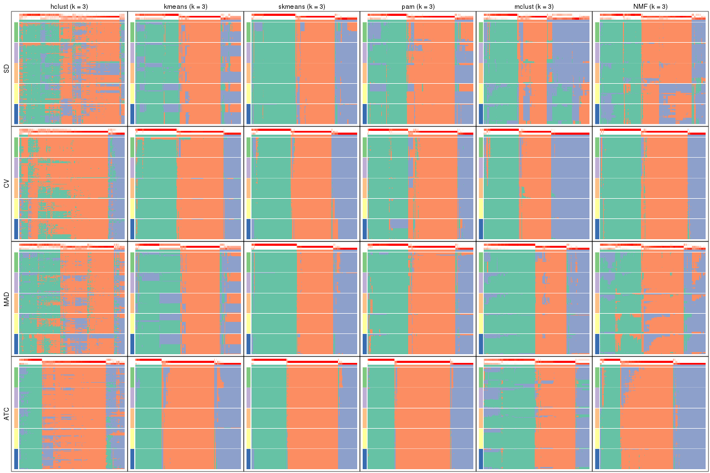</p>

</div>
<div id='tab-collect-membership-heatmap-3'>
<pre><code class="r">collect_plots(res_list, k = 4, fun = membership_heatmap, mc.cores = 4)
</code></pre>

<p></p>

</div>
<div id='tab-collect-membership-heatmap-4'>
<pre><code class="r">collect_plots(res_list, k = 5, fun = membership_heatmap, mc.cores = 4)
</code></pre>

<p></p>

</div>
<div id='tab-collect-membership-heatmap-5'>
<pre><code class="r">collect_plots(res_list, k = 6, fun = membership_heatmap, mc.cores = 4)
</code></pre>

<p></p>

</div>
</div>


### Signature heatmap

Signature heatmaps for all methods. ([What is a signature heatmap?](http://bioconductor.org/packages/devel/bioc/vignettes/cola/inst/doc/cola.html#toc_22))


Note in following heatmaps, rows are scaled.


<script>
$( function() {
	$( '#tabs-collect-get-signatures' ).tabs();
} );
</script>
<div id='tabs-collect-get-signatures'>
<ul>
<li><a href='#tab-collect-get-signatures-1'>k = 2</a></li>
<li><a href='#tab-collect-get-signatures-2'>k = 3</a></li>
<li><a href='#tab-collect-get-signatures-3'>k = 4</a></li>
<li><a href='#tab-collect-get-signatures-4'>k = 5</a></li>
<li><a href='#tab-collect-get-signatures-5'>k = 6</a></li>
</ul>
<div id='tab-collect-get-signatures-1'>
<pre><code class="r">collect_plots(res_list, k = 2, fun = get_signatures, mc.cores = 4)
</code></pre>

<p></p>

</div>
<div id='tab-collect-get-signatures-2'>
<pre><code class="r">collect_plots(res_list, k = 3, fun = get_signatures, mc.cores = 4)
</code></pre>

<p></p>

</div>
<div id='tab-collect-get-signatures-3'>
<pre><code class="r">collect_plots(res_list, k = 4, fun = get_signatures, mc.cores = 4)
</code></pre>

<p></p>

</div>
<div id='tab-collect-get-signatures-4'>
<pre><code class="r">collect_plots(res_list, k = 5, fun = get_signatures, mc.cores = 4)
</code></pre>

<p></p>

</div>
<div id='tab-collect-get-signatures-5'>
<pre><code class="r">collect_plots(res_list, k = 6, fun = get_signatures, mc.cores = 4)
</code></pre>

<p></p>

</div>
</div>


### Statistics table

The statistics used for measuring the stability of consensus partitioning.
([How are they
defined?](http://bioconductor.org/packages/devel/bioc/vignettes/cola/inst/doc/cola.html#toc_13))


<script>
$( function() {
	$( '#tabs-get-stats-from-consensus-partition-list' ).tabs();
} );
</script>
<div id='tabs-get-stats-from-consensus-partition-list'>
<ul>
<li><a href='#tab-get-stats-from-consensus-partition-list-1'>k = 2</a></li>
<li><a href='#tab-get-stats-from-consensus-partition-list-2'>k = 3</a></li>
<li><a href='#tab-get-stats-from-consensus-partition-list-3'>k = 4</a></li>
<li><a href='#tab-get-stats-from-consensus-partition-list-4'>k = 5</a></li>
<li><a href='#tab-get-stats-from-consensus-partition-list-5'>k = 6</a></li>
</ul>
<div id='tab-get-stats-from-consensus-partition-list-1'>
<pre><code class="r">get_stats(res_list, k = 2)
</code></pre>

<pre><code>#&gt;             k 1-PAC mean_silhouette concordance area_increased  Rand Jaccard
#&gt; SD:NMF      2 0.933           0.940       0.975          0.498 0.501   0.501
#&gt; CV:NMF      2 0.488           0.789       0.878          0.482 0.499   0.499
#&gt; MAD:NMF     2 0.966           0.957       0.982          0.498 0.502   0.502
#&gt; ATC:NMF     2 0.924           0.943       0.975          0.350 0.642   0.642
#&gt; SD:skmeans  2 0.983           0.960       0.984          0.501 0.500   0.500
#&gt; CV:skmeans  2 0.499           0.861       0.891          0.493 0.499   0.499
#&gt; MAD:skmeans 2 0.989           0.955       0.982          0.501 0.501   0.501
#&gt; ATC:skmeans 2 1.000           0.973       0.990          0.484 0.516   0.516
#&gt; SD:mclust   2 0.337           0.687       0.851          0.420 0.556   0.556
#&gt; CV:mclust   2 0.481           0.901       0.906          0.404 0.586   0.586
#&gt; MAD:mclust  2 0.665           0.913       0.952          0.425 0.590   0.590
#&gt; ATC:mclust  2 0.994           0.969       0.986          0.479 0.523   0.523
#&gt; SD:kmeans   2 0.961           0.949       0.976          0.497 0.501   0.501
#&gt; CV:kmeans   2 0.463           0.635       0.648          0.422 0.499   0.499
#&gt; MAD:kmeans  2 1.000           0.969       0.986          0.499 0.501   0.501
#&gt; ATC:kmeans  2 1.000           0.999       0.999          0.443 0.557   0.557
#&gt; SD:pam      2 0.854           0.918       0.965          0.484 0.512   0.512
#&gt; CV:pam      2 0.655           0.848       0.928          0.498 0.501   0.501
#&gt; MAD:pam     2 0.886           0.936       0.973          0.480 0.519   0.519
#&gt; ATC:pam     2 1.000           0.977       0.990          0.425 0.573   0.573
#&gt; SD:hclust   2 0.111           0.683       0.746          0.421 0.506   0.506
#&gt; CV:hclust   2 0.773           0.864       0.944          0.303 0.709   0.709
#&gt; MAD:hclust  2 0.285           0.760       0.836          0.449 0.508   0.508
#&gt; ATC:hclust  2 0.704           0.854       0.937          0.406 0.605   0.605
</code></pre>

</div>
<div id='tab-get-stats-from-consensus-partition-list-2'>
<pre><code class="r">get_stats(res_list, k = 3)
</code></pre>

<pre><code>#&gt;             k 1-PAC mean_silhouette concordance area_increased  Rand Jaccard
#&gt; SD:NMF      3 0.565           0.703       0.828          0.267 0.868   0.744
#&gt; CV:NMF      3 0.943           0.930       0.972          0.306 0.810   0.643
#&gt; MAD:NMF     3 0.568           0.689       0.839          0.301 0.814   0.644
#&gt; ATC:NMF     3 0.783           0.857       0.937          0.775 0.690   0.535
#&gt; SD:skmeans  3 0.867           0.860       0.934          0.294 0.818   0.649
#&gt; CV:skmeans  3 0.862           0.894       0.955          0.329 0.774   0.577
#&gt; MAD:skmeans 3 0.930           0.932       0.969          0.292 0.817   0.647
#&gt; ATC:skmeans 3 0.964           0.945       0.977          0.280 0.830   0.680
#&gt; SD:mclust   3 0.469           0.570       0.781          0.542 0.671   0.463
#&gt; CV:mclust   3 0.913           0.916       0.963          0.642 0.732   0.548
#&gt; MAD:mclust  3 0.775           0.856       0.923          0.492 0.752   0.590
#&gt; ATC:mclust  3 0.710           0.817       0.882          0.297 0.860   0.737
#&gt; SD:kmeans   3 0.610           0.710       0.819          0.278 0.828   0.668
#&gt; CV:kmeans   3 0.953           0.927       0.960          0.476 0.822   0.661
#&gt; MAD:kmeans  3 0.670           0.704       0.804          0.277 0.822   0.657
#&gt; ATC:kmeans  3 0.894           0.893       0.956          0.420 0.757   0.585
#&gt; SD:pam      3 0.655           0.796       0.859          0.283 0.814   0.653
#&gt; CV:pam      3 0.823           0.858       0.934          0.255 0.847   0.705
#&gt; MAD:pam     3 0.884           0.898       0.947          0.295 0.816   0.658
#&gt; ATC:pam     3 0.986           0.945       0.979          0.444 0.772   0.616
#&gt; SD:hclust   3 0.231           0.471       0.702          0.408 0.818   0.685
#&gt; CV:hclust   3 0.381           0.504       0.796          0.568 0.873   0.823
#&gt; MAD:hclust  3 0.327           0.539       0.735          0.330 0.861   0.738
#&gt; ATC:hclust  3 0.528           0.721       0.854          0.405 0.811   0.694
</code></pre>

</div>
<div id='tab-get-stats-from-consensus-partition-list-3'>
<pre><code class="r">get_stats(res_list, k = 4)
</code></pre>

<pre><code>#&gt;             k 1-PAC mean_silhouette concordance area_increased  Rand Jaccard
#&gt; SD:NMF      4 0.599           0.617       0.804         0.1029 0.799   0.560
#&gt; CV:NMF      4 0.689           0.697       0.846         0.1409 0.849   0.626
#&gt; MAD:NMF     4 0.714           0.790       0.871         0.1099 0.807   0.526
#&gt; ATC:NMF     4 0.776           0.809       0.907         0.1881 0.795   0.514
#&gt; SD:skmeans  4 0.787           0.752       0.873         0.1362 0.828   0.561
#&gt; CV:skmeans  4 0.744           0.689       0.823         0.1178 0.881   0.677
#&gt; MAD:skmeans 4 0.874           0.897       0.950         0.1460 0.865   0.638
#&gt; ATC:skmeans 4 0.944           0.921       0.967         0.1915 0.856   0.633
#&gt; SD:mclust   4 0.502           0.556       0.759         0.1302 0.801   0.499
#&gt; CV:mclust   4 0.646           0.682       0.813         0.0862 0.937   0.817
#&gt; MAD:mclust  4 0.797           0.902       0.909         0.1539 0.787   0.490
#&gt; ATC:mclust  4 0.718           0.731       0.857         0.1687 0.840   0.616
#&gt; SD:kmeans   4 0.710           0.746       0.847         0.1437 0.839   0.588
#&gt; CV:kmeans   4 0.703           0.497       0.729         0.1406 0.891   0.728
#&gt; MAD:kmeans  4 0.856           0.873       0.921         0.1559 0.835   0.576
#&gt; ATC:kmeans  4 0.674           0.418       0.608         0.1479 0.738   0.422
#&gt; SD:pam      4 0.795           0.846       0.919         0.1473 0.876   0.685
#&gt; CV:pam      4 0.699           0.720       0.852         0.1411 0.793   0.526
#&gt; MAD:pam     4 0.895           0.864       0.939         0.1404 0.884   0.702
#&gt; ATC:pam     4 0.893           0.890       0.953         0.2139 0.862   0.648
#&gt; SD:hclust   4 0.340           0.489       0.710         0.1290 0.818   0.627
#&gt; CV:hclust   4 0.355           0.619       0.743         0.2847 0.680   0.499
#&gt; MAD:hclust  4 0.360           0.468       0.704         0.1064 0.910   0.792
#&gt; ATC:hclust  4 0.539           0.621       0.802         0.0946 0.912   0.807
</code></pre>

</div>
<div id='tab-get-stats-from-consensus-partition-list-4'>
<pre><code class="r">get_stats(res_list, k = 5)
</code></pre>

<pre><code>#&gt;             k 1-PAC mean_silhouette concordance area_increased  Rand Jaccard
#&gt; SD:NMF      5 0.865           0.855       0.924         0.0904 0.827   0.523
#&gt; CV:NMF      5 0.795           0.771       0.895         0.0893 0.848   0.529
#&gt; MAD:NMF     5 0.824           0.831       0.910         0.0511 0.943   0.800
#&gt; ATC:NMF     5 0.726           0.713       0.857         0.0589 0.912   0.692
#&gt; SD:skmeans  5 0.793           0.812       0.888         0.0629 0.915   0.695
#&gt; CV:skmeans  5 0.764           0.760       0.860         0.0764 0.877   0.594
#&gt; MAD:skmeans 5 0.812           0.798       0.892         0.0516 0.943   0.786
#&gt; ATC:skmeans 5 0.836           0.817       0.861         0.0422 0.910   0.687
#&gt; SD:mclust   5 0.534           0.489       0.692         0.0468 0.911   0.683
#&gt; CV:mclust   5 0.640           0.532       0.745         0.0746 0.894   0.659
#&gt; MAD:mclust  5 0.601           0.524       0.719         0.0442 0.901   0.657
#&gt; ATC:mclust  5 0.731           0.797       0.866         0.0726 0.893   0.642
#&gt; SD:kmeans   5 0.722           0.705       0.830         0.0625 0.934   0.763
#&gt; CV:kmeans   5 0.681           0.660       0.782         0.0817 0.802   0.456
#&gt; MAD:kmeans  5 0.739           0.694       0.826         0.0565 0.965   0.866
#&gt; ATC:kmeans  5 0.786           0.780       0.864         0.0872 0.893   0.637
#&gt; SD:pam      5 0.747           0.775       0.863         0.0839 0.917   0.720
#&gt; CV:pam      5 0.655           0.640       0.820         0.0750 0.891   0.652
#&gt; MAD:pam     5 0.746           0.707       0.859         0.0872 0.932   0.771
#&gt; ATC:pam     5 0.830           0.802       0.915         0.0420 0.957   0.835
#&gt; SD:hclust   5 0.436           0.455       0.664         0.0679 0.957   0.870
#&gt; CV:hclust   5 0.354           0.500       0.723         0.1090 0.922   0.795
#&gt; MAD:hclust  5 0.416           0.462       0.685         0.0598 0.904   0.747
#&gt; ATC:hclust  5 0.503           0.575       0.754         0.0706 0.925   0.813
</code></pre>

</div>
<div id='tab-get-stats-from-consensus-partition-list-5'>
<pre><code class="r">get_stats(res_list, k = 6)
</code></pre>

<pre><code>#&gt;             k 1-PAC mean_silhouette concordance area_increased  Rand Jaccard
#&gt; SD:NMF      6 0.735           0.656       0.825         0.0418 0.967   0.867
#&gt; CV:NMF      6 0.743           0.659       0.826         0.0357 0.940   0.739
#&gt; MAD:NMF     6 0.714           0.637       0.817         0.0378 0.961   0.846
#&gt; ATC:NMF     6 0.664           0.584       0.776         0.0402 0.950   0.793
#&gt; SD:skmeans  6 0.773           0.658       0.829         0.0404 0.909   0.632
#&gt; CV:skmeans  6 0.759           0.716       0.828         0.0369 0.947   0.762
#&gt; MAD:skmeans 6 0.748           0.681       0.823         0.0418 0.963   0.837
#&gt; ATC:skmeans 6 0.893           0.879       0.915         0.0348 0.967   0.859
#&gt; SD:mclust   6 0.548           0.438       0.655         0.0334 0.902   0.632
#&gt; CV:mclust   6 0.645           0.532       0.738         0.0358 0.912   0.646
#&gt; MAD:mclust  6 0.665           0.716       0.799         0.0471 0.873   0.522
#&gt; ATC:mclust  6 0.709           0.613       0.750         0.0375 0.972   0.877
#&gt; SD:kmeans   6 0.713           0.573       0.760         0.0420 0.951   0.800
#&gt; CV:kmeans   6 0.698           0.602       0.754         0.0472 0.943   0.756
#&gt; MAD:kmeans  6 0.714           0.558       0.738         0.0437 0.930   0.725
#&gt; ATC:kmeans  6 0.765           0.629       0.789         0.0409 0.962   0.833
#&gt; SD:pam      6 0.737           0.486       0.702         0.0578 0.939   0.740
#&gt; CV:pam      6 0.707           0.634       0.779         0.0463 0.927   0.719
#&gt; MAD:pam     6 0.747           0.417       0.734         0.0576 0.881   0.561
#&gt; ATC:pam     6 0.836           0.786       0.884         0.0325 0.951   0.792
#&gt; SD:hclust   6 0.480           0.447       0.657         0.0408 0.958   0.864
#&gt; CV:hclust   6 0.470           0.435       0.706         0.0759 0.953   0.862
#&gt; MAD:hclust  6 0.490           0.492       0.689         0.0554 0.896   0.681
#&gt; ATC:hclust  6 0.516           0.370       0.712         0.0708 0.968   0.908
</code></pre>

</div>
</div>

Following heatmap plots the partition for each combination of methods and the
lightness correspond to the silhouette scores for samples in each method. On
top the consensus subgroup is inferred from all methods by taking the mean
silhouette scores as weight.


<script>
$( function() {
	$( '#tabs-collect-stats-from-consensus-partition-list' ).tabs();
} );
</script>
<div id='tabs-collect-stats-from-consensus-partition-list'>
<ul>
<li><a href='#tab-collect-stats-from-consensus-partition-list-1'>k = 2</a></li>
<li><a href='#tab-collect-stats-from-consensus-partition-list-2'>k = 3</a></li>
<li><a href='#tab-collect-stats-from-consensus-partition-list-3'>k = 4</a></li>
<li><a href='#tab-collect-stats-from-consensus-partition-list-4'>k = 5</a></li>
<li><a href='#tab-collect-stats-from-consensus-partition-list-5'>k = 6</a></li>
</ul>
<div id='tab-collect-stats-from-consensus-partition-list-1'>
<pre><code class="r">collect_stats(res_list, k = 2)
</code></pre>

<p></p>

</div>
<div id='tab-collect-stats-from-consensus-partition-list-2'>
<pre><code class="r">collect_stats(res_list, k = 3)
</code></pre>

<p></p>

</div>
<div id='tab-collect-stats-from-consensus-partition-list-3'>
<pre><code class="r">collect_stats(res_list, k = 4)
</code></pre>

<p></p>

</div>
<div id='tab-collect-stats-from-consensus-partition-list-4'>
<pre><code class="r">collect_stats(res_list, k = 5)
</code></pre>

<p></p>

</div>
<div id='tab-collect-stats-from-consensus-partition-list-5'>
<pre><code class="r">collect_stats(res_list, k = 6)
</code></pre>

<p></p>

</div>
</div>

### Partition from all methods


Collect partitions from all methods:


<script>
$( function() {
	$( '#tabs-collect-classes-from-consensus-partition-list' ).tabs();
} );
</script>
<div id='tabs-collect-classes-from-consensus-partition-list'>
<ul>
<li><a href='#tab-collect-classes-from-consensus-partition-list-1'>k = 2</a></li>
<li><a href='#tab-collect-classes-from-consensus-partition-list-2'>k = 3</a></li>
<li><a href='#tab-collect-classes-from-consensus-partition-list-3'>k = 4</a></li>
<li><a href='#tab-collect-classes-from-consensus-partition-list-4'>k = 5</a></li>
<li><a href='#tab-collect-classes-from-consensus-partition-list-5'>k = 6</a></li>
</ul>
<div id='tab-collect-classes-from-consensus-partition-list-1'>
<pre><code class="r">collect_classes(res_list, k = 2)
</code></pre>

<p></p>

</div>
<div id='tab-collect-classes-from-consensus-partition-list-2'>
<pre><code class="r">collect_classes(res_list, k = 3)
</code></pre>

<p></p>

</div>
<div id='tab-collect-classes-from-consensus-partition-list-3'>
<pre><code class="r">collect_classes(res_list, k = 4)
</code></pre>

<p></p>

</div>
<div id='tab-collect-classes-from-consensus-partition-list-4'>
<pre><code class="r">collect_classes(res_list, k = 5)
</code></pre>

<p></p>

</div>
<div id='tab-collect-classes-from-consensus-partition-list-5'>
<pre><code class="r">collect_classes(res_list, k = 6)
</code></pre>

<p></p>

</div>
</div>


### Top rows overlap


Overlap of top rows from different top-row methods:


<script>
$( function() {
	$( '#tabs-top-rows-overlap-by-euler' ).tabs();
} );
</script>
<div id='tabs-top-rows-overlap-by-euler'>
<ul>
<li><a href='#tab-top-rows-overlap-by-euler-1'>top_n = 1000</a></li>
<li><a href='#tab-top-rows-overlap-by-euler-2'>top_n = 2000</a></li>
<li><a href='#tab-top-rows-overlap-by-euler-3'>top_n = 3000</a></li>
<li><a href='#tab-top-rows-overlap-by-euler-4'>top_n = 4000</a></li>
<li><a href='#tab-top-rows-overlap-by-euler-5'>top_n = 5000</a></li>
</ul>
<div id='tab-top-rows-overlap-by-euler-1'>
<pre><code class="r">top_rows_overlap(res_list, top_n = 1000, method = &quot;euler&quot;)
</code></pre>

<p></p>

</div>
<div id='tab-top-rows-overlap-by-euler-2'>
<pre><code class="r">top_rows_overlap(res_list, top_n = 2000, method = &quot;euler&quot;)
</code></pre>

<p></p>

</div>
<div id='tab-top-rows-overlap-by-euler-3'>
<pre><code class="r">top_rows_overlap(res_list, top_n = 3000, method = &quot;euler&quot;)
</code></pre>

<p></p>

</div>
<div id='tab-top-rows-overlap-by-euler-4'>
<pre><code class="r">top_rows_overlap(res_list, top_n = 4000, method = &quot;euler&quot;)
</code></pre>

<p></p>

</div>
<div id='tab-top-rows-overlap-by-euler-5'>
<pre><code class="r">top_rows_overlap(res_list, top_n = 5000, method = &quot;euler&quot;)
</code></pre>

<p></p>

</div>
</div>

Also visualize the correspondance of rankings between different top-row methods:


<script>
$( function() {
	$( '#tabs-top-rows-overlap-by-correspondance' ).tabs();
} );
</script>
<div id='tabs-top-rows-overlap-by-correspondance'>
<ul>
<li><a href='#tab-top-rows-overlap-by-correspondance-1'>top_n = 1000</a></li>
<li><a href='#tab-top-rows-overlap-by-correspondance-2'>top_n = 2000</a></li>
<li><a href='#tab-top-rows-overlap-by-correspondance-3'>top_n = 3000</a></li>
<li><a href='#tab-top-rows-overlap-by-correspondance-4'>top_n = 4000</a></li>
<li><a href='#tab-top-rows-overlap-by-correspondance-5'>top_n = 5000</a></li>
</ul>
<div id='tab-top-rows-overlap-by-correspondance-1'>
<pre><code class="r">top_rows_overlap(res_list, top_n = 1000, method = &quot;correspondance&quot;)
</code></pre>

<p></p>

</div>
<div id='tab-top-rows-overlap-by-correspondance-2'>
<pre><code class="r">top_rows_overlap(res_list, top_n = 2000, method = &quot;correspondance&quot;)
</code></pre>

<p></p>

</div>
<div id='tab-top-rows-overlap-by-correspondance-3'>
<pre><code class="r">top_rows_overlap(res_list, top_n = 3000, method = &quot;correspondance&quot;)
</code></pre>

<p></p>

</div>
<div id='tab-top-rows-overlap-by-correspondance-4'>
<pre><code class="r">top_rows_overlap(res_list, top_n = 4000, method = &quot;correspondance&quot;)
</code></pre>

<p></p>

</div>
<div id='tab-top-rows-overlap-by-correspondance-5'>
<pre><code class="r">top_rows_overlap(res_list, top_n = 5000, method = &quot;correspondance&quot;)
</code></pre>

<p></p>

</div>
</div>


Heatmaps of the top rows:


<script>
$( function() {
	$( '#tabs-top-rows-heatmap' ).tabs();
} );
</script>
<div id='tabs-top-rows-heatmap'>
<ul>
<li><a href='#tab-top-rows-heatmap-1'>top_n = 1000</a></li>
<li><a href='#tab-top-rows-heatmap-2'>top_n = 2000</a></li>
<li><a href='#tab-top-rows-heatmap-3'>top_n = 3000</a></li>
<li><a href='#tab-top-rows-heatmap-4'>top_n = 4000</a></li>
<li><a href='#tab-top-rows-heatmap-5'>top_n = 5000</a></li>
</ul>
<div id='tab-top-rows-heatmap-1'>
<pre><code class="r">top_rows_heatmap(res_list, top_n = 1000)
</code></pre>

<p></p>

</div>
<div id='tab-top-rows-heatmap-2'>
<pre><code class="r">top_rows_heatmap(res_list, top_n = 2000)
</code></pre>

<p></p>

</div>
<div id='tab-top-rows-heatmap-3'>
<pre><code class="r">top_rows_heatmap(res_list, top_n = 3000)
</code></pre>

<p></p>

</div>
<div id='tab-top-rows-heatmap-4'>
<pre><code class="r">top_rows_heatmap(res_list, top_n = 4000)
</code></pre>

<p></p>

</div>
<div id='tab-top-rows-heatmap-5'>
<pre><code class="r">top_rows_heatmap(res_list, top_n = 5000)
</code></pre>

<p></p>

</div>
</div>


 
## Results for each method


---------------------------------------------------


### SD:hclust


The object with results only for a single top-value method and a single partition method 
can be extracted as:

```r
res = res_list["SD", "hclust"]
# you can also extract it by
# res = res_list["SD:hclust"]
```

A summary of `res` and all the functions that can be applied to it:

```r
res
```

```
#> A 'ConsensusPartition' object with k = 2, 3, 4, 5, 6.
#>   On a matrix with 17723 rows and 374 columns.
#>   Top rows (1000, 2000, 3000, 4000, 5000) are extracted by 'SD' method.
#>   Subgroups are detected by 'hclust' method.
#>   Performed in total 1250 partitions by row resampling.
#>   Best k for subgroups seems to be 2.
#> 
#> Following methods can be applied to this 'ConsensusPartition' object:
#>  [1] "cola_report"             "collect_classes"         "collect_plots"          
#>  [4] "collect_stats"           "colnames"                "compare_signatures"     
#>  [7] "consensus_heatmap"       "dimension_reduction"     "functional_enrichment"  
#> [10] "get_anno_col"            "get_anno"                "get_classes"            
#> [13] "get_consensus"           "get_matrix"              "get_membership"         
#> [16] "get_param"               "get_signatures"          "get_stats"              
#> [19] "is_best_k"               "is_stable_k"             "membership_heatmap"     
#> [22] "ncol"                    "nrow"                    "plot_ecdf"              
#> [25] "rownames"                "select_partition_number" "show"                   
#> [28] "suggest_best_k"          "test_to_known_factors"
```

`collect_plots()` function collects all the plots made from `res` for all `k` (number of partitions)
into one single page to provide an easy and fast comparison between different `k`.

```r
collect_plots(res)
```


The plots are:

- The first row: a plot of the ECDF (Empirical cumulative distribution
  function) curves of the consensus matrix for each `k` and the heatmap of
  predicted classes for each `k`.
- The second row: heatmaps of the consensus matrix for each `k`.
- The third row: heatmaps of the membership matrix for each `k`.
- The fouth row: heatmaps of the signatures for each `k`.

All the plots in panels can be made by individual functions and they are
plotted later in this section.

`select_partition_number()` produces several plots showing different
statistics for choosing "optimized" `k`. There are following statistics:

- ECDF curves of the consensus matrix for each `k`;
- 1-PAC. [The PAC
  score](https://en.wikipedia.org/wiki/Consensus_clustering#Over-interpretation_potential_of_consensus_clustering)
  measures the proportion of the ambiguous subgrouping.
- Mean silhouette score.
- Concordance. The mean probability of fiting the consensus class ids in all
  partitions.
- Area increased. Denote $A_k$ as the area under the ECDF curve for current
  `k`, the area increased is defined as $A_k - A_{k-1}$.
- Rand index. The percent of pairs of samples that are both in a same cluster
  or both are not in a same cluster in the partition of k and k-1.
- Jaccard index. The ratio of pairs of samples are both in a same cluster in
  the partition of k and k-1 and the pairs of samples are both in a same
  cluster in the partition k or k-1.

The detailed explanations of these statistics can be found in [the cola
vignette](http://bioconductor.org/packages/devel/bioc/vignettes/cola/inst/doc/cola.html#toc_13).

Generally speaking, lower PAC score, higher mean silhouette score or higher
concordance corresponds to better partition. Rand index and Jaccard index
measure how similar the current partition is compared to partition with `k-1`.
If they are too similar, we won't accept `k` is better than `k-1`.

```r
select_partition_number(res)
```


The numeric values for all these statistics can be obtained by `get_stats()`.

```r
get_stats(res)
```

```
#>   k 1-PAC mean_silhouette concordance area_increased  Rand Jaccard
#> 2 2 0.111           0.683       0.746         0.4213 0.506   0.506
#> 3 3 0.231           0.471       0.702         0.4081 0.818   0.685
#> 4 4 0.340           0.489       0.710         0.1290 0.818   0.627
#> 5 5 0.436           0.455       0.664         0.0679 0.957   0.870
#> 6 6 0.480           0.447       0.657         0.0408 0.958   0.864
```

`suggest_best_k()` suggests the best $k$ based on these statistics. The rules are as follows:

- All $k$ with Jaccard index larger than 0.95 are removed because the increase of
  the partition number does not provides enough extra information. If all $k$ are removed,
  the best $k$ is assigned by `NA`.
- For $k$ with 1-PAC larger than 0.9, the maximal $k$ is taken as the "best k". Other $k$ is called "optional k".
- If it does not fit the second rule. The $k$ with the highest vote of highest
  1-PAC, mean silhouette and concordance is taken as the "best k".

```r
suggest_best_k(res)
```

```
#> [1] 2
```


Following shows the table of the partitions (You need to click the **show/hide
code output** link to see it). The membership matrix (columns with name `p*`)
is inferred by
[`clue::cl_consensus()`](https://www.rdocumentation.org/link/cl_consensus?package=clue)
function with the `SE` method. Basically the value in the membership matrix
represents the probability to belong to a certain group. The finall class
label for an item is determined with the group with highest probability it
belongs to.

In `get_classes()` function, the entropy is calculated from the membership
matrix and the silhouette score is calculated from the consensus matrix.


<script>
$( function() {
	$( '#tabs-SD-hclust-get-classes' ).tabs();
} );
</script>
<div id='tabs-SD-hclust-get-classes'>
<ul>
<li><a href='#tab-SD-hclust-get-classes-1'>k = 2</a></li>
<li><a href='#tab-SD-hclust-get-classes-2'>k = 3</a></li>
<li><a href='#tab-SD-hclust-get-classes-3'>k = 4</a></li>
<li><a href='#tab-SD-hclust-get-classes-4'>k = 5</a></li>
<li><a href='#tab-SD-hclust-get-classes-5'>k = 6</a></li>
</ul>

<div id='tab-SD-hclust-get-classes-1'>
<p><a id='tab-SD-hclust-get-classes-1-a' style='color:#0366d6' href='#'>show/hide code output</a></p>
<pre><code class="r">cbind(get_classes(res, k = 2), get_membership(res, k = 2))
</code></pre>

<pre><code>#&gt;            class entropy silhouette    p1    p2
#&gt; SRR660824      1  0.7745    0.78103 0.772 0.228
#&gt; SRR603858      1  0.8661    0.72240 0.712 0.288
#&gt; SRR817070      2  0.3733    0.78256 0.072 0.928
#&gt; SRR1486995     1  0.7219    0.76917 0.800 0.200
#&gt; SRR813043      2  0.7453    0.77604 0.212 0.788
#&gt; SRR656874      2  0.6531    0.79543 0.168 0.832
#&gt; SRR659037      2  0.9635    0.37880 0.388 0.612
#&gt; SRR662031      1  0.5842    0.78290 0.860 0.140
#&gt; SRR1081283     2  0.2236    0.76001 0.036 0.964
#&gt; SRR1481036     1  0.9608    0.60725 0.616 0.384
#&gt; SRR1434009     2  0.9993    0.24912 0.484 0.516
#&gt; SRR1376676     1  0.5408    0.78081 0.876 0.124
#&gt; SRR1396967     2  0.9491    0.60224 0.368 0.632
#&gt; SRR665429      2  0.6531    0.79543 0.168 0.832
#&gt; SRR1388025     2  0.0376    0.73276 0.004 0.996
#&gt; SRR600784      1  0.8267    0.75719 0.740 0.260
#&gt; SRR657611      1  0.8555    0.75929 0.720 0.280
#&gt; SRR1333659     1  0.9954    0.10785 0.540 0.460
#&gt; SRR1323896     2  0.6247    0.79713 0.156 0.844
#&gt; SRR1453971     1  0.9044    0.60371 0.680 0.320
#&gt; SRR1421010     1  0.3584    0.74925 0.932 0.068
#&gt; SRR1334490     1  0.7056    0.69659 0.808 0.192
#&gt; SRR1309468     1  0.5408    0.78136 0.876 0.124
#&gt; SRR1468637     2  0.9993    0.14038 0.484 0.516
#&gt; SRR1365489     2  0.7376    0.77865 0.208 0.792
#&gt; SRR627445      1  0.9129    0.67290 0.672 0.328
#&gt; SRR607863      2  0.6623    0.79318 0.172 0.828
#&gt; SRR1475524     1  0.0376    0.69729 0.996 0.004
#&gt; SRR1405504     2  0.6247    0.79713 0.156 0.844
#&gt; SRR615695      1  0.5946    0.78334 0.856 0.144
#&gt; SRR600900      2  0.5629    0.79304 0.132 0.868
#&gt; SRR601477      2  0.7376    0.77865 0.208 0.792
#&gt; SRR1487215     2  0.7376    0.77865 0.208 0.792
#&gt; SRR1310797     2  0.7528    0.77637 0.216 0.784
#&gt; SRR1362713     2  0.9970   -0.12132 0.468 0.532
#&gt; SRR1431385     1  0.5294    0.77933 0.880 0.120
#&gt; SRR1379089     2  0.7453    0.77604 0.212 0.788
#&gt; SRR1102079     1  0.9170    0.59759 0.668 0.332
#&gt; SRR1357210     1  0.6048    0.79095 0.852 0.148
#&gt; SRR657659      2  0.3733    0.78256 0.072 0.928
#&gt; SRR663573      2  0.4022    0.78059 0.080 0.920
#&gt; SRR603188      2  0.7602    0.78005 0.220 0.780
#&gt; SRR1471200     2  0.7528    0.77495 0.216 0.784
#&gt; SRR1310975     2  0.7299    0.78145 0.204 0.796
#&gt; SRR627457      1  0.8499    0.69510 0.724 0.276
#&gt; SRR1367654     2  0.9795    0.48962 0.416 0.584
#&gt; SRR1488410     1  0.1184    0.70349 0.984 0.016
#&gt; SRR1457750     2  0.9896    0.06106 0.440 0.560
#&gt; SRR1099546     1  0.6531    0.79438 0.832 0.168
#&gt; SRR604480      2  0.7139    0.78713 0.196 0.804
#&gt; SRR1390477     2  0.7453    0.77604 0.212 0.788
#&gt; SRR1458447     2  0.7139    0.78713 0.196 0.804
#&gt; SRR1473161     2  0.4690    0.79457 0.100 0.900
#&gt; SRR1409813     1  1.0000   -0.20986 0.504 0.496
#&gt; SRR612791      1  0.5842    0.78971 0.860 0.140
#&gt; SRR1470580     2  0.9933    0.12994 0.452 0.548
#&gt; SRR1444063     1  0.9909    0.25788 0.556 0.444
#&gt; SRR1355578     1  0.9977    0.33796 0.528 0.472
#&gt; SRR1429203     1  0.5408    0.78081 0.876 0.124
#&gt; SRR599154      2  1.0000    0.21290 0.496 0.504
#&gt; SRR814244      1  0.6623    0.66447 0.828 0.172
#&gt; SRR1404123     2  0.3733    0.78256 0.072 0.928
#&gt; SRR656934      1  0.9732    0.57113 0.596 0.404
#&gt; SRR1339029     2  0.7056    0.78909 0.192 0.808
#&gt; SRR821525      2  0.0376    0.73276 0.004 0.996
#&gt; SRR1443677     1  0.5737    0.78422 0.864 0.136
#&gt; SRR1406330     1  0.1414    0.70875 0.980 0.020
#&gt; SRR1338124     2  0.7219    0.75824 0.200 0.800
#&gt; SRR1391376     1  0.8016    0.76815 0.756 0.244
#&gt; SRR661842      2  0.0376    0.73276 0.004 0.996
#&gt; SRR1395699     1  0.7219    0.77133 0.800 0.200
#&gt; SRR1312209     1  0.7376    0.78689 0.792 0.208
#&gt; SRR1359469     1  0.5408    0.78081 0.876 0.124
#&gt; SRR658885      1  0.8081    0.63106 0.752 0.248
#&gt; SRR1414578     1  0.6048    0.78482 0.852 0.148
#&gt; SRR603620      2  0.8144    0.66348 0.252 0.748
#&gt; SRR604677      1  0.7883    0.77958 0.764 0.236
#&gt; SRR603800      2  0.7376    0.77940 0.208 0.792
#&gt; SRR602058      2  0.4298    0.75099 0.088 0.912
#&gt; SRR817488      2  0.7299    0.78217 0.204 0.796
#&gt; SRR655601      2  0.3733    0.78256 0.072 0.928
#&gt; SRR1434821     2  0.7528    0.77637 0.216 0.784
#&gt; SRR1349166     2  0.9795    0.48962 0.416 0.584
#&gt; SRR615129      2  0.9833    0.11216 0.424 0.576
#&gt; SRR607586      2  0.7139    0.78713 0.196 0.804
#&gt; SRR602680      2  0.8081    0.76148 0.248 0.752
#&gt; SRR1411070     2  0.2236    0.76001 0.036 0.964
#&gt; SRR663038      2  0.6531    0.79543 0.168 0.832
#&gt; SRR1489416     2  0.5842    0.79840 0.140 0.860
#&gt; SRR1479155     1  0.5629    0.78263 0.868 0.132
#&gt; SRR662162      1  0.5408    0.78136 0.876 0.124
#&gt; SRR1374567     1  0.8016    0.76932 0.756 0.244
#&gt; SRR1434048     2  0.7299    0.78145 0.204 0.796
#&gt; SRR2184865     2  0.2603    0.73577 0.044 0.956
#&gt; SRR2170135     1  0.5408    0.78136 0.876 0.124
#&gt; SRR615551      2  0.7376    0.77865 0.208 0.792
#&gt; SRR1335513     2  0.3733    0.78256 0.072 0.928
#&gt; SRR1370216     1  0.7056    0.69659 0.808 0.192
#&gt; SRR662954      2  0.8207    0.58119 0.256 0.744
#&gt; SRR1375738     1  0.8327    0.75736 0.736 0.264
#&gt; SRR1356577     2  0.7219    0.61216 0.200 0.800
#&gt; SRR1073119     1  0.8713    0.73778 0.708 0.292
#&gt; SRR663549      1  0.8327    0.75736 0.736 0.264
#&gt; SRR1478015     2  0.6343    0.79677 0.160 0.840
#&gt; SRR600632      2  0.3274    0.76493 0.060 0.940
#&gt; SRR811866      2  0.9896   -0.11533 0.440 0.560
#&gt; SRR1401101     2  0.7453    0.78022 0.212 0.788
#&gt; SRR1477797     2  0.4939    0.71001 0.108 0.892
#&gt; SRR1402986     2  0.7376    0.77865 0.208 0.792
#&gt; SRR658897      2  0.9833    0.11216 0.424 0.576
#&gt; SRR1419869     1  0.7815    0.77574 0.768 0.232
#&gt; SRR1490700     2  0.8555    0.55176 0.280 0.720
#&gt; SRR601723      2  0.7056    0.69627 0.192 0.808
#&gt; SRR1384115     1  0.9933    0.03942 0.548 0.452
#&gt; SRR1476927     2  0.5842    0.79840 0.140 0.860
#&gt; SRR1387769     1  0.8327    0.75736 0.736 0.264
#&gt; SRR1322595     1  0.9552    0.39888 0.624 0.376
#&gt; SRR1370423     2  0.9580    0.41700 0.380 0.620
#&gt; SRR1314976     2  0.9044    0.41245 0.320 0.680
#&gt; SRR1319560     2  0.8144    0.66348 0.252 0.748
#&gt; SRR1352683     2  0.7602    0.65022 0.220 0.780
#&gt; SRR1473800     1  0.5408    0.78081 0.876 0.124
#&gt; SRR1326384     1  0.9170    0.59759 0.668 0.332
#&gt; SRR1360807     2  0.3431    0.72834 0.064 0.936
#&gt; SRR1332544     1  0.2603    0.71191 0.956 0.044
#&gt; SRR598695      1  0.6247    0.78313 0.844 0.156
#&gt; SRR807824      2  0.7674    0.77157 0.224 0.776
#&gt; SRR809296      1  0.6148    0.74081 0.848 0.152
#&gt; SRR657927      1  0.7745    0.78103 0.772 0.228
#&gt; SRR1440682     2  0.5408    0.79266 0.124 0.876
#&gt; SRR1454415     2  0.6247    0.79637 0.156 0.844
#&gt; SRR1419131     2  0.0672    0.73327 0.008 0.992
#&gt; SRR1404293     1  0.9983    0.32962 0.524 0.476
#&gt; SRR1473340     1  0.5842    0.78971 0.860 0.140
#&gt; SRR1345563     1  0.0672    0.69829 0.992 0.008
#&gt; SRR1323382     2  0.7376    0.77865 0.208 0.792
#&gt; SRR1480697     2  0.9970    0.14704 0.468 0.532
#&gt; SRR1321808     2  0.7376    0.77865 0.208 0.792
#&gt; SRR1382756     2  0.5294    0.79407 0.120 0.880
#&gt; SRR1312558     2  0.8713    0.67770 0.292 0.708
#&gt; SRR1417088     2  0.1633    0.75347 0.024 0.976
#&gt; SRR1433027     2  0.4690    0.79335 0.100 0.900
#&gt; SRR662257      2  0.5519    0.71944 0.128 0.872
#&gt; SRR600417      2  0.0376    0.73276 0.004 0.996
#&gt; SRR812493      2  0.5842    0.69867 0.140 0.860
#&gt; SRR612743      1  0.8713    0.73778 0.708 0.292
#&gt; SRR1361345     2  0.9323    0.30587 0.348 0.652
#&gt; SRR600584      2  0.3733    0.78256 0.072 0.928
#&gt; SRR1310520     2  0.2603    0.73577 0.044 0.956
#&gt; SRR1395595     1  0.8144    0.63120 0.748 0.252
#&gt; SRR1334074     1  0.8016    0.64571 0.756 0.244
#&gt; SRR654838      2  0.7139    0.78631 0.196 0.804
#&gt; SRR1376694     1  0.0376    0.69729 0.996 0.004
#&gt; SRR1433841     1  0.9909    0.25788 0.556 0.444
#&gt; SRR1366837     1  0.9323    0.66722 0.652 0.348
#&gt; SRR1467479     2  0.7376    0.77865 0.208 0.792
#&gt; SRR1459055     1  0.1184    0.70349 0.984 0.016
#&gt; SRR1471050     2  0.7299    0.78145 0.204 0.796
#&gt; SRR603004      2  0.8608    0.71252 0.284 0.716
#&gt; SRR814703      2  0.7453    0.77960 0.212 0.788
#&gt; SRR661937      2  0.3879    0.78334 0.076 0.924
#&gt; SRR614359      1  0.5842    0.78971 0.860 0.140
#&gt; SRR1071568     2  0.5294    0.79407 0.120 0.880
#&gt; SRR1389084     1  0.7745    0.77393 0.772 0.228
#&gt; SRR1337624     2  0.3274    0.76493 0.060 0.940
#&gt; SRR1344400     2  0.7453    0.77960 0.212 0.788
#&gt; SRR1414290     2  0.7376    0.77865 0.208 0.792
#&gt; SRR1413644     2  0.9795    0.48962 0.416 0.584
#&gt; SRR1098998     1  0.5294    0.77933 0.880 0.120
#&gt; SRR1481279     1  0.6343    0.79434 0.840 0.160
#&gt; SRR1315103     1  0.1184    0.70349 0.984 0.016
#&gt; SRR1099286     1  0.7139    0.78810 0.804 0.196
#&gt; SRR2166570     2  0.4690    0.77901 0.100 0.900
#&gt; SRR601445      1  0.8386    0.76348 0.732 0.268
#&gt; SRR1439719     2  0.4690    0.79335 0.100 0.900
#&gt; SRR1377026     2  0.5842    0.79410 0.140 0.860
#&gt; SRR1327386     1  0.6531    0.77699 0.832 0.168
#&gt; SRR654826      2  0.7299    0.78282 0.204 0.796
#&gt; SRR1460433     2  0.4161    0.73523 0.084 0.916
#&gt; SRR1469345     1  0.5178    0.77573 0.884 0.116
#&gt; SRR1421462     2  0.7056    0.78807 0.192 0.808
#&gt; SRR662966      1  0.7815    0.66468 0.768 0.232
#&gt; SRR1339175     1  0.5842    0.78971 0.860 0.140
#&gt; SRR1447736     2  0.7376    0.77865 0.208 0.792
#&gt; SRR1434671     2  0.8327    0.75075 0.264 0.736
#&gt; SRR660800      2  0.7139    0.78739 0.196 0.804
#&gt; SRR1465543     1  0.9710    0.23968 0.600 0.400
#&gt; SRR1342023     1  0.6712    0.79229 0.824 0.176
#&gt; SRR1335670     1  0.8661    0.75130 0.712 0.288
#&gt; SRR1400955     2  0.7453    0.78022 0.212 0.788
#&gt; SRR1072150     2  0.7376    0.77865 0.208 0.792
#&gt; SRR1442822     1  0.5294    0.77933 0.880 0.120
#&gt; SRR1364658     1  0.5842    0.78971 0.860 0.140
#&gt; SRR1098074     1  0.9661    0.27461 0.608 0.392
#&gt; SRR1442778     1  0.6531    0.79147 0.832 0.168
#&gt; SRR1086728     1  0.9580    0.29329 0.620 0.380
#&gt; SRR627464      1  0.8499    0.69510 0.724 0.276
#&gt; SRR1409193     2  0.9427    0.34360 0.360 0.640
#&gt; SRR2168286     2  0.3431    0.73944 0.064 0.936
#&gt; SRR615539      2  0.4431    0.79196 0.092 0.908
#&gt; SRR663623      1  0.8081    0.76854 0.752 0.248
#&gt; SRR1471989     1  0.7453    0.67555 0.788 0.212
#&gt; SRR1468828     2  0.3274    0.76493 0.060 0.940
#&gt; SRR1381934     1  0.8608    0.75553 0.716 0.284
#&gt; SRR1471098     1  0.7950    0.76895 0.760 0.240
#&gt; SRR1314749     1  0.9358    0.65658 0.648 0.352
#&gt; SRR2166874     2  0.9000    0.55805 0.316 0.684
#&gt; SRR821302      1  0.6438    0.79134 0.836 0.164
#&gt; SRR1435066     2  0.7528    0.77729 0.216 0.784
#&gt; SRR661601      2  0.8016    0.76270 0.244 0.756
#&gt; SRR1446546     2  0.6048    0.78620 0.148 0.852
#&gt; SRR1419784     1  0.8016    0.64571 0.756 0.244
#&gt; SRR1357233     2  0.7815    0.67914 0.232 0.768
#&gt; SRR1441889     1  0.5408    0.78136 0.876 0.124
#&gt; SRR1413940     1  0.1184    0.70349 0.984 0.016
#&gt; SRR1324250     2  0.5178    0.79387 0.116 0.884
#&gt; SRR1442862     1  0.9970   -0.04341 0.532 0.468
#&gt; SRR662474      2  0.4431    0.79196 0.092 0.908
#&gt; SRR1416226     1  0.9522    0.62809 0.628 0.372
#&gt; SRR1417404     2  0.8207    0.54549 0.256 0.744
#&gt; SRR665466      2  0.4562    0.79197 0.096 0.904
#&gt; SRR658849      1  0.7745    0.77393 0.772 0.228
#&gt; SRR1460025     2  0.5294    0.79407 0.120 0.880
#&gt; SRR1408136     1  0.5408    0.78163 0.876 0.124
#&gt; SRR1489995     2  0.7299    0.78145 0.204 0.796
#&gt; SRR1374092     1  0.9608    0.60725 0.616 0.384
#&gt; SRR1488429     1  0.8955    0.59436 0.688 0.312
#&gt; SRR1087559     2  0.8499    0.61176 0.276 0.724
#&gt; SRR817004      1  0.9954    0.11564 0.540 0.460
#&gt; SRR1429660     2  0.9522    0.60366 0.372 0.628
#&gt; SRR604390      2  0.9988    0.16581 0.480 0.520
#&gt; SRR614936      2  0.3274    0.76493 0.060 0.940
#&gt; SRR1365938     2  0.9866    0.05699 0.432 0.568
#&gt; SRR1437324     1  0.5946    0.78334 0.856 0.144
#&gt; SRR613414      2  0.6343    0.75309 0.160 0.840
#&gt; SRR660414      2  0.4690    0.77901 0.100 0.900
#&gt; SRR1452185     1  0.5408    0.78081 0.876 0.124
#&gt; SRR1347020     1  0.8327    0.76649 0.736 0.264
#&gt; SRR1398036     2  0.4939    0.71001 0.108 0.892
#&gt; SRR1436674     1  0.7674    0.77727 0.776 0.224
#&gt; SRR603750      1  0.9129    0.67290 0.672 0.328
#&gt; SRR608630      2  0.8207    0.58119 0.256 0.744
#&gt; SRR655625      2  0.0376    0.73276 0.004 0.996
#&gt; SRR599059      2  0.8661    0.69393 0.288 0.712
#&gt; SRR615189      2  0.9881    0.24141 0.436 0.564
#&gt; SRR1466889     2  0.7815    0.75953 0.232 0.768
#&gt; SRR1084602     2  0.3431    0.72834 0.064 0.936
#&gt; SRR1335422     1  0.6048    0.78929 0.852 0.148
#&gt; SRR1356805     2  0.7950    0.75230 0.240 0.760
#&gt; SRR1385300     1  0.8081    0.69684 0.752 0.248
#&gt; SRR654814      1  0.6148    0.78067 0.848 0.152
#&gt; SRR658385      2  0.7528    0.77729 0.216 0.784
#&gt; SRR820596      1  0.8713    0.73778 0.708 0.292
#&gt; SRR1318118     1  0.8443    0.76009 0.728 0.272
#&gt; SRR1480766     2  0.4431    0.79186 0.092 0.908
#&gt; SRR1406539     1  0.7528    0.78684 0.784 0.216
#&gt; SRR1341833     2  0.7745    0.77887 0.228 0.772
#&gt; SRR1441826     2  0.0376    0.73276 0.004 0.996
#&gt; SRR1448051     1  0.6148    0.78067 0.848 0.152
#&gt; SRR1326752     1  0.6801    0.77775 0.820 0.180
#&gt; SRR665217      1  0.9896    0.30666 0.560 0.440
#&gt; SRR819186      2  0.7376    0.77940 0.208 0.792
#&gt; SRR661517      1  0.7219    0.76917 0.800 0.200
#&gt; SRR607166      2  0.7528    0.78014 0.216 0.784
#&gt; SRR809065      2  0.3584    0.77800 0.068 0.932
#&gt; SRR1415872     2  0.6801    0.79684 0.180 0.820
#&gt; SRR1415463     1  0.9358    0.65658 0.648 0.352
#&gt; SRR1381161     2  0.5294    0.70042 0.120 0.880
#&gt; SRR1442231     2  0.9896    0.06106 0.440 0.560
#&gt; SRR1374696     1  0.9866    0.46378 0.568 0.432
#&gt; SRR1451988     2  0.9944    0.01698 0.456 0.544
#&gt; SRR660555      1  0.6247    0.78313 0.844 0.156
#&gt; SRR657801      1  0.5629    0.78372 0.868 0.132
#&gt; SRR663344      2  0.7674    0.76929 0.224 0.776
#&gt; SRR1472462     2  0.6623    0.79487 0.172 0.828
#&gt; SRR1406176     2  0.9815    0.19573 0.420 0.580
#&gt; SRR656886      2  0.5294    0.79407 0.120 0.880
#&gt; SRR1498337     2  0.4939    0.71001 0.108 0.892
#&gt; SRR613066      1  0.2603    0.71191 0.956 0.044
#&gt; SRR1309490     1  0.5408    0.78163 0.876 0.124
#&gt; SRR602492      2  0.4939    0.71001 0.108 0.892
#&gt; SRR1447347     1  0.8267    0.76915 0.740 0.260
#&gt; SRR1475546     2  0.6801    0.79211 0.180 0.820
#&gt; SRR627459      2  0.7056    0.69627 0.192 0.808
#&gt; SRR1434332     2  0.4431    0.79186 0.092 0.908
#&gt; SRR1070358     2  0.7219    0.77689 0.200 0.800
#&gt; SRR1345936     2  0.8081    0.61417 0.248 0.752
#&gt; SRR665658      2  0.7528    0.77840 0.216 0.784
#&gt; SRR1321351     2  0.3733    0.78256 0.072 0.928
#&gt; SRR657880      2  0.8144    0.75376 0.252 0.748
#&gt; SRR1373903     2  0.5059    0.79643 0.112 0.888
#&gt; SRR657396      2  0.8144    0.66348 0.252 0.748
#&gt; SRR660981      2  0.5842    0.79840 0.140 0.860
#&gt; SRR818499      1  0.6247    0.78313 0.844 0.156
#&gt; SRR819658      2  0.7453    0.78022 0.212 0.788
#&gt; SRR1376316     1  0.5737    0.78349 0.864 0.136
#&gt; SRR1323723     2  0.7376    0.77865 0.208 0.792
#&gt; SRR1476719     1  0.8327    0.76408 0.736 0.264
#&gt; SRR1403478     2  0.7528    0.77729 0.216 0.784
#&gt; SRR1095695     1  0.8327    0.75180 0.736 0.264
#&gt; SRR1352391     2  0.8763    0.51738 0.296 0.704
#&gt; SRR1498813     2  0.0376    0.73276 0.004 0.996
#&gt; SRR627437      2  0.7056    0.69627 0.192 0.808
#&gt; SRR2185097     1  0.5842    0.78290 0.860 0.140
#&gt; SRR817166      1  0.9996   -0.00594 0.512 0.488
#&gt; SRR1091670     2  0.7376    0.77865 0.208 0.792
#&gt; SRR603776      1  0.8267    0.74986 0.740 0.260
#&gt; SRR1479640     2  0.5946    0.79772 0.144 0.856
#&gt; SRR660152      1  0.6973    0.78043 0.812 0.188
#&gt; SRR1074769     2  0.7376    0.77865 0.208 0.792
#&gt; SRR656153      2  0.4690    0.79310 0.100 0.900
#&gt; SRR1392502     1  0.8327    0.62204 0.736 0.264
#&gt; SRR1359609     1  0.0672    0.69829 0.992 0.008
#&gt; SRR601925      2  0.7602    0.77147 0.220 0.780
#&gt; SRR2165182     2  0.6531    0.79543 0.168 0.832
#&gt; SRR608542      2  0.5519    0.71696 0.128 0.872
#&gt; SRR655064      2  0.2603    0.73577 0.044 0.956
#&gt; SRR1432430     1  0.8909    0.69355 0.692 0.308
#&gt; SRR808472      2  0.4022    0.78108 0.080 0.920
#&gt; SRR1414958     1  0.7453    0.67555 0.788 0.212
#&gt; SRR598484      2  0.6048    0.78620 0.148 0.852
#&gt; SRR612755      1  0.7745    0.78103 0.772 0.228
#&gt; SRR1365808     1  0.5408    0.78081 0.876 0.124
#&gt; SRR1391724     2  0.7056    0.69627 0.192 0.808
#&gt; SRR1322373     1  0.7745    0.77393 0.772 0.228
#&gt; SRR1489265     2  0.6973    0.78999 0.188 0.812
#&gt; SRR1359099     2  0.7528    0.77729 0.216 0.784
#&gt; SRR607279      2  0.6247    0.79713 0.156 0.844
#&gt; SRR810461      2  0.7299    0.78217 0.204 0.796
#&gt; SRR627427      1  0.8499    0.69510 0.724 0.276
#&gt; SRR612887      2  0.6801    0.79620 0.180 0.820
#&gt; SRR809807      1  0.9522    0.35462 0.628 0.372
#&gt; SRR663112      2  0.7299    0.75375 0.204 0.796
#&gt; SRR1346933     2  0.9000    0.55805 0.316 0.684
#&gt; SRR1487910     1  0.8081    0.75649 0.752 0.248
#&gt; SRR603092      2  0.2236    0.76001 0.036 0.964
#&gt; SRR1417680     2  0.4431    0.79085 0.092 0.908
#&gt; SRR1383785     1  0.6438    0.79162 0.836 0.164
#&gt; SRR1070015     1  0.9710    0.23968 0.600 0.400
#&gt; SRR1466222     2  0.9460    0.46700 0.364 0.636
#&gt; SRR1416119     1  0.7056    0.69659 0.808 0.192
#&gt; SRR819318      1  0.7883    0.77958 0.764 0.236
#&gt; SRR608288      2  0.7376    0.77865 0.208 0.792
#&gt; SRR811121      2  1.0000    0.21290 0.496 0.504
#&gt; SRR613138      2  0.7299    0.78145 0.204 0.796
#&gt; SRR810483      1  0.8327    0.75736 0.736 0.264
#&gt; SRR607839      1  0.5408    0.78081 0.876 0.124
#&gt; SRR1337031     1  0.5178    0.78199 0.884 0.116
#&gt; SRR601311      2  0.0376    0.73276 0.004 0.996
#&gt; SRR1406685     2  0.1184    0.74407 0.016 0.984
#&gt; SRR1467500     2  0.1414    0.74699 0.020 0.980
#&gt; SRR1308504     1  0.5408    0.78136 0.876 0.124
#&gt; SRR1312865     1  0.9427    0.52231 0.640 0.360
#&gt; SRR1312522     1  0.6712    0.77373 0.824 0.176
#&gt; SRR1490486     2  0.7376    0.78296 0.208 0.792
#&gt; SRR1325888     1  0.8081    0.76300 0.752 0.248
#&gt; SRR1472885     1  0.5294    0.77933 0.880 0.120
#&gt; SRR1098785     2  0.1633    0.75035 0.024 0.976
#&gt; SRR1084766     2  0.3431    0.73944 0.064 0.936
#&gt; SRR1102804     2  0.7139    0.78731 0.196 0.804
#&gt; SRR1336636     1  0.8713    0.73778 0.708 0.292
#&gt; SRR1347795     1  0.2603    0.71191 0.956 0.044
#&gt; SRR601900      2  0.8081    0.76148 0.248 0.752
#&gt; SRR1330989     2  0.4298    0.78059 0.088 0.912
#&gt; SRR658445      1  0.9710    0.23968 0.600 0.400
#&gt; SRR1368754     1  0.9000    0.68542 0.684 0.316
#&gt; SRR1460001     2  0.7376    0.77865 0.208 0.792
#&gt; SRR1414934     1  0.5408    0.78081 0.876 0.124
#&gt; SRR1326249     1  0.6343    0.75579 0.840 0.160
#&gt; SRR614948      1  0.0672    0.69829 0.992 0.008
#&gt; SRR1472952     1  0.8016    0.76932 0.756 0.244
#&gt; SRR1321528     1  0.8144    0.75948 0.748 0.252
#&gt; SRR627447      1  0.8267    0.75719 0.740 0.260
#&gt; SRR612239      2  0.7056    0.69627 0.192 0.808
</code></pre>

<script>
$('#tab-SD-hclust-get-classes-1-a').parent().next().next().hide();
$('#tab-SD-hclust-get-classes-1-a').click(function(){
  $('#tab-SD-hclust-get-classes-1-a').parent().next().next().toggle();
  return(false);
});
</script>
</div>

<div id='tab-SD-hclust-get-classes-2'>
<p><a id='tab-SD-hclust-get-classes-2-a' style='color:#0366d6' href='#'>show/hide code output</a></p>
<pre><code class="r">cbind(get_classes(res, k = 3), get_membership(res, k = 3))
</code></pre>

<pre><code>#&gt;            class entropy silhouette    p1    p2    p3
#&gt; SRR660824      1  0.6775    0.64705 0.740 0.164 0.096
#&gt; SRR603858      1  0.8472    0.48706 0.612 0.228 0.160
#&gt; SRR817070      2  0.5269    0.62653 0.016 0.784 0.200
#&gt; SRR1486995     1  0.8977    0.36389 0.560 0.188 0.252
#&gt; SRR813043      2  0.1129    0.65530 0.020 0.976 0.004
#&gt; SRR656874      2  0.2492    0.66664 0.016 0.936 0.048
#&gt; SRR659037      2  0.8892    0.15120 0.120 0.444 0.436
#&gt; SRR662031      1  0.3722    0.68416 0.888 0.088 0.024
#&gt; SRR1081283     2  0.6597    0.53251 0.024 0.664 0.312
#&gt; SRR1481036     1  0.8386    0.48922 0.620 0.224 0.156
#&gt; SRR1434009     2  0.7600    0.10063 0.060 0.612 0.328
#&gt; SRR1376676     1  0.2492    0.66513 0.936 0.048 0.016
#&gt; SRR1396967     2  0.6781    0.47675 0.052 0.704 0.244
#&gt; SRR665429      2  0.2492    0.66664 0.016 0.936 0.048
#&gt; SRR1388025     2  0.7372    0.38156 0.032 0.520 0.448
#&gt; SRR600784      1  0.7431    0.59990 0.696 0.188 0.116
#&gt; SRR657611      1  0.6425    0.64781 0.764 0.140 0.096
#&gt; SRR1333659     2  0.9113   -0.02324 0.172 0.528 0.300
#&gt; SRR1323896     2  0.3528    0.66493 0.016 0.892 0.092
#&gt; SRR1453971     2  0.9920   -0.48033 0.332 0.388 0.280
#&gt; SRR1421010     1  0.4618    0.58500 0.840 0.024 0.136
#&gt; SRR1334490     3  0.9863    0.37951 0.340 0.260 0.400
#&gt; SRR1309468     1  0.1878    0.66858 0.952 0.044 0.004
#&gt; SRR1468637     2  0.9811   -0.05994 0.244 0.404 0.352
#&gt; SRR1365489     2  0.0983    0.65686 0.016 0.980 0.004
#&gt; SRR627445      1  0.8762    0.41454 0.576 0.264 0.160
#&gt; SRR607863      2  0.4953    0.65633 0.016 0.808 0.176
#&gt; SRR1475524     1  0.5291    0.41526 0.732 0.000 0.268
#&gt; SRR1405504     2  0.3528    0.66493 0.016 0.892 0.092
#&gt; SRR615695      1  0.3213    0.66007 0.912 0.060 0.028
#&gt; SRR600900      2  0.6245    0.60624 0.060 0.760 0.180
#&gt; SRR601477      2  0.0983    0.65686 0.016 0.980 0.004
#&gt; SRR1487215     2  0.0983    0.65686 0.016 0.980 0.004
#&gt; SRR1310797     2  0.2176    0.65967 0.020 0.948 0.032
#&gt; SRR1362713     1  0.9438    0.10247 0.504 0.252 0.244
#&gt; SRR1431385     1  0.2383    0.66423 0.940 0.044 0.016
#&gt; SRR1379089     2  0.1129    0.65530 0.020 0.976 0.004
#&gt; SRR1102079     2  0.9990   -0.57317 0.312 0.348 0.340
#&gt; SRR1357210     1  0.2982    0.67831 0.920 0.056 0.024
#&gt; SRR657659      2  0.5269    0.62653 0.016 0.784 0.200
#&gt; SRR663573      2  0.7181    0.52676 0.048 0.648 0.304
#&gt; SRR603188      2  0.4390    0.64973 0.012 0.840 0.148
#&gt; SRR1471200     2  0.1482    0.65717 0.020 0.968 0.012
#&gt; SRR1310975     2  0.1170    0.65868 0.016 0.976 0.008
#&gt; SRR627457      1  0.6523    0.54329 0.724 0.228 0.048
#&gt; SRR1367654     2  0.6588    0.42300 0.060 0.732 0.208
#&gt; SRR1488410     1  0.5690    0.39726 0.708 0.004 0.288
#&gt; SRR1457750     1  0.9445    0.00261 0.472 0.336 0.192
#&gt; SRR1099546     1  0.6783    0.63783 0.744 0.140 0.116
#&gt; SRR604480      2  0.1482    0.66184 0.020 0.968 0.012
#&gt; SRR1390477     2  0.1129    0.65530 0.020 0.976 0.004
#&gt; SRR1458447     2  0.1482    0.66184 0.020 0.968 0.012
#&gt; SRR1473161     2  0.4575    0.64754 0.012 0.828 0.160
#&gt; SRR1409813     2  0.7705    0.04703 0.060 0.592 0.348
#&gt; SRR612791      1  0.3370    0.67989 0.904 0.072 0.024
#&gt; SRR1470580     2  0.8242   -0.02051 0.336 0.572 0.092
#&gt; SRR1444063     2  0.7841   -0.12718 0.468 0.480 0.052
#&gt; SRR1355578     1  0.8911    0.26376 0.572 0.204 0.224
#&gt; SRR1429203     1  0.2636    0.66376 0.932 0.048 0.020
#&gt; SRR599154      2  0.7851    0.09361 0.080 0.616 0.304
#&gt; SRR814244      1  0.8752    0.11498 0.568 0.148 0.284
#&gt; SRR1404123     2  0.5269    0.62653 0.016 0.784 0.200
#&gt; SRR656934      1  0.8624    0.44890 0.596 0.240 0.164
#&gt; SRR1339029     2  0.1491    0.66364 0.016 0.968 0.016
#&gt; SRR821525      2  0.7372    0.38156 0.032 0.520 0.448
#&gt; SRR1443677     1  0.2496    0.67776 0.928 0.068 0.004
#&gt; SRR1406330     1  0.5493    0.47415 0.756 0.012 0.232
#&gt; SRR1338124     2  0.7431    0.51835 0.116 0.696 0.188
#&gt; SRR1391376     1  0.7797    0.57684 0.672 0.188 0.140
#&gt; SRR661842      2  0.7372    0.38156 0.032 0.520 0.448
#&gt; SRR1395699     1  0.8972    0.36843 0.564 0.200 0.236
#&gt; SRR1312209     1  0.4790    0.67399 0.848 0.096 0.056
#&gt; SRR1359469     1  0.2339    0.66655 0.940 0.048 0.012
#&gt; SRR658885      3  0.9808    0.51279 0.264 0.308 0.428
#&gt; SRR1414578     1  0.3120    0.68092 0.908 0.080 0.012
#&gt; SRR603620      2  0.7951    0.48981 0.104 0.636 0.260
#&gt; SRR604677      1  0.7451    0.61984 0.700 0.156 0.144
#&gt; SRR603800      2  0.1267    0.65824 0.024 0.972 0.004
#&gt; SRR602058      2  0.6935    0.50770 0.024 0.604 0.372
#&gt; SRR817488      2  0.1129    0.65903 0.020 0.976 0.004
#&gt; SRR655601      2  0.5269    0.62653 0.016 0.784 0.200
#&gt; SRR1434821     2  0.2176    0.65967 0.020 0.948 0.032
#&gt; SRR1349166     2  0.6588    0.42300 0.060 0.732 0.208
#&gt; SRR615129      1  0.9550   -0.07584 0.436 0.368 0.196
#&gt; SRR607586      2  0.1482    0.66184 0.020 0.968 0.012
#&gt; SRR602680      2  0.2743    0.64407 0.020 0.928 0.052
#&gt; SRR1411070     2  0.6597    0.53251 0.024 0.664 0.312
#&gt; SRR663038      2  0.2492    0.66664 0.016 0.936 0.048
#&gt; SRR1489416     2  0.3610    0.66443 0.016 0.888 0.096
#&gt; SRR1479155     1  0.2846    0.66373 0.924 0.056 0.020
#&gt; SRR662162      1  0.1878    0.66858 0.952 0.044 0.004
#&gt; SRR1374567     1  0.7750    0.58534 0.676 0.184 0.140
#&gt; SRR1434048     2  0.1170    0.65868 0.016 0.976 0.008
#&gt; SRR2184865     2  0.8033    0.35664 0.064 0.512 0.424
#&gt; SRR2170135     1  0.1878    0.66858 0.952 0.044 0.004
#&gt; SRR615551      2  0.0983    0.65686 0.016 0.980 0.004
#&gt; SRR1335513     2  0.5269    0.62653 0.016 0.784 0.200
#&gt; SRR1370216     3  0.9863    0.37951 0.340 0.260 0.400
#&gt; SRR662954      3  0.9858    0.03184 0.256 0.348 0.396
#&gt; SRR1375738     1  0.7437    0.60762 0.692 0.200 0.108
#&gt; SRR1356577     3  0.9578    0.09889 0.248 0.272 0.480
#&gt; SRR1073119     1  0.7036    0.62366 0.720 0.184 0.096
#&gt; SRR663549      1  0.7437    0.60762 0.692 0.200 0.108
#&gt; SRR1478015     2  0.2804    0.66593 0.016 0.924 0.060
#&gt; SRR600632      2  0.6730    0.54950 0.036 0.680 0.284
#&gt; SRR811866      1  0.9549    0.14098 0.484 0.240 0.276
#&gt; SRR1401101     2  0.2846    0.66234 0.020 0.924 0.056
#&gt; SRR1477797     2  0.6745    0.45981 0.012 0.560 0.428
#&gt; SRR1402986     2  0.0983    0.65686 0.016 0.980 0.004
#&gt; SRR658897      1  0.9550   -0.07584 0.436 0.368 0.196
#&gt; SRR1419869     1  0.7815    0.57149 0.672 0.180 0.148
#&gt; SRR1490700     2  0.9912    0.02258 0.300 0.400 0.300
#&gt; SRR601723      2  0.9641    0.18160 0.228 0.456 0.316
#&gt; SRR1384115     2  0.8108   -0.11914 0.072 0.536 0.392
#&gt; SRR1476927     2  0.3610    0.66443 0.016 0.888 0.096
#&gt; SRR1387769     1  0.7437    0.60762 0.692 0.200 0.108
#&gt; SRR1322595     2  0.9789   -0.34491 0.236 0.396 0.368
#&gt; SRR1370423     2  0.8876    0.07498 0.204 0.576 0.220
#&gt; SRR1314976     1  0.9982   -0.15937 0.348 0.304 0.348
#&gt; SRR1319560     2  0.7951    0.48981 0.104 0.636 0.260
#&gt; SRR1352683     2  0.9776    0.10455 0.252 0.432 0.316
#&gt; SRR1473800     1  0.2492    0.66513 0.936 0.048 0.016
#&gt; SRR1326384     2  0.9990   -0.57317 0.312 0.348 0.340
#&gt; SRR1360807     3  0.8909   -0.20211 0.124 0.400 0.476
#&gt; SRR1332544     1  0.8784    0.01229 0.524 0.124 0.352
#&gt; SRR598695      1  0.3375    0.67396 0.892 0.100 0.008
#&gt; SRR807824      2  0.1620    0.65253 0.024 0.964 0.012
#&gt; SRR809296      1  0.9478    0.06979 0.468 0.196 0.336
#&gt; SRR657927      1  0.6775    0.64705 0.740 0.164 0.096
#&gt; SRR1440682     2  0.4465    0.64979 0.004 0.820 0.176
#&gt; SRR1454415     2  0.4692    0.65602 0.012 0.820 0.168
#&gt; SRR1419131     2  0.7471    0.37519 0.036 0.516 0.448
#&gt; SRR1404293     1  0.8985    0.24497 0.564 0.220 0.216
#&gt; SRR1473340     1  0.3370    0.67989 0.904 0.072 0.024
#&gt; SRR1345563     1  0.5623    0.40381 0.716 0.004 0.280
#&gt; SRR1323382     2  0.0983    0.65686 0.016 0.980 0.004
#&gt; SRR1480697     2  0.9461   -0.19722 0.216 0.492 0.292
#&gt; SRR1321808     2  0.0983    0.65686 0.016 0.980 0.004
#&gt; SRR1382756     2  0.6007    0.61510 0.048 0.768 0.184
#&gt; SRR1312558     2  0.5449    0.49964 0.068 0.816 0.116
#&gt; SRR1417088     2  0.5650    0.55323 0.000 0.688 0.312
#&gt; SRR1433027     2  0.4353    0.64767 0.008 0.836 0.156
#&gt; SRR662257      2  0.6373    0.48838 0.004 0.588 0.408
#&gt; SRR600417      2  0.7372    0.38156 0.032 0.520 0.448
#&gt; SRR812493      2  0.6779    0.43777 0.012 0.544 0.444
#&gt; SRR612743      1  0.7036    0.62366 0.720 0.184 0.096
#&gt; SRR1361345     1  0.9810   -0.10494 0.388 0.240 0.372
#&gt; SRR600584      2  0.5269    0.62653 0.016 0.784 0.200
#&gt; SRR1310520     2  0.8107    0.34987 0.068 0.508 0.424
#&gt; SRR1395595     3  0.9825    0.51081 0.268 0.308 0.424
#&gt; SRR1334074     3  0.9796    0.51682 0.264 0.304 0.432
#&gt; SRR654838      2  0.1453    0.66193 0.024 0.968 0.008
#&gt; SRR1376694     1  0.5588    0.40075 0.720 0.004 0.276
#&gt; SRR1433841     2  0.7841   -0.12718 0.468 0.480 0.052
#&gt; SRR1366837     1  0.8126    0.54198 0.644 0.208 0.148
#&gt; SRR1467479     2  0.0983    0.65686 0.016 0.980 0.004
#&gt; SRR1459055     1  0.5690    0.39726 0.708 0.004 0.288
#&gt; SRR1471050     2  0.1337    0.66019 0.016 0.972 0.012
#&gt; SRR603004      2  0.4565    0.59685 0.064 0.860 0.076
#&gt; SRR814703      2  0.1170    0.65672 0.016 0.976 0.008
#&gt; SRR661937      2  0.5982    0.61116 0.028 0.744 0.228
#&gt; SRR614359      1  0.3742    0.67992 0.892 0.072 0.036
#&gt; SRR1071568     2  0.6007    0.61510 0.048 0.768 0.184
#&gt; SRR1389084     1  0.8219    0.52191 0.640 0.180 0.180
#&gt; SRR1337624     2  0.6730    0.54950 0.036 0.680 0.284
#&gt; SRR1344400     2  0.1170    0.65672 0.016 0.976 0.008
#&gt; SRR1414290     2  0.0983    0.65686 0.016 0.980 0.004
#&gt; SRR1413644     2  0.6588    0.42300 0.060 0.732 0.208
#&gt; SRR1098998     1  0.1878    0.66741 0.952 0.044 0.004
#&gt; SRR1481279     1  0.5804    0.66465 0.800 0.112 0.088
#&gt; SRR1315103     1  0.5690    0.39726 0.708 0.004 0.288
#&gt; SRR1099286     1  0.6935    0.63681 0.728 0.176 0.096
#&gt; SRR2166570     2  0.7618    0.50712 0.068 0.628 0.304
#&gt; SRR601445      1  0.7564    0.62867 0.692 0.156 0.152
#&gt; SRR1439719     2  0.4353    0.64767 0.008 0.836 0.156
#&gt; SRR1377026     2  0.4521    0.65021 0.004 0.816 0.180
#&gt; SRR1327386     1  0.4075    0.64656 0.880 0.072 0.048
#&gt; SRR654826      2  0.0747    0.65929 0.016 0.984 0.000
#&gt; SRR1460433     2  0.8587    0.32297 0.100 0.500 0.400
#&gt; SRR1469345     1  0.7766    0.49460 0.676 0.148 0.176
#&gt; SRR1421462     2  0.1620    0.66329 0.024 0.964 0.012
#&gt; SRR662966      3  0.9790    0.50673 0.272 0.292 0.436
#&gt; SRR1339175     1  0.3370    0.67989 0.904 0.072 0.024
#&gt; SRR1447736     2  0.0983    0.65686 0.016 0.980 0.004
#&gt; SRR1434671     2  0.3181    0.63401 0.024 0.912 0.064
#&gt; SRR660800      2  0.1482    0.66195 0.020 0.968 0.012
#&gt; SRR1465543     2  0.8445   -0.24704 0.088 0.488 0.424
#&gt; SRR1342023     1  0.3765    0.68076 0.888 0.084 0.028
#&gt; SRR1335670     1  0.6529    0.63894 0.756 0.152 0.092
#&gt; SRR1400955     2  0.2846    0.66234 0.020 0.924 0.056
#&gt; SRR1072150     2  0.0983    0.65686 0.016 0.980 0.004
#&gt; SRR1442822     1  0.2383    0.66423 0.940 0.044 0.016
#&gt; SRR1364658     1  0.3370    0.67989 0.904 0.072 0.024
#&gt; SRR1098074     2  0.8511   -0.27281 0.092 0.480 0.428
#&gt; SRR1442778     1  0.4165    0.68182 0.876 0.076 0.048
#&gt; SRR1086728     2  0.8876   -0.32249 0.120 0.468 0.412
#&gt; SRR627464      1  0.6523    0.54329 0.724 0.228 0.048
#&gt; SRR1409193     1  0.9940   -0.11009 0.388 0.308 0.304
#&gt; SRR2168286     2  0.8157    0.39146 0.076 0.540 0.384
#&gt; SRR615539      2  0.4110    0.64956 0.004 0.844 0.152
#&gt; SRR663623      1  0.7726    0.59750 0.676 0.192 0.132
#&gt; SRR1471989     3  0.9681    0.50306 0.256 0.284 0.460
#&gt; SRR1468828     2  0.6730    0.54950 0.036 0.680 0.284
#&gt; SRR1381934     1  0.7192    0.63255 0.716 0.164 0.120
#&gt; SRR1471098     1  0.8067    0.54521 0.652 0.188 0.160
#&gt; SRR1314749     1  0.8576    0.47523 0.596 0.252 0.152
#&gt; SRR2166874     2  0.8955    0.32722 0.144 0.524 0.332
#&gt; SRR821302      1  0.4137    0.68414 0.872 0.096 0.032
#&gt; SRR1435066     2  0.1337    0.65588 0.016 0.972 0.012
#&gt; SRR661601      2  0.2636    0.64631 0.020 0.932 0.048
#&gt; SRR1446546     2  0.6527    0.59347 0.068 0.744 0.188
#&gt; SRR1419784     3  0.9796    0.51682 0.264 0.304 0.432
#&gt; SRR1357233     2  0.7309    0.43829 0.032 0.552 0.416
#&gt; SRR1441889     1  0.1765    0.66768 0.956 0.040 0.004
#&gt; SRR1413940     1  0.5690    0.39726 0.708 0.004 0.288
#&gt; SRR1324250     2  0.5955    0.61657 0.048 0.772 0.180
#&gt; SRR1442862     2  0.7925    0.04463 0.072 0.584 0.344
#&gt; SRR662474      2  0.4110    0.64956 0.004 0.844 0.152
#&gt; SRR1416226     1  0.8399    0.49841 0.620 0.220 0.160
#&gt; SRR1417404     3  0.9836    0.14097 0.296 0.280 0.424
#&gt; SRR665466      2  0.3918    0.65202 0.004 0.856 0.140
#&gt; SRR658849      1  0.8219    0.52191 0.640 0.180 0.180
#&gt; SRR1460025     2  0.6007    0.61510 0.048 0.768 0.184
#&gt; SRR1408136     1  0.1950    0.66773 0.952 0.040 0.008
#&gt; SRR1489995     2  0.1170    0.65868 0.016 0.976 0.008
#&gt; SRR1374092     1  0.8386    0.48922 0.620 0.224 0.156
#&gt; SRR1488429     3  0.9953    0.43815 0.300 0.320 0.380
#&gt; SRR1087559     2  0.9409    0.21166 0.256 0.508 0.236
#&gt; SRR817004      2  0.9172   -0.04360 0.180 0.524 0.296
#&gt; SRR1429660     2  0.5777    0.50256 0.052 0.788 0.160
#&gt; SRR604390      2  0.9438   -0.12419 0.196 0.480 0.324
#&gt; SRR614936      2  0.6730    0.54950 0.036 0.680 0.284
#&gt; SRR1365938     1  0.9550   -0.07590 0.436 0.368 0.196
#&gt; SRR1437324     1  0.2584    0.67653 0.928 0.064 0.008
#&gt; SRR613414      2  0.6473    0.55500 0.020 0.668 0.312
#&gt; SRR660414      2  0.7618    0.50712 0.068 0.628 0.304
#&gt; SRR1452185     1  0.2492    0.66513 0.936 0.048 0.016
#&gt; SRR1347020     1  0.6463    0.65223 0.756 0.164 0.080
#&gt; SRR1398036     2  0.6745    0.45981 0.012 0.560 0.428
#&gt; SRR1436674     1  0.5307    0.66940 0.820 0.124 0.056
#&gt; SRR603750      1  0.8762    0.41454 0.576 0.264 0.160
#&gt; SRR608630      3  0.9858    0.03184 0.256 0.348 0.396
#&gt; SRR655625      2  0.7372    0.38156 0.032 0.520 0.448
#&gt; SRR599059      2  0.5576    0.54845 0.104 0.812 0.084
#&gt; SRR615189      2  0.7806    0.09346 0.352 0.584 0.064
#&gt; SRR1466889     2  0.2297    0.64621 0.020 0.944 0.036
#&gt; SRR1084602     3  0.8909   -0.20211 0.124 0.400 0.476
#&gt; SRR1335422     1  0.3141    0.68033 0.912 0.068 0.020
#&gt; SRR1356805     2  0.2793    0.64356 0.028 0.928 0.044
#&gt; SRR1385300     1  0.9908   -0.25615 0.392 0.276 0.332
#&gt; SRR654814      1  0.3234    0.67941 0.908 0.072 0.020
#&gt; SRR658385      2  0.1337    0.65588 0.016 0.972 0.012
#&gt; SRR820596      1  0.7036    0.62366 0.720 0.184 0.096
#&gt; SRR1318118     1  0.7617    0.62618 0.688 0.160 0.152
#&gt; SRR1480766     2  0.4110    0.64847 0.004 0.844 0.152
#&gt; SRR1406539     1  0.6208    0.65891 0.768 0.164 0.068
#&gt; SRR1341833     2  0.3752    0.65309 0.020 0.884 0.096
#&gt; SRR1441826     2  0.7372    0.38156 0.032 0.520 0.448
#&gt; SRR1448051     1  0.3234    0.67941 0.908 0.072 0.020
#&gt; SRR1326752     1  0.8693    0.42354 0.592 0.176 0.232
#&gt; SRR665217      2  0.9880   -0.41368 0.332 0.400 0.268
#&gt; SRR819186      2  0.0892    0.65713 0.020 0.980 0.000
#&gt; SRR661517      1  0.8977    0.36389 0.560 0.188 0.252
#&gt; SRR607166      2  0.2793    0.65020 0.044 0.928 0.028
#&gt; SRR809065      2  0.6771    0.56769 0.040 0.684 0.276
#&gt; SRR1415872     2  0.3272    0.66765 0.016 0.904 0.080
#&gt; SRR1415463     1  0.8576    0.47523 0.596 0.252 0.152
#&gt; SRR1381161     2  0.6617    0.45338 0.008 0.556 0.436
#&gt; SRR1442231     1  0.9445    0.00261 0.472 0.336 0.192
#&gt; SRR1374696     1  0.8532    0.39778 0.608 0.224 0.168
#&gt; SRR1451988     2  0.9638   -0.25458 0.308 0.460 0.232
#&gt; SRR660555      1  0.3375    0.67396 0.892 0.100 0.008
#&gt; SRR657801      1  0.3805    0.68430 0.884 0.092 0.024
#&gt; SRR663344      2  0.2176    0.65303 0.020 0.948 0.032
#&gt; SRR1472462     2  0.2116    0.66684 0.012 0.948 0.040
#&gt; SRR1406176     2  0.9437   -0.12198 0.300 0.492 0.208
#&gt; SRR656886      2  0.6007    0.61510 0.048 0.768 0.184
#&gt; SRR1498337     2  0.6745    0.45981 0.012 0.560 0.428
#&gt; SRR613066      1  0.8769    0.01580 0.528 0.124 0.348
#&gt; SRR1309490     1  0.1950    0.66773 0.952 0.040 0.008
#&gt; SRR602492      2  0.6745    0.45981 0.012 0.560 0.428
#&gt; SRR1447347     1  0.6324    0.65455 0.764 0.160 0.076
#&gt; SRR1475546     2  0.2031    0.66513 0.016 0.952 0.032
#&gt; SRR627459      2  0.9641    0.18160 0.228 0.456 0.316
#&gt; SRR1434332     2  0.4110    0.64847 0.004 0.844 0.152
#&gt; SRR1070358     2  0.5360    0.63160 0.012 0.768 0.220
#&gt; SRR1345936     2  0.8206    0.32508 0.072 0.480 0.448
#&gt; SRR665658      2  0.2773    0.64952 0.048 0.928 0.024
#&gt; SRR1321351     2  0.5269    0.62653 0.016 0.784 0.200
#&gt; SRR657880      2  0.2743    0.63798 0.020 0.928 0.052
#&gt; SRR1373903     2  0.4485    0.65383 0.020 0.844 0.136
#&gt; SRR657396      2  0.7951    0.48981 0.104 0.636 0.260
#&gt; SRR660981      2  0.3610    0.66443 0.016 0.888 0.096
#&gt; SRR818499      1  0.3375    0.67396 0.892 0.100 0.008
#&gt; SRR819658      2  0.2846    0.66234 0.020 0.924 0.056
#&gt; SRR1376316     1  0.2486    0.67487 0.932 0.060 0.008
#&gt; SRR1323723     2  0.0983    0.65686 0.016 0.980 0.004
#&gt; SRR1476719     1  0.6128    0.65460 0.780 0.136 0.084
#&gt; SRR1403478     2  0.1337    0.65588 0.016 0.972 0.012
#&gt; SRR1095695     1  0.8331    0.52139 0.628 0.208 0.164
#&gt; SRR1352391     2  0.9963   -0.05718 0.308 0.376 0.316
#&gt; SRR1498813     2  0.7372    0.38156 0.032 0.520 0.448
#&gt; SRR627437      2  0.9641    0.18160 0.228 0.456 0.316
#&gt; SRR2185097     1  0.3722    0.68416 0.888 0.088 0.024
#&gt; SRR817166      2  0.9606   -0.29640 0.212 0.448 0.340
#&gt; SRR1091670     2  0.0983    0.65686 0.016 0.980 0.004
#&gt; SRR603776      1  0.8029    0.56850 0.656 0.172 0.172
#&gt; SRR1479640     2  0.3528    0.66431 0.016 0.892 0.092
#&gt; SRR660152      1  0.8061    0.53119 0.652 0.156 0.192
#&gt; SRR1074769     2  0.0983    0.65686 0.016 0.980 0.004
#&gt; SRR656153      2  0.3851    0.65309 0.004 0.860 0.136
#&gt; SRR1392502     3  0.9573    0.50780 0.212 0.328 0.460
#&gt; SRR1359609     1  0.5397    0.40704 0.720 0.000 0.280
#&gt; SRR601925      2  0.3888    0.62511 0.064 0.888 0.048
#&gt; SRR2165182     2  0.2492    0.66664 0.016 0.936 0.048
#&gt; SRR608542      2  0.6373    0.48586 0.004 0.588 0.408
#&gt; SRR655064      2  0.8033    0.35664 0.064 0.512 0.424
#&gt; SRR1432430     1  0.8614    0.46892 0.600 0.228 0.172
#&gt; SRR808472      2  0.6828    0.54261 0.032 0.656 0.312
#&gt; SRR1414958     3  0.9681    0.50306 0.256 0.284 0.460
#&gt; SRR598484      2  0.6527    0.59347 0.068 0.744 0.188
#&gt; SRR612755      1  0.6775    0.64705 0.740 0.164 0.096
#&gt; SRR1365808     1  0.2636    0.66376 0.932 0.048 0.020
#&gt; SRR1391724     2  0.9641    0.18160 0.228 0.456 0.316
#&gt; SRR1322373     1  0.8219    0.52191 0.640 0.180 0.180
#&gt; SRR1489265     2  0.1482    0.66467 0.020 0.968 0.012
#&gt; SRR1359099     2  0.1337    0.65588 0.016 0.972 0.012
#&gt; SRR607279      2  0.3528    0.66493 0.016 0.892 0.092
#&gt; SRR810461      2  0.1129    0.65903 0.020 0.976 0.004
#&gt; SRR627427      1  0.6523    0.54329 0.724 0.228 0.048
#&gt; SRR612887      2  0.4139    0.66419 0.016 0.860 0.124
#&gt; SRR809807      2  0.8842   -0.34352 0.116 0.452 0.432
#&gt; SRR663112      2  0.7431    0.51848 0.116 0.696 0.188
#&gt; SRR1346933     2  0.8955    0.32722 0.144 0.524 0.332
#&gt; SRR1487910     1  0.5603    0.63446 0.804 0.136 0.060
#&gt; SRR603092      2  0.6597    0.53251 0.024 0.664 0.312
#&gt; SRR1417680     2  0.3983    0.65101 0.004 0.852 0.144
#&gt; SRR1383785     1  0.4256    0.68497 0.868 0.096 0.036
#&gt; SRR1070015     2  0.8445   -0.24704 0.088 0.488 0.424
#&gt; SRR1466222     2  0.8013    0.18993 0.252 0.636 0.112
#&gt; SRR1416119     3  0.9863    0.37951 0.340 0.260 0.400
#&gt; SRR819318      1  0.7451    0.61984 0.700 0.156 0.144
#&gt; SRR608288      2  0.0983    0.65686 0.016 0.980 0.004
#&gt; SRR811121      2  0.7851    0.09361 0.080 0.616 0.304
#&gt; SRR613138      2  0.1170    0.65868 0.016 0.976 0.008
#&gt; SRR810483      1  0.7437    0.60762 0.692 0.200 0.108
#&gt; SRR607839      1  0.2492    0.66513 0.936 0.048 0.016
#&gt; SRR1337031     1  0.3472    0.67271 0.904 0.056 0.040
#&gt; SRR601311      2  0.7372    0.38156 0.032 0.520 0.448
#&gt; SRR1406685     2  0.7263    0.47593 0.036 0.592 0.372
#&gt; SRR1467500     2  0.6726    0.51645 0.024 0.644 0.332
#&gt; SRR1308504     1  0.1765    0.66768 0.956 0.040 0.004
#&gt; SRR1312865     3  0.9994    0.42644 0.316 0.340 0.344
#&gt; SRR1312522     1  0.8550    0.49561 0.608 0.176 0.216
#&gt; SRR1490486     2  0.1620    0.65930 0.024 0.964 0.012
#&gt; SRR1325888     1  0.8249    0.52176 0.636 0.200 0.164
#&gt; SRR1472885     1  0.1643    0.66800 0.956 0.044 0.000
#&gt; SRR1098785     2  0.5902    0.54759 0.004 0.680 0.316
#&gt; SRR1084766     2  0.8157    0.39146 0.076 0.540 0.384
#&gt; SRR1102804     2  0.1337    0.66276 0.016 0.972 0.012
#&gt; SRR1336636     1  0.7036    0.62366 0.720 0.184 0.096
#&gt; SRR1347795     1  0.8784    0.01229 0.524 0.124 0.352
#&gt; SRR601900      2  0.2743    0.64407 0.020 0.928 0.052
#&gt; SRR1330989     2  0.7274    0.52251 0.052 0.644 0.304
#&gt; SRR658445      2  0.8445   -0.24704 0.088 0.488 0.424
#&gt; SRR1368754     1  0.8824    0.41164 0.572 0.260 0.168
#&gt; SRR1460001     2  0.0983    0.65686 0.016 0.980 0.004
#&gt; SRR1414934     1  0.2492    0.66513 0.936 0.048 0.016
#&gt; SRR1326249     1  0.9320    0.19456 0.496 0.184 0.320
#&gt; SRR614948      1  0.5623    0.40381 0.716 0.004 0.280
#&gt; SRR1472952     1  0.7750    0.58534 0.676 0.184 0.140
#&gt; SRR1321528     1  0.5659    0.64036 0.796 0.152 0.052
#&gt; SRR627447      1  0.7431    0.59990 0.696 0.188 0.116
#&gt; SRR612239      2  0.9654    0.17361 0.228 0.452 0.320
</code></pre>

<script>
$('#tab-SD-hclust-get-classes-2-a').parent().next().next().hide();
$('#tab-SD-hclust-get-classes-2-a').click(function(){
  $('#tab-SD-hclust-get-classes-2-a').parent().next().next().toggle();
  return(false);
});
</script>
</div>

<div id='tab-SD-hclust-get-classes-3'>
<p><a id='tab-SD-hclust-get-classes-3-a' style='color:#0366d6' href='#'>show/hide code output</a></p>
<pre><code class="r">cbind(get_classes(res, k = 4), get_membership(res, k = 4))
</code></pre>

<pre><code>#&gt;            class entropy silhouette    p1    p2    p3    p4
#&gt; SRR660824      1  0.6221     0.6624 0.716 0.108 0.148 0.028
#&gt; SRR603858      1  0.8121     0.4527 0.548 0.184 0.216 0.052
#&gt; SRR817070      2  0.4313     0.5127 0.000 0.736 0.004 0.260
#&gt; SRR1486995     1  0.7301     0.2425 0.464 0.132 0.400 0.004
#&gt; SRR813043      2  0.0336     0.7036 0.000 0.992 0.008 0.000
#&gt; SRR656874      2  0.1576     0.6978 0.000 0.948 0.004 0.048
#&gt; SRR659037      2  0.8453    -0.2320 0.020 0.348 0.340 0.292
#&gt; SRR662031      1  0.4715     0.6865 0.824 0.040 0.064 0.072
#&gt; SRR1081283     2  0.5178     0.1654 0.004 0.600 0.004 0.392
#&gt; SRR1481036     1  0.8020     0.5523 0.600 0.128 0.128 0.144
#&gt; SRR1434009     2  0.5088     0.0330 0.000 0.572 0.424 0.004
#&gt; SRR1376676     1  0.4488     0.5766 0.808 0.000 0.096 0.096
#&gt; SRR1396967     2  0.6447     0.4359 0.008 0.660 0.216 0.116
#&gt; SRR665429      2  0.1576     0.6978 0.000 0.948 0.004 0.048
#&gt; SRR1388025     4  0.4991     0.5557 0.004 0.316 0.008 0.672
#&gt; SRR600784      1  0.6312     0.6281 0.688 0.124 0.176 0.012
#&gt; SRR657611      1  0.6161     0.6644 0.736 0.064 0.072 0.128
#&gt; SRR1333659     2  0.7490    -0.0938 0.044 0.480 0.408 0.068
#&gt; SRR1323896     2  0.2611     0.6777 0.000 0.896 0.008 0.096
#&gt; SRR1453971     3  0.8722     0.4805 0.184 0.328 0.428 0.060
#&gt; SRR1421010     1  0.5612     0.4099 0.692 0.004 0.252 0.052
#&gt; SRR1334490     3  0.6852     0.4937 0.192 0.208 0.600 0.000
#&gt; SRR1309468     1  0.0937     0.6649 0.976 0.000 0.012 0.012
#&gt; SRR1468637     3  0.8962    -0.1990 0.060 0.340 0.368 0.232
#&gt; SRR1365489     2  0.0188     0.7046 0.000 0.996 0.004 0.000
#&gt; SRR627445      1  0.7899     0.4429 0.548 0.204 0.216 0.032
#&gt; SRR607863      2  0.4234     0.6499 0.000 0.816 0.052 0.132
#&gt; SRR1475524     3  0.6337     0.1024 0.468 0.000 0.472 0.060
#&gt; SRR1405504     2  0.2611     0.6777 0.000 0.896 0.008 0.096
#&gt; SRR615695      1  0.5633     0.5261 0.740 0.008 0.108 0.144
#&gt; SRR600900      2  0.5895     0.4777 0.024 0.692 0.040 0.244
#&gt; SRR601477      2  0.0188     0.7046 0.000 0.996 0.004 0.000
#&gt; SRR1487215     2  0.0188     0.7046 0.000 0.996 0.004 0.000
#&gt; SRR1310797     2  0.1411     0.7050 0.000 0.960 0.020 0.020
#&gt; SRR1362713     4  0.8831     0.3051 0.276 0.140 0.108 0.476
#&gt; SRR1431385     1  0.4163     0.5916 0.828 0.000 0.096 0.076
#&gt; SRR1379089     2  0.0336     0.7036 0.000 0.992 0.008 0.000
#&gt; SRR1102079     3  0.8273     0.4814 0.236 0.264 0.472 0.028
#&gt; SRR1357210     1  0.2421     0.6847 0.924 0.008 0.048 0.020
#&gt; SRR657659      2  0.4343     0.5077 0.000 0.732 0.004 0.264
#&gt; SRR663573      2  0.5953     0.0511 0.020 0.548 0.012 0.420
#&gt; SRR603188      2  0.4104     0.6664 0.000 0.832 0.088 0.080
#&gt; SRR1471200     2  0.0657     0.7051 0.000 0.984 0.012 0.004
#&gt; SRR1310975     2  0.0376     0.7055 0.000 0.992 0.004 0.004
#&gt; SRR627457      1  0.8693     0.3350 0.524 0.204 0.144 0.128
#&gt; SRR1367654     2  0.4744     0.4552 0.000 0.704 0.284 0.012
#&gt; SRR1488410     3  0.6660     0.1208 0.452 0.000 0.464 0.084
#&gt; SRR1457750     4  0.9287     0.4021 0.244 0.240 0.104 0.412
#&gt; SRR1099546     1  0.5589     0.6445 0.724 0.080 0.192 0.004
#&gt; SRR604480      2  0.0672     0.7062 0.000 0.984 0.008 0.008
#&gt; SRR1390477     2  0.0336     0.7036 0.000 0.992 0.008 0.000
#&gt; SRR1458447     2  0.0672     0.7062 0.000 0.984 0.008 0.008
#&gt; SRR1473161     2  0.3751     0.5945 0.000 0.800 0.004 0.196
#&gt; SRR1409813     2  0.5360    -0.0403 0.000 0.552 0.436 0.012
#&gt; SRR612791      1  0.3084     0.6897 0.896 0.028 0.064 0.012
#&gt; SRR1470580     2  0.7717     0.0744 0.292 0.556 0.100 0.052
#&gt; SRR1444063     2  0.8188    -0.1445 0.376 0.460 0.084 0.080
#&gt; SRR1355578     4  0.8661     0.1111 0.324 0.092 0.124 0.460
#&gt; SRR1429203     1  0.4610     0.5697 0.800 0.000 0.100 0.100
#&gt; SRR599154      2  0.5515     0.0033 0.008 0.564 0.420 0.008
#&gt; SRR814244      3  0.8763     0.2850 0.372 0.132 0.408 0.088
#&gt; SRR1404123     2  0.4343     0.5077 0.000 0.732 0.004 0.264
#&gt; SRR656934      1  0.8256     0.5060 0.576 0.144 0.120 0.160
#&gt; SRR1339029     2  0.0927     0.7067 0.000 0.976 0.008 0.016
#&gt; SRR821525      4  0.4991     0.5557 0.004 0.316 0.008 0.672
#&gt; SRR1443677     1  0.2605     0.6648 0.920 0.016 0.024 0.040
#&gt; SRR1406330     1  0.6227     0.1455 0.588 0.004 0.352 0.056
#&gt; SRR1338124     2  0.7172     0.3119 0.096 0.620 0.040 0.244
#&gt; SRR1391376     1  0.6393     0.6007 0.656 0.120 0.220 0.004
#&gt; SRR661842      4  0.4991     0.5557 0.004 0.316 0.008 0.672
#&gt; SRR1395699     1  0.7367     0.2918 0.480 0.144 0.372 0.004
#&gt; SRR1312209     1  0.4402     0.6743 0.832 0.024 0.044 0.100
#&gt; SRR1359469     1  0.4362     0.5824 0.816 0.000 0.096 0.088
#&gt; SRR658885      3  0.6623     0.5684 0.120 0.252 0.624 0.004
#&gt; SRR1414578     1  0.3827     0.6855 0.868 0.028 0.052 0.052
#&gt; SRR603620      2  0.7587     0.2716 0.032 0.588 0.172 0.208
#&gt; SRR604677      1  0.6721     0.6284 0.664 0.104 0.204 0.028
#&gt; SRR603800      2  0.0712     0.7057 0.004 0.984 0.004 0.008
#&gt; SRR602058      2  0.6921    -0.1964 0.004 0.456 0.092 0.448
#&gt; SRR817488      2  0.0376     0.7056 0.000 0.992 0.004 0.004
#&gt; SRR655601      2  0.4343     0.5077 0.000 0.732 0.004 0.264
#&gt; SRR1434821     2  0.1411     0.7050 0.000 0.960 0.020 0.020
#&gt; SRR1349166     2  0.4744     0.4552 0.000 0.704 0.284 0.012
#&gt; SRR615129      4  0.9370     0.4255 0.236 0.276 0.104 0.384
#&gt; SRR607586      2  0.0672     0.7062 0.000 0.984 0.008 0.008
#&gt; SRR602680      2  0.2198     0.6836 0.000 0.920 0.072 0.008
#&gt; SRR1411070     2  0.5178     0.1654 0.004 0.600 0.004 0.392
#&gt; SRR663038      2  0.1576     0.6978 0.000 0.948 0.004 0.048
#&gt; SRR1489416     2  0.2675     0.6749 0.000 0.892 0.008 0.100
#&gt; SRR1479155     1  0.5331     0.5470 0.764 0.008 0.108 0.120
#&gt; SRR662162      1  0.0657     0.6674 0.984 0.000 0.004 0.012
#&gt; SRR1374567     1  0.6895     0.5962 0.640 0.128 0.212 0.020
#&gt; SRR1434048     2  0.0376     0.7055 0.000 0.992 0.004 0.004
#&gt; SRR2184865     4  0.5186     0.5323 0.016 0.344 0.000 0.640
#&gt; SRR2170135     1  0.0657     0.6674 0.984 0.000 0.004 0.012
#&gt; SRR615551      2  0.0188     0.7046 0.000 0.996 0.004 0.000
#&gt; SRR1335513     2  0.4313     0.5127 0.000 0.736 0.004 0.260
#&gt; SRR1370216     3  0.6852     0.4937 0.192 0.208 0.600 0.000
#&gt; SRR662954      4  0.7058     0.5477 0.076 0.180 0.080 0.664
#&gt; SRR1375738     1  0.6827     0.6331 0.676 0.128 0.156 0.040
#&gt; SRR1356577     4  0.3779     0.4671 0.068 0.040 0.024 0.868
#&gt; SRR1073119     1  0.6585     0.6520 0.700 0.120 0.136 0.044
#&gt; SRR663549      1  0.6827     0.6331 0.676 0.128 0.156 0.040
#&gt; SRR1478015     2  0.1970     0.6922 0.000 0.932 0.008 0.060
#&gt; SRR600632      2  0.5429     0.1440 0.012 0.592 0.004 0.392
#&gt; SRR811866      4  0.7840    -0.1311 0.392 0.072 0.064 0.472
#&gt; SRR1401101     2  0.2131     0.7021 0.000 0.932 0.036 0.032
#&gt; SRR1477797     4  0.7317     0.2334 0.004 0.424 0.132 0.440
#&gt; SRR1402986     2  0.0188     0.7046 0.000 0.996 0.004 0.000
#&gt; SRR658897      4  0.9370     0.4255 0.236 0.276 0.104 0.384
#&gt; SRR1419869     1  0.6493     0.5857 0.640 0.116 0.240 0.004
#&gt; SRR1490700     4  0.8206     0.5567 0.168 0.280 0.044 0.508
#&gt; SRR601723      4  0.8285     0.4998 0.196 0.308 0.032 0.464
#&gt; SRR1384115     3  0.5597     0.2727 0.000 0.464 0.516 0.020
#&gt; SRR1476927     2  0.2675     0.6749 0.000 0.892 0.008 0.100
#&gt; SRR1387769     1  0.6827     0.6331 0.676 0.128 0.156 0.040
#&gt; SRR1322595     3  0.8135     0.3103 0.072 0.352 0.484 0.092
#&gt; SRR1370423     2  0.8866     0.0702 0.156 0.504 0.208 0.132
#&gt; SRR1314976     4  0.7067     0.3849 0.180 0.104 0.056 0.660
#&gt; SRR1319560     2  0.7587     0.2716 0.032 0.588 0.172 0.208
#&gt; SRR1352683     4  0.8477     0.5010 0.212 0.292 0.040 0.456
#&gt; SRR1473800     1  0.4488     0.5766 0.808 0.000 0.096 0.096
#&gt; SRR1326384     3  0.8273     0.4814 0.236 0.264 0.472 0.028
#&gt; SRR1360807     4  0.4148     0.5905 0.016 0.156 0.012 0.816
#&gt; SRR1332544     3  0.6957     0.4004 0.312 0.100 0.576 0.012
#&gt; SRR598695      1  0.3299     0.6599 0.888 0.056 0.012 0.044
#&gt; SRR807824      2  0.0895     0.7020 0.004 0.976 0.020 0.000
#&gt; SRR809296      3  0.7181     0.1663 0.336 0.152 0.512 0.000
#&gt; SRR657927      1  0.6221     0.6624 0.716 0.108 0.148 0.028
#&gt; SRR1440682     2  0.4244     0.6204 0.000 0.800 0.032 0.168
#&gt; SRR1454415     2  0.4088     0.6437 0.000 0.820 0.040 0.140
#&gt; SRR1419131     4  0.4875     0.5669 0.004 0.296 0.008 0.692
#&gt; SRR1404293     4  0.8816     0.1241 0.332 0.108 0.120 0.440
#&gt; SRR1473340     1  0.2954     0.6898 0.900 0.028 0.064 0.008
#&gt; SRR1345563     3  0.6506     0.1213 0.456 0.000 0.472 0.072
#&gt; SRR1323382     2  0.0188     0.7046 0.000 0.996 0.004 0.000
#&gt; SRR1480697     2  0.9033    -0.2912 0.140 0.412 0.336 0.112
#&gt; SRR1321808     2  0.0188     0.7046 0.000 0.996 0.004 0.000
#&gt; SRR1382756     2  0.5607     0.4944 0.012 0.700 0.040 0.248
#&gt; SRR1312558     2  0.4419     0.5524 0.040 0.804 0.152 0.004
#&gt; SRR1417088     2  0.4819     0.3221 0.000 0.652 0.004 0.344
#&gt; SRR1433027     2  0.3583     0.6126 0.000 0.816 0.004 0.180
#&gt; SRR662257      2  0.7065    -0.0963 0.000 0.472 0.124 0.404
#&gt; SRR600417      4  0.4991     0.5557 0.004 0.316 0.008 0.672
#&gt; SRR812493      4  0.7559     0.2466 0.004 0.404 0.164 0.428
#&gt; SRR612743      1  0.6504     0.6506 0.704 0.120 0.136 0.040
#&gt; SRR1361345     4  0.6920     0.4107 0.160 0.084 0.076 0.680
#&gt; SRR600584      2  0.4313     0.5127 0.000 0.736 0.004 0.260
#&gt; SRR1310520     4  0.5167     0.5379 0.016 0.340 0.000 0.644
#&gt; SRR1395595     3  0.6804     0.5648 0.124 0.252 0.616 0.008
#&gt; SRR1334074     3  0.6370     0.5826 0.100 0.252 0.644 0.004
#&gt; SRR654838      2  0.0859     0.7065 0.004 0.980 0.008 0.008
#&gt; SRR1376694     3  0.6275     0.1229 0.460 0.000 0.484 0.056
#&gt; SRR1433841     2  0.8188    -0.1445 0.376 0.460 0.084 0.080
#&gt; SRR1366837     1  0.7697     0.5928 0.628 0.128 0.136 0.108
#&gt; SRR1467479     2  0.0188     0.7046 0.000 0.996 0.004 0.000
#&gt; SRR1459055     3  0.6660     0.1208 0.452 0.000 0.464 0.084
#&gt; SRR1471050     2  0.0524     0.7058 0.000 0.988 0.004 0.008
#&gt; SRR603004      2  0.4571     0.6280 0.040 0.832 0.064 0.064
#&gt; SRR814703      2  0.0524     0.7051 0.000 0.988 0.008 0.004
#&gt; SRR661937      2  0.5112     0.4109 0.004 0.668 0.012 0.316
#&gt; SRR614359      1  0.3174     0.6904 0.888 0.028 0.076 0.008
#&gt; SRR1071568     2  0.5607     0.4944 0.012 0.700 0.040 0.248
#&gt; SRR1389084     1  0.6827     0.5143 0.584 0.116 0.296 0.004
#&gt; SRR1337624     2  0.5429     0.1440 0.012 0.592 0.004 0.392
#&gt; SRR1344400     2  0.0524     0.7051 0.000 0.988 0.008 0.004
#&gt; SRR1414290     2  0.0188     0.7046 0.000 0.996 0.004 0.000
#&gt; SRR1413644     2  0.4744     0.4552 0.000 0.704 0.284 0.012
#&gt; SRR1098998     1  0.1520     0.6600 0.956 0.000 0.020 0.024
#&gt; SRR1481279     1  0.4960     0.6760 0.780 0.060 0.152 0.008
#&gt; SRR1315103     3  0.6660     0.1208 0.452 0.000 0.464 0.084
#&gt; SRR1099286     1  0.7028     0.6308 0.672 0.128 0.140 0.060
#&gt; SRR2166570     2  0.6439    -0.0182 0.044 0.528 0.012 0.416
#&gt; SRR601445      1  0.7373     0.6402 0.648 0.092 0.164 0.096
#&gt; SRR1439719     2  0.3583     0.6126 0.000 0.816 0.004 0.180
#&gt; SRR1377026     2  0.4379     0.6190 0.000 0.792 0.036 0.172
#&gt; SRR1327386     1  0.5967     0.4939 0.708 0.008 0.104 0.180
#&gt; SRR654826      2  0.0524     0.7064 0.000 0.988 0.004 0.008
#&gt; SRR1460433     4  0.5705     0.5394 0.032 0.336 0.004 0.628
#&gt; SRR1469345     1  0.6649     0.4145 0.628 0.096 0.264 0.012
#&gt; SRR1421462     2  0.0844     0.7061 0.004 0.980 0.004 0.012
#&gt; SRR662966      3  0.6420     0.5795 0.108 0.244 0.644 0.004
#&gt; SRR1339175     1  0.3084     0.6897 0.896 0.028 0.064 0.012
#&gt; SRR1447736     2  0.0188     0.7046 0.000 0.996 0.004 0.000
#&gt; SRR1434671     2  0.2546     0.6693 0.000 0.900 0.092 0.008
#&gt; SRR660800      2  0.0804     0.7065 0.000 0.980 0.008 0.012
#&gt; SRR1465543     3  0.5337     0.3849 0.000 0.424 0.564 0.012
#&gt; SRR1342023     1  0.4910     0.6345 0.804 0.020 0.096 0.080
#&gt; SRR1335670     1  0.6466     0.6540 0.712 0.064 0.076 0.148
#&gt; SRR1400955     2  0.2131     0.7021 0.000 0.932 0.036 0.032
#&gt; SRR1072150     2  0.0188     0.7046 0.000 0.996 0.004 0.000
#&gt; SRR1442822     1  0.4163     0.5916 0.828 0.000 0.096 0.076
#&gt; SRR1364658     1  0.2954     0.6898 0.900 0.028 0.064 0.008
#&gt; SRR1098074     3  0.5310     0.4107 0.000 0.412 0.576 0.012
#&gt; SRR1442778     1  0.4106     0.6870 0.852 0.024 0.072 0.052
#&gt; SRR1086728     3  0.5886     0.4525 0.024 0.400 0.568 0.008
#&gt; SRR627464      1  0.8693     0.3350 0.524 0.204 0.144 0.128
#&gt; SRR1409193     4  0.8016     0.3640 0.240 0.140 0.060 0.560
#&gt; SRR2168286     4  0.5498     0.4357 0.020 0.404 0.000 0.576
#&gt; SRR615539      2  0.3494     0.6210 0.000 0.824 0.004 0.172
#&gt; SRR663623      1  0.7087     0.6131 0.640 0.132 0.196 0.032
#&gt; SRR1471989     3  0.5936     0.5738 0.080 0.232 0.684 0.004
#&gt; SRR1468828     2  0.5429     0.1440 0.012 0.592 0.004 0.392
#&gt; SRR1381934     1  0.6968     0.6627 0.684 0.088 0.132 0.096
#&gt; SRR1471098     1  0.6623     0.5638 0.624 0.120 0.252 0.004
#&gt; SRR1314749     1  0.7513     0.5405 0.604 0.180 0.180 0.036
#&gt; SRR2166874     2  0.8507    -0.1639 0.032 0.424 0.244 0.300
#&gt; SRR821302      1  0.3673     0.6941 0.872 0.040 0.068 0.020
#&gt; SRR1435066     2  0.0592     0.7040 0.000 0.984 0.016 0.000
#&gt; SRR661601      2  0.2124     0.6864 0.000 0.924 0.068 0.008
#&gt; SRR1446546     2  0.6270     0.4622 0.040 0.680 0.044 0.236
#&gt; SRR1419784     3  0.6370     0.5826 0.100 0.252 0.644 0.004
#&gt; SRR1357233     2  0.7668    -0.1249 0.000 0.432 0.220 0.348
#&gt; SRR1441889     1  0.0804     0.6678 0.980 0.000 0.008 0.012
#&gt; SRR1413940     3  0.6660     0.1208 0.452 0.000 0.464 0.084
#&gt; SRR1324250     2  0.5523     0.4978 0.012 0.704 0.036 0.248
#&gt; SRR1442862     2  0.5678    -0.0800 0.000 0.524 0.452 0.024
#&gt; SRR662474      2  0.3494     0.6210 0.000 0.824 0.004 0.172
#&gt; SRR1416226     1  0.7978     0.5653 0.604 0.128 0.140 0.128
#&gt; SRR1417404     4  0.5286     0.4476 0.108 0.064 0.040 0.788
#&gt; SRR665466      2  0.3257     0.6329 0.000 0.844 0.004 0.152
#&gt; SRR658849      1  0.6827     0.5143 0.584 0.116 0.296 0.004
#&gt; SRR1460025     2  0.5607     0.4944 0.012 0.700 0.040 0.248
#&gt; SRR1408136     1  0.3198     0.6383 0.880 0.000 0.080 0.040
#&gt; SRR1489995     2  0.0376     0.7055 0.000 0.992 0.004 0.004
#&gt; SRR1374092     1  0.8020     0.5523 0.600 0.128 0.128 0.144
#&gt; SRR1488429     3  0.8229     0.4967 0.204 0.260 0.500 0.036
#&gt; SRR1087559     2  0.8830    -0.3654 0.168 0.392 0.072 0.368
#&gt; SRR817004      2  0.7680    -0.1253 0.056 0.472 0.404 0.068
#&gt; SRR1429660     2  0.4158     0.5294 0.000 0.768 0.224 0.008
#&gt; SRR604390      2  0.8756    -0.2015 0.088 0.416 0.364 0.132
#&gt; SRR614936      2  0.5429     0.1440 0.012 0.592 0.004 0.392
#&gt; SRR1365938     4  0.9393     0.4238 0.240 0.280 0.104 0.376
#&gt; SRR1437324     1  0.3652     0.6428 0.868 0.008 0.064 0.060
#&gt; SRR613414      2  0.6704     0.2981 0.000 0.600 0.136 0.264
#&gt; SRR660414      2  0.6439    -0.0182 0.044 0.528 0.012 0.416
#&gt; SRR1452185     1  0.4488     0.5766 0.808 0.000 0.096 0.096
#&gt; SRR1347020     1  0.6033     0.6752 0.744 0.108 0.100 0.048
#&gt; SRR1398036     4  0.7317     0.2334 0.004 0.424 0.132 0.440
#&gt; SRR1436674     1  0.5564     0.6754 0.772 0.048 0.064 0.116
#&gt; SRR603750      1  0.7899     0.4429 0.548 0.204 0.216 0.032
#&gt; SRR608630      4  0.7058     0.5477 0.076 0.180 0.080 0.664
#&gt; SRR655625      4  0.4991     0.5557 0.004 0.316 0.008 0.672
#&gt; SRR599059      2  0.5503     0.5603 0.052 0.780 0.092 0.076
#&gt; SRR615189      2  0.7692     0.0630 0.288 0.564 0.068 0.080
#&gt; SRR1466889     2  0.1722     0.6921 0.000 0.944 0.048 0.008
#&gt; SRR1084602     4  0.4148     0.5905 0.016 0.156 0.012 0.816
#&gt; SRR1335422     1  0.2700     0.6858 0.916 0.020 0.044 0.020
#&gt; SRR1356805     2  0.2101     0.6887 0.000 0.928 0.060 0.012
#&gt; SRR1385300     3  0.7731     0.3788 0.256 0.232 0.504 0.008
#&gt; SRR654814      1  0.3290     0.6729 0.888 0.012 0.040 0.060
#&gt; SRR658385      2  0.0592     0.7040 0.000 0.984 0.016 0.000
#&gt; SRR820596      1  0.6504     0.6506 0.704 0.120 0.136 0.040
#&gt; SRR1318118     1  0.7466     0.6373 0.640 0.092 0.168 0.100
#&gt; SRR1480766     2  0.3311     0.6208 0.000 0.828 0.000 0.172
#&gt; SRR1406539     1  0.5771     0.6698 0.752 0.112 0.108 0.028
#&gt; SRR1341833     2  0.2908     0.6889 0.000 0.896 0.064 0.040
#&gt; SRR1441826     4  0.4991     0.5557 0.004 0.316 0.008 0.672
#&gt; SRR1448051     1  0.3290     0.6729 0.888 0.012 0.040 0.060
#&gt; SRR1326752     1  0.7211     0.3439 0.500 0.128 0.368 0.004
#&gt; SRR665217      3  0.9264     0.3782 0.228 0.328 0.356 0.088
#&gt; SRR819186      2  0.0188     0.7048 0.000 0.996 0.004 0.000
#&gt; SRR661517      1  0.7301     0.2425 0.464 0.132 0.400 0.004
#&gt; SRR607166      2  0.2424     0.6858 0.020 0.928 0.032 0.020
#&gt; SRR809065      2  0.5313     0.2328 0.016 0.608 0.000 0.376
#&gt; SRR1415872     2  0.2565     0.6974 0.000 0.912 0.032 0.056
#&gt; SRR1415463     1  0.7513     0.5405 0.604 0.180 0.180 0.036
#&gt; SRR1381161     4  0.7221     0.2179 0.000 0.424 0.140 0.436
#&gt; SRR1442231     4  0.9287     0.4021 0.244 0.240 0.104 0.412
#&gt; SRR1374696     1  0.7745     0.4414 0.540 0.084 0.060 0.316
#&gt; SRR1451988     2  0.9329    -0.2748 0.276 0.400 0.216 0.108
#&gt; SRR660555      1  0.3299     0.6599 0.888 0.056 0.012 0.044
#&gt; SRR657801      1  0.3935     0.6930 0.864 0.048 0.052 0.036
#&gt; SRR663344      2  0.1584     0.6987 0.000 0.952 0.036 0.012
#&gt; SRR1472462     2  0.1489     0.7001 0.000 0.952 0.004 0.044
#&gt; SRR1406176     2  0.9343    -0.1411 0.268 0.420 0.172 0.140
#&gt; SRR656886      2  0.5607     0.4944 0.012 0.700 0.040 0.248
#&gt; SRR1498337     4  0.7317     0.2334 0.004 0.424 0.132 0.440
#&gt; SRR613066      3  0.7024     0.3940 0.316 0.104 0.568 0.012
#&gt; SRR1309490     1  0.3198     0.6383 0.880 0.000 0.080 0.040
#&gt; SRR602492      4  0.7317     0.2334 0.004 0.424 0.132 0.440
#&gt; SRR1447347     1  0.5838     0.6781 0.756 0.104 0.096 0.044
#&gt; SRR1475546     2  0.1209     0.7015 0.000 0.964 0.004 0.032
#&gt; SRR627459      4  0.8285     0.4998 0.196 0.308 0.032 0.464
#&gt; SRR1434332     2  0.3311     0.6208 0.000 0.828 0.000 0.172
#&gt; SRR1070358     2  0.5395     0.5754 0.000 0.736 0.092 0.172
#&gt; SRR1345936     4  0.8122     0.2683 0.008 0.364 0.264 0.364
#&gt; SRR665658      2  0.2261     0.6900 0.008 0.932 0.024 0.036
#&gt; SRR1321351     2  0.4313     0.5127 0.000 0.736 0.004 0.260
#&gt; SRR657880      2  0.1902     0.6852 0.000 0.932 0.064 0.004
#&gt; SRR1373903     2  0.3311     0.6278 0.000 0.828 0.000 0.172
#&gt; SRR657396      2  0.7587     0.2716 0.032 0.588 0.172 0.208
#&gt; SRR660981      2  0.2675     0.6749 0.000 0.892 0.008 0.100
#&gt; SRR818499      1  0.3299     0.6599 0.888 0.056 0.012 0.044
#&gt; SRR819658      2  0.2131     0.7021 0.000 0.932 0.036 0.032
#&gt; SRR1376316     1  0.4006     0.6279 0.848 0.008 0.084 0.060
#&gt; SRR1323723     2  0.0188     0.7046 0.000 0.996 0.004 0.000
#&gt; SRR1476719     1  0.6068     0.6649 0.736 0.052 0.068 0.144
#&gt; SRR1403478     2  0.0592     0.7040 0.000 0.984 0.016 0.000
#&gt; SRR1095695     1  0.6938     0.5392 0.604 0.136 0.252 0.008
#&gt; SRR1352391     4  0.8849     0.4350 0.268 0.240 0.060 0.432
#&gt; SRR1498813     4  0.4991     0.5557 0.004 0.316 0.008 0.672
#&gt; SRR627437      4  0.8285     0.4998 0.196 0.308 0.032 0.464
#&gt; SRR2185097     1  0.4715     0.6865 0.824 0.040 0.064 0.072
#&gt; SRR817166      3  0.8598     0.3555 0.104 0.376 0.424 0.096
#&gt; SRR1091670     2  0.0188     0.7046 0.000 0.996 0.004 0.000
#&gt; SRR603776      1  0.7876     0.5212 0.568 0.120 0.252 0.060
#&gt; SRR1479640     2  0.2611     0.6756 0.000 0.896 0.008 0.096
#&gt; SRR660152      1  0.6940     0.5283 0.584 0.116 0.292 0.008
#&gt; SRR1074769     2  0.0188     0.7046 0.000 0.996 0.004 0.000
#&gt; SRR656153      2  0.3257     0.6346 0.000 0.844 0.004 0.152
#&gt; SRR1392502     3  0.6572     0.5754 0.064 0.264 0.644 0.028
#&gt; SRR1359609     3  0.6452     0.1095 0.464 0.000 0.468 0.068
#&gt; SRR601925      2  0.3674     0.6460 0.048 0.876 0.032 0.044
#&gt; SRR2165182     2  0.1576     0.6978 0.000 0.948 0.004 0.048
#&gt; SRR608542      2  0.7069    -0.1156 0.000 0.468 0.124 0.408
#&gt; SRR655064      4  0.5186     0.5323 0.016 0.344 0.000 0.640
#&gt; SRR1432430     1  0.7491     0.4959 0.572 0.164 0.244 0.020
#&gt; SRR808472      2  0.5967     0.0264 0.012 0.540 0.020 0.428
#&gt; SRR1414958     3  0.5936     0.5738 0.080 0.232 0.684 0.004
#&gt; SRR598484      2  0.6270     0.4622 0.040 0.680 0.044 0.236
#&gt; SRR612755      1  0.6221     0.6624 0.716 0.108 0.148 0.028
#&gt; SRR1365808     1  0.4610     0.5697 0.800 0.000 0.100 0.100
#&gt; SRR1391724     4  0.8285     0.4998 0.196 0.308 0.032 0.464
#&gt; SRR1322373     1  0.6827     0.5143 0.584 0.116 0.296 0.004
#&gt; SRR1489265     2  0.1114     0.7068 0.004 0.972 0.008 0.016
#&gt; SRR1359099     2  0.0592     0.7040 0.000 0.984 0.016 0.000
#&gt; SRR607279      2  0.2611     0.6777 0.000 0.896 0.008 0.096
#&gt; SRR810461      2  0.0376     0.7056 0.000 0.992 0.004 0.004
#&gt; SRR627427      1  0.8693     0.3350 0.524 0.204 0.144 0.128
#&gt; SRR612887      2  0.3370     0.6823 0.000 0.872 0.048 0.080
#&gt; SRR809807      3  0.5391     0.4583 0.004 0.380 0.604 0.012
#&gt; SRR663112      2  0.7064     0.3294 0.096 0.628 0.036 0.240
#&gt; SRR1346933     2  0.8507    -0.1639 0.032 0.424 0.244 0.300
#&gt; SRR1487910     1  0.7150     0.5809 0.664 0.076 0.100 0.160
#&gt; SRR603092      2  0.5178     0.1654 0.004 0.600 0.004 0.392
#&gt; SRR1417680     2  0.3306     0.6303 0.000 0.840 0.004 0.156
#&gt; SRR1383785     1  0.4195     0.6946 0.848 0.048 0.076 0.028
#&gt; SRR1070015     3  0.5337     0.3849 0.000 0.424 0.564 0.012
#&gt; SRR1466222     2  0.7645     0.1938 0.228 0.600 0.108 0.064
#&gt; SRR1416119     3  0.6852     0.4937 0.192 0.208 0.600 0.000
#&gt; SRR819318      1  0.6721     0.6284 0.664 0.104 0.204 0.028
#&gt; SRR608288      2  0.0188     0.7046 0.000 0.996 0.004 0.000
#&gt; SRR811121      2  0.5515     0.0033 0.008 0.564 0.420 0.008
#&gt; SRR613138      2  0.0376     0.7055 0.000 0.992 0.004 0.004
#&gt; SRR810483      1  0.6827     0.6331 0.676 0.128 0.156 0.040
#&gt; SRR607839      1  0.4488     0.5766 0.808 0.000 0.096 0.096
#&gt; SRR1337031     1  0.3442     0.6664 0.876 0.012 0.084 0.028
#&gt; SRR601311      4  0.4991     0.5557 0.004 0.316 0.008 0.672
#&gt; SRR1406685     4  0.5384     0.3799 0.004 0.420 0.008 0.568
#&gt; SRR1467500     2  0.5201     0.1582 0.004 0.592 0.004 0.400
#&gt; SRR1308504     1  0.0804     0.6678 0.980 0.000 0.008 0.012
#&gt; SRR1312865     3  0.8356     0.5081 0.204 0.272 0.484 0.040
#&gt; SRR1312522     1  0.7326     0.4559 0.536 0.128 0.324 0.012
#&gt; SRR1490486     2  0.0895     0.7047 0.000 0.976 0.020 0.004
#&gt; SRR1325888     1  0.6835     0.5338 0.600 0.132 0.264 0.004
#&gt; SRR1472885     1  0.1297     0.6615 0.964 0.000 0.020 0.016
#&gt; SRR1098785     2  0.4855     0.3039 0.000 0.644 0.004 0.352
#&gt; SRR1084766     4  0.5498     0.4357 0.020 0.404 0.000 0.576
#&gt; SRR1102804     2  0.0779     0.7066 0.000 0.980 0.004 0.016
#&gt; SRR1336636     1  0.6504     0.6506 0.704 0.120 0.136 0.040
#&gt; SRR1347795     3  0.6957     0.4004 0.312 0.100 0.576 0.012
#&gt; SRR601900      2  0.2198     0.6836 0.000 0.920 0.072 0.008
#&gt; SRR1330989     2  0.6126     0.0337 0.028 0.544 0.012 0.416
#&gt; SRR658445      3  0.5337     0.3849 0.000 0.424 0.564 0.012
#&gt; SRR1368754     1  0.8308     0.3560 0.508 0.228 0.220 0.044
#&gt; SRR1460001     2  0.0188     0.7046 0.000 0.996 0.004 0.000
#&gt; SRR1414934     1  0.4549     0.5734 0.804 0.000 0.096 0.100
#&gt; SRR1326249     3  0.7386     0.0144 0.372 0.132 0.488 0.008
#&gt; SRR614948      3  0.6452     0.1175 0.460 0.000 0.472 0.068
#&gt; SRR1472952     1  0.6863     0.5993 0.644 0.128 0.208 0.020
#&gt; SRR1321528     1  0.6558     0.6354 0.712 0.080 0.080 0.128
#&gt; SRR627447      1  0.6312     0.6281 0.688 0.124 0.176 0.012
#&gt; SRR612239      4  0.8273     0.5038 0.196 0.304 0.032 0.468
</code></pre>

<script>
$('#tab-SD-hclust-get-classes-3-a').parent().next().next().hide();
$('#tab-SD-hclust-get-classes-3-a').click(function(){
  $('#tab-SD-hclust-get-classes-3-a').parent().next().next().toggle();
  return(false);
});
</script>
</div>

<div id='tab-SD-hclust-get-classes-4'>
<p><a id='tab-SD-hclust-get-classes-4-a' style='color:#0366d6' href='#'>show/hide code output</a></p>
<pre><code class="r">cbind(get_classes(res, k = 5), get_membership(res, k = 5))
</code></pre>

<pre><code>#&gt;            class entropy silhouette    p1    p2    p3    p4    p5
#&gt; SRR660824      1  0.5378   0.622657 0.728 0.060 0.156 0.004 0.052
#&gt; SRR603858      1  0.7643   0.409199 0.540 0.144 0.224 0.048 0.044
#&gt; SRR817070      2  0.3906   0.472471 0.000 0.704 0.004 0.292 0.000
#&gt; SRR1486995     3  0.6015  -0.066856 0.420 0.088 0.484 0.000 0.008
#&gt; SRR813043      2  0.0290   0.701282 0.000 0.992 0.008 0.000 0.000
#&gt; SRR656874      2  0.1557   0.694166 0.000 0.940 0.008 0.052 0.000
#&gt; SRR659037      4  0.7920   0.265030 0.004 0.280 0.292 0.364 0.060
#&gt; SRR662031      1  0.4294   0.619610 0.788 0.016 0.040 0.004 0.152
#&gt; SRR1081283     2  0.4718  -0.000869 0.000 0.540 0.016 0.444 0.000
#&gt; SRR1481036     1  0.7204   0.527144 0.604 0.072 0.152 0.144 0.028
#&gt; SRR1434009     2  0.6490  -0.164712 0.000 0.516 0.364 0.072 0.048
#&gt; SRR1376676     1  0.4362   0.305153 0.632 0.000 0.004 0.004 0.360
#&gt; SRR1396967     2  0.6945   0.293198 0.008 0.580 0.160 0.204 0.048
#&gt; SRR665429      2  0.1430   0.693543 0.000 0.944 0.004 0.052 0.000
#&gt; SRR1388025     4  0.4067   0.599175 0.000 0.228 0.020 0.748 0.004
#&gt; SRR600784      1  0.5411   0.588612 0.712 0.072 0.184 0.008 0.024
#&gt; SRR657611      1  0.5896   0.623684 0.728 0.040 0.084 0.092 0.056
#&gt; SRR1333659     2  0.8202  -0.264676 0.024 0.424 0.316 0.104 0.132
#&gt; SRR1323896     2  0.2462   0.667807 0.000 0.880 0.008 0.112 0.000
#&gt; SRR1453971     3  0.8379   0.514325 0.128 0.272 0.456 0.052 0.092
#&gt; SRR1421010     1  0.6532  -0.014195 0.512 0.000 0.180 0.008 0.300
#&gt; SRR1334490     3  0.5160   0.600118 0.132 0.148 0.712 0.000 0.008
#&gt; SRR1309468     1  0.2392   0.591823 0.888 0.000 0.004 0.004 0.104
#&gt; SRR1468637     2  0.8869  -0.344941 0.012 0.288 0.244 0.252 0.204
#&gt; SRR1365489     2  0.0162   0.702134 0.000 0.996 0.004 0.000 0.000
#&gt; SRR627445      1  0.7076   0.384737 0.544 0.148 0.256 0.008 0.044
#&gt; SRR607863      2  0.3881   0.628021 0.000 0.788 0.024 0.180 0.008
#&gt; SRR1475524     5  0.7114   0.511335 0.284 0.000 0.336 0.012 0.368
#&gt; SRR1405504     2  0.2462   0.667807 0.000 0.880 0.008 0.112 0.000
#&gt; SRR615695      1  0.4702   0.145544 0.552 0.000 0.000 0.016 0.432
#&gt; SRR600900      2  0.5556   0.405250 0.012 0.648 0.044 0.280 0.016
#&gt; SRR601477      2  0.0162   0.702134 0.000 0.996 0.004 0.000 0.000
#&gt; SRR1487215     2  0.0162   0.702134 0.000 0.996 0.004 0.000 0.000
#&gt; SRR1310797     2  0.1471   0.700732 0.000 0.952 0.020 0.024 0.004
#&gt; SRR1362713     5  0.8007   0.283977 0.136 0.104 0.012 0.324 0.424
#&gt; SRR1431385     1  0.4218   0.362988 0.668 0.000 0.004 0.004 0.324
#&gt; SRR1379089     2  0.0290   0.701282 0.000 0.992 0.008 0.000 0.000
#&gt; SRR1102079     3  0.7583   0.578774 0.180 0.200 0.540 0.044 0.036
#&gt; SRR1357210     1  0.3353   0.628311 0.852 0.004 0.040 0.004 0.100
#&gt; SRR657659      2  0.3928   0.466895 0.000 0.700 0.004 0.296 0.000
#&gt; SRR663573      2  0.5601  -0.112959 0.008 0.488 0.020 0.464 0.020
#&gt; SRR603188      2  0.4194   0.639983 0.000 0.800 0.064 0.120 0.016
#&gt; SRR1471200     2  0.0613   0.702445 0.000 0.984 0.008 0.004 0.004
#&gt; SRR1310975     2  0.0324   0.702852 0.000 0.992 0.004 0.004 0.000
#&gt; SRR627457      1  0.8505   0.060332 0.376 0.136 0.096 0.044 0.348
#&gt; SRR1367654     2  0.5938   0.351206 0.000 0.652 0.224 0.076 0.048
#&gt; SRR1488410     5  0.7147   0.531570 0.272 0.000 0.312 0.016 0.400
#&gt; SRR1457750     5  0.8482   0.138465 0.124 0.200 0.012 0.316 0.348
#&gt; SRR1099546     1  0.4820   0.584762 0.708 0.044 0.236 0.000 0.012
#&gt; SRR604480      2  0.0579   0.703175 0.000 0.984 0.008 0.008 0.000
#&gt; SRR1390477     2  0.0290   0.701282 0.000 0.992 0.008 0.000 0.000
#&gt; SRR1458447     2  0.0579   0.703175 0.000 0.984 0.008 0.008 0.000
#&gt; SRR1473161     2  0.3398   0.576728 0.000 0.780 0.004 0.216 0.000
#&gt; SRR1409813     2  0.6751  -0.223446 0.000 0.496 0.364 0.080 0.060
#&gt; SRR612791      1  0.2708   0.640172 0.884 0.000 0.072 0.000 0.044
#&gt; SRR1470580     2  0.8049  -0.018981 0.272 0.484 0.128 0.044 0.072
#&gt; SRR1444063     2  0.8370  -0.147391 0.324 0.412 0.060 0.060 0.144
#&gt; SRR1355578     5  0.7756   0.373394 0.176 0.060 0.016 0.272 0.476
#&gt; SRR1429203     1  0.4491   0.290513 0.624 0.000 0.004 0.008 0.364
#&gt; SRR599154      2  0.6576  -0.137300 0.008 0.524 0.360 0.064 0.044
#&gt; SRR814244      5  0.9392   0.358157 0.240 0.100 0.276 0.096 0.288
#&gt; SRR1404123     2  0.3928   0.466895 0.000 0.700 0.004 0.296 0.000
#&gt; SRR656934      1  0.7454   0.495554 0.580 0.084 0.144 0.164 0.028
#&gt; SRR1339029     2  0.1082   0.702611 0.000 0.964 0.008 0.028 0.000
#&gt; SRR821525      4  0.4067   0.599175 0.000 0.228 0.020 0.748 0.004
#&gt; SRR1443677     1  0.3459   0.568756 0.832 0.016 0.000 0.016 0.136
#&gt; SRR1406330     1  0.6967  -0.328967 0.412 0.000 0.276 0.008 0.304
#&gt; SRR1338124     2  0.6973   0.218814 0.084 0.568 0.044 0.276 0.028
#&gt; SRR1391376     1  0.5813   0.532382 0.636 0.076 0.264 0.004 0.020
#&gt; SRR661842      4  0.4067   0.599175 0.000 0.228 0.020 0.748 0.004
#&gt; SRR1395699     1  0.6164   0.152884 0.452 0.092 0.444 0.000 0.012
#&gt; SRR1312209     1  0.4971   0.601553 0.764 0.008 0.036 0.060 0.132
#&gt; SRR1359469     1  0.4333   0.316587 0.640 0.000 0.004 0.004 0.352
#&gt; SRR658885      3  0.5348   0.641216 0.064 0.188 0.716 0.012 0.020
#&gt; SRR1414578     1  0.4315   0.613650 0.792 0.008 0.032 0.020 0.148
#&gt; SRR603620      2  0.7252   0.098023 0.008 0.520 0.048 0.268 0.156
#&gt; SRR604677      1  0.6046   0.583132 0.660 0.072 0.220 0.016 0.032
#&gt; SRR603800      2  0.0613   0.703310 0.004 0.984 0.004 0.008 0.000
#&gt; SRR602058      4  0.6183   0.386795 0.000 0.376 0.040 0.528 0.056
#&gt; SRR817488      2  0.0324   0.702632 0.000 0.992 0.004 0.004 0.000
#&gt; SRR655601      2  0.3928   0.466895 0.000 0.700 0.004 0.296 0.000
#&gt; SRR1434821     2  0.1377   0.701603 0.000 0.956 0.020 0.020 0.004
#&gt; SRR1349166     2  0.5938   0.351206 0.000 0.652 0.224 0.076 0.048
#&gt; SRR615129      5  0.8496   0.057716 0.112 0.240 0.012 0.292 0.344
#&gt; SRR607586      2  0.0579   0.703175 0.000 0.984 0.008 0.008 0.000
#&gt; SRR602680      2  0.2696   0.666700 0.000 0.896 0.052 0.040 0.012
#&gt; SRR1411070     2  0.4718  -0.000869 0.000 0.540 0.016 0.444 0.000
#&gt; SRR663038      2  0.1430   0.693543 0.000 0.944 0.004 0.052 0.000
#&gt; SRR1489416     2  0.2358   0.671764 0.000 0.888 0.008 0.104 0.000
#&gt; SRR1479155     1  0.4911   0.204570 0.576 0.000 0.012 0.012 0.400
#&gt; SRR662162      1  0.2295   0.599798 0.900 0.000 0.004 0.008 0.088
#&gt; SRR1374567     1  0.5561   0.546936 0.656 0.084 0.244 0.000 0.016
#&gt; SRR1434048     2  0.0324   0.702852 0.000 0.992 0.004 0.004 0.000
#&gt; SRR2184865     4  0.4892   0.586533 0.000 0.276 0.008 0.676 0.040
#&gt; SRR2170135     1  0.2295   0.599798 0.900 0.000 0.004 0.008 0.088
#&gt; SRR615551      2  0.0162   0.702134 0.000 0.996 0.004 0.000 0.000
#&gt; SRR1335513     2  0.3906   0.472471 0.000 0.704 0.004 0.292 0.000
#&gt; SRR1370216     3  0.5160   0.600118 0.132 0.148 0.712 0.000 0.008
#&gt; SRR662954      4  0.6828   0.213539 0.004 0.124 0.044 0.556 0.272
#&gt; SRR1375738     1  0.5631   0.588819 0.704 0.088 0.172 0.012 0.024
#&gt; SRR1356577     4  0.5077   0.169821 0.016 0.000 0.052 0.692 0.240
#&gt; SRR1073119     1  0.5505   0.615613 0.728 0.076 0.148 0.016 0.032
#&gt; SRR663549      1  0.5631   0.588819 0.704 0.088 0.172 0.012 0.024
#&gt; SRR1478015     2  0.1697   0.690474 0.000 0.932 0.008 0.060 0.000
#&gt; SRR600632      2  0.5242   0.040768 0.008 0.548 0.000 0.412 0.032
#&gt; SRR811866      4  0.8441  -0.205241 0.356 0.048 0.080 0.376 0.140
#&gt; SRR1401101     2  0.2228   0.696907 0.000 0.920 0.028 0.040 0.012
#&gt; SRR1477797     4  0.6259   0.437698 0.000 0.336 0.048 0.556 0.060
#&gt; SRR1402986     2  0.0162   0.702134 0.000 0.996 0.004 0.000 0.000
#&gt; SRR658897      5  0.8496   0.057716 0.112 0.240 0.012 0.292 0.344
#&gt; SRR1419869     1  0.5587   0.508911 0.620 0.072 0.296 0.000 0.012
#&gt; SRR1490700     4  0.8540   0.338459 0.112 0.228 0.032 0.432 0.196
#&gt; SRR601723      4  0.7913   0.447069 0.180 0.240 0.036 0.492 0.052
#&gt; SRR1384115     3  0.7047   0.469623 0.000 0.384 0.452 0.096 0.068
#&gt; SRR1476927     2  0.2358   0.671764 0.000 0.888 0.008 0.104 0.000
#&gt; SRR1387769     1  0.5631   0.588819 0.704 0.088 0.172 0.012 0.024
#&gt; SRR1322595     3  0.8651   0.340341 0.036 0.284 0.400 0.124 0.156
#&gt; SRR1370423     2  0.8484  -0.107206 0.148 0.432 0.244 0.152 0.024
#&gt; SRR1314976     4  0.8165   0.052718 0.144 0.064 0.076 0.516 0.200
#&gt; SRR1319560     2  0.7252   0.098023 0.008 0.520 0.048 0.268 0.156
#&gt; SRR1352683     4  0.8183   0.415067 0.196 0.240 0.044 0.464 0.056
#&gt; SRR1473800     1  0.4375   0.297301 0.628 0.000 0.004 0.004 0.364
#&gt; SRR1326384     3  0.7583   0.578774 0.180 0.200 0.540 0.044 0.036
#&gt; SRR1360807     4  0.4993   0.430702 0.008 0.084 0.024 0.760 0.124
#&gt; SRR1332544     3  0.6392   0.105425 0.184 0.052 0.628 0.000 0.136
#&gt; SRR598695      1  0.4202   0.560175 0.808 0.052 0.004 0.020 0.116
#&gt; SRR807824      2  0.0960   0.702524 0.004 0.972 0.016 0.008 0.000
#&gt; SRR809296      3  0.5808   0.321397 0.292 0.100 0.600 0.000 0.008
#&gt; SRR657927      1  0.5378   0.622657 0.728 0.060 0.156 0.004 0.052
#&gt; SRR1440682     2  0.4004   0.578427 0.000 0.748 0.016 0.232 0.004
#&gt; SRR1454415     2  0.3840   0.614716 0.000 0.780 0.016 0.196 0.008
#&gt; SRR1419131     4  0.4229   0.580937 0.000 0.208 0.024 0.756 0.012
#&gt; SRR1404293     5  0.7967   0.368087 0.184 0.076 0.016 0.264 0.460
#&gt; SRR1473340     1  0.2632   0.640805 0.888 0.000 0.072 0.000 0.040
#&gt; SRR1345563     5  0.7171   0.525682 0.276 0.000 0.324 0.016 0.384
#&gt; SRR1323382     2  0.0162   0.702134 0.000 0.996 0.004 0.000 0.000
#&gt; SRR1480697     2  0.8511  -0.422044 0.128 0.356 0.352 0.136 0.028
#&gt; SRR1321808     2  0.0162   0.702134 0.000 0.996 0.004 0.000 0.000
#&gt; SRR1382756     2  0.5205   0.422984 0.000 0.656 0.044 0.284 0.016
#&gt; SRR1312558     2  0.4156   0.540471 0.044 0.784 0.164 0.004 0.004
#&gt; SRR1417088     2  0.4403   0.244601 0.000 0.608 0.008 0.384 0.000
#&gt; SRR1433027     2  0.3366   0.582830 0.000 0.784 0.004 0.212 0.000
#&gt; SRR662257      4  0.6335   0.314434 0.000 0.392 0.056 0.504 0.048
#&gt; SRR600417      4  0.4067   0.599175 0.000 0.228 0.020 0.748 0.004
#&gt; SRR812493      4  0.6656   0.452855 0.000 0.308 0.072 0.548 0.072
#&gt; SRR612743      1  0.5597   0.611700 0.724 0.076 0.148 0.020 0.032
#&gt; SRR1361345     4  0.6962  -0.123876 0.056 0.040 0.032 0.476 0.396
#&gt; SRR600584      2  0.3906   0.472471 0.000 0.704 0.004 0.292 0.000
#&gt; SRR1310520     4  0.4939   0.588922 0.000 0.272 0.008 0.676 0.044
#&gt; SRR1395595     3  0.5373   0.641643 0.072 0.188 0.712 0.012 0.016
#&gt; SRR1334074     3  0.5137   0.629499 0.052 0.192 0.720 0.000 0.036
#&gt; SRR654838      2  0.1029   0.702796 0.008 0.972 0.008 0.008 0.004
#&gt; SRR1376694     5  0.7023   0.504924 0.280 0.000 0.348 0.008 0.364
#&gt; SRR1433841     2  0.8370  -0.147391 0.324 0.412 0.060 0.060 0.144
#&gt; SRR1366837     1  0.6746   0.570402 0.648 0.068 0.152 0.104 0.028
#&gt; SRR1467479     2  0.0162   0.702134 0.000 0.996 0.004 0.000 0.000
#&gt; SRR1459055     5  0.7147   0.531570 0.272 0.000 0.312 0.016 0.400
#&gt; SRR1471050     2  0.0451   0.703079 0.000 0.988 0.004 0.008 0.000
#&gt; SRR603004      2  0.4564   0.613819 0.036 0.804 0.052 0.092 0.016
#&gt; SRR814703      2  0.0798   0.700551 0.000 0.976 0.008 0.016 0.000
#&gt; SRR661937      2  0.4697   0.326749 0.000 0.620 0.012 0.360 0.008
#&gt; SRR614359      1  0.3191   0.642348 0.860 0.004 0.084 0.000 0.052
#&gt; SRR1071568     2  0.5205   0.422984 0.000 0.656 0.044 0.284 0.016
#&gt; SRR1389084     1  0.5885   0.416032 0.560 0.080 0.348 0.000 0.012
#&gt; SRR1337624     2  0.5242   0.040768 0.008 0.548 0.000 0.412 0.032
#&gt; SRR1344400     2  0.0798   0.700551 0.000 0.976 0.008 0.016 0.000
#&gt; SRR1414290     2  0.0162   0.702134 0.000 0.996 0.004 0.000 0.000
#&gt; SRR1413644     2  0.5938   0.351206 0.000 0.652 0.224 0.076 0.048
#&gt; SRR1098998     1  0.2694   0.576907 0.864 0.000 0.004 0.004 0.128
#&gt; SRR1481279     1  0.4496   0.625848 0.756 0.036 0.188 0.000 0.020
#&gt; SRR1315103     5  0.7147   0.531570 0.272 0.000 0.312 0.016 0.400
#&gt; SRR1099286     1  0.6954   0.551516 0.628 0.076 0.148 0.024 0.124
#&gt; SRR2166570     2  0.6016  -0.160548 0.028 0.472 0.020 0.460 0.020
#&gt; SRR601445      1  0.6720   0.602336 0.648 0.056 0.176 0.044 0.076
#&gt; SRR1439719     2  0.3366   0.582830 0.000 0.784 0.004 0.212 0.000
#&gt; SRR1377026     2  0.4089   0.570146 0.000 0.736 0.016 0.244 0.004
#&gt; SRR1327386     1  0.4964   0.065359 0.516 0.000 0.004 0.020 0.460
#&gt; SRR654826      2  0.0451   0.703686 0.000 0.988 0.004 0.008 0.000
#&gt; SRR1460433     4  0.5945   0.564893 0.000 0.276 0.008 0.596 0.120
#&gt; SRR1469345     1  0.6272   0.355214 0.572 0.064 0.324 0.008 0.032
#&gt; SRR1421462     2  0.1121   0.702795 0.008 0.968 0.004 0.016 0.004
#&gt; SRR662966      3  0.5163   0.625454 0.060 0.180 0.724 0.000 0.036
#&gt; SRR1339175     1  0.2708   0.640172 0.884 0.000 0.072 0.000 0.044
#&gt; SRR1447736     2  0.0162   0.702134 0.000 0.996 0.004 0.000 0.000
#&gt; SRR1434671     2  0.3186   0.647233 0.000 0.872 0.056 0.052 0.020
#&gt; SRR660800      2  0.0693   0.703406 0.000 0.980 0.008 0.012 0.000
#&gt; SRR1465543     3  0.6778   0.537338 0.000 0.352 0.504 0.080 0.064
#&gt; SRR1342023     1  0.5539   0.468983 0.668 0.016 0.040 0.020 0.256
#&gt; SRR1335670     1  0.6404   0.608980 0.692 0.040 0.084 0.092 0.092
#&gt; SRR1400955     2  0.2228   0.696907 0.000 0.920 0.028 0.040 0.012
#&gt; SRR1072150     2  0.0162   0.702134 0.000 0.996 0.004 0.000 0.000
#&gt; SRR1442822     1  0.4218   0.362988 0.668 0.000 0.004 0.004 0.324
#&gt; SRR1364658     1  0.2632   0.640805 0.888 0.000 0.072 0.000 0.040
#&gt; SRR1098074     3  0.6637   0.561376 0.000 0.320 0.540 0.080 0.060
#&gt; SRR1442778     1  0.4760   0.625167 0.788 0.020 0.088 0.020 0.084
#&gt; SRR1086728     3  0.6448   0.559601 0.008 0.352 0.540 0.056 0.044
#&gt; SRR627464      1  0.8505   0.060332 0.376 0.136 0.096 0.044 0.348
#&gt; SRR1409193     4  0.8584  -0.040436 0.212 0.088 0.064 0.460 0.176
#&gt; SRR2168286     4  0.5466   0.509194 0.004 0.340 0.008 0.600 0.048
#&gt; SRR615539      2  0.3266   0.594584 0.000 0.796 0.004 0.200 0.000
#&gt; SRR663623      1  0.6049   0.567091 0.660 0.092 0.208 0.012 0.028
#&gt; SRR1471989     3  0.3678   0.612770 0.020 0.168 0.804 0.000 0.008
#&gt; SRR1468828     2  0.5242   0.040768 0.008 0.548 0.000 0.412 0.032
#&gt; SRR1381934     1  0.6569   0.631942 0.668 0.056 0.156 0.052 0.068
#&gt; SRR1471098     1  0.5726   0.482537 0.604 0.080 0.304 0.000 0.012
#&gt; SRR1314749     1  0.6668   0.508734 0.620 0.116 0.208 0.028 0.028
#&gt; SRR2166874     4  0.7949   0.322946 0.000 0.340 0.088 0.356 0.216
#&gt; SRR821302      1  0.3840   0.644755 0.840 0.012 0.064 0.012 0.072
#&gt; SRR1435066     2  0.0579   0.701397 0.000 0.984 0.008 0.000 0.008
#&gt; SRR661601      2  0.2618   0.669737 0.000 0.900 0.052 0.036 0.012
#&gt; SRR1446546     2  0.5892   0.388499 0.020 0.636 0.044 0.276 0.024
#&gt; SRR1419784     3  0.5104   0.629041 0.052 0.188 0.724 0.000 0.036
#&gt; SRR1357233     4  0.7391   0.325617 0.000 0.352 0.136 0.440 0.072
#&gt; SRR1441889     1  0.2112   0.601672 0.908 0.000 0.004 0.004 0.084
#&gt; SRR1413940     5  0.7147   0.531570 0.272 0.000 0.312 0.016 0.400
#&gt; SRR1324250     2  0.5136   0.427261 0.000 0.660 0.040 0.284 0.016
#&gt; SRR1442862     2  0.7125  -0.324145 0.000 0.440 0.388 0.104 0.068
#&gt; SRR662474      2  0.3266   0.594584 0.000 0.796 0.004 0.200 0.000
#&gt; SRR1416226     1  0.7249   0.539057 0.604 0.068 0.164 0.128 0.036
#&gt; SRR1417404     4  0.6634   0.106792 0.064 0.020 0.060 0.612 0.244
#&gt; SRR665466      2  0.3048   0.610670 0.000 0.820 0.004 0.176 0.000
#&gt; SRR658849      1  0.5885   0.416032 0.560 0.080 0.348 0.000 0.012
#&gt; SRR1460025     2  0.5205   0.422984 0.000 0.656 0.044 0.284 0.016
#&gt; SRR1408136     1  0.3333   0.507463 0.788 0.000 0.004 0.000 0.208
#&gt; SRR1489995     2  0.0324   0.702852 0.000 0.992 0.004 0.004 0.000
#&gt; SRR1374092     1  0.7204   0.527144 0.604 0.072 0.152 0.144 0.028
#&gt; SRR1488429     3  0.7174   0.614668 0.160 0.200 0.572 0.052 0.016
#&gt; SRR1087559     4  0.8807   0.393267 0.152 0.340 0.068 0.352 0.088
#&gt; SRR817004      2  0.8410  -0.302120 0.036 0.408 0.320 0.108 0.128
#&gt; SRR1429660     2  0.5218   0.487651 0.000 0.736 0.144 0.072 0.048
#&gt; SRR604390      2  0.8632  -0.333168 0.076 0.364 0.332 0.176 0.052
#&gt; SRR614936      2  0.5242   0.040768 0.008 0.548 0.000 0.412 0.032
#&gt; SRR1365938     5  0.8495   0.057226 0.112 0.244 0.012 0.284 0.348
#&gt; SRR1437324     1  0.4584   0.477190 0.708 0.000 0.016 0.020 0.256
#&gt; SRR613414      2  0.6432   0.106222 0.000 0.528 0.056 0.356 0.060
#&gt; SRR660414      2  0.6016  -0.160548 0.028 0.472 0.020 0.460 0.020
#&gt; SRR1452185     1  0.4375   0.297301 0.628 0.000 0.004 0.004 0.364
#&gt; SRR1347020     1  0.5093   0.642805 0.772 0.060 0.104 0.020 0.044
#&gt; SRR1398036     4  0.6259   0.437698 0.000 0.336 0.048 0.556 0.060
#&gt; SRR1436674     1  0.5688   0.609266 0.732 0.024 0.052 0.072 0.120
#&gt; SRR603750      1  0.7076   0.384737 0.544 0.148 0.256 0.008 0.044
#&gt; SRR608630      4  0.6828   0.213539 0.004 0.124 0.044 0.556 0.272
#&gt; SRR655625      4  0.4067   0.599175 0.000 0.228 0.020 0.748 0.004
#&gt; SRR599059      2  0.5638   0.532378 0.048 0.744 0.084 0.088 0.036
#&gt; SRR615189      2  0.7881   0.055693 0.240 0.524 0.056 0.064 0.116
#&gt; SRR1466889     2  0.1844   0.686631 0.000 0.936 0.040 0.012 0.012
#&gt; SRR1084602     4  0.4993   0.430702 0.008 0.084 0.024 0.760 0.124
#&gt; SRR1335422     1  0.2792   0.629378 0.884 0.000 0.040 0.004 0.072
#&gt; SRR1356805     2  0.2270   0.682543 0.000 0.916 0.052 0.020 0.012
#&gt; SRR1385300     3  0.6624   0.541473 0.188 0.164 0.604 0.004 0.040
#&gt; SRR654814      1  0.4477   0.586079 0.780 0.004 0.024 0.040 0.152
#&gt; SRR658385      2  0.0579   0.701397 0.000 0.984 0.008 0.000 0.008
#&gt; SRR820596      1  0.5597   0.611700 0.724 0.076 0.148 0.020 0.032
#&gt; SRR1318118     1  0.6818   0.599270 0.640 0.056 0.180 0.048 0.076
#&gt; SRR1480766     2  0.3143   0.592860 0.000 0.796 0.000 0.204 0.000
#&gt; SRR1406539     1  0.5281   0.636577 0.748 0.088 0.104 0.004 0.056
#&gt; SRR1341833     2  0.3107   0.667761 0.000 0.868 0.032 0.088 0.012
#&gt; SRR1441826     4  0.4067   0.599175 0.000 0.228 0.020 0.748 0.004
#&gt; SRR1448051     1  0.4477   0.586079 0.780 0.004 0.024 0.040 0.152
#&gt; SRR1326752     1  0.5993   0.226976 0.472 0.076 0.440 0.000 0.012
#&gt; SRR665217      3  0.8429   0.468762 0.188 0.268 0.420 0.096 0.028
#&gt; SRR819186      2  0.0162   0.702246 0.000 0.996 0.004 0.000 0.000
#&gt; SRR661517      3  0.6015  -0.066856 0.420 0.088 0.484 0.000 0.008
#&gt; SRR607166      2  0.2597   0.678138 0.024 0.912 0.028 0.020 0.016
#&gt; SRR809065      2  0.4658   0.116454 0.008 0.556 0.000 0.432 0.004
#&gt; SRR1415872     2  0.2476   0.694078 0.000 0.904 0.020 0.064 0.012
#&gt; SRR1415463     1  0.6668   0.508734 0.620 0.116 0.208 0.028 0.028
#&gt; SRR1381161     4  0.6431   0.428694 0.000 0.336 0.056 0.544 0.064
#&gt; SRR1442231     5  0.8482   0.138465 0.124 0.200 0.012 0.316 0.348
#&gt; SRR1374696     1  0.7946   0.349539 0.508 0.048 0.068 0.252 0.124
#&gt; SRR1451988     2  0.8728  -0.367162 0.272 0.344 0.244 0.116 0.024
#&gt; SRR660555      1  0.4202   0.560175 0.808 0.052 0.004 0.020 0.116
#&gt; SRR657801      1  0.3756   0.641730 0.836 0.024 0.048 0.000 0.092
#&gt; SRR663344      2  0.1673   0.693865 0.000 0.944 0.032 0.016 0.008
#&gt; SRR1472462     2  0.1282   0.697260 0.000 0.952 0.004 0.044 0.000
#&gt; SRR1406176     2  0.8778  -0.214907 0.264 0.376 0.188 0.144 0.028
#&gt; SRR656886      2  0.5205   0.422984 0.000 0.656 0.044 0.284 0.016
#&gt; SRR1498337     4  0.6259   0.437698 0.000 0.336 0.048 0.556 0.060
#&gt; SRR613066      3  0.6549   0.102302 0.192 0.056 0.612 0.000 0.140
#&gt; SRR1309490     1  0.3333   0.507463 0.788 0.000 0.004 0.000 0.208
#&gt; SRR602492      4  0.6259   0.437698 0.000 0.336 0.048 0.556 0.060
#&gt; SRR1447347     1  0.4862   0.645050 0.784 0.056 0.104 0.016 0.040
#&gt; SRR1475546     2  0.1041   0.698478 0.000 0.964 0.004 0.032 0.000
#&gt; SRR627459      4  0.7913   0.447069 0.180 0.240 0.036 0.492 0.052
#&gt; SRR1434332     2  0.3143   0.592860 0.000 0.796 0.000 0.204 0.000
#&gt; SRR1070358     2  0.5227   0.508512 0.000 0.688 0.052 0.236 0.024
#&gt; SRR1345936     4  0.7586   0.426973 0.000 0.296 0.184 0.448 0.072
#&gt; SRR665658      2  0.2190   0.687728 0.008 0.928 0.020 0.028 0.016
#&gt; SRR1321351     2  0.3906   0.472471 0.000 0.704 0.004 0.292 0.000
#&gt; SRR657880      2  0.2424   0.669980 0.000 0.908 0.052 0.032 0.008
#&gt; SRR1373903     2  0.3003   0.615955 0.000 0.812 0.000 0.188 0.000
#&gt; SRR657396      2  0.7252   0.098023 0.008 0.520 0.048 0.268 0.156
#&gt; SRR660981      2  0.2358   0.671764 0.000 0.888 0.008 0.104 0.000
#&gt; SRR818499      1  0.4202   0.560175 0.808 0.052 0.004 0.020 0.116
#&gt; SRR819658      2  0.2228   0.696907 0.000 0.920 0.028 0.040 0.012
#&gt; SRR1376316     1  0.4657   0.452144 0.696 0.000 0.016 0.020 0.268
#&gt; SRR1323723     2  0.0162   0.702134 0.000 0.996 0.004 0.000 0.000
#&gt; SRR1476719     1  0.6034   0.609412 0.712 0.028 0.064 0.084 0.112
#&gt; SRR1403478     2  0.0579   0.701397 0.000 0.984 0.008 0.000 0.008
#&gt; SRR1095695     1  0.6036   0.462500 0.584 0.092 0.308 0.004 0.012
#&gt; SRR1352391     4  0.8402   0.291473 0.252 0.188 0.060 0.444 0.056
#&gt; SRR1498813     4  0.4067   0.599175 0.000 0.228 0.020 0.748 0.004
#&gt; SRR627437      4  0.7913   0.447069 0.180 0.240 0.036 0.492 0.052
#&gt; SRR2185097     1  0.4294   0.619610 0.788 0.016 0.040 0.004 0.152
#&gt; SRR817166      3  0.8529   0.442986 0.092 0.308 0.412 0.136 0.052
#&gt; SRR1091670     2  0.0162   0.702134 0.000 0.996 0.004 0.000 0.000
#&gt; SRR603776      1  0.7330   0.446146 0.536 0.076 0.292 0.056 0.040
#&gt; SRR1479640     2  0.2304   0.672024 0.000 0.892 0.008 0.100 0.000
#&gt; SRR660152      1  0.5976   0.451479 0.568 0.076 0.336 0.000 0.020
#&gt; SRR1074769     2  0.0162   0.702134 0.000 0.996 0.004 0.000 0.000
#&gt; SRR656153      2  0.3048   0.612643 0.000 0.820 0.004 0.176 0.000
#&gt; SRR1392502     3  0.5945   0.599604 0.028 0.208 0.676 0.024 0.064
#&gt; SRR1359609     5  0.7104   0.521525 0.284 0.000 0.324 0.012 0.380
#&gt; SRR601925      2  0.3676   0.634726 0.052 0.856 0.040 0.044 0.008
#&gt; SRR2165182     2  0.1557   0.694166 0.000 0.940 0.008 0.052 0.000
#&gt; SRR608542      4  0.6280   0.321240 0.000 0.392 0.048 0.508 0.052
#&gt; SRR655064      4  0.4892   0.586533 0.000 0.276 0.008 0.676 0.040
#&gt; SRR1432430     1  0.6460   0.429564 0.576 0.124 0.268 0.000 0.032
#&gt; SRR808472      4  0.5573   0.170862 0.000 0.460 0.024 0.488 0.028
#&gt; SRR1414958     3  0.3678   0.612770 0.020 0.168 0.804 0.000 0.008
#&gt; SRR598484      2  0.5892   0.388499 0.020 0.636 0.044 0.276 0.024
#&gt; SRR612755      1  0.5378   0.622657 0.728 0.060 0.156 0.004 0.052
#&gt; SRR1365808     1  0.4491   0.290513 0.624 0.000 0.004 0.008 0.364
#&gt; SRR1391724     4  0.7913   0.447069 0.180 0.240 0.036 0.492 0.052
#&gt; SRR1322373     1  0.5885   0.416032 0.560 0.080 0.348 0.000 0.012
#&gt; SRR1489265     2  0.1441   0.702140 0.008 0.956 0.008 0.024 0.004
#&gt; SRR1359099     2  0.0579   0.701397 0.000 0.984 0.008 0.000 0.008
#&gt; SRR607279      2  0.2462   0.667807 0.000 0.880 0.008 0.112 0.000
#&gt; SRR810461      2  0.0324   0.702632 0.000 0.992 0.004 0.004 0.000
#&gt; SRR627427      1  0.8505   0.060332 0.376 0.136 0.096 0.044 0.348
#&gt; SRR612887      2  0.3451   0.660806 0.000 0.836 0.024 0.128 0.012
#&gt; SRR809807      3  0.6578   0.573234 0.000 0.280 0.572 0.088 0.060
#&gt; SRR663112      2  0.6889   0.240818 0.084 0.576 0.040 0.272 0.028
#&gt; SRR1346933     4  0.7949   0.322946 0.000 0.340 0.088 0.356 0.216
#&gt; SRR1487910     1  0.6887   0.366896 0.564 0.052 0.016 0.084 0.284
#&gt; SRR603092      2  0.4718  -0.000869 0.000 0.540 0.016 0.444 0.000
#&gt; SRR1417680     2  0.3086   0.607926 0.000 0.816 0.004 0.180 0.000
#&gt; SRR1383785     1  0.3860   0.650229 0.836 0.036 0.064 0.000 0.064
#&gt; SRR1070015     3  0.6778   0.537338 0.000 0.352 0.504 0.080 0.064
#&gt; SRR1466222     2  0.8013   0.108338 0.212 0.524 0.136 0.072 0.056
#&gt; SRR1416119     3  0.5160   0.600118 0.132 0.148 0.712 0.000 0.008
#&gt; SRR819318      1  0.6046   0.583132 0.660 0.072 0.220 0.016 0.032
#&gt; SRR608288      2  0.0162   0.702134 0.000 0.996 0.004 0.000 0.000
#&gt; SRR811121      2  0.6576  -0.137300 0.008 0.524 0.360 0.064 0.044
#&gt; SRR613138      2  0.0324   0.702852 0.000 0.992 0.004 0.004 0.000
#&gt; SRR810483      1  0.5631   0.588819 0.704 0.088 0.172 0.012 0.024
#&gt; SRR607839      1  0.4362   0.305153 0.632 0.000 0.004 0.004 0.360
#&gt; SRR1337031     1  0.4529   0.576461 0.772 0.008 0.072 0.004 0.144
#&gt; SRR601311      4  0.4217   0.600685 0.000 0.232 0.020 0.740 0.008
#&gt; SRR1406685     4  0.4570   0.496551 0.000 0.348 0.020 0.632 0.000
#&gt; SRR1467500     2  0.4542   0.024283 0.000 0.536 0.008 0.456 0.000
#&gt; SRR1308504     1  0.2237   0.601244 0.904 0.000 0.004 0.008 0.084
#&gt; SRR1312865     3  0.7586   0.600708 0.164 0.204 0.544 0.060 0.028
#&gt; SRR1312522     1  0.6081   0.386179 0.544 0.088 0.352 0.000 0.016
#&gt; SRR1490486     2  0.1074   0.701219 0.004 0.968 0.016 0.000 0.012
#&gt; SRR1325888     1  0.5869   0.444136 0.576 0.084 0.328 0.000 0.012
#&gt; SRR1472885     1  0.2597   0.580560 0.872 0.000 0.004 0.004 0.120
#&gt; SRR1098785     2  0.4425   0.223364 0.000 0.600 0.008 0.392 0.000
#&gt; SRR1084766     4  0.5466   0.509194 0.004 0.340 0.008 0.600 0.048
#&gt; SRR1102804     2  0.0771   0.703318 0.000 0.976 0.004 0.020 0.000
#&gt; SRR1336636     1  0.5426   0.613714 0.732 0.076 0.148 0.016 0.028
#&gt; SRR1347795     3  0.6392   0.105425 0.184 0.052 0.628 0.000 0.136
#&gt; SRR601900      2  0.2696   0.666700 0.000 0.896 0.052 0.040 0.012
#&gt; SRR1330989     2  0.5704  -0.128745 0.016 0.484 0.020 0.464 0.016
#&gt; SRR658445      3  0.6778   0.537338 0.000 0.352 0.504 0.080 0.064
#&gt; SRR1368754     1  0.7786   0.329205 0.504 0.168 0.244 0.032 0.052
#&gt; SRR1460001     2  0.0162   0.702134 0.000 0.996 0.004 0.000 0.000
#&gt; SRR1414934     1  0.4389   0.289532 0.624 0.000 0.004 0.004 0.368
#&gt; SRR1326249     3  0.5943   0.203412 0.336 0.084 0.568 0.004 0.008
#&gt; SRR614948      5  0.7097   0.524369 0.280 0.000 0.324 0.012 0.384
#&gt; SRR1472952     1  0.5536   0.550698 0.660 0.084 0.240 0.000 0.016
#&gt; SRR1321528     1  0.6311   0.547916 0.672 0.044 0.036 0.068 0.180
#&gt; SRR627447      1  0.5411   0.588612 0.712 0.072 0.184 0.008 0.024
#&gt; SRR612239      4  0.7895   0.445413 0.180 0.236 0.036 0.496 0.052
</code></pre>

<script>
$('#tab-SD-hclust-get-classes-4-a').parent().next().next().hide();
$('#tab-SD-hclust-get-classes-4-a').click(function(){
  $('#tab-SD-hclust-get-classes-4-a').parent().next().next().toggle();
  return(false);
});
</script>
</div>

<div id='tab-SD-hclust-get-classes-5'>
<p><a id='tab-SD-hclust-get-classes-5-a' style='color:#0366d6' href='#'>show/hide code output</a></p>
<pre><code class="r">cbind(get_classes(res, k = 6), get_membership(res, k = 6))
</code></pre>

<pre><code>#&gt;            class entropy silhouette    p1    p2    p3    p4    p5    p6
#&gt; SRR660824      1  0.4892    0.59251 0.756 0.052 0.100 0.008 0.012 0.072
#&gt; SRR603858      1  0.7418    0.38302 0.540 0.116 0.184 0.032 0.024 0.104
#&gt; SRR817070      2  0.3955    0.41644 0.000 0.648 0.000 0.340 0.004 0.008
#&gt; SRR1486995     3  0.5726   -0.05689 0.436 0.080 0.460 0.000 0.008 0.016
#&gt; SRR813043      2  0.0146    0.71673 0.000 0.996 0.004 0.000 0.000 0.000
#&gt; SRR656874      2  0.1531    0.70829 0.000 0.928 0.000 0.068 0.000 0.004
#&gt; SRR659037      4  0.8205    0.23089 0.000 0.196 0.244 0.376 0.088 0.096
#&gt; SRR662031      1  0.4363    0.59578 0.764 0.008 0.024 0.000 0.144 0.060
#&gt; SRR1081283     4  0.4542    0.11813 0.000 0.480 0.008 0.496 0.012 0.004
#&gt; SRR1481036     1  0.6353    0.49513 0.656 0.052 0.096 0.128 0.016 0.052
#&gt; SRR1434009     2  0.6846   -0.22219 0.004 0.472 0.348 0.060 0.028 0.088
#&gt; SRR1376676     1  0.3868    0.11982 0.508 0.000 0.000 0.000 0.492 0.000
#&gt; SRR1396967     2  0.7475    0.21178 0.016 0.528 0.120 0.200 0.048 0.088
#&gt; SRR665429      2  0.1327    0.70730 0.000 0.936 0.000 0.064 0.000 0.000
#&gt; SRR1388025     4  0.3914    0.54371 0.000 0.148 0.020 0.792 0.024 0.016
#&gt; SRR600784      1  0.4756    0.58443 0.736 0.064 0.148 0.000 0.004 0.048
#&gt; SRR657611      1  0.5728    0.59242 0.716 0.032 0.068 0.032 0.100 0.052
#&gt; SRR1333659     2  0.8401   -0.33421 0.024 0.372 0.308 0.104 0.100 0.092
#&gt; SRR1323896     2  0.2377    0.68174 0.000 0.868 0.004 0.124 0.000 0.004
#&gt; SRR1453971     3  0.8104    0.47536 0.128 0.252 0.448 0.032 0.076 0.064
#&gt; SRR1421010     5  0.6078    0.16817 0.392 0.000 0.160 0.000 0.432 0.016
#&gt; SRR1334490     3  0.4664    0.56384 0.140 0.128 0.720 0.000 0.004 0.008
#&gt; SRR1309468     1  0.2915    0.56825 0.808 0.000 0.000 0.000 0.184 0.008
#&gt; SRR1468637     5  0.8922   -0.15528 0.000 0.196 0.192 0.228 0.232 0.152
#&gt; SRR1365489     2  0.0000    0.71754 0.000 1.000 0.000 0.000 0.000 0.000
#&gt; SRR627445      1  0.6546    0.36045 0.556 0.128 0.228 0.004 0.004 0.080
#&gt; SRR607863      2  0.3733    0.62185 0.000 0.760 0.004 0.208 0.004 0.024
#&gt; SRR1475524     5  0.6396    0.44245 0.148 0.000 0.312 0.012 0.500 0.028
#&gt; SRR1405504     2  0.2377    0.68174 0.000 0.868 0.004 0.124 0.000 0.004
#&gt; SRR615695      5  0.4039    0.05755 0.424 0.000 0.000 0.008 0.568 0.000
#&gt; SRR600900      2  0.6033    0.35758 0.020 0.608 0.040 0.264 0.016 0.052
#&gt; SRR601477      2  0.0000    0.71754 0.000 1.000 0.000 0.000 0.000 0.000
#&gt; SRR1487215     2  0.0000    0.71754 0.000 1.000 0.000 0.000 0.000 0.000
#&gt; SRR1310797     2  0.1269    0.71665 0.000 0.956 0.012 0.020 0.000 0.012
#&gt; SRR1362713     5  0.7622    0.17796 0.092 0.084 0.016 0.240 0.500 0.068
#&gt; SRR1431385     1  0.3843    0.20169 0.548 0.000 0.000 0.000 0.452 0.000
#&gt; SRR1379089     2  0.0146    0.71673 0.000 0.996 0.004 0.000 0.000 0.000
#&gt; SRR1102079     3  0.7000    0.53476 0.176 0.168 0.560 0.020 0.048 0.028
#&gt; SRR1357210     1  0.3493    0.61381 0.812 0.004 0.016 0.000 0.144 0.024
#&gt; SRR657659      2  0.3983    0.40155 0.000 0.640 0.000 0.348 0.004 0.008
#&gt; SRR663573      4  0.5489    0.22067 0.016 0.428 0.012 0.504 0.016 0.024
#&gt; SRR603188      2  0.4430    0.63301 0.000 0.772 0.036 0.132 0.020 0.040
#&gt; SRR1471200     2  0.0436    0.71803 0.000 0.988 0.004 0.004 0.000 0.004
#&gt; SRR1310975     2  0.0146    0.71813 0.000 0.996 0.000 0.004 0.000 0.000
#&gt; SRR627457      6  0.4608    1.00000 0.192 0.036 0.004 0.028 0.008 0.732
#&gt; SRR1367654     2  0.6190    0.31022 0.000 0.616 0.208 0.064 0.028 0.084
#&gt; SRR1488410     5  0.6376    0.45158 0.140 0.000 0.276 0.008 0.532 0.044
#&gt; SRR1457750     5  0.8320    0.14525 0.092 0.172 0.016 0.236 0.408 0.076
#&gt; SRR1099546     1  0.4972    0.57975 0.700 0.040 0.208 0.000 0.036 0.016
#&gt; SRR604480      2  0.0603    0.71812 0.000 0.980 0.004 0.016 0.000 0.000
#&gt; SRR1390477     2  0.0146    0.71673 0.000 0.996 0.004 0.000 0.000 0.000
#&gt; SRR1458447     2  0.0603    0.71812 0.000 0.980 0.004 0.016 0.000 0.000
#&gt; SRR1473161     2  0.3398    0.55656 0.000 0.740 0.000 0.252 0.000 0.008
#&gt; SRR1409813     2  0.7159   -0.29260 0.004 0.444 0.348 0.068 0.036 0.100
#&gt; SRR612791      1  0.2812    0.62563 0.856 0.000 0.048 0.000 0.096 0.000
#&gt; SRR1470580     2  0.7508   -0.00975 0.288 0.460 0.072 0.036 0.012 0.132
#&gt; SRR1444063     2  0.8049   -0.16002 0.296 0.388 0.012 0.052 0.084 0.168
#&gt; SRR1355578     5  0.7156    0.18132 0.128 0.044 0.020 0.184 0.564 0.060
#&gt; SRR1429203     1  0.3999    0.09858 0.500 0.000 0.000 0.004 0.496 0.000
#&gt; SRR599154      2  0.6814   -0.16922 0.016 0.492 0.344 0.048 0.032 0.068
#&gt; SRR814244      5  0.8813    0.31446 0.128 0.048 0.220 0.112 0.396 0.096
#&gt; SRR1404123     2  0.3969    0.40898 0.000 0.644 0.000 0.344 0.004 0.008
#&gt; SRR656934      1  0.6724    0.45423 0.628 0.056 0.088 0.144 0.024 0.060
#&gt; SRR1339029     2  0.1155    0.71750 0.000 0.956 0.004 0.036 0.000 0.004
#&gt; SRR821525      4  0.3914    0.54371 0.000 0.148 0.020 0.792 0.024 0.016
#&gt; SRR1443677     1  0.3791    0.53274 0.748 0.016 0.000 0.008 0.224 0.004
#&gt; SRR1406330     5  0.6752    0.36054 0.292 0.000 0.252 0.008 0.420 0.028
#&gt; SRR1338124     2  0.7040    0.15351 0.096 0.524 0.044 0.268 0.008 0.060
#&gt; SRR1391376     1  0.5440    0.52459 0.656 0.068 0.228 0.000 0.020 0.028
#&gt; SRR661842      4  0.3914    0.54371 0.000 0.148 0.020 0.792 0.024 0.016
#&gt; SRR1395699     1  0.5846    0.13828 0.464 0.084 0.424 0.000 0.012 0.016
#&gt; SRR1312209     1  0.5104    0.57601 0.712 0.008 0.028 0.028 0.188 0.036
#&gt; SRR1359469     1  0.3866    0.13578 0.516 0.000 0.000 0.000 0.484 0.000
#&gt; SRR658885      3  0.4958    0.61099 0.068 0.164 0.724 0.004 0.012 0.028
#&gt; SRR1414578     1  0.4613    0.58535 0.748 0.004 0.012 0.012 0.144 0.080
#&gt; SRR603620      2  0.7573   -0.07251 0.004 0.432 0.024 0.284 0.140 0.116
#&gt; SRR604677      1  0.5748    0.57026 0.672 0.056 0.180 0.008 0.020 0.064
#&gt; SRR603800      2  0.0653    0.71878 0.000 0.980 0.004 0.012 0.000 0.004
#&gt; SRR602058      4  0.6640    0.51055 0.000 0.260 0.028 0.548 0.076 0.088
#&gt; SRR817488      2  0.0405    0.71779 0.000 0.988 0.004 0.008 0.000 0.000
#&gt; SRR655601      2  0.3996    0.39359 0.000 0.636 0.000 0.352 0.004 0.008
#&gt; SRR1434821     2  0.1180    0.71728 0.000 0.960 0.012 0.016 0.000 0.012
#&gt; SRR1349166     2  0.6190    0.31022 0.000 0.616 0.208 0.064 0.028 0.084
#&gt; SRR615129      5  0.8291    0.08274 0.084 0.216 0.016 0.216 0.400 0.068
#&gt; SRR607586      2  0.0603    0.71812 0.000 0.980 0.004 0.016 0.000 0.000
#&gt; SRR602680      2  0.2786    0.67618 0.000 0.884 0.036 0.040 0.004 0.036
#&gt; SRR1411070     2  0.4543   -0.11301 0.000 0.488 0.008 0.488 0.012 0.004
#&gt; SRR663038      2  0.1327    0.70730 0.000 0.936 0.000 0.064 0.000 0.000
#&gt; SRR1489416     2  0.2191    0.68431 0.000 0.876 0.004 0.120 0.000 0.000
#&gt; SRR1479155     5  0.4211   -0.02546 0.456 0.000 0.008 0.004 0.532 0.000
#&gt; SRR662162      1  0.2841    0.57948 0.824 0.000 0.000 0.000 0.164 0.012
#&gt; SRR1374567     1  0.5216    0.54042 0.676 0.068 0.212 0.000 0.008 0.036
#&gt; SRR1434048     2  0.0146    0.71813 0.000 0.996 0.000 0.004 0.000 0.000
#&gt; SRR2184865     4  0.5338    0.54021 0.000 0.200 0.020 0.676 0.080 0.024
#&gt; SRR2170135     1  0.2841    0.57948 0.824 0.000 0.000 0.000 0.164 0.012
#&gt; SRR615551      2  0.0000    0.71754 0.000 1.000 0.000 0.000 0.000 0.000
#&gt; SRR1335513     2  0.3955    0.41644 0.000 0.648 0.000 0.340 0.004 0.008
#&gt; SRR1370216     3  0.4664    0.56384 0.140 0.128 0.720 0.000 0.004 0.008
#&gt; SRR662954      4  0.7529    0.03549 0.000 0.076 0.100 0.404 0.348 0.072
#&gt; SRR1375738     1  0.4775    0.58615 0.744 0.072 0.140 0.004 0.008 0.032
#&gt; SRR1356577     4  0.6719   -0.01475 0.016 0.000 0.124 0.480 0.324 0.056
#&gt; SRR1073119     1  0.4604    0.59526 0.768 0.068 0.096 0.000 0.012 0.056
#&gt; SRR663549      1  0.4775    0.58615 0.744 0.072 0.140 0.004 0.008 0.032
#&gt; SRR1478015     2  0.1588    0.70479 0.000 0.924 0.004 0.072 0.000 0.000
#&gt; SRR600632      2  0.5590   -0.01624 0.008 0.508 0.012 0.408 0.056 0.008
#&gt; SRR811866      1  0.8607   -0.05295 0.360 0.040 0.092 0.248 0.208 0.052
#&gt; SRR1401101     2  0.1922    0.71326 0.000 0.924 0.024 0.040 0.000 0.012
#&gt; SRR1477797     4  0.6561    0.50792 0.000 0.196 0.036 0.592 0.076 0.100
#&gt; SRR1402986     2  0.0000    0.71754 0.000 1.000 0.000 0.000 0.000 0.000
#&gt; SRR658897      5  0.8291    0.08274 0.084 0.216 0.016 0.216 0.400 0.068
#&gt; SRR1419869     1  0.5287    0.50203 0.644 0.068 0.256 0.000 0.016 0.016
#&gt; SRR1490700     4  0.8614    0.30306 0.092 0.184 0.032 0.384 0.232 0.076
#&gt; SRR601723      4  0.8171    0.32826 0.172 0.160 0.036 0.472 0.052 0.108
#&gt; SRR1384115     3  0.7659    0.48704 0.012 0.316 0.432 0.096 0.044 0.100
#&gt; SRR1476927     2  0.2191    0.68431 0.000 0.876 0.004 0.120 0.000 0.000
#&gt; SRR1387769     1  0.4775    0.58615 0.744 0.072 0.140 0.004 0.008 0.032
#&gt; SRR1322595     3  0.8934    0.30083 0.024 0.204 0.356 0.132 0.160 0.124
#&gt; SRR1370423     2  0.8386   -0.20294 0.172 0.388 0.228 0.132 0.008 0.072
#&gt; SRR1314976     4  0.8696   -0.11665 0.152 0.048 0.096 0.356 0.284 0.064
#&gt; SRR1319560     2  0.7573   -0.07251 0.004 0.432 0.024 0.284 0.140 0.116
#&gt; SRR1352683     4  0.8354    0.29566 0.188 0.172 0.036 0.440 0.052 0.112
#&gt; SRR1473800     1  0.3868    0.10840 0.504 0.000 0.000 0.000 0.496 0.000
#&gt; SRR1326384     3  0.7000    0.53476 0.176 0.168 0.560 0.020 0.048 0.028
#&gt; SRR1360807     4  0.5829    0.28822 0.008 0.032 0.080 0.664 0.184 0.032
#&gt; SRR1332544     3  0.5812    0.13974 0.112 0.040 0.632 0.000 0.204 0.012
#&gt; SRR598695      1  0.4414    0.53480 0.740 0.044 0.004 0.012 0.192 0.008
#&gt; SRR807824      2  0.0767    0.71799 0.004 0.976 0.012 0.000 0.000 0.008
#&gt; SRR809296      3  0.5331    0.33430 0.308 0.092 0.588 0.000 0.004 0.008
#&gt; SRR657927      1  0.4892    0.59251 0.756 0.052 0.100 0.008 0.012 0.072
#&gt; SRR1440682     2  0.3897    0.56826 0.000 0.712 0.000 0.264 0.008 0.016
#&gt; SRR1454415     2  0.3653    0.61025 0.000 0.748 0.000 0.228 0.004 0.020
#&gt; SRR1419131     4  0.5107    0.49077 0.000 0.132 0.080 0.724 0.048 0.016
#&gt; SRR1404293     5  0.7406    0.18837 0.136 0.060 0.020 0.180 0.544 0.060
#&gt; SRR1473340     1  0.2762    0.62583 0.860 0.000 0.048 0.000 0.092 0.000
#&gt; SRR1345563     5  0.6506    0.44956 0.140 0.000 0.288 0.012 0.516 0.044
#&gt; SRR1323382     2  0.0000    0.71754 0.000 1.000 0.000 0.000 0.000 0.000
#&gt; SRR1480697     3  0.8537    0.36562 0.144 0.312 0.336 0.108 0.020 0.080
#&gt; SRR1321808     2  0.0000    0.71754 0.000 1.000 0.000 0.000 0.000 0.000
#&gt; SRR1382756     2  0.5648    0.38785 0.012 0.624 0.040 0.272 0.012 0.040
#&gt; SRR1312558     2  0.4002    0.54801 0.048 0.772 0.160 0.000 0.000 0.020
#&gt; SRR1417088     2  0.4070    0.20145 0.000 0.568 0.004 0.424 0.004 0.000
#&gt; SRR1433027     2  0.3329    0.58089 0.000 0.756 0.000 0.236 0.004 0.004
#&gt; SRR662257      4  0.6774    0.46584 0.000 0.264 0.032 0.532 0.064 0.108
#&gt; SRR600417      4  0.3914    0.54371 0.000 0.148 0.020 0.792 0.024 0.016
#&gt; SRR812493      4  0.6750    0.47973 0.000 0.172 0.040 0.584 0.088 0.116
#&gt; SRR612743      1  0.4718    0.58742 0.760 0.068 0.096 0.000 0.012 0.064
#&gt; SRR1361345     5  0.7283    0.02228 0.028 0.032 0.108 0.276 0.504 0.052
#&gt; SRR600584      2  0.3955    0.41644 0.000 0.648 0.000 0.340 0.004 0.008
#&gt; SRR1310520     4  0.5385    0.53993 0.000 0.200 0.020 0.672 0.084 0.024
#&gt; SRR1395595     3  0.5132    0.61095 0.076 0.164 0.712 0.004 0.012 0.032
#&gt; SRR1334074     3  0.5002    0.59374 0.056 0.160 0.728 0.004 0.032 0.020
#&gt; SRR654838      2  0.1015    0.71813 0.012 0.968 0.004 0.012 0.000 0.004
#&gt; SRR1376694     5  0.6338    0.43621 0.148 0.000 0.324 0.008 0.492 0.028
#&gt; SRR1433841     2  0.8049   -0.16002 0.296 0.388 0.012 0.052 0.084 0.168
#&gt; SRR1366837     1  0.5892    0.55014 0.700 0.052 0.100 0.080 0.016 0.052
#&gt; SRR1467479     2  0.0000    0.71754 0.000 1.000 0.000 0.000 0.000 0.000
#&gt; SRR1459055     5  0.6376    0.45158 0.140 0.000 0.276 0.008 0.532 0.044
#&gt; SRR1471050     2  0.0260    0.71809 0.000 0.992 0.000 0.008 0.000 0.000
#&gt; SRR603004      2  0.4487    0.61634 0.032 0.792 0.044 0.076 0.004 0.052
#&gt; SRR814703      2  0.0692    0.71545 0.000 0.976 0.000 0.020 0.000 0.004
#&gt; SRR661937      2  0.4849    0.22583 0.008 0.560 0.008 0.400 0.004 0.020
#&gt; SRR614359      1  0.3186    0.62955 0.836 0.004 0.060 0.000 0.100 0.000
#&gt; SRR1071568     2  0.5648    0.38785 0.012 0.624 0.040 0.272 0.012 0.040
#&gt; SRR1389084     1  0.5557    0.41114 0.580 0.068 0.320 0.000 0.016 0.016
#&gt; SRR1337624     2  0.5590   -0.01624 0.008 0.508 0.012 0.408 0.056 0.008
#&gt; SRR1344400     2  0.0692    0.71545 0.000 0.976 0.000 0.020 0.000 0.004
#&gt; SRR1414290     2  0.0000    0.71754 0.000 1.000 0.000 0.000 0.000 0.000
#&gt; SRR1413644     2  0.6190    0.31022 0.000 0.616 0.208 0.064 0.028 0.084
#&gt; SRR1098998     1  0.2969    0.54594 0.776 0.000 0.000 0.000 0.224 0.000
#&gt; SRR1481279     1  0.4814    0.61224 0.732 0.032 0.164 0.000 0.056 0.016
#&gt; SRR1315103     5  0.6376    0.45158 0.140 0.000 0.276 0.008 0.532 0.044
#&gt; SRR1099286     1  0.6578    0.42618 0.616 0.056 0.092 0.012 0.044 0.180
#&gt; SRR2166570     4  0.5741    0.25315 0.036 0.416 0.012 0.500 0.016 0.020
#&gt; SRR601445      1  0.6333    0.57792 0.660 0.048 0.136 0.024 0.084 0.048
#&gt; SRR1439719     2  0.3329    0.58089 0.000 0.756 0.000 0.236 0.004 0.004
#&gt; SRR1377026     2  0.4002    0.54817 0.000 0.692 0.000 0.284 0.008 0.016
#&gt; SRR1327386     5  0.4100    0.13810 0.388 0.000 0.004 0.008 0.600 0.000
#&gt; SRR654826      2  0.0603    0.71904 0.000 0.980 0.004 0.016 0.000 0.000
#&gt; SRR1460433     4  0.6198    0.51298 0.000 0.200 0.020 0.592 0.156 0.032
#&gt; SRR1469345     1  0.6368    0.35570 0.552 0.064 0.292 0.004 0.072 0.016
#&gt; SRR1421462     2  0.1167    0.71811 0.012 0.960 0.000 0.020 0.000 0.008
#&gt; SRR662966      3  0.5113    0.58993 0.064 0.152 0.724 0.004 0.036 0.020
#&gt; SRR1339175     1  0.2812    0.62563 0.856 0.000 0.048 0.000 0.096 0.000
#&gt; SRR1447736     2  0.0000    0.71754 0.000 1.000 0.000 0.000 0.000 0.000
#&gt; SRR1434671     2  0.3235    0.65782 0.000 0.860 0.040 0.052 0.008 0.040
#&gt; SRR660800      2  0.0692    0.71846 0.000 0.976 0.004 0.020 0.000 0.000
#&gt; SRR1465543     3  0.7237    0.51911 0.008 0.292 0.488 0.072 0.040 0.100
#&gt; SRR1342023     1  0.4931    0.37479 0.592 0.008 0.024 0.008 0.360 0.008
#&gt; SRR1335670     1  0.5978    0.58627 0.684 0.032 0.068 0.036 0.144 0.036
#&gt; SRR1400955     2  0.1922    0.71326 0.000 0.924 0.024 0.040 0.000 0.012
#&gt; SRR1072150     2  0.0000    0.71754 0.000 1.000 0.000 0.000 0.000 0.000
#&gt; SRR1442822     1  0.3843    0.20169 0.548 0.000 0.000 0.000 0.452 0.000
#&gt; SRR1364658     1  0.2762    0.62583 0.860 0.000 0.048 0.000 0.092 0.000
#&gt; SRR1098074     3  0.7293    0.53756 0.020 0.264 0.512 0.072 0.036 0.096
#&gt; SRR1442778     1  0.4707    0.60854 0.752 0.012 0.060 0.008 0.144 0.024
#&gt; SRR1086728     3  0.6712    0.53185 0.020 0.316 0.524 0.040 0.032 0.068
#&gt; SRR627464      6  0.4608    1.00000 0.192 0.036 0.004 0.028 0.008 0.732
#&gt; SRR1409193     4  0.8893   -0.12928 0.212 0.076 0.064 0.316 0.268 0.064
#&gt; SRR2168286     4  0.5704    0.54311 0.004 0.268 0.020 0.612 0.080 0.016
#&gt; SRR615539      2  0.3248    0.59198 0.000 0.768 0.000 0.224 0.004 0.004
#&gt; SRR663623      1  0.5158    0.56372 0.700 0.076 0.176 0.004 0.004 0.040
#&gt; SRR1471989     3  0.3412    0.57836 0.028 0.136 0.820 0.000 0.008 0.008
#&gt; SRR1468828     2  0.5590   -0.01624 0.008 0.508 0.012 0.408 0.056 0.008
#&gt; SRR1381934     1  0.5803    0.61012 0.708 0.044 0.112 0.032 0.068 0.036
#&gt; SRR1471098     1  0.5384    0.47898 0.624 0.068 0.276 0.000 0.016 0.016
#&gt; SRR1314749     1  0.5924    0.52241 0.660 0.096 0.168 0.020 0.008 0.048
#&gt; SRR2166874     4  0.8351    0.30033 0.000 0.216 0.060 0.340 0.220 0.164
#&gt; SRR821302      1  0.3711    0.62965 0.820 0.012 0.040 0.004 0.112 0.012
#&gt; SRR1435066     2  0.0436    0.71715 0.000 0.988 0.000 0.004 0.004 0.004
#&gt; SRR661601      2  0.2713    0.67864 0.000 0.888 0.036 0.040 0.004 0.032
#&gt; SRR1446546     2  0.6123    0.36024 0.032 0.608 0.040 0.256 0.012 0.052
#&gt; SRR1419784     3  0.4968    0.59322 0.056 0.156 0.732 0.004 0.032 0.020
#&gt; SRR1357233     4  0.7649    0.40509 0.000 0.240 0.104 0.468 0.068 0.120
#&gt; SRR1441889     1  0.2805    0.58234 0.828 0.000 0.000 0.000 0.160 0.012
#&gt; SRR1413940     5  0.6376    0.45158 0.140 0.000 0.276 0.008 0.532 0.044
#&gt; SRR1324250     2  0.5586    0.39244 0.012 0.628 0.036 0.272 0.012 0.040
#&gt; SRR1442862     2  0.7704   -0.40705 0.008 0.376 0.368 0.104 0.048 0.096
#&gt; SRR662474      2  0.3276    0.58791 0.000 0.764 0.000 0.228 0.004 0.004
#&gt; SRR1416226     1  0.6364    0.52043 0.660 0.048 0.104 0.112 0.020 0.056
#&gt; SRR1417404     4  0.7590   -0.07067 0.072 0.012 0.104 0.432 0.328 0.052
#&gt; SRR665466      2  0.3074    0.60973 0.000 0.792 0.000 0.200 0.004 0.004
#&gt; SRR658849      1  0.5557    0.41114 0.580 0.068 0.320 0.000 0.016 0.016
#&gt; SRR1460025     2  0.5648    0.38785 0.012 0.624 0.040 0.272 0.012 0.040
#&gt; SRR1408136     1  0.3703    0.43291 0.688 0.000 0.004 0.000 0.304 0.004
#&gt; SRR1489995     2  0.0146    0.71813 0.000 0.996 0.000 0.004 0.000 0.000
#&gt; SRR1374092     1  0.6353    0.49513 0.656 0.052 0.096 0.128 0.016 0.052
#&gt; SRR1488429     3  0.6703    0.56962 0.164 0.176 0.580 0.036 0.012 0.032
#&gt; SRR1087559     4  0.8989    0.32888 0.148 0.300 0.064 0.308 0.112 0.068
#&gt; SRR817004      2  0.8622   -0.37475 0.040 0.352 0.312 0.104 0.100 0.092
#&gt; SRR1429660     2  0.5366    0.48968 0.000 0.716 0.112 0.060 0.028 0.084
#&gt; SRR604390      2  0.8741   -0.38830 0.088 0.324 0.312 0.144 0.036 0.096
#&gt; SRR614936      2  0.5590   -0.01624 0.008 0.508 0.012 0.408 0.056 0.008
#&gt; SRR1365938     5  0.8203    0.08350 0.076 0.220 0.016 0.208 0.412 0.068
#&gt; SRR1437324     1  0.4620    0.38109 0.620 0.000 0.004 0.012 0.340 0.024
#&gt; SRR613414      2  0.7025   -0.08305 0.008 0.440 0.028 0.372 0.068 0.084
#&gt; SRR660414      4  0.5741    0.25315 0.036 0.416 0.012 0.500 0.016 0.020
#&gt; SRR1452185     1  0.3868    0.10840 0.504 0.000 0.000 0.000 0.496 0.000
#&gt; SRR1347020     1  0.4177    0.60552 0.804 0.056 0.056 0.004 0.008 0.072
#&gt; SRR1398036     4  0.6561    0.50792 0.000 0.196 0.036 0.592 0.076 0.100
#&gt; SRR1436674     1  0.5436    0.58962 0.712 0.024 0.040 0.020 0.156 0.048
#&gt; SRR603750      1  0.6546    0.36045 0.556 0.128 0.228 0.004 0.004 0.080
#&gt; SRR608630      4  0.7529    0.03549 0.000 0.076 0.100 0.404 0.348 0.072
#&gt; SRR655625      4  0.3914    0.54371 0.000 0.148 0.020 0.792 0.024 0.016
#&gt; SRR599059      2  0.5848    0.50714 0.056 0.708 0.068 0.100 0.028 0.040
#&gt; SRR615189      2  0.7655    0.07753 0.228 0.500 0.020 0.056 0.072 0.124
#&gt; SRR1466889     2  0.1599    0.70489 0.000 0.940 0.028 0.008 0.000 0.024
#&gt; SRR1084602     4  0.5829    0.28822 0.008 0.032 0.080 0.664 0.184 0.032
#&gt; SRR1335422     1  0.2982    0.61627 0.844 0.000 0.016 0.000 0.124 0.016
#&gt; SRR1356805     2  0.2016    0.70063 0.000 0.920 0.040 0.016 0.000 0.024
#&gt; SRR1385300     3  0.6392    0.48761 0.156 0.136 0.588 0.000 0.004 0.116
#&gt; SRR654814      1  0.4527    0.55573 0.720 0.004 0.012 0.016 0.220 0.028
#&gt; SRR658385      2  0.0436    0.71715 0.000 0.988 0.000 0.004 0.004 0.004
#&gt; SRR820596      1  0.4718    0.58742 0.760 0.068 0.096 0.000 0.012 0.064
#&gt; SRR1318118     1  0.6413    0.57549 0.652 0.048 0.140 0.024 0.088 0.048
#&gt; SRR1480766     2  0.3248    0.59078 0.000 0.768 0.000 0.224 0.004 0.004
#&gt; SRR1406539     1  0.5171    0.59572 0.744 0.068 0.072 0.004 0.032 0.080
#&gt; SRR1341833     2  0.3100    0.67520 0.000 0.848 0.012 0.108 0.004 0.028
#&gt; SRR1441826     4  0.3914    0.54371 0.000 0.148 0.020 0.792 0.024 0.016
#&gt; SRR1448051     1  0.4527    0.55573 0.720 0.004 0.012 0.016 0.220 0.028
#&gt; SRR1326752     1  0.5750    0.20942 0.492 0.076 0.404 0.000 0.012 0.016
#&gt; SRR665217      3  0.8321    0.40500 0.200 0.232 0.400 0.076 0.020 0.072
#&gt; SRR819186      2  0.0291    0.71757 0.000 0.992 0.004 0.004 0.000 0.000
#&gt; SRR661517      3  0.5726   -0.05689 0.436 0.080 0.460 0.000 0.008 0.016
#&gt; SRR607166      2  0.2663    0.69276 0.036 0.900 0.012 0.020 0.012 0.020
#&gt; SRR809065      2  0.5130   -0.04755 0.004 0.488 0.004 0.460 0.020 0.024
#&gt; SRR1415872     2  0.2458    0.70720 0.000 0.896 0.012 0.068 0.012 0.012
#&gt; SRR1415463     1  0.5924    0.52241 0.660 0.096 0.168 0.020 0.008 0.048
#&gt; SRR1381161     4  0.6651    0.50091 0.000 0.192 0.036 0.584 0.076 0.112
#&gt; SRR1442231     5  0.8320    0.14525 0.092 0.172 0.016 0.236 0.408 0.076
#&gt; SRR1374696     1  0.7855    0.31336 0.512 0.044 0.060 0.164 0.160 0.060
#&gt; SRR1451988     2  0.8419   -0.39686 0.284 0.304 0.228 0.108 0.004 0.072
#&gt; SRR660555      1  0.4414    0.53480 0.740 0.044 0.004 0.012 0.192 0.008
#&gt; SRR657801      1  0.4179    0.60775 0.796 0.012 0.032 0.000 0.084 0.076
#&gt; SRR663344      2  0.1452    0.71145 0.000 0.948 0.020 0.012 0.000 0.020
#&gt; SRR1472462     2  0.1204    0.71162 0.000 0.944 0.000 0.056 0.000 0.000
#&gt; SRR1406176     2  0.8298   -0.25187 0.288 0.340 0.172 0.140 0.004 0.056
#&gt; SRR656886      2  0.5648    0.38785 0.012 0.624 0.040 0.272 0.012 0.040
#&gt; SRR1498337     4  0.6561    0.50792 0.000 0.196 0.036 0.592 0.076 0.100
#&gt; SRR613066      3  0.5972    0.13382 0.120 0.044 0.616 0.000 0.208 0.012
#&gt; SRR1309490     1  0.3703    0.43291 0.688 0.000 0.004 0.000 0.304 0.004
#&gt; SRR602492      4  0.6561    0.50792 0.000 0.196 0.036 0.592 0.076 0.100
#&gt; SRR1447347     1  0.3865    0.61119 0.820 0.052 0.056 0.000 0.008 0.064
#&gt; SRR1475546     2  0.0937    0.71329 0.000 0.960 0.000 0.040 0.000 0.000
#&gt; SRR627459      4  0.8171    0.32826 0.172 0.160 0.036 0.472 0.052 0.108
#&gt; SRR1434332     2  0.3248    0.59078 0.000 0.768 0.000 0.224 0.004 0.004
#&gt; SRR1070358     2  0.5497    0.47342 0.000 0.644 0.040 0.248 0.024 0.044
#&gt; SRR1345936     4  0.7728    0.42058 0.000 0.180 0.144 0.484 0.076 0.116
#&gt; SRR665658      2  0.2045    0.70166 0.016 0.928 0.012 0.024 0.016 0.004
#&gt; SRR1321351     2  0.3955    0.41644 0.000 0.648 0.000 0.340 0.004 0.008
#&gt; SRR657880      2  0.2415    0.68400 0.000 0.904 0.024 0.036 0.004 0.032
#&gt; SRR1373903     2  0.3052    0.60968 0.000 0.780 0.000 0.216 0.000 0.004
#&gt; SRR657396      2  0.7573   -0.07251 0.004 0.432 0.024 0.284 0.140 0.116
#&gt; SRR660981      2  0.2191    0.68431 0.000 0.876 0.004 0.120 0.000 0.000
#&gt; SRR818499      1  0.4414    0.53480 0.740 0.044 0.004 0.012 0.192 0.008
#&gt; SRR819658      2  0.1922    0.71326 0.000 0.924 0.024 0.040 0.000 0.012
#&gt; SRR1376316     1  0.4530    0.34913 0.608 0.000 0.004 0.012 0.360 0.016
#&gt; SRR1323723     2  0.0000    0.71754 0.000 1.000 0.000 0.000 0.000 0.000
#&gt; SRR1476719     1  0.5839    0.58257 0.692 0.028 0.056 0.024 0.144 0.056
#&gt; SRR1403478     2  0.0436    0.71715 0.000 0.988 0.000 0.004 0.004 0.004
#&gt; SRR1095695     1  0.5678    0.45874 0.604 0.080 0.280 0.004 0.016 0.016
#&gt; SRR1352391     4  0.8533    0.13751 0.240 0.132 0.044 0.408 0.056 0.120
#&gt; SRR1498813     4  0.3914    0.54371 0.000 0.148 0.020 0.792 0.024 0.016
#&gt; SRR627437      4  0.8171    0.32826 0.172 0.160 0.036 0.472 0.052 0.108
#&gt; SRR2185097     1  0.4363    0.59578 0.764 0.008 0.024 0.000 0.144 0.060
#&gt; SRR817166      3  0.8642    0.43789 0.108 0.260 0.388 0.104 0.036 0.104
#&gt; SRR1091670     2  0.0000    0.71754 0.000 1.000 0.000 0.000 0.000 0.000
#&gt; SRR603776      1  0.6861    0.42212 0.572 0.072 0.236 0.024 0.040 0.056
#&gt; SRR1479640     2  0.2146    0.68506 0.000 0.880 0.004 0.116 0.000 0.000
#&gt; SRR660152      1  0.5495    0.45517 0.596 0.068 0.304 0.000 0.012 0.020
#&gt; SRR1074769     2  0.0000    0.71754 0.000 1.000 0.000 0.000 0.000 0.000
#&gt; SRR656153      2  0.3104    0.60803 0.000 0.788 0.000 0.204 0.004 0.004
#&gt; SRR1392502     3  0.6053    0.57488 0.036 0.172 0.660 0.016 0.080 0.036
#&gt; SRR1359609     5  0.6519    0.44874 0.148 0.000 0.292 0.012 0.508 0.040
#&gt; SRR601925      2  0.3766    0.64335 0.064 0.836 0.024 0.044 0.004 0.028
#&gt; SRR2165182     2  0.1531    0.70829 0.000 0.928 0.000 0.068 0.000 0.004
#&gt; SRR608542      4  0.6710    0.46955 0.000 0.264 0.028 0.536 0.064 0.108
#&gt; SRR655064      4  0.5338    0.54021 0.000 0.200 0.020 0.676 0.080 0.024
#&gt; SRR1432430     1  0.5901    0.43981 0.592 0.100 0.256 0.000 0.004 0.048
#&gt; SRR808472      4  0.5425    0.33208 0.004 0.380 0.012 0.548 0.024 0.032
#&gt; SRR1414958     3  0.3412    0.57836 0.028 0.136 0.820 0.000 0.008 0.008
#&gt; SRR598484      2  0.6123    0.36024 0.032 0.608 0.040 0.256 0.012 0.052
#&gt; SRR612755      1  0.4892    0.59251 0.756 0.052 0.100 0.008 0.012 0.072
#&gt; SRR1365808     1  0.3999    0.09858 0.500 0.000 0.000 0.004 0.496 0.000
#&gt; SRR1391724     4  0.8171    0.32826 0.172 0.160 0.036 0.472 0.052 0.108
#&gt; SRR1322373     1  0.5557    0.41114 0.580 0.068 0.320 0.000 0.016 0.016
#&gt; SRR1489265     2  0.1476    0.71743 0.012 0.948 0.004 0.028 0.000 0.008
#&gt; SRR1359099     2  0.0436    0.71715 0.000 0.988 0.000 0.004 0.004 0.004
#&gt; SRR607279      2  0.2377    0.68174 0.000 0.868 0.004 0.124 0.000 0.004
#&gt; SRR810461      2  0.0405    0.71779 0.000 0.988 0.004 0.008 0.000 0.000
#&gt; SRR627427      6  0.4608    1.00000 0.192 0.036 0.004 0.028 0.008 0.732
#&gt; SRR612887      2  0.3270    0.66318 0.000 0.816 0.004 0.152 0.004 0.024
#&gt; SRR809807      3  0.7202    0.54885 0.020 0.224 0.544 0.076 0.036 0.100
#&gt; SRR663112      2  0.6952    0.18748 0.096 0.536 0.040 0.260 0.008 0.060
#&gt; SRR1346933     4  0.8351    0.30033 0.000 0.216 0.060 0.340 0.220 0.164
#&gt; SRR1487910     1  0.6866    0.33496 0.528 0.032 0.020 0.056 0.296 0.068
#&gt; SRR603092      4  0.4542    0.11813 0.000 0.480 0.008 0.496 0.012 0.004
#&gt; SRR1417680     2  0.3104    0.60672 0.000 0.788 0.000 0.204 0.004 0.004
#&gt; SRR1383785     1  0.4169    0.62077 0.804 0.020 0.040 0.000 0.076 0.060
#&gt; SRR1070015     3  0.7237    0.51911 0.008 0.292 0.488 0.072 0.040 0.100
#&gt; SRR1466222     2  0.7727    0.10651 0.220 0.492 0.104 0.060 0.012 0.112
#&gt; SRR1416119     3  0.4664    0.56384 0.140 0.128 0.720 0.000 0.004 0.008
#&gt; SRR819318      1  0.5748    0.57026 0.672 0.056 0.180 0.008 0.020 0.064
#&gt; SRR608288      2  0.0000    0.71754 0.000 1.000 0.000 0.000 0.000 0.000
#&gt; SRR811121      2  0.6814   -0.16922 0.016 0.492 0.344 0.048 0.032 0.068
#&gt; SRR613138      2  0.0146    0.71813 0.000 0.996 0.000 0.004 0.000 0.000
#&gt; SRR810483      1  0.4775    0.58615 0.744 0.072 0.140 0.004 0.008 0.032
#&gt; SRR607839      1  0.3868    0.11982 0.508 0.000 0.000 0.000 0.492 0.000
#&gt; SRR1337031     1  0.4421    0.54472 0.708 0.008 0.064 0.000 0.220 0.000
#&gt; SRR601311      4  0.4028    0.54589 0.000 0.152 0.020 0.784 0.028 0.016
#&gt; SRR1406685     4  0.4320    0.55337 0.000 0.280 0.012 0.684 0.016 0.008
#&gt; SRR1467500     4  0.4124    0.08452 0.000 0.476 0.004 0.516 0.004 0.000
#&gt; SRR1308504     1  0.2805    0.58132 0.828 0.000 0.000 0.000 0.160 0.012
#&gt; SRR1312865     3  0.7191    0.55928 0.160 0.180 0.552 0.036 0.032 0.040
#&gt; SRR1312522     1  0.5730    0.36842 0.556 0.072 0.324 0.000 0.000 0.048
#&gt; SRR1490486     2  0.1223    0.71573 0.016 0.960 0.012 0.004 0.008 0.000
#&gt; SRR1325888     1  0.5533    0.44084 0.596 0.072 0.300 0.000 0.016 0.016
#&gt; SRR1472885     1  0.2912    0.55094 0.784 0.000 0.000 0.000 0.216 0.000
#&gt; SRR1098785     2  0.4082    0.18011 0.000 0.560 0.004 0.432 0.004 0.000
#&gt; SRR1084766     4  0.5704    0.54311 0.004 0.268 0.020 0.612 0.080 0.016
#&gt; SRR1102804     2  0.0922    0.71823 0.000 0.968 0.004 0.024 0.000 0.004
#&gt; SRR1336636     1  0.4507    0.59363 0.772 0.068 0.096 0.000 0.008 0.056
#&gt; SRR1347795     3  0.5812    0.13974 0.112 0.040 0.632 0.000 0.204 0.012
#&gt; SRR601900      2  0.2786    0.67618 0.000 0.884 0.036 0.040 0.004 0.036
#&gt; SRR1330989     4  0.5489    0.22641 0.024 0.428 0.012 0.504 0.016 0.016
#&gt; SRR658445      3  0.7237    0.51911 0.008 0.292 0.488 0.072 0.040 0.100
#&gt; SRR1368754     1  0.7357    0.31612 0.516 0.132 0.196 0.020 0.012 0.124
#&gt; SRR1460001     2  0.0000    0.71754 0.000 1.000 0.000 0.000 0.000 0.000
#&gt; SRR1414934     1  0.3869    0.09687 0.500 0.000 0.000 0.000 0.500 0.000
#&gt; SRR1326249     3  0.5616    0.22524 0.352 0.076 0.544 0.000 0.004 0.024
#&gt; SRR614948      5  0.6534    0.44940 0.144 0.000 0.288 0.012 0.512 0.044
#&gt; SRR1472952     1  0.5190    0.54449 0.680 0.068 0.208 0.000 0.008 0.036
#&gt; SRR1321528     1  0.5986    0.47366 0.656 0.032 0.016 0.028 0.184 0.084
#&gt; SRR627447      1  0.4756    0.58443 0.736 0.064 0.148 0.000 0.004 0.048
#&gt; SRR612239      4  0.8138    0.33082 0.172 0.160 0.036 0.476 0.052 0.104
</code></pre>

<script>
$('#tab-SD-hclust-get-classes-5-a').parent().next().next().hide();
$('#tab-SD-hclust-get-classes-5-a').click(function(){
  $('#tab-SD-hclust-get-classes-5-a').parent().next().next().toggle();
  return(false);
});
</script>
</div>
</div>

Heatmaps for the consensus matrix. It visualizes the probability of two
samples to be in a same group.


<script>
$( function() {
	$( '#tabs-SD-hclust-consensus-heatmap' ).tabs();
} );
</script>
<div id='tabs-SD-hclust-consensus-heatmap'>
<ul>
<li><a href='#tab-SD-hclust-consensus-heatmap-1'>k = 2</a></li>
<li><a href='#tab-SD-hclust-consensus-heatmap-2'>k = 3</a></li>
<li><a href='#tab-SD-hclust-consensus-heatmap-3'>k = 4</a></li>
<li><a href='#tab-SD-hclust-consensus-heatmap-4'>k = 5</a></li>
<li><a href='#tab-SD-hclust-consensus-heatmap-5'>k = 6</a></li>
</ul>
<div id='tab-SD-hclust-consensus-heatmap-1'>
<pre><code class="r">consensus_heatmap(res, k = 2)
</code></pre>

<p>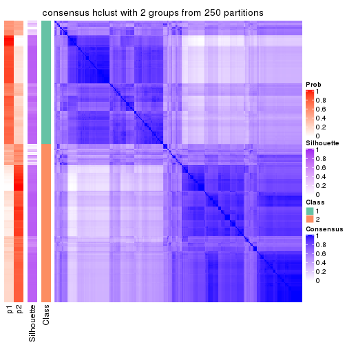</p>

</div>
<div id='tab-SD-hclust-consensus-heatmap-2'>
<pre><code class="r">consensus_heatmap(res, k = 3)
</code></pre>

<p></p>

</div>
<div id='tab-SD-hclust-consensus-heatmap-3'>
<pre><code class="r">consensus_heatmap(res, k = 4)
</code></pre>

<p></p>

</div>
<div id='tab-SD-hclust-consensus-heatmap-4'>
<pre><code class="r">consensus_heatmap(res, k = 5)
</code></pre>

<p></p>

</div>
<div id='tab-SD-hclust-consensus-heatmap-5'>
<pre><code class="r">consensus_heatmap(res, k = 6)
</code></pre>

<p></p>

</div>
</div>

Heatmaps for the membership of samples in all partitions to see how consistent they are:


<script>
$( function() {
	$( '#tabs-SD-hclust-membership-heatmap' ).tabs();
} );
</script>
<div id='tabs-SD-hclust-membership-heatmap'>
<ul>
<li><a href='#tab-SD-hclust-membership-heatmap-1'>k = 2</a></li>
<li><a href='#tab-SD-hclust-membership-heatmap-2'>k = 3</a></li>
<li><a href='#tab-SD-hclust-membership-heatmap-3'>k = 4</a></li>
<li><a href='#tab-SD-hclust-membership-heatmap-4'>k = 5</a></li>
<li><a href='#tab-SD-hclust-membership-heatmap-5'>k = 6</a></li>
</ul>
<div id='tab-SD-hclust-membership-heatmap-1'>
<pre><code class="r">membership_heatmap(res, k = 2)
</code></pre>

<p></p>

</div>
<div id='tab-SD-hclust-membership-heatmap-2'>
<pre><code class="r">membership_heatmap(res, k = 3)
</code></pre>

<p></p>

</div>
<div id='tab-SD-hclust-membership-heatmap-3'>
<pre><code class="r">membership_heatmap(res, k = 4)
</code></pre>

<p></p>

</div>
<div id='tab-SD-hclust-membership-heatmap-4'>
<pre><code class="r">membership_heatmap(res, k = 5)
</code></pre>

<p></p>

</div>
<div id='tab-SD-hclust-membership-heatmap-5'>
<pre><code class="r">membership_heatmap(res, k = 6)
</code></pre>

<p></p>

</div>
</div>

As soon as we have had the classes for columns, we can look for signatures
which are significantly different between classes which can be candidate marks
for certain classes. Following are the heatmaps for signatures.


Signature heatmaps where rows are scaled:


<script>
$( function() {
	$( '#tabs-SD-hclust-get-signatures' ).tabs();
} );
</script>
<div id='tabs-SD-hclust-get-signatures'>
<ul>
<li><a href='#tab-SD-hclust-get-signatures-1'>k = 2</a></li>
<li><a href='#tab-SD-hclust-get-signatures-2'>k = 3</a></li>
<li><a href='#tab-SD-hclust-get-signatures-3'>k = 4</a></li>
<li><a href='#tab-SD-hclust-get-signatures-4'>k = 5</a></li>
<li><a href='#tab-SD-hclust-get-signatures-5'>k = 6</a></li>
</ul>
<div id='tab-SD-hclust-get-signatures-1'>
<pre><code class="r">get_signatures(res, k = 2)
</code></pre>

<p></p>

</div>
<div id='tab-SD-hclust-get-signatures-2'>
<pre><code class="r">get_signatures(res, k = 3)
</code></pre>

<p></p>

</div>
<div id='tab-SD-hclust-get-signatures-3'>
<pre><code class="r">get_signatures(res, k = 4)
</code></pre>

<p></p>

</div>
<div id='tab-SD-hclust-get-signatures-4'>
<pre><code class="r">get_signatures(res, k = 5)
</code></pre>

<p></p>

</div>
<div id='tab-SD-hclust-get-signatures-5'>
<pre><code class="r">get_signatures(res, k = 6)
</code></pre>

<p></p>

</div>
</div>


Signature heatmaps where rows are not scaled:


<script>
$( function() {
	$( '#tabs-SD-hclust-get-signatures-no-scale' ).tabs();
} );
</script>
<div id='tabs-SD-hclust-get-signatures-no-scale'>
<ul>
<li><a href='#tab-SD-hclust-get-signatures-no-scale-1'>k = 2</a></li>
<li><a href='#tab-SD-hclust-get-signatures-no-scale-2'>k = 3</a></li>
<li><a href='#tab-SD-hclust-get-signatures-no-scale-3'>k = 4</a></li>
<li><a href='#tab-SD-hclust-get-signatures-no-scale-4'>k = 5</a></li>
<li><a href='#tab-SD-hclust-get-signatures-no-scale-5'>k = 6</a></li>
</ul>
<div id='tab-SD-hclust-get-signatures-no-scale-1'>
<pre><code class="r">get_signatures(res, k = 2, scale_rows = FALSE)
</code></pre>

<p></p>

</div>
<div id='tab-SD-hclust-get-signatures-no-scale-2'>
<pre><code class="r">get_signatures(res, k = 3, scale_rows = FALSE)
</code></pre>

<p></p>

</div>
<div id='tab-SD-hclust-get-signatures-no-scale-3'>
<pre><code class="r">get_signatures(res, k = 4, scale_rows = FALSE)
</code></pre>

<p></p>

</div>
<div id='tab-SD-hclust-get-signatures-no-scale-4'>
<pre><code class="r">get_signatures(res, k = 5, scale_rows = FALSE)
</code></pre>

<p></p>

</div>
<div id='tab-SD-hclust-get-signatures-no-scale-5'>
<pre><code class="r">get_signatures(res, k = 6, scale_rows = FALSE)
</code></pre>

<p></p>

</div>
</div>


Compare the overlap of signatures from different k:

```r
compare_signatures(res)
```

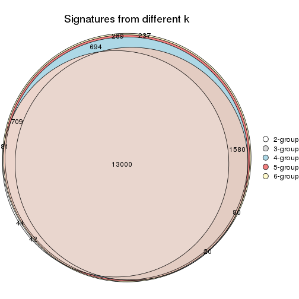

`get_signature()` returns a data frame invisibly. TO get the list of signatures, the function
call should be assigned to a variable explicitly. In following code, if `plot` argument is set
to `FALSE`, no heatmap is plotted while only the differential analysis is performed.

```r
# code only for demonstration
tb = get_signature(res, k = ..., plot = FALSE)
```

An example of the output of `tb` is:

```
#>   which_row         fdr    mean_1    mean_2 scaled_mean_1 scaled_mean_2 km
#> 1        38 0.042760348  8.373488  9.131774    -0.5533452     0.5164555  1
#> 2        40 0.018707592  7.106213  8.469186    -0.6173731     0.5762149  1
#> 3        55 0.019134737 10.221463 11.207825    -0.6159697     0.5749050  1
#> 4        59 0.006059896  5.921854  7.869574    -0.6899429     0.6439467  1
#> 5        60 0.018055526  8.928898 10.211722    -0.6204761     0.5791110  1
#> 6        98 0.009384629 15.714769 14.887706     0.6635654    -0.6193277  2
...
```

The columns in `tb` are:

1. `which_row`: row indices corresponding to the input matrix.
2. `fdr`: FDR for the differential test. 
3. `mean_x`: The mean value in group x.
4. `scaled_mean_x`: The mean value in group x after rows are scaled.
5. `km`: Row groups if k-means clustering is applied to rows.


UMAP plot which shows how samples are separated.


<script>
$( function() {
	$( '#tabs-SD-hclust-dimension-reduction' ).tabs();
} );
</script>
<div id='tabs-SD-hclust-dimension-reduction'>
<ul>
<li><a href='#tab-SD-hclust-dimension-reduction-1'>k = 2</a></li>
<li><a href='#tab-SD-hclust-dimension-reduction-2'>k = 3</a></li>
<li><a href='#tab-SD-hclust-dimension-reduction-3'>k = 4</a></li>
<li><a href='#tab-SD-hclust-dimension-reduction-4'>k = 5</a></li>
<li><a href='#tab-SD-hclust-dimension-reduction-5'>k = 6</a></li>
</ul>
<div id='tab-SD-hclust-dimension-reduction-1'>
<pre><code class="r">dimension_reduction(res, k = 2, method = &quot;UMAP&quot;)
</code></pre>

<p></p>

</div>
<div id='tab-SD-hclust-dimension-reduction-2'>
<pre><code class="r">dimension_reduction(res, k = 3, method = &quot;UMAP&quot;)
</code></pre>

<p></p>

</div>
<div id='tab-SD-hclust-dimension-reduction-3'>
<pre><code class="r">dimension_reduction(res, k = 4, method = &quot;UMAP&quot;)
</code></pre>

<p></p>

</div>
<div id='tab-SD-hclust-dimension-reduction-4'>
<pre><code class="r">dimension_reduction(res, k = 5, method = &quot;UMAP&quot;)
</code></pre>

<p></p>

</div>
<div id='tab-SD-hclust-dimension-reduction-5'>
<pre><code class="r">dimension_reduction(res, k = 6, method = &quot;UMAP&quot;)
</code></pre>

<p></p>

</div>
</div>


Following heatmap shows how subgroups are split when increasing `k`:

```r
collect_classes(res)
```


If matrix rows can be associated to genes, consider to use `GO_Enrichment(res,
...)` to perform function enrichment for the signature genes.


 

---------------------------------------------------


### SD:kmeans**


The object with results only for a single top-value method and a single partition method 
can be extracted as:

```r
res = res_list["SD", "kmeans"]
# you can also extract it by
# res = res_list["SD:kmeans"]
```

A summary of `res` and all the functions that can be applied to it:

```r
res
```

```
#> A 'ConsensusPartition' object with k = 2, 3, 4, 5, 6.
#>   On a matrix with 17723 rows and 374 columns.
#>   Top rows (1000, 2000, 3000, 4000, 5000) are extracted by 'SD' method.
#>   Subgroups are detected by 'kmeans' method.
#>   Performed in total 1250 partitions by row resampling.
#>   Best k for subgroups seems to be 2.
#> 
#> Following methods can be applied to this 'ConsensusPartition' object:
#>  [1] "cola_report"             "collect_classes"         "collect_plots"          
#>  [4] "collect_stats"           "colnames"                "compare_signatures"     
#>  [7] "consensus_heatmap"       "dimension_reduction"     "functional_enrichment"  
#> [10] "get_anno_col"            "get_anno"                "get_classes"            
#> [13] "get_consensus"           "get_matrix"              "get_membership"         
#> [16] "get_param"               "get_signatures"          "get_stats"              
#> [19] "is_best_k"               "is_stable_k"             "membership_heatmap"     
#> [22] "ncol"                    "nrow"                    "plot_ecdf"              
#> [25] "rownames"                "select_partition_number" "show"                   
#> [28] "suggest_best_k"          "test_to_known_factors"
```

`collect_plots()` function collects all the plots made from `res` for all `k` (number of partitions)
into one single page to provide an easy and fast comparison between different `k`.

```r
collect_plots(res)
```


The plots are:

- The first row: a plot of the ECDF (Empirical cumulative distribution
  function) curves of the consensus matrix for each `k` and the heatmap of
  predicted classes for each `k`.
- The second row: heatmaps of the consensus matrix for each `k`.
- The third row: heatmaps of the membership matrix for each `k`.
- The fouth row: heatmaps of the signatures for each `k`.

All the plots in panels can be made by individual functions and they are
plotted later in this section.

`select_partition_number()` produces several plots showing different
statistics for choosing "optimized" `k`. There are following statistics:

- ECDF curves of the consensus matrix for each `k`;
- 1-PAC. [The PAC
  score](https://en.wikipedia.org/wiki/Consensus_clustering#Over-interpretation_potential_of_consensus_clustering)
  measures the proportion of the ambiguous subgrouping.
- Mean silhouette score.
- Concordance. The mean probability of fiting the consensus class ids in all
  partitions.
- Area increased. Denote $A_k$ as the area under the ECDF curve for current
  `k`, the area increased is defined as $A_k - A_{k-1}$.
- Rand index. The percent of pairs of samples that are both in a same cluster
  or both are not in a same cluster in the partition of k and k-1.
- Jaccard index. The ratio of pairs of samples are both in a same cluster in
  the partition of k and k-1 and the pairs of samples are both in a same
  cluster in the partition k or k-1.

The detailed explanations of these statistics can be found in [the cola
vignette](http://bioconductor.org/packages/devel/bioc/vignettes/cola/inst/doc/cola.html#toc_13).

Generally speaking, lower PAC score, higher mean silhouette score or higher
concordance corresponds to better partition. Rand index and Jaccard index
measure how similar the current partition is compared to partition with `k-1`.
If they are too similar, we won't accept `k` is better than `k-1`.

```r
select_partition_number(res)
```


The numeric values for all these statistics can be obtained by `get_stats()`.

```r
get_stats(res)
```

```
#>   k 1-PAC mean_silhouette concordance area_increased  Rand Jaccard
#> 2 2 0.961           0.949       0.976         0.4970 0.501   0.501
#> 3 3 0.610           0.710       0.819         0.2784 0.828   0.668
#> 4 4 0.710           0.746       0.847         0.1437 0.839   0.588
#> 5 5 0.722           0.705       0.830         0.0625 0.934   0.763
#> 6 6 0.713           0.573       0.760         0.0420 0.951   0.800
```

`suggest_best_k()` suggests the best $k$ based on these statistics. The rules are as follows:

- All $k$ with Jaccard index larger than 0.95 are removed because the increase of
  the partition number does not provides enough extra information. If all $k$ are removed,
  the best $k$ is assigned by `NA`.
- For $k$ with 1-PAC larger than 0.9, the maximal $k$ is taken as the "best k". Other $k$ is called "optional k".
- If it does not fit the second rule. The $k$ with the highest vote of highest
  1-PAC, mean silhouette and concordance is taken as the "best k".

```r
suggest_best_k(res)
```

```
#> [1] 2
```


Following shows the table of the partitions (You need to click the **show/hide
code output** link to see it). The membership matrix (columns with name `p*`)
is inferred by
[`clue::cl_consensus()`](https://www.rdocumentation.org/link/cl_consensus?package=clue)
function with the `SE` method. Basically the value in the membership matrix
represents the probability to belong to a certain group. The finall class
label for an item is determined with the group with highest probability it
belongs to.

In `get_classes()` function, the entropy is calculated from the membership
matrix and the silhouette score is calculated from the consensus matrix.


<script>
$( function() {
	$( '#tabs-SD-kmeans-get-classes' ).tabs();
} );
</script>
<div id='tabs-SD-kmeans-get-classes'>
<ul>
<li><a href='#tab-SD-kmeans-get-classes-1'>k = 2</a></li>
<li><a href='#tab-SD-kmeans-get-classes-2'>k = 3</a></li>
<li><a href='#tab-SD-kmeans-get-classes-3'>k = 4</a></li>
<li><a href='#tab-SD-kmeans-get-classes-4'>k = 5</a></li>
<li><a href='#tab-SD-kmeans-get-classes-5'>k = 6</a></li>
</ul>

<div id='tab-SD-kmeans-get-classes-1'>
<p><a id='tab-SD-kmeans-get-classes-1-a' style='color:#0366d6' href='#'>show/hide code output</a></p>
<pre><code class="r">cbind(get_classes(res, k = 2), get_membership(res, k = 2))
</code></pre>

<pre><code>#&gt;            class entropy silhouette    p1    p2
#&gt; SRR660824      1  0.0376      0.968 0.996 0.004
#&gt; SRR603858      1  0.9686      0.358 0.604 0.396
#&gt; SRR817070      2  0.0376      0.985 0.004 0.996
#&gt; SRR1486995     1  0.0000      0.966 1.000 0.000
#&gt; SRR813043      2  0.0376      0.985 0.004 0.996
#&gt; SRR656874      2  0.0000      0.984 0.000 1.000
#&gt; SRR659037      1  0.9815      0.314 0.580 0.420
#&gt; SRR662031      1  0.0376      0.968 0.996 0.004
#&gt; SRR1081283     2  0.0376      0.985 0.004 0.996
#&gt; SRR1481036     1  0.6247      0.814 0.844 0.156
#&gt; SRR1434009     2  0.0376      0.982 0.004 0.996
#&gt; SRR1376676     1  0.0376      0.968 0.996 0.004
#&gt; SRR1396967     2  0.0376      0.982 0.004 0.996
#&gt; SRR665429      2  0.0376      0.985 0.004 0.996
#&gt; SRR1388025     2  0.0376      0.985 0.004 0.996
#&gt; SRR600784      1  0.0376      0.968 0.996 0.004
#&gt; SRR657611      1  0.0376      0.968 0.996 0.004
#&gt; SRR1333659     2  0.0376      0.982 0.004 0.996
#&gt; SRR1323896     2  0.0376      0.985 0.004 0.996
#&gt; SRR1453971     1  0.0376      0.968 0.996 0.004
#&gt; SRR1421010     1  0.0000      0.966 1.000 0.000
#&gt; SRR1334490     1  0.0376      0.964 0.996 0.004
#&gt; SRR1309468     1  0.0376      0.968 0.996 0.004
#&gt; SRR1468637     2  0.8813      0.571 0.300 0.700
#&gt; SRR1365489     2  0.0376      0.985 0.004 0.996
#&gt; SRR627445      1  0.0376      0.968 0.996 0.004
#&gt; SRR607863      2  0.0376      0.982 0.004 0.996
#&gt; SRR1475524     1  0.0376      0.964 0.996 0.004
#&gt; SRR1405504     2  0.0376      0.985 0.004 0.996
#&gt; SRR615695      1  0.0376      0.968 0.996 0.004
#&gt; SRR600900      2  0.0376      0.982 0.004 0.996
#&gt; SRR601477      2  0.0376      0.985 0.004 0.996
#&gt; SRR1487215     2  0.0376      0.985 0.004 0.996
#&gt; SRR1310797     2  0.0000      0.984 0.000 1.000
#&gt; SRR1362713     1  0.0376      0.968 0.996 0.004
#&gt; SRR1431385     1  0.0376      0.968 0.996 0.004
#&gt; SRR1379089     2  0.0376      0.985 0.004 0.996
#&gt; SRR1102079     1  0.0376      0.964 0.996 0.004
#&gt; SRR1357210     1  0.0376      0.968 0.996 0.004
#&gt; SRR657659      2  0.0376      0.985 0.004 0.996
#&gt; SRR663573      2  0.0376      0.985 0.004 0.996
#&gt; SRR603188      2  0.0376      0.982 0.004 0.996
#&gt; SRR1471200     2  0.0376      0.985 0.004 0.996
#&gt; SRR1310975     2  0.0376      0.985 0.004 0.996
#&gt; SRR627457      1  0.9954      0.158 0.540 0.460
#&gt; SRR1367654     2  0.0376      0.982 0.004 0.996
#&gt; SRR1488410     1  0.0376      0.964 0.996 0.004
#&gt; SRR1457750     2  0.9522      0.405 0.372 0.628
#&gt; SRR1099546     1  0.0376      0.968 0.996 0.004
#&gt; SRR604480      2  0.0376      0.985 0.004 0.996
#&gt; SRR1390477     2  0.0376      0.985 0.004 0.996
#&gt; SRR1458447     2  0.0376      0.985 0.004 0.996
#&gt; SRR1473161     2  0.0376      0.985 0.004 0.996
#&gt; SRR1409813     2  0.0376      0.982 0.004 0.996
#&gt; SRR612791      1  0.0376      0.968 0.996 0.004
#&gt; SRR1470580     2  0.1184      0.975 0.016 0.984
#&gt; SRR1444063     1  0.9963      0.147 0.536 0.464
#&gt; SRR1355578     1  0.0376      0.968 0.996 0.004
#&gt; SRR1429203     1  0.0376      0.968 0.996 0.004
#&gt; SRR599154      2  0.0376      0.982 0.004 0.996
#&gt; SRR814244      1  0.0376      0.964 0.996 0.004
#&gt; SRR1404123     2  0.0376      0.985 0.004 0.996
#&gt; SRR656934      1  0.0376      0.968 0.996 0.004
#&gt; SRR1339029     2  0.0376      0.985 0.004 0.996
#&gt; SRR821525      2  0.0376      0.985 0.004 0.996
#&gt; SRR1443677     1  0.0376      0.968 0.996 0.004
#&gt; SRR1406330     1  0.0376      0.964 0.996 0.004
#&gt; SRR1338124     2  0.0376      0.985 0.004 0.996
#&gt; SRR1391376     1  0.0376      0.968 0.996 0.004
#&gt; SRR661842      2  0.0376      0.985 0.004 0.996
#&gt; SRR1395699     1  0.0376      0.968 0.996 0.004
#&gt; SRR1312209     1  0.0376      0.968 0.996 0.004
#&gt; SRR1359469     1  0.0376      0.968 0.996 0.004
#&gt; SRR658885      1  0.0376      0.964 0.996 0.004
#&gt; SRR1414578     1  0.0376      0.968 0.996 0.004
#&gt; SRR603620      2  0.0376      0.982 0.004 0.996
#&gt; SRR604677      1  0.0376      0.968 0.996 0.004
#&gt; SRR603800      2  0.0376      0.985 0.004 0.996
#&gt; SRR602058      2  0.0376      0.982 0.004 0.996
#&gt; SRR817488      2  0.0376      0.985 0.004 0.996
#&gt; SRR655601      2  0.0376      0.985 0.004 0.996
#&gt; SRR1434821     2  0.0376      0.985 0.004 0.996
#&gt; SRR1349166     2  0.0376      0.982 0.004 0.996
#&gt; SRR615129      2  0.9393      0.445 0.356 0.644
#&gt; SRR607586      2  0.0376      0.985 0.004 0.996
#&gt; SRR602680      2  0.0000      0.984 0.000 1.000
#&gt; SRR1411070     2  0.0376      0.985 0.004 0.996
#&gt; SRR663038      2  0.0376      0.985 0.004 0.996
#&gt; SRR1489416     2  0.0376      0.985 0.004 0.996
#&gt; SRR1479155     1  0.0376      0.968 0.996 0.004
#&gt; SRR662162      1  0.0376      0.968 0.996 0.004
#&gt; SRR1374567     1  0.0376      0.968 0.996 0.004
#&gt; SRR1434048     2  0.0376      0.985 0.004 0.996
#&gt; SRR2184865     2  0.0376      0.985 0.004 0.996
#&gt; SRR2170135     1  0.0376      0.968 0.996 0.004
#&gt; SRR615551      2  0.0376      0.985 0.004 0.996
#&gt; SRR1335513     2  0.0376      0.985 0.004 0.996
#&gt; SRR1370216     1  0.0000      0.966 1.000 0.000
#&gt; SRR662954      2  0.0376      0.982 0.004 0.996
#&gt; SRR1375738     1  0.0376      0.968 0.996 0.004
#&gt; SRR1356577     1  0.0376      0.968 0.996 0.004
#&gt; SRR1073119     1  0.0376      0.968 0.996 0.004
#&gt; SRR663549      1  0.0376      0.968 0.996 0.004
#&gt; SRR1478015     2  0.0376      0.985 0.004 0.996
#&gt; SRR600632      2  0.0376      0.985 0.004 0.996
#&gt; SRR811866      1  0.0376      0.968 0.996 0.004
#&gt; SRR1401101     2  0.0376      0.982 0.004 0.996
#&gt; SRR1477797     2  0.0376      0.982 0.004 0.996
#&gt; SRR1402986     2  0.0376      0.985 0.004 0.996
#&gt; SRR658897      1  0.0376      0.968 0.996 0.004
#&gt; SRR1419869     1  0.0376      0.968 0.996 0.004
#&gt; SRR1490700     1  0.0376      0.968 0.996 0.004
#&gt; SRR601723      2  0.0376      0.985 0.004 0.996
#&gt; SRR1384115     2  0.0376      0.982 0.004 0.996
#&gt; SRR1476927     2  0.0376      0.985 0.004 0.996
#&gt; SRR1387769     1  0.0376      0.968 0.996 0.004
#&gt; SRR1322595     1  0.0376      0.964 0.996 0.004
#&gt; SRR1370423     1  0.7219      0.757 0.800 0.200
#&gt; SRR1314976     1  0.7056      0.768 0.808 0.192
#&gt; SRR1319560     2  0.0376      0.982 0.004 0.996
#&gt; SRR1352683     1  0.0376      0.968 0.996 0.004
#&gt; SRR1473800     1  0.0376      0.968 0.996 0.004
#&gt; SRR1326384     1  0.0376      0.964 0.996 0.004
#&gt; SRR1360807     2  0.0376      0.985 0.004 0.996
#&gt; SRR1332544     1  0.0376      0.964 0.996 0.004
#&gt; SRR598695      1  0.0376      0.968 0.996 0.004
#&gt; SRR807824      2  0.0376      0.985 0.004 0.996
#&gt; SRR809296      1  0.0376      0.968 0.996 0.004
#&gt; SRR657927      1  0.0376      0.968 0.996 0.004
#&gt; SRR1440682     2  0.0000      0.984 0.000 1.000
#&gt; SRR1454415     2  0.0000      0.984 0.000 1.000
#&gt; SRR1419131     2  0.0376      0.985 0.004 0.996
#&gt; SRR1404293     1  0.0376      0.968 0.996 0.004
#&gt; SRR1473340     1  0.0376      0.968 0.996 0.004
#&gt; SRR1345563     1  0.0376      0.964 0.996 0.004
#&gt; SRR1323382     2  0.0376      0.985 0.004 0.996
#&gt; SRR1480697     1  0.7219      0.757 0.800 0.200
#&gt; SRR1321808     2  0.0376      0.985 0.004 0.996
#&gt; SRR1382756     2  0.0376      0.985 0.004 0.996
#&gt; SRR1312558     2  0.0376      0.985 0.004 0.996
#&gt; SRR1417088     2  0.0376      0.985 0.004 0.996
#&gt; SRR1433027     2  0.0376      0.985 0.004 0.996
#&gt; SRR662257      2  0.0376      0.982 0.004 0.996
#&gt; SRR600417      2  0.0376      0.985 0.004 0.996
#&gt; SRR812493      2  0.0376      0.982 0.004 0.996
#&gt; SRR612743      1  0.0376      0.968 0.996 0.004
#&gt; SRR1361345     1  0.0376      0.968 0.996 0.004
#&gt; SRR600584      2  0.0376      0.985 0.004 0.996
#&gt; SRR1310520     2  0.0376      0.985 0.004 0.996
#&gt; SRR1395595     1  0.0376      0.964 0.996 0.004
#&gt; SRR1334074     2  0.0376      0.982 0.004 0.996
#&gt; SRR654838      2  0.0376      0.985 0.004 0.996
#&gt; SRR1376694     1  0.0376      0.964 0.996 0.004
#&gt; SRR1433841     2  0.8386      0.632 0.268 0.732
#&gt; SRR1366837     1  0.0376      0.968 0.996 0.004
#&gt; SRR1467479     2  0.0376      0.985 0.004 0.996
#&gt; SRR1459055     1  0.0376      0.964 0.996 0.004
#&gt; SRR1471050     2  0.0376      0.985 0.004 0.996
#&gt; SRR603004      2  0.0000      0.984 0.000 1.000
#&gt; SRR814703      2  0.0376      0.982 0.004 0.996
#&gt; SRR661937      2  0.0376      0.985 0.004 0.996
#&gt; SRR614359      1  0.0376      0.968 0.996 0.004
#&gt; SRR1071568     2  0.0376      0.985 0.004 0.996
#&gt; SRR1389084     1  0.0376      0.968 0.996 0.004
#&gt; SRR1337624     2  0.0376      0.985 0.004 0.996
#&gt; SRR1344400     2  0.0376      0.985 0.004 0.996
#&gt; SRR1414290     2  0.0376      0.985 0.004 0.996
#&gt; SRR1413644     2  0.0376      0.982 0.004 0.996
#&gt; SRR1098998     1  0.0376      0.968 0.996 0.004
#&gt; SRR1481279     1  0.0376      0.968 0.996 0.004
#&gt; SRR1315103     1  0.0376      0.964 0.996 0.004
#&gt; SRR1099286     1  0.0376      0.968 0.996 0.004
#&gt; SRR2166570     1  0.8909      0.583 0.692 0.308
#&gt; SRR601445      1  0.0376      0.968 0.996 0.004
#&gt; SRR1439719     2  0.0376      0.985 0.004 0.996
#&gt; SRR1377026     2  0.0000      0.984 0.000 1.000
#&gt; SRR1327386     1  0.0376      0.968 0.996 0.004
#&gt; SRR654826      2  0.0376      0.985 0.004 0.996
#&gt; SRR1460433     2  0.0376      0.985 0.004 0.996
#&gt; SRR1469345     1  0.0000      0.966 1.000 0.000
#&gt; SRR1421462     2  0.0376      0.985 0.004 0.996
#&gt; SRR662966      1  0.0376      0.964 0.996 0.004
#&gt; SRR1339175     1  0.0376      0.968 0.996 0.004
#&gt; SRR1447736     2  0.0376      0.985 0.004 0.996
#&gt; SRR1434671     2  0.0376      0.982 0.004 0.996
#&gt; SRR660800      2  0.0376      0.985 0.004 0.996
#&gt; SRR1465543     2  0.0376      0.982 0.004 0.996
#&gt; SRR1342023     1  0.0376      0.968 0.996 0.004
#&gt; SRR1335670     1  0.0376      0.968 0.996 0.004
#&gt; SRR1400955     2  0.0376      0.982 0.004 0.996
#&gt; SRR1072150     2  0.0376      0.985 0.004 0.996
#&gt; SRR1442822     1  0.0376      0.968 0.996 0.004
#&gt; SRR1364658     1  0.0376      0.968 0.996 0.004
#&gt; SRR1098074     2  0.0376      0.982 0.004 0.996
#&gt; SRR1442778     1  0.0376      0.968 0.996 0.004
#&gt; SRR1086728     1  0.7883      0.704 0.764 0.236
#&gt; SRR627464      2  0.8144      0.661 0.252 0.748
#&gt; SRR1409193     1  0.0376      0.968 0.996 0.004
#&gt; SRR2168286     2  0.0376      0.985 0.004 0.996
#&gt; SRR615539      2  0.0376      0.985 0.004 0.996
#&gt; SRR663623      1  0.0376      0.968 0.996 0.004
#&gt; SRR1471989     1  0.0376      0.964 0.996 0.004
#&gt; SRR1468828     2  0.0376      0.985 0.004 0.996
#&gt; SRR1381934     1  0.0376      0.968 0.996 0.004
#&gt; SRR1471098     1  0.0376      0.968 0.996 0.004
#&gt; SRR1314749     1  0.0376      0.968 0.996 0.004
#&gt; SRR2166874     2  0.0376      0.982 0.004 0.996
#&gt; SRR821302      1  0.0376      0.968 0.996 0.004
#&gt; SRR1435066     2  0.0000      0.984 0.000 1.000
#&gt; SRR661601      2  0.0000      0.984 0.000 1.000
#&gt; SRR1446546     2  0.0376      0.985 0.004 0.996
#&gt; SRR1419784     1  0.0376      0.964 0.996 0.004
#&gt; SRR1357233     2  0.0376      0.982 0.004 0.996
#&gt; SRR1441889     1  0.0376      0.968 0.996 0.004
#&gt; SRR1413940     1  0.0376      0.964 0.996 0.004
#&gt; SRR1324250     2  0.0376      0.985 0.004 0.996
#&gt; SRR1442862     2  0.0376      0.982 0.004 0.996
#&gt; SRR662474      2  0.0376      0.985 0.004 0.996
#&gt; SRR1416226     1  0.0376      0.968 0.996 0.004
#&gt; SRR1417404     1  0.1184      0.955 0.984 0.016
#&gt; SRR665466      2  0.0376      0.985 0.004 0.996
#&gt; SRR658849      1  0.0376      0.968 0.996 0.004
#&gt; SRR1460025     2  0.0376      0.985 0.004 0.996
#&gt; SRR1408136     1  0.0376      0.968 0.996 0.004
#&gt; SRR1489995     2  0.0376      0.985 0.004 0.996
#&gt; SRR1374092     1  0.0376      0.968 0.996 0.004
#&gt; SRR1488429     1  0.0376      0.964 0.996 0.004
#&gt; SRR1087559     1  0.7815      0.704 0.768 0.232
#&gt; SRR817004      1  0.8016      0.685 0.756 0.244
#&gt; SRR1429660     2  0.0376      0.982 0.004 0.996
#&gt; SRR604390      1  0.8499      0.639 0.724 0.276
#&gt; SRR614936      2  0.0376      0.985 0.004 0.996
#&gt; SRR1365938     2  0.9358      0.455 0.352 0.648
#&gt; SRR1437324     1  0.0376      0.968 0.996 0.004
#&gt; SRR613414      2  0.0376      0.982 0.004 0.996
#&gt; SRR660414      1  0.8661      0.620 0.712 0.288
#&gt; SRR1452185     1  0.0376      0.968 0.996 0.004
#&gt; SRR1347020     1  0.0376      0.968 0.996 0.004
#&gt; SRR1398036     2  0.0376      0.982 0.004 0.996
#&gt; SRR1436674     1  0.0376      0.968 0.996 0.004
#&gt; SRR603750      1  0.0376      0.968 0.996 0.004
#&gt; SRR608630      2  0.1184      0.974 0.016 0.984
#&gt; SRR655625      2  0.0376      0.985 0.004 0.996
#&gt; SRR599059      2  0.0376      0.985 0.004 0.996
#&gt; SRR615189      2  0.0376      0.985 0.004 0.996
#&gt; SRR1466889     2  0.0376      0.982 0.004 0.996
#&gt; SRR1084602     2  0.0376      0.985 0.004 0.996
#&gt; SRR1335422     1  0.0376      0.968 0.996 0.004
#&gt; SRR1356805     2  0.0376      0.982 0.004 0.996
#&gt; SRR1385300     1  0.0376      0.964 0.996 0.004
#&gt; SRR654814      1  0.0376      0.968 0.996 0.004
#&gt; SRR658385      2  0.0000      0.984 0.000 1.000
#&gt; SRR820596      1  0.0376      0.968 0.996 0.004
#&gt; SRR1318118     1  0.0000      0.966 1.000 0.000
#&gt; SRR1480766     2  0.0376      0.985 0.004 0.996
#&gt; SRR1406539     1  0.0376      0.968 0.996 0.004
#&gt; SRR1341833     2  0.0376      0.982 0.004 0.996
#&gt; SRR1441826     2  0.0376      0.985 0.004 0.996
#&gt; SRR1448051     1  0.0376      0.968 0.996 0.004
#&gt; SRR1326752     1  0.0000      0.966 1.000 0.000
#&gt; SRR665217      1  0.0376      0.968 0.996 0.004
#&gt; SRR819186      2  0.0376      0.985 0.004 0.996
#&gt; SRR661517      1  0.0376      0.968 0.996 0.004
#&gt; SRR607166      2  0.0376      0.985 0.004 0.996
#&gt; SRR809065      2  0.0376      0.985 0.004 0.996
#&gt; SRR1415872     2  0.0376      0.982 0.004 0.996
#&gt; SRR1415463     1  0.0376      0.968 0.996 0.004
#&gt; SRR1381161     2  0.0376      0.982 0.004 0.996
#&gt; SRR1442231     2  0.0376      0.985 0.004 0.996
#&gt; SRR1374696     1  0.0376      0.968 0.996 0.004
#&gt; SRR1451988     1  0.8443      0.649 0.728 0.272
#&gt; SRR660555      1  0.0376      0.968 0.996 0.004
#&gt; SRR657801      1  0.0376      0.968 0.996 0.004
#&gt; SRR663344      2  0.0000      0.984 0.000 1.000
#&gt; SRR1472462     2  0.0376      0.985 0.004 0.996
#&gt; SRR1406176     1  0.7139      0.759 0.804 0.196
#&gt; SRR656886      2  0.0376      0.985 0.004 0.996
#&gt; SRR1498337     2  0.0376      0.982 0.004 0.996
#&gt; SRR613066      1  0.0376      0.964 0.996 0.004
#&gt; SRR1309490     1  0.0376      0.968 0.996 0.004
#&gt; SRR602492      2  0.0376      0.982 0.004 0.996
#&gt; SRR1447347     1  0.0376      0.968 0.996 0.004
#&gt; SRR1475546     2  0.0376      0.985 0.004 0.996
#&gt; SRR627459      2  0.0376      0.985 0.004 0.996
#&gt; SRR1434332     2  0.0376      0.985 0.004 0.996
#&gt; SRR1070358     2  0.0376      0.982 0.004 0.996
#&gt; SRR1345936     2  0.6048      0.820 0.148 0.852
#&gt; SRR665658      2  0.0376      0.985 0.004 0.996
#&gt; SRR1321351     2  0.0376      0.985 0.004 0.996
#&gt; SRR657880      2  0.0000      0.984 0.000 1.000
#&gt; SRR1373903     2  0.0376      0.985 0.004 0.996
#&gt; SRR657396      2  0.0376      0.982 0.004 0.996
#&gt; SRR660981      2  0.0376      0.985 0.004 0.996
#&gt; SRR818499      1  0.0376      0.968 0.996 0.004
#&gt; SRR819658      2  0.0376      0.982 0.004 0.996
#&gt; SRR1376316     1  0.0376      0.968 0.996 0.004
#&gt; SRR1323723     2  0.0376      0.985 0.004 0.996
#&gt; SRR1476719     1  0.0376      0.968 0.996 0.004
#&gt; SRR1403478     2  0.0000      0.984 0.000 1.000
#&gt; SRR1095695     1  0.0376      0.968 0.996 0.004
#&gt; SRR1352391     1  0.0000      0.966 1.000 0.000
#&gt; SRR1498813     2  0.0376      0.985 0.004 0.996
#&gt; SRR627437      2  0.1184      0.975 0.016 0.984
#&gt; SRR2185097     1  0.0376      0.968 0.996 0.004
#&gt; SRR817166      1  0.7602      0.728 0.780 0.220
#&gt; SRR1091670     2  0.0376      0.985 0.004 0.996
#&gt; SRR603776      1  0.0000      0.966 1.000 0.000
#&gt; SRR1479640     2  0.0376      0.985 0.004 0.996
#&gt; SRR660152      1  0.0376      0.968 0.996 0.004
#&gt; SRR1074769     2  0.0376      0.985 0.004 0.996
#&gt; SRR656153      2  0.0376      0.985 0.004 0.996
#&gt; SRR1392502     1  0.0376      0.964 0.996 0.004
#&gt; SRR1359609     1  0.0376      0.964 0.996 0.004
#&gt; SRR601925      2  0.0376      0.985 0.004 0.996
#&gt; SRR2165182     2  0.0000      0.984 0.000 1.000
#&gt; SRR608542      2  0.0376      0.982 0.004 0.996
#&gt; SRR655064      2  0.0376      0.985 0.004 0.996
#&gt; SRR1432430     1  0.0376      0.968 0.996 0.004
#&gt; SRR808472      2  0.0376      0.985 0.004 0.996
#&gt; SRR1414958     1  0.0376      0.964 0.996 0.004
#&gt; SRR598484      2  0.0376      0.985 0.004 0.996
#&gt; SRR612755      1  0.0376      0.968 0.996 0.004
#&gt; SRR1365808     1  0.0376      0.968 0.996 0.004
#&gt; SRR1391724     1  0.9427      0.469 0.640 0.360
#&gt; SRR1322373     1  0.0376      0.968 0.996 0.004
#&gt; SRR1489265     2  0.0376      0.985 0.004 0.996
#&gt; SRR1359099     2  0.0000      0.984 0.000 1.000
#&gt; SRR607279      2  0.0376      0.985 0.004 0.996
#&gt; SRR810461      2  0.0376      0.985 0.004 0.996
#&gt; SRR627427      1  0.0376      0.968 0.996 0.004
#&gt; SRR612887      2  0.0000      0.984 0.000 1.000
#&gt; SRR809807      2  0.0376      0.982 0.004 0.996
#&gt; SRR663112      2  0.0376      0.985 0.004 0.996
#&gt; SRR1346933     2  0.7299      0.739 0.204 0.796
#&gt; SRR1487910     1  0.0376      0.968 0.996 0.004
#&gt; SRR603092      2  0.0376      0.985 0.004 0.996
#&gt; SRR1417680     2  0.0376      0.985 0.004 0.996
#&gt; SRR1383785     1  0.0376      0.968 0.996 0.004
#&gt; SRR1070015     2  0.0376      0.982 0.004 0.996
#&gt; SRR1466222     2  0.0376      0.985 0.004 0.996
#&gt; SRR1416119     1  0.0376      0.964 0.996 0.004
#&gt; SRR819318      1  0.0376      0.968 0.996 0.004
#&gt; SRR608288      2  0.0376      0.985 0.004 0.996
#&gt; SRR811121      2  0.0000      0.984 0.000 1.000
#&gt; SRR613138      2  0.0376      0.985 0.004 0.996
#&gt; SRR810483      1  0.0376      0.968 0.996 0.004
#&gt; SRR607839      1  0.0376      0.968 0.996 0.004
#&gt; SRR1337031     1  0.0000      0.966 1.000 0.000
#&gt; SRR601311      2  0.0376      0.982 0.004 0.996
#&gt; SRR1406685     2  0.0376      0.985 0.004 0.996
#&gt; SRR1467500     2  0.0376      0.985 0.004 0.996
#&gt; SRR1308504     1  0.0376      0.968 0.996 0.004
#&gt; SRR1312865     1  0.0376      0.964 0.996 0.004
#&gt; SRR1312522     1  0.0376      0.964 0.996 0.004
#&gt; SRR1490486     2  0.0376      0.985 0.004 0.996
#&gt; SRR1325888     1  0.0376      0.968 0.996 0.004
#&gt; SRR1472885     1  0.0376      0.968 0.996 0.004
#&gt; SRR1098785     2  0.0376      0.985 0.004 0.996
#&gt; SRR1084766     2  0.0376      0.985 0.004 0.996
#&gt; SRR1102804     2  0.0376      0.985 0.004 0.996
#&gt; SRR1336636     1  0.0376      0.968 0.996 0.004
#&gt; SRR1347795     1  0.0376      0.964 0.996 0.004
#&gt; SRR601900      2  0.0376      0.982 0.004 0.996
#&gt; SRR1330989     2  0.0376      0.985 0.004 0.996
#&gt; SRR658445      2  0.0376      0.982 0.004 0.996
#&gt; SRR1368754     1  0.0376      0.964 0.996 0.004
#&gt; SRR1460001     2  0.0376      0.985 0.004 0.996
#&gt; SRR1414934     1  0.0376      0.968 0.996 0.004
#&gt; SRR1326249     1  0.0376      0.968 0.996 0.004
#&gt; SRR614948      1  0.0376      0.964 0.996 0.004
#&gt; SRR1472952     1  0.0376      0.968 0.996 0.004
#&gt; SRR1321528     1  0.0376      0.968 0.996 0.004
#&gt; SRR627447      1  0.0376      0.968 0.996 0.004
#&gt; SRR612239      2  0.4298      0.897 0.088 0.912
</code></pre>

<script>
$('#tab-SD-kmeans-get-classes-1-a').parent().next().next().hide();
$('#tab-SD-kmeans-get-classes-1-a').click(function(){
  $('#tab-SD-kmeans-get-classes-1-a').parent().next().next().toggle();
  return(false);
});
</script>
</div>

<div id='tab-SD-kmeans-get-classes-2'>
<p><a id='tab-SD-kmeans-get-classes-2-a' style='color:#0366d6' href='#'>show/hide code output</a></p>
<pre><code class="r">cbind(get_classes(res, k = 3), get_membership(res, k = 3))
</code></pre>

<pre><code>#&gt;            class entropy silhouette    p1    p2    p3
#&gt; SRR660824      1  0.0237   0.814268 0.996 0.000 0.004
#&gt; SRR603858      3  0.7462   0.414661 0.180 0.124 0.696
#&gt; SRR817070      2  0.4974   0.463910 0.000 0.764 0.236
#&gt; SRR1486995     1  0.1031   0.809112 0.976 0.000 0.024
#&gt; SRR813043      2  0.0000   0.883717 0.000 1.000 0.000
#&gt; SRR656874      2  0.0000   0.883717 0.000 1.000 0.000
#&gt; SRR659037      3  0.6435   0.551132 0.168 0.076 0.756
#&gt; SRR662031      1  0.5058   0.812175 0.756 0.000 0.244
#&gt; SRR1081283     3  0.6252   0.633120 0.000 0.444 0.556
#&gt; SRR1481036     1  0.3116   0.740853 0.892 0.000 0.108
#&gt; SRR1434009     2  0.3192   0.751322 0.000 0.888 0.112
#&gt; SRR1376676     1  0.5178   0.808847 0.744 0.000 0.256
#&gt; SRR1396967     2  0.5591   0.394623 0.000 0.696 0.304
#&gt; SRR665429      2  0.0000   0.883717 0.000 1.000 0.000
#&gt; SRR1388025     3  0.6252   0.633120 0.000 0.444 0.556
#&gt; SRR600784      1  0.0424   0.813282 0.992 0.000 0.008
#&gt; SRR657611      1  0.5178   0.810096 0.744 0.000 0.256
#&gt; SRR1333659     2  0.4121   0.671826 0.000 0.832 0.168
#&gt; SRR1323896     2  0.0000   0.883717 0.000 1.000 0.000
#&gt; SRR1453971     1  0.3686   0.805819 0.860 0.000 0.140
#&gt; SRR1421010     1  0.5178   0.808847 0.744 0.000 0.256
#&gt; SRR1334490     1  0.4178   0.728799 0.828 0.000 0.172
#&gt; SRR1309468     1  0.5016   0.813053 0.760 0.000 0.240
#&gt; SRR1468637     3  0.2176   0.465822 0.032 0.020 0.948
#&gt; SRR1365489     2  0.0000   0.883717 0.000 1.000 0.000
#&gt; SRR627445      1  0.0424   0.813282 0.992 0.000 0.008
#&gt; SRR607863      2  0.0000   0.883717 0.000 1.000 0.000
#&gt; SRR1475524     1  0.6192   0.724115 0.580 0.000 0.420
#&gt; SRR1405504     2  0.0000   0.883717 0.000 1.000 0.000
#&gt; SRR615695      1  0.5178   0.808847 0.744 0.000 0.256
#&gt; SRR600900      2  0.6215  -0.283054 0.000 0.572 0.428
#&gt; SRR601477      2  0.0000   0.883717 0.000 1.000 0.000
#&gt; SRR1487215     2  0.0000   0.883717 0.000 1.000 0.000
#&gt; SRR1310797     2  0.0000   0.883717 0.000 1.000 0.000
#&gt; SRR1362713     3  0.5733  -0.023000 0.324 0.000 0.676
#&gt; SRR1431385     1  0.5178   0.808847 0.744 0.000 0.256
#&gt; SRR1379089     2  0.0000   0.883717 0.000 1.000 0.000
#&gt; SRR1102079     1  0.4291   0.724528 0.820 0.000 0.180
#&gt; SRR1357210     1  0.5138   0.810029 0.748 0.000 0.252
#&gt; SRR657659      2  0.5560   0.254630 0.000 0.700 0.300
#&gt; SRR663573      3  0.6252   0.633120 0.000 0.444 0.556
#&gt; SRR603188      2  0.0237   0.880579 0.000 0.996 0.004
#&gt; SRR1471200     2  0.0000   0.883717 0.000 1.000 0.000
#&gt; SRR1310975     2  0.0000   0.883717 0.000 1.000 0.000
#&gt; SRR627457      1  0.9185   0.147457 0.444 0.148 0.408
#&gt; SRR1367654     2  0.0892   0.865016 0.000 0.980 0.020
#&gt; SRR1488410     1  0.6204   0.720754 0.576 0.000 0.424
#&gt; SRR1457750     3  0.8008   0.478256 0.152 0.192 0.656
#&gt; SRR1099546     1  0.0000   0.814850 1.000 0.000 0.000
#&gt; SRR604480      2  0.0000   0.883717 0.000 1.000 0.000
#&gt; SRR1390477     2  0.0000   0.883717 0.000 1.000 0.000
#&gt; SRR1458447     2  0.0000   0.883717 0.000 1.000 0.000
#&gt; SRR1473161     2  0.0000   0.883717 0.000 1.000 0.000
#&gt; SRR1409813     2  0.4002   0.683314 0.000 0.840 0.160
#&gt; SRR612791      1  0.4654   0.819054 0.792 0.000 0.208
#&gt; SRR1470580     2  0.4861   0.590547 0.192 0.800 0.008
#&gt; SRR1444063     2  0.9315   0.021980 0.276 0.516 0.208
#&gt; SRR1355578     1  0.5706   0.762016 0.680 0.000 0.320
#&gt; SRR1429203     1  0.5178   0.808847 0.744 0.000 0.256
#&gt; SRR599154      2  0.4291   0.655616 0.000 0.820 0.180
#&gt; SRR814244      3  0.3752   0.244842 0.144 0.000 0.856
#&gt; SRR1404123     2  0.5327   0.353978 0.000 0.728 0.272
#&gt; SRR656934      1  0.4702   0.594298 0.788 0.000 0.212
#&gt; SRR1339029     2  0.0000   0.883717 0.000 1.000 0.000
#&gt; SRR821525      3  0.6252   0.633120 0.000 0.444 0.556
#&gt; SRR1443677     1  0.5098   0.811241 0.752 0.000 0.248
#&gt; SRR1406330     1  0.6192   0.724115 0.580 0.000 0.420
#&gt; SRR1338124     2  0.8824   0.167728 0.260 0.572 0.168
#&gt; SRR1391376     1  0.0424   0.812966 0.992 0.000 0.008
#&gt; SRR661842      3  0.6252   0.633120 0.000 0.444 0.556
#&gt; SRR1395699     1  0.0747   0.811258 0.984 0.000 0.016
#&gt; SRR1312209     1  0.5216   0.808550 0.740 0.000 0.260
#&gt; SRR1359469     1  0.5178   0.808847 0.744 0.000 0.256
#&gt; SRR658885      1  0.4235   0.725629 0.824 0.000 0.176
#&gt; SRR1414578     1  0.5178   0.808847 0.744 0.000 0.256
#&gt; SRR603620      3  0.6309   0.524763 0.000 0.496 0.504
#&gt; SRR604677      1  0.4121   0.822328 0.832 0.000 0.168
#&gt; SRR603800      2  0.0000   0.883717 0.000 1.000 0.000
#&gt; SRR602058      3  0.6244   0.634639 0.000 0.440 0.560
#&gt; SRR817488      2  0.0000   0.883717 0.000 1.000 0.000
#&gt; SRR655601      3  0.6291   0.589204 0.000 0.468 0.532
#&gt; SRR1434821     2  0.0000   0.883717 0.000 1.000 0.000
#&gt; SRR1349166     2  0.0747   0.869015 0.000 0.984 0.016
#&gt; SRR615129      2  0.9417  -0.159257 0.180 0.456 0.364
#&gt; SRR607586      2  0.0000   0.883717 0.000 1.000 0.000
#&gt; SRR602680      2  0.0000   0.883717 0.000 1.000 0.000
#&gt; SRR1411070     3  0.6260   0.626915 0.000 0.448 0.552
#&gt; SRR663038      2  0.0000   0.883717 0.000 1.000 0.000
#&gt; SRR1489416     2  0.0000   0.883717 0.000 1.000 0.000
#&gt; SRR1479155     1  0.5178   0.808847 0.744 0.000 0.256
#&gt; SRR662162      1  0.3551   0.825257 0.868 0.000 0.132
#&gt; SRR1374567     1  0.0000   0.814850 1.000 0.000 0.000
#&gt; SRR1434048     2  0.0000   0.883717 0.000 1.000 0.000
#&gt; SRR2184865     3  0.6252   0.633120 0.000 0.444 0.556
#&gt; SRR2170135     1  0.4974   0.813922 0.764 0.000 0.236
#&gt; SRR615551      2  0.0000   0.883717 0.000 1.000 0.000
#&gt; SRR1335513     2  0.0000   0.883717 0.000 1.000 0.000
#&gt; SRR1370216     1  0.1031   0.809112 0.976 0.000 0.024
#&gt; SRR662954      3  0.4235   0.618163 0.000 0.176 0.824
#&gt; SRR1375738     1  0.0237   0.814268 0.996 0.000 0.004
#&gt; SRR1356577     3  0.4702   0.331623 0.212 0.000 0.788
#&gt; SRR1073119     1  0.4062   0.822908 0.836 0.000 0.164
#&gt; SRR663549      1  0.0237   0.814268 0.996 0.000 0.004
#&gt; SRR1478015     2  0.0000   0.883717 0.000 1.000 0.000
#&gt; SRR600632      2  0.0237   0.880019 0.000 0.996 0.004
#&gt; SRR811866      1  0.4291   0.821319 0.820 0.000 0.180
#&gt; SRR1401101     2  0.0237   0.880579 0.000 0.996 0.004
#&gt; SRR1477797     3  0.5706   0.634567 0.000 0.320 0.680
#&gt; SRR1402986     2  0.0000   0.883717 0.000 1.000 0.000
#&gt; SRR658897      1  0.5178   0.808847 0.744 0.000 0.256
#&gt; SRR1419869     1  0.0237   0.814033 0.996 0.000 0.004
#&gt; SRR1490700     3  0.4346   0.335446 0.184 0.000 0.816
#&gt; SRR601723      3  0.7248   0.616427 0.028 0.436 0.536
#&gt; SRR1384115     2  0.7164  -0.071990 0.024 0.524 0.452
#&gt; SRR1476927     2  0.0000   0.883717 0.000 1.000 0.000
#&gt; SRR1387769     1  0.0237   0.814268 0.996 0.000 0.004
#&gt; SRR1322595     1  0.6154   0.720169 0.592 0.000 0.408
#&gt; SRR1370423     1  0.4277   0.686119 0.852 0.132 0.016
#&gt; SRR1314976     3  0.6765   0.461163 0.208 0.068 0.724
#&gt; SRR1319560     3  0.6309   0.524763 0.000 0.496 0.504
#&gt; SRR1352683     1  0.5621   0.410562 0.692 0.000 0.308
#&gt; SRR1473800     1  0.5178   0.808847 0.744 0.000 0.256
#&gt; SRR1326384     3  0.6305  -0.095376 0.484 0.000 0.516
#&gt; SRR1360807     3  0.6632   0.648534 0.012 0.392 0.596
#&gt; SRR1332544     1  0.4291   0.731444 0.820 0.000 0.180
#&gt; SRR598695      1  0.5098   0.811241 0.752 0.000 0.248
#&gt; SRR807824      2  0.0000   0.883717 0.000 1.000 0.000
#&gt; SRR809296      1  0.0747   0.811258 0.984 0.000 0.016
#&gt; SRR657927      1  0.0237   0.814268 0.996 0.000 0.004
#&gt; SRR1440682     2  0.0000   0.883717 0.000 1.000 0.000
#&gt; SRR1454415     2  0.0000   0.883717 0.000 1.000 0.000
#&gt; SRR1419131     3  0.6252   0.633120 0.000 0.444 0.556
#&gt; SRR1404293     1  0.5291   0.804541 0.732 0.000 0.268
#&gt; SRR1473340     1  0.0892   0.818217 0.980 0.000 0.020
#&gt; SRR1345563     1  0.6204   0.720754 0.576 0.000 0.424
#&gt; SRR1323382     2  0.0000   0.883717 0.000 1.000 0.000
#&gt; SRR1480697     1  0.5785   0.388192 0.668 0.000 0.332
#&gt; SRR1321808     2  0.0000   0.883717 0.000 1.000 0.000
#&gt; SRR1382756     2  0.0000   0.883717 0.000 1.000 0.000
#&gt; SRR1312558     2  0.0000   0.883717 0.000 1.000 0.000
#&gt; SRR1417088     2  0.5327   0.355321 0.000 0.728 0.272
#&gt; SRR1433027     2  0.0747   0.867339 0.000 0.984 0.016
#&gt; SRR662257      3  0.6008   0.639519 0.000 0.372 0.628
#&gt; SRR600417      3  0.6252   0.633120 0.000 0.444 0.556
#&gt; SRR812493      3  0.5291   0.623199 0.000 0.268 0.732
#&gt; SRR612743      1  0.0747   0.816702 0.984 0.000 0.016
#&gt; SRR1361345     3  0.5733  -0.023000 0.324 0.000 0.676
#&gt; SRR600584      2  0.4974   0.463910 0.000 0.764 0.236
#&gt; SRR1310520     3  0.6252   0.633120 0.000 0.444 0.556
#&gt; SRR1395595     1  0.4235   0.725629 0.824 0.000 0.176
#&gt; SRR1334074     2  0.7104   0.245360 0.032 0.608 0.360
#&gt; SRR654838      2  0.0000   0.883717 0.000 1.000 0.000
#&gt; SRR1376694     1  0.6215   0.720357 0.572 0.000 0.428
#&gt; SRR1433841     2  0.7126   0.417983 0.116 0.720 0.164
#&gt; SRR1366837     1  0.0747   0.816702 0.984 0.000 0.016
#&gt; SRR1467479     2  0.0000   0.883717 0.000 1.000 0.000
#&gt; SRR1459055     1  0.6204   0.720754 0.576 0.000 0.424
#&gt; SRR1471050     2  0.0000   0.883717 0.000 1.000 0.000
#&gt; SRR603004      2  0.0237   0.879968 0.000 0.996 0.004
#&gt; SRR814703      2  0.0237   0.880579 0.000 0.996 0.004
#&gt; SRR661937      2  0.0000   0.883717 0.000 1.000 0.000
#&gt; SRR614359      1  0.2537   0.824166 0.920 0.000 0.080
#&gt; SRR1071568     2  0.0000   0.883717 0.000 1.000 0.000
#&gt; SRR1389084     1  0.0424   0.812966 0.992 0.000 0.008
#&gt; SRR1337624     2  0.2448   0.794504 0.000 0.924 0.076
#&gt; SRR1344400     2  0.0000   0.883717 0.000 1.000 0.000
#&gt; SRR1414290     2  0.0000   0.883717 0.000 1.000 0.000
#&gt; SRR1413644     2  0.0237   0.880579 0.000 0.996 0.004
#&gt; SRR1098998     1  0.5178   0.808847 0.744 0.000 0.256
#&gt; SRR1481279     1  0.2356   0.823639 0.928 0.000 0.072
#&gt; SRR1315103     3  0.5098  -0.059458 0.248 0.000 0.752
#&gt; SRR1099286     1  0.3619   0.824435 0.864 0.000 0.136
#&gt; SRR2166570     3  0.8345   0.478889 0.344 0.096 0.560
#&gt; SRR601445      1  0.5178   0.808847 0.744 0.000 0.256
#&gt; SRR1439719     2  0.0237   0.880035 0.000 0.996 0.004
#&gt; SRR1377026     2  0.4452   0.586672 0.000 0.808 0.192
#&gt; SRR1327386     1  0.5178   0.808847 0.744 0.000 0.256
#&gt; SRR654826      2  0.0000   0.883717 0.000 1.000 0.000
#&gt; SRR1460433     3  0.6244   0.634639 0.000 0.440 0.560
#&gt; SRR1469345     1  0.1163   0.810891 0.972 0.000 0.028
#&gt; SRR1421462     2  0.0000   0.883717 0.000 1.000 0.000
#&gt; SRR662966      1  0.4235   0.725629 0.824 0.000 0.176
#&gt; SRR1339175     1  0.4654   0.819054 0.792 0.000 0.208
#&gt; SRR1447736     2  0.0000   0.883717 0.000 1.000 0.000
#&gt; SRR1434671     2  0.0237   0.880579 0.000 0.996 0.004
#&gt; SRR660800      2  0.0000   0.883717 0.000 1.000 0.000
#&gt; SRR1465543     2  0.4291   0.655616 0.000 0.820 0.180
#&gt; SRR1342023     1  0.5178   0.808847 0.744 0.000 0.256
#&gt; SRR1335670     1  0.5178   0.808847 0.744 0.000 0.256
#&gt; SRR1400955     2  0.0237   0.880579 0.000 0.996 0.004
#&gt; SRR1072150     2  0.0000   0.883717 0.000 1.000 0.000
#&gt; SRR1442822     1  0.5178   0.808847 0.744 0.000 0.256
#&gt; SRR1364658     1  0.0592   0.817177 0.988 0.000 0.012
#&gt; SRR1098074     2  0.5905   0.589064 0.044 0.772 0.184
#&gt; SRR1442778     1  0.5178   0.808847 0.744 0.000 0.256
#&gt; SRR1086728     1  0.9007   0.290779 0.552 0.268 0.180
#&gt; SRR627464      3  0.8814   0.522586 0.140 0.312 0.548
#&gt; SRR1409193     3  0.5678   0.000057 0.316 0.000 0.684
#&gt; SRR2168286     3  0.6252   0.633120 0.000 0.444 0.556
#&gt; SRR615539      2  0.0000   0.883717 0.000 1.000 0.000
#&gt; SRR663623      1  0.0592   0.812011 0.988 0.000 0.012
#&gt; SRR1471989     1  0.4291   0.722284 0.820 0.000 0.180
#&gt; SRR1468828     2  0.0000   0.883717 0.000 1.000 0.000
#&gt; SRR1381934     1  0.0237   0.814268 0.996 0.000 0.004
#&gt; SRR1471098     1  0.0424   0.812966 0.992 0.000 0.008
#&gt; SRR1314749     1  0.0237   0.814268 0.996 0.000 0.004
#&gt; SRR2166874     3  0.5465   0.627208 0.000 0.288 0.712
#&gt; SRR821302      1  0.1031   0.818723 0.976 0.000 0.024
#&gt; SRR1435066     2  0.0000   0.883717 0.000 1.000 0.000
#&gt; SRR661601      2  0.0000   0.883717 0.000 1.000 0.000
#&gt; SRR1446546     2  0.3120   0.779682 0.012 0.908 0.080
#&gt; SRR1419784     1  0.4399   0.718119 0.812 0.000 0.188
#&gt; SRR1357233     3  0.5254   0.621241 0.000 0.264 0.736
#&gt; SRR1441889     1  0.4796   0.816905 0.780 0.000 0.220
#&gt; SRR1413940     1  0.6244   0.706374 0.560 0.000 0.440
#&gt; SRR1324250     2  0.6062  -0.128274 0.000 0.616 0.384
#&gt; SRR1442862     2  0.2878   0.772924 0.000 0.904 0.096
#&gt; SRR662474      2  0.6307  -0.490465 0.000 0.512 0.488
#&gt; SRR1416226     1  0.0424   0.813282 0.992 0.000 0.008
#&gt; SRR1417404     3  0.6057   0.433430 0.196 0.044 0.760
#&gt; SRR665466      2  0.0000   0.883717 0.000 1.000 0.000
#&gt; SRR658849      1  0.0424   0.812966 0.992 0.000 0.008
#&gt; SRR1460025     2  0.6252  -0.360776 0.000 0.556 0.444
#&gt; SRR1408136     1  0.5178   0.808847 0.744 0.000 0.256
#&gt; SRR1489995     2  0.0000   0.883717 0.000 1.000 0.000
#&gt; SRR1374092     1  0.0237   0.814268 0.996 0.000 0.004
#&gt; SRR1488429     1  0.4235   0.725629 0.824 0.000 0.176
#&gt; SRR1087559     3  0.8441   0.266905 0.248 0.144 0.608
#&gt; SRR817004      1  0.9479   0.453288 0.460 0.192 0.348
#&gt; SRR1429660     2  0.2537   0.793689 0.000 0.920 0.080
#&gt; SRR604390      3  0.5254   0.419230 0.264 0.000 0.736
#&gt; SRR614936      2  0.3192   0.734276 0.000 0.888 0.112
#&gt; SRR1365938     2  0.9045   0.086187 0.208 0.556 0.236
#&gt; SRR1437324     1  0.5178   0.808847 0.744 0.000 0.256
#&gt; SRR613414      3  0.6244   0.634639 0.000 0.440 0.560
#&gt; SRR660414      3  0.7905   0.421025 0.376 0.064 0.560
#&gt; SRR1452185     1  0.5178   0.808847 0.744 0.000 0.256
#&gt; SRR1347020     1  0.0237   0.814268 0.996 0.000 0.004
#&gt; SRR1398036     3  0.6244   0.634639 0.000 0.440 0.560
#&gt; SRR1436674     1  0.5178   0.808847 0.744 0.000 0.256
#&gt; SRR603750      1  0.0424   0.813282 0.992 0.000 0.008
#&gt; SRR608630      3  0.4796   0.634482 0.000 0.220 0.780
#&gt; SRR655625      3  0.6252   0.633120 0.000 0.444 0.556
#&gt; SRR599059      2  0.3213   0.754004 0.092 0.900 0.008
#&gt; SRR615189      2  0.6252  -0.369903 0.000 0.556 0.444
#&gt; SRR1466889     2  0.0000   0.883717 0.000 1.000 0.000
#&gt; SRR1084602     3  0.6632   0.648534 0.012 0.392 0.596
#&gt; SRR1335422     1  0.4974   0.813922 0.764 0.000 0.236
#&gt; SRR1356805     2  0.0237   0.880579 0.000 0.996 0.004
#&gt; SRR1385300     1  0.3551   0.757043 0.868 0.000 0.132
#&gt; SRR654814      1  0.5178   0.808847 0.744 0.000 0.256
#&gt; SRR658385      2  0.0000   0.883717 0.000 1.000 0.000
#&gt; SRR820596      1  0.1411   0.819352 0.964 0.000 0.036
#&gt; SRR1318118     1  0.4974   0.814205 0.764 0.000 0.236
#&gt; SRR1480766     2  0.0000   0.883717 0.000 1.000 0.000
#&gt; SRR1406539     1  0.5016   0.813477 0.760 0.000 0.240
#&gt; SRR1341833     2  0.0237   0.880579 0.000 0.996 0.004
#&gt; SRR1441826     3  0.6252   0.633120 0.000 0.444 0.556
#&gt; SRR1448051     1  0.5178   0.808847 0.744 0.000 0.256
#&gt; SRR1326752     1  0.1031   0.809112 0.976 0.000 0.024
#&gt; SRR665217      1  0.1163   0.808205 0.972 0.000 0.028
#&gt; SRR819186      2  0.0000   0.883717 0.000 1.000 0.000
#&gt; SRR661517      1  0.1031   0.809112 0.976 0.000 0.024
#&gt; SRR607166      2  0.0000   0.883717 0.000 1.000 0.000
#&gt; SRR809065      3  0.6286   0.597334 0.000 0.464 0.536
#&gt; SRR1415872     2  0.0000   0.883717 0.000 1.000 0.000
#&gt; SRR1415463     1  0.0592   0.812011 0.988 0.000 0.012
#&gt; SRR1381161     3  0.5650   0.633456 0.000 0.312 0.688
#&gt; SRR1442231     3  0.4931   0.606227 0.000 0.232 0.768
#&gt; SRR1374696     1  0.6235   0.617832 0.564 0.000 0.436
#&gt; SRR1451988     1  0.6600   0.227215 0.604 0.384 0.012
#&gt; SRR660555      1  0.5098   0.811241 0.752 0.000 0.248
#&gt; SRR657801      1  0.4974   0.813922 0.764 0.000 0.236
#&gt; SRR663344      2  0.0000   0.883717 0.000 1.000 0.000
#&gt; SRR1472462     2  0.0000   0.883717 0.000 1.000 0.000
#&gt; SRR1406176     1  0.5536   0.532513 0.752 0.236 0.012
#&gt; SRR656886      2  0.0000   0.883717 0.000 1.000 0.000
#&gt; SRR1498337     3  0.5650   0.633456 0.000 0.312 0.688
#&gt; SRR613066      1  0.4235   0.725629 0.824 0.000 0.176
#&gt; SRR1309490     1  0.5178   0.808847 0.744 0.000 0.256
#&gt; SRR602492      3  0.6244   0.634639 0.000 0.440 0.560
#&gt; SRR1447347     1  0.0747   0.817266 0.984 0.000 0.016
#&gt; SRR1475546     2  0.0000   0.883717 0.000 1.000 0.000
#&gt; SRR627459      3  0.8361   0.623251 0.092 0.364 0.544
#&gt; SRR1434332     2  0.0000   0.883717 0.000 1.000 0.000
#&gt; SRR1070358     2  0.6274  -0.379964 0.000 0.544 0.456
#&gt; SRR1345936     3  0.5731   0.618114 0.020 0.228 0.752
#&gt; SRR665658      2  0.0000   0.883717 0.000 1.000 0.000
#&gt; SRR1321351     2  0.4974   0.463910 0.000 0.764 0.236
#&gt; SRR657880      2  0.0000   0.883717 0.000 1.000 0.000
#&gt; SRR1373903     2  0.0000   0.883717 0.000 1.000 0.000
#&gt; SRR657396      3  0.6309   0.524763 0.000 0.496 0.504
#&gt; SRR660981      2  0.0000   0.883717 0.000 1.000 0.000
#&gt; SRR818499      1  0.5098   0.811241 0.752 0.000 0.248
#&gt; SRR819658      2  0.0237   0.880579 0.000 0.996 0.004
#&gt; SRR1376316     1  0.5178   0.808847 0.744 0.000 0.256
#&gt; SRR1323723     2  0.0000   0.883717 0.000 1.000 0.000
#&gt; SRR1476719     1  0.5216   0.808550 0.740 0.000 0.260
#&gt; SRR1403478     2  0.0000   0.883717 0.000 1.000 0.000
#&gt; SRR1095695     1  0.0592   0.812011 0.988 0.000 0.012
#&gt; SRR1352391     3  0.2066   0.461694 0.060 0.000 0.940
#&gt; SRR1498813     3  0.6252   0.633120 0.000 0.444 0.556
#&gt; SRR627437      3  0.8410   0.622892 0.096 0.360 0.544
#&gt; SRR2185097     1  0.5058   0.812175 0.756 0.000 0.244
#&gt; SRR817166      3  0.6252   0.034682 0.444 0.000 0.556
#&gt; SRR1091670     2  0.0000   0.883717 0.000 1.000 0.000
#&gt; SRR603776      1  0.3941   0.823515 0.844 0.000 0.156
#&gt; SRR1479640     2  0.0000   0.883717 0.000 1.000 0.000
#&gt; SRR660152      1  0.0000   0.814850 1.000 0.000 0.000
#&gt; SRR1074769     2  0.0000   0.883717 0.000 1.000 0.000
#&gt; SRR656153      2  0.0000   0.883717 0.000 1.000 0.000
#&gt; SRR1392502     1  0.4399   0.726702 0.812 0.000 0.188
#&gt; SRR1359609     1  0.6192   0.724115 0.580 0.000 0.420
#&gt; SRR601925      2  0.0000   0.883717 0.000 1.000 0.000
#&gt; SRR2165182     2  0.0000   0.883717 0.000 1.000 0.000
#&gt; SRR608542      3  0.6244   0.634639 0.000 0.440 0.560
#&gt; SRR655064      3  0.6252   0.633120 0.000 0.444 0.556
#&gt; SRR1432430     1  0.0424   0.813282 0.992 0.000 0.008
#&gt; SRR808472      3  0.6252   0.633120 0.000 0.444 0.556
#&gt; SRR1414958     1  0.4235   0.725629 0.824 0.000 0.176
#&gt; SRR598484      2  0.0000   0.883717 0.000 1.000 0.000
#&gt; SRR612755      1  0.0237   0.814268 0.996 0.000 0.004
#&gt; SRR1365808     1  0.5178   0.808847 0.744 0.000 0.256
#&gt; SRR1391724     1  0.6489  -0.026615 0.540 0.004 0.456
#&gt; SRR1322373     1  0.0424   0.812966 0.992 0.000 0.008
#&gt; SRR1489265     2  0.0000   0.883717 0.000 1.000 0.000
#&gt; SRR1359099     2  0.0000   0.883717 0.000 1.000 0.000
#&gt; SRR607279      2  0.0000   0.883717 0.000 1.000 0.000
#&gt; SRR810461      2  0.0000   0.883717 0.000 1.000 0.000
#&gt; SRR627427      1  0.4062   0.823099 0.836 0.000 0.164
#&gt; SRR612887      2  0.0000   0.883717 0.000 1.000 0.000
#&gt; SRR809807      2  0.8907   0.248779 0.248 0.568 0.184
#&gt; SRR663112      2  0.8098   0.331578 0.216 0.644 0.140
#&gt; SRR1346933     3  0.2663   0.503928 0.024 0.044 0.932
#&gt; SRR1487910     1  0.5178   0.808847 0.744 0.000 0.256
#&gt; SRR603092      3  0.6252   0.633120 0.000 0.444 0.556
#&gt; SRR1417680     2  0.0000   0.883717 0.000 1.000 0.000
#&gt; SRR1383785     1  0.5098   0.811446 0.752 0.000 0.248
#&gt; SRR1070015     2  0.4291   0.655616 0.000 0.820 0.180
#&gt; SRR1466222     2  0.5493   0.514659 0.232 0.756 0.012
#&gt; SRR1416119     1  0.4178   0.728799 0.828 0.000 0.172
#&gt; SRR819318      1  0.5058   0.812413 0.756 0.000 0.244
#&gt; SRR608288      2  0.0000   0.883717 0.000 1.000 0.000
#&gt; SRR811121      2  0.0424   0.876050 0.000 0.992 0.008
#&gt; SRR613138      2  0.0000   0.883717 0.000 1.000 0.000
#&gt; SRR810483      1  0.0237   0.814268 0.996 0.000 0.004
#&gt; SRR607839      1  0.5178   0.808847 0.744 0.000 0.256
#&gt; SRR1337031     1  0.5178   0.808847 0.744 0.000 0.256
#&gt; SRR601311      3  0.6244   0.634639 0.000 0.440 0.560
#&gt; SRR1406685     3  0.6260   0.626915 0.000 0.448 0.552
#&gt; SRR1467500     3  0.6260   0.626915 0.000 0.448 0.552
#&gt; SRR1308504     1  0.5098   0.811241 0.752 0.000 0.248
#&gt; SRR1312865     1  0.4291   0.724528 0.820 0.000 0.180
#&gt; SRR1312522     1  0.4062   0.734867 0.836 0.000 0.164
#&gt; SRR1490486     2  0.0000   0.883717 0.000 1.000 0.000
#&gt; SRR1325888     1  0.0424   0.812966 0.992 0.000 0.008
#&gt; SRR1472885     1  0.5098   0.811241 0.752 0.000 0.248
#&gt; SRR1098785     2  0.0000   0.883717 0.000 1.000 0.000
#&gt; SRR1084766     3  0.6252   0.633120 0.000 0.444 0.556
#&gt; SRR1102804     2  0.0000   0.883717 0.000 1.000 0.000
#&gt; SRR1336636     1  0.0592   0.816032 0.988 0.000 0.012
#&gt; SRR1347795     1  0.4346   0.728173 0.816 0.000 0.184
#&gt; SRR601900      2  0.0000   0.883717 0.000 1.000 0.000
#&gt; SRR1330989     3  0.6260   0.626915 0.000 0.448 0.552
#&gt; SRR658445      2  0.4521   0.650111 0.004 0.816 0.180
#&gt; SRR1368754     1  0.4062   0.736933 0.836 0.000 0.164
#&gt; SRR1460001     2  0.0000   0.883717 0.000 1.000 0.000
#&gt; SRR1414934     1  0.5178   0.808847 0.744 0.000 0.256
#&gt; SRR1326249     1  0.1031   0.809112 0.976 0.000 0.024
#&gt; SRR614948      1  0.6192   0.724115 0.580 0.000 0.420
#&gt; SRR1472952     1  0.0424   0.812966 0.992 0.000 0.008
#&gt; SRR1321528     1  0.5216   0.808550 0.740 0.000 0.260
#&gt; SRR627447      1  0.0424   0.813282 0.992 0.000 0.008
#&gt; SRR612239      3  0.7890   0.647377 0.064 0.372 0.564
</code></pre>

<script>
$('#tab-SD-kmeans-get-classes-2-a').parent().next().next().hide();
$('#tab-SD-kmeans-get-classes-2-a').click(function(){
  $('#tab-SD-kmeans-get-classes-2-a').parent().next().next().toggle();
  return(false);
});
</script>
</div>

<div id='tab-SD-kmeans-get-classes-3'>
<p><a id='tab-SD-kmeans-get-classes-3-a' style='color:#0366d6' href='#'>show/hide code output</a></p>
<pre><code class="r">cbind(get_classes(res, k = 4), get_membership(res, k = 4))
</code></pre>

<pre><code>#&gt;            class entropy silhouette    p1    p2    p3    p4
#&gt; SRR660824      3  0.4746     0.7502 0.304 0.000 0.688 0.008
#&gt; SRR603858      4  0.5680     0.5160 0.280 0.016 0.028 0.676
#&gt; SRR817070      2  0.5097     0.0413 0.000 0.568 0.004 0.428
#&gt; SRR1486995     3  0.4356     0.7519 0.292 0.000 0.708 0.000
#&gt; SRR813043      2  0.0000     0.9315 0.000 1.000 0.000 0.000
#&gt; SRR656874      2  0.0188     0.9309 0.000 0.996 0.004 0.000
#&gt; SRR659037      4  0.4382     0.5685 0.000 0.000 0.296 0.704
#&gt; SRR662031      1  0.0707     0.8333 0.980 0.000 0.020 0.000
#&gt; SRR1081283     4  0.2647     0.8423 0.000 0.120 0.000 0.880
#&gt; SRR1481036     3  0.4746     0.7502 0.304 0.000 0.688 0.008
#&gt; SRR1434009     2  0.3978     0.7849 0.000 0.836 0.056 0.108
#&gt; SRR1376676     1  0.0000     0.8405 1.000 0.000 0.000 0.000
#&gt; SRR1396967     2  0.6221     0.5154 0.000 0.644 0.100 0.256
#&gt; SRR665429      2  0.0188     0.9309 0.000 0.996 0.004 0.000
#&gt; SRR1388025     4  0.2647     0.8423 0.000 0.120 0.000 0.880
#&gt; SRR600784      3  0.4746     0.7502 0.304 0.000 0.688 0.008
#&gt; SRR657611      1  0.0657     0.8344 0.984 0.000 0.012 0.004
#&gt; SRR1333659     2  0.5551     0.6554 0.000 0.728 0.160 0.112
#&gt; SRR1323896     2  0.0188     0.9309 0.000 0.996 0.004 0.000
#&gt; SRR1453971     3  0.4353     0.5693 0.232 0.000 0.756 0.012
#&gt; SRR1421010     1  0.0000     0.8405 1.000 0.000 0.000 0.000
#&gt; SRR1334490     3  0.1356     0.6618 0.032 0.000 0.960 0.008
#&gt; SRR1309468     1  0.0469     0.8355 0.988 0.000 0.012 0.000
#&gt; SRR1468637     4  0.7741     0.1862 0.264 0.000 0.296 0.440
#&gt; SRR1365489     2  0.0000     0.9315 0.000 1.000 0.000 0.000
#&gt; SRR627445      3  0.4746     0.7502 0.304 0.000 0.688 0.008
#&gt; SRR607863      2  0.0672     0.9265 0.000 0.984 0.008 0.008
#&gt; SRR1475524     1  0.5036     0.5687 0.696 0.000 0.280 0.024
#&gt; SRR1405504     2  0.0188     0.9309 0.000 0.996 0.004 0.000
#&gt; SRR615695      1  0.0000     0.8405 1.000 0.000 0.000 0.000
#&gt; SRR600900      4  0.5203     0.5367 0.000 0.348 0.016 0.636
#&gt; SRR601477      2  0.0000     0.9315 0.000 1.000 0.000 0.000
#&gt; SRR1487215     2  0.0000     0.9315 0.000 1.000 0.000 0.000
#&gt; SRR1310797     2  0.0188     0.9301 0.000 0.996 0.000 0.004
#&gt; SRR1362713     1  0.4535     0.4985 0.704 0.000 0.004 0.292
#&gt; SRR1431385     1  0.0000     0.8405 1.000 0.000 0.000 0.000
#&gt; SRR1379089     2  0.0000     0.9315 0.000 1.000 0.000 0.000
#&gt; SRR1102079     3  0.2142     0.6431 0.016 0.000 0.928 0.056
#&gt; SRR1357210     1  0.0000     0.8405 1.000 0.000 0.000 0.000
#&gt; SRR657659      4  0.5105     0.4244 0.000 0.432 0.004 0.564
#&gt; SRR663573      4  0.2647     0.8423 0.000 0.120 0.000 0.880
#&gt; SRR603188      2  0.1109     0.9120 0.000 0.968 0.004 0.028
#&gt; SRR1471200     2  0.0000     0.9315 0.000 1.000 0.000 0.000
#&gt; SRR1310975     2  0.0000     0.9315 0.000 1.000 0.000 0.000
#&gt; SRR627457      1  0.8245     0.2207 0.468 0.036 0.172 0.324
#&gt; SRR1367654     2  0.2480     0.8549 0.000 0.904 0.008 0.088
#&gt; SRR1488410     1  0.5182     0.5642 0.684 0.000 0.288 0.028
#&gt; SRR1457750     1  0.6712     0.2558 0.576 0.084 0.008 0.332
#&gt; SRR1099546     3  0.4543     0.7428 0.324 0.000 0.676 0.000
#&gt; SRR604480      2  0.0000     0.9315 0.000 1.000 0.000 0.000
#&gt; SRR1390477     2  0.0000     0.9315 0.000 1.000 0.000 0.000
#&gt; SRR1458447     2  0.0000     0.9315 0.000 1.000 0.000 0.000
#&gt; SRR1473161     2  0.0188     0.9309 0.000 0.996 0.004 0.000
#&gt; SRR1409813     2  0.4786     0.7301 0.000 0.788 0.104 0.108
#&gt; SRR612791      1  0.1716     0.7929 0.936 0.000 0.064 0.000
#&gt; SRR1470580     2  0.5161     0.2843 0.000 0.592 0.400 0.008
#&gt; SRR1444063     2  0.5126     0.1882 0.444 0.552 0.004 0.000
#&gt; SRR1355578     1  0.1635     0.8099 0.948 0.000 0.008 0.044
#&gt; SRR1429203     1  0.0000     0.8405 1.000 0.000 0.000 0.000
#&gt; SRR599154      2  0.5894     0.6048 0.000 0.692 0.200 0.108
#&gt; SRR814244      4  0.7906    -0.0616 0.348 0.000 0.300 0.352
#&gt; SRR1404123     4  0.5126     0.3856 0.000 0.444 0.004 0.552
#&gt; SRR656934      3  0.5088     0.7472 0.288 0.000 0.688 0.024
#&gt; SRR1339029     2  0.0000     0.9315 0.000 1.000 0.000 0.000
#&gt; SRR821525      4  0.2647     0.8423 0.000 0.120 0.000 0.880
#&gt; SRR1443677     1  0.0188     0.8392 0.996 0.000 0.004 0.000
#&gt; SRR1406330     1  0.5036     0.5687 0.696 0.000 0.280 0.024
#&gt; SRR1338124     3  0.5622     0.5525 0.020 0.256 0.696 0.028
#&gt; SRR1391376     3  0.4632     0.7503 0.308 0.000 0.688 0.004
#&gt; SRR661842      4  0.2647     0.8423 0.000 0.120 0.000 0.880
#&gt; SRR1395699     3  0.4431     0.7512 0.304 0.000 0.696 0.000
#&gt; SRR1312209     1  0.0336     0.8379 0.992 0.000 0.008 0.000
#&gt; SRR1359469     1  0.0000     0.8405 1.000 0.000 0.000 0.000
#&gt; SRR658885      3  0.2699     0.6358 0.028 0.000 0.904 0.068
#&gt; SRR1414578     1  0.0188     0.8394 0.996 0.000 0.004 0.000
#&gt; SRR603620      4  0.4360     0.7162 0.000 0.248 0.008 0.744
#&gt; SRR604677      1  0.3945     0.5338 0.780 0.000 0.216 0.004
#&gt; SRR603800      2  0.0000     0.9315 0.000 1.000 0.000 0.000
#&gt; SRR602058      4  0.2149     0.8365 0.000 0.088 0.000 0.912
#&gt; SRR817488      2  0.0000     0.9315 0.000 1.000 0.000 0.000
#&gt; SRR655601      4  0.2944     0.8390 0.000 0.128 0.004 0.868
#&gt; SRR1434821     2  0.0000     0.9315 0.000 1.000 0.000 0.000
#&gt; SRR1349166     2  0.1489     0.8991 0.000 0.952 0.004 0.044
#&gt; SRR615129      1  0.7047     0.2553 0.544 0.340 0.008 0.108
#&gt; SRR607586      2  0.0000     0.9315 0.000 1.000 0.000 0.000
#&gt; SRR602680      2  0.0188     0.9301 0.000 0.996 0.000 0.004
#&gt; SRR1411070     4  0.2888     0.8402 0.000 0.124 0.004 0.872
#&gt; SRR663038      2  0.0188     0.9309 0.000 0.996 0.004 0.000
#&gt; SRR1489416     2  0.0188     0.9309 0.000 0.996 0.004 0.000
#&gt; SRR1479155     1  0.0000     0.8405 1.000 0.000 0.000 0.000
#&gt; SRR662162      1  0.3123     0.6504 0.844 0.000 0.156 0.000
#&gt; SRR1374567     3  0.4632     0.7503 0.308 0.000 0.688 0.004
#&gt; SRR1434048     2  0.0188     0.9309 0.000 0.996 0.004 0.000
#&gt; SRR2184865     4  0.2647     0.8423 0.000 0.120 0.000 0.880
#&gt; SRR2170135     1  0.0707     0.8307 0.980 0.000 0.020 0.000
#&gt; SRR615551      2  0.0000     0.9315 0.000 1.000 0.000 0.000
#&gt; SRR1335513     2  0.0188     0.9309 0.000 0.996 0.004 0.000
#&gt; SRR1370216     3  0.4382     0.7506 0.296 0.000 0.704 0.000
#&gt; SRR662954      4  0.1388     0.8074 0.012 0.028 0.000 0.960
#&gt; SRR1375738     3  0.4746     0.7502 0.304 0.000 0.688 0.008
#&gt; SRR1356577     4  0.3836     0.7081 0.168 0.000 0.016 0.816
#&gt; SRR1073119     1  0.4594     0.3606 0.712 0.000 0.280 0.008
#&gt; SRR663549      3  0.4746     0.7502 0.304 0.000 0.688 0.008
#&gt; SRR1478015     2  0.0188     0.9309 0.000 0.996 0.004 0.000
#&gt; SRR600632      2  0.0376     0.9288 0.000 0.992 0.004 0.004
#&gt; SRR811866      1  0.4262     0.4697 0.756 0.000 0.236 0.008
#&gt; SRR1401101     2  0.1109     0.9120 0.000 0.968 0.004 0.028
#&gt; SRR1477797     4  0.1118     0.8114 0.000 0.036 0.000 0.964
#&gt; SRR1402986     2  0.0000     0.9315 0.000 1.000 0.000 0.000
#&gt; SRR658897      1  0.0188     0.8394 0.996 0.000 0.004 0.000
#&gt; SRR1419869     3  0.4522     0.7452 0.320 0.000 0.680 0.000
#&gt; SRR1490700     4  0.5294     0.0966 0.484 0.000 0.008 0.508
#&gt; SRR601723      4  0.4485     0.8042 0.000 0.152 0.052 0.796
#&gt; SRR1384115     3  0.6844     0.2457 0.000 0.260 0.588 0.152
#&gt; SRR1476927     2  0.0188     0.9309 0.000 0.996 0.004 0.000
#&gt; SRR1387769     3  0.4746     0.7502 0.304 0.000 0.688 0.008
#&gt; SRR1322595     3  0.6634     0.1312 0.312 0.000 0.580 0.108
#&gt; SRR1370423     3  0.4687     0.7534 0.288 0.004 0.704 0.004
#&gt; SRR1314976     4  0.3487     0.7766 0.092 0.020 0.016 0.872
#&gt; SRR1319560     4  0.4360     0.7162 0.000 0.248 0.008 0.744
#&gt; SRR1352683     3  0.5222     0.7447 0.280 0.000 0.688 0.032
#&gt; SRR1473800     1  0.0000     0.8405 1.000 0.000 0.000 0.000
#&gt; SRR1326384     3  0.2714     0.6133 0.004 0.000 0.884 0.112
#&gt; SRR1360807     4  0.3051     0.8331 0.028 0.088 0.000 0.884
#&gt; SRR1332544     3  0.2036     0.6524 0.032 0.000 0.936 0.032
#&gt; SRR598695      1  0.0469     0.8355 0.988 0.000 0.012 0.000
#&gt; SRR807824      2  0.0188     0.9296 0.000 0.996 0.004 0.000
#&gt; SRR809296      3  0.4431     0.7503 0.304 0.000 0.696 0.000
#&gt; SRR657927      3  0.4746     0.7502 0.304 0.000 0.688 0.008
#&gt; SRR1440682     2  0.0188     0.9309 0.000 0.996 0.004 0.000
#&gt; SRR1454415     2  0.0376     0.9301 0.000 0.992 0.004 0.004
#&gt; SRR1419131     4  0.2589     0.8420 0.000 0.116 0.000 0.884
#&gt; SRR1404293     1  0.0336     0.8379 0.992 0.000 0.008 0.000
#&gt; SRR1473340     3  0.4961     0.5547 0.448 0.000 0.552 0.000
#&gt; SRR1345563     1  0.5131     0.5655 0.692 0.000 0.280 0.028
#&gt; SRR1323382     2  0.0000     0.9315 0.000 1.000 0.000 0.000
#&gt; SRR1480697     3  0.5085     0.7461 0.260 0.000 0.708 0.032
#&gt; SRR1321808     2  0.0000     0.9315 0.000 1.000 0.000 0.000
#&gt; SRR1382756     2  0.0000     0.9315 0.000 1.000 0.000 0.000
#&gt; SRR1312558     2  0.0000     0.9315 0.000 1.000 0.000 0.000
#&gt; SRR1417088     4  0.5070     0.4559 0.000 0.416 0.004 0.580
#&gt; SRR1433027     2  0.2773     0.8067 0.000 0.880 0.004 0.116
#&gt; SRR662257      4  0.2021     0.8088 0.000 0.040 0.024 0.936
#&gt; SRR600417      4  0.2647     0.8423 0.000 0.120 0.000 0.880
#&gt; SRR812493      4  0.1151     0.7839 0.000 0.008 0.024 0.968
#&gt; SRR612743      3  0.4857     0.7331 0.324 0.000 0.668 0.008
#&gt; SRR1361345     1  0.4483     0.5110 0.712 0.000 0.004 0.284
#&gt; SRR600584      2  0.5105     0.0239 0.000 0.564 0.004 0.432
#&gt; SRR1310520     4  0.2647     0.8423 0.000 0.120 0.000 0.880
#&gt; SRR1395595     3  0.2699     0.6358 0.028 0.000 0.904 0.068
#&gt; SRR1334074     3  0.6953    -0.0771 0.000 0.412 0.476 0.112
#&gt; SRR654838      2  0.0000     0.9315 0.000 1.000 0.000 0.000
#&gt; SRR1376694     1  0.5947     0.4992 0.628 0.000 0.312 0.060
#&gt; SRR1433841     2  0.4872     0.4237 0.356 0.640 0.004 0.000
#&gt; SRR1366837     3  0.4877     0.7309 0.328 0.000 0.664 0.008
#&gt; SRR1467479     2  0.0000     0.9315 0.000 1.000 0.000 0.000
#&gt; SRR1459055     1  0.5131     0.5655 0.692 0.000 0.280 0.028
#&gt; SRR1471050     2  0.0000     0.9315 0.000 1.000 0.000 0.000
#&gt; SRR603004      2  0.1151     0.9135 0.000 0.968 0.008 0.024
#&gt; SRR814703      2  0.0779     0.9209 0.000 0.980 0.004 0.016
#&gt; SRR661937      2  0.0188     0.9309 0.000 0.996 0.004 0.000
#&gt; SRR614359      1  0.4250     0.3879 0.724 0.000 0.276 0.000
#&gt; SRR1071568     2  0.0000     0.9315 0.000 1.000 0.000 0.000
#&gt; SRR1389084     3  0.4543     0.7428 0.324 0.000 0.676 0.000
#&gt; SRR1337624     2  0.4188     0.6098 0.000 0.752 0.004 0.244
#&gt; SRR1344400     2  0.0188     0.9309 0.000 0.996 0.004 0.000
#&gt; SRR1414290     2  0.0000     0.9315 0.000 1.000 0.000 0.000
#&gt; SRR1413644     2  0.1398     0.9026 0.000 0.956 0.004 0.040
#&gt; SRR1098998     1  0.0000     0.8405 1.000 0.000 0.000 0.000
#&gt; SRR1481279     1  0.4304     0.3788 0.716 0.000 0.284 0.000
#&gt; SRR1315103     1  0.5839     0.5249 0.648 0.000 0.292 0.060
#&gt; SRR1099286     1  0.5105    -0.1805 0.564 0.000 0.432 0.004
#&gt; SRR2166570     4  0.4750     0.7128 0.052 0.016 0.128 0.804
#&gt; SRR601445      1  0.0336     0.8379 0.992 0.000 0.008 0.000
#&gt; SRR1439719     2  0.2466     0.8318 0.000 0.900 0.004 0.096
#&gt; SRR1377026     4  0.5229     0.3986 0.000 0.428 0.008 0.564
#&gt; SRR1327386     1  0.0000     0.8405 1.000 0.000 0.000 0.000
#&gt; SRR654826      2  0.0188     0.9309 0.000 0.996 0.004 0.000
#&gt; SRR1460433     4  0.2408     0.8402 0.000 0.104 0.000 0.896
#&gt; SRR1469345     3  0.3801     0.7312 0.220 0.000 0.780 0.000
#&gt; SRR1421462     2  0.0000     0.9315 0.000 1.000 0.000 0.000
#&gt; SRR662966      3  0.2489     0.6368 0.020 0.000 0.912 0.068
#&gt; SRR1339175     1  0.1716     0.7929 0.936 0.000 0.064 0.000
#&gt; SRR1447736     2  0.0000     0.9315 0.000 1.000 0.000 0.000
#&gt; SRR1434671     2  0.1209     0.9087 0.000 0.964 0.004 0.032
#&gt; SRR660800      2  0.0000     0.9315 0.000 1.000 0.000 0.000
#&gt; SRR1465543     2  0.6607     0.4531 0.000 0.592 0.296 0.112
#&gt; SRR1342023     1  0.0000     0.8405 1.000 0.000 0.000 0.000
#&gt; SRR1335670     1  0.0188     0.8393 0.996 0.000 0.004 0.000
#&gt; SRR1400955     2  0.1109     0.9120 0.000 0.968 0.004 0.028
#&gt; SRR1072150     2  0.0000     0.9315 0.000 1.000 0.000 0.000
#&gt; SRR1442822     1  0.0000     0.8405 1.000 0.000 0.000 0.000
#&gt; SRR1364658     3  0.4916     0.6020 0.424 0.000 0.576 0.000
#&gt; SRR1098074     3  0.6957    -0.0919 0.000 0.416 0.472 0.112
#&gt; SRR1442778     1  0.0000     0.8405 1.000 0.000 0.000 0.000
#&gt; SRR1086728     3  0.2790     0.6270 0.012 0.012 0.904 0.072
#&gt; SRR627464      4  0.8194     0.4926 0.268 0.136 0.064 0.532
#&gt; SRR1409193     1  0.2401     0.7677 0.904 0.000 0.004 0.092
#&gt; SRR2168286     4  0.2647     0.8423 0.000 0.120 0.000 0.880
#&gt; SRR615539      2  0.0188     0.9309 0.000 0.996 0.004 0.000
#&gt; SRR663623      3  0.4697     0.7523 0.296 0.000 0.696 0.008
#&gt; SRR1471989     3  0.2984     0.6261 0.028 0.000 0.888 0.084
#&gt; SRR1468828     2  0.0188     0.9309 0.000 0.996 0.004 0.000
#&gt; SRR1381934     3  0.4792     0.7471 0.312 0.000 0.680 0.008
#&gt; SRR1471098     3  0.4543     0.7428 0.324 0.000 0.676 0.000
#&gt; SRR1314749     3  0.4746     0.7502 0.304 0.000 0.688 0.008
#&gt; SRR2166874     4  0.1388     0.7853 0.000 0.012 0.028 0.960
#&gt; SRR821302      3  0.4981     0.5205 0.464 0.000 0.536 0.000
#&gt; SRR1435066     2  0.0376     0.9284 0.000 0.992 0.004 0.004
#&gt; SRR661601      2  0.0000     0.9315 0.000 1.000 0.000 0.000
#&gt; SRR1446546     2  0.3803     0.7666 0.000 0.836 0.132 0.032
#&gt; SRR1419784     3  0.2928     0.6096 0.012 0.000 0.880 0.108
#&gt; SRR1357233     4  0.4673     0.5752 0.000 0.008 0.292 0.700
#&gt; SRR1441889     1  0.1118     0.8192 0.964 0.000 0.036 0.000
#&gt; SRR1413940     1  0.5131     0.5655 0.692 0.000 0.280 0.028
#&gt; SRR1324250     4  0.4877     0.4840 0.000 0.408 0.000 0.592
#&gt; SRR1442862     2  0.4477     0.7540 0.000 0.808 0.084 0.108
#&gt; SRR662474      4  0.2944     0.8390 0.000 0.128 0.004 0.868
#&gt; SRR1416226     3  0.4746     0.7502 0.304 0.000 0.688 0.008
#&gt; SRR1417404     4  0.3093     0.7652 0.092 0.004 0.020 0.884
#&gt; SRR665466      2  0.0188     0.9309 0.000 0.996 0.004 0.000
#&gt; SRR658849      3  0.4543     0.7428 0.324 0.000 0.676 0.000
#&gt; SRR1460025     4  0.4713     0.5809 0.000 0.360 0.000 0.640
#&gt; SRR1408136     1  0.0000     0.8405 1.000 0.000 0.000 0.000
#&gt; SRR1489995     2  0.0188     0.9309 0.000 0.996 0.004 0.000
#&gt; SRR1374092     3  0.4746     0.7502 0.304 0.000 0.688 0.008
#&gt; SRR1488429     3  0.2466     0.6415 0.028 0.000 0.916 0.056
#&gt; SRR1087559     1  0.7120     0.2492 0.560 0.112 0.012 0.316
#&gt; SRR817004      3  0.7582    -0.0546 0.364 0.036 0.508 0.092
#&gt; SRR1429660     2  0.3266     0.8184 0.000 0.868 0.024 0.108
#&gt; SRR604390      3  0.2530     0.6339 0.004 0.000 0.896 0.100
#&gt; SRR614936      2  0.3583     0.7108 0.000 0.816 0.004 0.180
#&gt; SRR1365938     1  0.6562     0.2177 0.532 0.400 0.008 0.060
#&gt; SRR1437324     1  0.0188     0.8394 0.996 0.000 0.004 0.000
#&gt; SRR613414      4  0.2149     0.8365 0.000 0.088 0.000 0.912
#&gt; SRR660414      4  0.4764     0.6933 0.060 0.008 0.136 0.796
#&gt; SRR1452185     1  0.0000     0.8405 1.000 0.000 0.000 0.000
#&gt; SRR1347020     3  0.4746     0.7502 0.304 0.000 0.688 0.008
#&gt; SRR1398036     4  0.2216     0.8376 0.000 0.092 0.000 0.908
#&gt; SRR1436674     1  0.0000     0.8405 1.000 0.000 0.000 0.000
#&gt; SRR603750      3  0.4746     0.7502 0.304 0.000 0.688 0.008
#&gt; SRR608630      4  0.2670     0.8085 0.052 0.040 0.000 0.908
#&gt; SRR655625      4  0.2647     0.8423 0.000 0.120 0.000 0.880
#&gt; SRR599059      2  0.5163     0.0247 0.000 0.516 0.480 0.004
#&gt; SRR615189      4  0.4746     0.6693 0.000 0.304 0.008 0.688
#&gt; SRR1466889     2  0.0376     0.9284 0.000 0.992 0.004 0.004
#&gt; SRR1084602     4  0.2984     0.8316 0.028 0.084 0.000 0.888
#&gt; SRR1335422     1  0.0817     0.8284 0.976 0.000 0.024 0.000
#&gt; SRR1356805     2  0.1209     0.9087 0.000 0.964 0.004 0.032
#&gt; SRR1385300     3  0.1302     0.6735 0.044 0.000 0.956 0.000
#&gt; SRR654814      1  0.0000     0.8405 1.000 0.000 0.000 0.000
#&gt; SRR658385      2  0.0376     0.9284 0.000 0.992 0.004 0.004
#&gt; SRR820596      3  0.5172     0.6249 0.404 0.000 0.588 0.008
#&gt; SRR1318118     1  0.2412     0.7714 0.908 0.000 0.084 0.008
#&gt; SRR1480766     2  0.0188     0.9309 0.000 0.996 0.004 0.000
#&gt; SRR1406539     1  0.1902     0.7986 0.932 0.000 0.064 0.004
#&gt; SRR1341833     2  0.1109     0.9120 0.000 0.968 0.004 0.028
#&gt; SRR1441826     4  0.2647     0.8423 0.000 0.120 0.000 0.880
#&gt; SRR1448051     1  0.0000     0.8405 1.000 0.000 0.000 0.000
#&gt; SRR1326752     3  0.4356     0.7519 0.292 0.000 0.708 0.000
#&gt; SRR665217      3  0.4428     0.7534 0.276 0.000 0.720 0.004
#&gt; SRR819186      2  0.0000     0.9315 0.000 1.000 0.000 0.000
#&gt; SRR661517      3  0.4356     0.7519 0.292 0.000 0.708 0.000
#&gt; SRR607166      2  0.0000     0.9315 0.000 1.000 0.000 0.000
#&gt; SRR809065      4  0.3626     0.8057 0.000 0.184 0.004 0.812
#&gt; SRR1415872     2  0.0524     0.9261 0.000 0.988 0.004 0.008
#&gt; SRR1415463     3  0.4608     0.7508 0.304 0.000 0.692 0.004
#&gt; SRR1381161     4  0.1388     0.7853 0.000 0.012 0.028 0.960
#&gt; SRR1442231     4  0.5993     0.6127 0.248 0.076 0.004 0.672
#&gt; SRR1374696     1  0.1042     0.8295 0.972 0.000 0.008 0.020
#&gt; SRR1451988     3  0.6033     0.6692 0.160 0.136 0.700 0.004
#&gt; SRR660555      1  0.0469     0.8355 0.988 0.000 0.012 0.000
#&gt; SRR657801      1  0.1022     0.8262 0.968 0.000 0.032 0.000
#&gt; SRR663344      2  0.0188     0.9301 0.000 0.996 0.000 0.004
#&gt; SRR1472462     2  0.0188     0.9309 0.000 0.996 0.004 0.000
#&gt; SRR1406176     3  0.6549     0.5836 0.128 0.228 0.640 0.004
#&gt; SRR656886      2  0.0336     0.9270 0.000 0.992 0.008 0.000
#&gt; SRR1498337     4  0.1118     0.8114 0.000 0.036 0.000 0.964
#&gt; SRR613066      3  0.2623     0.6371 0.028 0.000 0.908 0.064
#&gt; SRR1309490     1  0.0000     0.8405 1.000 0.000 0.000 0.000
#&gt; SRR602492      4  0.2216     0.8376 0.000 0.092 0.000 0.908
#&gt; SRR1447347     3  0.5085     0.6564 0.376 0.000 0.616 0.008
#&gt; SRR1475546     2  0.0188     0.9309 0.000 0.996 0.004 0.000
#&gt; SRR627459      4  0.5006     0.7550 0.000 0.104 0.124 0.772
#&gt; SRR1434332     2  0.0188     0.9309 0.000 0.996 0.004 0.000
#&gt; SRR1070358     4  0.4567     0.6988 0.000 0.244 0.016 0.740
#&gt; SRR1345936     4  0.4647     0.5812 0.000 0.008 0.288 0.704
#&gt; SRR665658      2  0.0188     0.9309 0.000 0.996 0.004 0.000
#&gt; SRR1321351     2  0.5097     0.0413 0.000 0.568 0.004 0.428
#&gt; SRR657880      2  0.0188     0.9301 0.000 0.996 0.000 0.004
#&gt; SRR1373903     2  0.0188     0.9309 0.000 0.996 0.004 0.000
#&gt; SRR657396      4  0.4360     0.7162 0.000 0.248 0.008 0.744
#&gt; SRR660981      2  0.0188     0.9309 0.000 0.996 0.004 0.000
#&gt; SRR818499      1  0.0469     0.8355 0.988 0.000 0.012 0.000
#&gt; SRR819658      2  0.1109     0.9120 0.000 0.968 0.004 0.028
#&gt; SRR1376316     1  0.0000     0.8405 1.000 0.000 0.000 0.000
#&gt; SRR1323723     2  0.0000     0.9315 0.000 1.000 0.000 0.000
#&gt; SRR1476719     1  0.0336     0.8379 0.992 0.000 0.008 0.000
#&gt; SRR1403478     2  0.0376     0.9284 0.000 0.992 0.004 0.004
#&gt; SRR1095695     3  0.4608     0.7508 0.304 0.000 0.692 0.004
#&gt; SRR1352391     4  0.2408     0.7778 0.044 0.000 0.036 0.920
#&gt; SRR1498813     4  0.2647     0.8423 0.000 0.120 0.000 0.880
#&gt; SRR627437      4  0.4982     0.7450 0.000 0.092 0.136 0.772
#&gt; SRR2185097     1  0.0817     0.8308 0.976 0.000 0.024 0.000
#&gt; SRR817166      3  0.2401     0.6240 0.004 0.000 0.904 0.092
#&gt; SRR1091670     2  0.0000     0.9315 0.000 1.000 0.000 0.000
#&gt; SRR603776      1  0.4836     0.2597 0.672 0.000 0.320 0.008
#&gt; SRR1479640     2  0.0376     0.9288 0.000 0.992 0.004 0.004
#&gt; SRR660152      3  0.4543     0.7428 0.324 0.000 0.676 0.000
#&gt; SRR1074769     2  0.0000     0.9315 0.000 1.000 0.000 0.000
#&gt; SRR656153      2  0.0188     0.9309 0.000 0.996 0.004 0.000
#&gt; SRR1392502     3  0.3266     0.6192 0.040 0.000 0.876 0.084
#&gt; SRR1359609     1  0.5131     0.5655 0.692 0.000 0.280 0.028
#&gt; SRR601925      2  0.0000     0.9315 0.000 1.000 0.000 0.000
#&gt; SRR2165182     2  0.0188     0.9309 0.000 0.996 0.004 0.000
#&gt; SRR608542      4  0.2266     0.8352 0.000 0.084 0.004 0.912
#&gt; SRR655064      4  0.2647     0.8423 0.000 0.120 0.000 0.880
#&gt; SRR1432430     3  0.4608     0.7508 0.304 0.000 0.692 0.004
#&gt; SRR808472      4  0.2647     0.8423 0.000 0.120 0.000 0.880
#&gt; SRR1414958     3  0.2915     0.6285 0.028 0.000 0.892 0.080
#&gt; SRR598484      2  0.0000     0.9315 0.000 1.000 0.000 0.000
#&gt; SRR612755      3  0.4746     0.7502 0.304 0.000 0.688 0.008
#&gt; SRR1365808     1  0.0000     0.8405 1.000 0.000 0.000 0.000
#&gt; SRR1391724     4  0.7026     0.2652 0.180 0.000 0.248 0.572
#&gt; SRR1322373     3  0.4543     0.7428 0.324 0.000 0.676 0.000
#&gt; SRR1489265     2  0.0000     0.9315 0.000 1.000 0.000 0.000
#&gt; SRR1359099     2  0.0376     0.9284 0.000 0.992 0.004 0.004
#&gt; SRR607279      2  0.0188     0.9309 0.000 0.996 0.004 0.000
#&gt; SRR810461      2  0.0000     0.9315 0.000 1.000 0.000 0.000
#&gt; SRR627427      1  0.4957     0.2919 0.668 0.000 0.320 0.012
#&gt; SRR612887      2  0.1256     0.9129 0.000 0.964 0.008 0.028
#&gt; SRR809807      3  0.3266     0.5967 0.000 0.024 0.868 0.108
#&gt; SRR663112      3  0.5892     0.4561 0.004 0.324 0.628 0.044
#&gt; SRR1346933     4  0.7606     0.2527 0.248 0.000 0.276 0.476
#&gt; SRR1487910     1  0.0336     0.8379 0.992 0.000 0.008 0.000
#&gt; SRR603092      4  0.2647     0.8423 0.000 0.120 0.000 0.880
#&gt; SRR1417680     2  0.0188     0.9309 0.000 0.996 0.004 0.000
#&gt; SRR1383785     1  0.0817     0.8289 0.976 0.000 0.024 0.000
#&gt; SRR1070015     2  0.6607     0.4531 0.000 0.592 0.296 0.112
#&gt; SRR1466222     3  0.4872     0.4261 0.000 0.356 0.640 0.004
#&gt; SRR1416119     3  0.1209     0.6632 0.032 0.000 0.964 0.004
#&gt; SRR819318      1  0.1398     0.8175 0.956 0.000 0.040 0.004
#&gt; SRR608288      2  0.0000     0.9315 0.000 1.000 0.000 0.000
#&gt; SRR811121      2  0.0524     0.9269 0.000 0.988 0.008 0.004
#&gt; SRR613138      2  0.0188     0.9309 0.000 0.996 0.004 0.000
#&gt; SRR810483      3  0.4746     0.7502 0.304 0.000 0.688 0.008
#&gt; SRR607839      1  0.0000     0.8405 1.000 0.000 0.000 0.000
#&gt; SRR1337031     1  0.0000     0.8405 1.000 0.000 0.000 0.000
#&gt; SRR601311      4  0.1940     0.8327 0.000 0.076 0.000 0.924
#&gt; SRR1406685     4  0.2704     0.8409 0.000 0.124 0.000 0.876
#&gt; SRR1467500     4  0.2888     0.8402 0.000 0.124 0.004 0.872
#&gt; SRR1308504     1  0.0000     0.8405 1.000 0.000 0.000 0.000
#&gt; SRR1312865     3  0.2142     0.6431 0.016 0.000 0.928 0.056
#&gt; SRR1312522     3  0.0817     0.6651 0.024 0.000 0.976 0.000
#&gt; SRR1490486     2  0.0000     0.9315 0.000 1.000 0.000 0.000
#&gt; SRR1325888     3  0.4632     0.7503 0.308 0.000 0.688 0.004
#&gt; SRR1472885     1  0.0000     0.8405 1.000 0.000 0.000 0.000
#&gt; SRR1098785     2  0.0895     0.9158 0.000 0.976 0.004 0.020
#&gt; SRR1084766     4  0.2647     0.8423 0.000 0.120 0.000 0.880
#&gt; SRR1102804     2  0.0188     0.9309 0.000 0.996 0.004 0.000
#&gt; SRR1336636     3  0.4814     0.7411 0.316 0.000 0.676 0.008
#&gt; SRR1347795     3  0.2699     0.6351 0.028 0.000 0.904 0.068
#&gt; SRR601900      2  0.0376     0.9284 0.000 0.992 0.004 0.004
#&gt; SRR1330989     4  0.2704     0.8409 0.000 0.124 0.000 0.876
#&gt; SRR658445      2  0.6607     0.4531 0.000 0.592 0.296 0.112
#&gt; SRR1368754     3  0.1256     0.6689 0.028 0.000 0.964 0.008
#&gt; SRR1460001     2  0.0000     0.9315 0.000 1.000 0.000 0.000
#&gt; SRR1414934     1  0.0000     0.8405 1.000 0.000 0.000 0.000
#&gt; SRR1326249     3  0.4356     0.7519 0.292 0.000 0.708 0.000
#&gt; SRR614948      1  0.5131     0.5655 0.692 0.000 0.280 0.028
#&gt; SRR1472952     3  0.4608     0.7519 0.304 0.000 0.692 0.004
#&gt; SRR1321528     1  0.0779     0.8322 0.980 0.000 0.016 0.004
#&gt; SRR627447      3  0.4746     0.7502 0.304 0.000 0.688 0.008
#&gt; SRR612239      4  0.3057     0.8252 0.012 0.068 0.024 0.896
</code></pre>

<script>
$('#tab-SD-kmeans-get-classes-3-a').parent().next().next().hide();
$('#tab-SD-kmeans-get-classes-3-a').click(function(){
  $('#tab-SD-kmeans-get-classes-3-a').parent().next().next().toggle();
  return(false);
});
</script>
</div>

<div id='tab-SD-kmeans-get-classes-4'>
<p><a id='tab-SD-kmeans-get-classes-4-a' style='color:#0366d6' href='#'>show/hide code output</a></p>
<pre><code class="r">cbind(get_classes(res, k = 5), get_membership(res, k = 5))
</code></pre>

<pre><code>#&gt;            class entropy silhouette    p1    p2    p3    p4    p5
#&gt; SRR660824      3  0.3039     0.7694 0.152 0.000 0.836 0.000 0.012
#&gt; SRR603858      4  0.7590     0.4337 0.148 0.004 0.176 0.532 0.140
#&gt; SRR817070      2  0.5861     0.4099 0.000 0.600 0.036 0.312 0.052
#&gt; SRR1486995     3  0.4747     0.7185 0.128 0.000 0.744 0.004 0.124
#&gt; SRR813043      2  0.0162     0.9066 0.000 0.996 0.004 0.000 0.000
#&gt; SRR656874      2  0.1059     0.9051 0.000 0.968 0.008 0.004 0.020
#&gt; SRR659037      5  0.4400     0.3941 0.000 0.000 0.020 0.308 0.672
#&gt; SRR662031      1  0.0963     0.8204 0.964 0.000 0.036 0.000 0.000
#&gt; SRR1081283     4  0.0880     0.8304 0.000 0.032 0.000 0.968 0.000
#&gt; SRR1481036     3  0.2921     0.7624 0.124 0.000 0.856 0.000 0.020
#&gt; SRR1434009     2  0.4609     0.5730 0.000 0.704 0.020 0.016 0.260
#&gt; SRR1376676     1  0.0000     0.8326 1.000 0.000 0.000 0.000 0.000
#&gt; SRR1396967     2  0.6194     0.0340 0.000 0.488 0.052 0.040 0.420
#&gt; SRR665429      2  0.1893     0.8965 0.000 0.928 0.024 0.000 0.048
#&gt; SRR1388025     4  0.0880     0.8304 0.000 0.032 0.000 0.968 0.000
#&gt; SRR600784      3  0.2763     0.7678 0.148 0.000 0.848 0.004 0.000
#&gt; SRR657611      1  0.1502     0.8082 0.940 0.000 0.056 0.000 0.004
#&gt; SRR1333659     5  0.5340     0.0696 0.000 0.460 0.024 0.016 0.500
#&gt; SRR1323896     2  0.1661     0.9002 0.000 0.940 0.024 0.000 0.036
#&gt; SRR1453971     3  0.5915    -0.1271 0.088 0.000 0.476 0.004 0.432
#&gt; SRR1421010     1  0.0162     0.8323 0.996 0.000 0.000 0.000 0.004
#&gt; SRR1334490     3  0.4645     0.0943 0.008 0.000 0.564 0.004 0.424
#&gt; SRR1309468     1  0.0566     0.8293 0.984 0.000 0.012 0.004 0.000
#&gt; SRR1468637     5  0.3796     0.5550 0.076 0.000 0.004 0.100 0.820
#&gt; SRR1365489     2  0.1403     0.9034 0.000 0.952 0.024 0.000 0.024
#&gt; SRR627445      3  0.2805     0.7523 0.108 0.000 0.872 0.008 0.012
#&gt; SRR607863      2  0.2291     0.8888 0.000 0.916 0.024 0.012 0.048
#&gt; SRR1475524     1  0.4570     0.4518 0.648 0.000 0.016 0.004 0.332
#&gt; SRR1405504     2  0.1661     0.9002 0.000 0.940 0.024 0.000 0.036
#&gt; SRR615695      1  0.0671     0.8286 0.980 0.000 0.016 0.000 0.004
#&gt; SRR600900      4  0.7689     0.3146 0.000 0.244 0.080 0.456 0.220
#&gt; SRR601477      2  0.0000     0.9068 0.000 1.000 0.000 0.000 0.000
#&gt; SRR1487215     2  0.0000     0.9068 0.000 1.000 0.000 0.000 0.000
#&gt; SRR1310797     2  0.1278     0.8967 0.000 0.960 0.016 0.004 0.020
#&gt; SRR1362713     1  0.5837     0.5482 0.644 0.000 0.016 0.216 0.124
#&gt; SRR1431385     1  0.0000     0.8326 1.000 0.000 0.000 0.000 0.000
#&gt; SRR1379089     2  0.0162     0.9066 0.000 0.996 0.004 0.000 0.000
#&gt; SRR1102079     5  0.4450     0.3119 0.000 0.000 0.488 0.004 0.508
#&gt; SRR1357210     1  0.0000     0.8326 1.000 0.000 0.000 0.000 0.000
#&gt; SRR657659      2  0.6216     0.3251 0.000 0.564 0.032 0.324 0.080
#&gt; SRR663573      4  0.1386     0.8286 0.000 0.032 0.016 0.952 0.000
#&gt; SRR603188      2  0.3174     0.8625 0.000 0.868 0.036 0.016 0.080
#&gt; SRR1471200     2  0.0000     0.9068 0.000 1.000 0.000 0.000 0.000
#&gt; SRR1310975     2  0.0000     0.9068 0.000 1.000 0.000 0.000 0.000
#&gt; SRR627457      3  0.7837     0.2338 0.208 0.032 0.524 0.072 0.164
#&gt; SRR1367654     2  0.3554     0.7739 0.000 0.828 0.020 0.016 0.136
#&gt; SRR1488410     1  0.4969     0.2619 0.508 0.000 0.020 0.004 0.468
#&gt; SRR1457750     1  0.7803     0.4565 0.560 0.060 0.068 0.160 0.152
#&gt; SRR1099546     3  0.5332     0.6786 0.268 0.000 0.648 0.004 0.080
#&gt; SRR604480      2  0.0000     0.9068 0.000 1.000 0.000 0.000 0.000
#&gt; SRR1390477     2  0.0162     0.9066 0.000 0.996 0.004 0.000 0.000
#&gt; SRR1458447     2  0.0162     0.9066 0.000 0.996 0.004 0.000 0.000
#&gt; SRR1473161     2  0.1750     0.9004 0.000 0.936 0.028 0.000 0.036
#&gt; SRR1409813     2  0.5144     0.2747 0.000 0.580 0.020 0.016 0.384
#&gt; SRR612791      1  0.2964     0.6976 0.840 0.000 0.152 0.004 0.004
#&gt; SRR1470580     3  0.5411     0.1229 0.000 0.368 0.572 0.004 0.056
#&gt; SRR1444063     2  0.7127     0.1033 0.332 0.480 0.056 0.000 0.132
#&gt; SRR1355578     1  0.3491     0.7599 0.844 0.000 0.020 0.028 0.108
#&gt; SRR1429203     1  0.0162     0.8323 0.996 0.000 0.000 0.000 0.004
#&gt; SRR599154      5  0.5413     0.1257 0.000 0.460 0.028 0.016 0.496
#&gt; SRR814244      5  0.3780     0.5801 0.100 0.000 0.012 0.060 0.828
#&gt; SRR1404123     4  0.5933     0.1734 0.000 0.432 0.024 0.492 0.052
#&gt; SRR656934      3  0.3080     0.7555 0.124 0.000 0.852 0.004 0.020
#&gt; SRR1339029     2  0.1661     0.9015 0.000 0.940 0.024 0.000 0.036
#&gt; SRR821525      4  0.0880     0.8304 0.000 0.032 0.000 0.968 0.000
#&gt; SRR1443677     1  0.0451     0.8303 0.988 0.000 0.008 0.004 0.000
#&gt; SRR1406330     1  0.4348     0.4858 0.668 0.000 0.016 0.000 0.316
#&gt; SRR1338124     3  0.4115     0.6447 0.012 0.052 0.832 0.036 0.068
#&gt; SRR1391376     3  0.4106     0.7595 0.136 0.000 0.792 0.004 0.068
#&gt; SRR661842      4  0.0992     0.8288 0.000 0.024 0.008 0.968 0.000
#&gt; SRR1395699     3  0.5018     0.7137 0.164 0.000 0.716 0.004 0.116
#&gt; SRR1312209     1  0.0992     0.8258 0.968 0.000 0.008 0.000 0.024
#&gt; SRR1359469     1  0.0000     0.8326 1.000 0.000 0.000 0.000 0.000
#&gt; SRR658885      5  0.4238     0.4851 0.000 0.000 0.368 0.004 0.628
#&gt; SRR1414578     1  0.0290     0.8314 0.992 0.000 0.008 0.000 0.000
#&gt; SRR603620      4  0.5685     0.6363 0.000 0.076 0.032 0.664 0.228
#&gt; SRR604677      1  0.4341     0.2755 0.628 0.000 0.364 0.000 0.008
#&gt; SRR603800      2  0.1310     0.9034 0.000 0.956 0.020 0.000 0.024
#&gt; SRR602058      4  0.1117     0.8212 0.000 0.016 0.000 0.964 0.020
#&gt; SRR817488      2  0.1310     0.9040 0.000 0.956 0.024 0.000 0.020
#&gt; SRR655601      4  0.2993     0.7953 0.000 0.048 0.024 0.884 0.044
#&gt; SRR1434821     2  0.0000     0.9068 0.000 1.000 0.000 0.000 0.000
#&gt; SRR1349166     2  0.2861     0.8384 0.000 0.884 0.024 0.016 0.076
#&gt; SRR615129      1  0.7847     0.2072 0.444 0.324 0.056 0.024 0.152
#&gt; SRR607586      2  0.0162     0.9066 0.000 0.996 0.004 0.000 0.000
#&gt; SRR602680      2  0.0727     0.9022 0.000 0.980 0.012 0.004 0.004
#&gt; SRR1411070     4  0.1168     0.8296 0.000 0.032 0.000 0.960 0.008
#&gt; SRR663038      2  0.1893     0.8965 0.000 0.928 0.024 0.000 0.048
#&gt; SRR1489416     2  0.2053     0.8951 0.000 0.924 0.024 0.004 0.048
#&gt; SRR1479155     1  0.0000     0.8326 1.000 0.000 0.000 0.000 0.000
#&gt; SRR662162      1  0.2170     0.7680 0.904 0.000 0.088 0.004 0.004
#&gt; SRR1374567     3  0.3535     0.7689 0.164 0.000 0.808 0.000 0.028
#&gt; SRR1434048     2  0.0566     0.9077 0.000 0.984 0.004 0.000 0.012
#&gt; SRR2184865     4  0.1329     0.8298 0.000 0.032 0.004 0.956 0.008
#&gt; SRR2170135     1  0.0671     0.8280 0.980 0.000 0.016 0.004 0.000
#&gt; SRR615551      2  0.0162     0.9066 0.000 0.996 0.004 0.000 0.000
#&gt; SRR1335513     2  0.2054     0.8958 0.000 0.920 0.028 0.000 0.052
#&gt; SRR1370216     3  0.4994     0.7088 0.152 0.000 0.720 0.004 0.124
#&gt; SRR662954      4  0.3081     0.7382 0.000 0.000 0.012 0.832 0.156
#&gt; SRR1375738     3  0.2929     0.7670 0.152 0.000 0.840 0.000 0.008
#&gt; SRR1356577     4  0.3111     0.7263 0.144 0.000 0.012 0.840 0.004
#&gt; SRR1073119     1  0.4383     0.0725 0.572 0.000 0.424 0.000 0.004
#&gt; SRR663549      3  0.2806     0.7670 0.152 0.000 0.844 0.000 0.004
#&gt; SRR1478015     2  0.1661     0.9002 0.000 0.940 0.024 0.000 0.036
#&gt; SRR600632      2  0.2291     0.8917 0.000 0.916 0.024 0.012 0.048
#&gt; SRR811866      1  0.4542    -0.0861 0.536 0.000 0.456 0.000 0.008
#&gt; SRR1401101     2  0.2445     0.8560 0.000 0.908 0.020 0.016 0.056
#&gt; SRR1477797     4  0.0963     0.8107 0.000 0.000 0.000 0.964 0.036
#&gt; SRR1402986     2  0.0162     0.9073 0.000 0.996 0.000 0.000 0.004
#&gt; SRR658897      1  0.2984     0.7668 0.856 0.000 0.016 0.004 0.124
#&gt; SRR1419869     3  0.4785     0.7402 0.176 0.000 0.732 0.004 0.088
#&gt; SRR1490700     1  0.7365     0.1649 0.456 0.000 0.072 0.336 0.136
#&gt; SRR601723      4  0.6107     0.4814 0.000 0.036 0.332 0.568 0.064
#&gt; SRR1384115     5  0.5257     0.6109 0.000 0.160 0.104 0.020 0.716
#&gt; SRR1476927     2  0.2053     0.8951 0.000 0.924 0.024 0.004 0.048
#&gt; SRR1387769     3  0.2929     0.7670 0.152 0.000 0.840 0.000 0.008
#&gt; SRR1322595     5  0.3143     0.6079 0.068 0.000 0.044 0.016 0.872
#&gt; SRR1370423     3  0.3485     0.7443 0.084 0.004 0.848 0.004 0.060
#&gt; SRR1314976     4  0.2521     0.7869 0.068 0.000 0.024 0.900 0.008
#&gt; SRR1319560     4  0.5685     0.6363 0.000 0.076 0.032 0.664 0.228
#&gt; SRR1352683     3  0.3531     0.7327 0.100 0.000 0.844 0.016 0.040
#&gt; SRR1473800     1  0.0000     0.8326 1.000 0.000 0.000 0.000 0.000
#&gt; SRR1326384     5  0.4218     0.5622 0.000 0.000 0.332 0.008 0.660
#&gt; SRR1360807     4  0.1209     0.8224 0.012 0.012 0.012 0.964 0.000
#&gt; SRR1332544     5  0.4457     0.5341 0.012 0.000 0.328 0.004 0.656
#&gt; SRR598695      1  0.1026     0.8236 0.968 0.000 0.024 0.004 0.004
#&gt; SRR807824      2  0.0486     0.9052 0.000 0.988 0.004 0.004 0.004
#&gt; SRR809296      3  0.5018     0.7137 0.164 0.000 0.716 0.004 0.116
#&gt; SRR657927      3  0.3039     0.7694 0.152 0.000 0.836 0.000 0.012
#&gt; SRR1440682     2  0.1988     0.8975 0.000 0.928 0.016 0.008 0.048
#&gt; SRR1454415     2  0.1547     0.9027 0.000 0.948 0.016 0.004 0.032
#&gt; SRR1419131     4  0.0992     0.8288 0.000 0.024 0.008 0.968 0.000
#&gt; SRR1404293     1  0.3031     0.7681 0.856 0.000 0.020 0.004 0.120
#&gt; SRR1473340     3  0.5533     0.5549 0.372 0.000 0.560 0.004 0.064
#&gt; SRR1345563     1  0.4940     0.3363 0.540 0.000 0.020 0.004 0.436
#&gt; SRR1323382     2  0.0162     0.9073 0.000 0.996 0.000 0.000 0.004
#&gt; SRR1480697     3  0.3213     0.7232 0.064 0.000 0.860 0.004 0.072
#&gt; SRR1321808     2  0.0000     0.9068 0.000 1.000 0.000 0.000 0.000
#&gt; SRR1382756     2  0.2795     0.8692 0.000 0.880 0.064 0.000 0.056
#&gt; SRR1312558     2  0.0162     0.9066 0.000 0.996 0.004 0.000 0.000
#&gt; SRR1417088     4  0.5574     0.4961 0.000 0.312 0.024 0.616 0.048
#&gt; SRR1433027     2  0.3404     0.8498 0.000 0.860 0.024 0.068 0.048
#&gt; SRR662257      4  0.3441     0.7370 0.000 0.004 0.024 0.824 0.148
#&gt; SRR600417      4  0.0880     0.8304 0.000 0.032 0.000 0.968 0.000
#&gt; SRR812493      4  0.1792     0.7902 0.000 0.000 0.000 0.916 0.084
#&gt; SRR612743      3  0.3211     0.7630 0.164 0.000 0.824 0.004 0.008
#&gt; SRR1361345     1  0.5464     0.6048 0.692 0.000 0.016 0.168 0.124
#&gt; SRR600584      2  0.5877     0.3997 0.000 0.596 0.036 0.316 0.052
#&gt; SRR1310520     4  0.1041     0.8303 0.000 0.032 0.004 0.964 0.000
#&gt; SRR1395595     5  0.4238     0.4874 0.000 0.000 0.368 0.004 0.628
#&gt; SRR1334074     5  0.5038     0.5799 0.000 0.244 0.048 0.016 0.692
#&gt; SRR654838      2  0.0912     0.9067 0.000 0.972 0.012 0.000 0.016
#&gt; SRR1376694     5  0.4571     0.3832 0.312 0.000 0.020 0.004 0.664
#&gt; SRR1433841     2  0.6621     0.4707 0.192 0.604 0.056 0.000 0.148
#&gt; SRR1366837     3  0.3053     0.7638 0.164 0.000 0.828 0.000 0.008
#&gt; SRR1467479     2  0.0671     0.9078 0.000 0.980 0.004 0.000 0.016
#&gt; SRR1459055     1  0.4922     0.3618 0.552 0.000 0.020 0.004 0.424
#&gt; SRR1471050     2  0.0162     0.9073 0.000 0.996 0.000 0.000 0.004
#&gt; SRR603004      2  0.3333     0.8254 0.000 0.856 0.060 0.008 0.076
#&gt; SRR814703      2  0.1885     0.8773 0.000 0.936 0.020 0.012 0.032
#&gt; SRR661937      2  0.2679     0.8808 0.000 0.892 0.056 0.004 0.048
#&gt; SRR614359      1  0.5231     0.2636 0.624 0.000 0.316 0.004 0.056
#&gt; SRR1071568     2  0.1668     0.9011 0.000 0.940 0.032 0.000 0.028
#&gt; SRR1389084     3  0.5147     0.7214 0.184 0.000 0.700 0.004 0.112
#&gt; SRR1337624     2  0.5049     0.2506 0.000 0.560 0.004 0.408 0.028
#&gt; SRR1344400     2  0.0510     0.9072 0.000 0.984 0.000 0.000 0.016
#&gt; SRR1414290     2  0.0162     0.9066 0.000 0.996 0.004 0.000 0.000
#&gt; SRR1413644     2  0.2736     0.8460 0.000 0.892 0.024 0.016 0.068
#&gt; SRR1098998     1  0.0162     0.8319 0.996 0.000 0.004 0.000 0.000
#&gt; SRR1481279     1  0.5338     0.2203 0.608 0.000 0.328 0.004 0.060
#&gt; SRR1315103     5  0.4387     0.3604 0.272 0.000 0.016 0.008 0.704
#&gt; SRR1099286     3  0.4249     0.6332 0.296 0.000 0.688 0.000 0.016
#&gt; SRR2166570     3  0.5781    -0.0796 0.012 0.004 0.492 0.444 0.048
#&gt; SRR601445      1  0.0290     0.8314 0.992 0.000 0.008 0.000 0.000
#&gt; SRR1439719     2  0.3404     0.8500 0.000 0.860 0.024 0.068 0.048
#&gt; SRR1377026     4  0.5404     0.4694 0.000 0.328 0.016 0.612 0.044
#&gt; SRR1327386     1  0.0451     0.8313 0.988 0.000 0.008 0.000 0.004
#&gt; SRR654826      2  0.1493     0.9030 0.000 0.948 0.024 0.000 0.028
#&gt; SRR1460433     4  0.0771     0.8275 0.000 0.020 0.004 0.976 0.000
#&gt; SRR1469345     3  0.5384     0.5808 0.104 0.000 0.664 0.004 0.228
#&gt; SRR1421462     2  0.1310     0.9040 0.000 0.956 0.024 0.000 0.020
#&gt; SRR662966      5  0.3796     0.5770 0.000 0.000 0.300 0.000 0.700
#&gt; SRR1339175     1  0.2964     0.6976 0.840 0.000 0.152 0.004 0.004
#&gt; SRR1447736     2  0.0162     0.9073 0.000 0.996 0.000 0.000 0.004
#&gt; SRR1434671     2  0.2580     0.8495 0.000 0.900 0.020 0.016 0.064
#&gt; SRR660800      2  0.0162     0.9073 0.000 0.996 0.000 0.000 0.004
#&gt; SRR1465543     5  0.5033     0.5279 0.000 0.292 0.032 0.016 0.660
#&gt; SRR1342023     1  0.0162     0.8322 0.996 0.000 0.004 0.000 0.000
#&gt; SRR1335670     1  0.0451     0.8309 0.988 0.000 0.008 0.000 0.004
#&gt; SRR1400955     2  0.2445     0.8560 0.000 0.908 0.020 0.016 0.056
#&gt; SRR1072150     2  0.0162     0.9066 0.000 0.996 0.004 0.000 0.000
#&gt; SRR1442822     1  0.0162     0.8319 0.996 0.000 0.004 0.000 0.000
#&gt; SRR1364658     3  0.5554     0.6186 0.328 0.000 0.592 0.004 0.076
#&gt; SRR1098074     5  0.5490     0.6017 0.000 0.176 0.120 0.016 0.688
#&gt; SRR1442778     1  0.0000     0.8326 1.000 0.000 0.000 0.000 0.000
#&gt; SRR1086728     5  0.4060     0.5053 0.000 0.000 0.360 0.000 0.640
#&gt; SRR627464      3  0.9035    -0.1105 0.120 0.060 0.376 0.256 0.188
#&gt; SRR1409193     1  0.3628     0.7531 0.836 0.000 0.012 0.048 0.104
#&gt; SRR2168286     4  0.1787     0.8273 0.000 0.032 0.012 0.940 0.016
#&gt; SRR615539      2  0.2053     0.8951 0.000 0.924 0.024 0.004 0.048
#&gt; SRR663623      3  0.2969     0.7680 0.128 0.000 0.852 0.000 0.020
#&gt; SRR1471989     5  0.3857     0.5676 0.000 0.000 0.312 0.000 0.688
#&gt; SRR1468828     2  0.2198     0.8939 0.000 0.920 0.020 0.012 0.048
#&gt; SRR1381934     3  0.3563     0.7508 0.208 0.000 0.780 0.000 0.012
#&gt; SRR1471098     3  0.4906     0.7337 0.184 0.000 0.720 0.004 0.092
#&gt; SRR1314749     3  0.2929     0.7670 0.152 0.000 0.840 0.000 0.008
#&gt; SRR2166874     4  0.4846     0.4841 0.000 0.000 0.028 0.588 0.384
#&gt; SRR821302      3  0.4370     0.6386 0.332 0.000 0.656 0.004 0.008
#&gt; SRR1435066     2  0.0833     0.9010 0.000 0.976 0.016 0.004 0.004
#&gt; SRR661601      2  0.0613     0.9024 0.000 0.984 0.008 0.004 0.004
#&gt; SRR1446546     2  0.5358     0.5278 0.000 0.660 0.252 0.008 0.080
#&gt; SRR1419784     5  0.3750     0.6130 0.000 0.000 0.232 0.012 0.756
#&gt; SRR1357233     5  0.4524     0.3317 0.000 0.000 0.020 0.336 0.644
#&gt; SRR1441889     1  0.1768     0.7926 0.924 0.000 0.072 0.004 0.000
#&gt; SRR1413940     1  0.4922     0.3618 0.552 0.000 0.020 0.004 0.424
#&gt; SRR1324250     4  0.6475     0.3752 0.000 0.352 0.064 0.528 0.056
#&gt; SRR1442862     2  0.4769     0.5159 0.000 0.676 0.020 0.016 0.288
#&gt; SRR662474      4  0.2625     0.8058 0.000 0.040 0.012 0.900 0.048
#&gt; SRR1416226     3  0.2727     0.7580 0.116 0.000 0.868 0.000 0.016
#&gt; SRR1417404     4  0.1949     0.8026 0.040 0.000 0.016 0.932 0.012
#&gt; SRR665466      2  0.2291     0.8918 0.000 0.916 0.024 0.012 0.048
#&gt; SRR658849      3  0.5147     0.7214 0.184 0.000 0.700 0.004 0.112
#&gt; SRR1460025     4  0.6344     0.4719 0.000 0.296 0.064 0.580 0.060
#&gt; SRR1408136     1  0.0162     0.8322 0.996 0.000 0.004 0.000 0.000
#&gt; SRR1489995     2  0.0162     0.9073 0.000 0.996 0.000 0.000 0.004
#&gt; SRR1374092     3  0.3141     0.7659 0.152 0.000 0.832 0.000 0.016
#&gt; SRR1488429     5  0.4299     0.4409 0.000 0.000 0.388 0.004 0.608
#&gt; SRR1087559     1  0.8339     0.3770 0.476 0.044 0.212 0.088 0.180
#&gt; SRR817004      5  0.4411     0.5689 0.132 0.016 0.040 0.016 0.796
#&gt; SRR1429660     2  0.3775     0.7559 0.000 0.812 0.024 0.016 0.148
#&gt; SRR604390      3  0.4152     0.3242 0.000 0.000 0.692 0.012 0.296
#&gt; SRR614936      2  0.4074     0.8128 0.000 0.820 0.036 0.092 0.052
#&gt; SRR1365938     1  0.7491     0.1892 0.440 0.352 0.044 0.012 0.152
#&gt; SRR1437324     1  0.0162     0.8322 0.996 0.000 0.004 0.000 0.000
#&gt; SRR613414      4  0.1461     0.8229 0.000 0.016 0.004 0.952 0.028
#&gt; SRR660414      3  0.5722    -0.0698 0.012 0.004 0.496 0.444 0.044
#&gt; SRR1452185     1  0.0000     0.8326 1.000 0.000 0.000 0.000 0.000
#&gt; SRR1347020     3  0.3001     0.7657 0.144 0.000 0.844 0.004 0.008
#&gt; SRR1398036     4  0.1117     0.8212 0.000 0.016 0.000 0.964 0.020
#&gt; SRR1436674     1  0.0162     0.8322 0.996 0.000 0.004 0.000 0.000
#&gt; SRR603750      3  0.2805     0.7523 0.108 0.000 0.872 0.008 0.012
#&gt; SRR608630      4  0.2630     0.7818 0.016 0.000 0.012 0.892 0.080
#&gt; SRR655625      4  0.0880     0.8304 0.000 0.032 0.000 0.968 0.000
#&gt; SRR599059      2  0.5529     0.1664 0.000 0.512 0.420 0.000 0.068
#&gt; SRR615189      4  0.7498     0.4949 0.000 0.200 0.112 0.520 0.168
#&gt; SRR1466889     2  0.1299     0.8919 0.000 0.960 0.020 0.008 0.012
#&gt; SRR1084602     4  0.1209     0.8224 0.012 0.012 0.012 0.964 0.000
#&gt; SRR1335422     1  0.1430     0.8068 0.944 0.000 0.052 0.004 0.000
#&gt; SRR1356805     2  0.2580     0.8498 0.000 0.900 0.020 0.016 0.064
#&gt; SRR1385300     3  0.3521     0.5661 0.000 0.000 0.764 0.004 0.232
#&gt; SRR654814      1  0.0000     0.8326 1.000 0.000 0.000 0.000 0.000
#&gt; SRR658385      2  0.0833     0.9010 0.000 0.976 0.016 0.004 0.004
#&gt; SRR820596      3  0.3548     0.7496 0.188 0.000 0.796 0.004 0.012
#&gt; SRR1318118     1  0.4702     0.1194 0.552 0.000 0.432 0.000 0.016
#&gt; SRR1480766     2  0.2053     0.8951 0.000 0.924 0.024 0.004 0.048
#&gt; SRR1406539     1  0.3670     0.6907 0.796 0.000 0.180 0.004 0.020
#&gt; SRR1341833     2  0.2580     0.8495 0.000 0.900 0.020 0.016 0.064
#&gt; SRR1441826     4  0.0992     0.8288 0.000 0.024 0.008 0.968 0.000
#&gt; SRR1448051     1  0.0000     0.8326 1.000 0.000 0.000 0.000 0.000
#&gt; SRR1326752     3  0.4703     0.7194 0.124 0.000 0.748 0.004 0.124
#&gt; SRR665217      3  0.3971     0.7064 0.068 0.000 0.804 0.004 0.124
#&gt; SRR819186      2  0.0162     0.9066 0.000 0.996 0.004 0.000 0.000
#&gt; SRR661517      3  0.4747     0.7185 0.128 0.000 0.744 0.004 0.124
#&gt; SRR607166      2  0.1579     0.9023 0.000 0.944 0.032 0.000 0.024
#&gt; SRR809065      4  0.4752     0.7238 0.000 0.112 0.056 0.776 0.056
#&gt; SRR1415872     2  0.2178     0.8875 0.000 0.920 0.024 0.008 0.048
#&gt; SRR1415463     3  0.3012     0.7672 0.124 0.000 0.852 0.000 0.024
#&gt; SRR1381161     4  0.3106     0.7329 0.000 0.000 0.020 0.840 0.140
#&gt; SRR1442231     4  0.6098     0.6119 0.136 0.028 0.016 0.676 0.144
#&gt; SRR1374696     1  0.2932     0.7626 0.864 0.000 0.104 0.000 0.032
#&gt; SRR1451988     3  0.2861     0.6965 0.032 0.036 0.892 0.000 0.040
#&gt; SRR660555      1  0.1026     0.8236 0.968 0.000 0.024 0.004 0.004
#&gt; SRR657801      1  0.2020     0.7798 0.900 0.000 0.100 0.000 0.000
#&gt; SRR663344      2  0.0932     0.8997 0.000 0.972 0.020 0.004 0.004
#&gt; SRR1472462     2  0.1893     0.8965 0.000 0.928 0.024 0.000 0.048
#&gt; SRR1406176     3  0.4959     0.5849 0.040 0.144 0.752 0.000 0.064
#&gt; SRR656886      2  0.2889     0.8541 0.000 0.872 0.084 0.000 0.044
#&gt; SRR1498337     4  0.1043     0.8098 0.000 0.000 0.000 0.960 0.040
#&gt; SRR613066      5  0.4009     0.5626 0.004 0.000 0.312 0.000 0.684
#&gt; SRR1309490     1  0.0162     0.8322 0.996 0.000 0.004 0.000 0.000
#&gt; SRR602492      4  0.0609     0.8274 0.000 0.020 0.000 0.980 0.000
#&gt; SRR1447347     3  0.3734     0.7095 0.240 0.000 0.752 0.004 0.004
#&gt; SRR1475546     2  0.0162     0.9073 0.000 0.996 0.000 0.000 0.004
#&gt; SRR627459      4  0.6213     0.4396 0.000 0.032 0.356 0.540 0.072
#&gt; SRR1434332     2  0.1124     0.9050 0.000 0.960 0.004 0.000 0.036
#&gt; SRR1070358     4  0.5774     0.5846 0.000 0.156 0.024 0.672 0.148
#&gt; SRR1345936     5  0.4354     0.2889 0.000 0.000 0.008 0.368 0.624
#&gt; SRR665658      2  0.1582     0.9024 0.000 0.944 0.028 0.000 0.028
#&gt; SRR1321351     2  0.5861     0.4099 0.000 0.600 0.036 0.312 0.052
#&gt; SRR657880      2  0.0833     0.9010 0.000 0.976 0.016 0.004 0.004
#&gt; SRR1373903     2  0.2142     0.8954 0.000 0.920 0.028 0.004 0.048
#&gt; SRR657396      4  0.5738     0.6317 0.000 0.080 0.032 0.660 0.228
#&gt; SRR660981      2  0.2053     0.8951 0.000 0.924 0.024 0.004 0.048
#&gt; SRR818499      1  0.0566     0.8293 0.984 0.000 0.012 0.004 0.000
#&gt; SRR819658      2  0.2445     0.8560 0.000 0.908 0.020 0.016 0.056
#&gt; SRR1376316     1  0.0162     0.8322 0.996 0.000 0.004 0.000 0.000
#&gt; SRR1323723     2  0.0162     0.9066 0.000 0.996 0.004 0.000 0.000
#&gt; SRR1476719     1  0.1124     0.8192 0.960 0.000 0.036 0.000 0.004
#&gt; SRR1403478     2  0.0833     0.9010 0.000 0.976 0.016 0.004 0.004
#&gt; SRR1095695     3  0.4269     0.7565 0.140 0.000 0.780 0.004 0.076
#&gt; SRR1352391     4  0.5980     0.5430 0.004 0.000 0.220 0.604 0.172
#&gt; SRR1498813     4  0.0880     0.8304 0.000 0.032 0.000 0.968 0.000
#&gt; SRR627437      4  0.6171     0.4184 0.000 0.028 0.368 0.532 0.072
#&gt; SRR2185097     1  0.0963     0.8204 0.964 0.000 0.036 0.000 0.000
#&gt; SRR817166      5  0.4227     0.4411 0.000 0.000 0.420 0.000 0.580
#&gt; SRR1091670     2  0.1310     0.9041 0.000 0.956 0.020 0.000 0.024
#&gt; SRR603776      3  0.5947     0.2642 0.388 0.000 0.512 0.004 0.096
#&gt; SRR1479640     2  0.2291     0.8918 0.000 0.916 0.024 0.012 0.048
#&gt; SRR660152      3  0.5243     0.7029 0.244 0.000 0.668 0.004 0.084
#&gt; SRR1074769     2  0.0162     0.9066 0.000 0.996 0.004 0.000 0.000
#&gt; SRR656153      2  0.1893     0.8965 0.000 0.928 0.024 0.000 0.048
#&gt; SRR1392502     5  0.4170     0.5836 0.012 0.000 0.272 0.004 0.712
#&gt; SRR1359609     1  0.4553     0.4635 0.652 0.000 0.016 0.004 0.328
#&gt; SRR601925      2  0.1216     0.9041 0.000 0.960 0.020 0.000 0.020
#&gt; SRR2165182     2  0.1329     0.9043 0.000 0.956 0.008 0.004 0.032
#&gt; SRR608542      4  0.2736     0.7877 0.000 0.016 0.024 0.892 0.068
#&gt; SRR655064      4  0.1041     0.8303 0.000 0.032 0.004 0.964 0.000
#&gt; SRR1432430     3  0.3193     0.7688 0.132 0.000 0.840 0.000 0.028
#&gt; SRR808472      4  0.0880     0.8304 0.000 0.032 0.000 0.968 0.000
#&gt; SRR1414958     5  0.3913     0.5547 0.000 0.000 0.324 0.000 0.676
#&gt; SRR598484      2  0.2278     0.8827 0.000 0.908 0.060 0.000 0.032
#&gt; SRR612755      3  0.3039     0.7694 0.152 0.000 0.836 0.000 0.012
#&gt; SRR1365808     1  0.0000     0.8326 1.000 0.000 0.000 0.000 0.000
#&gt; SRR1391724     3  0.6312     0.1500 0.068 0.000 0.500 0.396 0.036
#&gt; SRR1322373     3  0.5147     0.7214 0.184 0.000 0.700 0.004 0.112
#&gt; SRR1489265     2  0.1310     0.9040 0.000 0.956 0.024 0.000 0.020
#&gt; SRR1359099     2  0.0833     0.9010 0.000 0.976 0.016 0.004 0.004
#&gt; SRR607279      2  0.1661     0.9002 0.000 0.940 0.024 0.000 0.036
#&gt; SRR810461      2  0.0162     0.9066 0.000 0.996 0.004 0.000 0.000
#&gt; SRR627427      3  0.6235     0.3378 0.292 0.000 0.556 0.008 0.144
#&gt; SRR612887      2  0.3661     0.8624 0.000 0.848 0.036 0.052 0.064
#&gt; SRR809807      5  0.4391     0.6171 0.000 0.024 0.216 0.016 0.744
#&gt; SRR663112      3  0.4629     0.5526 0.000 0.112 0.780 0.032 0.076
#&gt; SRR1346933     5  0.4815     0.4998 0.088 0.000 0.020 0.136 0.756
#&gt; SRR1487910     1  0.0579     0.8308 0.984 0.000 0.008 0.000 0.008
#&gt; SRR603092      4  0.0880     0.8304 0.000 0.032 0.000 0.968 0.000
#&gt; SRR1417680     2  0.2053     0.8951 0.000 0.924 0.024 0.004 0.048
#&gt; SRR1383785     1  0.1410     0.8056 0.940 0.000 0.060 0.000 0.000
#&gt; SRR1070015     5  0.4996     0.5130 0.000 0.300 0.028 0.016 0.656
#&gt; SRR1466222     3  0.3804     0.5467 0.000 0.132 0.812 0.004 0.052
#&gt; SRR1416119     3  0.4664     0.0481 0.008 0.000 0.552 0.004 0.436
#&gt; SRR819318      1  0.3353     0.6569 0.796 0.000 0.196 0.000 0.008
#&gt; SRR608288      2  0.1310     0.9040 0.000 0.956 0.024 0.000 0.020
#&gt; SRR811121      2  0.1059     0.8983 0.000 0.968 0.020 0.004 0.008
#&gt; SRR613138      2  0.0162     0.9073 0.000 0.996 0.000 0.000 0.004
#&gt; SRR810483      3  0.2806     0.7670 0.152 0.000 0.844 0.000 0.004
#&gt; SRR607839      1  0.0000     0.8326 1.000 0.000 0.000 0.000 0.000
#&gt; SRR1337031     1  0.0613     0.8295 0.984 0.000 0.008 0.004 0.004
#&gt; SRR601311      4  0.0609     0.8274 0.000 0.020 0.000 0.980 0.000
#&gt; SRR1406685     4  0.1041     0.8301 0.000 0.032 0.004 0.964 0.000
#&gt; SRR1467500     4  0.1281     0.8288 0.000 0.032 0.000 0.956 0.012
#&gt; SRR1308504     1  0.0000     0.8326 1.000 0.000 0.000 0.000 0.000
#&gt; SRR1312865     5  0.4434     0.3521 0.000 0.000 0.460 0.004 0.536
#&gt; SRR1312522     3  0.3662     0.5401 0.000 0.000 0.744 0.004 0.252
#&gt; SRR1490486     2  0.0162     0.9066 0.000 0.996 0.004 0.000 0.000
#&gt; SRR1325888     3  0.4572     0.7506 0.148 0.000 0.756 0.004 0.092
#&gt; SRR1472885     1  0.0000     0.8326 1.000 0.000 0.000 0.000 0.000
#&gt; SRR1098785     2  0.2917     0.8729 0.000 0.888 0.024 0.040 0.048
#&gt; SRR1084766     4  0.1041     0.8303 0.000 0.032 0.004 0.964 0.000
#&gt; SRR1102804     2  0.1668     0.9015 0.000 0.940 0.028 0.000 0.032
#&gt; SRR1336636     3  0.3047     0.7647 0.160 0.000 0.832 0.004 0.004
#&gt; SRR1347795     5  0.3774     0.5791 0.000 0.000 0.296 0.000 0.704
#&gt; SRR601900      2  0.0932     0.8996 0.000 0.972 0.020 0.004 0.004
#&gt; SRR1330989     4  0.1891     0.8250 0.000 0.032 0.016 0.936 0.016
#&gt; SRR658445      5  0.5033     0.5279 0.000 0.292 0.032 0.016 0.660
#&gt; SRR1368754     3  0.2536     0.6251 0.000 0.000 0.868 0.004 0.128
#&gt; SRR1460001     2  0.0451     0.9076 0.000 0.988 0.004 0.000 0.008
#&gt; SRR1414934     1  0.0162     0.8322 0.996 0.000 0.004 0.000 0.000
#&gt; SRR1326249     3  0.4747     0.7185 0.128 0.000 0.744 0.004 0.124
#&gt; SRR614948      1  0.4586     0.4468 0.644 0.000 0.016 0.004 0.336
#&gt; SRR1472952     3  0.4305     0.7497 0.128 0.000 0.780 0.004 0.088
#&gt; SRR1321528     1  0.4779     0.6901 0.748 0.000 0.120 0.008 0.124
#&gt; SRR627447      3  0.2763     0.7678 0.148 0.000 0.848 0.004 0.000
#&gt; SRR612239      4  0.3056     0.7658 0.000 0.008 0.112 0.860 0.020
</code></pre>

<script>
$('#tab-SD-kmeans-get-classes-4-a').parent().next().next().hide();
$('#tab-SD-kmeans-get-classes-4-a').click(function(){
  $('#tab-SD-kmeans-get-classes-4-a').parent().next().next().toggle();
  return(false);
});
</script>
</div>

<div id='tab-SD-kmeans-get-classes-5'>
<p><a id='tab-SD-kmeans-get-classes-5-a' style='color:#0366d6' href='#'>show/hide code output</a></p>
<pre><code class="r">cbind(get_classes(res, k = 6), get_membership(res, k = 6))
</code></pre>

<pre><code>#&gt;            class entropy silhouette    p1    p2    p3    p4    p5    p6
#&gt; SRR660824      3  0.2600    0.62619 0.084 0.000 0.876 0.000 0.036 0.004
#&gt; SRR603858      3  0.7150    0.01214 0.040 0.000 0.376 0.236 0.020 0.328
#&gt; SRR817070      2  0.5577    0.58262 0.000 0.664 0.024 0.128 0.020 0.164
#&gt; SRR1486995     3  0.4873    0.36303 0.060 0.000 0.520 0.000 0.420 0.000
#&gt; SRR813043      2  0.0260    0.82938 0.000 0.992 0.000 0.000 0.008 0.000
#&gt; SRR656874      2  0.1204    0.82514 0.000 0.944 0.000 0.000 0.000 0.056
#&gt; SRR659037      5  0.5867    0.04778 0.000 0.000 0.004 0.196 0.496 0.304
#&gt; SRR662031      1  0.1285    0.80438 0.944 0.000 0.052 0.000 0.004 0.000
#&gt; SRR1081283     4  0.0665    0.80674 0.000 0.008 0.004 0.980 0.000 0.008
#&gt; SRR1481036     3  0.2089    0.61448 0.044 0.000 0.916 0.000 0.020 0.020
#&gt; SRR1434009     2  0.5921   -0.23515 0.000 0.432 0.000 0.004 0.180 0.384
#&gt; SRR1376676     1  0.0405    0.81664 0.988 0.000 0.000 0.000 0.008 0.004
#&gt; SRR1396967     6  0.6326    0.32419 0.000 0.220 0.008 0.012 0.280 0.480
#&gt; SRR665429      2  0.2062    0.81171 0.000 0.900 0.004 0.000 0.008 0.088
#&gt; SRR1388025     4  0.0260    0.80741 0.000 0.008 0.000 0.992 0.000 0.000
#&gt; SRR600784      3  0.2308    0.62770 0.076 0.000 0.896 0.000 0.016 0.012
#&gt; SRR657611      1  0.3037    0.71213 0.820 0.000 0.160 0.000 0.004 0.016
#&gt; SRR1333659     6  0.6078    0.33612 0.000 0.264 0.000 0.004 0.280 0.452
#&gt; SRR1323896     2  0.2157    0.81355 0.000 0.904 0.008 0.004 0.008 0.076
#&gt; SRR1453971     5  0.5900    0.28255 0.072 0.000 0.264 0.000 0.584 0.080
#&gt; SRR1421010     1  0.0725    0.81340 0.976 0.000 0.000 0.000 0.012 0.012
#&gt; SRR1334490     5  0.3756    0.16702 0.004 0.000 0.352 0.000 0.644 0.000
#&gt; SRR1309468     1  0.1321    0.80881 0.952 0.000 0.020 0.000 0.024 0.004
#&gt; SRR1468637     6  0.4960    0.05106 0.032 0.000 0.000 0.024 0.376 0.568
#&gt; SRR1365489     2  0.0508    0.83098 0.000 0.984 0.004 0.000 0.000 0.012
#&gt; SRR627445      3  0.1564    0.61340 0.040 0.000 0.936 0.000 0.000 0.024
#&gt; SRR607863      2  0.3606    0.68260 0.000 0.724 0.000 0.004 0.008 0.264
#&gt; SRR1475524     1  0.4892    0.46685 0.628 0.000 0.000 0.000 0.272 0.100
#&gt; SRR1405504     2  0.2157    0.81355 0.000 0.904 0.008 0.004 0.008 0.076
#&gt; SRR615695      1  0.0964    0.81117 0.968 0.000 0.004 0.000 0.016 0.012
#&gt; SRR600900      6  0.7853    0.29039 0.000 0.108 0.068 0.216 0.160 0.448
#&gt; SRR601477      2  0.0260    0.82938 0.000 0.992 0.000 0.000 0.008 0.000
#&gt; SRR1487215     2  0.0260    0.82938 0.000 0.992 0.000 0.000 0.008 0.000
#&gt; SRR1310797     2  0.3236    0.70976 0.000 0.820 0.000 0.004 0.036 0.140
#&gt; SRR1362713     1  0.6225    0.40740 0.540 0.000 0.008 0.180 0.024 0.248
#&gt; SRR1431385     1  0.0508    0.81635 0.984 0.000 0.000 0.000 0.012 0.004
#&gt; SRR1379089     2  0.0260    0.82938 0.000 0.992 0.000 0.000 0.008 0.000
#&gt; SRR1102079     3  0.4648   -0.13990 0.000 0.000 0.496 0.000 0.464 0.040
#&gt; SRR1357210     1  0.0665    0.81561 0.980 0.000 0.008 0.000 0.008 0.004
#&gt; SRR657659      2  0.5020    0.62723 0.000 0.680 0.016 0.068 0.012 0.224
#&gt; SRR663573      4  0.2314    0.76870 0.000 0.008 0.024 0.908 0.012 0.048
#&gt; SRR603188      2  0.4743    0.45405 0.000 0.584 0.000 0.004 0.048 0.364
#&gt; SRR1471200     2  0.0260    0.82938 0.000 0.992 0.000 0.000 0.008 0.000
#&gt; SRR1310975     2  0.0551    0.82944 0.000 0.984 0.000 0.004 0.004 0.008
#&gt; SRR627457      3  0.6489    0.21142 0.072 0.012 0.512 0.028 0.032 0.344
#&gt; SRR1367654     2  0.5645   -0.05070 0.000 0.488 0.000 0.004 0.136 0.372
#&gt; SRR1488410     1  0.6067    0.16793 0.404 0.000 0.000 0.000 0.312 0.284
#&gt; SRR1457750     1  0.7678    0.14302 0.412 0.116 0.052 0.056 0.020 0.344
#&gt; SRR1099546     3  0.5904    0.37212 0.224 0.000 0.456 0.000 0.320 0.000
#&gt; SRR604480      2  0.0260    0.82938 0.000 0.992 0.000 0.000 0.008 0.000
#&gt; SRR1390477     2  0.0260    0.82938 0.000 0.992 0.000 0.000 0.008 0.000
#&gt; SRR1458447     2  0.0260    0.82938 0.000 0.992 0.000 0.000 0.008 0.000
#&gt; SRR1473161     2  0.2101    0.81483 0.000 0.908 0.008 0.004 0.008 0.072
#&gt; SRR1409813     6  0.6180    0.30820 0.000 0.352 0.000 0.004 0.260 0.384
#&gt; SRR612791      1  0.3835    0.63873 0.772 0.000 0.164 0.000 0.060 0.004
#&gt; SRR1470580     3  0.5459    0.32441 0.000 0.200 0.652 0.004 0.032 0.112
#&gt; SRR1444063     2  0.7159   -0.12230 0.204 0.428 0.048 0.004 0.016 0.300
#&gt; SRR1355578     1  0.4555    0.62595 0.704 0.000 0.008 0.028 0.024 0.236
#&gt; SRR1429203     1  0.0820    0.81259 0.972 0.000 0.000 0.000 0.016 0.012
#&gt; SRR599154      6  0.6213    0.30629 0.000 0.288 0.000 0.004 0.324 0.384
#&gt; SRR814244      6  0.4967   -0.02035 0.032 0.000 0.000 0.020 0.420 0.528
#&gt; SRR1404123     2  0.5711    0.37614 0.000 0.568 0.012 0.296 0.008 0.116
#&gt; SRR656934      3  0.2495    0.58953 0.032 0.000 0.892 0.000 0.016 0.060
#&gt; SRR1339029     2  0.1590    0.82325 0.000 0.936 0.008 0.000 0.008 0.048
#&gt; SRR821525      4  0.0260    0.80741 0.000 0.008 0.000 0.992 0.000 0.000
#&gt; SRR1443677     1  0.0692    0.81475 0.976 0.000 0.004 0.000 0.020 0.000
#&gt; SRR1406330     1  0.4934    0.48409 0.632 0.000 0.000 0.000 0.256 0.112
#&gt; SRR1338124     3  0.5004    0.50321 0.000 0.020 0.712 0.016 0.164 0.088
#&gt; SRR1391376     3  0.4547    0.51765 0.068 0.000 0.656 0.000 0.276 0.000
#&gt; SRR661842      4  0.0551    0.80732 0.000 0.008 0.004 0.984 0.000 0.004
#&gt; SRR1395699     3  0.5196    0.37046 0.092 0.000 0.504 0.000 0.404 0.000
#&gt; SRR1312209     1  0.1952    0.79655 0.920 0.000 0.012 0.000 0.016 0.052
#&gt; SRR1359469     1  0.0146    0.81687 0.996 0.000 0.004 0.000 0.000 0.000
#&gt; SRR658885      5  0.3523    0.56186 0.000 0.000 0.180 0.000 0.780 0.040
#&gt; SRR1414578     1  0.0436    0.81742 0.988 0.000 0.004 0.000 0.004 0.004
#&gt; SRR603620      6  0.4559    0.22322 0.000 0.044 0.004 0.324 0.000 0.628
#&gt; SRR604677      1  0.4403    0.06196 0.520 0.000 0.460 0.000 0.008 0.012
#&gt; SRR603800      2  0.0551    0.83089 0.000 0.984 0.008 0.000 0.004 0.004
#&gt; SRR602058      4  0.1556    0.77721 0.000 0.000 0.000 0.920 0.000 0.080
#&gt; SRR817488      2  0.0665    0.83042 0.000 0.980 0.008 0.000 0.008 0.004
#&gt; SRR655601      4  0.3211    0.71074 0.000 0.028 0.012 0.844 0.008 0.108
#&gt; SRR1434821     2  0.0363    0.82920 0.000 0.988 0.000 0.000 0.012 0.000
#&gt; SRR1349166     2  0.4409    0.45592 0.000 0.664 0.000 0.004 0.044 0.288
#&gt; SRR615129      6  0.7389    0.07323 0.316 0.296 0.024 0.020 0.016 0.328
#&gt; SRR607586      2  0.0260    0.82938 0.000 0.992 0.000 0.000 0.008 0.000
#&gt; SRR602680      2  0.0405    0.82931 0.000 0.988 0.000 0.000 0.008 0.004
#&gt; SRR1411070     4  0.1036    0.80188 0.000 0.008 0.004 0.964 0.000 0.024
#&gt; SRR663038      2  0.2317    0.80879 0.000 0.892 0.008 0.004 0.008 0.088
#&gt; SRR1489416     2  0.2774    0.79581 0.000 0.864 0.012 0.008 0.008 0.108
#&gt; SRR1479155     1  0.0260    0.81699 0.992 0.000 0.000 0.000 0.008 0.000
#&gt; SRR662162      1  0.2527    0.76449 0.884 0.000 0.048 0.000 0.064 0.004
#&gt; SRR1374567     3  0.3413    0.61019 0.080 0.000 0.812 0.000 0.108 0.000
#&gt; SRR1434048     2  0.0146    0.83069 0.000 0.996 0.000 0.000 0.000 0.004
#&gt; SRR2184865     4  0.0810    0.80691 0.000 0.008 0.004 0.976 0.004 0.008
#&gt; SRR2170135     1  0.1321    0.80884 0.952 0.000 0.024 0.000 0.020 0.004
#&gt; SRR615551      2  0.0767    0.82771 0.000 0.976 0.000 0.004 0.008 0.012
#&gt; SRR1335513     2  0.3236    0.77442 0.000 0.824 0.016 0.004 0.012 0.144
#&gt; SRR1370216     3  0.5019    0.34139 0.072 0.000 0.500 0.000 0.428 0.000
#&gt; SRR662954      4  0.3744    0.53959 0.000 0.000 0.004 0.724 0.016 0.256
#&gt; SRR1375738     3  0.1866    0.62679 0.084 0.000 0.908 0.000 0.000 0.008
#&gt; SRR1356577     4  0.2615    0.71868 0.104 0.000 0.012 0.872 0.004 0.008
#&gt; SRR1073119     3  0.4303    0.32734 0.392 0.000 0.588 0.000 0.008 0.012
#&gt; SRR663549      3  0.1753    0.62650 0.084 0.000 0.912 0.000 0.000 0.004
#&gt; SRR1478015     2  0.2429    0.80804 0.000 0.888 0.008 0.008 0.008 0.088
#&gt; SRR600632      2  0.3345    0.78377 0.000 0.832 0.012 0.028 0.008 0.120
#&gt; SRR811866      3  0.4478    0.19512 0.444 0.000 0.532 0.000 0.012 0.012
#&gt; SRR1401101     2  0.4247    0.50187 0.000 0.688 0.000 0.004 0.040 0.268
#&gt; SRR1477797     4  0.0713    0.79831 0.000 0.000 0.000 0.972 0.000 0.028
#&gt; SRR1402986     2  0.0000    0.83046 0.000 1.000 0.000 0.000 0.000 0.000
#&gt; SRR658897      1  0.4150    0.62963 0.708 0.000 0.008 0.004 0.024 0.256
#&gt; SRR1419869     3  0.5398    0.44586 0.136 0.000 0.544 0.000 0.320 0.000
#&gt; SRR1490700     1  0.7083    0.21415 0.428 0.000 0.052 0.164 0.024 0.332
#&gt; SRR601723      3  0.6335    0.13672 0.000 0.008 0.500 0.312 0.028 0.152
#&gt; SRR1384115     5  0.5590   -0.02100 0.000 0.052 0.032 0.004 0.472 0.440
#&gt; SRR1476927     2  0.2774    0.79581 0.000 0.864 0.012 0.008 0.008 0.108
#&gt; SRR1387769     3  0.1866    0.62679 0.084 0.000 0.908 0.000 0.000 0.008
#&gt; SRR1322595     5  0.4199    0.16138 0.016 0.000 0.000 0.000 0.568 0.416
#&gt; SRR1370423     3  0.4704    0.52404 0.024 0.000 0.692 0.000 0.228 0.056
#&gt; SRR1314976     4  0.3489    0.71337 0.048 0.000 0.060 0.844 0.008 0.040
#&gt; SRR1319560     6  0.4559    0.22322 0.000 0.044 0.004 0.324 0.000 0.628
#&gt; SRR1352683     3  0.3613    0.54543 0.024 0.000 0.824 0.012 0.028 0.112
#&gt; SRR1473800     1  0.0508    0.81635 0.984 0.000 0.000 0.000 0.012 0.004
#&gt; SRR1326384     5  0.5488    0.43352 0.000 0.000 0.272 0.000 0.556 0.172
#&gt; SRR1360807     4  0.0727    0.80443 0.004 0.004 0.004 0.980 0.004 0.004
#&gt; SRR1332544     5  0.4352    0.54973 0.060 0.000 0.120 0.000 0.768 0.052
#&gt; SRR598695      1  0.1333    0.80508 0.944 0.000 0.008 0.000 0.048 0.000
#&gt; SRR807824      2  0.0767    0.82771 0.000 0.976 0.000 0.004 0.008 0.012
#&gt; SRR809296      3  0.5201    0.36216 0.092 0.000 0.500 0.000 0.408 0.000
#&gt; SRR657927      3  0.2457    0.62617 0.084 0.000 0.880 0.000 0.036 0.000
#&gt; SRR1440682     2  0.2451    0.80078 0.000 0.876 0.004 0.004 0.008 0.108
#&gt; SRR1454415     2  0.1901    0.81573 0.000 0.912 0.004 0.000 0.008 0.076
#&gt; SRR1419131     4  0.0582    0.80479 0.000 0.004 0.004 0.984 0.004 0.004
#&gt; SRR1404293     1  0.3989    0.63639 0.716 0.000 0.008 0.000 0.024 0.252
#&gt; SRR1473340     3  0.6038    0.33081 0.316 0.000 0.416 0.000 0.268 0.000
#&gt; SRR1345563     1  0.6014    0.23499 0.432 0.000 0.000 0.000 0.284 0.284
#&gt; SRR1323382     2  0.0000    0.83046 0.000 1.000 0.000 0.000 0.000 0.000
#&gt; SRR1480697     3  0.4663    0.49993 0.016 0.000 0.708 0.000 0.192 0.084
#&gt; SRR1321808     2  0.0260    0.82938 0.000 0.992 0.000 0.000 0.008 0.000
#&gt; SRR1382756     2  0.4691    0.69021 0.000 0.744 0.056 0.012 0.036 0.152
#&gt; SRR1312558     2  0.0767    0.82771 0.000 0.976 0.000 0.004 0.008 0.012
#&gt; SRR1417088     4  0.5652    0.27998 0.000 0.300 0.012 0.572 0.008 0.108
#&gt; SRR1433027     2  0.3402    0.77741 0.000 0.832 0.012 0.036 0.008 0.112
#&gt; SRR662257      4  0.4847    0.12921 0.000 0.000 0.000 0.500 0.056 0.444
#&gt; SRR600417      4  0.0520    0.80697 0.000 0.008 0.000 0.984 0.000 0.008
#&gt; SRR812493      4  0.2653    0.70258 0.000 0.000 0.000 0.844 0.012 0.144
#&gt; SRR612743      3  0.2060    0.62479 0.084 0.000 0.900 0.000 0.000 0.016
#&gt; SRR1361345     1  0.5930    0.47887 0.588 0.000 0.008 0.132 0.028 0.244
#&gt; SRR600584      2  0.5577    0.58262 0.000 0.664 0.024 0.128 0.020 0.164
#&gt; SRR1310520     4  0.0696    0.80700 0.000 0.008 0.004 0.980 0.004 0.004
#&gt; SRR1395595     5  0.3345    0.54834 0.000 0.000 0.184 0.000 0.788 0.028
#&gt; SRR1334074     5  0.6125   -0.16797 0.000 0.124 0.024 0.004 0.440 0.408
#&gt; SRR654838      2  0.0779    0.83084 0.000 0.976 0.008 0.000 0.008 0.008
#&gt; SRR1376694     5  0.4857    0.34444 0.212 0.000 0.004 0.000 0.668 0.116
#&gt; SRR1433841     2  0.6182    0.22361 0.080 0.548 0.044 0.004 0.012 0.312
#&gt; SRR1366837     3  0.1918    0.62681 0.088 0.000 0.904 0.000 0.000 0.008
#&gt; SRR1467479     2  0.0458    0.83069 0.000 0.984 0.000 0.000 0.000 0.016
#&gt; SRR1459055     1  0.5995    0.25203 0.440 0.000 0.000 0.000 0.280 0.280
#&gt; SRR1471050     2  0.0000    0.83046 0.000 1.000 0.000 0.000 0.000 0.000
#&gt; SRR603004      2  0.6083    0.28790 0.000 0.564 0.044 0.004 0.120 0.268
#&gt; SRR814703      2  0.3152    0.67488 0.000 0.792 0.000 0.004 0.008 0.196
#&gt; SRR661937      2  0.4476    0.70512 0.000 0.748 0.052 0.012 0.020 0.168
#&gt; SRR614359      1  0.5510    0.25767 0.560 0.000 0.192 0.000 0.248 0.000
#&gt; SRR1071568     2  0.2529    0.80855 0.000 0.892 0.012 0.004 0.028 0.064
#&gt; SRR1389084     3  0.5418    0.40245 0.124 0.000 0.508 0.000 0.368 0.000
#&gt; SRR1337624     4  0.5580    0.05742 0.000 0.420 0.004 0.480 0.012 0.084
#&gt; SRR1344400     2  0.1152    0.82915 0.000 0.952 0.000 0.004 0.000 0.044
#&gt; SRR1414290     2  0.0260    0.82938 0.000 0.992 0.000 0.000 0.008 0.000
#&gt; SRR1413644     2  0.4384    0.45841 0.000 0.660 0.000 0.004 0.040 0.296
#&gt; SRR1098998     1  0.0291    0.81687 0.992 0.000 0.004 0.000 0.004 0.000
#&gt; SRR1481279     1  0.5731    0.13707 0.512 0.000 0.212 0.000 0.276 0.000
#&gt; SRR1315103     5  0.5981    0.00629 0.228 0.000 0.000 0.000 0.396 0.376
#&gt; SRR1099286     3  0.3912    0.57555 0.148 0.000 0.776 0.000 0.008 0.068
#&gt; SRR2166570     3  0.5939    0.31756 0.008 0.000 0.560 0.296 0.028 0.108
#&gt; SRR601445      1  0.0964    0.81342 0.968 0.000 0.004 0.000 0.016 0.012
#&gt; SRR1439719     2  0.3258    0.77995 0.000 0.840 0.008 0.036 0.008 0.108
#&gt; SRR1377026     4  0.5831    0.00231 0.000 0.428 0.004 0.436 0.008 0.124
#&gt; SRR1327386     1  0.0964    0.81117 0.968 0.000 0.004 0.000 0.016 0.012
#&gt; SRR654826      2  0.1124    0.82778 0.000 0.956 0.008 0.000 0.000 0.036
#&gt; SRR1460433     4  0.0748    0.80206 0.000 0.000 0.004 0.976 0.004 0.016
#&gt; SRR1469345     5  0.5061   -0.19803 0.076 0.000 0.428 0.000 0.496 0.000
#&gt; SRR1421462     2  0.0779    0.83070 0.000 0.976 0.008 0.000 0.008 0.008
#&gt; SRR662966      5  0.4732    0.54241 0.000 0.000 0.148 0.000 0.680 0.172
#&gt; SRR1339175     1  0.3835    0.63873 0.772 0.000 0.164 0.000 0.060 0.004
#&gt; SRR1447736     2  0.0000    0.83046 0.000 1.000 0.000 0.000 0.000 0.000
#&gt; SRR1434671     2  0.4308    0.47810 0.000 0.676 0.000 0.004 0.040 0.280
#&gt; SRR660800      2  0.0000    0.83046 0.000 1.000 0.000 0.000 0.000 0.000
#&gt; SRR1465543     6  0.5806    0.21663 0.000 0.156 0.000 0.004 0.408 0.432
#&gt; SRR1342023     1  0.0508    0.81635 0.984 0.000 0.000 0.000 0.012 0.004
#&gt; SRR1335670     1  0.0858    0.81385 0.968 0.000 0.028 0.000 0.000 0.004
#&gt; SRR1400955     2  0.4247    0.50187 0.000 0.688 0.000 0.004 0.040 0.268
#&gt; SRR1072150     2  0.0767    0.82771 0.000 0.976 0.000 0.004 0.008 0.012
#&gt; SRR1442822     1  0.0146    0.81714 0.996 0.000 0.000 0.000 0.004 0.000
#&gt; SRR1364658     3  0.6023    0.34760 0.284 0.000 0.428 0.000 0.288 0.000
#&gt; SRR1098074     5  0.5794   -0.08512 0.000 0.076 0.028 0.004 0.452 0.440
#&gt; SRR1442778     1  0.0000    0.81700 1.000 0.000 0.000 0.000 0.000 0.000
#&gt; SRR1086728     5  0.3663    0.55978 0.000 0.000 0.148 0.000 0.784 0.068
#&gt; SRR627464      3  0.6729    0.11186 0.036 0.024 0.456 0.056 0.032 0.396
#&gt; SRR1409193     1  0.5145    0.59733 0.676 0.000 0.012 0.060 0.028 0.224
#&gt; SRR2168286     4  0.1299    0.79675 0.000 0.004 0.004 0.952 0.004 0.036
#&gt; SRR615539      2  0.2774    0.79581 0.000 0.864 0.012 0.008 0.008 0.108
#&gt; SRR663623      3  0.2095    0.62716 0.076 0.000 0.904 0.000 0.016 0.004
#&gt; SRR1471989     5  0.3558    0.57565 0.000 0.000 0.112 0.000 0.800 0.088
#&gt; SRR1468828     2  0.2876    0.79759 0.000 0.860 0.004 0.024 0.008 0.104
#&gt; SRR1381934     3  0.3338    0.59865 0.172 0.000 0.800 0.000 0.020 0.008
#&gt; SRR1471098     3  0.5470    0.41877 0.136 0.000 0.516 0.000 0.348 0.000
#&gt; SRR1314749     3  0.1610    0.62669 0.084 0.000 0.916 0.000 0.000 0.000
#&gt; SRR2166874     6  0.4281    0.32934 0.000 0.000 0.000 0.228 0.068 0.704
#&gt; SRR821302      3  0.4364    0.42566 0.364 0.000 0.608 0.000 0.024 0.004
#&gt; SRR1435066     2  0.1606    0.80960 0.000 0.932 0.000 0.004 0.008 0.056
#&gt; SRR661601      2  0.0260    0.82938 0.000 0.992 0.000 0.000 0.008 0.000
#&gt; SRR1446546     2  0.6981    0.20878 0.000 0.524 0.208 0.016 0.144 0.108
#&gt; SRR1419784     5  0.4645    0.38806 0.000 0.000 0.076 0.000 0.648 0.276
#&gt; SRR1357233     6  0.5899    0.13311 0.000 0.008 0.000 0.160 0.372 0.460
#&gt; SRR1441889     1  0.2890    0.73642 0.844 0.000 0.128 0.000 0.024 0.004
#&gt; SRR1413940     1  0.5995    0.25203 0.440 0.000 0.000 0.000 0.280 0.280
#&gt; SRR1324250     2  0.7322    0.01984 0.000 0.404 0.052 0.340 0.040 0.164
#&gt; SRR1442862     2  0.5979   -0.28331 0.000 0.412 0.000 0.004 0.192 0.392
#&gt; SRR662474      4  0.2965    0.72199 0.000 0.016 0.012 0.856 0.008 0.108
#&gt; SRR1416226     3  0.1991    0.61378 0.044 0.000 0.920 0.000 0.012 0.024
#&gt; SRR1417404     4  0.2314    0.76772 0.048 0.000 0.012 0.908 0.008 0.024
#&gt; SRR665466      2  0.2965    0.79152 0.000 0.856 0.012 0.016 0.008 0.108
#&gt; SRR658849      3  0.5442    0.40405 0.128 0.000 0.508 0.000 0.364 0.000
#&gt; SRR1460025     4  0.7437    0.03286 0.000 0.348 0.064 0.388 0.040 0.160
#&gt; SRR1408136     1  0.0508    0.81635 0.984 0.000 0.000 0.000 0.012 0.004
#&gt; SRR1489995     2  0.0508    0.83070 0.000 0.984 0.000 0.004 0.000 0.012
#&gt; SRR1374092     3  0.2056    0.62669 0.080 0.000 0.904 0.000 0.004 0.012
#&gt; SRR1488429     5  0.3630    0.51363 0.000 0.000 0.212 0.000 0.756 0.032
#&gt; SRR1087559     6  0.8369    0.06500 0.252 0.072 0.212 0.040 0.044 0.380
#&gt; SRR817004      6  0.5513   -0.07127 0.072 0.004 0.004 0.008 0.440 0.472
#&gt; SRR1429660     2  0.5524    0.00417 0.000 0.504 0.000 0.004 0.120 0.372
#&gt; SRR604390      3  0.5404    0.26930 0.000 0.000 0.600 0.016 0.276 0.108
#&gt; SRR614936      2  0.3965    0.74899 0.000 0.788 0.012 0.044 0.012 0.144
#&gt; SRR1365938     2  0.7321   -0.25023 0.300 0.324 0.024 0.020 0.012 0.320
#&gt; SRR1437324     1  0.0551    0.81757 0.984 0.000 0.008 0.000 0.004 0.004
#&gt; SRR613414      4  0.1753    0.78258 0.000 0.000 0.004 0.912 0.000 0.084
#&gt; SRR660414      3  0.5925    0.32210 0.008 0.000 0.564 0.292 0.028 0.108
#&gt; SRR1452185     1  0.0146    0.81714 0.996 0.000 0.000 0.000 0.004 0.000
#&gt; SRR1347020     3  0.2731    0.61754 0.068 0.000 0.876 0.000 0.012 0.044
#&gt; SRR1398036     4  0.1556    0.77398 0.000 0.000 0.000 0.920 0.000 0.080
#&gt; SRR1436674     1  0.0291    0.81686 0.992 0.000 0.004 0.000 0.000 0.004
#&gt; SRR603750      3  0.1564    0.61340 0.040 0.000 0.936 0.000 0.000 0.024
#&gt; SRR608630      4  0.3228    0.65958 0.004 0.000 0.004 0.804 0.012 0.176
#&gt; SRR655625      4  0.0260    0.80741 0.000 0.008 0.000 0.992 0.000 0.000
#&gt; SRR599059      2  0.6826    0.07393 0.000 0.464 0.316 0.004 0.112 0.104
#&gt; SRR615189      6  0.7505    0.01219 0.000 0.156 0.148 0.328 0.008 0.360
#&gt; SRR1466889     2  0.2680    0.73811 0.000 0.856 0.000 0.004 0.016 0.124
#&gt; SRR1084602     4  0.0696    0.80239 0.004 0.000 0.008 0.980 0.004 0.004
#&gt; SRR1335422     1  0.2056    0.77932 0.904 0.000 0.080 0.000 0.012 0.004
#&gt; SRR1356805     2  0.4328    0.47029 0.000 0.672 0.000 0.004 0.040 0.284
#&gt; SRR1385300     3  0.3843    0.30819 0.000 0.000 0.548 0.000 0.452 0.000
#&gt; SRR654814      1  0.0291    0.81686 0.992 0.000 0.004 0.000 0.000 0.004
#&gt; SRR658385      2  0.1606    0.80960 0.000 0.932 0.000 0.004 0.008 0.056
#&gt; SRR820596      3  0.2432    0.61855 0.100 0.000 0.876 0.000 0.000 0.024
#&gt; SRR1318118     3  0.4010    0.47529 0.284 0.000 0.692 0.000 0.012 0.012
#&gt; SRR1480766     2  0.2662    0.79733 0.000 0.868 0.012 0.004 0.008 0.108
#&gt; SRR1406539     1  0.5117    0.40704 0.580 0.000 0.336 0.000 0.008 0.076
#&gt; SRR1341833     2  0.4268    0.49399 0.000 0.684 0.000 0.004 0.040 0.272
#&gt; SRR1441826     4  0.0405    0.80682 0.000 0.008 0.004 0.988 0.000 0.000
#&gt; SRR1448051     1  0.0405    0.81733 0.988 0.000 0.004 0.000 0.000 0.008
#&gt; SRR1326752     3  0.4824    0.36692 0.056 0.000 0.524 0.000 0.420 0.000
#&gt; SRR665217      3  0.4478    0.37941 0.016 0.000 0.580 0.000 0.392 0.012
#&gt; SRR819186      2  0.0405    0.82908 0.000 0.988 0.000 0.004 0.008 0.000
#&gt; SRR661517      3  0.4829    0.36189 0.056 0.000 0.520 0.000 0.424 0.000
#&gt; SRR607166      2  0.1628    0.82270 0.000 0.940 0.008 0.004 0.012 0.036
#&gt; SRR809065      4  0.6830    0.17901 0.000 0.284 0.044 0.464 0.012 0.196
#&gt; SRR1415872     2  0.4328    0.58863 0.000 0.672 0.000 0.004 0.040 0.284
#&gt; SRR1415463     3  0.2714    0.62050 0.060 0.000 0.872 0.000 0.064 0.004
#&gt; SRR1381161     4  0.4543    0.23977 0.000 0.000 0.000 0.576 0.040 0.384
#&gt; SRR1442231     4  0.6050    0.27773 0.100 0.008 0.012 0.544 0.016 0.320
#&gt; SRR1374696     1  0.4714    0.60556 0.708 0.000 0.208 0.008 0.016 0.060
#&gt; SRR1451988     3  0.4022    0.55420 0.008 0.008 0.784 0.000 0.128 0.072
#&gt; SRR660555      1  0.1265    0.80694 0.948 0.000 0.008 0.000 0.044 0.000
#&gt; SRR657801      1  0.2773    0.71992 0.828 0.000 0.164 0.000 0.004 0.004
#&gt; SRR663344      2  0.1983    0.78713 0.000 0.908 0.000 0.000 0.020 0.072
#&gt; SRR1472462     2  0.2013    0.81489 0.000 0.908 0.008 0.000 0.008 0.076
#&gt; SRR1406176     3  0.6183    0.40146 0.008 0.116 0.592 0.000 0.220 0.064
#&gt; SRR656886      2  0.4595    0.67419 0.000 0.760 0.088 0.004 0.052 0.096
#&gt; SRR1498337     4  0.1910    0.74507 0.000 0.000 0.000 0.892 0.000 0.108
#&gt; SRR613066      5  0.4097    0.57581 0.004 0.000 0.128 0.000 0.760 0.108
#&gt; SRR1309490     1  0.0291    0.81730 0.992 0.000 0.004 0.000 0.004 0.000
#&gt; SRR602492      4  0.0508    0.80573 0.000 0.004 0.000 0.984 0.000 0.012
#&gt; SRR1447347     3  0.3159    0.59831 0.152 0.000 0.820 0.000 0.008 0.020
#&gt; SRR1475546     2  0.0713    0.82955 0.000 0.972 0.000 0.000 0.000 0.028
#&gt; SRR627459      3  0.6311    0.17339 0.000 0.004 0.512 0.304 0.040 0.140
#&gt; SRR1434332     2  0.2205    0.80982 0.000 0.896 0.004 0.004 0.008 0.088
#&gt; SRR1070358     4  0.6065   -0.06281 0.000 0.052 0.000 0.444 0.084 0.420
#&gt; SRR1345936     5  0.5896   -0.08240 0.000 0.000 0.000 0.204 0.420 0.376
#&gt; SRR665658      2  0.1585    0.82845 0.000 0.940 0.012 0.012 0.000 0.036
#&gt; SRR1321351     2  0.5577    0.58262 0.000 0.664 0.024 0.128 0.020 0.164
#&gt; SRR657880      2  0.1410    0.81328 0.000 0.944 0.000 0.004 0.008 0.044
#&gt; SRR1373903     2  0.2798    0.79600 0.000 0.856 0.012 0.004 0.008 0.120
#&gt; SRR657396      6  0.4559    0.22322 0.000 0.044 0.004 0.324 0.000 0.628
#&gt; SRR660981      2  0.2774    0.79581 0.000 0.864 0.012 0.008 0.008 0.108
#&gt; SRR818499      1  0.0777    0.81433 0.972 0.000 0.004 0.000 0.024 0.000
#&gt; SRR819658      2  0.4247    0.50187 0.000 0.688 0.000 0.004 0.040 0.268
#&gt; SRR1376316     1  0.0653    0.81538 0.980 0.000 0.004 0.000 0.012 0.004
#&gt; SRR1323723     2  0.0551    0.82874 0.000 0.984 0.000 0.004 0.008 0.004
#&gt; SRR1476719     1  0.2239    0.78933 0.900 0.000 0.072 0.000 0.008 0.020
#&gt; SRR1403478     2  0.1606    0.80960 0.000 0.932 0.000 0.004 0.008 0.056
#&gt; SRR1095695     3  0.4822    0.50272 0.072 0.000 0.628 0.000 0.296 0.004
#&gt; SRR1352391     3  0.6660    0.02619 0.000 0.000 0.396 0.236 0.036 0.332
#&gt; SRR1498813     4  0.0520    0.80697 0.000 0.008 0.000 0.984 0.000 0.008
#&gt; SRR627437      3  0.6287    0.19159 0.000 0.004 0.520 0.296 0.040 0.140
#&gt; SRR2185097     1  0.1285    0.80438 0.944 0.000 0.052 0.000 0.004 0.000
#&gt; SRR817166      5  0.5492    0.43956 0.000 0.000 0.312 0.000 0.536 0.152
#&gt; SRR1091670     2  0.0458    0.83084 0.000 0.984 0.000 0.000 0.000 0.016
#&gt; SRR603776      3  0.5862    0.41317 0.164 0.000 0.632 0.000 0.116 0.088
#&gt; SRR1479640     2  0.2965    0.79152 0.000 0.856 0.012 0.016 0.008 0.108
#&gt; SRR660152      3  0.5606    0.42701 0.164 0.000 0.512 0.000 0.324 0.000
#&gt; SRR1074769     2  0.0767    0.82771 0.000 0.976 0.000 0.004 0.008 0.012
#&gt; SRR656153      2  0.2308    0.80228 0.000 0.880 0.004 0.000 0.008 0.108
#&gt; SRR1392502     5  0.4242    0.56726 0.000 0.000 0.128 0.000 0.736 0.136
#&gt; SRR1359609     1  0.5240    0.43438 0.588 0.000 0.000 0.000 0.276 0.136
#&gt; SRR601925      2  0.0551    0.83046 0.000 0.984 0.004 0.000 0.008 0.004
#&gt; SRR2165182     2  0.1701    0.81798 0.000 0.920 0.000 0.000 0.008 0.072
#&gt; SRR608542      4  0.3531    0.45425 0.000 0.000 0.000 0.672 0.000 0.328
#&gt; SRR655064      4  0.0696    0.80700 0.000 0.008 0.004 0.980 0.004 0.004
#&gt; SRR1432430     3  0.3667    0.60242 0.080 0.000 0.788 0.000 0.132 0.000
#&gt; SRR808472      4  0.0767    0.80716 0.000 0.008 0.000 0.976 0.004 0.012
#&gt; SRR1414958     5  0.3746    0.58424 0.000 0.000 0.140 0.000 0.780 0.080
#&gt; SRR598484      2  0.3964    0.72735 0.000 0.804 0.052 0.004 0.040 0.100
#&gt; SRR612755      3  0.2147    0.62716 0.084 0.000 0.896 0.000 0.020 0.000
#&gt; SRR1365808     1  0.0508    0.81635 0.984 0.000 0.000 0.000 0.012 0.004
#&gt; SRR1391724     3  0.5855    0.34402 0.016 0.000 0.616 0.232 0.032 0.104
#&gt; SRR1322373     3  0.5418    0.40245 0.124 0.000 0.508 0.000 0.368 0.000
#&gt; SRR1489265     2  0.0976    0.83105 0.000 0.968 0.008 0.000 0.008 0.016
#&gt; SRR1359099     2  0.1606    0.80960 0.000 0.932 0.000 0.004 0.008 0.056
#&gt; SRR607279      2  0.2157    0.81355 0.000 0.904 0.008 0.004 0.008 0.076
#&gt; SRR810461      2  0.0260    0.82938 0.000 0.992 0.000 0.000 0.008 0.000
#&gt; SRR627427      3  0.5980    0.29220 0.108 0.000 0.536 0.004 0.032 0.320
#&gt; SRR612887      2  0.4013    0.68415 0.000 0.712 0.004 0.016 0.008 0.260
#&gt; SRR809807      5  0.5352    0.15884 0.000 0.032 0.048 0.000 0.532 0.388
#&gt; SRR663112      3  0.6489    0.35885 0.000 0.108 0.592 0.020 0.188 0.092
#&gt; SRR1346933     6  0.5063    0.19030 0.048 0.000 0.000 0.044 0.252 0.656
#&gt; SRR1487910     1  0.1464    0.80522 0.944 0.000 0.004 0.000 0.016 0.036
#&gt; SRR603092      4  0.0665    0.80674 0.000 0.008 0.004 0.980 0.000 0.008
#&gt; SRR1417680     2  0.2774    0.79581 0.000 0.864 0.012 0.008 0.008 0.108
#&gt; SRR1383785     1  0.2062    0.77450 0.900 0.000 0.088 0.000 0.008 0.004
#&gt; SRR1070015     6  0.5828    0.22080 0.000 0.160 0.000 0.004 0.408 0.428
#&gt; SRR1466222     3  0.4107    0.51431 0.000 0.048 0.796 0.004 0.056 0.096
#&gt; SRR1416119     5  0.3742    0.17880 0.004 0.000 0.348 0.000 0.648 0.000
#&gt; SRR819318      1  0.4206    0.36772 0.624 0.000 0.356 0.000 0.008 0.012
#&gt; SRR608288      2  0.1096    0.82971 0.000 0.964 0.008 0.004 0.004 0.020
#&gt; SRR811121      2  0.1542    0.80885 0.000 0.936 0.000 0.004 0.008 0.052
#&gt; SRR613138      2  0.0405    0.83012 0.000 0.988 0.000 0.004 0.000 0.008
#&gt; SRR810483      3  0.1753    0.62674 0.084 0.000 0.912 0.000 0.004 0.000
#&gt; SRR607839      1  0.0146    0.81687 0.996 0.000 0.004 0.000 0.000 0.000
#&gt; SRR1337031     1  0.1010    0.81072 0.960 0.000 0.004 0.000 0.036 0.000
#&gt; SRR601311      4  0.0508    0.80273 0.000 0.000 0.004 0.984 0.000 0.012
#&gt; SRR1406685     4  0.0779    0.80547 0.000 0.008 0.008 0.976 0.000 0.008
#&gt; SRR1467500     4  0.1410    0.79240 0.000 0.008 0.004 0.944 0.000 0.044
#&gt; SRR1308504     1  0.0665    0.81561 0.980 0.000 0.008 0.000 0.008 0.004
#&gt; SRR1312865     3  0.4650   -0.20231 0.000 0.000 0.488 0.000 0.472 0.040
#&gt; SRR1312522     3  0.3864    0.25893 0.000 0.000 0.520 0.000 0.480 0.000
#&gt; SRR1490486     2  0.0551    0.82874 0.000 0.984 0.000 0.004 0.008 0.004
#&gt; SRR1325888     3  0.5034    0.47238 0.080 0.000 0.588 0.000 0.328 0.004
#&gt; SRR1472885     1  0.0291    0.81687 0.992 0.000 0.004 0.000 0.004 0.000
#&gt; SRR1098785     2  0.3075    0.78433 0.000 0.848 0.004 0.032 0.008 0.108
#&gt; SRR1084766     4  0.0696    0.80700 0.000 0.008 0.004 0.980 0.004 0.004
#&gt; SRR1102804     2  0.1484    0.82574 0.000 0.944 0.008 0.004 0.004 0.040
#&gt; SRR1336636     3  0.2203    0.62581 0.084 0.000 0.896 0.000 0.004 0.016
#&gt; SRR1347795     5  0.4181    0.56996 0.012 0.000 0.112 0.000 0.764 0.112
#&gt; SRR601900      2  0.1333    0.81206 0.000 0.944 0.000 0.000 0.008 0.048
#&gt; SRR1330989     4  0.2239    0.78297 0.000 0.008 0.012 0.908 0.012 0.060
#&gt; SRR658445      6  0.5761    0.20005 0.000 0.148 0.000 0.004 0.416 0.432
#&gt; SRR1368754     3  0.3002    0.55555 0.008 0.000 0.836 0.000 0.136 0.020
#&gt; SRR1460001     2  0.0363    0.83035 0.000 0.988 0.000 0.000 0.000 0.012
#&gt; SRR1414934     1  0.0508    0.81635 0.984 0.000 0.000 0.000 0.012 0.004
#&gt; SRR1326249     3  0.4829    0.35696 0.056 0.000 0.520 0.000 0.424 0.000
#&gt; SRR614948      1  0.5011    0.45894 0.616 0.000 0.000 0.000 0.272 0.112
#&gt; SRR1472952     3  0.4751    0.48851 0.072 0.000 0.616 0.000 0.312 0.000
#&gt; SRR1321528     1  0.6415    0.30387 0.452 0.000 0.248 0.004 0.016 0.280
#&gt; SRR627447      3  0.2308    0.62770 0.076 0.000 0.896 0.000 0.016 0.012
#&gt; SRR612239      4  0.4787    0.54796 0.000 0.000 0.168 0.708 0.020 0.104
</code></pre>

<script>
$('#tab-SD-kmeans-get-classes-5-a').parent().next().next().hide();
$('#tab-SD-kmeans-get-classes-5-a').click(function(){
  $('#tab-SD-kmeans-get-classes-5-a').parent().next().next().toggle();
  return(false);
});
</script>
</div>
</div>

Heatmaps for the consensus matrix. It visualizes the probability of two
samples to be in a same group.


<script>
$( function() {
	$( '#tabs-SD-kmeans-consensus-heatmap' ).tabs();
} );
</script>
<div id='tabs-SD-kmeans-consensus-heatmap'>
<ul>
<li><a href='#tab-SD-kmeans-consensus-heatmap-1'>k = 2</a></li>
<li><a href='#tab-SD-kmeans-consensus-heatmap-2'>k = 3</a></li>
<li><a href='#tab-SD-kmeans-consensus-heatmap-3'>k = 4</a></li>
<li><a href='#tab-SD-kmeans-consensus-heatmap-4'>k = 5</a></li>
<li><a href='#tab-SD-kmeans-consensus-heatmap-5'>k = 6</a></li>
</ul>
<div id='tab-SD-kmeans-consensus-heatmap-1'>
<pre><code class="r">consensus_heatmap(res, k = 2)
</code></pre>

<p></p>

</div>
<div id='tab-SD-kmeans-consensus-heatmap-2'>
<pre><code class="r">consensus_heatmap(res, k = 3)
</code></pre>

<p></p>

</div>
<div id='tab-SD-kmeans-consensus-heatmap-3'>
<pre><code class="r">consensus_heatmap(res, k = 4)
</code></pre>

<p></p>

</div>
<div id='tab-SD-kmeans-consensus-heatmap-4'>
<pre><code class="r">consensus_heatmap(res, k = 5)
</code></pre>

<p></p>

</div>
<div id='tab-SD-kmeans-consensus-heatmap-5'>
<pre><code class="r">consensus_heatmap(res, k = 6)
</code></pre>

<p></p>

</div>
</div>

Heatmaps for the membership of samples in all partitions to see how consistent they are:


<script>
$( function() {
	$( '#tabs-SD-kmeans-membership-heatmap' ).tabs();
} );
</script>
<div id='tabs-SD-kmeans-membership-heatmap'>
<ul>
<li><a href='#tab-SD-kmeans-membership-heatmap-1'>k = 2</a></li>
<li><a href='#tab-SD-kmeans-membership-heatmap-2'>k = 3</a></li>
<li><a href='#tab-SD-kmeans-membership-heatmap-3'>k = 4</a></li>
<li><a href='#tab-SD-kmeans-membership-heatmap-4'>k = 5</a></li>
<li><a href='#tab-SD-kmeans-membership-heatmap-5'>k = 6</a></li>
</ul>
<div id='tab-SD-kmeans-membership-heatmap-1'>
<pre><code class="r">membership_heatmap(res, k = 2)
</code></pre>

<p></p>

</div>
<div id='tab-SD-kmeans-membership-heatmap-2'>
<pre><code class="r">membership_heatmap(res, k = 3)
</code></pre>

<p></p>

</div>
<div id='tab-SD-kmeans-membership-heatmap-3'>
<pre><code class="r">membership_heatmap(res, k = 4)
</code></pre>

<p></p>

</div>
<div id='tab-SD-kmeans-membership-heatmap-4'>
<pre><code class="r">membership_heatmap(res, k = 5)
</code></pre>

<p></p>

</div>
<div id='tab-SD-kmeans-membership-heatmap-5'>
<pre><code class="r">membership_heatmap(res, k = 6)
</code></pre>

<p></p>

</div>
</div>

As soon as we have had the classes for columns, we can look for signatures
which are significantly different between classes which can be candidate marks
for certain classes. Following are the heatmaps for signatures.


Signature heatmaps where rows are scaled:


<script>
$( function() {
	$( '#tabs-SD-kmeans-get-signatures' ).tabs();
} );
</script>
<div id='tabs-SD-kmeans-get-signatures'>
<ul>
<li><a href='#tab-SD-kmeans-get-signatures-1'>k = 2</a></li>
<li><a href='#tab-SD-kmeans-get-signatures-2'>k = 3</a></li>
<li><a href='#tab-SD-kmeans-get-signatures-3'>k = 4</a></li>
<li><a href='#tab-SD-kmeans-get-signatures-4'>k = 5</a></li>
<li><a href='#tab-SD-kmeans-get-signatures-5'>k = 6</a></li>
</ul>
<div id='tab-SD-kmeans-get-signatures-1'>
<pre><code class="r">get_signatures(res, k = 2)
</code></pre>

<p></p>

</div>
<div id='tab-SD-kmeans-get-signatures-2'>
<pre><code class="r">get_signatures(res, k = 3)
</code></pre>

<p></p>

</div>
<div id='tab-SD-kmeans-get-signatures-3'>
<pre><code class="r">get_signatures(res, k = 4)
</code></pre>

<p></p>

</div>
<div id='tab-SD-kmeans-get-signatures-4'>
<pre><code class="r">get_signatures(res, k = 5)
</code></pre>

<p></p>

</div>
<div id='tab-SD-kmeans-get-signatures-5'>
<pre><code class="r">get_signatures(res, k = 6)
</code></pre>

<p></p>

</div>
</div>


Signature heatmaps where rows are not scaled:


<script>
$( function() {
	$( '#tabs-SD-kmeans-get-signatures-no-scale' ).tabs();
} );
</script>
<div id='tabs-SD-kmeans-get-signatures-no-scale'>
<ul>
<li><a href='#tab-SD-kmeans-get-signatures-no-scale-1'>k = 2</a></li>
<li><a href='#tab-SD-kmeans-get-signatures-no-scale-2'>k = 3</a></li>
<li><a href='#tab-SD-kmeans-get-signatures-no-scale-3'>k = 4</a></li>
<li><a href='#tab-SD-kmeans-get-signatures-no-scale-4'>k = 5</a></li>
<li><a href='#tab-SD-kmeans-get-signatures-no-scale-5'>k = 6</a></li>
</ul>
<div id='tab-SD-kmeans-get-signatures-no-scale-1'>
<pre><code class="r">get_signatures(res, k = 2, scale_rows = FALSE)
</code></pre>

<p>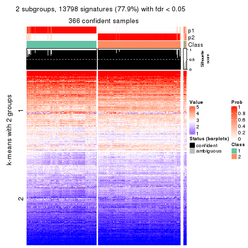</p>

</div>
<div id='tab-SD-kmeans-get-signatures-no-scale-2'>
<pre><code class="r">get_signatures(res, k = 3, scale_rows = FALSE)
</code></pre>

<p></p>

</div>
<div id='tab-SD-kmeans-get-signatures-no-scale-3'>
<pre><code class="r">get_signatures(res, k = 4, scale_rows = FALSE)
</code></pre>

<p></p>

</div>
<div id='tab-SD-kmeans-get-signatures-no-scale-4'>
<pre><code class="r">get_signatures(res, k = 5, scale_rows = FALSE)
</code></pre>

<p></p>

</div>
<div id='tab-SD-kmeans-get-signatures-no-scale-5'>
<pre><code class="r">get_signatures(res, k = 6, scale_rows = FALSE)
</code></pre>

<p></p>

</div>
</div>


Compare the overlap of signatures from different k:

```r
compare_signatures(res)
```


`get_signature()` returns a data frame invisibly. TO get the list of signatures, the function
call should be assigned to a variable explicitly. In following code, if `plot` argument is set
to `FALSE`, no heatmap is plotted while only the differential analysis is performed.

```r
# code only for demonstration
tb = get_signature(res, k = ..., plot = FALSE)
```

An example of the output of `tb` is:

```
#>   which_row         fdr    mean_1    mean_2 scaled_mean_1 scaled_mean_2 km
#> 1        38 0.042760348  8.373488  9.131774    -0.5533452     0.5164555  1
#> 2        40 0.018707592  7.106213  8.469186    -0.6173731     0.5762149  1
#> 3        55 0.019134737 10.221463 11.207825    -0.6159697     0.5749050  1
#> 4        59 0.006059896  5.921854  7.869574    -0.6899429     0.6439467  1
#> 5        60 0.018055526  8.928898 10.211722    -0.6204761     0.5791110  1
#> 6        98 0.009384629 15.714769 14.887706     0.6635654    -0.6193277  2
...
```

The columns in `tb` are:

1. `which_row`: row indices corresponding to the input matrix.
2. `fdr`: FDR for the differential test. 
3. `mean_x`: The mean value in group x.
4. `scaled_mean_x`: The mean value in group x after rows are scaled.
5. `km`: Row groups if k-means clustering is applied to rows.


UMAP plot which shows how samples are separated.


<script>
$( function() {
	$( '#tabs-SD-kmeans-dimension-reduction' ).tabs();
} );
</script>
<div id='tabs-SD-kmeans-dimension-reduction'>
<ul>
<li><a href='#tab-SD-kmeans-dimension-reduction-1'>k = 2</a></li>
<li><a href='#tab-SD-kmeans-dimension-reduction-2'>k = 3</a></li>
<li><a href='#tab-SD-kmeans-dimension-reduction-3'>k = 4</a></li>
<li><a href='#tab-SD-kmeans-dimension-reduction-4'>k = 5</a></li>
<li><a href='#tab-SD-kmeans-dimension-reduction-5'>k = 6</a></li>
</ul>
<div id='tab-SD-kmeans-dimension-reduction-1'>
<pre><code class="r">dimension_reduction(res, k = 2, method = &quot;UMAP&quot;)
</code></pre>

<p></p>

</div>
<div id='tab-SD-kmeans-dimension-reduction-2'>
<pre><code class="r">dimension_reduction(res, k = 3, method = &quot;UMAP&quot;)
</code></pre>

<p></p>

</div>
<div id='tab-SD-kmeans-dimension-reduction-3'>
<pre><code class="r">dimension_reduction(res, k = 4, method = &quot;UMAP&quot;)
</code></pre>

<p></p>

</div>
<div id='tab-SD-kmeans-dimension-reduction-4'>
<pre><code class="r">dimension_reduction(res, k = 5, method = &quot;UMAP&quot;)
</code></pre>

<p></p>

</div>
<div id='tab-SD-kmeans-dimension-reduction-5'>
<pre><code class="r">dimension_reduction(res, k = 6, method = &quot;UMAP&quot;)
</code></pre>

<p></p>

</div>
</div>


Following heatmap shows how subgroups are split when increasing `k`:

```r
collect_classes(res)
```


If matrix rows can be associated to genes, consider to use `GO_Enrichment(res,
...)` to perform function enrichment for the signature genes.


 

---------------------------------------------------


### SD:skmeans**


The object with results only for a single top-value method and a single partition method 
can be extracted as:

```r
res = res_list["SD", "skmeans"]
# you can also extract it by
# res = res_list["SD:skmeans"]
```

A summary of `res` and all the functions that can be applied to it:

```r
res
```

```
#> A 'ConsensusPartition' object with k = 2, 3, 4, 5, 6.
#>   On a matrix with 17723 rows and 374 columns.
#>   Top rows (1000, 2000, 3000, 4000, 5000) are extracted by 'SD' method.
#>   Subgroups are detected by 'skmeans' method.
#>   Performed in total 1250 partitions by row resampling.
#>   Best k for subgroups seems to be 2.
#> 
#> Following methods can be applied to this 'ConsensusPartition' object:
#>  [1] "cola_report"             "collect_classes"         "collect_plots"          
#>  [4] "collect_stats"           "colnames"                "compare_signatures"     
#>  [7] "consensus_heatmap"       "dimension_reduction"     "functional_enrichment"  
#> [10] "get_anno_col"            "get_anno"                "get_classes"            
#> [13] "get_consensus"           "get_matrix"              "get_membership"         
#> [16] "get_param"               "get_signatures"          "get_stats"              
#> [19] "is_best_k"               "is_stable_k"             "membership_heatmap"     
#> [22] "ncol"                    "nrow"                    "plot_ecdf"              
#> [25] "rownames"                "select_partition_number" "show"                   
#> [28] "suggest_best_k"          "test_to_known_factors"
```

`collect_plots()` function collects all the plots made from `res` for all `k` (number of partitions)
into one single page to provide an easy and fast comparison between different `k`.

```r
collect_plots(res)
```


The plots are:

- The first row: a plot of the ECDF (Empirical cumulative distribution
  function) curves of the consensus matrix for each `k` and the heatmap of
  predicted classes for each `k`.
- The second row: heatmaps of the consensus matrix for each `k`.
- The third row: heatmaps of the membership matrix for each `k`.
- The fouth row: heatmaps of the signatures for each `k`.

All the plots in panels can be made by individual functions and they are
plotted later in this section.

`select_partition_number()` produces several plots showing different
statistics for choosing "optimized" `k`. There are following statistics:

- ECDF curves of the consensus matrix for each `k`;
- 1-PAC. [The PAC
  score](https://en.wikipedia.org/wiki/Consensus_clustering#Over-interpretation_potential_of_consensus_clustering)
  measures the proportion of the ambiguous subgrouping.
- Mean silhouette score.
- Concordance. The mean probability of fiting the consensus class ids in all
  partitions.
- Area increased. Denote $A_k$ as the area under the ECDF curve for current
  `k`, the area increased is defined as $A_k - A_{k-1}$.
- Rand index. The percent of pairs of samples that are both in a same cluster
  or both are not in a same cluster in the partition of k and k-1.
- Jaccard index. The ratio of pairs of samples are both in a same cluster in
  the partition of k and k-1 and the pairs of samples are both in a same
  cluster in the partition k or k-1.

The detailed explanations of these statistics can be found in [the cola
vignette](http://bioconductor.org/packages/devel/bioc/vignettes/cola/inst/doc/cola.html#toc_13).

Generally speaking, lower PAC score, higher mean silhouette score or higher
concordance corresponds to better partition. Rand index and Jaccard index
measure how similar the current partition is compared to partition with `k-1`.
If they are too similar, we won't accept `k` is better than `k-1`.

```r
select_partition_number(res)
```


The numeric values for all these statistics can be obtained by `get_stats()`.

```r
get_stats(res)
```

```
#>   k 1-PAC mean_silhouette concordance area_increased  Rand Jaccard
#> 2 2 0.983           0.960       0.984         0.5006 0.500   0.500
#> 3 3 0.867           0.860       0.934         0.2940 0.818   0.649
#> 4 4 0.787           0.752       0.873         0.1362 0.828   0.561
#> 5 5 0.793           0.812       0.888         0.0629 0.915   0.695
#> 6 6 0.773           0.658       0.829         0.0404 0.909   0.632
```

`suggest_best_k()` suggests the best $k$ based on these statistics. The rules are as follows:

- All $k$ with Jaccard index larger than 0.95 are removed because the increase of
  the partition number does not provides enough extra information. If all $k$ are removed,
  the best $k$ is assigned by `NA`.
- For $k$ with 1-PAC larger than 0.9, the maximal $k$ is taken as the "best k". Other $k$ is called "optional k".
- If it does not fit the second rule. The $k$ with the highest vote of highest
  1-PAC, mean silhouette and concordance is taken as the "best k".

```r
suggest_best_k(res)
```

```
#> [1] 2
```


Following shows the table of the partitions (You need to click the **show/hide
code output** link to see it). The membership matrix (columns with name `p*`)
is inferred by
[`clue::cl_consensus()`](https://www.rdocumentation.org/link/cl_consensus?package=clue)
function with the `SE` method. Basically the value in the membership matrix
represents the probability to belong to a certain group. The finall class
label for an item is determined with the group with highest probability it
belongs to.

In `get_classes()` function, the entropy is calculated from the membership
matrix and the silhouette score is calculated from the consensus matrix.


<script>
$( function() {
	$( '#tabs-SD-skmeans-get-classes' ).tabs();
} );
</script>
<div id='tabs-SD-skmeans-get-classes'>
<ul>
<li><a href='#tab-SD-skmeans-get-classes-1'>k = 2</a></li>
<li><a href='#tab-SD-skmeans-get-classes-2'>k = 3</a></li>
<li><a href='#tab-SD-skmeans-get-classes-3'>k = 4</a></li>
<li><a href='#tab-SD-skmeans-get-classes-4'>k = 5</a></li>
<li><a href='#tab-SD-skmeans-get-classes-5'>k = 6</a></li>
</ul>

<div id='tab-SD-skmeans-get-classes-1'>
<p><a id='tab-SD-skmeans-get-classes-1-a' style='color:#0366d6' href='#'>show/hide code output</a></p>
<pre><code class="r">cbind(get_classes(res, k = 2), get_membership(res, k = 2))
</code></pre>

<pre><code>#&gt;            class entropy silhouette    p1    p2
#&gt; SRR660824      1  0.0000      0.988 1.000 0.000
#&gt; SRR603858      1  0.0938      0.977 0.988 0.012
#&gt; SRR817070      2  0.0000      0.979 0.000 1.000
#&gt; SRR1486995     1  0.0000      0.988 1.000 0.000
#&gt; SRR813043      2  0.0000      0.979 0.000 1.000
#&gt; SRR656874      2  0.0000      0.979 0.000 1.000
#&gt; SRR659037      1  0.7219      0.744 0.800 0.200
#&gt; SRR662031      1  0.0000      0.988 1.000 0.000
#&gt; SRR1081283     2  0.0000      0.979 0.000 1.000
#&gt; SRR1481036     1  0.0000      0.988 1.000 0.000
#&gt; SRR1434009     2  0.0000      0.979 0.000 1.000
#&gt; SRR1376676     1  0.0000      0.988 1.000 0.000
#&gt; SRR1396967     2  0.0000      0.979 0.000 1.000
#&gt; SRR665429      2  0.0000      0.979 0.000 1.000
#&gt; SRR1388025     2  0.0000      0.979 0.000 1.000
#&gt; SRR600784      1  0.0000      0.988 1.000 0.000
#&gt; SRR657611      1  0.0000      0.988 1.000 0.000
#&gt; SRR1333659     2  0.0000      0.979 0.000 1.000
#&gt; SRR1323896     2  0.0000      0.979 0.000 1.000
#&gt; SRR1453971     1  0.0000      0.988 1.000 0.000
#&gt; SRR1421010     1  0.0000      0.988 1.000 0.000
#&gt; SRR1334490     1  0.0000      0.988 1.000 0.000
#&gt; SRR1309468     1  0.0000      0.988 1.000 0.000
#&gt; SRR1468637     1  0.7815      0.696 0.768 0.232
#&gt; SRR1365489     2  0.0000      0.979 0.000 1.000
#&gt; SRR627445      1  0.0000      0.988 1.000 0.000
#&gt; SRR607863      2  0.0000      0.979 0.000 1.000
#&gt; SRR1475524     1  0.0000      0.988 1.000 0.000
#&gt; SRR1405504     2  0.0000      0.979 0.000 1.000
#&gt; SRR615695      1  0.0000      0.988 1.000 0.000
#&gt; SRR600900      2  0.0000      0.979 0.000 1.000
#&gt; SRR601477      2  0.0000      0.979 0.000 1.000
#&gt; SRR1487215     2  0.0000      0.979 0.000 1.000
#&gt; SRR1310797     2  0.0000      0.979 0.000 1.000
#&gt; SRR1362713     1  0.0000      0.988 1.000 0.000
#&gt; SRR1431385     1  0.0000      0.988 1.000 0.000
#&gt; SRR1379089     2  0.0000      0.979 0.000 1.000
#&gt; SRR1102079     1  0.0000      0.988 1.000 0.000
#&gt; SRR1357210     1  0.0000      0.988 1.000 0.000
#&gt; SRR657659      2  0.0000      0.979 0.000 1.000
#&gt; SRR663573      2  0.0000      0.979 0.000 1.000
#&gt; SRR603188      2  0.0000      0.979 0.000 1.000
#&gt; SRR1471200     2  0.0000      0.979 0.000 1.000
#&gt; SRR1310975     2  0.0000      0.979 0.000 1.000
#&gt; SRR627457      1  0.3733      0.915 0.928 0.072
#&gt; SRR1367654     2  0.0000      0.979 0.000 1.000
#&gt; SRR1488410     1  0.0000      0.988 1.000 0.000
#&gt; SRR1457750     1  0.9686      0.340 0.604 0.396
#&gt; SRR1099546     1  0.0000      0.988 1.000 0.000
#&gt; SRR604480      2  0.0000      0.979 0.000 1.000
#&gt; SRR1390477     2  0.0000      0.979 0.000 1.000
#&gt; SRR1458447     2  0.0000      0.979 0.000 1.000
#&gt; SRR1473161     2  0.0000      0.979 0.000 1.000
#&gt; SRR1409813     2  0.0000      0.979 0.000 1.000
#&gt; SRR612791      1  0.0000      0.988 1.000 0.000
#&gt; SRR1470580     2  0.9393      0.454 0.356 0.644
#&gt; SRR1444063     1  0.9710      0.329 0.600 0.400
#&gt; SRR1355578     1  0.0000      0.988 1.000 0.000
#&gt; SRR1429203     1  0.0000      0.988 1.000 0.000
#&gt; SRR599154      2  0.0000      0.979 0.000 1.000
#&gt; SRR814244      1  0.0000      0.988 1.000 0.000
#&gt; SRR1404123     2  0.0000      0.979 0.000 1.000
#&gt; SRR656934      1  0.0000      0.988 1.000 0.000
#&gt; SRR1339029     2  0.0000      0.979 0.000 1.000
#&gt; SRR821525      2  0.0000      0.979 0.000 1.000
#&gt; SRR1443677     1  0.0000      0.988 1.000 0.000
#&gt; SRR1406330     1  0.0000      0.988 1.000 0.000
#&gt; SRR1338124     1  0.7056      0.763 0.808 0.192
#&gt; SRR1391376     1  0.0000      0.988 1.000 0.000
#&gt; SRR661842      2  0.0000      0.979 0.000 1.000
#&gt; SRR1395699     1  0.0000      0.988 1.000 0.000
#&gt; SRR1312209     1  0.0000      0.988 1.000 0.000
#&gt; SRR1359469     1  0.0000      0.988 1.000 0.000
#&gt; SRR658885      1  0.0000      0.988 1.000 0.000
#&gt; SRR1414578     1  0.0000      0.988 1.000 0.000
#&gt; SRR603620      2  0.0000      0.979 0.000 1.000
#&gt; SRR604677      1  0.0000      0.988 1.000 0.000
#&gt; SRR603800      2  0.0000      0.979 0.000 1.000
#&gt; SRR602058      2  0.0000      0.979 0.000 1.000
#&gt; SRR817488      2  0.0000      0.979 0.000 1.000
#&gt; SRR655601      2  0.0000      0.979 0.000 1.000
#&gt; SRR1434821     2  0.0000      0.979 0.000 1.000
#&gt; SRR1349166     2  0.0000      0.979 0.000 1.000
#&gt; SRR615129      2  0.9795      0.297 0.416 0.584
#&gt; SRR607586      2  0.0000      0.979 0.000 1.000
#&gt; SRR602680      2  0.0000      0.979 0.000 1.000
#&gt; SRR1411070     2  0.0000      0.979 0.000 1.000
#&gt; SRR663038      2  0.0000      0.979 0.000 1.000
#&gt; SRR1489416     2  0.0000      0.979 0.000 1.000
#&gt; SRR1479155     1  0.0000      0.988 1.000 0.000
#&gt; SRR662162      1  0.0000      0.988 1.000 0.000
#&gt; SRR1374567     1  0.0000      0.988 1.000 0.000
#&gt; SRR1434048     2  0.0000      0.979 0.000 1.000
#&gt; SRR2184865     2  0.0000      0.979 0.000 1.000
#&gt; SRR2170135     1  0.0000      0.988 1.000 0.000
#&gt; SRR615551      2  0.0000      0.979 0.000 1.000
#&gt; SRR1335513     2  0.0000      0.979 0.000 1.000
#&gt; SRR1370216     1  0.0000      0.988 1.000 0.000
#&gt; SRR662954      2  0.0000      0.979 0.000 1.000
#&gt; SRR1375738     1  0.0000      0.988 1.000 0.000
#&gt; SRR1356577     1  0.0000      0.988 1.000 0.000
#&gt; SRR1073119     1  0.0000      0.988 1.000 0.000
#&gt; SRR663549      1  0.0000      0.988 1.000 0.000
#&gt; SRR1478015     2  0.0000      0.979 0.000 1.000
#&gt; SRR600632      2  0.0000      0.979 0.000 1.000
#&gt; SRR811866      1  0.0000      0.988 1.000 0.000
#&gt; SRR1401101     2  0.0000      0.979 0.000 1.000
#&gt; SRR1477797     2  0.0000      0.979 0.000 1.000
#&gt; SRR1402986     2  0.0000      0.979 0.000 1.000
#&gt; SRR658897      1  0.0000      0.988 1.000 0.000
#&gt; SRR1419869     1  0.0000      0.988 1.000 0.000
#&gt; SRR1490700     1  0.0000      0.988 1.000 0.000
#&gt; SRR601723      2  0.0000      0.979 0.000 1.000
#&gt; SRR1384115     2  0.0000      0.979 0.000 1.000
#&gt; SRR1476927     2  0.0000      0.979 0.000 1.000
#&gt; SRR1387769     1  0.0000      0.988 1.000 0.000
#&gt; SRR1322595     1  0.0000      0.988 1.000 0.000
#&gt; SRR1370423     1  0.0000      0.988 1.000 0.000
#&gt; SRR1314976     1  0.0000      0.988 1.000 0.000
#&gt; SRR1319560     2  0.0000      0.979 0.000 1.000
#&gt; SRR1352683     1  0.0000      0.988 1.000 0.000
#&gt; SRR1473800     1  0.0000      0.988 1.000 0.000
#&gt; SRR1326384     1  0.0000      0.988 1.000 0.000
#&gt; SRR1360807     2  0.5519      0.846 0.128 0.872
#&gt; SRR1332544     1  0.0000      0.988 1.000 0.000
#&gt; SRR598695      1  0.0000      0.988 1.000 0.000
#&gt; SRR807824      2  0.0000      0.979 0.000 1.000
#&gt; SRR809296      1  0.0000      0.988 1.000 0.000
#&gt; SRR657927      1  0.0000      0.988 1.000 0.000
#&gt; SRR1440682     2  0.0000      0.979 0.000 1.000
#&gt; SRR1454415     2  0.0000      0.979 0.000 1.000
#&gt; SRR1419131     2  0.0000      0.979 0.000 1.000
#&gt; SRR1404293     1  0.0000      0.988 1.000 0.000
#&gt; SRR1473340     1  0.0000      0.988 1.000 0.000
#&gt; SRR1345563     1  0.0000      0.988 1.000 0.000
#&gt; SRR1323382     2  0.0000      0.979 0.000 1.000
#&gt; SRR1480697     1  0.0000      0.988 1.000 0.000
#&gt; SRR1321808     2  0.0000      0.979 0.000 1.000
#&gt; SRR1382756     2  0.0000      0.979 0.000 1.000
#&gt; SRR1312558     2  0.0000      0.979 0.000 1.000
#&gt; SRR1417088     2  0.0000      0.979 0.000 1.000
#&gt; SRR1433027     2  0.0000      0.979 0.000 1.000
#&gt; SRR662257      2  0.0000      0.979 0.000 1.000
#&gt; SRR600417      2  0.0000      0.979 0.000 1.000
#&gt; SRR812493      2  0.0000      0.979 0.000 1.000
#&gt; SRR612743      1  0.0000      0.988 1.000 0.000
#&gt; SRR1361345     1  0.0000      0.988 1.000 0.000
#&gt; SRR600584      2  0.0000      0.979 0.000 1.000
#&gt; SRR1310520     2  0.0000      0.979 0.000 1.000
#&gt; SRR1395595     1  0.0000      0.988 1.000 0.000
#&gt; SRR1334074     2  0.2948      0.930 0.052 0.948
#&gt; SRR654838      2  0.0000      0.979 0.000 1.000
#&gt; SRR1376694     1  0.0000      0.988 1.000 0.000
#&gt; SRR1433841     2  0.9635      0.375 0.388 0.612
#&gt; SRR1366837     1  0.0000      0.988 1.000 0.000
#&gt; SRR1467479     2  0.0000      0.979 0.000 1.000
#&gt; SRR1459055     1  0.0000      0.988 1.000 0.000
#&gt; SRR1471050     2  0.0000      0.979 0.000 1.000
#&gt; SRR603004      2  0.0000      0.979 0.000 1.000
#&gt; SRR814703      2  0.0000      0.979 0.000 1.000
#&gt; SRR661937      2  0.0000      0.979 0.000 1.000
#&gt; SRR614359      1  0.0000      0.988 1.000 0.000
#&gt; SRR1071568     2  0.0000      0.979 0.000 1.000
#&gt; SRR1389084     1  0.0000      0.988 1.000 0.000
#&gt; SRR1337624     2  0.0000      0.979 0.000 1.000
#&gt; SRR1344400     2  0.0000      0.979 0.000 1.000
#&gt; SRR1414290     2  0.0000      0.979 0.000 1.000
#&gt; SRR1413644     2  0.0000      0.979 0.000 1.000
#&gt; SRR1098998     1  0.0000      0.988 1.000 0.000
#&gt; SRR1481279     1  0.0000      0.988 1.000 0.000
#&gt; SRR1315103     1  0.0000      0.988 1.000 0.000
#&gt; SRR1099286     1  0.0000      0.988 1.000 0.000
#&gt; SRR2166570     1  0.0000      0.988 1.000 0.000
#&gt; SRR601445      1  0.0000      0.988 1.000 0.000
#&gt; SRR1439719     2  0.0000      0.979 0.000 1.000
#&gt; SRR1377026     2  0.0000      0.979 0.000 1.000
#&gt; SRR1327386     1  0.0000      0.988 1.000 0.000
#&gt; SRR654826      2  0.0000      0.979 0.000 1.000
#&gt; SRR1460433     2  0.0000      0.979 0.000 1.000
#&gt; SRR1469345     1  0.0000      0.988 1.000 0.000
#&gt; SRR1421462     2  0.0000      0.979 0.000 1.000
#&gt; SRR662966      1  0.0000      0.988 1.000 0.000
#&gt; SRR1339175     1  0.0000      0.988 1.000 0.000
#&gt; SRR1447736     2  0.0000      0.979 0.000 1.000
#&gt; SRR1434671     2  0.0000      0.979 0.000 1.000
#&gt; SRR660800      2  0.0000      0.979 0.000 1.000
#&gt; SRR1465543     2  0.0000      0.979 0.000 1.000
#&gt; SRR1342023     1  0.0000      0.988 1.000 0.000
#&gt; SRR1335670     1  0.0000      0.988 1.000 0.000
#&gt; SRR1400955     2  0.0000      0.979 0.000 1.000
#&gt; SRR1072150     2  0.0000      0.979 0.000 1.000
#&gt; SRR1442822     1  0.0000      0.988 1.000 0.000
#&gt; SRR1364658     1  0.0000      0.988 1.000 0.000
#&gt; SRR1098074     2  0.0000      0.979 0.000 1.000
#&gt; SRR1442778     1  0.0000      0.988 1.000 0.000
#&gt; SRR1086728     1  0.5408      0.852 0.876 0.124
#&gt; SRR627464      2  0.9710      0.342 0.400 0.600
#&gt; SRR1409193     1  0.0000      0.988 1.000 0.000
#&gt; SRR2168286     2  0.0000      0.979 0.000 1.000
#&gt; SRR615539      2  0.0000      0.979 0.000 1.000
#&gt; SRR663623      1  0.0000      0.988 1.000 0.000
#&gt; SRR1471989     1  0.0000      0.988 1.000 0.000
#&gt; SRR1468828     2  0.0000      0.979 0.000 1.000
#&gt; SRR1381934     1  0.0000      0.988 1.000 0.000
#&gt; SRR1471098     1  0.0000      0.988 1.000 0.000
#&gt; SRR1314749     1  0.0000      0.988 1.000 0.000
#&gt; SRR2166874     2  0.0000      0.979 0.000 1.000
#&gt; SRR821302      1  0.0000      0.988 1.000 0.000
#&gt; SRR1435066     2  0.0000      0.979 0.000 1.000
#&gt; SRR661601      2  0.0000      0.979 0.000 1.000
#&gt; SRR1446546     2  0.0000      0.979 0.000 1.000
#&gt; SRR1419784     1  0.0000      0.988 1.000 0.000
#&gt; SRR1357233     2  0.0000      0.979 0.000 1.000
#&gt; SRR1441889     1  0.0000      0.988 1.000 0.000
#&gt; SRR1413940     1  0.0000      0.988 1.000 0.000
#&gt; SRR1324250     2  0.0000      0.979 0.000 1.000
#&gt; SRR1442862     2  0.0000      0.979 0.000 1.000
#&gt; SRR662474      2  0.0000      0.979 0.000 1.000
#&gt; SRR1416226     1  0.0000      0.988 1.000 0.000
#&gt; SRR1417404     1  0.0000      0.988 1.000 0.000
#&gt; SRR665466      2  0.0000      0.979 0.000 1.000
#&gt; SRR658849      1  0.0000      0.988 1.000 0.000
#&gt; SRR1460025     2  0.0000      0.979 0.000 1.000
#&gt; SRR1408136     1  0.0000      0.988 1.000 0.000
#&gt; SRR1489995     2  0.0000      0.979 0.000 1.000
#&gt; SRR1374092     1  0.0000      0.988 1.000 0.000
#&gt; SRR1488429     1  0.0000      0.988 1.000 0.000
#&gt; SRR1087559     1  0.0376      0.984 0.996 0.004
#&gt; SRR817004      1  0.7219      0.748 0.800 0.200
#&gt; SRR1429660     2  0.0000      0.979 0.000 1.000
#&gt; SRR604390      1  0.0000      0.988 1.000 0.000
#&gt; SRR614936      2  0.0000      0.979 0.000 1.000
#&gt; SRR1365938     2  0.9710      0.342 0.400 0.600
#&gt; SRR1437324     1  0.0000      0.988 1.000 0.000
#&gt; SRR613414      2  0.0000      0.979 0.000 1.000
#&gt; SRR660414      1  0.0000      0.988 1.000 0.000
#&gt; SRR1452185     1  0.0000      0.988 1.000 0.000
#&gt; SRR1347020     1  0.0000      0.988 1.000 0.000
#&gt; SRR1398036     2  0.0000      0.979 0.000 1.000
#&gt; SRR1436674     1  0.0000      0.988 1.000 0.000
#&gt; SRR603750      1  0.0000      0.988 1.000 0.000
#&gt; SRR608630      2  0.6148      0.817 0.152 0.848
#&gt; SRR655625      2  0.0000      0.979 0.000 1.000
#&gt; SRR599059      2  0.8763      0.586 0.296 0.704
#&gt; SRR615189      2  0.0000      0.979 0.000 1.000
#&gt; SRR1466889     2  0.0000      0.979 0.000 1.000
#&gt; SRR1084602     2  0.6247      0.811 0.156 0.844
#&gt; SRR1335422     1  0.0000      0.988 1.000 0.000
#&gt; SRR1356805     2  0.0000      0.979 0.000 1.000
#&gt; SRR1385300     1  0.0000      0.988 1.000 0.000
#&gt; SRR654814      1  0.0000      0.988 1.000 0.000
#&gt; SRR658385      2  0.0000      0.979 0.000 1.000
#&gt; SRR820596      1  0.0000      0.988 1.000 0.000
#&gt; SRR1318118     1  0.0000      0.988 1.000 0.000
#&gt; SRR1480766     2  0.0000      0.979 0.000 1.000
#&gt; SRR1406539     1  0.0000      0.988 1.000 0.000
#&gt; SRR1341833     2  0.0000      0.979 0.000 1.000
#&gt; SRR1441826     2  0.0000      0.979 0.000 1.000
#&gt; SRR1448051     1  0.0000      0.988 1.000 0.000
#&gt; SRR1326752     1  0.0000      0.988 1.000 0.000
#&gt; SRR665217      1  0.0000      0.988 1.000 0.000
#&gt; SRR819186      2  0.0000      0.979 0.000 1.000
#&gt; SRR661517      1  0.0000      0.988 1.000 0.000
#&gt; SRR607166      2  0.0000      0.979 0.000 1.000
#&gt; SRR809065      2  0.0000      0.979 0.000 1.000
#&gt; SRR1415872     2  0.0000      0.979 0.000 1.000
#&gt; SRR1415463     1  0.0000      0.988 1.000 0.000
#&gt; SRR1381161     2  0.0000      0.979 0.000 1.000
#&gt; SRR1442231     2  0.0000      0.979 0.000 1.000
#&gt; SRR1374696     1  0.0000      0.988 1.000 0.000
#&gt; SRR1451988     1  0.0000      0.988 1.000 0.000
#&gt; SRR660555      1  0.0000      0.988 1.000 0.000
#&gt; SRR657801      1  0.0000      0.988 1.000 0.000
#&gt; SRR663344      2  0.0000      0.979 0.000 1.000
#&gt; SRR1472462     2  0.0000      0.979 0.000 1.000
#&gt; SRR1406176     1  0.6048      0.822 0.852 0.148
#&gt; SRR656886      2  0.0000      0.979 0.000 1.000
#&gt; SRR1498337     2  0.0000      0.979 0.000 1.000
#&gt; SRR613066      1  0.0000      0.988 1.000 0.000
#&gt; SRR1309490     1  0.0000      0.988 1.000 0.000
#&gt; SRR602492      2  0.0000      0.979 0.000 1.000
#&gt; SRR1447347     1  0.0000      0.988 1.000 0.000
#&gt; SRR1475546     2  0.0000      0.979 0.000 1.000
#&gt; SRR627459      2  0.7453      0.733 0.212 0.788
#&gt; SRR1434332     2  0.0000      0.979 0.000 1.000
#&gt; SRR1070358     2  0.0000      0.979 0.000 1.000
#&gt; SRR1345936     2  0.7883      0.696 0.236 0.764
#&gt; SRR665658      2  0.0000      0.979 0.000 1.000
#&gt; SRR1321351     2  0.0000      0.979 0.000 1.000
#&gt; SRR657880      2  0.0000      0.979 0.000 1.000
#&gt; SRR1373903     2  0.0000      0.979 0.000 1.000
#&gt; SRR657396      2  0.0000      0.979 0.000 1.000
#&gt; SRR660981      2  0.0000      0.979 0.000 1.000
#&gt; SRR818499      1  0.0000      0.988 1.000 0.000
#&gt; SRR819658      2  0.0000      0.979 0.000 1.000
#&gt; SRR1376316     1  0.0000      0.988 1.000 0.000
#&gt; SRR1323723     2  0.0000      0.979 0.000 1.000
#&gt; SRR1476719     1  0.0000      0.988 1.000 0.000
#&gt; SRR1403478     2  0.0000      0.979 0.000 1.000
#&gt; SRR1095695     1  0.0000      0.988 1.000 0.000
#&gt; SRR1352391     1  0.0000      0.988 1.000 0.000
#&gt; SRR1498813     2  0.0000      0.979 0.000 1.000
#&gt; SRR627437      2  0.8909      0.566 0.308 0.692
#&gt; SRR2185097     1  0.0000      0.988 1.000 0.000
#&gt; SRR817166      1  0.0000      0.988 1.000 0.000
#&gt; SRR1091670     2  0.0000      0.979 0.000 1.000
#&gt; SRR603776      1  0.0000      0.988 1.000 0.000
#&gt; SRR1479640     2  0.0000      0.979 0.000 1.000
#&gt; SRR660152      1  0.0000      0.988 1.000 0.000
#&gt; SRR1074769     2  0.0000      0.979 0.000 1.000
#&gt; SRR656153      2  0.0000      0.979 0.000 1.000
#&gt; SRR1392502     1  0.0000      0.988 1.000 0.000
#&gt; SRR1359609     1  0.0000      0.988 1.000 0.000
#&gt; SRR601925      2  0.0000      0.979 0.000 1.000
#&gt; SRR2165182     2  0.0000      0.979 0.000 1.000
#&gt; SRR608542      2  0.0000      0.979 0.000 1.000
#&gt; SRR655064      2  0.0000      0.979 0.000 1.000
#&gt; SRR1432430     1  0.0000      0.988 1.000 0.000
#&gt; SRR808472      2  0.0000      0.979 0.000 1.000
#&gt; SRR1414958     1  0.0000      0.988 1.000 0.000
#&gt; SRR598484      2  0.0000      0.979 0.000 1.000
#&gt; SRR612755      1  0.0000      0.988 1.000 0.000
#&gt; SRR1365808     1  0.0000      0.988 1.000 0.000
#&gt; SRR1391724     1  0.3879      0.910 0.924 0.076
#&gt; SRR1322373     1  0.0000      0.988 1.000 0.000
#&gt; SRR1489265     2  0.0000      0.979 0.000 1.000
#&gt; SRR1359099     2  0.0000      0.979 0.000 1.000
#&gt; SRR607279      2  0.0000      0.979 0.000 1.000
#&gt; SRR810461      2  0.0000      0.979 0.000 1.000
#&gt; SRR627427      1  0.0000      0.988 1.000 0.000
#&gt; SRR612887      2  0.0000      0.979 0.000 1.000
#&gt; SRR809807      2  0.0000      0.979 0.000 1.000
#&gt; SRR663112      2  0.0938      0.968 0.012 0.988
#&gt; SRR1346933     2  0.7950      0.685 0.240 0.760
#&gt; SRR1487910     1  0.0000      0.988 1.000 0.000
#&gt; SRR603092      2  0.0000      0.979 0.000 1.000
#&gt; SRR1417680     2  0.0000      0.979 0.000 1.000
#&gt; SRR1383785     1  0.0000      0.988 1.000 0.000
#&gt; SRR1070015     2  0.0000      0.979 0.000 1.000
#&gt; SRR1466222     2  0.2778      0.933 0.048 0.952
#&gt; SRR1416119     1  0.0000      0.988 1.000 0.000
#&gt; SRR819318      1  0.0000      0.988 1.000 0.000
#&gt; SRR608288      2  0.0000      0.979 0.000 1.000
#&gt; SRR811121      2  0.0000      0.979 0.000 1.000
#&gt; SRR613138      2  0.0000      0.979 0.000 1.000
#&gt; SRR810483      1  0.0000      0.988 1.000 0.000
#&gt; SRR607839      1  0.0000      0.988 1.000 0.000
#&gt; SRR1337031     1  0.0000      0.988 1.000 0.000
#&gt; SRR601311      2  0.0000      0.979 0.000 1.000
#&gt; SRR1406685     2  0.0000      0.979 0.000 1.000
#&gt; SRR1467500     2  0.0000      0.979 0.000 1.000
#&gt; SRR1308504     1  0.0000      0.988 1.000 0.000
#&gt; SRR1312865     1  0.0000      0.988 1.000 0.000
#&gt; SRR1312522     1  0.0000      0.988 1.000 0.000
#&gt; SRR1490486     2  0.0000      0.979 0.000 1.000
#&gt; SRR1325888     1  0.0000      0.988 1.000 0.000
#&gt; SRR1472885     1  0.0000      0.988 1.000 0.000
#&gt; SRR1098785     2  0.0000      0.979 0.000 1.000
#&gt; SRR1084766     2  0.0000      0.979 0.000 1.000
#&gt; SRR1102804     2  0.0000      0.979 0.000 1.000
#&gt; SRR1336636     1  0.0000      0.988 1.000 0.000
#&gt; SRR1347795     1  0.0000      0.988 1.000 0.000
#&gt; SRR601900      2  0.0000      0.979 0.000 1.000
#&gt; SRR1330989     2  0.0000      0.979 0.000 1.000
#&gt; SRR658445      2  0.0000      0.979 0.000 1.000
#&gt; SRR1368754     1  0.0000      0.988 1.000 0.000
#&gt; SRR1460001     2  0.0000      0.979 0.000 1.000
#&gt; SRR1414934     1  0.0000      0.988 1.000 0.000
#&gt; SRR1326249     1  0.0000      0.988 1.000 0.000
#&gt; SRR614948      1  0.0000      0.988 1.000 0.000
#&gt; SRR1472952     1  0.0000      0.988 1.000 0.000
#&gt; SRR1321528     1  0.0000      0.988 1.000 0.000
#&gt; SRR627447      1  0.0000      0.988 1.000 0.000
#&gt; SRR612239      2  0.8813      0.582 0.300 0.700
</code></pre>

<script>
$('#tab-SD-skmeans-get-classes-1-a').parent().next().next().hide();
$('#tab-SD-skmeans-get-classes-1-a').click(function(){
  $('#tab-SD-skmeans-get-classes-1-a').parent().next().next().toggle();
  return(false);
});
</script>
</div>

<div id='tab-SD-skmeans-get-classes-2'>
<p><a id='tab-SD-skmeans-get-classes-2-a' style='color:#0366d6' href='#'>show/hide code output</a></p>
<pre><code class="r">cbind(get_classes(res, k = 3), get_membership(res, k = 3))
</code></pre>

<pre><code>#&gt;            class entropy silhouette    p1    p2    p3
#&gt; SRR660824      1  0.0237     0.9511 0.996 0.000 0.004
#&gt; SRR603858      3  0.4654     0.6911 0.208 0.000 0.792
#&gt; SRR817070      2  0.6244     0.1843 0.000 0.560 0.440
#&gt; SRR1486995     1  0.0237     0.9511 0.996 0.000 0.004
#&gt; SRR813043      2  0.0000     0.9284 0.000 1.000 0.000
#&gt; SRR656874      2  0.0000     0.9284 0.000 1.000 0.000
#&gt; SRR659037      3  0.0000     0.8702 0.000 0.000 1.000
#&gt; SRR662031      1  0.0000     0.9515 1.000 0.000 0.000
#&gt; SRR1081283     3  0.2796     0.8831 0.000 0.092 0.908
#&gt; SRR1481036     1  0.4346     0.7472 0.816 0.000 0.184
#&gt; SRR1434009     2  0.2711     0.8588 0.000 0.912 0.088
#&gt; SRR1376676     1  0.0000     0.9515 1.000 0.000 0.000
#&gt; SRR1396967     3  0.6095     0.2910 0.000 0.392 0.608
#&gt; SRR665429      2  0.0000     0.9284 0.000 1.000 0.000
#&gt; SRR1388025     3  0.2796     0.8831 0.000 0.092 0.908
#&gt; SRR600784      1  0.0237     0.9511 0.996 0.000 0.004
#&gt; SRR657611      1  0.0000     0.9515 1.000 0.000 0.000
#&gt; SRR1333659     2  0.2711     0.8588 0.000 0.912 0.088
#&gt; SRR1323896     2  0.0000     0.9284 0.000 1.000 0.000
#&gt; SRR1453971     1  0.2625     0.9022 0.916 0.000 0.084
#&gt; SRR1421010     1  0.0000     0.9515 1.000 0.000 0.000
#&gt; SRR1334490     1  0.2625     0.9047 0.916 0.000 0.084
#&gt; SRR1309468     1  0.0000     0.9515 1.000 0.000 0.000
#&gt; SRR1468637     3  0.0237     0.8706 0.004 0.000 0.996
#&gt; SRR1365489     2  0.0000     0.9284 0.000 1.000 0.000
#&gt; SRR627445      1  0.0237     0.9511 0.996 0.000 0.004
#&gt; SRR607863      2  0.0000     0.9284 0.000 1.000 0.000
#&gt; SRR1475524     1  0.2711     0.8993 0.912 0.000 0.088
#&gt; SRR1405504     2  0.0000     0.9284 0.000 1.000 0.000
#&gt; SRR615695      1  0.0000     0.9515 1.000 0.000 0.000
#&gt; SRR600900      3  0.4121     0.7571 0.000 0.168 0.832
#&gt; SRR601477      2  0.0000     0.9284 0.000 1.000 0.000
#&gt; SRR1487215     2  0.0000     0.9284 0.000 1.000 0.000
#&gt; SRR1310797     2  0.0000     0.9284 0.000 1.000 0.000
#&gt; SRR1362713     3  0.5835     0.5439 0.340 0.000 0.660
#&gt; SRR1431385     1  0.0000     0.9515 1.000 0.000 0.000
#&gt; SRR1379089     2  0.0000     0.9284 0.000 1.000 0.000
#&gt; SRR1102079     1  0.2796     0.8990 0.908 0.000 0.092
#&gt; SRR1357210     1  0.0000     0.9515 1.000 0.000 0.000
#&gt; SRR657659      2  0.6295     0.0701 0.000 0.528 0.472
#&gt; SRR663573      3  0.2796     0.8831 0.000 0.092 0.908
#&gt; SRR603188      2  0.0000     0.9284 0.000 1.000 0.000
#&gt; SRR1471200     2  0.0000     0.9284 0.000 1.000 0.000
#&gt; SRR1310975     2  0.0000     0.9284 0.000 1.000 0.000
#&gt; SRR627457      1  0.5465     0.5502 0.712 0.000 0.288
#&gt; SRR1367654     2  0.2711     0.8588 0.000 0.912 0.088
#&gt; SRR1488410     1  0.2711     0.8993 0.912 0.000 0.088
#&gt; SRR1457750     3  0.7078     0.7360 0.200 0.088 0.712
#&gt; SRR1099546     1  0.0237     0.9511 0.996 0.000 0.004
#&gt; SRR604480      2  0.0000     0.9284 0.000 1.000 0.000
#&gt; SRR1390477     2  0.0000     0.9284 0.000 1.000 0.000
#&gt; SRR1458447     2  0.0000     0.9284 0.000 1.000 0.000
#&gt; SRR1473161     2  0.0000     0.9284 0.000 1.000 0.000
#&gt; SRR1409813     2  0.2711     0.8588 0.000 0.912 0.088
#&gt; SRR612791      1  0.0000     0.9515 1.000 0.000 0.000
#&gt; SRR1470580     2  0.0237     0.9254 0.000 0.996 0.004
#&gt; SRR1444063     1  0.6267     0.1712 0.548 0.452 0.000
#&gt; SRR1355578     1  0.0892     0.9386 0.980 0.000 0.020
#&gt; SRR1429203     1  0.0000     0.9515 1.000 0.000 0.000
#&gt; SRR599154      2  0.2711     0.8588 0.000 0.912 0.088
#&gt; SRR814244      3  0.5560     0.5318 0.300 0.000 0.700
#&gt; SRR1404123     2  0.6267     0.1437 0.000 0.548 0.452
#&gt; SRR656934      1  0.5254     0.6106 0.736 0.000 0.264
#&gt; SRR1339029     2  0.0000     0.9284 0.000 1.000 0.000
#&gt; SRR821525      3  0.2796     0.8831 0.000 0.092 0.908
#&gt; SRR1443677     1  0.0000     0.9515 1.000 0.000 0.000
#&gt; SRR1406330     1  0.2711     0.8993 0.912 0.000 0.088
#&gt; SRR1338124     2  0.9787     0.0398 0.328 0.424 0.248
#&gt; SRR1391376     1  0.0237     0.9511 0.996 0.000 0.004
#&gt; SRR661842      3  0.2796     0.8831 0.000 0.092 0.908
#&gt; SRR1395699     1  0.0237     0.9511 0.996 0.000 0.004
#&gt; SRR1312209     1  0.0000     0.9515 1.000 0.000 0.000
#&gt; SRR1359469     1  0.0000     0.9515 1.000 0.000 0.000
#&gt; SRR658885      1  0.2796     0.8990 0.908 0.000 0.092
#&gt; SRR1414578     1  0.0000     0.9515 1.000 0.000 0.000
#&gt; SRR603620      3  0.3551     0.8545 0.000 0.132 0.868
#&gt; SRR604677      1  0.0000     0.9515 1.000 0.000 0.000
#&gt; SRR603800      2  0.0000     0.9284 0.000 1.000 0.000
#&gt; SRR602058      3  0.0592     0.8742 0.000 0.012 0.988
#&gt; SRR817488      2  0.0000     0.9284 0.000 1.000 0.000
#&gt; SRR655601      3  0.2959     0.8787 0.000 0.100 0.900
#&gt; SRR1434821     2  0.0000     0.9284 0.000 1.000 0.000
#&gt; SRR1349166     2  0.2711     0.8588 0.000 0.912 0.088
#&gt; SRR615129      2  0.9243     0.2452 0.264 0.528 0.208
#&gt; SRR607586      2  0.0000     0.9284 0.000 1.000 0.000
#&gt; SRR602680      2  0.0000     0.9284 0.000 1.000 0.000
#&gt; SRR1411070     3  0.2796     0.8831 0.000 0.092 0.908
#&gt; SRR663038      2  0.0000     0.9284 0.000 1.000 0.000
#&gt; SRR1489416     2  0.0000     0.9284 0.000 1.000 0.000
#&gt; SRR1479155     1  0.0000     0.9515 1.000 0.000 0.000
#&gt; SRR662162      1  0.0000     0.9515 1.000 0.000 0.000
#&gt; SRR1374567     1  0.0237     0.9511 0.996 0.000 0.004
#&gt; SRR1434048     2  0.0000     0.9284 0.000 1.000 0.000
#&gt; SRR2184865     3  0.2796     0.8831 0.000 0.092 0.908
#&gt; SRR2170135     1  0.0000     0.9515 1.000 0.000 0.000
#&gt; SRR615551      2  0.0000     0.9284 0.000 1.000 0.000
#&gt; SRR1335513     2  0.0000     0.9284 0.000 1.000 0.000
#&gt; SRR1370216     1  0.0237     0.9511 0.996 0.000 0.004
#&gt; SRR662954      3  0.0237     0.8706 0.004 0.000 0.996
#&gt; SRR1375738     1  0.0237     0.9511 0.996 0.000 0.004
#&gt; SRR1356577     3  0.3192     0.8466 0.112 0.000 0.888
#&gt; SRR1073119     1  0.0000     0.9515 1.000 0.000 0.000
#&gt; SRR663549      1  0.0237     0.9511 0.996 0.000 0.004
#&gt; SRR1478015     2  0.0000     0.9284 0.000 1.000 0.000
#&gt; SRR600632      2  0.2261     0.8717 0.000 0.932 0.068
#&gt; SRR811866      1  0.0000     0.9515 1.000 0.000 0.000
#&gt; SRR1401101     2  0.0000     0.9284 0.000 1.000 0.000
#&gt; SRR1477797     3  0.0237     0.8715 0.000 0.004 0.996
#&gt; SRR1402986     2  0.0000     0.9284 0.000 1.000 0.000
#&gt; SRR658897      1  0.0000     0.9515 1.000 0.000 0.000
#&gt; SRR1419869     1  0.0237     0.9511 0.996 0.000 0.004
#&gt; SRR1490700     3  0.3686     0.8279 0.140 0.000 0.860
#&gt; SRR601723      3  0.2959     0.8787 0.000 0.100 0.900
#&gt; SRR1384115     3  0.5178     0.5984 0.000 0.256 0.744
#&gt; SRR1476927     2  0.0000     0.9284 0.000 1.000 0.000
#&gt; SRR1387769     1  0.0237     0.9511 0.996 0.000 0.004
#&gt; SRR1322595     1  0.2711     0.8993 0.912 0.000 0.088
#&gt; SRR1370423     1  0.3349     0.8422 0.888 0.108 0.004
#&gt; SRR1314976     3  0.2796     0.8561 0.092 0.000 0.908
#&gt; SRR1319560     3  0.3551     0.8545 0.000 0.132 0.868
#&gt; SRR1352683     1  0.5948     0.3963 0.640 0.000 0.360
#&gt; SRR1473800     1  0.0000     0.9515 1.000 0.000 0.000
#&gt; SRR1326384     3  0.6244     0.1317 0.440 0.000 0.560
#&gt; SRR1360807     3  0.3120     0.8627 0.080 0.012 0.908
#&gt; SRR1332544     1  0.2796     0.8990 0.908 0.000 0.092
#&gt; SRR598695      1  0.0000     0.9515 1.000 0.000 0.000
#&gt; SRR807824      2  0.0000     0.9284 0.000 1.000 0.000
#&gt; SRR809296      1  0.0237     0.9511 0.996 0.000 0.004
#&gt; SRR657927      1  0.0237     0.9511 0.996 0.000 0.004
#&gt; SRR1440682     2  0.0000     0.9284 0.000 1.000 0.000
#&gt; SRR1454415     2  0.0000     0.9284 0.000 1.000 0.000
#&gt; SRR1419131     3  0.2711     0.8838 0.000 0.088 0.912
#&gt; SRR1404293     1  0.0000     0.9515 1.000 0.000 0.000
#&gt; SRR1473340     1  0.0237     0.9511 0.996 0.000 0.004
#&gt; SRR1345563     1  0.2711     0.8993 0.912 0.000 0.088
#&gt; SRR1323382     2  0.0000     0.9284 0.000 1.000 0.000
#&gt; SRR1480697     1  0.5706     0.4956 0.680 0.000 0.320
#&gt; SRR1321808     2  0.0000     0.9284 0.000 1.000 0.000
#&gt; SRR1382756     2  0.1753     0.8905 0.000 0.952 0.048
#&gt; SRR1312558     2  0.0000     0.9284 0.000 1.000 0.000
#&gt; SRR1417088     2  0.6280     0.1154 0.000 0.540 0.460
#&gt; SRR1433027     2  0.5465     0.5612 0.000 0.712 0.288
#&gt; SRR662257      3  0.0237     0.8715 0.000 0.004 0.996
#&gt; SRR600417      3  0.2796     0.8831 0.000 0.092 0.908
#&gt; SRR812493      3  0.0237     0.8715 0.000 0.004 0.996
#&gt; SRR612743      1  0.0237     0.9511 0.996 0.000 0.004
#&gt; SRR1361345     3  0.5859     0.5363 0.344 0.000 0.656
#&gt; SRR600584      2  0.6244     0.1843 0.000 0.560 0.440
#&gt; SRR1310520     3  0.2796     0.8831 0.000 0.092 0.908
#&gt; SRR1395595     1  0.2796     0.8990 0.908 0.000 0.092
#&gt; SRR1334074     2  0.6180     0.5348 0.008 0.660 0.332
#&gt; SRR654838      2  0.0000     0.9284 0.000 1.000 0.000
#&gt; SRR1376694     1  0.2711     0.8993 0.912 0.000 0.088
#&gt; SRR1433841     2  0.4555     0.6873 0.200 0.800 0.000
#&gt; SRR1366837     1  0.0237     0.9511 0.996 0.000 0.004
#&gt; SRR1467479     2  0.0000     0.9284 0.000 1.000 0.000
#&gt; SRR1459055     1  0.2711     0.8993 0.912 0.000 0.088
#&gt; SRR1471050     2  0.0000     0.9284 0.000 1.000 0.000
#&gt; SRR603004      2  0.0892     0.9141 0.000 0.980 0.020
#&gt; SRR814703      2  0.0000     0.9284 0.000 1.000 0.000
#&gt; SRR661937      2  0.2356     0.8698 0.000 0.928 0.072
#&gt; SRR614359      1  0.0000     0.9515 1.000 0.000 0.000
#&gt; SRR1071568     2  0.0000     0.9284 0.000 1.000 0.000
#&gt; SRR1389084     1  0.0237     0.9511 0.996 0.000 0.004
#&gt; SRR1337624     2  0.5785     0.4745 0.000 0.668 0.332
#&gt; SRR1344400     2  0.0000     0.9284 0.000 1.000 0.000
#&gt; SRR1414290     2  0.0000     0.9284 0.000 1.000 0.000
#&gt; SRR1413644     2  0.2066     0.8828 0.000 0.940 0.060
#&gt; SRR1098998     1  0.0000     0.9515 1.000 0.000 0.000
#&gt; SRR1481279     1  0.0000     0.9515 1.000 0.000 0.000
#&gt; SRR1315103     1  0.6309     0.0654 0.500 0.000 0.500
#&gt; SRR1099286     1  0.0000     0.9515 1.000 0.000 0.000
#&gt; SRR2166570     3  0.2796     0.8548 0.092 0.000 0.908
#&gt; SRR601445      1  0.0000     0.9515 1.000 0.000 0.000
#&gt; SRR1439719     2  0.5254     0.6061 0.000 0.736 0.264
#&gt; SRR1377026     2  0.6274     0.1277 0.000 0.544 0.456
#&gt; SRR1327386     1  0.0000     0.9515 1.000 0.000 0.000
#&gt; SRR654826      2  0.0000     0.9284 0.000 1.000 0.000
#&gt; SRR1460433     3  0.2711     0.8838 0.000 0.088 0.912
#&gt; SRR1469345     1  0.0237     0.9511 0.996 0.000 0.004
#&gt; SRR1421462     2  0.0000     0.9284 0.000 1.000 0.000
#&gt; SRR662966      1  0.2711     0.8993 0.912 0.000 0.088
#&gt; SRR1339175     1  0.0000     0.9515 1.000 0.000 0.000
#&gt; SRR1447736     2  0.0000     0.9284 0.000 1.000 0.000
#&gt; SRR1434671     2  0.0000     0.9284 0.000 1.000 0.000
#&gt; SRR660800      2  0.0000     0.9284 0.000 1.000 0.000
#&gt; SRR1465543     2  0.2711     0.8588 0.000 0.912 0.088
#&gt; SRR1342023     1  0.0000     0.9515 1.000 0.000 0.000
#&gt; SRR1335670     1  0.0000     0.9515 1.000 0.000 0.000
#&gt; SRR1400955     2  0.0000     0.9284 0.000 1.000 0.000
#&gt; SRR1072150     2  0.0000     0.9284 0.000 1.000 0.000
#&gt; SRR1442822     1  0.0000     0.9515 1.000 0.000 0.000
#&gt; SRR1364658     1  0.0237     0.9511 0.996 0.000 0.004
#&gt; SRR1098074     2  0.2796     0.8560 0.000 0.908 0.092
#&gt; SRR1442778     1  0.0000     0.9515 1.000 0.000 0.000
#&gt; SRR1086728     1  0.8496     0.1703 0.492 0.416 0.092
#&gt; SRR627464      3  0.7368     0.7298 0.200 0.104 0.696
#&gt; SRR1409193     3  0.6252     0.2917 0.444 0.000 0.556
#&gt; SRR2168286     3  0.2796     0.8831 0.000 0.092 0.908
#&gt; SRR615539      2  0.0000     0.9284 0.000 1.000 0.000
#&gt; SRR663623      1  0.0237     0.9511 0.996 0.000 0.004
#&gt; SRR1471989     1  0.2796     0.8990 0.908 0.000 0.092
#&gt; SRR1468828     2  0.1289     0.9042 0.000 0.968 0.032
#&gt; SRR1381934     1  0.0237     0.9511 0.996 0.000 0.004
#&gt; SRR1471098     1  0.0237     0.9511 0.996 0.000 0.004
#&gt; SRR1314749     1  0.0237     0.9511 0.996 0.000 0.004
#&gt; SRR2166874     3  0.0237     0.8715 0.000 0.004 0.996
#&gt; SRR821302      1  0.0237     0.9511 0.996 0.000 0.004
#&gt; SRR1435066     2  0.0000     0.9284 0.000 1.000 0.000
#&gt; SRR661601      2  0.0000     0.9284 0.000 1.000 0.000
#&gt; SRR1446546     2  0.4702     0.6916 0.000 0.788 0.212
#&gt; SRR1419784     1  0.2796     0.8990 0.908 0.000 0.092
#&gt; SRR1357233     3  0.0237     0.8715 0.000 0.004 0.996
#&gt; SRR1441889     1  0.0000     0.9515 1.000 0.000 0.000
#&gt; SRR1413940     1  0.2959     0.8913 0.900 0.000 0.100
#&gt; SRR1324250     3  0.5254     0.6891 0.000 0.264 0.736
#&gt; SRR1442862     2  0.2711     0.8588 0.000 0.912 0.088
#&gt; SRR662474      3  0.3551     0.8533 0.000 0.132 0.868
#&gt; SRR1416226     1  0.0237     0.9511 0.996 0.000 0.004
#&gt; SRR1417404     3  0.2711     0.8581 0.088 0.000 0.912
#&gt; SRR665466      2  0.0000     0.9284 0.000 1.000 0.000
#&gt; SRR658849      1  0.0237     0.9511 0.996 0.000 0.004
#&gt; SRR1460025     3  0.4399     0.7932 0.000 0.188 0.812
#&gt; SRR1408136     1  0.0000     0.9515 1.000 0.000 0.000
#&gt; SRR1489995     2  0.0000     0.9284 0.000 1.000 0.000
#&gt; SRR1374092     1  0.0237     0.9511 0.996 0.000 0.004
#&gt; SRR1488429     1  0.2796     0.8990 0.908 0.000 0.092
#&gt; SRR1087559     1  0.6521    -0.1047 0.504 0.004 0.492
#&gt; SRR817004      1  0.6271     0.7367 0.772 0.140 0.088
#&gt; SRR1429660     2  0.2711     0.8588 0.000 0.912 0.088
#&gt; SRR604390      3  0.1964     0.8488 0.056 0.000 0.944
#&gt; SRR614936      2  0.5835     0.4511 0.000 0.660 0.340
#&gt; SRR1365938     2  0.8628     0.2922 0.340 0.544 0.116
#&gt; SRR1437324     1  0.0000     0.9515 1.000 0.000 0.000
#&gt; SRR613414      3  0.2625     0.8840 0.000 0.084 0.916
#&gt; SRR660414      3  0.2878     0.8530 0.096 0.000 0.904
#&gt; SRR1452185     1  0.0000     0.9515 1.000 0.000 0.000
#&gt; SRR1347020     1  0.0237     0.9511 0.996 0.000 0.004
#&gt; SRR1398036     3  0.2625     0.8840 0.000 0.084 0.916
#&gt; SRR1436674     1  0.0000     0.9515 1.000 0.000 0.000
#&gt; SRR603750      1  0.0237     0.9511 0.996 0.000 0.004
#&gt; SRR608630      3  0.0237     0.8706 0.004 0.000 0.996
#&gt; SRR655625      3  0.2796     0.8831 0.000 0.092 0.908
#&gt; SRR599059      2  0.3528     0.8429 0.016 0.892 0.092
#&gt; SRR615189      3  0.3851     0.8515 0.004 0.136 0.860
#&gt; SRR1466889     2  0.0000     0.9284 0.000 1.000 0.000
#&gt; SRR1084602     3  0.3120     0.8627 0.080 0.012 0.908
#&gt; SRR1335422     1  0.0000     0.9515 1.000 0.000 0.000
#&gt; SRR1356805     2  0.0000     0.9284 0.000 1.000 0.000
#&gt; SRR1385300     1  0.2625     0.9047 0.916 0.000 0.084
#&gt; SRR654814      1  0.0000     0.9515 1.000 0.000 0.000
#&gt; SRR658385      2  0.0000     0.9284 0.000 1.000 0.000
#&gt; SRR820596      1  0.0000     0.9515 1.000 0.000 0.000
#&gt; SRR1318118     1  0.0000     0.9515 1.000 0.000 0.000
#&gt; SRR1480766     2  0.0000     0.9284 0.000 1.000 0.000
#&gt; SRR1406539     1  0.0000     0.9515 1.000 0.000 0.000
#&gt; SRR1341833     2  0.0000     0.9284 0.000 1.000 0.000
#&gt; SRR1441826     3  0.2796     0.8831 0.000 0.092 0.908
#&gt; SRR1448051     1  0.0000     0.9515 1.000 0.000 0.000
#&gt; SRR1326752     1  0.0237     0.9511 0.996 0.000 0.004
#&gt; SRR665217      1  0.0237     0.9511 0.996 0.000 0.004
#&gt; SRR819186      2  0.0000     0.9284 0.000 1.000 0.000
#&gt; SRR661517      1  0.0237     0.9511 0.996 0.000 0.004
#&gt; SRR607166      2  0.0000     0.9284 0.000 1.000 0.000
#&gt; SRR809065      3  0.2959     0.8787 0.000 0.100 0.900
#&gt; SRR1415872     2  0.0000     0.9284 0.000 1.000 0.000
#&gt; SRR1415463     1  0.0237     0.9511 0.996 0.000 0.004
#&gt; SRR1381161     3  0.0237     0.8715 0.000 0.004 0.996
#&gt; SRR1442231     3  0.2945     0.8833 0.004 0.088 0.908
#&gt; SRR1374696     1  0.1860     0.9116 0.948 0.000 0.052
#&gt; SRR1451988     1  0.4931     0.6999 0.784 0.212 0.004
#&gt; SRR660555      1  0.0000     0.9515 1.000 0.000 0.000
#&gt; SRR657801      1  0.0000     0.9515 1.000 0.000 0.000
#&gt; SRR663344      2  0.0000     0.9284 0.000 1.000 0.000
#&gt; SRR1472462     2  0.0000     0.9284 0.000 1.000 0.000
#&gt; SRR1406176     1  0.3851     0.8067 0.860 0.136 0.004
#&gt; SRR656886      2  0.0237     0.9254 0.000 0.996 0.004
#&gt; SRR1498337     3  0.0237     0.8715 0.000 0.004 0.996
#&gt; SRR613066      1  0.2796     0.8990 0.908 0.000 0.092
#&gt; SRR1309490     1  0.0000     0.9515 1.000 0.000 0.000
#&gt; SRR602492      3  0.2711     0.8838 0.000 0.088 0.912
#&gt; SRR1447347     1  0.0000     0.9515 1.000 0.000 0.000
#&gt; SRR1475546     2  0.0000     0.9284 0.000 1.000 0.000
#&gt; SRR627459      3  0.0829     0.8716 0.004 0.012 0.984
#&gt; SRR1434332     2  0.0000     0.9284 0.000 1.000 0.000
#&gt; SRR1070358     3  0.2878     0.8332 0.000 0.096 0.904
#&gt; SRR1345936     3  0.0237     0.8715 0.000 0.004 0.996
#&gt; SRR665658      2  0.0000     0.9284 0.000 1.000 0.000
#&gt; SRR1321351     2  0.6244     0.1843 0.000 0.560 0.440
#&gt; SRR657880      2  0.0000     0.9284 0.000 1.000 0.000
#&gt; SRR1373903     2  0.0592     0.9199 0.000 0.988 0.012
#&gt; SRR657396      3  0.3551     0.8545 0.000 0.132 0.868
#&gt; SRR660981      2  0.0000     0.9284 0.000 1.000 0.000
#&gt; SRR818499      1  0.0000     0.9515 1.000 0.000 0.000
#&gt; SRR819658      2  0.0000     0.9284 0.000 1.000 0.000
#&gt; SRR1376316     1  0.0000     0.9515 1.000 0.000 0.000
#&gt; SRR1323723     2  0.0000     0.9284 0.000 1.000 0.000
#&gt; SRR1476719     1  0.0000     0.9515 1.000 0.000 0.000
#&gt; SRR1403478     2  0.0000     0.9284 0.000 1.000 0.000
#&gt; SRR1095695     1  0.0237     0.9511 0.996 0.000 0.004
#&gt; SRR1352391     3  0.0237     0.8706 0.004 0.000 0.996
#&gt; SRR1498813     3  0.2796     0.8831 0.000 0.092 0.908
#&gt; SRR627437      3  0.0829     0.8701 0.012 0.004 0.984
#&gt; SRR2185097     1  0.0000     0.9515 1.000 0.000 0.000
#&gt; SRR817166      3  0.6111     0.2779 0.396 0.000 0.604
#&gt; SRR1091670     2  0.0000     0.9284 0.000 1.000 0.000
#&gt; SRR603776      1  0.0000     0.9515 1.000 0.000 0.000
#&gt; SRR1479640     2  0.0000     0.9284 0.000 1.000 0.000
#&gt; SRR660152      1  0.0237     0.9511 0.996 0.000 0.004
#&gt; SRR1074769     2  0.0000     0.9284 0.000 1.000 0.000
#&gt; SRR656153      2  0.0000     0.9284 0.000 1.000 0.000
#&gt; SRR1392502     1  0.2796     0.8990 0.908 0.000 0.092
#&gt; SRR1359609     1  0.2711     0.8993 0.912 0.000 0.088
#&gt; SRR601925      2  0.0000     0.9284 0.000 1.000 0.000
#&gt; SRR2165182     2  0.0000     0.9284 0.000 1.000 0.000
#&gt; SRR608542      3  0.0747     0.8753 0.000 0.016 0.984
#&gt; SRR655064      3  0.2796     0.8831 0.000 0.092 0.908
#&gt; SRR1432430     1  0.0237     0.9511 0.996 0.000 0.004
#&gt; SRR808472      3  0.2796     0.8831 0.000 0.092 0.908
#&gt; SRR1414958     1  0.2796     0.8990 0.908 0.000 0.092
#&gt; SRR598484      2  0.0000     0.9284 0.000 1.000 0.000
#&gt; SRR612755      1  0.0237     0.9511 0.996 0.000 0.004
#&gt; SRR1365808     1  0.0000     0.9515 1.000 0.000 0.000
#&gt; SRR1391724     3  0.4931     0.7207 0.232 0.000 0.768
#&gt; SRR1322373     1  0.0237     0.9511 0.996 0.000 0.004
#&gt; SRR1489265     2  0.0000     0.9284 0.000 1.000 0.000
#&gt; SRR1359099     2  0.0000     0.9284 0.000 1.000 0.000
#&gt; SRR607279      2  0.0000     0.9284 0.000 1.000 0.000
#&gt; SRR810461      2  0.0000     0.9284 0.000 1.000 0.000
#&gt; SRR627427      1  0.0000     0.9515 1.000 0.000 0.000
#&gt; SRR612887      2  0.3038     0.8337 0.000 0.896 0.104
#&gt; SRR809807      2  0.2796     0.8560 0.000 0.908 0.092
#&gt; SRR663112      2  0.6952     0.3012 0.024 0.600 0.376
#&gt; SRR1346933     3  0.0237     0.8706 0.004 0.000 0.996
#&gt; SRR1487910     1  0.0000     0.9515 1.000 0.000 0.000
#&gt; SRR603092      3  0.2796     0.8831 0.000 0.092 0.908
#&gt; SRR1417680     2  0.0000     0.9284 0.000 1.000 0.000
#&gt; SRR1383785     1  0.0000     0.9515 1.000 0.000 0.000
#&gt; SRR1070015     2  0.2711     0.8588 0.000 0.912 0.088
#&gt; SRR1466222     2  0.0237     0.9254 0.000 0.996 0.004
#&gt; SRR1416119     1  0.2625     0.9047 0.916 0.000 0.084
#&gt; SRR819318      1  0.0000     0.9515 1.000 0.000 0.000
#&gt; SRR608288      2  0.0000     0.9284 0.000 1.000 0.000
#&gt; SRR811121      2  0.0237     0.9254 0.000 0.996 0.004
#&gt; SRR613138      2  0.0000     0.9284 0.000 1.000 0.000
#&gt; SRR810483      1  0.0237     0.9511 0.996 0.000 0.004
#&gt; SRR607839      1  0.0000     0.9515 1.000 0.000 0.000
#&gt; SRR1337031     1  0.0000     0.9515 1.000 0.000 0.000
#&gt; SRR601311      3  0.2448     0.8840 0.000 0.076 0.924
#&gt; SRR1406685     3  0.2796     0.8831 0.000 0.092 0.908
#&gt; SRR1467500     3  0.2796     0.8831 0.000 0.092 0.908
#&gt; SRR1308504     1  0.0000     0.9515 1.000 0.000 0.000
#&gt; SRR1312865     1  0.2796     0.8990 0.908 0.000 0.092
#&gt; SRR1312522     1  0.2625     0.9047 0.916 0.000 0.084
#&gt; SRR1490486     2  0.0000     0.9284 0.000 1.000 0.000
#&gt; SRR1325888     1  0.0237     0.9511 0.996 0.000 0.004
#&gt; SRR1472885     1  0.0000     0.9515 1.000 0.000 0.000
#&gt; SRR1098785     2  0.0000     0.9284 0.000 1.000 0.000
#&gt; SRR1084766     3  0.2796     0.8831 0.000 0.092 0.908
#&gt; SRR1102804     2  0.0000     0.9284 0.000 1.000 0.000
#&gt; SRR1336636     1  0.0237     0.9511 0.996 0.000 0.004
#&gt; SRR1347795     1  0.2796     0.8990 0.908 0.000 0.092
#&gt; SRR601900      2  0.0000     0.9284 0.000 1.000 0.000
#&gt; SRR1330989     3  0.2796     0.8831 0.000 0.092 0.908
#&gt; SRR658445      2  0.2711     0.8588 0.000 0.912 0.088
#&gt; SRR1368754     1  0.2711     0.9019 0.912 0.000 0.088
#&gt; SRR1460001     2  0.0000     0.9284 0.000 1.000 0.000
#&gt; SRR1414934     1  0.0000     0.9515 1.000 0.000 0.000
#&gt; SRR1326249     1  0.0237     0.9511 0.996 0.000 0.004
#&gt; SRR614948      1  0.2711     0.8993 0.912 0.000 0.088
#&gt; SRR1472952     1  0.0237     0.9511 0.996 0.000 0.004
#&gt; SRR1321528     1  0.0000     0.9515 1.000 0.000 0.000
#&gt; SRR627447      1  0.0237     0.9511 0.996 0.000 0.004
#&gt; SRR612239      3  0.2945     0.8579 0.088 0.004 0.908
</code></pre>

<script>
$('#tab-SD-skmeans-get-classes-2-a').parent().next().next().hide();
$('#tab-SD-skmeans-get-classes-2-a').click(function(){
  $('#tab-SD-skmeans-get-classes-2-a').parent().next().next().toggle();
  return(false);
});
</script>
</div>

<div id='tab-SD-skmeans-get-classes-3'>
<p><a id='tab-SD-skmeans-get-classes-3-a' style='color:#0366d6' href='#'>show/hide code output</a></p>
<pre><code class="r">cbind(get_classes(res, k = 4), get_membership(res, k = 4))
</code></pre>

<pre><code>#&gt;            class entropy silhouette    p1    p2    p3    p4
#&gt; SRR660824      3  0.4866   0.697831 0.404 0.000 0.596 0.000
#&gt; SRR603858      4  0.4925   0.177093 0.428 0.000 0.000 0.572
#&gt; SRR817070      4  0.4855   0.399621 0.000 0.400 0.000 0.600
#&gt; SRR1486995     3  0.4855   0.699234 0.400 0.000 0.600 0.000
#&gt; SRR813043      2  0.0000   0.950199 0.000 1.000 0.000 0.000
#&gt; SRR656874      2  0.0000   0.950199 0.000 1.000 0.000 0.000
#&gt; SRR659037      4  0.4855   0.518399 0.000 0.000 0.400 0.600
#&gt; SRR662031      1  0.0000   0.819331 1.000 0.000 0.000 0.000
#&gt; SRR1081283     4  0.0000   0.867139 0.000 0.000 0.000 1.000
#&gt; SRR1481036     3  0.4866   0.697831 0.404 0.000 0.596 0.000
#&gt; SRR1434009     2  0.2921   0.820038 0.000 0.860 0.140 0.000
#&gt; SRR1376676     1  0.0000   0.819331 1.000 0.000 0.000 0.000
#&gt; SRR1396967     2  0.7475   0.166183 0.000 0.420 0.404 0.176
#&gt; SRR665429      2  0.0000   0.950199 0.000 1.000 0.000 0.000
#&gt; SRR1388025     4  0.0000   0.867139 0.000 0.000 0.000 1.000
#&gt; SRR600784      3  0.4866   0.697831 0.404 0.000 0.596 0.000
#&gt; SRR657611      1  0.0000   0.819331 1.000 0.000 0.000 0.000
#&gt; SRR1333659     2  0.4843   0.483570 0.000 0.604 0.396 0.000
#&gt; SRR1323896     2  0.0000   0.950199 0.000 1.000 0.000 0.000
#&gt; SRR1453971     3  0.4933  -0.175531 0.432 0.000 0.568 0.000
#&gt; SRR1421010     1  0.0000   0.819331 1.000 0.000 0.000 0.000
#&gt; SRR1334490     3  0.0000   0.623861 0.000 0.000 1.000 0.000
#&gt; SRR1309468     1  0.0000   0.819331 1.000 0.000 0.000 0.000
#&gt; SRR1468637     1  0.5989   0.410209 0.556 0.000 0.400 0.044
#&gt; SRR1365489     2  0.0000   0.950199 0.000 1.000 0.000 0.000
#&gt; SRR627445      3  0.4866   0.697831 0.404 0.000 0.596 0.000
#&gt; SRR607863      2  0.0000   0.950199 0.000 1.000 0.000 0.000
#&gt; SRR1475524     1  0.4855   0.450068 0.600 0.000 0.400 0.000
#&gt; SRR1405504     2  0.0000   0.950199 0.000 1.000 0.000 0.000
#&gt; SRR615695      1  0.0000   0.819331 1.000 0.000 0.000 0.000
#&gt; SRR600900      4  0.5056   0.693998 0.000 0.044 0.224 0.732
#&gt; SRR601477      2  0.0000   0.950199 0.000 1.000 0.000 0.000
#&gt; SRR1487215     2  0.0000   0.950199 0.000 1.000 0.000 0.000
#&gt; SRR1310797     2  0.0000   0.950199 0.000 1.000 0.000 0.000
#&gt; SRR1362713     1  0.4866   0.309244 0.596 0.000 0.000 0.404
#&gt; SRR1431385     1  0.0000   0.819331 1.000 0.000 0.000 0.000
#&gt; SRR1379089     2  0.0000   0.950199 0.000 1.000 0.000 0.000
#&gt; SRR1102079     3  0.0000   0.623861 0.000 0.000 1.000 0.000
#&gt; SRR1357210     1  0.0000   0.819331 1.000 0.000 0.000 0.000
#&gt; SRR657659      4  0.4304   0.615641 0.000 0.284 0.000 0.716
#&gt; SRR663573      4  0.0000   0.867139 0.000 0.000 0.000 1.000
#&gt; SRR603188      2  0.0000   0.950199 0.000 1.000 0.000 0.000
#&gt; SRR1471200     2  0.0000   0.950199 0.000 1.000 0.000 0.000
#&gt; SRR1310975     2  0.0000   0.950199 0.000 1.000 0.000 0.000
#&gt; SRR627457      1  0.3837   0.621943 0.776 0.000 0.000 0.224
#&gt; SRR1367654     2  0.1637   0.899119 0.000 0.940 0.060 0.000
#&gt; SRR1488410     1  0.4855   0.450068 0.600 0.000 0.400 0.000
#&gt; SRR1457750     1  0.4866   0.309244 0.596 0.000 0.000 0.404
#&gt; SRR1099546     3  0.4866   0.697831 0.404 0.000 0.596 0.000
#&gt; SRR604480      2  0.0000   0.950199 0.000 1.000 0.000 0.000
#&gt; SRR1390477     2  0.0000   0.950199 0.000 1.000 0.000 0.000
#&gt; SRR1458447     2  0.0000   0.950199 0.000 1.000 0.000 0.000
#&gt; SRR1473161     2  0.0000   0.950199 0.000 1.000 0.000 0.000
#&gt; SRR1409813     2  0.4222   0.666097 0.000 0.728 0.272 0.000
#&gt; SRR612791      1  0.1118   0.780364 0.964 0.000 0.036 0.000
#&gt; SRR1470580     2  0.4134   0.626732 0.000 0.740 0.260 0.000
#&gt; SRR1444063     1  0.4866   0.295548 0.596 0.404 0.000 0.000
#&gt; SRR1355578     1  0.0336   0.813962 0.992 0.000 0.000 0.008
#&gt; SRR1429203     1  0.0000   0.819331 1.000 0.000 0.000 0.000
#&gt; SRR599154      2  0.4866   0.470731 0.000 0.596 0.404 0.000
#&gt; SRR814244      1  0.5028   0.447165 0.596 0.000 0.400 0.004
#&gt; SRR1404123     4  0.4522   0.559291 0.000 0.320 0.000 0.680
#&gt; SRR656934      3  0.4866   0.697831 0.404 0.000 0.596 0.000
#&gt; SRR1339029     2  0.0000   0.950199 0.000 1.000 0.000 0.000
#&gt; SRR821525      4  0.0000   0.867139 0.000 0.000 0.000 1.000
#&gt; SRR1443677     1  0.0000   0.819331 1.000 0.000 0.000 0.000
#&gt; SRR1406330     1  0.4855   0.450068 0.600 0.000 0.400 0.000
#&gt; SRR1338124     3  0.2376   0.639773 0.068 0.016 0.916 0.000
#&gt; SRR1391376     3  0.4866   0.697831 0.404 0.000 0.596 0.000
#&gt; SRR661842      4  0.0000   0.867139 0.000 0.000 0.000 1.000
#&gt; SRR1395699     3  0.4855   0.699234 0.400 0.000 0.600 0.000
#&gt; SRR1312209     1  0.0000   0.819331 1.000 0.000 0.000 0.000
#&gt; SRR1359469     1  0.0000   0.819331 1.000 0.000 0.000 0.000
#&gt; SRR658885      3  0.0000   0.623861 0.000 0.000 1.000 0.000
#&gt; SRR1414578     1  0.0000   0.819331 1.000 0.000 0.000 0.000
#&gt; SRR603620      4  0.0000   0.867139 0.000 0.000 0.000 1.000
#&gt; SRR604677      1  0.0000   0.819331 1.000 0.000 0.000 0.000
#&gt; SRR603800      2  0.0000   0.950199 0.000 1.000 0.000 0.000
#&gt; SRR602058      4  0.0000   0.867139 0.000 0.000 0.000 1.000
#&gt; SRR817488      2  0.0000   0.950199 0.000 1.000 0.000 0.000
#&gt; SRR655601      4  0.0000   0.867139 0.000 0.000 0.000 1.000
#&gt; SRR1434821     2  0.0000   0.950199 0.000 1.000 0.000 0.000
#&gt; SRR1349166     2  0.0707   0.934384 0.000 0.980 0.020 0.000
#&gt; SRR615129      1  0.6639   0.397756 0.596 0.284 0.000 0.120
#&gt; SRR607586      2  0.0000   0.950199 0.000 1.000 0.000 0.000
#&gt; SRR602680      2  0.0000   0.950199 0.000 1.000 0.000 0.000
#&gt; SRR1411070     4  0.0000   0.867139 0.000 0.000 0.000 1.000
#&gt; SRR663038      2  0.0000   0.950199 0.000 1.000 0.000 0.000
#&gt; SRR1489416     2  0.0000   0.950199 0.000 1.000 0.000 0.000
#&gt; SRR1479155     1  0.0000   0.819331 1.000 0.000 0.000 0.000
#&gt; SRR662162      1  0.0921   0.789449 0.972 0.000 0.028 0.000
#&gt; SRR1374567     3  0.4866   0.697831 0.404 0.000 0.596 0.000
#&gt; SRR1434048     2  0.0000   0.950199 0.000 1.000 0.000 0.000
#&gt; SRR2184865     4  0.0000   0.867139 0.000 0.000 0.000 1.000
#&gt; SRR2170135     1  0.0000   0.819331 1.000 0.000 0.000 0.000
#&gt; SRR615551      2  0.0000   0.950199 0.000 1.000 0.000 0.000
#&gt; SRR1335513     2  0.0000   0.950199 0.000 1.000 0.000 0.000
#&gt; SRR1370216     3  0.4855   0.699234 0.400 0.000 0.600 0.000
#&gt; SRR662954      4  0.0000   0.867139 0.000 0.000 0.000 1.000
#&gt; SRR1375738     3  0.4866   0.697831 0.404 0.000 0.596 0.000
#&gt; SRR1356577     4  0.2760   0.759841 0.128 0.000 0.000 0.872
#&gt; SRR1073119     1  0.0000   0.819331 1.000 0.000 0.000 0.000
#&gt; SRR663549      3  0.4866   0.697831 0.404 0.000 0.596 0.000
#&gt; SRR1478015     2  0.0000   0.950199 0.000 1.000 0.000 0.000
#&gt; SRR600632      2  0.1867   0.884097 0.000 0.928 0.000 0.072
#&gt; SRR811866      1  0.0000   0.819331 1.000 0.000 0.000 0.000
#&gt; SRR1401101     2  0.0000   0.950199 0.000 1.000 0.000 0.000
#&gt; SRR1477797     4  0.0000   0.867139 0.000 0.000 0.000 1.000
#&gt; SRR1402986     2  0.0000   0.950199 0.000 1.000 0.000 0.000
#&gt; SRR658897      1  0.0000   0.819331 1.000 0.000 0.000 0.000
#&gt; SRR1419869     3  0.4866   0.697831 0.404 0.000 0.596 0.000
#&gt; SRR1490700     1  0.3873   0.617528 0.772 0.000 0.000 0.228
#&gt; SRR601723      4  0.0000   0.867139 0.000 0.000 0.000 1.000
#&gt; SRR1384115     3  0.6265   0.179850 0.000 0.124 0.656 0.220
#&gt; SRR1476927     2  0.0000   0.950199 0.000 1.000 0.000 0.000
#&gt; SRR1387769     3  0.4866   0.697831 0.404 0.000 0.596 0.000
#&gt; SRR1322595     1  0.4866   0.445661 0.596 0.000 0.404 0.000
#&gt; SRR1370423     3  0.4855   0.699234 0.400 0.000 0.600 0.000
#&gt; SRR1314976     4  0.0000   0.867139 0.000 0.000 0.000 1.000
#&gt; SRR1319560     4  0.0000   0.867139 0.000 0.000 0.000 1.000
#&gt; SRR1352683     3  0.4866   0.697831 0.404 0.000 0.596 0.000
#&gt; SRR1473800     1  0.0000   0.819331 1.000 0.000 0.000 0.000
#&gt; SRR1326384     3  0.0000   0.623861 0.000 0.000 1.000 0.000
#&gt; SRR1360807     4  0.0000   0.867139 0.000 0.000 0.000 1.000
#&gt; SRR1332544     3  0.0707   0.611816 0.020 0.000 0.980 0.000
#&gt; SRR598695      1  0.0000   0.819331 1.000 0.000 0.000 0.000
#&gt; SRR807824      2  0.0000   0.950199 0.000 1.000 0.000 0.000
#&gt; SRR809296      3  0.4855   0.699234 0.400 0.000 0.600 0.000
#&gt; SRR657927      3  0.4866   0.697831 0.404 0.000 0.596 0.000
#&gt; SRR1440682     2  0.0707   0.933547 0.000 0.980 0.000 0.020
#&gt; SRR1454415     2  0.0000   0.950199 0.000 1.000 0.000 0.000
#&gt; SRR1419131     4  0.0000   0.867139 0.000 0.000 0.000 1.000
#&gt; SRR1404293     1  0.0000   0.819331 1.000 0.000 0.000 0.000
#&gt; SRR1473340     3  0.4866   0.697831 0.404 0.000 0.596 0.000
#&gt; SRR1345563     1  0.4855   0.450068 0.600 0.000 0.400 0.000
#&gt; SRR1323382     2  0.0000   0.950199 0.000 1.000 0.000 0.000
#&gt; SRR1480697     3  0.0921   0.630902 0.028 0.000 0.972 0.000
#&gt; SRR1321808     2  0.0000   0.950199 0.000 1.000 0.000 0.000
#&gt; SRR1382756     2  0.0000   0.950199 0.000 1.000 0.000 0.000
#&gt; SRR1312558     2  0.0000   0.950199 0.000 1.000 0.000 0.000
#&gt; SRR1417088     4  0.4331   0.608586 0.000 0.288 0.000 0.712
#&gt; SRR1433027     4  0.4933   0.311305 0.000 0.432 0.000 0.568
#&gt; SRR662257      4  0.2011   0.827191 0.000 0.000 0.080 0.920
#&gt; SRR600417      4  0.0000   0.867139 0.000 0.000 0.000 1.000
#&gt; SRR812493      4  0.2011   0.827191 0.000 0.000 0.080 0.920
#&gt; SRR612743      3  0.4866   0.697831 0.404 0.000 0.596 0.000
#&gt; SRR1361345     1  0.4855   0.318564 0.600 0.000 0.000 0.400
#&gt; SRR600584      4  0.4855   0.399621 0.000 0.400 0.000 0.600
#&gt; SRR1310520     4  0.0000   0.867139 0.000 0.000 0.000 1.000
#&gt; SRR1395595     3  0.0000   0.623861 0.000 0.000 1.000 0.000
#&gt; SRR1334074     2  0.6764   0.339231 0.000 0.500 0.404 0.096
#&gt; SRR654838      2  0.0000   0.950199 0.000 1.000 0.000 0.000
#&gt; SRR1376694     1  0.4866   0.445661 0.596 0.000 0.404 0.000
#&gt; SRR1433841     1  0.4925   0.233393 0.572 0.428 0.000 0.000
#&gt; SRR1366837     3  0.4866   0.697831 0.404 0.000 0.596 0.000
#&gt; SRR1467479     2  0.0000   0.950199 0.000 1.000 0.000 0.000
#&gt; SRR1459055     1  0.4855   0.450068 0.600 0.000 0.400 0.000
#&gt; SRR1471050     2  0.0000   0.950199 0.000 1.000 0.000 0.000
#&gt; SRR603004      2  0.0000   0.950199 0.000 1.000 0.000 0.000
#&gt; SRR814703      2  0.0000   0.950199 0.000 1.000 0.000 0.000
#&gt; SRR661937      2  0.3486   0.731088 0.000 0.812 0.000 0.188
#&gt; SRR614359      1  0.3074   0.593228 0.848 0.000 0.152 0.000
#&gt; SRR1071568     2  0.0000   0.950199 0.000 1.000 0.000 0.000
#&gt; SRR1389084     3  0.4855   0.699234 0.400 0.000 0.600 0.000
#&gt; SRR1337624     4  0.4713   0.475389 0.000 0.360 0.000 0.640
#&gt; SRR1344400     2  0.0000   0.950199 0.000 1.000 0.000 0.000
#&gt; SRR1414290     2  0.0000   0.950199 0.000 1.000 0.000 0.000
#&gt; SRR1413644     2  0.0000   0.950199 0.000 1.000 0.000 0.000
#&gt; SRR1098998     1  0.0000   0.819331 1.000 0.000 0.000 0.000
#&gt; SRR1481279     1  0.3873   0.407727 0.772 0.000 0.228 0.000
#&gt; SRR1315103     1  0.5028   0.447165 0.596 0.000 0.400 0.004
#&gt; SRR1099286     1  0.0707   0.799487 0.980 0.000 0.020 0.000
#&gt; SRR2166570     4  0.3024   0.736060 0.148 0.000 0.000 0.852
#&gt; SRR601445      1  0.0000   0.819331 1.000 0.000 0.000 0.000
#&gt; SRR1439719     4  0.4972   0.243324 0.000 0.456 0.000 0.544
#&gt; SRR1377026     4  0.2469   0.799759 0.000 0.108 0.000 0.892
#&gt; SRR1327386     1  0.0000   0.819331 1.000 0.000 0.000 0.000
#&gt; SRR654826      2  0.0000   0.950199 0.000 1.000 0.000 0.000
#&gt; SRR1460433     4  0.0000   0.867139 0.000 0.000 0.000 1.000
#&gt; SRR1469345     3  0.1211   0.633443 0.040 0.000 0.960 0.000
#&gt; SRR1421462     2  0.0000   0.950199 0.000 1.000 0.000 0.000
#&gt; SRR662966      3  0.2281   0.542884 0.096 0.000 0.904 0.000
#&gt; SRR1339175     1  0.1118   0.780364 0.964 0.000 0.036 0.000
#&gt; SRR1447736     2  0.0000   0.950199 0.000 1.000 0.000 0.000
#&gt; SRR1434671     2  0.0000   0.950199 0.000 1.000 0.000 0.000
#&gt; SRR660800      2  0.0000   0.950199 0.000 1.000 0.000 0.000
#&gt; SRR1465543     2  0.4866   0.470731 0.000 0.596 0.404 0.000
#&gt; SRR1342023     1  0.0000   0.819331 1.000 0.000 0.000 0.000
#&gt; SRR1335670     1  0.0000   0.819331 1.000 0.000 0.000 0.000
#&gt; SRR1400955     2  0.0000   0.950199 0.000 1.000 0.000 0.000
#&gt; SRR1072150     2  0.0000   0.950199 0.000 1.000 0.000 0.000
#&gt; SRR1442822     1  0.0000   0.819331 1.000 0.000 0.000 0.000
#&gt; SRR1364658     3  0.4866   0.697831 0.404 0.000 0.596 0.000
#&gt; SRR1098074     3  0.4977  -0.197438 0.000 0.460 0.540 0.000
#&gt; SRR1442778     1  0.0000   0.819331 1.000 0.000 0.000 0.000
#&gt; SRR1086728     3  0.0000   0.623861 0.000 0.000 1.000 0.000
#&gt; SRR627464      4  0.5487   0.243474 0.400 0.020 0.000 0.580
#&gt; SRR1409193     1  0.1022   0.795502 0.968 0.000 0.000 0.032
#&gt; SRR2168286     4  0.0000   0.867139 0.000 0.000 0.000 1.000
#&gt; SRR615539      2  0.0000   0.950199 0.000 1.000 0.000 0.000
#&gt; SRR663623      3  0.4855   0.699234 0.400 0.000 0.600 0.000
#&gt; SRR1471989     3  0.0000   0.623861 0.000 0.000 1.000 0.000
#&gt; SRR1468828     2  0.2011   0.874543 0.000 0.920 0.000 0.080
#&gt; SRR1381934     3  0.4866   0.697831 0.404 0.000 0.596 0.000
#&gt; SRR1471098     3  0.4855   0.699234 0.400 0.000 0.600 0.000
#&gt; SRR1314749     3  0.4866   0.697831 0.404 0.000 0.596 0.000
#&gt; SRR2166874     4  0.2011   0.827191 0.000 0.000 0.080 0.920
#&gt; SRR821302      1  0.4103   0.317324 0.744 0.000 0.256 0.000
#&gt; SRR1435066     2  0.0000   0.950199 0.000 1.000 0.000 0.000
#&gt; SRR661601      2  0.0000   0.950199 0.000 1.000 0.000 0.000
#&gt; SRR1446546     2  0.3726   0.708168 0.000 0.788 0.212 0.000
#&gt; SRR1419784     3  0.0000   0.623861 0.000 0.000 1.000 0.000
#&gt; SRR1357233     4  0.4855   0.518399 0.000 0.000 0.400 0.600
#&gt; SRR1441889     1  0.0188   0.815634 0.996 0.000 0.004 0.000
#&gt; SRR1413940     1  0.4855   0.450068 0.600 0.000 0.400 0.000
#&gt; SRR1324250     4  0.4134   0.652451 0.000 0.260 0.000 0.740
#&gt; SRR1442862     2  0.4304   0.649354 0.000 0.716 0.284 0.000
#&gt; SRR662474      4  0.0000   0.867139 0.000 0.000 0.000 1.000
#&gt; SRR1416226     3  0.4866   0.697831 0.404 0.000 0.596 0.000
#&gt; SRR1417404     4  0.0000   0.867139 0.000 0.000 0.000 1.000
#&gt; SRR665466      2  0.1716   0.891902 0.000 0.936 0.000 0.064
#&gt; SRR658849      3  0.4855   0.699234 0.400 0.000 0.600 0.000
#&gt; SRR1460025     4  0.2345   0.808828 0.000 0.100 0.000 0.900
#&gt; SRR1408136     1  0.0000   0.819331 1.000 0.000 0.000 0.000
#&gt; SRR1489995     2  0.0000   0.950199 0.000 1.000 0.000 0.000
#&gt; SRR1374092     3  0.4866   0.697831 0.404 0.000 0.596 0.000
#&gt; SRR1488429     3  0.0000   0.623861 0.000 0.000 1.000 0.000
#&gt; SRR1087559     1  0.3448   0.672211 0.828 0.004 0.000 0.168
#&gt; SRR817004      1  0.4866   0.445661 0.596 0.000 0.404 0.000
#&gt; SRR1429660     2  0.2149   0.872675 0.000 0.912 0.088 0.000
#&gt; SRR604390      3  0.0000   0.623861 0.000 0.000 1.000 0.000
#&gt; SRR614936      4  0.4898   0.352918 0.000 0.416 0.000 0.584
#&gt; SRR1365938     1  0.6316   0.394441 0.596 0.324 0.000 0.080
#&gt; SRR1437324     1  0.0000   0.819331 1.000 0.000 0.000 0.000
#&gt; SRR613414      4  0.0000   0.867139 0.000 0.000 0.000 1.000
#&gt; SRR660414      4  0.3219   0.716536 0.164 0.000 0.000 0.836
#&gt; SRR1452185     1  0.0000   0.819331 1.000 0.000 0.000 0.000
#&gt; SRR1347020     1  0.4999  -0.505677 0.508 0.000 0.492 0.000
#&gt; SRR1398036     4  0.0000   0.867139 0.000 0.000 0.000 1.000
#&gt; SRR1436674     1  0.0000   0.819331 1.000 0.000 0.000 0.000
#&gt; SRR603750      3  0.4866   0.697831 0.404 0.000 0.596 0.000
#&gt; SRR608630      4  0.0000   0.867139 0.000 0.000 0.000 1.000
#&gt; SRR655625      4  0.0000   0.867139 0.000 0.000 0.000 1.000
#&gt; SRR599059      3  0.4977   0.000973 0.000 0.460 0.540 0.000
#&gt; SRR615189      4  0.3610   0.663663 0.200 0.000 0.000 0.800
#&gt; SRR1466889     2  0.0000   0.950199 0.000 1.000 0.000 0.000
#&gt; SRR1084602     4  0.0000   0.867139 0.000 0.000 0.000 1.000
#&gt; SRR1335422     1  0.0000   0.819331 1.000 0.000 0.000 0.000
#&gt; SRR1356805     2  0.0000   0.950199 0.000 1.000 0.000 0.000
#&gt; SRR1385300     3  0.0000   0.623861 0.000 0.000 1.000 0.000
#&gt; SRR654814      1  0.0000   0.819331 1.000 0.000 0.000 0.000
#&gt; SRR658385      2  0.0000   0.950199 0.000 1.000 0.000 0.000
#&gt; SRR820596      1  0.3074   0.589587 0.848 0.000 0.152 0.000
#&gt; SRR1318118     1  0.0000   0.819331 1.000 0.000 0.000 0.000
#&gt; SRR1480766     2  0.0000   0.950199 0.000 1.000 0.000 0.000
#&gt; SRR1406539     1  0.0000   0.819331 1.000 0.000 0.000 0.000
#&gt; SRR1341833     2  0.0000   0.950199 0.000 1.000 0.000 0.000
#&gt; SRR1441826     4  0.0000   0.867139 0.000 0.000 0.000 1.000
#&gt; SRR1448051     1  0.0000   0.819331 1.000 0.000 0.000 0.000
#&gt; SRR1326752     3  0.4855   0.699234 0.400 0.000 0.600 0.000
#&gt; SRR665217      3  0.2081   0.640769 0.084 0.000 0.916 0.000
#&gt; SRR819186      2  0.0000   0.950199 0.000 1.000 0.000 0.000
#&gt; SRR661517      3  0.4855   0.699234 0.400 0.000 0.600 0.000
#&gt; SRR607166      2  0.0000   0.950199 0.000 1.000 0.000 0.000
#&gt; SRR809065      4  0.0000   0.867139 0.000 0.000 0.000 1.000
#&gt; SRR1415872     2  0.0000   0.950199 0.000 1.000 0.000 0.000
#&gt; SRR1415463     3  0.4866   0.697831 0.404 0.000 0.596 0.000
#&gt; SRR1381161     4  0.2011   0.827191 0.000 0.000 0.080 0.920
#&gt; SRR1442231     4  0.4605   0.426946 0.336 0.000 0.000 0.664
#&gt; SRR1374696     1  0.0000   0.819331 1.000 0.000 0.000 0.000
#&gt; SRR1451988     3  0.5138   0.695851 0.392 0.008 0.600 0.000
#&gt; SRR660555      1  0.0000   0.819331 1.000 0.000 0.000 0.000
#&gt; SRR657801      1  0.0000   0.819331 1.000 0.000 0.000 0.000
#&gt; SRR663344      2  0.0000   0.950199 0.000 1.000 0.000 0.000
#&gt; SRR1472462     2  0.0000   0.950199 0.000 1.000 0.000 0.000
#&gt; SRR1406176     3  0.6850   0.577817 0.212 0.188 0.600 0.000
#&gt; SRR656886      2  0.0592   0.937245 0.000 0.984 0.016 0.000
#&gt; SRR1498337     4  0.0000   0.867139 0.000 0.000 0.000 1.000
#&gt; SRR613066      3  0.0000   0.623861 0.000 0.000 1.000 0.000
#&gt; SRR1309490     1  0.0000   0.819331 1.000 0.000 0.000 0.000
#&gt; SRR602492      4  0.0000   0.867139 0.000 0.000 0.000 1.000
#&gt; SRR1447347     1  0.1474   0.759458 0.948 0.000 0.052 0.000
#&gt; SRR1475546     2  0.0000   0.950199 0.000 1.000 0.000 0.000
#&gt; SRR627459      4  0.1022   0.853377 0.000 0.000 0.032 0.968
#&gt; SRR1434332     2  0.0000   0.950199 0.000 1.000 0.000 0.000
#&gt; SRR1070358     4  0.4104   0.784561 0.000 0.088 0.080 0.832
#&gt; SRR1345936     4  0.4855   0.518399 0.000 0.000 0.400 0.600
#&gt; SRR665658      2  0.0188   0.947122 0.000 0.996 0.000 0.004
#&gt; SRR1321351     4  0.4855   0.399621 0.000 0.400 0.000 0.600
#&gt; SRR657880      2  0.0000   0.950199 0.000 1.000 0.000 0.000
#&gt; SRR1373903     2  0.0817   0.929987 0.000 0.976 0.000 0.024
#&gt; SRR657396      4  0.0000   0.867139 0.000 0.000 0.000 1.000
#&gt; SRR660981      2  0.0000   0.950199 0.000 1.000 0.000 0.000
#&gt; SRR818499      1  0.0000   0.819331 1.000 0.000 0.000 0.000
#&gt; SRR819658      2  0.0000   0.950199 0.000 1.000 0.000 0.000
#&gt; SRR1376316     1  0.0000   0.819331 1.000 0.000 0.000 0.000
#&gt; SRR1323723     2  0.0000   0.950199 0.000 1.000 0.000 0.000
#&gt; SRR1476719     1  0.0000   0.819331 1.000 0.000 0.000 0.000
#&gt; SRR1403478     2  0.0000   0.950199 0.000 1.000 0.000 0.000
#&gt; SRR1095695     3  0.4855   0.699234 0.400 0.000 0.600 0.000
#&gt; SRR1352391     4  0.5769   0.286279 0.376 0.000 0.036 0.588
#&gt; SRR1498813     4  0.0000   0.867139 0.000 0.000 0.000 1.000
#&gt; SRR627437      4  0.1022   0.853377 0.000 0.000 0.032 0.968
#&gt; SRR2185097     1  0.0000   0.819331 1.000 0.000 0.000 0.000
#&gt; SRR817166      3  0.0000   0.623861 0.000 0.000 1.000 0.000
#&gt; SRR1091670     2  0.0000   0.950199 0.000 1.000 0.000 0.000
#&gt; SRR603776      1  0.0336   0.814038 0.992 0.000 0.008 0.000
#&gt; SRR1479640     2  0.1940   0.879279 0.000 0.924 0.000 0.076
#&gt; SRR660152      3  0.4866   0.697831 0.404 0.000 0.596 0.000
#&gt; SRR1074769     2  0.0000   0.950199 0.000 1.000 0.000 0.000
#&gt; SRR656153      2  0.0000   0.950199 0.000 1.000 0.000 0.000
#&gt; SRR1392502     3  0.0000   0.623861 0.000 0.000 1.000 0.000
#&gt; SRR1359609     1  0.4855   0.450068 0.600 0.000 0.400 0.000
#&gt; SRR601925      2  0.0000   0.950199 0.000 1.000 0.000 0.000
#&gt; SRR2165182     2  0.0000   0.950199 0.000 1.000 0.000 0.000
#&gt; SRR608542      4  0.0000   0.867139 0.000 0.000 0.000 1.000
#&gt; SRR655064      4  0.0000   0.867139 0.000 0.000 0.000 1.000
#&gt; SRR1432430     3  0.4866   0.697831 0.404 0.000 0.596 0.000
#&gt; SRR808472      4  0.0000   0.867139 0.000 0.000 0.000 1.000
#&gt; SRR1414958     3  0.0000   0.623861 0.000 0.000 1.000 0.000
#&gt; SRR598484      2  0.0000   0.950199 0.000 1.000 0.000 0.000
#&gt; SRR612755      3  0.4866   0.697831 0.404 0.000 0.596 0.000
#&gt; SRR1365808     1  0.0000   0.819331 1.000 0.000 0.000 0.000
#&gt; SRR1391724     4  0.6362   0.371889 0.288 0.000 0.096 0.616
#&gt; SRR1322373     3  0.4855   0.699234 0.400 0.000 0.600 0.000
#&gt; SRR1489265     2  0.0000   0.950199 0.000 1.000 0.000 0.000
#&gt; SRR1359099     2  0.0000   0.950199 0.000 1.000 0.000 0.000
#&gt; SRR607279      2  0.0000   0.950199 0.000 1.000 0.000 0.000
#&gt; SRR810461      2  0.0000   0.950199 0.000 1.000 0.000 0.000
#&gt; SRR627427      1  0.0188   0.815634 0.996 0.000 0.004 0.000
#&gt; SRR612887      2  0.4382   0.530085 0.000 0.704 0.000 0.296
#&gt; SRR809807      3  0.0000   0.623861 0.000 0.000 1.000 0.000
#&gt; SRR663112      3  0.6348   0.395358 0.008 0.332 0.600 0.060
#&gt; SRR1346933     1  0.7648   0.217879 0.400 0.000 0.392 0.208
#&gt; SRR1487910     1  0.0000   0.819331 1.000 0.000 0.000 0.000
#&gt; SRR603092      4  0.0000   0.867139 0.000 0.000 0.000 1.000
#&gt; SRR1417680     2  0.0000   0.950199 0.000 1.000 0.000 0.000
#&gt; SRR1383785     1  0.0000   0.819331 1.000 0.000 0.000 0.000
#&gt; SRR1070015     2  0.4866   0.470731 0.000 0.596 0.404 0.000
#&gt; SRR1466222     3  0.4855   0.285901 0.000 0.400 0.600 0.000
#&gt; SRR1416119     3  0.0000   0.623861 0.000 0.000 1.000 0.000
#&gt; SRR819318      1  0.0000   0.819331 1.000 0.000 0.000 0.000
#&gt; SRR608288      2  0.0000   0.950199 0.000 1.000 0.000 0.000
#&gt; SRR811121      2  0.0000   0.950199 0.000 1.000 0.000 0.000
#&gt; SRR613138      2  0.0000   0.950199 0.000 1.000 0.000 0.000
#&gt; SRR810483      3  0.4866   0.697831 0.404 0.000 0.596 0.000
#&gt; SRR607839      1  0.0000   0.819331 1.000 0.000 0.000 0.000
#&gt; SRR1337031     1  0.0000   0.819331 1.000 0.000 0.000 0.000
#&gt; SRR601311      4  0.0000   0.867139 0.000 0.000 0.000 1.000
#&gt; SRR1406685     4  0.0000   0.867139 0.000 0.000 0.000 1.000
#&gt; SRR1467500     4  0.0000   0.867139 0.000 0.000 0.000 1.000
#&gt; SRR1308504     1  0.0000   0.819331 1.000 0.000 0.000 0.000
#&gt; SRR1312865     3  0.0000   0.623861 0.000 0.000 1.000 0.000
#&gt; SRR1312522     3  0.0000   0.623861 0.000 0.000 1.000 0.000
#&gt; SRR1490486     2  0.0000   0.950199 0.000 1.000 0.000 0.000
#&gt; SRR1325888     3  0.4855   0.699234 0.400 0.000 0.600 0.000
#&gt; SRR1472885     1  0.0000   0.819331 1.000 0.000 0.000 0.000
#&gt; SRR1098785     2  0.3610   0.712384 0.000 0.800 0.000 0.200
#&gt; SRR1084766     4  0.0000   0.867139 0.000 0.000 0.000 1.000
#&gt; SRR1102804     2  0.0000   0.950199 0.000 1.000 0.000 0.000
#&gt; SRR1336636     3  0.4866   0.697831 0.404 0.000 0.596 0.000
#&gt; SRR1347795     3  0.0817   0.609121 0.024 0.000 0.976 0.000
#&gt; SRR601900      2  0.0000   0.950199 0.000 1.000 0.000 0.000
#&gt; SRR1330989     4  0.0000   0.867139 0.000 0.000 0.000 1.000
#&gt; SRR658445      2  0.4866   0.470731 0.000 0.596 0.404 0.000
#&gt; SRR1368754     3  0.0188   0.623696 0.004 0.000 0.996 0.000
#&gt; SRR1460001     2  0.0000   0.950199 0.000 1.000 0.000 0.000
#&gt; SRR1414934     1  0.0000   0.819331 1.000 0.000 0.000 0.000
#&gt; SRR1326249     3  0.4250   0.673359 0.276 0.000 0.724 0.000
#&gt; SRR614948      1  0.4855   0.450068 0.600 0.000 0.400 0.000
#&gt; SRR1472952     3  0.4855   0.699234 0.400 0.000 0.600 0.000
#&gt; SRR1321528     1  0.0000   0.819331 1.000 0.000 0.000 0.000
#&gt; SRR627447      3  0.4866   0.697831 0.404 0.000 0.596 0.000
#&gt; SRR612239      4  0.0000   0.867139 0.000 0.000 0.000 1.000
</code></pre>

<script>
$('#tab-SD-skmeans-get-classes-3-a').parent().next().next().hide();
$('#tab-SD-skmeans-get-classes-3-a').click(function(){
  $('#tab-SD-skmeans-get-classes-3-a').parent().next().next().toggle();
  return(false);
});
</script>
</div>

<div id='tab-SD-skmeans-get-classes-4'>
<p><a id='tab-SD-skmeans-get-classes-4-a' style='color:#0366d6' href='#'>show/hide code output</a></p>
<pre><code class="r">cbind(get_classes(res, k = 5), get_membership(res, k = 5))
</code></pre>

<pre><code>#&gt;            class entropy silhouette    p1    p2    p3    p4    p5
#&gt; SRR660824      3  0.2471     0.9005 0.136 0.000 0.864 0.000 0.000
#&gt; SRR603858      4  0.4735     0.1991 0.412 0.000 0.008 0.572 0.008
#&gt; SRR817070      4  0.4273     0.2593 0.000 0.448 0.000 0.552 0.000
#&gt; SRR1486995     3  0.0798     0.8091 0.008 0.000 0.976 0.000 0.016
#&gt; SRR813043      2  0.0000     0.9310 0.000 1.000 0.000 0.000 0.000
#&gt; SRR656874      2  0.0703     0.9203 0.000 0.976 0.000 0.000 0.024
#&gt; SRR659037      5  0.3413     0.8196 0.000 0.000 0.124 0.044 0.832
#&gt; SRR662031      1  0.0162     0.9145 0.996 0.000 0.004 0.000 0.000
#&gt; SRR1081283     4  0.0000     0.8441 0.000 0.000 0.000 1.000 0.000
#&gt; SRR1481036     3  0.2707     0.8999 0.132 0.000 0.860 0.000 0.008
#&gt; SRR1434009     5  0.1341     0.7880 0.000 0.056 0.000 0.000 0.944
#&gt; SRR1376676     1  0.0000     0.9159 1.000 0.000 0.000 0.000 0.000
#&gt; SRR1396967     5  0.0693     0.8088 0.000 0.012 0.000 0.008 0.980
#&gt; SRR665429      2  0.0000     0.9310 0.000 1.000 0.000 0.000 0.000
#&gt; SRR1388025     4  0.0000     0.8441 0.000 0.000 0.000 1.000 0.000
#&gt; SRR600784      3  0.2471     0.9005 0.136 0.000 0.864 0.000 0.000
#&gt; SRR657611      1  0.0451     0.9113 0.988 0.000 0.008 0.000 0.004
#&gt; SRR1333659     5  0.0609     0.8095 0.000 0.020 0.000 0.000 0.980
#&gt; SRR1323896     2  0.0000     0.9310 0.000 1.000 0.000 0.000 0.000
#&gt; SRR1453971     5  0.6272     0.3866 0.348 0.000 0.160 0.000 0.492
#&gt; SRR1421010     1  0.0162     0.9145 0.996 0.000 0.004 0.000 0.000
#&gt; SRR1334490     3  0.1544     0.7633 0.000 0.000 0.932 0.000 0.068
#&gt; SRR1309468     1  0.0000     0.9159 1.000 0.000 0.000 0.000 0.000
#&gt; SRR1468637     5  0.2196     0.8250 0.024 0.000 0.056 0.004 0.916
#&gt; SRR1365489     2  0.0000     0.9310 0.000 1.000 0.000 0.000 0.000
#&gt; SRR627445      3  0.2629     0.8999 0.136 0.000 0.860 0.000 0.004
#&gt; SRR607863      2  0.2674     0.8357 0.000 0.856 0.000 0.004 0.140
#&gt; SRR1475524     1  0.3386     0.7761 0.832 0.000 0.128 0.000 0.040
#&gt; SRR1405504     2  0.0000     0.9310 0.000 1.000 0.000 0.000 0.000
#&gt; SRR615695      1  0.0000     0.9159 1.000 0.000 0.000 0.000 0.000
#&gt; SRR600900      5  0.2011     0.7590 0.000 0.000 0.004 0.088 0.908
#&gt; SRR601477      2  0.0000     0.9310 0.000 1.000 0.000 0.000 0.000
#&gt; SRR1487215     2  0.0000     0.9310 0.000 1.000 0.000 0.000 0.000
#&gt; SRR1310797     2  0.2648     0.8322 0.000 0.848 0.000 0.000 0.152
#&gt; SRR1362713     1  0.2674     0.7950 0.856 0.000 0.000 0.140 0.004
#&gt; SRR1431385     1  0.0000     0.9159 1.000 0.000 0.000 0.000 0.000
#&gt; SRR1379089     2  0.0000     0.9310 0.000 1.000 0.000 0.000 0.000
#&gt; SRR1102079     5  0.3452     0.7998 0.000 0.000 0.244 0.000 0.756
#&gt; SRR1357210     1  0.0000     0.9159 1.000 0.000 0.000 0.000 0.000
#&gt; SRR657659      4  0.4088     0.4678 0.000 0.368 0.000 0.632 0.000
#&gt; SRR663573      4  0.0000     0.8441 0.000 0.000 0.000 1.000 0.000
#&gt; SRR603188      2  0.3210     0.7708 0.000 0.788 0.000 0.000 0.212
#&gt; SRR1471200     2  0.0000     0.9310 0.000 1.000 0.000 0.000 0.000
#&gt; SRR1310975     2  0.0000     0.9310 0.000 1.000 0.000 0.000 0.000
#&gt; SRR627457      1  0.5930     0.4984 0.624 0.004 0.220 0.148 0.004
#&gt; SRR1367654     5  0.2773     0.6806 0.000 0.164 0.000 0.000 0.836
#&gt; SRR1488410     1  0.3413     0.7777 0.832 0.000 0.124 0.000 0.044
#&gt; SRR1457750     1  0.3127     0.7939 0.848 0.020 0.000 0.128 0.004
#&gt; SRR1099546     3  0.2843     0.8981 0.144 0.000 0.848 0.000 0.008
#&gt; SRR604480      2  0.0000     0.9310 0.000 1.000 0.000 0.000 0.000
#&gt; SRR1390477     2  0.0000     0.9310 0.000 1.000 0.000 0.000 0.000
#&gt; SRR1458447     2  0.0000     0.9310 0.000 1.000 0.000 0.000 0.000
#&gt; SRR1473161     2  0.0000     0.9310 0.000 1.000 0.000 0.000 0.000
#&gt; SRR1409813     5  0.0794     0.8061 0.000 0.028 0.000 0.000 0.972
#&gt; SRR612791      3  0.3983     0.6715 0.340 0.000 0.660 0.000 0.000
#&gt; SRR1470580     2  0.3906     0.5816 0.000 0.704 0.292 0.000 0.004
#&gt; SRR1444063     1  0.4118     0.4827 0.660 0.336 0.000 0.000 0.004
#&gt; SRR1355578     1  0.0671     0.9061 0.980 0.000 0.000 0.016 0.004
#&gt; SRR1429203     1  0.0000     0.9159 1.000 0.000 0.000 0.000 0.000
#&gt; SRR599154      5  0.0609     0.8105 0.000 0.020 0.000 0.000 0.980
#&gt; SRR814244      5  0.2964     0.8289 0.024 0.000 0.120 0.000 0.856
#&gt; SRR1404123     4  0.4060     0.4849 0.000 0.360 0.000 0.640 0.000
#&gt; SRR656934      3  0.2753     0.8994 0.136 0.000 0.856 0.000 0.008
#&gt; SRR1339029     2  0.0000     0.9310 0.000 1.000 0.000 0.000 0.000
#&gt; SRR821525      4  0.0000     0.8441 0.000 0.000 0.000 1.000 0.000
#&gt; SRR1443677     1  0.0000     0.9159 1.000 0.000 0.000 0.000 0.000
#&gt; SRR1406330     1  0.3309     0.7797 0.836 0.000 0.128 0.000 0.036
#&gt; SRR1338124     3  0.3256     0.7700 0.004 0.000 0.832 0.016 0.148
#&gt; SRR1391376     3  0.2660     0.8996 0.128 0.000 0.864 0.000 0.008
#&gt; SRR661842      4  0.0000     0.8441 0.000 0.000 0.000 1.000 0.000
#&gt; SRR1395699     3  0.2110     0.8658 0.072 0.000 0.912 0.000 0.016
#&gt; SRR1312209     1  0.0000     0.9159 1.000 0.000 0.000 0.000 0.000
#&gt; SRR1359469     1  0.0000     0.9159 1.000 0.000 0.000 0.000 0.000
#&gt; SRR658885      5  0.3480     0.7951 0.000 0.000 0.248 0.000 0.752
#&gt; SRR1414578     1  0.0000     0.9159 1.000 0.000 0.000 0.000 0.000
#&gt; SRR603620      4  0.3305     0.7110 0.000 0.000 0.000 0.776 0.224
#&gt; SRR604677      1  0.0324     0.9136 0.992 0.000 0.004 0.000 0.004
#&gt; SRR603800      2  0.0000     0.9310 0.000 1.000 0.000 0.000 0.000
#&gt; SRR602058      4  0.1270     0.8270 0.000 0.000 0.000 0.948 0.052
#&gt; SRR817488      2  0.0000     0.9310 0.000 1.000 0.000 0.000 0.000
#&gt; SRR655601      4  0.1121     0.8267 0.000 0.044 0.000 0.956 0.000
#&gt; SRR1434821     2  0.0290     0.9281 0.000 0.992 0.000 0.000 0.008
#&gt; SRR1349166     2  0.3480     0.7228 0.000 0.752 0.000 0.000 0.248
#&gt; SRR615129      1  0.3456     0.6811 0.788 0.204 0.000 0.004 0.004
#&gt; SRR607586      2  0.0000     0.9310 0.000 1.000 0.000 0.000 0.000
#&gt; SRR602680      2  0.1043     0.9113 0.000 0.960 0.000 0.000 0.040
#&gt; SRR1411070     4  0.0000     0.8441 0.000 0.000 0.000 1.000 0.000
#&gt; SRR663038      2  0.0000     0.9310 0.000 1.000 0.000 0.000 0.000
#&gt; SRR1489416     2  0.0162     0.9293 0.000 0.996 0.000 0.004 0.000
#&gt; SRR1479155     1  0.0000     0.9159 1.000 0.000 0.000 0.000 0.000
#&gt; SRR662162      1  0.3949     0.3384 0.668 0.000 0.332 0.000 0.000
#&gt; SRR1374567     3  0.2471     0.9005 0.136 0.000 0.864 0.000 0.000
#&gt; SRR1434048     2  0.0000     0.9310 0.000 1.000 0.000 0.000 0.000
#&gt; SRR2184865     4  0.0000     0.8441 0.000 0.000 0.000 1.000 0.000
#&gt; SRR2170135     1  0.0162     0.9143 0.996 0.000 0.004 0.000 0.000
#&gt; SRR615551      2  0.0000     0.9310 0.000 1.000 0.000 0.000 0.000
#&gt; SRR1335513     2  0.0000     0.9310 0.000 1.000 0.000 0.000 0.000
#&gt; SRR1370216     3  0.0798     0.8091 0.008 0.000 0.976 0.000 0.016
#&gt; SRR662954      4  0.0162     0.8429 0.000 0.000 0.000 0.996 0.004
#&gt; SRR1375738     3  0.2629     0.8999 0.136 0.000 0.860 0.000 0.004
#&gt; SRR1356577     4  0.1768     0.8086 0.072 0.000 0.000 0.924 0.004
#&gt; SRR1073119     1  0.3814     0.5016 0.720 0.000 0.276 0.000 0.004
#&gt; SRR663549      3  0.2629     0.8999 0.136 0.000 0.860 0.000 0.004
#&gt; SRR1478015     2  0.0000     0.9310 0.000 1.000 0.000 0.000 0.000
#&gt; SRR600632      2  0.0880     0.9114 0.000 0.968 0.000 0.032 0.000
#&gt; SRR811866      1  0.2439     0.7924 0.876 0.000 0.120 0.000 0.004
#&gt; SRR1401101     2  0.3039     0.7912 0.000 0.808 0.000 0.000 0.192
#&gt; SRR1477797     4  0.0290     0.8421 0.000 0.000 0.000 0.992 0.008
#&gt; SRR1402986     2  0.0000     0.9310 0.000 1.000 0.000 0.000 0.000
#&gt; SRR658897      1  0.0162     0.9147 0.996 0.000 0.000 0.000 0.004
#&gt; SRR1419869     3  0.2798     0.8987 0.140 0.000 0.852 0.000 0.008
#&gt; SRR1490700     1  0.1798     0.8683 0.928 0.000 0.004 0.064 0.004
#&gt; SRR601723      4  0.2609     0.8042 0.000 0.068 0.028 0.896 0.008
#&gt; SRR1384115     5  0.0324     0.8128 0.000 0.000 0.004 0.004 0.992
#&gt; SRR1476927     2  0.0162     0.9293 0.000 0.996 0.000 0.004 0.000
#&gt; SRR1387769     3  0.2629     0.8999 0.136 0.000 0.860 0.000 0.004
#&gt; SRR1322595     5  0.3060     0.8285 0.024 0.000 0.128 0.000 0.848
#&gt; SRR1370423     3  0.2969     0.8975 0.128 0.000 0.852 0.000 0.020
#&gt; SRR1314976     4  0.1704     0.8108 0.068 0.000 0.000 0.928 0.004
#&gt; SRR1319560     4  0.3305     0.7110 0.000 0.000 0.000 0.776 0.224
#&gt; SRR1352683     3  0.3013     0.8869 0.160 0.000 0.832 0.000 0.008
#&gt; SRR1473800     1  0.0000     0.9159 1.000 0.000 0.000 0.000 0.000
#&gt; SRR1326384     5  0.3242     0.8153 0.000 0.000 0.216 0.000 0.784
#&gt; SRR1360807     4  0.0000     0.8441 0.000 0.000 0.000 1.000 0.000
#&gt; SRR1332544     5  0.5151     0.5513 0.044 0.000 0.396 0.000 0.560
#&gt; SRR598695      1  0.0404     0.9108 0.988 0.000 0.012 0.000 0.000
#&gt; SRR807824      2  0.0000     0.9310 0.000 1.000 0.000 0.000 0.000
#&gt; SRR809296      3  0.2046     0.8628 0.068 0.000 0.916 0.000 0.016
#&gt; SRR657927      3  0.2471     0.9005 0.136 0.000 0.864 0.000 0.000
#&gt; SRR1440682     2  0.0290     0.9273 0.000 0.992 0.000 0.008 0.000
#&gt; SRR1454415     2  0.1478     0.8965 0.000 0.936 0.000 0.000 0.064
#&gt; SRR1419131     4  0.0000     0.8441 0.000 0.000 0.000 1.000 0.000
#&gt; SRR1404293     1  0.0162     0.9147 0.996 0.000 0.000 0.000 0.004
#&gt; SRR1473340     3  0.2971     0.8951 0.156 0.000 0.836 0.000 0.008
#&gt; SRR1345563     1  0.3460     0.7738 0.828 0.000 0.128 0.000 0.044
#&gt; SRR1323382     2  0.0000     0.9310 0.000 1.000 0.000 0.000 0.000
#&gt; SRR1480697     3  0.3266     0.5598 0.004 0.000 0.796 0.000 0.200
#&gt; SRR1321808     2  0.0000     0.9310 0.000 1.000 0.000 0.000 0.000
#&gt; SRR1382756     2  0.0566     0.9253 0.000 0.984 0.004 0.000 0.012
#&gt; SRR1312558     2  0.0000     0.9310 0.000 1.000 0.000 0.000 0.000
#&gt; SRR1417088     4  0.3508     0.6446 0.000 0.252 0.000 0.748 0.000
#&gt; SRR1433027     2  0.4291     0.0557 0.000 0.536 0.000 0.464 0.000
#&gt; SRR662257      4  0.3857     0.6081 0.000 0.000 0.000 0.688 0.312
#&gt; SRR600417      4  0.0000     0.8441 0.000 0.000 0.000 1.000 0.000
#&gt; SRR812493      4  0.2424     0.7820 0.000 0.000 0.000 0.868 0.132
#&gt; SRR612743      3  0.2848     0.8918 0.156 0.000 0.840 0.000 0.004
#&gt; SRR1361345     1  0.2583     0.8024 0.864 0.000 0.000 0.132 0.004
#&gt; SRR600584      4  0.4268     0.2716 0.000 0.444 0.000 0.556 0.000
#&gt; SRR1310520     4  0.0000     0.8441 0.000 0.000 0.000 1.000 0.000
#&gt; SRR1395595     5  0.3480     0.7951 0.000 0.000 0.248 0.000 0.752
#&gt; SRR1334074     5  0.2270     0.8287 0.000 0.020 0.076 0.000 0.904
#&gt; SRR654838      2  0.0000     0.9310 0.000 1.000 0.000 0.000 0.000
#&gt; SRR1376694     5  0.5938     0.4714 0.320 0.000 0.128 0.000 0.552
#&gt; SRR1433841     2  0.4425     0.1311 0.452 0.544 0.000 0.000 0.004
#&gt; SRR1366837     3  0.2890     0.8910 0.160 0.000 0.836 0.000 0.004
#&gt; SRR1467479     2  0.0000     0.9310 0.000 1.000 0.000 0.000 0.000
#&gt; SRR1459055     1  0.3339     0.7813 0.836 0.000 0.124 0.000 0.040
#&gt; SRR1471050     2  0.0000     0.9310 0.000 1.000 0.000 0.000 0.000
#&gt; SRR603004      2  0.4497     0.3943 0.000 0.568 0.008 0.000 0.424
#&gt; SRR814703      2  0.2561     0.8330 0.000 0.856 0.000 0.000 0.144
#&gt; SRR661937      2  0.0865     0.9157 0.000 0.972 0.004 0.024 0.000
#&gt; SRR614359      3  0.3752     0.7491 0.292 0.000 0.708 0.000 0.000
#&gt; SRR1071568     2  0.0290     0.9281 0.000 0.992 0.000 0.000 0.008
#&gt; SRR1389084     3  0.2818     0.8982 0.132 0.000 0.856 0.000 0.012
#&gt; SRR1337624     4  0.3816     0.5539 0.000 0.304 0.000 0.696 0.000
#&gt; SRR1344400     2  0.0000     0.9310 0.000 1.000 0.000 0.000 0.000
#&gt; SRR1414290     2  0.0000     0.9310 0.000 1.000 0.000 0.000 0.000
#&gt; SRR1413644     2  0.3242     0.7658 0.000 0.784 0.000 0.000 0.216
#&gt; SRR1098998     1  0.0000     0.9159 1.000 0.000 0.000 0.000 0.000
#&gt; SRR1481279     3  0.3550     0.8231 0.236 0.000 0.760 0.000 0.004
#&gt; SRR1315103     1  0.5910     0.2696 0.560 0.000 0.128 0.000 0.312
#&gt; SRR1099286     1  0.4030     0.3349 0.648 0.000 0.352 0.000 0.000
#&gt; SRR2166570     4  0.1768     0.8065 0.004 0.000 0.072 0.924 0.000
#&gt; SRR601445      1  0.0000     0.9159 1.000 0.000 0.000 0.000 0.000
#&gt; SRR1439719     2  0.4307    -0.0682 0.000 0.504 0.000 0.496 0.000
#&gt; SRR1377026     4  0.3410     0.7699 0.000 0.068 0.000 0.840 0.092
#&gt; SRR1327386     1  0.0000     0.9159 1.000 0.000 0.000 0.000 0.000
#&gt; SRR654826      2  0.0000     0.9310 0.000 1.000 0.000 0.000 0.000
#&gt; SRR1460433     4  0.0000     0.8441 0.000 0.000 0.000 1.000 0.000
#&gt; SRR1469345     3  0.1997     0.7833 0.036 0.000 0.924 0.000 0.040
#&gt; SRR1421462     2  0.0000     0.9310 0.000 1.000 0.000 0.000 0.000
#&gt; SRR662966      5  0.3779     0.8145 0.024 0.000 0.200 0.000 0.776
#&gt; SRR1339175     3  0.3983     0.6715 0.340 0.000 0.660 0.000 0.000
#&gt; SRR1447736     2  0.0000     0.9310 0.000 1.000 0.000 0.000 0.000
#&gt; SRR1434671     2  0.3210     0.7708 0.000 0.788 0.000 0.000 0.212
#&gt; SRR660800      2  0.0000     0.9310 0.000 1.000 0.000 0.000 0.000
#&gt; SRR1465543     5  0.0609     0.8105 0.000 0.020 0.000 0.000 0.980
#&gt; SRR1342023     1  0.0000     0.9159 1.000 0.000 0.000 0.000 0.000
#&gt; SRR1335670     1  0.0324     0.9127 0.992 0.000 0.004 0.000 0.004
#&gt; SRR1400955     2  0.3039     0.7912 0.000 0.808 0.000 0.000 0.192
#&gt; SRR1072150     2  0.0000     0.9310 0.000 1.000 0.000 0.000 0.000
#&gt; SRR1442822     1  0.0000     0.9159 1.000 0.000 0.000 0.000 0.000
#&gt; SRR1364658     3  0.2929     0.8966 0.152 0.000 0.840 0.000 0.008
#&gt; SRR1098074     5  0.0451     0.8137 0.000 0.004 0.008 0.000 0.988
#&gt; SRR1442778     1  0.0000     0.9159 1.000 0.000 0.000 0.000 0.000
#&gt; SRR1086728     5  0.3305     0.8115 0.000 0.000 0.224 0.000 0.776
#&gt; SRR627464      4  0.6522     0.1697 0.396 0.100 0.020 0.480 0.004
#&gt; SRR1409193     1  0.2127     0.8291 0.892 0.000 0.000 0.108 0.000
#&gt; SRR2168286     4  0.0000     0.8441 0.000 0.000 0.000 1.000 0.000
#&gt; SRR615539      2  0.0162     0.9293 0.000 0.996 0.000 0.004 0.000
#&gt; SRR663623      3  0.0963     0.8422 0.036 0.000 0.964 0.000 0.000
#&gt; SRR1471989     5  0.3305     0.8093 0.000 0.000 0.224 0.000 0.776
#&gt; SRR1468828     2  0.2377     0.8192 0.000 0.872 0.000 0.128 0.000
#&gt; SRR1381934     3  0.2806     0.8964 0.152 0.000 0.844 0.000 0.004
#&gt; SRR1471098     3  0.2864     0.8986 0.136 0.000 0.852 0.000 0.012
#&gt; SRR1314749     3  0.2629     0.8999 0.136 0.000 0.860 0.000 0.004
#&gt; SRR2166874     4  0.4088     0.5223 0.000 0.000 0.000 0.632 0.368
#&gt; SRR821302      3  0.3796     0.7414 0.300 0.000 0.700 0.000 0.000
#&gt; SRR1435066     2  0.1671     0.8886 0.000 0.924 0.000 0.000 0.076
#&gt; SRR661601      2  0.0880     0.9159 0.000 0.968 0.000 0.000 0.032
#&gt; SRR1446546     2  0.5076     0.5753 0.000 0.680 0.060 0.008 0.252
#&gt; SRR1419784     5  0.2471     0.8319 0.000 0.000 0.136 0.000 0.864
#&gt; SRR1357233     5  0.0609     0.8050 0.000 0.000 0.000 0.020 0.980
#&gt; SRR1441889     1  0.3366     0.6249 0.768 0.000 0.232 0.000 0.000
#&gt; SRR1413940     1  0.3339     0.7813 0.836 0.000 0.124 0.000 0.040
#&gt; SRR1324250     4  0.4170     0.6161 0.000 0.272 0.004 0.712 0.012
#&gt; SRR1442862     5  0.1197     0.7945 0.000 0.048 0.000 0.000 0.952
#&gt; SRR662474      4  0.0000     0.8441 0.000 0.000 0.000 1.000 0.000
#&gt; SRR1416226     3  0.2707     0.8999 0.132 0.000 0.860 0.000 0.008
#&gt; SRR1417404     4  0.1638     0.8135 0.064 0.000 0.000 0.932 0.004
#&gt; SRR665466      2  0.0290     0.9273 0.000 0.992 0.000 0.008 0.000
#&gt; SRR658849      3  0.2818     0.8982 0.132 0.000 0.856 0.000 0.012
#&gt; SRR1460025     4  0.2349     0.7984 0.000 0.084 0.004 0.900 0.012
#&gt; SRR1408136     1  0.0000     0.9159 1.000 0.000 0.000 0.000 0.000
#&gt; SRR1489995     2  0.0000     0.9310 0.000 1.000 0.000 0.000 0.000
#&gt; SRR1374092     3  0.2629     0.8999 0.136 0.000 0.860 0.000 0.004
#&gt; SRR1488429     5  0.3508     0.7916 0.000 0.000 0.252 0.000 0.748
#&gt; SRR1087559     1  0.1885     0.8748 0.936 0.032 0.012 0.020 0.000
#&gt; SRR817004      5  0.4491     0.4562 0.328 0.000 0.020 0.000 0.652
#&gt; SRR1429660     5  0.4161     0.2169 0.000 0.392 0.000 0.000 0.608
#&gt; SRR604390      5  0.3452     0.8008 0.000 0.000 0.244 0.000 0.756
#&gt; SRR614936      2  0.4283     0.0854 0.000 0.544 0.000 0.456 0.000
#&gt; SRR1365938     1  0.3643     0.6669 0.776 0.212 0.000 0.008 0.004
#&gt; SRR1437324     1  0.0000     0.9159 1.000 0.000 0.000 0.000 0.000
#&gt; SRR613414      4  0.0963     0.8330 0.000 0.000 0.000 0.964 0.036
#&gt; SRR660414      4  0.2179     0.7838 0.004 0.000 0.100 0.896 0.000
#&gt; SRR1452185     1  0.0000     0.9159 1.000 0.000 0.000 0.000 0.000
#&gt; SRR1347020     3  0.3048     0.8757 0.176 0.000 0.820 0.000 0.004
#&gt; SRR1398036     4  0.1270     0.8270 0.000 0.000 0.000 0.948 0.052
#&gt; SRR1436674     1  0.0000     0.9159 1.000 0.000 0.000 0.000 0.000
#&gt; SRR603750      3  0.2629     0.8999 0.136 0.000 0.860 0.000 0.004
#&gt; SRR608630      4  0.0000     0.8441 0.000 0.000 0.000 1.000 0.000
#&gt; SRR655625      4  0.0000     0.8441 0.000 0.000 0.000 1.000 0.000
#&gt; SRR599059      5  0.6248     0.5279 0.004 0.252 0.184 0.000 0.560
#&gt; SRR615189      4  0.3196     0.6670 0.192 0.000 0.000 0.804 0.004
#&gt; SRR1466889     2  0.2329     0.8506 0.000 0.876 0.000 0.000 0.124
#&gt; SRR1084602     4  0.0000     0.8441 0.000 0.000 0.000 1.000 0.000
#&gt; SRR1335422     1  0.0963     0.8904 0.964 0.000 0.036 0.000 0.000
#&gt; SRR1356805     2  0.3210     0.7708 0.000 0.788 0.000 0.000 0.212
#&gt; SRR1385300     3  0.1341     0.7758 0.000 0.000 0.944 0.000 0.056
#&gt; SRR654814      1  0.0000     0.9159 1.000 0.000 0.000 0.000 0.000
#&gt; SRR658385      2  0.1671     0.8886 0.000 0.924 0.000 0.000 0.076
#&gt; SRR820596      3  0.4397     0.4604 0.432 0.000 0.564 0.000 0.004
#&gt; SRR1318118     1  0.0865     0.9051 0.972 0.000 0.024 0.000 0.004
#&gt; SRR1480766     2  0.0162     0.9293 0.000 0.996 0.000 0.004 0.000
#&gt; SRR1406539     1  0.0000     0.9159 1.000 0.000 0.000 0.000 0.000
#&gt; SRR1341833     2  0.3177     0.7749 0.000 0.792 0.000 0.000 0.208
#&gt; SRR1441826     4  0.0000     0.8441 0.000 0.000 0.000 1.000 0.000
#&gt; SRR1448051     1  0.0000     0.9159 1.000 0.000 0.000 0.000 0.000
#&gt; SRR1326752     3  0.0798     0.8091 0.008 0.000 0.976 0.000 0.016
#&gt; SRR665217      3  0.0510     0.8046 0.000 0.000 0.984 0.000 0.016
#&gt; SRR819186      2  0.0000     0.9310 0.000 1.000 0.000 0.000 0.000
#&gt; SRR661517      3  0.0798     0.8091 0.008 0.000 0.976 0.000 0.016
#&gt; SRR607166      2  0.0000     0.9310 0.000 1.000 0.000 0.000 0.000
#&gt; SRR809065      4  0.1544     0.8127 0.000 0.068 0.000 0.932 0.000
#&gt; SRR1415872     2  0.3039     0.7912 0.000 0.808 0.000 0.000 0.192
#&gt; SRR1415463     3  0.2424     0.9004 0.132 0.000 0.868 0.000 0.000
#&gt; SRR1381161     4  0.3876     0.6025 0.000 0.000 0.000 0.684 0.316
#&gt; SRR1442231     4  0.4321     0.2747 0.396 0.000 0.000 0.600 0.004
#&gt; SRR1374696     1  0.0324     0.9127 0.992 0.000 0.004 0.000 0.004
#&gt; SRR1451988     3  0.3326     0.8665 0.080 0.044 0.860 0.000 0.016
#&gt; SRR660555      1  0.0404     0.9108 0.988 0.000 0.012 0.000 0.000
#&gt; SRR657801      1  0.1341     0.8756 0.944 0.000 0.056 0.000 0.000
#&gt; SRR663344      2  0.1792     0.8849 0.000 0.916 0.000 0.000 0.084
#&gt; SRR1472462     2  0.0000     0.9310 0.000 1.000 0.000 0.000 0.000
#&gt; SRR1406176     3  0.3239     0.7321 0.004 0.156 0.828 0.000 0.012
#&gt; SRR656886      2  0.1211     0.9099 0.000 0.960 0.024 0.000 0.016
#&gt; SRR1498337     4  0.1341     0.8252 0.000 0.000 0.000 0.944 0.056
#&gt; SRR613066      5  0.3424     0.8002 0.000 0.000 0.240 0.000 0.760
#&gt; SRR1309490     1  0.0000     0.9159 1.000 0.000 0.000 0.000 0.000
#&gt; SRR602492      4  0.0000     0.8441 0.000 0.000 0.000 1.000 0.000
#&gt; SRR1447347     3  0.3662     0.7950 0.252 0.000 0.744 0.000 0.004
#&gt; SRR1475546     2  0.0000     0.9310 0.000 1.000 0.000 0.000 0.000
#&gt; SRR627459      4  0.3412     0.7466 0.000 0.000 0.152 0.820 0.028
#&gt; SRR1434332     2  0.0000     0.9310 0.000 1.000 0.000 0.000 0.000
#&gt; SRR1070358     4  0.4522     0.3628 0.000 0.008 0.000 0.552 0.440
#&gt; SRR1345936     5  0.2450     0.8225 0.000 0.000 0.076 0.028 0.896
#&gt; SRR665658      2  0.0000     0.9310 0.000 1.000 0.000 0.000 0.000
#&gt; SRR1321351     4  0.4273     0.2593 0.000 0.448 0.000 0.552 0.000
#&gt; SRR657880      2  0.1671     0.8886 0.000 0.924 0.000 0.000 0.076
#&gt; SRR1373903     2  0.0290     0.9273 0.000 0.992 0.000 0.008 0.000
#&gt; SRR657396      4  0.3305     0.7110 0.000 0.000 0.000 0.776 0.224
#&gt; SRR660981      2  0.0162     0.9293 0.000 0.996 0.000 0.004 0.000
#&gt; SRR818499      1  0.0162     0.9144 0.996 0.000 0.004 0.000 0.000
#&gt; SRR819658      2  0.3039     0.7912 0.000 0.808 0.000 0.000 0.192
#&gt; SRR1376316     1  0.0000     0.9159 1.000 0.000 0.000 0.000 0.000
#&gt; SRR1323723     2  0.0000     0.9310 0.000 1.000 0.000 0.000 0.000
#&gt; SRR1476719     1  0.0324     0.9127 0.992 0.000 0.004 0.000 0.004
#&gt; SRR1403478     2  0.1671     0.8886 0.000 0.924 0.000 0.000 0.076
#&gt; SRR1095695     3  0.2818     0.8990 0.132 0.000 0.856 0.000 0.012
#&gt; SRR1352391     4  0.6144     0.3190 0.344 0.000 0.088 0.548 0.020
#&gt; SRR1498813     4  0.0000     0.8441 0.000 0.000 0.000 1.000 0.000
#&gt; SRR627437      4  0.3264     0.7455 0.000 0.000 0.164 0.820 0.016
#&gt; SRR2185097     1  0.0290     0.9126 0.992 0.000 0.008 0.000 0.000
#&gt; SRR817166      5  0.3274     0.8114 0.000 0.000 0.220 0.000 0.780
#&gt; SRR1091670     2  0.0000     0.9310 0.000 1.000 0.000 0.000 0.000
#&gt; SRR603776      1  0.2753     0.8121 0.856 0.000 0.136 0.000 0.008
#&gt; SRR1479640     2  0.0290     0.9273 0.000 0.992 0.000 0.008 0.000
#&gt; SRR660152      3  0.2886     0.8977 0.148 0.000 0.844 0.000 0.008
#&gt; SRR1074769     2  0.0000     0.9310 0.000 1.000 0.000 0.000 0.000
#&gt; SRR656153      2  0.0000     0.9310 0.000 1.000 0.000 0.000 0.000
#&gt; SRR1392502     5  0.3563     0.8136 0.012 0.000 0.208 0.000 0.780
#&gt; SRR1359609     1  0.3386     0.7776 0.832 0.000 0.128 0.000 0.040
#&gt; SRR601925      2  0.0290     0.9281 0.000 0.992 0.000 0.000 0.008
#&gt; SRR2165182     2  0.0703     0.9203 0.000 0.976 0.000 0.000 0.024
#&gt; SRR608542      4  0.2648     0.7674 0.000 0.000 0.000 0.848 0.152
#&gt; SRR655064      4  0.0000     0.8441 0.000 0.000 0.000 1.000 0.000
#&gt; SRR1432430     3  0.2707     0.9001 0.132 0.000 0.860 0.000 0.008
#&gt; SRR808472      4  0.0000     0.8441 0.000 0.000 0.000 1.000 0.000
#&gt; SRR1414958     5  0.3424     0.8000 0.000 0.000 0.240 0.000 0.760
#&gt; SRR598484      2  0.0566     0.9253 0.000 0.984 0.004 0.000 0.012
#&gt; SRR612755      3  0.2471     0.9005 0.136 0.000 0.864 0.000 0.000
#&gt; SRR1365808     1  0.0000     0.9159 1.000 0.000 0.000 0.000 0.000
#&gt; SRR1391724     4  0.6119     0.2881 0.124 0.000 0.308 0.560 0.008
#&gt; SRR1322373     3  0.2818     0.8982 0.132 0.000 0.856 0.000 0.012
#&gt; SRR1489265     2  0.0000     0.9310 0.000 1.000 0.000 0.000 0.000
#&gt; SRR1359099     2  0.1671     0.8886 0.000 0.924 0.000 0.000 0.076
#&gt; SRR607279      2  0.0000     0.9310 0.000 1.000 0.000 0.000 0.000
#&gt; SRR810461      2  0.0000     0.9310 0.000 1.000 0.000 0.000 0.000
#&gt; SRR627427      1  0.4101     0.4110 0.664 0.000 0.332 0.000 0.004
#&gt; SRR612887      2  0.5375     0.6069 0.000 0.664 0.000 0.200 0.136
#&gt; SRR809807      5  0.2377     0.8320 0.000 0.000 0.128 0.000 0.872
#&gt; SRR663112      3  0.5725     0.5329 0.000 0.116 0.656 0.016 0.212
#&gt; SRR1346933     5  0.3519     0.6417 0.216 0.000 0.000 0.008 0.776
#&gt; SRR1487910     1  0.0000     0.9159 1.000 0.000 0.000 0.000 0.000
#&gt; SRR603092      4  0.0000     0.8441 0.000 0.000 0.000 1.000 0.000
#&gt; SRR1417680     2  0.0290     0.9273 0.000 0.992 0.000 0.008 0.000
#&gt; SRR1383785     1  0.0000     0.9159 1.000 0.000 0.000 0.000 0.000
#&gt; SRR1070015     5  0.0609     0.8105 0.000 0.020 0.000 0.000 0.980
#&gt; SRR1466222     3  0.3196     0.6790 0.000 0.192 0.804 0.000 0.004
#&gt; SRR1416119     3  0.1544     0.7633 0.000 0.000 0.932 0.000 0.068
#&gt; SRR819318      1  0.0162     0.9145 0.996 0.000 0.004 0.000 0.000
#&gt; SRR608288      2  0.0000     0.9310 0.000 1.000 0.000 0.000 0.000
#&gt; SRR811121      2  0.1965     0.8738 0.000 0.904 0.000 0.000 0.096
#&gt; SRR613138      2  0.0000     0.9310 0.000 1.000 0.000 0.000 0.000
#&gt; SRR810483      3  0.2629     0.8999 0.136 0.000 0.860 0.000 0.004
#&gt; SRR607839      1  0.0000     0.9159 1.000 0.000 0.000 0.000 0.000
#&gt; SRR1337031     1  0.0290     0.9129 0.992 0.000 0.008 0.000 0.000
#&gt; SRR601311      4  0.0000     0.8441 0.000 0.000 0.000 1.000 0.000
#&gt; SRR1406685     4  0.0000     0.8441 0.000 0.000 0.000 1.000 0.000
#&gt; SRR1467500     4  0.0000     0.8441 0.000 0.000 0.000 1.000 0.000
#&gt; SRR1308504     1  0.0000     0.9159 1.000 0.000 0.000 0.000 0.000
#&gt; SRR1312865     5  0.3508     0.7974 0.000 0.000 0.252 0.000 0.748
#&gt; SRR1312522     3  0.1270     0.7793 0.000 0.000 0.948 0.000 0.052
#&gt; SRR1490486     2  0.0000     0.9310 0.000 1.000 0.000 0.000 0.000
#&gt; SRR1325888     3  0.2818     0.8990 0.132 0.000 0.856 0.000 0.012
#&gt; SRR1472885     1  0.0000     0.9159 1.000 0.000 0.000 0.000 0.000
#&gt; SRR1098785     2  0.1851     0.8619 0.000 0.912 0.000 0.088 0.000
#&gt; SRR1084766     4  0.0000     0.8441 0.000 0.000 0.000 1.000 0.000
#&gt; SRR1102804     2  0.0000     0.9310 0.000 1.000 0.000 0.000 0.000
#&gt; SRR1336636     3  0.2763     0.8959 0.148 0.000 0.848 0.000 0.004
#&gt; SRR1347795     5  0.3628     0.8104 0.012 0.000 0.216 0.000 0.772
#&gt; SRR601900      2  0.1671     0.8886 0.000 0.924 0.000 0.000 0.076
#&gt; SRR1330989     4  0.0000     0.8441 0.000 0.000 0.000 1.000 0.000
#&gt; SRR658445      5  0.0609     0.8105 0.000 0.020 0.000 0.000 0.980
#&gt; SRR1368754     3  0.1364     0.7876 0.012 0.000 0.952 0.000 0.036
#&gt; SRR1460001     2  0.0000     0.9310 0.000 1.000 0.000 0.000 0.000
#&gt; SRR1414934     1  0.0000     0.9159 1.000 0.000 0.000 0.000 0.000
#&gt; SRR1326249     3  0.0798     0.8091 0.008 0.000 0.976 0.000 0.016
#&gt; SRR614948      1  0.3386     0.7761 0.832 0.000 0.128 0.000 0.040
#&gt; SRR1472952     3  0.2771     0.8991 0.128 0.000 0.860 0.000 0.012
#&gt; SRR1321528     1  0.0451     0.9119 0.988 0.000 0.008 0.000 0.004
#&gt; SRR627447      3  0.2471     0.9005 0.136 0.000 0.864 0.000 0.000
#&gt; SRR612239      4  0.0451     0.8409 0.000 0.000 0.004 0.988 0.008
</code></pre>

<script>
$('#tab-SD-skmeans-get-classes-4-a').parent().next().next().hide();
$('#tab-SD-skmeans-get-classes-4-a').click(function(){
  $('#tab-SD-skmeans-get-classes-4-a').parent().next().next().toggle();
  return(false);
});
</script>
</div>

<div id='tab-SD-skmeans-get-classes-5'>
<p><a id='tab-SD-skmeans-get-classes-5-a' style='color:#0366d6' href='#'>show/hide code output</a></p>
<pre><code class="r">cbind(get_classes(res, k = 6), get_membership(res, k = 6))
</code></pre>

<pre><code>#&gt;            class entropy silhouette    p1    p2    p3    p4    p5    p6
#&gt; SRR660824      3  0.4423   -0.29010 0.028 0.000 0.552 0.000 0.000 0.420
#&gt; SRR603858      6  0.5165    0.47797 0.156 0.000 0.000 0.228 0.000 0.616
#&gt; SRR817070      2  0.5037    0.23185 0.000 0.524 0.000 0.408 0.004 0.064
#&gt; SRR1486995     3  0.0260    0.66462 0.008 0.000 0.992 0.000 0.000 0.000
#&gt; SRR813043      2  0.0000    0.86445 0.000 1.000 0.000 0.000 0.000 0.000
#&gt; SRR656874      2  0.1480    0.85009 0.000 0.940 0.000 0.000 0.040 0.020
#&gt; SRR659037      5  0.4209    0.56527 0.000 0.000 0.056 0.052 0.780 0.112
#&gt; SRR662031      1  0.0146    0.88593 0.996 0.000 0.004 0.000 0.000 0.000
#&gt; SRR1081283     4  0.0000    0.87990 0.000 0.000 0.000 1.000 0.000 0.000
#&gt; SRR1481036     6  0.4343    0.59689 0.028 0.000 0.380 0.000 0.000 0.592
#&gt; SRR1434009     5  0.1753    0.64447 0.000 0.084 0.000 0.000 0.912 0.004
#&gt; SRR1376676     1  0.0000    0.88717 1.000 0.000 0.000 0.000 0.000 0.000
#&gt; SRR1396967     5  0.2196    0.62194 0.000 0.000 0.004 0.004 0.884 0.108
#&gt; SRR665429      2  0.1082    0.85591 0.000 0.956 0.000 0.000 0.004 0.040
#&gt; SRR1388025     4  0.0000    0.87990 0.000 0.000 0.000 1.000 0.000 0.000
#&gt; SRR600784      6  0.4395    0.56612 0.028 0.000 0.404 0.000 0.000 0.568
#&gt; SRR657611      1  0.3101    0.64730 0.756 0.000 0.000 0.000 0.000 0.244
#&gt; SRR1333659     5  0.1261    0.65259 0.000 0.024 0.000 0.000 0.952 0.024
#&gt; SRR1323896     2  0.1349    0.85326 0.000 0.940 0.000 0.000 0.004 0.056
#&gt; SRR1453971     3  0.6756    0.34333 0.240 0.000 0.500 0.000 0.164 0.096
#&gt; SRR1421010     1  0.0000    0.88717 1.000 0.000 0.000 0.000 0.000 0.000
#&gt; SRR1334490     3  0.2462    0.62525 0.000 0.000 0.876 0.000 0.028 0.096
#&gt; SRR1309468     1  0.0000    0.88717 1.000 0.000 0.000 0.000 0.000 0.000
#&gt; SRR1468637     5  0.3806    0.58110 0.036 0.000 0.020 0.000 0.784 0.160
#&gt; SRR1365489     2  0.0260    0.86401 0.000 0.992 0.000 0.000 0.000 0.008
#&gt; SRR627445      6  0.4166    0.64784 0.028 0.000 0.324 0.000 0.000 0.648
#&gt; SRR607863      2  0.4914    0.58413 0.000 0.680 0.000 0.056 0.228 0.036
#&gt; SRR1475524     1  0.3559    0.76596 0.820 0.000 0.056 0.000 0.020 0.104
#&gt; SRR1405504     2  0.1349    0.85326 0.000 0.940 0.000 0.000 0.004 0.056
#&gt; SRR615695      1  0.0000    0.88717 1.000 0.000 0.000 0.000 0.000 0.000
#&gt; SRR600900      5  0.3460    0.59048 0.000 0.000 0.004 0.036 0.796 0.164
#&gt; SRR601477      2  0.0146    0.86391 0.000 0.996 0.000 0.000 0.004 0.000
#&gt; SRR1487215     2  0.0146    0.86391 0.000 0.996 0.000 0.000 0.004 0.000
#&gt; SRR1310797     2  0.3867    0.45908 0.000 0.660 0.000 0.000 0.328 0.012
#&gt; SRR1362713     1  0.2680    0.81195 0.868 0.000 0.000 0.076 0.000 0.056
#&gt; SRR1431385     1  0.0000    0.88717 1.000 0.000 0.000 0.000 0.000 0.000
#&gt; SRR1379089     2  0.0000    0.86445 0.000 1.000 0.000 0.000 0.000 0.000
#&gt; SRR1102079     6  0.5400    0.22376 0.000 0.000 0.132 0.000 0.332 0.536
#&gt; SRR1357210     1  0.0000    0.88717 1.000 0.000 0.000 0.000 0.000 0.000
#&gt; SRR657659      2  0.5066    0.13295 0.000 0.496 0.000 0.436 0.004 0.064
#&gt; SRR663573      4  0.2051    0.81630 0.000 0.000 0.004 0.896 0.004 0.096
#&gt; SRR603188      5  0.4593    0.27204 0.000 0.380 0.000 0.000 0.576 0.044
#&gt; SRR1471200     2  0.0146    0.86391 0.000 0.996 0.000 0.000 0.004 0.000
#&gt; SRR1310975     2  0.0000    0.86445 0.000 1.000 0.000 0.000 0.000 0.000
#&gt; SRR627457      6  0.5664    0.32611 0.364 0.000 0.116 0.012 0.000 0.508
#&gt; SRR1367654     5  0.2234    0.62874 0.000 0.124 0.000 0.000 0.872 0.004
#&gt; SRR1488410     1  0.4130    0.73264 0.768 0.000 0.056 0.000 0.024 0.152
#&gt; SRR1457750     1  0.3154    0.80228 0.848 0.012 0.000 0.068 0.000 0.072
#&gt; SRR1099546     3  0.1444    0.64802 0.072 0.000 0.928 0.000 0.000 0.000
#&gt; SRR604480      2  0.0146    0.86391 0.000 0.996 0.000 0.000 0.004 0.000
#&gt; SRR1390477     2  0.0000    0.86445 0.000 1.000 0.000 0.000 0.000 0.000
#&gt; SRR1458447     2  0.0146    0.86391 0.000 0.996 0.000 0.000 0.004 0.000
#&gt; SRR1473161     2  0.1082    0.85591 0.000 0.956 0.000 0.000 0.004 0.040
#&gt; SRR1409813     5  0.0858    0.65198 0.000 0.028 0.000 0.000 0.968 0.004
#&gt; SRR612791      1  0.3742    0.42455 0.648 0.000 0.348 0.000 0.000 0.004
#&gt; SRR1470580     6  0.4955    0.41825 0.000 0.284 0.088 0.000 0.004 0.624
#&gt; SRR1444063     1  0.4674    0.42700 0.608 0.332 0.000 0.000 0.000 0.060
#&gt; SRR1355578     1  0.1204    0.86135 0.944 0.000 0.000 0.000 0.000 0.056
#&gt; SRR1429203     1  0.0000    0.88717 1.000 0.000 0.000 0.000 0.000 0.000
#&gt; SRR599154      5  0.0547    0.65150 0.000 0.020 0.000 0.000 0.980 0.000
#&gt; SRR814244      5  0.4414    0.55062 0.040 0.000 0.056 0.000 0.752 0.152
#&gt; SRR1404123     2  0.4928    0.13620 0.000 0.500 0.000 0.444 0.004 0.052
#&gt; SRR656934      6  0.3487    0.63550 0.020 0.000 0.224 0.000 0.000 0.756
#&gt; SRR1339029     2  0.0777    0.86067 0.000 0.972 0.000 0.000 0.004 0.024
#&gt; SRR821525      4  0.0000    0.87990 0.000 0.000 0.000 1.000 0.000 0.000
#&gt; SRR1443677     1  0.0000    0.88717 1.000 0.000 0.000 0.000 0.000 0.000
#&gt; SRR1406330     1  0.3474    0.76931 0.824 0.000 0.056 0.000 0.016 0.104
#&gt; SRR1338124     3  0.4372    0.57093 0.008 0.000 0.764 0.020 0.072 0.136
#&gt; SRR1391376     3  0.3189    0.44042 0.020 0.000 0.796 0.000 0.000 0.184
#&gt; SRR661842      4  0.0000    0.87990 0.000 0.000 0.000 1.000 0.000 0.000
#&gt; SRR1395699     3  0.0260    0.66462 0.008 0.000 0.992 0.000 0.000 0.000
#&gt; SRR1312209     1  0.0000    0.88717 1.000 0.000 0.000 0.000 0.000 0.000
#&gt; SRR1359469     1  0.0000    0.88717 1.000 0.000 0.000 0.000 0.000 0.000
#&gt; SRR658885      3  0.5027    0.41968 0.000 0.000 0.596 0.000 0.304 0.100
#&gt; SRR1414578     1  0.0000    0.88717 1.000 0.000 0.000 0.000 0.000 0.000
#&gt; SRR603620      5  0.5015    0.11943 0.000 0.000 0.000 0.424 0.504 0.072
#&gt; SRR604677      1  0.1858    0.83486 0.912 0.000 0.012 0.000 0.000 0.076
#&gt; SRR603800      2  0.0363    0.86344 0.000 0.988 0.000 0.000 0.000 0.012
#&gt; SRR602058      4  0.0790    0.86428 0.000 0.000 0.000 0.968 0.032 0.000
#&gt; SRR817488      2  0.0508    0.86369 0.000 0.984 0.000 0.000 0.004 0.012
#&gt; SRR655601      4  0.1477    0.85253 0.000 0.008 0.000 0.940 0.004 0.048
#&gt; SRR1434821     2  0.1124    0.85031 0.000 0.956 0.000 0.000 0.036 0.008
#&gt; SRR1349166     5  0.3868    0.07332 0.000 0.492 0.000 0.000 0.508 0.000
#&gt; SRR615129      1  0.4314    0.60580 0.716 0.212 0.000 0.004 0.000 0.068
#&gt; SRR607586      2  0.0146    0.86391 0.000 0.996 0.000 0.000 0.004 0.000
#&gt; SRR602680      2  0.1141    0.83878 0.000 0.948 0.000 0.000 0.052 0.000
#&gt; SRR1411070     4  0.0146    0.87852 0.000 0.000 0.000 0.996 0.000 0.004
#&gt; SRR663038      2  0.1082    0.85591 0.000 0.956 0.000 0.000 0.004 0.040
#&gt; SRR1489416     2  0.2000    0.83936 0.000 0.916 0.000 0.032 0.004 0.048
#&gt; SRR1479155     1  0.0000    0.88717 1.000 0.000 0.000 0.000 0.000 0.000
#&gt; SRR662162      1  0.2730    0.69672 0.808 0.000 0.192 0.000 0.000 0.000
#&gt; SRR1374567     3  0.3202    0.49766 0.040 0.000 0.816 0.000 0.000 0.144
#&gt; SRR1434048     2  0.0000    0.86445 0.000 1.000 0.000 0.000 0.000 0.000
#&gt; SRR2184865     4  0.0000    0.87990 0.000 0.000 0.000 1.000 0.000 0.000
#&gt; SRR2170135     1  0.0146    0.88603 0.996 0.000 0.004 0.000 0.000 0.000
#&gt; SRR615551      2  0.0000    0.86445 0.000 1.000 0.000 0.000 0.000 0.000
#&gt; SRR1335513     2  0.1349    0.85314 0.000 0.940 0.000 0.000 0.004 0.056
#&gt; SRR1370216     3  0.0260    0.66462 0.008 0.000 0.992 0.000 0.000 0.000
#&gt; SRR662954      4  0.1204    0.84733 0.000 0.000 0.000 0.944 0.000 0.056
#&gt; SRR1375738     6  0.4333    0.61763 0.028 0.000 0.376 0.000 0.000 0.596
#&gt; SRR1356577     4  0.3784    0.69862 0.144 0.000 0.000 0.776 0.000 0.080
#&gt; SRR1073119     6  0.5205    0.35434 0.412 0.000 0.092 0.000 0.000 0.496
#&gt; SRR663549      6  0.4322    0.62093 0.028 0.000 0.372 0.000 0.000 0.600
#&gt; SRR1478015     2  0.1219    0.85386 0.000 0.948 0.000 0.000 0.004 0.048
#&gt; SRR600632      2  0.4405    0.49348 0.000 0.644 0.000 0.316 0.004 0.036
#&gt; SRR811866      1  0.3494    0.58561 0.736 0.000 0.012 0.000 0.000 0.252
#&gt; SRR1401101     2  0.4095   -0.01272 0.000 0.512 0.000 0.000 0.480 0.008
#&gt; SRR1477797     4  0.0000    0.87990 0.000 0.000 0.000 1.000 0.000 0.000
#&gt; SRR1402986     2  0.0000    0.86445 0.000 1.000 0.000 0.000 0.000 0.000
#&gt; SRR658897      1  0.1204    0.86135 0.944 0.000 0.000 0.000 0.000 0.056
#&gt; SRR1419869     3  0.1267    0.65163 0.060 0.000 0.940 0.000 0.000 0.000
#&gt; SRR1490700     1  0.1531    0.85507 0.928 0.000 0.000 0.004 0.000 0.068
#&gt; SRR601723      6  0.3384    0.53617 0.000 0.024 0.008 0.168 0.000 0.800
#&gt; SRR1384115     5  0.1003    0.64221 0.000 0.000 0.004 0.004 0.964 0.028
#&gt; SRR1476927     2  0.2000    0.83936 0.000 0.916 0.000 0.032 0.004 0.048
#&gt; SRR1387769     6  0.4333    0.61763 0.028 0.000 0.376 0.000 0.000 0.596
#&gt; SRR1322595     5  0.4265    0.55255 0.040 0.000 0.056 0.000 0.768 0.136
#&gt; SRR1370423     3  0.2892    0.61429 0.020 0.000 0.840 0.000 0.004 0.136
#&gt; SRR1314976     4  0.3637    0.71927 0.124 0.000 0.000 0.792 0.000 0.084
#&gt; SRR1319560     5  0.5015    0.11943 0.000 0.000 0.000 0.424 0.504 0.072
#&gt; SRR1352683     6  0.3562    0.62492 0.040 0.000 0.168 0.004 0.000 0.788
#&gt; SRR1473800     1  0.0000    0.88717 1.000 0.000 0.000 0.000 0.000 0.000
#&gt; SRR1326384     5  0.5521    0.10732 0.000 0.000 0.136 0.000 0.488 0.376
#&gt; SRR1360807     4  0.0000    0.87990 0.000 0.000 0.000 1.000 0.000 0.000
#&gt; SRR1332544     3  0.5564    0.50386 0.056 0.000 0.644 0.000 0.200 0.100
#&gt; SRR598695      1  0.1007    0.86706 0.956 0.000 0.044 0.000 0.000 0.000
#&gt; SRR807824      2  0.0146    0.86391 0.000 0.996 0.000 0.000 0.004 0.000
#&gt; SRR809296      3  0.0260    0.66462 0.008 0.000 0.992 0.000 0.000 0.000
#&gt; SRR657927      3  0.4417   -0.27893 0.028 0.000 0.556 0.000 0.000 0.416
#&gt; SRR1440682     2  0.2272    0.82580 0.000 0.900 0.000 0.056 0.004 0.040
#&gt; SRR1454415     2  0.2122    0.82327 0.000 0.900 0.000 0.000 0.076 0.024
#&gt; SRR1419131     4  0.0000    0.87990 0.000 0.000 0.000 1.000 0.000 0.000
#&gt; SRR1404293     1  0.1204    0.86135 0.944 0.000 0.000 0.000 0.000 0.056
#&gt; SRR1473340     3  0.1863    0.62269 0.104 0.000 0.896 0.000 0.000 0.000
#&gt; SRR1345563     1  0.4051    0.73686 0.772 0.000 0.056 0.000 0.020 0.152
#&gt; SRR1323382     2  0.0000    0.86445 0.000 1.000 0.000 0.000 0.000 0.000
#&gt; SRR1480697     3  0.4284    0.49281 0.000 0.000 0.688 0.000 0.056 0.256
#&gt; SRR1321808     2  0.0146    0.86391 0.000 0.996 0.000 0.000 0.004 0.000
#&gt; SRR1382756     2  0.3823    0.71415 0.000 0.764 0.004 0.000 0.048 0.184
#&gt; SRR1312558     2  0.0146    0.86391 0.000 0.996 0.000 0.000 0.004 0.000
#&gt; SRR1417088     4  0.3819    0.63488 0.000 0.200 0.000 0.756 0.004 0.040
#&gt; SRR1433027     2  0.4819    0.16134 0.000 0.512 0.000 0.440 0.004 0.044
#&gt; SRR662257      5  0.3634    0.35245 0.000 0.000 0.000 0.356 0.644 0.000
#&gt; SRR600417      4  0.0000    0.87990 0.000 0.000 0.000 1.000 0.000 0.000
#&gt; SRR812493      4  0.3592    0.60880 0.000 0.000 0.000 0.740 0.240 0.020
#&gt; SRR612743      6  0.4219    0.64974 0.032 0.000 0.320 0.000 0.000 0.648
#&gt; SRR1361345     1  0.2511    0.82151 0.880 0.000 0.000 0.064 0.000 0.056
#&gt; SRR600584      2  0.5037    0.23185 0.000 0.524 0.000 0.408 0.004 0.064
#&gt; SRR1310520     4  0.0000    0.87990 0.000 0.000 0.000 1.000 0.000 0.000
#&gt; SRR1395595     3  0.4971    0.42858 0.000 0.000 0.604 0.000 0.300 0.096
#&gt; SRR1334074     5  0.2741    0.60010 0.000 0.008 0.032 0.000 0.868 0.092
#&gt; SRR654838      2  0.0405    0.86401 0.000 0.988 0.000 0.000 0.004 0.008
#&gt; SRR1376694     3  0.7349    0.09811 0.304 0.000 0.316 0.000 0.276 0.104
#&gt; SRR1433841     2  0.5020    0.25492 0.372 0.548 0.000 0.000 0.000 0.080
#&gt; SRR1366837     6  0.4968    0.59576 0.076 0.000 0.368 0.000 0.000 0.556
#&gt; SRR1467479     2  0.0000    0.86445 0.000 1.000 0.000 0.000 0.000 0.000
#&gt; SRR1459055     1  0.3967    0.74070 0.776 0.000 0.056 0.000 0.016 0.152
#&gt; SRR1471050     2  0.0000    0.86445 0.000 1.000 0.000 0.000 0.000 0.000
#&gt; SRR603004      5  0.5290    0.46769 0.000 0.272 0.004 0.000 0.596 0.128
#&gt; SRR814703      2  0.3835    0.45146 0.000 0.668 0.000 0.000 0.320 0.012
#&gt; SRR661937      2  0.4682    0.65905 0.000 0.708 0.004 0.092 0.008 0.188
#&gt; SRR614359      3  0.3351    0.40020 0.288 0.000 0.712 0.000 0.000 0.000
#&gt; SRR1071568     2  0.3485    0.74098 0.000 0.800 0.004 0.000 0.044 0.152
#&gt; SRR1389084     3  0.1267    0.65163 0.060 0.000 0.940 0.000 0.000 0.000
#&gt; SRR1337624     4  0.1844    0.83451 0.000 0.048 0.000 0.924 0.004 0.024
#&gt; SRR1344400     2  0.0508    0.86280 0.000 0.984 0.000 0.000 0.004 0.012
#&gt; SRR1414290     2  0.0146    0.86391 0.000 0.996 0.000 0.000 0.004 0.000
#&gt; SRR1413644     5  0.3868    0.08063 0.000 0.492 0.000 0.000 0.508 0.000
#&gt; SRR1098998     1  0.0000    0.88717 1.000 0.000 0.000 0.000 0.000 0.000
#&gt; SRR1481279     3  0.2416    0.58347 0.156 0.000 0.844 0.000 0.000 0.000
#&gt; SRR1315103     1  0.6163    0.44693 0.568 0.000 0.056 0.000 0.224 0.152
#&gt; SRR1099286     1  0.4809    0.49984 0.668 0.000 0.192 0.000 0.000 0.140
#&gt; SRR2166570     4  0.2838    0.78725 0.000 0.000 0.028 0.852 0.004 0.116
#&gt; SRR601445      1  0.0000    0.88717 1.000 0.000 0.000 0.000 0.000 0.000
#&gt; SRR1439719     4  0.4830    0.02178 0.000 0.456 0.000 0.496 0.004 0.044
#&gt; SRR1377026     4  0.2415    0.82681 0.000 0.036 0.000 0.900 0.040 0.024
#&gt; SRR1327386     1  0.0000    0.88717 1.000 0.000 0.000 0.000 0.000 0.000
#&gt; SRR654826      2  0.0363    0.86344 0.000 0.988 0.000 0.000 0.000 0.012
#&gt; SRR1460433     4  0.0000    0.87990 0.000 0.000 0.000 1.000 0.000 0.000
#&gt; SRR1469345     3  0.3348    0.61861 0.064 0.000 0.836 0.000 0.016 0.084
#&gt; SRR1421462     2  0.0508    0.86369 0.000 0.984 0.000 0.000 0.004 0.012
#&gt; SRR662966      5  0.6187   -0.04775 0.032 0.000 0.360 0.000 0.468 0.140
#&gt; SRR1339175     1  0.3742    0.42455 0.648 0.000 0.348 0.000 0.000 0.004
#&gt; SRR1447736     2  0.0000    0.86445 0.000 1.000 0.000 0.000 0.000 0.000
#&gt; SRR1434671     5  0.3869    0.04832 0.000 0.500 0.000 0.000 0.500 0.000
#&gt; SRR660800      2  0.0000    0.86445 0.000 1.000 0.000 0.000 0.000 0.000
#&gt; SRR1465543     5  0.0260    0.65042 0.000 0.008 0.000 0.000 0.992 0.000
#&gt; SRR1342023     1  0.0000    0.88717 1.000 0.000 0.000 0.000 0.000 0.000
#&gt; SRR1335670     1  0.2135    0.78718 0.872 0.000 0.000 0.000 0.000 0.128
#&gt; SRR1400955     2  0.4095   -0.01272 0.000 0.512 0.000 0.000 0.480 0.008
#&gt; SRR1072150     2  0.0146    0.86391 0.000 0.996 0.000 0.000 0.004 0.000
#&gt; SRR1442822     1  0.0000    0.88717 1.000 0.000 0.000 0.000 0.000 0.000
#&gt; SRR1364658     3  0.1714    0.63197 0.092 0.000 0.908 0.000 0.000 0.000
#&gt; SRR1098074     5  0.0146    0.64904 0.000 0.004 0.000 0.000 0.996 0.000
#&gt; SRR1442778     1  0.0000    0.88717 1.000 0.000 0.000 0.000 0.000 0.000
#&gt; SRR1086728     3  0.5082    0.38382 0.000 0.000 0.572 0.000 0.332 0.096
#&gt; SRR627464      6  0.5893    0.32542 0.316 0.048 0.008 0.068 0.000 0.560
#&gt; SRR1409193     1  0.0260    0.88366 0.992 0.000 0.000 0.008 0.000 0.000
#&gt; SRR2168286     4  0.0000    0.87990 0.000 0.000 0.000 1.000 0.000 0.000
#&gt; SRR615539      2  0.2000    0.83936 0.000 0.916 0.000 0.032 0.004 0.048
#&gt; SRR663623      3  0.3360    0.25048 0.004 0.000 0.732 0.000 0.000 0.264
#&gt; SRR1471989     3  0.5242    0.29045 0.000 0.000 0.516 0.000 0.384 0.100
#&gt; SRR1468828     2  0.4444    0.31195 0.000 0.576 0.000 0.396 0.004 0.024
#&gt; SRR1381934     3  0.5393    0.03432 0.168 0.000 0.576 0.000 0.000 0.256
#&gt; SRR1471098     3  0.1267    0.65163 0.060 0.000 0.940 0.000 0.000 0.000
#&gt; SRR1314749     6  0.4353    0.60925 0.028 0.000 0.384 0.000 0.000 0.588
#&gt; SRR2166874     5  0.4445    0.43355 0.000 0.000 0.000 0.288 0.656 0.056
#&gt; SRR821302      1  0.4152    0.46206 0.664 0.000 0.304 0.000 0.000 0.032
#&gt; SRR1435066     2  0.1814    0.79993 0.000 0.900 0.000 0.000 0.100 0.000
#&gt; SRR661601      2  0.0937    0.84678 0.000 0.960 0.000 0.000 0.040 0.000
#&gt; SRR1446546     2  0.8111   -0.20744 0.000 0.316 0.272 0.032 0.224 0.156
#&gt; SRR1419784     5  0.3315    0.55965 0.000 0.000 0.076 0.000 0.820 0.104
#&gt; SRR1357233     5  0.0405    0.64826 0.000 0.000 0.000 0.008 0.988 0.004
#&gt; SRR1441889     1  0.3602    0.71542 0.796 0.000 0.116 0.000 0.000 0.088
#&gt; SRR1413940     1  0.3930    0.74473 0.780 0.000 0.056 0.000 0.016 0.148
#&gt; SRR1324250     4  0.6741    0.26557 0.000 0.312 0.004 0.456 0.056 0.172
#&gt; SRR1442862     5  0.1643    0.64774 0.000 0.068 0.000 0.000 0.924 0.008
#&gt; SRR662474      4  0.0858    0.86597 0.000 0.000 0.000 0.968 0.004 0.028
#&gt; SRR1416226     6  0.4300    0.61489 0.028 0.000 0.364 0.000 0.000 0.608
#&gt; SRR1417404     4  0.3469    0.73994 0.104 0.000 0.000 0.808 0.000 0.088
#&gt; SRR665466      2  0.2468    0.81922 0.000 0.888 0.000 0.060 0.004 0.048
#&gt; SRR658849      3  0.1267    0.65163 0.060 0.000 0.940 0.000 0.000 0.000
#&gt; SRR1460025     4  0.4268    0.70751 0.000 0.028 0.004 0.760 0.044 0.164
#&gt; SRR1408136     1  0.0000    0.88717 1.000 0.000 0.000 0.000 0.000 0.000
#&gt; SRR1489995     2  0.0000    0.86445 0.000 1.000 0.000 0.000 0.000 0.000
#&gt; SRR1374092     6  0.4371    0.59957 0.028 0.000 0.392 0.000 0.000 0.580
#&gt; SRR1488429     3  0.4971    0.42858 0.000 0.000 0.604 0.000 0.300 0.096
#&gt; SRR1087559     1  0.2613    0.79433 0.848 0.000 0.012 0.000 0.000 0.140
#&gt; SRR817004      5  0.6832    0.23069 0.284 0.000 0.152 0.000 0.468 0.096
#&gt; SRR1429660     5  0.2933    0.58972 0.000 0.200 0.000 0.000 0.796 0.004
#&gt; SRR604390      3  0.6192    0.17415 0.000 0.000 0.392 0.004 0.332 0.272
#&gt; SRR614936      4  0.4778    0.00774 0.000 0.464 0.000 0.492 0.004 0.040
#&gt; SRR1365938     1  0.4623    0.52125 0.664 0.264 0.000 0.004 0.000 0.068
#&gt; SRR1437324     1  0.0000    0.88717 1.000 0.000 0.000 0.000 0.000 0.000
#&gt; SRR613414      4  0.0692    0.87044 0.000 0.000 0.000 0.976 0.020 0.004
#&gt; SRR660414      4  0.3164    0.77007 0.000 0.000 0.044 0.832 0.004 0.120
#&gt; SRR1452185     1  0.0000    0.88717 1.000 0.000 0.000 0.000 0.000 0.000
#&gt; SRR1347020     6  0.4426    0.65304 0.052 0.000 0.296 0.000 0.000 0.652
#&gt; SRR1398036     4  0.0865    0.86171 0.000 0.000 0.000 0.964 0.036 0.000
#&gt; SRR1436674     1  0.0000    0.88717 1.000 0.000 0.000 0.000 0.000 0.000
#&gt; SRR603750      6  0.4166    0.64784 0.028 0.000 0.324 0.000 0.000 0.648
#&gt; SRR608630      4  0.0363    0.87527 0.000 0.000 0.000 0.988 0.000 0.012
#&gt; SRR655625      4  0.0000    0.87990 0.000 0.000 0.000 1.000 0.000 0.000
#&gt; SRR599059      3  0.6681    0.38730 0.008 0.120 0.560 0.000 0.164 0.148
#&gt; SRR615189      4  0.3681    0.66782 0.156 0.000 0.000 0.780 0.000 0.064
#&gt; SRR1466889     2  0.2597    0.71433 0.000 0.824 0.000 0.000 0.176 0.000
#&gt; SRR1084602     4  0.0000    0.87990 0.000 0.000 0.000 1.000 0.000 0.000
#&gt; SRR1335422     1  0.1204    0.85528 0.944 0.000 0.056 0.000 0.000 0.000
#&gt; SRR1356805     5  0.4076    0.17288 0.000 0.452 0.000 0.000 0.540 0.008
#&gt; SRR1385300     3  0.1151    0.65807 0.000 0.000 0.956 0.000 0.012 0.032
#&gt; SRR654814      1  0.0000    0.88717 1.000 0.000 0.000 0.000 0.000 0.000
#&gt; SRR658385      2  0.1814    0.79993 0.000 0.900 0.000 0.000 0.100 0.000
#&gt; SRR820596      6  0.4982    0.60761 0.180 0.000 0.172 0.000 0.000 0.648
#&gt; SRR1318118     1  0.4467   -0.01914 0.508 0.000 0.028 0.000 0.000 0.464
#&gt; SRR1480766     2  0.1844    0.84360 0.000 0.924 0.000 0.024 0.004 0.048
#&gt; SRR1406539     1  0.0363    0.88325 0.988 0.000 0.000 0.000 0.000 0.012
#&gt; SRR1341833     5  0.4097    0.06854 0.000 0.488 0.000 0.000 0.504 0.008
#&gt; SRR1441826     4  0.0000    0.87990 0.000 0.000 0.000 1.000 0.000 0.000
#&gt; SRR1448051     1  0.0000    0.88717 1.000 0.000 0.000 0.000 0.000 0.000
#&gt; SRR1326752     3  0.0146    0.66336 0.004 0.000 0.996 0.000 0.000 0.000
#&gt; SRR665217      3  0.0260    0.66049 0.000 0.000 0.992 0.000 0.000 0.008
#&gt; SRR819186      2  0.0146    0.86391 0.000 0.996 0.000 0.000 0.004 0.000
#&gt; SRR661517      3  0.0260    0.66462 0.008 0.000 0.992 0.000 0.000 0.000
#&gt; SRR607166      2  0.0777    0.86228 0.000 0.972 0.000 0.000 0.004 0.024
#&gt; SRR809065      4  0.3244    0.75440 0.000 0.100 0.000 0.832 0.004 0.064
#&gt; SRR1415872     5  0.4780    0.00562 0.000 0.476 0.000 0.004 0.480 0.040
#&gt; SRR1415463     3  0.4276   -0.26501 0.020 0.000 0.564 0.000 0.000 0.416
#&gt; SRR1381161     5  0.3563    0.38860 0.000 0.000 0.000 0.336 0.664 0.000
#&gt; SRR1442231     4  0.3566    0.67828 0.156 0.000 0.000 0.788 0.000 0.056
#&gt; SRR1374696     1  0.1814    0.81684 0.900 0.000 0.000 0.000 0.000 0.100
#&gt; SRR1451988     3  0.2772    0.58887 0.000 0.000 0.816 0.000 0.004 0.180
#&gt; SRR660555      1  0.1007    0.86706 0.956 0.000 0.044 0.000 0.000 0.000
#&gt; SRR657801      1  0.2966    0.77893 0.848 0.000 0.076 0.000 0.000 0.076
#&gt; SRR663344      2  0.2848    0.72182 0.000 0.816 0.000 0.000 0.176 0.008
#&gt; SRR1472462     2  0.1152    0.85520 0.000 0.952 0.000 0.000 0.004 0.044
#&gt; SRR1406176     3  0.2750    0.54623 0.000 0.136 0.844 0.000 0.000 0.020
#&gt; SRR656886      2  0.4311    0.68616 0.000 0.752 0.028 0.000 0.056 0.164
#&gt; SRR1498337     4  0.1700    0.82532 0.000 0.000 0.000 0.916 0.080 0.004
#&gt; SRR613066      3  0.5109    0.39765 0.000 0.000 0.580 0.000 0.316 0.104
#&gt; SRR1309490     1  0.0000    0.88717 1.000 0.000 0.000 0.000 0.000 0.000
#&gt; SRR602492      4  0.0000    0.87990 0.000 0.000 0.000 1.000 0.000 0.000
#&gt; SRR1447347     6  0.4749    0.64311 0.092 0.000 0.260 0.000 0.000 0.648
#&gt; SRR1475546     2  0.0291    0.86464 0.000 0.992 0.000 0.000 0.004 0.004
#&gt; SRR627459      6  0.2790    0.55182 0.000 0.000 0.020 0.140 0.000 0.840
#&gt; SRR1434332     2  0.0777    0.86000 0.000 0.972 0.000 0.000 0.004 0.024
#&gt; SRR1070358     5  0.3764    0.49642 0.000 0.008 0.000 0.256 0.724 0.012
#&gt; SRR1345936     5  0.3562    0.58762 0.000 0.000 0.040 0.036 0.824 0.100
#&gt; SRR665658      2  0.0260    0.86401 0.000 0.992 0.000 0.000 0.000 0.008
#&gt; SRR1321351     2  0.5037    0.23185 0.000 0.524 0.000 0.408 0.004 0.064
#&gt; SRR657880      2  0.1863    0.79557 0.000 0.896 0.000 0.000 0.104 0.000
#&gt; SRR1373903     2  0.2213    0.82980 0.000 0.904 0.000 0.048 0.004 0.044
#&gt; SRR657396      5  0.5015    0.11943 0.000 0.000 0.000 0.424 0.504 0.072
#&gt; SRR660981      2  0.1844    0.84390 0.000 0.924 0.000 0.024 0.004 0.048
#&gt; SRR818499      1  0.0363    0.88307 0.988 0.000 0.012 0.000 0.000 0.000
#&gt; SRR819658      2  0.4095   -0.01272 0.000 0.512 0.000 0.000 0.480 0.008
#&gt; SRR1376316     1  0.0000    0.88717 1.000 0.000 0.000 0.000 0.000 0.000
#&gt; SRR1323723     2  0.0146    0.86391 0.000 0.996 0.000 0.000 0.004 0.000
#&gt; SRR1476719     1  0.0937    0.86687 0.960 0.000 0.000 0.000 0.000 0.040
#&gt; SRR1403478     2  0.1814    0.79993 0.000 0.900 0.000 0.000 0.100 0.000
#&gt; SRR1095695     3  0.1480    0.64818 0.040 0.000 0.940 0.000 0.000 0.020
#&gt; SRR1352391     6  0.4467    0.52873 0.068 0.000 0.032 0.128 0.008 0.764
#&gt; SRR1498813     4  0.0000    0.87990 0.000 0.000 0.000 1.000 0.000 0.000
#&gt; SRR627437      6  0.2909    0.55668 0.000 0.000 0.028 0.136 0.000 0.836
#&gt; SRR2185097     1  0.0260    0.88443 0.992 0.000 0.008 0.000 0.000 0.000
#&gt; SRR817166      5  0.5946   -0.01840 0.000 0.000 0.336 0.000 0.436 0.228
#&gt; SRR1091670     2  0.0260    0.86401 0.000 0.992 0.000 0.000 0.000 0.008
#&gt; SRR603776      6  0.4320    0.48431 0.240 0.000 0.048 0.000 0.008 0.704
#&gt; SRR1479640     2  0.2750    0.80252 0.000 0.868 0.000 0.080 0.004 0.048
#&gt; SRR660152      3  0.1644    0.64084 0.076 0.000 0.920 0.000 0.000 0.004
#&gt; SRR1074769     2  0.0146    0.86391 0.000 0.996 0.000 0.000 0.004 0.000
#&gt; SRR656153      2  0.1219    0.85386 0.000 0.948 0.000 0.000 0.004 0.048
#&gt; SRR1392502     5  0.5329   -0.18668 0.000 0.000 0.448 0.000 0.448 0.104
#&gt; SRR1359609     1  0.3650    0.76201 0.812 0.000 0.056 0.000 0.020 0.112
#&gt; SRR601925      2  0.1176    0.85552 0.000 0.956 0.000 0.000 0.024 0.020
#&gt; SRR2165182     2  0.1480    0.85009 0.000 0.940 0.000 0.000 0.040 0.020
#&gt; SRR608542      4  0.3907    0.26171 0.000 0.000 0.000 0.588 0.408 0.004
#&gt; SRR655064      4  0.0000    0.87990 0.000 0.000 0.000 1.000 0.000 0.000
#&gt; SRR1432430     3  0.2949    0.51702 0.028 0.000 0.832 0.000 0.000 0.140
#&gt; SRR808472      4  0.0000    0.87990 0.000 0.000 0.000 1.000 0.000 0.000
#&gt; SRR1414958     3  0.5204    0.32738 0.000 0.000 0.536 0.000 0.364 0.100
#&gt; SRR598484      2  0.3656    0.72089 0.000 0.784 0.004 0.000 0.048 0.164
#&gt; SRR612755      3  0.4423   -0.29010 0.028 0.000 0.552 0.000 0.000 0.420
#&gt; SRR1365808     1  0.0000    0.88717 1.000 0.000 0.000 0.000 0.000 0.000
#&gt; SRR1391724     6  0.3860    0.59732 0.008 0.000 0.108 0.096 0.000 0.788
#&gt; SRR1322373     3  0.1267    0.65163 0.060 0.000 0.940 0.000 0.000 0.000
#&gt; SRR1489265     2  0.0603    0.86357 0.000 0.980 0.000 0.000 0.004 0.016
#&gt; SRR1359099     2  0.1814    0.79993 0.000 0.900 0.000 0.000 0.100 0.000
#&gt; SRR607279      2  0.1349    0.85326 0.000 0.940 0.000 0.000 0.004 0.056
#&gt; SRR810461      2  0.0146    0.86391 0.000 0.996 0.000 0.000 0.004 0.000
#&gt; SRR627427      6  0.5456    0.32441 0.372 0.000 0.128 0.000 0.000 0.500
#&gt; SRR612887      2  0.6383    0.32225 0.000 0.508 0.000 0.244 0.208 0.040
#&gt; SRR809807      5  0.3092    0.57058 0.000 0.000 0.060 0.000 0.836 0.104
#&gt; SRR663112      3  0.5073    0.53232 0.000 0.044 0.716 0.012 0.072 0.156
#&gt; SRR1346933     5  0.3703    0.57547 0.104 0.000 0.000 0.000 0.788 0.108
#&gt; SRR1487910     1  0.0000    0.88717 1.000 0.000 0.000 0.000 0.000 0.000
#&gt; SRR603092      4  0.0000    0.87990 0.000 0.000 0.000 1.000 0.000 0.000
#&gt; SRR1417680     2  0.2213    0.83133 0.000 0.904 0.000 0.044 0.004 0.048
#&gt; SRR1383785     1  0.0405    0.88310 0.988 0.000 0.008 0.000 0.000 0.004
#&gt; SRR1070015     5  0.0260    0.65042 0.000 0.008 0.000 0.000 0.992 0.000
#&gt; SRR1466222     6  0.4973    0.46416 0.000 0.084 0.240 0.000 0.016 0.660
#&gt; SRR1416119     3  0.2462    0.62525 0.000 0.000 0.876 0.000 0.028 0.096
#&gt; SRR819318      1  0.0508    0.88134 0.984 0.000 0.012 0.000 0.000 0.004
#&gt; SRR608288      2  0.0260    0.86401 0.000 0.992 0.000 0.000 0.000 0.008
#&gt; SRR811121      2  0.2048    0.78019 0.000 0.880 0.000 0.000 0.120 0.000
#&gt; SRR613138      2  0.0000    0.86445 0.000 1.000 0.000 0.000 0.000 0.000
#&gt; SRR810483      6  0.4353    0.60925 0.028 0.000 0.384 0.000 0.000 0.588
#&gt; SRR607839      1  0.0000    0.88717 1.000 0.000 0.000 0.000 0.000 0.000
#&gt; SRR1337031     1  0.0000    0.88717 1.000 0.000 0.000 0.000 0.000 0.000
#&gt; SRR601311      4  0.0000    0.87990 0.000 0.000 0.000 1.000 0.000 0.000
#&gt; SRR1406685     4  0.0000    0.87990 0.000 0.000 0.000 1.000 0.000 0.000
#&gt; SRR1467500     4  0.0508    0.87368 0.000 0.000 0.000 0.984 0.004 0.012
#&gt; SRR1308504     1  0.0000    0.88717 1.000 0.000 0.000 0.000 0.000 0.000
#&gt; SRR1312865     6  0.5536    0.19652 0.000 0.000 0.144 0.000 0.352 0.504
#&gt; SRR1312522     3  0.1151    0.65769 0.000 0.000 0.956 0.000 0.012 0.032
#&gt; SRR1490486     2  0.0146    0.86391 0.000 0.996 0.000 0.000 0.004 0.000
#&gt; SRR1325888     3  0.1480    0.64818 0.040 0.000 0.940 0.000 0.000 0.020
#&gt; SRR1472885     1  0.0000    0.88717 1.000 0.000 0.000 0.000 0.000 0.000
#&gt; SRR1098785     2  0.4370    0.57880 0.000 0.680 0.000 0.268 0.004 0.048
#&gt; SRR1084766     4  0.0000    0.87990 0.000 0.000 0.000 1.000 0.000 0.000
#&gt; SRR1102804     2  0.0713    0.86070 0.000 0.972 0.000 0.000 0.000 0.028
#&gt; SRR1336636     6  0.4219    0.64974 0.032 0.000 0.320 0.000 0.000 0.648
#&gt; SRR1347795     3  0.5762    0.31994 0.024 0.000 0.520 0.000 0.352 0.104
#&gt; SRR601900      2  0.1957    0.78790 0.000 0.888 0.000 0.000 0.112 0.000
#&gt; SRR1330989     4  0.0291    0.87749 0.000 0.000 0.004 0.992 0.000 0.004
#&gt; SRR658445      5  0.0260    0.65042 0.000 0.008 0.000 0.000 0.992 0.000
#&gt; SRR1368754     6  0.4058    0.50088 0.004 0.000 0.320 0.000 0.016 0.660
#&gt; SRR1460001     2  0.0000    0.86445 0.000 1.000 0.000 0.000 0.000 0.000
#&gt; SRR1414934     1  0.0000    0.88717 1.000 0.000 0.000 0.000 0.000 0.000
#&gt; SRR1326249     3  0.0260    0.66462 0.008 0.000 0.992 0.000 0.000 0.000
#&gt; SRR614948      1  0.3559    0.76596 0.820 0.000 0.056 0.000 0.020 0.104
#&gt; SRR1472952     3  0.1549    0.63563 0.020 0.000 0.936 0.000 0.000 0.044
#&gt; SRR1321528     1  0.3390    0.59289 0.704 0.000 0.000 0.000 0.000 0.296
#&gt; SRR627447      6  0.4395    0.56612 0.028 0.000 0.404 0.000 0.000 0.568
#&gt; SRR612239      4  0.3619    0.58882 0.000 0.000 0.004 0.680 0.000 0.316
</code></pre>

<script>
$('#tab-SD-skmeans-get-classes-5-a').parent().next().next().hide();
$('#tab-SD-skmeans-get-classes-5-a').click(function(){
  $('#tab-SD-skmeans-get-classes-5-a').parent().next().next().toggle();
  return(false);
});
</script>
</div>
</div>

Heatmaps for the consensus matrix. It visualizes the probability of two
samples to be in a same group.


<script>
$( function() {
	$( '#tabs-SD-skmeans-consensus-heatmap' ).tabs();
} );
</script>
<div id='tabs-SD-skmeans-consensus-heatmap'>
<ul>
<li><a href='#tab-SD-skmeans-consensus-heatmap-1'>k = 2</a></li>
<li><a href='#tab-SD-skmeans-consensus-heatmap-2'>k = 3</a></li>
<li><a href='#tab-SD-skmeans-consensus-heatmap-3'>k = 4</a></li>
<li><a href='#tab-SD-skmeans-consensus-heatmap-4'>k = 5</a></li>
<li><a href='#tab-SD-skmeans-consensus-heatmap-5'>k = 6</a></li>
</ul>
<div id='tab-SD-skmeans-consensus-heatmap-1'>
<pre><code class="r">consensus_heatmap(res, k = 2)
</code></pre>

<p></p>

</div>
<div id='tab-SD-skmeans-consensus-heatmap-2'>
<pre><code class="r">consensus_heatmap(res, k = 3)
</code></pre>

<p></p>

</div>
<div id='tab-SD-skmeans-consensus-heatmap-3'>
<pre><code class="r">consensus_heatmap(res, k = 4)
</code></pre>

<p></p>

</div>
<div id='tab-SD-skmeans-consensus-heatmap-4'>
<pre><code class="r">consensus_heatmap(res, k = 5)
</code></pre>

<p>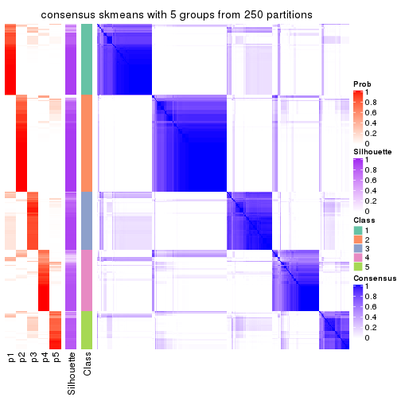</p>

</div>
<div id='tab-SD-skmeans-consensus-heatmap-5'>
<pre><code class="r">consensus_heatmap(res, k = 6)
</code></pre>

<p></p>

</div>
</div>

Heatmaps for the membership of samples in all partitions to see how consistent they are:


<script>
$( function() {
	$( '#tabs-SD-skmeans-membership-heatmap' ).tabs();
} );
</script>
<div id='tabs-SD-skmeans-membership-heatmap'>
<ul>
<li><a href='#tab-SD-skmeans-membership-heatmap-1'>k = 2</a></li>
<li><a href='#tab-SD-skmeans-membership-heatmap-2'>k = 3</a></li>
<li><a href='#tab-SD-skmeans-membership-heatmap-3'>k = 4</a></li>
<li><a href='#tab-SD-skmeans-membership-heatmap-4'>k = 5</a></li>
<li><a href='#tab-SD-skmeans-membership-heatmap-5'>k = 6</a></li>
</ul>
<div id='tab-SD-skmeans-membership-heatmap-1'>
<pre><code class="r">membership_heatmap(res, k = 2)
</code></pre>

<p></p>

</div>
<div id='tab-SD-skmeans-membership-heatmap-2'>
<pre><code class="r">membership_heatmap(res, k = 3)
</code></pre>

<p></p>

</div>
<div id='tab-SD-skmeans-membership-heatmap-3'>
<pre><code class="r">membership_heatmap(res, k = 4)
</code></pre>

<p></p>

</div>
<div id='tab-SD-skmeans-membership-heatmap-4'>
<pre><code class="r">membership_heatmap(res, k = 5)
</code></pre>

<p></p>

</div>
<div id='tab-SD-skmeans-membership-heatmap-5'>
<pre><code class="r">membership_heatmap(res, k = 6)
</code></pre>

<p></p>

</div>
</div>

As soon as we have had the classes for columns, we can look for signatures
which are significantly different between classes which can be candidate marks
for certain classes. Following are the heatmaps for signatures.


Signature heatmaps where rows are scaled:


<script>
$( function() {
	$( '#tabs-SD-skmeans-get-signatures' ).tabs();
} );
</script>
<div id='tabs-SD-skmeans-get-signatures'>
<ul>
<li><a href='#tab-SD-skmeans-get-signatures-1'>k = 2</a></li>
<li><a href='#tab-SD-skmeans-get-signatures-2'>k = 3</a></li>
<li><a href='#tab-SD-skmeans-get-signatures-3'>k = 4</a></li>
<li><a href='#tab-SD-skmeans-get-signatures-4'>k = 5</a></li>
<li><a href='#tab-SD-skmeans-get-signatures-5'>k = 6</a></li>
</ul>
<div id='tab-SD-skmeans-get-signatures-1'>
<pre><code class="r">get_signatures(res, k = 2)
</code></pre>

<p></p>

</div>
<div id='tab-SD-skmeans-get-signatures-2'>
<pre><code class="r">get_signatures(res, k = 3)
</code></pre>

<p></p>

</div>
<div id='tab-SD-skmeans-get-signatures-3'>
<pre><code class="r">get_signatures(res, k = 4)
</code></pre>

<p>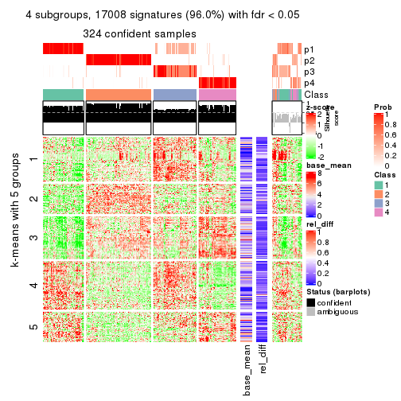</p>

</div>
<div id='tab-SD-skmeans-get-signatures-4'>
<pre><code class="r">get_signatures(res, k = 5)
</code></pre>

<p></p>

</div>
<div id='tab-SD-skmeans-get-signatures-5'>
<pre><code class="r">get_signatures(res, k = 6)
</code></pre>

<p></p>

</div>
</div>


Signature heatmaps where rows are not scaled:


<script>
$( function() {
	$( '#tabs-SD-skmeans-get-signatures-no-scale' ).tabs();
} );
</script>
<div id='tabs-SD-skmeans-get-signatures-no-scale'>
<ul>
<li><a href='#tab-SD-skmeans-get-signatures-no-scale-1'>k = 2</a></li>
<li><a href='#tab-SD-skmeans-get-signatures-no-scale-2'>k = 3</a></li>
<li><a href='#tab-SD-skmeans-get-signatures-no-scale-3'>k = 4</a></li>
<li><a href='#tab-SD-skmeans-get-signatures-no-scale-4'>k = 5</a></li>
<li><a href='#tab-SD-skmeans-get-signatures-no-scale-5'>k = 6</a></li>
</ul>
<div id='tab-SD-skmeans-get-signatures-no-scale-1'>
<pre><code class="r">get_signatures(res, k = 2, scale_rows = FALSE)
</code></pre>

<p></p>

</div>
<div id='tab-SD-skmeans-get-signatures-no-scale-2'>
<pre><code class="r">get_signatures(res, k = 3, scale_rows = FALSE)
</code></pre>

<p></p>

</div>
<div id='tab-SD-skmeans-get-signatures-no-scale-3'>
<pre><code class="r">get_signatures(res, k = 4, scale_rows = FALSE)
</code></pre>

<p>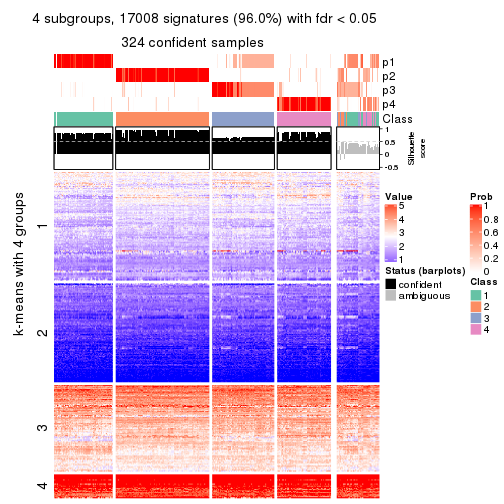</p>

</div>
<div id='tab-SD-skmeans-get-signatures-no-scale-4'>
<pre><code class="r">get_signatures(res, k = 5, scale_rows = FALSE)
</code></pre>

<p></p>

</div>
<div id='tab-SD-skmeans-get-signatures-no-scale-5'>
<pre><code class="r">get_signatures(res, k = 6, scale_rows = FALSE)
</code></pre>

<p></p>

</div>
</div>


Compare the overlap of signatures from different k:

```r
compare_signatures(res)
```


`get_signature()` returns a data frame invisibly. TO get the list of signatures, the function
call should be assigned to a variable explicitly. In following code, if `plot` argument is set
to `FALSE`, no heatmap is plotted while only the differential analysis is performed.

```r
# code only for demonstration
tb = get_signature(res, k = ..., plot = FALSE)
```

An example of the output of `tb` is:

```
#>   which_row         fdr    mean_1    mean_2 scaled_mean_1 scaled_mean_2 km
#> 1        38 0.042760348  8.373488  9.131774    -0.5533452     0.5164555  1
#> 2        40 0.018707592  7.106213  8.469186    -0.6173731     0.5762149  1
#> 3        55 0.019134737 10.221463 11.207825    -0.6159697     0.5749050  1
#> 4        59 0.006059896  5.921854  7.869574    -0.6899429     0.6439467  1
#> 5        60 0.018055526  8.928898 10.211722    -0.6204761     0.5791110  1
#> 6        98 0.009384629 15.714769 14.887706     0.6635654    -0.6193277  2
...
```

The columns in `tb` are:

1. `which_row`: row indices corresponding to the input matrix.
2. `fdr`: FDR for the differential test. 
3. `mean_x`: The mean value in group x.
4. `scaled_mean_x`: The mean value in group x after rows are scaled.
5. `km`: Row groups if k-means clustering is applied to rows.


UMAP plot which shows how samples are separated.


<script>
$( function() {
	$( '#tabs-SD-skmeans-dimension-reduction' ).tabs();
} );
</script>
<div id='tabs-SD-skmeans-dimension-reduction'>
<ul>
<li><a href='#tab-SD-skmeans-dimension-reduction-1'>k = 2</a></li>
<li><a href='#tab-SD-skmeans-dimension-reduction-2'>k = 3</a></li>
<li><a href='#tab-SD-skmeans-dimension-reduction-3'>k = 4</a></li>
<li><a href='#tab-SD-skmeans-dimension-reduction-4'>k = 5</a></li>
<li><a href='#tab-SD-skmeans-dimension-reduction-5'>k = 6</a></li>
</ul>
<div id='tab-SD-skmeans-dimension-reduction-1'>
<pre><code class="r">dimension_reduction(res, k = 2, method = &quot;UMAP&quot;)
</code></pre>

<p></p>

</div>
<div id='tab-SD-skmeans-dimension-reduction-2'>
<pre><code class="r">dimension_reduction(res, k = 3, method = &quot;UMAP&quot;)
</code></pre>

<p></p>

</div>
<div id='tab-SD-skmeans-dimension-reduction-3'>
<pre><code class="r">dimension_reduction(res, k = 4, method = &quot;UMAP&quot;)
</code></pre>

<p></p>

</div>
<div id='tab-SD-skmeans-dimension-reduction-4'>
<pre><code class="r">dimension_reduction(res, k = 5, method = &quot;UMAP&quot;)
</code></pre>

<p></p>

</div>
<div id='tab-SD-skmeans-dimension-reduction-5'>
<pre><code class="r">dimension_reduction(res, k = 6, method = &quot;UMAP&quot;)
</code></pre>

<p></p>

</div>
</div>


Following heatmap shows how subgroups are split when increasing `k`:

```r
collect_classes(res)
```


If matrix rows can be associated to genes, consider to use `GO_Enrichment(res,
...)` to perform function enrichment for the signature genes.


 

---------------------------------------------------


### SD:pam


The object with results only for a single top-value method and a single partition method 
can be extracted as:

```r
res = res_list["SD", "pam"]
# you can also extract it by
# res = res_list["SD:pam"]
```

A summary of `res` and all the functions that can be applied to it:

```r
res
```

```
#> A 'ConsensusPartition' object with k = 2, 3, 4, 5, 6.
#>   On a matrix with 17723 rows and 374 columns.
#>   Top rows (1000, 2000, 3000, 4000, 5000) are extracted by 'SD' method.
#>   Subgroups are detected by 'pam' method.
#>   Performed in total 1250 partitions by row resampling.
#>   Best k for subgroups seems to be 2.
#> 
#> Following methods can be applied to this 'ConsensusPartition' object:
#>  [1] "cola_report"             "collect_classes"         "collect_plots"          
#>  [4] "collect_stats"           "colnames"                "compare_signatures"     
#>  [7] "consensus_heatmap"       "dimension_reduction"     "functional_enrichment"  
#> [10] "get_anno_col"            "get_anno"                "get_classes"            
#> [13] "get_consensus"           "get_matrix"              "get_membership"         
#> [16] "get_param"               "get_signatures"          "get_stats"              
#> [19] "is_best_k"               "is_stable_k"             "membership_heatmap"     
#> [22] "ncol"                    "nrow"                    "plot_ecdf"              
#> [25] "rownames"                "select_partition_number" "show"                   
#> [28] "suggest_best_k"          "test_to_known_factors"
```

`collect_plots()` function collects all the plots made from `res` for all `k` (number of partitions)
into one single page to provide an easy and fast comparison between different `k`.

```r
collect_plots(res)
```


The plots are:

- The first row: a plot of the ECDF (Empirical cumulative distribution
  function) curves of the consensus matrix for each `k` and the heatmap of
  predicted classes for each `k`.
- The second row: heatmaps of the consensus matrix for each `k`.
- The third row: heatmaps of the membership matrix for each `k`.
- The fouth row: heatmaps of the signatures for each `k`.

All the plots in panels can be made by individual functions and they are
plotted later in this section.

`select_partition_number()` produces several plots showing different
statistics for choosing "optimized" `k`. There are following statistics:

- ECDF curves of the consensus matrix for each `k`;
- 1-PAC. [The PAC
  score](https://en.wikipedia.org/wiki/Consensus_clustering#Over-interpretation_potential_of_consensus_clustering)
  measures the proportion of the ambiguous subgrouping.
- Mean silhouette score.
- Concordance. The mean probability of fiting the consensus class ids in all
  partitions.
- Area increased. Denote $A_k$ as the area under the ECDF curve for current
  `k`, the area increased is defined as $A_k - A_{k-1}$.
- Rand index. The percent of pairs of samples that are both in a same cluster
  or both are not in a same cluster in the partition of k and k-1.
- Jaccard index. The ratio of pairs of samples are both in a same cluster in
  the partition of k and k-1 and the pairs of samples are both in a same
  cluster in the partition k or k-1.

The detailed explanations of these statistics can be found in [the cola
vignette](http://bioconductor.org/packages/devel/bioc/vignettes/cola/inst/doc/cola.html#toc_13).

Generally speaking, lower PAC score, higher mean silhouette score or higher
concordance corresponds to better partition. Rand index and Jaccard index
measure how similar the current partition is compared to partition with `k-1`.
If they are too similar, we won't accept `k` is better than `k-1`.

```r
select_partition_number(res)
```


The numeric values for all these statistics can be obtained by `get_stats()`.

```r
get_stats(res)
```

```
#>   k 1-PAC mean_silhouette concordance area_increased  Rand Jaccard
#> 2 2 0.854           0.918       0.965         0.4844 0.512   0.512
#> 3 3 0.655           0.796       0.859         0.2832 0.814   0.653
#> 4 4 0.795           0.846       0.919         0.1473 0.876   0.685
#> 5 5 0.747           0.775       0.863         0.0839 0.917   0.720
#> 6 6 0.737           0.486       0.702         0.0578 0.939   0.740
```

`suggest_best_k()` suggests the best $k$ based on these statistics. The rules are as follows:

- All $k$ with Jaccard index larger than 0.95 are removed because the increase of
  the partition number does not provides enough extra information. If all $k$ are removed,
  the best $k$ is assigned by `NA`.
- For $k$ with 1-PAC larger than 0.9, the maximal $k$ is taken as the "best k". Other $k$ is called "optional k".
- If it does not fit the second rule. The $k$ with the highest vote of highest
  1-PAC, mean silhouette and concordance is taken as the "best k".

```r
suggest_best_k(res)
```

```
#> [1] 2
```


Following shows the table of the partitions (You need to click the **show/hide
code output** link to see it). The membership matrix (columns with name `p*`)
is inferred by
[`clue::cl_consensus()`](https://www.rdocumentation.org/link/cl_consensus?package=clue)
function with the `SE` method. Basically the value in the membership matrix
represents the probability to belong to a certain group. The finall class
label for an item is determined with the group with highest probability it
belongs to.

In `get_classes()` function, the entropy is calculated from the membership
matrix and the silhouette score is calculated from the consensus matrix.


<script>
$( function() {
	$( '#tabs-SD-pam-get-classes' ).tabs();
} );
</script>
<div id='tabs-SD-pam-get-classes'>
<ul>
<li><a href='#tab-SD-pam-get-classes-1'>k = 2</a></li>
<li><a href='#tab-SD-pam-get-classes-2'>k = 3</a></li>
<li><a href='#tab-SD-pam-get-classes-3'>k = 4</a></li>
<li><a href='#tab-SD-pam-get-classes-4'>k = 5</a></li>
<li><a href='#tab-SD-pam-get-classes-5'>k = 6</a></li>
</ul>

<div id='tab-SD-pam-get-classes-1'>
<p><a id='tab-SD-pam-get-classes-1-a' style='color:#0366d6' href='#'>show/hide code output</a></p>
<pre><code class="r">cbind(get_classes(res, k = 2), get_membership(res, k = 2))
</code></pre>

<pre><code>#&gt;            class entropy silhouette    p1    p2
#&gt; SRR660824      1  0.7139     0.7600 0.804 0.196
#&gt; SRR603858      2  0.3114     0.9240 0.056 0.944
#&gt; SRR817070      2  0.0000     0.9750 0.000 1.000
#&gt; SRR1486995     1  0.0000     0.9452 1.000 0.000
#&gt; SRR813043      2  0.0000     0.9750 0.000 1.000
#&gt; SRR656874      2  0.0000     0.9750 0.000 1.000
#&gt; SRR659037      1  0.9087     0.5585 0.676 0.324
#&gt; SRR662031      1  0.0000     0.9452 1.000 0.000
#&gt; SRR1081283     2  0.0000     0.9750 0.000 1.000
#&gt; SRR1481036     2  0.9393     0.4235 0.356 0.644
#&gt; SRR1434009     2  0.0000     0.9750 0.000 1.000
#&gt; SRR1376676     1  0.0000     0.9452 1.000 0.000
#&gt; SRR1396967     2  0.0000     0.9750 0.000 1.000
#&gt; SRR665429      2  0.0000     0.9750 0.000 1.000
#&gt; SRR1388025     2  0.0000     0.9750 0.000 1.000
#&gt; SRR600784      1  0.0000     0.9452 1.000 0.000
#&gt; SRR657611      1  0.0000     0.9452 1.000 0.000
#&gt; SRR1333659     2  0.0000     0.9750 0.000 1.000
#&gt; SRR1323896     2  0.0000     0.9750 0.000 1.000
#&gt; SRR1453971     1  0.0000     0.9452 1.000 0.000
#&gt; SRR1421010     1  0.0000     0.9452 1.000 0.000
#&gt; SRR1334490     1  0.0000     0.9452 1.000 0.000
#&gt; SRR1309468     1  0.0000     0.9452 1.000 0.000
#&gt; SRR1468637     1  0.9954     0.2070 0.540 0.460
#&gt; SRR1365489     2  0.0000     0.9750 0.000 1.000
#&gt; SRR627445      2  0.6623     0.7816 0.172 0.828
#&gt; SRR607863      2  0.0000     0.9750 0.000 1.000
#&gt; SRR1475524     1  0.0000     0.9452 1.000 0.000
#&gt; SRR1405504     2  0.0000     0.9750 0.000 1.000
#&gt; SRR615695      1  0.0000     0.9452 1.000 0.000
#&gt; SRR600900      2  0.0000     0.9750 0.000 1.000
#&gt; SRR601477      2  0.0000     0.9750 0.000 1.000
#&gt; SRR1487215     2  0.0000     0.9750 0.000 1.000
#&gt; SRR1310797     2  0.0000     0.9750 0.000 1.000
#&gt; SRR1362713     1  0.0672     0.9404 0.992 0.008
#&gt; SRR1431385     1  0.0000     0.9452 1.000 0.000
#&gt; SRR1379089     2  0.0000     0.9750 0.000 1.000
#&gt; SRR1102079     1  0.0000     0.9452 1.000 0.000
#&gt; SRR1357210     1  0.0000     0.9452 1.000 0.000
#&gt; SRR657659      2  0.0000     0.9750 0.000 1.000
#&gt; SRR663573      2  0.0000     0.9750 0.000 1.000
#&gt; SRR603188      2  0.0000     0.9750 0.000 1.000
#&gt; SRR1471200     2  0.0000     0.9750 0.000 1.000
#&gt; SRR1310975     2  0.0000     0.9750 0.000 1.000
#&gt; SRR627457      2  0.1184     0.9621 0.016 0.984
#&gt; SRR1367654     2  0.0000     0.9750 0.000 1.000
#&gt; SRR1488410     1  0.0000     0.9452 1.000 0.000
#&gt; SRR1457750     2  0.1184     0.9622 0.016 0.984
#&gt; SRR1099546     1  0.0000     0.9452 1.000 0.000
#&gt; SRR604480      2  0.0000     0.9750 0.000 1.000
#&gt; SRR1390477     2  0.0000     0.9750 0.000 1.000
#&gt; SRR1458447     2  0.0000     0.9750 0.000 1.000
#&gt; SRR1473161     2  0.0000     0.9750 0.000 1.000
#&gt; SRR1409813     2  0.0000     0.9750 0.000 1.000
#&gt; SRR612791      1  0.0000     0.9452 1.000 0.000
#&gt; SRR1470580     2  0.0000     0.9750 0.000 1.000
#&gt; SRR1444063     2  0.7528     0.7086 0.216 0.784
#&gt; SRR1355578     1  0.0376     0.9429 0.996 0.004
#&gt; SRR1429203     1  0.0000     0.9452 1.000 0.000
#&gt; SRR599154      2  0.0000     0.9750 0.000 1.000
#&gt; SRR814244      1  0.1184     0.9347 0.984 0.016
#&gt; SRR1404123     2  0.0000     0.9750 0.000 1.000
#&gt; SRR656934      1  0.0000     0.9452 1.000 0.000
#&gt; SRR1339029     2  0.0000     0.9750 0.000 1.000
#&gt; SRR821525      2  0.0000     0.9750 0.000 1.000
#&gt; SRR1443677     1  0.0000     0.9452 1.000 0.000
#&gt; SRR1406330     1  0.0000     0.9452 1.000 0.000
#&gt; SRR1338124     2  0.0376     0.9719 0.004 0.996
#&gt; SRR1391376     1  0.5842     0.8270 0.860 0.140
#&gt; SRR661842      2  0.0000     0.9750 0.000 1.000
#&gt; SRR1395699     1  0.0672     0.9404 0.992 0.008
#&gt; SRR1312209     1  0.0000     0.9452 1.000 0.000
#&gt; SRR1359469     1  0.0000     0.9452 1.000 0.000
#&gt; SRR658885      1  0.0000     0.9452 1.000 0.000
#&gt; SRR1414578     1  0.0000     0.9452 1.000 0.000
#&gt; SRR603620      2  0.0000     0.9750 0.000 1.000
#&gt; SRR604677      1  0.0000     0.9452 1.000 0.000
#&gt; SRR603800      2  0.0000     0.9750 0.000 1.000
#&gt; SRR602058      2  0.0000     0.9750 0.000 1.000
#&gt; SRR817488      2  0.0000     0.9750 0.000 1.000
#&gt; SRR655601      2  0.0000     0.9750 0.000 1.000
#&gt; SRR1434821     2  0.0000     0.9750 0.000 1.000
#&gt; SRR1349166     2  0.0000     0.9750 0.000 1.000
#&gt; SRR615129      2  0.0000     0.9750 0.000 1.000
#&gt; SRR607586      2  0.0000     0.9750 0.000 1.000
#&gt; SRR602680      2  0.0000     0.9750 0.000 1.000
#&gt; SRR1411070     2  0.0000     0.9750 0.000 1.000
#&gt; SRR663038      2  0.0000     0.9750 0.000 1.000
#&gt; SRR1489416     2  0.0000     0.9750 0.000 1.000
#&gt; SRR1479155     1  0.0000     0.9452 1.000 0.000
#&gt; SRR662162      1  0.0000     0.9452 1.000 0.000
#&gt; SRR1374567     1  0.0000     0.9452 1.000 0.000
#&gt; SRR1434048     2  0.0000     0.9750 0.000 1.000
#&gt; SRR2184865     2  0.0000     0.9750 0.000 1.000
#&gt; SRR2170135     1  0.0000     0.9452 1.000 0.000
#&gt; SRR615551      2  0.0000     0.9750 0.000 1.000
#&gt; SRR1335513     2  0.0000     0.9750 0.000 1.000
#&gt; SRR1370216     1  0.0000     0.9452 1.000 0.000
#&gt; SRR662954      2  0.1843     0.9508 0.028 0.972
#&gt; SRR1375738     1  0.5842     0.8275 0.860 0.140
#&gt; SRR1356577     1  0.1414     0.9318 0.980 0.020
#&gt; SRR1073119     1  0.0000     0.9452 1.000 0.000
#&gt; SRR663549      1  0.3879     0.8880 0.924 0.076
#&gt; SRR1478015     2  0.0000     0.9750 0.000 1.000
#&gt; SRR600632      2  0.0000     0.9750 0.000 1.000
#&gt; SRR811866      1  0.0000     0.9452 1.000 0.000
#&gt; SRR1401101     2  0.0000     0.9750 0.000 1.000
#&gt; SRR1477797     2  0.0000     0.9750 0.000 1.000
#&gt; SRR1402986     2  0.0000     0.9750 0.000 1.000
#&gt; SRR658897      2  0.8267     0.6315 0.260 0.740
#&gt; SRR1419869     1  0.0000     0.9452 1.000 0.000
#&gt; SRR1490700     1  0.0000     0.9452 1.000 0.000
#&gt; SRR601723      2  0.2043     0.9477 0.032 0.968
#&gt; SRR1384115     2  0.0000     0.9750 0.000 1.000
#&gt; SRR1476927     2  0.0000     0.9750 0.000 1.000
#&gt; SRR1387769     1  0.7056     0.7715 0.808 0.192
#&gt; SRR1322595     1  0.0672     0.9402 0.992 0.008
#&gt; SRR1370423     2  0.6973     0.7603 0.188 0.812
#&gt; SRR1314976     1  0.8016     0.6950 0.756 0.244
#&gt; SRR1319560     2  0.0000     0.9750 0.000 1.000
#&gt; SRR1352683     1  0.7139     0.7600 0.804 0.196
#&gt; SRR1473800     1  0.0000     0.9452 1.000 0.000
#&gt; SRR1326384     1  0.0000     0.9452 1.000 0.000
#&gt; SRR1360807     2  0.8207     0.6412 0.256 0.744
#&gt; SRR1332544     1  0.0000     0.9452 1.000 0.000
#&gt; SRR598695      1  0.0000     0.9452 1.000 0.000
#&gt; SRR807824      2  0.0000     0.9750 0.000 1.000
#&gt; SRR809296      1  0.0000     0.9452 1.000 0.000
#&gt; SRR657927      1  0.0000     0.9452 1.000 0.000
#&gt; SRR1440682     2  0.0000     0.9750 0.000 1.000
#&gt; SRR1454415     2  0.0000     0.9750 0.000 1.000
#&gt; SRR1419131     2  0.0000     0.9750 0.000 1.000
#&gt; SRR1404293     1  0.0000     0.9452 1.000 0.000
#&gt; SRR1473340     1  0.0000     0.9452 1.000 0.000
#&gt; SRR1345563     1  0.0000     0.9452 1.000 0.000
#&gt; SRR1323382     2  0.0000     0.9750 0.000 1.000
#&gt; SRR1480697     1  0.9209     0.5351 0.664 0.336
#&gt; SRR1321808     2  0.0000     0.9750 0.000 1.000
#&gt; SRR1382756     2  0.0000     0.9750 0.000 1.000
#&gt; SRR1312558     2  0.0000     0.9750 0.000 1.000
#&gt; SRR1417088     2  0.0000     0.9750 0.000 1.000
#&gt; SRR1433027     2  0.0000     0.9750 0.000 1.000
#&gt; SRR662257      2  0.0000     0.9750 0.000 1.000
#&gt; SRR600417      2  0.0000     0.9750 0.000 1.000
#&gt; SRR812493      2  0.4161     0.8927 0.084 0.916
#&gt; SRR612743      1  0.0000     0.9452 1.000 0.000
#&gt; SRR1361345     1  0.0000     0.9452 1.000 0.000
#&gt; SRR600584      2  0.0000     0.9750 0.000 1.000
#&gt; SRR1310520     2  0.0000     0.9750 0.000 1.000
#&gt; SRR1395595     1  0.6343     0.8053 0.840 0.160
#&gt; SRR1334074     2  0.0000     0.9750 0.000 1.000
#&gt; SRR654838      2  0.0000     0.9750 0.000 1.000
#&gt; SRR1376694     1  0.0000     0.9452 1.000 0.000
#&gt; SRR1433841     2  0.2603     0.9358 0.044 0.956
#&gt; SRR1366837     1  0.0000     0.9452 1.000 0.000
#&gt; SRR1467479     2  0.0000     0.9750 0.000 1.000
#&gt; SRR1459055     1  0.0000     0.9452 1.000 0.000
#&gt; SRR1471050     2  0.0000     0.9750 0.000 1.000
#&gt; SRR603004      2  0.0000     0.9750 0.000 1.000
#&gt; SRR814703      2  0.0000     0.9750 0.000 1.000
#&gt; SRR661937      2  0.0000     0.9750 0.000 1.000
#&gt; SRR614359      1  0.0000     0.9452 1.000 0.000
#&gt; SRR1071568     2  0.0000     0.9750 0.000 1.000
#&gt; SRR1389084     1  0.0376     0.9429 0.996 0.004
#&gt; SRR1337624     2  0.0000     0.9750 0.000 1.000
#&gt; SRR1344400     2  0.0000     0.9750 0.000 1.000
#&gt; SRR1414290     2  0.0000     0.9750 0.000 1.000
#&gt; SRR1413644     2  0.0000     0.9750 0.000 1.000
#&gt; SRR1098998     1  0.0000     0.9452 1.000 0.000
#&gt; SRR1481279     1  0.0000     0.9452 1.000 0.000
#&gt; SRR1315103     1  0.0000     0.9452 1.000 0.000
#&gt; SRR1099286     1  0.7815     0.7139 0.768 0.232
#&gt; SRR2166570     2  0.0938     0.9655 0.012 0.988
#&gt; SRR601445      1  0.0000     0.9452 1.000 0.000
#&gt; SRR1439719     2  0.0000     0.9750 0.000 1.000
#&gt; SRR1377026     2  0.0000     0.9750 0.000 1.000
#&gt; SRR1327386     1  0.0000     0.9452 1.000 0.000
#&gt; SRR654826      2  0.0000     0.9750 0.000 1.000
#&gt; SRR1460433     2  0.0000     0.9750 0.000 1.000
#&gt; SRR1469345     1  0.0000     0.9452 1.000 0.000
#&gt; SRR1421462     2  0.0000     0.9750 0.000 1.000
#&gt; SRR662966      1  0.0000     0.9452 1.000 0.000
#&gt; SRR1339175     1  0.0000     0.9452 1.000 0.000
#&gt; SRR1447736     2  0.0000     0.9750 0.000 1.000
#&gt; SRR1434671     2  0.0000     0.9750 0.000 1.000
#&gt; SRR660800      2  0.0000     0.9750 0.000 1.000
#&gt; SRR1465543     2  0.0000     0.9750 0.000 1.000
#&gt; SRR1342023     1  0.0000     0.9452 1.000 0.000
#&gt; SRR1335670     1  0.0000     0.9452 1.000 0.000
#&gt; SRR1400955     2  0.0000     0.9750 0.000 1.000
#&gt; SRR1072150     2  0.0000     0.9750 0.000 1.000
#&gt; SRR1442822     1  0.0000     0.9452 1.000 0.000
#&gt; SRR1364658     1  0.0000     0.9452 1.000 0.000
#&gt; SRR1098074     2  0.0000     0.9750 0.000 1.000
#&gt; SRR1442778     1  0.0000     0.9452 1.000 0.000
#&gt; SRR1086728     2  0.3114     0.9239 0.056 0.944
#&gt; SRR627464      2  0.2236     0.9435 0.036 0.964
#&gt; SRR1409193     1  0.0000     0.9452 1.000 0.000
#&gt; SRR2168286     2  0.0000     0.9750 0.000 1.000
#&gt; SRR615539      2  0.0000     0.9750 0.000 1.000
#&gt; SRR663623      2  0.9954     0.0769 0.460 0.540
#&gt; SRR1471989     1  0.6973     0.7721 0.812 0.188
#&gt; SRR1468828     2  0.0000     0.9750 0.000 1.000
#&gt; SRR1381934     1  0.0000     0.9452 1.000 0.000
#&gt; SRR1471098     1  0.0000     0.9452 1.000 0.000
#&gt; SRR1314749     1  0.0000     0.9452 1.000 0.000
#&gt; SRR2166874     2  0.0000     0.9750 0.000 1.000
#&gt; SRR821302      1  0.0000     0.9452 1.000 0.000
#&gt; SRR1435066     2  0.0000     0.9750 0.000 1.000
#&gt; SRR661601      2  0.0000     0.9750 0.000 1.000
#&gt; SRR1446546     2  0.0000     0.9750 0.000 1.000
#&gt; SRR1419784     2  0.8909     0.5293 0.308 0.692
#&gt; SRR1357233     2  0.0000     0.9750 0.000 1.000
#&gt; SRR1441889     1  0.0000     0.9452 1.000 0.000
#&gt; SRR1413940     1  0.0000     0.9452 1.000 0.000
#&gt; SRR1324250     2  0.0000     0.9750 0.000 1.000
#&gt; SRR1442862     2  0.0000     0.9750 0.000 1.000
#&gt; SRR662474      2  0.0000     0.9750 0.000 1.000
#&gt; SRR1416226     1  0.0376     0.9429 0.996 0.004
#&gt; SRR1417404     1  0.8327     0.6638 0.736 0.264
#&gt; SRR665466      2  0.0000     0.9750 0.000 1.000
#&gt; SRR658849      1  0.0000     0.9452 1.000 0.000
#&gt; SRR1460025     2  0.0000     0.9750 0.000 1.000
#&gt; SRR1408136     1  0.0000     0.9452 1.000 0.000
#&gt; SRR1489995     2  0.0000     0.9750 0.000 1.000
#&gt; SRR1374092     1  0.0000     0.9452 1.000 0.000
#&gt; SRR1488429     1  0.8386     0.6621 0.732 0.268
#&gt; SRR1087559     1  0.0376     0.9428 0.996 0.004
#&gt; SRR817004      1  0.9866     0.2889 0.568 0.432
#&gt; SRR1429660     2  0.0000     0.9750 0.000 1.000
#&gt; SRR604390      2  0.9896     0.1632 0.440 0.560
#&gt; SRR614936      2  0.0000     0.9750 0.000 1.000
#&gt; SRR1365938     2  0.1184     0.9617 0.016 0.984
#&gt; SRR1437324     1  0.0000     0.9452 1.000 0.000
#&gt; SRR613414      2  0.0000     0.9750 0.000 1.000
#&gt; SRR660414      2  0.2948     0.9290 0.052 0.948
#&gt; SRR1452185     1  0.0000     0.9452 1.000 0.000
#&gt; SRR1347020     1  0.0000     0.9452 1.000 0.000
#&gt; SRR1398036     2  0.0000     0.9750 0.000 1.000
#&gt; SRR1436674     1  0.0000     0.9452 1.000 0.000
#&gt; SRR603750      2  0.5178     0.8571 0.116 0.884
#&gt; SRR608630      2  0.4022     0.8969 0.080 0.920
#&gt; SRR655625      2  0.0000     0.9750 0.000 1.000
#&gt; SRR599059      2  0.0376     0.9718 0.004 0.996
#&gt; SRR615189      2  0.0000     0.9750 0.000 1.000
#&gt; SRR1466889     2  0.0000     0.9750 0.000 1.000
#&gt; SRR1084602     2  0.8386     0.6186 0.268 0.732
#&gt; SRR1335422     1  0.0000     0.9452 1.000 0.000
#&gt; SRR1356805     2  0.0000     0.9750 0.000 1.000
#&gt; SRR1385300     2  0.4690     0.8769 0.100 0.900
#&gt; SRR654814      1  0.0000     0.9452 1.000 0.000
#&gt; SRR658385      2  0.0000     0.9750 0.000 1.000
#&gt; SRR820596      1  0.0000     0.9452 1.000 0.000
#&gt; SRR1318118     1  0.0000     0.9452 1.000 0.000
#&gt; SRR1480766     2  0.0000     0.9750 0.000 1.000
#&gt; SRR1406539     1  0.9522     0.4507 0.628 0.372
#&gt; SRR1341833     2  0.0000     0.9750 0.000 1.000
#&gt; SRR1441826     2  0.5519     0.8399 0.128 0.872
#&gt; SRR1448051     1  0.0000     0.9452 1.000 0.000
#&gt; SRR1326752     1  0.0376     0.9429 0.996 0.004
#&gt; SRR665217      1  0.5408     0.8433 0.876 0.124
#&gt; SRR819186      2  0.0000     0.9750 0.000 1.000
#&gt; SRR661517      1  0.0000     0.9452 1.000 0.000
#&gt; SRR607166      2  0.0000     0.9750 0.000 1.000
#&gt; SRR809065      2  0.0000     0.9750 0.000 1.000
#&gt; SRR1415872     2  0.0000     0.9750 0.000 1.000
#&gt; SRR1415463     1  0.0000     0.9452 1.000 0.000
#&gt; SRR1381161     2  0.0000     0.9750 0.000 1.000
#&gt; SRR1442231     2  0.0000     0.9750 0.000 1.000
#&gt; SRR1374696     1  0.0000     0.9452 1.000 0.000
#&gt; SRR1451988     2  0.4562     0.8816 0.096 0.904
#&gt; SRR660555      1  0.0000     0.9452 1.000 0.000
#&gt; SRR657801      1  0.0000     0.9452 1.000 0.000
#&gt; SRR663344      2  0.0000     0.9750 0.000 1.000
#&gt; SRR1472462     2  0.0000     0.9750 0.000 1.000
#&gt; SRR1406176     2  0.4022     0.8985 0.080 0.920
#&gt; SRR656886      2  0.0000     0.9750 0.000 1.000
#&gt; SRR1498337     2  0.0000     0.9750 0.000 1.000
#&gt; SRR613066      1  0.0000     0.9452 1.000 0.000
#&gt; SRR1309490     1  0.0000     0.9452 1.000 0.000
#&gt; SRR602492      2  0.0000     0.9750 0.000 1.000
#&gt; SRR1447347     1  0.0000     0.9452 1.000 0.000
#&gt; SRR1475546     2  0.0000     0.9750 0.000 1.000
#&gt; SRR627459      2  0.2948     0.9285 0.052 0.948
#&gt; SRR1434332     2  0.0000     0.9750 0.000 1.000
#&gt; SRR1070358     2  0.0000     0.9750 0.000 1.000
#&gt; SRR1345936     2  0.0672     0.9686 0.008 0.992
#&gt; SRR665658      2  0.0000     0.9750 0.000 1.000
#&gt; SRR1321351     2  0.0000     0.9750 0.000 1.000
#&gt; SRR657880      2  0.0000     0.9750 0.000 1.000
#&gt; SRR1373903     2  0.0000     0.9750 0.000 1.000
#&gt; SRR657396      2  0.0000     0.9750 0.000 1.000
#&gt; SRR660981      2  0.0000     0.9750 0.000 1.000
#&gt; SRR818499      1  0.0000     0.9452 1.000 0.000
#&gt; SRR819658      2  0.0000     0.9750 0.000 1.000
#&gt; SRR1376316     1  0.0000     0.9452 1.000 0.000
#&gt; SRR1323723     2  0.0000     0.9750 0.000 1.000
#&gt; SRR1476719     1  0.0000     0.9452 1.000 0.000
#&gt; SRR1403478     2  0.0000     0.9750 0.000 1.000
#&gt; SRR1095695     1  0.8443     0.6499 0.728 0.272
#&gt; SRR1352391     1  0.7056     0.7695 0.808 0.192
#&gt; SRR1498813     2  0.0000     0.9750 0.000 1.000
#&gt; SRR627437      2  0.6801     0.7679 0.180 0.820
#&gt; SRR2185097     1  0.0000     0.9452 1.000 0.000
#&gt; SRR817166      1  0.8016     0.6971 0.756 0.244
#&gt; SRR1091670     2  0.0000     0.9750 0.000 1.000
#&gt; SRR603776      1  0.0000     0.9452 1.000 0.000
#&gt; SRR1479640     2  0.0000     0.9750 0.000 1.000
#&gt; SRR660152      1  0.0000     0.9452 1.000 0.000
#&gt; SRR1074769     2  0.0000     0.9750 0.000 1.000
#&gt; SRR656153      2  0.0000     0.9750 0.000 1.000
#&gt; SRR1392502     1  0.0000     0.9452 1.000 0.000
#&gt; SRR1359609     1  0.0000     0.9452 1.000 0.000
#&gt; SRR601925      2  0.0000     0.9750 0.000 1.000
#&gt; SRR2165182     2  0.0000     0.9750 0.000 1.000
#&gt; SRR608542      2  0.0000     0.9750 0.000 1.000
#&gt; SRR655064      2  0.0000     0.9750 0.000 1.000
#&gt; SRR1432430     2  0.8909     0.5397 0.308 0.692
#&gt; SRR808472      2  0.0000     0.9750 0.000 1.000
#&gt; SRR1414958     1  0.6148     0.8141 0.848 0.152
#&gt; SRR598484      2  0.0000     0.9750 0.000 1.000
#&gt; SRR612755      1  0.3274     0.9010 0.940 0.060
#&gt; SRR1365808     1  0.0000     0.9452 1.000 0.000
#&gt; SRR1391724     1  0.9552     0.4476 0.624 0.376
#&gt; SRR1322373     1  0.0672     0.9404 0.992 0.008
#&gt; SRR1489265     2  0.0000     0.9750 0.000 1.000
#&gt; SRR1359099     2  0.0000     0.9750 0.000 1.000
#&gt; SRR607279      2  0.0000     0.9750 0.000 1.000
#&gt; SRR810461      2  0.0000     0.9750 0.000 1.000
#&gt; SRR627427      1  0.8955     0.5809 0.688 0.312
#&gt; SRR612887      2  0.0000     0.9750 0.000 1.000
#&gt; SRR809807      2  0.0000     0.9750 0.000 1.000
#&gt; SRR663112      2  0.0000     0.9750 0.000 1.000
#&gt; SRR1346933     1  0.9983     0.1532 0.524 0.476
#&gt; SRR1487910     1  0.0000     0.9452 1.000 0.000
#&gt; SRR603092      2  0.0000     0.9750 0.000 1.000
#&gt; SRR1417680     2  0.0000     0.9750 0.000 1.000
#&gt; SRR1383785     1  0.0000     0.9452 1.000 0.000
#&gt; SRR1070015     2  0.0000     0.9750 0.000 1.000
#&gt; SRR1466222     2  0.0376     0.9719 0.004 0.996
#&gt; SRR1416119     1  0.0000     0.9452 1.000 0.000
#&gt; SRR819318      1  0.0000     0.9452 1.000 0.000
#&gt; SRR608288      2  0.0000     0.9750 0.000 1.000
#&gt; SRR811121      2  0.0000     0.9750 0.000 1.000
#&gt; SRR613138      2  0.0000     0.9750 0.000 1.000
#&gt; SRR810483      1  0.0376     0.9429 0.996 0.004
#&gt; SRR607839      1  0.0000     0.9452 1.000 0.000
#&gt; SRR1337031     1  0.0000     0.9452 1.000 0.000
#&gt; SRR601311      2  0.0000     0.9750 0.000 1.000
#&gt; SRR1406685     2  0.0000     0.9750 0.000 1.000
#&gt; SRR1467500     2  0.0000     0.9750 0.000 1.000
#&gt; SRR1308504     1  0.0000     0.9452 1.000 0.000
#&gt; SRR1312865     1  0.9933     0.2367 0.548 0.452
#&gt; SRR1312522     2  0.9954     0.0848 0.460 0.540
#&gt; SRR1490486     2  0.0000     0.9750 0.000 1.000
#&gt; SRR1325888     1  0.5842     0.8269 0.860 0.140
#&gt; SRR1472885     1  0.0000     0.9452 1.000 0.000
#&gt; SRR1098785     2  0.0000     0.9750 0.000 1.000
#&gt; SRR1084766     2  0.0000     0.9750 0.000 1.000
#&gt; SRR1102804     2  0.0000     0.9750 0.000 1.000
#&gt; SRR1336636     1  0.0000     0.9452 1.000 0.000
#&gt; SRR1347795     1  0.0000     0.9452 1.000 0.000
#&gt; SRR601900      2  0.0000     0.9750 0.000 1.000
#&gt; SRR1330989     2  0.0000     0.9750 0.000 1.000
#&gt; SRR658445      2  0.0000     0.9750 0.000 1.000
#&gt; SRR1368754     1  0.0000     0.9452 1.000 0.000
#&gt; SRR1460001     2  0.0000     0.9750 0.000 1.000
#&gt; SRR1414934     1  0.0000     0.9452 1.000 0.000
#&gt; SRR1326249     1  0.6148     0.8141 0.848 0.152
#&gt; SRR614948      1  0.0000     0.9452 1.000 0.000
#&gt; SRR1472952     1  0.7745     0.7176 0.772 0.228
#&gt; SRR1321528     1  0.6973     0.7702 0.812 0.188
#&gt; SRR627447      1  0.0000     0.9452 1.000 0.000
#&gt; SRR612239      1  1.0000     0.0835 0.504 0.496
</code></pre>

<script>
$('#tab-SD-pam-get-classes-1-a').parent().next().next().hide();
$('#tab-SD-pam-get-classes-1-a').click(function(){
  $('#tab-SD-pam-get-classes-1-a').parent().next().next().toggle();
  return(false);
});
</script>
</div>

<div id='tab-SD-pam-get-classes-2'>
<p><a id='tab-SD-pam-get-classes-2-a' style='color:#0366d6' href='#'>show/hide code output</a></p>
<pre><code class="r">cbind(get_classes(res, k = 3), get_membership(res, k = 3))
</code></pre>

<pre><code>#&gt;            class entropy silhouette    p1    p2    p3
#&gt; SRR660824      1  0.9827     0.1840 0.380 0.376 0.244
#&gt; SRR603858      3  0.6468     0.6754 0.004 0.444 0.552
#&gt; SRR817070      2  0.0000     0.8971 0.000 1.000 0.000
#&gt; SRR1486995     1  0.5465     0.7908 0.712 0.000 0.288
#&gt; SRR813043      2  0.0747     0.8934 0.000 0.984 0.016
#&gt; SRR656874      2  0.0592     0.8945 0.000 0.988 0.012
#&gt; SRR659037      3  0.3851     0.5477 0.136 0.004 0.860
#&gt; SRR662031      1  0.0000     0.8701 1.000 0.000 0.000
#&gt; SRR1081283     3  0.6026     0.7964 0.000 0.376 0.624
#&gt; SRR1481036     2  0.8775     0.3423 0.152 0.568 0.280
#&gt; SRR1434009     2  0.2796     0.8438 0.000 0.908 0.092
#&gt; SRR1376676     1  0.0000     0.8701 1.000 0.000 0.000
#&gt; SRR1396967     2  0.2796     0.8438 0.000 0.908 0.092
#&gt; SRR665429      2  0.0000     0.8971 0.000 1.000 0.000
#&gt; SRR1388025     3  0.5968     0.8019 0.000 0.364 0.636
#&gt; SRR600784      1  0.4002     0.8389 0.840 0.000 0.160
#&gt; SRR657611      1  0.0000     0.8701 1.000 0.000 0.000
#&gt; SRR1333659     2  0.2711     0.8467 0.000 0.912 0.088
#&gt; SRR1323896     2  0.0000     0.8971 0.000 1.000 0.000
#&gt; SRR1453971     1  0.0747     0.8663 0.984 0.000 0.016
#&gt; SRR1421010     1  0.0000     0.8701 1.000 0.000 0.000
#&gt; SRR1334490     1  0.5760     0.7624 0.672 0.000 0.328
#&gt; SRR1309468     1  0.0000     0.8701 1.000 0.000 0.000
#&gt; SRR1468637     3  0.7256     0.7445 0.124 0.164 0.712
#&gt; SRR1365489     2  0.0000     0.8971 0.000 1.000 0.000
#&gt; SRR627445      2  0.7273     0.5540 0.132 0.712 0.156
#&gt; SRR607863      2  0.0892     0.8925 0.000 0.980 0.020
#&gt; SRR1475524     1  0.0000     0.8701 1.000 0.000 0.000
#&gt; SRR1405504     2  0.0000     0.8971 0.000 1.000 0.000
#&gt; SRR615695      1  0.0000     0.8701 1.000 0.000 0.000
#&gt; SRR600900      2  0.4235     0.7382 0.000 0.824 0.176
#&gt; SRR601477      2  0.0747     0.8934 0.000 0.984 0.016
#&gt; SRR1487215     2  0.0424     0.8956 0.000 0.992 0.008
#&gt; SRR1310797     2  0.2711     0.8467 0.000 0.912 0.088
#&gt; SRR1362713     1  0.5760     0.3972 0.672 0.000 0.328
#&gt; SRR1431385     1  0.0000     0.8701 1.000 0.000 0.000
#&gt; SRR1379089     2  0.0592     0.8945 0.000 0.988 0.012
#&gt; SRR1102079     1  0.3941     0.8397 0.844 0.000 0.156
#&gt; SRR1357210     1  0.0000     0.8701 1.000 0.000 0.000
#&gt; SRR657659      2  0.0000     0.8971 0.000 1.000 0.000
#&gt; SRR663573      3  0.5835     0.8059 0.000 0.340 0.660
#&gt; SRR603188      2  0.0237     0.8965 0.000 0.996 0.004
#&gt; SRR1471200     2  0.1031     0.8901 0.000 0.976 0.024
#&gt; SRR1310975     2  0.0000     0.8971 0.000 1.000 0.000
#&gt; SRR627457      2  0.0237     0.8954 0.004 0.996 0.000
#&gt; SRR1367654     2  0.2448     0.8568 0.000 0.924 0.076
#&gt; SRR1488410     1  0.5058     0.6014 0.756 0.000 0.244
#&gt; SRR1457750     2  0.0747     0.8879 0.016 0.984 0.000
#&gt; SRR1099546     1  0.5465     0.7908 0.712 0.000 0.288
#&gt; SRR604480      2  0.0000     0.8971 0.000 1.000 0.000
#&gt; SRR1390477     2  0.0592     0.8945 0.000 0.988 0.012
#&gt; SRR1458447     2  0.0000     0.8971 0.000 1.000 0.000
#&gt; SRR1473161     2  0.0000     0.8971 0.000 1.000 0.000
#&gt; SRR1409813     2  0.2711     0.8467 0.000 0.912 0.088
#&gt; SRR612791      1  0.3551     0.8381 0.868 0.000 0.132
#&gt; SRR1470580     2  0.0237     0.8960 0.000 0.996 0.004
#&gt; SRR1444063     2  0.4280     0.7613 0.124 0.856 0.020
#&gt; SRR1355578     1  0.0592     0.8638 0.988 0.000 0.012
#&gt; SRR1429203     1  0.0000     0.8701 1.000 0.000 0.000
#&gt; SRR599154      2  0.4399     0.7463 0.000 0.812 0.188
#&gt; SRR814244      3  0.5327     0.5209 0.272 0.000 0.728
#&gt; SRR1404123     2  0.5621     0.1876 0.000 0.692 0.308
#&gt; SRR656934      1  0.1860     0.8647 0.948 0.000 0.052
#&gt; SRR1339029     2  0.0000     0.8971 0.000 1.000 0.000
#&gt; SRR821525      3  0.6026     0.7964 0.000 0.376 0.624
#&gt; SRR1443677     1  0.0000     0.8701 1.000 0.000 0.000
#&gt; SRR1406330     1  0.0000     0.8701 1.000 0.000 0.000
#&gt; SRR1338124     2  0.4654     0.7171 0.000 0.792 0.208
#&gt; SRR1391376     1  0.6019     0.7826 0.700 0.012 0.288
#&gt; SRR661842      3  0.5968     0.8019 0.000 0.364 0.636
#&gt; SRR1395699     1  0.5465     0.7908 0.712 0.000 0.288
#&gt; SRR1312209     1  0.0000     0.8701 1.000 0.000 0.000
#&gt; SRR1359469     1  0.0000     0.8701 1.000 0.000 0.000
#&gt; SRR658885      1  0.5948     0.7356 0.640 0.000 0.360
#&gt; SRR1414578     1  0.0000     0.8701 1.000 0.000 0.000
#&gt; SRR603620      3  0.5810     0.8036 0.000 0.336 0.664
#&gt; SRR604677      1  0.4002     0.8390 0.840 0.000 0.160
#&gt; SRR603800      2  0.0000     0.8971 0.000 1.000 0.000
#&gt; SRR602058      3  0.5591     0.8042 0.000 0.304 0.696
#&gt; SRR817488      2  0.0000     0.8971 0.000 1.000 0.000
#&gt; SRR655601      3  0.6026     0.7964 0.000 0.376 0.624
#&gt; SRR1434821     2  0.0892     0.8918 0.000 0.980 0.020
#&gt; SRR1349166     2  0.1753     0.8774 0.000 0.952 0.048
#&gt; SRR615129      2  0.0000     0.8971 0.000 1.000 0.000
#&gt; SRR607586      2  0.0000     0.8971 0.000 1.000 0.000
#&gt; SRR602680      2  0.0892     0.8918 0.000 0.980 0.020
#&gt; SRR1411070     3  0.6045     0.7923 0.000 0.380 0.620
#&gt; SRR663038      2  0.0000     0.8971 0.000 1.000 0.000
#&gt; SRR1489416     2  0.0000     0.8971 0.000 1.000 0.000
#&gt; SRR1479155     1  0.0000     0.8701 1.000 0.000 0.000
#&gt; SRR662162      1  0.0000     0.8701 1.000 0.000 0.000
#&gt; SRR1374567     1  0.4062     0.8388 0.836 0.000 0.164
#&gt; SRR1434048     2  0.0000     0.8971 0.000 1.000 0.000
#&gt; SRR2184865     3  0.6026     0.7964 0.000 0.376 0.624
#&gt; SRR2170135     1  0.0000     0.8701 1.000 0.000 0.000
#&gt; SRR615551      2  0.0000     0.8971 0.000 1.000 0.000
#&gt; SRR1335513     2  0.0000     0.8971 0.000 1.000 0.000
#&gt; SRR1370216     1  0.5465     0.7908 0.712 0.000 0.288
#&gt; SRR662954      3  0.5465     0.8015 0.000 0.288 0.712
#&gt; SRR1375738     1  0.3918     0.8472 0.868 0.012 0.120
#&gt; SRR1356577     3  0.6180     0.3389 0.416 0.000 0.584
#&gt; SRR1073119     1  0.3482     0.8476 0.872 0.000 0.128
#&gt; SRR663549      1  0.5179     0.8050 0.832 0.080 0.088
#&gt; SRR1478015     2  0.0000     0.8971 0.000 1.000 0.000
#&gt; SRR600632      2  0.0000     0.8971 0.000 1.000 0.000
#&gt; SRR811866      1  0.0892     0.8691 0.980 0.000 0.020
#&gt; SRR1401101     2  0.2711     0.8467 0.000 0.912 0.088
#&gt; SRR1477797     3  0.5465     0.8015 0.000 0.288 0.712
#&gt; SRR1402986     2  0.0000     0.8971 0.000 1.000 0.000
#&gt; SRR658897      2  0.3551     0.7598 0.132 0.868 0.000
#&gt; SRR1419869     1  0.5465     0.7908 0.712 0.000 0.288
#&gt; SRR1490700     1  0.0000     0.8701 1.000 0.000 0.000
#&gt; SRR601723      3  0.6865     0.7785 0.020 0.384 0.596
#&gt; SRR1384115     2  0.3816     0.7971 0.000 0.852 0.148
#&gt; SRR1476927     2  0.0000     0.8971 0.000 1.000 0.000
#&gt; SRR1387769     1  0.5377     0.8122 0.820 0.068 0.112
#&gt; SRR1322595     1  0.3272     0.8182 0.892 0.004 0.104
#&gt; SRR1370423     2  0.6126     0.4942 0.004 0.644 0.352
#&gt; SRR1314976     3  0.6204     0.3184 0.424 0.000 0.576
#&gt; SRR1319560     3  0.5810     0.8036 0.000 0.336 0.664
#&gt; SRR1352683     1  0.6924     0.2074 0.580 0.400 0.020
#&gt; SRR1473800     1  0.0000     0.8701 1.000 0.000 0.000
#&gt; SRR1326384     1  0.5968     0.6502 0.636 0.000 0.364
#&gt; SRR1360807     3  0.8260     0.7259 0.172 0.192 0.636
#&gt; SRR1332544     1  0.5465     0.7908 0.712 0.000 0.288
#&gt; SRR598695      1  0.3551     0.8381 0.868 0.000 0.132
#&gt; SRR807824      2  0.2878     0.8280 0.000 0.904 0.096
#&gt; SRR809296      1  0.5465     0.7908 0.712 0.000 0.288
#&gt; SRR657927      1  0.0747     0.8691 0.984 0.000 0.016
#&gt; SRR1440682     2  0.0424     0.8956 0.000 0.992 0.008
#&gt; SRR1454415     2  0.1163     0.8880 0.000 0.972 0.028
#&gt; SRR1419131     3  0.5968     0.8019 0.000 0.364 0.636
#&gt; SRR1404293     1  0.0000     0.8701 1.000 0.000 0.000
#&gt; SRR1473340     1  0.4974     0.8139 0.764 0.000 0.236
#&gt; SRR1345563     1  0.0592     0.8695 0.988 0.000 0.012
#&gt; SRR1323382     2  0.0000     0.8971 0.000 1.000 0.000
#&gt; SRR1480697     2  0.9840    -0.0888 0.364 0.388 0.248
#&gt; SRR1321808     2  0.0000     0.8971 0.000 1.000 0.000
#&gt; SRR1382756     2  0.1964     0.8666 0.000 0.944 0.056
#&gt; SRR1312558     2  0.0424     0.8957 0.000 0.992 0.008
#&gt; SRR1417088     2  0.5678     0.1521 0.000 0.684 0.316
#&gt; SRR1433027     2  0.0000     0.8971 0.000 1.000 0.000
#&gt; SRR662257      3  0.5465     0.8015 0.000 0.288 0.712
#&gt; SRR600417      3  0.6026     0.7964 0.000 0.376 0.624
#&gt; SRR812493      3  0.5465     0.8015 0.000 0.288 0.712
#&gt; SRR612743      1  0.2711     0.8572 0.912 0.000 0.088
#&gt; SRR1361345     3  0.6299     0.1929 0.476 0.000 0.524
#&gt; SRR600584      2  0.0000     0.8971 0.000 1.000 0.000
#&gt; SRR1310520     3  0.6026     0.7964 0.000 0.376 0.624
#&gt; SRR1395595     1  0.6952     0.6931 0.600 0.024 0.376
#&gt; SRR1334074     3  0.6126     0.3894 0.000 0.400 0.600
#&gt; SRR654838      2  0.0000     0.8971 0.000 1.000 0.000
#&gt; SRR1376694     1  0.5465     0.7908 0.712 0.000 0.288
#&gt; SRR1433841     2  0.3043     0.8140 0.084 0.908 0.008
#&gt; SRR1366837     1  0.3412     0.8491 0.876 0.000 0.124
#&gt; SRR1467479     2  0.0000     0.8971 0.000 1.000 0.000
#&gt; SRR1459055     1  0.0000     0.8701 1.000 0.000 0.000
#&gt; SRR1471050     2  0.0000     0.8971 0.000 1.000 0.000
#&gt; SRR603004      2  0.2711     0.8467 0.000 0.912 0.088
#&gt; SRR814703      2  0.0892     0.8918 0.000 0.980 0.020
#&gt; SRR661937      2  0.0000     0.8971 0.000 1.000 0.000
#&gt; SRR614359      1  0.3412     0.8555 0.876 0.000 0.124
#&gt; SRR1071568     2  0.0000     0.8971 0.000 1.000 0.000
#&gt; SRR1389084     1  0.5465     0.7908 0.712 0.000 0.288
#&gt; SRR1337624     2  0.0000     0.8971 0.000 1.000 0.000
#&gt; SRR1344400     2  0.0000     0.8971 0.000 1.000 0.000
#&gt; SRR1414290     2  0.0000     0.8971 0.000 1.000 0.000
#&gt; SRR1413644     2  0.1964     0.8722 0.000 0.944 0.056
#&gt; SRR1098998     1  0.0000     0.8701 1.000 0.000 0.000
#&gt; SRR1481279     1  0.5465     0.7908 0.712 0.000 0.288
#&gt; SRR1315103     3  0.6244     0.2783 0.440 0.000 0.560
#&gt; SRR1099286     2  0.7080     0.2701 0.412 0.564 0.024
#&gt; SRR2166570     2  0.0424     0.8927 0.008 0.992 0.000
#&gt; SRR601445      1  0.0000     0.8701 1.000 0.000 0.000
#&gt; SRR1439719     2  0.0000     0.8971 0.000 1.000 0.000
#&gt; SRR1377026     3  0.6026     0.7934 0.000 0.376 0.624
#&gt; SRR1327386     1  0.0000     0.8701 1.000 0.000 0.000
#&gt; SRR654826      2  0.0000     0.8971 0.000 1.000 0.000
#&gt; SRR1460433     3  0.6026     0.7964 0.000 0.376 0.624
#&gt; SRR1469345     1  0.4555     0.8221 0.800 0.000 0.200
#&gt; SRR1421462     2  0.0000     0.8971 0.000 1.000 0.000
#&gt; SRR662966      1  0.5465     0.7908 0.712 0.000 0.288
#&gt; SRR1339175     1  0.3551     0.8381 0.868 0.000 0.132
#&gt; SRR1447736     2  0.0000     0.8971 0.000 1.000 0.000
#&gt; SRR1434671     2  0.1163     0.8880 0.000 0.972 0.028
#&gt; SRR660800      2  0.0000     0.8971 0.000 1.000 0.000
#&gt; SRR1465543     2  0.4702     0.7157 0.000 0.788 0.212
#&gt; SRR1342023     1  0.0000     0.8701 1.000 0.000 0.000
#&gt; SRR1335670     1  0.0000     0.8701 1.000 0.000 0.000
#&gt; SRR1400955     2  0.2711     0.8467 0.000 0.912 0.088
#&gt; SRR1072150     2  0.0237     0.8965 0.000 0.996 0.004
#&gt; SRR1442822     1  0.0000     0.8701 1.000 0.000 0.000
#&gt; SRR1364658     1  0.5178     0.8053 0.744 0.000 0.256
#&gt; SRR1098074     2  0.4750     0.7141 0.000 0.784 0.216
#&gt; SRR1442778     1  0.0000     0.8701 1.000 0.000 0.000
#&gt; SRR1086728     2  0.6026     0.4845 0.000 0.624 0.376
#&gt; SRR627464      2  0.0237     0.8952 0.000 0.996 0.004
#&gt; SRR1409193     1  0.0000     0.8701 1.000 0.000 0.000
#&gt; SRR2168286     3  0.6026     0.7964 0.000 0.376 0.624
#&gt; SRR615539      2  0.0000     0.8971 0.000 1.000 0.000
#&gt; SRR663623      2  0.8262     0.4075 0.104 0.592 0.304
#&gt; SRR1471989     1  0.7050     0.6928 0.600 0.028 0.372
#&gt; SRR1468828     2  0.0000     0.8971 0.000 1.000 0.000
#&gt; SRR1381934     1  0.0000     0.8701 1.000 0.000 0.000
#&gt; SRR1471098     1  0.5465     0.7908 0.712 0.000 0.288
#&gt; SRR1314749     1  0.3752     0.8443 0.856 0.000 0.144
#&gt; SRR2166874     3  0.5465     0.8015 0.000 0.288 0.712
#&gt; SRR821302      1  0.0000     0.8701 1.000 0.000 0.000
#&gt; SRR1435066     2  0.1031     0.8901 0.000 0.976 0.024
#&gt; SRR661601      2  0.1163     0.8880 0.000 0.972 0.028
#&gt; SRR1446546     2  0.2625     0.8497 0.000 0.916 0.084
#&gt; SRR1419784     2  0.7030     0.4189 0.024 0.580 0.396
#&gt; SRR1357233     3  0.5465     0.8015 0.000 0.288 0.712
#&gt; SRR1441889     1  0.0000     0.8701 1.000 0.000 0.000
#&gt; SRR1413940     1  0.2165     0.8254 0.936 0.000 0.064
#&gt; SRR1324250     2  0.2261     0.8594 0.000 0.932 0.068
#&gt; SRR1442862     2  0.2796     0.8438 0.000 0.908 0.092
#&gt; SRR662474      3  0.6045     0.7923 0.000 0.380 0.620
#&gt; SRR1416226     1  0.2625     0.8580 0.916 0.000 0.084
#&gt; SRR1417404     3  0.5926     0.4422 0.356 0.000 0.644
#&gt; SRR665466      2  0.0000     0.8971 0.000 1.000 0.000
#&gt; SRR658849      1  0.5465     0.7908 0.712 0.000 0.288
#&gt; SRR1460025     2  0.1860     0.8720 0.000 0.948 0.052
#&gt; SRR1408136     1  0.0000     0.8701 1.000 0.000 0.000
#&gt; SRR1489995     2  0.0000     0.8971 0.000 1.000 0.000
#&gt; SRR1374092     1  0.0237     0.8701 0.996 0.000 0.004
#&gt; SRR1488429     1  0.9273     0.4917 0.472 0.164 0.364
#&gt; SRR1087559     1  0.0592     0.8652 0.988 0.000 0.012
#&gt; SRR817004      2  0.8913     0.1520 0.360 0.508 0.132
#&gt; SRR1429660     2  0.2711     0.8467 0.000 0.912 0.088
#&gt; SRR604390      3  0.4605     0.4843 0.000 0.204 0.796
#&gt; SRR614936      2  0.0000     0.8971 0.000 1.000 0.000
#&gt; SRR1365938     2  0.1964     0.8493 0.056 0.944 0.000
#&gt; SRR1437324     1  0.0000     0.8701 1.000 0.000 0.000
#&gt; SRR613414      3  0.5968     0.7998 0.000 0.364 0.636
#&gt; SRR660414      2  0.1643     0.8615 0.044 0.956 0.000
#&gt; SRR1452185     1  0.0000     0.8701 1.000 0.000 0.000
#&gt; SRR1347020     1  0.3116     0.8526 0.892 0.000 0.108
#&gt; SRR1398036     3  0.5529     0.8033 0.000 0.296 0.704
#&gt; SRR1436674     1  0.0000     0.8701 1.000 0.000 0.000
#&gt; SRR603750      2  0.6737     0.6043 0.100 0.744 0.156
#&gt; SRR608630      3  0.6255     0.8089 0.012 0.320 0.668
#&gt; SRR655625      3  0.6026     0.7964 0.000 0.376 0.624
#&gt; SRR599059      2  0.2448     0.8586 0.000 0.924 0.076
#&gt; SRR615189      2  0.1289     0.8713 0.000 0.968 0.032
#&gt; SRR1466889     2  0.1964     0.8723 0.000 0.944 0.056
#&gt; SRR1084602     3  0.7717     0.7103 0.172 0.148 0.680
#&gt; SRR1335422     1  0.0000     0.8701 1.000 0.000 0.000
#&gt; SRR1356805     2  0.2711     0.8467 0.000 0.912 0.088
#&gt; SRR1385300     2  0.7665     0.4335 0.060 0.600 0.340
#&gt; SRR654814      1  0.0000     0.8701 1.000 0.000 0.000
#&gt; SRR658385      2  0.1031     0.8901 0.000 0.976 0.024
#&gt; SRR820596      1  0.0000     0.8701 1.000 0.000 0.000
#&gt; SRR1318118     1  0.0424     0.8662 0.992 0.000 0.008
#&gt; SRR1480766     2  0.0000     0.8971 0.000 1.000 0.000
#&gt; SRR1406539     2  0.5591     0.4846 0.304 0.696 0.000
#&gt; SRR1341833     2  0.2448     0.8568 0.000 0.924 0.076
#&gt; SRR1441826     3  0.7620     0.7519 0.128 0.188 0.684
#&gt; SRR1448051     1  0.0000     0.8701 1.000 0.000 0.000
#&gt; SRR1326752     1  0.5465     0.7908 0.712 0.000 0.288
#&gt; SRR665217      1  0.6148     0.7357 0.640 0.004 0.356
#&gt; SRR819186      2  0.0237     0.8965 0.000 0.996 0.004
#&gt; SRR661517      1  0.5465     0.7908 0.712 0.000 0.288
#&gt; SRR607166      2  0.0000     0.8971 0.000 1.000 0.000
#&gt; SRR809065      2  0.0000     0.8971 0.000 1.000 0.000
#&gt; SRR1415872     2  0.2261     0.8646 0.000 0.932 0.068
#&gt; SRR1415463     1  0.5397     0.7949 0.720 0.000 0.280
#&gt; SRR1381161     3  0.5465     0.8015 0.000 0.288 0.712
#&gt; SRR1442231     2  0.0237     0.8950 0.000 0.996 0.004
#&gt; SRR1374696     1  0.0000     0.8701 1.000 0.000 0.000
#&gt; SRR1451988     2  0.6341     0.5306 0.016 0.672 0.312
#&gt; SRR660555      1  0.3551     0.8381 0.868 0.000 0.132
#&gt; SRR657801      1  0.0000     0.8701 1.000 0.000 0.000
#&gt; SRR663344      2  0.1289     0.8864 0.000 0.968 0.032
#&gt; SRR1472462     2  0.0000     0.8971 0.000 1.000 0.000
#&gt; SRR1406176     2  0.4485     0.7504 0.020 0.844 0.136
#&gt; SRR656886      2  0.0000     0.8971 0.000 1.000 0.000
#&gt; SRR1498337     3  0.5465     0.8015 0.000 0.288 0.712
#&gt; SRR613066      1  0.5760     0.7624 0.672 0.000 0.328
#&gt; SRR1309490     1  0.0000     0.8701 1.000 0.000 0.000
#&gt; SRR602492      3  0.5882     0.8042 0.000 0.348 0.652
#&gt; SRR1447347     1  0.0000     0.8701 1.000 0.000 0.000
#&gt; SRR1475546     2  0.0000     0.8971 0.000 1.000 0.000
#&gt; SRR627459      3  0.6322     0.7972 0.024 0.276 0.700
#&gt; SRR1434332     2  0.0000     0.8971 0.000 1.000 0.000
#&gt; SRR1070358     3  0.5465     0.8015 0.000 0.288 0.712
#&gt; SRR1345936     3  0.3551     0.7068 0.000 0.132 0.868
#&gt; SRR665658      2  0.0000     0.8971 0.000 1.000 0.000
#&gt; SRR1321351     2  0.0000     0.8971 0.000 1.000 0.000
#&gt; SRR657880      2  0.1163     0.8880 0.000 0.972 0.028
#&gt; SRR1373903     2  0.0000     0.8971 0.000 1.000 0.000
#&gt; SRR657396      3  0.6267     0.6166 0.000 0.452 0.548
#&gt; SRR660981      2  0.0000     0.8971 0.000 1.000 0.000
#&gt; SRR818499      1  0.3267     0.8443 0.884 0.000 0.116
#&gt; SRR819658      2  0.2711     0.8467 0.000 0.912 0.088
#&gt; SRR1376316     1  0.0000     0.8701 1.000 0.000 0.000
#&gt; SRR1323723     2  0.0747     0.8933 0.000 0.984 0.016
#&gt; SRR1476719     1  0.0000     0.8701 1.000 0.000 0.000
#&gt; SRR1403478     2  0.1031     0.8901 0.000 0.976 0.024
#&gt; SRR1095695     1  0.7742     0.7156 0.632 0.080 0.288
#&gt; SRR1352391     3  0.6045     0.4024 0.380 0.000 0.620
#&gt; SRR1498813     3  0.6026     0.7964 0.000 0.376 0.624
#&gt; SRR627437      3  0.7138     0.7350 0.120 0.160 0.720
#&gt; SRR2185097     1  0.0000     0.8701 1.000 0.000 0.000
#&gt; SRR817166      3  0.4121     0.5105 0.168 0.000 0.832
#&gt; SRR1091670     2  0.0000     0.8971 0.000 1.000 0.000
#&gt; SRR603776      1  0.3941     0.8397 0.844 0.000 0.156
#&gt; SRR1479640     2  0.0000     0.8971 0.000 1.000 0.000
#&gt; SRR660152      1  0.5465     0.7908 0.712 0.000 0.288
#&gt; SRR1074769     2  0.0000     0.8971 0.000 1.000 0.000
#&gt; SRR656153      2  0.0000     0.8971 0.000 1.000 0.000
#&gt; SRR1392502     1  0.5882     0.7466 0.652 0.000 0.348
#&gt; SRR1359609     1  0.0000     0.8701 1.000 0.000 0.000
#&gt; SRR601925      2  0.0237     0.8965 0.000 0.996 0.004
#&gt; SRR2165182     2  0.0424     0.8956 0.000 0.992 0.008
#&gt; SRR608542      3  0.5465     0.8015 0.000 0.288 0.712
#&gt; SRR655064      3  0.6026     0.7964 0.000 0.376 0.624
#&gt; SRR1432430     2  0.7666     0.4544 0.076 0.636 0.288
#&gt; SRR808472      3  0.6026     0.7936 0.000 0.376 0.624
#&gt; SRR1414958     1  0.6935     0.6976 0.604 0.024 0.372
#&gt; SRR598484      2  0.1860     0.8707 0.000 0.948 0.052
#&gt; SRR612755      1  0.3116     0.7715 0.892 0.108 0.000
#&gt; SRR1365808     1  0.0000     0.8701 1.000 0.000 0.000
#&gt; SRR1391724     3  0.7309     0.2383 0.416 0.032 0.552
#&gt; SRR1322373     1  0.5465     0.7908 0.712 0.000 0.288
#&gt; SRR1489265     2  0.0000     0.8971 0.000 1.000 0.000
#&gt; SRR1359099     2  0.1031     0.8901 0.000 0.976 0.024
#&gt; SRR607279      2  0.0000     0.8971 0.000 1.000 0.000
#&gt; SRR810461      2  0.0000     0.8971 0.000 1.000 0.000
#&gt; SRR627427      2  0.6924     0.2877 0.400 0.580 0.020
#&gt; SRR612887      2  0.1163     0.8884 0.000 0.972 0.028
#&gt; SRR809807      2  0.4974     0.6855 0.000 0.764 0.236
#&gt; SRR663112      2  0.4842     0.6920 0.000 0.776 0.224
#&gt; SRR1346933     3  0.7256     0.7445 0.124 0.164 0.712
#&gt; SRR1487910     1  0.0000     0.8701 1.000 0.000 0.000
#&gt; SRR603092      3  0.6026     0.7964 0.000 0.376 0.624
#&gt; SRR1417680     2  0.0000     0.8971 0.000 1.000 0.000
#&gt; SRR1383785     1  0.0424     0.8701 0.992 0.000 0.008
#&gt; SRR1070015     2  0.4605     0.7261 0.000 0.796 0.204
#&gt; SRR1466222     2  0.0592     0.8946 0.000 0.988 0.012
#&gt; SRR1416119     1  0.5465     0.7908 0.712 0.000 0.288
#&gt; SRR819318      1  0.1860     0.8671 0.948 0.000 0.052
#&gt; SRR608288      2  0.0000     0.8971 0.000 1.000 0.000
#&gt; SRR811121      2  0.0892     0.8918 0.000 0.980 0.020
#&gt; SRR613138      2  0.0000     0.8971 0.000 1.000 0.000
#&gt; SRR810483      1  0.5098     0.8097 0.752 0.000 0.248
#&gt; SRR607839      1  0.0000     0.8701 1.000 0.000 0.000
#&gt; SRR1337031     1  0.1289     0.8681 0.968 0.000 0.032
#&gt; SRR601311      3  0.5529     0.8033 0.000 0.296 0.704
#&gt; SRR1406685     3  0.5948     0.8030 0.000 0.360 0.640
#&gt; SRR1467500     3  0.6026     0.7964 0.000 0.376 0.624
#&gt; SRR1308504     1  0.0000     0.8701 1.000 0.000 0.000
#&gt; SRR1312865     2  0.8454     0.3907 0.112 0.572 0.316
#&gt; SRR1312522     2  0.8181     0.4082 0.096 0.592 0.312
#&gt; SRR1490486     2  0.0000     0.8971 0.000 1.000 0.000
#&gt; SRR1325888     1  0.5864     0.7855 0.704 0.008 0.288
#&gt; SRR1472885     1  0.0000     0.8701 1.000 0.000 0.000
#&gt; SRR1098785     2  0.0000     0.8971 0.000 1.000 0.000
#&gt; SRR1084766     3  0.6026     0.7964 0.000 0.376 0.624
#&gt; SRR1102804     2  0.0000     0.8971 0.000 1.000 0.000
#&gt; SRR1336636     1  0.3941     0.8397 0.844 0.000 0.156
#&gt; SRR1347795     1  0.5465     0.7908 0.712 0.000 0.288
#&gt; SRR601900      2  0.0892     0.8918 0.000 0.980 0.020
#&gt; SRR1330989     2  0.0424     0.8920 0.000 0.992 0.008
#&gt; SRR658445      2  0.4702     0.7157 0.000 0.788 0.212
#&gt; SRR1368754     1  0.3941     0.8397 0.844 0.000 0.156
#&gt; SRR1460001     2  0.0000     0.8971 0.000 1.000 0.000
#&gt; SRR1414934     1  0.0000     0.8701 1.000 0.000 0.000
#&gt; SRR1326249     1  0.6387     0.7682 0.680 0.020 0.300
#&gt; SRR614948      1  0.0000     0.8701 1.000 0.000 0.000
#&gt; SRR1472952     1  0.7338     0.7383 0.652 0.060 0.288
#&gt; SRR1321528     1  0.6305    -0.0620 0.516 0.484 0.000
#&gt; SRR627447      1  0.4002     0.8389 0.840 0.000 0.160
#&gt; SRR612239      3  0.7444     0.6468 0.220 0.096 0.684
</code></pre>

<script>
$('#tab-SD-pam-get-classes-2-a').parent().next().next().hide();
$('#tab-SD-pam-get-classes-2-a').click(function(){
  $('#tab-SD-pam-get-classes-2-a').parent().next().next().toggle();
  return(false);
});
</script>
</div>

<div id='tab-SD-pam-get-classes-3'>
<p><a id='tab-SD-pam-get-classes-3-a' style='color:#0366d6' href='#'>show/hide code output</a></p>
<pre><code class="r">cbind(get_classes(res, k = 4), get_membership(res, k = 4))
</code></pre>

<pre><code>#&gt;            class entropy silhouette    p1    p2    p3    p4
#&gt; SRR660824      3  0.1716     0.8430 0.064 0.000 0.936 0.000
#&gt; SRR603858      4  0.3123     0.8319 0.000 0.156 0.000 0.844
#&gt; SRR817070      2  0.0000     0.9385 0.000 1.000 0.000 0.000
#&gt; SRR1486995     3  0.0469     0.8602 0.012 0.000 0.988 0.000
#&gt; SRR813043      2  0.2281     0.9118 0.000 0.904 0.000 0.096
#&gt; SRR656874      2  0.1978     0.9232 0.000 0.928 0.004 0.068
#&gt; SRR659037      4  0.1151     0.8655 0.024 0.000 0.008 0.968
#&gt; SRR662031      1  0.0188     0.9195 0.996 0.000 0.004 0.000
#&gt; SRR1081283     4  0.2345     0.8951 0.000 0.100 0.000 0.900
#&gt; SRR1481036     3  0.2924     0.7805 0.016 0.100 0.884 0.000
#&gt; SRR1434009     2  0.2918     0.8980 0.000 0.876 0.008 0.116
#&gt; SRR1376676     1  0.0000     0.9208 1.000 0.000 0.000 0.000
#&gt; SRR1396967     2  0.3088     0.8912 0.000 0.864 0.008 0.128
#&gt; SRR665429      2  0.0000     0.9385 0.000 1.000 0.000 0.000
#&gt; SRR1388025     4  0.2345     0.8951 0.000 0.100 0.000 0.900
#&gt; SRR600784      3  0.3764     0.7235 0.216 0.000 0.784 0.000
#&gt; SRR657611      1  0.0000     0.9208 1.000 0.000 0.000 0.000
#&gt; SRR1333659     2  0.2675     0.9066 0.000 0.892 0.008 0.100
#&gt; SRR1323896     2  0.0000     0.9385 0.000 1.000 0.000 0.000
#&gt; SRR1453971     1  0.1042     0.9020 0.972 0.000 0.008 0.020
#&gt; SRR1421010     1  0.0000     0.9208 1.000 0.000 0.000 0.000
#&gt; SRR1334490     3  0.0469     0.8602 0.012 0.000 0.988 0.000
#&gt; SRR1309468     1  0.0000     0.9208 1.000 0.000 0.000 0.000
#&gt; SRR1468637     4  0.3810     0.7171 0.188 0.000 0.008 0.804
#&gt; SRR1365489     2  0.0000     0.9385 0.000 1.000 0.000 0.000
#&gt; SRR627445      3  0.6100     0.5634 0.084 0.272 0.644 0.000
#&gt; SRR607863      2  0.2053     0.9228 0.000 0.924 0.004 0.072
#&gt; SRR1475524     1  0.1022     0.9000 0.968 0.000 0.032 0.000
#&gt; SRR1405504     2  0.0000     0.9385 0.000 1.000 0.000 0.000
#&gt; SRR615695      1  0.0000     0.9208 1.000 0.000 0.000 0.000
#&gt; SRR600900      2  0.4049     0.8094 0.000 0.780 0.008 0.212
#&gt; SRR601477      2  0.2216     0.9140 0.000 0.908 0.000 0.092
#&gt; SRR1487215     2  0.1867     0.9228 0.000 0.928 0.000 0.072
#&gt; SRR1310797     2  0.2675     0.9066 0.000 0.892 0.008 0.100
#&gt; SRR1362713     1  0.0376     0.9181 0.992 0.000 0.004 0.004
#&gt; SRR1431385     1  0.0000     0.9208 1.000 0.000 0.000 0.000
#&gt; SRR1379089     2  0.1867     0.9227 0.000 0.928 0.000 0.072
#&gt; SRR1102079     3  0.4661     0.5491 0.348 0.000 0.652 0.000
#&gt; SRR1357210     1  0.0000     0.9208 1.000 0.000 0.000 0.000
#&gt; SRR657659      2  0.0000     0.9385 0.000 1.000 0.000 0.000
#&gt; SRR663573      4  0.2408     0.8934 0.000 0.104 0.000 0.896
#&gt; SRR603188      2  0.1305     0.9192 0.000 0.960 0.004 0.036
#&gt; SRR1471200     2  0.2281     0.9118 0.000 0.904 0.000 0.096
#&gt; SRR1310975     2  0.0000     0.9385 0.000 1.000 0.000 0.000
#&gt; SRR627457      2  0.1721     0.9139 0.028 0.952 0.012 0.008
#&gt; SRR1367654     2  0.2675     0.9066 0.000 0.892 0.008 0.100
#&gt; SRR1488410     1  0.0524     0.9157 0.988 0.000 0.004 0.008
#&gt; SRR1457750     2  0.1792     0.8933 0.068 0.932 0.000 0.000
#&gt; SRR1099546     3  0.0469     0.8602 0.012 0.000 0.988 0.000
#&gt; SRR604480      2  0.0000     0.9385 0.000 1.000 0.000 0.000
#&gt; SRR1390477     2  0.1940     0.9216 0.000 0.924 0.000 0.076
#&gt; SRR1458447     2  0.0000     0.9385 0.000 1.000 0.000 0.000
#&gt; SRR1473161     2  0.0000     0.9385 0.000 1.000 0.000 0.000
#&gt; SRR1409813     2  0.2675     0.9066 0.000 0.892 0.008 0.100
#&gt; SRR612791      1  0.4790     0.3946 0.620 0.000 0.380 0.000
#&gt; SRR1470580     2  0.0000     0.9385 0.000 1.000 0.000 0.000
#&gt; SRR1444063     2  0.5750     0.6733 0.216 0.696 0.000 0.088
#&gt; SRR1355578     1  0.0376     0.9181 0.992 0.000 0.004 0.004
#&gt; SRR1429203     1  0.0000     0.9208 1.000 0.000 0.000 0.000
#&gt; SRR599154      2  0.2675     0.9066 0.000 0.892 0.008 0.100
#&gt; SRR814244      4  0.5165     0.0752 0.484 0.000 0.004 0.512
#&gt; SRR1404123     2  0.4730     0.3367 0.000 0.636 0.000 0.364
#&gt; SRR656934      1  0.4543     0.4344 0.676 0.000 0.324 0.000
#&gt; SRR1339029     2  0.0000     0.9385 0.000 1.000 0.000 0.000
#&gt; SRR821525      4  0.2345     0.8951 0.000 0.100 0.000 0.900
#&gt; SRR1443677     1  0.0000     0.9208 1.000 0.000 0.000 0.000
#&gt; SRR1406330     1  0.0000     0.9208 1.000 0.000 0.000 0.000
#&gt; SRR1338124     2  0.2530     0.9085 0.000 0.896 0.004 0.100
#&gt; SRR1391376     3  0.0469     0.8602 0.012 0.000 0.988 0.000
#&gt; SRR661842      4  0.2281     0.8950 0.000 0.096 0.000 0.904
#&gt; SRR1395699     3  0.0469     0.8602 0.012 0.000 0.988 0.000
#&gt; SRR1312209     1  0.0188     0.9195 0.996 0.000 0.004 0.000
#&gt; SRR1359469     1  0.0000     0.9208 1.000 0.000 0.000 0.000
#&gt; SRR658885      3  0.0336     0.8586 0.008 0.000 0.992 0.000
#&gt; SRR1414578     1  0.0000     0.9208 1.000 0.000 0.000 0.000
#&gt; SRR603620      4  0.0376     0.8684 0.000 0.004 0.004 0.992
#&gt; SRR604677      3  0.4889     0.5274 0.360 0.000 0.636 0.004
#&gt; SRR603800      2  0.0000     0.9385 0.000 1.000 0.000 0.000
#&gt; SRR602058      4  0.1302     0.8860 0.000 0.044 0.000 0.956
#&gt; SRR817488      2  0.0000     0.9385 0.000 1.000 0.000 0.000
#&gt; SRR655601      4  0.2589     0.8873 0.000 0.116 0.000 0.884
#&gt; SRR1434821     2  0.2281     0.9118 0.000 0.904 0.000 0.096
#&gt; SRR1349166     2  0.2466     0.9103 0.000 0.900 0.004 0.096
#&gt; SRR615129      2  0.1022     0.9219 0.032 0.968 0.000 0.000
#&gt; SRR607586      2  0.0000     0.9385 0.000 1.000 0.000 0.000
#&gt; SRR602680      2  0.1792     0.9242 0.000 0.932 0.000 0.068
#&gt; SRR1411070     4  0.2589     0.8860 0.000 0.116 0.000 0.884
#&gt; SRR663038      2  0.0000     0.9385 0.000 1.000 0.000 0.000
#&gt; SRR1489416     2  0.0000     0.9385 0.000 1.000 0.000 0.000
#&gt; SRR1479155     1  0.0000     0.9208 1.000 0.000 0.000 0.000
#&gt; SRR662162      1  0.0000     0.9208 1.000 0.000 0.000 0.000
#&gt; SRR1374567     3  0.3528     0.7471 0.192 0.000 0.808 0.000
#&gt; SRR1434048     2  0.0000     0.9385 0.000 1.000 0.000 0.000
#&gt; SRR2184865     4  0.2345     0.8951 0.000 0.100 0.000 0.900
#&gt; SRR2170135     1  0.0000     0.9208 1.000 0.000 0.000 0.000
#&gt; SRR615551      2  0.0000     0.9385 0.000 1.000 0.000 0.000
#&gt; SRR1335513     2  0.0000     0.9385 0.000 1.000 0.000 0.000
#&gt; SRR1370216     3  0.0469     0.8602 0.012 0.000 0.988 0.000
#&gt; SRR662954      4  0.0707     0.8774 0.000 0.020 0.000 0.980
#&gt; SRR1375738     3  0.4804     0.4863 0.384 0.000 0.616 0.000
#&gt; SRR1356577     4  0.5060     0.2842 0.412 0.000 0.004 0.584
#&gt; SRR1073119     3  0.4697     0.5402 0.356 0.000 0.644 0.000
#&gt; SRR663549      1  0.4898     0.1635 0.584 0.000 0.416 0.000
#&gt; SRR1478015     2  0.0000     0.9385 0.000 1.000 0.000 0.000
#&gt; SRR600632      2  0.0000     0.9385 0.000 1.000 0.000 0.000
#&gt; SRR811866      1  0.3569     0.6976 0.804 0.000 0.196 0.000
#&gt; SRR1401101     2  0.2675     0.9066 0.000 0.892 0.008 0.100
#&gt; SRR1477797     4  0.0000     0.8674 0.000 0.000 0.000 1.000
#&gt; SRR1402986     2  0.0000     0.9385 0.000 1.000 0.000 0.000
#&gt; SRR658897      2  0.1792     0.9041 0.068 0.932 0.000 0.000
#&gt; SRR1419869     3  0.0469     0.8602 0.012 0.000 0.988 0.000
#&gt; SRR1490700     1  0.0000     0.9208 1.000 0.000 0.000 0.000
#&gt; SRR601723      4  0.3257     0.8571 0.000 0.152 0.004 0.844
#&gt; SRR1384115     2  0.4410     0.8450 0.000 0.808 0.064 0.128
#&gt; SRR1476927     2  0.0000     0.9385 0.000 1.000 0.000 0.000
#&gt; SRR1387769     3  0.4830     0.4692 0.392 0.000 0.608 0.000
#&gt; SRR1322595     1  0.2480     0.8322 0.904 0.000 0.008 0.088
#&gt; SRR1370423     2  0.4730     0.5128 0.000 0.636 0.364 0.000
#&gt; SRR1314976     1  0.3837     0.6869 0.776 0.000 0.000 0.224
#&gt; SRR1319560     4  0.0524     0.8673 0.000 0.004 0.008 0.988
#&gt; SRR1352683     1  0.1543     0.8882 0.956 0.032 0.008 0.004
#&gt; SRR1473800     1  0.0000     0.9208 1.000 0.000 0.000 0.000
#&gt; SRR1326384     3  0.5321     0.6087 0.296 0.000 0.672 0.032
#&gt; SRR1360807     4  0.2546     0.8943 0.008 0.092 0.000 0.900
#&gt; SRR1332544     3  0.0469     0.8602 0.012 0.000 0.988 0.000
#&gt; SRR598695      1  0.4356     0.5491 0.708 0.000 0.292 0.000
#&gt; SRR807824      2  0.1867     0.9230 0.000 0.928 0.000 0.072
#&gt; SRR809296      3  0.0469     0.8602 0.012 0.000 0.988 0.000
#&gt; SRR657927      1  0.1867     0.8746 0.928 0.000 0.072 0.000
#&gt; SRR1440682     2  0.1576     0.9295 0.000 0.948 0.004 0.048
#&gt; SRR1454415     2  0.2466     0.9103 0.000 0.900 0.004 0.096
#&gt; SRR1419131     4  0.2345     0.8951 0.000 0.100 0.000 0.900
#&gt; SRR1404293     1  0.0188     0.9195 0.996 0.000 0.004 0.000
#&gt; SRR1473340     3  0.2216     0.8177 0.092 0.000 0.908 0.000
#&gt; SRR1345563     1  0.0000     0.9208 1.000 0.000 0.000 0.000
#&gt; SRR1323382     2  0.0000     0.9385 0.000 1.000 0.000 0.000
#&gt; SRR1480697     3  0.4697     0.6232 0.296 0.000 0.696 0.008
#&gt; SRR1321808     2  0.0000     0.9385 0.000 1.000 0.000 0.000
#&gt; SRR1382756     2  0.0524     0.9371 0.000 0.988 0.004 0.008
#&gt; SRR1312558     2  0.0707     0.9360 0.000 0.980 0.000 0.020
#&gt; SRR1417088     2  0.4761     0.3119 0.000 0.628 0.000 0.372
#&gt; SRR1433027     2  0.0000     0.9385 0.000 1.000 0.000 0.000
#&gt; SRR662257      4  0.0336     0.8651 0.000 0.000 0.008 0.992
#&gt; SRR600417      4  0.2345     0.8951 0.000 0.100 0.000 0.900
#&gt; SRR812493      4  0.0188     0.8664 0.000 0.000 0.004 0.996
#&gt; SRR612743      1  0.4925     0.1186 0.572 0.000 0.428 0.000
#&gt; SRR1361345     1  0.0336     0.9172 0.992 0.000 0.000 0.008
#&gt; SRR600584      2  0.0000     0.9385 0.000 1.000 0.000 0.000
#&gt; SRR1310520     4  0.2345     0.8951 0.000 0.100 0.000 0.900
#&gt; SRR1395595     3  0.0188     0.8560 0.004 0.000 0.996 0.000
#&gt; SRR1334074     4  0.4769     0.4763 0.000 0.308 0.008 0.684
#&gt; SRR654838      2  0.0000     0.9385 0.000 1.000 0.000 0.000
#&gt; SRR1376694     3  0.3024     0.7878 0.148 0.000 0.852 0.000
#&gt; SRR1433841     2  0.1792     0.9248 0.000 0.932 0.000 0.068
#&gt; SRR1366837     3  0.4830     0.4691 0.392 0.000 0.608 0.000
#&gt; SRR1467479     2  0.0000     0.9385 0.000 1.000 0.000 0.000
#&gt; SRR1459055     1  0.0188     0.9195 0.996 0.000 0.004 0.000
#&gt; SRR1471050     2  0.0000     0.9385 0.000 1.000 0.000 0.000
#&gt; SRR603004      2  0.2675     0.9066 0.000 0.892 0.008 0.100
#&gt; SRR814703      2  0.1398     0.9315 0.000 0.956 0.004 0.040
#&gt; SRR661937      2  0.0000     0.9385 0.000 1.000 0.000 0.000
#&gt; SRR614359      1  0.4955     0.1146 0.556 0.000 0.444 0.000
#&gt; SRR1071568     2  0.0000     0.9385 0.000 1.000 0.000 0.000
#&gt; SRR1389084     3  0.0469     0.8602 0.012 0.000 0.988 0.000
#&gt; SRR1337624     2  0.0188     0.9371 0.000 0.996 0.000 0.004
#&gt; SRR1344400     2  0.0000     0.9385 0.000 1.000 0.000 0.000
#&gt; SRR1414290     2  0.0469     0.9374 0.000 0.988 0.000 0.012
#&gt; SRR1413644     2  0.2466     0.9103 0.000 0.900 0.004 0.096
#&gt; SRR1098998     1  0.0000     0.9208 1.000 0.000 0.000 0.000
#&gt; SRR1481279     3  0.1302     0.8441 0.044 0.000 0.956 0.000
#&gt; SRR1315103     1  0.0469     0.9141 0.988 0.000 0.000 0.012
#&gt; SRR1099286     1  0.0524     0.9146 0.988 0.008 0.004 0.000
#&gt; SRR2166570     2  0.1762     0.9051 0.048 0.944 0.004 0.004
#&gt; SRR601445      1  0.0188     0.9195 0.996 0.000 0.004 0.000
#&gt; SRR1439719     2  0.0000     0.9385 0.000 1.000 0.000 0.000
#&gt; SRR1377026     4  0.3764     0.7879 0.000 0.216 0.000 0.784
#&gt; SRR1327386     1  0.0000     0.9208 1.000 0.000 0.000 0.000
#&gt; SRR654826      2  0.0000     0.9385 0.000 1.000 0.000 0.000
#&gt; SRR1460433     4  0.2345     0.8951 0.000 0.100 0.000 0.900
#&gt; SRR1469345     3  0.4992     0.0605 0.476 0.000 0.524 0.000
#&gt; SRR1421462     2  0.0000     0.9385 0.000 1.000 0.000 0.000
#&gt; SRR662966      3  0.0469     0.8596 0.012 0.000 0.988 0.000
#&gt; SRR1339175     1  0.4790     0.3946 0.620 0.000 0.380 0.000
#&gt; SRR1447736     2  0.0000     0.9385 0.000 1.000 0.000 0.000
#&gt; SRR1434671     2  0.2466     0.9103 0.000 0.900 0.004 0.096
#&gt; SRR660800      2  0.0000     0.9385 0.000 1.000 0.000 0.000
#&gt; SRR1465543     2  0.2799     0.9027 0.000 0.884 0.008 0.108
#&gt; SRR1342023     1  0.0000     0.9208 1.000 0.000 0.000 0.000
#&gt; SRR1335670     1  0.1022     0.9000 0.968 0.000 0.032 0.000
#&gt; SRR1400955     2  0.2675     0.9066 0.000 0.892 0.008 0.100
#&gt; SRR1072150     2  0.1118     0.9338 0.000 0.964 0.000 0.036
#&gt; SRR1442822     1  0.0000     0.9208 1.000 0.000 0.000 0.000
#&gt; SRR1364658     3  0.0592     0.8596 0.016 0.000 0.984 0.000
#&gt; SRR1098074     2  0.3545     0.8625 0.000 0.828 0.008 0.164
#&gt; SRR1442778     1  0.0000     0.9208 1.000 0.000 0.000 0.000
#&gt; SRR1086728     3  0.0188     0.8539 0.000 0.004 0.996 0.000
#&gt; SRR627464      2  0.1637     0.9014 0.000 0.940 0.000 0.060
#&gt; SRR1409193     1  0.0376     0.9181 0.992 0.000 0.004 0.004
#&gt; SRR2168286     4  0.2345     0.8951 0.000 0.100 0.000 0.900
#&gt; SRR615539      2  0.0000     0.9385 0.000 1.000 0.000 0.000
#&gt; SRR663623      3  0.1139     0.8542 0.012 0.008 0.972 0.008
#&gt; SRR1471989     3  0.0336     0.8586 0.008 0.000 0.992 0.000
#&gt; SRR1468828     2  0.0000     0.9385 0.000 1.000 0.000 0.000
#&gt; SRR1381934     1  0.1022     0.9000 0.968 0.000 0.032 0.000
#&gt; SRR1471098     3  0.0469     0.8602 0.012 0.000 0.988 0.000
#&gt; SRR1314749     3  0.4967     0.3113 0.452 0.000 0.548 0.000
#&gt; SRR2166874     4  0.0336     0.8651 0.000 0.000 0.008 0.992
#&gt; SRR821302      1  0.1022     0.9000 0.968 0.000 0.032 0.000
#&gt; SRR1435066     2  0.2053     0.9215 0.000 0.924 0.004 0.072
#&gt; SRR661601      2  0.2466     0.9103 0.000 0.900 0.004 0.096
#&gt; SRR1446546     2  0.2530     0.9085 0.000 0.896 0.004 0.100
#&gt; SRR1419784     3  0.2149     0.8040 0.000 0.000 0.912 0.088
#&gt; SRR1357233     4  0.0336     0.8651 0.000 0.000 0.008 0.992
#&gt; SRR1441889     1  0.0000     0.9208 1.000 0.000 0.000 0.000
#&gt; SRR1413940     1  0.0524     0.9157 0.988 0.000 0.004 0.008
#&gt; SRR1324250     2  0.2334     0.9092 0.000 0.908 0.004 0.088
#&gt; SRR1442862     2  0.2918     0.8980 0.000 0.876 0.008 0.116
#&gt; SRR662474      4  0.2589     0.8860 0.000 0.116 0.000 0.884
#&gt; SRR1416226     1  0.4866     0.2055 0.596 0.000 0.404 0.000
#&gt; SRR1417404     4  0.2589     0.8135 0.116 0.000 0.000 0.884
#&gt; SRR665466      2  0.0000     0.9385 0.000 1.000 0.000 0.000
#&gt; SRR658849      3  0.0469     0.8602 0.012 0.000 0.988 0.000
#&gt; SRR1460025     2  0.0804     0.9367 0.000 0.980 0.008 0.012
#&gt; SRR1408136     1  0.0000     0.9208 1.000 0.000 0.000 0.000
#&gt; SRR1489995     2  0.0000     0.9385 0.000 1.000 0.000 0.000
#&gt; SRR1374092     1  0.2530     0.8219 0.888 0.000 0.112 0.000
#&gt; SRR1488429     3  0.0336     0.8586 0.008 0.000 0.992 0.000
#&gt; SRR1087559     1  0.0188     0.9187 0.996 0.000 0.004 0.000
#&gt; SRR817004      2  0.8393     0.4670 0.188 0.548 0.176 0.088
#&gt; SRR1429660     2  0.2675     0.9066 0.000 0.892 0.008 0.100
#&gt; SRR604390      3  0.1716     0.8260 0.000 0.000 0.936 0.064
#&gt; SRR614936      2  0.0000     0.9385 0.000 1.000 0.000 0.000
#&gt; SRR1365938     2  0.1022     0.9219 0.032 0.968 0.000 0.000
#&gt; SRR1437324     1  0.0000     0.9208 1.000 0.000 0.000 0.000
#&gt; SRR613414      4  0.2011     0.8948 0.000 0.080 0.000 0.920
#&gt; SRR660414      2  0.2088     0.8875 0.064 0.928 0.004 0.004
#&gt; SRR1452185     1  0.0000     0.9208 1.000 0.000 0.000 0.000
#&gt; SRR1347020     3  0.4925     0.3806 0.428 0.000 0.572 0.000
#&gt; SRR1398036     4  0.0895     0.8764 0.000 0.020 0.004 0.976
#&gt; SRR1436674     1  0.0000     0.9208 1.000 0.000 0.000 0.000
#&gt; SRR603750      3  0.6155     0.5628 0.076 0.272 0.648 0.004
#&gt; SRR608630      4  0.2586     0.8791 0.040 0.048 0.000 0.912
#&gt; SRR655625      4  0.2345     0.8951 0.000 0.100 0.000 0.900
#&gt; SRR599059      2  0.2644     0.9086 0.000 0.908 0.060 0.032
#&gt; SRR615189      2  0.3219     0.7796 0.000 0.836 0.000 0.164
#&gt; SRR1466889     2  0.2611     0.9088 0.000 0.896 0.008 0.096
#&gt; SRR1084602     4  0.2593     0.8917 0.016 0.080 0.000 0.904
#&gt; SRR1335422     1  0.0000     0.9208 1.000 0.000 0.000 0.000
#&gt; SRR1356805     2  0.2675     0.9066 0.000 0.892 0.008 0.100
#&gt; SRR1385300     3  0.0376     0.8578 0.004 0.004 0.992 0.000
#&gt; SRR654814      1  0.0000     0.9208 1.000 0.000 0.000 0.000
#&gt; SRR658385      2  0.1661     0.9284 0.000 0.944 0.004 0.052
#&gt; SRR820596      1  0.1118     0.8990 0.964 0.000 0.036 0.000
#&gt; SRR1318118     1  0.1305     0.8989 0.960 0.000 0.036 0.004
#&gt; SRR1480766     2  0.0000     0.9385 0.000 1.000 0.000 0.000
#&gt; SRR1406539     1  0.1824     0.8557 0.936 0.060 0.004 0.000
#&gt; SRR1341833     2  0.2530     0.9084 0.000 0.896 0.004 0.100
#&gt; SRR1441826     4  0.2281     0.8950 0.000 0.096 0.000 0.904
#&gt; SRR1448051     1  0.0000     0.9208 1.000 0.000 0.000 0.000
#&gt; SRR1326752     3  0.0336     0.8594 0.008 0.000 0.992 0.000
#&gt; SRR665217      3  0.0188     0.8580 0.004 0.000 0.996 0.000
#&gt; SRR819186      2  0.1022     0.9346 0.000 0.968 0.000 0.032
#&gt; SRR661517      3  0.0469     0.8602 0.012 0.000 0.988 0.000
#&gt; SRR607166      2  0.0000     0.9385 0.000 1.000 0.000 0.000
#&gt; SRR809065      2  0.0000     0.9385 0.000 1.000 0.000 0.000
#&gt; SRR1415872     2  0.2714     0.9034 0.000 0.884 0.004 0.112
#&gt; SRR1415463     3  0.0707     0.8583 0.020 0.000 0.980 0.000
#&gt; SRR1381161     4  0.0188     0.8664 0.000 0.000 0.004 0.996
#&gt; SRR1442231     2  0.1356     0.9188 0.032 0.960 0.000 0.008
#&gt; SRR1374696     1  0.0188     0.9195 0.996 0.000 0.004 0.000
#&gt; SRR1451988     2  0.4866     0.4042 0.000 0.596 0.404 0.000
#&gt; SRR660555      1  0.4193     0.5922 0.732 0.000 0.268 0.000
#&gt; SRR657801      1  0.0188     0.9195 0.996 0.000 0.004 0.000
#&gt; SRR663344      2  0.2675     0.9066 0.000 0.892 0.008 0.100
#&gt; SRR1472462     2  0.0000     0.9385 0.000 1.000 0.000 0.000
#&gt; SRR1406176     2  0.2345     0.8878 0.000 0.900 0.100 0.000
#&gt; SRR656886      2  0.0000     0.9385 0.000 1.000 0.000 0.000
#&gt; SRR1498337     4  0.0000     0.8674 0.000 0.000 0.000 1.000
#&gt; SRR613066      3  0.0188     0.8580 0.004 0.000 0.996 0.000
#&gt; SRR1309490     1  0.0188     0.9195 0.996 0.000 0.004 0.000
#&gt; SRR602492      4  0.1792     0.8925 0.000 0.068 0.000 0.932
#&gt; SRR1447347     1  0.1118     0.8990 0.964 0.000 0.036 0.000
#&gt; SRR1475546     2  0.0000     0.9385 0.000 1.000 0.000 0.000
#&gt; SRR627459      4  0.2611     0.8946 0.000 0.096 0.008 0.896
#&gt; SRR1434332     2  0.0000     0.9385 0.000 1.000 0.000 0.000
#&gt; SRR1070358     4  0.0336     0.8651 0.000 0.000 0.008 0.992
#&gt; SRR1345936     4  0.0188     0.8664 0.000 0.000 0.004 0.996
#&gt; SRR665658      2  0.0000     0.9385 0.000 1.000 0.000 0.000
#&gt; SRR1321351     2  0.0000     0.9385 0.000 1.000 0.000 0.000
#&gt; SRR657880      2  0.2466     0.9103 0.000 0.900 0.004 0.096
#&gt; SRR1373903     2  0.0000     0.9385 0.000 1.000 0.000 0.000
#&gt; SRR657396      4  0.3249     0.7894 0.000 0.140 0.008 0.852
#&gt; SRR660981      2  0.0000     0.9385 0.000 1.000 0.000 0.000
#&gt; SRR818499      1  0.4222     0.5852 0.728 0.000 0.272 0.000
#&gt; SRR819658      2  0.2675     0.9066 0.000 0.892 0.008 0.100
#&gt; SRR1376316     1  0.0000     0.9208 1.000 0.000 0.000 0.000
#&gt; SRR1323723     2  0.1302     0.9315 0.000 0.956 0.000 0.044
#&gt; SRR1476719     1  0.0188     0.9195 0.996 0.000 0.004 0.000
#&gt; SRR1403478     2  0.2053     0.9215 0.000 0.924 0.004 0.072
#&gt; SRR1095695     3  0.0336     0.8594 0.008 0.000 0.992 0.000
#&gt; SRR1352391     4  0.5060     0.3156 0.412 0.000 0.004 0.584
#&gt; SRR1498813     4  0.2345     0.8951 0.000 0.100 0.000 0.900
#&gt; SRR627437      4  0.3004     0.8780 0.008 0.100 0.008 0.884
#&gt; SRR2185097     1  0.0188     0.9195 0.996 0.000 0.004 0.000
#&gt; SRR817166      3  0.6916     0.5728 0.236 0.000 0.588 0.176
#&gt; SRR1091670     2  0.0000     0.9385 0.000 1.000 0.000 0.000
#&gt; SRR603776      3  0.4679     0.5469 0.352 0.000 0.648 0.000
#&gt; SRR1479640     2  0.0000     0.9385 0.000 1.000 0.000 0.000
#&gt; SRR660152      3  0.0336     0.8594 0.008 0.000 0.992 0.000
#&gt; SRR1074769     2  0.0000     0.9385 0.000 1.000 0.000 0.000
#&gt; SRR656153      2  0.0000     0.9385 0.000 1.000 0.000 0.000
#&gt; SRR1392502     3  0.0524     0.8578 0.008 0.000 0.988 0.004
#&gt; SRR1359609     1  0.0000     0.9208 1.000 0.000 0.000 0.000
#&gt; SRR601925      2  0.0817     0.9354 0.000 0.976 0.000 0.024
#&gt; SRR2165182     2  0.1576     0.9295 0.000 0.948 0.004 0.048
#&gt; SRR608542      4  0.0188     0.8664 0.000 0.000 0.004 0.996
#&gt; SRR655064      4  0.2345     0.8951 0.000 0.100 0.000 0.900
#&gt; SRR1432430     3  0.0524     0.8564 0.004 0.008 0.988 0.000
#&gt; SRR808472      4  0.3266     0.8429 0.000 0.168 0.000 0.832
#&gt; SRR1414958     3  0.0336     0.8586 0.008 0.000 0.992 0.000
#&gt; SRR598484      2  0.0817     0.9357 0.000 0.976 0.000 0.024
#&gt; SRR612755      1  0.1388     0.8935 0.960 0.028 0.012 0.000
#&gt; SRR1365808     1  0.0000     0.9208 1.000 0.000 0.000 0.000
#&gt; SRR1391724     1  0.5273     0.1303 0.536 0.000 0.008 0.456
#&gt; SRR1322373     3  0.0469     0.8602 0.012 0.000 0.988 0.000
#&gt; SRR1489265     2  0.0000     0.9385 0.000 1.000 0.000 0.000
#&gt; SRR1359099     2  0.1978     0.9231 0.000 0.928 0.004 0.068
#&gt; SRR607279      2  0.0000     0.9385 0.000 1.000 0.000 0.000
#&gt; SRR810461      2  0.0000     0.9385 0.000 1.000 0.000 0.000
#&gt; SRR627427      1  0.4095     0.6877 0.804 0.172 0.024 0.000
#&gt; SRR612887      2  0.3208     0.8733 0.000 0.848 0.004 0.148
#&gt; SRR809807      3  0.5066     0.6697 0.000 0.120 0.768 0.112
#&gt; SRR663112      2  0.5208     0.7664 0.000 0.748 0.172 0.080
#&gt; SRR1346933     4  0.3791     0.7024 0.200 0.000 0.004 0.796
#&gt; SRR1487910     1  0.0000     0.9208 1.000 0.000 0.000 0.000
#&gt; SRR603092      4  0.2345     0.8951 0.000 0.100 0.000 0.900
#&gt; SRR1417680     2  0.0000     0.9385 0.000 1.000 0.000 0.000
#&gt; SRR1383785     1  0.0336     0.9185 0.992 0.000 0.008 0.000
#&gt; SRR1070015     2  0.2675     0.9066 0.000 0.892 0.008 0.100
#&gt; SRR1466222     2  0.0188     0.9378 0.000 0.996 0.000 0.004
#&gt; SRR1416119     3  0.0469     0.8602 0.012 0.000 0.988 0.000
#&gt; SRR819318      1  0.3982     0.6774 0.776 0.000 0.220 0.004
#&gt; SRR608288      2  0.0000     0.9385 0.000 1.000 0.000 0.000
#&gt; SRR811121      2  0.2011     0.9192 0.000 0.920 0.000 0.080
#&gt; SRR613138      2  0.0000     0.9385 0.000 1.000 0.000 0.000
#&gt; SRR810483      3  0.2011     0.8328 0.080 0.000 0.920 0.000
#&gt; SRR607839      1  0.0000     0.9208 1.000 0.000 0.000 0.000
#&gt; SRR1337031     1  0.3942     0.6343 0.764 0.000 0.236 0.000
#&gt; SRR601311      4  0.0657     0.8731 0.000 0.012 0.004 0.984
#&gt; SRR1406685     4  0.2530     0.8950 0.000 0.100 0.004 0.896
#&gt; SRR1467500     4  0.2345     0.8951 0.000 0.100 0.000 0.900
#&gt; SRR1308504     1  0.0000     0.9208 1.000 0.000 0.000 0.000
#&gt; SRR1312865     3  0.4788     0.7779 0.072 0.068 0.820 0.040
#&gt; SRR1312522     3  0.0376     0.8578 0.004 0.004 0.992 0.000
#&gt; SRR1490486     2  0.0000     0.9385 0.000 1.000 0.000 0.000
#&gt; SRR1325888     3  0.0469     0.8602 0.012 0.000 0.988 0.000
#&gt; SRR1472885     1  0.0000     0.9208 1.000 0.000 0.000 0.000
#&gt; SRR1098785     2  0.0000     0.9385 0.000 1.000 0.000 0.000
#&gt; SRR1084766     4  0.2345     0.8951 0.000 0.100 0.000 0.900
#&gt; SRR1102804     2  0.0000     0.9385 0.000 1.000 0.000 0.000
#&gt; SRR1336636     3  0.4679     0.5469 0.352 0.000 0.648 0.000
#&gt; SRR1347795     3  0.0469     0.8602 0.012 0.000 0.988 0.000
#&gt; SRR601900      2  0.2466     0.9103 0.000 0.900 0.004 0.096
#&gt; SRR1330989     2  0.0469     0.9339 0.000 0.988 0.000 0.012
#&gt; SRR658445      2  0.6083     0.6537 0.000 0.672 0.216 0.112
#&gt; SRR1368754     3  0.4679     0.5469 0.352 0.000 0.648 0.000
#&gt; SRR1460001     2  0.0000     0.9385 0.000 1.000 0.000 0.000
#&gt; SRR1414934     1  0.0000     0.9208 1.000 0.000 0.000 0.000
#&gt; SRR1326249     3  0.0469     0.8602 0.012 0.000 0.988 0.000
#&gt; SRR614948      1  0.0000     0.9208 1.000 0.000 0.000 0.000
#&gt; SRR1472952     3  0.0336     0.8594 0.008 0.000 0.992 0.000
#&gt; SRR1321528     1  0.0376     0.9176 0.992 0.004 0.004 0.000
#&gt; SRR627447      3  0.3837     0.7153 0.224 0.000 0.776 0.000
#&gt; SRR612239      4  0.4114     0.7221 0.200 0.008 0.004 0.788
</code></pre>

<script>
$('#tab-SD-pam-get-classes-3-a').parent().next().next().hide();
$('#tab-SD-pam-get-classes-3-a').click(function(){
  $('#tab-SD-pam-get-classes-3-a').parent().next().next().toggle();
  return(false);
});
</script>
</div>

<div id='tab-SD-pam-get-classes-4'>
<p><a id='tab-SD-pam-get-classes-4-a' style='color:#0366d6' href='#'>show/hide code output</a></p>
<pre><code class="r">cbind(get_classes(res, k = 5), get_membership(res, k = 5))
</code></pre>

<pre><code>#&gt;            class entropy silhouette    p1    p2    p3    p4    p5
#&gt; SRR660824      3  0.1988     0.8085 0.048 0.000 0.928 0.016 0.008
#&gt; SRR603858      4  0.1792     0.8364 0.000 0.084 0.000 0.916 0.000
#&gt; SRR817070      2  0.1502     0.8879 0.000 0.940 0.000 0.004 0.056
#&gt; SRR1486995     3  0.0290     0.8289 0.008 0.000 0.992 0.000 0.000
#&gt; SRR813043      2  0.1410     0.8626 0.000 0.940 0.000 0.000 0.060
#&gt; SRR656874      2  0.2280     0.7885 0.000 0.880 0.000 0.000 0.120
#&gt; SRR659037      4  0.1662     0.8845 0.004 0.000 0.004 0.936 0.056
#&gt; SRR662031      1  0.0740     0.8301 0.980 0.000 0.008 0.008 0.004
#&gt; SRR1081283     4  0.0703     0.9064 0.000 0.024 0.000 0.976 0.000
#&gt; SRR1481036     3  0.4127     0.6283 0.004 0.212 0.760 0.016 0.008
#&gt; SRR1434009     5  0.3366     0.8527 0.000 0.232 0.000 0.000 0.768
#&gt; SRR1376676     1  0.2813     0.8387 0.832 0.000 0.000 0.000 0.168
#&gt; SRR1396967     5  0.3628     0.8484 0.000 0.216 0.000 0.012 0.772
#&gt; SRR665429      2  0.0404     0.9037 0.000 0.988 0.000 0.000 0.012
#&gt; SRR1388025     4  0.0510     0.9085 0.000 0.016 0.000 0.984 0.000
#&gt; SRR600784      3  0.3805     0.6906 0.192 0.000 0.784 0.016 0.008
#&gt; SRR657611      1  0.2813     0.8387 0.832 0.000 0.000 0.000 0.168
#&gt; SRR1333659     5  0.3366     0.8527 0.000 0.232 0.000 0.000 0.768
#&gt; SRR1323896     2  0.1502     0.8879 0.000 0.940 0.000 0.004 0.056
#&gt; SRR1453971     1  0.3391     0.8248 0.800 0.000 0.012 0.000 0.188
#&gt; SRR1421010     1  0.2813     0.8387 0.832 0.000 0.000 0.000 0.168
#&gt; SRR1334490     3  0.0162     0.8284 0.004 0.000 0.996 0.000 0.000
#&gt; SRR1309468     1  0.2813     0.8387 0.832 0.000 0.000 0.000 0.168
#&gt; SRR1468637     5  0.4215     0.5997 0.168 0.000 0.000 0.064 0.768
#&gt; SRR1365489     2  0.0000     0.9037 0.000 1.000 0.000 0.000 0.000
#&gt; SRR627445      3  0.5792     0.4548 0.040 0.328 0.600 0.020 0.012
#&gt; SRR607863      5  0.4323     0.7973 0.000 0.332 0.000 0.012 0.656
#&gt; SRR1475524     1  0.2813     0.8387 0.832 0.000 0.000 0.000 0.168
#&gt; SRR1405504     2  0.3231     0.7298 0.000 0.800 0.000 0.004 0.196
#&gt; SRR615695      1  0.0000     0.8343 1.000 0.000 0.000 0.000 0.000
#&gt; SRR600900      5  0.3575     0.7748 0.000 0.120 0.000 0.056 0.824
#&gt; SRR601477      2  0.1410     0.8626 0.000 0.940 0.000 0.000 0.060
#&gt; SRR1487215     2  0.1270     0.8701 0.000 0.948 0.000 0.000 0.052
#&gt; SRR1310797     5  0.3521     0.8524 0.000 0.232 0.000 0.004 0.764
#&gt; SRR1362713     1  0.0290     0.8331 0.992 0.000 0.008 0.000 0.000
#&gt; SRR1431385     1  0.0000     0.8343 1.000 0.000 0.000 0.000 0.000
#&gt; SRR1379089     2  0.1410     0.8626 0.000 0.940 0.000 0.000 0.060
#&gt; SRR1102079     3  0.4931     0.4182 0.372 0.000 0.600 0.016 0.012
#&gt; SRR1357210     1  0.2813     0.8387 0.832 0.000 0.000 0.000 0.168
#&gt; SRR657659      2  0.1502     0.8879 0.000 0.940 0.000 0.004 0.056
#&gt; SRR663573      4  0.2708     0.8538 0.000 0.072 0.000 0.884 0.044
#&gt; SRR603188      2  0.2732     0.7454 0.000 0.840 0.000 0.000 0.160
#&gt; SRR1471200     5  0.4227     0.6605 0.000 0.420 0.000 0.000 0.580
#&gt; SRR1310975     2  0.0000     0.9037 0.000 1.000 0.000 0.000 0.000
#&gt; SRR627457      2  0.4293     0.6842 0.176 0.776 0.004 0.016 0.028
#&gt; SRR1367654     5  0.3684     0.8372 0.000 0.280 0.000 0.000 0.720
#&gt; SRR1488410     1  0.1087     0.8260 0.968 0.000 0.008 0.016 0.008
#&gt; SRR1457750     2  0.4088     0.6985 0.168 0.776 0.000 0.000 0.056
#&gt; SRR1099546     3  0.0290     0.8289 0.008 0.000 0.992 0.000 0.000
#&gt; SRR604480      2  0.0000     0.9037 0.000 1.000 0.000 0.000 0.000
#&gt; SRR1390477     2  0.1341     0.8668 0.000 0.944 0.000 0.000 0.056
#&gt; SRR1458447     2  0.0324     0.9037 0.000 0.992 0.000 0.004 0.004
#&gt; SRR1473161     2  0.1502     0.8879 0.000 0.940 0.000 0.004 0.056
#&gt; SRR1409813     5  0.3366     0.8527 0.000 0.232 0.000 0.000 0.768
#&gt; SRR612791      1  0.6395     0.2389 0.424 0.000 0.408 0.000 0.168
#&gt; SRR1470580     2  0.1341     0.8886 0.000 0.944 0.000 0.000 0.056
#&gt; SRR1444063     2  0.4313     0.6165 0.228 0.732 0.000 0.000 0.040
#&gt; SRR1355578     1  0.1087     0.8260 0.968 0.000 0.008 0.016 0.008
#&gt; SRR1429203     1  0.2813     0.8387 0.832 0.000 0.000 0.000 0.168
#&gt; SRR599154      5  0.4219     0.6603 0.000 0.416 0.000 0.000 0.584
#&gt; SRR814244      4  0.5550     0.3682 0.400 0.000 0.000 0.528 0.072
#&gt; SRR1404123     2  0.5274     0.3146 0.000 0.572 0.000 0.372 0.056
#&gt; SRR656934      1  0.3913     0.4816 0.676 0.000 0.324 0.000 0.000
#&gt; SRR1339029     2  0.1502     0.8879 0.000 0.940 0.000 0.004 0.056
#&gt; SRR821525      4  0.0510     0.9085 0.000 0.016 0.000 0.984 0.000
#&gt; SRR1443677     1  0.2813     0.8387 0.832 0.000 0.000 0.000 0.168
#&gt; SRR1406330     1  0.2813     0.8387 0.832 0.000 0.000 0.000 0.168
#&gt; SRR1338124     2  0.2464     0.8257 0.000 0.888 0.000 0.016 0.096
#&gt; SRR1391376     3  0.0290     0.8289 0.008 0.000 0.992 0.000 0.000
#&gt; SRR661842      4  0.0510     0.9085 0.000 0.016 0.000 0.984 0.000
#&gt; SRR1395699     3  0.0290     0.8289 0.008 0.000 0.992 0.000 0.000
#&gt; SRR1312209     1  0.0290     0.8331 0.992 0.000 0.008 0.000 0.000
#&gt; SRR1359469     1  0.2813     0.8387 0.832 0.000 0.000 0.000 0.168
#&gt; SRR658885      3  0.0290     0.8289 0.008 0.000 0.992 0.000 0.000
#&gt; SRR1414578     1  0.0162     0.8339 0.996 0.000 0.004 0.000 0.000
#&gt; SRR603620      4  0.4306     0.0416 0.000 0.000 0.000 0.508 0.492
#&gt; SRR604677      3  0.4863     0.3955 0.384 0.000 0.592 0.016 0.008
#&gt; SRR603800      2  0.0162     0.9044 0.000 0.996 0.000 0.000 0.004
#&gt; SRR602058      4  0.0671     0.9015 0.000 0.004 0.000 0.980 0.016
#&gt; SRR817488      2  0.1282     0.8931 0.000 0.952 0.000 0.004 0.044
#&gt; SRR655601      4  0.3043     0.8380 0.000 0.080 0.000 0.864 0.056
#&gt; SRR1434821     2  0.2011     0.8370 0.000 0.908 0.000 0.004 0.088
#&gt; SRR1349166     5  0.3661     0.8390 0.000 0.276 0.000 0.000 0.724
#&gt; SRR615129      2  0.3882     0.7069 0.168 0.788 0.000 0.000 0.044
#&gt; SRR607586      2  0.0000     0.9037 0.000 1.000 0.000 0.000 0.000
#&gt; SRR602680      2  0.0963     0.8838 0.000 0.964 0.000 0.000 0.036
#&gt; SRR1411070     4  0.0609     0.9077 0.000 0.020 0.000 0.980 0.000
#&gt; SRR663038      2  0.0510     0.9029 0.000 0.984 0.000 0.000 0.016
#&gt; SRR1489416     2  0.1041     0.8986 0.000 0.964 0.000 0.004 0.032
#&gt; SRR1479155     1  0.2813     0.8387 0.832 0.000 0.000 0.000 0.168
#&gt; SRR662162      1  0.2813     0.8387 0.832 0.000 0.000 0.000 0.168
#&gt; SRR1374567     3  0.3544     0.7191 0.164 0.000 0.812 0.016 0.008
#&gt; SRR1434048     2  0.0000     0.9037 0.000 1.000 0.000 0.000 0.000
#&gt; SRR2184865     4  0.1043     0.8985 0.000 0.040 0.000 0.960 0.000
#&gt; SRR2170135     1  0.2813     0.8387 0.832 0.000 0.000 0.000 0.168
#&gt; SRR615551      2  0.0000     0.9037 0.000 1.000 0.000 0.000 0.000
#&gt; SRR1335513     2  0.1502     0.8879 0.000 0.940 0.000 0.004 0.056
#&gt; SRR1370216     3  0.0290     0.8289 0.008 0.000 0.992 0.000 0.000
#&gt; SRR662954      4  0.0609     0.9013 0.000 0.000 0.000 0.980 0.020
#&gt; SRR1375738     3  0.4884     0.3772 0.392 0.000 0.584 0.016 0.008
#&gt; SRR1356577     4  0.4425     0.2836 0.392 0.000 0.008 0.600 0.000
#&gt; SRR1073119     3  0.4852     0.4050 0.380 0.000 0.596 0.016 0.008
#&gt; SRR663549      1  0.4950     0.1739 0.552 0.000 0.424 0.016 0.008
#&gt; SRR1478015     2  0.0162     0.9036 0.000 0.996 0.000 0.004 0.000
#&gt; SRR600632      2  0.0000     0.9037 0.000 1.000 0.000 0.000 0.000
#&gt; SRR811866      1  0.2331     0.7881 0.908 0.000 0.068 0.016 0.008
#&gt; SRR1401101     5  0.3395     0.8523 0.000 0.236 0.000 0.000 0.764
#&gt; SRR1477797     4  0.0609     0.9013 0.000 0.000 0.000 0.980 0.020
#&gt; SRR1402986     2  0.0000     0.9037 0.000 1.000 0.000 0.000 0.000
#&gt; SRR658897      2  0.3742     0.6966 0.184 0.792 0.000 0.012 0.012
#&gt; SRR1419869     3  0.3093     0.7051 0.008 0.000 0.824 0.000 0.168
#&gt; SRR1490700     1  0.0000     0.8343 1.000 0.000 0.000 0.000 0.000
#&gt; SRR601723      4  0.4565     0.7040 0.000 0.176 0.008 0.752 0.064
#&gt; SRR1384115     5  0.3366     0.8527 0.000 0.232 0.000 0.000 0.768
#&gt; SRR1476927     2  0.0566     0.9039 0.000 0.984 0.000 0.004 0.012
#&gt; SRR1387769     3  0.4903     0.3572 0.400 0.000 0.576 0.016 0.008
#&gt; SRR1322595     1  0.4210     0.2376 0.588 0.000 0.000 0.000 0.412
#&gt; SRR1370423     2  0.5137     0.2137 0.000 0.536 0.424 0.000 0.040
#&gt; SRR1314976     1  0.3398     0.7150 0.780 0.000 0.004 0.216 0.000
#&gt; SRR1319560     5  0.3884     0.4888 0.000 0.004 0.000 0.288 0.708
#&gt; SRR1352683     1  0.4848     0.6683 0.752 0.168 0.008 0.016 0.056
#&gt; SRR1473800     1  0.2813     0.8387 0.832 0.000 0.000 0.000 0.168
#&gt; SRR1326384     3  0.6346     0.5191 0.272 0.000 0.596 0.064 0.068
#&gt; SRR1360807     4  0.0510     0.9085 0.000 0.016 0.000 0.984 0.000
#&gt; SRR1332544     3  0.0290     0.8289 0.008 0.000 0.992 0.000 0.000
#&gt; SRR598695      1  0.6290     0.4022 0.500 0.000 0.332 0.000 0.168
#&gt; SRR807824      2  0.0609     0.8928 0.000 0.980 0.000 0.000 0.020
#&gt; SRR809296      3  0.0290     0.8289 0.008 0.000 0.992 0.000 0.000
#&gt; SRR657927      1  0.4035     0.6906 0.756 0.000 0.220 0.016 0.008
#&gt; SRR1440682     2  0.1410     0.8787 0.000 0.940 0.000 0.000 0.060
#&gt; SRR1454415     5  0.3816     0.8211 0.000 0.304 0.000 0.000 0.696
#&gt; SRR1419131     4  0.0510     0.9085 0.000 0.016 0.000 0.984 0.000
#&gt; SRR1404293     1  0.0981     0.8276 0.972 0.000 0.008 0.012 0.008
#&gt; SRR1473340     3  0.1410     0.8048 0.060 0.000 0.940 0.000 0.000
#&gt; SRR1345563     1  0.0162     0.8339 0.996 0.000 0.004 0.000 0.000
#&gt; SRR1323382     2  0.0000     0.9037 0.000 1.000 0.000 0.000 0.000
#&gt; SRR1480697     3  0.5959     0.5025 0.292 0.000 0.596 0.016 0.096
#&gt; SRR1321808     2  0.0162     0.9036 0.000 0.996 0.000 0.004 0.000
#&gt; SRR1382756     2  0.2233     0.8587 0.000 0.892 0.000 0.004 0.104
#&gt; SRR1312558     2  0.0000     0.9037 0.000 1.000 0.000 0.000 0.000
#&gt; SRR1417088     2  0.5226     0.3084 0.000 0.572 0.000 0.376 0.052
#&gt; SRR1433027     2  0.0671     0.9027 0.000 0.980 0.000 0.004 0.016
#&gt; SRR662257      5  0.3671     0.5458 0.000 0.008 0.000 0.236 0.756
#&gt; SRR600417      4  0.0510     0.9085 0.000 0.016 0.000 0.984 0.000
#&gt; SRR812493      4  0.1478     0.8820 0.000 0.000 0.000 0.936 0.064
#&gt; SRR612743      1  0.4956     0.1591 0.548 0.000 0.428 0.016 0.008
#&gt; SRR1361345     1  0.0290     0.8327 0.992 0.000 0.000 0.008 0.000
#&gt; SRR600584      2  0.1502     0.8879 0.000 0.940 0.000 0.004 0.056
#&gt; SRR1310520     4  0.0510     0.9085 0.000 0.016 0.000 0.984 0.000
#&gt; SRR1395595     3  0.0290     0.8259 0.000 0.000 0.992 0.000 0.008
#&gt; SRR1334074     5  0.4766     0.8316 0.000 0.220 0.000 0.072 0.708
#&gt; SRR654838      2  0.0290     0.9022 0.000 0.992 0.000 0.000 0.008
#&gt; SRR1376694     3  0.3074     0.7000 0.196 0.000 0.804 0.000 0.000
#&gt; SRR1433841     2  0.4610     0.6763 0.168 0.740 0.000 0.000 0.092
#&gt; SRR1366837     3  0.4912     0.3464 0.404 0.000 0.572 0.016 0.008
#&gt; SRR1467479     2  0.0000     0.9037 0.000 1.000 0.000 0.000 0.000
#&gt; SRR1459055     1  0.0290     0.8331 0.992 0.000 0.008 0.000 0.000
#&gt; SRR1471050     2  0.0000     0.9037 0.000 1.000 0.000 0.000 0.000
#&gt; SRR603004      5  0.3366     0.8527 0.000 0.232 0.000 0.000 0.768
#&gt; SRR814703      5  0.4074     0.7616 0.000 0.364 0.000 0.000 0.636
#&gt; SRR661937      2  0.1502     0.8879 0.000 0.940 0.000 0.004 0.056
#&gt; SRR614359      1  0.6163     0.4732 0.540 0.000 0.292 0.000 0.168
#&gt; SRR1071568     2  0.0324     0.9044 0.000 0.992 0.000 0.004 0.004
#&gt; SRR1389084     3  0.0290     0.8289 0.008 0.000 0.992 0.000 0.000
#&gt; SRR1337624     2  0.0000     0.9037 0.000 1.000 0.000 0.000 0.000
#&gt; SRR1344400     2  0.0162     0.9036 0.000 0.996 0.000 0.004 0.000
#&gt; SRR1414290     2  0.0671     0.8984 0.000 0.980 0.000 0.004 0.016
#&gt; SRR1413644     5  0.3661     0.8390 0.000 0.276 0.000 0.000 0.724
#&gt; SRR1098998     1  0.2813     0.8387 0.832 0.000 0.000 0.000 0.168
#&gt; SRR1481279     3  0.2971     0.7170 0.008 0.000 0.836 0.000 0.156
#&gt; SRR1315103     1  0.0290     0.8327 0.992 0.000 0.000 0.008 0.000
#&gt; SRR1099286     1  0.1087     0.8260 0.968 0.000 0.008 0.016 0.008
#&gt; SRR2166570     2  0.1988     0.8833 0.000 0.928 0.008 0.016 0.048
#&gt; SRR601445      1  0.1087     0.8260 0.968 0.000 0.008 0.016 0.008
#&gt; SRR1439719     2  0.0579     0.9043 0.000 0.984 0.000 0.008 0.008
#&gt; SRR1377026     4  0.2583     0.8188 0.000 0.132 0.000 0.864 0.004
#&gt; SRR1327386     1  0.0000     0.8343 1.000 0.000 0.000 0.000 0.000
#&gt; SRR654826      2  0.1502     0.8879 0.000 0.940 0.000 0.004 0.056
#&gt; SRR1460433     4  0.0609     0.9078 0.000 0.020 0.000 0.980 0.000
#&gt; SRR1469345     3  0.6131     0.2086 0.284 0.000 0.548 0.000 0.168
#&gt; SRR1421462     2  0.1502     0.8879 0.000 0.940 0.000 0.004 0.056
#&gt; SRR662966      3  0.0960     0.8236 0.004 0.000 0.972 0.016 0.008
#&gt; SRR1339175     1  0.6395     0.2389 0.424 0.000 0.408 0.000 0.168
#&gt; SRR1447736     2  0.0000     0.9037 0.000 1.000 0.000 0.000 0.000
#&gt; SRR1434671     5  0.3661     0.8390 0.000 0.276 0.000 0.000 0.724
#&gt; SRR660800      2  0.0000     0.9037 0.000 1.000 0.000 0.000 0.000
#&gt; SRR1465543     5  0.3424     0.8515 0.000 0.240 0.000 0.000 0.760
#&gt; SRR1342023     1  0.2813     0.8387 0.832 0.000 0.000 0.000 0.168
#&gt; SRR1335670     1  0.2930     0.8383 0.832 0.000 0.004 0.000 0.164
#&gt; SRR1400955     5  0.3366     0.8527 0.000 0.232 0.000 0.000 0.768
#&gt; SRR1072150     2  0.0162     0.9022 0.000 0.996 0.000 0.000 0.004
#&gt; SRR1442822     1  0.2813     0.8387 0.832 0.000 0.000 0.000 0.168
#&gt; SRR1364658     3  0.0404     0.8284 0.012 0.000 0.988 0.000 0.000
#&gt; SRR1098074     5  0.3366     0.8527 0.000 0.232 0.000 0.000 0.768
#&gt; SRR1442778     1  0.2970     0.8382 0.828 0.000 0.004 0.000 0.168
#&gt; SRR1086728     3  0.0290     0.8259 0.000 0.000 0.992 0.000 0.008
#&gt; SRR627464      2  0.2104     0.8765 0.000 0.916 0.000 0.024 0.060
#&gt; SRR1409193     1  0.0290     0.8331 0.992 0.000 0.008 0.000 0.000
#&gt; SRR2168286     4  0.2729     0.8568 0.000 0.060 0.000 0.884 0.056
#&gt; SRR615539      2  0.0162     0.9036 0.000 0.996 0.000 0.004 0.000
#&gt; SRR663623      3  0.1488     0.8210 0.012 0.008 0.956 0.016 0.008
#&gt; SRR1471989     3  0.0162     0.8284 0.004 0.000 0.996 0.000 0.000
#&gt; SRR1468828     2  0.0162     0.9036 0.000 0.996 0.000 0.004 0.000
#&gt; SRR1381934     1  0.2813     0.7481 0.832 0.000 0.168 0.000 0.000
#&gt; SRR1471098     3  0.0290     0.8289 0.008 0.000 0.992 0.000 0.000
#&gt; SRR1314749     3  0.4989     0.1841 0.456 0.000 0.520 0.016 0.008
#&gt; SRR2166874     5  0.3561     0.5136 0.000 0.000 0.000 0.260 0.740
#&gt; SRR821302      1  0.2813     0.8387 0.832 0.000 0.000 0.000 0.168
#&gt; SRR1435066     5  0.4074     0.7593 0.000 0.364 0.000 0.000 0.636
#&gt; SRR661601      5  0.4287     0.5550 0.000 0.460 0.000 0.000 0.540
#&gt; SRR1446546     5  0.3999     0.7683 0.000 0.344 0.000 0.000 0.656
#&gt; SRR1419784     3  0.4418     0.4945 0.000 0.000 0.652 0.016 0.332
#&gt; SRR1357233     5  0.3366     0.5484 0.000 0.000 0.000 0.232 0.768
#&gt; SRR1441889     1  0.2813     0.8387 0.832 0.000 0.000 0.000 0.168
#&gt; SRR1413940     1  0.0290     0.8331 0.992 0.000 0.008 0.000 0.000
#&gt; SRR1324250     5  0.3790     0.7708 0.000 0.272 0.000 0.004 0.724
#&gt; SRR1442862     5  0.3366     0.8527 0.000 0.232 0.000 0.000 0.768
#&gt; SRR662474      4  0.1410     0.8853 0.000 0.060 0.000 0.940 0.000
#&gt; SRR1416226     1  0.4920     0.2288 0.568 0.000 0.408 0.016 0.008
#&gt; SRR1417404     4  0.1124     0.8843 0.036 0.000 0.004 0.960 0.000
#&gt; SRR665466      2  0.1502     0.8879 0.000 0.940 0.000 0.004 0.056
#&gt; SRR658849      3  0.0290     0.8289 0.008 0.000 0.992 0.000 0.000
#&gt; SRR1460025     5  0.3861     0.7628 0.000 0.284 0.000 0.004 0.712
#&gt; SRR1408136     1  0.0000     0.8343 1.000 0.000 0.000 0.000 0.000
#&gt; SRR1489995     2  0.0000     0.9037 0.000 1.000 0.000 0.000 0.000
#&gt; SRR1374092     1  0.3840     0.7049 0.780 0.000 0.196 0.016 0.008
#&gt; SRR1488429     3  0.0290     0.8289 0.008 0.000 0.992 0.000 0.000
#&gt; SRR1087559     1  0.4088     0.6713 0.776 0.168 0.000 0.000 0.056
#&gt; SRR817004      5  0.7925     0.4159 0.196 0.316 0.096 0.000 0.392
#&gt; SRR1429660     5  0.3366     0.8527 0.000 0.232 0.000 0.000 0.768
#&gt; SRR604390      3  0.4641     0.1230 0.000 0.000 0.532 0.012 0.456
#&gt; SRR614936      2  0.0000     0.9037 0.000 1.000 0.000 0.000 0.000
#&gt; SRR1365938     2  0.3304     0.7220 0.168 0.816 0.000 0.000 0.016
#&gt; SRR1437324     1  0.0162     0.8352 0.996 0.000 0.000 0.000 0.004
#&gt; SRR613414      4  0.0609     0.9078 0.000 0.020 0.000 0.980 0.000
#&gt; SRR660414      2  0.2220     0.8781 0.004 0.920 0.008 0.016 0.052
#&gt; SRR1452185     1  0.2813     0.8387 0.832 0.000 0.000 0.000 0.168
#&gt; SRR1347020     3  0.5127     0.3030 0.416 0.000 0.552 0.016 0.016
#&gt; SRR1398036     4  0.0609     0.9013 0.000 0.000 0.000 0.980 0.020
#&gt; SRR1436674     1  0.2813     0.8387 0.832 0.000 0.000 0.000 0.168
#&gt; SRR603750      3  0.5651     0.4465 0.036 0.336 0.600 0.020 0.008
#&gt; SRR608630      4  0.2953     0.8077 0.144 0.012 0.000 0.844 0.000
#&gt; SRR655625      4  0.0510     0.9085 0.000 0.016 0.000 0.984 0.000
#&gt; SRR599059      2  0.1485     0.8909 0.000 0.948 0.032 0.000 0.020
#&gt; SRR615189      2  0.3930     0.7297 0.000 0.792 0.000 0.152 0.056
#&gt; SRR1466889     5  0.3661     0.8390 0.000 0.276 0.000 0.000 0.724
#&gt; SRR1084602     4  0.0000     0.9013 0.000 0.000 0.000 1.000 0.000
#&gt; SRR1335422     1  0.2813     0.8387 0.832 0.000 0.000 0.000 0.168
#&gt; SRR1356805     5  0.3366     0.8527 0.000 0.232 0.000 0.000 0.768
#&gt; SRR1385300     3  0.0000     0.8276 0.000 0.000 1.000 0.000 0.000
#&gt; SRR654814      1  0.2813     0.8387 0.832 0.000 0.000 0.000 0.168
#&gt; SRR658385      2  0.3143     0.6243 0.000 0.796 0.000 0.000 0.204
#&gt; SRR820596      1  0.3660     0.7302 0.800 0.000 0.176 0.016 0.008
#&gt; SRR1318118     1  0.1087     0.8260 0.968 0.000 0.008 0.016 0.008
#&gt; SRR1480766     2  0.0451     0.9042 0.000 0.988 0.000 0.004 0.008
#&gt; SRR1406539     1  0.2521     0.7695 0.896 0.084 0.008 0.008 0.004
#&gt; SRR1341833     5  0.3707     0.8349 0.000 0.284 0.000 0.000 0.716
#&gt; SRR1441826     4  0.0510     0.9085 0.000 0.016 0.000 0.984 0.000
#&gt; SRR1448051     1  0.2813     0.8387 0.832 0.000 0.000 0.000 0.168
#&gt; SRR1326752     3  0.0162     0.8273 0.000 0.000 0.996 0.000 0.004
#&gt; SRR665217      3  0.0000     0.8276 0.000 0.000 1.000 0.000 0.000
#&gt; SRR819186      2  0.0880     0.8991 0.000 0.968 0.000 0.000 0.032
#&gt; SRR661517      3  0.0290     0.8289 0.008 0.000 0.992 0.000 0.000
#&gt; SRR607166      2  0.1341     0.8886 0.000 0.944 0.000 0.000 0.056
#&gt; SRR809065      2  0.1502     0.8879 0.000 0.940 0.000 0.004 0.056
#&gt; SRR1415872     5  0.3838     0.8357 0.000 0.280 0.000 0.004 0.716
#&gt; SRR1415463     3  0.1200     0.8227 0.012 0.000 0.964 0.016 0.008
#&gt; SRR1381161     4  0.0703     0.9000 0.000 0.000 0.000 0.976 0.024
#&gt; SRR1442231     2  0.3656     0.7111 0.168 0.800 0.000 0.000 0.032
#&gt; SRR1374696     1  0.0290     0.8331 0.992 0.000 0.008 0.000 0.000
#&gt; SRR1451988     2  0.5178     0.5492 0.000 0.676 0.256 0.016 0.052
#&gt; SRR660555      1  0.6131     0.5007 0.548 0.000 0.284 0.000 0.168
#&gt; SRR657801      1  0.1059     0.8365 0.968 0.000 0.008 0.004 0.020
#&gt; SRR663344      5  0.3424     0.8518 0.000 0.240 0.000 0.000 0.760
#&gt; SRR1472462     2  0.0324     0.9035 0.000 0.992 0.000 0.004 0.004
#&gt; SRR1406176     2  0.1205     0.8811 0.000 0.956 0.040 0.004 0.000
#&gt; SRR656886      2  0.0451     0.9045 0.000 0.988 0.000 0.004 0.008
#&gt; SRR1498337     4  0.0609     0.9013 0.000 0.000 0.000 0.980 0.020
#&gt; SRR613066      3  0.0000     0.8276 0.000 0.000 1.000 0.000 0.000
#&gt; SRR1309490     1  0.3660     0.8314 0.800 0.000 0.008 0.016 0.176
#&gt; SRR602492      4  0.0579     0.9062 0.000 0.008 0.000 0.984 0.008
#&gt; SRR1447347     1  0.3205     0.7413 0.816 0.000 0.176 0.004 0.004
#&gt; SRR1475546     2  0.2763     0.7261 0.000 0.848 0.000 0.004 0.148
#&gt; SRR627459      4  0.2228     0.8729 0.000 0.012 0.008 0.912 0.068
#&gt; SRR1434332     2  0.0162     0.9036 0.000 0.996 0.000 0.004 0.000
#&gt; SRR1070358     5  0.3636     0.5092 0.000 0.000 0.000 0.272 0.728
#&gt; SRR1345936     4  0.1478     0.8820 0.000 0.000 0.000 0.936 0.064
#&gt; SRR665658      2  0.0510     0.9029 0.000 0.984 0.000 0.000 0.016
#&gt; SRR1321351     2  0.1502     0.8879 0.000 0.940 0.000 0.004 0.056
#&gt; SRR657880      5  0.4182     0.6886 0.000 0.400 0.000 0.000 0.600
#&gt; SRR1373903     2  0.0671     0.9027 0.000 0.980 0.000 0.004 0.016
#&gt; SRR657396      5  0.5283     0.6936 0.000 0.136 0.000 0.188 0.676
#&gt; SRR660981      2  0.0451     0.9041 0.000 0.988 0.000 0.004 0.008
#&gt; SRR818499      1  0.6257     0.4258 0.512 0.000 0.320 0.000 0.168
#&gt; SRR819658      5  0.3366     0.8527 0.000 0.232 0.000 0.000 0.768
#&gt; SRR1376316     1  0.0000     0.8343 1.000 0.000 0.000 0.000 0.000
#&gt; SRR1323723     2  0.0510     0.8957 0.000 0.984 0.000 0.000 0.016
#&gt; SRR1476719     1  0.0162     0.8339 0.996 0.000 0.004 0.000 0.000
#&gt; SRR1403478     2  0.4015     0.1602 0.000 0.652 0.000 0.000 0.348
#&gt; SRR1095695     3  0.0798     0.8236 0.000 0.000 0.976 0.016 0.008
#&gt; SRR1352391     4  0.4637     0.5226 0.292 0.000 0.004 0.676 0.028
#&gt; SRR1498813     4  0.0510     0.9085 0.000 0.016 0.000 0.984 0.000
#&gt; SRR627437      4  0.3873     0.7967 0.000 0.084 0.008 0.820 0.088
#&gt; SRR2185097     1  0.0981     0.8275 0.972 0.000 0.008 0.012 0.008
#&gt; SRR817166      5  0.6244     0.2757 0.160 0.000 0.228 0.016 0.596
#&gt; SRR1091670     2  0.0000     0.9037 0.000 1.000 0.000 0.000 0.000
#&gt; SRR603776      3  0.4841     0.4132 0.376 0.000 0.600 0.016 0.008
#&gt; SRR1479640     5  0.4481     0.5553 0.000 0.416 0.000 0.008 0.576
#&gt; SRR660152      3  0.0798     0.8236 0.000 0.000 0.976 0.016 0.008
#&gt; SRR1074769     2  0.0000     0.9037 0.000 1.000 0.000 0.000 0.000
#&gt; SRR656153      2  0.0324     0.9044 0.000 0.992 0.000 0.004 0.004
#&gt; SRR1392502     3  0.1408     0.8063 0.008 0.000 0.948 0.000 0.044
#&gt; SRR1359609     1  0.0000     0.8343 1.000 0.000 0.000 0.000 0.000
#&gt; SRR601925      2  0.1041     0.8921 0.000 0.964 0.000 0.004 0.032
#&gt; SRR2165182     2  0.1732     0.8425 0.000 0.920 0.000 0.000 0.080
#&gt; SRR608542      4  0.0703     0.9000 0.000 0.000 0.000 0.976 0.024
#&gt; SRR655064      4  0.0510     0.9085 0.000 0.016 0.000 0.984 0.000
#&gt; SRR1432430     3  0.0798     0.8236 0.000 0.000 0.976 0.016 0.008
#&gt; SRR808472      4  0.3291     0.8122 0.000 0.120 0.000 0.840 0.040
#&gt; SRR1414958     3  0.0290     0.8289 0.008 0.000 0.992 0.000 0.000
#&gt; SRR598484      2  0.1544     0.8620 0.000 0.932 0.000 0.000 0.068
#&gt; SRR612755      1  0.1602     0.8260 0.952 0.012 0.012 0.016 0.008
#&gt; SRR1365808     1  0.2813     0.8387 0.832 0.000 0.000 0.000 0.168
#&gt; SRR1391724     1  0.6106     0.1010 0.460 0.000 0.008 0.436 0.096
#&gt; SRR1322373     3  0.0290     0.8289 0.008 0.000 0.992 0.000 0.000
#&gt; SRR1489265     2  0.1502     0.8879 0.000 0.940 0.000 0.004 0.056
#&gt; SRR1359099     2  0.4015     0.1524 0.000 0.652 0.000 0.000 0.348
#&gt; SRR607279      2  0.1502     0.8879 0.000 0.940 0.000 0.004 0.056
#&gt; SRR810461      2  0.0000     0.9037 0.000 1.000 0.000 0.000 0.000
#&gt; SRR627427      1  0.3968     0.6759 0.812 0.140 0.024 0.016 0.008
#&gt; SRR612887      5  0.4109     0.8311 0.000 0.288 0.000 0.012 0.700
#&gt; SRR809807      5  0.3093     0.5984 0.000 0.008 0.168 0.000 0.824
#&gt; SRR663112      5  0.5171     0.7643 0.000 0.276 0.076 0.000 0.648
#&gt; SRR1346933     4  0.4934     0.6902 0.188 0.000 0.000 0.708 0.104
#&gt; SRR1487910     1  0.0000     0.8343 1.000 0.000 0.000 0.000 0.000
#&gt; SRR603092      4  0.0609     0.9077 0.000 0.020 0.000 0.980 0.000
#&gt; SRR1417680     2  0.1502     0.8879 0.000 0.940 0.000 0.004 0.056
#&gt; SRR1383785     1  0.3242     0.8362 0.816 0.000 0.012 0.000 0.172
#&gt; SRR1070015     5  0.3395     0.8523 0.000 0.236 0.000 0.000 0.764
#&gt; SRR1466222     2  0.2286     0.8544 0.000 0.888 0.000 0.004 0.108
#&gt; SRR1416119     3  0.0290     0.8289 0.008 0.000 0.992 0.000 0.000
#&gt; SRR819318      1  0.2635     0.7776 0.888 0.000 0.088 0.016 0.008
#&gt; SRR608288      2  0.1197     0.8929 0.000 0.952 0.000 0.000 0.048
#&gt; SRR811121      2  0.0880     0.8854 0.000 0.968 0.000 0.000 0.032
#&gt; SRR613138      2  0.0000     0.9037 0.000 1.000 0.000 0.000 0.000
#&gt; SRR810483      3  0.2266     0.7978 0.064 0.000 0.912 0.016 0.008
#&gt; SRR607839      1  0.2813     0.8387 0.832 0.000 0.000 0.000 0.168
#&gt; SRR1337031     1  0.5155     0.7200 0.692 0.000 0.140 0.000 0.168
#&gt; SRR601311      4  0.0609     0.9013 0.000 0.000 0.000 0.980 0.020
#&gt; SRR1406685     4  0.0510     0.9085 0.000 0.016 0.000 0.984 0.000
#&gt; SRR1467500     4  0.1270     0.8912 0.000 0.052 0.000 0.948 0.000
#&gt; SRR1308504     1  0.2813     0.8387 0.832 0.000 0.000 0.000 0.168
#&gt; SRR1312865     3  0.5605     0.6838 0.044 0.096 0.732 0.016 0.112
#&gt; SRR1312522     3  0.0451     0.8262 0.000 0.000 0.988 0.008 0.004
#&gt; SRR1490486     2  0.0000     0.9037 0.000 1.000 0.000 0.000 0.000
#&gt; SRR1325888     3  0.0290     0.8289 0.008 0.000 0.992 0.000 0.000
#&gt; SRR1472885     1  0.2813     0.8387 0.832 0.000 0.000 0.000 0.168
#&gt; SRR1098785     5  0.4542     0.5992 0.000 0.456 0.000 0.008 0.536
#&gt; SRR1084766     4  0.1943     0.8836 0.000 0.020 0.000 0.924 0.056
#&gt; SRR1102804     2  0.1502     0.8879 0.000 0.940 0.000 0.004 0.056
#&gt; SRR1336636     3  0.4841     0.4132 0.376 0.000 0.600 0.016 0.008
#&gt; SRR1347795     3  0.0290     0.8289 0.008 0.000 0.992 0.000 0.000
#&gt; SRR601900      2  0.2471     0.7679 0.000 0.864 0.000 0.000 0.136
#&gt; SRR1330989     2  0.0807     0.9030 0.000 0.976 0.000 0.012 0.012
#&gt; SRR658445      5  0.4162     0.8093 0.000 0.176 0.056 0.000 0.768
#&gt; SRR1368754     3  0.4841     0.4132 0.376 0.000 0.600 0.016 0.008
#&gt; SRR1460001     2  0.0000     0.9037 0.000 1.000 0.000 0.000 0.000
#&gt; SRR1414934     1  0.0000     0.8343 1.000 0.000 0.000 0.000 0.000
#&gt; SRR1326249     3  0.0290     0.8289 0.008 0.000 0.992 0.000 0.000
#&gt; SRR614948      1  0.2813     0.8387 0.832 0.000 0.000 0.000 0.168
#&gt; SRR1472952     3  0.0000     0.8276 0.000 0.000 1.000 0.000 0.000
#&gt; SRR1321528     1  0.1087     0.8260 0.968 0.000 0.008 0.016 0.008
#&gt; SRR627447      3  0.3907     0.6773 0.204 0.000 0.772 0.016 0.008
#&gt; SRR612239      4  0.3750     0.7968 0.116 0.000 0.004 0.820 0.060
</code></pre>

<script>
$('#tab-SD-pam-get-classes-4-a').parent().next().next().hide();
$('#tab-SD-pam-get-classes-4-a').click(function(){
  $('#tab-SD-pam-get-classes-4-a').parent().next().next().toggle();
  return(false);
});
</script>
</div>

<div id='tab-SD-pam-get-classes-5'>
<p><a id='tab-SD-pam-get-classes-5-a' style='color:#0366d6' href='#'>show/hide code output</a></p>
<pre><code class="r">cbind(get_classes(res, k = 6), get_membership(res, k = 6))
</code></pre>

<pre><code>#&gt;            class entropy silhouette    p1    p2    p3    p4    p5    p6
#&gt; SRR660824      3  0.3774     0.6731 0.408 0.000 0.592 0.000 0.000 0.000
#&gt; SRR603858      4  0.6218     0.6250 0.024 0.080 0.000 0.464 0.028 0.404
#&gt; SRR817070      2  0.4076     0.6273 0.000 0.540 0.000 0.452 0.008 0.000
#&gt; SRR1486995     3  0.0000     0.7620 0.000 0.000 1.000 0.000 0.000 0.000
#&gt; SRR813043      2  0.0458     0.7098 0.000 0.984 0.000 0.000 0.016 0.000
#&gt; SRR656874      2  0.4980     0.5596 0.000 0.648 0.000 0.168 0.184 0.000
#&gt; SRR659037      4  0.5768     0.4629 0.000 0.000 0.000 0.492 0.308 0.200
#&gt; SRR662031      6  0.3869     0.2815 0.500 0.000 0.000 0.000 0.000 0.500
#&gt; SRR1081283     4  0.4868     0.6789 0.000 0.008 0.000 0.548 0.044 0.400
#&gt; SRR1481036     3  0.3899     0.6742 0.404 0.004 0.592 0.000 0.000 0.000
#&gt; SRR1434009     5  0.1265     0.7625 0.000 0.044 0.000 0.008 0.948 0.000
#&gt; SRR1376676     1  0.3765     0.1584 0.596 0.000 0.000 0.000 0.000 0.404
#&gt; SRR1396967     5  0.1141     0.7642 0.000 0.052 0.000 0.000 0.948 0.000
#&gt; SRR665429      2  0.3838     0.6328 0.000 0.552 0.000 0.448 0.000 0.000
#&gt; SRR1388025     4  0.4648     0.6828 0.000 0.000 0.000 0.548 0.044 0.408
#&gt; SRR600784      3  0.3789     0.6681 0.416 0.000 0.584 0.000 0.000 0.000
#&gt; SRR657611      1  0.3765     0.1584 0.596 0.000 0.000 0.000 0.000 0.404
#&gt; SRR1333659     5  0.1714     0.7635 0.000 0.092 0.000 0.000 0.908 0.000
#&gt; SRR1323896     2  0.4032     0.6477 0.000 0.572 0.000 0.420 0.008 0.000
#&gt; SRR1453971     1  0.4366     0.1419 0.596 0.000 0.012 0.000 0.012 0.380
#&gt; SRR1421010     1  0.3765     0.1584 0.596 0.000 0.000 0.000 0.000 0.404
#&gt; SRR1334490     3  0.0000     0.7620 0.000 0.000 1.000 0.000 0.000 0.000
#&gt; SRR1309468     1  0.3765     0.1584 0.596 0.000 0.000 0.000 0.000 0.404
#&gt; SRR1468637     5  0.1265     0.7362 0.000 0.000 0.000 0.008 0.948 0.044
#&gt; SRR1365489     2  0.0000     0.7189 0.000 1.000 0.000 0.000 0.000 0.000
#&gt; SRR627445      3  0.5083     0.6440 0.408 0.036 0.532 0.024 0.000 0.000
#&gt; SRR607863      5  0.5029     0.3617 0.000 0.072 0.000 0.444 0.484 0.000
#&gt; SRR1475524     1  0.3765     0.1584 0.596 0.000 0.000 0.000 0.000 0.404
#&gt; SRR1405504     4  0.5296    -0.5581 0.000 0.448 0.000 0.452 0.100 0.000
#&gt; SRR615695      6  0.3774     0.5107 0.408 0.000 0.000 0.000 0.000 0.592
#&gt; SRR600900      5  0.1049     0.7556 0.000 0.032 0.000 0.008 0.960 0.000
#&gt; SRR601477      2  0.0458     0.7098 0.000 0.984 0.000 0.000 0.016 0.000
#&gt; SRR1487215     2  0.0458     0.7098 0.000 0.984 0.000 0.000 0.016 0.000
#&gt; SRR1310797     5  0.1265     0.7450 0.000 0.008 0.000 0.044 0.948 0.000
#&gt; SRR1362713     6  0.3774     0.5107 0.408 0.000 0.000 0.000 0.000 0.592
#&gt; SRR1431385     6  0.3774     0.5107 0.408 0.000 0.000 0.000 0.000 0.592
#&gt; SRR1379089     2  0.0458     0.7098 0.000 0.984 0.000 0.000 0.016 0.000
#&gt; SRR1102079     3  0.4609     0.6240 0.436 0.000 0.532 0.000 0.008 0.024
#&gt; SRR1357210     1  0.3765     0.1584 0.596 0.000 0.000 0.000 0.000 0.404
#&gt; SRR657659      2  0.4076     0.6273 0.000 0.540 0.000 0.452 0.008 0.000
#&gt; SRR663573      4  0.4802     0.5557 0.000 0.068 0.000 0.660 0.012 0.260
#&gt; SRR603188      4  0.5809    -0.4514 0.000 0.360 0.000 0.452 0.188 0.000
#&gt; SRR1471200     2  0.3854    -0.2247 0.000 0.536 0.000 0.000 0.464 0.000
#&gt; SRR1310975     2  0.0000     0.7189 0.000 1.000 0.000 0.000 0.000 0.000
#&gt; SRR627457      4  0.7148    -0.0289 0.300 0.112 0.000 0.408 0.000 0.180
#&gt; SRR1367654     5  0.2597     0.7443 0.000 0.176 0.000 0.000 0.824 0.000
#&gt; SRR1488410     1  0.3126     0.1067 0.752 0.000 0.000 0.000 0.000 0.248
#&gt; SRR1457750     2  0.4301     0.5924 0.000 0.732 0.000 0.072 0.008 0.188
#&gt; SRR1099546     3  0.0000     0.7620 0.000 0.000 1.000 0.000 0.000 0.000
#&gt; SRR604480      2  0.2823     0.7160 0.000 0.796 0.000 0.204 0.000 0.000
#&gt; SRR1390477     2  0.0363     0.7124 0.000 0.988 0.000 0.000 0.012 0.000
#&gt; SRR1458447     2  0.2019     0.7233 0.000 0.900 0.000 0.088 0.012 0.000
#&gt; SRR1473161     2  0.2948     0.7173 0.000 0.804 0.000 0.188 0.008 0.000
#&gt; SRR1409813     5  0.1141     0.7642 0.000 0.052 0.000 0.000 0.948 0.000
#&gt; SRR612791      1  0.3838     0.1524 0.552 0.000 0.448 0.000 0.000 0.000
#&gt; SRR1470580     2  0.0520     0.7179 0.000 0.984 0.000 0.008 0.008 0.000
#&gt; SRR1444063     2  0.3673     0.5636 0.024 0.780 0.000 0.000 0.016 0.180
#&gt; SRR1355578     1  0.3843    -0.1976 0.548 0.000 0.000 0.000 0.000 0.452
#&gt; SRR1429203     1  0.3782     0.1373 0.588 0.000 0.000 0.000 0.000 0.412
#&gt; SRR599154      5  0.3592     0.5854 0.000 0.344 0.000 0.000 0.656 0.000
#&gt; SRR814244      4  0.7155     0.2268 0.096 0.000 0.000 0.400 0.284 0.220
#&gt; SRR1404123     4  0.3984    -0.4392 0.000 0.396 0.000 0.596 0.008 0.000
#&gt; SRR656934      1  0.6075     0.1677 0.396 0.000 0.324 0.000 0.000 0.280
#&gt; SRR1339029     2  0.4076     0.6273 0.000 0.540 0.000 0.452 0.008 0.000
#&gt; SRR821525      4  0.4648     0.6828 0.000 0.000 0.000 0.548 0.044 0.408
#&gt; SRR1443677     1  0.3765     0.1584 0.596 0.000 0.000 0.000 0.000 0.404
#&gt; SRR1406330     1  0.3765     0.1584 0.596 0.000 0.000 0.000 0.000 0.404
#&gt; SRR1338124     2  0.4368     0.4399 0.048 0.656 0.000 0.000 0.296 0.000
#&gt; SRR1391376     3  0.0146     0.7618 0.004 0.000 0.996 0.000 0.000 0.000
#&gt; SRR661842      4  0.4648     0.6828 0.000 0.000 0.000 0.548 0.044 0.408
#&gt; SRR1395699     3  0.0000     0.7620 0.000 0.000 1.000 0.000 0.000 0.000
#&gt; SRR1312209     6  0.3774     0.5107 0.408 0.000 0.000 0.000 0.000 0.592
#&gt; SRR1359469     1  0.3765     0.1584 0.596 0.000 0.000 0.000 0.000 0.404
#&gt; SRR658885      3  0.0000     0.7620 0.000 0.000 1.000 0.000 0.000 0.000
#&gt; SRR1414578     6  0.3774     0.5107 0.408 0.000 0.000 0.000 0.000 0.592
#&gt; SRR603620      5  0.5587     0.1606 0.000 0.000 0.000 0.428 0.432 0.140
#&gt; SRR604677      3  0.4095     0.6061 0.480 0.000 0.512 0.000 0.000 0.008
#&gt; SRR603800      2  0.1327     0.7227 0.000 0.936 0.000 0.064 0.000 0.000
#&gt; SRR602058      4  0.4648     0.6828 0.000 0.000 0.000 0.548 0.044 0.408
#&gt; SRR817488      2  0.1643     0.7215 0.000 0.924 0.000 0.068 0.008 0.000
#&gt; SRR655601      4  0.1333     0.3986 0.000 0.048 0.000 0.944 0.008 0.000
#&gt; SRR1434821     2  0.2260     0.6134 0.000 0.860 0.000 0.000 0.140 0.000
#&gt; SRR1349166     5  0.3464     0.6585 0.000 0.312 0.000 0.000 0.688 0.000
#&gt; SRR615129      2  0.5173     0.6014 0.000 0.636 0.000 0.172 0.004 0.188
#&gt; SRR607586      2  0.0458     0.7217 0.000 0.984 0.000 0.016 0.000 0.000
#&gt; SRR602680      2  0.0547     0.7086 0.000 0.980 0.000 0.000 0.020 0.000
#&gt; SRR1411070     4  0.4432     0.6664 0.000 0.000 0.000 0.600 0.036 0.364
#&gt; SRR663038      2  0.3843     0.6312 0.000 0.548 0.000 0.452 0.000 0.000
#&gt; SRR1489416     2  0.3966     0.6328 0.000 0.552 0.000 0.444 0.004 0.000
#&gt; SRR1479155     1  0.3756     0.1561 0.600 0.000 0.000 0.000 0.000 0.400
#&gt; SRR662162      1  0.3765     0.1584 0.596 0.000 0.000 0.000 0.000 0.404
#&gt; SRR1374567     3  0.3789     0.6681 0.416 0.000 0.584 0.000 0.000 0.000
#&gt; SRR1434048     2  0.0000     0.7189 0.000 1.000 0.000 0.000 0.000 0.000
#&gt; SRR2184865     4  0.0865     0.4555 0.000 0.000 0.000 0.964 0.000 0.036
#&gt; SRR2170135     1  0.3765     0.1584 0.596 0.000 0.000 0.000 0.000 0.404
#&gt; SRR615551      2  0.0000     0.7189 0.000 1.000 0.000 0.000 0.000 0.000
#&gt; SRR1335513     2  0.4072     0.6304 0.000 0.544 0.000 0.448 0.008 0.000
#&gt; SRR1370216     3  0.0000     0.7620 0.000 0.000 1.000 0.000 0.000 0.000
#&gt; SRR662954      4  0.4648     0.6828 0.000 0.000 0.000 0.548 0.044 0.408
#&gt; SRR1375738     3  0.3862     0.6165 0.476 0.000 0.524 0.000 0.000 0.000
#&gt; SRR1356577     6  0.4196    -0.1059 0.028 0.000 0.000 0.172 0.044 0.756
#&gt; SRR1073119     3  0.4385     0.6140 0.444 0.000 0.532 0.000 0.000 0.024
#&gt; SRR663549      1  0.3789    -0.4439 0.584 0.000 0.416 0.000 0.000 0.000
#&gt; SRR1478015     2  0.2527     0.7214 0.000 0.832 0.000 0.168 0.000 0.000
#&gt; SRR600632      2  0.3833     0.6341 0.000 0.556 0.000 0.444 0.000 0.000
#&gt; SRR811866      1  0.3776     0.1451 0.760 0.000 0.052 0.000 0.000 0.188
#&gt; SRR1401101     5  0.1141     0.7642 0.000 0.052 0.000 0.000 0.948 0.000
#&gt; SRR1477797     4  0.4648     0.6828 0.000 0.000 0.000 0.548 0.044 0.408
#&gt; SRR1402986     2  0.0000     0.7189 0.000 1.000 0.000 0.000 0.000 0.000
#&gt; SRR658897      2  0.3715     0.5553 0.048 0.764 0.000 0.000 0.000 0.188
#&gt; SRR1419869     3  0.2697     0.5783 0.188 0.000 0.812 0.000 0.000 0.000
#&gt; SRR1490700     6  0.3774     0.5107 0.408 0.000 0.000 0.000 0.000 0.592
#&gt; SRR601723      4  0.4432     0.1680 0.352 0.024 0.000 0.616 0.008 0.000
#&gt; SRR1384115     5  0.1141     0.7642 0.000 0.052 0.000 0.000 0.948 0.000
#&gt; SRR1476927     2  0.3833     0.6341 0.000 0.556 0.000 0.444 0.000 0.000
#&gt; SRR1387769     3  0.3864     0.6121 0.480 0.000 0.520 0.000 0.000 0.000
#&gt; SRR1322595     5  0.4812     0.3941 0.096 0.000 0.000 0.000 0.640 0.264
#&gt; SRR1370423     3  0.5758     0.0484 0.000 0.284 0.504 0.000 0.212 0.000
#&gt; SRR1314976     6  0.6394     0.1037 0.372 0.000 0.000 0.144 0.044 0.440
#&gt; SRR1319560     5  0.4756     0.5809 0.000 0.000 0.000 0.200 0.672 0.128
#&gt; SRR1352683     1  0.7366     0.0928 0.424 0.136 0.000 0.004 0.236 0.200
#&gt; SRR1473800     1  0.3782     0.1373 0.588 0.000 0.000 0.000 0.000 0.412
#&gt; SRR1326384     3  0.6085     0.5845 0.392 0.000 0.460 0.004 0.120 0.024
#&gt; SRR1360807     4  0.4648     0.6828 0.000 0.000 0.000 0.548 0.044 0.408
#&gt; SRR1332544     3  0.0000     0.7620 0.000 0.000 1.000 0.000 0.000 0.000
#&gt; SRR598695      1  0.4482     0.1588 0.580 0.000 0.384 0.000 0.000 0.036
#&gt; SRR807824      2  0.0260     0.7149 0.000 0.992 0.000 0.000 0.008 0.000
#&gt; SRR809296      3  0.0000     0.7620 0.000 0.000 1.000 0.000 0.000 0.000
#&gt; SRR657927      1  0.3043     0.1821 0.792 0.000 0.200 0.000 0.000 0.008
#&gt; SRR1440682     2  0.4552     0.6373 0.000 0.572 0.000 0.388 0.040 0.000
#&gt; SRR1454415     5  0.4856     0.5401 0.000 0.360 0.000 0.068 0.572 0.000
#&gt; SRR1419131     4  0.4648     0.6828 0.000 0.000 0.000 0.548 0.044 0.408
#&gt; SRR1404293     1  0.3868    -0.3038 0.504 0.000 0.000 0.000 0.000 0.496
#&gt; SRR1473340     3  0.0547     0.7499 0.020 0.000 0.980 0.000 0.000 0.000
#&gt; SRR1345563     6  0.3774     0.5107 0.408 0.000 0.000 0.000 0.000 0.592
#&gt; SRR1323382     2  0.0000     0.7189 0.000 1.000 0.000 0.000 0.000 0.000
#&gt; SRR1480697     1  0.6884    -0.4224 0.356 0.000 0.320 0.000 0.276 0.048
#&gt; SRR1321808     2  0.0000     0.7189 0.000 1.000 0.000 0.000 0.000 0.000
#&gt; SRR1382756     2  0.3990     0.5151 0.000 0.688 0.000 0.028 0.284 0.000
#&gt; SRR1312558     2  0.0000     0.7189 0.000 1.000 0.000 0.000 0.000 0.000
#&gt; SRR1417088     4  0.3993    -0.4424 0.000 0.400 0.000 0.592 0.008 0.000
#&gt; SRR1433027     2  0.3833     0.6341 0.000 0.556 0.000 0.444 0.000 0.000
#&gt; SRR662257      5  0.2135     0.7123 0.000 0.000 0.000 0.128 0.872 0.000
#&gt; SRR600417      4  0.4648     0.6828 0.000 0.000 0.000 0.548 0.044 0.408
#&gt; SRR812493      4  0.5758     0.4604 0.000 0.000 0.000 0.492 0.312 0.196
#&gt; SRR612743      1  0.3804    -0.4612 0.576 0.000 0.424 0.000 0.000 0.000
#&gt; SRR1361345     6  0.3774     0.5107 0.408 0.000 0.000 0.000 0.000 0.592
#&gt; SRR600584      2  0.4076     0.6273 0.000 0.540 0.000 0.452 0.008 0.000
#&gt; SRR1310520     4  0.4648     0.6828 0.000 0.000 0.000 0.548 0.044 0.408
#&gt; SRR1395595     3  0.0000     0.7620 0.000 0.000 1.000 0.000 0.000 0.000
#&gt; SRR1334074     5  0.5007     0.6383 0.000 0.132 0.000 0.008 0.664 0.196
#&gt; SRR654838      2  0.0458     0.7165 0.000 0.984 0.000 0.000 0.016 0.000
#&gt; SRR1376694     3  0.3776     0.5408 0.048 0.000 0.756 0.000 0.000 0.196
#&gt; SRR1433841     2  0.3386     0.5730 0.000 0.788 0.000 0.008 0.016 0.188
#&gt; SRR1366837     3  0.4456     0.6063 0.448 0.000 0.524 0.000 0.000 0.028
#&gt; SRR1467479     2  0.0000     0.7189 0.000 1.000 0.000 0.000 0.000 0.000
#&gt; SRR1459055     6  0.3774     0.5107 0.408 0.000 0.000 0.000 0.000 0.592
#&gt; SRR1471050     2  0.2378     0.7208 0.000 0.848 0.000 0.152 0.000 0.000
#&gt; SRR603004      5  0.1141     0.7642 0.000 0.052 0.000 0.000 0.948 0.000
#&gt; SRR814703      5  0.5294     0.3172 0.000 0.100 0.000 0.436 0.464 0.000
#&gt; SRR661937      2  0.4076     0.6273 0.000 0.540 0.000 0.452 0.008 0.000
#&gt; SRR614359      1  0.6024     0.1671 0.424 0.000 0.268 0.000 0.000 0.308
#&gt; SRR1071568     2  0.3747     0.6596 0.000 0.604 0.000 0.396 0.000 0.000
#&gt; SRR1389084     3  0.0000     0.7620 0.000 0.000 1.000 0.000 0.000 0.000
#&gt; SRR1337624     2  0.2135     0.7240 0.000 0.872 0.000 0.128 0.000 0.000
#&gt; SRR1344400     2  0.3717     0.6547 0.000 0.616 0.000 0.384 0.000 0.000
#&gt; SRR1414290     2  0.0000     0.7189 0.000 1.000 0.000 0.000 0.000 0.000
#&gt; SRR1413644     5  0.3464     0.6585 0.000 0.312 0.000 0.000 0.688 0.000
#&gt; SRR1098998     1  0.3765     0.1584 0.596 0.000 0.000 0.000 0.000 0.404
#&gt; SRR1481279     3  0.2597     0.5936 0.176 0.000 0.824 0.000 0.000 0.000
#&gt; SRR1315103     6  0.3907     0.5037 0.408 0.000 0.000 0.004 0.000 0.588
#&gt; SRR1099286     1  0.3126     0.1067 0.752 0.000 0.000 0.000 0.000 0.248
#&gt; SRR2166570     4  0.5927    -0.2100 0.316 0.232 0.000 0.452 0.000 0.000
#&gt; SRR601445      1  0.3244     0.0919 0.732 0.000 0.000 0.000 0.000 0.268
#&gt; SRR1439719     2  0.3288     0.7046 0.000 0.724 0.000 0.276 0.000 0.000
#&gt; SRR1377026     4  0.1588     0.3830 0.000 0.072 0.000 0.924 0.004 0.000
#&gt; SRR1327386     6  0.3774     0.5107 0.408 0.000 0.000 0.000 0.000 0.592
#&gt; SRR654826      2  0.4076     0.6273 0.000 0.540 0.000 0.452 0.008 0.000
#&gt; SRR1460433     4  0.4648     0.6828 0.000 0.000 0.000 0.548 0.044 0.408
#&gt; SRR1469345     3  0.3838    -0.0177 0.448 0.000 0.552 0.000 0.000 0.000
#&gt; SRR1421462     2  0.0520     0.7179 0.000 0.984 0.000 0.008 0.008 0.000
#&gt; SRR662966      3  0.3765     0.6751 0.404 0.000 0.596 0.000 0.000 0.000
#&gt; SRR1339175     1  0.3857     0.1463 0.532 0.000 0.468 0.000 0.000 0.000
#&gt; SRR1447736     2  0.0000     0.7189 0.000 1.000 0.000 0.000 0.000 0.000
#&gt; SRR1434671     5  0.3482     0.6553 0.000 0.316 0.000 0.000 0.684 0.000
#&gt; SRR660800      2  0.3966     0.6328 0.000 0.552 0.000 0.444 0.004 0.000
#&gt; SRR1465543     5  0.1327     0.7635 0.000 0.064 0.000 0.000 0.936 0.000
#&gt; SRR1342023     1  0.3765     0.1584 0.596 0.000 0.000 0.000 0.000 0.404
#&gt; SRR1335670     1  0.3899     0.1535 0.592 0.000 0.004 0.000 0.000 0.404
#&gt; SRR1400955     5  0.1141     0.7642 0.000 0.052 0.000 0.000 0.948 0.000
#&gt; SRR1072150     2  0.0000     0.7189 0.000 1.000 0.000 0.000 0.000 0.000
#&gt; SRR1442822     1  0.3765     0.1584 0.596 0.000 0.000 0.000 0.000 0.404
#&gt; SRR1364658     3  0.0260     0.7575 0.008 0.000 0.992 0.000 0.000 0.000
#&gt; SRR1098074     5  0.1141     0.7642 0.000 0.052 0.000 0.000 0.948 0.000
#&gt; SRR1442778     1  0.3782     0.1373 0.588 0.000 0.000 0.000 0.000 0.412
#&gt; SRR1086728     3  0.0000     0.7620 0.000 0.000 1.000 0.000 0.000 0.000
#&gt; SRR627464      2  0.4315     0.5818 0.004 0.492 0.000 0.492 0.012 0.000
#&gt; SRR1409193     6  0.3774     0.5107 0.408 0.000 0.000 0.000 0.000 0.592
#&gt; SRR2168286     4  0.0717     0.4211 0.000 0.016 0.000 0.976 0.008 0.000
#&gt; SRR615539      2  0.3833     0.6341 0.000 0.556 0.000 0.444 0.000 0.000
#&gt; SRR663623      3  0.3765     0.6751 0.404 0.000 0.596 0.000 0.000 0.000
#&gt; SRR1471989     3  0.0000     0.7620 0.000 0.000 1.000 0.000 0.000 0.000
#&gt; SRR1468828     2  0.3828     0.6358 0.000 0.560 0.000 0.440 0.000 0.000
#&gt; SRR1381934     1  0.5787     0.0456 0.444 0.000 0.180 0.000 0.000 0.376
#&gt; SRR1471098     3  0.0260     0.7575 0.008 0.000 0.992 0.000 0.000 0.000
#&gt; SRR1314749     3  0.4757     0.5191 0.468 0.000 0.484 0.000 0.000 0.048
#&gt; SRR2166874     5  0.2724     0.7132 0.000 0.000 0.000 0.084 0.864 0.052
#&gt; SRR821302      1  0.3765     0.1584 0.596 0.000 0.000 0.000 0.000 0.404
#&gt; SRR1435066     5  0.5912     0.3483 0.000 0.324 0.000 0.224 0.452 0.000
#&gt; SRR661601      2  0.3862    -0.3368 0.000 0.524 0.000 0.000 0.476 0.000
#&gt; SRR1446546     5  0.2854     0.6890 0.000 0.208 0.000 0.000 0.792 0.000
#&gt; SRR1419784     3  0.5451     0.6286 0.328 0.000 0.532 0.000 0.140 0.000
#&gt; SRR1357233     5  0.0260     0.7313 0.000 0.000 0.000 0.008 0.992 0.000
#&gt; SRR1441889     1  0.3765     0.1584 0.596 0.000 0.000 0.000 0.000 0.404
#&gt; SRR1413940     6  0.3774     0.5107 0.408 0.000 0.000 0.000 0.000 0.592
#&gt; SRR1324250     5  0.2805     0.7099 0.000 0.160 0.000 0.012 0.828 0.000
#&gt; SRR1442862     5  0.1141     0.7642 0.000 0.052 0.000 0.000 0.948 0.000
#&gt; SRR662474      4  0.0717     0.4283 0.000 0.016 0.000 0.976 0.000 0.008
#&gt; SRR1416226     1  0.3756    -0.4167 0.600 0.000 0.400 0.000 0.000 0.000
#&gt; SRR1417404     4  0.5615     0.6491 0.052 0.000 0.000 0.488 0.044 0.416
#&gt; SRR665466      2  0.4165     0.6255 0.000 0.536 0.000 0.452 0.012 0.000
#&gt; SRR658849      3  0.0000     0.7620 0.000 0.000 1.000 0.000 0.000 0.000
#&gt; SRR1460025     5  0.4198     0.5862 0.000 0.060 0.000 0.232 0.708 0.000
#&gt; SRR1408136     6  0.3774     0.5107 0.408 0.000 0.000 0.000 0.000 0.592
#&gt; SRR1489995     2  0.0000     0.7189 0.000 1.000 0.000 0.000 0.000 0.000
#&gt; SRR1374092     1  0.2871     0.1883 0.804 0.000 0.192 0.000 0.000 0.004
#&gt; SRR1488429     3  0.0000     0.7620 0.000 0.000 1.000 0.000 0.000 0.000
#&gt; SRR1087559     1  0.6697    -0.0770 0.408 0.132 0.000 0.008 0.056 0.396
#&gt; SRR817004      5  0.7036     0.4259 0.028 0.348 0.040 0.000 0.416 0.168
#&gt; SRR1429660     5  0.2562     0.7444 0.000 0.172 0.000 0.000 0.828 0.000
#&gt; SRR604390      5  0.5416     0.2320 0.140 0.000 0.316 0.000 0.544 0.000
#&gt; SRR614936      2  0.3833     0.6341 0.000 0.556 0.000 0.444 0.000 0.000
#&gt; SRR1365938     2  0.2948     0.5822 0.000 0.804 0.000 0.008 0.000 0.188
#&gt; SRR1437324     6  0.3789     0.4880 0.416 0.000 0.000 0.000 0.000 0.584
#&gt; SRR613414      4  0.4648     0.6828 0.000 0.000 0.000 0.548 0.044 0.408
#&gt; SRR660414      4  0.5862    -0.1649 0.344 0.204 0.000 0.452 0.000 0.000
#&gt; SRR1452185     1  0.3782     0.1373 0.588 0.000 0.000 0.000 0.000 0.412
#&gt; SRR1347020     3  0.3996     0.6001 0.484 0.000 0.512 0.000 0.000 0.004
#&gt; SRR1398036     4  0.4703     0.6808 0.000 0.000 0.000 0.544 0.048 0.408
#&gt; SRR1436674     1  0.3765     0.1584 0.596 0.000 0.000 0.000 0.000 0.404
#&gt; SRR603750      3  0.4894     0.6398 0.412 0.004 0.532 0.052 0.000 0.000
#&gt; SRR608630      6  0.4051    -0.6022 0.000 0.000 0.000 0.432 0.008 0.560
#&gt; SRR655625      4  0.4648     0.6828 0.000 0.000 0.000 0.548 0.044 0.408
#&gt; SRR599059      2  0.0458     0.7118 0.000 0.984 0.016 0.000 0.000 0.000
#&gt; SRR615189      2  0.3534     0.5280 0.000 0.716 0.000 0.276 0.008 0.000
#&gt; SRR1466889     5  0.3464     0.6585 0.000 0.312 0.000 0.000 0.688 0.000
#&gt; SRR1084602     4  0.4648     0.6828 0.000 0.000 0.000 0.548 0.044 0.408
#&gt; SRR1335422     1  0.3774     0.1480 0.592 0.000 0.000 0.000 0.000 0.408
#&gt; SRR1356805     5  0.2562     0.7444 0.000 0.172 0.000 0.000 0.828 0.000
#&gt; SRR1385300     3  0.0000     0.7620 0.000 0.000 1.000 0.000 0.000 0.000
#&gt; SRR654814      1  0.3765     0.1584 0.596 0.000 0.000 0.000 0.000 0.404
#&gt; SRR658385      2  0.5944     0.3670 0.000 0.400 0.000 0.384 0.216 0.000
#&gt; SRR820596      1  0.3892     0.1950 0.752 0.000 0.188 0.000 0.000 0.060
#&gt; SRR1318118     1  0.2697     0.1288 0.812 0.000 0.000 0.000 0.000 0.188
#&gt; SRR1480766     2  0.3684     0.6610 0.000 0.628 0.000 0.372 0.000 0.000
#&gt; SRR1406539     1  0.4199    -0.0594 0.600 0.020 0.000 0.000 0.000 0.380
#&gt; SRR1341833     5  0.3578     0.6318 0.000 0.340 0.000 0.000 0.660 0.000
#&gt; SRR1441826     4  0.4648     0.6828 0.000 0.000 0.000 0.548 0.044 0.408
#&gt; SRR1448051     1  0.3782     0.1373 0.588 0.000 0.000 0.000 0.000 0.412
#&gt; SRR1326752     3  0.0146     0.7618 0.004 0.000 0.996 0.000 0.000 0.000
#&gt; SRR665217      3  0.0000     0.7620 0.000 0.000 1.000 0.000 0.000 0.000
#&gt; SRR819186      2  0.0146     0.7189 0.000 0.996 0.000 0.000 0.004 0.000
#&gt; SRR661517      3  0.0000     0.7620 0.000 0.000 1.000 0.000 0.000 0.000
#&gt; SRR607166      2  0.0520     0.7179 0.000 0.984 0.000 0.008 0.008 0.000
#&gt; SRR809065      2  0.4076     0.6273 0.000 0.540 0.000 0.452 0.008 0.000
#&gt; SRR1415872     5  0.4745     0.6343 0.000 0.124 0.000 0.204 0.672 0.000
#&gt; SRR1415463     3  0.3706     0.6830 0.380 0.000 0.620 0.000 0.000 0.000
#&gt; SRR1381161     4  0.4756     0.6785 0.000 0.000 0.000 0.540 0.052 0.408
#&gt; SRR1442231     2  0.6018     0.5067 0.000 0.456 0.000 0.348 0.008 0.188
#&gt; SRR1374696     6  0.3774     0.5107 0.408 0.000 0.000 0.000 0.000 0.592
#&gt; SRR1451988     2  0.4776     0.4344 0.052 0.664 0.268 0.008 0.008 0.000
#&gt; SRR660555      1  0.5044     0.1569 0.584 0.000 0.320 0.000 0.000 0.096
#&gt; SRR657801      6  0.3868     0.3321 0.492 0.000 0.000 0.000 0.000 0.508
#&gt; SRR663344      5  0.3200     0.7364 0.000 0.196 0.000 0.016 0.788 0.000
#&gt; SRR1472462     2  0.4385     0.6197 0.000 0.532 0.000 0.444 0.024 0.000
#&gt; SRR1406176     2  0.0865     0.7123 0.000 0.964 0.036 0.000 0.000 0.000
#&gt; SRR656886      2  0.0622     0.7219 0.000 0.980 0.000 0.012 0.008 0.000
#&gt; SRR1498337     4  0.4648     0.6828 0.000 0.000 0.000 0.548 0.044 0.408
#&gt; SRR613066      3  0.0000     0.7620 0.000 0.000 1.000 0.000 0.000 0.000
#&gt; SRR1309490     1  0.1444     0.1867 0.928 0.000 0.000 0.000 0.000 0.072
#&gt; SRR602492      4  0.4648     0.6828 0.000 0.000 0.000 0.548 0.044 0.408
#&gt; SRR1447347     1  0.5702     0.0907 0.496 0.000 0.180 0.000 0.000 0.324
#&gt; SRR1475546     2  0.5201     0.5777 0.000 0.500 0.000 0.408 0.092 0.000
#&gt; SRR627459      6  0.6610    -0.4095 0.388 0.000 0.000 0.164 0.052 0.396
#&gt; SRR1434332     2  0.3804     0.6445 0.000 0.576 0.000 0.424 0.000 0.000
#&gt; SRR1070358     5  0.3924     0.5384 0.000 0.000 0.000 0.052 0.740 0.208
#&gt; SRR1345936     4  0.5758     0.4604 0.000 0.000 0.000 0.492 0.312 0.196
#&gt; SRR665658      2  0.2135     0.7240 0.000 0.872 0.000 0.128 0.000 0.000
#&gt; SRR1321351     2  0.4076     0.6273 0.000 0.540 0.000 0.452 0.008 0.000
#&gt; SRR657880      5  0.3843     0.4516 0.000 0.452 0.000 0.000 0.548 0.000
#&gt; SRR1373903     2  0.3833     0.6341 0.000 0.556 0.000 0.444 0.000 0.000
#&gt; SRR657396      5  0.4401     0.4070 0.000 0.024 0.000 0.464 0.512 0.000
#&gt; SRR660981      2  0.3838     0.6328 0.000 0.552 0.000 0.448 0.000 0.000
#&gt; SRR818499      1  0.4808     0.1590 0.576 0.000 0.360 0.000 0.000 0.064
#&gt; SRR819658      5  0.1141     0.7642 0.000 0.052 0.000 0.000 0.948 0.000
#&gt; SRR1376316     6  0.3774     0.5107 0.408 0.000 0.000 0.000 0.000 0.592
#&gt; SRR1323723     2  0.0146     0.7170 0.000 0.996 0.000 0.000 0.004 0.000
#&gt; SRR1476719     6  0.3774     0.5107 0.408 0.000 0.000 0.000 0.000 0.592
#&gt; SRR1403478     2  0.5333     0.1905 0.000 0.564 0.000 0.136 0.300 0.000
#&gt; SRR1095695     3  0.2912     0.7236 0.216 0.000 0.784 0.000 0.000 0.000
#&gt; SRR1352391     6  0.6863    -0.2927 0.348 0.000 0.000 0.236 0.052 0.364
#&gt; SRR1498813     4  0.4648     0.6828 0.000 0.000 0.000 0.548 0.044 0.408
#&gt; SRR627437      1  0.7318    -0.3619 0.384 0.000 0.000 0.168 0.148 0.300
#&gt; SRR2185097     1  0.3857    -0.2352 0.532 0.000 0.000 0.000 0.000 0.468
#&gt; SRR817166      5  0.5042     0.3076 0.352 0.000 0.052 0.000 0.580 0.016
#&gt; SRR1091670     2  0.0000     0.7189 0.000 1.000 0.000 0.000 0.000 0.000
#&gt; SRR603776      3  0.3857     0.6244 0.468 0.000 0.532 0.000 0.000 0.000
#&gt; SRR1479640     4  0.5946    -0.3007 0.000 0.256 0.000 0.456 0.288 0.000
#&gt; SRR660152      3  0.3592     0.6926 0.344 0.000 0.656 0.000 0.000 0.000
#&gt; SRR1074769     2  0.3706     0.6615 0.000 0.620 0.000 0.380 0.000 0.000
#&gt; SRR656153      2  0.3966     0.6326 0.000 0.552 0.000 0.444 0.004 0.000
#&gt; SRR1392502     3  0.3198     0.4914 0.000 0.000 0.740 0.000 0.260 0.000
#&gt; SRR1359609     6  0.3774     0.5107 0.408 0.000 0.000 0.000 0.000 0.592
#&gt; SRR601925      2  0.0993     0.7162 0.000 0.964 0.000 0.012 0.024 0.000
#&gt; SRR2165182     2  0.5137     0.6270 0.000 0.596 0.000 0.284 0.120 0.000
#&gt; SRR608542      4  0.4756     0.6785 0.000 0.000 0.000 0.540 0.052 0.408
#&gt; SRR655064      4  0.4445     0.6762 0.000 0.000 0.000 0.572 0.032 0.396
#&gt; SRR1432430     3  0.4326     0.6661 0.404 0.024 0.572 0.000 0.000 0.000
#&gt; SRR808472      4  0.1444     0.3726 0.000 0.072 0.000 0.928 0.000 0.000
#&gt; SRR1414958     3  0.0000     0.7620 0.000 0.000 1.000 0.000 0.000 0.000
#&gt; SRR598484      2  0.3729     0.4978 0.000 0.692 0.000 0.012 0.296 0.000
#&gt; SRR612755      1  0.3053     0.1363 0.812 0.012 0.004 0.000 0.000 0.172
#&gt; SRR1365808     1  0.3765     0.1584 0.596 0.000 0.000 0.000 0.000 0.404
#&gt; SRR1391724     1  0.6669    -0.1147 0.480 0.000 0.000 0.104 0.304 0.112
#&gt; SRR1322373     3  0.0000     0.7620 0.000 0.000 1.000 0.000 0.000 0.000
#&gt; SRR1489265     2  0.1967     0.7279 0.000 0.904 0.000 0.084 0.012 0.000
#&gt; SRR1359099     2  0.5919     0.0666 0.000 0.452 0.000 0.228 0.320 0.000
#&gt; SRR607279      2  0.3012     0.7156 0.000 0.796 0.000 0.196 0.008 0.000
#&gt; SRR810461      2  0.0000     0.7189 0.000 1.000 0.000 0.000 0.000 0.000
#&gt; SRR627427      1  0.4480     0.1193 0.716 0.084 0.000 0.008 0.000 0.192
#&gt; SRR612887      5  0.5007     0.6502 0.000 0.196 0.000 0.132 0.664 0.008
#&gt; SRR809807      5  0.1007     0.7346 0.000 0.000 0.044 0.000 0.956 0.000
#&gt; SRR663112      5  0.3766     0.6726 0.000 0.212 0.040 0.000 0.748 0.000
#&gt; SRR1346933     4  0.6266     0.3130 0.008 0.000 0.000 0.392 0.260 0.340
#&gt; SRR1487910     6  0.3774     0.5107 0.408 0.000 0.000 0.000 0.000 0.592
#&gt; SRR603092      4  0.4780     0.6819 0.000 0.004 0.000 0.544 0.044 0.408
#&gt; SRR1417680     2  0.4067     0.6310 0.000 0.548 0.000 0.444 0.008 0.000
#&gt; SRR1383785     1  0.3607     0.1170 0.652 0.000 0.000 0.000 0.000 0.348
#&gt; SRR1070015     5  0.1141     0.7642 0.000 0.052 0.000 0.000 0.948 0.000
#&gt; SRR1466222     2  0.3445     0.6360 0.000 0.796 0.000 0.048 0.156 0.000
#&gt; SRR1416119     3  0.0000     0.7620 0.000 0.000 1.000 0.000 0.000 0.000
#&gt; SRR819318      1  0.4007     0.1403 0.728 0.000 0.052 0.000 0.000 0.220
#&gt; SRR608288      2  0.3360     0.7073 0.000 0.732 0.000 0.264 0.004 0.000
#&gt; SRR811121      2  0.0632     0.7049 0.000 0.976 0.000 0.000 0.024 0.000
#&gt; SRR613138      2  0.2135     0.7240 0.000 0.872 0.000 0.128 0.000 0.000
#&gt; SRR810483      3  0.3774     0.6731 0.408 0.000 0.592 0.000 0.000 0.000
#&gt; SRR607839      1  0.3765     0.1584 0.596 0.000 0.000 0.000 0.000 0.404
#&gt; SRR1337031     1  0.5404     0.1311 0.480 0.000 0.116 0.000 0.000 0.404
#&gt; SRR601311      4  0.4648     0.6828 0.000 0.000 0.000 0.548 0.044 0.408
#&gt; SRR1406685     4  0.4648     0.6828 0.000 0.000 0.000 0.548 0.044 0.408
#&gt; SRR1467500     4  0.2895     0.5106 0.000 0.016 0.000 0.852 0.016 0.116
#&gt; SRR1308504     1  0.3765     0.1584 0.596 0.000 0.000 0.000 0.000 0.404
#&gt; SRR1312865     3  0.5068     0.6444 0.408 0.004 0.532 0.008 0.048 0.000
#&gt; SRR1312522     3  0.1444     0.7523 0.072 0.000 0.928 0.000 0.000 0.000
#&gt; SRR1490486     2  0.0000     0.7189 0.000 1.000 0.000 0.000 0.000 0.000
#&gt; SRR1325888     3  0.0000     0.7620 0.000 0.000 1.000 0.000 0.000 0.000
#&gt; SRR1472885     1  0.3765     0.1584 0.596 0.000 0.000 0.000 0.000 0.404
#&gt; SRR1098785     4  0.5927    -0.2531 0.000 0.232 0.000 0.452 0.316 0.000
#&gt; SRR1084766     4  0.4861     0.6755 0.000 0.004 0.000 0.552 0.052 0.392
#&gt; SRR1102804     2  0.0405     0.7199 0.000 0.988 0.000 0.004 0.008 0.000
#&gt; SRR1336636     3  0.3857     0.6244 0.468 0.000 0.532 0.000 0.000 0.000
#&gt; SRR1347795     3  0.0000     0.7620 0.000 0.000 1.000 0.000 0.000 0.000
#&gt; SRR601900      2  0.2048     0.6033 0.000 0.880 0.000 0.000 0.120 0.000
#&gt; SRR1330989     2  0.3838     0.6318 0.000 0.552 0.000 0.448 0.000 0.000
#&gt; SRR658445      5  0.1219     0.7630 0.000 0.048 0.004 0.000 0.948 0.000
#&gt; SRR1368754     3  0.4857     0.5876 0.408 0.000 0.532 0.000 0.000 0.060
#&gt; SRR1460001     2  0.0000     0.7189 0.000 1.000 0.000 0.000 0.000 0.000
#&gt; SRR1414934     6  0.3774     0.5107 0.408 0.000 0.000 0.000 0.000 0.592
#&gt; SRR1326249     3  0.0000     0.7620 0.000 0.000 1.000 0.000 0.000 0.000
#&gt; SRR614948      1  0.3765     0.1584 0.596 0.000 0.000 0.000 0.000 0.404
#&gt; SRR1472952     3  0.0000     0.7620 0.000 0.000 1.000 0.000 0.000 0.000
#&gt; SRR1321528     1  0.3695    -0.0451 0.624 0.000 0.000 0.000 0.000 0.376
#&gt; SRR627447      3  0.3789     0.6681 0.416 0.000 0.584 0.000 0.000 0.000
#&gt; SRR612239      6  0.5592    -0.5864 0.040 0.000 0.000 0.400 0.056 0.504
</code></pre>

<script>
$('#tab-SD-pam-get-classes-5-a').parent().next().next().hide();
$('#tab-SD-pam-get-classes-5-a').click(function(){
  $('#tab-SD-pam-get-classes-5-a').parent().next().next().toggle();
  return(false);
});
</script>
</div>
</div>

Heatmaps for the consensus matrix. It visualizes the probability of two
samples to be in a same group.


<script>
$( function() {
	$( '#tabs-SD-pam-consensus-heatmap' ).tabs();
} );
</script>
<div id='tabs-SD-pam-consensus-heatmap'>
<ul>
<li><a href='#tab-SD-pam-consensus-heatmap-1'>k = 2</a></li>
<li><a href='#tab-SD-pam-consensus-heatmap-2'>k = 3</a></li>
<li><a href='#tab-SD-pam-consensus-heatmap-3'>k = 4</a></li>
<li><a href='#tab-SD-pam-consensus-heatmap-4'>k = 5</a></li>
<li><a href='#tab-SD-pam-consensus-heatmap-5'>k = 6</a></li>
</ul>
<div id='tab-SD-pam-consensus-heatmap-1'>
<pre><code class="r">consensus_heatmap(res, k = 2)
</code></pre>

<p></p>

</div>
<div id='tab-SD-pam-consensus-heatmap-2'>
<pre><code class="r">consensus_heatmap(res, k = 3)
</code></pre>

<p></p>

</div>
<div id='tab-SD-pam-consensus-heatmap-3'>
<pre><code class="r">consensus_heatmap(res, k = 4)
</code></pre>

<p></p>

</div>
<div id='tab-SD-pam-consensus-heatmap-4'>
<pre><code class="r">consensus_heatmap(res, k = 5)
</code></pre>

<p></p>

</div>
<div id='tab-SD-pam-consensus-heatmap-5'>
<pre><code class="r">consensus_heatmap(res, k = 6)
</code></pre>

<p></p>

</div>
</div>

Heatmaps for the membership of samples in all partitions to see how consistent they are:


<script>
$( function() {
	$( '#tabs-SD-pam-membership-heatmap' ).tabs();
} );
</script>
<div id='tabs-SD-pam-membership-heatmap'>
<ul>
<li><a href='#tab-SD-pam-membership-heatmap-1'>k = 2</a></li>
<li><a href='#tab-SD-pam-membership-heatmap-2'>k = 3</a></li>
<li><a href='#tab-SD-pam-membership-heatmap-3'>k = 4</a></li>
<li><a href='#tab-SD-pam-membership-heatmap-4'>k = 5</a></li>
<li><a href='#tab-SD-pam-membership-heatmap-5'>k = 6</a></li>
</ul>
<div id='tab-SD-pam-membership-heatmap-1'>
<pre><code class="r">membership_heatmap(res, k = 2)
</code></pre>

<p></p>

</div>
<div id='tab-SD-pam-membership-heatmap-2'>
<pre><code class="r">membership_heatmap(res, k = 3)
</code></pre>

<p></p>

</div>
<div id='tab-SD-pam-membership-heatmap-3'>
<pre><code class="r">membership_heatmap(res, k = 4)
</code></pre>

<p></p>

</div>
<div id='tab-SD-pam-membership-heatmap-4'>
<pre><code class="r">membership_heatmap(res, k = 5)
</code></pre>

<p></p>

</div>
<div id='tab-SD-pam-membership-heatmap-5'>
<pre><code class="r">membership_heatmap(res, k = 6)
</code></pre>

<p></p>

</div>
</div>

As soon as we have had the classes for columns, we can look for signatures
which are significantly different between classes which can be candidate marks
for certain classes. Following are the heatmaps for signatures.


Signature heatmaps where rows are scaled:


<script>
$( function() {
	$( '#tabs-SD-pam-get-signatures' ).tabs();
} );
</script>
<div id='tabs-SD-pam-get-signatures'>
<ul>
<li><a href='#tab-SD-pam-get-signatures-1'>k = 2</a></li>
<li><a href='#tab-SD-pam-get-signatures-2'>k = 3</a></li>
<li><a href='#tab-SD-pam-get-signatures-3'>k = 4</a></li>
<li><a href='#tab-SD-pam-get-signatures-4'>k = 5</a></li>
<li><a href='#tab-SD-pam-get-signatures-5'>k = 6</a></li>
</ul>
<div id='tab-SD-pam-get-signatures-1'>
<pre><code class="r">get_signatures(res, k = 2)
</code></pre>

<p></p>

</div>
<div id='tab-SD-pam-get-signatures-2'>
<pre><code class="r">get_signatures(res, k = 3)
</code></pre>

<p></p>

</div>
<div id='tab-SD-pam-get-signatures-3'>
<pre><code class="r">get_signatures(res, k = 4)
</code></pre>

<p></p>

</div>
<div id='tab-SD-pam-get-signatures-4'>
<pre><code class="r">get_signatures(res, k = 5)
</code></pre>

<p></p>

</div>
<div id='tab-SD-pam-get-signatures-5'>
<pre><code class="r">get_signatures(res, k = 6)
</code></pre>

<p></p>

</div>
</div>


Signature heatmaps where rows are not scaled:


<script>
$( function() {
	$( '#tabs-SD-pam-get-signatures-no-scale' ).tabs();
} );
</script>
<div id='tabs-SD-pam-get-signatures-no-scale'>
<ul>
<li><a href='#tab-SD-pam-get-signatures-no-scale-1'>k = 2</a></li>
<li><a href='#tab-SD-pam-get-signatures-no-scale-2'>k = 3</a></li>
<li><a href='#tab-SD-pam-get-signatures-no-scale-3'>k = 4</a></li>
<li><a href='#tab-SD-pam-get-signatures-no-scale-4'>k = 5</a></li>
<li><a href='#tab-SD-pam-get-signatures-no-scale-5'>k = 6</a></li>
</ul>
<div id='tab-SD-pam-get-signatures-no-scale-1'>
<pre><code class="r">get_signatures(res, k = 2, scale_rows = FALSE)
</code></pre>

<p></p>

</div>
<div id='tab-SD-pam-get-signatures-no-scale-2'>
<pre><code class="r">get_signatures(res, k = 3, scale_rows = FALSE)
</code></pre>

<p></p>

</div>
<div id='tab-SD-pam-get-signatures-no-scale-3'>
<pre><code class="r">get_signatures(res, k = 4, scale_rows = FALSE)
</code></pre>

<p></p>

</div>
<div id='tab-SD-pam-get-signatures-no-scale-4'>
<pre><code class="r">get_signatures(res, k = 5, scale_rows = FALSE)
</code></pre>

<p></p>

</div>
<div id='tab-SD-pam-get-signatures-no-scale-5'>
<pre><code class="r">get_signatures(res, k = 6, scale_rows = FALSE)
</code></pre>

<p></p>

</div>
</div>


Compare the overlap of signatures from different k:

```r
compare_signatures(res)
```


`get_signature()` returns a data frame invisibly. TO get the list of signatures, the function
call should be assigned to a variable explicitly. In following code, if `plot` argument is set
to `FALSE`, no heatmap is plotted while only the differential analysis is performed.

```r
# code only for demonstration
tb = get_signature(res, k = ..., plot = FALSE)
```

An example of the output of `tb` is:

```
#>   which_row         fdr    mean_1    mean_2 scaled_mean_1 scaled_mean_2 km
#> 1        38 0.042760348  8.373488  9.131774    -0.5533452     0.5164555  1
#> 2        40 0.018707592  7.106213  8.469186    -0.6173731     0.5762149  1
#> 3        55 0.019134737 10.221463 11.207825    -0.6159697     0.5749050  1
#> 4        59 0.006059896  5.921854  7.869574    -0.6899429     0.6439467  1
#> 5        60 0.018055526  8.928898 10.211722    -0.6204761     0.5791110  1
#> 6        98 0.009384629 15.714769 14.887706     0.6635654    -0.6193277  2
...
```

The columns in `tb` are:

1. `which_row`: row indices corresponding to the input matrix.
2. `fdr`: FDR for the differential test. 
3. `mean_x`: The mean value in group x.
4. `scaled_mean_x`: The mean value in group x after rows are scaled.
5. `km`: Row groups if k-means clustering is applied to rows.


UMAP plot which shows how samples are separated.


<script>
$( function() {
	$( '#tabs-SD-pam-dimension-reduction' ).tabs();
} );
</script>
<div id='tabs-SD-pam-dimension-reduction'>
<ul>
<li><a href='#tab-SD-pam-dimension-reduction-1'>k = 2</a></li>
<li><a href='#tab-SD-pam-dimension-reduction-2'>k = 3</a></li>
<li><a href='#tab-SD-pam-dimension-reduction-3'>k = 4</a></li>
<li><a href='#tab-SD-pam-dimension-reduction-4'>k = 5</a></li>
<li><a href='#tab-SD-pam-dimension-reduction-5'>k = 6</a></li>
</ul>
<div id='tab-SD-pam-dimension-reduction-1'>
<pre><code class="r">dimension_reduction(res, k = 2, method = &quot;UMAP&quot;)
</code></pre>

<p></p>

</div>
<div id='tab-SD-pam-dimension-reduction-2'>
<pre><code class="r">dimension_reduction(res, k = 3, method = &quot;UMAP&quot;)
</code></pre>

<p></p>

</div>
<div id='tab-SD-pam-dimension-reduction-3'>
<pre><code class="r">dimension_reduction(res, k = 4, method = &quot;UMAP&quot;)
</code></pre>

<p></p>

</div>
<div id='tab-SD-pam-dimension-reduction-4'>
<pre><code class="r">dimension_reduction(res, k = 5, method = &quot;UMAP&quot;)
</code></pre>

<p></p>

</div>
<div id='tab-SD-pam-dimension-reduction-5'>
<pre><code class="r">dimension_reduction(res, k = 6, method = &quot;UMAP&quot;)
</code></pre>

<p></p>

</div>
</div>


Following heatmap shows how subgroups are split when increasing `k`:

```r
collect_classes(res)
```


If matrix rows can be associated to genes, consider to use `GO_Enrichment(res,
...)` to perform function enrichment for the signature genes.


 

---------------------------------------------------


### SD:mclust


The object with results only for a single top-value method and a single partition method 
can be extracted as:

```r
res = res_list["SD", "mclust"]
# you can also extract it by
# res = res_list["SD:mclust"]
```

A summary of `res` and all the functions that can be applied to it:

```r
res
```

```
#> A 'ConsensusPartition' object with k = 2, 3, 4, 5, 6.
#>   On a matrix with 17723 rows and 374 columns.
#>   Top rows (1000, 2000, 3000, 4000, 5000) are extracted by 'SD' method.
#>   Subgroups are detected by 'mclust' method.
#>   Performed in total 1250 partitions by row resampling.
#>   Best k for subgroups seems to be 3.
#> 
#> Following methods can be applied to this 'ConsensusPartition' object:
#>  [1] "cola_report"             "collect_classes"         "collect_plots"          
#>  [4] "collect_stats"           "colnames"                "compare_signatures"     
#>  [7] "consensus_heatmap"       "dimension_reduction"     "functional_enrichment"  
#> [10] "get_anno_col"            "get_anno"                "get_classes"            
#> [13] "get_consensus"           "get_matrix"              "get_membership"         
#> [16] "get_param"               "get_signatures"          "get_stats"              
#> [19] "is_best_k"               "is_stable_k"             "membership_heatmap"     
#> [22] "ncol"                    "nrow"                    "plot_ecdf"              
#> [25] "rownames"                "select_partition_number" "show"                   
#> [28] "suggest_best_k"          "test_to_known_factors"
```

`collect_plots()` function collects all the plots made from `res` for all `k` (number of partitions)
into one single page to provide an easy and fast comparison between different `k`.

```r
collect_plots(res)
```


The plots are:

- The first row: a plot of the ECDF (Empirical cumulative distribution
  function) curves of the consensus matrix for each `k` and the heatmap of
  predicted classes for each `k`.
- The second row: heatmaps of the consensus matrix for each `k`.
- The third row: heatmaps of the membership matrix for each `k`.
- The fouth row: heatmaps of the signatures for each `k`.

All the plots in panels can be made by individual functions and they are
plotted later in this section.

`select_partition_number()` produces several plots showing different
statistics for choosing "optimized" `k`. There are following statistics:

- ECDF curves of the consensus matrix for each `k`;
- 1-PAC. [The PAC
  score](https://en.wikipedia.org/wiki/Consensus_clustering#Over-interpretation_potential_of_consensus_clustering)
  measures the proportion of the ambiguous subgrouping.
- Mean silhouette score.
- Concordance. The mean probability of fiting the consensus class ids in all
  partitions.
- Area increased. Denote $A_k$ as the area under the ECDF curve for current
  `k`, the area increased is defined as $A_k - A_{k-1}$.
- Rand index. The percent of pairs of samples that are both in a same cluster
  or both are not in a same cluster in the partition of k and k-1.
- Jaccard index. The ratio of pairs of samples are both in a same cluster in
  the partition of k and k-1 and the pairs of samples are both in a same
  cluster in the partition k or k-1.

The detailed explanations of these statistics can be found in [the cola
vignette](http://bioconductor.org/packages/devel/bioc/vignettes/cola/inst/doc/cola.html#toc_13).

Generally speaking, lower PAC score, higher mean silhouette score or higher
concordance corresponds to better partition. Rand index and Jaccard index
measure how similar the current partition is compared to partition with `k-1`.
If they are too similar, we won't accept `k` is better than `k-1`.

```r
select_partition_number(res)
```


The numeric values for all these statistics can be obtained by `get_stats()`.

```r
get_stats(res)
```

```
#>   k 1-PAC mean_silhouette concordance area_increased  Rand Jaccard
#> 2 2 0.337           0.687       0.851         0.4203 0.556   0.556
#> 3 3 0.469           0.570       0.781         0.5417 0.671   0.463
#> 4 4 0.502           0.556       0.759         0.1302 0.801   0.499
#> 5 5 0.534           0.489       0.692         0.0468 0.911   0.683
#> 6 6 0.548           0.438       0.655         0.0334 0.902   0.632
```

`suggest_best_k()` suggests the best $k$ based on these statistics. The rules are as follows:

- All $k$ with Jaccard index larger than 0.95 are removed because the increase of
  the partition number does not provides enough extra information. If all $k$ are removed,
  the best $k$ is assigned by `NA`.
- For $k$ with 1-PAC larger than 0.9, the maximal $k$ is taken as the "best k". Other $k$ is called "optional k".
- If it does not fit the second rule. The $k$ with the highest vote of highest
  1-PAC, mean silhouette and concordance is taken as the "best k".

```r
suggest_best_k(res)
```

```
#> [1] 3
```


Following shows the table of the partitions (You need to click the **show/hide
code output** link to see it). The membership matrix (columns with name `p*`)
is inferred by
[`clue::cl_consensus()`](https://www.rdocumentation.org/link/cl_consensus?package=clue)
function with the `SE` method. Basically the value in the membership matrix
represents the probability to belong to a certain group. The finall class
label for an item is determined with the group with highest probability it
belongs to.

In `get_classes()` function, the entropy is calculated from the membership
matrix and the silhouette score is calculated from the consensus matrix.


<script>
$( function() {
	$( '#tabs-SD-mclust-get-classes' ).tabs();
} );
</script>
<div id='tabs-SD-mclust-get-classes'>
<ul>
<li><a href='#tab-SD-mclust-get-classes-1'>k = 2</a></li>
<li><a href='#tab-SD-mclust-get-classes-2'>k = 3</a></li>
<li><a href='#tab-SD-mclust-get-classes-3'>k = 4</a></li>
<li><a href='#tab-SD-mclust-get-classes-4'>k = 5</a></li>
<li><a href='#tab-SD-mclust-get-classes-5'>k = 6</a></li>
</ul>

<div id='tab-SD-mclust-get-classes-1'>
<p><a id='tab-SD-mclust-get-classes-1-a' style='color:#0366d6' href='#'>show/hide code output</a></p>
<pre><code class="r">cbind(get_classes(res, k = 2), get_membership(res, k = 2))
</code></pre>

<pre><code>#&gt;            class entropy silhouette    p1    p2
#&gt; SRR660824      1  0.5178     0.8635 0.884 0.116
#&gt; SRR603858      1  0.6438     0.8206 0.836 0.164
#&gt; SRR817070      2  0.4161     0.7383 0.084 0.916
#&gt; SRR1486995     1  0.4690     0.8615 0.900 0.100
#&gt; SRR813043      2  0.0000     0.7776 0.000 1.000
#&gt; SRR656874      2  0.9833     0.2010 0.424 0.576
#&gt; SRR659037      1  0.0000     0.8058 1.000 0.000
#&gt; SRR662031      1  0.5178     0.8635 0.884 0.116
#&gt; SRR1081283     2  0.9754     0.2554 0.408 0.592
#&gt; SRR1481036     1  0.5178     0.8635 0.884 0.116
#&gt; SRR1434009     1  0.9866    -0.0291 0.568 0.432
#&gt; SRR1376676     1  0.5178     0.8635 0.884 0.116
#&gt; SRR1396967     1  0.3431     0.7873 0.936 0.064
#&gt; SRR665429      2  0.0000     0.7776 0.000 1.000
#&gt; SRR1388025     2  0.9754     0.2554 0.408 0.592
#&gt; SRR600784      1  0.5178     0.8635 0.884 0.116
#&gt; SRR657611      1  0.5178     0.8635 0.884 0.116
#&gt; SRR1333659     1  0.9580     0.1471 0.620 0.380
#&gt; SRR1323896     2  0.0000     0.7776 0.000 1.000
#&gt; SRR1453971     1  0.4690     0.8615 0.900 0.100
#&gt; SRR1421010     1  0.4431     0.8592 0.908 0.092
#&gt; SRR1334490     1  0.0000     0.8058 1.000 0.000
#&gt; SRR1309468     1  0.5178     0.8635 0.884 0.116
#&gt; SRR1468637     1  0.3431     0.7873 0.936 0.064
#&gt; SRR1365489     2  0.0000     0.7776 0.000 1.000
#&gt; SRR627445      1  0.5178     0.8635 0.884 0.116
#&gt; SRR607863      2  0.9933     0.1628 0.452 0.548
#&gt; SRR1475524     1  0.0000     0.8058 1.000 0.000
#&gt; SRR1405504     2  0.0000     0.7776 0.000 1.000
#&gt; SRR615695      1  0.5178     0.8635 0.884 0.116
#&gt; SRR600900      1  0.4815     0.8117 0.896 0.104
#&gt; SRR601477      2  0.4298     0.7282 0.088 0.912
#&gt; SRR1487215     2  0.3114     0.7502 0.056 0.944
#&gt; SRR1310797     2  0.9881     0.1669 0.436 0.564
#&gt; SRR1362713     1  0.5178     0.8635 0.884 0.116
#&gt; SRR1431385     1  0.5178     0.8635 0.884 0.116
#&gt; SRR1379089     2  0.0000     0.7776 0.000 1.000
#&gt; SRR1102079     1  0.1633     0.8227 0.976 0.024
#&gt; SRR1357210     1  0.5178     0.8635 0.884 0.116
#&gt; SRR657659      2  0.4161     0.7383 0.084 0.916
#&gt; SRR663573      1  0.9286     0.5519 0.656 0.344
#&gt; SRR603188      1  0.9909    -0.0676 0.556 0.444
#&gt; SRR1471200     2  0.8386     0.5272 0.268 0.732
#&gt; SRR1310975     2  0.5737     0.6863 0.136 0.864
#&gt; SRR627457      1  0.6712     0.8198 0.824 0.176
#&gt; SRR1367654     1  0.9710     0.0807 0.600 0.400
#&gt; SRR1488410     1  0.0000     0.8058 1.000 0.000
#&gt; SRR1457750     1  0.6801     0.8157 0.820 0.180
#&gt; SRR1099546     1  0.5178     0.8635 0.884 0.116
#&gt; SRR604480      2  0.0000     0.7776 0.000 1.000
#&gt; SRR1390477     2  0.0000     0.7776 0.000 1.000
#&gt; SRR1458447     2  0.0000     0.7776 0.000 1.000
#&gt; SRR1473161     2  0.0000     0.7776 0.000 1.000
#&gt; SRR1409813     1  0.9522     0.1729 0.628 0.372
#&gt; SRR612791      1  0.5178     0.8635 0.884 0.116
#&gt; SRR1470580     1  0.8144     0.7304 0.748 0.252
#&gt; SRR1444063     1  0.6531     0.8198 0.832 0.168
#&gt; SRR1355578     1  0.4690     0.8615 0.900 0.100
#&gt; SRR1429203     1  0.4690     0.8615 0.900 0.100
#&gt; SRR599154      1  0.9044     0.3272 0.680 0.320
#&gt; SRR814244      1  0.0376     0.8057 0.996 0.004
#&gt; SRR1404123     2  0.1184     0.7722 0.016 0.984
#&gt; SRR656934      1  0.5178     0.8635 0.884 0.116
#&gt; SRR1339029     2  0.0000     0.7776 0.000 1.000
#&gt; SRR821525      2  0.9754     0.2554 0.408 0.592
#&gt; SRR1443677     1  0.5178     0.8635 0.884 0.116
#&gt; SRR1406330     1  0.0000     0.8058 1.000 0.000
#&gt; SRR1338124     1  0.6438     0.8238 0.836 0.164
#&gt; SRR1391376     1  0.5178     0.8635 0.884 0.116
#&gt; SRR661842      2  0.9970     0.0550 0.468 0.532
#&gt; SRR1395699     1  0.4690     0.8615 0.900 0.100
#&gt; SRR1312209     1  0.5178     0.8635 0.884 0.116
#&gt; SRR1359469     1  0.4939     0.8628 0.892 0.108
#&gt; SRR658885      1  0.0000     0.8058 1.000 0.000
#&gt; SRR1414578     1  0.5178     0.8635 0.884 0.116
#&gt; SRR603620      1  0.8386     0.4502 0.732 0.268
#&gt; SRR604677      1  0.4690     0.8615 0.900 0.100
#&gt; SRR603800      2  0.0000     0.7776 0.000 1.000
#&gt; SRR602058      1  0.3431     0.7873 0.936 0.064
#&gt; SRR817488      2  0.0000     0.7776 0.000 1.000
#&gt; SRR655601      2  0.7602     0.6011 0.220 0.780
#&gt; SRR1434821     2  0.0000     0.7776 0.000 1.000
#&gt; SRR1349166     1  0.9954    -0.1148 0.540 0.460
#&gt; SRR615129      1  0.9087     0.5979 0.676 0.324
#&gt; SRR607586      2  0.0000     0.7776 0.000 1.000
#&gt; SRR602680      2  0.9881     0.1669 0.436 0.564
#&gt; SRR1411070     2  0.9522     0.3406 0.372 0.628
#&gt; SRR663038      2  0.0000     0.7776 0.000 1.000
#&gt; SRR1489416     2  0.0000     0.7776 0.000 1.000
#&gt; SRR1479155     1  0.5178     0.8635 0.884 0.116
#&gt; SRR662162      1  0.5178     0.8635 0.884 0.116
#&gt; SRR1374567     1  0.5178     0.8635 0.884 0.116
#&gt; SRR1434048     2  0.0000     0.7776 0.000 1.000
#&gt; SRR2184865     2  0.9833     0.2094 0.424 0.576
#&gt; SRR2170135     1  0.5178     0.8635 0.884 0.116
#&gt; SRR615551      2  0.0376     0.7765 0.004 0.996
#&gt; SRR1335513     2  0.0000     0.7776 0.000 1.000
#&gt; SRR1370216     1  0.4690     0.8615 0.900 0.100
#&gt; SRR662954      1  0.3431     0.7873 0.936 0.064
#&gt; SRR1375738     1  0.5178     0.8635 0.884 0.116
#&gt; SRR1356577     1  0.5178     0.8635 0.884 0.116
#&gt; SRR1073119     1  0.5178     0.8635 0.884 0.116
#&gt; SRR663549      1  0.5178     0.8635 0.884 0.116
#&gt; SRR1478015     2  0.0000     0.7776 0.000 1.000
#&gt; SRR600632      2  0.4161     0.7383 0.084 0.916
#&gt; SRR811866      1  0.5178     0.8635 0.884 0.116
#&gt; SRR1401101     1  0.9954    -0.1148 0.540 0.460
#&gt; SRR1477797     1  0.3431     0.7873 0.936 0.064
#&gt; SRR1402986     2  0.0672     0.7748 0.008 0.992
#&gt; SRR658897      1  0.5178     0.8635 0.884 0.116
#&gt; SRR1419869     1  0.5178     0.8635 0.884 0.116
#&gt; SRR1490700     1  0.5178     0.8635 0.884 0.116
#&gt; SRR601723      1  0.6973     0.8095 0.812 0.188
#&gt; SRR1384115     1  0.3431     0.7873 0.936 0.064
#&gt; SRR1476927     2  0.0000     0.7776 0.000 1.000
#&gt; SRR1387769     1  0.5178     0.8635 0.884 0.116
#&gt; SRR1322595     1  0.0000     0.8058 1.000 0.000
#&gt; SRR1370423     1  0.5178     0.8635 0.884 0.116
#&gt; SRR1314976     1  0.5178     0.8635 0.884 0.116
#&gt; SRR1319560     1  0.9209     0.2659 0.664 0.336
#&gt; SRR1352683     1  0.5178     0.8635 0.884 0.116
#&gt; SRR1473800     1  0.5178     0.8635 0.884 0.116
#&gt; SRR1326384     1  0.0000     0.8058 1.000 0.000
#&gt; SRR1360807     1  0.9988     0.1346 0.520 0.480
#&gt; SRR1332544     1  0.0000     0.8058 1.000 0.000
#&gt; SRR598695      1  0.4690     0.8615 0.900 0.100
#&gt; SRR807824      1  0.9833     0.3398 0.576 0.424
#&gt; SRR809296      1  0.4690     0.8615 0.900 0.100
#&gt; SRR657927      1  0.5178     0.8635 0.884 0.116
#&gt; SRR1440682     2  0.9286     0.3887 0.344 0.656
#&gt; SRR1454415     2  0.9866     0.1791 0.432 0.568
#&gt; SRR1419131     1  0.6712     0.8175 0.824 0.176
#&gt; SRR1404293     1  0.5178     0.8635 0.884 0.116
#&gt; SRR1473340     1  0.5178     0.8635 0.884 0.116
#&gt; SRR1345563     1  0.0000     0.8058 1.000 0.000
#&gt; SRR1323382     2  0.0000     0.7776 0.000 1.000
#&gt; SRR1480697     1  0.4562     0.8606 0.904 0.096
#&gt; SRR1321808     2  0.0000     0.7776 0.000 1.000
#&gt; SRR1382756     2  0.9552     0.3291 0.376 0.624
#&gt; SRR1312558     2  0.3879     0.7399 0.076 0.924
#&gt; SRR1417088     2  0.4161     0.7383 0.084 0.916
#&gt; SRR1433027     2  0.3879     0.7431 0.076 0.924
#&gt; SRR662257      1  0.4431     0.7619 0.908 0.092
#&gt; SRR600417      2  0.9754     0.2554 0.408 0.592
#&gt; SRR812493      1  0.3431     0.7873 0.936 0.064
#&gt; SRR612743      1  0.5178     0.8635 0.884 0.116
#&gt; SRR1361345     1  0.5178     0.8635 0.884 0.116
#&gt; SRR600584      2  0.4161     0.7383 0.084 0.916
#&gt; SRR1310520     2  0.9909     0.1445 0.444 0.556
#&gt; SRR1395595     1  0.0000     0.8058 1.000 0.000
#&gt; SRR1334074     1  0.3431     0.7873 0.936 0.064
#&gt; SRR654838      2  0.0000     0.7776 0.000 1.000
#&gt; SRR1376694     1  0.0000     0.8058 1.000 0.000
#&gt; SRR1433841     1  0.9393     0.5248 0.644 0.356
#&gt; SRR1366837     1  0.5178     0.8635 0.884 0.116
#&gt; SRR1467479     2  0.0000     0.7776 0.000 1.000
#&gt; SRR1459055     1  0.0000     0.8058 1.000 0.000
#&gt; SRR1471050     2  0.0000     0.7776 0.000 1.000
#&gt; SRR603004      1  0.6438     0.8206 0.836 0.164
#&gt; SRR814703      2  1.0000     0.1379 0.500 0.500
#&gt; SRR661937      2  0.0000     0.7776 0.000 1.000
#&gt; SRR614359      1  0.4815     0.8622 0.896 0.104
#&gt; SRR1071568     2  0.0000     0.7776 0.000 1.000
#&gt; SRR1389084     1  0.4815     0.8622 0.896 0.104
#&gt; SRR1337624     2  0.9754     0.2554 0.408 0.592
#&gt; SRR1344400     2  0.8661     0.4934 0.288 0.712
#&gt; SRR1414290     2  0.0000     0.7776 0.000 1.000
#&gt; SRR1413644     1  0.9954    -0.1148 0.540 0.460
#&gt; SRR1098998     1  0.5178     0.8635 0.884 0.116
#&gt; SRR1481279     1  0.5178     0.8635 0.884 0.116
#&gt; SRR1315103     1  0.0000     0.8058 1.000 0.000
#&gt; SRR1099286     1  0.4690     0.8615 0.900 0.100
#&gt; SRR2166570     1  0.5737     0.8526 0.864 0.136
#&gt; SRR601445      1  0.5178     0.8635 0.884 0.116
#&gt; SRR1439719     2  0.1414     0.7706 0.020 0.980
#&gt; SRR1377026     2  0.9922     0.1318 0.448 0.552
#&gt; SRR1327386     1  0.5178     0.8635 0.884 0.116
#&gt; SRR654826      2  0.0000     0.7776 0.000 1.000
#&gt; SRR1460433     1  0.6438     0.8206 0.836 0.164
#&gt; SRR1469345     1  0.2236     0.8304 0.964 0.036
#&gt; SRR1421462     2  0.0000     0.7776 0.000 1.000
#&gt; SRR662966      1  0.0000     0.8058 1.000 0.000
#&gt; SRR1339175     1  0.5178     0.8635 0.884 0.116
#&gt; SRR1447736     2  0.0000     0.7776 0.000 1.000
#&gt; SRR1434671     1  0.9954    -0.1148 0.540 0.460
#&gt; SRR660800      2  0.0000     0.7776 0.000 1.000
#&gt; SRR1465543     1  0.8499     0.4413 0.724 0.276
#&gt; SRR1342023     1  0.5178     0.8635 0.884 0.116
#&gt; SRR1335670     1  0.5178     0.8635 0.884 0.116
#&gt; SRR1400955     1  0.9963    -0.1264 0.536 0.464
#&gt; SRR1072150     2  0.0000     0.7776 0.000 1.000
#&gt; SRR1442822     1  0.5178     0.8635 0.884 0.116
#&gt; SRR1364658     1  0.5178     0.8635 0.884 0.116
#&gt; SRR1098074     1  0.3431     0.7873 0.936 0.064
#&gt; SRR1442778     1  0.4690     0.8615 0.900 0.100
#&gt; SRR1086728     1  0.0000     0.8058 1.000 0.000
#&gt; SRR627464      1  0.9000     0.6143 0.684 0.316
#&gt; SRR1409193     1  0.5178     0.8635 0.884 0.116
#&gt; SRR2168286     1  0.9996     0.1151 0.512 0.488
#&gt; SRR615539      2  0.0000     0.7776 0.000 1.000
#&gt; SRR663623      1  0.4690     0.8615 0.900 0.100
#&gt; SRR1471989     1  0.0000     0.8058 1.000 0.000
#&gt; SRR1468828     2  0.4161     0.7383 0.084 0.916
#&gt; SRR1381934     1  0.4815     0.8622 0.896 0.104
#&gt; SRR1471098     1  0.5178     0.8635 0.884 0.116
#&gt; SRR1314749     1  0.5178     0.8635 0.884 0.116
#&gt; SRR2166874     1  0.3431     0.7873 0.936 0.064
#&gt; SRR821302      1  0.5178     0.8635 0.884 0.116
#&gt; SRR1435066     2  0.9896     0.1667 0.440 0.560
#&gt; SRR661601      2  0.9866     0.1782 0.432 0.568
#&gt; SRR1446546     1  0.6623     0.8188 0.828 0.172
#&gt; SRR1419784     1  0.0000     0.8058 1.000 0.000
#&gt; SRR1357233     1  0.3431     0.7873 0.936 0.064
#&gt; SRR1441889     1  0.5178     0.8635 0.884 0.116
#&gt; SRR1413940     1  0.0000     0.8058 1.000 0.000
#&gt; SRR1324250     1  0.9775     0.3666 0.588 0.412
#&gt; SRR1442862     1  0.9522     0.1729 0.628 0.372
#&gt; SRR662474      2  0.4022     0.7408 0.080 0.920
#&gt; SRR1416226     1  0.5178     0.8635 0.884 0.116
#&gt; SRR1417404     1  0.2043     0.8278 0.968 0.032
#&gt; SRR665466      2  0.0000     0.7776 0.000 1.000
#&gt; SRR658849      1  0.5178     0.8635 0.884 0.116
#&gt; SRR1460025     1  0.9635     0.4413 0.612 0.388
#&gt; SRR1408136     1  0.5178     0.8635 0.884 0.116
#&gt; SRR1489995     2  0.0000     0.7776 0.000 1.000
#&gt; SRR1374092     1  0.5178     0.8635 0.884 0.116
#&gt; SRR1488429     1  0.0000     0.8058 1.000 0.000
#&gt; SRR1087559     1  0.5737     0.8526 0.864 0.136
#&gt; SRR817004      1  0.3114     0.7919 0.944 0.056
#&gt; SRR1429660     1  0.9933    -0.0917 0.548 0.452
#&gt; SRR604390      1  0.1633     0.8228 0.976 0.024
#&gt; SRR614936      1  1.0000     0.0869 0.504 0.496
#&gt; SRR1365938     1  0.9909     0.2733 0.556 0.444
#&gt; SRR1437324     1  0.5178     0.8635 0.884 0.116
#&gt; SRR613414      1  0.3584     0.7902 0.932 0.068
#&gt; SRR660414      1  0.5294     0.8618 0.880 0.120
#&gt; SRR1452185     1  0.5178     0.8635 0.884 0.116
#&gt; SRR1347020     1  0.5178     0.8635 0.884 0.116
#&gt; SRR1398036     1  0.3431     0.7873 0.936 0.064
#&gt; SRR1436674     1  0.5178     0.8635 0.884 0.116
#&gt; SRR603750      1  0.5178     0.8635 0.884 0.116
#&gt; SRR608630      1  0.4022     0.8187 0.920 0.080
#&gt; SRR655625      2  0.9754     0.2554 0.408 0.592
#&gt; SRR599059      1  0.6343     0.8244 0.840 0.160
#&gt; SRR615189      1  0.9944     0.2328 0.544 0.456
#&gt; SRR1466889     2  0.9983     0.1524 0.476 0.524
#&gt; SRR1084602     1  0.9933     0.2365 0.548 0.452
#&gt; SRR1335422     1  0.5178     0.8635 0.884 0.116
#&gt; SRR1356805     1  0.9954    -0.1148 0.540 0.460
#&gt; SRR1385300     1  0.4562     0.8605 0.904 0.096
#&gt; SRR654814      1  0.5178     0.8635 0.884 0.116
#&gt; SRR658385      2  0.9881     0.1669 0.436 0.564
#&gt; SRR820596      1  0.5178     0.8635 0.884 0.116
#&gt; SRR1318118     1  0.4690     0.8615 0.900 0.100
#&gt; SRR1480766     2  0.0000     0.7776 0.000 1.000
#&gt; SRR1406539     1  0.4815     0.8622 0.896 0.104
#&gt; SRR1341833     1  0.9970    -0.1191 0.532 0.468
#&gt; SRR1441826     2  0.9866     0.1846 0.432 0.568
#&gt; SRR1448051     1  0.5178     0.8635 0.884 0.116
#&gt; SRR1326752     1  0.4690     0.8615 0.900 0.100
#&gt; SRR665217      1  0.4690     0.8615 0.900 0.100
#&gt; SRR819186      2  0.0000     0.7776 0.000 1.000
#&gt; SRR661517      1  0.4690     0.8615 0.900 0.100
#&gt; SRR607166      2  0.6438     0.6703 0.164 0.836
#&gt; SRR809065      2  0.9661     0.2946 0.392 0.608
#&gt; SRR1415872     2  0.9909     0.1540 0.444 0.556
#&gt; SRR1415463     1  0.5178     0.8635 0.884 0.116
#&gt; SRR1381161     1  0.3431     0.7873 0.936 0.064
#&gt; SRR1442231     1  0.9795     0.3615 0.584 0.416
#&gt; SRR1374696     1  0.5178     0.8635 0.884 0.116
#&gt; SRR1451988     1  0.6438     0.8310 0.836 0.164
#&gt; SRR660555      1  0.4815     0.8622 0.896 0.104
#&gt; SRR657801      1  0.5178     0.8635 0.884 0.116
#&gt; SRR663344      2  0.9896     0.1667 0.440 0.560
#&gt; SRR1472462     2  0.0000     0.7776 0.000 1.000
#&gt; SRR1406176     1  0.6623     0.8237 0.828 0.172
#&gt; SRR656886      2  0.9732     0.2647 0.404 0.596
#&gt; SRR1498337     1  0.3431     0.7873 0.936 0.064
#&gt; SRR613066      1  0.0000     0.8058 1.000 0.000
#&gt; SRR1309490     1  0.5178     0.8635 0.884 0.116
#&gt; SRR602492      1  0.4161     0.8010 0.916 0.084
#&gt; SRR1447347     1  0.5178     0.8635 0.884 0.116
#&gt; SRR1475546     2  0.0000     0.7776 0.000 1.000
#&gt; SRR627459      1  0.6712     0.8198 0.824 0.176
#&gt; SRR1434332     2  0.0000     0.7776 0.000 1.000
#&gt; SRR1070358     1  0.4161     0.7701 0.916 0.084
#&gt; SRR1345936     1  0.1414     0.8043 0.980 0.020
#&gt; SRR665658      2  0.5946     0.6902 0.144 0.856
#&gt; SRR1321351     2  0.4161     0.7383 0.084 0.916
#&gt; SRR657880      2  0.9881     0.1669 0.436 0.564
#&gt; SRR1373903     2  0.0000     0.7776 0.000 1.000
#&gt; SRR657396      1  0.9044     0.3125 0.680 0.320
#&gt; SRR660981      2  0.0000     0.7776 0.000 1.000
#&gt; SRR818499      1  0.5178     0.8635 0.884 0.116
#&gt; SRR819658      1  0.9954    -0.1148 0.540 0.460
#&gt; SRR1376316     1  0.4815     0.8622 0.896 0.104
#&gt; SRR1323723     2  0.6148     0.6714 0.152 0.848
#&gt; SRR1476719     1  0.5178     0.8635 0.884 0.116
#&gt; SRR1403478     2  0.9896     0.1667 0.440 0.560
#&gt; SRR1095695     1  0.5178     0.8635 0.884 0.116
#&gt; SRR1352391     1  0.2423     0.8328 0.960 0.040
#&gt; SRR1498813     2  0.9754     0.2554 0.408 0.592
#&gt; SRR627437      1  0.6623     0.8214 0.828 0.172
#&gt; SRR2185097     1  0.5178     0.8635 0.884 0.116
#&gt; SRR817166      1  0.0000     0.8058 1.000 0.000
#&gt; SRR1091670     2  0.0000     0.7776 0.000 1.000
#&gt; SRR603776      1  0.4690     0.8615 0.900 0.100
#&gt; SRR1479640     2  0.0376     0.7765 0.004 0.996
#&gt; SRR660152      1  0.4690     0.8615 0.900 0.100
#&gt; SRR1074769     2  0.9833     0.1919 0.424 0.576
#&gt; SRR656153      2  0.0000     0.7776 0.000 1.000
#&gt; SRR1392502     1  0.0000     0.8058 1.000 0.000
#&gt; SRR1359609     1  0.0000     0.8058 1.000 0.000
#&gt; SRR601925      2  0.0000     0.7776 0.000 1.000
#&gt; SRR2165182     2  0.9522     0.3258 0.372 0.628
#&gt; SRR608542      1  0.5946     0.6946 0.856 0.144
#&gt; SRR655064      2  0.9866     0.1846 0.432 0.568
#&gt; SRR1432430     1  0.5178     0.8635 0.884 0.116
#&gt; SRR808472      1  0.6438     0.8206 0.836 0.164
#&gt; SRR1414958     1  0.0000     0.8058 1.000 0.000
#&gt; SRR598484      2  0.5946     0.6875 0.144 0.856
#&gt; SRR612755      1  0.5178     0.8635 0.884 0.116
#&gt; SRR1365808     1  0.5178     0.8635 0.884 0.116
#&gt; SRR1391724     1  0.5178     0.8635 0.884 0.116
#&gt; SRR1322373     1  0.4815     0.8622 0.896 0.104
#&gt; SRR1489265     2  0.0000     0.7776 0.000 1.000
#&gt; SRR1359099     2  0.9896     0.1667 0.440 0.560
#&gt; SRR607279      2  0.0000     0.7776 0.000 1.000
#&gt; SRR810461      2  0.0000     0.7776 0.000 1.000
#&gt; SRR627427      1  0.5178     0.8635 0.884 0.116
#&gt; SRR612887      2  0.9896     0.1667 0.440 0.560
#&gt; SRR809807      1  0.3431     0.7873 0.936 0.064
#&gt; SRR663112      1  0.6712     0.8198 0.824 0.176
#&gt; SRR1346933     1  0.3431     0.7873 0.936 0.064
#&gt; SRR1487910     1  0.5178     0.8635 0.884 0.116
#&gt; SRR603092      2  0.9754     0.2554 0.408 0.592
#&gt; SRR1417680     2  0.0000     0.7776 0.000 1.000
#&gt; SRR1383785     1  0.4815     0.8622 0.896 0.104
#&gt; SRR1070015     1  0.9248     0.2703 0.660 0.340
#&gt; SRR1466222     1  0.6887     0.8129 0.816 0.184
#&gt; SRR1416119     1  0.0000     0.8058 1.000 0.000
#&gt; SRR819318      1  0.4815     0.8622 0.896 0.104
#&gt; SRR608288      2  0.0000     0.7776 0.000 1.000
#&gt; SRR811121      1  0.9993     0.1255 0.516 0.484
#&gt; SRR613138      2  0.8207     0.5425 0.256 0.744
#&gt; SRR810483      1  0.5178     0.8635 0.884 0.116
#&gt; SRR607839      1  0.5178     0.8635 0.884 0.116
#&gt; SRR1337031     1  0.4690     0.8615 0.900 0.100
#&gt; SRR601311      1  0.3431     0.7873 0.936 0.064
#&gt; SRR1406685     2  0.9732     0.2647 0.404 0.596
#&gt; SRR1467500     2  0.9522     0.3399 0.372 0.628
#&gt; SRR1308504     1  0.5178     0.8635 0.884 0.116
#&gt; SRR1312865     1  0.0376     0.8088 0.996 0.004
#&gt; SRR1312522     1  0.4562     0.8605 0.904 0.096
#&gt; SRR1490486     2  0.0000     0.7776 0.000 1.000
#&gt; SRR1325888     1  0.5178     0.8635 0.884 0.116
#&gt; SRR1472885     1  0.5178     0.8635 0.884 0.116
#&gt; SRR1098785     2  0.0672     0.7752 0.008 0.992
#&gt; SRR1084766     2  0.9775     0.2444 0.412 0.588
#&gt; SRR1102804     2  0.0000     0.7776 0.000 1.000
#&gt; SRR1336636     1  0.5178     0.8635 0.884 0.116
#&gt; SRR1347795     1  0.0000     0.8058 1.000 0.000
#&gt; SRR601900      2  0.9896     0.1667 0.440 0.560
#&gt; SRR1330989     2  0.9754     0.2554 0.408 0.592
#&gt; SRR658445      1  0.7219     0.6027 0.800 0.200
#&gt; SRR1368754     1  0.2236     0.8303 0.964 0.036
#&gt; SRR1460001     2  0.0000     0.7776 0.000 1.000
#&gt; SRR1414934     1  0.5178     0.8635 0.884 0.116
#&gt; SRR1326249     1  0.4690     0.8615 0.900 0.100
#&gt; SRR614948      1  0.0000     0.8058 1.000 0.000
#&gt; SRR1472952     1  0.4815     0.8622 0.896 0.104
#&gt; SRR1321528     1  0.5178     0.8635 0.884 0.116
#&gt; SRR627447      1  0.5178     0.8635 0.884 0.116
#&gt; SRR612239      1  0.6531     0.8300 0.832 0.168
</code></pre>

<script>
$('#tab-SD-mclust-get-classes-1-a').parent().next().next().hide();
$('#tab-SD-mclust-get-classes-1-a').click(function(){
  $('#tab-SD-mclust-get-classes-1-a').parent().next().next().toggle();
  return(false);
});
</script>
</div>

<div id='tab-SD-mclust-get-classes-2'>
<p><a id='tab-SD-mclust-get-classes-2-a' style='color:#0366d6' href='#'>show/hide code output</a></p>
<pre><code class="r">cbind(get_classes(res, k = 3), get_membership(res, k = 3))
</code></pre>

<pre><code>#&gt;            class entropy silhouette    p1    p2    p3
#&gt; SRR660824      1  0.2448    0.84759 0.924 0.000 0.076
#&gt; SRR603858      3  0.4504    0.60338 0.196 0.000 0.804
#&gt; SRR817070      2  0.6601    0.61248 0.028 0.676 0.296
#&gt; SRR1486995     3  0.5988    0.47584 0.368 0.000 0.632
#&gt; SRR813043      2  0.0000    0.78160 0.000 1.000 0.000
#&gt; SRR656874      2  0.6180    0.03329 0.000 0.584 0.416
#&gt; SRR659037      3  0.5291    0.57841 0.268 0.000 0.732
#&gt; SRR662031      1  0.0892    0.84883 0.980 0.000 0.020
#&gt; SRR1081283     2  0.8157    0.43437 0.072 0.516 0.412
#&gt; SRR1481036     1  0.3551    0.81653 0.868 0.000 0.132
#&gt; SRR1434009     3  0.5905    0.42979 0.000 0.352 0.648
#&gt; SRR1376676     1  0.0000    0.84433 1.000 0.000 0.000
#&gt; SRR1396967     3  0.6128    0.62083 0.084 0.136 0.780
#&gt; SRR665429      2  0.0000    0.78160 0.000 1.000 0.000
#&gt; SRR1388025     3  0.8271   -0.32330 0.076 0.444 0.480
#&gt; SRR600784      1  0.2448    0.84759 0.924 0.000 0.076
#&gt; SRR657611      1  0.2165    0.85058 0.936 0.000 0.064
#&gt; SRR1333659     3  0.5785    0.44958 0.000 0.332 0.668
#&gt; SRR1323896     2  0.0000    0.78160 0.000 1.000 0.000
#&gt; SRR1453971     3  0.5650    0.55139 0.312 0.000 0.688
#&gt; SRR1421010     3  0.6126    0.50593 0.400 0.000 0.600
#&gt; SRR1334490     3  0.5733    0.54220 0.324 0.000 0.676
#&gt; SRR1309468     1  0.0000    0.84433 1.000 0.000 0.000
#&gt; SRR1468637     3  0.3879    0.60317 0.152 0.000 0.848
#&gt; SRR1365489     2  0.0000    0.78160 0.000 1.000 0.000
#&gt; SRR627445      1  0.3879    0.80732 0.848 0.000 0.152
#&gt; SRR607863      3  0.6180    0.36128 0.000 0.416 0.584
#&gt; SRR1475524     3  0.6126    0.50593 0.400 0.000 0.600
#&gt; SRR1405504     2  0.0000    0.78160 0.000 1.000 0.000
#&gt; SRR615695      1  0.0237    0.84402 0.996 0.000 0.004
#&gt; SRR600900      3  0.4796    0.59537 0.220 0.000 0.780
#&gt; SRR601477      2  0.3686    0.63512 0.000 0.860 0.140
#&gt; SRR1487215     2  0.3619    0.64082 0.000 0.864 0.136
#&gt; SRR1310797     3  0.6140    0.37409 0.000 0.404 0.596
#&gt; SRR1362713     1  0.5268    0.68141 0.776 0.012 0.212
#&gt; SRR1431385     1  0.0000    0.84433 1.000 0.000 0.000
#&gt; SRR1379089     2  0.0000    0.78160 0.000 1.000 0.000
#&gt; SRR1102079     3  0.5363    0.57549 0.276 0.000 0.724
#&gt; SRR1357210     1  0.0000    0.84433 1.000 0.000 0.000
#&gt; SRR657659      2  0.6828    0.59223 0.032 0.656 0.312
#&gt; SRR663573      3  0.8255   -0.29568 0.076 0.428 0.496
#&gt; SRR603188      3  0.6008    0.40422 0.000 0.372 0.628
#&gt; SRR1471200     2  0.5785    0.25562 0.000 0.668 0.332
#&gt; SRR1310975     2  0.4399    0.55946 0.000 0.812 0.188
#&gt; SRR627457      1  0.5760    0.52206 0.672 0.000 0.328
#&gt; SRR1367654     3  0.5835    0.44061 0.000 0.340 0.660
#&gt; SRR1488410     3  0.5810    0.54187 0.336 0.000 0.664
#&gt; SRR1457750     1  0.9663    0.10458 0.416 0.212 0.372
#&gt; SRR1099546     1  0.2448    0.84759 0.924 0.000 0.076
#&gt; SRR604480      2  0.1753    0.74375 0.000 0.952 0.048
#&gt; SRR1390477     2  0.0000    0.78160 0.000 1.000 0.000
#&gt; SRR1458447     2  0.0000    0.78160 0.000 1.000 0.000
#&gt; SRR1473161     2  0.0000    0.78160 0.000 1.000 0.000
#&gt; SRR1409813     3  0.6473    0.47576 0.020 0.312 0.668
#&gt; SRR612791      1  0.0000    0.84433 1.000 0.000 0.000
#&gt; SRR1470580     1  0.9399    0.27608 0.480 0.332 0.188
#&gt; SRR1444063     3  0.6095    0.38291 0.392 0.000 0.608
#&gt; SRR1355578     1  0.6215   -0.00892 0.572 0.000 0.428
#&gt; SRR1429203     1  0.4887    0.55896 0.772 0.000 0.228
#&gt; SRR599154      3  0.6129    0.50126 0.016 0.284 0.700
#&gt; SRR814244      3  0.5397    0.57302 0.280 0.000 0.720
#&gt; SRR1404123     2  0.6407    0.62995 0.028 0.700 0.272
#&gt; SRR656934      1  0.3412    0.82398 0.876 0.000 0.124
#&gt; SRR1339029     2  0.0000    0.78160 0.000 1.000 0.000
#&gt; SRR821525      3  0.8268   -0.31655 0.076 0.440 0.484
#&gt; SRR1443677     1  0.0000    0.84433 1.000 0.000 0.000
#&gt; SRR1406330     3  0.6126    0.50593 0.400 0.000 0.600
#&gt; SRR1338124     3  0.5098    0.57504 0.248 0.000 0.752
#&gt; SRR1391376     1  0.2448    0.84759 0.924 0.000 0.076
#&gt; SRR661842      3  0.8130   -0.24020 0.072 0.400 0.528
#&gt; SRR1395699     1  0.6302   -0.05150 0.520 0.000 0.480
#&gt; SRR1312209     1  0.2165    0.85058 0.936 0.000 0.064
#&gt; SRR1359469     1  0.1031    0.83498 0.976 0.000 0.024
#&gt; SRR658885      3  0.5621    0.55687 0.308 0.000 0.692
#&gt; SRR1414578     1  0.0000    0.84433 1.000 0.000 0.000
#&gt; SRR603620      3  0.2200    0.55285 0.004 0.056 0.940
#&gt; SRR604677      1  0.6280    0.04688 0.540 0.000 0.460
#&gt; SRR603800      2  0.0237    0.78122 0.004 0.996 0.000
#&gt; SRR602058      3  0.0424    0.58144 0.008 0.000 0.992
#&gt; SRR817488      2  0.0000    0.78160 0.000 1.000 0.000
#&gt; SRR655601      2  0.7023    0.56345 0.032 0.624 0.344
#&gt; SRR1434821     2  0.0000    0.78160 0.000 1.000 0.000
#&gt; SRR1349166     3  0.6062    0.39964 0.000 0.384 0.616
#&gt; SRR615129      2  0.9998    0.19314 0.336 0.340 0.324
#&gt; SRR607586      2  0.0000    0.78160 0.000 1.000 0.000
#&gt; SRR602680      2  0.6309   -0.20955 0.000 0.500 0.500
#&gt; SRR1411070     2  0.7809    0.50662 0.060 0.568 0.372
#&gt; SRR663038      2  0.0000    0.78160 0.000 1.000 0.000
#&gt; SRR1489416     2  0.0747    0.77838 0.016 0.984 0.000
#&gt; SRR1479155     1  0.0424    0.84262 0.992 0.000 0.008
#&gt; SRR662162      1  0.1289    0.85001 0.968 0.000 0.032
#&gt; SRR1374567     1  0.2448    0.84759 0.924 0.000 0.076
#&gt; SRR1434048     2  0.0000    0.78160 0.000 1.000 0.000
#&gt; SRR2184865     3  0.8275   -0.33822 0.076 0.452 0.472
#&gt; SRR2170135     1  0.0000    0.84433 1.000 0.000 0.000
#&gt; SRR615551      2  0.0237    0.78081 0.000 0.996 0.004
#&gt; SRR1335513     2  0.1585    0.77214 0.028 0.964 0.008
#&gt; SRR1370216     3  0.5733    0.54220 0.324 0.000 0.676
#&gt; SRR662954      3  0.0424    0.58144 0.008 0.000 0.992
#&gt; SRR1375738     1  0.3038    0.83616 0.896 0.000 0.104
#&gt; SRR1356577     3  0.6291   -0.23408 0.468 0.000 0.532
#&gt; SRR1073119     1  0.1753    0.85054 0.952 0.000 0.048
#&gt; SRR663549      1  0.2711    0.84325 0.912 0.000 0.088
#&gt; SRR1478015     2  0.0892    0.77699 0.020 0.980 0.000
#&gt; SRR600632      2  0.6589    0.62160 0.032 0.688 0.280
#&gt; SRR811866      1  0.2711    0.84354 0.912 0.000 0.088
#&gt; SRR1401101     3  0.6168    0.36599 0.000 0.412 0.588
#&gt; SRR1477797     3  0.0424    0.58144 0.008 0.000 0.992
#&gt; SRR1402986     2  0.3038    0.68305 0.000 0.896 0.104
#&gt; SRR658897      1  0.6295    0.30517 0.528 0.000 0.472
#&gt; SRR1419869     1  0.2448    0.84759 0.924 0.000 0.076
#&gt; SRR1490700     1  0.6244    0.41290 0.560 0.000 0.440
#&gt; SRR601723      1  0.8479    0.44658 0.580 0.120 0.300
#&gt; SRR1384115     3  0.4796    0.59568 0.220 0.000 0.780
#&gt; SRR1476927     2  0.0983    0.77818 0.016 0.980 0.004
#&gt; SRR1387769     1  0.3038    0.83616 0.896 0.000 0.104
#&gt; SRR1322595     3  0.5529    0.56487 0.296 0.000 0.704
#&gt; SRR1370423     1  0.5327    0.66450 0.728 0.000 0.272
#&gt; SRR1314976     1  0.6111    0.49431 0.604 0.000 0.396
#&gt; SRR1319560     3  0.2066    0.55033 0.000 0.060 0.940
#&gt; SRR1352683     1  0.3551    0.81743 0.868 0.000 0.132
#&gt; SRR1473800     1  0.0237    0.84402 0.996 0.000 0.004
#&gt; SRR1326384     3  0.5291    0.57841 0.268 0.000 0.732
#&gt; SRR1360807     3  0.7940   -0.09967 0.076 0.332 0.592
#&gt; SRR1332544     3  0.5733    0.54220 0.324 0.000 0.676
#&gt; SRR598695      1  0.6062    0.15051 0.616 0.000 0.384
#&gt; SRR807824      3  0.7504    0.45555 0.060 0.312 0.628
#&gt; SRR809296      3  0.6252    0.30460 0.444 0.000 0.556
#&gt; SRR657927      1  0.2448    0.84759 0.924 0.000 0.076
#&gt; SRR1440682     3  0.5905    0.18847 0.000 0.352 0.648
#&gt; SRR1454415     2  0.6252   -0.05274 0.000 0.556 0.444
#&gt; SRR1419131     3  0.4194    0.49260 0.064 0.060 0.876
#&gt; SRR1404293     1  0.2066    0.82808 0.940 0.000 0.060
#&gt; SRR1473340     1  0.1964    0.84911 0.944 0.000 0.056
#&gt; SRR1345563     3  0.6111    0.50834 0.396 0.000 0.604
#&gt; SRR1323382     2  0.0000    0.78160 0.000 1.000 0.000
#&gt; SRR1480697     3  0.5291    0.57841 0.268 0.000 0.732
#&gt; SRR1321808     2  0.0000    0.78160 0.000 1.000 0.000
#&gt; SRR1382756     2  0.5277    0.66565 0.024 0.796 0.180
#&gt; SRR1312558     2  0.6031    0.65437 0.116 0.788 0.096
#&gt; SRR1417088     2  0.6684    0.61417 0.032 0.676 0.292
#&gt; SRR1433027     2  0.6487    0.62944 0.032 0.700 0.268
#&gt; SRR662257      3  0.1647    0.56298 0.004 0.036 0.960
#&gt; SRR600417      3  0.8071   -0.20106 0.072 0.380 0.548
#&gt; SRR812493      3  0.0424    0.58144 0.008 0.000 0.992
#&gt; SRR612743      1  0.2796    0.84346 0.908 0.000 0.092
#&gt; SRR1361345     1  0.3551    0.76560 0.868 0.000 0.132
#&gt; SRR600584      2  0.6630    0.60850 0.028 0.672 0.300
#&gt; SRR1310520     3  0.8268   -0.31628 0.076 0.440 0.484
#&gt; SRR1395595     3  0.5591    0.55965 0.304 0.000 0.696
#&gt; SRR1334074     3  0.4842    0.59509 0.224 0.000 0.776
#&gt; SRR654838      2  0.0000    0.78160 0.000 1.000 0.000
#&gt; SRR1376694     3  0.6062    0.51626 0.384 0.000 0.616
#&gt; SRR1433841     2  0.9998    0.20878 0.328 0.344 0.328
#&gt; SRR1366837     1  0.2711    0.84376 0.912 0.000 0.088
#&gt; SRR1467479     2  0.0000    0.78160 0.000 1.000 0.000
#&gt; SRR1459055     3  0.6095    0.51132 0.392 0.000 0.608
#&gt; SRR1471050     2  0.0000    0.78160 0.000 1.000 0.000
#&gt; SRR603004      3  0.5318    0.56484 0.016 0.204 0.780
#&gt; SRR814703      3  0.6154    0.36974 0.000 0.408 0.592
#&gt; SRR661937      2  0.1170    0.77747 0.016 0.976 0.008
#&gt; SRR614359      1  0.3619    0.78021 0.864 0.000 0.136
#&gt; SRR1071568     2  0.0747    0.77821 0.000 0.984 0.016
#&gt; SRR1389084     1  0.4062    0.77473 0.836 0.000 0.164
#&gt; SRR1337624     2  0.7944    0.52288 0.072 0.580 0.348
#&gt; SRR1344400     2  0.5968    0.17828 0.000 0.636 0.364
#&gt; SRR1414290     2  0.0000    0.78160 0.000 1.000 0.000
#&gt; SRR1413644     3  0.6111    0.38513 0.000 0.396 0.604
#&gt; SRR1098998     1  0.0000    0.84433 1.000 0.000 0.000
#&gt; SRR1481279     1  0.1753    0.85087 0.952 0.000 0.048
#&gt; SRR1315103     3  0.5560    0.56768 0.300 0.000 0.700
#&gt; SRR1099286     3  0.5760    0.54208 0.328 0.000 0.672
#&gt; SRR2166570     1  0.4291    0.77369 0.820 0.000 0.180
#&gt; SRR601445      1  0.0237    0.84402 0.996 0.000 0.004
#&gt; SRR1439719     2  0.6416    0.63431 0.032 0.708 0.260
#&gt; SRR1377026     3  0.4002    0.48267 0.000 0.160 0.840
#&gt; SRR1327386     1  0.0424    0.84380 0.992 0.000 0.008
#&gt; SRR654826      2  0.0000    0.78160 0.000 1.000 0.000
#&gt; SRR1460433     3  0.0424    0.58144 0.008 0.000 0.992
#&gt; SRR1469345     3  0.5733    0.54220 0.324 0.000 0.676
#&gt; SRR1421462     2  0.0000    0.78160 0.000 1.000 0.000
#&gt; SRR662966      3  0.5733    0.54220 0.324 0.000 0.676
#&gt; SRR1339175     1  0.0000    0.84433 1.000 0.000 0.000
#&gt; SRR1447736     2  0.0000    0.78160 0.000 1.000 0.000
#&gt; SRR1434671     3  0.6180    0.36128 0.000 0.416 0.584
#&gt; SRR660800      2  0.0000    0.78160 0.000 1.000 0.000
#&gt; SRR1465543     3  0.6414    0.53894 0.036 0.248 0.716
#&gt; SRR1342023     1  0.1163    0.84445 0.972 0.000 0.028
#&gt; SRR1335670     1  0.2356    0.85052 0.928 0.000 0.072
#&gt; SRR1400955     3  0.6180    0.36128 0.000 0.416 0.584
#&gt; SRR1072150     2  0.0000    0.78160 0.000 1.000 0.000
#&gt; SRR1442822     1  0.0000    0.84433 1.000 0.000 0.000
#&gt; SRR1364658     1  0.1964    0.84911 0.944 0.000 0.056
#&gt; SRR1098074     3  0.4796    0.59514 0.220 0.000 0.780
#&gt; SRR1442778     3  0.6192    0.47598 0.420 0.000 0.580
#&gt; SRR1086728     3  0.5465    0.57047 0.288 0.000 0.712
#&gt; SRR627464      2  0.9999    0.19896 0.332 0.340 0.328
#&gt; SRR1409193     1  0.4002    0.77628 0.840 0.000 0.160
#&gt; SRR2168286     3  0.8273   -0.33067 0.076 0.448 0.476
#&gt; SRR615539      2  0.0747    0.77838 0.016 0.984 0.000
#&gt; SRR663623      3  0.5397    0.57277 0.280 0.000 0.720
#&gt; SRR1471989     3  0.5621    0.55687 0.308 0.000 0.692
#&gt; SRR1468828     2  0.6522    0.62731 0.032 0.696 0.272
#&gt; SRR1381934     1  0.6008    0.39905 0.628 0.000 0.372
#&gt; SRR1471098     1  0.2448    0.84759 0.924 0.000 0.076
#&gt; SRR1314749     1  0.2625    0.84483 0.916 0.000 0.084
#&gt; SRR2166874     3  0.1031    0.57842 0.024 0.000 0.976
#&gt; SRR821302      1  0.1753    0.85054 0.952 0.000 0.048
#&gt; SRR1435066     3  0.6291    0.27210 0.000 0.468 0.532
#&gt; SRR661601      2  0.6204    0.00922 0.000 0.576 0.424
#&gt; SRR1446546     3  0.5639    0.58755 0.232 0.016 0.752
#&gt; SRR1419784     3  0.5291    0.57650 0.268 0.000 0.732
#&gt; SRR1357233     3  0.4796    0.59537 0.220 0.000 0.780
#&gt; SRR1441889     1  0.0000    0.84433 1.000 0.000 0.000
#&gt; SRR1413940     3  0.6111    0.50834 0.396 0.000 0.604
#&gt; SRR1324250     2  0.6427    0.43507 0.012 0.640 0.348
#&gt; SRR1442862     3  0.5956    0.45705 0.004 0.324 0.672
#&gt; SRR662474      2  0.6880    0.60235 0.036 0.660 0.304
#&gt; SRR1416226     1  0.3267    0.82849 0.884 0.000 0.116
#&gt; SRR1417404     3  0.1860    0.59990 0.052 0.000 0.948
#&gt; SRR665466      2  0.2176    0.76818 0.032 0.948 0.020
#&gt; SRR658849      1  0.3116    0.83138 0.892 0.000 0.108
#&gt; SRR1460025     2  0.9665    0.12228 0.260 0.464 0.276
#&gt; SRR1408136     1  0.0592    0.84114 0.988 0.000 0.012
#&gt; SRR1489995     2  0.1129    0.77760 0.004 0.976 0.020
#&gt; SRR1374092     1  0.3267    0.82974 0.884 0.000 0.116
#&gt; SRR1488429     3  0.5465    0.56629 0.288 0.000 0.712
#&gt; SRR1087559     3  0.6305    0.09824 0.484 0.000 0.516
#&gt; SRR817004      3  0.5706    0.56512 0.320 0.000 0.680
#&gt; SRR1429660     3  0.5988    0.41633 0.000 0.368 0.632
#&gt; SRR604390      3  0.5291    0.57841 0.268 0.000 0.732
#&gt; SRR614936      2  0.7867    0.52681 0.068 0.584 0.348
#&gt; SRR1365938     2  0.9997    0.20301 0.332 0.344 0.324
#&gt; SRR1437324     1  0.0000    0.84433 1.000 0.000 0.000
#&gt; SRR613414      3  0.0424    0.58144 0.008 0.000 0.992
#&gt; SRR660414      1  0.4291    0.77369 0.820 0.000 0.180
#&gt; SRR1452185     1  0.0000    0.84433 1.000 0.000 0.000
#&gt; SRR1347020     1  0.2537    0.84689 0.920 0.000 0.080
#&gt; SRR1398036     3  0.0424    0.58144 0.008 0.000 0.992
#&gt; SRR1436674     1  0.0000    0.84433 1.000 0.000 0.000
#&gt; SRR603750      1  0.3941    0.80392 0.844 0.000 0.156
#&gt; SRR608630      3  0.0424    0.58144 0.008 0.000 0.992
#&gt; SRR655625      3  0.8277   -0.35309 0.076 0.460 0.464
#&gt; SRR599059      3  0.5327    0.55331 0.272 0.000 0.728
#&gt; SRR615189      3  0.9641   -0.21825 0.212 0.356 0.432
#&gt; SRR1466889     3  0.6204    0.35147 0.000 0.424 0.576
#&gt; SRR1084602     3  0.7940   -0.09967 0.076 0.332 0.592
#&gt; SRR1335422     1  0.0000    0.84433 1.000 0.000 0.000
#&gt; SRR1356805     3  0.6111    0.38209 0.000 0.396 0.604
#&gt; SRR1385300     3  0.5431    0.56779 0.284 0.000 0.716
#&gt; SRR654814      1  0.1643    0.85017 0.956 0.000 0.044
#&gt; SRR658385      3  0.6305    0.23632 0.000 0.484 0.516
#&gt; SRR820596      1  0.2796    0.84569 0.908 0.000 0.092
#&gt; SRR1318118     3  0.5859    0.53242 0.344 0.000 0.656
#&gt; SRR1480766     2  0.0237    0.78122 0.004 0.996 0.000
#&gt; SRR1406539     1  0.6111    0.17906 0.604 0.000 0.396
#&gt; SRR1341833     3  0.6062    0.39334 0.000 0.384 0.616
#&gt; SRR1441826     3  0.8097   -0.21639 0.072 0.388 0.540
#&gt; SRR1448051     1  0.0000    0.84433 1.000 0.000 0.000
#&gt; SRR1326752     3  0.5810    0.52775 0.336 0.000 0.664
#&gt; SRR665217      3  0.5760    0.53605 0.328 0.000 0.672
#&gt; SRR819186      2  0.0000    0.78160 0.000 1.000 0.000
#&gt; SRR661517      3  0.6026    0.46129 0.376 0.000 0.624
#&gt; SRR607166      2  0.4413    0.72357 0.036 0.860 0.104
#&gt; SRR809065      2  0.7847    0.53245 0.068 0.588 0.344
#&gt; SRR1415872     3  0.6008    0.40422 0.000 0.372 0.628
#&gt; SRR1415463     1  0.2878    0.84327 0.904 0.000 0.096
#&gt; SRR1381161     3  0.0424    0.58144 0.008 0.000 0.992
#&gt; SRR1442231     3  0.9664   -0.19594 0.224 0.332 0.444
#&gt; SRR1374696     1  0.3038    0.83708 0.896 0.000 0.104
#&gt; SRR1451988     1  0.4931    0.73813 0.768 0.000 0.232
#&gt; SRR660555      1  0.5254    0.47636 0.736 0.000 0.264
#&gt; SRR657801      1  0.0000    0.84433 1.000 0.000 0.000
#&gt; SRR663344      3  0.6235    0.33064 0.000 0.436 0.564
#&gt; SRR1472462     2  0.0000    0.78160 0.000 1.000 0.000
#&gt; SRR1406176     1  0.4654    0.76536 0.792 0.000 0.208
#&gt; SRR656886      2  0.8780    0.35617 0.232 0.584 0.184
#&gt; SRR1498337     3  0.0424    0.58144 0.008 0.000 0.992
#&gt; SRR613066      3  0.5733    0.54220 0.324 0.000 0.676
#&gt; SRR1309490     1  0.0237    0.84351 0.996 0.000 0.004
#&gt; SRR602492      3  0.0424    0.58144 0.008 0.000 0.992
#&gt; SRR1447347     1  0.1529    0.85161 0.960 0.000 0.040
#&gt; SRR1475546     2  0.0000    0.78160 0.000 1.000 0.000
#&gt; SRR627459      3  0.5291    0.56056 0.268 0.000 0.732
#&gt; SRR1434332     2  0.0237    0.78122 0.004 0.996 0.000
#&gt; SRR1070358     3  0.5024    0.54133 0.004 0.220 0.776
#&gt; SRR1345936     3  0.4842    0.59451 0.224 0.000 0.776
#&gt; SRR665658      2  0.7660    0.55836 0.064 0.612 0.324
#&gt; SRR1321351     2  0.6441    0.62753 0.028 0.696 0.276
#&gt; SRR657880      2  0.6225   -0.01635 0.000 0.568 0.432
#&gt; SRR1373903     2  0.6264    0.63896 0.028 0.716 0.256
#&gt; SRR657396      3  0.2200    0.55285 0.004 0.056 0.940
#&gt; SRR660981      2  0.0424    0.78045 0.008 0.992 0.000
#&gt; SRR818499      1  0.0000    0.84433 1.000 0.000 0.000
#&gt; SRR819658      3  0.6168    0.36599 0.000 0.412 0.588
#&gt; SRR1376316     1  0.4702    0.59229 0.788 0.000 0.212
#&gt; SRR1323723     2  0.4452    0.56373 0.000 0.808 0.192
#&gt; SRR1476719     1  0.2165    0.85058 0.936 0.000 0.064
#&gt; SRR1403478     3  0.6291    0.27210 0.000 0.468 0.532
#&gt; SRR1095695     1  0.2625    0.84602 0.916 0.000 0.084
#&gt; SRR1352391     3  0.5291    0.57841 0.268 0.000 0.732
#&gt; SRR1498813     3  0.8206   -0.32954 0.072 0.448 0.480
#&gt; SRR627437      3  0.4887    0.59118 0.228 0.000 0.772
#&gt; SRR2185097     1  0.1643    0.84835 0.956 0.000 0.044
#&gt; SRR817166      3  0.5291    0.57841 0.268 0.000 0.732
#&gt; SRR1091670     2  0.0000    0.78160 0.000 1.000 0.000
#&gt; SRR603776      3  0.5760    0.53310 0.328 0.000 0.672
#&gt; SRR1479640     2  0.4217    0.72620 0.032 0.868 0.100
#&gt; SRR660152      1  0.6274    0.03876 0.544 0.000 0.456
#&gt; SRR1074769     2  0.6126    0.08075 0.000 0.600 0.400
#&gt; SRR656153      2  0.0000    0.78160 0.000 1.000 0.000
#&gt; SRR1392502     3  0.5363    0.57482 0.276 0.000 0.724
#&gt; SRR1359609     3  0.6126    0.50593 0.400 0.000 0.600
#&gt; SRR601925      2  0.1399    0.77490 0.004 0.968 0.028
#&gt; SRR2165182     2  0.6111    0.09146 0.000 0.604 0.396
#&gt; SRR608542      3  0.1765    0.56043 0.004 0.040 0.956
#&gt; SRR655064      3  0.8264   -0.30927 0.076 0.436 0.488
#&gt; SRR1432430     1  0.3340    0.83174 0.880 0.000 0.120
#&gt; SRR808472      3  0.0424    0.58144 0.008 0.000 0.992
#&gt; SRR1414958     3  0.5621    0.55687 0.308 0.000 0.692
#&gt; SRR598484      2  0.4015    0.73253 0.028 0.876 0.096
#&gt; SRR612755      1  0.2448    0.84759 0.924 0.000 0.076
#&gt; SRR1365808     1  0.0237    0.84402 0.996 0.000 0.004
#&gt; SRR1391724     1  0.4452    0.76675 0.808 0.000 0.192
#&gt; SRR1322373     1  0.4452    0.73705 0.808 0.000 0.192
#&gt; SRR1489265     2  0.0000    0.78160 0.000 1.000 0.000
#&gt; SRR1359099     3  0.6291    0.27210 0.000 0.468 0.532
#&gt; SRR607279      2  0.0000    0.78160 0.000 1.000 0.000
#&gt; SRR810461      2  0.0000    0.78160 0.000 1.000 0.000
#&gt; SRR627427      1  0.4555    0.70383 0.800 0.000 0.200
#&gt; SRR612887      3  0.6062    0.38693 0.000 0.384 0.616
#&gt; SRR809807      3  0.5016    0.58874 0.240 0.000 0.760
#&gt; SRR663112      3  0.5678    0.48707 0.316 0.000 0.684
#&gt; SRR1346933     3  0.2711    0.59787 0.088 0.000 0.912
#&gt; SRR1487910     1  0.1031    0.84379 0.976 0.000 0.024
#&gt; SRR603092      2  0.8130    0.45080 0.072 0.528 0.400
#&gt; SRR1417680     2  0.2176    0.76818 0.032 0.948 0.020
#&gt; SRR1383785     1  0.1753    0.81985 0.952 0.000 0.048
#&gt; SRR1070015     3  0.6294    0.49885 0.020 0.288 0.692
#&gt; SRR1466222     1  0.9641    0.23269 0.456 0.316 0.228
#&gt; SRR1416119     3  0.5706    0.54549 0.320 0.000 0.680
#&gt; SRR819318      1  0.5678    0.43820 0.684 0.000 0.316
#&gt; SRR608288      2  0.1289    0.77213 0.032 0.968 0.000
#&gt; SRR811121      3  0.5678    0.46151 0.000 0.316 0.684
#&gt; SRR613138      2  0.5650    0.30710 0.000 0.688 0.312
#&gt; SRR810483      1  0.2711    0.84589 0.912 0.000 0.088
#&gt; SRR607839      1  0.0000    0.84433 1.000 0.000 0.000
#&gt; SRR1337031     3  0.6168    0.48880 0.412 0.000 0.588
#&gt; SRR601311      3  0.0424    0.58144 0.008 0.000 0.992
#&gt; SRR1406685     3  0.7987   -0.32253 0.060 0.448 0.492
#&gt; SRR1467500     2  0.8100    0.42962 0.068 0.512 0.420
#&gt; SRR1308504     1  0.0000    0.84433 1.000 0.000 0.000
#&gt; SRR1312865     3  0.5327    0.57481 0.272 0.000 0.728
#&gt; SRR1312522     3  0.5650    0.55235 0.312 0.000 0.688
#&gt; SRR1490486     2  0.0237    0.78081 0.000 0.996 0.004
#&gt; SRR1325888     1  0.2537    0.84689 0.920 0.000 0.080
#&gt; SRR1472885     1  0.0000    0.84433 1.000 0.000 0.000
#&gt; SRR1098785     2  0.6653    0.62015 0.032 0.680 0.288
#&gt; SRR1084766     3  0.8271   -0.32330 0.076 0.444 0.480
#&gt; SRR1102804     2  0.0237    0.78122 0.004 0.996 0.000
#&gt; SRR1336636     1  0.2261    0.84940 0.932 0.000 0.068
#&gt; SRR1347795     3  0.5733    0.54220 0.324 0.000 0.676
#&gt; SRR601900      3  0.6260    0.31182 0.000 0.448 0.552
#&gt; SRR1330989     2  0.8120    0.45589 0.072 0.532 0.396
#&gt; SRR658445      3  0.6203    0.58891 0.056 0.184 0.760
#&gt; SRR1368754     3  0.5733    0.54220 0.324 0.000 0.676
#&gt; SRR1460001     2  0.0000    0.78160 0.000 1.000 0.000
#&gt; SRR1414934     1  0.0237    0.84402 0.996 0.000 0.004
#&gt; SRR1326249     3  0.6192    0.36000 0.420 0.000 0.580
#&gt; SRR614948      3  0.6126    0.50593 0.400 0.000 0.600
#&gt; SRR1472952     1  0.6244    0.11254 0.560 0.000 0.440
#&gt; SRR1321528     1  0.2878    0.81823 0.904 0.000 0.096
#&gt; SRR627447      1  0.2448    0.84759 0.924 0.000 0.076
#&gt; SRR612239      3  0.8703    0.09611 0.284 0.144 0.572
</code></pre>

<script>
$('#tab-SD-mclust-get-classes-2-a').parent().next().next().hide();
$('#tab-SD-mclust-get-classes-2-a').click(function(){
  $('#tab-SD-mclust-get-classes-2-a').parent().next().next().toggle();
  return(false);
});
</script>
</div>

<div id='tab-SD-mclust-get-classes-3'>
<p><a id='tab-SD-mclust-get-classes-3-a' style='color:#0366d6' href='#'>show/hide code output</a></p>
<pre><code class="r">cbind(get_classes(res, k = 4), get_membership(res, k = 4))
</code></pre>

<pre><code>#&gt;            class entropy silhouette    p1    p2    p3    p4
#&gt; SRR660824      1  0.4790    0.65729 0.620 0.000 0.380 0.000
#&gt; SRR603858      3  0.7013    0.51168 0.128 0.000 0.516 0.356
#&gt; SRR817070      4  0.3123    0.59832 0.000 0.156 0.000 0.844
#&gt; SRR1486995     3  0.3236    0.53986 0.136 0.004 0.856 0.004
#&gt; SRR813043      2  0.4776    0.51367 0.000 0.624 0.000 0.376
#&gt; SRR656874      2  0.4662    0.58966 0.000 0.796 0.092 0.112
#&gt; SRR659037      3  0.3942    0.64492 0.000 0.000 0.764 0.236
#&gt; SRR662031      1  0.0592    0.74840 0.984 0.000 0.016 0.000
#&gt; SRR1081283     4  0.0376    0.71767 0.000 0.004 0.004 0.992
#&gt; SRR1481036     1  0.5313    0.64886 0.608 0.000 0.376 0.016
#&gt; SRR1434009     2  0.4642    0.52969 0.000 0.740 0.240 0.020
#&gt; SRR1376676     1  0.0000    0.74726 1.000 0.000 0.000 0.000
#&gt; SRR1396967     3  0.4452    0.63122 0.000 0.008 0.732 0.260
#&gt; SRR665429      2  0.4477    0.57758 0.000 0.688 0.000 0.312
#&gt; SRR1388025     4  0.0336    0.71846 0.000 0.000 0.008 0.992
#&gt; SRR600784      1  0.4804    0.65487 0.616 0.000 0.384 0.000
#&gt; SRR657611      1  0.2868    0.74148 0.864 0.000 0.136 0.000
#&gt; SRR1333659     3  0.6780    0.16792 0.000 0.416 0.488 0.096
#&gt; SRR1323896     2  0.4585    0.57080 0.000 0.668 0.000 0.332
#&gt; SRR1453971     3  0.3289    0.53509 0.140 0.004 0.852 0.004
#&gt; SRR1421010     1  0.5158   -0.25455 0.524 0.000 0.472 0.004
#&gt; SRR1334490     3  0.0657    0.65529 0.012 0.004 0.984 0.000
#&gt; SRR1309468     1  0.0000    0.74726 1.000 0.000 0.000 0.000
#&gt; SRR1468637     3  0.6366    0.59390 0.120 0.000 0.640 0.240
#&gt; SRR1365489     2  0.4304    0.59212 0.000 0.716 0.000 0.284
#&gt; SRR627445      1  0.6714    0.58917 0.540 0.000 0.360 0.100
#&gt; SRR607863      2  0.6353    0.49906 0.000 0.652 0.208 0.140
#&gt; SRR1475524     3  0.4790    0.47518 0.380 0.000 0.620 0.000
#&gt; SRR1405504     2  0.4585    0.57080 0.000 0.668 0.000 0.332
#&gt; SRR615695      1  0.0188    0.74622 0.996 0.000 0.000 0.004
#&gt; SRR600900      3  0.4872    0.57021 0.000 0.004 0.640 0.356
#&gt; SRR601477      2  0.0000    0.62921 0.000 1.000 0.000 0.000
#&gt; SRR1487215     2  0.0000    0.62921 0.000 1.000 0.000 0.000
#&gt; SRR1310797     2  0.6723    0.42211 0.000 0.600 0.260 0.140
#&gt; SRR1362713     1  0.5682   -0.07788 0.520 0.000 0.024 0.456
#&gt; SRR1431385     1  0.0000    0.74726 1.000 0.000 0.000 0.000
#&gt; SRR1379089     2  0.4776    0.51367 0.000 0.624 0.000 0.376
#&gt; SRR1102079     3  0.0592    0.66746 0.000 0.000 0.984 0.016
#&gt; SRR1357210     1  0.0000    0.74726 1.000 0.000 0.000 0.000
#&gt; SRR657659      4  0.0921    0.70943 0.000 0.028 0.000 0.972
#&gt; SRR663573      4  0.3710    0.61347 0.000 0.004 0.192 0.804
#&gt; SRR603188      2  0.5982    0.48958 0.000 0.684 0.112 0.204
#&gt; SRR1471200     2  0.0188    0.62895 0.000 0.996 0.004 0.000
#&gt; SRR1310975     2  0.0336    0.62869 0.000 0.992 0.008 0.000
#&gt; SRR627457      1  0.5608    0.48965 0.684 0.000 0.060 0.256
#&gt; SRR1367654     2  0.5998    0.44741 0.000 0.668 0.240 0.092
#&gt; SRR1488410     3  0.4040    0.56670 0.248 0.000 0.752 0.000
#&gt; SRR1457750     4  0.4323    0.59636 0.204 0.000 0.020 0.776
#&gt; SRR1099546     1  0.4790    0.65729 0.620 0.000 0.380 0.000
#&gt; SRR604480      2  0.0000    0.62921 0.000 1.000 0.000 0.000
#&gt; SRR1390477     2  0.4776    0.51367 0.000 0.624 0.000 0.376
#&gt; SRR1458447     2  0.4776    0.51367 0.000 0.624 0.000 0.376
#&gt; SRR1473161     2  0.4331    0.58933 0.000 0.712 0.000 0.288
#&gt; SRR1409813     2  0.6280    0.31553 0.000 0.604 0.316 0.080
#&gt; SRR612791      1  0.0000    0.74726 1.000 0.000 0.000 0.000
#&gt; SRR1470580     4  0.4443    0.62674 0.024 0.020 0.144 0.812
#&gt; SRR1444063     3  0.7381    0.51227 0.180 0.000 0.492 0.328
#&gt; SRR1355578     1  0.5080   -0.05008 0.576 0.000 0.420 0.004
#&gt; SRR1429203     1  0.3444    0.55663 0.816 0.000 0.184 0.000
#&gt; SRR599154      3  0.6770    0.49042 0.000 0.236 0.604 0.160
#&gt; SRR814244      3  0.2197    0.67376 0.048 0.000 0.928 0.024
#&gt; SRR1404123     4  0.3942    0.32336 0.000 0.236 0.000 0.764
#&gt; SRR656934      1  0.5217    0.64936 0.608 0.000 0.380 0.012
#&gt; SRR1339029     2  0.4454    0.57875 0.000 0.692 0.000 0.308
#&gt; SRR821525      4  0.0336    0.71846 0.000 0.000 0.008 0.992
#&gt; SRR1443677     1  0.0000    0.74726 1.000 0.000 0.000 0.000
#&gt; SRR1406330     3  0.4830    0.46463 0.392 0.000 0.608 0.000
#&gt; SRR1338124     3  0.5284    0.55290 0.016 0.000 0.616 0.368
#&gt; SRR1391376     1  0.4804    0.65487 0.616 0.000 0.384 0.000
#&gt; SRR661842      4  0.0592    0.71542 0.000 0.000 0.016 0.984
#&gt; SRR1395699     3  0.3289    0.53509 0.140 0.004 0.852 0.004
#&gt; SRR1312209     1  0.3052    0.74141 0.860 0.000 0.136 0.004
#&gt; SRR1359469     1  0.0188    0.74622 0.996 0.000 0.000 0.004
#&gt; SRR658885      3  0.0188    0.66081 0.000 0.004 0.996 0.000
#&gt; SRR1414578     1  0.0000    0.74726 1.000 0.000 0.000 0.000
#&gt; SRR603620      3  0.4830    0.53901 0.000 0.000 0.608 0.392
#&gt; SRR604677      3  0.5137    0.15952 0.452 0.000 0.544 0.004
#&gt; SRR603800      2  0.4661    0.55998 0.000 0.652 0.000 0.348
#&gt; SRR602058      3  0.4830    0.53901 0.000 0.000 0.608 0.392
#&gt; SRR817488      2  0.4624    0.55236 0.000 0.660 0.000 0.340
#&gt; SRR655601      4  0.0469    0.71484 0.000 0.012 0.000 0.988
#&gt; SRR1434821     2  0.1022    0.63257 0.000 0.968 0.000 0.032
#&gt; SRR1349166     2  0.4775    0.53847 0.000 0.740 0.232 0.028
#&gt; SRR615129      4  0.4839    0.54465 0.256 0.004 0.016 0.724
#&gt; SRR607586      2  0.1557    0.63426 0.000 0.944 0.000 0.056
#&gt; SRR602680      2  0.4662    0.58966 0.000 0.796 0.092 0.112
#&gt; SRR1411070     4  0.0188    0.71624 0.000 0.004 0.000 0.996
#&gt; SRR663038      2  0.4477    0.57609 0.000 0.688 0.000 0.312
#&gt; SRR1489416     2  0.4998    0.38516 0.000 0.512 0.000 0.488
#&gt; SRR1479155     1  0.0188    0.74622 0.996 0.000 0.000 0.004
#&gt; SRR662162      1  0.2704    0.74233 0.876 0.000 0.124 0.000
#&gt; SRR1374567     1  0.4804    0.65487 0.616 0.000 0.384 0.000
#&gt; SRR1434048     2  0.4454    0.57875 0.000 0.692 0.000 0.308
#&gt; SRR2184865     4  0.0336    0.71846 0.000 0.000 0.008 0.992
#&gt; SRR2170135     1  0.0000    0.74726 1.000 0.000 0.000 0.000
#&gt; SRR615551      2  0.5070    0.47073 0.000 0.580 0.004 0.416
#&gt; SRR1335513     2  0.4994    0.39894 0.000 0.520 0.000 0.480
#&gt; SRR1370216     3  0.3289    0.53509 0.140 0.004 0.852 0.004
#&gt; SRR662954      3  0.4830    0.53901 0.000 0.000 0.608 0.392
#&gt; SRR1375738     1  0.4964    0.65614 0.616 0.000 0.380 0.004
#&gt; SRR1356577     1  0.7300    0.21408 0.472 0.000 0.156 0.372
#&gt; SRR1073119     1  0.2921    0.74111 0.860 0.000 0.140 0.000
#&gt; SRR663549      1  0.4790    0.65851 0.620 0.000 0.380 0.000
#&gt; SRR1478015     2  0.4994    0.39894 0.000 0.520 0.000 0.480
#&gt; SRR600632      4  0.1302    0.69884 0.000 0.044 0.000 0.956
#&gt; SRR811866      1  0.3157    0.74043 0.852 0.000 0.144 0.004
#&gt; SRR1401101     2  0.5330    0.56753 0.000 0.748 0.120 0.132
#&gt; SRR1477797     3  0.4817    0.54204 0.000 0.000 0.612 0.388
#&gt; SRR1402986     2  0.0000    0.62921 0.000 1.000 0.000 0.000
#&gt; SRR658897      1  0.6187    0.45332 0.656 0.000 0.108 0.236
#&gt; SRR1419869     1  0.4804    0.65487 0.616 0.000 0.384 0.000
#&gt; SRR1490700     4  0.6797    0.35129 0.240 0.000 0.160 0.600
#&gt; SRR601723      4  0.4804    0.61964 0.040 0.016 0.152 0.792
#&gt; SRR1384115     3  0.4134    0.63295 0.000 0.000 0.740 0.260
#&gt; SRR1476927     2  0.4999    0.37736 0.000 0.508 0.000 0.492
#&gt; SRR1387769     1  0.4964    0.65614 0.616 0.000 0.380 0.004
#&gt; SRR1322595     3  0.0188    0.66342 0.000 0.000 0.996 0.004
#&gt; SRR1370423     1  0.5452    0.59346 0.556 0.000 0.428 0.016
#&gt; SRR1314976     4  0.5767    0.52781 0.136 0.000 0.152 0.712
#&gt; SRR1319560     3  0.4843    0.53816 0.000 0.000 0.604 0.396
#&gt; SRR1352683     1  0.5769    0.63634 0.588 0.000 0.376 0.036
#&gt; SRR1473800     1  0.0000    0.74726 1.000 0.000 0.000 0.000
#&gt; SRR1326384     3  0.0707    0.67015 0.000 0.000 0.980 0.020
#&gt; SRR1360807     4  0.0336    0.71846 0.000 0.000 0.008 0.992
#&gt; SRR1332544     3  0.0657    0.65529 0.012 0.004 0.984 0.000
#&gt; SRR598695      1  0.4866    0.01031 0.596 0.000 0.404 0.000
#&gt; SRR807824      3  0.7555    0.42668 0.012 0.140 0.484 0.364
#&gt; SRR809296      3  0.3236    0.53986 0.136 0.004 0.856 0.004
#&gt; SRR657927      1  0.4790    0.65729 0.620 0.000 0.380 0.000
#&gt; SRR1440682     3  0.7692    0.29084 0.000 0.276 0.456 0.268
#&gt; SRR1454415     2  0.4879    0.58535 0.000 0.780 0.092 0.128
#&gt; SRR1419131     4  0.4985   -0.37281 0.000 0.000 0.468 0.532
#&gt; SRR1404293     1  0.0895    0.74764 0.976 0.000 0.020 0.004
#&gt; SRR1473340     1  0.3311    0.73626 0.828 0.000 0.172 0.000
#&gt; SRR1345563     3  0.4790    0.47518 0.380 0.000 0.620 0.000
#&gt; SRR1323382     2  0.4454    0.57875 0.000 0.692 0.000 0.308
#&gt; SRR1480697     3  0.2944    0.64262 0.004 0.000 0.868 0.128
#&gt; SRR1321808     2  0.4454    0.57875 0.000 0.692 0.000 0.308
#&gt; SRR1382756     4  0.4456    0.42013 0.000 0.280 0.004 0.716
#&gt; SRR1312558     4  0.5681   -0.15292 0.008 0.396 0.016 0.580
#&gt; SRR1417088     4  0.1389    0.68800 0.000 0.048 0.000 0.952
#&gt; SRR1433027     4  0.2081    0.66120 0.000 0.084 0.000 0.916
#&gt; SRR662257      3  0.4830    0.53901 0.000 0.000 0.608 0.392
#&gt; SRR600417      4  0.0336    0.71846 0.000 0.000 0.008 0.992
#&gt; SRR812493      3  0.4817    0.54204 0.000 0.000 0.612 0.388
#&gt; SRR612743      1  0.3837    0.72296 0.776 0.000 0.224 0.000
#&gt; SRR1361345     1  0.5272    0.38418 0.680 0.000 0.032 0.288
#&gt; SRR600584      4  0.2973    0.61222 0.000 0.144 0.000 0.856
#&gt; SRR1310520     4  0.0336    0.71846 0.000 0.000 0.008 0.992
#&gt; SRR1395595     3  0.0376    0.66290 0.000 0.004 0.992 0.004
#&gt; SRR1334074     3  0.4134    0.63295 0.000 0.000 0.740 0.260
#&gt; SRR654838      2  0.4543    0.57086 0.000 0.676 0.000 0.324
#&gt; SRR1376694     3  0.4730    0.48899 0.364 0.000 0.636 0.000
#&gt; SRR1433841     4  0.4265    0.63286 0.156 0.016 0.016 0.812
#&gt; SRR1366837     1  0.4790    0.65851 0.620 0.000 0.380 0.000
#&gt; SRR1467479     2  0.3873    0.61046 0.000 0.772 0.000 0.228
#&gt; SRR1459055     3  0.4790    0.47518 0.380 0.000 0.620 0.000
#&gt; SRR1471050     2  0.4761    0.51851 0.000 0.628 0.000 0.372
#&gt; SRR603004      3  0.7623    0.31626 0.000 0.204 0.416 0.380
#&gt; SRR814703      2  0.5375    0.56578 0.000 0.744 0.116 0.140
#&gt; SRR661937      2  0.4994    0.39775 0.000 0.520 0.000 0.480
#&gt; SRR614359      1  0.2408    0.73873 0.896 0.000 0.104 0.000
#&gt; SRR1071568     2  0.3486    0.62537 0.000 0.812 0.000 0.188
#&gt; SRR1389084     1  0.4866    0.63730 0.596 0.000 0.404 0.000
#&gt; SRR1337624     4  0.0657    0.71649 0.000 0.012 0.004 0.984
#&gt; SRR1344400     2  0.2048    0.62432 0.000 0.928 0.064 0.008
#&gt; SRR1414290     2  0.0592    0.63165 0.000 0.984 0.000 0.016
#&gt; SRR1413644     2  0.4609    0.54534 0.000 0.752 0.224 0.024
#&gt; SRR1098998     1  0.0000    0.74726 1.000 0.000 0.000 0.000
#&gt; SRR1481279     1  0.2011    0.75142 0.920 0.000 0.080 0.000
#&gt; SRR1315103     3  0.4262    0.58065 0.236 0.000 0.756 0.008
#&gt; SRR1099286     3  0.3157    0.53454 0.144 0.000 0.852 0.004
#&gt; SRR2166570     4  0.6764    0.36108 0.260 0.000 0.144 0.596
#&gt; SRR601445      1  0.0895    0.74764 0.976 0.000 0.020 0.004
#&gt; SRR1439719     4  0.4406    0.26446 0.000 0.300 0.000 0.700
#&gt; SRR1377026     3  0.7593    0.33287 0.000 0.228 0.472 0.300
#&gt; SRR1327386     1  0.0188    0.74622 0.996 0.000 0.000 0.004
#&gt; SRR654826      2  0.4406    0.58343 0.000 0.700 0.000 0.300
#&gt; SRR1460433     4  0.4994   -0.39483 0.000 0.000 0.480 0.520
#&gt; SRR1469345     3  0.1398    0.64027 0.040 0.000 0.956 0.004
#&gt; SRR1421462     2  0.3024    0.62784 0.000 0.852 0.000 0.148
#&gt; SRR662966      3  0.0188    0.65906 0.004 0.000 0.996 0.000
#&gt; SRR1339175     1  0.0000    0.74726 1.000 0.000 0.000 0.000
#&gt; SRR1447736     2  0.0336    0.63045 0.000 0.992 0.000 0.008
#&gt; SRR1434671     2  0.4877    0.55351 0.000 0.752 0.204 0.044
#&gt; SRR660800      2  0.4776    0.51367 0.000 0.624 0.000 0.376
#&gt; SRR1465543     3  0.6819    0.50654 0.000 0.208 0.604 0.188
#&gt; SRR1342023     1  0.0376    0.74571 0.992 0.000 0.004 0.004
#&gt; SRR1335670     1  0.2944    0.74196 0.868 0.000 0.128 0.004
#&gt; SRR1400955     2  0.5321    0.56649 0.000 0.748 0.112 0.140
#&gt; SRR1072150     2  0.0469    0.63097 0.000 0.988 0.000 0.012
#&gt; SRR1442822     1  0.0000    0.74726 1.000 0.000 0.000 0.000
#&gt; SRR1364658     1  0.3688    0.72726 0.792 0.000 0.208 0.000
#&gt; SRR1098074     3  0.4576    0.63199 0.000 0.012 0.728 0.260
#&gt; SRR1442778     1  0.5165   -0.26486 0.512 0.000 0.484 0.004
#&gt; SRR1086728     3  0.3626    0.66495 0.000 0.004 0.812 0.184
#&gt; SRR627464      4  0.4020    0.63475 0.156 0.008 0.016 0.820
#&gt; SRR1409193     1  0.3962    0.73354 0.820 0.000 0.152 0.028
#&gt; SRR2168286     4  0.0336    0.71846 0.000 0.000 0.008 0.992
#&gt; SRR615539      2  0.4996    0.39151 0.000 0.516 0.000 0.484
#&gt; SRR663623      3  0.3280    0.56034 0.124 0.000 0.860 0.016
#&gt; SRR1471989     3  0.0376    0.66290 0.000 0.004 0.992 0.004
#&gt; SRR1468828     4  0.2216    0.65293 0.000 0.092 0.000 0.908
#&gt; SRR1381934     1  0.5296    0.49050 0.500 0.000 0.492 0.008
#&gt; SRR1471098     1  0.4804    0.65487 0.616 0.000 0.384 0.000
#&gt; SRR1314749     1  0.4790    0.65851 0.620 0.000 0.380 0.000
#&gt; SRR2166874     3  0.4830    0.53901 0.000 0.000 0.608 0.392
#&gt; SRR821302      1  0.2973    0.74091 0.856 0.000 0.144 0.000
#&gt; SRR1435066     2  0.4662    0.58966 0.000 0.796 0.092 0.112
#&gt; SRR661601      2  0.4662    0.58966 0.000 0.796 0.092 0.112
#&gt; SRR1446546     3  0.5313    0.53630 0.000 0.016 0.608 0.376
#&gt; SRR1419784     3  0.0469    0.66683 0.000 0.000 0.988 0.012
#&gt; SRR1357233     3  0.4134    0.63295 0.000 0.000 0.740 0.260
#&gt; SRR1441889     1  0.0000    0.74726 1.000 0.000 0.000 0.000
#&gt; SRR1413940     3  0.4790    0.47518 0.380 0.000 0.620 0.000
#&gt; SRR1324250     4  0.6215    0.36993 0.000 0.128 0.208 0.664
#&gt; SRR1442862     2  0.6055    0.43774 0.000 0.664 0.240 0.096
#&gt; SRR662474      4  0.1118    0.70137 0.000 0.036 0.000 0.964
#&gt; SRR1416226     1  0.5112    0.65020 0.608 0.000 0.384 0.008
#&gt; SRR1417404     3  0.5091    0.66336 0.068 0.000 0.752 0.180
#&gt; SRR665466      4  0.4776   -0.06700 0.000 0.376 0.000 0.624
#&gt; SRR658849      1  0.4830    0.64874 0.608 0.000 0.392 0.000
#&gt; SRR1460025     4  0.4934    0.52025 0.000 0.028 0.252 0.720
#&gt; SRR1408136     1  0.0188    0.74622 0.996 0.000 0.000 0.004
#&gt; SRR1489995     2  0.4898    0.48957 0.000 0.584 0.000 0.416
#&gt; SRR1374092     1  0.5085    0.65562 0.616 0.000 0.376 0.008
#&gt; SRR1488429     3  0.0188    0.66081 0.000 0.004 0.996 0.000
#&gt; SRR1087559     3  0.7641    0.40380 0.224 0.000 0.452 0.324
#&gt; SRR817004      3  0.6417    0.61812 0.136 0.004 0.660 0.200
#&gt; SRR1429660     2  0.4609    0.54534 0.000 0.752 0.224 0.024
#&gt; SRR604390      3  0.0921    0.67246 0.000 0.000 0.972 0.028
#&gt; SRR614936      4  0.1109    0.71072 0.000 0.028 0.004 0.968
#&gt; SRR1365938     4  0.4471    0.59126 0.212 0.004 0.016 0.768
#&gt; SRR1437324     1  0.0000    0.74726 1.000 0.000 0.000 0.000
#&gt; SRR613414      4  0.5000   -0.41380 0.000 0.000 0.496 0.504
#&gt; SRR660414      4  0.7242   -0.00516 0.376 0.000 0.148 0.476
#&gt; SRR1452185     1  0.0000    0.74726 1.000 0.000 0.000 0.000
#&gt; SRR1347020     1  0.4804    0.65616 0.616 0.000 0.384 0.000
#&gt; SRR1398036     3  0.4830    0.53901 0.000 0.000 0.608 0.392
#&gt; SRR1436674     1  0.0000    0.74726 1.000 0.000 0.000 0.000
#&gt; SRR603750      1  0.5835    0.63586 0.588 0.000 0.372 0.040
#&gt; SRR608630      3  0.4925    0.50506 0.000 0.000 0.572 0.428
#&gt; SRR655625      4  0.0336    0.71846 0.000 0.000 0.008 0.992
#&gt; SRR599059      3  0.5386    0.55367 0.020 0.000 0.612 0.368
#&gt; SRR615189      4  0.3910    0.65209 0.120 0.020 0.016 0.844
#&gt; SRR1466889     2  0.5222    0.57210 0.000 0.756 0.112 0.132
#&gt; SRR1084602     4  0.0336    0.71846 0.000 0.000 0.008 0.992
#&gt; SRR1335422     1  0.0000    0.74726 1.000 0.000 0.000 0.000
#&gt; SRR1356805     2  0.4998    0.55334 0.000 0.748 0.200 0.052
#&gt; SRR1385300     3  0.5950    0.64235 0.116 0.004 0.704 0.176
#&gt; SRR654814      1  0.2704    0.74233 0.876 0.000 0.124 0.000
#&gt; SRR658385      2  0.4662    0.58966 0.000 0.796 0.092 0.112
#&gt; SRR820596      1  0.3401    0.73908 0.840 0.000 0.152 0.008
#&gt; SRR1318118     3  0.4964    0.37348 0.380 0.000 0.616 0.004
#&gt; SRR1480766     2  0.4992    0.40482 0.000 0.524 0.000 0.476
#&gt; SRR1406539     1  0.6983    0.20399 0.516 0.000 0.360 0.124
#&gt; SRR1341833     2  0.5428    0.56417 0.000 0.740 0.120 0.140
#&gt; SRR1441826     4  0.0336    0.71846 0.000 0.000 0.008 0.992
#&gt; SRR1448051     1  0.0000    0.74726 1.000 0.000 0.000 0.000
#&gt; SRR1326752     3  0.3289    0.53509 0.140 0.004 0.852 0.004
#&gt; SRR665217      3  0.3236    0.53986 0.136 0.004 0.856 0.004
#&gt; SRR819186      2  0.4776    0.51367 0.000 0.624 0.000 0.376
#&gt; SRR661517      3  0.3236    0.53986 0.136 0.004 0.856 0.004
#&gt; SRR607166      4  0.4535    0.39790 0.000 0.292 0.004 0.704
#&gt; SRR809065      4  0.0707    0.71272 0.000 0.020 0.000 0.980
#&gt; SRR1415872     2  0.5719    0.52845 0.000 0.712 0.112 0.176
#&gt; SRR1415463     1  0.4804    0.65487 0.616 0.000 0.384 0.000
#&gt; SRR1381161     3  0.4817    0.54204 0.000 0.000 0.612 0.388
#&gt; SRR1442231     4  0.3345    0.65242 0.124 0.004 0.012 0.860
#&gt; SRR1374696     1  0.3208    0.73911 0.848 0.000 0.148 0.004
#&gt; SRR1451988     1  0.7500    0.47039 0.500 0.000 0.248 0.252
#&gt; SRR660555      1  0.3610    0.54297 0.800 0.000 0.200 0.000
#&gt; SRR657801      1  0.0336    0.74819 0.992 0.000 0.008 0.000
#&gt; SRR663344      2  0.5209    0.57174 0.000 0.756 0.104 0.140
#&gt; SRR1472462     2  0.4843    0.50128 0.000 0.604 0.000 0.396
#&gt; SRR1406176     1  0.7164    0.42661 0.524 0.000 0.156 0.320
#&gt; SRR656886      4  0.5628    0.55848 0.000 0.144 0.132 0.724
#&gt; SRR1498337     3  0.4817    0.54204 0.000 0.000 0.612 0.388
#&gt; SRR613066      3  0.0469    0.65583 0.012 0.000 0.988 0.000
#&gt; SRR1309490     1  0.0000    0.74726 1.000 0.000 0.000 0.000
#&gt; SRR602492      4  0.5000   -0.41380 0.000 0.000 0.496 0.504
#&gt; SRR1447347     1  0.3688    0.72733 0.792 0.000 0.208 0.000
#&gt; SRR1475546     2  0.4730    0.53505 0.000 0.636 0.000 0.364
#&gt; SRR627459      3  0.5376    0.51784 0.016 0.000 0.588 0.396
#&gt; SRR1434332     2  0.4961    0.43637 0.000 0.552 0.000 0.448
#&gt; SRR1070358     3  0.4830    0.53901 0.000 0.000 0.608 0.392
#&gt; SRR1345936     3  0.4134    0.63295 0.000 0.000 0.740 0.260
#&gt; SRR665658      4  0.1452    0.70853 0.000 0.036 0.008 0.956
#&gt; SRR1321351     4  0.3356    0.57119 0.000 0.176 0.000 0.824
#&gt; SRR657880      2  0.4662    0.58966 0.000 0.796 0.092 0.112
#&gt; SRR1373903     4  0.4776   -0.02276 0.000 0.376 0.000 0.624
#&gt; SRR657396      3  0.4888    0.52619 0.000 0.000 0.588 0.412
#&gt; SRR660981      2  0.4996    0.39151 0.000 0.516 0.000 0.484
#&gt; SRR818499      1  0.0336    0.74819 0.992 0.000 0.008 0.000
#&gt; SRR819658      2  0.5330    0.56753 0.000 0.748 0.120 0.132
#&gt; SRR1376316     1  0.3569    0.53614 0.804 0.000 0.196 0.000
#&gt; SRR1323723     2  0.7341    0.41121 0.000 0.528 0.220 0.252
#&gt; SRR1476719     1  0.2868    0.74148 0.864 0.000 0.136 0.000
#&gt; SRR1403478     2  0.4662    0.58966 0.000 0.796 0.092 0.112
#&gt; SRR1095695     1  0.4817    0.65363 0.612 0.000 0.388 0.000
#&gt; SRR1352391     3  0.4304    0.62626 0.000 0.000 0.716 0.284
#&gt; SRR1498813     4  0.0524    0.71832 0.000 0.004 0.008 0.988
#&gt; SRR627437      3  0.5326    0.54118 0.016 0.000 0.604 0.380
#&gt; SRR2185097     1  0.0707    0.74799 0.980 0.000 0.020 0.000
#&gt; SRR817166      3  0.0817    0.67188 0.000 0.000 0.976 0.024
#&gt; SRR1091670     2  0.3764    0.61732 0.000 0.784 0.000 0.216
#&gt; SRR603776      3  0.4343    0.47618 0.264 0.000 0.732 0.004
#&gt; SRR1479640     4  0.6443   -0.22295 0.000 0.376 0.076 0.548
#&gt; SRR660152      3  0.3074    0.52199 0.152 0.000 0.848 0.000
#&gt; SRR1074769     2  0.4352    0.59754 0.000 0.816 0.080 0.104
#&gt; SRR656153      2  0.4866    0.49177 0.000 0.596 0.000 0.404
#&gt; SRR1392502     3  0.0336    0.66517 0.000 0.000 0.992 0.008
#&gt; SRR1359609     3  0.4855    0.45740 0.400 0.000 0.600 0.000
#&gt; SRR601925      2  0.4989    0.34986 0.000 0.528 0.000 0.472
#&gt; SRR2165182     2  0.4030    0.60558 0.000 0.836 0.092 0.072
#&gt; SRR608542      3  0.4830    0.53901 0.000 0.000 0.608 0.392
#&gt; SRR655064      4  0.0336    0.71846 0.000 0.000 0.008 0.992
#&gt; SRR1432430     1  0.6651    0.60470 0.616 0.000 0.236 0.148
#&gt; SRR808472      4  0.4994   -0.39483 0.000 0.000 0.480 0.520
#&gt; SRR1414958     3  0.0188    0.66081 0.000 0.004 0.996 0.000
#&gt; SRR598484      4  0.4585    0.30252 0.000 0.332 0.000 0.668
#&gt; SRR612755      1  0.4790    0.65729 0.620 0.000 0.380 0.000
#&gt; SRR1365808     1  0.0000    0.74726 1.000 0.000 0.000 0.000
#&gt; SRR1391724     4  0.7773   -0.04657 0.308 0.000 0.264 0.428
#&gt; SRR1322373     1  0.4898    0.62325 0.584 0.000 0.416 0.000
#&gt; SRR1489265     2  0.4454    0.58126 0.000 0.692 0.000 0.308
#&gt; SRR1359099     2  0.4662    0.58966 0.000 0.796 0.092 0.112
#&gt; SRR607279      2  0.4543    0.57513 0.000 0.676 0.000 0.324
#&gt; SRR810461      2  0.4643    0.54851 0.000 0.656 0.000 0.344
#&gt; SRR627427      1  0.4610    0.57164 0.744 0.000 0.020 0.236
#&gt; SRR612887      3  0.7574    0.33657 0.000 0.248 0.484 0.268
#&gt; SRR809807      3  0.4188    0.64141 0.000 0.004 0.752 0.244
#&gt; SRR663112      3  0.5313    0.53630 0.000 0.016 0.608 0.376
#&gt; SRR1346933     3  0.6442    0.58739 0.124 0.000 0.632 0.244
#&gt; SRR1487910     1  0.0707    0.74799 0.980 0.000 0.020 0.000
#&gt; SRR603092      4  0.0376    0.71767 0.000 0.004 0.004 0.992
#&gt; SRR1417680     4  0.4866   -0.20792 0.000 0.404 0.000 0.596
#&gt; SRR1383785     1  0.0592    0.74650 0.984 0.000 0.016 0.000
#&gt; SRR1070015     3  0.6570    0.44078 0.000 0.280 0.604 0.116
#&gt; SRR1466222     4  0.4720    0.57738 0.008 0.020 0.212 0.760
#&gt; SRR1416119     3  0.0657    0.65529 0.012 0.004 0.984 0.000
#&gt; SRR819318      1  0.4193    0.46838 0.732 0.000 0.268 0.000
#&gt; SRR608288      2  0.4977    0.42212 0.000 0.540 0.000 0.460
#&gt; SRR811121      3  0.7572    0.31399 0.000 0.300 0.476 0.224
#&gt; SRR613138      2  0.0336    0.62869 0.000 0.992 0.008 0.000
#&gt; SRR810483      1  0.4790    0.65729 0.620 0.000 0.380 0.000
#&gt; SRR607839      1  0.0000    0.74726 1.000 0.000 0.000 0.000
#&gt; SRR1337031     1  0.5163   -0.26265 0.516 0.000 0.480 0.004
#&gt; SRR601311      3  0.4830    0.53901 0.000 0.000 0.608 0.392
#&gt; SRR1406685     4  0.0524    0.71832 0.000 0.004 0.008 0.988
#&gt; SRR1467500     4  0.0524    0.71832 0.000 0.004 0.008 0.988
#&gt; SRR1308504     1  0.0000    0.74726 1.000 0.000 0.000 0.000
#&gt; SRR1312865     3  0.0524    0.66355 0.000 0.004 0.988 0.008
#&gt; SRR1312522     3  0.2777    0.58020 0.104 0.004 0.888 0.004
#&gt; SRR1490486     2  0.4761    0.52332 0.000 0.628 0.000 0.372
#&gt; SRR1325888     1  0.4804    0.65487 0.616 0.000 0.384 0.000
#&gt; SRR1472885     1  0.0000    0.74726 1.000 0.000 0.000 0.000
#&gt; SRR1098785     4  0.4372    0.20523 0.000 0.268 0.004 0.728
#&gt; SRR1084766     4  0.0336    0.71846 0.000 0.000 0.008 0.992
#&gt; SRR1102804     2  0.4967    0.43417 0.000 0.548 0.000 0.452
#&gt; SRR1336636     1  0.4790    0.65729 0.620 0.000 0.380 0.000
#&gt; SRR1347795     3  0.0657    0.65529 0.012 0.004 0.984 0.000
#&gt; SRR601900      2  0.4834    0.58454 0.000 0.784 0.096 0.120
#&gt; SRR1330989     4  0.0657    0.71625 0.000 0.012 0.004 0.984
#&gt; SRR658445      3  0.6680    0.53238 0.000 0.136 0.604 0.260
#&gt; SRR1368754     3  0.1489    0.63723 0.044 0.000 0.952 0.004
#&gt; SRR1460001     2  0.2704    0.63130 0.000 0.876 0.000 0.124
#&gt; SRR1414934     1  0.0000    0.74726 1.000 0.000 0.000 0.000
#&gt; SRR1326249     3  0.3289    0.53509 0.140 0.004 0.852 0.004
#&gt; SRR614948      3  0.4804    0.47054 0.384 0.000 0.616 0.000
#&gt; SRR1472952     3  0.4876    0.04686 0.320 0.004 0.672 0.004
#&gt; SRR1321528     1  0.1624    0.74242 0.952 0.000 0.020 0.028
#&gt; SRR627447      1  0.4804    0.65487 0.616 0.000 0.384 0.000
#&gt; SRR612239      4  0.3443    0.63987 0.016 0.000 0.136 0.848
</code></pre>

<script>
$('#tab-SD-mclust-get-classes-3-a').parent().next().next().hide();
$('#tab-SD-mclust-get-classes-3-a').click(function(){
  $('#tab-SD-mclust-get-classes-3-a').parent().next().next().toggle();
  return(false);
});
</script>
</div>

<div id='tab-SD-mclust-get-classes-4'>
<p><a id='tab-SD-mclust-get-classes-4-a' style='color:#0366d6' href='#'>show/hide code output</a></p>
<pre><code class="r">cbind(get_classes(res, k = 5), get_membership(res, k = 5))
</code></pre>

<pre><code>#&gt;            class entropy silhouette    p1    p2    p3    p4    p5
#&gt; SRR660824      1  0.4451     0.6465 0.644 0.016 0.340 0.000 0.000
#&gt; SRR603858      3  0.7526     0.3954 0.240 0.044 0.452 0.260 0.004
#&gt; SRR817070      2  0.4668     0.4835 0.000 0.684 0.000 0.272 0.044
#&gt; SRR1486995     3  0.6672     0.2022 0.272 0.040 0.596 0.052 0.040
#&gt; SRR813043      2  0.4249     0.4147 0.000 0.568 0.000 0.000 0.432
#&gt; SRR656874      5  0.1200     0.6505 0.000 0.008 0.012 0.016 0.964
#&gt; SRR659037      3  0.4204     0.5396 0.000 0.048 0.756 0.196 0.000
#&gt; SRR662031      1  0.1525     0.7576 0.948 0.012 0.036 0.004 0.000
#&gt; SRR1081283     4  0.2629     0.6439 0.000 0.136 0.000 0.860 0.004
#&gt; SRR1481036     1  0.6415     0.6159 0.596 0.080 0.272 0.048 0.004
#&gt; SRR1434009     5  0.5920     0.5057 0.000 0.160 0.208 0.008 0.624
#&gt; SRR1376676     1  0.0510     0.7520 0.984 0.000 0.000 0.016 0.000
#&gt; SRR1396967     3  0.6234     0.4558 0.000 0.064 0.604 0.272 0.060
#&gt; SRR665429      2  0.4440     0.3458 0.000 0.528 0.000 0.004 0.468
#&gt; SRR1388025     4  0.1965     0.6553 0.000 0.096 0.000 0.904 0.000
#&gt; SRR600784      1  0.5024     0.6349 0.628 0.040 0.328 0.004 0.000
#&gt; SRR657611      1  0.1012     0.7557 0.968 0.000 0.020 0.012 0.000
#&gt; SRR1333659     5  0.6449     0.2561 0.000 0.116 0.400 0.016 0.468
#&gt; SRR1323896     2  0.3612     0.4471 0.000 0.732 0.000 0.000 0.268
#&gt; SRR1453971     3  0.5376     0.3326 0.260 0.008 0.672 0.024 0.036
#&gt; SRR1421010     1  0.5000    -0.3141 0.500 0.000 0.476 0.016 0.008
#&gt; SRR1334490     3  0.3296     0.5625 0.024 0.040 0.880 0.032 0.024
#&gt; SRR1309468     1  0.0162     0.7538 0.996 0.000 0.000 0.004 0.000
#&gt; SRR1468637     3  0.5911     0.5143 0.100 0.044 0.668 0.188 0.000
#&gt; SRR1365489     2  0.4830     0.2490 0.000 0.492 0.000 0.020 0.488
#&gt; SRR627445      1  0.6599     0.6080 0.584 0.076 0.272 0.064 0.004
#&gt; SRR607863      5  0.5185     0.5749 0.000 0.236 0.040 0.032 0.692
#&gt; SRR1475524     3  0.4171     0.4682 0.396 0.000 0.604 0.000 0.000
#&gt; SRR1405504     2  0.3661     0.4293 0.000 0.724 0.000 0.000 0.276
#&gt; SRR615695      1  0.0807     0.7525 0.976 0.012 0.000 0.012 0.000
#&gt; SRR600900      3  0.7139     0.3024 0.000 0.032 0.444 0.340 0.184
#&gt; SRR601477      5  0.2329     0.6007 0.000 0.124 0.000 0.000 0.876
#&gt; SRR1487215     5  0.3636     0.4004 0.000 0.272 0.000 0.000 0.728
#&gt; SRR1310797     5  0.6349     0.4969 0.000 0.236 0.088 0.060 0.616
#&gt; SRR1362713     4  0.7284     0.2984 0.336 0.120 0.064 0.476 0.004
#&gt; SRR1431385     1  0.0451     0.7543 0.988 0.008 0.000 0.004 0.000
#&gt; SRR1379089     2  0.4291     0.3659 0.000 0.536 0.000 0.000 0.464
#&gt; SRR1102079     3  0.3491     0.5922 0.036 0.072 0.856 0.036 0.000
#&gt; SRR1357210     1  0.0162     0.7538 0.996 0.000 0.000 0.004 0.000
#&gt; SRR657659      2  0.4977     0.3621 0.000 0.604 0.000 0.356 0.040
#&gt; SRR663573      4  0.4595     0.6123 0.000 0.124 0.096 0.768 0.012
#&gt; SRR603188      5  0.4509     0.5973 0.000 0.232 0.016 0.024 0.728
#&gt; SRR1471200     5  0.1792     0.6189 0.000 0.084 0.000 0.000 0.916
#&gt; SRR1310975     5  0.3534     0.4218 0.000 0.256 0.000 0.000 0.744
#&gt; SRR627457      1  0.5927     0.5989 0.688 0.064 0.080 0.164 0.004
#&gt; SRR1367654     5  0.4911     0.6072 0.000 0.196 0.076 0.008 0.720
#&gt; SRR1488410     3  0.4220     0.5175 0.300 0.008 0.688 0.004 0.000
#&gt; SRR1457750     4  0.7293     0.3811 0.296 0.128 0.068 0.504 0.004
#&gt; SRR1099546     1  0.4957     0.6585 0.660 0.032 0.296 0.012 0.000
#&gt; SRR604480      5  0.2929     0.5570 0.000 0.180 0.000 0.000 0.820
#&gt; SRR1390477     2  0.4278     0.3871 0.000 0.548 0.000 0.000 0.452
#&gt; SRR1458447     2  0.4219     0.4317 0.000 0.584 0.000 0.000 0.416
#&gt; SRR1473161     2  0.4060     0.4546 0.000 0.640 0.000 0.000 0.360
#&gt; SRR1409813     5  0.6686     0.3343 0.000 0.144 0.352 0.020 0.484
#&gt; SRR612791      1  0.0324     0.7540 0.992 0.000 0.004 0.004 0.000
#&gt; SRR1470580     2  0.8530    -0.1956 0.176 0.376 0.156 0.280 0.012
#&gt; SRR1444063     3  0.8023     0.2896 0.352 0.044 0.368 0.212 0.024
#&gt; SRR1355578     1  0.5478     0.0664 0.560 0.024 0.392 0.020 0.004
#&gt; SRR1429203     1  0.2773     0.6589 0.868 0.000 0.112 0.020 0.000
#&gt; SRR599154      3  0.6680     0.2839 0.000 0.124 0.560 0.044 0.272
#&gt; SRR814244      3  0.3898     0.5865 0.116 0.000 0.804 0.080 0.000
#&gt; SRR1404123     2  0.5171     0.4950 0.000 0.648 0.000 0.276 0.076
#&gt; SRR656934      1  0.6446     0.6176 0.612 0.076 0.232 0.080 0.000
#&gt; SRR1339029     2  0.4249     0.4024 0.000 0.568 0.000 0.000 0.432
#&gt; SRR821525      4  0.2127     0.6538 0.000 0.108 0.000 0.892 0.000
#&gt; SRR1443677     1  0.0162     0.7538 0.996 0.000 0.000 0.004 0.000
#&gt; SRR1406330     3  0.4182     0.4639 0.400 0.000 0.600 0.000 0.000
#&gt; SRR1338124     3  0.7514     0.3835 0.252 0.056 0.496 0.188 0.008
#&gt; SRR1391376     1  0.5409     0.6230 0.612 0.040 0.332 0.012 0.004
#&gt; SRR661842      4  0.2286     0.6543 0.000 0.108 0.000 0.888 0.004
#&gt; SRR1395699     3  0.6795     0.0586 0.316 0.040 0.556 0.048 0.040
#&gt; SRR1312209     1  0.2736     0.7510 0.888 0.008 0.084 0.016 0.004
#&gt; SRR1359469     1  0.0609     0.7516 0.980 0.000 0.000 0.020 0.000
#&gt; SRR658885      3  0.1940     0.5777 0.004 0.008 0.936 0.028 0.024
#&gt; SRR1414578     1  0.0290     0.7529 0.992 0.000 0.000 0.008 0.000
#&gt; SRR603620      3  0.6987     0.3442 0.000 0.136 0.540 0.264 0.060
#&gt; SRR604677      1  0.4941     0.4047 0.612 0.008 0.360 0.016 0.004
#&gt; SRR603800      5  0.4722     0.2956 0.000 0.368 0.000 0.024 0.608
#&gt; SRR602058      3  0.4867     0.3562 0.000 0.000 0.544 0.432 0.024
#&gt; SRR817488      2  0.4201     0.4320 0.000 0.592 0.000 0.000 0.408
#&gt; SRR655601      2  0.4907     0.0279 0.000 0.492 0.000 0.484 0.024
#&gt; SRR1434821     5  0.4227     0.4655 0.000 0.420 0.000 0.000 0.580
#&gt; SRR1349166     5  0.4294     0.6403 0.000 0.148 0.064 0.008 0.780
#&gt; SRR615129      4  0.7967     0.2986 0.316 0.268 0.064 0.348 0.004
#&gt; SRR607586      5  0.4262    -0.0676 0.000 0.440 0.000 0.000 0.560
#&gt; SRR602680      5  0.0912     0.6508 0.000 0.000 0.012 0.016 0.972
#&gt; SRR1411070     4  0.3621     0.5792 0.000 0.192 0.000 0.788 0.020
#&gt; SRR663038      2  0.4227     0.4148 0.000 0.580 0.000 0.000 0.420
#&gt; SRR1489416     2  0.5093     0.5821 0.000 0.696 0.000 0.180 0.124
#&gt; SRR1479155     1  0.0510     0.7524 0.984 0.000 0.000 0.016 0.000
#&gt; SRR662162      1  0.0613     0.7564 0.984 0.004 0.008 0.004 0.000
#&gt; SRR1374567     1  0.5008     0.6373 0.632 0.040 0.324 0.004 0.000
#&gt; SRR1434048     2  0.4273     0.3898 0.000 0.552 0.000 0.000 0.448
#&gt; SRR2184865     4  0.2074     0.6546 0.000 0.104 0.000 0.896 0.000
#&gt; SRR2170135     1  0.0162     0.7538 0.996 0.000 0.000 0.004 0.000
#&gt; SRR615551      5  0.5164    -0.1865 0.000 0.448 0.020 0.012 0.520
#&gt; SRR1335513     2  0.4936     0.5831 0.000 0.712 0.000 0.116 0.172
#&gt; SRR1370216     3  0.6499     0.2920 0.240 0.040 0.628 0.052 0.040
#&gt; SRR662954      3  0.5329     0.3882 0.000 0.040 0.564 0.388 0.008
#&gt; SRR1375738     1  0.5351     0.6413 0.624 0.068 0.304 0.004 0.000
#&gt; SRR1356577     4  0.6454     0.4245 0.228 0.048 0.104 0.616 0.004
#&gt; SRR1073119     1  0.2237     0.7570 0.904 0.008 0.084 0.004 0.000
#&gt; SRR663549      1  0.4969     0.6623 0.652 0.056 0.292 0.000 0.000
#&gt; SRR1478015     2  0.4916     0.5795 0.000 0.716 0.000 0.124 0.160
#&gt; SRR600632      4  0.5173    -0.0240 0.000 0.460 0.000 0.500 0.040
#&gt; SRR811866      1  0.3984     0.7375 0.816 0.012 0.120 0.048 0.004
#&gt; SRR1401101     5  0.4272     0.6184 0.000 0.212 0.016 0.020 0.752
#&gt; SRR1477797     3  0.4702     0.3609 0.000 0.000 0.552 0.432 0.016
#&gt; SRR1402986     5  0.3816     0.3412 0.000 0.304 0.000 0.000 0.696
#&gt; SRR658897      1  0.6244     0.5676 0.656 0.048 0.132 0.160 0.004
#&gt; SRR1419869     1  0.5024     0.6349 0.628 0.040 0.328 0.004 0.000
#&gt; SRR1490700     4  0.7116     0.0153 0.404 0.080 0.088 0.428 0.000
#&gt; SRR601723      4  0.7894     0.3468 0.176 0.272 0.088 0.456 0.008
#&gt; SRR1384115     3  0.4878     0.5324 0.000 0.076 0.724 0.192 0.008
#&gt; SRR1476927     2  0.5136     0.5807 0.000 0.692 0.000 0.180 0.128
#&gt; SRR1387769     1  0.5351     0.6413 0.624 0.068 0.304 0.004 0.000
#&gt; SRR1322595     3  0.2388     0.6018 0.072 0.000 0.900 0.028 0.000
#&gt; SRR1370423     1  0.6495     0.5840 0.560 0.068 0.324 0.036 0.012
#&gt; SRR1314976     4  0.5970     0.4854 0.168 0.052 0.108 0.672 0.000
#&gt; SRR1319560     3  0.7046     0.3391 0.000 0.160 0.544 0.236 0.060
#&gt; SRR1352683     1  0.6681     0.6044 0.596 0.068 0.240 0.092 0.004
#&gt; SRR1473800     1  0.0404     0.7523 0.988 0.000 0.000 0.012 0.000
#&gt; SRR1326384     3  0.3535     0.5770 0.000 0.080 0.832 0.088 0.000
#&gt; SRR1360807     4  0.1908     0.6558 0.000 0.092 0.000 0.908 0.000
#&gt; SRR1332544     3  0.3760     0.5652 0.052 0.040 0.856 0.028 0.024
#&gt; SRR598695      1  0.4244     0.5352 0.712 0.000 0.268 0.016 0.004
#&gt; SRR807824      3  0.8908     0.3513 0.196 0.060 0.404 0.108 0.232
#&gt; SRR809296      3  0.6796     0.1095 0.300 0.040 0.568 0.052 0.040
#&gt; SRR657927      1  0.4323     0.6567 0.656 0.012 0.332 0.000 0.000
#&gt; SRR1440682     4  0.8556     0.0313 0.000 0.204 0.252 0.300 0.244
#&gt; SRR1454415     5  0.4261     0.6226 0.000 0.192 0.012 0.032 0.764
#&gt; SRR1419131     4  0.4812    -0.0225 0.000 0.012 0.364 0.612 0.012
#&gt; SRR1404293     1  0.4215     0.7249 0.816 0.068 0.064 0.052 0.000
#&gt; SRR1473340     1  0.2911     0.7332 0.852 0.008 0.136 0.004 0.000
#&gt; SRR1345563     3  0.4171     0.4682 0.396 0.000 0.604 0.000 0.000
#&gt; SRR1323382     5  0.4287    -0.2028 0.000 0.460 0.000 0.000 0.540
#&gt; SRR1480697     3  0.5813     0.5507 0.124 0.080 0.708 0.084 0.004
#&gt; SRR1321808     5  0.4114     0.1232 0.000 0.376 0.000 0.000 0.624
#&gt; SRR1382756     2  0.4830     0.5393 0.000 0.716 0.004 0.208 0.072
#&gt; SRR1312558     2  0.6691     0.5289 0.032 0.624 0.056 0.064 0.224
#&gt; SRR1417088     2  0.5195     0.2882 0.000 0.564 0.000 0.388 0.048
#&gt; SRR1433027     2  0.4990     0.4265 0.000 0.628 0.000 0.324 0.048
#&gt; SRR662257      3  0.6093     0.3773 0.000 0.048 0.548 0.360 0.044
#&gt; SRR600417      4  0.2329     0.6500 0.000 0.124 0.000 0.876 0.000
#&gt; SRR812493      3  0.4574     0.3796 0.000 0.012 0.576 0.412 0.000
#&gt; SRR612743      1  0.4827     0.7131 0.744 0.064 0.172 0.020 0.000
#&gt; SRR1361345     1  0.6666     0.1895 0.524 0.060 0.064 0.348 0.004
#&gt; SRR600584      2  0.4691     0.4786 0.000 0.680 0.000 0.276 0.044
#&gt; SRR1310520     4  0.1965     0.6553 0.000 0.096 0.000 0.904 0.000
#&gt; SRR1395595     3  0.2026     0.5765 0.004 0.008 0.932 0.032 0.024
#&gt; SRR1334074     3  0.5017     0.5280 0.000 0.076 0.716 0.196 0.012
#&gt; SRR654838      2  0.3932     0.4806 0.000 0.672 0.000 0.000 0.328
#&gt; SRR1376694     3  0.4182     0.5017 0.352 0.000 0.644 0.004 0.000
#&gt; SRR1433841     2  0.7979    -0.2428 0.280 0.344 0.064 0.308 0.004
#&gt; SRR1366837     1  0.5241     0.6801 0.672 0.064 0.252 0.012 0.000
#&gt; SRR1467479     5  0.4084     0.2630 0.000 0.328 0.000 0.004 0.668
#&gt; SRR1459055     3  0.4171     0.4682 0.396 0.000 0.604 0.000 0.000
#&gt; SRR1471050     2  0.4210     0.4352 0.000 0.588 0.000 0.000 0.412
#&gt; SRR603004      5  0.7980    -0.1930 0.000 0.104 0.340 0.188 0.368
#&gt; SRR814703      5  0.4208     0.6242 0.000 0.204 0.020 0.016 0.760
#&gt; SRR661937      2  0.4458     0.5879 0.000 0.760 0.000 0.120 0.120
#&gt; SRR614359      1  0.2492     0.7252 0.900 0.004 0.076 0.016 0.004
#&gt; SRR1071568     2  0.4182     0.0719 0.000 0.600 0.000 0.000 0.400
#&gt; SRR1389084     1  0.6675     0.5204 0.520 0.040 0.368 0.044 0.028
#&gt; SRR1337624     4  0.4890     0.3303 0.000 0.332 0.000 0.628 0.040
#&gt; SRR1344400     5  0.2189     0.6435 0.000 0.084 0.012 0.000 0.904
#&gt; SRR1414290     5  0.4300    -0.1921 0.000 0.476 0.000 0.000 0.524
#&gt; SRR1413644     5  0.3936     0.6458 0.000 0.144 0.052 0.004 0.800
#&gt; SRR1098998     1  0.0290     0.7533 0.992 0.000 0.000 0.008 0.000
#&gt; SRR1481279     1  0.2964     0.7448 0.840 0.004 0.152 0.004 0.000
#&gt; SRR1315103     3  0.4433     0.5269 0.280 0.008 0.696 0.016 0.000
#&gt; SRR1099286     3  0.5012     0.1915 0.364 0.000 0.600 0.032 0.004
#&gt; SRR2166570     1  0.7087     0.2979 0.484 0.044 0.128 0.340 0.004
#&gt; SRR601445      1  0.0981     0.7560 0.972 0.008 0.008 0.012 0.000
#&gt; SRR1439719     2  0.5066     0.5552 0.000 0.676 0.000 0.240 0.084
#&gt; SRR1377026     3  0.7942     0.0700 0.000 0.188 0.380 0.332 0.100
#&gt; SRR1327386     1  0.0404     0.7527 0.988 0.000 0.000 0.012 0.000
#&gt; SRR654826      2  0.4294     0.3552 0.000 0.532 0.000 0.000 0.468
#&gt; SRR1460433     4  0.4576    -0.0627 0.000 0.000 0.376 0.608 0.016
#&gt; SRR1469345     3  0.4133     0.5679 0.088 0.040 0.828 0.016 0.028
#&gt; SRR1421462     2  0.4273     0.3805 0.000 0.552 0.000 0.000 0.448
#&gt; SRR662966      3  0.2012     0.5933 0.060 0.020 0.920 0.000 0.000
#&gt; SRR1339175     1  0.0451     0.7537 0.988 0.000 0.004 0.008 0.000
#&gt; SRR1447736     5  0.4256    -0.0473 0.000 0.436 0.000 0.000 0.564
#&gt; SRR1434671     5  0.3842     0.6470 0.000 0.156 0.028 0.012 0.804
#&gt; SRR660800      2  0.4210     0.4352 0.000 0.588 0.000 0.000 0.412
#&gt; SRR1465543     3  0.6868     0.3669 0.000 0.076 0.556 0.100 0.268
#&gt; SRR1342023     1  0.1278     0.7559 0.960 0.000 0.020 0.016 0.004
#&gt; SRR1335670     1  0.1278     0.7559 0.960 0.000 0.020 0.016 0.004
#&gt; SRR1400955     5  0.4211     0.6172 0.000 0.216 0.016 0.016 0.752
#&gt; SRR1072150     5  0.3395     0.4584 0.000 0.236 0.000 0.000 0.764
#&gt; SRR1442822     1  0.0290     0.7534 0.992 0.000 0.000 0.008 0.000
#&gt; SRR1364658     1  0.3548     0.7234 0.796 0.012 0.188 0.004 0.000
#&gt; SRR1098074     3  0.5641     0.5353 0.000 0.076 0.692 0.184 0.048
#&gt; SRR1442778     1  0.4635     0.1932 0.656 0.000 0.320 0.016 0.008
#&gt; SRR1086728     3  0.4125     0.5774 0.004 0.040 0.812 0.120 0.024
#&gt; SRR627464      4  0.7986     0.2631 0.284 0.312 0.064 0.336 0.004
#&gt; SRR1409193     1  0.4059     0.7318 0.820 0.016 0.092 0.068 0.004
#&gt; SRR2168286     4  0.2416     0.6546 0.000 0.100 0.012 0.888 0.000
#&gt; SRR615539      2  0.5038     0.5804 0.000 0.704 0.000 0.132 0.164
#&gt; SRR663623      3  0.5868     0.2977 0.256 0.056 0.644 0.040 0.004
#&gt; SRR1471989     3  0.2108     0.5750 0.004 0.008 0.928 0.036 0.024
#&gt; SRR1468828     2  0.5006     0.4220 0.000 0.624 0.000 0.328 0.048
#&gt; SRR1381934     1  0.6397     0.5309 0.528 0.068 0.364 0.036 0.004
#&gt; SRR1471098     1  0.5675     0.6078 0.596 0.040 0.332 0.032 0.000
#&gt; SRR1314749     1  0.4907     0.6682 0.664 0.056 0.280 0.000 0.000
#&gt; SRR2166874     3  0.5512     0.3946 0.000 0.032 0.572 0.372 0.024
#&gt; SRR821302      1  0.2377     0.7517 0.872 0.000 0.128 0.000 0.000
#&gt; SRR1435066     5  0.0912     0.6508 0.000 0.000 0.012 0.016 0.972
#&gt; SRR661601      5  0.1074     0.6509 0.000 0.004 0.012 0.016 0.968
#&gt; SRR1446546     3  0.8252     0.3164 0.136 0.080 0.432 0.312 0.040
#&gt; SRR1419784     3  0.2141     0.5877 0.004 0.064 0.916 0.016 0.000
#&gt; SRR1357233     3  0.4882     0.4313 0.000 0.032 0.636 0.328 0.004
#&gt; SRR1441889     1  0.0451     0.7537 0.988 0.000 0.008 0.004 0.000
#&gt; SRR1413940     3  0.4517     0.4769 0.372 0.008 0.616 0.004 0.000
#&gt; SRR1324250     4  0.6223     0.5129 0.000 0.216 0.060 0.636 0.088
#&gt; SRR1442862     5  0.5011     0.6096 0.000 0.176 0.088 0.012 0.724
#&gt; SRR662474      4  0.4770     0.3540 0.000 0.320 0.000 0.644 0.036
#&gt; SRR1416226     1  0.6008     0.6293 0.608 0.068 0.292 0.028 0.004
#&gt; SRR1417404     3  0.4900     0.4990 0.028 0.012 0.660 0.300 0.000
#&gt; SRR665466      2  0.5090     0.5736 0.000 0.688 0.000 0.208 0.104
#&gt; SRR658849      1  0.6205     0.5835 0.568 0.040 0.340 0.040 0.012
#&gt; SRR1460025     4  0.5861     0.5924 0.004 0.176 0.124 0.672 0.024
#&gt; SRR1408136     1  0.0404     0.7527 0.988 0.000 0.000 0.012 0.000
#&gt; SRR1489995     2  0.5811     0.5304 0.000 0.552 0.000 0.108 0.340
#&gt; SRR1374092     1  0.5957     0.6425 0.624 0.068 0.268 0.040 0.000
#&gt; SRR1488429     3  0.3409     0.5878 0.028 0.056 0.872 0.020 0.024
#&gt; SRR1087559     1  0.6536     0.4058 0.536 0.004 0.240 0.216 0.004
#&gt; SRR817004      3  0.6816     0.5597 0.148 0.048 0.640 0.128 0.036
#&gt; SRR1429660     5  0.4184     0.6444 0.000 0.132 0.068 0.008 0.792
#&gt; SRR604390      3  0.4351     0.5854 0.028 0.080 0.800 0.092 0.000
#&gt; SRR614936      2  0.5836     0.0836 0.020 0.484 0.004 0.452 0.040
#&gt; SRR1365938     4  0.7782     0.3693 0.300 0.212 0.064 0.420 0.004
#&gt; SRR1437324     1  0.0290     0.7548 0.992 0.008 0.000 0.000 0.000
#&gt; SRR613414      3  0.5366     0.3425 0.000 0.012 0.528 0.428 0.032
#&gt; SRR660414      1  0.6942     0.3894 0.516 0.036 0.136 0.308 0.004
#&gt; SRR1452185     1  0.0510     0.7520 0.984 0.000 0.000 0.016 0.000
#&gt; SRR1347020     1  0.3928     0.6887 0.700 0.000 0.296 0.004 0.000
#&gt; SRR1398036     3  0.4867     0.3562 0.000 0.000 0.544 0.432 0.024
#&gt; SRR1436674     1  0.0693     0.7561 0.980 0.000 0.012 0.008 0.000
#&gt; SRR603750      1  0.6489     0.6081 0.580 0.080 0.288 0.048 0.004
#&gt; SRR608630      3  0.5316     0.4442 0.012 0.040 0.600 0.348 0.000
#&gt; SRR655625      4  0.1965     0.6553 0.000 0.096 0.000 0.904 0.000
#&gt; SRR599059      3  0.7805     0.3953 0.252 0.056 0.480 0.192 0.020
#&gt; SRR615189      4  0.6304     0.5724 0.092 0.164 0.064 0.668 0.012
#&gt; SRR1466889     5  0.3070     0.6543 0.000 0.112 0.012 0.016 0.860
#&gt; SRR1084602     4  0.1908     0.6558 0.000 0.092 0.000 0.908 0.000
#&gt; SRR1335422     1  0.0162     0.7538 0.996 0.000 0.000 0.004 0.000
#&gt; SRR1356805     5  0.3964     0.6382 0.000 0.176 0.020 0.016 0.788
#&gt; SRR1385300     3  0.5837     0.5533 0.144 0.008 0.696 0.116 0.036
#&gt; SRR654814      1  0.0798     0.7563 0.976 0.000 0.016 0.008 0.000
#&gt; SRR658385      5  0.0912     0.6508 0.000 0.000 0.012 0.016 0.972
#&gt; SRR820596      1  0.3849     0.7398 0.808 0.008 0.152 0.028 0.004
#&gt; SRR1318118     3  0.5419     0.3557 0.392 0.008 0.560 0.036 0.004
#&gt; SRR1480766     2  0.5079     0.5819 0.000 0.700 0.000 0.136 0.164
#&gt; SRR1406539     1  0.6015     0.5370 0.648 0.036 0.228 0.084 0.004
#&gt; SRR1341833     5  0.4567     0.6126 0.000 0.216 0.028 0.020 0.736
#&gt; SRR1441826     4  0.1965     0.6553 0.000 0.096 0.000 0.904 0.000
#&gt; SRR1448051     1  0.0290     0.7529 0.992 0.000 0.000 0.008 0.000
#&gt; SRR1326752     3  0.6396     0.2609 0.256 0.040 0.624 0.040 0.040
#&gt; SRR665217      3  0.5805     0.2165 0.264 0.012 0.648 0.040 0.036
#&gt; SRR819186      2  0.4227     0.4285 0.000 0.580 0.000 0.000 0.420
#&gt; SRR661517      3  0.6728     0.1642 0.284 0.040 0.584 0.052 0.040
#&gt; SRR607166      2  0.5716     0.5702 0.004 0.692 0.032 0.100 0.172
#&gt; SRR809065      2  0.5157     0.1616 0.000 0.520 0.000 0.440 0.040
#&gt; SRR1415872     5  0.4450     0.5963 0.000 0.236 0.016 0.020 0.728
#&gt; SRR1415463     1  0.4874     0.6435 0.632 0.040 0.328 0.000 0.000
#&gt; SRR1381161     3  0.4390     0.3715 0.000 0.000 0.568 0.428 0.004
#&gt; SRR1442231     4  0.5528     0.6021 0.060 0.152 0.064 0.720 0.004
#&gt; SRR1374696     1  0.4406     0.7295 0.796 0.024 0.120 0.056 0.004
#&gt; SRR1451988     1  0.7509     0.5422 0.528 0.104 0.260 0.092 0.016
#&gt; SRR660555      1  0.3421     0.6441 0.824 0.008 0.152 0.016 0.000
#&gt; SRR657801      1  0.0693     0.7572 0.980 0.008 0.012 0.000 0.000
#&gt; SRR663344      5  0.3806     0.6351 0.000 0.180 0.012 0.016 0.792
#&gt; SRR1472462     2  0.3355     0.5490 0.000 0.804 0.000 0.012 0.184
#&gt; SRR1406176     1  0.7202     0.5380 0.548 0.048 0.236 0.156 0.012
#&gt; SRR656886      2  0.5669     0.2562 0.000 0.632 0.080 0.272 0.016
#&gt; SRR1498337     3  0.4702     0.3609 0.000 0.000 0.552 0.432 0.016
#&gt; SRR613066      3  0.2140     0.5756 0.024 0.040 0.924 0.012 0.000
#&gt; SRR1309490     1  0.0404     0.7526 0.988 0.000 0.000 0.012 0.000
#&gt; SRR602492      4  0.4907    -0.2980 0.000 0.000 0.484 0.492 0.024
#&gt; SRR1447347     1  0.2719     0.7482 0.852 0.004 0.144 0.000 0.000
#&gt; SRR1475546     2  0.5421     0.3834 0.000 0.628 0.000 0.096 0.276
#&gt; SRR627459      4  0.7148    -0.1005 0.076 0.076 0.360 0.480 0.008
#&gt; SRR1434332     2  0.5470     0.5402 0.000 0.588 0.000 0.080 0.332
#&gt; SRR1070358     3  0.6212     0.3842 0.000 0.064 0.552 0.344 0.040
#&gt; SRR1345936     3  0.4305     0.4722 0.000 0.012 0.688 0.296 0.004
#&gt; SRR665658      2  0.6663     0.5076 0.008 0.560 0.024 0.280 0.128
#&gt; SRR1321351     2  0.4689     0.4972 0.000 0.688 0.000 0.264 0.048
#&gt; SRR657880      5  0.1074     0.6509 0.000 0.004 0.012 0.016 0.968
#&gt; SRR1373903     2  0.5329     0.5758 0.000 0.656 0.000 0.236 0.108
#&gt; SRR657396      3  0.7038     0.3320 0.000 0.140 0.532 0.268 0.060
#&gt; SRR660981      2  0.5079     0.5819 0.000 0.700 0.000 0.136 0.164
#&gt; SRR818499      1  0.1153     0.7580 0.964 0.008 0.024 0.004 0.000
#&gt; SRR819658      5  0.4272     0.6184 0.000 0.212 0.016 0.020 0.752
#&gt; SRR1376316     1  0.3174     0.6301 0.844 0.000 0.132 0.020 0.004
#&gt; SRR1323723     2  0.6495     0.2209 0.000 0.468 0.112 0.020 0.400
#&gt; SRR1476719     1  0.1970     0.7581 0.924 0.004 0.060 0.012 0.000
#&gt; SRR1403478     5  0.0912     0.6508 0.000 0.000 0.012 0.016 0.972
#&gt; SRR1095695     1  0.4581     0.6320 0.624 0.012 0.360 0.000 0.004
#&gt; SRR1352391     3  0.5082     0.5230 0.052 0.012 0.680 0.256 0.000
#&gt; SRR1498813     4  0.2127     0.6538 0.000 0.108 0.000 0.892 0.000
#&gt; SRR627437      4  0.7239    -0.1902 0.096 0.072 0.388 0.440 0.004
#&gt; SRR2185097     1  0.2515     0.7552 0.908 0.032 0.040 0.020 0.000
#&gt; SRR817166      3  0.3759     0.5801 0.008 0.080 0.828 0.084 0.000
#&gt; SRR1091670     5  0.4894    -0.2262 0.000 0.456 0.000 0.024 0.520
#&gt; SRR603776      3  0.5722     0.1401 0.424 0.004 0.512 0.052 0.008
#&gt; SRR1479640     4  0.6785     0.0676 0.000 0.384 0.040 0.468 0.108
#&gt; SRR660152      3  0.5842     0.0502 0.348 0.040 0.580 0.024 0.008
#&gt; SRR1074769     5  0.1518     0.6479 0.000 0.020 0.012 0.016 0.952
#&gt; SRR656153      2  0.3513     0.5493 0.000 0.800 0.000 0.020 0.180
#&gt; SRR1392502     3  0.2541     0.5892 0.012 0.068 0.900 0.020 0.000
#&gt; SRR1359609     3  0.4182     0.4639 0.400 0.000 0.600 0.000 0.000
#&gt; SRR601925      2  0.4118     0.5656 0.000 0.780 0.012 0.032 0.176
#&gt; SRR2165182     5  0.1299     0.6479 0.000 0.020 0.012 0.008 0.960
#&gt; SRR608542      3  0.6099     0.3709 0.000 0.040 0.544 0.364 0.052
#&gt; SRR655064      4  0.2127     0.6538 0.000 0.108 0.000 0.892 0.000
#&gt; SRR1432430     1  0.5607     0.6485 0.644 0.008 0.260 0.084 0.004
#&gt; SRR808472      4  0.4824    -0.0678 0.000 0.000 0.376 0.596 0.028
#&gt; SRR1414958     3  0.2221     0.5739 0.004 0.012 0.924 0.036 0.024
#&gt; SRR598484      2  0.4734     0.5675 0.000 0.732 0.000 0.108 0.160
#&gt; SRR612755      1  0.4451     0.6465 0.644 0.016 0.340 0.000 0.000
#&gt; SRR1365808     1  0.0290     0.7529 0.992 0.000 0.000 0.008 0.000
#&gt; SRR1391724     1  0.7203     0.5374 0.556 0.096 0.184 0.164 0.000
#&gt; SRR1322373     1  0.6712     0.4846 0.500 0.040 0.388 0.044 0.028
#&gt; SRR1489265     2  0.3730     0.4871 0.000 0.712 0.000 0.000 0.288
#&gt; SRR1359099     5  0.0912     0.6508 0.000 0.000 0.012 0.016 0.972
#&gt; SRR607279      2  0.3424     0.4938 0.000 0.760 0.000 0.000 0.240
#&gt; SRR810461      2  0.4273     0.3922 0.000 0.552 0.000 0.000 0.448
#&gt; SRR627427      1  0.5254     0.6539 0.740 0.048 0.064 0.144 0.004
#&gt; SRR612887      3  0.8292     0.1363 0.000 0.224 0.392 0.176 0.208
#&gt; SRR809807      3  0.4635     0.5637 0.000 0.072 0.772 0.132 0.024
#&gt; SRR663112      3  0.8407     0.2904 0.260 0.080 0.392 0.244 0.024
#&gt; SRR1346933     3  0.6049     0.5124 0.104 0.044 0.652 0.200 0.000
#&gt; SRR1487910     1  0.2681     0.7513 0.892 0.052 0.052 0.004 0.000
#&gt; SRR603092      4  0.2439     0.6494 0.000 0.120 0.000 0.876 0.004
#&gt; SRR1417680     2  0.5136     0.5769 0.000 0.688 0.000 0.196 0.116
#&gt; SRR1383785     1  0.1356     0.7553 0.956 0.004 0.028 0.012 0.000
#&gt; SRR1070015     3  0.6399     0.2379 0.000 0.124 0.564 0.024 0.288
#&gt; SRR1466222     2  0.8389    -0.1658 0.160 0.392 0.212 0.232 0.004
#&gt; SRR1416119     3  0.3296     0.5625 0.024 0.040 0.880 0.032 0.024
#&gt; SRR819318      1  0.3926     0.6160 0.784 0.008 0.188 0.016 0.004
#&gt; SRR608288      2  0.4526     0.5272 0.000 0.672 0.000 0.028 0.300
#&gt; SRR811121      3  0.8812     0.1500 0.128 0.120 0.376 0.060 0.316
#&gt; SRR613138      5  0.2891     0.6063 0.000 0.176 0.000 0.000 0.824
#&gt; SRR810483      1  0.4836     0.6592 0.652 0.044 0.304 0.000 0.000
#&gt; SRR607839      1  0.0290     0.7534 0.992 0.000 0.000 0.008 0.000
#&gt; SRR1337031     1  0.4791     0.0614 0.616 0.000 0.360 0.016 0.008
#&gt; SRR601311      3  0.4886     0.3454 0.000 0.000 0.528 0.448 0.024
#&gt; SRR1406685     4  0.2286     0.6530 0.000 0.108 0.000 0.888 0.004
#&gt; SRR1467500     4  0.3616     0.5952 0.000 0.164 0.000 0.804 0.032
#&gt; SRR1308504     1  0.0404     0.7526 0.988 0.000 0.000 0.012 0.000
#&gt; SRR1312865     3  0.3717     0.5890 0.032 0.064 0.856 0.024 0.024
#&gt; SRR1312522     3  0.4911     0.5139 0.132 0.016 0.772 0.044 0.036
#&gt; SRR1490486     2  0.4851     0.4343 0.000 0.620 0.020 0.008 0.352
#&gt; SRR1325888     1  0.5306     0.6264 0.616 0.040 0.332 0.008 0.004
#&gt; SRR1472885     1  0.0510     0.7520 0.984 0.000 0.000 0.016 0.000
#&gt; SRR1098785     4  0.5847     0.1977 0.000 0.312 0.008 0.584 0.096
#&gt; SRR1084766     4  0.1965     0.6553 0.000 0.096 0.000 0.904 0.000
#&gt; SRR1102804     2  0.5405     0.5719 0.000 0.640 0.000 0.104 0.256
#&gt; SRR1336636     1  0.3990     0.6777 0.688 0.004 0.308 0.000 0.000
#&gt; SRR1347795     3  0.3212     0.5640 0.024 0.040 0.884 0.028 0.024
#&gt; SRR601900      5  0.2100     0.6586 0.000 0.048 0.012 0.016 0.924
#&gt; SRR1330989     4  0.4341     0.2476 0.000 0.404 0.000 0.592 0.004
#&gt; SRR658445      3  0.6292     0.4699 0.000 0.056 0.644 0.136 0.164
#&gt; SRR1368754     3  0.3667     0.5721 0.088 0.036 0.848 0.020 0.008
#&gt; SRR1460001     5  0.4653    -0.2135 0.000 0.472 0.000 0.012 0.516
#&gt; SRR1414934     1  0.0404     0.7523 0.988 0.000 0.000 0.012 0.000
#&gt; SRR1326249     3  0.6362     0.2109 0.276 0.040 0.612 0.036 0.036
#&gt; SRR614948      3  0.4171     0.4682 0.396 0.000 0.604 0.000 0.000
#&gt; SRR1472952     3  0.6861    -0.3049 0.420 0.040 0.460 0.052 0.028
#&gt; SRR1321528     1  0.4986     0.6846 0.768 0.056 0.064 0.108 0.004
#&gt; SRR627447      1  0.4890     0.6316 0.628 0.040 0.332 0.000 0.000
#&gt; SRR612239      4  0.4125     0.6322 0.076 0.088 0.016 0.816 0.004
</code></pre>

<script>
$('#tab-SD-mclust-get-classes-4-a').parent().next().next().hide();
$('#tab-SD-mclust-get-classes-4-a').click(function(){
  $('#tab-SD-mclust-get-classes-4-a').parent().next().next().toggle();
  return(false);
});
</script>
</div>

<div id='tab-SD-mclust-get-classes-5'>
<p><a id='tab-SD-mclust-get-classes-5-a' style='color:#0366d6' href='#'>show/hide code output</a></p>
<pre><code class="r">cbind(get_classes(res, k = 6), get_membership(res, k = 6))
</code></pre>

<pre><code>#&gt;            class entropy silhouette    p1    p2    p3    p4    p5    p6
#&gt; SRR660824      1  0.4811    0.53423 0.616 0.000 0.328 0.000 0.036 0.020
#&gt; SRR603858      1  0.7489    0.19304 0.420 0.000 0.216 0.120 0.012 0.232
#&gt; SRR817070      6  0.5071    0.74810 0.000 0.340 0.000 0.080 0.004 0.576
#&gt; SRR1486995     3  0.7081    0.15366 0.196 0.000 0.416 0.000 0.096 0.292
#&gt; SRR813043      2  0.0260    0.70483 0.000 0.992 0.000 0.000 0.008 0.000
#&gt; SRR656874      5  0.3899    0.53707 0.000 0.404 0.000 0.000 0.592 0.004
#&gt; SRR659037      3  0.4496    0.41775 0.000 0.000 0.704 0.116 0.180 0.000
#&gt; SRR662031      1  0.0837    0.67832 0.972 0.000 0.020 0.000 0.004 0.004
#&gt; SRR1081283     4  0.2679    0.54216 0.000 0.096 0.000 0.864 0.000 0.040
#&gt; SRR1481036     1  0.5987    0.50244 0.588 0.004 0.188 0.016 0.196 0.008
#&gt; SRR1434009     5  0.7287    0.45857 0.000 0.208 0.320 0.008 0.380 0.084
#&gt; SRR1376676     1  0.0777    0.67188 0.972 0.000 0.000 0.000 0.004 0.024
#&gt; SRR1396967     3  0.5659    0.39947 0.000 0.020 0.592 0.100 0.280 0.008
#&gt; SRR665429      2  0.2202    0.70395 0.000 0.908 0.000 0.012 0.052 0.028
#&gt; SRR1388025     4  0.1806    0.56487 0.000 0.088 0.000 0.908 0.000 0.004
#&gt; SRR600784      1  0.5188    0.50001 0.600 0.000 0.304 0.000 0.084 0.012
#&gt; SRR657611      1  0.0779    0.67782 0.976 0.000 0.008 0.000 0.008 0.008
#&gt; SRR1333659     3  0.6658   -0.19311 0.000 0.244 0.480 0.024 0.236 0.016
#&gt; SRR1323896     2  0.5327    0.28339 0.000 0.588 0.000 0.000 0.164 0.248
#&gt; SRR1453971     3  0.6317    0.07791 0.264 0.000 0.464 0.004 0.012 0.256
#&gt; SRR1421010     1  0.5668    0.32880 0.620 0.000 0.176 0.016 0.008 0.180
#&gt; SRR1334490     3  0.3469    0.43646 0.000 0.000 0.808 0.000 0.088 0.104
#&gt; SRR1309468     1  0.0713    0.67039 0.972 0.000 0.000 0.000 0.000 0.028
#&gt; SRR1468637     3  0.5410    0.42658 0.148 0.000 0.692 0.096 0.012 0.052
#&gt; SRR1365489     2  0.2420    0.69172 0.000 0.888 0.000 0.004 0.076 0.032
#&gt; SRR627445      1  0.6844    0.47860 0.548 0.016 0.196 0.024 0.184 0.032
#&gt; SRR607863      5  0.5066    0.51908 0.000 0.060 0.016 0.008 0.648 0.268
#&gt; SRR1475524     3  0.3756    0.37261 0.400 0.000 0.600 0.000 0.000 0.000
#&gt; SRR1405504     2  0.5307    0.27313 0.000 0.588 0.000 0.000 0.156 0.256
#&gt; SRR615695      1  0.1003    0.67426 0.964 0.000 0.000 0.004 0.004 0.028
#&gt; SRR600900      5  0.5676   -0.02073 0.000 0.000 0.248 0.136 0.592 0.024
#&gt; SRR601477      2  0.3797    0.33913 0.000 0.692 0.000 0.000 0.292 0.016
#&gt; SRR1487215     2  0.2562    0.54950 0.000 0.828 0.000 0.000 0.172 0.000
#&gt; SRR1310797     5  0.4992    0.52001 0.000 0.056 0.008 0.016 0.656 0.264
#&gt; SRR1362713     1  0.7846    0.26135 0.436 0.080 0.076 0.284 0.008 0.116
#&gt; SRR1431385     1  0.0508    0.67426 0.984 0.000 0.000 0.000 0.004 0.012
#&gt; SRR1379089     2  0.0547    0.70849 0.000 0.980 0.000 0.000 0.020 0.000
#&gt; SRR1102079     3  0.6278    0.45914 0.020 0.000 0.568 0.024 0.204 0.184
#&gt; SRR1357210     1  0.0713    0.67039 0.972 0.000 0.000 0.000 0.000 0.028
#&gt; SRR657659      6  0.5851    0.73868 0.000 0.304 0.000 0.220 0.000 0.476
#&gt; SRR663573      4  0.3576    0.55796 0.000 0.088 0.024 0.832 0.008 0.048
#&gt; SRR603188      5  0.4467    0.55057 0.000 0.056 0.004 0.004 0.696 0.240
#&gt; SRR1471200     2  0.3940    0.18149 0.000 0.640 0.000 0.000 0.348 0.012
#&gt; SRR1310975     2  0.3076    0.40446 0.000 0.760 0.000 0.000 0.240 0.000
#&gt; SRR627457      1  0.4640    0.64338 0.776 0.016 0.080 0.036 0.008 0.084
#&gt; SRR1367654     5  0.7160    0.52380 0.000 0.164 0.252 0.004 0.456 0.124
#&gt; SRR1488410     3  0.4091    0.42597 0.292 0.000 0.684 0.012 0.008 0.004
#&gt; SRR1457750     1  0.7871    0.26357 0.444 0.084 0.076 0.268 0.008 0.120
#&gt; SRR1099546     1  0.5024    0.53968 0.648 0.000 0.268 0.000 0.040 0.044
#&gt; SRR604480      2  0.3509    0.45173 0.000 0.744 0.000 0.000 0.240 0.016
#&gt; SRR1390477     2  0.0458    0.70832 0.000 0.984 0.000 0.000 0.016 0.000
#&gt; SRR1458447     2  0.0806    0.70364 0.000 0.972 0.000 0.000 0.020 0.008
#&gt; SRR1473161     2  0.1334    0.70412 0.000 0.948 0.000 0.000 0.032 0.020
#&gt; SRR1409813     3  0.6980   -0.23047 0.000 0.200 0.464 0.024 0.272 0.040
#&gt; SRR612791      1  0.0713    0.67039 0.972 0.000 0.000 0.000 0.000 0.028
#&gt; SRR1470580     1  0.9769    0.02331 0.232 0.204 0.172 0.104 0.180 0.108
#&gt; SRR1444063     1  0.7469    0.27571 0.452 0.008 0.204 0.068 0.024 0.244
#&gt; SRR1355578     1  0.6444    0.41325 0.560 0.000 0.192 0.048 0.012 0.188
#&gt; SRR1429203     1  0.4378    0.55198 0.760 0.000 0.076 0.016 0.008 0.140
#&gt; SRR599154      3  0.6329    0.06626 0.000 0.192 0.568 0.024 0.192 0.024
#&gt; SRR814244      3  0.4446    0.47361 0.148 0.000 0.752 0.048 0.052 0.000
#&gt; SRR1404123     6  0.5694    0.76070 0.000 0.304 0.000 0.188 0.000 0.508
#&gt; SRR656934      1  0.5989    0.52282 0.608 0.000 0.152 0.040 0.192 0.008
#&gt; SRR1339029     2  0.0891    0.70581 0.000 0.968 0.000 0.000 0.024 0.008
#&gt; SRR821525      4  0.1806    0.56487 0.000 0.088 0.000 0.908 0.000 0.004
#&gt; SRR1443677     1  0.0713    0.67039 0.972 0.000 0.000 0.000 0.000 0.028
#&gt; SRR1406330     3  0.3756    0.37261 0.400 0.000 0.600 0.000 0.000 0.000
#&gt; SRR1338124     3  0.8600    0.13141 0.212 0.000 0.308 0.084 0.200 0.196
#&gt; SRR1391376     1  0.6079    0.43707 0.536 0.000 0.312 0.000 0.080 0.072
#&gt; SRR661842      4  0.2019    0.56257 0.000 0.088 0.000 0.900 0.000 0.012
#&gt; SRR1395699     3  0.7181    0.15937 0.196 0.000 0.424 0.004 0.096 0.280
#&gt; SRR1312209     1  0.2904    0.67075 0.872 0.000 0.072 0.012 0.008 0.036
#&gt; SRR1359469     1  0.1753    0.66340 0.912 0.000 0.000 0.004 0.000 0.084
#&gt; SRR658885      3  0.1967    0.48290 0.000 0.000 0.904 0.000 0.012 0.084
#&gt; SRR1414578     1  0.0458    0.67325 0.984 0.000 0.000 0.000 0.000 0.016
#&gt; SRR603620      3  0.7047    0.13391 0.000 0.060 0.452 0.220 0.012 0.256
#&gt; SRR604677      1  0.6147    0.39984 0.548 0.000 0.236 0.020 0.008 0.188
#&gt; SRR603800      2  0.3240    0.64078 0.000 0.820 0.000 0.008 0.144 0.028
#&gt; SRR602058      4  0.4844   -0.02199 0.000 0.000 0.456 0.500 0.012 0.032
#&gt; SRR817488      2  0.1088    0.70124 0.000 0.960 0.000 0.000 0.024 0.016
#&gt; SRR655601      4  0.5821   -0.42315 0.000 0.184 0.000 0.412 0.000 0.404
#&gt; SRR1434821     2  0.5805    0.25144 0.000 0.488 0.000 0.000 0.300 0.212
#&gt; SRR1349166     5  0.6958    0.52200 0.000 0.228 0.248 0.004 0.452 0.068
#&gt; SRR615129      1  0.7849    0.26851 0.468 0.108 0.076 0.236 0.008 0.104
#&gt; SRR607586      2  0.1812    0.68452 0.000 0.912 0.000 0.000 0.080 0.008
#&gt; SRR602680      5  0.3756    0.55020 0.000 0.400 0.000 0.000 0.600 0.000
#&gt; SRR1411070     4  0.5244   -0.11654 0.000 0.112 0.000 0.552 0.000 0.336
#&gt; SRR663038      2  0.0000    0.70007 0.000 1.000 0.000 0.000 0.000 0.000
#&gt; SRR1489416     6  0.4870    0.72534 0.000 0.352 0.000 0.060 0.004 0.584
#&gt; SRR1479155     1  0.1700    0.66353 0.916 0.000 0.000 0.004 0.000 0.080
#&gt; SRR662162      1  0.0713    0.67039 0.972 0.000 0.000 0.000 0.000 0.028
#&gt; SRR1374567     1  0.5141    0.51233 0.612 0.000 0.292 0.000 0.084 0.012
#&gt; SRR1434048     2  0.0260    0.70510 0.000 0.992 0.000 0.000 0.008 0.000
#&gt; SRR2184865     4  0.2062    0.56512 0.000 0.088 0.004 0.900 0.000 0.008
#&gt; SRR2170135     1  0.0713    0.67039 0.972 0.000 0.000 0.000 0.000 0.028
#&gt; SRR615551      2  0.2883    0.66269 0.000 0.868 0.036 0.020 0.076 0.000
#&gt; SRR1335513     2  0.5456   -0.46028 0.000 0.480 0.000 0.076 0.016 0.428
#&gt; SRR1370216     3  0.7081    0.15366 0.196 0.000 0.416 0.000 0.096 0.292
#&gt; SRR662954      3  0.4936    0.09147 0.000 0.000 0.500 0.436 0.000 0.064
#&gt; SRR1375738     1  0.5626    0.52669 0.608 0.000 0.192 0.008 0.184 0.008
#&gt; SRR1356577     4  0.7600    0.20709 0.264 0.056 0.084 0.496 0.032 0.068
#&gt; SRR1073119     1  0.1285    0.67933 0.944 0.000 0.052 0.000 0.000 0.004
#&gt; SRR663549      1  0.5393    0.56354 0.636 0.000 0.204 0.004 0.144 0.012
#&gt; SRR1478015     6  0.5876    0.62700 0.000 0.384 0.000 0.060 0.060 0.496
#&gt; SRR600632      6  0.6000    0.62127 0.000 0.244 0.000 0.336 0.000 0.420
#&gt; SRR811866      1  0.4424    0.65313 0.784 0.000 0.100 0.056 0.032 0.028
#&gt; SRR1401101     5  0.5276    0.55895 0.000 0.064 0.048 0.000 0.648 0.240
#&gt; SRR1477797     4  0.4531   -0.02627 0.000 0.000 0.464 0.504 0.000 0.032
#&gt; SRR1402986     2  0.2859    0.57349 0.000 0.828 0.000 0.000 0.156 0.016
#&gt; SRR658897      1  0.5457    0.59873 0.684 0.004 0.104 0.040 0.008 0.160
#&gt; SRR1419869     1  0.5409    0.49899 0.592 0.000 0.300 0.000 0.084 0.024
#&gt; SRR1490700     1  0.6921    0.45887 0.532 0.020 0.076 0.236 0.004 0.132
#&gt; SRR601723      4  0.9054    0.17931 0.248 0.144 0.088 0.336 0.136 0.048
#&gt; SRR1384115     3  0.3923    0.45805 0.000 0.000 0.748 0.060 0.192 0.000
#&gt; SRR1476927     6  0.4870    0.72534 0.000 0.352 0.000 0.060 0.004 0.584
#&gt; SRR1387769     1  0.5469    0.54121 0.620 0.000 0.188 0.004 0.180 0.008
#&gt; SRR1322595     3  0.3273    0.49793 0.136 0.000 0.824 0.016 0.024 0.000
#&gt; SRR1370423     1  0.6967    0.44973 0.500 0.000 0.224 0.012 0.184 0.080
#&gt; SRR1314976     4  0.7589    0.21873 0.260 0.064 0.084 0.500 0.032 0.060
#&gt; SRR1319560     3  0.6976    0.13812 0.000 0.060 0.456 0.184 0.012 0.288
#&gt; SRR1352683     1  0.7014    0.47698 0.532 0.000 0.172 0.056 0.196 0.044
#&gt; SRR1473800     1  0.0858    0.67059 0.968 0.000 0.000 0.000 0.004 0.028
#&gt; SRR1326384     3  0.3512    0.47051 0.000 0.000 0.772 0.032 0.196 0.000
#&gt; SRR1360807     4  0.2176    0.56593 0.000 0.080 0.000 0.896 0.000 0.024
#&gt; SRR1332544     3  0.3175    0.44256 0.000 0.000 0.832 0.000 0.088 0.080
#&gt; SRR598695      1  0.5172    0.45799 0.676 0.000 0.108 0.016 0.008 0.192
#&gt; SRR807824      3  0.9024    0.15536 0.216 0.216 0.280 0.060 0.032 0.196
#&gt; SRR809296      3  0.7081    0.15366 0.196 0.000 0.416 0.000 0.096 0.292
#&gt; SRR657927      1  0.4903    0.53181 0.632 0.000 0.292 0.000 0.064 0.012
#&gt; SRR1440682     6  0.7494    0.05463 0.000 0.060 0.064 0.144 0.288 0.444
#&gt; SRR1454415     5  0.4725    0.46948 0.000 0.064 0.000 0.000 0.604 0.332
#&gt; SRR1419131     4  0.4235    0.50328 0.000 0.036 0.108 0.776 0.000 0.080
#&gt; SRR1404293     1  0.4638    0.65062 0.776 0.016 0.076 0.036 0.008 0.088
#&gt; SRR1473340     1  0.3878    0.59481 0.736 0.000 0.228 0.000 0.004 0.032
#&gt; SRR1345563     3  0.3975    0.37462 0.392 0.000 0.600 0.000 0.008 0.000
#&gt; SRR1323382     2  0.1501    0.67953 0.000 0.924 0.000 0.000 0.076 0.000
#&gt; SRR1480697     3  0.8343    0.16348 0.200 0.000 0.332 0.052 0.204 0.212
#&gt; SRR1321808     2  0.2165    0.66942 0.000 0.884 0.000 0.000 0.108 0.008
#&gt; SRR1382756     2  0.6772    0.12868 0.000 0.536 0.012 0.088 0.220 0.144
#&gt; SRR1312558     2  0.5310    0.37661 0.064 0.712 0.140 0.060 0.000 0.024
#&gt; SRR1417088     6  0.5795    0.66884 0.000 0.220 0.000 0.284 0.000 0.496
#&gt; SRR1433027     6  0.5870    0.72853 0.000 0.276 0.000 0.244 0.000 0.480
#&gt; SRR662257      3  0.6003    0.10977 0.000 0.016 0.480 0.348 0.000 0.156
#&gt; SRR600417      4  0.2112    0.56079 0.000 0.088 0.000 0.896 0.000 0.016
#&gt; SRR812493      3  0.4338    0.02795 0.000 0.000 0.492 0.488 0.000 0.020
#&gt; SRR612743      1  0.5349    0.57288 0.664 0.000 0.140 0.024 0.168 0.004
#&gt; SRR1361345     1  0.7314    0.44491 0.536 0.056 0.080 0.204 0.008 0.116
#&gt; SRR600584      6  0.5175    0.75441 0.000 0.332 0.000 0.092 0.004 0.572
#&gt; SRR1310520     4  0.1610    0.56580 0.000 0.084 0.000 0.916 0.000 0.000
#&gt; SRR1395595     3  0.0972    0.49073 0.000 0.000 0.964 0.000 0.008 0.028
#&gt; SRR1334074     3  0.3974    0.46103 0.000 0.004 0.752 0.056 0.188 0.000
#&gt; SRR654838      2  0.1672    0.70890 0.000 0.932 0.000 0.004 0.048 0.016
#&gt; SRR1376694     3  0.3446    0.43739 0.308 0.000 0.692 0.000 0.000 0.000
#&gt; SRR1433841     1  0.8167    0.27816 0.448 0.172 0.084 0.120 0.008 0.168
#&gt; SRR1366837     1  0.5498    0.55809 0.636 0.000 0.172 0.012 0.172 0.008
#&gt; SRR1467479     2  0.2402    0.65837 0.000 0.868 0.000 0.000 0.120 0.012
#&gt; SRR1459055     3  0.3965    0.37832 0.388 0.000 0.604 0.000 0.008 0.000
#&gt; SRR1471050     2  0.0405    0.70253 0.000 0.988 0.000 0.000 0.004 0.008
#&gt; SRR603004      5  0.5295    0.36815 0.000 0.048 0.184 0.036 0.696 0.036
#&gt; SRR814703      5  0.4585    0.62666 0.000 0.192 0.000 0.000 0.692 0.116
#&gt; SRR661937      2  0.5761   -0.39341 0.000 0.480 0.000 0.048 0.060 0.412
#&gt; SRR614359      1  0.3500    0.62173 0.816 0.000 0.052 0.012 0.000 0.120
#&gt; SRR1071568     2  0.5525    0.34754 0.000 0.580 0.000 0.004 0.192 0.224
#&gt; SRR1389084     1  0.7043    0.25883 0.388 0.000 0.336 0.000 0.088 0.188
#&gt; SRR1337624     4  0.6257   -0.43943 0.000 0.224 0.012 0.412 0.000 0.352
#&gt; SRR1344400     2  0.5165   -0.22916 0.000 0.516 0.000 0.004 0.404 0.076
#&gt; SRR1414290     2  0.0865    0.69881 0.000 0.964 0.000 0.000 0.036 0.000
#&gt; SRR1413644     5  0.6789    0.51231 0.000 0.300 0.228 0.000 0.420 0.052
#&gt; SRR1098998     1  0.0713    0.67039 0.972 0.000 0.000 0.000 0.000 0.028
#&gt; SRR1481279     1  0.1218    0.67954 0.956 0.000 0.028 0.000 0.004 0.012
#&gt; SRR1315103     3  0.4362    0.43123 0.264 0.000 0.692 0.028 0.012 0.004
#&gt; SRR1099286     1  0.6775    0.22729 0.428 0.000 0.328 0.032 0.012 0.200
#&gt; SRR2166570     1  0.8418    0.31675 0.432 0.060 0.096 0.232 0.132 0.048
#&gt; SRR601445      1  0.1514    0.67420 0.944 0.000 0.004 0.012 0.004 0.036
#&gt; SRR1439719     6  0.5507    0.76053 0.000 0.308 0.000 0.156 0.000 0.536
#&gt; SRR1377026     4  0.8098   -0.09071 0.000 0.060 0.136 0.332 0.144 0.328
#&gt; SRR1327386     1  0.2095    0.66241 0.904 0.000 0.000 0.016 0.004 0.076
#&gt; SRR654826      2  0.0547    0.70831 0.000 0.980 0.000 0.000 0.020 0.000
#&gt; SRR1460433     4  0.4253    0.41240 0.000 0.000 0.132 0.756 0.012 0.100
#&gt; SRR1469345     3  0.6924    0.27638 0.152 0.000 0.500 0.008 0.096 0.244
#&gt; SRR1421462     2  0.0790    0.70526 0.000 0.968 0.000 0.000 0.032 0.000
#&gt; SRR662966      3  0.2828    0.49354 0.072 0.000 0.864 0.000 0.060 0.004
#&gt; SRR1339175     1  0.0713    0.67039 0.972 0.000 0.000 0.000 0.000 0.028
#&gt; SRR1447736     2  0.1327    0.67171 0.000 0.936 0.000 0.000 0.064 0.000
#&gt; SRR1434671     5  0.6162    0.60750 0.000 0.236 0.120 0.000 0.572 0.072
#&gt; SRR660800      2  0.0603    0.70189 0.000 0.980 0.000 0.000 0.004 0.016
#&gt; SRR1465543     3  0.6324    0.09794 0.000 0.184 0.576 0.028 0.188 0.024
#&gt; SRR1342023     1  0.2294    0.66029 0.896 0.000 0.000 0.020 0.008 0.076
#&gt; SRR1335670     1  0.2349    0.65985 0.892 0.000 0.000 0.020 0.008 0.080
#&gt; SRR1400955     5  0.5260    0.57317 0.000 0.076 0.040 0.000 0.652 0.232
#&gt; SRR1072150     2  0.2416    0.56207 0.000 0.844 0.000 0.000 0.156 0.000
#&gt; SRR1442822     1  0.0713    0.67039 0.972 0.000 0.000 0.000 0.000 0.028
#&gt; SRR1364658     1  0.4316    0.57593 0.700 0.000 0.252 0.000 0.016 0.032
#&gt; SRR1098074     3  0.4389    0.44704 0.000 0.000 0.660 0.052 0.288 0.000
#&gt; SRR1442778     1  0.5571    0.38308 0.644 0.000 0.140 0.024 0.008 0.184
#&gt; SRR1086728     3  0.3056    0.48962 0.000 0.000 0.820 0.012 0.160 0.008
#&gt; SRR627464      1  0.8180    0.22598 0.440 0.168 0.080 0.188 0.008 0.116
#&gt; SRR1409193     1  0.5440    0.61777 0.708 0.000 0.080 0.096 0.020 0.096
#&gt; SRR2168286     4  0.2670    0.55688 0.000 0.084 0.040 0.872 0.000 0.004
#&gt; SRR615539      6  0.4920    0.72809 0.000 0.352 0.000 0.064 0.004 0.580
#&gt; SRR663623      3  0.8212    0.09350 0.228 0.000 0.340 0.040 0.192 0.200
#&gt; SRR1471989     3  0.1334    0.48615 0.000 0.000 0.948 0.000 0.020 0.032
#&gt; SRR1468828     6  0.5885    0.74789 0.000 0.304 0.000 0.228 0.000 0.468
#&gt; SRR1381934     1  0.8058    0.26966 0.372 0.000 0.232 0.036 0.180 0.180
#&gt; SRR1471098     1  0.6236    0.42592 0.524 0.000 0.308 0.000 0.088 0.080
#&gt; SRR1314749     1  0.5262    0.55953 0.632 0.000 0.204 0.000 0.156 0.008
#&gt; SRR2166874     3  0.6023    0.21174 0.000 0.036 0.540 0.292 0.000 0.132
#&gt; SRR821302      1  0.2454    0.67338 0.876 0.000 0.104 0.000 0.004 0.016
#&gt; SRR1435066     5  0.3756    0.55020 0.000 0.400 0.000 0.000 0.600 0.000
#&gt; SRR661601      5  0.3765    0.54527 0.000 0.404 0.000 0.000 0.596 0.000
#&gt; SRR1446546     3  0.9137    0.15691 0.200 0.040 0.292 0.132 0.248 0.088
#&gt; SRR1419784     3  0.3014    0.48199 0.000 0.000 0.804 0.012 0.184 0.000
#&gt; SRR1357233     3  0.5502    0.38206 0.000 0.008 0.652 0.184 0.132 0.024
#&gt; SRR1441889     1  0.0713    0.67039 0.972 0.000 0.000 0.000 0.000 0.028
#&gt; SRR1413940     3  0.3934    0.38760 0.376 0.000 0.616 0.000 0.008 0.000
#&gt; SRR1324250     4  0.7786   -0.20251 0.000 0.208 0.020 0.380 0.140 0.252
#&gt; SRR1442862     5  0.7178    0.50866 0.000 0.184 0.276 0.008 0.440 0.092
#&gt; SRR662474      6  0.5657    0.44410 0.000 0.132 0.000 0.412 0.004 0.452
#&gt; SRR1416226     1  0.5853    0.50484 0.592 0.000 0.188 0.016 0.196 0.008
#&gt; SRR1417404     3  0.6914    0.23279 0.032 0.000 0.464 0.320 0.040 0.144
#&gt; SRR665466      6  0.4882    0.73909 0.000 0.352 0.000 0.072 0.000 0.576
#&gt; SRR658849      1  0.6548    0.36794 0.476 0.000 0.328 0.000 0.088 0.108
#&gt; SRR1460025     4  0.8830    0.19018 0.024 0.136 0.120 0.384 0.168 0.168
#&gt; SRR1408136     1  0.1757    0.66390 0.916 0.000 0.000 0.008 0.000 0.076
#&gt; SRR1489995     2  0.3784    0.60688 0.000 0.808 0.000 0.048 0.036 0.108
#&gt; SRR1374092     1  0.5658    0.54615 0.628 0.000 0.160 0.020 0.184 0.008
#&gt; SRR1488429     3  0.5040    0.49473 0.020 0.000 0.684 0.000 0.140 0.156
#&gt; SRR1087559     1  0.7505    0.44877 0.520 0.012 0.196 0.120 0.044 0.108
#&gt; SRR817004      3  0.6237    0.47812 0.168 0.000 0.612 0.016 0.064 0.140
#&gt; SRR1429660     5  0.6834    0.50819 0.000 0.268 0.256 0.004 0.428 0.044
#&gt; SRR604390      3  0.6424    0.45601 0.020 0.000 0.564 0.036 0.204 0.176
#&gt; SRR614936      4  0.6967   -0.36187 0.020 0.208 0.032 0.400 0.000 0.340
#&gt; SRR1365938     1  0.7805    0.25704 0.464 0.096 0.076 0.252 0.008 0.104
#&gt; SRR1437324     1  0.0508    0.67426 0.984 0.000 0.000 0.000 0.004 0.012
#&gt; SRR613414      3  0.6283    0.13464 0.000 0.024 0.480 0.356 0.012 0.128
#&gt; SRR660414      1  0.8228    0.37337 0.468 0.060 0.104 0.180 0.152 0.036
#&gt; SRR1452185     1  0.0713    0.67039 0.972 0.000 0.000 0.000 0.000 0.028
#&gt; SRR1347020     1  0.3342    0.63536 0.760 0.000 0.228 0.000 0.000 0.012
#&gt; SRR1398036     4  0.4844   -0.02199 0.000 0.000 0.456 0.500 0.012 0.032
#&gt; SRR1436674     1  0.0790    0.67274 0.968 0.000 0.000 0.000 0.000 0.032
#&gt; SRR603750      1  0.6436    0.49000 0.568 0.016 0.200 0.016 0.184 0.016
#&gt; SRR608630      3  0.5955    0.19312 0.012 0.000 0.496 0.368 0.012 0.112
#&gt; SRR655625      4  0.1663    0.56564 0.000 0.088 0.000 0.912 0.000 0.000
#&gt; SRR599059      3  0.8611    0.14196 0.208 0.000 0.304 0.084 0.204 0.200
#&gt; SRR615189      4  0.8040    0.23101 0.188 0.132 0.092 0.444 0.000 0.144
#&gt; SRR1466889     5  0.4444    0.61656 0.000 0.256 0.000 0.000 0.676 0.068
#&gt; SRR1084602     4  0.2255    0.56507 0.000 0.080 0.000 0.892 0.000 0.028
#&gt; SRR1335422     1  0.0713    0.67039 0.972 0.000 0.000 0.000 0.000 0.028
#&gt; SRR1356805     5  0.5720    0.63128 0.000 0.200 0.068 0.000 0.632 0.100
#&gt; SRR1385300     3  0.6333    0.18488 0.208 0.000 0.496 0.012 0.012 0.272
#&gt; SRR654814      1  0.0603    0.67623 0.980 0.000 0.000 0.004 0.000 0.016
#&gt; SRR658385      5  0.3756    0.55020 0.000 0.400 0.000 0.000 0.600 0.000
#&gt; SRR820596      1  0.5340    0.62564 0.700 0.000 0.156 0.036 0.024 0.084
#&gt; SRR1318118     1  0.6863    0.26554 0.484 0.000 0.272 0.044 0.020 0.180
#&gt; SRR1480766     6  0.4939    0.68479 0.000 0.380 0.000 0.060 0.004 0.556
#&gt; SRR1406539     1  0.6083    0.46253 0.584 0.000 0.172 0.032 0.008 0.204
#&gt; SRR1341833     5  0.4713    0.62861 0.000 0.180 0.004 0.000 0.692 0.124
#&gt; SRR1441826     4  0.1753    0.56579 0.000 0.084 0.000 0.912 0.000 0.004
#&gt; SRR1448051     1  0.0790    0.67191 0.968 0.000 0.000 0.000 0.000 0.032
#&gt; SRR1326752     3  0.7073    0.15629 0.196 0.000 0.420 0.000 0.096 0.288
#&gt; SRR665217      3  0.6748    0.16424 0.196 0.000 0.476 0.004 0.056 0.268
#&gt; SRR819186      2  0.0146    0.69898 0.000 0.996 0.000 0.004 0.000 0.000
#&gt; SRR661517      3  0.7081    0.15366 0.196 0.000 0.416 0.000 0.096 0.292
#&gt; SRR607166      2  0.3569    0.52595 0.000 0.816 0.128 0.032 0.004 0.020
#&gt; SRR809065      6  0.6044    0.61188 0.000 0.264 0.000 0.328 0.000 0.408
#&gt; SRR1415872     5  0.4376    0.54203 0.000 0.056 0.000 0.004 0.692 0.248
#&gt; SRR1415463     1  0.5372    0.51807 0.584 0.000 0.308 0.000 0.092 0.016
#&gt; SRR1381161     4  0.4473   -0.04899 0.000 0.000 0.480 0.492 0.000 0.028
#&gt; SRR1442231     4  0.6569    0.40361 0.104 0.092 0.076 0.640 0.008 0.080
#&gt; SRR1374696     1  0.4263    0.65512 0.800 0.004 0.092 0.048 0.036 0.020
#&gt; SRR1451988     1  0.8126    0.36261 0.440 0.064 0.200 0.016 0.192 0.088
#&gt; SRR660555      1  0.4415    0.53045 0.736 0.000 0.080 0.008 0.004 0.172
#&gt; SRR657801      1  0.0405    0.67543 0.988 0.000 0.004 0.000 0.000 0.008
#&gt; SRR663344      5  0.4605    0.62711 0.000 0.184 0.000 0.000 0.692 0.124
#&gt; SRR1472462     2  0.3864    0.07254 0.000 0.648 0.000 0.004 0.004 0.344
#&gt; SRR1406176     1  0.8143    0.37509 0.436 0.056 0.264 0.032 0.120 0.092
#&gt; SRR656886      2  0.7757   -0.01724 0.000 0.480 0.156 0.092 0.180 0.092
#&gt; SRR1498337     4  0.4469   -0.02780 0.000 0.000 0.468 0.504 0.000 0.028
#&gt; SRR613066      3  0.2509    0.45331 0.000 0.000 0.876 0.000 0.088 0.036
#&gt; SRR1309490     1  0.0713    0.67039 0.972 0.000 0.000 0.000 0.000 0.028
#&gt; SRR602492      4  0.4755    0.19211 0.000 0.000 0.324 0.620 0.012 0.044
#&gt; SRR1447347     1  0.1226    0.67905 0.952 0.000 0.040 0.000 0.004 0.004
#&gt; SRR1475546     2  0.4720   -0.15314 0.000 0.556 0.000 0.012 0.028 0.404
#&gt; SRR627459      4  0.9401   -0.18816 0.216 0.036 0.216 0.216 0.200 0.116
#&gt; SRR1434332     2  0.4587    0.04420 0.000 0.632 0.000 0.048 0.004 0.316
#&gt; SRR1070358     3  0.6685    0.13179 0.000 0.028 0.480 0.308 0.024 0.160
#&gt; SRR1345936     3  0.4718    0.36083 0.000 0.000 0.676 0.200 0.124 0.000
#&gt; SRR665658      2  0.7189   -0.47732 0.000 0.384 0.092 0.248 0.000 0.276
#&gt; SRR1321351     6  0.5103    0.75083 0.000 0.336 0.000 0.084 0.004 0.576
#&gt; SRR657880      5  0.3765    0.54527 0.000 0.404 0.000 0.000 0.596 0.000
#&gt; SRR1373903     6  0.5757    0.73467 0.000 0.352 0.000 0.180 0.000 0.468
#&gt; SRR657396      3  0.7039    0.13581 0.000 0.060 0.452 0.212 0.012 0.264
#&gt; SRR660981      6  0.5190    0.73744 0.000 0.352 0.000 0.088 0.004 0.556
#&gt; SRR818499      1  0.0405    0.67543 0.988 0.000 0.004 0.000 0.000 0.008
#&gt; SRR819658      5  0.5469    0.57450 0.000 0.076 0.056 0.000 0.640 0.228
#&gt; SRR1376316     1  0.4436    0.55282 0.760 0.000 0.080 0.020 0.008 0.132
#&gt; SRR1323723     2  0.3491    0.62840 0.000 0.840 0.056 0.008 0.072 0.024
#&gt; SRR1476719     1  0.1914    0.67820 0.920 0.000 0.056 0.000 0.008 0.016
#&gt; SRR1403478     5  0.3756    0.55020 0.000 0.400 0.000 0.000 0.600 0.000
#&gt; SRR1095695     1  0.4610    0.50537 0.580 0.000 0.384 0.000 0.012 0.024
#&gt; SRR1352391     3  0.7874    0.34219 0.144 0.000 0.448 0.188 0.056 0.164
#&gt; SRR1498813     4  0.2250    0.55608 0.000 0.092 0.000 0.888 0.000 0.020
#&gt; SRR627437      1  0.9306   -0.13392 0.220 0.020 0.216 0.192 0.200 0.152
#&gt; SRR2185097     1  0.1988    0.67752 0.920 0.000 0.048 0.004 0.004 0.024
#&gt; SRR817166      3  0.4750    0.48098 0.008 0.000 0.716 0.028 0.196 0.052
#&gt; SRR1091670     2  0.2604    0.69396 0.000 0.880 0.000 0.008 0.076 0.036
#&gt; SRR603776      1  0.6853    0.26433 0.476 0.000 0.272 0.044 0.016 0.192
#&gt; SRR1479640     6  0.6224    0.63174 0.000 0.196 0.012 0.284 0.008 0.500
#&gt; SRR660152      3  0.7300    0.01206 0.280 0.000 0.412 0.012 0.080 0.216
#&gt; SRR1074769     2  0.4199   -0.23678 0.000 0.544 0.000 0.004 0.444 0.008
#&gt; SRR656153      2  0.3887    0.02750 0.000 0.632 0.000 0.000 0.008 0.360
#&gt; SRR1392502     3  0.2814    0.48749 0.000 0.000 0.820 0.008 0.172 0.000
#&gt; SRR1359609     3  0.3756    0.37261 0.400 0.000 0.600 0.000 0.000 0.000
#&gt; SRR601925      2  0.4428    0.50373 0.000 0.756 0.008 0.012 0.108 0.116
#&gt; SRR2165182     5  0.3857    0.42588 0.000 0.468 0.000 0.000 0.532 0.000
#&gt; SRR608542      3  0.5608    0.05304 0.000 0.008 0.468 0.424 0.004 0.096
#&gt; SRR655064      4  0.2019    0.56287 0.000 0.088 0.000 0.900 0.000 0.012
#&gt; SRR1432430     1  0.4713    0.52586 0.592 0.000 0.364 0.016 0.000 0.028
#&gt; SRR808472      4  0.4305    0.42047 0.000 0.004 0.124 0.756 0.008 0.108
#&gt; SRR1414958     3  0.1649    0.47726 0.000 0.000 0.932 0.000 0.036 0.032
#&gt; SRR598484      2  0.6583    0.14947 0.000 0.536 0.004 0.072 0.172 0.216
#&gt; SRR612755      1  0.4765    0.53722 0.624 0.000 0.320 0.000 0.040 0.016
#&gt; SRR1365808     1  0.1296    0.67079 0.948 0.000 0.000 0.004 0.004 0.044
#&gt; SRR1391724     1  0.7728    0.42325 0.492 0.016 0.132 0.128 0.196 0.036
#&gt; SRR1322373     1  0.7171    0.18698 0.348 0.000 0.344 0.000 0.092 0.216
#&gt; SRR1489265     2  0.3112    0.63855 0.000 0.836 0.000 0.000 0.068 0.096
#&gt; SRR1359099     5  0.3756    0.55020 0.000 0.400 0.000 0.000 0.600 0.000
#&gt; SRR607279      2  0.4765    0.41805 0.000 0.672 0.000 0.000 0.132 0.196
#&gt; SRR810461      2  0.0547    0.70846 0.000 0.980 0.000 0.000 0.020 0.000
#&gt; SRR627427      1  0.3924    0.65352 0.812 0.000 0.076 0.032 0.008 0.072
#&gt; SRR612887      6  0.7741   -0.16004 0.000 0.060 0.092 0.128 0.360 0.360
#&gt; SRR809807      3  0.3612    0.47165 0.000 0.000 0.764 0.036 0.200 0.000
#&gt; SRR663112      3  0.9306    0.06400 0.236 0.060 0.296 0.104 0.192 0.112
#&gt; SRR1346933     3  0.6050    0.38581 0.148 0.000 0.612 0.172 0.004 0.064
#&gt; SRR1487910     1  0.2959    0.66704 0.864 0.000 0.072 0.004 0.008 0.052
#&gt; SRR603092      4  0.2937    0.53113 0.000 0.096 0.000 0.848 0.000 0.056
#&gt; SRR1417680     6  0.5015    0.73781 0.000 0.352 0.000 0.072 0.004 0.572
#&gt; SRR1383785     1  0.2375    0.65728 0.888 0.000 0.012 0.012 0.000 0.088
#&gt; SRR1070015     3  0.6197    0.09898 0.000 0.196 0.588 0.024 0.168 0.024
#&gt; SRR1466222     1  0.9759    0.04888 0.240 0.180 0.176 0.096 0.192 0.116
#&gt; SRR1416119     3  0.3423    0.43712 0.000 0.000 0.812 0.000 0.088 0.100
#&gt; SRR819318      1  0.5446    0.49317 0.656 0.000 0.148 0.020 0.008 0.168
#&gt; SRR608288      2  0.1700    0.66386 0.000 0.928 0.000 0.024 0.000 0.048
#&gt; SRR811121      5  0.9243    0.17554 0.112 0.196 0.232 0.064 0.308 0.088
#&gt; SRR613138      2  0.3878    0.20204 0.000 0.668 0.000 0.004 0.320 0.008
#&gt; SRR810483      1  0.5087    0.55726 0.628 0.000 0.252 0.000 0.116 0.004
#&gt; SRR607839      1  0.0713    0.67039 0.972 0.000 0.000 0.000 0.000 0.028
#&gt; SRR1337031     1  0.5658    0.34997 0.628 0.000 0.160 0.020 0.008 0.184
#&gt; SRR601311      4  0.5003   -0.00693 0.000 0.000 0.436 0.508 0.012 0.044
#&gt; SRR1406685     4  0.2487    0.54968 0.000 0.092 0.000 0.876 0.000 0.032
#&gt; SRR1467500     4  0.2536    0.53015 0.000 0.116 0.000 0.864 0.000 0.020
#&gt; SRR1308504     1  0.0790    0.67069 0.968 0.000 0.000 0.000 0.000 0.032
#&gt; SRR1312865     3  0.5561    0.47958 0.020 0.000 0.616 0.000 0.192 0.172
#&gt; SRR1312522     3  0.7124    0.20654 0.180 0.000 0.456 0.008 0.092 0.264
#&gt; SRR1490486     2  0.1860    0.69121 0.000 0.928 0.028 0.004 0.036 0.004
#&gt; SRR1325888     1  0.5261    0.48962 0.588 0.000 0.312 0.000 0.088 0.012
#&gt; SRR1472885     1  0.0713    0.67039 0.972 0.000 0.000 0.000 0.000 0.028
#&gt; SRR1098785     6  0.5799    0.60570 0.000 0.192 0.000 0.340 0.000 0.468
#&gt; SRR1084766     4  0.1663    0.56564 0.000 0.088 0.000 0.912 0.000 0.000
#&gt; SRR1102804     2  0.4023    0.45615 0.000 0.752 0.000 0.052 0.008 0.188
#&gt; SRR1336636     1  0.3721    0.58086 0.684 0.000 0.308 0.000 0.004 0.004
#&gt; SRR1347795     3  0.2846    0.44733 0.000 0.000 0.856 0.000 0.084 0.060
#&gt; SRR601900      5  0.3727    0.55345 0.000 0.388 0.000 0.000 0.612 0.000
#&gt; SRR1330989     4  0.5411    0.06546 0.000 0.168 0.000 0.572 0.000 0.260
#&gt; SRR658445      3  0.5542    0.35530 0.000 0.128 0.672 0.032 0.152 0.016
#&gt; SRR1368754     3  0.6973    0.24300 0.172 0.000 0.500 0.012 0.084 0.232
#&gt; SRR1460001     2  0.0972    0.70705 0.000 0.964 0.000 0.008 0.028 0.000
#&gt; SRR1414934     1  0.0777    0.67188 0.972 0.000 0.000 0.000 0.004 0.024
#&gt; SRR1326249     3  0.7257    0.16031 0.196 0.000 0.428 0.008 0.096 0.272
#&gt; SRR614948      3  0.3756    0.37261 0.400 0.000 0.600 0.000 0.000 0.000
#&gt; SRR1472952     3  0.7176    0.08413 0.224 0.000 0.392 0.000 0.096 0.288
#&gt; SRR1321528     1  0.3870    0.65328 0.816 0.000 0.076 0.032 0.008 0.068
#&gt; SRR627447      1  0.5287    0.49539 0.592 0.000 0.308 0.000 0.084 0.016
#&gt; SRR612239      4  0.4423    0.52866 0.056 0.084 0.032 0.796 0.012 0.020
</code></pre>

<script>
$('#tab-SD-mclust-get-classes-5-a').parent().next().next().hide();
$('#tab-SD-mclust-get-classes-5-a').click(function(){
  $('#tab-SD-mclust-get-classes-5-a').parent().next().next().toggle();
  return(false);
});
</script>
</div>
</div>

Heatmaps for the consensus matrix. It visualizes the probability of two
samples to be in a same group.


<script>
$( function() {
	$( '#tabs-SD-mclust-consensus-heatmap' ).tabs();
} );
</script>
<div id='tabs-SD-mclust-consensus-heatmap'>
<ul>
<li><a href='#tab-SD-mclust-consensus-heatmap-1'>k = 2</a></li>
<li><a href='#tab-SD-mclust-consensus-heatmap-2'>k = 3</a></li>
<li><a href='#tab-SD-mclust-consensus-heatmap-3'>k = 4</a></li>
<li><a href='#tab-SD-mclust-consensus-heatmap-4'>k = 5</a></li>
<li><a href='#tab-SD-mclust-consensus-heatmap-5'>k = 6</a></li>
</ul>
<div id='tab-SD-mclust-consensus-heatmap-1'>
<pre><code class="r">consensus_heatmap(res, k = 2)
</code></pre>

<p></p>

</div>
<div id='tab-SD-mclust-consensus-heatmap-2'>
<pre><code class="r">consensus_heatmap(res, k = 3)
</code></pre>

<p></p>

</div>
<div id='tab-SD-mclust-consensus-heatmap-3'>
<pre><code class="r">consensus_heatmap(res, k = 4)
</code></pre>

<p></p>

</div>
<div id='tab-SD-mclust-consensus-heatmap-4'>
<pre><code class="r">consensus_heatmap(res, k = 5)
</code></pre>

<p></p>

</div>
<div id='tab-SD-mclust-consensus-heatmap-5'>
<pre><code class="r">consensus_heatmap(res, k = 6)
</code></pre>

<p></p>

</div>
</div>

Heatmaps for the membership of samples in all partitions to see how consistent they are:


<script>
$( function() {
	$( '#tabs-SD-mclust-membership-heatmap' ).tabs();
} );
</script>
<div id='tabs-SD-mclust-membership-heatmap'>
<ul>
<li><a href='#tab-SD-mclust-membership-heatmap-1'>k = 2</a></li>
<li><a href='#tab-SD-mclust-membership-heatmap-2'>k = 3</a></li>
<li><a href='#tab-SD-mclust-membership-heatmap-3'>k = 4</a></li>
<li><a href='#tab-SD-mclust-membership-heatmap-4'>k = 5</a></li>
<li><a href='#tab-SD-mclust-membership-heatmap-5'>k = 6</a></li>
</ul>
<div id='tab-SD-mclust-membership-heatmap-1'>
<pre><code class="r">membership_heatmap(res, k = 2)
</code></pre>

<p></p>

</div>
<div id='tab-SD-mclust-membership-heatmap-2'>
<pre><code class="r">membership_heatmap(res, k = 3)
</code></pre>

<p></p>

</div>
<div id='tab-SD-mclust-membership-heatmap-3'>
<pre><code class="r">membership_heatmap(res, k = 4)
</code></pre>

<p>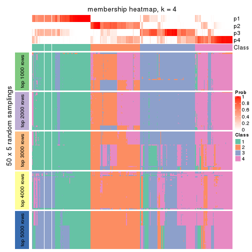</p>

</div>
<div id='tab-SD-mclust-membership-heatmap-4'>
<pre><code class="r">membership_heatmap(res, k = 5)
</code></pre>

<p></p>

</div>
<div id='tab-SD-mclust-membership-heatmap-5'>
<pre><code class="r">membership_heatmap(res, k = 6)
</code></pre>

<p></p>

</div>
</div>

As soon as we have had the classes for columns, we can look for signatures
which are significantly different between classes which can be candidate marks
for certain classes. Following are the heatmaps for signatures.


Signature heatmaps where rows are scaled:


<script>
$( function() {
	$( '#tabs-SD-mclust-get-signatures' ).tabs();
} );
</script>
<div id='tabs-SD-mclust-get-signatures'>
<ul>
<li><a href='#tab-SD-mclust-get-signatures-1'>k = 2</a></li>
<li><a href='#tab-SD-mclust-get-signatures-2'>k = 3</a></li>
<li><a href='#tab-SD-mclust-get-signatures-3'>k = 4</a></li>
<li><a href='#tab-SD-mclust-get-signatures-4'>k = 5</a></li>
<li><a href='#tab-SD-mclust-get-signatures-5'>k = 6</a></li>
</ul>
<div id='tab-SD-mclust-get-signatures-1'>
<pre><code class="r">get_signatures(res, k = 2)
</code></pre>

<p></p>

</div>
<div id='tab-SD-mclust-get-signatures-2'>
<pre><code class="r">get_signatures(res, k = 3)
</code></pre>

<p></p>

</div>
<div id='tab-SD-mclust-get-signatures-3'>
<pre><code class="r">get_signatures(res, k = 4)
</code></pre>

<p></p>

</div>
<div id='tab-SD-mclust-get-signatures-4'>
<pre><code class="r">get_signatures(res, k = 5)
</code></pre>

<p></p>

</div>
<div id='tab-SD-mclust-get-signatures-5'>
<pre><code class="r">get_signatures(res, k = 6)
</code></pre>

<p></p>

</div>
</div>


Signature heatmaps where rows are not scaled:


<script>
$( function() {
	$( '#tabs-SD-mclust-get-signatures-no-scale' ).tabs();
} );
</script>
<div id='tabs-SD-mclust-get-signatures-no-scale'>
<ul>
<li><a href='#tab-SD-mclust-get-signatures-no-scale-1'>k = 2</a></li>
<li><a href='#tab-SD-mclust-get-signatures-no-scale-2'>k = 3</a></li>
<li><a href='#tab-SD-mclust-get-signatures-no-scale-3'>k = 4</a></li>
<li><a href='#tab-SD-mclust-get-signatures-no-scale-4'>k = 5</a></li>
<li><a href='#tab-SD-mclust-get-signatures-no-scale-5'>k = 6</a></li>
</ul>
<div id='tab-SD-mclust-get-signatures-no-scale-1'>
<pre><code class="r">get_signatures(res, k = 2, scale_rows = FALSE)
</code></pre>

<p></p>

</div>
<div id='tab-SD-mclust-get-signatures-no-scale-2'>
<pre><code class="r">get_signatures(res, k = 3, scale_rows = FALSE)
</code></pre>

<p></p>

</div>
<div id='tab-SD-mclust-get-signatures-no-scale-3'>
<pre><code class="r">get_signatures(res, k = 4, scale_rows = FALSE)
</code></pre>

<p></p>

</div>
<div id='tab-SD-mclust-get-signatures-no-scale-4'>
<pre><code class="r">get_signatures(res, k = 5, scale_rows = FALSE)
</code></pre>

<p></p>

</div>
<div id='tab-SD-mclust-get-signatures-no-scale-5'>
<pre><code class="r">get_signatures(res, k = 6, scale_rows = FALSE)
</code></pre>

<p></p>

</div>
</div>


Compare the overlap of signatures from different k:

```r
compare_signatures(res)
```


`get_signature()` returns a data frame invisibly. TO get the list of signatures, the function
call should be assigned to a variable explicitly. In following code, if `plot` argument is set
to `FALSE`, no heatmap is plotted while only the differential analysis is performed.

```r
# code only for demonstration
tb = get_signature(res, k = ..., plot = FALSE)
```

An example of the output of `tb` is:

```
#>   which_row         fdr    mean_1    mean_2 scaled_mean_1 scaled_mean_2 km
#> 1        38 0.042760348  8.373488  9.131774    -0.5533452     0.5164555  1
#> 2        40 0.018707592  7.106213  8.469186    -0.6173731     0.5762149  1
#> 3        55 0.019134737 10.221463 11.207825    -0.6159697     0.5749050  1
#> 4        59 0.006059896  5.921854  7.869574    -0.6899429     0.6439467  1
#> 5        60 0.018055526  8.928898 10.211722    -0.6204761     0.5791110  1
#> 6        98 0.009384629 15.714769 14.887706     0.6635654    -0.6193277  2
...
```

The columns in `tb` are:

1. `which_row`: row indices corresponding to the input matrix.
2. `fdr`: FDR for the differential test. 
3. `mean_x`: The mean value in group x.
4. `scaled_mean_x`: The mean value in group x after rows are scaled.
5. `km`: Row groups if k-means clustering is applied to rows.


UMAP plot which shows how samples are separated.


<script>
$( function() {
	$( '#tabs-SD-mclust-dimension-reduction' ).tabs();
} );
</script>
<div id='tabs-SD-mclust-dimension-reduction'>
<ul>
<li><a href='#tab-SD-mclust-dimension-reduction-1'>k = 2</a></li>
<li><a href='#tab-SD-mclust-dimension-reduction-2'>k = 3</a></li>
<li><a href='#tab-SD-mclust-dimension-reduction-3'>k = 4</a></li>
<li><a href='#tab-SD-mclust-dimension-reduction-4'>k = 5</a></li>
<li><a href='#tab-SD-mclust-dimension-reduction-5'>k = 6</a></li>
</ul>
<div id='tab-SD-mclust-dimension-reduction-1'>
<pre><code class="r">dimension_reduction(res, k = 2, method = &quot;UMAP&quot;)
</code></pre>

<p></p>

</div>
<div id='tab-SD-mclust-dimension-reduction-2'>
<pre><code class="r">dimension_reduction(res, k = 3, method = &quot;UMAP&quot;)
</code></pre>

<p></p>

</div>
<div id='tab-SD-mclust-dimension-reduction-3'>
<pre><code class="r">dimension_reduction(res, k = 4, method = &quot;UMAP&quot;)
</code></pre>

<p></p>

</div>
<div id='tab-SD-mclust-dimension-reduction-4'>
<pre><code class="r">dimension_reduction(res, k = 5, method = &quot;UMAP&quot;)
</code></pre>

<p></p>

</div>
<div id='tab-SD-mclust-dimension-reduction-5'>
<pre><code class="r">dimension_reduction(res, k = 6, method = &quot;UMAP&quot;)
</code></pre>

<p></p>

</div>
</div>


Following heatmap shows how subgroups are split when increasing `k`:

```r
collect_classes(res)
```


If matrix rows can be associated to genes, consider to use `GO_Enrichment(res,
...)` to perform function enrichment for the signature genes.


 

---------------------------------------------------


### SD:NMF*


The object with results only for a single top-value method and a single partition method 
can be extracted as:

```r
res = res_list["SD", "NMF"]
# you can also extract it by
# res = res_list["SD:NMF"]
```

A summary of `res` and all the functions that can be applied to it:

```r
res
```

```
#> A 'ConsensusPartition' object with k = 2, 3, 4, 5, 6.
#>   On a matrix with 17723 rows and 374 columns.
#>   Top rows (1000, 2000, 3000, 4000, 5000) are extracted by 'SD' method.
#>   Subgroups are detected by 'NMF' method.
#>   Performed in total 1250 partitions by row resampling.
#>   Best k for subgroups seems to be 2.
#> 
#> Following methods can be applied to this 'ConsensusPartition' object:
#>  [1] "cola_report"             "collect_classes"         "collect_plots"          
#>  [4] "collect_stats"           "colnames"                "compare_signatures"     
#>  [7] "consensus_heatmap"       "dimension_reduction"     "functional_enrichment"  
#> [10] "get_anno_col"            "get_anno"                "get_classes"            
#> [13] "get_consensus"           "get_matrix"              "get_membership"         
#> [16] "get_param"               "get_signatures"          "get_stats"              
#> [19] "is_best_k"               "is_stable_k"             "membership_heatmap"     
#> [22] "ncol"                    "nrow"                    "plot_ecdf"              
#> [25] "rownames"                "select_partition_number" "show"                   
#> [28] "suggest_best_k"          "test_to_known_factors"
```

`collect_plots()` function collects all the plots made from `res` for all `k` (number of partitions)
into one single page to provide an easy and fast comparison between different `k`.

```r
collect_plots(res)
```


The plots are:

- The first row: a plot of the ECDF (Empirical cumulative distribution
  function) curves of the consensus matrix for each `k` and the heatmap of
  predicted classes for each `k`.
- The second row: heatmaps of the consensus matrix for each `k`.
- The third row: heatmaps of the membership matrix for each `k`.
- The fouth row: heatmaps of the signatures for each `k`.

All the plots in panels can be made by individual functions and they are
plotted later in this section.

`select_partition_number()` produces several plots showing different
statistics for choosing "optimized" `k`. There are following statistics:

- ECDF curves of the consensus matrix for each `k`;
- 1-PAC. [The PAC
  score](https://en.wikipedia.org/wiki/Consensus_clustering#Over-interpretation_potential_of_consensus_clustering)
  measures the proportion of the ambiguous subgrouping.
- Mean silhouette score.
- Concordance. The mean probability of fiting the consensus class ids in all
  partitions.
- Area increased. Denote $A_k$ as the area under the ECDF curve for current
  `k`, the area increased is defined as $A_k - A_{k-1}$.
- Rand index. The percent of pairs of samples that are both in a same cluster
  or both are not in a same cluster in the partition of k and k-1.
- Jaccard index. The ratio of pairs of samples are both in a same cluster in
  the partition of k and k-1 and the pairs of samples are both in a same
  cluster in the partition k or k-1.

The detailed explanations of these statistics can be found in [the cola
vignette](http://bioconductor.org/packages/devel/bioc/vignettes/cola/inst/doc/cola.html#toc_13).

Generally speaking, lower PAC score, higher mean silhouette score or higher
concordance corresponds to better partition. Rand index and Jaccard index
measure how similar the current partition is compared to partition with `k-1`.
If they are too similar, we won't accept `k` is better than `k-1`.

```r
select_partition_number(res)
```


The numeric values for all these statistics can be obtained by `get_stats()`.

```r
get_stats(res)
```

```
#>   k 1-PAC mean_silhouette concordance area_increased  Rand Jaccard
#> 2 2 0.933           0.940       0.975         0.4981 0.501   0.501
#> 3 3 0.565           0.703       0.828         0.2666 0.868   0.744
#> 4 4 0.599           0.617       0.804         0.1029 0.799   0.560
#> 5 5 0.865           0.855       0.924         0.0904 0.827   0.523
#> 6 6 0.735           0.656       0.825         0.0418 0.967   0.867
```

`suggest_best_k()` suggests the best $k$ based on these statistics. The rules are as follows:

- All $k$ with Jaccard index larger than 0.95 are removed because the increase of
  the partition number does not provides enough extra information. If all $k$ are removed,
  the best $k$ is assigned by `NA`.
- For $k$ with 1-PAC larger than 0.9, the maximal $k$ is taken as the "best k". Other $k$ is called "optional k".
- If it does not fit the second rule. The $k$ with the highest vote of highest
  1-PAC, mean silhouette and concordance is taken as the "best k".

```r
suggest_best_k(res)
```

```
#> [1] 2
```


Following shows the table of the partitions (You need to click the **show/hide
code output** link to see it). The membership matrix (columns with name `p*`)
is inferred by
[`clue::cl_consensus()`](https://www.rdocumentation.org/link/cl_consensus?package=clue)
function with the `SE` method. Basically the value in the membership matrix
represents the probability to belong to a certain group. The finall class
label for an item is determined with the group with highest probability it
belongs to.

In `get_classes()` function, the entropy is calculated from the membership
matrix and the silhouette score is calculated from the consensus matrix.


<script>
$( function() {
	$( '#tabs-SD-NMF-get-classes' ).tabs();
} );
</script>
<div id='tabs-SD-NMF-get-classes'>
<ul>
<li><a href='#tab-SD-NMF-get-classes-1'>k = 2</a></li>
<li><a href='#tab-SD-NMF-get-classes-2'>k = 3</a></li>
<li><a href='#tab-SD-NMF-get-classes-3'>k = 4</a></li>
<li><a href='#tab-SD-NMF-get-classes-4'>k = 5</a></li>
<li><a href='#tab-SD-NMF-get-classes-5'>k = 6</a></li>
</ul>

<div id='tab-SD-NMF-get-classes-1'>
<p><a id='tab-SD-NMF-get-classes-1-a' style='color:#0366d6' href='#'>show/hide code output</a></p>
<pre><code class="r">cbind(get_classes(res, k = 2), get_membership(res, k = 2))
</code></pre>

<pre><code>#&gt;            class entropy silhouette    p1    p2
#&gt; SRR660824      1  0.0000     0.9687 1.000 0.000
#&gt; SRR603858      1  0.2423     0.9345 0.960 0.040
#&gt; SRR817070      2  0.0000     0.9782 0.000 1.000
#&gt; SRR1486995     1  0.0000     0.9687 1.000 0.000
#&gt; SRR813043      2  0.0000     0.9782 0.000 1.000
#&gt; SRR656874      2  0.0000     0.9782 0.000 1.000
#&gt; SRR659037      1  0.9044     0.5422 0.680 0.320
#&gt; SRR662031      1  0.0000     0.9687 1.000 0.000
#&gt; SRR1081283     2  0.0000     0.9782 0.000 1.000
#&gt; SRR1481036     1  0.7219     0.7516 0.800 0.200
#&gt; SRR1434009     2  0.0000     0.9782 0.000 1.000
#&gt; SRR1376676     1  0.0000     0.9687 1.000 0.000
#&gt; SRR1396967     2  0.0000     0.9782 0.000 1.000
#&gt; SRR665429      2  0.0000     0.9782 0.000 1.000
#&gt; SRR1388025     2  0.0000     0.9782 0.000 1.000
#&gt; SRR600784      1  0.0000     0.9687 1.000 0.000
#&gt; SRR657611      1  0.0000     0.9687 1.000 0.000
#&gt; SRR1333659     2  0.0000     0.9782 0.000 1.000
#&gt; SRR1323896     2  0.0000     0.9782 0.000 1.000
#&gt; SRR1453971     1  0.0000     0.9687 1.000 0.000
#&gt; SRR1421010     1  0.0000     0.9687 1.000 0.000
#&gt; SRR1334490     1  0.0000     0.9687 1.000 0.000
#&gt; SRR1309468     1  0.0000     0.9687 1.000 0.000
#&gt; SRR1468637     1  0.0000     0.9687 1.000 0.000
#&gt; SRR1365489     2  0.0000     0.9782 0.000 1.000
#&gt; SRR627445      1  0.7299     0.7461 0.796 0.204
#&gt; SRR607863      2  0.0000     0.9782 0.000 1.000
#&gt; SRR1475524     1  0.0000     0.9687 1.000 0.000
#&gt; SRR1405504     2  0.0000     0.9782 0.000 1.000
#&gt; SRR615695      1  0.0000     0.9687 1.000 0.000
#&gt; SRR600900      2  0.0000     0.9782 0.000 1.000
#&gt; SRR601477      2  0.0000     0.9782 0.000 1.000
#&gt; SRR1487215     2  0.0000     0.9782 0.000 1.000
#&gt; SRR1310797     2  0.0000     0.9782 0.000 1.000
#&gt; SRR1362713     1  0.0000     0.9687 1.000 0.000
#&gt; SRR1431385     1  0.0000     0.9687 1.000 0.000
#&gt; SRR1379089     2  0.0000     0.9782 0.000 1.000
#&gt; SRR1102079     1  0.0000     0.9687 1.000 0.000
#&gt; SRR1357210     1  0.0000     0.9687 1.000 0.000
#&gt; SRR657659      2  0.0000     0.9782 0.000 1.000
#&gt; SRR663573      2  0.0000     0.9782 0.000 1.000
#&gt; SRR603188      2  0.0000     0.9782 0.000 1.000
#&gt; SRR1471200     2  0.0000     0.9782 0.000 1.000
#&gt; SRR1310975     2  0.0000     0.9782 0.000 1.000
#&gt; SRR627457      2  0.0000     0.9782 0.000 1.000
#&gt; SRR1367654     2  0.0000     0.9782 0.000 1.000
#&gt; SRR1488410     1  0.0000     0.9687 1.000 0.000
#&gt; SRR1457750     1  1.0000     0.0152 0.500 0.500
#&gt; SRR1099546     1  0.0000     0.9687 1.000 0.000
#&gt; SRR604480      2  0.0000     0.9782 0.000 1.000
#&gt; SRR1390477     2  0.0000     0.9782 0.000 1.000
#&gt; SRR1458447     2  0.0000     0.9782 0.000 1.000
#&gt; SRR1473161     2  0.0000     0.9782 0.000 1.000
#&gt; SRR1409813     2  0.0000     0.9782 0.000 1.000
#&gt; SRR612791      1  0.0000     0.9687 1.000 0.000
#&gt; SRR1470580     2  0.0000     0.9782 0.000 1.000
#&gt; SRR1444063     1  0.9775     0.3122 0.588 0.412
#&gt; SRR1355578     1  0.0000     0.9687 1.000 0.000
#&gt; SRR1429203     1  0.0000     0.9687 1.000 0.000
#&gt; SRR599154      2  0.0000     0.9782 0.000 1.000
#&gt; SRR814244      1  0.0000     0.9687 1.000 0.000
#&gt; SRR1404123     2  0.0000     0.9782 0.000 1.000
#&gt; SRR656934      1  0.0376     0.9655 0.996 0.004
#&gt; SRR1339029     2  0.0000     0.9782 0.000 1.000
#&gt; SRR821525      2  0.0000     0.9782 0.000 1.000
#&gt; SRR1443677     1  0.0000     0.9687 1.000 0.000
#&gt; SRR1406330     1  0.0000     0.9687 1.000 0.000
#&gt; SRR1338124     2  0.8499     0.6167 0.276 0.724
#&gt; SRR1391376     1  0.0000     0.9687 1.000 0.000
#&gt; SRR661842      2  0.0000     0.9782 0.000 1.000
#&gt; SRR1395699     1  0.0000     0.9687 1.000 0.000
#&gt; SRR1312209     1  0.0000     0.9687 1.000 0.000
#&gt; SRR1359469     1  0.0000     0.9687 1.000 0.000
#&gt; SRR658885      1  0.0000     0.9687 1.000 0.000
#&gt; SRR1414578     1  0.0000     0.9687 1.000 0.000
#&gt; SRR603620      2  0.0000     0.9782 0.000 1.000
#&gt; SRR604677      1  0.0000     0.9687 1.000 0.000
#&gt; SRR603800      2  0.0000     0.9782 0.000 1.000
#&gt; SRR602058      2  0.0000     0.9782 0.000 1.000
#&gt; SRR817488      2  0.0000     0.9782 0.000 1.000
#&gt; SRR655601      2  0.0000     0.9782 0.000 1.000
#&gt; SRR1434821     2  0.0000     0.9782 0.000 1.000
#&gt; SRR1349166     2  0.0000     0.9782 0.000 1.000
#&gt; SRR615129      2  0.8861     0.5577 0.304 0.696
#&gt; SRR607586      2  0.0000     0.9782 0.000 1.000
#&gt; SRR602680      2  0.0000     0.9782 0.000 1.000
#&gt; SRR1411070     2  0.0000     0.9782 0.000 1.000
#&gt; SRR663038      2  0.0000     0.9782 0.000 1.000
#&gt; SRR1489416     2  0.0000     0.9782 0.000 1.000
#&gt; SRR1479155     1  0.0000     0.9687 1.000 0.000
#&gt; SRR662162      1  0.0000     0.9687 1.000 0.000
#&gt; SRR1374567     1  0.0000     0.9687 1.000 0.000
#&gt; SRR1434048     2  0.0000     0.9782 0.000 1.000
#&gt; SRR2184865     2  0.0000     0.9782 0.000 1.000
#&gt; SRR2170135     1  0.0000     0.9687 1.000 0.000
#&gt; SRR615551      2  0.0000     0.9782 0.000 1.000
#&gt; SRR1335513     2  0.0000     0.9782 0.000 1.000
#&gt; SRR1370216     1  0.0000     0.9687 1.000 0.000
#&gt; SRR662954      2  0.6973     0.7633 0.188 0.812
#&gt; SRR1375738     1  0.0000     0.9687 1.000 0.000
#&gt; SRR1356577     1  0.0376     0.9655 0.996 0.004
#&gt; SRR1073119     1  0.0000     0.9687 1.000 0.000
#&gt; SRR663549      1  0.0000     0.9687 1.000 0.000
#&gt; SRR1478015     2  0.0000     0.9782 0.000 1.000
#&gt; SRR600632      2  0.0000     0.9782 0.000 1.000
#&gt; SRR811866      1  0.0000     0.9687 1.000 0.000
#&gt; SRR1401101     2  0.0000     0.9782 0.000 1.000
#&gt; SRR1477797     2  0.0000     0.9782 0.000 1.000
#&gt; SRR1402986     2  0.0000     0.9782 0.000 1.000
#&gt; SRR658897      1  0.0000     0.9687 1.000 0.000
#&gt; SRR1419869     1  0.0000     0.9687 1.000 0.000
#&gt; SRR1490700     1  0.0000     0.9687 1.000 0.000
#&gt; SRR601723      2  0.0000     0.9782 0.000 1.000
#&gt; SRR1384115     2  0.8713     0.5858 0.292 0.708
#&gt; SRR1476927     2  0.0000     0.9782 0.000 1.000
#&gt; SRR1387769     1  0.0000     0.9687 1.000 0.000
#&gt; SRR1322595     1  0.0000     0.9687 1.000 0.000
#&gt; SRR1370423     1  0.7674     0.7162 0.776 0.224
#&gt; SRR1314976     1  0.8555     0.6213 0.720 0.280
#&gt; SRR1319560     2  0.0000     0.9782 0.000 1.000
#&gt; SRR1352683     1  0.2778     0.9267 0.952 0.048
#&gt; SRR1473800     1  0.0000     0.9687 1.000 0.000
#&gt; SRR1326384     1  0.0000     0.9687 1.000 0.000
#&gt; SRR1360807     2  0.2603     0.9380 0.044 0.956
#&gt; SRR1332544     1  0.0000     0.9687 1.000 0.000
#&gt; SRR598695      1  0.0000     0.9687 1.000 0.000
#&gt; SRR807824      2  0.0000     0.9782 0.000 1.000
#&gt; SRR809296      1  0.0000     0.9687 1.000 0.000
#&gt; SRR657927      1  0.0000     0.9687 1.000 0.000
#&gt; SRR1440682     2  0.0000     0.9782 0.000 1.000
#&gt; SRR1454415     2  0.0000     0.9782 0.000 1.000
#&gt; SRR1419131     2  0.0000     0.9782 0.000 1.000
#&gt; SRR1404293     1  0.0000     0.9687 1.000 0.000
#&gt; SRR1473340     1  0.0000     0.9687 1.000 0.000
#&gt; SRR1345563     1  0.0000     0.9687 1.000 0.000
#&gt; SRR1323382     2  0.0000     0.9782 0.000 1.000
#&gt; SRR1480697     1  0.7056     0.7627 0.808 0.192
#&gt; SRR1321808     2  0.0000     0.9782 0.000 1.000
#&gt; SRR1382756     2  0.0000     0.9782 0.000 1.000
#&gt; SRR1312558     2  0.0000     0.9782 0.000 1.000
#&gt; SRR1417088     2  0.0000     0.9782 0.000 1.000
#&gt; SRR1433027     2  0.0000     0.9782 0.000 1.000
#&gt; SRR662257      2  0.0000     0.9782 0.000 1.000
#&gt; SRR600417      2  0.0000     0.9782 0.000 1.000
#&gt; SRR812493      2  0.7139     0.7516 0.196 0.804
#&gt; SRR612743      1  0.0000     0.9687 1.000 0.000
#&gt; SRR1361345     1  0.0000     0.9687 1.000 0.000
#&gt; SRR600584      2  0.0000     0.9782 0.000 1.000
#&gt; SRR1310520     2  0.0000     0.9782 0.000 1.000
#&gt; SRR1395595     1  0.0000     0.9687 1.000 0.000
#&gt; SRR1334074     2  0.9286     0.4728 0.344 0.656
#&gt; SRR654838      2  0.0000     0.9782 0.000 1.000
#&gt; SRR1376694     1  0.0000     0.9687 1.000 0.000
#&gt; SRR1433841     2  0.3584     0.9120 0.068 0.932
#&gt; SRR1366837     1  0.0000     0.9687 1.000 0.000
#&gt; SRR1467479     2  0.0000     0.9782 0.000 1.000
#&gt; SRR1459055     1  0.0000     0.9687 1.000 0.000
#&gt; SRR1471050     2  0.0000     0.9782 0.000 1.000
#&gt; SRR603004      2  0.0000     0.9782 0.000 1.000
#&gt; SRR814703      2  0.0000     0.9782 0.000 1.000
#&gt; SRR661937      2  0.0000     0.9782 0.000 1.000
#&gt; SRR614359      1  0.0000     0.9687 1.000 0.000
#&gt; SRR1071568     2  0.0000     0.9782 0.000 1.000
#&gt; SRR1389084     1  0.0000     0.9687 1.000 0.000
#&gt; SRR1337624     2  0.0000     0.9782 0.000 1.000
#&gt; SRR1344400     2  0.0000     0.9782 0.000 1.000
#&gt; SRR1414290     2  0.0000     0.9782 0.000 1.000
#&gt; SRR1413644     2  0.0000     0.9782 0.000 1.000
#&gt; SRR1098998     1  0.0000     0.9687 1.000 0.000
#&gt; SRR1481279     1  0.0000     0.9687 1.000 0.000
#&gt; SRR1315103     1  0.0000     0.9687 1.000 0.000
#&gt; SRR1099286     1  0.0000     0.9687 1.000 0.000
#&gt; SRR2166570     2  0.9977     0.0741 0.472 0.528
#&gt; SRR601445      1  0.0000     0.9687 1.000 0.000
#&gt; SRR1439719     2  0.0000     0.9782 0.000 1.000
#&gt; SRR1377026     2  0.0000     0.9782 0.000 1.000
#&gt; SRR1327386     1  0.0000     0.9687 1.000 0.000
#&gt; SRR654826      2  0.0000     0.9782 0.000 1.000
#&gt; SRR1460433     2  0.0000     0.9782 0.000 1.000
#&gt; SRR1469345     1  0.0000     0.9687 1.000 0.000
#&gt; SRR1421462     2  0.0000     0.9782 0.000 1.000
#&gt; SRR662966      1  0.0000     0.9687 1.000 0.000
#&gt; SRR1339175     1  0.0000     0.9687 1.000 0.000
#&gt; SRR1447736     2  0.0000     0.9782 0.000 1.000
#&gt; SRR1434671     2  0.0000     0.9782 0.000 1.000
#&gt; SRR660800      2  0.0000     0.9782 0.000 1.000
#&gt; SRR1465543     2  0.0376     0.9747 0.004 0.996
#&gt; SRR1342023     1  0.0000     0.9687 1.000 0.000
#&gt; SRR1335670     1  0.0000     0.9687 1.000 0.000
#&gt; SRR1400955     2  0.0000     0.9782 0.000 1.000
#&gt; SRR1072150     2  0.0000     0.9782 0.000 1.000
#&gt; SRR1442822     1  0.0000     0.9687 1.000 0.000
#&gt; SRR1364658     1  0.0000     0.9687 1.000 0.000
#&gt; SRR1098074     2  0.3431     0.9176 0.064 0.936
#&gt; SRR1442778     1  0.0000     0.9687 1.000 0.000
#&gt; SRR1086728     1  0.7139     0.7572 0.804 0.196
#&gt; SRR627464      2  0.0000     0.9782 0.000 1.000
#&gt; SRR1409193     1  0.0000     0.9687 1.000 0.000
#&gt; SRR2168286     2  0.0000     0.9782 0.000 1.000
#&gt; SRR615539      2  0.0000     0.9782 0.000 1.000
#&gt; SRR663623      1  0.0000     0.9687 1.000 0.000
#&gt; SRR1471989     1  0.0000     0.9687 1.000 0.000
#&gt; SRR1468828     2  0.0000     0.9782 0.000 1.000
#&gt; SRR1381934     1  0.0000     0.9687 1.000 0.000
#&gt; SRR1471098     1  0.0000     0.9687 1.000 0.000
#&gt; SRR1314749     1  0.0000     0.9687 1.000 0.000
#&gt; SRR2166874     2  0.0000     0.9782 0.000 1.000
#&gt; SRR821302      1  0.0000     0.9687 1.000 0.000
#&gt; SRR1435066     2  0.0000     0.9782 0.000 1.000
#&gt; SRR661601      2  0.0000     0.9782 0.000 1.000
#&gt; SRR1446546     2  0.0000     0.9782 0.000 1.000
#&gt; SRR1419784     1  0.0376     0.9655 0.996 0.004
#&gt; SRR1357233     2  0.3114     0.9260 0.056 0.944
#&gt; SRR1441889     1  0.0000     0.9687 1.000 0.000
#&gt; SRR1413940     1  0.0000     0.9687 1.000 0.000
#&gt; SRR1324250     2  0.0000     0.9782 0.000 1.000
#&gt; SRR1442862     2  0.0000     0.9782 0.000 1.000
#&gt; SRR662474      2  0.0000     0.9782 0.000 1.000
#&gt; SRR1416226     1  0.0000     0.9687 1.000 0.000
#&gt; SRR1417404     1  0.6148     0.8143 0.848 0.152
#&gt; SRR665466      2  0.0000     0.9782 0.000 1.000
#&gt; SRR658849      1  0.0000     0.9687 1.000 0.000
#&gt; SRR1460025     2  0.0000     0.9782 0.000 1.000
#&gt; SRR1408136     1  0.0000     0.9687 1.000 0.000
#&gt; SRR1489995     2  0.0000     0.9782 0.000 1.000
#&gt; SRR1374092     1  0.0000     0.9687 1.000 0.000
#&gt; SRR1488429     1  0.0000     0.9687 1.000 0.000
#&gt; SRR1087559     1  0.7139     0.7545 0.804 0.196
#&gt; SRR817004      1  0.3114     0.9189 0.944 0.056
#&gt; SRR1429660     2  0.0000     0.9782 0.000 1.000
#&gt; SRR604390      1  0.9286     0.4897 0.656 0.344
#&gt; SRR614936      2  0.0000     0.9782 0.000 1.000
#&gt; SRR1365938     2  0.8499     0.6130 0.276 0.724
#&gt; SRR1437324     1  0.0000     0.9687 1.000 0.000
#&gt; SRR613414      2  0.0000     0.9782 0.000 1.000
#&gt; SRR660414      1  0.9710     0.3579 0.600 0.400
#&gt; SRR1452185     1  0.0000     0.9687 1.000 0.000
#&gt; SRR1347020     1  0.0000     0.9687 1.000 0.000
#&gt; SRR1398036     2  0.0000     0.9782 0.000 1.000
#&gt; SRR1436674     1  0.0000     0.9687 1.000 0.000
#&gt; SRR603750      1  0.7299     0.7465 0.796 0.204
#&gt; SRR608630      2  0.9795     0.2804 0.416 0.584
#&gt; SRR655625      2  0.0000     0.9782 0.000 1.000
#&gt; SRR599059      2  0.6887     0.7695 0.184 0.816
#&gt; SRR615189      2  0.0000     0.9782 0.000 1.000
#&gt; SRR1466889     2  0.0000     0.9782 0.000 1.000
#&gt; SRR1084602     2  0.3879     0.9050 0.076 0.924
#&gt; SRR1335422     1  0.0000     0.9687 1.000 0.000
#&gt; SRR1356805     2  0.0000     0.9782 0.000 1.000
#&gt; SRR1385300     1  0.0000     0.9687 1.000 0.000
#&gt; SRR654814      1  0.0000     0.9687 1.000 0.000
#&gt; SRR658385      2  0.0000     0.9782 0.000 1.000
#&gt; SRR820596      1  0.0000     0.9687 1.000 0.000
#&gt; SRR1318118     1  0.0000     0.9687 1.000 0.000
#&gt; SRR1480766     2  0.0000     0.9782 0.000 1.000
#&gt; SRR1406539     1  0.0000     0.9687 1.000 0.000
#&gt; SRR1341833     2  0.0000     0.9782 0.000 1.000
#&gt; SRR1441826     2  0.0000     0.9782 0.000 1.000
#&gt; SRR1448051     1  0.0000     0.9687 1.000 0.000
#&gt; SRR1326752     1  0.0000     0.9687 1.000 0.000
#&gt; SRR665217      1  0.0000     0.9687 1.000 0.000
#&gt; SRR819186      2  0.0000     0.9782 0.000 1.000
#&gt; SRR661517      1  0.0000     0.9687 1.000 0.000
#&gt; SRR607166      2  0.0000     0.9782 0.000 1.000
#&gt; SRR809065      2  0.0000     0.9782 0.000 1.000
#&gt; SRR1415872     2  0.0000     0.9782 0.000 1.000
#&gt; SRR1415463     1  0.0000     0.9687 1.000 0.000
#&gt; SRR1381161     2  0.0000     0.9782 0.000 1.000
#&gt; SRR1442231     2  0.0000     0.9782 0.000 1.000
#&gt; SRR1374696     1  0.0000     0.9687 1.000 0.000
#&gt; SRR1451988     2  0.5629     0.8378 0.132 0.868
#&gt; SRR660555      1  0.0000     0.9687 1.000 0.000
#&gt; SRR657801      1  0.0000     0.9687 1.000 0.000
#&gt; SRR663344      2  0.0000     0.9782 0.000 1.000
#&gt; SRR1472462     2  0.0000     0.9782 0.000 1.000
#&gt; SRR1406176     1  0.8267     0.6535 0.740 0.260
#&gt; SRR656886      2  0.0000     0.9782 0.000 1.000
#&gt; SRR1498337     2  0.0000     0.9782 0.000 1.000
#&gt; SRR613066      1  0.0000     0.9687 1.000 0.000
#&gt; SRR1309490     1  0.0000     0.9687 1.000 0.000
#&gt; SRR602492      2  0.0000     0.9782 0.000 1.000
#&gt; SRR1447347     1  0.0000     0.9687 1.000 0.000
#&gt; SRR1475546     2  0.0000     0.9782 0.000 1.000
#&gt; SRR627459      2  0.0000     0.9782 0.000 1.000
#&gt; SRR1434332     2  0.0000     0.9782 0.000 1.000
#&gt; SRR1070358     2  0.0000     0.9782 0.000 1.000
#&gt; SRR1345936     2  0.9710     0.3276 0.400 0.600
#&gt; SRR665658      2  0.0000     0.9782 0.000 1.000
#&gt; SRR1321351     2  0.0000     0.9782 0.000 1.000
#&gt; SRR657880      2  0.0000     0.9782 0.000 1.000
#&gt; SRR1373903     2  0.0000     0.9782 0.000 1.000
#&gt; SRR657396      2  0.0000     0.9782 0.000 1.000
#&gt; SRR660981      2  0.0000     0.9782 0.000 1.000
#&gt; SRR818499      1  0.0000     0.9687 1.000 0.000
#&gt; SRR819658      2  0.0000     0.9782 0.000 1.000
#&gt; SRR1376316     1  0.0000     0.9687 1.000 0.000
#&gt; SRR1323723     2  0.0000     0.9782 0.000 1.000
#&gt; SRR1476719     1  0.0000     0.9687 1.000 0.000
#&gt; SRR1403478     2  0.0000     0.9782 0.000 1.000
#&gt; SRR1095695     1  0.0000     0.9687 1.000 0.000
#&gt; SRR1352391     1  0.0000     0.9687 1.000 0.000
#&gt; SRR1498813     2  0.0000     0.9782 0.000 1.000
#&gt; SRR627437      2  0.1633     0.9572 0.024 0.976
#&gt; SRR2185097     1  0.0000     0.9687 1.000 0.000
#&gt; SRR817166      1  0.7299     0.7460 0.796 0.204
#&gt; SRR1091670     2  0.0000     0.9782 0.000 1.000
#&gt; SRR603776      1  0.0000     0.9687 1.000 0.000
#&gt; SRR1479640     2  0.0000     0.9782 0.000 1.000
#&gt; SRR660152      1  0.0000     0.9687 1.000 0.000
#&gt; SRR1074769     2  0.0000     0.9782 0.000 1.000
#&gt; SRR656153      2  0.0000     0.9782 0.000 1.000
#&gt; SRR1392502     1  0.0000     0.9687 1.000 0.000
#&gt; SRR1359609     1  0.0000     0.9687 1.000 0.000
#&gt; SRR601925      2  0.0000     0.9782 0.000 1.000
#&gt; SRR2165182     2  0.0000     0.9782 0.000 1.000
#&gt; SRR608542      2  0.0000     0.9782 0.000 1.000
#&gt; SRR655064      2  0.0000     0.9782 0.000 1.000
#&gt; SRR1432430     1  0.0000     0.9687 1.000 0.000
#&gt; SRR808472      2  0.0000     0.9782 0.000 1.000
#&gt; SRR1414958     1  0.0000     0.9687 1.000 0.000
#&gt; SRR598484      2  0.0000     0.9782 0.000 1.000
#&gt; SRR612755      1  0.0000     0.9687 1.000 0.000
#&gt; SRR1365808     1  0.0000     0.9687 1.000 0.000
#&gt; SRR1391724     1  0.9896     0.2288 0.560 0.440
#&gt; SRR1322373     1  0.0000     0.9687 1.000 0.000
#&gt; SRR1489265     2  0.0000     0.9782 0.000 1.000
#&gt; SRR1359099     2  0.0000     0.9782 0.000 1.000
#&gt; SRR607279      2  0.0000     0.9782 0.000 1.000
#&gt; SRR810461      2  0.0000     0.9782 0.000 1.000
#&gt; SRR627427      1  0.0000     0.9687 1.000 0.000
#&gt; SRR612887      2  0.0000     0.9782 0.000 1.000
#&gt; SRR809807      2  0.8016     0.6749 0.244 0.756
#&gt; SRR663112      2  0.0000     0.9782 0.000 1.000
#&gt; SRR1346933     1  0.7950     0.6857 0.760 0.240
#&gt; SRR1487910     1  0.0000     0.9687 1.000 0.000
#&gt; SRR603092      2  0.0000     0.9782 0.000 1.000
#&gt; SRR1417680     2  0.0000     0.9782 0.000 1.000
#&gt; SRR1383785     1  0.0000     0.9687 1.000 0.000
#&gt; SRR1070015     2  0.1184     0.9642 0.016 0.984
#&gt; SRR1466222     2  0.0000     0.9782 0.000 1.000
#&gt; SRR1416119     1  0.0000     0.9687 1.000 0.000
#&gt; SRR819318      1  0.0000     0.9687 1.000 0.000
#&gt; SRR608288      2  0.0000     0.9782 0.000 1.000
#&gt; SRR811121      2  0.0000     0.9782 0.000 1.000
#&gt; SRR613138      2  0.0000     0.9782 0.000 1.000
#&gt; SRR810483      1  0.0000     0.9687 1.000 0.000
#&gt; SRR607839      1  0.0000     0.9687 1.000 0.000
#&gt; SRR1337031     1  0.0000     0.9687 1.000 0.000
#&gt; SRR601311      2  0.0000     0.9782 0.000 1.000
#&gt; SRR1406685     2  0.0000     0.9782 0.000 1.000
#&gt; SRR1467500     2  0.0000     0.9782 0.000 1.000
#&gt; SRR1308504     1  0.0000     0.9687 1.000 0.000
#&gt; SRR1312865     1  0.2948     0.9230 0.948 0.052
#&gt; SRR1312522     1  0.0000     0.9687 1.000 0.000
#&gt; SRR1490486     2  0.0000     0.9782 0.000 1.000
#&gt; SRR1325888     1  0.0000     0.9687 1.000 0.000
#&gt; SRR1472885     1  0.0000     0.9687 1.000 0.000
#&gt; SRR1098785     2  0.0000     0.9782 0.000 1.000
#&gt; SRR1084766     2  0.0000     0.9782 0.000 1.000
#&gt; SRR1102804     2  0.0000     0.9782 0.000 1.000
#&gt; SRR1336636     1  0.0000     0.9687 1.000 0.000
#&gt; SRR1347795     1  0.0000     0.9687 1.000 0.000
#&gt; SRR601900      2  0.0000     0.9782 0.000 1.000
#&gt; SRR1330989     2  0.0000     0.9782 0.000 1.000
#&gt; SRR658445      2  0.2778     0.9340 0.048 0.952
#&gt; SRR1368754     1  0.0000     0.9687 1.000 0.000
#&gt; SRR1460001     2  0.0000     0.9782 0.000 1.000
#&gt; SRR1414934     1  0.0000     0.9687 1.000 0.000
#&gt; SRR1326249     1  0.0000     0.9687 1.000 0.000
#&gt; SRR614948      1  0.0000     0.9687 1.000 0.000
#&gt; SRR1472952     1  0.0000     0.9687 1.000 0.000
#&gt; SRR1321528     1  0.0000     0.9687 1.000 0.000
#&gt; SRR627447      1  0.0000     0.9687 1.000 0.000
#&gt; SRR612239      2  0.2236     0.9459 0.036 0.964
</code></pre>

<script>
$('#tab-SD-NMF-get-classes-1-a').parent().next().next().hide();
$('#tab-SD-NMF-get-classes-1-a').click(function(){
  $('#tab-SD-NMF-get-classes-1-a').parent().next().next().toggle();
  return(false);
});
</script>
</div>

<div id='tab-SD-NMF-get-classes-2'>
<p><a id='tab-SD-NMF-get-classes-2-a' style='color:#0366d6' href='#'>show/hide code output</a></p>
<pre><code class="r">cbind(get_classes(res, k = 3), get_membership(res, k = 3))
</code></pre>

<pre><code>#&gt;            class entropy silhouette    p1    p2    p3
#&gt; SRR660824      1  0.5058    0.63997 0.756 0.000 0.244
#&gt; SRR603858      1  0.9070    0.23080 0.552 0.244 0.204
#&gt; SRR817070      2  0.3116    0.80897 0.000 0.892 0.108
#&gt; SRR1486995     1  0.5760    0.52327 0.672 0.000 0.328
#&gt; SRR813043      2  0.3686    0.77046 0.000 0.860 0.140
#&gt; SRR656874      2  0.1964    0.82169 0.000 0.944 0.056
#&gt; SRR659037      3  0.5412    0.56121 0.032 0.172 0.796
#&gt; SRR662031      1  0.0424    0.80712 0.992 0.000 0.008
#&gt; SRR1081283     2  0.3941    0.78777 0.000 0.844 0.156
#&gt; SRR1481036     1  0.4808    0.71259 0.804 0.008 0.188
#&gt; SRR1434009     3  0.5216    0.64666 0.000 0.260 0.740
#&gt; SRR1376676     1  0.0892    0.80429 0.980 0.000 0.020
#&gt; SRR1396967     2  0.5216    0.63806 0.000 0.740 0.260
#&gt; SRR665429      2  0.0747    0.83025 0.000 0.984 0.016
#&gt; SRR1388025     2  0.4291    0.77315 0.000 0.820 0.180
#&gt; SRR600784      1  0.4931    0.65426 0.768 0.000 0.232
#&gt; SRR657611      1  0.1163    0.80197 0.972 0.000 0.028
#&gt; SRR1333659     3  0.4654    0.70321 0.000 0.208 0.792
#&gt; SRR1323896     2  0.1031    0.82973 0.000 0.976 0.024
#&gt; SRR1453971     1  0.5621    0.55500 0.692 0.000 0.308
#&gt; SRR1421010     1  0.0424    0.80629 0.992 0.000 0.008
#&gt; SRR1334490     3  0.4931    0.66026 0.232 0.000 0.768
#&gt; SRR1309468     1  0.0747    0.80642 0.984 0.000 0.016
#&gt; SRR1468637     3  0.5882    0.49636 0.348 0.000 0.652
#&gt; SRR1365489     2  0.2537    0.81096 0.000 0.920 0.080
#&gt; SRR627445      1  0.6665    0.55637 0.688 0.036 0.276
#&gt; SRR607863      2  0.0000    0.83029 0.000 1.000 0.000
#&gt; SRR1475524     1  0.6225   -0.00426 0.568 0.000 0.432
#&gt; SRR1405504     2  0.0892    0.83008 0.000 0.980 0.020
#&gt; SRR615695      1  0.1411    0.79887 0.964 0.000 0.036
#&gt; SRR600900      2  0.1031    0.83101 0.000 0.976 0.024
#&gt; SRR601477      2  0.2537    0.81096 0.000 0.920 0.080
#&gt; SRR1487215     2  0.4346    0.72795 0.000 0.816 0.184
#&gt; SRR1310797     2  0.0000    0.83029 0.000 1.000 0.000
#&gt; SRR1362713     1  0.4452    0.67289 0.808 0.000 0.192
#&gt; SRR1431385     1  0.1031    0.80321 0.976 0.000 0.024
#&gt; SRR1379089     2  0.3267    0.78904 0.000 0.884 0.116
#&gt; SRR1102079     1  0.6111    0.39338 0.604 0.000 0.396
#&gt; SRR1357210     1  0.0424    0.80712 0.992 0.000 0.008
#&gt; SRR657659      2  0.3619    0.79757 0.000 0.864 0.136
#&gt; SRR663573      2  0.4002    0.78566 0.000 0.840 0.160
#&gt; SRR603188      2  0.1643    0.82585 0.000 0.956 0.044
#&gt; SRR1471200     2  0.3619    0.77382 0.000 0.864 0.136
#&gt; SRR1310975     2  0.2261    0.81666 0.000 0.932 0.068
#&gt; SRR627457      2  0.3607    0.78986 0.008 0.880 0.112
#&gt; SRR1367654     2  0.5760    0.51256 0.000 0.672 0.328
#&gt; SRR1488410     1  0.2625    0.76950 0.916 0.000 0.084
#&gt; SRR1457750     1  0.8770    0.29372 0.584 0.236 0.180
#&gt; SRR1099546     1  0.5216    0.62098 0.740 0.000 0.260
#&gt; SRR604480      2  0.2959    0.79952 0.000 0.900 0.100
#&gt; SRR1390477     2  0.3116    0.79471 0.000 0.892 0.108
#&gt; SRR1458447     2  0.3941    0.75620 0.000 0.844 0.156
#&gt; SRR1473161     2  0.2165    0.81853 0.000 0.936 0.064
#&gt; SRR1409813     3  0.4974    0.67606 0.000 0.236 0.764
#&gt; SRR612791      1  0.0747    0.80642 0.984 0.000 0.016
#&gt; SRR1470580     2  0.6287    0.57759 0.024 0.704 0.272
#&gt; SRR1444063     1  0.6799    0.01381 0.532 0.456 0.012
#&gt; SRR1355578     1  0.3038    0.75833 0.896 0.000 0.104
#&gt; SRR1429203     1  0.0747    0.80502 0.984 0.000 0.016
#&gt; SRR599154      3  0.4931    0.68090 0.000 0.232 0.768
#&gt; SRR814244      3  0.6154    0.39506 0.408 0.000 0.592
#&gt; SRR1404123     2  0.3340    0.80442 0.000 0.880 0.120
#&gt; SRR656934      1  0.4228    0.72019 0.844 0.008 0.148
#&gt; SRR1339029     2  0.1643    0.82600 0.000 0.956 0.044
#&gt; SRR821525      2  0.4346    0.77068 0.000 0.816 0.184
#&gt; SRR1443677     1  0.0424    0.80712 0.992 0.000 0.008
#&gt; SRR1406330     1  0.4504    0.62917 0.804 0.000 0.196
#&gt; SRR1338124     2  0.9536    0.03121 0.260 0.488 0.252
#&gt; SRR1391376     1  0.6047    0.53634 0.680 0.008 0.312
#&gt; SRR661842      2  0.4235    0.77588 0.000 0.824 0.176
#&gt; SRR1395699     1  0.6180    0.50262 0.660 0.008 0.332
#&gt; SRR1312209     1  0.2356    0.77868 0.928 0.000 0.072
#&gt; SRR1359469     1  0.0237    0.80673 0.996 0.000 0.004
#&gt; SRR658885      3  0.5115    0.69901 0.188 0.016 0.796
#&gt; SRR1414578     1  0.1031    0.80321 0.976 0.000 0.024
#&gt; SRR603620      2  0.4346    0.77225 0.000 0.816 0.184
#&gt; SRR604677      1  0.0237    0.80673 0.996 0.000 0.004
#&gt; SRR603800      2  0.4555    0.71036 0.000 0.800 0.200
#&gt; SRR602058      2  0.4399    0.76900 0.000 0.812 0.188
#&gt; SRR817488      2  0.4452    0.71910 0.000 0.808 0.192
#&gt; SRR655601      2  0.3752    0.79372 0.000 0.856 0.144
#&gt; SRR1434821     2  0.1289    0.82870 0.000 0.968 0.032
#&gt; SRR1349166     3  0.5733    0.53296 0.000 0.324 0.676
#&gt; SRR615129      2  0.9364    0.17990 0.400 0.432 0.168
#&gt; SRR607586      2  0.4452    0.71902 0.000 0.808 0.192
#&gt; SRR602680      2  0.4974    0.66354 0.000 0.764 0.236
#&gt; SRR1411070     2  0.3816    0.79186 0.000 0.852 0.148
#&gt; SRR663038      2  0.1289    0.82870 0.000 0.968 0.032
#&gt; SRR1489416     2  0.1289    0.82802 0.000 0.968 0.032
#&gt; SRR1479155     1  0.0237    0.80673 0.996 0.000 0.004
#&gt; SRR662162      1  0.0747    0.80642 0.984 0.000 0.016
#&gt; SRR1374567     1  0.4121    0.71791 0.832 0.000 0.168
#&gt; SRR1434048     2  0.1289    0.82870 0.000 0.968 0.032
#&gt; SRR2184865     2  0.4291    0.77315 0.000 0.820 0.180
#&gt; SRR2170135     1  0.0424    0.80712 0.992 0.000 0.008
#&gt; SRR615551      2  0.4931    0.66880 0.000 0.768 0.232
#&gt; SRR1335513     2  0.0747    0.83045 0.000 0.984 0.016
#&gt; SRR1370216     1  0.6291    0.15724 0.532 0.000 0.468
#&gt; SRR662954      2  0.6835    0.62835 0.040 0.676 0.284
#&gt; SRR1375738     1  0.3192    0.76156 0.888 0.000 0.112
#&gt; SRR1356577     1  0.6810    0.58145 0.720 0.068 0.212
#&gt; SRR1073119     1  0.0747    0.80699 0.984 0.000 0.016
#&gt; SRR663549      1  0.1964    0.79401 0.944 0.000 0.056
#&gt; SRR1478015     2  0.0424    0.83024 0.000 0.992 0.008
#&gt; SRR600632      2  0.3619    0.79757 0.000 0.864 0.136
#&gt; SRR811866      1  0.3340    0.74100 0.880 0.000 0.120
#&gt; SRR1401101     2  0.1411    0.82828 0.000 0.964 0.036
#&gt; SRR1477797     2  0.4750    0.74623 0.000 0.784 0.216
#&gt; SRR1402986     2  0.1411    0.82791 0.000 0.964 0.036
#&gt; SRR658897      1  0.1031    0.80321 0.976 0.000 0.024
#&gt; SRR1419869     1  0.5327    0.60600 0.728 0.000 0.272
#&gt; SRR1490700     1  0.5660    0.63616 0.772 0.028 0.200
#&gt; SRR601723      2  0.4233    0.78430 0.004 0.836 0.160
#&gt; SRR1384115     3  0.4531    0.72996 0.008 0.168 0.824
#&gt; SRR1476927     2  0.1289    0.82802 0.000 0.968 0.032
#&gt; SRR1387769     1  0.2878    0.77230 0.904 0.000 0.096
#&gt; SRR1322595     3  0.5560    0.57429 0.300 0.000 0.700
#&gt; SRR1370423     1  0.8659    0.29899 0.560 0.128 0.312
#&gt; SRR1314976     1  0.7205    0.56442 0.708 0.100 0.192
#&gt; SRR1319560     2  0.3941    0.79124 0.000 0.844 0.156
#&gt; SRR1352683     1  0.3918    0.72142 0.856 0.004 0.140
#&gt; SRR1473800     1  0.1031    0.80321 0.976 0.000 0.024
#&gt; SRR1326384     3  0.4796    0.65709 0.220 0.000 0.780
#&gt; SRR1360807     2  0.9422    0.25205 0.284 0.500 0.216
#&gt; SRR1332544     3  0.5138    0.63940 0.252 0.000 0.748
#&gt; SRR598695      1  0.0892    0.80573 0.980 0.000 0.020
#&gt; SRR807824      2  0.6473    0.50682 0.020 0.668 0.312
#&gt; SRR809296      1  0.5785    0.51660 0.668 0.000 0.332
#&gt; SRR657927      1  0.3551    0.74753 0.868 0.000 0.132
#&gt; SRR1440682     2  0.1411    0.82744 0.000 0.964 0.036
#&gt; SRR1454415     2  0.0592    0.83029 0.000 0.988 0.012
#&gt; SRR1419131     2  0.4931    0.74563 0.004 0.784 0.212
#&gt; SRR1404293     1  0.2878    0.76100 0.904 0.000 0.096
#&gt; SRR1473340     1  0.1753    0.79696 0.952 0.000 0.048
#&gt; SRR1345563     3  0.6295    0.26468 0.472 0.000 0.528
#&gt; SRR1323382     2  0.1753    0.82462 0.000 0.952 0.048
#&gt; SRR1480697     1  0.5623    0.59100 0.716 0.004 0.280
#&gt; SRR1321808     2  0.3816    0.76335 0.000 0.852 0.148
#&gt; SRR1382756     2  0.1031    0.82973 0.000 0.976 0.024
#&gt; SRR1312558     2  0.5988    0.54343 0.008 0.688 0.304
#&gt; SRR1417088     2  0.3619    0.79757 0.000 0.864 0.136
#&gt; SRR1433027     2  0.3412    0.80285 0.000 0.876 0.124
#&gt; SRR662257      2  0.3482    0.80481 0.000 0.872 0.128
#&gt; SRR600417      2  0.4062    0.78321 0.000 0.836 0.164
#&gt; SRR812493      3  0.6169    0.19173 0.004 0.360 0.636
#&gt; SRR612743      1  0.1163    0.80198 0.972 0.000 0.028
#&gt; SRR1361345     1  0.4605    0.66336 0.796 0.000 0.204
#&gt; SRR600584      2  0.3267    0.80602 0.000 0.884 0.116
#&gt; SRR1310520     2  0.5269    0.74565 0.016 0.784 0.200
#&gt; SRR1395595     3  0.6012    0.73034 0.124 0.088 0.788
#&gt; SRR1334074     3  0.4531    0.72996 0.008 0.168 0.824
#&gt; SRR654838      2  0.5178    0.63395 0.000 0.744 0.256
#&gt; SRR1376694     3  0.5859    0.51037 0.344 0.000 0.656
#&gt; SRR1433841     2  0.4605    0.66736 0.204 0.796 0.000
#&gt; SRR1366837     1  0.0747    0.80699 0.984 0.000 0.016
#&gt; SRR1467479     2  0.2959    0.79985 0.000 0.900 0.100
#&gt; SRR1459055     1  0.4062    0.69209 0.836 0.000 0.164
#&gt; SRR1471050     2  0.1289    0.82870 0.000 0.968 0.032
#&gt; SRR603004      2  0.5650    0.54086 0.000 0.688 0.312
#&gt; SRR814703      2  0.2165    0.81891 0.000 0.936 0.064
#&gt; SRR661937      2  0.1289    0.82802 0.000 0.968 0.032
#&gt; SRR614359      1  0.2066    0.79262 0.940 0.000 0.060
#&gt; SRR1071568     2  0.1529    0.82694 0.000 0.960 0.040
#&gt; SRR1389084     1  0.5650    0.54887 0.688 0.000 0.312
#&gt; SRR1337624     2  0.3816    0.79221 0.000 0.852 0.148
#&gt; SRR1344400     2  0.0892    0.83008 0.000 0.980 0.020
#&gt; SRR1414290     2  0.3619    0.77374 0.000 0.864 0.136
#&gt; SRR1413644     2  0.5650    0.54472 0.000 0.688 0.312
#&gt; SRR1098998     1  0.0000    0.80698 1.000 0.000 0.000
#&gt; SRR1481279     1  0.2261    0.78912 0.932 0.000 0.068
#&gt; SRR1315103     3  0.6225    0.28748 0.432 0.000 0.568
#&gt; SRR1099286     1  0.1289    0.80665 0.968 0.000 0.032
#&gt; SRR2166570     1  0.7775    0.51674 0.676 0.156 0.168
#&gt; SRR601445      1  0.1289    0.80048 0.968 0.000 0.032
#&gt; SRR1439719     2  0.3192    0.80754 0.000 0.888 0.112
#&gt; SRR1377026     2  0.3038    0.81062 0.000 0.896 0.104
#&gt; SRR1327386     1  0.1529    0.79723 0.960 0.000 0.040
#&gt; SRR654826      2  0.2261    0.81670 0.000 0.932 0.068
#&gt; SRR1460433     2  0.5268    0.73836 0.012 0.776 0.212
#&gt; SRR1469345     1  0.5138    0.63220 0.748 0.000 0.252
#&gt; SRR1421462     2  0.2711    0.80674 0.000 0.912 0.088
#&gt; SRR662966      3  0.4654    0.67025 0.208 0.000 0.792
#&gt; SRR1339175     1  0.0747    0.80642 0.984 0.000 0.016
#&gt; SRR1447736     2  0.1289    0.82870 0.000 0.968 0.032
#&gt; SRR1434671     2  0.4178    0.74239 0.000 0.828 0.172
#&gt; SRR660800      2  0.1289    0.82870 0.000 0.968 0.032
#&gt; SRR1465543     3  0.4555    0.71118 0.000 0.200 0.800
#&gt; SRR1342023     1  0.1163    0.80196 0.972 0.000 0.028
#&gt; SRR1335670     1  0.1031    0.80321 0.976 0.000 0.024
#&gt; SRR1400955     2  0.1411    0.82828 0.000 0.964 0.036
#&gt; SRR1072150     2  0.2261    0.81666 0.000 0.932 0.068
#&gt; SRR1442822     1  0.0000    0.80698 1.000 0.000 0.000
#&gt; SRR1364658     1  0.3116    0.76528 0.892 0.000 0.108
#&gt; SRR1098074     3  0.4645    0.72830 0.008 0.176 0.816
#&gt; SRR1442778     1  0.0237    0.80673 0.996 0.000 0.004
#&gt; SRR1086728     3  0.5760    0.73284 0.064 0.140 0.796
#&gt; SRR627464      2  0.0892    0.83129 0.000 0.980 0.020
#&gt; SRR1409193     1  0.4346    0.68166 0.816 0.000 0.184
#&gt; SRR2168286     2  0.5008    0.76197 0.016 0.804 0.180
#&gt; SRR615539      2  0.1289    0.82802 0.000 0.968 0.032
#&gt; SRR663623      1  0.5560    0.56760 0.700 0.000 0.300
#&gt; SRR1471989     3  0.5519    0.73312 0.120 0.068 0.812
#&gt; SRR1468828     2  0.3267    0.80608 0.000 0.884 0.116
#&gt; SRR1381934     1  0.0592    0.80757 0.988 0.000 0.012
#&gt; SRR1471098     1  0.5397    0.59510 0.720 0.000 0.280
#&gt; SRR1314749     1  0.0592    0.80697 0.988 0.000 0.012
#&gt; SRR2166874     3  0.6386    0.08440 0.004 0.412 0.584
#&gt; SRR821302      1  0.0892    0.80579 0.980 0.000 0.020
#&gt; SRR1435066     2  0.2448    0.81347 0.000 0.924 0.076
#&gt; SRR661601      2  0.3619    0.77405 0.000 0.864 0.136
#&gt; SRR1446546     2  0.4346    0.72843 0.000 0.816 0.184
#&gt; SRR1419784     3  0.5179    0.73786 0.088 0.080 0.832
#&gt; SRR1357233     3  0.5926    0.52197 0.000 0.356 0.644
#&gt; SRR1441889     1  0.0892    0.80573 0.980 0.000 0.020
#&gt; SRR1413940     1  0.2711    0.77027 0.912 0.000 0.088
#&gt; SRR1324250     2  0.2356    0.81982 0.000 0.928 0.072
#&gt; SRR1442862     3  0.5178    0.65256 0.000 0.256 0.744
#&gt; SRR662474      2  0.3686    0.79575 0.000 0.860 0.140
#&gt; SRR1416226     1  0.2878    0.77626 0.904 0.000 0.096
#&gt; SRR1417404     1  0.6854    0.57723 0.716 0.068 0.216
#&gt; SRR665466      2  0.1529    0.82675 0.000 0.960 0.040
#&gt; SRR658849      1  0.5497    0.57856 0.708 0.000 0.292
#&gt; SRR1460025     2  0.1753    0.82574 0.000 0.952 0.048
#&gt; SRR1408136     1  0.0237    0.80673 0.996 0.000 0.004
#&gt; SRR1489995     2  0.0892    0.83008 0.000 0.980 0.020
#&gt; SRR1374092     1  0.1289    0.80355 0.968 0.000 0.032
#&gt; SRR1488429     3  0.5852    0.70581 0.180 0.044 0.776
#&gt; SRR1087559     1  0.1774    0.79833 0.960 0.016 0.024
#&gt; SRR817004      3  0.5331    0.70554 0.184 0.024 0.792
#&gt; SRR1429660     3  0.5098    0.66192 0.000 0.248 0.752
#&gt; SRR604390      3  0.6201    0.66102 0.208 0.044 0.748
#&gt; SRR614936      2  0.3686    0.79569 0.000 0.860 0.140
#&gt; SRR1365938     2  0.8768    0.22132 0.408 0.480 0.112
#&gt; SRR1437324     1  0.0892    0.80421 0.980 0.000 0.020
#&gt; SRR613414      2  0.4504    0.76324 0.000 0.804 0.196
#&gt; SRR660414      1  0.7433    0.54990 0.700 0.132 0.168
#&gt; SRR1452185     1  0.0424    0.80635 0.992 0.000 0.008
#&gt; SRR1347020     1  0.2261    0.78822 0.932 0.000 0.068
#&gt; SRR1398036     2  0.4002    0.78642 0.000 0.840 0.160
#&gt; SRR1436674     1  0.0747    0.80531 0.984 0.000 0.016
#&gt; SRR603750      1  0.6632    0.57007 0.692 0.036 0.272
#&gt; SRR608630      1  0.9659    0.11952 0.440 0.340 0.220
#&gt; SRR655625      2  0.4291    0.77315 0.000 0.820 0.180
#&gt; SRR599059      2  0.7987    0.40459 0.092 0.616 0.292
#&gt; SRR615189      2  0.3752    0.79401 0.000 0.856 0.144
#&gt; SRR1466889     2  0.2796    0.80495 0.000 0.908 0.092
#&gt; SRR1084602     2  0.9642    0.11267 0.344 0.440 0.216
#&gt; SRR1335422     1  0.0424    0.80712 0.992 0.000 0.008
#&gt; SRR1356805     2  0.4931    0.67038 0.000 0.768 0.232
#&gt; SRR1385300     3  0.6023    0.73107 0.120 0.092 0.788
#&gt; SRR654814      1  0.0424    0.80671 0.992 0.000 0.008
#&gt; SRR658385      2  0.3192    0.79180 0.000 0.888 0.112
#&gt; SRR820596      1  0.1163    0.80197 0.972 0.000 0.028
#&gt; SRR1318118     1  0.2356    0.77906 0.928 0.000 0.072
#&gt; SRR1480766     2  0.1163    0.82846 0.000 0.972 0.028
#&gt; SRR1406539     1  0.0892    0.80573 0.980 0.000 0.020
#&gt; SRR1341833     2  0.1643    0.82633 0.000 0.956 0.044
#&gt; SRR1441826     2  0.4605    0.75580 0.000 0.796 0.204
#&gt; SRR1448051     1  0.0747    0.80531 0.984 0.000 0.016
#&gt; SRR1326752     1  0.5785    0.51660 0.668 0.000 0.332
#&gt; SRR665217      1  0.7962    0.12886 0.512 0.060 0.428
#&gt; SRR819186      2  0.5178    0.63396 0.000 0.744 0.256
#&gt; SRR661517      1  0.6473    0.48827 0.652 0.016 0.332
#&gt; SRR607166      2  0.5016    0.65869 0.000 0.760 0.240
#&gt; SRR809065      2  0.3816    0.79186 0.000 0.852 0.148
#&gt; SRR1415872     2  0.1163    0.82926 0.000 0.972 0.028
#&gt; SRR1415463     1  0.5138    0.63053 0.748 0.000 0.252
#&gt; SRR1381161     2  0.5678    0.60731 0.000 0.684 0.316
#&gt; SRR1442231     2  0.7510    0.64737 0.124 0.692 0.184
#&gt; SRR1374696     1  0.4062    0.69822 0.836 0.000 0.164
#&gt; SRR1451988     1  0.9268    0.17977 0.512 0.188 0.300
#&gt; SRR660555      1  0.0747    0.80651 0.984 0.000 0.016
#&gt; SRR657801      1  0.0747    0.80642 0.984 0.000 0.016
#&gt; SRR663344      2  0.2959    0.79995 0.000 0.900 0.100
#&gt; SRR1472462     2  0.0000    0.83029 0.000 1.000 0.000
#&gt; SRR1406176     1  0.9315    0.17192 0.516 0.208 0.276
#&gt; SRR656886      2  0.4883    0.69673 0.004 0.788 0.208
#&gt; SRR1498337     2  0.4702    0.75089 0.000 0.788 0.212
#&gt; SRR613066      3  0.4654    0.67879 0.208 0.000 0.792
#&gt; SRR1309490     1  0.0237    0.80673 0.996 0.000 0.004
#&gt; SRR602492      2  0.4178    0.77955 0.000 0.828 0.172
#&gt; SRR1447347     1  0.1529    0.79998 0.960 0.000 0.040
#&gt; SRR1475546     2  0.0000    0.83029 0.000 1.000 0.000
#&gt; SRR627459      2  0.3752    0.79372 0.000 0.856 0.144
#&gt; SRR1434332     2  0.0000    0.83029 0.000 1.000 0.000
#&gt; SRR1070358     2  0.1529    0.82885 0.000 0.960 0.040
#&gt; SRR1345936     3  0.5728    0.41172 0.008 0.272 0.720
#&gt; SRR665658      2  0.0424    0.83024 0.000 0.992 0.008
#&gt; SRR1321351     2  0.3038    0.81026 0.000 0.896 0.104
#&gt; SRR657880      2  0.4702    0.69588 0.000 0.788 0.212
#&gt; SRR1373903     2  0.1964    0.82370 0.000 0.944 0.056
#&gt; SRR657396      2  0.3686    0.79946 0.000 0.860 0.140
#&gt; SRR660981      2  0.1031    0.82889 0.000 0.976 0.024
#&gt; SRR818499      1  0.0592    0.80685 0.988 0.000 0.012
#&gt; SRR819658      2  0.1411    0.82828 0.000 0.964 0.036
#&gt; SRR1376316     1  0.1163    0.80196 0.972 0.000 0.028
#&gt; SRR1323723     2  0.5560    0.56271 0.000 0.700 0.300
#&gt; SRR1476719     1  0.1163    0.80197 0.972 0.000 0.028
#&gt; SRR1403478     2  0.2796    0.80492 0.000 0.908 0.092
#&gt; SRR1095695     1  0.6294    0.55564 0.692 0.020 0.288
#&gt; SRR1352391     1  0.5461    0.63315 0.768 0.016 0.216
#&gt; SRR1498813     2  0.4002    0.78559 0.000 0.840 0.160
#&gt; SRR627437      2  0.4047    0.79095 0.004 0.848 0.148
#&gt; SRR2185097     1  0.0000    0.80698 1.000 0.000 0.000
#&gt; SRR817166      3  0.4848    0.72494 0.128 0.036 0.836
#&gt; SRR1091670     2  0.1643    0.82599 0.000 0.956 0.044
#&gt; SRR603776      1  0.0424    0.80629 0.992 0.000 0.008
#&gt; SRR1479640     2  0.1529    0.82675 0.000 0.960 0.040
#&gt; SRR660152      1  0.4796    0.66837 0.780 0.000 0.220
#&gt; SRR1074769     2  0.4555    0.70987 0.000 0.800 0.200
#&gt; SRR656153      2  0.0000    0.83029 0.000 1.000 0.000
#&gt; SRR1392502     3  0.5327    0.60559 0.272 0.000 0.728
#&gt; SRR1359609     1  0.5431    0.46227 0.716 0.000 0.284
#&gt; SRR601925      2  0.4235    0.73577 0.000 0.824 0.176
#&gt; SRR2165182     2  0.1289    0.82870 0.000 0.968 0.032
#&gt; SRR608542      2  0.3941    0.78907 0.000 0.844 0.156
#&gt; SRR655064      2  0.4291    0.77315 0.000 0.820 0.180
#&gt; SRR1432430     1  0.6714    0.52226 0.672 0.032 0.296
#&gt; SRR808472      2  0.4062    0.78321 0.000 0.836 0.164
#&gt; SRR1414958     3  0.5573    0.71737 0.160 0.044 0.796
#&gt; SRR598484      2  0.1411    0.82791 0.000 0.964 0.036
#&gt; SRR612755      1  0.3686    0.74101 0.860 0.000 0.140
#&gt; SRR1365808     1  0.1031    0.80321 0.976 0.000 0.024
#&gt; SRR1391724     1  0.8907    0.33095 0.560 0.272 0.168
#&gt; SRR1322373     1  0.5650    0.54887 0.688 0.000 0.312
#&gt; SRR1489265     2  0.1289    0.82870 0.000 0.968 0.032
#&gt; SRR1359099     2  0.2796    0.80492 0.000 0.908 0.092
#&gt; SRR607279      2  0.1289    0.82870 0.000 0.968 0.032
#&gt; SRR810461      2  0.3619    0.77335 0.000 0.864 0.136
#&gt; SRR627427      1  0.4399    0.69932 0.812 0.000 0.188
#&gt; SRR612887      2  0.1529    0.82675 0.000 0.960 0.040
#&gt; SRR809807      3  0.4741    0.73362 0.020 0.152 0.828
#&gt; SRR663112      2  0.6090    0.59719 0.020 0.716 0.264
#&gt; SRR1346933     3  0.6475    0.41746 0.280 0.028 0.692
#&gt; SRR1487910     1  0.1163    0.80197 0.972 0.000 0.028
#&gt; SRR603092      2  0.3941    0.78777 0.000 0.844 0.156
#&gt; SRR1417680     2  0.1529    0.82675 0.000 0.960 0.040
#&gt; SRR1383785     1  0.0892    0.80573 0.980 0.000 0.020
#&gt; SRR1070015     3  0.4504    0.71407 0.000 0.196 0.804
#&gt; SRR1466222     2  0.6451    0.54045 0.024 0.684 0.292
#&gt; SRR1416119     3  0.4887    0.66409 0.228 0.000 0.772
#&gt; SRR819318      1  0.0237    0.80673 0.996 0.000 0.004
#&gt; SRR608288      2  0.3879    0.75930 0.000 0.848 0.152
#&gt; SRR811121      2  0.5733    0.51815 0.000 0.676 0.324
#&gt; SRR613138      2  0.1289    0.82870 0.000 0.968 0.032
#&gt; SRR810483      1  0.4605    0.68397 0.796 0.000 0.204
#&gt; SRR607839      1  0.0000    0.80698 1.000 0.000 0.000
#&gt; SRR1337031     1  0.1289    0.80296 0.968 0.000 0.032
#&gt; SRR601311      2  0.4555    0.75962 0.000 0.800 0.200
#&gt; SRR1406685     2  0.3816    0.79181 0.000 0.852 0.148
#&gt; SRR1467500     2  0.3879    0.78975 0.000 0.848 0.152
#&gt; SRR1308504     1  0.0424    0.80712 0.992 0.000 0.008
#&gt; SRR1312865     3  0.6184    0.72977 0.108 0.112 0.780
#&gt; SRR1312522     3  0.5798    0.70315 0.184 0.040 0.776
#&gt; SRR1490486     2  0.5291    0.61581 0.000 0.732 0.268
#&gt; SRR1325888     1  0.5529    0.57366 0.704 0.000 0.296
#&gt; SRR1472885     1  0.0237    0.80711 0.996 0.000 0.004
#&gt; SRR1098785     2  0.2878    0.81288 0.000 0.904 0.096
#&gt; SRR1084766     2  0.4755    0.76483 0.008 0.808 0.184
#&gt; SRR1102804     2  0.0747    0.83025 0.000 0.984 0.016
#&gt; SRR1336636     1  0.1411    0.80136 0.964 0.000 0.036
#&gt; SRR1347795     3  0.4750    0.67172 0.216 0.000 0.784
#&gt; SRR601900      2  0.5397    0.59716 0.000 0.720 0.280
#&gt; SRR1330989     2  0.4002    0.78576 0.000 0.840 0.160
#&gt; SRR658445      3  0.4682    0.71790 0.004 0.192 0.804
#&gt; SRR1368754     1  0.5859    0.49274 0.656 0.000 0.344
#&gt; SRR1460001     2  0.1163    0.82933 0.000 0.972 0.028
#&gt; SRR1414934     1  0.1031    0.80321 0.976 0.000 0.024
#&gt; SRR1326249     3  0.7360    0.15012 0.440 0.032 0.528
#&gt; SRR614948      3  0.6307    0.24554 0.488 0.000 0.512
#&gt; SRR1472952     1  0.6129    0.51650 0.668 0.008 0.324
#&gt; SRR1321528     1  0.3116    0.74909 0.892 0.000 0.108
#&gt; SRR627447      1  0.5098    0.63521 0.752 0.000 0.248
#&gt; SRR612239      2  0.9354    0.15987 0.352 0.472 0.176
</code></pre>

<script>
$('#tab-SD-NMF-get-classes-2-a').parent().next().next().hide();
$('#tab-SD-NMF-get-classes-2-a').click(function(){
  $('#tab-SD-NMF-get-classes-2-a').parent().next().next().toggle();
  return(false);
});
</script>
</div>

<div id='tab-SD-NMF-get-classes-3'>
<p><a id='tab-SD-NMF-get-classes-3-a' style='color:#0366d6' href='#'>show/hide code output</a></p>
<pre><code class="r">cbind(get_classes(res, k = 4), get_membership(res, k = 4))
</code></pre>

<pre><code>#&gt;            class entropy silhouette    p1    p2    p3    p4
#&gt; SRR660824      3  0.1004     0.7381 0.024 0.004 0.972 0.000
#&gt; SRR603858      4  0.2197     0.4843 0.048 0.000 0.024 0.928
#&gt; SRR817070      2  0.3942     0.6414 0.000 0.764 0.000 0.236
#&gt; SRR1486995     3  0.1743     0.7248 0.056 0.004 0.940 0.000
#&gt; SRR813043      2  0.1474     0.8330 0.000 0.948 0.052 0.000
#&gt; SRR656874      2  0.0000     0.8505 0.000 1.000 0.000 0.000
#&gt; SRR659037      1  0.4477     0.5347 0.688 0.000 0.000 0.312
#&gt; SRR662031      3  0.4467     0.7088 0.040 0.000 0.788 0.172
#&gt; SRR1081283     4  0.4713     0.3915 0.000 0.360 0.000 0.640
#&gt; SRR1481036     3  0.2433     0.7260 0.012 0.008 0.920 0.060
#&gt; SRR1434009     2  0.2589     0.7888 0.116 0.884 0.000 0.000
#&gt; SRR1376676     3  0.5997     0.5248 0.048 0.000 0.576 0.376
#&gt; SRR1396967     2  0.2179     0.8221 0.064 0.924 0.000 0.012
#&gt; SRR665429      2  0.0188     0.8501 0.000 0.996 0.000 0.004
#&gt; SRR1388025     4  0.3975     0.5313 0.000 0.240 0.000 0.760
#&gt; SRR600784      3  0.1489     0.7308 0.044 0.004 0.952 0.000
#&gt; SRR657611      3  0.5856     0.4868 0.036 0.000 0.556 0.408
#&gt; SRR1333659     2  0.4985     0.1604 0.468 0.532 0.000 0.000
#&gt; SRR1323896     2  0.0188     0.8501 0.000 0.996 0.000 0.004
#&gt; SRR1453971     3  0.1398     0.7359 0.040 0.004 0.956 0.000
#&gt; SRR1421010     3  0.5865     0.5721 0.048 0.000 0.612 0.340
#&gt; SRR1334490     3  0.1978     0.7181 0.068 0.004 0.928 0.000
#&gt; SRR1309468     3  0.2796     0.7422 0.016 0.000 0.892 0.092
#&gt; SRR1468637     1  0.0188     0.8141 0.996 0.000 0.004 0.000
#&gt; SRR1365489     2  0.1302     0.8370 0.000 0.956 0.044 0.000
#&gt; SRR627445      3  0.4339     0.6841 0.052 0.064 0.844 0.040
#&gt; SRR607863      2  0.0469     0.8474 0.000 0.988 0.000 0.012
#&gt; SRR1475524     3  0.7282     0.2147 0.416 0.000 0.436 0.148
#&gt; SRR1405504     2  0.0188     0.8501 0.000 0.996 0.000 0.004
#&gt; SRR615695      4  0.6207    -0.2927 0.052 0.000 0.452 0.496
#&gt; SRR600900      2  0.3324     0.7576 0.012 0.852 0.000 0.136
#&gt; SRR601477      2  0.0592     0.8482 0.000 0.984 0.016 0.000
#&gt; SRR1487215     2  0.1792     0.8229 0.000 0.932 0.068 0.000
#&gt; SRR1310797     2  0.0188     0.8501 0.000 0.996 0.000 0.004
#&gt; SRR1362713     4  0.3229     0.4600 0.048 0.000 0.072 0.880
#&gt; SRR1431385     3  0.5830     0.5813 0.048 0.000 0.620 0.332
#&gt; SRR1379089     2  0.1302     0.8370 0.000 0.956 0.044 0.000
#&gt; SRR1102079     3  0.2522     0.7307 0.076 0.000 0.908 0.016
#&gt; SRR1357210     3  0.4037     0.7253 0.040 0.000 0.824 0.136
#&gt; SRR657659      2  0.4222     0.5670 0.000 0.728 0.000 0.272
#&gt; SRR663573      4  0.4985     0.1035 0.000 0.468 0.000 0.532
#&gt; SRR603188      2  0.0188     0.8501 0.000 0.996 0.000 0.004
#&gt; SRR1471200     2  0.0817     0.8456 0.000 0.976 0.024 0.000
#&gt; SRR1310975     2  0.0336     0.8499 0.000 0.992 0.008 0.000
#&gt; SRR627457      2  0.2843     0.8104 0.000 0.892 0.088 0.020
#&gt; SRR1367654     2  0.1022     0.8428 0.032 0.968 0.000 0.000
#&gt; SRR1488410     4  0.7074     0.1600 0.240 0.000 0.192 0.568
#&gt; SRR1457750     4  0.4595     0.4836 0.052 0.056 0.060 0.832
#&gt; SRR1099546     3  0.0376     0.7419 0.004 0.004 0.992 0.000
#&gt; SRR604480      2  0.0592     0.8482 0.000 0.984 0.016 0.000
#&gt; SRR1390477     2  0.1211     0.8390 0.000 0.960 0.040 0.000
#&gt; SRR1458447     2  0.1716     0.8256 0.000 0.936 0.064 0.000
#&gt; SRR1473161     2  0.0707     0.8470 0.000 0.980 0.020 0.000
#&gt; SRR1409813     2  0.4761     0.4855 0.332 0.664 0.004 0.000
#&gt; SRR612791      3  0.2988     0.7409 0.012 0.000 0.876 0.112
#&gt; SRR1470580     2  0.4277     0.5964 0.000 0.720 0.280 0.000
#&gt; SRR1444063     2  0.8044     0.0890 0.048 0.504 0.324 0.124
#&gt; SRR1355578     4  0.5213     0.3083 0.052 0.000 0.224 0.724
#&gt; SRR1429203     3  0.6042     0.5327 0.052 0.000 0.580 0.368
#&gt; SRR599154      2  0.4916     0.6640 0.056 0.760 0.184 0.000
#&gt; SRR814244      1  0.0336     0.8161 0.992 0.000 0.000 0.008
#&gt; SRR1404123     2  0.4500     0.5055 0.000 0.684 0.000 0.316
#&gt; SRR656934      3  0.4830     0.5049 0.000 0.000 0.608 0.392
#&gt; SRR1339029     2  0.0336     0.8499 0.000 0.992 0.008 0.000
#&gt; SRR821525      4  0.4382     0.5005 0.000 0.296 0.000 0.704
#&gt; SRR1443677     3  0.4088     0.7236 0.040 0.000 0.820 0.140
#&gt; SRR1406330     3  0.7252     0.4979 0.180 0.000 0.528 0.292
#&gt; SRR1338124     3  0.5989     0.2007 0.044 0.400 0.556 0.000
#&gt; SRR1391376     3  0.1888     0.7254 0.044 0.016 0.940 0.000
#&gt; SRR661842      4  0.4103     0.5261 0.000 0.256 0.000 0.744
#&gt; SRR1395699     3  0.1890     0.7227 0.056 0.008 0.936 0.000
#&gt; SRR1312209     4  0.5793    -0.0284 0.040 0.000 0.360 0.600
#&gt; SRR1359469     3  0.5498     0.6393 0.048 0.000 0.680 0.272
#&gt; SRR658885      3  0.4098     0.5669 0.204 0.012 0.784 0.000
#&gt; SRR1414578     3  0.5942     0.4744 0.040 0.000 0.548 0.412
#&gt; SRR603620      2  0.5097     0.1936 0.004 0.568 0.000 0.428
#&gt; SRR604677      3  0.5911     0.5348 0.044 0.000 0.584 0.372
#&gt; SRR603800      2  0.2868     0.7650 0.000 0.864 0.136 0.000
#&gt; SRR602058      4  0.4624     0.4291 0.000 0.340 0.000 0.660
#&gt; SRR817488      2  0.1940     0.8172 0.000 0.924 0.076 0.000
#&gt; SRR655601      2  0.4955     0.1911 0.000 0.556 0.000 0.444
#&gt; SRR1434821     2  0.0000     0.8505 0.000 1.000 0.000 0.000
#&gt; SRR1349166     2  0.1792     0.8229 0.000 0.932 0.068 0.000
#&gt; SRR615129      4  0.8672     0.2670 0.052 0.360 0.188 0.400
#&gt; SRR607586      2  0.1792     0.8229 0.000 0.932 0.068 0.000
#&gt; SRR602680      2  0.1389     0.8350 0.000 0.952 0.048 0.000
#&gt; SRR1411070     4  0.4994     0.0635 0.000 0.480 0.000 0.520
#&gt; SRR663038      2  0.0376     0.8507 0.000 0.992 0.004 0.004
#&gt; SRR1489416     2  0.0592     0.8458 0.000 0.984 0.000 0.016
#&gt; SRR1479155     3  0.5830     0.5816 0.048 0.000 0.620 0.332
#&gt; SRR662162      3  0.2675     0.7425 0.008 0.000 0.892 0.100
#&gt; SRR1374567     3  0.1767     0.7370 0.044 0.000 0.944 0.012
#&gt; SRR1434048     2  0.0188     0.8503 0.000 0.996 0.004 0.000
#&gt; SRR2184865     4  0.3400     0.5466 0.000 0.180 0.000 0.820
#&gt; SRR2170135     3  0.3501     0.7339 0.020 0.000 0.848 0.132
#&gt; SRR615551      2  0.2530     0.7871 0.000 0.888 0.112 0.000
#&gt; SRR1335513     2  0.0188     0.8501 0.000 0.996 0.000 0.004
#&gt; SRR1370216     3  0.1743     0.7248 0.056 0.004 0.940 0.000
#&gt; SRR662954      4  0.3301     0.5298 0.048 0.076 0.000 0.876
#&gt; SRR1375738     3  0.1936     0.7390 0.032 0.000 0.940 0.028
#&gt; SRR1356577     4  0.0188     0.5080 0.000 0.000 0.004 0.996
#&gt; SRR1073119     3  0.5018     0.6112 0.012 0.000 0.656 0.332
#&gt; SRR663549      3  0.0779     0.7454 0.004 0.000 0.980 0.016
#&gt; SRR1478015     2  0.0817     0.8441 0.000 0.976 0.000 0.024
#&gt; SRR600632      2  0.4008     0.6109 0.000 0.756 0.000 0.244
#&gt; SRR811866      4  0.4252     0.2661 0.004 0.000 0.252 0.744
#&gt; SRR1401101     2  0.0188     0.8501 0.000 0.996 0.000 0.004
#&gt; SRR1477797     4  0.3942     0.5328 0.000 0.236 0.000 0.764
#&gt; SRR1402986     2  0.0000     0.8505 0.000 1.000 0.000 0.000
#&gt; SRR658897      3  0.6090     0.5085 0.052 0.000 0.564 0.384
#&gt; SRR1419869     3  0.1004     0.7381 0.024 0.004 0.972 0.000
#&gt; SRR1490700     4  0.1398     0.4956 0.040 0.000 0.004 0.956
#&gt; SRR601723      4  0.4994     0.0641 0.000 0.480 0.000 0.520
#&gt; SRR1384115     1  0.1545     0.8161 0.952 0.040 0.008 0.000
#&gt; SRR1476927     2  0.0592     0.8458 0.000 0.984 0.000 0.016
#&gt; SRR1387769     3  0.1624     0.7411 0.028 0.000 0.952 0.020
#&gt; SRR1322595     1  0.0188     0.8178 0.996 0.000 0.004 0.000
#&gt; SRR1370423     3  0.4959     0.5034 0.052 0.196 0.752 0.000
#&gt; SRR1314976     4  0.0188     0.5115 0.000 0.004 0.000 0.996
#&gt; SRR1319560     2  0.5070     0.3397 0.008 0.620 0.000 0.372
#&gt; SRR1352683     3  0.4981     0.4255 0.000 0.000 0.536 0.464
#&gt; SRR1473800     3  0.5957     0.5417 0.048 0.000 0.588 0.364
#&gt; SRR1326384     1  0.3591     0.7258 0.824 0.000 0.008 0.168
#&gt; SRR1360807     4  0.2216     0.5410 0.000 0.092 0.000 0.908
#&gt; SRR1332544     3  0.2647     0.7198 0.120 0.000 0.880 0.000
#&gt; SRR598695      3  0.3463     0.7379 0.040 0.000 0.864 0.096
#&gt; SRR807824      2  0.4605     0.4892 0.000 0.664 0.336 0.000
#&gt; SRR809296      3  0.1743     0.7248 0.056 0.004 0.940 0.000
#&gt; SRR657927      3  0.1767     0.7370 0.044 0.000 0.944 0.012
#&gt; SRR1440682     2  0.1792     0.8132 0.000 0.932 0.000 0.068
#&gt; SRR1454415     2  0.0188     0.8501 0.000 0.996 0.000 0.004
#&gt; SRR1419131     4  0.2921     0.5498 0.000 0.140 0.000 0.860
#&gt; SRR1404293     4  0.5524     0.1999 0.048 0.000 0.276 0.676
#&gt; SRR1473340     3  0.2131     0.7445 0.032 0.000 0.932 0.036
#&gt; SRR1345563     1  0.5256     0.5613 0.732 0.000 0.064 0.204
#&gt; SRR1323382     2  0.0336     0.8499 0.000 0.992 0.008 0.000
#&gt; SRR1480697     3  0.3567     0.6992 0.052 0.004 0.868 0.076
#&gt; SRR1321808     2  0.1867     0.8201 0.000 0.928 0.072 0.000
#&gt; SRR1382756     2  0.1302     0.8335 0.000 0.956 0.000 0.044
#&gt; SRR1312558     2  0.4193     0.6029 0.000 0.732 0.268 0.000
#&gt; SRR1417088     2  0.4776     0.3733 0.000 0.624 0.000 0.376
#&gt; SRR1433027     2  0.3569     0.6826 0.000 0.804 0.000 0.196
#&gt; SRR662257      2  0.5112     0.3268 0.008 0.608 0.000 0.384
#&gt; SRR600417      4  0.4746     0.3738 0.000 0.368 0.000 0.632
#&gt; SRR812493      4  0.5160     0.4804 0.104 0.136 0.000 0.760
#&gt; SRR612743      4  0.4989    -0.3392 0.000 0.000 0.472 0.528
#&gt; SRR1361345     4  0.3164     0.4620 0.052 0.000 0.064 0.884
#&gt; SRR600584      2  0.4222     0.5861 0.000 0.728 0.000 0.272
#&gt; SRR1310520     4  0.2868     0.5495 0.000 0.136 0.000 0.864
#&gt; SRR1395595     3  0.5758     0.4621 0.160 0.128 0.712 0.000
#&gt; SRR1334074     1  0.1305     0.8174 0.960 0.036 0.004 0.000
#&gt; SRR654838      2  0.2647     0.7795 0.000 0.880 0.120 0.000
#&gt; SRR1376694     1  0.0336     0.8180 0.992 0.000 0.008 0.000
#&gt; SRR1433841     2  0.2667     0.7968 0.008 0.912 0.020 0.060
#&gt; SRR1366837     3  0.4535     0.6607 0.004 0.000 0.704 0.292
#&gt; SRR1467479     2  0.1637     0.8283 0.000 0.940 0.060 0.000
#&gt; SRR1459055     4  0.7043    -0.0232 0.368 0.000 0.128 0.504
#&gt; SRR1471050     2  0.0188     0.8501 0.000 0.996 0.000 0.004
#&gt; SRR603004      2  0.4746     0.6896 0.056 0.776 0.168 0.000
#&gt; SRR814703      2  0.0188     0.8501 0.000 0.996 0.000 0.004
#&gt; SRR661937      2  0.1211     0.8361 0.000 0.960 0.000 0.040
#&gt; SRR614359      3  0.1452     0.7461 0.008 0.000 0.956 0.036
#&gt; SRR1071568     2  0.0592     0.8482 0.000 0.984 0.016 0.000
#&gt; SRR1389084     3  0.1576     0.7291 0.048 0.004 0.948 0.000
#&gt; SRR1337624     2  0.4790     0.3328 0.000 0.620 0.000 0.380
#&gt; SRR1344400     2  0.0188     0.8501 0.000 0.996 0.000 0.004
#&gt; SRR1414290     2  0.1474     0.8328 0.000 0.948 0.052 0.000
#&gt; SRR1413644     2  0.0592     0.8482 0.000 0.984 0.016 0.000
#&gt; SRR1098998     3  0.5106     0.6674 0.040 0.000 0.720 0.240
#&gt; SRR1481279     3  0.0592     0.7454 0.000 0.000 0.984 0.016
#&gt; SRR1315103     1  0.6008     0.1943 0.496 0.000 0.040 0.464
#&gt; SRR1099286     3  0.6068     0.3962 0.044 0.000 0.508 0.448
#&gt; SRR2166570     4  0.1362     0.5173 0.004 0.020 0.012 0.964
#&gt; SRR601445      4  0.6145    -0.3096 0.048 0.000 0.460 0.492
#&gt; SRR1439719     2  0.3356     0.7146 0.000 0.824 0.000 0.176
#&gt; SRR1377026     2  0.4222     0.5684 0.000 0.728 0.000 0.272
#&gt; SRR1327386     4  0.6130    -0.1594 0.052 0.000 0.400 0.548
#&gt; SRR654826      2  0.0592     0.8482 0.000 0.984 0.016 0.000
#&gt; SRR1460433     4  0.2868     0.5495 0.000 0.136 0.000 0.864
#&gt; SRR1469345     3  0.2282     0.7417 0.052 0.000 0.924 0.024
#&gt; SRR1421462     2  0.0592     0.8482 0.000 0.984 0.016 0.000
#&gt; SRR662966      1  0.0707     0.8205 0.980 0.000 0.020 0.000
#&gt; SRR1339175     3  0.3108     0.7402 0.016 0.000 0.872 0.112
#&gt; SRR1447736     2  0.0000     0.8505 0.000 1.000 0.000 0.000
#&gt; SRR1434671     2  0.0000     0.8505 0.000 1.000 0.000 0.000
#&gt; SRR660800      2  0.0000     0.8505 0.000 1.000 0.000 0.000
#&gt; SRR1465543     1  0.3402     0.6970 0.832 0.164 0.004 0.000
#&gt; SRR1342023     3  0.6149     0.3412 0.048 0.000 0.480 0.472
#&gt; SRR1335670     3  0.6003     0.3886 0.040 0.000 0.504 0.456
#&gt; SRR1400955     2  0.0188     0.8501 0.000 0.996 0.000 0.004
#&gt; SRR1072150     2  0.0469     0.8491 0.000 0.988 0.012 0.000
#&gt; SRR1442822     3  0.5203     0.6691 0.048 0.000 0.720 0.232
#&gt; SRR1364658     3  0.2002     0.7392 0.044 0.000 0.936 0.020
#&gt; SRR1098074     1  0.1913     0.8161 0.940 0.040 0.020 0.000
#&gt; SRR1442778     3  0.5957     0.5418 0.048 0.000 0.588 0.364
#&gt; SRR1086728     3  0.6558     0.2491 0.108 0.296 0.596 0.000
#&gt; SRR627464      2  0.1557     0.8244 0.000 0.944 0.000 0.056
#&gt; SRR1409193     4  0.2565     0.4784 0.032 0.000 0.056 0.912
#&gt; SRR2168286     4  0.2868     0.5497 0.000 0.136 0.000 0.864
#&gt; SRR615539      2  0.0707     0.8456 0.000 0.980 0.000 0.020
#&gt; SRR663623      3  0.2328     0.7319 0.056 0.004 0.924 0.016
#&gt; SRR1471989     1  0.1716     0.8092 0.936 0.000 0.064 0.000
#&gt; SRR1468828     2  0.3074     0.7340 0.000 0.848 0.000 0.152
#&gt; SRR1381934     3  0.5522     0.6755 0.044 0.000 0.668 0.288
#&gt; SRR1471098     3  0.1489     0.7308 0.044 0.004 0.952 0.000
#&gt; SRR1314749     3  0.3390     0.7427 0.016 0.000 0.852 0.132
#&gt; SRR2166874     1  0.4281     0.6867 0.792 0.028 0.000 0.180
#&gt; SRR821302      3  0.2593     0.7433 0.004 0.000 0.892 0.104
#&gt; SRR1435066     2  0.0000     0.8505 0.000 1.000 0.000 0.000
#&gt; SRR661601      2  0.0592     0.8482 0.000 0.984 0.016 0.000
#&gt; SRR1446546     2  0.4356     0.7210 0.048 0.804 0.148 0.000
#&gt; SRR1419784     1  0.1151     0.8216 0.968 0.008 0.024 0.000
#&gt; SRR1357233     1  0.1584     0.8141 0.952 0.036 0.000 0.012
#&gt; SRR1441889     3  0.2796     0.7424 0.016 0.000 0.892 0.092
#&gt; SRR1413940     4  0.6790     0.2210 0.192 0.000 0.200 0.608
#&gt; SRR1324250     2  0.3873     0.6553 0.000 0.772 0.000 0.228
#&gt; SRR1442862     2  0.2142     0.8275 0.056 0.928 0.016 0.000
#&gt; SRR662474      2  0.4907     0.2622 0.000 0.580 0.000 0.420
#&gt; SRR1416226     3  0.2699     0.7389 0.028 0.000 0.904 0.068
#&gt; SRR1417404     4  0.0469     0.5149 0.000 0.012 0.000 0.988
#&gt; SRR665466      2  0.1389     0.8281 0.000 0.952 0.000 0.048
#&gt; SRR658849      3  0.1489     0.7308 0.044 0.004 0.952 0.000
#&gt; SRR1460025     2  0.3074     0.7482 0.000 0.848 0.000 0.152
#&gt; SRR1408136     3  0.5773     0.5949 0.048 0.000 0.632 0.320
#&gt; SRR1489995     2  0.0188     0.8501 0.000 0.996 0.000 0.004
#&gt; SRR1374092     3  0.4585     0.6449 0.000 0.000 0.668 0.332
#&gt; SRR1488429     3  0.3398     0.6679 0.060 0.068 0.872 0.000
#&gt; SRR1087559     3  0.6482     0.6268 0.040 0.052 0.664 0.244
#&gt; SRR817004      3  0.5463     0.4244 0.052 0.256 0.692 0.000
#&gt; SRR1429660     2  0.2921     0.7628 0.140 0.860 0.000 0.000
#&gt; SRR604390      3  0.7324     0.0196 0.108 0.012 0.456 0.424
#&gt; SRR614936      2  0.4331     0.5372 0.000 0.712 0.000 0.288
#&gt; SRR1365938     4  0.8808     0.2512 0.048 0.308 0.248 0.396
#&gt; SRR1437324     3  0.5512     0.6196 0.040 0.000 0.660 0.300
#&gt; SRR613414      4  0.4781     0.4422 0.004 0.336 0.000 0.660
#&gt; SRR660414      4  0.1151     0.5091 0.000 0.008 0.024 0.968
#&gt; SRR1452185     3  0.5773     0.5947 0.048 0.000 0.632 0.320
#&gt; SRR1347020     3  0.0188     0.7440 0.000 0.000 0.996 0.004
#&gt; SRR1398036     4  0.4989     0.0904 0.000 0.472 0.000 0.528
#&gt; SRR1436674     3  0.5746     0.5700 0.040 0.000 0.612 0.348
#&gt; SRR603750      3  0.4060     0.6870 0.052 0.064 0.856 0.028
#&gt; SRR608630      4  0.2644     0.5279 0.032 0.060 0.000 0.908
#&gt; SRR655625      4  0.4134     0.5235 0.000 0.260 0.000 0.740
#&gt; SRR599059      3  0.5498     0.1949 0.020 0.404 0.576 0.000
#&gt; SRR615189      2  0.5028     0.2785 0.004 0.596 0.000 0.400
#&gt; SRR1466889     2  0.0000     0.8505 0.000 1.000 0.000 0.000
#&gt; SRR1084602     4  0.2281     0.5420 0.000 0.096 0.000 0.904
#&gt; SRR1335422     3  0.3958     0.7257 0.032 0.000 0.824 0.144
#&gt; SRR1356805     2  0.0000     0.8505 0.000 1.000 0.000 0.000
#&gt; SRR1385300     3  0.5690     0.4637 0.116 0.168 0.716 0.000
#&gt; SRR654814      3  0.5558     0.6000 0.036 0.000 0.640 0.324
#&gt; SRR658385      2  0.0188     0.8503 0.000 0.996 0.004 0.000
#&gt; SRR820596      4  0.4985    -0.2846 0.000 0.000 0.468 0.532
#&gt; SRR1318118     4  0.5957    -0.0507 0.048 0.000 0.364 0.588
#&gt; SRR1480766     2  0.0336     0.8489 0.000 0.992 0.000 0.008
#&gt; SRR1406539     3  0.3758     0.7351 0.048 0.000 0.848 0.104
#&gt; SRR1341833     2  0.0188     0.8501 0.000 0.996 0.000 0.004
#&gt; SRR1441826     4  0.3649     0.5414 0.000 0.204 0.000 0.796
#&gt; SRR1448051     3  0.5677     0.5881 0.040 0.000 0.628 0.332
#&gt; SRR1326752     3  0.1743     0.7248 0.056 0.004 0.940 0.000
#&gt; SRR665217      3  0.4205     0.6030 0.056 0.124 0.820 0.000
#&gt; SRR819186      2  0.2589     0.7833 0.000 0.884 0.116 0.000
#&gt; SRR661517      3  0.2466     0.7087 0.056 0.028 0.916 0.000
#&gt; SRR607166      2  0.3074     0.7470 0.000 0.848 0.152 0.000
#&gt; SRR809065      2  0.4977     0.1381 0.000 0.540 0.000 0.460
#&gt; SRR1415872     2  0.0336     0.8496 0.000 0.992 0.000 0.008
#&gt; SRR1415463     3  0.1661     0.7270 0.052 0.004 0.944 0.000
#&gt; SRR1381161     4  0.7770     0.1209 0.364 0.240 0.000 0.396
#&gt; SRR1442231     4  0.4872     0.5043 0.052 0.080 0.052 0.816
#&gt; SRR1374696     4  0.1978     0.4834 0.004 0.000 0.068 0.928
#&gt; SRR1451988     3  0.5546     0.3541 0.044 0.292 0.664 0.000
#&gt; SRR660555      3  0.4046     0.7279 0.048 0.000 0.828 0.124
#&gt; SRR657801      3  0.3948     0.7276 0.036 0.000 0.828 0.136
#&gt; SRR663344      2  0.0000     0.8505 0.000 1.000 0.000 0.000
#&gt; SRR1472462     2  0.0188     0.8501 0.000 0.996 0.000 0.004
#&gt; SRR1406176     3  0.4193     0.4439 0.000 0.268 0.732 0.000
#&gt; SRR656886      2  0.4501     0.6670 0.024 0.764 0.212 0.000
#&gt; SRR1498337     4  0.6010     0.4634 0.104 0.220 0.000 0.676
#&gt; SRR613066      1  0.4985    -0.0230 0.532 0.000 0.468 0.000
#&gt; SRR1309490     3  0.5546     0.6244 0.044 0.000 0.664 0.292
#&gt; SRR602492      4  0.4605     0.4359 0.000 0.336 0.000 0.664
#&gt; SRR1447347     3  0.0921     0.7459 0.000 0.000 0.972 0.028
#&gt; SRR1475546     2  0.0188     0.8501 0.000 0.996 0.000 0.004
#&gt; SRR627459      2  0.4972     0.1525 0.000 0.544 0.000 0.456
#&gt; SRR1434332     2  0.0188     0.8501 0.000 0.996 0.000 0.004
#&gt; SRR1070358     2  0.4671     0.6329 0.028 0.752 0.000 0.220
#&gt; SRR1345936     1  0.5355     0.4227 0.620 0.020 0.000 0.360
#&gt; SRR665658      2  0.0188     0.8501 0.000 0.996 0.000 0.004
#&gt; SRR1321351     2  0.3569     0.6941 0.000 0.804 0.000 0.196
#&gt; SRR657880      2  0.0707     0.8470 0.000 0.980 0.020 0.000
#&gt; SRR1373903     2  0.1389     0.8278 0.000 0.952 0.000 0.048
#&gt; SRR657396      2  0.5040     0.3590 0.008 0.628 0.000 0.364
#&gt; SRR660981      2  0.0188     0.8501 0.000 0.996 0.000 0.004
#&gt; SRR818499      3  0.3821     0.7316 0.040 0.000 0.840 0.120
#&gt; SRR819658      2  0.0188     0.8501 0.000 0.996 0.000 0.004
#&gt; SRR1376316     3  0.6148     0.3517 0.048 0.000 0.484 0.468
#&gt; SRR1323723     2  0.3649     0.6870 0.000 0.796 0.204 0.000
#&gt; SRR1476719     4  0.6008    -0.3107 0.040 0.000 0.464 0.496
#&gt; SRR1403478     2  0.0188     0.8503 0.000 0.996 0.004 0.000
#&gt; SRR1095695     3  0.1833     0.7257 0.024 0.032 0.944 0.000
#&gt; SRR1352391     4  0.0188     0.5080 0.000 0.000 0.004 0.996
#&gt; SRR1498813     4  0.4866     0.2884 0.000 0.404 0.000 0.596
#&gt; SRR627437      2  0.4989     0.0987 0.000 0.528 0.000 0.472
#&gt; SRR2185097     3  0.4868     0.6862 0.040 0.000 0.748 0.212
#&gt; SRR817166      1  0.4257     0.7462 0.812 0.000 0.140 0.048
#&gt; SRR1091670     2  0.0469     0.8491 0.000 0.988 0.012 0.000
#&gt; SRR603776      3  0.6280     0.6195 0.080 0.000 0.604 0.316
#&gt; SRR1479640     2  0.1867     0.8101 0.000 0.928 0.000 0.072
#&gt; SRR660152      3  0.1888     0.7382 0.044 0.000 0.940 0.016
#&gt; SRR1074769     2  0.1557     0.8305 0.000 0.944 0.056 0.000
#&gt; SRR656153      2  0.0188     0.8501 0.000 0.996 0.000 0.004
#&gt; SRR1392502     1  0.1118     0.8192 0.964 0.000 0.036 0.000
#&gt; SRR1359609     3  0.7325     0.5028 0.208 0.000 0.528 0.264
#&gt; SRR601925      2  0.2216     0.8072 0.000 0.908 0.092 0.000
#&gt; SRR2165182     2  0.0188     0.8501 0.000 0.996 0.000 0.004
#&gt; SRR608542      2  0.4981     0.1250 0.000 0.536 0.000 0.464
#&gt; SRR655064      4  0.3444     0.5459 0.000 0.184 0.000 0.816
#&gt; SRR1432430     3  0.1807     0.7172 0.008 0.052 0.940 0.000
#&gt; SRR808472      4  0.4679     0.4072 0.000 0.352 0.000 0.648
#&gt; SRR1414958     1  0.2973     0.7581 0.856 0.000 0.144 0.000
#&gt; SRR598484      2  0.0336     0.8499 0.000 0.992 0.008 0.000
#&gt; SRR612755      3  0.0524     0.7432 0.008 0.000 0.988 0.004
#&gt; SRR1365808     3  0.5971     0.5363 0.048 0.000 0.584 0.368
#&gt; SRR1391724     4  0.6478     0.4147 0.000 0.132 0.236 0.632
#&gt; SRR1322373     3  0.1576     0.7291 0.048 0.004 0.948 0.000
#&gt; SRR1489265     2  0.0188     0.8501 0.000 0.996 0.000 0.004
#&gt; SRR1359099     2  0.0000     0.8505 0.000 1.000 0.000 0.000
#&gt; SRR607279      2  0.0000     0.8505 0.000 1.000 0.000 0.000
#&gt; SRR810461      2  0.1557     0.8305 0.000 0.944 0.056 0.000
#&gt; SRR627427      3  0.0000     0.7432 0.000 0.000 1.000 0.000
#&gt; SRR612887      2  0.2973     0.7503 0.000 0.856 0.000 0.144
#&gt; SRR809807      1  0.1733     0.8192 0.948 0.024 0.028 0.000
#&gt; SRR663112      2  0.5989     0.3150 0.044 0.556 0.400 0.000
#&gt; SRR1346933     1  0.4070     0.7143 0.824 0.000 0.044 0.132
#&gt; SRR1487910     4  0.6149    -0.3385 0.048 0.000 0.472 0.480
#&gt; SRR603092      4  0.4713     0.3915 0.000 0.360 0.000 0.640
#&gt; SRR1417680     2  0.1302     0.8304 0.000 0.956 0.000 0.044
#&gt; SRR1383785     3  0.3392     0.7382 0.020 0.000 0.856 0.124
#&gt; SRR1070015     1  0.1576     0.8113 0.948 0.048 0.004 0.000
#&gt; SRR1466222     2  0.6000     0.3938 0.052 0.592 0.356 0.000
#&gt; SRR1416119     3  0.2053     0.7155 0.072 0.004 0.924 0.000
#&gt; SRR819318      3  0.5997     0.5247 0.048 0.000 0.576 0.376
#&gt; SRR608288      2  0.2081     0.8111 0.000 0.916 0.084 0.000
#&gt; SRR811121      2  0.3837     0.6617 0.000 0.776 0.224 0.000
#&gt; SRR613138      2  0.0000     0.8505 0.000 1.000 0.000 0.000
#&gt; SRR810483      3  0.1762     0.7309 0.048 0.004 0.944 0.004
#&gt; SRR607839      3  0.5498     0.6396 0.048 0.000 0.680 0.272
#&gt; SRR1337031     3  0.3984     0.7297 0.040 0.000 0.828 0.132
#&gt; SRR601311      4  0.4331     0.5110 0.000 0.288 0.000 0.712
#&gt; SRR1406685     2  0.4989     0.0991 0.000 0.528 0.000 0.472
#&gt; SRR1467500     4  0.4994     0.0632 0.000 0.480 0.000 0.520
#&gt; SRR1308504     3  0.4446     0.7023 0.028 0.000 0.776 0.196
#&gt; SRR1312865     3  0.5328     0.4627 0.064 0.212 0.724 0.000
#&gt; SRR1312522     3  0.3667     0.6487 0.056 0.088 0.856 0.000
#&gt; SRR1490486     2  0.2921     0.7595 0.000 0.860 0.140 0.000
#&gt; SRR1325888     3  0.1661     0.7270 0.052 0.004 0.944 0.000
#&gt; SRR1472885     3  0.5021     0.6707 0.036 0.000 0.724 0.240
#&gt; SRR1098785     2  0.3356     0.7064 0.000 0.824 0.000 0.176
#&gt; SRR1084766     4  0.3123     0.5491 0.000 0.156 0.000 0.844
#&gt; SRR1102804     2  0.0188     0.8501 0.000 0.996 0.000 0.004
#&gt; SRR1336636     3  0.2660     0.7466 0.036 0.000 0.908 0.056
#&gt; SRR1347795     1  0.2408     0.7774 0.896 0.000 0.104 0.000
#&gt; SRR601900      2  0.1940     0.8173 0.000 0.924 0.076 0.000
#&gt; SRR1330989     4  0.4994     0.0630 0.000 0.480 0.000 0.520
#&gt; SRR658445      1  0.1635     0.8142 0.948 0.044 0.008 0.000
#&gt; SRR1368754     3  0.2124     0.7301 0.068 0.000 0.924 0.008
#&gt; SRR1460001     2  0.0188     0.8501 0.000 0.996 0.000 0.004
#&gt; SRR1414934     3  0.6125     0.4192 0.048 0.000 0.516 0.436
#&gt; SRR1326249     3  0.2926     0.6912 0.056 0.048 0.896 0.000
#&gt; SRR614948      1  0.7483     0.1318 0.496 0.000 0.288 0.216
#&gt; SRR1472952     3  0.1807     0.7252 0.052 0.008 0.940 0.000
#&gt; SRR1321528     4  0.5557     0.1259 0.040 0.000 0.308 0.652
#&gt; SRR627447      3  0.1489     0.7308 0.044 0.004 0.952 0.000
#&gt; SRR612239      4  0.2973     0.5503 0.000 0.144 0.000 0.856
</code></pre>

<script>
$('#tab-SD-NMF-get-classes-3-a').parent().next().next().hide();
$('#tab-SD-NMF-get-classes-3-a').click(function(){
  $('#tab-SD-NMF-get-classes-3-a').parent().next().next().toggle();
  return(false);
});
</script>
</div>

<div id='tab-SD-NMF-get-classes-4'>
<p><a id='tab-SD-NMF-get-classes-4-a' style='color:#0366d6' href='#'>show/hide code output</a></p>
<pre><code class="r">cbind(get_classes(res, k = 5), get_membership(res, k = 5))
</code></pre>

<pre><code>#&gt;            class entropy silhouette    p1    p2    p3    p4    p5
#&gt; SRR660824      3  0.0932     0.9162 0.020 0.004 0.972 0.004 0.000
#&gt; SRR603858      1  0.2127     0.8088 0.892 0.000 0.000 0.108 0.000
#&gt; SRR817070      4  0.2102     0.8520 0.004 0.068 0.012 0.916 0.000
#&gt; SRR1486995     3  0.0404     0.9184 0.012 0.000 0.988 0.000 0.000
#&gt; SRR813043      2  0.0162     0.9655 0.000 0.996 0.000 0.004 0.000
#&gt; SRR656874      2  0.0162     0.9661 0.000 0.996 0.000 0.004 0.000
#&gt; SRR659037      4  0.3508     0.6874 0.000 0.000 0.000 0.748 0.252
#&gt; SRR662031      1  0.1502     0.8610 0.940 0.004 0.056 0.000 0.000
#&gt; SRR1081283     4  0.1579     0.8730 0.024 0.032 0.000 0.944 0.000
#&gt; SRR1481036     3  0.0771     0.9138 0.004 0.000 0.976 0.020 0.000
#&gt; SRR1434009     2  0.0510     0.9606 0.000 0.984 0.000 0.000 0.016
#&gt; SRR1376676     1  0.0880     0.8650 0.968 0.000 0.032 0.000 0.000
#&gt; SRR1396967     4  0.3141     0.8274 0.000 0.096 0.004 0.860 0.040
#&gt; SRR665429      2  0.0162     0.9661 0.000 0.996 0.000 0.004 0.000
#&gt; SRR1388025     4  0.0955     0.8717 0.028 0.004 0.000 0.968 0.000
#&gt; SRR600784      3  0.0898     0.9055 0.008 0.000 0.972 0.020 0.000
#&gt; SRR657611      1  0.3577     0.7947 0.808 0.000 0.160 0.032 0.000
#&gt; SRR1333659     2  0.0794     0.9526 0.000 0.972 0.000 0.000 0.028
#&gt; SRR1323896     2  0.0162     0.9661 0.000 0.996 0.000 0.004 0.000
#&gt; SRR1453971     3  0.0290     0.9188 0.008 0.000 0.992 0.000 0.000
#&gt; SRR1421010     1  0.1043     0.8653 0.960 0.000 0.040 0.000 0.000
#&gt; SRR1334490     3  0.0671     0.9183 0.016 0.000 0.980 0.000 0.004
#&gt; SRR1309468     3  0.4304    -0.1400 0.484 0.000 0.516 0.000 0.000
#&gt; SRR1468637     5  0.0000     0.9320 0.000 0.000 0.000 0.000 1.000
#&gt; SRR1365489     2  0.0000     0.9661 0.000 1.000 0.000 0.000 0.000
#&gt; SRR627445      3  0.1960     0.8964 0.020 0.004 0.928 0.048 0.000
#&gt; SRR607863      2  0.0290     0.9646 0.000 0.992 0.000 0.008 0.000
#&gt; SRR1475524     1  0.2563     0.8136 0.872 0.000 0.008 0.000 0.120
#&gt; SRR1405504     2  0.0290     0.9646 0.000 0.992 0.000 0.008 0.000
#&gt; SRR615695      1  0.0693     0.8613 0.980 0.000 0.012 0.008 0.000
#&gt; SRR600900      4  0.2158     0.8506 0.008 0.020 0.052 0.920 0.000
#&gt; SRR601477      2  0.0162     0.9655 0.004 0.996 0.000 0.000 0.000
#&gt; SRR1487215     2  0.0451     0.9621 0.008 0.988 0.000 0.004 0.000
#&gt; SRR1310797     2  0.0404     0.9628 0.000 0.988 0.000 0.012 0.000
#&gt; SRR1362713     1  0.0963     0.8469 0.964 0.000 0.000 0.036 0.000
#&gt; SRR1431385     1  0.1121     0.8648 0.956 0.000 0.044 0.000 0.000
#&gt; SRR1379089     2  0.0162     0.9655 0.000 0.996 0.000 0.004 0.000
#&gt; SRR1102079     3  0.1894     0.8735 0.008 0.000 0.920 0.072 0.000
#&gt; SRR1357210     1  0.3074     0.7844 0.804 0.000 0.196 0.000 0.000
#&gt; SRR657659      2  0.2516     0.8316 0.000 0.860 0.000 0.140 0.000
#&gt; SRR663573      4  0.1410     0.8640 0.000 0.060 0.000 0.940 0.000
#&gt; SRR603188      2  0.0703     0.9541 0.000 0.976 0.000 0.024 0.000
#&gt; SRR1471200     2  0.0290     0.9639 0.008 0.992 0.000 0.000 0.000
#&gt; SRR1310975     2  0.0451     0.9621 0.008 0.988 0.000 0.004 0.000
#&gt; SRR627457      2  0.4423     0.5686 0.008 0.684 0.012 0.296 0.000
#&gt; SRR1367654     2  0.0290     0.9639 0.008 0.992 0.000 0.000 0.000
#&gt; SRR1488410     1  0.1195     0.8488 0.960 0.000 0.000 0.028 0.012
#&gt; SRR1457750     1  0.1901     0.8364 0.932 0.040 0.004 0.024 0.000
#&gt; SRR1099546     3  0.0703     0.9166 0.024 0.000 0.976 0.000 0.000
#&gt; SRR604480      2  0.0162     0.9655 0.004 0.996 0.000 0.000 0.000
#&gt; SRR1390477     2  0.0162     0.9655 0.000 0.996 0.000 0.004 0.000
#&gt; SRR1458447     2  0.0000     0.9661 0.000 1.000 0.000 0.000 0.000
#&gt; SRR1473161     2  0.0162     0.9661 0.000 0.996 0.000 0.004 0.000
#&gt; SRR1409813     2  0.0794     0.9527 0.000 0.972 0.000 0.000 0.028
#&gt; SRR612791      1  0.4302     0.2104 0.520 0.000 0.480 0.000 0.000
#&gt; SRR1470580     3  0.3780     0.7641 0.012 0.100 0.828 0.060 0.000
#&gt; SRR1444063     2  0.4448     0.0372 0.480 0.516 0.000 0.004 0.000
#&gt; SRR1355578     1  0.0794     0.8507 0.972 0.000 0.000 0.028 0.000
#&gt; SRR1429203     1  0.1043     0.8653 0.960 0.000 0.040 0.000 0.000
#&gt; SRR599154      2  0.1059     0.9484 0.008 0.968 0.020 0.004 0.000
#&gt; SRR814244      5  0.0000     0.9320 0.000 0.000 0.000 0.000 1.000
#&gt; SRR1404123     2  0.4287     0.0803 0.000 0.540 0.000 0.460 0.000
#&gt; SRR656934      4  0.4549     0.1290 0.008 0.000 0.464 0.528 0.000
#&gt; SRR1339029     2  0.0162     0.9661 0.000 0.996 0.000 0.004 0.000
#&gt; SRR821525      4  0.0865     0.8722 0.024 0.004 0.000 0.972 0.000
#&gt; SRR1443677     1  0.3305     0.7585 0.776 0.000 0.224 0.000 0.000
#&gt; SRR1406330     1  0.2344     0.8484 0.904 0.000 0.032 0.000 0.064
#&gt; SRR1338124     3  0.2505     0.8314 0.020 0.092 0.888 0.000 0.000
#&gt; SRR1391376     3  0.0579     0.9114 0.008 0.000 0.984 0.008 0.000
#&gt; SRR661842      4  0.0807     0.8727 0.012 0.012 0.000 0.976 0.000
#&gt; SRR1395699     3  0.0510     0.9182 0.016 0.000 0.984 0.000 0.000
#&gt; SRR1312209     1  0.0955     0.8512 0.968 0.000 0.004 0.028 0.000
#&gt; SRR1359469     1  0.1732     0.8567 0.920 0.000 0.080 0.000 0.000
#&gt; SRR658885      3  0.0963     0.9042 0.000 0.000 0.964 0.000 0.036
#&gt; SRR1414578     1  0.1106     0.8636 0.964 0.000 0.024 0.012 0.000
#&gt; SRR603620      2  0.1952     0.8924 0.004 0.912 0.000 0.084 0.000
#&gt; SRR604677      1  0.0992     0.8640 0.968 0.000 0.024 0.008 0.000
#&gt; SRR603800      2  0.0992     0.9465 0.008 0.968 0.024 0.000 0.000
#&gt; SRR602058      4  0.1725     0.8719 0.020 0.044 0.000 0.936 0.000
#&gt; SRR817488      2  0.0324     0.9653 0.000 0.992 0.004 0.004 0.000
#&gt; SRR655601      4  0.1270     0.8661 0.000 0.052 0.000 0.948 0.000
#&gt; SRR1434821     2  0.0162     0.9655 0.004 0.996 0.000 0.000 0.000
#&gt; SRR1349166     2  0.0451     0.9621 0.008 0.988 0.000 0.004 0.000
#&gt; SRR615129      1  0.3231     0.6607 0.800 0.196 0.000 0.004 0.000
#&gt; SRR607586      2  0.0162     0.9661 0.000 0.996 0.000 0.004 0.000
#&gt; SRR602680      2  0.0451     0.9621 0.008 0.988 0.000 0.004 0.000
#&gt; SRR1411070     4  0.2439     0.8160 0.004 0.120 0.000 0.876 0.000
#&gt; SRR663038      2  0.0162     0.9661 0.000 0.996 0.000 0.004 0.000
#&gt; SRR1489416     2  0.0162     0.9661 0.000 0.996 0.000 0.004 0.000
#&gt; SRR1479155     1  0.1043     0.8652 0.960 0.000 0.040 0.000 0.000
#&gt; SRR662162      3  0.2074     0.8469 0.104 0.000 0.896 0.000 0.000
#&gt; SRR1374567     3  0.0794     0.9178 0.028 0.000 0.972 0.000 0.000
#&gt; SRR1434048     2  0.0162     0.9655 0.000 0.996 0.000 0.004 0.000
#&gt; SRR2184865     4  0.1410     0.8630 0.060 0.000 0.000 0.940 0.000
#&gt; SRR2170135     1  0.4283     0.3243 0.544 0.000 0.456 0.000 0.000
#&gt; SRR615551      2  0.0451     0.9621 0.008 0.988 0.000 0.004 0.000
#&gt; SRR1335513     2  0.1788     0.9162 0.004 0.932 0.008 0.056 0.000
#&gt; SRR1370216     3  0.0609     0.9176 0.020 0.000 0.980 0.000 0.000
#&gt; SRR662954      4  0.4385     0.5790 0.312 0.004 0.000 0.672 0.012
#&gt; SRR1375738     3  0.0727     0.9169 0.012 0.004 0.980 0.004 0.000
#&gt; SRR1356577     4  0.2966     0.7644 0.184 0.000 0.000 0.816 0.000
#&gt; SRR1073119     1  0.4318     0.6326 0.688 0.000 0.292 0.020 0.000
#&gt; SRR663549      3  0.0451     0.9155 0.008 0.000 0.988 0.004 0.000
#&gt; SRR1478015     2  0.0880     0.9477 0.000 0.968 0.000 0.032 0.000
#&gt; SRR600632      2  0.0162     0.9661 0.000 0.996 0.000 0.004 0.000
#&gt; SRR811866      1  0.4138     0.3039 0.616 0.000 0.000 0.384 0.000
#&gt; SRR1401101     2  0.0162     0.9661 0.000 0.996 0.000 0.004 0.000
#&gt; SRR1477797     4  0.1270     0.8656 0.052 0.000 0.000 0.948 0.000
#&gt; SRR1402986     2  0.0000     0.9661 0.000 1.000 0.000 0.000 0.000
#&gt; SRR658897      1  0.0898     0.8629 0.972 0.000 0.020 0.008 0.000
#&gt; SRR1419869     3  0.0703     0.9166 0.024 0.000 0.976 0.000 0.000
#&gt; SRR1490700     1  0.2674     0.8016 0.868 0.000 0.012 0.120 0.000
#&gt; SRR601723      4  0.1299     0.8634 0.008 0.012 0.020 0.960 0.000
#&gt; SRR1384115     5  0.0000     0.9320 0.000 0.000 0.000 0.000 1.000
#&gt; SRR1476927     2  0.0162     0.9661 0.000 0.996 0.000 0.004 0.000
#&gt; SRR1387769     3  0.0727     0.9169 0.012 0.004 0.980 0.004 0.000
#&gt; SRR1322595     5  0.0162     0.9304 0.000 0.000 0.004 0.000 0.996
#&gt; SRR1370423     3  0.0609     0.9185 0.020 0.000 0.980 0.000 0.000
#&gt; SRR1314976     4  0.1478     0.8617 0.064 0.000 0.000 0.936 0.000
#&gt; SRR1319560     2  0.0955     0.9492 0.004 0.968 0.000 0.028 0.000
#&gt; SRR1352683     4  0.2929     0.7558 0.008 0.000 0.152 0.840 0.000
#&gt; SRR1473800     1  0.1043     0.8653 0.960 0.000 0.040 0.000 0.000
#&gt; SRR1326384     4  0.2748     0.8090 0.008 0.000 0.096 0.880 0.016
#&gt; SRR1360807     4  0.1410     0.8639 0.060 0.000 0.000 0.940 0.000
#&gt; SRR1332544     3  0.0912     0.9176 0.012 0.000 0.972 0.000 0.016
#&gt; SRR598695      1  0.3177     0.7740 0.792 0.000 0.208 0.000 0.000
#&gt; SRR807824      2  0.1059     0.9464 0.008 0.968 0.020 0.004 0.000
#&gt; SRR809296      3  0.0510     0.9182 0.016 0.000 0.984 0.000 0.000
#&gt; SRR657927      3  0.0794     0.9178 0.028 0.000 0.972 0.000 0.000
#&gt; SRR1440682     2  0.0162     0.9661 0.000 0.996 0.000 0.004 0.000
#&gt; SRR1454415     2  0.0162     0.9661 0.000 0.996 0.000 0.004 0.000
#&gt; SRR1419131     4  0.1043     0.8682 0.040 0.000 0.000 0.960 0.000
#&gt; SRR1404293     1  0.0794     0.8507 0.972 0.000 0.000 0.028 0.000
#&gt; SRR1473340     3  0.1121     0.9072 0.044 0.000 0.956 0.000 0.000
#&gt; SRR1345563     1  0.1410     0.8425 0.940 0.000 0.000 0.000 0.060
#&gt; SRR1323382     2  0.0451     0.9621 0.008 0.988 0.000 0.004 0.000
#&gt; SRR1480697     3  0.4213     0.5314 0.012 0.000 0.680 0.308 0.000
#&gt; SRR1321808     2  0.0451     0.9621 0.008 0.988 0.000 0.004 0.000
#&gt; SRR1382756     4  0.5791     0.4781 0.000 0.260 0.140 0.600 0.000
#&gt; SRR1312558     2  0.0613     0.9603 0.008 0.984 0.004 0.004 0.000
#&gt; SRR1417088     2  0.3305     0.6970 0.000 0.776 0.000 0.224 0.000
#&gt; SRR1433027     2  0.0290     0.9648 0.000 0.992 0.000 0.008 0.000
#&gt; SRR662257      4  0.2079     0.8599 0.000 0.064 0.000 0.916 0.020
#&gt; SRR600417      4  0.1386     0.8739 0.016 0.032 0.000 0.952 0.000
#&gt; SRR812493      4  0.1461     0.8692 0.016 0.004 0.000 0.952 0.028
#&gt; SRR612743      3  0.4276     0.6235 0.028 0.000 0.716 0.256 0.000
#&gt; SRR1361345     1  0.0880     0.8488 0.968 0.000 0.000 0.032 0.000
#&gt; SRR600584      4  0.1651     0.8637 0.008 0.036 0.012 0.944 0.000
#&gt; SRR1310520     4  0.1671     0.8562 0.076 0.000 0.000 0.924 0.000
#&gt; SRR1395595     3  0.0693     0.9181 0.008 0.000 0.980 0.000 0.012
#&gt; SRR1334074     5  0.0000     0.9320 0.000 0.000 0.000 0.000 1.000
#&gt; SRR654838      2  0.0324     0.9653 0.000 0.992 0.004 0.004 0.000
#&gt; SRR1376694     5  0.0162     0.9304 0.000 0.000 0.004 0.000 0.996
#&gt; SRR1433841     2  0.0771     0.9521 0.020 0.976 0.000 0.004 0.000
#&gt; SRR1366837     3  0.1907     0.8954 0.028 0.000 0.928 0.044 0.000
#&gt; SRR1467479     2  0.0451     0.9621 0.008 0.988 0.000 0.004 0.000
#&gt; SRR1459055     1  0.1211     0.8504 0.960 0.000 0.000 0.024 0.016
#&gt; SRR1471050     2  0.0000     0.9661 0.000 1.000 0.000 0.000 0.000
#&gt; SRR603004      3  0.4299     0.3344 0.000 0.388 0.608 0.004 0.000
#&gt; SRR814703      2  0.0162     0.9661 0.000 0.996 0.000 0.004 0.000
#&gt; SRR661937      2  0.3949     0.4858 0.000 0.668 0.000 0.332 0.000
#&gt; SRR614359      3  0.1410     0.8936 0.060 0.000 0.940 0.000 0.000
#&gt; SRR1071568     2  0.0162     0.9661 0.000 0.996 0.000 0.004 0.000
#&gt; SRR1389084     3  0.0609     0.9176 0.020 0.000 0.980 0.000 0.000
#&gt; SRR1337624     2  0.0798     0.9543 0.016 0.976 0.000 0.008 0.000
#&gt; SRR1344400     2  0.0000     0.9661 0.000 1.000 0.000 0.000 0.000
#&gt; SRR1414290     2  0.0000     0.9661 0.000 1.000 0.000 0.000 0.000
#&gt; SRR1413644     2  0.0162     0.9655 0.000 0.996 0.000 0.004 0.000
#&gt; SRR1098998     1  0.2329     0.8357 0.876 0.000 0.124 0.000 0.000
#&gt; SRR1481279     3  0.1121     0.9063 0.044 0.000 0.956 0.000 0.000
#&gt; SRR1315103     1  0.4464     0.5304 0.684 0.000 0.000 0.028 0.288
#&gt; SRR1099286     1  0.4329     0.6593 0.716 0.000 0.252 0.032 0.000
#&gt; SRR2166570     4  0.1471     0.8704 0.024 0.004 0.020 0.952 0.000
#&gt; SRR601445      1  0.0898     0.8571 0.972 0.000 0.008 0.020 0.000
#&gt; SRR1439719     2  0.0290     0.9646 0.000 0.992 0.000 0.008 0.000
#&gt; SRR1377026     2  0.0290     0.9646 0.000 0.992 0.000 0.008 0.000
#&gt; SRR1327386     1  0.0794     0.8507 0.972 0.000 0.000 0.028 0.000
#&gt; SRR654826      2  0.0162     0.9661 0.000 0.996 0.000 0.004 0.000
#&gt; SRR1460433     4  0.3123     0.7652 0.184 0.004 0.000 0.812 0.000
#&gt; SRR1469345     3  0.0963     0.9112 0.036 0.000 0.964 0.000 0.000
#&gt; SRR1421462     2  0.0162     0.9661 0.000 0.996 0.000 0.004 0.000
#&gt; SRR662966      5  0.0000     0.9320 0.000 0.000 0.000 0.000 1.000
#&gt; SRR1339175     1  0.4182     0.4518 0.600 0.000 0.400 0.000 0.000
#&gt; SRR1447736     2  0.0324     0.9640 0.004 0.992 0.000 0.004 0.000
#&gt; SRR1434671     2  0.0324     0.9640 0.004 0.992 0.000 0.004 0.000
#&gt; SRR660800      2  0.0162     0.9661 0.000 0.996 0.000 0.004 0.000
#&gt; SRR1465543     5  0.0000     0.9320 0.000 0.000 0.000 0.000 1.000
#&gt; SRR1342023     1  0.0912     0.8602 0.972 0.000 0.016 0.012 0.000
#&gt; SRR1335670     1  0.1216     0.8602 0.960 0.000 0.020 0.020 0.000
#&gt; SRR1400955     2  0.0162     0.9661 0.000 0.996 0.000 0.004 0.000
#&gt; SRR1072150     2  0.0451     0.9621 0.008 0.988 0.000 0.004 0.000
#&gt; SRR1442822     1  0.1732     0.8566 0.920 0.000 0.080 0.000 0.000
#&gt; SRR1364658     3  0.0794     0.9157 0.028 0.000 0.972 0.000 0.000
#&gt; SRR1098074     5  0.0000     0.9320 0.000 0.000 0.000 0.000 1.000
#&gt; SRR1442778     1  0.0963     0.8651 0.964 0.000 0.036 0.000 0.000
#&gt; SRR1086728     3  0.1934     0.8941 0.016 0.004 0.928 0.000 0.052
#&gt; SRR627464      4  0.5075     0.1115 0.008 0.460 0.020 0.512 0.000
#&gt; SRR1409193     1  0.1410     0.8372 0.940 0.000 0.000 0.060 0.000
#&gt; SRR2168286     4  0.0880     0.8707 0.032 0.000 0.000 0.968 0.000
#&gt; SRR615539      2  0.0162     0.9661 0.000 0.996 0.000 0.004 0.000
#&gt; SRR663623      3  0.1569     0.9110 0.044 0.004 0.944 0.008 0.000
#&gt; SRR1471989     5  0.4201     0.3031 0.000 0.000 0.408 0.000 0.592
#&gt; SRR1468828     2  0.0000     0.9661 0.000 1.000 0.000 0.000 0.000
#&gt; SRR1381934     3  0.2221     0.8841 0.036 0.000 0.912 0.052 0.000
#&gt; SRR1471098     3  0.0404     0.9184 0.012 0.000 0.988 0.000 0.000
#&gt; SRR1314749     3  0.0566     0.9187 0.012 0.000 0.984 0.004 0.000
#&gt; SRR2166874     5  0.0566     0.9209 0.000 0.004 0.000 0.012 0.984
#&gt; SRR821302      3  0.1043     0.9090 0.040 0.000 0.960 0.000 0.000
#&gt; SRR1435066     2  0.0162     0.9655 0.000 0.996 0.000 0.004 0.000
#&gt; SRR661601      2  0.0162     0.9655 0.000 0.996 0.000 0.004 0.000
#&gt; SRR1446546     3  0.4333     0.6331 0.000 0.188 0.752 0.060 0.000
#&gt; SRR1419784     5  0.0000     0.9320 0.000 0.000 0.000 0.000 1.000
#&gt; SRR1357233     5  0.0000     0.9320 0.000 0.000 0.000 0.000 1.000
#&gt; SRR1441889     3  0.2966     0.7317 0.184 0.000 0.816 0.000 0.000
#&gt; SRR1413940     1  0.0794     0.8507 0.972 0.000 0.000 0.028 0.000
#&gt; SRR1324250     4  0.1792     0.8478 0.000 0.084 0.000 0.916 0.000
#&gt; SRR1442862     2  0.0162     0.9661 0.000 0.996 0.000 0.004 0.000
#&gt; SRR662474      4  0.2561     0.7888 0.000 0.144 0.000 0.856 0.000
#&gt; SRR1416226     3  0.1549     0.9033 0.016 0.000 0.944 0.040 0.000
#&gt; SRR1417404     4  0.2773     0.7830 0.164 0.000 0.000 0.836 0.000
#&gt; SRR665466      2  0.1270     0.9277 0.000 0.948 0.000 0.052 0.000
#&gt; SRR658849      3  0.0609     0.9176 0.020 0.000 0.980 0.000 0.000
#&gt; SRR1460025     4  0.1952     0.8489 0.000 0.084 0.004 0.912 0.000
#&gt; SRR1408136     1  0.1043     0.8656 0.960 0.000 0.040 0.000 0.000
#&gt; SRR1489995     2  0.0451     0.9621 0.008 0.988 0.000 0.004 0.000
#&gt; SRR1374092     3  0.3455     0.7025 0.008 0.000 0.784 0.208 0.000
#&gt; SRR1488429     3  0.0324     0.9183 0.004 0.000 0.992 0.000 0.004
#&gt; SRR1087559     1  0.5470     0.6757 0.680 0.028 0.224 0.068 0.000
#&gt; SRR817004      2  0.5510     0.3205 0.344 0.588 0.060 0.000 0.008
#&gt; SRR1429660     2  0.0510     0.9606 0.000 0.984 0.000 0.000 0.016
#&gt; SRR604390      4  0.1990     0.8396 0.008 0.000 0.068 0.920 0.004
#&gt; SRR614936      2  0.0324     0.9656 0.004 0.992 0.000 0.004 0.000
#&gt; SRR1365938     1  0.3132     0.6937 0.820 0.172 0.000 0.008 0.000
#&gt; SRR1437324     1  0.2377     0.8331 0.872 0.000 0.128 0.000 0.000
#&gt; SRR613414      4  0.3201     0.8198 0.052 0.096 0.000 0.852 0.000
#&gt; SRR660414      4  0.1471     0.8696 0.020 0.004 0.024 0.952 0.000
#&gt; SRR1452185     1  0.1270     0.8637 0.948 0.000 0.052 0.000 0.000
#&gt; SRR1347020     3  0.1408     0.8905 0.008 0.000 0.948 0.044 0.000
#&gt; SRR1398036     4  0.1251     0.8731 0.008 0.036 0.000 0.956 0.000
#&gt; SRR1436674     1  0.1671     0.8588 0.924 0.000 0.076 0.000 0.000
#&gt; SRR603750      3  0.2228     0.8707 0.012 0.004 0.908 0.076 0.000
#&gt; SRR608630      1  0.3949     0.4425 0.668 0.000 0.000 0.332 0.000
#&gt; SRR655625      4  0.1197     0.8667 0.048 0.000 0.000 0.952 0.000
#&gt; SRR599059      3  0.3863     0.5804 0.012 0.248 0.740 0.000 0.000
#&gt; SRR615189      2  0.3242     0.7236 0.000 0.784 0.000 0.216 0.000
#&gt; SRR1466889     2  0.0162     0.9661 0.000 0.996 0.000 0.004 0.000
#&gt; SRR1084602     4  0.1270     0.8656 0.052 0.000 0.000 0.948 0.000
#&gt; SRR1335422     1  0.3612     0.7102 0.732 0.000 0.268 0.000 0.000
#&gt; SRR1356805     2  0.0162     0.9661 0.000 0.996 0.000 0.004 0.000
#&gt; SRR1385300     3  0.2823     0.8543 0.020 0.004 0.880 0.004 0.092
#&gt; SRR654814      1  0.2891     0.7990 0.824 0.000 0.176 0.000 0.000
#&gt; SRR658385      2  0.0162     0.9655 0.000 0.996 0.000 0.004 0.000
#&gt; SRR820596      4  0.5925     0.0890 0.104 0.000 0.424 0.472 0.000
#&gt; SRR1318118     1  0.1043     0.8472 0.960 0.000 0.000 0.040 0.000
#&gt; SRR1480766     2  0.0162     0.9661 0.000 0.996 0.000 0.004 0.000
#&gt; SRR1406539     1  0.1970     0.8566 0.924 0.012 0.060 0.004 0.000
#&gt; SRR1341833     2  0.0000     0.9661 0.000 1.000 0.000 0.000 0.000
#&gt; SRR1441826     4  0.0865     0.8717 0.024 0.004 0.000 0.972 0.000
#&gt; SRR1448051     1  0.2127     0.8447 0.892 0.000 0.108 0.000 0.000
#&gt; SRR1326752     3  0.0510     0.9182 0.016 0.000 0.984 0.000 0.000
#&gt; SRR665217      3  0.0162     0.9180 0.004 0.000 0.996 0.000 0.000
#&gt; SRR819186      2  0.0162     0.9655 0.000 0.996 0.000 0.004 0.000
#&gt; SRR661517      3  0.0404     0.9184 0.012 0.000 0.988 0.000 0.000
#&gt; SRR607166      2  0.0693     0.9592 0.000 0.980 0.012 0.008 0.000
#&gt; SRR809065      4  0.3111     0.7646 0.004 0.144 0.012 0.840 0.000
#&gt; SRR1415872     2  0.0794     0.9512 0.000 0.972 0.000 0.028 0.000
#&gt; SRR1415463     3  0.0162     0.9179 0.004 0.000 0.996 0.000 0.000
#&gt; SRR1381161     4  0.1877     0.8584 0.000 0.012 0.000 0.924 0.064
#&gt; SRR1442231     1  0.2193     0.8171 0.912 0.060 0.000 0.028 0.000
#&gt; SRR1374696     4  0.3885     0.6355 0.268 0.000 0.008 0.724 0.000
#&gt; SRR1451988     3  0.0693     0.9094 0.008 0.000 0.980 0.012 0.000
#&gt; SRR660555      1  0.2966     0.7947 0.816 0.000 0.184 0.000 0.000
#&gt; SRR657801      1  0.2392     0.8401 0.888 0.004 0.104 0.004 0.000
#&gt; SRR663344      2  0.0162     0.9661 0.000 0.996 0.000 0.004 0.000
#&gt; SRR1472462     2  0.0162     0.9661 0.000 0.996 0.000 0.004 0.000
#&gt; SRR1406176     3  0.2920     0.7732 0.016 0.132 0.852 0.000 0.000
#&gt; SRR656886      3  0.3171     0.7020 0.000 0.176 0.816 0.008 0.000
#&gt; SRR1498337     4  0.1012     0.8695 0.020 0.000 0.000 0.968 0.012
#&gt; SRR613066      5  0.4367     0.3938 0.008 0.000 0.372 0.000 0.620
#&gt; SRR1309490     1  0.1478     0.8620 0.936 0.000 0.064 0.000 0.000
#&gt; SRR602492      4  0.0912     0.8737 0.016 0.012 0.000 0.972 0.000
#&gt; SRR1447347     3  0.1012     0.9062 0.012 0.000 0.968 0.020 0.000
#&gt; SRR1475546     2  0.0162     0.9661 0.000 0.996 0.000 0.004 0.000
#&gt; SRR627459      4  0.1369     0.8613 0.008 0.008 0.028 0.956 0.000
#&gt; SRR1434332     2  0.0000     0.9661 0.000 1.000 0.000 0.000 0.000
#&gt; SRR1070358     4  0.5260     0.4591 0.000 0.332 0.000 0.604 0.064
#&gt; SRR1345936     4  0.3039     0.7574 0.000 0.000 0.000 0.808 0.192
#&gt; SRR665658      2  0.0162     0.9655 0.000 0.996 0.000 0.004 0.000
#&gt; SRR1321351     4  0.2865     0.7903 0.004 0.132 0.008 0.856 0.000
#&gt; SRR657880      2  0.0162     0.9655 0.000 0.996 0.000 0.004 0.000
#&gt; SRR1373903     2  0.0162     0.9661 0.000 0.996 0.000 0.004 0.000
#&gt; SRR657396      2  0.0794     0.9521 0.000 0.972 0.000 0.028 0.000
#&gt; SRR660981      2  0.0162     0.9661 0.000 0.996 0.000 0.004 0.000
#&gt; SRR818499      1  0.3074     0.7851 0.804 0.000 0.196 0.000 0.000
#&gt; SRR819658      2  0.0162     0.9661 0.000 0.996 0.000 0.004 0.000
#&gt; SRR1376316     1  0.1117     0.8588 0.964 0.000 0.016 0.020 0.000
#&gt; SRR1323723     2  0.0613     0.9603 0.008 0.984 0.004 0.004 0.000
#&gt; SRR1476719     1  0.2171     0.8599 0.912 0.000 0.064 0.024 0.000
#&gt; SRR1403478     2  0.0162     0.9655 0.000 0.996 0.000 0.004 0.000
#&gt; SRR1095695     3  0.0510     0.9182 0.016 0.000 0.984 0.000 0.000
#&gt; SRR1352391     4  0.0566     0.8682 0.012 0.000 0.004 0.984 0.000
#&gt; SRR1498813     4  0.1522     0.8714 0.012 0.044 0.000 0.944 0.000
#&gt; SRR627437      4  0.1369     0.8613 0.008 0.008 0.028 0.956 0.000
#&gt; SRR2185097     1  0.1124     0.8638 0.960 0.004 0.036 0.000 0.000
#&gt; SRR817166      4  0.2989     0.8232 0.000 0.000 0.060 0.868 0.072
#&gt; SRR1091670     2  0.0451     0.9621 0.008 0.988 0.000 0.004 0.000
#&gt; SRR603776      1  0.6206     0.4694 0.528 0.000 0.304 0.168 0.000
#&gt; SRR1479640     2  0.1478     0.9162 0.000 0.936 0.000 0.064 0.000
#&gt; SRR660152      3  0.1851     0.8751 0.088 0.000 0.912 0.000 0.000
#&gt; SRR1074769     2  0.0162     0.9655 0.000 0.996 0.000 0.004 0.000
#&gt; SRR656153      2  0.0162     0.9661 0.000 0.996 0.000 0.004 0.000
#&gt; SRR1392502     5  0.2424     0.8227 0.000 0.000 0.132 0.000 0.868
#&gt; SRR1359609     1  0.1579     0.8600 0.944 0.000 0.024 0.000 0.032
#&gt; SRR601925      2  0.1704     0.8994 0.004 0.928 0.068 0.000 0.000
#&gt; SRR2165182     2  0.0162     0.9661 0.000 0.996 0.000 0.004 0.000
#&gt; SRR608542      4  0.1608     0.8569 0.000 0.072 0.000 0.928 0.000
#&gt; SRR655064      4  0.1341     0.8644 0.056 0.000 0.000 0.944 0.000
#&gt; SRR1432430     3  0.1365     0.9129 0.040 0.004 0.952 0.004 0.000
#&gt; SRR808472      4  0.1648     0.8728 0.020 0.040 0.000 0.940 0.000
#&gt; SRR1414958     3  0.2813     0.7801 0.000 0.000 0.832 0.000 0.168
#&gt; SRR598484      2  0.0324     0.9653 0.000 0.992 0.004 0.004 0.000
#&gt; SRR612755      3  0.0955     0.9170 0.028 0.004 0.968 0.000 0.000
#&gt; SRR1365808     1  0.1043     0.8653 0.960 0.000 0.040 0.000 0.000
#&gt; SRR1391724     4  0.1697     0.8455 0.008 0.000 0.060 0.932 0.000
#&gt; SRR1322373     3  0.0609     0.9176 0.020 0.000 0.980 0.000 0.000
#&gt; SRR1489265     2  0.0162     0.9661 0.000 0.996 0.000 0.004 0.000
#&gt; SRR1359099     2  0.0162     0.9655 0.000 0.996 0.000 0.004 0.000
#&gt; SRR607279      2  0.0162     0.9661 0.000 0.996 0.000 0.004 0.000
#&gt; SRR810461      2  0.0000     0.9661 0.000 1.000 0.000 0.000 0.000
#&gt; SRR627427      3  0.1557     0.8851 0.008 0.000 0.940 0.052 0.000
#&gt; SRR612887      2  0.0404     0.9625 0.000 0.988 0.000 0.012 0.000
#&gt; SRR809807      5  0.0794     0.9155 0.000 0.000 0.028 0.000 0.972
#&gt; SRR663112      3  0.1041     0.9022 0.004 0.032 0.964 0.000 0.000
#&gt; SRR1346933     5  0.2773     0.8225 0.112 0.000 0.000 0.020 0.868
#&gt; SRR1487910     1  0.0771     0.8552 0.976 0.000 0.004 0.020 0.000
#&gt; SRR603092      4  0.1485     0.8737 0.020 0.032 0.000 0.948 0.000
#&gt; SRR1417680     2  0.0290     0.9646 0.000 0.992 0.000 0.008 0.000
#&gt; SRR1383785     1  0.3305     0.7461 0.776 0.000 0.224 0.000 0.000
#&gt; SRR1070015     5  0.0290     0.9258 0.000 0.008 0.000 0.000 0.992
#&gt; SRR1466222     3  0.1630     0.8891 0.004 0.016 0.944 0.036 0.000
#&gt; SRR1416119     3  0.0566     0.9185 0.012 0.000 0.984 0.000 0.004
#&gt; SRR819318      1  0.0992     0.8640 0.968 0.000 0.024 0.008 0.000
#&gt; SRR608288      2  0.0162     0.9655 0.000 0.996 0.000 0.004 0.000
#&gt; SRR811121      2  0.0854     0.9552 0.008 0.976 0.012 0.004 0.000
#&gt; SRR613138      2  0.0162     0.9655 0.000 0.996 0.000 0.004 0.000
#&gt; SRR810483      3  0.1116     0.9159 0.028 0.004 0.964 0.004 0.000
#&gt; SRR607839      1  0.1270     0.8637 0.948 0.000 0.052 0.000 0.000
#&gt; SRR1337031     1  0.3561     0.7199 0.740 0.000 0.260 0.000 0.000
#&gt; SRR601311      4  0.0898     0.8729 0.020 0.008 0.000 0.972 0.000
#&gt; SRR1406685     4  0.1544     0.8592 0.000 0.068 0.000 0.932 0.000
#&gt; SRR1467500     4  0.2179     0.8356 0.004 0.100 0.000 0.896 0.000
#&gt; SRR1308504     1  0.4517     0.3890 0.556 0.000 0.436 0.008 0.000
#&gt; SRR1312865     3  0.1408     0.8905 0.008 0.000 0.948 0.044 0.000
#&gt; SRR1312522     3  0.1093     0.9158 0.020 0.004 0.968 0.004 0.004
#&gt; SRR1490486     2  0.0324     0.9640 0.004 0.992 0.000 0.004 0.000
#&gt; SRR1325888     3  0.0510     0.9182 0.016 0.000 0.984 0.000 0.000
#&gt; SRR1472885     1  0.3003     0.7912 0.812 0.000 0.188 0.000 0.000
#&gt; SRR1098785     2  0.0510     0.9602 0.000 0.984 0.000 0.016 0.000
#&gt; SRR1084766     4  0.1121     0.8675 0.044 0.000 0.000 0.956 0.000
#&gt; SRR1102804     2  0.0162     0.9661 0.000 0.996 0.000 0.004 0.000
#&gt; SRR1336636     3  0.0992     0.9029 0.008 0.000 0.968 0.024 0.000
#&gt; SRR1347795     5  0.0290     0.9284 0.000 0.000 0.008 0.000 0.992
#&gt; SRR601900      2  0.0324     0.9640 0.004 0.992 0.000 0.004 0.000
#&gt; SRR1330989     4  0.2605     0.7853 0.000 0.148 0.000 0.852 0.000
#&gt; SRR658445      5  0.0000     0.9320 0.000 0.000 0.000 0.000 1.000
#&gt; SRR1368754     3  0.1059     0.9044 0.008 0.000 0.968 0.020 0.004
#&gt; SRR1460001     2  0.0000     0.9661 0.000 1.000 0.000 0.000 0.000
#&gt; SRR1414934     1  0.0865     0.8637 0.972 0.000 0.024 0.004 0.000
#&gt; SRR1326249     3  0.0404     0.9184 0.012 0.000 0.988 0.000 0.000
#&gt; SRR614948      1  0.1282     0.8512 0.952 0.000 0.004 0.000 0.044
#&gt; SRR1472952     3  0.0865     0.9174 0.024 0.004 0.972 0.000 0.000
#&gt; SRR1321528     1  0.2179     0.8237 0.888 0.000 0.000 0.112 0.000
#&gt; SRR627447      3  0.0898     0.9055 0.008 0.000 0.972 0.020 0.000
#&gt; SRR612239      4  0.0867     0.8674 0.008 0.008 0.008 0.976 0.000
</code></pre>

<script>
$('#tab-SD-NMF-get-classes-4-a').parent().next().next().hide();
$('#tab-SD-NMF-get-classes-4-a').click(function(){
  $('#tab-SD-NMF-get-classes-4-a').parent().next().next().toggle();
  return(false);
});
</script>
</div>

<div id='tab-SD-NMF-get-classes-5'>
<p><a id='tab-SD-NMF-get-classes-5-a' style='color:#0366d6' href='#'>show/hide code output</a></p>
<pre><code class="r">cbind(get_classes(res, k = 6), get_membership(res, k = 6))
</code></pre>

<pre><code>#&gt;            class entropy silhouette    p1    p2    p3    p4    p5    p6
#&gt; SRR660824      3  0.3861    0.29692 0.008 0.000 0.640 0.000 0.000 0.352
#&gt; SRR603858      1  0.6288   -0.07002 0.376 0.008 0.000 0.348 0.000 0.268
#&gt; SRR817070      4  0.5088    0.48267 0.000 0.152 0.000 0.628 0.000 0.220
#&gt; SRR1486995     3  0.0777    0.63251 0.004 0.000 0.972 0.000 0.000 0.024
#&gt; SRR813043      2  0.0146    0.91798 0.000 0.996 0.000 0.000 0.000 0.004
#&gt; SRR656874      2  0.0458    0.91798 0.000 0.984 0.000 0.000 0.000 0.016
#&gt; SRR659037      4  0.3420    0.62993 0.000 0.000 0.000 0.748 0.240 0.012
#&gt; SRR662031      1  0.2999    0.78140 0.836 0.000 0.124 0.000 0.000 0.040
#&gt; SRR1081283     4  0.2887    0.70686 0.032 0.008 0.000 0.856 0.000 0.104
#&gt; SRR1481036     3  0.2798    0.55773 0.000 0.000 0.852 0.112 0.000 0.036
#&gt; SRR1434009     2  0.1970    0.88096 0.000 0.900 0.000 0.000 0.092 0.008
#&gt; SRR1376676     1  0.0937    0.82011 0.960 0.000 0.040 0.000 0.000 0.000
#&gt; SRR1396967     4  0.7108    0.30434 0.000 0.196 0.092 0.468 0.008 0.236
#&gt; SRR665429      2  0.0458    0.91786 0.000 0.984 0.000 0.000 0.000 0.016
#&gt; SRR1388025     4  0.0806    0.74160 0.020 0.000 0.000 0.972 0.000 0.008
#&gt; SRR600784      3  0.4183   -0.36464 0.000 0.000 0.508 0.012 0.000 0.480
#&gt; SRR657611      1  0.5157    0.60108 0.664 0.000 0.152 0.016 0.000 0.168
#&gt; SRR1333659     2  0.0260    0.91730 0.000 0.992 0.000 0.000 0.000 0.008
#&gt; SRR1323896     2  0.1245    0.90686 0.000 0.952 0.000 0.016 0.000 0.032
#&gt; SRR1453971     3  0.5270    0.10782 0.088 0.008 0.560 0.000 0.000 0.344
#&gt; SRR1421010     1  0.1007    0.82017 0.956 0.000 0.044 0.000 0.000 0.000
#&gt; SRR1334490     3  0.0717    0.63905 0.008 0.000 0.976 0.000 0.000 0.016
#&gt; SRR1309468     3  0.4449    0.01624 0.440 0.000 0.532 0.000 0.000 0.028
#&gt; SRR1468637     5  0.0363    0.80616 0.012 0.000 0.000 0.000 0.988 0.000
#&gt; SRR1365489     2  0.1501    0.89613 0.000 0.924 0.000 0.000 0.000 0.076
#&gt; SRR627445      3  0.5573   -0.07603 0.016 0.000 0.468 0.088 0.000 0.428
#&gt; SRR607863      2  0.2801    0.86144 0.000 0.860 0.000 0.072 0.000 0.068
#&gt; SRR1475524     1  0.2009    0.80660 0.908 0.000 0.024 0.000 0.068 0.000
#&gt; SRR1405504     2  0.1794    0.89138 0.000 0.924 0.000 0.036 0.000 0.040
#&gt; SRR615695      1  0.0547    0.81896 0.980 0.000 0.020 0.000 0.000 0.000
#&gt; SRR600900      4  0.5889    0.24440 0.000 0.016 0.140 0.500 0.000 0.344
#&gt; SRR601477      2  0.0692    0.91634 0.000 0.976 0.004 0.000 0.000 0.020
#&gt; SRR1487215     2  0.1643    0.89695 0.000 0.924 0.008 0.000 0.000 0.068
#&gt; SRR1310797     2  0.2633    0.84291 0.000 0.864 0.000 0.032 0.000 0.104
#&gt; SRR1362713     1  0.0820    0.80939 0.972 0.000 0.000 0.016 0.000 0.012
#&gt; SRR1431385     1  0.1387    0.81779 0.932 0.000 0.068 0.000 0.000 0.000
#&gt; SRR1379089     2  0.0146    0.91798 0.000 0.996 0.000 0.000 0.000 0.004
#&gt; SRR1102079     6  0.5359    0.40463 0.000 0.000 0.432 0.108 0.000 0.460
#&gt; SRR1357210     1  0.3367    0.76779 0.816 0.000 0.104 0.000 0.000 0.080
#&gt; SRR657659      2  0.2980    0.77247 0.000 0.808 0.000 0.180 0.000 0.012
#&gt; SRR663573      4  0.1334    0.74386 0.000 0.032 0.000 0.948 0.000 0.020
#&gt; SRR603188      2  0.1528    0.90561 0.000 0.936 0.000 0.016 0.000 0.048
#&gt; SRR1471200     2  0.0603    0.91751 0.000 0.980 0.004 0.000 0.000 0.016
#&gt; SRR1310975     2  0.1700    0.89671 0.004 0.916 0.000 0.000 0.000 0.080
#&gt; SRR627457      6  0.6944    0.29898 0.008 0.120 0.220 0.140 0.000 0.512
#&gt; SRR1367654     2  0.0937    0.91117 0.000 0.960 0.000 0.000 0.000 0.040
#&gt; SRR1488410     1  0.3167    0.75038 0.852 0.000 0.000 0.040 0.028 0.080
#&gt; SRR1457750     1  0.1639    0.80563 0.940 0.036 0.008 0.008 0.000 0.008
#&gt; SRR1099546     3  0.0547    0.63719 0.020 0.000 0.980 0.000 0.000 0.000
#&gt; SRR604480      2  0.1075    0.90799 0.000 0.952 0.000 0.000 0.000 0.048
#&gt; SRR1390477     2  0.0146    0.91798 0.000 0.996 0.000 0.000 0.000 0.004
#&gt; SRR1458447     2  0.0146    0.91768 0.000 0.996 0.000 0.000 0.000 0.004
#&gt; SRR1473161     2  0.1957    0.87691 0.000 0.888 0.000 0.000 0.000 0.112
#&gt; SRR1409813     2  0.3089    0.78240 0.000 0.800 0.004 0.000 0.188 0.008
#&gt; SRR612791      3  0.4578    0.28929 0.320 0.000 0.624 0.000 0.000 0.056
#&gt; SRR1470580     6  0.4535    0.52360 0.000 0.048 0.232 0.020 0.000 0.700
#&gt; SRR1444063     1  0.4491    0.30389 0.576 0.388 0.000 0.000 0.000 0.036
#&gt; SRR1355578     1  0.0820    0.80828 0.972 0.000 0.000 0.012 0.000 0.016
#&gt; SRR1429203     1  0.1327    0.81807 0.936 0.000 0.064 0.000 0.000 0.000
#&gt; SRR599154      2  0.4767    0.60554 0.000 0.676 0.168 0.000 0.000 0.156
#&gt; SRR814244      5  0.0000    0.80666 0.000 0.000 0.000 0.000 1.000 0.000
#&gt; SRR1404123     2  0.4262    0.04387 0.000 0.508 0.000 0.476 0.000 0.016
#&gt; SRR656934      4  0.6006   -0.22124 0.000 0.000 0.316 0.428 0.000 0.256
#&gt; SRR1339029     2  0.0000    0.91768 0.000 1.000 0.000 0.000 0.000 0.000
#&gt; SRR821525      4  0.0870    0.74286 0.012 0.004 0.000 0.972 0.000 0.012
#&gt; SRR1443677     1  0.3468    0.64201 0.712 0.000 0.284 0.000 0.000 0.004
#&gt; SRR1406330     1  0.1867    0.81615 0.916 0.000 0.064 0.000 0.020 0.000
#&gt; SRR1338124     3  0.3197    0.58132 0.004 0.016 0.828 0.012 0.000 0.140
#&gt; SRR1391376     3  0.3695   -0.00764 0.000 0.000 0.624 0.000 0.000 0.376
#&gt; SRR661842      4  0.0865    0.73811 0.000 0.000 0.000 0.964 0.000 0.036
#&gt; SRR1395699     3  0.0520    0.63854 0.008 0.000 0.984 0.000 0.000 0.008
#&gt; SRR1312209     1  0.0622    0.81558 0.980 0.000 0.008 0.012 0.000 0.000
#&gt; SRR1359469     1  0.1863    0.80426 0.896 0.000 0.104 0.000 0.000 0.000
#&gt; SRR658885      3  0.3418    0.47777 0.000 0.000 0.784 0.000 0.032 0.184
#&gt; SRR1414578     1  0.1605    0.81273 0.940 0.000 0.016 0.012 0.000 0.032
#&gt; SRR603620      2  0.2593    0.81369 0.000 0.844 0.000 0.148 0.000 0.008
#&gt; SRR604677      1  0.5808    0.24099 0.536 0.000 0.332 0.032 0.000 0.100
#&gt; SRR603800      2  0.2834    0.84336 0.008 0.848 0.016 0.000 0.000 0.128
#&gt; SRR602058      4  0.1643    0.73127 0.000 0.068 0.000 0.924 0.000 0.008
#&gt; SRR817488      2  0.0260    0.91730 0.000 0.992 0.000 0.000 0.000 0.008
#&gt; SRR655601      4  0.1320    0.74097 0.000 0.036 0.000 0.948 0.000 0.016
#&gt; SRR1434821     2  0.1900    0.88583 0.000 0.916 0.008 0.008 0.000 0.068
#&gt; SRR1349166     2  0.1501    0.89599 0.000 0.924 0.000 0.000 0.000 0.076
#&gt; SRR615129      1  0.2706    0.68339 0.832 0.160 0.000 0.000 0.000 0.008
#&gt; SRR607586      2  0.0000    0.91768 0.000 1.000 0.000 0.000 0.000 0.000
#&gt; SRR602680      2  0.1910    0.88001 0.000 0.892 0.000 0.000 0.000 0.108
#&gt; SRR1411070     4  0.3736    0.68654 0.000 0.068 0.000 0.776 0.000 0.156
#&gt; SRR663038      2  0.0260    0.91770 0.000 0.992 0.000 0.000 0.000 0.008
#&gt; SRR1489416     2  0.0146    0.91782 0.000 0.996 0.000 0.000 0.000 0.004
#&gt; SRR1479155     1  0.1387    0.81944 0.932 0.000 0.068 0.000 0.000 0.000
#&gt; SRR662162      3  0.4272    0.30949 0.288 0.000 0.668 0.000 0.000 0.044
#&gt; SRR1374567     3  0.1471    0.62848 0.004 0.000 0.932 0.000 0.000 0.064
#&gt; SRR1434048     2  0.0146    0.91798 0.000 0.996 0.000 0.000 0.000 0.004
#&gt; SRR2184865     4  0.2436    0.72013 0.032 0.000 0.000 0.880 0.000 0.088
#&gt; SRR2170135     3  0.4262   -0.09701 0.476 0.000 0.508 0.000 0.000 0.016
#&gt; SRR615551      2  0.2178    0.86088 0.000 0.868 0.000 0.000 0.000 0.132
#&gt; SRR1335513     2  0.5111    0.16444 0.000 0.492 0.004 0.068 0.000 0.436
#&gt; SRR1370216     3  0.0777    0.63734 0.004 0.000 0.972 0.000 0.000 0.024
#&gt; SRR662954      4  0.4437    0.22452 0.436 0.000 0.000 0.540 0.004 0.020
#&gt; SRR1375738     3  0.4727    0.18403 0.008 0.000 0.568 0.036 0.000 0.388
#&gt; SRR1356577     4  0.3977    0.64652 0.144 0.000 0.000 0.760 0.000 0.096
#&gt; SRR1073119     1  0.6021    0.16177 0.508 0.000 0.212 0.012 0.000 0.268
#&gt; SRR663549      3  0.4315    0.07782 0.008 0.000 0.524 0.008 0.000 0.460
#&gt; SRR1478015     2  0.1918    0.87639 0.000 0.904 0.000 0.088 0.000 0.008
#&gt; SRR600632      2  0.0405    0.91760 0.000 0.988 0.000 0.004 0.000 0.008
#&gt; SRR811866      4  0.5557    0.29666 0.372 0.000 0.008 0.508 0.000 0.112
#&gt; SRR1401101     2  0.0260    0.91730 0.000 0.992 0.000 0.000 0.000 0.008
#&gt; SRR1477797     4  0.1092    0.74098 0.020 0.000 0.000 0.960 0.000 0.020
#&gt; SRR1402986     2  0.0146    0.91798 0.000 0.996 0.000 0.000 0.000 0.004
#&gt; SRR658897      1  0.0405    0.81560 0.988 0.000 0.008 0.000 0.000 0.004
#&gt; SRR1419869     3  0.1176    0.63526 0.020 0.000 0.956 0.000 0.000 0.024
#&gt; SRR1490700     1  0.3843    0.75644 0.808 0.000 0.036 0.068 0.000 0.088
#&gt; SRR601723      4  0.3774    0.36500 0.000 0.000 0.000 0.592 0.000 0.408
#&gt; SRR1384115     5  0.4158    0.49520 0.000 0.000 0.280 0.020 0.688 0.012
#&gt; SRR1476927     2  0.0146    0.91782 0.000 0.996 0.000 0.000 0.000 0.004
#&gt; SRR1387769     3  0.4721    0.12950 0.008 0.000 0.540 0.032 0.000 0.420
#&gt; SRR1322595     5  0.1606    0.78127 0.056 0.000 0.008 0.000 0.932 0.004
#&gt; SRR1370423     3  0.2320    0.58208 0.000 0.000 0.864 0.004 0.000 0.132
#&gt; SRR1314976     4  0.2433    0.73032 0.072 0.000 0.000 0.884 0.000 0.044
#&gt; SRR1319560     2  0.1531    0.88707 0.000 0.928 0.000 0.068 0.000 0.004
#&gt; SRR1352683     6  0.5304    0.31582 0.000 0.000 0.136 0.292 0.000 0.572
#&gt; SRR1473800     1  0.1075    0.82042 0.952 0.000 0.048 0.000 0.000 0.000
#&gt; SRR1326384     4  0.5274    0.37971 0.000 0.000 0.092 0.592 0.012 0.304
#&gt; SRR1360807     4  0.1341    0.74271 0.028 0.000 0.000 0.948 0.000 0.024
#&gt; SRR1332544     3  0.3423    0.52703 0.008 0.000 0.808 0.000 0.148 0.036
#&gt; SRR598695      1  0.3807    0.49196 0.628 0.000 0.368 0.000 0.000 0.004
#&gt; SRR807824      2  0.3831    0.68043 0.008 0.712 0.012 0.000 0.000 0.268
#&gt; SRR809296      3  0.0405    0.63566 0.004 0.000 0.988 0.000 0.000 0.008
#&gt; SRR657927      3  0.2783    0.57943 0.016 0.000 0.836 0.000 0.000 0.148
#&gt; SRR1440682     2  0.0260    0.91770 0.000 0.992 0.000 0.000 0.000 0.008
#&gt; SRR1454415     2  0.0458    0.91786 0.000 0.984 0.000 0.000 0.000 0.016
#&gt; SRR1419131     4  0.1003    0.74103 0.020 0.000 0.000 0.964 0.000 0.016
#&gt; SRR1404293     1  0.0405    0.81239 0.988 0.000 0.000 0.008 0.000 0.004
#&gt; SRR1473340     3  0.1408    0.62802 0.036 0.000 0.944 0.000 0.000 0.020
#&gt; SRR1345563     1  0.0865    0.81040 0.964 0.000 0.000 0.000 0.036 0.000
#&gt; SRR1323382     2  0.0790    0.91499 0.000 0.968 0.000 0.000 0.000 0.032
#&gt; SRR1480697     3  0.5372    0.20961 0.008 0.000 0.612 0.152 0.000 0.228
#&gt; SRR1321808     2  0.2920    0.84156 0.008 0.844 0.020 0.000 0.000 0.128
#&gt; SRR1382756     4  0.7547   -0.01588 0.000 0.276 0.144 0.296 0.000 0.284
#&gt; SRR1312558     2  0.3093    0.80888 0.008 0.816 0.012 0.000 0.000 0.164
#&gt; SRR1417088     2  0.3965    0.35548 0.000 0.604 0.000 0.388 0.000 0.008
#&gt; SRR1433027     2  0.1745    0.89485 0.000 0.924 0.000 0.056 0.000 0.020
#&gt; SRR662257      4  0.3329    0.62307 0.000 0.180 0.000 0.796 0.012 0.012
#&gt; SRR600417      4  0.0806    0.74430 0.000 0.020 0.000 0.972 0.000 0.008
#&gt; SRR812493      4  0.2625    0.72492 0.000 0.000 0.000 0.872 0.056 0.072
#&gt; SRR612743      6  0.6053    0.40803 0.004 0.000 0.236 0.308 0.000 0.452
#&gt; SRR1361345     1  0.1575    0.79383 0.936 0.000 0.000 0.032 0.000 0.032
#&gt; SRR600584      4  0.4381    0.56442 0.000 0.072 0.000 0.692 0.000 0.236
#&gt; SRR1310520     4  0.2199    0.72252 0.088 0.000 0.000 0.892 0.000 0.020
#&gt; SRR1395595     3  0.1219    0.63195 0.000 0.000 0.948 0.000 0.004 0.048
#&gt; SRR1334074     5  0.1897    0.77830 0.000 0.000 0.004 0.004 0.908 0.084
#&gt; SRR654838      2  0.0260    0.91730 0.000 0.992 0.000 0.000 0.000 0.008
#&gt; SRR1376694     5  0.1745    0.77258 0.056 0.000 0.020 0.000 0.924 0.000
#&gt; SRR1433841     2  0.3202    0.73999 0.176 0.800 0.000 0.000 0.000 0.024
#&gt; SRR1366837     3  0.3458    0.52292 0.012 0.000 0.816 0.128 0.000 0.044
#&gt; SRR1467479     2  0.2520    0.84622 0.000 0.844 0.004 0.000 0.000 0.152
#&gt; SRR1459055     1  0.0551    0.81147 0.984 0.000 0.000 0.008 0.004 0.004
#&gt; SRR1471050     2  0.0000    0.91768 0.000 1.000 0.000 0.000 0.000 0.000
#&gt; SRR603004      3  0.6021    0.08392 0.000 0.288 0.512 0.016 0.000 0.184
#&gt; SRR814703      2  0.0260    0.91770 0.000 0.992 0.000 0.000 0.000 0.008
#&gt; SRR661937      2  0.4637    0.35687 0.000 0.600 0.020 0.360 0.000 0.020
#&gt; SRR614359      3  0.2822    0.55966 0.108 0.000 0.852 0.000 0.000 0.040
#&gt; SRR1071568     2  0.2833    0.85250 0.000 0.876 0.048 0.048 0.000 0.028
#&gt; SRR1389084     3  0.0993    0.64040 0.012 0.000 0.964 0.000 0.000 0.024
#&gt; SRR1337624     2  0.3370    0.83233 0.076 0.840 0.000 0.056 0.000 0.028
#&gt; SRR1344400     2  0.0458    0.91786 0.000 0.984 0.000 0.000 0.000 0.016
#&gt; SRR1414290     2  0.0146    0.91798 0.000 0.996 0.000 0.000 0.000 0.004
#&gt; SRR1413644     2  0.0260    0.91798 0.000 0.992 0.000 0.000 0.000 0.008
#&gt; SRR1098998     1  0.3398    0.68059 0.740 0.000 0.252 0.000 0.000 0.008
#&gt; SRR1481279     3  0.1398    0.62551 0.052 0.000 0.940 0.000 0.000 0.008
#&gt; SRR1315103     1  0.3394    0.62604 0.752 0.000 0.000 0.012 0.236 0.000
#&gt; SRR1099286     3  0.6948    0.00413 0.296 0.000 0.372 0.056 0.000 0.276
#&gt; SRR2166570     4  0.3581    0.58337 0.004 0.004 0.188 0.780 0.000 0.024
#&gt; SRR601445      1  0.2504    0.77020 0.880 0.000 0.004 0.028 0.000 0.088
#&gt; SRR1439719     2  0.4131    0.59562 0.000 0.688 0.000 0.272 0.000 0.040
#&gt; SRR1377026     2  0.2389    0.83913 0.000 0.864 0.000 0.128 0.000 0.008
#&gt; SRR1327386     1  0.0405    0.81239 0.988 0.000 0.000 0.008 0.000 0.004
#&gt; SRR654826      2  0.0000    0.91768 0.000 1.000 0.000 0.000 0.000 0.000
#&gt; SRR1460433     4  0.4023    0.63151 0.144 0.000 0.000 0.756 0.000 0.100
#&gt; SRR1469345     3  0.3384    0.52537 0.120 0.000 0.812 0.000 0.000 0.068
#&gt; SRR1421462     2  0.0260    0.91730 0.000 0.992 0.000 0.000 0.000 0.008
#&gt; SRR662966      5  0.1657    0.78475 0.000 0.000 0.016 0.000 0.928 0.056
#&gt; SRR1339175     3  0.4384    0.27522 0.348 0.000 0.616 0.000 0.000 0.036
#&gt; SRR1447736     2  0.0260    0.91798 0.000 0.992 0.000 0.000 0.000 0.008
#&gt; SRR1434671     2  0.1444    0.89994 0.000 0.928 0.000 0.000 0.000 0.072
#&gt; SRR660800      2  0.0000    0.91768 0.000 1.000 0.000 0.000 0.000 0.000
#&gt; SRR1465543     5  0.0000    0.80666 0.000 0.000 0.000 0.000 1.000 0.000
#&gt; SRR1342023     1  0.0632    0.81953 0.976 0.000 0.024 0.000 0.000 0.000
#&gt; SRR1335670     1  0.1149    0.81588 0.960 0.000 0.008 0.008 0.000 0.024
#&gt; SRR1400955     2  0.0260    0.91730 0.000 0.992 0.000 0.000 0.000 0.008
#&gt; SRR1072150     2  0.0146    0.91813 0.000 0.996 0.000 0.000 0.000 0.004
#&gt; SRR1442822     1  0.1863    0.80432 0.896 0.000 0.104 0.000 0.000 0.000
#&gt; SRR1364658     3  0.0972    0.63406 0.028 0.000 0.964 0.000 0.000 0.008
#&gt; SRR1098074     5  0.2053    0.76461 0.000 0.004 0.000 0.000 0.888 0.108
#&gt; SRR1442778     1  0.1007    0.82055 0.956 0.000 0.044 0.000 0.000 0.000
#&gt; SRR1086728     3  0.2563    0.60637 0.000 0.004 0.880 0.000 0.040 0.076
#&gt; SRR627464      6  0.6590    0.12850 0.000 0.188 0.044 0.336 0.000 0.432
#&gt; SRR1409193     1  0.0935    0.81324 0.964 0.000 0.004 0.032 0.000 0.000
#&gt; SRR2168286     4  0.1176    0.74107 0.024 0.000 0.000 0.956 0.000 0.020
#&gt; SRR615539      2  0.0363    0.91813 0.000 0.988 0.000 0.000 0.000 0.012
#&gt; SRR663623      3  0.4907    0.34838 0.020 0.000 0.636 0.052 0.000 0.292
#&gt; SRR1471989     5  0.3851    0.09900 0.000 0.000 0.460 0.000 0.540 0.000
#&gt; SRR1468828     2  0.0405    0.91835 0.000 0.988 0.000 0.008 0.000 0.004
#&gt; SRR1381934     3  0.3566    0.56219 0.008 0.000 0.812 0.076 0.000 0.104
#&gt; SRR1471098     3  0.1196    0.62949 0.008 0.000 0.952 0.000 0.000 0.040
#&gt; SRR1314749     3  0.2149    0.60081 0.004 0.000 0.888 0.004 0.000 0.104
#&gt; SRR2166874     5  0.1812    0.75773 0.000 0.000 0.000 0.080 0.912 0.008
#&gt; SRR821302      3  0.4499    0.31226 0.060 0.000 0.652 0.000 0.000 0.288
#&gt; SRR1435066     2  0.0000    0.91768 0.000 1.000 0.000 0.000 0.000 0.000
#&gt; SRR661601      2  0.0146    0.91798 0.000 0.996 0.000 0.000 0.000 0.004
#&gt; SRR1446546     3  0.6582    0.09639 0.004 0.128 0.528 0.084 0.000 0.256
#&gt; SRR1419784     5  0.0000    0.80666 0.000 0.000 0.000 0.000 1.000 0.000
#&gt; SRR1357233     5  0.1082    0.79086 0.000 0.004 0.000 0.040 0.956 0.000
#&gt; SRR1441889     3  0.5925   -0.11826 0.256 0.000 0.464 0.000 0.000 0.280
#&gt; SRR1413940     1  0.0622    0.80999 0.980 0.000 0.000 0.012 0.000 0.008
#&gt; SRR1324250     4  0.5648    0.40651 0.000 0.224 0.000 0.536 0.000 0.240
#&gt; SRR1442862     2  0.1599    0.90138 0.000 0.940 0.024 0.008 0.000 0.028
#&gt; SRR662474      4  0.1967    0.72192 0.000 0.084 0.000 0.904 0.000 0.012
#&gt; SRR1416226     3  0.1951    0.60372 0.000 0.000 0.908 0.076 0.000 0.016
#&gt; SRR1417404     4  0.3901    0.64291 0.136 0.000 0.000 0.768 0.000 0.096
#&gt; SRR665466      2  0.1812    0.87621 0.000 0.912 0.000 0.080 0.000 0.008
#&gt; SRR658849      3  0.0993    0.64048 0.012 0.000 0.964 0.000 0.000 0.024
#&gt; SRR1460025     4  0.5867    0.52405 0.000 0.092 0.112 0.632 0.000 0.164
#&gt; SRR1408136     1  0.0777    0.81915 0.972 0.000 0.024 0.000 0.000 0.004
#&gt; SRR1489995     2  0.0260    0.91798 0.000 0.992 0.000 0.000 0.000 0.008
#&gt; SRR1374092     3  0.3653    0.39894 0.004 0.000 0.748 0.228 0.000 0.020
#&gt; SRR1488429     3  0.1010    0.63110 0.004 0.000 0.960 0.000 0.000 0.036
#&gt; SRR1087559     6  0.7159    0.34649 0.164 0.020 0.264 0.080 0.000 0.472
#&gt; SRR817004      2  0.6148    0.03247 0.340 0.460 0.184 0.000 0.000 0.016
#&gt; SRR1429660     2  0.0260    0.91730 0.000 0.992 0.000 0.000 0.000 0.008
#&gt; SRR604390      4  0.5771    0.24215 0.000 0.000 0.200 0.528 0.004 0.268
#&gt; SRR614936      2  0.2318    0.88680 0.028 0.904 0.000 0.048 0.000 0.020
#&gt; SRR1365938     1  0.2212    0.73833 0.880 0.112 0.000 0.000 0.000 0.008
#&gt; SRR1437324     1  0.2376    0.80645 0.888 0.000 0.068 0.000 0.000 0.044
#&gt; SRR613414      4  0.3920    0.68218 0.076 0.024 0.000 0.796 0.000 0.104
#&gt; SRR660414      4  0.3871    0.51989 0.004 0.004 0.228 0.740 0.000 0.024
#&gt; SRR1452185     1  0.1387    0.81724 0.932 0.000 0.068 0.000 0.000 0.000
#&gt; SRR1347020     6  0.4519    0.50298 0.008 0.000 0.384 0.024 0.000 0.584
#&gt; SRR1398036     4  0.0935    0.74295 0.000 0.032 0.000 0.964 0.000 0.004
#&gt; SRR1436674     1  0.2019    0.80772 0.900 0.000 0.088 0.000 0.000 0.012
#&gt; SRR603750      3  0.5680   -0.07460 0.016 0.000 0.456 0.100 0.000 0.428
#&gt; SRR608630      1  0.3969    0.43497 0.668 0.000 0.000 0.312 0.000 0.020
#&gt; SRR655625      4  0.1616    0.73697 0.020 0.000 0.000 0.932 0.000 0.048
#&gt; SRR599059      3  0.4347    0.20784 0.028 0.288 0.672 0.000 0.000 0.012
#&gt; SRR615189      2  0.4665    0.54547 0.060 0.660 0.000 0.272 0.000 0.008
#&gt; SRR1466889     2  0.0260    0.91730 0.000 0.992 0.000 0.000 0.000 0.008
#&gt; SRR1084602     4  0.1908    0.73604 0.028 0.000 0.000 0.916 0.000 0.056
#&gt; SRR1335422     1  0.4595    0.61792 0.668 0.000 0.248 0.000 0.000 0.084
#&gt; SRR1356805     2  0.0405    0.91717 0.000 0.988 0.004 0.000 0.000 0.008
#&gt; SRR1385300     3  0.4675    0.42782 0.008 0.000 0.696 0.000 0.096 0.200
#&gt; SRR654814      1  0.4660    0.47554 0.600 0.000 0.344 0.000 0.000 0.056
#&gt; SRR658385      2  0.0000    0.91768 0.000 1.000 0.000 0.000 0.000 0.000
#&gt; SRR820596      6  0.6359    0.27520 0.072 0.000 0.112 0.304 0.000 0.512
#&gt; SRR1318118     1  0.5774    0.36062 0.560 0.000 0.020 0.280 0.000 0.140
#&gt; SRR1480766     2  0.0260    0.91770 0.000 0.992 0.000 0.000 0.000 0.008
#&gt; SRR1406539     1  0.3053    0.74489 0.812 0.004 0.012 0.000 0.000 0.172
#&gt; SRR1341833     2  0.0692    0.91651 0.000 0.976 0.004 0.000 0.000 0.020
#&gt; SRR1441826     4  0.1745    0.73640 0.012 0.000 0.000 0.920 0.000 0.068
#&gt; SRR1448051     1  0.3999    0.63035 0.696 0.000 0.272 0.000 0.000 0.032
#&gt; SRR1326752     3  0.1267    0.62895 0.000 0.000 0.940 0.000 0.000 0.060
#&gt; SRR665217      3  0.1610    0.61439 0.000 0.000 0.916 0.000 0.000 0.084
#&gt; SRR819186      2  0.1387    0.90017 0.000 0.932 0.000 0.000 0.000 0.068
#&gt; SRR661517      3  0.0858    0.63853 0.004 0.000 0.968 0.000 0.000 0.028
#&gt; SRR607166      2  0.2562    0.80729 0.000 0.828 0.000 0.000 0.000 0.172
#&gt; SRR809065      4  0.4843    0.49778 0.000 0.116 0.000 0.652 0.000 0.232
#&gt; SRR1415872     2  0.1411    0.89676 0.000 0.936 0.000 0.060 0.000 0.004
#&gt; SRR1415463     3  0.2219    0.56627 0.000 0.000 0.864 0.000 0.000 0.136
#&gt; SRR1381161     4  0.2436    0.72586 0.000 0.000 0.000 0.880 0.088 0.032
#&gt; SRR1442231     1  0.1349    0.79188 0.940 0.056 0.000 0.004 0.000 0.000
#&gt; SRR1374696     1  0.4449    0.07718 0.532 0.000 0.000 0.440 0.000 0.028
#&gt; SRR1451988     3  0.1588    0.62276 0.000 0.000 0.924 0.004 0.000 0.072
#&gt; SRR660555      1  0.3371    0.63545 0.708 0.000 0.292 0.000 0.000 0.000
#&gt; SRR657801      1  0.4421    0.66055 0.716 0.000 0.128 0.000 0.000 0.156
#&gt; SRR663344      2  0.0458    0.91658 0.000 0.984 0.000 0.000 0.000 0.016
#&gt; SRR1472462     2  0.0000    0.91768 0.000 1.000 0.000 0.000 0.000 0.000
#&gt; SRR1406176     3  0.3095    0.52668 0.008 0.116 0.840 0.000 0.000 0.036
#&gt; SRR656886      3  0.4970    0.39354 0.000 0.128 0.708 0.036 0.000 0.128
#&gt; SRR1498337     4  0.1148    0.74186 0.004 0.000 0.000 0.960 0.016 0.020
#&gt; SRR613066      5  0.3725    0.39120 0.000 0.000 0.316 0.000 0.676 0.008
#&gt; SRR1309490     1  0.1297    0.82240 0.948 0.000 0.040 0.000 0.000 0.012
#&gt; SRR602492      4  0.0622    0.74384 0.008 0.012 0.000 0.980 0.000 0.000
#&gt; SRR1447347     6  0.4541    0.45232 0.012 0.000 0.428 0.016 0.000 0.544
#&gt; SRR1475546     2  0.0000    0.91768 0.000 1.000 0.000 0.000 0.000 0.000
#&gt; SRR627459      4  0.3923    0.36560 0.000 0.000 0.004 0.580 0.000 0.416
#&gt; SRR1434332     2  0.0363    0.91782 0.000 0.988 0.000 0.000 0.000 0.012
#&gt; SRR1070358     4  0.5562    0.32674 0.000 0.368 0.000 0.528 0.080 0.024
#&gt; SRR1345936     4  0.2595    0.69898 0.000 0.000 0.000 0.836 0.160 0.004
#&gt; SRR665658      2  0.1663    0.89172 0.000 0.912 0.000 0.000 0.000 0.088
#&gt; SRR1321351     4  0.5398    0.38260 0.000 0.240 0.000 0.580 0.000 0.180
#&gt; SRR657880      2  0.0146    0.91813 0.000 0.996 0.000 0.000 0.000 0.004
#&gt; SRR1373903     2  0.0622    0.91724 0.000 0.980 0.000 0.008 0.000 0.012
#&gt; SRR657396      2  0.1866    0.87410 0.000 0.908 0.000 0.084 0.000 0.008
#&gt; SRR660981      2  0.0405    0.91760 0.000 0.988 0.000 0.004 0.000 0.008
#&gt; SRR818499      1  0.3383    0.66184 0.728 0.000 0.268 0.000 0.000 0.004
#&gt; SRR819658      2  0.0260    0.91730 0.000 0.992 0.000 0.000 0.000 0.008
#&gt; SRR1376316     1  0.0779    0.81578 0.976 0.000 0.008 0.008 0.000 0.008
#&gt; SRR1323723     2  0.3450    0.76438 0.008 0.772 0.012 0.000 0.000 0.208
#&gt; SRR1476719     1  0.4123    0.72629 0.772 0.000 0.072 0.020 0.000 0.136
#&gt; SRR1403478     2  0.0000    0.91768 0.000 1.000 0.000 0.000 0.000 0.000
#&gt; SRR1095695     3  0.0777    0.63835 0.004 0.000 0.972 0.000 0.000 0.024
#&gt; SRR1352391     4  0.3838    0.34799 0.000 0.000 0.000 0.552 0.000 0.448
#&gt; SRR1498813     4  0.1176    0.74522 0.000 0.020 0.000 0.956 0.000 0.024
#&gt; SRR627437      4  0.3823    0.33889 0.000 0.000 0.000 0.564 0.000 0.436
#&gt; SRR2185097     1  0.2912    0.78666 0.844 0.000 0.116 0.000 0.000 0.040
#&gt; SRR817166      4  0.6622    0.15691 0.000 0.000 0.224 0.468 0.048 0.260
#&gt; SRR1091670     2  0.1075    0.90828 0.000 0.952 0.000 0.000 0.000 0.048
#&gt; SRR603776      6  0.7127    0.44691 0.196 0.000 0.232 0.124 0.000 0.448
#&gt; SRR1479640     2  0.2482    0.80960 0.000 0.848 0.000 0.148 0.000 0.004
#&gt; SRR660152      3  0.3481    0.52545 0.032 0.000 0.776 0.000 0.000 0.192
#&gt; SRR1074769     2  0.0000    0.91768 0.000 1.000 0.000 0.000 0.000 0.000
#&gt; SRR656153      2  0.0260    0.91770 0.000 0.992 0.000 0.000 0.000 0.008
#&gt; SRR1392502     5  0.5041    0.40383 0.008 0.000 0.280 0.000 0.624 0.088
#&gt; SRR1359609     1  0.1268    0.82060 0.952 0.000 0.036 0.000 0.008 0.004
#&gt; SRR601925      2  0.2765    0.85152 0.000 0.848 0.016 0.004 0.000 0.132
#&gt; SRR2165182     2  0.0458    0.91798 0.000 0.984 0.000 0.000 0.000 0.016
#&gt; SRR608542      4  0.1644    0.72639 0.000 0.076 0.000 0.920 0.000 0.004
#&gt; SRR655064      4  0.2404    0.72107 0.036 0.000 0.000 0.884 0.000 0.080
#&gt; SRR1432430     3  0.3695    0.44134 0.016 0.000 0.712 0.000 0.000 0.272
#&gt; SRR808472      4  0.2019    0.71927 0.000 0.088 0.000 0.900 0.000 0.012
#&gt; SRR1414958     3  0.3944    0.15939 0.000 0.000 0.568 0.000 0.428 0.004
#&gt; SRR598484      2  0.4368    0.71085 0.000 0.756 0.076 0.028 0.000 0.140
#&gt; SRR612755      3  0.3852    0.38063 0.012 0.000 0.664 0.000 0.000 0.324
#&gt; SRR1365808     1  0.1204    0.81930 0.944 0.000 0.056 0.000 0.000 0.000
#&gt; SRR1391724     4  0.4322    0.44557 0.000 0.000 0.028 0.600 0.000 0.372
#&gt; SRR1322373     3  0.0993    0.64040 0.012 0.000 0.964 0.000 0.000 0.024
#&gt; SRR1489265     2  0.0363    0.91706 0.000 0.988 0.000 0.000 0.000 0.012
#&gt; SRR1359099     2  0.0000    0.91768 0.000 1.000 0.000 0.000 0.000 0.000
#&gt; SRR607279      2  0.0820    0.91429 0.000 0.972 0.000 0.012 0.000 0.016
#&gt; SRR810461      2  0.0260    0.91730 0.000 0.992 0.000 0.000 0.000 0.008
#&gt; SRR627427      6  0.4467    0.37615 0.000 0.000 0.464 0.028 0.000 0.508
#&gt; SRR612887      2  0.1918    0.87575 0.000 0.904 0.000 0.088 0.000 0.008
#&gt; SRR809807      5  0.3794    0.60647 0.000 0.000 0.028 0.000 0.724 0.248
#&gt; SRR663112      3  0.4420    0.37232 0.008 0.004 0.700 0.044 0.000 0.244
#&gt; SRR1346933     5  0.4172    0.15463 0.424 0.000 0.000 0.004 0.564 0.008
#&gt; SRR1487910     1  0.0551    0.81589 0.984 0.000 0.008 0.004 0.000 0.004
#&gt; SRR603092      4  0.2701    0.71217 0.028 0.004 0.000 0.864 0.000 0.104
#&gt; SRR1417680     2  0.0260    0.91770 0.000 0.992 0.000 0.000 0.000 0.008
#&gt; SRR1383785     1  0.4269    0.66075 0.724 0.000 0.184 0.000 0.000 0.092
#&gt; SRR1070015     5  0.0146    0.80585 0.000 0.004 0.000 0.000 0.996 0.000
#&gt; SRR1466222     6  0.4532    0.19511 0.000 0.000 0.468 0.032 0.000 0.500
#&gt; SRR1416119     3  0.1477    0.62833 0.004 0.000 0.940 0.000 0.008 0.048
#&gt; SRR819318      1  0.5184    0.40154 0.608 0.000 0.292 0.012 0.000 0.088
#&gt; SRR608288      2  0.0146    0.91805 0.000 0.996 0.000 0.000 0.000 0.004
#&gt; SRR811121      2  0.5062    0.52930 0.000 0.636 0.196 0.000 0.000 0.168
#&gt; SRR613138      2  0.0713    0.91672 0.000 0.972 0.000 0.000 0.000 0.028
#&gt; SRR810483      3  0.4051    0.18999 0.008 0.000 0.560 0.000 0.000 0.432
#&gt; SRR607839      1  0.1501    0.81712 0.924 0.000 0.076 0.000 0.000 0.000
#&gt; SRR1337031     1  0.3819    0.54656 0.652 0.000 0.340 0.000 0.000 0.008
#&gt; SRR601311      4  0.2355    0.72022 0.008 0.004 0.000 0.876 0.000 0.112
#&gt; SRR1406685     4  0.2897    0.71928 0.000 0.060 0.000 0.852 0.000 0.088
#&gt; SRR1467500     4  0.1866    0.72268 0.000 0.084 0.000 0.908 0.000 0.008
#&gt; SRR1308504     1  0.5912    0.13642 0.452 0.000 0.324 0.000 0.000 0.224
#&gt; SRR1312865     6  0.4276    0.46786 0.000 0.000 0.416 0.020 0.000 0.564
#&gt; SRR1312522     3  0.3490    0.44071 0.008 0.000 0.724 0.000 0.000 0.268
#&gt; SRR1490486     2  0.2048    0.86562 0.000 0.880 0.000 0.000 0.000 0.120
#&gt; SRR1325888     3  0.0603    0.63919 0.004 0.000 0.980 0.000 0.000 0.016
#&gt; SRR1472885     1  0.2902    0.73841 0.800 0.000 0.196 0.000 0.000 0.004
#&gt; SRR1098785     2  0.0692    0.91509 0.000 0.976 0.000 0.020 0.000 0.004
#&gt; SRR1084766     4  0.0692    0.74150 0.020 0.000 0.000 0.976 0.000 0.004
#&gt; SRR1102804     2  0.0603    0.91768 0.000 0.980 0.000 0.004 0.000 0.016
#&gt; SRR1336636     6  0.4250    0.42359 0.000 0.000 0.456 0.016 0.000 0.528
#&gt; SRR1347795     5  0.0717    0.80407 0.000 0.000 0.016 0.000 0.976 0.008
#&gt; SRR601900      2  0.2442    0.85042 0.000 0.852 0.004 0.000 0.000 0.144
#&gt; SRR1330989     4  0.2750    0.67734 0.000 0.136 0.000 0.844 0.000 0.020
#&gt; SRR658445      5  0.0000    0.80666 0.000 0.000 0.000 0.000 1.000 0.000
#&gt; SRR1368754     6  0.4642    0.46368 0.004 0.000 0.416 0.008 0.020 0.552
#&gt; SRR1460001     2  0.0000    0.91768 0.000 1.000 0.000 0.000 0.000 0.000
#&gt; SRR1414934     1  0.0603    0.81790 0.980 0.000 0.016 0.000 0.000 0.004
#&gt; SRR1326249     3  0.0405    0.63816 0.004 0.000 0.988 0.000 0.000 0.008
#&gt; SRR614948      1  0.0820    0.81893 0.972 0.000 0.016 0.000 0.012 0.000
#&gt; SRR1472952     3  0.2165    0.59683 0.008 0.000 0.884 0.000 0.000 0.108
#&gt; SRR1321528     1  0.4198    0.62790 0.708 0.000 0.000 0.060 0.000 0.232
#&gt; SRR627447      3  0.4098   -0.39232 0.000 0.000 0.496 0.008 0.000 0.496
#&gt; SRR612239      4  0.2527    0.68330 0.000 0.000 0.000 0.832 0.000 0.168
</code></pre>

<script>
$('#tab-SD-NMF-get-classes-5-a').parent().next().next().hide();
$('#tab-SD-NMF-get-classes-5-a').click(function(){
  $('#tab-SD-NMF-get-classes-5-a').parent().next().next().toggle();
  return(false);
});
</script>
</div>
</div>

Heatmaps for the consensus matrix. It visualizes the probability of two
samples to be in a same group.


<script>
$( function() {
	$( '#tabs-SD-NMF-consensus-heatmap' ).tabs();
} );
</script>
<div id='tabs-SD-NMF-consensus-heatmap'>
<ul>
<li><a href='#tab-SD-NMF-consensus-heatmap-1'>k = 2</a></li>
<li><a href='#tab-SD-NMF-consensus-heatmap-2'>k = 3</a></li>
<li><a href='#tab-SD-NMF-consensus-heatmap-3'>k = 4</a></li>
<li><a href='#tab-SD-NMF-consensus-heatmap-4'>k = 5</a></li>
<li><a href='#tab-SD-NMF-consensus-heatmap-5'>k = 6</a></li>
</ul>
<div id='tab-SD-NMF-consensus-heatmap-1'>
<pre><code class="r">consensus_heatmap(res, k = 2)
</code></pre>

<p></p>

</div>
<div id='tab-SD-NMF-consensus-heatmap-2'>
<pre><code class="r">consensus_heatmap(res, k = 3)
</code></pre>

<p></p>

</div>
<div id='tab-SD-NMF-consensus-heatmap-3'>
<pre><code class="r">consensus_heatmap(res, k = 4)
</code></pre>

<p></p>

</div>
<div id='tab-SD-NMF-consensus-heatmap-4'>
<pre><code class="r">consensus_heatmap(res, k = 5)
</code></pre>

<p></p>

</div>
<div id='tab-SD-NMF-consensus-heatmap-5'>
<pre><code class="r">consensus_heatmap(res, k = 6)
</code></pre>

<p></p>

</div>
</div>

Heatmaps for the membership of samples in all partitions to see how consistent they are:


<script>
$( function() {
	$( '#tabs-SD-NMF-membership-heatmap' ).tabs();
} );
</script>
<div id='tabs-SD-NMF-membership-heatmap'>
<ul>
<li><a href='#tab-SD-NMF-membership-heatmap-1'>k = 2</a></li>
<li><a href='#tab-SD-NMF-membership-heatmap-2'>k = 3</a></li>
<li><a href='#tab-SD-NMF-membership-heatmap-3'>k = 4</a></li>
<li><a href='#tab-SD-NMF-membership-heatmap-4'>k = 5</a></li>
<li><a href='#tab-SD-NMF-membership-heatmap-5'>k = 6</a></li>
</ul>
<div id='tab-SD-NMF-membership-heatmap-1'>
<pre><code class="r">membership_heatmap(res, k = 2)
</code></pre>

<p></p>

</div>
<div id='tab-SD-NMF-membership-heatmap-2'>
<pre><code class="r">membership_heatmap(res, k = 3)
</code></pre>

<p></p>

</div>
<div id='tab-SD-NMF-membership-heatmap-3'>
<pre><code class="r">membership_heatmap(res, k = 4)
</code></pre>

<p></p>

</div>
<div id='tab-SD-NMF-membership-heatmap-4'>
<pre><code class="r">membership_heatmap(res, k = 5)
</code></pre>

<p></p>

</div>
<div id='tab-SD-NMF-membership-heatmap-5'>
<pre><code class="r">membership_heatmap(res, k = 6)
</code></pre>

<p></p>

</div>
</div>

As soon as we have had the classes for columns, we can look for signatures
which are significantly different between classes which can be candidate marks
for certain classes. Following are the heatmaps for signatures.


Signature heatmaps where rows are scaled:


<script>
$( function() {
	$( '#tabs-SD-NMF-get-signatures' ).tabs();
} );
</script>
<div id='tabs-SD-NMF-get-signatures'>
<ul>
<li><a href='#tab-SD-NMF-get-signatures-1'>k = 2</a></li>
<li><a href='#tab-SD-NMF-get-signatures-2'>k = 3</a></li>
<li><a href='#tab-SD-NMF-get-signatures-3'>k = 4</a></li>
<li><a href='#tab-SD-NMF-get-signatures-4'>k = 5</a></li>
<li><a href='#tab-SD-NMF-get-signatures-5'>k = 6</a></li>
</ul>
<div id='tab-SD-NMF-get-signatures-1'>
<pre><code class="r">get_signatures(res, k = 2)
</code></pre>

<p></p>

</div>
<div id='tab-SD-NMF-get-signatures-2'>
<pre><code class="r">get_signatures(res, k = 3)
</code></pre>

<p></p>

</div>
<div id='tab-SD-NMF-get-signatures-3'>
<pre><code class="r">get_signatures(res, k = 4)
</code></pre>

<p></p>

</div>
<div id='tab-SD-NMF-get-signatures-4'>
<pre><code class="r">get_signatures(res, k = 5)
</code></pre>

<p></p>

</div>
<div id='tab-SD-NMF-get-signatures-5'>
<pre><code class="r">get_signatures(res, k = 6)
</code></pre>

<p></p>

</div>
</div>


Signature heatmaps where rows are not scaled:


<script>
$( function() {
	$( '#tabs-SD-NMF-get-signatures-no-scale' ).tabs();
} );
</script>
<div id='tabs-SD-NMF-get-signatures-no-scale'>
<ul>
<li><a href='#tab-SD-NMF-get-signatures-no-scale-1'>k = 2</a></li>
<li><a href='#tab-SD-NMF-get-signatures-no-scale-2'>k = 3</a></li>
<li><a href='#tab-SD-NMF-get-signatures-no-scale-3'>k = 4</a></li>
<li><a href='#tab-SD-NMF-get-signatures-no-scale-4'>k = 5</a></li>
<li><a href='#tab-SD-NMF-get-signatures-no-scale-5'>k = 6</a></li>
</ul>
<div id='tab-SD-NMF-get-signatures-no-scale-1'>
<pre><code class="r">get_signatures(res, k = 2, scale_rows = FALSE)
</code></pre>

<p></p>

</div>
<div id='tab-SD-NMF-get-signatures-no-scale-2'>
<pre><code class="r">get_signatures(res, k = 3, scale_rows = FALSE)
</code></pre>

<p></p>

</div>
<div id='tab-SD-NMF-get-signatures-no-scale-3'>
<pre><code class="r">get_signatures(res, k = 4, scale_rows = FALSE)
</code></pre>

<p></p>

</div>
<div id='tab-SD-NMF-get-signatures-no-scale-4'>
<pre><code class="r">get_signatures(res, k = 5, scale_rows = FALSE)
</code></pre>

<p></p>

</div>
<div id='tab-SD-NMF-get-signatures-no-scale-5'>
<pre><code class="r">get_signatures(res, k = 6, scale_rows = FALSE)
</code></pre>

<p>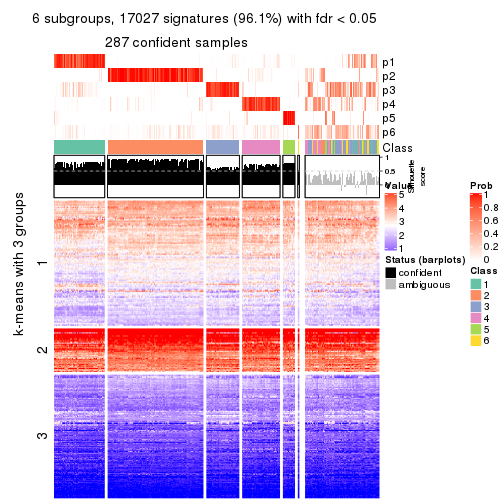</p>

</div>
</div>


Compare the overlap of signatures from different k:

```r
compare_signatures(res)
```


`get_signature()` returns a data frame invisibly. TO get the list of signatures, the function
call should be assigned to a variable explicitly. In following code, if `plot` argument is set
to `FALSE`, no heatmap is plotted while only the differential analysis is performed.

```r
# code only for demonstration
tb = get_signature(res, k = ..., plot = FALSE)
```

An example of the output of `tb` is:

```
#>   which_row         fdr    mean_1    mean_2 scaled_mean_1 scaled_mean_2 km
#> 1        38 0.042760348  8.373488  9.131774    -0.5533452     0.5164555  1
#> 2        40 0.018707592  7.106213  8.469186    -0.6173731     0.5762149  1
#> 3        55 0.019134737 10.221463 11.207825    -0.6159697     0.5749050  1
#> 4        59 0.006059896  5.921854  7.869574    -0.6899429     0.6439467  1
#> 5        60 0.018055526  8.928898 10.211722    -0.6204761     0.5791110  1
#> 6        98 0.009384629 15.714769 14.887706     0.6635654    -0.6193277  2
...
```

The columns in `tb` are:

1. `which_row`: row indices corresponding to the input matrix.
2. `fdr`: FDR for the differential test. 
3. `mean_x`: The mean value in group x.
4. `scaled_mean_x`: The mean value in group x after rows are scaled.
5. `km`: Row groups if k-means clustering is applied to rows.


UMAP plot which shows how samples are separated.


<script>
$( function() {
	$( '#tabs-SD-NMF-dimension-reduction' ).tabs();
} );
</script>
<div id='tabs-SD-NMF-dimension-reduction'>
<ul>
<li><a href='#tab-SD-NMF-dimension-reduction-1'>k = 2</a></li>
<li><a href='#tab-SD-NMF-dimension-reduction-2'>k = 3</a></li>
<li><a href='#tab-SD-NMF-dimension-reduction-3'>k = 4</a></li>
<li><a href='#tab-SD-NMF-dimension-reduction-4'>k = 5</a></li>
<li><a href='#tab-SD-NMF-dimension-reduction-5'>k = 6</a></li>
</ul>
<div id='tab-SD-NMF-dimension-reduction-1'>
<pre><code class="r">dimension_reduction(res, k = 2, method = &quot;UMAP&quot;)
</code></pre>

<p></p>

</div>
<div id='tab-SD-NMF-dimension-reduction-2'>
<pre><code class="r">dimension_reduction(res, k = 3, method = &quot;UMAP&quot;)
</code></pre>

<p></p>

</div>
<div id='tab-SD-NMF-dimension-reduction-3'>
<pre><code class="r">dimension_reduction(res, k = 4, method = &quot;UMAP&quot;)
</code></pre>

<p></p>

</div>
<div id='tab-SD-NMF-dimension-reduction-4'>
<pre><code class="r">dimension_reduction(res, k = 5, method = &quot;UMAP&quot;)
</code></pre>

<p></p>

</div>
<div id='tab-SD-NMF-dimension-reduction-5'>
<pre><code class="r">dimension_reduction(res, k = 6, method = &quot;UMAP&quot;)
</code></pre>

<p></p>

</div>
</div>


Following heatmap shows how subgroups are split when increasing `k`:

```r
collect_classes(res)
```


If matrix rows can be associated to genes, consider to use `GO_Enrichment(res,
...)` to perform function enrichment for the signature genes.


 

---------------------------------------------------


### CV:hclust


The object with results only for a single top-value method and a single partition method 
can be extracted as:

```r
res = res_list["CV", "hclust"]
# you can also extract it by
# res = res_list["CV:hclust"]
```

A summary of `res` and all the functions that can be applied to it:

```r
res
```

```
#> A 'ConsensusPartition' object with k = 2, 3, 4, 5, 6.
#>   On a matrix with 17723 rows and 374 columns.
#>   Top rows (1000, 2000, 3000, 4000, 5000) are extracted by 'CV' method.
#>   Subgroups are detected by 'hclust' method.
#>   Performed in total 1250 partitions by row resampling.
#>   Best k for subgroups seems to be 3.
#> 
#> Following methods can be applied to this 'ConsensusPartition' object:
#>  [1] "cola_report"             "collect_classes"         "collect_plots"          
#>  [4] "collect_stats"           "colnames"                "compare_signatures"     
#>  [7] "consensus_heatmap"       "dimension_reduction"     "functional_enrichment"  
#> [10] "get_anno_col"            "get_anno"                "get_classes"            
#> [13] "get_consensus"           "get_matrix"              "get_membership"         
#> [16] "get_param"               "get_signatures"          "get_stats"              
#> [19] "is_best_k"               "is_stable_k"             "membership_heatmap"     
#> [22] "ncol"                    "nrow"                    "plot_ecdf"              
#> [25] "rownames"                "select_partition_number" "show"                   
#> [28] "suggest_best_k"          "test_to_known_factors"
```

`collect_plots()` function collects all the plots made from `res` for all `k` (number of partitions)
into one single page to provide an easy and fast comparison between different `k`.

```r
collect_plots(res)
```


The plots are:

- The first row: a plot of the ECDF (Empirical cumulative distribution
  function) curves of the consensus matrix for each `k` and the heatmap of
  predicted classes for each `k`.
- The second row: heatmaps of the consensus matrix for each `k`.
- The third row: heatmaps of the membership matrix for each `k`.
- The fouth row: heatmaps of the signatures for each `k`.

All the plots in panels can be made by individual functions and they are
plotted later in this section.

`select_partition_number()` produces several plots showing different
statistics for choosing "optimized" `k`. There are following statistics:

- ECDF curves of the consensus matrix for each `k`;
- 1-PAC. [The PAC
  score](https://en.wikipedia.org/wiki/Consensus_clustering#Over-interpretation_potential_of_consensus_clustering)
  measures the proportion of the ambiguous subgrouping.
- Mean silhouette score.
- Concordance. The mean probability of fiting the consensus class ids in all
  partitions.
- Area increased. Denote $A_k$ as the area under the ECDF curve for current
  `k`, the area increased is defined as $A_k - A_{k-1}$.
- Rand index. The percent of pairs of samples that are both in a same cluster
  or both are not in a same cluster in the partition of k and k-1.
- Jaccard index. The ratio of pairs of samples are both in a same cluster in
  the partition of k and k-1 and the pairs of samples are both in a same
  cluster in the partition k or k-1.

The detailed explanations of these statistics can be found in [the cola
vignette](http://bioconductor.org/packages/devel/bioc/vignettes/cola/inst/doc/cola.html#toc_13).

Generally speaking, lower PAC score, higher mean silhouette score or higher
concordance corresponds to better partition. Rand index and Jaccard index
measure how similar the current partition is compared to partition with `k-1`.
If they are too similar, we won't accept `k` is better than `k-1`.

```r
select_partition_number(res)
```

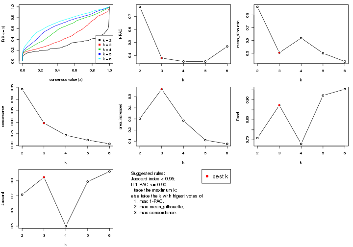

The numeric values for all these statistics can be obtained by `get_stats()`.

```r
get_stats(res)
```

```
#>   k 1-PAC mean_silhouette concordance area_increased  Rand Jaccard
#> 2 2 0.773           0.864       0.944         0.3031 0.709   0.709
#> 3 3 0.381           0.504       0.796         0.5684 0.873   0.823
#> 4 4 0.355           0.619       0.743         0.2847 0.680   0.499
#> 5 5 0.354           0.500       0.723         0.1090 0.922   0.795
#> 6 6 0.470           0.435       0.706         0.0759 0.953   0.862
```

`suggest_best_k()` suggests the best $k$ based on these statistics. The rules are as follows:

- All $k$ with Jaccard index larger than 0.95 are removed because the increase of
  the partition number does not provides enough extra information. If all $k$ are removed,
  the best $k$ is assigned by `NA`.
- For $k$ with 1-PAC larger than 0.9, the maximal $k$ is taken as the "best k". Other $k$ is called "optional k".
- If it does not fit the second rule. The $k$ with the highest vote of highest
  1-PAC, mean silhouette and concordance is taken as the "best k".

```r
suggest_best_k(res)
```

```
#> [1] 3
```


Following shows the table of the partitions (You need to click the **show/hide
code output** link to see it). The membership matrix (columns with name `p*`)
is inferred by
[`clue::cl_consensus()`](https://www.rdocumentation.org/link/cl_consensus?package=clue)
function with the `SE` method. Basically the value in the membership matrix
represents the probability to belong to a certain group. The finall class
label for an item is determined with the group with highest probability it
belongs to.

In `get_classes()` function, the entropy is calculated from the membership
matrix and the silhouette score is calculated from the consensus matrix.


<script>
$( function() {
	$( '#tabs-CV-hclust-get-classes' ).tabs();
} );
</script>
<div id='tabs-CV-hclust-get-classes'>
<ul>
<li><a href='#tab-CV-hclust-get-classes-1'>k = 2</a></li>
<li><a href='#tab-CV-hclust-get-classes-2'>k = 3</a></li>
<li><a href='#tab-CV-hclust-get-classes-3'>k = 4</a></li>
<li><a href='#tab-CV-hclust-get-classes-4'>k = 5</a></li>
<li><a href='#tab-CV-hclust-get-classes-5'>k = 6</a></li>
</ul>

<div id='tab-CV-hclust-get-classes-1'>
<p><a id='tab-CV-hclust-get-classes-1-a' style='color:#0366d6' href='#'>show/hide code output</a></p>
<pre><code class="r">cbind(get_classes(res, k = 2), get_membership(res, k = 2))
</code></pre>

<pre><code>#&gt;            class entropy silhouette    p1    p2
#&gt; SRR660824      2  0.0000     0.9524 0.000 1.000
#&gt; SRR603858      2  0.4939     0.8583 0.108 0.892
#&gt; SRR817070      2  0.0000     0.9524 0.000 1.000
#&gt; SRR1486995     2  0.8763     0.5394 0.296 0.704
#&gt; SRR813043      2  0.0000     0.9524 0.000 1.000
#&gt; SRR656874      2  0.2948     0.9146 0.052 0.948
#&gt; SRR659037      1  0.0672     0.8647 0.992 0.008
#&gt; SRR662031      2  0.0672     0.9481 0.008 0.992
#&gt; SRR1081283     2  0.0000     0.9524 0.000 1.000
#&gt; SRR1481036     2  0.0000     0.9524 0.000 1.000
#&gt; SRR1434009     1  0.1184     0.8635 0.984 0.016
#&gt; SRR1376676     2  0.0000     0.9524 0.000 1.000
#&gt; SRR1396967     2  0.9933     0.0382 0.452 0.548
#&gt; SRR665429      2  0.0000     0.9524 0.000 1.000
#&gt; SRR1388025     2  0.0000     0.9524 0.000 1.000
#&gt; SRR600784      2  0.0000     0.9524 0.000 1.000
#&gt; SRR657611      2  0.0000     0.9524 0.000 1.000
#&gt; SRR1333659     1  0.4562     0.8292 0.904 0.096
#&gt; SRR1323896     2  0.0000     0.9524 0.000 1.000
#&gt; SRR1453971     2  0.4562     0.8712 0.096 0.904
#&gt; SRR1421010     2  0.5294     0.8438 0.120 0.880
#&gt; SRR1334490     1  0.6887     0.7648 0.816 0.184
#&gt; SRR1309468     2  0.0000     0.9524 0.000 1.000
#&gt; SRR1468637     1  0.0000     0.8649 1.000 0.000
#&gt; SRR1365489     2  0.0000     0.9524 0.000 1.000
#&gt; SRR627445      2  0.0376     0.9504 0.004 0.996
#&gt; SRR607863      2  0.9944     0.0226 0.456 0.544
#&gt; SRR1475524     1  0.0000     0.8649 1.000 0.000
#&gt; SRR1405504     2  0.0000     0.9524 0.000 1.000
#&gt; SRR615695      2  0.0000     0.9524 0.000 1.000
#&gt; SRR600900      2  0.0938     0.9456 0.012 0.988
#&gt; SRR601477      2  0.0000     0.9524 0.000 1.000
#&gt; SRR1487215     2  0.0000     0.9524 0.000 1.000
#&gt; SRR1310797     2  0.2603     0.9223 0.044 0.956
#&gt; SRR1362713     2  0.0000     0.9524 0.000 1.000
#&gt; SRR1431385     2  0.0000     0.9524 0.000 1.000
#&gt; SRR1379089     2  0.0000     0.9524 0.000 1.000
#&gt; SRR1102079     1  0.9963     0.2722 0.536 0.464
#&gt; SRR1357210     2  0.0000     0.9524 0.000 1.000
#&gt; SRR657659      2  0.0000     0.9524 0.000 1.000
#&gt; SRR663573      2  0.0000     0.9524 0.000 1.000
#&gt; SRR603188      1  0.9850     0.3779 0.572 0.428
#&gt; SRR1471200     2  0.0376     0.9504 0.004 0.996
#&gt; SRR1310975     2  0.0000     0.9524 0.000 1.000
#&gt; SRR627457      2  0.0000     0.9524 0.000 1.000
#&gt; SRR1367654     1  0.8861     0.6263 0.696 0.304
#&gt; SRR1488410     1  0.0000     0.8649 1.000 0.000
#&gt; SRR1457750     2  0.0000     0.9524 0.000 1.000
#&gt; SRR1099546     2  0.0376     0.9504 0.004 0.996
#&gt; SRR604480      2  0.0000     0.9524 0.000 1.000
#&gt; SRR1390477     2  0.0000     0.9524 0.000 1.000
#&gt; SRR1458447     2  0.0000     0.9524 0.000 1.000
#&gt; SRR1473161     2  0.0000     0.9524 0.000 1.000
#&gt; SRR1409813     1  0.0938     0.8642 0.988 0.012
#&gt; SRR612791      2  0.0000     0.9524 0.000 1.000
#&gt; SRR1470580     2  0.0376     0.9504 0.004 0.996
#&gt; SRR1444063     2  0.0000     0.9524 0.000 1.000
#&gt; SRR1355578     2  0.0000     0.9524 0.000 1.000
#&gt; SRR1429203     2  0.0672     0.9482 0.008 0.992
#&gt; SRR599154      1  0.2603     0.8544 0.956 0.044
#&gt; SRR814244      1  0.0000     0.8649 1.000 0.000
#&gt; SRR1404123     2  0.0000     0.9524 0.000 1.000
#&gt; SRR656934      2  0.0000     0.9524 0.000 1.000
#&gt; SRR1339029     2  0.0000     0.9524 0.000 1.000
#&gt; SRR821525      2  0.0000     0.9524 0.000 1.000
#&gt; SRR1443677     2  0.0000     0.9524 0.000 1.000
#&gt; SRR1406330     2  0.9850     0.1493 0.428 0.572
#&gt; SRR1338124     2  0.0938     0.9461 0.012 0.988
#&gt; SRR1391376     2  0.0376     0.9504 0.004 0.996
#&gt; SRR661842      2  0.0000     0.9524 0.000 1.000
#&gt; SRR1395699     2  0.7602     0.6927 0.220 0.780
#&gt; SRR1312209     2  0.0000     0.9524 0.000 1.000
#&gt; SRR1359469     2  0.0000     0.9524 0.000 1.000
#&gt; SRR658885      1  0.1633     0.8614 0.976 0.024
#&gt; SRR1414578     2  0.0000     0.9524 0.000 1.000
#&gt; SRR603620      2  0.9998    -0.1229 0.492 0.508
#&gt; SRR604677      2  0.5519     0.8329 0.128 0.872
#&gt; SRR603800      2  0.0000     0.9524 0.000 1.000
#&gt; SRR602058      2  0.9393     0.3832 0.356 0.644
#&gt; SRR817488      2  0.0000     0.9524 0.000 1.000
#&gt; SRR655601      2  0.0000     0.9524 0.000 1.000
#&gt; SRR1434821     2  0.0376     0.9504 0.004 0.996
#&gt; SRR1349166     1  0.4815     0.8233 0.896 0.104
#&gt; SRR615129      2  0.0000     0.9524 0.000 1.000
#&gt; SRR607586      2  0.0000     0.9524 0.000 1.000
#&gt; SRR602680      2  0.3584     0.9004 0.068 0.932
#&gt; SRR1411070     2  0.0000     0.9524 0.000 1.000
#&gt; SRR663038      2  0.0000     0.9524 0.000 1.000
#&gt; SRR1489416     2  0.0000     0.9524 0.000 1.000
#&gt; SRR1479155     2  0.0000     0.9524 0.000 1.000
#&gt; SRR662162      2  0.0000     0.9524 0.000 1.000
#&gt; SRR1374567     2  0.1184     0.9430 0.016 0.984
#&gt; SRR1434048     2  0.0000     0.9524 0.000 1.000
#&gt; SRR2184865     2  0.0000     0.9524 0.000 1.000
#&gt; SRR2170135     2  0.0000     0.9524 0.000 1.000
#&gt; SRR615551      2  0.0000     0.9524 0.000 1.000
#&gt; SRR1335513     2  0.0000     0.9524 0.000 1.000
#&gt; SRR1370216     2  0.9909     0.0756 0.444 0.556
#&gt; SRR662954      2  0.9963    -0.0101 0.464 0.536
#&gt; SRR1375738     2  0.0000     0.9524 0.000 1.000
#&gt; SRR1356577     2  0.0000     0.9524 0.000 1.000
#&gt; SRR1073119     2  0.0000     0.9524 0.000 1.000
#&gt; SRR663549      2  0.0000     0.9524 0.000 1.000
#&gt; SRR1478015     2  0.0000     0.9524 0.000 1.000
#&gt; SRR600632      2  0.0000     0.9524 0.000 1.000
#&gt; SRR811866      2  0.0000     0.9524 0.000 1.000
#&gt; SRR1401101     2  0.7883     0.6611 0.236 0.764
#&gt; SRR1477797     1  0.8909     0.6214 0.692 0.308
#&gt; SRR1402986     2  0.0000     0.9524 0.000 1.000
#&gt; SRR658897      2  0.0376     0.9504 0.004 0.996
#&gt; SRR1419869     2  0.0000     0.9524 0.000 1.000
#&gt; SRR1490700     2  0.0000     0.9524 0.000 1.000
#&gt; SRR601723      2  0.0000     0.9524 0.000 1.000
#&gt; SRR1384115     1  0.0938     0.8642 0.988 0.012
#&gt; SRR1476927     2  0.0000     0.9524 0.000 1.000
#&gt; SRR1387769     2  0.0000     0.9524 0.000 1.000
#&gt; SRR1322595     1  0.0000     0.8649 1.000 0.000
#&gt; SRR1370423     2  0.0938     0.9461 0.012 0.988
#&gt; SRR1314976     2  0.0000     0.9524 0.000 1.000
#&gt; SRR1319560     2  0.9988    -0.0738 0.480 0.520
#&gt; SRR1352683     2  0.0000     0.9524 0.000 1.000
#&gt; SRR1473800     2  0.0000     0.9524 0.000 1.000
#&gt; SRR1326384     1  0.8813     0.6351 0.700 0.300
#&gt; SRR1360807     2  0.0000     0.9524 0.000 1.000
#&gt; SRR1332544     1  0.0000     0.8649 1.000 0.000
#&gt; SRR598695      2  0.3114     0.9103 0.056 0.944
#&gt; SRR807824      2  0.1184     0.9431 0.016 0.984
#&gt; SRR809296      2  0.7602     0.6927 0.220 0.780
#&gt; SRR657927      2  0.0000     0.9524 0.000 1.000
#&gt; SRR1440682     2  0.3733     0.8945 0.072 0.928
#&gt; SRR1454415     2  0.4431     0.8729 0.092 0.908
#&gt; SRR1419131     2  0.0000     0.9524 0.000 1.000
#&gt; SRR1404293     2  0.0000     0.9524 0.000 1.000
#&gt; SRR1473340     2  0.0000     0.9524 0.000 1.000
#&gt; SRR1345563     1  0.0000     0.8649 1.000 0.000
#&gt; SRR1323382     2  0.0000     0.9524 0.000 1.000
#&gt; SRR1480697     2  0.1843     0.9341 0.028 0.972
#&gt; SRR1321808     2  0.0000     0.9524 0.000 1.000
#&gt; SRR1382756     2  0.0376     0.9504 0.004 0.996
#&gt; SRR1312558     2  0.0000     0.9524 0.000 1.000
#&gt; SRR1417088     2  0.0000     0.9524 0.000 1.000
#&gt; SRR1433027     2  0.0000     0.9524 0.000 1.000
#&gt; SRR662257      1  0.1414     0.8627 0.980 0.020
#&gt; SRR600417      2  0.0000     0.9524 0.000 1.000
#&gt; SRR812493      1  0.0000     0.8649 1.000 0.000
#&gt; SRR612743      2  0.0000     0.9524 0.000 1.000
#&gt; SRR1361345     2  0.0000     0.9524 0.000 1.000
#&gt; SRR600584      2  0.0000     0.9524 0.000 1.000
#&gt; SRR1310520     2  0.0000     0.9524 0.000 1.000
#&gt; SRR1395595     1  0.5842     0.7992 0.860 0.140
#&gt; SRR1334074     1  0.0000     0.8649 1.000 0.000
#&gt; SRR654838      2  0.0000     0.9524 0.000 1.000
#&gt; SRR1376694     1  0.0000     0.8649 1.000 0.000
#&gt; SRR1433841     2  0.0000     0.9524 0.000 1.000
#&gt; SRR1366837     2  0.0376     0.9503 0.004 0.996
#&gt; SRR1467479     2  0.0000     0.9524 0.000 1.000
#&gt; SRR1459055     1  0.0000     0.8649 1.000 0.000
#&gt; SRR1471050     2  0.0000     0.9524 0.000 1.000
#&gt; SRR603004      2  0.2603     0.9221 0.044 0.956
#&gt; SRR814703      2  0.5946     0.8080 0.144 0.856
#&gt; SRR661937      2  0.0000     0.9524 0.000 1.000
#&gt; SRR614359      2  0.0000     0.9524 0.000 1.000
#&gt; SRR1071568     2  0.0000     0.9524 0.000 1.000
#&gt; SRR1389084     2  0.1633     0.9372 0.024 0.976
#&gt; SRR1337624     2  0.0000     0.9524 0.000 1.000
#&gt; SRR1344400     2  0.0938     0.9456 0.012 0.988
#&gt; SRR1414290     2  0.0000     0.9524 0.000 1.000
#&gt; SRR1413644     1  0.6973     0.7609 0.812 0.188
#&gt; SRR1098998     2  0.0000     0.9524 0.000 1.000
#&gt; SRR1481279     2  0.0000     0.9524 0.000 1.000
#&gt; SRR1315103     1  0.0000     0.8649 1.000 0.000
#&gt; SRR1099286     2  0.1633     0.9376 0.024 0.976
#&gt; SRR2166570     2  0.0000     0.9524 0.000 1.000
#&gt; SRR601445      2  0.0672     0.9481 0.008 0.992
#&gt; SRR1439719     2  0.0000     0.9524 0.000 1.000
#&gt; SRR1377026     2  0.3733     0.8945 0.072 0.928
#&gt; SRR1327386     2  0.0000     0.9524 0.000 1.000
#&gt; SRR654826      2  0.0000     0.9524 0.000 1.000
#&gt; SRR1460433     2  0.2603     0.9211 0.044 0.956
#&gt; SRR1469345     2  0.4431     0.8761 0.092 0.908
#&gt; SRR1421462     2  0.0000     0.9524 0.000 1.000
#&gt; SRR662966      1  0.0000     0.8649 1.000 0.000
#&gt; SRR1339175     2  0.0000     0.9524 0.000 1.000
#&gt; SRR1447736     2  0.0000     0.9524 0.000 1.000
#&gt; SRR1434671     1  0.9963     0.2760 0.536 0.464
#&gt; SRR660800      2  0.0000     0.9524 0.000 1.000
#&gt; SRR1465543     1  0.0000     0.8649 1.000 0.000
#&gt; SRR1342023     2  0.0000     0.9524 0.000 1.000
#&gt; SRR1335670     2  0.0000     0.9524 0.000 1.000
#&gt; SRR1400955     2  0.7883     0.6611 0.236 0.764
#&gt; SRR1072150     2  0.0000     0.9524 0.000 1.000
#&gt; SRR1442822     2  0.0000     0.9524 0.000 1.000
#&gt; SRR1364658     2  0.0000     0.9524 0.000 1.000
#&gt; SRR1098074     1  0.0000     0.8649 1.000 0.000
#&gt; SRR1442778     2  0.2948     0.9156 0.052 0.948
#&gt; SRR1086728     1  0.2603     0.8550 0.956 0.044
#&gt; SRR627464      2  0.0000     0.9524 0.000 1.000
#&gt; SRR1409193     2  0.0000     0.9524 0.000 1.000
#&gt; SRR2168286     2  0.0000     0.9524 0.000 1.000
#&gt; SRR615539      2  0.0000     0.9524 0.000 1.000
#&gt; SRR663623      2  0.5519     0.8329 0.128 0.872
#&gt; SRR1471989     1  0.0000     0.8649 1.000 0.000
#&gt; SRR1468828     2  0.0000     0.9524 0.000 1.000
#&gt; SRR1381934     2  0.1414     0.9403 0.020 0.980
#&gt; SRR1471098     2  0.0000     0.9524 0.000 1.000
#&gt; SRR1314749     2  0.0376     0.9503 0.004 0.996
#&gt; SRR2166874     1  0.0000     0.8649 1.000 0.000
#&gt; SRR821302      2  0.0000     0.9524 0.000 1.000
#&gt; SRR1435066     2  0.2423     0.9246 0.040 0.960
#&gt; SRR661601      2  0.4815     0.8614 0.104 0.896
#&gt; SRR1446546     2  0.0672     0.9481 0.008 0.992
#&gt; SRR1419784     1  0.0000     0.8649 1.000 0.000
#&gt; SRR1357233     1  0.0000     0.8649 1.000 0.000
#&gt; SRR1441889     2  0.0000     0.9524 0.000 1.000
#&gt; SRR1413940     1  0.0000     0.8649 1.000 0.000
#&gt; SRR1324250     2  0.0672     0.9481 0.008 0.992
#&gt; SRR1442862     1  0.1633     0.8614 0.976 0.024
#&gt; SRR662474      2  0.0000     0.9524 0.000 1.000
#&gt; SRR1416226     2  0.0000     0.9524 0.000 1.000
#&gt; SRR1417404     2  0.2236     0.9281 0.036 0.964
#&gt; SRR665466      2  0.0000     0.9524 0.000 1.000
#&gt; SRR658849      2  0.1633     0.9372 0.024 0.976
#&gt; SRR1460025     2  0.0000     0.9524 0.000 1.000
#&gt; SRR1408136     2  0.0000     0.9524 0.000 1.000
#&gt; SRR1489995     2  0.0000     0.9524 0.000 1.000
#&gt; SRR1374092     2  0.0000     0.9524 0.000 1.000
#&gt; SRR1488429     1  0.8861     0.6282 0.696 0.304
#&gt; SRR1087559     2  0.0000     0.9524 0.000 1.000
#&gt; SRR817004      2  0.8499     0.5878 0.276 0.724
#&gt; SRR1429660     1  0.2603     0.8543 0.956 0.044
#&gt; SRR604390      2  0.9983    -0.0704 0.476 0.524
#&gt; SRR614936      2  0.0000     0.9524 0.000 1.000
#&gt; SRR1365938     2  0.0000     0.9524 0.000 1.000
#&gt; SRR1437324     2  0.0000     0.9524 0.000 1.000
#&gt; SRR613414      2  0.9552     0.3253 0.376 0.624
#&gt; SRR660414      2  0.0000     0.9524 0.000 1.000
#&gt; SRR1452185     2  0.0000     0.9524 0.000 1.000
#&gt; SRR1347020     2  0.0000     0.9524 0.000 1.000
#&gt; SRR1398036     1  0.9954     0.2871 0.540 0.460
#&gt; SRR1436674     2  0.0000     0.9524 0.000 1.000
#&gt; SRR603750      2  0.0376     0.9504 0.004 0.996
#&gt; SRR608630      2  0.9963    -0.0101 0.464 0.536
#&gt; SRR655625      2  0.0000     0.9524 0.000 1.000
#&gt; SRR599059      2  0.2423     0.9253 0.040 0.960
#&gt; SRR615189      2  0.0672     0.9481 0.008 0.992
#&gt; SRR1466889     1  0.9963     0.2757 0.536 0.464
#&gt; SRR1084602     2  0.0000     0.9524 0.000 1.000
#&gt; SRR1335422     2  0.0000     0.9524 0.000 1.000
#&gt; SRR1356805     1  1.0000     0.1472 0.500 0.500
#&gt; SRR1385300     2  0.6343     0.7925 0.160 0.840
#&gt; SRR654814      2  0.0000     0.9524 0.000 1.000
#&gt; SRR658385      2  0.2423     0.9246 0.040 0.960
#&gt; SRR820596      2  0.0000     0.9524 0.000 1.000
#&gt; SRR1318118     2  0.1414     0.9405 0.020 0.980
#&gt; SRR1480766     2  0.0000     0.9524 0.000 1.000
#&gt; SRR1406539     2  0.2948     0.9152 0.052 0.948
#&gt; SRR1341833     2  0.9922     0.0575 0.448 0.552
#&gt; SRR1441826     2  0.0000     0.9524 0.000 1.000
#&gt; SRR1448051     2  0.0000     0.9524 0.000 1.000
#&gt; SRR1326752     2  0.5408     0.8388 0.124 0.876
#&gt; SRR665217      2  0.7139     0.7336 0.196 0.804
#&gt; SRR819186      2  0.0000     0.9524 0.000 1.000
#&gt; SRR661517      2  0.8763     0.5394 0.296 0.704
#&gt; SRR607166      2  0.0000     0.9524 0.000 1.000
#&gt; SRR809065      2  0.0000     0.9524 0.000 1.000
#&gt; SRR1415872     1  0.9977     0.2469 0.528 0.472
#&gt; SRR1415463     2  0.0000     0.9524 0.000 1.000
#&gt; SRR1381161     1  0.0000     0.8649 1.000 0.000
#&gt; SRR1442231     2  0.0000     0.9524 0.000 1.000
#&gt; SRR1374696     2  0.0000     0.9524 0.000 1.000
#&gt; SRR1451988     2  0.1184     0.9427 0.016 0.984
#&gt; SRR660555      2  0.3114     0.9103 0.056 0.944
#&gt; SRR657801      2  0.0000     0.9524 0.000 1.000
#&gt; SRR663344      2  0.7528     0.6983 0.216 0.784
#&gt; SRR1472462     2  0.0000     0.9524 0.000 1.000
#&gt; SRR1406176     2  0.0938     0.9456 0.012 0.988
#&gt; SRR656886      2  0.0000     0.9524 0.000 1.000
#&gt; SRR1498337     1  0.8909     0.6214 0.692 0.308
#&gt; SRR613066      1  0.0000     0.8649 1.000 0.000
#&gt; SRR1309490     2  0.0000     0.9524 0.000 1.000
#&gt; SRR602492      1  0.9954     0.2871 0.540 0.460
#&gt; SRR1447347     2  0.0000     0.9524 0.000 1.000
#&gt; SRR1475546     2  0.0000     0.9524 0.000 1.000
#&gt; SRR627459      2  0.0000     0.9524 0.000 1.000
#&gt; SRR1434332     2  0.0000     0.9524 0.000 1.000
#&gt; SRR1070358     1  0.9209     0.5750 0.664 0.336
#&gt; SRR1345936     1  0.0672     0.8647 0.992 0.008
#&gt; SRR665658      2  0.0000     0.9524 0.000 1.000
#&gt; SRR1321351     2  0.0000     0.9524 0.000 1.000
#&gt; SRR657880      2  0.2236     0.9283 0.036 0.964
#&gt; SRR1373903     2  0.0000     0.9524 0.000 1.000
#&gt; SRR657396      2  0.9988    -0.0738 0.480 0.520
#&gt; SRR660981      2  0.0000     0.9524 0.000 1.000
#&gt; SRR818499      2  0.0000     0.9524 0.000 1.000
#&gt; SRR819658      2  0.7883     0.6611 0.236 0.764
#&gt; SRR1376316     2  0.0672     0.9482 0.008 0.992
#&gt; SRR1323723     2  0.0376     0.9504 0.004 0.996
#&gt; SRR1476719     2  0.0000     0.9524 0.000 1.000
#&gt; SRR1403478     2  0.2423     0.9246 0.040 0.960
#&gt; SRR1095695     2  0.1184     0.9427 0.016 0.984
#&gt; SRR1352391     2  0.5294     0.8409 0.120 0.880
#&gt; SRR1498813     2  0.0000     0.9524 0.000 1.000
#&gt; SRR627437      2  0.0000     0.9524 0.000 1.000
#&gt; SRR2185097     2  0.0672     0.9481 0.008 0.992
#&gt; SRR817166      1  0.8763     0.6456 0.704 0.296
#&gt; SRR1091670     2  0.0000     0.9524 0.000 1.000
#&gt; SRR603776      2  0.9983    -0.0626 0.476 0.524
#&gt; SRR1479640     2  0.0000     0.9524 0.000 1.000
#&gt; SRR660152      2  0.3431     0.9042 0.064 0.936
#&gt; SRR1074769     2  0.0000     0.9524 0.000 1.000
#&gt; SRR656153      2  0.0000     0.9524 0.000 1.000
#&gt; SRR1392502     1  0.1184     0.8632 0.984 0.016
#&gt; SRR1359609     1  0.3114     0.8491 0.944 0.056
#&gt; SRR601925      2  0.0000     0.9524 0.000 1.000
#&gt; SRR2165182     2  0.2948     0.9146 0.052 0.948
#&gt; SRR608542      1  0.9909     0.3326 0.556 0.444
#&gt; SRR655064      2  0.0000     0.9524 0.000 1.000
#&gt; SRR1432430     2  0.0376     0.9504 0.004 0.996
#&gt; SRR808472      2  0.0376     0.9504 0.004 0.996
#&gt; SRR1414958     1  0.0000     0.8649 1.000 0.000
#&gt; SRR598484      2  0.0672     0.9481 0.008 0.992
#&gt; SRR612755      2  0.0000     0.9524 0.000 1.000
#&gt; SRR1365808     2  0.0000     0.9524 0.000 1.000
#&gt; SRR1391724     2  0.0000     0.9524 0.000 1.000
#&gt; SRR1322373     2  0.1633     0.9372 0.024 0.976
#&gt; SRR1489265     2  0.0000     0.9524 0.000 1.000
#&gt; SRR1359099     2  0.2423     0.9246 0.040 0.960
#&gt; SRR607279      2  0.0000     0.9524 0.000 1.000
#&gt; SRR810461      2  0.0000     0.9524 0.000 1.000
#&gt; SRR627427      2  0.0000     0.9524 0.000 1.000
#&gt; SRR612887      2  0.7745     0.6766 0.228 0.772
#&gt; SRR809807      1  0.0376     0.8648 0.996 0.004
#&gt; SRR663112      2  0.0938     0.9455 0.012 0.988
#&gt; SRR1346933     1  0.0000     0.8649 1.000 0.000
#&gt; SRR1487910     2  0.0000     0.9524 0.000 1.000
#&gt; SRR603092      2  0.0000     0.9524 0.000 1.000
#&gt; SRR1417680     2  0.0000     0.9524 0.000 1.000
#&gt; SRR1383785     2  0.0000     0.9524 0.000 1.000
#&gt; SRR1070015     1  0.0000     0.8649 1.000 0.000
#&gt; SRR1466222     2  0.0376     0.9504 0.004 0.996
#&gt; SRR1416119     1  0.6887     0.7648 0.816 0.184
#&gt; SRR819318      2  0.5519     0.8329 0.128 0.872
#&gt; SRR608288      2  0.0000     0.9524 0.000 1.000
#&gt; SRR811121      1  0.8267     0.6857 0.740 0.260
#&gt; SRR613138      2  0.0376     0.9503 0.004 0.996
#&gt; SRR810483      2  0.1184     0.9433 0.016 0.984
#&gt; SRR607839      2  0.0000     0.9524 0.000 1.000
#&gt; SRR1337031     2  0.4431     0.8761 0.092 0.908
#&gt; SRR601311      2  0.4298     0.8760 0.088 0.912
#&gt; SRR1406685     2  0.0000     0.9524 0.000 1.000
#&gt; SRR1467500     2  0.0000     0.9524 0.000 1.000
#&gt; SRR1308504     2  0.0000     0.9524 0.000 1.000
#&gt; SRR1312865     1  0.9710     0.4470 0.600 0.400
#&gt; SRR1312522     2  0.4815     0.8629 0.104 0.896
#&gt; SRR1490486     2  0.0000     0.9524 0.000 1.000
#&gt; SRR1325888     2  0.1414     0.9399 0.020 0.980
#&gt; SRR1472885     2  0.0000     0.9524 0.000 1.000
#&gt; SRR1098785     2  0.0000     0.9524 0.000 1.000
#&gt; SRR1084766     2  0.0000     0.9524 0.000 1.000
#&gt; SRR1102804     2  0.0000     0.9524 0.000 1.000
#&gt; SRR1336636     2  0.0000     0.9524 0.000 1.000
#&gt; SRR1347795     1  0.0000     0.8649 1.000 0.000
#&gt; SRR601900      2  0.3879     0.8923 0.076 0.924
#&gt; SRR1330989     2  0.0000     0.9524 0.000 1.000
#&gt; SRR658445      1  0.0000     0.8649 1.000 0.000
#&gt; SRR1368754     2  0.6438     0.7844 0.164 0.836
#&gt; SRR1460001     2  0.0000     0.9524 0.000 1.000
#&gt; SRR1414934     2  0.0000     0.9524 0.000 1.000
#&gt; SRR1326249     2  0.7602     0.6927 0.220 0.780
#&gt; SRR614948      1  0.0000     0.8649 1.000 0.000
#&gt; SRR1472952     2  0.3114     0.9119 0.056 0.944
#&gt; SRR1321528     2  0.0000     0.9524 0.000 1.000
#&gt; SRR627447      2  0.0000     0.9524 0.000 1.000
#&gt; SRR612239      2  0.0000     0.9524 0.000 1.000
</code></pre>

<script>
$('#tab-CV-hclust-get-classes-1-a').parent().next().next().hide();
$('#tab-CV-hclust-get-classes-1-a').click(function(){
  $('#tab-CV-hclust-get-classes-1-a').parent().next().next().toggle();
  return(false);
});
</script>
</div>

<div id='tab-CV-hclust-get-classes-2'>
<p><a id='tab-CV-hclust-get-classes-2-a' style='color:#0366d6' href='#'>show/hide code output</a></p>
<pre><code class="r">cbind(get_classes(res, k = 3), get_membership(res, k = 3))
</code></pre>

<pre><code>#&gt;            class entropy silhouette    p1    p2    p3
#&gt; SRR660824      1  0.6267    0.48818 0.548 0.452 0.000
#&gt; SRR603858      2  0.7002    0.33651 0.280 0.672 0.048
#&gt; SRR817070      2  0.0592    0.69940 0.012 0.988 0.000
#&gt; SRR1486995     1  0.9465    0.52880 0.472 0.332 0.196
#&gt; SRR813043      2  0.0237    0.69866 0.004 0.996 0.000
#&gt; SRR656874      2  0.4121    0.50427 0.168 0.832 0.000
#&gt; SRR659037      3  0.4291    0.81959 0.180 0.000 0.820
#&gt; SRR662031      2  0.5591    0.38527 0.304 0.696 0.000
#&gt; SRR1081283     2  0.0237    0.69843 0.004 0.996 0.000
#&gt; SRR1481036     2  0.6126    0.02939 0.400 0.600 0.000
#&gt; SRR1434009     3  0.4575    0.82132 0.184 0.004 0.812
#&gt; SRR1376676     2  0.4887    0.52250 0.228 0.772 0.000
#&gt; SRR1396967     2  0.9757   -0.28673 0.324 0.432 0.244
#&gt; SRR665429      2  0.0237    0.69866 0.004 0.996 0.000
#&gt; SRR1388025     2  0.0424    0.69917 0.008 0.992 0.000
#&gt; SRR600784      2  0.6307   -0.36923 0.488 0.512 0.000
#&gt; SRR657611      1  0.6286    0.47610 0.536 0.464 0.000
#&gt; SRR1333659     3  0.6927    0.75839 0.240 0.060 0.700
#&gt; SRR1323896     2  0.0424    0.69917 0.008 0.992 0.000
#&gt; SRR1453971     2  0.7207    0.06261 0.384 0.584 0.032
#&gt; SRR1421010     2  0.7658    0.06940 0.356 0.588 0.056
#&gt; SRR1334490     3  0.5443    0.73147 0.260 0.004 0.736
#&gt; SRR1309468     2  0.5591    0.38086 0.304 0.696 0.000
#&gt; SRR1468637     3  0.0892    0.85394 0.020 0.000 0.980
#&gt; SRR1365489     2  0.0000    0.69938 0.000 1.000 0.000
#&gt; SRR627445      2  0.6168   -0.05782 0.412 0.588 0.000
#&gt; SRR607863      2  0.9830   -0.29704 0.316 0.420 0.264
#&gt; SRR1475524     3  0.0237    0.85323 0.004 0.000 0.996
#&gt; SRR1405504     2  0.0424    0.69917 0.008 0.992 0.000
#&gt; SRR615695      2  0.4702    0.54418 0.212 0.788 0.000
#&gt; SRR600900      2  0.1753    0.67342 0.048 0.952 0.000
#&gt; SRR601477      2  0.0424    0.69704 0.008 0.992 0.000
#&gt; SRR1487215     2  0.0592    0.69421 0.012 0.988 0.000
#&gt; SRR1310797     2  0.3755    0.57003 0.120 0.872 0.008
#&gt; SRR1362713     2  0.3941    0.60874 0.156 0.844 0.000
#&gt; SRR1431385     2  0.5327    0.45075 0.272 0.728 0.000
#&gt; SRR1379089     2  0.0237    0.69866 0.004 0.996 0.000
#&gt; SRR1102079     1  0.9666   -0.00483 0.412 0.212 0.376
#&gt; SRR1357210     2  0.5497    0.40696 0.292 0.708 0.000
#&gt; SRR657659      2  0.0424    0.69917 0.008 0.992 0.000
#&gt; SRR663573      2  0.1289    0.69711 0.032 0.968 0.000
#&gt; SRR603188      3  0.9980    0.09849 0.340 0.304 0.356
#&gt; SRR1471200     2  0.0237    0.69887 0.004 0.996 0.000
#&gt; SRR1310975     2  0.1529    0.67231 0.040 0.960 0.000
#&gt; SRR627457      2  0.2537    0.67111 0.080 0.920 0.000
#&gt; SRR1367654     3  0.9444    0.45172 0.380 0.180 0.440
#&gt; SRR1488410     3  0.0237    0.85323 0.004 0.000 0.996
#&gt; SRR1457750     2  0.3879    0.61295 0.152 0.848 0.000
#&gt; SRR1099546     2  0.6244   -0.15136 0.440 0.560 0.000
#&gt; SRR604480      2  0.0424    0.69688 0.008 0.992 0.000
#&gt; SRR1390477     2  0.0237    0.69866 0.004 0.996 0.000
#&gt; SRR1458447     2  0.0000    0.69938 0.000 1.000 0.000
#&gt; SRR1473161     2  0.0592    0.69940 0.012 0.988 0.000
#&gt; SRR1409813     3  0.3918    0.83531 0.140 0.004 0.856
#&gt; SRR612791      1  0.6235    0.50398 0.564 0.436 0.000
#&gt; SRR1470580     2  0.5016    0.48729 0.240 0.760 0.000
#&gt; SRR1444063     2  0.4555    0.56767 0.200 0.800 0.000
#&gt; SRR1355578     2  0.4346    0.58283 0.184 0.816 0.000
#&gt; SRR1429203     2  0.5098    0.51416 0.248 0.752 0.000
#&gt; SRR599154      3  0.4978    0.81195 0.216 0.004 0.780
#&gt; SRR814244      3  0.0892    0.85394 0.020 0.000 0.980
#&gt; SRR1404123     2  0.0237    0.69843 0.004 0.996 0.000
#&gt; SRR656934      2  0.6267   -0.23492 0.452 0.548 0.000
#&gt; SRR1339029     2  0.0000    0.69938 0.000 1.000 0.000
#&gt; SRR821525      2  0.0424    0.69917 0.008 0.992 0.000
#&gt; SRR1443677     2  0.5431    0.42623 0.284 0.716 0.000
#&gt; SRR1406330     3  0.9969   -0.36416 0.308 0.320 0.372
#&gt; SRR1338124     2  0.2496    0.67988 0.068 0.928 0.004
#&gt; SRR1391376     1  0.6302    0.44015 0.520 0.480 0.000
#&gt; SRR661842      2  0.0424    0.69917 0.008 0.992 0.000
#&gt; SRR1395699     1  0.8886    0.54400 0.516 0.352 0.132
#&gt; SRR1312209     2  0.5058    0.49936 0.244 0.756 0.000
#&gt; SRR1359469     2  0.5254    0.46429 0.264 0.736 0.000
#&gt; SRR658885      3  0.2066    0.84933 0.060 0.000 0.940
#&gt; SRR1414578     2  0.4654    0.54961 0.208 0.792 0.000
#&gt; SRR603620      1  0.9870    0.05030 0.380 0.364 0.256
#&gt; SRR604677      2  0.7958   -0.19809 0.392 0.544 0.064
#&gt; SRR603800      2  0.0747    0.69903 0.016 0.984 0.000
#&gt; SRR602058      2  0.9183   -0.17238 0.324 0.508 0.168
#&gt; SRR817488      2  0.0000    0.69938 0.000 1.000 0.000
#&gt; SRR655601      2  0.0592    0.69940 0.012 0.988 0.000
#&gt; SRR1434821     2  0.0237    0.69887 0.004 0.996 0.000
#&gt; SRR1349166     3  0.7124    0.73207 0.296 0.048 0.656
#&gt; SRR615129      2  0.3551    0.63031 0.132 0.868 0.000
#&gt; SRR607586      2  0.0237    0.69865 0.004 0.996 0.000
#&gt; SRR602680      2  0.3983    0.53958 0.144 0.852 0.004
#&gt; SRR1411070     2  0.0237    0.69843 0.004 0.996 0.000
#&gt; SRR663038      2  0.0424    0.69703 0.008 0.992 0.000
#&gt; SRR1489416     2  0.0237    0.69843 0.004 0.996 0.000
#&gt; SRR1479155     2  0.4842    0.53010 0.224 0.776 0.000
#&gt; SRR662162      2  0.5560    0.39033 0.300 0.700 0.000
#&gt; SRR1374567     2  0.6026    0.17942 0.376 0.624 0.000
#&gt; SRR1434048     2  0.0424    0.69703 0.008 0.992 0.000
#&gt; SRR2184865     2  0.0592    0.69968 0.012 0.988 0.000
#&gt; SRR2170135     2  0.5560    0.39033 0.300 0.700 0.000
#&gt; SRR615551      2  0.0000    0.69938 0.000 1.000 0.000
#&gt; SRR1335513     2  0.0592    0.69940 0.012 0.988 0.000
#&gt; SRR1370216     1  0.9956    0.35025 0.372 0.292 0.336
#&gt; SRR662954      2  0.9757   -0.30639 0.380 0.392 0.228
#&gt; SRR1375738     2  0.6126    0.03904 0.400 0.600 0.000
#&gt; SRR1356577     2  0.1289    0.69602 0.032 0.968 0.000
#&gt; SRR1073119     2  0.5560    0.39262 0.300 0.700 0.000
#&gt; SRR663549      2  0.6126    0.03904 0.400 0.600 0.000
#&gt; SRR1478015     2  0.0237    0.69843 0.004 0.996 0.000
#&gt; SRR600632      2  0.0000    0.69938 0.000 1.000 0.000
#&gt; SRR811866      2  0.3619    0.62711 0.136 0.864 0.000
#&gt; SRR1401101     2  0.7353    0.08648 0.316 0.632 0.052
#&gt; SRR1477797     3  0.9058    0.37160 0.180 0.276 0.544
#&gt; SRR1402986     2  0.0000    0.69938 0.000 1.000 0.000
#&gt; SRR658897      2  0.3551    0.63297 0.132 0.868 0.000
#&gt; SRR1419869     2  0.5926    0.22419 0.356 0.644 0.000
#&gt; SRR1490700     2  0.3941    0.60874 0.156 0.844 0.000
#&gt; SRR601723      2  0.4178    0.59508 0.172 0.828 0.000
#&gt; SRR1384115     3  0.3851    0.83518 0.136 0.004 0.860
#&gt; SRR1476927     2  0.0237    0.69843 0.004 0.996 0.000
#&gt; SRR1387769     2  0.6126    0.03904 0.400 0.600 0.000
#&gt; SRR1322595     3  0.0892    0.85394 0.020 0.000 0.980
#&gt; SRR1370423     2  0.4233    0.61151 0.160 0.836 0.004
#&gt; SRR1314976     2  0.2261    0.68273 0.068 0.932 0.000
#&gt; SRR1319560     2  0.9858   -0.31979 0.372 0.376 0.252
#&gt; SRR1352683     2  0.2261    0.68273 0.068 0.932 0.000
#&gt; SRR1473800     2  0.4887    0.52250 0.228 0.772 0.000
#&gt; SRR1326384     3  0.8212    0.53711 0.360 0.084 0.556
#&gt; SRR1360807     2  0.0424    0.69917 0.008 0.992 0.000
#&gt; SRR1332544     3  0.0592    0.85430 0.012 0.000 0.988
#&gt; SRR598695      2  0.6629    0.19634 0.360 0.624 0.016
#&gt; SRR807824      2  0.2165    0.64975 0.064 0.936 0.000
#&gt; SRR809296      1  0.8886    0.54400 0.516 0.352 0.132
#&gt; SRR657927      1  0.6267    0.48818 0.548 0.452 0.000
#&gt; SRR1440682     2  0.4164    0.53013 0.144 0.848 0.008
#&gt; SRR1454415     2  0.4861    0.44284 0.192 0.800 0.008
#&gt; SRR1419131     2  0.0892    0.69510 0.020 0.980 0.000
#&gt; SRR1404293     2  0.3941    0.60874 0.156 0.844 0.000
#&gt; SRR1473340     1  0.6286    0.46905 0.536 0.464 0.000
#&gt; SRR1345563     3  0.0237    0.85323 0.004 0.000 0.996
#&gt; SRR1323382     2  0.0000    0.69938 0.000 1.000 0.000
#&gt; SRR1480697     2  0.2400    0.65448 0.064 0.932 0.004
#&gt; SRR1321808     2  0.0000    0.69938 0.000 1.000 0.000
#&gt; SRR1382756     2  0.0747    0.69718 0.016 0.984 0.000
#&gt; SRR1312558     2  0.3038    0.65660 0.104 0.896 0.000
#&gt; SRR1417088     2  0.0237    0.69843 0.004 0.996 0.000
#&gt; SRR1433027     2  0.0237    0.69843 0.004 0.996 0.000
#&gt; SRR662257      3  0.4293    0.82903 0.164 0.004 0.832
#&gt; SRR600417      2  0.0237    0.69843 0.004 0.996 0.000
#&gt; SRR812493      3  0.1411    0.85303 0.036 0.000 0.964
#&gt; SRR612743      2  0.6260   -0.23139 0.448 0.552 0.000
#&gt; SRR1361345     2  0.4002    0.60491 0.160 0.840 0.000
#&gt; SRR600584      2  0.0592    0.69940 0.012 0.988 0.000
#&gt; SRR1310520     2  0.1031    0.69824 0.024 0.976 0.000
#&gt; SRR1395595     3  0.4931    0.77220 0.212 0.004 0.784
#&gt; SRR1334074     3  0.0237    0.85361 0.004 0.000 0.996
#&gt; SRR654838      2  0.0000    0.69938 0.000 1.000 0.000
#&gt; SRR1376694     3  0.0237    0.85323 0.004 0.000 0.996
#&gt; SRR1433841     2  0.4452    0.57004 0.192 0.808 0.000
#&gt; SRR1366837     2  0.6140    0.01164 0.404 0.596 0.000
#&gt; SRR1467479     2  0.0000    0.69938 0.000 1.000 0.000
#&gt; SRR1459055     3  0.0237    0.85323 0.004 0.000 0.996
#&gt; SRR1471050     2  0.0000    0.69938 0.000 1.000 0.000
#&gt; SRR603004      2  0.3500    0.57888 0.116 0.880 0.004
#&gt; SRR814703      2  0.5681    0.33376 0.236 0.748 0.016
#&gt; SRR661937      2  0.0892    0.69927 0.020 0.980 0.000
#&gt; SRR614359      1  0.6235    0.50398 0.564 0.436 0.000
#&gt; SRR1071568     2  0.1163    0.69755 0.028 0.972 0.000
#&gt; SRR1389084     1  0.6299    0.44811 0.524 0.476 0.000
#&gt; SRR1337624     2  0.0237    0.69843 0.004 0.996 0.000
#&gt; SRR1344400     2  0.1529    0.67269 0.040 0.960 0.000
#&gt; SRR1414290     2  0.0000    0.69938 0.000 1.000 0.000
#&gt; SRR1413644     3  0.8091    0.65472 0.348 0.080 0.572
#&gt; SRR1098998     2  0.5363    0.44306 0.276 0.724 0.000
#&gt; SRR1481279     2  0.5926    0.22419 0.356 0.644 0.000
#&gt; SRR1315103     3  0.0237    0.85323 0.004 0.000 0.996
#&gt; SRR1099286     2  0.4399    0.60408 0.188 0.812 0.000
#&gt; SRR2166570     2  0.1753    0.69118 0.048 0.952 0.000
#&gt; SRR601445      2  0.3941    0.61615 0.156 0.844 0.000
#&gt; SRR1439719     2  0.0237    0.69843 0.004 0.996 0.000
#&gt; SRR1377026     2  0.4164    0.53013 0.144 0.848 0.008
#&gt; SRR1327386     2  0.4654    0.54981 0.208 0.792 0.000
#&gt; SRR654826      2  0.0000    0.69938 0.000 1.000 0.000
#&gt; SRR1460433     2  0.3965    0.63375 0.132 0.860 0.008
#&gt; SRR1469345     2  0.7250    0.01921 0.396 0.572 0.032
#&gt; SRR1421462     2  0.0000    0.69938 0.000 1.000 0.000
#&gt; SRR662966      3  0.0237    0.85361 0.004 0.000 0.996
#&gt; SRR1339175     1  0.6286    0.46905 0.536 0.464 0.000
#&gt; SRR1447736     2  0.0000    0.69938 0.000 1.000 0.000
#&gt; SRR1434671     2  0.9977   -0.34090 0.348 0.352 0.300
#&gt; SRR660800      2  0.0000    0.69938 0.000 1.000 0.000
#&gt; SRR1465543     3  0.1031    0.85307 0.024 0.000 0.976
#&gt; SRR1342023     2  0.4702    0.54418 0.212 0.788 0.000
#&gt; SRR1335670     2  0.5016    0.50677 0.240 0.760 0.000
#&gt; SRR1400955     2  0.7353    0.08648 0.316 0.632 0.052
#&gt; SRR1072150     2  0.0000    0.69938 0.000 1.000 0.000
#&gt; SRR1442822     2  0.5327    0.45075 0.272 0.728 0.000
#&gt; SRR1364658     1  0.6286    0.46905 0.536 0.464 0.000
#&gt; SRR1098074     3  0.1031    0.85307 0.024 0.000 0.976
#&gt; SRR1442778     2  0.6625    0.32773 0.316 0.660 0.024
#&gt; SRR1086728     3  0.4351    0.83076 0.168 0.004 0.828
#&gt; SRR627464      2  0.2537    0.67111 0.080 0.920 0.000
#&gt; SRR1409193     2  0.4842    0.52962 0.224 0.776 0.000
#&gt; SRR2168286     2  0.1163    0.69697 0.028 0.972 0.000
#&gt; SRR615539      2  0.0000    0.69938 0.000 1.000 0.000
#&gt; SRR663623      2  0.8000   -0.23449 0.408 0.528 0.064
#&gt; SRR1471989     3  0.0892    0.85250 0.020 0.000 0.980
#&gt; SRR1468828     2  0.0237    0.69843 0.004 0.996 0.000
#&gt; SRR1381934     2  0.5431    0.45721 0.284 0.716 0.000
#&gt; SRR1471098     2  0.6180   -0.03096 0.416 0.584 0.000
#&gt; SRR1314749     2  0.6192   -0.07889 0.420 0.580 0.000
#&gt; SRR2166874     3  0.1289    0.85279 0.032 0.000 0.968
#&gt; SRR821302      2  0.5733    0.33108 0.324 0.676 0.000
#&gt; SRR1435066     2  0.3482    0.56403 0.128 0.872 0.000
#&gt; SRR661601      2  0.5413    0.45048 0.164 0.800 0.036
#&gt; SRR1446546     2  0.1163    0.69341 0.028 0.972 0.000
#&gt; SRR1419784     3  0.0237    0.85361 0.004 0.000 0.996
#&gt; SRR1357233     3  0.2066    0.85217 0.060 0.000 0.940
#&gt; SRR1441889     2  0.5591    0.38086 0.304 0.696 0.000
#&gt; SRR1413940     3  0.0237    0.85323 0.004 0.000 0.996
#&gt; SRR1324250     2  0.1031    0.69219 0.024 0.976 0.000
#&gt; SRR1442862     3  0.4931    0.81042 0.212 0.004 0.784
#&gt; SRR662474      2  0.0237    0.69843 0.004 0.996 0.000
#&gt; SRR1416226     2  0.6111    0.04830 0.396 0.604 0.000
#&gt; SRR1417404     2  0.3412    0.64278 0.124 0.876 0.000
#&gt; SRR665466      2  0.0000    0.69938 0.000 1.000 0.000
#&gt; SRR658849      1  0.6299    0.44811 0.524 0.476 0.000
#&gt; SRR1460025     2  0.1031    0.69819 0.024 0.976 0.000
#&gt; SRR1408136     2  0.5178    0.48199 0.256 0.744 0.000
#&gt; SRR1489995     2  0.0000    0.69938 0.000 1.000 0.000
#&gt; SRR1374092     2  0.6126    0.02939 0.400 0.600 0.000
#&gt; SRR1488429     3  0.8275    0.50996 0.296 0.108 0.596
#&gt; SRR1087559     2  0.1860    0.68830 0.052 0.948 0.000
#&gt; SRR817004      2  0.9458   -0.36194 0.368 0.448 0.184
#&gt; SRR1429660     3  0.5536    0.79627 0.236 0.012 0.752
#&gt; SRR604390      2  0.9865   -0.31983 0.324 0.408 0.268
#&gt; SRR614936      2  0.0000    0.69938 0.000 1.000 0.000
#&gt; SRR1365938     2  0.3941    0.60874 0.156 0.844 0.000
#&gt; SRR1437324     2  0.5327    0.45075 0.272 0.728 0.000
#&gt; SRR613414      2  0.9412   -0.22153 0.336 0.476 0.188
#&gt; SRR660414      2  0.1753    0.69118 0.048 0.952 0.000
#&gt; SRR1452185     2  0.4974    0.51277 0.236 0.764 0.000
#&gt; SRR1347020     2  0.6026    0.12385 0.376 0.624 0.000
#&gt; SRR1398036     1  0.9947   -0.05461 0.380 0.328 0.292
#&gt; SRR1436674     2  0.5058    0.49936 0.244 0.756 0.000
#&gt; SRR603750      2  0.6168   -0.05782 0.412 0.588 0.000
#&gt; SRR608630      2  0.9757   -0.30639 0.380 0.392 0.228
#&gt; SRR655625      2  0.0237    0.69843 0.004 0.996 0.000
#&gt; SRR599059      2  0.2772    0.63617 0.080 0.916 0.004
#&gt; SRR615189      2  0.2772    0.66976 0.080 0.916 0.004
#&gt; SRR1466889     1  0.9974   -0.02133 0.360 0.340 0.300
#&gt; SRR1084602     2  0.0424    0.69917 0.008 0.992 0.000
#&gt; SRR1335422     2  0.5733    0.33108 0.324 0.676 0.000
#&gt; SRR1356805     2  0.9929   -0.32728 0.312 0.392 0.296
#&gt; SRR1385300     2  0.8304   -0.28844 0.416 0.504 0.080
#&gt; SRR654814      1  0.6286    0.47610 0.536 0.464 0.000
#&gt; SRR658385      2  0.3482    0.56403 0.128 0.872 0.000
#&gt; SRR820596      2  0.2261    0.68273 0.068 0.932 0.000
#&gt; SRR1318118     2  0.4062    0.62466 0.164 0.836 0.000
#&gt; SRR1480766     2  0.0237    0.69843 0.004 0.996 0.000
#&gt; SRR1406539     2  0.6318    0.27760 0.356 0.636 0.008
#&gt; SRR1341833     2  0.9820   -0.29362 0.312 0.424 0.264
#&gt; SRR1441826     2  0.0424    0.69917 0.008 0.992 0.000
#&gt; SRR1448051     2  0.5058    0.49936 0.244 0.756 0.000
#&gt; SRR1326752     1  0.7634    0.46570 0.524 0.432 0.044
#&gt; SRR665217      1  0.8792    0.47508 0.456 0.432 0.112
#&gt; SRR819186      2  0.0000    0.69938 0.000 1.000 0.000
#&gt; SRR661517      1  0.9465    0.52880 0.472 0.332 0.196
#&gt; SRR607166      2  0.0237    0.69989 0.004 0.996 0.000
#&gt; SRR809065      2  0.0892    0.69889 0.020 0.980 0.000
#&gt; SRR1415872     1  0.9906   -0.02900 0.388 0.340 0.272
#&gt; SRR1415463     2  0.6244   -0.17563 0.440 0.560 0.000
#&gt; SRR1381161     3  0.1411    0.85303 0.036 0.000 0.964
#&gt; SRR1442231     2  0.3941    0.60874 0.156 0.844 0.000
#&gt; SRR1374696     2  0.4974    0.51483 0.236 0.764 0.000
#&gt; SRR1451988     2  0.6126   -0.01441 0.400 0.600 0.000
#&gt; SRR660555      2  0.6629    0.19634 0.360 0.624 0.016
#&gt; SRR657801      1  0.6286    0.47610 0.536 0.464 0.000
#&gt; SRR663344      2  0.7344    0.20609 0.232 0.684 0.084
#&gt; SRR1472462     2  0.0000    0.69938 0.000 1.000 0.000
#&gt; SRR1406176     2  0.5070    0.51073 0.224 0.772 0.004
#&gt; SRR656886      2  0.1289    0.69648 0.032 0.968 0.000
#&gt; SRR1498337     3  0.9058    0.37160 0.180 0.276 0.544
#&gt; SRR613066      3  0.0237    0.85323 0.004 0.000 0.996
#&gt; SRR1309490     2  0.5178    0.48199 0.256 0.744 0.000
#&gt; SRR602492      1  0.9947   -0.05461 0.380 0.328 0.292
#&gt; SRR1447347     2  0.5363    0.44998 0.276 0.724 0.000
#&gt; SRR1475546     2  0.0000    0.69938 0.000 1.000 0.000
#&gt; SRR627459      2  0.4178    0.59508 0.172 0.828 0.000
#&gt; SRR1434332     2  0.0237    0.69843 0.004 0.996 0.000
#&gt; SRR1070358     3  0.9625    0.38230 0.388 0.204 0.408
#&gt; SRR1345936     3  0.4291    0.81959 0.180 0.000 0.820
#&gt; SRR665658      2  0.0424    0.69980 0.008 0.992 0.000
#&gt; SRR1321351     2  0.0592    0.69940 0.012 0.988 0.000
#&gt; SRR657880      2  0.2796    0.62875 0.092 0.908 0.000
#&gt; SRR1373903     2  0.0000    0.69938 0.000 1.000 0.000
#&gt; SRR657396      2  0.9858   -0.31979 0.372 0.376 0.252
#&gt; SRR660981      2  0.0237    0.69843 0.004 0.996 0.000
#&gt; SRR818499      2  0.5431    0.42623 0.284 0.716 0.000
#&gt; SRR819658      2  0.7353    0.08648 0.316 0.632 0.052
#&gt; SRR1376316     2  0.5178    0.50191 0.256 0.744 0.000
#&gt; SRR1323723     2  0.0892    0.68893 0.020 0.980 0.000
#&gt; SRR1476719     2  0.5058    0.49936 0.244 0.756 0.000
#&gt; SRR1403478     2  0.3482    0.56403 0.128 0.872 0.000
#&gt; SRR1095695     2  0.6308   -0.36933 0.492 0.508 0.000
#&gt; SRR1352391     2  0.7446    0.28177 0.260 0.664 0.076
#&gt; SRR1498813     2  0.0424    0.69917 0.008 0.992 0.000
#&gt; SRR627437      2  0.4555    0.55447 0.200 0.800 0.000
#&gt; SRR2185097     2  0.5591    0.38527 0.304 0.696 0.000
#&gt; SRR817166      3  0.9277    0.49154 0.328 0.176 0.496
#&gt; SRR1091670     2  0.0237    0.69843 0.004 0.996 0.000
#&gt; SRR603776      1  0.9735    0.19199 0.440 0.244 0.316
#&gt; SRR1479640     2  0.0237    0.69843 0.004 0.996 0.000
#&gt; SRR660152      2  0.6421   -0.00950 0.424 0.572 0.004
#&gt; SRR1074769     2  0.0000    0.69938 0.000 1.000 0.000
#&gt; SRR656153      2  0.0000    0.69938 0.000 1.000 0.000
#&gt; SRR1392502     3  0.2625    0.84742 0.084 0.000 0.916
#&gt; SRR1359609     3  0.3295    0.83307 0.096 0.008 0.896
#&gt; SRR601925      2  0.0237    0.69989 0.004 0.996 0.000
#&gt; SRR2165182     2  0.4121    0.50427 0.168 0.832 0.000
#&gt; SRR608542      1  0.9939   -0.10182 0.388 0.312 0.300
#&gt; SRR655064      2  0.0592    0.69968 0.012 0.988 0.000
#&gt; SRR1432430     2  0.5497    0.40285 0.292 0.708 0.000
#&gt; SRR808472      2  0.1129    0.69896 0.020 0.976 0.004
#&gt; SRR1414958     3  0.0892    0.85250 0.020 0.000 0.980
#&gt; SRR598484      2  0.1163    0.69341 0.028 0.972 0.000
#&gt; SRR612755      1  0.6244    0.50219 0.560 0.440 0.000
#&gt; SRR1365808     2  0.4887    0.52250 0.228 0.772 0.000
#&gt; SRR1391724     2  0.4178    0.59508 0.172 0.828 0.000
#&gt; SRR1322373     1  0.6299    0.44811 0.524 0.476 0.000
#&gt; SRR1489265     2  0.0237    0.69843 0.004 0.996 0.000
#&gt; SRR1359099     2  0.3482    0.56403 0.128 0.872 0.000
#&gt; SRR607279      2  0.0424    0.69917 0.008 0.992 0.000
#&gt; SRR810461      2  0.0000    0.69938 0.000 1.000 0.000
#&gt; SRR627427      2  0.2537    0.67111 0.080 0.920 0.000
#&gt; SRR612887      2  0.7327    0.09683 0.312 0.636 0.052
#&gt; SRR809807      3  0.1163    0.85258 0.028 0.000 0.972
#&gt; SRR663112      2  0.1525    0.68930 0.032 0.964 0.004
#&gt; SRR1346933     3  0.1289    0.85279 0.032 0.000 0.968
#&gt; SRR1487910     2  0.5016    0.50520 0.240 0.760 0.000
#&gt; SRR603092      2  0.0237    0.69843 0.004 0.996 0.000
#&gt; SRR1417680     2  0.0237    0.69843 0.004 0.996 0.000
#&gt; SRR1383785     2  0.5621    0.36685 0.308 0.692 0.000
#&gt; SRR1070015     3  0.1031    0.85307 0.024 0.000 0.976
#&gt; SRR1466222     2  0.5138    0.46682 0.252 0.748 0.000
#&gt; SRR1416119     3  0.5443    0.73147 0.260 0.004 0.736
#&gt; SRR819318      2  0.7958   -0.19809 0.392 0.544 0.064
#&gt; SRR608288      2  0.0424    0.69991 0.008 0.992 0.000
#&gt; SRR811121      3  0.8799    0.53867 0.300 0.144 0.556
#&gt; SRR613138      2  0.0892    0.69023 0.020 0.980 0.000
#&gt; SRR810483      2  0.6192   -0.02245 0.420 0.580 0.000
#&gt; SRR607839      2  0.4887    0.52250 0.228 0.772 0.000
#&gt; SRR1337031     2  0.7295    0.05500 0.380 0.584 0.036
#&gt; SRR601311      2  0.4346    0.48057 0.184 0.816 0.000
#&gt; SRR1406685     2  0.0424    0.69917 0.008 0.992 0.000
#&gt; SRR1467500     2  0.0237    0.69843 0.004 0.996 0.000
#&gt; SRR1308504     2  0.5621    0.37149 0.308 0.692 0.000
#&gt; SRR1312865     3  0.9464    0.17183 0.404 0.180 0.416
#&gt; SRR1312522     2  0.7169   -0.00444 0.404 0.568 0.028
#&gt; SRR1490486     2  0.0000    0.69938 0.000 1.000 0.000
#&gt; SRR1325888     1  0.6307    0.41381 0.512 0.488 0.000
#&gt; SRR1472885     2  0.5560    0.39033 0.300 0.700 0.000
#&gt; SRR1098785     2  0.0237    0.69843 0.004 0.996 0.000
#&gt; SRR1084766     2  0.1163    0.69697 0.028 0.972 0.000
#&gt; SRR1102804     2  0.0424    0.69703 0.008 0.992 0.000
#&gt; SRR1336636     2  0.6235   -0.16140 0.436 0.564 0.000
#&gt; SRR1347795     3  0.0592    0.85430 0.012 0.000 0.988
#&gt; SRR601900      2  0.4164    0.54251 0.144 0.848 0.008
#&gt; SRR1330989     2  0.1031    0.69789 0.024 0.976 0.000
#&gt; SRR658445      3  0.1031    0.85307 0.024 0.000 0.976
#&gt; SRR1368754     2  0.8312   -0.01609 0.324 0.576 0.100
#&gt; SRR1460001     2  0.0000    0.69938 0.000 1.000 0.000
#&gt; SRR1414934     2  0.4796    0.53309 0.220 0.780 0.000
#&gt; SRR1326249     1  0.8886    0.54400 0.516 0.352 0.132
#&gt; SRR614948      3  0.0237    0.85323 0.004 0.000 0.996
#&gt; SRR1472952     2  0.7059   -0.30082 0.460 0.520 0.020
#&gt; SRR1321528     2  0.5178    0.48644 0.256 0.744 0.000
#&gt; SRR627447      2  0.6307   -0.36923 0.488 0.512 0.000
#&gt; SRR612239      2  0.3941    0.60830 0.156 0.844 0.000
</code></pre>

<script>
$('#tab-CV-hclust-get-classes-2-a').parent().next().next().hide();
$('#tab-CV-hclust-get-classes-2-a').click(function(){
  $('#tab-CV-hclust-get-classes-2-a').parent().next().next().toggle();
  return(false);
});
</script>
</div>

<div id='tab-CV-hclust-get-classes-3'>
<p><a id='tab-CV-hclust-get-classes-3-a' style='color:#0366d6' href='#'>show/hide code output</a></p>
<pre><code class="r">cbind(get_classes(res, k = 4), get_membership(res, k = 4))
</code></pre>

<pre><code>#&gt;            class entropy silhouette    p1    p2    p3    p4
#&gt; SRR660824      1  0.5140     0.5462 0.760 0.096 0.000 0.144
#&gt; SRR603858      2  0.8212    -0.2192 0.344 0.464 0.040 0.152
#&gt; SRR817070      2  0.1174     0.8230 0.020 0.968 0.000 0.012
#&gt; SRR1486995     1  0.8559     0.1920 0.480 0.104 0.104 0.312
#&gt; SRR813043      2  0.0376     0.8221 0.004 0.992 0.000 0.004
#&gt; SRR656874      2  0.3862     0.6638 0.024 0.824 0.000 0.152
#&gt; SRR659037      3  0.4560     0.6318 0.004 0.000 0.700 0.296
#&gt; SRR662031      1  0.5990     0.7188 0.608 0.336 0.000 0.056
#&gt; SRR1081283     2  0.1624     0.8187 0.028 0.952 0.000 0.020
#&gt; SRR1481036     1  0.6182     0.7194 0.636 0.276 0.000 0.088
#&gt; SRR1434009     3  0.5070     0.5948 0.000 0.004 0.580 0.416
#&gt; SRR1376676     1  0.5352     0.6493 0.596 0.388 0.000 0.016
#&gt; SRR1396967     4  0.8203     0.5797 0.064 0.376 0.104 0.456
#&gt; SRR665429      2  0.0657     0.8212 0.004 0.984 0.000 0.012
#&gt; SRR1388025     2  0.2521     0.8047 0.064 0.912 0.000 0.024
#&gt; SRR600784      1  0.6231     0.5922 0.668 0.184 0.000 0.148
#&gt; SRR657611      1  0.5452     0.5344 0.736 0.108 0.000 0.156
#&gt; SRR1333659     3  0.6484     0.3926 0.004 0.060 0.504 0.432
#&gt; SRR1323896     2  0.1356     0.8187 0.032 0.960 0.000 0.008
#&gt; SRR1453971     1  0.7454     0.6240 0.568 0.276 0.024 0.132
#&gt; SRR1421010     1  0.7687     0.6431 0.564 0.264 0.036 0.136
#&gt; SRR1334490     3  0.6654     0.5727 0.116 0.000 0.588 0.296
#&gt; SRR1309468     1  0.5069     0.7187 0.664 0.320 0.000 0.016
#&gt; SRR1468637     3  0.1716     0.7608 0.000 0.000 0.936 0.064
#&gt; SRR1365489     2  0.0336     0.8219 0.008 0.992 0.000 0.000
#&gt; SRR627445      1  0.6621     0.6274 0.616 0.244 0.000 0.140
#&gt; SRR607863      4  0.7697     0.6292 0.028 0.388 0.112 0.472
#&gt; SRR1475524     3  0.0592     0.7741 0.000 0.000 0.984 0.016
#&gt; SRR1405504     2  0.1356     0.8187 0.032 0.960 0.000 0.008
#&gt; SRR615695      1  0.5290     0.6253 0.584 0.404 0.000 0.012
#&gt; SRR600900      2  0.3667     0.7756 0.088 0.856 0.000 0.056
#&gt; SRR601477      2  0.0672     0.8216 0.008 0.984 0.000 0.008
#&gt; SRR1487215     2  0.0804     0.8206 0.008 0.980 0.000 0.012
#&gt; SRR1310797     2  0.3575     0.7051 0.020 0.852 0.004 0.124
#&gt; SRR1362713     2  0.5231     0.0228 0.384 0.604 0.000 0.012
#&gt; SRR1431385     1  0.5306     0.6971 0.632 0.348 0.000 0.020
#&gt; SRR1379089     2  0.0376     0.8221 0.004 0.992 0.000 0.004
#&gt; SRR1102079     4  0.9093     0.1544 0.268 0.080 0.236 0.416
#&gt; SRR1357210     1  0.5110     0.7174 0.656 0.328 0.000 0.016
#&gt; SRR657659      2  0.1356     0.8187 0.032 0.960 0.000 0.008
#&gt; SRR663573      2  0.2635     0.7930 0.076 0.904 0.000 0.020
#&gt; SRR603188      4  0.7976     0.6011 0.032 0.272 0.172 0.524
#&gt; SRR1471200     2  0.0524     0.8222 0.008 0.988 0.000 0.004
#&gt; SRR1310975     2  0.1677     0.8043 0.012 0.948 0.000 0.040
#&gt; SRR627457      2  0.4927     0.4518 0.264 0.712 0.000 0.024
#&gt; SRR1367654     4  0.7221     0.4063 0.016 0.160 0.224 0.600
#&gt; SRR1488410     3  0.0592     0.7738 0.000 0.000 0.984 0.016
#&gt; SRR1457750     2  0.5159     0.1168 0.364 0.624 0.000 0.012
#&gt; SRR1099546     1  0.5889     0.7017 0.688 0.212 0.000 0.100
#&gt; SRR604480      2  0.0672     0.8215 0.008 0.984 0.000 0.008
#&gt; SRR1390477     2  0.0376     0.8221 0.004 0.992 0.000 0.004
#&gt; SRR1458447     2  0.0336     0.8219 0.008 0.992 0.000 0.000
#&gt; SRR1473161     2  0.1059     0.8233 0.016 0.972 0.000 0.012
#&gt; SRR1409813     3  0.4920     0.6458 0.000 0.004 0.628 0.368
#&gt; SRR612791      1  0.4614     0.5179 0.792 0.064 0.000 0.144
#&gt; SRR1470580     2  0.6356     0.1503 0.320 0.596 0.000 0.084
#&gt; SRR1444063     2  0.5352    -0.0392 0.388 0.596 0.000 0.016
#&gt; SRR1355578     1  0.5600     0.4650 0.512 0.468 0.000 0.020
#&gt; SRR1429203     1  0.5587     0.6494 0.600 0.372 0.000 0.028
#&gt; SRR599154      3  0.5119     0.5708 0.000 0.004 0.556 0.440
#&gt; SRR814244      3  0.1716     0.7608 0.000 0.000 0.936 0.064
#&gt; SRR1404123     2  0.0927     0.8152 0.016 0.976 0.000 0.008
#&gt; SRR656934      1  0.5594     0.6506 0.720 0.180 0.000 0.100
#&gt; SRR1339029     2  0.0469     0.8222 0.012 0.988 0.000 0.000
#&gt; SRR821525      2  0.2596     0.8039 0.068 0.908 0.000 0.024
#&gt; SRR1443677     1  0.5110     0.7120 0.656 0.328 0.000 0.016
#&gt; SRR1406330     1  0.9362     0.0662 0.356 0.168 0.348 0.128
#&gt; SRR1338124     2  0.4181     0.7475 0.128 0.820 0.000 0.052
#&gt; SRR1391376     1  0.5581     0.5978 0.728 0.132 0.000 0.140
#&gt; SRR661842      2  0.2596     0.8039 0.068 0.908 0.000 0.024
#&gt; SRR1395699     1  0.8007     0.3298 0.536 0.108 0.064 0.292
#&gt; SRR1312209     1  0.5193     0.6141 0.580 0.412 0.000 0.008
#&gt; SRR1359469     1  0.5093     0.6941 0.640 0.348 0.000 0.012
#&gt; SRR658885      3  0.4353     0.7358 0.012 0.000 0.756 0.232
#&gt; SRR1414578     1  0.5353     0.5708 0.556 0.432 0.000 0.012
#&gt; SRR603620      4  0.7751     0.6316 0.024 0.328 0.140 0.508
#&gt; SRR604677      1  0.7951     0.6167 0.548 0.244 0.040 0.168
#&gt; SRR603800      2  0.1545     0.8180 0.040 0.952 0.000 0.008
#&gt; SRR602058      2  0.7342    -0.4483 0.032 0.472 0.072 0.424
#&gt; SRR817488      2  0.0469     0.8236 0.012 0.988 0.000 0.000
#&gt; SRR655601      2  0.1059     0.8233 0.016 0.972 0.000 0.012
#&gt; SRR1434821     2  0.0524     0.8222 0.008 0.988 0.000 0.004
#&gt; SRR1349166     4  0.6413    -0.3402 0.016 0.036 0.428 0.520
#&gt; SRR615129      2  0.5038     0.2373 0.336 0.652 0.000 0.012
#&gt; SRR607586      2  0.0524     0.8218 0.008 0.988 0.000 0.004
#&gt; SRR602680      2  0.3760     0.6914 0.028 0.836 0.000 0.136
#&gt; SRR1411070     2  0.1297     0.8211 0.016 0.964 0.000 0.020
#&gt; SRR663038      2  0.0469     0.8196 0.000 0.988 0.000 0.012
#&gt; SRR1489416     2  0.0469     0.8205 0.000 0.988 0.000 0.012
#&gt; SRR1479155     1  0.5498     0.6325 0.576 0.404 0.000 0.020
#&gt; SRR662162      1  0.4957     0.7175 0.668 0.320 0.000 0.012
#&gt; SRR1374567     1  0.6316     0.7239 0.612 0.300 0.000 0.088
#&gt; SRR1434048     2  0.0657     0.8182 0.004 0.984 0.000 0.012
#&gt; SRR2184865     2  0.2623     0.8099 0.064 0.908 0.000 0.028
#&gt; SRR2170135     1  0.4957     0.7175 0.668 0.320 0.000 0.012
#&gt; SRR615551      2  0.0336     0.8219 0.008 0.992 0.000 0.000
#&gt; SRR1335513     2  0.1059     0.8233 0.016 0.972 0.000 0.012
#&gt; SRR1370216     1  0.9229    -0.1243 0.368 0.100 0.188 0.344
#&gt; SRR662954      4  0.7941     0.6296 0.040 0.352 0.120 0.488
#&gt; SRR1375738     1  0.6206     0.7247 0.632 0.280 0.000 0.088
#&gt; SRR1356577     2  0.3219     0.7708 0.112 0.868 0.000 0.020
#&gt; SRR1073119     1  0.5673     0.6894 0.596 0.372 0.000 0.032
#&gt; SRR663549      1  0.6206     0.7247 0.632 0.280 0.000 0.088
#&gt; SRR1478015     2  0.0524     0.8205 0.004 0.988 0.000 0.008
#&gt; SRR600632      2  0.0592     0.8225 0.016 0.984 0.000 0.000
#&gt; SRR811866      2  0.5378    -0.2536 0.448 0.540 0.000 0.012
#&gt; SRR1401101     2  0.5797     0.0508 0.020 0.604 0.012 0.364
#&gt; SRR1477797     3  0.8196    -0.3552 0.012 0.260 0.396 0.332
#&gt; SRR1402986     2  0.0336     0.8219 0.008 0.992 0.000 0.000
#&gt; SRR658897      2  0.5237     0.1710 0.356 0.628 0.000 0.016
#&gt; SRR1419869     1  0.5906     0.7368 0.644 0.292 0.000 0.064
#&gt; SRR1490700     2  0.5300    -0.0824 0.408 0.580 0.000 0.012
#&gt; SRR601723      2  0.5955     0.2464 0.328 0.616 0.000 0.056
#&gt; SRR1384115     3  0.4855     0.6545 0.000 0.004 0.644 0.352
#&gt; SRR1476927     2  0.0469     0.8205 0.000 0.988 0.000 0.012
#&gt; SRR1387769     1  0.6206     0.7247 0.632 0.280 0.000 0.088
#&gt; SRR1322595     3  0.1716     0.7608 0.000 0.000 0.936 0.064
#&gt; SRR1370423     2  0.5520     0.5182 0.244 0.696 0.000 0.060
#&gt; SRR1314976     2  0.4139     0.7056 0.176 0.800 0.000 0.024
#&gt; SRR1319560     4  0.7941     0.6335 0.032 0.336 0.140 0.492
#&gt; SRR1352683     2  0.4095     0.7108 0.172 0.804 0.000 0.024
#&gt; SRR1473800     1  0.5352     0.6493 0.596 0.388 0.000 0.016
#&gt; SRR1326384     3  0.8116     0.2574 0.188 0.020 0.416 0.376
#&gt; SRR1360807     2  0.2845     0.8009 0.076 0.896 0.000 0.028
#&gt; SRR1332544     3  0.0817     0.7751 0.000 0.000 0.976 0.024
#&gt; SRR598695      1  0.6432     0.7001 0.652 0.248 0.012 0.088
#&gt; SRR807824      2  0.2578     0.7848 0.036 0.912 0.000 0.052
#&gt; SRR809296      1  0.8007     0.3298 0.536 0.108 0.064 0.292
#&gt; SRR657927      1  0.5140     0.5462 0.760 0.096 0.000 0.144
#&gt; SRR1440682     2  0.3806     0.6623 0.020 0.824 0.000 0.156
#&gt; SRR1454415     2  0.4284     0.5856 0.020 0.780 0.000 0.200
#&gt; SRR1419131     2  0.3013     0.7943 0.080 0.888 0.000 0.032
#&gt; SRR1404293     2  0.5329    -0.1426 0.420 0.568 0.000 0.012
#&gt; SRR1473340     1  0.5624     0.6030 0.724 0.128 0.000 0.148
#&gt; SRR1345563     3  0.0592     0.7738 0.000 0.000 0.984 0.016
#&gt; SRR1323382     2  0.0336     0.8219 0.008 0.992 0.000 0.000
#&gt; SRR1480697     2  0.4276     0.7541 0.096 0.828 0.004 0.072
#&gt; SRR1321808     2  0.0336     0.8219 0.008 0.992 0.000 0.000
#&gt; SRR1382756     2  0.2521     0.8036 0.064 0.912 0.000 0.024
#&gt; SRR1312558     2  0.4630     0.4785 0.252 0.732 0.000 0.016
#&gt; SRR1417088     2  0.0804     0.8206 0.008 0.980 0.000 0.012
#&gt; SRR1433027     2  0.0469     0.8205 0.000 0.988 0.000 0.012
#&gt; SRR662257      3  0.4854     0.6738 0.004 0.004 0.676 0.316
#&gt; SRR600417      2  0.1929     0.8132 0.036 0.940 0.000 0.024
#&gt; SRR812493      3  0.3052     0.7415 0.004 0.000 0.860 0.136
#&gt; SRR612743      1  0.6523     0.6223 0.628 0.236 0.000 0.136
#&gt; SRR1361345     2  0.5497    -0.3096 0.460 0.524 0.000 0.016
#&gt; SRR600584      2  0.1174     0.8230 0.020 0.968 0.000 0.012
#&gt; SRR1310520     2  0.2813     0.7969 0.080 0.896 0.000 0.024
#&gt; SRR1395595     3  0.6261     0.6193 0.080 0.000 0.608 0.312
#&gt; SRR1334074     3  0.2081     0.7739 0.000 0.000 0.916 0.084
#&gt; SRR654838      2  0.0336     0.8219 0.008 0.992 0.000 0.000
#&gt; SRR1376694     3  0.0000     0.7739 0.000 0.000 1.000 0.000
#&gt; SRR1433841     2  0.5150    -0.0551 0.396 0.596 0.000 0.008
#&gt; SRR1366837     1  0.6138     0.7202 0.648 0.260 0.000 0.092
#&gt; SRR1467479     2  0.0336     0.8219 0.008 0.992 0.000 0.000
#&gt; SRR1459055     3  0.0592     0.7738 0.000 0.000 0.984 0.016
#&gt; SRR1471050     2  0.0336     0.8219 0.008 0.992 0.000 0.000
#&gt; SRR603004      2  0.3509     0.7232 0.024 0.860 0.004 0.112
#&gt; SRR814703      2  0.4807     0.4588 0.024 0.728 0.000 0.248
#&gt; SRR661937      2  0.1888     0.8107 0.044 0.940 0.000 0.016
#&gt; SRR614359      1  0.4686     0.5240 0.788 0.068 0.000 0.144
#&gt; SRR1071568     2  0.2282     0.8056 0.052 0.924 0.000 0.024
#&gt; SRR1389084     1  0.6119     0.6267 0.680 0.152 0.000 0.168
#&gt; SRR1337624     2  0.1059     0.8233 0.016 0.972 0.000 0.012
#&gt; SRR1344400     2  0.1706     0.8056 0.016 0.948 0.000 0.036
#&gt; SRR1414290     2  0.0336     0.8219 0.008 0.992 0.000 0.000
#&gt; SRR1413644     4  0.6790    -0.0802 0.016 0.068 0.356 0.560
#&gt; SRR1098998     1  0.5075     0.7022 0.644 0.344 0.000 0.012
#&gt; SRR1481279     1  0.5906     0.7368 0.644 0.292 0.000 0.064
#&gt; SRR1315103     3  0.0592     0.7738 0.000 0.000 0.984 0.016
#&gt; SRR1099286     2  0.6068    -0.2663 0.448 0.508 0.000 0.044
#&gt; SRR2166570     2  0.3160     0.7622 0.108 0.872 0.000 0.020
#&gt; SRR601445      2  0.5506    -0.3519 0.472 0.512 0.000 0.016
#&gt; SRR1439719     2  0.0469     0.8205 0.000 0.988 0.000 0.012
#&gt; SRR1377026     2  0.3806     0.6623 0.020 0.824 0.000 0.156
#&gt; SRR1327386     1  0.5345     0.5780 0.560 0.428 0.000 0.012
#&gt; SRR654826      2  0.0469     0.8222 0.012 0.988 0.000 0.000
#&gt; SRR1460433     2  0.6224     0.4855 0.244 0.664 0.008 0.084
#&gt; SRR1469345     1  0.7159     0.6566 0.600 0.256 0.020 0.124
#&gt; SRR1421462     2  0.0469     0.8236 0.012 0.988 0.000 0.000
#&gt; SRR662966      3  0.2081     0.7739 0.000 0.000 0.916 0.084
#&gt; SRR1339175     1  0.5578     0.6047 0.728 0.128 0.000 0.144
#&gt; SRR1447736     2  0.0336     0.8219 0.008 0.992 0.000 0.000
#&gt; SRR1434671     4  0.7636     0.6400 0.016 0.328 0.148 0.508
#&gt; SRR660800      2  0.0336     0.8219 0.008 0.992 0.000 0.000
#&gt; SRR1465543     3  0.3024     0.7606 0.000 0.000 0.852 0.148
#&gt; SRR1342023     1  0.5320     0.6052 0.572 0.416 0.000 0.012
#&gt; SRR1335670     1  0.5172     0.6326 0.588 0.404 0.000 0.008
#&gt; SRR1400955     2  0.5797     0.0508 0.020 0.604 0.012 0.364
#&gt; SRR1072150     2  0.0336     0.8219 0.008 0.992 0.000 0.000
#&gt; SRR1442822     1  0.5289     0.7002 0.636 0.344 0.000 0.020
#&gt; SRR1364658     1  0.5578     0.6047 0.728 0.128 0.000 0.144
#&gt; SRR1098074     3  0.3024     0.7606 0.000 0.000 0.852 0.148
#&gt; SRR1442778     1  0.6575     0.7014 0.612 0.304 0.016 0.068
#&gt; SRR1086728     3  0.5498     0.6488 0.020 0.004 0.624 0.352
#&gt; SRR627464      2  0.4927     0.4518 0.264 0.712 0.000 0.024
#&gt; SRR1409193     1  0.5263     0.5424 0.544 0.448 0.000 0.008
#&gt; SRR2168286     2  0.2522     0.7834 0.076 0.908 0.000 0.016
#&gt; SRR615539      2  0.0779     0.8234 0.016 0.980 0.000 0.004
#&gt; SRR663623      1  0.7978     0.5934 0.548 0.232 0.040 0.180
#&gt; SRR1471989     3  0.2921     0.7598 0.000 0.000 0.860 0.140
#&gt; SRR1468828     2  0.1059     0.8233 0.016 0.972 0.000 0.012
#&gt; SRR1381934     1  0.5496     0.6581 0.604 0.372 0.000 0.024
#&gt; SRR1471098     1  0.5880     0.7213 0.680 0.232 0.000 0.088
#&gt; SRR1314749     1  0.6167     0.7139 0.652 0.248 0.000 0.100
#&gt; SRR2166874     3  0.2149     0.7526 0.000 0.000 0.912 0.088
#&gt; SRR821302      1  0.5453     0.7325 0.660 0.304 0.000 0.036
#&gt; SRR1435066     2  0.3427     0.7187 0.028 0.860 0.000 0.112
#&gt; SRR661601      2  0.4587     0.5923 0.028 0.776 0.004 0.192
#&gt; SRR1446546     2  0.3243     0.7826 0.088 0.876 0.000 0.036
#&gt; SRR1419784     3  0.2081     0.7739 0.000 0.000 0.916 0.084
#&gt; SRR1357233     3  0.3870     0.7515 0.004 0.000 0.788 0.208
#&gt; SRR1441889     1  0.5047     0.7206 0.668 0.316 0.000 0.016
#&gt; SRR1413940     3  0.0592     0.7738 0.000 0.000 0.984 0.016
#&gt; SRR1324250     2  0.3176     0.7854 0.084 0.880 0.000 0.036
#&gt; SRR1442862     3  0.5126     0.5588 0.000 0.004 0.552 0.444
#&gt; SRR662474      2  0.0937     0.8190 0.012 0.976 0.000 0.012
#&gt; SRR1416226     1  0.6252     0.7210 0.624 0.288 0.000 0.088
#&gt; SRR1417404     2  0.5851     0.5204 0.236 0.680 0.000 0.084
#&gt; SRR665466      2  0.0376     0.8207 0.004 0.992 0.000 0.004
#&gt; SRR658849      1  0.6119     0.6267 0.680 0.152 0.000 0.168
#&gt; SRR1460025     2  0.1929     0.8141 0.036 0.940 0.000 0.024
#&gt; SRR1408136     1  0.5189     0.6776 0.616 0.372 0.000 0.012
#&gt; SRR1489995     2  0.0336     0.8219 0.008 0.992 0.000 0.000
#&gt; SRR1374092     1  0.6182     0.7194 0.636 0.276 0.000 0.088
#&gt; SRR1488429     3  0.8442     0.2694 0.172 0.044 0.432 0.352
#&gt; SRR1087559     2  0.3806     0.7286 0.156 0.824 0.000 0.020
#&gt; SRR817004      1  0.9279     0.2810 0.440 0.212 0.128 0.220
#&gt; SRR1429660     3  0.5399     0.5085 0.000 0.012 0.520 0.468
#&gt; SRR604390      4  0.8308     0.5787 0.064 0.364 0.116 0.456
#&gt; SRR614936      2  0.1042     0.8237 0.020 0.972 0.000 0.008
#&gt; SRR1365938     2  0.5217     0.0432 0.380 0.608 0.000 0.012
#&gt; SRR1437324     1  0.5306     0.6971 0.632 0.348 0.000 0.020
#&gt; SRR613414      2  0.7976    -0.5435 0.052 0.428 0.096 0.424
#&gt; SRR660414      2  0.3160     0.7622 0.108 0.872 0.000 0.020
#&gt; SRR1452185     1  0.5204     0.6659 0.612 0.376 0.000 0.012
#&gt; SRR1347020     1  0.6071     0.7155 0.612 0.324 0.000 0.064
#&gt; SRR1398036     4  0.7701     0.6139 0.028 0.292 0.140 0.540
#&gt; SRR1436674     1  0.5138     0.6450 0.600 0.392 0.000 0.008
#&gt; SRR603750      1  0.6621     0.6274 0.616 0.244 0.000 0.140
#&gt; SRR608630      4  0.7941     0.6296 0.040 0.352 0.120 0.488
#&gt; SRR655625      2  0.1929     0.8132 0.036 0.940 0.000 0.024
#&gt; SRR599059      2  0.3764     0.7478 0.076 0.852 0.000 0.072
#&gt; SRR615189      2  0.3490     0.6774 0.156 0.836 0.004 0.004
#&gt; SRR1466889     4  0.7666     0.6338 0.016 0.316 0.156 0.512
#&gt; SRR1084602     2  0.2845     0.8009 0.076 0.896 0.000 0.028
#&gt; SRR1335422     1  0.5453     0.7325 0.660 0.304 0.000 0.036
#&gt; SRR1356805     4  0.7828     0.6261 0.020 0.368 0.148 0.464
#&gt; SRR1385300     1  0.8605     0.4800 0.472 0.268 0.056 0.204
#&gt; SRR654814      1  0.5452     0.5344 0.736 0.108 0.000 0.156
#&gt; SRR658385      2  0.3427     0.7187 0.028 0.860 0.000 0.112
#&gt; SRR820596      2  0.4139     0.7056 0.176 0.800 0.000 0.024
#&gt; SRR1318118     2  0.5888    -0.1331 0.424 0.540 0.000 0.036
#&gt; SRR1480766     2  0.0657     0.8217 0.004 0.984 0.000 0.012
#&gt; SRR1406539     1  0.7319     0.4628 0.432 0.432 0.004 0.132
#&gt; SRR1341833     4  0.7535     0.6238 0.020 0.396 0.112 0.472
#&gt; SRR1441826     2  0.2596     0.8039 0.068 0.908 0.000 0.024
#&gt; SRR1448051     1  0.5125     0.6509 0.604 0.388 0.000 0.008
#&gt; SRR1326752     1  0.7430     0.5258 0.564 0.184 0.012 0.240
#&gt; SRR665217      1  0.8289     0.3576 0.504 0.172 0.048 0.276
#&gt; SRR819186      2  0.0592     0.8228 0.016 0.984 0.000 0.000
#&gt; SRR661517      1  0.8559     0.1920 0.480 0.104 0.104 0.312
#&gt; SRR607166      2  0.0921     0.8237 0.028 0.972 0.000 0.000
#&gt; SRR809065      2  0.2376     0.8029 0.068 0.916 0.000 0.016
#&gt; SRR1415872     4  0.7300     0.6452 0.016 0.312 0.120 0.552
#&gt; SRR1415463     1  0.6095     0.6952 0.668 0.224 0.000 0.108
#&gt; SRR1381161     3  0.3052     0.7415 0.004 0.000 0.860 0.136
#&gt; SRR1442231     2  0.5217     0.0432 0.380 0.608 0.000 0.012
#&gt; SRR1374696     1  0.5257     0.5413 0.548 0.444 0.000 0.008
#&gt; SRR1451988     1  0.6882     0.6525 0.548 0.328 0.000 0.124
#&gt; SRR660555      1  0.6432     0.7001 0.652 0.248 0.012 0.088
#&gt; SRR657801      1  0.5220     0.5336 0.752 0.092 0.000 0.156
#&gt; SRR663344      2  0.6067     0.2533 0.020 0.656 0.040 0.284
#&gt; SRR1472462     2  0.0336     0.8219 0.008 0.992 0.000 0.000
#&gt; SRR1406176     2  0.5972     0.2662 0.304 0.632 0.000 0.064
#&gt; SRR656886      2  0.2363     0.8043 0.056 0.920 0.000 0.024
#&gt; SRR1498337     3  0.8196    -0.3552 0.012 0.260 0.396 0.332
#&gt; SRR613066      3  0.0592     0.7741 0.000 0.000 0.984 0.016
#&gt; SRR1309490     1  0.5189     0.6776 0.616 0.372 0.000 0.012
#&gt; SRR602492      4  0.7701     0.6139 0.028 0.292 0.140 0.540
#&gt; SRR1447347     1  0.5376     0.6516 0.588 0.396 0.000 0.016
#&gt; SRR1475546     2  0.0336     0.8219 0.008 0.992 0.000 0.000
#&gt; SRR627459      2  0.6007     0.2006 0.340 0.604 0.000 0.056
#&gt; SRR1434332     2  0.0657     0.8217 0.004 0.984 0.000 0.012
#&gt; SRR1070358     4  0.7123     0.4737 0.016 0.180 0.188 0.616
#&gt; SRR1345936     3  0.4560     0.6318 0.004 0.000 0.700 0.296
#&gt; SRR665658      2  0.0921     0.8199 0.028 0.972 0.000 0.000
#&gt; SRR1321351     2  0.1174     0.8230 0.020 0.968 0.000 0.012
#&gt; SRR657880      2  0.4163     0.7249 0.096 0.828 0.000 0.076
#&gt; SRR1373903     2  0.0672     0.8229 0.008 0.984 0.000 0.008
#&gt; SRR657396      4  0.7941     0.6335 0.032 0.336 0.140 0.492
#&gt; SRR660981      2  0.0469     0.8205 0.000 0.988 0.000 0.012
#&gt; SRR818499      1  0.5130     0.7087 0.652 0.332 0.000 0.016
#&gt; SRR819658      2  0.5797     0.0508 0.020 0.604 0.012 0.364
#&gt; SRR1376316     1  0.5600     0.6424 0.596 0.376 0.000 0.028
#&gt; SRR1323723     2  0.1182     0.8151 0.016 0.968 0.000 0.016
#&gt; SRR1476719     1  0.5193     0.6141 0.580 0.412 0.000 0.008
#&gt; SRR1403478     2  0.3427     0.7187 0.028 0.860 0.000 0.112
#&gt; SRR1095695     1  0.6110     0.6542 0.680 0.176 0.000 0.144
#&gt; SRR1352391     2  0.8243    -0.2731 0.388 0.424 0.040 0.148
#&gt; SRR1498813     2  0.2443     0.8074 0.060 0.916 0.000 0.024
#&gt; SRR627437      2  0.6595    -0.2404 0.428 0.492 0.000 0.080
#&gt; SRR2185097     1  0.5990     0.7188 0.608 0.336 0.000 0.056
#&gt; SRR817166      4  0.8222     0.2670 0.040 0.164 0.312 0.484
#&gt; SRR1091670     2  0.0524     0.8205 0.004 0.988 0.000 0.008
#&gt; SRR603776      4  0.9139     0.2173 0.316 0.092 0.192 0.400
#&gt; SRR1479640     2  0.0524     0.8208 0.004 0.988 0.000 0.008
#&gt; SRR660152      1  0.6873     0.6628 0.580 0.272 0.000 0.148
#&gt; SRR1074769     2  0.0469     0.8225 0.012 0.988 0.000 0.000
#&gt; SRR656153      2  0.0376     0.8207 0.004 0.992 0.000 0.004
#&gt; SRR1392502     3  0.4539     0.7245 0.008 0.000 0.720 0.272
#&gt; SRR1359609     3  0.3366     0.7395 0.020 0.008 0.872 0.100
#&gt; SRR601925      2  0.0707     0.8230 0.020 0.980 0.000 0.000
#&gt; SRR2165182     2  0.3862     0.6638 0.024 0.824 0.000 0.152
#&gt; SRR608542      4  0.7634     0.6045 0.024 0.280 0.148 0.548
#&gt; SRR655064      2  0.2623     0.8099 0.064 0.908 0.000 0.028
#&gt; SRR1432430     1  0.6158     0.6629 0.560 0.384 0.000 0.056
#&gt; SRR808472      2  0.1892     0.8147 0.036 0.944 0.004 0.016
#&gt; SRR1414958     3  0.2921     0.7598 0.000 0.000 0.860 0.140
#&gt; SRR598484      2  0.3243     0.7826 0.088 0.876 0.000 0.036
#&gt; SRR612755      1  0.4735     0.5150 0.784 0.068 0.000 0.148
#&gt; SRR1365808     1  0.5352     0.6493 0.596 0.388 0.000 0.016
#&gt; SRR1391724     2  0.5990     0.2156 0.336 0.608 0.000 0.056
#&gt; SRR1322373     1  0.6119     0.6267 0.680 0.152 0.000 0.168
#&gt; SRR1489265     2  0.0672     0.8197 0.008 0.984 0.000 0.008
#&gt; SRR1359099     2  0.3427     0.7187 0.028 0.860 0.000 0.112
#&gt; SRR607279      2  0.1356     0.8187 0.032 0.960 0.000 0.008
#&gt; SRR810461      2  0.0592     0.8239 0.016 0.984 0.000 0.000
#&gt; SRR627427      2  0.4927     0.4518 0.264 0.712 0.000 0.024
#&gt; SRR612887      2  0.5863     0.0657 0.024 0.608 0.012 0.356
#&gt; SRR809807      3  0.3668     0.7486 0.004 0.000 0.808 0.188
#&gt; SRR663112      2  0.3634     0.7706 0.096 0.856 0.000 0.048
#&gt; SRR1346933     3  0.2149     0.7526 0.000 0.000 0.912 0.088
#&gt; SRR1487910     1  0.5112     0.6554 0.608 0.384 0.000 0.008
#&gt; SRR603092      2  0.1624     0.8187 0.028 0.952 0.000 0.020
#&gt; SRR1417680     2  0.0657     0.8217 0.004 0.984 0.000 0.012
#&gt; SRR1383785     1  0.5762     0.7097 0.608 0.352 0.000 0.040
#&gt; SRR1070015     3  0.3024     0.7606 0.000 0.000 0.852 0.148
#&gt; SRR1466222     2  0.6374     0.0951 0.324 0.592 0.000 0.084
#&gt; SRR1416119     3  0.6654     0.5727 0.116 0.000 0.588 0.296
#&gt; SRR819318      1  0.7951     0.6167 0.548 0.244 0.040 0.168
#&gt; SRR608288      2  0.1004     0.8206 0.024 0.972 0.000 0.004
#&gt; SRR811121      4  0.7543     0.1816 0.020 0.128 0.328 0.524
#&gt; SRR613138      2  0.1042     0.8190 0.008 0.972 0.000 0.020
#&gt; SRR810483      1  0.6140     0.7122 0.652 0.252 0.000 0.096
#&gt; SRR607839      1  0.5352     0.6493 0.596 0.388 0.000 0.016
#&gt; SRR1337031     1  0.7088     0.6769 0.612 0.252 0.024 0.112
#&gt; SRR601311      2  0.5436     0.5846 0.092 0.732 0.000 0.176
#&gt; SRR1406685     2  0.2443     0.8074 0.060 0.916 0.000 0.024
#&gt; SRR1467500     2  0.0937     0.8218 0.012 0.976 0.000 0.012
#&gt; SRR1308504     1  0.5026     0.7227 0.672 0.312 0.000 0.016
#&gt; SRR1312865     4  0.8717     0.0911 0.212 0.072 0.232 0.484
#&gt; SRR1312522     1  0.7627     0.5767 0.500 0.312 0.008 0.180
#&gt; SRR1490486     2  0.0336     0.8219 0.008 0.992 0.000 0.000
#&gt; SRR1325888     1  0.6121     0.6399 0.680 0.164 0.000 0.156
#&gt; SRR1472885     1  0.4978     0.7155 0.664 0.324 0.000 0.012
#&gt; SRR1098785     2  0.0672     0.8197 0.008 0.984 0.000 0.008
#&gt; SRR1084766     2  0.2522     0.7834 0.076 0.908 0.000 0.016
#&gt; SRR1102804     2  0.0657     0.8182 0.004 0.984 0.000 0.012
#&gt; SRR1336636     1  0.6248     0.7003 0.644 0.252 0.000 0.104
#&gt; SRR1347795     3  0.0817     0.7751 0.000 0.000 0.976 0.024
#&gt; SRR601900      2  0.4440     0.6712 0.060 0.804 0.000 0.136
#&gt; SRR1330989     2  0.2300     0.8000 0.064 0.920 0.000 0.016
#&gt; SRR658445      3  0.3024     0.7606 0.000 0.000 0.852 0.148
#&gt; SRR1368754     1  0.8730     0.4062 0.432 0.320 0.060 0.188
#&gt; SRR1460001     2  0.0336     0.8231 0.008 0.992 0.000 0.000
#&gt; SRR1414934     1  0.5268     0.6370 0.592 0.396 0.000 0.012
#&gt; SRR1326249     1  0.8007     0.3298 0.536 0.108 0.064 0.292
#&gt; SRR614948      3  0.0592     0.7741 0.000 0.000 0.984 0.016
#&gt; SRR1472952     1  0.6768     0.6632 0.620 0.228 0.004 0.148
#&gt; SRR1321528     1  0.5417     0.6254 0.572 0.412 0.000 0.016
#&gt; SRR627447      1  0.6231     0.5922 0.668 0.184 0.000 0.148
#&gt; SRR612239      2  0.5966     0.4386 0.280 0.648 0.000 0.072
</code></pre>

<script>
$('#tab-CV-hclust-get-classes-3-a').parent().next().next().hide();
$('#tab-CV-hclust-get-classes-3-a').click(function(){
  $('#tab-CV-hclust-get-classes-3-a').parent().next().next().toggle();
  return(false);
});
</script>
</div>

<div id='tab-CV-hclust-get-classes-4'>
<p><a id='tab-CV-hclust-get-classes-4-a' style='color:#0366d6' href='#'>show/hide code output</a></p>
<pre><code class="r">cbind(get_classes(res, k = 5), get_membership(res, k = 5))
</code></pre>

<pre><code>#&gt;            class entropy silhouette    p1    p2    p3    p4    p5
#&gt; SRR660824      1  0.5349    -0.6729 0.516 0.036 0.440 0.008 0.000
#&gt; SRR603858      1  0.8410     0.2020 0.392 0.340 0.092 0.136 0.040
#&gt; SRR817070      2  0.1405     0.8333 0.016 0.956 0.020 0.008 0.000
#&gt; SRR1486995     1  0.8103    -0.2954 0.376 0.040 0.216 0.336 0.032
#&gt; SRR813043      2  0.0613     0.8326 0.008 0.984 0.004 0.004 0.000
#&gt; SRR656874      2  0.3678     0.6982 0.008 0.804 0.020 0.168 0.000
#&gt; SRR659037      5  0.5116     0.5477 0.004 0.000 0.052 0.304 0.640
#&gt; SRR662031      1  0.5491     0.5075 0.688 0.204 0.080 0.028 0.000
#&gt; SRR1081283     2  0.2409     0.8204 0.016 0.912 0.044 0.028 0.000
#&gt; SRR1481036     1  0.6474     0.2315 0.576 0.196 0.208 0.020 0.000
#&gt; SRR1434009     4  0.5040    -0.3713 0.000 0.004 0.024 0.516 0.456
#&gt; SRR1376676     1  0.3966     0.5284 0.756 0.224 0.012 0.008 0.000
#&gt; SRR1396967     4  0.7465     0.4851 0.028 0.324 0.092 0.496 0.060
#&gt; SRR665429      2  0.0854     0.8321 0.004 0.976 0.008 0.012 0.000
#&gt; SRR1388025     2  0.3699     0.7753 0.032 0.836 0.104 0.028 0.000
#&gt; SRR600784      3  0.6040     0.7425 0.404 0.092 0.496 0.008 0.000
#&gt; SRR657611      3  0.5246     0.7294 0.440 0.020 0.524 0.016 0.000
#&gt; SRR1333659     4  0.6301    -0.1531 0.004 0.056 0.036 0.508 0.396
#&gt; SRR1323896     2  0.2727     0.8071 0.020 0.888 0.080 0.012 0.000
#&gt; SRR1453971     1  0.6659     0.2445 0.648 0.112 0.096 0.132 0.012
#&gt; SRR1421010     1  0.6401     0.2729 0.668 0.100 0.080 0.140 0.012
#&gt; SRR1334490     5  0.6829     0.4333 0.060 0.000 0.092 0.340 0.508
#&gt; SRR1309468     1  0.4305     0.4969 0.768 0.176 0.048 0.008 0.000
#&gt; SRR1468637     5  0.2423     0.7387 0.000 0.000 0.024 0.080 0.896
#&gt; SRR1365489     2  0.0510     0.8306 0.016 0.984 0.000 0.000 0.000
#&gt; SRR627445      3  0.6683     0.6520 0.392 0.136 0.452 0.020 0.000
#&gt; SRR607863      4  0.6326     0.5257 0.008 0.360 0.032 0.540 0.060
#&gt; SRR1475524     5  0.1012     0.7580 0.000 0.000 0.020 0.012 0.968
#&gt; SRR1405504     2  0.2727     0.8071 0.020 0.888 0.080 0.012 0.000
#&gt; SRR615695      1  0.3905     0.5265 0.752 0.232 0.012 0.004 0.000
#&gt; SRR600900      2  0.5012     0.7053 0.036 0.752 0.124 0.088 0.000
#&gt; SRR601477      2  0.0932     0.8306 0.020 0.972 0.004 0.004 0.000
#&gt; SRR1487215     2  0.0912     0.8305 0.016 0.972 0.000 0.012 0.000
#&gt; SRR1310797     2  0.3497     0.7336 0.012 0.828 0.020 0.140 0.000
#&gt; SRR1362713     1  0.5075     0.3456 0.512 0.460 0.020 0.008 0.000
#&gt; SRR1431385     1  0.4072     0.5202 0.772 0.192 0.028 0.008 0.000
#&gt; SRR1379089     2  0.0613     0.8326 0.008 0.984 0.004 0.004 0.000
#&gt; SRR1102079     4  0.8618     0.1833 0.152 0.028 0.228 0.424 0.168
#&gt; SRR1357210     1  0.4341     0.5008 0.764 0.180 0.048 0.008 0.000
#&gt; SRR657659      2  0.2666     0.8098 0.020 0.892 0.076 0.012 0.000
#&gt; SRR663573      2  0.3120     0.8109 0.064 0.876 0.032 0.028 0.000
#&gt; SRR603188      4  0.6840     0.5159 0.012 0.244 0.040 0.580 0.124
#&gt; SRR1471200     2  0.0798     0.8322 0.016 0.976 0.000 0.008 0.000
#&gt; SRR1310975     2  0.1808     0.8177 0.020 0.936 0.004 0.040 0.000
#&gt; SRR627457      2  0.5705     0.2919 0.300 0.604 0.088 0.008 0.000
#&gt; SRR1367654     4  0.6164     0.4236 0.008 0.148 0.032 0.660 0.152
#&gt; SRR1488410     5  0.0798     0.7577 0.000 0.000 0.016 0.008 0.976
#&gt; SRR1457750     2  0.4913    -0.2517 0.484 0.496 0.012 0.008 0.000
#&gt; SRR1099546     1  0.6169     0.1772 0.648 0.120 0.184 0.048 0.000
#&gt; SRR604480      2  0.0932     0.8305 0.020 0.972 0.004 0.004 0.000
#&gt; SRR1390477     2  0.0613     0.8326 0.008 0.984 0.004 0.004 0.000
#&gt; SRR1458447     2  0.0510     0.8306 0.016 0.984 0.000 0.000 0.000
#&gt; SRR1473161     2  0.1306     0.8331 0.016 0.960 0.016 0.008 0.000
#&gt; SRR1409813     5  0.4883     0.4450 0.000 0.004 0.016 0.464 0.516
#&gt; SRR612791      1  0.4981    -0.6618 0.536 0.012 0.440 0.012 0.000
#&gt; SRR1470580     2  0.6986     0.1749 0.188 0.528 0.244 0.040 0.000
#&gt; SRR1444063     1  0.4902     0.3537 0.520 0.460 0.012 0.008 0.000
#&gt; SRR1355578     1  0.4820     0.4777 0.664 0.300 0.024 0.012 0.000
#&gt; SRR1429203     1  0.4667     0.5079 0.748 0.188 0.036 0.028 0.000
#&gt; SRR599154      4  0.5229    -0.3295 0.000 0.004 0.036 0.528 0.432
#&gt; SRR814244      5  0.2423     0.7387 0.000 0.000 0.024 0.080 0.896
#&gt; SRR1404123     2  0.1412     0.8241 0.004 0.952 0.036 0.008 0.000
#&gt; SRR656934      1  0.6682    -0.3048 0.528 0.120 0.316 0.036 0.000
#&gt; SRR1339029     2  0.0609     0.8310 0.020 0.980 0.000 0.000 0.000
#&gt; SRR821525      2  0.3779     0.7741 0.036 0.832 0.104 0.028 0.000
#&gt; SRR1443677     1  0.3891     0.5043 0.792 0.172 0.028 0.008 0.000
#&gt; SRR1406330     1  0.8010    -0.1079 0.452 0.056 0.052 0.116 0.324
#&gt; SRR1338124     2  0.5516     0.6925 0.080 0.724 0.116 0.080 0.000
#&gt; SRR1391376     1  0.6284    -0.4774 0.528 0.060 0.368 0.044 0.000
#&gt; SRR661842      2  0.3779     0.7741 0.036 0.832 0.104 0.028 0.000
#&gt; SRR1395699     1  0.7964    -0.3197 0.420 0.040 0.260 0.256 0.024
#&gt; SRR1312209     1  0.4110     0.5266 0.736 0.244 0.012 0.008 0.000
#&gt; SRR1359469     1  0.3670     0.5226 0.792 0.188 0.008 0.012 0.000
#&gt; SRR658885      5  0.4305     0.6538 0.004 0.000 0.012 0.296 0.688
#&gt; SRR1414578     1  0.4194     0.5142 0.720 0.260 0.016 0.004 0.000
#&gt; SRR603620      4  0.7772     0.5174 0.012 0.304 0.076 0.460 0.148
#&gt; SRR604677      1  0.8227    -0.0127 0.500 0.152 0.176 0.140 0.032
#&gt; SRR603800      2  0.1772     0.8304 0.032 0.940 0.020 0.008 0.000
#&gt; SRR602058      2  0.7281    -0.3317 0.008 0.432 0.080 0.400 0.080
#&gt; SRR817488      2  0.1117     0.8345 0.020 0.964 0.016 0.000 0.000
#&gt; SRR655601      2  0.1419     0.8327 0.016 0.956 0.016 0.012 0.000
#&gt; SRR1434821     2  0.0960     0.8330 0.016 0.972 0.004 0.008 0.000
#&gt; SRR1349166     4  0.5625    -0.0234 0.004 0.032 0.036 0.628 0.300
#&gt; SRR615129      2  0.4981    -0.1187 0.448 0.528 0.016 0.008 0.000
#&gt; SRR607586      2  0.0771     0.8308 0.020 0.976 0.004 0.000 0.000
#&gt; SRR602680      2  0.3642     0.7277 0.020 0.820 0.016 0.144 0.000
#&gt; SRR1411070     2  0.1954     0.8266 0.008 0.932 0.032 0.028 0.000
#&gt; SRR663038      2  0.0693     0.8306 0.000 0.980 0.008 0.012 0.000
#&gt; SRR1489416     2  0.0693     0.8312 0.000 0.980 0.008 0.012 0.000
#&gt; SRR1479155     1  0.4304     0.5297 0.736 0.232 0.024 0.008 0.000
#&gt; SRR662162      1  0.4163     0.5023 0.776 0.176 0.040 0.008 0.000
#&gt; SRR1374567     1  0.6346     0.3717 0.632 0.172 0.148 0.048 0.000
#&gt; SRR1434048     2  0.0807     0.8300 0.000 0.976 0.012 0.012 0.000
#&gt; SRR2184865     2  0.3883     0.7909 0.052 0.832 0.084 0.032 0.000
#&gt; SRR2170135     1  0.4163     0.5023 0.776 0.176 0.040 0.008 0.000
#&gt; SRR615551      2  0.0510     0.8306 0.016 0.984 0.000 0.000 0.000
#&gt; SRR1335513     2  0.1306     0.8331 0.016 0.960 0.016 0.008 0.000
#&gt; SRR1370216     4  0.8615    -0.1296 0.304 0.040 0.144 0.396 0.116
#&gt; SRR662954      4  0.7969     0.5119 0.016 0.328 0.096 0.432 0.128
#&gt; SRR1375738     1  0.6293     0.2630 0.584 0.192 0.212 0.012 0.000
#&gt; SRR1356577     2  0.4406     0.7463 0.128 0.788 0.060 0.024 0.000
#&gt; SRR1073119     1  0.5240     0.4909 0.676 0.228 0.092 0.004 0.000
#&gt; SRR663549      1  0.6293     0.2630 0.584 0.192 0.212 0.012 0.000
#&gt; SRR1478015     2  0.0740     0.8317 0.004 0.980 0.008 0.008 0.000
#&gt; SRR600632      2  0.1124     0.8316 0.036 0.960 0.000 0.004 0.000
#&gt; SRR811866      1  0.5133     0.4047 0.580 0.384 0.024 0.012 0.000
#&gt; SRR1401101     2  0.5361     0.1785 0.008 0.576 0.028 0.380 0.008
#&gt; SRR1477797     5  0.7971    -0.2875 0.000 0.248 0.084 0.300 0.368
#&gt; SRR1402986     2  0.0510     0.8306 0.016 0.984 0.000 0.000 0.000
#&gt; SRR658897      2  0.5292    -0.1730 0.452 0.508 0.032 0.008 0.000
#&gt; SRR1419869     1  0.5473     0.4251 0.704 0.160 0.108 0.028 0.000
#&gt; SRR1490700     1  0.5120     0.3714 0.540 0.428 0.024 0.008 0.000
#&gt; SRR601723      2  0.7048     0.1979 0.232 0.520 0.208 0.040 0.000
#&gt; SRR1384115     5  0.4695     0.4500 0.000 0.004 0.008 0.464 0.524
#&gt; SRR1476927     2  0.0693     0.8312 0.000 0.980 0.008 0.012 0.000
#&gt; SRR1387769     1  0.6293     0.2630 0.584 0.192 0.212 0.012 0.000
#&gt; SRR1322595     5  0.2423     0.7387 0.000 0.000 0.024 0.080 0.896
#&gt; SRR1370423     2  0.6767     0.4876 0.184 0.600 0.140 0.076 0.000
#&gt; SRR1314976     2  0.5781     0.6264 0.140 0.680 0.148 0.032 0.000
#&gt; SRR1319560     4  0.7835     0.5176 0.012 0.312 0.080 0.448 0.148
#&gt; SRR1352683     2  0.5741     0.6314 0.136 0.684 0.148 0.032 0.000
#&gt; SRR1473800     1  0.3996     0.5286 0.752 0.228 0.012 0.008 0.000
#&gt; SRR1326384     4  0.8120    -0.1459 0.092 0.012 0.168 0.384 0.344
#&gt; SRR1360807     2  0.3942     0.7844 0.064 0.828 0.080 0.028 0.000
#&gt; SRR1332544     5  0.1399     0.7585 0.000 0.000 0.028 0.020 0.952
#&gt; SRR598695      1  0.5265     0.3109 0.752 0.092 0.072 0.080 0.004
#&gt; SRR807824      2  0.3110     0.7841 0.044 0.876 0.020 0.060 0.000
#&gt; SRR809296      1  0.7975    -0.3169 0.416 0.040 0.256 0.264 0.024
#&gt; SRR657927      1  0.5349    -0.6729 0.516 0.036 0.440 0.008 0.000
#&gt; SRR1440682     2  0.3728     0.7049 0.008 0.804 0.024 0.164 0.000
#&gt; SRR1454415     2  0.4205     0.6308 0.008 0.756 0.028 0.208 0.000
#&gt; SRR1419131     2  0.3912     0.7782 0.040 0.828 0.096 0.036 0.000
#&gt; SRR1404293     1  0.5101     0.3882 0.552 0.416 0.024 0.008 0.000
#&gt; SRR1473340     1  0.5979    -0.3371 0.576 0.072 0.328 0.024 0.000
#&gt; SRR1345563     5  0.0798     0.7577 0.000 0.000 0.016 0.008 0.976
#&gt; SRR1323382     2  0.0510     0.8306 0.016 0.984 0.000 0.000 0.000
#&gt; SRR1480697     2  0.5471     0.6815 0.044 0.728 0.120 0.104 0.004
#&gt; SRR1321808     2  0.0510     0.8306 0.016 0.984 0.000 0.000 0.000
#&gt; SRR1382756     2  0.3809     0.7729 0.032 0.832 0.100 0.036 0.000
#&gt; SRR1312558     2  0.4473     0.3562 0.324 0.656 0.020 0.000 0.000
#&gt; SRR1417088     2  0.1074     0.8318 0.004 0.968 0.016 0.012 0.000
#&gt; SRR1433027     2  0.0693     0.8312 0.000 0.980 0.008 0.012 0.000
#&gt; SRR662257      5  0.5202     0.5762 0.000 0.004 0.048 0.340 0.608
#&gt; SRR600417      2  0.3009     0.8002 0.016 0.876 0.080 0.028 0.000
#&gt; SRR812493      5  0.3731     0.7014 0.000 0.000 0.040 0.160 0.800
#&gt; SRR612743      1  0.6243    -0.6571 0.436 0.124 0.436 0.004 0.000
#&gt; SRR1361345     1  0.4961     0.4285 0.608 0.360 0.024 0.008 0.000
#&gt; SRR600584      2  0.1405     0.8333 0.016 0.956 0.020 0.008 0.000
#&gt; SRR1310520     2  0.3870     0.7870 0.088 0.832 0.048 0.032 0.000
#&gt; SRR1395595     5  0.6335     0.4786 0.048 0.000 0.060 0.364 0.528
#&gt; SRR1334074     5  0.2304     0.7517 0.000 0.000 0.008 0.100 0.892
#&gt; SRR654838      2  0.0510     0.8306 0.016 0.984 0.000 0.000 0.000
#&gt; SRR1376694     5  0.0451     0.7591 0.000 0.000 0.008 0.004 0.988
#&gt; SRR1433841     1  0.4692     0.3577 0.528 0.460 0.008 0.004 0.000
#&gt; SRR1366837     1  0.6387     0.2371 0.596 0.176 0.204 0.024 0.000
#&gt; SRR1467479     2  0.0510     0.8306 0.016 0.984 0.000 0.000 0.000
#&gt; SRR1459055     5  0.0798     0.7577 0.000 0.000 0.016 0.008 0.976
#&gt; SRR1471050     2  0.0510     0.8306 0.016 0.984 0.000 0.000 0.000
#&gt; SRR603004      2  0.3413     0.7444 0.016 0.836 0.016 0.132 0.000
#&gt; SRR814703      2  0.4597     0.5121 0.012 0.704 0.024 0.260 0.000
#&gt; SRR661937      2  0.2362     0.8256 0.032 0.916 0.024 0.028 0.000
#&gt; SRR614359      1  0.4958    -0.6420 0.552 0.012 0.424 0.012 0.000
#&gt; SRR1071568     2  0.2675     0.8192 0.040 0.900 0.040 0.020 0.000
#&gt; SRR1389084     1  0.6728    -0.1832 0.552 0.092 0.292 0.064 0.000
#&gt; SRR1337624     2  0.1815     0.8324 0.024 0.940 0.016 0.020 0.000
#&gt; SRR1344400     2  0.1949     0.8158 0.016 0.932 0.012 0.040 0.000
#&gt; SRR1414290     2  0.0510     0.8306 0.016 0.984 0.000 0.000 0.000
#&gt; SRR1413644     4  0.5972     0.1811 0.004 0.068 0.040 0.644 0.244
#&gt; SRR1098998     1  0.3844     0.5146 0.788 0.180 0.028 0.004 0.000
#&gt; SRR1481279     1  0.5435     0.4221 0.708 0.156 0.108 0.028 0.000
#&gt; SRR1315103     5  0.0798     0.7577 0.000 0.000 0.016 0.008 0.976
#&gt; SRR1099286     1  0.6131     0.3821 0.552 0.352 0.052 0.044 0.000
#&gt; SRR2166570     2  0.4185     0.7500 0.124 0.804 0.036 0.036 0.000
#&gt; SRR601445      1  0.5020     0.4430 0.620 0.344 0.016 0.020 0.000
#&gt; SRR1439719     2  0.0693     0.8312 0.000 0.980 0.008 0.012 0.000
#&gt; SRR1377026     2  0.3813     0.6990 0.008 0.800 0.028 0.164 0.000
#&gt; SRR1327386     1  0.4234     0.5172 0.724 0.252 0.020 0.004 0.000
#&gt; SRR654826      2  0.0609     0.8310 0.020 0.980 0.000 0.000 0.000
#&gt; SRR1460433     2  0.6965     0.2876 0.296 0.544 0.068 0.084 0.008
#&gt; SRR1469345     1  0.6288     0.2638 0.676 0.092 0.100 0.124 0.008
#&gt; SRR1421462     2  0.1117     0.8345 0.020 0.964 0.016 0.000 0.000
#&gt; SRR662966      5  0.2304     0.7517 0.000 0.000 0.008 0.100 0.892
#&gt; SRR1339175     1  0.5965    -0.3314 0.580 0.072 0.324 0.024 0.000
#&gt; SRR1447736     2  0.0510     0.8306 0.016 0.984 0.000 0.000 0.000
#&gt; SRR1434671     4  0.6711     0.5399 0.008 0.316 0.048 0.548 0.080
#&gt; SRR660800      2  0.0510     0.8306 0.016 0.984 0.000 0.000 0.000
#&gt; SRR1465543     5  0.3391     0.7267 0.000 0.000 0.012 0.188 0.800
#&gt; SRR1342023     1  0.4375     0.5239 0.728 0.236 0.032 0.004 0.000
#&gt; SRR1335670     1  0.4468     0.5281 0.740 0.212 0.040 0.008 0.000
#&gt; SRR1400955     2  0.5361     0.1785 0.008 0.576 0.028 0.380 0.008
#&gt; SRR1072150     2  0.0510     0.8306 0.016 0.984 0.000 0.000 0.000
#&gt; SRR1442822     1  0.4037     0.5175 0.776 0.188 0.028 0.008 0.000
#&gt; SRR1364658     1  0.5965    -0.3314 0.580 0.072 0.324 0.024 0.000
#&gt; SRR1098074     5  0.3391     0.7267 0.000 0.000 0.012 0.188 0.800
#&gt; SRR1442778     1  0.5661     0.4248 0.720 0.136 0.060 0.076 0.008
#&gt; SRR1086728     5  0.5254     0.4331 0.000 0.004 0.036 0.460 0.500
#&gt; SRR627464      2  0.5705     0.2919 0.300 0.604 0.088 0.008 0.000
#&gt; SRR1409193     1  0.4363     0.5121 0.708 0.268 0.016 0.008 0.000
#&gt; SRR2168286     2  0.3511     0.7858 0.096 0.848 0.028 0.028 0.000
#&gt; SRR615539      2  0.0898     0.8329 0.020 0.972 0.000 0.008 0.000
#&gt; SRR663623      1  0.8258    -0.0341 0.496 0.144 0.176 0.152 0.032
#&gt; SRR1471989     5  0.3203     0.7264 0.000 0.000 0.012 0.168 0.820
#&gt; SRR1468828     2  0.1815     0.8324 0.024 0.940 0.016 0.020 0.000
#&gt; SRR1381934     1  0.5144     0.5133 0.720 0.192 0.048 0.040 0.000
#&gt; SRR1471098     1  0.5734     0.2733 0.688 0.128 0.148 0.036 0.000
#&gt; SRR1314749     1  0.6840     0.1893 0.572 0.176 0.200 0.052 0.000
#&gt; SRR2166874     5  0.2879     0.7287 0.000 0.000 0.032 0.100 0.868
#&gt; SRR821302      1  0.4456     0.4650 0.772 0.156 0.056 0.016 0.000
#&gt; SRR1435066     2  0.3416     0.7407 0.020 0.840 0.016 0.124 0.000
#&gt; SRR661601      2  0.4363     0.6345 0.020 0.756 0.016 0.204 0.004
#&gt; SRR1446546     2  0.4733     0.7255 0.044 0.772 0.128 0.056 0.000
#&gt; SRR1419784     5  0.2304     0.7517 0.000 0.000 0.008 0.100 0.892
#&gt; SRR1357233     5  0.4221     0.7036 0.000 0.000 0.032 0.236 0.732
#&gt; SRR1441889     1  0.4268     0.4923 0.772 0.172 0.048 0.008 0.000
#&gt; SRR1413940     5  0.0798     0.7577 0.000 0.000 0.016 0.008 0.976
#&gt; SRR1324250     2  0.4586     0.7259 0.036 0.780 0.128 0.056 0.000
#&gt; SRR1442862     4  0.5078    -0.3136 0.000 0.004 0.028 0.544 0.424
#&gt; SRR662474      2  0.1012     0.8305 0.000 0.968 0.020 0.012 0.000
#&gt; SRR1416226     1  0.6475     0.2535 0.576 0.200 0.204 0.020 0.000
#&gt; SRR1417404     2  0.6617     0.4024 0.264 0.580 0.072 0.084 0.000
#&gt; SRR665466      2  0.0486     0.8313 0.004 0.988 0.004 0.004 0.000
#&gt; SRR658849      1  0.6728    -0.1832 0.552 0.092 0.292 0.064 0.000
#&gt; SRR1460025     2  0.2087     0.8271 0.020 0.928 0.032 0.020 0.000
#&gt; SRR1408136     1  0.3851     0.5286 0.768 0.212 0.016 0.004 0.000
#&gt; SRR1489995     2  0.0510     0.8306 0.016 0.984 0.000 0.000 0.000
#&gt; SRR1374092     1  0.6421     0.2294 0.584 0.192 0.204 0.020 0.000
#&gt; SRR1488429     4  0.7952    -0.1644 0.104 0.008 0.136 0.396 0.356
#&gt; SRR1087559     2  0.5616     0.6582 0.128 0.700 0.136 0.036 0.000
#&gt; SRR817004      1  0.8668    -0.0557 0.476 0.108 0.096 0.200 0.120
#&gt; SRR1429660     4  0.5128    -0.2504 0.000 0.008 0.028 0.572 0.392
#&gt; SRR604390      4  0.7551     0.4775 0.028 0.316 0.088 0.496 0.072
#&gt; SRR614936      2  0.1891     0.8329 0.032 0.936 0.016 0.016 0.000
#&gt; SRR1365938     1  0.5080     0.3214 0.504 0.468 0.020 0.008 0.000
#&gt; SRR1437324     1  0.4072     0.5202 0.772 0.192 0.028 0.008 0.000
#&gt; SRR613414      4  0.8133     0.4542 0.044 0.368 0.080 0.404 0.104
#&gt; SRR660414      2  0.4185     0.7500 0.124 0.804 0.036 0.036 0.000
#&gt; SRR1452185     1  0.3851     0.5286 0.768 0.212 0.016 0.004 0.000
#&gt; SRR1347020     1  0.6773     0.2760 0.552 0.224 0.192 0.032 0.000
#&gt; SRR1398036     4  0.7410     0.5048 0.004 0.276 0.084 0.508 0.128
#&gt; SRR1436674     1  0.3935     0.5305 0.760 0.220 0.012 0.008 0.000
#&gt; SRR603750      3  0.6683     0.6520 0.392 0.136 0.452 0.020 0.000
#&gt; SRR608630      4  0.7969     0.5119 0.016 0.328 0.096 0.432 0.128
#&gt; SRR655625      2  0.3009     0.8002 0.016 0.876 0.080 0.028 0.000
#&gt; SRR599059      2  0.4089     0.7501 0.076 0.820 0.032 0.072 0.000
#&gt; SRR615189      2  0.3645     0.6372 0.208 0.780 0.004 0.004 0.004
#&gt; SRR1466889     4  0.6499     0.5359 0.008 0.304 0.032 0.568 0.088
#&gt; SRR1084602     2  0.3942     0.7844 0.064 0.828 0.080 0.028 0.000
#&gt; SRR1335422     1  0.4495     0.4705 0.768 0.160 0.056 0.016 0.000
#&gt; SRR1356805     4  0.6569     0.5260 0.008 0.348 0.028 0.528 0.088
#&gt; SRR1385300     1  0.8872    -0.0162 0.420 0.160 0.172 0.200 0.048
#&gt; SRR654814      3  0.5246     0.7294 0.440 0.020 0.524 0.016 0.000
#&gt; SRR658385      2  0.3416     0.7407 0.020 0.840 0.016 0.124 0.000
#&gt; SRR820596      2  0.5781     0.6264 0.140 0.680 0.148 0.032 0.000
#&gt; SRR1318118     1  0.6369     0.3478 0.512 0.380 0.060 0.048 0.000
#&gt; SRR1480766     2  0.0854     0.8321 0.004 0.976 0.008 0.012 0.000
#&gt; SRR1406539     1  0.7435     0.3396 0.500 0.288 0.092 0.116 0.004
#&gt; SRR1341833     4  0.6198     0.5102 0.008 0.368 0.024 0.540 0.060
#&gt; SRR1441826     2  0.3779     0.7741 0.036 0.832 0.104 0.028 0.000
#&gt; SRR1448051     1  0.3904     0.5308 0.764 0.216 0.012 0.008 0.000
#&gt; SRR1326752     1  0.7578    -0.1899 0.496 0.076 0.240 0.184 0.004
#&gt; SRR665217      1  0.8492    -0.3104 0.392 0.096 0.272 0.216 0.024
#&gt; SRR819186      2  0.0703     0.8316 0.024 0.976 0.000 0.000 0.000
#&gt; SRR661517      1  0.8103    -0.2954 0.376 0.040 0.216 0.336 0.032
#&gt; SRR607166      2  0.1579     0.8340 0.032 0.944 0.024 0.000 0.000
#&gt; SRR809065      2  0.3354     0.8038 0.064 0.864 0.044 0.028 0.000
#&gt; SRR1415872     4  0.6151     0.5428 0.008 0.304 0.024 0.592 0.072
#&gt; SRR1415463     1  0.6725     0.0775 0.572 0.152 0.232 0.044 0.000
#&gt; SRR1381161     5  0.3731     0.7014 0.000 0.000 0.040 0.160 0.800
#&gt; SRR1442231     1  0.5080     0.3214 0.504 0.468 0.020 0.008 0.000
#&gt; SRR1374696     1  0.4925     0.5013 0.692 0.252 0.044 0.012 0.000
#&gt; SRR1451988     1  0.7264     0.0214 0.432 0.284 0.256 0.028 0.000
#&gt; SRR660555      1  0.5317     0.3189 0.748 0.096 0.072 0.080 0.004
#&gt; SRR657801      3  0.5092     0.7097 0.464 0.012 0.508 0.016 0.000
#&gt; SRR663344      2  0.5302     0.3617 0.008 0.640 0.016 0.308 0.028
#&gt; SRR1472462     2  0.0510     0.8306 0.016 0.984 0.000 0.000 0.000
#&gt; SRR1406176     2  0.6816     0.2930 0.224 0.576 0.140 0.060 0.000
#&gt; SRR656886      2  0.2818     0.8148 0.036 0.892 0.052 0.020 0.000
#&gt; SRR1498337     5  0.7971    -0.2875 0.000 0.248 0.084 0.300 0.368
#&gt; SRR613066      5  0.1012     0.7580 0.000 0.000 0.020 0.012 0.968
#&gt; SRR1309490     1  0.3851     0.5286 0.768 0.212 0.016 0.004 0.000
#&gt; SRR602492      4  0.7410     0.5048 0.004 0.276 0.084 0.508 0.128
#&gt; SRR1447347     1  0.4993     0.5005 0.684 0.248 0.064 0.004 0.000
#&gt; SRR1475546     2  0.0510     0.8306 0.016 0.984 0.000 0.000 0.000
#&gt; SRR627459      2  0.7106     0.1552 0.244 0.508 0.208 0.040 0.000
#&gt; SRR1434332     2  0.0981     0.8324 0.008 0.972 0.008 0.012 0.000
#&gt; SRR1070358     4  0.6027     0.4595 0.008 0.172 0.024 0.664 0.132
#&gt; SRR1345936     5  0.5116     0.5477 0.004 0.000 0.052 0.304 0.640
#&gt; SRR665658      2  0.1197     0.8273 0.048 0.952 0.000 0.000 0.000
#&gt; SRR1321351     2  0.1405     0.8333 0.016 0.956 0.020 0.008 0.000
#&gt; SRR657880      2  0.4322     0.7298 0.080 0.804 0.032 0.084 0.000
#&gt; SRR1373903     2  0.0854     0.8327 0.012 0.976 0.004 0.008 0.000
#&gt; SRR657396      4  0.7835     0.5176 0.012 0.312 0.080 0.448 0.148
#&gt; SRR660981      2  0.0693     0.8312 0.000 0.980 0.008 0.012 0.000
#&gt; SRR818499      1  0.4002     0.5119 0.780 0.184 0.028 0.008 0.000
#&gt; SRR819658      2  0.5361     0.1785 0.008 0.576 0.028 0.380 0.008
#&gt; SRR1376316     1  0.4882     0.5043 0.736 0.188 0.048 0.028 0.000
#&gt; SRR1323723     2  0.1372     0.8261 0.016 0.956 0.004 0.024 0.000
#&gt; SRR1476719     1  0.4110     0.5266 0.736 0.244 0.012 0.008 0.000
#&gt; SRR1403478     2  0.3416     0.7407 0.020 0.840 0.016 0.124 0.000
#&gt; SRR1095695     1  0.6588    -0.0951 0.580 0.108 0.260 0.052 0.000
#&gt; SRR1352391     1  0.8878     0.0661 0.332 0.324 0.176 0.128 0.040
#&gt; SRR1498813     2  0.3647     0.7795 0.032 0.840 0.100 0.028 0.000
#&gt; SRR627437      2  0.7487    -0.3185 0.260 0.356 0.348 0.036 0.000
#&gt; SRR2185097     1  0.5491     0.5075 0.688 0.204 0.080 0.028 0.000
#&gt; SRR817166      4  0.7479     0.2883 0.016 0.148 0.060 0.524 0.252
#&gt; SRR1091670     2  0.0740     0.8317 0.004 0.980 0.008 0.008 0.000
#&gt; SRR603776      4  0.8737     0.1657 0.180 0.040 0.236 0.416 0.128
#&gt; SRR1479640     2  0.0451     0.8312 0.000 0.988 0.004 0.008 0.000
#&gt; SRR660152      1  0.7003     0.2317 0.600 0.124 0.156 0.116 0.004
#&gt; SRR1074769     2  0.0703     0.8310 0.024 0.976 0.000 0.000 0.000
#&gt; SRR656153      2  0.0486     0.8313 0.004 0.988 0.004 0.004 0.000
#&gt; SRR1392502     5  0.4775     0.6286 0.008 0.000 0.020 0.332 0.640
#&gt; SRR1359609     5  0.3554     0.7046 0.024 0.000 0.040 0.088 0.848
#&gt; SRR601925      2  0.0955     0.8331 0.028 0.968 0.004 0.000 0.000
#&gt; SRR2165182     2  0.3678     0.6982 0.008 0.804 0.020 0.168 0.000
#&gt; SRR608542      4  0.7351     0.5001 0.004 0.264 0.080 0.520 0.132
#&gt; SRR655064      2  0.3883     0.7909 0.052 0.832 0.084 0.032 0.000
#&gt; SRR1432430     1  0.6126     0.4502 0.604 0.264 0.108 0.024 0.000
#&gt; SRR808472      2  0.2167     0.8295 0.024 0.928 0.020 0.024 0.004
#&gt; SRR1414958     5  0.3203     0.7264 0.000 0.000 0.012 0.168 0.820
#&gt; SRR598484      2  0.4661     0.7233 0.040 0.776 0.128 0.056 0.000
#&gt; SRR612755      1  0.4911    -0.6907 0.504 0.012 0.476 0.008 0.000
#&gt; SRR1365808     1  0.3935     0.5280 0.760 0.220 0.012 0.008 0.000
#&gt; SRR1391724     2  0.7087     0.1678 0.240 0.512 0.208 0.040 0.000
#&gt; SRR1322373     1  0.6728    -0.1832 0.552 0.092 0.292 0.064 0.000
#&gt; SRR1489265     2  0.1059     0.8330 0.004 0.968 0.020 0.008 0.000
#&gt; SRR1359099     2  0.3416     0.7407 0.020 0.840 0.016 0.124 0.000
#&gt; SRR607279      2  0.2727     0.8071 0.020 0.888 0.080 0.012 0.000
#&gt; SRR810461      2  0.0898     0.8340 0.020 0.972 0.008 0.000 0.000
#&gt; SRR627427      2  0.5705     0.2919 0.300 0.604 0.088 0.008 0.000
#&gt; SRR612887      2  0.5350     0.1987 0.008 0.580 0.028 0.376 0.008
#&gt; SRR809807      5  0.3942     0.6792 0.000 0.000 0.012 0.260 0.728
#&gt; SRR663112      2  0.4885     0.7193 0.048 0.764 0.124 0.064 0.000
#&gt; SRR1346933     5  0.2879     0.7287 0.000 0.000 0.032 0.100 0.868
#&gt; SRR1487910     1  0.3707     0.5307 0.768 0.220 0.004 0.008 0.000
#&gt; SRR603092      2  0.2409     0.8204 0.016 0.912 0.044 0.028 0.000
#&gt; SRR1417680     2  0.0854     0.8321 0.004 0.976 0.008 0.012 0.000
#&gt; SRR1383785     1  0.5343     0.5002 0.680 0.212 0.100 0.008 0.000
#&gt; SRR1070015     5  0.3391     0.7267 0.000 0.000 0.012 0.188 0.800
#&gt; SRR1466222     2  0.6972     0.1495 0.192 0.532 0.236 0.040 0.000
#&gt; SRR1416119     5  0.6829     0.4333 0.060 0.000 0.092 0.340 0.508
#&gt; SRR819318      1  0.8227    -0.0127 0.500 0.152 0.176 0.140 0.032
#&gt; SRR608288      2  0.1195     0.8301 0.028 0.960 0.012 0.000 0.000
#&gt; SRR811121      4  0.6195     0.2891 0.008 0.104 0.028 0.636 0.224
#&gt; SRR613138      2  0.1278     0.8286 0.020 0.960 0.004 0.016 0.000
#&gt; SRR810483      1  0.6744     0.2283 0.584 0.160 0.204 0.052 0.000
#&gt; SRR607839      1  0.3966     0.5284 0.756 0.224 0.012 0.008 0.000
#&gt; SRR1337031     1  0.5952     0.3072 0.704 0.096 0.080 0.112 0.008
#&gt; SRR601311      2  0.5813     0.5744 0.028 0.668 0.120 0.184 0.000
#&gt; SRR1406685     2  0.3647     0.7795 0.032 0.840 0.100 0.028 0.000
#&gt; SRR1467500     2  0.1179     0.8319 0.004 0.964 0.016 0.016 0.000
#&gt; SRR1308504     1  0.4192     0.4858 0.780 0.164 0.048 0.008 0.000
#&gt; SRR1312865     4  0.7988     0.1608 0.136 0.020 0.188 0.512 0.144
#&gt; SRR1312522     1  0.7691     0.2200 0.520 0.168 0.148 0.160 0.004
#&gt; SRR1490486     2  0.0510     0.8306 0.016 0.984 0.000 0.000 0.000
#&gt; SRR1325888     1  0.6655    -0.1483 0.564 0.100 0.280 0.056 0.000
#&gt; SRR1472885     1  0.4010     0.5065 0.784 0.176 0.032 0.008 0.000
#&gt; SRR1098785     2  0.0740     0.8324 0.004 0.980 0.008 0.008 0.000
#&gt; SRR1084766     2  0.3511     0.7858 0.096 0.848 0.028 0.028 0.000
#&gt; SRR1102804     2  0.0807     0.8300 0.000 0.976 0.012 0.012 0.000
#&gt; SRR1336636     1  0.7052     0.0128 0.520 0.180 0.256 0.044 0.000
#&gt; SRR1347795     5  0.1399     0.7585 0.000 0.000 0.028 0.020 0.952
#&gt; SRR601900      2  0.4434     0.6964 0.044 0.784 0.032 0.140 0.000
#&gt; SRR1330989     2  0.3184     0.8081 0.068 0.872 0.028 0.032 0.000
#&gt; SRR658445      5  0.3391     0.7267 0.000 0.000 0.012 0.188 0.800
#&gt; SRR1368754     1  0.9074     0.0483 0.388 0.216 0.188 0.152 0.056
#&gt; SRR1460001     2  0.0609     0.8324 0.020 0.980 0.000 0.000 0.000
#&gt; SRR1414934     1  0.3845     0.5272 0.760 0.224 0.012 0.004 0.000
#&gt; SRR1326249     1  0.7964    -0.3197 0.420 0.040 0.260 0.256 0.024
#&gt; SRR614948      5  0.1012     0.7580 0.000 0.000 0.020 0.012 0.968
#&gt; SRR1472952     1  0.7197     0.0529 0.556 0.132 0.204 0.108 0.000
#&gt; SRR1321528     1  0.4701     0.5082 0.700 0.252 0.044 0.004 0.000
#&gt; SRR627447      3  0.6040     0.7425 0.404 0.092 0.496 0.008 0.000
#&gt; SRR612239      2  0.6675     0.2360 0.108 0.500 0.356 0.036 0.000
</code></pre>

<script>
$('#tab-CV-hclust-get-classes-4-a').parent().next().next().hide();
$('#tab-CV-hclust-get-classes-4-a').click(function(){
  $('#tab-CV-hclust-get-classes-4-a').parent().next().next().toggle();
  return(false);
});
</script>
</div>

<div id='tab-CV-hclust-get-classes-5'>
<p><a id='tab-CV-hclust-get-classes-5-a' style='color:#0366d6' href='#'>show/hide code output</a></p>
<pre><code class="r">cbind(get_classes(res, k = 6), get_membership(res, k = 6))
</code></pre>

<pre><code>#&gt;            class entropy silhouette    p1    p2    p3    p4    p5    p6
#&gt; SRR660824      3  0.6000    0.58265 0.316 0.020 0.544 0.016 0.000 0.104
#&gt; SRR603858      1  0.8609    0.09009 0.396 0.252 0.124 0.100 0.036 0.092
#&gt; SRR817070      2  0.1718    0.73154 0.016 0.932 0.008 0.000 0.000 0.044
#&gt; SRR1486995     3  0.7220    0.42024 0.292 0.004 0.364 0.288 0.016 0.036
#&gt; SRR813043      2  0.1007    0.74069 0.008 0.968 0.004 0.004 0.000 0.016
#&gt; SRR656874      2  0.3733    0.61304 0.012 0.800 0.008 0.144 0.000 0.036
#&gt; SRR659037      5  0.5447    0.48761 0.000 0.000 0.016 0.296 0.584 0.104
#&gt; SRR662031      1  0.4706    0.53799 0.720 0.112 0.152 0.012 0.000 0.004
#&gt; SRR1081283     2  0.2872    0.66775 0.012 0.832 0.000 0.004 0.000 0.152
#&gt; SRR1481036     1  0.6027    0.16873 0.516 0.148 0.316 0.008 0.000 0.012
#&gt; SRR1434009     4  0.4576   -0.15628 0.000 0.004 0.000 0.592 0.368 0.036
#&gt; SRR1376676     1  0.2915    0.58046 0.848 0.120 0.008 0.000 0.000 0.024
#&gt; SRR1396967     4  0.7266    0.03383 0.004 0.236 0.036 0.452 0.036 0.236
#&gt; SRR665429      2  0.0922    0.73906 0.004 0.968 0.000 0.004 0.000 0.024
#&gt; SRR1388025     2  0.3941    0.40222 0.004 0.660 0.004 0.004 0.000 0.328
#&gt; SRR600784      3  0.6707    0.54742 0.224 0.072 0.536 0.012 0.000 0.156
#&gt; SRR657611      3  0.5761    0.54012 0.212 0.004 0.600 0.020 0.000 0.164
#&gt; SRR1333659     4  0.5897    0.01144 0.004 0.056 0.000 0.544 0.332 0.064
#&gt; SRR1323896     2  0.3074    0.60933 0.004 0.792 0.004 0.000 0.000 0.200
#&gt; SRR1453971     1  0.6244    0.25468 0.644 0.040 0.176 0.080 0.012 0.048
#&gt; SRR1421010     1  0.5665    0.28785 0.692 0.016 0.152 0.076 0.016 0.048
#&gt; SRR1334490     5  0.6563    0.32788 0.012 0.000 0.132 0.364 0.452 0.040
#&gt; SRR1309468     1  0.3773    0.54998 0.800 0.092 0.096 0.000 0.000 0.012
#&gt; SRR1468637     5  0.3249    0.70869 0.000 0.000 0.008 0.096 0.836 0.060
#&gt; SRR1365489     2  0.0508    0.73758 0.012 0.984 0.004 0.000 0.000 0.000
#&gt; SRR627445      3  0.6997    0.38503 0.212 0.112 0.492 0.004 0.000 0.180
#&gt; SRR607863      4  0.6070    0.24434 0.012 0.352 0.024 0.536 0.024 0.052
#&gt; SRR1475524     5  0.0870    0.73634 0.000 0.000 0.004 0.012 0.972 0.012
#&gt; SRR1405504     2  0.3074    0.60933 0.004 0.792 0.004 0.000 0.000 0.200
#&gt; SRR615695      1  0.3036    0.57879 0.840 0.124 0.008 0.000 0.000 0.028
#&gt; SRR600900      2  0.5105    0.13424 0.004 0.576 0.020 0.040 0.000 0.360
#&gt; SRR601477      2  0.0893    0.73790 0.016 0.972 0.004 0.004 0.000 0.004
#&gt; SRR1487215     2  0.0870    0.73774 0.012 0.972 0.004 0.012 0.000 0.000
#&gt; SRR1310797     2  0.3619    0.64057 0.012 0.816 0.016 0.128 0.000 0.028
#&gt; SRR1362713     1  0.4851    0.33633 0.576 0.364 0.004 0.000 0.000 0.056
#&gt; SRR1431385     1  0.3437    0.56879 0.832 0.092 0.052 0.000 0.000 0.024
#&gt; SRR1379089     2  0.1007    0.74069 0.008 0.968 0.004 0.004 0.000 0.016
#&gt; SRR1102079     4  0.8607    0.16434 0.104 0.012 0.200 0.388 0.136 0.160
#&gt; SRR1357210     1  0.3578    0.54568 0.812 0.088 0.092 0.000 0.000 0.008
#&gt; SRR657659      2  0.3043    0.61529 0.004 0.796 0.004 0.000 0.000 0.196
#&gt; SRR663573      2  0.3628    0.66472 0.060 0.820 0.016 0.004 0.000 0.100
#&gt; SRR603188      4  0.6572    0.39433 0.020 0.244 0.032 0.584 0.080 0.040
#&gt; SRR1471200     2  0.0767    0.73952 0.012 0.976 0.004 0.008 0.000 0.000
#&gt; SRR1310975     2  0.1679    0.72596 0.016 0.936 0.012 0.036 0.000 0.000
#&gt; SRR627457      2  0.6141   -0.03129 0.292 0.544 0.088 0.000 0.000 0.076
#&gt; SRR1367654     4  0.5287    0.43669 0.008 0.136 0.008 0.712 0.092 0.044
#&gt; SRR1488410     5  0.0622    0.73644 0.000 0.000 0.000 0.008 0.980 0.012
#&gt; SRR1457750     1  0.4736    0.28205 0.552 0.396 0.000 0.000 0.000 0.052
#&gt; SRR1099546     1  0.5271    0.15465 0.580 0.056 0.340 0.020 0.000 0.004
#&gt; SRR604480      2  0.0893    0.73792 0.016 0.972 0.004 0.004 0.000 0.004
#&gt; SRR1390477     2  0.1007    0.74069 0.008 0.968 0.004 0.004 0.000 0.016
#&gt; SRR1458447     2  0.0508    0.73758 0.012 0.984 0.004 0.000 0.000 0.000
#&gt; SRR1473161     2  0.1605    0.73204 0.016 0.936 0.004 0.000 0.000 0.044
#&gt; SRR1409813     4  0.4576   -0.28739 0.000 0.004 0.000 0.532 0.436 0.028
#&gt; SRR612791      3  0.5530    0.58021 0.320 0.000 0.560 0.016 0.000 0.104
#&gt; SRR1470580     2  0.7114   -0.40719 0.116 0.472 0.196 0.004 0.000 0.212
#&gt; SRR1444063     1  0.4715    0.35143 0.588 0.372 0.012 0.004 0.000 0.024
#&gt; SRR1355578     1  0.4660    0.53794 0.728 0.176 0.028 0.004 0.000 0.064
#&gt; SRR1429203     1  0.3529    0.55390 0.836 0.088 0.044 0.012 0.000 0.020
#&gt; SRR599154      4  0.4903   -0.12367 0.004 0.004 0.008 0.596 0.352 0.036
#&gt; SRR814244      5  0.3249    0.70869 0.000 0.000 0.008 0.096 0.836 0.060
#&gt; SRR1404123     2  0.1644    0.72220 0.004 0.920 0.000 0.000 0.000 0.076
#&gt; SRR656934      3  0.6240    0.37500 0.364 0.080 0.488 0.004 0.000 0.064
#&gt; SRR1339029     2  0.0603    0.73773 0.016 0.980 0.004 0.000 0.000 0.000
#&gt; SRR821525      2  0.3956    0.38581 0.004 0.656 0.004 0.004 0.000 0.332
#&gt; SRR1443677     1  0.2998    0.55107 0.856 0.072 0.064 0.000 0.000 0.008
#&gt; SRR1406330     1  0.7189   -0.05240 0.468 0.004 0.076 0.076 0.324 0.052
#&gt; SRR1338124     2  0.5974    0.08102 0.048 0.560 0.048 0.024 0.000 0.320
#&gt; SRR1391376     3  0.5889    0.47717 0.336 0.032 0.548 0.016 0.000 0.068
#&gt; SRR661842      2  0.3971    0.37515 0.004 0.652 0.004 0.004 0.000 0.336
#&gt; SRR1395699     3  0.6896    0.44422 0.332 0.004 0.412 0.212 0.012 0.028
#&gt; SRR1312209     1  0.3095    0.58241 0.828 0.144 0.012 0.000 0.000 0.016
#&gt; SRR1359469     1  0.2739    0.56847 0.872 0.084 0.032 0.000 0.000 0.012
#&gt; SRR658885      5  0.4358    0.57630 0.000 0.000 0.016 0.324 0.644 0.016
#&gt; SRR1414578     1  0.3680    0.57127 0.796 0.148 0.016 0.000 0.000 0.040
#&gt; SRR603620      4  0.7941    0.28207 0.016 0.284 0.020 0.396 0.136 0.148
#&gt; SRR604677      1  0.7904   -0.15215 0.432 0.088 0.304 0.092 0.024 0.060
#&gt; SRR603800      2  0.1630    0.73397 0.016 0.940 0.024 0.000 0.000 0.020
#&gt; SRR602058      2  0.7903   -0.31890 0.020 0.388 0.036 0.324 0.076 0.156
#&gt; SRR817488      2  0.1173    0.73981 0.016 0.960 0.008 0.000 0.000 0.016
#&gt; SRR655601      2  0.1672    0.73134 0.016 0.932 0.004 0.000 0.000 0.048
#&gt; SRR1434821     2  0.1129    0.74082 0.012 0.964 0.004 0.008 0.000 0.012
#&gt; SRR1349166     4  0.4655    0.16642 0.004 0.032 0.000 0.704 0.224 0.036
#&gt; SRR615129      1  0.4957    0.20438 0.520 0.424 0.008 0.000 0.000 0.048
#&gt; SRR607586      2  0.0748    0.73820 0.016 0.976 0.004 0.000 0.000 0.004
#&gt; SRR602680      2  0.3552    0.63901 0.020 0.820 0.016 0.128 0.000 0.016
#&gt; SRR1411070     2  0.2573    0.68485 0.008 0.856 0.000 0.004 0.000 0.132
#&gt; SRR663038      2  0.0692    0.73825 0.000 0.976 0.000 0.004 0.000 0.020
#&gt; SRR1489416     2  0.0777    0.73749 0.004 0.972 0.000 0.000 0.000 0.024
#&gt; SRR1479155     1  0.3393    0.58139 0.824 0.124 0.024 0.000 0.000 0.028
#&gt; SRR662162      1  0.3577    0.55486 0.816 0.088 0.084 0.000 0.000 0.012
#&gt; SRR1374567     1  0.5746    0.32548 0.608 0.076 0.268 0.020 0.000 0.028
#&gt; SRR1434048     2  0.0858    0.73709 0.000 0.968 0.000 0.004 0.000 0.028
#&gt; SRR2184865     2  0.4499    0.54283 0.044 0.712 0.012 0.008 0.000 0.224
#&gt; SRR2170135     1  0.3577    0.55486 0.816 0.088 0.084 0.000 0.000 0.012
#&gt; SRR615551      2  0.0508    0.73758 0.012 0.984 0.004 0.000 0.000 0.000
#&gt; SRR1335513     2  0.1605    0.73204 0.016 0.936 0.004 0.000 0.000 0.044
#&gt; SRR1370216     4  0.7819   -0.23080 0.248 0.004 0.252 0.384 0.072 0.040
#&gt; SRR662954      4  0.8181    0.23034 0.020 0.304 0.032 0.364 0.120 0.160
#&gt; SRR1375738     1  0.5771    0.20744 0.520 0.140 0.328 0.000 0.000 0.012
#&gt; SRR1356577     2  0.5173    0.33475 0.112 0.624 0.008 0.000 0.000 0.256
#&gt; SRR1073119     1  0.5053    0.52387 0.692 0.140 0.140 0.000 0.000 0.028
#&gt; SRR663549      1  0.5771    0.20744 0.520 0.140 0.328 0.000 0.000 0.012
#&gt; SRR1478015     2  0.0692    0.73916 0.004 0.976 0.000 0.000 0.000 0.020
#&gt; SRR600632      2  0.1296    0.73647 0.032 0.952 0.004 0.000 0.000 0.012
#&gt; SRR811866      1  0.5114    0.44787 0.628 0.280 0.020 0.000 0.000 0.072
#&gt; SRR1401101     2  0.5330    0.16165 0.008 0.568 0.008 0.344 0.000 0.072
#&gt; SRR1477797     5  0.7871   -0.24802 0.000 0.240 0.016 0.256 0.336 0.152
#&gt; SRR1402986     2  0.0508    0.73758 0.012 0.984 0.004 0.000 0.000 0.000
#&gt; SRR658897      1  0.5484    0.21754 0.512 0.400 0.036 0.000 0.000 0.052
#&gt; SRR1419869     1  0.4713    0.46704 0.716 0.080 0.184 0.012 0.000 0.008
#&gt; SRR1490700     1  0.4855    0.41999 0.616 0.316 0.008 0.000 0.000 0.060
#&gt; SRR601723      2  0.7428   -0.44613 0.188 0.420 0.160 0.004 0.000 0.228
#&gt; SRR1384115     4  0.4370   -0.29079 0.000 0.004 0.000 0.536 0.444 0.016
#&gt; SRR1476927     2  0.0777    0.73749 0.004 0.972 0.000 0.000 0.000 0.024
#&gt; SRR1387769     1  0.5771    0.20744 0.520 0.140 0.328 0.000 0.000 0.012
#&gt; SRR1322595     5  0.3249    0.70869 0.000 0.000 0.008 0.096 0.836 0.060
#&gt; SRR1370423     2  0.7298   -0.29288 0.144 0.476 0.120 0.020 0.000 0.240
#&gt; SRR1314976     2  0.5976   -0.20987 0.104 0.496 0.036 0.000 0.000 0.364
#&gt; SRR1319560     4  0.8017    0.27785 0.020 0.288 0.020 0.388 0.136 0.148
#&gt; SRR1352683     2  0.5904   -0.18185 0.096 0.504 0.036 0.000 0.000 0.364
#&gt; SRR1473800     1  0.2848    0.58153 0.848 0.124 0.004 0.000 0.000 0.024
#&gt; SRR1326384     4  0.8217   -0.06931 0.052 0.012 0.112 0.360 0.308 0.156
#&gt; SRR1360807     2  0.4613    0.43765 0.044 0.664 0.008 0.004 0.000 0.280
#&gt; SRR1332544     5  0.1405    0.73473 0.000 0.000 0.004 0.024 0.948 0.024
#&gt; SRR598695      1  0.4889    0.36688 0.748 0.020 0.132 0.044 0.004 0.052
#&gt; SRR807824      2  0.3271    0.67907 0.040 0.860 0.040 0.048 0.000 0.012
#&gt; SRR809296      3  0.6905    0.44259 0.328 0.004 0.412 0.216 0.012 0.028
#&gt; SRR657927      3  0.6000    0.58265 0.316 0.020 0.544 0.016 0.000 0.104
#&gt; SRR1440682     2  0.3733    0.60849 0.008 0.800 0.012 0.144 0.000 0.036
#&gt; SRR1454415     2  0.4303    0.53905 0.012 0.752 0.016 0.180 0.000 0.040
#&gt; SRR1419131     2  0.4571    0.43596 0.032 0.660 0.004 0.012 0.000 0.292
#&gt; SRR1404293     1  0.4612    0.45136 0.636 0.308 0.004 0.000 0.000 0.052
#&gt; SRR1473340     1  0.6130   -0.32302 0.472 0.032 0.404 0.020 0.000 0.072
#&gt; SRR1345563     5  0.0622    0.73644 0.000 0.000 0.000 0.008 0.980 0.012
#&gt; SRR1323382     2  0.0508    0.73758 0.012 0.984 0.004 0.000 0.000 0.000
#&gt; SRR1480697     2  0.5437    0.06101 0.008 0.552 0.020 0.056 0.000 0.364
#&gt; SRR1321808     2  0.0508    0.73758 0.012 0.984 0.004 0.000 0.000 0.000
#&gt; SRR1382756     2  0.4139    0.42599 0.004 0.688 0.016 0.008 0.000 0.284
#&gt; SRR1312558     2  0.4977    0.12570 0.324 0.608 0.048 0.000 0.000 0.020
#&gt; SRR1417088     2  0.1010    0.73742 0.004 0.960 0.000 0.000 0.000 0.036
#&gt; SRR1433027     2  0.0858    0.73751 0.004 0.968 0.000 0.000 0.000 0.028
#&gt; SRR662257      5  0.5240    0.49951 0.000 0.004 0.000 0.356 0.548 0.092
#&gt; SRR600417      2  0.3759    0.55140 0.008 0.732 0.004 0.008 0.000 0.248
#&gt; SRR812493      5  0.4355    0.65806 0.000 0.000 0.008 0.164 0.736 0.092
#&gt; SRR612743      3  0.6856    0.51978 0.260 0.088 0.500 0.008 0.000 0.144
#&gt; SRR1361345     1  0.4970    0.47931 0.656 0.248 0.016 0.000 0.000 0.080
#&gt; SRR600584      2  0.1718    0.73154 0.016 0.932 0.008 0.000 0.000 0.044
#&gt; SRR1310520     2  0.4606    0.51044 0.076 0.708 0.004 0.008 0.000 0.204
#&gt; SRR1395595     5  0.6277    0.36336 0.012 0.000 0.092 0.392 0.464 0.040
#&gt; SRR1334074     5  0.2704    0.71833 0.000 0.000 0.000 0.140 0.844 0.016
#&gt; SRR654838      2  0.0508    0.73758 0.012 0.984 0.004 0.000 0.000 0.000
#&gt; SRR1376694     5  0.0622    0.73787 0.000 0.000 0.000 0.012 0.980 0.008
#&gt; SRR1433841     1  0.4407    0.34476 0.592 0.380 0.004 0.000 0.000 0.024
#&gt; SRR1366837     1  0.5937    0.17102 0.544 0.116 0.312 0.012 0.000 0.016
#&gt; SRR1467479     2  0.0508    0.73758 0.012 0.984 0.004 0.000 0.000 0.000
#&gt; SRR1459055     5  0.0622    0.73644 0.000 0.000 0.000 0.008 0.980 0.012
#&gt; SRR1471050     2  0.0508    0.73758 0.012 0.984 0.004 0.000 0.000 0.000
#&gt; SRR603004      2  0.3577    0.65046 0.012 0.824 0.020 0.116 0.000 0.028
#&gt; SRR814703      2  0.4639    0.43909 0.020 0.696 0.020 0.244 0.000 0.020
#&gt; SRR661937      2  0.2644    0.70948 0.028 0.884 0.012 0.004 0.000 0.072
#&gt; SRR614359      3  0.5550    0.56936 0.340 0.000 0.544 0.016 0.000 0.100
#&gt; SRR1071568     2  0.3132    0.68615 0.036 0.856 0.020 0.004 0.000 0.084
#&gt; SRR1389084     1  0.5657   -0.19332 0.460 0.040 0.448 0.048 0.000 0.004
#&gt; SRR1337624     2  0.2209    0.72046 0.024 0.900 0.000 0.004 0.000 0.072
#&gt; SRR1344400     2  0.1842    0.72418 0.012 0.932 0.012 0.036 0.000 0.008
#&gt; SRR1414290     2  0.0508    0.73758 0.012 0.984 0.004 0.000 0.000 0.000
#&gt; SRR1413644     4  0.5216    0.29018 0.012 0.064 0.008 0.708 0.172 0.036
#&gt; SRR1098998     1  0.3348    0.56388 0.836 0.084 0.064 0.000 0.000 0.016
#&gt; SRR1481279     1  0.4682    0.46721 0.720 0.080 0.180 0.012 0.000 0.008
#&gt; SRR1315103     5  0.0622    0.73644 0.000 0.000 0.000 0.008 0.980 0.012
#&gt; SRR1099286     1  0.6382    0.40423 0.576 0.244 0.088 0.020 0.000 0.072
#&gt; SRR2166570     2  0.4385    0.56338 0.132 0.764 0.020 0.008 0.000 0.076
#&gt; SRR601445      1  0.4833    0.49664 0.676 0.244 0.016 0.004 0.000 0.060
#&gt; SRR1439719     2  0.0858    0.73751 0.004 0.968 0.000 0.000 0.000 0.028
#&gt; SRR1377026     2  0.3801    0.60360 0.008 0.796 0.012 0.144 0.000 0.040
#&gt; SRR1327386     1  0.3535    0.57262 0.808 0.140 0.016 0.000 0.000 0.036
#&gt; SRR654826      2  0.0603    0.73773 0.016 0.980 0.004 0.000 0.000 0.000
#&gt; SRR1460433     2  0.7696   -0.29456 0.312 0.388 0.056 0.040 0.008 0.196
#&gt; SRR1469345     1  0.5461    0.26835 0.684 0.012 0.184 0.076 0.008 0.036
#&gt; SRR1421462     2  0.1173    0.73981 0.016 0.960 0.008 0.000 0.000 0.016
#&gt; SRR662966      5  0.2704    0.71833 0.000 0.000 0.000 0.140 0.844 0.016
#&gt; SRR1339175     1  0.6195   -0.32459 0.472 0.032 0.400 0.024 0.000 0.072
#&gt; SRR1447736     2  0.0508    0.73758 0.012 0.984 0.004 0.000 0.000 0.000
#&gt; SRR1434671     4  0.6047    0.32136 0.012 0.308 0.008 0.564 0.032 0.076
#&gt; SRR660800      2  0.0508    0.73758 0.012 0.984 0.004 0.000 0.000 0.000
#&gt; SRR1465543     5  0.3653    0.68183 0.000 0.000 0.004 0.228 0.748 0.020
#&gt; SRR1342023     1  0.3538    0.57597 0.816 0.124 0.024 0.000 0.000 0.036
#&gt; SRR1335670     1  0.3486    0.58081 0.820 0.116 0.048 0.000 0.000 0.016
#&gt; SRR1400955     2  0.5330    0.16165 0.008 0.568 0.008 0.344 0.000 0.072
#&gt; SRR1072150     2  0.0508    0.73758 0.012 0.984 0.004 0.000 0.000 0.000
#&gt; SRR1442822     1  0.3324    0.56650 0.840 0.088 0.048 0.000 0.000 0.024
#&gt; SRR1364658     1  0.6195   -0.32459 0.472 0.032 0.400 0.024 0.000 0.072
#&gt; SRR1098074     5  0.3653    0.68183 0.000 0.000 0.004 0.228 0.748 0.020
#&gt; SRR1442778     1  0.4672    0.45597 0.760 0.048 0.136 0.036 0.008 0.012
#&gt; SRR1086728     4  0.5110   -0.27143 0.000 0.004 0.024 0.520 0.424 0.028
#&gt; SRR627464      2  0.6141   -0.03129 0.292 0.544 0.088 0.000 0.000 0.076
#&gt; SRR1409193     1  0.3523    0.56923 0.796 0.164 0.012 0.000 0.000 0.028
#&gt; SRR2168286     2  0.3816    0.62821 0.096 0.800 0.008 0.004 0.000 0.092
#&gt; SRR615539      2  0.0717    0.74046 0.016 0.976 0.000 0.000 0.000 0.008
#&gt; SRR663623      1  0.7999   -0.15611 0.428 0.088 0.296 0.100 0.024 0.064
#&gt; SRR1471989     5  0.3430    0.68389 0.000 0.000 0.004 0.208 0.772 0.016
#&gt; SRR1468828     2  0.2152    0.72193 0.024 0.904 0.000 0.004 0.000 0.068
#&gt; SRR1381934     1  0.4230    0.55230 0.788 0.092 0.084 0.012 0.000 0.024
#&gt; SRR1471098     1  0.5104    0.28232 0.640 0.060 0.276 0.016 0.000 0.008
#&gt; SRR1314749     1  0.6231    0.12184 0.524 0.108 0.320 0.012 0.000 0.036
#&gt; SRR2166874     5  0.3603    0.69689 0.000 0.000 0.008 0.112 0.808 0.072
#&gt; SRR821302      1  0.3612    0.51969 0.808 0.076 0.108 0.008 0.000 0.000
#&gt; SRR1435066     2  0.3328    0.65284 0.020 0.840 0.020 0.108 0.000 0.012
#&gt; SRR661601      2  0.4306    0.54765 0.024 0.752 0.020 0.188 0.004 0.012
#&gt; SRR1446546     2  0.4797    0.18843 0.012 0.600 0.016 0.016 0.000 0.356
#&gt; SRR1419784     5  0.2704    0.71833 0.000 0.000 0.000 0.140 0.844 0.016
#&gt; SRR1357233     5  0.4685    0.65327 0.000 0.000 0.004 0.248 0.668 0.080
#&gt; SRR1441889     1  0.3724    0.54615 0.804 0.088 0.096 0.000 0.000 0.012
#&gt; SRR1413940     5  0.0622    0.73644 0.000 0.000 0.000 0.008 0.980 0.012
#&gt; SRR1324250     2  0.4614    0.20434 0.004 0.604 0.016 0.016 0.000 0.360
#&gt; SRR1442862     4  0.4541   -0.09212 0.000 0.004 0.000 0.620 0.336 0.040
#&gt; SRR662474      2  0.1082    0.73717 0.004 0.956 0.000 0.000 0.000 0.040
#&gt; SRR1416226     1  0.5992    0.19138 0.528 0.148 0.304 0.008 0.000 0.012
#&gt; SRR1417404     2  0.7372   -0.22437 0.276 0.432 0.056 0.036 0.000 0.200
#&gt; SRR665466      2  0.0748    0.73842 0.004 0.976 0.004 0.000 0.000 0.016
#&gt; SRR658849      1  0.5657   -0.19332 0.460 0.040 0.448 0.048 0.000 0.004
#&gt; SRR1460025     2  0.2575    0.70468 0.016 0.888 0.020 0.004 0.000 0.072
#&gt; SRR1408136     1  0.3275    0.58091 0.828 0.120 0.044 0.000 0.000 0.008
#&gt; SRR1489995     2  0.0508    0.73758 0.012 0.984 0.004 0.000 0.000 0.000
#&gt; SRR1374092     1  0.5987    0.16855 0.524 0.144 0.312 0.008 0.000 0.012
#&gt; SRR1488429     4  0.7358   -0.08637 0.052 0.000 0.192 0.412 0.308 0.036
#&gt; SRR1087559     2  0.5737   -0.05235 0.096 0.532 0.028 0.000 0.000 0.344
#&gt; SRR817004      1  0.8454   -0.06382 0.468 0.064 0.136 0.152 0.116 0.064
#&gt; SRR1429660     4  0.4540   -0.02729 0.000 0.008 0.000 0.644 0.308 0.040
#&gt; SRR604390      4  0.7244    0.05516 0.004 0.220 0.040 0.468 0.036 0.232
#&gt; SRR614936      2  0.2257    0.72600 0.028 0.904 0.004 0.004 0.000 0.060
#&gt; SRR1365938     1  0.4861    0.32881 0.572 0.368 0.004 0.000 0.000 0.056
#&gt; SRR1437324     1  0.3437    0.56879 0.832 0.092 0.052 0.000 0.000 0.024
#&gt; SRR613414      2  0.8463   -0.41806 0.052 0.348 0.044 0.328 0.096 0.132
#&gt; SRR660414      2  0.4385    0.56338 0.132 0.764 0.020 0.008 0.000 0.076
#&gt; SRR1452185     1  0.3140    0.58370 0.840 0.116 0.028 0.000 0.000 0.016
#&gt; SRR1347020     1  0.6414    0.26736 0.528 0.144 0.260 0.000 0.000 0.068
#&gt; SRR1398036     4  0.7556    0.29938 0.004 0.264 0.020 0.440 0.120 0.152
#&gt; SRR1436674     1  0.2847    0.58300 0.852 0.120 0.012 0.000 0.000 0.016
#&gt; SRR603750      3  0.6997    0.38503 0.212 0.112 0.492 0.004 0.000 0.180
#&gt; SRR608630      4  0.8181    0.23034 0.020 0.304 0.032 0.364 0.120 0.160
#&gt; SRR655625      2  0.3759    0.55140 0.008 0.732 0.004 0.008 0.000 0.248
#&gt; SRR599059      2  0.4157    0.63230 0.064 0.808 0.048 0.056 0.000 0.024
#&gt; SRR615189      2  0.4386    0.35879 0.248 0.704 0.008 0.004 0.004 0.032
#&gt; SRR1466889     4  0.5783    0.32488 0.012 0.300 0.020 0.596 0.048 0.024
#&gt; SRR1084602     2  0.4613    0.43765 0.044 0.664 0.008 0.004 0.000 0.280
#&gt; SRR1335422     1  0.3708    0.52357 0.800 0.080 0.112 0.008 0.000 0.000
#&gt; SRR1356805     4  0.5807    0.26247 0.016 0.340 0.016 0.564 0.040 0.024
#&gt; SRR1385300     1  0.8550   -0.16836 0.372 0.100 0.288 0.128 0.032 0.080
#&gt; SRR654814      3  0.5761    0.54012 0.212 0.004 0.600 0.020 0.000 0.164
#&gt; SRR658385      2  0.3328    0.65284 0.020 0.840 0.020 0.108 0.000 0.012
#&gt; SRR820596      2  0.5976   -0.20987 0.104 0.496 0.036 0.000 0.000 0.364
#&gt; SRR1318118     1  0.6638    0.33630 0.532 0.272 0.092 0.016 0.000 0.088
#&gt; SRR1480766     2  0.0891    0.73825 0.008 0.968 0.000 0.000 0.000 0.024
#&gt; SRR1406539     1  0.7244    0.32089 0.512 0.204 0.172 0.076 0.004 0.032
#&gt; SRR1341833     4  0.5941    0.23161 0.012 0.360 0.016 0.536 0.024 0.052
#&gt; SRR1441826     2  0.3971    0.37515 0.004 0.652 0.004 0.004 0.000 0.336
#&gt; SRR1448051     1  0.2711    0.58260 0.860 0.116 0.012 0.000 0.000 0.012
#&gt; SRR1326752     1  0.6818   -0.30845 0.416 0.028 0.392 0.132 0.004 0.028
#&gt; SRR665217      3  0.7915    0.42297 0.304 0.056 0.392 0.176 0.012 0.060
#&gt; SRR819186      2  0.0692    0.73800 0.020 0.976 0.004 0.000 0.000 0.000
#&gt; SRR661517      3  0.7220    0.42024 0.292 0.004 0.364 0.288 0.016 0.036
#&gt; SRR607166      2  0.1630    0.73823 0.020 0.940 0.016 0.000 0.000 0.024
#&gt; SRR809065      2  0.3750    0.66159 0.060 0.820 0.032 0.004 0.000 0.084
#&gt; SRR1415872     4  0.5682    0.32924 0.008 0.296 0.016 0.604 0.036 0.040
#&gt; SRR1415463     1  0.6201    0.00121 0.496 0.092 0.360 0.008 0.000 0.044
#&gt; SRR1381161     5  0.4355    0.65806 0.000 0.000 0.008 0.164 0.736 0.092
#&gt; SRR1442231     1  0.4861    0.32881 0.572 0.368 0.004 0.000 0.000 0.056
#&gt; SRR1374696     1  0.3988    0.56185 0.776 0.148 0.016 0.000 0.000 0.060
#&gt; SRR1451988     3  0.6975    0.06637 0.340 0.252 0.364 0.020 0.000 0.024
#&gt; SRR660555      1  0.4968    0.37308 0.744 0.024 0.132 0.044 0.004 0.052
#&gt; SRR657801      3  0.5719    0.56916 0.240 0.000 0.584 0.020 0.000 0.156
#&gt; SRR663344      2  0.5275    0.29278 0.016 0.624 0.016 0.304 0.020 0.020
#&gt; SRR1472462     2  0.0508    0.73758 0.012 0.984 0.004 0.000 0.000 0.000
#&gt; SRR1406176     2  0.7151   -0.23378 0.188 0.504 0.176 0.016 0.000 0.116
#&gt; SRR656886      2  0.3537    0.64561 0.028 0.816 0.020 0.004 0.000 0.132
#&gt; SRR1498337     5  0.7871   -0.24802 0.000 0.240 0.016 0.256 0.336 0.152
#&gt; SRR613066      5  0.0870    0.73634 0.000 0.000 0.004 0.012 0.972 0.012
#&gt; SRR1309490     1  0.3275    0.58091 0.828 0.120 0.044 0.000 0.000 0.008
#&gt; SRR602492      4  0.7556    0.29938 0.004 0.264 0.020 0.440 0.120 0.152
#&gt; SRR1447347     1  0.4786    0.54569 0.720 0.160 0.084 0.000 0.000 0.036
#&gt; SRR1475546     2  0.0508    0.73758 0.012 0.984 0.004 0.000 0.000 0.000
#&gt; SRR627459      2  0.7479   -0.46004 0.200 0.408 0.160 0.004 0.000 0.228
#&gt; SRR1434332     2  0.0806    0.73880 0.008 0.972 0.000 0.000 0.000 0.020
#&gt; SRR1070358     4  0.5361    0.45920 0.008 0.160 0.016 0.704 0.076 0.036
#&gt; SRR1345936     5  0.5447    0.48761 0.000 0.000 0.016 0.296 0.584 0.104
#&gt; SRR665658      2  0.1585    0.73217 0.036 0.940 0.012 0.000 0.000 0.012
#&gt; SRR1321351     2  0.1718    0.73154 0.016 0.932 0.008 0.000 0.000 0.044
#&gt; SRR657880      2  0.4388    0.61395 0.052 0.792 0.060 0.072 0.000 0.024
#&gt; SRR1373903     2  0.0964    0.73939 0.012 0.968 0.004 0.000 0.000 0.016
#&gt; SRR657396      4  0.8017    0.27785 0.020 0.288 0.020 0.388 0.136 0.148
#&gt; SRR660981      2  0.0777    0.73749 0.004 0.972 0.000 0.000 0.000 0.024
#&gt; SRR818499      1  0.3364    0.55940 0.832 0.088 0.068 0.000 0.000 0.012
#&gt; SRR819658      2  0.5330    0.16165 0.008 0.568 0.008 0.344 0.000 0.072
#&gt; SRR1376316     1  0.3692    0.54902 0.824 0.088 0.060 0.012 0.000 0.016
#&gt; SRR1323723     2  0.1269    0.73455 0.012 0.956 0.012 0.020 0.000 0.000
#&gt; SRR1476719     1  0.3095    0.58241 0.828 0.144 0.012 0.000 0.000 0.016
#&gt; SRR1403478     2  0.3328    0.65284 0.020 0.840 0.020 0.108 0.000 0.012
#&gt; SRR1095695     1  0.5438   -0.10181 0.492 0.056 0.424 0.028 0.000 0.000
#&gt; SRR1352391     1  0.9053   -0.20835 0.308 0.240 0.156 0.076 0.036 0.184
#&gt; SRR1498813     2  0.3892    0.42654 0.004 0.672 0.004 0.004 0.000 0.316
#&gt; SRR627437      6  0.7741    0.47107 0.148 0.256 0.264 0.008 0.000 0.324
#&gt; SRR2185097     1  0.4706    0.53799 0.720 0.112 0.152 0.012 0.000 0.004
#&gt; SRR817166      4  0.7281    0.29794 0.008 0.124 0.032 0.528 0.204 0.104
#&gt; SRR1091670     2  0.0692    0.73916 0.004 0.976 0.000 0.000 0.000 0.020
#&gt; SRR603776      4  0.8875    0.08792 0.124 0.024 0.216 0.356 0.108 0.172
#&gt; SRR1479640     2  0.0458    0.73867 0.000 0.984 0.000 0.000 0.000 0.016
#&gt; SRR660152      1  0.6203    0.18042 0.580 0.048 0.276 0.068 0.004 0.024
#&gt; SRR1074769     2  0.0692    0.73759 0.020 0.976 0.004 0.000 0.000 0.000
#&gt; SRR656153      2  0.0748    0.73842 0.004 0.976 0.004 0.000 0.000 0.016
#&gt; SRR1392502     5  0.4769    0.54548 0.000 0.000 0.020 0.356 0.596 0.028
#&gt; SRR1359609     5  0.3302    0.68122 0.004 0.000 0.044 0.064 0.852 0.036
#&gt; SRR601925      2  0.0951    0.73929 0.020 0.968 0.008 0.000 0.000 0.004
#&gt; SRR2165182     2  0.3733    0.61304 0.012 0.800 0.008 0.144 0.000 0.036
#&gt; SRR608542      4  0.7465    0.31243 0.004 0.256 0.016 0.452 0.124 0.148
#&gt; SRR655064      2  0.4499    0.54283 0.044 0.712 0.012 0.008 0.000 0.224
#&gt; SRR1432430     1  0.6024    0.45127 0.580 0.180 0.208 0.008 0.000 0.024
#&gt; SRR808472      2  0.2988    0.69534 0.020 0.860 0.012 0.004 0.004 0.100
#&gt; SRR1414958     5  0.3430    0.68389 0.000 0.000 0.004 0.208 0.772 0.016
#&gt; SRR598484      2  0.4717    0.19116 0.008 0.600 0.016 0.016 0.000 0.360
#&gt; SRR612755      3  0.5573    0.58945 0.300 0.000 0.568 0.016 0.000 0.116
#&gt; SRR1365808     1  0.2871    0.57919 0.852 0.116 0.008 0.000 0.000 0.024
#&gt; SRR1391724     2  0.7463   -0.45575 0.196 0.412 0.160 0.004 0.000 0.228
#&gt; SRR1322373     1  0.5657   -0.19332 0.460 0.040 0.448 0.048 0.000 0.004
#&gt; SRR1489265     2  0.1003    0.73887 0.004 0.964 0.004 0.000 0.000 0.028
#&gt; SRR1359099     2  0.3328    0.65284 0.020 0.840 0.020 0.108 0.000 0.012
#&gt; SRR607279      2  0.3074    0.60933 0.004 0.792 0.004 0.000 0.000 0.200
#&gt; SRR810461      2  0.0964    0.74057 0.016 0.968 0.004 0.000 0.000 0.012
#&gt; SRR627427      2  0.6141   -0.03129 0.292 0.544 0.088 0.000 0.000 0.076
#&gt; SRR612887      2  0.5362    0.17548 0.008 0.572 0.012 0.340 0.000 0.068
#&gt; SRR809807      5  0.4141    0.60978 0.000 0.000 0.008 0.296 0.676 0.020
#&gt; SRR663112      2  0.5199    0.17661 0.020 0.596 0.028 0.020 0.000 0.336
#&gt; SRR1346933     5  0.3603    0.69689 0.000 0.000 0.008 0.112 0.808 0.072
#&gt; SRR1487910     1  0.2446    0.58342 0.864 0.124 0.012 0.000 0.000 0.000
#&gt; SRR603092      2  0.2872    0.66775 0.012 0.832 0.000 0.004 0.000 0.152
#&gt; SRR1417680     2  0.0891    0.73825 0.008 0.968 0.000 0.000 0.000 0.024
#&gt; SRR1383785     1  0.4580    0.53119 0.708 0.120 0.168 0.000 0.000 0.004
#&gt; SRR1070015     5  0.3653    0.68183 0.000 0.000 0.004 0.228 0.748 0.020
#&gt; SRR1466222     2  0.7021   -0.37571 0.116 0.488 0.220 0.004 0.000 0.172
#&gt; SRR1416119     5  0.6563    0.32788 0.012 0.000 0.132 0.364 0.452 0.040
#&gt; SRR819318      1  0.7904   -0.15215 0.432 0.088 0.304 0.092 0.024 0.060
#&gt; SRR608288      2  0.1262    0.73580 0.020 0.956 0.016 0.000 0.000 0.008
#&gt; SRR811121      4  0.5625    0.35187 0.016 0.104 0.016 0.688 0.148 0.028
#&gt; SRR613138      2  0.1204    0.73586 0.016 0.960 0.004 0.016 0.000 0.004
#&gt; SRR810483      1  0.6109    0.14339 0.516 0.092 0.348 0.016 0.000 0.028
#&gt; SRR607839      1  0.2834    0.58082 0.852 0.120 0.008 0.000 0.000 0.020
#&gt; SRR1337031     1  0.5028    0.32176 0.724 0.012 0.164 0.060 0.008 0.032
#&gt; SRR601311      2  0.5818    0.07655 0.004 0.536 0.008 0.152 0.000 0.300
#&gt; SRR1406685     2  0.3892    0.42654 0.004 0.672 0.004 0.004 0.000 0.316
#&gt; SRR1467500     2  0.1411    0.73300 0.004 0.936 0.000 0.000 0.000 0.060
#&gt; SRR1308504     1  0.3623    0.54136 0.812 0.080 0.096 0.000 0.000 0.012
#&gt; SRR1312865     4  0.7735    0.19053 0.096 0.004 0.204 0.492 0.104 0.100
#&gt; SRR1312522     1  0.7409    0.16492 0.500 0.100 0.240 0.108 0.004 0.048
#&gt; SRR1490486     2  0.0508    0.73758 0.012 0.984 0.004 0.000 0.000 0.000
#&gt; SRR1325888     1  0.5519   -0.15826 0.484 0.048 0.428 0.040 0.000 0.000
#&gt; SRR1472885     1  0.3473    0.55743 0.824 0.088 0.076 0.000 0.000 0.012
#&gt; SRR1098785     2  0.0713    0.73985 0.000 0.972 0.000 0.000 0.000 0.028
#&gt; SRR1084766     2  0.3816    0.62821 0.096 0.800 0.008 0.004 0.000 0.092
#&gt; SRR1102804     2  0.0858    0.73709 0.000 0.968 0.000 0.004 0.000 0.028
#&gt; SRR1336636     1  0.6715   -0.01808 0.436 0.124 0.368 0.008 0.000 0.064
#&gt; SRR1347795     5  0.1405    0.73473 0.000 0.000 0.004 0.024 0.948 0.024
#&gt; SRR601900      2  0.4352    0.59598 0.028 0.780 0.044 0.124 0.000 0.024
#&gt; SRR1330989     2  0.3516    0.66070 0.076 0.824 0.008 0.004 0.000 0.088
#&gt; SRR658445      5  0.3653    0.68183 0.000 0.000 0.004 0.228 0.748 0.020
#&gt; SRR1368754     1  0.9078   -0.03156 0.372 0.144 0.188 0.108 0.052 0.136
#&gt; SRR1460001     2  0.0748    0.74009 0.016 0.976 0.004 0.000 0.000 0.004
#&gt; SRR1414934     1  0.2915    0.57882 0.848 0.120 0.008 0.000 0.000 0.024
#&gt; SRR1326249     3  0.6896    0.44422 0.332 0.004 0.412 0.212 0.012 0.028
#&gt; SRR614948      5  0.0870    0.73634 0.000 0.000 0.004 0.012 0.972 0.012
#&gt; SRR1472952     1  0.6763   -0.03445 0.468 0.076 0.356 0.068 0.000 0.032
#&gt; SRR1321528     1  0.4564    0.55464 0.736 0.164 0.064 0.000 0.000 0.036
#&gt; SRR627447      3  0.6707    0.54742 0.224 0.072 0.536 0.012 0.000 0.156
#&gt; SRR612239      6  0.6197    0.58241 0.016 0.320 0.160 0.008 0.000 0.496
</code></pre>

<script>
$('#tab-CV-hclust-get-classes-5-a').parent().next().next().hide();
$('#tab-CV-hclust-get-classes-5-a').click(function(){
  $('#tab-CV-hclust-get-classes-5-a').parent().next().next().toggle();
  return(false);
});
</script>
</div>
</div>

Heatmaps for the consensus matrix. It visualizes the probability of two
samples to be in a same group.


<script>
$( function() {
	$( '#tabs-CV-hclust-consensus-heatmap' ).tabs();
} );
</script>
<div id='tabs-CV-hclust-consensus-heatmap'>
<ul>
<li><a href='#tab-CV-hclust-consensus-heatmap-1'>k = 2</a></li>
<li><a href='#tab-CV-hclust-consensus-heatmap-2'>k = 3</a></li>
<li><a href='#tab-CV-hclust-consensus-heatmap-3'>k = 4</a></li>
<li><a href='#tab-CV-hclust-consensus-heatmap-4'>k = 5</a></li>
<li><a href='#tab-CV-hclust-consensus-heatmap-5'>k = 6</a></li>
</ul>
<div id='tab-CV-hclust-consensus-heatmap-1'>
<pre><code class="r">consensus_heatmap(res, k = 2)
</code></pre>

<p></p>

</div>
<div id='tab-CV-hclust-consensus-heatmap-2'>
<pre><code class="r">consensus_heatmap(res, k = 3)
</code></pre>

<p></p>

</div>
<div id='tab-CV-hclust-consensus-heatmap-3'>
<pre><code class="r">consensus_heatmap(res, k = 4)
</code></pre>

<p></p>

</div>
<div id='tab-CV-hclust-consensus-heatmap-4'>
<pre><code class="r">consensus_heatmap(res, k = 5)
</code></pre>

<p></p>

</div>
<div id='tab-CV-hclust-consensus-heatmap-5'>
<pre><code class="r">consensus_heatmap(res, k = 6)
</code></pre>

<p></p>

</div>
</div>

Heatmaps for the membership of samples in all partitions to see how consistent they are:


<script>
$( function() {
	$( '#tabs-CV-hclust-membership-heatmap' ).tabs();
} );
</script>
<div id='tabs-CV-hclust-membership-heatmap'>
<ul>
<li><a href='#tab-CV-hclust-membership-heatmap-1'>k = 2</a></li>
<li><a href='#tab-CV-hclust-membership-heatmap-2'>k = 3</a></li>
<li><a href='#tab-CV-hclust-membership-heatmap-3'>k = 4</a></li>
<li><a href='#tab-CV-hclust-membership-heatmap-4'>k = 5</a></li>
<li><a href='#tab-CV-hclust-membership-heatmap-5'>k = 6</a></li>
</ul>
<div id='tab-CV-hclust-membership-heatmap-1'>
<pre><code class="r">membership_heatmap(res, k = 2)
</code></pre>

<p>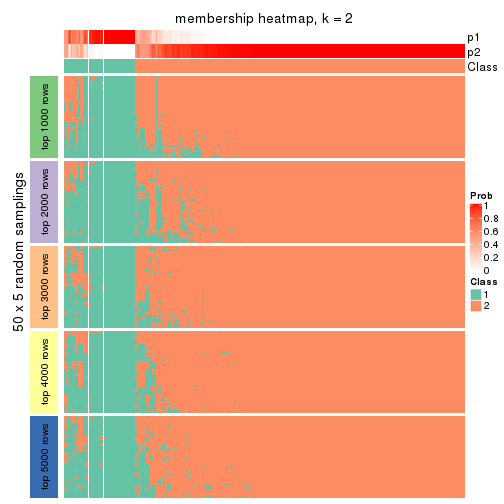</p>

</div>
<div id='tab-CV-hclust-membership-heatmap-2'>
<pre><code class="r">membership_heatmap(res, k = 3)
</code></pre>

<p></p>

</div>
<div id='tab-CV-hclust-membership-heatmap-3'>
<pre><code class="r">membership_heatmap(res, k = 4)
</code></pre>

<p></p>

</div>
<div id='tab-CV-hclust-membership-heatmap-4'>
<pre><code class="r">membership_heatmap(res, k = 5)
</code></pre>

<p></p>

</div>
<div id='tab-CV-hclust-membership-heatmap-5'>
<pre><code class="r">membership_heatmap(res, k = 6)
</code></pre>

<p></p>

</div>
</div>

As soon as we have had the classes for columns, we can look for signatures
which are significantly different between classes which can be candidate marks
for certain classes. Following are the heatmaps for signatures.


Signature heatmaps where rows are scaled:


<script>
$( function() {
	$( '#tabs-CV-hclust-get-signatures' ).tabs();
} );
</script>
<div id='tabs-CV-hclust-get-signatures'>
<ul>
<li><a href='#tab-CV-hclust-get-signatures-1'>k = 2</a></li>
<li><a href='#tab-CV-hclust-get-signatures-2'>k = 3</a></li>
<li><a href='#tab-CV-hclust-get-signatures-3'>k = 4</a></li>
<li><a href='#tab-CV-hclust-get-signatures-4'>k = 5</a></li>
<li><a href='#tab-CV-hclust-get-signatures-5'>k = 6</a></li>
</ul>
<div id='tab-CV-hclust-get-signatures-1'>
<pre><code class="r">get_signatures(res, k = 2)
</code></pre>

<p></p>

</div>
<div id='tab-CV-hclust-get-signatures-2'>
<pre><code class="r">get_signatures(res, k = 3)
</code></pre>

<p></p>

</div>
<div id='tab-CV-hclust-get-signatures-3'>
<pre><code class="r">get_signatures(res, k = 4)
</code></pre>

<p></p>

</div>
<div id='tab-CV-hclust-get-signatures-4'>
<pre><code class="r">get_signatures(res, k = 5)
</code></pre>

<p></p>

</div>
<div id='tab-CV-hclust-get-signatures-5'>
<pre><code class="r">get_signatures(res, k = 6)
</code></pre>

<p></p>

</div>
</div>


Signature heatmaps where rows are not scaled:


<script>
$( function() {
	$( '#tabs-CV-hclust-get-signatures-no-scale' ).tabs();
} );
</script>
<div id='tabs-CV-hclust-get-signatures-no-scale'>
<ul>
<li><a href='#tab-CV-hclust-get-signatures-no-scale-1'>k = 2</a></li>
<li><a href='#tab-CV-hclust-get-signatures-no-scale-2'>k = 3</a></li>
<li><a href='#tab-CV-hclust-get-signatures-no-scale-3'>k = 4</a></li>
<li><a href='#tab-CV-hclust-get-signatures-no-scale-4'>k = 5</a></li>
<li><a href='#tab-CV-hclust-get-signatures-no-scale-5'>k = 6</a></li>
</ul>
<div id='tab-CV-hclust-get-signatures-no-scale-1'>
<pre><code class="r">get_signatures(res, k = 2, scale_rows = FALSE)
</code></pre>

<p>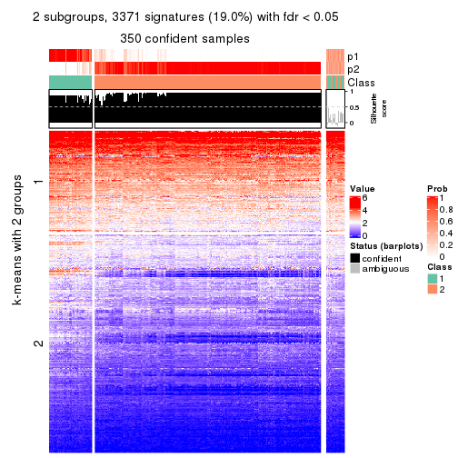</p>

</div>
<div id='tab-CV-hclust-get-signatures-no-scale-2'>
<pre><code class="r">get_signatures(res, k = 3, scale_rows = FALSE)
</code></pre>

<p></p>

</div>
<div id='tab-CV-hclust-get-signatures-no-scale-3'>
<pre><code class="r">get_signatures(res, k = 4, scale_rows = FALSE)
</code></pre>

<p></p>

</div>
<div id='tab-CV-hclust-get-signatures-no-scale-4'>
<pre><code class="r">get_signatures(res, k = 5, scale_rows = FALSE)
</code></pre>

<p></p>

</div>
<div id='tab-CV-hclust-get-signatures-no-scale-5'>
<pre><code class="r">get_signatures(res, k = 6, scale_rows = FALSE)
</code></pre>

<p></p>

</div>
</div>


Compare the overlap of signatures from different k:

```r
compare_signatures(res)
```


`get_signature()` returns a data frame invisibly. TO get the list of signatures, the function
call should be assigned to a variable explicitly. In following code, if `plot` argument is set
to `FALSE`, no heatmap is plotted while only the differential analysis is performed.

```r
# code only for demonstration
tb = get_signature(res, k = ..., plot = FALSE)
```

An example of the output of `tb` is:

```
#>   which_row         fdr    mean_1    mean_2 scaled_mean_1 scaled_mean_2 km
#> 1        38 0.042760348  8.373488  9.131774    -0.5533452     0.5164555  1
#> 2        40 0.018707592  7.106213  8.469186    -0.6173731     0.5762149  1
#> 3        55 0.019134737 10.221463 11.207825    -0.6159697     0.5749050  1
#> 4        59 0.006059896  5.921854  7.869574    -0.6899429     0.6439467  1
#> 5        60 0.018055526  8.928898 10.211722    -0.6204761     0.5791110  1
#> 6        98 0.009384629 15.714769 14.887706     0.6635654    -0.6193277  2
...
```

The columns in `tb` are:

1. `which_row`: row indices corresponding to the input matrix.
2. `fdr`: FDR for the differential test. 
3. `mean_x`: The mean value in group x.
4. `scaled_mean_x`: The mean value in group x after rows are scaled.
5. `km`: Row groups if k-means clustering is applied to rows.


UMAP plot which shows how samples are separated.


<script>
$( function() {
	$( '#tabs-CV-hclust-dimension-reduction' ).tabs();
} );
</script>
<div id='tabs-CV-hclust-dimension-reduction'>
<ul>
<li><a href='#tab-CV-hclust-dimension-reduction-1'>k = 2</a></li>
<li><a href='#tab-CV-hclust-dimension-reduction-2'>k = 3</a></li>
<li><a href='#tab-CV-hclust-dimension-reduction-3'>k = 4</a></li>
<li><a href='#tab-CV-hclust-dimension-reduction-4'>k = 5</a></li>
<li><a href='#tab-CV-hclust-dimension-reduction-5'>k = 6</a></li>
</ul>
<div id='tab-CV-hclust-dimension-reduction-1'>
<pre><code class="r">dimension_reduction(res, k = 2, method = &quot;UMAP&quot;)
</code></pre>

<p></p>

</div>
<div id='tab-CV-hclust-dimension-reduction-2'>
<pre><code class="r">dimension_reduction(res, k = 3, method = &quot;UMAP&quot;)
</code></pre>

<p></p>

</div>
<div id='tab-CV-hclust-dimension-reduction-3'>
<pre><code class="r">dimension_reduction(res, k = 4, method = &quot;UMAP&quot;)
</code></pre>

<p></p>

</div>
<div id='tab-CV-hclust-dimension-reduction-4'>
<pre><code class="r">dimension_reduction(res, k = 5, method = &quot;UMAP&quot;)
</code></pre>

<p></p>

</div>
<div id='tab-CV-hclust-dimension-reduction-5'>
<pre><code class="r">dimension_reduction(res, k = 6, method = &quot;UMAP&quot;)
</code></pre>

<p></p>

</div>
</div>


Following heatmap shows how subgroups are split when increasing `k`:

```r
collect_classes(res)
```


If matrix rows can be associated to genes, consider to use `GO_Enrichment(res,
...)` to perform function enrichment for the signature genes.


 

---------------------------------------------------


### CV:kmeans**


The object with results only for a single top-value method and a single partition method 
can be extracted as:

```r
res = res_list["CV", "kmeans"]
# you can also extract it by
# res = res_list["CV:kmeans"]
```

A summary of `res` and all the functions that can be applied to it:

```r
res
```

```
#> A 'ConsensusPartition' object with k = 2, 3, 4, 5, 6.
#>   On a matrix with 17723 rows and 374 columns.
#>   Top rows (1000, 2000, 3000, 4000, 5000) are extracted by 'CV' method.
#>   Subgroups are detected by 'kmeans' method.
#>   Performed in total 1250 partitions by row resampling.
#>   Best k for subgroups seems to be 3.
#> 
#> Following methods can be applied to this 'ConsensusPartition' object:
#>  [1] "cola_report"             "collect_classes"         "collect_plots"          
#>  [4] "collect_stats"           "colnames"                "compare_signatures"     
#>  [7] "consensus_heatmap"       "dimension_reduction"     "functional_enrichment"  
#> [10] "get_anno_col"            "get_anno"                "get_classes"            
#> [13] "get_consensus"           "get_matrix"              "get_membership"         
#> [16] "get_param"               "get_signatures"          "get_stats"              
#> [19] "is_best_k"               "is_stable_k"             "membership_heatmap"     
#> [22] "ncol"                    "nrow"                    "plot_ecdf"              
#> [25] "rownames"                "select_partition_number" "show"                   
#> [28] "suggest_best_k"          "test_to_known_factors"
```

`collect_plots()` function collects all the plots made from `res` for all `k` (number of partitions)
into one single page to provide an easy and fast comparison between different `k`.

```r
collect_plots(res)
```


The plots are:

- The first row: a plot of the ECDF (Empirical cumulative distribution
  function) curves of the consensus matrix for each `k` and the heatmap of
  predicted classes for each `k`.
- The second row: heatmaps of the consensus matrix for each `k`.
- The third row: heatmaps of the membership matrix for each `k`.
- The fouth row: heatmaps of the signatures for each `k`.

All the plots in panels can be made by individual functions and they are
plotted later in this section.

`select_partition_number()` produces several plots showing different
statistics for choosing "optimized" `k`. There are following statistics:

- ECDF curves of the consensus matrix for each `k`;
- 1-PAC. [The PAC
  score](https://en.wikipedia.org/wiki/Consensus_clustering#Over-interpretation_potential_of_consensus_clustering)
  measures the proportion of the ambiguous subgrouping.
- Mean silhouette score.
- Concordance. The mean probability of fiting the consensus class ids in all
  partitions.
- Area increased. Denote $A_k$ as the area under the ECDF curve for current
  `k`, the area increased is defined as $A_k - A_{k-1}$.
- Rand index. The percent of pairs of samples that are both in a same cluster
  or both are not in a same cluster in the partition of k and k-1.
- Jaccard index. The ratio of pairs of samples are both in a same cluster in
  the partition of k and k-1 and the pairs of samples are both in a same
  cluster in the partition k or k-1.

The detailed explanations of these statistics can be found in [the cola
vignette](http://bioconductor.org/packages/devel/bioc/vignettes/cola/inst/doc/cola.html#toc_13).

Generally speaking, lower PAC score, higher mean silhouette score or higher
concordance corresponds to better partition. Rand index and Jaccard index
measure how similar the current partition is compared to partition with `k-1`.
If they are too similar, we won't accept `k` is better than `k-1`.

```r
select_partition_number(res)
```


The numeric values for all these statistics can be obtained by `get_stats()`.

```r
get_stats(res)
```

```
#>   k 1-PAC mean_silhouette concordance area_increased  Rand Jaccard
#> 2 2 0.463           0.635       0.648         0.4223 0.499   0.499
#> 3 3 0.953           0.927       0.960         0.4760 0.822   0.661
#> 4 4 0.703           0.497       0.729         0.1406 0.891   0.728
#> 5 5 0.681           0.660       0.782         0.0817 0.802   0.456
#> 6 6 0.698           0.602       0.754         0.0472 0.943   0.756
```

`suggest_best_k()` suggests the best $k$ based on these statistics. The rules are as follows:

- All $k$ with Jaccard index larger than 0.95 are removed because the increase of
  the partition number does not provides enough extra information. If all $k$ are removed,
  the best $k$ is assigned by `NA`.
- For $k$ with 1-PAC larger than 0.9, the maximal $k$ is taken as the "best k". Other $k$ is called "optional k".
- If it does not fit the second rule. The $k$ with the highest vote of highest
  1-PAC, mean silhouette and concordance is taken as the "best k".

```r
suggest_best_k(res)
```

```
#> [1] 3
```


Following shows the table of the partitions (You need to click the **show/hide
code output** link to see it). The membership matrix (columns with name `p*`)
is inferred by
[`clue::cl_consensus()`](https://www.rdocumentation.org/link/cl_consensus?package=clue)
function with the `SE` method. Basically the value in the membership matrix
represents the probability to belong to a certain group. The finall class
label for an item is determined with the group with highest probability it
belongs to.

In `get_classes()` function, the entropy is calculated from the membership
matrix and the silhouette score is calculated from the consensus matrix.


<script>
$( function() {
	$( '#tabs-CV-kmeans-get-classes' ).tabs();
} );
</script>
<div id='tabs-CV-kmeans-get-classes'>
<ul>
<li><a href='#tab-CV-kmeans-get-classes-1'>k = 2</a></li>
<li><a href='#tab-CV-kmeans-get-classes-2'>k = 3</a></li>
<li><a href='#tab-CV-kmeans-get-classes-3'>k = 4</a></li>
<li><a href='#tab-CV-kmeans-get-classes-4'>k = 5</a></li>
<li><a href='#tab-CV-kmeans-get-classes-5'>k = 6</a></li>
</ul>

<div id='tab-CV-kmeans-get-classes-1'>
<p><a id='tab-CV-kmeans-get-classes-1-a' style='color:#0366d6' href='#'>show/hide code output</a></p>
<pre><code class="r">cbind(get_classes(res, k = 2), get_membership(res, k = 2))
</code></pre>

<pre><code>#&gt;            class entropy silhouette    p1    p2
#&gt; SRR660824      1  0.0376     0.7563 0.996 0.004
#&gt; SRR603858      1  0.7815     0.1661 0.768 0.232
#&gt; SRR817070      2  0.9988     0.7787 0.480 0.520
#&gt; SRR1486995     1  0.6247     0.6179 0.844 0.156
#&gt; SRR813043      2  0.9988     0.7787 0.480 0.520
#&gt; SRR656874      2  0.9988     0.7787 0.480 0.520
#&gt; SRR659037      2  0.9998    -0.3809 0.492 0.508
#&gt; SRR662031      1  0.0000     0.7593 1.000 0.000
#&gt; SRR1081283     2  0.9988     0.7787 0.480 0.520
#&gt; SRR1481036     1  0.0376     0.7563 0.996 0.004
#&gt; SRR1434009     2  0.3584     0.3139 0.068 0.932
#&gt; SRR1376676     1  0.0000     0.7593 1.000 0.000
#&gt; SRR1396967     2  0.3733     0.3099 0.072 0.928
#&gt; SRR665429      2  0.9988     0.7787 0.480 0.520
#&gt; SRR1388025     2  0.9988     0.7787 0.480 0.520
#&gt; SRR600784      1  0.0000     0.7593 1.000 0.000
#&gt; SRR657611      1  0.0000     0.7593 1.000 0.000
#&gt; SRR1333659     2  0.4161     0.2968 0.084 0.916
#&gt; SRR1323896     2  0.9988     0.7787 0.480 0.520
#&gt; SRR1453971     1  0.0000     0.7593 1.000 0.000
#&gt; SRR1421010     1  0.0000     0.7593 1.000 0.000
#&gt; SRR1334490     1  0.9996     0.3931 0.512 0.488
#&gt; SRR1309468     1  0.0000     0.7593 1.000 0.000
#&gt; SRR1468637     1  1.0000     0.3858 0.504 0.496
#&gt; SRR1365489     2  0.9988     0.7787 0.480 0.520
#&gt; SRR627445      1  0.2423     0.7018 0.960 0.040
#&gt; SRR607863      2  0.9754     0.7006 0.408 0.592
#&gt; SRR1475524     1  0.9996     0.3931 0.512 0.488
#&gt; SRR1405504     2  0.9988     0.7787 0.480 0.520
#&gt; SRR615695      1  0.0000     0.7593 1.000 0.000
#&gt; SRR600900      2  0.9988     0.7787 0.480 0.520
#&gt; SRR601477      2  0.9988     0.7787 0.480 0.520
#&gt; SRR1487215     2  0.9988     0.7787 0.480 0.520
#&gt; SRR1310797     2  0.9988     0.7787 0.480 0.520
#&gt; SRR1362713     1  0.5178     0.5532 0.884 0.116
#&gt; SRR1431385     1  0.0000     0.7593 1.000 0.000
#&gt; SRR1379089     2  0.9988     0.7787 0.480 0.520
#&gt; SRR1102079     1  0.9988     0.3960 0.520 0.480
#&gt; SRR1357210     1  0.0000     0.7593 1.000 0.000
#&gt; SRR657659      2  0.9988     0.7787 0.480 0.520
#&gt; SRR663573      2  0.9988     0.7787 0.480 0.520
#&gt; SRR603188      2  0.4161     0.4207 0.084 0.916
#&gt; SRR1471200     2  0.9988     0.7787 0.480 0.520
#&gt; SRR1310975     2  0.9988     0.7787 0.480 0.520
#&gt; SRR627457      1  0.9775    -0.5457 0.588 0.412
#&gt; SRR1367654     2  0.3274     0.3215 0.060 0.940
#&gt; SRR1488410     1  0.9996     0.3931 0.512 0.488
#&gt; SRR1457750     1  0.9775    -0.5451 0.588 0.412
#&gt; SRR1099546     1  0.0000     0.7593 1.000 0.000
#&gt; SRR604480      2  0.9988     0.7787 0.480 0.520
#&gt; SRR1390477     2  0.9988     0.7787 0.480 0.520
#&gt; SRR1458447     2  0.9988     0.7787 0.480 0.520
#&gt; SRR1473161     2  0.9988     0.7787 0.480 0.520
#&gt; SRR1409813     2  0.3879     0.3058 0.076 0.924
#&gt; SRR612791      1  0.0000     0.7593 1.000 0.000
#&gt; SRR1470580     1  0.9933    -0.6425 0.548 0.452
#&gt; SRR1444063     1  0.4939     0.5718 0.892 0.108
#&gt; SRR1355578     1  0.0000     0.7593 1.000 0.000
#&gt; SRR1429203     1  0.0000     0.7593 1.000 0.000
#&gt; SRR599154      2  0.4562     0.2823 0.096 0.904
#&gt; SRR814244      1  0.9996     0.3931 0.512 0.488
#&gt; SRR1404123     2  0.9988     0.7787 0.480 0.520
#&gt; SRR656934      1  0.0376     0.7563 0.996 0.004
#&gt; SRR1339029     2  0.9988     0.7787 0.480 0.520
#&gt; SRR821525      2  0.9988     0.7787 0.480 0.520
#&gt; SRR1443677     1  0.0000     0.7593 1.000 0.000
#&gt; SRR1406330     1  0.9988     0.3960 0.520 0.480
#&gt; SRR1338124     1  0.9129    -0.3046 0.672 0.328
#&gt; SRR1391376     1  0.0000     0.7593 1.000 0.000
#&gt; SRR661842      2  0.9988     0.7787 0.480 0.520
#&gt; SRR1395699     1  0.1414     0.7446 0.980 0.020
#&gt; SRR1312209     1  0.0000     0.7593 1.000 0.000
#&gt; SRR1359469     1  0.0000     0.7593 1.000 0.000
#&gt; SRR658885      1  0.9996     0.3931 0.512 0.488
#&gt; SRR1414578     1  0.0376     0.7563 0.996 0.004
#&gt; SRR603620      2  0.2236     0.3610 0.036 0.964
#&gt; SRR604677      1  0.0000     0.7593 1.000 0.000
#&gt; SRR603800      2  0.9988     0.7787 0.480 0.520
#&gt; SRR602058      2  0.2043     0.3903 0.032 0.968
#&gt; SRR817488      2  0.9988     0.7787 0.480 0.520
#&gt; SRR655601      2  0.9988     0.7787 0.480 0.520
#&gt; SRR1434821     2  0.9988     0.7787 0.480 0.520
#&gt; SRR1349166     2  0.0376     0.3671 0.004 0.996
#&gt; SRR615129      2  0.9998     0.7593 0.492 0.508
#&gt; SRR607586      2  0.9988     0.7787 0.480 0.520
#&gt; SRR602680      2  0.9988     0.7787 0.480 0.520
#&gt; SRR1411070     2  0.9988     0.7787 0.480 0.520
#&gt; SRR663038      2  0.9988     0.7787 0.480 0.520
#&gt; SRR1489416     2  0.9988     0.7787 0.480 0.520
#&gt; SRR1479155     1  0.0000     0.7593 1.000 0.000
#&gt; SRR662162      1  0.0000     0.7593 1.000 0.000
#&gt; SRR1374567     1  0.0000     0.7593 1.000 0.000
#&gt; SRR1434048     2  0.9988     0.7787 0.480 0.520
#&gt; SRR2184865     2  0.9988     0.7787 0.480 0.520
#&gt; SRR2170135     1  0.0000     0.7593 1.000 0.000
#&gt; SRR615551      2  0.9988     0.7787 0.480 0.520
#&gt; SRR1335513     2  0.9988     0.7787 0.480 0.520
#&gt; SRR1370216     1  0.8144     0.5370 0.748 0.252
#&gt; SRR662954      2  0.4815     0.2954 0.104 0.896
#&gt; SRR1375738     1  0.0376     0.7563 0.996 0.004
#&gt; SRR1356577     1  0.0376     0.7563 0.996 0.004
#&gt; SRR1073119     1  0.0376     0.7563 0.996 0.004
#&gt; SRR663549      1  0.0376     0.7563 0.996 0.004
#&gt; SRR1478015     2  0.9988     0.7787 0.480 0.520
#&gt; SRR600632      2  0.9988     0.7787 0.480 0.520
#&gt; SRR811866      1  0.0000     0.7593 1.000 0.000
#&gt; SRR1401101     2  0.0938     0.3785 0.012 0.988
#&gt; SRR1477797     2  0.4161     0.2968 0.084 0.916
#&gt; SRR1402986     2  0.9988     0.7787 0.480 0.520
#&gt; SRR658897      1  0.0376     0.7563 0.996 0.004
#&gt; SRR1419869     1  0.0376     0.7563 0.996 0.004
#&gt; SRR1490700     1  0.0376     0.7563 0.996 0.004
#&gt; SRR601723      2  1.0000     0.7524 0.496 0.504
#&gt; SRR1384115     2  0.4939     0.2660 0.108 0.892
#&gt; SRR1476927     2  0.9988     0.7787 0.480 0.520
#&gt; SRR1387769     1  0.0376     0.7563 0.996 0.004
#&gt; SRR1322595     1  0.9996     0.3931 0.512 0.488
#&gt; SRR1370423     1  0.0376     0.7563 0.996 0.004
#&gt; SRR1314976     1  0.3733     0.6452 0.928 0.072
#&gt; SRR1319560     2  0.0938     0.3785 0.012 0.988
#&gt; SRR1352683     1  0.0376     0.7563 0.996 0.004
#&gt; SRR1473800     1  0.0000     0.7593 1.000 0.000
#&gt; SRR1326384     1  0.9996     0.3931 0.512 0.488
#&gt; SRR1360807     2  0.9996     0.7656 0.488 0.512
#&gt; SRR1332544     1  0.9996     0.3931 0.512 0.488
#&gt; SRR598695      1  0.0000     0.7593 1.000 0.000
#&gt; SRR807824      2  0.9988     0.7787 0.480 0.520
#&gt; SRR809296      1  0.1414     0.7446 0.980 0.020
#&gt; SRR657927      1  0.0000     0.7593 1.000 0.000
#&gt; SRR1440682     2  0.9988     0.7787 0.480 0.520
#&gt; SRR1454415     2  0.9988     0.7787 0.480 0.520
#&gt; SRR1419131     2  0.9988     0.7787 0.480 0.520
#&gt; SRR1404293     1  0.2236     0.7084 0.964 0.036
#&gt; SRR1473340     1  0.0000     0.7593 1.000 0.000
#&gt; SRR1345563     1  0.9996     0.3931 0.512 0.488
#&gt; SRR1323382     2  0.9988     0.7787 0.480 0.520
#&gt; SRR1480697     1  0.0672     0.7512 0.992 0.008
#&gt; SRR1321808     2  0.9988     0.7787 0.480 0.520
#&gt; SRR1382756     2  0.9988     0.7787 0.480 0.520
#&gt; SRR1312558     2  0.9988     0.7787 0.480 0.520
#&gt; SRR1417088     2  0.9988     0.7787 0.480 0.520
#&gt; SRR1433027     2  0.9988     0.7787 0.480 0.520
#&gt; SRR662257      2  0.3879     0.3058 0.076 0.924
#&gt; SRR600417      2  0.9988     0.7787 0.480 0.520
#&gt; SRR812493      2  0.4815     0.2717 0.104 0.896
#&gt; SRR612743      1  0.0376     0.7563 0.996 0.004
#&gt; SRR1361345     1  0.0376     0.7563 0.996 0.004
#&gt; SRR600584      2  0.9988     0.7787 0.480 0.520
#&gt; SRR1310520     2  0.9988     0.7787 0.480 0.520
#&gt; SRR1395595     1  0.9996     0.3931 0.512 0.488
#&gt; SRR1334074     2  0.5178     0.2542 0.116 0.884
#&gt; SRR654838      2  0.9988     0.7787 0.480 0.520
#&gt; SRR1376694     1  0.9996     0.3931 0.512 0.488
#&gt; SRR1433841     1  0.9970    -0.6828 0.532 0.468
#&gt; SRR1366837     1  0.0376     0.7563 0.996 0.004
#&gt; SRR1467479     2  0.9988     0.7787 0.480 0.520
#&gt; SRR1459055     1  0.9996     0.3931 0.512 0.488
#&gt; SRR1471050     2  0.9988     0.7787 0.480 0.520
#&gt; SRR603004      2  0.9988     0.7787 0.480 0.520
#&gt; SRR814703      2  0.5294     0.4427 0.120 0.880
#&gt; SRR661937      2  0.9988     0.7787 0.480 0.520
#&gt; SRR614359      1  0.0000     0.7593 1.000 0.000
#&gt; SRR1071568     2  0.9988     0.7787 0.480 0.520
#&gt; SRR1389084     1  0.0000     0.7593 1.000 0.000
#&gt; SRR1337624     2  0.9988     0.7787 0.480 0.520
#&gt; SRR1344400     2  0.9988     0.7787 0.480 0.520
#&gt; SRR1414290     2  0.9988     0.7787 0.480 0.520
#&gt; SRR1413644     2  0.0000     0.3699 0.000 1.000
#&gt; SRR1098998     1  0.0000     0.7593 1.000 0.000
#&gt; SRR1481279     1  0.0000     0.7593 1.000 0.000
#&gt; SRR1315103     1  0.9996     0.3931 0.512 0.488
#&gt; SRR1099286     1  0.0672     0.7512 0.992 0.008
#&gt; SRR2166570     1  0.4298     0.6140 0.912 0.088
#&gt; SRR601445      1  0.0000     0.7593 1.000 0.000
#&gt; SRR1439719     2  0.9988     0.7787 0.480 0.520
#&gt; SRR1377026     2  0.9988     0.7787 0.480 0.520
#&gt; SRR1327386     1  0.0000     0.7593 1.000 0.000
#&gt; SRR654826      2  0.9988     0.7787 0.480 0.520
#&gt; SRR1460433     2  0.9988     0.7787 0.480 0.520
#&gt; SRR1469345     1  0.8144     0.5370 0.748 0.252
#&gt; SRR1421462     2  0.9988     0.7787 0.480 0.520
#&gt; SRR662966      1  0.9996     0.3931 0.512 0.488
#&gt; SRR1339175     1  0.0000     0.7593 1.000 0.000
#&gt; SRR1447736     2  0.9988     0.7787 0.480 0.520
#&gt; SRR1434671     2  0.0000     0.3699 0.000 1.000
#&gt; SRR660800      2  0.9988     0.7787 0.480 0.520
#&gt; SRR1465543     2  0.4690     0.2772 0.100 0.900
#&gt; SRR1342023     1  0.0000     0.7593 1.000 0.000
#&gt; SRR1335670     1  0.0000     0.7593 1.000 0.000
#&gt; SRR1400955     2  0.0938     0.3785 0.012 0.988
#&gt; SRR1072150     2  0.9988     0.7787 0.480 0.520
#&gt; SRR1442822     1  0.0000     0.7593 1.000 0.000
#&gt; SRR1364658     1  0.0000     0.7593 1.000 0.000
#&gt; SRR1098074     2  0.4690     0.2772 0.100 0.900
#&gt; SRR1442778     1  0.0000     0.7593 1.000 0.000
#&gt; SRR1086728     1  0.9996     0.3931 0.512 0.488
#&gt; SRR627464      1  0.9998    -0.7315 0.508 0.492
#&gt; SRR1409193     1  0.0376     0.7563 0.996 0.004
#&gt; SRR2168286     2  0.9996     0.7656 0.488 0.512
#&gt; SRR615539      2  0.9988     0.7787 0.480 0.520
#&gt; SRR663623      1  0.0000     0.7593 1.000 0.000
#&gt; SRR1471989     1  0.9996     0.3931 0.512 0.488
#&gt; SRR1468828     2  0.9988     0.7787 0.480 0.520
#&gt; SRR1381934     1  0.0000     0.7593 1.000 0.000
#&gt; SRR1471098     1  0.0000     0.7593 1.000 0.000
#&gt; SRR1314749     1  0.0000     0.7593 1.000 0.000
#&gt; SRR2166874     2  0.4431     0.2873 0.092 0.908
#&gt; SRR821302      1  0.0000     0.7593 1.000 0.000
#&gt; SRR1435066     2  0.9988     0.7787 0.480 0.520
#&gt; SRR661601      2  0.9988     0.7787 0.480 0.520
#&gt; SRR1446546     2  0.9988     0.7787 0.480 0.520
#&gt; SRR1419784     1  0.9996     0.3931 0.512 0.488
#&gt; SRR1357233     2  0.4562     0.2823 0.096 0.904
#&gt; SRR1441889     1  0.0000     0.7593 1.000 0.000
#&gt; SRR1413940     1  0.9996     0.3931 0.512 0.488
#&gt; SRR1324250     2  0.9988     0.7787 0.480 0.520
#&gt; SRR1442862     2  0.3584     0.3139 0.068 0.932
#&gt; SRR662474      2  0.9988     0.7787 0.480 0.520
#&gt; SRR1416226     1  0.0376     0.7563 0.996 0.004
#&gt; SRR1417404     1  0.0672     0.7545 0.992 0.008
#&gt; SRR665466      2  0.9988     0.7787 0.480 0.520
#&gt; SRR658849      1  0.0000     0.7593 1.000 0.000
#&gt; SRR1460025     2  0.9988     0.7787 0.480 0.520
#&gt; SRR1408136     1  0.0000     0.7593 1.000 0.000
#&gt; SRR1489995     2  0.9988     0.7787 0.480 0.520
#&gt; SRR1374092     1  0.0376     0.7563 0.996 0.004
#&gt; SRR1488429     1  0.9996     0.3931 0.512 0.488
#&gt; SRR1087559     1  0.5059     0.5626 0.888 0.112
#&gt; SRR817004      1  0.9996     0.3931 0.512 0.488
#&gt; SRR1429660     2  0.3274     0.3215 0.060 0.940
#&gt; SRR604390      1  0.9996     0.3931 0.512 0.488
#&gt; SRR614936      2  0.9988     0.7787 0.480 0.520
#&gt; SRR1365938     2  0.9996     0.7656 0.488 0.512
#&gt; SRR1437324     1  0.0000     0.7593 1.000 0.000
#&gt; SRR613414      2  0.9909     0.7399 0.444 0.556
#&gt; SRR660414      1  0.4161     0.6220 0.916 0.084
#&gt; SRR1452185     1  0.0000     0.7593 1.000 0.000
#&gt; SRR1347020     1  0.0376     0.7563 0.996 0.004
#&gt; SRR1398036     2  0.0938     0.3785 0.012 0.988
#&gt; SRR1436674     1  0.0000     0.7593 1.000 0.000
#&gt; SRR603750      1  0.4562     0.5974 0.904 0.096
#&gt; SRR608630      1  0.9815    -0.5865 0.580 0.420
#&gt; SRR655625      2  0.9988     0.7787 0.480 0.520
#&gt; SRR599059      1  0.8661    -0.0999 0.712 0.288
#&gt; SRR615189      2  0.9988     0.7787 0.480 0.520
#&gt; SRR1466889     2  0.1414     0.3833 0.020 0.980
#&gt; SRR1084602     2  0.9993     0.7722 0.484 0.516
#&gt; SRR1335422     1  0.0000     0.7593 1.000 0.000
#&gt; SRR1356805     2  0.0672     0.3757 0.008 0.992
#&gt; SRR1385300     1  0.7745     0.5578 0.772 0.228
#&gt; SRR654814      1  0.0000     0.7593 1.000 0.000
#&gt; SRR658385      2  0.9988     0.7787 0.480 0.520
#&gt; SRR820596      1  0.0000     0.7593 1.000 0.000
#&gt; SRR1318118     1  0.3274     0.7061 0.940 0.060
#&gt; SRR1480766     2  0.9988     0.7787 0.480 0.520
#&gt; SRR1406539     1  0.0376     0.7563 0.996 0.004
#&gt; SRR1341833     2  0.9732     0.6962 0.404 0.596
#&gt; SRR1441826     2  0.9988     0.7787 0.480 0.520
#&gt; SRR1448051     1  0.0000     0.7593 1.000 0.000
#&gt; SRR1326752     1  0.1843     0.7378 0.972 0.028
#&gt; SRR665217      1  0.1414     0.7446 0.980 0.020
#&gt; SRR819186      2  0.9988     0.7787 0.480 0.520
#&gt; SRR661517      1  0.1414     0.7446 0.980 0.020
#&gt; SRR607166      2  0.9988     0.7787 0.480 0.520
#&gt; SRR809065      2  0.9988     0.7787 0.480 0.520
#&gt; SRR1415872     2  0.9286     0.6319 0.344 0.656
#&gt; SRR1415463     1  0.0000     0.7593 1.000 0.000
#&gt; SRR1381161     2  0.3879     0.3058 0.076 0.924
#&gt; SRR1442231     2  0.9996     0.7656 0.488 0.512
#&gt; SRR1374696     1  0.0376     0.7563 0.996 0.004
#&gt; SRR1451988     1  0.4298     0.6138 0.912 0.088
#&gt; SRR660555      1  0.0000     0.7593 1.000 0.000
#&gt; SRR657801      1  0.0000     0.7593 1.000 0.000
#&gt; SRR663344      2  0.9988     0.7787 0.480 0.520
#&gt; SRR1472462     2  0.9988     0.7787 0.480 0.520
#&gt; SRR1406176     1  0.4690     0.5889 0.900 0.100
#&gt; SRR656886      2  0.9988     0.7787 0.480 0.520
#&gt; SRR1498337     2  0.3879     0.3058 0.076 0.924
#&gt; SRR613066      1  0.9996     0.3931 0.512 0.488
#&gt; SRR1309490     1  0.0000     0.7593 1.000 0.000
#&gt; SRR602492      2  0.9988     0.7787 0.480 0.520
#&gt; SRR1447347     1  0.0376     0.7563 0.996 0.004
#&gt; SRR1475546     2  0.9988     0.7787 0.480 0.520
#&gt; SRR627459      1  0.9996    -0.7248 0.512 0.488
#&gt; SRR1434332     2  0.9988     0.7787 0.480 0.520
#&gt; SRR1070358     2  0.0376     0.3671 0.004 0.996
#&gt; SRR1345936     2  0.5059     0.2601 0.112 0.888
#&gt; SRR665658      2  0.9988     0.7787 0.480 0.520
#&gt; SRR1321351     2  0.9988     0.7787 0.480 0.520
#&gt; SRR657880      2  0.9988     0.7787 0.480 0.520
#&gt; SRR1373903     2  0.9988     0.7787 0.480 0.520
#&gt; SRR657396      2  0.0938     0.3785 0.012 0.988
#&gt; SRR660981      2  0.9988     0.7787 0.480 0.520
#&gt; SRR818499      1  0.0000     0.7593 1.000 0.000
#&gt; SRR819658      2  0.0938     0.3785 0.012 0.988
#&gt; SRR1376316     1  0.0000     0.7593 1.000 0.000
#&gt; SRR1323723     2  0.9988     0.7787 0.480 0.520
#&gt; SRR1476719     1  0.0376     0.7563 0.996 0.004
#&gt; SRR1403478     2  0.9988     0.7787 0.480 0.520
#&gt; SRR1095695     1  0.0376     0.7563 0.996 0.004
#&gt; SRR1352391     1  0.0938     0.7481 0.988 0.012
#&gt; SRR1498813     2  0.9988     0.7787 0.480 0.520
#&gt; SRR627437      1  0.0376     0.7563 0.996 0.004
#&gt; SRR2185097     1  0.0376     0.7563 0.996 0.004
#&gt; SRR817166      1  0.9996     0.3931 0.512 0.488
#&gt; SRR1091670     2  0.9988     0.7787 0.480 0.520
#&gt; SRR603776      1  0.0000     0.7593 1.000 0.000
#&gt; SRR1479640     2  0.9988     0.7787 0.480 0.520
#&gt; SRR660152      1  0.0000     0.7593 1.000 0.000
#&gt; SRR1074769     2  0.9988     0.7787 0.480 0.520
#&gt; SRR656153      2  0.9988     0.7787 0.480 0.520
#&gt; SRR1392502     1  0.9996     0.3931 0.512 0.488
#&gt; SRR1359609     1  0.9996     0.3931 0.512 0.488
#&gt; SRR601925      2  0.9988     0.7787 0.480 0.520
#&gt; SRR2165182     2  0.9988     0.7787 0.480 0.520
#&gt; SRR608542      2  0.0000     0.3699 0.000 1.000
#&gt; SRR655064      2  0.9988     0.7787 0.480 0.520
#&gt; SRR1432430     1  0.1184     0.7397 0.984 0.016
#&gt; SRR808472      2  0.9988     0.7787 0.480 0.520
#&gt; SRR1414958     1  0.9996     0.3931 0.512 0.488
#&gt; SRR598484      2  0.9988     0.7787 0.480 0.520
#&gt; SRR612755      1  0.0000     0.7593 1.000 0.000
#&gt; SRR1365808     1  0.0000     0.7593 1.000 0.000
#&gt; SRR1391724     1  0.0376     0.7563 0.996 0.004
#&gt; SRR1322373     1  0.0000     0.7593 1.000 0.000
#&gt; SRR1489265     2  0.9988     0.7787 0.480 0.520
#&gt; SRR1359099     2  0.9988     0.7787 0.480 0.520
#&gt; SRR607279      2  0.9988     0.7787 0.480 0.520
#&gt; SRR810461      2  0.9988     0.7787 0.480 0.520
#&gt; SRR627427      1  0.1184     0.7397 0.984 0.016
#&gt; SRR612887      2  0.9988     0.7787 0.480 0.520
#&gt; SRR809807      2  0.9909    -0.3289 0.444 0.556
#&gt; SRR663112      2  0.9988     0.7787 0.480 0.520
#&gt; SRR1346933     2  0.4939     0.2660 0.108 0.892
#&gt; SRR1487910     1  0.0376     0.7563 0.996 0.004
#&gt; SRR603092      2  0.9988     0.7787 0.480 0.520
#&gt; SRR1417680     2  0.9988     0.7787 0.480 0.520
#&gt; SRR1383785     1  0.0000     0.7593 1.000 0.000
#&gt; SRR1070015     2  0.4690     0.2772 0.100 0.900
#&gt; SRR1466222     1  0.9522    -0.4179 0.628 0.372
#&gt; SRR1416119     1  0.9993     0.3946 0.516 0.484
#&gt; SRR819318      1  0.0000     0.7593 1.000 0.000
#&gt; SRR608288      2  0.9988     0.7787 0.480 0.520
#&gt; SRR811121      2  0.9983     0.7745 0.476 0.524
#&gt; SRR613138      2  0.9988     0.7787 0.480 0.520
#&gt; SRR810483      1  0.0000     0.7593 1.000 0.000
#&gt; SRR607839      1  0.0000     0.7593 1.000 0.000
#&gt; SRR1337031     1  0.0938     0.7506 0.988 0.012
#&gt; SRR601311      2  0.9988     0.7787 0.480 0.520
#&gt; SRR1406685     2  0.9988     0.7787 0.480 0.520
#&gt; SRR1467500     2  0.9988     0.7787 0.480 0.520
#&gt; SRR1308504     1  0.0000     0.7593 1.000 0.000
#&gt; SRR1312865     1  0.9996     0.3931 0.512 0.488
#&gt; SRR1312522     1  0.9963     0.4040 0.536 0.464
#&gt; SRR1490486     2  0.9988     0.7787 0.480 0.520
#&gt; SRR1325888     1  0.0000     0.7593 1.000 0.000
#&gt; SRR1472885     1  0.0000     0.7593 1.000 0.000
#&gt; SRR1098785     2  0.9988     0.7787 0.480 0.520
#&gt; SRR1084766     2  0.9996     0.7656 0.488 0.512
#&gt; SRR1102804     2  0.9988     0.7787 0.480 0.520
#&gt; SRR1336636     1  0.0376     0.7563 0.996 0.004
#&gt; SRR1347795     1  0.9996     0.3931 0.512 0.488
#&gt; SRR601900      2  0.9988     0.7787 0.480 0.520
#&gt; SRR1330989     2  0.9996     0.7656 0.488 0.512
#&gt; SRR658445      2  0.4690     0.2772 0.100 0.900
#&gt; SRR1368754     1  0.9996     0.3931 0.512 0.488
#&gt; SRR1460001     2  0.9988     0.7787 0.480 0.520
#&gt; SRR1414934     1  0.0000     0.7593 1.000 0.000
#&gt; SRR1326249     1  0.1414     0.7446 0.980 0.020
#&gt; SRR614948      1  0.9996     0.3931 0.512 0.488
#&gt; SRR1472952     1  0.0000     0.7593 1.000 0.000
#&gt; SRR1321528     1  0.3733     0.6448 0.928 0.072
#&gt; SRR627447      1  0.0000     0.7593 1.000 0.000
#&gt; SRR612239      2  1.0000     0.7524 0.496 0.504
</code></pre>

<script>
$('#tab-CV-kmeans-get-classes-1-a').parent().next().next().hide();
$('#tab-CV-kmeans-get-classes-1-a').click(function(){
  $('#tab-CV-kmeans-get-classes-1-a').parent().next().next().toggle();
  return(false);
});
</script>
</div>

<div id='tab-CV-kmeans-get-classes-2'>
<p><a id='tab-CV-kmeans-get-classes-2-a' style='color:#0366d6' href='#'>show/hide code output</a></p>
<pre><code class="r">cbind(get_classes(res, k = 3), get_membership(res, k = 3))
</code></pre>

<pre><code>#&gt;            class entropy silhouette    p1    p2    p3
#&gt; SRR660824      1  0.0424     0.9621 0.992 0.008 0.000
#&gt; SRR603858      1  0.6294     0.5944 0.692 0.288 0.020
#&gt; SRR817070      2  0.1636     0.9609 0.016 0.964 0.020
#&gt; SRR1486995     1  0.0747     0.9496 0.984 0.016 0.000
#&gt; SRR813043      2  0.0747     0.9655 0.016 0.984 0.000
#&gt; SRR656874      2  0.0424     0.9540 0.008 0.992 0.000
#&gt; SRR659037      3  0.0592     0.9541 0.012 0.000 0.988
#&gt; SRR662031      1  0.0424     0.9621 0.992 0.008 0.000
#&gt; SRR1081283     2  0.1636     0.9609 0.016 0.964 0.020
#&gt; SRR1481036     1  0.0661     0.9610 0.988 0.008 0.004
#&gt; SRR1434009     3  0.0892     0.9531 0.000 0.020 0.980
#&gt; SRR1376676     1  0.0424     0.9621 0.992 0.008 0.000
#&gt; SRR1396967     3  0.1647     0.9462 0.004 0.036 0.960
#&gt; SRR665429      2  0.0747     0.9655 0.016 0.984 0.000
#&gt; SRR1388025     2  0.1636     0.9609 0.016 0.964 0.020
#&gt; SRR600784      1  0.0237     0.9616 0.996 0.004 0.000
#&gt; SRR657611      1  0.0424     0.9621 0.992 0.008 0.000
#&gt; SRR1333659     3  0.0892     0.9531 0.000 0.020 0.980
#&gt; SRR1323896     2  0.0747     0.9655 0.016 0.984 0.000
#&gt; SRR1453971     1  0.0747     0.9496 0.984 0.016 0.000
#&gt; SRR1421010     1  0.0747     0.9496 0.984 0.016 0.000
#&gt; SRR1334490     3  0.0892     0.9555 0.020 0.000 0.980
#&gt; SRR1309468     1  0.0424     0.9621 0.992 0.008 0.000
#&gt; SRR1468637     3  0.1015     0.9555 0.012 0.008 0.980
#&gt; SRR1365489     2  0.0747     0.9655 0.016 0.984 0.000
#&gt; SRR627445      1  0.0661     0.9610 0.988 0.008 0.004
#&gt; SRR607863      2  0.0424     0.9540 0.008 0.992 0.000
#&gt; SRR1475524     3  0.0892     0.9555 0.020 0.000 0.980
#&gt; SRR1405504     2  0.0747     0.9655 0.016 0.984 0.000
#&gt; SRR615695      1  0.0424     0.9621 0.992 0.008 0.000
#&gt; SRR600900      2  0.0424     0.9540 0.008 0.992 0.000
#&gt; SRR601477      2  0.0747     0.9655 0.016 0.984 0.000
#&gt; SRR1487215     2  0.0747     0.9655 0.016 0.984 0.000
#&gt; SRR1310797     2  0.0237     0.9561 0.004 0.996 0.000
#&gt; SRR1362713     1  0.3141     0.8918 0.912 0.068 0.020
#&gt; SRR1431385     1  0.0424     0.9621 0.992 0.008 0.000
#&gt; SRR1379089     2  0.0747     0.9655 0.016 0.984 0.000
#&gt; SRR1102079     3  0.6950     0.0839 0.476 0.016 0.508
#&gt; SRR1357210     1  0.0424     0.9621 0.992 0.008 0.000
#&gt; SRR657659      2  0.1636     0.9609 0.016 0.964 0.020
#&gt; SRR663573      2  0.1636     0.9609 0.016 0.964 0.020
#&gt; SRR603188      2  0.0424     0.9540 0.008 0.992 0.000
#&gt; SRR1471200     2  0.0747     0.9655 0.016 0.984 0.000
#&gt; SRR1310975     2  0.0424     0.9624 0.008 0.992 0.000
#&gt; SRR627457      1  0.3987     0.8415 0.872 0.108 0.020
#&gt; SRR1367654     3  0.1832     0.9443 0.008 0.036 0.956
#&gt; SRR1488410     3  0.0892     0.9555 0.020 0.000 0.980
#&gt; SRR1457750     1  0.6849     0.3687 0.600 0.380 0.020
#&gt; SRR1099546     1  0.0424     0.9621 0.992 0.008 0.000
#&gt; SRR604480      2  0.0747     0.9655 0.016 0.984 0.000
#&gt; SRR1390477     2  0.0747     0.9655 0.016 0.984 0.000
#&gt; SRR1458447     2  0.0747     0.9655 0.016 0.984 0.000
#&gt; SRR1473161     2  0.0747     0.9655 0.016 0.984 0.000
#&gt; SRR1409813     3  0.0892     0.9531 0.000 0.020 0.980
#&gt; SRR612791      1  0.0000     0.9604 1.000 0.000 0.000
#&gt; SRR1470580     2  0.4912     0.7508 0.196 0.796 0.008
#&gt; SRR1444063     1  0.4842     0.6996 0.776 0.224 0.000
#&gt; SRR1355578     1  0.0892     0.9523 0.980 0.000 0.020
#&gt; SRR1429203     1  0.0000     0.9604 1.000 0.000 0.000
#&gt; SRR599154      3  0.0892     0.9531 0.000 0.020 0.980
#&gt; SRR814244      3  0.0892     0.9555 0.020 0.000 0.980
#&gt; SRR1404123     2  0.1636     0.9609 0.016 0.964 0.020
#&gt; SRR656934      1  0.0661     0.9610 0.988 0.008 0.004
#&gt; SRR1339029     2  0.0747     0.9655 0.016 0.984 0.000
#&gt; SRR821525      2  0.1636     0.9609 0.016 0.964 0.020
#&gt; SRR1443677     1  0.0424     0.9621 0.992 0.008 0.000
#&gt; SRR1406330     3  0.1753     0.9337 0.048 0.000 0.952
#&gt; SRR1338124     1  0.4002     0.7802 0.840 0.160 0.000
#&gt; SRR1391376     1  0.0424     0.9621 0.992 0.008 0.000
#&gt; SRR661842      2  0.1636     0.9609 0.016 0.964 0.020
#&gt; SRR1395699     1  0.0747     0.9496 0.984 0.016 0.000
#&gt; SRR1312209     1  0.0424     0.9621 0.992 0.008 0.000
#&gt; SRR1359469     1  0.0000     0.9604 1.000 0.000 0.000
#&gt; SRR658885      3  0.0892     0.9555 0.020 0.000 0.980
#&gt; SRR1414578     1  0.0424     0.9621 0.992 0.008 0.000
#&gt; SRR603620      2  0.4808     0.7544 0.008 0.804 0.188
#&gt; SRR604677      1  0.0747     0.9496 0.984 0.016 0.000
#&gt; SRR603800      2  0.0747     0.9655 0.016 0.984 0.000
#&gt; SRR602058      2  0.4808     0.7595 0.008 0.804 0.188
#&gt; SRR817488      2  0.0747     0.9655 0.016 0.984 0.000
#&gt; SRR655601      2  0.1636     0.9609 0.016 0.964 0.020
#&gt; SRR1434821     2  0.0747     0.9655 0.016 0.984 0.000
#&gt; SRR1349166     3  0.6204     0.3058 0.000 0.424 0.576
#&gt; SRR615129      2  0.3141     0.9129 0.068 0.912 0.020
#&gt; SRR607586      2  0.0747     0.9655 0.016 0.984 0.000
#&gt; SRR602680      2  0.0424     0.9540 0.008 0.992 0.000
#&gt; SRR1411070     2  0.1636     0.9609 0.016 0.964 0.020
#&gt; SRR663038      2  0.0747     0.9655 0.016 0.984 0.000
#&gt; SRR1489416     2  0.0747     0.9655 0.016 0.984 0.000
#&gt; SRR1479155     1  0.0000     0.9604 1.000 0.000 0.000
#&gt; SRR662162      1  0.0424     0.9621 0.992 0.008 0.000
#&gt; SRR1374567     1  0.0000     0.9604 1.000 0.000 0.000
#&gt; SRR1434048     2  0.0747     0.9655 0.016 0.984 0.000
#&gt; SRR2184865     2  0.1636     0.9609 0.016 0.964 0.020
#&gt; SRR2170135     1  0.0424     0.9621 0.992 0.008 0.000
#&gt; SRR615551      2  0.0747     0.9655 0.016 0.984 0.000
#&gt; SRR1335513     2  0.1337     0.9629 0.016 0.972 0.012
#&gt; SRR1370216     1  0.0747     0.9496 0.984 0.016 0.000
#&gt; SRR662954      3  0.0747     0.9463 0.000 0.016 0.984
#&gt; SRR1375738     1  0.0661     0.9610 0.988 0.008 0.004
#&gt; SRR1356577     1  0.1315     0.9515 0.972 0.008 0.020
#&gt; SRR1073119     1  0.0424     0.9621 0.992 0.008 0.000
#&gt; SRR663549      1  0.0661     0.9610 0.988 0.008 0.004
#&gt; SRR1478015     2  0.0747     0.9655 0.016 0.984 0.000
#&gt; SRR600632      2  0.1636     0.9609 0.016 0.964 0.020
#&gt; SRR811866      1  0.0661     0.9610 0.988 0.008 0.004
#&gt; SRR1401101     2  0.1015     0.9474 0.008 0.980 0.012
#&gt; SRR1477797     3  0.0424     0.9522 0.000 0.008 0.992
#&gt; SRR1402986     2  0.0747     0.9655 0.016 0.984 0.000
#&gt; SRR658897      1  0.0237     0.9616 0.996 0.004 0.000
#&gt; SRR1419869     1  0.0424     0.9621 0.992 0.008 0.000
#&gt; SRR1490700     1  0.1315     0.9515 0.972 0.008 0.020
#&gt; SRR601723      2  0.6738     0.4372 0.356 0.624 0.020
#&gt; SRR1384115     3  0.0892     0.9531 0.000 0.020 0.980
#&gt; SRR1476927     2  0.0747     0.9655 0.016 0.984 0.000
#&gt; SRR1387769     1  0.0661     0.9610 0.988 0.008 0.004
#&gt; SRR1322595     3  0.0892     0.9555 0.020 0.000 0.980
#&gt; SRR1370423     1  0.0424     0.9621 0.992 0.008 0.000
#&gt; SRR1314976     1  0.1315     0.9515 0.972 0.008 0.020
#&gt; SRR1319560     2  0.4755     0.7602 0.008 0.808 0.184
#&gt; SRR1352683     1  0.0848     0.9591 0.984 0.008 0.008
#&gt; SRR1473800     1  0.0424     0.9621 0.992 0.008 0.000
#&gt; SRR1326384     3  0.0892     0.9555 0.020 0.000 0.980
#&gt; SRR1360807     2  0.3415     0.9015 0.080 0.900 0.020
#&gt; SRR1332544     3  0.0892     0.9555 0.020 0.000 0.980
#&gt; SRR598695      1  0.0000     0.9604 1.000 0.000 0.000
#&gt; SRR807824      2  0.0892     0.9549 0.020 0.980 0.000
#&gt; SRR809296      1  0.0747     0.9496 0.984 0.016 0.000
#&gt; SRR657927      1  0.0000     0.9604 1.000 0.000 0.000
#&gt; SRR1440682     2  0.0661     0.9630 0.008 0.988 0.004
#&gt; SRR1454415     2  0.0424     0.9540 0.008 0.992 0.000
#&gt; SRR1419131     2  0.1636     0.9609 0.016 0.964 0.020
#&gt; SRR1404293     1  0.1315     0.9515 0.972 0.008 0.020
#&gt; SRR1473340     1  0.0424     0.9621 0.992 0.008 0.000
#&gt; SRR1345563     3  0.0892     0.9555 0.020 0.000 0.980
#&gt; SRR1323382     2  0.0747     0.9655 0.016 0.984 0.000
#&gt; SRR1480697     1  0.0747     0.9496 0.984 0.016 0.000
#&gt; SRR1321808     2  0.0747     0.9655 0.016 0.984 0.000
#&gt; SRR1382756     2  0.0747     0.9655 0.016 0.984 0.000
#&gt; SRR1312558     2  0.0747     0.9655 0.016 0.984 0.000
#&gt; SRR1417088     2  0.1636     0.9609 0.016 0.964 0.020
#&gt; SRR1433027     2  0.1636     0.9609 0.016 0.964 0.020
#&gt; SRR662257      3  0.0892     0.9531 0.000 0.020 0.980
#&gt; SRR600417      2  0.1636     0.9609 0.016 0.964 0.020
#&gt; SRR812493      3  0.0424     0.9522 0.000 0.008 0.992
#&gt; SRR612743      1  0.0661     0.9610 0.988 0.008 0.004
#&gt; SRR1361345     1  0.1315     0.9515 0.972 0.008 0.020
#&gt; SRR600584      2  0.1636     0.9609 0.016 0.964 0.020
#&gt; SRR1310520     2  0.1636     0.9609 0.016 0.964 0.020
#&gt; SRR1395595     3  0.0892     0.9555 0.020 0.000 0.980
#&gt; SRR1334074     3  0.0892     0.9531 0.000 0.020 0.980
#&gt; SRR654838      2  0.0747     0.9655 0.016 0.984 0.000
#&gt; SRR1376694     3  0.0892     0.9555 0.020 0.000 0.980
#&gt; SRR1433841     2  0.6161     0.6277 0.272 0.708 0.020
#&gt; SRR1366837     1  0.0424     0.9621 0.992 0.008 0.000
#&gt; SRR1467479     2  0.0747     0.9655 0.016 0.984 0.000
#&gt; SRR1459055     3  0.0892     0.9555 0.020 0.000 0.980
#&gt; SRR1471050     2  0.0747     0.9655 0.016 0.984 0.000
#&gt; SRR603004      2  0.0424     0.9540 0.008 0.992 0.000
#&gt; SRR814703      2  0.0424     0.9540 0.008 0.992 0.000
#&gt; SRR661937      2  0.0747     0.9655 0.016 0.984 0.000
#&gt; SRR614359      1  0.0000     0.9604 1.000 0.000 0.000
#&gt; SRR1071568     2  0.0747     0.9655 0.016 0.984 0.000
#&gt; SRR1389084     1  0.0000     0.9604 1.000 0.000 0.000
#&gt; SRR1337624     2  0.1636     0.9609 0.016 0.964 0.020
#&gt; SRR1344400     2  0.0424     0.9624 0.008 0.992 0.000
#&gt; SRR1414290     2  0.0747     0.9655 0.016 0.984 0.000
#&gt; SRR1413644     2  0.4645     0.7622 0.008 0.816 0.176
#&gt; SRR1098998     1  0.0424     0.9621 0.992 0.008 0.000
#&gt; SRR1481279     1  0.0424     0.9621 0.992 0.008 0.000
#&gt; SRR1315103     3  0.0892     0.9555 0.020 0.000 0.980
#&gt; SRR1099286     1  0.0747     0.9496 0.984 0.016 0.000
#&gt; SRR2166570     1  0.1315     0.9515 0.972 0.008 0.020
#&gt; SRR601445      1  0.0475     0.9615 0.992 0.004 0.004
#&gt; SRR1439719     2  0.1636     0.9609 0.016 0.964 0.020
#&gt; SRR1377026     2  0.1015     0.9530 0.008 0.980 0.012
#&gt; SRR1327386     1  0.0424     0.9621 0.992 0.008 0.000
#&gt; SRR654826      2  0.0747     0.9655 0.016 0.984 0.000
#&gt; SRR1460433     2  0.1315     0.9513 0.008 0.972 0.020
#&gt; SRR1469345     1  0.0747     0.9496 0.984 0.016 0.000
#&gt; SRR1421462     2  0.0747     0.9655 0.016 0.984 0.000
#&gt; SRR662966      3  0.0892     0.9555 0.020 0.000 0.980
#&gt; SRR1339175     1  0.0237     0.9616 0.996 0.004 0.000
#&gt; SRR1447736     2  0.0747     0.9655 0.016 0.984 0.000
#&gt; SRR1434671     2  0.4645     0.7622 0.008 0.816 0.176
#&gt; SRR660800      2  0.0747     0.9655 0.016 0.984 0.000
#&gt; SRR1465543     3  0.0892     0.9531 0.000 0.020 0.980
#&gt; SRR1342023     1  0.0000     0.9604 1.000 0.000 0.000
#&gt; SRR1335670     1  0.0000     0.9604 1.000 0.000 0.000
#&gt; SRR1400955     2  0.1015     0.9474 0.008 0.980 0.012
#&gt; SRR1072150     2  0.0747     0.9655 0.016 0.984 0.000
#&gt; SRR1442822     1  0.0424     0.9621 0.992 0.008 0.000
#&gt; SRR1364658     1  0.0000     0.9604 1.000 0.000 0.000
#&gt; SRR1098074     3  0.0892     0.9531 0.000 0.020 0.980
#&gt; SRR1442778     1  0.0747     0.9496 0.984 0.016 0.000
#&gt; SRR1086728     3  0.1015     0.9555 0.012 0.008 0.980
#&gt; SRR627464      1  0.7063     0.0736 0.516 0.464 0.020
#&gt; SRR1409193     1  0.1315     0.9515 0.972 0.008 0.020
#&gt; SRR2168286     2  0.1636     0.9609 0.016 0.964 0.020
#&gt; SRR615539      2  0.0747     0.9655 0.016 0.984 0.000
#&gt; SRR663623      1  0.0747     0.9496 0.984 0.016 0.000
#&gt; SRR1471989     3  0.0892     0.9555 0.020 0.000 0.980
#&gt; SRR1468828     2  0.1337     0.9629 0.016 0.972 0.012
#&gt; SRR1381934     1  0.0000     0.9604 1.000 0.000 0.000
#&gt; SRR1471098     1  0.0424     0.9621 0.992 0.008 0.000
#&gt; SRR1314749     1  0.0424     0.9621 0.992 0.008 0.000
#&gt; SRR2166874     3  0.0592     0.9530 0.000 0.012 0.988
#&gt; SRR821302      1  0.0424     0.9621 0.992 0.008 0.000
#&gt; SRR1435066     2  0.0424     0.9540 0.008 0.992 0.000
#&gt; SRR661601      2  0.0424     0.9540 0.008 0.992 0.000
#&gt; SRR1446546     2  0.0747     0.9655 0.016 0.984 0.000
#&gt; SRR1419784     3  0.0892     0.9555 0.020 0.000 0.980
#&gt; SRR1357233     3  0.0892     0.9531 0.000 0.020 0.980
#&gt; SRR1441889     1  0.0424     0.9621 0.992 0.008 0.000
#&gt; SRR1413940     3  0.0892     0.9555 0.020 0.000 0.980
#&gt; SRR1324250     2  0.0747     0.9655 0.016 0.984 0.000
#&gt; SRR1442862     3  0.0892     0.9531 0.000 0.020 0.980
#&gt; SRR662474      2  0.1636     0.9609 0.016 0.964 0.020
#&gt; SRR1416226     1  0.0661     0.9610 0.988 0.008 0.004
#&gt; SRR1417404     1  0.1636     0.9432 0.964 0.016 0.020
#&gt; SRR665466      2  0.1170     0.9640 0.016 0.976 0.008
#&gt; SRR658849      1  0.0000     0.9604 1.000 0.000 0.000
#&gt; SRR1460025     2  0.0747     0.9655 0.016 0.984 0.000
#&gt; SRR1408136     1  0.0237     0.9616 0.996 0.004 0.000
#&gt; SRR1489995     2  0.0747     0.9655 0.016 0.984 0.000
#&gt; SRR1374092     1  0.0661     0.9610 0.988 0.008 0.004
#&gt; SRR1488429     3  0.1905     0.9459 0.028 0.016 0.956
#&gt; SRR1087559     1  0.4345     0.8107 0.848 0.136 0.016
#&gt; SRR817004      3  0.2269     0.9376 0.040 0.016 0.944
#&gt; SRR1429660     3  0.0892     0.9531 0.000 0.020 0.980
#&gt; SRR604390      3  0.4602     0.8109 0.152 0.016 0.832
#&gt; SRR614936      2  0.1636     0.9609 0.016 0.964 0.020
#&gt; SRR1365938     2  0.1781     0.9589 0.020 0.960 0.020
#&gt; SRR1437324     1  0.0424     0.9621 0.992 0.008 0.000
#&gt; SRR613414      2  0.1315     0.9513 0.008 0.972 0.020
#&gt; SRR660414      1  0.1315     0.9515 0.972 0.008 0.020
#&gt; SRR1452185     1  0.0424     0.9621 0.992 0.008 0.000
#&gt; SRR1347020     1  0.0424     0.9621 0.992 0.008 0.000
#&gt; SRR1398036     2  0.4808     0.7595 0.008 0.804 0.188
#&gt; SRR1436674     1  0.0424     0.9621 0.992 0.008 0.000
#&gt; SRR603750      1  0.0848     0.9591 0.984 0.008 0.008
#&gt; SRR608630      2  0.5817     0.6758 0.236 0.744 0.020
#&gt; SRR655625      2  0.1636     0.9609 0.016 0.964 0.020
#&gt; SRR599059      1  0.5882     0.4555 0.652 0.348 0.000
#&gt; SRR615189      2  0.1636     0.9609 0.016 0.964 0.020
#&gt; SRR1466889     2  0.0424     0.9540 0.008 0.992 0.000
#&gt; SRR1084602     2  0.2050     0.9534 0.028 0.952 0.020
#&gt; SRR1335422     1  0.0237     0.9616 0.996 0.004 0.000
#&gt; SRR1356805     2  0.1015     0.9474 0.008 0.980 0.012
#&gt; SRR1385300     1  0.0983     0.9476 0.980 0.016 0.004
#&gt; SRR654814      1  0.0000     0.9604 1.000 0.000 0.000
#&gt; SRR658385      2  0.0424     0.9540 0.008 0.992 0.000
#&gt; SRR820596      1  0.0000     0.9604 1.000 0.000 0.000
#&gt; SRR1318118     1  0.0747     0.9496 0.984 0.016 0.000
#&gt; SRR1480766     2  0.0747     0.9655 0.016 0.984 0.000
#&gt; SRR1406539     1  0.0000     0.9604 1.000 0.000 0.000
#&gt; SRR1341833     2  0.0424     0.9540 0.008 0.992 0.000
#&gt; SRR1441826     2  0.1636     0.9609 0.016 0.964 0.020
#&gt; SRR1448051     1  0.0424     0.9621 0.992 0.008 0.000
#&gt; SRR1326752     1  0.0747     0.9496 0.984 0.016 0.000
#&gt; SRR665217      1  0.0747     0.9496 0.984 0.016 0.000
#&gt; SRR819186      2  0.0747     0.9655 0.016 0.984 0.000
#&gt; SRR661517      1  0.0747     0.9496 0.984 0.016 0.000
#&gt; SRR607166      2  0.0747     0.9655 0.016 0.984 0.000
#&gt; SRR809065      2  0.1636     0.9609 0.016 0.964 0.020
#&gt; SRR1415872     2  0.0424     0.9540 0.008 0.992 0.000
#&gt; SRR1415463     1  0.0424     0.9621 0.992 0.008 0.000
#&gt; SRR1381161     3  0.0892     0.9531 0.000 0.020 0.980
#&gt; SRR1442231     2  0.1636     0.9609 0.016 0.964 0.020
#&gt; SRR1374696     1  0.0848     0.9591 0.984 0.008 0.008
#&gt; SRR1451988     1  0.0592     0.9603 0.988 0.012 0.000
#&gt; SRR660555      1  0.0000     0.9604 1.000 0.000 0.000
#&gt; SRR657801      1  0.0424     0.9621 0.992 0.008 0.000
#&gt; SRR663344      2  0.0424     0.9540 0.008 0.992 0.000
#&gt; SRR1472462     2  0.0747     0.9655 0.016 0.984 0.000
#&gt; SRR1406176     1  0.2448     0.8959 0.924 0.076 0.000
#&gt; SRR656886      2  0.0747     0.9655 0.016 0.984 0.000
#&gt; SRR1498337     3  0.0424     0.9522 0.000 0.008 0.992
#&gt; SRR613066      3  0.0892     0.9555 0.020 0.000 0.980
#&gt; SRR1309490     1  0.0237     0.9616 0.996 0.004 0.000
#&gt; SRR602492      2  0.1315     0.9513 0.008 0.972 0.020
#&gt; SRR1447347     1  0.0424     0.9621 0.992 0.008 0.000
#&gt; SRR1475546     2  0.0747     0.9655 0.016 0.984 0.000
#&gt; SRR627459      2  0.7069     0.0761 0.472 0.508 0.020
#&gt; SRR1434332     2  0.0747     0.9655 0.016 0.984 0.000
#&gt; SRR1070358     3  0.6565     0.3197 0.008 0.416 0.576
#&gt; SRR1345936     3  0.0592     0.9530 0.000 0.012 0.988
#&gt; SRR665658      2  0.1337     0.9629 0.016 0.972 0.012
#&gt; SRR1321351     2  0.1636     0.9609 0.016 0.964 0.020
#&gt; SRR657880      2  0.0424     0.9540 0.008 0.992 0.000
#&gt; SRR1373903     2  0.1491     0.9620 0.016 0.968 0.016
#&gt; SRR657396      2  0.4755     0.7602 0.008 0.808 0.184
#&gt; SRR660981      2  0.0747     0.9655 0.016 0.984 0.000
#&gt; SRR818499      1  0.0424     0.9621 0.992 0.008 0.000
#&gt; SRR819658      2  0.1015     0.9474 0.008 0.980 0.012
#&gt; SRR1376316     1  0.0747     0.9496 0.984 0.016 0.000
#&gt; SRR1323723     2  0.0747     0.9655 0.016 0.984 0.000
#&gt; SRR1476719     1  0.0661     0.9610 0.988 0.008 0.004
#&gt; SRR1403478     2  0.0424     0.9540 0.008 0.992 0.000
#&gt; SRR1095695     1  0.0424     0.9621 0.992 0.008 0.000
#&gt; SRR1352391     1  0.4063     0.8475 0.868 0.112 0.020
#&gt; SRR1498813     2  0.1636     0.9609 0.016 0.964 0.020
#&gt; SRR627437      1  0.0592     0.9575 0.988 0.000 0.012
#&gt; SRR2185097     1  0.0424     0.9621 0.992 0.008 0.000
#&gt; SRR817166      3  0.1636     0.9502 0.020 0.016 0.964
#&gt; SRR1091670     2  0.0747     0.9655 0.016 0.984 0.000
#&gt; SRR603776      1  0.0747     0.9496 0.984 0.016 0.000
#&gt; SRR1479640     2  0.0747     0.9655 0.016 0.984 0.000
#&gt; SRR660152      1  0.0747     0.9496 0.984 0.016 0.000
#&gt; SRR1074769     2  0.0747     0.9655 0.016 0.984 0.000
#&gt; SRR656153      2  0.0747     0.9655 0.016 0.984 0.000
#&gt; SRR1392502     3  0.0892     0.9555 0.020 0.000 0.980
#&gt; SRR1359609     3  0.0892     0.9555 0.020 0.000 0.980
#&gt; SRR601925      2  0.0747     0.9655 0.016 0.984 0.000
#&gt; SRR2165182     2  0.0424     0.9540 0.008 0.992 0.000
#&gt; SRR608542      3  0.6180     0.3103 0.000 0.416 0.584
#&gt; SRR655064      2  0.1636     0.9609 0.016 0.964 0.020
#&gt; SRR1432430     1  0.0424     0.9621 0.992 0.008 0.000
#&gt; SRR808472      2  0.1636     0.9609 0.016 0.964 0.020
#&gt; SRR1414958     3  0.0892     0.9555 0.020 0.000 0.980
#&gt; SRR598484      2  0.0747     0.9655 0.016 0.984 0.000
#&gt; SRR612755      1  0.0424     0.9621 0.992 0.008 0.000
#&gt; SRR1365808     1  0.0424     0.9621 0.992 0.008 0.000
#&gt; SRR1391724     1  0.1015     0.9568 0.980 0.008 0.012
#&gt; SRR1322373     1  0.0000     0.9604 1.000 0.000 0.000
#&gt; SRR1489265     2  0.0747     0.9655 0.016 0.984 0.000
#&gt; SRR1359099     2  0.0424     0.9540 0.008 0.992 0.000
#&gt; SRR607279      2  0.0747     0.9655 0.016 0.984 0.000
#&gt; SRR810461      2  0.0747     0.9655 0.016 0.984 0.000
#&gt; SRR627427      1  0.0848     0.9591 0.984 0.008 0.008
#&gt; SRR612887      2  0.0424     0.9540 0.008 0.992 0.000
#&gt; SRR809807      3  0.0892     0.9531 0.000 0.020 0.980
#&gt; SRR663112      2  0.3686     0.8356 0.140 0.860 0.000
#&gt; SRR1346933     3  0.0592     0.9530 0.000 0.012 0.988
#&gt; SRR1487910     1  0.0661     0.9610 0.988 0.008 0.004
#&gt; SRR603092      2  0.1636     0.9609 0.016 0.964 0.020
#&gt; SRR1417680     2  0.0747     0.9655 0.016 0.984 0.000
#&gt; SRR1383785     1  0.0000     0.9604 1.000 0.000 0.000
#&gt; SRR1070015     3  0.0892     0.9531 0.000 0.020 0.980
#&gt; SRR1466222     2  0.4702     0.7311 0.212 0.788 0.000
#&gt; SRR1416119     3  0.0892     0.9555 0.020 0.000 0.980
#&gt; SRR819318      1  0.0747     0.9496 0.984 0.016 0.000
#&gt; SRR608288      2  0.0747     0.9655 0.016 0.984 0.000
#&gt; SRR811121      2  0.0424     0.9540 0.008 0.992 0.000
#&gt; SRR613138      2  0.0000     0.9580 0.000 1.000 0.000
#&gt; SRR810483      1  0.0000     0.9604 1.000 0.000 0.000
#&gt; SRR607839      1  0.0424     0.9621 0.992 0.008 0.000
#&gt; SRR1337031     1  0.0747     0.9496 0.984 0.016 0.000
#&gt; SRR601311      2  0.1315     0.9513 0.008 0.972 0.020
#&gt; SRR1406685     2  0.1636     0.9609 0.016 0.964 0.020
#&gt; SRR1467500     2  0.1636     0.9609 0.016 0.964 0.020
#&gt; SRR1308504     1  0.0424     0.9621 0.992 0.008 0.000
#&gt; SRR1312865     3  0.1905     0.9459 0.028 0.016 0.956
#&gt; SRR1312522     1  0.5008     0.7451 0.804 0.016 0.180
#&gt; SRR1490486     2  0.0747     0.9655 0.016 0.984 0.000
#&gt; SRR1325888     1  0.0424     0.9621 0.992 0.008 0.000
#&gt; SRR1472885     1  0.0424     0.9621 0.992 0.008 0.000
#&gt; SRR1098785     2  0.0747     0.9655 0.016 0.984 0.000
#&gt; SRR1084766     2  0.1636     0.9609 0.016 0.964 0.020
#&gt; SRR1102804     2  0.0747     0.9655 0.016 0.984 0.000
#&gt; SRR1336636     1  0.0424     0.9621 0.992 0.008 0.000
#&gt; SRR1347795     3  0.0892     0.9555 0.020 0.000 0.980
#&gt; SRR601900      2  0.0424     0.9540 0.008 0.992 0.000
#&gt; SRR1330989     2  0.1636     0.9609 0.016 0.964 0.020
#&gt; SRR658445      3  0.0892     0.9531 0.000 0.020 0.980
#&gt; SRR1368754     1  0.6931     0.0970 0.528 0.016 0.456
#&gt; SRR1460001     2  0.0747     0.9655 0.016 0.984 0.000
#&gt; SRR1414934     1  0.0424     0.9621 0.992 0.008 0.000
#&gt; SRR1326249     1  0.0747     0.9496 0.984 0.016 0.000
#&gt; SRR614948      3  0.0892     0.9555 0.020 0.000 0.980
#&gt; SRR1472952     1  0.0747     0.9496 0.984 0.016 0.000
#&gt; SRR1321528     1  0.1315     0.9515 0.972 0.008 0.020
#&gt; SRR627447      1  0.0000     0.9604 1.000 0.000 0.000
#&gt; SRR612239      1  0.6849     0.3568 0.600 0.380 0.020
</code></pre>

<script>
$('#tab-CV-kmeans-get-classes-2-a').parent().next().next().hide();
$('#tab-CV-kmeans-get-classes-2-a').click(function(){
  $('#tab-CV-kmeans-get-classes-2-a').parent().next().next().toggle();
  return(false);
});
</script>
</div>

<div id='tab-CV-kmeans-get-classes-3'>
<p><a id='tab-CV-kmeans-get-classes-3-a' style='color:#0366d6' href='#'>show/hide code output</a></p>
<pre><code class="r">cbind(get_classes(res, k = 4), get_membership(res, k = 4))
</code></pre>

<pre><code>#&gt;            class entropy silhouette    p1    p2    p3    p4
#&gt; SRR660824      1  0.0592    0.80871 0.984 0.000 0.000 0.016
#&gt; SRR603858      2  0.6659    0.03148 0.088 0.512 0.000 0.400
#&gt; SRR817070      2  0.2402    0.23967 0.012 0.912 0.000 0.076
#&gt; SRR1486995     1  0.1635    0.79681 0.948 0.000 0.008 0.044
#&gt; SRR813043      2  0.5372    0.05330 0.012 0.544 0.000 0.444
#&gt; SRR656874      4  0.4877    0.60364 0.000 0.408 0.000 0.592
#&gt; SRR659037      3  0.0657    0.94504 0.000 0.004 0.984 0.012
#&gt; SRR662031      1  0.4382    0.81464 0.704 0.000 0.000 0.296
#&gt; SRR1081283     2  0.0469    0.26171 0.012 0.988 0.000 0.000
#&gt; SRR1481036     1  0.0895    0.80517 0.976 0.020 0.000 0.004
#&gt; SRR1434009     3  0.1716    0.92875 0.000 0.000 0.936 0.064
#&gt; SRR1376676     1  0.4454    0.81171 0.692 0.000 0.000 0.308
#&gt; SRR1396967     3  0.4214    0.82098 0.000 0.016 0.780 0.204
#&gt; SRR665429      2  0.5372    0.05330 0.012 0.544 0.000 0.444
#&gt; SRR1388025     2  0.0657    0.26154 0.012 0.984 0.000 0.004
#&gt; SRR600784      1  0.0188    0.81117 0.996 0.000 0.000 0.004
#&gt; SRR657611      1  0.3074    0.82301 0.848 0.000 0.000 0.152
#&gt; SRR1333659     3  0.1867    0.92741 0.000 0.000 0.928 0.072
#&gt; SRR1323896     2  0.5360    0.03971 0.012 0.552 0.000 0.436
#&gt; SRR1453971     1  0.4522    0.80733 0.680 0.000 0.000 0.320
#&gt; SRR1421010     1  0.4477    0.80985 0.688 0.000 0.000 0.312
#&gt; SRR1334490     3  0.0804    0.94318 0.000 0.008 0.980 0.012
#&gt; SRR1309468     1  0.4331    0.81635 0.712 0.000 0.000 0.288
#&gt; SRR1468637     3  0.0779    0.94504 0.000 0.004 0.980 0.016
#&gt; SRR1365489     2  0.5372    0.05330 0.012 0.544 0.000 0.444
#&gt; SRR627445      1  0.2489    0.77326 0.912 0.068 0.000 0.020
#&gt; SRR607863      4  0.4697    0.64668 0.000 0.356 0.000 0.644
#&gt; SRR1475524     3  0.0804    0.94495 0.000 0.012 0.980 0.008
#&gt; SRR1405504     2  0.5360    0.03971 0.012 0.552 0.000 0.436
#&gt; SRR615695      1  0.4454    0.81171 0.692 0.000 0.000 0.308
#&gt; SRR600900      2  0.4741   -0.01529 0.000 0.668 0.004 0.328
#&gt; SRR601477      2  0.5372    0.05330 0.012 0.544 0.000 0.444
#&gt; SRR1487215     2  0.5372    0.05330 0.012 0.544 0.000 0.444
#&gt; SRR1310797     4  0.4967    0.44440 0.000 0.452 0.000 0.548
#&gt; SRR1362713     2  0.7870   -0.37639 0.300 0.392 0.000 0.308
#&gt; SRR1431385     1  0.4454    0.81171 0.692 0.000 0.000 0.308
#&gt; SRR1379089     2  0.5372    0.05330 0.012 0.544 0.000 0.444
#&gt; SRR1102079     1  0.7355   -0.03511 0.488 0.000 0.340 0.172
#&gt; SRR1357210     1  0.4382    0.81464 0.704 0.000 0.000 0.296
#&gt; SRR657659      2  0.1284    0.25719 0.012 0.964 0.000 0.024
#&gt; SRR663573      2  0.0657    0.26154 0.012 0.984 0.000 0.004
#&gt; SRR603188      4  0.4679    0.64507 0.000 0.352 0.000 0.648
#&gt; SRR1471200     2  0.5372    0.05330 0.012 0.544 0.000 0.444
#&gt; SRR1310975     2  0.5137    0.00765 0.004 0.544 0.000 0.452
#&gt; SRR627457      1  0.6240    0.52256 0.604 0.320 0.000 0.076
#&gt; SRR1367654     3  0.4283    0.77602 0.000 0.004 0.740 0.256
#&gt; SRR1488410     3  0.0804    0.94495 0.000 0.012 0.980 0.008
#&gt; SRR1457750     2  0.7784   -0.22397 0.252 0.412 0.000 0.336
#&gt; SRR1099546     1  0.0921    0.81742 0.972 0.000 0.000 0.028
#&gt; SRR604480      2  0.5372    0.05330 0.012 0.544 0.000 0.444
#&gt; SRR1390477     2  0.5372    0.05330 0.012 0.544 0.000 0.444
#&gt; SRR1458447     2  0.5372    0.05330 0.012 0.544 0.000 0.444
#&gt; SRR1473161     2  0.5372    0.05330 0.012 0.544 0.000 0.444
#&gt; SRR1409813     3  0.0921    0.94144 0.000 0.000 0.972 0.028
#&gt; SRR612791      1  0.0707    0.80983 0.980 0.000 0.000 0.020
#&gt; SRR1470580     2  0.7665    0.01558 0.304 0.456 0.000 0.240
#&gt; SRR1444063     1  0.6745    0.57714 0.480 0.092 0.000 0.428
#&gt; SRR1355578     1  0.4632    0.81016 0.688 0.004 0.000 0.308
#&gt; SRR1429203     1  0.4454    0.81171 0.692 0.000 0.000 0.308
#&gt; SRR599154      3  0.1792    0.92700 0.000 0.000 0.932 0.068
#&gt; SRR814244      3  0.0779    0.94504 0.000 0.004 0.980 0.016
#&gt; SRR1404123     2  0.1284    0.25719 0.012 0.964 0.000 0.024
#&gt; SRR656934      1  0.1256    0.80289 0.964 0.028 0.000 0.008
#&gt; SRR1339029     2  0.5372    0.05330 0.012 0.544 0.000 0.444
#&gt; SRR821525      2  0.0657    0.26154 0.012 0.984 0.000 0.004
#&gt; SRR1443677     1  0.4382    0.81464 0.704 0.000 0.000 0.296
#&gt; SRR1406330     3  0.4647    0.79396 0.036 0.012 0.796 0.156
#&gt; SRR1338124     1  0.5057    0.48098 0.648 0.340 0.000 0.012
#&gt; SRR1391376     1  0.0188    0.81126 0.996 0.000 0.000 0.004
#&gt; SRR661842      2  0.0657    0.26154 0.012 0.984 0.000 0.004
#&gt; SRR1395699     1  0.1256    0.80339 0.964 0.000 0.008 0.028
#&gt; SRR1312209     1  0.4454    0.81171 0.692 0.000 0.000 0.308
#&gt; SRR1359469     1  0.4382    0.81464 0.704 0.000 0.000 0.296
#&gt; SRR658885      3  0.0804    0.94318 0.000 0.008 0.980 0.012
#&gt; SRR1414578     1  0.4454    0.81171 0.692 0.000 0.000 0.308
#&gt; SRR603620      2  0.6148   -0.01560 0.000 0.636 0.084 0.280
#&gt; SRR604677      1  0.0921    0.80524 0.972 0.000 0.000 0.028
#&gt; SRR603800      2  0.5372    0.05330 0.012 0.544 0.000 0.444
#&gt; SRR602058      2  0.5072    0.05916 0.000 0.740 0.052 0.208
#&gt; SRR817488      2  0.5372    0.05330 0.012 0.544 0.000 0.444
#&gt; SRR655601      2  0.0804    0.26072 0.012 0.980 0.000 0.008
#&gt; SRR1434821     2  0.5372    0.05330 0.012 0.544 0.000 0.444
#&gt; SRR1349166     4  0.7468    0.22273 0.000 0.196 0.320 0.484
#&gt; SRR615129      4  0.6770    0.01381 0.096 0.408 0.000 0.496
#&gt; SRR607586      2  0.5372    0.05330 0.012 0.544 0.000 0.444
#&gt; SRR602680      4  0.4866    0.61348 0.000 0.404 0.000 0.596
#&gt; SRR1411070     2  0.4576    0.07059 0.012 0.728 0.000 0.260
#&gt; SRR663038      2  0.5372    0.05330 0.012 0.544 0.000 0.444
#&gt; SRR1489416     2  0.5372    0.05330 0.012 0.544 0.000 0.444
#&gt; SRR1479155     1  0.4406    0.81371 0.700 0.000 0.000 0.300
#&gt; SRR662162      1  0.4304    0.81660 0.716 0.000 0.000 0.284
#&gt; SRR1374567     1  0.0336    0.81408 0.992 0.000 0.000 0.008
#&gt; SRR1434048     2  0.5366    0.05055 0.012 0.548 0.000 0.440
#&gt; SRR2184865     2  0.0937    0.25905 0.012 0.976 0.000 0.012
#&gt; SRR2170135     1  0.4331    0.81635 0.712 0.000 0.000 0.288
#&gt; SRR615551      2  0.5372    0.05330 0.012 0.544 0.000 0.444
#&gt; SRR1335513     2  0.5372    0.05330 0.012 0.544 0.000 0.444
#&gt; SRR1370216     1  0.1635    0.79681 0.948 0.000 0.008 0.044
#&gt; SRR662954      3  0.7277    0.60383 0.000 0.232 0.540 0.228
#&gt; SRR1375738     1  0.0336    0.81408 0.992 0.000 0.000 0.008
#&gt; SRR1356577     2  0.7790   -0.36837 0.272 0.424 0.000 0.304
#&gt; SRR1073119     1  0.4431    0.81225 0.696 0.000 0.000 0.304
#&gt; SRR663549      1  0.0000    0.81164 1.000 0.000 0.000 0.000
#&gt; SRR1478015     2  0.5353    0.04471 0.012 0.556 0.000 0.432
#&gt; SRR600632      2  0.5300    0.02550 0.012 0.580 0.000 0.408
#&gt; SRR811866      1  0.4431    0.81225 0.696 0.000 0.000 0.304
#&gt; SRR1401101     4  0.4713    0.63164 0.000 0.360 0.000 0.640
#&gt; SRR1477797     3  0.5122    0.80079 0.000 0.164 0.756 0.080
#&gt; SRR1402986     2  0.5372    0.05330 0.012 0.544 0.000 0.444
#&gt; SRR658897      1  0.4522    0.81026 0.680 0.000 0.000 0.320
#&gt; SRR1419869     1  0.1474    0.82041 0.948 0.000 0.000 0.052
#&gt; SRR1490700     1  0.5926    0.77739 0.632 0.060 0.000 0.308
#&gt; SRR601723      2  0.5193    0.10823 0.324 0.656 0.000 0.020
#&gt; SRR1384115     3  0.0336    0.94517 0.000 0.000 0.992 0.008
#&gt; SRR1476927     2  0.5372    0.05330 0.012 0.544 0.000 0.444
#&gt; SRR1387769     1  0.0336    0.81408 0.992 0.000 0.000 0.008
#&gt; SRR1322595     3  0.0524    0.94533 0.000 0.004 0.988 0.008
#&gt; SRR1370423     1  0.0927    0.80585 0.976 0.016 0.000 0.008
#&gt; SRR1314976     2  0.7711   -0.33141 0.248 0.444 0.000 0.308
#&gt; SRR1319560     2  0.6447   -0.30340 0.000 0.484 0.068 0.448
#&gt; SRR1352683     1  0.5069    0.51093 0.664 0.320 0.000 0.016
#&gt; SRR1473800     1  0.4454    0.81171 0.692 0.000 0.000 0.308
#&gt; SRR1326384     3  0.0336    0.94517 0.000 0.008 0.992 0.000
#&gt; SRR1360807     2  0.1706    0.24433 0.016 0.948 0.000 0.036
#&gt; SRR1332544     3  0.0927    0.94290 0.000 0.008 0.976 0.016
#&gt; SRR598695      1  0.3024    0.82287 0.852 0.000 0.000 0.148
#&gt; SRR807824      4  0.5212    0.54645 0.008 0.420 0.000 0.572
#&gt; SRR809296      1  0.1256    0.80339 0.964 0.000 0.008 0.028
#&gt; SRR657927      1  0.0592    0.80871 0.984 0.000 0.000 0.016
#&gt; SRR1440682     2  0.5112    0.00703 0.004 0.560 0.000 0.436
#&gt; SRR1454415     4  0.4898    0.57988 0.000 0.416 0.000 0.584
#&gt; SRR1419131     2  0.1174    0.25595 0.012 0.968 0.000 0.020
#&gt; SRR1404293     1  0.4891    0.80685 0.680 0.012 0.000 0.308
#&gt; SRR1473340     1  0.0188    0.81247 0.996 0.000 0.000 0.004
#&gt; SRR1345563     3  0.0804    0.94495 0.000 0.012 0.980 0.008
#&gt; SRR1323382     2  0.5372    0.05330 0.012 0.544 0.000 0.444
#&gt; SRR1480697     1  0.7554    0.26992 0.492 0.320 0.004 0.184
#&gt; SRR1321808     2  0.5372    0.05330 0.012 0.544 0.000 0.444
#&gt; SRR1382756     2  0.3324    0.19259 0.012 0.852 0.000 0.136
#&gt; SRR1312558     2  0.5372    0.05330 0.012 0.544 0.000 0.444
#&gt; SRR1417088     2  0.4999    0.02145 0.012 0.660 0.000 0.328
#&gt; SRR1433027     2  0.5038    0.01913 0.012 0.652 0.000 0.336
#&gt; SRR662257      3  0.1940    0.92322 0.000 0.000 0.924 0.076
#&gt; SRR600417      2  0.0469    0.26171 0.012 0.988 0.000 0.000
#&gt; SRR812493      3  0.1109    0.94264 0.000 0.004 0.968 0.028
#&gt; SRR612743      1  0.0707    0.81001 0.980 0.000 0.000 0.020
#&gt; SRR1361345     1  0.6887    0.71321 0.560 0.132 0.000 0.308
#&gt; SRR600584      2  0.2021    0.24870 0.012 0.932 0.000 0.056
#&gt; SRR1310520     2  0.0937    0.25905 0.012 0.976 0.000 0.012
#&gt; SRR1395595     3  0.0804    0.94318 0.000 0.008 0.980 0.012
#&gt; SRR1334074     3  0.0672    0.94559 0.000 0.008 0.984 0.008
#&gt; SRR654838      2  0.5372    0.05330 0.012 0.544 0.000 0.444
#&gt; SRR1376694     3  0.0804    0.94495 0.000 0.012 0.980 0.008
#&gt; SRR1433841     4  0.6791    0.07567 0.120 0.316 0.000 0.564
#&gt; SRR1366837     1  0.0188    0.81271 0.996 0.000 0.000 0.004
#&gt; SRR1467479     2  0.5372    0.05330 0.012 0.544 0.000 0.444
#&gt; SRR1459055     3  0.2179    0.91346 0.000 0.012 0.924 0.064
#&gt; SRR1471050     2  0.5372    0.05330 0.012 0.544 0.000 0.444
#&gt; SRR603004      4  0.4761    0.64353 0.000 0.372 0.000 0.628
#&gt; SRR814703      4  0.4697    0.64668 0.000 0.356 0.000 0.644
#&gt; SRR661937      2  0.5366    0.05080 0.012 0.548 0.000 0.440
#&gt; SRR614359      1  0.0817    0.80894 0.976 0.000 0.000 0.024
#&gt; SRR1071568     2  0.5372    0.05330 0.012 0.544 0.000 0.444
#&gt; SRR1389084     1  0.0592    0.81025 0.984 0.000 0.000 0.016
#&gt; SRR1337624     2  0.4978    0.02119 0.012 0.664 0.000 0.324
#&gt; SRR1344400     2  0.5137    0.00765 0.004 0.544 0.000 0.452
#&gt; SRR1414290     2  0.5372    0.05330 0.012 0.544 0.000 0.444
#&gt; SRR1413644     4  0.6140    0.54612 0.000 0.340 0.064 0.596
#&gt; SRR1098998     1  0.4406    0.81371 0.700 0.000 0.000 0.300
#&gt; SRR1481279     1  0.4304    0.81660 0.716 0.000 0.000 0.284
#&gt; SRR1315103     3  0.0804    0.94495 0.000 0.012 0.980 0.008
#&gt; SRR1099286     1  0.4817    0.76205 0.612 0.000 0.000 0.388
#&gt; SRR2166570     1  0.2412    0.77359 0.908 0.084 0.000 0.008
#&gt; SRR601445      1  0.4454    0.81171 0.692 0.000 0.000 0.308
#&gt; SRR1439719     2  0.5018    0.01950 0.012 0.656 0.000 0.332
#&gt; SRR1377026     2  0.4996   -0.41036 0.000 0.516 0.000 0.484
#&gt; SRR1327386     1  0.4454    0.81171 0.692 0.000 0.000 0.308
#&gt; SRR654826      2  0.5372    0.05330 0.012 0.544 0.000 0.444
#&gt; SRR1460433     2  0.3356    0.11481 0.000 0.824 0.000 0.176
#&gt; SRR1469345     1  0.2611    0.81179 0.896 0.000 0.008 0.096
#&gt; SRR1421462     2  0.5372    0.05330 0.012 0.544 0.000 0.444
#&gt; SRR662966      3  0.0672    0.94513 0.000 0.008 0.984 0.008
#&gt; SRR1339175     1  0.1022    0.81820 0.968 0.000 0.000 0.032
#&gt; SRR1447736     2  0.5372    0.05330 0.012 0.544 0.000 0.444
#&gt; SRR1434671     4  0.6265    0.53227 0.000 0.340 0.072 0.588
#&gt; SRR660800      2  0.5372    0.05330 0.012 0.544 0.000 0.444
#&gt; SRR1465543     3  0.0336    0.94517 0.000 0.000 0.992 0.008
#&gt; SRR1342023     1  0.4454    0.81171 0.692 0.000 0.000 0.308
#&gt; SRR1335670     1  0.4454    0.81171 0.692 0.000 0.000 0.308
#&gt; SRR1400955     4  0.4713    0.63164 0.000 0.360 0.000 0.640
#&gt; SRR1072150     2  0.5372    0.05330 0.012 0.544 0.000 0.444
#&gt; SRR1442822     1  0.4406    0.81371 0.700 0.000 0.000 0.300
#&gt; SRR1364658     1  0.0336    0.81196 0.992 0.000 0.000 0.008
#&gt; SRR1098074     3  0.0336    0.94517 0.000 0.000 0.992 0.008
#&gt; SRR1442778     1  0.4454    0.81091 0.692 0.000 0.000 0.308
#&gt; SRR1086728     3  0.0804    0.94318 0.000 0.008 0.980 0.012
#&gt; SRR627464      2  0.5671   -0.00817 0.400 0.572 0.000 0.028
#&gt; SRR1409193     1  0.5389    0.79613 0.660 0.032 0.000 0.308
#&gt; SRR2168286     2  0.1059    0.25738 0.012 0.972 0.000 0.016
#&gt; SRR615539      2  0.5372    0.05330 0.012 0.544 0.000 0.444
#&gt; SRR663623      1  0.3172    0.71305 0.840 0.000 0.000 0.160
#&gt; SRR1471989     3  0.0336    0.94517 0.000 0.008 0.992 0.000
#&gt; SRR1468828     2  0.5372    0.05330 0.012 0.544 0.000 0.444
#&gt; SRR1381934     1  0.2814    0.82383 0.868 0.000 0.000 0.132
#&gt; SRR1471098     1  0.0188    0.81247 0.996 0.000 0.000 0.004
#&gt; SRR1314749     1  0.0469    0.81474 0.988 0.000 0.000 0.012
#&gt; SRR2166874     3  0.1209    0.94278 0.000 0.004 0.964 0.032
#&gt; SRR821302      1  0.1474    0.82070 0.948 0.000 0.000 0.052
#&gt; SRR1435066     4  0.4866    0.61348 0.000 0.404 0.000 0.596
#&gt; SRR661601      4  0.4866    0.61348 0.000 0.404 0.000 0.596
#&gt; SRR1446546     2  0.5883    0.13488 0.172 0.700 0.000 0.128
#&gt; SRR1419784     3  0.0672    0.94513 0.000 0.008 0.984 0.008
#&gt; SRR1357233     3  0.1109    0.94264 0.000 0.004 0.968 0.028
#&gt; SRR1441889     1  0.4331    0.81635 0.712 0.000 0.000 0.288
#&gt; SRR1413940     3  0.0804    0.94495 0.000 0.012 0.980 0.008
#&gt; SRR1324250     2  0.3161    0.19828 0.012 0.864 0.000 0.124
#&gt; SRR1442862     3  0.1940    0.92322 0.000 0.000 0.924 0.076
#&gt; SRR662474      2  0.4635    0.06275 0.012 0.720 0.000 0.268
#&gt; SRR1416226     1  0.0188    0.81270 0.996 0.000 0.000 0.004
#&gt; SRR1417404     4  0.6967   -0.18782 0.112 0.432 0.000 0.456
#&gt; SRR665466      2  0.5372    0.05330 0.012 0.544 0.000 0.444
#&gt; SRR658849      1  0.0592    0.81025 0.984 0.000 0.000 0.016
#&gt; SRR1460025     2  0.3217    0.19682 0.012 0.860 0.000 0.128
#&gt; SRR1408136     1  0.4454    0.81171 0.692 0.000 0.000 0.308
#&gt; SRR1489995     2  0.5372    0.05330 0.012 0.544 0.000 0.444
#&gt; SRR1374092     1  0.0188    0.81271 0.996 0.000 0.000 0.004
#&gt; SRR1488429     3  0.3219    0.85441 0.000 0.000 0.836 0.164
#&gt; SRR1087559     2  0.7683   -0.26521 0.244 0.452 0.000 0.304
#&gt; SRR817004      3  0.5022    0.77028 0.028 0.000 0.708 0.264
#&gt; SRR1429660     3  0.1867    0.92514 0.000 0.000 0.928 0.072
#&gt; SRR604390      2  0.9694   -0.17919 0.316 0.320 0.152 0.212
#&gt; SRR614936      2  0.5018    0.02123 0.012 0.656 0.000 0.332
#&gt; SRR1365938     4  0.5964    0.03107 0.040 0.424 0.000 0.536
#&gt; SRR1437324     1  0.4454    0.81171 0.692 0.000 0.000 0.308
#&gt; SRR613414      2  0.3975    0.07316 0.000 0.760 0.000 0.240
#&gt; SRR660414      1  0.2412    0.77359 0.908 0.084 0.000 0.008
#&gt; SRR1452185     1  0.4406    0.81371 0.700 0.000 0.000 0.300
#&gt; SRR1347020     1  0.0592    0.81529 0.984 0.000 0.000 0.016
#&gt; SRR1398036     2  0.5429    0.04838 0.000 0.720 0.072 0.208
#&gt; SRR1436674     1  0.4454    0.81171 0.692 0.000 0.000 0.308
#&gt; SRR603750      1  0.2489    0.77326 0.912 0.068 0.000 0.020
#&gt; SRR608630      2  0.4511    0.07414 0.008 0.724 0.000 0.268
#&gt; SRR655625      2  0.0469    0.26171 0.012 0.988 0.000 0.000
#&gt; SRR599059      1  0.4773    0.65832 0.788 0.092 0.000 0.120
#&gt; SRR615189      2  0.0657    0.26123 0.012 0.984 0.000 0.004
#&gt; SRR1466889     4  0.4679    0.64507 0.000 0.352 0.000 0.648
#&gt; SRR1084602     2  0.1297    0.25441 0.016 0.964 0.000 0.020
#&gt; SRR1335422     1  0.4382    0.81464 0.704 0.000 0.000 0.296
#&gt; SRR1356805     4  0.4819    0.63793 0.000 0.344 0.004 0.652
#&gt; SRR1385300     1  0.3978    0.66191 0.796 0.000 0.012 0.192
#&gt; SRR654814      1  0.3024    0.82287 0.852 0.000 0.000 0.148
#&gt; SRR658385      4  0.4866    0.61348 0.000 0.404 0.000 0.596
#&gt; SRR820596      1  0.2987    0.75540 0.880 0.104 0.000 0.016
#&gt; SRR1318118     1  0.4605    0.79855 0.664 0.000 0.000 0.336
#&gt; SRR1480766     2  0.5372    0.05330 0.012 0.544 0.000 0.444
#&gt; SRR1406539     1  0.4406    0.81349 0.700 0.000 0.000 0.300
#&gt; SRR1341833     4  0.4697    0.64668 0.000 0.356 0.000 0.644
#&gt; SRR1441826     2  0.1059    0.25821 0.012 0.972 0.000 0.016
#&gt; SRR1448051     1  0.4454    0.81171 0.692 0.000 0.000 0.308
#&gt; SRR1326752     1  0.1545    0.79553 0.952 0.000 0.008 0.040
#&gt; SRR665217      1  0.1489    0.79626 0.952 0.000 0.004 0.044
#&gt; SRR819186      2  0.5372    0.05330 0.012 0.544 0.000 0.444
#&gt; SRR661517      1  0.1545    0.79867 0.952 0.000 0.008 0.040
#&gt; SRR607166      2  0.5372    0.05330 0.012 0.544 0.000 0.444
#&gt; SRR809065      2  0.1677    0.25181 0.012 0.948 0.000 0.040
#&gt; SRR1415872     4  0.4713    0.64476 0.000 0.360 0.000 0.640
#&gt; SRR1415463     1  0.0000    0.81164 1.000 0.000 0.000 0.000
#&gt; SRR1381161     3  0.1109    0.94264 0.000 0.004 0.968 0.028
#&gt; SRR1442231     2  0.5110    0.08954 0.012 0.636 0.000 0.352
#&gt; SRR1374696     1  0.4454    0.81171 0.692 0.000 0.000 0.308
#&gt; SRR1451988     1  0.1398    0.79500 0.956 0.040 0.000 0.004
#&gt; SRR660555      1  0.4356    0.81513 0.708 0.000 0.000 0.292
#&gt; SRR657801      1  0.3726    0.82141 0.788 0.000 0.000 0.212
#&gt; SRR663344      4  0.4866    0.61348 0.000 0.404 0.000 0.596
#&gt; SRR1472462     2  0.5372    0.05330 0.012 0.544 0.000 0.444
#&gt; SRR1406176     1  0.2949    0.73855 0.888 0.088 0.000 0.024
#&gt; SRR656886      2  0.5127    0.01503 0.012 0.632 0.000 0.356
#&gt; SRR1498337     3  0.2892    0.91397 0.000 0.036 0.896 0.068
#&gt; SRR613066      3  0.0524    0.94514 0.000 0.008 0.988 0.004
#&gt; SRR1309490     1  0.4382    0.81464 0.704 0.000 0.000 0.296
#&gt; SRR602492      2  0.3610    0.09091 0.000 0.800 0.000 0.200
#&gt; SRR1447347     1  0.4382    0.81464 0.704 0.000 0.000 0.296
#&gt; SRR1475546     2  0.5372    0.05330 0.012 0.544 0.000 0.444
#&gt; SRR627459      2  0.5417   -0.02310 0.412 0.572 0.000 0.016
#&gt; SRR1434332     2  0.5372    0.05330 0.012 0.544 0.000 0.444
#&gt; SRR1070358     3  0.7558    0.04174 0.000 0.196 0.444 0.360
#&gt; SRR1345936     3  0.0895    0.94430 0.000 0.004 0.976 0.020
#&gt; SRR665658      2  0.5388    0.00329 0.012 0.532 0.000 0.456
#&gt; SRR1321351     2  0.2473    0.23757 0.012 0.908 0.000 0.080
#&gt; SRR657880      4  0.4804    0.62341 0.000 0.384 0.000 0.616
#&gt; SRR1373903     2  0.5372    0.05330 0.012 0.544 0.000 0.444
#&gt; SRR657396      2  0.6447   -0.30340 0.000 0.484 0.068 0.448
#&gt; SRR660981      2  0.5372    0.05330 0.012 0.544 0.000 0.444
#&gt; SRR818499      1  0.4382    0.81464 0.704 0.000 0.000 0.296
#&gt; SRR819658      4  0.4713    0.63164 0.000 0.360 0.000 0.640
#&gt; SRR1376316     1  0.4522    0.80747 0.680 0.000 0.000 0.320
#&gt; SRR1323723     2  0.5372    0.05330 0.012 0.544 0.000 0.444
#&gt; SRR1476719     1  0.4454    0.81171 0.692 0.000 0.000 0.308
#&gt; SRR1403478     4  0.4866    0.61348 0.000 0.404 0.000 0.596
#&gt; SRR1095695     1  0.0000    0.81164 1.000 0.000 0.000 0.000
#&gt; SRR1352391     2  0.7007   -0.07895 0.116 0.452 0.000 0.432
#&gt; SRR1498813     2  0.0469    0.26171 0.012 0.988 0.000 0.000
#&gt; SRR627437      1  0.5613    0.41199 0.592 0.380 0.000 0.028
#&gt; SRR2185097     1  0.4382    0.81464 0.704 0.000 0.000 0.296
#&gt; SRR817166      3  0.2589    0.89839 0.000 0.000 0.884 0.116
#&gt; SRR1091670     2  0.5372    0.05330 0.012 0.544 0.000 0.444
#&gt; SRR603776      1  0.1389    0.80096 0.952 0.000 0.000 0.048
#&gt; SRR1479640     2  0.5372    0.05330 0.012 0.544 0.000 0.444
#&gt; SRR660152      1  0.1118    0.80380 0.964 0.000 0.000 0.036
#&gt; SRR1074769     2  0.5372    0.05330 0.012 0.544 0.000 0.444
#&gt; SRR656153      2  0.5372    0.05330 0.012 0.544 0.000 0.444
#&gt; SRR1392502     3  0.0657    0.94529 0.000 0.012 0.984 0.004
#&gt; SRR1359609     3  0.2179    0.91346 0.000 0.012 0.924 0.064
#&gt; SRR601925      2  0.5372    0.05330 0.012 0.544 0.000 0.444
#&gt; SRR2165182     4  0.4877    0.60364 0.000 0.408 0.000 0.592
#&gt; SRR608542      2  0.7481   -0.07597 0.000 0.488 0.308 0.204
#&gt; SRR655064      2  0.0937    0.25905 0.012 0.976 0.000 0.012
#&gt; SRR1432430     1  0.0336    0.81408 0.992 0.000 0.000 0.008
#&gt; SRR808472      2  0.0469    0.26171 0.012 0.988 0.000 0.000
#&gt; SRR1414958     3  0.0336    0.94517 0.000 0.008 0.992 0.000
#&gt; SRR598484      2  0.3479    0.18288 0.012 0.840 0.000 0.148
#&gt; SRR612755      1  0.0592    0.80871 0.984 0.000 0.000 0.016
#&gt; SRR1365808     1  0.4454    0.81171 0.692 0.000 0.000 0.308
#&gt; SRR1391724     1  0.4690    0.58664 0.724 0.260 0.000 0.016
#&gt; SRR1322373     1  0.0592    0.81025 0.984 0.000 0.000 0.016
#&gt; SRR1489265     2  0.5372    0.05330 0.012 0.544 0.000 0.444
#&gt; SRR1359099     4  0.4866    0.61348 0.000 0.404 0.000 0.596
#&gt; SRR607279      2  0.5360    0.03971 0.012 0.552 0.000 0.436
#&gt; SRR810461      2  0.5372    0.05330 0.012 0.544 0.000 0.444
#&gt; SRR627427      1  0.4008    0.82104 0.756 0.000 0.000 0.244
#&gt; SRR612887      2  0.4855   -0.14660 0.000 0.600 0.000 0.400
#&gt; SRR809807      3  0.0000    0.94551 0.000 0.000 1.000 0.000
#&gt; SRR663112      2  0.7009    0.05876 0.392 0.488 0.000 0.120
#&gt; SRR1346933     3  0.0779    0.94504 0.000 0.004 0.980 0.016
#&gt; SRR1487910     1  0.4454    0.81171 0.692 0.000 0.000 0.308
#&gt; SRR603092      2  0.0469    0.26171 0.012 0.988 0.000 0.000
#&gt; SRR1417680     2  0.5372    0.05330 0.012 0.544 0.000 0.444
#&gt; SRR1383785     1  0.4382    0.81464 0.704 0.000 0.000 0.296
#&gt; SRR1070015     3  0.0336    0.94517 0.000 0.000 0.992 0.008
#&gt; SRR1466222     4  0.7900    0.07336 0.332 0.300 0.000 0.368
#&gt; SRR1416119     3  0.0804    0.94318 0.000 0.008 0.980 0.012
#&gt; SRR819318      1  0.0921    0.80524 0.972 0.000 0.000 0.028
#&gt; SRR608288      2  0.5372    0.05330 0.012 0.544 0.000 0.444
#&gt; SRR811121      4  0.4761    0.64353 0.000 0.372 0.000 0.628
#&gt; SRR613138      2  0.4972   -0.01701 0.000 0.544 0.000 0.456
#&gt; SRR810483      1  0.0000    0.81164 1.000 0.000 0.000 0.000
#&gt; SRR607839      1  0.4382    0.81464 0.704 0.000 0.000 0.296
#&gt; SRR1337031     1  0.4382    0.81409 0.704 0.000 0.000 0.296
#&gt; SRR601311      2  0.3649    0.09170 0.000 0.796 0.000 0.204
#&gt; SRR1406685     2  0.0657    0.26154 0.012 0.984 0.000 0.004
#&gt; SRR1467500     2  0.1059    0.25787 0.012 0.972 0.000 0.016
#&gt; SRR1308504     1  0.4331    0.81635 0.712 0.000 0.000 0.288
#&gt; SRR1312865     3  0.4893    0.80955 0.064 0.000 0.768 0.168
#&gt; SRR1312522     1  0.5355    0.58361 0.736 0.000 0.084 0.180
#&gt; SRR1490486     2  0.5372    0.05330 0.012 0.544 0.000 0.444
#&gt; SRR1325888     1  0.0188    0.81107 0.996 0.000 0.000 0.004
#&gt; SRR1472885     1  0.4406    0.81371 0.700 0.000 0.000 0.300
#&gt; SRR1098785     2  0.5372    0.05330 0.012 0.544 0.000 0.444
#&gt; SRR1084766     2  0.1059    0.25738 0.012 0.972 0.000 0.016
#&gt; SRR1102804     2  0.5353    0.04471 0.012 0.556 0.000 0.432
#&gt; SRR1336636     1  0.0188    0.81271 0.996 0.000 0.000 0.004
#&gt; SRR1347795     3  0.0524    0.94514 0.000 0.008 0.988 0.004
#&gt; SRR601900      4  0.4761    0.64353 0.000 0.372 0.000 0.628
#&gt; SRR1330989     2  0.1854    0.24736 0.012 0.940 0.000 0.048
#&gt; SRR658445      3  0.0336    0.94517 0.000 0.000 0.992 0.008
#&gt; SRR1368754     1  0.7235    0.12646 0.532 0.000 0.288 0.180
#&gt; SRR1460001     2  0.5372    0.05330 0.012 0.544 0.000 0.444
#&gt; SRR1414934     1  0.4454    0.81171 0.692 0.000 0.000 0.308
#&gt; SRR1326249     1  0.1545    0.79867 0.952 0.000 0.008 0.040
#&gt; SRR614948      3  0.0804    0.94495 0.000 0.012 0.980 0.008
#&gt; SRR1472952     1  0.0817    0.80533 0.976 0.000 0.000 0.024
#&gt; SRR1321528     1  0.5184    0.80165 0.672 0.024 0.000 0.304
#&gt; SRR627447      1  0.0707    0.80771 0.980 0.000 0.000 0.020
#&gt; SRR612239      2  0.5784   -0.05778 0.412 0.556 0.000 0.032
</code></pre>

<script>
$('#tab-CV-kmeans-get-classes-3-a').parent().next().next().hide();
$('#tab-CV-kmeans-get-classes-3-a').click(function(){
  $('#tab-CV-kmeans-get-classes-3-a').parent().next().next().toggle();
  return(false);
});
</script>
</div>

<div id='tab-CV-kmeans-get-classes-4'>
<p><a id='tab-CV-kmeans-get-classes-4-a' style='color:#0366d6' href='#'>show/hide code output</a></p>
<pre><code class="r">cbind(get_classes(res, k = 5), get_membership(res, k = 5))
</code></pre>

<pre><code>#&gt;            class entropy silhouette    p1    p2    p3    p4    p5
#&gt; SRR660824      3  0.5080   0.714554 0.368 0.000 0.588 0.044 0.000
#&gt; SRR603858      4  0.5010   0.568568 0.088 0.000 0.224 0.688 0.000
#&gt; SRR817070      4  0.5232   0.455989 0.000 0.456 0.044 0.500 0.000
#&gt; SRR1486995     3  0.4620   0.690117 0.392 0.000 0.592 0.016 0.000
#&gt; SRR813043      2  0.0000   0.840196 0.000 1.000 0.000 0.000 0.000
#&gt; SRR656874      2  0.3339   0.738749 0.000 0.840 0.112 0.048 0.000
#&gt; SRR659037      5  0.1216   0.888096 0.000 0.000 0.020 0.020 0.960
#&gt; SRR662031      1  0.0162   0.790225 0.996 0.000 0.004 0.000 0.000
#&gt; SRR1081283     4  0.3774   0.708424 0.000 0.296 0.000 0.704 0.000
#&gt; SRR1481036     3  0.4949   0.718393 0.396 0.000 0.572 0.032 0.000
#&gt; SRR1434009     5  0.3741   0.818499 0.000 0.000 0.108 0.076 0.816
#&gt; SRR1376676     1  0.0451   0.791645 0.988 0.000 0.004 0.008 0.000
#&gt; SRR1396967     5  0.5816   0.601540 0.000 0.000 0.280 0.132 0.588
#&gt; SRR665429      2  0.0000   0.840196 0.000 1.000 0.000 0.000 0.000
#&gt; SRR1388025     4  0.4054   0.739284 0.000 0.224 0.028 0.748 0.000
#&gt; SRR600784      3  0.5322   0.706237 0.320 0.000 0.608 0.072 0.000
#&gt; SRR657611      1  0.5068  -0.099899 0.592 0.000 0.364 0.044 0.000
#&gt; SRR1333659     5  0.4454   0.815027 0.000 0.000 0.128 0.112 0.760
#&gt; SRR1323896     2  0.2616   0.753743 0.000 0.888 0.036 0.076 0.000
#&gt; SRR1453971     1  0.2351   0.704448 0.896 0.000 0.088 0.016 0.000
#&gt; SRR1421010     1  0.0609   0.783078 0.980 0.000 0.020 0.000 0.000
#&gt; SRR1334490     5  0.0955   0.882412 0.000 0.000 0.028 0.004 0.968
#&gt; SRR1309468     1  0.0000   0.790804 1.000 0.000 0.000 0.000 0.000
#&gt; SRR1468637     5  0.1992   0.883441 0.000 0.000 0.032 0.044 0.924
#&gt; SRR1365489     2  0.0000   0.840196 0.000 1.000 0.000 0.000 0.000
#&gt; SRR627445      3  0.5414   0.689587 0.284 0.000 0.624 0.092 0.000
#&gt; SRR607863      2  0.5309   0.547202 0.000 0.656 0.240 0.104 0.000
#&gt; SRR1475524     5  0.1836   0.882666 0.000 0.000 0.032 0.036 0.932
#&gt; SRR1405504     2  0.2616   0.753743 0.000 0.888 0.036 0.076 0.000
#&gt; SRR615695      1  0.0451   0.791645 0.988 0.000 0.004 0.008 0.000
#&gt; SRR600900      4  0.6743   0.477119 0.000 0.256 0.212 0.516 0.016
#&gt; SRR601477      2  0.0000   0.840196 0.000 1.000 0.000 0.000 0.000
#&gt; SRR1487215     2  0.0000   0.840196 0.000 1.000 0.000 0.000 0.000
#&gt; SRR1310797     2  0.2208   0.788178 0.000 0.908 0.072 0.020 0.000
#&gt; SRR1362713     1  0.5412   0.380847 0.632 0.052 0.016 0.300 0.000
#&gt; SRR1431385     1  0.0290   0.791541 0.992 0.000 0.000 0.008 0.000
#&gt; SRR1379089     2  0.0000   0.840196 0.000 1.000 0.000 0.000 0.000
#&gt; SRR1102079     3  0.4871   0.488697 0.052 0.000 0.764 0.056 0.128
#&gt; SRR1357210     1  0.0000   0.790804 1.000 0.000 0.000 0.000 0.000
#&gt; SRR657659      4  0.5000   0.573981 0.000 0.388 0.036 0.576 0.000
#&gt; SRR663573      4  0.4490   0.734459 0.000 0.224 0.052 0.724 0.000
#&gt; SRR603188      2  0.5382   0.532269 0.000 0.644 0.252 0.104 0.000
#&gt; SRR1471200     2  0.0000   0.840196 0.000 1.000 0.000 0.000 0.000
#&gt; SRR1310975     2  0.0000   0.840196 0.000 1.000 0.000 0.000 0.000
#&gt; SRR627457      4  0.7741  -0.145546 0.280 0.064 0.252 0.404 0.000
#&gt; SRR1367654     5  0.7088   0.520678 0.000 0.096 0.248 0.108 0.548
#&gt; SRR1488410     5  0.1836   0.882666 0.000 0.000 0.032 0.036 0.932
#&gt; SRR1457750     1  0.6195   0.313235 0.604 0.160 0.016 0.220 0.000
#&gt; SRR1099546     1  0.4452  -0.644264 0.500 0.000 0.496 0.004 0.000
#&gt; SRR604480      2  0.0000   0.840196 0.000 1.000 0.000 0.000 0.000
#&gt; SRR1390477     2  0.0000   0.840196 0.000 1.000 0.000 0.000 0.000
#&gt; SRR1458447     2  0.0000   0.840196 0.000 1.000 0.000 0.000 0.000
#&gt; SRR1473161     2  0.0000   0.840196 0.000 1.000 0.000 0.000 0.000
#&gt; SRR1409813     5  0.2426   0.865618 0.000 0.000 0.064 0.036 0.900
#&gt; SRR612791      3  0.4966   0.712996 0.404 0.000 0.564 0.032 0.000
#&gt; SRR1470580     3  0.6608  -0.075955 0.000 0.256 0.460 0.284 0.000
#&gt; SRR1444063     1  0.4196   0.534501 0.768 0.192 0.024 0.016 0.000
#&gt; SRR1355578     1  0.1648   0.768357 0.940 0.000 0.020 0.040 0.000
#&gt; SRR1429203     1  0.0451   0.791645 0.988 0.000 0.004 0.008 0.000
#&gt; SRR599154      5  0.3888   0.810792 0.000 0.000 0.120 0.076 0.804
#&gt; SRR814244      5  0.2139   0.883206 0.000 0.000 0.032 0.052 0.916
#&gt; SRR1404123     4  0.4909   0.543162 0.000 0.412 0.028 0.560 0.000
#&gt; SRR656934      3  0.5273   0.716257 0.352 0.000 0.588 0.060 0.000
#&gt; SRR1339029     2  0.0000   0.840196 0.000 1.000 0.000 0.000 0.000
#&gt; SRR821525      4  0.4054   0.739284 0.000 0.224 0.028 0.748 0.000
#&gt; SRR1443677     1  0.0162   0.790225 0.996 0.000 0.004 0.000 0.000
#&gt; SRR1406330     5  0.5160   0.661554 0.232 0.000 0.036 0.036 0.696
#&gt; SRR1338124     3  0.6157   0.326790 0.120 0.004 0.500 0.376 0.000
#&gt; SRR1391376     3  0.4640   0.722393 0.400 0.000 0.584 0.016 0.000
#&gt; SRR661842      4  0.4104   0.739972 0.000 0.220 0.032 0.748 0.000
#&gt; SRR1395699     3  0.4430   0.683068 0.456 0.000 0.540 0.004 0.000
#&gt; SRR1312209     1  0.0898   0.785488 0.972 0.000 0.020 0.008 0.000
#&gt; SRR1359469     1  0.0162   0.790225 0.996 0.000 0.004 0.000 0.000
#&gt; SRR658885      5  0.0609   0.885414 0.000 0.000 0.020 0.000 0.980
#&gt; SRR1414578     1  0.0798   0.787444 0.976 0.000 0.016 0.008 0.000
#&gt; SRR603620      4  0.6936   0.523103 0.000 0.148 0.284 0.524 0.044
#&gt; SRR604677      3  0.5215   0.715759 0.372 0.000 0.576 0.052 0.000
#&gt; SRR603800      2  0.0404   0.833219 0.000 0.988 0.012 0.000 0.000
#&gt; SRR602058      4  0.5979   0.588820 0.000 0.108 0.252 0.620 0.020
#&gt; SRR817488      2  0.0000   0.840196 0.000 1.000 0.000 0.000 0.000
#&gt; SRR655601      4  0.3857   0.693377 0.000 0.312 0.000 0.688 0.000
#&gt; SRR1434821     2  0.0000   0.840196 0.000 1.000 0.000 0.000 0.000
#&gt; SRR1349166     2  0.7954   0.164757 0.000 0.424 0.248 0.104 0.224
#&gt; SRR615129      1  0.6403   0.073556 0.500 0.368 0.016 0.116 0.000
#&gt; SRR607586      2  0.0000   0.840196 0.000 1.000 0.000 0.000 0.000
#&gt; SRR602680      2  0.3375   0.736638 0.000 0.840 0.104 0.056 0.000
#&gt; SRR1411070     2  0.4262  -0.154816 0.000 0.560 0.000 0.440 0.000
#&gt; SRR663038      2  0.0000   0.840196 0.000 1.000 0.000 0.000 0.000
#&gt; SRR1489416     2  0.0000   0.840196 0.000 1.000 0.000 0.000 0.000
#&gt; SRR1479155     1  0.0162   0.790225 0.996 0.000 0.004 0.000 0.000
#&gt; SRR662162      1  0.1197   0.750544 0.952 0.000 0.048 0.000 0.000
#&gt; SRR1374567     3  0.4650   0.676481 0.468 0.000 0.520 0.012 0.000
#&gt; SRR1434048     2  0.0510   0.831456 0.000 0.984 0.000 0.016 0.000
#&gt; SRR2184865     4  0.3689   0.733722 0.000 0.256 0.004 0.740 0.000
#&gt; SRR2170135     1  0.0609   0.779780 0.980 0.000 0.020 0.000 0.000
#&gt; SRR615551      2  0.0000   0.840196 0.000 1.000 0.000 0.000 0.000
#&gt; SRR1335513     2  0.0000   0.840196 0.000 1.000 0.000 0.000 0.000
#&gt; SRR1370216     3  0.4620   0.690117 0.392 0.000 0.592 0.016 0.000
#&gt; SRR662954      4  0.6350   0.162851 0.004 0.000 0.224 0.548 0.224
#&gt; SRR1375738     3  0.5206   0.697550 0.428 0.000 0.528 0.044 0.000
#&gt; SRR1356577     4  0.4227   0.422892 0.292 0.000 0.016 0.692 0.000
#&gt; SRR1073119     1  0.1493   0.771841 0.948 0.000 0.028 0.024 0.000
#&gt; SRR663549      3  0.5151   0.710016 0.396 0.000 0.560 0.044 0.000
#&gt; SRR1478015     2  0.1043   0.813699 0.000 0.960 0.000 0.040 0.000
#&gt; SRR600632      2  0.0510   0.829536 0.000 0.984 0.000 0.016 0.000
#&gt; SRR811866      1  0.1668   0.765718 0.940 0.000 0.028 0.032 0.000
#&gt; SRR1401101     2  0.5775   0.476092 0.000 0.600 0.264 0.136 0.000
#&gt; SRR1477797     5  0.6100   0.354212 0.000 0.000 0.128 0.388 0.484
#&gt; SRR1402986     2  0.0000   0.840196 0.000 1.000 0.000 0.000 0.000
#&gt; SRR658897      1  0.2189   0.739278 0.904 0.000 0.084 0.012 0.000
#&gt; SRR1419869     1  0.4262  -0.533410 0.560 0.000 0.440 0.000 0.000
#&gt; SRR1490700     1  0.2293   0.725158 0.900 0.000 0.016 0.084 0.000
#&gt; SRR601723      4  0.5078   0.469940 0.004 0.052 0.296 0.648 0.000
#&gt; SRR1384115     5  0.0798   0.888026 0.000 0.000 0.016 0.008 0.976
#&gt; SRR1476927     2  0.0000   0.840196 0.000 1.000 0.000 0.000 0.000
#&gt; SRR1387769     3  0.5206   0.697550 0.428 0.000 0.528 0.044 0.000
#&gt; SRR1322595     5  0.1992   0.883441 0.000 0.000 0.032 0.044 0.924
#&gt; SRR1370423     3  0.4789   0.720863 0.392 0.000 0.584 0.024 0.000
#&gt; SRR1314976     4  0.4199   0.562918 0.160 0.000 0.068 0.772 0.000
#&gt; SRR1319560     4  0.7216   0.357901 0.000 0.272 0.252 0.448 0.028
#&gt; SRR1352683     3  0.5884   0.259937 0.100 0.000 0.480 0.420 0.000
#&gt; SRR1473800     1  0.0451   0.791645 0.988 0.000 0.004 0.008 0.000
#&gt; SRR1326384     5  0.0000   0.887764 0.000 0.000 0.000 0.000 1.000
#&gt; SRR1360807     4  0.3652   0.742608 0.012 0.200 0.004 0.784 0.000
#&gt; SRR1332544     5  0.1668   0.884116 0.000 0.000 0.028 0.032 0.940
#&gt; SRR598695      1  0.4608   0.000333 0.640 0.000 0.336 0.024 0.000
#&gt; SRR807824      2  0.2669   0.764251 0.000 0.876 0.104 0.020 0.000
#&gt; SRR809296      3  0.4430   0.683068 0.456 0.000 0.540 0.004 0.000
#&gt; SRR657927      3  0.4950   0.716491 0.348 0.000 0.612 0.040 0.000
#&gt; SRR1440682     2  0.0162   0.837530 0.000 0.996 0.000 0.004 0.000
#&gt; SRR1454415     2  0.2905   0.757117 0.000 0.868 0.096 0.036 0.000
#&gt; SRR1419131     4  0.3366   0.743091 0.000 0.212 0.004 0.784 0.000
#&gt; SRR1404293     1  0.1872   0.758625 0.928 0.000 0.020 0.052 0.000
#&gt; SRR1473340     3  0.4446   0.670520 0.476 0.000 0.520 0.004 0.000
#&gt; SRR1345563     5  0.1836   0.882666 0.000 0.000 0.032 0.036 0.932
#&gt; SRR1323382     2  0.0000   0.840196 0.000 1.000 0.000 0.000 0.000
#&gt; SRR1480697     3  0.5333   0.152775 0.032 0.000 0.584 0.368 0.016
#&gt; SRR1321808     2  0.0000   0.840196 0.000 1.000 0.000 0.000 0.000
#&gt; SRR1382756     2  0.5343   0.097554 0.000 0.592 0.068 0.340 0.000
#&gt; SRR1312558     2  0.0000   0.840196 0.000 1.000 0.000 0.000 0.000
#&gt; SRR1417088     2  0.3999   0.205985 0.000 0.656 0.000 0.344 0.000
#&gt; SRR1433027     2  0.2966   0.609829 0.000 0.816 0.000 0.184 0.000
#&gt; SRR662257      5  0.4111   0.802379 0.000 0.000 0.120 0.092 0.788
#&gt; SRR600417      4  0.3534   0.732747 0.000 0.256 0.000 0.744 0.000
#&gt; SRR812493      5  0.1915   0.881499 0.000 0.000 0.032 0.040 0.928
#&gt; SRR612743      3  0.5260   0.709518 0.348 0.000 0.592 0.060 0.000
#&gt; SRR1361345     1  0.3343   0.619516 0.812 0.000 0.016 0.172 0.000
#&gt; SRR600584      4  0.5393   0.488905 0.000 0.440 0.056 0.504 0.000
#&gt; SRR1310520     4  0.3661   0.722206 0.000 0.276 0.000 0.724 0.000
#&gt; SRR1395595     5  0.0955   0.882412 0.000 0.000 0.028 0.004 0.968
#&gt; SRR1334074     5  0.0404   0.888591 0.000 0.000 0.012 0.000 0.988
#&gt; SRR654838      2  0.0000   0.840196 0.000 1.000 0.000 0.000 0.000
#&gt; SRR1376694     5  0.1836   0.882666 0.000 0.000 0.032 0.036 0.932
#&gt; SRR1433841     1  0.5541   0.065860 0.496 0.444 0.004 0.056 0.000
#&gt; SRR1366837     3  0.5036   0.692137 0.452 0.000 0.516 0.032 0.000
#&gt; SRR1467479     2  0.0000   0.840196 0.000 1.000 0.000 0.000 0.000
#&gt; SRR1459055     5  0.3646   0.825308 0.088 0.000 0.032 0.036 0.844
#&gt; SRR1471050     2  0.0000   0.840196 0.000 1.000 0.000 0.000 0.000
#&gt; SRR603004      2  0.4987   0.586153 0.000 0.684 0.236 0.080 0.000
#&gt; SRR814703      2  0.5382   0.532269 0.000 0.644 0.252 0.104 0.000
#&gt; SRR661937      2  0.0451   0.833604 0.000 0.988 0.004 0.008 0.000
#&gt; SRR614359      3  0.4817   0.710947 0.404 0.000 0.572 0.024 0.000
#&gt; SRR1071568     2  0.0000   0.840196 0.000 1.000 0.000 0.000 0.000
#&gt; SRR1389084     3  0.4440   0.676129 0.468 0.000 0.528 0.004 0.000
#&gt; SRR1337624     2  0.3636   0.433124 0.000 0.728 0.000 0.272 0.000
#&gt; SRR1344400     2  0.0000   0.840196 0.000 1.000 0.000 0.000 0.000
#&gt; SRR1414290     2  0.0000   0.840196 0.000 1.000 0.000 0.000 0.000
#&gt; SRR1413644     2  0.6097   0.494243 0.000 0.616 0.252 0.104 0.028
#&gt; SRR1098998     1  0.0162   0.790225 0.996 0.000 0.004 0.000 0.000
#&gt; SRR1481279     1  0.1270   0.745822 0.948 0.000 0.052 0.000 0.000
#&gt; SRR1315103     5  0.1836   0.882666 0.000 0.000 0.032 0.036 0.932
#&gt; SRR1099286     1  0.3366   0.652496 0.828 0.000 0.140 0.032 0.000
#&gt; SRR2166570     3  0.6418   0.602577 0.412 0.000 0.416 0.172 0.000
#&gt; SRR601445      1  0.0898   0.785488 0.972 0.000 0.020 0.008 0.000
#&gt; SRR1439719     2  0.3752   0.366819 0.000 0.708 0.000 0.292 0.000
#&gt; SRR1377026     2  0.6408  -0.114425 0.000 0.440 0.172 0.388 0.000
#&gt; SRR1327386     1  0.0798   0.787444 0.976 0.000 0.016 0.008 0.000
#&gt; SRR654826      2  0.0000   0.840196 0.000 1.000 0.000 0.000 0.000
#&gt; SRR1460433     4  0.3821   0.729723 0.000 0.148 0.052 0.800 0.000
#&gt; SRR1469345     3  0.4738   0.583340 0.464 0.000 0.520 0.016 0.000
#&gt; SRR1421462     2  0.0000   0.840196 0.000 1.000 0.000 0.000 0.000
#&gt; SRR662966      5  0.1753   0.883080 0.000 0.000 0.032 0.032 0.936
#&gt; SRR1339175     1  0.4450  -0.632190 0.508 0.000 0.488 0.004 0.000
#&gt; SRR1447736     2  0.0000   0.840196 0.000 1.000 0.000 0.000 0.000
#&gt; SRR1434671     2  0.6172   0.488585 0.000 0.612 0.252 0.104 0.032
#&gt; SRR660800      2  0.0000   0.840196 0.000 1.000 0.000 0.000 0.000
#&gt; SRR1465543     5  0.0693   0.888266 0.000 0.000 0.012 0.008 0.980
#&gt; SRR1342023     1  0.0579   0.791544 0.984 0.000 0.008 0.008 0.000
#&gt; SRR1335670     1  0.1012   0.783619 0.968 0.000 0.020 0.012 0.000
#&gt; SRR1400955     2  0.5775   0.476092 0.000 0.600 0.264 0.136 0.000
#&gt; SRR1072150     2  0.0000   0.840196 0.000 1.000 0.000 0.000 0.000
#&gt; SRR1442822     1  0.0162   0.790225 0.996 0.000 0.004 0.000 0.000
#&gt; SRR1364658     3  0.4446   0.670520 0.476 0.000 0.520 0.004 0.000
#&gt; SRR1098074     5  0.0693   0.888266 0.000 0.000 0.012 0.008 0.980
#&gt; SRR1442778     1  0.0865   0.785224 0.972 0.000 0.024 0.004 0.000
#&gt; SRR1086728     5  0.1197   0.883938 0.000 0.000 0.048 0.000 0.952
#&gt; SRR627464      4  0.5770   0.389769 0.040 0.040 0.320 0.600 0.000
#&gt; SRR1409193     1  0.2361   0.716149 0.892 0.000 0.012 0.096 0.000
#&gt; SRR2168286     4  0.3534   0.733241 0.000 0.256 0.000 0.744 0.000
#&gt; SRR615539      2  0.0000   0.840196 0.000 1.000 0.000 0.000 0.000
#&gt; SRR663623      3  0.4237   0.627549 0.200 0.000 0.752 0.048 0.000
#&gt; SRR1471989     5  0.0000   0.887764 0.000 0.000 0.000 0.000 1.000
#&gt; SRR1468828     2  0.0162   0.837817 0.000 0.996 0.000 0.004 0.000
#&gt; SRR1381934     1  0.4473  -0.155585 0.656 0.000 0.324 0.020 0.000
#&gt; SRR1471098     3  0.4446   0.670520 0.476 0.000 0.520 0.004 0.000
#&gt; SRR1314749     3  0.5046   0.680125 0.468 0.000 0.500 0.032 0.000
#&gt; SRR2166874     5  0.3242   0.874004 0.000 0.000 0.072 0.076 0.852
#&gt; SRR821302      1  0.4150  -0.405078 0.612 0.000 0.388 0.000 0.000
#&gt; SRR1435066     2  0.3575   0.725111 0.000 0.824 0.120 0.056 0.000
#&gt; SRR661601      2  0.3375   0.736638 0.000 0.840 0.104 0.056 0.000
#&gt; SRR1446546     4  0.6736   0.360303 0.000 0.256 0.360 0.384 0.000
#&gt; SRR1419784     5  0.0162   0.888032 0.000 0.000 0.004 0.000 0.996
#&gt; SRR1357233     5  0.1997   0.880188 0.000 0.000 0.036 0.040 0.924
#&gt; SRR1441889     1  0.0162   0.790936 0.996 0.000 0.004 0.000 0.000
#&gt; SRR1413940     5  0.1836   0.882666 0.000 0.000 0.032 0.036 0.932
#&gt; SRR1324250     2  0.5405  -0.304639 0.000 0.484 0.056 0.460 0.000
#&gt; SRR1442862     5  0.4002   0.805121 0.000 0.000 0.120 0.084 0.796
#&gt; SRR662474      2  0.4235  -0.100610 0.000 0.576 0.000 0.424 0.000
#&gt; SRR1416226     3  0.4942   0.704667 0.432 0.000 0.540 0.028 0.000
#&gt; SRR1417404     4  0.4548   0.580727 0.128 0.000 0.120 0.752 0.000
#&gt; SRR665466      2  0.0000   0.840196 0.000 1.000 0.000 0.000 0.000
#&gt; SRR658849      3  0.4437   0.678930 0.464 0.000 0.532 0.004 0.000
#&gt; SRR1460025     2  0.5314  -0.183001 0.000 0.528 0.052 0.420 0.000
#&gt; SRR1408136     1  0.0451   0.791007 0.988 0.000 0.004 0.008 0.000
#&gt; SRR1489995     2  0.0000   0.840196 0.000 1.000 0.000 0.000 0.000
#&gt; SRR1374092     3  0.4965   0.685166 0.452 0.000 0.520 0.028 0.000
#&gt; SRR1488429     5  0.4010   0.753420 0.000 0.000 0.208 0.032 0.760
#&gt; SRR1087559     1  0.6749   0.109855 0.492 0.036 0.116 0.356 0.000
#&gt; SRR817004      5  0.7311   0.572355 0.132 0.000 0.248 0.096 0.524
#&gt; SRR1429660     5  0.3946   0.808081 0.000 0.000 0.120 0.080 0.800
#&gt; SRR604390      3  0.4950   0.088072 0.000 0.000 0.612 0.348 0.040
#&gt; SRR614936      2  0.3305   0.536864 0.000 0.776 0.000 0.224 0.000
#&gt; SRR1365938     1  0.6375   0.005331 0.476 0.372 0.004 0.148 0.000
#&gt; SRR1437324     1  0.0451   0.791007 0.988 0.000 0.004 0.008 0.000
#&gt; SRR613414      4  0.5417   0.616991 0.000 0.116 0.236 0.648 0.000
#&gt; SRR660414      3  0.6418   0.602577 0.412 0.000 0.416 0.172 0.000
#&gt; SRR1452185     1  0.0162   0.790225 0.996 0.000 0.004 0.000 0.000
#&gt; SRR1347020     3  0.5401   0.644713 0.452 0.000 0.492 0.056 0.000
#&gt; SRR1398036     4  0.6050   0.581194 0.000 0.096 0.260 0.616 0.028
#&gt; SRR1436674     1  0.0324   0.791393 0.992 0.000 0.004 0.004 0.000
#&gt; SRR603750      3  0.5534   0.689360 0.300 0.000 0.604 0.096 0.000
#&gt; SRR608630      4  0.5146   0.656842 0.024 0.080 0.172 0.724 0.000
#&gt; SRR655625      4  0.3336   0.740599 0.000 0.228 0.000 0.772 0.000
#&gt; SRR599059      3  0.6794   0.513564 0.276 0.180 0.520 0.024 0.000
#&gt; SRR615189      4  0.4213   0.695468 0.000 0.308 0.012 0.680 0.000
#&gt; SRR1466889     2  0.5309   0.547202 0.000 0.656 0.240 0.104 0.000
#&gt; SRR1084602     4  0.3387   0.741954 0.004 0.196 0.004 0.796 0.000
#&gt; SRR1335422     1  0.0000   0.790804 1.000 0.000 0.000 0.000 0.000
#&gt; SRR1356805     2  0.5533   0.527205 0.000 0.640 0.252 0.104 0.004
#&gt; SRR1385300     3  0.4021   0.564683 0.168 0.000 0.780 0.052 0.000
#&gt; SRR654814      1  0.4921  -0.077019 0.604 0.000 0.360 0.036 0.000
#&gt; SRR658385      2  0.3759   0.710891 0.000 0.808 0.136 0.056 0.000
#&gt; SRR820596      3  0.6387   0.578581 0.248 0.000 0.516 0.236 0.000
#&gt; SRR1318118     1  0.3339   0.671957 0.836 0.000 0.124 0.040 0.000
#&gt; SRR1480766     2  0.0000   0.840196 0.000 1.000 0.000 0.000 0.000
#&gt; SRR1406539     1  0.1408   0.778508 0.948 0.000 0.044 0.008 0.000
#&gt; SRR1341833     2  0.5309   0.547202 0.000 0.656 0.240 0.104 0.000
#&gt; SRR1441826     4  0.4073   0.740345 0.000 0.216 0.032 0.752 0.000
#&gt; SRR1448051     1  0.0290   0.791541 0.992 0.000 0.000 0.008 0.000
#&gt; SRR1326752     3  0.4599   0.695027 0.384 0.000 0.600 0.016 0.000
#&gt; SRR665217      3  0.4469   0.689644 0.268 0.000 0.704 0.016 0.012
#&gt; SRR819186      2  0.0000   0.840196 0.000 1.000 0.000 0.000 0.000
#&gt; SRR661517      3  0.4630   0.691285 0.396 0.000 0.588 0.016 0.000
#&gt; SRR607166      2  0.0162   0.837985 0.000 0.996 0.004 0.000 0.000
#&gt; SRR809065      4  0.4415   0.500327 0.000 0.444 0.004 0.552 0.000
#&gt; SRR1415872     2  0.5531   0.515507 0.000 0.632 0.248 0.120 0.000
#&gt; SRR1415463     3  0.4425   0.699862 0.452 0.000 0.544 0.004 0.000
#&gt; SRR1381161     5  0.2230   0.875792 0.000 0.000 0.044 0.044 0.912
#&gt; SRR1442231     1  0.6596  -0.104013 0.456 0.236 0.000 0.308 0.000
#&gt; SRR1374696     1  0.1915   0.759477 0.928 0.000 0.032 0.040 0.000
#&gt; SRR1451988     3  0.4880   0.724570 0.356 0.016 0.616 0.012 0.000
#&gt; SRR660555      1  0.0703   0.780666 0.976 0.000 0.024 0.000 0.000
#&gt; SRR657801      1  0.4616   0.255271 0.676 0.000 0.288 0.036 0.000
#&gt; SRR663344      2  0.3780   0.710295 0.000 0.808 0.132 0.060 0.000
#&gt; SRR1472462     2  0.0000   0.840196 0.000 1.000 0.000 0.000 0.000
#&gt; SRR1406176     3  0.6204   0.614991 0.336 0.136 0.524 0.004 0.000
#&gt; SRR656886      2  0.4252   0.573988 0.000 0.764 0.064 0.172 0.000
#&gt; SRR1498337     5  0.5211   0.687043 0.000 0.000 0.100 0.232 0.668
#&gt; SRR613066      5  0.0898   0.887963 0.000 0.000 0.020 0.008 0.972
#&gt; SRR1309490     1  0.0162   0.790225 0.996 0.000 0.004 0.000 0.000
#&gt; SRR602492      4  0.4469   0.668117 0.000 0.096 0.148 0.756 0.000
#&gt; SRR1447347     1  0.1981   0.746022 0.924 0.000 0.048 0.028 0.000
#&gt; SRR1475546     2  0.0000   0.840196 0.000 1.000 0.000 0.000 0.000
#&gt; SRR627459      4  0.5120   0.414817 0.016 0.028 0.328 0.628 0.000
#&gt; SRR1434332     2  0.0000   0.840196 0.000 1.000 0.000 0.000 0.000
#&gt; SRR1070358     5  0.8111   0.185257 0.000 0.264 0.248 0.108 0.380
#&gt; SRR1345936     5  0.1582   0.885630 0.000 0.000 0.028 0.028 0.944
#&gt; SRR665658      2  0.0992   0.821397 0.000 0.968 0.024 0.008 0.000
#&gt; SRR1321351     4  0.5236   0.438341 0.000 0.464 0.044 0.492 0.000
#&gt; SRR657880      2  0.3932   0.702377 0.000 0.796 0.140 0.064 0.000
#&gt; SRR1373903     2  0.0000   0.840196 0.000 1.000 0.000 0.000 0.000
#&gt; SRR657396      4  0.7216   0.357901 0.000 0.272 0.252 0.448 0.028
#&gt; SRR660981      2  0.0000   0.840196 0.000 1.000 0.000 0.000 0.000
#&gt; SRR818499      1  0.0162   0.790225 0.996 0.000 0.004 0.000 0.000
#&gt; SRR819658      2  0.5775   0.476092 0.000 0.600 0.264 0.136 0.000
#&gt; SRR1376316     1  0.0898   0.788213 0.972 0.000 0.020 0.008 0.000
#&gt; SRR1323723     2  0.0000   0.840196 0.000 1.000 0.000 0.000 0.000
#&gt; SRR1476719     1  0.1211   0.779688 0.960 0.000 0.024 0.016 0.000
#&gt; SRR1403478     2  0.3575   0.725111 0.000 0.824 0.120 0.056 0.000
#&gt; SRR1095695     3  0.4443   0.680078 0.472 0.000 0.524 0.004 0.000
#&gt; SRR1352391     4  0.5004   0.565376 0.092 0.000 0.216 0.692 0.000
#&gt; SRR1498813     4  0.3779   0.738316 0.000 0.236 0.012 0.752 0.000
#&gt; SRR627437      3  0.5228   0.334913 0.056 0.000 0.588 0.356 0.000
#&gt; SRR2185097     1  0.0162   0.790225 0.996 0.000 0.004 0.000 0.000
#&gt; SRR817166      5  0.3577   0.807330 0.000 0.000 0.160 0.032 0.808
#&gt; SRR1091670     2  0.0162   0.838090 0.000 0.996 0.000 0.004 0.000
#&gt; SRR603776      3  0.4984   0.703584 0.308 0.000 0.640 0.052 0.000
#&gt; SRR1479640     2  0.0000   0.840196 0.000 1.000 0.000 0.000 0.000
#&gt; SRR660152      3  0.4640   0.692363 0.400 0.000 0.584 0.016 0.000
#&gt; SRR1074769     2  0.0000   0.840196 0.000 1.000 0.000 0.000 0.000
#&gt; SRR656153      2  0.0000   0.840196 0.000 1.000 0.000 0.000 0.000
#&gt; SRR1392502     5  0.0324   0.888193 0.000 0.000 0.004 0.004 0.992
#&gt; SRR1359609     5  0.3646   0.825308 0.088 0.000 0.032 0.036 0.844
#&gt; SRR601925      2  0.0000   0.840196 0.000 1.000 0.000 0.000 0.000
#&gt; SRR2165182     2  0.3339   0.738749 0.000 0.840 0.112 0.048 0.000
#&gt; SRR608542      4  0.7254   0.357960 0.000 0.060 0.256 0.508 0.176
#&gt; SRR655064      4  0.3689   0.733722 0.000 0.256 0.004 0.740 0.000
#&gt; SRR1432430     3  0.4818   0.684351 0.460 0.000 0.520 0.020 0.000
#&gt; SRR808472      4  0.3636   0.724329 0.000 0.272 0.000 0.728 0.000
#&gt; SRR1414958     5  0.0000   0.887764 0.000 0.000 0.000 0.000 1.000
#&gt; SRR598484      2  0.5080   0.215431 0.000 0.628 0.056 0.316 0.000
#&gt; SRR612755      3  0.4963   0.716270 0.352 0.000 0.608 0.040 0.000
#&gt; SRR1365808     1  0.0451   0.791645 0.988 0.000 0.004 0.008 0.000
#&gt; SRR1391724     3  0.6465   0.500889 0.208 0.000 0.484 0.308 0.000
#&gt; SRR1322373     3  0.4440   0.676129 0.468 0.000 0.528 0.004 0.000
#&gt; SRR1489265     2  0.0000   0.840196 0.000 1.000 0.000 0.000 0.000
#&gt; SRR1359099     2  0.3575   0.725111 0.000 0.824 0.120 0.056 0.000
#&gt; SRR607279      2  0.2694   0.749937 0.000 0.884 0.040 0.076 0.000
#&gt; SRR810461      2  0.0000   0.840196 0.000 1.000 0.000 0.000 0.000
#&gt; SRR627427      1  0.4674   0.334369 0.708 0.000 0.232 0.060 0.000
#&gt; SRR612887      2  0.6759  -0.061437 0.000 0.396 0.276 0.328 0.000
#&gt; SRR809807      5  0.0290   0.888021 0.000 0.000 0.000 0.008 0.992
#&gt; SRR663112      3  0.6272   0.034613 0.020 0.092 0.508 0.380 0.000
#&gt; SRR1346933     5  0.2300   0.883972 0.000 0.000 0.040 0.052 0.908
#&gt; SRR1487910     1  0.0579   0.789839 0.984 0.000 0.008 0.008 0.000
#&gt; SRR603092      4  0.3774   0.708424 0.000 0.296 0.000 0.704 0.000
#&gt; SRR1417680     2  0.0000   0.840196 0.000 1.000 0.000 0.000 0.000
#&gt; SRR1383785     1  0.0703   0.785151 0.976 0.000 0.024 0.000 0.000
#&gt; SRR1070015     5  0.0693   0.888266 0.000 0.000 0.012 0.008 0.980
#&gt; SRR1466222     3  0.5611   0.042219 0.000 0.408 0.516 0.076 0.000
#&gt; SRR1416119     5  0.0955   0.882412 0.000 0.000 0.028 0.004 0.968
#&gt; SRR819318      3  0.5226   0.715861 0.376 0.000 0.572 0.052 0.000
#&gt; SRR608288      2  0.0162   0.837985 0.000 0.996 0.004 0.000 0.000
#&gt; SRR811121      2  0.4876   0.601072 0.000 0.700 0.220 0.080 0.000
#&gt; SRR613138      2  0.0000   0.840196 0.000 1.000 0.000 0.000 0.000
#&gt; SRR810483      3  0.5019   0.700702 0.436 0.000 0.532 0.032 0.000
#&gt; SRR607839      1  0.0162   0.790225 0.996 0.000 0.004 0.000 0.000
#&gt; SRR1337031     1  0.2233   0.688330 0.892 0.000 0.104 0.004 0.000
#&gt; SRR601311      4  0.3526   0.705448 0.000 0.096 0.072 0.832 0.000
#&gt; SRR1406685     4  0.4141   0.736096 0.000 0.236 0.028 0.736 0.000
#&gt; SRR1467500     4  0.3949   0.673416 0.000 0.332 0.000 0.668 0.000
#&gt; SRR1308504     1  0.0000   0.790804 1.000 0.000 0.000 0.000 0.000
#&gt; SRR1312865     5  0.4380   0.702079 0.000 0.000 0.260 0.032 0.708
#&gt; SRR1312522     3  0.4808   0.573132 0.196 0.000 0.736 0.040 0.028
#&gt; SRR1490486     2  0.0000   0.840196 0.000 1.000 0.000 0.000 0.000
#&gt; SRR1325888     3  0.4434   0.688107 0.460 0.000 0.536 0.004 0.000
#&gt; SRR1472885     1  0.0162   0.790225 0.996 0.000 0.004 0.000 0.000
#&gt; SRR1098785     2  0.0000   0.840196 0.000 1.000 0.000 0.000 0.000
#&gt; SRR1084766     4  0.3534   0.733241 0.000 0.256 0.000 0.744 0.000
#&gt; SRR1102804     2  0.1845   0.790857 0.000 0.928 0.016 0.056 0.000
#&gt; SRR1336636     3  0.5330   0.705006 0.396 0.000 0.548 0.056 0.000
#&gt; SRR1347795     5  0.1579   0.884291 0.000 0.000 0.024 0.032 0.944
#&gt; SRR601900      2  0.4901   0.599155 0.000 0.700 0.216 0.084 0.000
#&gt; SRR1330989     4  0.3949   0.675105 0.000 0.332 0.000 0.668 0.000
#&gt; SRR658445      5  0.0693   0.888266 0.000 0.000 0.012 0.008 0.980
#&gt; SRR1368754     3  0.6100   0.452345 0.080 0.000 0.664 0.080 0.176
#&gt; SRR1460001     2  0.0000   0.840196 0.000 1.000 0.000 0.000 0.000
#&gt; SRR1414934     1  0.0693   0.788976 0.980 0.000 0.012 0.008 0.000
#&gt; SRR1326249     3  0.4649   0.693236 0.404 0.000 0.580 0.016 0.000
#&gt; SRR614948      5  0.1836   0.882666 0.000 0.000 0.032 0.036 0.932
#&gt; SRR1472952     3  0.4410   0.695783 0.440 0.000 0.556 0.004 0.000
#&gt; SRR1321528     1  0.3239   0.688245 0.852 0.000 0.068 0.080 0.000
#&gt; SRR627447      3  0.5290   0.698881 0.300 0.000 0.624 0.076 0.000
#&gt; SRR612239      4  0.4724   0.427913 0.008 0.020 0.320 0.652 0.000
</code></pre>

<script>
$('#tab-CV-kmeans-get-classes-4-a').parent().next().next().hide();
$('#tab-CV-kmeans-get-classes-4-a').click(function(){
  $('#tab-CV-kmeans-get-classes-4-a').parent().next().next().toggle();
  return(false);
});
</script>
</div>

<div id='tab-CV-kmeans-get-classes-5'>
<p><a id='tab-CV-kmeans-get-classes-5-a' style='color:#0366d6' href='#'>show/hide code output</a></p>
<pre><code class="r">cbind(get_classes(res, k = 6), get_membership(res, k = 6))
</code></pre>

<pre><code>#&gt;            class entropy silhouette    p1    p2    p3    p4    p5    p6
#&gt; SRR660824      3  0.5278   0.712708 0.188 0.000 0.632 0.008 0.000 0.172
#&gt; SRR603858      4  0.5771   0.224946 0.024 0.000 0.104 0.516 0.000 0.356
#&gt; SRR817070      2  0.5864  -0.214271 0.000 0.436 0.016 0.124 0.000 0.424
#&gt; SRR1486995     3  0.3487   0.735363 0.224 0.000 0.756 0.020 0.000 0.000
#&gt; SRR813043      2  0.0000   0.833603 0.000 1.000 0.000 0.000 0.000 0.000
#&gt; SRR656874      2  0.2872   0.739444 0.000 0.832 0.004 0.152 0.000 0.012
#&gt; SRR659037      5  0.2095   0.861925 0.000 0.000 0.028 0.040 0.916 0.016
#&gt; SRR662031      1  0.0603   0.816992 0.980 0.000 0.016 0.000 0.000 0.004
#&gt; SRR1081283     4  0.6295   0.442103 0.000 0.144 0.040 0.476 0.000 0.340
#&gt; SRR1481036     3  0.5337   0.747691 0.292 0.000 0.580 0.004 0.000 0.124
#&gt; SRR1434009     5  0.3934   0.732971 0.000 0.000 0.020 0.240 0.728 0.012
#&gt; SRR1376676     1  0.0291   0.818627 0.992 0.000 0.004 0.000 0.000 0.004
#&gt; SRR1396967     4  0.6463  -0.191147 0.000 0.000 0.024 0.420 0.324 0.232
#&gt; SRR665429      2  0.0363   0.832063 0.000 0.988 0.000 0.000 0.000 0.012
#&gt; SRR1388025     6  0.5159  -0.355404 0.000 0.072 0.004 0.444 0.000 0.480
#&gt; SRR600784      3  0.5290   0.610074 0.128 0.000 0.596 0.004 0.000 0.272
#&gt; SRR657611      1  0.6157  -0.372140 0.400 0.000 0.396 0.012 0.000 0.192
#&gt; SRR1333659     5  0.4636   0.704117 0.000 0.000 0.020 0.300 0.648 0.032
#&gt; SRR1323896     2  0.3878   0.493019 0.000 0.688 0.008 0.008 0.000 0.296
#&gt; SRR1453971     1  0.3073   0.700135 0.816 0.000 0.164 0.016 0.000 0.004
#&gt; SRR1421010     1  0.1753   0.775586 0.912 0.000 0.084 0.000 0.000 0.004
#&gt; SRR1334490     5  0.2219   0.810533 0.000 0.000 0.136 0.000 0.864 0.000
#&gt; SRR1309468     1  0.0777   0.815415 0.972 0.000 0.024 0.000 0.000 0.004
#&gt; SRR1468637     5  0.2699   0.861082 0.000 0.000 0.028 0.048 0.884 0.040
#&gt; SRR1365489     2  0.0146   0.833141 0.000 0.996 0.000 0.000 0.000 0.004
#&gt; SRR627445      3  0.5578   0.547769 0.112 0.000 0.560 0.016 0.000 0.312
#&gt; SRR607863      2  0.4116   0.428082 0.000 0.572 0.012 0.416 0.000 0.000
#&gt; SRR1475524     5  0.2401   0.857314 0.000 0.000 0.024 0.048 0.900 0.028
#&gt; SRR1405504     2  0.3973   0.485938 0.000 0.684 0.012 0.008 0.000 0.296
#&gt; SRR615695      1  0.0146   0.818310 0.996 0.000 0.000 0.000 0.000 0.004
#&gt; SRR600900      6  0.6501   0.237278 0.000 0.120 0.060 0.252 0.016 0.552
#&gt; SRR601477      2  0.0000   0.833603 0.000 1.000 0.000 0.000 0.000 0.000
#&gt; SRR1487215     2  0.0000   0.833603 0.000 1.000 0.000 0.000 0.000 0.000
#&gt; SRR1310797     2  0.2243   0.771270 0.000 0.880 0.004 0.112 0.000 0.004
#&gt; SRR1362713     1  0.5090   0.573357 0.712 0.008 0.048 0.076 0.000 0.156
#&gt; SRR1431385     1  0.0508   0.818630 0.984 0.000 0.012 0.000 0.000 0.004
#&gt; SRR1379089     2  0.0000   0.833603 0.000 1.000 0.000 0.000 0.000 0.000
#&gt; SRR1102079     3  0.6550   0.374451 0.028 0.000 0.572 0.136 0.052 0.212
#&gt; SRR1357210     1  0.0806   0.817319 0.972 0.000 0.020 0.000 0.000 0.008
#&gt; SRR657659      6  0.5795   0.129988 0.000 0.340 0.008 0.152 0.000 0.500
#&gt; SRR663573      6  0.4852  -0.120251 0.000 0.068 0.004 0.316 0.000 0.612
#&gt; SRR603188      2  0.4289   0.383330 0.000 0.540 0.012 0.444 0.000 0.004
#&gt; SRR1471200     2  0.0146   0.833250 0.000 0.996 0.000 0.000 0.000 0.004
#&gt; SRR1310975     2  0.0146   0.833384 0.000 0.996 0.004 0.000 0.000 0.000
#&gt; SRR627457      6  0.7947  -0.037797 0.260 0.028 0.232 0.132 0.000 0.348
#&gt; SRR1367654     4  0.5897  -0.271965 0.000 0.120 0.008 0.444 0.420 0.008
#&gt; SRR1488410     5  0.2137   0.859088 0.000 0.000 0.012 0.048 0.912 0.028
#&gt; SRR1457750     1  0.5665   0.567856 0.700 0.112 0.064 0.056 0.000 0.068
#&gt; SRR1099546     3  0.3852   0.669650 0.384 0.000 0.612 0.000 0.000 0.004
#&gt; SRR604480      2  0.0146   0.833250 0.000 0.996 0.000 0.000 0.000 0.004
#&gt; SRR1390477     2  0.0000   0.833603 0.000 1.000 0.000 0.000 0.000 0.000
#&gt; SRR1458447     2  0.0146   0.833141 0.000 0.996 0.000 0.000 0.000 0.004
#&gt; SRR1473161     2  0.0363   0.831787 0.000 0.988 0.000 0.000 0.000 0.012
#&gt; SRR1409813     5  0.3141   0.812648 0.000 0.000 0.020 0.140 0.828 0.012
#&gt; SRR612791      3  0.5214   0.730097 0.232 0.000 0.636 0.012 0.000 0.120
#&gt; SRR1470580     6  0.5442   0.391748 0.000 0.204 0.220 0.000 0.000 0.576
#&gt; SRR1444063     1  0.4488   0.591648 0.740 0.184 0.044 0.016 0.000 0.016
#&gt; SRR1355578     1  0.2016   0.786443 0.920 0.000 0.040 0.024 0.000 0.016
#&gt; SRR1429203     1  0.0405   0.818609 0.988 0.000 0.008 0.000 0.000 0.004
#&gt; SRR599154      5  0.4048   0.683101 0.000 0.000 0.012 0.292 0.684 0.012
#&gt; SRR814244      5  0.2775   0.860872 0.000 0.000 0.032 0.048 0.880 0.040
#&gt; SRR1404123     2  0.6146  -0.283091 0.000 0.392 0.004 0.244 0.000 0.360
#&gt; SRR656934      3  0.5778   0.621227 0.204 0.000 0.492 0.000 0.000 0.304
#&gt; SRR1339029     2  0.0260   0.832541 0.000 0.992 0.000 0.000 0.000 0.008
#&gt; SRR821525      6  0.5015  -0.313635 0.000 0.072 0.000 0.424 0.000 0.504
#&gt; SRR1443677     1  0.0777   0.815415 0.972 0.000 0.024 0.000 0.000 0.004
#&gt; SRR1406330     5  0.5356   0.645496 0.212 0.000 0.032 0.048 0.676 0.032
#&gt; SRR1338124     6  0.5192   0.297444 0.036 0.000 0.364 0.036 0.000 0.564
#&gt; SRR1391376     3  0.4633   0.763236 0.224 0.000 0.676 0.000 0.000 0.100
#&gt; SRR661842      6  0.5015  -0.313635 0.000 0.072 0.000 0.424 0.000 0.504
#&gt; SRR1395699     3  0.3151   0.738550 0.252 0.000 0.748 0.000 0.000 0.000
#&gt; SRR1312209     1  0.0717   0.814626 0.976 0.000 0.016 0.000 0.000 0.008
#&gt; SRR1359469     1  0.0603   0.816305 0.980 0.000 0.016 0.000 0.000 0.004
#&gt; SRR658885      5  0.1444   0.847003 0.000 0.000 0.072 0.000 0.928 0.000
#&gt; SRR1414578     1  0.0622   0.815872 0.980 0.000 0.012 0.000 0.000 0.008
#&gt; SRR603620      4  0.4472   0.285883 0.000 0.104 0.040 0.780 0.024 0.052
#&gt; SRR604677      3  0.5397   0.700976 0.172 0.000 0.624 0.012 0.000 0.192
#&gt; SRR603800      2  0.1674   0.792141 0.000 0.924 0.004 0.004 0.000 0.068
#&gt; SRR602058      4  0.2593   0.384203 0.000 0.036 0.012 0.884 0.000 0.068
#&gt; SRR817488      2  0.0508   0.831552 0.000 0.984 0.004 0.000 0.000 0.012
#&gt; SRR655601      4  0.6110   0.378383 0.000 0.172 0.016 0.456 0.000 0.356
#&gt; SRR1434821     2  0.0146   0.833250 0.000 0.996 0.000 0.000 0.000 0.004
#&gt; SRR1349166     4  0.5914  -0.179631 0.000 0.420 0.012 0.440 0.124 0.004
#&gt; SRR615129      1  0.5689   0.330951 0.588 0.308 0.020 0.044 0.000 0.040
#&gt; SRR607586      2  0.0146   0.833250 0.000 0.996 0.000 0.000 0.000 0.004
#&gt; SRR602680      2  0.2700   0.737758 0.000 0.836 0.004 0.156 0.000 0.004
#&gt; SRR1411070     4  0.6305   0.308665 0.000 0.340 0.032 0.464 0.000 0.164
#&gt; SRR663038      2  0.0363   0.831787 0.000 0.988 0.000 0.000 0.000 0.012
#&gt; SRR1489416     2  0.0363   0.832063 0.000 0.988 0.000 0.000 0.000 0.012
#&gt; SRR1479155     1  0.0508   0.817394 0.984 0.000 0.012 0.000 0.000 0.004
#&gt; SRR662162      1  0.1588   0.779443 0.924 0.000 0.072 0.000 0.000 0.004
#&gt; SRR1374567     3  0.4712   0.727465 0.344 0.000 0.596 0.000 0.000 0.060
#&gt; SRR1434048     2  0.1080   0.820245 0.000 0.960 0.004 0.004 0.000 0.032
#&gt; SRR2184865     4  0.6248   0.435548 0.012 0.084 0.044 0.476 0.000 0.384
#&gt; SRR2170135     1  0.1471   0.787037 0.932 0.000 0.064 0.000 0.000 0.004
#&gt; SRR615551      2  0.0000   0.833603 0.000 1.000 0.000 0.000 0.000 0.000
#&gt; SRR1335513     2  0.0547   0.829636 0.000 0.980 0.000 0.000 0.000 0.020
#&gt; SRR1370216     3  0.3487   0.735363 0.224 0.000 0.756 0.020 0.000 0.000
#&gt; SRR662954      4  0.4104   0.319450 0.000 0.000 0.040 0.784 0.120 0.056
#&gt; SRR1375738     3  0.5366   0.738470 0.292 0.000 0.564 0.000 0.000 0.144
#&gt; SRR1356577     4  0.6420   0.295373 0.148 0.000 0.048 0.468 0.000 0.336
#&gt; SRR1073119     1  0.2070   0.772371 0.908 0.000 0.044 0.000 0.000 0.048
#&gt; SRR663549      3  0.5318   0.743091 0.272 0.000 0.580 0.000 0.000 0.148
#&gt; SRR1478015     2  0.1225   0.814268 0.000 0.952 0.000 0.012 0.000 0.036
#&gt; SRR600632      2  0.0717   0.826399 0.000 0.976 0.000 0.016 0.000 0.008
#&gt; SRR811866      1  0.2445   0.759511 0.892 0.000 0.040 0.008 0.000 0.060
#&gt; SRR1401101     2  0.4958   0.319345 0.000 0.496 0.004 0.452 0.004 0.044
#&gt; SRR1477797     4  0.4908   0.160324 0.000 0.000 0.020 0.644 0.280 0.056
#&gt; SRR1402986     2  0.0000   0.833603 0.000 1.000 0.000 0.000 0.000 0.000
#&gt; SRR658897      1  0.3714   0.691255 0.800 0.000 0.136 0.020 0.000 0.044
#&gt; SRR1419869     1  0.3998  -0.471414 0.504 0.000 0.492 0.000 0.000 0.004
#&gt; SRR1490700     1  0.2071   0.788721 0.916 0.000 0.028 0.012 0.000 0.044
#&gt; SRR601723      6  0.4116   0.425342 0.000 0.012 0.180 0.056 0.000 0.752
#&gt; SRR1384115     5  0.1974   0.858337 0.000 0.000 0.020 0.048 0.920 0.012
#&gt; SRR1476927     2  0.0363   0.832063 0.000 0.988 0.000 0.000 0.000 0.012
#&gt; SRR1387769     3  0.5366   0.738470 0.292 0.000 0.564 0.000 0.000 0.144
#&gt; SRR1322595     5  0.2629   0.861262 0.000 0.000 0.028 0.048 0.888 0.036
#&gt; SRR1370423     3  0.4640   0.752858 0.240 0.000 0.676 0.004 0.000 0.080
#&gt; SRR1314976     6  0.4361   0.071705 0.040 0.000 0.012 0.252 0.000 0.696
#&gt; SRR1319560     4  0.3447   0.295948 0.000 0.176 0.008 0.796 0.008 0.012
#&gt; SRR1352683     6  0.3855   0.346588 0.016 0.000 0.276 0.004 0.000 0.704
#&gt; SRR1473800     1  0.0405   0.818609 0.988 0.000 0.008 0.000 0.000 0.004
#&gt; SRR1326384     5  0.0547   0.862589 0.000 0.000 0.020 0.000 0.980 0.000
#&gt; SRR1360807     4  0.6112   0.415852 0.020 0.056 0.044 0.484 0.000 0.396
#&gt; SRR1332544     5  0.2045   0.859928 0.000 0.000 0.028 0.028 0.920 0.024
#&gt; SRR598695      1  0.5700  -0.249813 0.444 0.000 0.432 0.012 0.000 0.112
#&gt; SRR807824      2  0.2941   0.756177 0.000 0.856 0.076 0.064 0.000 0.004
#&gt; SRR809296      3  0.3151   0.738550 0.252 0.000 0.748 0.000 0.000 0.000
#&gt; SRR657927      3  0.5034   0.696415 0.144 0.000 0.672 0.012 0.000 0.172
#&gt; SRR1440682     2  0.0260   0.832674 0.000 0.992 0.000 0.000 0.000 0.008
#&gt; SRR1454415     2  0.2573   0.756163 0.000 0.856 0.004 0.132 0.000 0.008
#&gt; SRR1419131     4  0.5960   0.422002 0.008 0.068 0.040 0.484 0.000 0.400
#&gt; SRR1404293     1  0.2624   0.765659 0.884 0.000 0.068 0.020 0.000 0.028
#&gt; SRR1473340     3  0.3647   0.703301 0.360 0.000 0.640 0.000 0.000 0.000
#&gt; SRR1345563     5  0.2137   0.859088 0.000 0.000 0.012 0.048 0.912 0.028
#&gt; SRR1323382     2  0.0000   0.833603 0.000 1.000 0.000 0.000 0.000 0.000
#&gt; SRR1480697     6  0.5176   0.348507 0.000 0.000 0.352 0.100 0.000 0.548
#&gt; SRR1321808     2  0.0000   0.833603 0.000 1.000 0.000 0.000 0.000 0.000
#&gt; SRR1382756     6  0.4788   0.241247 0.000 0.392 0.024 0.020 0.000 0.564
#&gt; SRR1312558     2  0.0000   0.833603 0.000 1.000 0.000 0.000 0.000 0.000
#&gt; SRR1417088     2  0.5524  -0.208904 0.000 0.480 0.012 0.416 0.000 0.092
#&gt; SRR1433027     2  0.4216   0.487244 0.000 0.720 0.012 0.228 0.000 0.040
#&gt; SRR662257      5  0.4379   0.677009 0.000 0.000 0.024 0.292 0.668 0.016
#&gt; SRR600417      4  0.5923   0.431019 0.000 0.088 0.040 0.484 0.000 0.388
#&gt; SRR812493      5  0.2703   0.851911 0.000 0.000 0.028 0.080 0.876 0.016
#&gt; SRR612743      3  0.5743   0.609556 0.148 0.000 0.560 0.016 0.000 0.276
#&gt; SRR1361345     1  0.3891   0.678172 0.804 0.000 0.048 0.048 0.000 0.100
#&gt; SRR600584      6  0.5862   0.148113 0.000 0.416 0.016 0.124 0.000 0.444
#&gt; SRR1310520     4  0.6388   0.445707 0.008 0.124 0.040 0.484 0.000 0.344
#&gt; SRR1395595     5  0.2092   0.819104 0.000 0.000 0.124 0.000 0.876 0.000
#&gt; SRR1334074     5  0.1230   0.864574 0.000 0.000 0.008 0.028 0.956 0.008
#&gt; SRR654838      2  0.0363   0.832404 0.000 0.988 0.000 0.000 0.000 0.012
#&gt; SRR1376694     5  0.2137   0.859088 0.000 0.000 0.012 0.048 0.912 0.028
#&gt; SRR1433841     1  0.4667   0.300777 0.584 0.380 0.004 0.016 0.000 0.016
#&gt; SRR1366837     3  0.5245   0.735087 0.324 0.000 0.560 0.000 0.000 0.116
#&gt; SRR1467479     2  0.0000   0.833603 0.000 1.000 0.000 0.000 0.000 0.000
#&gt; SRR1459055     5  0.3059   0.841525 0.036 0.000 0.012 0.048 0.872 0.032
#&gt; SRR1471050     2  0.0000   0.833603 0.000 1.000 0.000 0.000 0.000 0.000
#&gt; SRR603004      2  0.5087   0.490947 0.000 0.600 0.036 0.328 0.000 0.036
#&gt; SRR814703      2  0.4289   0.383330 0.000 0.540 0.012 0.444 0.000 0.004
#&gt; SRR661937      2  0.1364   0.807462 0.000 0.944 0.004 0.004 0.000 0.048
#&gt; SRR614359      3  0.4669   0.714491 0.192 0.000 0.704 0.012 0.000 0.092
#&gt; SRR1071568     2  0.0405   0.832537 0.000 0.988 0.000 0.004 0.000 0.008
#&gt; SRR1389084     3  0.3446   0.728621 0.308 0.000 0.692 0.000 0.000 0.000
#&gt; SRR1337624     2  0.5929  -0.234412 0.000 0.468 0.032 0.400 0.000 0.100
#&gt; SRR1344400     2  0.0146   0.833384 0.000 0.996 0.004 0.000 0.000 0.000
#&gt; SRR1414290     2  0.0000   0.833603 0.000 1.000 0.000 0.000 0.000 0.000
#&gt; SRR1413644     2  0.4517   0.378188 0.000 0.536 0.012 0.440 0.008 0.004
#&gt; SRR1098998     1  0.0603   0.816305 0.980 0.000 0.016 0.000 0.000 0.004
#&gt; SRR1481279     1  0.1908   0.755318 0.900 0.000 0.096 0.000 0.000 0.004
#&gt; SRR1315103     5  0.2137   0.859088 0.000 0.000 0.012 0.048 0.912 0.028
#&gt; SRR1099286     1  0.4273   0.669069 0.768 0.000 0.132 0.064 0.000 0.036
#&gt; SRR2166570     3  0.6638   0.610567 0.284 0.000 0.464 0.052 0.000 0.200
#&gt; SRR601445      1  0.1065   0.810870 0.964 0.000 0.020 0.008 0.000 0.008
#&gt; SRR1439719     2  0.5127   0.119935 0.000 0.580 0.012 0.340 0.000 0.068
#&gt; SRR1377026     4  0.4982   0.358351 0.000 0.200 0.020 0.680 0.000 0.100
#&gt; SRR1327386     1  0.0520   0.816307 0.984 0.000 0.008 0.000 0.000 0.008
#&gt; SRR654826      2  0.0146   0.833141 0.000 0.996 0.000 0.000 0.000 0.004
#&gt; SRR1460433     4  0.5820   0.426232 0.012 0.044 0.048 0.524 0.000 0.372
#&gt; SRR1469345     3  0.3977   0.686197 0.284 0.000 0.692 0.020 0.000 0.004
#&gt; SRR1421462     2  0.0363   0.832404 0.000 0.988 0.000 0.000 0.000 0.012
#&gt; SRR662966      5  0.2036   0.859727 0.000 0.000 0.008 0.048 0.916 0.028
#&gt; SRR1339175     3  0.4141   0.605967 0.432 0.000 0.556 0.000 0.000 0.012
#&gt; SRR1447736     2  0.0000   0.833603 0.000 1.000 0.000 0.000 0.000 0.000
#&gt; SRR1434671     2  0.4606   0.371635 0.000 0.532 0.012 0.440 0.012 0.004
#&gt; SRR660800      2  0.0000   0.833603 0.000 1.000 0.000 0.000 0.000 0.000
#&gt; SRR1465543     5  0.1700   0.862221 0.000 0.000 0.024 0.028 0.936 0.012
#&gt; SRR1342023     1  0.0291   0.818627 0.992 0.000 0.004 0.000 0.000 0.004
#&gt; SRR1335670     1  0.0717   0.817511 0.976 0.000 0.016 0.000 0.000 0.008
#&gt; SRR1400955     2  0.4958   0.319345 0.000 0.496 0.004 0.452 0.004 0.044
#&gt; SRR1072150     2  0.0000   0.833603 0.000 1.000 0.000 0.000 0.000 0.000
#&gt; SRR1442822     1  0.0717   0.817218 0.976 0.000 0.016 0.000 0.000 0.008
#&gt; SRR1364658     3  0.3782   0.700699 0.360 0.000 0.636 0.000 0.000 0.004
#&gt; SRR1098074     5  0.1616   0.862411 0.000 0.000 0.020 0.028 0.940 0.012
#&gt; SRR1442778     1  0.1858   0.770934 0.904 0.000 0.092 0.000 0.000 0.004
#&gt; SRR1086728     5  0.2499   0.843589 0.000 0.000 0.072 0.048 0.880 0.000
#&gt; SRR627464      6  0.4561   0.434498 0.008 0.016 0.220 0.044 0.000 0.712
#&gt; SRR1409193     1  0.2672   0.756098 0.884 0.000 0.048 0.020 0.000 0.048
#&gt; SRR2168286     4  0.6244   0.440983 0.008 0.100 0.040 0.476 0.000 0.376
#&gt; SRR615539      2  0.0363   0.832063 0.000 0.988 0.000 0.000 0.000 0.012
#&gt; SRR663623      3  0.5541   0.629222 0.088 0.000 0.664 0.088 0.000 0.160
#&gt; SRR1471989     5  0.0547   0.862589 0.000 0.000 0.020 0.000 0.980 0.000
#&gt; SRR1468828     2  0.0603   0.827025 0.000 0.980 0.000 0.016 0.000 0.004
#&gt; SRR1381934     1  0.4903  -0.107038 0.568 0.000 0.360 0.000 0.000 0.072
#&gt; SRR1471098     3  0.3782   0.699575 0.360 0.000 0.636 0.000 0.000 0.004
#&gt; SRR1314749     3  0.5244   0.727785 0.336 0.000 0.552 0.000 0.000 0.112
#&gt; SRR2166874     5  0.3993   0.835135 0.000 0.000 0.032 0.148 0.780 0.040
#&gt; SRR821302      1  0.3967   0.018265 0.632 0.000 0.356 0.000 0.000 0.012
#&gt; SRR1435066     2  0.2845   0.725966 0.000 0.820 0.004 0.172 0.000 0.004
#&gt; SRR661601      2  0.2700   0.737758 0.000 0.836 0.004 0.156 0.000 0.004
#&gt; SRR1446546     6  0.5574   0.416242 0.000 0.140 0.236 0.020 0.000 0.604
#&gt; SRR1419784     5  0.0508   0.865970 0.000 0.000 0.004 0.012 0.984 0.000
#&gt; SRR1357233     5  0.2556   0.852635 0.000 0.000 0.028 0.076 0.884 0.012
#&gt; SRR1441889     1  0.1049   0.814734 0.960 0.000 0.032 0.000 0.000 0.008
#&gt; SRR1413940     5  0.2137   0.859088 0.000 0.000 0.012 0.048 0.912 0.028
#&gt; SRR1324250     6  0.5007   0.255585 0.000 0.312 0.024 0.048 0.000 0.616
#&gt; SRR1442862     5  0.4190   0.666881 0.000 0.000 0.012 0.304 0.668 0.016
#&gt; SRR662474      4  0.6148   0.285920 0.000 0.364 0.020 0.452 0.000 0.164
#&gt; SRR1416226     3  0.5372   0.729130 0.348 0.000 0.540 0.004 0.000 0.108
#&gt; SRR1417404     4  0.6136   0.350792 0.048 0.000 0.112 0.512 0.000 0.328
#&gt; SRR665466      2  0.0363   0.832063 0.000 0.988 0.000 0.000 0.000 0.012
#&gt; SRR658849      3  0.3371   0.733584 0.292 0.000 0.708 0.000 0.000 0.000
#&gt; SRR1460025     6  0.5126   0.209223 0.000 0.388 0.016 0.052 0.000 0.544
#&gt; SRR1408136     1  0.0291   0.818627 0.992 0.000 0.004 0.000 0.000 0.004
#&gt; SRR1489995     2  0.0000   0.833603 0.000 1.000 0.000 0.000 0.000 0.000
#&gt; SRR1374092     3  0.5219   0.734152 0.316 0.000 0.568 0.000 0.000 0.116
#&gt; SRR1488429     5  0.5167   0.595770 0.000 0.000 0.240 0.148 0.612 0.000
#&gt; SRR1087559     6  0.5370   0.238448 0.348 0.016 0.060 0.008 0.000 0.568
#&gt; SRR817004      5  0.7429   0.404665 0.152 0.000 0.084 0.308 0.424 0.032
#&gt; SRR1429660     5  0.4253   0.671377 0.000 0.000 0.020 0.300 0.668 0.012
#&gt; SRR604390      6  0.5877   0.336884 0.000 0.000 0.332 0.132 0.020 0.516
#&gt; SRR614936      2  0.4674   0.399886 0.000 0.676 0.020 0.256 0.000 0.048
#&gt; SRR1365938     1  0.6509   0.326808 0.572 0.248 0.040 0.072 0.000 0.068
#&gt; SRR1437324     1  0.0508   0.818412 0.984 0.000 0.012 0.000 0.000 0.004
#&gt; SRR613414      4  0.3386   0.400314 0.000 0.032 0.020 0.824 0.000 0.124
#&gt; SRR660414      3  0.6638   0.610567 0.284 0.000 0.464 0.052 0.000 0.200
#&gt; SRR1452185     1  0.0717   0.817218 0.976 0.000 0.016 0.000 0.000 0.008
#&gt; SRR1347020     3  0.5862   0.669158 0.316 0.000 0.468 0.000 0.000 0.216
#&gt; SRR1398036     4  0.2722   0.364203 0.000 0.016 0.012 0.876 0.008 0.088
#&gt; SRR1436674     1  0.0405   0.818008 0.988 0.000 0.008 0.000 0.000 0.004
#&gt; SRR603750      3  0.5499   0.556233 0.124 0.000 0.580 0.012 0.000 0.284
#&gt; SRR608630      4  0.5155   0.420410 0.008 0.020 0.076 0.664 0.000 0.232
#&gt; SRR655625      4  0.5780   0.418246 0.000 0.072 0.040 0.484 0.000 0.404
#&gt; SRR599059      3  0.6850   0.437320 0.100 0.152 0.560 0.024 0.000 0.164
#&gt; SRR615189      4  0.6599   0.412148 0.004 0.176 0.040 0.448 0.000 0.332
#&gt; SRR1466889     2  0.4268   0.408897 0.000 0.556 0.012 0.428 0.000 0.004
#&gt; SRR1084602     4  0.5855   0.390115 0.016 0.040 0.044 0.480 0.000 0.420
#&gt; SRR1335422     1  0.0692   0.815254 0.976 0.000 0.020 0.000 0.000 0.004
#&gt; SRR1356805     2  0.4284   0.390058 0.000 0.544 0.012 0.440 0.000 0.004
#&gt; SRR1385300     3  0.4734   0.556155 0.040 0.000 0.716 0.184 0.000 0.060
#&gt; SRR654814      1  0.5911  -0.233729 0.468 0.000 0.372 0.012 0.000 0.148
#&gt; SRR658385      2  0.3023   0.715495 0.000 0.808 0.008 0.180 0.000 0.004
#&gt; SRR820596      6  0.5209   0.013901 0.092 0.000 0.344 0.004 0.000 0.560
#&gt; SRR1318118     1  0.4506   0.649826 0.752 0.000 0.136 0.048 0.000 0.064
#&gt; SRR1480766     2  0.0363   0.832063 0.000 0.988 0.000 0.000 0.000 0.012
#&gt; SRR1406539     1  0.2313   0.774654 0.884 0.000 0.100 0.004 0.000 0.012
#&gt; SRR1341833     2  0.4268   0.407994 0.000 0.556 0.012 0.428 0.000 0.004
#&gt; SRR1441826     6  0.5047  -0.285226 0.000 0.064 0.004 0.416 0.000 0.516
#&gt; SRR1448051     1  0.0405   0.818666 0.988 0.000 0.008 0.000 0.000 0.004
#&gt; SRR1326752     3  0.3374   0.739811 0.208 0.000 0.772 0.020 0.000 0.000
#&gt; SRR665217      3  0.3025   0.706722 0.120 0.000 0.844 0.020 0.000 0.016
#&gt; SRR819186      2  0.0260   0.833178 0.000 0.992 0.000 0.000 0.000 0.008
#&gt; SRR661517      3  0.3487   0.735363 0.224 0.000 0.756 0.020 0.000 0.000
#&gt; SRR607166      2  0.1265   0.810477 0.000 0.948 0.008 0.000 0.000 0.044
#&gt; SRR809065      2  0.6626  -0.181710 0.000 0.432 0.040 0.220 0.000 0.308
#&gt; SRR1415872     2  0.4393   0.374351 0.000 0.532 0.008 0.448 0.000 0.012
#&gt; SRR1415463     3  0.4798   0.746401 0.312 0.000 0.612 0.000 0.000 0.076
#&gt; SRR1381161     5  0.3095   0.833188 0.000 0.000 0.028 0.112 0.844 0.016
#&gt; SRR1442231     1  0.7475   0.182067 0.496 0.176 0.040 0.156 0.000 0.132
#&gt; SRR1374696     1  0.1562   0.802541 0.940 0.000 0.024 0.004 0.000 0.032
#&gt; SRR1451988     3  0.5094   0.737643 0.196 0.016 0.676 0.004 0.000 0.108
#&gt; SRR660555      1  0.2006   0.768066 0.892 0.000 0.104 0.000 0.000 0.004
#&gt; SRR657801      1  0.5741   0.052150 0.524 0.000 0.328 0.012 0.000 0.136
#&gt; SRR663344      2  0.2946   0.715170 0.000 0.808 0.004 0.184 0.000 0.004
#&gt; SRR1472462     2  0.0260   0.832597 0.000 0.992 0.000 0.000 0.000 0.008
#&gt; SRR1406176     3  0.5366   0.673001 0.208 0.128 0.644 0.004 0.000 0.016
#&gt; SRR656886      2  0.4780   0.247848 0.000 0.580 0.036 0.012 0.000 0.372
#&gt; SRR1498337     5  0.5004   0.532273 0.000 0.000 0.028 0.396 0.548 0.028
#&gt; SRR613066      5  0.1350   0.863183 0.000 0.000 0.020 0.020 0.952 0.008
#&gt; SRR1309490     1  0.0508   0.817347 0.984 0.000 0.012 0.000 0.000 0.004
#&gt; SRR602492      4  0.4376   0.426115 0.000 0.024 0.024 0.692 0.000 0.260
#&gt; SRR1447347     1  0.2965   0.726776 0.848 0.000 0.072 0.000 0.000 0.080
#&gt; SRR1475546     2  0.0000   0.833603 0.000 1.000 0.000 0.000 0.000 0.000
#&gt; SRR627459      6  0.4296   0.436519 0.000 0.004 0.244 0.052 0.000 0.700
#&gt; SRR1434332     2  0.0260   0.832674 0.000 0.992 0.000 0.000 0.000 0.008
#&gt; SRR1070358     4  0.6335  -0.000778 0.000 0.244 0.008 0.460 0.280 0.008
#&gt; SRR1345936     5  0.2537   0.853949 0.000 0.000 0.028 0.068 0.888 0.016
#&gt; SRR665658      2  0.2164   0.783360 0.000 0.912 0.044 0.016 0.000 0.028
#&gt; SRR1321351     2  0.5862  -0.195429 0.000 0.444 0.016 0.124 0.000 0.416
#&gt; SRR657880      2  0.3394   0.702230 0.000 0.788 0.012 0.188 0.000 0.012
#&gt; SRR1373903     2  0.0363   0.832063 0.000 0.988 0.000 0.000 0.000 0.012
#&gt; SRR657396      4  0.3447   0.295948 0.000 0.176 0.008 0.796 0.008 0.012
#&gt; SRR660981      2  0.0363   0.832063 0.000 0.988 0.000 0.000 0.000 0.012
#&gt; SRR818499      1  0.0692   0.816586 0.976 0.000 0.020 0.000 0.000 0.004
#&gt; SRR819658      2  0.4958   0.319345 0.000 0.496 0.004 0.452 0.004 0.044
#&gt; SRR1376316     1  0.1584   0.787236 0.928 0.000 0.064 0.000 0.000 0.008
#&gt; SRR1323723     2  0.0146   0.833250 0.000 0.996 0.000 0.000 0.000 0.004
#&gt; SRR1476719     1  0.0993   0.811299 0.964 0.000 0.024 0.000 0.000 0.012
#&gt; SRR1403478     2  0.2845   0.725966 0.000 0.820 0.004 0.172 0.000 0.004
#&gt; SRR1095695     3  0.3619   0.735381 0.316 0.000 0.680 0.000 0.000 0.004
#&gt; SRR1352391     6  0.5386   0.236966 0.024 0.000 0.104 0.248 0.000 0.624
#&gt; SRR1498813     4  0.5420   0.381730 0.000 0.072 0.016 0.472 0.000 0.440
#&gt; SRR627437      6  0.4419   0.108268 0.008 0.000 0.408 0.016 0.000 0.568
#&gt; SRR2185097     1  0.0363   0.818203 0.988 0.000 0.012 0.000 0.000 0.000
#&gt; SRR817166      5  0.5177   0.693972 0.000 0.000 0.136 0.168 0.672 0.024
#&gt; SRR1091670     2  0.0458   0.831182 0.000 0.984 0.000 0.000 0.000 0.016
#&gt; SRR603776      3  0.5380   0.625876 0.124 0.000 0.620 0.016 0.000 0.240
#&gt; SRR1479640     2  0.0508   0.831381 0.000 0.984 0.000 0.004 0.000 0.012
#&gt; SRR660152      3  0.4071   0.740154 0.248 0.000 0.716 0.020 0.000 0.016
#&gt; SRR1074769     2  0.0146   0.833250 0.000 0.996 0.000 0.000 0.000 0.004
#&gt; SRR656153      2  0.0363   0.832063 0.000 0.988 0.000 0.000 0.000 0.012
#&gt; SRR1392502     5  0.0692   0.863201 0.000 0.000 0.020 0.004 0.976 0.000
#&gt; SRR1359609     5  0.3059   0.841525 0.036 0.000 0.012 0.048 0.872 0.032
#&gt; SRR601925      2  0.0260   0.833178 0.000 0.992 0.000 0.000 0.000 0.008
#&gt; SRR2165182     2  0.2872   0.739444 0.000 0.832 0.004 0.152 0.000 0.012
#&gt; SRR608542      4  0.4182   0.297133 0.000 0.004 0.020 0.780 0.100 0.096
#&gt; SRR655064      4  0.6248   0.435548 0.012 0.084 0.044 0.476 0.000 0.384
#&gt; SRR1432430     3  0.5044   0.740712 0.320 0.000 0.584 0.000 0.000 0.096
#&gt; SRR808472      4  0.6085   0.440318 0.000 0.108 0.040 0.476 0.000 0.376
#&gt; SRR1414958     5  0.0547   0.862589 0.000 0.000 0.020 0.000 0.980 0.000
#&gt; SRR598484      6  0.4719   0.130875 0.000 0.448 0.020 0.016 0.000 0.516
#&gt; SRR612755      3  0.5372   0.708155 0.184 0.000 0.628 0.012 0.000 0.176
#&gt; SRR1365808     1  0.0405   0.818609 0.988 0.000 0.008 0.000 0.000 0.004
#&gt; SRR1391724     6  0.5518  -0.044589 0.136 0.000 0.316 0.004 0.000 0.544
#&gt; SRR1322373     3  0.3446   0.728621 0.308 0.000 0.692 0.000 0.000 0.000
#&gt; SRR1489265     2  0.0603   0.830887 0.000 0.980 0.004 0.000 0.000 0.016
#&gt; SRR1359099     2  0.2845   0.725966 0.000 0.820 0.004 0.172 0.000 0.004
#&gt; SRR607279      2  0.3991   0.478107 0.000 0.680 0.012 0.008 0.000 0.300
#&gt; SRR810461      2  0.0260   0.833178 0.000 0.992 0.000 0.000 0.000 0.008
#&gt; SRR627427      1  0.5342   0.330291 0.620 0.000 0.160 0.008 0.000 0.212
#&gt; SRR612887      4  0.5380  -0.024302 0.000 0.368 0.004 0.524 0.000 0.104
#&gt; SRR809807      5  0.1167   0.864426 0.000 0.000 0.020 0.008 0.960 0.012
#&gt; SRR663112      6  0.4370   0.381712 0.000 0.008 0.356 0.020 0.000 0.616
#&gt; SRR1346933     5  0.2901   0.860808 0.000 0.000 0.032 0.056 0.872 0.040
#&gt; SRR1487910     1  0.0405   0.817432 0.988 0.000 0.000 0.004 0.000 0.008
#&gt; SRR603092      4  0.6276   0.443322 0.000 0.140 0.040 0.476 0.000 0.344
#&gt; SRR1417680     2  0.0363   0.832063 0.000 0.988 0.000 0.000 0.000 0.012
#&gt; SRR1383785     1  0.1225   0.808295 0.952 0.000 0.036 0.000 0.000 0.012
#&gt; SRR1070015     5  0.1616   0.862411 0.000 0.000 0.020 0.028 0.940 0.012
#&gt; SRR1466222     6  0.6222   0.171052 0.000 0.284 0.352 0.004 0.000 0.360
#&gt; SRR1416119     5  0.2219   0.810533 0.000 0.000 0.136 0.000 0.864 0.000
#&gt; SRR819318      3  0.5316   0.706939 0.176 0.000 0.636 0.012 0.000 0.176
#&gt; SRR608288      2  0.0713   0.825153 0.000 0.972 0.000 0.000 0.000 0.028
#&gt; SRR811121      2  0.4134   0.529054 0.000 0.640 0.016 0.340 0.000 0.004
#&gt; SRR613138      2  0.0291   0.832294 0.000 0.992 0.004 0.004 0.000 0.000
#&gt; SRR810483      3  0.5148   0.752054 0.296 0.000 0.588 0.000 0.000 0.116
#&gt; SRR607839      1  0.0603   0.816305 0.980 0.000 0.016 0.000 0.000 0.004
#&gt; SRR1337031     1  0.3769   0.300043 0.640 0.000 0.356 0.000 0.000 0.004
#&gt; SRR601311      6  0.4467  -0.305796 0.000 0.020 0.004 0.480 0.000 0.496
#&gt; SRR1406685     6  0.5011  -0.312938 0.000 0.072 0.000 0.420 0.000 0.508
#&gt; SRR1467500     4  0.6325   0.435598 0.000 0.160 0.036 0.472 0.000 0.332
#&gt; SRR1308504     1  0.0806   0.817319 0.972 0.000 0.020 0.000 0.000 0.008
#&gt; SRR1312865     5  0.5898   0.570265 0.000 0.000 0.192 0.172 0.596 0.040
#&gt; SRR1312522     3  0.4742   0.559473 0.064 0.000 0.724 0.180 0.020 0.012
#&gt; SRR1490486     2  0.0146   0.833250 0.000 0.996 0.000 0.000 0.000 0.004
#&gt; SRR1325888     3  0.3619   0.735957 0.316 0.000 0.680 0.000 0.000 0.004
#&gt; SRR1472885     1  0.0692   0.816586 0.976 0.000 0.020 0.000 0.000 0.004
#&gt; SRR1098785     2  0.0909   0.822847 0.000 0.968 0.000 0.020 0.000 0.012
#&gt; SRR1084766     4  0.6239   0.440939 0.008 0.100 0.040 0.480 0.000 0.372
#&gt; SRR1102804     2  0.2163   0.768873 0.000 0.892 0.004 0.008 0.000 0.096
#&gt; SRR1336636     3  0.5672   0.713120 0.260 0.000 0.528 0.000 0.000 0.212
#&gt; SRR1347795     5  0.1882   0.861033 0.000 0.000 0.020 0.028 0.928 0.024
#&gt; SRR601900      2  0.4048   0.532021 0.000 0.644 0.012 0.340 0.000 0.004
#&gt; SRR1330989     4  0.6583   0.404144 0.004 0.192 0.040 0.476 0.000 0.288
#&gt; SRR658445      5  0.1616   0.862411 0.000 0.000 0.020 0.028 0.940 0.012
#&gt; SRR1368754     3  0.7070   0.366792 0.020 0.000 0.524 0.160 0.112 0.184
#&gt; SRR1460001     2  0.0146   0.833141 0.000 0.996 0.000 0.000 0.000 0.004
#&gt; SRR1414934     1  0.0291   0.817984 0.992 0.000 0.004 0.000 0.000 0.004
#&gt; SRR1326249     3  0.3431   0.736129 0.228 0.000 0.756 0.016 0.000 0.000
#&gt; SRR614948      5  0.2137   0.859088 0.000 0.000 0.012 0.048 0.912 0.028
#&gt; SRR1472952     3  0.3023   0.756939 0.232 0.000 0.768 0.000 0.000 0.000
#&gt; SRR1321528     1  0.3529   0.715466 0.816 0.000 0.120 0.016 0.000 0.048
#&gt; SRR627447      3  0.5462   0.553826 0.104 0.000 0.580 0.016 0.000 0.300
#&gt; SRR612239      6  0.3521   0.419569 0.000 0.004 0.156 0.044 0.000 0.796
</code></pre>

<script>
$('#tab-CV-kmeans-get-classes-5-a').parent().next().next().hide();
$('#tab-CV-kmeans-get-classes-5-a').click(function(){
  $('#tab-CV-kmeans-get-classes-5-a').parent().next().next().toggle();
  return(false);
});
</script>
</div>
</div>

Heatmaps for the consensus matrix. It visualizes the probability of two
samples to be in a same group.


<script>
$( function() {
	$( '#tabs-CV-kmeans-consensus-heatmap' ).tabs();
} );
</script>
<div id='tabs-CV-kmeans-consensus-heatmap'>
<ul>
<li><a href='#tab-CV-kmeans-consensus-heatmap-1'>k = 2</a></li>
<li><a href='#tab-CV-kmeans-consensus-heatmap-2'>k = 3</a></li>
<li><a href='#tab-CV-kmeans-consensus-heatmap-3'>k = 4</a></li>
<li><a href='#tab-CV-kmeans-consensus-heatmap-4'>k = 5</a></li>
<li><a href='#tab-CV-kmeans-consensus-heatmap-5'>k = 6</a></li>
</ul>
<div id='tab-CV-kmeans-consensus-heatmap-1'>
<pre><code class="r">consensus_heatmap(res, k = 2)
</code></pre>

<p></p>

</div>
<div id='tab-CV-kmeans-consensus-heatmap-2'>
<pre><code class="r">consensus_heatmap(res, k = 3)
</code></pre>

<p></p>

</div>
<div id='tab-CV-kmeans-consensus-heatmap-3'>
<pre><code class="r">consensus_heatmap(res, k = 4)
</code></pre>

<p></p>

</div>
<div id='tab-CV-kmeans-consensus-heatmap-4'>
<pre><code class="r">consensus_heatmap(res, k = 5)
</code></pre>

<p></p>

</div>
<div id='tab-CV-kmeans-consensus-heatmap-5'>
<pre><code class="r">consensus_heatmap(res, k = 6)
</code></pre>

<p></p>

</div>
</div>

Heatmaps for the membership of samples in all partitions to see how consistent they are:


<script>
$( function() {
	$( '#tabs-CV-kmeans-membership-heatmap' ).tabs();
} );
</script>
<div id='tabs-CV-kmeans-membership-heatmap'>
<ul>
<li><a href='#tab-CV-kmeans-membership-heatmap-1'>k = 2</a></li>
<li><a href='#tab-CV-kmeans-membership-heatmap-2'>k = 3</a></li>
<li><a href='#tab-CV-kmeans-membership-heatmap-3'>k = 4</a></li>
<li><a href='#tab-CV-kmeans-membership-heatmap-4'>k = 5</a></li>
<li><a href='#tab-CV-kmeans-membership-heatmap-5'>k = 6</a></li>
</ul>
<div id='tab-CV-kmeans-membership-heatmap-1'>
<pre><code class="r">membership_heatmap(res, k = 2)
</code></pre>

<p>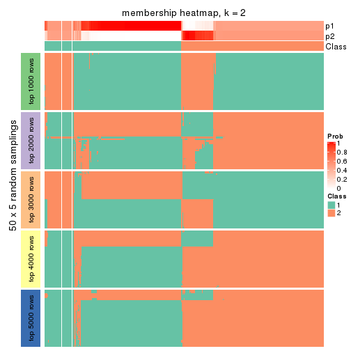</p>

</div>
<div id='tab-CV-kmeans-membership-heatmap-2'>
<pre><code class="r">membership_heatmap(res, k = 3)
</code></pre>

<p></p>

</div>
<div id='tab-CV-kmeans-membership-heatmap-3'>
<pre><code class="r">membership_heatmap(res, k = 4)
</code></pre>

<p></p>

</div>
<div id='tab-CV-kmeans-membership-heatmap-4'>
<pre><code class="r">membership_heatmap(res, k = 5)
</code></pre>

<p></p>

</div>
<div id='tab-CV-kmeans-membership-heatmap-5'>
<pre><code class="r">membership_heatmap(res, k = 6)
</code></pre>

<p></p>

</div>
</div>

As soon as we have had the classes for columns, we can look for signatures
which are significantly different between classes which can be candidate marks
for certain classes. Following are the heatmaps for signatures.


Signature heatmaps where rows are scaled:


<script>
$( function() {
	$( '#tabs-CV-kmeans-get-signatures' ).tabs();
} );
</script>
<div id='tabs-CV-kmeans-get-signatures'>
<ul>
<li><a href='#tab-CV-kmeans-get-signatures-1'>k = 2</a></li>
<li><a href='#tab-CV-kmeans-get-signatures-2'>k = 3</a></li>
<li><a href='#tab-CV-kmeans-get-signatures-3'>k = 4</a></li>
<li><a href='#tab-CV-kmeans-get-signatures-4'>k = 5</a></li>
<li><a href='#tab-CV-kmeans-get-signatures-5'>k = 6</a></li>
</ul>
<div id='tab-CV-kmeans-get-signatures-1'>
<pre><code class="r">get_signatures(res, k = 2)
</code></pre>

<p></p>

</div>
<div id='tab-CV-kmeans-get-signatures-2'>
<pre><code class="r">get_signatures(res, k = 3)
</code></pre>

<p></p>

</div>
<div id='tab-CV-kmeans-get-signatures-3'>
<pre><code class="r">get_signatures(res, k = 4)
</code></pre>

<p></p>

</div>
<div id='tab-CV-kmeans-get-signatures-4'>
<pre><code class="r">get_signatures(res, k = 5)
</code></pre>

<p></p>

</div>
<div id='tab-CV-kmeans-get-signatures-5'>
<pre><code class="r">get_signatures(res, k = 6)
</code></pre>

<p></p>

</div>
</div>


Signature heatmaps where rows are not scaled:


<script>
$( function() {
	$( '#tabs-CV-kmeans-get-signatures-no-scale' ).tabs();
} );
</script>
<div id='tabs-CV-kmeans-get-signatures-no-scale'>
<ul>
<li><a href='#tab-CV-kmeans-get-signatures-no-scale-1'>k = 2</a></li>
<li><a href='#tab-CV-kmeans-get-signatures-no-scale-2'>k = 3</a></li>
<li><a href='#tab-CV-kmeans-get-signatures-no-scale-3'>k = 4</a></li>
<li><a href='#tab-CV-kmeans-get-signatures-no-scale-4'>k = 5</a></li>
<li><a href='#tab-CV-kmeans-get-signatures-no-scale-5'>k = 6</a></li>
</ul>
<div id='tab-CV-kmeans-get-signatures-no-scale-1'>
<pre><code class="r">get_signatures(res, k = 2, scale_rows = FALSE)
</code></pre>

<p></p>

</div>
<div id='tab-CV-kmeans-get-signatures-no-scale-2'>
<pre><code class="r">get_signatures(res, k = 3, scale_rows = FALSE)
</code></pre>

<p></p>

</div>
<div id='tab-CV-kmeans-get-signatures-no-scale-3'>
<pre><code class="r">get_signatures(res, k = 4, scale_rows = FALSE)
</code></pre>

<p></p>

</div>
<div id='tab-CV-kmeans-get-signatures-no-scale-4'>
<pre><code class="r">get_signatures(res, k = 5, scale_rows = FALSE)
</code></pre>

<p></p>

</div>
<div id='tab-CV-kmeans-get-signatures-no-scale-5'>
<pre><code class="r">get_signatures(res, k = 6, scale_rows = FALSE)
</code></pre>

<p></p>

</div>
</div>


Compare the overlap of signatures from different k:

```r
compare_signatures(res)
```


`get_signature()` returns a data frame invisibly. TO get the list of signatures, the function
call should be assigned to a variable explicitly. In following code, if `plot` argument is set
to `FALSE`, no heatmap is plotted while only the differential analysis is performed.

```r
# code only for demonstration
tb = get_signature(res, k = ..., plot = FALSE)
```

An example of the output of `tb` is:

```
#>   which_row         fdr    mean_1    mean_2 scaled_mean_1 scaled_mean_2 km
#> 1        38 0.042760348  8.373488  9.131774    -0.5533452     0.5164555  1
#> 2        40 0.018707592  7.106213  8.469186    -0.6173731     0.5762149  1
#> 3        55 0.019134737 10.221463 11.207825    -0.6159697     0.5749050  1
#> 4        59 0.006059896  5.921854  7.869574    -0.6899429     0.6439467  1
#> 5        60 0.018055526  8.928898 10.211722    -0.6204761     0.5791110  1
#> 6        98 0.009384629 15.714769 14.887706     0.6635654    -0.6193277  2
...
```

The columns in `tb` are:

1. `which_row`: row indices corresponding to the input matrix.
2. `fdr`: FDR for the differential test. 
3. `mean_x`: The mean value in group x.
4. `scaled_mean_x`: The mean value in group x after rows are scaled.
5. `km`: Row groups if k-means clustering is applied to rows.


UMAP plot which shows how samples are separated.


<script>
$( function() {
	$( '#tabs-CV-kmeans-dimension-reduction' ).tabs();
} );
</script>
<div id='tabs-CV-kmeans-dimension-reduction'>
<ul>
<li><a href='#tab-CV-kmeans-dimension-reduction-1'>k = 2</a></li>
<li><a href='#tab-CV-kmeans-dimension-reduction-2'>k = 3</a></li>
<li><a href='#tab-CV-kmeans-dimension-reduction-3'>k = 4</a></li>
<li><a href='#tab-CV-kmeans-dimension-reduction-4'>k = 5</a></li>
<li><a href='#tab-CV-kmeans-dimension-reduction-5'>k = 6</a></li>
</ul>
<div id='tab-CV-kmeans-dimension-reduction-1'>
<pre><code class="r">dimension_reduction(res, k = 2, method = &quot;UMAP&quot;)
</code></pre>

<p></p>

</div>
<div id='tab-CV-kmeans-dimension-reduction-2'>
<pre><code class="r">dimension_reduction(res, k = 3, method = &quot;UMAP&quot;)
</code></pre>

<p></p>

</div>
<div id='tab-CV-kmeans-dimension-reduction-3'>
<pre><code class="r">dimension_reduction(res, k = 4, method = &quot;UMAP&quot;)
</code></pre>

<p></p>

</div>
<div id='tab-CV-kmeans-dimension-reduction-4'>
<pre><code class="r">dimension_reduction(res, k = 5, method = &quot;UMAP&quot;)
</code></pre>

<p></p>

</div>
<div id='tab-CV-kmeans-dimension-reduction-5'>
<pre><code class="r">dimension_reduction(res, k = 6, method = &quot;UMAP&quot;)
</code></pre>

<p></p>

</div>
</div>


Following heatmap shows how subgroups are split when increasing `k`:

```r
collect_classes(res)
```


If matrix rows can be associated to genes, consider to use `GO_Enrichment(res,
...)` to perform function enrichment for the signature genes.


 

---------------------------------------------------


### CV:skmeans


The object with results only for a single top-value method and a single partition method 
can be extracted as:

```r
res = res_list["CV", "skmeans"]
# you can also extract it by
# res = res_list["CV:skmeans"]
```

A summary of `res` and all the functions that can be applied to it:

```r
res
```

```
#> A 'ConsensusPartition' object with k = 2, 3, 4, 5, 6.
#>   On a matrix with 17723 rows and 374 columns.
#>   Top rows (1000, 2000, 3000, 4000, 5000) are extracted by 'CV' method.
#>   Subgroups are detected by 'skmeans' method.
#>   Performed in total 1250 partitions by row resampling.
#>   Best k for subgroups seems to be 3.
#> 
#> Following methods can be applied to this 'ConsensusPartition' object:
#>  [1] "cola_report"             "collect_classes"         "collect_plots"          
#>  [4] "collect_stats"           "colnames"                "compare_signatures"     
#>  [7] "consensus_heatmap"       "dimension_reduction"     "functional_enrichment"  
#> [10] "get_anno_col"            "get_anno"                "get_classes"            
#> [13] "get_consensus"           "get_matrix"              "get_membership"         
#> [16] "get_param"               "get_signatures"          "get_stats"              
#> [19] "is_best_k"               "is_stable_k"             "membership_heatmap"     
#> [22] "ncol"                    "nrow"                    "plot_ecdf"              
#> [25] "rownames"                "select_partition_number" "show"                   
#> [28] "suggest_best_k"          "test_to_known_factors"
```

`collect_plots()` function collects all the plots made from `res` for all `k` (number of partitions)
into one single page to provide an easy and fast comparison between different `k`.

```r
collect_plots(res)
```


The plots are:

- The first row: a plot of the ECDF (Empirical cumulative distribution
  function) curves of the consensus matrix for each `k` and the heatmap of
  predicted classes for each `k`.
- The second row: heatmaps of the consensus matrix for each `k`.
- The third row: heatmaps of the membership matrix for each `k`.
- The fouth row: heatmaps of the signatures for each `k`.

All the plots in panels can be made by individual functions and they are
plotted later in this section.

`select_partition_number()` produces several plots showing different
statistics for choosing "optimized" `k`. There are following statistics:

- ECDF curves of the consensus matrix for each `k`;
- 1-PAC. [The PAC
  score](https://en.wikipedia.org/wiki/Consensus_clustering#Over-interpretation_potential_of_consensus_clustering)
  measures the proportion of the ambiguous subgrouping.
- Mean silhouette score.
- Concordance. The mean probability of fiting the consensus class ids in all
  partitions.
- Area increased. Denote $A_k$ as the area under the ECDF curve for current
  `k`, the area increased is defined as $A_k - A_{k-1}$.
- Rand index. The percent of pairs of samples that are both in a same cluster
  or both are not in a same cluster in the partition of k and k-1.
- Jaccard index. The ratio of pairs of samples are both in a same cluster in
  the partition of k and k-1 and the pairs of samples are both in a same
  cluster in the partition k or k-1.

The detailed explanations of these statistics can be found in [the cola
vignette](http://bioconductor.org/packages/devel/bioc/vignettes/cola/inst/doc/cola.html#toc_13).

Generally speaking, lower PAC score, higher mean silhouette score or higher
concordance corresponds to better partition. Rand index and Jaccard index
measure how similar the current partition is compared to partition with `k-1`.
If they are too similar, we won't accept `k` is better than `k-1`.

```r
select_partition_number(res)
```


The numeric values for all these statistics can be obtained by `get_stats()`.

```r
get_stats(res)
```

```
#>   k 1-PAC mean_silhouette concordance area_increased  Rand Jaccard
#> 2 2 0.499           0.861       0.891         0.4927 0.499   0.499
#> 3 3 0.862           0.894       0.955         0.3292 0.774   0.577
#> 4 4 0.744           0.689       0.823         0.1178 0.881   0.677
#> 5 5 0.764           0.760       0.860         0.0764 0.877   0.594
#> 6 6 0.759           0.716       0.828         0.0369 0.947   0.762
```

`suggest_best_k()` suggests the best $k$ based on these statistics. The rules are as follows:

- All $k$ with Jaccard index larger than 0.95 are removed because the increase of
  the partition number does not provides enough extra information. If all $k$ are removed,
  the best $k$ is assigned by `NA`.
- For $k$ with 1-PAC larger than 0.9, the maximal $k$ is taken as the "best k". Other $k$ is called "optional k".
- If it does not fit the second rule. The $k$ with the highest vote of highest
  1-PAC, mean silhouette and concordance is taken as the "best k".

```r
suggest_best_k(res)
```

```
#> [1] 3
```


Following shows the table of the partitions (You need to click the **show/hide
code output** link to see it). The membership matrix (columns with name `p*`)
is inferred by
[`clue::cl_consensus()`](https://www.rdocumentation.org/link/cl_consensus?package=clue)
function with the `SE` method. Basically the value in the membership matrix
represents the probability to belong to a certain group. The finall class
label for an item is determined with the group with highest probability it
belongs to.

In `get_classes()` function, the entropy is calculated from the membership
matrix and the silhouette score is calculated from the consensus matrix.


<script>
$( function() {
	$( '#tabs-CV-skmeans-get-classes' ).tabs();
} );
</script>
<div id='tabs-CV-skmeans-get-classes'>
<ul>
<li><a href='#tab-CV-skmeans-get-classes-1'>k = 2</a></li>
<li><a href='#tab-CV-skmeans-get-classes-2'>k = 3</a></li>
<li><a href='#tab-CV-skmeans-get-classes-3'>k = 4</a></li>
<li><a href='#tab-CV-skmeans-get-classes-4'>k = 5</a></li>
<li><a href='#tab-CV-skmeans-get-classes-5'>k = 6</a></li>
</ul>

<div id='tab-CV-skmeans-get-classes-1'>
<p><a id='tab-CV-skmeans-get-classes-1-a' style='color:#0366d6' href='#'>show/hide code output</a></p>
<pre><code class="r">cbind(get_classes(res, k = 2), get_membership(res, k = 2))
</code></pre>

<pre><code>#&gt;            class entropy silhouette    p1    p2
#&gt; SRR660824      1  0.0000     0.8970 1.000 0.000
#&gt; SRR603858      1  0.8327     0.7838 0.736 0.264
#&gt; SRR817070      2  0.7219     0.9047 0.200 0.800
#&gt; SRR1486995     1  0.7219     0.8277 0.800 0.200
#&gt; SRR813043      2  0.7219     0.9047 0.200 0.800
#&gt; SRR656874      2  0.0000     0.8272 0.000 1.000
#&gt; SRR659037      1  0.7219     0.8277 0.800 0.200
#&gt; SRR662031      1  0.0000     0.8970 1.000 0.000
#&gt; SRR1081283     2  0.7219     0.9047 0.200 0.800
#&gt; SRR1481036     1  0.0000     0.8970 1.000 0.000
#&gt; SRR1434009     2  0.0000     0.8272 0.000 1.000
#&gt; SRR1376676     1  0.0000     0.8970 1.000 0.000
#&gt; SRR1396967     2  0.0000     0.8272 0.000 1.000
#&gt; SRR665429      2  0.7219     0.9047 0.200 0.800
#&gt; SRR1388025     2  0.7219     0.9047 0.200 0.800
#&gt; SRR600784      1  0.0000     0.8970 1.000 0.000
#&gt; SRR657611      1  0.0000     0.8970 1.000 0.000
#&gt; SRR1333659     2  0.0000     0.8272 0.000 1.000
#&gt; SRR1323896     2  0.7219     0.9047 0.200 0.800
#&gt; SRR1453971     1  0.7219     0.8277 0.800 0.200
#&gt; SRR1421010     1  0.7219     0.8277 0.800 0.200
#&gt; SRR1334490     1  0.7219     0.8277 0.800 0.200
#&gt; SRR1309468     1  0.0000     0.8970 1.000 0.000
#&gt; SRR1468637     1  0.7219     0.8277 0.800 0.200
#&gt; SRR1365489     2  0.7219     0.9047 0.200 0.800
#&gt; SRR627445      1  0.0000     0.8970 1.000 0.000
#&gt; SRR607863      2  0.0000     0.8272 0.000 1.000
#&gt; SRR1475524     1  0.7219     0.8277 0.800 0.200
#&gt; SRR1405504     2  0.7219     0.9047 0.200 0.800
#&gt; SRR615695      1  0.0000     0.8970 1.000 0.000
#&gt; SRR600900      2  0.0000     0.8272 0.000 1.000
#&gt; SRR601477      2  0.7219     0.9047 0.200 0.800
#&gt; SRR1487215     2  0.7219     0.9047 0.200 0.800
#&gt; SRR1310797     2  0.0938     0.8323 0.012 0.988
#&gt; SRR1362713     1  0.2778     0.8540 0.952 0.048
#&gt; SRR1431385     1  0.0000     0.8970 1.000 0.000
#&gt; SRR1379089     2  0.7219     0.9047 0.200 0.800
#&gt; SRR1102079     1  0.7219     0.8277 0.800 0.200
#&gt; SRR1357210     1  0.0000     0.8970 1.000 0.000
#&gt; SRR657659      2  0.7219     0.9047 0.200 0.800
#&gt; SRR663573      2  0.7219     0.9047 0.200 0.800
#&gt; SRR603188      2  0.0000     0.8272 0.000 1.000
#&gt; SRR1471200     2  0.7219     0.9047 0.200 0.800
#&gt; SRR1310975     2  0.7219     0.9047 0.200 0.800
#&gt; SRR627457      1  0.4939     0.7834 0.892 0.108
#&gt; SRR1367654     2  0.0000     0.8272 0.000 1.000
#&gt; SRR1488410     1  0.7219     0.8277 0.800 0.200
#&gt; SRR1457750     1  0.7219     0.6295 0.800 0.200
#&gt; SRR1099546     1  0.0000     0.8970 1.000 0.000
#&gt; SRR604480      2  0.7219     0.9047 0.200 0.800
#&gt; SRR1390477     2  0.7219     0.9047 0.200 0.800
#&gt; SRR1458447     2  0.7219     0.9047 0.200 0.800
#&gt; SRR1473161     2  0.7219     0.9047 0.200 0.800
#&gt; SRR1409813     2  0.0000     0.8272 0.000 1.000
#&gt; SRR612791      1  0.0000     0.8970 1.000 0.000
#&gt; SRR1470580     1  0.9815    -0.0707 0.580 0.420
#&gt; SRR1444063     1  0.5059     0.7767 0.888 0.112
#&gt; SRR1355578     1  0.0000     0.8970 1.000 0.000
#&gt; SRR1429203     1  0.0000     0.8970 1.000 0.000
#&gt; SRR599154      2  0.2236     0.8039 0.036 0.964
#&gt; SRR814244      1  0.7219     0.8277 0.800 0.200
#&gt; SRR1404123     2  0.7219     0.9047 0.200 0.800
#&gt; SRR656934      1  0.0000     0.8970 1.000 0.000
#&gt; SRR1339029     2  0.7219     0.9047 0.200 0.800
#&gt; SRR821525      2  0.7219     0.9047 0.200 0.800
#&gt; SRR1443677     1  0.0000     0.8970 1.000 0.000
#&gt; SRR1406330     1  0.7219     0.8277 0.800 0.200
#&gt; SRR1338124     1  0.1633     0.8775 0.976 0.024
#&gt; SRR1391376     1  0.0000     0.8970 1.000 0.000
#&gt; SRR661842      2  0.7219     0.9047 0.200 0.800
#&gt; SRR1395699     1  0.7219     0.8277 0.800 0.200
#&gt; SRR1312209     1  0.0000     0.8970 1.000 0.000
#&gt; SRR1359469     1  0.0000     0.8970 1.000 0.000
#&gt; SRR658885      1  0.7219     0.8277 0.800 0.200
#&gt; SRR1414578     1  0.0000     0.8970 1.000 0.000
#&gt; SRR603620      2  0.0000     0.8272 0.000 1.000
#&gt; SRR604677      1  0.7219     0.8277 0.800 0.200
#&gt; SRR603800      2  0.7219     0.9047 0.200 0.800
#&gt; SRR602058      2  0.0000     0.8272 0.000 1.000
#&gt; SRR817488      2  0.7219     0.9047 0.200 0.800
#&gt; SRR655601      2  0.7219     0.9047 0.200 0.800
#&gt; SRR1434821     2  0.7219     0.9047 0.200 0.800
#&gt; SRR1349166     2  0.0000     0.8272 0.000 1.000
#&gt; SRR615129      2  0.7376     0.8975 0.208 0.792
#&gt; SRR607586      2  0.7219     0.9047 0.200 0.800
#&gt; SRR602680      2  0.0000     0.8272 0.000 1.000
#&gt; SRR1411070     2  0.7219     0.9047 0.200 0.800
#&gt; SRR663038      2  0.7219     0.9047 0.200 0.800
#&gt; SRR1489416     2  0.7219     0.9047 0.200 0.800
#&gt; SRR1479155     1  0.0000     0.8970 1.000 0.000
#&gt; SRR662162      1  0.0000     0.8970 1.000 0.000
#&gt; SRR1374567     1  0.0000     0.8970 1.000 0.000
#&gt; SRR1434048     2  0.7219     0.9047 0.200 0.800
#&gt; SRR2184865     2  0.7219     0.9047 0.200 0.800
#&gt; SRR2170135     1  0.0000     0.8970 1.000 0.000
#&gt; SRR615551      2  0.7219     0.9047 0.200 0.800
#&gt; SRR1335513     2  0.7219     0.9047 0.200 0.800
#&gt; SRR1370216     1  0.7219     0.8277 0.800 0.200
#&gt; SRR662954      2  0.2236     0.8039 0.036 0.964
#&gt; SRR1375738     1  0.0000     0.8970 1.000 0.000
#&gt; SRR1356577     1  0.0000     0.8970 1.000 0.000
#&gt; SRR1073119     1  0.0000     0.8970 1.000 0.000
#&gt; SRR663549      1  0.0000     0.8970 1.000 0.000
#&gt; SRR1478015     2  0.7219     0.9047 0.200 0.800
#&gt; SRR600632      2  0.7219     0.9047 0.200 0.800
#&gt; SRR811866      1  0.0000     0.8970 1.000 0.000
#&gt; SRR1401101     2  0.0000     0.8272 0.000 1.000
#&gt; SRR1477797     2  0.0000     0.8272 0.000 1.000
#&gt; SRR1402986     2  0.7219     0.9047 0.200 0.800
#&gt; SRR658897      1  0.0000     0.8970 1.000 0.000
#&gt; SRR1419869     1  0.0000     0.8970 1.000 0.000
#&gt; SRR1490700     1  0.0000     0.8970 1.000 0.000
#&gt; SRR601723      1  0.9460     0.1718 0.636 0.364
#&gt; SRR1384115     2  0.4161     0.7595 0.084 0.916
#&gt; SRR1476927     2  0.7219     0.9047 0.200 0.800
#&gt; SRR1387769     1  0.0000     0.8970 1.000 0.000
#&gt; SRR1322595     1  0.7219     0.8277 0.800 0.200
#&gt; SRR1370423     1  0.0000     0.8970 1.000 0.000
#&gt; SRR1314976     1  0.0000     0.8970 1.000 0.000
#&gt; SRR1319560     2  0.0000     0.8272 0.000 1.000
#&gt; SRR1352683     1  0.0000     0.8970 1.000 0.000
#&gt; SRR1473800     1  0.0000     0.8970 1.000 0.000
#&gt; SRR1326384     1  0.7219     0.8277 0.800 0.200
#&gt; SRR1360807     2  0.7219     0.9047 0.200 0.800
#&gt; SRR1332544     1  0.7219     0.8277 0.800 0.200
#&gt; SRR598695      1  0.0000     0.8970 1.000 0.000
#&gt; SRR807824      2  0.7219     0.9047 0.200 0.800
#&gt; SRR809296      1  0.7219     0.8277 0.800 0.200
#&gt; SRR657927      1  0.0000     0.8970 1.000 0.000
#&gt; SRR1440682     2  0.7219     0.9047 0.200 0.800
#&gt; SRR1454415     2  0.0000     0.8272 0.000 1.000
#&gt; SRR1419131     2  0.7219     0.9047 0.200 0.800
#&gt; SRR1404293     1  0.0000     0.8970 1.000 0.000
#&gt; SRR1473340     1  0.0000     0.8970 1.000 0.000
#&gt; SRR1345563     1  0.7219     0.8277 0.800 0.200
#&gt; SRR1323382     2  0.7219     0.9047 0.200 0.800
#&gt; SRR1480697     1  0.7219     0.8277 0.800 0.200
#&gt; SRR1321808     2  0.7219     0.9047 0.200 0.800
#&gt; SRR1382756     2  0.7219     0.9047 0.200 0.800
#&gt; SRR1312558     2  0.7219     0.9047 0.200 0.800
#&gt; SRR1417088     2  0.7219     0.9047 0.200 0.800
#&gt; SRR1433027     2  0.7219     0.9047 0.200 0.800
#&gt; SRR662257      2  0.0000     0.8272 0.000 1.000
#&gt; SRR600417      2  0.7219     0.9047 0.200 0.800
#&gt; SRR812493      2  0.4022     0.7638 0.080 0.920
#&gt; SRR612743      1  0.0000     0.8970 1.000 0.000
#&gt; SRR1361345     1  0.0000     0.8970 1.000 0.000
#&gt; SRR600584      2  0.7219     0.9047 0.200 0.800
#&gt; SRR1310520     2  0.7219     0.9047 0.200 0.800
#&gt; SRR1395595     1  0.7219     0.8277 0.800 0.200
#&gt; SRR1334074     2  0.7453     0.5641 0.212 0.788
#&gt; SRR654838      2  0.7219     0.9047 0.200 0.800
#&gt; SRR1376694     1  0.7219     0.8277 0.800 0.200
#&gt; SRR1433841     2  0.9954     0.4736 0.460 0.540
#&gt; SRR1366837     1  0.0000     0.8970 1.000 0.000
#&gt; SRR1467479     2  0.7219     0.9047 0.200 0.800
#&gt; SRR1459055     1  0.7219     0.8277 0.800 0.200
#&gt; SRR1471050     2  0.7219     0.9047 0.200 0.800
#&gt; SRR603004      2  0.0000     0.8272 0.000 1.000
#&gt; SRR814703      2  0.0000     0.8272 0.000 1.000
#&gt; SRR661937      2  0.7219     0.9047 0.200 0.800
#&gt; SRR614359      1  0.0000     0.8970 1.000 0.000
#&gt; SRR1071568     2  0.7219     0.9047 0.200 0.800
#&gt; SRR1389084     1  0.0000     0.8970 1.000 0.000
#&gt; SRR1337624     2  0.7219     0.9047 0.200 0.800
#&gt; SRR1344400     2  0.7219     0.9047 0.200 0.800
#&gt; SRR1414290     2  0.7219     0.9047 0.200 0.800
#&gt; SRR1413644     2  0.0000     0.8272 0.000 1.000
#&gt; SRR1098998     1  0.0000     0.8970 1.000 0.000
#&gt; SRR1481279     1  0.0000     0.8970 1.000 0.000
#&gt; SRR1315103     1  0.7219     0.8277 0.800 0.200
#&gt; SRR1099286     1  0.7219     0.8277 0.800 0.200
#&gt; SRR2166570     1  0.0000     0.8970 1.000 0.000
#&gt; SRR601445      1  0.0000     0.8970 1.000 0.000
#&gt; SRR1439719     2  0.7219     0.9047 0.200 0.800
#&gt; SRR1377026     2  0.0000     0.8272 0.000 1.000
#&gt; SRR1327386     1  0.0000     0.8970 1.000 0.000
#&gt; SRR654826      2  0.7219     0.9047 0.200 0.800
#&gt; SRR1460433     2  0.0000     0.8272 0.000 1.000
#&gt; SRR1469345     1  0.7219     0.8277 0.800 0.200
#&gt; SRR1421462     2  0.7219     0.9047 0.200 0.800
#&gt; SRR662966      1  0.7219     0.8277 0.800 0.200
#&gt; SRR1339175     1  0.0000     0.8970 1.000 0.000
#&gt; SRR1447736     2  0.7219     0.9047 0.200 0.800
#&gt; SRR1434671     2  0.0000     0.8272 0.000 1.000
#&gt; SRR660800      2  0.7219     0.9047 0.200 0.800
#&gt; SRR1465543     2  0.2236     0.8039 0.036 0.964
#&gt; SRR1342023     1  0.0000     0.8970 1.000 0.000
#&gt; SRR1335670     1  0.0000     0.8970 1.000 0.000
#&gt; SRR1400955     2  0.0000     0.8272 0.000 1.000
#&gt; SRR1072150     2  0.7219     0.9047 0.200 0.800
#&gt; SRR1442822     1  0.0000     0.8970 1.000 0.000
#&gt; SRR1364658     1  0.0000     0.8970 1.000 0.000
#&gt; SRR1098074     2  0.2236     0.8039 0.036 0.964
#&gt; SRR1442778     1  0.7219     0.8277 0.800 0.200
#&gt; SRR1086728     1  0.7219     0.8277 0.800 0.200
#&gt; SRR627464      1  0.6712     0.6757 0.824 0.176
#&gt; SRR1409193     1  0.0000     0.8970 1.000 0.000
#&gt; SRR2168286     2  0.7219     0.9047 0.200 0.800
#&gt; SRR615539      2  0.7219     0.9047 0.200 0.800
#&gt; SRR663623      1  0.7219     0.8277 0.800 0.200
#&gt; SRR1471989     1  0.7219     0.8277 0.800 0.200
#&gt; SRR1468828     2  0.7219     0.9047 0.200 0.800
#&gt; SRR1381934     1  0.1184     0.8921 0.984 0.016
#&gt; SRR1471098     1  0.0000     0.8970 1.000 0.000
#&gt; SRR1314749     1  0.0000     0.8970 1.000 0.000
#&gt; SRR2166874     2  0.2043     0.8068 0.032 0.968
#&gt; SRR821302      1  0.0000     0.8970 1.000 0.000
#&gt; SRR1435066     2  0.0000     0.8272 0.000 1.000
#&gt; SRR661601      2  0.0000     0.8272 0.000 1.000
#&gt; SRR1446546     2  0.7219     0.9047 0.200 0.800
#&gt; SRR1419784     1  0.7219     0.8277 0.800 0.200
#&gt; SRR1357233     2  0.2236     0.8039 0.036 0.964
#&gt; SRR1441889     1  0.0000     0.8970 1.000 0.000
#&gt; SRR1413940     1  0.7219     0.8277 0.800 0.200
#&gt; SRR1324250     2  0.7219     0.9047 0.200 0.800
#&gt; SRR1442862     2  0.0000     0.8272 0.000 1.000
#&gt; SRR662474      2  0.7219     0.9047 0.200 0.800
#&gt; SRR1416226     1  0.0000     0.8970 1.000 0.000
#&gt; SRR1417404     1  0.7219     0.8277 0.800 0.200
#&gt; SRR665466      2  0.7219     0.9047 0.200 0.800
#&gt; SRR658849      1  0.0000     0.8970 1.000 0.000
#&gt; SRR1460025     2  0.7219     0.9047 0.200 0.800
#&gt; SRR1408136     1  0.0000     0.8970 1.000 0.000
#&gt; SRR1489995     2  0.7219     0.9047 0.200 0.800
#&gt; SRR1374092     1  0.0000     0.8970 1.000 0.000
#&gt; SRR1488429     1  0.7219     0.8277 0.800 0.200
#&gt; SRR1087559     1  0.2423     0.8616 0.960 0.040
#&gt; SRR817004      1  0.7219     0.8277 0.800 0.200
#&gt; SRR1429660     2  0.0000     0.8272 0.000 1.000
#&gt; SRR604390      1  0.7219     0.8277 0.800 0.200
#&gt; SRR614936      2  0.7219     0.9047 0.200 0.800
#&gt; SRR1365938     2  0.7219     0.9047 0.200 0.800
#&gt; SRR1437324     1  0.0000     0.8970 1.000 0.000
#&gt; SRR613414      2  0.0000     0.8272 0.000 1.000
#&gt; SRR660414      1  0.0000     0.8970 1.000 0.000
#&gt; SRR1452185     1  0.0000     0.8970 1.000 0.000
#&gt; SRR1347020     1  0.0000     0.8970 1.000 0.000
#&gt; SRR1398036     2  0.0000     0.8272 0.000 1.000
#&gt; SRR1436674     1  0.0000     0.8970 1.000 0.000
#&gt; SRR603750      1  0.2236     0.8653 0.964 0.036
#&gt; SRR608630      2  0.6438     0.6516 0.164 0.836
#&gt; SRR655625      2  0.7219     0.9047 0.200 0.800
#&gt; SRR599059      1  0.2603     0.8593 0.956 0.044
#&gt; SRR615189      2  0.7219     0.9047 0.200 0.800
#&gt; SRR1466889     2  0.0000     0.8272 0.000 1.000
#&gt; SRR1084602     2  0.7219     0.9047 0.200 0.800
#&gt; SRR1335422     1  0.0000     0.8970 1.000 0.000
#&gt; SRR1356805     2  0.0000     0.8272 0.000 1.000
#&gt; SRR1385300     1  0.7219     0.8277 0.800 0.200
#&gt; SRR654814      1  0.0000     0.8970 1.000 0.000
#&gt; SRR658385      2  0.0000     0.8272 0.000 1.000
#&gt; SRR820596      1  0.0000     0.8970 1.000 0.000
#&gt; SRR1318118     1  0.7219     0.8277 0.800 0.200
#&gt; SRR1480766     2  0.7219     0.9047 0.200 0.800
#&gt; SRR1406539     1  0.0000     0.8970 1.000 0.000
#&gt; SRR1341833     2  0.0000     0.8272 0.000 1.000
#&gt; SRR1441826     2  0.7219     0.9047 0.200 0.800
#&gt; SRR1448051     1  0.0000     0.8970 1.000 0.000
#&gt; SRR1326752     1  0.7219     0.8277 0.800 0.200
#&gt; SRR665217      1  0.7219     0.8277 0.800 0.200
#&gt; SRR819186      2  0.7219     0.9047 0.200 0.800
#&gt; SRR661517      1  0.7219     0.8277 0.800 0.200
#&gt; SRR607166      2  0.7219     0.9047 0.200 0.800
#&gt; SRR809065      2  0.7219     0.9047 0.200 0.800
#&gt; SRR1415872     2  0.0000     0.8272 0.000 1.000
#&gt; SRR1415463     1  0.0000     0.8970 1.000 0.000
#&gt; SRR1381161     2  0.0000     0.8272 0.000 1.000
#&gt; SRR1442231     2  0.7219     0.9047 0.200 0.800
#&gt; SRR1374696     1  0.0000     0.8970 1.000 0.000
#&gt; SRR1451988     1  0.0376     0.8938 0.996 0.004
#&gt; SRR660555      1  0.0000     0.8970 1.000 0.000
#&gt; SRR657801      1  0.0000     0.8970 1.000 0.000
#&gt; SRR663344      2  0.0000     0.8272 0.000 1.000
#&gt; SRR1472462     2  0.7219     0.9047 0.200 0.800
#&gt; SRR1406176     1  0.1843     0.8729 0.972 0.028
#&gt; SRR656886      2  0.7219     0.9047 0.200 0.800
#&gt; SRR1498337     2  0.0000     0.8272 0.000 1.000
#&gt; SRR613066      1  0.7219     0.8277 0.800 0.200
#&gt; SRR1309490     1  0.0000     0.8970 1.000 0.000
#&gt; SRR602492      2  0.0000     0.8272 0.000 1.000
#&gt; SRR1447347     1  0.0000     0.8970 1.000 0.000
#&gt; SRR1475546     2  0.7219     0.9047 0.200 0.800
#&gt; SRR627459      1  0.3274     0.8420 0.940 0.060
#&gt; SRR1434332     2  0.7219     0.9047 0.200 0.800
#&gt; SRR1070358     2  0.0000     0.8272 0.000 1.000
#&gt; SRR1345936     2  0.6887     0.6173 0.184 0.816
#&gt; SRR665658      2  0.7219     0.9047 0.200 0.800
#&gt; SRR1321351     2  0.7219     0.9047 0.200 0.800
#&gt; SRR657880      2  0.0000     0.8272 0.000 1.000
#&gt; SRR1373903     2  0.7219     0.9047 0.200 0.800
#&gt; SRR657396      2  0.0000     0.8272 0.000 1.000
#&gt; SRR660981      2  0.7219     0.9047 0.200 0.800
#&gt; SRR818499      1  0.0000     0.8970 1.000 0.000
#&gt; SRR819658      2  0.0000     0.8272 0.000 1.000
#&gt; SRR1376316     1  0.7219     0.8277 0.800 0.200
#&gt; SRR1323723     2  0.7219     0.9047 0.200 0.800
#&gt; SRR1476719     1  0.0000     0.8970 1.000 0.000
#&gt; SRR1403478     2  0.0000     0.8272 0.000 1.000
#&gt; SRR1095695     1  0.0000     0.8970 1.000 0.000
#&gt; SRR1352391     1  0.7219     0.8277 0.800 0.200
#&gt; SRR1498813     2  0.7219     0.9047 0.200 0.800
#&gt; SRR627437      1  0.0000     0.8970 1.000 0.000
#&gt; SRR2185097     1  0.0000     0.8970 1.000 0.000
#&gt; SRR817166      1  0.7219     0.8277 0.800 0.200
#&gt; SRR1091670     2  0.7219     0.9047 0.200 0.800
#&gt; SRR603776      1  0.7219     0.8277 0.800 0.200
#&gt; SRR1479640     2  0.7219     0.9047 0.200 0.800
#&gt; SRR660152      1  0.7219     0.8277 0.800 0.200
#&gt; SRR1074769     2  0.7219     0.9047 0.200 0.800
#&gt; SRR656153      2  0.7219     0.9047 0.200 0.800
#&gt; SRR1392502     1  0.7219     0.8277 0.800 0.200
#&gt; SRR1359609     1  0.7219     0.8277 0.800 0.200
#&gt; SRR601925      2  0.7219     0.9047 0.200 0.800
#&gt; SRR2165182     2  0.0000     0.8272 0.000 1.000
#&gt; SRR608542      2  0.0000     0.8272 0.000 1.000
#&gt; SRR655064      2  0.7219     0.9047 0.200 0.800
#&gt; SRR1432430     1  0.0000     0.8970 1.000 0.000
#&gt; SRR808472      2  0.7219     0.9047 0.200 0.800
#&gt; SRR1414958     1  0.7219     0.8277 0.800 0.200
#&gt; SRR598484      2  0.7219     0.9047 0.200 0.800
#&gt; SRR612755      1  0.0000     0.8970 1.000 0.000
#&gt; SRR1365808     1  0.0000     0.8970 1.000 0.000
#&gt; SRR1391724     1  0.0000     0.8970 1.000 0.000
#&gt; SRR1322373     1  0.0000     0.8970 1.000 0.000
#&gt; SRR1489265     2  0.7219     0.9047 0.200 0.800
#&gt; SRR1359099     2  0.0000     0.8272 0.000 1.000
#&gt; SRR607279      2  0.7219     0.9047 0.200 0.800
#&gt; SRR810461      2  0.7219     0.9047 0.200 0.800
#&gt; SRR627427      1  0.0000     0.8970 1.000 0.000
#&gt; SRR612887      2  0.0000     0.8272 0.000 1.000
#&gt; SRR809807      1  0.7376     0.8230 0.792 0.208
#&gt; SRR663112      2  0.7453     0.8942 0.212 0.788
#&gt; SRR1346933     2  0.5629     0.6999 0.132 0.868
#&gt; SRR1487910     1  0.0000     0.8970 1.000 0.000
#&gt; SRR603092      2  0.7219     0.9047 0.200 0.800
#&gt; SRR1417680     2  0.7219     0.9047 0.200 0.800
#&gt; SRR1383785     1  0.0000     0.8970 1.000 0.000
#&gt; SRR1070015     2  0.2236     0.8039 0.036 0.964
#&gt; SRR1466222     1  0.9710     0.0193 0.600 0.400
#&gt; SRR1416119     1  0.7219     0.8277 0.800 0.200
#&gt; SRR819318      1  0.7219     0.8277 0.800 0.200
#&gt; SRR608288      2  0.7219     0.9047 0.200 0.800
#&gt; SRR811121      2  0.0000     0.8272 0.000 1.000
#&gt; SRR613138      2  0.7219     0.9047 0.200 0.800
#&gt; SRR810483      1  0.0000     0.8970 1.000 0.000
#&gt; SRR607839      1  0.0000     0.8970 1.000 0.000
#&gt; SRR1337031     1  0.7219     0.8277 0.800 0.200
#&gt; SRR601311      2  0.0000     0.8272 0.000 1.000
#&gt; SRR1406685     2  0.7219     0.9047 0.200 0.800
#&gt; SRR1467500     2  0.7219     0.9047 0.200 0.800
#&gt; SRR1308504     1  0.0000     0.8970 1.000 0.000
#&gt; SRR1312865     1  0.7219     0.8277 0.800 0.200
#&gt; SRR1312522     1  0.7219     0.8277 0.800 0.200
#&gt; SRR1490486     2  0.7219     0.9047 0.200 0.800
#&gt; SRR1325888     1  0.0000     0.8970 1.000 0.000
#&gt; SRR1472885     1  0.0000     0.8970 1.000 0.000
#&gt; SRR1098785     2  0.7219     0.9047 0.200 0.800
#&gt; SRR1084766     2  0.7219     0.9047 0.200 0.800
#&gt; SRR1102804     2  0.7219     0.9047 0.200 0.800
#&gt; SRR1336636     1  0.0000     0.8970 1.000 0.000
#&gt; SRR1347795     1  0.7219     0.8277 0.800 0.200
#&gt; SRR601900      2  0.0000     0.8272 0.000 1.000
#&gt; SRR1330989     2  0.7219     0.9047 0.200 0.800
#&gt; SRR658445      2  0.2236     0.8039 0.036 0.964
#&gt; SRR1368754     1  0.7219     0.8277 0.800 0.200
#&gt; SRR1460001     2  0.7219     0.9047 0.200 0.800
#&gt; SRR1414934     1  0.0000     0.8970 1.000 0.000
#&gt; SRR1326249     1  0.7219     0.8277 0.800 0.200
#&gt; SRR614948      1  0.7219     0.8277 0.800 0.200
#&gt; SRR1472952     1  0.7056     0.8305 0.808 0.192
#&gt; SRR1321528     1  0.0000     0.8970 1.000 0.000
#&gt; SRR627447      1  0.0000     0.8970 1.000 0.000
#&gt; SRR612239      1  0.4431     0.8049 0.908 0.092
</code></pre>

<script>
$('#tab-CV-skmeans-get-classes-1-a').parent().next().next().hide();
$('#tab-CV-skmeans-get-classes-1-a').click(function(){
  $('#tab-CV-skmeans-get-classes-1-a').parent().next().next().toggle();
  return(false);
});
</script>
</div>

<div id='tab-CV-skmeans-get-classes-2'>
<p><a id='tab-CV-skmeans-get-classes-2-a' style='color:#0366d6' href='#'>show/hide code output</a></p>
<pre><code class="r">cbind(get_classes(res, k = 3), get_membership(res, k = 3))
</code></pre>

<pre><code>#&gt;            class entropy silhouette    p1    p2    p3
#&gt; SRR660824      1  0.0000      0.954 1.000 0.000 0.000
#&gt; SRR603858      1  0.6286      0.139 0.536 0.000 0.464
#&gt; SRR817070      2  0.0000      0.966 0.000 1.000 0.000
#&gt; SRR1486995     1  0.6095      0.422 0.608 0.000 0.392
#&gt; SRR813043      2  0.0000      0.966 0.000 1.000 0.000
#&gt; SRR656874      2  0.0000      0.966 0.000 1.000 0.000
#&gt; SRR659037      3  0.0000      0.919 0.000 0.000 1.000
#&gt; SRR662031      1  0.0000      0.954 1.000 0.000 0.000
#&gt; SRR1081283     2  0.0000      0.966 0.000 1.000 0.000
#&gt; SRR1481036     1  0.0000      0.954 1.000 0.000 0.000
#&gt; SRR1434009     3  0.0000      0.919 0.000 0.000 1.000
#&gt; SRR1376676     1  0.0000      0.954 1.000 0.000 0.000
#&gt; SRR1396967     3  0.0000      0.919 0.000 0.000 1.000
#&gt; SRR665429      2  0.0000      0.966 0.000 1.000 0.000
#&gt; SRR1388025     2  0.0000      0.966 0.000 1.000 0.000
#&gt; SRR600784      1  0.0000      0.954 1.000 0.000 0.000
#&gt; SRR657611      1  0.0000      0.954 1.000 0.000 0.000
#&gt; SRR1333659     3  0.0000      0.919 0.000 0.000 1.000
#&gt; SRR1323896     2  0.0000      0.966 0.000 1.000 0.000
#&gt; SRR1453971     1  0.2261      0.895 0.932 0.000 0.068
#&gt; SRR1421010     1  0.0000      0.954 1.000 0.000 0.000
#&gt; SRR1334490     3  0.0000      0.919 0.000 0.000 1.000
#&gt; SRR1309468     1  0.0000      0.954 1.000 0.000 0.000
#&gt; SRR1468637     3  0.0000      0.919 0.000 0.000 1.000
#&gt; SRR1365489     2  0.0000      0.966 0.000 1.000 0.000
#&gt; SRR627445      1  0.0000      0.954 1.000 0.000 0.000
#&gt; SRR607863      2  0.5529      0.521 0.000 0.704 0.296
#&gt; SRR1475524     3  0.0000      0.919 0.000 0.000 1.000
#&gt; SRR1405504     2  0.0000      0.966 0.000 1.000 0.000
#&gt; SRR615695      1  0.0000      0.954 1.000 0.000 0.000
#&gt; SRR600900      3  0.0000      0.919 0.000 0.000 1.000
#&gt; SRR601477      2  0.0000      0.966 0.000 1.000 0.000
#&gt; SRR1487215     2  0.0000      0.966 0.000 1.000 0.000
#&gt; SRR1310797     2  0.0000      0.966 0.000 1.000 0.000
#&gt; SRR1362713     1  0.1643      0.916 0.956 0.044 0.000
#&gt; SRR1431385     1  0.0000      0.954 1.000 0.000 0.000
#&gt; SRR1379089     2  0.0000      0.966 0.000 1.000 0.000
#&gt; SRR1102079     3  0.0000      0.919 0.000 0.000 1.000
#&gt; SRR1357210     1  0.0000      0.954 1.000 0.000 0.000
#&gt; SRR657659      2  0.0000      0.966 0.000 1.000 0.000
#&gt; SRR663573      2  0.0000      0.966 0.000 1.000 0.000
#&gt; SRR603188      3  0.4555      0.762 0.000 0.200 0.800
#&gt; SRR1471200     2  0.0000      0.966 0.000 1.000 0.000
#&gt; SRR1310975     2  0.0000      0.966 0.000 1.000 0.000
#&gt; SRR627457      1  0.3038      0.853 0.896 0.104 0.000
#&gt; SRR1367654     3  0.0000      0.919 0.000 0.000 1.000
#&gt; SRR1488410     3  0.0000      0.919 0.000 0.000 1.000
#&gt; SRR1457750     1  0.5529      0.590 0.704 0.296 0.000
#&gt; SRR1099546     1  0.0000      0.954 1.000 0.000 0.000
#&gt; SRR604480      2  0.0000      0.966 0.000 1.000 0.000
#&gt; SRR1390477     2  0.0000      0.966 0.000 1.000 0.000
#&gt; SRR1458447     2  0.0000      0.966 0.000 1.000 0.000
#&gt; SRR1473161     2  0.0000      0.966 0.000 1.000 0.000
#&gt; SRR1409813     3  0.0000      0.919 0.000 0.000 1.000
#&gt; SRR612791      1  0.0000      0.954 1.000 0.000 0.000
#&gt; SRR1470580     2  0.5560      0.556 0.300 0.700 0.000
#&gt; SRR1444063     1  0.5497      0.597 0.708 0.292 0.000
#&gt; SRR1355578     1  0.0000      0.954 1.000 0.000 0.000
#&gt; SRR1429203     1  0.0000      0.954 1.000 0.000 0.000
#&gt; SRR599154      3  0.0000      0.919 0.000 0.000 1.000
#&gt; SRR814244      3  0.0000      0.919 0.000 0.000 1.000
#&gt; SRR1404123     2  0.0000      0.966 0.000 1.000 0.000
#&gt; SRR656934      1  0.0000      0.954 1.000 0.000 0.000
#&gt; SRR1339029     2  0.0000      0.966 0.000 1.000 0.000
#&gt; SRR821525      2  0.0000      0.966 0.000 1.000 0.000
#&gt; SRR1443677     1  0.0000      0.954 1.000 0.000 0.000
#&gt; SRR1406330     3  0.0424      0.913 0.008 0.000 0.992
#&gt; SRR1338124     1  0.5678      0.572 0.684 0.000 0.316
#&gt; SRR1391376     1  0.0000      0.954 1.000 0.000 0.000
#&gt; SRR661842      2  0.0000      0.966 0.000 1.000 0.000
#&gt; SRR1395699     1  0.4452      0.761 0.808 0.000 0.192
#&gt; SRR1312209     1  0.0000      0.954 1.000 0.000 0.000
#&gt; SRR1359469     1  0.0000      0.954 1.000 0.000 0.000
#&gt; SRR658885      3  0.0000      0.919 0.000 0.000 1.000
#&gt; SRR1414578     1  0.0000      0.954 1.000 0.000 0.000
#&gt; SRR603620      3  0.4399      0.774 0.000 0.188 0.812
#&gt; SRR604677      1  0.0000      0.954 1.000 0.000 0.000
#&gt; SRR603800      2  0.0000      0.966 0.000 1.000 0.000
#&gt; SRR602058      3  0.4555      0.762 0.000 0.200 0.800
#&gt; SRR817488      2  0.0000      0.966 0.000 1.000 0.000
#&gt; SRR655601      2  0.0000      0.966 0.000 1.000 0.000
#&gt; SRR1434821     2  0.0000      0.966 0.000 1.000 0.000
#&gt; SRR1349166     3  0.0747      0.910 0.000 0.016 0.984
#&gt; SRR615129      2  0.5650      0.531 0.312 0.688 0.000
#&gt; SRR607586      2  0.0000      0.966 0.000 1.000 0.000
#&gt; SRR602680      2  0.0000      0.966 0.000 1.000 0.000
#&gt; SRR1411070     2  0.0000      0.966 0.000 1.000 0.000
#&gt; SRR663038      2  0.0000      0.966 0.000 1.000 0.000
#&gt; SRR1489416     2  0.0000      0.966 0.000 1.000 0.000
#&gt; SRR1479155     1  0.0000      0.954 1.000 0.000 0.000
#&gt; SRR662162      1  0.0000      0.954 1.000 0.000 0.000
#&gt; SRR1374567     1  0.0000      0.954 1.000 0.000 0.000
#&gt; SRR1434048     2  0.0000      0.966 0.000 1.000 0.000
#&gt; SRR2184865     2  0.0000      0.966 0.000 1.000 0.000
#&gt; SRR2170135     1  0.0000      0.954 1.000 0.000 0.000
#&gt; SRR615551      2  0.0000      0.966 0.000 1.000 0.000
#&gt; SRR1335513     2  0.0000      0.966 0.000 1.000 0.000
#&gt; SRR1370216     1  0.6095      0.422 0.608 0.000 0.392
#&gt; SRR662954      3  0.0000      0.919 0.000 0.000 1.000
#&gt; SRR1375738     1  0.0000      0.954 1.000 0.000 0.000
#&gt; SRR1356577     1  0.0000      0.954 1.000 0.000 0.000
#&gt; SRR1073119     1  0.0000      0.954 1.000 0.000 0.000
#&gt; SRR663549      1  0.0000      0.954 1.000 0.000 0.000
#&gt; SRR1478015     2  0.0000      0.966 0.000 1.000 0.000
#&gt; SRR600632      2  0.0000      0.966 0.000 1.000 0.000
#&gt; SRR811866      1  0.0000      0.954 1.000 0.000 0.000
#&gt; SRR1401101     3  0.6140      0.418 0.000 0.404 0.596
#&gt; SRR1477797     3  0.0000      0.919 0.000 0.000 1.000
#&gt; SRR1402986     2  0.0000      0.966 0.000 1.000 0.000
#&gt; SRR658897      1  0.0000      0.954 1.000 0.000 0.000
#&gt; SRR1419869     1  0.0000      0.954 1.000 0.000 0.000
#&gt; SRR1490700     1  0.0000      0.954 1.000 0.000 0.000
#&gt; SRR601723      2  0.6286      0.104 0.464 0.536 0.000
#&gt; SRR1384115     3  0.0000      0.919 0.000 0.000 1.000
#&gt; SRR1476927     2  0.0000      0.966 0.000 1.000 0.000
#&gt; SRR1387769     1  0.0000      0.954 1.000 0.000 0.000
#&gt; SRR1322595     3  0.0000      0.919 0.000 0.000 1.000
#&gt; SRR1370423     1  0.4399      0.766 0.812 0.000 0.188
#&gt; SRR1314976     1  0.0000      0.954 1.000 0.000 0.000
#&gt; SRR1319560     3  0.4555      0.762 0.000 0.200 0.800
#&gt; SRR1352683     1  0.0000      0.954 1.000 0.000 0.000
#&gt; SRR1473800     1  0.0000      0.954 1.000 0.000 0.000
#&gt; SRR1326384     3  0.0000      0.919 0.000 0.000 1.000
#&gt; SRR1360807     2  0.3482      0.824 0.128 0.872 0.000
#&gt; SRR1332544     3  0.0000      0.919 0.000 0.000 1.000
#&gt; SRR598695      1  0.0000      0.954 1.000 0.000 0.000
#&gt; SRR807824      2  0.0000      0.966 0.000 1.000 0.000
#&gt; SRR809296      1  0.4399      0.766 0.812 0.000 0.188
#&gt; SRR657927      1  0.0000      0.954 1.000 0.000 0.000
#&gt; SRR1440682     2  0.0000      0.966 0.000 1.000 0.000
#&gt; SRR1454415     2  0.0000      0.966 0.000 1.000 0.000
#&gt; SRR1419131     2  0.0000      0.966 0.000 1.000 0.000
#&gt; SRR1404293     1  0.0000      0.954 1.000 0.000 0.000
#&gt; SRR1473340     1  0.0000      0.954 1.000 0.000 0.000
#&gt; SRR1345563     3  0.0000      0.919 0.000 0.000 1.000
#&gt; SRR1323382     2  0.0000      0.966 0.000 1.000 0.000
#&gt; SRR1480697     3  0.0000      0.919 0.000 0.000 1.000
#&gt; SRR1321808     2  0.0000      0.966 0.000 1.000 0.000
#&gt; SRR1382756     2  0.0000      0.966 0.000 1.000 0.000
#&gt; SRR1312558     2  0.0000      0.966 0.000 1.000 0.000
#&gt; SRR1417088     2  0.0000      0.966 0.000 1.000 0.000
#&gt; SRR1433027     2  0.0000      0.966 0.000 1.000 0.000
#&gt; SRR662257      3  0.0000      0.919 0.000 0.000 1.000
#&gt; SRR600417      2  0.0000      0.966 0.000 1.000 0.000
#&gt; SRR812493      3  0.0000      0.919 0.000 0.000 1.000
#&gt; SRR612743      1  0.0000      0.954 1.000 0.000 0.000
#&gt; SRR1361345     1  0.0000      0.954 1.000 0.000 0.000
#&gt; SRR600584      2  0.0000      0.966 0.000 1.000 0.000
#&gt; SRR1310520     2  0.0000      0.966 0.000 1.000 0.000
#&gt; SRR1395595     3  0.0000      0.919 0.000 0.000 1.000
#&gt; SRR1334074     3  0.0000      0.919 0.000 0.000 1.000
#&gt; SRR654838      2  0.0000      0.966 0.000 1.000 0.000
#&gt; SRR1376694     3  0.0000      0.919 0.000 0.000 1.000
#&gt; SRR1433841     2  0.5706      0.513 0.320 0.680 0.000
#&gt; SRR1366837     1  0.0000      0.954 1.000 0.000 0.000
#&gt; SRR1467479     2  0.0000      0.966 0.000 1.000 0.000
#&gt; SRR1459055     3  0.0000      0.919 0.000 0.000 1.000
#&gt; SRR1471050     2  0.0000      0.966 0.000 1.000 0.000
#&gt; SRR603004      2  0.6225      0.127 0.000 0.568 0.432
#&gt; SRR814703      3  0.6062      0.463 0.000 0.384 0.616
#&gt; SRR661937      2  0.0000      0.966 0.000 1.000 0.000
#&gt; SRR614359      1  0.0000      0.954 1.000 0.000 0.000
#&gt; SRR1071568     2  0.0000      0.966 0.000 1.000 0.000
#&gt; SRR1389084     1  0.0000      0.954 1.000 0.000 0.000
#&gt; SRR1337624     2  0.0000      0.966 0.000 1.000 0.000
#&gt; SRR1344400     2  0.0000      0.966 0.000 1.000 0.000
#&gt; SRR1414290     2  0.0000      0.966 0.000 1.000 0.000
#&gt; SRR1413644     3  0.3752      0.815 0.000 0.144 0.856
#&gt; SRR1098998     1  0.0000      0.954 1.000 0.000 0.000
#&gt; SRR1481279     1  0.0000      0.954 1.000 0.000 0.000
#&gt; SRR1315103     3  0.0000      0.919 0.000 0.000 1.000
#&gt; SRR1099286     3  0.5760      0.498 0.328 0.000 0.672
#&gt; SRR2166570     1  0.0000      0.954 1.000 0.000 0.000
#&gt; SRR601445      1  0.0000      0.954 1.000 0.000 0.000
#&gt; SRR1439719     2  0.0000      0.966 0.000 1.000 0.000
#&gt; SRR1377026     2  0.0000      0.966 0.000 1.000 0.000
#&gt; SRR1327386     1  0.0000      0.954 1.000 0.000 0.000
#&gt; SRR654826      2  0.0000      0.966 0.000 1.000 0.000
#&gt; SRR1460433     2  0.4605      0.699 0.000 0.796 0.204
#&gt; SRR1469345     1  0.4750      0.721 0.784 0.000 0.216
#&gt; SRR1421462     2  0.0000      0.966 0.000 1.000 0.000
#&gt; SRR662966      3  0.0000      0.919 0.000 0.000 1.000
#&gt; SRR1339175     1  0.0000      0.954 1.000 0.000 0.000
#&gt; SRR1447736     2  0.0000      0.966 0.000 1.000 0.000
#&gt; SRR1434671     3  0.4555      0.762 0.000 0.200 0.800
#&gt; SRR660800      2  0.0000      0.966 0.000 1.000 0.000
#&gt; SRR1465543     3  0.0000      0.919 0.000 0.000 1.000
#&gt; SRR1342023     1  0.0000      0.954 1.000 0.000 0.000
#&gt; SRR1335670     1  0.0000      0.954 1.000 0.000 0.000
#&gt; SRR1400955     3  0.6140      0.418 0.000 0.404 0.596
#&gt; SRR1072150     2  0.0000      0.966 0.000 1.000 0.000
#&gt; SRR1442822     1  0.0000      0.954 1.000 0.000 0.000
#&gt; SRR1364658     1  0.0000      0.954 1.000 0.000 0.000
#&gt; SRR1098074     3  0.0000      0.919 0.000 0.000 1.000
#&gt; SRR1442778     1  0.0000      0.954 1.000 0.000 0.000
#&gt; SRR1086728     3  0.0000      0.919 0.000 0.000 1.000
#&gt; SRR627464      1  0.4702      0.727 0.788 0.212 0.000
#&gt; SRR1409193     1  0.0000      0.954 1.000 0.000 0.000
#&gt; SRR2168286     2  0.0000      0.966 0.000 1.000 0.000
#&gt; SRR615539      2  0.0000      0.966 0.000 1.000 0.000
#&gt; SRR663623      3  0.5254      0.588 0.264 0.000 0.736
#&gt; SRR1471989     3  0.0000      0.919 0.000 0.000 1.000
#&gt; SRR1468828     2  0.0000      0.966 0.000 1.000 0.000
#&gt; SRR1381934     1  0.0000      0.954 1.000 0.000 0.000
#&gt; SRR1471098     1  0.0000      0.954 1.000 0.000 0.000
#&gt; SRR1314749     1  0.0000      0.954 1.000 0.000 0.000
#&gt; SRR2166874     3  0.0000      0.919 0.000 0.000 1.000
#&gt; SRR821302      1  0.0000      0.954 1.000 0.000 0.000
#&gt; SRR1435066     2  0.0000      0.966 0.000 1.000 0.000
#&gt; SRR661601      2  0.0000      0.966 0.000 1.000 0.000
#&gt; SRR1446546     2  0.0000      0.966 0.000 1.000 0.000
#&gt; SRR1419784     3  0.0000      0.919 0.000 0.000 1.000
#&gt; SRR1357233     3  0.0000      0.919 0.000 0.000 1.000
#&gt; SRR1441889     1  0.0000      0.954 1.000 0.000 0.000
#&gt; SRR1413940     3  0.0000      0.919 0.000 0.000 1.000
#&gt; SRR1324250     2  0.0000      0.966 0.000 1.000 0.000
#&gt; SRR1442862     3  0.0000      0.919 0.000 0.000 1.000
#&gt; SRR662474      2  0.0000      0.966 0.000 1.000 0.000
#&gt; SRR1416226     1  0.0000      0.954 1.000 0.000 0.000
#&gt; SRR1417404     3  0.4887      0.675 0.228 0.000 0.772
#&gt; SRR665466      2  0.0000      0.966 0.000 1.000 0.000
#&gt; SRR658849      1  0.0000      0.954 1.000 0.000 0.000
#&gt; SRR1460025     2  0.0000      0.966 0.000 1.000 0.000
#&gt; SRR1408136     1  0.0000      0.954 1.000 0.000 0.000
#&gt; SRR1489995     2  0.0000      0.966 0.000 1.000 0.000
#&gt; SRR1374092     1  0.0000      0.954 1.000 0.000 0.000
#&gt; SRR1488429     3  0.0000      0.919 0.000 0.000 1.000
#&gt; SRR1087559     1  0.2261      0.893 0.932 0.068 0.000
#&gt; SRR817004      3  0.0000      0.919 0.000 0.000 1.000
#&gt; SRR1429660     3  0.0000      0.919 0.000 0.000 1.000
#&gt; SRR604390      3  0.0000      0.919 0.000 0.000 1.000
#&gt; SRR614936      2  0.0000      0.966 0.000 1.000 0.000
#&gt; SRR1365938     2  0.4504      0.728 0.196 0.804 0.000
#&gt; SRR1437324     1  0.0000      0.954 1.000 0.000 0.000
#&gt; SRR613414      3  0.4555      0.762 0.000 0.200 0.800
#&gt; SRR660414      1  0.0000      0.954 1.000 0.000 0.000
#&gt; SRR1452185     1  0.0000      0.954 1.000 0.000 0.000
#&gt; SRR1347020     1  0.0000      0.954 1.000 0.000 0.000
#&gt; SRR1398036     3  0.4555      0.762 0.000 0.200 0.800
#&gt; SRR1436674     1  0.0000      0.954 1.000 0.000 0.000
#&gt; SRR603750      1  0.0000      0.954 1.000 0.000 0.000
#&gt; SRR608630      3  0.4555      0.762 0.000 0.200 0.800
#&gt; SRR655625      2  0.0000      0.966 0.000 1.000 0.000
#&gt; SRR599059      1  0.2356      0.890 0.928 0.072 0.000
#&gt; SRR615189      2  0.0000      0.966 0.000 1.000 0.000
#&gt; SRR1466889     3  0.6280      0.261 0.000 0.460 0.540
#&gt; SRR1084602     2  0.1753      0.916 0.048 0.952 0.000
#&gt; SRR1335422     1  0.0000      0.954 1.000 0.000 0.000
#&gt; SRR1356805     3  0.4555      0.762 0.000 0.200 0.800
#&gt; SRR1385300     3  0.0000      0.919 0.000 0.000 1.000
#&gt; SRR654814      1  0.0000      0.954 1.000 0.000 0.000
#&gt; SRR658385      2  0.0000      0.966 0.000 1.000 0.000
#&gt; SRR820596      1  0.0000      0.954 1.000 0.000 0.000
#&gt; SRR1318118     1  0.5926      0.453 0.644 0.000 0.356
#&gt; SRR1480766     2  0.0000      0.966 0.000 1.000 0.000
#&gt; SRR1406539     1  0.0000      0.954 1.000 0.000 0.000
#&gt; SRR1341833     3  0.6126      0.427 0.000 0.400 0.600
#&gt; SRR1441826     2  0.0000      0.966 0.000 1.000 0.000
#&gt; SRR1448051     1  0.0000      0.954 1.000 0.000 0.000
#&gt; SRR1326752     1  0.6095      0.422 0.608 0.000 0.392
#&gt; SRR665217      1  0.6008      0.468 0.628 0.000 0.372
#&gt; SRR819186      2  0.0000      0.966 0.000 1.000 0.000
#&gt; SRR661517      1  0.5859      0.526 0.656 0.000 0.344
#&gt; SRR607166      2  0.0000      0.966 0.000 1.000 0.000
#&gt; SRR809065      2  0.0000      0.966 0.000 1.000 0.000
#&gt; SRR1415872     3  0.6126      0.427 0.000 0.400 0.600
#&gt; SRR1415463     1  0.0000      0.954 1.000 0.000 0.000
#&gt; SRR1381161     3  0.0000      0.919 0.000 0.000 1.000
#&gt; SRR1442231     2  0.0000      0.966 0.000 1.000 0.000
#&gt; SRR1374696     1  0.0000      0.954 1.000 0.000 0.000
#&gt; SRR1451988     1  0.0000      0.954 1.000 0.000 0.000
#&gt; SRR660555      1  0.0000      0.954 1.000 0.000 0.000
#&gt; SRR657801      1  0.0000      0.954 1.000 0.000 0.000
#&gt; SRR663344      2  0.0000      0.966 0.000 1.000 0.000
#&gt; SRR1472462     2  0.0000      0.966 0.000 1.000 0.000
#&gt; SRR1406176     1  0.2878      0.865 0.904 0.096 0.000
#&gt; SRR656886      2  0.0000      0.966 0.000 1.000 0.000
#&gt; SRR1498337     3  0.0000      0.919 0.000 0.000 1.000
#&gt; SRR613066      3  0.0000      0.919 0.000 0.000 1.000
#&gt; SRR1309490     1  0.0000      0.954 1.000 0.000 0.000
#&gt; SRR602492      2  0.6126      0.238 0.000 0.600 0.400
#&gt; SRR1447347     1  0.0000      0.954 1.000 0.000 0.000
#&gt; SRR1475546     2  0.0000      0.966 0.000 1.000 0.000
#&gt; SRR627459      1  0.4346      0.764 0.816 0.184 0.000
#&gt; SRR1434332     2  0.0000      0.966 0.000 1.000 0.000
#&gt; SRR1070358     3  0.0237      0.917 0.000 0.004 0.996
#&gt; SRR1345936     3  0.0000      0.919 0.000 0.000 1.000
#&gt; SRR665658      2  0.0000      0.966 0.000 1.000 0.000
#&gt; SRR1321351     2  0.0000      0.966 0.000 1.000 0.000
#&gt; SRR657880      2  0.0000      0.966 0.000 1.000 0.000
#&gt; SRR1373903     2  0.0000      0.966 0.000 1.000 0.000
#&gt; SRR657396      3  0.4555      0.762 0.000 0.200 0.800
#&gt; SRR660981      2  0.0000      0.966 0.000 1.000 0.000
#&gt; SRR818499      1  0.0000      0.954 1.000 0.000 0.000
#&gt; SRR819658      3  0.6140      0.418 0.000 0.404 0.596
#&gt; SRR1376316     1  0.0000      0.954 1.000 0.000 0.000
#&gt; SRR1323723     2  0.0000      0.966 0.000 1.000 0.000
#&gt; SRR1476719     1  0.0000      0.954 1.000 0.000 0.000
#&gt; SRR1403478     2  0.0000      0.966 0.000 1.000 0.000
#&gt; SRR1095695     1  0.0000      0.954 1.000 0.000 0.000
#&gt; SRR1352391     3  0.5678      0.523 0.316 0.000 0.684
#&gt; SRR1498813     2  0.0000      0.966 0.000 1.000 0.000
#&gt; SRR627437      1  0.0237      0.951 0.996 0.000 0.004
#&gt; SRR2185097     1  0.0000      0.954 1.000 0.000 0.000
#&gt; SRR817166      3  0.0000      0.919 0.000 0.000 1.000
#&gt; SRR1091670     2  0.0000      0.966 0.000 1.000 0.000
#&gt; SRR603776      1  0.4555      0.740 0.800 0.000 0.200
#&gt; SRR1479640     2  0.0000      0.966 0.000 1.000 0.000
#&gt; SRR660152      1  0.4062      0.788 0.836 0.000 0.164
#&gt; SRR1074769     2  0.0000      0.966 0.000 1.000 0.000
#&gt; SRR656153      2  0.0000      0.966 0.000 1.000 0.000
#&gt; SRR1392502     3  0.0000      0.919 0.000 0.000 1.000
#&gt; SRR1359609     3  0.0000      0.919 0.000 0.000 1.000
#&gt; SRR601925      2  0.0000      0.966 0.000 1.000 0.000
#&gt; SRR2165182     2  0.0000      0.966 0.000 1.000 0.000
#&gt; SRR608542      3  0.4555      0.762 0.000 0.200 0.800
#&gt; SRR655064      2  0.0000      0.966 0.000 1.000 0.000
#&gt; SRR1432430     1  0.0000      0.954 1.000 0.000 0.000
#&gt; SRR808472      2  0.0000      0.966 0.000 1.000 0.000
#&gt; SRR1414958     3  0.0000      0.919 0.000 0.000 1.000
#&gt; SRR598484      2  0.0000      0.966 0.000 1.000 0.000
#&gt; SRR612755      1  0.0000      0.954 1.000 0.000 0.000
#&gt; SRR1365808     1  0.0000      0.954 1.000 0.000 0.000
#&gt; SRR1391724     1  0.0000      0.954 1.000 0.000 0.000
#&gt; SRR1322373     1  0.0000      0.954 1.000 0.000 0.000
#&gt; SRR1489265     2  0.0000      0.966 0.000 1.000 0.000
#&gt; SRR1359099     2  0.0000      0.966 0.000 1.000 0.000
#&gt; SRR607279      2  0.0000      0.966 0.000 1.000 0.000
#&gt; SRR810461      2  0.0000      0.966 0.000 1.000 0.000
#&gt; SRR627427      1  0.0000      0.954 1.000 0.000 0.000
#&gt; SRR612887      2  0.4931      0.651 0.000 0.768 0.232
#&gt; SRR809807      3  0.0000      0.919 0.000 0.000 1.000
#&gt; SRR663112      2  0.8609      0.457 0.196 0.604 0.200
#&gt; SRR1346933     3  0.0000      0.919 0.000 0.000 1.000
#&gt; SRR1487910     1  0.0000      0.954 1.000 0.000 0.000
#&gt; SRR603092      2  0.0000      0.966 0.000 1.000 0.000
#&gt; SRR1417680     2  0.0000      0.966 0.000 1.000 0.000
#&gt; SRR1383785     1  0.0000      0.954 1.000 0.000 0.000
#&gt; SRR1070015     3  0.0000      0.919 0.000 0.000 1.000
#&gt; SRR1466222     2  0.7157      0.615 0.100 0.712 0.188
#&gt; SRR1416119     3  0.0000      0.919 0.000 0.000 1.000
#&gt; SRR819318      1  0.0000      0.954 1.000 0.000 0.000
#&gt; SRR608288      2  0.0000      0.966 0.000 1.000 0.000
#&gt; SRR811121      3  0.0000      0.919 0.000 0.000 1.000
#&gt; SRR613138      2  0.0000      0.966 0.000 1.000 0.000
#&gt; SRR810483      1  0.0000      0.954 1.000 0.000 0.000
#&gt; SRR607839      1  0.0000      0.954 1.000 0.000 0.000
#&gt; SRR1337031     1  0.0000      0.954 1.000 0.000 0.000
#&gt; SRR601311      3  0.6140      0.418 0.000 0.404 0.596
#&gt; SRR1406685     2  0.0000      0.966 0.000 1.000 0.000
#&gt; SRR1467500     2  0.0000      0.966 0.000 1.000 0.000
#&gt; SRR1308504     1  0.0000      0.954 1.000 0.000 0.000
#&gt; SRR1312865     3  0.0000      0.919 0.000 0.000 1.000
#&gt; SRR1312522     3  0.0000      0.919 0.000 0.000 1.000
#&gt; SRR1490486     2  0.0000      0.966 0.000 1.000 0.000
#&gt; SRR1325888     1  0.0000      0.954 1.000 0.000 0.000
#&gt; SRR1472885     1  0.0000      0.954 1.000 0.000 0.000
#&gt; SRR1098785     2  0.0000      0.966 0.000 1.000 0.000
#&gt; SRR1084766     2  0.0000      0.966 0.000 1.000 0.000
#&gt; SRR1102804     2  0.0000      0.966 0.000 1.000 0.000
#&gt; SRR1336636     1  0.0000      0.954 1.000 0.000 0.000
#&gt; SRR1347795     3  0.0000      0.919 0.000 0.000 1.000
#&gt; SRR601900      2  0.4796      0.672 0.000 0.780 0.220
#&gt; SRR1330989     2  0.0000      0.966 0.000 1.000 0.000
#&gt; SRR658445      3  0.0000      0.919 0.000 0.000 1.000
#&gt; SRR1368754     3  0.0000      0.919 0.000 0.000 1.000
#&gt; SRR1460001     2  0.0000      0.966 0.000 1.000 0.000
#&gt; SRR1414934     1  0.0000      0.954 1.000 0.000 0.000
#&gt; SRR1326249     1  0.5810      0.543 0.664 0.000 0.336
#&gt; SRR614948      3  0.0000      0.919 0.000 0.000 1.000
#&gt; SRR1472952     1  0.0000      0.954 1.000 0.000 0.000
#&gt; SRR1321528     1  0.0000      0.954 1.000 0.000 0.000
#&gt; SRR627447      1  0.0000      0.954 1.000 0.000 0.000
#&gt; SRR612239      1  0.1163      0.930 0.972 0.028 0.000
</code></pre>

<script>
$('#tab-CV-skmeans-get-classes-2-a').parent().next().next().hide();
$('#tab-CV-skmeans-get-classes-2-a').click(function(){
  $('#tab-CV-skmeans-get-classes-2-a').parent().next().next().toggle();
  return(false);
});
</script>
</div>

<div id='tab-CV-skmeans-get-classes-3'>
<p><a id='tab-CV-skmeans-get-classes-3-a' style='color:#0366d6' href='#'>show/hide code output</a></p>
<pre><code class="r">cbind(get_classes(res, k = 4), get_membership(res, k = 4))
</code></pre>

<pre><code>#&gt;            class entropy silhouette    p1    p2    p3    p4
#&gt; SRR660824      1  0.0000    0.72814 1.000 0.000 0.000 0.000
#&gt; SRR603858      3  0.4941   -0.24876 0.000 0.000 0.564 0.436
#&gt; SRR817070      4  0.4916    0.63501 0.000 0.424 0.000 0.576
#&gt; SRR1486995     1  0.3610    0.53643 0.800 0.000 0.200 0.000
#&gt; SRR813043      2  0.0000    0.85459 0.000 1.000 0.000 0.000
#&gt; SRR656874      2  0.0592    0.84396 0.000 0.984 0.000 0.016
#&gt; SRR659037      3  0.4746    0.87234 0.000 0.000 0.632 0.368
#&gt; SRR662031      1  0.4746    0.78282 0.632 0.000 0.368 0.000
#&gt; SRR1081283     4  0.4817    0.69508 0.000 0.388 0.000 0.612
#&gt; SRR1481036     1  0.0000    0.72814 1.000 0.000 0.000 0.000
#&gt; SRR1434009     3  0.4746    0.87234 0.000 0.000 0.632 0.368
#&gt; SRR1376676     1  0.4746    0.78282 0.632 0.000 0.368 0.000
#&gt; SRR1396967     3  0.4746    0.87234 0.000 0.000 0.632 0.368
#&gt; SRR665429      2  0.0000    0.85459 0.000 1.000 0.000 0.000
#&gt; SRR1388025     4  0.4761    0.70821 0.000 0.372 0.000 0.628
#&gt; SRR600784      1  0.0000    0.72814 1.000 0.000 0.000 0.000
#&gt; SRR657611      1  0.4564    0.78057 0.672 0.000 0.328 0.000
#&gt; SRR1333659     3  0.4746    0.87234 0.000 0.000 0.632 0.368
#&gt; SRR1323896     2  0.3400    0.60847 0.000 0.820 0.000 0.180
#&gt; SRR1453971     1  0.4933    0.73710 0.568 0.000 0.432 0.000
#&gt; SRR1421010     1  0.4761    0.78061 0.628 0.000 0.372 0.000
#&gt; SRR1334490     3  0.4746    0.87234 0.000 0.000 0.632 0.368
#&gt; SRR1309468     1  0.4746    0.78282 0.632 0.000 0.368 0.000
#&gt; SRR1468637     3  0.4746    0.87234 0.000 0.000 0.632 0.368
#&gt; SRR1365489     2  0.0000    0.85459 0.000 1.000 0.000 0.000
#&gt; SRR627445      1  0.1022    0.70683 0.968 0.000 0.000 0.032
#&gt; SRR607863      2  0.4053    0.51924 0.000 0.768 0.228 0.004
#&gt; SRR1475524     3  0.4746    0.87234 0.000 0.000 0.632 0.368
#&gt; SRR1405504     2  0.3486    0.59229 0.000 0.812 0.000 0.188
#&gt; SRR615695      1  0.4746    0.78282 0.632 0.000 0.368 0.000
#&gt; SRR600900      4  0.5744    0.05363 0.080 0.020 0.160 0.740
#&gt; SRR601477      2  0.0000    0.85459 0.000 1.000 0.000 0.000
#&gt; SRR1487215     2  0.0000    0.85459 0.000 1.000 0.000 0.000
#&gt; SRR1310797     2  0.0188    0.85249 0.000 0.996 0.000 0.004
#&gt; SRR1362713     4  0.7787    0.01642 0.168 0.012 0.368 0.452
#&gt; SRR1431385     1  0.4746    0.78282 0.632 0.000 0.368 0.000
#&gt; SRR1379089     2  0.0000    0.85459 0.000 1.000 0.000 0.000
#&gt; SRR1102079     3  0.6058    0.81858 0.072 0.000 0.632 0.296
#&gt; SRR1357210     1  0.4746    0.78282 0.632 0.000 0.368 0.000
#&gt; SRR657659      4  0.4761    0.70821 0.000 0.372 0.000 0.628
#&gt; SRR663573      4  0.4761    0.70821 0.000 0.372 0.000 0.628
#&gt; SRR603188      3  0.6141    0.80108 0.000 0.076 0.624 0.300
#&gt; SRR1471200     2  0.0000    0.85459 0.000 1.000 0.000 0.000
#&gt; SRR1310975     2  0.0188    0.85249 0.000 0.996 0.000 0.004
#&gt; SRR627457      1  0.8156    0.51708 0.420 0.016 0.344 0.220
#&gt; SRR1367654     3  0.4746    0.87234 0.000 0.000 0.632 0.368
#&gt; SRR1488410     3  0.4746    0.87234 0.000 0.000 0.632 0.368
#&gt; SRR1457750     3  0.9602   -0.38066 0.184 0.160 0.368 0.288
#&gt; SRR1099546     1  0.0336    0.73053 0.992 0.000 0.008 0.000
#&gt; SRR604480      2  0.0000    0.85459 0.000 1.000 0.000 0.000
#&gt; SRR1390477     2  0.0000    0.85459 0.000 1.000 0.000 0.000
#&gt; SRR1458447     2  0.0000    0.85459 0.000 1.000 0.000 0.000
#&gt; SRR1473161     2  0.0000    0.85459 0.000 1.000 0.000 0.000
#&gt; SRR1409813     3  0.4746    0.87234 0.000 0.000 0.632 0.368
#&gt; SRR612791      1  0.0000    0.72814 1.000 0.000 0.000 0.000
#&gt; SRR1470580     2  0.7823   -0.22020 0.368 0.376 0.000 0.256
#&gt; SRR1444063     2  0.7786   -0.25896 0.244 0.388 0.368 0.000
#&gt; SRR1355578     1  0.4746    0.78282 0.632 0.000 0.368 0.000
#&gt; SRR1429203     1  0.4746    0.78282 0.632 0.000 0.368 0.000
#&gt; SRR599154      3  0.4746    0.87234 0.000 0.000 0.632 0.368
#&gt; SRR814244      3  0.4746    0.87234 0.000 0.000 0.632 0.368
#&gt; SRR1404123     4  0.4776    0.70446 0.000 0.376 0.000 0.624
#&gt; SRR656934      1  0.0000    0.72814 1.000 0.000 0.000 0.000
#&gt; SRR1339029     2  0.0000    0.85459 0.000 1.000 0.000 0.000
#&gt; SRR821525      4  0.4761    0.70821 0.000 0.372 0.000 0.628
#&gt; SRR1443677     1  0.4746    0.78282 0.632 0.000 0.368 0.000
#&gt; SRR1406330     3  0.1302    0.54860 0.000 0.000 0.956 0.044
#&gt; SRR1338124     1  0.5503   -0.20837 0.516 0.000 0.016 0.468
#&gt; SRR1391376     1  0.0000    0.72814 1.000 0.000 0.000 0.000
#&gt; SRR661842      4  0.4761    0.70821 0.000 0.372 0.000 0.628
#&gt; SRR1395699     1  0.0000    0.72814 1.000 0.000 0.000 0.000
#&gt; SRR1312209     1  0.4746    0.78282 0.632 0.000 0.368 0.000
#&gt; SRR1359469     1  0.4746    0.78282 0.632 0.000 0.368 0.000
#&gt; SRR658885      3  0.4746    0.87234 0.000 0.000 0.632 0.368
#&gt; SRR1414578     1  0.4746    0.78282 0.632 0.000 0.368 0.000
#&gt; SRR603620      3  0.4761    0.87019 0.000 0.000 0.628 0.372
#&gt; SRR604677      1  0.2408    0.75176 0.896 0.000 0.104 0.000
#&gt; SRR603800      2  0.0336    0.84724 0.008 0.992 0.000 0.000
#&gt; SRR602058      3  0.6607    0.72875 0.000 0.112 0.592 0.296
#&gt; SRR817488      2  0.0000    0.85459 0.000 1.000 0.000 0.000
#&gt; SRR655601      4  0.4776    0.70593 0.000 0.376 0.000 0.624
#&gt; SRR1434821     2  0.0000    0.85459 0.000 1.000 0.000 0.000
#&gt; SRR1349166     3  0.4761    0.87019 0.000 0.000 0.628 0.372
#&gt; SRR615129      2  0.7798   -0.01482 0.016 0.460 0.368 0.156
#&gt; SRR607586      2  0.0000    0.85459 0.000 1.000 0.000 0.000
#&gt; SRR602680      2  0.0188    0.85249 0.000 0.996 0.000 0.004
#&gt; SRR1411070     2  0.3311    0.61746 0.000 0.828 0.000 0.172
#&gt; SRR663038      2  0.0000    0.85459 0.000 1.000 0.000 0.000
#&gt; SRR1489416     2  0.0000    0.85459 0.000 1.000 0.000 0.000
#&gt; SRR1479155     1  0.4746    0.78282 0.632 0.000 0.368 0.000
#&gt; SRR662162      1  0.4746    0.78282 0.632 0.000 0.368 0.000
#&gt; SRR1374567     1  0.0336    0.73053 0.992 0.000 0.008 0.000
#&gt; SRR1434048     2  0.0921    0.83069 0.000 0.972 0.000 0.028
#&gt; SRR2184865     4  0.4804    0.70001 0.000 0.384 0.000 0.616
#&gt; SRR2170135     1  0.4746    0.78282 0.632 0.000 0.368 0.000
#&gt; SRR615551      2  0.0000    0.85459 0.000 1.000 0.000 0.000
#&gt; SRR1335513     2  0.0000    0.85459 0.000 1.000 0.000 0.000
#&gt; SRR1370216     1  0.3610    0.53643 0.800 0.000 0.200 0.000
#&gt; SRR662954      3  0.4830    0.85717 0.000 0.000 0.608 0.392
#&gt; SRR1375738     1  0.0000    0.72814 1.000 0.000 0.000 0.000
#&gt; SRR1356577     4  0.7469   -0.00703 0.180 0.000 0.368 0.452
#&gt; SRR1073119     1  0.4746    0.78282 0.632 0.000 0.368 0.000
#&gt; SRR663549      1  0.0000    0.72814 1.000 0.000 0.000 0.000
#&gt; SRR1478015     2  0.2814    0.69501 0.000 0.868 0.000 0.132
#&gt; SRR600632      2  0.0707    0.83680 0.000 0.980 0.000 0.020
#&gt; SRR811866      1  0.4746    0.78282 0.632 0.000 0.368 0.000
#&gt; SRR1401101     2  0.5060    0.21194 0.000 0.584 0.412 0.004
#&gt; SRR1477797     3  0.4746    0.87234 0.000 0.000 0.632 0.368
#&gt; SRR1402986     2  0.0000    0.85459 0.000 1.000 0.000 0.000
#&gt; SRR658897      1  0.4746    0.78282 0.632 0.000 0.368 0.000
#&gt; SRR1419869     1  0.3801    0.76905 0.780 0.000 0.220 0.000
#&gt; SRR1490700     1  0.5821    0.75375 0.592 0.000 0.368 0.040
#&gt; SRR601723      4  0.4920    0.45936 0.368 0.004 0.000 0.628
#&gt; SRR1384115     3  0.4746    0.87234 0.000 0.000 0.632 0.368
#&gt; SRR1476927     2  0.0000    0.85459 0.000 1.000 0.000 0.000
#&gt; SRR1387769     1  0.0000    0.72814 1.000 0.000 0.000 0.000
#&gt; SRR1322595     3  0.4746    0.87234 0.000 0.000 0.632 0.368
#&gt; SRR1370423     1  0.0000    0.72814 1.000 0.000 0.000 0.000
#&gt; SRR1314976     4  0.4920    0.36790 0.004 0.000 0.368 0.628
#&gt; SRR1319560     3  0.6261    0.78270 0.000 0.080 0.608 0.312
#&gt; SRR1352683     4  0.4989    0.29074 0.472 0.000 0.000 0.528
#&gt; SRR1473800     1  0.4746    0.78282 0.632 0.000 0.368 0.000
#&gt; SRR1326384     3  0.4746    0.87234 0.000 0.000 0.632 0.368
#&gt; SRR1360807     4  0.4920    0.70752 0.000 0.368 0.004 0.628
#&gt; SRR1332544     3  0.4746    0.87234 0.000 0.000 0.632 0.368
#&gt; SRR598695      1  0.4624    0.78132 0.660 0.000 0.340 0.000
#&gt; SRR807824      2  0.0188    0.85249 0.000 0.996 0.000 0.004
#&gt; SRR809296      1  0.0000    0.72814 1.000 0.000 0.000 0.000
#&gt; SRR657927      1  0.0000    0.72814 1.000 0.000 0.000 0.000
#&gt; SRR1440682     2  0.0188    0.85184 0.000 0.996 0.000 0.004
#&gt; SRR1454415     2  0.0188    0.85249 0.000 0.996 0.000 0.004
#&gt; SRR1419131     4  0.4761    0.70821 0.000 0.372 0.000 0.628
#&gt; SRR1404293     1  0.5055    0.77775 0.624 0.000 0.368 0.008
#&gt; SRR1473340     1  0.0000    0.72814 1.000 0.000 0.000 0.000
#&gt; SRR1345563     3  0.4746    0.87234 0.000 0.000 0.632 0.368
#&gt; SRR1323382     2  0.0000    0.85459 0.000 1.000 0.000 0.000
#&gt; SRR1480697     1  0.7861   -0.29413 0.368 0.000 0.272 0.360
#&gt; SRR1321808     2  0.0000    0.85459 0.000 1.000 0.000 0.000
#&gt; SRR1382756     2  0.5296   -0.46982 0.008 0.496 0.000 0.496
#&gt; SRR1312558     2  0.0000    0.85459 0.000 1.000 0.000 0.000
#&gt; SRR1417088     2  0.2589    0.71600 0.000 0.884 0.000 0.116
#&gt; SRR1433027     2  0.2281    0.74431 0.000 0.904 0.000 0.096
#&gt; SRR662257      3  0.4746    0.87234 0.000 0.000 0.632 0.368
#&gt; SRR600417      4  0.4761    0.70821 0.000 0.372 0.000 0.628
#&gt; SRR812493      3  0.4746    0.87234 0.000 0.000 0.632 0.368
#&gt; SRR612743      1  0.0000    0.72814 1.000 0.000 0.000 0.000
#&gt; SRR1361345     1  0.7293    0.62803 0.476 0.000 0.368 0.156
#&gt; SRR600584      4  0.4916    0.63501 0.000 0.424 0.000 0.576
#&gt; SRR1310520     4  0.4804    0.70001 0.000 0.384 0.000 0.616
#&gt; SRR1395595     3  0.4746    0.87234 0.000 0.000 0.632 0.368
#&gt; SRR1334074     3  0.4746    0.87234 0.000 0.000 0.632 0.368
#&gt; SRR654838      2  0.0000    0.85459 0.000 1.000 0.000 0.000
#&gt; SRR1376694     3  0.4746    0.87234 0.000 0.000 0.632 0.368
#&gt; SRR1433841     2  0.6779    0.13345 0.008 0.544 0.368 0.080
#&gt; SRR1366837     1  0.0000    0.72814 1.000 0.000 0.000 0.000
#&gt; SRR1467479     2  0.0000    0.85459 0.000 1.000 0.000 0.000
#&gt; SRR1459055     3  0.4382    0.81869 0.000 0.000 0.704 0.296
#&gt; SRR1471050     2  0.0000    0.85459 0.000 1.000 0.000 0.000
#&gt; SRR603004      2  0.5074    0.33325 0.008 0.656 0.332 0.004
#&gt; SRR814703      3  0.5827    0.14363 0.000 0.436 0.532 0.032
#&gt; SRR661937      2  0.0336    0.84903 0.000 0.992 0.000 0.008
#&gt; SRR614359      1  0.0000    0.72814 1.000 0.000 0.000 0.000
#&gt; SRR1071568     2  0.0000    0.85459 0.000 1.000 0.000 0.000
#&gt; SRR1389084     1  0.0000    0.72814 1.000 0.000 0.000 0.000
#&gt; SRR1337624     2  0.2281    0.74431 0.000 0.904 0.000 0.096
#&gt; SRR1344400     2  0.0188    0.85249 0.000 0.996 0.000 0.004
#&gt; SRR1414290     2  0.0000    0.85459 0.000 1.000 0.000 0.000
#&gt; SRR1413644     3  0.5496    0.85339 0.000 0.024 0.604 0.372
#&gt; SRR1098998     1  0.4746    0.78282 0.632 0.000 0.368 0.000
#&gt; SRR1481279     1  0.4746    0.78282 0.632 0.000 0.368 0.000
#&gt; SRR1315103     3  0.4746    0.87234 0.000 0.000 0.632 0.368
#&gt; SRR1099286     3  0.0592    0.45817 0.016 0.000 0.984 0.000
#&gt; SRR2166570     1  0.1557    0.68820 0.944 0.000 0.000 0.056
#&gt; SRR601445      1  0.4746    0.78282 0.632 0.000 0.368 0.000
#&gt; SRR1439719     2  0.2281    0.74431 0.000 0.904 0.000 0.096
#&gt; SRR1377026     2  0.2408    0.73937 0.000 0.896 0.000 0.104
#&gt; SRR1327386     1  0.4746    0.78282 0.632 0.000 0.368 0.000
#&gt; SRR654826      2  0.0000    0.85459 0.000 1.000 0.000 0.000
#&gt; SRR1460433     4  0.4920    0.70703 0.000 0.368 0.004 0.628
#&gt; SRR1469345     3  0.4985   -0.59752 0.468 0.000 0.532 0.000
#&gt; SRR1421462     2  0.0000    0.85459 0.000 1.000 0.000 0.000
#&gt; SRR662966      3  0.4746    0.87234 0.000 0.000 0.632 0.368
#&gt; SRR1339175     1  0.1792    0.74486 0.932 0.000 0.068 0.000
#&gt; SRR1447736     2  0.0000    0.85459 0.000 1.000 0.000 0.000
#&gt; SRR1434671     3  0.6639    0.75501 0.000 0.120 0.596 0.284
#&gt; SRR660800      2  0.0000    0.85459 0.000 1.000 0.000 0.000
#&gt; SRR1465543     3  0.4746    0.87234 0.000 0.000 0.632 0.368
#&gt; SRR1342023     1  0.4746    0.78282 0.632 0.000 0.368 0.000
#&gt; SRR1335670     1  0.4746    0.78282 0.632 0.000 0.368 0.000
#&gt; SRR1400955     2  0.5060    0.21194 0.000 0.584 0.412 0.004
#&gt; SRR1072150     2  0.0000    0.85459 0.000 1.000 0.000 0.000
#&gt; SRR1442822     1  0.4746    0.78282 0.632 0.000 0.368 0.000
#&gt; SRR1364658     1  0.0000    0.72814 1.000 0.000 0.000 0.000
#&gt; SRR1098074     3  0.4746    0.87234 0.000 0.000 0.632 0.368
#&gt; SRR1442778     1  0.4746    0.78282 0.632 0.000 0.368 0.000
#&gt; SRR1086728     3  0.4746    0.87234 0.000 0.000 0.632 0.368
#&gt; SRR627464      4  0.5560    0.46517 0.344 0.004 0.024 0.628
#&gt; SRR1409193     1  0.5971    0.74747 0.584 0.000 0.368 0.048
#&gt; SRR2168286     4  0.4804    0.70001 0.000 0.384 0.000 0.616
#&gt; SRR615539      2  0.0000    0.85459 0.000 1.000 0.000 0.000
#&gt; SRR663623      1  0.4994   -0.19876 0.520 0.000 0.480 0.000
#&gt; SRR1471989     3  0.4746    0.87234 0.000 0.000 0.632 0.368
#&gt; SRR1468828     2  0.0592    0.84098 0.000 0.984 0.000 0.016
#&gt; SRR1381934     1  0.4746    0.78282 0.632 0.000 0.368 0.000
#&gt; SRR1471098     1  0.0000    0.72814 1.000 0.000 0.000 0.000
#&gt; SRR1314749     1  0.3400    0.76385 0.820 0.000 0.180 0.000
#&gt; SRR2166874     3  0.4746    0.87234 0.000 0.000 0.632 0.368
#&gt; SRR821302      1  0.0817    0.73503 0.976 0.000 0.024 0.000
#&gt; SRR1435066     2  0.0188    0.85249 0.000 0.996 0.000 0.004
#&gt; SRR661601      2  0.0188    0.85249 0.000 0.996 0.000 0.004
#&gt; SRR1446546     4  0.7043    0.46745 0.368 0.128 0.000 0.504
#&gt; SRR1419784     3  0.4746    0.87234 0.000 0.000 0.632 0.368
#&gt; SRR1357233     3  0.4746    0.87234 0.000 0.000 0.632 0.368
#&gt; SRR1441889     1  0.4746    0.78282 0.632 0.000 0.368 0.000
#&gt; SRR1413940     3  0.4746    0.87234 0.000 0.000 0.632 0.368
#&gt; SRR1324250     4  0.4999    0.47269 0.000 0.492 0.000 0.508
#&gt; SRR1442862     3  0.4746    0.87234 0.000 0.000 0.632 0.368
#&gt; SRR662474      2  0.3024    0.66230 0.000 0.852 0.000 0.148
#&gt; SRR1416226     1  0.0000    0.72814 1.000 0.000 0.000 0.000
#&gt; SRR1417404     3  0.4933   -0.24542 0.000 0.000 0.568 0.432
#&gt; SRR665466      2  0.0000    0.85459 0.000 1.000 0.000 0.000
#&gt; SRR658849      1  0.0000    0.72814 1.000 0.000 0.000 0.000
#&gt; SRR1460025     4  0.5294    0.48438 0.008 0.484 0.000 0.508
#&gt; SRR1408136     1  0.4746    0.78282 0.632 0.000 0.368 0.000
#&gt; SRR1489995     2  0.0000    0.85459 0.000 1.000 0.000 0.000
#&gt; SRR1374092     1  0.0000    0.72814 1.000 0.000 0.000 0.000
#&gt; SRR1488429     3  0.4746    0.87234 0.000 0.000 0.632 0.368
#&gt; SRR1087559     4  0.6703    0.23147 0.084 0.004 0.368 0.544
#&gt; SRR817004      3  0.4746    0.87234 0.000 0.000 0.632 0.368
#&gt; SRR1429660     3  0.4746    0.87234 0.000 0.000 0.632 0.368
#&gt; SRR604390      3  0.5897    0.43070 0.368 0.000 0.588 0.044
#&gt; SRR614936      2  0.2345    0.73850 0.000 0.900 0.000 0.100
#&gt; SRR1365938     2  0.7469   -0.03320 0.000 0.452 0.368 0.180
#&gt; SRR1437324     1  0.4746    0.78282 0.632 0.000 0.368 0.000
#&gt; SRR613414      3  0.6562    0.69411 0.000 0.080 0.516 0.404
#&gt; SRR660414      1  0.1474    0.69182 0.948 0.000 0.000 0.052
#&gt; SRR1452185     1  0.4746    0.78282 0.632 0.000 0.368 0.000
#&gt; SRR1347020     1  0.1474    0.74189 0.948 0.000 0.052 0.000
#&gt; SRR1398036     3  0.7085    0.55739 0.000 0.200 0.568 0.232
#&gt; SRR1436674     1  0.4746    0.78282 0.632 0.000 0.368 0.000
#&gt; SRR603750      1  0.1211    0.70053 0.960 0.000 0.000 0.040
#&gt; SRR608630      3  0.4730   -0.07101 0.000 0.000 0.636 0.364
#&gt; SRR655625      4  0.4761    0.70821 0.000 0.372 0.000 0.628
#&gt; SRR599059      1  0.3402    0.54683 0.832 0.164 0.000 0.004
#&gt; SRR615189      4  0.7054    0.57069 0.000 0.232 0.196 0.572
#&gt; SRR1466889     2  0.4964    0.26254 0.000 0.616 0.380 0.004
#&gt; SRR1084602     4  0.4761    0.70821 0.000 0.372 0.000 0.628
#&gt; SRR1335422     1  0.4746    0.78282 0.632 0.000 0.368 0.000
#&gt; SRR1356805     3  0.6528    0.77486 0.000 0.104 0.596 0.300
#&gt; SRR1385300     3  0.4905    0.87009 0.004 0.000 0.632 0.364
#&gt; SRR654814      1  0.4543    0.78031 0.676 0.000 0.324 0.000
#&gt; SRR658385      2  0.0188    0.85249 0.000 0.996 0.000 0.004
#&gt; SRR820596      1  0.6386    0.54389 0.648 0.000 0.140 0.212
#&gt; SRR1318118     3  0.4500   -0.36218 0.316 0.000 0.684 0.000
#&gt; SRR1480766     2  0.0000    0.85459 0.000 1.000 0.000 0.000
#&gt; SRR1406539     1  0.4746    0.78282 0.632 0.000 0.368 0.000
#&gt; SRR1341833     2  0.5119    0.16991 0.000 0.556 0.440 0.004
#&gt; SRR1441826     4  0.4761    0.70821 0.000 0.372 0.000 0.628
#&gt; SRR1448051     1  0.4746    0.78282 0.632 0.000 0.368 0.000
#&gt; SRR1326752     1  0.3610    0.53643 0.800 0.000 0.200 0.000
#&gt; SRR665217      1  0.3311    0.57163 0.828 0.000 0.172 0.000
#&gt; SRR819186      2  0.0000    0.85459 0.000 1.000 0.000 0.000
#&gt; SRR661517      1  0.2760    0.62207 0.872 0.000 0.128 0.000
#&gt; SRR607166      2  0.0000    0.85459 0.000 1.000 0.000 0.000
#&gt; SRR809065      2  0.4941   -0.26722 0.000 0.564 0.000 0.436
#&gt; SRR1415872     3  0.5147    0.05721 0.000 0.460 0.536 0.004
#&gt; SRR1415463     1  0.0000    0.72814 1.000 0.000 0.000 0.000
#&gt; SRR1381161     3  0.4746    0.87234 0.000 0.000 0.632 0.368
#&gt; SRR1442231     4  0.7772    0.35264 0.000 0.240 0.368 0.392
#&gt; SRR1374696     1  0.4746    0.78282 0.632 0.000 0.368 0.000
#&gt; SRR1451988     1  0.0000    0.72814 1.000 0.000 0.000 0.000
#&gt; SRR660555      1  0.4746    0.78282 0.632 0.000 0.368 0.000
#&gt; SRR657801      1  0.4746    0.78282 0.632 0.000 0.368 0.000
#&gt; SRR663344      2  0.0188    0.85249 0.000 0.996 0.000 0.004
#&gt; SRR1472462     2  0.0000    0.85459 0.000 1.000 0.000 0.000
#&gt; SRR1406176     1  0.2530    0.62211 0.888 0.112 0.000 0.000
#&gt; SRR656886      2  0.7164    0.05876 0.204 0.556 0.000 0.240
#&gt; SRR1498337     3  0.4746    0.87234 0.000 0.000 0.632 0.368
#&gt; SRR613066      3  0.4746    0.87234 0.000 0.000 0.632 0.368
#&gt; SRR1309490     1  0.4746    0.78282 0.632 0.000 0.368 0.000
#&gt; SRR602492      4  0.5821    0.66846 0.000 0.368 0.040 0.592
#&gt; SRR1447347     1  0.4746    0.78282 0.632 0.000 0.368 0.000
#&gt; SRR1475546     2  0.0000    0.85459 0.000 1.000 0.000 0.000
#&gt; SRR627459      4  0.4920    0.45936 0.368 0.004 0.000 0.628
#&gt; SRR1434332     2  0.0000    0.85459 0.000 1.000 0.000 0.000
#&gt; SRR1070358     3  0.4746    0.87234 0.000 0.000 0.632 0.368
#&gt; SRR1345936     3  0.4746    0.87234 0.000 0.000 0.632 0.368
#&gt; SRR665658      2  0.0188    0.85192 0.000 0.996 0.000 0.004
#&gt; SRR1321351     4  0.4925    0.62700 0.000 0.428 0.000 0.572
#&gt; SRR657880      2  0.0188    0.85249 0.000 0.996 0.000 0.004
#&gt; SRR1373903     2  0.0000    0.85459 0.000 1.000 0.000 0.000
#&gt; SRR657396      3  0.6261    0.78270 0.000 0.080 0.608 0.312
#&gt; SRR660981      2  0.0000    0.85459 0.000 1.000 0.000 0.000
#&gt; SRR818499      1  0.4746    0.78282 0.632 0.000 0.368 0.000
#&gt; SRR819658      2  0.5060    0.21194 0.000 0.584 0.412 0.004
#&gt; SRR1376316     1  0.4746    0.78282 0.632 0.000 0.368 0.000
#&gt; SRR1323723     2  0.0000    0.85459 0.000 1.000 0.000 0.000
#&gt; SRR1476719     1  0.4746    0.78282 0.632 0.000 0.368 0.000
#&gt; SRR1403478     2  0.0188    0.85249 0.000 0.996 0.000 0.004
#&gt; SRR1095695     1  0.0000    0.72814 1.000 0.000 0.000 0.000
#&gt; SRR1352391     3  0.4948   -0.25820 0.000 0.000 0.560 0.440
#&gt; SRR1498813     4  0.4761    0.70821 0.000 0.372 0.000 0.628
#&gt; SRR627437      4  0.4941    0.36128 0.436 0.000 0.000 0.564
#&gt; SRR2185097     1  0.4746    0.78282 0.632 0.000 0.368 0.000
#&gt; SRR817166      3  0.4746    0.87234 0.000 0.000 0.632 0.368
#&gt; SRR1091670     2  0.0469    0.84532 0.000 0.988 0.000 0.012
#&gt; SRR603776      3  0.4989   -0.59748 0.472 0.000 0.528 0.000
#&gt; SRR1479640     2  0.0188    0.85204 0.000 0.996 0.000 0.004
#&gt; SRR660152      1  0.3873    0.66613 0.772 0.000 0.228 0.000
#&gt; SRR1074769     2  0.0000    0.85459 0.000 1.000 0.000 0.000
#&gt; SRR656153      2  0.0000    0.85459 0.000 1.000 0.000 0.000
#&gt; SRR1392502     3  0.4746    0.87234 0.000 0.000 0.632 0.368
#&gt; SRR1359609     3  0.4605    0.85087 0.000 0.000 0.664 0.336
#&gt; SRR601925      2  0.0000    0.85459 0.000 1.000 0.000 0.000
#&gt; SRR2165182     2  0.0592    0.84396 0.000 0.984 0.000 0.016
#&gt; SRR608542      3  0.5220    0.86027 0.000 0.016 0.632 0.352
#&gt; SRR655064      4  0.4804    0.70001 0.000 0.384 0.000 0.616
#&gt; SRR1432430     1  0.0000    0.72814 1.000 0.000 0.000 0.000
#&gt; SRR808472      4  0.4804    0.70001 0.000 0.384 0.000 0.616
#&gt; SRR1414958     3  0.4746    0.87234 0.000 0.000 0.632 0.368
#&gt; SRR598484      2  0.4877   -0.16199 0.000 0.592 0.000 0.408
#&gt; SRR612755      1  0.0000    0.72814 1.000 0.000 0.000 0.000
#&gt; SRR1365808     1  0.4746    0.78282 0.632 0.000 0.368 0.000
#&gt; SRR1391724     1  0.4679    0.14438 0.648 0.000 0.000 0.352
#&gt; SRR1322373     1  0.0000    0.72814 1.000 0.000 0.000 0.000
#&gt; SRR1489265     2  0.0000    0.85459 0.000 1.000 0.000 0.000
#&gt; SRR1359099     2  0.0188    0.85249 0.000 0.996 0.000 0.004
#&gt; SRR607279      2  0.3444    0.60062 0.000 0.816 0.000 0.184
#&gt; SRR810461      2  0.0000    0.85459 0.000 1.000 0.000 0.000
#&gt; SRR627427      1  0.4746    0.78282 0.632 0.000 0.368 0.000
#&gt; SRR612887      2  0.6497    0.01741 0.000 0.596 0.100 0.304
#&gt; SRR809807      3  0.4746    0.87234 0.000 0.000 0.632 0.368
#&gt; SRR663112      4  0.7043    0.46745 0.368 0.128 0.000 0.504
#&gt; SRR1346933     3  0.4746    0.87234 0.000 0.000 0.632 0.368
#&gt; SRR1487910     1  0.4746    0.78282 0.632 0.000 0.368 0.000
#&gt; SRR603092      4  0.4817    0.69508 0.000 0.388 0.000 0.612
#&gt; SRR1417680     2  0.0000    0.85459 0.000 1.000 0.000 0.000
#&gt; SRR1383785     1  0.4746    0.78282 0.632 0.000 0.368 0.000
#&gt; SRR1070015     3  0.4746    0.87234 0.000 0.000 0.632 0.368
#&gt; SRR1466222     2  0.5659    0.20901 0.368 0.600 0.000 0.032
#&gt; SRR1416119     3  0.5460    0.85392 0.028 0.000 0.632 0.340
#&gt; SRR819318      1  0.2469    0.75246 0.892 0.000 0.108 0.000
#&gt; SRR608288      2  0.0000    0.85459 0.000 1.000 0.000 0.000
#&gt; SRR811121      3  0.7960    0.58600 0.004 0.248 0.380 0.368
#&gt; SRR613138      2  0.0188    0.85249 0.000 0.996 0.000 0.004
#&gt; SRR810483      1  0.0000    0.72814 1.000 0.000 0.000 0.000
#&gt; SRR607839      1  0.4746    0.78282 0.632 0.000 0.368 0.000
#&gt; SRR1337031     1  0.4746    0.78282 0.632 0.000 0.368 0.000
#&gt; SRR601311      4  0.4920    0.70703 0.000 0.368 0.004 0.628
#&gt; SRR1406685     4  0.4761    0.70821 0.000 0.372 0.000 0.628
#&gt; SRR1467500     4  0.4817    0.69508 0.000 0.388 0.000 0.612
#&gt; SRR1308504     1  0.4746    0.78282 0.632 0.000 0.368 0.000
#&gt; SRR1312865     3  0.4746    0.87234 0.000 0.000 0.632 0.368
#&gt; SRR1312522     3  0.4905    0.87009 0.004 0.000 0.632 0.364
#&gt; SRR1490486     2  0.0000    0.85459 0.000 1.000 0.000 0.000
#&gt; SRR1325888     1  0.0000    0.72814 1.000 0.000 0.000 0.000
#&gt; SRR1472885     1  0.4746    0.78282 0.632 0.000 0.368 0.000
#&gt; SRR1098785     2  0.0188    0.85210 0.000 0.996 0.000 0.004
#&gt; SRR1084766     4  0.4804    0.70001 0.000 0.384 0.000 0.616
#&gt; SRR1102804     2  0.2868    0.68875 0.000 0.864 0.000 0.136
#&gt; SRR1336636     1  0.0000    0.72814 1.000 0.000 0.000 0.000
#&gt; SRR1347795     3  0.4746    0.87234 0.000 0.000 0.632 0.368
#&gt; SRR601900      2  0.2197    0.75727 0.000 0.916 0.080 0.004
#&gt; SRR1330989     2  0.5000   -0.47173 0.000 0.500 0.000 0.500
#&gt; SRR658445      3  0.4746    0.87234 0.000 0.000 0.632 0.368
#&gt; SRR1368754     3  0.5024    0.86761 0.008 0.000 0.632 0.360
#&gt; SRR1460001     2  0.0000    0.85459 0.000 1.000 0.000 0.000
#&gt; SRR1414934     1  0.4746    0.78282 0.632 0.000 0.368 0.000
#&gt; SRR1326249     1  0.2704    0.62635 0.876 0.000 0.124 0.000
#&gt; SRR614948      3  0.4746    0.87234 0.000 0.000 0.632 0.368
#&gt; SRR1472952     1  0.0000    0.72814 1.000 0.000 0.000 0.000
#&gt; SRR1321528     1  0.6532    0.71347 0.548 0.000 0.368 0.084
#&gt; SRR627447      1  0.0000    0.72814 1.000 0.000 0.000 0.000
#&gt; SRR612239      4  0.4761    0.45327 0.372 0.000 0.000 0.628
</code></pre>

<script>
$('#tab-CV-skmeans-get-classes-3-a').parent().next().next().hide();
$('#tab-CV-skmeans-get-classes-3-a').click(function(){
  $('#tab-CV-skmeans-get-classes-3-a').parent().next().next().toggle();
  return(false);
});
</script>
</div>

<div id='tab-CV-skmeans-get-classes-4'>
<p><a id='tab-CV-skmeans-get-classes-4-a' style='color:#0366d6' href='#'>show/hide code output</a></p>
<pre><code class="r">cbind(get_classes(res, k = 5), get_membership(res, k = 5))
</code></pre>

<pre><code>#&gt;            class entropy silhouette    p1    p2    p3    p4    p5
#&gt; SRR660824      3  0.3424    0.83730 0.240 0.000 0.760 0.000 0.000
#&gt; SRR603858      4  0.6169    0.64219 0.112 0.000 0.104 0.672 0.112
#&gt; SRR817070      4  0.3339    0.78365 0.000 0.124 0.040 0.836 0.000
#&gt; SRR1486995     3  0.3460    0.72032 0.044 0.000 0.828 0.000 0.128
#&gt; SRR813043      2  0.0000    0.89734 0.000 1.000 0.000 0.000 0.000
#&gt; SRR656874      2  0.2439    0.82862 0.000 0.876 0.120 0.004 0.000
#&gt; SRR659037      5  0.0000    0.88683 0.000 0.000 0.000 0.000 1.000
#&gt; SRR662031      1  0.0290    0.86756 0.992 0.000 0.008 0.000 0.000
#&gt; SRR1081283     4  0.1478    0.81478 0.000 0.064 0.000 0.936 0.000
#&gt; SRR1481036     3  0.3612    0.83056 0.268 0.000 0.732 0.000 0.000
#&gt; SRR1434009     5  0.0703    0.87569 0.000 0.000 0.024 0.000 0.976
#&gt; SRR1376676     1  0.0000    0.86962 1.000 0.000 0.000 0.000 0.000
#&gt; SRR1396967     5  0.0162    0.88594 0.000 0.000 0.000 0.004 0.996
#&gt; SRR665429      2  0.0162    0.89663 0.000 0.996 0.000 0.004 0.000
#&gt; SRR1388025     4  0.0880    0.81799 0.000 0.000 0.032 0.968 0.000
#&gt; SRR600784      3  0.3355    0.82381 0.184 0.000 0.804 0.012 0.000
#&gt; SRR657611      1  0.3636    0.53071 0.728 0.000 0.272 0.000 0.000
#&gt; SRR1333659     5  0.0000    0.88683 0.000 0.000 0.000 0.000 1.000
#&gt; SRR1323896     2  0.3958    0.69667 0.000 0.776 0.040 0.184 0.000
#&gt; SRR1453971     1  0.4503    0.65503 0.756 0.000 0.120 0.000 0.124
#&gt; SRR1421010     1  0.3644    0.71468 0.824 0.000 0.080 0.000 0.096
#&gt; SRR1334490     5  0.1341    0.88975 0.000 0.000 0.056 0.000 0.944
#&gt; SRR1309468     1  0.0609    0.86086 0.980 0.000 0.020 0.000 0.000
#&gt; SRR1468637     5  0.0000    0.88683 0.000 0.000 0.000 0.000 1.000
#&gt; SRR1365489     2  0.0162    0.89663 0.000 0.996 0.000 0.004 0.000
#&gt; SRR627445      3  0.3074    0.82943 0.196 0.000 0.804 0.000 0.000
#&gt; SRR607863      2  0.4364    0.73186 0.000 0.768 0.120 0.000 0.112
#&gt; SRR1475524     5  0.1341    0.88975 0.000 0.000 0.056 0.000 0.944
#&gt; SRR1405504     2  0.3994    0.69097 0.000 0.772 0.040 0.188 0.000
#&gt; SRR615695      1  0.0000    0.86962 1.000 0.000 0.000 0.000 0.000
#&gt; SRR600900      4  0.5418    0.34076 0.000 0.000 0.068 0.568 0.364
#&gt; SRR601477      2  0.0000    0.89734 0.000 1.000 0.000 0.000 0.000
#&gt; SRR1487215     2  0.0000    0.89734 0.000 1.000 0.000 0.000 0.000
#&gt; SRR1310797     2  0.2280    0.83067 0.000 0.880 0.120 0.000 0.000
#&gt; SRR1362713     1  0.2953    0.74218 0.844 0.012 0.000 0.144 0.000
#&gt; SRR1431385     1  0.0000    0.86962 1.000 0.000 0.000 0.000 0.000
#&gt; SRR1379089     2  0.0000    0.89734 0.000 1.000 0.000 0.000 0.000
#&gt; SRR1102079     5  0.1341    0.88975 0.000 0.000 0.056 0.000 0.944
#&gt; SRR1357210     1  0.0162    0.86909 0.996 0.000 0.004 0.000 0.000
#&gt; SRR657659      4  0.1741    0.81891 0.000 0.024 0.040 0.936 0.000
#&gt; SRR663573      4  0.1121    0.81473 0.000 0.000 0.044 0.956 0.000
#&gt; SRR603188      5  0.5459    0.53794 0.000 0.236 0.120 0.000 0.644
#&gt; SRR1471200     2  0.0000    0.89734 0.000 1.000 0.000 0.000 0.000
#&gt; SRR1310975     2  0.0000    0.89734 0.000 1.000 0.000 0.000 0.000
#&gt; SRR627457      1  0.5317    0.10749 0.512 0.012 0.028 0.448 0.000
#&gt; SRR1367654     5  0.2074    0.81732 0.000 0.000 0.104 0.000 0.896
#&gt; SRR1488410     5  0.1341    0.88975 0.000 0.000 0.056 0.000 0.944
#&gt; SRR1457750     1  0.3641    0.70848 0.820 0.120 0.000 0.060 0.000
#&gt; SRR1099546     3  0.3636    0.82845 0.272 0.000 0.728 0.000 0.000
#&gt; SRR604480      2  0.0000    0.89734 0.000 1.000 0.000 0.000 0.000
#&gt; SRR1390477     2  0.0000    0.89734 0.000 1.000 0.000 0.000 0.000
#&gt; SRR1458447     2  0.0000    0.89734 0.000 1.000 0.000 0.000 0.000
#&gt; SRR1473161     2  0.0162    0.89663 0.000 0.996 0.000 0.004 0.000
#&gt; SRR1409813     5  0.0000    0.88683 0.000 0.000 0.000 0.000 1.000
#&gt; SRR612791      3  0.3305    0.83714 0.224 0.000 0.776 0.000 0.000
#&gt; SRR1470580     3  0.6667    0.04826 0.000 0.348 0.416 0.236 0.000
#&gt; SRR1444063     1  0.3424    0.61669 0.760 0.240 0.000 0.000 0.000
#&gt; SRR1355578     1  0.0794    0.85216 0.972 0.000 0.000 0.028 0.000
#&gt; SRR1429203     1  0.0000    0.86962 1.000 0.000 0.000 0.000 0.000
#&gt; SRR599154      5  0.0609    0.87785 0.000 0.000 0.020 0.000 0.980
#&gt; SRR814244      5  0.0000    0.88683 0.000 0.000 0.000 0.000 1.000
#&gt; SRR1404123     4  0.1493    0.82218 0.000 0.024 0.028 0.948 0.000
#&gt; SRR656934      3  0.3480    0.83569 0.248 0.000 0.752 0.000 0.000
#&gt; SRR1339029     2  0.0162    0.89663 0.000 0.996 0.000 0.004 0.000
#&gt; SRR821525      4  0.0880    0.81799 0.000 0.000 0.032 0.968 0.000
#&gt; SRR1443677     1  0.0290    0.86756 0.992 0.000 0.008 0.000 0.000
#&gt; SRR1406330     5  0.4555    0.66093 0.224 0.000 0.056 0.000 0.720
#&gt; SRR1338124     3  0.4505    0.36407 0.008 0.000 0.620 0.368 0.004
#&gt; SRR1391376     3  0.3480    0.83651 0.248 0.000 0.752 0.000 0.000
#&gt; SRR661842      4  0.0880    0.81799 0.000 0.000 0.032 0.968 0.000
#&gt; SRR1395699     3  0.2966    0.82385 0.184 0.000 0.816 0.000 0.000
#&gt; SRR1312209     1  0.0000    0.86962 1.000 0.000 0.000 0.000 0.000
#&gt; SRR1359469     1  0.0162    0.86909 0.996 0.000 0.004 0.000 0.000
#&gt; SRR658885      5  0.1341    0.88975 0.000 0.000 0.056 0.000 0.944
#&gt; SRR1414578     1  0.0000    0.86962 1.000 0.000 0.000 0.000 0.000
#&gt; SRR603620      5  0.4458    0.69991 0.000 0.000 0.120 0.120 0.760
#&gt; SRR604677      3  0.3242    0.82307 0.216 0.000 0.784 0.000 0.000
#&gt; SRR603800      2  0.0162    0.89663 0.000 0.996 0.000 0.004 0.000
#&gt; SRR602058      5  0.6059    0.07629 0.000 0.000 0.120 0.412 0.468
#&gt; SRR817488      2  0.0000    0.89734 0.000 1.000 0.000 0.000 0.000
#&gt; SRR655601      4  0.1121    0.82141 0.000 0.044 0.000 0.956 0.000
#&gt; SRR1434821     2  0.0162    0.89663 0.000 0.996 0.000 0.004 0.000
#&gt; SRR1349166     5  0.5299    0.57099 0.000 0.212 0.120 0.000 0.668
#&gt; SRR615129      1  0.4451    0.57719 0.712 0.248 0.000 0.040 0.000
#&gt; SRR607586      2  0.0000    0.89734 0.000 1.000 0.000 0.000 0.000
#&gt; SRR602680      2  0.2280    0.83067 0.000 0.880 0.120 0.000 0.000
#&gt; SRR1411070     4  0.4126    0.43935 0.000 0.380 0.000 0.620 0.000
#&gt; SRR663038      2  0.0162    0.89663 0.000 0.996 0.000 0.004 0.000
#&gt; SRR1489416     2  0.0162    0.89663 0.000 0.996 0.000 0.004 0.000
#&gt; SRR1479155     1  0.0162    0.86909 0.996 0.000 0.004 0.000 0.000
#&gt; SRR662162      1  0.2471    0.74096 0.864 0.000 0.136 0.000 0.000
#&gt; SRR1374567     3  0.3774    0.81195 0.296 0.000 0.704 0.000 0.000
#&gt; SRR1434048     2  0.0703    0.88775 0.000 0.976 0.000 0.024 0.000
#&gt; SRR2184865     4  0.0955    0.82280 0.004 0.028 0.000 0.968 0.000
#&gt; SRR2170135     1  0.2020    0.78334 0.900 0.000 0.100 0.000 0.000
#&gt; SRR615551      2  0.0000    0.89734 0.000 1.000 0.000 0.000 0.000
#&gt; SRR1335513     2  0.0162    0.89663 0.000 0.996 0.000 0.004 0.000
#&gt; SRR1370216     3  0.3460    0.72032 0.044 0.000 0.828 0.000 0.128
#&gt; SRR662954      5  0.3143    0.69002 0.000 0.000 0.000 0.204 0.796
#&gt; SRR1375738     3  0.3796    0.80833 0.300 0.000 0.700 0.000 0.000
#&gt; SRR1356577     4  0.3424    0.58949 0.240 0.000 0.000 0.760 0.000
#&gt; SRR1073119     1  0.0000    0.86962 1.000 0.000 0.000 0.000 0.000
#&gt; SRR663549      3  0.3707    0.82097 0.284 0.000 0.716 0.000 0.000
#&gt; SRR1478015     2  0.1671    0.84969 0.000 0.924 0.000 0.076 0.000
#&gt; SRR600632      2  0.0794    0.88300 0.000 0.972 0.000 0.028 0.000
#&gt; SRR811866      1  0.0000    0.86962 1.000 0.000 0.000 0.000 0.000
#&gt; SRR1401101     2  0.5868    0.48123 0.000 0.592 0.120 0.004 0.284
#&gt; SRR1477797     5  0.3143    0.69002 0.000 0.000 0.000 0.204 0.796
#&gt; SRR1402986     2  0.0000    0.89734 0.000 1.000 0.000 0.000 0.000
#&gt; SRR658897      1  0.1121    0.84775 0.956 0.000 0.044 0.000 0.000
#&gt; SRR1419869     1  0.4219   -0.07589 0.584 0.000 0.416 0.000 0.000
#&gt; SRR1490700     1  0.0162    0.86801 0.996 0.000 0.000 0.004 0.000
#&gt; SRR601723      4  0.1197    0.81445 0.000 0.000 0.048 0.952 0.000
#&gt; SRR1384115     5  0.0000    0.88683 0.000 0.000 0.000 0.000 1.000
#&gt; SRR1476927     2  0.0162    0.89663 0.000 0.996 0.000 0.004 0.000
#&gt; SRR1387769     3  0.3796    0.80833 0.300 0.000 0.700 0.000 0.000
#&gt; SRR1322595     5  0.1197    0.88977 0.000 0.000 0.048 0.000 0.952
#&gt; SRR1370423     3  0.3750    0.83521 0.232 0.000 0.756 0.012 0.000
#&gt; SRR1314976     4  0.1121    0.81473 0.000 0.000 0.044 0.956 0.000
#&gt; SRR1319560     5  0.5301    0.59747 0.000 0.004 0.120 0.192 0.684
#&gt; SRR1352683     4  0.4450   -0.00583 0.004 0.000 0.488 0.508 0.000
#&gt; SRR1473800     1  0.0000    0.86962 1.000 0.000 0.000 0.000 0.000
#&gt; SRR1326384     5  0.1341    0.88975 0.000 0.000 0.056 0.000 0.944
#&gt; SRR1360807     4  0.0324    0.81974 0.004 0.000 0.004 0.992 0.000
#&gt; SRR1332544     5  0.1341    0.88975 0.000 0.000 0.056 0.000 0.944
#&gt; SRR598695      1  0.3913    0.41331 0.676 0.000 0.324 0.000 0.000
#&gt; SRR807824      2  0.0162    0.89591 0.000 0.996 0.004 0.000 0.000
#&gt; SRR809296      3  0.2813    0.81437 0.168 0.000 0.832 0.000 0.000
#&gt; SRR657927      3  0.3274    0.83663 0.220 0.000 0.780 0.000 0.000
#&gt; SRR1440682     2  0.0162    0.89580 0.000 0.996 0.000 0.004 0.000
#&gt; SRR1454415     2  0.2280    0.83067 0.000 0.880 0.120 0.000 0.000
#&gt; SRR1419131     4  0.0324    0.81974 0.004 0.000 0.004 0.992 0.000
#&gt; SRR1404293     1  0.0880    0.85002 0.968 0.000 0.000 0.032 0.000
#&gt; SRR1473340     3  0.3586    0.83214 0.264 0.000 0.736 0.000 0.000
#&gt; SRR1345563     5  0.1341    0.88975 0.000 0.000 0.056 0.000 0.944
#&gt; SRR1323382     2  0.0000    0.89734 0.000 1.000 0.000 0.000 0.000
#&gt; SRR1480697     3  0.5599    0.41817 0.000 0.000 0.620 0.260 0.120
#&gt; SRR1321808     2  0.0000    0.89734 0.000 1.000 0.000 0.000 0.000
#&gt; SRR1382756     4  0.5159    0.23582 0.000 0.400 0.044 0.556 0.000
#&gt; SRR1312558     2  0.0000    0.89734 0.000 1.000 0.000 0.000 0.000
#&gt; SRR1417088     4  0.4302    0.16893 0.000 0.480 0.000 0.520 0.000
#&gt; SRR1433027     2  0.4150    0.26471 0.000 0.612 0.000 0.388 0.000
#&gt; SRR662257      5  0.0000    0.88683 0.000 0.000 0.000 0.000 1.000
#&gt; SRR600417      4  0.0404    0.82269 0.000 0.012 0.000 0.988 0.000
#&gt; SRR812493      5  0.0000    0.88683 0.000 0.000 0.000 0.000 1.000
#&gt; SRR612743      3  0.3480    0.83689 0.248 0.000 0.752 0.000 0.000
#&gt; SRR1361345     1  0.1270    0.83517 0.948 0.000 0.000 0.052 0.000
#&gt; SRR600584      4  0.3317    0.78713 0.000 0.116 0.044 0.840 0.000
#&gt; SRR1310520     4  0.1041    0.82261 0.004 0.032 0.000 0.964 0.000
#&gt; SRR1395595     5  0.1341    0.88975 0.000 0.000 0.056 0.000 0.944
#&gt; SRR1334074     5  0.0000    0.88683 0.000 0.000 0.000 0.000 1.000
#&gt; SRR654838      2  0.0000    0.89734 0.000 1.000 0.000 0.000 0.000
#&gt; SRR1376694     5  0.1341    0.88975 0.000 0.000 0.056 0.000 0.944
#&gt; SRR1433841     1  0.4196    0.45887 0.640 0.356 0.000 0.004 0.000
#&gt; SRR1366837     3  0.3684    0.82396 0.280 0.000 0.720 0.000 0.000
#&gt; SRR1467479     2  0.0000    0.89734 0.000 1.000 0.000 0.000 0.000
#&gt; SRR1459055     5  0.1628    0.88618 0.008 0.000 0.056 0.000 0.936
#&gt; SRR1471050     2  0.0000    0.89734 0.000 1.000 0.000 0.000 0.000
#&gt; SRR603004      2  0.5008    0.67478 0.000 0.708 0.152 0.000 0.140
#&gt; SRR814703      2  0.6051    0.16177 0.000 0.476 0.120 0.000 0.404
#&gt; SRR661937      2  0.0510    0.89097 0.000 0.984 0.000 0.016 0.000
#&gt; SRR614359      3  0.3274    0.83663 0.220 0.000 0.780 0.000 0.000
#&gt; SRR1071568     2  0.0162    0.89663 0.000 0.996 0.000 0.004 0.000
#&gt; SRR1389084     3  0.3305    0.83696 0.224 0.000 0.776 0.000 0.000
#&gt; SRR1337624     2  0.4171    0.24289 0.000 0.604 0.000 0.396 0.000
#&gt; SRR1344400     2  0.0000    0.89734 0.000 1.000 0.000 0.000 0.000
#&gt; SRR1414290     2  0.0000    0.89734 0.000 1.000 0.000 0.000 0.000
#&gt; SRR1413644     5  0.5772    0.40841 0.000 0.296 0.120 0.000 0.584
#&gt; SRR1098998     1  0.0162    0.86909 0.996 0.000 0.004 0.000 0.000
#&gt; SRR1481279     1  0.2377    0.74860 0.872 0.000 0.128 0.000 0.000
#&gt; SRR1315103     5  0.1341    0.88975 0.000 0.000 0.056 0.000 0.944
#&gt; SRR1099286     1  0.4639    0.56853 0.708 0.000 0.056 0.000 0.236
#&gt; SRR2166570     3  0.4830    0.81012 0.256 0.000 0.684 0.060 0.000
#&gt; SRR601445      1  0.0000    0.86962 1.000 0.000 0.000 0.000 0.000
#&gt; SRR1439719     2  0.4273    0.06405 0.000 0.552 0.000 0.448 0.000
#&gt; SRR1377026     4  0.6717    0.11293 0.000 0.412 0.120 0.440 0.028
#&gt; SRR1327386     1  0.0000    0.86962 1.000 0.000 0.000 0.000 0.000
#&gt; SRR654826      2  0.0000    0.89734 0.000 1.000 0.000 0.000 0.000
#&gt; SRR1460433     4  0.0932    0.81769 0.004 0.000 0.004 0.972 0.020
#&gt; SRR1469345     3  0.6074    0.17914 0.372 0.000 0.500 0.000 0.128
#&gt; SRR1421462     2  0.0162    0.89663 0.000 0.996 0.000 0.004 0.000
#&gt; SRR662966      5  0.1341    0.88975 0.000 0.000 0.056 0.000 0.944
#&gt; SRR1339175     3  0.3636    0.82845 0.272 0.000 0.728 0.000 0.000
#&gt; SRR1447736     2  0.0000    0.89734 0.000 1.000 0.000 0.000 0.000
#&gt; SRR1434671     5  0.6047    0.10340 0.000 0.400 0.120 0.000 0.480
#&gt; SRR660800      2  0.0000    0.89734 0.000 1.000 0.000 0.000 0.000
#&gt; SRR1465543     5  0.0000    0.88683 0.000 0.000 0.000 0.000 1.000
#&gt; SRR1342023     1  0.0000    0.86962 1.000 0.000 0.000 0.000 0.000
#&gt; SRR1335670     1  0.0000    0.86962 1.000 0.000 0.000 0.000 0.000
#&gt; SRR1400955     2  0.5868    0.48123 0.000 0.592 0.120 0.004 0.284
#&gt; SRR1072150     2  0.0000    0.89734 0.000 1.000 0.000 0.000 0.000
#&gt; SRR1442822     1  0.0162    0.86909 0.996 0.000 0.004 0.000 0.000
#&gt; SRR1364658     3  0.3586    0.83214 0.264 0.000 0.736 0.000 0.000
#&gt; SRR1098074     5  0.0000    0.88683 0.000 0.000 0.000 0.000 1.000
#&gt; SRR1442778     1  0.2450    0.80137 0.896 0.000 0.076 0.000 0.028
#&gt; SRR1086728     5  0.1341    0.88975 0.000 0.000 0.056 0.000 0.944
#&gt; SRR627464      4  0.1341    0.81189 0.000 0.000 0.056 0.944 0.000
#&gt; SRR1409193     1  0.0510    0.86182 0.984 0.000 0.000 0.016 0.000
#&gt; SRR2168286     4  0.1041    0.82261 0.004 0.032 0.000 0.964 0.000
#&gt; SRR615539      2  0.0162    0.89663 0.000 0.996 0.000 0.004 0.000
#&gt; SRR663623      3  0.3013    0.67893 0.008 0.000 0.832 0.000 0.160
#&gt; SRR1471989     5  0.1341    0.88975 0.000 0.000 0.056 0.000 0.944
#&gt; SRR1468828     2  0.0703    0.88577 0.000 0.976 0.000 0.024 0.000
#&gt; SRR1381934     1  0.0703    0.85613 0.976 0.000 0.024 0.000 0.000
#&gt; SRR1471098     3  0.3586    0.83214 0.264 0.000 0.736 0.000 0.000
#&gt; SRR1314749     3  0.4278    0.52906 0.452 0.000 0.548 0.000 0.000
#&gt; SRR2166874     5  0.0000    0.88683 0.000 0.000 0.000 0.000 1.000
#&gt; SRR821302      1  0.4278   -0.26229 0.548 0.000 0.452 0.000 0.000
#&gt; SRR1435066     2  0.2280    0.83067 0.000 0.880 0.120 0.000 0.000
#&gt; SRR661601      2  0.2280    0.83067 0.000 0.880 0.120 0.000 0.000
#&gt; SRR1446546     4  0.4738    0.06045 0.000 0.016 0.464 0.520 0.000
#&gt; SRR1419784     5  0.1341    0.88975 0.000 0.000 0.056 0.000 0.944
#&gt; SRR1357233     5  0.0000    0.88683 0.000 0.000 0.000 0.000 1.000
#&gt; SRR1441889     1  0.0609    0.86086 0.980 0.000 0.020 0.000 0.000
#&gt; SRR1413940     5  0.1341    0.88975 0.000 0.000 0.056 0.000 0.944
#&gt; SRR1324250     4  0.4797    0.48987 0.000 0.296 0.044 0.660 0.000
#&gt; SRR1442862     5  0.0703    0.87569 0.000 0.000 0.024 0.000 0.976
#&gt; SRR662474      4  0.4114    0.44804 0.000 0.376 0.000 0.624 0.000
#&gt; SRR1416226     3  0.3661    0.82633 0.276 0.000 0.724 0.000 0.000
#&gt; SRR1417404     4  0.4682    0.65828 0.036 0.000 0.036 0.756 0.172
#&gt; SRR665466      2  0.0162    0.89663 0.000 0.996 0.000 0.004 0.000
#&gt; SRR658849      3  0.3305    0.83696 0.224 0.000 0.776 0.000 0.000
#&gt; SRR1460025     4  0.4756    0.51490 0.000 0.288 0.044 0.668 0.000
#&gt; SRR1408136     1  0.0000    0.86962 1.000 0.000 0.000 0.000 0.000
#&gt; SRR1489995     2  0.0000    0.89734 0.000 1.000 0.000 0.000 0.000
#&gt; SRR1374092     3  0.3707    0.82178 0.284 0.000 0.716 0.000 0.000
#&gt; SRR1488429     5  0.1341    0.88975 0.000 0.000 0.056 0.000 0.944
#&gt; SRR1087559     1  0.5123    0.31794 0.572 0.000 0.044 0.384 0.000
#&gt; SRR817004      5  0.1341    0.88975 0.000 0.000 0.056 0.000 0.944
#&gt; SRR1429660     5  0.2280    0.80355 0.000 0.000 0.120 0.000 0.880
#&gt; SRR604390      5  0.5508    0.05577 0.000 0.000 0.460 0.064 0.476
#&gt; SRR614936      2  0.4150    0.26517 0.000 0.612 0.000 0.388 0.000
#&gt; SRR1365938     1  0.4865    0.55115 0.684 0.252 0.000 0.064 0.000
#&gt; SRR1437324     1  0.0000    0.86962 1.000 0.000 0.000 0.000 0.000
#&gt; SRR613414      4  0.6055    0.10241 0.000 0.000 0.120 0.472 0.408
#&gt; SRR660414      3  0.4806    0.81273 0.252 0.000 0.688 0.060 0.000
#&gt; SRR1452185     1  0.0162    0.86909 0.996 0.000 0.004 0.000 0.000
#&gt; SRR1347020     1  0.1732    0.80322 0.920 0.000 0.080 0.000 0.000
#&gt; SRR1398036     4  0.5949    0.28437 0.000 0.000 0.120 0.532 0.348
#&gt; SRR1436674     1  0.0162    0.86909 0.996 0.000 0.004 0.000 0.000
#&gt; SRR603750      3  0.4425    0.81716 0.244 0.000 0.716 0.040 0.000
#&gt; SRR608630      4  0.4199    0.53476 0.008 0.000 0.004 0.692 0.296
#&gt; SRR655625      4  0.0000    0.82050 0.000 0.000 0.000 1.000 0.000
#&gt; SRR599059      3  0.4637    0.71444 0.100 0.160 0.740 0.000 0.000
#&gt; SRR615189      4  0.1798    0.81437 0.004 0.064 0.004 0.928 0.000
#&gt; SRR1466889     2  0.5382    0.59440 0.000 0.656 0.120 0.000 0.224
#&gt; SRR1084602     4  0.0324    0.81974 0.004 0.000 0.004 0.992 0.000
#&gt; SRR1335422     1  0.0162    0.86909 0.996 0.000 0.004 0.000 0.000
#&gt; SRR1356805     5  0.6047    0.10340 0.000 0.400 0.120 0.000 0.480
#&gt; SRR1385300     5  0.1478    0.88513 0.000 0.000 0.064 0.000 0.936
#&gt; SRR654814      1  0.3816    0.45768 0.696 0.000 0.304 0.000 0.000
#&gt; SRR658385      2  0.2280    0.83067 0.000 0.880 0.120 0.000 0.000
#&gt; SRR820596      1  0.6253   -0.02745 0.492 0.000 0.352 0.156 0.000
#&gt; SRR1318118     1  0.4584    0.57977 0.716 0.000 0.056 0.000 0.228
#&gt; SRR1480766     2  0.0162    0.89663 0.000 0.996 0.000 0.004 0.000
#&gt; SRR1406539     1  0.0000    0.86962 1.000 0.000 0.000 0.000 0.000
#&gt; SRR1341833     2  0.5737    0.47708 0.000 0.592 0.120 0.000 0.288
#&gt; SRR1441826     4  0.0880    0.81799 0.000 0.000 0.032 0.968 0.000
#&gt; SRR1448051     1  0.0162    0.86909 0.996 0.000 0.004 0.000 0.000
#&gt; SRR1326752     3  0.3460    0.72032 0.044 0.000 0.828 0.000 0.128
#&gt; SRR665217      3  0.3099    0.71348 0.028 0.000 0.848 0.000 0.124
#&gt; SRR819186      2  0.0000    0.89734 0.000 1.000 0.000 0.000 0.000
#&gt; SRR661517      3  0.3413    0.72326 0.044 0.000 0.832 0.000 0.124
#&gt; SRR607166      2  0.0162    0.89663 0.000 0.996 0.000 0.004 0.000
#&gt; SRR809065      4  0.3177    0.71374 0.000 0.208 0.000 0.792 0.000
#&gt; SRR1415872     2  0.6042    0.18825 0.000 0.484 0.120 0.000 0.396
#&gt; SRR1415463     3  0.3586    0.83214 0.264 0.000 0.736 0.000 0.000
#&gt; SRR1381161     5  0.0000    0.88683 0.000 0.000 0.000 0.000 1.000
#&gt; SRR1442231     1  0.5273    0.56054 0.680 0.164 0.000 0.156 0.000
#&gt; SRR1374696     1  0.0000    0.86962 1.000 0.000 0.000 0.000 0.000
#&gt; SRR1451988     3  0.4272    0.81446 0.196 0.052 0.752 0.000 0.000
#&gt; SRR660555      1  0.0963    0.85410 0.964 0.000 0.036 0.000 0.000
#&gt; SRR657801      1  0.3210    0.65272 0.788 0.000 0.212 0.000 0.000
#&gt; SRR663344      2  0.2280    0.83067 0.000 0.880 0.120 0.000 0.000
#&gt; SRR1472462     2  0.0000    0.89734 0.000 1.000 0.000 0.000 0.000
#&gt; SRR1406176     3  0.4723    0.74129 0.128 0.136 0.736 0.000 0.000
#&gt; SRR656886      2  0.5941    0.41446 0.000 0.592 0.180 0.228 0.000
#&gt; SRR1498337     5  0.1608    0.84067 0.000 0.000 0.000 0.072 0.928
#&gt; SRR613066      5  0.1341    0.88975 0.000 0.000 0.056 0.000 0.944
#&gt; SRR1309490     1  0.0162    0.86909 0.996 0.000 0.004 0.000 0.000
#&gt; SRR602492      4  0.3641    0.74833 0.000 0.000 0.120 0.820 0.060
#&gt; SRR1447347     1  0.0290    0.86756 0.992 0.000 0.008 0.000 0.000
#&gt; SRR1475546     2  0.0000    0.89734 0.000 1.000 0.000 0.000 0.000
#&gt; SRR627459      4  0.1270    0.81312 0.000 0.000 0.052 0.948 0.000
#&gt; SRR1434332     2  0.0162    0.89663 0.000 0.996 0.000 0.004 0.000
#&gt; SRR1070358     5  0.2280    0.80355 0.000 0.000 0.120 0.000 0.880
#&gt; SRR1345936     5  0.0000    0.88683 0.000 0.000 0.000 0.000 1.000
#&gt; SRR665658      2  0.0451    0.89397 0.000 0.988 0.004 0.008 0.000
#&gt; SRR1321351     4  0.3339    0.78365 0.000 0.124 0.040 0.836 0.000
#&gt; SRR657880      2  0.2280    0.83067 0.000 0.880 0.120 0.000 0.000
#&gt; SRR1373903     2  0.0000    0.89734 0.000 1.000 0.000 0.000 0.000
#&gt; SRR657396      5  0.5301    0.59747 0.000 0.004 0.120 0.192 0.684
#&gt; SRR660981      2  0.0162    0.89663 0.000 0.996 0.000 0.004 0.000
#&gt; SRR818499      1  0.0290    0.86778 0.992 0.000 0.008 0.000 0.000
#&gt; SRR819658      2  0.5868    0.48123 0.000 0.592 0.120 0.004 0.284
#&gt; SRR1376316     1  0.0162    0.86862 0.996 0.000 0.004 0.000 0.000
#&gt; SRR1323723     2  0.0000    0.89734 0.000 1.000 0.000 0.000 0.000
#&gt; SRR1476719     1  0.0000    0.86962 1.000 0.000 0.000 0.000 0.000
#&gt; SRR1403478     2  0.2280    0.83067 0.000 0.880 0.120 0.000 0.000
#&gt; SRR1095695     3  0.3586    0.83214 0.264 0.000 0.736 0.000 0.000
#&gt; SRR1352391     4  0.4863    0.68791 0.036 0.000 0.040 0.740 0.184
#&gt; SRR1498813     4  0.0000    0.82050 0.000 0.000 0.000 1.000 0.000
#&gt; SRR627437      3  0.4675    0.31540 0.020 0.000 0.600 0.380 0.000
#&gt; SRR2185097     1  0.0290    0.86756 0.992 0.000 0.008 0.000 0.000
#&gt; SRR817166      5  0.1341    0.88975 0.000 0.000 0.056 0.000 0.944
#&gt; SRR1091670     2  0.0290    0.89554 0.000 0.992 0.000 0.008 0.000
#&gt; SRR603776      1  0.5618    0.52606 0.628 0.000 0.236 0.000 0.136
#&gt; SRR1479640     2  0.0404    0.89285 0.000 0.988 0.000 0.012 0.000
#&gt; SRR660152      3  0.3485    0.72284 0.048 0.000 0.828 0.000 0.124
#&gt; SRR1074769     2  0.0000    0.89734 0.000 1.000 0.000 0.000 0.000
#&gt; SRR656153      2  0.0000    0.89734 0.000 1.000 0.000 0.000 0.000
#&gt; SRR1392502     5  0.1341    0.88975 0.000 0.000 0.056 0.000 0.944
#&gt; SRR1359609     5  0.1628    0.88618 0.008 0.000 0.056 0.000 0.936
#&gt; SRR601925      2  0.0162    0.89663 0.000 0.996 0.000 0.004 0.000
#&gt; SRR2165182     2  0.2439    0.82862 0.000 0.876 0.120 0.004 0.000
#&gt; SRR608542      5  0.5754    0.41191 0.000 0.000 0.120 0.292 0.588
#&gt; SRR655064      4  0.0955    0.82280 0.004 0.028 0.000 0.968 0.000
#&gt; SRR1432430     3  0.3752    0.81554 0.292 0.000 0.708 0.000 0.000
#&gt; SRR808472      4  0.0963    0.82254 0.000 0.036 0.000 0.964 0.000
#&gt; SRR1414958     5  0.1341    0.88975 0.000 0.000 0.056 0.000 0.944
#&gt; SRR598484      2  0.5016    0.40078 0.000 0.608 0.044 0.348 0.000
#&gt; SRR612755      3  0.3336    0.83733 0.228 0.000 0.772 0.000 0.000
#&gt; SRR1365808     1  0.0000    0.86962 1.000 0.000 0.000 0.000 0.000
#&gt; SRR1391724     3  0.6288    0.48649 0.180 0.000 0.516 0.304 0.000
#&gt; SRR1322373     3  0.3305    0.83696 0.224 0.000 0.776 0.000 0.000
#&gt; SRR1489265     2  0.0162    0.89663 0.000 0.996 0.000 0.004 0.000
#&gt; SRR1359099     2  0.2280    0.83067 0.000 0.880 0.120 0.000 0.000
#&gt; SRR607279      2  0.3994    0.69097 0.000 0.772 0.040 0.188 0.000
#&gt; SRR810461      2  0.0000    0.89734 0.000 1.000 0.000 0.000 0.000
#&gt; SRR627427      1  0.1341    0.83302 0.944 0.000 0.056 0.000 0.000
#&gt; SRR612887      2  0.7601    0.14886 0.000 0.448 0.152 0.312 0.088
#&gt; SRR809807      5  0.0162    0.88729 0.000 0.000 0.004 0.000 0.996
#&gt; SRR663112      3  0.4161    0.31648 0.000 0.000 0.608 0.392 0.000
#&gt; SRR1346933     5  0.0000    0.88683 0.000 0.000 0.000 0.000 1.000
#&gt; SRR1487910     1  0.0000    0.86962 1.000 0.000 0.000 0.000 0.000
#&gt; SRR603092      4  0.1478    0.81478 0.000 0.064 0.000 0.936 0.000
#&gt; SRR1417680     2  0.0162    0.89663 0.000 0.996 0.000 0.004 0.000
#&gt; SRR1383785     1  0.0162    0.86909 0.996 0.000 0.004 0.000 0.000
#&gt; SRR1070015     5  0.0000    0.88683 0.000 0.000 0.000 0.000 1.000
#&gt; SRR1466222     3  0.5192    0.43699 0.000 0.280 0.644 0.076 0.000
#&gt; SRR1416119     5  0.1341    0.88975 0.000 0.000 0.056 0.000 0.944
#&gt; SRR819318      3  0.3274    0.82105 0.220 0.000 0.780 0.000 0.000
#&gt; SRR608288      2  0.0000    0.89734 0.000 1.000 0.000 0.000 0.000
#&gt; SRR811121      2  0.5459    0.57469 0.000 0.644 0.120 0.000 0.236
#&gt; SRR613138      2  0.0000    0.89734 0.000 1.000 0.000 0.000 0.000
#&gt; SRR810483      3  0.3661    0.82698 0.276 0.000 0.724 0.000 0.000
#&gt; SRR607839      1  0.0162    0.86909 0.996 0.000 0.004 0.000 0.000
#&gt; SRR1337031     1  0.2439    0.79578 0.876 0.000 0.120 0.000 0.004
#&gt; SRR601311      4  0.1041    0.81814 0.000 0.000 0.032 0.964 0.004
#&gt; SRR1406685     4  0.0794    0.81882 0.000 0.000 0.028 0.972 0.000
#&gt; SRR1467500     4  0.1478    0.81489 0.000 0.064 0.000 0.936 0.000
#&gt; SRR1308504     1  0.0290    0.86778 0.992 0.000 0.008 0.000 0.000
#&gt; SRR1312865     5  0.1341    0.88975 0.000 0.000 0.056 0.000 0.944
#&gt; SRR1312522     5  0.1341    0.88975 0.000 0.000 0.056 0.000 0.944
#&gt; SRR1490486     2  0.0000    0.89734 0.000 1.000 0.000 0.000 0.000
#&gt; SRR1325888     3  0.3452    0.83680 0.244 0.000 0.756 0.000 0.000
#&gt; SRR1472885     1  0.0162    0.86909 0.996 0.000 0.004 0.000 0.000
#&gt; SRR1098785     2  0.0510    0.89104 0.000 0.984 0.000 0.016 0.000
#&gt; SRR1084766     4  0.1041    0.82261 0.004 0.032 0.000 0.964 0.000
#&gt; SRR1102804     2  0.2753    0.79009 0.000 0.856 0.008 0.136 0.000
#&gt; SRR1336636     3  0.3730    0.81805 0.288 0.000 0.712 0.000 0.000
#&gt; SRR1347795     5  0.1341    0.88975 0.000 0.000 0.056 0.000 0.944
#&gt; SRR601900      2  0.3437    0.79318 0.000 0.832 0.120 0.000 0.048
#&gt; SRR1330989     4  0.2732    0.75671 0.000 0.160 0.000 0.840 0.000
#&gt; SRR658445      5  0.0000    0.88683 0.000 0.000 0.000 0.000 1.000
#&gt; SRR1368754     5  0.1341    0.88975 0.000 0.000 0.056 0.000 0.944
#&gt; SRR1460001     2  0.0000    0.89734 0.000 1.000 0.000 0.000 0.000
#&gt; SRR1414934     1  0.0000    0.86962 1.000 0.000 0.000 0.000 0.000
#&gt; SRR1326249     3  0.3413    0.72326 0.044 0.000 0.832 0.000 0.124
#&gt; SRR614948      5  0.1341    0.88975 0.000 0.000 0.056 0.000 0.944
#&gt; SRR1472952     3  0.3305    0.83696 0.224 0.000 0.776 0.000 0.000
#&gt; SRR1321528     1  0.1124    0.84564 0.960 0.000 0.004 0.036 0.000
#&gt; SRR627447      3  0.3242    0.82108 0.172 0.000 0.816 0.012 0.000
#&gt; SRR612239      4  0.1410    0.80953 0.000 0.000 0.060 0.940 0.000
</code></pre>

<script>
$('#tab-CV-skmeans-get-classes-4-a').parent().next().next().hide();
$('#tab-CV-skmeans-get-classes-4-a').click(function(){
  $('#tab-CV-skmeans-get-classes-4-a').parent().next().next().toggle();
  return(false);
});
</script>
</div>

<div id='tab-CV-skmeans-get-classes-5'>
<p><a id='tab-CV-skmeans-get-classes-5-a' style='color:#0366d6' href='#'>show/hide code output</a></p>
<pre><code class="r">cbind(get_classes(res, k = 6), get_membership(res, k = 6))
</code></pre>

<pre><code>#&gt;            class entropy silhouette    p1    p2    p3    p4    p5    p6
#&gt; SRR660824      3  0.2623    0.85965 0.132 0.000 0.852 0.000 0.000 0.016
#&gt; SRR603858      4  0.4716    0.57480 0.016 0.000 0.028 0.744 0.064 0.148
#&gt; SRR817070      6  0.5388    0.55614 0.000 0.168 0.004 0.228 0.000 0.600
#&gt; SRR1486995     3  0.3104    0.71606 0.016 0.000 0.800 0.000 0.184 0.000
#&gt; SRR813043      2  0.0000    0.86257 0.000 1.000 0.000 0.000 0.000 0.000
#&gt; SRR656874      2  0.3440    0.72582 0.000 0.776 0.028 0.000 0.000 0.196
#&gt; SRR659037      5  0.1682    0.83837 0.000 0.000 0.052 0.000 0.928 0.020
#&gt; SRR662031      1  0.0547    0.87515 0.980 0.000 0.020 0.000 0.000 0.000
#&gt; SRR1081283     4  0.1141    0.68301 0.000 0.052 0.000 0.948 0.000 0.000
#&gt; SRR1481036     3  0.2912    0.86798 0.216 0.000 0.784 0.000 0.000 0.000
#&gt; SRR1434009     5  0.4008    0.74509 0.000 0.000 0.064 0.000 0.740 0.196
#&gt; SRR1376676     1  0.0000    0.88418 1.000 0.000 0.000 0.000 0.000 0.000
#&gt; SRR1396967     6  0.4794   -0.22000 0.000 0.000 0.052 0.000 0.440 0.508
#&gt; SRR665429      2  0.0146    0.86110 0.000 0.996 0.000 0.000 0.000 0.004
#&gt; SRR1388025     4  0.2003    0.59995 0.000 0.000 0.000 0.884 0.000 0.116
#&gt; SRR600784      3  0.3492    0.79289 0.076 0.000 0.804 0.000 0.000 0.120
#&gt; SRR657611      1  0.3938    0.52165 0.660 0.000 0.324 0.000 0.000 0.016
#&gt; SRR1333659     5  0.3542    0.78630 0.000 0.000 0.052 0.000 0.788 0.160
#&gt; SRR1323896     6  0.4687    0.51554 0.000 0.296 0.000 0.072 0.000 0.632
#&gt; SRR1453971     1  0.3893    0.70247 0.764 0.000 0.080 0.000 0.156 0.000
#&gt; SRR1421010     1  0.2384    0.81220 0.888 0.000 0.048 0.000 0.064 0.000
#&gt; SRR1334490     5  0.0547    0.84612 0.000 0.000 0.020 0.000 0.980 0.000
#&gt; SRR1309468     1  0.0547    0.87489 0.980 0.000 0.020 0.000 0.000 0.000
#&gt; SRR1468637     5  0.1461    0.84170 0.000 0.000 0.044 0.000 0.940 0.016
#&gt; SRR1365489     2  0.0000    0.86257 0.000 1.000 0.000 0.000 0.000 0.000
#&gt; SRR627445      3  0.3233    0.83296 0.104 0.000 0.832 0.004 0.000 0.060
#&gt; SRR607863      2  0.5449    0.49762 0.000 0.572 0.080 0.000 0.024 0.324
#&gt; SRR1475524     5  0.0508    0.84870 0.000 0.000 0.012 0.000 0.984 0.004
#&gt; SRR1405504     6  0.4687    0.51554 0.000 0.296 0.000 0.072 0.000 0.632
#&gt; SRR615695      1  0.0000    0.88418 1.000 0.000 0.000 0.000 0.000 0.000
#&gt; SRR600900      6  0.3866    0.57846 0.000 0.000 0.012 0.188 0.036 0.764
#&gt; SRR601477      2  0.0000    0.86257 0.000 1.000 0.000 0.000 0.000 0.000
#&gt; SRR1487215     2  0.0146    0.86150 0.000 0.996 0.000 0.000 0.000 0.004
#&gt; SRR1310797     2  0.3470    0.72075 0.000 0.772 0.028 0.000 0.000 0.200
#&gt; SRR1362713     1  0.2871    0.73446 0.804 0.000 0.004 0.192 0.000 0.000
#&gt; SRR1431385     1  0.0000    0.88418 1.000 0.000 0.000 0.000 0.000 0.000
#&gt; SRR1379089     2  0.0000    0.86257 0.000 1.000 0.000 0.000 0.000 0.000
#&gt; SRR1102079     5  0.0603    0.84654 0.000 0.000 0.016 0.000 0.980 0.004
#&gt; SRR1357210     1  0.0000    0.88418 1.000 0.000 0.000 0.000 0.000 0.000
#&gt; SRR657659      6  0.4946    0.39469 0.000 0.068 0.000 0.404 0.000 0.528
#&gt; SRR663573      4  0.3955   -0.11517 0.000 0.000 0.004 0.560 0.000 0.436
#&gt; SRR603188      5  0.7166    0.20097 0.000 0.260 0.080 0.000 0.336 0.324
#&gt; SRR1471200     2  0.0000    0.86257 0.000 1.000 0.000 0.000 0.000 0.000
#&gt; SRR1310975     2  0.0458    0.85743 0.000 0.984 0.000 0.000 0.000 0.016
#&gt; SRR627457      4  0.6579    0.03917 0.400 0.028 0.124 0.424 0.000 0.024
#&gt; SRR1367654     5  0.4382    0.69994 0.000 0.000 0.076 0.000 0.696 0.228
#&gt; SRR1488410     5  0.0508    0.84870 0.000 0.000 0.012 0.000 0.984 0.004
#&gt; SRR1457750     1  0.3458    0.75345 0.820 0.068 0.008 0.104 0.000 0.000
#&gt; SRR1099546     3  0.3101    0.85865 0.244 0.000 0.756 0.000 0.000 0.000
#&gt; SRR604480      2  0.0000    0.86257 0.000 1.000 0.000 0.000 0.000 0.000
#&gt; SRR1390477     2  0.0000    0.86257 0.000 1.000 0.000 0.000 0.000 0.000
#&gt; SRR1458447     2  0.0000    0.86257 0.000 1.000 0.000 0.000 0.000 0.000
#&gt; SRR1473161     2  0.0865    0.84235 0.000 0.964 0.000 0.000 0.000 0.036
#&gt; SRR1409813     5  0.3706    0.77169 0.000 0.000 0.056 0.000 0.772 0.172
#&gt; SRR612791      3  0.2446    0.85545 0.124 0.000 0.864 0.000 0.000 0.012
#&gt; SRR1470580     6  0.5076    0.56836 0.000 0.224 0.048 0.056 0.000 0.672
#&gt; SRR1444063     1  0.2762    0.68489 0.804 0.196 0.000 0.000 0.000 0.000
#&gt; SRR1355578     1  0.0865    0.86698 0.964 0.000 0.000 0.036 0.000 0.000
#&gt; SRR1429203     1  0.0000    0.88418 1.000 0.000 0.000 0.000 0.000 0.000
#&gt; SRR599154      5  0.3354    0.79839 0.000 0.000 0.060 0.000 0.812 0.128
#&gt; SRR814244      5  0.1461    0.84170 0.000 0.000 0.044 0.000 0.940 0.016
#&gt; SRR1404123     4  0.5206    0.11901 0.000 0.116 0.000 0.572 0.000 0.312
#&gt; SRR656934      3  0.3907    0.83822 0.152 0.000 0.764 0.000 0.000 0.084
#&gt; SRR1339029     2  0.0000    0.86257 0.000 1.000 0.000 0.000 0.000 0.000
#&gt; SRR821525      4  0.3221    0.38952 0.000 0.000 0.000 0.736 0.000 0.264
#&gt; SRR1443677     1  0.0458    0.87671 0.984 0.000 0.016 0.000 0.000 0.000
#&gt; SRR1406330     5  0.3219    0.63608 0.192 0.000 0.012 0.000 0.792 0.004
#&gt; SRR1338124     6  0.5368    0.56784 0.012 0.000 0.192 0.168 0.000 0.628
#&gt; SRR1391376     3  0.2877    0.86925 0.168 0.000 0.820 0.000 0.000 0.012
#&gt; SRR661842      4  0.3126    0.41539 0.000 0.000 0.000 0.752 0.000 0.248
#&gt; SRR1395699     3  0.2983    0.85390 0.136 0.000 0.832 0.000 0.032 0.000
#&gt; SRR1312209     1  0.0000    0.88418 1.000 0.000 0.000 0.000 0.000 0.000
#&gt; SRR1359469     1  0.0000    0.88418 1.000 0.000 0.000 0.000 0.000 0.000
#&gt; SRR658885      5  0.0458    0.84774 0.000 0.000 0.016 0.000 0.984 0.000
#&gt; SRR1414578     1  0.0000    0.88418 1.000 0.000 0.000 0.000 0.000 0.000
#&gt; SRR603620      5  0.6966    0.36002 0.000 0.000 0.084 0.188 0.424 0.304
#&gt; SRR604677      3  0.2566    0.84953 0.112 0.000 0.868 0.000 0.008 0.012
#&gt; SRR603800      2  0.2883    0.63128 0.000 0.788 0.000 0.000 0.000 0.212
#&gt; SRR602058      4  0.6624    0.30219 0.000 0.000 0.080 0.488 0.140 0.292
#&gt; SRR817488      2  0.0547    0.85287 0.000 0.980 0.000 0.000 0.000 0.020
#&gt; SRR655601      4  0.2320    0.65655 0.000 0.080 0.004 0.892 0.000 0.024
#&gt; SRR1434821     2  0.0000    0.86257 0.000 1.000 0.000 0.000 0.000 0.000
#&gt; SRR1349166     5  0.7126    0.24466 0.000 0.244 0.080 0.000 0.368 0.308
#&gt; SRR615129      1  0.4243    0.56655 0.704 0.248 0.008 0.040 0.000 0.000
#&gt; SRR607586      2  0.0000    0.86257 0.000 1.000 0.000 0.000 0.000 0.000
#&gt; SRR602680      2  0.3470    0.72004 0.000 0.772 0.028 0.000 0.000 0.200
#&gt; SRR1411070     4  0.2664    0.59652 0.000 0.184 0.000 0.816 0.000 0.000
#&gt; SRR663038      2  0.0146    0.86110 0.000 0.996 0.000 0.000 0.000 0.004
#&gt; SRR1489416     2  0.0260    0.85964 0.000 0.992 0.000 0.008 0.000 0.000
#&gt; SRR1479155     1  0.0000    0.88418 1.000 0.000 0.000 0.000 0.000 0.000
#&gt; SRR662162      1  0.2092    0.78257 0.876 0.000 0.124 0.000 0.000 0.000
#&gt; SRR1374567     3  0.3126    0.85688 0.248 0.000 0.752 0.000 0.000 0.000
#&gt; SRR1434048     2  0.0777    0.85116 0.000 0.972 0.000 0.004 0.000 0.024
#&gt; SRR2184865     4  0.0291    0.68458 0.000 0.004 0.004 0.992 0.000 0.000
#&gt; SRR2170135     1  0.1610    0.82710 0.916 0.000 0.084 0.000 0.000 0.000
#&gt; SRR615551      2  0.0000    0.86257 0.000 1.000 0.000 0.000 0.000 0.000
#&gt; SRR1335513     2  0.1152    0.83495 0.000 0.952 0.000 0.004 0.000 0.044
#&gt; SRR1370216     3  0.3200    0.70381 0.016 0.000 0.788 0.000 0.196 0.000
#&gt; SRR662954      5  0.6306    0.36105 0.000 0.000 0.052 0.324 0.496 0.128
#&gt; SRR1375738     3  0.3483    0.85601 0.236 0.000 0.748 0.000 0.000 0.016
#&gt; SRR1356577     4  0.2416    0.57510 0.156 0.000 0.000 0.844 0.000 0.000
#&gt; SRR1073119     1  0.0363    0.88002 0.988 0.000 0.012 0.000 0.000 0.000
#&gt; SRR663549      3  0.3231    0.86371 0.200 0.000 0.784 0.000 0.000 0.016
#&gt; SRR1478015     2  0.1219    0.83744 0.000 0.948 0.000 0.048 0.000 0.004
#&gt; SRR600632      2  0.2340    0.73208 0.000 0.852 0.000 0.148 0.000 0.000
#&gt; SRR811866      1  0.0146    0.88310 0.996 0.000 0.004 0.000 0.000 0.000
#&gt; SRR1401101     2  0.6418    0.38019 0.000 0.484 0.080 0.000 0.100 0.336
#&gt; SRR1477797     5  0.6296    0.36955 0.000 0.000 0.052 0.320 0.500 0.128
#&gt; SRR1402986     2  0.0000    0.86257 0.000 1.000 0.000 0.000 0.000 0.000
#&gt; SRR658897      1  0.2092    0.81734 0.876 0.000 0.124 0.000 0.000 0.000
#&gt; SRR1419869     3  0.3727    0.65574 0.388 0.000 0.612 0.000 0.000 0.000
#&gt; SRR1490700     1  0.0405    0.88089 0.988 0.000 0.008 0.004 0.000 0.000
#&gt; SRR601723      6  0.4539    0.58254 0.000 0.004 0.060 0.268 0.000 0.668
#&gt; SRR1384115     5  0.2923    0.81558 0.000 0.000 0.052 0.000 0.848 0.100
#&gt; SRR1476927     2  0.0260    0.85964 0.000 0.992 0.000 0.008 0.000 0.000
#&gt; SRR1387769     3  0.3483    0.85601 0.236 0.000 0.748 0.000 0.000 0.016
#&gt; SRR1322595     5  0.0146    0.84884 0.000 0.000 0.000 0.000 0.996 0.004
#&gt; SRR1370423     3  0.3901    0.85970 0.176 0.000 0.768 0.012 0.000 0.044
#&gt; SRR1314976     4  0.3975   -0.14341 0.000 0.000 0.004 0.544 0.000 0.452
#&gt; SRR1319560     6  0.7195   -0.19152 0.000 0.000 0.080 0.308 0.296 0.316
#&gt; SRR1352683     6  0.4965    0.59851 0.012 0.000 0.112 0.204 0.000 0.672
#&gt; SRR1473800     1  0.0000    0.88418 1.000 0.000 0.000 0.000 0.000 0.000
#&gt; SRR1326384     5  0.0363    0.84878 0.000 0.000 0.012 0.000 0.988 0.000
#&gt; SRR1360807     4  0.0000    0.68232 0.000 0.000 0.000 1.000 0.000 0.000
#&gt; SRR1332544     5  0.0508    0.84870 0.000 0.000 0.012 0.000 0.984 0.004
#&gt; SRR598695      1  0.3756    0.34817 0.600 0.000 0.400 0.000 0.000 0.000
#&gt; SRR807824      2  0.0790    0.85013 0.000 0.968 0.000 0.000 0.000 0.032
#&gt; SRR809296      3  0.3150    0.83213 0.104 0.000 0.832 0.000 0.064 0.000
#&gt; SRR657927      3  0.2218    0.84958 0.104 0.000 0.884 0.000 0.000 0.012
#&gt; SRR1440682     2  0.1010    0.84284 0.000 0.960 0.000 0.036 0.000 0.004
#&gt; SRR1454415     2  0.3279    0.73792 0.000 0.796 0.028 0.000 0.000 0.176
#&gt; SRR1419131     4  0.0000    0.68232 0.000 0.000 0.000 1.000 0.000 0.000
#&gt; SRR1404293     1  0.1333    0.85632 0.944 0.000 0.008 0.048 0.000 0.000
#&gt; SRR1473340     3  0.3076    0.86045 0.240 0.000 0.760 0.000 0.000 0.000
#&gt; SRR1345563     5  0.0508    0.84870 0.000 0.000 0.012 0.000 0.984 0.004
#&gt; SRR1323382     2  0.0000    0.86257 0.000 1.000 0.000 0.000 0.000 0.000
#&gt; SRR1480697     6  0.5735    0.56597 0.000 0.000 0.112 0.108 0.128 0.652
#&gt; SRR1321808     2  0.0000    0.86257 0.000 1.000 0.000 0.000 0.000 0.000
#&gt; SRR1382756     6  0.4982    0.60468 0.000 0.108 0.008 0.228 0.000 0.656
#&gt; SRR1312558     2  0.0000    0.86257 0.000 1.000 0.000 0.000 0.000 0.000
#&gt; SRR1417088     4  0.3446    0.47207 0.000 0.308 0.000 0.692 0.000 0.000
#&gt; SRR1433027     4  0.3823    0.32335 0.000 0.436 0.000 0.564 0.000 0.000
#&gt; SRR662257      5  0.3432    0.79080 0.000 0.000 0.052 0.000 0.800 0.148
#&gt; SRR600417      4  0.0146    0.68432 0.000 0.004 0.000 0.996 0.000 0.000
#&gt; SRR812493      5  0.3017    0.81213 0.000 0.000 0.052 0.000 0.840 0.108
#&gt; SRR612743      3  0.2988    0.85496 0.144 0.000 0.828 0.000 0.000 0.028
#&gt; SRR1361345     1  0.1910    0.81676 0.892 0.000 0.000 0.108 0.000 0.000
#&gt; SRR600584      6  0.5388    0.55614 0.000 0.168 0.004 0.228 0.000 0.600
#&gt; SRR1310520     4  0.0603    0.68587 0.000 0.016 0.004 0.980 0.000 0.000
#&gt; SRR1395595     5  0.0458    0.84774 0.000 0.000 0.016 0.000 0.984 0.000
#&gt; SRR1334074     5  0.1930    0.83680 0.000 0.000 0.048 0.000 0.916 0.036
#&gt; SRR654838      2  0.0000    0.86257 0.000 1.000 0.000 0.000 0.000 0.000
#&gt; SRR1376694     5  0.0508    0.84870 0.000 0.000 0.012 0.000 0.984 0.004
#&gt; SRR1433841     1  0.3672    0.42214 0.632 0.368 0.000 0.000 0.000 0.000
#&gt; SRR1366837     3  0.3470    0.85561 0.248 0.000 0.740 0.000 0.000 0.012
#&gt; SRR1467479     2  0.0000    0.86257 0.000 1.000 0.000 0.000 0.000 0.000
#&gt; SRR1459055     5  0.0508    0.84870 0.000 0.000 0.012 0.000 0.984 0.004
#&gt; SRR1471050     2  0.0000    0.86257 0.000 1.000 0.000 0.000 0.000 0.000
#&gt; SRR603004      2  0.5598    0.34502 0.000 0.468 0.100 0.000 0.012 0.420
#&gt; SRR814703      2  0.6726    0.32581 0.000 0.452 0.080 0.000 0.144 0.324
#&gt; SRR661937      2  0.2631    0.71348 0.000 0.840 0.000 0.008 0.000 0.152
#&gt; SRR614359      3  0.2346    0.85579 0.124 0.000 0.868 0.000 0.000 0.008
#&gt; SRR1071568     2  0.0000    0.86257 0.000 1.000 0.000 0.000 0.000 0.000
#&gt; SRR1389084     3  0.2664    0.86843 0.184 0.000 0.816 0.000 0.000 0.000
#&gt; SRR1337624     4  0.3446    0.46850 0.000 0.308 0.000 0.692 0.000 0.000
#&gt; SRR1344400     2  0.0547    0.85576 0.000 0.980 0.000 0.000 0.000 0.020
#&gt; SRR1414290     2  0.0000    0.86257 0.000 1.000 0.000 0.000 0.000 0.000
#&gt; SRR1413644     2  0.7153    0.04753 0.000 0.344 0.080 0.000 0.252 0.324
#&gt; SRR1098998     1  0.0000    0.88418 1.000 0.000 0.000 0.000 0.000 0.000
#&gt; SRR1481279     1  0.2454    0.73391 0.840 0.000 0.160 0.000 0.000 0.000
#&gt; SRR1315103     5  0.0508    0.84870 0.000 0.000 0.012 0.000 0.984 0.004
#&gt; SRR1099286     1  0.4102    0.46032 0.628 0.000 0.012 0.000 0.356 0.004
#&gt; SRR2166570     3  0.4351    0.82655 0.172 0.000 0.720 0.108 0.000 0.000
#&gt; SRR601445      1  0.0000    0.88418 1.000 0.000 0.000 0.000 0.000 0.000
#&gt; SRR1439719     4  0.3647    0.41373 0.000 0.360 0.000 0.640 0.000 0.000
#&gt; SRR1377026     4  0.5201    0.49867 0.000 0.084 0.032 0.656 0.000 0.228
#&gt; SRR1327386     1  0.0000    0.88418 1.000 0.000 0.000 0.000 0.000 0.000
#&gt; SRR654826      2  0.0000    0.86257 0.000 1.000 0.000 0.000 0.000 0.000
#&gt; SRR1460433     4  0.0632    0.68058 0.000 0.000 0.000 0.976 0.000 0.024
#&gt; SRR1469345     3  0.5694    0.40486 0.184 0.000 0.504 0.000 0.312 0.000
#&gt; SRR1421462     2  0.0000    0.86257 0.000 1.000 0.000 0.000 0.000 0.000
#&gt; SRR662966      5  0.0508    0.84870 0.000 0.000 0.012 0.000 0.984 0.004
#&gt; SRR1339175     3  0.3126    0.85637 0.248 0.000 0.752 0.000 0.000 0.000
#&gt; SRR1447736     2  0.0000    0.86257 0.000 1.000 0.000 0.000 0.000 0.000
#&gt; SRR1434671     2  0.7089    0.13862 0.000 0.372 0.080 0.000 0.224 0.324
#&gt; SRR660800      2  0.0000    0.86257 0.000 1.000 0.000 0.000 0.000 0.000
#&gt; SRR1465543     5  0.2923    0.81558 0.000 0.000 0.052 0.000 0.848 0.100
#&gt; SRR1342023     1  0.0000    0.88418 1.000 0.000 0.000 0.000 0.000 0.000
#&gt; SRR1335670     1  0.0000    0.88418 1.000 0.000 0.000 0.000 0.000 0.000
#&gt; SRR1400955     2  0.6418    0.38019 0.000 0.484 0.080 0.000 0.100 0.336
#&gt; SRR1072150     2  0.0000    0.86257 0.000 1.000 0.000 0.000 0.000 0.000
#&gt; SRR1442822     1  0.0000    0.88418 1.000 0.000 0.000 0.000 0.000 0.000
#&gt; SRR1364658     3  0.3050    0.86231 0.236 0.000 0.764 0.000 0.000 0.000
#&gt; SRR1098074     5  0.2875    0.81717 0.000 0.000 0.052 0.000 0.852 0.096
#&gt; SRR1442778     1  0.2365    0.81673 0.888 0.000 0.072 0.000 0.040 0.000
#&gt; SRR1086728     5  0.0458    0.84774 0.000 0.000 0.016 0.000 0.984 0.000
#&gt; SRR627464      6  0.4681    0.58388 0.004 0.000 0.076 0.256 0.000 0.664
#&gt; SRR1409193     1  0.1141    0.85771 0.948 0.000 0.000 0.052 0.000 0.000
#&gt; SRR2168286     4  0.0291    0.68458 0.000 0.004 0.004 0.992 0.000 0.000
#&gt; SRR615539      2  0.0000    0.86257 0.000 1.000 0.000 0.000 0.000 0.000
#&gt; SRR663623      3  0.2841    0.71408 0.000 0.000 0.824 0.000 0.164 0.012
#&gt; SRR1471989     5  0.0363    0.84878 0.000 0.000 0.012 0.000 0.988 0.000
#&gt; SRR1468828     2  0.2969    0.61835 0.000 0.776 0.000 0.224 0.000 0.000
#&gt; SRR1381934     1  0.0713    0.86840 0.972 0.000 0.028 0.000 0.000 0.000
#&gt; SRR1471098     3  0.3101    0.85865 0.244 0.000 0.756 0.000 0.000 0.000
#&gt; SRR1314749     3  0.3670    0.81801 0.284 0.000 0.704 0.000 0.000 0.012
#&gt; SRR2166874     5  0.3276    0.80213 0.000 0.000 0.052 0.000 0.816 0.132
#&gt; SRR821302      1  0.2454    0.71956 0.840 0.000 0.160 0.000 0.000 0.000
#&gt; SRR1435066     2  0.3470    0.72004 0.000 0.772 0.028 0.000 0.000 0.200
#&gt; SRR661601      2  0.3470    0.72004 0.000 0.772 0.028 0.000 0.000 0.200
#&gt; SRR1446546     6  0.4987    0.59456 0.000 0.020 0.056 0.268 0.004 0.652
#&gt; SRR1419784     5  0.0363    0.84878 0.000 0.000 0.012 0.000 0.988 0.000
#&gt; SRR1357233     5  0.3235    0.80173 0.000 0.000 0.052 0.000 0.820 0.128
#&gt; SRR1441889     1  0.0790    0.87078 0.968 0.000 0.032 0.000 0.000 0.000
#&gt; SRR1413940     5  0.0508    0.84870 0.000 0.000 0.012 0.000 0.984 0.004
#&gt; SRR1324250     6  0.4419    0.57317 0.000 0.040 0.004 0.304 0.000 0.652
#&gt; SRR1442862     5  0.3953    0.74877 0.000 0.000 0.060 0.000 0.744 0.196
#&gt; SRR662474      4  0.2793    0.58376 0.000 0.200 0.000 0.800 0.000 0.000
#&gt; SRR1416226     3  0.3266    0.84171 0.272 0.000 0.728 0.000 0.000 0.000
#&gt; SRR1417404     4  0.3352    0.53291 0.008 0.000 0.008 0.776 0.208 0.000
#&gt; SRR665466      2  0.0291    0.86007 0.000 0.992 0.000 0.004 0.000 0.004
#&gt; SRR658849      3  0.2631    0.86801 0.180 0.000 0.820 0.000 0.000 0.000
#&gt; SRR1460025     6  0.4633    0.56634 0.000 0.044 0.008 0.316 0.000 0.632
#&gt; SRR1408136     1  0.0000    0.88418 1.000 0.000 0.000 0.000 0.000 0.000
#&gt; SRR1489995     2  0.0000    0.86257 0.000 1.000 0.000 0.000 0.000 0.000
#&gt; SRR1374092     3  0.3265    0.85486 0.248 0.000 0.748 0.000 0.000 0.004
#&gt; SRR1488429     5  0.0458    0.84774 0.000 0.000 0.016 0.000 0.984 0.000
#&gt; SRR1087559     6  0.6092    0.44269 0.240 0.008 0.020 0.176 0.000 0.556
#&gt; SRR817004      5  0.0508    0.84870 0.000 0.000 0.012 0.000 0.984 0.004
#&gt; SRR1429660     5  0.4747    0.62622 0.000 0.000 0.080 0.000 0.632 0.288
#&gt; SRR604390      6  0.5001    0.45172 0.000 0.000 0.060 0.016 0.308 0.616
#&gt; SRR614936      4  0.3838    0.30812 0.000 0.448 0.000 0.552 0.000 0.000
#&gt; SRR1365938     1  0.5136    0.51721 0.640 0.196 0.004 0.160 0.000 0.000
#&gt; SRR1437324     1  0.0000    0.88418 1.000 0.000 0.000 0.000 0.000 0.000
#&gt; SRR613414      4  0.5897    0.39385 0.000 0.000 0.084 0.568 0.060 0.288
#&gt; SRR660414      3  0.4309    0.82992 0.172 0.000 0.724 0.104 0.000 0.000
#&gt; SRR1452185     1  0.0000    0.88418 1.000 0.000 0.000 0.000 0.000 0.000
#&gt; SRR1347020     1  0.2480    0.80588 0.872 0.000 0.104 0.000 0.000 0.024
#&gt; SRR1398036     4  0.6667    0.29673 0.000 0.000 0.080 0.484 0.148 0.288
#&gt; SRR1436674     1  0.0000    0.88418 1.000 0.000 0.000 0.000 0.000 0.000
#&gt; SRR603750      3  0.3805    0.84204 0.136 0.000 0.796 0.040 0.000 0.028
#&gt; SRR608630      4  0.3824    0.55518 0.000 0.000 0.016 0.780 0.164 0.040
#&gt; SRR655625      4  0.0000    0.68232 0.000 0.000 0.000 1.000 0.000 0.000
#&gt; SRR599059      3  0.3014    0.79229 0.056 0.068 0.860 0.000 0.000 0.016
#&gt; SRR615189      4  0.1643    0.67497 0.000 0.068 0.008 0.924 0.000 0.000
#&gt; SRR1466889     2  0.5819    0.46658 0.000 0.548 0.080 0.000 0.048 0.324
#&gt; SRR1084602     4  0.0000    0.68232 0.000 0.000 0.000 1.000 0.000 0.000
#&gt; SRR1335422     1  0.0000    0.88418 1.000 0.000 0.000 0.000 0.000 0.000
#&gt; SRR1356805     2  0.6961    0.24312 0.000 0.408 0.080 0.000 0.188 0.324
#&gt; SRR1385300     5  0.2053    0.77438 0.000 0.000 0.108 0.000 0.888 0.004
#&gt; SRR654814      1  0.3927    0.49099 0.644 0.000 0.344 0.000 0.000 0.012
#&gt; SRR658385      2  0.3470    0.72004 0.000 0.772 0.028 0.000 0.000 0.200
#&gt; SRR820596      1  0.6681   -0.00846 0.440 0.000 0.120 0.088 0.000 0.352
#&gt; SRR1318118     1  0.4076    0.48645 0.636 0.000 0.012 0.000 0.348 0.004
#&gt; SRR1480766     2  0.0000    0.86257 0.000 1.000 0.000 0.000 0.000 0.000
#&gt; SRR1406539     1  0.0146    0.88316 0.996 0.000 0.004 0.000 0.000 0.000
#&gt; SRR1341833     2  0.6427    0.38921 0.000 0.492 0.080 0.000 0.104 0.324
#&gt; SRR1441826     4  0.3288    0.36751 0.000 0.000 0.000 0.724 0.000 0.276
#&gt; SRR1448051     1  0.0000    0.88418 1.000 0.000 0.000 0.000 0.000 0.000
#&gt; SRR1326752     3  0.3103    0.68796 0.008 0.000 0.784 0.000 0.208 0.000
#&gt; SRR665217      3  0.2488    0.75512 0.008 0.000 0.864 0.000 0.124 0.004
#&gt; SRR819186      2  0.0000    0.86257 0.000 1.000 0.000 0.000 0.000 0.000
#&gt; SRR661517      3  0.2988    0.74992 0.024 0.000 0.824 0.000 0.152 0.000
#&gt; SRR607166      2  0.2482    0.72229 0.000 0.848 0.004 0.000 0.000 0.148
#&gt; SRR809065      4  0.5354    0.38060 0.000 0.212 0.004 0.608 0.000 0.176
#&gt; SRR1415872     2  0.6830    0.30158 0.000 0.440 0.080 0.000 0.164 0.316
#&gt; SRR1415463     3  0.3052    0.86793 0.216 0.000 0.780 0.000 0.000 0.004
#&gt; SRR1381161     5  0.3235    0.80173 0.000 0.000 0.052 0.000 0.820 0.128
#&gt; SRR1442231     1  0.5387    0.06026 0.464 0.096 0.004 0.436 0.000 0.000
#&gt; SRR1374696     1  0.0291    0.88151 0.992 0.000 0.004 0.000 0.000 0.004
#&gt; SRR1451988     3  0.3791    0.84290 0.128 0.044 0.800 0.000 0.000 0.028
#&gt; SRR660555      1  0.1327    0.85697 0.936 0.000 0.064 0.000 0.000 0.000
#&gt; SRR657801      1  0.3690    0.60130 0.700 0.000 0.288 0.000 0.000 0.012
#&gt; SRR663344      2  0.3470    0.72004 0.000 0.772 0.028 0.000 0.000 0.200
#&gt; SRR1472462     2  0.0000    0.86257 0.000 1.000 0.000 0.000 0.000 0.000
#&gt; SRR1406176     3  0.4039    0.73727 0.092 0.156 0.752 0.000 0.000 0.000
#&gt; SRR656886      6  0.5216    0.56712 0.000 0.232 0.024 0.096 0.000 0.648
#&gt; SRR1498337     5  0.5013    0.72344 0.000 0.000 0.052 0.104 0.712 0.132
#&gt; SRR613066      5  0.0363    0.84878 0.000 0.000 0.012 0.000 0.988 0.000
#&gt; SRR1309490     1  0.0000    0.88418 1.000 0.000 0.000 0.000 0.000 0.000
#&gt; SRR602492      4  0.3563    0.60261 0.000 0.000 0.048 0.808 0.012 0.132
#&gt; SRR1447347     1  0.1594    0.85373 0.932 0.000 0.052 0.000 0.000 0.016
#&gt; SRR1475546     2  0.0000    0.86257 0.000 1.000 0.000 0.000 0.000 0.000
#&gt; SRR627459      6  0.4539    0.58254 0.000 0.004 0.060 0.268 0.000 0.668
#&gt; SRR1434332     2  0.0260    0.85964 0.000 0.992 0.000 0.008 0.000 0.000
#&gt; SRR1070358     5  0.4764    0.62121 0.000 0.000 0.080 0.000 0.628 0.292
#&gt; SRR1345936     5  0.2923    0.81558 0.000 0.000 0.052 0.000 0.848 0.100
#&gt; SRR665658      2  0.0806    0.85265 0.000 0.972 0.020 0.008 0.000 0.000
#&gt; SRR1321351     6  0.5394    0.55557 0.000 0.172 0.004 0.224 0.000 0.600
#&gt; SRR657880      2  0.3714    0.71199 0.000 0.760 0.044 0.000 0.000 0.196
#&gt; SRR1373903     2  0.0000    0.86257 0.000 1.000 0.000 0.000 0.000 0.000
#&gt; SRR657396      6  0.7195   -0.19152 0.000 0.000 0.080 0.308 0.296 0.316
#&gt; SRR660981      2  0.0000    0.86257 0.000 1.000 0.000 0.000 0.000 0.000
#&gt; SRR818499      1  0.0260    0.88135 0.992 0.000 0.008 0.000 0.000 0.000
#&gt; SRR819658      2  0.6418    0.38019 0.000 0.484 0.080 0.000 0.100 0.336
#&gt; SRR1376316     1  0.0260    0.88170 0.992 0.000 0.008 0.000 0.000 0.000
#&gt; SRR1323723     2  0.0000    0.86257 0.000 1.000 0.000 0.000 0.000 0.000
#&gt; SRR1476719     1  0.0146    0.88294 0.996 0.000 0.004 0.000 0.000 0.000
#&gt; SRR1403478     2  0.3470    0.72004 0.000 0.772 0.028 0.000 0.000 0.200
#&gt; SRR1095695     3  0.2969    0.86628 0.224 0.000 0.776 0.000 0.000 0.000
#&gt; SRR1352391     6  0.7512    0.29300 0.148 0.000 0.008 0.252 0.184 0.408
#&gt; SRR1498813     4  0.0865    0.66524 0.000 0.000 0.000 0.964 0.000 0.036
#&gt; SRR627437      6  0.4877    0.56936 0.004 0.000 0.228 0.108 0.000 0.660
#&gt; SRR2185097     1  0.0146    0.88277 0.996 0.000 0.004 0.000 0.000 0.000
#&gt; SRR817166      5  0.0363    0.84860 0.000 0.000 0.012 0.000 0.988 0.000
#&gt; SRR1091670     2  0.0146    0.86110 0.000 0.996 0.000 0.000 0.000 0.004
#&gt; SRR603776      1  0.5997    0.33728 0.488 0.000 0.132 0.000 0.356 0.024
#&gt; SRR1479640     2  0.0603    0.85480 0.000 0.980 0.000 0.016 0.000 0.004
#&gt; SRR660152      3  0.3248    0.73910 0.032 0.000 0.804 0.000 0.164 0.000
#&gt; SRR1074769     2  0.0000    0.86257 0.000 1.000 0.000 0.000 0.000 0.000
#&gt; SRR656153      2  0.0146    0.86110 0.000 0.996 0.000 0.000 0.000 0.004
#&gt; SRR1392502     5  0.0363    0.84878 0.000 0.000 0.012 0.000 0.988 0.000
#&gt; SRR1359609     5  0.0508    0.84870 0.000 0.000 0.012 0.000 0.984 0.004
#&gt; SRR601925      2  0.0000    0.86257 0.000 1.000 0.000 0.000 0.000 0.000
#&gt; SRR2165182     2  0.3440    0.72582 0.000 0.776 0.028 0.000 0.000 0.196
#&gt; SRR608542      5  0.7195    0.05819 0.000 0.000 0.080 0.312 0.312 0.296
#&gt; SRR655064      4  0.0291    0.68458 0.000 0.004 0.004 0.992 0.000 0.000
#&gt; SRR1432430     3  0.3240    0.85758 0.244 0.000 0.752 0.000 0.000 0.004
#&gt; SRR808472      4  0.0146    0.68432 0.000 0.004 0.000 0.996 0.000 0.000
#&gt; SRR1414958     5  0.0363    0.84878 0.000 0.000 0.012 0.000 0.988 0.000
#&gt; SRR598484      6  0.5067    0.58289 0.000 0.200 0.004 0.148 0.000 0.648
#&gt; SRR612755      3  0.2266    0.85222 0.108 0.000 0.880 0.000 0.000 0.012
#&gt; SRR1365808     1  0.0000    0.88418 1.000 0.000 0.000 0.000 0.000 0.000
#&gt; SRR1391724     6  0.5996    0.52090 0.124 0.000 0.136 0.116 0.000 0.624
#&gt; SRR1322373     3  0.2664    0.86843 0.184 0.000 0.816 0.000 0.000 0.000
#&gt; SRR1489265     2  0.0790    0.84573 0.000 0.968 0.000 0.000 0.000 0.032
#&gt; SRR1359099     2  0.3470    0.72004 0.000 0.772 0.028 0.000 0.000 0.200
#&gt; SRR607279      6  0.4670    0.51925 0.000 0.292 0.000 0.072 0.000 0.636
#&gt; SRR810461      2  0.0000    0.86257 0.000 1.000 0.000 0.000 0.000 0.000
#&gt; SRR627427      1  0.2945    0.75496 0.824 0.000 0.156 0.000 0.000 0.020
#&gt; SRR612887      6  0.6436    0.04913 0.000 0.140 0.080 0.196 0.008 0.576
#&gt; SRR809807      5  0.1151    0.84354 0.000 0.000 0.032 0.000 0.956 0.012
#&gt; SRR663112      6  0.5088    0.58631 0.004 0.000 0.168 0.180 0.000 0.648
#&gt; SRR1346933     5  0.2672    0.82409 0.000 0.000 0.052 0.000 0.868 0.080
#&gt; SRR1487910     1  0.0000    0.88418 1.000 0.000 0.000 0.000 0.000 0.000
#&gt; SRR603092      4  0.1141    0.68301 0.000 0.052 0.000 0.948 0.000 0.000
#&gt; SRR1417680     2  0.0000    0.86257 0.000 1.000 0.000 0.000 0.000 0.000
#&gt; SRR1383785     1  0.0000    0.88418 1.000 0.000 0.000 0.000 0.000 0.000
#&gt; SRR1070015     5  0.2875    0.81717 0.000 0.000 0.052 0.000 0.852 0.096
#&gt; SRR1466222     6  0.6124    0.45052 0.000 0.240 0.224 0.020 0.000 0.516
#&gt; SRR1416119     5  0.0547    0.84612 0.000 0.000 0.020 0.000 0.980 0.000
#&gt; SRR819318      3  0.2656    0.85031 0.120 0.000 0.860 0.000 0.008 0.012
#&gt; SRR608288      2  0.0865    0.84149 0.000 0.964 0.000 0.000 0.000 0.036
#&gt; SRR811121      2  0.5930    0.46798 0.000 0.548 0.084 0.000 0.056 0.312
#&gt; SRR613138      2  0.0632    0.85402 0.000 0.976 0.000 0.000 0.000 0.024
#&gt; SRR810483      3  0.3394    0.86347 0.236 0.000 0.752 0.000 0.000 0.012
#&gt; SRR607839      1  0.0000    0.88418 1.000 0.000 0.000 0.000 0.000 0.000
#&gt; SRR1337031     1  0.2948    0.79387 0.848 0.000 0.092 0.000 0.060 0.000
#&gt; SRR601311      4  0.3584    0.31950 0.000 0.000 0.000 0.688 0.004 0.308
#&gt; SRR1406685     4  0.3151    0.40782 0.000 0.000 0.000 0.748 0.000 0.252
#&gt; SRR1467500     4  0.1141    0.68308 0.000 0.052 0.000 0.948 0.000 0.000
#&gt; SRR1308504     1  0.0000    0.88418 1.000 0.000 0.000 0.000 0.000 0.000
#&gt; SRR1312865     5  0.0363    0.84878 0.000 0.000 0.012 0.000 0.988 0.000
#&gt; SRR1312522     5  0.1082    0.83314 0.000 0.000 0.040 0.000 0.956 0.004
#&gt; SRR1490486     2  0.0000    0.86257 0.000 1.000 0.000 0.000 0.000 0.000
#&gt; SRR1325888     3  0.2793    0.87187 0.200 0.000 0.800 0.000 0.000 0.000
#&gt; SRR1472885     1  0.0000    0.88418 1.000 0.000 0.000 0.000 0.000 0.000
#&gt; SRR1098785     2  0.1267    0.82913 0.000 0.940 0.000 0.060 0.000 0.000
#&gt; SRR1084766     4  0.0291    0.68458 0.000 0.004 0.004 0.992 0.000 0.000
#&gt; SRR1102804     2  0.3247    0.68677 0.000 0.808 0.000 0.036 0.000 0.156
#&gt; SRR1336636     3  0.3539    0.85847 0.220 0.000 0.756 0.000 0.000 0.024
#&gt; SRR1347795     5  0.0508    0.84870 0.000 0.000 0.012 0.000 0.984 0.004
#&gt; SRR601900      2  0.4395    0.63368 0.000 0.684 0.044 0.000 0.008 0.264
#&gt; SRR1330989     4  0.1863    0.65741 0.000 0.104 0.000 0.896 0.000 0.000
#&gt; SRR658445      5  0.2826    0.81859 0.000 0.000 0.052 0.000 0.856 0.092
#&gt; SRR1368754     5  0.0725    0.84582 0.000 0.000 0.012 0.000 0.976 0.012
#&gt; SRR1460001     2  0.0000    0.86257 0.000 1.000 0.000 0.000 0.000 0.000
#&gt; SRR1414934     1  0.0000    0.88418 1.000 0.000 0.000 0.000 0.000 0.000
#&gt; SRR1326249     3  0.2911    0.75637 0.024 0.000 0.832 0.000 0.144 0.000
#&gt; SRR614948      5  0.0508    0.84870 0.000 0.000 0.012 0.000 0.984 0.004
#&gt; SRR1472952     3  0.2527    0.86996 0.168 0.000 0.832 0.000 0.000 0.000
#&gt; SRR1321528     1  0.1906    0.85254 0.924 0.000 0.036 0.032 0.000 0.008
#&gt; SRR627447      3  0.3168    0.78143 0.056 0.000 0.828 0.000 0.000 0.116
#&gt; SRR612239      6  0.4332    0.57805 0.000 0.000 0.052 0.276 0.000 0.672
</code></pre>

<script>
$('#tab-CV-skmeans-get-classes-5-a').parent().next().next().hide();
$('#tab-CV-skmeans-get-classes-5-a').click(function(){
  $('#tab-CV-skmeans-get-classes-5-a').parent().next().next().toggle();
  return(false);
});
</script>
</div>
</div>

Heatmaps for the consensus matrix. It visualizes the probability of two
samples to be in a same group.


<script>
$( function() {
	$( '#tabs-CV-skmeans-consensus-heatmap' ).tabs();
} );
</script>
<div id='tabs-CV-skmeans-consensus-heatmap'>
<ul>
<li><a href='#tab-CV-skmeans-consensus-heatmap-1'>k = 2</a></li>
<li><a href='#tab-CV-skmeans-consensus-heatmap-2'>k = 3</a></li>
<li><a href='#tab-CV-skmeans-consensus-heatmap-3'>k = 4</a></li>
<li><a href='#tab-CV-skmeans-consensus-heatmap-4'>k = 5</a></li>
<li><a href='#tab-CV-skmeans-consensus-heatmap-5'>k = 6</a></li>
</ul>
<div id='tab-CV-skmeans-consensus-heatmap-1'>
<pre><code class="r">consensus_heatmap(res, k = 2)
</code></pre>

<p></p>

</div>
<div id='tab-CV-skmeans-consensus-heatmap-2'>
<pre><code class="r">consensus_heatmap(res, k = 3)
</code></pre>

<p></p>

</div>
<div id='tab-CV-skmeans-consensus-heatmap-3'>
<pre><code class="r">consensus_heatmap(res, k = 4)
</code></pre>

<p></p>

</div>
<div id='tab-CV-skmeans-consensus-heatmap-4'>
<pre><code class="r">consensus_heatmap(res, k = 5)
</code></pre>

<p></p>

</div>
<div id='tab-CV-skmeans-consensus-heatmap-5'>
<pre><code class="r">consensus_heatmap(res, k = 6)
</code></pre>

<p></p>

</div>
</div>

Heatmaps for the membership of samples in all partitions to see how consistent they are:


<script>
$( function() {
	$( '#tabs-CV-skmeans-membership-heatmap' ).tabs();
} );
</script>
<div id='tabs-CV-skmeans-membership-heatmap'>
<ul>
<li><a href='#tab-CV-skmeans-membership-heatmap-1'>k = 2</a></li>
<li><a href='#tab-CV-skmeans-membership-heatmap-2'>k = 3</a></li>
<li><a href='#tab-CV-skmeans-membership-heatmap-3'>k = 4</a></li>
<li><a href='#tab-CV-skmeans-membership-heatmap-4'>k = 5</a></li>
<li><a href='#tab-CV-skmeans-membership-heatmap-5'>k = 6</a></li>
</ul>
<div id='tab-CV-skmeans-membership-heatmap-1'>
<pre><code class="r">membership_heatmap(res, k = 2)
</code></pre>

<p></p>

</div>
<div id='tab-CV-skmeans-membership-heatmap-2'>
<pre><code class="r">membership_heatmap(res, k = 3)
</code></pre>

<p></p>

</div>
<div id='tab-CV-skmeans-membership-heatmap-3'>
<pre><code class="r">membership_heatmap(res, k = 4)
</code></pre>

<p></p>

</div>
<div id='tab-CV-skmeans-membership-heatmap-4'>
<pre><code class="r">membership_heatmap(res, k = 5)
</code></pre>

<p></p>

</div>
<div id='tab-CV-skmeans-membership-heatmap-5'>
<pre><code class="r">membership_heatmap(res, k = 6)
</code></pre>

<p></p>

</div>
</div>

As soon as we have had the classes for columns, we can look for signatures
which are significantly different between classes which can be candidate marks
for certain classes. Following are the heatmaps for signatures.


Signature heatmaps where rows are scaled:


<script>
$( function() {
	$( '#tabs-CV-skmeans-get-signatures' ).tabs();
} );
</script>
<div id='tabs-CV-skmeans-get-signatures'>
<ul>
<li><a href='#tab-CV-skmeans-get-signatures-1'>k = 2</a></li>
<li><a href='#tab-CV-skmeans-get-signatures-2'>k = 3</a></li>
<li><a href='#tab-CV-skmeans-get-signatures-3'>k = 4</a></li>
<li><a href='#tab-CV-skmeans-get-signatures-4'>k = 5</a></li>
<li><a href='#tab-CV-skmeans-get-signatures-5'>k = 6</a></li>
</ul>
<div id='tab-CV-skmeans-get-signatures-1'>
<pre><code class="r">get_signatures(res, k = 2)
</code></pre>

<p></p>

</div>
<div id='tab-CV-skmeans-get-signatures-2'>
<pre><code class="r">get_signatures(res, k = 3)
</code></pre>

<p></p>

</div>
<div id='tab-CV-skmeans-get-signatures-3'>
<pre><code class="r">get_signatures(res, k = 4)
</code></pre>

<p></p>

</div>
<div id='tab-CV-skmeans-get-signatures-4'>
<pre><code class="r">get_signatures(res, k = 5)
</code></pre>

<p></p>

</div>
<div id='tab-CV-skmeans-get-signatures-5'>
<pre><code class="r">get_signatures(res, k = 6)
</code></pre>

<p></p>

</div>
</div>


Signature heatmaps where rows are not scaled:


<script>
$( function() {
	$( '#tabs-CV-skmeans-get-signatures-no-scale' ).tabs();
} );
</script>
<div id='tabs-CV-skmeans-get-signatures-no-scale'>
<ul>
<li><a href='#tab-CV-skmeans-get-signatures-no-scale-1'>k = 2</a></li>
<li><a href='#tab-CV-skmeans-get-signatures-no-scale-2'>k = 3</a></li>
<li><a href='#tab-CV-skmeans-get-signatures-no-scale-3'>k = 4</a></li>
<li><a href='#tab-CV-skmeans-get-signatures-no-scale-4'>k = 5</a></li>
<li><a href='#tab-CV-skmeans-get-signatures-no-scale-5'>k = 6</a></li>
</ul>
<div id='tab-CV-skmeans-get-signatures-no-scale-1'>
<pre><code class="r">get_signatures(res, k = 2, scale_rows = FALSE)
</code></pre>

<p></p>

</div>
<div id='tab-CV-skmeans-get-signatures-no-scale-2'>
<pre><code class="r">get_signatures(res, k = 3, scale_rows = FALSE)
</code></pre>

<p></p>

</div>
<div id='tab-CV-skmeans-get-signatures-no-scale-3'>
<pre><code class="r">get_signatures(res, k = 4, scale_rows = FALSE)
</code></pre>

<p></p>

</div>
<div id='tab-CV-skmeans-get-signatures-no-scale-4'>
<pre><code class="r">get_signatures(res, k = 5, scale_rows = FALSE)
</code></pre>

<p></p>

</div>
<div id='tab-CV-skmeans-get-signatures-no-scale-5'>
<pre><code class="r">get_signatures(res, k = 6, scale_rows = FALSE)
</code></pre>

<p></p>

</div>
</div>


Compare the overlap of signatures from different k:

```r
compare_signatures(res)
```


`get_signature()` returns a data frame invisibly. TO get the list of signatures, the function
call should be assigned to a variable explicitly. In following code, if `plot` argument is set
to `FALSE`, no heatmap is plotted while only the differential analysis is performed.

```r
# code only for demonstration
tb = get_signature(res, k = ..., plot = FALSE)
```

An example of the output of `tb` is:

```
#>   which_row         fdr    mean_1    mean_2 scaled_mean_1 scaled_mean_2 km
#> 1        38 0.042760348  8.373488  9.131774    -0.5533452     0.5164555  1
#> 2        40 0.018707592  7.106213  8.469186    -0.6173731     0.5762149  1
#> 3        55 0.019134737 10.221463 11.207825    -0.6159697     0.5749050  1
#> 4        59 0.006059896  5.921854  7.869574    -0.6899429     0.6439467  1
#> 5        60 0.018055526  8.928898 10.211722    -0.6204761     0.5791110  1
#> 6        98 0.009384629 15.714769 14.887706     0.6635654    -0.6193277  2
...
```

The columns in `tb` are:

1. `which_row`: row indices corresponding to the input matrix.
2. `fdr`: FDR for the differential test. 
3. `mean_x`: The mean value in group x.
4. `scaled_mean_x`: The mean value in group x after rows are scaled.
5. `km`: Row groups if k-means clustering is applied to rows.


UMAP plot which shows how samples are separated.


<script>
$( function() {
	$( '#tabs-CV-skmeans-dimension-reduction' ).tabs();
} );
</script>
<div id='tabs-CV-skmeans-dimension-reduction'>
<ul>
<li><a href='#tab-CV-skmeans-dimension-reduction-1'>k = 2</a></li>
<li><a href='#tab-CV-skmeans-dimension-reduction-2'>k = 3</a></li>
<li><a href='#tab-CV-skmeans-dimension-reduction-3'>k = 4</a></li>
<li><a href='#tab-CV-skmeans-dimension-reduction-4'>k = 5</a></li>
<li><a href='#tab-CV-skmeans-dimension-reduction-5'>k = 6</a></li>
</ul>
<div id='tab-CV-skmeans-dimension-reduction-1'>
<pre><code class="r">dimension_reduction(res, k = 2, method = &quot;UMAP&quot;)
</code></pre>

<p></p>

</div>
<div id='tab-CV-skmeans-dimension-reduction-2'>
<pre><code class="r">dimension_reduction(res, k = 3, method = &quot;UMAP&quot;)
</code></pre>

<p></p>

</div>
<div id='tab-CV-skmeans-dimension-reduction-3'>
<pre><code class="r">dimension_reduction(res, k = 4, method = &quot;UMAP&quot;)
</code></pre>

<p></p>

</div>
<div id='tab-CV-skmeans-dimension-reduction-4'>
<pre><code class="r">dimension_reduction(res, k = 5, method = &quot;UMAP&quot;)
</code></pre>

<p></p>

</div>
<div id='tab-CV-skmeans-dimension-reduction-5'>
<pre><code class="r">dimension_reduction(res, k = 6, method = &quot;UMAP&quot;)
</code></pre>

<p></p>

</div>
</div>


Following heatmap shows how subgroups are split when increasing `k`:

```r
collect_classes(res)
```


If matrix rows can be associated to genes, consider to use `GO_Enrichment(res,
...)` to perform function enrichment for the signature genes.


 

---------------------------------------------------


### CV:pam


The object with results only for a single top-value method and a single partition method 
can be extracted as:

```r
res = res_list["CV", "pam"]
# you can also extract it by
# res = res_list["CV:pam"]
```

A summary of `res` and all the functions that can be applied to it:

```r
res
```

```
#> A 'ConsensusPartition' object with k = 2, 3, 4, 5, 6.
#>   On a matrix with 17723 rows and 374 columns.
#>   Top rows (1000, 2000, 3000, 4000, 5000) are extracted by 'CV' method.
#>   Subgroups are detected by 'pam' method.
#>   Performed in total 1250 partitions by row resampling.
#>   Best k for subgroups seems to be 3.
#> 
#> Following methods can be applied to this 'ConsensusPartition' object:
#>  [1] "cola_report"             "collect_classes"         "collect_plots"          
#>  [4] "collect_stats"           "colnames"                "compare_signatures"     
#>  [7] "consensus_heatmap"       "dimension_reduction"     "functional_enrichment"  
#> [10] "get_anno_col"            "get_anno"                "get_classes"            
#> [13] "get_consensus"           "get_matrix"              "get_membership"         
#> [16] "get_param"               "get_signatures"          "get_stats"              
#> [19] "is_best_k"               "is_stable_k"             "membership_heatmap"     
#> [22] "ncol"                    "nrow"                    "plot_ecdf"              
#> [25] "rownames"                "select_partition_number" "show"                   
#> [28] "suggest_best_k"          "test_to_known_factors"
```

`collect_plots()` function collects all the plots made from `res` for all `k` (number of partitions)
into one single page to provide an easy and fast comparison between different `k`.

```r
collect_plots(res)
```


The plots are:

- The first row: a plot of the ECDF (Empirical cumulative distribution
  function) curves of the consensus matrix for each `k` and the heatmap of
  predicted classes for each `k`.
- The second row: heatmaps of the consensus matrix for each `k`.
- The third row: heatmaps of the membership matrix for each `k`.
- The fouth row: heatmaps of the signatures for each `k`.

All the plots in panels can be made by individual functions and they are
plotted later in this section.

`select_partition_number()` produces several plots showing different
statistics for choosing "optimized" `k`. There are following statistics:

- ECDF curves of the consensus matrix for each `k`;
- 1-PAC. [The PAC
  score](https://en.wikipedia.org/wiki/Consensus_clustering#Over-interpretation_potential_of_consensus_clustering)
  measures the proportion of the ambiguous subgrouping.
- Mean silhouette score.
- Concordance. The mean probability of fiting the consensus class ids in all
  partitions.
- Area increased. Denote $A_k$ as the area under the ECDF curve for current
  `k`, the area increased is defined as $A_k - A_{k-1}$.
- Rand index. The percent of pairs of samples that are both in a same cluster
  or both are not in a same cluster in the partition of k and k-1.
- Jaccard index. The ratio of pairs of samples are both in a same cluster in
  the partition of k and k-1 and the pairs of samples are both in a same
  cluster in the partition k or k-1.

The detailed explanations of these statistics can be found in [the cola
vignette](http://bioconductor.org/packages/devel/bioc/vignettes/cola/inst/doc/cola.html#toc_13).

Generally speaking, lower PAC score, higher mean silhouette score or higher
concordance corresponds to better partition. Rand index and Jaccard index
measure how similar the current partition is compared to partition with `k-1`.
If they are too similar, we won't accept `k` is better than `k-1`.

```r
select_partition_number(res)
```


The numeric values for all these statistics can be obtained by `get_stats()`.

```r
get_stats(res)
```

```
#>   k 1-PAC mean_silhouette concordance area_increased  Rand Jaccard
#> 2 2 0.655           0.848       0.928         0.4981 0.501   0.501
#> 3 3 0.823           0.858       0.934         0.2552 0.847   0.705
#> 4 4 0.699           0.720       0.852         0.1411 0.793   0.526
#> 5 5 0.655           0.640       0.820         0.0750 0.891   0.652
#> 6 6 0.707           0.634       0.779         0.0463 0.927   0.719
```

`suggest_best_k()` suggests the best $k$ based on these statistics. The rules are as follows:

- All $k$ with Jaccard index larger than 0.95 are removed because the increase of
  the partition number does not provides enough extra information. If all $k$ are removed,
  the best $k$ is assigned by `NA`.
- For $k$ with 1-PAC larger than 0.9, the maximal $k$ is taken as the "best k". Other $k$ is called "optional k".
- If it does not fit the second rule. The $k$ with the highest vote of highest
  1-PAC, mean silhouette and concordance is taken as the "best k".

```r
suggest_best_k(res)
```

```
#> [1] 3
```


Following shows the table of the partitions (You need to click the **show/hide
code output** link to see it). The membership matrix (columns with name `p*`)
is inferred by
[`clue::cl_consensus()`](https://www.rdocumentation.org/link/cl_consensus?package=clue)
function with the `SE` method. Basically the value in the membership matrix
represents the probability to belong to a certain group. The finall class
label for an item is determined with the group with highest probability it
belongs to.

In `get_classes()` function, the entropy is calculated from the membership
matrix and the silhouette score is calculated from the consensus matrix.


<script>
$( function() {
	$( '#tabs-CV-pam-get-classes' ).tabs();
} );
</script>
<div id='tabs-CV-pam-get-classes'>
<ul>
<li><a href='#tab-CV-pam-get-classes-1'>k = 2</a></li>
<li><a href='#tab-CV-pam-get-classes-2'>k = 3</a></li>
<li><a href='#tab-CV-pam-get-classes-3'>k = 4</a></li>
<li><a href='#tab-CV-pam-get-classes-4'>k = 5</a></li>
<li><a href='#tab-CV-pam-get-classes-5'>k = 6</a></li>
</ul>

<div id='tab-CV-pam-get-classes-1'>
<p><a id='tab-CV-pam-get-classes-1-a' style='color:#0366d6' href='#'>show/hide code output</a></p>
<pre><code class="r">cbind(get_classes(res, k = 2), get_membership(res, k = 2))
</code></pre>

<pre><code>#&gt;            class entropy silhouette    p1    p2
#&gt; SRR660824      1  0.8267     0.6883 0.740 0.260
#&gt; SRR603858      1  0.5629     0.8392 0.868 0.132
#&gt; SRR817070      2  0.0000     0.9228 0.000 1.000
#&gt; SRR1486995     1  0.0376     0.9201 0.996 0.004
#&gt; SRR813043      2  0.0000     0.9228 0.000 1.000
#&gt; SRR656874      2  0.0000     0.9228 0.000 1.000
#&gt; SRR659037      1  0.4431     0.8558 0.908 0.092
#&gt; SRR662031      1  0.0672     0.9219 0.992 0.008
#&gt; SRR1081283     2  0.0000     0.9228 0.000 1.000
#&gt; SRR1481036     1  0.6887     0.8006 0.816 0.184
#&gt; SRR1434009     2  0.9460     0.5058 0.364 0.636
#&gt; SRR1376676     1  0.3879     0.8856 0.924 0.076
#&gt; SRR1396967     2  0.9522     0.4788 0.372 0.628
#&gt; SRR665429      2  0.0000     0.9228 0.000 1.000
#&gt; SRR1388025     2  0.0000     0.9228 0.000 1.000
#&gt; SRR600784      1  0.0672     0.9219 0.992 0.008
#&gt; SRR657611      1  0.4562     0.8714 0.904 0.096
#&gt; SRR1333659     2  0.9580     0.4735 0.380 0.620
#&gt; SRR1323896     2  0.0000     0.9228 0.000 1.000
#&gt; SRR1453971     1  0.0672     0.9219 0.992 0.008
#&gt; SRR1421010     1  0.0376     0.9201 0.996 0.004
#&gt; SRR1334490     1  0.0000     0.9180 1.000 0.000
#&gt; SRR1309468     1  0.0672     0.9219 0.992 0.008
#&gt; SRR1468637     1  0.3584     0.8764 0.932 0.068
#&gt; SRR1365489     2  0.0000     0.9228 0.000 1.000
#&gt; SRR627445      1  0.8499     0.6727 0.724 0.276
#&gt; SRR607863      2  0.0000     0.9228 0.000 1.000
#&gt; SRR1475524     1  0.0000     0.9180 1.000 0.000
#&gt; SRR1405504     2  0.0000     0.9228 0.000 1.000
#&gt; SRR615695      1  0.7528     0.7576 0.784 0.216
#&gt; SRR600900      2  0.5178     0.8401 0.116 0.884
#&gt; SRR601477      2  0.0000     0.9228 0.000 1.000
#&gt; SRR1487215     2  0.0000     0.9228 0.000 1.000
#&gt; SRR1310797     2  0.0000     0.9228 0.000 1.000
#&gt; SRR1362713     1  0.9580     0.4821 0.620 0.380
#&gt; SRR1431385     1  0.7219     0.7768 0.800 0.200
#&gt; SRR1379089     2  0.0000     0.9228 0.000 1.000
#&gt; SRR1102079     1  0.0000     0.9180 1.000 0.000
#&gt; SRR1357210     1  0.4298     0.8766 0.912 0.088
#&gt; SRR657659      2  0.0000     0.9228 0.000 1.000
#&gt; SRR663573      2  0.0000     0.9228 0.000 1.000
#&gt; SRR603188      2  0.0000     0.9228 0.000 1.000
#&gt; SRR1471200     2  0.0000     0.9228 0.000 1.000
#&gt; SRR1310975     2  0.0000     0.9228 0.000 1.000
#&gt; SRR627457      2  0.4939     0.8297 0.108 0.892
#&gt; SRR1367654     2  0.9044     0.5840 0.320 0.680
#&gt; SRR1488410     1  0.0000     0.9180 1.000 0.000
#&gt; SRR1457750     2  0.2423     0.8952 0.040 0.960
#&gt; SRR1099546     1  0.0672     0.9219 0.992 0.008
#&gt; SRR604480      2  0.0000     0.9228 0.000 1.000
#&gt; SRR1390477     2  0.0000     0.9228 0.000 1.000
#&gt; SRR1458447     2  0.0000     0.9228 0.000 1.000
#&gt; SRR1473161     2  0.0000     0.9228 0.000 1.000
#&gt; SRR1409813     2  0.9580     0.4735 0.380 0.620
#&gt; SRR612791      1  0.0672     0.9219 0.992 0.008
#&gt; SRR1470580     2  0.7139     0.7072 0.196 0.804
#&gt; SRR1444063     1  0.9996     0.2008 0.512 0.488
#&gt; SRR1355578     1  0.5737     0.8412 0.864 0.136
#&gt; SRR1429203     1  0.0672     0.9219 0.992 0.008
#&gt; SRR599154      2  0.9580     0.4735 0.380 0.620
#&gt; SRR814244      1  0.0672     0.9168 0.992 0.008
#&gt; SRR1404123     2  0.0000     0.9228 0.000 1.000
#&gt; SRR656934      1  0.6247     0.8240 0.844 0.156
#&gt; SRR1339029     2  0.0000     0.9228 0.000 1.000
#&gt; SRR821525      2  0.0000     0.9228 0.000 1.000
#&gt; SRR1443677     1  0.0672     0.9219 0.992 0.008
#&gt; SRR1406330     1  0.0000     0.9180 1.000 0.000
#&gt; SRR1338124     1  0.7745     0.7382 0.772 0.228
#&gt; SRR1391376     1  0.0938     0.9208 0.988 0.012
#&gt; SRR661842      2  0.0000     0.9228 0.000 1.000
#&gt; SRR1395699     1  0.0672     0.9219 0.992 0.008
#&gt; SRR1312209     1  0.1633     0.9164 0.976 0.024
#&gt; SRR1359469     1  0.0672     0.9219 0.992 0.008
#&gt; SRR658885      1  0.0000     0.9180 1.000 0.000
#&gt; SRR1414578     1  0.6048     0.8303 0.852 0.148
#&gt; SRR603620      2  0.4562     0.8545 0.096 0.904
#&gt; SRR604677      1  0.0672     0.9219 0.992 0.008
#&gt; SRR603800      2  0.0000     0.9228 0.000 1.000
#&gt; SRR602058      2  0.1633     0.9096 0.024 0.976
#&gt; SRR817488      2  0.0000     0.9228 0.000 1.000
#&gt; SRR655601      2  0.0000     0.9228 0.000 1.000
#&gt; SRR1434821     2  0.0000     0.9228 0.000 1.000
#&gt; SRR1349166     2  0.9000     0.5906 0.316 0.684
#&gt; SRR615129      2  0.1184     0.9129 0.016 0.984
#&gt; SRR607586      2  0.0000     0.9228 0.000 1.000
#&gt; SRR602680      2  0.0000     0.9228 0.000 1.000
#&gt; SRR1411070     2  0.0000     0.9228 0.000 1.000
#&gt; SRR663038      2  0.0000     0.9228 0.000 1.000
#&gt; SRR1489416     2  0.0000     0.9228 0.000 1.000
#&gt; SRR1479155     1  0.0672     0.9219 0.992 0.008
#&gt; SRR662162      1  0.0672     0.9219 0.992 0.008
#&gt; SRR1374567     1  0.0672     0.9219 0.992 0.008
#&gt; SRR1434048     2  0.0000     0.9228 0.000 1.000
#&gt; SRR2184865     2  0.0000     0.9228 0.000 1.000
#&gt; SRR2170135     1  0.0672     0.9219 0.992 0.008
#&gt; SRR615551      2  0.0000     0.9228 0.000 1.000
#&gt; SRR1335513     2  0.0000     0.9228 0.000 1.000
#&gt; SRR1370216     1  0.0000     0.9180 1.000 0.000
#&gt; SRR662954      2  0.7602     0.7295 0.220 0.780
#&gt; SRR1375738     1  0.8267     0.6949 0.740 0.260
#&gt; SRR1356577     1  0.8081     0.7019 0.752 0.248
#&gt; SRR1073119     1  0.1414     0.9178 0.980 0.020
#&gt; SRR663549      1  0.8813     0.6270 0.700 0.300
#&gt; SRR1478015     2  0.0000     0.9228 0.000 1.000
#&gt; SRR600632      2  0.0000     0.9228 0.000 1.000
#&gt; SRR811866      1  0.0672     0.9219 0.992 0.008
#&gt; SRR1401101     2  0.2043     0.9041 0.032 0.968
#&gt; SRR1477797     2  0.9209     0.5577 0.336 0.664
#&gt; SRR1402986     2  0.0000     0.9228 0.000 1.000
#&gt; SRR658897      2  0.3733     0.8689 0.072 0.928
#&gt; SRR1419869     1  0.4690     0.8688 0.900 0.100
#&gt; SRR1490700     1  0.9580     0.4821 0.620 0.380
#&gt; SRR601723      2  0.8813     0.5145 0.300 0.700
#&gt; SRR1384115     2  0.9580     0.4735 0.380 0.620
#&gt; SRR1476927     2  0.0000     0.9228 0.000 1.000
#&gt; SRR1387769     1  0.8499     0.6742 0.724 0.276
#&gt; SRR1322595     1  0.0672     0.9168 0.992 0.008
#&gt; SRR1370423     1  0.8386     0.6780 0.732 0.268
#&gt; SRR1314976     1  0.9580     0.4821 0.620 0.380
#&gt; SRR1319560     2  0.4298     0.8644 0.088 0.912
#&gt; SRR1352683     1  0.1184     0.9195 0.984 0.016
#&gt; SRR1473800     1  0.1184     0.9194 0.984 0.016
#&gt; SRR1326384     1  0.0000     0.9180 1.000 0.000
#&gt; SRR1360807     2  0.3274     0.8787 0.060 0.940
#&gt; SRR1332544     1  0.0000     0.9180 1.000 0.000
#&gt; SRR598695      1  0.0672     0.9219 0.992 0.008
#&gt; SRR807824      2  0.2043     0.9041 0.032 0.968
#&gt; SRR809296      1  0.0672     0.9219 0.992 0.008
#&gt; SRR657927      1  0.0672     0.9219 0.992 0.008
#&gt; SRR1440682     2  0.0000     0.9228 0.000 1.000
#&gt; SRR1454415     2  0.0000     0.9228 0.000 1.000
#&gt; SRR1419131     2  0.1633     0.9074 0.024 0.976
#&gt; SRR1404293     1  0.9580     0.4821 0.620 0.380
#&gt; SRR1473340     1  0.0672     0.9219 0.992 0.008
#&gt; SRR1345563     1  0.0000     0.9180 1.000 0.000
#&gt; SRR1323382     2  0.0000     0.9228 0.000 1.000
#&gt; SRR1480697     1  0.0672     0.9219 0.992 0.008
#&gt; SRR1321808     2  0.0000     0.9228 0.000 1.000
#&gt; SRR1382756     2  0.0000     0.9228 0.000 1.000
#&gt; SRR1312558     2  0.0672     0.9180 0.008 0.992
#&gt; SRR1417088     2  0.0000     0.9228 0.000 1.000
#&gt; SRR1433027     2  0.0000     0.9228 0.000 1.000
#&gt; SRR662257      2  0.9209     0.5578 0.336 0.664
#&gt; SRR600417      2  0.0000     0.9228 0.000 1.000
#&gt; SRR812493      2  0.9580     0.4735 0.380 0.620
#&gt; SRR612743      1  0.1414     0.9177 0.980 0.020
#&gt; SRR1361345     1  0.9580     0.4821 0.620 0.380
#&gt; SRR600584      2  0.0000     0.9228 0.000 1.000
#&gt; SRR1310520     2  0.0000     0.9228 0.000 1.000
#&gt; SRR1395595     1  0.0000     0.9180 1.000 0.000
#&gt; SRR1334074     1  0.6623     0.7637 0.828 0.172
#&gt; SRR654838      2  0.0000     0.9228 0.000 1.000
#&gt; SRR1376694     1  0.0000     0.9180 1.000 0.000
#&gt; SRR1433841     2  0.8267     0.5961 0.260 0.740
#&gt; SRR1366837     1  0.4562     0.8714 0.904 0.096
#&gt; SRR1467479     2  0.0000     0.9228 0.000 1.000
#&gt; SRR1459055     1  0.0000     0.9180 1.000 0.000
#&gt; SRR1471050     2  0.0000     0.9228 0.000 1.000
#&gt; SRR603004      2  0.7219     0.7438 0.200 0.800
#&gt; SRR814703      2  0.0376     0.9207 0.004 0.996
#&gt; SRR661937      2  0.0000     0.9228 0.000 1.000
#&gt; SRR614359      1  0.0672     0.9219 0.992 0.008
#&gt; SRR1071568     2  0.0000     0.9228 0.000 1.000
#&gt; SRR1389084     1  0.0672     0.9219 0.992 0.008
#&gt; SRR1337624     2  0.0000     0.9228 0.000 1.000
#&gt; SRR1344400     2  0.0000     0.9228 0.000 1.000
#&gt; SRR1414290     2  0.0000     0.9228 0.000 1.000
#&gt; SRR1413644     2  0.4562     0.8545 0.096 0.904
#&gt; SRR1098998     1  0.0938     0.9208 0.988 0.012
#&gt; SRR1481279     1  0.0672     0.9219 0.992 0.008
#&gt; SRR1315103     1  0.0000     0.9180 1.000 0.000
#&gt; SRR1099286     1  0.2236     0.9095 0.964 0.036
#&gt; SRR2166570     2  0.4690     0.8391 0.100 0.900
#&gt; SRR601445      1  0.0672     0.9219 0.992 0.008
#&gt; SRR1439719     2  0.0000     0.9228 0.000 1.000
#&gt; SRR1377026     2  0.0000     0.9228 0.000 1.000
#&gt; SRR1327386     1  0.0672     0.9219 0.992 0.008
#&gt; SRR654826      2  0.0000     0.9228 0.000 1.000
#&gt; SRR1460433     2  0.0000     0.9228 0.000 1.000
#&gt; SRR1469345     1  0.0376     0.9201 0.996 0.004
#&gt; SRR1421462     2  0.0000     0.9228 0.000 1.000
#&gt; SRR662966      1  0.0672     0.9168 0.992 0.008
#&gt; SRR1339175     1  0.0672     0.9219 0.992 0.008
#&gt; SRR1447736     2  0.0000     0.9228 0.000 1.000
#&gt; SRR1434671     2  0.4815     0.8481 0.104 0.896
#&gt; SRR660800      2  0.0000     0.9228 0.000 1.000
#&gt; SRR1465543     2  0.9580     0.4735 0.380 0.620
#&gt; SRR1342023     1  0.0672     0.9219 0.992 0.008
#&gt; SRR1335670     1  0.0672     0.9219 0.992 0.008
#&gt; SRR1400955     2  0.4431     0.8581 0.092 0.908
#&gt; SRR1072150     2  0.0000     0.9228 0.000 1.000
#&gt; SRR1442822     1  0.0672     0.9219 0.992 0.008
#&gt; SRR1364658     1  0.0672     0.9219 0.992 0.008
#&gt; SRR1098074     2  0.9686     0.4377 0.396 0.604
#&gt; SRR1442778     1  0.0672     0.9219 0.992 0.008
#&gt; SRR1086728     1  0.9323     0.4093 0.652 0.348
#&gt; SRR627464      2  0.3879     0.8750 0.076 0.924
#&gt; SRR1409193     1  0.7815     0.7276 0.768 0.232
#&gt; SRR2168286     2  0.1184     0.9131 0.016 0.984
#&gt; SRR615539      2  0.0000     0.9228 0.000 1.000
#&gt; SRR663623      1  0.0672     0.9219 0.992 0.008
#&gt; SRR1471989     1  0.0000     0.9180 1.000 0.000
#&gt; SRR1468828     2  0.0000     0.9228 0.000 1.000
#&gt; SRR1381934     1  0.0672     0.9219 0.992 0.008
#&gt; SRR1471098     1  0.0938     0.9208 0.988 0.012
#&gt; SRR1314749     1  0.0672     0.9219 0.992 0.008
#&gt; SRR2166874     2  0.9460     0.5058 0.364 0.636
#&gt; SRR821302      1  0.0672     0.9219 0.992 0.008
#&gt; SRR1435066     2  0.0000     0.9228 0.000 1.000
#&gt; SRR661601      2  0.0000     0.9228 0.000 1.000
#&gt; SRR1446546     2  0.0000     0.9228 0.000 1.000
#&gt; SRR1419784     1  0.0000     0.9180 1.000 0.000
#&gt; SRR1357233     2  0.9580     0.4735 0.380 0.620
#&gt; SRR1441889     1  0.0672     0.9219 0.992 0.008
#&gt; SRR1413940     1  0.0376     0.9178 0.996 0.004
#&gt; SRR1324250     2  0.0000     0.9228 0.000 1.000
#&gt; SRR1442862     2  0.9209     0.5565 0.336 0.664
#&gt; SRR662474      2  0.0000     0.9228 0.000 1.000
#&gt; SRR1416226     1  0.5519     0.8480 0.872 0.128
#&gt; SRR1417404     1  0.0672     0.9219 0.992 0.008
#&gt; SRR665466      2  0.0000     0.9228 0.000 1.000
#&gt; SRR658849      1  0.0672     0.9219 0.992 0.008
#&gt; SRR1460025     2  0.0000     0.9228 0.000 1.000
#&gt; SRR1408136     1  0.2603     0.9057 0.956 0.044
#&gt; SRR1489995     2  0.0000     0.9228 0.000 1.000
#&gt; SRR1374092     1  0.7528     0.7575 0.784 0.216
#&gt; SRR1488429     1  0.1843     0.9068 0.972 0.028
#&gt; SRR1087559     2  0.9608     0.2809 0.384 0.616
#&gt; SRR817004      1  0.5059     0.8376 0.888 0.112
#&gt; SRR1429660     2  0.9044     0.5840 0.320 0.680
#&gt; SRR604390      1  0.2423     0.9047 0.960 0.040
#&gt; SRR614936      2  0.0000     0.9228 0.000 1.000
#&gt; SRR1365938     2  0.3274     0.8791 0.060 0.940
#&gt; SRR1437324     1  0.7602     0.7527 0.780 0.220
#&gt; SRR613414      2  0.1633     0.9088 0.024 0.976
#&gt; SRR660414      2  0.6623     0.7500 0.172 0.828
#&gt; SRR1452185     1  0.0672     0.9219 0.992 0.008
#&gt; SRR1347020     1  0.5842     0.8373 0.860 0.140
#&gt; SRR1398036     2  0.6438     0.7896 0.164 0.836
#&gt; SRR1436674     1  0.0672     0.9219 0.992 0.008
#&gt; SRR603750      1  0.9209     0.5691 0.664 0.336
#&gt; SRR608630      2  0.3431     0.8814 0.064 0.936
#&gt; SRR655625      2  0.0000     0.9228 0.000 1.000
#&gt; SRR599059      2  0.0000     0.9228 0.000 1.000
#&gt; SRR615189      2  0.0000     0.9228 0.000 1.000
#&gt; SRR1466889     2  0.0000     0.9228 0.000 1.000
#&gt; SRR1084602     2  0.9970    -0.0323 0.468 0.532
#&gt; SRR1335422     1  0.0672     0.9219 0.992 0.008
#&gt; SRR1356805     2  0.4431     0.8581 0.092 0.908
#&gt; SRR1385300     1  0.0672     0.9219 0.992 0.008
#&gt; SRR654814      1  0.0672     0.9219 0.992 0.008
#&gt; SRR658385      2  0.0000     0.9228 0.000 1.000
#&gt; SRR820596      1  0.0672     0.9219 0.992 0.008
#&gt; SRR1318118     1  0.0672     0.9219 0.992 0.008
#&gt; SRR1480766     2  0.0000     0.9228 0.000 1.000
#&gt; SRR1406539     1  0.6247     0.8251 0.844 0.156
#&gt; SRR1341833     2  0.3431     0.8814 0.064 0.936
#&gt; SRR1441826     2  0.3274     0.8787 0.060 0.940
#&gt; SRR1448051     1  0.0672     0.9219 0.992 0.008
#&gt; SRR1326752     1  0.0672     0.9219 0.992 0.008
#&gt; SRR665217      1  0.0672     0.9219 0.992 0.008
#&gt; SRR819186      2  0.0000     0.9228 0.000 1.000
#&gt; SRR661517      1  0.0672     0.9219 0.992 0.008
#&gt; SRR607166      2  0.0000     0.9228 0.000 1.000
#&gt; SRR809065      2  0.0000     0.9228 0.000 1.000
#&gt; SRR1415872     2  0.4815     0.8481 0.104 0.896
#&gt; SRR1415463     1  0.2603     0.9057 0.956 0.044
#&gt; SRR1381161     2  0.9522     0.4899 0.372 0.628
#&gt; SRR1442231     2  0.2603     0.8920 0.044 0.956
#&gt; SRR1374696     1  0.0672     0.9219 0.992 0.008
#&gt; SRR1451988     1  0.8386     0.6946 0.732 0.268
#&gt; SRR660555      1  0.0672     0.9219 0.992 0.008
#&gt; SRR657801      1  0.6973     0.7897 0.812 0.188
#&gt; SRR663344      2  0.0000     0.9228 0.000 1.000
#&gt; SRR1472462     2  0.0000     0.9228 0.000 1.000
#&gt; SRR1406176     1  0.9954     0.2866 0.540 0.460
#&gt; SRR656886      2  0.0000     0.9228 0.000 1.000
#&gt; SRR1498337     2  0.9286     0.5436 0.344 0.656
#&gt; SRR613066      1  0.0000     0.9180 1.000 0.000
#&gt; SRR1309490     1  0.0672     0.9219 0.992 0.008
#&gt; SRR602492      2  0.0000     0.9228 0.000 1.000
#&gt; SRR1447347     1  0.6973     0.7888 0.812 0.188
#&gt; SRR1475546     2  0.0000     0.9228 0.000 1.000
#&gt; SRR627459      1  0.9129     0.5916 0.672 0.328
#&gt; SRR1434332     2  0.0000     0.9228 0.000 1.000
#&gt; SRR1070358     2  0.6048     0.8042 0.148 0.852
#&gt; SRR1345936     2  0.9970     0.2468 0.468 0.532
#&gt; SRR665658      2  0.0000     0.9228 0.000 1.000
#&gt; SRR1321351     2  0.0000     0.9228 0.000 1.000
#&gt; SRR657880      2  0.0000     0.9228 0.000 1.000
#&gt; SRR1373903     2  0.0000     0.9228 0.000 1.000
#&gt; SRR657396      2  0.4161     0.8671 0.084 0.916
#&gt; SRR660981      2  0.0000     0.9228 0.000 1.000
#&gt; SRR818499      1  0.4815     0.8661 0.896 0.104
#&gt; SRR819658      2  0.3114     0.8874 0.056 0.944
#&gt; SRR1376316     1  0.0672     0.9219 0.992 0.008
#&gt; SRR1323723     2  0.0000     0.9228 0.000 1.000
#&gt; SRR1476719     1  0.0672     0.9219 0.992 0.008
#&gt; SRR1403478     2  0.0000     0.9228 0.000 1.000
#&gt; SRR1095695     1  0.0672     0.9219 0.992 0.008
#&gt; SRR1352391     1  0.0672     0.9219 0.992 0.008
#&gt; SRR1498813     2  0.0000     0.9228 0.000 1.000
#&gt; SRR627437      1  0.2423     0.9047 0.960 0.040
#&gt; SRR2185097     1  0.5408     0.8504 0.876 0.124
#&gt; SRR817166      1  0.0000     0.9180 1.000 0.000
#&gt; SRR1091670     2  0.0000     0.9228 0.000 1.000
#&gt; SRR603776      1  0.0672     0.9219 0.992 0.008
#&gt; SRR1479640     2  0.0000     0.9228 0.000 1.000
#&gt; SRR660152      1  0.0672     0.9219 0.992 0.008
#&gt; SRR1074769     2  0.0000     0.9228 0.000 1.000
#&gt; SRR656153      2  0.0000     0.9228 0.000 1.000
#&gt; SRR1392502     1  0.0000     0.9180 1.000 0.000
#&gt; SRR1359609     1  0.0000     0.9180 1.000 0.000
#&gt; SRR601925      2  0.0000     0.9228 0.000 1.000
#&gt; SRR2165182     2  0.0000     0.9228 0.000 1.000
#&gt; SRR608542      2  0.6973     0.7648 0.188 0.812
#&gt; SRR655064      2  0.0000     0.9228 0.000 1.000
#&gt; SRR1432430     1  0.4815     0.8661 0.896 0.104
#&gt; SRR808472      2  0.0000     0.9228 0.000 1.000
#&gt; SRR1414958     1  0.0672     0.9168 0.992 0.008
#&gt; SRR598484      2  0.0000     0.9228 0.000 1.000
#&gt; SRR612755      1  0.3733     0.8871 0.928 0.072
#&gt; SRR1365808     1  0.4431     0.8748 0.908 0.092
#&gt; SRR1391724     1  0.2043     0.9127 0.968 0.032
#&gt; SRR1322373     1  0.0672     0.9219 0.992 0.008
#&gt; SRR1489265     2  0.0000     0.9228 0.000 1.000
#&gt; SRR1359099     2  0.0000     0.9228 0.000 1.000
#&gt; SRR607279      2  0.0000     0.9228 0.000 1.000
#&gt; SRR810461      2  0.0000     0.9228 0.000 1.000
#&gt; SRR627427      1  0.6712     0.7911 0.824 0.176
#&gt; SRR612887      2  0.0000     0.9228 0.000 1.000
#&gt; SRR809807      1  0.6623     0.7637 0.828 0.172
#&gt; SRR663112      2  0.4161     0.8632 0.084 0.916
#&gt; SRR1346933     2  0.9775     0.3989 0.412 0.588
#&gt; SRR1487910     1  0.9580     0.4821 0.620 0.380
#&gt; SRR603092      2  0.0000     0.9228 0.000 1.000
#&gt; SRR1417680     2  0.0000     0.9228 0.000 1.000
#&gt; SRR1383785     1  0.0672     0.9219 0.992 0.008
#&gt; SRR1070015     2  0.9580     0.4735 0.380 0.620
#&gt; SRR1466222     1  0.9998     0.1844 0.508 0.492
#&gt; SRR1416119     1  0.0000     0.9180 1.000 0.000
#&gt; SRR819318      1  0.0672     0.9219 0.992 0.008
#&gt; SRR608288      2  0.0000     0.9228 0.000 1.000
#&gt; SRR811121      2  0.0000     0.9228 0.000 1.000
#&gt; SRR613138      2  0.0000     0.9228 0.000 1.000
#&gt; SRR810483      1  0.0672     0.9219 0.992 0.008
#&gt; SRR607839      1  0.0672     0.9219 0.992 0.008
#&gt; SRR1337031     1  0.0672     0.9219 0.992 0.008
#&gt; SRR601311      2  0.4431     0.8604 0.092 0.908
#&gt; SRR1406685     2  0.0000     0.9228 0.000 1.000
#&gt; SRR1467500     2  0.0000     0.9228 0.000 1.000
#&gt; SRR1308504     1  0.0672     0.9219 0.992 0.008
#&gt; SRR1312865     1  0.1414     0.9114 0.980 0.020
#&gt; SRR1312522     1  0.0000     0.9180 1.000 0.000
#&gt; SRR1490486     2  0.0000     0.9228 0.000 1.000
#&gt; SRR1325888     1  0.0672     0.9219 0.992 0.008
#&gt; SRR1472885     1  0.0672     0.9219 0.992 0.008
#&gt; SRR1098785     2  0.0000     0.9228 0.000 1.000
#&gt; SRR1084766     2  0.0672     0.9180 0.008 0.992
#&gt; SRR1102804     2  0.0000     0.9228 0.000 1.000
#&gt; SRR1336636     1  0.3274     0.8961 0.940 0.060
#&gt; SRR1347795     1  0.0672     0.9168 0.992 0.008
#&gt; SRR601900      2  0.0000     0.9228 0.000 1.000
#&gt; SRR1330989     2  0.0376     0.9204 0.004 0.996
#&gt; SRR658445      2  0.9580     0.4735 0.380 0.620
#&gt; SRR1368754     1  0.0000     0.9180 1.000 0.000
#&gt; SRR1460001     2  0.0000     0.9228 0.000 1.000
#&gt; SRR1414934     1  0.5294     0.8537 0.880 0.120
#&gt; SRR1326249     1  0.0672     0.9219 0.992 0.008
#&gt; SRR614948      1  0.0000     0.9180 1.000 0.000
#&gt; SRR1472952     1  0.0672     0.9219 0.992 0.008
#&gt; SRR1321528     1  0.9580     0.4821 0.620 0.380
#&gt; SRR627447      1  0.0672     0.9219 0.992 0.008
#&gt; SRR612239      2  1.0000    -0.1414 0.496 0.504
</code></pre>

<script>
$('#tab-CV-pam-get-classes-1-a').parent().next().next().hide();
$('#tab-CV-pam-get-classes-1-a').click(function(){
  $('#tab-CV-pam-get-classes-1-a').parent().next().next().toggle();
  return(false);
});
</script>
</div>

<div id='tab-CV-pam-get-classes-2'>
<p><a id='tab-CV-pam-get-classes-2-a' style='color:#0366d6' href='#'>show/hide code output</a></p>
<pre><code class="r">cbind(get_classes(res, k = 3), get_membership(res, k = 3))
</code></pre>

<pre><code>#&gt;            class entropy silhouette    p1    p2    p3
#&gt; SRR660824      1  0.3112     0.9162 0.900 0.004 0.096
#&gt; SRR603858      1  0.3752     0.8028 0.856 0.144 0.000
#&gt; SRR817070      2  0.0000     0.9237 0.000 1.000 0.000
#&gt; SRR1486995     1  0.2878     0.9176 0.904 0.000 0.096
#&gt; SRR813043      2  0.0000     0.9237 0.000 1.000 0.000
#&gt; SRR656874      2  0.0000     0.9237 0.000 1.000 0.000
#&gt; SRR659037      3  0.0000     0.9240 0.000 0.000 1.000
#&gt; SRR662031      1  0.0000     0.9283 1.000 0.000 0.000
#&gt; SRR1081283     2  0.0000     0.9237 0.000 1.000 0.000
#&gt; SRR1481036     1  0.4369     0.8889 0.864 0.040 0.096
#&gt; SRR1434009     3  0.4750     0.7037 0.000 0.216 0.784
#&gt; SRR1376676     1  0.0000     0.9283 1.000 0.000 0.000
#&gt; SRR1396967     3  0.2448     0.8774 0.000 0.076 0.924
#&gt; SRR665429      2  0.0000     0.9237 0.000 1.000 0.000
#&gt; SRR1388025     2  0.0000     0.9237 0.000 1.000 0.000
#&gt; SRR600784      1  0.2878     0.9176 0.904 0.000 0.096
#&gt; SRR657611      1  0.0000     0.9283 1.000 0.000 0.000
#&gt; SRR1333659     3  0.2796     0.8596 0.000 0.092 0.908
#&gt; SRR1323896     2  0.0000     0.9237 0.000 1.000 0.000
#&gt; SRR1453971     1  0.5785     0.4608 0.668 0.000 0.332
#&gt; SRR1421010     1  0.0000     0.9283 1.000 0.000 0.000
#&gt; SRR1334490     3  0.0000     0.9240 0.000 0.000 1.000
#&gt; SRR1309468     1  0.0000     0.9283 1.000 0.000 0.000
#&gt; SRR1468637     3  0.0000     0.9240 0.000 0.000 1.000
#&gt; SRR1365489     2  0.0000     0.9237 0.000 1.000 0.000
#&gt; SRR627445      1  0.3112     0.9160 0.900 0.004 0.096
#&gt; SRR607863      2  0.0000     0.9237 0.000 1.000 0.000
#&gt; SRR1475524     3  0.0000     0.9240 0.000 0.000 1.000
#&gt; SRR1405504     2  0.0000     0.9237 0.000 1.000 0.000
#&gt; SRR615695      1  0.0000     0.9283 1.000 0.000 0.000
#&gt; SRR600900      2  0.5968     0.4306 0.000 0.636 0.364
#&gt; SRR601477      2  0.0000     0.9237 0.000 1.000 0.000
#&gt; SRR1487215     2  0.0000     0.9237 0.000 1.000 0.000
#&gt; SRR1310797     2  0.0000     0.9237 0.000 1.000 0.000
#&gt; SRR1362713     1  0.0892     0.9158 0.980 0.020 0.000
#&gt; SRR1431385     1  0.0000     0.9283 1.000 0.000 0.000
#&gt; SRR1379089     2  0.0000     0.9237 0.000 1.000 0.000
#&gt; SRR1102079     1  0.3816     0.8787 0.852 0.000 0.148
#&gt; SRR1357210     1  0.0000     0.9283 1.000 0.000 0.000
#&gt; SRR657659      2  0.0000     0.9237 0.000 1.000 0.000
#&gt; SRR663573      2  0.0000     0.9237 0.000 1.000 0.000
#&gt; SRR603188      2  0.1964     0.8808 0.000 0.944 0.056
#&gt; SRR1471200     2  0.0000     0.9237 0.000 1.000 0.000
#&gt; SRR1310975     2  0.0000     0.9237 0.000 1.000 0.000
#&gt; SRR627457      2  0.4605     0.7044 0.204 0.796 0.000
#&gt; SRR1367654     2  0.6309     0.0478 0.000 0.504 0.496
#&gt; SRR1488410     3  0.0237     0.9219 0.004 0.000 0.996
#&gt; SRR1457750     2  0.3482     0.8030 0.128 0.872 0.000
#&gt; SRR1099546     1  0.2878     0.9176 0.904 0.000 0.096
#&gt; SRR604480      2  0.0000     0.9237 0.000 1.000 0.000
#&gt; SRR1390477     2  0.0000     0.9237 0.000 1.000 0.000
#&gt; SRR1458447     2  0.0000     0.9237 0.000 1.000 0.000
#&gt; SRR1473161     2  0.0000     0.9237 0.000 1.000 0.000
#&gt; SRR1409813     3  0.0000     0.9240 0.000 0.000 1.000
#&gt; SRR612791      1  0.2878     0.9176 0.904 0.000 0.096
#&gt; SRR1470580     2  0.6886     0.5983 0.184 0.728 0.088
#&gt; SRR1444063     1  0.3752     0.7748 0.856 0.144 0.000
#&gt; SRR1355578     1  0.0000     0.9283 1.000 0.000 0.000
#&gt; SRR1429203     1  0.0000     0.9283 1.000 0.000 0.000
#&gt; SRR599154      3  0.1529     0.9037 0.000 0.040 0.960
#&gt; SRR814244      3  0.0000     0.9240 0.000 0.000 1.000
#&gt; SRR1404123     2  0.0000     0.9237 0.000 1.000 0.000
#&gt; SRR656934      1  0.4586     0.8811 0.856 0.048 0.096
#&gt; SRR1339029     2  0.0000     0.9237 0.000 1.000 0.000
#&gt; SRR821525      2  0.0000     0.9237 0.000 1.000 0.000
#&gt; SRR1443677     1  0.0000     0.9283 1.000 0.000 0.000
#&gt; SRR1406330     3  0.5733     0.5692 0.324 0.000 0.676
#&gt; SRR1338124     1  0.5740     0.8226 0.804 0.100 0.096
#&gt; SRR1391376     1  0.2878     0.9176 0.904 0.000 0.096
#&gt; SRR661842      2  0.0000     0.9237 0.000 1.000 0.000
#&gt; SRR1395699     1  0.2878     0.9176 0.904 0.000 0.096
#&gt; SRR1312209     1  0.0000     0.9283 1.000 0.000 0.000
#&gt; SRR1359469     1  0.0000     0.9283 1.000 0.000 0.000
#&gt; SRR658885      3  0.0000     0.9240 0.000 0.000 1.000
#&gt; SRR1414578     1  0.0000     0.9283 1.000 0.000 0.000
#&gt; SRR603620      2  0.6587     0.2666 0.008 0.568 0.424
#&gt; SRR604677      1  0.2878     0.9176 0.904 0.000 0.096
#&gt; SRR603800      2  0.0000     0.9237 0.000 1.000 0.000
#&gt; SRR602058      2  0.6079     0.3762 0.000 0.612 0.388
#&gt; SRR817488      2  0.0000     0.9237 0.000 1.000 0.000
#&gt; SRR655601      2  0.0000     0.9237 0.000 1.000 0.000
#&gt; SRR1434821     2  0.0000     0.9237 0.000 1.000 0.000
#&gt; SRR1349166     2  0.6302     0.1071 0.000 0.520 0.480
#&gt; SRR615129      2  0.3038     0.8285 0.104 0.896 0.000
#&gt; SRR607586      2  0.0000     0.9237 0.000 1.000 0.000
#&gt; SRR602680      2  0.0000     0.9237 0.000 1.000 0.000
#&gt; SRR1411070     2  0.0000     0.9237 0.000 1.000 0.000
#&gt; SRR663038      2  0.0000     0.9237 0.000 1.000 0.000
#&gt; SRR1489416     2  0.0000     0.9237 0.000 1.000 0.000
#&gt; SRR1479155     1  0.0000     0.9283 1.000 0.000 0.000
#&gt; SRR662162      1  0.0000     0.9283 1.000 0.000 0.000
#&gt; SRR1374567     1  0.2878     0.9176 0.904 0.000 0.096
#&gt; SRR1434048     2  0.0000     0.9237 0.000 1.000 0.000
#&gt; SRR2184865     2  0.0000     0.9237 0.000 1.000 0.000
#&gt; SRR2170135     1  0.0000     0.9283 1.000 0.000 0.000
#&gt; SRR615551      2  0.0000     0.9237 0.000 1.000 0.000
#&gt; SRR1335513     2  0.0000     0.9237 0.000 1.000 0.000
#&gt; SRR1370216     1  0.2878     0.9176 0.904 0.000 0.096
#&gt; SRR662954      3  0.2878     0.8556 0.000 0.096 0.904
#&gt; SRR1375738     1  0.2878     0.9176 0.904 0.000 0.096
#&gt; SRR1356577     1  0.0237     0.9263 0.996 0.004 0.000
#&gt; SRR1073119     1  0.0237     0.9282 0.996 0.000 0.004
#&gt; SRR663549      1  0.3213     0.9160 0.900 0.008 0.092
#&gt; SRR1478015     2  0.0000     0.9237 0.000 1.000 0.000
#&gt; SRR600632      2  0.0000     0.9237 0.000 1.000 0.000
#&gt; SRR811866      1  0.0000     0.9283 1.000 0.000 0.000
#&gt; SRR1401101     2  0.6168     0.3159 0.000 0.588 0.412
#&gt; SRR1477797     3  0.6308    -0.0241 0.000 0.492 0.508
#&gt; SRR1402986     2  0.0000     0.9237 0.000 1.000 0.000
#&gt; SRR658897      1  0.6286     0.0327 0.536 0.464 0.000
#&gt; SRR1419869     1  0.2878     0.9176 0.904 0.000 0.096
#&gt; SRR1490700     1  0.0000     0.9283 1.000 0.000 0.000
#&gt; SRR601723      2  0.4931     0.6552 0.232 0.768 0.000
#&gt; SRR1384115     3  0.0000     0.9240 0.000 0.000 1.000
#&gt; SRR1476927     2  0.0000     0.9237 0.000 1.000 0.000
#&gt; SRR1387769     1  0.2878     0.9176 0.904 0.000 0.096
#&gt; SRR1322595     3  0.0000     0.9240 0.000 0.000 1.000
#&gt; SRR1370423     1  0.6299     0.7813 0.772 0.132 0.096
#&gt; SRR1314976     1  0.0237     0.9263 0.996 0.004 0.000
#&gt; SRR1319560     2  0.6140     0.3368 0.000 0.596 0.404
#&gt; SRR1352683     1  0.0000     0.9283 1.000 0.000 0.000
#&gt; SRR1473800     1  0.0000     0.9283 1.000 0.000 0.000
#&gt; SRR1326384     3  0.2066     0.8782 0.060 0.000 0.940
#&gt; SRR1360807     2  0.3038     0.8252 0.104 0.896 0.000
#&gt; SRR1332544     3  0.0237     0.9220 0.004 0.000 0.996
#&gt; SRR598695      1  0.0000     0.9283 1.000 0.000 0.000
#&gt; SRR807824      2  0.3482     0.8000 0.128 0.872 0.000
#&gt; SRR809296      1  0.2878     0.9176 0.904 0.000 0.096
#&gt; SRR657927      1  0.2878     0.9176 0.904 0.000 0.096
#&gt; SRR1440682     2  0.0000     0.9237 0.000 1.000 0.000
#&gt; SRR1454415     2  0.0000     0.9237 0.000 1.000 0.000
#&gt; SRR1419131     2  0.0424     0.9175 0.008 0.992 0.000
#&gt; SRR1404293     1  0.0592     0.9212 0.988 0.012 0.000
#&gt; SRR1473340     1  0.2878     0.9176 0.904 0.000 0.096
#&gt; SRR1345563     3  0.2796     0.8681 0.092 0.000 0.908
#&gt; SRR1323382     2  0.0000     0.9237 0.000 1.000 0.000
#&gt; SRR1480697     1  0.3038     0.9133 0.896 0.000 0.104
#&gt; SRR1321808     2  0.0000     0.9237 0.000 1.000 0.000
#&gt; SRR1382756     2  0.0000     0.9237 0.000 1.000 0.000
#&gt; SRR1312558     2  0.0000     0.9237 0.000 1.000 0.000
#&gt; SRR1417088     2  0.0000     0.9237 0.000 1.000 0.000
#&gt; SRR1433027     2  0.0000     0.9237 0.000 1.000 0.000
#&gt; SRR662257      3  0.6045     0.3592 0.000 0.380 0.620
#&gt; SRR600417      2  0.0000     0.9237 0.000 1.000 0.000
#&gt; SRR812493      3  0.1031     0.9130 0.000 0.024 0.976
#&gt; SRR612743      1  0.2878     0.9176 0.904 0.000 0.096
#&gt; SRR1361345     1  0.0000     0.9283 1.000 0.000 0.000
#&gt; SRR600584      2  0.0000     0.9237 0.000 1.000 0.000
#&gt; SRR1310520     2  0.0000     0.9237 0.000 1.000 0.000
#&gt; SRR1395595     3  0.0000     0.9240 0.000 0.000 1.000
#&gt; SRR1334074     3  0.0000     0.9240 0.000 0.000 1.000
#&gt; SRR654838      2  0.0000     0.9237 0.000 1.000 0.000
#&gt; SRR1376694     3  0.0000     0.9240 0.000 0.000 1.000
#&gt; SRR1433841     2  0.5706     0.5323 0.320 0.680 0.000
#&gt; SRR1366837     1  0.2878     0.9176 0.904 0.000 0.096
#&gt; SRR1467479     2  0.0000     0.9237 0.000 1.000 0.000
#&gt; SRR1459055     3  0.3192     0.8584 0.112 0.000 0.888
#&gt; SRR1471050     2  0.0000     0.9237 0.000 1.000 0.000
#&gt; SRR603004      2  0.5706     0.5278 0.320 0.680 0.000
#&gt; SRR814703      2  0.0424     0.9183 0.000 0.992 0.008
#&gt; SRR661937      2  0.0000     0.9237 0.000 1.000 0.000
#&gt; SRR614359      1  0.2878     0.9176 0.904 0.000 0.096
#&gt; SRR1071568     2  0.0000     0.9237 0.000 1.000 0.000
#&gt; SRR1389084     1  0.2878     0.9176 0.904 0.000 0.096
#&gt; SRR1337624     2  0.0000     0.9237 0.000 1.000 0.000
#&gt; SRR1344400     2  0.0000     0.9237 0.000 1.000 0.000
#&gt; SRR1414290     2  0.0000     0.9237 0.000 1.000 0.000
#&gt; SRR1413644     2  0.4750     0.6986 0.000 0.784 0.216
#&gt; SRR1098998     1  0.0000     0.9283 1.000 0.000 0.000
#&gt; SRR1481279     1  0.0000     0.9283 1.000 0.000 0.000
#&gt; SRR1315103     3  0.0000     0.9240 0.000 0.000 1.000
#&gt; SRR1099286     1  0.0000     0.9283 1.000 0.000 0.000
#&gt; SRR2166570     2  0.5291     0.6101 0.268 0.732 0.000
#&gt; SRR601445      1  0.0000     0.9283 1.000 0.000 0.000
#&gt; SRR1439719     2  0.0000     0.9237 0.000 1.000 0.000
#&gt; SRR1377026     2  0.0000     0.9237 0.000 1.000 0.000
#&gt; SRR1327386     1  0.0000     0.9283 1.000 0.000 0.000
#&gt; SRR654826      2  0.0000     0.9237 0.000 1.000 0.000
#&gt; SRR1460433     2  0.1289     0.8980 0.032 0.968 0.000
#&gt; SRR1469345     1  0.2878     0.9176 0.904 0.000 0.096
#&gt; SRR1421462     2  0.0000     0.9237 0.000 1.000 0.000
#&gt; SRR662966      3  0.0000     0.9240 0.000 0.000 1.000
#&gt; SRR1339175     1  0.1031     0.9269 0.976 0.000 0.024
#&gt; SRR1447736     2  0.0000     0.9237 0.000 1.000 0.000
#&gt; SRR1434671     2  0.6045     0.3950 0.000 0.620 0.380
#&gt; SRR660800      2  0.0000     0.9237 0.000 1.000 0.000
#&gt; SRR1465543     3  0.0000     0.9240 0.000 0.000 1.000
#&gt; SRR1342023     1  0.0000     0.9283 1.000 0.000 0.000
#&gt; SRR1335670     1  0.0000     0.9283 1.000 0.000 0.000
#&gt; SRR1400955     2  0.6062     0.3849 0.000 0.616 0.384
#&gt; SRR1072150     2  0.0000     0.9237 0.000 1.000 0.000
#&gt; SRR1442822     1  0.0000     0.9283 1.000 0.000 0.000
#&gt; SRR1364658     1  0.2878     0.9176 0.904 0.000 0.096
#&gt; SRR1098074     3  0.0000     0.9240 0.000 0.000 1.000
#&gt; SRR1442778     1  0.0237     0.9282 0.996 0.000 0.004
#&gt; SRR1086728     3  0.0000     0.9240 0.000 0.000 1.000
#&gt; SRR627464      2  0.2537     0.8509 0.080 0.920 0.000
#&gt; SRR1409193     1  0.0000     0.9283 1.000 0.000 0.000
#&gt; SRR2168286     2  0.0000     0.9237 0.000 1.000 0.000
#&gt; SRR615539      2  0.0000     0.9237 0.000 1.000 0.000
#&gt; SRR663623      1  0.3112     0.9160 0.900 0.004 0.096
#&gt; SRR1471989     3  0.0000     0.9240 0.000 0.000 1.000
#&gt; SRR1468828     2  0.0000     0.9237 0.000 1.000 0.000
#&gt; SRR1381934     1  0.0424     0.9281 0.992 0.000 0.008
#&gt; SRR1471098     1  0.2878     0.9176 0.904 0.000 0.096
#&gt; SRR1314749     1  0.2878     0.9176 0.904 0.000 0.096
#&gt; SRR2166874     3  0.2878     0.8556 0.000 0.096 0.904
#&gt; SRR821302      1  0.0000     0.9283 1.000 0.000 0.000
#&gt; SRR1435066     2  0.0000     0.9237 0.000 1.000 0.000
#&gt; SRR661601      2  0.0000     0.9237 0.000 1.000 0.000
#&gt; SRR1446546     2  0.0000     0.9237 0.000 1.000 0.000
#&gt; SRR1419784     3  0.0000     0.9240 0.000 0.000 1.000
#&gt; SRR1357233     3  0.0000     0.9240 0.000 0.000 1.000
#&gt; SRR1441889     1  0.0000     0.9283 1.000 0.000 0.000
#&gt; SRR1413940     3  0.2878     0.8649 0.096 0.000 0.904
#&gt; SRR1324250     2  0.0000     0.9237 0.000 1.000 0.000
#&gt; SRR1442862     3  0.5882     0.4424 0.000 0.348 0.652
#&gt; SRR662474      2  0.0000     0.9237 0.000 1.000 0.000
#&gt; SRR1416226     1  0.2878     0.9176 0.904 0.000 0.096
#&gt; SRR1417404     1  0.0475     0.9255 0.992 0.004 0.004
#&gt; SRR665466      2  0.0000     0.9237 0.000 1.000 0.000
#&gt; SRR658849      1  0.2878     0.9176 0.904 0.000 0.096
#&gt; SRR1460025     2  0.0000     0.9237 0.000 1.000 0.000
#&gt; SRR1408136     1  0.0000     0.9283 1.000 0.000 0.000
#&gt; SRR1489995     2  0.0000     0.9237 0.000 1.000 0.000
#&gt; SRR1374092     1  0.0000     0.9283 1.000 0.000 0.000
#&gt; SRR1488429     3  0.1411     0.8981 0.036 0.000 0.964
#&gt; SRR1087559     2  0.7858     0.3536 0.364 0.572 0.064
#&gt; SRR817004      3  0.5285     0.8341 0.112 0.064 0.824
#&gt; SRR1429660     3  0.2878     0.8556 0.000 0.096 0.904
#&gt; SRR604390      1  0.7583     0.1327 0.492 0.040 0.468
#&gt; SRR614936      2  0.0000     0.9237 0.000 1.000 0.000
#&gt; SRR1365938     2  0.4062     0.7613 0.164 0.836 0.000
#&gt; SRR1437324     1  0.0000     0.9283 1.000 0.000 0.000
#&gt; SRR613414      2  0.0000     0.9237 0.000 1.000 0.000
#&gt; SRR660414      2  0.6225     0.2499 0.432 0.568 0.000
#&gt; SRR1452185     1  0.0000     0.9283 1.000 0.000 0.000
#&gt; SRR1347020     1  0.0000     0.9283 1.000 0.000 0.000
#&gt; SRR1398036     2  0.6168     0.3158 0.000 0.588 0.412
#&gt; SRR1436674     1  0.0000     0.9283 1.000 0.000 0.000
#&gt; SRR603750      1  0.3112     0.9160 0.900 0.004 0.096
#&gt; SRR608630      2  0.3412     0.8049 0.124 0.876 0.000
#&gt; SRR655625      2  0.0000     0.9237 0.000 1.000 0.000
#&gt; SRR599059      2  0.3267     0.8139 0.116 0.884 0.000
#&gt; SRR615189      2  0.0000     0.9237 0.000 1.000 0.000
#&gt; SRR1466889     2  0.1753     0.8870 0.000 0.952 0.048
#&gt; SRR1084602     1  0.5859     0.4945 0.656 0.344 0.000
#&gt; SRR1335422     1  0.0000     0.9283 1.000 0.000 0.000
#&gt; SRR1356805     2  0.6045     0.3943 0.000 0.620 0.380
#&gt; SRR1385300     1  0.3112     0.9160 0.900 0.004 0.096
#&gt; SRR654814      1  0.0000     0.9283 1.000 0.000 0.000
#&gt; SRR658385      2  0.0000     0.9237 0.000 1.000 0.000
#&gt; SRR820596      1  0.2878     0.9176 0.904 0.000 0.096
#&gt; SRR1318118     1  0.2711     0.9192 0.912 0.000 0.088
#&gt; SRR1480766     2  0.0000     0.9237 0.000 1.000 0.000
#&gt; SRR1406539     1  0.0000     0.9283 1.000 0.000 0.000
#&gt; SRR1341833     2  0.1411     0.8971 0.000 0.964 0.036
#&gt; SRR1441826     2  0.2959     0.8288 0.100 0.900 0.000
#&gt; SRR1448051     1  0.0000     0.9283 1.000 0.000 0.000
#&gt; SRR1326752     1  0.2878     0.9176 0.904 0.000 0.096
#&gt; SRR665217      1  0.3112     0.9160 0.900 0.004 0.096
#&gt; SRR819186      2  0.0000     0.9237 0.000 1.000 0.000
#&gt; SRR661517      1  0.2878     0.9176 0.904 0.000 0.096
#&gt; SRR607166      2  0.0000     0.9237 0.000 1.000 0.000
#&gt; SRR809065      2  0.0000     0.9237 0.000 1.000 0.000
#&gt; SRR1415872     2  0.5291     0.6157 0.000 0.732 0.268
#&gt; SRR1415463     1  0.2878     0.9176 0.904 0.000 0.096
#&gt; SRR1381161     3  0.2878     0.8556 0.000 0.096 0.904
#&gt; SRR1442231     2  0.3816     0.7802 0.148 0.852 0.000
#&gt; SRR1374696     1  0.0000     0.9283 1.000 0.000 0.000
#&gt; SRR1451988     1  0.4887     0.8701 0.844 0.060 0.096
#&gt; SRR660555      1  0.0000     0.9283 1.000 0.000 0.000
#&gt; SRR657801      1  0.0000     0.9283 1.000 0.000 0.000
#&gt; SRR663344      2  0.0000     0.9237 0.000 1.000 0.000
#&gt; SRR1472462     2  0.0000     0.9237 0.000 1.000 0.000
#&gt; SRR1406176     1  0.6981     0.6528 0.704 0.228 0.068
#&gt; SRR656886      2  0.0000     0.9237 0.000 1.000 0.000
#&gt; SRR1498337     3  0.2878     0.8556 0.000 0.096 0.904
#&gt; SRR613066      3  0.0000     0.9240 0.000 0.000 1.000
#&gt; SRR1309490     1  0.0000     0.9283 1.000 0.000 0.000
#&gt; SRR602492      2  0.1031     0.9062 0.000 0.976 0.024
#&gt; SRR1447347     1  0.0000     0.9283 1.000 0.000 0.000
#&gt; SRR1475546     2  0.0000     0.9237 0.000 1.000 0.000
#&gt; SRR627459      1  0.4351     0.7711 0.828 0.168 0.004
#&gt; SRR1434332     2  0.0000     0.9237 0.000 1.000 0.000
#&gt; SRR1070358     2  0.6215     0.2713 0.000 0.572 0.428
#&gt; SRR1345936     3  0.0000     0.9240 0.000 0.000 1.000
#&gt; SRR665658      2  0.0000     0.9237 0.000 1.000 0.000
#&gt; SRR1321351     2  0.0000     0.9237 0.000 1.000 0.000
#&gt; SRR657880      2  0.0000     0.9237 0.000 1.000 0.000
#&gt; SRR1373903     2  0.0000     0.9237 0.000 1.000 0.000
#&gt; SRR657396      2  0.6140     0.3368 0.000 0.596 0.404
#&gt; SRR660981      2  0.0000     0.9237 0.000 1.000 0.000
#&gt; SRR818499      1  0.0000     0.9283 1.000 0.000 0.000
#&gt; SRR819658      2  0.6168     0.3159 0.000 0.588 0.412
#&gt; SRR1376316     1  0.0000     0.9283 1.000 0.000 0.000
#&gt; SRR1323723     2  0.0000     0.9237 0.000 1.000 0.000
#&gt; SRR1476719     1  0.0000     0.9283 1.000 0.000 0.000
#&gt; SRR1403478     2  0.0000     0.9237 0.000 1.000 0.000
#&gt; SRR1095695     1  0.2878     0.9176 0.904 0.000 0.096
#&gt; SRR1352391     1  0.2050     0.9040 0.952 0.020 0.028
#&gt; SRR1498813     2  0.0000     0.9237 0.000 1.000 0.000
#&gt; SRR627437      1  0.4015     0.8993 0.876 0.028 0.096
#&gt; SRR2185097     1  0.0000     0.9283 1.000 0.000 0.000
#&gt; SRR817166      3  0.5988     0.3219 0.368 0.000 0.632
#&gt; SRR1091670     2  0.0000     0.9237 0.000 1.000 0.000
#&gt; SRR603776      1  0.2878     0.9176 0.904 0.000 0.096
#&gt; SRR1479640     2  0.0000     0.9237 0.000 1.000 0.000
#&gt; SRR660152      1  0.2878     0.9176 0.904 0.000 0.096
#&gt; SRR1074769     2  0.0000     0.9237 0.000 1.000 0.000
#&gt; SRR656153      2  0.0000     0.9237 0.000 1.000 0.000
#&gt; SRR1392502     3  0.0000     0.9240 0.000 0.000 1.000
#&gt; SRR1359609     3  0.2959     0.8651 0.100 0.000 0.900
#&gt; SRR601925      2  0.0000     0.9237 0.000 1.000 0.000
#&gt; SRR2165182     2  0.0000     0.9237 0.000 1.000 0.000
#&gt; SRR608542      2  0.6308     0.0571 0.000 0.508 0.492
#&gt; SRR655064      2  0.0237     0.9206 0.004 0.996 0.000
#&gt; SRR1432430     1  0.3112     0.9160 0.900 0.004 0.096
#&gt; SRR808472      2  0.0000     0.9237 0.000 1.000 0.000
#&gt; SRR1414958     3  0.0000     0.9240 0.000 0.000 1.000
#&gt; SRR598484      2  0.0000     0.9237 0.000 1.000 0.000
#&gt; SRR612755      1  0.2878     0.9176 0.904 0.000 0.096
#&gt; SRR1365808     1  0.0000     0.9283 1.000 0.000 0.000
#&gt; SRR1391724     1  0.3295     0.9138 0.896 0.008 0.096
#&gt; SRR1322373     1  0.2878     0.9176 0.904 0.000 0.096
#&gt; SRR1489265     2  0.0000     0.9237 0.000 1.000 0.000
#&gt; SRR1359099     2  0.0000     0.9237 0.000 1.000 0.000
#&gt; SRR607279      2  0.0000     0.9237 0.000 1.000 0.000
#&gt; SRR810461      2  0.0000     0.9237 0.000 1.000 0.000
#&gt; SRR627427      1  0.0000     0.9283 1.000 0.000 0.000
#&gt; SRR612887      2  0.5465     0.5810 0.000 0.712 0.288
#&gt; SRR809807      3  0.0000     0.9240 0.000 0.000 1.000
#&gt; SRR663112      2  0.0829     0.9121 0.012 0.984 0.004
#&gt; SRR1346933     3  0.1878     0.9013 0.044 0.004 0.952
#&gt; SRR1487910     1  0.0000     0.9283 1.000 0.000 0.000
#&gt; SRR603092      2  0.0000     0.9237 0.000 1.000 0.000
#&gt; SRR1417680     2  0.0000     0.9237 0.000 1.000 0.000
#&gt; SRR1383785     1  0.0000     0.9283 1.000 0.000 0.000
#&gt; SRR1070015     3  0.0000     0.9240 0.000 0.000 1.000
#&gt; SRR1466222     2  0.8581    -0.1341 0.448 0.456 0.096
#&gt; SRR1416119     3  0.0592     0.9171 0.012 0.000 0.988
#&gt; SRR819318      1  0.2878     0.9176 0.904 0.000 0.096
#&gt; SRR608288      2  0.0000     0.9237 0.000 1.000 0.000
#&gt; SRR811121      2  0.0237     0.9207 0.004 0.996 0.000
#&gt; SRR613138      2  0.0000     0.9237 0.000 1.000 0.000
#&gt; SRR810483      1  0.2878     0.9176 0.904 0.000 0.096
#&gt; SRR607839      1  0.0000     0.9283 1.000 0.000 0.000
#&gt; SRR1337031     1  0.2878     0.9176 0.904 0.000 0.096
#&gt; SRR601311      2  0.3875     0.8342 0.068 0.888 0.044
#&gt; SRR1406685     2  0.0000     0.9237 0.000 1.000 0.000
#&gt; SRR1467500     2  0.0000     0.9237 0.000 1.000 0.000
#&gt; SRR1308504     1  0.0000     0.9283 1.000 0.000 0.000
#&gt; SRR1312865     3  0.2356     0.8627 0.072 0.000 0.928
#&gt; SRR1312522     1  0.2959     0.9157 0.900 0.000 0.100
#&gt; SRR1490486     2  0.0000     0.9237 0.000 1.000 0.000
#&gt; SRR1325888     1  0.2878     0.9176 0.904 0.000 0.096
#&gt; SRR1472885     1  0.0000     0.9283 1.000 0.000 0.000
#&gt; SRR1098785     2  0.0000     0.9237 0.000 1.000 0.000
#&gt; SRR1084766     2  0.0000     0.9237 0.000 1.000 0.000
#&gt; SRR1102804     2  0.0000     0.9237 0.000 1.000 0.000
#&gt; SRR1336636     1  0.2878     0.9176 0.904 0.000 0.096
#&gt; SRR1347795     3  0.0000     0.9240 0.000 0.000 1.000
#&gt; SRR601900      2  0.0000     0.9237 0.000 1.000 0.000
#&gt; SRR1330989     2  0.0000     0.9237 0.000 1.000 0.000
#&gt; SRR658445      3  0.0000     0.9240 0.000 0.000 1.000
#&gt; SRR1368754     1  0.3686     0.8860 0.860 0.000 0.140
#&gt; SRR1460001     2  0.0000     0.9237 0.000 1.000 0.000
#&gt; SRR1414934     1  0.0000     0.9283 1.000 0.000 0.000
#&gt; SRR1326249     1  0.2878     0.9176 0.904 0.000 0.096
#&gt; SRR614948      3  0.0000     0.9240 0.000 0.000 1.000
#&gt; SRR1472952     1  0.2878     0.9176 0.904 0.000 0.096
#&gt; SRR1321528     1  0.0747     0.9186 0.984 0.016 0.000
#&gt; SRR627447      1  0.2878     0.9176 0.904 0.000 0.096
#&gt; SRR612239      1  0.5859     0.4995 0.656 0.344 0.000
</code></pre>

<script>
$('#tab-CV-pam-get-classes-2-a').parent().next().next().hide();
$('#tab-CV-pam-get-classes-2-a').click(function(){
  $('#tab-CV-pam-get-classes-2-a').parent().next().next().toggle();
  return(false);
});
</script>
</div>

<div id='tab-CV-pam-get-classes-3'>
<p><a id='tab-CV-pam-get-classes-3-a' style='color:#0366d6' href='#'>show/hide code output</a></p>
<pre><code class="r">cbind(get_classes(res, k = 4), get_membership(res, k = 4))
</code></pre>

<pre><code>#&gt;            class entropy silhouette    p1    p2    p3    p4
#&gt; SRR660824      3  0.5695    0.35362 0.476 0.024 0.500 0.000
#&gt; SRR603858      2  0.7593    0.42861 0.188 0.604 0.164 0.044
#&gt; SRR817070      2  0.0000    0.90745 0.000 1.000 0.000 0.000
#&gt; SRR1486995     3  0.4678    0.76118 0.232 0.000 0.744 0.024
#&gt; SRR813043      2  0.2773    0.80958 0.000 0.880 0.004 0.116
#&gt; SRR656874      4  0.4996    0.02903 0.000 0.484 0.000 0.516
#&gt; SRR659037      4  0.3726    0.70152 0.000 0.000 0.212 0.788
#&gt; SRR662031      1  0.1474    0.84437 0.948 0.000 0.052 0.000
#&gt; SRR1081283     2  0.1302    0.88519 0.000 0.956 0.000 0.044
#&gt; SRR1481036     3  0.4482    0.73788 0.264 0.008 0.728 0.000
#&gt; SRR1434009     4  0.1411    0.74713 0.000 0.020 0.020 0.960
#&gt; SRR1376676     1  0.0000    0.87296 1.000 0.000 0.000 0.000
#&gt; SRR1396967     4  0.0469    0.73517 0.000 0.000 0.012 0.988
#&gt; SRR665429      2  0.0000    0.90745 0.000 1.000 0.000 0.000
#&gt; SRR1388025     2  0.3356    0.76372 0.000 0.824 0.000 0.176
#&gt; SRR600784      3  0.3942    0.75746 0.236 0.000 0.764 0.000
#&gt; SRR657611      1  0.0000    0.87296 1.000 0.000 0.000 0.000
#&gt; SRR1333659     4  0.3972    0.70678 0.000 0.008 0.204 0.788
#&gt; SRR1323896     2  0.0000    0.90745 0.000 1.000 0.000 0.000
#&gt; SRR1453971     1  0.0000    0.87296 1.000 0.000 0.000 0.000
#&gt; SRR1421010     1  0.3528    0.63824 0.808 0.000 0.192 0.000
#&gt; SRR1334490     3  0.1557    0.60624 0.000 0.000 0.944 0.056
#&gt; SRR1309468     1  0.0000    0.87296 1.000 0.000 0.000 0.000
#&gt; SRR1468637     4  0.3873    0.69526 0.000 0.000 0.228 0.772
#&gt; SRR1365489     2  0.0188    0.90728 0.000 0.996 0.004 0.000
#&gt; SRR627445      3  0.6216    0.66134 0.240 0.108 0.652 0.000
#&gt; SRR607863      2  0.3837    0.72687 0.000 0.776 0.000 0.224
#&gt; SRR1475524     3  0.2149    0.58751 0.000 0.000 0.912 0.088
#&gt; SRR1405504     2  0.0000    0.90745 0.000 1.000 0.000 0.000
#&gt; SRR615695      1  0.0000    0.87296 1.000 0.000 0.000 0.000
#&gt; SRR600900      4  0.2742    0.73520 0.000 0.076 0.024 0.900
#&gt; SRR601477      2  0.0524    0.90462 0.000 0.988 0.004 0.008
#&gt; SRR1487215     2  0.0000    0.90745 0.000 1.000 0.000 0.000
#&gt; SRR1310797     2  0.4991    0.30728 0.000 0.608 0.004 0.388
#&gt; SRR1362713     1  0.1042    0.85625 0.972 0.020 0.008 0.000
#&gt; SRR1431385     1  0.0000    0.87296 1.000 0.000 0.000 0.000
#&gt; SRR1379089     2  0.0188    0.90728 0.000 0.996 0.004 0.000
#&gt; SRR1102079     3  0.4361    0.75942 0.208 0.000 0.772 0.020
#&gt; SRR1357210     1  0.0000    0.87296 1.000 0.000 0.000 0.000
#&gt; SRR657659      2  0.0000    0.90745 0.000 1.000 0.000 0.000
#&gt; SRR663573      2  0.1109    0.89528 0.000 0.968 0.004 0.028
#&gt; SRR603188      2  0.3873    0.72213 0.000 0.772 0.000 0.228
#&gt; SRR1471200     2  0.0188    0.90728 0.000 0.996 0.004 0.000
#&gt; SRR1310975     2  0.0188    0.90728 0.000 0.996 0.004 0.000
#&gt; SRR627457      2  0.3448    0.73285 0.168 0.828 0.004 0.000
#&gt; SRR1367654     4  0.1807    0.74976 0.000 0.052 0.008 0.940
#&gt; SRR1488410     3  0.4898   -0.00908 0.000 0.000 0.584 0.416
#&gt; SRR1457750     1  0.3975    0.57672 0.760 0.240 0.000 0.000
#&gt; SRR1099546     3  0.4605    0.67706 0.336 0.000 0.664 0.000
#&gt; SRR604480      2  0.0000    0.90745 0.000 1.000 0.000 0.000
#&gt; SRR1390477     2  0.0376    0.90604 0.000 0.992 0.004 0.004
#&gt; SRR1458447     2  0.0000    0.90745 0.000 1.000 0.000 0.000
#&gt; SRR1473161     2  0.0000    0.90745 0.000 1.000 0.000 0.000
#&gt; SRR1409813     4  0.3982    0.69951 0.000 0.004 0.220 0.776
#&gt; SRR612791      3  0.4994    0.39505 0.480 0.000 0.520 0.000
#&gt; SRR1470580     1  0.7567    0.14426 0.412 0.396 0.192 0.000
#&gt; SRR1444063     1  0.2198    0.79302 0.920 0.072 0.008 0.000
#&gt; SRR1355578     1  0.0336    0.87058 0.992 0.000 0.008 0.000
#&gt; SRR1429203     1  0.0000    0.87296 1.000 0.000 0.000 0.000
#&gt; SRR599154      4  0.2530    0.72455 0.000 0.000 0.112 0.888
#&gt; SRR814244      4  0.3873    0.69526 0.000 0.000 0.228 0.772
#&gt; SRR1404123     2  0.0376    0.90650 0.000 0.992 0.004 0.004
#&gt; SRR656934      1  0.5080   -0.04513 0.576 0.004 0.420 0.000
#&gt; SRR1339029     2  0.0188    0.90728 0.000 0.996 0.004 0.000
#&gt; SRR821525      2  0.1389    0.88267 0.000 0.952 0.000 0.048
#&gt; SRR1443677     1  0.0000    0.87296 1.000 0.000 0.000 0.000
#&gt; SRR1406330     3  0.5592    0.08771 0.404 0.000 0.572 0.024
#&gt; SRR1338124     4  0.8009    0.00505 0.100 0.052 0.400 0.448
#&gt; SRR1391376     3  0.4134    0.74316 0.260 0.000 0.740 0.000
#&gt; SRR661842      2  0.1389    0.88267 0.000 0.952 0.000 0.048
#&gt; SRR1395699     3  0.4711    0.76087 0.236 0.000 0.740 0.024
#&gt; SRR1312209     1  0.0336    0.87058 0.992 0.000 0.008 0.000
#&gt; SRR1359469     1  0.0000    0.87296 1.000 0.000 0.000 0.000
#&gt; SRR658885      3  0.3486    0.47163 0.000 0.000 0.812 0.188
#&gt; SRR1414578     1  0.0000    0.87296 1.000 0.000 0.000 0.000
#&gt; SRR603620      4  0.1474    0.74898 0.000 0.052 0.000 0.948
#&gt; SRR604677      3  0.3907    0.75887 0.232 0.000 0.768 0.000
#&gt; SRR603800      2  0.0000    0.90745 0.000 1.000 0.000 0.000
#&gt; SRR602058      4  0.5229    0.18485 0.000 0.428 0.008 0.564
#&gt; SRR817488      2  0.0000    0.90745 0.000 1.000 0.000 0.000
#&gt; SRR655601      2  0.0469    0.90272 0.000 0.988 0.000 0.012
#&gt; SRR1434821     2  0.2773    0.80920 0.000 0.880 0.004 0.116
#&gt; SRR1349166     4  0.2149    0.74293 0.000 0.088 0.000 0.912
#&gt; SRR615129      1  0.4193    0.54412 0.732 0.268 0.000 0.000
#&gt; SRR607586      2  0.0000    0.90745 0.000 1.000 0.000 0.000
#&gt; SRR602680      2  0.3539    0.76271 0.000 0.820 0.004 0.176
#&gt; SRR1411070     2  0.0707    0.89879 0.000 0.980 0.000 0.020
#&gt; SRR663038      2  0.0000    0.90745 0.000 1.000 0.000 0.000
#&gt; SRR1489416     2  0.0000    0.90745 0.000 1.000 0.000 0.000
#&gt; SRR1479155     1  0.0921    0.85952 0.972 0.000 0.028 0.000
#&gt; SRR662162      1  0.0000    0.87296 1.000 0.000 0.000 0.000
#&gt; SRR1374567     3  0.3907    0.75887 0.232 0.000 0.768 0.000
#&gt; SRR1434048     2  0.4564    0.43454 0.000 0.672 0.000 0.328
#&gt; SRR2184865     2  0.1389    0.88267 0.000 0.952 0.000 0.048
#&gt; SRR2170135     1  0.0000    0.87296 1.000 0.000 0.000 0.000
#&gt; SRR615551      2  0.0000    0.90745 0.000 1.000 0.000 0.000
#&gt; SRR1335513     2  0.0000    0.90745 0.000 1.000 0.000 0.000
#&gt; SRR1370216     3  0.4678    0.76118 0.232 0.000 0.744 0.024
#&gt; SRR662954      4  0.1284    0.74558 0.000 0.024 0.012 0.964
#&gt; SRR1375738     1  0.4916   -0.05697 0.576 0.000 0.424 0.000
#&gt; SRR1356577     1  0.1661    0.84265 0.944 0.000 0.052 0.004
#&gt; SRR1073119     1  0.1716    0.83382 0.936 0.000 0.064 0.000
#&gt; SRR663549      1  0.6482    0.04519 0.564 0.084 0.352 0.000
#&gt; SRR1478015     2  0.0000    0.90745 0.000 1.000 0.000 0.000
#&gt; SRR600632      2  0.0000    0.90745 0.000 1.000 0.000 0.000
#&gt; SRR811866      1  0.1474    0.84437 0.948 0.000 0.052 0.000
#&gt; SRR1401101     4  0.1557    0.74930 0.000 0.056 0.000 0.944
#&gt; SRR1477797     4  0.1677    0.74721 0.000 0.040 0.012 0.948
#&gt; SRR1402986     2  0.0188    0.90728 0.000 0.996 0.004 0.000
#&gt; SRR658897      1  0.1635    0.82761 0.948 0.044 0.008 0.000
#&gt; SRR1419869     1  0.5137   -0.19403 0.544 0.004 0.452 0.000
#&gt; SRR1490700     1  0.0000    0.87296 1.000 0.000 0.000 0.000
#&gt; SRR601723      2  0.2521    0.84404 0.060 0.916 0.020 0.004
#&gt; SRR1384115     4  0.3907    0.69323 0.000 0.000 0.232 0.768
#&gt; SRR1476927     2  0.0000    0.90745 0.000 1.000 0.000 0.000
#&gt; SRR1387769     1  0.4907   -0.04059 0.580 0.000 0.420 0.000
#&gt; SRR1322595     4  0.3907    0.69323 0.000 0.000 0.232 0.768
#&gt; SRR1370423     3  0.5983    0.72622 0.208 0.060 0.708 0.024
#&gt; SRR1314976     1  0.1635    0.83639 0.948 0.000 0.008 0.044
#&gt; SRR1319560     4  0.1978    0.74388 0.000 0.068 0.004 0.928
#&gt; SRR1352683     1  0.1004    0.86279 0.972 0.000 0.024 0.004
#&gt; SRR1473800     1  0.0000    0.87296 1.000 0.000 0.000 0.000
#&gt; SRR1326384     3  0.4746    0.12641 0.000 0.000 0.632 0.368
#&gt; SRR1360807     2  0.2494    0.86062 0.036 0.916 0.000 0.048
#&gt; SRR1332544     3  0.1637    0.60433 0.000 0.000 0.940 0.060
#&gt; SRR598695      1  0.0188    0.87118 0.996 0.000 0.004 0.000
#&gt; SRR807824      2  0.3774    0.72184 0.168 0.820 0.008 0.004
#&gt; SRR809296      3  0.4744    0.76021 0.240 0.000 0.736 0.024
#&gt; SRR657927      3  0.3907    0.75887 0.232 0.000 0.768 0.000
#&gt; SRR1440682     2  0.0188    0.90728 0.000 0.996 0.004 0.000
#&gt; SRR1454415     2  0.3539    0.76271 0.000 0.820 0.004 0.176
#&gt; SRR1419131     2  0.1389    0.88267 0.000 0.952 0.000 0.048
#&gt; SRR1404293     1  0.0336    0.87058 0.992 0.000 0.008 0.000
#&gt; SRR1473340     3  0.4989    0.42577 0.472 0.000 0.528 0.000
#&gt; SRR1345563     4  0.7607    0.23281 0.200 0.000 0.388 0.412
#&gt; SRR1323382     2  0.0188    0.90728 0.000 0.996 0.004 0.000
#&gt; SRR1480697     3  0.5346    0.74882 0.192 0.000 0.732 0.076
#&gt; SRR1321808     2  0.0188    0.90728 0.000 0.996 0.004 0.000
#&gt; SRR1382756     2  0.3945    0.66629 0.000 0.780 0.004 0.216
#&gt; SRR1312558     2  0.0188    0.90728 0.000 0.996 0.004 0.000
#&gt; SRR1417088     2  0.0000    0.90745 0.000 1.000 0.000 0.000
#&gt; SRR1433027     2  0.0000    0.90745 0.000 1.000 0.000 0.000
#&gt; SRR662257      4  0.0817    0.74757 0.000 0.024 0.000 0.976
#&gt; SRR600417      2  0.1389    0.88267 0.000 0.952 0.000 0.048
#&gt; SRR812493      4  0.3400    0.70961 0.000 0.000 0.180 0.820
#&gt; SRR612743      3  0.4866    0.54481 0.404 0.000 0.596 0.000
#&gt; SRR1361345     1  0.0336    0.87058 0.992 0.000 0.008 0.000
#&gt; SRR600584      2  0.0000    0.90745 0.000 1.000 0.000 0.000
#&gt; SRR1310520     2  0.1389    0.88267 0.000 0.952 0.000 0.048
#&gt; SRR1395595     3  0.1557    0.60624 0.000 0.000 0.944 0.056
#&gt; SRR1334074     4  0.4679    0.53369 0.000 0.000 0.352 0.648
#&gt; SRR654838      2  0.0188    0.90728 0.000 0.996 0.004 0.000
#&gt; SRR1376694     3  0.4843    0.08679 0.000 0.000 0.604 0.396
#&gt; SRR1433841     1  0.4313    0.54985 0.736 0.260 0.004 0.000
#&gt; SRR1366837     3  0.4994    0.36938 0.480 0.000 0.520 0.000
#&gt; SRR1467479     2  0.0188    0.90728 0.000 0.996 0.004 0.000
#&gt; SRR1459055     3  0.5712    0.12406 0.384 0.000 0.584 0.032
#&gt; SRR1471050     2  0.0000    0.90745 0.000 1.000 0.000 0.000
#&gt; SRR603004      4  0.9039    0.30197 0.112 0.340 0.140 0.408
#&gt; SRR814703      2  0.4699    0.54136 0.000 0.676 0.004 0.320
#&gt; SRR661937      2  0.0000    0.90745 0.000 1.000 0.000 0.000
#&gt; SRR614359      3  0.3975    0.75826 0.240 0.000 0.760 0.000
#&gt; SRR1071568     2  0.0000    0.90745 0.000 1.000 0.000 0.000
#&gt; SRR1389084     3  0.4744    0.76021 0.240 0.000 0.736 0.024
#&gt; SRR1337624     2  0.0188    0.90728 0.000 0.996 0.004 0.000
#&gt; SRR1344400     2  0.0188    0.90728 0.000 0.996 0.004 0.000
#&gt; SRR1414290     2  0.0188    0.90728 0.000 0.996 0.004 0.000
#&gt; SRR1413644     4  0.4679    0.41905 0.000 0.352 0.000 0.648
#&gt; SRR1098998     1  0.0000    0.87296 1.000 0.000 0.000 0.000
#&gt; SRR1481279     1  0.0000    0.87296 1.000 0.000 0.000 0.000
#&gt; SRR1315103     3  0.4948   -0.03383 0.000 0.000 0.560 0.440
#&gt; SRR1099286     1  0.3681    0.69897 0.816 0.008 0.176 0.000
#&gt; SRR2166570     2  0.2976    0.78994 0.120 0.872 0.008 0.000
#&gt; SRR601445      1  0.0921    0.86071 0.972 0.000 0.028 0.000
#&gt; SRR1439719     2  0.0188    0.90728 0.000 0.996 0.004 0.000
#&gt; SRR1377026     2  0.3356    0.76333 0.000 0.824 0.000 0.176
#&gt; SRR1327386     1  0.0000    0.87296 1.000 0.000 0.000 0.000
#&gt; SRR654826      2  0.0000    0.90745 0.000 1.000 0.000 0.000
#&gt; SRR1460433     2  0.4163    0.72799 0.004 0.772 0.004 0.220
#&gt; SRR1469345     3  0.4744    0.76021 0.240 0.000 0.736 0.024
#&gt; SRR1421462     2  0.0188    0.90728 0.000 0.996 0.004 0.000
#&gt; SRR662966      3  0.4888    0.04653 0.000 0.000 0.588 0.412
#&gt; SRR1339175     1  0.2011    0.80300 0.920 0.000 0.080 0.000
#&gt; SRR1447736     2  0.0188    0.90728 0.000 0.996 0.004 0.000
#&gt; SRR1434671     4  0.2999    0.72188 0.000 0.132 0.004 0.864
#&gt; SRR660800      2  0.0000    0.90745 0.000 1.000 0.000 0.000
#&gt; SRR1465543     4  0.3873    0.69510 0.000 0.000 0.228 0.772
#&gt; SRR1342023     1  0.0000    0.87296 1.000 0.000 0.000 0.000
#&gt; SRR1335670     1  0.0921    0.86128 0.972 0.000 0.028 0.000
#&gt; SRR1400955     4  0.2593    0.73545 0.000 0.104 0.004 0.892
#&gt; SRR1072150     2  0.0188    0.90728 0.000 0.996 0.004 0.000
#&gt; SRR1442822     1  0.0000    0.87296 1.000 0.000 0.000 0.000
#&gt; SRR1364658     3  0.4164    0.74540 0.264 0.000 0.736 0.000
#&gt; SRR1098074     4  0.3907    0.69323 0.000 0.000 0.232 0.768
#&gt; SRR1442778     1  0.4898    0.07666 0.584 0.000 0.416 0.000
#&gt; SRR1086728     3  0.2469    0.57606 0.000 0.000 0.892 0.108
#&gt; SRR627464      2  0.2170    0.87117 0.028 0.936 0.008 0.028
#&gt; SRR1409193     1  0.0921    0.86071 0.972 0.000 0.028 0.000
#&gt; SRR2168286     2  0.0000    0.90745 0.000 1.000 0.000 0.000
#&gt; SRR615539      2  0.0000    0.90745 0.000 1.000 0.000 0.000
#&gt; SRR663623      3  0.3907    0.75887 0.232 0.000 0.768 0.000
#&gt; SRR1471989     3  0.4072    0.38727 0.000 0.000 0.748 0.252
#&gt; SRR1468828     2  0.0188    0.90728 0.000 0.996 0.004 0.000
#&gt; SRR1381934     1  0.3074    0.74260 0.848 0.000 0.152 0.000
#&gt; SRR1471098     3  0.4277    0.73521 0.280 0.000 0.720 0.000
#&gt; SRR1314749     3  0.4250    0.72730 0.276 0.000 0.724 0.000
#&gt; SRR2166874     4  0.4225    0.71994 0.000 0.024 0.184 0.792
#&gt; SRR821302      1  0.0000    0.87296 1.000 0.000 0.000 0.000
#&gt; SRR1435066     2  0.3448    0.77136 0.000 0.828 0.004 0.168
#&gt; SRR661601      2  0.4456    0.62080 0.000 0.716 0.004 0.280
#&gt; SRR1446546     2  0.5112    0.39054 0.008 0.648 0.004 0.340
#&gt; SRR1419784     3  0.4941   -0.02435 0.000 0.000 0.564 0.436
#&gt; SRR1357233     4  0.3528    0.70724 0.000 0.000 0.192 0.808
#&gt; SRR1441889     1  0.0000    0.87296 1.000 0.000 0.000 0.000
#&gt; SRR1413940     4  0.7720    0.25856 0.360 0.000 0.228 0.412
#&gt; SRR1324250     2  0.4817    0.33548 0.000 0.612 0.000 0.388
#&gt; SRR1442862     4  0.1389    0.74472 0.000 0.048 0.000 0.952
#&gt; SRR662474      2  0.1211    0.88764 0.000 0.960 0.000 0.040
#&gt; SRR1416226     3  0.4916    0.50476 0.424 0.000 0.576 0.000
#&gt; SRR1417404     1  0.7371    0.21772 0.524 0.000 0.244 0.232
#&gt; SRR665466      2  0.0000    0.90745 0.000 1.000 0.000 0.000
#&gt; SRR658849      3  0.4744    0.76021 0.240 0.000 0.736 0.024
#&gt; SRR1460025     2  0.0188    0.90728 0.000 0.996 0.004 0.000
#&gt; SRR1408136     1  0.0336    0.87058 0.992 0.000 0.008 0.000
#&gt; SRR1489995     2  0.0188    0.90728 0.000 0.996 0.004 0.000
#&gt; SRR1374092     1  0.1474    0.84437 0.948 0.000 0.052 0.000
#&gt; SRR1488429     3  0.1637    0.60649 0.000 0.000 0.940 0.060
#&gt; SRR1087559     1  0.3982    0.59394 0.776 0.220 0.004 0.000
#&gt; SRR817004      1  0.7216    0.34531 0.548 0.000 0.244 0.208
#&gt; SRR1429660     4  0.2124    0.74693 0.000 0.040 0.028 0.932
#&gt; SRR604390      3  0.4193    0.56258 0.000 0.000 0.732 0.268
#&gt; SRR614936      2  0.0000    0.90745 0.000 1.000 0.000 0.000
#&gt; SRR1365938     1  0.4222    0.53992 0.728 0.272 0.000 0.000
#&gt; SRR1437324     1  0.0000    0.87296 1.000 0.000 0.000 0.000
#&gt; SRR613414      2  0.4018    0.72292 0.000 0.772 0.004 0.224
#&gt; SRR660414      2  0.4267    0.67727 0.188 0.788 0.024 0.000
#&gt; SRR1452185     1  0.0000    0.87296 1.000 0.000 0.000 0.000
#&gt; SRR1347020     1  0.1022    0.85897 0.968 0.000 0.032 0.000
#&gt; SRR1398036     4  0.1767    0.74743 0.000 0.044 0.012 0.944
#&gt; SRR1436674     1  0.0000    0.87296 1.000 0.000 0.000 0.000
#&gt; SRR603750      3  0.7653    0.39300 0.240 0.300 0.460 0.000
#&gt; SRR608630      2  0.4604    0.71138 0.012 0.756 0.008 0.224
#&gt; SRR655625      2  0.1389    0.88267 0.000 0.952 0.000 0.048
#&gt; SRR599059      2  0.2814    0.77850 0.132 0.868 0.000 0.000
#&gt; SRR615189      2  0.0000    0.90745 0.000 1.000 0.000 0.000
#&gt; SRR1466889     4  0.5151    0.09006 0.000 0.464 0.004 0.532
#&gt; SRR1084602     2  0.5650    0.68090 0.140 0.760 0.052 0.048
#&gt; SRR1335422     1  0.0000    0.87296 1.000 0.000 0.000 0.000
#&gt; SRR1356805     4  0.3099    0.73198 0.000 0.104 0.020 0.876
#&gt; SRR1385300     3  0.4327    0.75897 0.216 0.000 0.768 0.016
#&gt; SRR654814      1  0.0000    0.87296 1.000 0.000 0.000 0.000
#&gt; SRR658385      2  0.3448    0.77136 0.000 0.828 0.004 0.168
#&gt; SRR820596      3  0.3942    0.75759 0.236 0.000 0.764 0.000
#&gt; SRR1318118     3  0.3942    0.75758 0.236 0.000 0.764 0.000
#&gt; SRR1480766     2  0.0188    0.90728 0.000 0.996 0.004 0.000
#&gt; SRR1406539     1  0.1706    0.84884 0.948 0.016 0.036 0.000
#&gt; SRR1341833     4  0.5268    0.12959 0.000 0.452 0.008 0.540
#&gt; SRR1441826     2  0.5231    0.32312 0.012 0.604 0.000 0.384
#&gt; SRR1448051     1  0.0000    0.87296 1.000 0.000 0.000 0.000
#&gt; SRR1326752     3  0.3907    0.75887 0.232 0.000 0.768 0.000
#&gt; SRR665217      3  0.4678    0.76118 0.232 0.000 0.744 0.024
#&gt; SRR819186      2  0.0188    0.90728 0.000 0.996 0.004 0.000
#&gt; SRR661517      3  0.4678    0.76118 0.232 0.000 0.744 0.024
#&gt; SRR607166      2  0.0188    0.90728 0.000 0.996 0.004 0.000
#&gt; SRR809065      2  0.0000    0.90745 0.000 1.000 0.000 0.000
#&gt; SRR1415872     4  0.4910    0.56485 0.000 0.276 0.020 0.704
#&gt; SRR1415463     3  0.4790    0.58801 0.380 0.000 0.620 0.000
#&gt; SRR1381161     4  0.3400    0.70961 0.000 0.000 0.180 0.820
#&gt; SRR1442231     1  0.4560    0.50144 0.700 0.296 0.004 0.000
#&gt; SRR1374696     1  0.0000    0.87296 1.000 0.000 0.000 0.000
#&gt; SRR1451988     3  0.5631    0.70702 0.224 0.076 0.700 0.000
#&gt; SRR660555      1  0.0707    0.86089 0.980 0.000 0.020 0.000
#&gt; SRR657801      1  0.0336    0.87058 0.992 0.000 0.008 0.000
#&gt; SRR663344      4  0.5163    0.03016 0.000 0.480 0.004 0.516
#&gt; SRR1472462     2  0.0000    0.90745 0.000 1.000 0.000 0.000
#&gt; SRR1406176     2  0.7213   -0.09431 0.140 0.452 0.408 0.000
#&gt; SRR656886      2  0.0188    0.90728 0.000 0.996 0.004 0.000
#&gt; SRR1498337     4  0.1004    0.74807 0.000 0.024 0.004 0.972
#&gt; SRR613066      3  0.2216    0.58461 0.000 0.000 0.908 0.092
#&gt; SRR1309490     1  0.1389    0.84752 0.952 0.000 0.048 0.000
#&gt; SRR602492      2  0.4164    0.67566 0.000 0.736 0.000 0.264
#&gt; SRR1447347     1  0.0921    0.86128 0.972 0.000 0.028 0.000
#&gt; SRR1475546     2  0.0188    0.90728 0.000 0.996 0.004 0.000
#&gt; SRR627459      2  0.6484    0.48769 0.208 0.652 0.136 0.004
#&gt; SRR1434332     2  0.0188    0.90728 0.000 0.996 0.004 0.000
#&gt; SRR1070358     4  0.1576    0.74870 0.000 0.048 0.004 0.948
#&gt; SRR1345936     4  0.3356    0.71015 0.000 0.000 0.176 0.824
#&gt; SRR665658      2  0.0188    0.90728 0.000 0.996 0.004 0.000
#&gt; SRR1321351     2  0.0188    0.90728 0.000 0.996 0.004 0.000
#&gt; SRR657880      2  0.3583    0.75867 0.000 0.816 0.004 0.180
#&gt; SRR1373903     2  0.0000    0.90745 0.000 1.000 0.000 0.000
#&gt; SRR657396      4  0.2124    0.74290 0.000 0.068 0.008 0.924
#&gt; SRR660981      2  0.0000    0.90745 0.000 1.000 0.000 0.000
#&gt; SRR818499      1  0.0000    0.87296 1.000 0.000 0.000 0.000
#&gt; SRR819658      4  0.1557    0.74930 0.000 0.056 0.000 0.944
#&gt; SRR1376316     1  0.0336    0.87058 0.992 0.000 0.008 0.000
#&gt; SRR1323723     2  0.0188    0.90728 0.000 0.996 0.004 0.000
#&gt; SRR1476719     1  0.0000    0.87296 1.000 0.000 0.000 0.000
#&gt; SRR1403478     2  0.3539    0.76271 0.000 0.820 0.004 0.176
#&gt; SRR1095695     3  0.4134    0.74316 0.260 0.000 0.740 0.000
#&gt; SRR1352391     1  0.5520    0.54545 0.696 0.000 0.244 0.060
#&gt; SRR1498813     2  0.1389    0.88267 0.000 0.952 0.000 0.048
#&gt; SRR627437      3  0.4088    0.75855 0.232 0.000 0.764 0.004
#&gt; SRR2185097     1  0.0592    0.86603 0.984 0.000 0.016 0.000
#&gt; SRR817166      3  0.4956    0.60888 0.036 0.000 0.732 0.232
#&gt; SRR1091670     2  0.0000    0.90745 0.000 1.000 0.000 0.000
#&gt; SRR603776      3  0.4072    0.74773 0.252 0.000 0.748 0.000
#&gt; SRR1479640     2  0.0000    0.90745 0.000 1.000 0.000 0.000
#&gt; SRR660152      3  0.3907    0.75887 0.232 0.000 0.768 0.000
#&gt; SRR1074769     2  0.0000    0.90745 0.000 1.000 0.000 0.000
#&gt; SRR656153      2  0.0000    0.90745 0.000 1.000 0.000 0.000
#&gt; SRR1392502     3  0.2345    0.57789 0.000 0.000 0.900 0.100
#&gt; SRR1359609     3  0.4995    0.43758 0.248 0.000 0.720 0.032
#&gt; SRR601925      2  0.0188    0.90728 0.000 0.996 0.004 0.000
#&gt; SRR2165182     4  0.5163    0.03016 0.000 0.480 0.004 0.516
#&gt; SRR608542      4  0.1022    0.74893 0.000 0.032 0.000 0.968
#&gt; SRR655064      2  0.1389    0.88267 0.000 0.952 0.000 0.048
#&gt; SRR1432430     3  0.4283    0.74548 0.256 0.004 0.740 0.000
#&gt; SRR808472      2  0.0188    0.90728 0.000 0.996 0.004 0.000
#&gt; SRR1414958     3  0.3837    0.43165 0.000 0.000 0.776 0.224
#&gt; SRR598484      2  0.1118    0.88632 0.000 0.964 0.000 0.036
#&gt; SRR612755      1  0.4477    0.35458 0.688 0.000 0.312 0.000
#&gt; SRR1365808     1  0.0000    0.87296 1.000 0.000 0.000 0.000
#&gt; SRR1391724     1  0.4907   -0.04059 0.580 0.000 0.420 0.000
#&gt; SRR1322373     3  0.4744    0.76021 0.240 0.000 0.736 0.024
#&gt; SRR1489265     2  0.0188    0.90728 0.000 0.996 0.004 0.000
#&gt; SRR1359099     2  0.3448    0.77136 0.000 0.828 0.004 0.168
#&gt; SRR607279      2  0.0000    0.90745 0.000 1.000 0.000 0.000
#&gt; SRR810461      2  0.0188    0.90728 0.000 0.996 0.004 0.000
#&gt; SRR627427      1  0.0336    0.87058 0.992 0.000 0.008 0.000
#&gt; SRR612887      4  0.2760    0.71048 0.000 0.128 0.000 0.872
#&gt; SRR809807      4  0.3907    0.69323 0.000 0.000 0.232 0.768
#&gt; SRR663112      2  0.8039   -0.02456 0.048 0.484 0.116 0.352
#&gt; SRR1346933     4  0.4434    0.69509 0.016 0.000 0.228 0.756
#&gt; SRR1487910     1  0.0000    0.87296 1.000 0.000 0.000 0.000
#&gt; SRR603092      2  0.1389    0.88267 0.000 0.952 0.000 0.048
#&gt; SRR1417680     2  0.0188    0.90728 0.000 0.996 0.004 0.000
#&gt; SRR1383785     1  0.0188    0.87186 0.996 0.000 0.004 0.000
#&gt; SRR1070015     4  0.3907    0.69323 0.000 0.000 0.232 0.768
#&gt; SRR1466222     2  0.6028    0.31195 0.052 0.584 0.364 0.000
#&gt; SRR1416119     3  0.1557    0.60624 0.000 0.000 0.944 0.056
#&gt; SRR819318      3  0.3907    0.75887 0.232 0.000 0.768 0.000
#&gt; SRR608288      2  0.0000    0.90745 0.000 1.000 0.000 0.000
#&gt; SRR811121      2  0.3539    0.76271 0.000 0.820 0.004 0.176
#&gt; SRR613138      2  0.0336    0.90510 0.000 0.992 0.000 0.008
#&gt; SRR810483      3  0.3907    0.75887 0.232 0.000 0.768 0.000
#&gt; SRR607839      1  0.0000    0.87296 1.000 0.000 0.000 0.000
#&gt; SRR1337031     3  0.3975    0.75826 0.240 0.000 0.760 0.000
#&gt; SRR601311      4  0.5290    0.21962 0.000 0.404 0.012 0.584
#&gt; SRR1406685     2  0.1389    0.88267 0.000 0.952 0.000 0.048
#&gt; SRR1467500     2  0.1211    0.88764 0.000 0.960 0.000 0.040
#&gt; SRR1308504     1  0.0000    0.87296 1.000 0.000 0.000 0.000
#&gt; SRR1312865     3  0.1743    0.61060 0.004 0.000 0.940 0.056
#&gt; SRR1312522     3  0.5031    0.72612 0.140 0.000 0.768 0.092
#&gt; SRR1490486     2  0.0188    0.90728 0.000 0.996 0.004 0.000
#&gt; SRR1325888     3  0.4353    0.76097 0.232 0.000 0.756 0.012
#&gt; SRR1472885     1  0.0000    0.87296 1.000 0.000 0.000 0.000
#&gt; SRR1098785     2  0.0000    0.90745 0.000 1.000 0.000 0.000
#&gt; SRR1084766     2  0.0524    0.90509 0.000 0.988 0.004 0.008
#&gt; SRR1102804     2  0.4741    0.43378 0.000 0.668 0.004 0.328
#&gt; SRR1336636     3  0.4164    0.74012 0.264 0.000 0.736 0.000
#&gt; SRR1347795     3  0.2408    0.57469 0.000 0.000 0.896 0.104
#&gt; SRR601900      2  0.3539    0.76271 0.000 0.820 0.004 0.176
#&gt; SRR1330989     2  0.0188    0.90728 0.000 0.996 0.004 0.000
#&gt; SRR658445      4  0.3907    0.69323 0.000 0.000 0.232 0.768
#&gt; SRR1368754     3  0.3873    0.76008 0.228 0.000 0.772 0.000
#&gt; SRR1460001     2  0.0188    0.90728 0.000 0.996 0.004 0.000
#&gt; SRR1414934     1  0.0000    0.87296 1.000 0.000 0.000 0.000
#&gt; SRR1326249     3  0.4744    0.76021 0.240 0.000 0.736 0.024
#&gt; SRR614948      3  0.4898    0.03508 0.000 0.000 0.584 0.416
#&gt; SRR1472952     3  0.3907    0.75887 0.232 0.000 0.768 0.000
#&gt; SRR1321528     1  0.0927    0.86025 0.976 0.016 0.008 0.000
#&gt; SRR627447      3  0.3907    0.75887 0.232 0.000 0.768 0.000
#&gt; SRR612239      2  0.8079    0.25842 0.164 0.532 0.044 0.260
</code></pre>

<script>
$('#tab-CV-pam-get-classes-3-a').parent().next().next().hide();
$('#tab-CV-pam-get-classes-3-a').click(function(){
  $('#tab-CV-pam-get-classes-3-a').parent().next().next().toggle();
  return(false);
});
</script>
</div>

<div id='tab-CV-pam-get-classes-4'>
<p><a id='tab-CV-pam-get-classes-4-a' style='color:#0366d6' href='#'>show/hide code output</a></p>
<pre><code class="r">cbind(get_classes(res, k = 5), get_membership(res, k = 5))
</code></pre>

<pre><code>#&gt;            class entropy silhouette    p1    p2    p3    p4    p5
#&gt; SRR660824      3  0.3013     0.6767 0.160 0.008 0.832 0.000 0.000
#&gt; SRR603858      3  0.6871     0.1155 0.004 0.304 0.452 0.236 0.004
#&gt; SRR817070      2  0.0290     0.8253 0.000 0.992 0.000 0.008 0.000
#&gt; SRR1486995     3  0.1251     0.7442 0.008 0.000 0.956 0.000 0.036
#&gt; SRR813043      2  0.3990     0.6260 0.000 0.688 0.004 0.308 0.000
#&gt; SRR656874      4  0.3932     0.5547 0.000 0.328 0.000 0.672 0.000
#&gt; SRR659037      5  0.4015     0.4370 0.000 0.000 0.000 0.348 0.652
#&gt; SRR662031      1  0.4294     0.3051 0.532 0.000 0.468 0.000 0.000
#&gt; SRR1081283     2  0.2020     0.7599 0.000 0.900 0.000 0.100 0.000
#&gt; SRR1481036     3  0.0671     0.7526 0.016 0.004 0.980 0.000 0.000
#&gt; SRR1434009     4  0.4276     0.5017 0.000 0.032 0.000 0.724 0.244
#&gt; SRR1376676     1  0.0000     0.8367 1.000 0.000 0.000 0.000 0.000
#&gt; SRR1396967     4  0.3109     0.5164 0.000 0.000 0.000 0.800 0.200
#&gt; SRR665429      2  0.0000     0.8249 0.000 1.000 0.000 0.000 0.000
#&gt; SRR1388025     2  0.3715     0.5673 0.000 0.736 0.000 0.260 0.004
#&gt; SRR600784      3  0.0963     0.7519 0.036 0.000 0.964 0.000 0.000
#&gt; SRR657611      1  0.0404     0.8402 0.988 0.000 0.012 0.000 0.000
#&gt; SRR1333659     5  0.3684     0.4825 0.000 0.000 0.000 0.280 0.720
#&gt; SRR1323896     2  0.0162     0.8247 0.000 0.996 0.000 0.004 0.000
#&gt; SRR1453971     1  0.2230     0.8226 0.884 0.000 0.116 0.000 0.000
#&gt; SRR1421010     1  0.3424     0.6471 0.760 0.000 0.240 0.000 0.000
#&gt; SRR1334490     3  0.4300    -0.0658 0.000 0.000 0.524 0.000 0.476
#&gt; SRR1309468     1  0.0880     0.8419 0.968 0.000 0.032 0.000 0.000
#&gt; SRR1468637     5  0.1043     0.7206 0.000 0.000 0.000 0.040 0.960
#&gt; SRR1365489     2  0.2890     0.7953 0.000 0.836 0.004 0.160 0.000
#&gt; SRR627445      3  0.1952     0.7191 0.004 0.084 0.912 0.000 0.000
#&gt; SRR607863      2  0.3913     0.4577 0.000 0.676 0.000 0.324 0.000
#&gt; SRR1475524     5  0.3143     0.6567 0.000 0.000 0.204 0.000 0.796
#&gt; SRR1405504     2  0.0162     0.8247 0.000 0.996 0.000 0.004 0.000
#&gt; SRR615695      1  0.0000     0.8367 1.000 0.000 0.000 0.000 0.000
#&gt; SRR600900      4  0.3236     0.5430 0.000 0.020 0.000 0.828 0.152
#&gt; SRR601477      2  0.2970     0.7914 0.000 0.828 0.004 0.168 0.000
#&gt; SRR1487215     2  0.2732     0.7966 0.000 0.840 0.000 0.160 0.000
#&gt; SRR1310797     4  0.4101     0.4272 0.000 0.332 0.004 0.664 0.000
#&gt; SRR1362713     1  0.2818     0.8133 0.856 0.012 0.132 0.000 0.000
#&gt; SRR1431385     1  0.0000     0.8367 1.000 0.000 0.000 0.000 0.000
#&gt; SRR1379089     2  0.3160     0.7770 0.000 0.808 0.004 0.188 0.000
#&gt; SRR1102079     3  0.2890     0.6415 0.004 0.000 0.836 0.000 0.160
#&gt; SRR1357210     1  0.0000     0.8367 1.000 0.000 0.000 0.000 0.000
#&gt; SRR657659      2  0.0000     0.8249 0.000 1.000 0.000 0.000 0.000
#&gt; SRR663573      2  0.1831     0.7816 0.000 0.920 0.004 0.076 0.000
#&gt; SRR603188      2  0.3913     0.4577 0.000 0.676 0.000 0.324 0.000
#&gt; SRR1471200     2  0.2890     0.7953 0.000 0.836 0.004 0.160 0.000
#&gt; SRR1310975     2  0.2848     0.7965 0.000 0.840 0.004 0.156 0.000
#&gt; SRR627457      2  0.3794     0.6451 0.048 0.800 0.152 0.000 0.000
#&gt; SRR1367654     4  0.4462     0.5510 0.000 0.064 0.000 0.740 0.196
#&gt; SRR1488410     5  0.1270     0.7300 0.000 0.000 0.052 0.000 0.948
#&gt; SRR1457750     1  0.2605     0.7317 0.852 0.148 0.000 0.000 0.000
#&gt; SRR1099546     3  0.4273     0.3030 0.448 0.000 0.552 0.000 0.000
#&gt; SRR604480      2  0.0000     0.8249 0.000 1.000 0.000 0.000 0.000
#&gt; SRR1390477     2  0.3333     0.7598 0.000 0.788 0.004 0.208 0.000
#&gt; SRR1458447     2  0.0000     0.8249 0.000 1.000 0.000 0.000 0.000
#&gt; SRR1473161     2  0.0000     0.8249 0.000 1.000 0.000 0.000 0.000
#&gt; SRR1409813     5  0.4302     0.1012 0.000 0.000 0.000 0.480 0.520
#&gt; SRR612791      3  0.4114     0.4630 0.376 0.000 0.624 0.000 0.000
#&gt; SRR1470580     2  0.8225     0.0111 0.312 0.360 0.172 0.156 0.000
#&gt; SRR1444063     1  0.6460     0.5898 0.628 0.060 0.168 0.144 0.000
#&gt; SRR1355578     1  0.2852     0.7976 0.828 0.000 0.172 0.000 0.000
#&gt; SRR1429203     1  0.0609     0.8392 0.980 0.000 0.020 0.000 0.000
#&gt; SRR599154      5  0.5591     0.2307 0.000 0.000 0.076 0.396 0.528
#&gt; SRR814244      5  0.0963     0.7225 0.000 0.000 0.000 0.036 0.964
#&gt; SRR1404123     2  0.0451     0.8233 0.000 0.988 0.004 0.008 0.000
#&gt; SRR656934      3  0.3561     0.6075 0.260 0.000 0.740 0.000 0.000
#&gt; SRR1339029     2  0.0162     0.8252 0.000 0.996 0.004 0.000 0.000
#&gt; SRR821525      2  0.2806     0.7073 0.000 0.844 0.000 0.152 0.004
#&gt; SRR1443677     1  0.0000     0.8367 1.000 0.000 0.000 0.000 0.000
#&gt; SRR1406330     5  0.4519     0.6591 0.100 0.000 0.148 0.000 0.752
#&gt; SRR1338124     4  0.5748     0.3806 0.032 0.068 0.256 0.644 0.000
#&gt; SRR1391376     3  0.1965     0.7384 0.096 0.000 0.904 0.000 0.000
#&gt; SRR661842      2  0.2806     0.7073 0.000 0.844 0.000 0.152 0.004
#&gt; SRR1395699     3  0.3214     0.6901 0.120 0.000 0.844 0.000 0.036
#&gt; SRR1312209     1  0.2127     0.8271 0.892 0.000 0.108 0.000 0.000
#&gt; SRR1359469     1  0.1410     0.8266 0.940 0.000 0.060 0.000 0.000
#&gt; SRR658885      5  0.3109     0.6707 0.000 0.000 0.200 0.000 0.800
#&gt; SRR1414578     1  0.1671     0.8389 0.924 0.000 0.076 0.000 0.000
#&gt; SRR603620      4  0.2773     0.5259 0.000 0.000 0.000 0.836 0.164
#&gt; SRR604677      3  0.0162     0.7500 0.004 0.000 0.996 0.000 0.000
#&gt; SRR603800      2  0.0162     0.8247 0.000 0.996 0.000 0.004 0.000
#&gt; SRR602058      2  0.6275     0.0822 0.000 0.480 0.000 0.364 0.156
#&gt; SRR817488      2  0.2732     0.7967 0.000 0.840 0.000 0.160 0.000
#&gt; SRR655601      2  0.0963     0.8078 0.000 0.964 0.000 0.036 0.000
#&gt; SRR1434821     2  0.3766     0.6885 0.000 0.728 0.004 0.268 0.000
#&gt; SRR1349166     4  0.5072     0.5591 0.000 0.116 0.000 0.696 0.188
#&gt; SRR615129      1  0.3521     0.6292 0.764 0.232 0.000 0.004 0.000
#&gt; SRR607586      2  0.0000     0.8249 0.000 1.000 0.000 0.000 0.000
#&gt; SRR602680      2  0.4088     0.5416 0.000 0.632 0.000 0.368 0.000
#&gt; SRR1411070     2  0.1544     0.7862 0.000 0.932 0.000 0.068 0.000
#&gt; SRR663038      2  0.0000     0.8249 0.000 1.000 0.000 0.000 0.000
#&gt; SRR1489416     2  0.0000     0.8249 0.000 1.000 0.000 0.000 0.000
#&gt; SRR1479155     1  0.3534     0.6191 0.744 0.000 0.256 0.000 0.000
#&gt; SRR662162      1  0.0000     0.8367 1.000 0.000 0.000 0.000 0.000
#&gt; SRR1374567     3  0.0162     0.7500 0.004 0.000 0.996 0.000 0.000
#&gt; SRR1434048     4  0.4307    -0.0994 0.000 0.496 0.000 0.504 0.000
#&gt; SRR2184865     2  0.2179     0.7487 0.000 0.888 0.000 0.112 0.000
#&gt; SRR2170135     1  0.0000     0.8367 1.000 0.000 0.000 0.000 0.000
#&gt; SRR615551      2  0.2690     0.7976 0.000 0.844 0.000 0.156 0.000
#&gt; SRR1335513     2  0.0000     0.8249 0.000 1.000 0.000 0.000 0.000
#&gt; SRR1370216     3  0.1251     0.7438 0.008 0.000 0.956 0.000 0.036
#&gt; SRR662954      4  0.4161     0.2222 0.000 0.000 0.000 0.608 0.392
#&gt; SRR1375738     3  0.2852     0.6661 0.172 0.000 0.828 0.000 0.000
#&gt; SRR1356577     3  0.6141    -0.1197 0.424 0.000 0.460 0.112 0.004
#&gt; SRR1073119     1  0.4294     0.2962 0.532 0.000 0.468 0.000 0.000
#&gt; SRR663549      3  0.4021     0.6426 0.168 0.052 0.780 0.000 0.000
#&gt; SRR1478015     2  0.0162     0.8247 0.000 0.996 0.000 0.004 0.000
#&gt; SRR600632      2  0.0000     0.8249 0.000 1.000 0.000 0.000 0.000
#&gt; SRR811866      1  0.4297     0.2978 0.528 0.000 0.472 0.000 0.000
#&gt; SRR1401101     4  0.3238     0.5613 0.000 0.028 0.000 0.836 0.136
#&gt; SRR1477797     4  0.2773     0.5259 0.000 0.000 0.000 0.836 0.164
#&gt; SRR1402986     2  0.2848     0.7965 0.000 0.840 0.004 0.156 0.000
#&gt; SRR658897      1  0.1300     0.8356 0.956 0.016 0.028 0.000 0.000
#&gt; SRR1419869     3  0.3177     0.6559 0.208 0.000 0.792 0.000 0.000
#&gt; SRR1490700     1  0.1792     0.8324 0.916 0.000 0.084 0.000 0.000
#&gt; SRR601723      2  0.3877     0.7024 0.044 0.832 0.088 0.036 0.000
#&gt; SRR1384115     5  0.1851     0.7034 0.000 0.000 0.000 0.088 0.912
#&gt; SRR1476927     2  0.0000     0.8249 0.000 1.000 0.000 0.000 0.000
#&gt; SRR1387769     3  0.2852     0.6661 0.172 0.000 0.828 0.000 0.000
#&gt; SRR1322595     5  0.0162     0.7305 0.000 0.000 0.000 0.004 0.996
#&gt; SRR1370423     3  0.5699     0.5944 0.044 0.052 0.728 0.140 0.036
#&gt; SRR1314976     1  0.3420     0.7508 0.836 0.000 0.036 0.124 0.004
#&gt; SRR1319560     4  0.2848     0.5324 0.000 0.004 0.000 0.840 0.156
#&gt; SRR1352683     1  0.2674     0.8106 0.856 0.000 0.140 0.004 0.000
#&gt; SRR1473800     1  0.0000     0.8367 1.000 0.000 0.000 0.000 0.000
#&gt; SRR1326384     5  0.4101     0.3869 0.000 0.000 0.372 0.000 0.628
#&gt; SRR1360807     2  0.3783     0.6806 0.020 0.812 0.012 0.152 0.004
#&gt; SRR1332544     5  0.3336     0.6379 0.000 0.000 0.228 0.000 0.772
#&gt; SRR598695      1  0.1197     0.8317 0.952 0.000 0.048 0.000 0.000
#&gt; SRR807824      2  0.5597     0.5718 0.000 0.640 0.200 0.160 0.000
#&gt; SRR809296      3  0.2074     0.7395 0.044 0.000 0.920 0.000 0.036
#&gt; SRR657927      3  0.0162     0.7500 0.004 0.000 0.996 0.000 0.000
#&gt; SRR1440682     2  0.2848     0.7965 0.000 0.840 0.004 0.156 0.000
#&gt; SRR1454415     2  0.4211     0.5527 0.000 0.636 0.004 0.360 0.000
#&gt; SRR1419131     2  0.2806     0.7073 0.000 0.844 0.000 0.152 0.004
#&gt; SRR1404293     1  0.2280     0.8213 0.880 0.000 0.120 0.000 0.000
#&gt; SRR1473340     1  0.4294    -0.0899 0.532 0.000 0.468 0.000 0.000
#&gt; SRR1345563     5  0.1671     0.7044 0.076 0.000 0.000 0.000 0.924
#&gt; SRR1323382     2  0.2848     0.7965 0.000 0.840 0.004 0.156 0.000
#&gt; SRR1480697     3  0.3766     0.4996 0.004 0.000 0.728 0.268 0.000
#&gt; SRR1321808     2  0.2848     0.7965 0.000 0.840 0.004 0.156 0.000
#&gt; SRR1382756     2  0.4276     0.4736 0.000 0.616 0.004 0.380 0.000
#&gt; SRR1312558     2  0.2890     0.7953 0.000 0.836 0.004 0.160 0.000
#&gt; SRR1417088     2  0.0000     0.8249 0.000 1.000 0.000 0.000 0.000
#&gt; SRR1433027     2  0.0000     0.8249 0.000 1.000 0.000 0.000 0.000
#&gt; SRR662257      4  0.3109     0.5164 0.000 0.000 0.000 0.800 0.200
#&gt; SRR600417      2  0.2806     0.7073 0.000 0.844 0.000 0.152 0.004
#&gt; SRR812493      5  0.4291     0.2131 0.000 0.000 0.000 0.464 0.536
#&gt; SRR612743      3  0.1965     0.7309 0.096 0.000 0.904 0.000 0.000
#&gt; SRR1361345     1  0.0963     0.8400 0.964 0.000 0.036 0.000 0.000
#&gt; SRR600584      2  0.0162     0.8247 0.000 0.996 0.000 0.004 0.000
#&gt; SRR1310520     2  0.2806     0.7073 0.000 0.844 0.000 0.152 0.004
#&gt; SRR1395595     3  0.4300    -0.0658 0.000 0.000 0.524 0.000 0.476
#&gt; SRR1334074     5  0.5195     0.5925 0.000 0.000 0.168 0.144 0.688
#&gt; SRR654838      2  0.2890     0.7953 0.000 0.836 0.004 0.160 0.000
#&gt; SRR1376694     5  0.1270     0.7334 0.000 0.000 0.052 0.000 0.948
#&gt; SRR1433841     1  0.5889     0.3974 0.608 0.244 0.004 0.144 0.000
#&gt; SRR1366837     3  0.3003     0.6721 0.188 0.000 0.812 0.000 0.000
#&gt; SRR1467479     2  0.2848     0.7965 0.000 0.840 0.004 0.156 0.000
#&gt; SRR1459055     5  0.4469     0.6616 0.096 0.000 0.148 0.000 0.756
#&gt; SRR1471050     2  0.0880     0.8251 0.000 0.968 0.000 0.032 0.000
#&gt; SRR603004      4  0.4714     0.5275 0.004 0.152 0.100 0.744 0.000
#&gt; SRR814703      4  0.4307     0.2808 0.000 0.496 0.000 0.504 0.000
#&gt; SRR661937      2  0.0000     0.8249 0.000 1.000 0.000 0.000 0.000
#&gt; SRR614359      3  0.1792     0.7401 0.084 0.000 0.916 0.000 0.000
#&gt; SRR1071568     2  0.0162     0.8256 0.000 0.996 0.000 0.004 0.000
#&gt; SRR1389084     3  0.1997     0.7426 0.040 0.000 0.924 0.000 0.036
#&gt; SRR1337624     2  0.2848     0.7965 0.000 0.840 0.004 0.156 0.000
#&gt; SRR1344400     2  0.2848     0.7965 0.000 0.840 0.004 0.156 0.000
#&gt; SRR1414290     2  0.2848     0.7965 0.000 0.840 0.004 0.156 0.000
#&gt; SRR1413644     4  0.3192     0.5799 0.000 0.112 0.000 0.848 0.040
#&gt; SRR1098998     1  0.0609     0.8392 0.980 0.000 0.020 0.000 0.000
#&gt; SRR1481279     1  0.0404     0.8378 0.988 0.000 0.012 0.000 0.000
#&gt; SRR1315103     5  0.0000     0.7305 0.000 0.000 0.000 0.000 1.000
#&gt; SRR1099286     3  0.7559     0.0999 0.288 0.072 0.476 0.160 0.004
#&gt; SRR2166570     2  0.2629     0.7131 0.004 0.860 0.136 0.000 0.000
#&gt; SRR601445      1  0.4060     0.5124 0.640 0.000 0.360 0.000 0.000
#&gt; SRR1439719     2  0.2439     0.8087 0.000 0.876 0.004 0.120 0.000
#&gt; SRR1377026     2  0.3274     0.6046 0.000 0.780 0.000 0.220 0.000
#&gt; SRR1327386     1  0.0880     0.8374 0.968 0.000 0.032 0.000 0.000
#&gt; SRR654826      2  0.0000     0.8249 0.000 1.000 0.000 0.000 0.000
#&gt; SRR1460433     4  0.4972    -0.3346 0.000 0.476 0.020 0.500 0.004
#&gt; SRR1469345     3  0.1997     0.7426 0.040 0.000 0.924 0.000 0.036
#&gt; SRR1421462     2  0.2890     0.7953 0.000 0.836 0.004 0.160 0.000
#&gt; SRR662966      5  0.0609     0.7351 0.000 0.000 0.020 0.000 0.980
#&gt; SRR1339175     1  0.2852     0.7464 0.828 0.000 0.172 0.000 0.000
#&gt; SRR1447736     2  0.2848     0.7965 0.000 0.840 0.004 0.156 0.000
#&gt; SRR1434671     4  0.3242     0.5807 0.000 0.116 0.000 0.844 0.040
#&gt; SRR660800      2  0.0000     0.8249 0.000 1.000 0.000 0.000 0.000
#&gt; SRR1465543     5  0.4291     0.1436 0.000 0.000 0.000 0.464 0.536
#&gt; SRR1342023     1  0.0000     0.8367 1.000 0.000 0.000 0.000 0.000
#&gt; SRR1335670     1  0.2929     0.7899 0.820 0.000 0.180 0.000 0.000
#&gt; SRR1400955     4  0.3192     0.5799 0.000 0.112 0.000 0.848 0.040
#&gt; SRR1072150     2  0.2848     0.7965 0.000 0.840 0.004 0.156 0.000
#&gt; SRR1442822     1  0.0000     0.8367 1.000 0.000 0.000 0.000 0.000
#&gt; SRR1364658     3  0.2690     0.6914 0.156 0.000 0.844 0.000 0.000
#&gt; SRR1098074     5  0.2966     0.6263 0.000 0.000 0.000 0.184 0.816
#&gt; SRR1442778     3  0.3932     0.3588 0.328 0.000 0.672 0.000 0.000
#&gt; SRR1086728     5  0.4560     0.1339 0.000 0.000 0.484 0.008 0.508
#&gt; SRR627464      2  0.2266     0.7780 0.064 0.912 0.016 0.000 0.008
#&gt; SRR1409193     1  0.3932     0.5585 0.672 0.000 0.328 0.000 0.000
#&gt; SRR2168286     2  0.0162     0.8238 0.000 0.996 0.004 0.000 0.000
#&gt; SRR615539      2  0.0000     0.8249 0.000 1.000 0.000 0.000 0.000
#&gt; SRR663623      3  0.0162     0.7500 0.004 0.000 0.996 0.000 0.000
#&gt; SRR1471989     5  0.3895     0.4883 0.000 0.000 0.320 0.000 0.680
#&gt; SRR1468828     2  0.2338     0.8110 0.000 0.884 0.004 0.112 0.000
#&gt; SRR1381934     3  0.4300    -0.1219 0.476 0.000 0.524 0.000 0.000
#&gt; SRR1471098     3  0.3210     0.6614 0.212 0.000 0.788 0.000 0.000
#&gt; SRR1314749     3  0.0703     0.7525 0.024 0.000 0.976 0.000 0.000
#&gt; SRR2166874     5  0.3774     0.4619 0.000 0.000 0.000 0.296 0.704
#&gt; SRR821302      1  0.2230     0.8231 0.884 0.000 0.116 0.000 0.000
#&gt; SRR1435066     2  0.4196     0.5643 0.000 0.640 0.004 0.356 0.000
#&gt; SRR661601      4  0.4297    -0.1087 0.000 0.472 0.000 0.528 0.000
#&gt; SRR1446546     4  0.4211     0.3518 0.000 0.360 0.004 0.636 0.000
#&gt; SRR1419784     5  0.0162     0.7317 0.000 0.000 0.004 0.000 0.996
#&gt; SRR1357233     5  0.4030     0.3780 0.000 0.000 0.000 0.352 0.648
#&gt; SRR1441889     1  0.1851     0.8318 0.912 0.000 0.088 0.000 0.000
#&gt; SRR1413940     5  0.1851     0.6977 0.088 0.000 0.000 0.000 0.912
#&gt; SRR1324250     4  0.4114     0.4326 0.000 0.376 0.000 0.624 0.000
#&gt; SRR1442862     4  0.5122     0.5533 0.000 0.112 0.000 0.688 0.200
#&gt; SRR662474      2  0.2127     0.7525 0.000 0.892 0.000 0.108 0.000
#&gt; SRR1416226     3  0.2773     0.6844 0.164 0.000 0.836 0.000 0.000
#&gt; SRR1417404     3  0.6332     0.2980 0.256 0.000 0.576 0.152 0.016
#&gt; SRR665466      2  0.0000     0.8249 0.000 1.000 0.000 0.000 0.000
#&gt; SRR658849      3  0.2291     0.7388 0.056 0.000 0.908 0.000 0.036
#&gt; SRR1460025     2  0.0162     0.8252 0.000 0.996 0.004 0.000 0.000
#&gt; SRR1408136     1  0.1043     0.8405 0.960 0.000 0.040 0.000 0.000
#&gt; SRR1489995     2  0.2848     0.7965 0.000 0.840 0.004 0.156 0.000
#&gt; SRR1374092     1  0.4192     0.4185 0.596 0.000 0.404 0.000 0.000
#&gt; SRR1488429     3  0.4443    -0.0630 0.000 0.000 0.524 0.004 0.472
#&gt; SRR1087559     1  0.1952     0.7896 0.912 0.084 0.004 0.000 0.000
#&gt; SRR817004      5  0.7404     0.4747 0.124 0.000 0.144 0.196 0.536
#&gt; SRR1429660     4  0.4445     0.4330 0.000 0.024 0.000 0.676 0.300
#&gt; SRR604390      3  0.5092     0.1746 0.000 0.000 0.524 0.440 0.036
#&gt; SRR614936      2  0.0000     0.8249 0.000 1.000 0.000 0.000 0.000
#&gt; SRR1365938     1  0.5599     0.4187 0.620 0.260 0.000 0.120 0.000
#&gt; SRR1437324     1  0.0000     0.8367 1.000 0.000 0.000 0.000 0.000
#&gt; SRR613414      2  0.4225     0.3764 0.000 0.632 0.000 0.364 0.004
#&gt; SRR660414      2  0.4003     0.5401 0.008 0.740 0.244 0.008 0.000
#&gt; SRR1452185     1  0.1043     0.8384 0.960 0.000 0.040 0.000 0.000
#&gt; SRR1347020     1  0.3177     0.7632 0.792 0.000 0.208 0.000 0.000
#&gt; SRR1398036     4  0.2971     0.5313 0.000 0.008 0.000 0.836 0.156
#&gt; SRR1436674     1  0.1908     0.8304 0.908 0.000 0.092 0.000 0.000
#&gt; SRR603750      3  0.2806     0.6624 0.004 0.152 0.844 0.000 0.000
#&gt; SRR608630      4  0.4446    -0.3247 0.000 0.476 0.000 0.520 0.004
#&gt; SRR655625      2  0.2806     0.7073 0.000 0.844 0.000 0.152 0.004
#&gt; SRR599059      2  0.4941     0.7209 0.024 0.744 0.076 0.156 0.000
#&gt; SRR615189      2  0.0609     0.8258 0.000 0.980 0.000 0.020 0.000
#&gt; SRR1466889     4  0.2763     0.5799 0.000 0.148 0.000 0.848 0.004
#&gt; SRR1084602     2  0.6486     0.1272 0.004 0.500 0.340 0.152 0.004
#&gt; SRR1335422     1  0.0404     0.8376 0.988 0.000 0.012 0.000 0.000
#&gt; SRR1356805     4  0.3016     0.5815 0.000 0.132 0.000 0.848 0.020
#&gt; SRR1385300     3  0.1502     0.7333 0.004 0.000 0.940 0.056 0.000
#&gt; SRR654814      1  0.0404     0.8402 0.988 0.000 0.012 0.000 0.000
#&gt; SRR658385      2  0.4045     0.5634 0.000 0.644 0.000 0.356 0.000
#&gt; SRR820596      3  0.0162     0.7500 0.004 0.000 0.996 0.000 0.000
#&gt; SRR1318118     3  0.1153     0.7488 0.008 0.000 0.964 0.024 0.004
#&gt; SRR1480766     2  0.2848     0.7965 0.000 0.840 0.004 0.156 0.000
#&gt; SRR1406539     3  0.6585    -0.1561 0.408 0.012 0.436 0.144 0.000
#&gt; SRR1341833     4  0.3048     0.5739 0.000 0.176 0.000 0.820 0.004
#&gt; SRR1441826     4  0.4251     0.4287 0.000 0.372 0.000 0.624 0.004
#&gt; SRR1448051     1  0.2280     0.8232 0.880 0.000 0.120 0.000 0.000
#&gt; SRR1326752     3  0.0324     0.7500 0.004 0.000 0.992 0.000 0.004
#&gt; SRR665217      3  0.1124     0.7434 0.004 0.000 0.960 0.000 0.036
#&gt; SRR819186      2  0.2890     0.7953 0.000 0.836 0.004 0.160 0.000
#&gt; SRR661517      3  0.1469     0.7452 0.016 0.000 0.948 0.000 0.036
#&gt; SRR607166      2  0.2890     0.7953 0.000 0.836 0.004 0.160 0.000
#&gt; SRR809065      2  0.0000     0.8249 0.000 1.000 0.000 0.000 0.000
#&gt; SRR1415872     4  0.3368     0.5877 0.000 0.156 0.000 0.820 0.024
#&gt; SRR1415463     3  0.2852     0.6961 0.172 0.000 0.828 0.000 0.000
#&gt; SRR1381161     4  0.4242     0.0807 0.000 0.000 0.000 0.572 0.428
#&gt; SRR1442231     1  0.6264     0.2483 0.536 0.304 0.004 0.156 0.000
#&gt; SRR1374696     1  0.2127     0.8255 0.892 0.000 0.108 0.000 0.000
#&gt; SRR1451988     3  0.2304     0.7029 0.008 0.100 0.892 0.000 0.000
#&gt; SRR660555      1  0.2230     0.8199 0.884 0.000 0.116 0.000 0.000
#&gt; SRR657801      1  0.1608     0.8359 0.928 0.000 0.072 0.000 0.000
#&gt; SRR663344      4  0.2648     0.5790 0.000 0.152 0.000 0.848 0.000
#&gt; SRR1472462     2  0.0000     0.8249 0.000 1.000 0.000 0.000 0.000
#&gt; SRR1406176     3  0.7042     0.2350 0.048 0.280 0.516 0.156 0.000
#&gt; SRR656886      2  0.2890     0.7953 0.000 0.836 0.004 0.160 0.000
#&gt; SRR1498337     4  0.4045     0.2804 0.000 0.000 0.000 0.644 0.356
#&gt; SRR613066      3  0.4306    -0.1092 0.000 0.000 0.508 0.000 0.492
#&gt; SRR1309490     1  0.4268     0.3522 0.556 0.000 0.444 0.000 0.000
#&gt; SRR602492      4  0.4397     0.2589 0.000 0.432 0.000 0.564 0.004
#&gt; SRR1447347     1  0.3039     0.7786 0.808 0.000 0.192 0.000 0.000
#&gt; SRR1475546     2  0.2848     0.7965 0.000 0.840 0.004 0.156 0.000
#&gt; SRR627459      3  0.6285     0.1736 0.004 0.388 0.488 0.116 0.004
#&gt; SRR1434332     2  0.2848     0.7965 0.000 0.840 0.004 0.156 0.000
#&gt; SRR1070358     4  0.3109     0.5164 0.000 0.000 0.000 0.800 0.200
#&gt; SRR1345936     4  0.4210     0.1148 0.000 0.000 0.000 0.588 0.412
#&gt; SRR665658      2  0.2806     0.7984 0.000 0.844 0.004 0.152 0.000
#&gt; SRR1321351     2  0.2389     0.8109 0.000 0.880 0.004 0.116 0.000
#&gt; SRR657880      2  0.4249     0.4054 0.000 0.568 0.000 0.432 0.000
#&gt; SRR1373903     2  0.0000     0.8249 0.000 1.000 0.000 0.000 0.000
#&gt; SRR657396      4  0.3236     0.5432 0.000 0.020 0.000 0.828 0.152
#&gt; SRR660981      2  0.0000     0.8249 0.000 1.000 0.000 0.000 0.000
#&gt; SRR818499      1  0.0000     0.8367 1.000 0.000 0.000 0.000 0.000
#&gt; SRR819658      4  0.4203     0.5531 0.000 0.052 0.000 0.760 0.188
#&gt; SRR1376316     1  0.2966     0.7890 0.816 0.000 0.184 0.000 0.000
#&gt; SRR1323723     2  0.2848     0.7965 0.000 0.840 0.004 0.156 0.000
#&gt; SRR1476719     1  0.2127     0.8258 0.892 0.000 0.108 0.000 0.000
#&gt; SRR1403478     2  0.4225     0.5500 0.000 0.632 0.004 0.364 0.000
#&gt; SRR1095695     3  0.0703     0.7535 0.024 0.000 0.976 0.000 0.000
#&gt; SRR1352391     3  0.6542     0.2411 0.264 0.000 0.508 0.224 0.004
#&gt; SRR1498813     2  0.2806     0.7073 0.000 0.844 0.000 0.152 0.004
#&gt; SRR627437      3  0.2116     0.7251 0.008 0.000 0.912 0.076 0.004
#&gt; SRR2185097     1  0.4060     0.5236 0.640 0.000 0.360 0.000 0.000
#&gt; SRR817166      3  0.4958     0.2942 0.000 0.000 0.592 0.372 0.036
#&gt; SRR1091670     2  0.2732     0.7967 0.000 0.840 0.000 0.160 0.000
#&gt; SRR603776      3  0.1121     0.7537 0.044 0.000 0.956 0.000 0.000
#&gt; SRR1479640     2  0.0162     0.8247 0.000 0.996 0.000 0.004 0.000
#&gt; SRR660152      3  0.0162     0.7500 0.004 0.000 0.996 0.000 0.000
#&gt; SRR1074769     2  0.0794     0.8256 0.000 0.972 0.000 0.028 0.000
#&gt; SRR656153      2  0.0000     0.8249 0.000 1.000 0.000 0.000 0.000
#&gt; SRR1392502     5  0.3366     0.6387 0.000 0.000 0.232 0.000 0.768
#&gt; SRR1359609     5  0.4457     0.6621 0.092 0.000 0.152 0.000 0.756
#&gt; SRR601925      2  0.2719     0.8022 0.000 0.852 0.004 0.144 0.000
#&gt; SRR2165182     4  0.3816     0.5662 0.000 0.304 0.000 0.696 0.000
#&gt; SRR608542      4  0.2773     0.5259 0.000 0.000 0.000 0.836 0.164
#&gt; SRR655064      2  0.2179     0.7487 0.000 0.888 0.000 0.112 0.000
#&gt; SRR1432430     3  0.1764     0.7315 0.008 0.000 0.928 0.064 0.000
#&gt; SRR808472      2  0.0162     0.8252 0.000 0.996 0.004 0.000 0.000
#&gt; SRR1414958     5  0.4060     0.4200 0.000 0.000 0.360 0.000 0.640
#&gt; SRR598484      2  0.0963     0.8119 0.000 0.964 0.000 0.036 0.000
#&gt; SRR612755      3  0.3816     0.4881 0.304 0.000 0.696 0.000 0.000
#&gt; SRR1365808     1  0.0000     0.8367 1.000 0.000 0.000 0.000 0.000
#&gt; SRR1391724     3  0.3689     0.5978 0.256 0.000 0.740 0.004 0.000
#&gt; SRR1322373     3  0.2074     0.7418 0.044 0.000 0.920 0.000 0.036
#&gt; SRR1489265     2  0.2890     0.7953 0.000 0.836 0.004 0.160 0.000
#&gt; SRR1359099     2  0.4196     0.5643 0.000 0.640 0.004 0.356 0.000
#&gt; SRR607279      2  0.0162     0.8247 0.000 0.996 0.000 0.004 0.000
#&gt; SRR810461      2  0.2890     0.7953 0.000 0.836 0.004 0.160 0.000
#&gt; SRR627427      1  0.3242     0.7626 0.784 0.000 0.216 0.000 0.000
#&gt; SRR612887      4  0.3060     0.5429 0.000 0.024 0.000 0.848 0.128
#&gt; SRR809807      5  0.0703     0.7299 0.000 0.000 0.000 0.024 0.976
#&gt; SRR663112      4  0.6013     0.4792 0.092 0.236 0.036 0.636 0.000
#&gt; SRR1346933     5  0.1043     0.7206 0.000 0.000 0.000 0.040 0.960
#&gt; SRR1487910     1  0.0703     0.8401 0.976 0.000 0.024 0.000 0.000
#&gt; SRR603092      2  0.2674     0.7198 0.000 0.856 0.000 0.140 0.004
#&gt; SRR1417680     2  0.1571     0.8215 0.000 0.936 0.004 0.060 0.000
#&gt; SRR1383785     1  0.3074     0.7796 0.804 0.000 0.196 0.000 0.000
#&gt; SRR1070015     5  0.0703     0.7299 0.000 0.000 0.000 0.024 0.976
#&gt; SRR1466222     3  0.5989     0.2306 0.000 0.336 0.536 0.128 0.000
#&gt; SRR1416119     3  0.4300    -0.0658 0.000 0.000 0.524 0.000 0.476
#&gt; SRR819318      3  0.0162     0.7500 0.004 0.000 0.996 0.000 0.000
#&gt; SRR608288      2  0.0162     0.8247 0.000 0.996 0.000 0.004 0.000
#&gt; SRR811121      2  0.4088     0.5416 0.000 0.632 0.000 0.368 0.000
#&gt; SRR613138      2  0.2813     0.7930 0.000 0.832 0.000 0.168 0.000
#&gt; SRR810483      3  0.0162     0.7500 0.004 0.000 0.996 0.000 0.000
#&gt; SRR607839      1  0.1341     0.8274 0.944 0.000 0.056 0.000 0.000
#&gt; SRR1337031     3  0.1341     0.7493 0.056 0.000 0.944 0.000 0.000
#&gt; SRR601311      4  0.2929     0.5271 0.000 0.152 0.000 0.840 0.008
#&gt; SRR1406685     2  0.2848     0.7065 0.000 0.840 0.000 0.156 0.004
#&gt; SRR1467500     2  0.2020     0.7599 0.000 0.900 0.000 0.100 0.000
#&gt; SRR1308504     1  0.0000     0.8367 1.000 0.000 0.000 0.000 0.000
#&gt; SRR1312865     3  0.4297    -0.0526 0.000 0.000 0.528 0.000 0.472
#&gt; SRR1312522     3  0.1732     0.7092 0.000 0.000 0.920 0.080 0.000
#&gt; SRR1490486     2  0.2848     0.7965 0.000 0.840 0.004 0.156 0.000
#&gt; SRR1325888     3  0.1195     0.7493 0.028 0.000 0.960 0.000 0.012
#&gt; SRR1472885     1  0.1341     0.8409 0.944 0.000 0.056 0.000 0.000
#&gt; SRR1098785     2  0.0000     0.8249 0.000 1.000 0.000 0.000 0.000
#&gt; SRR1084766     2  0.1205     0.8067 0.000 0.956 0.004 0.040 0.000
#&gt; SRR1102804     2  0.4415     0.2929 0.000 0.552 0.004 0.444 0.000
#&gt; SRR1336636     3  0.1608     0.7424 0.072 0.000 0.928 0.000 0.000
#&gt; SRR1347795     5  0.3305     0.6415 0.000 0.000 0.224 0.000 0.776
#&gt; SRR601900      2  0.4088     0.5416 0.000 0.632 0.000 0.368 0.000
#&gt; SRR1330989     2  0.0324     0.8256 0.000 0.992 0.004 0.004 0.000
#&gt; SRR658445      5  0.0703     0.7299 0.000 0.000 0.000 0.024 0.976
#&gt; SRR1368754     3  0.0566     0.7496 0.004 0.000 0.984 0.012 0.000
#&gt; SRR1460001     2  0.2890     0.7953 0.000 0.836 0.004 0.160 0.000
#&gt; SRR1414934     1  0.0000     0.8367 1.000 0.000 0.000 0.000 0.000
#&gt; SRR1326249     3  0.2074     0.7395 0.044 0.000 0.920 0.000 0.036
#&gt; SRR614948      5  0.1197     0.7339 0.000 0.000 0.048 0.000 0.952
#&gt; SRR1472952     3  0.0162     0.7500 0.004 0.000 0.996 0.000 0.000
#&gt; SRR1321528     1  0.2966     0.8099 0.848 0.016 0.136 0.000 0.000
#&gt; SRR627447      3  0.0794     0.7501 0.028 0.000 0.972 0.000 0.000
#&gt; SRR612239      4  0.8498     0.1943 0.176 0.260 0.200 0.360 0.004
</code></pre>

<script>
$('#tab-CV-pam-get-classes-4-a').parent().next().next().hide();
$('#tab-CV-pam-get-classes-4-a').click(function(){
  $('#tab-CV-pam-get-classes-4-a').parent().next().next().toggle();
  return(false);
});
</script>
</div>

<div id='tab-CV-pam-get-classes-5'>
<p><a id='tab-CV-pam-get-classes-5-a' style='color:#0366d6' href='#'>show/hide code output</a></p>
<pre><code class="r">cbind(get_classes(res, k = 6), get_membership(res, k = 6))
</code></pre>

<pre><code>#&gt;            class entropy silhouette    p1    p2    p3    p4    p5    p6
#&gt; SRR660824      3  0.4701     0.8019 0.040 0.004 0.560 0.000 0.000 0.396
#&gt; SRR603858      3  0.5784     0.7263 0.000 0.024 0.568 0.096 0.008 0.304
#&gt; SRR817070      2  0.0291     0.7473 0.000 0.992 0.000 0.004 0.004 0.000
#&gt; SRR1486995     6  0.0146     0.5619 0.004 0.000 0.000 0.000 0.000 0.996
#&gt; SRR813043      5  0.5452    -0.5743 0.000 0.436 0.000 0.120 0.444 0.000
#&gt; SRR656874      4  0.2793     0.6947 0.000 0.200 0.000 0.800 0.000 0.000
#&gt; SRR659037      4  0.5319     0.3374 0.000 0.000 0.296 0.568 0.136 0.000
#&gt; SRR662031      3  0.4993     0.7792 0.080 0.000 0.560 0.000 0.000 0.360
#&gt; SRR1081283     2  0.1610     0.6983 0.000 0.916 0.000 0.084 0.000 0.000
#&gt; SRR1481036     3  0.4051     0.7999 0.008 0.000 0.560 0.000 0.000 0.432
#&gt; SRR1434009     4  0.2434     0.7317 0.000 0.032 0.016 0.896 0.056 0.000
#&gt; SRR1376676     1  0.0000     0.7957 1.000 0.000 0.000 0.000 0.000 0.000
#&gt; SRR1396967     4  0.0146     0.7286 0.000 0.000 0.000 0.996 0.004 0.000
#&gt; SRR665429      2  0.0000     0.7471 0.000 1.000 0.000 0.000 0.000 0.000
#&gt; SRR1388025     2  0.3323     0.5302 0.000 0.752 0.008 0.240 0.000 0.000
#&gt; SRR600784      3  0.4923     0.7622 0.072 0.000 0.560 0.000 0.000 0.368
#&gt; SRR657611      1  0.0458     0.7998 0.984 0.000 0.000 0.000 0.000 0.016
#&gt; SRR1333659     4  0.5555     0.3462 0.000 0.004 0.276 0.560 0.160 0.000
#&gt; SRR1323896     2  0.1219     0.7511 0.000 0.948 0.000 0.004 0.048 0.000
#&gt; SRR1453971     1  0.2178     0.7725 0.868 0.000 0.000 0.000 0.000 0.132
#&gt; SRR1421010     1  0.2178     0.7357 0.868 0.000 0.000 0.000 0.000 0.132
#&gt; SRR1334490     6  0.5530    -0.0172 0.000 0.000 0.364 0.000 0.140 0.496
#&gt; SRR1309468     1  0.0865     0.8001 0.964 0.000 0.000 0.000 0.000 0.036
#&gt; SRR1468637     5  0.4141     0.7576 0.000 0.000 0.432 0.012 0.556 0.000
#&gt; SRR1365489     2  0.3966     0.6681 0.000 0.552 0.000 0.004 0.444 0.000
#&gt; SRR627445      3  0.4348     0.7954 0.000 0.024 0.560 0.000 0.000 0.416
#&gt; SRR607863      2  0.3446     0.5622 0.000 0.692 0.000 0.308 0.000 0.000
#&gt; SRR1475524     5  0.4141     0.7576 0.000 0.000 0.432 0.012 0.556 0.000
#&gt; SRR1405504     2  0.0146     0.7466 0.000 0.996 0.000 0.004 0.000 0.000
#&gt; SRR615695      1  0.0000     0.7957 1.000 0.000 0.000 0.000 0.000 0.000
#&gt; SRR600900      4  0.0632     0.7333 0.000 0.024 0.000 0.976 0.000 0.000
#&gt; SRR601477      2  0.4051     0.6716 0.000 0.560 0.000 0.008 0.432 0.000
#&gt; SRR1487215     2  0.3547     0.7103 0.000 0.696 0.000 0.004 0.300 0.000
#&gt; SRR1310797     4  0.5503     0.4350 0.000 0.132 0.000 0.484 0.384 0.000
#&gt; SRR1362713     1  0.3287     0.7170 0.768 0.012 0.000 0.000 0.000 0.220
#&gt; SRR1431385     1  0.0000     0.7957 1.000 0.000 0.000 0.000 0.000 0.000
#&gt; SRR1379089     2  0.3966     0.6681 0.000 0.552 0.000 0.004 0.444 0.000
#&gt; SRR1102079     6  0.5934    -0.2160 0.000 0.000 0.228 0.000 0.328 0.444
#&gt; SRR1357210     1  0.0000     0.7957 1.000 0.000 0.000 0.000 0.000 0.000
#&gt; SRR657659      2  0.0000     0.7471 0.000 1.000 0.000 0.000 0.000 0.000
#&gt; SRR663573      2  0.4037     0.7128 0.000 0.736 0.000 0.064 0.200 0.000
#&gt; SRR603188      2  0.3428     0.5660 0.000 0.696 0.000 0.304 0.000 0.000
#&gt; SRR1471200     2  0.3872     0.6884 0.000 0.604 0.000 0.004 0.392 0.000
#&gt; SRR1310975     2  0.3833     0.6699 0.000 0.556 0.000 0.000 0.444 0.000
#&gt; SRR627457      2  0.3718     0.6187 0.000 0.784 0.084 0.000 0.000 0.132
#&gt; SRR1367654     4  0.1890     0.7381 0.000 0.060 0.000 0.916 0.024 0.000
#&gt; SRR1488410     5  0.3838     0.7508 0.000 0.000 0.448 0.000 0.552 0.000
#&gt; SRR1457750     1  0.3854     0.6611 0.772 0.136 0.000 0.000 0.092 0.000
#&gt; SRR1099546     6  0.4052     0.5017 0.356 0.000 0.016 0.000 0.000 0.628
#&gt; SRR604480      2  0.0000     0.7471 0.000 1.000 0.000 0.000 0.000 0.000
#&gt; SRR1390477     2  0.4157     0.6618 0.000 0.544 0.000 0.012 0.444 0.000
#&gt; SRR1458447     2  0.0000     0.7471 0.000 1.000 0.000 0.000 0.000 0.000
#&gt; SRR1473161     2  0.0000     0.7471 0.000 1.000 0.000 0.000 0.000 0.000
#&gt; SRR1409813     4  0.4897     0.4312 0.000 0.000 0.292 0.616 0.092 0.000
#&gt; SRR612791      6  0.4002     0.5556 0.320 0.000 0.020 0.000 0.000 0.660
#&gt; SRR1470580     5  0.7360    -0.3008 0.180 0.248 0.124 0.004 0.440 0.004
#&gt; SRR1444063     1  0.4410     0.3704 0.560 0.028 0.000 0.000 0.412 0.000
#&gt; SRR1355578     1  0.3290     0.6955 0.744 0.000 0.004 0.000 0.000 0.252
#&gt; SRR1429203     1  0.0865     0.7991 0.964 0.000 0.000 0.000 0.000 0.036
#&gt; SRR599154      4  0.7218    -0.1061 0.000 0.020 0.224 0.408 0.296 0.052
#&gt; SRR814244      5  0.4141     0.7576 0.000 0.000 0.432 0.012 0.556 0.000
#&gt; SRR1404123     2  0.2980     0.7328 0.000 0.800 0.000 0.008 0.192 0.000
#&gt; SRR656934      3  0.5490     0.6966 0.180 0.000 0.560 0.000 0.000 0.260
#&gt; SRR1339029     2  0.1910     0.7480 0.000 0.892 0.000 0.000 0.108 0.000
#&gt; SRR821525      2  0.2212     0.6847 0.000 0.880 0.008 0.112 0.000 0.000
#&gt; SRR1443677     1  0.0000     0.7957 1.000 0.000 0.000 0.000 0.000 0.000
#&gt; SRR1406330     5  0.4682     0.7432 0.020 0.000 0.416 0.000 0.548 0.016
#&gt; SRR1338124     4  0.7470     0.4833 0.056 0.080 0.012 0.508 0.240 0.104
#&gt; SRR1391376     3  0.5440     0.6820 0.132 0.000 0.520 0.000 0.000 0.348
#&gt; SRR661842      2  0.2513     0.6748 0.000 0.852 0.008 0.140 0.000 0.000
#&gt; SRR1395699     6  0.2597     0.6317 0.176 0.000 0.000 0.000 0.000 0.824
#&gt; SRR1312209     1  0.2730     0.7424 0.808 0.000 0.000 0.000 0.000 0.192
#&gt; SRR1359469     1  0.1204     0.7827 0.944 0.000 0.000 0.000 0.000 0.056
#&gt; SRR658885      5  0.5454     0.7280 0.000 0.000 0.380 0.024 0.528 0.068
#&gt; SRR1414578     1  0.2003     0.7868 0.884 0.000 0.000 0.000 0.000 0.116
#&gt; SRR603620      4  0.0622     0.7301 0.000 0.000 0.008 0.980 0.012 0.000
#&gt; SRR604677      3  0.3828     0.7963 0.000 0.000 0.560 0.000 0.000 0.440
#&gt; SRR603800      2  0.0146     0.7466 0.000 0.996 0.000 0.004 0.000 0.000
#&gt; SRR602058      2  0.3993     0.4569 0.000 0.592 0.008 0.400 0.000 0.000
#&gt; SRR817488      2  0.3314     0.7168 0.000 0.740 0.000 0.004 0.256 0.000
#&gt; SRR655601      2  0.0865     0.7300 0.000 0.964 0.000 0.036 0.000 0.000
#&gt; SRR1434821     5  0.5480    -0.5685 0.000 0.432 0.000 0.124 0.444 0.000
#&gt; SRR1349166     4  0.2776     0.7256 0.000 0.088 0.000 0.860 0.052 0.000
#&gt; SRR615129      1  0.3897     0.5443 0.696 0.280 0.000 0.000 0.024 0.000
#&gt; SRR607586      2  0.0000     0.7471 0.000 1.000 0.000 0.000 0.000 0.000
#&gt; SRR602680      2  0.5589     0.5763 0.000 0.548 0.000 0.216 0.236 0.000
#&gt; SRR1411070     2  0.1267     0.7154 0.000 0.940 0.000 0.060 0.000 0.000
#&gt; SRR663038      2  0.0000     0.7471 0.000 1.000 0.000 0.000 0.000 0.000
#&gt; SRR1489416     2  0.0000     0.7471 0.000 1.000 0.000 0.000 0.000 0.000
#&gt; SRR1479155     1  0.5539     0.2380 0.548 0.000 0.272 0.000 0.000 0.180
#&gt; SRR662162      1  0.0000     0.7957 1.000 0.000 0.000 0.000 0.000 0.000
#&gt; SRR1374567     3  0.3828     0.7963 0.000 0.000 0.560 0.000 0.000 0.440
#&gt; SRR1434048     4  0.6099     0.1623 0.000 0.336 0.000 0.376 0.288 0.000
#&gt; SRR2184865     2  0.1610     0.6983 0.000 0.916 0.000 0.084 0.000 0.000
#&gt; SRR2170135     1  0.0000     0.7957 1.000 0.000 0.000 0.000 0.000 0.000
#&gt; SRR615551      2  0.3151     0.7180 0.000 0.748 0.000 0.000 0.252 0.000
#&gt; SRR1335513     2  0.0000     0.7471 0.000 1.000 0.000 0.000 0.000 0.000
#&gt; SRR1370216     6  0.1007     0.6095 0.044 0.000 0.000 0.000 0.000 0.956
#&gt; SRR662954      4  0.2121     0.6919 0.000 0.000 0.012 0.892 0.096 0.000
#&gt; SRR1375738     3  0.4675     0.7993 0.048 0.000 0.560 0.000 0.000 0.392
#&gt; SRR1356577     3  0.5283     0.7895 0.048 0.000 0.564 0.032 0.000 0.356
#&gt; SRR1073119     3  0.5057     0.7774 0.088 0.000 0.560 0.000 0.000 0.352
#&gt; SRR663549      3  0.4675     0.7993 0.048 0.000 0.560 0.000 0.000 0.392
#&gt; SRR1478015     2  0.0146     0.7466 0.000 0.996 0.000 0.004 0.000 0.000
#&gt; SRR600632      2  0.0000     0.7471 0.000 1.000 0.000 0.000 0.000 0.000
#&gt; SRR811866      3  0.4958     0.7811 0.076 0.000 0.560 0.000 0.000 0.364
#&gt; SRR1401101     4  0.1341     0.7396 0.000 0.024 0.000 0.948 0.028 0.000
#&gt; SRR1477797     4  0.0692     0.7266 0.000 0.000 0.020 0.976 0.004 0.000
#&gt; SRR1402986     2  0.3833     0.6699 0.000 0.556 0.000 0.000 0.444 0.000
#&gt; SRR658897      1  0.2152     0.7660 0.904 0.004 0.000 0.000 0.068 0.024
#&gt; SRR1419869     3  0.5301     0.7334 0.124 0.000 0.556 0.000 0.000 0.320
#&gt; SRR1490700     1  0.1863     0.7836 0.896 0.000 0.000 0.000 0.000 0.104
#&gt; SRR601723      2  0.3429     0.4874 0.000 0.740 0.252 0.004 0.000 0.004
#&gt; SRR1384115     3  0.6474    -0.6154 0.000 0.000 0.408 0.288 0.284 0.020
#&gt; SRR1476927     2  0.0000     0.7471 0.000 1.000 0.000 0.000 0.000 0.000
#&gt; SRR1387769     3  0.4675     0.7993 0.048 0.000 0.560 0.000 0.000 0.392
#&gt; SRR1322595     5  0.4531     0.7524 0.000 0.000 0.408 0.036 0.556 0.000
#&gt; SRR1370423     6  0.3699     0.4170 0.004 0.000 0.000 0.000 0.336 0.660
#&gt; SRR1314976     1  0.4864     0.6579 0.732 0.000 0.068 0.096 0.000 0.104
#&gt; SRR1319560     4  0.0767     0.7312 0.000 0.004 0.008 0.976 0.012 0.000
#&gt; SRR1352683     1  0.5203     0.5177 0.632 0.000 0.184 0.004 0.000 0.180
#&gt; SRR1473800     1  0.0000     0.7957 1.000 0.000 0.000 0.000 0.000 0.000
#&gt; SRR1326384     5  0.5564     0.7098 0.000 0.000 0.396 0.032 0.508 0.064
#&gt; SRR1360807     2  0.3097     0.6792 0.020 0.848 0.008 0.112 0.000 0.012
#&gt; SRR1332544     5  0.4620     0.7487 0.000 0.000 0.428 0.000 0.532 0.040
#&gt; SRR598695      1  0.0937     0.7890 0.960 0.000 0.000 0.000 0.000 0.040
#&gt; SRR807824      2  0.3833     0.6699 0.000 0.556 0.000 0.000 0.444 0.000
#&gt; SRR809296      6  0.1957     0.6479 0.112 0.000 0.000 0.000 0.000 0.888
#&gt; SRR657927      3  0.3851     0.7850 0.000 0.000 0.540 0.000 0.000 0.460
#&gt; SRR1440682     2  0.3828     0.6718 0.000 0.560 0.000 0.000 0.440 0.000
#&gt; SRR1454415     2  0.3966     0.6675 0.000 0.552 0.000 0.004 0.444 0.000
#&gt; SRR1419131     2  0.2706     0.6653 0.000 0.832 0.008 0.160 0.000 0.000
#&gt; SRR1404293     1  0.2964     0.7328 0.792 0.000 0.000 0.000 0.004 0.204
#&gt; SRR1473340     6  0.4144     0.4975 0.360 0.000 0.020 0.000 0.000 0.620
#&gt; SRR1345563     5  0.4141     0.7576 0.000 0.000 0.432 0.012 0.556 0.000
#&gt; SRR1323382     2  0.3833     0.6699 0.000 0.556 0.000 0.000 0.444 0.000
#&gt; SRR1480697     4  0.3975     0.3009 0.000 0.000 0.008 0.600 0.000 0.392
#&gt; SRR1321808     2  0.3833     0.6699 0.000 0.556 0.000 0.000 0.444 0.000
#&gt; SRR1382756     5  0.5907    -0.4385 0.000 0.340 0.000 0.216 0.444 0.000
#&gt; SRR1312558     2  0.3966     0.6681 0.000 0.552 0.000 0.004 0.444 0.000
#&gt; SRR1417088     2  0.0000     0.7471 0.000 1.000 0.000 0.000 0.000 0.000
#&gt; SRR1433027     2  0.0000     0.7471 0.000 1.000 0.000 0.000 0.000 0.000
#&gt; SRR662257      4  0.0405     0.7307 0.000 0.008 0.000 0.988 0.004 0.000
#&gt; SRR600417      2  0.2212     0.6847 0.000 0.880 0.008 0.112 0.000 0.000
#&gt; SRR812493      4  0.4406     0.5249 0.000 0.000 0.224 0.696 0.080 0.000
#&gt; SRR612743      3  0.4282     0.8031 0.020 0.000 0.560 0.000 0.000 0.420
#&gt; SRR1361345     1  0.1957     0.7826 0.888 0.000 0.000 0.000 0.000 0.112
#&gt; SRR600584      2  0.0146     0.7466 0.000 0.996 0.000 0.004 0.000 0.000
#&gt; SRR1310520     2  0.2165     0.6861 0.000 0.884 0.008 0.108 0.000 0.000
#&gt; SRR1395595     6  0.5795    -0.1252 0.000 0.000 0.364 0.000 0.184 0.452
#&gt; SRR1334074     5  0.6400     0.6492 0.000 0.000 0.388 0.152 0.420 0.040
#&gt; SRR654838      2  0.3966     0.6681 0.000 0.552 0.000 0.004 0.444 0.000
#&gt; SRR1376694     5  0.4141     0.7576 0.000 0.000 0.432 0.012 0.556 0.000
#&gt; SRR1433841     1  0.4468     0.3716 0.560 0.032 0.000 0.000 0.408 0.000
#&gt; SRR1366837     3  0.4958     0.7926 0.076 0.000 0.560 0.000 0.000 0.364
#&gt; SRR1467479     2  0.3833     0.6699 0.000 0.556 0.000 0.000 0.444 0.000
#&gt; SRR1459055     5  0.5578     0.6411 0.120 0.000 0.428 0.000 0.448 0.004
#&gt; SRR1471050     2  0.1444     0.7497 0.000 0.928 0.000 0.000 0.072 0.000
#&gt; SRR603004      4  0.6250     0.5145 0.000 0.096 0.000 0.536 0.288 0.080
#&gt; SRR814703      4  0.3659     0.4284 0.000 0.364 0.000 0.636 0.000 0.000
#&gt; SRR661937      2  0.0000     0.7471 0.000 1.000 0.000 0.000 0.000 0.000
#&gt; SRR614359      6  0.2667     0.6427 0.128 0.000 0.020 0.000 0.000 0.852
#&gt; SRR1071568     2  0.0937     0.7521 0.000 0.960 0.000 0.000 0.040 0.000
#&gt; SRR1389084     6  0.1556     0.6358 0.080 0.000 0.000 0.000 0.000 0.920
#&gt; SRR1337624     2  0.3833     0.6699 0.000 0.556 0.000 0.000 0.444 0.000
#&gt; SRR1344400     2  0.3833     0.6699 0.000 0.556 0.000 0.000 0.444 0.000
#&gt; SRR1414290     2  0.3774     0.6842 0.000 0.592 0.000 0.000 0.408 0.000
#&gt; SRR1413644     4  0.4111     0.6571 0.000 0.084 0.000 0.740 0.176 0.000
#&gt; SRR1098998     1  0.0547     0.7986 0.980 0.000 0.000 0.000 0.000 0.020
#&gt; SRR1481279     1  0.0363     0.7955 0.988 0.000 0.000 0.000 0.000 0.012
#&gt; SRR1315103     5  0.4141     0.7576 0.000 0.000 0.432 0.012 0.556 0.000
#&gt; SRR1099286     3  0.5195     0.7602 0.008 0.004 0.556 0.000 0.064 0.368
#&gt; SRR2166570     2  0.3960     0.5896 0.000 0.752 0.072 0.000 0.000 0.176
#&gt; SRR601445      1  0.5947    -0.0245 0.448 0.000 0.240 0.000 0.000 0.312
#&gt; SRR1439719     2  0.3634     0.7023 0.000 0.644 0.000 0.000 0.356 0.000
#&gt; SRR1377026     2  0.3259     0.6422 0.000 0.772 0.000 0.216 0.012 0.000
#&gt; SRR1327386     1  0.0790     0.7987 0.968 0.000 0.000 0.000 0.000 0.032
#&gt; SRR654826      2  0.0000     0.7471 0.000 1.000 0.000 0.000 0.000 0.000
#&gt; SRR1460433     2  0.6389     0.4609 0.000 0.456 0.008 0.344 0.172 0.020
#&gt; SRR1469345     6  0.1327     0.6242 0.064 0.000 0.000 0.000 0.000 0.936
#&gt; SRR1421462     2  0.3966     0.6681 0.000 0.552 0.000 0.004 0.444 0.000
#&gt; SRR662966      5  0.4141     0.7576 0.000 0.000 0.432 0.012 0.556 0.000
#&gt; SRR1339175     6  0.3954     0.4642 0.352 0.000 0.012 0.000 0.000 0.636
#&gt; SRR1447736     2  0.3833     0.6699 0.000 0.556 0.000 0.000 0.444 0.000
#&gt; SRR1434671     4  0.3558     0.7007 0.000 0.088 0.000 0.800 0.112 0.000
#&gt; SRR660800      2  0.0000     0.7471 0.000 1.000 0.000 0.000 0.000 0.000
#&gt; SRR1465543     4  0.5012     0.4048 0.000 0.000 0.300 0.600 0.100 0.000
#&gt; SRR1342023     1  0.0000     0.7957 1.000 0.000 0.000 0.000 0.000 0.000
#&gt; SRR1335670     1  0.5059     0.5373 0.628 0.000 0.140 0.000 0.000 0.232
#&gt; SRR1400955     4  0.2905     0.7220 0.000 0.084 0.000 0.852 0.064 0.000
#&gt; SRR1072150     2  0.3833     0.6699 0.000 0.556 0.000 0.000 0.444 0.000
#&gt; SRR1442822     1  0.0000     0.7957 1.000 0.000 0.000 0.000 0.000 0.000
#&gt; SRR1364658     6  0.3665     0.6147 0.252 0.000 0.020 0.000 0.000 0.728
#&gt; SRR1098074     3  0.6433    -0.6577 0.000 0.000 0.408 0.240 0.332 0.020
#&gt; SRR1442778     3  0.5087     0.7595 0.092 0.000 0.560 0.000 0.000 0.348
#&gt; SRR1086728     6  0.5455     0.1264 0.000 0.000 0.352 0.020 0.080 0.548
#&gt; SRR627464      2  0.1594     0.7198 0.052 0.932 0.000 0.000 0.000 0.016
#&gt; SRR1409193     1  0.5625     0.2670 0.532 0.000 0.192 0.000 0.000 0.276
#&gt; SRR2168286     2  0.0000     0.7471 0.000 1.000 0.000 0.000 0.000 0.000
#&gt; SRR615539      2  0.0000     0.7471 0.000 1.000 0.000 0.000 0.000 0.000
#&gt; SRR663623      3  0.3828     0.7963 0.000 0.000 0.560 0.000 0.000 0.440
#&gt; SRR1471989     5  0.4976     0.7443 0.000 0.000 0.412 0.012 0.532 0.044
#&gt; SRR1468828     2  0.3634     0.7020 0.000 0.644 0.000 0.000 0.356 0.000
#&gt; SRR1381934     3  0.5171     0.7706 0.104 0.000 0.560 0.000 0.000 0.336
#&gt; SRR1471098     6  0.3487     0.6107 0.224 0.000 0.020 0.000 0.000 0.756
#&gt; SRR1314749     3  0.4051     0.8004 0.008 0.000 0.560 0.000 0.000 0.432
#&gt; SRR2166874     4  0.5229     0.4097 0.000 0.000 0.240 0.604 0.156 0.000
#&gt; SRR821302      1  0.3054     0.7544 0.828 0.000 0.036 0.000 0.000 0.136
#&gt; SRR1435066     2  0.3966     0.6681 0.000 0.552 0.000 0.004 0.444 0.000
#&gt; SRR661601      2  0.6023     0.3008 0.000 0.412 0.000 0.336 0.252 0.000
#&gt; SRR1446546     4  0.5576     0.5630 0.000 0.120 0.000 0.588 0.272 0.020
#&gt; SRR1419784     5  0.4622     0.7559 0.000 0.000 0.432 0.012 0.536 0.020
#&gt; SRR1357233     4  0.4968     0.4522 0.000 0.000 0.248 0.632 0.120 0.000
#&gt; SRR1441889     1  0.1910     0.7811 0.892 0.000 0.000 0.000 0.000 0.108
#&gt; SRR1413940     5  0.4224     0.7500 0.016 0.000 0.432 0.000 0.552 0.000
#&gt; SRR1324250     4  0.3446     0.5489 0.000 0.308 0.000 0.692 0.000 0.000
#&gt; SRR1442862     4  0.2384     0.7305 0.000 0.084 0.000 0.884 0.032 0.000
#&gt; SRR662474      2  0.1610     0.6983 0.000 0.916 0.000 0.084 0.000 0.000
#&gt; SRR1416226     3  0.4675     0.8011 0.048 0.000 0.560 0.000 0.000 0.392
#&gt; SRR1417404     3  0.5649     0.6539 0.000 0.000 0.484 0.160 0.000 0.356
#&gt; SRR665466      2  0.0000     0.7471 0.000 1.000 0.000 0.000 0.000 0.000
#&gt; SRR658849      6  0.2092     0.6498 0.124 0.000 0.000 0.000 0.000 0.876
#&gt; SRR1460025     2  0.2597     0.7372 0.000 0.824 0.000 0.000 0.176 0.000
#&gt; SRR1408136     1  0.1910     0.7845 0.892 0.000 0.000 0.000 0.000 0.108
#&gt; SRR1489995     2  0.3833     0.6699 0.000 0.556 0.000 0.000 0.444 0.000
#&gt; SRR1374092     3  0.5364     0.7258 0.140 0.000 0.560 0.000 0.000 0.300
#&gt; SRR1488429     6  0.6071    -0.2099 0.000 0.000 0.360 0.004 0.220 0.416
#&gt; SRR1087559     1  0.2070     0.7549 0.896 0.012 0.000 0.000 0.092 0.000
#&gt; SRR817004      5  0.7929     0.3689 0.164 0.000 0.196 0.196 0.408 0.036
#&gt; SRR1429660     4  0.3050     0.7043 0.000 0.012 0.044 0.852 0.092 0.000
#&gt; SRR604390      4  0.1910     0.6907 0.000 0.000 0.000 0.892 0.000 0.108
#&gt; SRR614936      2  0.0000     0.7471 0.000 1.000 0.000 0.000 0.000 0.000
#&gt; SRR1365938     1  0.5410     0.4267 0.576 0.176 0.000 0.000 0.248 0.000
#&gt; SRR1437324     1  0.0000     0.7957 1.000 0.000 0.000 0.000 0.000 0.000
#&gt; SRR613414      2  0.3934     0.4858 0.000 0.616 0.008 0.376 0.000 0.000
#&gt; SRR660414      2  0.5545     0.2987 0.004 0.584 0.152 0.000 0.004 0.256
#&gt; SRR1452185     1  0.0865     0.7960 0.964 0.000 0.000 0.000 0.000 0.036
#&gt; SRR1347020     1  0.5921     0.0510 0.460 0.000 0.300 0.000 0.000 0.240
#&gt; SRR1398036     4  0.0717     0.7292 0.000 0.016 0.008 0.976 0.000 0.000
#&gt; SRR1436674     1  0.2191     0.7789 0.876 0.000 0.004 0.000 0.000 0.120
#&gt; SRR603750      3  0.4627     0.7848 0.000 0.044 0.560 0.000 0.000 0.396
#&gt; SRR608630      2  0.6056     0.4762 0.000 0.456 0.008 0.336 0.200 0.000
#&gt; SRR655625      2  0.2212     0.6847 0.000 0.880 0.008 0.112 0.000 0.000
#&gt; SRR599059      2  0.5247     0.6633 0.032 0.560 0.000 0.000 0.364 0.044
#&gt; SRR615189      2  0.1219     0.7488 0.000 0.948 0.000 0.004 0.048 0.000
#&gt; SRR1466889     4  0.3637     0.6944 0.000 0.084 0.000 0.792 0.124 0.000
#&gt; SRR1084602     3  0.8575     0.2699 0.004 0.156 0.380 0.136 0.136 0.188
#&gt; SRR1335422     1  0.0260     0.7963 0.992 0.000 0.000 0.000 0.000 0.008
#&gt; SRR1356805     4  0.3552     0.6987 0.000 0.084 0.000 0.800 0.116 0.000
#&gt; SRR1385300     3  0.4728     0.7754 0.000 0.000 0.556 0.052 0.000 0.392
#&gt; SRR654814      1  0.0363     0.7991 0.988 0.000 0.000 0.000 0.000 0.012
#&gt; SRR658385      2  0.5453     0.6165 0.000 0.556 0.000 0.160 0.284 0.000
#&gt; SRR820596      3  0.3828     0.7963 0.000 0.000 0.560 0.000 0.000 0.440
#&gt; SRR1318118     3  0.3828     0.7963 0.000 0.000 0.560 0.000 0.000 0.440
#&gt; SRR1480766     2  0.3833     0.6699 0.000 0.556 0.000 0.000 0.444 0.000
#&gt; SRR1406539     6  0.6836    -0.4559 0.244 0.000 0.344 0.000 0.048 0.364
#&gt; SRR1341833     4  0.4594     0.6037 0.000 0.092 0.000 0.676 0.232 0.000
#&gt; SRR1441826     4  0.3398     0.5856 0.000 0.252 0.008 0.740 0.000 0.000
#&gt; SRR1448051     1  0.2527     0.7599 0.832 0.000 0.000 0.000 0.000 0.168
#&gt; SRR1326752     6  0.3409    -0.3152 0.000 0.000 0.300 0.000 0.000 0.700
#&gt; SRR665217      6  0.0547     0.5854 0.020 0.000 0.000 0.000 0.000 0.980
#&gt; SRR819186      2  0.3966     0.6681 0.000 0.552 0.000 0.004 0.444 0.000
#&gt; SRR661517      6  0.1075     0.6123 0.048 0.000 0.000 0.000 0.000 0.952
#&gt; SRR607166      2  0.3668     0.7061 0.000 0.668 0.000 0.004 0.328 0.000
#&gt; SRR809065      2  0.0000     0.7471 0.000 1.000 0.000 0.000 0.000 0.000
#&gt; SRR1415872     4  0.2747     0.7268 0.000 0.096 0.000 0.860 0.044 0.000
#&gt; SRR1415463     3  0.4993     0.7863 0.080 0.000 0.560 0.000 0.000 0.360
#&gt; SRR1381161     4  0.3885     0.5603 0.000 0.000 0.220 0.736 0.044 0.000
#&gt; SRR1442231     1  0.5149     0.2535 0.476 0.084 0.000 0.000 0.440 0.000
#&gt; SRR1374696     1  0.2595     0.7601 0.836 0.000 0.004 0.000 0.000 0.160
#&gt; SRR1451988     6  0.2063     0.5489 0.008 0.060 0.020 0.000 0.000 0.912
#&gt; SRR660555      1  0.1957     0.7751 0.888 0.000 0.000 0.000 0.000 0.112
#&gt; SRR657801      1  0.1765     0.7859 0.904 0.000 0.000 0.000 0.000 0.096
#&gt; SRR663344      4  0.3718     0.6926 0.000 0.084 0.000 0.784 0.132 0.000
#&gt; SRR1472462     2  0.0000     0.7471 0.000 1.000 0.000 0.000 0.000 0.000
#&gt; SRR1406176     6  0.5741     0.1772 0.004 0.084 0.020 0.000 0.444 0.448
#&gt; SRR656886      2  0.3944     0.6754 0.000 0.568 0.000 0.004 0.428 0.000
#&gt; SRR1498337     4  0.1779     0.7067 0.000 0.000 0.016 0.920 0.064 0.000
#&gt; SRR613066      5  0.5117     0.7345 0.000 0.000 0.400 0.012 0.532 0.056
#&gt; SRR1309490     3  0.5279     0.7510 0.116 0.000 0.548 0.000 0.000 0.336
#&gt; SRR602492      4  0.3874     0.2312 0.000 0.356 0.008 0.636 0.000 0.000
#&gt; SRR1447347     1  0.5568     0.3602 0.552 0.000 0.212 0.000 0.000 0.236
#&gt; SRR1475546     2  0.3833     0.6699 0.000 0.556 0.000 0.000 0.444 0.000
#&gt; SRR627459      3  0.5645     0.7061 0.000 0.096 0.564 0.028 0.000 0.312
#&gt; SRR1434332     2  0.3833     0.6699 0.000 0.556 0.000 0.000 0.444 0.000
#&gt; SRR1070358     4  0.0146     0.7286 0.000 0.000 0.000 0.996 0.004 0.000
#&gt; SRR1345936     4  0.3287     0.5822 0.000 0.000 0.220 0.768 0.012 0.000
#&gt; SRR665658      2  0.3428     0.7121 0.000 0.696 0.000 0.000 0.304 0.000
#&gt; SRR1321351     2  0.3795     0.7010 0.000 0.632 0.000 0.004 0.364 0.000
#&gt; SRR657880      2  0.5648     0.5531 0.000 0.536 0.000 0.240 0.224 0.000
#&gt; SRR1373903     2  0.0000     0.7471 0.000 1.000 0.000 0.000 0.000 0.000
#&gt; SRR657396      4  0.0603     0.7302 0.000 0.016 0.004 0.980 0.000 0.000
#&gt; SRR660981      2  0.0000     0.7471 0.000 1.000 0.000 0.000 0.000 0.000
#&gt; SRR818499      1  0.0000     0.7957 1.000 0.000 0.000 0.000 0.000 0.000
#&gt; SRR819658      4  0.1780     0.7396 0.000 0.048 0.000 0.924 0.028 0.000
#&gt; SRR1376316     1  0.3337     0.6885 0.736 0.000 0.004 0.000 0.000 0.260
#&gt; SRR1323723     2  0.3833     0.6699 0.000 0.556 0.000 0.000 0.444 0.000
#&gt; SRR1476719     1  0.2558     0.7628 0.840 0.000 0.004 0.000 0.000 0.156
#&gt; SRR1403478     2  0.4067     0.6658 0.000 0.548 0.000 0.008 0.444 0.000
#&gt; SRR1095695     6  0.1088     0.5418 0.016 0.000 0.024 0.000 0.000 0.960
#&gt; SRR1352391     3  0.5611     0.6926 0.004 0.000 0.524 0.144 0.000 0.328
#&gt; SRR1498813     2  0.3314     0.6980 0.000 0.828 0.008 0.112 0.052 0.000
#&gt; SRR627437      3  0.5074     0.7809 0.040 0.000 0.564 0.024 0.000 0.372
#&gt; SRR2185097     1  0.5553     0.2748 0.520 0.000 0.156 0.000 0.000 0.324
#&gt; SRR817166      4  0.5297     0.1737 0.000 0.000 0.364 0.536 0.004 0.096
#&gt; SRR1091670     2  0.3240     0.7185 0.000 0.752 0.000 0.004 0.244 0.000
#&gt; SRR603776      3  0.4720     0.7886 0.052 0.000 0.560 0.000 0.000 0.388
#&gt; SRR1479640     2  0.0146     0.7466 0.000 0.996 0.000 0.004 0.000 0.000
#&gt; SRR660152      3  0.3828     0.7963 0.000 0.000 0.560 0.000 0.000 0.440
#&gt; SRR1074769     2  0.1531     0.7517 0.000 0.928 0.000 0.004 0.068 0.000
#&gt; SRR656153      2  0.0000     0.7471 0.000 1.000 0.000 0.000 0.000 0.000
#&gt; SRR1392502     5  0.4688     0.7552 0.000 0.000 0.428 0.012 0.536 0.024
#&gt; SRR1359609     5  0.4605     0.7456 0.016 0.000 0.416 0.000 0.552 0.016
#&gt; SRR601925      2  0.3819     0.6989 0.000 0.624 0.000 0.004 0.372 0.000
#&gt; SRR2165182     4  0.3136     0.6989 0.000 0.188 0.000 0.796 0.016 0.000
#&gt; SRR608542      4  0.0405     0.7275 0.000 0.000 0.008 0.988 0.004 0.000
#&gt; SRR655064      2  0.1610     0.6983 0.000 0.916 0.000 0.084 0.000 0.000
#&gt; SRR1432430     3  0.4262     0.7994 0.004 0.000 0.560 0.000 0.012 0.424
#&gt; SRR808472      2  0.2730     0.7334 0.000 0.808 0.000 0.000 0.192 0.000
#&gt; SRR1414958     5  0.4976     0.7443 0.000 0.000 0.412 0.012 0.532 0.044
#&gt; SRR598484      2  0.0865     0.7308 0.000 0.964 0.000 0.036 0.000 0.000
#&gt; SRR612755      3  0.5289     0.7504 0.124 0.000 0.560 0.000 0.000 0.316
#&gt; SRR1365808     1  0.0000     0.7957 1.000 0.000 0.000 0.000 0.000 0.000
#&gt; SRR1391724     3  0.5421     0.7469 0.124 0.000 0.556 0.004 0.000 0.316
#&gt; SRR1322373     6  0.1910     0.6478 0.108 0.000 0.000 0.000 0.000 0.892
#&gt; SRR1489265     2  0.3961     0.6706 0.000 0.556 0.000 0.004 0.440 0.000
#&gt; SRR1359099     2  0.3966     0.6681 0.000 0.552 0.000 0.004 0.444 0.000
#&gt; SRR607279      2  0.0146     0.7466 0.000 0.996 0.000 0.004 0.000 0.000
#&gt; SRR810461      2  0.3944     0.6757 0.000 0.568 0.000 0.004 0.428 0.000
#&gt; SRR627427      1  0.3528     0.6507 0.700 0.000 0.004 0.000 0.000 0.296
#&gt; SRR612887      4  0.0458     0.7310 0.000 0.016 0.000 0.984 0.000 0.000
#&gt; SRR809807      5  0.5071     0.7498 0.000 0.000 0.408 0.040 0.532 0.020
#&gt; SRR663112      4  0.6717     0.5717 0.076 0.052 0.000 0.588 0.184 0.100
#&gt; SRR1346933     5  0.4531     0.7524 0.000 0.000 0.408 0.036 0.556 0.000
#&gt; SRR1487910     1  0.1387     0.7941 0.932 0.000 0.000 0.000 0.000 0.068
#&gt; SRR603092      2  0.1858     0.6939 0.000 0.904 0.004 0.092 0.000 0.000
#&gt; SRR1417680     2  0.3288     0.7218 0.000 0.724 0.000 0.000 0.276 0.000
#&gt; SRR1383785     1  0.3288     0.6779 0.724 0.000 0.000 0.000 0.000 0.276
#&gt; SRR1070015     5  0.5071     0.7498 0.000 0.000 0.408 0.040 0.532 0.020
#&gt; SRR1466222     3  0.5961     0.2033 0.000 0.084 0.516 0.004 0.356 0.040
#&gt; SRR1416119     5  0.6060     0.4798 0.000 0.000 0.364 0.000 0.376 0.260
#&gt; SRR819318      3  0.3828     0.7963 0.000 0.000 0.560 0.000 0.000 0.440
#&gt; SRR608288      2  0.0291     0.7477 0.000 0.992 0.000 0.004 0.004 0.000
#&gt; SRR811121      2  0.5589     0.5763 0.000 0.548 0.000 0.216 0.236 0.000
#&gt; SRR613138      2  0.3349     0.7166 0.000 0.748 0.000 0.008 0.244 0.000
#&gt; SRR810483      3  0.3828     0.7963 0.000 0.000 0.560 0.000 0.000 0.440
#&gt; SRR607839      1  0.1075     0.7839 0.952 0.000 0.000 0.000 0.000 0.048
#&gt; SRR1337031     6  0.2581     0.6414 0.120 0.000 0.020 0.000 0.000 0.860
#&gt; SRR601311      4  0.1124     0.7247 0.000 0.036 0.008 0.956 0.000 0.000
#&gt; SRR1406685     2  0.2257     0.6842 0.000 0.876 0.008 0.116 0.000 0.000
#&gt; SRR1467500     2  0.1610     0.6983 0.000 0.916 0.000 0.084 0.000 0.000
#&gt; SRR1308504     1  0.0000     0.7957 1.000 0.000 0.000 0.000 0.000 0.000
#&gt; SRR1312865     5  0.5292     0.6177 0.000 0.000 0.432 0.000 0.468 0.100
#&gt; SRR1312522     3  0.5025     0.7233 0.000 0.000 0.560 0.084 0.000 0.356
#&gt; SRR1490486     2  0.3833     0.6699 0.000 0.556 0.000 0.000 0.444 0.000
#&gt; SRR1325888     6  0.1745     0.6129 0.068 0.000 0.012 0.000 0.000 0.920
#&gt; SRR1472885     1  0.1349     0.7993 0.940 0.000 0.004 0.000 0.000 0.056
#&gt; SRR1098785     2  0.0000     0.7471 0.000 1.000 0.000 0.000 0.000 0.000
#&gt; SRR1084766     2  0.3488     0.7286 0.000 0.780 0.000 0.036 0.184 0.000
#&gt; SRR1102804     5  0.5987    -0.2838 0.000 0.252 0.000 0.312 0.436 0.000
#&gt; SRR1336636     3  0.4847     0.7845 0.064 0.000 0.560 0.000 0.000 0.376
#&gt; SRR1347795     5  0.4622     0.7559 0.000 0.000 0.432 0.012 0.536 0.020
#&gt; SRR601900      2  0.5589     0.5763 0.000 0.548 0.000 0.216 0.236 0.000
#&gt; SRR1330989     2  0.2823     0.7309 0.000 0.796 0.000 0.000 0.204 0.000
#&gt; SRR658445      5  0.5071     0.7498 0.000 0.000 0.408 0.040 0.532 0.020
#&gt; SRR1368754     3  0.4136     0.7961 0.000 0.000 0.560 0.012 0.000 0.428
#&gt; SRR1460001     2  0.3966     0.6681 0.000 0.552 0.000 0.004 0.444 0.000
#&gt; SRR1414934     1  0.0146     0.7963 0.996 0.000 0.000 0.000 0.000 0.004
#&gt; SRR1326249     6  0.2178     0.6506 0.132 0.000 0.000 0.000 0.000 0.868
#&gt; SRR614948      5  0.4141     0.7576 0.000 0.000 0.432 0.012 0.556 0.000
#&gt; SRR1472952     6  0.0547     0.5361 0.000 0.000 0.020 0.000 0.000 0.980
#&gt; SRR1321528     1  0.3469     0.7141 0.764 0.004 0.004 0.000 0.008 0.220
#&gt; SRR627447      3  0.4847     0.7565 0.064 0.000 0.560 0.000 0.000 0.376
#&gt; SRR612239      3  0.8645     0.0959 0.148 0.172 0.292 0.272 0.000 0.116
</code></pre>

<script>
$('#tab-CV-pam-get-classes-5-a').parent().next().next().hide();
$('#tab-CV-pam-get-classes-5-a').click(function(){
  $('#tab-CV-pam-get-classes-5-a').parent().next().next().toggle();
  return(false);
});
</script>
</div>
</div>

Heatmaps for the consensus matrix. It visualizes the probability of two
samples to be in a same group.


<script>
$( function() {
	$( '#tabs-CV-pam-consensus-heatmap' ).tabs();
} );
</script>
<div id='tabs-CV-pam-consensus-heatmap'>
<ul>
<li><a href='#tab-CV-pam-consensus-heatmap-1'>k = 2</a></li>
<li><a href='#tab-CV-pam-consensus-heatmap-2'>k = 3</a></li>
<li><a href='#tab-CV-pam-consensus-heatmap-3'>k = 4</a></li>
<li><a href='#tab-CV-pam-consensus-heatmap-4'>k = 5</a></li>
<li><a href='#tab-CV-pam-consensus-heatmap-5'>k = 6</a></li>
</ul>
<div id='tab-CV-pam-consensus-heatmap-1'>
<pre><code class="r">consensus_heatmap(res, k = 2)
</code></pre>

<p></p>

</div>
<div id='tab-CV-pam-consensus-heatmap-2'>
<pre><code class="r">consensus_heatmap(res, k = 3)
</code></pre>

<p>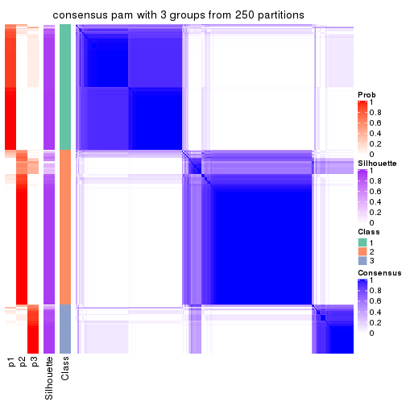</p>

</div>
<div id='tab-CV-pam-consensus-heatmap-3'>
<pre><code class="r">consensus_heatmap(res, k = 4)
</code></pre>

<p></p>

</div>
<div id='tab-CV-pam-consensus-heatmap-4'>
<pre><code class="r">consensus_heatmap(res, k = 5)
</code></pre>

<p></p>

</div>
<div id='tab-CV-pam-consensus-heatmap-5'>
<pre><code class="r">consensus_heatmap(res, k = 6)
</code></pre>

<p></p>

</div>
</div>

Heatmaps for the membership of samples in all partitions to see how consistent they are:


<script>
$( function() {
	$( '#tabs-CV-pam-membership-heatmap' ).tabs();
} );
</script>
<div id='tabs-CV-pam-membership-heatmap'>
<ul>
<li><a href='#tab-CV-pam-membership-heatmap-1'>k = 2</a></li>
<li><a href='#tab-CV-pam-membership-heatmap-2'>k = 3</a></li>
<li><a href='#tab-CV-pam-membership-heatmap-3'>k = 4</a></li>
<li><a href='#tab-CV-pam-membership-heatmap-4'>k = 5</a></li>
<li><a href='#tab-CV-pam-membership-heatmap-5'>k = 6</a></li>
</ul>
<div id='tab-CV-pam-membership-heatmap-1'>
<pre><code class="r">membership_heatmap(res, k = 2)
</code></pre>

<p></p>

</div>
<div id='tab-CV-pam-membership-heatmap-2'>
<pre><code class="r">membership_heatmap(res, k = 3)
</code></pre>

<p></p>

</div>
<div id='tab-CV-pam-membership-heatmap-3'>
<pre><code class="r">membership_heatmap(res, k = 4)
</code></pre>

<p></p>

</div>
<div id='tab-CV-pam-membership-heatmap-4'>
<pre><code class="r">membership_heatmap(res, k = 5)
</code></pre>

<p></p>

</div>
<div id='tab-CV-pam-membership-heatmap-5'>
<pre><code class="r">membership_heatmap(res, k = 6)
</code></pre>

<p></p>

</div>
</div>

As soon as we have had the classes for columns, we can look for signatures
which are significantly different between classes which can be candidate marks
for certain classes. Following are the heatmaps for signatures.


Signature heatmaps where rows are scaled:


<script>
$( function() {
	$( '#tabs-CV-pam-get-signatures' ).tabs();
} );
</script>
<div id='tabs-CV-pam-get-signatures'>
<ul>
<li><a href='#tab-CV-pam-get-signatures-1'>k = 2</a></li>
<li><a href='#tab-CV-pam-get-signatures-2'>k = 3</a></li>
<li><a href='#tab-CV-pam-get-signatures-3'>k = 4</a></li>
<li><a href='#tab-CV-pam-get-signatures-4'>k = 5</a></li>
<li><a href='#tab-CV-pam-get-signatures-5'>k = 6</a></li>
</ul>
<div id='tab-CV-pam-get-signatures-1'>
<pre><code class="r">get_signatures(res, k = 2)
</code></pre>

<p></p>

</div>
<div id='tab-CV-pam-get-signatures-2'>
<pre><code class="r">get_signatures(res, k = 3)
</code></pre>

<p></p>

</div>
<div id='tab-CV-pam-get-signatures-3'>
<pre><code class="r">get_signatures(res, k = 4)
</code></pre>

<p></p>

</div>
<div id='tab-CV-pam-get-signatures-4'>
<pre><code class="r">get_signatures(res, k = 5)
</code></pre>

<p></p>

</div>
<div id='tab-CV-pam-get-signatures-5'>
<pre><code class="r">get_signatures(res, k = 6)
</code></pre>

<p></p>

</div>
</div>


Signature heatmaps where rows are not scaled:


<script>
$( function() {
	$( '#tabs-CV-pam-get-signatures-no-scale' ).tabs();
} );
</script>
<div id='tabs-CV-pam-get-signatures-no-scale'>
<ul>
<li><a href='#tab-CV-pam-get-signatures-no-scale-1'>k = 2</a></li>
<li><a href='#tab-CV-pam-get-signatures-no-scale-2'>k = 3</a></li>
<li><a href='#tab-CV-pam-get-signatures-no-scale-3'>k = 4</a></li>
<li><a href='#tab-CV-pam-get-signatures-no-scale-4'>k = 5</a></li>
<li><a href='#tab-CV-pam-get-signatures-no-scale-5'>k = 6</a></li>
</ul>
<div id='tab-CV-pam-get-signatures-no-scale-1'>
<pre><code class="r">get_signatures(res, k = 2, scale_rows = FALSE)
</code></pre>

<p></p>

</div>
<div id='tab-CV-pam-get-signatures-no-scale-2'>
<pre><code class="r">get_signatures(res, k = 3, scale_rows = FALSE)
</code></pre>

<p></p>

</div>
<div id='tab-CV-pam-get-signatures-no-scale-3'>
<pre><code class="r">get_signatures(res, k = 4, scale_rows = FALSE)
</code></pre>

<p></p>

</div>
<div id='tab-CV-pam-get-signatures-no-scale-4'>
<pre><code class="r">get_signatures(res, k = 5, scale_rows = FALSE)
</code></pre>

<p></p>

</div>
<div id='tab-CV-pam-get-signatures-no-scale-5'>
<pre><code class="r">get_signatures(res, k = 6, scale_rows = FALSE)
</code></pre>

<p></p>

</div>
</div>


Compare the overlap of signatures from different k:

```r
compare_signatures(res)
```


`get_signature()` returns a data frame invisibly. TO get the list of signatures, the function
call should be assigned to a variable explicitly. In following code, if `plot` argument is set
to `FALSE`, no heatmap is plotted while only the differential analysis is performed.

```r
# code only for demonstration
tb = get_signature(res, k = ..., plot = FALSE)
```

An example of the output of `tb` is:

```
#>   which_row         fdr    mean_1    mean_2 scaled_mean_1 scaled_mean_2 km
#> 1        38 0.042760348  8.373488  9.131774    -0.5533452     0.5164555  1
#> 2        40 0.018707592  7.106213  8.469186    -0.6173731     0.5762149  1
#> 3        55 0.019134737 10.221463 11.207825    -0.6159697     0.5749050  1
#> 4        59 0.006059896  5.921854  7.869574    -0.6899429     0.6439467  1
#> 5        60 0.018055526  8.928898 10.211722    -0.6204761     0.5791110  1
#> 6        98 0.009384629 15.714769 14.887706     0.6635654    -0.6193277  2
...
```

The columns in `tb` are:

1. `which_row`: row indices corresponding to the input matrix.
2. `fdr`: FDR for the differential test. 
3. `mean_x`: The mean value in group x.
4. `scaled_mean_x`: The mean value in group x after rows are scaled.
5. `km`: Row groups if k-means clustering is applied to rows.


UMAP plot which shows how samples are separated.


<script>
$( function() {
	$( '#tabs-CV-pam-dimension-reduction' ).tabs();
} );
</script>
<div id='tabs-CV-pam-dimension-reduction'>
<ul>
<li><a href='#tab-CV-pam-dimension-reduction-1'>k = 2</a></li>
<li><a href='#tab-CV-pam-dimension-reduction-2'>k = 3</a></li>
<li><a href='#tab-CV-pam-dimension-reduction-3'>k = 4</a></li>
<li><a href='#tab-CV-pam-dimension-reduction-4'>k = 5</a></li>
<li><a href='#tab-CV-pam-dimension-reduction-5'>k = 6</a></li>
</ul>
<div id='tab-CV-pam-dimension-reduction-1'>
<pre><code class="r">dimension_reduction(res, k = 2, method = &quot;UMAP&quot;)
</code></pre>

<p></p>

</div>
<div id='tab-CV-pam-dimension-reduction-2'>
<pre><code class="r">dimension_reduction(res, k = 3, method = &quot;UMAP&quot;)
</code></pre>

<p></p>

</div>
<div id='tab-CV-pam-dimension-reduction-3'>
<pre><code class="r">dimension_reduction(res, k = 4, method = &quot;UMAP&quot;)
</code></pre>

<p></p>

</div>
<div id='tab-CV-pam-dimension-reduction-4'>
<pre><code class="r">dimension_reduction(res, k = 5, method = &quot;UMAP&quot;)
</code></pre>

<p>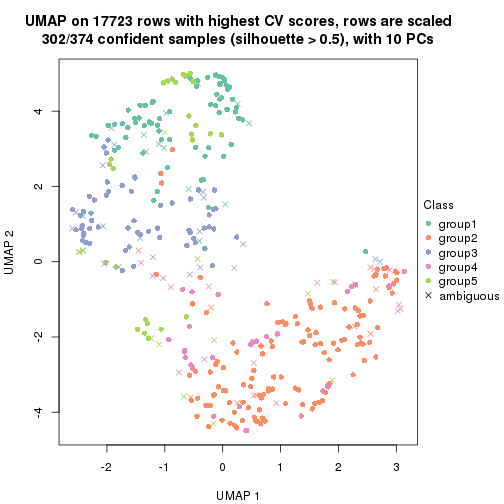</p>

</div>
<div id='tab-CV-pam-dimension-reduction-5'>
<pre><code class="r">dimension_reduction(res, k = 6, method = &quot;UMAP&quot;)
</code></pre>

<p></p>

</div>
</div>


Following heatmap shows how subgroups are split when increasing `k`:

```r
collect_classes(res)
```


If matrix rows can be associated to genes, consider to use `GO_Enrichment(res,
...)` to perform function enrichment for the signature genes.


 

---------------------------------------------------


### CV:mclust*


The object with results only for a single top-value method and a single partition method 
can be extracted as:

```r
res = res_list["CV", "mclust"]
# you can also extract it by
# res = res_list["CV:mclust"]
```

A summary of `res` and all the functions that can be applied to it:

```r
res
```

```
#> A 'ConsensusPartition' object with k = 2, 3, 4, 5, 6.
#>   On a matrix with 17723 rows and 374 columns.
#>   Top rows (1000, 2000, 3000, 4000, 5000) are extracted by 'CV' method.
#>   Subgroups are detected by 'mclust' method.
#>   Performed in total 1250 partitions by row resampling.
#>   Best k for subgroups seems to be 3.
#> 
#> Following methods can be applied to this 'ConsensusPartition' object:
#>  [1] "cola_report"             "collect_classes"         "collect_plots"          
#>  [4] "collect_stats"           "colnames"                "compare_signatures"     
#>  [7] "consensus_heatmap"       "dimension_reduction"     "functional_enrichment"  
#> [10] "get_anno_col"            "get_anno"                "get_classes"            
#> [13] "get_consensus"           "get_matrix"              "get_membership"         
#> [16] "get_param"               "get_signatures"          "get_stats"              
#> [19] "is_best_k"               "is_stable_k"             "membership_heatmap"     
#> [22] "ncol"                    "nrow"                    "plot_ecdf"              
#> [25] "rownames"                "select_partition_number" "show"                   
#> [28] "suggest_best_k"          "test_to_known_factors"
```

`collect_plots()` function collects all the plots made from `res` for all `k` (number of partitions)
into one single page to provide an easy and fast comparison between different `k`.

```r
collect_plots(res)
```


The plots are:

- The first row: a plot of the ECDF (Empirical cumulative distribution
  function) curves of the consensus matrix for each `k` and the heatmap of
  predicted classes for each `k`.
- The second row: heatmaps of the consensus matrix for each `k`.
- The third row: heatmaps of the membership matrix for each `k`.
- The fouth row: heatmaps of the signatures for each `k`.

All the plots in panels can be made by individual functions and they are
plotted later in this section.

`select_partition_number()` produces several plots showing different
statistics for choosing "optimized" `k`. There are following statistics:

- ECDF curves of the consensus matrix for each `k`;
- 1-PAC. [The PAC
  score](https://en.wikipedia.org/wiki/Consensus_clustering#Over-interpretation_potential_of_consensus_clustering)
  measures the proportion of the ambiguous subgrouping.
- Mean silhouette score.
- Concordance. The mean probability of fiting the consensus class ids in all
  partitions.
- Area increased. Denote $A_k$ as the area under the ECDF curve for current
  `k`, the area increased is defined as $A_k - A_{k-1}$.
- Rand index. The percent of pairs of samples that are both in a same cluster
  or both are not in a same cluster in the partition of k and k-1.
- Jaccard index. The ratio of pairs of samples are both in a same cluster in
  the partition of k and k-1 and the pairs of samples are both in a same
  cluster in the partition k or k-1.

The detailed explanations of these statistics can be found in [the cola
vignette](http://bioconductor.org/packages/devel/bioc/vignettes/cola/inst/doc/cola.html#toc_13).

Generally speaking, lower PAC score, higher mean silhouette score or higher
concordance corresponds to better partition. Rand index and Jaccard index
measure how similar the current partition is compared to partition with `k-1`.
If they are too similar, we won't accept `k` is better than `k-1`.

```r
select_partition_number(res)
```


The numeric values for all these statistics can be obtained by `get_stats()`.

```r
get_stats(res)
```

```
#>   k 1-PAC mean_silhouette concordance area_increased  Rand Jaccard
#> 2 2 0.481           0.901       0.906         0.4041 0.586   0.586
#> 3 3 0.913           0.916       0.963         0.6423 0.732   0.548
#> 4 4 0.646           0.682       0.813         0.0862 0.937   0.817
#> 5 5 0.640           0.532       0.745         0.0746 0.894   0.659
#> 6 6 0.645           0.532       0.738         0.0358 0.912   0.646
```

`suggest_best_k()` suggests the best $k$ based on these statistics. The rules are as follows:

- All $k$ with Jaccard index larger than 0.95 are removed because the increase of
  the partition number does not provides enough extra information. If all $k$ are removed,
  the best $k$ is assigned by `NA`.
- For $k$ with 1-PAC larger than 0.9, the maximal $k$ is taken as the "best k". Other $k$ is called "optional k".
- If it does not fit the second rule. The $k$ with the highest vote of highest
  1-PAC, mean silhouette and concordance is taken as the "best k".

```r
suggest_best_k(res)
```

```
#> [1] 3
```


Following shows the table of the partitions (You need to click the **show/hide
code output** link to see it). The membership matrix (columns with name `p*`)
is inferred by
[`clue::cl_consensus()`](https://www.rdocumentation.org/link/cl_consensus?package=clue)
function with the `SE` method. Basically the value in the membership matrix
represents the probability to belong to a certain group. The finall class
label for an item is determined with the group with highest probability it
belongs to.

In `get_classes()` function, the entropy is calculated from the membership
matrix and the silhouette score is calculated from the consensus matrix.


<script>
$( function() {
	$( '#tabs-CV-mclust-get-classes' ).tabs();
} );
</script>
<div id='tabs-CV-mclust-get-classes'>
<ul>
<li><a href='#tab-CV-mclust-get-classes-1'>k = 2</a></li>
<li><a href='#tab-CV-mclust-get-classes-2'>k = 3</a></li>
<li><a href='#tab-CV-mclust-get-classes-3'>k = 4</a></li>
<li><a href='#tab-CV-mclust-get-classes-4'>k = 5</a></li>
<li><a href='#tab-CV-mclust-get-classes-5'>k = 6</a></li>
</ul>

<div id='tab-CV-mclust-get-classes-1'>
<p><a id='tab-CV-mclust-get-classes-1-a' style='color:#0366d6' href='#'>show/hide code output</a></p>
<pre><code class="r">cbind(get_classes(res, k = 2), get_membership(res, k = 2))
</code></pre>

<pre><code>#&gt;            class entropy silhouette    p1    p2
#&gt; SRR660824      1  0.5519     0.9198 0.872 0.128
#&gt; SRR603858      1  0.6438     0.9148 0.836 0.164
#&gt; SRR817070      2  0.0000     0.9566 0.000 1.000
#&gt; SRR1486995     1  0.4690     0.9061 0.900 0.100
#&gt; SRR813043      2  0.0000     0.9566 0.000 1.000
#&gt; SRR656874      1  0.6438     0.9148 0.836 0.164
#&gt; SRR659037      1  0.2778     0.8873 0.952 0.048
#&gt; SRR662031      1  0.5519     0.9198 0.872 0.128
#&gt; SRR1081283     2  0.0000     0.9566 0.000 1.000
#&gt; SRR1481036     1  0.5519     0.9198 0.872 0.128
#&gt; SRR1434009     1  0.2778     0.8873 0.952 0.048
#&gt; SRR1376676     1  0.5519     0.9198 0.872 0.128
#&gt; SRR1396967     1  0.2778     0.8873 0.952 0.048
#&gt; SRR665429      2  0.0000     0.9566 0.000 1.000
#&gt; SRR1388025     2  0.0376     0.9534 0.004 0.996
#&gt; SRR600784      1  0.5519     0.9198 0.872 0.128
#&gt; SRR657611      1  0.5519     0.9198 0.872 0.128
#&gt; SRR1333659     1  0.2778     0.8873 0.952 0.048
#&gt; SRR1323896     2  0.0000     0.9566 0.000 1.000
#&gt; SRR1453971     1  0.6438     0.9148 0.836 0.164
#&gt; SRR1421010     1  0.5519     0.9215 0.872 0.128
#&gt; SRR1334490     1  0.2778     0.8873 0.952 0.048
#&gt; SRR1309468     1  0.5519     0.9198 0.872 0.128
#&gt; SRR1468637     1  0.2778     0.8873 0.952 0.048
#&gt; SRR1365489     2  0.0000     0.9566 0.000 1.000
#&gt; SRR627445      1  0.5519     0.9198 0.872 0.128
#&gt; SRR607863      1  0.3584     0.8952 0.932 0.068
#&gt; SRR1475524     1  0.2778     0.8873 0.952 0.048
#&gt; SRR1405504     2  0.0000     0.9566 0.000 1.000
#&gt; SRR615695      1  0.5519     0.9198 0.872 0.128
#&gt; SRR600900      1  0.5842     0.9150 0.860 0.140
#&gt; SRR601477      2  0.2778     0.9145 0.048 0.952
#&gt; SRR1487215     2  0.3431     0.8993 0.064 0.936
#&gt; SRR1310797     1  0.6438     0.9148 0.836 0.164
#&gt; SRR1362713     1  0.6712     0.9114 0.824 0.176
#&gt; SRR1431385     1  0.5519     0.9198 0.872 0.128
#&gt; SRR1379089     2  0.0000     0.9566 0.000 1.000
#&gt; SRR1102079     1  0.2778     0.8873 0.952 0.048
#&gt; SRR1357210     1  0.5519     0.9198 0.872 0.128
#&gt; SRR657659      2  0.0000     0.9566 0.000 1.000
#&gt; SRR663573      2  0.9580     0.2416 0.380 0.620
#&gt; SRR603188      1  0.2778     0.8873 0.952 0.048
#&gt; SRR1471200     2  0.1633     0.9373 0.024 0.976
#&gt; SRR1310975     2  0.5178     0.8460 0.116 0.884
#&gt; SRR627457      1  0.6531     0.9144 0.832 0.168
#&gt; SRR1367654     1  0.2778     0.8873 0.952 0.048
#&gt; SRR1488410     1  0.2778     0.8873 0.952 0.048
#&gt; SRR1457750     1  0.6887     0.9083 0.816 0.184
#&gt; SRR1099546     1  0.5519     0.9198 0.872 0.128
#&gt; SRR604480      2  0.3879     0.8870 0.076 0.924
#&gt; SRR1390477     2  0.0000     0.9566 0.000 1.000
#&gt; SRR1458447     2  0.0000     0.9566 0.000 1.000
#&gt; SRR1473161     2  0.0000     0.9566 0.000 1.000
#&gt; SRR1409813     1  0.2778     0.8873 0.952 0.048
#&gt; SRR612791      1  0.5519     0.9198 0.872 0.128
#&gt; SRR1470580     1  0.7674     0.8773 0.776 0.224
#&gt; SRR1444063     1  0.6712     0.9114 0.824 0.176
#&gt; SRR1355578     1  0.5519     0.9198 0.872 0.128
#&gt; SRR1429203     1  0.5519     0.9198 0.872 0.128
#&gt; SRR599154      1  0.2778     0.8873 0.952 0.048
#&gt; SRR814244      1  0.2778     0.8873 0.952 0.048
#&gt; SRR1404123     2  0.0000     0.9566 0.000 1.000
#&gt; SRR656934      1  0.5519     0.9198 0.872 0.128
#&gt; SRR1339029     2  0.0000     0.9566 0.000 1.000
#&gt; SRR821525      2  0.0376     0.9534 0.004 0.996
#&gt; SRR1443677     1  0.5519     0.9198 0.872 0.128
#&gt; SRR1406330     1  0.2778     0.8873 0.952 0.048
#&gt; SRR1338124     1  0.6438     0.9148 0.836 0.164
#&gt; SRR1391376     1  0.5519     0.9198 0.872 0.128
#&gt; SRR661842      2  0.1414     0.9441 0.020 0.980
#&gt; SRR1395699     1  0.5178     0.9199 0.884 0.116
#&gt; SRR1312209     1  0.5519     0.9198 0.872 0.128
#&gt; SRR1359469     1  0.5519     0.9198 0.872 0.128
#&gt; SRR658885      1  0.2778     0.8873 0.952 0.048
#&gt; SRR1414578     1  0.5519     0.9198 0.872 0.128
#&gt; SRR603620      1  0.2778     0.8873 0.952 0.048
#&gt; SRR604677      1  0.5408     0.9214 0.876 0.124
#&gt; SRR603800      2  0.0000     0.9566 0.000 1.000
#&gt; SRR602058      1  0.2778     0.8873 0.952 0.048
#&gt; SRR817488      2  0.0000     0.9566 0.000 1.000
#&gt; SRR655601      2  0.0000     0.9566 0.000 1.000
#&gt; SRR1434821     2  0.0000     0.9566 0.000 1.000
#&gt; SRR1349166     1  0.2778     0.8873 0.952 0.048
#&gt; SRR615129      1  0.7745     0.8733 0.772 0.228
#&gt; SRR607586      2  0.0000     0.9566 0.000 1.000
#&gt; SRR602680      1  0.6438     0.9148 0.836 0.164
#&gt; SRR1411070     2  0.0000     0.9566 0.000 1.000
#&gt; SRR663038      2  0.0000     0.9566 0.000 1.000
#&gt; SRR1489416     2  0.0000     0.9566 0.000 1.000
#&gt; SRR1479155     1  0.5519     0.9198 0.872 0.128
#&gt; SRR662162      1  0.5519     0.9198 0.872 0.128
#&gt; SRR1374567     1  0.5519     0.9198 0.872 0.128
#&gt; SRR1434048     2  0.0000     0.9566 0.000 1.000
#&gt; SRR2184865     2  0.5946     0.7958 0.144 0.856
#&gt; SRR2170135     1  0.5519     0.9198 0.872 0.128
#&gt; SRR615551      2  0.0000     0.9566 0.000 1.000
#&gt; SRR1335513     2  0.0000     0.9566 0.000 1.000
#&gt; SRR1370216     1  0.4562     0.9048 0.904 0.096
#&gt; SRR662954      1  0.2778     0.8873 0.952 0.048
#&gt; SRR1375738     1  0.5519     0.9198 0.872 0.128
#&gt; SRR1356577     1  0.5629     0.9200 0.868 0.132
#&gt; SRR1073119     1  0.5519     0.9198 0.872 0.128
#&gt; SRR663549      1  0.5519     0.9198 0.872 0.128
#&gt; SRR1478015     2  0.0000     0.9566 0.000 1.000
#&gt; SRR600632      2  0.0000     0.9566 0.000 1.000
#&gt; SRR811866      1  0.5519     0.9198 0.872 0.128
#&gt; SRR1401101     1  0.2778     0.8873 0.952 0.048
#&gt; SRR1477797     1  0.2778     0.8873 0.952 0.048
#&gt; SRR1402986     2  0.0376     0.9538 0.004 0.996
#&gt; SRR658897      1  0.5519     0.9198 0.872 0.128
#&gt; SRR1419869     1  0.5519     0.9198 0.872 0.128
#&gt; SRR1490700     1  0.5519     0.9198 0.872 0.128
#&gt; SRR601723      1  0.8327     0.8302 0.736 0.264
#&gt; SRR1384115     1  0.2778     0.8873 0.952 0.048
#&gt; SRR1476927     2  0.0000     0.9566 0.000 1.000
#&gt; SRR1387769     1  0.5519     0.9198 0.872 0.128
#&gt; SRR1322595     1  0.2778     0.8873 0.952 0.048
#&gt; SRR1370423     1  0.5629     0.9199 0.868 0.132
#&gt; SRR1314976     1  0.7745     0.8733 0.772 0.228
#&gt; SRR1319560     1  0.2778     0.8873 0.952 0.048
#&gt; SRR1352683     1  0.6623     0.9130 0.828 0.172
#&gt; SRR1473800     1  0.5519     0.9198 0.872 0.128
#&gt; SRR1326384     1  0.2778     0.8873 0.952 0.048
#&gt; SRR1360807     1  0.9248     0.7030 0.660 0.340
#&gt; SRR1332544     1  0.2778     0.8873 0.952 0.048
#&gt; SRR598695      1  0.5294     0.9201 0.880 0.120
#&gt; SRR807824      1  0.6438     0.9148 0.836 0.164
#&gt; SRR809296      1  0.5178     0.9199 0.884 0.116
#&gt; SRR657927      1  0.5178     0.9199 0.884 0.116
#&gt; SRR1440682     2  0.9850     0.0726 0.428 0.572
#&gt; SRR1454415     1  0.6438     0.9148 0.836 0.164
#&gt; SRR1419131     1  0.7376     0.8883 0.792 0.208
#&gt; SRR1404293     1  0.5519     0.9198 0.872 0.128
#&gt; SRR1473340     1  0.5519     0.9198 0.872 0.128
#&gt; SRR1345563     1  0.2778     0.8873 0.952 0.048
#&gt; SRR1323382     2  0.0000     0.9566 0.000 1.000
#&gt; SRR1480697     1  0.6343     0.9151 0.840 0.160
#&gt; SRR1321808     2  0.0000     0.9566 0.000 1.000
#&gt; SRR1382756     2  0.0000     0.9566 0.000 1.000
#&gt; SRR1312558     2  0.1184     0.9443 0.016 0.984
#&gt; SRR1417088     2  0.0000     0.9566 0.000 1.000
#&gt; SRR1433027     2  0.0000     0.9566 0.000 1.000
#&gt; SRR662257      1  0.2778     0.8873 0.952 0.048
#&gt; SRR600417      2  0.0376     0.9534 0.004 0.996
#&gt; SRR812493      1  0.2778     0.8873 0.952 0.048
#&gt; SRR612743      1  0.5519     0.9198 0.872 0.128
#&gt; SRR1361345     1  0.5519     0.9198 0.872 0.128
#&gt; SRR600584      2  0.0000     0.9566 0.000 1.000
#&gt; SRR1310520     2  0.9358     0.3165 0.352 0.648
#&gt; SRR1395595     1  0.2778     0.8873 0.952 0.048
#&gt; SRR1334074     1  0.2778     0.8873 0.952 0.048
#&gt; SRR654838      2  0.0000     0.9566 0.000 1.000
#&gt; SRR1376694     1  0.2778     0.8873 0.952 0.048
#&gt; SRR1433841     1  0.7815     0.8691 0.768 0.232
#&gt; SRR1366837     1  0.5519     0.9198 0.872 0.128
#&gt; SRR1467479     2  0.0000     0.9566 0.000 1.000
#&gt; SRR1459055     1  0.2778     0.8873 0.952 0.048
#&gt; SRR1471050     2  0.0000     0.9566 0.000 1.000
#&gt; SRR603004      1  0.6438     0.9148 0.836 0.164
#&gt; SRR814703      1  0.2778     0.8873 0.952 0.048
#&gt; SRR661937      2  0.0000     0.9566 0.000 1.000
#&gt; SRR614359      1  0.5294     0.9201 0.880 0.120
#&gt; SRR1071568     2  0.0000     0.9566 0.000 1.000
#&gt; SRR1389084     1  0.5519     0.9198 0.872 0.128
#&gt; SRR1337624     2  0.0000     0.9566 0.000 1.000
#&gt; SRR1344400     2  0.7453     0.7010 0.212 0.788
#&gt; SRR1414290     2  0.0000     0.9566 0.000 1.000
#&gt; SRR1413644     1  0.2778     0.8873 0.952 0.048
#&gt; SRR1098998     1  0.5519     0.9198 0.872 0.128
#&gt; SRR1481279     1  0.5519     0.9198 0.872 0.128
#&gt; SRR1315103     1  0.2778     0.8873 0.952 0.048
#&gt; SRR1099286     1  0.6343     0.9151 0.840 0.160
#&gt; SRR2166570     1  0.5946     0.9191 0.856 0.144
#&gt; SRR601445      1  0.5519     0.9198 0.872 0.128
#&gt; SRR1439719     2  0.0000     0.9566 0.000 1.000
#&gt; SRR1377026     1  0.6343     0.9151 0.840 0.160
#&gt; SRR1327386     1  0.5519     0.9198 0.872 0.128
#&gt; SRR654826      2  0.0000     0.9566 0.000 1.000
#&gt; SRR1460433     1  0.6343     0.9151 0.840 0.160
#&gt; SRR1469345     1  0.4431     0.9035 0.908 0.092
#&gt; SRR1421462     2  0.0000     0.9566 0.000 1.000
#&gt; SRR662966      1  0.2778     0.8873 0.952 0.048
#&gt; SRR1339175     1  0.5519     0.9198 0.872 0.128
#&gt; SRR1447736     2  0.0000     0.9566 0.000 1.000
#&gt; SRR1434671     1  0.2778     0.8873 0.952 0.048
#&gt; SRR660800      2  0.0000     0.9566 0.000 1.000
#&gt; SRR1465543     1  0.2778     0.8873 0.952 0.048
#&gt; SRR1342023     1  0.5519     0.9198 0.872 0.128
#&gt; SRR1335670     1  0.5519     0.9198 0.872 0.128
#&gt; SRR1400955     1  0.2778     0.8873 0.952 0.048
#&gt; SRR1072150     2  0.0000     0.9566 0.000 1.000
#&gt; SRR1442822     1  0.5519     0.9198 0.872 0.128
#&gt; SRR1364658     1  0.5519     0.9198 0.872 0.128
#&gt; SRR1098074     1  0.2778     0.8873 0.952 0.048
#&gt; SRR1442778     1  0.5519     0.9215 0.872 0.128
#&gt; SRR1086728     1  0.2778     0.8873 0.952 0.048
#&gt; SRR627464      1  0.6712     0.9114 0.824 0.176
#&gt; SRR1409193     1  0.5519     0.9198 0.872 0.128
#&gt; SRR2168286     2  0.8909     0.4560 0.308 0.692
#&gt; SRR615539      2  0.0000     0.9566 0.000 1.000
#&gt; SRR663623      1  0.5178     0.9106 0.884 0.116
#&gt; SRR1471989     1  0.2778     0.8873 0.952 0.048
#&gt; SRR1468828     2  0.0000     0.9566 0.000 1.000
#&gt; SRR1381934     1  0.5294     0.9201 0.880 0.120
#&gt; SRR1471098     1  0.5519     0.9198 0.872 0.128
#&gt; SRR1314749     1  0.5519     0.9198 0.872 0.128
#&gt; SRR2166874     1  0.2778     0.8873 0.952 0.048
#&gt; SRR821302      1  0.5519     0.9198 0.872 0.128
#&gt; SRR1435066     1  0.6438     0.9148 0.836 0.164
#&gt; SRR661601      1  0.6438     0.9148 0.836 0.164
#&gt; SRR1446546     1  0.7139     0.9012 0.804 0.196
#&gt; SRR1419784     1  0.2778     0.8873 0.952 0.048
#&gt; SRR1357233     1  0.2778     0.8873 0.952 0.048
#&gt; SRR1441889     1  0.5519     0.9198 0.872 0.128
#&gt; SRR1413940     1  0.2778     0.8873 0.952 0.048
#&gt; SRR1324250     1  0.9983     0.3762 0.524 0.476
#&gt; SRR1442862     1  0.2778     0.8873 0.952 0.048
#&gt; SRR662474      2  0.0000     0.9566 0.000 1.000
#&gt; SRR1416226     1  0.5519     0.9198 0.872 0.128
#&gt; SRR1417404     1  0.6343     0.9151 0.840 0.160
#&gt; SRR665466      2  0.0000     0.9566 0.000 1.000
#&gt; SRR658849      1  0.5519     0.9198 0.872 0.128
#&gt; SRR1460025     2  0.9491     0.2700 0.368 0.632
#&gt; SRR1408136     1  0.5519     0.9198 0.872 0.128
#&gt; SRR1489995     2  0.0000     0.9566 0.000 1.000
#&gt; SRR1374092     1  0.5519     0.9198 0.872 0.128
#&gt; SRR1488429     1  0.2778     0.8873 0.952 0.048
#&gt; SRR1087559     1  0.7745     0.8733 0.772 0.228
#&gt; SRR817004      1  0.2778     0.8873 0.952 0.048
#&gt; SRR1429660     1  0.2778     0.8873 0.952 0.048
#&gt; SRR604390      1  0.2778     0.8873 0.952 0.048
#&gt; SRR614936      2  0.2043     0.9299 0.032 0.968
#&gt; SRR1365938     1  0.9087     0.7374 0.676 0.324
#&gt; SRR1437324     1  0.5519     0.9198 0.872 0.128
#&gt; SRR613414      1  0.2948     0.8889 0.948 0.052
#&gt; SRR660414      1  0.5629     0.9200 0.868 0.132
#&gt; SRR1452185     1  0.5519     0.9198 0.872 0.128
#&gt; SRR1347020     1  0.5519     0.9198 0.872 0.128
#&gt; SRR1398036     1  0.2778     0.8873 0.952 0.048
#&gt; SRR1436674     1  0.5519     0.9198 0.872 0.128
#&gt; SRR603750      1  0.5842     0.9195 0.860 0.140
#&gt; SRR608630      1  0.6343     0.9151 0.840 0.160
#&gt; SRR655625      2  0.0376     0.9534 0.004 0.996
#&gt; SRR599059      1  0.6438     0.9148 0.836 0.164
#&gt; SRR615189      1  0.9552     0.6385 0.624 0.376
#&gt; SRR1466889     1  0.2778     0.8873 0.952 0.048
#&gt; SRR1084602     1  0.9427     0.6643 0.640 0.360
#&gt; SRR1335422     1  0.5519     0.9198 0.872 0.128
#&gt; SRR1356805     1  0.2778     0.8873 0.952 0.048
#&gt; SRR1385300     1  0.3733     0.8964 0.928 0.072
#&gt; SRR654814      1  0.5519     0.9198 0.872 0.128
#&gt; SRR658385      1  0.6438     0.9148 0.836 0.164
#&gt; SRR820596      1  0.6623     0.9128 0.828 0.172
#&gt; SRR1318118     1  0.4562     0.9049 0.904 0.096
#&gt; SRR1480766     2  0.0000     0.9566 0.000 1.000
#&gt; SRR1406539     1  0.6623     0.9128 0.828 0.172
#&gt; SRR1341833     1  0.2948     0.8889 0.948 0.052
#&gt; SRR1441826     2  0.4690     0.8607 0.100 0.900
#&gt; SRR1448051     1  0.5519     0.9198 0.872 0.128
#&gt; SRR1326752     1  0.4815     0.9072 0.896 0.104
#&gt; SRR665217      1  0.6438     0.9148 0.836 0.164
#&gt; SRR819186      2  0.0000     0.9566 0.000 1.000
#&gt; SRR661517      1  0.6343     0.9162 0.840 0.160
#&gt; SRR607166      2  0.8909     0.4464 0.308 0.692
#&gt; SRR809065      2  0.0000     0.9566 0.000 1.000
#&gt; SRR1415872     1  0.2778     0.8873 0.952 0.048
#&gt; SRR1415463     1  0.5519     0.9198 0.872 0.128
#&gt; SRR1381161     1  0.2778     0.8873 0.952 0.048
#&gt; SRR1442231     1  0.9087     0.7374 0.676 0.324
#&gt; SRR1374696     1  0.5629     0.9200 0.868 0.132
#&gt; SRR1451988     1  0.6712     0.9114 0.824 0.176
#&gt; SRR660555      1  0.5519     0.9198 0.872 0.128
#&gt; SRR657801      1  0.5519     0.9198 0.872 0.128
#&gt; SRR663344      1  0.6438     0.9148 0.836 0.164
#&gt; SRR1472462     2  0.0000     0.9566 0.000 1.000
#&gt; SRR1406176     1  0.6623     0.9130 0.828 0.172
#&gt; SRR656886      2  0.0938     0.9477 0.012 0.988
#&gt; SRR1498337     1  0.2778     0.8873 0.952 0.048
#&gt; SRR613066      1  0.2778     0.8873 0.952 0.048
#&gt; SRR1309490     1  0.5519     0.9198 0.872 0.128
#&gt; SRR602492      1  0.5178     0.9106 0.884 0.116
#&gt; SRR1447347     1  0.5519     0.9198 0.872 0.128
#&gt; SRR1475546     2  0.0000     0.9566 0.000 1.000
#&gt; SRR627459      1  0.6712     0.9114 0.824 0.176
#&gt; SRR1434332     2  0.0000     0.9566 0.000 1.000
#&gt; SRR1070358     1  0.2778     0.8873 0.952 0.048
#&gt; SRR1345936     1  0.2778     0.8873 0.952 0.048
#&gt; SRR665658      2  0.0000     0.9566 0.000 1.000
#&gt; SRR1321351     2  0.0000     0.9566 0.000 1.000
#&gt; SRR657880      1  0.6438     0.9148 0.836 0.164
#&gt; SRR1373903     2  0.0000     0.9566 0.000 1.000
#&gt; SRR657396      1  0.2778     0.8873 0.952 0.048
#&gt; SRR660981      2  0.0000     0.9566 0.000 1.000
#&gt; SRR818499      1  0.5519     0.9198 0.872 0.128
#&gt; SRR819658      1  0.2778     0.8873 0.952 0.048
#&gt; SRR1376316     1  0.5178     0.9199 0.884 0.116
#&gt; SRR1323723     2  0.5946     0.8005 0.144 0.856
#&gt; SRR1476719     1  0.5519     0.9198 0.872 0.128
#&gt; SRR1403478     1  0.6438     0.9148 0.836 0.164
#&gt; SRR1095695     1  0.5519     0.9198 0.872 0.128
#&gt; SRR1352391     1  0.6343     0.9151 0.840 0.160
#&gt; SRR1498813     2  0.0376     0.9534 0.004 0.996
#&gt; SRR627437      1  0.6438     0.9148 0.836 0.164
#&gt; SRR2185097     1  0.5519     0.9198 0.872 0.128
#&gt; SRR817166      1  0.2778     0.8873 0.952 0.048
#&gt; SRR1091670     2  0.0000     0.9566 0.000 1.000
#&gt; SRR603776      1  0.6438     0.9148 0.836 0.164
#&gt; SRR1479640     2  0.0000     0.9566 0.000 1.000
#&gt; SRR660152      1  0.6438     0.9148 0.836 0.164
#&gt; SRR1074769     2  0.4939     0.8500 0.108 0.892
#&gt; SRR656153      2  0.0000     0.9566 0.000 1.000
#&gt; SRR1392502     1  0.2778     0.8873 0.952 0.048
#&gt; SRR1359609     1  0.2778     0.8873 0.952 0.048
#&gt; SRR601925      2  0.0000     0.9566 0.000 1.000
#&gt; SRR2165182     1  0.6438     0.9148 0.836 0.164
#&gt; SRR608542      1  0.2778     0.8873 0.952 0.048
#&gt; SRR655064      2  0.7219     0.7017 0.200 0.800
#&gt; SRR1432430     1  0.5519     0.9198 0.872 0.128
#&gt; SRR808472      1  0.6623     0.9128 0.828 0.172
#&gt; SRR1414958     1  0.2778     0.8873 0.952 0.048
#&gt; SRR598484      2  0.0000     0.9566 0.000 1.000
#&gt; SRR612755      1  0.5519     0.9198 0.872 0.128
#&gt; SRR1365808     1  0.5519     0.9198 0.872 0.128
#&gt; SRR1391724     1  0.5519     0.9198 0.872 0.128
#&gt; SRR1322373     1  0.5519     0.9198 0.872 0.128
#&gt; SRR1489265     2  0.0000     0.9566 0.000 1.000
#&gt; SRR1359099     1  0.6438     0.9148 0.836 0.164
#&gt; SRR607279      2  0.0000     0.9566 0.000 1.000
#&gt; SRR810461      2  0.0000     0.9566 0.000 1.000
#&gt; SRR627427      1  0.5519     0.9198 0.872 0.128
#&gt; SRR612887      1  0.5178     0.9106 0.884 0.116
#&gt; SRR809807      1  0.2778     0.8873 0.952 0.048
#&gt; SRR663112      1  0.6712     0.9114 0.824 0.176
#&gt; SRR1346933     1  0.2778     0.8873 0.952 0.048
#&gt; SRR1487910     1  0.5519     0.9198 0.872 0.128
#&gt; SRR603092      2  0.0000     0.9566 0.000 1.000
#&gt; SRR1417680     2  0.0000     0.9566 0.000 1.000
#&gt; SRR1383785     1  0.5519     0.9198 0.872 0.128
#&gt; SRR1070015     1  0.2778     0.8873 0.952 0.048
#&gt; SRR1466222     1  0.7745     0.8733 0.772 0.228
#&gt; SRR1416119     1  0.2778     0.8873 0.952 0.048
#&gt; SRR819318      1  0.5408     0.9214 0.876 0.124
#&gt; SRR608288      2  0.0376     0.9538 0.004 0.996
#&gt; SRR811121      1  0.5519     0.9136 0.872 0.128
#&gt; SRR613138      2  0.7602     0.6864 0.220 0.780
#&gt; SRR810483      1  0.5519     0.9198 0.872 0.128
#&gt; SRR607839      1  0.5519     0.9198 0.872 0.128
#&gt; SRR1337031     1  0.5294     0.9209 0.880 0.120
#&gt; SRR601311      1  0.5842     0.9150 0.860 0.140
#&gt; SRR1406685     2  0.0376     0.9534 0.004 0.996
#&gt; SRR1467500     2  0.0376     0.9534 0.004 0.996
#&gt; SRR1308504     1  0.5519     0.9198 0.872 0.128
#&gt; SRR1312865     1  0.2778     0.8873 0.952 0.048
#&gt; SRR1312522     1  0.2778     0.8873 0.952 0.048
#&gt; SRR1490486     2  0.0000     0.9566 0.000 1.000
#&gt; SRR1325888     1  0.5519     0.9198 0.872 0.128
#&gt; SRR1472885     1  0.5519     0.9198 0.872 0.128
#&gt; SRR1098785     2  0.0000     0.9566 0.000 1.000
#&gt; SRR1084766     2  0.5408     0.8256 0.124 0.876
#&gt; SRR1102804     2  0.0000     0.9566 0.000 1.000
#&gt; SRR1336636     1  0.5519     0.9198 0.872 0.128
#&gt; SRR1347795     1  0.2778     0.8873 0.952 0.048
#&gt; SRR601900      1  0.6438     0.9148 0.836 0.164
#&gt; SRR1330989     2  0.3431     0.8994 0.064 0.936
#&gt; SRR658445      1  0.2778     0.8873 0.952 0.048
#&gt; SRR1368754     1  0.2778     0.8873 0.952 0.048
#&gt; SRR1460001     2  0.0000     0.9566 0.000 1.000
#&gt; SRR1414934     1  0.5519     0.9198 0.872 0.128
#&gt; SRR1326249     1  0.6438     0.9148 0.836 0.164
#&gt; SRR614948      1  0.2778     0.8873 0.952 0.048
#&gt; SRR1472952     1  0.5178     0.9199 0.884 0.116
#&gt; SRR1321528     1  0.5519     0.9198 0.872 0.128
#&gt; SRR627447      1  0.5519     0.9198 0.872 0.128
#&gt; SRR612239      1  0.7745     0.8733 0.772 0.228
</code></pre>

<script>
$('#tab-CV-mclust-get-classes-1-a').parent().next().next().hide();
$('#tab-CV-mclust-get-classes-1-a').click(function(){
  $('#tab-CV-mclust-get-classes-1-a').parent().next().next().toggle();
  return(false);
});
</script>
</div>

<div id='tab-CV-mclust-get-classes-2'>
<p><a id='tab-CV-mclust-get-classes-2-a' style='color:#0366d6' href='#'>show/hide code output</a></p>
<pre><code class="r">cbind(get_classes(res, k = 3), get_membership(res, k = 3))
</code></pre>

<pre><code>#&gt;            class entropy silhouette    p1    p2    p3
#&gt; SRR660824      1  0.0000      0.944 1.000 0.000 0.000
#&gt; SRR603858      3  0.0000      0.990 0.000 0.000 1.000
#&gt; SRR817070      2  0.0000      0.945 0.000 1.000 0.000
#&gt; SRR1486995     3  0.0892      0.974 0.020 0.000 0.980
#&gt; SRR813043      2  0.0000      0.945 0.000 1.000 0.000
#&gt; SRR656874      3  0.0424      0.984 0.000 0.008 0.992
#&gt; SRR659037      3  0.0000      0.990 0.000 0.000 1.000
#&gt; SRR662031      1  0.0000      0.944 1.000 0.000 0.000
#&gt; SRR1081283     2  0.0237      0.943 0.004 0.996 0.000
#&gt; SRR1481036     1  0.0000      0.944 1.000 0.000 0.000
#&gt; SRR1434009     3  0.0000      0.990 0.000 0.000 1.000
#&gt; SRR1376676     1  0.0000      0.944 1.000 0.000 0.000
#&gt; SRR1396967     3  0.0000      0.990 0.000 0.000 1.000
#&gt; SRR665429      2  0.0000      0.945 0.000 1.000 0.000
#&gt; SRR1388025     2  0.1031      0.929 0.024 0.976 0.000
#&gt; SRR600784      1  0.0000      0.944 1.000 0.000 0.000
#&gt; SRR657611      1  0.0000      0.944 1.000 0.000 0.000
#&gt; SRR1333659     3  0.0000      0.990 0.000 0.000 1.000
#&gt; SRR1323896     2  0.0000      0.945 0.000 1.000 0.000
#&gt; SRR1453971     3  0.1411      0.960 0.036 0.000 0.964
#&gt; SRR1421010     3  0.0000      0.990 0.000 0.000 1.000
#&gt; SRR1334490     3  0.0000      0.990 0.000 0.000 1.000
#&gt; SRR1309468     1  0.0000      0.944 1.000 0.000 0.000
#&gt; SRR1468637     3  0.0000      0.990 0.000 0.000 1.000
#&gt; SRR1365489     2  0.0000      0.945 0.000 1.000 0.000
#&gt; SRR627445      1  0.0000      0.944 1.000 0.000 0.000
#&gt; SRR607863      3  0.0000      0.990 0.000 0.000 1.000
#&gt; SRR1475524     3  0.0000      0.990 0.000 0.000 1.000
#&gt; SRR1405504     2  0.0000      0.945 0.000 1.000 0.000
#&gt; SRR615695      1  0.0000      0.944 1.000 0.000 0.000
#&gt; SRR600900      3  0.0000      0.990 0.000 0.000 1.000
#&gt; SRR601477      2  0.0000      0.945 0.000 1.000 0.000
#&gt; SRR1487215     2  0.4555      0.739 0.000 0.800 0.200
#&gt; SRR1310797     3  0.0424      0.984 0.000 0.008 0.992
#&gt; SRR1362713     1  0.6157      0.765 0.780 0.092 0.128
#&gt; SRR1431385     1  0.0000      0.944 1.000 0.000 0.000
#&gt; SRR1379089     2  0.0000      0.945 0.000 1.000 0.000
#&gt; SRR1102079     3  0.0000      0.990 0.000 0.000 1.000
#&gt; SRR1357210     1  0.0000      0.944 1.000 0.000 0.000
#&gt; SRR657659      2  0.0000      0.945 0.000 1.000 0.000
#&gt; SRR663573      2  0.8034      0.320 0.068 0.540 0.392
#&gt; SRR603188      3  0.0000      0.990 0.000 0.000 1.000
#&gt; SRR1471200     2  0.0000      0.945 0.000 1.000 0.000
#&gt; SRR1310975     2  0.5560      0.581 0.000 0.700 0.300
#&gt; SRR627457      1  0.4233      0.792 0.836 0.160 0.004
#&gt; SRR1367654     3  0.0000      0.990 0.000 0.000 1.000
#&gt; SRR1488410     3  0.0000      0.990 0.000 0.000 1.000
#&gt; SRR1457750     1  0.4291      0.770 0.820 0.180 0.000
#&gt; SRR1099546     1  0.0000      0.944 1.000 0.000 0.000
#&gt; SRR604480      2  0.1964      0.900 0.000 0.944 0.056
#&gt; SRR1390477     2  0.0000      0.945 0.000 1.000 0.000
#&gt; SRR1458447     2  0.0000      0.945 0.000 1.000 0.000
#&gt; SRR1473161     2  0.0000      0.945 0.000 1.000 0.000
#&gt; SRR1409813     3  0.0000      0.990 0.000 0.000 1.000
#&gt; SRR612791      1  0.0000      0.944 1.000 0.000 0.000
#&gt; SRR1470580     1  0.8518      0.545 0.612 0.208 0.180
#&gt; SRR1444063     1  0.4974      0.699 0.764 0.000 0.236
#&gt; SRR1355578     1  0.0000      0.944 1.000 0.000 0.000
#&gt; SRR1429203     1  0.0000      0.944 1.000 0.000 0.000
#&gt; SRR599154      3  0.0000      0.990 0.000 0.000 1.000
#&gt; SRR814244      3  0.0000      0.990 0.000 0.000 1.000
#&gt; SRR1404123     2  0.0000      0.945 0.000 1.000 0.000
#&gt; SRR656934      1  0.0000      0.944 1.000 0.000 0.000
#&gt; SRR1339029     2  0.0000      0.945 0.000 1.000 0.000
#&gt; SRR821525      2  0.1031      0.929 0.024 0.976 0.000
#&gt; SRR1443677     1  0.0000      0.944 1.000 0.000 0.000
#&gt; SRR1406330     3  0.0000      0.990 0.000 0.000 1.000
#&gt; SRR1338124     3  0.0237      0.987 0.004 0.000 0.996
#&gt; SRR1391376     1  0.0000      0.944 1.000 0.000 0.000
#&gt; SRR661842      2  0.1765      0.915 0.040 0.956 0.004
#&gt; SRR1395699     3  0.2165      0.931 0.064 0.000 0.936
#&gt; SRR1312209     1  0.0000      0.944 1.000 0.000 0.000
#&gt; SRR1359469     1  0.0000      0.944 1.000 0.000 0.000
#&gt; SRR658885      3  0.0000      0.990 0.000 0.000 1.000
#&gt; SRR1414578     1  0.0000      0.944 1.000 0.000 0.000
#&gt; SRR603620      3  0.0000      0.990 0.000 0.000 1.000
#&gt; SRR604677      3  0.1860      0.944 0.052 0.000 0.948
#&gt; SRR603800      2  0.0237      0.942 0.000 0.996 0.004
#&gt; SRR602058      3  0.0000      0.990 0.000 0.000 1.000
#&gt; SRR817488      2  0.0000      0.945 0.000 1.000 0.000
#&gt; SRR655601      2  0.0000      0.945 0.000 1.000 0.000
#&gt; SRR1434821     2  0.0000      0.945 0.000 1.000 0.000
#&gt; SRR1349166     3  0.0000      0.990 0.000 0.000 1.000
#&gt; SRR615129      1  0.6095      0.390 0.608 0.392 0.000
#&gt; SRR607586      2  0.0000      0.945 0.000 1.000 0.000
#&gt; SRR602680      3  0.0424      0.984 0.000 0.008 0.992
#&gt; SRR1411070     2  0.0237      0.943 0.004 0.996 0.000
#&gt; SRR663038      2  0.0000      0.945 0.000 1.000 0.000
#&gt; SRR1489416     2  0.0000      0.945 0.000 1.000 0.000
#&gt; SRR1479155     1  0.0000      0.944 1.000 0.000 0.000
#&gt; SRR662162      1  0.0000      0.944 1.000 0.000 0.000
#&gt; SRR1374567     1  0.0000      0.944 1.000 0.000 0.000
#&gt; SRR1434048     2  0.0000      0.945 0.000 1.000 0.000
#&gt; SRR2184865     2  0.3550      0.869 0.080 0.896 0.024
#&gt; SRR2170135     1  0.0000      0.944 1.000 0.000 0.000
#&gt; SRR615551      2  0.0000      0.945 0.000 1.000 0.000
#&gt; SRR1335513     2  0.0000      0.945 0.000 1.000 0.000
#&gt; SRR1370216     3  0.0237      0.987 0.004 0.000 0.996
#&gt; SRR662954      3  0.0000      0.990 0.000 0.000 1.000
#&gt; SRR1375738     1  0.0000      0.944 1.000 0.000 0.000
#&gt; SRR1356577     1  0.0237      0.941 0.996 0.000 0.004
#&gt; SRR1073119     1  0.0000      0.944 1.000 0.000 0.000
#&gt; SRR663549      1  0.0000      0.944 1.000 0.000 0.000
#&gt; SRR1478015     2  0.0000      0.945 0.000 1.000 0.000
#&gt; SRR600632      2  0.0000      0.945 0.000 1.000 0.000
#&gt; SRR811866      1  0.0000      0.944 1.000 0.000 0.000
#&gt; SRR1401101     3  0.0000      0.990 0.000 0.000 1.000
#&gt; SRR1477797     3  0.0000      0.990 0.000 0.000 1.000
#&gt; SRR1402986     2  0.0000      0.945 0.000 1.000 0.000
#&gt; SRR658897      1  0.0000      0.944 1.000 0.000 0.000
#&gt; SRR1419869     1  0.0000      0.944 1.000 0.000 0.000
#&gt; SRR1490700     1  0.0000      0.944 1.000 0.000 0.000
#&gt; SRR601723      1  0.6062      0.410 0.616 0.384 0.000
#&gt; SRR1384115     3  0.0000      0.990 0.000 0.000 1.000
#&gt; SRR1476927     2  0.0000      0.945 0.000 1.000 0.000
#&gt; SRR1387769     1  0.0000      0.944 1.000 0.000 0.000
#&gt; SRR1322595     3  0.0000      0.990 0.000 0.000 1.000
#&gt; SRR1370423     1  0.0000      0.944 1.000 0.000 0.000
#&gt; SRR1314976     1  0.5882      0.496 0.652 0.000 0.348
#&gt; SRR1319560     3  0.0000      0.990 0.000 0.000 1.000
#&gt; SRR1352683     1  0.3192      0.848 0.888 0.000 0.112
#&gt; SRR1473800     1  0.0000      0.944 1.000 0.000 0.000
#&gt; SRR1326384     3  0.0000      0.990 0.000 0.000 1.000
#&gt; SRR1360807     2  0.5564      0.785 0.128 0.808 0.064
#&gt; SRR1332544     3  0.0000      0.990 0.000 0.000 1.000
#&gt; SRR598695      1  0.0424      0.938 0.992 0.000 0.008
#&gt; SRR807824      3  0.1643      0.952 0.044 0.000 0.956
#&gt; SRR809296      3  0.2448      0.918 0.076 0.000 0.924
#&gt; SRR657927      1  0.0000      0.944 1.000 0.000 0.000
#&gt; SRR1440682     2  0.6518      0.110 0.004 0.512 0.484
#&gt; SRR1454415     3  0.0424      0.984 0.000 0.008 0.992
#&gt; SRR1419131     3  0.0592      0.980 0.012 0.000 0.988
#&gt; SRR1404293     1  0.0000      0.944 1.000 0.000 0.000
#&gt; SRR1473340     1  0.0000      0.944 1.000 0.000 0.000
#&gt; SRR1345563     3  0.0000      0.990 0.000 0.000 1.000
#&gt; SRR1323382     2  0.0000      0.945 0.000 1.000 0.000
#&gt; SRR1480697     3  0.0000      0.990 0.000 0.000 1.000
#&gt; SRR1321808     2  0.0000      0.945 0.000 1.000 0.000
#&gt; SRR1382756     2  0.0000      0.945 0.000 1.000 0.000
#&gt; SRR1312558     2  0.0000      0.945 0.000 1.000 0.000
#&gt; SRR1417088     2  0.0237      0.943 0.004 0.996 0.000
#&gt; SRR1433027     2  0.0000      0.945 0.000 1.000 0.000
#&gt; SRR662257      3  0.0000      0.990 0.000 0.000 1.000
#&gt; SRR600417      2  0.0592      0.938 0.012 0.988 0.000
#&gt; SRR812493      3  0.0000      0.990 0.000 0.000 1.000
#&gt; SRR612743      1  0.0000      0.944 1.000 0.000 0.000
#&gt; SRR1361345     1  0.0000      0.944 1.000 0.000 0.000
#&gt; SRR600584      2  0.0000      0.945 0.000 1.000 0.000
#&gt; SRR1310520     2  0.2448      0.883 0.076 0.924 0.000
#&gt; SRR1395595     3  0.0000      0.990 0.000 0.000 1.000
#&gt; SRR1334074     3  0.0000      0.990 0.000 0.000 1.000
#&gt; SRR654838      2  0.0000      0.945 0.000 1.000 0.000
#&gt; SRR1376694     3  0.0000      0.990 0.000 0.000 1.000
#&gt; SRR1433841     1  0.6126      0.370 0.600 0.400 0.000
#&gt; SRR1366837     1  0.0000      0.944 1.000 0.000 0.000
#&gt; SRR1467479     2  0.0000      0.945 0.000 1.000 0.000
#&gt; SRR1459055     3  0.0000      0.990 0.000 0.000 1.000
#&gt; SRR1471050     2  0.0000      0.945 0.000 1.000 0.000
#&gt; SRR603004      3  0.0000      0.990 0.000 0.000 1.000
#&gt; SRR814703      3  0.0000      0.990 0.000 0.000 1.000
#&gt; SRR661937      2  0.0000      0.945 0.000 1.000 0.000
#&gt; SRR614359      1  0.0000      0.944 1.000 0.000 0.000
#&gt; SRR1071568     2  0.0000      0.945 0.000 1.000 0.000
#&gt; SRR1389084     1  0.0000      0.944 1.000 0.000 0.000
#&gt; SRR1337624     2  0.0237      0.943 0.004 0.996 0.000
#&gt; SRR1344400     2  0.6345      0.359 0.004 0.596 0.400
#&gt; SRR1414290     2  0.0000      0.945 0.000 1.000 0.000
#&gt; SRR1413644     3  0.0000      0.990 0.000 0.000 1.000
#&gt; SRR1098998     1  0.0000      0.944 1.000 0.000 0.000
#&gt; SRR1481279     1  0.0000      0.944 1.000 0.000 0.000
#&gt; SRR1315103     3  0.0000      0.990 0.000 0.000 1.000
#&gt; SRR1099286     3  0.0000      0.990 0.000 0.000 1.000
#&gt; SRR2166570     1  0.0424      0.939 0.992 0.008 0.000
#&gt; SRR601445      1  0.0000      0.944 1.000 0.000 0.000
#&gt; SRR1439719     2  0.0000      0.945 0.000 1.000 0.000
#&gt; SRR1377026     3  0.0000      0.990 0.000 0.000 1.000
#&gt; SRR1327386     1  0.0000      0.944 1.000 0.000 0.000
#&gt; SRR654826      2  0.0000      0.945 0.000 1.000 0.000
#&gt; SRR1460433     3  0.0000      0.990 0.000 0.000 1.000
#&gt; SRR1469345     3  0.0000      0.990 0.000 0.000 1.000
#&gt; SRR1421462     2  0.0000      0.945 0.000 1.000 0.000
#&gt; SRR662966      3  0.0000      0.990 0.000 0.000 1.000
#&gt; SRR1339175     1  0.0000      0.944 1.000 0.000 0.000
#&gt; SRR1447736     2  0.0000      0.945 0.000 1.000 0.000
#&gt; SRR1434671     3  0.0000      0.990 0.000 0.000 1.000
#&gt; SRR660800      2  0.0000      0.945 0.000 1.000 0.000
#&gt; SRR1465543     3  0.0000      0.990 0.000 0.000 1.000
#&gt; SRR1342023     1  0.0000      0.944 1.000 0.000 0.000
#&gt; SRR1335670     1  0.0000      0.944 1.000 0.000 0.000
#&gt; SRR1400955     3  0.0000      0.990 0.000 0.000 1.000
#&gt; SRR1072150     2  0.0000      0.945 0.000 1.000 0.000
#&gt; SRR1442822     1  0.0000      0.944 1.000 0.000 0.000
#&gt; SRR1364658     1  0.0000      0.944 1.000 0.000 0.000
#&gt; SRR1098074     3  0.0000      0.990 0.000 0.000 1.000
#&gt; SRR1442778     3  0.1411      0.959 0.036 0.000 0.964
#&gt; SRR1086728     3  0.0000      0.990 0.000 0.000 1.000
#&gt; SRR627464      1  0.6295      0.153 0.528 0.000 0.472
#&gt; SRR1409193     1  0.0000      0.944 1.000 0.000 0.000
#&gt; SRR2168286     2  0.3192      0.845 0.112 0.888 0.000
#&gt; SRR615539      2  0.0000      0.945 0.000 1.000 0.000
#&gt; SRR663623      3  0.0000      0.990 0.000 0.000 1.000
#&gt; SRR1471989     3  0.0000      0.990 0.000 0.000 1.000
#&gt; SRR1468828     2  0.0000      0.945 0.000 1.000 0.000
#&gt; SRR1381934     1  0.0000      0.944 1.000 0.000 0.000
#&gt; SRR1471098     1  0.0000      0.944 1.000 0.000 0.000
#&gt; SRR1314749     1  0.0000      0.944 1.000 0.000 0.000
#&gt; SRR2166874     3  0.0000      0.990 0.000 0.000 1.000
#&gt; SRR821302      1  0.0000      0.944 1.000 0.000 0.000
#&gt; SRR1435066     3  0.0237      0.987 0.000 0.004 0.996
#&gt; SRR661601      3  0.0424      0.984 0.000 0.008 0.992
#&gt; SRR1446546     3  0.5028      0.801 0.040 0.132 0.828
#&gt; SRR1419784     3  0.0000      0.990 0.000 0.000 1.000
#&gt; SRR1357233     3  0.0000      0.990 0.000 0.000 1.000
#&gt; SRR1441889     1  0.0000      0.944 1.000 0.000 0.000
#&gt; SRR1413940     3  0.0000      0.990 0.000 0.000 1.000
#&gt; SRR1324250     2  0.6359      0.360 0.004 0.592 0.404
#&gt; SRR1442862     3  0.0000      0.990 0.000 0.000 1.000
#&gt; SRR662474      2  0.0237      0.943 0.004 0.996 0.000
#&gt; SRR1416226     1  0.0000      0.944 1.000 0.000 0.000
#&gt; SRR1417404     3  0.0000      0.990 0.000 0.000 1.000
#&gt; SRR665466      2  0.0000      0.945 0.000 1.000 0.000
#&gt; SRR658849      1  0.0000      0.944 1.000 0.000 0.000
#&gt; SRR1460025     2  0.5958      0.592 0.008 0.692 0.300
#&gt; SRR1408136     1  0.0000      0.944 1.000 0.000 0.000
#&gt; SRR1489995     2  0.0000      0.945 0.000 1.000 0.000
#&gt; SRR1374092     1  0.0000      0.944 1.000 0.000 0.000
#&gt; SRR1488429     3  0.0000      0.990 0.000 0.000 1.000
#&gt; SRR1087559     1  0.4504      0.750 0.804 0.196 0.000
#&gt; SRR817004      3  0.0000      0.990 0.000 0.000 1.000
#&gt; SRR1429660     3  0.0000      0.990 0.000 0.000 1.000
#&gt; SRR604390      3  0.0000      0.990 0.000 0.000 1.000
#&gt; SRR614936      2  0.0000      0.945 0.000 1.000 0.000
#&gt; SRR1365938     1  0.6299      0.139 0.524 0.476 0.000
#&gt; SRR1437324     1  0.0000      0.944 1.000 0.000 0.000
#&gt; SRR613414      3  0.0000      0.990 0.000 0.000 1.000
#&gt; SRR660414      1  0.0237      0.941 0.996 0.004 0.000
#&gt; SRR1452185     1  0.0000      0.944 1.000 0.000 0.000
#&gt; SRR1347020     1  0.0000      0.944 1.000 0.000 0.000
#&gt; SRR1398036     3  0.0000      0.990 0.000 0.000 1.000
#&gt; SRR1436674     1  0.0000      0.944 1.000 0.000 0.000
#&gt; SRR603750      1  0.0424      0.939 0.992 0.008 0.000
#&gt; SRR608630      3  0.0000      0.990 0.000 0.000 1.000
#&gt; SRR655625      2  0.0892      0.932 0.020 0.980 0.000
#&gt; SRR599059      1  0.6280      0.197 0.540 0.000 0.460
#&gt; SRR615189      2  0.5327      0.602 0.272 0.728 0.000
#&gt; SRR1466889     3  0.0000      0.990 0.000 0.000 1.000
#&gt; SRR1084602     2  0.6462      0.748 0.116 0.764 0.120
#&gt; SRR1335422     1  0.0000      0.944 1.000 0.000 0.000
#&gt; SRR1356805     3  0.0000      0.990 0.000 0.000 1.000
#&gt; SRR1385300     3  0.0000      0.990 0.000 0.000 1.000
#&gt; SRR654814      1  0.0000      0.944 1.000 0.000 0.000
#&gt; SRR658385      3  0.0000      0.990 0.000 0.000 1.000
#&gt; SRR820596      1  0.4605      0.744 0.796 0.000 0.204
#&gt; SRR1318118     3  0.0000      0.990 0.000 0.000 1.000
#&gt; SRR1480766     2  0.0000      0.945 0.000 1.000 0.000
#&gt; SRR1406539     1  0.4555      0.750 0.800 0.000 0.200
#&gt; SRR1341833     3  0.0000      0.990 0.000 0.000 1.000
#&gt; SRR1441826     2  0.2982      0.892 0.056 0.920 0.024
#&gt; SRR1448051     1  0.0000      0.944 1.000 0.000 0.000
#&gt; SRR1326752     3  0.0237      0.987 0.004 0.000 0.996
#&gt; SRR665217      3  0.1289      0.963 0.032 0.000 0.968
#&gt; SRR819186      2  0.0000      0.945 0.000 1.000 0.000
#&gt; SRR661517      3  0.1529      0.956 0.040 0.000 0.960
#&gt; SRR607166      2  0.2878      0.861 0.096 0.904 0.000
#&gt; SRR809065      2  0.0424      0.940 0.008 0.992 0.000
#&gt; SRR1415872     3  0.0000      0.990 0.000 0.000 1.000
#&gt; SRR1415463     1  0.0000      0.944 1.000 0.000 0.000
#&gt; SRR1381161     3  0.0000      0.990 0.000 0.000 1.000
#&gt; SRR1442231     2  0.6274      0.108 0.456 0.544 0.000
#&gt; SRR1374696     1  0.0237      0.941 0.996 0.000 0.004
#&gt; SRR1451988     1  0.3500      0.840 0.880 0.116 0.004
#&gt; SRR660555      1  0.0000      0.944 1.000 0.000 0.000
#&gt; SRR657801      1  0.0000      0.944 1.000 0.000 0.000
#&gt; SRR663344      3  0.0000      0.990 0.000 0.000 1.000
#&gt; SRR1472462     2  0.0000      0.945 0.000 1.000 0.000
#&gt; SRR1406176     1  0.4645      0.771 0.816 0.176 0.008
#&gt; SRR656886      2  0.1163      0.926 0.028 0.972 0.000
#&gt; SRR1498337     3  0.0000      0.990 0.000 0.000 1.000
#&gt; SRR613066      3  0.0000      0.990 0.000 0.000 1.000
#&gt; SRR1309490     1  0.0000      0.944 1.000 0.000 0.000
#&gt; SRR602492      3  0.0000      0.990 0.000 0.000 1.000
#&gt; SRR1447347     1  0.0000      0.944 1.000 0.000 0.000
#&gt; SRR1475546     2  0.0000      0.945 0.000 1.000 0.000
#&gt; SRR627459      1  0.5733      0.545 0.676 0.000 0.324
#&gt; SRR1434332     2  0.0000      0.945 0.000 1.000 0.000
#&gt; SRR1070358     3  0.0000      0.990 0.000 0.000 1.000
#&gt; SRR1345936     3  0.0000      0.990 0.000 0.000 1.000
#&gt; SRR665658      2  0.0424      0.940 0.008 0.992 0.000
#&gt; SRR1321351     2  0.0000      0.945 0.000 1.000 0.000
#&gt; SRR657880      3  0.0000      0.990 0.000 0.000 1.000
#&gt; SRR1373903     2  0.0000      0.945 0.000 1.000 0.000
#&gt; SRR657396      3  0.0000      0.990 0.000 0.000 1.000
#&gt; SRR660981      2  0.0000      0.945 0.000 1.000 0.000
#&gt; SRR818499      1  0.0000      0.944 1.000 0.000 0.000
#&gt; SRR819658      3  0.0000      0.990 0.000 0.000 1.000
#&gt; SRR1376316     1  0.3752      0.817 0.856 0.000 0.144
#&gt; SRR1323723     2  0.6126      0.476 0.004 0.644 0.352
#&gt; SRR1476719     1  0.0000      0.944 1.000 0.000 0.000
#&gt; SRR1403478     3  0.0000      0.990 0.000 0.000 1.000
#&gt; SRR1095695     1  0.0000      0.944 1.000 0.000 0.000
#&gt; SRR1352391     3  0.0000      0.990 0.000 0.000 1.000
#&gt; SRR1498813     2  0.0592      0.938 0.012 0.988 0.000
#&gt; SRR627437      3  0.3551      0.848 0.132 0.000 0.868
#&gt; SRR2185097     1  0.0000      0.944 1.000 0.000 0.000
#&gt; SRR817166      3  0.0000      0.990 0.000 0.000 1.000
#&gt; SRR1091670     2  0.0000      0.945 0.000 1.000 0.000
#&gt; SRR603776      3  0.0000      0.990 0.000 0.000 1.000
#&gt; SRR1479640     2  0.0237      0.943 0.004 0.996 0.000
#&gt; SRR660152      3  0.2066      0.936 0.060 0.000 0.940
#&gt; SRR1074769     2  0.5982      0.526 0.004 0.668 0.328
#&gt; SRR656153      2  0.0000      0.945 0.000 1.000 0.000
#&gt; SRR1392502     3  0.0000      0.990 0.000 0.000 1.000
#&gt; SRR1359609     3  0.0000      0.990 0.000 0.000 1.000
#&gt; SRR601925      2  0.0000      0.945 0.000 1.000 0.000
#&gt; SRR2165182     3  0.0424      0.984 0.000 0.008 0.992
#&gt; SRR608542      3  0.0000      0.990 0.000 0.000 1.000
#&gt; SRR655064      2  0.4479      0.839 0.096 0.860 0.044
#&gt; SRR1432430     1  0.0000      0.944 1.000 0.000 0.000
#&gt; SRR808472      3  0.0661      0.981 0.004 0.008 0.988
#&gt; SRR1414958     3  0.0000      0.990 0.000 0.000 1.000
#&gt; SRR598484      2  0.0000      0.945 0.000 1.000 0.000
#&gt; SRR612755      1  0.0000      0.944 1.000 0.000 0.000
#&gt; SRR1365808     1  0.0000      0.944 1.000 0.000 0.000
#&gt; SRR1391724     1  0.0000      0.944 1.000 0.000 0.000
#&gt; SRR1322373     1  0.0000      0.944 1.000 0.000 0.000
#&gt; SRR1489265     2  0.0000      0.945 0.000 1.000 0.000
#&gt; SRR1359099     3  0.0000      0.990 0.000 0.000 1.000
#&gt; SRR607279      2  0.0000      0.945 0.000 1.000 0.000
#&gt; SRR810461      2  0.0000      0.945 0.000 1.000 0.000
#&gt; SRR627427      1  0.0000      0.944 1.000 0.000 0.000
#&gt; SRR612887      3  0.0000      0.990 0.000 0.000 1.000
#&gt; SRR809807      3  0.0000      0.990 0.000 0.000 1.000
#&gt; SRR663112      3  0.2796      0.900 0.092 0.000 0.908
#&gt; SRR1346933     3  0.0000      0.990 0.000 0.000 1.000
#&gt; SRR1487910     1  0.0000      0.944 1.000 0.000 0.000
#&gt; SRR603092      2  0.0424      0.940 0.008 0.992 0.000
#&gt; SRR1417680     2  0.0000      0.945 0.000 1.000 0.000
#&gt; SRR1383785     1  0.0000      0.944 1.000 0.000 0.000
#&gt; SRR1070015     3  0.0000      0.990 0.000 0.000 1.000
#&gt; SRR1466222     1  0.7850      0.472 0.608 0.316 0.076
#&gt; SRR1416119     3  0.0000      0.990 0.000 0.000 1.000
#&gt; SRR819318      3  0.5016      0.677 0.240 0.000 0.760
#&gt; SRR608288      2  0.0000      0.945 0.000 1.000 0.000
#&gt; SRR811121      3  0.0000      0.990 0.000 0.000 1.000
#&gt; SRR613138      2  0.6373      0.340 0.004 0.588 0.408
#&gt; SRR810483      1  0.0000      0.944 1.000 0.000 0.000
#&gt; SRR607839      1  0.0000      0.944 1.000 0.000 0.000
#&gt; SRR1337031     3  0.1411      0.959 0.036 0.000 0.964
#&gt; SRR601311      3  0.0000      0.990 0.000 0.000 1.000
#&gt; SRR1406685     2  0.0237      0.943 0.004 0.996 0.000
#&gt; SRR1467500     2  0.0237      0.943 0.004 0.996 0.000
#&gt; SRR1308504     1  0.0000      0.944 1.000 0.000 0.000
#&gt; SRR1312865     3  0.0000      0.990 0.000 0.000 1.000
#&gt; SRR1312522     3  0.0000      0.990 0.000 0.000 1.000
#&gt; SRR1490486     2  0.0000      0.945 0.000 1.000 0.000
#&gt; SRR1325888     1  0.0000      0.944 1.000 0.000 0.000
#&gt; SRR1472885     1  0.0000      0.944 1.000 0.000 0.000
#&gt; SRR1098785     2  0.0237      0.943 0.004 0.996 0.000
#&gt; SRR1084766     2  0.2878      0.863 0.096 0.904 0.000
#&gt; SRR1102804     2  0.0000      0.945 0.000 1.000 0.000
#&gt; SRR1336636     1  0.0000      0.944 1.000 0.000 0.000
#&gt; SRR1347795     3  0.0000      0.990 0.000 0.000 1.000
#&gt; SRR601900      3  0.0000      0.990 0.000 0.000 1.000
#&gt; SRR1330989     2  0.1643      0.913 0.044 0.956 0.000
#&gt; SRR658445      3  0.0000      0.990 0.000 0.000 1.000
#&gt; SRR1368754     3  0.0000      0.990 0.000 0.000 1.000
#&gt; SRR1460001     2  0.0000      0.945 0.000 1.000 0.000
#&gt; SRR1414934     1  0.0000      0.944 1.000 0.000 0.000
#&gt; SRR1326249     3  0.1529      0.956 0.040 0.000 0.960
#&gt; SRR614948      3  0.0000      0.990 0.000 0.000 1.000
#&gt; SRR1472952     1  0.4291      0.776 0.820 0.000 0.180
#&gt; SRR1321528     1  0.0000      0.944 1.000 0.000 0.000
#&gt; SRR627447      1  0.0000      0.944 1.000 0.000 0.000
#&gt; SRR612239      1  0.8007      0.595 0.640 0.116 0.244
</code></pre>

<script>
$('#tab-CV-mclust-get-classes-2-a').parent().next().next().hide();
$('#tab-CV-mclust-get-classes-2-a').click(function(){
  $('#tab-CV-mclust-get-classes-2-a').parent().next().next().toggle();
  return(false);
});
</script>
</div>

<div id='tab-CV-mclust-get-classes-3'>
<p><a id='tab-CV-mclust-get-classes-3-a' style='color:#0366d6' href='#'>show/hide code output</a></p>
<pre><code class="r">cbind(get_classes(res, k = 4), get_membership(res, k = 4))
</code></pre>

<pre><code>#&gt;            class entropy silhouette    p1    p2    p3    p4
#&gt; SRR660824      1  0.1174     0.8714 0.968 0.020 0.000 0.012
#&gt; SRR603858      3  0.6202     0.4746 0.156 0.000 0.672 0.172
#&gt; SRR817070      2  0.1807     0.8204 0.008 0.940 0.000 0.052
#&gt; SRR1486995     3  0.6469     0.4401 0.192 0.000 0.644 0.164
#&gt; SRR813043      2  0.1118     0.8210 0.000 0.964 0.000 0.036
#&gt; SRR656874      4  0.5268     0.6703 0.000 0.012 0.396 0.592
#&gt; SRR659037      3  0.0592     0.7191 0.000 0.000 0.984 0.016
#&gt; SRR662031      1  0.0707     0.8714 0.980 0.020 0.000 0.000
#&gt; SRR1081283     2  0.4323     0.7534 0.020 0.776 0.000 0.204
#&gt; SRR1481036     1  0.2089     0.8650 0.932 0.020 0.000 0.048
#&gt; SRR1434009     3  0.0921     0.7169 0.000 0.000 0.972 0.028
#&gt; SRR1376676     1  0.3447     0.8328 0.852 0.020 0.000 0.128
#&gt; SRR1396967     3  0.3355     0.6530 0.000 0.004 0.836 0.160
#&gt; SRR665429      2  0.0336     0.8242 0.008 0.992 0.000 0.000
#&gt; SRR1388025     2  0.4745     0.7394 0.036 0.756 0.000 0.208
#&gt; SRR600784      1  0.2149     0.8497 0.912 0.000 0.000 0.088
#&gt; SRR657611      1  0.1302     0.8653 0.956 0.000 0.000 0.044
#&gt; SRR1333659     3  0.1022     0.7118 0.000 0.000 0.968 0.032
#&gt; SRR1323896     2  0.2149     0.8090 0.000 0.912 0.000 0.088
#&gt; SRR1453971     3  0.6289     0.4232 0.236 0.000 0.648 0.116
#&gt; SRR1421010     3  0.5842     0.4649 0.220 0.000 0.688 0.092
#&gt; SRR1334490     3  0.1022     0.7154 0.000 0.000 0.968 0.032
#&gt; SRR1309468     1  0.0895     0.8711 0.976 0.020 0.000 0.004
#&gt; SRR1468637     3  0.0336     0.7210 0.000 0.000 0.992 0.008
#&gt; SRR1365489     2  0.0707     0.8227 0.000 0.980 0.000 0.020
#&gt; SRR627445      1  0.2647     0.8455 0.880 0.000 0.000 0.120
#&gt; SRR607863      4  0.5273     0.5400 0.000 0.008 0.456 0.536
#&gt; SRR1475524     3  0.0000     0.7206 0.000 0.000 1.000 0.000
#&gt; SRR1405504     2  0.2149     0.8090 0.000 0.912 0.000 0.088
#&gt; SRR615695      1  0.3447     0.8312 0.852 0.020 0.000 0.128
#&gt; SRR600900      3  0.5099     0.1828 0.000 0.008 0.612 0.380
#&gt; SRR601477      2  0.4855     0.4578 0.000 0.600 0.000 0.400
#&gt; SRR1487215     2  0.5560     0.4038 0.000 0.584 0.024 0.392
#&gt; SRR1310797     4  0.5345     0.6048 0.000 0.012 0.428 0.560
#&gt; SRR1362713     1  0.7588     0.2651 0.464 0.320 0.000 0.216
#&gt; SRR1431385     1  0.3392     0.8327 0.856 0.020 0.000 0.124
#&gt; SRR1379089     2  0.0592     0.8237 0.000 0.984 0.000 0.016
#&gt; SRR1102079     3  0.3390     0.6715 0.016 0.000 0.852 0.132
#&gt; SRR1357210     1  0.0895     0.8711 0.976 0.020 0.000 0.004
#&gt; SRR657659      2  0.2342     0.8178 0.008 0.912 0.000 0.080
#&gt; SRR663573      2  0.8534    -0.0989 0.036 0.396 0.356 0.212
#&gt; SRR603188      4  0.5203     0.6422 0.000 0.008 0.416 0.576
#&gt; SRR1471200     2  0.4866     0.4503 0.000 0.596 0.000 0.404
#&gt; SRR1310975     2  0.5977     0.2910 0.000 0.528 0.040 0.432
#&gt; SRR627457      1  0.6740     0.4123 0.584 0.308 0.004 0.104
#&gt; SRR1367654     3  0.4194     0.5387 0.000 0.008 0.764 0.228
#&gt; SRR1488410     3  0.0000     0.7206 0.000 0.000 1.000 0.000
#&gt; SRR1457750     1  0.7634     0.2008 0.444 0.340 0.000 0.216
#&gt; SRR1099546     1  0.1042     0.8714 0.972 0.020 0.000 0.008
#&gt; SRR604480      2  0.5571     0.3984 0.000 0.580 0.024 0.396
#&gt; SRR1390477     2  0.0817     0.8233 0.000 0.976 0.000 0.024
#&gt; SRR1458447     2  0.0336     0.8242 0.008 0.992 0.000 0.000
#&gt; SRR1473161     2  0.1807     0.8193 0.008 0.940 0.000 0.052
#&gt; SRR1409813     3  0.0921     0.7147 0.000 0.000 0.972 0.028
#&gt; SRR612791      1  0.1940     0.8528 0.924 0.000 0.000 0.076
#&gt; SRR1470580     1  0.8984     0.2423 0.428 0.212 0.076 0.284
#&gt; SRR1444063     1  0.6347     0.4488 0.624 0.000 0.276 0.100
#&gt; SRR1355578     1  0.2408     0.8469 0.896 0.000 0.000 0.104
#&gt; SRR1429203     1  0.2149     0.8544 0.912 0.000 0.000 0.088
#&gt; SRR599154      3  0.1474     0.7131 0.000 0.000 0.948 0.052
#&gt; SRR814244      3  0.0592     0.7191 0.000 0.000 0.984 0.016
#&gt; SRR1404123     2  0.2198     0.8194 0.008 0.920 0.000 0.072
#&gt; SRR656934      1  0.1411     0.8712 0.960 0.020 0.000 0.020
#&gt; SRR1339029     2  0.2589     0.7852 0.000 0.884 0.000 0.116
#&gt; SRR821525      2  0.4934     0.7186 0.028 0.720 0.000 0.252
#&gt; SRR1443677     1  0.1059     0.8717 0.972 0.012 0.000 0.016
#&gt; SRR1406330     3  0.0000     0.7206 0.000 0.000 1.000 0.000
#&gt; SRR1338124     3  0.6238     0.4654 0.112 0.000 0.652 0.236
#&gt; SRR1391376     1  0.1305     0.8687 0.960 0.004 0.000 0.036
#&gt; SRR661842      2  0.4888     0.7352 0.036 0.740 0.000 0.224
#&gt; SRR1395699     3  0.7133     0.2331 0.344 0.000 0.512 0.144
#&gt; SRR1312209     1  0.1022     0.8698 0.968 0.000 0.000 0.032
#&gt; SRR1359469     1  0.2011     0.8562 0.920 0.000 0.000 0.080
#&gt; SRR658885      3  0.1022     0.7154 0.000 0.000 0.968 0.032
#&gt; SRR1414578     1  0.3392     0.8327 0.856 0.020 0.000 0.124
#&gt; SRR603620      3  0.3528     0.6116 0.000 0.000 0.808 0.192
#&gt; SRR604677      3  0.6735     0.2212 0.388 0.000 0.516 0.096
#&gt; SRR603800      2  0.1975     0.8239 0.016 0.944 0.012 0.028
#&gt; SRR602058      3  0.4391     0.5055 0.000 0.008 0.740 0.252
#&gt; SRR817488      2  0.1635     0.8237 0.008 0.948 0.000 0.044
#&gt; SRR655601      2  0.2216     0.8185 0.000 0.908 0.000 0.092
#&gt; SRR1434821     2  0.2647     0.7951 0.000 0.880 0.000 0.120
#&gt; SRR1349166     4  0.5212     0.6259 0.000 0.008 0.420 0.572
#&gt; SRR615129      2  0.7684    -0.0122 0.388 0.396 0.000 0.216
#&gt; SRR607586      2  0.4730     0.5144 0.000 0.636 0.000 0.364
#&gt; SRR602680      4  0.4770     0.7682 0.000 0.012 0.288 0.700
#&gt; SRR1411070     2  0.3597     0.7798 0.016 0.836 0.000 0.148
#&gt; SRR663038      2  0.3266     0.7580 0.000 0.832 0.000 0.168
#&gt; SRR1489416     2  0.0336     0.8242 0.008 0.992 0.000 0.000
#&gt; SRR1479155     1  0.1004     0.8698 0.972 0.004 0.000 0.024
#&gt; SRR662162      1  0.0895     0.8711 0.976 0.020 0.000 0.004
#&gt; SRR1374567     1  0.1637     0.8591 0.940 0.000 0.000 0.060
#&gt; SRR1434048     2  0.0592     0.8254 0.000 0.984 0.000 0.016
#&gt; SRR2184865     2  0.4904     0.7323 0.040 0.744 0.000 0.216
#&gt; SRR2170135     1  0.1042     0.8712 0.972 0.020 0.000 0.008
#&gt; SRR615551      2  0.1940     0.8059 0.000 0.924 0.000 0.076
#&gt; SRR1335513     2  0.1151     0.8239 0.008 0.968 0.000 0.024
#&gt; SRR1370216     3  0.6282     0.4655 0.176 0.000 0.664 0.160
#&gt; SRR662954      3  0.0817     0.7183 0.000 0.000 0.976 0.024
#&gt; SRR1375738     1  0.1174     0.8714 0.968 0.020 0.000 0.012
#&gt; SRR1356577     1  0.6327     0.6633 0.648 0.124 0.000 0.228
#&gt; SRR1073119     1  0.0895     0.8717 0.976 0.020 0.000 0.004
#&gt; SRR663549      1  0.1174     0.8714 0.968 0.020 0.000 0.012
#&gt; SRR1478015     2  0.1022     0.8246 0.000 0.968 0.000 0.032
#&gt; SRR600632      2  0.0672     0.8258 0.008 0.984 0.000 0.008
#&gt; SRR811866      1  0.2635     0.8537 0.904 0.020 0.000 0.076
#&gt; SRR1401101     3  0.5112     0.1534 0.000 0.008 0.608 0.384
#&gt; SRR1477797     3  0.1302     0.7134 0.000 0.000 0.956 0.044
#&gt; SRR1402986     2  0.4843     0.4589 0.000 0.604 0.000 0.396
#&gt; SRR658897      1  0.2011     0.8559 0.920 0.000 0.000 0.080
#&gt; SRR1419869     1  0.1411     0.8712 0.960 0.020 0.000 0.020
#&gt; SRR1490700     1  0.3335     0.8426 0.860 0.020 0.000 0.120
#&gt; SRR601723      2  0.7497     0.1434 0.396 0.444 0.004 0.156
#&gt; SRR1384115     3  0.0592     0.7200 0.000 0.000 0.984 0.016
#&gt; SRR1476927     2  0.0336     0.8242 0.008 0.992 0.000 0.000
#&gt; SRR1387769     1  0.1411     0.8716 0.960 0.020 0.000 0.020
#&gt; SRR1322595     3  0.0336     0.7210 0.000 0.000 0.992 0.008
#&gt; SRR1370423     1  0.3105     0.8283 0.868 0.000 0.012 0.120
#&gt; SRR1314976     1  0.8532     0.1990 0.416 0.304 0.032 0.248
#&gt; SRR1319560     3  0.4360     0.5133 0.000 0.008 0.744 0.248
#&gt; SRR1352683     1  0.5555     0.7650 0.764 0.024 0.096 0.116
#&gt; SRR1473800     1  0.3335     0.8342 0.860 0.020 0.000 0.120
#&gt; SRR1326384     3  0.0707     0.7191 0.000 0.000 0.980 0.020
#&gt; SRR1360807     2  0.7492     0.4360 0.168 0.488 0.004 0.340
#&gt; SRR1332544     3  0.0707     0.7189 0.000 0.000 0.980 0.020
#&gt; SRR598695      1  0.3107     0.8325 0.884 0.000 0.036 0.080
#&gt; SRR807824      3  0.6606     0.4008 0.152 0.000 0.624 0.224
#&gt; SRR809296      3  0.6936     0.3114 0.292 0.000 0.564 0.144
#&gt; SRR657927      1  0.2714     0.8363 0.884 0.000 0.004 0.112
#&gt; SRR1440682     4  0.8060     0.3825 0.004 0.316 0.312 0.368
#&gt; SRR1454415     4  0.5400     0.7082 0.000 0.020 0.372 0.608
#&gt; SRR1419131     3  0.5113     0.5222 0.036 0.000 0.712 0.252
#&gt; SRR1404293     1  0.4501     0.7821 0.764 0.024 0.000 0.212
#&gt; SRR1473340     1  0.0804     0.8716 0.980 0.012 0.000 0.008
#&gt; SRR1345563     3  0.0000     0.7206 0.000 0.000 1.000 0.000
#&gt; SRR1323382     2  0.1557     0.8142 0.000 0.944 0.000 0.056
#&gt; SRR1480697     3  0.5358     0.5142 0.048 0.000 0.700 0.252
#&gt; SRR1321808     2  0.1940     0.8059 0.000 0.924 0.000 0.076
#&gt; SRR1382756     2  0.3142     0.8134 0.008 0.860 0.000 0.132
#&gt; SRR1312558     2  0.2412     0.8140 0.008 0.908 0.000 0.084
#&gt; SRR1417088     2  0.2799     0.7995 0.008 0.884 0.000 0.108
#&gt; SRR1433027     2  0.0927     0.8264 0.008 0.976 0.000 0.016
#&gt; SRR662257      3  0.2546     0.6748 0.000 0.008 0.900 0.092
#&gt; SRR600417      2  0.4910     0.7407 0.024 0.756 0.012 0.208
#&gt; SRR812493      3  0.0817     0.7183 0.000 0.000 0.976 0.024
#&gt; SRR612743      1  0.1624     0.8700 0.952 0.020 0.000 0.028
#&gt; SRR1361345     1  0.5458     0.7399 0.720 0.076 0.000 0.204
#&gt; SRR600584      2  0.2271     0.8159 0.008 0.916 0.000 0.076
#&gt; SRR1310520     2  0.7080     0.5390 0.096 0.560 0.016 0.328
#&gt; SRR1395595     3  0.1022     0.7154 0.000 0.000 0.968 0.032
#&gt; SRR1334074     3  0.0592     0.7200 0.000 0.000 0.984 0.016
#&gt; SRR654838      2  0.1807     0.8193 0.008 0.940 0.000 0.052
#&gt; SRR1376694     3  0.0000     0.7206 0.000 0.000 1.000 0.000
#&gt; SRR1433841     2  0.7746     0.0245 0.376 0.392 0.000 0.232
#&gt; SRR1366837     1  0.1174     0.8714 0.968 0.020 0.000 0.012
#&gt; SRR1467479     2  0.2216     0.7992 0.000 0.908 0.000 0.092
#&gt; SRR1459055     3  0.0000     0.7206 0.000 0.000 1.000 0.000
#&gt; SRR1471050     2  0.0707     0.8227 0.000 0.980 0.000 0.020
#&gt; SRR603004      3  0.5740     0.2765 0.032 0.004 0.620 0.344
#&gt; SRR814703      4  0.5273     0.5395 0.000 0.008 0.456 0.536
#&gt; SRR661937      2  0.0921     0.8234 0.000 0.972 0.000 0.028
#&gt; SRR614359      1  0.2546     0.8445 0.900 0.000 0.008 0.092
#&gt; SRR1071568     2  0.1890     0.8180 0.008 0.936 0.000 0.056
#&gt; SRR1389084     1  0.2345     0.8445 0.900 0.000 0.000 0.100
#&gt; SRR1337624     2  0.3428     0.7832 0.012 0.844 0.000 0.144
#&gt; SRR1344400     4  0.6365    -0.1035 0.004 0.440 0.052 0.504
#&gt; SRR1414290     2  0.2081     0.8087 0.000 0.916 0.000 0.084
#&gt; SRR1413644     4  0.4814     0.7628 0.000 0.008 0.316 0.676
#&gt; SRR1098998     1  0.1411     0.8700 0.960 0.020 0.000 0.020
#&gt; SRR1481279     1  0.1174     0.8711 0.968 0.020 0.000 0.012
#&gt; SRR1315103     3  0.0000     0.7206 0.000 0.000 1.000 0.000
#&gt; SRR1099286     3  0.4789     0.5926 0.056 0.000 0.772 0.172
#&gt; SRR2166570     1  0.3279     0.8362 0.872 0.032 0.000 0.096
#&gt; SRR601445      1  0.2335     0.8618 0.920 0.020 0.000 0.060
#&gt; SRR1439719     2  0.0895     0.8257 0.004 0.976 0.000 0.020
#&gt; SRR1377026     3  0.4978     0.3126 0.000 0.012 0.664 0.324
#&gt; SRR1327386     1  0.1118     0.8679 0.964 0.000 0.000 0.036
#&gt; SRR654826      2  0.1474     0.8170 0.000 0.948 0.000 0.052
#&gt; SRR1460433     3  0.4764     0.5673 0.032 0.000 0.748 0.220
#&gt; SRR1469345     3  0.5062     0.5476 0.184 0.000 0.752 0.064
#&gt; SRR1421462     2  0.1940     0.8057 0.000 0.924 0.000 0.076
#&gt; SRR662966      3  0.0000     0.7206 0.000 0.000 1.000 0.000
#&gt; SRR1339175     1  0.1042     0.8712 0.972 0.020 0.000 0.008
#&gt; SRR1447736     2  0.3831     0.7104 0.004 0.792 0.000 0.204
#&gt; SRR1434671     4  0.4792     0.7657 0.000 0.008 0.312 0.680
#&gt; SRR660800      2  0.0657     0.8269 0.004 0.984 0.000 0.012
#&gt; SRR1465543     3  0.0592     0.7200 0.000 0.000 0.984 0.016
#&gt; SRR1342023     1  0.2081     0.8561 0.916 0.000 0.000 0.084
#&gt; SRR1335670     1  0.2149     0.8534 0.912 0.000 0.000 0.088
#&gt; SRR1400955     3  0.5112     0.1534 0.000 0.008 0.608 0.384
#&gt; SRR1072150     2  0.0672     0.8253 0.008 0.984 0.000 0.008
#&gt; SRR1442822     1  0.2489     0.8573 0.912 0.020 0.000 0.068
#&gt; SRR1364658     1  0.2011     0.8518 0.920 0.000 0.000 0.080
#&gt; SRR1098074     3  0.0592     0.7200 0.000 0.000 0.984 0.016
#&gt; SRR1442778     3  0.6214     0.3922 0.272 0.000 0.636 0.092
#&gt; SRR1086728     3  0.1118     0.7160 0.000 0.000 0.964 0.036
#&gt; SRR627464      1  0.7692    -0.0191 0.448 0.004 0.356 0.192
#&gt; SRR1409193     1  0.3501     0.8300 0.848 0.020 0.000 0.132
#&gt; SRR2168286     2  0.5218     0.7222 0.064 0.736 0.000 0.200
#&gt; SRR615539      2  0.0707     0.8227 0.000 0.980 0.000 0.020
#&gt; SRR663623      3  0.5906     0.5186 0.148 0.000 0.700 0.152
#&gt; SRR1471989     3  0.0000     0.7206 0.000 0.000 1.000 0.000
#&gt; SRR1468828     2  0.0672     0.8258 0.008 0.984 0.000 0.008
#&gt; SRR1381934     1  0.2412     0.8504 0.908 0.000 0.008 0.084
#&gt; SRR1471098     1  0.0895     0.8699 0.976 0.004 0.000 0.020
#&gt; SRR1314749     1  0.0895     0.8714 0.976 0.020 0.000 0.004
#&gt; SRR2166874     3  0.0707     0.7195 0.000 0.000 0.980 0.020
#&gt; SRR821302      1  0.1716     0.8575 0.936 0.000 0.000 0.064
#&gt; SRR1435066     4  0.4770     0.7682 0.000 0.012 0.288 0.700
#&gt; SRR661601      4  0.4770     0.7682 0.000 0.012 0.288 0.700
#&gt; SRR1446546     3  0.8725    -0.0318 0.104 0.152 0.504 0.240
#&gt; SRR1419784     3  0.0000     0.7206 0.000 0.000 1.000 0.000
#&gt; SRR1357233     3  0.0817     0.7183 0.000 0.000 0.976 0.024
#&gt; SRR1441889     1  0.0895     0.8711 0.976 0.020 0.000 0.004
#&gt; SRR1413940     3  0.0188     0.7193 0.000 0.000 0.996 0.004
#&gt; SRR1324250     2  0.7681    -0.1063 0.000 0.404 0.216 0.380
#&gt; SRR1442862     3  0.3768     0.5655 0.000 0.008 0.808 0.184
#&gt; SRR662474      2  0.3105     0.7900 0.004 0.856 0.000 0.140
#&gt; SRR1416226     1  0.1520     0.8708 0.956 0.020 0.000 0.024
#&gt; SRR1417404     3  0.3606     0.6713 0.024 0.000 0.844 0.132
#&gt; SRR665466      2  0.0336     0.8242 0.008 0.992 0.000 0.000
#&gt; SRR658849      1  0.2469     0.8406 0.892 0.000 0.000 0.108
#&gt; SRR1460025     2  0.7726     0.2713 0.012 0.504 0.184 0.300
#&gt; SRR1408136     1  0.2081     0.8561 0.916 0.000 0.000 0.084
#&gt; SRR1489995     2  0.0336     0.8242 0.008 0.992 0.000 0.000
#&gt; SRR1374092     1  0.1297     0.8714 0.964 0.020 0.000 0.016
#&gt; SRR1488429     3  0.2647     0.6819 0.000 0.000 0.880 0.120
#&gt; SRR1087559     1  0.6739     0.5663 0.624 0.224 0.004 0.148
#&gt; SRR817004      3  0.3306     0.6566 0.004 0.000 0.840 0.156
#&gt; SRR1429660     3  0.2760     0.6145 0.000 0.000 0.872 0.128
#&gt; SRR604390      3  0.4507     0.5851 0.020 0.000 0.756 0.224
#&gt; SRR614936      2  0.2861     0.8043 0.016 0.888 0.000 0.096
#&gt; SRR1365938     2  0.7817     0.2403 0.288 0.416 0.000 0.296
#&gt; SRR1437324     1  0.3278     0.8364 0.864 0.020 0.000 0.116
#&gt; SRR613414      3  0.4399     0.5771 0.020 0.000 0.768 0.212
#&gt; SRR660414      1  0.2949     0.8456 0.888 0.024 0.000 0.088
#&gt; SRR1452185     1  0.3335     0.8342 0.860 0.020 0.000 0.120
#&gt; SRR1347020     1  0.1520     0.8705 0.956 0.020 0.000 0.024
#&gt; SRR1398036     3  0.3636     0.6275 0.000 0.008 0.820 0.172
#&gt; SRR1436674     1  0.0707     0.8697 0.980 0.000 0.000 0.020
#&gt; SRR603750      1  0.4352     0.7934 0.816 0.080 0.000 0.104
#&gt; SRR608630      3  0.4365     0.6018 0.028 0.000 0.784 0.188
#&gt; SRR655625      2  0.4745     0.7394 0.036 0.756 0.000 0.208
#&gt; SRR599059      1  0.7083     0.2194 0.528 0.000 0.328 0.144
#&gt; SRR615189      2  0.6854     0.5513 0.204 0.600 0.000 0.196
#&gt; SRR1466889     4  0.4769     0.7686 0.000 0.008 0.308 0.684
#&gt; SRR1084602     2  0.6709     0.6026 0.148 0.628 0.004 0.220
#&gt; SRR1335422     1  0.1022     0.8671 0.968 0.000 0.000 0.032
#&gt; SRR1356805     4  0.4792     0.7671 0.000 0.008 0.312 0.680
#&gt; SRR1385300     3  0.4833     0.5481 0.032 0.000 0.740 0.228
#&gt; SRR654814      1  0.2334     0.8500 0.908 0.000 0.004 0.088
#&gt; SRR658385      4  0.4820     0.7717 0.000 0.012 0.296 0.692
#&gt; SRR820596      1  0.6042     0.5670 0.672 0.000 0.224 0.104
#&gt; SRR1318118     3  0.5110     0.5844 0.132 0.000 0.764 0.104
#&gt; SRR1480766     2  0.0707     0.8227 0.000 0.980 0.000 0.020
#&gt; SRR1406539     1  0.5664     0.5942 0.696 0.000 0.228 0.076
#&gt; SRR1341833     4  0.5273     0.5400 0.000 0.008 0.456 0.536
#&gt; SRR1441826     2  0.4775     0.7340 0.028 0.740 0.000 0.232
#&gt; SRR1448051     1  0.1820     0.8685 0.944 0.020 0.000 0.036
#&gt; SRR1326752     3  0.6433     0.4456 0.188 0.000 0.648 0.164
#&gt; SRR665217      3  0.6555     0.4206 0.212 0.000 0.632 0.156
#&gt; SRR819186      2  0.1978     0.8125 0.004 0.928 0.000 0.068
#&gt; SRR661517      3  0.6753     0.3886 0.228 0.000 0.608 0.164
#&gt; SRR607166      2  0.4874     0.7584 0.056 0.764 0.000 0.180
#&gt; SRR809065      2  0.3547     0.7887 0.016 0.840 0.000 0.144
#&gt; SRR1415872     3  0.5250    -0.1470 0.000 0.008 0.552 0.440
#&gt; SRR1415463     1  0.1174     0.8714 0.968 0.020 0.000 0.012
#&gt; SRR1381161     3  0.0817     0.7183 0.000 0.000 0.976 0.024
#&gt; SRR1442231     2  0.7985     0.2590 0.272 0.404 0.004 0.320
#&gt; SRR1374696     1  0.4290     0.8063 0.800 0.036 0.000 0.164
#&gt; SRR1451988     1  0.5321     0.7253 0.756 0.144 0.004 0.096
#&gt; SRR660555      1  0.1940     0.8546 0.924 0.000 0.000 0.076
#&gt; SRR657801      1  0.1174     0.8705 0.968 0.020 0.000 0.012
#&gt; SRR663344      4  0.4795     0.7704 0.000 0.012 0.292 0.696
#&gt; SRR1472462     2  0.0672     0.8257 0.008 0.984 0.000 0.008
#&gt; SRR1406176     1  0.6118     0.6341 0.692 0.196 0.008 0.104
#&gt; SRR656886      2  0.3403     0.8056 0.020 0.864 0.004 0.112
#&gt; SRR1498337     3  0.1118     0.7166 0.000 0.000 0.964 0.036
#&gt; SRR613066      3  0.0000     0.7206 0.000 0.000 1.000 0.000
#&gt; SRR1309490     1  0.1411     0.8708 0.960 0.020 0.000 0.020
#&gt; SRR602492      3  0.4482     0.4983 0.000 0.008 0.728 0.264
#&gt; SRR1447347     1  0.1042     0.8714 0.972 0.020 0.000 0.008
#&gt; SRR1475546     2  0.3725     0.7301 0.008 0.812 0.000 0.180
#&gt; SRR627459      1  0.7656     0.1667 0.500 0.008 0.304 0.188
#&gt; SRR1434332     2  0.0469     0.8248 0.000 0.988 0.000 0.012
#&gt; SRR1070358     3  0.3545     0.6287 0.000 0.008 0.828 0.164
#&gt; SRR1345936     3  0.0817     0.7183 0.000 0.000 0.976 0.024
#&gt; SRR665658      2  0.2805     0.8088 0.012 0.888 0.000 0.100
#&gt; SRR1321351     2  0.1151     0.8247 0.008 0.968 0.000 0.024
#&gt; SRR657880      4  0.4770     0.7682 0.000 0.012 0.288 0.700
#&gt; SRR1373903     2  0.0336     0.8242 0.008 0.992 0.000 0.000
#&gt; SRR657396      3  0.4422     0.4983 0.000 0.008 0.736 0.256
#&gt; SRR660981      2  0.0707     0.8227 0.000 0.980 0.000 0.020
#&gt; SRR818499      1  0.1174     0.8705 0.968 0.020 0.000 0.012
#&gt; SRR819658      3  0.5112     0.1534 0.000 0.008 0.608 0.384
#&gt; SRR1376316     1  0.4547     0.7681 0.804 0.000 0.104 0.092
#&gt; SRR1323723     2  0.7697     0.1276 0.008 0.488 0.188 0.316
#&gt; SRR1476719     1  0.3606     0.8276 0.840 0.020 0.000 0.140
#&gt; SRR1403478     4  0.4820     0.7717 0.000 0.012 0.296 0.692
#&gt; SRR1095695     1  0.1174     0.8714 0.968 0.020 0.000 0.012
#&gt; SRR1352391     3  0.5030     0.5848 0.060 0.000 0.752 0.188
#&gt; SRR1498813     2  0.4464     0.7478 0.024 0.768 0.000 0.208
#&gt; SRR627437      1  0.7253    -0.1473 0.432 0.000 0.424 0.144
#&gt; SRR2185097     1  0.0707     0.8714 0.980 0.020 0.000 0.000
#&gt; SRR817166      3  0.2281     0.6966 0.000 0.000 0.904 0.096
#&gt; SRR1091670     2  0.0592     0.8237 0.000 0.984 0.000 0.016
#&gt; SRR603776      3  0.5833     0.4729 0.212 0.000 0.692 0.096
#&gt; SRR1479640     2  0.4088     0.7533 0.004 0.764 0.000 0.232
#&gt; SRR660152      3  0.6733     0.2978 0.324 0.000 0.564 0.112
#&gt; SRR1074769     2  0.6214     0.1587 0.000 0.480 0.052 0.468
#&gt; SRR656153      2  0.0336     0.8242 0.008 0.992 0.000 0.000
#&gt; SRR1392502     3  0.0000     0.7206 0.000 0.000 1.000 0.000
#&gt; SRR1359609     3  0.0000     0.7206 0.000 0.000 1.000 0.000
#&gt; SRR601925      2  0.1356     0.8266 0.008 0.960 0.000 0.032
#&gt; SRR2165182     4  0.5337     0.6142 0.000 0.012 0.424 0.564
#&gt; SRR608542      3  0.2611     0.6781 0.000 0.008 0.896 0.096
#&gt; SRR655064      2  0.4904     0.7323 0.040 0.744 0.000 0.216
#&gt; SRR1432430     1  0.1820     0.8686 0.944 0.020 0.000 0.036
#&gt; SRR808472      3  0.5684     0.4005 0.016 0.024 0.664 0.296
#&gt; SRR1414958     3  0.0000     0.7206 0.000 0.000 1.000 0.000
#&gt; SRR598484      2  0.1452     0.8245 0.008 0.956 0.000 0.036
#&gt; SRR612755      1  0.1174     0.8714 0.968 0.020 0.000 0.012
#&gt; SRR1365808     1  0.3447     0.8328 0.852 0.020 0.000 0.128
#&gt; SRR1391724     1  0.2480     0.8600 0.904 0.008 0.000 0.088
#&gt; SRR1322373     1  0.2408     0.8426 0.896 0.000 0.000 0.104
#&gt; SRR1489265     2  0.1716     0.8109 0.000 0.936 0.000 0.064
#&gt; SRR1359099     4  0.4820     0.7717 0.000 0.012 0.296 0.692
#&gt; SRR607279      2  0.2760     0.7881 0.000 0.872 0.000 0.128
#&gt; SRR810461      2  0.1302     0.8183 0.000 0.956 0.000 0.044
#&gt; SRR627427      1  0.2002     0.8638 0.936 0.020 0.000 0.044
#&gt; SRR612887      3  0.4936     0.3474 0.000 0.008 0.652 0.340
#&gt; SRR809807      3  0.0592     0.7200 0.000 0.000 0.984 0.016
#&gt; SRR663112      3  0.7795     0.0875 0.312 0.004 0.456 0.228
#&gt; SRR1346933     3  0.0817     0.7183 0.000 0.000 0.976 0.024
#&gt; SRR1487910     1  0.3447     0.8312 0.852 0.020 0.000 0.128
#&gt; SRR603092      2  0.4323     0.7534 0.020 0.776 0.000 0.204
#&gt; SRR1417680     2  0.0336     0.8242 0.008 0.992 0.000 0.000
#&gt; SRR1383785     1  0.1940     0.8546 0.924 0.000 0.000 0.076
#&gt; SRR1070015     3  0.0707     0.7189 0.000 0.000 0.980 0.020
#&gt; SRR1466222     1  0.7815     0.3311 0.488 0.252 0.008 0.252
#&gt; SRR1416119     3  0.1022     0.7154 0.000 0.000 0.968 0.032
#&gt; SRR819318      1  0.6727     0.1544 0.520 0.000 0.384 0.096
#&gt; SRR608288      2  0.2412     0.8143 0.008 0.908 0.000 0.084
#&gt; SRR811121      4  0.5682     0.4877 0.024 0.000 0.456 0.520
#&gt; SRR613138      4  0.6369    -0.1223 0.004 0.444 0.052 0.500
#&gt; SRR810483      1  0.1042     0.8714 0.972 0.020 0.000 0.008
#&gt; SRR607839      1  0.2973     0.8458 0.884 0.020 0.000 0.096
#&gt; SRR1337031     3  0.6095     0.4501 0.224 0.000 0.668 0.108
#&gt; SRR601311      3  0.4482     0.4983 0.000 0.008 0.728 0.264
#&gt; SRR1406685     2  0.4122     0.7446 0.004 0.760 0.000 0.236
#&gt; SRR1467500     2  0.3991     0.7666 0.020 0.808 0.000 0.172
#&gt; SRR1308504     1  0.0921     0.8683 0.972 0.000 0.000 0.028
#&gt; SRR1312865     3  0.2814     0.6738 0.000 0.000 0.868 0.132
#&gt; SRR1312522     3  0.5030     0.5854 0.060 0.000 0.752 0.188
#&gt; SRR1490486     2  0.3725     0.7474 0.008 0.812 0.000 0.180
#&gt; SRR1325888     1  0.2081     0.8513 0.916 0.000 0.000 0.084
#&gt; SRR1472885     1  0.0895     0.8711 0.976 0.020 0.000 0.004
#&gt; SRR1098785     2  0.3725     0.7720 0.008 0.812 0.000 0.180
#&gt; SRR1084766     2  0.5184     0.7215 0.056 0.732 0.000 0.212
#&gt; SRR1102804     2  0.0524     0.8259 0.004 0.988 0.000 0.008
#&gt; SRR1336636     1  0.1174     0.8714 0.968 0.020 0.000 0.012
#&gt; SRR1347795     3  0.0000     0.7206 0.000 0.000 1.000 0.000
#&gt; SRR601900      4  0.4844     0.7711 0.000 0.012 0.300 0.688
#&gt; SRR1330989     2  0.4365     0.7587 0.028 0.784 0.000 0.188
#&gt; SRR658445      3  0.0707     0.7189 0.000 0.000 0.980 0.020
#&gt; SRR1368754     3  0.3392     0.6751 0.020 0.000 0.856 0.124
#&gt; SRR1460001     2  0.0469     0.8245 0.000 0.988 0.000 0.012
#&gt; SRR1414934     1  0.3392     0.8327 0.856 0.020 0.000 0.124
#&gt; SRR1326249     3  0.6602     0.4180 0.208 0.000 0.628 0.164
#&gt; SRR614948      3  0.0000     0.7206 0.000 0.000 1.000 0.000
#&gt; SRR1472952     1  0.5277     0.7103 0.752 0.000 0.116 0.132
#&gt; SRR1321528     1  0.4399     0.7850 0.768 0.020 0.000 0.212
#&gt; SRR627447      1  0.2530     0.8385 0.888 0.000 0.000 0.112
#&gt; SRR612239      1  0.9027     0.2234 0.416 0.244 0.072 0.268
</code></pre>

<script>
$('#tab-CV-mclust-get-classes-3-a').parent().next().next().hide();
$('#tab-CV-mclust-get-classes-3-a').click(function(){
  $('#tab-CV-mclust-get-classes-3-a').parent().next().next().toggle();
  return(false);
});
</script>
</div>

<div id='tab-CV-mclust-get-classes-4'>
<p><a id='tab-CV-mclust-get-classes-4-a' style='color:#0366d6' href='#'>show/hide code output</a></p>
<pre><code class="r">cbind(get_classes(res, k = 5), get_membership(res, k = 5))
</code></pre>

<pre><code>#&gt;            class entropy silhouette    p1    p2    p3    p4    p5
#&gt; SRR660824      1  0.2813    0.67511 0.832 0.000 0.168 0.000 0.000
#&gt; SRR603858      4  0.6547    0.41589 0.060 0.000 0.308 0.556 0.076
#&gt; SRR817070      2  0.1270    0.83239 0.000 0.948 0.052 0.000 0.000
#&gt; SRR1486995     3  0.6885    0.04729 0.056 0.000 0.492 0.352 0.100
#&gt; SRR813043      2  0.1043    0.83174 0.000 0.960 0.000 0.000 0.040
#&gt; SRR656874      5  0.4089    0.72282 0.000 0.024 0.044 0.124 0.808
#&gt; SRR659037      4  0.0963    0.74176 0.000 0.000 0.036 0.964 0.000
#&gt; SRR662031      1  0.1364    0.70192 0.952 0.000 0.036 0.000 0.012
#&gt; SRR1081283     2  0.5878    0.55679 0.028 0.576 0.340 0.000 0.056
#&gt; SRR1481036     1  0.3928    0.58273 0.700 0.000 0.296 0.000 0.004
#&gt; SRR1434009     4  0.1341    0.73203 0.000 0.000 0.000 0.944 0.056
#&gt; SRR1376676     1  0.1544    0.68505 0.932 0.000 0.068 0.000 0.000
#&gt; SRR1396967     4  0.5044    0.29129 0.000 0.000 0.036 0.556 0.408
#&gt; SRR665429      2  0.0000    0.83781 0.000 1.000 0.000 0.000 0.000
#&gt; SRR1388025     2  0.5887    0.49509 0.028 0.536 0.388 0.000 0.048
#&gt; SRR600784      1  0.5068    0.35278 0.572 0.000 0.388 0.000 0.040
#&gt; SRR657611      1  0.1478    0.68046 0.936 0.000 0.064 0.000 0.000
#&gt; SRR1333659     4  0.1478    0.73173 0.000 0.000 0.000 0.936 0.064
#&gt; SRR1323896     2  0.3688    0.77852 0.000 0.816 0.124 0.000 0.060
#&gt; SRR1453971     3  0.7230    0.03607 0.112 0.000 0.440 0.376 0.072
#&gt; SRR1421010     3  0.7567    0.16480 0.248 0.000 0.368 0.340 0.044
#&gt; SRR1334490     4  0.0898    0.74939 0.000 0.000 0.020 0.972 0.008
#&gt; SRR1309468     1  0.0794    0.69971 0.972 0.000 0.028 0.000 0.000
#&gt; SRR1468637     4  0.0510    0.74903 0.000 0.000 0.016 0.984 0.000
#&gt; SRR1365489     2  0.0000    0.83781 0.000 1.000 0.000 0.000 0.000
#&gt; SRR627445      3  0.4505   -0.11831 0.384 0.000 0.604 0.000 0.012
#&gt; SRR607863      5  0.3554    0.65210 0.000 0.004 0.004 0.216 0.776
#&gt; SRR1475524     4  0.0404    0.75109 0.000 0.000 0.012 0.988 0.000
#&gt; SRR1405504     2  0.3814    0.77463 0.000 0.808 0.124 0.000 0.068
#&gt; SRR615695      1  0.1430    0.68517 0.944 0.000 0.052 0.000 0.004
#&gt; SRR600900      4  0.5880    0.07507 0.004 0.000 0.084 0.460 0.452
#&gt; SRR601477      2  0.4287    0.29893 0.000 0.540 0.000 0.000 0.460
#&gt; SRR1487215     2  0.4294    0.27903 0.000 0.532 0.000 0.000 0.468
#&gt; SRR1310797     5  0.4268    0.71487 0.000 0.024 0.044 0.140 0.792
#&gt; SRR1362713     1  0.5997    0.22261 0.500 0.088 0.404 0.000 0.008
#&gt; SRR1431385     1  0.1357    0.68542 0.948 0.000 0.048 0.000 0.004
#&gt; SRR1379089     2  0.0404    0.83686 0.000 0.988 0.000 0.000 0.012
#&gt; SRR1102079     4  0.5241    0.58100 0.016 0.000 0.256 0.672 0.056
#&gt; SRR1357210     1  0.0609    0.69988 0.980 0.000 0.020 0.000 0.000
#&gt; SRR657659      2  0.2813    0.81043 0.000 0.876 0.084 0.000 0.040
#&gt; SRR663573      3  0.8045   -0.14680 0.076 0.372 0.404 0.112 0.036
#&gt; SRR603188      5  0.3160    0.68233 0.000 0.000 0.004 0.188 0.808
#&gt; SRR1471200     2  0.4297    0.27470 0.000 0.528 0.000 0.000 0.472
#&gt; SRR1310975     5  0.5264    0.16781 0.004 0.340 0.052 0.000 0.604
#&gt; SRR627457      1  0.6163    0.20594 0.456 0.092 0.440 0.000 0.012
#&gt; SRR1367654     4  0.4648    0.15377 0.000 0.000 0.012 0.524 0.464
#&gt; SRR1488410     4  0.0510    0.75047 0.000 0.000 0.016 0.984 0.000
#&gt; SRR1457750     1  0.6352    0.19351 0.476 0.096 0.408 0.000 0.020
#&gt; SRR1099546     1  0.2824    0.68446 0.864 0.000 0.116 0.000 0.020
#&gt; SRR604480      5  0.4443   -0.14698 0.000 0.472 0.004 0.000 0.524
#&gt; SRR1390477     2  0.0609    0.83592 0.000 0.980 0.000 0.000 0.020
#&gt; SRR1458447     2  0.0000    0.83781 0.000 1.000 0.000 0.000 0.000
#&gt; SRR1473161     2  0.0794    0.83251 0.000 0.972 0.000 0.000 0.028
#&gt; SRR1409813     4  0.0510    0.74768 0.000 0.000 0.000 0.984 0.016
#&gt; SRR612791      1  0.4558    0.43694 0.652 0.000 0.324 0.000 0.024
#&gt; SRR1470580     3  0.5982    0.19477 0.236 0.080 0.648 0.008 0.028
#&gt; SRR1444063     3  0.7127    0.21258 0.344 0.000 0.424 0.208 0.024
#&gt; SRR1355578     1  0.4691    0.38579 0.636 0.000 0.340 0.004 0.020
#&gt; SRR1429203     1  0.4183    0.37446 0.668 0.000 0.324 0.000 0.008
#&gt; SRR599154      4  0.1121    0.74283 0.000 0.000 0.000 0.956 0.044
#&gt; SRR814244      4  0.0963    0.74176 0.000 0.000 0.036 0.964 0.000
#&gt; SRR1404123     2  0.2331    0.81851 0.000 0.900 0.080 0.000 0.020
#&gt; SRR656934      1  0.3852    0.64285 0.760 0.000 0.220 0.000 0.020
#&gt; SRR1339029     2  0.0510    0.83720 0.000 0.984 0.000 0.000 0.016
#&gt; SRR821525      2  0.6404    0.35141 0.024 0.444 0.440 0.000 0.092
#&gt; SRR1443677     1  0.0404    0.69778 0.988 0.000 0.012 0.000 0.000
#&gt; SRR1406330     4  0.0404    0.75109 0.000 0.000 0.012 0.988 0.000
#&gt; SRR1338124     4  0.6700    0.35262 0.048 0.000 0.356 0.504 0.092
#&gt; SRR1391376     1  0.4101    0.63063 0.768 0.000 0.184 0.000 0.048
#&gt; SRR661842      3  0.6136   -0.36135 0.032 0.448 0.464 0.000 0.056
#&gt; SRR1395699     3  0.7394    0.27221 0.260 0.000 0.504 0.152 0.084
#&gt; SRR1312209     1  0.1430    0.69692 0.944 0.000 0.052 0.000 0.004
#&gt; SRR1359469     1  0.3838    0.44989 0.716 0.000 0.280 0.000 0.004
#&gt; SRR658885      4  0.0693    0.75040 0.000 0.000 0.012 0.980 0.008
#&gt; SRR1414578     1  0.1341    0.68486 0.944 0.000 0.056 0.000 0.000
#&gt; SRR603620      4  0.4550    0.53515 0.000 0.000 0.036 0.688 0.276
#&gt; SRR604677      3  0.7271    0.16249 0.376 0.000 0.412 0.168 0.044
#&gt; SRR603800      2  0.1455    0.83604 0.000 0.952 0.008 0.008 0.032
#&gt; SRR602058      4  0.4863    0.50137 0.000 0.000 0.048 0.656 0.296
#&gt; SRR817488      2  0.0794    0.83251 0.000 0.972 0.000 0.000 0.028
#&gt; SRR655601      2  0.2144    0.82400 0.000 0.912 0.068 0.000 0.020
#&gt; SRR1434821     2  0.4612    0.73080 0.000 0.736 0.180 0.000 0.084
#&gt; SRR1349166     5  0.4060    0.35849 0.000 0.000 0.000 0.360 0.640
#&gt; SRR615129      1  0.7041    0.07524 0.420 0.184 0.372 0.000 0.024
#&gt; SRR607586      2  0.4138    0.46468 0.000 0.616 0.000 0.000 0.384
#&gt; SRR602680      5  0.2434    0.73155 0.000 0.024 0.024 0.040 0.912
#&gt; SRR1411070     2  0.4249    0.76469 0.024 0.800 0.120 0.000 0.056
#&gt; SRR663038      2  0.4959    0.69535 0.000 0.712 0.128 0.000 0.160
#&gt; SRR1489416     2  0.0162    0.83797 0.000 0.996 0.004 0.000 0.000
#&gt; SRR1479155     1  0.1544    0.68208 0.932 0.000 0.068 0.000 0.000
#&gt; SRR662162      1  0.0880    0.70029 0.968 0.000 0.032 0.000 0.000
#&gt; SRR1374567     1  0.3961    0.57881 0.736 0.000 0.248 0.000 0.016
#&gt; SRR1434048     2  0.0162    0.83869 0.000 0.996 0.004 0.000 0.000
#&gt; SRR2184865     3  0.6089   -0.34314 0.036 0.440 0.476 0.000 0.048
#&gt; SRR2170135     1  0.0880    0.70029 0.968 0.000 0.032 0.000 0.000
#&gt; SRR615551      2  0.1270    0.83089 0.000 0.948 0.000 0.000 0.052
#&gt; SRR1335513     2  0.0880    0.83349 0.000 0.968 0.032 0.000 0.000
#&gt; SRR1370216     3  0.6808   -0.04456 0.044 0.000 0.468 0.384 0.104
#&gt; SRR662954      4  0.1818    0.73946 0.000 0.000 0.044 0.932 0.024
#&gt; SRR1375738     1  0.3336    0.64349 0.772 0.000 0.228 0.000 0.000
#&gt; SRR1356577     1  0.5235    0.32307 0.552 0.032 0.408 0.000 0.008
#&gt; SRR1073119     1  0.2074    0.68381 0.896 0.000 0.104 0.000 0.000
#&gt; SRR663549      1  0.3596    0.65074 0.776 0.000 0.212 0.000 0.012
#&gt; SRR1478015     2  0.2179    0.80320 0.000 0.888 0.112 0.000 0.000
#&gt; SRR600632      2  0.2708    0.81167 0.000 0.884 0.072 0.000 0.044
#&gt; SRR811866      1  0.2280    0.68344 0.880 0.000 0.120 0.000 0.000
#&gt; SRR1401101     5  0.4731    0.04055 0.000 0.000 0.016 0.456 0.528
#&gt; SRR1477797     4  0.3764    0.64460 0.000 0.000 0.044 0.800 0.156
#&gt; SRR1402986     2  0.4242    0.36595 0.000 0.572 0.000 0.000 0.428
#&gt; SRR658897      1  0.4166    0.41827 0.648 0.000 0.348 0.000 0.004
#&gt; SRR1419869     1  0.3055    0.68189 0.840 0.000 0.144 0.000 0.016
#&gt; SRR1490700     1  0.3700    0.59534 0.752 0.000 0.240 0.000 0.008
#&gt; SRR601723      3  0.6789   -0.06537 0.384 0.152 0.444 0.000 0.020
#&gt; SRR1384115     4  0.0404    0.74986 0.000 0.000 0.012 0.988 0.000
#&gt; SRR1476927     2  0.0290    0.83789 0.000 0.992 0.008 0.000 0.000
#&gt; SRR1387769     1  0.3452    0.63207 0.756 0.000 0.244 0.000 0.000
#&gt; SRR1322595     4  0.0404    0.74986 0.000 0.000 0.012 0.988 0.000
#&gt; SRR1370423     1  0.4886    0.28523 0.512 0.000 0.468 0.004 0.016
#&gt; SRR1314976     3  0.6158   -0.15750 0.432 0.076 0.472 0.000 0.020
#&gt; SRR1319560     4  0.4445    0.50993 0.000 0.000 0.024 0.676 0.300
#&gt; SRR1352683     3  0.4878   -0.02310 0.340 0.004 0.632 0.012 0.012
#&gt; SRR1473800     1  0.1197    0.68534 0.952 0.000 0.048 0.000 0.000
#&gt; SRR1326384     4  0.0693    0.75040 0.000 0.000 0.012 0.980 0.008
#&gt; SRR1360807     3  0.7064    0.20796 0.204 0.188 0.548 0.000 0.060
#&gt; SRR1332544     4  0.0510    0.75024 0.000 0.000 0.016 0.984 0.000
#&gt; SRR598695      1  0.5341    0.22088 0.532 0.000 0.420 0.004 0.044
#&gt; SRR807824      4  0.7189    0.17823 0.096 0.000 0.356 0.464 0.084
#&gt; SRR809296      3  0.7445    0.28798 0.248 0.000 0.504 0.160 0.088
#&gt; SRR657927      3  0.5348   -0.17228 0.456 0.000 0.492 0.000 0.052
#&gt; SRR1440682     5  0.7609    0.53874 0.012 0.124 0.156 0.160 0.548
#&gt; SRR1454415     5  0.4427    0.72386 0.004 0.032 0.056 0.108 0.800
#&gt; SRR1419131     3  0.6824   -0.15889 0.020 0.000 0.452 0.368 0.160
#&gt; SRR1404293     1  0.4354    0.42001 0.624 0.000 0.368 0.000 0.008
#&gt; SRR1473340     1  0.2921    0.67950 0.856 0.000 0.124 0.000 0.020
#&gt; SRR1345563     4  0.0510    0.75047 0.000 0.000 0.016 0.984 0.000
#&gt; SRR1323382     2  0.0510    0.83637 0.000 0.984 0.000 0.000 0.016
#&gt; SRR1480697     4  0.6537    0.40486 0.036 0.000 0.348 0.520 0.096
#&gt; SRR1321808     2  0.0609    0.83541 0.000 0.980 0.000 0.000 0.020
#&gt; SRR1382756     2  0.5318    0.60544 0.012 0.636 0.300 0.000 0.052
#&gt; SRR1312558     2  0.3307    0.79234 0.012 0.848 0.116 0.000 0.024
#&gt; SRR1417088     2  0.2889    0.80647 0.000 0.872 0.084 0.000 0.044
#&gt; SRR1433027     2  0.2569    0.81517 0.000 0.892 0.068 0.000 0.040
#&gt; SRR662257      4  0.4040    0.52476 0.000 0.000 0.012 0.712 0.276
#&gt; SRR600417      2  0.5968    0.51279 0.028 0.544 0.372 0.000 0.056
#&gt; SRR812493      4  0.0963    0.74176 0.000 0.000 0.036 0.964 0.000
#&gt; SRR612743      1  0.4173    0.56603 0.688 0.000 0.300 0.000 0.012
#&gt; SRR1361345     1  0.4980    0.35398 0.576 0.020 0.396 0.000 0.008
#&gt; SRR600584      2  0.2127    0.81672 0.000 0.892 0.108 0.000 0.000
#&gt; SRR1310520     2  0.7454    0.17404 0.148 0.400 0.384 0.000 0.068
#&gt; SRR1395595     4  0.0693    0.75040 0.000 0.000 0.012 0.980 0.008
#&gt; SRR1334074     4  0.0290    0.75056 0.000 0.000 0.008 0.992 0.000
#&gt; SRR654838      2  0.0880    0.83101 0.000 0.968 0.000 0.000 0.032
#&gt; SRR1376694     4  0.0404    0.75109 0.000 0.000 0.012 0.988 0.000
#&gt; SRR1433841     1  0.7276    0.02900 0.400 0.264 0.312 0.000 0.024
#&gt; SRR1366837     1  0.2777    0.68365 0.864 0.000 0.120 0.000 0.016
#&gt; SRR1467479     2  0.1121    0.82976 0.000 0.956 0.000 0.000 0.044
#&gt; SRR1459055     4  0.0404    0.75109 0.000 0.000 0.012 0.988 0.000
#&gt; SRR1471050     2  0.0000    0.83781 0.000 1.000 0.000 0.000 0.000
#&gt; SRR603004      4  0.7452    0.33439 0.036 0.008 0.244 0.472 0.240
#&gt; SRR814703      5  0.3300    0.66587 0.000 0.000 0.004 0.204 0.792
#&gt; SRR661937      2  0.0404    0.83686 0.000 0.988 0.000 0.000 0.012
#&gt; SRR614359      1  0.5140    0.21499 0.524 0.000 0.444 0.008 0.024
#&gt; SRR1071568     2  0.0963    0.82949 0.000 0.964 0.000 0.000 0.036
#&gt; SRR1389084     3  0.5350   -0.17822 0.460 0.000 0.488 0.000 0.052
#&gt; SRR1337624     2  0.3595    0.78295 0.004 0.828 0.120 0.000 0.048
#&gt; SRR1344400     5  0.3826    0.61989 0.004 0.128 0.056 0.000 0.812
#&gt; SRR1414290     2  0.2824    0.79189 0.000 0.864 0.020 0.000 0.116
#&gt; SRR1413644     5  0.2179    0.72608 0.000 0.000 0.000 0.112 0.888
#&gt; SRR1098998     1  0.0290    0.69623 0.992 0.000 0.008 0.000 0.000
#&gt; SRR1481279     1  0.1121    0.70019 0.956 0.000 0.044 0.000 0.000
#&gt; SRR1315103     4  0.0510    0.75047 0.000 0.000 0.016 0.984 0.000
#&gt; SRR1099286     4  0.6379    0.40924 0.056 0.000 0.320 0.560 0.064
#&gt; SRR2166570     1  0.4375    0.42238 0.576 0.004 0.420 0.000 0.000
#&gt; SRR601445      1  0.2300    0.69760 0.904 0.000 0.072 0.000 0.024
#&gt; SRR1439719     2  0.1894    0.82369 0.000 0.920 0.072 0.000 0.008
#&gt; SRR1377026     4  0.6150    0.14517 0.000 0.000 0.132 0.464 0.404
#&gt; SRR1327386     1  0.1341    0.69582 0.944 0.000 0.056 0.000 0.000
#&gt; SRR654826      2  0.0880    0.83101 0.000 0.968 0.000 0.000 0.032
#&gt; SRR1460433     4  0.6548    0.46786 0.024 0.000 0.308 0.536 0.132
#&gt; SRR1469345     3  0.6941   -0.11734 0.052 0.000 0.432 0.412 0.104
#&gt; SRR1421462     2  0.0963    0.82949 0.000 0.964 0.000 0.000 0.036
#&gt; SRR662966      4  0.0404    0.75109 0.000 0.000 0.012 0.988 0.000
#&gt; SRR1339175     1  0.1270    0.69926 0.948 0.000 0.052 0.000 0.000
#&gt; SRR1447736     2  0.3039    0.73122 0.000 0.808 0.000 0.000 0.192
#&gt; SRR1434671     5  0.2280    0.72225 0.000 0.000 0.000 0.120 0.880
#&gt; SRR660800      2  0.0000    0.83781 0.000 1.000 0.000 0.000 0.000
#&gt; SRR1465543     4  0.0404    0.74986 0.000 0.000 0.012 0.988 0.000
#&gt; SRR1342023     1  0.3934    0.44964 0.716 0.000 0.276 0.000 0.008
#&gt; SRR1335670     1  0.4101    0.37061 0.664 0.000 0.332 0.000 0.004
#&gt; SRR1400955     5  0.4740   -0.00714 0.000 0.000 0.016 0.468 0.516
#&gt; SRR1072150     2  0.1041    0.83930 0.000 0.964 0.004 0.000 0.032
#&gt; SRR1442822     1  0.0510    0.69586 0.984 0.000 0.016 0.000 0.000
#&gt; SRR1364658     1  0.4808    0.35445 0.576 0.000 0.400 0.000 0.024
#&gt; SRR1098074     4  0.0404    0.74986 0.000 0.000 0.012 0.988 0.000
#&gt; SRR1442778     3  0.7717    0.30375 0.280 0.000 0.400 0.260 0.060
#&gt; SRR1086728     4  0.1018    0.75008 0.000 0.000 0.016 0.968 0.016
#&gt; SRR627464      3  0.7715    0.30880 0.256 0.000 0.400 0.284 0.060
#&gt; SRR1409193     1  0.3980    0.52957 0.708 0.000 0.284 0.000 0.008
#&gt; SRR2168286     3  0.6987   -0.22265 0.104 0.400 0.440 0.000 0.056
#&gt; SRR615539      2  0.0000    0.83781 0.000 1.000 0.000 0.000 0.000
#&gt; SRR663623      4  0.6213    0.32625 0.040 0.000 0.392 0.512 0.056
#&gt; SRR1471989     4  0.0404    0.75109 0.000 0.000 0.012 0.988 0.000
#&gt; SRR1468828     2  0.2344    0.82003 0.000 0.904 0.064 0.000 0.032
#&gt; SRR1381934     1  0.4726    0.29560 0.580 0.000 0.400 0.000 0.020
#&gt; SRR1471098     1  0.3368    0.66295 0.820 0.000 0.156 0.000 0.024
#&gt; SRR1314749     1  0.2293    0.69355 0.900 0.000 0.084 0.000 0.016
#&gt; SRR2166874     4  0.1043    0.74096 0.000 0.000 0.040 0.960 0.000
#&gt; SRR821302      1  0.3177    0.61063 0.792 0.000 0.208 0.000 0.000
#&gt; SRR1435066     5  0.2363    0.74073 0.000 0.024 0.012 0.052 0.912
#&gt; SRR661601      5  0.2444    0.72781 0.000 0.024 0.028 0.036 0.912
#&gt; SRR1446546     3  0.7804    0.34185 0.160 0.068 0.572 0.100 0.100
#&gt; SRR1419784     4  0.0404    0.75109 0.000 0.000 0.012 0.988 0.000
#&gt; SRR1357233     4  0.0963    0.74176 0.000 0.000 0.036 0.964 0.000
#&gt; SRR1441889     1  0.0794    0.70069 0.972 0.000 0.028 0.000 0.000
#&gt; SRR1413940     4  0.0510    0.75047 0.000 0.000 0.016 0.984 0.000
#&gt; SRR1324250     5  0.6935    0.29792 0.000 0.180 0.320 0.024 0.476
#&gt; SRR1442862     4  0.4235    0.24669 0.000 0.000 0.000 0.576 0.424
#&gt; SRR662474      2  0.4665    0.72263 0.012 0.724 0.224 0.000 0.040
#&gt; SRR1416226     1  0.3661    0.60476 0.724 0.000 0.276 0.000 0.000
#&gt; SRR1417404     4  0.5704    0.53683 0.024 0.000 0.300 0.616 0.060
#&gt; SRR665466      2  0.0794    0.83407 0.000 0.972 0.028 0.000 0.000
#&gt; SRR658849      3  0.5348   -0.16923 0.456 0.000 0.492 0.000 0.052
#&gt; SRR1460025     3  0.8053   -0.17290 0.072 0.380 0.384 0.028 0.136
#&gt; SRR1408136     1  0.3480    0.49562 0.752 0.000 0.248 0.000 0.000
#&gt; SRR1489995     2  0.1485    0.83228 0.000 0.948 0.032 0.000 0.020
#&gt; SRR1374092     1  0.3304    0.67296 0.816 0.000 0.168 0.000 0.016
#&gt; SRR1488429     4  0.2605    0.72785 0.004 0.000 0.044 0.896 0.056
#&gt; SRR1087559     3  0.5470    0.00989 0.364 0.072 0.564 0.000 0.000
#&gt; SRR817004      4  0.4739    0.62980 0.008 0.000 0.212 0.724 0.056
#&gt; SRR1429660     4  0.4074    0.37439 0.000 0.000 0.000 0.636 0.364
#&gt; SRR604390      4  0.5401    0.60566 0.016 0.000 0.244 0.668 0.072
#&gt; SRR614936      2  0.5058    0.71347 0.048 0.748 0.140 0.000 0.064
#&gt; SRR1365938     1  0.7406   -0.04334 0.360 0.292 0.320 0.000 0.028
#&gt; SRR1437324     1  0.0703    0.69215 0.976 0.000 0.024 0.000 0.000
#&gt; SRR613414      4  0.5866    0.52539 0.000 0.000 0.248 0.596 0.156
#&gt; SRR660414      1  0.4219    0.43664 0.584 0.000 0.416 0.000 0.000
#&gt; SRR1452185     1  0.0880    0.69020 0.968 0.000 0.032 0.000 0.000
#&gt; SRR1347020     1  0.3906    0.62602 0.744 0.000 0.240 0.000 0.016
#&gt; SRR1398036     4  0.5145    0.43328 0.000 0.000 0.056 0.612 0.332
#&gt; SRR1436674     1  0.1478    0.68377 0.936 0.000 0.064 0.000 0.000
#&gt; SRR603750      1  0.4851    0.40572 0.560 0.008 0.420 0.000 0.012
#&gt; SRR608630      4  0.6145    0.48283 0.036 0.000 0.300 0.588 0.076
#&gt; SRR655625      2  0.5870    0.50723 0.028 0.544 0.380 0.000 0.048
#&gt; SRR599059      3  0.7559    0.23408 0.228 0.000 0.388 0.336 0.048
#&gt; SRR615189      3  0.6775    0.21497 0.200 0.184 0.572 0.000 0.044
#&gt; SRR1466889     5  0.1965    0.73407 0.000 0.000 0.000 0.096 0.904
#&gt; SRR1084602     3  0.6244    0.10733 0.056 0.264 0.608 0.000 0.072
#&gt; SRR1335422     1  0.1544    0.67858 0.932 0.000 0.068 0.000 0.000
#&gt; SRR1356805     5  0.2020    0.73363 0.000 0.000 0.000 0.100 0.900
#&gt; SRR1385300     4  0.6213    0.42989 0.036 0.000 0.332 0.560 0.072
#&gt; SRR654814      1  0.4264    0.34343 0.620 0.000 0.376 0.000 0.004
#&gt; SRR658385      5  0.2104    0.74202 0.000 0.024 0.000 0.060 0.916
#&gt; SRR820596      1  0.7311   -0.21477 0.372 0.000 0.364 0.236 0.028
#&gt; SRR1318118     4  0.6223    0.41874 0.056 0.000 0.324 0.568 0.052
#&gt; SRR1480766     2  0.0000    0.83781 0.000 1.000 0.000 0.000 0.000
#&gt; SRR1406539     1  0.6796   -0.17740 0.396 0.000 0.372 0.228 0.004
#&gt; SRR1341833     5  0.3398    0.65315 0.000 0.000 0.004 0.216 0.780
#&gt; SRR1441826     3  0.6045   -0.35271 0.024 0.440 0.476 0.000 0.060
#&gt; SRR1448051     1  0.0510    0.69477 0.984 0.000 0.016 0.000 0.000
#&gt; SRR1326752     3  0.6823   -0.02766 0.048 0.000 0.472 0.380 0.100
#&gt; SRR665217      3  0.6449   -0.12791 0.040 0.000 0.468 0.420 0.072
#&gt; SRR819186      2  0.0963    0.82949 0.000 0.964 0.000 0.000 0.036
#&gt; SRR661517      3  0.7372    0.19984 0.116 0.000 0.496 0.288 0.100
#&gt; SRR607166      2  0.6932    0.35378 0.080 0.488 0.356 0.000 0.076
#&gt; SRR809065      2  0.3500    0.77001 0.004 0.808 0.172 0.000 0.016
#&gt; SRR1415872     5  0.4327    0.36119 0.000 0.000 0.008 0.360 0.632
#&gt; SRR1415463     1  0.2727    0.68118 0.868 0.000 0.116 0.000 0.016
#&gt; SRR1381161     4  0.0963    0.74176 0.000 0.000 0.036 0.964 0.000
#&gt; SRR1442231     3  0.7008    0.08244 0.308 0.164 0.492 0.000 0.036
#&gt; SRR1374696     1  0.4067    0.50690 0.692 0.000 0.300 0.000 0.008
#&gt; SRR1451988     1  0.4825    0.41083 0.568 0.024 0.408 0.000 0.000
#&gt; SRR660555      1  0.4663    0.33407 0.604 0.000 0.376 0.000 0.020
#&gt; SRR657801      1  0.0290    0.69773 0.992 0.000 0.008 0.000 0.000
#&gt; SRR663344      5  0.2321    0.74274 0.000 0.024 0.008 0.056 0.912
#&gt; SRR1472462     2  0.0162    0.83771 0.000 0.996 0.000 0.000 0.004
#&gt; SRR1406176     1  0.5320    0.33913 0.524 0.052 0.424 0.000 0.000
#&gt; SRR656886      2  0.5258    0.64761 0.028 0.672 0.260 0.000 0.040
#&gt; SRR1498337     4  0.2074    0.72887 0.000 0.000 0.044 0.920 0.036
#&gt; SRR613066      4  0.0404    0.75109 0.000 0.000 0.012 0.988 0.000
#&gt; SRR1309490     1  0.1043    0.69194 0.960 0.000 0.040 0.000 0.000
#&gt; SRR602492      4  0.5925    0.40975 0.000 0.000 0.128 0.556 0.316
#&gt; SRR1447347     1  0.2074    0.69498 0.896 0.000 0.104 0.000 0.000
#&gt; SRR1475546     2  0.3123    0.75390 0.000 0.812 0.004 0.000 0.184
#&gt; SRR627459      3  0.7989    0.31542 0.260 0.016 0.424 0.244 0.056
#&gt; SRR1434332     2  0.0898    0.83600 0.000 0.972 0.020 0.000 0.008
#&gt; SRR1070358     4  0.4547    0.33631 0.000 0.000 0.012 0.588 0.400
#&gt; SRR1345936     4  0.0963    0.74176 0.000 0.000 0.036 0.964 0.000
#&gt; SRR665658      2  0.4230    0.73074 0.016 0.764 0.196 0.000 0.024
#&gt; SRR1321351     2  0.0963    0.83310 0.000 0.964 0.036 0.000 0.000
#&gt; SRR657880      5  0.2363    0.74073 0.000 0.024 0.012 0.052 0.912
#&gt; SRR1373903     2  0.2067    0.82571 0.000 0.920 0.048 0.000 0.032
#&gt; SRR657396      4  0.4484    0.49766 0.000 0.000 0.024 0.668 0.308
#&gt; SRR660981      2  0.0162    0.83836 0.000 0.996 0.000 0.000 0.004
#&gt; SRR818499      1  0.0609    0.69987 0.980 0.000 0.020 0.000 0.000
#&gt; SRR819658      5  0.4743   -0.02403 0.000 0.000 0.016 0.472 0.512
#&gt; SRR1376316     1  0.5087    0.25404 0.588 0.000 0.376 0.028 0.008
#&gt; SRR1323723     2  0.8050    0.23972 0.016 0.460 0.148 0.104 0.272
#&gt; SRR1476719     1  0.3635    0.55122 0.748 0.000 0.248 0.000 0.004
#&gt; SRR1403478     5  0.2321    0.74274 0.000 0.024 0.008 0.056 0.912
#&gt; SRR1095695     1  0.3106    0.67863 0.844 0.000 0.132 0.000 0.024
#&gt; SRR1352391     4  0.6510    0.42263 0.056 0.000 0.328 0.544 0.072
#&gt; SRR1498813     2  0.5968    0.51279 0.028 0.544 0.372 0.000 0.056
#&gt; SRR627437      4  0.7438   -0.06101 0.180 0.000 0.372 0.396 0.052
#&gt; SRR2185097     1  0.1557    0.70246 0.940 0.000 0.052 0.000 0.008
#&gt; SRR817166      4  0.2103    0.73535 0.004 0.000 0.020 0.920 0.056
#&gt; SRR1091670     2  0.0000    0.83781 0.000 1.000 0.000 0.000 0.000
#&gt; SRR603776      4  0.7185    0.05310 0.116 0.000 0.396 0.424 0.064
#&gt; SRR1479640     2  0.6118    0.61794 0.016 0.600 0.256 0.000 0.128
#&gt; SRR660152      3  0.7607    0.29790 0.200 0.000 0.464 0.260 0.076
#&gt; SRR1074769     5  0.4820    0.47305 0.016 0.232 0.040 0.000 0.712
#&gt; SRR656153      2  0.0000    0.83781 0.000 1.000 0.000 0.000 0.000
#&gt; SRR1392502     4  0.0609    0.75088 0.000 0.000 0.020 0.980 0.000
#&gt; SRR1359609     4  0.0404    0.75109 0.000 0.000 0.012 0.988 0.000
#&gt; SRR601925      2  0.3229    0.78678 0.000 0.840 0.128 0.000 0.032
#&gt; SRR2165182     5  0.4224    0.71612 0.000 0.024 0.044 0.136 0.796
#&gt; SRR608542      4  0.4589    0.54395 0.000 0.000 0.048 0.704 0.248
#&gt; SRR655064      3  0.6134   -0.29229 0.040 0.416 0.496 0.000 0.048
#&gt; SRR1432430     1  0.3480    0.62900 0.752 0.000 0.248 0.000 0.000
#&gt; SRR808472      4  0.7259    0.16014 0.008 0.016 0.224 0.428 0.324
#&gt; SRR1414958     4  0.0404    0.75109 0.000 0.000 0.012 0.988 0.000
#&gt; SRR598484      2  0.1281    0.83378 0.000 0.956 0.012 0.000 0.032
#&gt; SRR612755      1  0.2677    0.68092 0.872 0.000 0.112 0.000 0.016
#&gt; SRR1365808     1  0.1197    0.68407 0.952 0.000 0.048 0.000 0.000
#&gt; SRR1391724     3  0.4557   -0.15770 0.404 0.000 0.584 0.000 0.012
#&gt; SRR1322373     3  0.5348   -0.16923 0.456 0.000 0.492 0.000 0.052
#&gt; SRR1489265     2  0.0880    0.83101 0.000 0.968 0.000 0.000 0.032
#&gt; SRR1359099     5  0.2321    0.74274 0.000 0.024 0.008 0.056 0.912
#&gt; SRR607279      2  0.4637    0.72816 0.000 0.744 0.128 0.000 0.128
#&gt; SRR810461      2  0.0703    0.83383 0.000 0.976 0.000 0.000 0.024
#&gt; SRR627427      1  0.3796    0.56245 0.700 0.000 0.300 0.000 0.000
#&gt; SRR612887      5  0.5114   -0.08746 0.000 0.000 0.036 0.476 0.488
#&gt; SRR809807      4  0.0404    0.74986 0.000 0.000 0.012 0.988 0.000
#&gt; SRR663112      3  0.7959    0.27402 0.216 0.008 0.420 0.284 0.072
#&gt; SRR1346933     4  0.0963    0.74176 0.000 0.000 0.036 0.964 0.000
#&gt; SRR1487910     1  0.2563    0.67055 0.872 0.000 0.120 0.000 0.008
#&gt; SRR603092      2  0.5878    0.55763 0.028 0.576 0.340 0.000 0.056
#&gt; SRR1417680     2  0.0404    0.83740 0.000 0.988 0.012 0.000 0.000
#&gt; SRR1383785     1  0.4457    0.34771 0.620 0.000 0.368 0.000 0.012
#&gt; SRR1070015     4  0.0510    0.74768 0.000 0.000 0.000 0.984 0.016
#&gt; SRR1466222     3  0.5740    0.15579 0.248 0.092 0.644 0.004 0.012
#&gt; SRR1416119     4  0.0798    0.74958 0.000 0.000 0.016 0.976 0.008
#&gt; SRR819318      1  0.6784   -0.05996 0.436 0.000 0.412 0.120 0.032
#&gt; SRR608288      2  0.3509    0.78122 0.016 0.832 0.132 0.000 0.020
#&gt; SRR811121      5  0.7223    0.13956 0.032 0.000 0.220 0.296 0.452
#&gt; SRR613138      5  0.3960    0.60880 0.004 0.140 0.056 0.000 0.800
#&gt; SRR810483      1  0.2798    0.68029 0.852 0.000 0.140 0.000 0.008
#&gt; SRR607839      1  0.0880    0.69198 0.968 0.000 0.032 0.000 0.000
#&gt; SRR1337031     3  0.7631    0.32062 0.260 0.000 0.440 0.236 0.064
#&gt; SRR601311      4  0.5850    0.41771 0.000 0.000 0.120 0.564 0.316
#&gt; SRR1406685     2  0.5777    0.57929 0.028 0.592 0.328 0.000 0.052
#&gt; SRR1467500     2  0.4557    0.74443 0.024 0.772 0.148 0.000 0.056
#&gt; SRR1308504     1  0.1121    0.68952 0.956 0.000 0.044 0.000 0.000
#&gt; SRR1312865     4  0.4205    0.66658 0.004 0.000 0.164 0.776 0.056
#&gt; SRR1312522     4  0.5791    0.47466 0.020 0.000 0.328 0.588 0.064
#&gt; SRR1490486     2  0.3474    0.73750 0.004 0.796 0.008 0.000 0.192
#&gt; SRR1325888     1  0.5037    0.45189 0.616 0.000 0.336 0.000 0.048
#&gt; SRR1472885     1  0.0510    0.69642 0.984 0.000 0.016 0.000 0.000
#&gt; SRR1098785     2  0.4476    0.75249 0.016 0.764 0.172 0.000 0.048
#&gt; SRR1084766     3  0.6890   -0.22996 0.084 0.396 0.456 0.000 0.064
#&gt; SRR1102804     2  0.0000    0.83781 0.000 1.000 0.000 0.000 0.000
#&gt; SRR1336636     1  0.2707    0.68215 0.860 0.000 0.132 0.000 0.008
#&gt; SRR1347795     4  0.0404    0.75109 0.000 0.000 0.012 0.988 0.000
#&gt; SRR601900      5  0.2236    0.74082 0.000 0.024 0.000 0.068 0.908
#&gt; SRR1330989     2  0.5004    0.63611 0.028 0.668 0.284 0.000 0.020
#&gt; SRR658445      4  0.0404    0.74871 0.000 0.000 0.000 0.988 0.012
#&gt; SRR1368754     4  0.5141    0.59831 0.016 0.000 0.240 0.688 0.056
#&gt; SRR1460001     2  0.0290    0.83854 0.000 0.992 0.000 0.000 0.008
#&gt; SRR1414934     1  0.1544    0.68297 0.932 0.000 0.068 0.000 0.000
#&gt; SRR1326249     3  0.6830    0.04853 0.052 0.000 0.496 0.352 0.100
#&gt; SRR614948      4  0.0404    0.75109 0.000 0.000 0.012 0.988 0.000
#&gt; SRR1472952     3  0.6419    0.03231 0.376 0.000 0.512 0.052 0.060
#&gt; SRR1321528     1  0.4380    0.41610 0.616 0.000 0.376 0.000 0.008
#&gt; SRR627447      1  0.5351    0.20267 0.484 0.000 0.464 0.000 0.052
#&gt; SRR612239      3  0.5966    0.21798 0.232 0.068 0.652 0.004 0.044
</code></pre>

<script>
$('#tab-CV-mclust-get-classes-4-a').parent().next().next().hide();
$('#tab-CV-mclust-get-classes-4-a').click(function(){
  $('#tab-CV-mclust-get-classes-4-a').parent().next().next().toggle();
  return(false);
});
</script>
</div>

<div id='tab-CV-mclust-get-classes-5'>
<p><a id='tab-CV-mclust-get-classes-5-a' style='color:#0366d6' href='#'>show/hide code output</a></p>
<pre><code class="r">cbind(get_classes(res, k = 6), get_membership(res, k = 6))
</code></pre>

<pre><code>#&gt;            class entropy silhouette    p1    p2    p3    p4    p5    p6
#&gt; SRR660824      1  0.4274    0.58860 0.704 0.004 0.248 0.040 0.000 0.004
#&gt; SRR603858      3  0.7020    0.38345 0.100 0.000 0.456 0.088 0.332 0.024
#&gt; SRR817070      2  0.1584    0.77027 0.000 0.928 0.008 0.064 0.000 0.000
#&gt; SRR1486995     3  0.3331    0.57503 0.028 0.000 0.852 0.048 0.064 0.008
#&gt; SRR813043      2  0.0862    0.78503 0.000 0.972 0.008 0.004 0.000 0.016
#&gt; SRR656874      6  0.2780    0.72119 0.000 0.000 0.024 0.016 0.092 0.868
#&gt; SRR659037      5  0.1176    0.77875 0.000 0.000 0.024 0.020 0.956 0.000
#&gt; SRR662031      1  0.2765    0.65397 0.840 0.004 0.148 0.004 0.000 0.004
#&gt; SRR1081283     4  0.3881    0.22185 0.000 0.396 0.000 0.600 0.000 0.004
#&gt; SRR1481036     1  0.5423    0.55058 0.628 0.020 0.256 0.088 0.000 0.008
#&gt; SRR1434009     5  0.1075    0.77939 0.000 0.000 0.000 0.000 0.952 0.048
#&gt; SRR1376676     1  0.0692    0.66901 0.976 0.004 0.000 0.020 0.000 0.000
#&gt; SRR1396967     5  0.5643    0.11288 0.000 0.000 0.064 0.036 0.488 0.412
#&gt; SRR665429      2  0.0717    0.78454 0.000 0.976 0.008 0.016 0.000 0.000
#&gt; SRR1388025     4  0.3601    0.40699 0.000 0.312 0.000 0.684 0.000 0.004
#&gt; SRR600784      3  0.4986   -0.06656 0.444 0.000 0.488 0.068 0.000 0.000
#&gt; SRR657611      1  0.1976    0.66516 0.916 0.000 0.060 0.016 0.000 0.008
#&gt; SRR1333659     5  0.1858    0.75983 0.000 0.000 0.004 0.000 0.904 0.092
#&gt; SRR1323896     2  0.3453    0.68709 0.000 0.808 0.008 0.144 0.000 0.040
#&gt; SRR1453971     3  0.3878    0.60080 0.092 0.000 0.800 0.008 0.092 0.008
#&gt; SRR1421010     3  0.5196    0.58775 0.128 0.000 0.676 0.020 0.172 0.004
#&gt; SRR1334490     5  0.2094    0.77531 0.000 0.000 0.080 0.020 0.900 0.000
#&gt; SRR1309468     1  0.1210    0.67936 0.960 0.004 0.020 0.008 0.000 0.008
#&gt; SRR1468637     5  0.0000    0.78914 0.000 0.000 0.000 0.000 1.000 0.000
#&gt; SRR1365489     2  0.0520    0.78481 0.000 0.984 0.008 0.008 0.000 0.000
#&gt; SRR627445      3  0.6180   -0.02372 0.384 0.004 0.416 0.188 0.000 0.008
#&gt; SRR607863      6  0.3219    0.71140 0.000 0.000 0.040 0.016 0.104 0.840
#&gt; SRR1475524     5  0.1092    0.79017 0.000 0.000 0.020 0.020 0.960 0.000
#&gt; SRR1405504     2  0.3912    0.66387 0.000 0.776 0.008 0.148 0.000 0.068
#&gt; SRR615695      1  0.1769    0.66255 0.924 0.012 0.004 0.060 0.000 0.000
#&gt; SRR600900      6  0.6087    0.29357 0.000 0.000 0.136 0.032 0.324 0.508
#&gt; SRR601477      2  0.4457    0.29927 0.000 0.544 0.008 0.016 0.000 0.432
#&gt; SRR1487215     2  0.4564    0.18120 0.000 0.500 0.008 0.020 0.000 0.472
#&gt; SRR1310797     6  0.2829    0.71935 0.000 0.000 0.024 0.016 0.096 0.864
#&gt; SRR1362713     4  0.6234    0.14288 0.412 0.064 0.088 0.436 0.000 0.000
#&gt; SRR1431385     1  0.1542    0.66546 0.936 0.008 0.004 0.052 0.000 0.000
#&gt; SRR1379089     2  0.0405    0.78521 0.000 0.988 0.008 0.000 0.000 0.004
#&gt; SRR1102079     5  0.4534    0.18373 0.004 0.000 0.460 0.012 0.516 0.008
#&gt; SRR1357210     1  0.1121    0.67931 0.964 0.004 0.016 0.008 0.000 0.008
#&gt; SRR657659      2  0.3653    0.54815 0.000 0.692 0.008 0.300 0.000 0.000
#&gt; SRR663573      4  0.7387    0.29851 0.092 0.368 0.072 0.416 0.040 0.012
#&gt; SRR603188      6  0.2955    0.72026 0.000 0.000 0.036 0.016 0.088 0.860
#&gt; SRR1471200     6  0.4566   -0.14725 0.000 0.480 0.008 0.020 0.000 0.492
#&gt; SRR1310975     6  0.5241    0.28143 0.000 0.296 0.016 0.084 0.000 0.604
#&gt; SRR627457      4  0.6935   -0.06127 0.332 0.056 0.252 0.360 0.000 0.000
#&gt; SRR1367654     6  0.4890    0.13976 0.000 0.000 0.036 0.012 0.436 0.516
#&gt; SRR1488410     5  0.1092    0.79017 0.000 0.000 0.020 0.020 0.960 0.000
#&gt; SRR1457750     4  0.6337    0.19115 0.392 0.068 0.096 0.444 0.000 0.000
#&gt; SRR1099546     1  0.4271    0.56104 0.664 0.004 0.300 0.032 0.000 0.000
#&gt; SRR604480      6  0.4561   -0.09583 0.000 0.464 0.008 0.020 0.000 0.508
#&gt; SRR1390477     2  0.0767    0.78644 0.000 0.976 0.008 0.004 0.000 0.012
#&gt; SRR1458447     2  0.1036    0.78273 0.000 0.964 0.008 0.024 0.000 0.004
#&gt; SRR1473161     2  0.1167    0.78012 0.000 0.960 0.008 0.020 0.000 0.012
#&gt; SRR1409813     5  0.0937    0.78450 0.000 0.000 0.000 0.000 0.960 0.040
#&gt; SRR612791      1  0.4093    0.26231 0.584 0.000 0.404 0.012 0.000 0.000
#&gt; SRR1470580     3  0.6847    0.18480 0.172 0.052 0.420 0.348 0.000 0.008
#&gt; SRR1444063     3  0.7104    0.43984 0.300 0.000 0.448 0.120 0.124 0.008
#&gt; SRR1355578     1  0.4959    0.08448 0.556 0.000 0.388 0.040 0.016 0.000
#&gt; SRR1429203     1  0.4101    0.28617 0.664 0.000 0.308 0.028 0.000 0.000
#&gt; SRR599154      5  0.1714    0.76273 0.000 0.000 0.000 0.000 0.908 0.092
#&gt; SRR814244      5  0.1261    0.77791 0.000 0.000 0.024 0.024 0.952 0.000
#&gt; SRR1404123     2  0.3398    0.61415 0.000 0.740 0.008 0.252 0.000 0.000
#&gt; SRR656934      1  0.4796    0.57753 0.664 0.004 0.252 0.076 0.000 0.004
#&gt; SRR1339029     2  0.0976    0.78244 0.000 0.968 0.008 0.016 0.000 0.008
#&gt; SRR821525      4  0.3629    0.46143 0.000 0.260 0.000 0.724 0.000 0.016
#&gt; SRR1443677     1  0.1210    0.67847 0.960 0.004 0.020 0.008 0.000 0.008
#&gt; SRR1406330     5  0.1257    0.79042 0.000 0.000 0.028 0.020 0.952 0.000
#&gt; SRR1338124     3  0.6387    0.44036 0.056 0.000 0.548 0.068 0.296 0.032
#&gt; SRR1391376     1  0.5046    0.42737 0.560 0.004 0.364 0.072 0.000 0.000
#&gt; SRR661842      4  0.3426    0.45004 0.000 0.276 0.000 0.720 0.000 0.004
#&gt; SRR1395699     3  0.3142    0.54384 0.096 0.000 0.848 0.044 0.004 0.008
#&gt; SRR1312209     1  0.2145    0.65176 0.900 0.000 0.072 0.028 0.000 0.000
#&gt; SRR1359469     1  0.3738    0.38363 0.704 0.000 0.280 0.016 0.000 0.000
#&gt; SRR658885      5  0.1807    0.78438 0.000 0.000 0.060 0.020 0.920 0.000
#&gt; SRR1414578     1  0.1036    0.66775 0.964 0.008 0.004 0.024 0.000 0.000
#&gt; SRR603620      5  0.5962    0.47245 0.000 0.000 0.072 0.120 0.608 0.200
#&gt; SRR604677      3  0.4816    0.55042 0.224 0.000 0.692 0.024 0.056 0.004
#&gt; SRR603800      2  0.1718    0.77321 0.000 0.932 0.008 0.044 0.000 0.016
#&gt; SRR602058      5  0.6522    0.33173 0.000 0.000 0.088 0.132 0.524 0.256
#&gt; SRR817488      2  0.0909    0.78058 0.000 0.968 0.000 0.020 0.000 0.012
#&gt; SRR655601      2  0.3161    0.65537 0.000 0.776 0.008 0.216 0.000 0.000
#&gt; SRR1434821     2  0.4518    0.56404 0.000 0.696 0.000 0.220 0.004 0.080
#&gt; SRR1349166     6  0.3027    0.67687 0.000 0.000 0.028 0.000 0.148 0.824
#&gt; SRR615129      4  0.7040    0.26065 0.368 0.144 0.096 0.388 0.000 0.004
#&gt; SRR607586      2  0.4358    0.45111 0.000 0.620 0.008 0.020 0.000 0.352
#&gt; SRR602680      6  0.0547    0.72331 0.000 0.000 0.020 0.000 0.000 0.980
#&gt; SRR1411070     2  0.4100    0.36700 0.000 0.600 0.008 0.388 0.000 0.004
#&gt; SRR663038      2  0.4328    0.60907 0.000 0.724 0.000 0.164 0.000 0.112
#&gt; SRR1489416     2  0.0806    0.78433 0.000 0.972 0.008 0.020 0.000 0.000
#&gt; SRR1479155     1  0.2673    0.61170 0.852 0.000 0.132 0.012 0.000 0.004
#&gt; SRR662162      1  0.1396    0.68042 0.952 0.004 0.024 0.012 0.000 0.008
#&gt; SRR1374567     1  0.4318    0.25818 0.532 0.000 0.448 0.020 0.000 0.000
#&gt; SRR1434048     2  0.0972    0.78382 0.000 0.964 0.008 0.028 0.000 0.000
#&gt; SRR2184865     4  0.3710    0.49326 0.008 0.240 0.008 0.740 0.000 0.004
#&gt; SRR2170135     1  0.1579    0.67915 0.944 0.004 0.024 0.020 0.000 0.008
#&gt; SRR615551      2  0.2174    0.74979 0.000 0.896 0.008 0.008 0.000 0.088
#&gt; SRR1335513     2  0.1155    0.78573 0.000 0.956 0.004 0.036 0.000 0.004
#&gt; SRR1370216     3  0.3311    0.57665 0.020 0.000 0.840 0.024 0.108 0.008
#&gt; SRR662954      5  0.3275    0.73491 0.000 0.000 0.052 0.100 0.836 0.012
#&gt; SRR1375738     1  0.4466    0.59132 0.692 0.008 0.252 0.044 0.000 0.004
#&gt; SRR1356577     4  0.5680    0.00658 0.444 0.024 0.084 0.448 0.000 0.000
#&gt; SRR1073119     1  0.2312    0.68200 0.896 0.004 0.080 0.012 0.000 0.008
#&gt; SRR663549      1  0.4426    0.58858 0.692 0.008 0.256 0.040 0.000 0.004
#&gt; SRR1478015     2  0.2431    0.71207 0.000 0.860 0.008 0.132 0.000 0.000
#&gt; SRR600632      2  0.3463    0.61928 0.000 0.748 0.008 0.240 0.000 0.004
#&gt; SRR811866      1  0.2806    0.65485 0.844 0.004 0.136 0.016 0.000 0.000
#&gt; SRR1401101     6  0.4960    0.38174 0.000 0.000 0.044 0.020 0.336 0.600
#&gt; SRR1477797     5  0.4514    0.66260 0.000 0.000 0.036 0.116 0.752 0.096
#&gt; SRR1402986     2  0.4382    0.44275 0.000 0.612 0.008 0.020 0.000 0.360
#&gt; SRR658897      1  0.4423    0.15159 0.552 0.000 0.420 0.028 0.000 0.000
#&gt; SRR1419869     1  0.4479    0.58645 0.688 0.004 0.252 0.052 0.000 0.004
#&gt; SRR1490700     1  0.4358    0.61967 0.744 0.012 0.096 0.148 0.000 0.000
#&gt; SRR601723      4  0.7408    0.12393 0.272 0.092 0.252 0.376 0.000 0.008
#&gt; SRR1384115     5  0.0146    0.78888 0.000 0.000 0.000 0.000 0.996 0.004
#&gt; SRR1476927     2  0.0806    0.78433 0.000 0.972 0.008 0.020 0.000 0.000
#&gt; SRR1387769     1  0.4736    0.58639 0.676 0.012 0.252 0.056 0.000 0.004
#&gt; SRR1322595     5  0.0146    0.78979 0.000 0.000 0.000 0.004 0.996 0.000
#&gt; SRR1370423     3  0.5356    0.07758 0.412 0.004 0.512 0.060 0.004 0.008
#&gt; SRR1314976     4  0.6442    0.15496 0.340 0.036 0.136 0.480 0.004 0.004
#&gt; SRR1319560     5  0.6268    0.39407 0.000 0.000 0.072 0.128 0.556 0.244
#&gt; SRR1352683     3  0.6580    0.09247 0.320 0.008 0.404 0.256 0.004 0.008
#&gt; SRR1473800     1  0.0951    0.66773 0.968 0.008 0.004 0.020 0.000 0.000
#&gt; SRR1326384     5  0.1528    0.78875 0.000 0.000 0.048 0.016 0.936 0.000
#&gt; SRR1360807     4  0.5736    0.48536 0.152 0.060 0.100 0.672 0.012 0.004
#&gt; SRR1332544     5  0.2039    0.77731 0.000 0.000 0.076 0.020 0.904 0.000
#&gt; SRR598695      3  0.4141    0.30655 0.388 0.000 0.596 0.016 0.000 0.000
#&gt; SRR807824      3  0.6914    0.51358 0.088 0.000 0.520 0.080 0.272 0.040
#&gt; SRR809296      3  0.3274    0.55633 0.076 0.000 0.852 0.044 0.020 0.008
#&gt; SRR657927      3  0.4476    0.36294 0.308 0.000 0.640 0.052 0.000 0.000
#&gt; SRR1440682     6  0.7601    0.29417 0.004 0.064 0.072 0.352 0.108 0.400
#&gt; SRR1454415     6  0.4545    0.70390 0.004 0.020 0.032 0.084 0.080 0.780
#&gt; SRR1419131     4  0.7831   -0.26049 0.064 0.000 0.320 0.320 0.244 0.052
#&gt; SRR1404293     1  0.4744    0.42136 0.668 0.028 0.040 0.264 0.000 0.000
#&gt; SRR1473340     1  0.4101    0.55157 0.664 0.000 0.308 0.028 0.000 0.000
#&gt; SRR1345563     5  0.1092    0.79017 0.000 0.000 0.020 0.020 0.960 0.000
#&gt; SRR1323382     2  0.0551    0.78485 0.000 0.984 0.008 0.004 0.000 0.004
#&gt; SRR1480697     3  0.5465    0.26941 0.012 0.000 0.568 0.044 0.348 0.028
#&gt; SRR1321808     2  0.0976    0.78213 0.000 0.968 0.008 0.008 0.000 0.016
#&gt; SRR1382756     2  0.4385    0.50574 0.004 0.684 0.004 0.268 0.000 0.040
#&gt; SRR1312558     2  0.5486    0.46458 0.024 0.680 0.124 0.148 0.000 0.024
#&gt; SRR1417088     2  0.3844    0.52065 0.000 0.676 0.008 0.312 0.000 0.004
#&gt; SRR1433027     2  0.3628    0.58321 0.000 0.720 0.008 0.268 0.000 0.004
#&gt; SRR662257      5  0.3509    0.57814 0.000 0.000 0.000 0.016 0.744 0.240
#&gt; SRR600417      4  0.3728    0.34777 0.000 0.344 0.000 0.652 0.000 0.004
#&gt; SRR812493      5  0.1492    0.77629 0.000 0.000 0.024 0.036 0.940 0.000
#&gt; SRR612743      1  0.5169    0.54895 0.624 0.004 0.240 0.132 0.000 0.000
#&gt; SRR1361345     1  0.5223    0.25497 0.576 0.024 0.056 0.344 0.000 0.000
#&gt; SRR600584      2  0.2631    0.71249 0.000 0.840 0.008 0.152 0.000 0.000
#&gt; SRR1310520     4  0.6335    0.56600 0.120 0.188 0.088 0.596 0.004 0.004
#&gt; SRR1395595     5  0.1983    0.77942 0.000 0.000 0.072 0.020 0.908 0.000
#&gt; SRR1334074     5  0.0146    0.79000 0.000 0.000 0.004 0.000 0.996 0.000
#&gt; SRR654838      2  0.0909    0.78058 0.000 0.968 0.000 0.020 0.000 0.012
#&gt; SRR1376694     5  0.1092    0.79017 0.000 0.000 0.020 0.020 0.960 0.000
#&gt; SRR1433841     1  0.7531   -0.28691 0.344 0.216 0.132 0.304 0.000 0.004
#&gt; SRR1366837     1  0.4251    0.59527 0.708 0.004 0.244 0.040 0.000 0.004
#&gt; SRR1467479     2  0.1976    0.76016 0.000 0.916 0.008 0.016 0.000 0.060
#&gt; SRR1459055     5  0.1092    0.79017 0.000 0.000 0.020 0.020 0.960 0.000
#&gt; SRR1471050     2  0.0653    0.78546 0.000 0.980 0.004 0.012 0.000 0.004
#&gt; SRR603004      6  0.6642    0.13456 0.008 0.000 0.212 0.024 0.348 0.408
#&gt; SRR814703      6  0.3219    0.71140 0.000 0.000 0.040 0.016 0.104 0.840
#&gt; SRR661937      2  0.1138    0.78153 0.000 0.960 0.004 0.024 0.000 0.012
#&gt; SRR614359      3  0.3707    0.40360 0.312 0.000 0.680 0.008 0.000 0.000
#&gt; SRR1071568     2  0.1167    0.78028 0.000 0.960 0.008 0.020 0.000 0.012
#&gt; SRR1389084     3  0.4445    0.33650 0.288 0.000 0.656 0.056 0.000 0.000
#&gt; SRR1337624     2  0.4009    0.43489 0.000 0.632 0.008 0.356 0.000 0.004
#&gt; SRR1344400     6  0.4616    0.54053 0.000 0.120 0.016 0.124 0.004 0.736
#&gt; SRR1414290     2  0.2575    0.73732 0.000 0.872 0.004 0.024 0.000 0.100
#&gt; SRR1413644     6  0.1168    0.73181 0.000 0.000 0.028 0.000 0.016 0.956
#&gt; SRR1098998     1  0.1007    0.67883 0.968 0.004 0.016 0.004 0.000 0.008
#&gt; SRR1481279     1  0.2597    0.68146 0.880 0.004 0.088 0.020 0.000 0.008
#&gt; SRR1315103     5  0.1092    0.79017 0.000 0.000 0.020 0.020 0.960 0.000
#&gt; SRR1099286     3  0.6065    0.42377 0.084 0.000 0.556 0.028 0.308 0.024
#&gt; SRR2166570     1  0.6497    0.34705 0.464 0.024 0.252 0.256 0.000 0.004
#&gt; SRR601445      1  0.3309    0.63371 0.824 0.004 0.116 0.056 0.000 0.000
#&gt; SRR1439719     2  0.3298    0.62978 0.000 0.756 0.008 0.236 0.000 0.000
#&gt; SRR1377026     6  0.7302    0.19236 0.004 0.000 0.144 0.144 0.304 0.404
#&gt; SRR1327386     1  0.2609    0.63141 0.868 0.000 0.096 0.036 0.000 0.000
#&gt; SRR654826      2  0.1053    0.78053 0.000 0.964 0.004 0.020 0.000 0.012
#&gt; SRR1460433     5  0.7667   -0.08289 0.064 0.000 0.336 0.208 0.348 0.044
#&gt; SRR1469345     3  0.3922    0.58691 0.064 0.000 0.784 0.004 0.140 0.008
#&gt; SRR1421462     2  0.0909    0.78058 0.000 0.968 0.000 0.020 0.000 0.012
#&gt; SRR662966      5  0.1092    0.79017 0.000 0.000 0.020 0.020 0.960 0.000
#&gt; SRR1339175     1  0.2800    0.65098 0.860 0.004 0.112 0.016 0.000 0.008
#&gt; SRR1447736     2  0.3486    0.67000 0.000 0.788 0.008 0.024 0.000 0.180
#&gt; SRR1434671     6  0.1257    0.73252 0.000 0.000 0.028 0.000 0.020 0.952
#&gt; SRR660800      2  0.0291    0.78480 0.000 0.992 0.004 0.000 0.000 0.004
#&gt; SRR1465543     5  0.0260    0.78864 0.000 0.000 0.000 0.000 0.992 0.008
#&gt; SRR1342023     1  0.3934    0.38594 0.708 0.000 0.260 0.032 0.000 0.000
#&gt; SRR1335670     1  0.4264    0.20204 0.620 0.000 0.352 0.028 0.000 0.000
#&gt; SRR1400955     6  0.4960    0.38174 0.000 0.000 0.044 0.020 0.336 0.600
#&gt; SRR1072150     2  0.2275    0.75292 0.000 0.888 0.008 0.096 0.000 0.008
#&gt; SRR1442822     1  0.1026    0.67814 0.968 0.004 0.012 0.008 0.000 0.008
#&gt; SRR1364658     3  0.4067    0.06339 0.444 0.000 0.548 0.008 0.000 0.000
#&gt; SRR1098074     5  0.0260    0.78864 0.000 0.000 0.000 0.000 0.992 0.008
#&gt; SRR1442778     3  0.5068    0.58984 0.156 0.000 0.696 0.024 0.120 0.004
#&gt; SRR1086728     5  0.1942    0.78575 0.000 0.000 0.064 0.012 0.916 0.008
#&gt; SRR627464      3  0.7202    0.49909 0.216 0.000 0.492 0.120 0.156 0.016
#&gt; SRR1409193     1  0.3606    0.60535 0.788 0.016 0.024 0.172 0.000 0.000
#&gt; SRR2168286     4  0.5197    0.52907 0.076 0.232 0.028 0.660 0.000 0.004
#&gt; SRR615539      2  0.0291    0.78499 0.000 0.992 0.004 0.004 0.000 0.000
#&gt; SRR663623      3  0.4582    0.44764 0.016 0.000 0.672 0.020 0.280 0.012
#&gt; SRR1471989     5  0.1480    0.78807 0.000 0.000 0.040 0.020 0.940 0.000
#&gt; SRR1468828     2  0.3271    0.63532 0.000 0.760 0.008 0.232 0.000 0.000
#&gt; SRR1381934     3  0.4348    0.25194 0.416 0.000 0.560 0.024 0.000 0.000
#&gt; SRR1471098     1  0.4146    0.56424 0.676 0.000 0.288 0.036 0.000 0.000
#&gt; SRR1314749     1  0.4010    0.57046 0.708 0.004 0.264 0.020 0.000 0.004
#&gt; SRR2166874     5  0.1391    0.78044 0.000 0.000 0.016 0.040 0.944 0.000
#&gt; SRR821302      1  0.4181    0.37541 0.600 0.000 0.384 0.012 0.000 0.004
#&gt; SRR1435066     6  0.0547    0.72331 0.000 0.000 0.020 0.000 0.000 0.980
#&gt; SRR661601      6  0.0363    0.72386 0.000 0.000 0.012 0.000 0.000 0.988
#&gt; SRR1446546     3  0.7886    0.23972 0.120 0.044 0.416 0.324 0.052 0.044
#&gt; SRR1419784     5  0.1092    0.79017 0.000 0.000 0.020 0.020 0.960 0.000
#&gt; SRR1357233     5  0.1088    0.77991 0.000 0.000 0.024 0.016 0.960 0.000
#&gt; SRR1441889     1  0.1210    0.67936 0.960 0.004 0.020 0.008 0.000 0.008
#&gt; SRR1413940     5  0.1092    0.79017 0.000 0.000 0.020 0.020 0.960 0.000
#&gt; SRR1324250     6  0.6524    0.08884 0.000 0.180 0.008 0.368 0.024 0.420
#&gt; SRR1442862     5  0.4253    0.13716 0.000 0.000 0.016 0.000 0.524 0.460
#&gt; SRR662474      2  0.3862    0.18849 0.000 0.524 0.000 0.476 0.000 0.000
#&gt; SRR1416226     1  0.4675    0.58768 0.680 0.008 0.248 0.060 0.000 0.004
#&gt; SRR1417404     5  0.6950   -0.03577 0.052 0.000 0.388 0.144 0.396 0.020
#&gt; SRR665466      2  0.1049    0.78262 0.000 0.960 0.008 0.032 0.000 0.000
#&gt; SRR658849      3  0.4038    0.41879 0.244 0.000 0.712 0.044 0.000 0.000
#&gt; SRR1460025     4  0.8073    0.35196 0.072 0.268 0.096 0.380 0.000 0.184
#&gt; SRR1408136     1  0.3487    0.46801 0.756 0.000 0.224 0.020 0.000 0.000
#&gt; SRR1489995     2  0.2346    0.73408 0.000 0.868 0.008 0.124 0.000 0.000
#&gt; SRR1374092     1  0.4563    0.59276 0.688 0.008 0.248 0.052 0.000 0.004
#&gt; SRR1488429     5  0.3214    0.73315 0.004 0.000 0.152 0.016 0.820 0.008
#&gt; SRR1087559     1  0.6968    0.02753 0.356 0.044 0.288 0.308 0.000 0.004
#&gt; SRR817004      5  0.4694    0.32265 0.004 0.000 0.392 0.016 0.572 0.016
#&gt; SRR1429660     5  0.3756    0.32695 0.000 0.000 0.000 0.000 0.600 0.400
#&gt; SRR604390      5  0.5373    0.17850 0.004 0.000 0.436 0.036 0.492 0.032
#&gt; SRR614936      2  0.4694    0.26669 0.024 0.560 0.008 0.404 0.000 0.004
#&gt; SRR1365938     4  0.7388    0.40552 0.284 0.264 0.096 0.352 0.000 0.004
#&gt; SRR1437324     1  0.0665    0.67209 0.980 0.008 0.004 0.008 0.000 0.000
#&gt; SRR613414      5  0.6939    0.31029 0.000 0.000 0.252 0.140 0.476 0.132
#&gt; SRR660414      1  0.6332    0.40418 0.504 0.024 0.256 0.212 0.000 0.004
#&gt; SRR1452185     1  0.0405    0.67380 0.988 0.004 0.000 0.008 0.000 0.000
#&gt; SRR1347020     1  0.4843    0.57298 0.660 0.004 0.252 0.080 0.000 0.004
#&gt; SRR1398036     5  0.6517    0.22082 0.000 0.000 0.076 0.120 0.480 0.324
#&gt; SRR1436674     1  0.2604    0.63292 0.872 0.000 0.100 0.020 0.000 0.008
#&gt; SRR603750      1  0.6709    0.27895 0.416 0.024 0.256 0.296 0.000 0.008
#&gt; SRR608630      3  0.6990    0.11654 0.052 0.000 0.404 0.140 0.380 0.024
#&gt; SRR655625      4  0.3789    0.38708 0.000 0.324 0.004 0.668 0.000 0.004
#&gt; SRR599059      3  0.6630    0.54150 0.196 0.000 0.560 0.084 0.148 0.012
#&gt; SRR615189      4  0.6731    0.45904 0.212 0.108 0.144 0.532 0.000 0.004
#&gt; SRR1466889     6  0.1257    0.73274 0.000 0.000 0.028 0.000 0.020 0.952
#&gt; SRR1084602     4  0.5447    0.49068 0.064 0.084 0.144 0.696 0.008 0.004
#&gt; SRR1335422     1  0.3056    0.59576 0.820 0.000 0.160 0.012 0.000 0.008
#&gt; SRR1356805     6  0.1341    0.73285 0.000 0.000 0.028 0.000 0.024 0.948
#&gt; SRR1385300     3  0.4725    0.26221 0.012 0.000 0.600 0.012 0.360 0.016
#&gt; SRR654814      3  0.4460    0.14461 0.452 0.000 0.520 0.028 0.000 0.000
#&gt; SRR658385      6  0.0547    0.72331 0.000 0.000 0.020 0.000 0.000 0.980
#&gt; SRR820596      3  0.6384    0.46173 0.312 0.000 0.496 0.056 0.136 0.000
#&gt; SRR1318118     3  0.5730    0.46317 0.104 0.000 0.580 0.020 0.288 0.008
#&gt; SRR1480766     2  0.0717    0.78472 0.000 0.976 0.008 0.016 0.000 0.000
#&gt; SRR1406539     3  0.5986    0.34683 0.376 0.000 0.492 0.052 0.080 0.000
#&gt; SRR1341833     6  0.3398    0.70148 0.000 0.000 0.040 0.016 0.120 0.824
#&gt; SRR1441826     4  0.3488    0.47868 0.000 0.244 0.000 0.744 0.008 0.004
#&gt; SRR1448051     1  0.1542    0.66749 0.936 0.004 0.052 0.008 0.000 0.000
#&gt; SRR1326752     3  0.3372    0.57525 0.028 0.000 0.852 0.048 0.060 0.012
#&gt; SRR665217      3  0.3100    0.59840 0.024 0.000 0.840 0.004 0.124 0.008
#&gt; SRR819186      2  0.1237    0.77963 0.000 0.956 0.004 0.020 0.000 0.020
#&gt; SRR661517      3  0.3169    0.57211 0.036 0.000 0.864 0.044 0.048 0.008
#&gt; SRR607166      2  0.7073   -0.19473 0.044 0.424 0.184 0.324 0.000 0.024
#&gt; SRR809065      2  0.3774    0.50786 0.000 0.664 0.008 0.328 0.000 0.000
#&gt; SRR1415872     6  0.4147    0.61859 0.000 0.000 0.044 0.016 0.196 0.744
#&gt; SRR1415463     1  0.4136    0.59080 0.708 0.004 0.248 0.040 0.000 0.000
#&gt; SRR1381161     5  0.1636    0.77613 0.000 0.000 0.024 0.036 0.936 0.004
#&gt; SRR1442231     4  0.6566    0.44747 0.264 0.100 0.104 0.528 0.000 0.004
#&gt; SRR1374696     1  0.3964    0.50136 0.724 0.016 0.016 0.244 0.000 0.000
#&gt; SRR1451988     1  0.6824    0.28004 0.416 0.040 0.264 0.276 0.000 0.004
#&gt; SRR660555      3  0.4405    0.06342 0.472 0.000 0.504 0.024 0.000 0.000
#&gt; SRR657801      1  0.1338    0.67845 0.952 0.004 0.032 0.004 0.000 0.008
#&gt; SRR663344      6  0.0458    0.72349 0.000 0.000 0.016 0.000 0.000 0.984
#&gt; SRR1472462     2  0.0665    0.78506 0.000 0.980 0.008 0.008 0.000 0.004
#&gt; SRR1406176     1  0.7260    0.22452 0.384 0.072 0.256 0.280 0.000 0.008
#&gt; SRR656886      2  0.4337    0.55538 0.004 0.708 0.028 0.244 0.000 0.016
#&gt; SRR1498337     5  0.3179    0.73852 0.000 0.000 0.028 0.092 0.848 0.032
#&gt; SRR613066      5  0.1480    0.78888 0.000 0.000 0.040 0.020 0.940 0.000
#&gt; SRR1309490     1  0.2884    0.62560 0.848 0.004 0.128 0.012 0.000 0.008
#&gt; SRR602492      5  0.7333    0.08660 0.000 0.000 0.168 0.152 0.384 0.296
#&gt; SRR1447347     1  0.3768    0.63662 0.772 0.004 0.184 0.036 0.000 0.004
#&gt; SRR1475546     2  0.4498    0.63594 0.000 0.720 0.008 0.096 0.000 0.176
#&gt; SRR627459      3  0.7378    0.48595 0.212 0.004 0.484 0.132 0.152 0.016
#&gt; SRR1434332     2  0.2070    0.75029 0.000 0.892 0.008 0.100 0.000 0.000
#&gt; SRR1070358     5  0.5031    0.09019 0.000 0.000 0.040 0.016 0.504 0.440
#&gt; SRR1345936     5  0.1261    0.77791 0.000 0.000 0.024 0.024 0.952 0.000
#&gt; SRR665658      2  0.4178    0.54155 0.000 0.684 0.020 0.284 0.000 0.012
#&gt; SRR1321351     2  0.1152    0.77856 0.000 0.952 0.004 0.044 0.000 0.000
#&gt; SRR657880      6  0.0547    0.72331 0.000 0.000 0.020 0.000 0.000 0.980
#&gt; SRR1373903     2  0.2882    0.68931 0.000 0.812 0.008 0.180 0.000 0.000
#&gt; SRR657396      5  0.6235    0.39974 0.000 0.000 0.072 0.124 0.560 0.244
#&gt; SRR660981      2  0.0622    0.78471 0.000 0.980 0.008 0.012 0.000 0.000
#&gt; SRR818499      1  0.1210    0.67936 0.960 0.004 0.020 0.008 0.000 0.008
#&gt; SRR819658      6  0.4960    0.38174 0.000 0.000 0.044 0.020 0.336 0.600
#&gt; SRR1376316     3  0.4393    0.23112 0.452 0.000 0.524 0.024 0.000 0.000
#&gt; SRR1323723     2  0.7241    0.24909 0.004 0.488 0.028 0.164 0.068 0.248
#&gt; SRR1476719     1  0.2556    0.62357 0.864 0.008 0.008 0.120 0.000 0.000
#&gt; SRR1403478     6  0.0547    0.72331 0.000 0.000 0.020 0.000 0.000 0.980
#&gt; SRR1095695     1  0.4373    0.58679 0.688 0.008 0.260 0.044 0.000 0.000
#&gt; SRR1352391     3  0.6753    0.29846 0.084 0.000 0.468 0.072 0.352 0.024
#&gt; SRR1498813     4  0.3728    0.34772 0.000 0.344 0.000 0.652 0.000 0.004
#&gt; SRR627437      3  0.6334    0.56533 0.164 0.000 0.576 0.048 0.200 0.012
#&gt; SRR2185097     1  0.3062    0.65460 0.824 0.008 0.156 0.008 0.000 0.004
#&gt; SRR817166      5  0.2510    0.75895 0.004 0.000 0.088 0.016 0.884 0.008
#&gt; SRR1091670     2  0.0260    0.78525 0.000 0.992 0.000 0.008 0.000 0.000
#&gt; SRR603776      3  0.4851    0.59910 0.104 0.000 0.716 0.016 0.156 0.008
#&gt; SRR1479640     2  0.4872    0.20347 0.000 0.548 0.000 0.388 0.000 0.064
#&gt; SRR660152      3  0.3943    0.58420 0.144 0.000 0.784 0.012 0.056 0.004
#&gt; SRR1074769     6  0.4488    0.48768 0.000 0.228 0.016 0.052 0.000 0.704
#&gt; SRR656153      2  0.0717    0.78530 0.000 0.976 0.008 0.016 0.000 0.000
#&gt; SRR1392502     5  0.1092    0.79108 0.000 0.000 0.020 0.020 0.960 0.000
#&gt; SRR1359609     5  0.1257    0.79042 0.000 0.000 0.028 0.020 0.952 0.000
#&gt; SRR601925      2  0.2946    0.68962 0.000 0.824 0.004 0.160 0.000 0.012
#&gt; SRR2165182     6  0.2780    0.72119 0.000 0.000 0.024 0.016 0.092 0.868
#&gt; SRR608542      5  0.5582    0.55957 0.000 0.000 0.064 0.120 0.656 0.160
#&gt; SRR655064      4  0.3874    0.50647 0.008 0.224 0.020 0.744 0.000 0.004
#&gt; SRR1432430     1  0.5161    0.56566 0.648 0.020 0.252 0.076 0.000 0.004
#&gt; SRR808472      5  0.7985   -0.01856 0.004 0.012 0.192 0.288 0.312 0.192
#&gt; SRR1414958     5  0.1480    0.78807 0.000 0.000 0.040 0.020 0.940 0.000
#&gt; SRR598484      2  0.1382    0.78112 0.000 0.948 0.008 0.036 0.000 0.008
#&gt; SRR612755      1  0.4199    0.58920 0.704 0.004 0.248 0.044 0.000 0.000
#&gt; SRR1365808     1  0.0806    0.66828 0.972 0.008 0.000 0.020 0.000 0.000
#&gt; SRR1391724     1  0.5979    0.13384 0.440 0.004 0.400 0.148 0.000 0.008
#&gt; SRR1322373     3  0.4312    0.37195 0.272 0.000 0.676 0.052 0.000 0.000
#&gt; SRR1489265     2  0.1036    0.78258 0.000 0.964 0.008 0.024 0.000 0.004
#&gt; SRR1359099     6  0.0547    0.72331 0.000 0.000 0.020 0.000 0.000 0.980
#&gt; SRR607279      2  0.4446    0.60692 0.000 0.724 0.004 0.152 0.000 0.120
#&gt; SRR810461      2  0.0909    0.78058 0.000 0.968 0.000 0.020 0.000 0.012
#&gt; SRR627427      1  0.5076    0.58956 0.680 0.020 0.200 0.096 0.000 0.004
#&gt; SRR612887      6  0.5705    0.36009 0.000 0.000 0.072 0.048 0.316 0.564
#&gt; SRR809807      5  0.0146    0.78888 0.000 0.000 0.000 0.000 0.996 0.004
#&gt; SRR663112      3  0.7345    0.51956 0.160 0.004 0.512 0.140 0.160 0.024
#&gt; SRR1346933     5  0.1492    0.77629 0.000 0.000 0.024 0.036 0.940 0.000
#&gt; SRR1487910     1  0.2308    0.65803 0.896 0.012 0.016 0.076 0.000 0.000
#&gt; SRR603092      4  0.3862    0.24436 0.000 0.388 0.000 0.608 0.000 0.004
#&gt; SRR1417680     2  0.0806    0.78433 0.000 0.972 0.008 0.020 0.000 0.000
#&gt; SRR1383785     3  0.4333    0.09134 0.468 0.000 0.512 0.020 0.000 0.000
#&gt; SRR1070015     5  0.0937    0.78418 0.000 0.000 0.000 0.000 0.960 0.040
#&gt; SRR1466222     3  0.7247    0.10395 0.160 0.084 0.412 0.328 0.000 0.016
#&gt; SRR1416119     5  0.2094    0.77531 0.000 0.000 0.080 0.020 0.900 0.000
#&gt; SRR819318      3  0.4744    0.52514 0.252 0.000 0.680 0.024 0.040 0.004
#&gt; SRR608288      2  0.3073    0.70326 0.000 0.824 0.008 0.152 0.000 0.016
#&gt; SRR811121      6  0.5310    0.50900 0.004 0.000 0.184 0.004 0.176 0.632
#&gt; SRR613138      6  0.4926    0.48146 0.000 0.160 0.020 0.124 0.000 0.696
#&gt; SRR810483      1  0.4774    0.49340 0.600 0.004 0.348 0.044 0.000 0.004
#&gt; SRR607839      1  0.0951    0.67468 0.968 0.004 0.020 0.008 0.000 0.000
#&gt; SRR1337031     3  0.4614    0.59487 0.128 0.000 0.740 0.020 0.108 0.004
#&gt; SRR601311      5  0.7373    0.07055 0.000 0.000 0.168 0.160 0.376 0.296
#&gt; SRR1406685     4  0.3930    0.19355 0.000 0.420 0.000 0.576 0.000 0.004
#&gt; SRR1467500     2  0.4144    0.32311 0.000 0.580 0.008 0.408 0.000 0.004
#&gt; SRR1308504     1  0.2367    0.65640 0.888 0.000 0.088 0.016 0.000 0.008
#&gt; SRR1312865     5  0.4638    0.50652 0.004 0.000 0.320 0.020 0.636 0.020
#&gt; SRR1312522     3  0.4507    0.04446 0.004 0.000 0.544 0.012 0.432 0.008
#&gt; SRR1490486     2  0.4655    0.64228 0.000 0.708 0.008 0.120 0.000 0.164
#&gt; SRR1325888     1  0.4755    0.24538 0.492 0.000 0.460 0.048 0.000 0.000
#&gt; SRR1472885     1  0.0924    0.67721 0.972 0.004 0.008 0.008 0.000 0.008
#&gt; SRR1098785     2  0.4135    0.33980 0.000 0.584 0.008 0.404 0.000 0.004
#&gt; SRR1084766     4  0.4214    0.52880 0.036 0.204 0.016 0.740 0.000 0.004
#&gt; SRR1102804     2  0.0806    0.78527 0.000 0.972 0.008 0.020 0.000 0.000
#&gt; SRR1336636     1  0.4159    0.59080 0.704 0.004 0.252 0.040 0.000 0.000
#&gt; SRR1347795     5  0.1480    0.78807 0.000 0.000 0.040 0.020 0.940 0.000
#&gt; SRR601900      6  0.0632    0.72422 0.000 0.000 0.024 0.000 0.000 0.976
#&gt; SRR1330989     2  0.4537    0.30647 0.016 0.572 0.008 0.400 0.000 0.004
#&gt; SRR658445      5  0.0713    0.78727 0.000 0.000 0.000 0.000 0.972 0.028
#&gt; SRR1368754     5  0.4536    0.16164 0.004 0.000 0.464 0.012 0.512 0.008
#&gt; SRR1460001     2  0.1265    0.77943 0.000 0.948 0.008 0.044 0.000 0.000
#&gt; SRR1414934     1  0.1563    0.66381 0.932 0.012 0.000 0.056 0.000 0.000
#&gt; SRR1326249     3  0.2998    0.58073 0.028 0.000 0.872 0.032 0.060 0.008
#&gt; SRR614948      5  0.1092    0.79017 0.000 0.000 0.020 0.020 0.960 0.000
#&gt; SRR1472952     3  0.3485    0.52802 0.152 0.000 0.800 0.044 0.000 0.004
#&gt; SRR1321528     1  0.5595    0.19497 0.540 0.028 0.080 0.352 0.000 0.000
#&gt; SRR627447      3  0.4646    0.30175 0.332 0.000 0.616 0.048 0.000 0.004
#&gt; SRR612239      3  0.6502    0.16658 0.140 0.036 0.412 0.404 0.000 0.008
</code></pre>

<script>
$('#tab-CV-mclust-get-classes-5-a').parent().next().next().hide();
$('#tab-CV-mclust-get-classes-5-a').click(function(){
  $('#tab-CV-mclust-get-classes-5-a').parent().next().next().toggle();
  return(false);
});
</script>
</div>
</div>

Heatmaps for the consensus matrix. It visualizes the probability of two
samples to be in a same group.


<script>
$( function() {
	$( '#tabs-CV-mclust-consensus-heatmap' ).tabs();
} );
</script>
<div id='tabs-CV-mclust-consensus-heatmap'>
<ul>
<li><a href='#tab-CV-mclust-consensus-heatmap-1'>k = 2</a></li>
<li><a href='#tab-CV-mclust-consensus-heatmap-2'>k = 3</a></li>
<li><a href='#tab-CV-mclust-consensus-heatmap-3'>k = 4</a></li>
<li><a href='#tab-CV-mclust-consensus-heatmap-4'>k = 5</a></li>
<li><a href='#tab-CV-mclust-consensus-heatmap-5'>k = 6</a></li>
</ul>
<div id='tab-CV-mclust-consensus-heatmap-1'>
<pre><code class="r">consensus_heatmap(res, k = 2)
</code></pre>

<p></p>

</div>
<div id='tab-CV-mclust-consensus-heatmap-2'>
<pre><code class="r">consensus_heatmap(res, k = 3)
</code></pre>

<p></p>

</div>
<div id='tab-CV-mclust-consensus-heatmap-3'>
<pre><code class="r">consensus_heatmap(res, k = 4)
</code></pre>

<p>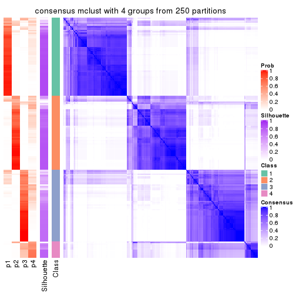</p>

</div>
<div id='tab-CV-mclust-consensus-heatmap-4'>
<pre><code class="r">consensus_heatmap(res, k = 5)
</code></pre>

<p></p>

</div>
<div id='tab-CV-mclust-consensus-heatmap-5'>
<pre><code class="r">consensus_heatmap(res, k = 6)
</code></pre>

<p></p>

</div>
</div>

Heatmaps for the membership of samples in all partitions to see how consistent they are:


<script>
$( function() {
	$( '#tabs-CV-mclust-membership-heatmap' ).tabs();
} );
</script>
<div id='tabs-CV-mclust-membership-heatmap'>
<ul>
<li><a href='#tab-CV-mclust-membership-heatmap-1'>k = 2</a></li>
<li><a href='#tab-CV-mclust-membership-heatmap-2'>k = 3</a></li>
<li><a href='#tab-CV-mclust-membership-heatmap-3'>k = 4</a></li>
<li><a href='#tab-CV-mclust-membership-heatmap-4'>k = 5</a></li>
<li><a href='#tab-CV-mclust-membership-heatmap-5'>k = 6</a></li>
</ul>
<div id='tab-CV-mclust-membership-heatmap-1'>
<pre><code class="r">membership_heatmap(res, k = 2)
</code></pre>

<p></p>

</div>
<div id='tab-CV-mclust-membership-heatmap-2'>
<pre><code class="r">membership_heatmap(res, k = 3)
</code></pre>

<p></p>

</div>
<div id='tab-CV-mclust-membership-heatmap-3'>
<pre><code class="r">membership_heatmap(res, k = 4)
</code></pre>

<p></p>

</div>
<div id='tab-CV-mclust-membership-heatmap-4'>
<pre><code class="r">membership_heatmap(res, k = 5)
</code></pre>

<p></p>

</div>
<div id='tab-CV-mclust-membership-heatmap-5'>
<pre><code class="r">membership_heatmap(res, k = 6)
</code></pre>

<p></p>

</div>
</div>

As soon as we have had the classes for columns, we can look for signatures
which are significantly different between classes which can be candidate marks
for certain classes. Following are the heatmaps for signatures.


Signature heatmaps where rows are scaled:


<script>
$( function() {
	$( '#tabs-CV-mclust-get-signatures' ).tabs();
} );
</script>
<div id='tabs-CV-mclust-get-signatures'>
<ul>
<li><a href='#tab-CV-mclust-get-signatures-1'>k = 2</a></li>
<li><a href='#tab-CV-mclust-get-signatures-2'>k = 3</a></li>
<li><a href='#tab-CV-mclust-get-signatures-3'>k = 4</a></li>
<li><a href='#tab-CV-mclust-get-signatures-4'>k = 5</a></li>
<li><a href='#tab-CV-mclust-get-signatures-5'>k = 6</a></li>
</ul>
<div id='tab-CV-mclust-get-signatures-1'>
<pre><code class="r">get_signatures(res, k = 2)
</code></pre>

<p></p>

</div>
<div id='tab-CV-mclust-get-signatures-2'>
<pre><code class="r">get_signatures(res, k = 3)
</code></pre>

<p></p>

</div>
<div id='tab-CV-mclust-get-signatures-3'>
<pre><code class="r">get_signatures(res, k = 4)
</code></pre>

<p></p>

</div>
<div id='tab-CV-mclust-get-signatures-4'>
<pre><code class="r">get_signatures(res, k = 5)
</code></pre>

<p></p>

</div>
<div id='tab-CV-mclust-get-signatures-5'>
<pre><code class="r">get_signatures(res, k = 6)
</code></pre>

<p></p>

</div>
</div>


Signature heatmaps where rows are not scaled:


<script>
$( function() {
	$( '#tabs-CV-mclust-get-signatures-no-scale' ).tabs();
} );
</script>
<div id='tabs-CV-mclust-get-signatures-no-scale'>
<ul>
<li><a href='#tab-CV-mclust-get-signatures-no-scale-1'>k = 2</a></li>
<li><a href='#tab-CV-mclust-get-signatures-no-scale-2'>k = 3</a></li>
<li><a href='#tab-CV-mclust-get-signatures-no-scale-3'>k = 4</a></li>
<li><a href='#tab-CV-mclust-get-signatures-no-scale-4'>k = 5</a></li>
<li><a href='#tab-CV-mclust-get-signatures-no-scale-5'>k = 6</a></li>
</ul>
<div id='tab-CV-mclust-get-signatures-no-scale-1'>
<pre><code class="r">get_signatures(res, k = 2, scale_rows = FALSE)
</code></pre>

<p></p>

</div>
<div id='tab-CV-mclust-get-signatures-no-scale-2'>
<pre><code class="r">get_signatures(res, k = 3, scale_rows = FALSE)
</code></pre>

<p></p>

</div>
<div id='tab-CV-mclust-get-signatures-no-scale-3'>
<pre><code class="r">get_signatures(res, k = 4, scale_rows = FALSE)
</code></pre>

<p></p>

</div>
<div id='tab-CV-mclust-get-signatures-no-scale-4'>
<pre><code class="r">get_signatures(res, k = 5, scale_rows = FALSE)
</code></pre>

<p></p>

</div>
<div id='tab-CV-mclust-get-signatures-no-scale-5'>
<pre><code class="r">get_signatures(res, k = 6, scale_rows = FALSE)
</code></pre>

<p></p>

</div>
</div>


Compare the overlap of signatures from different k:

```r
compare_signatures(res)
```


`get_signature()` returns a data frame invisibly. TO get the list of signatures, the function
call should be assigned to a variable explicitly. In following code, if `plot` argument is set
to `FALSE`, no heatmap is plotted while only the differential analysis is performed.

```r
# code only for demonstration
tb = get_signature(res, k = ..., plot = FALSE)
```

An example of the output of `tb` is:

```
#>   which_row         fdr    mean_1    mean_2 scaled_mean_1 scaled_mean_2 km
#> 1        38 0.042760348  8.373488  9.131774    -0.5533452     0.5164555  1
#> 2        40 0.018707592  7.106213  8.469186    -0.6173731     0.5762149  1
#> 3        55 0.019134737 10.221463 11.207825    -0.6159697     0.5749050  1
#> 4        59 0.006059896  5.921854  7.869574    -0.6899429     0.6439467  1
#> 5        60 0.018055526  8.928898 10.211722    -0.6204761     0.5791110  1
#> 6        98 0.009384629 15.714769 14.887706     0.6635654    -0.6193277  2
...
```

The columns in `tb` are:

1. `which_row`: row indices corresponding to the input matrix.
2. `fdr`: FDR for the differential test. 
3. `mean_x`: The mean value in group x.
4. `scaled_mean_x`: The mean value in group x after rows are scaled.
5. `km`: Row groups if k-means clustering is applied to rows.


UMAP plot which shows how samples are separated.


<script>
$( function() {
	$( '#tabs-CV-mclust-dimension-reduction' ).tabs();
} );
</script>
<div id='tabs-CV-mclust-dimension-reduction'>
<ul>
<li><a href='#tab-CV-mclust-dimension-reduction-1'>k = 2</a></li>
<li><a href='#tab-CV-mclust-dimension-reduction-2'>k = 3</a></li>
<li><a href='#tab-CV-mclust-dimension-reduction-3'>k = 4</a></li>
<li><a href='#tab-CV-mclust-dimension-reduction-4'>k = 5</a></li>
<li><a href='#tab-CV-mclust-dimension-reduction-5'>k = 6</a></li>
</ul>
<div id='tab-CV-mclust-dimension-reduction-1'>
<pre><code class="r">dimension_reduction(res, k = 2, method = &quot;UMAP&quot;)
</code></pre>

<p></p>

</div>
<div id='tab-CV-mclust-dimension-reduction-2'>
<pre><code class="r">dimension_reduction(res, k = 3, method = &quot;UMAP&quot;)
</code></pre>

<p></p>

</div>
<div id='tab-CV-mclust-dimension-reduction-3'>
<pre><code class="r">dimension_reduction(res, k = 4, method = &quot;UMAP&quot;)
</code></pre>

<p></p>

</div>
<div id='tab-CV-mclust-dimension-reduction-4'>
<pre><code class="r">dimension_reduction(res, k = 5, method = &quot;UMAP&quot;)
</code></pre>

<p></p>

</div>
<div id='tab-CV-mclust-dimension-reduction-5'>
<pre><code class="r">dimension_reduction(res, k = 6, method = &quot;UMAP&quot;)
</code></pre>

<p></p>

</div>
</div>


Following heatmap shows how subgroups are split when increasing `k`:

```r
collect_classes(res)
```


If matrix rows can be associated to genes, consider to use `GO_Enrichment(res,
...)` to perform function enrichment for the signature genes.


 

---------------------------------------------------


### CV:NMF*


The object with results only for a single top-value method and a single partition method 
can be extracted as:

```r
res = res_list["CV", "NMF"]
# you can also extract it by
# res = res_list["CV:NMF"]
```

A summary of `res` and all the functions that can be applied to it:

```r
res
```

```
#> A 'ConsensusPartition' object with k = 2, 3, 4, 5, 6.
#>   On a matrix with 17723 rows and 374 columns.
#>   Top rows (1000, 2000, 3000, 4000, 5000) are extracted by 'CV' method.
#>   Subgroups are detected by 'NMF' method.
#>   Performed in total 1250 partitions by row resampling.
#>   Best k for subgroups seems to be 3.
#> 
#> Following methods can be applied to this 'ConsensusPartition' object:
#>  [1] "cola_report"             "collect_classes"         "collect_plots"          
#>  [4] "collect_stats"           "colnames"                "compare_signatures"     
#>  [7] "consensus_heatmap"       "dimension_reduction"     "functional_enrichment"  
#> [10] "get_anno_col"            "get_anno"                "get_classes"            
#> [13] "get_consensus"           "get_matrix"              "get_membership"         
#> [16] "get_param"               "get_signatures"          "get_stats"              
#> [19] "is_best_k"               "is_stable_k"             "membership_heatmap"     
#> [22] "ncol"                    "nrow"                    "plot_ecdf"              
#> [25] "rownames"                "select_partition_number" "show"                   
#> [28] "suggest_best_k"          "test_to_known_factors"
```

`collect_plots()` function collects all the plots made from `res` for all `k` (number of partitions)
into one single page to provide an easy and fast comparison between different `k`.

```r
collect_plots(res)
```


The plots are:

- The first row: a plot of the ECDF (Empirical cumulative distribution
  function) curves of the consensus matrix for each `k` and the heatmap of
  predicted classes for each `k`.
- The second row: heatmaps of the consensus matrix for each `k`.
- The third row: heatmaps of the membership matrix for each `k`.
- The fouth row: heatmaps of the signatures for each `k`.

All the plots in panels can be made by individual functions and they are
plotted later in this section.

`select_partition_number()` produces several plots showing different
statistics for choosing "optimized" `k`. There are following statistics:

- ECDF curves of the consensus matrix for each `k`;
- 1-PAC. [The PAC
  score](https://en.wikipedia.org/wiki/Consensus_clustering#Over-interpretation_potential_of_consensus_clustering)
  measures the proportion of the ambiguous subgrouping.
- Mean silhouette score.
- Concordance. The mean probability of fiting the consensus class ids in all
  partitions.
- Area increased. Denote $A_k$ as the area under the ECDF curve for current
  `k`, the area increased is defined as $A_k - A_{k-1}$.
- Rand index. The percent of pairs of samples that are both in a same cluster
  or both are not in a same cluster in the partition of k and k-1.
- Jaccard index. The ratio of pairs of samples are both in a same cluster in
  the partition of k and k-1 and the pairs of samples are both in a same
  cluster in the partition k or k-1.

The detailed explanations of these statistics can be found in [the cola
vignette](http://bioconductor.org/packages/devel/bioc/vignettes/cola/inst/doc/cola.html#toc_13).

Generally speaking, lower PAC score, higher mean silhouette score or higher
concordance corresponds to better partition. Rand index and Jaccard index
measure how similar the current partition is compared to partition with `k-1`.
If they are too similar, we won't accept `k` is better than `k-1`.

```r
select_partition_number(res)
```


The numeric values for all these statistics can be obtained by `get_stats()`.

```r
get_stats(res)
```

```
#>   k 1-PAC mean_silhouette concordance area_increased  Rand Jaccard
#> 2 2 0.488           0.789       0.878         0.4820 0.499   0.499
#> 3 3 0.943           0.930       0.972         0.3056 0.810   0.643
#> 4 4 0.689           0.697       0.846         0.1409 0.849   0.626
#> 5 5 0.795           0.771       0.895         0.0893 0.848   0.529
#> 6 6 0.743           0.659       0.826         0.0357 0.940   0.739
```

`suggest_best_k()` suggests the best $k$ based on these statistics. The rules are as follows:

- All $k$ with Jaccard index larger than 0.95 are removed because the increase of
  the partition number does not provides enough extra information. If all $k$ are removed,
  the best $k$ is assigned by `NA`.
- For $k$ with 1-PAC larger than 0.9, the maximal $k$ is taken as the "best k". Other $k$ is called "optional k".
- If it does not fit the second rule. The $k$ with the highest vote of highest
  1-PAC, mean silhouette and concordance is taken as the "best k".

```r
suggest_best_k(res)
```

```
#> [1] 3
```


Following shows the table of the partitions (You need to click the **show/hide
code output** link to see it). The membership matrix (columns with name `p*`)
is inferred by
[`clue::cl_consensus()`](https://www.rdocumentation.org/link/cl_consensus?package=clue)
function with the `SE` method. Basically the value in the membership matrix
represents the probability to belong to a certain group. The finall class
label for an item is determined with the group with highest probability it
belongs to.

In `get_classes()` function, the entropy is calculated from the membership
matrix and the silhouette score is calculated from the consensus matrix.


<script>
$( function() {
	$( '#tabs-CV-NMF-get-classes' ).tabs();
} );
</script>
<div id='tabs-CV-NMF-get-classes'>
<ul>
<li><a href='#tab-CV-NMF-get-classes-1'>k = 2</a></li>
<li><a href='#tab-CV-NMF-get-classes-2'>k = 3</a></li>
<li><a href='#tab-CV-NMF-get-classes-3'>k = 4</a></li>
<li><a href='#tab-CV-NMF-get-classes-4'>k = 5</a></li>
<li><a href='#tab-CV-NMF-get-classes-5'>k = 6</a></li>
</ul>

<div id='tab-CV-NMF-get-classes-1'>
<p><a id='tab-CV-NMF-get-classes-1-a' style='color:#0366d6' href='#'>show/hide code output</a></p>
<pre><code class="r">cbind(get_classes(res, k = 2), get_membership(res, k = 2))
</code></pre>

<pre><code>#&gt;            class entropy silhouette    p1    p2
#&gt; SRR660824      1  0.8207    0.79669 0.744 0.256
#&gt; SRR603858      1  0.2603    0.77240 0.956 0.044
#&gt; SRR817070      2  0.0000    0.91835 0.000 1.000
#&gt; SRR1486995     1  0.0000    0.77712 1.000 0.000
#&gt; SRR813043      2  0.0000    0.91835 0.000 1.000
#&gt; SRR656874      2  0.0000    0.91835 0.000 1.000
#&gt; SRR659037      1  0.2603    0.77240 0.956 0.044
#&gt; SRR662031      1  0.8144    0.80013 0.748 0.252
#&gt; SRR1081283     2  0.0000    0.91835 0.000 1.000
#&gt; SRR1481036     1  0.9795    0.55449 0.584 0.416
#&gt; SRR1434009     1  0.9922    0.00811 0.552 0.448
#&gt; SRR1376676     1  0.8144    0.80013 0.748 0.252
#&gt; SRR1396967     2  0.9286    0.53941 0.344 0.656
#&gt; SRR665429      2  0.0000    0.91835 0.000 1.000
#&gt; SRR1388025     2  0.0000    0.91835 0.000 1.000
#&gt; SRR600784      1  0.8144    0.80013 0.748 0.252
#&gt; SRR657611      1  0.8144    0.80013 0.748 0.252
#&gt; SRR1333659     1  0.2948    0.76840 0.948 0.052
#&gt; SRR1323896     2  0.0000    0.91835 0.000 1.000
#&gt; SRR1453971     1  0.1633    0.78399 0.976 0.024
#&gt; SRR1421010     1  0.0000    0.77712 1.000 0.000
#&gt; SRR1334490     1  0.1633    0.77586 0.976 0.024
#&gt; SRR1309468     1  0.8144    0.80013 0.748 0.252
#&gt; SRR1468637     1  0.2603    0.77240 0.956 0.044
#&gt; SRR1365489     2  0.0000    0.91835 0.000 1.000
#&gt; SRR627445      1  0.9427    0.65965 0.640 0.360
#&gt; SRR607863      2  0.7815    0.67945 0.232 0.768
#&gt; SRR1475524     1  0.1843    0.77538 0.972 0.028
#&gt; SRR1405504     2  0.0000    0.91835 0.000 1.000
#&gt; SRR615695      1  0.8144    0.80013 0.748 0.252
#&gt; SRR600900      2  0.0000    0.91835 0.000 1.000
#&gt; SRR601477      2  0.0000    0.91835 0.000 1.000
#&gt; SRR1487215     2  0.0000    0.91835 0.000 1.000
#&gt; SRR1310797     2  0.0000    0.91835 0.000 1.000
#&gt; SRR1362713     2  0.9983   -0.26249 0.476 0.524
#&gt; SRR1431385     1  0.8144    0.80013 0.748 0.252
#&gt; SRR1379089     2  0.0000    0.91835 0.000 1.000
#&gt; SRR1102079     1  0.0000    0.77712 1.000 0.000
#&gt; SRR1357210     1  0.8144    0.80013 0.748 0.252
#&gt; SRR657659      2  0.0000    0.91835 0.000 1.000
#&gt; SRR663573      2  0.0000    0.91835 0.000 1.000
#&gt; SRR603188      2  0.8081    0.65944 0.248 0.752
#&gt; SRR1471200     2  0.0000    0.91835 0.000 1.000
#&gt; SRR1310975     2  0.0000    0.91835 0.000 1.000
#&gt; SRR627457      2  0.2603    0.88114 0.044 0.956
#&gt; SRR1367654     2  0.9491    0.49898 0.368 0.632
#&gt; SRR1488410     1  0.2603    0.77240 0.956 0.044
#&gt; SRR1457750     2  0.8443    0.48548 0.272 0.728
#&gt; SRR1099546     1  0.8144    0.80013 0.748 0.252
#&gt; SRR604480      2  0.0000    0.91835 0.000 1.000
#&gt; SRR1390477     2  0.0000    0.91835 0.000 1.000
#&gt; SRR1458447     2  0.0000    0.91835 0.000 1.000
#&gt; SRR1473161     2  0.0000    0.91835 0.000 1.000
#&gt; SRR1409813     1  0.9795    0.12207 0.584 0.416
#&gt; SRR612791      1  0.8144    0.80013 0.748 0.252
#&gt; SRR1470580     2  0.2423    0.88498 0.040 0.960
#&gt; SRR1444063     1  0.9460    0.68299 0.636 0.364
#&gt; SRR1355578     1  0.8144    0.80013 0.748 0.252
#&gt; SRR1429203     1  0.7453    0.80037 0.788 0.212
#&gt; SRR599154      1  0.6531    0.66296 0.832 0.168
#&gt; SRR814244      1  0.2603    0.77240 0.956 0.044
#&gt; SRR1404123     2  0.0000    0.91835 0.000 1.000
#&gt; SRR656934      1  0.8713    0.75827 0.708 0.292
#&gt; SRR1339029     2  0.0000    0.91835 0.000 1.000
#&gt; SRR821525      2  0.0000    0.91835 0.000 1.000
#&gt; SRR1443677     1  0.8144    0.80013 0.748 0.252
#&gt; SRR1406330     1  0.0000    0.77712 1.000 0.000
#&gt; SRR1338124     2  0.3584    0.85886 0.068 0.932
#&gt; SRR1391376     1  0.8144    0.80013 0.748 0.252
#&gt; SRR661842      2  0.0000    0.91835 0.000 1.000
#&gt; SRR1395699     1  0.0000    0.77712 1.000 0.000
#&gt; SRR1312209     1  0.8144    0.80013 0.748 0.252
#&gt; SRR1359469     1  0.0000    0.77712 1.000 0.000
#&gt; SRR658885      1  0.2423    0.77345 0.960 0.040
#&gt; SRR1414578     1  0.8144    0.80013 0.748 0.252
#&gt; SRR603620      2  0.9922    0.31901 0.448 0.552
#&gt; SRR604677      1  0.0938    0.78114 0.988 0.012
#&gt; SRR603800      2  0.0000    0.91835 0.000 1.000
#&gt; SRR602058      2  0.9393    0.51973 0.356 0.644
#&gt; SRR817488      2  0.0000    0.91835 0.000 1.000
#&gt; SRR655601      2  0.0000    0.91835 0.000 1.000
#&gt; SRR1434821     2  0.0000    0.91835 0.000 1.000
#&gt; SRR1349166     2  0.9460    0.50598 0.364 0.636
#&gt; SRR615129      2  0.2948    0.87436 0.052 0.948
#&gt; SRR607586      2  0.0000    0.91835 0.000 1.000
#&gt; SRR602680      2  0.4939    0.81828 0.108 0.892
#&gt; SRR1411070     2  0.0000    0.91835 0.000 1.000
#&gt; SRR663038      2  0.0000    0.91835 0.000 1.000
#&gt; SRR1489416     2  0.0000    0.91835 0.000 1.000
#&gt; SRR1479155     1  0.7745    0.80081 0.772 0.228
#&gt; SRR662162      1  0.8144    0.80013 0.748 0.252
#&gt; SRR1374567     1  0.8144    0.80013 0.748 0.252
#&gt; SRR1434048     2  0.0000    0.91835 0.000 1.000
#&gt; SRR2184865     2  0.0000    0.91835 0.000 1.000
#&gt; SRR2170135     1  0.8144    0.80013 0.748 0.252
#&gt; SRR615551      2  0.0000    0.91835 0.000 1.000
#&gt; SRR1335513     2  0.0000    0.91835 0.000 1.000
#&gt; SRR1370216     1  0.0000    0.77712 1.000 0.000
#&gt; SRR662954      1  0.2603    0.77240 0.956 0.044
#&gt; SRR1375738     1  0.8661    0.76309 0.712 0.288
#&gt; SRR1356577     1  0.8813    0.74835 0.700 0.300
#&gt; SRR1073119     1  0.8144    0.80013 0.748 0.252
#&gt; SRR663549      1  0.8499    0.77667 0.724 0.276
#&gt; SRR1478015     2  0.0000    0.91835 0.000 1.000
#&gt; SRR600632      2  0.0000    0.91835 0.000 1.000
#&gt; SRR811866      1  0.8144    0.80013 0.748 0.252
#&gt; SRR1401101     2  0.8016    0.66451 0.244 0.756
#&gt; SRR1477797     1  0.9815    0.10860 0.580 0.420
#&gt; SRR1402986     2  0.0000    0.91835 0.000 1.000
#&gt; SRR658897      1  0.8144    0.80013 0.748 0.252
#&gt; SRR1419869     1  0.8144    0.80013 0.748 0.252
#&gt; SRR1490700     1  0.8267    0.79289 0.740 0.260
#&gt; SRR601723      2  0.2603    0.88114 0.044 0.956
#&gt; SRR1384115     1  0.2603    0.77240 0.956 0.044
#&gt; SRR1476927     2  0.0000    0.91835 0.000 1.000
#&gt; SRR1387769     1  0.8909    0.73782 0.692 0.308
#&gt; SRR1322595     1  0.2603    0.77240 0.956 0.044
#&gt; SRR1370423     1  0.9988    0.39565 0.520 0.480
#&gt; SRR1314976     2  0.4815    0.81459 0.104 0.896
#&gt; SRR1319560     2  0.9358    0.52643 0.352 0.648
#&gt; SRR1352683     1  0.9896    0.49891 0.560 0.440
#&gt; SRR1473800     1  0.8144    0.80013 0.748 0.252
#&gt; SRR1326384     1  0.2603    0.77240 0.956 0.044
#&gt; SRR1360807     2  0.2603    0.88114 0.044 0.956
#&gt; SRR1332544     1  0.1184    0.77663 0.984 0.016
#&gt; SRR598695      1  0.8144    0.80013 0.748 0.252
#&gt; SRR807824      2  0.4298    0.82590 0.088 0.912
#&gt; SRR809296      1  0.0000    0.77712 1.000 0.000
#&gt; SRR657927      1  0.8144    0.80013 0.748 0.252
#&gt; SRR1440682     2  0.0000    0.91835 0.000 1.000
#&gt; SRR1454415     2  0.0376    0.91543 0.004 0.996
#&gt; SRR1419131     2  0.0000    0.91835 0.000 1.000
#&gt; SRR1404293     1  0.9393    0.66613 0.644 0.356
#&gt; SRR1473340     1  0.8144    0.80013 0.748 0.252
#&gt; SRR1345563     1  0.2603    0.77240 0.956 0.044
#&gt; SRR1323382     2  0.0000    0.91835 0.000 1.000
#&gt; SRR1480697     1  0.8144    0.79671 0.748 0.252
#&gt; SRR1321808     2  0.0000    0.91835 0.000 1.000
#&gt; SRR1382756     2  0.0376    0.91541 0.004 0.996
#&gt; SRR1312558     2  0.0000    0.91835 0.000 1.000
#&gt; SRR1417088     2  0.0000    0.91835 0.000 1.000
#&gt; SRR1433027     2  0.0000    0.91835 0.000 1.000
#&gt; SRR662257      1  0.9922    0.00811 0.552 0.448
#&gt; SRR600417      2  0.0000    0.91835 0.000 1.000
#&gt; SRR812493      1  0.5059    0.72392 0.888 0.112
#&gt; SRR612743      1  0.8443    0.78083 0.728 0.272
#&gt; SRR1361345     1  0.8144    0.80013 0.748 0.252
#&gt; SRR600584      2  0.1184    0.90591 0.016 0.984
#&gt; SRR1310520     2  0.0000    0.91835 0.000 1.000
#&gt; SRR1395595     1  0.2423    0.77345 0.960 0.040
#&gt; SRR1334074     1  0.2603    0.77240 0.956 0.044
#&gt; SRR654838      2  0.0000    0.91835 0.000 1.000
#&gt; SRR1376694     1  0.2603    0.77240 0.956 0.044
#&gt; SRR1433841     2  0.2603    0.88114 0.044 0.956
#&gt; SRR1366837     1  0.8144    0.80013 0.748 0.252
#&gt; SRR1467479     2  0.0000    0.91835 0.000 1.000
#&gt; SRR1459055     1  0.2043    0.77483 0.968 0.032
#&gt; SRR1471050     2  0.0000    0.91835 0.000 1.000
#&gt; SRR603004      2  0.7674    0.69821 0.224 0.776
#&gt; SRR814703      2  0.7815    0.67938 0.232 0.768
#&gt; SRR661937      2  0.0000    0.91835 0.000 1.000
#&gt; SRR614359      1  0.8144    0.80013 0.748 0.252
#&gt; SRR1071568     2  0.0000    0.91835 0.000 1.000
#&gt; SRR1389084     1  0.8144    0.80013 0.748 0.252
#&gt; SRR1337624     2  0.0000    0.91835 0.000 1.000
#&gt; SRR1344400     2  0.0000    0.91835 0.000 1.000
#&gt; SRR1414290     2  0.0000    0.91835 0.000 1.000
#&gt; SRR1413644     2  0.9286    0.53936 0.344 0.656
#&gt; SRR1098998     1  0.8144    0.80013 0.748 0.252
#&gt; SRR1481279     1  0.8144    0.80013 0.748 0.252
#&gt; SRR1315103     1  0.2603    0.77240 0.956 0.044
#&gt; SRR1099286     1  0.2423    0.77345 0.960 0.040
#&gt; SRR2166570     2  0.6048    0.74905 0.148 0.852
#&gt; SRR601445      1  0.8144    0.80013 0.748 0.252
#&gt; SRR1439719     2  0.0000    0.91835 0.000 1.000
#&gt; SRR1377026     2  0.2043    0.89234 0.032 0.968
#&gt; SRR1327386     1  0.8144    0.80013 0.748 0.252
#&gt; SRR654826      2  0.0000    0.91835 0.000 1.000
#&gt; SRR1460433     2  0.0000    0.91835 0.000 1.000
#&gt; SRR1469345     1  0.0000    0.77712 1.000 0.000
#&gt; SRR1421462     2  0.0000    0.91835 0.000 1.000
#&gt; SRR662966      1  0.2603    0.77240 0.956 0.044
#&gt; SRR1339175     1  0.8144    0.80013 0.748 0.252
#&gt; SRR1447736     2  0.0000    0.91835 0.000 1.000
#&gt; SRR1434671     2  0.9323    0.53297 0.348 0.652
#&gt; SRR660800      2  0.0000    0.91835 0.000 1.000
#&gt; SRR1465543     1  0.4022    0.75026 0.920 0.080
#&gt; SRR1342023     1  0.8144    0.80013 0.748 0.252
#&gt; SRR1335670     1  0.8081    0.80024 0.752 0.248
#&gt; SRR1400955     2  0.7745    0.68417 0.228 0.772
#&gt; SRR1072150     2  0.0000    0.91835 0.000 1.000
#&gt; SRR1442822     1  0.8144    0.80013 0.748 0.252
#&gt; SRR1364658     1  0.8144    0.80013 0.748 0.252
#&gt; SRR1098074     1  0.2603    0.77240 0.956 0.044
#&gt; SRR1442778     1  0.0000    0.77712 1.000 0.000
#&gt; SRR1086728     1  0.2603    0.77240 0.956 0.044
#&gt; SRR627464      2  0.9286    0.25191 0.344 0.656
#&gt; SRR1409193     1  0.8144    0.80013 0.748 0.252
#&gt; SRR2168286     2  0.2603    0.88114 0.044 0.956
#&gt; SRR615539      2  0.0000    0.91835 0.000 1.000
#&gt; SRR663623      1  0.0000    0.77712 1.000 0.000
#&gt; SRR1471989     1  0.2603    0.77240 0.956 0.044
#&gt; SRR1468828     2  0.0000    0.91835 0.000 1.000
#&gt; SRR1381934     1  0.5294    0.79553 0.880 0.120
#&gt; SRR1471098     1  0.8144    0.80013 0.748 0.252
#&gt; SRR1314749     1  0.8144    0.80013 0.748 0.252
#&gt; SRR2166874     1  0.3114    0.76605 0.944 0.056
#&gt; SRR821302      1  0.8144    0.80013 0.748 0.252
#&gt; SRR1435066     2  0.0000    0.91835 0.000 1.000
#&gt; SRR661601      2  0.0000    0.91835 0.000 1.000
#&gt; SRR1446546     2  0.0376    0.91541 0.004 0.996
#&gt; SRR1419784     1  0.2603    0.77240 0.956 0.044
#&gt; SRR1357233     1  0.4298    0.74421 0.912 0.088
#&gt; SRR1441889     1  0.8144    0.80013 0.748 0.252
#&gt; SRR1413940     1  0.2603    0.77240 0.956 0.044
#&gt; SRR1324250     2  0.0000    0.91835 0.000 1.000
#&gt; SRR1442862     1  0.9944   -0.02273 0.544 0.456
#&gt; SRR662474      2  0.0000    0.91835 0.000 1.000
#&gt; SRR1416226     1  0.8813    0.74836 0.700 0.300
#&gt; SRR1417404     1  0.0376    0.77712 0.996 0.004
#&gt; SRR665466      2  0.0000    0.91835 0.000 1.000
#&gt; SRR658849      1  0.8144    0.80013 0.748 0.252
#&gt; SRR1460025     2  0.0000    0.91835 0.000 1.000
#&gt; SRR1408136     1  0.8144    0.80013 0.748 0.252
#&gt; SRR1489995     2  0.0000    0.91835 0.000 1.000
#&gt; SRR1374092     1  0.8207    0.79669 0.744 0.256
#&gt; SRR1488429     1  0.2423    0.77345 0.960 0.040
#&gt; SRR1087559     2  0.9209    0.29311 0.336 0.664
#&gt; SRR817004      1  0.2603    0.77240 0.956 0.044
#&gt; SRR1429660     1  0.9909    0.02326 0.556 0.444
#&gt; SRR604390      1  0.2603    0.77240 0.956 0.044
#&gt; SRR614936      2  0.0000    0.91835 0.000 1.000
#&gt; SRR1365938     2  0.2043    0.89211 0.032 0.968
#&gt; SRR1437324     1  0.8144    0.80013 0.748 0.252
#&gt; SRR613414      1  0.9977   -0.08258 0.528 0.472
#&gt; SRR660414      2  0.9635    0.09659 0.388 0.612
#&gt; SRR1452185     1  0.8144    0.80013 0.748 0.252
#&gt; SRR1347020     1  0.8555    0.77229 0.720 0.280
#&gt; SRR1398036     2  0.8144    0.65422 0.252 0.748
#&gt; SRR1436674     1  0.8144    0.80013 0.748 0.252
#&gt; SRR603750      2  0.9754    0.00836 0.408 0.592
#&gt; SRR608630      1  0.9087    0.70985 0.676 0.324
#&gt; SRR655625      2  0.0000    0.91835 0.000 1.000
#&gt; SRR599059      1  0.9209    0.70037 0.664 0.336
#&gt; SRR615189      2  0.0938    0.90919 0.012 0.988
#&gt; SRR1466889     2  0.7950    0.66953 0.240 0.760
#&gt; SRR1084602     2  0.2603    0.88114 0.044 0.956
#&gt; SRR1335422     1  0.8144    0.80013 0.748 0.252
#&gt; SRR1356805     2  0.8267    0.64621 0.260 0.740
#&gt; SRR1385300     1  0.2603    0.77240 0.956 0.044
#&gt; SRR654814      1  0.8144    0.80013 0.748 0.252
#&gt; SRR658385      2  0.6247    0.76671 0.156 0.844
#&gt; SRR820596      1  0.8144    0.80013 0.748 0.252
#&gt; SRR1318118     1  0.0000    0.77712 1.000 0.000
#&gt; SRR1480766     2  0.0000    0.91835 0.000 1.000
#&gt; SRR1406539     1  0.5842    0.79677 0.860 0.140
#&gt; SRR1341833     2  0.8081    0.65944 0.248 0.752
#&gt; SRR1441826     2  0.0000    0.91835 0.000 1.000
#&gt; SRR1448051     1  0.8144    0.80013 0.748 0.252
#&gt; SRR1326752     1  0.0000    0.77712 1.000 0.000
#&gt; SRR665217      1  0.2236    0.78605 0.964 0.036
#&gt; SRR819186      2  0.0000    0.91835 0.000 1.000
#&gt; SRR661517      1  0.0000    0.77712 1.000 0.000
#&gt; SRR607166      2  0.0000    0.91835 0.000 1.000
#&gt; SRR809065      2  0.0672    0.91232 0.008 0.992
#&gt; SRR1415872     2  0.7883    0.67453 0.236 0.764
#&gt; SRR1415463     1  0.8144    0.80013 0.748 0.252
#&gt; SRR1381161     1  0.9909    0.02326 0.556 0.444
#&gt; SRR1442231     2  0.2603    0.88114 0.044 0.956
#&gt; SRR1374696     1  0.8207    0.79669 0.744 0.256
#&gt; SRR1451988     2  0.5519    0.78026 0.128 0.872
#&gt; SRR660555      1  0.8144    0.80013 0.748 0.252
#&gt; SRR657801      1  0.8144    0.80013 0.748 0.252
#&gt; SRR663344      2  0.0000    0.91835 0.000 1.000
#&gt; SRR1472462     2  0.0000    0.91835 0.000 1.000
#&gt; SRR1406176     2  0.6247    0.73510 0.156 0.844
#&gt; SRR656886      2  0.1843    0.89559 0.028 0.972
#&gt; SRR1498337     1  0.9775    0.13533 0.588 0.412
#&gt; SRR613066      1  0.2423    0.77345 0.960 0.040
#&gt; SRR1309490     1  0.8144    0.80013 0.748 0.252
#&gt; SRR602492      2  0.7219    0.71681 0.200 0.800
#&gt; SRR1447347     1  0.8144    0.80013 0.748 0.252
#&gt; SRR1475546     2  0.0000    0.91835 0.000 1.000
#&gt; SRR627459      2  0.2778    0.87955 0.048 0.952
#&gt; SRR1434332     2  0.0000    0.91835 0.000 1.000
#&gt; SRR1070358     2  0.9393    0.51973 0.356 0.644
#&gt; SRR1345936     1  0.2603    0.77240 0.956 0.044
#&gt; SRR665658      2  0.2423    0.88498 0.040 0.960
#&gt; SRR1321351     2  0.0000    0.91835 0.000 1.000
#&gt; SRR657880      2  0.0000    0.91835 0.000 1.000
#&gt; SRR1373903     2  0.0000    0.91835 0.000 1.000
#&gt; SRR657396      2  0.9393    0.51973 0.356 0.644
#&gt; SRR660981      2  0.0000    0.91835 0.000 1.000
#&gt; SRR818499      1  0.8144    0.80013 0.748 0.252
#&gt; SRR819658      2  0.8081    0.65944 0.248 0.752
#&gt; SRR1376316     1  0.0000    0.77712 1.000 0.000
#&gt; SRR1323723     2  0.0000    0.91835 0.000 1.000
#&gt; SRR1476719     1  0.8144    0.80013 0.748 0.252
#&gt; SRR1403478     2  0.0000    0.91835 0.000 1.000
#&gt; SRR1095695     1  0.8207    0.79669 0.744 0.256
#&gt; SRR1352391     1  0.2603    0.77240 0.956 0.044
#&gt; SRR1498813     2  0.0000    0.91835 0.000 1.000
#&gt; SRR627437      1  0.8443    0.78101 0.728 0.272
#&gt; SRR2185097     1  0.8144    0.80013 0.748 0.252
#&gt; SRR817166      1  0.2603    0.77240 0.956 0.044
#&gt; SRR1091670     2  0.0000    0.91835 0.000 1.000
#&gt; SRR603776      1  0.0000    0.77712 1.000 0.000
#&gt; SRR1479640     2  0.0000    0.91835 0.000 1.000
#&gt; SRR660152      1  0.0000    0.77712 1.000 0.000
#&gt; SRR1074769     2  0.0000    0.91835 0.000 1.000
#&gt; SRR656153      2  0.0000    0.91835 0.000 1.000
#&gt; SRR1392502     1  0.2423    0.77345 0.960 0.040
#&gt; SRR1359609     1  0.2043    0.77483 0.968 0.032
#&gt; SRR601925      2  0.0000    0.91835 0.000 1.000
#&gt; SRR2165182     2  0.0000    0.91835 0.000 1.000
#&gt; SRR608542      2  0.8144    0.65422 0.252 0.748
#&gt; SRR655064      2  0.0000    0.91835 0.000 1.000
#&gt; SRR1432430     1  0.8499    0.77667 0.724 0.276
#&gt; SRR808472      2  0.0000    0.91835 0.000 1.000
#&gt; SRR1414958     1  0.2603    0.77240 0.956 0.044
#&gt; SRR598484      2  0.0000    0.91835 0.000 1.000
#&gt; SRR612755      1  0.8207    0.79669 0.744 0.256
#&gt; SRR1365808     1  0.8144    0.80013 0.748 0.252
#&gt; SRR1391724     1  0.9393    0.66637 0.644 0.356
#&gt; SRR1322373     1  0.8144    0.80013 0.748 0.252
#&gt; SRR1489265     2  0.0000    0.91835 0.000 1.000
#&gt; SRR1359099     2  0.0000    0.91835 0.000 1.000
#&gt; SRR607279      2  0.0000    0.91835 0.000 1.000
#&gt; SRR810461      2  0.0000    0.91835 0.000 1.000
#&gt; SRR627427      1  0.8144    0.80013 0.748 0.252
#&gt; SRR612887      2  0.0672    0.91241 0.008 0.992
#&gt; SRR809807      1  0.2603    0.77240 0.956 0.044
#&gt; SRR663112      2  0.2603    0.88114 0.044 0.956
#&gt; SRR1346933     1  0.2603    0.77240 0.956 0.044
#&gt; SRR1487910     1  0.8207    0.79669 0.744 0.256
#&gt; SRR603092      2  0.0000    0.91835 0.000 1.000
#&gt; SRR1417680     2  0.0000    0.91835 0.000 1.000
#&gt; SRR1383785     1  0.8144    0.80013 0.748 0.252
#&gt; SRR1070015     1  0.3431    0.76117 0.936 0.064
#&gt; SRR1466222     2  0.2603    0.88114 0.044 0.956
#&gt; SRR1416119     1  0.0938    0.77685 0.988 0.012
#&gt; SRR819318      1  0.0000    0.77712 1.000 0.000
#&gt; SRR608288      2  0.1184    0.90593 0.016 0.984
#&gt; SRR811121      2  0.7056    0.72609 0.192 0.808
#&gt; SRR613138      2  0.0000    0.91835 0.000 1.000
#&gt; SRR810483      1  0.7528    0.80085 0.784 0.216
#&gt; SRR607839      1  0.8144    0.80013 0.748 0.252
#&gt; SRR1337031     1  0.0000    0.77712 1.000 0.000
#&gt; SRR601311      2  0.2948    0.87404 0.052 0.948
#&gt; SRR1406685     2  0.0000    0.91835 0.000 1.000
#&gt; SRR1467500     2  0.0000    0.91835 0.000 1.000
#&gt; SRR1308504     1  0.8144    0.80013 0.748 0.252
#&gt; SRR1312865     1  0.2603    0.77240 0.956 0.044
#&gt; SRR1312522     1  0.2603    0.77240 0.956 0.044
#&gt; SRR1490486     2  0.0000    0.91835 0.000 1.000
#&gt; SRR1325888     1  0.8144    0.80013 0.748 0.252
#&gt; SRR1472885     1  0.8144    0.80013 0.748 0.252
#&gt; SRR1098785     2  0.0000    0.91835 0.000 1.000
#&gt; SRR1084766     2  0.2423    0.88484 0.040 0.960
#&gt; SRR1102804     2  0.0000    0.91835 0.000 1.000
#&gt; SRR1336636     1  0.8207    0.79669 0.744 0.256
#&gt; SRR1347795     1  0.2603    0.77240 0.956 0.044
#&gt; SRR601900      2  0.5629    0.79294 0.132 0.868
#&gt; SRR1330989     2  0.2603    0.88114 0.044 0.956
#&gt; SRR658445      1  0.2603    0.77240 0.956 0.044
#&gt; SRR1368754     1  0.2423    0.77345 0.960 0.040
#&gt; SRR1460001     2  0.0000    0.91835 0.000 1.000
#&gt; SRR1414934     1  0.8144    0.80013 0.748 0.252
#&gt; SRR1326249     1  0.0000    0.77712 1.000 0.000
#&gt; SRR614948      1  0.1633    0.77586 0.976 0.024
#&gt; SRR1472952     1  0.0376    0.77860 0.996 0.004
#&gt; SRR1321528     1  0.9608    0.61752 0.616 0.384
#&gt; SRR627447      1  0.8144    0.80013 0.748 0.252
#&gt; SRR612239      2  0.2603    0.88114 0.044 0.956
</code></pre>

<script>
$('#tab-CV-NMF-get-classes-1-a').parent().next().next().hide();
$('#tab-CV-NMF-get-classes-1-a').click(function(){
  $('#tab-CV-NMF-get-classes-1-a').parent().next().next().toggle();
  return(false);
});
</script>
</div>

<div id='tab-CV-NMF-get-classes-2'>
<p><a id='tab-CV-NMF-get-classes-2-a' style='color:#0366d6' href='#'>show/hide code output</a></p>
<pre><code class="r">cbind(get_classes(res, k = 3), get_membership(res, k = 3))
</code></pre>

<pre><code>#&gt;            class entropy silhouette    p1    p2    p3
#&gt; SRR660824      1  0.0000     0.9714 1.000 0.000 0.000
#&gt; SRR603858      3  0.8939     0.4913 0.264 0.176 0.560
#&gt; SRR817070      2  0.0000     0.9661 0.000 1.000 0.000
#&gt; SRR1486995     1  0.0000     0.9714 1.000 0.000 0.000
#&gt; SRR813043      2  0.0000     0.9661 0.000 1.000 0.000
#&gt; SRR656874      2  0.0000     0.9661 0.000 1.000 0.000
#&gt; SRR659037      3  0.0000     0.9694 0.000 0.000 1.000
#&gt; SRR662031      1  0.0000     0.9714 1.000 0.000 0.000
#&gt; SRR1081283     2  0.0000     0.9661 0.000 1.000 0.000
#&gt; SRR1481036     1  0.0000     0.9714 1.000 0.000 0.000
#&gt; SRR1434009     3  0.0000     0.9694 0.000 0.000 1.000
#&gt; SRR1376676     1  0.0000     0.9714 1.000 0.000 0.000
#&gt; SRR1396967     2  0.4702     0.7238 0.000 0.788 0.212
#&gt; SRR665429      2  0.0000     0.9661 0.000 1.000 0.000
#&gt; SRR1388025     2  0.0000     0.9661 0.000 1.000 0.000
#&gt; SRR600784      1  0.0000     0.9714 1.000 0.000 0.000
#&gt; SRR657611      1  0.0000     0.9714 1.000 0.000 0.000
#&gt; SRR1333659     3  0.0000     0.9694 0.000 0.000 1.000
#&gt; SRR1323896     2  0.0000     0.9661 0.000 1.000 0.000
#&gt; SRR1453971     1  0.0000     0.9714 1.000 0.000 0.000
#&gt; SRR1421010     1  0.0000     0.9714 1.000 0.000 0.000
#&gt; SRR1334490     3  0.0000     0.9694 0.000 0.000 1.000
#&gt; SRR1309468     1  0.0000     0.9714 1.000 0.000 0.000
#&gt; SRR1468637     3  0.0000     0.9694 0.000 0.000 1.000
#&gt; SRR1365489     2  0.0000     0.9661 0.000 1.000 0.000
#&gt; SRR627445      1  0.0000     0.9714 1.000 0.000 0.000
#&gt; SRR607863      2  0.0000     0.9661 0.000 1.000 0.000
#&gt; SRR1475524     3  0.0000     0.9694 0.000 0.000 1.000
#&gt; SRR1405504     2  0.0000     0.9661 0.000 1.000 0.000
#&gt; SRR615695      1  0.0000     0.9714 1.000 0.000 0.000
#&gt; SRR600900      2  0.0000     0.9661 0.000 1.000 0.000
#&gt; SRR601477      2  0.0000     0.9661 0.000 1.000 0.000
#&gt; SRR1487215     2  0.0000     0.9661 0.000 1.000 0.000
#&gt; SRR1310797     2  0.0000     0.9661 0.000 1.000 0.000
#&gt; SRR1362713     1  0.0000     0.9714 1.000 0.000 0.000
#&gt; SRR1431385     1  0.0000     0.9714 1.000 0.000 0.000
#&gt; SRR1379089     2  0.0000     0.9661 0.000 1.000 0.000
#&gt; SRR1102079     1  0.4555     0.7394 0.800 0.000 0.200
#&gt; SRR1357210     1  0.0000     0.9714 1.000 0.000 0.000
#&gt; SRR657659      2  0.0000     0.9661 0.000 1.000 0.000
#&gt; SRR663573      2  0.0000     0.9661 0.000 1.000 0.000
#&gt; SRR603188      2  0.1031     0.9455 0.000 0.976 0.024
#&gt; SRR1471200     2  0.0000     0.9661 0.000 1.000 0.000
#&gt; SRR1310975     2  0.0000     0.9661 0.000 1.000 0.000
#&gt; SRR627457      1  0.2165     0.8995 0.936 0.064 0.000
#&gt; SRR1367654     2  0.6045     0.3941 0.000 0.620 0.380
#&gt; SRR1488410     3  0.0000     0.9694 0.000 0.000 1.000
#&gt; SRR1457750     1  0.0892     0.9515 0.980 0.020 0.000
#&gt; SRR1099546     1  0.0000     0.9714 1.000 0.000 0.000
#&gt; SRR604480      2  0.0000     0.9661 0.000 1.000 0.000
#&gt; SRR1390477     2  0.0000     0.9661 0.000 1.000 0.000
#&gt; SRR1458447     2  0.0000     0.9661 0.000 1.000 0.000
#&gt; SRR1473161     2  0.0000     0.9661 0.000 1.000 0.000
#&gt; SRR1409813     3  0.0000     0.9694 0.000 0.000 1.000
#&gt; SRR612791      1  0.0000     0.9714 1.000 0.000 0.000
#&gt; SRR1470580     2  0.4974     0.6701 0.236 0.764 0.000
#&gt; SRR1444063     1  0.5254     0.6300 0.736 0.264 0.000
#&gt; SRR1355578     1  0.0000     0.9714 1.000 0.000 0.000
#&gt; SRR1429203     1  0.0000     0.9714 1.000 0.000 0.000
#&gt; SRR599154      3  0.0000     0.9694 0.000 0.000 1.000
#&gt; SRR814244      3  0.0000     0.9694 0.000 0.000 1.000
#&gt; SRR1404123     2  0.0000     0.9661 0.000 1.000 0.000
#&gt; SRR656934      1  0.0000     0.9714 1.000 0.000 0.000
#&gt; SRR1339029     2  0.0000     0.9661 0.000 1.000 0.000
#&gt; SRR821525      2  0.0000     0.9661 0.000 1.000 0.000
#&gt; SRR1443677     1  0.0000     0.9714 1.000 0.000 0.000
#&gt; SRR1406330     3  0.0000     0.9694 0.000 0.000 1.000
#&gt; SRR1338124     1  0.5706     0.5172 0.680 0.320 0.000
#&gt; SRR1391376     1  0.0000     0.9714 1.000 0.000 0.000
#&gt; SRR661842      2  0.0000     0.9661 0.000 1.000 0.000
#&gt; SRR1395699     1  0.0000     0.9714 1.000 0.000 0.000
#&gt; SRR1312209     1  0.0000     0.9714 1.000 0.000 0.000
#&gt; SRR1359469     1  0.0000     0.9714 1.000 0.000 0.000
#&gt; SRR658885      3  0.0592     0.9606 0.012 0.000 0.988
#&gt; SRR1414578     1  0.0000     0.9714 1.000 0.000 0.000
#&gt; SRR603620      2  0.4504     0.7513 0.000 0.804 0.196
#&gt; SRR604677      1  0.0000     0.9714 1.000 0.000 0.000
#&gt; SRR603800      2  0.0000     0.9661 0.000 1.000 0.000
#&gt; SRR602058      2  0.5988     0.4237 0.000 0.632 0.368
#&gt; SRR817488      2  0.0000     0.9661 0.000 1.000 0.000
#&gt; SRR655601      2  0.0000     0.9661 0.000 1.000 0.000
#&gt; SRR1434821     2  0.0000     0.9661 0.000 1.000 0.000
#&gt; SRR1349166     3  0.5363     0.6075 0.000 0.276 0.724
#&gt; SRR615129      1  0.5948     0.4494 0.640 0.360 0.000
#&gt; SRR607586      2  0.0000     0.9661 0.000 1.000 0.000
#&gt; SRR602680      2  0.0000     0.9661 0.000 1.000 0.000
#&gt; SRR1411070     2  0.0000     0.9661 0.000 1.000 0.000
#&gt; SRR663038      2  0.0000     0.9661 0.000 1.000 0.000
#&gt; SRR1489416     2  0.0000     0.9661 0.000 1.000 0.000
#&gt; SRR1479155     1  0.0000     0.9714 1.000 0.000 0.000
#&gt; SRR662162      1  0.0000     0.9714 1.000 0.000 0.000
#&gt; SRR1374567     1  0.0000     0.9714 1.000 0.000 0.000
#&gt; SRR1434048     2  0.0000     0.9661 0.000 1.000 0.000
#&gt; SRR2184865     2  0.0000     0.9661 0.000 1.000 0.000
#&gt; SRR2170135     1  0.0000     0.9714 1.000 0.000 0.000
#&gt; SRR615551      2  0.0000     0.9661 0.000 1.000 0.000
#&gt; SRR1335513     2  0.0000     0.9661 0.000 1.000 0.000
#&gt; SRR1370216     1  0.4504     0.7455 0.804 0.000 0.196
#&gt; SRR662954      3  0.0000     0.9694 0.000 0.000 1.000
#&gt; SRR1375738     1  0.0000     0.9714 1.000 0.000 0.000
#&gt; SRR1356577     1  0.0000     0.9714 1.000 0.000 0.000
#&gt; SRR1073119     1  0.0000     0.9714 1.000 0.000 0.000
#&gt; SRR663549      1  0.0000     0.9714 1.000 0.000 0.000
#&gt; SRR1478015     2  0.0000     0.9661 0.000 1.000 0.000
#&gt; SRR600632      2  0.0000     0.9661 0.000 1.000 0.000
#&gt; SRR811866      1  0.0000     0.9714 1.000 0.000 0.000
#&gt; SRR1401101     2  0.0000     0.9661 0.000 1.000 0.000
#&gt; SRR1477797     3  0.0237     0.9664 0.000 0.004 0.996
#&gt; SRR1402986     2  0.0000     0.9661 0.000 1.000 0.000
#&gt; SRR658897      1  0.0000     0.9714 1.000 0.000 0.000
#&gt; SRR1419869     1  0.0000     0.9714 1.000 0.000 0.000
#&gt; SRR1490700     1  0.0000     0.9714 1.000 0.000 0.000
#&gt; SRR601723      2  0.5431     0.6008 0.284 0.716 0.000
#&gt; SRR1384115     3  0.0000     0.9694 0.000 0.000 1.000
#&gt; SRR1476927     2  0.0000     0.9661 0.000 1.000 0.000
#&gt; SRR1387769     1  0.0000     0.9714 1.000 0.000 0.000
#&gt; SRR1322595     3  0.0000     0.9694 0.000 0.000 1.000
#&gt; SRR1370423     1  0.0000     0.9714 1.000 0.000 0.000
#&gt; SRR1314976     1  0.0000     0.9714 1.000 0.000 0.000
#&gt; SRR1319560     3  0.0747     0.9569 0.000 0.016 0.984
#&gt; SRR1352683     1  0.0000     0.9714 1.000 0.000 0.000
#&gt; SRR1473800     1  0.0000     0.9714 1.000 0.000 0.000
#&gt; SRR1326384     3  0.0000     0.9694 0.000 0.000 1.000
#&gt; SRR1360807     2  0.4291     0.7608 0.180 0.820 0.000
#&gt; SRR1332544     3  0.0000     0.9694 0.000 0.000 1.000
#&gt; SRR598695      1  0.0000     0.9714 1.000 0.000 0.000
#&gt; SRR807824      2  0.1860     0.9146 0.052 0.948 0.000
#&gt; SRR809296      1  0.0000     0.9714 1.000 0.000 0.000
#&gt; SRR657927      1  0.0000     0.9714 1.000 0.000 0.000
#&gt; SRR1440682     2  0.0000     0.9661 0.000 1.000 0.000
#&gt; SRR1454415     2  0.0000     0.9661 0.000 1.000 0.000
#&gt; SRR1419131     2  0.0000     0.9661 0.000 1.000 0.000
#&gt; SRR1404293     1  0.0000     0.9714 1.000 0.000 0.000
#&gt; SRR1473340     1  0.0000     0.9714 1.000 0.000 0.000
#&gt; SRR1345563     3  0.0000     0.9694 0.000 0.000 1.000
#&gt; SRR1323382     2  0.0000     0.9661 0.000 1.000 0.000
#&gt; SRR1480697     1  0.0000     0.9714 1.000 0.000 0.000
#&gt; SRR1321808     2  0.0000     0.9661 0.000 1.000 0.000
#&gt; SRR1382756     2  0.0000     0.9661 0.000 1.000 0.000
#&gt; SRR1312558     2  0.0000     0.9661 0.000 1.000 0.000
#&gt; SRR1417088     2  0.0000     0.9661 0.000 1.000 0.000
#&gt; SRR1433027     2  0.0000     0.9661 0.000 1.000 0.000
#&gt; SRR662257      3  0.1289     0.9433 0.000 0.032 0.968
#&gt; SRR600417      2  0.0000     0.9661 0.000 1.000 0.000
#&gt; SRR812493      3  0.0000     0.9694 0.000 0.000 1.000
#&gt; SRR612743      1  0.0000     0.9714 1.000 0.000 0.000
#&gt; SRR1361345     1  0.0000     0.9714 1.000 0.000 0.000
#&gt; SRR600584      2  0.0000     0.9661 0.000 1.000 0.000
#&gt; SRR1310520     2  0.0000     0.9661 0.000 1.000 0.000
#&gt; SRR1395595     3  0.0000     0.9694 0.000 0.000 1.000
#&gt; SRR1334074     3  0.0000     0.9694 0.000 0.000 1.000
#&gt; SRR654838      2  0.0000     0.9661 0.000 1.000 0.000
#&gt; SRR1376694     3  0.0000     0.9694 0.000 0.000 1.000
#&gt; SRR1433841     1  0.6308     0.0482 0.508 0.492 0.000
#&gt; SRR1366837     1  0.0000     0.9714 1.000 0.000 0.000
#&gt; SRR1467479     2  0.0000     0.9661 0.000 1.000 0.000
#&gt; SRR1459055     3  0.0000     0.9694 0.000 0.000 1.000
#&gt; SRR1471050     2  0.0000     0.9661 0.000 1.000 0.000
#&gt; SRR603004      2  0.1163     0.9420 0.000 0.972 0.028
#&gt; SRR814703      2  0.0000     0.9661 0.000 1.000 0.000
#&gt; SRR661937      2  0.0000     0.9661 0.000 1.000 0.000
#&gt; SRR614359      1  0.0000     0.9714 1.000 0.000 0.000
#&gt; SRR1071568     2  0.0000     0.9661 0.000 1.000 0.000
#&gt; SRR1389084     1  0.0000     0.9714 1.000 0.000 0.000
#&gt; SRR1337624     2  0.0000     0.9661 0.000 1.000 0.000
#&gt; SRR1344400     2  0.0000     0.9661 0.000 1.000 0.000
#&gt; SRR1414290     2  0.0000     0.9661 0.000 1.000 0.000
#&gt; SRR1413644     2  0.6267     0.1854 0.000 0.548 0.452
#&gt; SRR1098998     1  0.0000     0.9714 1.000 0.000 0.000
#&gt; SRR1481279     1  0.0000     0.9714 1.000 0.000 0.000
#&gt; SRR1315103     3  0.0000     0.9694 0.000 0.000 1.000
#&gt; SRR1099286     1  0.2165     0.9108 0.936 0.000 0.064
#&gt; SRR2166570     1  0.0000     0.9714 1.000 0.000 0.000
#&gt; SRR601445      1  0.0000     0.9714 1.000 0.000 0.000
#&gt; SRR1439719     2  0.0000     0.9661 0.000 1.000 0.000
#&gt; SRR1377026     2  0.0000     0.9661 0.000 1.000 0.000
#&gt; SRR1327386     1  0.0000     0.9714 1.000 0.000 0.000
#&gt; SRR654826      2  0.0000     0.9661 0.000 1.000 0.000
#&gt; SRR1460433     2  0.0000     0.9661 0.000 1.000 0.000
#&gt; SRR1469345     1  0.0000     0.9714 1.000 0.000 0.000
#&gt; SRR1421462     2  0.0000     0.9661 0.000 1.000 0.000
#&gt; SRR662966      3  0.0000     0.9694 0.000 0.000 1.000
#&gt; SRR1339175     1  0.0000     0.9714 1.000 0.000 0.000
#&gt; SRR1447736     2  0.0000     0.9661 0.000 1.000 0.000
#&gt; SRR1434671     2  0.6095     0.3628 0.000 0.608 0.392
#&gt; SRR660800      2  0.0000     0.9661 0.000 1.000 0.000
#&gt; SRR1465543     3  0.0000     0.9694 0.000 0.000 1.000
#&gt; SRR1342023     1  0.0000     0.9714 1.000 0.000 0.000
#&gt; SRR1335670     1  0.0000     0.9714 1.000 0.000 0.000
#&gt; SRR1400955     2  0.0000     0.9661 0.000 1.000 0.000
#&gt; SRR1072150     2  0.0000     0.9661 0.000 1.000 0.000
#&gt; SRR1442822     1  0.0000     0.9714 1.000 0.000 0.000
#&gt; SRR1364658     1  0.0000     0.9714 1.000 0.000 0.000
#&gt; SRR1098074     3  0.0000     0.9694 0.000 0.000 1.000
#&gt; SRR1442778     1  0.0000     0.9714 1.000 0.000 0.000
#&gt; SRR1086728     3  0.0000     0.9694 0.000 0.000 1.000
#&gt; SRR627464      2  0.5774     0.6617 0.232 0.748 0.020
#&gt; SRR1409193     1  0.0000     0.9714 1.000 0.000 0.000
#&gt; SRR2168286     2  0.0000     0.9661 0.000 1.000 0.000
#&gt; SRR615539      2  0.0000     0.9661 0.000 1.000 0.000
#&gt; SRR663623      1  0.0592     0.9613 0.988 0.000 0.012
#&gt; SRR1471989     3  0.0000     0.9694 0.000 0.000 1.000
#&gt; SRR1468828     2  0.0000     0.9661 0.000 1.000 0.000
#&gt; SRR1381934     1  0.0000     0.9714 1.000 0.000 0.000
#&gt; SRR1471098     1  0.0000     0.9714 1.000 0.000 0.000
#&gt; SRR1314749     1  0.0000     0.9714 1.000 0.000 0.000
#&gt; SRR2166874     3  0.0000     0.9694 0.000 0.000 1.000
#&gt; SRR821302      1  0.0000     0.9714 1.000 0.000 0.000
#&gt; SRR1435066     2  0.0000     0.9661 0.000 1.000 0.000
#&gt; SRR661601      2  0.0000     0.9661 0.000 1.000 0.000
#&gt; SRR1446546     2  0.0000     0.9661 0.000 1.000 0.000
#&gt; SRR1419784     3  0.0000     0.9694 0.000 0.000 1.000
#&gt; SRR1357233     3  0.0000     0.9694 0.000 0.000 1.000
#&gt; SRR1441889     1  0.0000     0.9714 1.000 0.000 0.000
#&gt; SRR1413940     3  0.0000     0.9694 0.000 0.000 1.000
#&gt; SRR1324250     2  0.0000     0.9661 0.000 1.000 0.000
#&gt; SRR1442862     3  0.2066     0.9160 0.000 0.060 0.940
#&gt; SRR662474      2  0.0000     0.9661 0.000 1.000 0.000
#&gt; SRR1416226     1  0.0000     0.9714 1.000 0.000 0.000
#&gt; SRR1417404     1  0.4452     0.7565 0.808 0.000 0.192
#&gt; SRR665466      2  0.0000     0.9661 0.000 1.000 0.000
#&gt; SRR658849      1  0.0000     0.9714 1.000 0.000 0.000
#&gt; SRR1460025     2  0.0000     0.9661 0.000 1.000 0.000
#&gt; SRR1408136     1  0.0000     0.9714 1.000 0.000 0.000
#&gt; SRR1489995     2  0.0000     0.9661 0.000 1.000 0.000
#&gt; SRR1374092     1  0.0000     0.9714 1.000 0.000 0.000
#&gt; SRR1488429     3  0.2796     0.8849 0.092 0.000 0.908
#&gt; SRR1087559     1  0.0892     0.9516 0.980 0.020 0.000
#&gt; SRR817004      3  0.0892     0.9543 0.020 0.000 0.980
#&gt; SRR1429660     3  0.0000     0.9694 0.000 0.000 1.000
#&gt; SRR604390      1  0.4555     0.7394 0.800 0.000 0.200
#&gt; SRR614936      2  0.0000     0.9661 0.000 1.000 0.000
#&gt; SRR1365938     2  0.2625     0.8754 0.084 0.916 0.000
#&gt; SRR1437324     1  0.0000     0.9714 1.000 0.000 0.000
#&gt; SRR613414      2  0.5363     0.6178 0.000 0.724 0.276
#&gt; SRR660414      1  0.0000     0.9714 1.000 0.000 0.000
#&gt; SRR1452185     1  0.0000     0.9714 1.000 0.000 0.000
#&gt; SRR1347020     1  0.0000     0.9714 1.000 0.000 0.000
#&gt; SRR1398036     2  0.4555     0.7414 0.000 0.800 0.200
#&gt; SRR1436674     1  0.0000     0.9714 1.000 0.000 0.000
#&gt; SRR603750      1  0.0000     0.9714 1.000 0.000 0.000
#&gt; SRR608630      1  0.6654     0.1215 0.536 0.456 0.008
#&gt; SRR655625      2  0.0000     0.9661 0.000 1.000 0.000
#&gt; SRR599059      1  0.0592     0.9597 0.988 0.012 0.000
#&gt; SRR615189      2  0.0000     0.9661 0.000 1.000 0.000
#&gt; SRR1466889     2  0.0000     0.9661 0.000 1.000 0.000
#&gt; SRR1084602     2  0.3038     0.8564 0.104 0.896 0.000
#&gt; SRR1335422     1  0.0000     0.9714 1.000 0.000 0.000
#&gt; SRR1356805     2  0.3752     0.8172 0.000 0.856 0.144
#&gt; SRR1385300     3  0.0000     0.9694 0.000 0.000 1.000
#&gt; SRR654814      1  0.0000     0.9714 1.000 0.000 0.000
#&gt; SRR658385      2  0.0000     0.9661 0.000 1.000 0.000
#&gt; SRR820596      1  0.0000     0.9714 1.000 0.000 0.000
#&gt; SRR1318118     1  0.3482     0.8384 0.872 0.000 0.128
#&gt; SRR1480766     2  0.0000     0.9661 0.000 1.000 0.000
#&gt; SRR1406539     1  0.0747     0.9577 0.984 0.000 0.016
#&gt; SRR1341833     2  0.2959     0.8692 0.000 0.900 0.100
#&gt; SRR1441826     2  0.0000     0.9661 0.000 1.000 0.000
#&gt; SRR1448051     1  0.0000     0.9714 1.000 0.000 0.000
#&gt; SRR1326752     1  0.3412     0.8433 0.876 0.000 0.124
#&gt; SRR665217      1  0.0000     0.9714 1.000 0.000 0.000
#&gt; SRR819186      2  0.0000     0.9661 0.000 1.000 0.000
#&gt; SRR661517      1  0.0000     0.9714 1.000 0.000 0.000
#&gt; SRR607166      2  0.0000     0.9661 0.000 1.000 0.000
#&gt; SRR809065      2  0.0000     0.9661 0.000 1.000 0.000
#&gt; SRR1415872     2  0.0000     0.9661 0.000 1.000 0.000
#&gt; SRR1415463     1  0.0000     0.9714 1.000 0.000 0.000
#&gt; SRR1381161     3  0.0000     0.9694 0.000 0.000 1.000
#&gt; SRR1442231     2  0.0000     0.9661 0.000 1.000 0.000
#&gt; SRR1374696     1  0.0000     0.9714 1.000 0.000 0.000
#&gt; SRR1451988     1  0.0000     0.9714 1.000 0.000 0.000
#&gt; SRR660555      1  0.0000     0.9714 1.000 0.000 0.000
#&gt; SRR657801      1  0.0000     0.9714 1.000 0.000 0.000
#&gt; SRR663344      2  0.0000     0.9661 0.000 1.000 0.000
#&gt; SRR1472462     2  0.0000     0.9661 0.000 1.000 0.000
#&gt; SRR1406176     1  0.0000     0.9714 1.000 0.000 0.000
#&gt; SRR656886      2  0.0000     0.9661 0.000 1.000 0.000
#&gt; SRR1498337     3  0.0000     0.9694 0.000 0.000 1.000
#&gt; SRR613066      3  0.0000     0.9694 0.000 0.000 1.000
#&gt; SRR1309490     1  0.0000     0.9714 1.000 0.000 0.000
#&gt; SRR602492      2  0.0000     0.9661 0.000 1.000 0.000
#&gt; SRR1447347     1  0.0000     0.9714 1.000 0.000 0.000
#&gt; SRR1475546     2  0.0000     0.9661 0.000 1.000 0.000
#&gt; SRR627459      2  0.6291     0.1097 0.468 0.532 0.000
#&gt; SRR1434332     2  0.0000     0.9661 0.000 1.000 0.000
#&gt; SRR1070358     3  0.6168     0.2816 0.000 0.412 0.588
#&gt; SRR1345936     3  0.0000     0.9694 0.000 0.000 1.000
#&gt; SRR665658      2  0.0000     0.9661 0.000 1.000 0.000
#&gt; SRR1321351     2  0.0000     0.9661 0.000 1.000 0.000
#&gt; SRR657880      2  0.0000     0.9661 0.000 1.000 0.000
#&gt; SRR1373903     2  0.0000     0.9661 0.000 1.000 0.000
#&gt; SRR657396      3  0.0000     0.9694 0.000 0.000 1.000
#&gt; SRR660981      2  0.0000     0.9661 0.000 1.000 0.000
#&gt; SRR818499      1  0.0000     0.9714 1.000 0.000 0.000
#&gt; SRR819658      2  0.0000     0.9661 0.000 1.000 0.000
#&gt; SRR1376316     1  0.0000     0.9714 1.000 0.000 0.000
#&gt; SRR1323723     2  0.0000     0.9661 0.000 1.000 0.000
#&gt; SRR1476719     1  0.0000     0.9714 1.000 0.000 0.000
#&gt; SRR1403478     2  0.0000     0.9661 0.000 1.000 0.000
#&gt; SRR1095695     1  0.0000     0.9714 1.000 0.000 0.000
#&gt; SRR1352391     1  0.6026     0.3895 0.624 0.000 0.376
#&gt; SRR1498813     2  0.0000     0.9661 0.000 1.000 0.000
#&gt; SRR627437      1  0.0000     0.9714 1.000 0.000 0.000
#&gt; SRR2185097     1  0.0000     0.9714 1.000 0.000 0.000
#&gt; SRR817166      3  0.0000     0.9694 0.000 0.000 1.000
#&gt; SRR1091670     2  0.0000     0.9661 0.000 1.000 0.000
#&gt; SRR603776      1  0.0000     0.9714 1.000 0.000 0.000
#&gt; SRR1479640     2  0.0000     0.9661 0.000 1.000 0.000
#&gt; SRR660152      1  0.0000     0.9714 1.000 0.000 0.000
#&gt; SRR1074769     2  0.0000     0.9661 0.000 1.000 0.000
#&gt; SRR656153      2  0.0000     0.9661 0.000 1.000 0.000
#&gt; SRR1392502     3  0.0000     0.9694 0.000 0.000 1.000
#&gt; SRR1359609     3  0.0000     0.9694 0.000 0.000 1.000
#&gt; SRR601925      2  0.0000     0.9661 0.000 1.000 0.000
#&gt; SRR2165182     2  0.0000     0.9661 0.000 1.000 0.000
#&gt; SRR608542      2  0.1289     0.9383 0.000 0.968 0.032
#&gt; SRR655064      2  0.0000     0.9661 0.000 1.000 0.000
#&gt; SRR1432430     1  0.0000     0.9714 1.000 0.000 0.000
#&gt; SRR808472      2  0.0000     0.9661 0.000 1.000 0.000
#&gt; SRR1414958     3  0.0000     0.9694 0.000 0.000 1.000
#&gt; SRR598484      2  0.0000     0.9661 0.000 1.000 0.000
#&gt; SRR612755      1  0.0000     0.9714 1.000 0.000 0.000
#&gt; SRR1365808     1  0.0000     0.9714 1.000 0.000 0.000
#&gt; SRR1391724     1  0.0000     0.9714 1.000 0.000 0.000
#&gt; SRR1322373     1  0.0000     0.9714 1.000 0.000 0.000
#&gt; SRR1489265     2  0.0000     0.9661 0.000 1.000 0.000
#&gt; SRR1359099     2  0.0000     0.9661 0.000 1.000 0.000
#&gt; SRR607279      2  0.0000     0.9661 0.000 1.000 0.000
#&gt; SRR810461      2  0.0000     0.9661 0.000 1.000 0.000
#&gt; SRR627427      1  0.0000     0.9714 1.000 0.000 0.000
#&gt; SRR612887      2  0.0000     0.9661 0.000 1.000 0.000
#&gt; SRR809807      3  0.0000     0.9694 0.000 0.000 1.000
#&gt; SRR663112      2  0.4121     0.7770 0.168 0.832 0.000
#&gt; SRR1346933     3  0.0000     0.9694 0.000 0.000 1.000
#&gt; SRR1487910     1  0.0000     0.9714 1.000 0.000 0.000
#&gt; SRR603092      2  0.0000     0.9661 0.000 1.000 0.000
#&gt; SRR1417680     2  0.0000     0.9661 0.000 1.000 0.000
#&gt; SRR1383785     1  0.0000     0.9714 1.000 0.000 0.000
#&gt; SRR1070015     3  0.0000     0.9694 0.000 0.000 1.000
#&gt; SRR1466222     2  0.6008     0.3951 0.372 0.628 0.000
#&gt; SRR1416119     3  0.2796     0.8849 0.092 0.000 0.908
#&gt; SRR819318      1  0.0000     0.9714 1.000 0.000 0.000
#&gt; SRR608288      2  0.0000     0.9661 0.000 1.000 0.000
#&gt; SRR811121      2  0.0000     0.9661 0.000 1.000 0.000
#&gt; SRR613138      2  0.0000     0.9661 0.000 1.000 0.000
#&gt; SRR810483      1  0.0000     0.9714 1.000 0.000 0.000
#&gt; SRR607839      1  0.0000     0.9714 1.000 0.000 0.000
#&gt; SRR1337031     1  0.0000     0.9714 1.000 0.000 0.000
#&gt; SRR601311      2  0.0000     0.9661 0.000 1.000 0.000
#&gt; SRR1406685     2  0.0000     0.9661 0.000 1.000 0.000
#&gt; SRR1467500     2  0.0000     0.9661 0.000 1.000 0.000
#&gt; SRR1308504     1  0.0000     0.9714 1.000 0.000 0.000
#&gt; SRR1312865     3  0.3816     0.8178 0.148 0.000 0.852
#&gt; SRR1312522     3  0.0892     0.9543 0.020 0.000 0.980
#&gt; SRR1490486     2  0.0000     0.9661 0.000 1.000 0.000
#&gt; SRR1325888     1  0.0000     0.9714 1.000 0.000 0.000
#&gt; SRR1472885     1  0.0000     0.9714 1.000 0.000 0.000
#&gt; SRR1098785     2  0.0000     0.9661 0.000 1.000 0.000
#&gt; SRR1084766     2  0.0000     0.9661 0.000 1.000 0.000
#&gt; SRR1102804     2  0.0000     0.9661 0.000 1.000 0.000
#&gt; SRR1336636     1  0.0000     0.9714 1.000 0.000 0.000
#&gt; SRR1347795     3  0.0000     0.9694 0.000 0.000 1.000
#&gt; SRR601900      2  0.0000     0.9661 0.000 1.000 0.000
#&gt; SRR1330989     2  0.0000     0.9661 0.000 1.000 0.000
#&gt; SRR658445      3  0.0000     0.9694 0.000 0.000 1.000
#&gt; SRR1368754     3  0.5291     0.6314 0.268 0.000 0.732
#&gt; SRR1460001     2  0.0000     0.9661 0.000 1.000 0.000
#&gt; SRR1414934     1  0.0000     0.9714 1.000 0.000 0.000
#&gt; SRR1326249     1  0.0892     0.9542 0.980 0.000 0.020
#&gt; SRR614948      3  0.0000     0.9694 0.000 0.000 1.000
#&gt; SRR1472952     1  0.0000     0.9714 1.000 0.000 0.000
#&gt; SRR1321528     1  0.0000     0.9714 1.000 0.000 0.000
#&gt; SRR627447      1  0.0000     0.9714 1.000 0.000 0.000
#&gt; SRR612239      1  0.1643     0.9234 0.956 0.044 0.000
</code></pre>

<script>
$('#tab-CV-NMF-get-classes-2-a').parent().next().next().hide();
$('#tab-CV-NMF-get-classes-2-a').click(function(){
  $('#tab-CV-NMF-get-classes-2-a').parent().next().next().toggle();
  return(false);
});
</script>
</div>

<div id='tab-CV-NMF-get-classes-3'>
<p><a id='tab-CV-NMF-get-classes-3-a' style='color:#0366d6' href='#'>show/hide code output</a></p>
<pre><code class="r">cbind(get_classes(res, k = 4), get_membership(res, k = 4))
</code></pre>

<pre><code>#&gt;            class entropy silhouette    p1    p2    p3    p4
#&gt; SRR660824      1  0.0188     0.8064 0.996 0.004 0.000 0.000
#&gt; SRR603858      4  0.3610     0.4311 0.000 0.000 0.200 0.800
#&gt; SRR817070      2  0.3266     0.7020 0.000 0.832 0.000 0.168
#&gt; SRR1486995     1  0.0000     0.8080 1.000 0.000 0.000 0.000
#&gt; SRR813043      2  0.0000     0.8870 0.000 1.000 0.000 0.000
#&gt; SRR656874      2  0.0000     0.8870 0.000 1.000 0.000 0.000
#&gt; SRR659037      3  0.0000     0.8570 0.000 0.000 1.000 0.000
#&gt; SRR662031      1  0.3528     0.7947 0.808 0.000 0.000 0.192
#&gt; SRR1081283     4  0.4679     0.5663 0.000 0.352 0.000 0.648
#&gt; SRR1481036     1  0.0188     0.8064 0.996 0.004 0.000 0.000
#&gt; SRR1434009     3  0.0469     0.8497 0.000 0.012 0.988 0.000
#&gt; SRR1376676     1  0.4543     0.7330 0.676 0.000 0.000 0.324
#&gt; SRR1396967     2  0.7653    -0.1570 0.000 0.460 0.240 0.300
#&gt; SRR665429      2  0.0188     0.8859 0.000 0.996 0.000 0.004
#&gt; SRR1388025     4  0.4382     0.6270 0.000 0.296 0.000 0.704
#&gt; SRR600784      1  0.0000     0.8080 1.000 0.000 0.000 0.000
#&gt; SRR657611      1  0.4356     0.7527 0.708 0.000 0.000 0.292
#&gt; SRR1333659     3  0.0000     0.8570 0.000 0.000 1.000 0.000
#&gt; SRR1323896     2  0.0000     0.8870 0.000 1.000 0.000 0.000
#&gt; SRR1453971     1  0.0336     0.8097 0.992 0.000 0.000 0.008
#&gt; SRR1421010     1  0.4477     0.7428 0.688 0.000 0.000 0.312
#&gt; SRR1334490     1  0.4996    -0.1789 0.516 0.000 0.484 0.000
#&gt; SRR1309468     1  0.3528     0.7948 0.808 0.000 0.000 0.192
#&gt; SRR1468637     3  0.0000     0.8570 0.000 0.000 1.000 0.000
#&gt; SRR1365489     2  0.0000     0.8870 0.000 1.000 0.000 0.000
#&gt; SRR627445      1  0.0000     0.8080 1.000 0.000 0.000 0.000
#&gt; SRR607863      2  0.0657     0.8799 0.000 0.984 0.012 0.004
#&gt; SRR1475524     3  0.0000     0.8570 0.000 0.000 1.000 0.000
#&gt; SRR1405504     2  0.0188     0.8857 0.000 0.996 0.000 0.004
#&gt; SRR615695      1  0.4585     0.7259 0.668 0.000 0.000 0.332
#&gt; SRR600900      4  0.5407     0.2615 0.012 0.484 0.000 0.504
#&gt; SRR601477      2  0.0000     0.8870 0.000 1.000 0.000 0.000
#&gt; SRR1487215     2  0.0000     0.8870 0.000 1.000 0.000 0.000
#&gt; SRR1310797     2  0.0188     0.8859 0.000 0.996 0.000 0.004
#&gt; SRR1362713     4  0.0336     0.5886 0.008 0.000 0.000 0.992
#&gt; SRR1431385     1  0.4522     0.7356 0.680 0.000 0.000 0.320
#&gt; SRR1379089     2  0.0000     0.8870 0.000 1.000 0.000 0.000
#&gt; SRR1102079     1  0.3870     0.5852 0.788 0.000 0.208 0.004
#&gt; SRR1357210     1  0.3649     0.7911 0.796 0.000 0.000 0.204
#&gt; SRR657659      4  0.4916     0.4328 0.000 0.424 0.000 0.576
#&gt; SRR663573      4  0.4585     0.5903 0.000 0.332 0.000 0.668
#&gt; SRR603188      2  0.0592     0.8779 0.000 0.984 0.016 0.000
#&gt; SRR1471200     2  0.0000     0.8870 0.000 1.000 0.000 0.000
#&gt; SRR1310975     2  0.0000     0.8870 0.000 1.000 0.000 0.000
#&gt; SRR627457      1  0.2081     0.7331 0.916 0.084 0.000 0.000
#&gt; SRR1367654     2  0.4907     0.2069 0.000 0.580 0.420 0.000
#&gt; SRR1488410     3  0.0000     0.8570 0.000 0.000 1.000 0.000
#&gt; SRR1457750     4  0.5925    -0.3697 0.452 0.036 0.000 0.512
#&gt; SRR1099546     1  0.0000     0.8080 1.000 0.000 0.000 0.000
#&gt; SRR604480      2  0.0000     0.8870 0.000 1.000 0.000 0.000
#&gt; SRR1390477     2  0.0000     0.8870 0.000 1.000 0.000 0.000
#&gt; SRR1458447     2  0.0336     0.8826 0.008 0.992 0.000 0.000
#&gt; SRR1473161     2  0.0000     0.8870 0.000 1.000 0.000 0.000
#&gt; SRR1409813     3  0.0188     0.8549 0.000 0.004 0.996 0.000
#&gt; SRR612791      1  0.0921     0.8113 0.972 0.000 0.000 0.028
#&gt; SRR1470580     2  0.4819     0.4402 0.344 0.652 0.000 0.004
#&gt; SRR1444063     1  0.7827     0.2992 0.412 0.288 0.000 0.300
#&gt; SRR1355578     4  0.4304     0.1509 0.284 0.000 0.000 0.716
#&gt; SRR1429203     1  0.4543     0.7324 0.676 0.000 0.000 0.324
#&gt; SRR599154      3  0.6139     0.5446 0.100 0.244 0.656 0.000
#&gt; SRR814244      3  0.0000     0.8570 0.000 0.000 1.000 0.000
#&gt; SRR1404123     2  0.4776     0.2215 0.000 0.624 0.000 0.376
#&gt; SRR656934      1  0.0000     0.8080 1.000 0.000 0.000 0.000
#&gt; SRR1339029     2  0.0000     0.8870 0.000 1.000 0.000 0.000
#&gt; SRR821525      4  0.4500     0.6080 0.000 0.316 0.000 0.684
#&gt; SRR1443677     1  0.3610     0.7923 0.800 0.000 0.000 0.200
#&gt; SRR1406330     3  0.4994     0.6093 0.048 0.000 0.744 0.208
#&gt; SRR1338124     4  0.7536     0.5514 0.228 0.284 0.000 0.488
#&gt; SRR1391376     1  0.0188     0.8064 0.996 0.004 0.000 0.000
#&gt; SRR661842      4  0.4454     0.6163 0.000 0.308 0.000 0.692
#&gt; SRR1395699     1  0.0188     0.8064 0.996 0.004 0.000 0.000
#&gt; SRR1312209     1  0.4843     0.6555 0.604 0.000 0.000 0.396
#&gt; SRR1359469     1  0.4277     0.7604 0.720 0.000 0.000 0.280
#&gt; SRR658885      1  0.5000    -0.2292 0.500 0.000 0.500 0.000
#&gt; SRR1414578     1  0.4605     0.7236 0.664 0.000 0.000 0.336
#&gt; SRR603620      3  0.7413     0.0530 0.000 0.352 0.472 0.176
#&gt; SRR604677      1  0.4356     0.7529 0.708 0.000 0.000 0.292
#&gt; SRR603800      2  0.3873     0.6220 0.228 0.772 0.000 0.000
#&gt; SRR602058      3  0.7877    -0.1869 0.000 0.308 0.388 0.304
#&gt; SRR817488      2  0.0707     0.8735 0.020 0.980 0.000 0.000
#&gt; SRR655601      4  0.4981     0.3437 0.000 0.464 0.000 0.536
#&gt; SRR1434821     2  0.0000     0.8870 0.000 1.000 0.000 0.000
#&gt; SRR1349166     3  0.4961     0.2024 0.000 0.448 0.552 0.000
#&gt; SRR615129      2  0.7799    -0.1735 0.248 0.384 0.000 0.368
#&gt; SRR607586      2  0.0336     0.8826 0.008 0.992 0.000 0.000
#&gt; SRR602680      2  0.0707     0.8737 0.020 0.980 0.000 0.000
#&gt; SRR1411070     2  0.4948    -0.0703 0.000 0.560 0.000 0.440
#&gt; SRR663038      2  0.0000     0.8870 0.000 1.000 0.000 0.000
#&gt; SRR1489416     2  0.0188     0.8859 0.000 0.996 0.000 0.004
#&gt; SRR1479155     1  0.4277     0.7620 0.720 0.000 0.000 0.280
#&gt; SRR662162      1  0.2921     0.8050 0.860 0.000 0.000 0.140
#&gt; SRR1374567     1  0.0188     0.8084 0.996 0.000 0.000 0.004
#&gt; SRR1434048     2  0.0000     0.8870 0.000 1.000 0.000 0.000
#&gt; SRR2184865     4  0.4277     0.6387 0.000 0.280 0.000 0.720
#&gt; SRR2170135     1  0.2469     0.8087 0.892 0.000 0.000 0.108
#&gt; SRR615551      2  0.0592     0.8771 0.016 0.984 0.000 0.000
#&gt; SRR1335513     2  0.0000     0.8870 0.000 1.000 0.000 0.000
#&gt; SRR1370216     1  0.0469     0.8031 0.988 0.000 0.012 0.000
#&gt; SRR662954      4  0.4843     0.2220 0.000 0.000 0.396 0.604
#&gt; SRR1375738     1  0.0336     0.8082 0.992 0.000 0.000 0.008
#&gt; SRR1356577     4  0.0000     0.5907 0.000 0.000 0.000 1.000
#&gt; SRR1073119     1  0.4543     0.7358 0.676 0.000 0.000 0.324
#&gt; SRR663549      1  0.0000     0.8080 1.000 0.000 0.000 0.000
#&gt; SRR1478015     2  0.0336     0.8845 0.000 0.992 0.000 0.008
#&gt; SRR600632      2  0.0707     0.8755 0.000 0.980 0.000 0.020
#&gt; SRR811866      4  0.4843    -0.2250 0.396 0.000 0.000 0.604
#&gt; SRR1401101     2  0.2334     0.8053 0.000 0.908 0.088 0.004
#&gt; SRR1477797     4  0.7143     0.2617 0.000 0.136 0.380 0.484
#&gt; SRR1402986     2  0.0000     0.8870 0.000 1.000 0.000 0.000
#&gt; SRR658897      1  0.4331     0.7555 0.712 0.000 0.000 0.288
#&gt; SRR1419869     1  0.0000     0.8080 1.000 0.000 0.000 0.000
#&gt; SRR1490700     4  0.4713    -0.0750 0.360 0.000 0.000 0.640
#&gt; SRR601723      4  0.5558     0.6564 0.080 0.208 0.000 0.712
#&gt; SRR1384115     3  0.0000     0.8570 0.000 0.000 1.000 0.000
#&gt; SRR1476927     2  0.0188     0.8859 0.000 0.996 0.000 0.004
#&gt; SRR1387769     1  0.0592     0.8071 0.984 0.000 0.000 0.016
#&gt; SRR1322595     3  0.0000     0.8570 0.000 0.000 1.000 0.000
#&gt; SRR1370423     1  0.0804     0.8047 0.980 0.008 0.000 0.012
#&gt; SRR1314976     4  0.0000     0.5907 0.000 0.000 0.000 1.000
#&gt; SRR1319560     3  0.4214     0.5981 0.000 0.204 0.780 0.016
#&gt; SRR1352683     4  0.2081     0.5868 0.084 0.000 0.000 0.916
#&gt; SRR1473800     1  0.4522     0.7355 0.680 0.000 0.000 0.320
#&gt; SRR1326384     3  0.0000     0.8570 0.000 0.000 1.000 0.000
#&gt; SRR1360807     4  0.2081     0.6361 0.000 0.084 0.000 0.916
#&gt; SRR1332544     3  0.2973     0.7292 0.144 0.000 0.856 0.000
#&gt; SRR598695      1  0.3444     0.7967 0.816 0.000 0.000 0.184
#&gt; SRR807824      2  0.4679     0.4352 0.352 0.648 0.000 0.000
#&gt; SRR809296      1  0.0000     0.8080 1.000 0.000 0.000 0.000
#&gt; SRR657927      1  0.0000     0.8080 1.000 0.000 0.000 0.000
#&gt; SRR1440682     2  0.0469     0.8811 0.000 0.988 0.000 0.012
#&gt; SRR1454415     2  0.0188     0.8859 0.000 0.996 0.000 0.004
#&gt; SRR1419131     4  0.3649     0.6703 0.000 0.204 0.000 0.796
#&gt; SRR1404293     1  0.5000     0.4839 0.504 0.000 0.000 0.496
#&gt; SRR1473340     1  0.0000     0.8080 1.000 0.000 0.000 0.000
#&gt; SRR1345563     3  0.0000     0.8570 0.000 0.000 1.000 0.000
#&gt; SRR1323382     2  0.0000     0.8870 0.000 1.000 0.000 0.000
#&gt; SRR1480697     4  0.4331     0.5000 0.288 0.000 0.000 0.712
#&gt; SRR1321808     2  0.0000     0.8870 0.000 1.000 0.000 0.000
#&gt; SRR1382756     2  0.1557     0.8439 0.000 0.944 0.000 0.056
#&gt; SRR1312558     2  0.4252     0.5863 0.252 0.744 0.000 0.004
#&gt; SRR1417088     2  0.1940     0.8206 0.000 0.924 0.000 0.076
#&gt; SRR1433027     2  0.0592     0.8783 0.000 0.984 0.000 0.016
#&gt; SRR662257      3  0.2081     0.7808 0.000 0.084 0.916 0.000
#&gt; SRR600417      4  0.4564     0.5951 0.000 0.328 0.000 0.672
#&gt; SRR812493      4  0.4981     0.0812 0.000 0.000 0.464 0.536
#&gt; SRR612743      1  0.4250     0.7552 0.724 0.000 0.000 0.276
#&gt; SRR1361345     4  0.0592     0.5868 0.016 0.000 0.000 0.984
#&gt; SRR600584      2  0.3400     0.6747 0.000 0.820 0.000 0.180
#&gt; SRR1310520     4  0.3975     0.6630 0.000 0.240 0.000 0.760
#&gt; SRR1395595     3  0.5050     0.4402 0.408 0.004 0.588 0.000
#&gt; SRR1334074     3  0.0000     0.8570 0.000 0.000 1.000 0.000
#&gt; SRR654838      2  0.2530     0.7747 0.112 0.888 0.000 0.000
#&gt; SRR1376694     3  0.0000     0.8570 0.000 0.000 1.000 0.000
#&gt; SRR1433841     2  0.7468     0.0593 0.228 0.504 0.000 0.268
#&gt; SRR1366837     1  0.0921     0.8104 0.972 0.000 0.000 0.028
#&gt; SRR1467479     2  0.0188     0.8851 0.004 0.996 0.000 0.000
#&gt; SRR1459055     3  0.0921     0.8399 0.000 0.000 0.972 0.028
#&gt; SRR1471050     2  0.0000     0.8870 0.000 1.000 0.000 0.000
#&gt; SRR603004      2  0.4164     0.5723 0.264 0.736 0.000 0.000
#&gt; SRR814703      2  0.0000     0.8870 0.000 1.000 0.000 0.000
#&gt; SRR661937      2  0.0000     0.8870 0.000 1.000 0.000 0.000
#&gt; SRR614359      1  0.0188     0.8090 0.996 0.000 0.000 0.004
#&gt; SRR1071568     2  0.0000     0.8870 0.000 1.000 0.000 0.000
#&gt; SRR1389084     1  0.0000     0.8080 1.000 0.000 0.000 0.000
#&gt; SRR1337624     2  0.1389     0.8523 0.000 0.952 0.000 0.048
#&gt; SRR1344400     2  0.0000     0.8870 0.000 1.000 0.000 0.000
#&gt; SRR1414290     2  0.0000     0.8870 0.000 1.000 0.000 0.000
#&gt; SRR1413644     2  0.3726     0.6440 0.000 0.788 0.212 0.000
#&gt; SRR1098998     1  0.4103     0.7720 0.744 0.000 0.000 0.256
#&gt; SRR1481279     1  0.0000     0.8080 1.000 0.000 0.000 0.000
#&gt; SRR1315103     3  0.0000     0.8570 0.000 0.000 1.000 0.000
#&gt; SRR1099286     4  0.7518    -0.1778 0.320 0.000 0.204 0.476
#&gt; SRR2166570     1  0.3024     0.8058 0.852 0.000 0.000 0.148
#&gt; SRR601445      1  0.4746     0.6898 0.632 0.000 0.000 0.368
#&gt; SRR1439719     2  0.0592     0.8800 0.000 0.984 0.000 0.016
#&gt; SRR1377026     2  0.0707     0.8755 0.000 0.980 0.000 0.020
#&gt; SRR1327386     1  0.4761     0.6855 0.628 0.000 0.000 0.372
#&gt; SRR654826      2  0.0000     0.8870 0.000 1.000 0.000 0.000
#&gt; SRR1460433     4  0.3444     0.6673 0.000 0.184 0.000 0.816
#&gt; SRR1469345     1  0.1151     0.8110 0.968 0.000 0.008 0.024
#&gt; SRR1421462     2  0.0000     0.8870 0.000 1.000 0.000 0.000
#&gt; SRR662966      3  0.0000     0.8570 0.000 0.000 1.000 0.000
#&gt; SRR1339175     1  0.0707     0.8108 0.980 0.000 0.000 0.020
#&gt; SRR1447736     2  0.0000     0.8870 0.000 1.000 0.000 0.000
#&gt; SRR1434671     2  0.3356     0.6893 0.000 0.824 0.176 0.000
#&gt; SRR660800      2  0.0000     0.8870 0.000 1.000 0.000 0.000
#&gt; SRR1465543     3  0.0000     0.8570 0.000 0.000 1.000 0.000
#&gt; SRR1342023     1  0.4624     0.7185 0.660 0.000 0.000 0.340
#&gt; SRR1335670     1  0.4746     0.6915 0.632 0.000 0.000 0.368
#&gt; SRR1400955     2  0.0188     0.8859 0.000 0.996 0.000 0.004
#&gt; SRR1072150     2  0.0000     0.8870 0.000 1.000 0.000 0.000
#&gt; SRR1442822     1  0.3942     0.7796 0.764 0.000 0.000 0.236
#&gt; SRR1364658     1  0.0000     0.8080 1.000 0.000 0.000 0.000
#&gt; SRR1098074     3  0.0000     0.8570 0.000 0.000 1.000 0.000
#&gt; SRR1442778     1  0.4454     0.7444 0.692 0.000 0.000 0.308
#&gt; SRR1086728     3  0.4576     0.6552 0.232 0.020 0.748 0.000
#&gt; SRR627464      4  0.7168     0.5351 0.208 0.236 0.000 0.556
#&gt; SRR1409193     4  0.2530     0.5086 0.112 0.000 0.000 0.888
#&gt; SRR2168286     4  0.3942     0.6656 0.000 0.236 0.000 0.764
#&gt; SRR615539      2  0.0188     0.8859 0.000 0.996 0.000 0.004
#&gt; SRR663623      1  0.0336     0.8051 0.992 0.000 0.008 0.000
#&gt; SRR1471989     3  0.0000     0.8570 0.000 0.000 1.000 0.000
#&gt; SRR1468828     2  0.0336     0.8847 0.000 0.992 0.000 0.008
#&gt; SRR1381934     1  0.4543     0.7341 0.676 0.000 0.000 0.324
#&gt; SRR1471098     1  0.0336     0.8083 0.992 0.000 0.000 0.008
#&gt; SRR1314749     1  0.2011     0.8111 0.920 0.000 0.000 0.080
#&gt; SRR2166874     3  0.0000     0.8570 0.000 0.000 1.000 0.000
#&gt; SRR821302      1  0.2345     0.8098 0.900 0.000 0.000 0.100
#&gt; SRR1435066     2  0.0000     0.8870 0.000 1.000 0.000 0.000
#&gt; SRR661601      2  0.0000     0.8870 0.000 1.000 0.000 0.000
#&gt; SRR1446546     2  0.6293     0.3703 0.096 0.628 0.000 0.276
#&gt; SRR1419784     3  0.0000     0.8570 0.000 0.000 1.000 0.000
#&gt; SRR1357233     3  0.0000     0.8570 0.000 0.000 1.000 0.000
#&gt; SRR1441889     1  0.3024     0.8038 0.852 0.000 0.000 0.148
#&gt; SRR1413940     3  0.1022     0.8372 0.000 0.000 0.968 0.032
#&gt; SRR1324250     4  0.4977     0.3424 0.000 0.460 0.000 0.540
#&gt; SRR1442862     3  0.4250     0.5568 0.000 0.276 0.724 0.000
#&gt; SRR662474      2  0.2589     0.7738 0.000 0.884 0.000 0.116
#&gt; SRR1416226     1  0.0592     0.8085 0.984 0.000 0.000 0.016
#&gt; SRR1417404     4  0.0000     0.5907 0.000 0.000 0.000 1.000
#&gt; SRR665466      2  0.0188     0.8859 0.000 0.996 0.000 0.004
#&gt; SRR658849      1  0.0000     0.8080 1.000 0.000 0.000 0.000
#&gt; SRR1460025     2  0.0188     0.8859 0.000 0.996 0.000 0.004
#&gt; SRR1408136     1  0.4477     0.7428 0.688 0.000 0.000 0.312
#&gt; SRR1489995     2  0.0188     0.8859 0.000 0.996 0.000 0.004
#&gt; SRR1374092     1  0.4164     0.7704 0.736 0.000 0.000 0.264
#&gt; SRR1488429     1  0.5155    -0.1380 0.528 0.004 0.468 0.000
#&gt; SRR1087559     4  0.2053     0.5582 0.072 0.004 0.000 0.924
#&gt; SRR817004      3  0.4697     0.4049 0.356 0.000 0.644 0.000
#&gt; SRR1429660     3  0.1637     0.8130 0.000 0.060 0.940 0.000
#&gt; SRR604390      4  0.4661     0.5101 0.256 0.000 0.016 0.728
#&gt; SRR614936      2  0.0707     0.8755 0.000 0.980 0.000 0.020
#&gt; SRR1365938     4  0.5158     0.0795 0.004 0.472 0.000 0.524
#&gt; SRR1437324     1  0.4406     0.7482 0.700 0.000 0.000 0.300
#&gt; SRR613414      4  0.7636     0.4482 0.000 0.284 0.248 0.468
#&gt; SRR660414      1  0.2011     0.8112 0.920 0.000 0.000 0.080
#&gt; SRR1452185     1  0.4382     0.7509 0.704 0.000 0.000 0.296
#&gt; SRR1347020     1  0.0592     0.8100 0.984 0.000 0.000 0.016
#&gt; SRR1398036     4  0.7373     0.5164 0.000 0.316 0.184 0.500
#&gt; SRR1436674     1  0.4564     0.7295 0.672 0.000 0.000 0.328
#&gt; SRR603750      1  0.0188     0.8064 0.996 0.004 0.000 0.000
#&gt; SRR608630      4  0.3256     0.5492 0.068 0.004 0.044 0.884
#&gt; SRR655625      4  0.4382     0.6263 0.000 0.296 0.000 0.704
#&gt; SRR599059      1  0.2081     0.7344 0.916 0.084 0.000 0.000
#&gt; SRR615189      4  0.4761     0.5361 0.000 0.372 0.000 0.628
#&gt; SRR1466889     2  0.0000     0.8870 0.000 1.000 0.000 0.000
#&gt; SRR1084602     4  0.2760     0.6537 0.000 0.128 0.000 0.872
#&gt; SRR1335422     1  0.4040     0.7756 0.752 0.000 0.000 0.248
#&gt; SRR1356805     2  0.0469     0.8800 0.000 0.988 0.012 0.000
#&gt; SRR1385300     3  0.5149     0.5484 0.336 0.016 0.648 0.000
#&gt; SRR654814      1  0.4356     0.7527 0.708 0.000 0.000 0.292
#&gt; SRR658385      2  0.0000     0.8870 0.000 1.000 0.000 0.000
#&gt; SRR820596      4  0.1557     0.5705 0.056 0.000 0.000 0.944
#&gt; SRR1318118     4  0.7576    -0.0093 0.204 0.000 0.344 0.452
#&gt; SRR1480766     2  0.0188     0.8859 0.000 0.996 0.000 0.004
#&gt; SRR1406539     1  0.4833     0.7758 0.740 0.000 0.032 0.228
#&gt; SRR1341833     2  0.2345     0.7918 0.000 0.900 0.100 0.000
#&gt; SRR1441826     4  0.4040     0.6589 0.000 0.248 0.000 0.752
#&gt; SRR1448051     1  0.4522     0.7354 0.680 0.000 0.000 0.320
#&gt; SRR1326752     1  0.0469     0.8032 0.988 0.000 0.012 0.000
#&gt; SRR665217      1  0.0188     0.8064 0.996 0.004 0.000 0.000
#&gt; SRR819186      2  0.0336     0.8826 0.008 0.992 0.000 0.000
#&gt; SRR661517      1  0.0188     0.8064 0.996 0.004 0.000 0.000
#&gt; SRR607166      2  0.3975     0.6060 0.240 0.760 0.000 0.000
#&gt; SRR809065      2  0.4843     0.1316 0.000 0.604 0.000 0.396
#&gt; SRR1415872     2  0.0817     0.8711 0.000 0.976 0.024 0.000
#&gt; SRR1415463     1  0.0000     0.8080 1.000 0.000 0.000 0.000
#&gt; SRR1381161     3  0.0000     0.8570 0.000 0.000 1.000 0.000
#&gt; SRR1442231     4  0.3975     0.5551 0.000 0.240 0.000 0.760
#&gt; SRR1374696     4  0.3356     0.4072 0.176 0.000 0.000 0.824
#&gt; SRR1451988     1  0.0707     0.7951 0.980 0.020 0.000 0.000
#&gt; SRR660555      1  0.3219     0.8009 0.836 0.000 0.000 0.164
#&gt; SRR657801      1  0.3688     0.7903 0.792 0.000 0.000 0.208
#&gt; SRR663344      2  0.0000     0.8870 0.000 1.000 0.000 0.000
#&gt; SRR1472462     2  0.0000     0.8870 0.000 1.000 0.000 0.000
#&gt; SRR1406176     1  0.1867     0.7473 0.928 0.072 0.000 0.000
#&gt; SRR656886      2  0.3975     0.6057 0.240 0.760 0.000 0.000
#&gt; SRR1498337     3  0.2345     0.7804 0.000 0.000 0.900 0.100
#&gt; SRR613066      3  0.0000     0.8570 0.000 0.000 1.000 0.000
#&gt; SRR1309490     1  0.4222     0.7672 0.728 0.000 0.000 0.272
#&gt; SRR602492      4  0.4564     0.5951 0.000 0.328 0.000 0.672
#&gt; SRR1447347     1  0.0188     0.8090 0.996 0.000 0.000 0.004
#&gt; SRR1475546     2  0.0188     0.8859 0.000 0.996 0.000 0.004
#&gt; SRR627459      4  0.5519     0.5221 0.264 0.052 0.000 0.684
#&gt; SRR1434332     2  0.0188     0.8859 0.000 0.996 0.000 0.004
#&gt; SRR1070358     3  0.5039     0.2958 0.000 0.404 0.592 0.004
#&gt; SRR1345936     3  0.0000     0.8570 0.000 0.000 1.000 0.000
#&gt; SRR665658      2  0.0188     0.8859 0.000 0.996 0.000 0.004
#&gt; SRR1321351     2  0.1302     0.8547 0.000 0.956 0.000 0.044
#&gt; SRR657880      2  0.0000     0.8870 0.000 1.000 0.000 0.000
#&gt; SRR1373903     2  0.0188     0.8859 0.000 0.996 0.000 0.004
#&gt; SRR657396      3  0.3257     0.6896 0.000 0.152 0.844 0.004
#&gt; SRR660981      2  0.0188     0.8859 0.000 0.996 0.000 0.004
#&gt; SRR818499      1  0.3649     0.7919 0.796 0.000 0.000 0.204
#&gt; SRR819658      2  0.2831     0.7661 0.000 0.876 0.120 0.004
#&gt; SRR1376316     1  0.4585     0.7259 0.668 0.000 0.000 0.332
#&gt; SRR1323723     2  0.4008     0.6006 0.244 0.756 0.000 0.000
#&gt; SRR1476719     1  0.4877     0.6396 0.592 0.000 0.000 0.408
#&gt; SRR1403478     2  0.0000     0.8870 0.000 1.000 0.000 0.000
#&gt; SRR1095695     1  0.0188     0.8064 0.996 0.004 0.000 0.000
#&gt; SRR1352391     4  0.0779     0.5863 0.004 0.000 0.016 0.980
#&gt; SRR1498813     4  0.4564     0.5941 0.000 0.328 0.000 0.672
#&gt; SRR627437      1  0.4522     0.3916 0.680 0.000 0.000 0.320
#&gt; SRR2185097     1  0.3801     0.7875 0.780 0.000 0.000 0.220
#&gt; SRR817166      3  0.2530     0.7777 0.112 0.000 0.888 0.000
#&gt; SRR1091670     2  0.0000     0.8870 0.000 1.000 0.000 0.000
#&gt; SRR603776      1  0.3444     0.7974 0.816 0.000 0.000 0.184
#&gt; SRR1479640     2  0.0188     0.8859 0.000 0.996 0.000 0.004
#&gt; SRR660152      1  0.0188     0.8070 0.996 0.000 0.004 0.000
#&gt; SRR1074769     2  0.0188     0.8851 0.004 0.996 0.000 0.000
#&gt; SRR656153      2  0.0000     0.8870 0.000 1.000 0.000 0.000
#&gt; SRR1392502     3  0.0000     0.8570 0.000 0.000 1.000 0.000
#&gt; SRR1359609     3  0.2589     0.7643 0.000 0.000 0.884 0.116
#&gt; SRR601925      2  0.1302     0.8510 0.044 0.956 0.000 0.000
#&gt; SRR2165182     2  0.0000     0.8870 0.000 1.000 0.000 0.000
#&gt; SRR608542      4  0.5993     0.5946 0.000 0.308 0.064 0.628
#&gt; SRR655064      4  0.4134     0.6523 0.000 0.260 0.000 0.740
#&gt; SRR1432430     1  0.0336     0.8039 0.992 0.008 0.000 0.000
#&gt; SRR808472      2  0.4994    -0.2114 0.000 0.520 0.000 0.480
#&gt; SRR1414958     3  0.0000     0.8570 0.000 0.000 1.000 0.000
#&gt; SRR598484      2  0.1867     0.8265 0.000 0.928 0.000 0.072
#&gt; SRR612755      1  0.0000     0.8080 1.000 0.000 0.000 0.000
#&gt; SRR1365808     1  0.4543     0.7337 0.676 0.000 0.000 0.324
#&gt; SRR1391724     1  0.4989     0.2185 0.528 0.000 0.000 0.472
#&gt; SRR1322373     1  0.0000     0.8080 1.000 0.000 0.000 0.000
#&gt; SRR1489265     2  0.0000     0.8870 0.000 1.000 0.000 0.000
#&gt; SRR1359099     2  0.0000     0.8870 0.000 1.000 0.000 0.000
#&gt; SRR607279      2  0.0000     0.8870 0.000 1.000 0.000 0.000
#&gt; SRR810461      2  0.0000     0.8870 0.000 1.000 0.000 0.000
#&gt; SRR627427      1  0.0000     0.8080 1.000 0.000 0.000 0.000
#&gt; SRR612887      2  0.4477     0.4133 0.000 0.688 0.000 0.312
#&gt; SRR809807      3  0.0000     0.8570 0.000 0.000 1.000 0.000
#&gt; SRR663112      2  0.7852    -0.1500 0.360 0.372 0.000 0.268
#&gt; SRR1346933     3  0.0000     0.8570 0.000 0.000 1.000 0.000
#&gt; SRR1487910     1  0.4585     0.7252 0.668 0.000 0.000 0.332
#&gt; SRR603092      4  0.4624     0.5795 0.000 0.340 0.000 0.660
#&gt; SRR1417680     2  0.0188     0.8859 0.000 0.996 0.000 0.004
#&gt; SRR1383785     1  0.3837     0.7882 0.776 0.000 0.000 0.224
#&gt; SRR1070015     3  0.0000     0.8570 0.000 0.000 1.000 0.000
#&gt; SRR1466222     2  0.4643     0.4448 0.344 0.656 0.000 0.000
#&gt; SRR1416119     1  0.4855     0.1113 0.600 0.000 0.400 0.000
#&gt; SRR819318      1  0.4040     0.7769 0.752 0.000 0.000 0.248
#&gt; SRR608288      2  0.4250     0.5542 0.276 0.724 0.000 0.000
#&gt; SRR811121      2  0.4193     0.5655 0.268 0.732 0.000 0.000
#&gt; SRR613138      2  0.0000     0.8870 0.000 1.000 0.000 0.000
#&gt; SRR810483      1  0.0188     0.8084 0.996 0.000 0.000 0.004
#&gt; SRR607839      1  0.4164     0.7686 0.736 0.000 0.000 0.264
#&gt; SRR1337031     1  0.2973     0.8059 0.856 0.000 0.000 0.144
#&gt; SRR601311      4  0.4382     0.6270 0.000 0.296 0.000 0.704
#&gt; SRR1406685     4  0.4746     0.5384 0.000 0.368 0.000 0.632
#&gt; SRR1467500     4  0.4746     0.5384 0.000 0.368 0.000 0.632
#&gt; SRR1308504     1  0.4193     0.7667 0.732 0.000 0.000 0.268
#&gt; SRR1312865     1  0.5088     0.0168 0.572 0.004 0.424 0.000
#&gt; SRR1312522     3  0.5163     0.2639 0.480 0.004 0.516 0.000
#&gt; SRR1490486     2  0.1211     0.8555 0.040 0.960 0.000 0.000
#&gt; SRR1325888     1  0.0188     0.8064 0.996 0.004 0.000 0.000
#&gt; SRR1472885     1  0.4250     0.7626 0.724 0.000 0.000 0.276
#&gt; SRR1098785     2  0.0592     0.8783 0.000 0.984 0.000 0.016
#&gt; SRR1084766     4  0.3764     0.6716 0.000 0.216 0.000 0.784
#&gt; SRR1102804     2  0.0188     0.8859 0.000 0.996 0.000 0.004
#&gt; SRR1336636     1  0.0000     0.8080 1.000 0.000 0.000 0.000
#&gt; SRR1347795     3  0.0000     0.8570 0.000 0.000 1.000 0.000
#&gt; SRR601900      2  0.1474     0.8448 0.052 0.948 0.000 0.000
#&gt; SRR1330989     2  0.4898     0.0226 0.000 0.584 0.000 0.416
#&gt; SRR658445      3  0.0000     0.8570 0.000 0.000 1.000 0.000
#&gt; SRR1368754     3  0.4790     0.4391 0.380 0.000 0.620 0.000
#&gt; SRR1460001     2  0.0188     0.8859 0.000 0.996 0.000 0.004
#&gt; SRR1414934     1  0.4643     0.7159 0.656 0.000 0.000 0.344
#&gt; SRR1326249     1  0.0188     0.8064 0.996 0.004 0.000 0.000
#&gt; SRR614948      3  0.0000     0.8570 0.000 0.000 1.000 0.000
#&gt; SRR1472952     1  0.0000     0.8080 1.000 0.000 0.000 0.000
#&gt; SRR1321528     4  0.4643    -0.0553 0.344 0.000 0.000 0.656
#&gt; SRR627447      1  0.0000     0.8080 1.000 0.000 0.000 0.000
#&gt; SRR612239      4  0.3280     0.6541 0.016 0.124 0.000 0.860
</code></pre>

<script>
$('#tab-CV-NMF-get-classes-3-a').parent().next().next().hide();
$('#tab-CV-NMF-get-classes-3-a').click(function(){
  $('#tab-CV-NMF-get-classes-3-a').parent().next().next().toggle();
  return(false);
});
</script>
</div>

<div id='tab-CV-NMF-get-classes-4'>
<p><a id='tab-CV-NMF-get-classes-4-a' style='color:#0366d6' href='#'>show/hide code output</a></p>
<pre><code class="r">cbind(get_classes(res, k = 5), get_membership(res, k = 5))
</code></pre>

<pre><code>#&gt;            class entropy silhouette    p1    p2    p3    p4    p5
#&gt; SRR660824      3  0.0000     0.8482 0.000 0.000 1.000 0.000 0.000
#&gt; SRR603858      4  0.5575     0.5539 0.148 0.000 0.000 0.640 0.212
#&gt; SRR817070      4  0.0404     0.8509 0.000 0.012 0.000 0.988 0.000
#&gt; SRR1486995     3  0.0162     0.8479 0.000 0.000 0.996 0.000 0.004
#&gt; SRR813043      2  0.0000     0.9530 0.000 1.000 0.000 0.000 0.000
#&gt; SRR656874      2  0.0000     0.9530 0.000 1.000 0.000 0.000 0.000
#&gt; SRR659037      5  0.2605     0.7641 0.000 0.000 0.000 0.148 0.852
#&gt; SRR662031      1  0.3913     0.6306 0.676 0.000 0.324 0.000 0.000
#&gt; SRR1081283     4  0.5440     0.5421 0.088 0.300 0.000 0.612 0.000
#&gt; SRR1481036     3  0.0000     0.8482 0.000 0.000 1.000 0.000 0.000
#&gt; SRR1434009     5  0.1043     0.8471 0.000 0.040 0.000 0.000 0.960
#&gt; SRR1376676     1  0.0703     0.8310 0.976 0.000 0.024 0.000 0.000
#&gt; SRR1396967     4  0.1043     0.8354 0.000 0.000 0.000 0.960 0.040
#&gt; SRR665429      2  0.0000     0.9530 0.000 1.000 0.000 0.000 0.000
#&gt; SRR1388025     4  0.0162     0.8516 0.004 0.000 0.000 0.996 0.000
#&gt; SRR600784      3  0.0162     0.8474 0.000 0.000 0.996 0.004 0.000
#&gt; SRR657611      1  0.4262     0.4243 0.560 0.000 0.440 0.000 0.000
#&gt; SRR1333659     5  0.0000     0.8692 0.000 0.000 0.000 0.000 1.000
#&gt; SRR1323896     2  0.2966     0.7534 0.000 0.816 0.000 0.184 0.000
#&gt; SRR1453971     3  0.3730     0.4457 0.288 0.000 0.712 0.000 0.000
#&gt; SRR1421010     1  0.0880     0.8337 0.968 0.000 0.032 0.000 0.000
#&gt; SRR1334490     3  0.4182     0.2933 0.000 0.000 0.600 0.000 0.400
#&gt; SRR1309468     3  0.4305    -0.2289 0.488 0.000 0.512 0.000 0.000
#&gt; SRR1468637     5  0.0000     0.8692 0.000 0.000 0.000 0.000 1.000
#&gt; SRR1365489     2  0.0000     0.9530 0.000 1.000 0.000 0.000 0.000
#&gt; SRR627445      3  0.0324     0.8477 0.004 0.000 0.992 0.004 0.000
#&gt; SRR607863      2  0.0162     0.9502 0.000 0.996 0.000 0.000 0.004
#&gt; SRR1475524     5  0.0000     0.8692 0.000 0.000 0.000 0.000 1.000
#&gt; SRR1405504     4  0.4101     0.3790 0.000 0.372 0.000 0.628 0.000
#&gt; SRR615695      1  0.1043     0.8342 0.960 0.000 0.040 0.000 0.000
#&gt; SRR600900      4  0.0566     0.8500 0.000 0.004 0.012 0.984 0.000
#&gt; SRR601477      2  0.0000     0.9530 0.000 1.000 0.000 0.000 0.000
#&gt; SRR1487215     2  0.0000     0.9530 0.000 1.000 0.000 0.000 0.000
#&gt; SRR1310797     2  0.0000     0.9530 0.000 1.000 0.000 0.000 0.000
#&gt; SRR1362713     1  0.0404     0.8177 0.988 0.000 0.000 0.012 0.000
#&gt; SRR1431385     1  0.0963     0.8342 0.964 0.000 0.036 0.000 0.000
#&gt; SRR1379089     2  0.0000     0.9530 0.000 1.000 0.000 0.000 0.000
#&gt; SRR1102079     3  0.3266     0.6771 0.000 0.000 0.796 0.004 0.200
#&gt; SRR1357210     1  0.4287     0.3736 0.540 0.000 0.460 0.000 0.000
#&gt; SRR657659      4  0.1043     0.8384 0.000 0.040 0.000 0.960 0.000
#&gt; SRR663573      4  0.0162     0.8516 0.004 0.000 0.000 0.996 0.000
#&gt; SRR603188      2  0.1965     0.8608 0.000 0.904 0.000 0.000 0.096
#&gt; SRR1471200     2  0.0000     0.9530 0.000 1.000 0.000 0.000 0.000
#&gt; SRR1310975     2  0.0000     0.9530 0.000 1.000 0.000 0.000 0.000
#&gt; SRR627457      3  0.0290     0.8464 0.000 0.008 0.992 0.000 0.000
#&gt; SRR1367654     5  0.3636     0.6160 0.000 0.272 0.000 0.000 0.728
#&gt; SRR1488410     5  0.0000     0.8692 0.000 0.000 0.000 0.000 1.000
#&gt; SRR1457750     1  0.2171     0.8066 0.912 0.064 0.024 0.000 0.000
#&gt; SRR1099546     3  0.1341     0.8273 0.056 0.000 0.944 0.000 0.000
#&gt; SRR604480      2  0.0000     0.9530 0.000 1.000 0.000 0.000 0.000
#&gt; SRR1390477     2  0.0000     0.9530 0.000 1.000 0.000 0.000 0.000
#&gt; SRR1458447     2  0.0000     0.9530 0.000 1.000 0.000 0.000 0.000
#&gt; SRR1473161     2  0.0000     0.9530 0.000 1.000 0.000 0.000 0.000
#&gt; SRR1409813     5  0.0000     0.8692 0.000 0.000 0.000 0.000 1.000
#&gt; SRR612791      3  0.1270     0.8199 0.052 0.000 0.948 0.000 0.000
#&gt; SRR1470580     3  0.5787     0.4596 0.000 0.152 0.608 0.240 0.000
#&gt; SRR1444063     1  0.2561     0.7372 0.856 0.144 0.000 0.000 0.000
#&gt; SRR1355578     1  0.0000     0.8198 1.000 0.000 0.000 0.000 0.000
#&gt; SRR1429203     1  0.0794     0.8325 0.972 0.000 0.028 0.000 0.000
#&gt; SRR599154      5  0.1915     0.8402 0.000 0.040 0.032 0.000 0.928
#&gt; SRR814244      5  0.0000     0.8692 0.000 0.000 0.000 0.000 1.000
#&gt; SRR1404123     4  0.0703     0.8473 0.000 0.024 0.000 0.976 0.000
#&gt; SRR656934      3  0.1121     0.8317 0.000 0.000 0.956 0.044 0.000
#&gt; SRR1339029     2  0.0000     0.9530 0.000 1.000 0.000 0.000 0.000
#&gt; SRR821525      4  0.0162     0.8516 0.004 0.000 0.000 0.996 0.000
#&gt; SRR1443677     1  0.4294     0.3554 0.532 0.000 0.468 0.000 0.000
#&gt; SRR1406330     1  0.4227     0.2527 0.580 0.000 0.000 0.000 0.420
#&gt; SRR1338124     4  0.4270     0.7231 0.204 0.000 0.048 0.748 0.000
#&gt; SRR1391376     3  0.0000     0.8482 0.000 0.000 1.000 0.000 0.000
#&gt; SRR661842      4  0.0000     0.8511 0.000 0.000 0.000 1.000 0.000
#&gt; SRR1395699     3  0.0000     0.8482 0.000 0.000 1.000 0.000 0.000
#&gt; SRR1312209     1  0.0162     0.8223 0.996 0.000 0.004 0.000 0.000
#&gt; SRR1359469     1  0.2605     0.7989 0.852 0.000 0.148 0.000 0.000
#&gt; SRR658885      3  0.3684     0.5550 0.000 0.000 0.720 0.000 0.280
#&gt; SRR1414578     1  0.0162     0.8223 0.996 0.000 0.004 0.000 0.000
#&gt; SRR603620      2  0.4653     0.0353 0.012 0.516 0.000 0.000 0.472
#&gt; SRR604677      1  0.2648     0.7999 0.848 0.000 0.152 0.000 0.000
#&gt; SRR603800      3  0.4302     0.1008 0.000 0.480 0.520 0.000 0.000
#&gt; SRR602058      5  0.4740     0.1277 0.000 0.016 0.000 0.468 0.516
#&gt; SRR817488      2  0.0000     0.9530 0.000 1.000 0.000 0.000 0.000
#&gt; SRR655601      4  0.0404     0.8514 0.000 0.012 0.000 0.988 0.000
#&gt; SRR1434821     2  0.0000     0.9530 0.000 1.000 0.000 0.000 0.000
#&gt; SRR1349166     2  0.4030     0.4224 0.000 0.648 0.000 0.000 0.352
#&gt; SRR615129      1  0.4403     0.4131 0.608 0.384 0.008 0.000 0.000
#&gt; SRR607586      2  0.0000     0.9530 0.000 1.000 0.000 0.000 0.000
#&gt; SRR602680      2  0.0000     0.9530 0.000 1.000 0.000 0.000 0.000
#&gt; SRR1411070     2  0.1725     0.9071 0.044 0.936 0.000 0.020 0.000
#&gt; SRR663038      2  0.0000     0.9530 0.000 1.000 0.000 0.000 0.000
#&gt; SRR1489416     2  0.0000     0.9530 0.000 1.000 0.000 0.000 0.000
#&gt; SRR1479155     1  0.1341     0.8331 0.944 0.000 0.056 0.000 0.000
#&gt; SRR662162      3  0.3730     0.4462 0.288 0.000 0.712 0.000 0.000
#&gt; SRR1374567     3  0.1544     0.8204 0.068 0.000 0.932 0.000 0.000
#&gt; SRR1434048     2  0.0000     0.9530 0.000 1.000 0.000 0.000 0.000
#&gt; SRR2184865     4  0.3913     0.6359 0.324 0.000 0.000 0.676 0.000
#&gt; SRR2170135     3  0.3636     0.4979 0.272 0.000 0.728 0.000 0.000
#&gt; SRR615551      2  0.0000     0.9530 0.000 1.000 0.000 0.000 0.000
#&gt; SRR1335513     2  0.0000     0.9530 0.000 1.000 0.000 0.000 0.000
#&gt; SRR1370216     3  0.0162     0.8479 0.000 0.000 0.996 0.000 0.004
#&gt; SRR662954      5  0.3012     0.7723 0.124 0.000 0.000 0.024 0.852
#&gt; SRR1375738     3  0.0880     0.8401 0.032 0.000 0.968 0.000 0.000
#&gt; SRR1356577     4  0.4273     0.4169 0.448 0.000 0.000 0.552 0.000
#&gt; SRR1073119     1  0.0510     0.8280 0.984 0.000 0.016 0.000 0.000
#&gt; SRR663549      3  0.0000     0.8482 0.000 0.000 1.000 0.000 0.000
#&gt; SRR1478015     2  0.0290     0.9478 0.000 0.992 0.000 0.008 0.000
#&gt; SRR600632      2  0.0000     0.9530 0.000 1.000 0.000 0.000 0.000
#&gt; SRR811866      1  0.0162     0.8192 0.996 0.000 0.000 0.004 0.000
#&gt; SRR1401101     2  0.2852     0.7641 0.000 0.828 0.000 0.000 0.172
#&gt; SRR1477797     4  0.4610     0.1537 0.012 0.000 0.000 0.556 0.432
#&gt; SRR1402986     2  0.0000     0.9530 0.000 1.000 0.000 0.000 0.000
#&gt; SRR658897      1  0.3424     0.7319 0.760 0.000 0.240 0.000 0.000
#&gt; SRR1419869     3  0.0510     0.8439 0.016 0.000 0.984 0.000 0.000
#&gt; SRR1490700     1  0.3596     0.7527 0.776 0.000 0.212 0.012 0.000
#&gt; SRR601723      4  0.0290     0.8511 0.000 0.000 0.008 0.992 0.000
#&gt; SRR1384115     5  0.0000     0.8692 0.000 0.000 0.000 0.000 1.000
#&gt; SRR1476927     2  0.0000     0.9530 0.000 1.000 0.000 0.000 0.000
#&gt; SRR1387769     3  0.2648     0.7549 0.152 0.000 0.848 0.000 0.000
#&gt; SRR1322595     5  0.0000     0.8692 0.000 0.000 0.000 0.000 1.000
#&gt; SRR1370423     3  0.2074     0.7969 0.104 0.000 0.896 0.000 0.000
#&gt; SRR1314976     4  0.0290     0.8516 0.008 0.000 0.000 0.992 0.000
#&gt; SRR1319560     5  0.2891     0.7264 0.000 0.176 0.000 0.000 0.824
#&gt; SRR1352683     4  0.0162     0.8511 0.000 0.000 0.004 0.996 0.000
#&gt; SRR1473800     1  0.0880     0.8334 0.968 0.000 0.032 0.000 0.000
#&gt; SRR1326384     5  0.3246     0.7167 0.000 0.000 0.184 0.008 0.808
#&gt; SRR1360807     4  0.3452     0.7244 0.244 0.000 0.000 0.756 0.000
#&gt; SRR1332544     5  0.0963     0.8520 0.000 0.000 0.036 0.000 0.964
#&gt; SRR598695      3  0.4278    -0.1145 0.452 0.000 0.548 0.000 0.000
#&gt; SRR807824      2  0.0794     0.9309 0.000 0.972 0.028 0.000 0.000
#&gt; SRR809296      3  0.0000     0.8482 0.000 0.000 1.000 0.000 0.000
#&gt; SRR657927      3  0.0000     0.8482 0.000 0.000 1.000 0.000 0.000
#&gt; SRR1440682     2  0.0000     0.9530 0.000 1.000 0.000 0.000 0.000
#&gt; SRR1454415     2  0.0000     0.9530 0.000 1.000 0.000 0.000 0.000
#&gt; SRR1419131     4  0.0880     0.8479 0.032 0.000 0.000 0.968 0.000
#&gt; SRR1404293     1  0.0000     0.8198 1.000 0.000 0.000 0.000 0.000
#&gt; SRR1473340     3  0.0000     0.8482 0.000 0.000 1.000 0.000 0.000
#&gt; SRR1345563     5  0.0000     0.8692 0.000 0.000 0.000 0.000 1.000
#&gt; SRR1323382     2  0.0000     0.9530 0.000 1.000 0.000 0.000 0.000
#&gt; SRR1480697     4  0.0510     0.8486 0.000 0.000 0.016 0.984 0.000
#&gt; SRR1321808     2  0.0000     0.9530 0.000 1.000 0.000 0.000 0.000
#&gt; SRR1382756     4  0.1965     0.8288 0.000 0.052 0.024 0.924 0.000
#&gt; SRR1312558     2  0.0794     0.9349 0.028 0.972 0.000 0.000 0.000
#&gt; SRR1417088     2  0.0000     0.9530 0.000 1.000 0.000 0.000 0.000
#&gt; SRR1433027     2  0.0000     0.9530 0.000 1.000 0.000 0.000 0.000
#&gt; SRR662257      5  0.1043     0.8487 0.000 0.000 0.000 0.040 0.960
#&gt; SRR600417      4  0.0404     0.8513 0.012 0.000 0.000 0.988 0.000
#&gt; SRR812493      4  0.2377     0.7606 0.000 0.000 0.000 0.872 0.128
#&gt; SRR612743      3  0.1043     0.8342 0.000 0.000 0.960 0.040 0.000
#&gt; SRR1361345     1  0.0404     0.8177 0.988 0.000 0.000 0.012 0.000
#&gt; SRR600584      4  0.0992     0.8470 0.000 0.024 0.008 0.968 0.000
#&gt; SRR1310520     4  0.4025     0.6689 0.292 0.008 0.000 0.700 0.000
#&gt; SRR1395595     3  0.3305     0.6494 0.000 0.000 0.776 0.000 0.224
#&gt; SRR1334074     5  0.0000     0.8692 0.000 0.000 0.000 0.000 1.000
#&gt; SRR654838      2  0.0000     0.9530 0.000 1.000 0.000 0.000 0.000
#&gt; SRR1376694     5  0.0000     0.8692 0.000 0.000 0.000 0.000 1.000
#&gt; SRR1433841     1  0.4219     0.3403 0.584 0.416 0.000 0.000 0.000
#&gt; SRR1366837     3  0.1851     0.8062 0.088 0.000 0.912 0.000 0.000
#&gt; SRR1467479     2  0.0000     0.9530 0.000 1.000 0.000 0.000 0.000
#&gt; SRR1459055     5  0.4305     0.0168 0.488 0.000 0.000 0.000 0.512
#&gt; SRR1471050     2  0.0000     0.9530 0.000 1.000 0.000 0.000 0.000
#&gt; SRR603004      3  0.3940     0.6258 0.000 0.220 0.756 0.000 0.024
#&gt; SRR814703      2  0.0000     0.9530 0.000 1.000 0.000 0.000 0.000
#&gt; SRR661937      2  0.0000     0.9530 0.000 1.000 0.000 0.000 0.000
#&gt; SRR614359      3  0.0162     0.8474 0.004 0.000 0.996 0.000 0.000
#&gt; SRR1071568     2  0.0000     0.9530 0.000 1.000 0.000 0.000 0.000
#&gt; SRR1389084     3  0.0162     0.8476 0.004 0.000 0.996 0.000 0.000
#&gt; SRR1337624     2  0.0703     0.9377 0.024 0.976 0.000 0.000 0.000
#&gt; SRR1344400     2  0.0000     0.9530 0.000 1.000 0.000 0.000 0.000
#&gt; SRR1414290     2  0.0000     0.9530 0.000 1.000 0.000 0.000 0.000
#&gt; SRR1413644     2  0.2813     0.7706 0.000 0.832 0.000 0.000 0.168
#&gt; SRR1098998     1  0.2852     0.7792 0.828 0.000 0.172 0.000 0.000
#&gt; SRR1481279     3  0.1043     0.8281 0.040 0.000 0.960 0.000 0.000
#&gt; SRR1315103     5  0.0000     0.8692 0.000 0.000 0.000 0.000 1.000
#&gt; SRR1099286     1  0.0000     0.8198 1.000 0.000 0.000 0.000 0.000
#&gt; SRR2166570     3  0.5148     0.5944 0.120 0.000 0.688 0.192 0.000
#&gt; SRR601445      1  0.0955     0.8320 0.968 0.000 0.028 0.004 0.000
#&gt; SRR1439719     2  0.0510     0.9432 0.016 0.984 0.000 0.000 0.000
#&gt; SRR1377026     2  0.0000     0.9530 0.000 1.000 0.000 0.000 0.000
#&gt; SRR1327386     1  0.0771     0.8292 0.976 0.000 0.020 0.004 0.000
#&gt; SRR654826      2  0.0000     0.9530 0.000 1.000 0.000 0.000 0.000
#&gt; SRR1460433     4  0.4219     0.4771 0.416 0.000 0.000 0.584 0.000
#&gt; SRR1469345     3  0.5188     0.2621 0.344 0.000 0.600 0.000 0.056
#&gt; SRR1421462     2  0.0000     0.9530 0.000 1.000 0.000 0.000 0.000
#&gt; SRR662966      5  0.0000     0.8692 0.000 0.000 0.000 0.000 1.000
#&gt; SRR1339175     3  0.3534     0.5668 0.256 0.000 0.744 0.000 0.000
#&gt; SRR1447736     2  0.0000     0.9530 0.000 1.000 0.000 0.000 0.000
#&gt; SRR1434671     2  0.2852     0.7644 0.000 0.828 0.000 0.000 0.172
#&gt; SRR660800      2  0.0000     0.9530 0.000 1.000 0.000 0.000 0.000
#&gt; SRR1465543     5  0.0000     0.8692 0.000 0.000 0.000 0.000 1.000
#&gt; SRR1342023     1  0.0963     0.8337 0.964 0.000 0.036 0.000 0.000
#&gt; SRR1335670     1  0.1041     0.8330 0.964 0.000 0.032 0.004 0.000
#&gt; SRR1400955     2  0.0609     0.9376 0.000 0.980 0.000 0.000 0.020
#&gt; SRR1072150     2  0.0000     0.9530 0.000 1.000 0.000 0.000 0.000
#&gt; SRR1442822     1  0.3424     0.7234 0.760 0.000 0.240 0.000 0.000
#&gt; SRR1364658     3  0.0404     0.8459 0.012 0.000 0.988 0.000 0.000
#&gt; SRR1098074     5  0.0000     0.8692 0.000 0.000 0.000 0.000 1.000
#&gt; SRR1442778     1  0.1410     0.8323 0.940 0.000 0.060 0.000 0.000
#&gt; SRR1086728     5  0.4126     0.3717 0.000 0.000 0.380 0.000 0.620
#&gt; SRR627464      4  0.3990     0.4945 0.000 0.004 0.308 0.688 0.000
#&gt; SRR1409193     1  0.1195     0.8307 0.960 0.000 0.028 0.012 0.000
#&gt; SRR2168286     4  0.1965     0.8257 0.096 0.000 0.000 0.904 0.000
#&gt; SRR615539      2  0.0000     0.9530 0.000 1.000 0.000 0.000 0.000
#&gt; SRR663623      3  0.0000     0.8482 0.000 0.000 1.000 0.000 0.000
#&gt; SRR1471989     5  0.2280     0.7912 0.000 0.000 0.120 0.000 0.880
#&gt; SRR1468828     2  0.0162     0.9506 0.004 0.996 0.000 0.000 0.000
#&gt; SRR1381934     1  0.3861     0.6005 0.712 0.000 0.284 0.004 0.000
#&gt; SRR1471098     3  0.1478     0.8243 0.064 0.000 0.936 0.000 0.000
#&gt; SRR1314749     3  0.0963     0.8363 0.036 0.000 0.964 0.000 0.000
#&gt; SRR2166874     5  0.0000     0.8692 0.000 0.000 0.000 0.000 1.000
#&gt; SRR821302      3  0.0609     0.8422 0.020 0.000 0.980 0.000 0.000
#&gt; SRR1435066     2  0.0000     0.9530 0.000 1.000 0.000 0.000 0.000
#&gt; SRR661601      2  0.0000     0.9530 0.000 1.000 0.000 0.000 0.000
#&gt; SRR1446546     4  0.3861     0.5356 0.000 0.004 0.284 0.712 0.000
#&gt; SRR1419784     5  0.0000     0.8692 0.000 0.000 0.000 0.000 1.000
#&gt; SRR1357233     5  0.0000     0.8692 0.000 0.000 0.000 0.000 1.000
#&gt; SRR1441889     3  0.4210     0.0495 0.412 0.000 0.588 0.000 0.000
#&gt; SRR1413940     1  0.4256     0.1969 0.564 0.000 0.000 0.000 0.436
#&gt; SRR1324250     4  0.0162     0.8513 0.000 0.004 0.000 0.996 0.000
#&gt; SRR1442862     2  0.4291     0.0884 0.000 0.536 0.000 0.000 0.464
#&gt; SRR662474      2  0.3796     0.5243 0.000 0.700 0.000 0.300 0.000
#&gt; SRR1416226     3  0.2813     0.7369 0.168 0.000 0.832 0.000 0.000
#&gt; SRR1417404     4  0.3932     0.6216 0.328 0.000 0.000 0.672 0.000
#&gt; SRR665466      2  0.0162     0.9504 0.000 0.996 0.000 0.004 0.000
#&gt; SRR658849      3  0.0000     0.8482 0.000 0.000 1.000 0.000 0.000
#&gt; SRR1460025     4  0.2723     0.7792 0.000 0.124 0.012 0.864 0.000
#&gt; SRR1408136     1  0.0404     0.8267 0.988 0.000 0.012 0.000 0.000
#&gt; SRR1489995     2  0.0000     0.9530 0.000 1.000 0.000 0.000 0.000
#&gt; SRR1374092     3  0.3720     0.6344 0.228 0.000 0.760 0.012 0.000
#&gt; SRR1488429     3  0.3508     0.6078 0.000 0.000 0.748 0.000 0.252
#&gt; SRR1087559     4  0.3430     0.6417 0.220 0.000 0.004 0.776 0.000
#&gt; SRR817004      5  0.4836     0.3494 0.356 0.000 0.032 0.000 0.612
#&gt; SRR1429660     5  0.4030     0.4611 0.000 0.352 0.000 0.000 0.648
#&gt; SRR604390      4  0.0404     0.8497 0.000 0.000 0.012 0.988 0.000
#&gt; SRR614936      2  0.0000     0.9530 0.000 1.000 0.000 0.000 0.000
#&gt; SRR1365938     1  0.3109     0.6725 0.800 0.200 0.000 0.000 0.000
#&gt; SRR1437324     1  0.2280     0.8126 0.880 0.000 0.120 0.000 0.000
#&gt; SRR613414      5  0.5211     0.3055 0.032 0.008 0.000 0.396 0.564
#&gt; SRR660414      3  0.0703     0.8403 0.000 0.000 0.976 0.024 0.000
#&gt; SRR1452185     1  0.2424     0.8075 0.868 0.000 0.132 0.000 0.000
#&gt; SRR1347020     3  0.0794     0.8429 0.028 0.000 0.972 0.000 0.000
#&gt; SRR1398036     4  0.1478     0.8212 0.000 0.000 0.000 0.936 0.064
#&gt; SRR1436674     1  0.2377     0.8095 0.872 0.000 0.128 0.000 0.000
#&gt; SRR603750      3  0.0000     0.8482 0.000 0.000 1.000 0.000 0.000
#&gt; SRR608630      1  0.3011     0.6762 0.844 0.000 0.000 0.140 0.016
#&gt; SRR655625      4  0.1410     0.8390 0.060 0.000 0.000 0.940 0.000
#&gt; SRR599059      3  0.0290     0.8459 0.000 0.008 0.992 0.000 0.000
#&gt; SRR615189      2  0.6399     0.1820 0.196 0.496 0.000 0.308 0.000
#&gt; SRR1466889     2  0.0000     0.9530 0.000 1.000 0.000 0.000 0.000
#&gt; SRR1084602     4  0.2605     0.7990 0.148 0.000 0.000 0.852 0.000
#&gt; SRR1335422     1  0.3274     0.7383 0.780 0.000 0.220 0.000 0.000
#&gt; SRR1356805     2  0.0162     0.9501 0.000 0.996 0.000 0.000 0.004
#&gt; SRR1385300     3  0.4219     0.2451 0.000 0.000 0.584 0.000 0.416
#&gt; SRR654814      1  0.4294     0.3565 0.532 0.000 0.468 0.000 0.000
#&gt; SRR658385      2  0.0000     0.9530 0.000 1.000 0.000 0.000 0.000
#&gt; SRR820596      4  0.0290     0.8522 0.008 0.000 0.000 0.992 0.000
#&gt; SRR1318118     1  0.0963     0.8130 0.964 0.000 0.000 0.000 0.036
#&gt; SRR1480766     2  0.0000     0.9530 0.000 1.000 0.000 0.000 0.000
#&gt; SRR1406539     1  0.2359     0.8110 0.904 0.000 0.036 0.000 0.060
#&gt; SRR1341833     2  0.2377     0.8236 0.000 0.872 0.000 0.000 0.128
#&gt; SRR1441826     4  0.0162     0.8516 0.004 0.000 0.000 0.996 0.000
#&gt; SRR1448051     1  0.3074     0.7683 0.804 0.000 0.196 0.000 0.000
#&gt; SRR1326752     3  0.0162     0.8479 0.000 0.000 0.996 0.000 0.004
#&gt; SRR665217      3  0.0000     0.8482 0.000 0.000 1.000 0.000 0.000
#&gt; SRR819186      2  0.0000     0.9530 0.000 1.000 0.000 0.000 0.000
#&gt; SRR661517      3  0.0000     0.8482 0.000 0.000 1.000 0.000 0.000
#&gt; SRR607166      2  0.2179     0.8570 0.000 0.896 0.100 0.004 0.000
#&gt; SRR809065      4  0.1341     0.8335 0.000 0.056 0.000 0.944 0.000
#&gt; SRR1415872     2  0.2648     0.7930 0.000 0.848 0.000 0.000 0.152
#&gt; SRR1415463     3  0.0000     0.8482 0.000 0.000 1.000 0.000 0.000
#&gt; SRR1381161     5  0.0290     0.8658 0.000 0.000 0.000 0.008 0.992
#&gt; SRR1442231     1  0.1768     0.7871 0.924 0.072 0.000 0.004 0.000
#&gt; SRR1374696     1  0.1836     0.8291 0.932 0.000 0.036 0.032 0.000
#&gt; SRR1451988     3  0.0000     0.8482 0.000 0.000 1.000 0.000 0.000
#&gt; SRR660555      1  0.4306     0.2864 0.508 0.000 0.492 0.000 0.000
#&gt; SRR657801      1  0.4278     0.3964 0.548 0.000 0.452 0.000 0.000
#&gt; SRR663344      2  0.0000     0.9530 0.000 1.000 0.000 0.000 0.000
#&gt; SRR1472462     2  0.0000     0.9530 0.000 1.000 0.000 0.000 0.000
#&gt; SRR1406176     3  0.2732     0.7207 0.000 0.160 0.840 0.000 0.000
#&gt; SRR656886      3  0.2962     0.7685 0.000 0.084 0.868 0.048 0.000
#&gt; SRR1498337     5  0.3305     0.6716 0.000 0.000 0.000 0.224 0.776
#&gt; SRR613066      5  0.0000     0.8692 0.000 0.000 0.000 0.000 1.000
#&gt; SRR1309490     1  0.1197     0.8338 0.952 0.000 0.048 0.000 0.000
#&gt; SRR602492      4  0.0290     0.8516 0.008 0.000 0.000 0.992 0.000
#&gt; SRR1447347     3  0.0162     0.8474 0.004 0.000 0.996 0.000 0.000
#&gt; SRR1475546     2  0.0000     0.9530 0.000 1.000 0.000 0.000 0.000
#&gt; SRR627459      4  0.0609     0.8474 0.000 0.000 0.020 0.980 0.000
#&gt; SRR1434332     2  0.0162     0.9507 0.004 0.996 0.000 0.000 0.000
#&gt; SRR1070358     5  0.1965     0.8036 0.000 0.096 0.000 0.000 0.904
#&gt; SRR1345936     5  0.2891     0.7334 0.000 0.000 0.000 0.176 0.824
#&gt; SRR665658      2  0.0000     0.9530 0.000 1.000 0.000 0.000 0.000
#&gt; SRR1321351     4  0.2813     0.7383 0.000 0.168 0.000 0.832 0.000
#&gt; SRR657880      2  0.0000     0.9530 0.000 1.000 0.000 0.000 0.000
#&gt; SRR1373903     2  0.0000     0.9530 0.000 1.000 0.000 0.000 0.000
#&gt; SRR657396      5  0.2891     0.7262 0.000 0.176 0.000 0.000 0.824
#&gt; SRR660981      2  0.0000     0.9530 0.000 1.000 0.000 0.000 0.000
#&gt; SRR818499      1  0.4030     0.5709 0.648 0.000 0.352 0.000 0.000
#&gt; SRR819658      2  0.2813     0.7702 0.000 0.832 0.000 0.000 0.168
#&gt; SRR1376316     1  0.1121     0.8345 0.956 0.000 0.044 0.000 0.000
#&gt; SRR1323723     2  0.0162     0.9506 0.004 0.996 0.000 0.000 0.000
#&gt; SRR1476719     1  0.0955     0.8322 0.968 0.000 0.028 0.004 0.000
#&gt; SRR1403478     2  0.0000     0.9530 0.000 1.000 0.000 0.000 0.000
#&gt; SRR1095695     3  0.0000     0.8482 0.000 0.000 1.000 0.000 0.000
#&gt; SRR1352391     4  0.0000     0.8511 0.000 0.000 0.000 1.000 0.000
#&gt; SRR1498813     4  0.0290     0.8516 0.008 0.000 0.000 0.992 0.000
#&gt; SRR627437      3  0.4300     0.0698 0.000 0.000 0.524 0.476 0.000
#&gt; SRR2185097     1  0.2020     0.8200 0.900 0.000 0.100 0.000 0.000
#&gt; SRR817166      5  0.5568     0.2299 0.000 0.000 0.072 0.412 0.516
#&gt; SRR1091670     2  0.0000     0.9530 0.000 1.000 0.000 0.000 0.000
#&gt; SRR603776      3  0.0324     0.8477 0.004 0.000 0.992 0.004 0.000
#&gt; SRR1479640     2  0.0000     0.9530 0.000 1.000 0.000 0.000 0.000
#&gt; SRR660152      3  0.3471     0.7693 0.072 0.000 0.836 0.000 0.092
#&gt; SRR1074769     2  0.0000     0.9530 0.000 1.000 0.000 0.000 0.000
#&gt; SRR656153      2  0.0000     0.9530 0.000 1.000 0.000 0.000 0.000
#&gt; SRR1392502     5  0.0000     0.8692 0.000 0.000 0.000 0.000 1.000
#&gt; SRR1359609     1  0.4235     0.2420 0.576 0.000 0.000 0.000 0.424
#&gt; SRR601925      2  0.0000     0.9530 0.000 1.000 0.000 0.000 0.000
#&gt; SRR2165182     2  0.0000     0.9530 0.000 1.000 0.000 0.000 0.000
#&gt; SRR608542      4  0.0404     0.8493 0.000 0.000 0.000 0.988 0.012
#&gt; SRR655064      4  0.3143     0.7599 0.204 0.000 0.000 0.796 0.000
#&gt; SRR1432430     3  0.3480     0.6499 0.248 0.000 0.752 0.000 0.000
#&gt; SRR808472      4  0.4560     0.1346 0.008 0.484 0.000 0.508 0.000
#&gt; SRR1414958     5  0.0880     0.8545 0.000 0.000 0.032 0.000 0.968
#&gt; SRR598484      4  0.3051     0.7633 0.000 0.028 0.120 0.852 0.000
#&gt; SRR612755      3  0.0162     0.8478 0.004 0.000 0.996 0.000 0.000
#&gt; SRR1365808     1  0.0794     0.8325 0.972 0.000 0.028 0.000 0.000
#&gt; SRR1391724     4  0.3305     0.6891 0.000 0.000 0.224 0.776 0.000
#&gt; SRR1322373     3  0.0000     0.8482 0.000 0.000 1.000 0.000 0.000
#&gt; SRR1489265     2  0.0000     0.9530 0.000 1.000 0.000 0.000 0.000
#&gt; SRR1359099     2  0.0000     0.9530 0.000 1.000 0.000 0.000 0.000
#&gt; SRR607279      2  0.4138     0.3729 0.000 0.616 0.000 0.384 0.000
#&gt; SRR810461      2  0.0000     0.9530 0.000 1.000 0.000 0.000 0.000
#&gt; SRR627427      3  0.0162     0.8474 0.000 0.000 0.996 0.004 0.000
#&gt; SRR612887      4  0.0963     0.8419 0.000 0.036 0.000 0.964 0.000
#&gt; SRR809807      5  0.0000     0.8692 0.000 0.000 0.000 0.000 1.000
#&gt; SRR663112      3  0.3612     0.5952 0.000 0.000 0.732 0.268 0.000
#&gt; SRR1346933     5  0.0000     0.8692 0.000 0.000 0.000 0.000 1.000
#&gt; SRR1487910     1  0.1270     0.8338 0.948 0.000 0.052 0.000 0.000
#&gt; SRR603092      4  0.3106     0.7593 0.020 0.140 0.000 0.840 0.000
#&gt; SRR1417680     2  0.0000     0.9530 0.000 1.000 0.000 0.000 0.000
#&gt; SRR1383785     1  0.1732     0.8244 0.920 0.000 0.080 0.000 0.000
#&gt; SRR1070015     5  0.0000     0.8692 0.000 0.000 0.000 0.000 1.000
#&gt; SRR1466222     3  0.2930     0.7115 0.000 0.164 0.832 0.004 0.000
#&gt; SRR1416119     3  0.3508     0.6074 0.000 0.000 0.748 0.000 0.252
#&gt; SRR819318      1  0.4497     0.3951 0.568 0.000 0.424 0.000 0.008
#&gt; SRR608288      2  0.1478     0.8950 0.000 0.936 0.064 0.000 0.000
#&gt; SRR811121      2  0.1410     0.8979 0.000 0.940 0.060 0.000 0.000
#&gt; SRR613138      2  0.0000     0.9530 0.000 1.000 0.000 0.000 0.000
#&gt; SRR810483      3  0.2127     0.7932 0.108 0.000 0.892 0.000 0.000
#&gt; SRR607839      1  0.2648     0.7978 0.848 0.000 0.152 0.000 0.000
#&gt; SRR1337031     1  0.3796     0.6239 0.700 0.000 0.300 0.000 0.000
#&gt; SRR601311      4  0.0162     0.8516 0.004 0.000 0.000 0.996 0.000
#&gt; SRR1406685     4  0.0324     0.8519 0.004 0.004 0.000 0.992 0.000
#&gt; SRR1467500     4  0.3690     0.6688 0.012 0.224 0.000 0.764 0.000
#&gt; SRR1308504     1  0.4150     0.5129 0.612 0.000 0.388 0.000 0.000
#&gt; SRR1312865     3  0.3274     0.6528 0.000 0.000 0.780 0.000 0.220
#&gt; SRR1312522     3  0.4304     0.0302 0.000 0.000 0.516 0.000 0.484
#&gt; SRR1490486     2  0.0000     0.9530 0.000 1.000 0.000 0.000 0.000
#&gt; SRR1325888     3  0.0000     0.8482 0.000 0.000 1.000 0.000 0.000
#&gt; SRR1472885     1  0.3707     0.6742 0.716 0.000 0.284 0.000 0.000
#&gt; SRR1098785     2  0.0000     0.9530 0.000 1.000 0.000 0.000 0.000
#&gt; SRR1084766     4  0.3039     0.7726 0.192 0.000 0.000 0.808 0.000
#&gt; SRR1102804     2  0.1478     0.9015 0.000 0.936 0.000 0.064 0.000
#&gt; SRR1336636     3  0.0000     0.8482 0.000 0.000 1.000 0.000 0.000
#&gt; SRR1347795     5  0.0000     0.8692 0.000 0.000 0.000 0.000 1.000
#&gt; SRR601900      2  0.0000     0.9530 0.000 1.000 0.000 0.000 0.000
#&gt; SRR1330989     2  0.6069    -0.1556 0.120 0.448 0.000 0.432 0.000
#&gt; SRR658445      5  0.0000     0.8692 0.000 0.000 0.000 0.000 1.000
#&gt; SRR1368754     5  0.4242     0.2498 0.000 0.000 0.428 0.000 0.572
#&gt; SRR1460001     2  0.0000     0.9530 0.000 1.000 0.000 0.000 0.000
#&gt; SRR1414934     1  0.0162     0.8223 0.996 0.000 0.004 0.000 0.000
#&gt; SRR1326249     3  0.0000     0.8482 0.000 0.000 1.000 0.000 0.000
#&gt; SRR614948      5  0.3210     0.6676 0.212 0.000 0.000 0.000 0.788
#&gt; SRR1472952     3  0.0290     0.8471 0.008 0.000 0.992 0.000 0.000
#&gt; SRR1321528     1  0.0451     0.8208 0.988 0.000 0.004 0.008 0.000
#&gt; SRR627447      3  0.0162     0.8474 0.000 0.000 0.996 0.004 0.000
#&gt; SRR612239      4  0.0162     0.8514 0.000 0.000 0.004 0.996 0.000
</code></pre>

<script>
$('#tab-CV-NMF-get-classes-4-a').parent().next().next().hide();
$('#tab-CV-NMF-get-classes-4-a').click(function(){
  $('#tab-CV-NMF-get-classes-4-a').parent().next().next().toggle();
  return(false);
});
</script>
</div>

<div id='tab-CV-NMF-get-classes-5'>
<p><a id='tab-CV-NMF-get-classes-5-a' style='color:#0366d6' href='#'>show/hide code output</a></p>
<pre><code class="r">cbind(get_classes(res, k = 6), get_membership(res, k = 6))
</code></pre>

<pre><code>#&gt;            class entropy silhouette    p1    p2    p3    p4    p5    p6
#&gt; SRR660824      3  0.3861    0.28387 0.008 0.000 0.640 0.000 0.000 0.352
#&gt; SRR603858      4  0.6141    0.41743 0.144 0.000 0.000 0.584 0.204 0.068
#&gt; SRR817070      4  0.3843    0.32949 0.000 0.000 0.000 0.548 0.000 0.452
#&gt; SRR1486995     3  0.0748    0.74850 0.016 0.000 0.976 0.000 0.004 0.004
#&gt; SRR813043      2  0.0000    0.93775 0.000 1.000 0.000 0.000 0.000 0.000
#&gt; SRR656874      2  0.0000    0.93775 0.000 1.000 0.000 0.000 0.000 0.000
#&gt; SRR659037      5  0.1391    0.83038 0.000 0.000 0.000 0.040 0.944 0.016
#&gt; SRR662031      1  0.4569    0.44128 0.564 0.000 0.396 0.000 0.000 0.040
#&gt; SRR1081283     4  0.5195    0.49948 0.092 0.176 0.000 0.684 0.000 0.048
#&gt; SRR1481036     3  0.0520    0.74562 0.000 0.000 0.984 0.008 0.000 0.008
#&gt; SRR1434009     5  0.0000    0.85947 0.000 0.000 0.000 0.000 1.000 0.000
#&gt; SRR1376676     1  0.0260    0.77570 0.992 0.000 0.008 0.000 0.000 0.000
#&gt; SRR1396967     4  0.3445    0.57134 0.000 0.000 0.000 0.732 0.008 0.260
#&gt; SRR665429      2  0.0000    0.93775 0.000 1.000 0.000 0.000 0.000 0.000
#&gt; SRR1388025     4  0.1327    0.64365 0.000 0.000 0.000 0.936 0.000 0.064
#&gt; SRR600784      6  0.3852    0.39608 0.000 0.000 0.384 0.004 0.000 0.612
#&gt; SRR657611      6  0.5440    0.34745 0.296 0.000 0.152 0.000 0.000 0.552
#&gt; SRR1333659     5  0.0146    0.85780 0.000 0.004 0.000 0.000 0.996 0.000
#&gt; SRR1323896     2  0.5798    0.06942 0.000 0.500 0.000 0.264 0.000 0.236
#&gt; SRR1453971     1  0.5176    0.37372 0.508 0.000 0.412 0.000 0.004 0.076
#&gt; SRR1421010     1  0.0937    0.78022 0.960 0.000 0.040 0.000 0.000 0.000
#&gt; SRR1334490     3  0.2996    0.57763 0.000 0.000 0.772 0.000 0.228 0.000
#&gt; SRR1309468     1  0.4159    0.48402 0.588 0.000 0.396 0.000 0.000 0.016
#&gt; SRR1468637     5  0.0000    0.85947 0.000 0.000 0.000 0.000 1.000 0.000
#&gt; SRR1365489     2  0.0000    0.93775 0.000 1.000 0.000 0.000 0.000 0.000
#&gt; SRR627445      6  0.4076    0.34109 0.012 0.000 0.396 0.000 0.000 0.592
#&gt; SRR607863      2  0.1010    0.91415 0.000 0.960 0.000 0.036 0.004 0.000
#&gt; SRR1475524     5  0.0000    0.85947 0.000 0.000 0.000 0.000 1.000 0.000
#&gt; SRR1405504     4  0.5946    0.24698 0.000 0.256 0.000 0.456 0.000 0.288
#&gt; SRR615695      1  0.0291    0.77389 0.992 0.000 0.004 0.004 0.000 0.000
#&gt; SRR600900      4  0.3555    0.55215 0.000 0.000 0.008 0.712 0.000 0.280
#&gt; SRR601477      2  0.0000    0.93775 0.000 1.000 0.000 0.000 0.000 0.000
#&gt; SRR1487215     2  0.0000    0.93775 0.000 1.000 0.000 0.000 0.000 0.000
#&gt; SRR1310797     2  0.0000    0.93775 0.000 1.000 0.000 0.000 0.000 0.000
#&gt; SRR1362713     1  0.0993    0.75885 0.964 0.000 0.000 0.024 0.000 0.012
#&gt; SRR1431385     1  0.1204    0.77951 0.944 0.000 0.056 0.000 0.000 0.000
#&gt; SRR1379089     2  0.0000    0.93775 0.000 1.000 0.000 0.000 0.000 0.000
#&gt; SRR1102079     6  0.5622    0.40539 0.008 0.000 0.128 0.020 0.220 0.624
#&gt; SRR1357210     1  0.5079    0.57109 0.628 0.000 0.224 0.000 0.000 0.148
#&gt; SRR657659      4  0.5029    0.48166 0.000 0.120 0.000 0.620 0.000 0.260
#&gt; SRR663573      4  0.1141    0.64361 0.000 0.000 0.000 0.948 0.000 0.052
#&gt; SRR603188      2  0.1141    0.89927 0.000 0.948 0.000 0.000 0.052 0.000
#&gt; SRR1471200     2  0.0000    0.93775 0.000 1.000 0.000 0.000 0.000 0.000
#&gt; SRR1310975     2  0.0000    0.93775 0.000 1.000 0.000 0.000 0.000 0.000
#&gt; SRR627457      3  0.5148    0.18391 0.032 0.036 0.560 0.000 0.000 0.372
#&gt; SRR1367654     5  0.2340    0.72423 0.000 0.148 0.000 0.000 0.852 0.000
#&gt; SRR1488410     5  0.0000    0.85947 0.000 0.000 0.000 0.000 1.000 0.000
#&gt; SRR1457750     1  0.2215    0.75737 0.900 0.012 0.012 0.000 0.000 0.076
#&gt; SRR1099546     3  0.2191    0.69484 0.120 0.000 0.876 0.000 0.000 0.004
#&gt; SRR604480      2  0.0000    0.93775 0.000 1.000 0.000 0.000 0.000 0.000
#&gt; SRR1390477     2  0.0000    0.93775 0.000 1.000 0.000 0.000 0.000 0.000
#&gt; SRR1458447     2  0.0000    0.93775 0.000 1.000 0.000 0.000 0.000 0.000
#&gt; SRR1473161     2  0.0000    0.93775 0.000 1.000 0.000 0.000 0.000 0.000
#&gt; SRR1409813     5  0.0000    0.85947 0.000 0.000 0.000 0.000 1.000 0.000
#&gt; SRR612791      3  0.4494    0.04977 0.032 0.000 0.544 0.000 0.000 0.424
#&gt; SRR1470580     6  0.4030    0.42588 0.004 0.028 0.036 0.152 0.000 0.780
#&gt; SRR1444063     1  0.2092    0.69870 0.876 0.124 0.000 0.000 0.000 0.000
#&gt; SRR1355578     1  0.1418    0.74895 0.944 0.000 0.000 0.032 0.000 0.024
#&gt; SRR1429203     1  0.0865    0.77994 0.964 0.000 0.036 0.000 0.000 0.000
#&gt; SRR599154      5  0.3333    0.71425 0.000 0.012 0.136 0.000 0.820 0.032
#&gt; SRR814244      5  0.0000    0.85947 0.000 0.000 0.000 0.000 1.000 0.000
#&gt; SRR1404123     4  0.4203    0.56543 0.000 0.124 0.000 0.740 0.000 0.136
#&gt; SRR656934      6  0.4534    0.36687 0.000 0.000 0.380 0.040 0.000 0.580
#&gt; SRR1339029     2  0.0260    0.93434 0.000 0.992 0.000 0.000 0.000 0.008
#&gt; SRR821525      4  0.1957    0.63797 0.000 0.000 0.000 0.888 0.000 0.112
#&gt; SRR1443677     1  0.3774    0.61193 0.664 0.000 0.328 0.000 0.000 0.008
#&gt; SRR1406330     1  0.3607    0.42200 0.652 0.000 0.000 0.000 0.348 0.000
#&gt; SRR1338124     3  0.5241    0.54680 0.112 0.000 0.688 0.148 0.000 0.052
#&gt; SRR1391376     6  0.4097    0.20184 0.008 0.000 0.488 0.000 0.000 0.504
#&gt; SRR661842      4  0.1663    0.64221 0.000 0.000 0.000 0.912 0.000 0.088
#&gt; SRR1395699     3  0.0146    0.74690 0.004 0.000 0.996 0.000 0.000 0.000
#&gt; SRR1312209     1  0.0508    0.77677 0.984 0.000 0.012 0.000 0.000 0.004
#&gt; SRR1359469     1  0.3023    0.70577 0.768 0.000 0.232 0.000 0.000 0.000
#&gt; SRR658885      3  0.4535    0.04745 0.000 0.000 0.488 0.000 0.480 0.032
#&gt; SRR1414578     1  0.0436    0.77401 0.988 0.000 0.004 0.004 0.000 0.004
#&gt; SRR603620      6  0.7908    0.07354 0.032 0.216 0.004 0.096 0.300 0.352
#&gt; SRR604677      1  0.6299    0.31565 0.520 0.000 0.280 0.048 0.000 0.152
#&gt; SRR603800      2  0.4552    0.56213 0.000 0.700 0.172 0.000 0.000 0.128
#&gt; SRR602058      4  0.4459   -0.02801 0.000 0.004 0.000 0.516 0.460 0.020
#&gt; SRR817488      2  0.0000    0.93775 0.000 1.000 0.000 0.000 0.000 0.000
#&gt; SRR655601      4  0.3213    0.63060 0.000 0.032 0.000 0.808 0.000 0.160
#&gt; SRR1434821     2  0.0000    0.93775 0.000 1.000 0.000 0.000 0.000 0.000
#&gt; SRR1349166     2  0.3515    0.49537 0.000 0.676 0.000 0.000 0.324 0.000
#&gt; SRR615129      1  0.5711    0.19425 0.492 0.180 0.000 0.000 0.000 0.328
#&gt; SRR607586      2  0.0000    0.93775 0.000 1.000 0.000 0.000 0.000 0.000
#&gt; SRR602680      2  0.0000    0.93775 0.000 1.000 0.000 0.000 0.000 0.000
#&gt; SRR1411070     2  0.4399    0.39951 0.004 0.616 0.000 0.352 0.000 0.028
#&gt; SRR663038      2  0.0000    0.93775 0.000 1.000 0.000 0.000 0.000 0.000
#&gt; SRR1489416     2  0.0000    0.93775 0.000 1.000 0.000 0.000 0.000 0.000
#&gt; SRR1479155     1  0.2664    0.73113 0.816 0.000 0.184 0.000 0.000 0.000
#&gt; SRR662162      3  0.4091   -0.20148 0.472 0.000 0.520 0.000 0.000 0.008
#&gt; SRR1374567     3  0.2058    0.73579 0.056 0.000 0.908 0.000 0.000 0.036
#&gt; SRR1434048     2  0.0000    0.93775 0.000 1.000 0.000 0.000 0.000 0.000
#&gt; SRR2184865     4  0.4253    0.50347 0.284 0.000 0.000 0.672 0.000 0.044
#&gt; SRR2170135     3  0.3923    0.06405 0.416 0.000 0.580 0.000 0.000 0.004
#&gt; SRR615551      2  0.0000    0.93775 0.000 1.000 0.000 0.000 0.000 0.000
#&gt; SRR1335513     2  0.3769    0.41873 0.000 0.640 0.004 0.000 0.000 0.356
#&gt; SRR1370216     3  0.0935    0.74568 0.004 0.000 0.964 0.000 0.032 0.000
#&gt; SRR662954      5  0.6248    0.24264 0.228 0.000 0.000 0.268 0.484 0.020
#&gt; SRR1375738     3  0.3125    0.69696 0.084 0.000 0.836 0.000 0.000 0.080
#&gt; SRR1356577     4  0.4593    0.38545 0.380 0.000 0.000 0.576 0.000 0.044
#&gt; SRR1073119     1  0.1542    0.77159 0.936 0.000 0.008 0.004 0.000 0.052
#&gt; SRR663549      3  0.2871    0.60554 0.004 0.000 0.804 0.000 0.000 0.192
#&gt; SRR1478015     2  0.2883    0.70490 0.000 0.788 0.000 0.212 0.000 0.000
#&gt; SRR600632      2  0.1049    0.91448 0.000 0.960 0.000 0.032 0.000 0.008
#&gt; SRR811866      1  0.4586    0.43759 0.676 0.000 0.012 0.260 0.000 0.052
#&gt; SRR1401101     2  0.2300    0.80163 0.000 0.856 0.000 0.000 0.144 0.000
#&gt; SRR1477797     4  0.4602    0.33203 0.012 0.000 0.000 0.636 0.316 0.036
#&gt; SRR1402986     2  0.0000    0.93775 0.000 1.000 0.000 0.000 0.000 0.000
#&gt; SRR658897      1  0.4466    0.62288 0.708 0.000 0.116 0.000 0.000 0.176
#&gt; SRR1419869     3  0.1471    0.73269 0.064 0.000 0.932 0.000 0.000 0.004
#&gt; SRR1490700     1  0.3441    0.72437 0.812 0.000 0.136 0.008 0.000 0.044
#&gt; SRR601723      6  0.3190    0.35869 0.000 0.000 0.008 0.220 0.000 0.772
#&gt; SRR1384115     5  0.0000    0.85947 0.000 0.000 0.000 0.000 1.000 0.000
#&gt; SRR1476927     2  0.0000    0.93775 0.000 1.000 0.000 0.000 0.000 0.000
#&gt; SRR1387769     3  0.3626    0.65301 0.144 0.000 0.788 0.000 0.000 0.068
#&gt; SRR1322595     5  0.0000    0.85947 0.000 0.000 0.000 0.000 1.000 0.000
#&gt; SRR1370423     3  0.0777    0.75093 0.024 0.000 0.972 0.000 0.000 0.004
#&gt; SRR1314976     4  0.3071    0.62108 0.016 0.000 0.000 0.804 0.000 0.180
#&gt; SRR1319560     5  0.2491    0.70345 0.000 0.164 0.000 0.000 0.836 0.000
#&gt; SRR1352683     4  0.3915    0.39038 0.000 0.000 0.004 0.584 0.000 0.412
#&gt; SRR1473800     1  0.0790    0.77952 0.968 0.000 0.032 0.000 0.000 0.000
#&gt; SRR1326384     5  0.3200    0.68757 0.000 0.000 0.016 0.000 0.788 0.196
#&gt; SRR1360807     4  0.3933    0.53487 0.248 0.000 0.000 0.716 0.000 0.036
#&gt; SRR1332544     5  0.0146    0.85784 0.000 0.000 0.004 0.000 0.996 0.000
#&gt; SRR598695      1  0.5939   -0.03245 0.412 0.000 0.216 0.000 0.000 0.372
#&gt; SRR807824      2  0.1765    0.88202 0.000 0.924 0.024 0.000 0.000 0.052
#&gt; SRR809296      3  0.0508    0.74756 0.012 0.000 0.984 0.000 0.000 0.004
#&gt; SRR657927      3  0.3215    0.54604 0.004 0.000 0.756 0.000 0.000 0.240
#&gt; SRR1440682     2  0.0000    0.93775 0.000 1.000 0.000 0.000 0.000 0.000
#&gt; SRR1454415     2  0.0000    0.93775 0.000 1.000 0.000 0.000 0.000 0.000
#&gt; SRR1419131     4  0.2066    0.62432 0.072 0.000 0.000 0.904 0.000 0.024
#&gt; SRR1404293     1  0.0717    0.76410 0.976 0.000 0.000 0.016 0.000 0.008
#&gt; SRR1473340     3  0.1010    0.74671 0.036 0.000 0.960 0.000 0.000 0.004
#&gt; SRR1345563     5  0.0146    0.85784 0.004 0.000 0.000 0.000 0.996 0.000
#&gt; SRR1323382     2  0.0000    0.93775 0.000 1.000 0.000 0.000 0.000 0.000
#&gt; SRR1480697     4  0.4705    0.49881 0.000 0.000 0.088 0.652 0.000 0.260
#&gt; SRR1321808     2  0.0000    0.93775 0.000 1.000 0.000 0.000 0.000 0.000
#&gt; SRR1382756     4  0.4008    0.52419 0.000 0.004 0.016 0.672 0.000 0.308
#&gt; SRR1312558     2  0.1957    0.86080 0.000 0.888 0.000 0.000 0.000 0.112
#&gt; SRR1417088     2  0.2300    0.80873 0.000 0.856 0.000 0.144 0.000 0.000
#&gt; SRR1433027     2  0.0937    0.91232 0.000 0.960 0.000 0.040 0.000 0.000
#&gt; SRR662257      5  0.1007    0.83703 0.000 0.000 0.000 0.044 0.956 0.000
#&gt; SRR600417      4  0.2819    0.62056 0.060 0.032 0.000 0.876 0.000 0.032
#&gt; SRR812493      4  0.4982    0.53690 0.000 0.000 0.000 0.648 0.180 0.172
#&gt; SRR612743      6  0.3955    0.43199 0.008 0.000 0.340 0.004 0.000 0.648
#&gt; SRR1361345     1  0.2462    0.69636 0.876 0.000 0.000 0.096 0.000 0.028
#&gt; SRR600584      6  0.3133    0.36679 0.000 0.000 0.008 0.212 0.000 0.780
#&gt; SRR1310520     4  0.4434    0.50322 0.284 0.008 0.000 0.668 0.000 0.040
#&gt; SRR1395595     3  0.2883    0.59310 0.000 0.000 0.788 0.000 0.212 0.000
#&gt; SRR1334074     5  0.0000    0.85947 0.000 0.000 0.000 0.000 1.000 0.000
#&gt; SRR654838      2  0.0000    0.93775 0.000 1.000 0.000 0.000 0.000 0.000
#&gt; SRR1376694     5  0.0000    0.85947 0.000 0.000 0.000 0.000 1.000 0.000
#&gt; SRR1433841     1  0.3659    0.36989 0.636 0.364 0.000 0.000 0.000 0.000
#&gt; SRR1366837     3  0.1333    0.74875 0.048 0.000 0.944 0.000 0.000 0.008
#&gt; SRR1467479     2  0.0000    0.93775 0.000 1.000 0.000 0.000 0.000 0.000
#&gt; SRR1459055     5  0.3864    0.05634 0.480 0.000 0.000 0.000 0.520 0.000
#&gt; SRR1471050     2  0.0000    0.93775 0.000 1.000 0.000 0.000 0.000 0.000
#&gt; SRR603004      3  0.4793    0.27600 0.000 0.304 0.632 0.000 0.052 0.012
#&gt; SRR814703      2  0.1267    0.89075 0.000 0.940 0.000 0.000 0.060 0.000
#&gt; SRR661937      2  0.0767    0.92604 0.000 0.976 0.012 0.008 0.000 0.004
#&gt; SRR614359      3  0.3879    0.39457 0.020 0.000 0.688 0.000 0.000 0.292
#&gt; SRR1071568     2  0.0260    0.93353 0.000 0.992 0.008 0.000 0.000 0.000
#&gt; SRR1389084     3  0.0632    0.74819 0.024 0.000 0.976 0.000 0.000 0.000
#&gt; SRR1337624     2  0.3384    0.68245 0.004 0.760 0.000 0.228 0.000 0.008
#&gt; SRR1344400     2  0.0000    0.93775 0.000 1.000 0.000 0.000 0.000 0.000
#&gt; SRR1414290     2  0.0000    0.93775 0.000 1.000 0.000 0.000 0.000 0.000
#&gt; SRR1413644     2  0.2597    0.75903 0.000 0.824 0.000 0.000 0.176 0.000
#&gt; SRR1098998     1  0.3309    0.66577 0.720 0.000 0.280 0.000 0.000 0.000
#&gt; SRR1481279     3  0.1753    0.72030 0.084 0.000 0.912 0.000 0.000 0.004
#&gt; SRR1315103     5  0.0000    0.85947 0.000 0.000 0.000 0.000 1.000 0.000
#&gt; SRR1099286     1  0.2037    0.75826 0.924 0.000 0.012 0.036 0.012 0.016
#&gt; SRR2166570     3  0.3729    0.62024 0.044 0.000 0.788 0.156 0.000 0.012
#&gt; SRR601445      1  0.2649    0.70971 0.876 0.000 0.004 0.068 0.000 0.052
#&gt; SRR1439719     2  0.3558    0.64002 0.000 0.736 0.000 0.248 0.000 0.016
#&gt; SRR1377026     2  0.2416    0.79542 0.000 0.844 0.000 0.156 0.000 0.000
#&gt; SRR1327386     1  0.0520    0.76818 0.984 0.000 0.000 0.008 0.000 0.008
#&gt; SRR654826      2  0.0000    0.93775 0.000 1.000 0.000 0.000 0.000 0.000
#&gt; SRR1460433     4  0.4332    0.47540 0.316 0.000 0.000 0.644 0.000 0.040
#&gt; SRR1469345     3  0.3608    0.52815 0.248 0.000 0.736 0.000 0.012 0.004
#&gt; SRR1421462     2  0.0000    0.93775 0.000 1.000 0.000 0.000 0.000 0.000
#&gt; SRR662966      5  0.0000    0.85947 0.000 0.000 0.000 0.000 1.000 0.000
#&gt; SRR1339175     3  0.1802    0.73963 0.072 0.000 0.916 0.000 0.000 0.012
#&gt; SRR1447736     2  0.0000    0.93775 0.000 1.000 0.000 0.000 0.000 0.000
#&gt; SRR1434671     2  0.2527    0.76998 0.000 0.832 0.000 0.000 0.168 0.000
#&gt; SRR660800      2  0.0000    0.93775 0.000 1.000 0.000 0.000 0.000 0.000
#&gt; SRR1465543     5  0.0000    0.85947 0.000 0.000 0.000 0.000 1.000 0.000
#&gt; SRR1342023     1  0.0508    0.77641 0.984 0.000 0.012 0.004 0.000 0.000
#&gt; SRR1335670     1  0.0146    0.77172 0.996 0.000 0.000 0.000 0.000 0.004
#&gt; SRR1400955     2  0.2053    0.83757 0.000 0.888 0.000 0.000 0.108 0.004
#&gt; SRR1072150     2  0.0000    0.93775 0.000 1.000 0.000 0.000 0.000 0.000
#&gt; SRR1442822     1  0.3198    0.68501 0.740 0.000 0.260 0.000 0.000 0.000
#&gt; SRR1364658     3  0.1152    0.74624 0.044 0.000 0.952 0.000 0.000 0.004
#&gt; SRR1098074     5  0.0000    0.85947 0.000 0.000 0.000 0.000 1.000 0.000
#&gt; SRR1442778     1  0.1267    0.77875 0.940 0.000 0.060 0.000 0.000 0.000
#&gt; SRR1086728     3  0.3765    0.30951 0.000 0.000 0.596 0.000 0.404 0.000
#&gt; SRR627464      6  0.4047    0.25289 0.000 0.000 0.028 0.296 0.000 0.676
#&gt; SRR1409193     1  0.0748    0.76926 0.976 0.000 0.004 0.016 0.000 0.004
#&gt; SRR2168286     4  0.3010    0.60437 0.148 0.020 0.000 0.828 0.000 0.004
#&gt; SRR615539      2  0.0858    0.92051 0.000 0.968 0.000 0.004 0.000 0.028
#&gt; SRR663623      3  0.3043    0.60835 0.004 0.000 0.796 0.000 0.004 0.196
#&gt; SRR1471989     5  0.2219    0.74574 0.000 0.000 0.136 0.000 0.864 0.000
#&gt; SRR1468828     2  0.0632    0.92359 0.000 0.976 0.000 0.024 0.000 0.000
#&gt; SRR1381934     3  0.3996    0.39496 0.352 0.000 0.636 0.004 0.000 0.008
#&gt; SRR1471098     3  0.3520    0.67329 0.096 0.000 0.804 0.000 0.000 0.100
#&gt; SRR1314749     3  0.0790    0.74856 0.032 0.000 0.968 0.000 0.000 0.000
#&gt; SRR2166874     5  0.0000    0.85947 0.000 0.000 0.000 0.000 1.000 0.000
#&gt; SRR821302      3  0.3748    0.41366 0.300 0.000 0.688 0.000 0.000 0.012
#&gt; SRR1435066     2  0.0000    0.93775 0.000 1.000 0.000 0.000 0.000 0.000
#&gt; SRR661601      2  0.0000    0.93775 0.000 1.000 0.000 0.000 0.000 0.000
#&gt; SRR1446546     4  0.5926    0.18846 0.000 0.000 0.276 0.464 0.000 0.260
#&gt; SRR1419784     5  0.0000    0.85947 0.000 0.000 0.000 0.000 1.000 0.000
#&gt; SRR1357233     5  0.0000    0.85947 0.000 0.000 0.000 0.000 1.000 0.000
#&gt; SRR1441889     6  0.5771    0.09173 0.380 0.000 0.176 0.000 0.000 0.444
#&gt; SRR1413940     5  0.3868    0.02521 0.492 0.000 0.000 0.000 0.508 0.000
#&gt; SRR1324250     4  0.3198    0.57146 0.000 0.000 0.000 0.740 0.000 0.260
#&gt; SRR1442862     5  0.3337    0.56503 0.000 0.260 0.004 0.000 0.736 0.000
#&gt; SRR662474      4  0.4263    0.04854 0.000 0.480 0.000 0.504 0.000 0.016
#&gt; SRR1416226     3  0.1643    0.74181 0.068 0.000 0.924 0.000 0.000 0.008
#&gt; SRR1417404     4  0.4316    0.48279 0.312 0.000 0.000 0.648 0.000 0.040
#&gt; SRR665466      2  0.0000    0.93775 0.000 1.000 0.000 0.000 0.000 0.000
#&gt; SRR658849      3  0.0260    0.74781 0.008 0.000 0.992 0.000 0.000 0.000
#&gt; SRR1460025     4  0.4098    0.60202 0.000 0.104 0.028 0.784 0.000 0.084
#&gt; SRR1408136     1  0.0603    0.77772 0.980 0.000 0.016 0.000 0.000 0.004
#&gt; SRR1489995     2  0.0000    0.93775 0.000 1.000 0.000 0.000 0.000 0.000
#&gt; SRR1374092     3  0.2432    0.73360 0.072 0.000 0.892 0.020 0.000 0.016
#&gt; SRR1488429     3  0.3314    0.54935 0.000 0.000 0.740 0.000 0.256 0.004
#&gt; SRR1087559     6  0.5138    0.14204 0.056 0.000 0.020 0.340 0.000 0.584
#&gt; SRR817004      5  0.3911    0.36690 0.368 0.000 0.000 0.000 0.624 0.008
#&gt; SRR1429660     5  0.3695    0.40015 0.000 0.376 0.000 0.000 0.624 0.000
#&gt; SRR604390      4  0.3541    0.56565 0.000 0.000 0.012 0.728 0.000 0.260
#&gt; SRR614936      2  0.1007    0.90975 0.000 0.956 0.000 0.044 0.000 0.000
#&gt; SRR1365938     1  0.2794    0.66240 0.840 0.144 0.000 0.012 0.000 0.004
#&gt; SRR1437324     1  0.2048    0.76304 0.880 0.000 0.120 0.000 0.000 0.000
#&gt; SRR613414      5  0.6092    0.14419 0.024 0.016 0.000 0.408 0.464 0.088
#&gt; SRR660414      3  0.2377    0.70980 0.024 0.000 0.892 0.076 0.000 0.008
#&gt; SRR1452185     1  0.2730    0.73084 0.808 0.000 0.192 0.000 0.000 0.000
#&gt; SRR1347020     6  0.4526    0.51570 0.184 0.000 0.116 0.000 0.000 0.700
#&gt; SRR1398036     4  0.3351    0.58868 0.000 0.004 0.000 0.808 0.152 0.036
#&gt; SRR1436674     1  0.2805    0.73257 0.812 0.000 0.184 0.000 0.000 0.004
#&gt; SRR603750      3  0.4080   -0.00762 0.008 0.000 0.536 0.000 0.000 0.456
#&gt; SRR608630      1  0.4325    0.37077 0.660 0.000 0.000 0.304 0.008 0.028
#&gt; SRR655625      4  0.3408    0.58739 0.152 0.000 0.000 0.800 0.000 0.048
#&gt; SRR599059      6  0.5197    0.35182 0.008 0.072 0.388 0.000 0.000 0.532
#&gt; SRR615189      6  0.6661    0.35108 0.144 0.232 0.000 0.104 0.000 0.520
#&gt; SRR1466889     2  0.0000    0.93775 0.000 1.000 0.000 0.000 0.000 0.000
#&gt; SRR1084602     4  0.3388    0.58318 0.172 0.000 0.000 0.792 0.000 0.036
#&gt; SRR1335422     1  0.3309    0.66726 0.720 0.000 0.280 0.000 0.000 0.000
#&gt; SRR1356805     2  0.0547    0.92502 0.000 0.980 0.000 0.000 0.020 0.000
#&gt; SRR1385300     3  0.3992    0.38752 0.000 0.000 0.624 0.000 0.364 0.012
#&gt; SRR654814      6  0.5573    0.31201 0.312 0.000 0.164 0.000 0.000 0.524
#&gt; SRR658385      2  0.0000    0.93775 0.000 1.000 0.000 0.000 0.000 0.000
#&gt; SRR820596      4  0.3489    0.55196 0.004 0.000 0.000 0.708 0.000 0.288
#&gt; SRR1318118     1  0.5100    0.46044 0.676 0.000 0.008 0.228 0.036 0.052
#&gt; SRR1480766     2  0.0000    0.93775 0.000 1.000 0.000 0.000 0.000 0.000
#&gt; SRR1406539     1  0.1010    0.76711 0.960 0.000 0.004 0.000 0.036 0.000
#&gt; SRR1341833     2  0.2442    0.79747 0.000 0.852 0.000 0.004 0.144 0.000
#&gt; SRR1441826     4  0.1765    0.64137 0.000 0.000 0.000 0.904 0.000 0.096
#&gt; SRR1448051     1  0.3076    0.70106 0.760 0.000 0.240 0.000 0.000 0.000
#&gt; SRR1326752     3  0.0692    0.74805 0.004 0.000 0.976 0.000 0.020 0.000
#&gt; SRR665217      3  0.0713    0.73920 0.000 0.000 0.972 0.000 0.000 0.028
#&gt; SRR819186      2  0.0000    0.93775 0.000 1.000 0.000 0.000 0.000 0.000
#&gt; SRR661517      3  0.0146    0.74690 0.004 0.000 0.996 0.000 0.000 0.000
#&gt; SRR607166      6  0.4318    0.14598 0.000 0.448 0.020 0.000 0.000 0.532
#&gt; SRR809065      6  0.4260    0.26684 0.000 0.048 0.004 0.248 0.000 0.700
#&gt; SRR1415872     2  0.2632    0.77213 0.000 0.832 0.000 0.004 0.164 0.000
#&gt; SRR1415463     3  0.0909    0.74779 0.020 0.000 0.968 0.000 0.000 0.012
#&gt; SRR1381161     5  0.0146    0.85804 0.000 0.000 0.000 0.004 0.996 0.000
#&gt; SRR1442231     1  0.1900    0.73408 0.916 0.068 0.000 0.008 0.000 0.008
#&gt; SRR1374696     1  0.2065    0.77458 0.912 0.000 0.052 0.032 0.000 0.004
#&gt; SRR1451988     3  0.0937    0.73748 0.000 0.000 0.960 0.000 0.000 0.040
#&gt; SRR660555      1  0.3991    0.32763 0.524 0.000 0.472 0.000 0.000 0.004
#&gt; SRR657801      6  0.5649    0.42087 0.236 0.000 0.228 0.000 0.000 0.536
#&gt; SRR663344      2  0.0000    0.93775 0.000 1.000 0.000 0.000 0.000 0.000
#&gt; SRR1472462     2  0.0000    0.93775 0.000 1.000 0.000 0.000 0.000 0.000
#&gt; SRR1406176     3  0.1297    0.73510 0.012 0.040 0.948 0.000 0.000 0.000
#&gt; SRR656886      3  0.3056    0.63378 0.000 0.012 0.832 0.140 0.000 0.016
#&gt; SRR1498337     5  0.1387    0.82118 0.000 0.000 0.000 0.068 0.932 0.000
#&gt; SRR613066      5  0.0603    0.85003 0.000 0.000 0.016 0.000 0.980 0.004
#&gt; SRR1309490     1  0.2563    0.77083 0.876 0.000 0.072 0.000 0.000 0.052
#&gt; SRR602492      4  0.0436    0.64073 0.004 0.000 0.000 0.988 0.004 0.004
#&gt; SRR1447347     6  0.5682    0.41485 0.248 0.000 0.224 0.000 0.000 0.528
#&gt; SRR1475546     2  0.0000    0.93775 0.000 1.000 0.000 0.000 0.000 0.000
#&gt; SRR627459      6  0.3992    0.09484 0.000 0.000 0.012 0.364 0.000 0.624
#&gt; SRR1434332     2  0.0000    0.93775 0.000 1.000 0.000 0.000 0.000 0.000
#&gt; SRR1070358     5  0.1387    0.80776 0.000 0.068 0.000 0.000 0.932 0.000
#&gt; SRR1345936     5  0.2883    0.65561 0.000 0.000 0.000 0.212 0.788 0.000
#&gt; SRR665658      2  0.4290    0.36799 0.000 0.612 0.020 0.004 0.000 0.364
#&gt; SRR1321351     4  0.4933    0.39889 0.000 0.068 0.000 0.536 0.000 0.396
#&gt; SRR657880      2  0.0790    0.91889 0.000 0.968 0.000 0.000 0.000 0.032
#&gt; SRR1373903     2  0.0000    0.93775 0.000 1.000 0.000 0.000 0.000 0.000
#&gt; SRR657396      5  0.2527    0.69859 0.000 0.168 0.000 0.000 0.832 0.000
#&gt; SRR660981      2  0.0000    0.93775 0.000 1.000 0.000 0.000 0.000 0.000
#&gt; SRR818499      1  0.3565    0.63646 0.692 0.000 0.304 0.000 0.000 0.004
#&gt; SRR819658      2  0.3088    0.74621 0.000 0.808 0.000 0.020 0.172 0.000
#&gt; SRR1376316     1  0.0547    0.77792 0.980 0.000 0.020 0.000 0.000 0.000
#&gt; SRR1323723     2  0.0717    0.92655 0.000 0.976 0.008 0.000 0.000 0.016
#&gt; SRR1476719     1  0.0692    0.77874 0.976 0.000 0.020 0.000 0.000 0.004
#&gt; SRR1403478     2  0.0000    0.93775 0.000 1.000 0.000 0.000 0.000 0.000
#&gt; SRR1095695     3  0.0291    0.74704 0.004 0.000 0.992 0.000 0.000 0.004
#&gt; SRR1352391     4  0.4088    0.34976 0.004 0.000 0.000 0.556 0.004 0.436
#&gt; SRR1498813     4  0.0458    0.64209 0.000 0.000 0.000 0.984 0.000 0.016
#&gt; SRR627437      6  0.3493    0.51518 0.004 0.000 0.112 0.072 0.000 0.812
#&gt; SRR2185097     1  0.3747    0.46642 0.604 0.000 0.396 0.000 0.000 0.000
#&gt; SRR817166      5  0.6250    0.05165 0.000 0.000 0.396 0.120 0.440 0.044
#&gt; SRR1091670     2  0.0000    0.93775 0.000 1.000 0.000 0.000 0.000 0.000
#&gt; SRR603776      6  0.4884    0.53302 0.116 0.000 0.200 0.000 0.008 0.676
#&gt; SRR1479640     2  0.0000    0.93775 0.000 1.000 0.000 0.000 0.000 0.000
#&gt; SRR660152      3  0.2002    0.73537 0.020 0.000 0.916 0.000 0.056 0.008
#&gt; SRR1074769     2  0.0000    0.93775 0.000 1.000 0.000 0.000 0.000 0.000
#&gt; SRR656153      2  0.0000    0.93775 0.000 1.000 0.000 0.000 0.000 0.000
#&gt; SRR1392502     5  0.0260    0.85614 0.000 0.000 0.008 0.000 0.992 0.000
#&gt; SRR1359609     1  0.3634    0.40170 0.644 0.000 0.000 0.000 0.356 0.000
#&gt; SRR601925      2  0.1003    0.91659 0.000 0.964 0.016 0.000 0.000 0.020
#&gt; SRR2165182     2  0.0000    0.93775 0.000 1.000 0.000 0.000 0.000 0.000
#&gt; SRR608542      4  0.3261    0.61950 0.000 0.000 0.000 0.824 0.104 0.072
#&gt; SRR655064      4  0.4227    0.51920 0.256 0.000 0.000 0.692 0.000 0.052
#&gt; SRR1432430     3  0.2511    0.72739 0.056 0.000 0.880 0.000 0.000 0.064
#&gt; SRR808472      4  0.4060    0.37951 0.008 0.340 0.000 0.644 0.000 0.008
#&gt; SRR1414958     5  0.0790    0.84111 0.000 0.000 0.032 0.000 0.968 0.000
#&gt; SRR598484      4  0.4754    0.53874 0.000 0.044 0.024 0.664 0.000 0.268
#&gt; SRR612755      6  0.4224    0.26670 0.016 0.000 0.432 0.000 0.000 0.552
#&gt; SRR1365808     1  0.1285    0.78025 0.944 0.000 0.052 0.004 0.000 0.000
#&gt; SRR1391724     6  0.5285    0.03489 0.000 0.000 0.112 0.352 0.000 0.536
#&gt; SRR1322373     3  0.0547    0.74853 0.020 0.000 0.980 0.000 0.000 0.000
#&gt; SRR1489265     2  0.0000    0.93775 0.000 1.000 0.000 0.000 0.000 0.000
#&gt; SRR1359099     2  0.0000    0.93775 0.000 1.000 0.000 0.000 0.000 0.000
#&gt; SRR607279      6  0.6112   -0.08569 0.000 0.320 0.000 0.308 0.000 0.372
#&gt; SRR810461      2  0.0000    0.93775 0.000 1.000 0.000 0.000 0.000 0.000
#&gt; SRR627427      3  0.3769    0.28914 0.000 0.000 0.640 0.004 0.000 0.356
#&gt; SRR612887      4  0.4253    0.52599 0.000 0.196 0.000 0.728 0.004 0.072
#&gt; SRR809807      5  0.0458    0.85301 0.000 0.000 0.000 0.000 0.984 0.016
#&gt; SRR663112      3  0.4964    0.35736 0.000 0.000 0.648 0.200 0.000 0.152
#&gt; SRR1346933     5  0.0000    0.85947 0.000 0.000 0.000 0.000 1.000 0.000
#&gt; SRR1487910     1  0.0260    0.77548 0.992 0.000 0.008 0.000 0.000 0.000
#&gt; SRR603092      4  0.5100    0.52367 0.080 0.136 0.000 0.708 0.000 0.076
#&gt; SRR1417680     2  0.0000    0.93775 0.000 1.000 0.000 0.000 0.000 0.000
#&gt; SRR1383785     1  0.2433    0.77315 0.884 0.000 0.072 0.000 0.000 0.044
#&gt; SRR1070015     5  0.0000    0.85947 0.000 0.000 0.000 0.000 1.000 0.000
#&gt; SRR1466222     6  0.5305    0.25928 0.000 0.104 0.404 0.000 0.000 0.492
#&gt; SRR1416119     3  0.3766    0.47714 0.000 0.000 0.684 0.000 0.304 0.012
#&gt; SRR819318      3  0.5836    0.26065 0.356 0.000 0.504 0.020 0.000 0.120
#&gt; SRR608288      2  0.2309    0.84702 0.000 0.888 0.028 0.000 0.000 0.084
#&gt; SRR811121      2  0.3428    0.52210 0.000 0.696 0.304 0.000 0.000 0.000
#&gt; SRR613138      2  0.0000    0.93775 0.000 1.000 0.000 0.000 0.000 0.000
#&gt; SRR810483      3  0.2258    0.72890 0.044 0.000 0.896 0.000 0.000 0.060
#&gt; SRR607839      1  0.3247    0.73464 0.808 0.000 0.156 0.000 0.000 0.036
#&gt; SRR1337031     1  0.3961    0.36476 0.556 0.000 0.440 0.000 0.000 0.004
#&gt; SRR601311      4  0.2883    0.60022 0.000 0.000 0.000 0.788 0.000 0.212
#&gt; SRR1406685     4  0.1908    0.64167 0.000 0.004 0.000 0.900 0.000 0.096
#&gt; SRR1467500     4  0.3934    0.48325 0.020 0.240 0.000 0.728 0.000 0.012
#&gt; SRR1308504     1  0.5265    0.53132 0.592 0.000 0.260 0.000 0.000 0.148
#&gt; SRR1312865     6  0.4796    0.40409 0.004 0.000 0.076 0.004 0.252 0.664
#&gt; SRR1312522     3  0.3852    0.34918 0.000 0.000 0.612 0.000 0.384 0.004
#&gt; SRR1490486     2  0.0000    0.93775 0.000 1.000 0.000 0.000 0.000 0.000
#&gt; SRR1325888     3  0.0146    0.74482 0.000 0.000 0.996 0.000 0.000 0.004
#&gt; SRR1472885     1  0.3528    0.64804 0.700 0.000 0.296 0.000 0.000 0.004
#&gt; SRR1098785     2  0.0260    0.93355 0.000 0.992 0.000 0.008 0.000 0.000
#&gt; SRR1084766     4  0.3221    0.58351 0.188 0.000 0.000 0.792 0.000 0.020
#&gt; SRR1102804     2  0.2416    0.79502 0.000 0.844 0.000 0.156 0.000 0.000
#&gt; SRR1336636     6  0.4524    0.39263 0.040 0.000 0.376 0.000 0.000 0.584
#&gt; SRR1347795     5  0.0000    0.85947 0.000 0.000 0.000 0.000 1.000 0.000
#&gt; SRR601900      2  0.0622    0.92675 0.000 0.980 0.008 0.000 0.000 0.012
#&gt; SRR1330989     4  0.5107    0.36934 0.028 0.320 0.000 0.604 0.000 0.048
#&gt; SRR658445      5  0.0000    0.85947 0.000 0.000 0.000 0.000 1.000 0.000
#&gt; SRR1368754     5  0.4924    0.37235 0.008 0.000 0.060 0.000 0.596 0.336
#&gt; SRR1460001     2  0.0000    0.93775 0.000 1.000 0.000 0.000 0.000 0.000
#&gt; SRR1414934     1  0.0291    0.77357 0.992 0.000 0.004 0.004 0.000 0.000
#&gt; SRR1326249     3  0.0291    0.74704 0.004 0.000 0.992 0.000 0.000 0.004
#&gt; SRR614948      5  0.1663    0.79169 0.088 0.000 0.000 0.000 0.912 0.000
#&gt; SRR1472952     3  0.1320    0.74082 0.016 0.000 0.948 0.000 0.000 0.036
#&gt; SRR1321528     1  0.1918    0.74113 0.904 0.000 0.000 0.008 0.000 0.088
#&gt; SRR627447      6  0.3807    0.41713 0.004 0.000 0.368 0.000 0.000 0.628
#&gt; SRR612239      4  0.3684    0.50084 0.000 0.000 0.004 0.664 0.000 0.332
</code></pre>

<script>
$('#tab-CV-NMF-get-classes-5-a').parent().next().next().hide();
$('#tab-CV-NMF-get-classes-5-a').click(function(){
  $('#tab-CV-NMF-get-classes-5-a').parent().next().next().toggle();
  return(false);
});
</script>
</div>
</div>

Heatmaps for the consensus matrix. It visualizes the probability of two
samples to be in a same group.


<script>
$( function() {
	$( '#tabs-CV-NMF-consensus-heatmap' ).tabs();
} );
</script>
<div id='tabs-CV-NMF-consensus-heatmap'>
<ul>
<li><a href='#tab-CV-NMF-consensus-heatmap-1'>k = 2</a></li>
<li><a href='#tab-CV-NMF-consensus-heatmap-2'>k = 3</a></li>
<li><a href='#tab-CV-NMF-consensus-heatmap-3'>k = 4</a></li>
<li><a href='#tab-CV-NMF-consensus-heatmap-4'>k = 5</a></li>
<li><a href='#tab-CV-NMF-consensus-heatmap-5'>k = 6</a></li>
</ul>
<div id='tab-CV-NMF-consensus-heatmap-1'>
<pre><code class="r">consensus_heatmap(res, k = 2)
</code></pre>

<p></p>

</div>
<div id='tab-CV-NMF-consensus-heatmap-2'>
<pre><code class="r">consensus_heatmap(res, k = 3)
</code></pre>

<p></p>

</div>
<div id='tab-CV-NMF-consensus-heatmap-3'>
<pre><code class="r">consensus_heatmap(res, k = 4)
</code></pre>

<p></p>

</div>
<div id='tab-CV-NMF-consensus-heatmap-4'>
<pre><code class="r">consensus_heatmap(res, k = 5)
</code></pre>

<p></p>

</div>
<div id='tab-CV-NMF-consensus-heatmap-5'>
<pre><code class="r">consensus_heatmap(res, k = 6)
</code></pre>

<p></p>

</div>
</div>

Heatmaps for the membership of samples in all partitions to see how consistent they are:


<script>
$( function() {
	$( '#tabs-CV-NMF-membership-heatmap' ).tabs();
} );
</script>
<div id='tabs-CV-NMF-membership-heatmap'>
<ul>
<li><a href='#tab-CV-NMF-membership-heatmap-1'>k = 2</a></li>
<li><a href='#tab-CV-NMF-membership-heatmap-2'>k = 3</a></li>
<li><a href='#tab-CV-NMF-membership-heatmap-3'>k = 4</a></li>
<li><a href='#tab-CV-NMF-membership-heatmap-4'>k = 5</a></li>
<li><a href='#tab-CV-NMF-membership-heatmap-5'>k = 6</a></li>
</ul>
<div id='tab-CV-NMF-membership-heatmap-1'>
<pre><code class="r">membership_heatmap(res, k = 2)
</code></pre>

<p></p>

</div>
<div id='tab-CV-NMF-membership-heatmap-2'>
<pre><code class="r">membership_heatmap(res, k = 3)
</code></pre>

<p></p>

</div>
<div id='tab-CV-NMF-membership-heatmap-3'>
<pre><code class="r">membership_heatmap(res, k = 4)
</code></pre>

<p></p>

</div>
<div id='tab-CV-NMF-membership-heatmap-4'>
<pre><code class="r">membership_heatmap(res, k = 5)
</code></pre>

<p></p>

</div>
<div id='tab-CV-NMF-membership-heatmap-5'>
<pre><code class="r">membership_heatmap(res, k = 6)
</code></pre>

<p></p>

</div>
</div>

As soon as we have had the classes for columns, we can look for signatures
which are significantly different between classes which can be candidate marks
for certain classes. Following are the heatmaps for signatures.


Signature heatmaps where rows are scaled:


<script>
$( function() {
	$( '#tabs-CV-NMF-get-signatures' ).tabs();
} );
</script>
<div id='tabs-CV-NMF-get-signatures'>
<ul>
<li><a href='#tab-CV-NMF-get-signatures-1'>k = 2</a></li>
<li><a href='#tab-CV-NMF-get-signatures-2'>k = 3</a></li>
<li><a href='#tab-CV-NMF-get-signatures-3'>k = 4</a></li>
<li><a href='#tab-CV-NMF-get-signatures-4'>k = 5</a></li>
<li><a href='#tab-CV-NMF-get-signatures-5'>k = 6</a></li>
</ul>
<div id='tab-CV-NMF-get-signatures-1'>
<pre><code class="r">get_signatures(res, k = 2)
</code></pre>

<p></p>

</div>
<div id='tab-CV-NMF-get-signatures-2'>
<pre><code class="r">get_signatures(res, k = 3)
</code></pre>

<p></p>

</div>
<div id='tab-CV-NMF-get-signatures-3'>
<pre><code class="r">get_signatures(res, k = 4)
</code></pre>

<p></p>

</div>
<div id='tab-CV-NMF-get-signatures-4'>
<pre><code class="r">get_signatures(res, k = 5)
</code></pre>

<p></p>

</div>
<div id='tab-CV-NMF-get-signatures-5'>
<pre><code class="r">get_signatures(res, k = 6)
</code></pre>

<p></p>

</div>
</div>


Signature heatmaps where rows are not scaled:


<script>
$( function() {
	$( '#tabs-CV-NMF-get-signatures-no-scale' ).tabs();
} );
</script>
<div id='tabs-CV-NMF-get-signatures-no-scale'>
<ul>
<li><a href='#tab-CV-NMF-get-signatures-no-scale-1'>k = 2</a></li>
<li><a href='#tab-CV-NMF-get-signatures-no-scale-2'>k = 3</a></li>
<li><a href='#tab-CV-NMF-get-signatures-no-scale-3'>k = 4</a></li>
<li><a href='#tab-CV-NMF-get-signatures-no-scale-4'>k = 5</a></li>
<li><a href='#tab-CV-NMF-get-signatures-no-scale-5'>k = 6</a></li>
</ul>
<div id='tab-CV-NMF-get-signatures-no-scale-1'>
<pre><code class="r">get_signatures(res, k = 2, scale_rows = FALSE)
</code></pre>

<p></p>

</div>
<div id='tab-CV-NMF-get-signatures-no-scale-2'>
<pre><code class="r">get_signatures(res, k = 3, scale_rows = FALSE)
</code></pre>

<p></p>

</div>
<div id='tab-CV-NMF-get-signatures-no-scale-3'>
<pre><code class="r">get_signatures(res, k = 4, scale_rows = FALSE)
</code></pre>

<p></p>

</div>
<div id='tab-CV-NMF-get-signatures-no-scale-4'>
<pre><code class="r">get_signatures(res, k = 5, scale_rows = FALSE)
</code></pre>

<p></p>

</div>
<div id='tab-CV-NMF-get-signatures-no-scale-5'>
<pre><code class="r">get_signatures(res, k = 6, scale_rows = FALSE)
</code></pre>

<p></p>

</div>
</div>


Compare the overlap of signatures from different k:

```r
compare_signatures(res)
```


`get_signature()` returns a data frame invisibly. TO get the list of signatures, the function
call should be assigned to a variable explicitly. In following code, if `plot` argument is set
to `FALSE`, no heatmap is plotted while only the differential analysis is performed.

```r
# code only for demonstration
tb = get_signature(res, k = ..., plot = FALSE)
```

An example of the output of `tb` is:

```
#>   which_row         fdr    mean_1    mean_2 scaled_mean_1 scaled_mean_2 km
#> 1        38 0.042760348  8.373488  9.131774    -0.5533452     0.5164555  1
#> 2        40 0.018707592  7.106213  8.469186    -0.6173731     0.5762149  1
#> 3        55 0.019134737 10.221463 11.207825    -0.6159697     0.5749050  1
#> 4        59 0.006059896  5.921854  7.869574    -0.6899429     0.6439467  1
#> 5        60 0.018055526  8.928898 10.211722    -0.6204761     0.5791110  1
#> 6        98 0.009384629 15.714769 14.887706     0.6635654    -0.6193277  2
...
```

The columns in `tb` are:

1. `which_row`: row indices corresponding to the input matrix.
2. `fdr`: FDR for the differential test. 
3. `mean_x`: The mean value in group x.
4. `scaled_mean_x`: The mean value in group x after rows are scaled.
5. `km`: Row groups if k-means clustering is applied to rows.


UMAP plot which shows how samples are separated.


<script>
$( function() {
	$( '#tabs-CV-NMF-dimension-reduction' ).tabs();
} );
</script>
<div id='tabs-CV-NMF-dimension-reduction'>
<ul>
<li><a href='#tab-CV-NMF-dimension-reduction-1'>k = 2</a></li>
<li><a href='#tab-CV-NMF-dimension-reduction-2'>k = 3</a></li>
<li><a href='#tab-CV-NMF-dimension-reduction-3'>k = 4</a></li>
<li><a href='#tab-CV-NMF-dimension-reduction-4'>k = 5</a></li>
<li><a href='#tab-CV-NMF-dimension-reduction-5'>k = 6</a></li>
</ul>
<div id='tab-CV-NMF-dimension-reduction-1'>
<pre><code class="r">dimension_reduction(res, k = 2, method = &quot;UMAP&quot;)
</code></pre>

<p></p>

</div>
<div id='tab-CV-NMF-dimension-reduction-2'>
<pre><code class="r">dimension_reduction(res, k = 3, method = &quot;UMAP&quot;)
</code></pre>

<p></p>

</div>
<div id='tab-CV-NMF-dimension-reduction-3'>
<pre><code class="r">dimension_reduction(res, k = 4, method = &quot;UMAP&quot;)
</code></pre>

<p></p>

</div>
<div id='tab-CV-NMF-dimension-reduction-4'>
<pre><code class="r">dimension_reduction(res, k = 5, method = &quot;UMAP&quot;)
</code></pre>

<p></p>

</div>
<div id='tab-CV-NMF-dimension-reduction-5'>
<pre><code class="r">dimension_reduction(res, k = 6, method = &quot;UMAP&quot;)
</code></pre>

<p></p>

</div>
</div>


Following heatmap shows how subgroups are split when increasing `k`:

```r
collect_classes(res)
```


If matrix rows can be associated to genes, consider to use `GO_Enrichment(res,
...)` to perform function enrichment for the signature genes.


 

---------------------------------------------------


### MAD:hclust


The object with results only for a single top-value method and a single partition method 
can be extracted as:

```r
res = res_list["MAD", "hclust"]
# you can also extract it by
# res = res_list["MAD:hclust"]
```

A summary of `res` and all the functions that can be applied to it:

```r
res
```

```
#> A 'ConsensusPartition' object with k = 2, 3, 4, 5, 6.
#>   On a matrix with 17723 rows and 374 columns.
#>   Top rows (1000, 2000, 3000, 4000, 5000) are extracted by 'MAD' method.
#>   Subgroups are detected by 'hclust' method.
#>   Performed in total 1250 partitions by row resampling.
#>   Best k for subgroups seems to be 2.
#> 
#> Following methods can be applied to this 'ConsensusPartition' object:
#>  [1] "cola_report"             "collect_classes"         "collect_plots"          
#>  [4] "collect_stats"           "colnames"                "compare_signatures"     
#>  [7] "consensus_heatmap"       "dimension_reduction"     "functional_enrichment"  
#> [10] "get_anno_col"            "get_anno"                "get_classes"            
#> [13] "get_consensus"           "get_matrix"              "get_membership"         
#> [16] "get_param"               "get_signatures"          "get_stats"              
#> [19] "is_best_k"               "is_stable_k"             "membership_heatmap"     
#> [22] "ncol"                    "nrow"                    "plot_ecdf"              
#> [25] "rownames"                "select_partition_number" "show"                   
#> [28] "suggest_best_k"          "test_to_known_factors"
```

`collect_plots()` function collects all the plots made from `res` for all `k` (number of partitions)
into one single page to provide an easy and fast comparison between different `k`.

```r
collect_plots(res)
```


The plots are:

- The first row: a plot of the ECDF (Empirical cumulative distribution
  function) curves of the consensus matrix for each `k` and the heatmap of
  predicted classes for each `k`.
- The second row: heatmaps of the consensus matrix for each `k`.
- The third row: heatmaps of the membership matrix for each `k`.
- The fouth row: heatmaps of the signatures for each `k`.

All the plots in panels can be made by individual functions and they are
plotted later in this section.

`select_partition_number()` produces several plots showing different
statistics for choosing "optimized" `k`. There are following statistics:

- ECDF curves of the consensus matrix for each `k`;
- 1-PAC. [The PAC
  score](https://en.wikipedia.org/wiki/Consensus_clustering#Over-interpretation_potential_of_consensus_clustering)
  measures the proportion of the ambiguous subgrouping.
- Mean silhouette score.
- Concordance. The mean probability of fiting the consensus class ids in all
  partitions.
- Area increased. Denote $A_k$ as the area under the ECDF curve for current
  `k`, the area increased is defined as $A_k - A_{k-1}$.
- Rand index. The percent of pairs of samples that are both in a same cluster
  or both are not in a same cluster in the partition of k and k-1.
- Jaccard index. The ratio of pairs of samples are both in a same cluster in
  the partition of k and k-1 and the pairs of samples are both in a same
  cluster in the partition k or k-1.

The detailed explanations of these statistics can be found in [the cola
vignette](http://bioconductor.org/packages/devel/bioc/vignettes/cola/inst/doc/cola.html#toc_13).

Generally speaking, lower PAC score, higher mean silhouette score or higher
concordance corresponds to better partition. Rand index and Jaccard index
measure how similar the current partition is compared to partition with `k-1`.
If they are too similar, we won't accept `k` is better than `k-1`.

```r
select_partition_number(res)
```


The numeric values for all these statistics can be obtained by `get_stats()`.

```r
get_stats(res)
```

```
#>   k 1-PAC mean_silhouette concordance area_increased  Rand Jaccard
#> 2 2 0.285           0.760       0.836         0.4491 0.508   0.508
#> 3 3 0.327           0.539       0.735         0.3297 0.861   0.738
#> 4 4 0.360           0.468       0.704         0.1064 0.910   0.792
#> 5 5 0.416           0.462       0.685         0.0598 0.904   0.747
#> 6 6 0.490           0.492       0.689         0.0554 0.896   0.681
```

`suggest_best_k()` suggests the best $k$ based on these statistics. The rules are as follows:

- All $k$ with Jaccard index larger than 0.95 are removed because the increase of
  the partition number does not provides enough extra information. If all $k$ are removed,
  the best $k$ is assigned by `NA`.
- For $k$ with 1-PAC larger than 0.9, the maximal $k$ is taken as the "best k". Other $k$ is called "optional k".
- If it does not fit the second rule. The $k$ with the highest vote of highest
  1-PAC, mean silhouette and concordance is taken as the "best k".

```r
suggest_best_k(res)
```

```
#> [1] 2
```


Following shows the table of the partitions (You need to click the **show/hide
code output** link to see it). The membership matrix (columns with name `p*`)
is inferred by
[`clue::cl_consensus()`](https://www.rdocumentation.org/link/cl_consensus?package=clue)
function with the `SE` method. Basically the value in the membership matrix
represents the probability to belong to a certain group. The finall class
label for an item is determined with the group with highest probability it
belongs to.

In `get_classes()` function, the entropy is calculated from the membership
matrix and the silhouette score is calculated from the consensus matrix.


<script>
$( function() {
	$( '#tabs-MAD-hclust-get-classes' ).tabs();
} );
</script>
<div id='tabs-MAD-hclust-get-classes'>
<ul>
<li><a href='#tab-MAD-hclust-get-classes-1'>k = 2</a></li>
<li><a href='#tab-MAD-hclust-get-classes-2'>k = 3</a></li>
<li><a href='#tab-MAD-hclust-get-classes-3'>k = 4</a></li>
<li><a href='#tab-MAD-hclust-get-classes-4'>k = 5</a></li>
<li><a href='#tab-MAD-hclust-get-classes-5'>k = 6</a></li>
</ul>

<div id='tab-MAD-hclust-get-classes-1'>
<p><a id='tab-MAD-hclust-get-classes-1-a' style='color:#0366d6' href='#'>show/hide code output</a></p>
<pre><code class="r">cbind(get_classes(res, k = 2), get_membership(res, k = 2))
</code></pre>

<pre><code>#&gt;            class entropy silhouette    p1    p2
#&gt; SRR660824      1  0.1633     0.8946 0.976 0.024
#&gt; SRR603858      1  0.7745     0.6570 0.772 0.228
#&gt; SRR817070      2  0.6148     0.7938 0.152 0.848
#&gt; SRR1486995     1  0.3584     0.8856 0.932 0.068
#&gt; SRR813043      2  0.8861     0.7710 0.304 0.696
#&gt; SRR656874      2  0.8327     0.7885 0.264 0.736
#&gt; SRR659037      2  0.5059     0.7431 0.112 0.888
#&gt; SRR662031      1  0.0672     0.8925 0.992 0.008
#&gt; SRR1081283     2  0.2423     0.7556 0.040 0.960
#&gt; SRR1481036     1  0.5294     0.8615 0.880 0.120
#&gt; SRR1434009     2  0.9358     0.7207 0.352 0.648
#&gt; SRR1376676     1  0.0000     0.8902 1.000 0.000
#&gt; SRR1396967     2  0.7745     0.7901 0.228 0.772
#&gt; SRR665429      2  0.8327     0.7885 0.264 0.736
#&gt; SRR1388025     2  0.0000     0.7308 0.000 1.000
#&gt; SRR600784      1  0.3584     0.8872 0.932 0.068
#&gt; SRR657611      1  0.2778     0.8864 0.952 0.048
#&gt; SRR1333659     2  0.9833     0.6225 0.424 0.576
#&gt; SRR1323896     2  0.6973     0.7975 0.188 0.812
#&gt; SRR1453971     2  0.9993     0.4827 0.484 0.516
#&gt; SRR1421010     1  0.0000     0.8902 1.000 0.000
#&gt; SRR1334490     1  0.0672     0.8930 0.992 0.008
#&gt; SRR1309468     1  0.0000     0.8902 1.000 0.000
#&gt; SRR1468637     2  0.7950     0.7064 0.240 0.760
#&gt; SRR1365489     2  0.8955     0.7647 0.312 0.688
#&gt; SRR627445      1  0.5946     0.8248 0.856 0.144
#&gt; SRR607863      2  0.3733     0.7715 0.072 0.928
#&gt; SRR1475524     1  0.0000     0.8902 1.000 0.000
#&gt; SRR1405504     2  0.6973     0.7975 0.188 0.812
#&gt; SRR615695      1  0.0000     0.8902 1.000 0.000
#&gt; SRR600900      2  0.7056     0.7966 0.192 0.808
#&gt; SRR601477      2  0.8861     0.7711 0.304 0.696
#&gt; SRR1487215     2  0.8861     0.7711 0.304 0.696
#&gt; SRR1310797     2  0.8327     0.7901 0.264 0.736
#&gt; SRR1362713     1  0.9129     0.5184 0.672 0.328
#&gt; SRR1431385     1  0.0000     0.8902 1.000 0.000
#&gt; SRR1379089     2  0.8861     0.7710 0.304 0.696
#&gt; SRR1102079     1  0.6531     0.8012 0.832 0.168
#&gt; SRR1357210     1  0.0000     0.8902 1.000 0.000
#&gt; SRR657659      2  0.2948     0.7633 0.052 0.948
#&gt; SRR663573      2  0.5408     0.7833 0.124 0.876
#&gt; SRR603188      2  0.6801     0.7976 0.180 0.820
#&gt; SRR1471200     2  0.8763     0.7763 0.296 0.704
#&gt; SRR1310975     2  0.8861     0.7713 0.304 0.696
#&gt; SRR627457      1  0.3584     0.8733 0.932 0.068
#&gt; SRR1367654     2  0.9286     0.7304 0.344 0.656
#&gt; SRR1488410     1  0.4939     0.8513 0.892 0.108
#&gt; SRR1457750     2  0.9896     0.3755 0.440 0.560
#&gt; SRR1099546     1  0.0376     0.8917 0.996 0.004
#&gt; SRR604480      2  0.8813     0.7735 0.300 0.700
#&gt; SRR1390477     2  0.8861     0.7710 0.304 0.696
#&gt; SRR1458447     2  0.8813     0.7735 0.300 0.700
#&gt; SRR1473161     2  0.7602     0.7968 0.220 0.780
#&gt; SRR1409813     2  0.9358     0.7207 0.352 0.648
#&gt; SRR612791      1  0.0000     0.8902 1.000 0.000
#&gt; SRR1470580     1  0.9896    -0.1676 0.560 0.440
#&gt; SRR1444063     2  0.9909     0.5435 0.444 0.556
#&gt; SRR1355578     1  0.8443     0.6385 0.728 0.272
#&gt; SRR1429203     1  0.0000     0.8902 1.000 0.000
#&gt; SRR599154      2  0.9661     0.6646 0.392 0.608
#&gt; SRR814244      1  0.8144     0.6093 0.748 0.252
#&gt; SRR1404123     2  0.2603     0.7584 0.044 0.956
#&gt; SRR656934      1  0.7139     0.7832 0.804 0.196
#&gt; SRR1339029     2  0.8813     0.7735 0.300 0.700
#&gt; SRR821525      2  0.0376     0.7314 0.004 0.996
#&gt; SRR1443677     1  0.0000     0.8902 1.000 0.000
#&gt; SRR1406330     1  0.0000     0.8902 1.000 0.000
#&gt; SRR1338124     2  0.9248     0.6562 0.340 0.660
#&gt; SRR1391376     1  0.3431     0.8876 0.936 0.064
#&gt; SRR661842      2  0.0672     0.7321 0.008 0.992
#&gt; SRR1395699     1  0.3431     0.8875 0.936 0.064
#&gt; SRR1312209     1  0.4022     0.8731 0.920 0.080
#&gt; SRR1359469     1  0.0000     0.8902 1.000 0.000
#&gt; SRR658885      1  0.4690     0.8602 0.900 0.100
#&gt; SRR1414578     1  0.0938     0.8930 0.988 0.012
#&gt; SRR603620      2  0.8267     0.7152 0.260 0.740
#&gt; SRR604677      1  0.3431     0.8908 0.936 0.064
#&gt; SRR603800      2  0.8763     0.7771 0.296 0.704
#&gt; SRR602058      2  0.0672     0.7368 0.008 0.992
#&gt; SRR817488      2  0.8813     0.7735 0.300 0.700
#&gt; SRR655601      2  0.2603     0.7587 0.044 0.956
#&gt; SRR1434821     2  0.8608     0.7824 0.284 0.716
#&gt; SRR1349166     2  0.9286     0.7304 0.344 0.656
#&gt; SRR615129      2  0.9850     0.4138 0.428 0.572
#&gt; SRR607586      2  0.8813     0.7735 0.300 0.700
#&gt; SRR602680      2  0.9129     0.7487 0.328 0.672
#&gt; SRR1411070     2  0.2423     0.7556 0.040 0.960
#&gt; SRR663038      2  0.8327     0.7885 0.264 0.736
#&gt; SRR1489416     2  0.6887     0.7978 0.184 0.816
#&gt; SRR1479155     1  0.0000     0.8902 1.000 0.000
#&gt; SRR662162      1  0.0000     0.8902 1.000 0.000
#&gt; SRR1374567     1  0.3431     0.8879 0.936 0.064
#&gt; SRR1434048     2  0.8861     0.7713 0.304 0.696
#&gt; SRR2184865     2  0.1414     0.7320 0.020 0.980
#&gt; SRR2170135     1  0.0000     0.8902 1.000 0.000
#&gt; SRR615551      2  0.9000     0.7605 0.316 0.684
#&gt; SRR1335513     2  0.6148     0.7938 0.152 0.848
#&gt; SRR1370216     1  0.0672     0.8930 0.992 0.008
#&gt; SRR662954      2  0.8267     0.5517 0.260 0.740
#&gt; SRR1375738     1  0.3431     0.8884 0.936 0.064
#&gt; SRR1356577     2  0.9909     0.0195 0.444 0.556
#&gt; SRR1073119     1  0.2043     0.8957 0.968 0.032
#&gt; SRR663549      1  0.3431     0.8884 0.936 0.064
#&gt; SRR1478015     2  0.7745     0.7957 0.228 0.772
#&gt; SRR600632      2  0.3584     0.7706 0.068 0.932
#&gt; SRR811866      1  0.9795     0.3617 0.584 0.416
#&gt; SRR1401101     2  0.7950     0.7947 0.240 0.760
#&gt; SRR1477797     2  0.0376     0.7339 0.004 0.996
#&gt; SRR1402986     2  0.8861     0.7711 0.304 0.696
#&gt; SRR658897      2  0.9850     0.4138 0.428 0.572
#&gt; SRR1419869     1  0.3431     0.8877 0.936 0.064
#&gt; SRR1490700     2  0.9881     0.4315 0.436 0.564
#&gt; SRR601723      2  0.9323     0.4814 0.348 0.652
#&gt; SRR1384115     2  0.9775     0.6256 0.412 0.588
#&gt; SRR1476927     2  0.6887     0.7978 0.184 0.816
#&gt; SRR1387769     1  0.3431     0.8884 0.936 0.064
#&gt; SRR1322595     2  0.9983     0.5043 0.476 0.524
#&gt; SRR1370423     1  0.8955     0.4435 0.688 0.312
#&gt; SRR1314976     1  0.9881     0.3236 0.564 0.436
#&gt; SRR1319560     2  0.8267     0.7152 0.260 0.740
#&gt; SRR1352683     2  0.9866     0.2873 0.432 0.568
#&gt; SRR1473800     1  0.0000     0.8902 1.000 0.000
#&gt; SRR1326384     1  0.6531     0.8012 0.832 0.168
#&gt; SRR1360807     2  0.2778     0.7245 0.048 0.952
#&gt; SRR1332544     1  0.0938     0.8936 0.988 0.012
#&gt; SRR598695      1  0.3274     0.8750 0.940 0.060
#&gt; SRR807824      2  0.9000     0.7605 0.316 0.684
#&gt; SRR809296      1  0.3274     0.8888 0.940 0.060
#&gt; SRR657927      1  0.1633     0.8946 0.976 0.024
#&gt; SRR1440682     2  0.3584     0.7705 0.068 0.932
#&gt; SRR1454415     2  0.4431     0.7786 0.092 0.908
#&gt; SRR1419131     2  0.1633     0.7316 0.024 0.976
#&gt; SRR1404293     1  0.8763     0.5913 0.704 0.296
#&gt; SRR1473340     1  0.0000     0.8902 1.000 0.000
#&gt; SRR1345563     1  0.1184     0.8920 0.984 0.016
#&gt; SRR1323382     2  0.8861     0.7711 0.304 0.696
#&gt; SRR1480697     1  0.8608     0.5542 0.716 0.284
#&gt; SRR1321808     2  0.8861     0.7711 0.304 0.696
#&gt; SRR1382756     2  0.7139     0.7963 0.196 0.804
#&gt; SRR1312558     2  0.9686     0.6597 0.396 0.604
#&gt; SRR1417088     2  0.1633     0.7478 0.024 0.976
#&gt; SRR1433027     2  0.3274     0.7667 0.060 0.940
#&gt; SRR662257      2  0.3431     0.7696 0.064 0.936
#&gt; SRR600417      2  0.0000     0.7308 0.000 1.000
#&gt; SRR812493      2  0.0938     0.7356 0.012 0.988
#&gt; SRR612743      1  0.3431     0.8910 0.936 0.064
#&gt; SRR1361345     1  0.9775     0.3986 0.588 0.412
#&gt; SRR600584      2  0.6148     0.7938 0.152 0.848
#&gt; SRR1310520     2  0.1414     0.7320 0.020 0.980
#&gt; SRR1395595     1  0.4690     0.8602 0.900 0.100
#&gt; SRR1334074     1  0.5629     0.8345 0.868 0.132
#&gt; SRR654838      2  0.8955     0.7646 0.312 0.688
#&gt; SRR1376694     1  0.0000     0.8902 1.000 0.000
#&gt; SRR1433841     2  0.9909     0.5435 0.444 0.556
#&gt; SRR1366837     1  0.5294     0.8576 0.880 0.120
#&gt; SRR1467479     2  0.8763     0.7761 0.296 0.704
#&gt; SRR1459055     1  0.4161     0.8603 0.916 0.084
#&gt; SRR1471050     2  0.8661     0.7807 0.288 0.712
#&gt; SRR603004      2  0.7950     0.7897 0.240 0.760
#&gt; SRR814703      2  0.8661     0.7800 0.288 0.712
#&gt; SRR661937      2  0.5178     0.7837 0.116 0.884
#&gt; SRR614359      1  0.0000     0.8902 1.000 0.000
#&gt; SRR1071568     2  0.7139     0.7963 0.196 0.804
#&gt; SRR1389084     1  0.3431     0.8875 0.936 0.064
#&gt; SRR1337624     2  0.3584     0.7706 0.068 0.932
#&gt; SRR1344400     2  0.8661     0.7800 0.288 0.712
#&gt; SRR1414290     2  0.8909     0.7679 0.308 0.692
#&gt; SRR1413644     2  0.9286     0.7304 0.344 0.656
#&gt; SRR1098998     1  0.0000     0.8902 1.000 0.000
#&gt; SRR1481279     1  0.0376     0.8917 0.996 0.004
#&gt; SRR1315103     1  0.4939     0.8513 0.892 0.108
#&gt; SRR1099286     1  0.1633     0.8946 0.976 0.024
#&gt; SRR2166570     2  0.7602     0.7368 0.220 0.780
#&gt; SRR601445      1  0.2778     0.8931 0.952 0.048
#&gt; SRR1439719     2  0.3274     0.7667 0.060 0.940
#&gt; SRR1377026     2  0.3114     0.7646 0.056 0.944
#&gt; SRR1327386     1  0.0000     0.8902 1.000 0.000
#&gt; SRR654826      2  0.8763     0.7761 0.296 0.704
#&gt; SRR1460433     2  0.1414     0.7315 0.020 0.980
#&gt; SRR1469345     1  0.1843     0.8936 0.972 0.028
#&gt; SRR1421462     2  0.8813     0.7735 0.300 0.700
#&gt; SRR662966      1  0.4022     0.8806 0.920 0.080
#&gt; SRR1339175     1  0.0000     0.8902 1.000 0.000
#&gt; SRR1447736     2  0.8861     0.7711 0.304 0.696
#&gt; SRR1434671     2  0.9087     0.7528 0.324 0.676
#&gt; SRR660800      2  0.8661     0.7807 0.288 0.712
#&gt; SRR1465543     2  0.9909     0.5635 0.444 0.556
#&gt; SRR1342023     1  0.0376     0.8894 0.996 0.004
#&gt; SRR1335670     1  0.2423     0.8837 0.960 0.040
#&gt; SRR1400955     2  0.7950     0.7947 0.240 0.760
#&gt; SRR1072150     2  0.9000     0.7605 0.316 0.684
#&gt; SRR1442822     1  0.0000     0.8902 1.000 0.000
#&gt; SRR1364658     1  0.0000     0.8902 1.000 0.000
#&gt; SRR1098074     1  0.9988    -0.3471 0.520 0.480
#&gt; SRR1442778     1  0.0376     0.8890 0.996 0.004
#&gt; SRR1086728     1  0.9933    -0.2402 0.548 0.452
#&gt; SRR627464      1  0.3584     0.8733 0.932 0.068
#&gt; SRR1409193     1  0.9209     0.5441 0.664 0.336
#&gt; SRR2168286     2  0.1633     0.7313 0.024 0.976
#&gt; SRR615539      2  0.3733     0.7715 0.072 0.928
#&gt; SRR663623      1  0.3733     0.8864 0.928 0.072
#&gt; SRR1471989     1  0.4022     0.8781 0.920 0.080
#&gt; SRR1468828     2  0.3584     0.7706 0.068 0.932
#&gt; SRR1381934     1  0.4562     0.8782 0.904 0.096
#&gt; SRR1471098     1  0.3584     0.8856 0.932 0.068
#&gt; SRR1314749     1  0.5059     0.8614 0.888 0.112
#&gt; SRR2166874     2  0.7883     0.7106 0.236 0.764
#&gt; SRR821302      1  0.3879     0.8868 0.924 0.076
#&gt; SRR1435066     2  0.8763     0.7767 0.296 0.704
#&gt; SRR661601      2  0.9087     0.7528 0.324 0.676
#&gt; SRR1446546     2  0.7376     0.7942 0.208 0.792
#&gt; SRR1419784     1  0.4562     0.8665 0.904 0.096
#&gt; SRR1357233     2  0.2603     0.7488 0.044 0.956
#&gt; SRR1441889     1  0.0000     0.8902 1.000 0.000
#&gt; SRR1413940     1  0.4939     0.8513 0.892 0.108
#&gt; SRR1324250     2  0.7056     0.7966 0.192 0.808
#&gt; SRR1442862     2  0.8661     0.7816 0.288 0.712
#&gt; SRR662474      2  0.3431     0.7680 0.064 0.936
#&gt; SRR1416226     1  0.5178     0.8612 0.884 0.116
#&gt; SRR1417404     2  0.9909     0.0248 0.444 0.556
#&gt; SRR665466      2  0.3879     0.7730 0.076 0.924
#&gt; SRR658849      1  0.3431     0.8875 0.936 0.064
#&gt; SRR1460025     2  0.7139     0.7963 0.196 0.804
#&gt; SRR1408136     1  0.0376     0.8915 0.996 0.004
#&gt; SRR1489995     2  0.8861     0.7713 0.304 0.696
#&gt; SRR1374092     1  0.5294     0.8615 0.880 0.120
#&gt; SRR1488429     1  0.6531     0.7724 0.832 0.168
#&gt; SRR1087559     2  0.9686     0.6144 0.396 0.604
#&gt; SRR817004      2  0.9970     0.5209 0.468 0.532
#&gt; SRR1429660     2  0.8955     0.7646 0.312 0.688
#&gt; SRR604390      1  0.8499     0.5748 0.724 0.276
#&gt; SRR614936      2  0.3584     0.7706 0.068 0.932
#&gt; SRR1365938     2  0.9896     0.3887 0.440 0.560
#&gt; SRR1437324     1  0.0376     0.8894 0.996 0.004
#&gt; SRR613414      2  0.1414     0.7456 0.020 0.980
#&gt; SRR660414      2  0.7602     0.7368 0.220 0.780
#&gt; SRR1452185     1  0.0000     0.8902 1.000 0.000
#&gt; SRR1347020     1  0.3733     0.8877 0.928 0.072
#&gt; SRR1398036     2  0.0376     0.7339 0.004 0.996
#&gt; SRR1436674     1  0.2236     0.8816 0.964 0.036
#&gt; SRR603750      1  0.5946     0.8248 0.856 0.144
#&gt; SRR608630      2  0.8267     0.5517 0.260 0.740
#&gt; SRR655625      2  0.0000     0.7308 0.000 1.000
#&gt; SRR599059      2  0.9686     0.6544 0.396 0.604
#&gt; SRR615189      2  0.9552     0.6714 0.376 0.624
#&gt; SRR1466889     2  0.8713     0.7787 0.292 0.708
#&gt; SRR1084602     2  0.2778     0.7245 0.048 0.952
#&gt; SRR1335422     1  0.0000     0.8902 1.000 0.000
#&gt; SRR1356805     2  0.8608     0.7837 0.284 0.716
#&gt; SRR1385300     1  0.4022     0.8797 0.920 0.080
#&gt; SRR654814      1  0.1414     0.8900 0.980 0.020
#&gt; SRR658385      2  0.8763     0.7767 0.296 0.704
#&gt; SRR820596      1  0.3431     0.8910 0.936 0.064
#&gt; SRR1318118     1  0.3584     0.8886 0.932 0.068
#&gt; SRR1480766     2  0.3274     0.7663 0.060 0.940
#&gt; SRR1406539     1  0.4022     0.8700 0.920 0.080
#&gt; SRR1341833     2  0.8386     0.7892 0.268 0.732
#&gt; SRR1441826     2  0.0672     0.7321 0.008 0.992
#&gt; SRR1448051     1  0.1414     0.8900 0.980 0.020
#&gt; SRR1326752     1  0.3274     0.8885 0.940 0.060
#&gt; SRR665217      1  0.8608     0.5336 0.716 0.284
#&gt; SRR819186      2  0.8813     0.7735 0.300 0.700
#&gt; SRR661517      1  0.3584     0.8856 0.932 0.068
#&gt; SRR607166      2  0.9286     0.7340 0.344 0.656
#&gt; SRR809065      2  0.2236     0.7436 0.036 0.964
#&gt; SRR1415872     2  0.7528     0.7970 0.216 0.784
#&gt; SRR1415463     1  0.5059     0.8614 0.888 0.112
#&gt; SRR1381161     2  0.0376     0.7339 0.004 0.996
#&gt; SRR1442231     2  0.9896     0.3755 0.440 0.560
#&gt; SRR1374696     1  0.9170     0.5381 0.668 0.332
#&gt; SRR1451988     1  0.8608     0.5112 0.716 0.284
#&gt; SRR660555      1  0.3274     0.8750 0.940 0.060
#&gt; SRR657801      1  0.0672     0.8925 0.992 0.008
#&gt; SRR663344      2  0.8861     0.7712 0.304 0.696
#&gt; SRR1472462     2  0.8207     0.7914 0.256 0.744
#&gt; SRR1406176     2  0.9866     0.4856 0.432 0.568
#&gt; SRR656886      2  0.7139     0.7963 0.196 0.804
#&gt; SRR1498337     2  0.0376     0.7339 0.004 0.996
#&gt; SRR613066      1  0.0000     0.8902 1.000 0.000
#&gt; SRR1309490     1  0.0376     0.8915 0.996 0.004
#&gt; SRR602492      2  0.0376     0.7339 0.004 0.996
#&gt; SRR1447347     1  0.1843     0.8953 0.972 0.028
#&gt; SRR1475546     2  0.8327     0.7889 0.264 0.736
#&gt; SRR627459      2  0.9323     0.4814 0.348 0.652
#&gt; SRR1434332     2  0.3114     0.7643 0.056 0.944
#&gt; SRR1070358     2  0.2948     0.7611 0.052 0.948
#&gt; SRR1345936     2  0.2948     0.7440 0.052 0.948
#&gt; SRR665658      2  0.8713     0.7795 0.292 0.708
#&gt; SRR1321351     2  0.6148     0.7938 0.152 0.848
#&gt; SRR657880      2  0.8909     0.7685 0.308 0.692
#&gt; SRR1373903     2  0.3274     0.7665 0.060 0.940
#&gt; SRR657396      2  0.8267     0.7152 0.260 0.740
#&gt; SRR660981      2  0.6887     0.7978 0.184 0.816
#&gt; SRR818499      1  0.3274     0.8750 0.940 0.060
#&gt; SRR819658      2  0.7950     0.7947 0.240 0.760
#&gt; SRR1376316     1  0.0376     0.8894 0.996 0.004
#&gt; SRR1323723     2  0.8955     0.7647 0.312 0.688
#&gt; SRR1476719     1  0.2423     0.8795 0.960 0.040
#&gt; SRR1403478     2  0.8763     0.7767 0.296 0.704
#&gt; SRR1095695     1  0.3879     0.8826 0.924 0.076
#&gt; SRR1352391     2  0.9866     0.3092 0.432 0.568
#&gt; SRR1498813     2  0.0000     0.7308 0.000 1.000
#&gt; SRR627437      2  0.9323     0.4814 0.348 0.652
#&gt; SRR2185097     1  0.0672     0.8925 0.992 0.008
#&gt; SRR817166      1  0.8499     0.5748 0.724 0.276
#&gt; SRR1091670     2  0.8861     0.7711 0.304 0.696
#&gt; SRR603776      1  0.4298     0.8809 0.912 0.088
#&gt; SRR1479640     2  0.6887     0.7978 0.184 0.816
#&gt; SRR660152      1  0.1414     0.8944 0.980 0.020
#&gt; SRR1074769     2  0.8763     0.7767 0.296 0.704
#&gt; SRR656153      2  0.4161     0.7756 0.084 0.916
#&gt; SRR1392502     1  0.6048     0.8161 0.852 0.148
#&gt; SRR1359609     1  0.0000     0.8902 1.000 0.000
#&gt; SRR601925      2  0.9248     0.7369 0.340 0.660
#&gt; SRR2165182     2  0.8327     0.7885 0.264 0.736
#&gt; SRR608542      2  0.0672     0.7368 0.008 0.992
#&gt; SRR655064      2  0.1414     0.7320 0.020 0.980
#&gt; SRR1432430     1  0.3584     0.8860 0.932 0.068
#&gt; SRR808472      2  0.5408     0.7833 0.124 0.876
#&gt; SRR1414958     1  0.4022     0.8781 0.920 0.080
#&gt; SRR598484      2  0.7376     0.7942 0.208 0.792
#&gt; SRR612755      1  0.1633     0.8946 0.976 0.024
#&gt; SRR1365808     1  0.0000     0.8902 1.000 0.000
#&gt; SRR1391724     2  0.9323     0.4814 0.348 0.652
#&gt; SRR1322373     1  0.3431     0.8875 0.936 0.064
#&gt; SRR1489265     2  0.8861     0.7712 0.304 0.696
#&gt; SRR1359099     2  0.8763     0.7767 0.296 0.704
#&gt; SRR607279      2  0.6973     0.7975 0.188 0.812
#&gt; SRR810461      2  0.8813     0.7735 0.300 0.700
#&gt; SRR627427      1  0.3584     0.8733 0.932 0.068
#&gt; SRR612887      2  0.5408     0.7876 0.124 0.876
#&gt; SRR809807      1  0.9896    -0.1885 0.560 0.440
#&gt; SRR663112      2  0.9248     0.6562 0.340 0.660
#&gt; SRR1346933     2  0.7950     0.7064 0.240 0.760
#&gt; SRR1487910     1  0.6973     0.7648 0.812 0.188
#&gt; SRR603092      2  0.2423     0.7556 0.040 0.960
#&gt; SRR1417680     2  0.3879     0.7730 0.076 0.924
#&gt; SRR1383785     1  0.0672     0.8927 0.992 0.008
#&gt; SRR1070015     2  0.9909     0.5636 0.444 0.556
#&gt; SRR1466222     2  0.9993     0.4353 0.484 0.516
#&gt; SRR1416119     1  0.0672     0.8930 0.992 0.008
#&gt; SRR819318      1  0.3431     0.8908 0.936 0.064
#&gt; SRR608288      2  0.8763     0.7767 0.296 0.704
#&gt; SRR811121      2  0.9661     0.6646 0.392 0.608
#&gt; SRR613138      2  0.8861     0.7713 0.304 0.696
#&gt; SRR810483      1  0.3431     0.8884 0.936 0.064
#&gt; SRR607839      1  0.0000     0.8902 1.000 0.000
#&gt; SRR1337031     1  0.0376     0.8916 0.996 0.004
#&gt; SRR601311      2  0.0672     0.7321 0.008 0.992
#&gt; SRR1406685     2  0.0672     0.7373 0.008 0.992
#&gt; SRR1467500     2  0.1184     0.7425 0.016 0.984
#&gt; SRR1308504     1  0.0000     0.8902 1.000 0.000
#&gt; SRR1312865     1  0.5842     0.8187 0.860 0.140
#&gt; SRR1312522     1  0.3274     0.8897 0.940 0.060
#&gt; SRR1490486     2  0.9044     0.7595 0.320 0.680
#&gt; SRR1325888     1  0.3431     0.8875 0.936 0.064
#&gt; SRR1472885     1  0.0000     0.8902 1.000 0.000
#&gt; SRR1098785     2  0.1633     0.7478 0.024 0.976
#&gt; SRR1084766     2  0.1633     0.7313 0.024 0.976
#&gt; SRR1102804     2  0.8555     0.7841 0.280 0.720
#&gt; SRR1336636     1  0.3733     0.8873 0.928 0.072
#&gt; SRR1347795     1  0.0938     0.8936 0.988 0.012
#&gt; SRR601900      2  0.9129     0.7487 0.328 0.672
#&gt; SRR1330989     2  0.3879     0.7667 0.076 0.924
#&gt; SRR658445      2  0.9922     0.5540 0.448 0.552
#&gt; SRR1368754     1  0.4298     0.8741 0.912 0.088
#&gt; SRR1460001     2  0.8813     0.7744 0.300 0.700
#&gt; SRR1414934     1  0.0000     0.8902 1.000 0.000
#&gt; SRR1326249     1  0.3431     0.8875 0.936 0.064
#&gt; SRR614948      1  0.0000     0.8902 1.000 0.000
#&gt; SRR1472952     1  0.3431     0.8879 0.936 0.064
#&gt; SRR1321528     1  0.3274     0.8870 0.940 0.060
#&gt; SRR627447      1  0.3584     0.8872 0.932 0.068
#&gt; SRR612239      2  0.9323     0.4814 0.348 0.652
</code></pre>

<script>
$('#tab-MAD-hclust-get-classes-1-a').parent().next().next().hide();
$('#tab-MAD-hclust-get-classes-1-a').click(function(){
  $('#tab-MAD-hclust-get-classes-1-a').parent().next().next().toggle();
  return(false);
});
</script>
</div>

<div id='tab-MAD-hclust-get-classes-2'>
<p><a id='tab-MAD-hclust-get-classes-2-a' style='color:#0366d6' href='#'>show/hide code output</a></p>
<pre><code class="r">cbind(get_classes(res, k = 3), get_membership(res, k = 3))
</code></pre>

<pre><code>#&gt;            class entropy silhouette    p1    p2    p3
#&gt; SRR660824      1  0.5094    0.75900 0.832 0.112 0.056
#&gt; SRR603858      1  0.7944    0.49698 0.580 0.348 0.072
#&gt; SRR817070      2  0.4555    0.58132 0.000 0.800 0.200
#&gt; SRR1486995     1  0.7279    0.65016 0.652 0.292 0.056
#&gt; SRR813043      2  0.0424    0.68543 0.008 0.992 0.000
#&gt; SRR656874      2  0.2301    0.67834 0.004 0.936 0.060
#&gt; SRR659037      2  0.8066   -0.04425 0.068 0.528 0.404
#&gt; SRR662031      1  0.3589    0.75552 0.900 0.048 0.052
#&gt; SRR1081283     2  0.6079    0.22687 0.000 0.612 0.388
#&gt; SRR1481036     1  0.7297    0.70890 0.704 0.188 0.108
#&gt; SRR1434009     2  0.2269    0.65530 0.040 0.944 0.016
#&gt; SRR1376676     1  0.4346    0.69004 0.816 0.000 0.184
#&gt; SRR1396967     2  0.4811    0.63064 0.024 0.828 0.148
#&gt; SRR665429      2  0.2301    0.67834 0.004 0.936 0.060
#&gt; SRR1388025     3  0.6168    0.36711 0.000 0.412 0.588
#&gt; SRR600784      1  0.6124    0.72937 0.744 0.220 0.036
#&gt; SRR657611      1  0.5558    0.74287 0.800 0.048 0.152
#&gt; SRR1333659     2  0.5618    0.52764 0.156 0.796 0.048
#&gt; SRR1323896     2  0.4062    0.61294 0.000 0.836 0.164
#&gt; SRR1453971     2  0.6977    0.39076 0.212 0.712 0.076
#&gt; SRR1421010     1  0.4121    0.69934 0.832 0.000 0.168
#&gt; SRR1334490     1  0.5688    0.74114 0.788 0.168 0.044
#&gt; SRR1309468     1  0.2945    0.73440 0.908 0.004 0.088
#&gt; SRR1468637     2  0.9047   -0.10673 0.148 0.508 0.344
#&gt; SRR1365489     2  0.1170    0.68258 0.016 0.976 0.008
#&gt; SRR627445      1  0.7924    0.61621 0.612 0.304 0.084
#&gt; SRR607863      2  0.5465    0.45635 0.000 0.712 0.288
#&gt; SRR1475524     1  0.4121    0.69961 0.832 0.000 0.168
#&gt; SRR1405504     2  0.4062    0.61294 0.000 0.836 0.164
#&gt; SRR615695      1  0.4702    0.67251 0.788 0.000 0.212
#&gt; SRR600900      2  0.3918    0.63700 0.004 0.856 0.140
#&gt; SRR601477      2  0.0848    0.68569 0.008 0.984 0.008
#&gt; SRR1487215     2  0.0848    0.68569 0.008 0.984 0.008
#&gt; SRR1310797     2  0.2301    0.68274 0.004 0.936 0.060
#&gt; SRR1362713     3  0.8755    0.02082 0.400 0.112 0.488
#&gt; SRR1431385     1  0.4465    0.69817 0.820 0.004 0.176
#&gt; SRR1379089     2  0.0424    0.68543 0.008 0.992 0.000
#&gt; SRR1102079     1  0.8436    0.55142 0.568 0.324 0.108
#&gt; SRR1357210     1  0.3293    0.73778 0.900 0.012 0.088
#&gt; SRR657659      2  0.5760    0.38985 0.000 0.672 0.328
#&gt; SRR663573      2  0.6018    0.43798 0.008 0.684 0.308
#&gt; SRR603188      2  0.4291    0.60326 0.000 0.820 0.180
#&gt; SRR1471200     2  0.0829    0.68662 0.004 0.984 0.012
#&gt; SRR1310975     2  0.1182    0.68596 0.012 0.976 0.012
#&gt; SRR627457      1  0.6723    0.66818 0.724 0.064 0.212
#&gt; SRR1367654     2  0.2031    0.66265 0.032 0.952 0.016
#&gt; SRR1488410     1  0.6584    0.49177 0.608 0.012 0.380
#&gt; SRR1457750     3  0.9949    0.34350 0.284 0.356 0.360
#&gt; SRR1099546     1  0.4665    0.75833 0.852 0.100 0.048
#&gt; SRR604480      2  0.0237    0.68589 0.004 0.996 0.000
#&gt; SRR1390477     2  0.0424    0.68543 0.008 0.992 0.000
#&gt; SRR1458447     2  0.0237    0.68589 0.004 0.996 0.000
#&gt; SRR1473161     2  0.3784    0.64141 0.004 0.864 0.132
#&gt; SRR1409813     2  0.2414    0.65303 0.040 0.940 0.020
#&gt; SRR612791      1  0.3406    0.75086 0.904 0.028 0.068
#&gt; SRR1470580     2  0.7553    0.17953 0.320 0.620 0.060
#&gt; SRR1444063     2  0.8657    0.15294 0.244 0.592 0.164
#&gt; SRR1355578     3  0.8065   -0.17372 0.452 0.064 0.484
#&gt; SRR1429203     1  0.4346    0.69004 0.816 0.000 0.184
#&gt; SRR599154      2  0.3359    0.61069 0.084 0.900 0.016
#&gt; SRR814244      1  0.9013    0.23000 0.524 0.152 0.324
#&gt; SRR1404123     2  0.5810    0.37104 0.000 0.664 0.336
#&gt; SRR656934      1  0.8190    0.63061 0.640 0.204 0.156
#&gt; SRR1339029     2  0.0237    0.68589 0.004 0.996 0.000
#&gt; SRR821525      3  0.6154    0.37348 0.000 0.408 0.592
#&gt; SRR1443677     1  0.3610    0.73950 0.888 0.016 0.096
#&gt; SRR1406330     1  0.4178    0.69757 0.828 0.000 0.172
#&gt; SRR1338124     2  0.7710    0.42120 0.144 0.680 0.176
#&gt; SRR1391376     1  0.6465    0.71202 0.724 0.232 0.044
#&gt; SRR661842      3  0.6140    0.37873 0.000 0.404 0.596
#&gt; SRR1395699     1  0.6904    0.67986 0.684 0.268 0.048
#&gt; SRR1312209     1  0.6034    0.70808 0.752 0.036 0.212
#&gt; SRR1359469     1  0.4291    0.69244 0.820 0.000 0.180
#&gt; SRR658885      1  0.7685    0.58648 0.596 0.344 0.060
#&gt; SRR1414578     1  0.4015    0.74781 0.876 0.028 0.096
#&gt; SRR603620      2  0.8894    0.01273 0.152 0.548 0.300
#&gt; SRR604677      1  0.6283    0.74779 0.760 0.176 0.064
#&gt; SRR603800      2  0.1182    0.68798 0.012 0.976 0.012
#&gt; SRR602058      2  0.6192    0.13832 0.000 0.580 0.420
#&gt; SRR817488      2  0.0237    0.68589 0.004 0.996 0.000
#&gt; SRR655601      2  0.5835    0.36112 0.000 0.660 0.340
#&gt; SRR1434821     2  0.1267    0.68730 0.004 0.972 0.024
#&gt; SRR1349166     2  0.2031    0.66265 0.032 0.952 0.016
#&gt; SRR615129      2  0.9938   -0.34912 0.280 0.368 0.352
#&gt; SRR607586      2  0.0237    0.68589 0.004 0.996 0.000
#&gt; SRR602680      2  0.1482    0.67426 0.020 0.968 0.012
#&gt; SRR1411070     2  0.6062    0.23699 0.000 0.616 0.384
#&gt; SRR663038      2  0.2301    0.67834 0.004 0.936 0.060
#&gt; SRR1489416     2  0.3879    0.62298 0.000 0.848 0.152
#&gt; SRR1479155     1  0.4235    0.69457 0.824 0.000 0.176
#&gt; SRR662162      1  0.2945    0.73440 0.908 0.004 0.088
#&gt; SRR1374567     1  0.6141    0.71460 0.736 0.232 0.032
#&gt; SRR1434048     2  0.1182    0.68596 0.012 0.976 0.012
#&gt; SRR2184865     3  0.6495    0.25612 0.004 0.460 0.536
#&gt; SRR2170135     1  0.2945    0.73440 0.908 0.004 0.088
#&gt; SRR615551      2  0.1015    0.68065 0.012 0.980 0.008
#&gt; SRR1335513     2  0.4605    0.57734 0.000 0.796 0.204
#&gt; SRR1370216     1  0.5688    0.74114 0.788 0.168 0.044
#&gt; SRR662954      3  0.7979    0.47383 0.100 0.272 0.628
#&gt; SRR1375738     1  0.6188    0.72537 0.744 0.216 0.040
#&gt; SRR1356577     3  0.5295    0.38550 0.156 0.036 0.808
#&gt; SRR1073119     1  0.5650    0.75584 0.808 0.108 0.084
#&gt; SRR663549      1  0.6188    0.72537 0.744 0.216 0.040
#&gt; SRR1478015     2  0.2878    0.66111 0.000 0.904 0.096
#&gt; SRR600632      2  0.6252    0.33130 0.008 0.648 0.344
#&gt; SRR811866      3  0.8375   -0.00068 0.368 0.092 0.540
#&gt; SRR1401101     2  0.2878    0.66444 0.000 0.904 0.096
#&gt; SRR1477797     2  0.6244    0.06671 0.000 0.560 0.440
#&gt; SRR1402986     2  0.1015    0.68720 0.008 0.980 0.012
#&gt; SRR658897      2  0.9938   -0.34912 0.280 0.368 0.352
#&gt; SRR1419869     1  0.6361    0.71079 0.728 0.232 0.040
#&gt; SRR1490700     2  0.9852   -0.27708 0.272 0.416 0.312
#&gt; SRR601723      3  0.9606    0.41151 0.212 0.340 0.448
#&gt; SRR1384115     2  0.4489    0.57919 0.108 0.856 0.036
#&gt; SRR1476927     2  0.3879    0.62298 0.000 0.848 0.152
#&gt; SRR1387769     1  0.6188    0.72537 0.744 0.216 0.040
#&gt; SRR1322595     2  0.6850    0.40549 0.208 0.720 0.072
#&gt; SRR1370423     2  0.8304   -0.15029 0.416 0.504 0.080
#&gt; SRR1314976     3  0.8430    0.21101 0.292 0.120 0.588
#&gt; SRR1319560     2  0.8894    0.01273 0.152 0.548 0.300
#&gt; SRR1352683     3  0.9836    0.40058 0.268 0.312 0.420
#&gt; SRR1473800     1  0.4346    0.69004 0.816 0.000 0.184
#&gt; SRR1326384     1  0.8436    0.55142 0.568 0.324 0.108
#&gt; SRR1360807     3  0.6189    0.41675 0.004 0.364 0.632
#&gt; SRR1332544     1  0.5507    0.74802 0.808 0.136 0.056
#&gt; SRR598695      1  0.5010    0.73240 0.840 0.076 0.084
#&gt; SRR807824      2  0.1170    0.68052 0.016 0.976 0.008
#&gt; SRR809296      1  0.6735    0.68788 0.696 0.260 0.044
#&gt; SRR657927      1  0.5094    0.75900 0.832 0.112 0.056
#&gt; SRR1440682     2  0.5591    0.43162 0.000 0.696 0.304
#&gt; SRR1454415     2  0.5291    0.48568 0.000 0.732 0.268
#&gt; SRR1419131     3  0.6298    0.39622 0.004 0.388 0.608
#&gt; SRR1404293     3  0.8511   -0.09216 0.428 0.092 0.480
#&gt; SRR1473340     1  0.3406    0.75086 0.904 0.028 0.068
#&gt; SRR1345563     1  0.5070    0.66106 0.772 0.004 0.224
#&gt; SRR1323382     2  0.1015    0.68720 0.008 0.980 0.012
#&gt; SRR1480697     2  0.8691   -0.28332 0.444 0.452 0.104
#&gt; SRR1321808     2  0.0848    0.68569 0.008 0.984 0.008
#&gt; SRR1382756     2  0.3965    0.64025 0.008 0.860 0.132
#&gt; SRR1312558     2  0.3918    0.57905 0.120 0.868 0.012
#&gt; SRR1417088     2  0.5882    0.34093 0.000 0.652 0.348
#&gt; SRR1433027     2  0.5706    0.40238 0.000 0.680 0.320
#&gt; SRR662257      2  0.5785    0.37934 0.000 0.668 0.332
#&gt; SRR600417      3  0.6168    0.36711 0.000 0.412 0.588
#&gt; SRR812493      2  0.6489   -0.00615 0.004 0.540 0.456
#&gt; SRR612743      1  0.6122    0.74580 0.776 0.152 0.072
#&gt; SRR1361345     3  0.7112    0.17917 0.308 0.044 0.648
#&gt; SRR600584      2  0.4555    0.58132 0.000 0.800 0.200
#&gt; SRR1310520     3  0.6476    0.28819 0.004 0.448 0.548
#&gt; SRR1395595     1  0.7685    0.58648 0.596 0.344 0.060
#&gt; SRR1334074     1  0.7918    0.60037 0.596 0.328 0.076
#&gt; SRR654838      2  0.0848    0.68240 0.008 0.984 0.008
#&gt; SRR1376694     1  0.4489    0.74843 0.856 0.036 0.108
#&gt; SRR1433841     2  0.8657    0.15294 0.244 0.592 0.164
#&gt; SRR1366837     1  0.7169    0.70814 0.704 0.208 0.088
#&gt; SRR1467479     2  0.0475    0.68670 0.004 0.992 0.004
#&gt; SRR1459055     1  0.6297    0.52312 0.640 0.008 0.352
#&gt; SRR1471050     2  0.1267    0.68764 0.004 0.972 0.024
#&gt; SRR603004      2  0.4277    0.64322 0.016 0.852 0.132
#&gt; SRR814703      2  0.1453    0.68746 0.008 0.968 0.024
#&gt; SRR661937      2  0.5553    0.49565 0.004 0.724 0.272
#&gt; SRR614359      1  0.2681    0.75522 0.932 0.040 0.028
#&gt; SRR1071568     2  0.3965    0.64025 0.008 0.860 0.132
#&gt; SRR1389084     1  0.6970    0.67143 0.676 0.276 0.048
#&gt; SRR1337624     2  0.6252    0.33130 0.008 0.648 0.344
#&gt; SRR1344400     2  0.1453    0.68746 0.008 0.968 0.024
#&gt; SRR1414290     2  0.1015    0.68435 0.012 0.980 0.008
#&gt; SRR1413644     2  0.2031    0.66265 0.032 0.952 0.016
#&gt; SRR1098998     1  0.3030    0.73200 0.904 0.004 0.092
#&gt; SRR1481279     1  0.4665    0.75833 0.852 0.100 0.048
#&gt; SRR1315103     1  0.6584    0.49177 0.608 0.012 0.380
#&gt; SRR1099286     1  0.5117    0.75851 0.832 0.108 0.060
#&gt; SRR2166570     2  0.8159    0.23863 0.092 0.588 0.320
#&gt; SRR601445      1  0.5667    0.75818 0.800 0.140 0.060
#&gt; SRR1439719     2  0.5706    0.40238 0.000 0.680 0.320
#&gt; SRR1377026     2  0.5733    0.39486 0.000 0.676 0.324
#&gt; SRR1327386     1  0.4750    0.66991 0.784 0.000 0.216
#&gt; SRR654826      2  0.0475    0.68670 0.004 0.992 0.004
#&gt; SRR1460433     3  0.6299    0.21018 0.000 0.476 0.524
#&gt; SRR1469345     1  0.4994    0.75484 0.836 0.112 0.052
#&gt; SRR1421462     2  0.0237    0.68589 0.004 0.996 0.000
#&gt; SRR662966      1  0.7384    0.67353 0.660 0.272 0.068
#&gt; SRR1339175     1  0.3406    0.75086 0.904 0.028 0.068
#&gt; SRR1447736     2  0.0848    0.68569 0.008 0.984 0.008
#&gt; SRR1434671     2  0.1315    0.67633 0.020 0.972 0.008
#&gt; SRR660800      2  0.1267    0.68750 0.004 0.972 0.024
#&gt; SRR1465543     2  0.4920    0.53452 0.108 0.840 0.052
#&gt; SRR1342023     1  0.4741    0.72515 0.828 0.020 0.152
#&gt; SRR1335670     1  0.6098    0.73213 0.768 0.056 0.176
#&gt; SRR1400955     2  0.2878    0.66444 0.000 0.904 0.096
#&gt; SRR1072150     2  0.1015    0.68065 0.012 0.980 0.008
#&gt; SRR1442822     1  0.4465    0.69817 0.820 0.004 0.176
#&gt; SRR1364658     1  0.3406    0.75086 0.904 0.028 0.068
#&gt; SRR1098074     2  0.6107    0.41228 0.184 0.764 0.052
#&gt; SRR1442778     1  0.4371    0.74800 0.860 0.032 0.108
#&gt; SRR1086728     2  0.6292    0.36067 0.216 0.740 0.044
#&gt; SRR627464      1  0.6723    0.66818 0.724 0.064 0.212
#&gt; SRR1409193     3  0.8734   -0.12941 0.424 0.108 0.468
#&gt; SRR2168286     3  0.6676    0.21197 0.008 0.476 0.516
#&gt; SRR615539      2  0.5465    0.45635 0.000 0.712 0.288
#&gt; SRR663623      1  0.6437    0.72325 0.732 0.220 0.048
#&gt; SRR1471989     1  0.7748    0.58993 0.596 0.340 0.064
#&gt; SRR1468828     2  0.6252    0.33130 0.008 0.648 0.344
#&gt; SRR1381934     1  0.6788    0.74139 0.744 0.136 0.120
#&gt; SRR1471098     1  0.6872    0.67392 0.680 0.276 0.044
#&gt; SRR1314749     1  0.7145    0.69500 0.692 0.236 0.072
#&gt; SRR2166874     2  0.9017   -0.08489 0.148 0.516 0.336
#&gt; SRR821302      1  0.6911    0.73656 0.728 0.180 0.092
#&gt; SRR1435066     2  0.1170    0.68776 0.008 0.976 0.016
#&gt; SRR661601      2  0.1315    0.67633 0.020 0.972 0.008
#&gt; SRR1446546     2  0.4411    0.63346 0.016 0.844 0.140
#&gt; SRR1419784     1  0.7618    0.64143 0.628 0.304 0.068
#&gt; SRR1357233     2  0.6737    0.23265 0.016 0.600 0.384
#&gt; SRR1441889     1  0.2682    0.73684 0.920 0.004 0.076
#&gt; SRR1413940     1  0.6584    0.49177 0.608 0.012 0.380
#&gt; SRR1324250     2  0.3983    0.63529 0.004 0.852 0.144
#&gt; SRR1442862     2  0.2804    0.68072 0.016 0.924 0.060
#&gt; SRR662474      2  0.5529    0.44350 0.000 0.704 0.296
#&gt; SRR1416226     1  0.7244    0.71136 0.700 0.208 0.092
#&gt; SRR1417404     3  0.5573    0.38691 0.160 0.044 0.796
#&gt; SRR665466      2  0.5431    0.46309 0.000 0.716 0.284
#&gt; SRR658849      1  0.6970    0.67143 0.676 0.276 0.048
#&gt; SRR1460025     2  0.3965    0.64025 0.008 0.860 0.132
#&gt; SRR1408136     1  0.3500    0.72885 0.880 0.004 0.116
#&gt; SRR1489995     2  0.1182    0.68596 0.012 0.976 0.012
#&gt; SRR1374092     1  0.7297    0.70890 0.704 0.188 0.108
#&gt; SRR1488429     1  0.7945    0.48496 0.548 0.388 0.064
#&gt; SRR1087559     2  0.8118    0.31676 0.164 0.648 0.188
#&gt; SRR817004      2  0.6977    0.39744 0.212 0.712 0.076
#&gt; SRR1429660     2  0.0848    0.68240 0.008 0.984 0.008
#&gt; SRR604390      1  0.8637    0.25868 0.456 0.444 0.100
#&gt; SRR614936      2  0.6252    0.33130 0.008 0.648 0.344
#&gt; SRR1365938     2  0.9967   -0.33967 0.304 0.372 0.324
#&gt; SRR1437324     1  0.4293    0.70942 0.832 0.004 0.164
#&gt; SRR613414      2  0.6095    0.22443 0.000 0.608 0.392
#&gt; SRR660414      2  0.8159    0.23863 0.092 0.588 0.320
#&gt; SRR1452185     1  0.4346    0.69004 0.816 0.000 0.184
#&gt; SRR1347020     1  0.6154    0.73537 0.752 0.204 0.044
#&gt; SRR1398036     2  0.6244    0.06671 0.000 0.560 0.440
#&gt; SRR1436674     1  0.5355    0.72819 0.800 0.032 0.168
#&gt; SRR603750      1  0.7924    0.61621 0.612 0.304 0.084
#&gt; SRR608630      3  0.7979    0.47383 0.100 0.272 0.628
#&gt; SRR655625      3  0.6180    0.36284 0.000 0.416 0.584
#&gt; SRR599059      2  0.5285    0.56691 0.112 0.824 0.064
#&gt; SRR615189      2  0.7653    0.37541 0.176 0.684 0.140
#&gt; SRR1466889     2  0.1129    0.68759 0.004 0.976 0.020
#&gt; SRR1084602     3  0.6189    0.41675 0.004 0.364 0.632
#&gt; SRR1335422     1  0.3528    0.74012 0.892 0.016 0.092
#&gt; SRR1356805     2  0.1878    0.68679 0.004 0.952 0.044
#&gt; SRR1385300     1  0.7564    0.64350 0.636 0.296 0.068
#&gt; SRR654814      1  0.4602    0.71914 0.832 0.016 0.152
#&gt; SRR658385      2  0.1170    0.68776 0.008 0.976 0.016
#&gt; SRR820596      1  0.6122    0.74580 0.776 0.152 0.072
#&gt; SRR1318118     1  0.6264    0.75083 0.764 0.168 0.068
#&gt; SRR1480766     2  0.5678    0.40662 0.000 0.684 0.316
#&gt; SRR1406539     1  0.5413    0.74298 0.800 0.164 0.036
#&gt; SRR1341833     2  0.1878    0.68591 0.004 0.952 0.044
#&gt; SRR1441826     3  0.6140    0.37873 0.000 0.404 0.596
#&gt; SRR1448051     1  0.4602    0.71914 0.832 0.016 0.152
#&gt; SRR1326752     1  0.6465    0.70804 0.724 0.232 0.044
#&gt; SRR665217      2  0.8398   -0.24861 0.440 0.476 0.084
#&gt; SRR819186      2  0.0237    0.68589 0.004 0.996 0.000
#&gt; SRR661517      1  0.7279    0.65016 0.652 0.292 0.056
#&gt; SRR607166      2  0.2773    0.65932 0.048 0.928 0.024
#&gt; SRR809065      2  0.6647    0.20098 0.012 0.592 0.396
#&gt; SRR1415872     2  0.3267    0.64734 0.000 0.884 0.116
#&gt; SRR1415463     1  0.7145    0.69500 0.692 0.236 0.072
#&gt; SRR1381161     2  0.6244    0.06671 0.000 0.560 0.440
#&gt; SRR1442231     3  0.9949    0.34350 0.284 0.356 0.360
#&gt; SRR1374696     3  0.8737   -0.17565 0.428 0.108 0.464
#&gt; SRR1451988     2  0.7919   -0.28042 0.464 0.480 0.056
#&gt; SRR660555      1  0.5010    0.73240 0.840 0.076 0.084
#&gt; SRR657801      1  0.3369    0.75405 0.908 0.040 0.052
#&gt; SRR663344      2  0.0475    0.68524 0.004 0.992 0.004
#&gt; SRR1472462     2  0.1989    0.68366 0.004 0.948 0.048
#&gt; SRR1406176     2  0.8231    0.27005 0.236 0.628 0.136
#&gt; SRR656886      2  0.3965    0.64025 0.008 0.860 0.132
#&gt; SRR1498337     2  0.6244    0.06671 0.000 0.560 0.440
#&gt; SRR613066      1  0.4289    0.75915 0.868 0.092 0.040
#&gt; SRR1309490     1  0.3500    0.72885 0.880 0.004 0.116
#&gt; SRR602492      2  0.6244    0.06671 0.000 0.560 0.440
#&gt; SRR1447347     1  0.3998    0.75904 0.884 0.056 0.060
#&gt; SRR1475546     2  0.1765    0.68471 0.004 0.956 0.040
#&gt; SRR627459      3  0.9606    0.41151 0.212 0.340 0.448
#&gt; SRR1434332     2  0.5706    0.39874 0.000 0.680 0.320
#&gt; SRR1070358     2  0.5835    0.36316 0.000 0.660 0.340
#&gt; SRR1345936     2  0.7056    0.11767 0.024 0.572 0.404
#&gt; SRR665658      2  0.3369    0.67572 0.040 0.908 0.052
#&gt; SRR1321351     2  0.4555    0.58132 0.000 0.800 0.200
#&gt; SRR657880      2  0.1015    0.68455 0.008 0.980 0.012
#&gt; SRR1373903     2  0.5706    0.40191 0.000 0.680 0.320
#&gt; SRR657396      2  0.8894    0.01273 0.152 0.548 0.300
#&gt; SRR660981      2  0.3879    0.62298 0.000 0.848 0.152
#&gt; SRR818499      1  0.5010    0.73240 0.840 0.076 0.084
#&gt; SRR819658      2  0.2878    0.66444 0.000 0.904 0.096
#&gt; SRR1376316     1  0.4409    0.70593 0.824 0.004 0.172
#&gt; SRR1323723     2  0.1170    0.68258 0.016 0.976 0.008
#&gt; SRR1476719     1  0.5574    0.72224 0.784 0.032 0.184
#&gt; SRR1403478     2  0.1170    0.68776 0.008 0.976 0.016
#&gt; SRR1095695     1  0.6522    0.68436 0.696 0.272 0.032
#&gt; SRR1352391     3  0.9865    0.39291 0.268 0.324 0.408
#&gt; SRR1498813     3  0.6168    0.36711 0.000 0.412 0.588
#&gt; SRR627437      3  0.9606    0.41151 0.212 0.340 0.448
#&gt; SRR2185097     1  0.3589    0.75552 0.900 0.048 0.052
#&gt; SRR817166      1  0.8637    0.25868 0.456 0.444 0.100
#&gt; SRR1091670     2  0.0848    0.68569 0.008 0.984 0.008
#&gt; SRR603776      1  0.6567    0.73532 0.752 0.160 0.088
#&gt; SRR1479640     2  0.3879    0.62298 0.000 0.848 0.152
#&gt; SRR660152      1  0.4931    0.75355 0.828 0.140 0.032
#&gt; SRR1074769     2  0.1170    0.68776 0.008 0.976 0.016
#&gt; SRR656153      2  0.5363    0.47430 0.000 0.724 0.276
#&gt; SRR1392502     1  0.8286    0.57718 0.588 0.308 0.104
#&gt; SRR1359609     1  0.4346    0.69119 0.816 0.000 0.184
#&gt; SRR601925      2  0.3237    0.65219 0.056 0.912 0.032
#&gt; SRR2165182     2  0.2301    0.67834 0.004 0.936 0.060
#&gt; SRR608542      2  0.6215    0.11149 0.000 0.572 0.428
#&gt; SRR655064      3  0.6495    0.25612 0.004 0.460 0.536
#&gt; SRR1432430     1  0.6857    0.69429 0.696 0.252 0.052
#&gt; SRR808472      2  0.6018    0.43807 0.008 0.684 0.308
#&gt; SRR1414958     1  0.7748    0.58993 0.596 0.340 0.064
#&gt; SRR598484      2  0.4411    0.63346 0.016 0.844 0.140
#&gt; SRR612755      1  0.5094    0.75900 0.832 0.112 0.056
#&gt; SRR1365808     1  0.4346    0.69004 0.816 0.000 0.184
#&gt; SRR1391724     3  0.9606    0.41151 0.212 0.340 0.448
#&gt; SRR1322373     1  0.6970    0.67143 0.676 0.276 0.048
#&gt; SRR1489265     2  0.0475    0.68524 0.004 0.992 0.004
#&gt; SRR1359099     2  0.1170    0.68776 0.008 0.976 0.016
#&gt; SRR607279      2  0.4062    0.61294 0.000 0.836 0.164
#&gt; SRR810461      2  0.0237    0.68589 0.004 0.996 0.000
#&gt; SRR627427      1  0.6723    0.66818 0.724 0.064 0.212
#&gt; SRR612887      2  0.4750    0.56049 0.000 0.784 0.216
#&gt; SRR809807      2  0.6578    0.33902 0.224 0.724 0.052
#&gt; SRR663112      2  0.7710    0.42120 0.144 0.680 0.176
#&gt; SRR1346933     2  0.9047   -0.10673 0.148 0.508 0.344
#&gt; SRR1487910     1  0.7351    0.56091 0.664 0.068 0.268
#&gt; SRR603092      2  0.6079    0.22687 0.000 0.612 0.388
#&gt; SRR1417680     2  0.5431    0.46309 0.000 0.716 0.284
#&gt; SRR1383785     1  0.3530    0.75117 0.900 0.032 0.068
#&gt; SRR1070015     2  0.4892    0.53389 0.112 0.840 0.048
#&gt; SRR1466222     2  0.6496    0.38924 0.208 0.736 0.056
#&gt; SRR1416119     1  0.5688    0.74114 0.788 0.168 0.044
#&gt; SRR819318      1  0.6283    0.74779 0.760 0.176 0.064
#&gt; SRR608288      2  0.1170    0.68776 0.008 0.976 0.016
#&gt; SRR811121      2  0.3359    0.61069 0.084 0.900 0.016
#&gt; SRR613138      2  0.1182    0.68596 0.012 0.976 0.012
#&gt; SRR810483      1  0.6292    0.72429 0.740 0.216 0.044
#&gt; SRR607839      1  0.4346    0.69004 0.816 0.000 0.184
#&gt; SRR1337031     1  0.3846    0.73354 0.876 0.016 0.108
#&gt; SRR601311      3  0.6154    0.37339 0.000 0.408 0.592
#&gt; SRR1406685     3  0.6309    0.13847 0.000 0.500 0.500
#&gt; SRR1467500     2  0.6062    0.25149 0.000 0.616 0.384
#&gt; SRR1308504     1  0.2945    0.73440 0.908 0.004 0.088
#&gt; SRR1312865     1  0.7806    0.55701 0.584 0.352 0.064
#&gt; SRR1312522     1  0.6201    0.72694 0.748 0.208 0.044
#&gt; SRR1490486     2  0.1315    0.68181 0.020 0.972 0.008
#&gt; SRR1325888     1  0.6805    0.68036 0.688 0.268 0.044
#&gt; SRR1472885     1  0.3030    0.73200 0.904 0.004 0.092
#&gt; SRR1098785     2  0.5882    0.34093 0.000 0.652 0.348
#&gt; SRR1084766     3  0.6676    0.21197 0.008 0.476 0.516
#&gt; SRR1102804     2  0.1399    0.68727 0.004 0.968 0.028
#&gt; SRR1336636     1  0.6295    0.74491 0.764 0.164 0.072
#&gt; SRR1347795     1  0.5507    0.74802 0.808 0.136 0.056
#&gt; SRR601900      2  0.1482    0.67426 0.020 0.968 0.012
#&gt; SRR1330989     2  0.6498    0.22378 0.008 0.596 0.396
#&gt; SRR658445      2  0.4994    0.52883 0.112 0.836 0.052
#&gt; SRR1368754     1  0.6894    0.69966 0.692 0.256 0.052
#&gt; SRR1460001     2  0.1337    0.68708 0.012 0.972 0.016
#&gt; SRR1414934     1  0.4399    0.68757 0.812 0.000 0.188
#&gt; SRR1326249     1  0.7277    0.66098 0.660 0.280 0.060
#&gt; SRR614948      1  0.4346    0.69119 0.816 0.000 0.184
#&gt; SRR1472952     1  0.6585    0.70132 0.712 0.244 0.044
#&gt; SRR1321528     1  0.6109    0.70107 0.760 0.048 0.192
#&gt; SRR627447      1  0.6124    0.72937 0.744 0.220 0.036
#&gt; SRR612239      3  0.9606    0.41151 0.212 0.340 0.448
</code></pre>

<script>
$('#tab-MAD-hclust-get-classes-2-a').parent().next().next().hide();
$('#tab-MAD-hclust-get-classes-2-a').click(function(){
  $('#tab-MAD-hclust-get-classes-2-a').parent().next().next().toggle();
  return(false);
});
</script>
</div>

<div id='tab-MAD-hclust-get-classes-3'>
<p><a id='tab-MAD-hclust-get-classes-3-a' style='color:#0366d6' href='#'>show/hide code output</a></p>
<pre><code class="r">cbind(get_classes(res, k = 4), get_membership(res, k = 4))
</code></pre>

<pre><code>#&gt;            class entropy silhouette    p1    p2    p3    p4
#&gt; SRR660824      3  0.5574    0.57534 0.124 0.084 0.764 0.028
#&gt; SRR603858      3  0.7843    0.37482 0.084 0.272 0.564 0.080
#&gt; SRR817070      2  0.4328    0.53260 0.008 0.748 0.000 0.244
#&gt; SRR1486995     3  0.6396    0.53449 0.088 0.228 0.668 0.016
#&gt; SRR813043      2  0.0376    0.71535 0.004 0.992 0.000 0.004
#&gt; SRR656874      2  0.2053    0.69666 0.004 0.924 0.000 0.072
#&gt; SRR659037      4  0.6723    0.51015 0.020 0.388 0.052 0.540
#&gt; SRR662031      3  0.4857    0.56222 0.176 0.048 0.772 0.004
#&gt; SRR1081283     2  0.5000   -0.25782 0.000 0.500 0.000 0.500
#&gt; SRR1481036     3  0.7278    0.53806 0.148 0.136 0.652 0.064
#&gt; SRR1434009     2  0.2197    0.68340 0.024 0.936 0.028 0.012
#&gt; SRR1376676     3  0.4866    0.30487 0.404 0.000 0.596 0.000
#&gt; SRR1396967     2  0.5057    0.59331 0.024 0.756 0.020 0.200
#&gt; SRR665429      2  0.2053    0.69666 0.004 0.924 0.000 0.072
#&gt; SRR1388025     4  0.3982    0.65259 0.004 0.220 0.000 0.776
#&gt; SRR600784      3  0.6115    0.59209 0.104 0.152 0.720 0.024
#&gt; SRR657611      3  0.6075    0.49869 0.268 0.028 0.668 0.036
#&gt; SRR1333659     2  0.5487    0.57355 0.100 0.776 0.088 0.036
#&gt; SRR1323896     2  0.3668    0.60742 0.004 0.808 0.000 0.188
#&gt; SRR1453971     2  0.7379    0.39709 0.136 0.652 0.124 0.088
#&gt; SRR1421010     3  0.5004    0.31655 0.392 0.000 0.604 0.004
#&gt; SRR1334490     3  0.4852    0.59471 0.076 0.112 0.800 0.012
#&gt; SRR1309468     3  0.3801    0.50249 0.220 0.000 0.780 0.000
#&gt; SRR1468637     4  0.8323    0.45808 0.184 0.364 0.032 0.420
#&gt; SRR1365489     2  0.0712    0.71345 0.004 0.984 0.008 0.004
#&gt; SRR627445      3  0.6786    0.50311 0.060 0.256 0.640 0.044
#&gt; SRR607863      2  0.4855    0.29415 0.004 0.644 0.000 0.352
#&gt; SRR1475524     3  0.5016    0.30436 0.396 0.000 0.600 0.004
#&gt; SRR1405504     2  0.3668    0.60742 0.004 0.808 0.000 0.188
#&gt; SRR615695      3  0.5378    0.19412 0.448 0.000 0.540 0.012
#&gt; SRR600900      2  0.4049    0.62427 0.008 0.804 0.008 0.180
#&gt; SRR601477      2  0.0376    0.71535 0.000 0.992 0.004 0.004
#&gt; SRR1487215     2  0.0376    0.71535 0.000 0.992 0.004 0.004
#&gt; SRR1310797     2  0.1824    0.70758 0.000 0.936 0.004 0.060
#&gt; SRR1362713     1  0.8287    0.53169 0.512 0.076 0.116 0.296
#&gt; SRR1431385     3  0.4761    0.35617 0.372 0.000 0.628 0.000
#&gt; SRR1379089     2  0.0376    0.71535 0.004 0.992 0.000 0.004
#&gt; SRR1102079     3  0.8111    0.43278 0.124 0.264 0.544 0.068
#&gt; SRR1357210     3  0.4228    0.50381 0.232 0.008 0.760 0.000
#&gt; SRR657659      2  0.5099    0.22301 0.008 0.612 0.000 0.380
#&gt; SRR663573      2  0.5452    0.15031 0.012 0.584 0.004 0.400
#&gt; SRR603188      2  0.4018    0.57364 0.004 0.772 0.000 0.224
#&gt; SRR1471200     2  0.0524    0.71580 0.004 0.988 0.000 0.008
#&gt; SRR1310975     2  0.0712    0.71581 0.004 0.984 0.004 0.008
#&gt; SRR627457      1  0.7954    0.27182 0.496 0.032 0.328 0.144
#&gt; SRR1367654     2  0.1975    0.68869 0.016 0.944 0.028 0.012
#&gt; SRR1488410     1  0.6973    0.35171 0.564 0.008 0.320 0.108
#&gt; SRR1457750     1  0.9225    0.06737 0.340 0.264 0.076 0.320
#&gt; SRR1099546     3  0.4963    0.59815 0.120 0.076 0.792 0.012
#&gt; SRR604480      2  0.0188    0.71530 0.000 0.996 0.000 0.004
#&gt; SRR1390477     2  0.0376    0.71535 0.004 0.992 0.000 0.004
#&gt; SRR1458447     2  0.0188    0.71530 0.000 0.996 0.000 0.004
#&gt; SRR1473161     2  0.3498    0.63713 0.008 0.832 0.000 0.160
#&gt; SRR1409813     2  0.2319    0.68085 0.024 0.932 0.028 0.016
#&gt; SRR612791      3  0.3257    0.54744 0.152 0.004 0.844 0.000
#&gt; SRR1470580     2  0.7322    0.20538 0.064 0.568 0.316 0.052
#&gt; SRR1444063     2  0.8182    0.21543 0.192 0.576 0.112 0.120
#&gt; SRR1355578     1  0.7977    0.56645 0.552 0.052 0.140 0.256
#&gt; SRR1429203     3  0.4877    0.29782 0.408 0.000 0.592 0.000
#&gt; SRR599154      2  0.3455    0.64092 0.044 0.880 0.064 0.012
#&gt; SRR814244      1  0.8818    0.47883 0.472 0.092 0.276 0.160
#&gt; SRR1404123     2  0.5125    0.19274 0.008 0.604 0.000 0.388
#&gt; SRR656934      3  0.8140    0.44377 0.144 0.148 0.588 0.120
#&gt; SRR1339029     2  0.0188    0.71530 0.000 0.996 0.000 0.004
#&gt; SRR821525      4  0.3945    0.64967 0.004 0.216 0.000 0.780
#&gt; SRR1443677     3  0.4632    0.49705 0.244 0.012 0.740 0.004
#&gt; SRR1406330     3  0.5016    0.30927 0.396 0.000 0.600 0.004
#&gt; SRR1338124     2  0.7337    0.37840 0.044 0.624 0.124 0.208
#&gt; SRR1391376     3  0.5673    0.58543 0.084 0.168 0.736 0.012
#&gt; SRR661842      4  0.3908    0.64622 0.004 0.212 0.000 0.784
#&gt; SRR1395699     3  0.5862    0.56030 0.076 0.200 0.712 0.012
#&gt; SRR1312209     3  0.6549    0.39521 0.292 0.020 0.624 0.064
#&gt; SRR1359469     3  0.4855    0.31125 0.400 0.000 0.600 0.000
#&gt; SRR658885      3  0.7058    0.46825 0.104 0.280 0.596 0.020
#&gt; SRR1414578     3  0.4845    0.51889 0.212 0.020 0.756 0.012
#&gt; SRR603620      2  0.8354   -0.31010 0.184 0.444 0.036 0.336
#&gt; SRR604677      3  0.5770    0.59819 0.100 0.136 0.744 0.020
#&gt; SRR603800      2  0.0927    0.71728 0.000 0.976 0.008 0.016
#&gt; SRR602058      4  0.4961    0.38313 0.000 0.448 0.000 0.552
#&gt; SRR817488      2  0.0564    0.71440 0.004 0.988 0.004 0.004
#&gt; SRR655601      2  0.5138    0.18212 0.008 0.600 0.000 0.392
#&gt; SRR1434821     2  0.1082    0.71588 0.004 0.972 0.004 0.020
#&gt; SRR1349166     2  0.1975    0.68869 0.016 0.944 0.028 0.012
#&gt; SRR615129      1  0.9252    0.01117 0.332 0.292 0.076 0.300
#&gt; SRR607586      2  0.0188    0.71530 0.000 0.996 0.000 0.004
#&gt; SRR602680      2  0.1509    0.69946 0.012 0.960 0.020 0.008
#&gt; SRR1411070     2  0.5000   -0.24538 0.000 0.504 0.000 0.496
#&gt; SRR663038      2  0.2053    0.69666 0.004 0.924 0.000 0.072
#&gt; SRR1489416     2  0.3583    0.61439 0.004 0.816 0.000 0.180
#&gt; SRR1479155     3  0.4830    0.31541 0.392 0.000 0.608 0.000
#&gt; SRR662162      3  0.3764    0.50514 0.216 0.000 0.784 0.000
#&gt; SRR1374567     3  0.5382    0.58785 0.064 0.172 0.752 0.012
#&gt; SRR1434048     2  0.0712    0.71581 0.004 0.984 0.004 0.008
#&gt; SRR2184865     4  0.4456    0.64446 0.004 0.280 0.000 0.716
#&gt; SRR2170135     3  0.3764    0.50514 0.216 0.000 0.784 0.000
#&gt; SRR615551      2  0.0564    0.71181 0.004 0.988 0.004 0.004
#&gt; SRR1335513     2  0.4360    0.52608 0.008 0.744 0.000 0.248
#&gt; SRR1370216     3  0.4852    0.59471 0.076 0.112 0.800 0.012
#&gt; SRR662954      4  0.6835    0.26990 0.264 0.132 0.004 0.600
#&gt; SRR1375738     3  0.4981    0.59646 0.052 0.156 0.780 0.012
#&gt; SRR1356577     4  0.6090   -0.25333 0.384 0.000 0.052 0.564
#&gt; SRR1073119     3  0.5863    0.56219 0.188 0.076 0.720 0.016
#&gt; SRR663549      3  0.4981    0.59646 0.052 0.156 0.780 0.012
#&gt; SRR1478015     2  0.2773    0.67144 0.004 0.880 0.000 0.116
#&gt; SRR600632      2  0.5345   -0.01379 0.012 0.560 0.000 0.428
#&gt; SRR811866      4  0.8848   -0.41440 0.252 0.048 0.328 0.372
#&gt; SRR1401101     2  0.2737    0.67901 0.008 0.888 0.000 0.104
#&gt; SRR1477797     4  0.4843    0.51441 0.000 0.396 0.000 0.604
#&gt; SRR1402986     2  0.0524    0.71635 0.000 0.988 0.004 0.008
#&gt; SRR658897      1  0.9252    0.01117 0.332 0.292 0.076 0.300
#&gt; SRR1419869     3  0.5567    0.58420 0.068 0.172 0.744 0.016
#&gt; SRR1490700     2  0.9711   -0.36369 0.232 0.332 0.148 0.288
#&gt; SRR601723      4  0.8990    0.35262 0.124 0.244 0.156 0.476
#&gt; SRR1384115     2  0.4759    0.60629 0.044 0.820 0.088 0.048
#&gt; SRR1476927     2  0.3583    0.61439 0.004 0.816 0.000 0.180
#&gt; SRR1387769     3  0.4981    0.59646 0.052 0.156 0.780 0.012
#&gt; SRR1322595     2  0.7284    0.41099 0.132 0.660 0.120 0.088
#&gt; SRR1370423     2  0.8023   -0.24024 0.076 0.432 0.420 0.072
#&gt; SRR1314976     4  0.8934   -0.38311 0.352 0.072 0.188 0.388
#&gt; SRR1319560     2  0.8354   -0.31010 0.184 0.444 0.036 0.336
#&gt; SRR1352683     4  0.9314    0.16187 0.132 0.220 0.212 0.436
#&gt; SRR1473800     3  0.4866    0.30487 0.404 0.000 0.596 0.000
#&gt; SRR1326384     3  0.8111    0.43278 0.124 0.264 0.544 0.068
#&gt; SRR1360807     4  0.4335    0.57564 0.036 0.168 0.000 0.796
#&gt; SRR1332544     3  0.5978    0.56512 0.144 0.108 0.728 0.020
#&gt; SRR598695      3  0.6062    0.49401 0.204 0.056 0.708 0.032
#&gt; SRR807824      2  0.0712    0.71206 0.004 0.984 0.008 0.004
#&gt; SRR809296      3  0.5722    0.56696 0.072 0.192 0.724 0.012
#&gt; SRR657927      3  0.5574    0.57534 0.124 0.084 0.764 0.028
#&gt; SRR1440682     2  0.4920    0.25926 0.004 0.628 0.000 0.368
#&gt; SRR1454415     2  0.4699    0.37646 0.004 0.676 0.000 0.320
#&gt; SRR1419131     4  0.4307    0.61140 0.024 0.192 0.000 0.784
#&gt; SRR1404293     1  0.8234    0.56046 0.528 0.068 0.132 0.272
#&gt; SRR1473340     3  0.3257    0.54744 0.152 0.004 0.844 0.000
#&gt; SRR1345563     3  0.5864    0.07595 0.484 0.004 0.488 0.024
#&gt; SRR1323382     2  0.0524    0.71635 0.000 0.988 0.004 0.008
#&gt; SRR1480697     3  0.8382    0.22945 0.096 0.380 0.440 0.084
#&gt; SRR1321808     2  0.0376    0.71535 0.000 0.992 0.004 0.004
#&gt; SRR1382756     2  0.4088    0.62866 0.012 0.808 0.008 0.172
#&gt; SRR1312558     2  0.3869    0.60111 0.028 0.844 0.120 0.008
#&gt; SRR1417088     2  0.5088    0.06228 0.004 0.572 0.000 0.424
#&gt; SRR1433027     2  0.5050    0.13244 0.004 0.588 0.000 0.408
#&gt; SRR662257      2  0.4955   -0.02769 0.000 0.556 0.000 0.444
#&gt; SRR600417      4  0.3982    0.65259 0.004 0.220 0.000 0.776
#&gt; SRR812493      4  0.4936    0.55281 0.000 0.372 0.004 0.624
#&gt; SRR612743      3  0.6166    0.57506 0.148 0.104 0.720 0.028
#&gt; SRR1361345     1  0.7448    0.43828 0.484 0.024 0.096 0.396
#&gt; SRR600584      2  0.4328    0.53260 0.008 0.748 0.000 0.244
#&gt; SRR1310520     4  0.4452    0.65466 0.008 0.260 0.000 0.732
#&gt; SRR1395595     3  0.7058    0.46825 0.104 0.280 0.596 0.020
#&gt; SRR1334074     3  0.7466    0.45693 0.112 0.272 0.580 0.036
#&gt; SRR654838      2  0.0859    0.70890 0.008 0.980 0.008 0.004
#&gt; SRR1376694     3  0.4952    0.50093 0.268 0.012 0.712 0.008
#&gt; SRR1433841     2  0.8182    0.21543 0.192 0.576 0.112 0.120
#&gt; SRR1366837     3  0.7106    0.55161 0.132 0.156 0.660 0.052
#&gt; SRR1467479     2  0.0336    0.71590 0.000 0.992 0.000 0.008
#&gt; SRR1459055     1  0.6835    0.27370 0.540 0.004 0.360 0.096
#&gt; SRR1471050     2  0.0707    0.71516 0.000 0.980 0.000 0.020
#&gt; SRR603004      2  0.4443    0.64603 0.024 0.812 0.020 0.144
#&gt; SRR814703      2  0.1109    0.71432 0.000 0.968 0.004 0.028
#&gt; SRR661937      2  0.4897    0.37524 0.008 0.660 0.000 0.332
#&gt; SRR614359      3  0.2796    0.58004 0.092 0.016 0.892 0.000
#&gt; SRR1071568     2  0.4088    0.62866 0.012 0.808 0.008 0.172
#&gt; SRR1389084     3  0.6032    0.55095 0.080 0.212 0.696 0.012
#&gt; SRR1337624     2  0.5345   -0.01379 0.012 0.560 0.000 0.428
#&gt; SRR1344400     2  0.1109    0.71432 0.000 0.968 0.004 0.028
#&gt; SRR1414290     2  0.0564    0.71456 0.004 0.988 0.004 0.004
#&gt; SRR1413644     2  0.1975    0.68869 0.016 0.944 0.028 0.012
#&gt; SRR1098998     3  0.3942    0.49530 0.236 0.000 0.764 0.000
#&gt; SRR1481279     3  0.5017    0.59900 0.124 0.076 0.788 0.012
#&gt; SRR1315103     1  0.6973    0.35171 0.564 0.008 0.320 0.108
#&gt; SRR1099286     3  0.5677    0.57340 0.132 0.084 0.756 0.028
#&gt; SRR2166570     2  0.7335   -0.10308 0.028 0.496 0.080 0.396
#&gt; SRR601445      3  0.5519    0.59939 0.112 0.112 0.760 0.016
#&gt; SRR1439719     2  0.5050    0.13244 0.004 0.588 0.000 0.408
#&gt; SRR1377026     2  0.5050    0.13370 0.004 0.588 0.000 0.408
#&gt; SRR1327386     3  0.5383    0.18441 0.452 0.000 0.536 0.012
#&gt; SRR654826      2  0.0469    0.71656 0.000 0.988 0.000 0.012
#&gt; SRR1460433     4  0.5003    0.62495 0.016 0.308 0.000 0.676
#&gt; SRR1469345     3  0.5624    0.58298 0.148 0.104 0.740 0.008
#&gt; SRR1421462     2  0.0564    0.71440 0.004 0.988 0.004 0.004
#&gt; SRR662966      3  0.7011    0.52714 0.112 0.216 0.640 0.032
#&gt; SRR1339175     3  0.3257    0.54744 0.152 0.004 0.844 0.000
#&gt; SRR1447736     2  0.0376    0.71535 0.000 0.992 0.004 0.004
#&gt; SRR1434671     2  0.1362    0.70162 0.012 0.964 0.020 0.004
#&gt; SRR660800      2  0.0895    0.71598 0.000 0.976 0.004 0.020
#&gt; SRR1465543     2  0.4574    0.58498 0.088 0.828 0.052 0.032
#&gt; SRR1342023     3  0.4857    0.43611 0.324 0.008 0.668 0.000
#&gt; SRR1335670     3  0.6045    0.46402 0.308 0.028 0.640 0.024
#&gt; SRR1400955     2  0.2737    0.67901 0.008 0.888 0.000 0.104
#&gt; SRR1072150     2  0.0564    0.71181 0.004 0.988 0.004 0.004
#&gt; SRR1442822     3  0.4761    0.35617 0.372 0.000 0.628 0.000
#&gt; SRR1364658     3  0.3257    0.54744 0.152 0.004 0.844 0.000
#&gt; SRR1098074     2  0.6205    0.44842 0.104 0.724 0.136 0.036
#&gt; SRR1442778     3  0.4737    0.52161 0.252 0.020 0.728 0.000
#&gt; SRR1086728     2  0.6004    0.42633 0.072 0.716 0.188 0.024
#&gt; SRR627464      1  0.7954    0.27182 0.496 0.032 0.328 0.144
#&gt; SRR1409193     1  0.9100    0.35219 0.356 0.064 0.288 0.292
#&gt; SRR2168286     4  0.4969    0.62218 0.008 0.312 0.004 0.676
#&gt; SRR615539      2  0.4855    0.29763 0.004 0.644 0.000 0.352
#&gt; SRR663623      3  0.5294    0.59581 0.060 0.160 0.764 0.016
#&gt; SRR1471989     3  0.7323    0.45633 0.120 0.276 0.580 0.024
#&gt; SRR1468828     2  0.5345   -0.01379 0.012 0.560 0.000 0.428
#&gt; SRR1381934     3  0.6681    0.56753 0.192 0.096 0.676 0.036
#&gt; SRR1471098     3  0.6094    0.55810 0.084 0.212 0.692 0.012
#&gt; SRR1314749     3  0.6816    0.55693 0.108 0.180 0.672 0.040
#&gt; SRR2166874     4  0.8337    0.42249 0.184 0.388 0.032 0.396
#&gt; SRR821302      3  0.6227    0.58185 0.148 0.132 0.704 0.016
#&gt; SRR1435066     2  0.0895    0.71655 0.000 0.976 0.004 0.020
#&gt; SRR661601      2  0.1362    0.70162 0.012 0.964 0.020 0.004
#&gt; SRR1446546     2  0.4485    0.61768 0.012 0.792 0.020 0.176
#&gt; SRR1419784     3  0.7164    0.50053 0.108 0.244 0.616 0.032
#&gt; SRR1357233     2  0.5703   -0.20543 0.008 0.500 0.012 0.480
#&gt; SRR1441889     3  0.3649    0.51253 0.204 0.000 0.796 0.000
#&gt; SRR1413940     1  0.6973    0.35171 0.564 0.008 0.320 0.108
#&gt; SRR1324250     2  0.4134    0.61802 0.008 0.796 0.008 0.188
#&gt; SRR1442862     2  0.2781    0.69886 0.016 0.904 0.008 0.072
#&gt; SRR662474      2  0.4905    0.26781 0.004 0.632 0.000 0.364
#&gt; SRR1416226     3  0.7001    0.55927 0.136 0.156 0.664 0.044
#&gt; SRR1417404     4  0.6492   -0.25056 0.372 0.008 0.060 0.560
#&gt; SRR665466      2  0.4800    0.32795 0.004 0.656 0.000 0.340
#&gt; SRR658849      3  0.6032    0.55095 0.080 0.212 0.696 0.012
#&gt; SRR1460025     2  0.4088    0.62866 0.012 0.808 0.008 0.172
#&gt; SRR1408136     3  0.4164    0.47440 0.264 0.000 0.736 0.000
#&gt; SRR1489995     2  0.0712    0.71581 0.004 0.984 0.004 0.008
#&gt; SRR1374092     3  0.7278    0.53806 0.148 0.136 0.652 0.064
#&gt; SRR1488429     3  0.7452    0.40711 0.088 0.316 0.556 0.040
#&gt; SRR1087559     2  0.8241    0.18323 0.108 0.568 0.124 0.200
#&gt; SRR817004      2  0.7391    0.39926 0.128 0.652 0.128 0.092
#&gt; SRR1429660     2  0.0859    0.70890 0.008 0.980 0.008 0.004
#&gt; SRR604390      3  0.8327    0.24790 0.092 0.372 0.452 0.084
#&gt; SRR614936      2  0.5345   -0.01379 0.012 0.560 0.000 0.428
#&gt; SRR1365938     1  0.9380    0.05415 0.340 0.300 0.092 0.268
#&gt; SRR1437324     3  0.4661    0.38890 0.348 0.000 0.652 0.000
#&gt; SRR613414      2  0.5167   -0.20430 0.004 0.508 0.000 0.488
#&gt; SRR660414      2  0.7335   -0.10308 0.028 0.496 0.080 0.396
#&gt; SRR1452185     3  0.4866    0.30487 0.404 0.000 0.596 0.000
#&gt; SRR1347020     3  0.6044    0.59388 0.120 0.136 0.724 0.020
#&gt; SRR1398036     4  0.4843    0.51441 0.000 0.396 0.000 0.604
#&gt; SRR1436674     3  0.5876    0.46166 0.312 0.020 0.644 0.024
#&gt; SRR603750      3  0.6786    0.50311 0.060 0.256 0.640 0.044
#&gt; SRR608630      4  0.6835    0.26990 0.264 0.132 0.004 0.600
#&gt; SRR655625      4  0.4018    0.65346 0.004 0.224 0.000 0.772
#&gt; SRR599059      2  0.5698    0.56181 0.052 0.768 0.088 0.092
#&gt; SRR615189      2  0.7334    0.36729 0.160 0.644 0.060 0.136
#&gt; SRR1466889     2  0.0779    0.71639 0.000 0.980 0.004 0.016
#&gt; SRR1084602     4  0.4335    0.57564 0.036 0.168 0.000 0.796
#&gt; SRR1335422     3  0.4158    0.50778 0.224 0.008 0.768 0.000
#&gt; SRR1356805     2  0.1639    0.71455 0.008 0.952 0.004 0.036
#&gt; SRR1385300     3  0.7124    0.50178 0.124 0.236 0.616 0.024
#&gt; SRR654814      3  0.5270    0.42023 0.320 0.012 0.660 0.008
#&gt; SRR658385      2  0.0895    0.71655 0.000 0.976 0.004 0.020
#&gt; SRR820596      3  0.6166    0.57506 0.148 0.104 0.720 0.028
#&gt; SRR1318118     3  0.5661    0.60292 0.096 0.132 0.752 0.020
#&gt; SRR1480766     2  0.4950    0.22998 0.004 0.620 0.000 0.376
#&gt; SRR1406539     3  0.5471    0.57394 0.100 0.140 0.752 0.008
#&gt; SRR1341833     2  0.1762    0.71112 0.004 0.944 0.004 0.048
#&gt; SRR1441826     4  0.3908    0.64622 0.004 0.212 0.000 0.784
#&gt; SRR1448051     3  0.5270    0.42023 0.320 0.012 0.660 0.008
#&gt; SRR1326752     3  0.5635    0.57914 0.072 0.172 0.740 0.016
#&gt; SRR665217      3  0.8015    0.22613 0.076 0.404 0.448 0.072
#&gt; SRR819186      2  0.0376    0.71500 0.004 0.992 0.000 0.004
#&gt; SRR661517      3  0.6396    0.53449 0.088 0.228 0.668 0.016
#&gt; SRR607166      2  0.2870    0.68463 0.020 0.908 0.052 0.020
#&gt; SRR809065      4  0.5801    0.31178 0.016 0.468 0.008 0.508
#&gt; SRR1415872     2  0.3105    0.65229 0.004 0.856 0.000 0.140
#&gt; SRR1415463     3  0.6816    0.55693 0.108 0.180 0.672 0.040
#&gt; SRR1381161     4  0.4855    0.50739 0.000 0.400 0.000 0.600
#&gt; SRR1442231     1  0.9225    0.06737 0.340 0.264 0.076 0.320
#&gt; SRR1374696     3  0.9169   -0.30497 0.320 0.068 0.324 0.288
#&gt; SRR1451988     3  0.7685    0.25407 0.068 0.408 0.468 0.056
#&gt; SRR660555      3  0.6062    0.49401 0.204 0.056 0.708 0.032
#&gt; SRR657801      3  0.4513    0.56348 0.160 0.040 0.796 0.004
#&gt; SRR663344      2  0.0859    0.71247 0.004 0.980 0.008 0.008
#&gt; SRR1472462     2  0.1557    0.70675 0.000 0.944 0.000 0.056
#&gt; SRR1406176     2  0.7818    0.28182 0.048 0.580 0.212 0.160
#&gt; SRR656886      2  0.4088    0.62866 0.012 0.808 0.008 0.172
#&gt; SRR1498337     4  0.4843    0.51441 0.000 0.396 0.000 0.604
#&gt; SRR613066      3  0.4057    0.59787 0.084 0.056 0.848 0.012
#&gt; SRR1309490     3  0.4164    0.47440 0.264 0.000 0.736 0.000
#&gt; SRR602492      4  0.4843    0.51441 0.000 0.396 0.000 0.604
#&gt; SRR1447347     3  0.4827    0.56840 0.164 0.040 0.784 0.012
#&gt; SRR1475546     2  0.1302    0.70927 0.000 0.956 0.000 0.044
#&gt; SRR627459      4  0.8990    0.35262 0.124 0.244 0.156 0.476
#&gt; SRR1434332     2  0.4964    0.22294 0.004 0.616 0.000 0.380
#&gt; SRR1070358     2  0.5284   -0.00444 0.004 0.556 0.004 0.436
#&gt; SRR1345936     4  0.5845    0.45335 0.008 0.424 0.020 0.548
#&gt; SRR665658      2  0.3882    0.67049 0.016 0.852 0.028 0.104
#&gt; SRR1321351     2  0.4328    0.53260 0.008 0.748 0.000 0.244
#&gt; SRR657880      2  0.1007    0.71119 0.008 0.976 0.008 0.008
#&gt; SRR1373903     2  0.5055    0.25211 0.008 0.624 0.000 0.368
#&gt; SRR657396      2  0.8354   -0.31010 0.184 0.444 0.036 0.336
#&gt; SRR660981      2  0.3583    0.61439 0.004 0.816 0.000 0.180
#&gt; SRR818499      3  0.6062    0.49401 0.204 0.056 0.708 0.032
#&gt; SRR819658      2  0.2737    0.67901 0.008 0.888 0.000 0.104
#&gt; SRR1376316     3  0.4697    0.37589 0.356 0.000 0.644 0.000
#&gt; SRR1323723     2  0.0712    0.71345 0.004 0.984 0.008 0.004
#&gt; SRR1476719     3  0.6120    0.44803 0.308 0.020 0.636 0.036
#&gt; SRR1403478     2  0.0895    0.71655 0.000 0.976 0.004 0.020
#&gt; SRR1095695     3  0.5766    0.56621 0.068 0.204 0.716 0.012
#&gt; SRR1352391     4  0.9319    0.16187 0.128 0.224 0.216 0.432
#&gt; SRR1498813     4  0.4018    0.65470 0.004 0.224 0.000 0.772
#&gt; SRR627437      4  0.8990    0.35262 0.124 0.244 0.156 0.476
#&gt; SRR2185097     3  0.4857    0.56222 0.176 0.048 0.772 0.004
#&gt; SRR817166      3  0.8327    0.24790 0.092 0.372 0.452 0.084
#&gt; SRR1091670     2  0.0376    0.71535 0.000 0.992 0.004 0.004
#&gt; SRR603776      3  0.6762    0.56300 0.164 0.116 0.680 0.040
#&gt; SRR1479640     2  0.3583    0.61439 0.004 0.816 0.000 0.180
#&gt; SRR660152      3  0.4122    0.60878 0.056 0.096 0.840 0.008
#&gt; SRR1074769     2  0.0895    0.71655 0.000 0.976 0.004 0.020
#&gt; SRR656153      2  0.4741    0.35517 0.004 0.668 0.000 0.328
#&gt; SRR1392502     3  0.7868    0.45368 0.148 0.248 0.560 0.044
#&gt; SRR1359609     3  0.5088    0.26234 0.424 0.000 0.572 0.004
#&gt; SRR601925      2  0.3146    0.67894 0.016 0.896 0.056 0.032
#&gt; SRR2165182     2  0.2053    0.69666 0.004 0.924 0.000 0.072
#&gt; SRR608542      4  0.4916    0.44977 0.000 0.424 0.000 0.576
#&gt; SRR655064      4  0.4456    0.64446 0.004 0.280 0.000 0.716
#&gt; SRR1432430     3  0.5654    0.57434 0.068 0.192 0.728 0.012
#&gt; SRR808472      2  0.5473    0.11777 0.012 0.576 0.004 0.408
#&gt; SRR1414958     3  0.7323    0.45633 0.120 0.276 0.580 0.024
#&gt; SRR598484      2  0.4485    0.61768 0.012 0.792 0.020 0.176
#&gt; SRR612755      3  0.5574    0.57534 0.124 0.084 0.764 0.028
#&gt; SRR1365808     3  0.4877    0.29782 0.408 0.000 0.592 0.000
#&gt; SRR1391724     4  0.8990    0.35262 0.124 0.244 0.156 0.476
#&gt; SRR1322373     3  0.6032    0.55095 0.080 0.212 0.696 0.012
#&gt; SRR1489265     2  0.0992    0.71399 0.004 0.976 0.008 0.012
#&gt; SRR1359099     2  0.0895    0.71655 0.000 0.976 0.004 0.020
#&gt; SRR607279      2  0.3668    0.60742 0.004 0.808 0.000 0.188
#&gt; SRR810461      2  0.0564    0.71440 0.004 0.988 0.004 0.004
#&gt; SRR627427      1  0.7954    0.27182 0.496 0.032 0.328 0.144
#&gt; SRR612887      2  0.4343    0.49208 0.004 0.732 0.000 0.264
#&gt; SRR809807      2  0.6724    0.38759 0.104 0.680 0.176 0.040
#&gt; SRR663112      2  0.7337    0.37840 0.044 0.624 0.124 0.208
#&gt; SRR1346933     4  0.8323    0.45808 0.184 0.364 0.032 0.420
#&gt; SRR1487910     3  0.8504   -0.18259 0.376 0.064 0.424 0.136
#&gt; SRR603092      4  0.5000    0.23712 0.000 0.500 0.000 0.500
#&gt; SRR1417680     2  0.4800    0.32795 0.004 0.656 0.000 0.340
#&gt; SRR1383785     3  0.4095    0.54208 0.172 0.024 0.804 0.000
#&gt; SRR1070015     2  0.4587    0.58407 0.084 0.828 0.056 0.032
#&gt; SRR1466222     2  0.6420    0.40772 0.064 0.692 0.200 0.044
#&gt; SRR1416119     3  0.4852    0.59471 0.076 0.112 0.800 0.012
#&gt; SRR819318      3  0.5770    0.59819 0.100 0.136 0.744 0.020
#&gt; SRR608288      2  0.0895    0.71655 0.000 0.976 0.004 0.020
#&gt; SRR811121      2  0.3455    0.64092 0.044 0.880 0.064 0.012
#&gt; SRR613138      2  0.0712    0.71581 0.004 0.984 0.004 0.008
#&gt; SRR810483      3  0.5057    0.59565 0.056 0.156 0.776 0.012
#&gt; SRR607839      3  0.4866    0.30487 0.404 0.000 0.596 0.000
#&gt; SRR1337031     3  0.4869    0.48135 0.276 0.012 0.708 0.004
#&gt; SRR601311      4  0.3945    0.64989 0.004 0.216 0.000 0.780
#&gt; SRR1406685     4  0.5085    0.53713 0.008 0.376 0.000 0.616
#&gt; SRR1467500     2  0.5168   -0.21284 0.004 0.504 0.000 0.492
#&gt; SRR1308504     3  0.3764    0.50514 0.216 0.000 0.784 0.000
#&gt; SRR1312865     3  0.7719    0.45035 0.112 0.292 0.552 0.044
#&gt; SRR1312522     3  0.5154    0.59792 0.060 0.148 0.776 0.016
#&gt; SRR1490486     2  0.1174    0.70945 0.012 0.968 0.020 0.000
#&gt; SRR1325888     3  0.5898    0.55959 0.076 0.204 0.708 0.012
#&gt; SRR1472885     3  0.3907    0.49838 0.232 0.000 0.768 0.000
#&gt; SRR1098785     2  0.5097    0.04638 0.004 0.568 0.000 0.428
#&gt; SRR1084766     4  0.4969    0.62218 0.008 0.312 0.004 0.676
#&gt; SRR1102804     2  0.1398    0.71279 0.004 0.956 0.000 0.040
#&gt; SRR1336636     3  0.6212    0.58133 0.160 0.112 0.708 0.020
#&gt; SRR1347795     3  0.5978    0.56512 0.144 0.108 0.728 0.020
#&gt; SRR601900      2  0.1509    0.69946 0.012 0.960 0.020 0.008
#&gt; SRR1330989     4  0.5573    0.28019 0.012 0.476 0.004 0.508
#&gt; SRR658445      2  0.4652    0.57945 0.088 0.824 0.056 0.032
#&gt; SRR1368754     3  0.6721    0.56932 0.112 0.192 0.668 0.028
#&gt; SRR1460001     2  0.1082    0.71642 0.004 0.972 0.004 0.020
#&gt; SRR1414934     3  0.4866    0.29765 0.404 0.000 0.596 0.000
#&gt; SRR1326249     3  0.6358    0.53831 0.092 0.216 0.676 0.016
#&gt; SRR614948      3  0.5236    0.23810 0.432 0.000 0.560 0.008
#&gt; SRR1472952     3  0.5434    0.57811 0.060 0.184 0.744 0.012
#&gt; SRR1321528     3  0.6982    0.33074 0.304 0.040 0.596 0.060
#&gt; SRR627447      3  0.6115    0.59209 0.104 0.152 0.720 0.024
#&gt; SRR612239      4  0.8990    0.35262 0.124 0.244 0.156 0.476
</code></pre>

<script>
$('#tab-MAD-hclust-get-classes-3-a').parent().next().next().hide();
$('#tab-MAD-hclust-get-classes-3-a').click(function(){
  $('#tab-MAD-hclust-get-classes-3-a').parent().next().next().toggle();
  return(false);
});
</script>
</div>

<div id='tab-MAD-hclust-get-classes-4'>
<p><a id='tab-MAD-hclust-get-classes-4-a' style='color:#0366d6' href='#'>show/hide code output</a></p>
<pre><code class="r">cbind(get_classes(res, k = 5), get_membership(res, k = 5))
</code></pre>

<pre><code>#&gt;            class entropy silhouette    p1    p2    p3    p4    p5
#&gt; SRR660824      3  0.5877    0.52892 0.140 0.068 0.704 0.008 0.080
#&gt; SRR603858      3  0.7799    0.43686 0.112 0.216 0.544 0.080 0.048
#&gt; SRR817070      2  0.4240    0.47405 0.004 0.700 0.000 0.284 0.012
#&gt; SRR1486995     3  0.4832    0.56711 0.036 0.180 0.748 0.004 0.032
#&gt; SRR813043      2  0.0324    0.75237 0.000 0.992 0.004 0.004 0.000
#&gt; SRR656874      2  0.2177    0.72140 0.004 0.908 0.000 0.080 0.008
#&gt; SRR659037      4  0.5977    0.59978 0.048 0.292 0.036 0.616 0.008
#&gt; SRR662031      3  0.4661    0.43906 0.208 0.020 0.736 0.000 0.036
#&gt; SRR1081283     4  0.4350    0.46060 0.000 0.408 0.000 0.588 0.004
#&gt; SRR1481036     3  0.7247    0.52733 0.140 0.112 0.620 0.052 0.076
#&gt; SRR1434009     2  0.2018    0.72237 0.012 0.932 0.040 0.008 0.008
#&gt; SRR1376676     1  0.4291    0.29997 0.536 0.000 0.464 0.000 0.000
#&gt; SRR1396967     2  0.5008    0.55579 0.012 0.708 0.024 0.236 0.020
#&gt; SRR665429      2  0.2177    0.72140 0.004 0.908 0.000 0.080 0.008
#&gt; SRR1388025     4  0.1831    0.56636 0.004 0.076 0.000 0.920 0.000
#&gt; SRR600784      3  0.6062    0.58298 0.092 0.108 0.696 0.008 0.096
#&gt; SRR657611      3  0.6452    0.30112 0.312 0.020 0.576 0.032 0.060
#&gt; SRR1333659     2  0.5457    0.60329 0.056 0.760 0.080 0.044 0.060
#&gt; SRR1323896     2  0.3578    0.60569 0.004 0.784 0.000 0.204 0.008
#&gt; SRR1453971     2  0.7416    0.39337 0.072 0.616 0.108 0.108 0.096
#&gt; SRR1421010     1  0.4999    0.29093 0.504 0.000 0.472 0.008 0.016
#&gt; SRR1334490     3  0.3771    0.58326 0.048 0.076 0.844 0.004 0.028
#&gt; SRR1309468     3  0.4387    0.22526 0.336 0.000 0.652 0.004 0.008
#&gt; SRR1468637     4  0.7926    0.49940 0.148 0.272 0.012 0.468 0.100
#&gt; SRR1365489     2  0.0693    0.75193 0.000 0.980 0.008 0.012 0.000
#&gt; SRR627445      3  0.6480    0.54989 0.040 0.200 0.652 0.044 0.064
#&gt; SRR607863      2  0.4613    0.09713 0.004 0.580 0.000 0.408 0.008
#&gt; SRR1475524     1  0.4886    0.29963 0.512 0.000 0.468 0.004 0.016
#&gt; SRR1405504     2  0.3578    0.60569 0.004 0.784 0.000 0.204 0.008
#&gt; SRR615695      1  0.4819    0.37081 0.576 0.000 0.404 0.008 0.012
#&gt; SRR600900      2  0.4198    0.59319 0.004 0.752 0.012 0.220 0.012
#&gt; SRR601477      2  0.0566    0.75329 0.000 0.984 0.004 0.012 0.000
#&gt; SRR1487215     2  0.0566    0.75329 0.000 0.984 0.004 0.012 0.000
#&gt; SRR1310797     2  0.1571    0.74154 0.000 0.936 0.004 0.060 0.000
#&gt; SRR1362713     1  0.7331    0.02722 0.568 0.040 0.048 0.232 0.112
#&gt; SRR1431385     3  0.4452   -0.21831 0.496 0.000 0.500 0.004 0.000
#&gt; SRR1379089     2  0.0324    0.75237 0.000 0.992 0.004 0.004 0.000
#&gt; SRR1102079     3  0.8062    0.46169 0.108 0.232 0.516 0.060 0.084
#&gt; SRR1357210     3  0.4522    0.22023 0.332 0.004 0.652 0.004 0.008
#&gt; SRR657659      2  0.4783   -0.04753 0.004 0.532 0.000 0.452 0.012
#&gt; SRR663573      2  0.5067   -0.12775 0.008 0.504 0.008 0.472 0.008
#&gt; SRR603188      2  0.3910    0.55333 0.004 0.740 0.000 0.248 0.008
#&gt; SRR1471200     2  0.0451    0.75262 0.000 0.988 0.004 0.008 0.000
#&gt; SRR1310975     2  0.0798    0.75348 0.000 0.976 0.008 0.016 0.000
#&gt; SRR627457      5  0.2696    1.00000 0.024 0.012 0.072 0.000 0.892
#&gt; SRR1367654     2  0.1779    0.72769 0.004 0.940 0.040 0.008 0.008
#&gt; SRR1488410     1  0.5243    0.38015 0.724 0.000 0.172 0.056 0.048
#&gt; SRR1457750     4  0.8717    0.12738 0.324 0.204 0.024 0.324 0.124
#&gt; SRR1099546     3  0.4647    0.55388 0.128 0.060 0.780 0.004 0.028
#&gt; SRR604480      2  0.0162    0.75212 0.000 0.996 0.000 0.004 0.000
#&gt; SRR1390477     2  0.0324    0.75237 0.000 0.992 0.004 0.004 0.000
#&gt; SRR1458447     2  0.0162    0.75212 0.000 0.996 0.000 0.004 0.000
#&gt; SRR1473161     2  0.3475    0.63947 0.004 0.804 0.000 0.180 0.012
#&gt; SRR1409813     2  0.2130    0.72040 0.012 0.928 0.040 0.008 0.012
#&gt; SRR612791      3  0.3715    0.36253 0.260 0.004 0.736 0.000 0.000
#&gt; SRR1470580     2  0.7029    0.19628 0.028 0.532 0.320 0.040 0.080
#&gt; SRR1444063     2  0.7976    0.24852 0.136 0.564 0.088 0.112 0.100
#&gt; SRR1355578     1  0.6846    0.08283 0.624 0.024 0.056 0.184 0.112
#&gt; SRR1429203     1  0.4287    0.30704 0.540 0.000 0.460 0.000 0.000
#&gt; SRR599154      2  0.3264    0.67481 0.024 0.868 0.084 0.008 0.016
#&gt; SRR814244      1  0.7171    0.29592 0.608 0.052 0.148 0.152 0.040
#&gt; SRR1404123     2  0.4798   -0.12722 0.004 0.512 0.000 0.472 0.012
#&gt; SRR656934      3  0.8269    0.43840 0.152 0.124 0.532 0.096 0.096
#&gt; SRR1339029     2  0.0290    0.75349 0.000 0.992 0.000 0.008 0.000
#&gt; SRR821525      4  0.1768    0.56118 0.004 0.072 0.000 0.924 0.000
#&gt; SRR1443677     3  0.4833    0.19502 0.356 0.012 0.620 0.004 0.008
#&gt; SRR1406330     1  0.4997    0.29887 0.508 0.000 0.468 0.008 0.016
#&gt; SRR1338124     2  0.6939    0.32768 0.012 0.580 0.128 0.232 0.048
#&gt; SRR1391376     3  0.5152    0.60201 0.052 0.128 0.752 0.004 0.064
#&gt; SRR661842      4  0.1697    0.54554 0.008 0.060 0.000 0.932 0.000
#&gt; SRR1395699     3  0.4368    0.58337 0.028 0.156 0.784 0.004 0.028
#&gt; SRR1312209     3  0.6649    0.10018 0.384 0.020 0.504 0.060 0.032
#&gt; SRR1359469     1  0.4443    0.27565 0.524 0.000 0.472 0.004 0.000
#&gt; SRR658885      3  0.5858    0.51873 0.044 0.228 0.668 0.012 0.048
#&gt; SRR1414578     3  0.5334    0.30403 0.296 0.020 0.648 0.008 0.028
#&gt; SRR603620      4  0.8129    0.43762 0.160 0.352 0.016 0.384 0.088
#&gt; SRR604677      3  0.5548    0.57543 0.124 0.100 0.728 0.012 0.036
#&gt; SRR603800      2  0.0771    0.75470 0.000 0.976 0.004 0.020 0.000
#&gt; SRR602058      4  0.3949    0.56834 0.000 0.332 0.000 0.668 0.000
#&gt; SRR817488      2  0.0451    0.75178 0.000 0.988 0.008 0.004 0.000
#&gt; SRR655601      2  0.4796   -0.11123 0.004 0.516 0.000 0.468 0.012
#&gt; SRR1434821     2  0.0898    0.75246 0.000 0.972 0.008 0.020 0.000
#&gt; SRR1349166     2  0.1779    0.72769 0.004 0.940 0.040 0.008 0.008
#&gt; SRR615129      1  0.8725   -0.25097 0.320 0.216 0.024 0.320 0.120
#&gt; SRR607586      2  0.0162    0.75212 0.000 0.996 0.000 0.004 0.000
#&gt; SRR602680      2  0.1243    0.73909 0.000 0.960 0.028 0.008 0.004
#&gt; SRR1411070     4  0.4359    0.45384 0.000 0.412 0.000 0.584 0.004
#&gt; SRR663038      2  0.2177    0.72140 0.004 0.908 0.000 0.080 0.008
#&gt; SRR1489416     2  0.3509    0.61180 0.004 0.792 0.000 0.196 0.008
#&gt; SRR1479155     1  0.4300    0.28584 0.524 0.000 0.476 0.000 0.000
#&gt; SRR662162      3  0.4387    0.22710 0.336 0.000 0.652 0.004 0.008
#&gt; SRR1374567     3  0.4082    0.59947 0.020 0.124 0.812 0.004 0.040
#&gt; SRR1434048     2  0.0579    0.75292 0.000 0.984 0.008 0.008 0.000
#&gt; SRR2184865     4  0.3497    0.62615 0.020 0.140 0.000 0.828 0.012
#&gt; SRR2170135     3  0.4387    0.22710 0.336 0.000 0.652 0.004 0.008
#&gt; SRR615551      2  0.0451    0.74929 0.000 0.988 0.008 0.004 0.000
#&gt; SRR1335513     2  0.4262    0.46518 0.004 0.696 0.000 0.288 0.012
#&gt; SRR1370216     3  0.3771    0.58326 0.048 0.076 0.844 0.004 0.028
#&gt; SRR662954      4  0.6293    0.17103 0.372 0.060 0.000 0.524 0.044
#&gt; SRR1375738     3  0.4973    0.59822 0.072 0.116 0.768 0.008 0.036
#&gt; SRR1356577     1  0.5565   -0.13783 0.488 0.000 0.020 0.460 0.032
#&gt; SRR1073119     3  0.6115    0.46097 0.228 0.052 0.652 0.012 0.056
#&gt; SRR663549      3  0.4973    0.59822 0.072 0.116 0.768 0.008 0.036
#&gt; SRR1478015     2  0.2722    0.69263 0.004 0.868 0.000 0.120 0.008
#&gt; SRR600632      4  0.5157    0.31511 0.024 0.468 0.000 0.500 0.008
#&gt; SRR811866      4  0.8239   -0.34014 0.308 0.044 0.300 0.320 0.028
#&gt; SRR1401101     2  0.2622    0.70519 0.004 0.884 0.004 0.100 0.008
#&gt; SRR1477797     4  0.3586    0.63093 0.000 0.264 0.000 0.736 0.000
#&gt; SRR1402986     2  0.0671    0.75350 0.000 0.980 0.004 0.016 0.000
#&gt; SRR658897      1  0.8725   -0.25097 0.320 0.216 0.024 0.320 0.120
#&gt; SRR1419869     3  0.4134    0.59662 0.028 0.120 0.812 0.004 0.036
#&gt; SRR1490700     4  0.9408    0.24637 0.216 0.284 0.108 0.296 0.096
#&gt; SRR601723      4  0.8316    0.32001 0.096 0.152 0.120 0.528 0.104
#&gt; SRR1384115     2  0.4859    0.62303 0.032 0.788 0.100 0.052 0.028
#&gt; SRR1476927     2  0.3509    0.61180 0.004 0.792 0.000 0.196 0.008
#&gt; SRR1387769     3  0.4973    0.59822 0.072 0.116 0.768 0.008 0.036
#&gt; SRR1322595     2  0.7411    0.39314 0.072 0.616 0.104 0.116 0.092
#&gt; SRR1370423     3  0.7411    0.27055 0.044 0.384 0.456 0.064 0.052
#&gt; SRR1314976     1  0.7988   -0.00362 0.420 0.056 0.160 0.336 0.028
#&gt; SRR1319560     4  0.8129    0.43762 0.160 0.352 0.016 0.384 0.088
#&gt; SRR1352683     4  0.8809    0.15621 0.104 0.144 0.172 0.468 0.112
#&gt; SRR1473800     1  0.4291    0.29997 0.536 0.000 0.464 0.000 0.000
#&gt; SRR1326384     3  0.8023    0.46405 0.104 0.232 0.520 0.060 0.084
#&gt; SRR1360807     4  0.3171    0.45660 0.084 0.044 0.000 0.864 0.008
#&gt; SRR1332544     3  0.5666    0.54328 0.132 0.084 0.720 0.008 0.056
#&gt; SRR598695      3  0.6412    0.23486 0.304 0.044 0.588 0.032 0.032
#&gt; SRR807824      2  0.0566    0.74975 0.000 0.984 0.012 0.004 0.000
#&gt; SRR809296      3  0.4201    0.58733 0.024 0.148 0.796 0.004 0.028
#&gt; SRR657927      3  0.5877    0.52892 0.140 0.068 0.704 0.008 0.080
#&gt; SRR1440682     2  0.4670   -0.00674 0.004 0.548 0.000 0.440 0.008
#&gt; SRR1454415     2  0.4530    0.22123 0.004 0.612 0.000 0.376 0.008
#&gt; SRR1419131     4  0.2747    0.48333 0.060 0.048 0.000 0.888 0.004
#&gt; SRR1404293     1  0.7254    0.05135 0.588 0.036 0.056 0.204 0.116
#&gt; SRR1473340     3  0.3715    0.36253 0.260 0.004 0.736 0.000 0.000
#&gt; SRR1345563     1  0.5222    0.39427 0.600 0.000 0.356 0.016 0.028
#&gt; SRR1323382     2  0.0671    0.75350 0.000 0.980 0.004 0.016 0.000
#&gt; SRR1480697     3  0.7827    0.31391 0.060 0.328 0.472 0.080 0.060
#&gt; SRR1321808     2  0.0566    0.75329 0.000 0.984 0.004 0.012 0.000
#&gt; SRR1382756     2  0.4203    0.60463 0.004 0.760 0.012 0.208 0.016
#&gt; SRR1312558     2  0.3244    0.63028 0.008 0.832 0.152 0.004 0.004
#&gt; SRR1417088     4  0.4706    0.21910 0.004 0.488 0.000 0.500 0.008
#&gt; SRR1433027     2  0.4706   -0.20064 0.004 0.496 0.000 0.492 0.008
#&gt; SRR662257      4  0.4430    0.33169 0.000 0.456 0.000 0.540 0.004
#&gt; SRR600417      4  0.1831    0.56636 0.004 0.076 0.000 0.920 0.000
#&gt; SRR812493      4  0.3844    0.63916 0.004 0.256 0.000 0.736 0.004
#&gt; SRR612743      3  0.6501    0.51630 0.168 0.076 0.656 0.016 0.084
#&gt; SRR1361345     1  0.5529   -0.01769 0.656 0.004 0.020 0.264 0.056
#&gt; SRR600584      2  0.4240    0.47405 0.004 0.700 0.000 0.284 0.012
#&gt; SRR1310520     4  0.3415    0.60656 0.032 0.120 0.000 0.840 0.008
#&gt; SRR1395595     3  0.5789    0.52088 0.040 0.228 0.672 0.012 0.048
#&gt; SRR1334074     3  0.6940    0.51274 0.060 0.220 0.600 0.020 0.100
#&gt; SRR654838      2  0.0671    0.74693 0.000 0.980 0.016 0.004 0.000
#&gt; SRR1376694     3  0.4936    0.20095 0.356 0.012 0.616 0.004 0.012
#&gt; SRR1433841     2  0.7976    0.24852 0.136 0.564 0.088 0.112 0.100
#&gt; SRR1366837     3  0.7224    0.54431 0.140 0.132 0.616 0.048 0.064
#&gt; SRR1467479     2  0.0290    0.75306 0.000 0.992 0.000 0.008 0.000
#&gt; SRR1459055     1  0.5302    0.42353 0.700 0.000 0.212 0.044 0.044
#&gt; SRR1471050     2  0.0671    0.75125 0.000 0.980 0.000 0.016 0.004
#&gt; SRR603004      2  0.4271    0.65207 0.008 0.788 0.020 0.160 0.024
#&gt; SRR814703      2  0.1329    0.74862 0.000 0.956 0.004 0.032 0.008
#&gt; SRR661937      2  0.4793    0.24537 0.004 0.600 0.004 0.380 0.012
#&gt; SRR614359      3  0.3421    0.48308 0.152 0.008 0.824 0.000 0.016
#&gt; SRR1071568     2  0.4171    0.60857 0.004 0.764 0.012 0.204 0.016
#&gt; SRR1389084     3  0.4565    0.57713 0.032 0.168 0.768 0.004 0.028
#&gt; SRR1337624     4  0.5157    0.31511 0.024 0.468 0.000 0.500 0.008
#&gt; SRR1344400     2  0.1329    0.74862 0.000 0.956 0.004 0.032 0.008
#&gt; SRR1414290     2  0.0451    0.75175 0.000 0.988 0.008 0.004 0.000
#&gt; SRR1413644     2  0.1779    0.72769 0.004 0.940 0.040 0.008 0.008
#&gt; SRR1098998     3  0.4045    0.19648 0.356 0.000 0.644 0.000 0.000
#&gt; SRR1481279     3  0.4692    0.55362 0.132 0.060 0.776 0.004 0.028
#&gt; SRR1315103     1  0.5243    0.38015 0.724 0.000 0.172 0.056 0.048
#&gt; SRR1099286     3  0.6022    0.52634 0.144 0.068 0.692 0.008 0.088
#&gt; SRR2166570     2  0.6761   -0.21630 0.016 0.448 0.072 0.432 0.032
#&gt; SRR601445      3  0.5295    0.55571 0.140 0.076 0.740 0.008 0.036
#&gt; SRR1439719     2  0.4706   -0.20064 0.004 0.496 0.000 0.492 0.008
#&gt; SRR1377026     4  0.4706    0.19574 0.004 0.492 0.000 0.496 0.008
#&gt; SRR1327386     1  0.4970    0.37816 0.580 0.000 0.392 0.008 0.020
#&gt; SRR654826      2  0.0510    0.75363 0.000 0.984 0.000 0.016 0.000
#&gt; SRR1460433     4  0.4296    0.64752 0.036 0.176 0.000 0.772 0.016
#&gt; SRR1469345     3  0.5481    0.54643 0.144 0.076 0.728 0.008 0.044
#&gt; SRR1421462     2  0.0451    0.75178 0.000 0.988 0.008 0.004 0.000
#&gt; SRR662966      3  0.6303    0.56247 0.068 0.172 0.656 0.004 0.100
#&gt; SRR1339175     3  0.3715    0.36253 0.260 0.004 0.736 0.000 0.000
#&gt; SRR1447736     2  0.0566    0.75329 0.000 0.984 0.004 0.012 0.000
#&gt; SRR1434671     2  0.1082    0.74057 0.000 0.964 0.028 0.008 0.000
#&gt; SRR660800      2  0.0865    0.75259 0.000 0.972 0.004 0.024 0.000
#&gt; SRR1465543     2  0.4439    0.62286 0.040 0.812 0.056 0.012 0.080
#&gt; SRR1342023     3  0.4645    0.05212 0.424 0.008 0.564 0.000 0.004
#&gt; SRR1335670     3  0.5621    0.23619 0.364 0.020 0.580 0.024 0.012
#&gt; SRR1400955     2  0.2622    0.70519 0.004 0.884 0.004 0.100 0.008
#&gt; SRR1072150     2  0.0451    0.74929 0.000 0.988 0.008 0.004 0.000
#&gt; SRR1442822     1  0.4307    0.19510 0.500 0.000 0.500 0.000 0.000
#&gt; SRR1364658     3  0.3715    0.36253 0.260 0.004 0.736 0.000 0.000
#&gt; SRR1098074     2  0.5902    0.47336 0.044 0.696 0.160 0.012 0.088
#&gt; SRR1442778     3  0.4890    0.30769 0.320 0.016 0.648 0.012 0.004
#&gt; SRR1086728     2  0.5684    0.46371 0.040 0.696 0.200 0.016 0.048
#&gt; SRR627464      5  0.2696    1.00000 0.024 0.012 0.072 0.000 0.892
#&gt; SRR1409193     1  0.8063    0.16131 0.432 0.048 0.232 0.260 0.028
#&gt; SRR2168286     4  0.4089    0.64718 0.024 0.180 0.000 0.780 0.016
#&gt; SRR615539      2  0.4604    0.11549 0.004 0.584 0.000 0.404 0.008
#&gt; SRR663623      3  0.5027    0.59894 0.076 0.120 0.764 0.012 0.028
#&gt; SRR1471989     3  0.6175    0.50583 0.052 0.228 0.648 0.012 0.060
#&gt; SRR1468828     4  0.5157    0.31511 0.024 0.468 0.000 0.500 0.008
#&gt; SRR1381934     3  0.6109    0.50576 0.236 0.076 0.644 0.032 0.012
#&gt; SRR1471098     3  0.4723    0.58270 0.036 0.168 0.760 0.004 0.032
#&gt; SRR1314749     3  0.6632    0.56422 0.088 0.144 0.664 0.036 0.068
#&gt; SRR2166874     4  0.7937    0.51028 0.148 0.288 0.012 0.456 0.096
#&gt; SRR821302      3  0.6309    0.53088 0.204 0.116 0.640 0.024 0.016
#&gt; SRR1435066     2  0.0833    0.75339 0.000 0.976 0.004 0.016 0.004
#&gt; SRR661601      2  0.1082    0.74057 0.000 0.964 0.028 0.008 0.000
#&gt; SRR1446546     2  0.4516    0.59280 0.008 0.748 0.020 0.208 0.016
#&gt; SRR1419784     3  0.6405    0.54225 0.060 0.200 0.636 0.004 0.100
#&gt; SRR1357233     4  0.5068    0.43637 0.004 0.404 0.012 0.568 0.012
#&gt; SRR1441889     3  0.4403    0.25677 0.316 0.000 0.668 0.004 0.012
#&gt; SRR1413940     1  0.5243    0.38015 0.724 0.000 0.172 0.056 0.048
#&gt; SRR1324250     2  0.4151    0.58803 0.004 0.748 0.012 0.228 0.008
#&gt; SRR1442862     2  0.2914    0.72154 0.016 0.884 0.008 0.080 0.012
#&gt; SRR662474      2  0.4645    0.04657 0.004 0.564 0.000 0.424 0.008
#&gt; SRR1416226     3  0.6677    0.56104 0.136 0.132 0.652 0.044 0.036
#&gt; SRR1417404     1  0.5967   -0.13642 0.476 0.008 0.028 0.456 0.032
#&gt; SRR665466      2  0.4585    0.14494 0.004 0.592 0.000 0.396 0.008
#&gt; SRR658849      3  0.4565    0.57713 0.032 0.168 0.768 0.004 0.028
#&gt; SRR1460025     2  0.4171    0.60857 0.004 0.764 0.012 0.204 0.016
#&gt; SRR1408136     3  0.4576    0.13945 0.376 0.000 0.608 0.000 0.016
#&gt; SRR1489995     2  0.0798    0.75348 0.000 0.976 0.008 0.016 0.000
#&gt; SRR1374092     3  0.7247    0.52733 0.140 0.112 0.620 0.052 0.076
#&gt; SRR1488429     3  0.6570    0.47949 0.048 0.264 0.608 0.040 0.040
#&gt; SRR1087559     2  0.7940    0.13564 0.076 0.524 0.096 0.240 0.064
#&gt; SRR817004      2  0.7448    0.38748 0.068 0.612 0.112 0.112 0.096
#&gt; SRR1429660     2  0.0833    0.74659 0.004 0.976 0.016 0.004 0.000
#&gt; SRR604390      3  0.7858    0.32896 0.064 0.320 0.476 0.080 0.060
#&gt; SRR614936      4  0.5157    0.31511 0.024 0.468 0.000 0.500 0.008
#&gt; SRR1365938     1  0.8812   -0.19763 0.356 0.224 0.040 0.280 0.100
#&gt; SRR1437324     3  0.4695   -0.11318 0.464 0.000 0.524 0.004 0.008
#&gt; SRR613414      4  0.4718    0.44574 0.008 0.404 0.000 0.580 0.008
#&gt; SRR660414      2  0.6761   -0.21630 0.016 0.448 0.072 0.432 0.032
#&gt; SRR1452185     1  0.4291    0.29997 0.536 0.000 0.464 0.000 0.000
#&gt; SRR1347020     3  0.6389    0.57193 0.120 0.104 0.668 0.008 0.100
#&gt; SRR1398036     4  0.3586    0.63093 0.000 0.264 0.000 0.736 0.000
#&gt; SRR1436674     3  0.5533    0.19824 0.372 0.016 0.576 0.028 0.008
#&gt; SRR603750      3  0.6480    0.54989 0.040 0.200 0.652 0.044 0.064
#&gt; SRR608630      4  0.6293    0.17103 0.372 0.060 0.000 0.524 0.044
#&gt; SRR655625      4  0.1892    0.56791 0.004 0.080 0.000 0.916 0.000
#&gt; SRR599059      2  0.5791    0.55716 0.036 0.728 0.072 0.120 0.044
#&gt; SRR615189      2  0.7462    0.30923 0.120 0.600 0.056 0.148 0.076
#&gt; SRR1466889     2  0.0671    0.75290 0.000 0.980 0.004 0.016 0.000
#&gt; SRR1084602     4  0.3171    0.45660 0.084 0.044 0.000 0.864 0.008
#&gt; SRR1335422     3  0.4609    0.23140 0.328 0.004 0.652 0.004 0.012
#&gt; SRR1356805     2  0.1412    0.75067 0.004 0.952 0.008 0.036 0.000
#&gt; SRR1385300     3  0.6164    0.54017 0.044 0.192 0.660 0.008 0.096
#&gt; SRR654814      3  0.5389    0.01732 0.412 0.012 0.548 0.016 0.012
#&gt; SRR658385      2  0.0833    0.75339 0.000 0.976 0.004 0.016 0.004
#&gt; SRR820596      3  0.6501    0.51630 0.168 0.076 0.656 0.016 0.084
#&gt; SRR1318118     3  0.5377    0.57769 0.120 0.096 0.740 0.012 0.032
#&gt; SRR1480766     2  0.4658    0.01640 0.004 0.556 0.000 0.432 0.008
#&gt; SRR1406539     3  0.5698    0.52796 0.144 0.108 0.708 0.012 0.028
#&gt; SRR1341833     2  0.1697    0.74253 0.000 0.932 0.008 0.060 0.000
#&gt; SRR1441826     4  0.1697    0.54554 0.008 0.060 0.000 0.932 0.000
#&gt; SRR1448051     3  0.5389    0.01732 0.412 0.012 0.548 0.016 0.012
#&gt; SRR1326752     3  0.4149    0.59363 0.028 0.128 0.808 0.004 0.032
#&gt; SRR665217      3  0.7473    0.30336 0.044 0.356 0.476 0.068 0.056
#&gt; SRR819186      2  0.0324    0.75209 0.000 0.992 0.004 0.004 0.000
#&gt; SRR661517      3  0.4832    0.56711 0.036 0.180 0.748 0.004 0.032
#&gt; SRR607166      2  0.2700    0.71766 0.004 0.896 0.068 0.020 0.012
#&gt; SRR809065      4  0.5261    0.53507 0.012 0.352 0.000 0.600 0.036
#&gt; SRR1415872     2  0.3001    0.67068 0.004 0.844 0.000 0.144 0.008
#&gt; SRR1415463     3  0.6632    0.56422 0.088 0.144 0.664 0.036 0.068
#&gt; SRR1381161     4  0.3661    0.62314 0.000 0.276 0.000 0.724 0.000
#&gt; SRR1442231     1  0.8717   -0.22462 0.324 0.204 0.024 0.324 0.124
#&gt; SRR1374696     1  0.8155    0.20757 0.368 0.052 0.288 0.272 0.020
#&gt; SRR1451988     3  0.6959    0.34118 0.032 0.356 0.512 0.048 0.052
#&gt; SRR660555      3  0.6412    0.23486 0.304 0.044 0.588 0.032 0.032
#&gt; SRR657801      3  0.4583    0.43060 0.204 0.012 0.740 0.000 0.044
#&gt; SRR663344      2  0.0693    0.75018 0.000 0.980 0.012 0.008 0.000
#&gt; SRR1472462     2  0.1571    0.73852 0.000 0.936 0.000 0.060 0.004
#&gt; SRR1406176     2  0.7334    0.23898 0.012 0.532 0.228 0.180 0.048
#&gt; SRR656886      2  0.4171    0.60857 0.004 0.764 0.012 0.204 0.016
#&gt; SRR1498337     4  0.3561    0.63306 0.000 0.260 0.000 0.740 0.000
#&gt; SRR613066      3  0.3697    0.54281 0.092 0.028 0.844 0.004 0.032
#&gt; SRR1309490     3  0.4588    0.13033 0.380 0.000 0.604 0.000 0.016
#&gt; SRR602492      4  0.3586    0.63093 0.000 0.264 0.000 0.736 0.000
#&gt; SRR1447347     3  0.5630    0.44794 0.228 0.032 0.668 0.000 0.072
#&gt; SRR1475546     2  0.1282    0.74362 0.000 0.952 0.000 0.044 0.004
#&gt; SRR627459      4  0.8316    0.32001 0.096 0.152 0.120 0.528 0.104
#&gt; SRR1434332     2  0.4664    0.00684 0.004 0.552 0.000 0.436 0.008
#&gt; SRR1070358     4  0.4702    0.28430 0.000 0.476 0.008 0.512 0.004
#&gt; SRR1345936     4  0.4972    0.59668 0.012 0.312 0.016 0.652 0.008
#&gt; SRR665658      2  0.4177    0.64252 0.016 0.792 0.024 0.160 0.008
#&gt; SRR1321351     2  0.4240    0.47405 0.004 0.700 0.000 0.284 0.012
#&gt; SRR657880      2  0.0798    0.74922 0.000 0.976 0.016 0.008 0.000
#&gt; SRR1373903     2  0.4779   -0.04266 0.004 0.536 0.000 0.448 0.012
#&gt; SRR657396      4  0.8129    0.43762 0.160 0.352 0.016 0.384 0.088
#&gt; SRR660981      2  0.3509    0.61180 0.004 0.792 0.000 0.196 0.008
#&gt; SRR818499      3  0.6412    0.23486 0.304 0.044 0.588 0.032 0.032
#&gt; SRR819658      2  0.2622    0.70519 0.004 0.884 0.004 0.100 0.008
#&gt; SRR1376316     3  0.4443   -0.13332 0.472 0.000 0.524 0.000 0.004
#&gt; SRR1323723     2  0.0693    0.75193 0.000 0.980 0.008 0.012 0.000
#&gt; SRR1476719     3  0.6229    0.18735 0.364 0.016 0.548 0.040 0.032
#&gt; SRR1403478     2  0.0833    0.75339 0.000 0.976 0.004 0.016 0.004
#&gt; SRR1095695     3  0.4685    0.59039 0.036 0.156 0.768 0.004 0.036
#&gt; SRR1352391     4  0.8722    0.16284 0.104 0.144 0.176 0.476 0.100
#&gt; SRR1498813     4  0.1952    0.57413 0.004 0.084 0.000 0.912 0.000
#&gt; SRR627437      4  0.8316    0.32001 0.096 0.152 0.120 0.528 0.104
#&gt; SRR2185097     3  0.4661    0.43906 0.208 0.020 0.736 0.000 0.036
#&gt; SRR817166      3  0.7858    0.32896 0.064 0.320 0.476 0.080 0.060
#&gt; SRR1091670     2  0.0566    0.75329 0.000 0.984 0.004 0.012 0.000
#&gt; SRR603776      3  0.7109    0.50151 0.184 0.088 0.612 0.032 0.084
#&gt; SRR1479640     2  0.3509    0.61180 0.004 0.792 0.000 0.196 0.008
#&gt; SRR660152      3  0.3582    0.57984 0.064 0.064 0.852 0.004 0.016
#&gt; SRR1074769     2  0.0833    0.75339 0.000 0.976 0.004 0.016 0.004
#&gt; SRR656153      2  0.4530    0.20782 0.004 0.612 0.000 0.376 0.008
#&gt; SRR1392502     3  0.7564    0.47818 0.164 0.216 0.540 0.044 0.036
#&gt; SRR1359609     1  0.4860    0.33740 0.540 0.000 0.440 0.004 0.016
#&gt; SRR601925      2  0.2899    0.70844 0.000 0.880 0.076 0.036 0.008
#&gt; SRR2165182     2  0.2177    0.72140 0.004 0.908 0.000 0.080 0.008
#&gt; SRR608542      4  0.3837    0.59475 0.000 0.308 0.000 0.692 0.000
#&gt; SRR655064      4  0.3497    0.62615 0.020 0.140 0.000 0.828 0.012
#&gt; SRR1432430     3  0.4560    0.59491 0.032 0.144 0.780 0.004 0.040
#&gt; SRR808472      2  0.5071   -0.17326 0.008 0.492 0.008 0.484 0.008
#&gt; SRR1414958     3  0.6175    0.50583 0.052 0.228 0.648 0.012 0.060
#&gt; SRR598484      2  0.4516    0.59280 0.008 0.748 0.020 0.208 0.016
#&gt; SRR612755      3  0.5877    0.52892 0.140 0.068 0.704 0.008 0.080
#&gt; SRR1365808     1  0.4287    0.30704 0.540 0.000 0.460 0.000 0.000
#&gt; SRR1391724     4  0.8316    0.32001 0.096 0.152 0.120 0.528 0.104
#&gt; SRR1322373     3  0.4565    0.57713 0.032 0.168 0.768 0.004 0.028
#&gt; SRR1489265     2  0.0912    0.75274 0.000 0.972 0.012 0.016 0.000
#&gt; SRR1359099     2  0.0833    0.75339 0.000 0.976 0.004 0.016 0.004
#&gt; SRR607279      2  0.3578    0.60569 0.004 0.784 0.000 0.204 0.008
#&gt; SRR810461      2  0.0451    0.75178 0.000 0.988 0.008 0.004 0.000
#&gt; SRR627427      5  0.2696    1.00000 0.024 0.012 0.072 0.000 0.892
#&gt; SRR612887      2  0.4299    0.38819 0.004 0.672 0.000 0.316 0.008
#&gt; SRR809807      2  0.6415    0.41518 0.048 0.652 0.184 0.016 0.100
#&gt; SRR663112      2  0.6939    0.32768 0.012 0.580 0.128 0.232 0.048
#&gt; SRR1346933     4  0.7926    0.49940 0.148 0.272 0.012 0.468 0.100
#&gt; SRR1487910     3  0.8438   -0.18694 0.352 0.032 0.372 0.132 0.112
#&gt; SRR603092      4  0.4350    0.46060 0.000 0.408 0.000 0.588 0.004
#&gt; SRR1417680     2  0.4575    0.15836 0.004 0.596 0.000 0.392 0.008
#&gt; SRR1383785     3  0.4752    0.35701 0.256 0.016 0.700 0.000 0.028
#&gt; SRR1070015     2  0.4387    0.62566 0.040 0.816 0.060 0.012 0.072
#&gt; SRR1466222     2  0.6030    0.42314 0.012 0.664 0.216 0.048 0.060
#&gt; SRR1416119     3  0.3771    0.58326 0.048 0.076 0.844 0.004 0.028
#&gt; SRR819318      3  0.5548    0.57543 0.124 0.100 0.728 0.012 0.036
#&gt; SRR608288      2  0.0833    0.75339 0.000 0.976 0.004 0.016 0.004
#&gt; SRR811121      2  0.3264    0.67481 0.024 0.868 0.084 0.008 0.016
#&gt; SRR613138      2  0.0798    0.75348 0.000 0.976 0.008 0.016 0.000
#&gt; SRR810483      3  0.5047    0.59840 0.072 0.116 0.764 0.008 0.040
#&gt; SRR607839      1  0.4291    0.29997 0.536 0.000 0.464 0.000 0.000
#&gt; SRR1337031     3  0.5113    0.13994 0.376 0.012 0.592 0.008 0.012
#&gt; SRR601311      4  0.1764    0.55147 0.008 0.064 0.000 0.928 0.000
#&gt; SRR1406685     4  0.3992    0.61580 0.004 0.280 0.000 0.712 0.004
#&gt; SRR1467500     4  0.4499    0.43581 0.004 0.408 0.000 0.584 0.004
#&gt; SRR1308504     3  0.4387    0.22710 0.336 0.000 0.652 0.004 0.008
#&gt; SRR1312865     3  0.7407    0.48114 0.076 0.248 0.556 0.032 0.088
#&gt; SRR1312522     3  0.4138    0.60065 0.028 0.108 0.816 0.004 0.044
#&gt; SRR1490486     2  0.1026    0.74788 0.004 0.968 0.024 0.000 0.004
#&gt; SRR1325888     3  0.4488    0.58350 0.028 0.160 0.776 0.004 0.032
#&gt; SRR1472885     3  0.4166    0.20968 0.348 0.000 0.648 0.004 0.000
#&gt; SRR1098785     4  0.4705    0.23225 0.004 0.484 0.000 0.504 0.008
#&gt; SRR1084766     4  0.4089    0.64718 0.024 0.180 0.000 0.780 0.016
#&gt; SRR1102804     2  0.1205    0.74786 0.004 0.956 0.000 0.040 0.000
#&gt; SRR1336636     3  0.6504    0.52539 0.180 0.084 0.648 0.012 0.076
#&gt; SRR1347795     3  0.5666    0.54328 0.132 0.084 0.720 0.008 0.056
#&gt; SRR601900      2  0.1243    0.73909 0.000 0.960 0.028 0.008 0.004
#&gt; SRR1330989     4  0.5116    0.48640 0.016 0.380 0.008 0.588 0.008
#&gt; SRR658445      2  0.4504    0.61733 0.040 0.808 0.060 0.012 0.080
#&gt; SRR1368754     3  0.6557    0.57706 0.088 0.152 0.648 0.008 0.104
#&gt; SRR1460001     2  0.0960    0.75339 0.000 0.972 0.008 0.016 0.004
#&gt; SRR1414934     1  0.4291    0.30609 0.536 0.000 0.464 0.000 0.000
#&gt; SRR1326249     3  0.4911    0.56846 0.040 0.172 0.748 0.004 0.036
#&gt; SRR614948      1  0.4843    0.34822 0.552 0.000 0.428 0.004 0.016
#&gt; SRR1472952     3  0.4197    0.59484 0.016 0.136 0.800 0.004 0.044
#&gt; SRR1321528     3  0.7613    0.06280 0.320 0.028 0.480 0.052 0.120
#&gt; SRR627447      3  0.6062    0.58298 0.092 0.108 0.696 0.008 0.096
#&gt; SRR612239      4  0.8316    0.32001 0.096 0.152 0.120 0.528 0.104
</code></pre>

<script>
$('#tab-MAD-hclust-get-classes-4-a').parent().next().next().hide();
$('#tab-MAD-hclust-get-classes-4-a').click(function(){
  $('#tab-MAD-hclust-get-classes-4-a').parent().next().next().toggle();
  return(false);
});
</script>
</div>

<div id='tab-MAD-hclust-get-classes-5'>
<p><a id='tab-MAD-hclust-get-classes-5-a' style='color:#0366d6' href='#'>show/hide code output</a></p>
<pre><code class="r">cbind(get_classes(res, k = 6), get_membership(res, k = 6))
</code></pre>

<pre><code>#&gt;            class entropy silhouette    p1    p2    p3    p4    p5    p6
#&gt; SRR660824      3  0.6343    0.27576 0.384 0.028 0.484 0.004 0.036 0.064
#&gt; SRR603858      3  0.8274    0.41821 0.256 0.168 0.408 0.068 0.076 0.024
#&gt; SRR817070      2  0.3789    0.40418 0.000 0.668 0.000 0.324 0.004 0.004
#&gt; SRR1486995     3  0.5164    0.64340 0.196 0.124 0.664 0.000 0.012 0.004
#&gt; SRR813043      2  0.0291    0.76030 0.000 0.992 0.004 0.004 0.000 0.000
#&gt; SRR656874      2  0.1908    0.72108 0.000 0.900 0.000 0.096 0.004 0.000
#&gt; SRR659037      4  0.6108    0.55267 0.032 0.212 0.060 0.636 0.048 0.012
#&gt; SRR662031      1  0.5452    0.23925 0.560 0.008 0.356 0.000 0.048 0.028
#&gt; SRR1081283     4  0.4413    0.54338 0.000 0.352 0.008 0.620 0.016 0.004
#&gt; SRR1481036     3  0.7440    0.39099 0.296 0.064 0.484 0.028 0.084 0.044
#&gt; SRR1434009     2  0.2011    0.72608 0.000 0.912 0.064 0.000 0.020 0.004
#&gt; SRR1376676     1  0.2100    0.62293 0.884 0.000 0.004 0.000 0.112 0.000
#&gt; SRR1396967     2  0.5474    0.44921 0.000 0.644 0.052 0.248 0.036 0.020
#&gt; SRR665429      2  0.1908    0.72108 0.000 0.900 0.000 0.096 0.004 0.000
#&gt; SRR1388025     4  0.1579    0.44419 0.000 0.024 0.004 0.944 0.020 0.008
#&gt; SRR600784      3  0.6428    0.45132 0.320 0.056 0.528 0.000 0.036 0.060
#&gt; SRR657611      1  0.6202    0.42555 0.596 0.012 0.228 0.008 0.120 0.036
#&gt; SRR1333659     2  0.5068    0.59942 0.024 0.736 0.104 0.028 0.104 0.004
#&gt; SRR1323896     2  0.3109    0.59330 0.000 0.772 0.000 0.224 0.004 0.000
#&gt; SRR1453971     2  0.7221    0.32693 0.036 0.556 0.160 0.080 0.152 0.016
#&gt; SRR1421010     1  0.2872    0.61862 0.836 0.000 0.024 0.000 0.140 0.000
#&gt; SRR1334490     3  0.4567    0.52143 0.324 0.032 0.632 0.000 0.012 0.000
#&gt; SRR1309468     1  0.2553    0.61891 0.848 0.000 0.144 0.000 0.008 0.000
#&gt; SRR1468637     4  0.6816    0.19998 0.020 0.208 0.012 0.440 0.312 0.008
#&gt; SRR1365489     2  0.0622    0.76092 0.000 0.980 0.012 0.008 0.000 0.000
#&gt; SRR627445      3  0.7058    0.60825 0.192 0.140 0.564 0.036 0.032 0.036
#&gt; SRR607863      2  0.3975   -0.05109 0.000 0.544 0.000 0.452 0.004 0.000
#&gt; SRR1475524     1  0.3213    0.59941 0.808 0.000 0.032 0.000 0.160 0.000
#&gt; SRR1405504     2  0.3109    0.59330 0.000 0.772 0.000 0.224 0.004 0.000
#&gt; SRR615695      1  0.2823    0.53020 0.796 0.000 0.000 0.000 0.204 0.000
#&gt; SRR600900      2  0.4711    0.50507 0.000 0.692 0.024 0.244 0.024 0.016
#&gt; SRR601477      2  0.0603    0.76140 0.000 0.980 0.004 0.016 0.000 0.000
#&gt; SRR1487215     2  0.0603    0.76140 0.000 0.980 0.004 0.016 0.000 0.000
#&gt; SRR1310797     2  0.1615    0.74481 0.000 0.928 0.004 0.064 0.004 0.000
#&gt; SRR1362713     5  0.5504    0.38120 0.180 0.024 0.016 0.116 0.664 0.000
#&gt; SRR1431385     1  0.1812    0.64749 0.912 0.000 0.008 0.000 0.080 0.000
#&gt; SRR1379089     2  0.0291    0.76030 0.000 0.992 0.004 0.004 0.000 0.000
#&gt; SRR1102079     3  0.7216    0.50221 0.160 0.152 0.556 0.024 0.084 0.024
#&gt; SRR1357210     1  0.2886    0.62132 0.836 0.004 0.144 0.000 0.016 0.000
#&gt; SRR657659      4  0.4128    0.19858 0.000 0.488 0.000 0.504 0.004 0.004
#&gt; SRR663573      4  0.5185    0.31438 0.004 0.436 0.032 0.504 0.024 0.000
#&gt; SRR603188      2  0.3757    0.52019 0.000 0.712 0.008 0.272 0.008 0.000
#&gt; SRR1471200     2  0.0508    0.76161 0.000 0.984 0.004 0.012 0.000 0.000
#&gt; SRR1310975     2  0.0806    0.76157 0.000 0.972 0.008 0.020 0.000 0.000
#&gt; SRR627457      6  0.1856    1.00000 0.000 0.000 0.048 0.000 0.032 0.920
#&gt; SRR1367654     2  0.1863    0.73206 0.000 0.920 0.060 0.000 0.016 0.004
#&gt; SRR1488410     5  0.4225    0.15926 0.480 0.000 0.008 0.000 0.508 0.004
#&gt; SRR1457750     5  0.7274    0.37625 0.064 0.160 0.036 0.220 0.512 0.008
#&gt; SRR1099546     3  0.4755    0.30346 0.452 0.024 0.512 0.000 0.008 0.004
#&gt; SRR604480      2  0.0260    0.76047 0.000 0.992 0.000 0.008 0.000 0.000
#&gt; SRR1390477     2  0.0291    0.76030 0.000 0.992 0.004 0.004 0.000 0.000
#&gt; SRR1458447     2  0.0260    0.76047 0.000 0.992 0.000 0.008 0.000 0.000
#&gt; SRR1473161     2  0.3134    0.61849 0.000 0.784 0.000 0.208 0.004 0.004
#&gt; SRR1409813     2  0.2069    0.72373 0.000 0.908 0.068 0.000 0.020 0.004
#&gt; SRR612791      1  0.3490    0.46951 0.724 0.000 0.268 0.000 0.008 0.000
#&gt; SRR1470580     2  0.7398    0.03230 0.072 0.468 0.320 0.032 0.032 0.076
#&gt; SRR1444063     2  0.7464    0.22087 0.072 0.532 0.060 0.084 0.224 0.028
#&gt; SRR1355578     5  0.5070    0.36851 0.224 0.012 0.016 0.072 0.676 0.000
#&gt; SRR1429203     1  0.2146    0.61856 0.880 0.000 0.004 0.000 0.116 0.000
#&gt; SRR599154      2  0.3084    0.66938 0.004 0.832 0.132 0.000 0.032 0.000
#&gt; SRR814244      5  0.6674    0.32517 0.408 0.040 0.012 0.112 0.420 0.008
#&gt; SRR1404123     4  0.4120    0.26530 0.000 0.468 0.000 0.524 0.004 0.004
#&gt; SRR656934      3  0.8401    0.29740 0.276 0.064 0.412 0.080 0.112 0.056
#&gt; SRR1339029     2  0.0363    0.76211 0.000 0.988 0.000 0.012 0.000 0.000
#&gt; SRR821525      4  0.1692    0.44344 0.000 0.024 0.008 0.940 0.020 0.008
#&gt; SRR1443677     1  0.3135    0.62871 0.836 0.012 0.124 0.000 0.028 0.000
#&gt; SRR1406330     1  0.2911    0.61335 0.832 0.000 0.024 0.000 0.144 0.000
#&gt; SRR1338124     2  0.7405    0.19859 0.028 0.520 0.144 0.220 0.048 0.040
#&gt; SRR1391376     3  0.5892    0.58719 0.304 0.076 0.572 0.000 0.028 0.020
#&gt; SRR661842      4  0.1527    0.42306 0.000 0.012 0.008 0.948 0.020 0.012
#&gt; SRR1395699     3  0.5171    0.63547 0.228 0.104 0.652 0.000 0.012 0.004
#&gt; SRR1312209     1  0.5864    0.51412 0.668 0.020 0.156 0.036 0.108 0.012
#&gt; SRR1359469     1  0.2118    0.63016 0.888 0.000 0.008 0.000 0.104 0.000
#&gt; SRR658885      3  0.5458    0.62158 0.136 0.152 0.672 0.000 0.028 0.012
#&gt; SRR1414578     1  0.4794    0.52481 0.688 0.004 0.236 0.000 0.040 0.032
#&gt; SRR603620      4  0.6937    0.27037 0.020 0.284 0.020 0.376 0.300 0.000
#&gt; SRR604677      3  0.6656    0.37861 0.392 0.072 0.448 0.004 0.064 0.020
#&gt; SRR603800      2  0.0717    0.76284 0.000 0.976 0.008 0.016 0.000 0.000
#&gt; SRR602058      4  0.3767    0.62202 0.000 0.276 0.004 0.708 0.012 0.000
#&gt; SRR817488      2  0.0436    0.75985 0.000 0.988 0.004 0.004 0.004 0.000
#&gt; SRR655601      4  0.4122    0.25196 0.000 0.472 0.000 0.520 0.004 0.004
#&gt; SRR1434821     2  0.0891    0.76100 0.000 0.968 0.008 0.024 0.000 0.000
#&gt; SRR1349166     2  0.1863    0.73206 0.000 0.920 0.060 0.000 0.016 0.004
#&gt; SRR615129      5  0.7367    0.36730 0.064 0.172 0.036 0.224 0.496 0.008
#&gt; SRR607586      2  0.0260    0.76047 0.000 0.992 0.000 0.008 0.000 0.000
#&gt; SRR602680      2  0.1225    0.74725 0.000 0.952 0.036 0.000 0.012 0.000
#&gt; SRR1411070     4  0.4426    0.53856 0.000 0.356 0.008 0.616 0.016 0.004
#&gt; SRR663038      2  0.1908    0.72108 0.000 0.900 0.000 0.096 0.004 0.000
#&gt; SRR1489416     2  0.3136    0.58220 0.000 0.768 0.000 0.228 0.004 0.000
#&gt; SRR1479155     1  0.2494    0.62868 0.864 0.000 0.016 0.000 0.120 0.000
#&gt; SRR662162      1  0.2631    0.61382 0.840 0.000 0.152 0.000 0.008 0.000
#&gt; SRR1374567     3  0.5252    0.62616 0.228 0.072 0.664 0.000 0.012 0.024
#&gt; SRR1434048     2  0.0520    0.76100 0.000 0.984 0.008 0.008 0.000 0.000
#&gt; SRR2184865     4  0.3400    0.51119 0.000 0.092 0.004 0.832 0.064 0.008
#&gt; SRR2170135     1  0.2631    0.61382 0.840 0.000 0.152 0.000 0.008 0.000
#&gt; SRR615551      2  0.0363    0.75769 0.000 0.988 0.012 0.000 0.000 0.000
#&gt; SRR1335513     2  0.3805    0.39329 0.000 0.664 0.000 0.328 0.004 0.004
#&gt; SRR1370216     3  0.4567    0.52143 0.324 0.032 0.632 0.000 0.012 0.000
#&gt; SRR662954      5  0.6484    0.26897 0.024 0.032 0.040 0.420 0.452 0.032
#&gt; SRR1375738     3  0.6252    0.55854 0.296 0.064 0.564 0.004 0.040 0.032
#&gt; SRR1356577     5  0.7492    0.17757 0.136 0.000 0.088 0.316 0.420 0.040
#&gt; SRR1073119     1  0.6210    0.19063 0.524 0.020 0.332 0.000 0.092 0.032
#&gt; SRR663549      3  0.6252    0.55854 0.296 0.064 0.564 0.004 0.040 0.032
#&gt; SRR1478015     2  0.2362    0.69020 0.000 0.860 0.000 0.136 0.004 0.000
#&gt; SRR600632      4  0.4702    0.44963 0.000 0.408 0.008 0.552 0.032 0.000
#&gt; SRR811866      5  0.8711    0.11914 0.192 0.036 0.244 0.220 0.284 0.024
#&gt; SRR1401101     2  0.2355    0.70621 0.000 0.876 0.008 0.112 0.004 0.000
#&gt; SRR1477797     4  0.3394    0.60489 0.000 0.188 0.012 0.788 0.012 0.000
#&gt; SRR1402986     2  0.0692    0.76125 0.000 0.976 0.004 0.020 0.000 0.000
#&gt; SRR658897      5  0.7367    0.36730 0.064 0.172 0.036 0.224 0.496 0.008
#&gt; SRR1419869     3  0.5007    0.62635 0.244 0.072 0.664 0.000 0.008 0.012
#&gt; SRR1490700     5  0.8830    0.14512 0.124 0.220 0.088 0.264 0.288 0.016
#&gt; SRR601723      4  0.8071    0.09410 0.036 0.080 0.180 0.488 0.148 0.068
#&gt; SRR1384115     2  0.4833    0.59298 0.008 0.740 0.164 0.032 0.036 0.020
#&gt; SRR1476927     2  0.3136    0.58220 0.000 0.768 0.000 0.228 0.004 0.000
#&gt; SRR1387769     3  0.6252    0.55854 0.296 0.064 0.564 0.004 0.040 0.032
#&gt; SRR1322595     2  0.7215    0.32579 0.032 0.556 0.156 0.088 0.152 0.016
#&gt; SRR1370423     3  0.7328    0.39844 0.080 0.300 0.492 0.036 0.056 0.036
#&gt; SRR1314976     5  0.8688    0.21314 0.188 0.036 0.172 0.244 0.328 0.032
#&gt; SRR1319560     4  0.6937    0.27037 0.020 0.284 0.020 0.376 0.300 0.000
#&gt; SRR1352683     4  0.8723   -0.07373 0.072 0.076 0.208 0.412 0.156 0.076
#&gt; SRR1473800     1  0.2100    0.62293 0.884 0.000 0.004 0.000 0.112 0.000
#&gt; SRR1326384     3  0.7172    0.50268 0.164 0.152 0.556 0.024 0.084 0.020
#&gt; SRR1360807     4  0.3610    0.28133 0.000 0.008 0.044 0.828 0.096 0.024
#&gt; SRR1332544     3  0.5496    0.41565 0.328 0.040 0.584 0.000 0.032 0.016
#&gt; SRR598695      1  0.5237    0.55670 0.712 0.040 0.160 0.008 0.068 0.012
#&gt; SRR807824      2  0.0508    0.75818 0.004 0.984 0.012 0.000 0.000 0.000
#&gt; SRR809296      3  0.5125    0.63269 0.244 0.104 0.640 0.000 0.012 0.000
#&gt; SRR657927      3  0.6343    0.27576 0.384 0.028 0.484 0.004 0.036 0.064
#&gt; SRR1440682     2  0.3997   -0.17020 0.000 0.508 0.000 0.488 0.004 0.000
#&gt; SRR1454415     2  0.3944    0.05961 0.000 0.568 0.000 0.428 0.004 0.000
#&gt; SRR1419131     4  0.3062    0.32538 0.000 0.008 0.040 0.868 0.060 0.024
#&gt; SRR1404293     5  0.5431    0.37438 0.200 0.024 0.020 0.088 0.668 0.000
#&gt; SRR1473340     1  0.3490    0.46951 0.724 0.000 0.268 0.000 0.008 0.000
#&gt; SRR1345563     1  0.3266    0.43130 0.728 0.000 0.000 0.000 0.272 0.000
#&gt; SRR1323382     2  0.0692    0.76125 0.000 0.976 0.004 0.020 0.000 0.000
#&gt; SRR1480697     3  0.7415    0.44197 0.076 0.240 0.528 0.044 0.076 0.036
#&gt; SRR1321808     2  0.0603    0.76140 0.000 0.980 0.004 0.016 0.000 0.000
#&gt; SRR1382756     2  0.4758    0.52289 0.000 0.700 0.032 0.228 0.024 0.016
#&gt; SRR1312558     2  0.3121    0.64038 0.020 0.824 0.148 0.000 0.008 0.000
#&gt; SRR1417088     4  0.4067    0.34826 0.000 0.444 0.000 0.548 0.008 0.000
#&gt; SRR1433027     4  0.3979    0.31699 0.000 0.456 0.000 0.540 0.004 0.000
#&gt; SRR662257      4  0.4127    0.45818 0.000 0.400 0.004 0.588 0.008 0.000
#&gt; SRR600417      4  0.1579    0.44419 0.000 0.024 0.004 0.944 0.020 0.008
#&gt; SRR812493      4  0.3882    0.59858 0.000 0.184 0.012 0.772 0.020 0.012
#&gt; SRR612743      1  0.6929   -0.10359 0.428 0.044 0.384 0.000 0.092 0.052
#&gt; SRR1361345     5  0.6341    0.30565 0.192 0.000 0.048 0.124 0.604 0.032
#&gt; SRR600584      2  0.3789    0.40418 0.000 0.668 0.000 0.324 0.004 0.004
#&gt; SRR1310520     4  0.3669    0.47898 0.000 0.076 0.012 0.824 0.076 0.012
#&gt; SRR1395595     3  0.5400    0.62293 0.140 0.152 0.672 0.000 0.028 0.008
#&gt; SRR1334074     3  0.6663    0.59465 0.144 0.152 0.608 0.020 0.032 0.044
#&gt; SRR654838      2  0.0603    0.75565 0.000 0.980 0.016 0.000 0.004 0.000
#&gt; SRR1376694     1  0.4422    0.57551 0.700 0.000 0.212 0.000 0.088 0.000
#&gt; SRR1433841     2  0.7464    0.22087 0.072 0.532 0.060 0.084 0.224 0.028
#&gt; SRR1366837     3  0.7093    0.43365 0.300 0.072 0.508 0.028 0.064 0.028
#&gt; SRR1467479     2  0.0260    0.76095 0.000 0.992 0.000 0.008 0.000 0.000
#&gt; SRR1459055     1  0.4093   -0.04151 0.552 0.000 0.004 0.000 0.440 0.004
#&gt; SRR1471050     2  0.0713    0.75835 0.000 0.972 0.000 0.028 0.000 0.000
#&gt; SRR603004      2  0.4654    0.59878 0.004 0.740 0.044 0.172 0.008 0.032
#&gt; SRR814703      2  0.1152    0.75492 0.000 0.952 0.004 0.044 0.000 0.000
#&gt; SRR661937      2  0.5133    0.04365 0.000 0.540 0.024 0.404 0.020 0.012
#&gt; SRR614359      1  0.4123    0.09377 0.568 0.000 0.420 0.000 0.012 0.000
#&gt; SRR1071568     2  0.4801    0.52341 0.000 0.700 0.036 0.224 0.024 0.016
#&gt; SRR1389084     3  0.5149    0.63874 0.220 0.116 0.652 0.000 0.008 0.004
#&gt; SRR1337624     4  0.4702    0.44963 0.000 0.408 0.008 0.552 0.032 0.000
#&gt; SRR1344400     2  0.1152    0.75492 0.000 0.952 0.004 0.044 0.000 0.000
#&gt; SRR1414290     2  0.0405    0.75980 0.000 0.988 0.008 0.004 0.000 0.000
#&gt; SRR1413644     2  0.1863    0.73206 0.000 0.920 0.060 0.000 0.016 0.004
#&gt; SRR1098998     1  0.2389    0.62651 0.864 0.000 0.128 0.000 0.008 0.000
#&gt; SRR1481279     3  0.4757    0.29594 0.456 0.024 0.508 0.000 0.008 0.004
#&gt; SRR1315103     5  0.4225    0.15926 0.480 0.000 0.008 0.000 0.508 0.004
#&gt; SRR1099286     3  0.6364    0.25461 0.392 0.028 0.476 0.004 0.040 0.060
#&gt; SRR2166570     4  0.7074    0.36496 0.024 0.380 0.092 0.436 0.040 0.028
#&gt; SRR601445      3  0.6454    0.27824 0.428 0.056 0.432 0.004 0.060 0.020
#&gt; SRR1439719     4  0.3975    0.32772 0.000 0.452 0.000 0.544 0.004 0.000
#&gt; SRR1377026     4  0.3966    0.34843 0.000 0.444 0.000 0.552 0.004 0.000
#&gt; SRR1327386     1  0.2996    0.49513 0.772 0.000 0.000 0.000 0.228 0.000
#&gt; SRR654826      2  0.0547    0.76115 0.000 0.980 0.000 0.020 0.000 0.000
#&gt; SRR1460433     4  0.3720    0.53905 0.000 0.120 0.004 0.800 0.072 0.004
#&gt; SRR1469345     3  0.5188    0.34772 0.412 0.032 0.528 0.000 0.020 0.008
#&gt; SRR1421462     2  0.0436    0.75985 0.000 0.988 0.004 0.004 0.004 0.000
#&gt; SRR662966      3  0.6012    0.61491 0.184 0.108 0.636 0.000 0.028 0.044
#&gt; SRR1339175     1  0.3490    0.46951 0.724 0.000 0.268 0.000 0.008 0.000
#&gt; SRR1447736     2  0.0603    0.76140 0.000 0.980 0.004 0.016 0.000 0.000
#&gt; SRR1434671     2  0.1225    0.74760 0.000 0.952 0.036 0.000 0.012 0.000
#&gt; SRR660800      2  0.0935    0.75929 0.000 0.964 0.004 0.032 0.000 0.000
#&gt; SRR1465543     2  0.3961    0.61208 0.000 0.776 0.160 0.000 0.036 0.028
#&gt; SRR1342023     1  0.3196    0.64795 0.836 0.004 0.096 0.000 0.064 0.000
#&gt; SRR1335670     1  0.5365    0.50145 0.652 0.008 0.204 0.008 0.124 0.004
#&gt; SRR1400955     2  0.2355    0.70621 0.000 0.876 0.008 0.112 0.004 0.000
#&gt; SRR1072150     2  0.0363    0.75769 0.000 0.988 0.012 0.000 0.000 0.000
#&gt; SRR1442822     1  0.1866    0.64603 0.908 0.000 0.008 0.000 0.084 0.000
#&gt; SRR1364658     1  0.3490    0.46951 0.724 0.000 0.268 0.000 0.008 0.000
#&gt; SRR1098074     2  0.5020    0.40875 0.000 0.616 0.312 0.000 0.044 0.028
#&gt; SRR1442778     1  0.4516    0.55008 0.716 0.008 0.220 0.004 0.044 0.008
#&gt; SRR1086728     2  0.5525    0.45080 0.044 0.656 0.228 0.000 0.040 0.032
#&gt; SRR627464      6  0.1856    1.00000 0.000 0.000 0.048 0.000 0.032 0.920
#&gt; SRR1409193     1  0.8424   -0.31354 0.316 0.028 0.172 0.176 0.288 0.020
#&gt; SRR2168286     4  0.3803    0.54307 0.000 0.128 0.008 0.796 0.064 0.004
#&gt; SRR615539      2  0.3975   -0.04338 0.000 0.544 0.000 0.452 0.004 0.000
#&gt; SRR663623      3  0.6239    0.56644 0.292 0.068 0.568 0.008 0.044 0.020
#&gt; SRR1471989     3  0.5379    0.60420 0.108 0.156 0.688 0.000 0.032 0.016
#&gt; SRR1468828     4  0.4702    0.44963 0.000 0.408 0.008 0.552 0.032 0.000
#&gt; SRR1381934     1  0.6791   -0.04882 0.480 0.064 0.348 0.016 0.080 0.012
#&gt; SRR1471098     3  0.5475    0.63662 0.256 0.120 0.608 0.000 0.012 0.004
#&gt; SRR1314749     3  0.6674    0.52599 0.260 0.084 0.564 0.016 0.040 0.036
#&gt; SRR2166874     4  0.6640    0.24315 0.020 0.224 0.012 0.440 0.304 0.000
#&gt; SRR821302      1  0.5857   -0.18507 0.476 0.084 0.408 0.004 0.028 0.000
#&gt; SRR1435066     2  0.0717    0.76153 0.000 0.976 0.008 0.016 0.000 0.000
#&gt; SRR661601      2  0.1151    0.74881 0.000 0.956 0.032 0.000 0.012 0.000
#&gt; SRR1446546     2  0.5097    0.50232 0.000 0.684 0.040 0.224 0.024 0.028
#&gt; SRR1419784     3  0.6193    0.61114 0.164 0.136 0.624 0.000 0.032 0.044
#&gt; SRR1357233     4  0.5128    0.53437 0.000 0.344 0.020 0.592 0.032 0.012
#&gt; SRR1441889     1  0.2814    0.59953 0.820 0.000 0.172 0.000 0.008 0.000
#&gt; SRR1413940     5  0.4225    0.15926 0.480 0.000 0.008 0.000 0.508 0.004
#&gt; SRR1324250     2  0.4697    0.50412 0.000 0.692 0.024 0.244 0.028 0.012
#&gt; SRR1442862     2  0.3288    0.70905 0.000 0.856 0.040 0.068 0.016 0.020
#&gt; SRR662474      2  0.3991   -0.11787 0.000 0.524 0.000 0.472 0.004 0.000
#&gt; SRR1416226     3  0.6960    0.45958 0.324 0.072 0.500 0.028 0.048 0.028
#&gt; SRR1417404     5  0.7679    0.18168 0.136 0.004 0.096 0.312 0.412 0.040
#&gt; SRR665466      2  0.3966   -0.00874 0.000 0.552 0.000 0.444 0.004 0.000
#&gt; SRR658849      3  0.5149    0.63874 0.220 0.116 0.652 0.000 0.008 0.004
#&gt; SRR1460025     2  0.4801    0.52341 0.000 0.700 0.036 0.224 0.024 0.016
#&gt; SRR1408136     1  0.3000    0.64338 0.840 0.000 0.124 0.000 0.032 0.004
#&gt; SRR1489995     2  0.0806    0.76157 0.000 0.972 0.008 0.020 0.000 0.000
#&gt; SRR1374092     3  0.7440    0.39099 0.296 0.064 0.484 0.028 0.084 0.044
#&gt; SRR1488429     3  0.6668    0.56855 0.148 0.200 0.572 0.008 0.052 0.020
#&gt; SRR1087559     2  0.8130   -0.01071 0.052 0.448 0.116 0.212 0.152 0.020
#&gt; SRR817004      2  0.7248    0.34468 0.044 0.568 0.132 0.084 0.152 0.020
#&gt; SRR1429660     2  0.0951    0.75359 0.000 0.968 0.020 0.000 0.008 0.004
#&gt; SRR604390      3  0.7522    0.45419 0.084 0.232 0.524 0.044 0.076 0.040
#&gt; SRR614936      4  0.4702    0.44963 0.000 0.408 0.008 0.552 0.032 0.000
#&gt; SRR1365938     5  0.7519    0.37558 0.104 0.188 0.032 0.188 0.484 0.004
#&gt; SRR1437324     1  0.2442    0.65397 0.884 0.000 0.048 0.000 0.068 0.000
#&gt; SRR613414      4  0.4039    0.53226 0.000 0.352 0.000 0.632 0.016 0.000
#&gt; SRR660414      4  0.7074    0.36496 0.024 0.380 0.092 0.436 0.040 0.028
#&gt; SRR1452185     1  0.2100    0.62293 0.884 0.000 0.004 0.000 0.112 0.000
#&gt; SRR1347020     3  0.6696    0.38995 0.340 0.056 0.492 0.000 0.052 0.060
#&gt; SRR1398036     4  0.3394    0.60489 0.000 0.188 0.012 0.788 0.012 0.000
#&gt; SRR1436674     1  0.4892    0.55368 0.716 0.012 0.160 0.008 0.100 0.004
#&gt; SRR603750      3  0.7058    0.60825 0.192 0.140 0.564 0.036 0.032 0.036
#&gt; SRR608630      5  0.6484    0.26897 0.024 0.032 0.040 0.420 0.452 0.032
#&gt; SRR655625      4  0.1659    0.44660 0.000 0.028 0.004 0.940 0.020 0.008
#&gt; SRR599059      2  0.5721    0.53876 0.020 0.696 0.116 0.100 0.056 0.012
#&gt; SRR615189      2  0.6886    0.29102 0.032 0.572 0.056 0.116 0.208 0.016
#&gt; SRR1466889     2  0.0692    0.76099 0.000 0.976 0.004 0.020 0.000 0.000
#&gt; SRR1084602     4  0.3610    0.28133 0.000 0.008 0.044 0.828 0.096 0.024
#&gt; SRR1335422     1  0.3000    0.61387 0.824 0.004 0.156 0.000 0.016 0.000
#&gt; SRR1356805     2  0.1492    0.75486 0.000 0.940 0.024 0.036 0.000 0.000
#&gt; SRR1385300     3  0.6120    0.61583 0.136 0.144 0.636 0.000 0.024 0.060
#&gt; SRR654814      1  0.3383    0.63897 0.828 0.012 0.104 0.000 0.056 0.000
#&gt; SRR658385      2  0.0717    0.76153 0.000 0.976 0.008 0.016 0.000 0.000
#&gt; SRR820596      1  0.6929   -0.10359 0.428 0.044 0.384 0.000 0.092 0.052
#&gt; SRR1318118     3  0.6682    0.38168 0.396 0.072 0.444 0.004 0.060 0.024
#&gt; SRR1480766     2  0.3995   -0.14638 0.000 0.516 0.000 0.480 0.004 0.000
#&gt; SRR1406539     1  0.6517   -0.12140 0.460 0.076 0.396 0.008 0.036 0.024
#&gt; SRR1341833     2  0.1745    0.74702 0.000 0.920 0.012 0.068 0.000 0.000
#&gt; SRR1441826     4  0.1527    0.42306 0.000 0.012 0.008 0.948 0.020 0.012
#&gt; SRR1448051     1  0.3383    0.63897 0.828 0.012 0.104 0.000 0.056 0.000
#&gt; SRR1326752     3  0.4859    0.62917 0.236 0.080 0.672 0.000 0.008 0.004
#&gt; SRR665217      3  0.7329    0.43738 0.084 0.272 0.512 0.036 0.060 0.036
#&gt; SRR819186      2  0.0291    0.76003 0.000 0.992 0.004 0.004 0.000 0.000
#&gt; SRR661517      3  0.5164    0.64340 0.196 0.124 0.664 0.000 0.012 0.004
#&gt; SRR607166      2  0.2806    0.72667 0.008 0.884 0.068 0.012 0.016 0.012
#&gt; SRR809065      4  0.5007    0.60335 0.000 0.292 0.016 0.640 0.036 0.016
#&gt; SRR1415872     2  0.2595    0.66580 0.000 0.836 0.000 0.160 0.004 0.000
#&gt; SRR1415463     3  0.6674    0.52599 0.260 0.084 0.564 0.016 0.040 0.036
#&gt; SRR1381161     4  0.3487    0.60892 0.000 0.200 0.012 0.776 0.012 0.000
#&gt; SRR1442231     5  0.7274    0.37625 0.064 0.160 0.036 0.220 0.512 0.008
#&gt; SRR1374696     1  0.8587   -0.18635 0.332 0.036 0.168 0.196 0.244 0.024
#&gt; SRR1451988     3  0.7108    0.46839 0.100 0.280 0.516 0.024 0.048 0.032
#&gt; SRR660555      1  0.5237    0.55670 0.712 0.040 0.160 0.008 0.068 0.012
#&gt; SRR657801      1  0.5225    0.25366 0.576 0.004 0.352 0.000 0.040 0.028
#&gt; SRR663344      2  0.0653    0.75871 0.000 0.980 0.012 0.004 0.004 0.000
#&gt; SRR1472462     2  0.1556    0.73935 0.000 0.920 0.000 0.080 0.000 0.000
#&gt; SRR1406176     2  0.7824    0.13415 0.068 0.472 0.224 0.168 0.036 0.032
#&gt; SRR656886      2  0.4801    0.52341 0.000 0.700 0.036 0.224 0.024 0.016
#&gt; SRR1498337     4  0.3362    0.60298 0.000 0.184 0.012 0.792 0.012 0.000
#&gt; SRR613066      3  0.4542    0.28232 0.440 0.008 0.532 0.000 0.020 0.000
#&gt; SRR1309490     1  0.2957    0.64492 0.844 0.000 0.120 0.000 0.032 0.004
#&gt; SRR602492      4  0.3394    0.60489 0.000 0.188 0.012 0.788 0.012 0.000
#&gt; SRR1447347     1  0.5989    0.35277 0.600 0.024 0.260 0.000 0.072 0.044
#&gt; SRR1475546     2  0.1204    0.74819 0.000 0.944 0.000 0.056 0.000 0.000
#&gt; SRR627459      4  0.8071    0.09410 0.036 0.080 0.180 0.488 0.148 0.068
#&gt; SRR1434332     2  0.3996   -0.15497 0.000 0.512 0.000 0.484 0.004 0.000
#&gt; SRR1070358     4  0.4612    0.41155 0.000 0.424 0.020 0.544 0.012 0.000
#&gt; SRR1345936     4  0.4939    0.60534 0.012 0.240 0.024 0.688 0.024 0.012
#&gt; SRR665658      2  0.4300    0.63100 0.012 0.772 0.036 0.152 0.024 0.004
#&gt; SRR1321351     2  0.3789    0.40418 0.000 0.668 0.000 0.324 0.004 0.004
#&gt; SRR657880      2  0.0748    0.75741 0.000 0.976 0.016 0.004 0.004 0.000
#&gt; SRR1373903     2  0.4129   -0.20218 0.000 0.496 0.000 0.496 0.004 0.004
#&gt; SRR657396      4  0.6937    0.27037 0.020 0.284 0.020 0.376 0.300 0.000
#&gt; SRR660981      2  0.3136    0.58220 0.000 0.768 0.000 0.228 0.004 0.000
#&gt; SRR818499      1  0.5237    0.55670 0.712 0.040 0.160 0.008 0.068 0.012
#&gt; SRR819658      2  0.2355    0.70621 0.000 0.876 0.008 0.112 0.004 0.000
#&gt; SRR1376316     1  0.2474    0.65393 0.880 0.000 0.040 0.000 0.080 0.000
#&gt; SRR1323723     2  0.0622    0.76092 0.000 0.980 0.012 0.008 0.000 0.000
#&gt; SRR1476719     1  0.5701    0.50221 0.652 0.012 0.184 0.016 0.124 0.012
#&gt; SRR1403478     2  0.0717    0.76153 0.000 0.976 0.008 0.016 0.000 0.000
#&gt; SRR1095695     3  0.5203    0.64392 0.236 0.112 0.640 0.000 0.008 0.004
#&gt; SRR1352391     4  0.8683   -0.07713 0.076 0.076 0.208 0.416 0.156 0.068
#&gt; SRR1498813     4  0.1736    0.45422 0.000 0.032 0.004 0.936 0.020 0.008
#&gt; SRR627437      4  0.8071    0.09410 0.036 0.080 0.180 0.488 0.148 0.068
#&gt; SRR2185097     1  0.5452    0.23925 0.560 0.008 0.356 0.000 0.048 0.028
#&gt; SRR817166      3  0.7522    0.45419 0.084 0.232 0.524 0.044 0.076 0.040
#&gt; SRR1091670     2  0.0603    0.76140 0.000 0.980 0.004 0.016 0.000 0.000
#&gt; SRR603776      1  0.7349   -0.09723 0.420 0.052 0.364 0.012 0.108 0.044
#&gt; SRR1479640     2  0.3081    0.59156 0.000 0.776 0.000 0.220 0.004 0.000
#&gt; SRR660152      3  0.4838    0.42759 0.396 0.028 0.560 0.000 0.012 0.004
#&gt; SRR1074769     2  0.0717    0.76153 0.000 0.976 0.008 0.016 0.000 0.000
#&gt; SRR656153      2  0.3937    0.06654 0.000 0.572 0.000 0.424 0.004 0.000
#&gt; SRR1392502     3  0.7123    0.49241 0.248 0.132 0.516 0.016 0.072 0.016
#&gt; SRR1359609     1  0.3037    0.58184 0.808 0.000 0.016 0.000 0.176 0.000
#&gt; SRR601925      2  0.3145    0.71176 0.004 0.864 0.076 0.028 0.016 0.012
#&gt; SRR2165182     2  0.1908    0.72108 0.000 0.900 0.000 0.096 0.004 0.000
#&gt; SRR608542      4  0.3667    0.62071 0.000 0.240 0.008 0.740 0.012 0.000
#&gt; SRR655064      4  0.3400    0.51119 0.000 0.092 0.004 0.832 0.064 0.008
#&gt; SRR1432430     3  0.5501    0.63772 0.212 0.088 0.656 0.000 0.016 0.028
#&gt; SRR808472      4  0.5169    0.35771 0.004 0.420 0.032 0.520 0.024 0.000
#&gt; SRR1414958     3  0.5379    0.60420 0.108 0.156 0.688 0.000 0.032 0.016
#&gt; SRR598484      2  0.5097    0.50232 0.000 0.684 0.040 0.224 0.024 0.028
#&gt; SRR612755      3  0.6343    0.27576 0.384 0.028 0.484 0.004 0.036 0.064
#&gt; SRR1365808     1  0.2146    0.61856 0.880 0.000 0.004 0.000 0.116 0.000
#&gt; SRR1391724     4  0.8071    0.09410 0.036 0.080 0.180 0.488 0.148 0.068
#&gt; SRR1322373     3  0.5149    0.63874 0.220 0.116 0.652 0.000 0.008 0.004
#&gt; SRR1489265     2  0.0870    0.76149 0.000 0.972 0.012 0.012 0.004 0.000
#&gt; SRR1359099     2  0.0717    0.76153 0.000 0.976 0.008 0.016 0.000 0.000
#&gt; SRR607279      2  0.3109    0.59330 0.000 0.772 0.000 0.224 0.004 0.000
#&gt; SRR810461      2  0.0436    0.75985 0.000 0.988 0.004 0.004 0.004 0.000
#&gt; SRR627427      6  0.1856    1.00000 0.000 0.000 0.048 0.000 0.032 0.920
#&gt; SRR612887      2  0.3782    0.29199 0.000 0.636 0.000 0.360 0.004 0.000
#&gt; SRR809807      2  0.5526    0.34636 0.004 0.572 0.332 0.000 0.052 0.040
#&gt; SRR663112      2  0.7405    0.19859 0.028 0.520 0.144 0.220 0.048 0.040
#&gt; SRR1346933     4  0.6816    0.19998 0.020 0.208 0.012 0.440 0.312 0.008
#&gt; SRR1487910     5  0.7273    0.03655 0.316 0.012 0.200 0.048 0.412 0.012
#&gt; SRR603092      4  0.4413    0.54338 0.000 0.352 0.008 0.620 0.016 0.004
#&gt; SRR1417680     2  0.3961    0.00801 0.000 0.556 0.000 0.440 0.004 0.000
#&gt; SRR1383785     1  0.4190    0.49565 0.704 0.004 0.260 0.000 0.020 0.012
#&gt; SRR1070015     2  0.3886    0.61704 0.000 0.780 0.160 0.000 0.036 0.024
#&gt; SRR1466222     2  0.6210    0.38303 0.020 0.608 0.252 0.040 0.032 0.048
#&gt; SRR1416119     3  0.4652    0.52007 0.324 0.032 0.628 0.000 0.016 0.000
#&gt; SRR819318      3  0.6656    0.37861 0.392 0.072 0.448 0.004 0.064 0.020
#&gt; SRR608288      2  0.0717    0.76153 0.000 0.976 0.008 0.016 0.000 0.000
#&gt; SRR811121      2  0.3084    0.66938 0.004 0.832 0.132 0.000 0.032 0.000
#&gt; SRR613138      2  0.0806    0.76157 0.000 0.972 0.008 0.020 0.000 0.000
#&gt; SRR810483      3  0.6238    0.56283 0.292 0.064 0.568 0.004 0.040 0.032
#&gt; SRR607839      1  0.2100    0.62293 0.884 0.000 0.004 0.000 0.112 0.000
#&gt; SRR1337031     1  0.3517    0.63858 0.804 0.004 0.136 0.000 0.056 0.000
#&gt; SRR601311      4  0.1621    0.42964 0.000 0.016 0.008 0.944 0.020 0.012
#&gt; SRR1406685     4  0.3926    0.59032 0.000 0.232 0.004 0.736 0.020 0.008
#&gt; SRR1467500     4  0.3979    0.51872 0.000 0.360 0.000 0.628 0.012 0.000
#&gt; SRR1308504     1  0.2558    0.61262 0.840 0.000 0.156 0.000 0.004 0.000
#&gt; SRR1312865     3  0.6904    0.52880 0.168 0.184 0.548 0.004 0.076 0.020
#&gt; SRR1312522     3  0.5310    0.59059 0.272 0.064 0.632 0.000 0.012 0.020
#&gt; SRR1490486     2  0.0976    0.75850 0.008 0.968 0.016 0.000 0.008 0.000
#&gt; SRR1325888     3  0.5173    0.64119 0.224 0.116 0.648 0.000 0.008 0.004
#&gt; SRR1472885     1  0.2362    0.62153 0.860 0.000 0.136 0.000 0.004 0.000
#&gt; SRR1098785     4  0.4067    0.35326 0.000 0.444 0.000 0.548 0.008 0.000
#&gt; SRR1084766     4  0.3803    0.54307 0.000 0.128 0.008 0.796 0.064 0.004
#&gt; SRR1102804     2  0.1152    0.75323 0.000 0.952 0.000 0.044 0.004 0.000
#&gt; SRR1336636     1  0.6954   -0.13231 0.436 0.052 0.372 0.000 0.096 0.044
#&gt; SRR1347795     3  0.5496    0.41565 0.328 0.040 0.584 0.000 0.032 0.016
#&gt; SRR601900      2  0.1225    0.74725 0.000 0.952 0.036 0.000 0.012 0.000
#&gt; SRR1330989     4  0.5139    0.58471 0.004 0.304 0.032 0.624 0.032 0.004
#&gt; SRR658445      2  0.3996    0.60817 0.000 0.772 0.164 0.000 0.036 0.028
#&gt; SRR1368754     3  0.6845    0.53773 0.260 0.096 0.532 0.000 0.036 0.076
#&gt; SRR1460001     2  0.0820    0.76151 0.000 0.972 0.012 0.016 0.000 0.000
#&gt; SRR1414934     1  0.2191    0.61606 0.876 0.000 0.004 0.000 0.120 0.000
#&gt; SRR1326249     3  0.5153    0.63796 0.200 0.120 0.664 0.000 0.012 0.004
#&gt; SRR614948      1  0.3136    0.56496 0.796 0.000 0.016 0.000 0.188 0.000
#&gt; SRR1472952     3  0.5071    0.63316 0.216 0.084 0.676 0.000 0.008 0.016
#&gt; SRR1321528     1  0.6865    0.38515 0.544 0.024 0.152 0.016 0.228 0.036
#&gt; SRR627447      3  0.6428    0.45132 0.320 0.056 0.528 0.000 0.036 0.060
#&gt; SRR612239      4  0.8071    0.09410 0.036 0.080 0.180 0.488 0.148 0.068
</code></pre>

<script>
$('#tab-MAD-hclust-get-classes-5-a').parent().next().next().hide();
$('#tab-MAD-hclust-get-classes-5-a').click(function(){
  $('#tab-MAD-hclust-get-classes-5-a').parent().next().next().toggle();
  return(false);
});
</script>
</div>
</div>

Heatmaps for the consensus matrix. It visualizes the probability of two
samples to be in a same group.


<script>
$( function() {
	$( '#tabs-MAD-hclust-consensus-heatmap' ).tabs();
} );
</script>
<div id='tabs-MAD-hclust-consensus-heatmap'>
<ul>
<li><a href='#tab-MAD-hclust-consensus-heatmap-1'>k = 2</a></li>
<li><a href='#tab-MAD-hclust-consensus-heatmap-2'>k = 3</a></li>
<li><a href='#tab-MAD-hclust-consensus-heatmap-3'>k = 4</a></li>
<li><a href='#tab-MAD-hclust-consensus-heatmap-4'>k = 5</a></li>
<li><a href='#tab-MAD-hclust-consensus-heatmap-5'>k = 6</a></li>
</ul>
<div id='tab-MAD-hclust-consensus-heatmap-1'>
<pre><code class="r">consensus_heatmap(res, k = 2)
</code></pre>

<p></p>

</div>
<div id='tab-MAD-hclust-consensus-heatmap-2'>
<pre><code class="r">consensus_heatmap(res, k = 3)
</code></pre>

<p></p>

</div>
<div id='tab-MAD-hclust-consensus-heatmap-3'>
<pre><code class="r">consensus_heatmap(res, k = 4)
</code></pre>

<p></p>

</div>
<div id='tab-MAD-hclust-consensus-heatmap-4'>
<pre><code class="r">consensus_heatmap(res, k = 5)
</code></pre>

<p>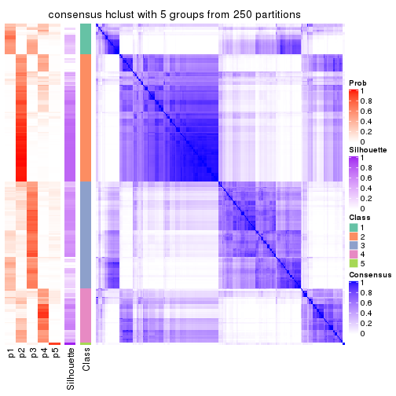</p>

</div>
<div id='tab-MAD-hclust-consensus-heatmap-5'>
<pre><code class="r">consensus_heatmap(res, k = 6)
</code></pre>

<p></p>

</div>
</div>

Heatmaps for the membership of samples in all partitions to see how consistent they are:


<script>
$( function() {
	$( '#tabs-MAD-hclust-membership-heatmap' ).tabs();
} );
</script>
<div id='tabs-MAD-hclust-membership-heatmap'>
<ul>
<li><a href='#tab-MAD-hclust-membership-heatmap-1'>k = 2</a></li>
<li><a href='#tab-MAD-hclust-membership-heatmap-2'>k = 3</a></li>
<li><a href='#tab-MAD-hclust-membership-heatmap-3'>k = 4</a></li>
<li><a href='#tab-MAD-hclust-membership-heatmap-4'>k = 5</a></li>
<li><a href='#tab-MAD-hclust-membership-heatmap-5'>k = 6</a></li>
</ul>
<div id='tab-MAD-hclust-membership-heatmap-1'>
<pre><code class="r">membership_heatmap(res, k = 2)
</code></pre>

<p></p>

</div>
<div id='tab-MAD-hclust-membership-heatmap-2'>
<pre><code class="r">membership_heatmap(res, k = 3)
</code></pre>

<p></p>

</div>
<div id='tab-MAD-hclust-membership-heatmap-3'>
<pre><code class="r">membership_heatmap(res, k = 4)
</code></pre>

<p></p>

</div>
<div id='tab-MAD-hclust-membership-heatmap-4'>
<pre><code class="r">membership_heatmap(res, k = 5)
</code></pre>

<p></p>

</div>
<div id='tab-MAD-hclust-membership-heatmap-5'>
<pre><code class="r">membership_heatmap(res, k = 6)
</code></pre>

<p></p>

</div>
</div>

As soon as we have had the classes for columns, we can look for signatures
which are significantly different between classes which can be candidate marks
for certain classes. Following are the heatmaps for signatures.


Signature heatmaps where rows are scaled:


<script>
$( function() {
	$( '#tabs-MAD-hclust-get-signatures' ).tabs();
} );
</script>
<div id='tabs-MAD-hclust-get-signatures'>
<ul>
<li><a href='#tab-MAD-hclust-get-signatures-1'>k = 2</a></li>
<li><a href='#tab-MAD-hclust-get-signatures-2'>k = 3</a></li>
<li><a href='#tab-MAD-hclust-get-signatures-3'>k = 4</a></li>
<li><a href='#tab-MAD-hclust-get-signatures-4'>k = 5</a></li>
<li><a href='#tab-MAD-hclust-get-signatures-5'>k = 6</a></li>
</ul>
<div id='tab-MAD-hclust-get-signatures-1'>
<pre><code class="r">get_signatures(res, k = 2)
</code></pre>

<p></p>

</div>
<div id='tab-MAD-hclust-get-signatures-2'>
<pre><code class="r">get_signatures(res, k = 3)
</code></pre>

<p></p>

</div>
<div id='tab-MAD-hclust-get-signatures-3'>
<pre><code class="r">get_signatures(res, k = 4)
</code></pre>

<p></p>

</div>
<div id='tab-MAD-hclust-get-signatures-4'>
<pre><code class="r">get_signatures(res, k = 5)
</code></pre>

<p></p>

</div>
<div id='tab-MAD-hclust-get-signatures-5'>
<pre><code class="r">get_signatures(res, k = 6)
</code></pre>

<p></p>

</div>
</div>


Signature heatmaps where rows are not scaled:


<script>
$( function() {
	$( '#tabs-MAD-hclust-get-signatures-no-scale' ).tabs();
} );
</script>
<div id='tabs-MAD-hclust-get-signatures-no-scale'>
<ul>
<li><a href='#tab-MAD-hclust-get-signatures-no-scale-1'>k = 2</a></li>
<li><a href='#tab-MAD-hclust-get-signatures-no-scale-2'>k = 3</a></li>
<li><a href='#tab-MAD-hclust-get-signatures-no-scale-3'>k = 4</a></li>
<li><a href='#tab-MAD-hclust-get-signatures-no-scale-4'>k = 5</a></li>
<li><a href='#tab-MAD-hclust-get-signatures-no-scale-5'>k = 6</a></li>
</ul>
<div id='tab-MAD-hclust-get-signatures-no-scale-1'>
<pre><code class="r">get_signatures(res, k = 2, scale_rows = FALSE)
</code></pre>

<p></p>

</div>
<div id='tab-MAD-hclust-get-signatures-no-scale-2'>
<pre><code class="r">get_signatures(res, k = 3, scale_rows = FALSE)
</code></pre>

<p></p>

</div>
<div id='tab-MAD-hclust-get-signatures-no-scale-3'>
<pre><code class="r">get_signatures(res, k = 4, scale_rows = FALSE)
</code></pre>

<p></p>

</div>
<div id='tab-MAD-hclust-get-signatures-no-scale-4'>
<pre><code class="r">get_signatures(res, k = 5, scale_rows = FALSE)
</code></pre>

<p></p>

</div>
<div id='tab-MAD-hclust-get-signatures-no-scale-5'>
<pre><code class="r">get_signatures(res, k = 6, scale_rows = FALSE)
</code></pre>

<p></p>

</div>
</div>


Compare the overlap of signatures from different k:

```r
compare_signatures(res)
```

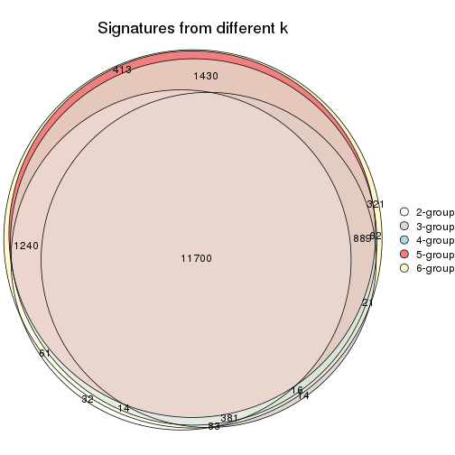

`get_signature()` returns a data frame invisibly. TO get the list of signatures, the function
call should be assigned to a variable explicitly. In following code, if `plot` argument is set
to `FALSE`, no heatmap is plotted while only the differential analysis is performed.

```r
# code only for demonstration
tb = get_signature(res, k = ..., plot = FALSE)
```

An example of the output of `tb` is:

```
#>   which_row         fdr    mean_1    mean_2 scaled_mean_1 scaled_mean_2 km
#> 1        38 0.042760348  8.373488  9.131774    -0.5533452     0.5164555  1
#> 2        40 0.018707592  7.106213  8.469186    -0.6173731     0.5762149  1
#> 3        55 0.019134737 10.221463 11.207825    -0.6159697     0.5749050  1
#> 4        59 0.006059896  5.921854  7.869574    -0.6899429     0.6439467  1
#> 5        60 0.018055526  8.928898 10.211722    -0.6204761     0.5791110  1
#> 6        98 0.009384629 15.714769 14.887706     0.6635654    -0.6193277  2
...
```

The columns in `tb` are:

1. `which_row`: row indices corresponding to the input matrix.
2. `fdr`: FDR for the differential test. 
3. `mean_x`: The mean value in group x.
4. `scaled_mean_x`: The mean value in group x after rows are scaled.
5. `km`: Row groups if k-means clustering is applied to rows.


UMAP plot which shows how samples are separated.


<script>
$( function() {
	$( '#tabs-MAD-hclust-dimension-reduction' ).tabs();
} );
</script>
<div id='tabs-MAD-hclust-dimension-reduction'>
<ul>
<li><a href='#tab-MAD-hclust-dimension-reduction-1'>k = 2</a></li>
<li><a href='#tab-MAD-hclust-dimension-reduction-2'>k = 3</a></li>
<li><a href='#tab-MAD-hclust-dimension-reduction-3'>k = 4</a></li>
<li><a href='#tab-MAD-hclust-dimension-reduction-4'>k = 5</a></li>
<li><a href='#tab-MAD-hclust-dimension-reduction-5'>k = 6</a></li>
</ul>
<div id='tab-MAD-hclust-dimension-reduction-1'>
<pre><code class="r">dimension_reduction(res, k = 2, method = &quot;UMAP&quot;)
</code></pre>

<p></p>

</div>
<div id='tab-MAD-hclust-dimension-reduction-2'>
<pre><code class="r">dimension_reduction(res, k = 3, method = &quot;UMAP&quot;)
</code></pre>

<p></p>

</div>
<div id='tab-MAD-hclust-dimension-reduction-3'>
<pre><code class="r">dimension_reduction(res, k = 4, method = &quot;UMAP&quot;)
</code></pre>

<p></p>

</div>
<div id='tab-MAD-hclust-dimension-reduction-4'>
<pre><code class="r">dimension_reduction(res, k = 5, method = &quot;UMAP&quot;)
</code></pre>

<p></p>

</div>
<div id='tab-MAD-hclust-dimension-reduction-5'>
<pre><code class="r">dimension_reduction(res, k = 6, method = &quot;UMAP&quot;)
</code></pre>

<p></p>

</div>
</div>


Following heatmap shows how subgroups are split when increasing `k`:

```r
collect_classes(res)
```


If matrix rows can be associated to genes, consider to use `GO_Enrichment(res,
...)` to perform function enrichment for the signature genes.


 

---------------------------------------------------


### MAD:kmeans**


The object with results only for a single top-value method and a single partition method 
can be extracted as:

```r
res = res_list["MAD", "kmeans"]
# you can also extract it by
# res = res_list["MAD:kmeans"]
```

A summary of `res` and all the functions that can be applied to it:

```r
res
```

```
#> A 'ConsensusPartition' object with k = 2, 3, 4, 5, 6.
#>   On a matrix with 17723 rows and 374 columns.
#>   Top rows (1000, 2000, 3000, 4000, 5000) are extracted by 'MAD' method.
#>   Subgroups are detected by 'kmeans' method.
#>   Performed in total 1250 partitions by row resampling.
#>   Best k for subgroups seems to be 2.
#> 
#> Following methods can be applied to this 'ConsensusPartition' object:
#>  [1] "cola_report"             "collect_classes"         "collect_plots"          
#>  [4] "collect_stats"           "colnames"                "compare_signatures"     
#>  [7] "consensus_heatmap"       "dimension_reduction"     "functional_enrichment"  
#> [10] "get_anno_col"            "get_anno"                "get_classes"            
#> [13] "get_consensus"           "get_matrix"              "get_membership"         
#> [16] "get_param"               "get_signatures"          "get_stats"              
#> [19] "is_best_k"               "is_stable_k"             "membership_heatmap"     
#> [22] "ncol"                    "nrow"                    "plot_ecdf"              
#> [25] "rownames"                "select_partition_number" "show"                   
#> [28] "suggest_best_k"          "test_to_known_factors"
```

`collect_plots()` function collects all the plots made from `res` for all `k` (number of partitions)
into one single page to provide an easy and fast comparison between different `k`.

```r
collect_plots(res)
```


The plots are:

- The first row: a plot of the ECDF (Empirical cumulative distribution
  function) curves of the consensus matrix for each `k` and the heatmap of
  predicted classes for each `k`.
- The second row: heatmaps of the consensus matrix for each `k`.
- The third row: heatmaps of the membership matrix for each `k`.
- The fouth row: heatmaps of the signatures for each `k`.

All the plots in panels can be made by individual functions and they are
plotted later in this section.

`select_partition_number()` produces several plots showing different
statistics for choosing "optimized" `k`. There are following statistics:

- ECDF curves of the consensus matrix for each `k`;
- 1-PAC. [The PAC
  score](https://en.wikipedia.org/wiki/Consensus_clustering#Over-interpretation_potential_of_consensus_clustering)
  measures the proportion of the ambiguous subgrouping.
- Mean silhouette score.
- Concordance. The mean probability of fiting the consensus class ids in all
  partitions.
- Area increased. Denote $A_k$ as the area under the ECDF curve for current
  `k`, the area increased is defined as $A_k - A_{k-1}$.
- Rand index. The percent of pairs of samples that are both in a same cluster
  or both are not in a same cluster in the partition of k and k-1.
- Jaccard index. The ratio of pairs of samples are both in a same cluster in
  the partition of k and k-1 and the pairs of samples are both in a same
  cluster in the partition k or k-1.

The detailed explanations of these statistics can be found in [the cola
vignette](http://bioconductor.org/packages/devel/bioc/vignettes/cola/inst/doc/cola.html#toc_13).

Generally speaking, lower PAC score, higher mean silhouette score or higher
concordance corresponds to better partition. Rand index and Jaccard index
measure how similar the current partition is compared to partition with `k-1`.
If they are too similar, we won't accept `k` is better than `k-1`.

```r
select_partition_number(res)
```


The numeric values for all these statistics can be obtained by `get_stats()`.

```r
get_stats(res)
```

```
#>   k 1-PAC mean_silhouette concordance area_increased  Rand Jaccard
#> 2 2 1.000           0.969       0.986         0.4986 0.501   0.501
#> 3 3 0.670           0.704       0.804         0.2774 0.822   0.657
#> 4 4 0.856           0.873       0.921         0.1559 0.835   0.576
#> 5 5 0.739           0.694       0.826         0.0565 0.965   0.866
#> 6 6 0.714           0.558       0.738         0.0437 0.930   0.725
```

`suggest_best_k()` suggests the best $k$ based on these statistics. The rules are as follows:

- All $k$ with Jaccard index larger than 0.95 are removed because the increase of
  the partition number does not provides enough extra information. If all $k$ are removed,
  the best $k$ is assigned by `NA`.
- For $k$ with 1-PAC larger than 0.9, the maximal $k$ is taken as the "best k". Other $k$ is called "optional k".
- If it does not fit the second rule. The $k$ with the highest vote of highest
  1-PAC, mean silhouette and concordance is taken as the "best k".

```r
suggest_best_k(res)
```

```
#> [1] 2
```


Following shows the table of the partitions (You need to click the **show/hide
code output** link to see it). The membership matrix (columns with name `p*`)
is inferred by
[`clue::cl_consensus()`](https://www.rdocumentation.org/link/cl_consensus?package=clue)
function with the `SE` method. Basically the value in the membership matrix
represents the probability to belong to a certain group. The finall class
label for an item is determined with the group with highest probability it
belongs to.

In `get_classes()` function, the entropy is calculated from the membership
matrix and the silhouette score is calculated from the consensus matrix.


<script>
$( function() {
	$( '#tabs-MAD-kmeans-get-classes' ).tabs();
} );
</script>
<div id='tabs-MAD-kmeans-get-classes'>
<ul>
<li><a href='#tab-MAD-kmeans-get-classes-1'>k = 2</a></li>
<li><a href='#tab-MAD-kmeans-get-classes-2'>k = 3</a></li>
<li><a href='#tab-MAD-kmeans-get-classes-3'>k = 4</a></li>
<li><a href='#tab-MAD-kmeans-get-classes-4'>k = 5</a></li>
<li><a href='#tab-MAD-kmeans-get-classes-5'>k = 6</a></li>
</ul>

<div id='tab-MAD-kmeans-get-classes-1'>
<p><a id='tab-MAD-kmeans-get-classes-1-a' style='color:#0366d6' href='#'>show/hide code output</a></p>
<pre><code class="r">cbind(get_classes(res, k = 2), get_membership(res, k = 2))
</code></pre>

<pre><code>#&gt;            class entropy silhouette    p1    p2
#&gt; SRR660824      1  0.0000      0.983 1.000 0.000
#&gt; SRR603858      1  0.8443      0.631 0.728 0.272
#&gt; SRR817070      2  0.0000      0.989 0.000 1.000
#&gt; SRR1486995     1  0.0000      0.983 1.000 0.000
#&gt; SRR813043      2  0.0000      0.989 0.000 1.000
#&gt; SRR656874      2  0.0000      0.989 0.000 1.000
#&gt; SRR659037      1  0.9710      0.349 0.600 0.400
#&gt; SRR662031      1  0.0000      0.983 1.000 0.000
#&gt; SRR1081283     2  0.0000      0.989 0.000 1.000
#&gt; SRR1481036     1  0.0000      0.983 1.000 0.000
#&gt; SRR1434009     2  0.0000      0.989 0.000 1.000
#&gt; SRR1376676     1  0.0000      0.983 1.000 0.000
#&gt; SRR1396967     2  0.0000      0.989 0.000 1.000
#&gt; SRR665429      2  0.0000      0.989 0.000 1.000
#&gt; SRR1388025     2  0.0000      0.989 0.000 1.000
#&gt; SRR600784      1  0.0000      0.983 1.000 0.000
#&gt; SRR657611      1  0.0000      0.983 1.000 0.000
#&gt; SRR1333659     2  0.0000      0.989 0.000 1.000
#&gt; SRR1323896     2  0.0000      0.989 0.000 1.000
#&gt; SRR1453971     1  0.0000      0.983 1.000 0.000
#&gt; SRR1421010     1  0.0000      0.983 1.000 0.000
#&gt; SRR1334490     1  0.0000      0.983 1.000 0.000
#&gt; SRR1309468     1  0.0000      0.983 1.000 0.000
#&gt; SRR1468637     2  0.2948      0.938 0.052 0.948
#&gt; SRR1365489     2  0.0000      0.989 0.000 1.000
#&gt; SRR627445      1  0.0000      0.983 1.000 0.000
#&gt; SRR607863      2  0.0000      0.989 0.000 1.000
#&gt; SRR1475524     1  0.0000      0.983 1.000 0.000
#&gt; SRR1405504     2  0.0000      0.989 0.000 1.000
#&gt; SRR615695      1  0.0000      0.983 1.000 0.000
#&gt; SRR600900      2  0.0000      0.989 0.000 1.000
#&gt; SRR601477      2  0.0000      0.989 0.000 1.000
#&gt; SRR1487215     2  0.0000      0.989 0.000 1.000
#&gt; SRR1310797     2  0.0000      0.989 0.000 1.000
#&gt; SRR1362713     1  0.0000      0.983 1.000 0.000
#&gt; SRR1431385     1  0.0000      0.983 1.000 0.000
#&gt; SRR1379089     2  0.0000      0.989 0.000 1.000
#&gt; SRR1102079     1  0.0000      0.983 1.000 0.000
#&gt; SRR1357210     1  0.0000      0.983 1.000 0.000
#&gt; SRR657659      2  0.0000      0.989 0.000 1.000
#&gt; SRR663573      2  0.0000      0.989 0.000 1.000
#&gt; SRR603188      2  0.0000      0.989 0.000 1.000
#&gt; SRR1471200     2  0.0000      0.989 0.000 1.000
#&gt; SRR1310975     2  0.0000      0.989 0.000 1.000
#&gt; SRR627457      1  0.7056      0.762 0.808 0.192
#&gt; SRR1367654     2  0.0000      0.989 0.000 1.000
#&gt; SRR1488410     1  0.0000      0.983 1.000 0.000
#&gt; SRR1457750     2  0.8499      0.623 0.276 0.724
#&gt; SRR1099546     1  0.0000      0.983 1.000 0.000
#&gt; SRR604480      2  0.0000      0.989 0.000 1.000
#&gt; SRR1390477     2  0.0000      0.989 0.000 1.000
#&gt; SRR1458447     2  0.0000      0.989 0.000 1.000
#&gt; SRR1473161     2  0.0000      0.989 0.000 1.000
#&gt; SRR1409813     2  0.0000      0.989 0.000 1.000
#&gt; SRR612791      1  0.0000      0.983 1.000 0.000
#&gt; SRR1470580     2  0.8081      0.673 0.248 0.752
#&gt; SRR1444063     1  0.9754      0.316 0.592 0.408
#&gt; SRR1355578     1  0.0000      0.983 1.000 0.000
#&gt; SRR1429203     1  0.0000      0.983 1.000 0.000
#&gt; SRR599154      2  0.0000      0.989 0.000 1.000
#&gt; SRR814244      1  0.0000      0.983 1.000 0.000
#&gt; SRR1404123     2  0.0000      0.989 0.000 1.000
#&gt; SRR656934      1  0.0000      0.983 1.000 0.000
#&gt; SRR1339029     2  0.0000      0.989 0.000 1.000
#&gt; SRR821525      2  0.0000      0.989 0.000 1.000
#&gt; SRR1443677     1  0.0000      0.983 1.000 0.000
#&gt; SRR1406330     1  0.0000      0.983 1.000 0.000
#&gt; SRR1338124     2  0.0672      0.982 0.008 0.992
#&gt; SRR1391376     1  0.0000      0.983 1.000 0.000
#&gt; SRR661842      2  0.0000      0.989 0.000 1.000
#&gt; SRR1395699     1  0.0000      0.983 1.000 0.000
#&gt; SRR1312209     1  0.0000      0.983 1.000 0.000
#&gt; SRR1359469     1  0.0000      0.983 1.000 0.000
#&gt; SRR658885      1  0.0000      0.983 1.000 0.000
#&gt; SRR1414578     1  0.0000      0.983 1.000 0.000
#&gt; SRR603620      2  0.0000      0.989 0.000 1.000
#&gt; SRR604677      1  0.0000      0.983 1.000 0.000
#&gt; SRR603800      2  0.0000      0.989 0.000 1.000
#&gt; SRR602058      2  0.0000      0.989 0.000 1.000
#&gt; SRR817488      2  0.0000      0.989 0.000 1.000
#&gt; SRR655601      2  0.0000      0.989 0.000 1.000
#&gt; SRR1434821     2  0.0000      0.989 0.000 1.000
#&gt; SRR1349166     2  0.0000      0.989 0.000 1.000
#&gt; SRR615129      2  0.8499      0.623 0.276 0.724
#&gt; SRR607586      2  0.0000      0.989 0.000 1.000
#&gt; SRR602680      2  0.0000      0.989 0.000 1.000
#&gt; SRR1411070     2  0.0000      0.989 0.000 1.000
#&gt; SRR663038      2  0.0000      0.989 0.000 1.000
#&gt; SRR1489416     2  0.0000      0.989 0.000 1.000
#&gt; SRR1479155     1  0.0000      0.983 1.000 0.000
#&gt; SRR662162      1  0.0000      0.983 1.000 0.000
#&gt; SRR1374567     1  0.0000      0.983 1.000 0.000
#&gt; SRR1434048     2  0.0000      0.989 0.000 1.000
#&gt; SRR2184865     2  0.0000      0.989 0.000 1.000
#&gt; SRR2170135     1  0.0000      0.983 1.000 0.000
#&gt; SRR615551      2  0.0000      0.989 0.000 1.000
#&gt; SRR1335513     2  0.0000      0.989 0.000 1.000
#&gt; SRR1370216     1  0.0000      0.983 1.000 0.000
#&gt; SRR662954      2  0.0000      0.989 0.000 1.000
#&gt; SRR1375738     1  0.0000      0.983 1.000 0.000
#&gt; SRR1356577     1  0.0000      0.983 1.000 0.000
#&gt; SRR1073119     1  0.0000      0.983 1.000 0.000
#&gt; SRR663549      1  0.0000      0.983 1.000 0.000
#&gt; SRR1478015     2  0.0000      0.989 0.000 1.000
#&gt; SRR600632      2  0.0000      0.989 0.000 1.000
#&gt; SRR811866      1  0.0000      0.983 1.000 0.000
#&gt; SRR1401101     2  0.0000      0.989 0.000 1.000
#&gt; SRR1477797     2  0.0000      0.989 0.000 1.000
#&gt; SRR1402986     2  0.0000      0.989 0.000 1.000
#&gt; SRR658897      1  0.0000      0.983 1.000 0.000
#&gt; SRR1419869     1  0.0000      0.983 1.000 0.000
#&gt; SRR1490700     1  0.0000      0.983 1.000 0.000
#&gt; SRR601723      2  0.0000      0.989 0.000 1.000
#&gt; SRR1384115     2  0.0000      0.989 0.000 1.000
#&gt; SRR1476927     2  0.0000      0.989 0.000 1.000
#&gt; SRR1387769     1  0.0000      0.983 1.000 0.000
#&gt; SRR1322595     1  0.0000      0.983 1.000 0.000
#&gt; SRR1370423     1  0.1414      0.965 0.980 0.020
#&gt; SRR1314976     1  0.1414      0.965 0.980 0.020
#&gt; SRR1319560     2  0.0000      0.989 0.000 1.000
#&gt; SRR1352683     1  0.0000      0.983 1.000 0.000
#&gt; SRR1473800     1  0.0000      0.983 1.000 0.000
#&gt; SRR1326384     1  0.0000      0.983 1.000 0.000
#&gt; SRR1360807     2  0.0376      0.985 0.004 0.996
#&gt; SRR1332544     1  0.0000      0.983 1.000 0.000
#&gt; SRR598695      1  0.0000      0.983 1.000 0.000
#&gt; SRR807824      2  0.0000      0.989 0.000 1.000
#&gt; SRR809296      1  0.0000      0.983 1.000 0.000
#&gt; SRR657927      1  0.0000      0.983 1.000 0.000
#&gt; SRR1440682     2  0.0000      0.989 0.000 1.000
#&gt; SRR1454415     2  0.0000      0.989 0.000 1.000
#&gt; SRR1419131     2  0.0000      0.989 0.000 1.000
#&gt; SRR1404293     1  0.0000      0.983 1.000 0.000
#&gt; SRR1473340     1  0.0000      0.983 1.000 0.000
#&gt; SRR1345563     1  0.0000      0.983 1.000 0.000
#&gt; SRR1323382     2  0.0000      0.989 0.000 1.000
#&gt; SRR1480697     1  0.0672      0.976 0.992 0.008
#&gt; SRR1321808     2  0.0000      0.989 0.000 1.000
#&gt; SRR1382756     2  0.0000      0.989 0.000 1.000
#&gt; SRR1312558     2  0.0000      0.989 0.000 1.000
#&gt; SRR1417088     2  0.0000      0.989 0.000 1.000
#&gt; SRR1433027     2  0.0000      0.989 0.000 1.000
#&gt; SRR662257      2  0.0000      0.989 0.000 1.000
#&gt; SRR600417      2  0.0000      0.989 0.000 1.000
#&gt; SRR812493      2  0.0000      0.989 0.000 1.000
#&gt; SRR612743      1  0.0000      0.983 1.000 0.000
#&gt; SRR1361345     1  0.0000      0.983 1.000 0.000
#&gt; SRR600584      2  0.0000      0.989 0.000 1.000
#&gt; SRR1310520     2  0.0000      0.989 0.000 1.000
#&gt; SRR1395595     1  0.0000      0.983 1.000 0.000
#&gt; SRR1334074     2  0.0000      0.989 0.000 1.000
#&gt; SRR654838      2  0.0000      0.989 0.000 1.000
#&gt; SRR1376694     1  0.0000      0.983 1.000 0.000
#&gt; SRR1433841     2  0.8327      0.645 0.264 0.736
#&gt; SRR1366837     1  0.0000      0.983 1.000 0.000
#&gt; SRR1467479     2  0.0000      0.989 0.000 1.000
#&gt; SRR1459055     1  0.0000      0.983 1.000 0.000
#&gt; SRR1471050     2  0.0000      0.989 0.000 1.000
#&gt; SRR603004      2  0.0000      0.989 0.000 1.000
#&gt; SRR814703      2  0.0000      0.989 0.000 1.000
#&gt; SRR661937      2  0.0000      0.989 0.000 1.000
#&gt; SRR614359      1  0.0000      0.983 1.000 0.000
#&gt; SRR1071568     2  0.0000      0.989 0.000 1.000
#&gt; SRR1389084     1  0.0000      0.983 1.000 0.000
#&gt; SRR1337624     2  0.0000      0.989 0.000 1.000
#&gt; SRR1344400     2  0.0000      0.989 0.000 1.000
#&gt; SRR1414290     2  0.0000      0.989 0.000 1.000
#&gt; SRR1413644     2  0.0000      0.989 0.000 1.000
#&gt; SRR1098998     1  0.0000      0.983 1.000 0.000
#&gt; SRR1481279     1  0.0000      0.983 1.000 0.000
#&gt; SRR1315103     1  0.0000      0.983 1.000 0.000
#&gt; SRR1099286     1  0.0000      0.983 1.000 0.000
#&gt; SRR2166570     1  0.8763      0.590 0.704 0.296
#&gt; SRR601445      1  0.0000      0.983 1.000 0.000
#&gt; SRR1439719     2  0.0000      0.989 0.000 1.000
#&gt; SRR1377026     2  0.0000      0.989 0.000 1.000
#&gt; SRR1327386     1  0.0000      0.983 1.000 0.000
#&gt; SRR654826      2  0.0000      0.989 0.000 1.000
#&gt; SRR1460433     2  0.0000      0.989 0.000 1.000
#&gt; SRR1469345     1  0.0000      0.983 1.000 0.000
#&gt; SRR1421462     2  0.0000      0.989 0.000 1.000
#&gt; SRR662966      1  0.0000      0.983 1.000 0.000
#&gt; SRR1339175     1  0.0000      0.983 1.000 0.000
#&gt; SRR1447736     2  0.0000      0.989 0.000 1.000
#&gt; SRR1434671     2  0.0000      0.989 0.000 1.000
#&gt; SRR660800      2  0.0000      0.989 0.000 1.000
#&gt; SRR1465543     2  0.0000      0.989 0.000 1.000
#&gt; SRR1342023     1  0.0000      0.983 1.000 0.000
#&gt; SRR1335670     1  0.0000      0.983 1.000 0.000
#&gt; SRR1400955     2  0.0000      0.989 0.000 1.000
#&gt; SRR1072150     2  0.0000      0.989 0.000 1.000
#&gt; SRR1442822     1  0.0000      0.983 1.000 0.000
#&gt; SRR1364658     1  0.0000      0.983 1.000 0.000
#&gt; SRR1098074     2  0.0000      0.989 0.000 1.000
#&gt; SRR1442778     1  0.0000      0.983 1.000 0.000
#&gt; SRR1086728     1  0.6887      0.776 0.816 0.184
#&gt; SRR627464      2  0.7299      0.745 0.204 0.796
#&gt; SRR1409193     1  0.0000      0.983 1.000 0.000
#&gt; SRR2168286     2  0.0000      0.989 0.000 1.000
#&gt; SRR615539      2  0.0000      0.989 0.000 1.000
#&gt; SRR663623      1  0.0000      0.983 1.000 0.000
#&gt; SRR1471989     1  0.0000      0.983 1.000 0.000
#&gt; SRR1468828     2  0.0000      0.989 0.000 1.000
#&gt; SRR1381934     1  0.0000      0.983 1.000 0.000
#&gt; SRR1471098     1  0.0000      0.983 1.000 0.000
#&gt; SRR1314749     1  0.0000      0.983 1.000 0.000
#&gt; SRR2166874     2  0.0000      0.989 0.000 1.000
#&gt; SRR821302      1  0.0000      0.983 1.000 0.000
#&gt; SRR1435066     2  0.0000      0.989 0.000 1.000
#&gt; SRR661601      2  0.0000      0.989 0.000 1.000
#&gt; SRR1446546     2  0.0000      0.989 0.000 1.000
#&gt; SRR1419784     1  0.0000      0.983 1.000 0.000
#&gt; SRR1357233     2  0.0000      0.989 0.000 1.000
#&gt; SRR1441889     1  0.0000      0.983 1.000 0.000
#&gt; SRR1413940     1  0.0000      0.983 1.000 0.000
#&gt; SRR1324250     2  0.0000      0.989 0.000 1.000
#&gt; SRR1442862     2  0.0000      0.989 0.000 1.000
#&gt; SRR662474      2  0.0000      0.989 0.000 1.000
#&gt; SRR1416226     1  0.0000      0.983 1.000 0.000
#&gt; SRR1417404     1  0.0000      0.983 1.000 0.000
#&gt; SRR665466      2  0.0000      0.989 0.000 1.000
#&gt; SRR658849      1  0.0000      0.983 1.000 0.000
#&gt; SRR1460025     2  0.0000      0.989 0.000 1.000
#&gt; SRR1408136     1  0.0000      0.983 1.000 0.000
#&gt; SRR1489995     2  0.0000      0.989 0.000 1.000
#&gt; SRR1374092     1  0.0000      0.983 1.000 0.000
#&gt; SRR1488429     1  0.0000      0.983 1.000 0.000
#&gt; SRR1087559     1  0.2778      0.938 0.952 0.048
#&gt; SRR817004      1  0.8144      0.667 0.748 0.252
#&gt; SRR1429660     2  0.0000      0.989 0.000 1.000
#&gt; SRR604390      1  0.3431      0.922 0.936 0.064
#&gt; SRR614936      2  0.0000      0.989 0.000 1.000
#&gt; SRR1365938     2  0.8499      0.623 0.276 0.724
#&gt; SRR1437324     1  0.0000      0.983 1.000 0.000
#&gt; SRR613414      2  0.0000      0.989 0.000 1.000
#&gt; SRR660414      1  0.8661      0.606 0.712 0.288
#&gt; SRR1452185     1  0.0000      0.983 1.000 0.000
#&gt; SRR1347020     1  0.0000      0.983 1.000 0.000
#&gt; SRR1398036     2  0.0000      0.989 0.000 1.000
#&gt; SRR1436674     1  0.0000      0.983 1.000 0.000
#&gt; SRR603750      1  0.0000      0.983 1.000 0.000
#&gt; SRR608630      2  0.0672      0.982 0.008 0.992
#&gt; SRR655625      2  0.0000      0.989 0.000 1.000
#&gt; SRR599059      2  0.0000      0.989 0.000 1.000
#&gt; SRR615189      2  0.0000      0.989 0.000 1.000
#&gt; SRR1466889     2  0.0000      0.989 0.000 1.000
#&gt; SRR1084602     2  0.0672      0.982 0.008 0.992
#&gt; SRR1335422     1  0.0000      0.983 1.000 0.000
#&gt; SRR1356805     2  0.0000      0.989 0.000 1.000
#&gt; SRR1385300     1  0.0000      0.983 1.000 0.000
#&gt; SRR654814      1  0.0000      0.983 1.000 0.000
#&gt; SRR658385      2  0.0000      0.989 0.000 1.000
#&gt; SRR820596      1  0.0000      0.983 1.000 0.000
#&gt; SRR1318118     1  0.0000      0.983 1.000 0.000
#&gt; SRR1480766     2  0.0000      0.989 0.000 1.000
#&gt; SRR1406539     1  0.0000      0.983 1.000 0.000
#&gt; SRR1341833     2  0.0000      0.989 0.000 1.000
#&gt; SRR1441826     2  0.0000      0.989 0.000 1.000
#&gt; SRR1448051     1  0.0000      0.983 1.000 0.000
#&gt; SRR1326752     1  0.0000      0.983 1.000 0.000
#&gt; SRR665217      1  0.0000      0.983 1.000 0.000
#&gt; SRR819186      2  0.0000      0.989 0.000 1.000
#&gt; SRR661517      1  0.0000      0.983 1.000 0.000
#&gt; SRR607166      2  0.0000      0.989 0.000 1.000
#&gt; SRR809065      2  0.0000      0.989 0.000 1.000
#&gt; SRR1415872     2  0.0000      0.989 0.000 1.000
#&gt; SRR1415463     1  0.0000      0.983 1.000 0.000
#&gt; SRR1381161     2  0.0000      0.989 0.000 1.000
#&gt; SRR1442231     2  0.0000      0.989 0.000 1.000
#&gt; SRR1374696     1  0.0000      0.983 1.000 0.000
#&gt; SRR1451988     1  0.3274      0.926 0.940 0.060
#&gt; SRR660555      1  0.0000      0.983 1.000 0.000
#&gt; SRR657801      1  0.0000      0.983 1.000 0.000
#&gt; SRR663344      2  0.0000      0.989 0.000 1.000
#&gt; SRR1472462     2  0.0000      0.989 0.000 1.000
#&gt; SRR1406176     1  0.7219      0.751 0.800 0.200
#&gt; SRR656886      2  0.0000      0.989 0.000 1.000
#&gt; SRR1498337     2  0.0000      0.989 0.000 1.000
#&gt; SRR613066      1  0.0000      0.983 1.000 0.000
#&gt; SRR1309490     1  0.0000      0.983 1.000 0.000
#&gt; SRR602492      2  0.0000      0.989 0.000 1.000
#&gt; SRR1447347     1  0.0000      0.983 1.000 0.000
#&gt; SRR1475546     2  0.0000      0.989 0.000 1.000
#&gt; SRR627459      2  0.4161      0.902 0.084 0.916
#&gt; SRR1434332     2  0.0000      0.989 0.000 1.000
#&gt; SRR1070358     2  0.0000      0.989 0.000 1.000
#&gt; SRR1345936     2  0.1633      0.966 0.024 0.976
#&gt; SRR665658      2  0.0000      0.989 0.000 1.000
#&gt; SRR1321351     2  0.0000      0.989 0.000 1.000
#&gt; SRR657880      2  0.0000      0.989 0.000 1.000
#&gt; SRR1373903     2  0.0000      0.989 0.000 1.000
#&gt; SRR657396      2  0.0000      0.989 0.000 1.000
#&gt; SRR660981      2  0.0000      0.989 0.000 1.000
#&gt; SRR818499      1  0.0000      0.983 1.000 0.000
#&gt; SRR819658      2  0.0000      0.989 0.000 1.000
#&gt; SRR1376316     1  0.0000      0.983 1.000 0.000
#&gt; SRR1323723     2  0.0000      0.989 0.000 1.000
#&gt; SRR1476719     1  0.0000      0.983 1.000 0.000
#&gt; SRR1403478     2  0.0000      0.989 0.000 1.000
#&gt; SRR1095695     1  0.0000      0.983 1.000 0.000
#&gt; SRR1352391     1  0.0000      0.983 1.000 0.000
#&gt; SRR1498813     2  0.0000      0.989 0.000 1.000
#&gt; SRR627437      2  0.6148      0.817 0.152 0.848
#&gt; SRR2185097     1  0.0000      0.983 1.000 0.000
#&gt; SRR817166      1  0.2236      0.950 0.964 0.036
#&gt; SRR1091670     2  0.0000      0.989 0.000 1.000
#&gt; SRR603776      1  0.0000      0.983 1.000 0.000
#&gt; SRR1479640     2  0.0000      0.989 0.000 1.000
#&gt; SRR660152      1  0.0000      0.983 1.000 0.000
#&gt; SRR1074769     2  0.0000      0.989 0.000 1.000
#&gt; SRR656153      2  0.0000      0.989 0.000 1.000
#&gt; SRR1392502     1  0.0000      0.983 1.000 0.000
#&gt; SRR1359609     1  0.0000      0.983 1.000 0.000
#&gt; SRR601925      2  0.0000      0.989 0.000 1.000
#&gt; SRR2165182     2  0.0000      0.989 0.000 1.000
#&gt; SRR608542      2  0.0000      0.989 0.000 1.000
#&gt; SRR655064      2  0.0000      0.989 0.000 1.000
#&gt; SRR1432430     1  0.0000      0.983 1.000 0.000
#&gt; SRR808472      2  0.0000      0.989 0.000 1.000
#&gt; SRR1414958     1  0.0000      0.983 1.000 0.000
#&gt; SRR598484      2  0.0000      0.989 0.000 1.000
#&gt; SRR612755      1  0.0000      0.983 1.000 0.000
#&gt; SRR1365808     1  0.0000      0.983 1.000 0.000
#&gt; SRR1391724     1  0.7139      0.759 0.804 0.196
#&gt; SRR1322373     1  0.0000      0.983 1.000 0.000
#&gt; SRR1489265     2  0.0000      0.989 0.000 1.000
#&gt; SRR1359099     2  0.0000      0.989 0.000 1.000
#&gt; SRR607279      2  0.0000      0.989 0.000 1.000
#&gt; SRR810461      2  0.0000      0.989 0.000 1.000
#&gt; SRR627427      1  0.0000      0.983 1.000 0.000
#&gt; SRR612887      2  0.0000      0.989 0.000 1.000
#&gt; SRR809807      2  0.0000      0.989 0.000 1.000
#&gt; SRR663112      2  0.0000      0.989 0.000 1.000
#&gt; SRR1346933     2  0.0672      0.982 0.008 0.992
#&gt; SRR1487910     1  0.0000      0.983 1.000 0.000
#&gt; SRR603092      2  0.0000      0.989 0.000 1.000
#&gt; SRR1417680     2  0.0000      0.989 0.000 1.000
#&gt; SRR1383785     1  0.0000      0.983 1.000 0.000
#&gt; SRR1070015     2  0.0000      0.989 0.000 1.000
#&gt; SRR1466222     2  0.3431      0.925 0.064 0.936
#&gt; SRR1416119     1  0.0000      0.983 1.000 0.000
#&gt; SRR819318      1  0.0000      0.983 1.000 0.000
#&gt; SRR608288      2  0.0000      0.989 0.000 1.000
#&gt; SRR811121      2  0.0000      0.989 0.000 1.000
#&gt; SRR613138      2  0.0000      0.989 0.000 1.000
#&gt; SRR810483      1  0.0000      0.983 1.000 0.000
#&gt; SRR607839      1  0.0000      0.983 1.000 0.000
#&gt; SRR1337031     1  0.0000      0.983 1.000 0.000
#&gt; SRR601311      2  0.0000      0.989 0.000 1.000
#&gt; SRR1406685     2  0.0000      0.989 0.000 1.000
#&gt; SRR1467500     2  0.0000      0.989 0.000 1.000
#&gt; SRR1308504     1  0.0000      0.983 1.000 0.000
#&gt; SRR1312865     1  0.0000      0.983 1.000 0.000
#&gt; SRR1312522     1  0.0000      0.983 1.000 0.000
#&gt; SRR1490486     2  0.0000      0.989 0.000 1.000
#&gt; SRR1325888     1  0.0000      0.983 1.000 0.000
#&gt; SRR1472885     1  0.0000      0.983 1.000 0.000
#&gt; SRR1098785     2  0.0000      0.989 0.000 1.000
#&gt; SRR1084766     2  0.0000      0.989 0.000 1.000
#&gt; SRR1102804     2  0.0000      0.989 0.000 1.000
#&gt; SRR1336636     1  0.0000      0.983 1.000 0.000
#&gt; SRR1347795     1  0.0000      0.983 1.000 0.000
#&gt; SRR601900      2  0.0000      0.989 0.000 1.000
#&gt; SRR1330989     2  0.0000      0.989 0.000 1.000
#&gt; SRR658445      2  0.0000      0.989 0.000 1.000
#&gt; SRR1368754     1  0.0000      0.983 1.000 0.000
#&gt; SRR1460001     2  0.0000      0.989 0.000 1.000
#&gt; SRR1414934     1  0.0000      0.983 1.000 0.000
#&gt; SRR1326249     1  0.0000      0.983 1.000 0.000
#&gt; SRR614948      1  0.0000      0.983 1.000 0.000
#&gt; SRR1472952     1  0.0000      0.983 1.000 0.000
#&gt; SRR1321528     1  0.0000      0.983 1.000 0.000
#&gt; SRR627447      1  0.0000      0.983 1.000 0.000
#&gt; SRR612239      2  0.7219      0.748 0.200 0.800
</code></pre>

<script>
$('#tab-MAD-kmeans-get-classes-1-a').parent().next().next().hide();
$('#tab-MAD-kmeans-get-classes-1-a').click(function(){
  $('#tab-MAD-kmeans-get-classes-1-a').parent().next().next().toggle();
  return(false);
});
</script>
</div>

<div id='tab-MAD-kmeans-get-classes-2'>
<p><a id='tab-MAD-kmeans-get-classes-2-a' style='color:#0366d6' href='#'>show/hide code output</a></p>
<pre><code class="r">cbind(get_classes(res, k = 3), get_membership(res, k = 3))
</code></pre>

<pre><code>#&gt;            class entropy silhouette    p1    p2    p3
#&gt; SRR660824      1  0.6154     0.7508 0.592 0.000 0.408
#&gt; SRR603858      1  0.7292    -0.1584 0.500 0.028 0.472
#&gt; SRR817070      2  0.5397     0.3496 0.000 0.720 0.280
#&gt; SRR1486995     1  0.6126     0.7512 0.600 0.000 0.400
#&gt; SRR813043      2  0.0000     0.9230 0.000 1.000 0.000
#&gt; SRR656874      2  0.0000     0.9230 0.000 1.000 0.000
#&gt; SRR659037      3  0.6318     0.5904 0.068 0.172 0.760
#&gt; SRR662031      1  0.0747     0.7518 0.984 0.000 0.016
#&gt; SRR1081283     3  0.6192     0.6679 0.000 0.420 0.580
#&gt; SRR1481036     1  0.6274     0.7123 0.544 0.000 0.456
#&gt; SRR1434009     2  0.0000     0.9230 0.000 1.000 0.000
#&gt; SRR1376676     1  0.0000     0.7488 1.000 0.000 0.000
#&gt; SRR1396967     2  0.3752     0.6965 0.000 0.856 0.144
#&gt; SRR665429      2  0.0000     0.9230 0.000 1.000 0.000
#&gt; SRR1388025     3  0.6192     0.6679 0.000 0.420 0.580
#&gt; SRR600784      1  0.6140     0.7516 0.596 0.000 0.404
#&gt; SRR657611      1  0.0592     0.7474 0.988 0.000 0.012
#&gt; SRR1333659     2  0.0000     0.9230 0.000 1.000 0.000
#&gt; SRR1323896     2  0.0000     0.9230 0.000 1.000 0.000
#&gt; SRR1453971     1  0.6095     0.7537 0.608 0.000 0.392
#&gt; SRR1421010     1  0.0000     0.7488 1.000 0.000 0.000
#&gt; SRR1334490     1  0.6126     0.7512 0.600 0.000 0.400
#&gt; SRR1309468     1  0.2165     0.7583 0.936 0.000 0.064
#&gt; SRR1468637     3  0.7806     0.4470 0.352 0.064 0.584
#&gt; SRR1365489     2  0.0000     0.9230 0.000 1.000 0.000
#&gt; SRR627445      1  0.6140     0.7516 0.596 0.000 0.404
#&gt; SRR607863      2  0.0000     0.9230 0.000 1.000 0.000
#&gt; SRR1475524     1  0.0000     0.7488 1.000 0.000 0.000
#&gt; SRR1405504     2  0.0000     0.9230 0.000 1.000 0.000
#&gt; SRR615695      1  0.0237     0.7485 0.996 0.000 0.004
#&gt; SRR600900      2  0.6309    -0.4959 0.000 0.504 0.496
#&gt; SRR601477      2  0.0000     0.9230 0.000 1.000 0.000
#&gt; SRR1487215     2  0.0000     0.9230 0.000 1.000 0.000
#&gt; SRR1310797     2  0.0000     0.9230 0.000 1.000 0.000
#&gt; SRR1362713     1  0.6274    -0.0595 0.544 0.000 0.456
#&gt; SRR1431385     1  0.0000     0.7488 1.000 0.000 0.000
#&gt; SRR1379089     2  0.0000     0.9230 0.000 1.000 0.000
#&gt; SRR1102079     1  0.6154     0.7504 0.592 0.000 0.408
#&gt; SRR1357210     1  0.0000     0.7488 1.000 0.000 0.000
#&gt; SRR657659      3  0.6291     0.5775 0.000 0.468 0.532
#&gt; SRR663573      3  0.6192     0.6679 0.000 0.420 0.580
#&gt; SRR603188      2  0.0000     0.9230 0.000 1.000 0.000
#&gt; SRR1471200     2  0.0000     0.9230 0.000 1.000 0.000
#&gt; SRR1310975     2  0.0000     0.9230 0.000 1.000 0.000
#&gt; SRR627457      1  0.6598     0.5064 0.564 0.008 0.428
#&gt; SRR1367654     2  0.0000     0.9230 0.000 1.000 0.000
#&gt; SRR1488410     1  0.0592     0.7474 0.988 0.000 0.012
#&gt; SRR1457750     3  0.7471     0.2802 0.448 0.036 0.516
#&gt; SRR1099546     1  0.6126     0.7512 0.600 0.000 0.400
#&gt; SRR604480      2  0.0000     0.9230 0.000 1.000 0.000
#&gt; SRR1390477     2  0.0000     0.9230 0.000 1.000 0.000
#&gt; SRR1458447     2  0.0000     0.9230 0.000 1.000 0.000
#&gt; SRR1473161     2  0.0000     0.9230 0.000 1.000 0.000
#&gt; SRR1409813     2  0.0000     0.9230 0.000 1.000 0.000
#&gt; SRR612791      1  0.3116     0.7606 0.892 0.000 0.108
#&gt; SRR1470580     2  0.5882     0.3323 0.000 0.652 0.348
#&gt; SRR1444063     1  0.6398     0.1218 0.580 0.416 0.004
#&gt; SRR1355578     1  0.0424     0.7479 0.992 0.000 0.008
#&gt; SRR1429203     1  0.0000     0.7488 1.000 0.000 0.000
#&gt; SRR599154      2  0.0000     0.9230 0.000 1.000 0.000
#&gt; SRR814244      1  0.6204     0.0351 0.576 0.000 0.424
#&gt; SRR1404123     2  0.5905     0.0569 0.000 0.648 0.352
#&gt; SRR656934      3  0.6235    -0.5881 0.436 0.000 0.564
#&gt; SRR1339029     2  0.0000     0.9230 0.000 1.000 0.000
#&gt; SRR821525      3  0.6192     0.6679 0.000 0.420 0.580
#&gt; SRR1443677     1  0.0237     0.7500 0.996 0.000 0.004
#&gt; SRR1406330     1  0.0000     0.7488 1.000 0.000 0.000
#&gt; SRR1338124     3  0.6280     0.0121 0.000 0.460 0.540
#&gt; SRR1391376     1  0.6126     0.7512 0.600 0.000 0.400
#&gt; SRR661842      3  0.6180     0.6678 0.000 0.416 0.584
#&gt; SRR1395699     1  0.6126     0.7512 0.600 0.000 0.400
#&gt; SRR1312209     1  0.0592     0.7474 0.988 0.000 0.012
#&gt; SRR1359469     1  0.0000     0.7488 1.000 0.000 0.000
#&gt; SRR658885      1  0.6140     0.7500 0.596 0.000 0.404
#&gt; SRR1414578     1  0.0424     0.7479 0.992 0.000 0.008
#&gt; SRR603620      3  0.6274     0.6057 0.000 0.456 0.544
#&gt; SRR604677      1  0.1411     0.7545 0.964 0.000 0.036
#&gt; SRR603800      2  0.0000     0.9230 0.000 1.000 0.000
#&gt; SRR602058      3  0.6192     0.6679 0.000 0.420 0.580
#&gt; SRR817488      2  0.0000     0.9230 0.000 1.000 0.000
#&gt; SRR655601      3  0.6192     0.6679 0.000 0.420 0.580
#&gt; SRR1434821     2  0.0000     0.9230 0.000 1.000 0.000
#&gt; SRR1349166     2  0.0000     0.9230 0.000 1.000 0.000
#&gt; SRR615129      1  0.9043    -0.2528 0.468 0.136 0.396
#&gt; SRR607586      2  0.0000     0.9230 0.000 1.000 0.000
#&gt; SRR602680      2  0.0000     0.9230 0.000 1.000 0.000
#&gt; SRR1411070     3  0.6192     0.6679 0.000 0.420 0.580
#&gt; SRR663038      2  0.0000     0.9230 0.000 1.000 0.000
#&gt; SRR1489416     2  0.0000     0.9230 0.000 1.000 0.000
#&gt; SRR1479155     1  0.0000     0.7488 1.000 0.000 0.000
#&gt; SRR662162      1  0.5254     0.7586 0.736 0.000 0.264
#&gt; SRR1374567     1  0.6111     0.7522 0.604 0.000 0.396
#&gt; SRR1434048     2  0.0000     0.9230 0.000 1.000 0.000
#&gt; SRR2184865     3  0.6192     0.6679 0.000 0.420 0.580
#&gt; SRR2170135     1  0.1643     0.7569 0.956 0.000 0.044
#&gt; SRR615551      2  0.0000     0.9230 0.000 1.000 0.000
#&gt; SRR1335513     2  0.0000     0.9230 0.000 1.000 0.000
#&gt; SRR1370216     1  0.6126     0.7512 0.600 0.000 0.400
#&gt; SRR662954      3  0.8332     0.6391 0.104 0.316 0.580
#&gt; SRR1375738     1  0.6140     0.7516 0.596 0.000 0.404
#&gt; SRR1356577     3  0.6286     0.2250 0.464 0.000 0.536
#&gt; SRR1073119     1  0.3340     0.7608 0.880 0.000 0.120
#&gt; SRR663549      1  0.6140     0.7516 0.596 0.000 0.404
#&gt; SRR1478015     2  0.0000     0.9230 0.000 1.000 0.000
#&gt; SRR600632      2  0.0237     0.9182 0.000 0.996 0.004
#&gt; SRR811866      1  0.1031     0.7520 0.976 0.000 0.024
#&gt; SRR1401101     2  0.0000     0.9230 0.000 1.000 0.000
#&gt; SRR1477797     3  0.6192     0.6679 0.000 0.420 0.580
#&gt; SRR1402986     2  0.0000     0.9230 0.000 1.000 0.000
#&gt; SRR658897      1  0.0237     0.7485 0.996 0.000 0.004
#&gt; SRR1419869     1  0.6126     0.7512 0.600 0.000 0.400
#&gt; SRR1490700     3  0.6168     0.3319 0.412 0.000 0.588
#&gt; SRR601723      3  0.5815     0.6306 0.004 0.304 0.692
#&gt; SRR1384115     2  0.4654     0.5574 0.000 0.792 0.208
#&gt; SRR1476927     2  0.0000     0.9230 0.000 1.000 0.000
#&gt; SRR1387769     1  0.6140     0.7516 0.596 0.000 0.404
#&gt; SRR1322595     1  0.1964     0.7547 0.944 0.000 0.056
#&gt; SRR1370423     1  0.8419     0.6621 0.504 0.088 0.408
#&gt; SRR1314976     3  0.7600     0.4408 0.344 0.056 0.600
#&gt; SRR1319560     3  0.6274     0.6057 0.000 0.456 0.544
#&gt; SRR1352683     1  0.6309     0.6692 0.500 0.000 0.500
#&gt; SRR1473800     1  0.0000     0.7488 1.000 0.000 0.000
#&gt; SRR1326384     3  0.6045    -0.5057 0.380 0.000 0.620
#&gt; SRR1360807     3  0.7885     0.6506 0.072 0.336 0.592
#&gt; SRR1332544     1  0.6111     0.7523 0.604 0.000 0.396
#&gt; SRR598695      1  0.0892     0.7519 0.980 0.000 0.020
#&gt; SRR807824      2  0.0000     0.9230 0.000 1.000 0.000
#&gt; SRR809296      1  0.6126     0.7512 0.600 0.000 0.400
#&gt; SRR657927      1  0.6154     0.7508 0.592 0.000 0.408
#&gt; SRR1440682     2  0.0000     0.9230 0.000 1.000 0.000
#&gt; SRR1454415     2  0.0000     0.9230 0.000 1.000 0.000
#&gt; SRR1419131     3  0.6168     0.6673 0.000 0.412 0.588
#&gt; SRR1404293     1  0.0424     0.7479 0.992 0.000 0.008
#&gt; SRR1473340     1  0.6026     0.7553 0.624 0.000 0.376
#&gt; SRR1345563     1  0.0237     0.7485 0.996 0.000 0.004
#&gt; SRR1323382     2  0.0000     0.9230 0.000 1.000 0.000
#&gt; SRR1480697     3  0.6260    -0.6120 0.448 0.000 0.552
#&gt; SRR1321808     2  0.0000     0.9230 0.000 1.000 0.000
#&gt; SRR1382756     2  0.0000     0.9230 0.000 1.000 0.000
#&gt; SRR1312558     2  0.0000     0.9230 0.000 1.000 0.000
#&gt; SRR1417088     2  0.5988    -0.0228 0.000 0.632 0.368
#&gt; SRR1433027     2  0.4555     0.5792 0.000 0.800 0.200
#&gt; SRR662257      3  0.6192     0.6679 0.000 0.420 0.580
#&gt; SRR600417      3  0.6192     0.6679 0.000 0.420 0.580
#&gt; SRR812493      3  0.6180     0.6678 0.000 0.416 0.584
#&gt; SRR612743      1  0.6095     0.7540 0.608 0.000 0.392
#&gt; SRR1361345     1  0.6204     0.0241 0.576 0.000 0.424
#&gt; SRR600584      2  0.5397     0.3496 0.000 0.720 0.280
#&gt; SRR1310520     3  0.6192     0.6679 0.000 0.420 0.580
#&gt; SRR1395595     1  0.6126     0.7512 0.600 0.000 0.400
#&gt; SRR1334074     2  0.2066     0.8546 0.000 0.940 0.060
#&gt; SRR654838      2  0.0000     0.9230 0.000 1.000 0.000
#&gt; SRR1376694     1  0.0424     0.7490 0.992 0.000 0.008
#&gt; SRR1433841     2  0.5465     0.4088 0.288 0.712 0.000
#&gt; SRR1366837     1  0.6095     0.7540 0.608 0.000 0.392
#&gt; SRR1467479     2  0.0000     0.9230 0.000 1.000 0.000
#&gt; SRR1459055     1  0.0424     0.7479 0.992 0.000 0.008
#&gt; SRR1471050     2  0.0000     0.9230 0.000 1.000 0.000
#&gt; SRR603004      2  0.0000     0.9230 0.000 1.000 0.000
#&gt; SRR814703      2  0.0000     0.9230 0.000 1.000 0.000
#&gt; SRR661937      2  0.0000     0.9230 0.000 1.000 0.000
#&gt; SRR614359      1  0.5968     0.7567 0.636 0.000 0.364
#&gt; SRR1071568     2  0.0000     0.9230 0.000 1.000 0.000
#&gt; SRR1389084     1  0.6126     0.7512 0.600 0.000 0.400
#&gt; SRR1337624     2  0.4702     0.5509 0.000 0.788 0.212
#&gt; SRR1344400     2  0.0000     0.9230 0.000 1.000 0.000
#&gt; SRR1414290     2  0.0000     0.9230 0.000 1.000 0.000
#&gt; SRR1413644     2  0.0000     0.9230 0.000 1.000 0.000
#&gt; SRR1098998     1  0.0000     0.7488 1.000 0.000 0.000
#&gt; SRR1481279     1  0.6095     0.7531 0.608 0.000 0.392
#&gt; SRR1315103     1  0.3941     0.5922 0.844 0.000 0.156
#&gt; SRR1099286     1  0.4931     0.7584 0.768 0.000 0.232
#&gt; SRR2166570     3  0.5235     0.5711 0.036 0.152 0.812
#&gt; SRR601445      1  0.0424     0.7479 0.992 0.000 0.008
#&gt; SRR1439719     2  0.4504     0.5886 0.000 0.804 0.196
#&gt; SRR1377026     2  0.5397     0.3512 0.000 0.720 0.280
#&gt; SRR1327386     1  0.0237     0.7485 0.996 0.000 0.004
#&gt; SRR654826      2  0.0000     0.9230 0.000 1.000 0.000
#&gt; SRR1460433     3  0.6192     0.6679 0.000 0.420 0.580
#&gt; SRR1469345     1  0.6126     0.7512 0.600 0.000 0.400
#&gt; SRR1421462     2  0.0000     0.9230 0.000 1.000 0.000
#&gt; SRR662966      1  0.6154     0.7508 0.592 0.000 0.408
#&gt; SRR1339175     1  0.3116     0.7606 0.892 0.000 0.108
#&gt; SRR1447736     2  0.0000     0.9230 0.000 1.000 0.000
#&gt; SRR1434671     2  0.0000     0.9230 0.000 1.000 0.000
#&gt; SRR660800      2  0.0000     0.9230 0.000 1.000 0.000
#&gt; SRR1465543     2  0.0000     0.9230 0.000 1.000 0.000
#&gt; SRR1342023     1  0.0237     0.7485 0.996 0.000 0.004
#&gt; SRR1335670     1  0.0424     0.7479 0.992 0.000 0.008
#&gt; SRR1400955     2  0.0000     0.9230 0.000 1.000 0.000
#&gt; SRR1072150     2  0.0000     0.9230 0.000 1.000 0.000
#&gt; SRR1442822     1  0.0000     0.7488 1.000 0.000 0.000
#&gt; SRR1364658     1  0.6045     0.7550 0.620 0.000 0.380
#&gt; SRR1098074     2  0.1031     0.8881 0.000 0.976 0.024
#&gt; SRR1442778     1  0.0237     0.7485 0.996 0.000 0.004
#&gt; SRR1086728     3  0.9904    -0.3159 0.284 0.316 0.400
#&gt; SRR627464      3  0.9073     0.5115 0.272 0.184 0.544
#&gt; SRR1409193     1  0.6267    -0.0440 0.548 0.000 0.452
#&gt; SRR2168286     3  0.6192     0.6679 0.000 0.420 0.580
#&gt; SRR615539      2  0.0000     0.9230 0.000 1.000 0.000
#&gt; SRR663623      1  0.6168     0.7493 0.588 0.000 0.412
#&gt; SRR1471989     1  0.6126     0.7512 0.600 0.000 0.400
#&gt; SRR1468828     2  0.0000     0.9230 0.000 1.000 0.000
#&gt; SRR1381934     1  0.6126     0.7526 0.600 0.000 0.400
#&gt; SRR1471098     1  0.6126     0.7512 0.600 0.000 0.400
#&gt; SRR1314749     1  0.6140     0.7516 0.596 0.000 0.404
#&gt; SRR2166874     3  0.6192     0.6679 0.000 0.420 0.580
#&gt; SRR821302      1  0.6026     0.7563 0.624 0.000 0.376
#&gt; SRR1435066     2  0.0000     0.9230 0.000 1.000 0.000
#&gt; SRR661601      2  0.0000     0.9230 0.000 1.000 0.000
#&gt; SRR1446546     2  0.4605     0.6332 0.000 0.796 0.204
#&gt; SRR1419784     1  0.6168     0.7493 0.588 0.000 0.412
#&gt; SRR1357233     3  0.6192     0.6679 0.000 0.420 0.580
#&gt; SRR1441889     1  0.3192     0.7608 0.888 0.000 0.112
#&gt; SRR1413940     1  0.0424     0.7479 0.992 0.000 0.008
#&gt; SRR1324250     2  0.6192    -0.2552 0.000 0.580 0.420
#&gt; SRR1442862     2  0.0000     0.9230 0.000 1.000 0.000
#&gt; SRR662474      3  0.6305     0.5399 0.000 0.484 0.516
#&gt; SRR1416226     1  0.6140     0.7516 0.596 0.000 0.404
#&gt; SRR1417404     3  0.6192     0.3090 0.420 0.000 0.580
#&gt; SRR665466      2  0.0000     0.9230 0.000 1.000 0.000
#&gt; SRR658849      1  0.6126     0.7512 0.600 0.000 0.400
#&gt; SRR1460025     3  0.6299     0.5612 0.000 0.476 0.524
#&gt; SRR1408136     1  0.0237     0.7485 0.996 0.000 0.004
#&gt; SRR1489995     2  0.0000     0.9230 0.000 1.000 0.000
#&gt; SRR1374092     1  0.6140     0.7516 0.596 0.000 0.404
#&gt; SRR1488429     1  0.6140     0.7500 0.596 0.000 0.404
#&gt; SRR1087559     1  0.6168     0.1543 0.588 0.000 0.412
#&gt; SRR817004      1  0.9040     0.3259 0.524 0.320 0.156
#&gt; SRR1429660     2  0.0000     0.9230 0.000 1.000 0.000
#&gt; SRR604390      3  0.2496     0.2008 0.068 0.004 0.928
#&gt; SRR614936      2  0.5529     0.2973 0.000 0.704 0.296
#&gt; SRR1365938     1  0.9405    -0.1370 0.496 0.300 0.204
#&gt; SRR1437324     1  0.0237     0.7485 0.996 0.000 0.004
#&gt; SRR613414      3  0.6192     0.6679 0.000 0.420 0.580
#&gt; SRR660414      3  0.4982     0.5603 0.036 0.136 0.828
#&gt; SRR1452185     1  0.0000     0.7488 1.000 0.000 0.000
#&gt; SRR1347020     1  0.6140     0.7516 0.596 0.000 0.404
#&gt; SRR1398036     3  0.6192     0.6679 0.000 0.420 0.580
#&gt; SRR1436674     1  0.0237     0.7485 0.996 0.000 0.004
#&gt; SRR603750      1  0.6140     0.7516 0.596 0.000 0.404
#&gt; SRR608630      3  0.8770     0.5824 0.236 0.180 0.584
#&gt; SRR655625      3  0.6192     0.6679 0.000 0.420 0.580
#&gt; SRR599059      2  0.5291     0.5064 0.000 0.732 0.268
#&gt; SRR615189      3  0.6302     0.5545 0.000 0.480 0.520
#&gt; SRR1466889     2  0.0000     0.9230 0.000 1.000 0.000
#&gt; SRR1084602     3  0.7885     0.6506 0.072 0.336 0.592
#&gt; SRR1335422     1  0.1964     0.7576 0.944 0.000 0.056
#&gt; SRR1356805     2  0.0000     0.9230 0.000 1.000 0.000
#&gt; SRR1385300     1  0.6126     0.7512 0.600 0.000 0.400
#&gt; SRR654814      1  0.0237     0.7485 0.996 0.000 0.004
#&gt; SRR658385      2  0.0000     0.9230 0.000 1.000 0.000
#&gt; SRR820596      1  0.5882     0.7567 0.652 0.000 0.348
#&gt; SRR1318118     1  0.1031     0.7508 0.976 0.000 0.024
#&gt; SRR1480766     2  0.0000     0.9230 0.000 1.000 0.000
#&gt; SRR1406539     1  0.2261     0.7576 0.932 0.000 0.068
#&gt; SRR1341833     2  0.0000     0.9230 0.000 1.000 0.000
#&gt; SRR1441826     3  0.6180     0.6678 0.000 0.416 0.584
#&gt; SRR1448051     1  0.0237     0.7485 0.996 0.000 0.004
#&gt; SRR1326752     1  0.6126     0.7512 0.600 0.000 0.400
#&gt; SRR665217      1  0.6140     0.7500 0.596 0.000 0.404
#&gt; SRR819186      2  0.0000     0.9230 0.000 1.000 0.000
#&gt; SRR661517      1  0.6126     0.7512 0.600 0.000 0.400
#&gt; SRR607166      2  0.0000     0.9230 0.000 1.000 0.000
#&gt; SRR809065      3  0.6192     0.6679 0.000 0.420 0.580
#&gt; SRR1415872     2  0.0000     0.9230 0.000 1.000 0.000
#&gt; SRR1415463     1  0.6154     0.7493 0.592 0.000 0.408
#&gt; SRR1381161     3  0.6192     0.6679 0.000 0.420 0.580
#&gt; SRR1442231     3  0.8765     0.5701 0.252 0.168 0.580
#&gt; SRR1374696     1  0.2356     0.7000 0.928 0.000 0.072
#&gt; SRR1451988     3  0.9550    -0.5262 0.400 0.192 0.408
#&gt; SRR660555      1  0.0892     0.7519 0.980 0.000 0.020
#&gt; SRR657801      1  0.2066     0.7576 0.940 0.000 0.060
#&gt; SRR663344      2  0.0000     0.9230 0.000 1.000 0.000
#&gt; SRR1472462     2  0.0000     0.9230 0.000 1.000 0.000
#&gt; SRR1406176     1  0.9651     0.5020 0.400 0.208 0.392
#&gt; SRR656886      2  0.0000     0.9230 0.000 1.000 0.000
#&gt; SRR1498337     3  0.6192     0.6679 0.000 0.420 0.580
#&gt; SRR613066      1  0.6126     0.7512 0.600 0.000 0.400
#&gt; SRR1309490     1  0.0237     0.7485 0.996 0.000 0.004
#&gt; SRR602492      3  0.6192     0.6679 0.000 0.420 0.580
#&gt; SRR1447347     1  0.6140     0.7516 0.596 0.000 0.404
#&gt; SRR1475546     2  0.0000     0.9230 0.000 1.000 0.000
#&gt; SRR627459      3  0.4575     0.5767 0.004 0.184 0.812
#&gt; SRR1434332     2  0.0000     0.9230 0.000 1.000 0.000
#&gt; SRR1070358     2  0.6045    -0.0824 0.000 0.620 0.380
#&gt; SRR1345936     3  0.6865     0.6636 0.020 0.384 0.596
#&gt; SRR665658      2  0.0000     0.9230 0.000 1.000 0.000
#&gt; SRR1321351     2  0.5397     0.3496 0.000 0.720 0.280
#&gt; SRR657880      2  0.0000     0.9230 0.000 1.000 0.000
#&gt; SRR1373903     2  0.0000     0.9230 0.000 1.000 0.000
#&gt; SRR657396      3  0.6280     0.5977 0.000 0.460 0.540
#&gt; SRR660981      2  0.0000     0.9230 0.000 1.000 0.000
#&gt; SRR818499      1  0.0892     0.7519 0.980 0.000 0.020
#&gt; SRR819658      2  0.0000     0.9230 0.000 1.000 0.000
#&gt; SRR1376316     1  0.0237     0.7485 0.996 0.000 0.004
#&gt; SRR1323723     2  0.0000     0.9230 0.000 1.000 0.000
#&gt; SRR1476719     1  0.0592     0.7474 0.988 0.000 0.012
#&gt; SRR1403478     2  0.0000     0.9230 0.000 1.000 0.000
#&gt; SRR1095695     1  0.6126     0.7512 0.600 0.000 0.400
#&gt; SRR1352391     3  0.6045     0.3419 0.380 0.000 0.620
#&gt; SRR1498813     3  0.6192     0.6679 0.000 0.420 0.580
#&gt; SRR627437      3  0.4575     0.5767 0.004 0.184 0.812
#&gt; SRR2185097     1  0.0747     0.7518 0.984 0.000 0.016
#&gt; SRR817166      3  0.6026    -0.5050 0.376 0.000 0.624
#&gt; SRR1091670     2  0.0000     0.9230 0.000 1.000 0.000
#&gt; SRR603776      1  0.1860     0.7557 0.948 0.000 0.052
#&gt; SRR1479640     2  0.0000     0.9230 0.000 1.000 0.000
#&gt; SRR660152      1  0.6095     0.7533 0.608 0.000 0.392
#&gt; SRR1074769     2  0.0000     0.9230 0.000 1.000 0.000
#&gt; SRR656153      2  0.0000     0.9230 0.000 1.000 0.000
#&gt; SRR1392502     1  0.6026     0.7547 0.624 0.000 0.376
#&gt; SRR1359609     1  0.0000     0.7488 1.000 0.000 0.000
#&gt; SRR601925      2  0.0000     0.9230 0.000 1.000 0.000
#&gt; SRR2165182     2  0.0000     0.9230 0.000 1.000 0.000
#&gt; SRR608542      3  0.6192     0.6679 0.000 0.420 0.580
#&gt; SRR655064      3  0.6192     0.6679 0.000 0.420 0.580
#&gt; SRR1432430     1  0.6126     0.7512 0.600 0.000 0.400
#&gt; SRR808472      3  0.6192     0.6679 0.000 0.420 0.580
#&gt; SRR1414958     1  0.6126     0.7512 0.600 0.000 0.400
#&gt; SRR598484      2  0.0000     0.9230 0.000 1.000 0.000
#&gt; SRR612755      1  0.6140     0.7516 0.596 0.000 0.404
#&gt; SRR1365808     1  0.0000     0.7488 1.000 0.000 0.000
#&gt; SRR1391724     3  0.4575    -0.0840 0.184 0.004 0.812
#&gt; SRR1322373     1  0.6126     0.7512 0.600 0.000 0.400
#&gt; SRR1489265     2  0.0000     0.9230 0.000 1.000 0.000
#&gt; SRR1359099     2  0.0000     0.9230 0.000 1.000 0.000
#&gt; SRR607279      2  0.0000     0.9230 0.000 1.000 0.000
#&gt; SRR810461      2  0.0000     0.9230 0.000 1.000 0.000
#&gt; SRR627427      1  0.4750     0.7574 0.784 0.000 0.216
#&gt; SRR612887      2  0.0237     0.9183 0.000 0.996 0.004
#&gt; SRR809807      2  0.6062     0.2744 0.000 0.616 0.384
#&gt; SRR663112      2  0.6291     0.0967 0.000 0.532 0.468
#&gt; SRR1346933     3  0.8247     0.4917 0.324 0.096 0.580
#&gt; SRR1487910     1  0.0424     0.7479 0.992 0.000 0.008
#&gt; SRR603092      3  0.6192     0.6679 0.000 0.420 0.580
#&gt; SRR1417680     2  0.0000     0.9230 0.000 1.000 0.000
#&gt; SRR1383785     1  0.2356     0.7589 0.928 0.000 0.072
#&gt; SRR1070015     2  0.0000     0.9230 0.000 1.000 0.000
#&gt; SRR1466222     2  0.6062     0.2742 0.000 0.616 0.384
#&gt; SRR1416119     1  0.6126     0.7512 0.600 0.000 0.400
#&gt; SRR819318      1  0.0747     0.7506 0.984 0.000 0.016
#&gt; SRR608288      2  0.0000     0.9230 0.000 1.000 0.000
#&gt; SRR811121      2  0.0000     0.9230 0.000 1.000 0.000
#&gt; SRR613138      2  0.0000     0.9230 0.000 1.000 0.000
#&gt; SRR810483      1  0.6154     0.7508 0.592 0.000 0.408
#&gt; SRR607839      1  0.0000     0.7488 1.000 0.000 0.000
#&gt; SRR1337031     1  0.0237     0.7490 0.996 0.000 0.004
#&gt; SRR601311      3  0.6192     0.6679 0.000 0.420 0.580
#&gt; SRR1406685     3  0.6192     0.6679 0.000 0.420 0.580
#&gt; SRR1467500     3  0.6192     0.6679 0.000 0.420 0.580
#&gt; SRR1308504     1  0.0000     0.7488 1.000 0.000 0.000
#&gt; SRR1312865     1  0.6168     0.7493 0.588 0.000 0.412
#&gt; SRR1312522     1  0.6140     0.7500 0.596 0.000 0.404
#&gt; SRR1490486     2  0.0000     0.9230 0.000 1.000 0.000
#&gt; SRR1325888     1  0.6126     0.7512 0.600 0.000 0.400
#&gt; SRR1472885     1  0.0000     0.7488 1.000 0.000 0.000
#&gt; SRR1098785     2  0.0000     0.9230 0.000 1.000 0.000
#&gt; SRR1084766     3  0.6192     0.6679 0.000 0.420 0.580
#&gt; SRR1102804     2  0.0000     0.9230 0.000 1.000 0.000
#&gt; SRR1336636     1  0.6126     0.7526 0.600 0.000 0.400
#&gt; SRR1347795     1  0.6111     0.7523 0.604 0.000 0.396
#&gt; SRR601900      2  0.0000     0.9230 0.000 1.000 0.000
#&gt; SRR1330989     3  0.6192     0.6679 0.000 0.420 0.580
#&gt; SRR658445      2  0.0000     0.9230 0.000 1.000 0.000
#&gt; SRR1368754     1  0.6140     0.7516 0.596 0.000 0.404
#&gt; SRR1460001     2  0.0000     0.9230 0.000 1.000 0.000
#&gt; SRR1414934     1  0.0237     0.7485 0.996 0.000 0.004
#&gt; SRR1326249     1  0.6126     0.7512 0.600 0.000 0.400
#&gt; SRR614948      1  0.0000     0.7488 1.000 0.000 0.000
#&gt; SRR1472952     1  0.6140     0.7500 0.596 0.000 0.404
#&gt; SRR1321528     1  0.0592     0.7474 0.988 0.000 0.012
#&gt; SRR627447      1  0.6140     0.7516 0.596 0.000 0.404
#&gt; SRR612239      3  0.6818     0.6553 0.024 0.348 0.628
</code></pre>

<script>
$('#tab-MAD-kmeans-get-classes-2-a').parent().next().next().hide();
$('#tab-MAD-kmeans-get-classes-2-a').click(function(){
  $('#tab-MAD-kmeans-get-classes-2-a').parent().next().next().toggle();
  return(false);
});
</script>
</div>

<div id='tab-MAD-kmeans-get-classes-3'>
<p><a id='tab-MAD-kmeans-get-classes-3-a' style='color:#0366d6' href='#'>show/hide code output</a></p>
<pre><code class="r">cbind(get_classes(res, k = 4), get_membership(res, k = 4))
</code></pre>

<pre><code>#&gt;            class entropy silhouette    p1    p2    p3    p4
#&gt; SRR660824      3  0.2924      0.910 0.100 0.000 0.884 0.016
#&gt; SRR603858      4  0.5217      0.329 0.380 0.000 0.012 0.608
#&gt; SRR817070      4  0.4799      0.667 0.004 0.284 0.008 0.704
#&gt; SRR1486995     3  0.1940      0.917 0.076 0.000 0.924 0.000
#&gt; SRR813043      2  0.0000      0.978 0.000 1.000 0.000 0.000
#&gt; SRR656874      2  0.0188      0.977 0.000 0.996 0.004 0.000
#&gt; SRR659037      4  0.1909      0.863 0.008 0.004 0.048 0.940
#&gt; SRR662031      1  0.0817      0.911 0.976 0.000 0.024 0.000
#&gt; SRR1081283     4  0.0817      0.890 0.000 0.024 0.000 0.976
#&gt; SRR1481036     3  0.2924      0.911 0.100 0.000 0.884 0.016
#&gt; SRR1434009     2  0.0592      0.975 0.000 0.984 0.016 0.000
#&gt; SRR1376676     1  0.0707      0.912 0.980 0.000 0.020 0.000
#&gt; SRR1396967     2  0.3674      0.834 0.000 0.852 0.044 0.104
#&gt; SRR665429      2  0.0188      0.977 0.000 0.996 0.004 0.000
#&gt; SRR1388025     4  0.0817      0.890 0.000 0.024 0.000 0.976
#&gt; SRR600784      3  0.2861      0.912 0.096 0.000 0.888 0.016
#&gt; SRR657611      1  0.1042      0.906 0.972 0.000 0.020 0.008
#&gt; SRR1333659     2  0.0592      0.975 0.000 0.984 0.016 0.000
#&gt; SRR1323896     2  0.0336      0.976 0.000 0.992 0.008 0.000
#&gt; SRR1453971     3  0.1792      0.911 0.068 0.000 0.932 0.000
#&gt; SRR1421010     1  0.0707      0.912 0.980 0.000 0.020 0.000
#&gt; SRR1334490     3  0.1940      0.917 0.076 0.000 0.924 0.000
#&gt; SRR1309468     1  0.0817      0.911 0.976 0.000 0.024 0.000
#&gt; SRR1468637     4  0.6055      0.379 0.360 0.012 0.032 0.596
#&gt; SRR1365489     2  0.0000      0.978 0.000 1.000 0.000 0.000
#&gt; SRR627445      3  0.2662      0.912 0.084 0.000 0.900 0.016
#&gt; SRR607863      2  0.0188      0.977 0.000 0.996 0.004 0.000
#&gt; SRR1475524     1  0.0707      0.912 0.980 0.000 0.020 0.000
#&gt; SRR1405504     2  0.0336      0.976 0.000 0.992 0.008 0.000
#&gt; SRR615695      1  0.0592      0.913 0.984 0.000 0.016 0.000
#&gt; SRR600900      4  0.3919      0.833 0.000 0.104 0.056 0.840
#&gt; SRR601477      2  0.0000      0.978 0.000 1.000 0.000 0.000
#&gt; SRR1487215     2  0.0000      0.978 0.000 1.000 0.000 0.000
#&gt; SRR1310797     2  0.0188      0.977 0.000 0.996 0.004 0.000
#&gt; SRR1362713     1  0.3402      0.767 0.832 0.000 0.004 0.164
#&gt; SRR1431385     1  0.0707      0.912 0.980 0.000 0.020 0.000
#&gt; SRR1379089     2  0.0000      0.978 0.000 1.000 0.000 0.000
#&gt; SRR1102079     3  0.2060      0.911 0.052 0.000 0.932 0.016
#&gt; SRR1357210     1  0.0707      0.912 0.980 0.000 0.020 0.000
#&gt; SRR657659      4  0.3272      0.836 0.004 0.128 0.008 0.860
#&gt; SRR663573      4  0.1004      0.889 0.000 0.024 0.004 0.972
#&gt; SRR603188      2  0.0336      0.976 0.000 0.992 0.008 0.000
#&gt; SRR1471200     2  0.0336      0.977 0.000 0.992 0.008 0.000
#&gt; SRR1310975     2  0.0000      0.978 0.000 1.000 0.000 0.000
#&gt; SRR627457      1  0.7728      0.251 0.440 0.000 0.308 0.252
#&gt; SRR1367654     2  0.0592      0.975 0.000 0.984 0.016 0.000
#&gt; SRR1488410     1  0.0707      0.908 0.980 0.000 0.020 0.000
#&gt; SRR1457750     1  0.5204      0.376 0.612 0.012 0.000 0.376
#&gt; SRR1099546     3  0.1940      0.917 0.076 0.000 0.924 0.000
#&gt; SRR604480      2  0.0000      0.978 0.000 1.000 0.000 0.000
#&gt; SRR1390477     2  0.0000      0.978 0.000 1.000 0.000 0.000
#&gt; SRR1458447     2  0.0000      0.978 0.000 1.000 0.000 0.000
#&gt; SRR1473161     2  0.0336      0.976 0.000 0.992 0.008 0.000
#&gt; SRR1409813     2  0.0592      0.975 0.000 0.984 0.016 0.000
#&gt; SRR612791      1  0.1474      0.897 0.948 0.000 0.052 0.000
#&gt; SRR1470580     3  0.5361      0.471 0.004 0.344 0.636 0.016
#&gt; SRR1444063     1  0.5686      0.362 0.592 0.376 0.032 0.000
#&gt; SRR1355578     1  0.0895      0.908 0.976 0.000 0.020 0.004
#&gt; SRR1429203     1  0.0707      0.912 0.980 0.000 0.020 0.000
#&gt; SRR599154      2  0.0592      0.975 0.000 0.984 0.016 0.000
#&gt; SRR814244      1  0.5021      0.637 0.724 0.000 0.036 0.240
#&gt; SRR1404123     4  0.4192      0.771 0.004 0.208 0.008 0.780
#&gt; SRR656934      3  0.3015      0.911 0.092 0.000 0.884 0.024
#&gt; SRR1339029     2  0.0188      0.977 0.000 0.996 0.004 0.000
#&gt; SRR821525      4  0.0817      0.890 0.000 0.024 0.000 0.976
#&gt; SRR1443677     1  0.0817      0.911 0.976 0.000 0.024 0.000
#&gt; SRR1406330     1  0.0707      0.912 0.980 0.000 0.020 0.000
#&gt; SRR1338124     3  0.2928      0.837 0.000 0.052 0.896 0.052
#&gt; SRR1391376     3  0.2125      0.917 0.076 0.000 0.920 0.004
#&gt; SRR661842      4  0.0592      0.886 0.000 0.016 0.000 0.984
#&gt; SRR1395699     3  0.1940      0.917 0.076 0.000 0.924 0.000
#&gt; SRR1312209     1  0.0707      0.908 0.980 0.000 0.020 0.000
#&gt; SRR1359469     1  0.0707      0.912 0.980 0.000 0.020 0.000
#&gt; SRR658885      3  0.1474      0.912 0.052 0.000 0.948 0.000
#&gt; SRR1414578     1  0.0707      0.911 0.980 0.000 0.020 0.000
#&gt; SRR603620      4  0.4034      0.778 0.004 0.192 0.008 0.796
#&gt; SRR604677      1  0.3074      0.778 0.848 0.000 0.152 0.000
#&gt; SRR603800      2  0.0000      0.978 0.000 1.000 0.000 0.000
#&gt; SRR602058      4  0.0817      0.890 0.000 0.024 0.000 0.976
#&gt; SRR817488      2  0.0000      0.978 0.000 1.000 0.000 0.000
#&gt; SRR655601      4  0.1639      0.885 0.004 0.036 0.008 0.952
#&gt; SRR1434821     2  0.0000      0.978 0.000 1.000 0.000 0.000
#&gt; SRR1349166     2  0.0592      0.975 0.000 0.984 0.016 0.000
#&gt; SRR615129      1  0.6059      0.418 0.616 0.052 0.004 0.328
#&gt; SRR607586      2  0.0000      0.978 0.000 1.000 0.000 0.000
#&gt; SRR602680      2  0.0336      0.977 0.000 0.992 0.008 0.000
#&gt; SRR1411070     4  0.1396      0.887 0.004 0.032 0.004 0.960
#&gt; SRR663038      2  0.0336      0.976 0.000 0.992 0.008 0.000
#&gt; SRR1489416     2  0.0336      0.976 0.000 0.992 0.008 0.000
#&gt; SRR1479155     1  0.0707      0.912 0.980 0.000 0.020 0.000
#&gt; SRR662162      1  0.4713      0.335 0.640 0.000 0.360 0.000
#&gt; SRR1374567     3  0.2611      0.912 0.096 0.000 0.896 0.008
#&gt; SRR1434048     2  0.0000      0.978 0.000 1.000 0.000 0.000
#&gt; SRR2184865     4  0.0817      0.890 0.000 0.024 0.000 0.976
#&gt; SRR2170135     1  0.0817      0.911 0.976 0.000 0.024 0.000
#&gt; SRR615551      2  0.0336      0.977 0.000 0.992 0.008 0.000
#&gt; SRR1335513     2  0.0524      0.974 0.004 0.988 0.008 0.000
#&gt; SRR1370216     3  0.1940      0.917 0.076 0.000 0.924 0.000
#&gt; SRR662954      4  0.0817      0.890 0.000 0.024 0.000 0.976
#&gt; SRR1375738     3  0.2987      0.910 0.104 0.000 0.880 0.016
#&gt; SRR1356577     4  0.4054      0.716 0.188 0.000 0.016 0.796
#&gt; SRR1073119     1  0.4560      0.494 0.700 0.000 0.296 0.004
#&gt; SRR663549      3  0.2987      0.910 0.104 0.000 0.880 0.016
#&gt; SRR1478015     2  0.0336      0.976 0.000 0.992 0.008 0.000
#&gt; SRR600632      2  0.1191      0.957 0.004 0.968 0.004 0.024
#&gt; SRR811866      1  0.3300      0.780 0.848 0.000 0.144 0.008
#&gt; SRR1401101     2  0.0592      0.975 0.000 0.984 0.016 0.000
#&gt; SRR1477797     4  0.0817      0.890 0.000 0.024 0.000 0.976
#&gt; SRR1402986     2  0.0000      0.978 0.000 1.000 0.000 0.000
#&gt; SRR658897      1  0.0592      0.910 0.984 0.000 0.016 0.000
#&gt; SRR1419869     3  0.1940      0.917 0.076 0.000 0.924 0.000
#&gt; SRR1490700     1  0.5917      0.104 0.520 0.000 0.036 0.444
#&gt; SRR601723      4  0.2040      0.863 0.012 0.004 0.048 0.936
#&gt; SRR1384115     2  0.5566      0.599 0.000 0.704 0.072 0.224
#&gt; SRR1476927     2  0.0336      0.976 0.000 0.992 0.008 0.000
#&gt; SRR1387769     3  0.2987      0.910 0.104 0.000 0.880 0.016
#&gt; SRR1322595     1  0.4406      0.598 0.700 0.000 0.300 0.000
#&gt; SRR1370423     3  0.1305      0.912 0.036 0.004 0.960 0.000
#&gt; SRR1314976     4  0.2376      0.840 0.068 0.000 0.016 0.916
#&gt; SRR1319560     4  0.4034      0.778 0.004 0.192 0.008 0.796
#&gt; SRR1352683     3  0.2282      0.908 0.052 0.000 0.924 0.024
#&gt; SRR1473800     1  0.0707      0.912 0.980 0.000 0.020 0.000
#&gt; SRR1326384     3  0.2124      0.905 0.040 0.000 0.932 0.028
#&gt; SRR1360807     4  0.0657      0.877 0.012 0.004 0.000 0.984
#&gt; SRR1332544     3  0.1940      0.917 0.076 0.000 0.924 0.000
#&gt; SRR598695      1  0.1637      0.891 0.940 0.000 0.060 0.000
#&gt; SRR807824      2  0.0592      0.975 0.000 0.984 0.016 0.000
#&gt; SRR809296      3  0.1940      0.917 0.076 0.000 0.924 0.000
#&gt; SRR657927      3  0.2924      0.910 0.100 0.000 0.884 0.016
#&gt; SRR1440682     2  0.0712      0.972 0.004 0.984 0.008 0.004
#&gt; SRR1454415     2  0.0188      0.977 0.000 0.996 0.004 0.000
#&gt; SRR1419131     4  0.0592      0.886 0.000 0.016 0.000 0.984
#&gt; SRR1404293     1  0.1042      0.906 0.972 0.000 0.020 0.008
#&gt; SRR1473340     3  0.4103      0.754 0.256 0.000 0.744 0.000
#&gt; SRR1345563     1  0.0469      0.913 0.988 0.000 0.012 0.000
#&gt; SRR1323382     2  0.0000      0.978 0.000 1.000 0.000 0.000
#&gt; SRR1480697     3  0.1724      0.907 0.032 0.000 0.948 0.020
#&gt; SRR1321808     2  0.0000      0.978 0.000 1.000 0.000 0.000
#&gt; SRR1382756     2  0.0779      0.971 0.000 0.980 0.016 0.004
#&gt; SRR1312558     2  0.0469      0.976 0.000 0.988 0.012 0.000
#&gt; SRR1417088     4  0.3727      0.807 0.004 0.164 0.008 0.824
#&gt; SRR1433027     4  0.5433      0.318 0.004 0.448 0.008 0.540
#&gt; SRR662257      4  0.1471      0.888 0.004 0.024 0.012 0.960
#&gt; SRR600417      4  0.0817      0.890 0.000 0.024 0.000 0.976
#&gt; SRR812493      4  0.0817      0.890 0.000 0.024 0.000 0.976
#&gt; SRR612743      3  0.4095      0.837 0.192 0.000 0.792 0.016
#&gt; SRR1361345     1  0.1706      0.887 0.948 0.000 0.016 0.036
#&gt; SRR600584      4  0.4718      0.686 0.004 0.272 0.008 0.716
#&gt; SRR1310520     4  0.0817      0.890 0.000 0.024 0.000 0.976
#&gt; SRR1395595     3  0.1474      0.912 0.052 0.000 0.948 0.000
#&gt; SRR1334074     2  0.5158      0.729 0.016 0.764 0.176 0.044
#&gt; SRR654838      2  0.0469      0.976 0.000 0.988 0.012 0.000
#&gt; SRR1376694     1  0.1474      0.895 0.948 0.000 0.052 0.000
#&gt; SRR1433841     2  0.5279      0.290 0.400 0.588 0.012 0.000
#&gt; SRR1366837     3  0.4098      0.825 0.204 0.000 0.784 0.012
#&gt; SRR1467479     2  0.0000      0.978 0.000 1.000 0.000 0.000
#&gt; SRR1459055     1  0.0592      0.910 0.984 0.000 0.016 0.000
#&gt; SRR1471050     2  0.0000      0.978 0.000 1.000 0.000 0.000
#&gt; SRR603004      2  0.1389      0.952 0.000 0.952 0.048 0.000
#&gt; SRR814703      2  0.0592      0.975 0.000 0.984 0.016 0.000
#&gt; SRR661937      2  0.0524      0.974 0.000 0.988 0.008 0.004
#&gt; SRR614359      3  0.4866      0.459 0.404 0.000 0.596 0.000
#&gt; SRR1071568     2  0.0188      0.977 0.000 0.996 0.004 0.000
#&gt; SRR1389084     3  0.1940      0.917 0.076 0.000 0.924 0.000
#&gt; SRR1337624     4  0.5276      0.357 0.004 0.432 0.004 0.560
#&gt; SRR1344400     2  0.0188      0.977 0.000 0.996 0.004 0.000
#&gt; SRR1414290     2  0.0000      0.978 0.000 1.000 0.000 0.000
#&gt; SRR1413644     2  0.0592      0.975 0.000 0.984 0.016 0.000
#&gt; SRR1098998     1  0.0707      0.912 0.980 0.000 0.020 0.000
#&gt; SRR1481279     3  0.2704      0.891 0.124 0.000 0.876 0.000
#&gt; SRR1315103     1  0.1297      0.900 0.964 0.000 0.016 0.020
#&gt; SRR1099286     3  0.5500      0.221 0.464 0.000 0.520 0.016
#&gt; SRR2166570     4  0.2076      0.859 0.008 0.004 0.056 0.932
#&gt; SRR601445      1  0.0707      0.908 0.980 0.000 0.020 0.000
#&gt; SRR1439719     4  0.5392      0.384 0.004 0.424 0.008 0.564
#&gt; SRR1377026     4  0.3973      0.783 0.004 0.200 0.004 0.792
#&gt; SRR1327386     1  0.0592      0.910 0.984 0.000 0.016 0.000
#&gt; SRR654826      2  0.0188      0.977 0.000 0.996 0.004 0.000
#&gt; SRR1460433     4  0.0817      0.890 0.000 0.024 0.000 0.976
#&gt; SRR1469345     3  0.1792      0.916 0.068 0.000 0.932 0.000
#&gt; SRR1421462     2  0.0000      0.978 0.000 1.000 0.000 0.000
#&gt; SRR662966      3  0.2987      0.910 0.104 0.000 0.880 0.016
#&gt; SRR1339175     1  0.1474      0.897 0.948 0.000 0.052 0.000
#&gt; SRR1447736     2  0.0000      0.978 0.000 1.000 0.000 0.000
#&gt; SRR1434671     2  0.0592      0.975 0.000 0.984 0.016 0.000
#&gt; SRR660800      2  0.0000      0.978 0.000 1.000 0.000 0.000
#&gt; SRR1465543     2  0.0592      0.975 0.000 0.984 0.016 0.000
#&gt; SRR1342023     1  0.0592      0.913 0.984 0.000 0.016 0.000
#&gt; SRR1335670     1  0.0592      0.910 0.984 0.000 0.016 0.000
#&gt; SRR1400955     2  0.0592      0.975 0.000 0.984 0.016 0.000
#&gt; SRR1072150     2  0.0336      0.977 0.000 0.992 0.008 0.000
#&gt; SRR1442822     1  0.0707      0.912 0.980 0.000 0.020 0.000
#&gt; SRR1364658     3  0.3649      0.823 0.204 0.000 0.796 0.000
#&gt; SRR1098074     2  0.1302      0.953 0.000 0.956 0.044 0.000
#&gt; SRR1442778     1  0.0336      0.913 0.992 0.000 0.008 0.000
#&gt; SRR1086728     3  0.1488      0.882 0.012 0.032 0.956 0.000
#&gt; SRR627464      4  0.6589      0.314 0.352 0.000 0.092 0.556
#&gt; SRR1409193     1  0.1798      0.885 0.944 0.000 0.016 0.040
#&gt; SRR2168286     4  0.0817      0.890 0.000 0.024 0.000 0.976
#&gt; SRR615539      2  0.0336      0.976 0.000 0.992 0.008 0.000
#&gt; SRR663623      3  0.2924      0.911 0.100 0.000 0.884 0.016
#&gt; SRR1471989     3  0.1474      0.912 0.052 0.000 0.948 0.000
#&gt; SRR1468828     2  0.0844      0.967 0.004 0.980 0.004 0.012
#&gt; SRR1381934     3  0.2928      0.909 0.108 0.000 0.880 0.012
#&gt; SRR1471098     3  0.1940      0.917 0.076 0.000 0.924 0.000
#&gt; SRR1314749     3  0.2987      0.910 0.104 0.000 0.880 0.016
#&gt; SRR2166874     4  0.1191      0.889 0.004 0.024 0.004 0.968
#&gt; SRR821302      3  0.4500      0.666 0.316 0.000 0.684 0.000
#&gt; SRR1435066     2  0.0592      0.975 0.000 0.984 0.016 0.000
#&gt; SRR661601      2  0.0000      0.978 0.000 1.000 0.000 0.000
#&gt; SRR1446546     2  0.6564      0.272 0.000 0.536 0.380 0.084
#&gt; SRR1419784     3  0.2060      0.911 0.052 0.000 0.932 0.016
#&gt; SRR1357233     4  0.1629      0.886 0.000 0.024 0.024 0.952
#&gt; SRR1441889     1  0.1890      0.889 0.936 0.000 0.056 0.008
#&gt; SRR1413940     1  0.0592      0.910 0.984 0.000 0.016 0.000
#&gt; SRR1324250     4  0.3529      0.819 0.000 0.152 0.012 0.836
#&gt; SRR1442862     2  0.0592      0.975 0.000 0.984 0.016 0.000
#&gt; SRR662474      4  0.1909      0.881 0.004 0.048 0.008 0.940
#&gt; SRR1416226     3  0.2924      0.911 0.100 0.000 0.884 0.016
#&gt; SRR1417404     4  0.4012      0.722 0.184 0.000 0.016 0.800
#&gt; SRR665466      2  0.0859      0.969 0.004 0.980 0.008 0.008
#&gt; SRR658849      3  0.1940      0.917 0.076 0.000 0.924 0.000
#&gt; SRR1460025     4  0.2300      0.878 0.000 0.048 0.028 0.924
#&gt; SRR1408136     1  0.0469      0.913 0.988 0.000 0.012 0.000
#&gt; SRR1489995     2  0.0000      0.978 0.000 1.000 0.000 0.000
#&gt; SRR1374092     3  0.2924      0.911 0.100 0.000 0.884 0.016
#&gt; SRR1488429     3  0.1389      0.912 0.048 0.000 0.952 0.000
#&gt; SRR1087559     1  0.6201      0.477 0.620 0.000 0.080 0.300
#&gt; SRR817004      1  0.7745      0.160 0.412 0.236 0.352 0.000
#&gt; SRR1429660     2  0.0592      0.975 0.000 0.984 0.016 0.000
#&gt; SRR604390      3  0.1890      0.881 0.008 0.000 0.936 0.056
#&gt; SRR614936      4  0.5125      0.503 0.004 0.376 0.004 0.616
#&gt; SRR1365938     1  0.6979      0.448 0.600 0.176 0.004 0.220
#&gt; SRR1437324     1  0.0707      0.911 0.980 0.000 0.020 0.000
#&gt; SRR613414      4  0.1191      0.889 0.004 0.024 0.004 0.968
#&gt; SRR660414      4  0.2076      0.859 0.008 0.004 0.056 0.932
#&gt; SRR1452185     1  0.0707      0.912 0.980 0.000 0.020 0.000
#&gt; SRR1347020     3  0.2662      0.912 0.084 0.000 0.900 0.016
#&gt; SRR1398036     4  0.0817      0.890 0.000 0.024 0.000 0.976
#&gt; SRR1436674     1  0.0336      0.913 0.992 0.000 0.008 0.000
#&gt; SRR603750      3  0.2662      0.912 0.084 0.000 0.900 0.016
#&gt; SRR608630      4  0.0927      0.880 0.016 0.008 0.000 0.976
#&gt; SRR655625      4  0.0817      0.890 0.000 0.024 0.000 0.976
#&gt; SRR599059      3  0.4679      0.685 0.000 0.184 0.772 0.044
#&gt; SRR615189      4  0.4741      0.697 0.008 0.256 0.008 0.728
#&gt; SRR1466889     2  0.0469      0.976 0.000 0.988 0.012 0.000
#&gt; SRR1084602     4  0.0657      0.877 0.012 0.004 0.000 0.984
#&gt; SRR1335422     1  0.0921      0.911 0.972 0.000 0.028 0.000
#&gt; SRR1356805     2  0.0592      0.975 0.000 0.984 0.016 0.000
#&gt; SRR1385300     3  0.1389      0.917 0.048 0.000 0.952 0.000
#&gt; SRR654814      1  0.0336      0.913 0.992 0.000 0.008 0.000
#&gt; SRR658385      2  0.0592      0.975 0.000 0.984 0.016 0.000
#&gt; SRR820596      3  0.5003      0.669 0.308 0.000 0.676 0.016
#&gt; SRR1318118     1  0.1406      0.901 0.960 0.000 0.024 0.016
#&gt; SRR1480766     2  0.0336      0.976 0.000 0.992 0.008 0.000
#&gt; SRR1406539     1  0.2546      0.853 0.900 0.000 0.092 0.008
#&gt; SRR1341833     2  0.0469      0.976 0.000 0.988 0.012 0.000
#&gt; SRR1441826     4  0.0592      0.886 0.000 0.016 0.000 0.984
#&gt; SRR1448051     1  0.0592      0.913 0.984 0.000 0.016 0.000
#&gt; SRR1326752     3  0.1940      0.917 0.076 0.000 0.924 0.000
#&gt; SRR665217      3  0.1389      0.912 0.048 0.000 0.952 0.000
#&gt; SRR819186      2  0.0000      0.978 0.000 1.000 0.000 0.000
#&gt; SRR661517      3  0.1940      0.917 0.076 0.000 0.924 0.000
#&gt; SRR607166      2  0.0469      0.977 0.000 0.988 0.012 0.000
#&gt; SRR809065      4  0.1339      0.888 0.004 0.024 0.008 0.964
#&gt; SRR1415872     2  0.0469      0.977 0.000 0.988 0.012 0.000
#&gt; SRR1415463     3  0.2048      0.918 0.064 0.000 0.928 0.008
#&gt; SRR1381161     4  0.1004      0.889 0.000 0.024 0.004 0.972
#&gt; SRR1442231     4  0.4079      0.736 0.180 0.020 0.000 0.800
#&gt; SRR1374696     1  0.1297      0.903 0.964 0.000 0.020 0.016
#&gt; SRR1451988     3  0.1362      0.894 0.012 0.020 0.964 0.004
#&gt; SRR660555      1  0.1637      0.891 0.940 0.000 0.060 0.000
#&gt; SRR657801      1  0.1545      0.901 0.952 0.000 0.040 0.008
#&gt; SRR663344      2  0.0592      0.975 0.000 0.984 0.016 0.000
#&gt; SRR1472462     2  0.0336      0.976 0.000 0.992 0.008 0.000
#&gt; SRR1406176     3  0.2300      0.866 0.016 0.064 0.920 0.000
#&gt; SRR656886      2  0.0817      0.968 0.000 0.976 0.024 0.000
#&gt; SRR1498337     4  0.0817      0.890 0.000 0.024 0.000 0.976
#&gt; SRR613066      3  0.1940      0.917 0.076 0.000 0.924 0.000
#&gt; SRR1309490     1  0.0336      0.913 0.992 0.000 0.008 0.000
#&gt; SRR602492      4  0.0817      0.890 0.000 0.024 0.000 0.976
#&gt; SRR1447347     3  0.3443      0.888 0.136 0.000 0.848 0.016
#&gt; SRR1475546     2  0.0000      0.978 0.000 1.000 0.000 0.000
#&gt; SRR627459      4  0.3508      0.796 0.012 0.004 0.136 0.848
#&gt; SRR1434332     2  0.0188      0.977 0.000 0.996 0.004 0.000
#&gt; SRR1070358     4  0.4406      0.783 0.004 0.184 0.024 0.788
#&gt; SRR1345936     4  0.1082      0.875 0.004 0.004 0.020 0.972
#&gt; SRR665658      2  0.0712      0.975 0.004 0.984 0.008 0.004
#&gt; SRR1321351     4  0.4799      0.667 0.004 0.284 0.008 0.704
#&gt; SRR657880      2  0.0336      0.977 0.000 0.992 0.008 0.000
#&gt; SRR1373903     2  0.0564      0.973 0.004 0.988 0.004 0.004
#&gt; SRR657396      4  0.4153      0.766 0.004 0.204 0.008 0.784
#&gt; SRR660981      2  0.0336      0.976 0.000 0.992 0.008 0.000
#&gt; SRR818499      1  0.1557      0.893 0.944 0.000 0.056 0.000
#&gt; SRR819658      2  0.0592      0.975 0.000 0.984 0.016 0.000
#&gt; SRR1376316     1  0.0707      0.911 0.980 0.000 0.020 0.000
#&gt; SRR1323723     2  0.0469      0.976 0.000 0.988 0.012 0.000
#&gt; SRR1476719     1  0.0707      0.908 0.980 0.000 0.020 0.000
#&gt; SRR1403478     2  0.0592      0.975 0.000 0.984 0.016 0.000
#&gt; SRR1095695     3  0.1867      0.918 0.072 0.000 0.928 0.000
#&gt; SRR1352391     4  0.3486      0.805 0.092 0.000 0.044 0.864
#&gt; SRR1498813     4  0.0817      0.890 0.000 0.024 0.000 0.976
#&gt; SRR627437      4  0.3662      0.783 0.012 0.004 0.148 0.836
#&gt; SRR2185097     1  0.0817      0.911 0.976 0.000 0.024 0.000
#&gt; SRR817166      3  0.2021      0.905 0.040 0.000 0.936 0.024
#&gt; SRR1091670     2  0.0000      0.978 0.000 1.000 0.000 0.000
#&gt; SRR603776      1  0.3790      0.747 0.820 0.000 0.164 0.016
#&gt; SRR1479640     2  0.0859      0.969 0.004 0.980 0.008 0.008
#&gt; SRR660152      3  0.2760      0.897 0.128 0.000 0.872 0.000
#&gt; SRR1074769     2  0.0592      0.975 0.000 0.984 0.016 0.000
#&gt; SRR656153      2  0.0336      0.976 0.000 0.992 0.008 0.000
#&gt; SRR1392502     3  0.3172      0.851 0.160 0.000 0.840 0.000
#&gt; SRR1359609     1  0.0707      0.912 0.980 0.000 0.020 0.000
#&gt; SRR601925      2  0.0188      0.977 0.000 0.996 0.004 0.000
#&gt; SRR2165182     2  0.0188      0.977 0.000 0.996 0.004 0.000
#&gt; SRR608542      4  0.1339      0.888 0.004 0.024 0.008 0.964
#&gt; SRR655064      4  0.0817      0.890 0.000 0.024 0.000 0.976
#&gt; SRR1432430     3  0.2124      0.918 0.068 0.000 0.924 0.008
#&gt; SRR808472      4  0.0817      0.890 0.000 0.024 0.000 0.976
#&gt; SRR1414958     3  0.1474      0.912 0.052 0.000 0.948 0.000
#&gt; SRR598484      2  0.0707      0.974 0.000 0.980 0.020 0.000
#&gt; SRR612755      3  0.2924      0.910 0.100 0.000 0.884 0.016
#&gt; SRR1365808     1  0.0707      0.912 0.980 0.000 0.020 0.000
#&gt; SRR1391724     3  0.5678      0.522 0.044 0.000 0.640 0.316
#&gt; SRR1322373     3  0.1940      0.917 0.076 0.000 0.924 0.000
#&gt; SRR1489265     2  0.0188      0.977 0.000 0.996 0.004 0.000
#&gt; SRR1359099     2  0.0592      0.975 0.000 0.984 0.016 0.000
#&gt; SRR607279      2  0.0336      0.976 0.000 0.992 0.008 0.000
#&gt; SRR810461      2  0.0000      0.978 0.000 1.000 0.000 0.000
#&gt; SRR627427      3  0.5682      0.143 0.456 0.000 0.520 0.024
#&gt; SRR612887      2  0.1732      0.937 0.004 0.948 0.008 0.040
#&gt; SRR809807      3  0.2412      0.839 0.000 0.084 0.908 0.008
#&gt; SRR663112      3  0.3004      0.833 0.000 0.060 0.892 0.048
#&gt; SRR1346933     4  0.5186      0.450 0.344 0.016 0.000 0.640
#&gt; SRR1487910     1  0.0592      0.910 0.984 0.000 0.016 0.000
#&gt; SRR603092      4  0.0817      0.890 0.000 0.024 0.000 0.976
#&gt; SRR1417680     2  0.0712      0.972 0.004 0.984 0.008 0.004
#&gt; SRR1383785     1  0.1022      0.911 0.968 0.000 0.032 0.000
#&gt; SRR1070015     2  0.0592      0.975 0.000 0.984 0.016 0.000
#&gt; SRR1466222     3  0.2861      0.833 0.000 0.096 0.888 0.016
#&gt; SRR1416119     3  0.1940      0.917 0.076 0.000 0.924 0.000
#&gt; SRR819318      1  0.0921      0.907 0.972 0.000 0.028 0.000
#&gt; SRR608288      2  0.0469      0.976 0.000 0.988 0.012 0.000
#&gt; SRR811121      2  0.0592      0.975 0.000 0.984 0.016 0.000
#&gt; SRR613138      2  0.0000      0.978 0.000 1.000 0.000 0.000
#&gt; SRR810483      3  0.2987      0.910 0.104 0.000 0.880 0.016
#&gt; SRR607839      1  0.0707      0.912 0.980 0.000 0.020 0.000
#&gt; SRR1337031     1  0.0707      0.912 0.980 0.000 0.020 0.000
#&gt; SRR601311      4  0.0817      0.890 0.000 0.024 0.000 0.976
#&gt; SRR1406685     4  0.1209      0.888 0.000 0.032 0.004 0.964
#&gt; SRR1467500     4  0.1396      0.887 0.004 0.032 0.004 0.960
#&gt; SRR1308504     1  0.0707      0.912 0.980 0.000 0.020 0.000
#&gt; SRR1312865     3  0.2060      0.911 0.052 0.000 0.932 0.016
#&gt; SRR1312522     3  0.1661      0.917 0.052 0.000 0.944 0.004
#&gt; SRR1490486     2  0.0000      0.978 0.000 1.000 0.000 0.000
#&gt; SRR1325888     3  0.1940      0.917 0.076 0.000 0.924 0.000
#&gt; SRR1472885     1  0.0707      0.912 0.980 0.000 0.020 0.000
#&gt; SRR1098785     2  0.1229      0.958 0.004 0.968 0.008 0.020
#&gt; SRR1084766     4  0.0817      0.890 0.000 0.024 0.000 0.976
#&gt; SRR1102804     2  0.0336      0.976 0.000 0.992 0.008 0.000
#&gt; SRR1336636     3  0.3790      0.865 0.164 0.000 0.820 0.016
#&gt; SRR1347795     3  0.1637      0.915 0.060 0.000 0.940 0.000
#&gt; SRR601900      2  0.0592      0.975 0.000 0.984 0.016 0.000
#&gt; SRR1330989     4  0.0817      0.890 0.000 0.024 0.000 0.976
#&gt; SRR658445      2  0.0707      0.972 0.000 0.980 0.020 0.000
#&gt; SRR1368754     3  0.2450      0.914 0.072 0.000 0.912 0.016
#&gt; SRR1460001     2  0.0336      0.977 0.000 0.992 0.008 0.000
#&gt; SRR1414934     1  0.0336      0.913 0.992 0.000 0.008 0.000
#&gt; SRR1326249     3  0.1557      0.913 0.056 0.000 0.944 0.000
#&gt; SRR614948      1  0.0707      0.912 0.980 0.000 0.020 0.000
#&gt; SRR1472952     3  0.2124      0.918 0.068 0.000 0.924 0.008
#&gt; SRR1321528     1  0.1297      0.903 0.964 0.000 0.020 0.016
#&gt; SRR627447      3  0.2861      0.912 0.096 0.000 0.888 0.016
#&gt; SRR612239      4  0.1492      0.867 0.004 0.004 0.036 0.956
</code></pre>

<script>
$('#tab-MAD-kmeans-get-classes-3-a').parent().next().next().hide();
$('#tab-MAD-kmeans-get-classes-3-a').click(function(){
  $('#tab-MAD-kmeans-get-classes-3-a').parent().next().next().toggle();
  return(false);
});
</script>
</div>

<div id='tab-MAD-kmeans-get-classes-4'>
<p><a id='tab-MAD-kmeans-get-classes-4-a' style='color:#0366d6' href='#'>show/hide code output</a></p>
<pre><code class="r">cbind(get_classes(res, k = 5), get_membership(res, k = 5))
</code></pre>

<pre><code>#&gt;            class entropy silhouette    p1    p2    p3    p4    p5
#&gt; SRR660824      3  0.4233     0.7153 0.044 0.000 0.748 0.000 0.208
#&gt; SRR603858      5  0.6017     0.4145 0.108 0.000 0.024 0.244 0.624
#&gt; SRR817070      4  0.6372     0.3054 0.000 0.324 0.000 0.492 0.184
#&gt; SRR1486995     3  0.1197     0.7466 0.048 0.000 0.952 0.000 0.000
#&gt; SRR813043      2  0.0162     0.9075 0.000 0.996 0.000 0.000 0.004
#&gt; SRR656874      2  0.1792     0.8835 0.000 0.916 0.000 0.000 0.084
#&gt; SRR659037      4  0.4400     0.4656 0.000 0.000 0.020 0.672 0.308
#&gt; SRR662031      1  0.1408     0.8130 0.948 0.000 0.044 0.000 0.008
#&gt; SRR1081283     4  0.0955     0.7573 0.000 0.004 0.000 0.968 0.028
#&gt; SRR1481036     3  0.4338     0.6968 0.024 0.000 0.696 0.000 0.280
#&gt; SRR1434009     2  0.0794     0.9022 0.000 0.972 0.000 0.000 0.028
#&gt; SRR1376676     1  0.0000     0.8257 1.000 0.000 0.000 0.000 0.000
#&gt; SRR1396967     2  0.4933     0.6330 0.000 0.688 0.004 0.060 0.248
#&gt; SRR665429      2  0.2329     0.8645 0.000 0.876 0.000 0.000 0.124
#&gt; SRR1388025     4  0.0671     0.7552 0.000 0.004 0.000 0.980 0.016
#&gt; SRR600784      3  0.4086     0.7116 0.024 0.000 0.736 0.000 0.240
#&gt; SRR657611      1  0.3608     0.6888 0.812 0.000 0.040 0.000 0.148
#&gt; SRR1333659     2  0.1851     0.8658 0.000 0.912 0.000 0.000 0.088
#&gt; SRR1323896     2  0.2338     0.8725 0.000 0.884 0.000 0.004 0.112
#&gt; SRR1453971     3  0.3760     0.6588 0.028 0.000 0.784 0.000 0.188
#&gt; SRR1421010     1  0.0162     0.8248 0.996 0.000 0.000 0.000 0.004
#&gt; SRR1334490     3  0.1197     0.7466 0.048 0.000 0.952 0.000 0.000
#&gt; SRR1309468     1  0.1282     0.8081 0.952 0.000 0.044 0.000 0.004
#&gt; SRR1468637     5  0.6749     0.3031 0.212 0.000 0.008 0.312 0.468
#&gt; SRR1365489     2  0.0404     0.9074 0.000 0.988 0.000 0.000 0.012
#&gt; SRR627445      3  0.4380     0.6804 0.020 0.000 0.676 0.000 0.304
#&gt; SRR607863      2  0.3229     0.8383 0.000 0.840 0.000 0.032 0.128
#&gt; SRR1475524     1  0.0404     0.8238 0.988 0.000 0.000 0.000 0.012
#&gt; SRR1405504     2  0.2338     0.8725 0.000 0.884 0.000 0.004 0.112
#&gt; SRR615695      1  0.0290     0.8238 0.992 0.000 0.000 0.000 0.008
#&gt; SRR600900      4  0.6718     0.3521 0.000 0.124 0.036 0.524 0.316
#&gt; SRR601477      2  0.0404     0.9074 0.000 0.988 0.000 0.000 0.012
#&gt; SRR1487215     2  0.0290     0.9076 0.000 0.992 0.000 0.000 0.008
#&gt; SRR1310797     2  0.1408     0.9041 0.000 0.948 0.000 0.008 0.044
#&gt; SRR1362713     1  0.6020     0.2237 0.560 0.000 0.008 0.108 0.324
#&gt; SRR1431385     1  0.0162     0.8248 0.996 0.000 0.000 0.000 0.004
#&gt; SRR1379089     2  0.0162     0.9075 0.000 0.996 0.000 0.000 0.004
#&gt; SRR1102079     3  0.4390     0.5967 0.004 0.000 0.568 0.000 0.428
#&gt; SRR1357210     1  0.0000     0.8257 1.000 0.000 0.000 0.000 0.000
#&gt; SRR657659      4  0.6445     0.3350 0.000 0.216 0.000 0.496 0.288
#&gt; SRR663573      4  0.0865     0.7587 0.000 0.004 0.000 0.972 0.024
#&gt; SRR603188      2  0.3152     0.8492 0.000 0.840 0.000 0.024 0.136
#&gt; SRR1471200     2  0.0510     0.9068 0.000 0.984 0.000 0.000 0.016
#&gt; SRR1310975     2  0.0290     0.9076 0.000 0.992 0.000 0.000 0.008
#&gt; SRR627457      5  0.6446     0.3907 0.164 0.000 0.204 0.032 0.600
#&gt; SRR1367654     2  0.0880     0.9007 0.000 0.968 0.000 0.000 0.032
#&gt; SRR1488410     1  0.3779     0.6668 0.776 0.000 0.024 0.000 0.200
#&gt; SRR1457750     5  0.6827     0.2640 0.376 0.000 0.008 0.208 0.408
#&gt; SRR1099546     3  0.1831     0.7310 0.076 0.000 0.920 0.000 0.004
#&gt; SRR604480      2  0.0162     0.9075 0.000 0.996 0.000 0.000 0.004
#&gt; SRR1390477     2  0.0162     0.9075 0.000 0.996 0.000 0.000 0.004
#&gt; SRR1458447     2  0.0290     0.9076 0.000 0.992 0.000 0.000 0.008
#&gt; SRR1473161     2  0.2020     0.8774 0.000 0.900 0.000 0.000 0.100
#&gt; SRR1409813     2  0.0880     0.9007 0.000 0.968 0.000 0.000 0.032
#&gt; SRR612791      1  0.3724     0.6177 0.776 0.000 0.204 0.000 0.020
#&gt; SRR1470580     5  0.6327    -0.2471 0.000 0.168 0.348 0.000 0.484
#&gt; SRR1444063     5  0.6922     0.3137 0.236 0.360 0.008 0.000 0.396
#&gt; SRR1355578     1  0.4454     0.5620 0.708 0.000 0.028 0.004 0.260
#&gt; SRR1429203     1  0.0162     0.8248 0.996 0.000 0.000 0.000 0.004
#&gt; SRR599154      2  0.0880     0.9007 0.000 0.968 0.000 0.000 0.032
#&gt; SRR814244      5  0.6396     0.2082 0.400 0.000 0.012 0.120 0.468
#&gt; SRR1404123     4  0.5747     0.4708 0.000 0.212 0.000 0.620 0.168
#&gt; SRR656934      3  0.4819     0.6458 0.024 0.000 0.620 0.004 0.352
#&gt; SRR1339029     2  0.1341     0.8966 0.000 0.944 0.000 0.000 0.056
#&gt; SRR821525      4  0.0566     0.7562 0.000 0.004 0.000 0.984 0.012
#&gt; SRR1443677     1  0.0609     0.8187 0.980 0.000 0.020 0.000 0.000
#&gt; SRR1406330     1  0.0510     0.8226 0.984 0.000 0.000 0.000 0.016
#&gt; SRR1338124     3  0.5214     0.5761 0.000 0.036 0.688 0.036 0.240
#&gt; SRR1391376     3  0.1493     0.7531 0.028 0.000 0.948 0.000 0.024
#&gt; SRR661842      4  0.0671     0.7552 0.000 0.004 0.000 0.980 0.016
#&gt; SRR1395699     3  0.1197     0.7466 0.048 0.000 0.952 0.000 0.000
#&gt; SRR1312209     1  0.3141     0.7467 0.852 0.000 0.040 0.000 0.108
#&gt; SRR1359469     1  0.0000     0.8257 1.000 0.000 0.000 0.000 0.000
#&gt; SRR658885      3  0.2723     0.7048 0.012 0.000 0.864 0.000 0.124
#&gt; SRR1414578     1  0.0955     0.8160 0.968 0.000 0.028 0.000 0.004
#&gt; SRR603620      4  0.5228     0.4336 0.000 0.056 0.000 0.588 0.356
#&gt; SRR604677      1  0.5941     0.3259 0.584 0.000 0.256 0.000 0.160
#&gt; SRR603800      2  0.0794     0.9060 0.000 0.972 0.000 0.000 0.028
#&gt; SRR602058      4  0.0566     0.7582 0.000 0.004 0.000 0.984 0.012
#&gt; SRR817488      2  0.0794     0.9060 0.000 0.972 0.000 0.000 0.028
#&gt; SRR655601      4  0.2848     0.7035 0.000 0.004 0.000 0.840 0.156
#&gt; SRR1434821     2  0.0794     0.9074 0.000 0.972 0.000 0.000 0.028
#&gt; SRR1349166     2  0.0609     0.9046 0.000 0.980 0.000 0.000 0.020
#&gt; SRR615129      5  0.7988     0.3011 0.348 0.104 0.004 0.160 0.384
#&gt; SRR607586      2  0.0290     0.9076 0.000 0.992 0.000 0.000 0.008
#&gt; SRR602680      2  0.0290     0.9067 0.000 0.992 0.000 0.000 0.008
#&gt; SRR1411070     4  0.1205     0.7548 0.000 0.004 0.000 0.956 0.040
#&gt; SRR663038      2  0.2629     0.8555 0.000 0.860 0.000 0.004 0.136
#&gt; SRR1489416     2  0.3691     0.8133 0.000 0.804 0.000 0.040 0.156
#&gt; SRR1479155     1  0.0000     0.8257 1.000 0.000 0.000 0.000 0.000
#&gt; SRR662162      1  0.3491     0.5824 0.768 0.000 0.228 0.000 0.004
#&gt; SRR1374567     3  0.3323     0.7396 0.056 0.000 0.844 0.000 0.100
#&gt; SRR1434048     2  0.0162     0.9075 0.000 0.996 0.000 0.000 0.004
#&gt; SRR2184865     4  0.1124     0.7544 0.000 0.004 0.000 0.960 0.036
#&gt; SRR2170135     1  0.0955     0.8151 0.968 0.000 0.028 0.000 0.004
#&gt; SRR615551      2  0.0290     0.9067 0.000 0.992 0.000 0.000 0.008
#&gt; SRR1335513     2  0.3409     0.8237 0.000 0.816 0.000 0.024 0.160
#&gt; SRR1370216     3  0.1197     0.7466 0.048 0.000 0.952 0.000 0.000
#&gt; SRR662954      4  0.3906     0.4938 0.000 0.004 0.000 0.704 0.292
#&gt; SRR1375738     3  0.4645     0.6856 0.044 0.000 0.688 0.000 0.268
#&gt; SRR1356577     4  0.5362     0.4643 0.152 0.000 0.024 0.712 0.112
#&gt; SRR1073119     1  0.6544     0.0705 0.468 0.000 0.308 0.000 0.224
#&gt; SRR663549      3  0.4668     0.6838 0.044 0.000 0.684 0.000 0.272
#&gt; SRR1478015     2  0.3012     0.8508 0.000 0.852 0.000 0.024 0.124
#&gt; SRR600632      2  0.5048     0.6860 0.000 0.704 0.000 0.144 0.152
#&gt; SRR811866      1  0.6147     0.2955 0.580 0.000 0.228 0.004 0.188
#&gt; SRR1401101     2  0.1043     0.9064 0.000 0.960 0.000 0.000 0.040
#&gt; SRR1477797     4  0.0771     0.7540 0.000 0.004 0.000 0.976 0.020
#&gt; SRR1402986     2  0.0290     0.9075 0.000 0.992 0.000 0.000 0.008
#&gt; SRR658897      1  0.4616     0.5116 0.680 0.000 0.028 0.004 0.288
#&gt; SRR1419869     3  0.1197     0.7466 0.048 0.000 0.952 0.000 0.000
#&gt; SRR1490700     5  0.6587     0.1996 0.412 0.000 0.012 0.144 0.432
#&gt; SRR601723      5  0.5157    -0.0465 0.000 0.000 0.040 0.440 0.520
#&gt; SRR1384115     2  0.7219     0.3039 0.000 0.528 0.140 0.080 0.252
#&gt; SRR1476927     2  0.3691     0.8133 0.000 0.804 0.000 0.040 0.156
#&gt; SRR1387769     3  0.4645     0.6856 0.044 0.000 0.688 0.000 0.268
#&gt; SRR1322595     5  0.6416     0.2817 0.332 0.000 0.188 0.000 0.480
#&gt; SRR1370423     3  0.2890     0.6892 0.000 0.004 0.836 0.000 0.160
#&gt; SRR1314976     4  0.4735     0.5469 0.100 0.000 0.012 0.756 0.132
#&gt; SRR1319560     4  0.5228     0.4336 0.000 0.056 0.000 0.588 0.356
#&gt; SRR1352683     3  0.4695     0.5506 0.008 0.000 0.524 0.004 0.464
#&gt; SRR1473800     1  0.0000     0.8257 1.000 0.000 0.000 0.000 0.000
#&gt; SRR1326384     3  0.4403     0.5867 0.000 0.000 0.560 0.004 0.436
#&gt; SRR1360807     4  0.0794     0.7494 0.000 0.000 0.000 0.972 0.028
#&gt; SRR1332544     3  0.2069     0.7268 0.076 0.000 0.912 0.000 0.012
#&gt; SRR598695      1  0.2179     0.7578 0.896 0.000 0.100 0.000 0.004
#&gt; SRR807824      2  0.0609     0.9055 0.000 0.980 0.000 0.000 0.020
#&gt; SRR809296      3  0.1197     0.7466 0.048 0.000 0.952 0.000 0.000
#&gt; SRR657927      3  0.4233     0.7153 0.044 0.000 0.748 0.000 0.208
#&gt; SRR1440682     2  0.3914     0.7985 0.000 0.788 0.000 0.048 0.164
#&gt; SRR1454415     2  0.2074     0.8733 0.000 0.896 0.000 0.000 0.104
#&gt; SRR1419131     4  0.0865     0.7524 0.000 0.004 0.000 0.972 0.024
#&gt; SRR1404293     1  0.4637     0.5069 0.676 0.000 0.028 0.004 0.292
#&gt; SRR1473340     3  0.3934     0.5205 0.276 0.000 0.716 0.000 0.008
#&gt; SRR1345563     1  0.2929     0.7022 0.820 0.000 0.000 0.000 0.180
#&gt; SRR1323382     2  0.0162     0.9077 0.000 0.996 0.000 0.000 0.004
#&gt; SRR1480697     3  0.3796     0.6557 0.000 0.000 0.700 0.000 0.300
#&gt; SRR1321808     2  0.0162     0.9077 0.000 0.996 0.000 0.000 0.004
#&gt; SRR1382756     2  0.3990     0.6826 0.000 0.688 0.004 0.000 0.308
#&gt; SRR1312558     2  0.0510     0.9053 0.000 0.984 0.000 0.000 0.016
#&gt; SRR1417088     4  0.4624     0.6191 0.000 0.096 0.000 0.740 0.164
#&gt; SRR1433027     2  0.6356     0.1214 0.000 0.468 0.000 0.364 0.168
#&gt; SRR662257      4  0.2389     0.7304 0.000 0.004 0.000 0.880 0.116
#&gt; SRR600417      4  0.0865     0.7576 0.000 0.004 0.000 0.972 0.024
#&gt; SRR812493      4  0.1205     0.7493 0.000 0.004 0.000 0.956 0.040
#&gt; SRR612743      3  0.5365     0.6398 0.088 0.000 0.628 0.000 0.284
#&gt; SRR1361345     1  0.5207     0.4346 0.640 0.000 0.024 0.028 0.308
#&gt; SRR600584      4  0.6351     0.3168 0.000 0.316 0.000 0.500 0.184
#&gt; SRR1310520     4  0.0865     0.7524 0.000 0.004 0.000 0.972 0.024
#&gt; SRR1395595     3  0.2270     0.7284 0.020 0.000 0.904 0.000 0.076
#&gt; SRR1334074     2  0.5652     0.3298 0.000 0.552 0.088 0.000 0.360
#&gt; SRR654838      2  0.0703     0.9037 0.000 0.976 0.000 0.000 0.024
#&gt; SRR1376694     1  0.2130     0.7755 0.908 0.000 0.080 0.000 0.012
#&gt; SRR1433841     5  0.6694     0.2637 0.200 0.396 0.004 0.000 0.400
#&gt; SRR1366837     3  0.5470     0.6349 0.104 0.000 0.628 0.000 0.268
#&gt; SRR1467479     2  0.0162     0.9075 0.000 0.996 0.000 0.000 0.004
#&gt; SRR1459055     1  0.3456     0.6884 0.800 0.000 0.016 0.000 0.184
#&gt; SRR1471050     2  0.0290     0.9075 0.000 0.992 0.000 0.000 0.008
#&gt; SRR603004      2  0.3759     0.7075 0.000 0.764 0.016 0.000 0.220
#&gt; SRR814703      2  0.0703     0.9085 0.000 0.976 0.000 0.000 0.024
#&gt; SRR661937      2  0.4177     0.7826 0.000 0.760 0.004 0.036 0.200
#&gt; SRR614359      1  0.4744     0.0798 0.508 0.000 0.476 0.000 0.016
#&gt; SRR1071568     2  0.1831     0.8952 0.000 0.920 0.004 0.000 0.076
#&gt; SRR1389084     3  0.1197     0.7466 0.048 0.000 0.952 0.000 0.000
#&gt; SRR1337624     4  0.5889     0.3069 0.000 0.340 0.000 0.544 0.116
#&gt; SRR1344400     2  0.1341     0.8974 0.000 0.944 0.000 0.000 0.056
#&gt; SRR1414290     2  0.0290     0.9076 0.000 0.992 0.000 0.000 0.008
#&gt; SRR1413644     2  0.0609     0.9046 0.000 0.980 0.000 0.000 0.020
#&gt; SRR1098998     1  0.0000     0.8257 1.000 0.000 0.000 0.000 0.000
#&gt; SRR1481279     3  0.4151     0.3398 0.344 0.000 0.652 0.000 0.004
#&gt; SRR1315103     1  0.4799     0.4642 0.656 0.000 0.016 0.016 0.312
#&gt; SRR1099286     3  0.6202     0.4342 0.220 0.000 0.552 0.000 0.228
#&gt; SRR2166570     4  0.4941     0.4441 0.000 0.000 0.044 0.628 0.328
#&gt; SRR601445      1  0.1668     0.8046 0.940 0.000 0.032 0.000 0.028
#&gt; SRR1439719     4  0.6269     0.3101 0.000 0.324 0.000 0.508 0.168
#&gt; SRR1377026     4  0.4849     0.5938 0.000 0.136 0.000 0.724 0.140
#&gt; SRR1327386     1  0.1018     0.8199 0.968 0.000 0.016 0.000 0.016
#&gt; SRR654826      2  0.1341     0.8966 0.000 0.944 0.000 0.000 0.056
#&gt; SRR1460433     4  0.1041     0.7538 0.000 0.004 0.000 0.964 0.032
#&gt; SRR1469345     3  0.1484     0.7455 0.048 0.000 0.944 0.000 0.008
#&gt; SRR1421462     2  0.0880     0.9051 0.000 0.968 0.000 0.000 0.032
#&gt; SRR662966      3  0.4276     0.7109 0.032 0.000 0.724 0.000 0.244
#&gt; SRR1339175     1  0.3724     0.6177 0.776 0.000 0.204 0.000 0.020
#&gt; SRR1447736     2  0.0162     0.9077 0.000 0.996 0.000 0.000 0.004
#&gt; SRR1434671     2  0.0510     0.9072 0.000 0.984 0.000 0.000 0.016
#&gt; SRR660800      2  0.0404     0.9076 0.000 0.988 0.000 0.000 0.012
#&gt; SRR1465543     2  0.0880     0.9007 0.000 0.968 0.000 0.000 0.032
#&gt; SRR1342023     1  0.0162     0.8248 0.996 0.000 0.000 0.000 0.004
#&gt; SRR1335670     1  0.2104     0.7907 0.916 0.000 0.024 0.000 0.060
#&gt; SRR1400955     2  0.1043     0.9064 0.000 0.960 0.000 0.000 0.040
#&gt; SRR1072150     2  0.0290     0.9067 0.000 0.992 0.000 0.000 0.008
#&gt; SRR1442822     1  0.0000     0.8257 1.000 0.000 0.000 0.000 0.000
#&gt; SRR1364658     3  0.3551     0.6019 0.220 0.000 0.772 0.000 0.008
#&gt; SRR1098074     2  0.3224     0.7744 0.000 0.824 0.016 0.000 0.160
#&gt; SRR1442778     1  0.0404     0.8235 0.988 0.000 0.012 0.000 0.000
#&gt; SRR1086728     3  0.2172     0.7257 0.000 0.016 0.908 0.000 0.076
#&gt; SRR627464      5  0.4900     0.4806 0.080 0.004 0.052 0.088 0.776
#&gt; SRR1409193     1  0.4847     0.5866 0.708 0.000 0.016 0.040 0.236
#&gt; SRR2168286     4  0.1430     0.7537 0.000 0.004 0.000 0.944 0.052
#&gt; SRR615539      2  0.3536     0.8204 0.000 0.812 0.000 0.032 0.156
#&gt; SRR663623      3  0.4380     0.6978 0.032 0.000 0.708 0.000 0.260
#&gt; SRR1471989     3  0.1965     0.7366 0.024 0.000 0.924 0.000 0.052
#&gt; SRR1468828     2  0.4609     0.7416 0.000 0.744 0.000 0.104 0.152
#&gt; SRR1381934     3  0.4933     0.6915 0.076 0.000 0.688 0.000 0.236
#&gt; SRR1471098     3  0.1197     0.7466 0.048 0.000 0.952 0.000 0.000
#&gt; SRR1314749     3  0.4691     0.6808 0.044 0.000 0.680 0.000 0.276
#&gt; SRR2166874     4  0.4251     0.4378 0.000 0.004 0.000 0.624 0.372
#&gt; SRR821302      3  0.5892     0.3729 0.372 0.000 0.520 0.000 0.108
#&gt; SRR1435066     2  0.0510     0.9062 0.000 0.984 0.000 0.000 0.016
#&gt; SRR661601      2  0.0290     0.9076 0.000 0.992 0.000 0.000 0.008
#&gt; SRR1446546     2  0.7154    -0.0390 0.000 0.424 0.304 0.020 0.252
#&gt; SRR1419784     3  0.3949     0.6870 0.000 0.000 0.668 0.000 0.332
#&gt; SRR1357233     4  0.4351     0.6041 0.000 0.028 0.004 0.724 0.244
#&gt; SRR1441889     1  0.3970     0.6403 0.788 0.000 0.156 0.000 0.056
#&gt; SRR1413940     1  0.3648     0.6794 0.792 0.000 0.016 0.004 0.188
#&gt; SRR1324250     4  0.6434     0.3479 0.000 0.180 0.004 0.512 0.304
#&gt; SRR1442862     2  0.1571     0.8945 0.000 0.936 0.004 0.000 0.060
#&gt; SRR662474      4  0.3264     0.6906 0.000 0.016 0.000 0.820 0.164
#&gt; SRR1416226     3  0.4382     0.6918 0.024 0.000 0.688 0.000 0.288
#&gt; SRR1417404     4  0.5293     0.4821 0.136 0.000 0.024 0.720 0.120
#&gt; SRR665466      2  0.4177     0.7824 0.000 0.772 0.000 0.064 0.164
#&gt; SRR658849      3  0.1197     0.7466 0.048 0.000 0.952 0.000 0.000
#&gt; SRR1460025     4  0.5024     0.5195 0.000 0.044 0.004 0.640 0.312
#&gt; SRR1408136     1  0.0162     0.8256 0.996 0.000 0.000 0.000 0.004
#&gt; SRR1489995     2  0.0162     0.9077 0.000 0.996 0.000 0.000 0.004
#&gt; SRR1374092     3  0.4637     0.6803 0.036 0.000 0.672 0.000 0.292
#&gt; SRR1488429     3  0.2864     0.6986 0.012 0.000 0.852 0.000 0.136
#&gt; SRR1087559     5  0.6404     0.4402 0.244 0.000 0.064 0.084 0.608
#&gt; SRR817004      5  0.7969     0.3930 0.224 0.148 0.176 0.000 0.452
#&gt; SRR1429660     2  0.0880     0.9007 0.000 0.968 0.000 0.000 0.032
#&gt; SRR604390      3  0.4074     0.6135 0.000 0.000 0.636 0.000 0.364
#&gt; SRR614936      2  0.6334     0.0476 0.000 0.452 0.000 0.388 0.160
#&gt; SRR1365938     5  0.8208     0.3149 0.324 0.172 0.004 0.128 0.372
#&gt; SRR1437324     1  0.0609     0.8207 0.980 0.000 0.020 0.000 0.000
#&gt; SRR613414      4  0.1952     0.7402 0.000 0.004 0.000 0.912 0.084
#&gt; SRR660414      4  0.4941     0.4441 0.000 0.000 0.044 0.628 0.328
#&gt; SRR1452185     1  0.0000     0.8257 1.000 0.000 0.000 0.000 0.000
#&gt; SRR1347020     3  0.4339     0.6829 0.020 0.000 0.684 0.000 0.296
#&gt; SRR1398036     4  0.0955     0.7571 0.000 0.004 0.000 0.968 0.028
#&gt; SRR1436674     1  0.0000     0.8257 1.000 0.000 0.000 0.000 0.000
#&gt; SRR603750      3  0.4380     0.6804 0.020 0.000 0.676 0.000 0.304
#&gt; SRR608630      4  0.3461     0.5880 0.004 0.000 0.000 0.772 0.224
#&gt; SRR655625      4  0.0162     0.7576 0.000 0.004 0.000 0.996 0.000
#&gt; SRR599059      3  0.6622     0.2312 0.000 0.204 0.504 0.008 0.284
#&gt; SRR615189      5  0.5690    -0.1496 0.000 0.068 0.004 0.436 0.492
#&gt; SRR1466889     2  0.0510     0.9068 0.000 0.984 0.000 0.000 0.016
#&gt; SRR1084602     4  0.0794     0.7494 0.000 0.000 0.000 0.972 0.028
#&gt; SRR1335422     1  0.1774     0.7963 0.932 0.000 0.052 0.000 0.016
#&gt; SRR1356805     2  0.1043     0.9021 0.000 0.960 0.000 0.000 0.040
#&gt; SRR1385300     3  0.1205     0.7542 0.004 0.000 0.956 0.000 0.040
#&gt; SRR654814      1  0.0162     0.8253 0.996 0.000 0.004 0.000 0.000
#&gt; SRR658385      2  0.0510     0.9062 0.000 0.984 0.000 0.000 0.016
#&gt; SRR820596      3  0.5940     0.5680 0.144 0.000 0.572 0.000 0.284
#&gt; SRR1318118     1  0.6536     0.0726 0.464 0.000 0.216 0.000 0.320
#&gt; SRR1480766     2  0.3454     0.8237 0.000 0.816 0.000 0.028 0.156
#&gt; SRR1406539     1  0.5500     0.4638 0.648 0.000 0.140 0.000 0.212
#&gt; SRR1341833     2  0.0963     0.9053 0.000 0.964 0.000 0.000 0.036
#&gt; SRR1441826     4  0.0771     0.7540 0.000 0.004 0.000 0.976 0.020
#&gt; SRR1448051     1  0.0000     0.8257 1.000 0.000 0.000 0.000 0.000
#&gt; SRR1326752     3  0.1197     0.7466 0.048 0.000 0.952 0.000 0.000
#&gt; SRR665217      3  0.1831     0.7355 0.004 0.000 0.920 0.000 0.076
#&gt; SRR819186      2  0.0290     0.9076 0.000 0.992 0.000 0.000 0.008
#&gt; SRR661517      3  0.1197     0.7466 0.048 0.000 0.952 0.000 0.000
#&gt; SRR607166      2  0.1270     0.9033 0.000 0.948 0.000 0.000 0.052
#&gt; SRR809065      4  0.3123     0.6982 0.000 0.004 0.000 0.812 0.184
#&gt; SRR1415872     2  0.2233     0.8800 0.000 0.892 0.000 0.004 0.104
#&gt; SRR1415463     3  0.2561     0.7481 0.000 0.000 0.856 0.000 0.144
#&gt; SRR1381161     4  0.1124     0.7569 0.000 0.004 0.000 0.960 0.036
#&gt; SRR1442231     4  0.5467     0.2617 0.068 0.000 0.000 0.548 0.384
#&gt; SRR1374696     1  0.4438     0.6272 0.732 0.000 0.040 0.004 0.224
#&gt; SRR1451988     3  0.3266     0.6852 0.000 0.004 0.796 0.000 0.200
#&gt; SRR660555      1  0.2179     0.7578 0.896 0.000 0.100 0.000 0.004
#&gt; SRR657801      1  0.3464     0.7249 0.836 0.000 0.096 0.000 0.068
#&gt; SRR663344      2  0.0703     0.9059 0.000 0.976 0.000 0.000 0.024
#&gt; SRR1472462     2  0.2471     0.8594 0.000 0.864 0.000 0.000 0.136
#&gt; SRR1406176     3  0.3477     0.6798 0.000 0.040 0.824 0.000 0.136
#&gt; SRR656886      2  0.3993     0.7250 0.000 0.756 0.028 0.000 0.216
#&gt; SRR1498337     4  0.0771     0.7540 0.000 0.004 0.000 0.976 0.020
#&gt; SRR613066      3  0.1648     0.7477 0.040 0.000 0.940 0.000 0.020
#&gt; SRR1309490     1  0.0162     0.8254 0.996 0.000 0.000 0.000 0.004
#&gt; SRR602492      4  0.0451     0.7581 0.000 0.004 0.000 0.988 0.008
#&gt; SRR1447347     3  0.5556     0.6256 0.108 0.000 0.616 0.000 0.276
#&gt; SRR1475546     2  0.0880     0.9053 0.000 0.968 0.000 0.000 0.032
#&gt; SRR627459      5  0.5928     0.1064 0.000 0.000 0.108 0.392 0.500
#&gt; SRR1434332     2  0.2574     0.8616 0.000 0.876 0.000 0.012 0.112
#&gt; SRR1070358     4  0.4916     0.5746 0.000 0.160 0.000 0.716 0.124
#&gt; SRR1345936     4  0.2629     0.6853 0.000 0.000 0.004 0.860 0.136
#&gt; SRR665658      2  0.1597     0.8995 0.000 0.940 0.000 0.012 0.048
#&gt; SRR1321351     4  0.6372     0.3054 0.000 0.324 0.000 0.492 0.184
#&gt; SRR657880      2  0.0404     0.9061 0.000 0.988 0.000 0.000 0.012
#&gt; SRR1373903     2  0.3804     0.8047 0.000 0.796 0.000 0.044 0.160
#&gt; SRR657396      4  0.5320     0.4088 0.000 0.060 0.000 0.572 0.368
#&gt; SRR660981      2  0.3536     0.8204 0.000 0.812 0.000 0.032 0.156
#&gt; SRR818499      1  0.2020     0.7607 0.900 0.000 0.100 0.000 0.000
#&gt; SRR819658      2  0.1043     0.9064 0.000 0.960 0.000 0.000 0.040
#&gt; SRR1376316     1  0.0671     0.8216 0.980 0.000 0.016 0.000 0.004
#&gt; SRR1323723     2  0.0510     0.9053 0.000 0.984 0.000 0.000 0.016
#&gt; SRR1476719     1  0.2632     0.7722 0.888 0.000 0.040 0.000 0.072
#&gt; SRR1403478     2  0.0510     0.9062 0.000 0.984 0.000 0.000 0.016
#&gt; SRR1095695     3  0.0794     0.7499 0.028 0.000 0.972 0.000 0.000
#&gt; SRR1352391     5  0.4461     0.4339 0.036 0.000 0.020 0.184 0.760
#&gt; SRR1498813     4  0.0865     0.7576 0.000 0.004 0.000 0.972 0.024
#&gt; SRR627437      5  0.5959     0.1131 0.000 0.000 0.112 0.388 0.500
#&gt; SRR2185097     1  0.1408     0.8130 0.948 0.000 0.044 0.000 0.008
#&gt; SRR817166      3  0.3999     0.6358 0.000 0.000 0.656 0.000 0.344
#&gt; SRR1091670     2  0.0510     0.9074 0.000 0.984 0.000 0.000 0.016
#&gt; SRR603776      5  0.6804     0.0340 0.332 0.000 0.300 0.000 0.368
#&gt; SRR1479640     2  0.4199     0.7821 0.000 0.772 0.000 0.068 0.160
#&gt; SRR660152      3  0.3454     0.6975 0.156 0.000 0.816 0.000 0.028
#&gt; SRR1074769     2  0.0510     0.9053 0.000 0.984 0.000 0.000 0.016
#&gt; SRR656153      2  0.3039     0.8395 0.000 0.836 0.000 0.012 0.152
#&gt; SRR1392502     3  0.3967     0.6780 0.092 0.000 0.800 0.000 0.108
#&gt; SRR1359609     1  0.0880     0.8190 0.968 0.000 0.000 0.000 0.032
#&gt; SRR601925      2  0.0794     0.9074 0.000 0.972 0.000 0.000 0.028
#&gt; SRR2165182     2  0.1908     0.8792 0.000 0.908 0.000 0.000 0.092
#&gt; SRR608542      4  0.1952     0.7427 0.000 0.004 0.000 0.912 0.084
#&gt; SRR655064      4  0.0865     0.7524 0.000 0.004 0.000 0.972 0.024
#&gt; SRR1432430     3  0.2249     0.7494 0.008 0.000 0.896 0.000 0.096
#&gt; SRR808472      4  0.0771     0.7594 0.000 0.004 0.000 0.976 0.020
#&gt; SRR1414958     3  0.1399     0.7452 0.028 0.000 0.952 0.000 0.020
#&gt; SRR598484      2  0.3550     0.7404 0.000 0.760 0.004 0.000 0.236
#&gt; SRR612755      3  0.4264     0.7139 0.044 0.000 0.744 0.000 0.212
#&gt; SRR1365808     1  0.0000     0.8257 1.000 0.000 0.000 0.000 0.000
#&gt; SRR1391724     5  0.6848    -0.1066 0.008 0.000 0.324 0.228 0.440
#&gt; SRR1322373     3  0.1197     0.7466 0.048 0.000 0.952 0.000 0.000
#&gt; SRR1489265     2  0.0963     0.9040 0.000 0.964 0.000 0.000 0.036
#&gt; SRR1359099     2  0.0510     0.9062 0.000 0.984 0.000 0.000 0.016
#&gt; SRR607279      2  0.2338     0.8725 0.000 0.884 0.000 0.004 0.112
#&gt; SRR810461      2  0.0290     0.9076 0.000 0.992 0.000 0.000 0.008
#&gt; SRR627427      5  0.6325     0.2883 0.176 0.000 0.256 0.008 0.560
#&gt; SRR612887      2  0.4467     0.7593 0.000 0.752 0.000 0.084 0.164
#&gt; SRR809807      3  0.6262     0.3598 0.000 0.164 0.504 0.000 0.332
#&gt; SRR663112      3  0.5797     0.4827 0.000 0.096 0.640 0.020 0.244
#&gt; SRR1346933     4  0.6699    -0.1376 0.208 0.000 0.004 0.436 0.352
#&gt; SRR1487910     1  0.2769     0.7648 0.876 0.000 0.032 0.000 0.092
#&gt; SRR603092      4  0.0955     0.7573 0.000 0.004 0.000 0.968 0.028
#&gt; SRR1417680     2  0.3914     0.7985 0.000 0.788 0.000 0.048 0.164
#&gt; SRR1383785     1  0.3146     0.7310 0.844 0.000 0.128 0.000 0.028
#&gt; SRR1070015     2  0.0880     0.9007 0.000 0.968 0.000 0.000 0.032
#&gt; SRR1466222     3  0.4930     0.5716 0.000 0.028 0.548 0.000 0.424
#&gt; SRR1416119     3  0.1197     0.7466 0.048 0.000 0.952 0.000 0.000
#&gt; SRR819318      1  0.4022     0.7007 0.796 0.000 0.104 0.000 0.100
#&gt; SRR608288      2  0.0880     0.9071 0.000 0.968 0.000 0.000 0.032
#&gt; SRR811121      2  0.0510     0.9053 0.000 0.984 0.000 0.000 0.016
#&gt; SRR613138      2  0.0290     0.9076 0.000 0.992 0.000 0.000 0.008
#&gt; SRR810483      3  0.4645     0.6860 0.044 0.000 0.688 0.000 0.268
#&gt; SRR607839      1  0.0000     0.8257 1.000 0.000 0.000 0.000 0.000
#&gt; SRR1337031     1  0.1671     0.7834 0.924 0.000 0.076 0.000 0.000
#&gt; SRR601311      4  0.0671     0.7552 0.000 0.004 0.000 0.980 0.016
#&gt; SRR1406685     4  0.1124     0.7561 0.000 0.004 0.000 0.960 0.036
#&gt; SRR1467500     4  0.1704     0.7469 0.000 0.004 0.000 0.928 0.068
#&gt; SRR1308504     1  0.0000     0.8257 1.000 0.000 0.000 0.000 0.000
#&gt; SRR1312865     3  0.4171     0.6321 0.000 0.000 0.604 0.000 0.396
#&gt; SRR1312522     3  0.1408     0.7541 0.008 0.000 0.948 0.000 0.044
#&gt; SRR1490486     2  0.0162     0.9074 0.000 0.996 0.000 0.000 0.004
#&gt; SRR1325888     3  0.1197     0.7466 0.048 0.000 0.952 0.000 0.000
#&gt; SRR1472885     1  0.0000     0.8257 1.000 0.000 0.000 0.000 0.000
#&gt; SRR1098785     2  0.5413     0.6350 0.000 0.664 0.000 0.172 0.164
#&gt; SRR1084766     4  0.0865     0.7524 0.000 0.004 0.000 0.972 0.024
#&gt; SRR1102804     2  0.1341     0.8970 0.000 0.944 0.000 0.000 0.056
#&gt; SRR1336636     3  0.4928     0.6675 0.056 0.000 0.660 0.000 0.284
#&gt; SRR1347795     3  0.1800     0.7434 0.048 0.000 0.932 0.000 0.020
#&gt; SRR601900      2  0.0404     0.9061 0.000 0.988 0.000 0.000 0.012
#&gt; SRR1330989     4  0.0955     0.7586 0.000 0.004 0.000 0.968 0.028
#&gt; SRR658445      2  0.1043     0.8976 0.000 0.960 0.000 0.000 0.040
#&gt; SRR1368754     3  0.4206     0.6980 0.020 0.000 0.708 0.000 0.272
#&gt; SRR1460001     2  0.0404     0.9062 0.000 0.988 0.000 0.000 0.012
#&gt; SRR1414934     1  0.0000     0.8257 1.000 0.000 0.000 0.000 0.000
#&gt; SRR1326249     3  0.1121     0.7466 0.044 0.000 0.956 0.000 0.000
#&gt; SRR614948      1  0.0510     0.8226 0.984 0.000 0.000 0.000 0.016
#&gt; SRR1472952     3  0.1408     0.7547 0.008 0.000 0.948 0.000 0.044
#&gt; SRR1321528     1  0.5165     0.1587 0.512 0.000 0.040 0.000 0.448
#&gt; SRR627447      3  0.4086     0.7116 0.024 0.000 0.736 0.000 0.240
#&gt; SRR612239      4  0.3809     0.5381 0.000 0.000 0.008 0.736 0.256
</code></pre>

<script>
$('#tab-MAD-kmeans-get-classes-4-a').parent().next().next().hide();
$('#tab-MAD-kmeans-get-classes-4-a').click(function(){
  $('#tab-MAD-kmeans-get-classes-4-a').parent().next().next().toggle();
  return(false);
});
</script>
</div>

<div id='tab-MAD-kmeans-get-classes-5'>
<p><a id='tab-MAD-kmeans-get-classes-5-a' style='color:#0366d6' href='#'>show/hide code output</a></p>
<pre><code class="r">cbind(get_classes(res, k = 6), get_membership(res, k = 6))
</code></pre>

<pre><code>#&gt;            class entropy silhouette    p1    p2    p3    p4    p5    p6
#&gt; SRR660824      3  0.4456    -0.2040 0.020 0.000 0.520 0.000 0.004 0.456
#&gt; SRR603858      6  0.5431     0.1792 0.020 0.000 0.004 0.116 0.224 0.636
#&gt; SRR817070      2  0.6291     0.0891 0.000 0.392 0.000 0.316 0.284 0.008
#&gt; SRR1486995     3  0.0520     0.6905 0.008 0.000 0.984 0.000 0.000 0.008
#&gt; SRR813043      2  0.0363     0.8007 0.000 0.988 0.000 0.000 0.012 0.000
#&gt; SRR656874      2  0.2562     0.7417 0.000 0.828 0.000 0.000 0.172 0.000
#&gt; SRR659037      4  0.6099     0.0599 0.000 0.000 0.012 0.444 0.184 0.360
#&gt; SRR662031      1  0.2318     0.7645 0.892 0.000 0.044 0.000 0.000 0.064
#&gt; SRR1081283     4  0.0547     0.7679 0.000 0.000 0.000 0.980 0.020 0.000
#&gt; SRR1481036     6  0.4664     0.4275 0.008 0.000 0.388 0.000 0.032 0.572
#&gt; SRR1434009     2  0.2389     0.7554 0.000 0.864 0.000 0.000 0.128 0.008
#&gt; SRR1376676     1  0.0146     0.8071 0.996 0.000 0.000 0.000 0.000 0.004
#&gt; SRR1396967     5  0.6780     0.2268 0.000 0.356 0.016 0.020 0.384 0.224
#&gt; SRR665429      2  0.3101     0.6938 0.000 0.756 0.000 0.000 0.244 0.000
#&gt; SRR1388025     4  0.0146     0.7682 0.000 0.000 0.000 0.996 0.000 0.004
#&gt; SRR600784      3  0.4394    -0.2649 0.016 0.000 0.492 0.000 0.004 0.488
#&gt; SRR657611      1  0.3586     0.5876 0.720 0.000 0.000 0.000 0.012 0.268
#&gt; SRR1333659     2  0.2912     0.7161 0.000 0.816 0.000 0.000 0.172 0.012
#&gt; SRR1323896     2  0.3215     0.7051 0.000 0.756 0.000 0.000 0.240 0.004
#&gt; SRR1453971     3  0.5408     0.2960 0.004 0.000 0.600 0.000 0.184 0.212
#&gt; SRR1421010     1  0.0000     0.8072 1.000 0.000 0.000 0.000 0.000 0.000
#&gt; SRR1334490     3  0.0603     0.6903 0.016 0.000 0.980 0.000 0.000 0.004
#&gt; SRR1309468     1  0.1908     0.7674 0.900 0.000 0.096 0.000 0.000 0.004
#&gt; SRR1468637     5  0.6794     0.3611 0.128 0.000 0.004 0.112 0.512 0.244
#&gt; SRR1365489     2  0.0363     0.8012 0.000 0.988 0.000 0.000 0.012 0.000
#&gt; SRR627445      6  0.3934     0.4432 0.008 0.000 0.376 0.000 0.000 0.616
#&gt; SRR607863      2  0.3934     0.6555 0.000 0.708 0.000 0.032 0.260 0.000
#&gt; SRR1475524     1  0.0000     0.8072 1.000 0.000 0.000 0.000 0.000 0.000
#&gt; SRR1405504     2  0.3215     0.7051 0.000 0.756 0.000 0.000 0.240 0.004
#&gt; SRR615695      1  0.0717     0.8035 0.976 0.000 0.000 0.000 0.016 0.008
#&gt; SRR600900      5  0.7104     0.2643 0.000 0.048 0.020 0.248 0.444 0.240
#&gt; SRR601477      2  0.0790     0.7995 0.000 0.968 0.000 0.000 0.032 0.000
#&gt; SRR1487215     2  0.0713     0.7998 0.000 0.972 0.000 0.000 0.028 0.000
#&gt; SRR1310797     2  0.2624     0.7698 0.000 0.844 0.000 0.004 0.148 0.004
#&gt; SRR1362713     1  0.6347     0.2507 0.472 0.000 0.000 0.032 0.316 0.180
#&gt; SRR1431385     1  0.0405     0.8067 0.988 0.000 0.000 0.000 0.008 0.004
#&gt; SRR1379089     2  0.0363     0.8007 0.000 0.988 0.000 0.000 0.012 0.000
#&gt; SRR1102079     6  0.4716     0.4324 0.000 0.000 0.224 0.000 0.108 0.668
#&gt; SRR1357210     1  0.0146     0.8066 0.996 0.000 0.004 0.000 0.000 0.000
#&gt; SRR657659      5  0.6325    -0.0531 0.000 0.300 0.000 0.328 0.364 0.008
#&gt; SRR663573      4  0.2163     0.7175 0.000 0.000 0.004 0.892 0.096 0.008
#&gt; SRR603188      2  0.3827     0.6666 0.000 0.680 0.000 0.008 0.308 0.004
#&gt; SRR1471200     2  0.1501     0.7885 0.000 0.924 0.000 0.000 0.076 0.000
#&gt; SRR1310975     2  0.0935     0.7997 0.000 0.964 0.000 0.000 0.032 0.004
#&gt; SRR627457      6  0.5758     0.3304 0.052 0.000 0.108 0.000 0.228 0.612
#&gt; SRR1367654     2  0.2346     0.7547 0.000 0.868 0.000 0.000 0.124 0.008
#&gt; SRR1488410     1  0.5096     0.5140 0.628 0.000 0.000 0.000 0.216 0.156
#&gt; SRR1457750     5  0.6949     0.2100 0.264 0.000 0.000 0.072 0.428 0.236
#&gt; SRR1099546     3  0.1333     0.6726 0.048 0.000 0.944 0.000 0.000 0.008
#&gt; SRR604480      2  0.0363     0.8008 0.000 0.988 0.000 0.000 0.012 0.000
#&gt; SRR1390477     2  0.0363     0.8007 0.000 0.988 0.000 0.000 0.012 0.000
#&gt; SRR1458447     2  0.0260     0.8008 0.000 0.992 0.000 0.000 0.008 0.000
#&gt; SRR1473161     2  0.2793     0.7244 0.000 0.800 0.000 0.000 0.200 0.000
#&gt; SRR1409813     2  0.2346     0.7547 0.000 0.868 0.000 0.000 0.124 0.008
#&gt; SRR612791      1  0.4386     0.5412 0.684 0.000 0.260 0.000 0.004 0.052
#&gt; SRR1470580     6  0.5555     0.4343 0.000 0.084 0.124 0.000 0.124 0.668
#&gt; SRR1444063     5  0.7560     0.3601 0.136 0.300 0.004 0.000 0.340 0.220
#&gt; SRR1355578     1  0.5598     0.3925 0.552 0.000 0.000 0.004 0.280 0.164
#&gt; SRR1429203     1  0.0405     0.8067 0.988 0.000 0.000 0.000 0.008 0.004
#&gt; SRR599154      2  0.2389     0.7518 0.000 0.864 0.000 0.000 0.128 0.008
#&gt; SRR814244      5  0.6903     0.2271 0.256 0.000 0.004 0.048 0.416 0.276
#&gt; SRR1404123     4  0.5919     0.1886 0.000 0.248 0.000 0.464 0.288 0.000
#&gt; SRR656934      6  0.4536     0.4707 0.008 0.000 0.280 0.000 0.048 0.664
#&gt; SRR1339029     2  0.1765     0.7815 0.000 0.904 0.000 0.000 0.096 0.000
#&gt; SRR821525      4  0.0000     0.7687 0.000 0.000 0.000 1.000 0.000 0.000
#&gt; SRR1443677     1  0.1204     0.7869 0.944 0.000 0.056 0.000 0.000 0.000
#&gt; SRR1406330     1  0.0976     0.8016 0.968 0.000 0.008 0.000 0.016 0.008
#&gt; SRR1338124     3  0.6741     0.0474 0.000 0.024 0.404 0.008 0.292 0.272
#&gt; SRR1391376     3  0.0972     0.6798 0.008 0.000 0.964 0.000 0.000 0.028
#&gt; SRR661842      4  0.0260     0.7678 0.000 0.000 0.000 0.992 0.000 0.008
#&gt; SRR1395699     3  0.0622     0.6917 0.012 0.000 0.980 0.000 0.000 0.008
#&gt; SRR1312209     1  0.4429     0.6315 0.716 0.000 0.000 0.000 0.140 0.144
#&gt; SRR1359469     1  0.0000     0.8072 1.000 0.000 0.000 0.000 0.000 0.000
#&gt; SRR658885      3  0.3248     0.5364 0.000 0.000 0.804 0.000 0.032 0.164
#&gt; SRR1414578     1  0.0806     0.8056 0.972 0.000 0.000 0.000 0.008 0.020
#&gt; SRR603620      4  0.5560     0.4206 0.000 0.016 0.000 0.540 0.344 0.100
#&gt; SRR604677      6  0.6303     0.2464 0.372 0.000 0.236 0.000 0.012 0.380
#&gt; SRR603800      2  0.0632     0.8008 0.000 0.976 0.000 0.000 0.024 0.000
#&gt; SRR602058      4  0.0363     0.7692 0.000 0.000 0.000 0.988 0.012 0.000
#&gt; SRR817488      2  0.0865     0.8015 0.000 0.964 0.000 0.000 0.036 0.000
#&gt; SRR655601      4  0.3175     0.6217 0.000 0.000 0.000 0.744 0.256 0.000
#&gt; SRR1434821     2  0.1806     0.7794 0.000 0.908 0.000 0.000 0.088 0.004
#&gt; SRR1349166     2  0.1714     0.7771 0.000 0.908 0.000 0.000 0.092 0.000
#&gt; SRR615129      5  0.8069     0.2669 0.232 0.100 0.000 0.080 0.408 0.180
#&gt; SRR607586      2  0.0260     0.8008 0.000 0.992 0.000 0.000 0.008 0.000
#&gt; SRR602680      2  0.1007     0.7967 0.000 0.956 0.000 0.000 0.044 0.000
#&gt; SRR1411070     4  0.1007     0.7616 0.000 0.000 0.000 0.956 0.044 0.000
#&gt; SRR663038      2  0.3126     0.6890 0.000 0.752 0.000 0.000 0.248 0.000
#&gt; SRR1489416     2  0.4272     0.6115 0.000 0.668 0.000 0.044 0.288 0.000
#&gt; SRR1479155     1  0.0000     0.8072 1.000 0.000 0.000 0.000 0.000 0.000
#&gt; SRR662162      1  0.3215     0.6333 0.756 0.000 0.240 0.000 0.000 0.004
#&gt; SRR1374567     3  0.3956     0.2750 0.024 0.000 0.684 0.000 0.000 0.292
#&gt; SRR1434048     2  0.0632     0.8001 0.000 0.976 0.000 0.000 0.024 0.000
#&gt; SRR2184865     4  0.0622     0.7666 0.000 0.000 0.000 0.980 0.012 0.008
#&gt; SRR2170135     1  0.1858     0.7691 0.904 0.000 0.092 0.000 0.000 0.004
#&gt; SRR615551      2  0.1010     0.7973 0.000 0.960 0.000 0.000 0.036 0.004
#&gt; SRR1335513     2  0.3767     0.6501 0.000 0.708 0.000 0.012 0.276 0.004
#&gt; SRR1370216     3  0.0603     0.6903 0.016 0.000 0.980 0.000 0.000 0.004
#&gt; SRR662954      4  0.5364     0.3704 0.000 0.000 0.000 0.572 0.276 0.152
#&gt; SRR1375738     6  0.4276     0.3935 0.020 0.000 0.416 0.000 0.000 0.564
#&gt; SRR1356577     4  0.5911     0.4146 0.176 0.000 0.000 0.624 0.088 0.112
#&gt; SRR1073119     6  0.5946     0.3412 0.288 0.000 0.256 0.000 0.000 0.456
#&gt; SRR663549      6  0.4289     0.3900 0.020 0.000 0.424 0.000 0.000 0.556
#&gt; SRR1478015     2  0.3541     0.6836 0.000 0.728 0.000 0.012 0.260 0.000
#&gt; SRR600632      2  0.5601     0.4626 0.000 0.560 0.000 0.148 0.284 0.008
#&gt; SRR811866      1  0.6266    -0.1197 0.432 0.000 0.172 0.000 0.024 0.372
#&gt; SRR1401101     2  0.2100     0.7771 0.000 0.884 0.000 0.000 0.112 0.004
#&gt; SRR1477797     4  0.0146     0.7682 0.000 0.000 0.000 0.996 0.000 0.004
#&gt; SRR1402986     2  0.0713     0.8009 0.000 0.972 0.000 0.000 0.028 0.000
#&gt; SRR658897      1  0.5645     0.3162 0.508 0.000 0.000 0.000 0.320 0.172
#&gt; SRR1419869     3  0.0603     0.6903 0.016 0.000 0.980 0.000 0.000 0.004
#&gt; SRR1490700     5  0.6718     0.2069 0.272 0.000 0.000 0.048 0.440 0.240
#&gt; SRR601723      6  0.5369     0.2927 0.000 0.000 0.016 0.164 0.184 0.636
#&gt; SRR1384115     5  0.8080     0.3201 0.000 0.228 0.148 0.036 0.352 0.236
#&gt; SRR1476927     2  0.4272     0.6115 0.000 0.668 0.000 0.044 0.288 0.000
#&gt; SRR1387769     6  0.4276     0.3935 0.020 0.000 0.416 0.000 0.000 0.564
#&gt; SRR1322595     5  0.6520     0.3278 0.124 0.000 0.076 0.000 0.488 0.312
#&gt; SRR1370423     3  0.5508     0.2436 0.000 0.000 0.564 0.000 0.212 0.224
#&gt; SRR1314976     4  0.5926     0.4305 0.132 0.000 0.000 0.628 0.092 0.148
#&gt; SRR1319560     4  0.5560     0.4206 0.000 0.016 0.000 0.540 0.344 0.100
#&gt; SRR1352683     6  0.4503     0.4515 0.000 0.000 0.192 0.000 0.108 0.700
#&gt; SRR1473800     1  0.0405     0.8067 0.988 0.000 0.000 0.000 0.008 0.004
#&gt; SRR1326384     6  0.4792     0.4389 0.000 0.000 0.208 0.004 0.112 0.676
#&gt; SRR1360807     4  0.0622     0.7645 0.000 0.000 0.000 0.980 0.008 0.012
#&gt; SRR1332544     3  0.1643     0.6540 0.068 0.000 0.924 0.000 0.000 0.008
#&gt; SRR598695      1  0.2778     0.7093 0.824 0.000 0.168 0.000 0.000 0.008
#&gt; SRR807824      2  0.1563     0.7888 0.000 0.932 0.000 0.000 0.056 0.012
#&gt; SRR809296      3  0.0717     0.6921 0.016 0.000 0.976 0.000 0.000 0.008
#&gt; SRR657927      3  0.4456    -0.2040 0.020 0.000 0.520 0.000 0.004 0.456
#&gt; SRR1440682     2  0.4371     0.6059 0.000 0.664 0.000 0.052 0.284 0.000
#&gt; SRR1454415     2  0.2793     0.7239 0.000 0.800 0.000 0.000 0.200 0.000
#&gt; SRR1419131     4  0.0622     0.7645 0.000 0.000 0.000 0.980 0.008 0.012
#&gt; SRR1404293     1  0.5731     0.3395 0.520 0.000 0.000 0.004 0.304 0.172
#&gt; SRR1473340     3  0.3259     0.4954 0.216 0.000 0.772 0.000 0.000 0.012
#&gt; SRR1345563     1  0.4955     0.5496 0.660 0.000 0.004 0.000 0.204 0.132
#&gt; SRR1323382     2  0.0547     0.8010 0.000 0.980 0.000 0.000 0.020 0.000
#&gt; SRR1480697     6  0.5958     0.0909 0.000 0.000 0.384 0.000 0.220 0.396
#&gt; SRR1321808     2  0.0458     0.8010 0.000 0.984 0.000 0.000 0.016 0.000
#&gt; SRR1382756     5  0.6310     0.2394 0.000 0.332 0.016 0.000 0.428 0.224
#&gt; SRR1312558     2  0.1333     0.7917 0.000 0.944 0.000 0.000 0.048 0.008
#&gt; SRR1417088     4  0.4664     0.5033 0.000 0.076 0.000 0.644 0.280 0.000
#&gt; SRR1433027     2  0.6093     0.0596 0.000 0.380 0.000 0.336 0.284 0.000
#&gt; SRR662257      4  0.3050     0.6587 0.000 0.000 0.000 0.764 0.236 0.000
#&gt; SRR600417      4  0.0547     0.7679 0.000 0.000 0.000 0.980 0.020 0.000
#&gt; SRR812493      4  0.1398     0.7451 0.000 0.000 0.000 0.940 0.052 0.008
#&gt; SRR612743      6  0.4890     0.4456 0.052 0.000 0.360 0.000 0.008 0.580
#&gt; SRR1361345     1  0.6035     0.3130 0.504 0.000 0.000 0.016 0.300 0.180
#&gt; SRR600584      2  0.6296     0.0794 0.000 0.388 0.000 0.320 0.284 0.008
#&gt; SRR1310520     4  0.0520     0.7655 0.000 0.000 0.000 0.984 0.008 0.008
#&gt; SRR1395595     3  0.2537     0.6089 0.000 0.000 0.872 0.000 0.032 0.096
#&gt; SRR1334074     2  0.6400    -0.0469 0.000 0.384 0.020 0.000 0.220 0.376
#&gt; SRR654838      2  0.2118     0.7735 0.000 0.888 0.000 0.000 0.104 0.008
#&gt; SRR1376694     1  0.2738     0.7059 0.820 0.000 0.176 0.000 0.000 0.004
#&gt; SRR1433841     5  0.7120     0.3232 0.084 0.344 0.000 0.000 0.352 0.220
#&gt; SRR1366837     6  0.5440     0.4217 0.092 0.000 0.360 0.000 0.012 0.536
#&gt; SRR1467479     2  0.0632     0.8001 0.000 0.976 0.000 0.000 0.024 0.000
#&gt; SRR1459055     1  0.4855     0.5510 0.660 0.000 0.000 0.000 0.204 0.136
#&gt; SRR1471050     2  0.0713     0.8009 0.000 0.972 0.000 0.000 0.028 0.000
#&gt; SRR603004      2  0.6548    -0.1878 0.000 0.420 0.032 0.000 0.328 0.220
#&gt; SRR814703      2  0.2302     0.7939 0.000 0.872 0.000 0.000 0.120 0.008
#&gt; SRR661937      5  0.5881    -0.1858 0.000 0.424 0.004 0.040 0.464 0.068
#&gt; SRR614359      3  0.4260    -0.0183 0.472 0.000 0.512 0.000 0.000 0.016
#&gt; SRR1071568     2  0.4401     0.5431 0.000 0.656 0.004 0.000 0.300 0.040
#&gt; SRR1389084     3  0.0717     0.6921 0.016 0.000 0.976 0.000 0.000 0.008
#&gt; SRR1337624     4  0.5364     0.4441 0.000 0.164 0.000 0.628 0.196 0.012
#&gt; SRR1344400     2  0.2402     0.7720 0.000 0.856 0.000 0.000 0.140 0.004
#&gt; SRR1414290     2  0.0146     0.8007 0.000 0.996 0.000 0.000 0.004 0.000
#&gt; SRR1413644     2  0.1866     0.7795 0.000 0.908 0.000 0.000 0.084 0.008
#&gt; SRR1098998     1  0.0000     0.8072 1.000 0.000 0.000 0.000 0.000 0.000
#&gt; SRR1481279     3  0.3508     0.3939 0.292 0.000 0.704 0.000 0.000 0.004
#&gt; SRR1315103     1  0.6130     0.3177 0.508 0.000 0.004 0.016 0.296 0.176
#&gt; SRR1099286     6  0.6279     0.3790 0.092 0.000 0.344 0.000 0.072 0.492
#&gt; SRR2166570     6  0.6610    -0.0770 0.000 0.000 0.028 0.324 0.264 0.384
#&gt; SRR601445      1  0.1257     0.7997 0.952 0.000 0.000 0.000 0.020 0.028
#&gt; SRR1439719     4  0.6032     0.1138 0.000 0.292 0.000 0.424 0.284 0.000
#&gt; SRR1377026     4  0.4663     0.5225 0.000 0.092 0.000 0.664 0.244 0.000
#&gt; SRR1327386     1  0.0914     0.8024 0.968 0.000 0.000 0.000 0.016 0.016
#&gt; SRR654826      2  0.1714     0.7834 0.000 0.908 0.000 0.000 0.092 0.000
#&gt; SRR1460433     4  0.0717     0.7669 0.000 0.000 0.000 0.976 0.016 0.008
#&gt; SRR1469345     3  0.0972     0.6893 0.028 0.000 0.964 0.000 0.000 0.008
#&gt; SRR1421462     2  0.1075     0.7960 0.000 0.952 0.000 0.000 0.048 0.000
#&gt; SRR662966      3  0.4565    -0.2664 0.020 0.000 0.496 0.000 0.008 0.476
#&gt; SRR1339175     1  0.4386     0.5412 0.684 0.000 0.260 0.000 0.004 0.052
#&gt; SRR1447736     2  0.0632     0.8015 0.000 0.976 0.000 0.000 0.024 0.000
#&gt; SRR1434671     2  0.1556     0.7856 0.000 0.920 0.000 0.000 0.080 0.000
#&gt; SRR660800      2  0.0632     0.8006 0.000 0.976 0.000 0.000 0.024 0.000
#&gt; SRR1465543     2  0.2431     0.7492 0.000 0.860 0.000 0.000 0.132 0.008
#&gt; SRR1342023     1  0.0405     0.8067 0.988 0.000 0.000 0.000 0.008 0.004
#&gt; SRR1335670     1  0.1714     0.7712 0.908 0.000 0.000 0.000 0.000 0.092
#&gt; SRR1400955     2  0.2100     0.7771 0.000 0.884 0.000 0.000 0.112 0.004
#&gt; SRR1072150     2  0.1219     0.7927 0.000 0.948 0.000 0.000 0.048 0.004
#&gt; SRR1442822     1  0.0000     0.8072 1.000 0.000 0.000 0.000 0.000 0.000
#&gt; SRR1364658     3  0.2946     0.5430 0.176 0.000 0.812 0.000 0.000 0.012
#&gt; SRR1098074     2  0.6095     0.1530 0.000 0.532 0.032 0.000 0.280 0.156
#&gt; SRR1442778     1  0.0146     0.8070 0.996 0.000 0.000 0.000 0.000 0.004
#&gt; SRR1086728     3  0.2856     0.6048 0.000 0.000 0.856 0.000 0.076 0.068
#&gt; SRR627464      6  0.4472     0.1497 0.024 0.000 0.012 0.000 0.336 0.628
#&gt; SRR1409193     1  0.5873     0.4357 0.556 0.000 0.000 0.016 0.220 0.208
#&gt; SRR2168286     4  0.1367     0.7628 0.000 0.000 0.000 0.944 0.044 0.012
#&gt; SRR615539      2  0.4079     0.6241 0.000 0.680 0.000 0.032 0.288 0.000
#&gt; SRR663623      6  0.4136     0.3880 0.012 0.000 0.428 0.000 0.000 0.560
#&gt; SRR1471989     3  0.1707     0.6564 0.004 0.000 0.928 0.000 0.012 0.056
#&gt; SRR1468828     2  0.4918     0.5726 0.000 0.632 0.000 0.088 0.276 0.004
#&gt; SRR1381934     6  0.5449     0.3607 0.068 0.000 0.436 0.000 0.020 0.476
#&gt; SRR1471098     3  0.0717     0.6921 0.016 0.000 0.976 0.000 0.000 0.008
#&gt; SRR1314749     6  0.4510     0.4044 0.020 0.000 0.416 0.000 0.008 0.556
#&gt; SRR2166874     4  0.5446     0.3650 0.000 0.000 0.000 0.540 0.316 0.144
#&gt; SRR821302      1  0.5907    -0.0333 0.452 0.000 0.380 0.000 0.008 0.160
#&gt; SRR1435066     2  0.1563     0.7910 0.000 0.932 0.000 0.000 0.056 0.012
#&gt; SRR661601      2  0.0713     0.7998 0.000 0.972 0.000 0.000 0.028 0.000
#&gt; SRR1446546     5  0.7633     0.2881 0.000 0.264 0.144 0.004 0.332 0.256
#&gt; SRR1419784     6  0.4333     0.4175 0.000 0.000 0.376 0.000 0.028 0.596
#&gt; SRR1357233     5  0.6516     0.0701 0.000 0.024 0.004 0.368 0.404 0.200
#&gt; SRR1441889     1  0.4722     0.5493 0.688 0.000 0.192 0.000 0.004 0.116
#&gt; SRR1413940     1  0.5076     0.5314 0.644 0.000 0.000 0.004 0.212 0.140
#&gt; SRR1324250     5  0.6908     0.2167 0.000 0.076 0.004 0.268 0.468 0.184
#&gt; SRR1442862     2  0.3536     0.6178 0.000 0.736 0.004 0.000 0.252 0.008
#&gt; SRR662474      4  0.3198     0.6181 0.000 0.000 0.000 0.740 0.260 0.000
#&gt; SRR1416226     6  0.4636     0.4389 0.008 0.000 0.376 0.000 0.032 0.584
#&gt; SRR1417404     4  0.5970     0.4239 0.144 0.000 0.000 0.624 0.096 0.136
#&gt; SRR665466      2  0.5003     0.5268 0.000 0.608 0.000 0.104 0.288 0.000
#&gt; SRR658849      3  0.0458     0.6912 0.016 0.000 0.984 0.000 0.000 0.000
#&gt; SRR1460025     5  0.6844     0.1944 0.000 0.028 0.016 0.296 0.432 0.228
#&gt; SRR1408136     1  0.0363     0.8068 0.988 0.000 0.000 0.000 0.000 0.012
#&gt; SRR1489995     2  0.0935     0.8014 0.000 0.964 0.000 0.000 0.032 0.004
#&gt; SRR1374092     6  0.4598     0.4332 0.008 0.000 0.388 0.000 0.028 0.576
#&gt; SRR1488429     3  0.3948     0.4771 0.000 0.000 0.748 0.000 0.064 0.188
#&gt; SRR1087559     5  0.5632     0.2929 0.072 0.000 0.016 0.008 0.488 0.416
#&gt; SRR817004      5  0.7843     0.3360 0.132 0.048 0.144 0.000 0.420 0.256
#&gt; SRR1429660     2  0.2346     0.7551 0.000 0.868 0.000 0.000 0.124 0.008
#&gt; SRR604390      6  0.6058     0.2118 0.000 0.000 0.292 0.004 0.248 0.456
#&gt; SRR614936      2  0.6310     0.0610 0.000 0.376 0.000 0.328 0.288 0.008
#&gt; SRR1365938     5  0.8132     0.2966 0.212 0.132 0.000 0.072 0.408 0.176
#&gt; SRR1437324     1  0.0520     0.8063 0.984 0.000 0.000 0.000 0.008 0.008
#&gt; SRR613414      4  0.2003     0.7275 0.000 0.000 0.000 0.884 0.116 0.000
#&gt; SRR660414      6  0.6659    -0.0702 0.000 0.000 0.032 0.324 0.260 0.384
#&gt; SRR1452185     1  0.0000     0.8072 1.000 0.000 0.000 0.000 0.000 0.000
#&gt; SRR1347020     6  0.4265     0.4349 0.016 0.000 0.384 0.000 0.004 0.596
#&gt; SRR1398036     4  0.0458     0.7683 0.000 0.000 0.000 0.984 0.016 0.000
#&gt; SRR1436674     1  0.0000     0.8072 1.000 0.000 0.000 0.000 0.000 0.000
#&gt; SRR603750      6  0.3934     0.4432 0.008 0.000 0.376 0.000 0.000 0.616
#&gt; SRR608630      4  0.4374     0.5631 0.000 0.000 0.000 0.712 0.192 0.096
#&gt; SRR655625      4  0.0146     0.7689 0.000 0.000 0.000 0.996 0.004 0.000
#&gt; SRR599059      5  0.7551     0.1544 0.000 0.128 0.256 0.004 0.348 0.264
#&gt; SRR615189      4  0.6650     0.1326 0.000 0.032 0.000 0.388 0.324 0.256
#&gt; SRR1466889     2  0.0937     0.7984 0.000 0.960 0.000 0.000 0.040 0.000
#&gt; SRR1084602     4  0.0622     0.7645 0.000 0.000 0.000 0.980 0.008 0.012
#&gt; SRR1335422     1  0.2876     0.7424 0.860 0.000 0.056 0.000 0.004 0.080
#&gt; SRR1356805     2  0.2473     0.7541 0.000 0.856 0.000 0.000 0.136 0.008
#&gt; SRR1385300     3  0.2300     0.5769 0.000 0.000 0.856 0.000 0.000 0.144
#&gt; SRR654814      1  0.0000     0.8072 1.000 0.000 0.000 0.000 0.000 0.000
#&gt; SRR658385      2  0.1563     0.7910 0.000 0.932 0.000 0.000 0.056 0.012
#&gt; SRR820596      6  0.5393     0.4614 0.084 0.000 0.316 0.000 0.020 0.580
#&gt; SRR1318118     6  0.5715     0.4291 0.196 0.000 0.204 0.000 0.016 0.584
#&gt; SRR1480766     2  0.4079     0.6241 0.000 0.680 0.000 0.032 0.288 0.000
#&gt; SRR1406539     6  0.6573     0.0882 0.376 0.000 0.112 0.000 0.080 0.432
#&gt; SRR1341833     2  0.2278     0.7616 0.000 0.868 0.000 0.000 0.128 0.004
#&gt; SRR1441826     4  0.0260     0.7678 0.000 0.000 0.000 0.992 0.000 0.008
#&gt; SRR1448051     1  0.0000     0.8072 1.000 0.000 0.000 0.000 0.000 0.000
#&gt; SRR1326752     3  0.0622     0.6893 0.012 0.000 0.980 0.000 0.000 0.008
#&gt; SRR665217      3  0.2560     0.6139 0.000 0.000 0.872 0.000 0.036 0.092
#&gt; SRR819186      2  0.0508     0.8014 0.000 0.984 0.000 0.000 0.012 0.004
#&gt; SRR661517      3  0.0520     0.6905 0.008 0.000 0.984 0.000 0.000 0.008
#&gt; SRR607166      2  0.1858     0.7976 0.000 0.912 0.000 0.000 0.076 0.012
#&gt; SRR809065      4  0.4180     0.5644 0.000 0.024 0.000 0.680 0.288 0.008
#&gt; SRR1415872     2  0.3521     0.7058 0.000 0.724 0.000 0.004 0.268 0.004
#&gt; SRR1415463     3  0.3668     0.1910 0.004 0.000 0.668 0.000 0.000 0.328
#&gt; SRR1381161     4  0.0632     0.7681 0.000 0.000 0.000 0.976 0.024 0.000
#&gt; SRR1442231     4  0.6573     0.1398 0.048 0.000 0.000 0.420 0.364 0.168
#&gt; SRR1374696     1  0.5365     0.4355 0.552 0.000 0.000 0.004 0.112 0.332
#&gt; SRR1451988     3  0.5783     0.1295 0.000 0.000 0.496 0.000 0.212 0.292
#&gt; SRR660555      1  0.2706     0.7161 0.832 0.000 0.160 0.000 0.000 0.008
#&gt; SRR657801      1  0.4141     0.6169 0.740 0.000 0.068 0.000 0.004 0.188
#&gt; SRR663344      2  0.2100     0.7674 0.000 0.884 0.000 0.000 0.112 0.004
#&gt; SRR1472462     2  0.3151     0.6903 0.000 0.748 0.000 0.000 0.252 0.000
#&gt; SRR1406176     3  0.5360     0.3499 0.000 0.012 0.628 0.000 0.200 0.160
#&gt; SRR656886      2  0.6730    -0.2486 0.000 0.380 0.044 0.000 0.356 0.220
#&gt; SRR1498337     4  0.0146     0.7682 0.000 0.000 0.000 0.996 0.000 0.004
#&gt; SRR613066      3  0.0909     0.6827 0.012 0.000 0.968 0.000 0.000 0.020
#&gt; SRR1309490     1  0.0363     0.8060 0.988 0.000 0.000 0.000 0.000 0.012
#&gt; SRR602492      4  0.0363     0.7686 0.000 0.000 0.000 0.988 0.012 0.000
#&gt; SRR1447347     6  0.4807     0.4061 0.048 0.000 0.392 0.000 0.004 0.556
#&gt; SRR1475546     2  0.1444     0.7965 0.000 0.928 0.000 0.000 0.072 0.000
#&gt; SRR627459      6  0.5186     0.3210 0.000 0.000 0.024 0.156 0.148 0.672
#&gt; SRR1434332     2  0.2941     0.7082 0.000 0.780 0.000 0.000 0.220 0.000
#&gt; SRR1070358     4  0.5196     0.4241 0.000 0.128 0.000 0.616 0.252 0.004
#&gt; SRR1345936     4  0.4481     0.5102 0.000 0.000 0.004 0.720 0.156 0.120
#&gt; SRR665658      2  0.2275     0.7914 0.000 0.888 0.000 0.008 0.096 0.008
#&gt; SRR1321351     2  0.6291     0.0891 0.000 0.392 0.000 0.316 0.284 0.008
#&gt; SRR657880      2  0.1285     0.7923 0.000 0.944 0.000 0.000 0.052 0.004
#&gt; SRR1373903     2  0.4384     0.6133 0.000 0.660 0.000 0.040 0.296 0.004
#&gt; SRR657396      4  0.5613     0.3853 0.000 0.016 0.000 0.516 0.368 0.100
#&gt; SRR660981      2  0.4079     0.6241 0.000 0.680 0.000 0.032 0.288 0.000
#&gt; SRR818499      1  0.2558     0.7193 0.840 0.000 0.156 0.000 0.000 0.004
#&gt; SRR819658      2  0.2100     0.7771 0.000 0.884 0.000 0.000 0.112 0.004
#&gt; SRR1376316     1  0.0622     0.8056 0.980 0.000 0.000 0.000 0.008 0.012
#&gt; SRR1323723     2  0.1285     0.7922 0.000 0.944 0.000 0.000 0.052 0.004
#&gt; SRR1476719     1  0.3247     0.7134 0.808 0.000 0.000 0.000 0.036 0.156
#&gt; SRR1403478     2  0.1563     0.7910 0.000 0.932 0.000 0.000 0.056 0.012
#&gt; SRR1095695     3  0.0520     0.6905 0.008 0.000 0.984 0.000 0.000 0.008
#&gt; SRR1352391     6  0.4184     0.1534 0.000 0.000 0.004 0.028 0.296 0.672
#&gt; SRR1498813     4  0.0547     0.7679 0.000 0.000 0.000 0.980 0.020 0.000
#&gt; SRR627437      6  0.5186     0.3210 0.000 0.000 0.024 0.156 0.148 0.672
#&gt; SRR2185097     1  0.2318     0.7645 0.892 0.000 0.044 0.000 0.000 0.064
#&gt; SRR817166      6  0.5947     0.2015 0.000 0.000 0.312 0.000 0.240 0.448
#&gt; SRR1091670     2  0.0790     0.8005 0.000 0.968 0.000 0.000 0.032 0.000
#&gt; SRR603776      6  0.5584     0.4705 0.124 0.000 0.224 0.000 0.032 0.620
#&gt; SRR1479640     2  0.5169     0.4998 0.000 0.588 0.000 0.120 0.292 0.000
#&gt; SRR660152      3  0.4043     0.4917 0.128 0.000 0.756 0.000 0.000 0.116
#&gt; SRR1074769     2  0.1500     0.7900 0.000 0.936 0.000 0.000 0.052 0.012
#&gt; SRR656153      2  0.3555     0.6562 0.000 0.712 0.000 0.008 0.280 0.000
#&gt; SRR1392502     3  0.5155     0.4324 0.052 0.000 0.684 0.000 0.076 0.188
#&gt; SRR1359609     1  0.2209     0.7699 0.900 0.000 0.004 0.000 0.072 0.024
#&gt; SRR601925      2  0.1858     0.7831 0.000 0.904 0.000 0.000 0.092 0.004
#&gt; SRR2165182     2  0.2597     0.7392 0.000 0.824 0.000 0.000 0.176 0.000
#&gt; SRR608542      4  0.2340     0.7074 0.000 0.000 0.000 0.852 0.148 0.000
#&gt; SRR655064      4  0.0520     0.7655 0.000 0.000 0.000 0.984 0.008 0.008
#&gt; SRR1432430     3  0.3271     0.4340 0.008 0.000 0.760 0.000 0.000 0.232
#&gt; SRR808472      4  0.0777     0.7682 0.000 0.000 0.000 0.972 0.024 0.004
#&gt; SRR1414958     3  0.0692     0.6855 0.004 0.000 0.976 0.000 0.000 0.020
#&gt; SRR598484      2  0.6022    -0.1408 0.000 0.416 0.004 0.000 0.376 0.204
#&gt; SRR612755      3  0.4456    -0.2040 0.020 0.000 0.520 0.000 0.004 0.456
#&gt; SRR1365808     1  0.0405     0.8067 0.988 0.000 0.000 0.000 0.008 0.004
#&gt; SRR1391724     6  0.5375     0.4261 0.000 0.000 0.096 0.108 0.108 0.688
#&gt; SRR1322373     3  0.0717     0.6921 0.016 0.000 0.976 0.000 0.000 0.008
#&gt; SRR1489265     2  0.1501     0.7938 0.000 0.924 0.000 0.000 0.076 0.000
#&gt; SRR1359099     2  0.1563     0.7910 0.000 0.932 0.000 0.000 0.056 0.012
#&gt; SRR607279      2  0.3163     0.7112 0.000 0.764 0.000 0.000 0.232 0.004
#&gt; SRR810461      2  0.0260     0.8008 0.000 0.992 0.000 0.000 0.008 0.000
#&gt; SRR627427      6  0.5869     0.3458 0.056 0.000 0.124 0.000 0.212 0.608
#&gt; SRR612887      2  0.5238     0.4911 0.000 0.580 0.000 0.128 0.292 0.000
#&gt; SRR809807      6  0.7515    -0.1447 0.000 0.148 0.228 0.000 0.304 0.320
#&gt; SRR663112      3  0.7171    -0.0404 0.000 0.068 0.360 0.004 0.312 0.256
#&gt; SRR1346933     4  0.7236    -0.0206 0.124 0.000 0.000 0.360 0.344 0.172
#&gt; SRR1487910     1  0.3815     0.6728 0.776 0.000 0.000 0.000 0.132 0.092
#&gt; SRR603092      4  0.0547     0.7679 0.000 0.000 0.000 0.980 0.020 0.000
#&gt; SRR1417680     2  0.4272     0.6115 0.000 0.668 0.000 0.044 0.288 0.000
#&gt; SRR1383785     1  0.4528     0.5979 0.716 0.000 0.148 0.000 0.004 0.132
#&gt; SRR1070015     2  0.2489     0.7505 0.000 0.860 0.000 0.000 0.128 0.012
#&gt; SRR1466222     6  0.5815     0.2965 0.000 0.004 0.228 0.000 0.244 0.524
#&gt; SRR1416119     3  0.0603     0.6903 0.016 0.000 0.980 0.000 0.000 0.004
#&gt; SRR819318      1  0.6030     0.0883 0.484 0.000 0.184 0.000 0.012 0.320
#&gt; SRR608288      2  0.1719     0.7966 0.000 0.924 0.000 0.000 0.060 0.016
#&gt; SRR811121      2  0.1531     0.7866 0.000 0.928 0.000 0.000 0.068 0.004
#&gt; SRR613138      2  0.1082     0.8011 0.000 0.956 0.000 0.000 0.040 0.004
#&gt; SRR810483      6  0.4310     0.3633 0.020 0.000 0.440 0.000 0.000 0.540
#&gt; SRR607839      1  0.0000     0.8072 1.000 0.000 0.000 0.000 0.000 0.000
#&gt; SRR1337031     1  0.2234     0.7483 0.872 0.000 0.124 0.000 0.000 0.004
#&gt; SRR601311      4  0.0260     0.7678 0.000 0.000 0.000 0.992 0.000 0.008
#&gt; SRR1406685     4  0.0547     0.7679 0.000 0.000 0.000 0.980 0.020 0.000
#&gt; SRR1467500     4  0.1610     0.7450 0.000 0.000 0.000 0.916 0.084 0.000
#&gt; SRR1308504     1  0.0291     0.8061 0.992 0.000 0.004 0.000 0.000 0.004
#&gt; SRR1312865     6  0.4566     0.4289 0.000 0.000 0.280 0.000 0.068 0.652
#&gt; SRR1312522     3  0.2442     0.5743 0.004 0.000 0.852 0.000 0.000 0.144
#&gt; SRR1490486     2  0.0777     0.7991 0.000 0.972 0.000 0.000 0.024 0.004
#&gt; SRR1325888     3  0.0520     0.6905 0.008 0.000 0.984 0.000 0.000 0.008
#&gt; SRR1472885     1  0.0000     0.8072 1.000 0.000 0.000 0.000 0.000 0.000
#&gt; SRR1098785     2  0.5830     0.3030 0.000 0.488 0.000 0.228 0.284 0.000
#&gt; SRR1084766     4  0.0622     0.7645 0.000 0.000 0.000 0.980 0.008 0.012
#&gt; SRR1102804     2  0.1910     0.7760 0.000 0.892 0.000 0.000 0.108 0.000
#&gt; SRR1336636     6  0.4409     0.4345 0.032 0.000 0.380 0.000 0.000 0.588
#&gt; SRR1347795     3  0.1074     0.6851 0.028 0.000 0.960 0.000 0.000 0.012
#&gt; SRR601900      2  0.1204     0.7914 0.000 0.944 0.000 0.000 0.056 0.000
#&gt; SRR1330989     4  0.1007     0.7657 0.000 0.000 0.000 0.956 0.044 0.000
#&gt; SRR658445      2  0.2765     0.7400 0.000 0.848 0.004 0.000 0.132 0.016
#&gt; SRR1368754     6  0.4361     0.3609 0.016 0.000 0.436 0.000 0.004 0.544
#&gt; SRR1460001     2  0.1398     0.7968 0.000 0.940 0.000 0.000 0.052 0.008
#&gt; SRR1414934     1  0.0520     0.8063 0.984 0.000 0.000 0.000 0.008 0.008
#&gt; SRR1326249     3  0.0405     0.6914 0.008 0.000 0.988 0.000 0.000 0.004
#&gt; SRR614948      1  0.0622     0.8051 0.980 0.000 0.000 0.000 0.012 0.008
#&gt; SRR1472952     3  0.2100     0.6079 0.004 0.000 0.884 0.000 0.000 0.112
#&gt; SRR1321528     6  0.5926    -0.0478 0.276 0.000 0.000 0.000 0.260 0.464
#&gt; SRR627447      3  0.4394    -0.2649 0.016 0.000 0.492 0.000 0.004 0.488
#&gt; SRR612239      4  0.5395     0.2559 0.000 0.000 0.000 0.556 0.144 0.300
</code></pre>

<script>
$('#tab-MAD-kmeans-get-classes-5-a').parent().next().next().hide();
$('#tab-MAD-kmeans-get-classes-5-a').click(function(){
  $('#tab-MAD-kmeans-get-classes-5-a').parent().next().next().toggle();
  return(false);
});
</script>
</div>
</div>

Heatmaps for the consensus matrix. It visualizes the probability of two
samples to be in a same group.


<script>
$( function() {
	$( '#tabs-MAD-kmeans-consensus-heatmap' ).tabs();
} );
</script>
<div id='tabs-MAD-kmeans-consensus-heatmap'>
<ul>
<li><a href='#tab-MAD-kmeans-consensus-heatmap-1'>k = 2</a></li>
<li><a href='#tab-MAD-kmeans-consensus-heatmap-2'>k = 3</a></li>
<li><a href='#tab-MAD-kmeans-consensus-heatmap-3'>k = 4</a></li>
<li><a href='#tab-MAD-kmeans-consensus-heatmap-4'>k = 5</a></li>
<li><a href='#tab-MAD-kmeans-consensus-heatmap-5'>k = 6</a></li>
</ul>
<div id='tab-MAD-kmeans-consensus-heatmap-1'>
<pre><code class="r">consensus_heatmap(res, k = 2)
</code></pre>

<p></p>

</div>
<div id='tab-MAD-kmeans-consensus-heatmap-2'>
<pre><code class="r">consensus_heatmap(res, k = 3)
</code></pre>

<p></p>

</div>
<div id='tab-MAD-kmeans-consensus-heatmap-3'>
<pre><code class="r">consensus_heatmap(res, k = 4)
</code></pre>

<p></p>

</div>
<div id='tab-MAD-kmeans-consensus-heatmap-4'>
<pre><code class="r">consensus_heatmap(res, k = 5)
</code></pre>

<p></p>

</div>
<div id='tab-MAD-kmeans-consensus-heatmap-5'>
<pre><code class="r">consensus_heatmap(res, k = 6)
</code></pre>

<p></p>

</div>
</div>

Heatmaps for the membership of samples in all partitions to see how consistent they are:


<script>
$( function() {
	$( '#tabs-MAD-kmeans-membership-heatmap' ).tabs();
} );
</script>
<div id='tabs-MAD-kmeans-membership-heatmap'>
<ul>
<li><a href='#tab-MAD-kmeans-membership-heatmap-1'>k = 2</a></li>
<li><a href='#tab-MAD-kmeans-membership-heatmap-2'>k = 3</a></li>
<li><a href='#tab-MAD-kmeans-membership-heatmap-3'>k = 4</a></li>
<li><a href='#tab-MAD-kmeans-membership-heatmap-4'>k = 5</a></li>
<li><a href='#tab-MAD-kmeans-membership-heatmap-5'>k = 6</a></li>
</ul>
<div id='tab-MAD-kmeans-membership-heatmap-1'>
<pre><code class="r">membership_heatmap(res, k = 2)
</code></pre>

<p></p>

</div>
<div id='tab-MAD-kmeans-membership-heatmap-2'>
<pre><code class="r">membership_heatmap(res, k = 3)
</code></pre>

<p></p>

</div>
<div id='tab-MAD-kmeans-membership-heatmap-3'>
<pre><code class="r">membership_heatmap(res, k = 4)
</code></pre>

<p></p>

</div>
<div id='tab-MAD-kmeans-membership-heatmap-4'>
<pre><code class="r">membership_heatmap(res, k = 5)
</code></pre>

<p></p>

</div>
<div id='tab-MAD-kmeans-membership-heatmap-5'>
<pre><code class="r">membership_heatmap(res, k = 6)
</code></pre>

<p></p>

</div>
</div>

As soon as we have had the classes for columns, we can look for signatures
which are significantly different between classes which can be candidate marks
for certain classes. Following are the heatmaps for signatures.


Signature heatmaps where rows are scaled:


<script>
$( function() {
	$( '#tabs-MAD-kmeans-get-signatures' ).tabs();
} );
</script>
<div id='tabs-MAD-kmeans-get-signatures'>
<ul>
<li><a href='#tab-MAD-kmeans-get-signatures-1'>k = 2</a></li>
<li><a href='#tab-MAD-kmeans-get-signatures-2'>k = 3</a></li>
<li><a href='#tab-MAD-kmeans-get-signatures-3'>k = 4</a></li>
<li><a href='#tab-MAD-kmeans-get-signatures-4'>k = 5</a></li>
<li><a href='#tab-MAD-kmeans-get-signatures-5'>k = 6</a></li>
</ul>
<div id='tab-MAD-kmeans-get-signatures-1'>
<pre><code class="r">get_signatures(res, k = 2)
</code></pre>

<p></p>

</div>
<div id='tab-MAD-kmeans-get-signatures-2'>
<pre><code class="r">get_signatures(res, k = 3)
</code></pre>

<p></p>

</div>
<div id='tab-MAD-kmeans-get-signatures-3'>
<pre><code class="r">get_signatures(res, k = 4)
</code></pre>

<p></p>

</div>
<div id='tab-MAD-kmeans-get-signatures-4'>
<pre><code class="r">get_signatures(res, k = 5)
</code></pre>

<p></p>

</div>
<div id='tab-MAD-kmeans-get-signatures-5'>
<pre><code class="r">get_signatures(res, k = 6)
</code></pre>

<p></p>

</div>
</div>


Signature heatmaps where rows are not scaled:


<script>
$( function() {
	$( '#tabs-MAD-kmeans-get-signatures-no-scale' ).tabs();
} );
</script>
<div id='tabs-MAD-kmeans-get-signatures-no-scale'>
<ul>
<li><a href='#tab-MAD-kmeans-get-signatures-no-scale-1'>k = 2</a></li>
<li><a href='#tab-MAD-kmeans-get-signatures-no-scale-2'>k = 3</a></li>
<li><a href='#tab-MAD-kmeans-get-signatures-no-scale-3'>k = 4</a></li>
<li><a href='#tab-MAD-kmeans-get-signatures-no-scale-4'>k = 5</a></li>
<li><a href='#tab-MAD-kmeans-get-signatures-no-scale-5'>k = 6</a></li>
</ul>
<div id='tab-MAD-kmeans-get-signatures-no-scale-1'>
<pre><code class="r">get_signatures(res, k = 2, scale_rows = FALSE)
</code></pre>

<p></p>

</div>
<div id='tab-MAD-kmeans-get-signatures-no-scale-2'>
<pre><code class="r">get_signatures(res, k = 3, scale_rows = FALSE)
</code></pre>

<p></p>

</div>
<div id='tab-MAD-kmeans-get-signatures-no-scale-3'>
<pre><code class="r">get_signatures(res, k = 4, scale_rows = FALSE)
</code></pre>

<p></p>

</div>
<div id='tab-MAD-kmeans-get-signatures-no-scale-4'>
<pre><code class="r">get_signatures(res, k = 5, scale_rows = FALSE)
</code></pre>

<p></p>

</div>
<div id='tab-MAD-kmeans-get-signatures-no-scale-5'>
<pre><code class="r">get_signatures(res, k = 6, scale_rows = FALSE)
</code></pre>

<p></p>

</div>
</div>


Compare the overlap of signatures from different k:

```r
compare_signatures(res)
```


`get_signature()` returns a data frame invisibly. TO get the list of signatures, the function
call should be assigned to a variable explicitly. In following code, if `plot` argument is set
to `FALSE`, no heatmap is plotted while only the differential analysis is performed.

```r
# code only for demonstration
tb = get_signature(res, k = ..., plot = FALSE)
```

An example of the output of `tb` is:

```
#>   which_row         fdr    mean_1    mean_2 scaled_mean_1 scaled_mean_2 km
#> 1        38 0.042760348  8.373488  9.131774    -0.5533452     0.5164555  1
#> 2        40 0.018707592  7.106213  8.469186    -0.6173731     0.5762149  1
#> 3        55 0.019134737 10.221463 11.207825    -0.6159697     0.5749050  1
#> 4        59 0.006059896  5.921854  7.869574    -0.6899429     0.6439467  1
#> 5        60 0.018055526  8.928898 10.211722    -0.6204761     0.5791110  1
#> 6        98 0.009384629 15.714769 14.887706     0.6635654    -0.6193277  2
...
```

The columns in `tb` are:

1. `which_row`: row indices corresponding to the input matrix.
2. `fdr`: FDR for the differential test. 
3. `mean_x`: The mean value in group x.
4. `scaled_mean_x`: The mean value in group x after rows are scaled.
5. `km`: Row groups if k-means clustering is applied to rows.


UMAP plot which shows how samples are separated.


<script>
$( function() {
	$( '#tabs-MAD-kmeans-dimension-reduction' ).tabs();
} );
</script>
<div id='tabs-MAD-kmeans-dimension-reduction'>
<ul>
<li><a href='#tab-MAD-kmeans-dimension-reduction-1'>k = 2</a></li>
<li><a href='#tab-MAD-kmeans-dimension-reduction-2'>k = 3</a></li>
<li><a href='#tab-MAD-kmeans-dimension-reduction-3'>k = 4</a></li>
<li><a href='#tab-MAD-kmeans-dimension-reduction-4'>k = 5</a></li>
<li><a href='#tab-MAD-kmeans-dimension-reduction-5'>k = 6</a></li>
</ul>
<div id='tab-MAD-kmeans-dimension-reduction-1'>
<pre><code class="r">dimension_reduction(res, k = 2, method = &quot;UMAP&quot;)
</code></pre>

<p></p>

</div>
<div id='tab-MAD-kmeans-dimension-reduction-2'>
<pre><code class="r">dimension_reduction(res, k = 3, method = &quot;UMAP&quot;)
</code></pre>

<p></p>

</div>
<div id='tab-MAD-kmeans-dimension-reduction-3'>
<pre><code class="r">dimension_reduction(res, k = 4, method = &quot;UMAP&quot;)
</code></pre>

<p></p>

</div>
<div id='tab-MAD-kmeans-dimension-reduction-4'>
<pre><code class="r">dimension_reduction(res, k = 5, method = &quot;UMAP&quot;)
</code></pre>

<p></p>

</div>
<div id='tab-MAD-kmeans-dimension-reduction-5'>
<pre><code class="r">dimension_reduction(res, k = 6, method = &quot;UMAP&quot;)
</code></pre>

<p></p>

</div>
</div>


Following heatmap shows how subgroups are split when increasing `k`:

```r
collect_classes(res)
```


If matrix rows can be associated to genes, consider to use `GO_Enrichment(res,
...)` to perform function enrichment for the signature genes.


 

---------------------------------------------------


### MAD:skmeans*


The object with results only for a single top-value method and a single partition method 
can be extracted as:

```r
res = res_list["MAD", "skmeans"]
# you can also extract it by
# res = res_list["MAD:skmeans"]
```

A summary of `res` and all the functions that can be applied to it:

```r
res
```

```
#> A 'ConsensusPartition' object with k = 2, 3, 4, 5, 6.
#>   On a matrix with 17723 rows and 374 columns.
#>   Top rows (1000, 2000, 3000, 4000, 5000) are extracted by 'MAD' method.
#>   Subgroups are detected by 'skmeans' method.
#>   Performed in total 1250 partitions by row resampling.
#>   Best k for subgroups seems to be 3.
#> 
#> Following methods can be applied to this 'ConsensusPartition' object:
#>  [1] "cola_report"             "collect_classes"         "collect_plots"          
#>  [4] "collect_stats"           "colnames"                "compare_signatures"     
#>  [7] "consensus_heatmap"       "dimension_reduction"     "functional_enrichment"  
#> [10] "get_anno_col"            "get_anno"                "get_classes"            
#> [13] "get_consensus"           "get_matrix"              "get_membership"         
#> [16] "get_param"               "get_signatures"          "get_stats"              
#> [19] "is_best_k"               "is_stable_k"             "membership_heatmap"     
#> [22] "ncol"                    "nrow"                    "plot_ecdf"              
#> [25] "rownames"                "select_partition_number" "show"                   
#> [28] "suggest_best_k"          "test_to_known_factors"
```

`collect_plots()` function collects all the plots made from `res` for all `k` (number of partitions)
into one single page to provide an easy and fast comparison between different `k`.

```r
collect_plots(res)
```


The plots are:

- The first row: a plot of the ECDF (Empirical cumulative distribution
  function) curves of the consensus matrix for each `k` and the heatmap of
  predicted classes for each `k`.
- The second row: heatmaps of the consensus matrix for each `k`.
- The third row: heatmaps of the membership matrix for each `k`.
- The fouth row: heatmaps of the signatures for each `k`.

All the plots in panels can be made by individual functions and they are
plotted later in this section.

`select_partition_number()` produces several plots showing different
statistics for choosing "optimized" `k`. There are following statistics:

- ECDF curves of the consensus matrix for each `k`;
- 1-PAC. [The PAC
  score](https://en.wikipedia.org/wiki/Consensus_clustering#Over-interpretation_potential_of_consensus_clustering)
  measures the proportion of the ambiguous subgrouping.
- Mean silhouette score.
- Concordance. The mean probability of fiting the consensus class ids in all
  partitions.
- Area increased. Denote $A_k$ as the area under the ECDF curve for current
  `k`, the area increased is defined as $A_k - A_{k-1}$.
- Rand index. The percent of pairs of samples that are both in a same cluster
  or both are not in a same cluster in the partition of k and k-1.
- Jaccard index. The ratio of pairs of samples are both in a same cluster in
  the partition of k and k-1 and the pairs of samples are both in a same
  cluster in the partition k or k-1.

The detailed explanations of these statistics can be found in [the cola
vignette](http://bioconductor.org/packages/devel/bioc/vignettes/cola/inst/doc/cola.html#toc_13).

Generally speaking, lower PAC score, higher mean silhouette score or higher
concordance corresponds to better partition. Rand index and Jaccard index
measure how similar the current partition is compared to partition with `k-1`.
If they are too similar, we won't accept `k` is better than `k-1`.

```r
select_partition_number(res)
```


The numeric values for all these statistics can be obtained by `get_stats()`.

```r
get_stats(res)
```

```
#>   k 1-PAC mean_silhouette concordance area_increased  Rand Jaccard
#> 2 2 0.989           0.955       0.982         0.5007 0.501   0.501
#> 3 3 0.930           0.932       0.969         0.2922 0.817   0.647
#> 4 4 0.874           0.897       0.950         0.1460 0.865   0.638
#> 5 5 0.812           0.798       0.892         0.0516 0.943   0.786
#> 6 6 0.748           0.681       0.823         0.0418 0.963   0.837
```

`suggest_best_k()` suggests the best $k$ based on these statistics. The rules are as follows:

- All $k$ with Jaccard index larger than 0.95 are removed because the increase of
  the partition number does not provides enough extra information. If all $k$ are removed,
  the best $k$ is assigned by `NA`.
- For $k$ with 1-PAC larger than 0.9, the maximal $k$ is taken as the "best k". Other $k$ is called "optional k".
- If it does not fit the second rule. The $k$ with the highest vote of highest
  1-PAC, mean silhouette and concordance is taken as the "best k".

```r
suggest_best_k(res)
```

```
#> [1] 3
#> attr(,"optional")
#> [1] 2
```

There is also optional best $k$ = 2 that is worth to check.

Following shows the table of the partitions (You need to click the **show/hide
code output** link to see it). The membership matrix (columns with name `p*`)
is inferred by
[`clue::cl_consensus()`](https://www.rdocumentation.org/link/cl_consensus?package=clue)
function with the `SE` method. Basically the value in the membership matrix
represents the probability to belong to a certain group. The finall class
label for an item is determined with the group with highest probability it
belongs to.

In `get_classes()` function, the entropy is calculated from the membership
matrix and the silhouette score is calculated from the consensus matrix.


<script>
$( function() {
	$( '#tabs-MAD-skmeans-get-classes' ).tabs();
} );
</script>
<div id='tabs-MAD-skmeans-get-classes'>
<ul>
<li><a href='#tab-MAD-skmeans-get-classes-1'>k = 2</a></li>
<li><a href='#tab-MAD-skmeans-get-classes-2'>k = 3</a></li>
<li><a href='#tab-MAD-skmeans-get-classes-3'>k = 4</a></li>
<li><a href='#tab-MAD-skmeans-get-classes-4'>k = 5</a></li>
<li><a href='#tab-MAD-skmeans-get-classes-5'>k = 6</a></li>
</ul>

<div id='tab-MAD-skmeans-get-classes-1'>
<p><a id='tab-MAD-skmeans-get-classes-1-a' style='color:#0366d6' href='#'>show/hide code output</a></p>
<pre><code class="r">cbind(get_classes(res, k = 2), get_membership(res, k = 2))
</code></pre>

<pre><code>#&gt;            class entropy silhouette    p1    p2
#&gt; SRR660824      1  0.0000      0.990 1.000 0.000
#&gt; SRR603858      1  0.0376      0.987 0.996 0.004
#&gt; SRR817070      2  0.0000      0.974 0.000 1.000
#&gt; SRR1486995     1  0.0000      0.990 1.000 0.000
#&gt; SRR813043      2  0.0000      0.974 0.000 1.000
#&gt; SRR656874      2  0.0000      0.974 0.000 1.000
#&gt; SRR659037      1  0.7528      0.712 0.784 0.216
#&gt; SRR662031      1  0.0000      0.990 1.000 0.000
#&gt; SRR1081283     2  0.0000      0.974 0.000 1.000
#&gt; SRR1481036     1  0.0000      0.990 1.000 0.000
#&gt; SRR1434009     2  0.0000      0.974 0.000 1.000
#&gt; SRR1376676     1  0.0000      0.990 1.000 0.000
#&gt; SRR1396967     2  0.0000      0.974 0.000 1.000
#&gt; SRR665429      2  0.0000      0.974 0.000 1.000
#&gt; SRR1388025     2  0.0000      0.974 0.000 1.000
#&gt; SRR600784      1  0.0000      0.990 1.000 0.000
#&gt; SRR657611      1  0.0000      0.990 1.000 0.000
#&gt; SRR1333659     2  0.0000      0.974 0.000 1.000
#&gt; SRR1323896     2  0.0000      0.974 0.000 1.000
#&gt; SRR1453971     1  0.0000      0.990 1.000 0.000
#&gt; SRR1421010     1  0.0000      0.990 1.000 0.000
#&gt; SRR1334490     1  0.0000      0.990 1.000 0.000
#&gt; SRR1309468     1  0.0000      0.990 1.000 0.000
#&gt; SRR1468637     2  0.8555      0.614 0.280 0.720
#&gt; SRR1365489     2  0.0000      0.974 0.000 1.000
#&gt; SRR627445      1  0.0000      0.990 1.000 0.000
#&gt; SRR607863      2  0.0000      0.974 0.000 1.000
#&gt; SRR1475524     1  0.0000      0.990 1.000 0.000
#&gt; SRR1405504     2  0.0000      0.974 0.000 1.000
#&gt; SRR615695      1  0.0000      0.990 1.000 0.000
#&gt; SRR600900      2  0.0000      0.974 0.000 1.000
#&gt; SRR601477      2  0.0000      0.974 0.000 1.000
#&gt; SRR1487215     2  0.0000      0.974 0.000 1.000
#&gt; SRR1310797     2  0.0000      0.974 0.000 1.000
#&gt; SRR1362713     1  0.0000      0.990 1.000 0.000
#&gt; SRR1431385     1  0.0000      0.990 1.000 0.000
#&gt; SRR1379089     2  0.0000      0.974 0.000 1.000
#&gt; SRR1102079     1  0.0000      0.990 1.000 0.000
#&gt; SRR1357210     1  0.0000      0.990 1.000 0.000
#&gt; SRR657659      2  0.0000      0.974 0.000 1.000
#&gt; SRR663573      2  0.0000      0.974 0.000 1.000
#&gt; SRR603188      2  0.0000      0.974 0.000 1.000
#&gt; SRR1471200     2  0.0000      0.974 0.000 1.000
#&gt; SRR1310975     2  0.0000      0.974 0.000 1.000
#&gt; SRR627457      1  0.0000      0.990 1.000 0.000
#&gt; SRR1367654     2  0.0000      0.974 0.000 1.000
#&gt; SRR1488410     1  0.0000      0.990 1.000 0.000
#&gt; SRR1457750     1  0.9635      0.352 0.612 0.388
#&gt; SRR1099546     1  0.0000      0.990 1.000 0.000
#&gt; SRR604480      2  0.0000      0.974 0.000 1.000
#&gt; SRR1390477     2  0.0000      0.974 0.000 1.000
#&gt; SRR1458447     2  0.0000      0.974 0.000 1.000
#&gt; SRR1473161     2  0.0000      0.974 0.000 1.000
#&gt; SRR1409813     2  0.0000      0.974 0.000 1.000
#&gt; SRR612791      1  0.0000      0.990 1.000 0.000
#&gt; SRR1470580     2  0.9815      0.292 0.420 0.580
#&gt; SRR1444063     1  0.9286      0.464 0.656 0.344
#&gt; SRR1355578     1  0.0000      0.990 1.000 0.000
#&gt; SRR1429203     1  0.0000      0.990 1.000 0.000
#&gt; SRR599154      2  0.0000      0.974 0.000 1.000
#&gt; SRR814244      1  0.0000      0.990 1.000 0.000
#&gt; SRR1404123     2  0.0000      0.974 0.000 1.000
#&gt; SRR656934      1  0.0000      0.990 1.000 0.000
#&gt; SRR1339029     2  0.0000      0.974 0.000 1.000
#&gt; SRR821525      2  0.0000      0.974 0.000 1.000
#&gt; SRR1443677     1  0.0000      0.990 1.000 0.000
#&gt; SRR1406330     1  0.0000      0.990 1.000 0.000
#&gt; SRR1338124     1  0.9552      0.385 0.624 0.376
#&gt; SRR1391376     1  0.0000      0.990 1.000 0.000
#&gt; SRR661842      2  0.0000      0.974 0.000 1.000
#&gt; SRR1395699     1  0.0000      0.990 1.000 0.000
#&gt; SRR1312209     1  0.0000      0.990 1.000 0.000
#&gt; SRR1359469     1  0.0000      0.990 1.000 0.000
#&gt; SRR658885      1  0.0000      0.990 1.000 0.000
#&gt; SRR1414578     1  0.0000      0.990 1.000 0.000
#&gt; SRR603620      2  0.0000      0.974 0.000 1.000
#&gt; SRR604677      1  0.0000      0.990 1.000 0.000
#&gt; SRR603800      2  0.0000      0.974 0.000 1.000
#&gt; SRR602058      2  0.0000      0.974 0.000 1.000
#&gt; SRR817488      2  0.0000      0.974 0.000 1.000
#&gt; SRR655601      2  0.0000      0.974 0.000 1.000
#&gt; SRR1434821     2  0.0000      0.974 0.000 1.000
#&gt; SRR1349166     2  0.0000      0.974 0.000 1.000
#&gt; SRR615129      2  0.9635      0.379 0.388 0.612
#&gt; SRR607586      2  0.0000      0.974 0.000 1.000
#&gt; SRR602680      2  0.0000      0.974 0.000 1.000
#&gt; SRR1411070     2  0.0000      0.974 0.000 1.000
#&gt; SRR663038      2  0.0000      0.974 0.000 1.000
#&gt; SRR1489416     2  0.0000      0.974 0.000 1.000
#&gt; SRR1479155     1  0.0000      0.990 1.000 0.000
#&gt; SRR662162      1  0.0000      0.990 1.000 0.000
#&gt; SRR1374567     1  0.0000      0.990 1.000 0.000
#&gt; SRR1434048     2  0.0000      0.974 0.000 1.000
#&gt; SRR2184865     2  0.0000      0.974 0.000 1.000
#&gt; SRR2170135     1  0.0000      0.990 1.000 0.000
#&gt; SRR615551      2  0.0000      0.974 0.000 1.000
#&gt; SRR1335513     2  0.0000      0.974 0.000 1.000
#&gt; SRR1370216     1  0.0000      0.990 1.000 0.000
#&gt; SRR662954      2  0.0000      0.974 0.000 1.000
#&gt; SRR1375738     1  0.0000      0.990 1.000 0.000
#&gt; SRR1356577     1  0.0000      0.990 1.000 0.000
#&gt; SRR1073119     1  0.0000      0.990 1.000 0.000
#&gt; SRR663549      1  0.0000      0.990 1.000 0.000
#&gt; SRR1478015     2  0.0000      0.974 0.000 1.000
#&gt; SRR600632      2  0.0000      0.974 0.000 1.000
#&gt; SRR811866      1  0.0000      0.990 1.000 0.000
#&gt; SRR1401101     2  0.0000      0.974 0.000 1.000
#&gt; SRR1477797     2  0.0000      0.974 0.000 1.000
#&gt; SRR1402986     2  0.0000      0.974 0.000 1.000
#&gt; SRR658897      1  0.0000      0.990 1.000 0.000
#&gt; SRR1419869     1  0.0000      0.990 1.000 0.000
#&gt; SRR1490700     1  0.0000      0.990 1.000 0.000
#&gt; SRR601723      2  0.5178      0.857 0.116 0.884
#&gt; SRR1384115     2  0.0000      0.974 0.000 1.000
#&gt; SRR1476927     2  0.0000      0.974 0.000 1.000
#&gt; SRR1387769     1  0.0000      0.990 1.000 0.000
#&gt; SRR1322595     1  0.0000      0.990 1.000 0.000
#&gt; SRR1370423     1  0.0000      0.990 1.000 0.000
#&gt; SRR1314976     1  0.0000      0.990 1.000 0.000
#&gt; SRR1319560     2  0.0000      0.974 0.000 1.000
#&gt; SRR1352683     1  0.0000      0.990 1.000 0.000
#&gt; SRR1473800     1  0.0000      0.990 1.000 0.000
#&gt; SRR1326384     1  0.0000      0.990 1.000 0.000
#&gt; SRR1360807     2  0.5519      0.842 0.128 0.872
#&gt; SRR1332544     1  0.0000      0.990 1.000 0.000
#&gt; SRR598695      1  0.0000      0.990 1.000 0.000
#&gt; SRR807824      2  0.0000      0.974 0.000 1.000
#&gt; SRR809296      1  0.0000      0.990 1.000 0.000
#&gt; SRR657927      1  0.0000      0.990 1.000 0.000
#&gt; SRR1440682     2  0.0000      0.974 0.000 1.000
#&gt; SRR1454415     2  0.0000      0.974 0.000 1.000
#&gt; SRR1419131     2  0.0000      0.974 0.000 1.000
#&gt; SRR1404293     1  0.0000      0.990 1.000 0.000
#&gt; SRR1473340     1  0.0000      0.990 1.000 0.000
#&gt; SRR1345563     1  0.0000      0.990 1.000 0.000
#&gt; SRR1323382     2  0.0000      0.974 0.000 1.000
#&gt; SRR1480697     1  0.0000      0.990 1.000 0.000
#&gt; SRR1321808     2  0.0000      0.974 0.000 1.000
#&gt; SRR1382756     2  0.0000      0.974 0.000 1.000
#&gt; SRR1312558     2  0.0000      0.974 0.000 1.000
#&gt; SRR1417088     2  0.0000      0.974 0.000 1.000
#&gt; SRR1433027     2  0.0000      0.974 0.000 1.000
#&gt; SRR662257      2  0.0000      0.974 0.000 1.000
#&gt; SRR600417      2  0.0000      0.974 0.000 1.000
#&gt; SRR812493      2  0.0000      0.974 0.000 1.000
#&gt; SRR612743      1  0.0000      0.990 1.000 0.000
#&gt; SRR1361345     1  0.0000      0.990 1.000 0.000
#&gt; SRR600584      2  0.0000      0.974 0.000 1.000
#&gt; SRR1310520     2  0.0000      0.974 0.000 1.000
#&gt; SRR1395595     1  0.0000      0.990 1.000 0.000
#&gt; SRR1334074     2  0.0672      0.967 0.008 0.992
#&gt; SRR654838      2  0.0000      0.974 0.000 1.000
#&gt; SRR1376694     1  0.0000      0.990 1.000 0.000
#&gt; SRR1433841     2  0.9661      0.369 0.392 0.608
#&gt; SRR1366837     1  0.0000      0.990 1.000 0.000
#&gt; SRR1467479     2  0.0000      0.974 0.000 1.000
#&gt; SRR1459055     1  0.0000      0.990 1.000 0.000
#&gt; SRR1471050     2  0.0000      0.974 0.000 1.000
#&gt; SRR603004      2  0.0000      0.974 0.000 1.000
#&gt; SRR814703      2  0.0000      0.974 0.000 1.000
#&gt; SRR661937      2  0.0000      0.974 0.000 1.000
#&gt; SRR614359      1  0.0000      0.990 1.000 0.000
#&gt; SRR1071568     2  0.0000      0.974 0.000 1.000
#&gt; SRR1389084     1  0.0000      0.990 1.000 0.000
#&gt; SRR1337624     2  0.0000      0.974 0.000 1.000
#&gt; SRR1344400     2  0.0000      0.974 0.000 1.000
#&gt; SRR1414290     2  0.0000      0.974 0.000 1.000
#&gt; SRR1413644     2  0.0000      0.974 0.000 1.000
#&gt; SRR1098998     1  0.0000      0.990 1.000 0.000
#&gt; SRR1481279     1  0.0000      0.990 1.000 0.000
#&gt; SRR1315103     1  0.0000      0.990 1.000 0.000
#&gt; SRR1099286     1  0.0000      0.990 1.000 0.000
#&gt; SRR2166570     1  0.0000      0.990 1.000 0.000
#&gt; SRR601445      1  0.0000      0.990 1.000 0.000
#&gt; SRR1439719     2  0.0000      0.974 0.000 1.000
#&gt; SRR1377026     2  0.0000      0.974 0.000 1.000
#&gt; SRR1327386     1  0.0000      0.990 1.000 0.000
#&gt; SRR654826      2  0.0000      0.974 0.000 1.000
#&gt; SRR1460433     2  0.0000      0.974 0.000 1.000
#&gt; SRR1469345     1  0.0000      0.990 1.000 0.000
#&gt; SRR1421462     2  0.0000      0.974 0.000 1.000
#&gt; SRR662966      1  0.0000      0.990 1.000 0.000
#&gt; SRR1339175     1  0.0000      0.990 1.000 0.000
#&gt; SRR1447736     2  0.0000      0.974 0.000 1.000
#&gt; SRR1434671     2  0.0000      0.974 0.000 1.000
#&gt; SRR660800      2  0.0000      0.974 0.000 1.000
#&gt; SRR1465543     2  0.0000      0.974 0.000 1.000
#&gt; SRR1342023     1  0.0000      0.990 1.000 0.000
#&gt; SRR1335670     1  0.0000      0.990 1.000 0.000
#&gt; SRR1400955     2  0.0000      0.974 0.000 1.000
#&gt; SRR1072150     2  0.0000      0.974 0.000 1.000
#&gt; SRR1442822     1  0.0000      0.990 1.000 0.000
#&gt; SRR1364658     1  0.0000      0.990 1.000 0.000
#&gt; SRR1098074     2  0.0000      0.974 0.000 1.000
#&gt; SRR1442778     1  0.0000      0.990 1.000 0.000
#&gt; SRR1086728     1  0.0000      0.990 1.000 0.000
#&gt; SRR627464      2  0.9775      0.317 0.412 0.588
#&gt; SRR1409193     1  0.0000      0.990 1.000 0.000
#&gt; SRR2168286     2  0.0000      0.974 0.000 1.000
#&gt; SRR615539      2  0.0000      0.974 0.000 1.000
#&gt; SRR663623      1  0.0000      0.990 1.000 0.000
#&gt; SRR1471989     1  0.0000      0.990 1.000 0.000
#&gt; SRR1468828     2  0.0000      0.974 0.000 1.000
#&gt; SRR1381934     1  0.0000      0.990 1.000 0.000
#&gt; SRR1471098     1  0.0000      0.990 1.000 0.000
#&gt; SRR1314749     1  0.0000      0.990 1.000 0.000
#&gt; SRR2166874     2  0.0000      0.974 0.000 1.000
#&gt; SRR821302      1  0.0000      0.990 1.000 0.000
#&gt; SRR1435066     2  0.0000      0.974 0.000 1.000
#&gt; SRR661601      2  0.0000      0.974 0.000 1.000
#&gt; SRR1446546     2  0.0000      0.974 0.000 1.000
#&gt; SRR1419784     1  0.0000      0.990 1.000 0.000
#&gt; SRR1357233     2  0.0000      0.974 0.000 1.000
#&gt; SRR1441889     1  0.0000      0.990 1.000 0.000
#&gt; SRR1413940     1  0.0000      0.990 1.000 0.000
#&gt; SRR1324250     2  0.0000      0.974 0.000 1.000
#&gt; SRR1442862     2  0.0000      0.974 0.000 1.000
#&gt; SRR662474      2  0.0000      0.974 0.000 1.000
#&gt; SRR1416226     1  0.0000      0.990 1.000 0.000
#&gt; SRR1417404     1  0.0000      0.990 1.000 0.000
#&gt; SRR665466      2  0.0000      0.974 0.000 1.000
#&gt; SRR658849      1  0.0000      0.990 1.000 0.000
#&gt; SRR1460025     2  0.0000      0.974 0.000 1.000
#&gt; SRR1408136     1  0.0000      0.990 1.000 0.000
#&gt; SRR1489995     2  0.0000      0.974 0.000 1.000
#&gt; SRR1374092     1  0.0000      0.990 1.000 0.000
#&gt; SRR1488429     1  0.0000      0.990 1.000 0.000
#&gt; SRR1087559     1  0.0000      0.990 1.000 0.000
#&gt; SRR817004      1  0.7219      0.741 0.800 0.200
#&gt; SRR1429660     2  0.0000      0.974 0.000 1.000
#&gt; SRR604390      1  0.0000      0.990 1.000 0.000
#&gt; SRR614936      2  0.0000      0.974 0.000 1.000
#&gt; SRR1365938     2  0.9635      0.379 0.388 0.612
#&gt; SRR1437324     1  0.0000      0.990 1.000 0.000
#&gt; SRR613414      2  0.0000      0.974 0.000 1.000
#&gt; SRR660414      1  0.0000      0.990 1.000 0.000
#&gt; SRR1452185     1  0.0000      0.990 1.000 0.000
#&gt; SRR1347020     1  0.0000      0.990 1.000 0.000
#&gt; SRR1398036     2  0.0000      0.974 0.000 1.000
#&gt; SRR1436674     1  0.0000      0.990 1.000 0.000
#&gt; SRR603750      1  0.0000      0.990 1.000 0.000
#&gt; SRR608630      2  0.5519      0.842 0.128 0.872
#&gt; SRR655625      2  0.0000      0.974 0.000 1.000
#&gt; SRR599059      2  0.9795      0.303 0.416 0.584
#&gt; SRR615189      2  0.0000      0.974 0.000 1.000
#&gt; SRR1466889     2  0.0000      0.974 0.000 1.000
#&gt; SRR1084602     2  0.7056      0.759 0.192 0.808
#&gt; SRR1335422     1  0.0000      0.990 1.000 0.000
#&gt; SRR1356805     2  0.0000      0.974 0.000 1.000
#&gt; SRR1385300     1  0.0000      0.990 1.000 0.000
#&gt; SRR654814      1  0.0000      0.990 1.000 0.000
#&gt; SRR658385      2  0.0000      0.974 0.000 1.000
#&gt; SRR820596      1  0.0000      0.990 1.000 0.000
#&gt; SRR1318118     1  0.0000      0.990 1.000 0.000
#&gt; SRR1480766     2  0.0000      0.974 0.000 1.000
#&gt; SRR1406539     1  0.0000      0.990 1.000 0.000
#&gt; SRR1341833     2  0.0000      0.974 0.000 1.000
#&gt; SRR1441826     2  0.0000      0.974 0.000 1.000
#&gt; SRR1448051     1  0.0000      0.990 1.000 0.000
#&gt; SRR1326752     1  0.0000      0.990 1.000 0.000
#&gt; SRR665217      1  0.0000      0.990 1.000 0.000
#&gt; SRR819186      2  0.0000      0.974 0.000 1.000
#&gt; SRR661517      1  0.0000      0.990 1.000 0.000
#&gt; SRR607166      2  0.0000      0.974 0.000 1.000
#&gt; SRR809065      2  0.0000      0.974 0.000 1.000
#&gt; SRR1415872     2  0.0000      0.974 0.000 1.000
#&gt; SRR1415463     1  0.0000      0.990 1.000 0.000
#&gt; SRR1381161     2  0.0000      0.974 0.000 1.000
#&gt; SRR1442231     2  0.0000      0.974 0.000 1.000
#&gt; SRR1374696     1  0.0000      0.990 1.000 0.000
#&gt; SRR1451988     1  0.0000      0.990 1.000 0.000
#&gt; SRR660555      1  0.0000      0.990 1.000 0.000
#&gt; SRR657801      1  0.0000      0.990 1.000 0.000
#&gt; SRR663344      2  0.0000      0.974 0.000 1.000
#&gt; SRR1472462     2  0.0000      0.974 0.000 1.000
#&gt; SRR1406176     1  0.3584      0.918 0.932 0.068
#&gt; SRR656886      2  0.0000      0.974 0.000 1.000
#&gt; SRR1498337     2  0.0000      0.974 0.000 1.000
#&gt; SRR613066      1  0.0000      0.990 1.000 0.000
#&gt; SRR1309490     1  0.0000      0.990 1.000 0.000
#&gt; SRR602492      2  0.0000      0.974 0.000 1.000
#&gt; SRR1447347     1  0.0000      0.990 1.000 0.000
#&gt; SRR1475546     2  0.0000      0.974 0.000 1.000
#&gt; SRR627459      2  0.9580      0.407 0.380 0.620
#&gt; SRR1434332     2  0.0000      0.974 0.000 1.000
#&gt; SRR1070358     2  0.0000      0.974 0.000 1.000
#&gt; SRR1345936     2  0.7219      0.748 0.200 0.800
#&gt; SRR665658      2  0.0000      0.974 0.000 1.000
#&gt; SRR1321351     2  0.0000      0.974 0.000 1.000
#&gt; SRR657880      2  0.0000      0.974 0.000 1.000
#&gt; SRR1373903     2  0.0000      0.974 0.000 1.000
#&gt; SRR657396      2  0.0000      0.974 0.000 1.000
#&gt; SRR660981      2  0.0000      0.974 0.000 1.000
#&gt; SRR818499      1  0.0000      0.990 1.000 0.000
#&gt; SRR819658      2  0.0000      0.974 0.000 1.000
#&gt; SRR1376316     1  0.0000      0.990 1.000 0.000
#&gt; SRR1323723     2  0.0000      0.974 0.000 1.000
#&gt; SRR1476719     1  0.0000      0.990 1.000 0.000
#&gt; SRR1403478     2  0.0000      0.974 0.000 1.000
#&gt; SRR1095695     1  0.0000      0.990 1.000 0.000
#&gt; SRR1352391     1  0.0000      0.990 1.000 0.000
#&gt; SRR1498813     2  0.0000      0.974 0.000 1.000
#&gt; SRR627437      2  0.9661      0.377 0.392 0.608
#&gt; SRR2185097     1  0.0000      0.990 1.000 0.000
#&gt; SRR817166      1  0.0000      0.990 1.000 0.000
#&gt; SRR1091670     2  0.0000      0.974 0.000 1.000
#&gt; SRR603776      1  0.0000      0.990 1.000 0.000
#&gt; SRR1479640     2  0.0000      0.974 0.000 1.000
#&gt; SRR660152      1  0.0000      0.990 1.000 0.000
#&gt; SRR1074769     2  0.0000      0.974 0.000 1.000
#&gt; SRR656153      2  0.0000      0.974 0.000 1.000
#&gt; SRR1392502     1  0.0000      0.990 1.000 0.000
#&gt; SRR1359609     1  0.0000      0.990 1.000 0.000
#&gt; SRR601925      2  0.0000      0.974 0.000 1.000
#&gt; SRR2165182     2  0.0000      0.974 0.000 1.000
#&gt; SRR608542      2  0.0000      0.974 0.000 1.000
#&gt; SRR655064      2  0.0000      0.974 0.000 1.000
#&gt; SRR1432430     1  0.0000      0.990 1.000 0.000
#&gt; SRR808472      2  0.0000      0.974 0.000 1.000
#&gt; SRR1414958     1  0.0000      0.990 1.000 0.000
#&gt; SRR598484      2  0.0000      0.974 0.000 1.000
#&gt; SRR612755      1  0.0000      0.990 1.000 0.000
#&gt; SRR1365808     1  0.0000      0.990 1.000 0.000
#&gt; SRR1391724     1  0.0000      0.990 1.000 0.000
#&gt; SRR1322373     1  0.0000      0.990 1.000 0.000
#&gt; SRR1489265     2  0.0000      0.974 0.000 1.000
#&gt; SRR1359099     2  0.0000      0.974 0.000 1.000
#&gt; SRR607279      2  0.0000      0.974 0.000 1.000
#&gt; SRR810461      2  0.0000      0.974 0.000 1.000
#&gt; SRR627427      1  0.0000      0.990 1.000 0.000
#&gt; SRR612887      2  0.0000      0.974 0.000 1.000
#&gt; SRR809807      2  0.0000      0.974 0.000 1.000
#&gt; SRR663112      2  0.0000      0.974 0.000 1.000
#&gt; SRR1346933     2  0.0000      0.974 0.000 1.000
#&gt; SRR1487910     1  0.0000      0.990 1.000 0.000
#&gt; SRR603092      2  0.0000      0.974 0.000 1.000
#&gt; SRR1417680     2  0.0000      0.974 0.000 1.000
#&gt; SRR1383785     1  0.0000      0.990 1.000 0.000
#&gt; SRR1070015     2  0.0000      0.974 0.000 1.000
#&gt; SRR1466222     2  0.9909      0.219 0.444 0.556
#&gt; SRR1416119     1  0.0000      0.990 1.000 0.000
#&gt; SRR819318      1  0.0000      0.990 1.000 0.000
#&gt; SRR608288      2  0.0000      0.974 0.000 1.000
#&gt; SRR811121      2  0.0000      0.974 0.000 1.000
#&gt; SRR613138      2  0.0000      0.974 0.000 1.000
#&gt; SRR810483      1  0.0000      0.990 1.000 0.000
#&gt; SRR607839      1  0.0000      0.990 1.000 0.000
#&gt; SRR1337031     1  0.0000      0.990 1.000 0.000
#&gt; SRR601311      2  0.0000      0.974 0.000 1.000
#&gt; SRR1406685     2  0.0000      0.974 0.000 1.000
#&gt; SRR1467500     2  0.0000      0.974 0.000 1.000
#&gt; SRR1308504     1  0.0000      0.990 1.000 0.000
#&gt; SRR1312865     1  0.0000      0.990 1.000 0.000
#&gt; SRR1312522     1  0.0000      0.990 1.000 0.000
#&gt; SRR1490486     2  0.0000      0.974 0.000 1.000
#&gt; SRR1325888     1  0.0000      0.990 1.000 0.000
#&gt; SRR1472885     1  0.0000      0.990 1.000 0.000
#&gt; SRR1098785     2  0.0000      0.974 0.000 1.000
#&gt; SRR1084766     2  0.0000      0.974 0.000 1.000
#&gt; SRR1102804     2  0.0000      0.974 0.000 1.000
#&gt; SRR1336636     1  0.0000      0.990 1.000 0.000
#&gt; SRR1347795     1  0.0000      0.990 1.000 0.000
#&gt; SRR601900      2  0.0000      0.974 0.000 1.000
#&gt; SRR1330989     2  0.0000      0.974 0.000 1.000
#&gt; SRR658445      2  0.0000      0.974 0.000 1.000
#&gt; SRR1368754     1  0.0000      0.990 1.000 0.000
#&gt; SRR1460001     2  0.0000      0.974 0.000 1.000
#&gt; SRR1414934     1  0.0000      0.990 1.000 0.000
#&gt; SRR1326249     1  0.0000      0.990 1.000 0.000
#&gt; SRR614948      1  0.0000      0.990 1.000 0.000
#&gt; SRR1472952     1  0.0000      0.990 1.000 0.000
#&gt; SRR1321528     1  0.0000      0.990 1.000 0.000
#&gt; SRR627447      1  0.0000      0.990 1.000 0.000
#&gt; SRR612239      2  0.9522      0.427 0.372 0.628
</code></pre>

<script>
$('#tab-MAD-skmeans-get-classes-1-a').parent().next().next().hide();
$('#tab-MAD-skmeans-get-classes-1-a').click(function(){
  $('#tab-MAD-skmeans-get-classes-1-a').parent().next().next().toggle();
  return(false);
});
</script>
</div>

<div id='tab-MAD-skmeans-get-classes-2'>
<p><a id='tab-MAD-skmeans-get-classes-2-a' style='color:#0366d6' href='#'>show/hide code output</a></p>
<pre><code class="r">cbind(get_classes(res, k = 3), get_membership(res, k = 3))
</code></pre>

<pre><code>#&gt;            class entropy silhouette    p1    p2    p3
#&gt; SRR660824      1  0.0000     0.9720 1.000 0.000 0.000
#&gt; SRR603858      3  0.4346     0.7571 0.184 0.000 0.816
#&gt; SRR817070      3  0.5560     0.6230 0.000 0.300 0.700
#&gt; SRR1486995     1  0.0000     0.9720 1.000 0.000 0.000
#&gt; SRR813043      2  0.0000     0.9845 0.000 1.000 0.000
#&gt; SRR656874      2  0.0000     0.9845 0.000 1.000 0.000
#&gt; SRR659037      3  0.0000     0.9305 0.000 0.000 1.000
#&gt; SRR662031      1  0.0237     0.9718 0.996 0.000 0.004
#&gt; SRR1081283     3  0.0237     0.9321 0.000 0.004 0.996
#&gt; SRR1481036     1  0.0592     0.9627 0.988 0.000 0.012
#&gt; SRR1434009     2  0.0000     0.9845 0.000 1.000 0.000
#&gt; SRR1376676     1  0.0237     0.9718 0.996 0.000 0.004
#&gt; SRR1396967     2  0.1860     0.9374 0.000 0.948 0.052
#&gt; SRR665429      2  0.0000     0.9845 0.000 1.000 0.000
#&gt; SRR1388025     3  0.0237     0.9321 0.000 0.004 0.996
#&gt; SRR600784      1  0.0000     0.9720 1.000 0.000 0.000
#&gt; SRR657611      1  0.0237     0.9718 0.996 0.000 0.004
#&gt; SRR1333659     2  0.0000     0.9845 0.000 1.000 0.000
#&gt; SRR1323896     2  0.0000     0.9845 0.000 1.000 0.000
#&gt; SRR1453971     1  0.0000     0.9720 1.000 0.000 0.000
#&gt; SRR1421010     1  0.0237     0.9718 0.996 0.000 0.004
#&gt; SRR1334490     1  0.0000     0.9720 1.000 0.000 0.000
#&gt; SRR1309468     1  0.0000     0.9720 1.000 0.000 0.000
#&gt; SRR1468637     3  0.0000     0.9305 0.000 0.000 1.000
#&gt; SRR1365489     2  0.0000     0.9845 0.000 1.000 0.000
#&gt; SRR627445      1  0.0000     0.9720 1.000 0.000 0.000
#&gt; SRR607863      2  0.0000     0.9845 0.000 1.000 0.000
#&gt; SRR1475524     1  0.0237     0.9718 0.996 0.000 0.004
#&gt; SRR1405504     2  0.0000     0.9845 0.000 1.000 0.000
#&gt; SRR615695      1  0.0237     0.9718 0.996 0.000 0.004
#&gt; SRR600900      3  0.6008     0.4615 0.000 0.372 0.628
#&gt; SRR601477      2  0.0000     0.9845 0.000 1.000 0.000
#&gt; SRR1487215     2  0.0000     0.9845 0.000 1.000 0.000
#&gt; SRR1310797     2  0.0000     0.9845 0.000 1.000 0.000
#&gt; SRR1362713     3  0.4654     0.7238 0.208 0.000 0.792
#&gt; SRR1431385     1  0.0237     0.9718 0.996 0.000 0.004
#&gt; SRR1379089     2  0.0000     0.9845 0.000 1.000 0.000
#&gt; SRR1102079     1  0.0000     0.9720 1.000 0.000 0.000
#&gt; SRR1357210     1  0.0237     0.9718 0.996 0.000 0.004
#&gt; SRR657659      3  0.1529     0.9120 0.000 0.040 0.960
#&gt; SRR663573      3  0.0237     0.9321 0.000 0.004 0.996
#&gt; SRR603188      2  0.0000     0.9845 0.000 1.000 0.000
#&gt; SRR1471200     2  0.0000     0.9845 0.000 1.000 0.000
#&gt; SRR1310975     2  0.0000     0.9845 0.000 1.000 0.000
#&gt; SRR627457      1  0.5882     0.4402 0.652 0.000 0.348
#&gt; SRR1367654     2  0.0000     0.9845 0.000 1.000 0.000
#&gt; SRR1488410     1  0.0237     0.9718 0.996 0.000 0.004
#&gt; SRR1457750     3  0.0424     0.9270 0.008 0.000 0.992
#&gt; SRR1099546     1  0.0000     0.9720 1.000 0.000 0.000
#&gt; SRR604480      2  0.0000     0.9845 0.000 1.000 0.000
#&gt; SRR1390477     2  0.0000     0.9845 0.000 1.000 0.000
#&gt; SRR1458447     2  0.0000     0.9845 0.000 1.000 0.000
#&gt; SRR1473161     2  0.0000     0.9845 0.000 1.000 0.000
#&gt; SRR1409813     2  0.0000     0.9845 0.000 1.000 0.000
#&gt; SRR612791      1  0.0000     0.9720 1.000 0.000 0.000
#&gt; SRR1470580     2  0.0237     0.9806 0.004 0.996 0.000
#&gt; SRR1444063     1  0.6373     0.3045 0.588 0.408 0.004
#&gt; SRR1355578     1  0.0237     0.9718 0.996 0.000 0.004
#&gt; SRR1429203     1  0.0237     0.9718 0.996 0.000 0.004
#&gt; SRR599154      2  0.0000     0.9845 0.000 1.000 0.000
#&gt; SRR814244      1  0.6309     0.0226 0.504 0.000 0.496
#&gt; SRR1404123     3  0.4702     0.7562 0.000 0.212 0.788
#&gt; SRR656934      1  0.4504     0.7437 0.804 0.000 0.196
#&gt; SRR1339029     2  0.0000     0.9845 0.000 1.000 0.000
#&gt; SRR821525      3  0.0237     0.9321 0.000 0.004 0.996
#&gt; SRR1443677     1  0.0237     0.9718 0.996 0.000 0.004
#&gt; SRR1406330     1  0.0237     0.9718 0.996 0.000 0.004
#&gt; SRR1338124     2  0.4586     0.8329 0.096 0.856 0.048
#&gt; SRR1391376     1  0.0000     0.9720 1.000 0.000 0.000
#&gt; SRR661842      3  0.0237     0.9321 0.000 0.004 0.996
#&gt; SRR1395699     1  0.0000     0.9720 1.000 0.000 0.000
#&gt; SRR1312209     1  0.0237     0.9718 0.996 0.000 0.004
#&gt; SRR1359469     1  0.0237     0.9718 0.996 0.000 0.004
#&gt; SRR658885      1  0.0000     0.9720 1.000 0.000 0.000
#&gt; SRR1414578     1  0.0237     0.9718 0.996 0.000 0.004
#&gt; SRR603620      3  0.0592     0.9286 0.000 0.012 0.988
#&gt; SRR604677      1  0.0237     0.9718 0.996 0.000 0.004
#&gt; SRR603800      2  0.0000     0.9845 0.000 1.000 0.000
#&gt; SRR602058      3  0.0237     0.9321 0.000 0.004 0.996
#&gt; SRR817488      2  0.0000     0.9845 0.000 1.000 0.000
#&gt; SRR655601      3  0.0237     0.9321 0.000 0.004 0.996
#&gt; SRR1434821     2  0.0000     0.9845 0.000 1.000 0.000
#&gt; SRR1349166     2  0.0000     0.9845 0.000 1.000 0.000
#&gt; SRR615129      3  0.6984     0.7147 0.192 0.088 0.720
#&gt; SRR607586      2  0.0000     0.9845 0.000 1.000 0.000
#&gt; SRR602680      2  0.0000     0.9845 0.000 1.000 0.000
#&gt; SRR1411070     3  0.0237     0.9321 0.000 0.004 0.996
#&gt; SRR663038      2  0.0000     0.9845 0.000 1.000 0.000
#&gt; SRR1489416     2  0.0000     0.9845 0.000 1.000 0.000
#&gt; SRR1479155     1  0.0237     0.9718 0.996 0.000 0.004
#&gt; SRR662162      1  0.0000     0.9720 1.000 0.000 0.000
#&gt; SRR1374567     1  0.0000     0.9720 1.000 0.000 0.000
#&gt; SRR1434048     2  0.0000     0.9845 0.000 1.000 0.000
#&gt; SRR2184865     3  0.0237     0.9321 0.000 0.004 0.996
#&gt; SRR2170135     1  0.0237     0.9718 0.996 0.000 0.004
#&gt; SRR615551      2  0.0000     0.9845 0.000 1.000 0.000
#&gt; SRR1335513     2  0.0000     0.9845 0.000 1.000 0.000
#&gt; SRR1370216     1  0.0000     0.9720 1.000 0.000 0.000
#&gt; SRR662954      3  0.0000     0.9305 0.000 0.000 1.000
#&gt; SRR1375738     1  0.0000     0.9720 1.000 0.000 0.000
#&gt; SRR1356577     3  0.3412     0.8352 0.124 0.000 0.876
#&gt; SRR1073119     1  0.0237     0.9718 0.996 0.000 0.004
#&gt; SRR663549      1  0.0000     0.9720 1.000 0.000 0.000
#&gt; SRR1478015     2  0.0000     0.9845 0.000 1.000 0.000
#&gt; SRR600632      2  0.3038     0.8774 0.000 0.896 0.104
#&gt; SRR811866      1  0.0237     0.9718 0.996 0.000 0.004
#&gt; SRR1401101     2  0.0000     0.9845 0.000 1.000 0.000
#&gt; SRR1477797     3  0.0237     0.9321 0.000 0.004 0.996
#&gt; SRR1402986     2  0.0000     0.9845 0.000 1.000 0.000
#&gt; SRR658897      1  0.0237     0.9718 0.996 0.000 0.004
#&gt; SRR1419869     1  0.0000     0.9720 1.000 0.000 0.000
#&gt; SRR1490700     3  0.2959     0.8592 0.100 0.000 0.900
#&gt; SRR601723      3  0.0237     0.9302 0.004 0.000 0.996
#&gt; SRR1384115     2  0.2878     0.8892 0.000 0.904 0.096
#&gt; SRR1476927     2  0.0000     0.9845 0.000 1.000 0.000
#&gt; SRR1387769     1  0.0000     0.9720 1.000 0.000 0.000
#&gt; SRR1322595     1  0.0237     0.9718 0.996 0.000 0.004
#&gt; SRR1370423     1  0.1289     0.9410 0.968 0.032 0.000
#&gt; SRR1314976     3  0.0000     0.9305 0.000 0.000 1.000
#&gt; SRR1319560     3  0.0592     0.9286 0.000 0.012 0.988
#&gt; SRR1352683     1  0.1643     0.9316 0.956 0.000 0.044
#&gt; SRR1473800     1  0.0237     0.9718 0.996 0.000 0.004
#&gt; SRR1326384     1  0.4842     0.7005 0.776 0.000 0.224
#&gt; SRR1360807     3  0.0000     0.9305 0.000 0.000 1.000
#&gt; SRR1332544     1  0.0000     0.9720 1.000 0.000 0.000
#&gt; SRR598695      1  0.0237     0.9718 0.996 0.000 0.004
#&gt; SRR807824      2  0.0000     0.9845 0.000 1.000 0.000
#&gt; SRR809296      1  0.0000     0.9720 1.000 0.000 0.000
#&gt; SRR657927      1  0.0000     0.9720 1.000 0.000 0.000
#&gt; SRR1440682     2  0.1529     0.9494 0.000 0.960 0.040
#&gt; SRR1454415     2  0.0000     0.9845 0.000 1.000 0.000
#&gt; SRR1419131     3  0.0237     0.9321 0.000 0.004 0.996
#&gt; SRR1404293     1  0.0237     0.9718 0.996 0.000 0.004
#&gt; SRR1473340     1  0.0000     0.9720 1.000 0.000 0.000
#&gt; SRR1345563     1  0.0237     0.9718 0.996 0.000 0.004
#&gt; SRR1323382     2  0.0000     0.9845 0.000 1.000 0.000
#&gt; SRR1480697     1  0.3879     0.8054 0.848 0.000 0.152
#&gt; SRR1321808     2  0.0000     0.9845 0.000 1.000 0.000
#&gt; SRR1382756     2  0.0424     0.9780 0.000 0.992 0.008
#&gt; SRR1312558     2  0.0000     0.9845 0.000 1.000 0.000
#&gt; SRR1417088     3  0.4654     0.7611 0.000 0.208 0.792
#&gt; SRR1433027     3  0.4842     0.7421 0.000 0.224 0.776
#&gt; SRR662257      3  0.0237     0.9321 0.000 0.004 0.996
#&gt; SRR600417      3  0.0237     0.9321 0.000 0.004 0.996
#&gt; SRR812493      3  0.0237     0.9321 0.000 0.004 0.996
#&gt; SRR612743      1  0.0000     0.9720 1.000 0.000 0.000
#&gt; SRR1361345     3  0.4931     0.6918 0.232 0.000 0.768
#&gt; SRR600584      3  0.5529     0.6300 0.000 0.296 0.704
#&gt; SRR1310520     3  0.0237     0.9321 0.000 0.004 0.996
#&gt; SRR1395595     1  0.0000     0.9720 1.000 0.000 0.000
#&gt; SRR1334074     2  0.1950     0.9434 0.008 0.952 0.040
#&gt; SRR654838      2  0.0000     0.9845 0.000 1.000 0.000
#&gt; SRR1376694     1  0.0237     0.9718 0.996 0.000 0.004
#&gt; SRR1433841     2  0.4654     0.7075 0.208 0.792 0.000
#&gt; SRR1366837     1  0.0000     0.9720 1.000 0.000 0.000
#&gt; SRR1467479     2  0.0000     0.9845 0.000 1.000 0.000
#&gt; SRR1459055     1  0.0237     0.9718 0.996 0.000 0.004
#&gt; SRR1471050     2  0.0000     0.9845 0.000 1.000 0.000
#&gt; SRR603004      2  0.0000     0.9845 0.000 1.000 0.000
#&gt; SRR814703      2  0.0000     0.9845 0.000 1.000 0.000
#&gt; SRR661937      2  0.1964     0.9347 0.000 0.944 0.056
#&gt; SRR614359      1  0.0000     0.9720 1.000 0.000 0.000
#&gt; SRR1071568     2  0.0000     0.9845 0.000 1.000 0.000
#&gt; SRR1389084     1  0.0000     0.9720 1.000 0.000 0.000
#&gt; SRR1337624     3  0.4291     0.7949 0.000 0.180 0.820
#&gt; SRR1344400     2  0.0000     0.9845 0.000 1.000 0.000
#&gt; SRR1414290     2  0.0000     0.9845 0.000 1.000 0.000
#&gt; SRR1413644     2  0.0000     0.9845 0.000 1.000 0.000
#&gt; SRR1098998     1  0.0237     0.9718 0.996 0.000 0.004
#&gt; SRR1481279     1  0.0000     0.9720 1.000 0.000 0.000
#&gt; SRR1315103     1  0.0592     0.9659 0.988 0.000 0.012
#&gt; SRR1099286     1  0.0000     0.9720 1.000 0.000 0.000
#&gt; SRR2166570     3  0.1289     0.9127 0.032 0.000 0.968
#&gt; SRR601445      1  0.0237     0.9718 0.996 0.000 0.004
#&gt; SRR1439719     3  0.4887     0.7367 0.000 0.228 0.772
#&gt; SRR1377026     3  0.3267     0.8555 0.000 0.116 0.884
#&gt; SRR1327386     1  0.0237     0.9718 0.996 0.000 0.004
#&gt; SRR654826      2  0.0000     0.9845 0.000 1.000 0.000
#&gt; SRR1460433     3  0.0237     0.9321 0.000 0.004 0.996
#&gt; SRR1469345     1  0.0000     0.9720 1.000 0.000 0.000
#&gt; SRR1421462     2  0.0000     0.9845 0.000 1.000 0.000
#&gt; SRR662966      1  0.0000     0.9720 1.000 0.000 0.000
#&gt; SRR1339175     1  0.0000     0.9720 1.000 0.000 0.000
#&gt; SRR1447736     2  0.0000     0.9845 0.000 1.000 0.000
#&gt; SRR1434671     2  0.0000     0.9845 0.000 1.000 0.000
#&gt; SRR660800      2  0.0000     0.9845 0.000 1.000 0.000
#&gt; SRR1465543     2  0.0000     0.9845 0.000 1.000 0.000
#&gt; SRR1342023     1  0.0237     0.9718 0.996 0.000 0.004
#&gt; SRR1335670     1  0.0237     0.9718 0.996 0.000 0.004
#&gt; SRR1400955     2  0.0000     0.9845 0.000 1.000 0.000
#&gt; SRR1072150     2  0.0000     0.9845 0.000 1.000 0.000
#&gt; SRR1442822     1  0.0237     0.9718 0.996 0.000 0.004
#&gt; SRR1364658     1  0.0000     0.9720 1.000 0.000 0.000
#&gt; SRR1098074     2  0.0000     0.9845 0.000 1.000 0.000
#&gt; SRR1442778     1  0.0237     0.9718 0.996 0.000 0.004
#&gt; SRR1086728     2  0.6305     0.0441 0.484 0.516 0.000
#&gt; SRR627464      3  0.3349     0.8497 0.108 0.004 0.888
#&gt; SRR1409193     1  0.6215     0.2564 0.572 0.000 0.428
#&gt; SRR2168286     3  0.0237     0.9321 0.000 0.004 0.996
#&gt; SRR615539      2  0.0000     0.9845 0.000 1.000 0.000
#&gt; SRR663623      1  0.0000     0.9720 1.000 0.000 0.000
#&gt; SRR1471989     1  0.0000     0.9720 1.000 0.000 0.000
#&gt; SRR1468828     2  0.1753     0.9416 0.000 0.952 0.048
#&gt; SRR1381934     1  0.0000     0.9720 1.000 0.000 0.000
#&gt; SRR1471098     1  0.0000     0.9720 1.000 0.000 0.000
#&gt; SRR1314749     1  0.0000     0.9720 1.000 0.000 0.000
#&gt; SRR2166874     3  0.0237     0.9321 0.000 0.004 0.996
#&gt; SRR821302      1  0.0000     0.9720 1.000 0.000 0.000
#&gt; SRR1435066     2  0.0000     0.9845 0.000 1.000 0.000
#&gt; SRR661601      2  0.0000     0.9845 0.000 1.000 0.000
#&gt; SRR1446546     2  0.1529     0.9496 0.000 0.960 0.040
#&gt; SRR1419784     1  0.0000     0.9720 1.000 0.000 0.000
#&gt; SRR1357233     3  0.0237     0.9321 0.000 0.004 0.996
#&gt; SRR1441889     1  0.0000     0.9720 1.000 0.000 0.000
#&gt; SRR1413940     1  0.0237     0.9718 0.996 0.000 0.004
#&gt; SRR1324250     3  0.6111     0.4040 0.000 0.396 0.604
#&gt; SRR1442862     2  0.0000     0.9845 0.000 1.000 0.000
#&gt; SRR662474      3  0.1031     0.9219 0.000 0.024 0.976
#&gt; SRR1416226     1  0.0000     0.9720 1.000 0.000 0.000
#&gt; SRR1417404     3  0.1031     0.9180 0.024 0.000 0.976
#&gt; SRR665466      2  0.1529     0.9494 0.000 0.960 0.040
#&gt; SRR658849      1  0.0000     0.9720 1.000 0.000 0.000
#&gt; SRR1460025     3  0.4062     0.8079 0.000 0.164 0.836
#&gt; SRR1408136     1  0.0237     0.9718 0.996 0.000 0.004
#&gt; SRR1489995     2  0.0000     0.9845 0.000 1.000 0.000
#&gt; SRR1374092     1  0.0000     0.9720 1.000 0.000 0.000
#&gt; SRR1488429     1  0.0000     0.9720 1.000 0.000 0.000
#&gt; SRR1087559     1  0.5363     0.6211 0.724 0.000 0.276
#&gt; SRR817004      1  0.6209     0.4110 0.628 0.368 0.004
#&gt; SRR1429660     2  0.0000     0.9845 0.000 1.000 0.000
#&gt; SRR604390      1  0.5678     0.5380 0.684 0.000 0.316
#&gt; SRR614936      3  0.4178     0.8034 0.000 0.172 0.828
#&gt; SRR1365938     3  0.7821     0.6467 0.224 0.116 0.660
#&gt; SRR1437324     1  0.0237     0.9718 0.996 0.000 0.004
#&gt; SRR613414      3  0.0237     0.9321 0.000 0.004 0.996
#&gt; SRR660414      3  0.1860     0.8991 0.052 0.000 0.948
#&gt; SRR1452185     1  0.0237     0.9718 0.996 0.000 0.004
#&gt; SRR1347020     1  0.0000     0.9720 1.000 0.000 0.000
#&gt; SRR1398036     3  0.0237     0.9321 0.000 0.004 0.996
#&gt; SRR1436674     1  0.0237     0.9718 0.996 0.000 0.004
#&gt; SRR603750      1  0.0000     0.9720 1.000 0.000 0.000
#&gt; SRR608630      3  0.0000     0.9305 0.000 0.000 1.000
#&gt; SRR655625      3  0.0237     0.9321 0.000 0.004 0.996
#&gt; SRR599059      2  0.2711     0.8823 0.088 0.912 0.000
#&gt; SRR615189      3  0.0592     0.9286 0.000 0.012 0.988
#&gt; SRR1466889     2  0.0000     0.9845 0.000 1.000 0.000
#&gt; SRR1084602     3  0.0000     0.9305 0.000 0.000 1.000
#&gt; SRR1335422     1  0.0237     0.9718 0.996 0.000 0.004
#&gt; SRR1356805     2  0.0000     0.9845 0.000 1.000 0.000
#&gt; SRR1385300     1  0.0000     0.9720 1.000 0.000 0.000
#&gt; SRR654814      1  0.0237     0.9718 0.996 0.000 0.004
#&gt; SRR658385      2  0.0000     0.9845 0.000 1.000 0.000
#&gt; SRR820596      1  0.0237     0.9718 0.996 0.000 0.004
#&gt; SRR1318118     1  0.0237     0.9718 0.996 0.000 0.004
#&gt; SRR1480766     2  0.0000     0.9845 0.000 1.000 0.000
#&gt; SRR1406539     1  0.0237     0.9718 0.996 0.000 0.004
#&gt; SRR1341833     2  0.0000     0.9845 0.000 1.000 0.000
#&gt; SRR1441826     3  0.0237     0.9321 0.000 0.004 0.996
#&gt; SRR1448051     1  0.0237     0.9718 0.996 0.000 0.004
#&gt; SRR1326752     1  0.0000     0.9720 1.000 0.000 0.000
#&gt; SRR665217      1  0.0000     0.9720 1.000 0.000 0.000
#&gt; SRR819186      2  0.0000     0.9845 0.000 1.000 0.000
#&gt; SRR661517      1  0.0000     0.9720 1.000 0.000 0.000
#&gt; SRR607166      2  0.0000     0.9845 0.000 1.000 0.000
#&gt; SRR809065      3  0.0237     0.9321 0.000 0.004 0.996
#&gt; SRR1415872     2  0.0000     0.9845 0.000 1.000 0.000
#&gt; SRR1415463     1  0.0000     0.9720 1.000 0.000 0.000
#&gt; SRR1381161     3  0.0237     0.9321 0.000 0.004 0.996
#&gt; SRR1442231     3  0.0000     0.9305 0.000 0.000 1.000
#&gt; SRR1374696     1  0.0424     0.9693 0.992 0.000 0.008
#&gt; SRR1451988     1  0.4062     0.7838 0.836 0.164 0.000
#&gt; SRR660555      1  0.0237     0.9718 0.996 0.000 0.004
#&gt; SRR657801      1  0.0237     0.9718 0.996 0.000 0.004
#&gt; SRR663344      2  0.0000     0.9845 0.000 1.000 0.000
#&gt; SRR1472462     2  0.0000     0.9845 0.000 1.000 0.000
#&gt; SRR1406176     1  0.4605     0.7210 0.796 0.204 0.000
#&gt; SRR656886      2  0.0000     0.9845 0.000 1.000 0.000
#&gt; SRR1498337     3  0.0237     0.9321 0.000 0.004 0.996
#&gt; SRR613066      1  0.0000     0.9720 1.000 0.000 0.000
#&gt; SRR1309490     1  0.0237     0.9718 0.996 0.000 0.004
#&gt; SRR602492      3  0.0237     0.9321 0.000 0.004 0.996
#&gt; SRR1447347     1  0.0000     0.9720 1.000 0.000 0.000
#&gt; SRR1475546     2  0.0000     0.9845 0.000 1.000 0.000
#&gt; SRR627459      3  0.0237     0.9302 0.004 0.000 0.996
#&gt; SRR1434332     2  0.0000     0.9845 0.000 1.000 0.000
#&gt; SRR1070358     3  0.4504     0.7750 0.000 0.196 0.804
#&gt; SRR1345936     3  0.0237     0.9321 0.000 0.004 0.996
#&gt; SRR665658      2  0.0000     0.9845 0.000 1.000 0.000
#&gt; SRR1321351     3  0.5560     0.6230 0.000 0.300 0.700
#&gt; SRR657880      2  0.0000     0.9845 0.000 1.000 0.000
#&gt; SRR1373903     2  0.2066     0.9292 0.000 0.940 0.060
#&gt; SRR657396      3  0.0592     0.9286 0.000 0.012 0.988
#&gt; SRR660981      2  0.0000     0.9845 0.000 1.000 0.000
#&gt; SRR818499      1  0.0237     0.9718 0.996 0.000 0.004
#&gt; SRR819658      2  0.0000     0.9845 0.000 1.000 0.000
#&gt; SRR1376316     1  0.0237     0.9718 0.996 0.000 0.004
#&gt; SRR1323723     2  0.0000     0.9845 0.000 1.000 0.000
#&gt; SRR1476719     1  0.0237     0.9718 0.996 0.000 0.004
#&gt; SRR1403478     2  0.0000     0.9845 0.000 1.000 0.000
#&gt; SRR1095695     1  0.0000     0.9720 1.000 0.000 0.000
#&gt; SRR1352391     3  0.0000     0.9305 0.000 0.000 1.000
#&gt; SRR1498813     3  0.0237     0.9321 0.000 0.004 0.996
#&gt; SRR627437      3  0.0237     0.9302 0.004 0.000 0.996
#&gt; SRR2185097     1  0.0237     0.9718 0.996 0.000 0.004
#&gt; SRR817166      1  0.4452     0.7497 0.808 0.000 0.192
#&gt; SRR1091670     2  0.0000     0.9845 0.000 1.000 0.000
#&gt; SRR603776      1  0.0237     0.9718 0.996 0.000 0.004
#&gt; SRR1479640     2  0.1411     0.9531 0.000 0.964 0.036
#&gt; SRR660152      1  0.0000     0.9720 1.000 0.000 0.000
#&gt; SRR1074769     2  0.0000     0.9845 0.000 1.000 0.000
#&gt; SRR656153      2  0.0000     0.9845 0.000 1.000 0.000
#&gt; SRR1392502     1  0.0000     0.9720 1.000 0.000 0.000
#&gt; SRR1359609     1  0.0237     0.9718 0.996 0.000 0.004
#&gt; SRR601925      2  0.0000     0.9845 0.000 1.000 0.000
#&gt; SRR2165182     2  0.0000     0.9845 0.000 1.000 0.000
#&gt; SRR608542      3  0.0237     0.9321 0.000 0.004 0.996
#&gt; SRR655064      3  0.0237     0.9321 0.000 0.004 0.996
#&gt; SRR1432430     1  0.0000     0.9720 1.000 0.000 0.000
#&gt; SRR808472      3  0.0237     0.9321 0.000 0.004 0.996
#&gt; SRR1414958     1  0.0000     0.9720 1.000 0.000 0.000
#&gt; SRR598484      2  0.0000     0.9845 0.000 1.000 0.000
#&gt; SRR612755      1  0.0000     0.9720 1.000 0.000 0.000
#&gt; SRR1365808     1  0.0237     0.9718 0.996 0.000 0.004
#&gt; SRR1391724     3  0.6045     0.4008 0.380 0.000 0.620
#&gt; SRR1322373     1  0.0000     0.9720 1.000 0.000 0.000
#&gt; SRR1489265     2  0.0000     0.9845 0.000 1.000 0.000
#&gt; SRR1359099     2  0.0000     0.9845 0.000 1.000 0.000
#&gt; SRR607279      2  0.0000     0.9845 0.000 1.000 0.000
#&gt; SRR810461      2  0.0000     0.9845 0.000 1.000 0.000
#&gt; SRR627427      1  0.0000     0.9720 1.000 0.000 0.000
#&gt; SRR612887      2  0.2066     0.9292 0.000 0.940 0.060
#&gt; SRR809807      2  0.0237     0.9806 0.004 0.996 0.000
#&gt; SRR663112      2  0.2096     0.9356 0.004 0.944 0.052
#&gt; SRR1346933     3  0.0000     0.9305 0.000 0.000 1.000
#&gt; SRR1487910     1  0.0237     0.9718 0.996 0.000 0.004
#&gt; SRR603092      3  0.0237     0.9321 0.000 0.004 0.996
#&gt; SRR1417680     2  0.0237     0.9813 0.000 0.996 0.004
#&gt; SRR1383785     1  0.0000     0.9720 1.000 0.000 0.000
#&gt; SRR1070015     2  0.0000     0.9845 0.000 1.000 0.000
#&gt; SRR1466222     2  0.0424     0.9772 0.008 0.992 0.000
#&gt; SRR1416119     1  0.0000     0.9720 1.000 0.000 0.000
#&gt; SRR819318      1  0.0237     0.9718 0.996 0.000 0.004
#&gt; SRR608288      2  0.0000     0.9845 0.000 1.000 0.000
#&gt; SRR811121      2  0.0000     0.9845 0.000 1.000 0.000
#&gt; SRR613138      2  0.0000     0.9845 0.000 1.000 0.000
#&gt; SRR810483      1  0.0000     0.9720 1.000 0.000 0.000
#&gt; SRR607839      1  0.0237     0.9718 0.996 0.000 0.004
#&gt; SRR1337031     1  0.0237     0.9718 0.996 0.000 0.004
#&gt; SRR601311      3  0.0237     0.9321 0.000 0.004 0.996
#&gt; SRR1406685     3  0.0237     0.9321 0.000 0.004 0.996
#&gt; SRR1467500     3  0.0237     0.9321 0.000 0.004 0.996
#&gt; SRR1308504     1  0.0237     0.9718 0.996 0.000 0.004
#&gt; SRR1312865     1  0.0000     0.9720 1.000 0.000 0.000
#&gt; SRR1312522     1  0.0000     0.9720 1.000 0.000 0.000
#&gt; SRR1490486     2  0.0000     0.9845 0.000 1.000 0.000
#&gt; SRR1325888     1  0.0000     0.9720 1.000 0.000 0.000
#&gt; SRR1472885     1  0.0237     0.9718 0.996 0.000 0.004
#&gt; SRR1098785     2  0.1529     0.9494 0.000 0.960 0.040
#&gt; SRR1084766     3  0.0237     0.9321 0.000 0.004 0.996
#&gt; SRR1102804     2  0.0000     0.9845 0.000 1.000 0.000
#&gt; SRR1336636     1  0.0000     0.9720 1.000 0.000 0.000
#&gt; SRR1347795     1  0.0000     0.9720 1.000 0.000 0.000
#&gt; SRR601900      2  0.0000     0.9845 0.000 1.000 0.000
#&gt; SRR1330989     3  0.0237     0.9321 0.000 0.004 0.996
#&gt; SRR658445      2  0.0000     0.9845 0.000 1.000 0.000
#&gt; SRR1368754     1  0.0000     0.9720 1.000 0.000 0.000
#&gt; SRR1460001     2  0.0000     0.9845 0.000 1.000 0.000
#&gt; SRR1414934     1  0.0237     0.9718 0.996 0.000 0.004
#&gt; SRR1326249     1  0.0000     0.9720 1.000 0.000 0.000
#&gt; SRR614948      1  0.0237     0.9718 0.996 0.000 0.004
#&gt; SRR1472952     1  0.0000     0.9720 1.000 0.000 0.000
#&gt; SRR1321528     1  0.0237     0.9718 0.996 0.000 0.004
#&gt; SRR627447      1  0.0000     0.9720 1.000 0.000 0.000
#&gt; SRR612239      3  0.0000     0.9305 0.000 0.000 1.000
</code></pre>

<script>
$('#tab-MAD-skmeans-get-classes-2-a').parent().next().next().hide();
$('#tab-MAD-skmeans-get-classes-2-a').click(function(){
  $('#tab-MAD-skmeans-get-classes-2-a').parent().next().next().toggle();
  return(false);
});
</script>
</div>

<div id='tab-MAD-skmeans-get-classes-3'>
<p><a id='tab-MAD-skmeans-get-classes-3-a' style='color:#0366d6' href='#'>show/hide code output</a></p>
<pre><code class="r">cbind(get_classes(res, k = 4), get_membership(res, k = 4))
</code></pre>

<pre><code>#&gt;            class entropy silhouette    p1    p2    p3    p4
#&gt; SRR660824      3  0.2149      0.907 0.088 0.000 0.912 0.000
#&gt; SRR603858      1  0.4888      0.349 0.588 0.000 0.000 0.412
#&gt; SRR817070      4  0.3726      0.743 0.000 0.212 0.000 0.788
#&gt; SRR1486995     3  0.0188      0.926 0.004 0.000 0.996 0.000
#&gt; SRR813043      2  0.0000      0.971 0.000 1.000 0.000 0.000
#&gt; SRR656874      2  0.0000      0.971 0.000 1.000 0.000 0.000
#&gt; SRR659037      4  0.0937      0.932 0.012 0.000 0.012 0.976
#&gt; SRR662031      1  0.0188      0.930 0.996 0.000 0.004 0.000
#&gt; SRR1081283     4  0.0000      0.944 0.000 0.000 0.000 1.000
#&gt; SRR1481036     3  0.2149      0.907 0.088 0.000 0.912 0.000
#&gt; SRR1434009     2  0.0000      0.971 0.000 1.000 0.000 0.000
#&gt; SRR1376676     1  0.0000      0.932 1.000 0.000 0.000 0.000
#&gt; SRR1396967     2  0.1940      0.899 0.000 0.924 0.000 0.076
#&gt; SRR665429      2  0.0000      0.971 0.000 1.000 0.000 0.000
#&gt; SRR1388025     4  0.0000      0.944 0.000 0.000 0.000 1.000
#&gt; SRR600784      3  0.2149      0.907 0.088 0.000 0.912 0.000
#&gt; SRR657611      1  0.0000      0.932 1.000 0.000 0.000 0.000
#&gt; SRR1333659     2  0.0000      0.971 0.000 1.000 0.000 0.000
#&gt; SRR1323896     2  0.0000      0.971 0.000 1.000 0.000 0.000
#&gt; SRR1453971     3  0.4866      0.257 0.404 0.000 0.596 0.000
#&gt; SRR1421010     1  0.0000      0.932 1.000 0.000 0.000 0.000
#&gt; SRR1334490     3  0.0188      0.926 0.004 0.000 0.996 0.000
#&gt; SRR1309468     1  0.0000      0.932 1.000 0.000 0.000 0.000
#&gt; SRR1468637     1  0.4164      0.654 0.736 0.000 0.000 0.264
#&gt; SRR1365489     2  0.0000      0.971 0.000 1.000 0.000 0.000
#&gt; SRR627445      3  0.2149      0.907 0.088 0.000 0.912 0.000
#&gt; SRR607863      2  0.0188      0.968 0.000 0.996 0.000 0.004
#&gt; SRR1475524     1  0.0000      0.932 1.000 0.000 0.000 0.000
#&gt; SRR1405504     2  0.0000      0.971 0.000 1.000 0.000 0.000
#&gt; SRR615695      1  0.0000      0.932 1.000 0.000 0.000 0.000
#&gt; SRR600900      4  0.4030      0.837 0.000 0.092 0.072 0.836
#&gt; SRR601477      2  0.0000      0.971 0.000 1.000 0.000 0.000
#&gt; SRR1487215     2  0.0000      0.971 0.000 1.000 0.000 0.000
#&gt; SRR1310797     2  0.0000      0.971 0.000 1.000 0.000 0.000
#&gt; SRR1362713     1  0.1474      0.896 0.948 0.000 0.000 0.052
#&gt; SRR1431385     1  0.0000      0.932 1.000 0.000 0.000 0.000
#&gt; SRR1379089     2  0.0000      0.971 0.000 1.000 0.000 0.000
#&gt; SRR1102079     3  0.0188      0.925 0.004 0.000 0.996 0.000
#&gt; SRR1357210     1  0.0000      0.932 1.000 0.000 0.000 0.000
#&gt; SRR657659      4  0.0336      0.939 0.000 0.008 0.000 0.992
#&gt; SRR663573      4  0.0000      0.944 0.000 0.000 0.000 1.000
#&gt; SRR603188      2  0.0000      0.971 0.000 1.000 0.000 0.000
#&gt; SRR1471200     2  0.0000      0.971 0.000 1.000 0.000 0.000
#&gt; SRR1310975     2  0.0000      0.971 0.000 1.000 0.000 0.000
#&gt; SRR627457      1  0.5910      0.623 0.688 0.000 0.208 0.104
#&gt; SRR1367654     2  0.0000      0.971 0.000 1.000 0.000 0.000
#&gt; SRR1488410     1  0.0000      0.932 1.000 0.000 0.000 0.000
#&gt; SRR1457750     1  0.3219      0.788 0.836 0.000 0.000 0.164
#&gt; SRR1099546     3  0.0188      0.926 0.004 0.000 0.996 0.000
#&gt; SRR604480      2  0.0000      0.971 0.000 1.000 0.000 0.000
#&gt; SRR1390477     2  0.0000      0.971 0.000 1.000 0.000 0.000
#&gt; SRR1458447     2  0.0000      0.971 0.000 1.000 0.000 0.000
#&gt; SRR1473161     2  0.0000      0.971 0.000 1.000 0.000 0.000
#&gt; SRR1409813     2  0.0000      0.971 0.000 1.000 0.000 0.000
#&gt; SRR612791      1  0.3311      0.760 0.828 0.000 0.172 0.000
#&gt; SRR1470580     2  0.4916      0.271 0.000 0.576 0.424 0.000
#&gt; SRR1444063     1  0.3688      0.716 0.792 0.208 0.000 0.000
#&gt; SRR1355578     1  0.0000      0.932 1.000 0.000 0.000 0.000
#&gt; SRR1429203     1  0.0000      0.932 1.000 0.000 0.000 0.000
#&gt; SRR599154      2  0.0000      0.971 0.000 1.000 0.000 0.000
#&gt; SRR814244      1  0.2149      0.863 0.912 0.000 0.000 0.088
#&gt; SRR1404123     4  0.3219      0.808 0.000 0.164 0.000 0.836
#&gt; SRR656934      3  0.2149      0.907 0.088 0.000 0.912 0.000
#&gt; SRR1339029     2  0.0000      0.971 0.000 1.000 0.000 0.000
#&gt; SRR821525      4  0.0000      0.944 0.000 0.000 0.000 1.000
#&gt; SRR1443677     1  0.0000      0.932 1.000 0.000 0.000 0.000
#&gt; SRR1406330     1  0.0188      0.930 0.996 0.000 0.004 0.000
#&gt; SRR1338124     3  0.0804      0.918 0.000 0.012 0.980 0.008
#&gt; SRR1391376     3  0.0000      0.925 0.000 0.000 1.000 0.000
#&gt; SRR661842      4  0.0000      0.944 0.000 0.000 0.000 1.000
#&gt; SRR1395699     3  0.0188      0.926 0.004 0.000 0.996 0.000
#&gt; SRR1312209     1  0.0000      0.932 1.000 0.000 0.000 0.000
#&gt; SRR1359469     1  0.0000      0.932 1.000 0.000 0.000 0.000
#&gt; SRR658885      3  0.0000      0.925 0.000 0.000 1.000 0.000
#&gt; SRR1414578     1  0.0000      0.932 1.000 0.000 0.000 0.000
#&gt; SRR603620      4  0.0000      0.944 0.000 0.000 0.000 1.000
#&gt; SRR604677      1  0.0000      0.932 1.000 0.000 0.000 0.000
#&gt; SRR603800      2  0.0000      0.971 0.000 1.000 0.000 0.000
#&gt; SRR602058      4  0.0000      0.944 0.000 0.000 0.000 1.000
#&gt; SRR817488      2  0.0000      0.971 0.000 1.000 0.000 0.000
#&gt; SRR655601      4  0.0000      0.944 0.000 0.000 0.000 1.000
#&gt; SRR1434821     2  0.0000      0.971 0.000 1.000 0.000 0.000
#&gt; SRR1349166     2  0.0000      0.971 0.000 1.000 0.000 0.000
#&gt; SRR615129      1  0.4491      0.756 0.800 0.140 0.000 0.060
#&gt; SRR607586      2  0.0000      0.971 0.000 1.000 0.000 0.000
#&gt; SRR602680      2  0.0000      0.971 0.000 1.000 0.000 0.000
#&gt; SRR1411070     4  0.0000      0.944 0.000 0.000 0.000 1.000
#&gt; SRR663038      2  0.0000      0.971 0.000 1.000 0.000 0.000
#&gt; SRR1489416     2  0.0188      0.968 0.000 0.996 0.000 0.004
#&gt; SRR1479155     1  0.0000      0.932 1.000 0.000 0.000 0.000
#&gt; SRR662162      1  0.4817      0.273 0.612 0.000 0.388 0.000
#&gt; SRR1374567     3  0.2216      0.906 0.092 0.000 0.908 0.000
#&gt; SRR1434048     2  0.0000      0.971 0.000 1.000 0.000 0.000
#&gt; SRR2184865     4  0.0000      0.944 0.000 0.000 0.000 1.000
#&gt; SRR2170135     1  0.0000      0.932 1.000 0.000 0.000 0.000
#&gt; SRR615551      2  0.0000      0.971 0.000 1.000 0.000 0.000
#&gt; SRR1335513     2  0.0000      0.971 0.000 1.000 0.000 0.000
#&gt; SRR1370216     3  0.0188      0.926 0.004 0.000 0.996 0.000
#&gt; SRR662954      4  0.0000      0.944 0.000 0.000 0.000 1.000
#&gt; SRR1375738     3  0.2149      0.907 0.088 0.000 0.912 0.000
#&gt; SRR1356577     4  0.3726      0.740 0.212 0.000 0.000 0.788
#&gt; SRR1073119     1  0.0000      0.932 1.000 0.000 0.000 0.000
#&gt; SRR663549      3  0.2149      0.907 0.088 0.000 0.912 0.000
#&gt; SRR1478015     2  0.0000      0.971 0.000 1.000 0.000 0.000
#&gt; SRR600632      2  0.3688      0.744 0.000 0.792 0.000 0.208
#&gt; SRR811866      1  0.0000      0.932 1.000 0.000 0.000 0.000
#&gt; SRR1401101     2  0.0000      0.971 0.000 1.000 0.000 0.000
#&gt; SRR1477797     4  0.0000      0.944 0.000 0.000 0.000 1.000
#&gt; SRR1402986     2  0.0000      0.971 0.000 1.000 0.000 0.000
#&gt; SRR658897      1  0.0000      0.932 1.000 0.000 0.000 0.000
#&gt; SRR1419869     3  0.0188      0.926 0.004 0.000 0.996 0.000
#&gt; SRR1490700     1  0.0000      0.932 1.000 0.000 0.000 0.000
#&gt; SRR601723      4  0.0188      0.942 0.000 0.000 0.004 0.996
#&gt; SRR1384115     2  0.5609      0.654 0.000 0.712 0.088 0.200
#&gt; SRR1476927     2  0.0188      0.968 0.000 0.996 0.000 0.004
#&gt; SRR1387769     3  0.2149      0.907 0.088 0.000 0.912 0.000
#&gt; SRR1322595     1  0.2149      0.867 0.912 0.000 0.088 0.000
#&gt; SRR1370423     3  0.0188      0.926 0.004 0.000 0.996 0.000
#&gt; SRR1314976     4  0.3610      0.756 0.200 0.000 0.000 0.800
#&gt; SRR1319560     4  0.0000      0.944 0.000 0.000 0.000 1.000
#&gt; SRR1352683     3  0.2921      0.870 0.140 0.000 0.860 0.000
#&gt; SRR1473800     1  0.0000      0.932 1.000 0.000 0.000 0.000
#&gt; SRR1326384     3  0.0707      0.922 0.020 0.000 0.980 0.000
#&gt; SRR1360807     4  0.0000      0.944 0.000 0.000 0.000 1.000
#&gt; SRR1332544     3  0.2921      0.819 0.140 0.000 0.860 0.000
#&gt; SRR598695      1  0.2149      0.867 0.912 0.000 0.088 0.000
#&gt; SRR807824      2  0.0000      0.971 0.000 1.000 0.000 0.000
#&gt; SRR809296      3  0.0188      0.926 0.004 0.000 0.996 0.000
#&gt; SRR657927      3  0.2149      0.907 0.088 0.000 0.912 0.000
#&gt; SRR1440682     2  0.3528      0.766 0.000 0.808 0.000 0.192
#&gt; SRR1454415     2  0.0000      0.971 0.000 1.000 0.000 0.000
#&gt; SRR1419131     4  0.0000      0.944 0.000 0.000 0.000 1.000
#&gt; SRR1404293     1  0.0000      0.932 1.000 0.000 0.000 0.000
#&gt; SRR1473340     3  0.2921      0.871 0.140 0.000 0.860 0.000
#&gt; SRR1345563     1  0.0000      0.932 1.000 0.000 0.000 0.000
#&gt; SRR1323382     2  0.0000      0.971 0.000 1.000 0.000 0.000
#&gt; SRR1480697     3  0.0188      0.926 0.004 0.000 0.996 0.000
#&gt; SRR1321808     2  0.0000      0.971 0.000 1.000 0.000 0.000
#&gt; SRR1382756     2  0.0000      0.971 0.000 1.000 0.000 0.000
#&gt; SRR1312558     2  0.0000      0.971 0.000 1.000 0.000 0.000
#&gt; SRR1417088     4  0.2469      0.865 0.000 0.108 0.000 0.892
#&gt; SRR1433027     4  0.2704      0.851 0.000 0.124 0.000 0.876
#&gt; SRR662257      4  0.0000      0.944 0.000 0.000 0.000 1.000
#&gt; SRR600417      4  0.0000      0.944 0.000 0.000 0.000 1.000
#&gt; SRR812493      4  0.0000      0.944 0.000 0.000 0.000 1.000
#&gt; SRR612743      3  0.3610      0.805 0.200 0.000 0.800 0.000
#&gt; SRR1361345     1  0.0188      0.930 0.996 0.000 0.000 0.004
#&gt; SRR600584      4  0.3726      0.743 0.000 0.212 0.000 0.788
#&gt; SRR1310520     4  0.0000      0.944 0.000 0.000 0.000 1.000
#&gt; SRR1395595     3  0.0188      0.926 0.004 0.000 0.996 0.000
#&gt; SRR1334074     2  0.3601      0.842 0.000 0.860 0.084 0.056
#&gt; SRR654838      2  0.0000      0.971 0.000 1.000 0.000 0.000
#&gt; SRR1376694     1  0.2149      0.867 0.912 0.000 0.088 0.000
#&gt; SRR1433841     1  0.4855      0.353 0.600 0.400 0.000 0.000
#&gt; SRR1366837     3  0.3610      0.807 0.200 0.000 0.800 0.000
#&gt; SRR1467479     2  0.0000      0.971 0.000 1.000 0.000 0.000
#&gt; SRR1459055     1  0.0000      0.932 1.000 0.000 0.000 0.000
#&gt; SRR1471050     2  0.0000      0.971 0.000 1.000 0.000 0.000
#&gt; SRR603004      2  0.0000      0.971 0.000 1.000 0.000 0.000
#&gt; SRR814703      2  0.0000      0.971 0.000 1.000 0.000 0.000
#&gt; SRR661937      2  0.3907      0.706 0.000 0.768 0.000 0.232
#&gt; SRR614359      3  0.4761      0.479 0.372 0.000 0.628 0.000
#&gt; SRR1071568     2  0.0000      0.971 0.000 1.000 0.000 0.000
#&gt; SRR1389084     3  0.0188      0.926 0.004 0.000 0.996 0.000
#&gt; SRR1337624     4  0.2589      0.858 0.000 0.116 0.000 0.884
#&gt; SRR1344400     2  0.0000      0.971 0.000 1.000 0.000 0.000
#&gt; SRR1414290     2  0.0000      0.971 0.000 1.000 0.000 0.000
#&gt; SRR1413644     2  0.0000      0.971 0.000 1.000 0.000 0.000
#&gt; SRR1098998     1  0.0000      0.932 1.000 0.000 0.000 0.000
#&gt; SRR1481279     3  0.3688      0.721 0.208 0.000 0.792 0.000
#&gt; SRR1315103     1  0.0000      0.932 1.000 0.000 0.000 0.000
#&gt; SRR1099286     1  0.4331      0.585 0.712 0.000 0.288 0.000
#&gt; SRR2166570     4  0.1510      0.920 0.028 0.000 0.016 0.956
#&gt; SRR601445      1  0.0000      0.932 1.000 0.000 0.000 0.000
#&gt; SRR1439719     4  0.2647      0.855 0.000 0.120 0.000 0.880
#&gt; SRR1377026     4  0.0188      0.942 0.000 0.004 0.000 0.996
#&gt; SRR1327386     1  0.0000      0.932 1.000 0.000 0.000 0.000
#&gt; SRR654826      2  0.0000      0.971 0.000 1.000 0.000 0.000
#&gt; SRR1460433     4  0.0000      0.944 0.000 0.000 0.000 1.000
#&gt; SRR1469345     3  0.0188      0.926 0.004 0.000 0.996 0.000
#&gt; SRR1421462     2  0.0000      0.971 0.000 1.000 0.000 0.000
#&gt; SRR662966      1  0.4855      0.312 0.600 0.000 0.400 0.000
#&gt; SRR1339175     1  0.3311      0.760 0.828 0.000 0.172 0.000
#&gt; SRR1447736     2  0.0000      0.971 0.000 1.000 0.000 0.000
#&gt; SRR1434671     2  0.0000      0.971 0.000 1.000 0.000 0.000
#&gt; SRR660800      2  0.0000      0.971 0.000 1.000 0.000 0.000
#&gt; SRR1465543     2  0.0000      0.971 0.000 1.000 0.000 0.000
#&gt; SRR1342023     1  0.0000      0.932 1.000 0.000 0.000 0.000
#&gt; SRR1335670     1  0.0000      0.932 1.000 0.000 0.000 0.000
#&gt; SRR1400955     2  0.0000      0.971 0.000 1.000 0.000 0.000
#&gt; SRR1072150     2  0.0000      0.971 0.000 1.000 0.000 0.000
#&gt; SRR1442822     1  0.0000      0.932 1.000 0.000 0.000 0.000
#&gt; SRR1364658     3  0.2216      0.906 0.092 0.000 0.908 0.000
#&gt; SRR1098074     2  0.0000      0.971 0.000 1.000 0.000 0.000
#&gt; SRR1442778     1  0.0000      0.932 1.000 0.000 0.000 0.000
#&gt; SRR1086728     3  0.0188      0.926 0.004 0.000 0.996 0.000
#&gt; SRR627464      4  0.5582      0.243 0.400 0.000 0.024 0.576
#&gt; SRR1409193     1  0.0000      0.932 1.000 0.000 0.000 0.000
#&gt; SRR2168286     4  0.0000      0.944 0.000 0.000 0.000 1.000
#&gt; SRR615539      2  0.0188      0.968 0.000 0.996 0.000 0.004
#&gt; SRR663623      3  0.2149      0.907 0.088 0.000 0.912 0.000
#&gt; SRR1471989     3  0.0188      0.926 0.004 0.000 0.996 0.000
#&gt; SRR1468828     2  0.3688      0.743 0.000 0.792 0.000 0.208
#&gt; SRR1381934     3  0.2530      0.894 0.112 0.000 0.888 0.000
#&gt; SRR1471098     3  0.0188      0.926 0.004 0.000 0.996 0.000
#&gt; SRR1314749     3  0.2149      0.907 0.088 0.000 0.912 0.000
#&gt; SRR2166874     4  0.0000      0.944 0.000 0.000 0.000 1.000
#&gt; SRR821302      3  0.4356      0.666 0.292 0.000 0.708 0.000
#&gt; SRR1435066     2  0.0000      0.971 0.000 1.000 0.000 0.000
#&gt; SRR661601      2  0.0000      0.971 0.000 1.000 0.000 0.000
#&gt; SRR1446546     2  0.4761      0.417 0.000 0.628 0.372 0.000
#&gt; SRR1419784     3  0.0000      0.925 0.000 0.000 1.000 0.000
#&gt; SRR1357233     4  0.0000      0.944 0.000 0.000 0.000 1.000
#&gt; SRR1441889     1  0.3907      0.679 0.768 0.000 0.232 0.000
#&gt; SRR1413940     1  0.0000      0.932 1.000 0.000 0.000 0.000
#&gt; SRR1324250     4  0.2921      0.835 0.000 0.140 0.000 0.860
#&gt; SRR1442862     2  0.0000      0.971 0.000 1.000 0.000 0.000
#&gt; SRR662474      4  0.0000      0.944 0.000 0.000 0.000 1.000
#&gt; SRR1416226     3  0.2149      0.907 0.088 0.000 0.912 0.000
#&gt; SRR1417404     4  0.3649      0.751 0.204 0.000 0.000 0.796
#&gt; SRR665466      2  0.3569      0.760 0.000 0.804 0.000 0.196
#&gt; SRR658849      3  0.0188      0.926 0.004 0.000 0.996 0.000
#&gt; SRR1460025     4  0.0336      0.939 0.000 0.008 0.000 0.992
#&gt; SRR1408136     1  0.0000      0.932 1.000 0.000 0.000 0.000
#&gt; SRR1489995     2  0.0000      0.971 0.000 1.000 0.000 0.000
#&gt; SRR1374092     3  0.2149      0.907 0.088 0.000 0.912 0.000
#&gt; SRR1488429     3  0.0188      0.926 0.004 0.000 0.996 0.000
#&gt; SRR1087559     1  0.2149      0.867 0.912 0.000 0.088 0.000
#&gt; SRR817004      1  0.5018      0.737 0.768 0.144 0.088 0.000
#&gt; SRR1429660     2  0.0000      0.971 0.000 1.000 0.000 0.000
#&gt; SRR604390      3  0.0000      0.925 0.000 0.000 1.000 0.000
#&gt; SRR614936      4  0.2647      0.855 0.000 0.120 0.000 0.880
#&gt; SRR1365938     1  0.4436      0.752 0.800 0.148 0.000 0.052
#&gt; SRR1437324     1  0.0000      0.932 1.000 0.000 0.000 0.000
#&gt; SRR613414      4  0.0000      0.944 0.000 0.000 0.000 1.000
#&gt; SRR660414      4  0.1624      0.918 0.028 0.000 0.020 0.952
#&gt; SRR1452185     1  0.0000      0.932 1.000 0.000 0.000 0.000
#&gt; SRR1347020     3  0.2149      0.907 0.088 0.000 0.912 0.000
#&gt; SRR1398036     4  0.0000      0.944 0.000 0.000 0.000 1.000
#&gt; SRR1436674     1  0.0000      0.932 1.000 0.000 0.000 0.000
#&gt; SRR603750      3  0.2149      0.907 0.088 0.000 0.912 0.000
#&gt; SRR608630      4  0.0000      0.944 0.000 0.000 0.000 1.000
#&gt; SRR655625      4  0.0000      0.944 0.000 0.000 0.000 1.000
#&gt; SRR599059      3  0.5289      0.462 0.020 0.344 0.636 0.000
#&gt; SRR615189      4  0.3610      0.713 0.200 0.000 0.000 0.800
#&gt; SRR1466889     2  0.0000      0.971 0.000 1.000 0.000 0.000
#&gt; SRR1084602     4  0.0000      0.944 0.000 0.000 0.000 1.000
#&gt; SRR1335422     1  0.0188      0.930 0.996 0.000 0.004 0.000
#&gt; SRR1356805     2  0.0000      0.971 0.000 1.000 0.000 0.000
#&gt; SRR1385300     3  0.0000      0.925 0.000 0.000 1.000 0.000
#&gt; SRR654814      1  0.0000      0.932 1.000 0.000 0.000 0.000
#&gt; SRR658385      2  0.0000      0.971 0.000 1.000 0.000 0.000
#&gt; SRR820596      1  0.1474      0.894 0.948 0.000 0.052 0.000
#&gt; SRR1318118     1  0.0188      0.930 0.996 0.000 0.004 0.000
#&gt; SRR1480766     2  0.0188      0.968 0.000 0.996 0.000 0.004
#&gt; SRR1406539     1  0.0000      0.932 1.000 0.000 0.000 0.000
#&gt; SRR1341833     2  0.0000      0.971 0.000 1.000 0.000 0.000
#&gt; SRR1441826     4  0.0000      0.944 0.000 0.000 0.000 1.000
#&gt; SRR1448051     1  0.0000      0.932 1.000 0.000 0.000 0.000
#&gt; SRR1326752     3  0.0188      0.926 0.004 0.000 0.996 0.000
#&gt; SRR665217      3  0.0000      0.925 0.000 0.000 1.000 0.000
#&gt; SRR819186      2  0.0000      0.971 0.000 1.000 0.000 0.000
#&gt; SRR661517      3  0.0188      0.926 0.004 0.000 0.996 0.000
#&gt; SRR607166      2  0.0000      0.971 0.000 1.000 0.000 0.000
#&gt; SRR809065      4  0.0000      0.944 0.000 0.000 0.000 1.000
#&gt; SRR1415872     2  0.0000      0.971 0.000 1.000 0.000 0.000
#&gt; SRR1415463     3  0.0000      0.925 0.000 0.000 1.000 0.000
#&gt; SRR1381161     4  0.0000      0.944 0.000 0.000 0.000 1.000
#&gt; SRR1442231     4  0.0336      0.939 0.008 0.000 0.000 0.992
#&gt; SRR1374696     1  0.0000      0.932 1.000 0.000 0.000 0.000
#&gt; SRR1451988     3  0.0000      0.925 0.000 0.000 1.000 0.000
#&gt; SRR660555      1  0.2149      0.867 0.912 0.000 0.088 0.000
#&gt; SRR657801      1  0.0592      0.922 0.984 0.000 0.016 0.000
#&gt; SRR663344      2  0.0000      0.971 0.000 1.000 0.000 0.000
#&gt; SRR1472462     2  0.0000      0.971 0.000 1.000 0.000 0.000
#&gt; SRR1406176     3  0.0817      0.913 0.000 0.024 0.976 0.000
#&gt; SRR656886      2  0.1022      0.944 0.000 0.968 0.032 0.000
#&gt; SRR1498337     4  0.0000      0.944 0.000 0.000 0.000 1.000
#&gt; SRR613066      3  0.0188      0.926 0.004 0.000 0.996 0.000
#&gt; SRR1309490     1  0.0000      0.932 1.000 0.000 0.000 0.000
#&gt; SRR602492      4  0.0000      0.944 0.000 0.000 0.000 1.000
#&gt; SRR1447347     1  0.4916      0.234 0.576 0.000 0.424 0.000
#&gt; SRR1475546     2  0.0000      0.971 0.000 1.000 0.000 0.000
#&gt; SRR627459      4  0.2081      0.880 0.000 0.000 0.084 0.916
#&gt; SRR1434332     2  0.0000      0.971 0.000 1.000 0.000 0.000
#&gt; SRR1070358     4  0.2589      0.859 0.000 0.116 0.000 0.884
#&gt; SRR1345936     4  0.0000      0.944 0.000 0.000 0.000 1.000
#&gt; SRR665658      2  0.0000      0.971 0.000 1.000 0.000 0.000
#&gt; SRR1321351     4  0.3726      0.743 0.000 0.212 0.000 0.788
#&gt; SRR657880      2  0.0000      0.971 0.000 1.000 0.000 0.000
#&gt; SRR1373903     2  0.3486      0.771 0.000 0.812 0.000 0.188
#&gt; SRR657396      4  0.0000      0.944 0.000 0.000 0.000 1.000
#&gt; SRR660981      2  0.0188      0.968 0.000 0.996 0.000 0.004
#&gt; SRR818499      1  0.2149      0.867 0.912 0.000 0.088 0.000
#&gt; SRR819658      2  0.0000      0.971 0.000 1.000 0.000 0.000
#&gt; SRR1376316     1  0.0000      0.932 1.000 0.000 0.000 0.000
#&gt; SRR1323723     2  0.0000      0.971 0.000 1.000 0.000 0.000
#&gt; SRR1476719     1  0.0000      0.932 1.000 0.000 0.000 0.000
#&gt; SRR1403478     2  0.0000      0.971 0.000 1.000 0.000 0.000
#&gt; SRR1095695     3  0.0188      0.926 0.004 0.000 0.996 0.000
#&gt; SRR1352391     1  0.3626      0.755 0.812 0.000 0.004 0.184
#&gt; SRR1498813     4  0.0000      0.944 0.000 0.000 0.000 1.000
#&gt; SRR627437      4  0.2216      0.872 0.000 0.000 0.092 0.908
#&gt; SRR2185097     1  0.0188      0.930 0.996 0.000 0.004 0.000
#&gt; SRR817166      3  0.0000      0.925 0.000 0.000 1.000 0.000
#&gt; SRR1091670     2  0.0000      0.971 0.000 1.000 0.000 0.000
#&gt; SRR603776      1  0.0188      0.930 0.996 0.000 0.004 0.000
#&gt; SRR1479640     2  0.3610      0.755 0.000 0.800 0.000 0.200
#&gt; SRR660152      3  0.2216      0.906 0.092 0.000 0.908 0.000
#&gt; SRR1074769     2  0.0000      0.971 0.000 1.000 0.000 0.000
#&gt; SRR656153      2  0.0000      0.971 0.000 1.000 0.000 0.000
#&gt; SRR1392502     3  0.2814      0.840 0.132 0.000 0.868 0.000
#&gt; SRR1359609     1  0.0000      0.932 1.000 0.000 0.000 0.000
#&gt; SRR601925      2  0.0000      0.971 0.000 1.000 0.000 0.000
#&gt; SRR2165182     2  0.0000      0.971 0.000 1.000 0.000 0.000
#&gt; SRR608542      4  0.0000      0.944 0.000 0.000 0.000 1.000
#&gt; SRR655064      4  0.0000      0.944 0.000 0.000 0.000 1.000
#&gt; SRR1432430     3  0.2081      0.909 0.084 0.000 0.916 0.000
#&gt; SRR808472      4  0.0000      0.944 0.000 0.000 0.000 1.000
#&gt; SRR1414958     3  0.0188      0.926 0.004 0.000 0.996 0.000
#&gt; SRR598484      2  0.0000      0.971 0.000 1.000 0.000 0.000
#&gt; SRR612755      3  0.2149      0.907 0.088 0.000 0.912 0.000
#&gt; SRR1365808     1  0.0000      0.932 1.000 0.000 0.000 0.000
#&gt; SRR1391724     3  0.4710      0.814 0.088 0.000 0.792 0.120
#&gt; SRR1322373     3  0.0188      0.926 0.004 0.000 0.996 0.000
#&gt; SRR1489265     2  0.0000      0.971 0.000 1.000 0.000 0.000
#&gt; SRR1359099     2  0.0000      0.971 0.000 1.000 0.000 0.000
#&gt; SRR607279      2  0.0000      0.971 0.000 1.000 0.000 0.000
#&gt; SRR810461      2  0.0000      0.971 0.000 1.000 0.000 0.000
#&gt; SRR627427      1  0.4477      0.536 0.688 0.000 0.312 0.000
#&gt; SRR612887      2  0.3837      0.719 0.000 0.776 0.000 0.224
#&gt; SRR809807      3  0.2704      0.818 0.000 0.124 0.876 0.000
#&gt; SRR663112      3  0.0707      0.916 0.000 0.020 0.980 0.000
#&gt; SRR1346933     4  0.4855      0.273 0.400 0.000 0.000 0.600
#&gt; SRR1487910     1  0.0000      0.932 1.000 0.000 0.000 0.000
#&gt; SRR603092      4  0.0000      0.944 0.000 0.000 0.000 1.000
#&gt; SRR1417680     2  0.2760      0.845 0.000 0.872 0.000 0.128
#&gt; SRR1383785     1  0.0188      0.930 0.996 0.000 0.004 0.000
#&gt; SRR1070015     2  0.0000      0.971 0.000 1.000 0.000 0.000
#&gt; SRR1466222     3  0.3219      0.786 0.000 0.164 0.836 0.000
#&gt; SRR1416119     3  0.0188      0.926 0.004 0.000 0.996 0.000
#&gt; SRR819318      1  0.0000      0.932 1.000 0.000 0.000 0.000
#&gt; SRR608288      2  0.0000      0.971 0.000 1.000 0.000 0.000
#&gt; SRR811121      2  0.0000      0.971 0.000 1.000 0.000 0.000
#&gt; SRR613138      2  0.0000      0.971 0.000 1.000 0.000 0.000
#&gt; SRR810483      3  0.2149      0.907 0.088 0.000 0.912 0.000
#&gt; SRR607839      1  0.0000      0.932 1.000 0.000 0.000 0.000
#&gt; SRR1337031     1  0.0000      0.932 1.000 0.000 0.000 0.000
#&gt; SRR601311      4  0.0000      0.944 0.000 0.000 0.000 1.000
#&gt; SRR1406685     4  0.0000      0.944 0.000 0.000 0.000 1.000
#&gt; SRR1467500     4  0.0000      0.944 0.000 0.000 0.000 1.000
#&gt; SRR1308504     1  0.0000      0.932 1.000 0.000 0.000 0.000
#&gt; SRR1312865     3  0.0000      0.925 0.000 0.000 1.000 0.000
#&gt; SRR1312522     3  0.0000      0.925 0.000 0.000 1.000 0.000
#&gt; SRR1490486     2  0.0000      0.971 0.000 1.000 0.000 0.000
#&gt; SRR1325888     3  0.0188      0.926 0.004 0.000 0.996 0.000
#&gt; SRR1472885     1  0.0000      0.932 1.000 0.000 0.000 0.000
#&gt; SRR1098785     2  0.3764      0.731 0.000 0.784 0.000 0.216
#&gt; SRR1084766     4  0.0000      0.944 0.000 0.000 0.000 1.000
#&gt; SRR1102804     2  0.0000      0.971 0.000 1.000 0.000 0.000
#&gt; SRR1336636     3  0.2814      0.877 0.132 0.000 0.868 0.000
#&gt; SRR1347795     3  0.3172      0.793 0.160 0.000 0.840 0.000
#&gt; SRR601900      2  0.0000      0.971 0.000 1.000 0.000 0.000
#&gt; SRR1330989     4  0.0000      0.944 0.000 0.000 0.000 1.000
#&gt; SRR658445      2  0.0000      0.971 0.000 1.000 0.000 0.000
#&gt; SRR1368754     3  0.2149      0.907 0.088 0.000 0.912 0.000
#&gt; SRR1460001     2  0.0000      0.971 0.000 1.000 0.000 0.000
#&gt; SRR1414934     1  0.0000      0.932 1.000 0.000 0.000 0.000
#&gt; SRR1326249     3  0.0188      0.926 0.004 0.000 0.996 0.000
#&gt; SRR614948      1  0.0000      0.932 1.000 0.000 0.000 0.000
#&gt; SRR1472952     3  0.0000      0.925 0.000 0.000 1.000 0.000
#&gt; SRR1321528     1  0.0188      0.930 0.996 0.000 0.004 0.000
#&gt; SRR627447      3  0.2149      0.907 0.088 0.000 0.912 0.000
#&gt; SRR612239      4  0.0000      0.944 0.000 0.000 0.000 1.000
</code></pre>

<script>
$('#tab-MAD-skmeans-get-classes-3-a').parent().next().next().hide();
$('#tab-MAD-skmeans-get-classes-3-a').click(function(){
  $('#tab-MAD-skmeans-get-classes-3-a').parent().next().next().toggle();
  return(false);
});
</script>
</div>

<div id='tab-MAD-skmeans-get-classes-4'>
<p><a id='tab-MAD-skmeans-get-classes-4-a' style='color:#0366d6' href='#'>show/hide code output</a></p>
<pre><code class="r">cbind(get_classes(res, k = 5), get_membership(res, k = 5))
</code></pre>

<pre><code>#&gt;            class entropy silhouette    p1    p2    p3    p4    p5
#&gt; SRR660824      5  0.4747     0.4299 0.016 0.000 0.488 0.000 0.496
#&gt; SRR603858      5  0.5590     0.5528 0.204 0.000 0.000 0.156 0.640
#&gt; SRR817070      4  0.4292     0.5968 0.000 0.272 0.000 0.704 0.024
#&gt; SRR1486995     3  0.0000     0.8421 0.000 0.000 1.000 0.000 0.000
#&gt; SRR813043      2  0.0000     0.9448 0.000 1.000 0.000 0.000 0.000
#&gt; SRR656874      2  0.0162     0.9434 0.000 0.996 0.000 0.000 0.004
#&gt; SRR659037      4  0.4654     0.6848 0.012 0.000 0.052 0.740 0.196
#&gt; SRR662031      1  0.0404     0.8885 0.988 0.000 0.012 0.000 0.000
#&gt; SRR1081283     4  0.0000     0.8934 0.000 0.000 0.000 1.000 0.000
#&gt; SRR1481036     5  0.3563     0.7354 0.012 0.000 0.208 0.000 0.780
#&gt; SRR1434009     2  0.0000     0.9448 0.000 1.000 0.000 0.000 0.000
#&gt; SRR1376676     1  0.0000     0.8931 1.000 0.000 0.000 0.000 0.000
#&gt; SRR1396967     2  0.4369     0.7136 0.000 0.740 0.000 0.052 0.208
#&gt; SRR665429      2  0.0510     0.9384 0.000 0.984 0.000 0.000 0.016
#&gt; SRR1388025     4  0.0000     0.8934 0.000 0.000 0.000 1.000 0.000
#&gt; SRR600784      5  0.4597     0.5502 0.012 0.000 0.424 0.000 0.564
#&gt; SRR657611      1  0.3895     0.4827 0.680 0.000 0.000 0.000 0.320
#&gt; SRR1333659     2  0.0609     0.9327 0.000 0.980 0.000 0.000 0.020
#&gt; SRR1323896     2  0.0404     0.9402 0.000 0.988 0.000 0.000 0.012
#&gt; SRR1453971     3  0.4337     0.5992 0.204 0.000 0.744 0.000 0.052
#&gt; SRR1421010     1  0.0000     0.8931 1.000 0.000 0.000 0.000 0.000
#&gt; SRR1334490     3  0.0000     0.8421 0.000 0.000 1.000 0.000 0.000
#&gt; SRR1309468     1  0.0162     0.8918 0.996 0.000 0.004 0.000 0.000
#&gt; SRR1468637     1  0.5002     0.4084 0.596 0.000 0.000 0.364 0.040
#&gt; SRR1365489     2  0.0000     0.9448 0.000 1.000 0.000 0.000 0.000
#&gt; SRR627445      5  0.3809     0.7372 0.008 0.000 0.256 0.000 0.736
#&gt; SRR607863      2  0.2753     0.8235 0.000 0.856 0.000 0.136 0.008
#&gt; SRR1475524     1  0.0000     0.8931 1.000 0.000 0.000 0.000 0.000
#&gt; SRR1405504     2  0.0404     0.9402 0.000 0.988 0.000 0.000 0.012
#&gt; SRR615695      1  0.0162     0.8921 0.996 0.000 0.000 0.000 0.004
#&gt; SRR600900      4  0.6668     0.5609 0.000 0.064 0.116 0.592 0.228
#&gt; SRR601477      2  0.0000     0.9448 0.000 1.000 0.000 0.000 0.000
#&gt; SRR1487215     2  0.0000     0.9448 0.000 1.000 0.000 0.000 0.000
#&gt; SRR1310797     2  0.0000     0.9448 0.000 1.000 0.000 0.000 0.000
#&gt; SRR1362713     1  0.1168     0.8770 0.960 0.000 0.000 0.008 0.032
#&gt; SRR1431385     1  0.0000     0.8931 1.000 0.000 0.000 0.000 0.000
#&gt; SRR1379089     2  0.0000     0.9448 0.000 1.000 0.000 0.000 0.000
#&gt; SRR1102079     5  0.2813     0.7242 0.000 0.000 0.168 0.000 0.832
#&gt; SRR1357210     1  0.0000     0.8931 1.000 0.000 0.000 0.000 0.000
#&gt; SRR657659      4  0.1485     0.8765 0.000 0.020 0.000 0.948 0.032
#&gt; SRR663573      4  0.1671     0.8579 0.000 0.000 0.000 0.924 0.076
#&gt; SRR603188      2  0.0510     0.9384 0.000 0.984 0.000 0.000 0.016
#&gt; SRR1471200     2  0.0000     0.9448 0.000 1.000 0.000 0.000 0.000
#&gt; SRR1310975     2  0.0000     0.9448 0.000 1.000 0.000 0.000 0.000
#&gt; SRR627457      5  0.5505     0.2724 0.412 0.000 0.056 0.004 0.528
#&gt; SRR1367654     2  0.0000     0.9448 0.000 1.000 0.000 0.000 0.000
#&gt; SRR1488410     1  0.0404     0.8896 0.988 0.000 0.000 0.000 0.012
#&gt; SRR1457750     1  0.3810     0.7197 0.792 0.000 0.000 0.168 0.040
#&gt; SRR1099546     3  0.0609     0.8355 0.020 0.000 0.980 0.000 0.000
#&gt; SRR604480      2  0.0000     0.9448 0.000 1.000 0.000 0.000 0.000
#&gt; SRR1390477     2  0.0000     0.9448 0.000 1.000 0.000 0.000 0.000
#&gt; SRR1458447     2  0.0000     0.9448 0.000 1.000 0.000 0.000 0.000
#&gt; SRR1473161     2  0.0404     0.9402 0.000 0.988 0.000 0.000 0.012
#&gt; SRR1409813     2  0.0000     0.9448 0.000 1.000 0.000 0.000 0.000
#&gt; SRR612791      1  0.3242     0.6514 0.784 0.000 0.216 0.000 0.000
#&gt; SRR1470580     5  0.5581     0.5860 0.000 0.140 0.224 0.000 0.636
#&gt; SRR1444063     1  0.4042     0.6221 0.756 0.212 0.000 0.000 0.032
#&gt; SRR1355578     1  0.0794     0.8828 0.972 0.000 0.000 0.000 0.028
#&gt; SRR1429203     1  0.0000     0.8931 1.000 0.000 0.000 0.000 0.000
#&gt; SRR599154      2  0.0000     0.9448 0.000 1.000 0.000 0.000 0.000
#&gt; SRR814244      1  0.1549     0.8691 0.944 0.000 0.000 0.016 0.040
#&gt; SRR1404123     4  0.3419     0.7198 0.000 0.180 0.000 0.804 0.016
#&gt; SRR656934      5  0.3039     0.7266 0.012 0.000 0.152 0.000 0.836
#&gt; SRR1339029     2  0.0404     0.9402 0.000 0.988 0.000 0.000 0.012
#&gt; SRR821525      4  0.0000     0.8934 0.000 0.000 0.000 1.000 0.000
#&gt; SRR1443677     1  0.0162     0.8920 0.996 0.000 0.004 0.000 0.000
#&gt; SRR1406330     1  0.0162     0.8920 0.996 0.000 0.004 0.000 0.000
#&gt; SRR1338124     3  0.3300     0.7256 0.000 0.004 0.792 0.000 0.204
#&gt; SRR1391376     3  0.2280     0.7217 0.000 0.000 0.880 0.000 0.120
#&gt; SRR661842      4  0.0000     0.8934 0.000 0.000 0.000 1.000 0.000
#&gt; SRR1395699     3  0.0000     0.8421 0.000 0.000 1.000 0.000 0.000
#&gt; SRR1312209     1  0.0000     0.8931 1.000 0.000 0.000 0.000 0.000
#&gt; SRR1359469     1  0.0000     0.8931 1.000 0.000 0.000 0.000 0.000
#&gt; SRR658885      3  0.1608     0.8226 0.000 0.000 0.928 0.000 0.072
#&gt; SRR1414578     1  0.0000     0.8931 1.000 0.000 0.000 0.000 0.000
#&gt; SRR603620      4  0.0963     0.8805 0.000 0.000 0.000 0.964 0.036
#&gt; SRR604677      1  0.3612     0.7003 0.800 0.000 0.028 0.000 0.172
#&gt; SRR603800      2  0.0162     0.9434 0.000 0.996 0.000 0.000 0.004
#&gt; SRR602058      4  0.0000     0.8934 0.000 0.000 0.000 1.000 0.000
#&gt; SRR817488      2  0.0162     0.9434 0.000 0.996 0.000 0.000 0.004
#&gt; SRR655601      4  0.0510     0.8892 0.000 0.000 0.000 0.984 0.016
#&gt; SRR1434821     2  0.0000     0.9448 0.000 1.000 0.000 0.000 0.000
#&gt; SRR1349166     2  0.0000     0.9448 0.000 1.000 0.000 0.000 0.000
#&gt; SRR615129      1  0.4815     0.7053 0.768 0.064 0.000 0.124 0.044
#&gt; SRR607586      2  0.0000     0.9448 0.000 1.000 0.000 0.000 0.000
#&gt; SRR602680      2  0.0000     0.9448 0.000 1.000 0.000 0.000 0.000
#&gt; SRR1411070     4  0.0162     0.8925 0.000 0.000 0.000 0.996 0.004
#&gt; SRR663038      2  0.0510     0.9384 0.000 0.984 0.000 0.000 0.016
#&gt; SRR1489416     2  0.2966     0.8192 0.000 0.848 0.000 0.136 0.016
#&gt; SRR1479155     1  0.0000     0.8931 1.000 0.000 0.000 0.000 0.000
#&gt; SRR662162      1  0.3966     0.4442 0.664 0.000 0.336 0.000 0.000
#&gt; SRR1374567     3  0.4054     0.4201 0.020 0.000 0.732 0.000 0.248
#&gt; SRR1434048     2  0.0000     0.9448 0.000 1.000 0.000 0.000 0.000
#&gt; SRR2184865     4  0.0000     0.8934 0.000 0.000 0.000 1.000 0.000
#&gt; SRR2170135     1  0.0000     0.8931 1.000 0.000 0.000 0.000 0.000
#&gt; SRR615551      2  0.0000     0.9448 0.000 1.000 0.000 0.000 0.000
#&gt; SRR1335513     2  0.0609     0.9369 0.000 0.980 0.000 0.000 0.020
#&gt; SRR1370216     3  0.0000     0.8421 0.000 0.000 1.000 0.000 0.000
#&gt; SRR662954      4  0.0880     0.8808 0.000 0.000 0.000 0.968 0.032
#&gt; SRR1375738     5  0.3988     0.7401 0.016 0.000 0.252 0.000 0.732
#&gt; SRR1356577     4  0.6195     0.3528 0.240 0.000 0.000 0.552 0.208
#&gt; SRR1073119     5  0.5977     0.5134 0.332 0.000 0.128 0.000 0.540
#&gt; SRR663549      5  0.3988     0.7401 0.016 0.000 0.252 0.000 0.732
#&gt; SRR1478015     2  0.0510     0.9384 0.000 0.984 0.000 0.000 0.016
#&gt; SRR600632      4  0.4648     0.0772 0.000 0.464 0.000 0.524 0.012
#&gt; SRR811866      1  0.4150     0.2990 0.612 0.000 0.000 0.000 0.388
#&gt; SRR1401101     2  0.0000     0.9448 0.000 1.000 0.000 0.000 0.000
#&gt; SRR1477797     4  0.0000     0.8934 0.000 0.000 0.000 1.000 0.000
#&gt; SRR1402986     2  0.0000     0.9448 0.000 1.000 0.000 0.000 0.000
#&gt; SRR658897      1  0.0880     0.8809 0.968 0.000 0.000 0.000 0.032
#&gt; SRR1419869     3  0.0000     0.8421 0.000 0.000 1.000 0.000 0.000
#&gt; SRR1490700     1  0.1041     0.8797 0.964 0.000 0.000 0.004 0.032
#&gt; SRR601723      5  0.2852     0.6207 0.000 0.000 0.000 0.172 0.828
#&gt; SRR1384115     3  0.6684     0.4493 0.000 0.028 0.560 0.208 0.204
#&gt; SRR1476927     2  0.2966     0.8192 0.000 0.848 0.000 0.136 0.016
#&gt; SRR1387769     5  0.3988     0.7401 0.016 0.000 0.252 0.000 0.732
#&gt; SRR1322595     1  0.3921     0.7284 0.784 0.000 0.172 0.000 0.044
#&gt; SRR1370423     3  0.3074     0.7339 0.000 0.000 0.804 0.000 0.196
#&gt; SRR1314976     4  0.5931     0.4350 0.204 0.000 0.000 0.596 0.200
#&gt; SRR1319560     4  0.0963     0.8805 0.000 0.000 0.000 0.964 0.036
#&gt; SRR1352683     5  0.2540     0.7019 0.024 0.000 0.088 0.000 0.888
#&gt; SRR1473800     1  0.0000     0.8931 1.000 0.000 0.000 0.000 0.000
#&gt; SRR1326384     5  0.2286     0.6984 0.004 0.000 0.108 0.000 0.888
#&gt; SRR1360807     4  0.0000     0.8934 0.000 0.000 0.000 1.000 0.000
#&gt; SRR1332544     3  0.0865     0.8343 0.024 0.000 0.972 0.000 0.004
#&gt; SRR598695      1  0.2648     0.7755 0.848 0.000 0.152 0.000 0.000
#&gt; SRR807824      2  0.0000     0.9448 0.000 1.000 0.000 0.000 0.000
#&gt; SRR809296      3  0.0000     0.8421 0.000 0.000 1.000 0.000 0.000
#&gt; SRR657927      5  0.4747     0.4299 0.016 0.000 0.488 0.000 0.496
#&gt; SRR1440682     2  0.3906     0.6784 0.000 0.744 0.000 0.240 0.016
#&gt; SRR1454415     2  0.0290     0.9420 0.000 0.992 0.000 0.000 0.008
#&gt; SRR1419131     4  0.0000     0.8934 0.000 0.000 0.000 1.000 0.000
#&gt; SRR1404293     1  0.0794     0.8828 0.972 0.000 0.000 0.000 0.028
#&gt; SRR1473340     3  0.2690     0.6773 0.156 0.000 0.844 0.000 0.000
#&gt; SRR1345563     1  0.0609     0.8865 0.980 0.000 0.000 0.000 0.020
#&gt; SRR1323382     2  0.0000     0.9448 0.000 1.000 0.000 0.000 0.000
#&gt; SRR1480697     3  0.4060     0.5583 0.000 0.000 0.640 0.000 0.360
#&gt; SRR1321808     2  0.0000     0.9448 0.000 1.000 0.000 0.000 0.000
#&gt; SRR1382756     2  0.3274     0.7630 0.000 0.780 0.000 0.000 0.220
#&gt; SRR1312558     2  0.0000     0.9448 0.000 1.000 0.000 0.000 0.000
#&gt; SRR1417088     4  0.1701     0.8592 0.000 0.048 0.000 0.936 0.016
#&gt; SRR1433027     4  0.2233     0.8318 0.000 0.080 0.000 0.904 0.016
#&gt; SRR662257      4  0.0000     0.8934 0.000 0.000 0.000 1.000 0.000
#&gt; SRR600417      4  0.0000     0.8934 0.000 0.000 0.000 1.000 0.000
#&gt; SRR812493      4  0.0404     0.8895 0.000 0.000 0.000 0.988 0.012
#&gt; SRR612743      5  0.4431     0.7425 0.052 0.000 0.216 0.000 0.732
#&gt; SRR1361345     1  0.0880     0.8809 0.968 0.000 0.000 0.000 0.032
#&gt; SRR600584      4  0.4292     0.5968 0.000 0.272 0.000 0.704 0.024
#&gt; SRR1310520     4  0.0000     0.8934 0.000 0.000 0.000 1.000 0.000
#&gt; SRR1395595     3  0.1732     0.8184 0.000 0.000 0.920 0.000 0.080
#&gt; SRR1334074     2  0.5426     0.4134 0.000 0.624 0.020 0.044 0.312
#&gt; SRR654838      2  0.0000     0.9448 0.000 1.000 0.000 0.000 0.000
#&gt; SRR1376694     1  0.2233     0.8193 0.892 0.000 0.104 0.000 0.004
#&gt; SRR1433841     1  0.5086     0.3088 0.564 0.396 0.000 0.000 0.040
#&gt; SRR1366837     5  0.5954     0.6414 0.192 0.000 0.216 0.000 0.592
#&gt; SRR1467479     2  0.0000     0.9448 0.000 1.000 0.000 0.000 0.000
#&gt; SRR1459055     1  0.0609     0.8865 0.980 0.000 0.000 0.000 0.020
#&gt; SRR1471050     2  0.0000     0.9448 0.000 1.000 0.000 0.000 0.000
#&gt; SRR603004      2  0.3318     0.7769 0.000 0.800 0.008 0.000 0.192
#&gt; SRR814703      2  0.0000     0.9448 0.000 1.000 0.000 0.000 0.000
#&gt; SRR661937      2  0.6058     0.2989 0.000 0.528 0.000 0.336 0.136
#&gt; SRR614359      3  0.4278     0.1622 0.452 0.000 0.548 0.000 0.000
#&gt; SRR1071568     2  0.2929     0.8007 0.000 0.820 0.000 0.000 0.180
#&gt; SRR1389084     3  0.0000     0.8421 0.000 0.000 1.000 0.000 0.000
#&gt; SRR1337624     4  0.0771     0.8842 0.000 0.020 0.000 0.976 0.004
#&gt; SRR1344400     2  0.0162     0.9434 0.000 0.996 0.000 0.000 0.004
#&gt; SRR1414290     2  0.0000     0.9448 0.000 1.000 0.000 0.000 0.000
#&gt; SRR1413644     2  0.0000     0.9448 0.000 1.000 0.000 0.000 0.000
#&gt; SRR1098998     1  0.0000     0.8931 1.000 0.000 0.000 0.000 0.000
#&gt; SRR1481279     3  0.0963     0.8262 0.036 0.000 0.964 0.000 0.000
#&gt; SRR1315103     1  0.0794     0.8831 0.972 0.000 0.000 0.000 0.028
#&gt; SRR1099286     1  0.5260     0.2797 0.604 0.000 0.064 0.000 0.332
#&gt; SRR2166570     4  0.4017     0.7842 0.016 0.000 0.072 0.816 0.096
#&gt; SRR601445      1  0.0000     0.8931 1.000 0.000 0.000 0.000 0.000
#&gt; SRR1439719     4  0.2110     0.8395 0.000 0.072 0.000 0.912 0.016
#&gt; SRR1377026     4  0.0579     0.8895 0.000 0.008 0.000 0.984 0.008
#&gt; SRR1327386     1  0.0000     0.8931 1.000 0.000 0.000 0.000 0.000
#&gt; SRR654826      2  0.0290     0.9418 0.000 0.992 0.000 0.000 0.008
#&gt; SRR1460433     4  0.0000     0.8934 0.000 0.000 0.000 1.000 0.000
#&gt; SRR1469345     3  0.0865     0.8343 0.024 0.000 0.972 0.000 0.004
#&gt; SRR1421462     2  0.0290     0.9418 0.000 0.992 0.000 0.000 0.008
#&gt; SRR662966      5  0.6498     0.5459 0.292 0.000 0.224 0.000 0.484
#&gt; SRR1339175     1  0.3242     0.6514 0.784 0.000 0.216 0.000 0.000
#&gt; SRR1447736     2  0.0000     0.9448 0.000 1.000 0.000 0.000 0.000
#&gt; SRR1434671     2  0.0000     0.9448 0.000 1.000 0.000 0.000 0.000
#&gt; SRR660800      2  0.0000     0.9448 0.000 1.000 0.000 0.000 0.000
#&gt; SRR1465543     2  0.0000     0.9448 0.000 1.000 0.000 0.000 0.000
#&gt; SRR1342023     1  0.0000     0.8931 1.000 0.000 0.000 0.000 0.000
#&gt; SRR1335670     1  0.3366     0.6426 0.768 0.000 0.000 0.000 0.232
#&gt; SRR1400955     2  0.0000     0.9448 0.000 1.000 0.000 0.000 0.000
#&gt; SRR1072150     2  0.0000     0.9448 0.000 1.000 0.000 0.000 0.000
#&gt; SRR1442822     1  0.0000     0.8931 1.000 0.000 0.000 0.000 0.000
#&gt; SRR1364658     3  0.2471     0.7029 0.136 0.000 0.864 0.000 0.000
#&gt; SRR1098074     2  0.2660     0.8410 0.000 0.864 0.008 0.000 0.128
#&gt; SRR1442778     1  0.0000     0.8931 1.000 0.000 0.000 0.000 0.000
#&gt; SRR1086728     3  0.1732     0.8182 0.000 0.000 0.920 0.000 0.080
#&gt; SRR627464      5  0.5449     0.2895 0.376 0.000 0.000 0.068 0.556
#&gt; SRR1409193     1  0.0609     0.8858 0.980 0.000 0.000 0.000 0.020
#&gt; SRR2168286     4  0.0000     0.8934 0.000 0.000 0.000 1.000 0.000
#&gt; SRR615539      2  0.2966     0.8192 0.000 0.848 0.000 0.136 0.016
#&gt; SRR663623      5  0.4173     0.7111 0.012 0.000 0.300 0.000 0.688
#&gt; SRR1471989     3  0.1121     0.8334 0.000 0.000 0.956 0.000 0.044
#&gt; SRR1468828     2  0.4397     0.2575 0.000 0.564 0.000 0.432 0.004
#&gt; SRR1381934     5  0.6740     0.4212 0.268 0.000 0.328 0.000 0.404
#&gt; SRR1471098     3  0.0000     0.8421 0.000 0.000 1.000 0.000 0.000
#&gt; SRR1314749     5  0.3988     0.7401 0.016 0.000 0.252 0.000 0.732
#&gt; SRR2166874     4  0.0963     0.8805 0.000 0.000 0.000 0.964 0.036
#&gt; SRR821302      1  0.4774     0.3361 0.612 0.000 0.360 0.000 0.028
#&gt; SRR1435066     2  0.0000     0.9448 0.000 1.000 0.000 0.000 0.000
#&gt; SRR661601      2  0.0000     0.9448 0.000 1.000 0.000 0.000 0.000
#&gt; SRR1446546     3  0.4910     0.6511 0.000 0.080 0.712 0.004 0.204
#&gt; SRR1419784     5  0.4171     0.5935 0.000 0.000 0.396 0.000 0.604
#&gt; SRR1357233     4  0.2852     0.7823 0.000 0.000 0.000 0.828 0.172
#&gt; SRR1441889     1  0.5305     0.4941 0.676 0.000 0.172 0.000 0.152
#&gt; SRR1413940     1  0.0609     0.8865 0.980 0.000 0.000 0.000 0.020
#&gt; SRR1324250     4  0.5810     0.5757 0.000 0.176 0.000 0.612 0.212
#&gt; SRR1442862     2  0.1478     0.9009 0.000 0.936 0.000 0.000 0.064
#&gt; SRR662474      4  0.0510     0.8892 0.000 0.000 0.000 0.984 0.016
#&gt; SRR1416226     5  0.3596     0.7405 0.012 0.000 0.212 0.000 0.776
#&gt; SRR1417404     4  0.6244     0.3136 0.200 0.000 0.000 0.540 0.260
#&gt; SRR665466      2  0.4161     0.6087 0.000 0.704 0.000 0.280 0.016
#&gt; SRR658849      3  0.0000     0.8421 0.000 0.000 1.000 0.000 0.000
#&gt; SRR1460025     4  0.3366     0.7544 0.000 0.004 0.000 0.784 0.212
#&gt; SRR1408136     1  0.0000     0.8931 1.000 0.000 0.000 0.000 0.000
#&gt; SRR1489995     2  0.0000     0.9448 0.000 1.000 0.000 0.000 0.000
#&gt; SRR1374092     5  0.3988     0.7401 0.016 0.000 0.252 0.000 0.732
#&gt; SRR1488429     3  0.1478     0.8260 0.000 0.000 0.936 0.000 0.064
#&gt; SRR1087559     1  0.4545     0.7074 0.752 0.000 0.132 0.000 0.116
#&gt; SRR817004      1  0.5929     0.2986 0.540 0.028 0.380 0.000 0.052
#&gt; SRR1429660     2  0.0000     0.9448 0.000 1.000 0.000 0.000 0.000
#&gt; SRR604390      3  0.3741     0.6884 0.000 0.000 0.732 0.004 0.264
#&gt; SRR614936      4  0.1981     0.8465 0.000 0.064 0.000 0.920 0.016
#&gt; SRR1365938     1  0.4757     0.7044 0.768 0.064 0.000 0.132 0.036
#&gt; SRR1437324     1  0.0000     0.8931 1.000 0.000 0.000 0.000 0.000
#&gt; SRR613414      4  0.0162     0.8925 0.000 0.000 0.000 0.996 0.004
#&gt; SRR660414      4  0.4171     0.7780 0.020 0.000 0.076 0.808 0.096
#&gt; SRR1452185     1  0.0000     0.8931 1.000 0.000 0.000 0.000 0.000
#&gt; SRR1347020     5  0.4083     0.7423 0.028 0.000 0.228 0.000 0.744
#&gt; SRR1398036     4  0.0000     0.8934 0.000 0.000 0.000 1.000 0.000
#&gt; SRR1436674     1  0.0000     0.8931 1.000 0.000 0.000 0.000 0.000
#&gt; SRR603750      5  0.3809     0.7372 0.008 0.000 0.256 0.000 0.736
#&gt; SRR608630      4  0.0404     0.8899 0.000 0.000 0.000 0.988 0.012
#&gt; SRR655625      4  0.0000     0.8934 0.000 0.000 0.000 1.000 0.000
#&gt; SRR599059      3  0.4841     0.6423 0.000 0.084 0.708 0.000 0.208
#&gt; SRR615189      4  0.3995     0.6837 0.180 0.000 0.000 0.776 0.044
#&gt; SRR1466889     2  0.0000     0.9448 0.000 1.000 0.000 0.000 0.000
#&gt; SRR1084602     4  0.0000     0.8934 0.000 0.000 0.000 1.000 0.000
#&gt; SRR1335422     1  0.0609     0.8837 0.980 0.000 0.020 0.000 0.000
#&gt; SRR1356805     2  0.0000     0.9448 0.000 1.000 0.000 0.000 0.000
#&gt; SRR1385300     3  0.1270     0.8027 0.000 0.000 0.948 0.000 0.052
#&gt; SRR654814      1  0.0000     0.8931 1.000 0.000 0.000 0.000 0.000
#&gt; SRR658385      2  0.0000     0.9448 0.000 1.000 0.000 0.000 0.000
#&gt; SRR820596      5  0.4766     0.7164 0.132 0.000 0.136 0.000 0.732
#&gt; SRR1318118     5  0.3684     0.5893 0.280 0.000 0.000 0.000 0.720
#&gt; SRR1480766     2  0.2920     0.8237 0.000 0.852 0.000 0.132 0.016
#&gt; SRR1406539     1  0.0162     0.8919 0.996 0.000 0.004 0.000 0.000
#&gt; SRR1341833     2  0.0000     0.9448 0.000 1.000 0.000 0.000 0.000
#&gt; SRR1441826     4  0.0000     0.8934 0.000 0.000 0.000 1.000 0.000
#&gt; SRR1448051     1  0.0000     0.8931 1.000 0.000 0.000 0.000 0.000
#&gt; SRR1326752     3  0.0000     0.8421 0.000 0.000 1.000 0.000 0.000
#&gt; SRR665217      3  0.0703     0.8391 0.000 0.000 0.976 0.000 0.024
#&gt; SRR819186      2  0.0000     0.9448 0.000 1.000 0.000 0.000 0.000
#&gt; SRR661517      3  0.0000     0.8421 0.000 0.000 1.000 0.000 0.000
#&gt; SRR607166      2  0.0404     0.9406 0.000 0.988 0.000 0.000 0.012
#&gt; SRR809065      4  0.0703     0.8873 0.000 0.000 0.000 0.976 0.024
#&gt; SRR1415872     2  0.0324     0.9420 0.000 0.992 0.000 0.004 0.004
#&gt; SRR1415463     3  0.3305     0.5408 0.000 0.000 0.776 0.000 0.224
#&gt; SRR1381161     4  0.0000     0.8934 0.000 0.000 0.000 1.000 0.000
#&gt; SRR1442231     4  0.3085     0.7709 0.116 0.000 0.000 0.852 0.032
#&gt; SRR1374696     1  0.3109     0.6923 0.800 0.000 0.000 0.000 0.200
#&gt; SRR1451988     3  0.3109     0.7314 0.000 0.000 0.800 0.000 0.200
#&gt; SRR660555      1  0.2648     0.7755 0.848 0.000 0.152 0.000 0.000
#&gt; SRR657801      1  0.2879     0.7896 0.868 0.000 0.032 0.000 0.100
#&gt; SRR663344      2  0.0000     0.9448 0.000 1.000 0.000 0.000 0.000
#&gt; SRR1472462     2  0.0404     0.9402 0.000 0.988 0.000 0.000 0.012
#&gt; SRR1406176     3  0.1597     0.8266 0.000 0.012 0.940 0.000 0.048
#&gt; SRR656886      2  0.4693     0.6850 0.000 0.724 0.080 0.000 0.196
#&gt; SRR1498337     4  0.0000     0.8934 0.000 0.000 0.000 1.000 0.000
#&gt; SRR613066      3  0.0794     0.8324 0.028 0.000 0.972 0.000 0.000
#&gt; SRR1309490     1  0.0000     0.8931 1.000 0.000 0.000 0.000 0.000
#&gt; SRR602492      4  0.0000     0.8934 0.000 0.000 0.000 1.000 0.000
#&gt; SRR1447347     5  0.4461     0.7406 0.052 0.000 0.220 0.000 0.728
#&gt; SRR1475546     2  0.0000     0.9448 0.000 1.000 0.000 0.000 0.000
#&gt; SRR627459      5  0.2304     0.6484 0.000 0.000 0.008 0.100 0.892
#&gt; SRR1434332     2  0.0162     0.9434 0.000 0.996 0.000 0.000 0.004
#&gt; SRR1070358     4  0.2233     0.8124 0.000 0.104 0.000 0.892 0.004
#&gt; SRR1345936     4  0.1478     0.8619 0.000 0.000 0.000 0.936 0.064
#&gt; SRR665658      2  0.0324     0.9421 0.000 0.992 0.000 0.004 0.004
#&gt; SRR1321351     4  0.4292     0.5968 0.000 0.272 0.000 0.704 0.024
#&gt; SRR657880      2  0.0000     0.9448 0.000 1.000 0.000 0.000 0.000
#&gt; SRR1373903     2  0.3906     0.6784 0.000 0.744 0.000 0.240 0.016
#&gt; SRR657396      4  0.0963     0.8805 0.000 0.000 0.000 0.964 0.036
#&gt; SRR660981      2  0.2920     0.8237 0.000 0.852 0.000 0.132 0.016
#&gt; SRR818499      1  0.2605     0.7797 0.852 0.000 0.148 0.000 0.000
#&gt; SRR819658      2  0.0000     0.9448 0.000 1.000 0.000 0.000 0.000
#&gt; SRR1376316     1  0.0000     0.8931 1.000 0.000 0.000 0.000 0.000
#&gt; SRR1323723     2  0.0000     0.9448 0.000 1.000 0.000 0.000 0.000
#&gt; SRR1476719     1  0.2127     0.8083 0.892 0.000 0.000 0.000 0.108
#&gt; SRR1403478     2  0.0000     0.9448 0.000 1.000 0.000 0.000 0.000
#&gt; SRR1095695     3  0.0000     0.8421 0.000 0.000 1.000 0.000 0.000
#&gt; SRR1352391     5  0.3732     0.6484 0.176 0.000 0.000 0.032 0.792
#&gt; SRR1498813     4  0.0000     0.8934 0.000 0.000 0.000 1.000 0.000
#&gt; SRR627437      5  0.2304     0.6484 0.000 0.000 0.008 0.100 0.892
#&gt; SRR2185097     1  0.0404     0.8885 0.988 0.000 0.012 0.000 0.000
#&gt; SRR817166      3  0.3636     0.6852 0.000 0.000 0.728 0.000 0.272
#&gt; SRR1091670     2  0.0000     0.9448 0.000 1.000 0.000 0.000 0.000
#&gt; SRR603776      5  0.3586     0.6073 0.264 0.000 0.000 0.000 0.736
#&gt; SRR1479640     2  0.4249     0.5789 0.000 0.688 0.000 0.296 0.016
#&gt; SRR660152      3  0.3395     0.5526 0.236 0.000 0.764 0.000 0.000
#&gt; SRR1074769     2  0.0000     0.9448 0.000 1.000 0.000 0.000 0.000
#&gt; SRR656153      2  0.0671     0.9363 0.000 0.980 0.000 0.004 0.016
#&gt; SRR1392502     3  0.2992     0.7865 0.068 0.000 0.868 0.000 0.064
#&gt; SRR1359609     1  0.0324     0.8912 0.992 0.000 0.004 0.000 0.004
#&gt; SRR601925      2  0.0000     0.9448 0.000 1.000 0.000 0.000 0.000
#&gt; SRR2165182     2  0.0162     0.9434 0.000 0.996 0.000 0.000 0.004
#&gt; SRR608542      4  0.0162     0.8925 0.000 0.000 0.000 0.996 0.004
#&gt; SRR655064      4  0.0000     0.8934 0.000 0.000 0.000 1.000 0.000
#&gt; SRR1432430     3  0.2753     0.6858 0.008 0.000 0.856 0.000 0.136
#&gt; SRR808472      4  0.0000     0.8934 0.000 0.000 0.000 1.000 0.000
#&gt; SRR1414958     3  0.0162     0.8416 0.000 0.000 0.996 0.000 0.004
#&gt; SRR598484      2  0.3109     0.7795 0.000 0.800 0.000 0.000 0.200
#&gt; SRR612755      5  0.4746     0.4471 0.016 0.000 0.480 0.000 0.504
#&gt; SRR1365808     1  0.0000     0.8931 1.000 0.000 0.000 0.000 0.000
#&gt; SRR1391724     5  0.2214     0.6753 0.004 0.000 0.052 0.028 0.916
#&gt; SRR1322373     3  0.0000     0.8421 0.000 0.000 1.000 0.000 0.000
#&gt; SRR1489265     2  0.0290     0.9418 0.000 0.992 0.000 0.000 0.008
#&gt; SRR1359099     2  0.0000     0.9448 0.000 1.000 0.000 0.000 0.000
#&gt; SRR607279      2  0.0404     0.9402 0.000 0.988 0.000 0.000 0.012
#&gt; SRR810461      2  0.0000     0.9448 0.000 1.000 0.000 0.000 0.000
#&gt; SRR627427      5  0.5371     0.2566 0.420 0.000 0.056 0.000 0.524
#&gt; SRR612887      2  0.4576     0.3996 0.000 0.608 0.000 0.376 0.016
#&gt; SRR809807      3  0.4402     0.6886 0.000 0.056 0.740 0.000 0.204
#&gt; SRR663112      3  0.3522     0.7161 0.000 0.004 0.780 0.004 0.212
#&gt; SRR1346933     4  0.4898     0.2990 0.376 0.000 0.000 0.592 0.032
#&gt; SRR1487910     1  0.0000     0.8931 1.000 0.000 0.000 0.000 0.000
#&gt; SRR603092      4  0.0000     0.8934 0.000 0.000 0.000 1.000 0.000
#&gt; SRR1417680     2  0.3696     0.7200 0.000 0.772 0.000 0.212 0.016
#&gt; SRR1383785     1  0.0880     0.8748 0.968 0.000 0.032 0.000 0.000
#&gt; SRR1070015     2  0.0000     0.9448 0.000 1.000 0.000 0.000 0.000
#&gt; SRR1466222     5  0.4109     0.3822 0.000 0.012 0.288 0.000 0.700
#&gt; SRR1416119     3  0.0000     0.8421 0.000 0.000 1.000 0.000 0.000
#&gt; SRR819318      1  0.0451     0.8886 0.988 0.000 0.008 0.000 0.004
#&gt; SRR608288      2  0.0000     0.9448 0.000 1.000 0.000 0.000 0.000
#&gt; SRR811121      2  0.0000     0.9448 0.000 1.000 0.000 0.000 0.000
#&gt; SRR613138      2  0.0000     0.9448 0.000 1.000 0.000 0.000 0.000
#&gt; SRR810483      5  0.3988     0.7401 0.016 0.000 0.252 0.000 0.732
#&gt; SRR607839      1  0.0000     0.8931 1.000 0.000 0.000 0.000 0.000
#&gt; SRR1337031     1  0.0162     0.8920 0.996 0.000 0.004 0.000 0.000
#&gt; SRR601311      4  0.0000     0.8934 0.000 0.000 0.000 1.000 0.000
#&gt; SRR1406685     4  0.0000     0.8934 0.000 0.000 0.000 1.000 0.000
#&gt; SRR1467500     4  0.0162     0.8925 0.000 0.000 0.000 0.996 0.004
#&gt; SRR1308504     1  0.0000     0.8931 1.000 0.000 0.000 0.000 0.000
#&gt; SRR1312865     5  0.4161     0.5661 0.000 0.000 0.392 0.000 0.608
#&gt; SRR1312522     3  0.1544     0.7860 0.000 0.000 0.932 0.000 0.068
#&gt; SRR1490486     2  0.0000     0.9448 0.000 1.000 0.000 0.000 0.000
#&gt; SRR1325888     3  0.0000     0.8421 0.000 0.000 1.000 0.000 0.000
#&gt; SRR1472885     1  0.0000     0.8931 1.000 0.000 0.000 0.000 0.000
#&gt; SRR1098785     2  0.4740     0.1118 0.000 0.516 0.000 0.468 0.016
#&gt; SRR1084766     4  0.0000     0.8934 0.000 0.000 0.000 1.000 0.000
#&gt; SRR1102804     2  0.0404     0.9402 0.000 0.988 0.000 0.000 0.012
#&gt; SRR1336636     5  0.3999     0.7431 0.020 0.000 0.240 0.000 0.740
#&gt; SRR1347795     3  0.0865     0.8343 0.024 0.000 0.972 0.000 0.004
#&gt; SRR601900      2  0.0000     0.9448 0.000 1.000 0.000 0.000 0.000
#&gt; SRR1330989     4  0.0290     0.8916 0.000 0.000 0.000 0.992 0.008
#&gt; SRR658445      2  0.0162     0.9428 0.000 0.996 0.000 0.000 0.004
#&gt; SRR1368754     5  0.4763     0.6618 0.032 0.000 0.336 0.000 0.632
#&gt; SRR1460001     2  0.0000     0.9448 0.000 1.000 0.000 0.000 0.000
#&gt; SRR1414934     1  0.0000     0.8931 1.000 0.000 0.000 0.000 0.000
#&gt; SRR1326249     3  0.0000     0.8421 0.000 0.000 1.000 0.000 0.000
#&gt; SRR614948      1  0.0000     0.8931 1.000 0.000 0.000 0.000 0.000
#&gt; SRR1472952     3  0.2377     0.7071 0.000 0.000 0.872 0.000 0.128
#&gt; SRR1321528     1  0.3752     0.5704 0.708 0.000 0.000 0.000 0.292
#&gt; SRR627447      5  0.4597     0.5502 0.012 0.000 0.424 0.000 0.564
#&gt; SRR612239      4  0.4126     0.4917 0.000 0.000 0.000 0.620 0.380
</code></pre>

<script>
$('#tab-MAD-skmeans-get-classes-4-a').parent().next().next().hide();
$('#tab-MAD-skmeans-get-classes-4-a').click(function(){
  $('#tab-MAD-skmeans-get-classes-4-a').parent().next().next().toggle();
  return(false);
});
</script>
</div>

<div id='tab-MAD-skmeans-get-classes-5'>
<p><a id='tab-MAD-skmeans-get-classes-5-a' style='color:#0366d6' href='#'>show/hide code output</a></p>
<pre><code class="r">cbind(get_classes(res, k = 6), get_membership(res, k = 6))
</code></pre>

<pre><code>#&gt;            class entropy silhouette    p1    p2    p3    p4    p5    p6
#&gt; SRR660824      3  0.4227    -0.2069 0.008 0.000 0.496 0.000 0.004 0.492
#&gt; SRR603858      6  0.5326     0.5415 0.088 0.000 0.000 0.108 0.112 0.692
#&gt; SRR817070      4  0.6603     0.3246 0.000 0.204 0.000 0.488 0.252 0.056
#&gt; SRR1486995     3  0.0146     0.8405 0.000 0.000 0.996 0.000 0.000 0.004
#&gt; SRR813043      2  0.0146     0.8453 0.000 0.996 0.000 0.000 0.004 0.000
#&gt; SRR656874      2  0.2934     0.7757 0.000 0.844 0.000 0.000 0.112 0.044
#&gt; SRR659037      4  0.5161     0.4373 0.000 0.000 0.012 0.640 0.112 0.236
#&gt; SRR662031      1  0.1578     0.8265 0.936 0.000 0.012 0.000 0.004 0.048
#&gt; SRR1081283     4  0.0363     0.7694 0.000 0.000 0.000 0.988 0.012 0.000
#&gt; SRR1481036     6  0.3213     0.7446 0.004 0.000 0.204 0.000 0.008 0.784
#&gt; SRR1434009     2  0.1204     0.8285 0.000 0.944 0.000 0.000 0.056 0.000
#&gt; SRR1376676     1  0.0000     0.8456 1.000 0.000 0.000 0.000 0.000 0.000
#&gt; SRR1396967     5  0.4971     0.5674 0.000 0.196 0.008 0.128 0.668 0.000
#&gt; SRR665429      2  0.3925     0.7022 0.000 0.744 0.000 0.000 0.200 0.056
#&gt; SRR1388025     4  0.0000     0.7697 0.000 0.000 0.000 1.000 0.000 0.000
#&gt; SRR600784      6  0.3482     0.6078 0.000 0.000 0.316 0.000 0.000 0.684
#&gt; SRR657611      1  0.3774     0.2820 0.592 0.000 0.000 0.000 0.000 0.408
#&gt; SRR1333659     2  0.2221     0.7957 0.000 0.896 0.000 0.000 0.072 0.032
#&gt; SRR1323896     2  0.4191     0.6751 0.000 0.704 0.000 0.000 0.240 0.056
#&gt; SRR1453971     3  0.3934     0.5061 0.256 0.000 0.716 0.000 0.020 0.008
#&gt; SRR1421010     1  0.0000     0.8456 1.000 0.000 0.000 0.000 0.000 0.000
#&gt; SRR1334490     3  0.0146     0.8405 0.000 0.000 0.996 0.000 0.000 0.004
#&gt; SRR1309468     1  0.1297     0.8336 0.948 0.000 0.040 0.000 0.000 0.012
#&gt; SRR1468637     1  0.6893     0.1897 0.420 0.000 0.000 0.332 0.164 0.084
#&gt; SRR1365489     2  0.0547     0.8439 0.000 0.980 0.000 0.000 0.020 0.000
#&gt; SRR627445      6  0.2402     0.7693 0.000 0.000 0.140 0.000 0.004 0.856
#&gt; SRR607863      2  0.5895     0.5364 0.000 0.604 0.000 0.136 0.208 0.052
#&gt; SRR1475524     1  0.0000     0.8456 1.000 0.000 0.000 0.000 0.000 0.000
#&gt; SRR1405504     2  0.4191     0.6751 0.000 0.704 0.000 0.000 0.240 0.056
#&gt; SRR615695      1  0.0405     0.8443 0.988 0.000 0.000 0.000 0.008 0.004
#&gt; SRR600900      5  0.3967     0.4866 0.000 0.012 0.024 0.212 0.748 0.004
#&gt; SRR601477      2  0.0260     0.8450 0.000 0.992 0.000 0.000 0.008 0.000
#&gt; SRR1487215     2  0.0260     0.8443 0.000 0.992 0.000 0.000 0.008 0.000
#&gt; SRR1310797     2  0.2805     0.7451 0.000 0.812 0.000 0.000 0.184 0.004
#&gt; SRR1362713     1  0.3675     0.7504 0.796 0.000 0.000 0.004 0.124 0.076
#&gt; SRR1431385     1  0.0000     0.8456 1.000 0.000 0.000 0.000 0.000 0.000
#&gt; SRR1379089     2  0.0146     0.8453 0.000 0.996 0.000 0.000 0.004 0.000
#&gt; SRR1102079     6  0.3435     0.7484 0.000 0.000 0.136 0.000 0.060 0.804
#&gt; SRR1357210     1  0.0260     0.8449 0.992 0.000 0.000 0.000 0.000 0.008
#&gt; SRR657659      4  0.5419     0.5613 0.000 0.048 0.000 0.632 0.248 0.072
#&gt; SRR663573      4  0.3409     0.4447 0.000 0.000 0.000 0.700 0.300 0.000
#&gt; SRR603188      2  0.4945     0.6252 0.000 0.636 0.000 0.020 0.288 0.056
#&gt; SRR1471200     2  0.0865     0.8364 0.000 0.964 0.000 0.000 0.036 0.000
#&gt; SRR1310975     2  0.0458     0.8456 0.000 0.984 0.000 0.000 0.016 0.000
#&gt; SRR627457      6  0.5425     0.4554 0.244 0.000 0.020 0.004 0.104 0.628
#&gt; SRR1367654     2  0.1204     0.8285 0.000 0.944 0.000 0.000 0.056 0.000
#&gt; SRR1488410     1  0.2294     0.8094 0.892 0.000 0.000 0.000 0.072 0.036
#&gt; SRR1457750     1  0.5574     0.6344 0.660 0.000 0.000 0.104 0.160 0.076
#&gt; SRR1099546     3  0.0972     0.8288 0.028 0.000 0.964 0.000 0.000 0.008
#&gt; SRR604480      2  0.0000     0.8452 0.000 1.000 0.000 0.000 0.000 0.000
#&gt; SRR1390477     2  0.0146     0.8453 0.000 0.996 0.000 0.000 0.004 0.000
#&gt; SRR1458447     2  0.0000     0.8452 0.000 1.000 0.000 0.000 0.000 0.000
#&gt; SRR1473161     2  0.3920     0.6980 0.000 0.736 0.000 0.000 0.216 0.048
#&gt; SRR1409813     2  0.1204     0.8285 0.000 0.944 0.000 0.000 0.056 0.000
#&gt; SRR612791      1  0.4868     0.3768 0.592 0.000 0.332 0.000 0.000 0.076
#&gt; SRR1470580     6  0.5643     0.4865 0.000 0.208 0.088 0.000 0.068 0.636
#&gt; SRR1444063     1  0.6396     0.3691 0.528 0.272 0.000 0.000 0.124 0.076
#&gt; SRR1355578     1  0.2937     0.7851 0.848 0.000 0.000 0.000 0.096 0.056
#&gt; SRR1429203     1  0.0000     0.8456 1.000 0.000 0.000 0.000 0.000 0.000
#&gt; SRR599154      2  0.1141     0.8294 0.000 0.948 0.000 0.000 0.052 0.000
#&gt; SRR814244      1  0.4276     0.7285 0.760 0.000 0.000 0.020 0.136 0.084
#&gt; SRR1404123     4  0.6123     0.4525 0.000 0.144 0.000 0.572 0.228 0.056
#&gt; SRR656934      6  0.3760     0.7508 0.004 0.000 0.104 0.020 0.060 0.812
#&gt; SRR1339029     2  0.2593     0.7801 0.000 0.844 0.000 0.000 0.148 0.008
#&gt; SRR821525      4  0.0000     0.7697 0.000 0.000 0.000 1.000 0.000 0.000
#&gt; SRR1443677     1  0.0632     0.8413 0.976 0.000 0.024 0.000 0.000 0.000
#&gt; SRR1406330     1  0.0000     0.8456 1.000 0.000 0.000 0.000 0.000 0.000
#&gt; SRR1338124     5  0.3991     0.2943 0.000 0.004 0.472 0.000 0.524 0.000
#&gt; SRR1391376     3  0.1327     0.8142 0.000 0.000 0.936 0.000 0.000 0.064
#&gt; SRR661842      4  0.0146     0.7684 0.000 0.000 0.000 0.996 0.004 0.000
#&gt; SRR1395699     3  0.0146     0.8405 0.000 0.000 0.996 0.000 0.000 0.004
#&gt; SRR1312209     1  0.0508     0.8436 0.984 0.000 0.000 0.000 0.004 0.012
#&gt; SRR1359469     1  0.0260     0.8449 0.992 0.000 0.000 0.000 0.000 0.008
#&gt; SRR658885      3  0.0891     0.8204 0.000 0.000 0.968 0.000 0.024 0.008
#&gt; SRR1414578     1  0.0260     0.8449 0.992 0.000 0.000 0.000 0.000 0.008
#&gt; SRR603620      4  0.4536     0.6419 0.000 0.000 0.000 0.700 0.180 0.120
#&gt; SRR604677      1  0.3803     0.6256 0.724 0.000 0.020 0.000 0.004 0.252
#&gt; SRR603800      2  0.1082     0.8362 0.000 0.956 0.000 0.000 0.040 0.004
#&gt; SRR602058      4  0.0260     0.7697 0.000 0.000 0.000 0.992 0.008 0.000
#&gt; SRR817488      2  0.1082     0.8358 0.000 0.956 0.000 0.000 0.040 0.004
#&gt; SRR655601      4  0.4038     0.6366 0.000 0.000 0.000 0.728 0.216 0.056
#&gt; SRR1434821     2  0.2092     0.7793 0.000 0.876 0.000 0.000 0.124 0.000
#&gt; SRR1349166     2  0.1075     0.8307 0.000 0.952 0.000 0.000 0.048 0.000
#&gt; SRR615129      1  0.6443     0.5815 0.608 0.032 0.000 0.096 0.180 0.084
#&gt; SRR607586      2  0.0000     0.8452 0.000 1.000 0.000 0.000 0.000 0.000
#&gt; SRR602680      2  0.0458     0.8430 0.000 0.984 0.000 0.000 0.016 0.000
#&gt; SRR1411070     4  0.0806     0.7666 0.000 0.000 0.000 0.972 0.020 0.008
#&gt; SRR663038      2  0.4038     0.6901 0.000 0.728 0.000 0.000 0.216 0.056
#&gt; SRR1489416     2  0.6120     0.4951 0.000 0.568 0.000 0.136 0.240 0.056
#&gt; SRR1479155     1  0.0260     0.8449 0.992 0.000 0.000 0.000 0.000 0.008
#&gt; SRR662162      1  0.3883     0.4689 0.656 0.000 0.332 0.000 0.000 0.012
#&gt; SRR1374567     3  0.3867     0.5927 0.036 0.000 0.744 0.000 0.004 0.216
#&gt; SRR1434048     2  0.0260     0.8453 0.000 0.992 0.000 0.000 0.008 0.000
#&gt; SRR2184865     4  0.0000     0.7697 0.000 0.000 0.000 1.000 0.000 0.000
#&gt; SRR2170135     1  0.1297     0.8333 0.948 0.000 0.040 0.000 0.000 0.012
#&gt; SRR615551      2  0.0363     0.8451 0.000 0.988 0.000 0.000 0.012 0.000
#&gt; SRR1335513     2  0.4387     0.6675 0.000 0.704 0.000 0.008 0.232 0.056
#&gt; SRR1370216     3  0.0146     0.8405 0.000 0.000 0.996 0.000 0.000 0.004
#&gt; SRR662954      4  0.3663     0.6479 0.004 0.000 0.000 0.796 0.128 0.072
#&gt; SRR1375738     6  0.2737     0.7661 0.004 0.000 0.160 0.000 0.004 0.832
#&gt; SRR1356577     4  0.5905     0.2947 0.244 0.000 0.000 0.536 0.012 0.208
#&gt; SRR1073119     6  0.4658     0.3953 0.384 0.000 0.048 0.000 0.000 0.568
#&gt; SRR663549      6  0.2700     0.7672 0.004 0.000 0.156 0.000 0.004 0.836
#&gt; SRR1478015     2  0.5452     0.5860 0.000 0.628 0.000 0.064 0.252 0.056
#&gt; SRR600632      4  0.6513     0.3247 0.000 0.252 0.000 0.500 0.196 0.052
#&gt; SRR811866      1  0.4456     0.0824 0.520 0.000 0.004 0.020 0.000 0.456
#&gt; SRR1401101     2  0.1501     0.8247 0.000 0.924 0.000 0.000 0.076 0.000
#&gt; SRR1477797     4  0.0000     0.7697 0.000 0.000 0.000 1.000 0.000 0.000
#&gt; SRR1402986     2  0.0260     0.8453 0.000 0.992 0.000 0.000 0.008 0.000
#&gt; SRR658897      1  0.3227     0.7703 0.824 0.000 0.000 0.000 0.116 0.060
#&gt; SRR1419869     3  0.0291     0.8400 0.004 0.000 0.992 0.000 0.000 0.004
#&gt; SRR1490700     1  0.4097     0.7380 0.776 0.000 0.000 0.020 0.128 0.076
#&gt; SRR601723      6  0.3918     0.6339 0.000 0.000 0.000 0.124 0.108 0.768
#&gt; SRR1384115     5  0.5412     0.5300 0.000 0.004 0.248 0.140 0.604 0.004
#&gt; SRR1476927     2  0.6120     0.4951 0.000 0.568 0.000 0.136 0.240 0.056
#&gt; SRR1387769     6  0.2737     0.7661 0.004 0.000 0.160 0.000 0.004 0.832
#&gt; SRR1322595     1  0.6013     0.5999 0.612 0.000 0.176 0.000 0.128 0.084
#&gt; SRR1370423     3  0.3869    -0.2805 0.000 0.000 0.500 0.000 0.500 0.000
#&gt; SRR1314976     4  0.5850     0.3409 0.220 0.000 0.000 0.560 0.016 0.204
#&gt; SRR1319560     4  0.4536     0.6419 0.000 0.000 0.000 0.700 0.180 0.120
#&gt; SRR1352683     6  0.4087     0.7119 0.020 0.000 0.060 0.008 0.124 0.788
#&gt; SRR1473800     1  0.0000     0.8456 1.000 0.000 0.000 0.000 0.000 0.000
#&gt; SRR1326384     6  0.4102     0.7157 0.012 0.000 0.076 0.012 0.112 0.788
#&gt; SRR1360807     4  0.0000     0.7697 0.000 0.000 0.000 1.000 0.000 0.000
#&gt; SRR1332544     3  0.2263     0.7624 0.100 0.000 0.884 0.000 0.000 0.016
#&gt; SRR598695      1  0.2823     0.7186 0.796 0.000 0.204 0.000 0.000 0.000
#&gt; SRR807824      2  0.0458     0.8430 0.000 0.984 0.000 0.000 0.016 0.000
#&gt; SRR809296      3  0.0146     0.8405 0.000 0.000 0.996 0.000 0.000 0.004
#&gt; SRR657927      3  0.4227    -0.2069 0.008 0.000 0.496 0.000 0.004 0.492
#&gt; SRR1440682     2  0.6376     0.4333 0.000 0.532 0.000 0.172 0.240 0.056
#&gt; SRR1454415     2  0.3293     0.7531 0.000 0.812 0.000 0.000 0.140 0.048
#&gt; SRR1419131     4  0.0000     0.7697 0.000 0.000 0.000 1.000 0.000 0.000
#&gt; SRR1404293     1  0.2985     0.7828 0.844 0.000 0.000 0.000 0.100 0.056
#&gt; SRR1473340     3  0.1951     0.7926 0.076 0.000 0.908 0.000 0.000 0.016
#&gt; SRR1345563     1  0.2527     0.8012 0.876 0.000 0.000 0.000 0.084 0.040
#&gt; SRR1323382     2  0.0260     0.8453 0.000 0.992 0.000 0.000 0.008 0.000
#&gt; SRR1480697     5  0.5159     0.3921 0.000 0.000 0.380 0.000 0.528 0.092
#&gt; SRR1321808     2  0.0000     0.8452 0.000 1.000 0.000 0.000 0.000 0.000
#&gt; SRR1382756     5  0.3388     0.5406 0.000 0.172 0.000 0.036 0.792 0.000
#&gt; SRR1312558     2  0.0458     0.8430 0.000 0.984 0.000 0.000 0.016 0.000
#&gt; SRR1417088     4  0.4701     0.6107 0.000 0.028 0.000 0.700 0.216 0.056
#&gt; SRR1433027     4  0.5248     0.5738 0.000 0.064 0.000 0.664 0.216 0.056
#&gt; SRR662257      4  0.2308     0.7458 0.000 0.000 0.000 0.892 0.068 0.040
#&gt; SRR600417      4  0.0260     0.7696 0.000 0.000 0.000 0.992 0.008 0.000
#&gt; SRR812493      4  0.1141     0.7472 0.000 0.000 0.000 0.948 0.052 0.000
#&gt; SRR612743      6  0.2473     0.7714 0.008 0.000 0.136 0.000 0.000 0.856
#&gt; SRR1361345     1  0.3227     0.7703 0.824 0.000 0.000 0.000 0.116 0.060
#&gt; SRR600584      4  0.6603     0.3246 0.000 0.204 0.000 0.488 0.252 0.056
#&gt; SRR1310520     4  0.0000     0.7697 0.000 0.000 0.000 1.000 0.000 0.000
#&gt; SRR1395595     3  0.1265     0.8005 0.000 0.000 0.948 0.000 0.044 0.008
#&gt; SRR1334074     2  0.6144     0.5123 0.000 0.592 0.016 0.032 0.156 0.204
#&gt; SRR654838      2  0.0547     0.8438 0.000 0.980 0.000 0.000 0.020 0.000
#&gt; SRR1376694     1  0.3073     0.7102 0.788 0.000 0.204 0.000 0.000 0.008
#&gt; SRR1433841     2  0.6562     0.0314 0.348 0.456 0.000 0.000 0.120 0.076
#&gt; SRR1366837     6  0.4762     0.6840 0.176 0.000 0.148 0.000 0.000 0.676
#&gt; SRR1467479     2  0.0363     0.8452 0.000 0.988 0.000 0.000 0.012 0.000
#&gt; SRR1459055     1  0.2527     0.8012 0.876 0.000 0.000 0.000 0.084 0.040
#&gt; SRR1471050     2  0.0260     0.8453 0.000 0.992 0.000 0.000 0.008 0.000
#&gt; SRR603004      5  0.4121     0.4126 0.000 0.380 0.016 0.000 0.604 0.000
#&gt; SRR814703      2  0.3149     0.7824 0.000 0.824 0.000 0.000 0.132 0.044
#&gt; SRR661937      5  0.5239     0.3614 0.000 0.120 0.000 0.160 0.680 0.040
#&gt; SRR614359      3  0.3758     0.5167 0.284 0.000 0.700 0.000 0.000 0.016
#&gt; SRR1071568     5  0.3499     0.4608 0.000 0.320 0.000 0.000 0.680 0.000
#&gt; SRR1389084     3  0.0146     0.8405 0.000 0.000 0.996 0.000 0.000 0.004
#&gt; SRR1337624     4  0.3128     0.7149 0.000 0.008 0.000 0.844 0.096 0.052
#&gt; SRR1344400     2  0.2908     0.7818 0.000 0.848 0.000 0.000 0.104 0.048
#&gt; SRR1414290     2  0.0000     0.8452 0.000 1.000 0.000 0.000 0.000 0.000
#&gt; SRR1413644     2  0.0937     0.8344 0.000 0.960 0.000 0.000 0.040 0.000
#&gt; SRR1098998     1  0.0260     0.8449 0.992 0.000 0.000 0.000 0.000 0.008
#&gt; SRR1481279     3  0.2431     0.7294 0.132 0.000 0.860 0.000 0.000 0.008
#&gt; SRR1315103     1  0.3032     0.7806 0.840 0.000 0.000 0.000 0.104 0.056
#&gt; SRR1099286     1  0.4751     0.4652 0.644 0.000 0.072 0.000 0.004 0.280
#&gt; SRR2166570     4  0.5397     0.2476 0.008 0.000 0.056 0.588 0.324 0.024
#&gt; SRR601445      1  0.0508     0.8442 0.984 0.000 0.000 0.000 0.004 0.012
#&gt; SRR1439719     4  0.4965     0.5949 0.000 0.044 0.000 0.684 0.216 0.056
#&gt; SRR1377026     4  0.3646     0.6693 0.000 0.000 0.000 0.776 0.172 0.052
#&gt; SRR1327386     1  0.0260     0.8448 0.992 0.000 0.000 0.000 0.008 0.000
#&gt; SRR654826      2  0.2302     0.7975 0.000 0.872 0.000 0.000 0.120 0.008
#&gt; SRR1460433     4  0.0000     0.7697 0.000 0.000 0.000 1.000 0.000 0.000
#&gt; SRR1469345     3  0.1327     0.8000 0.064 0.000 0.936 0.000 0.000 0.000
#&gt; SRR1421462     2  0.1411     0.8282 0.000 0.936 0.000 0.000 0.060 0.004
#&gt; SRR662966      6  0.5959     0.2469 0.188 0.000 0.384 0.000 0.004 0.424
#&gt; SRR1339175     1  0.4822     0.3825 0.596 0.000 0.332 0.000 0.000 0.072
#&gt; SRR1447736     2  0.0260     0.8453 0.000 0.992 0.000 0.000 0.008 0.000
#&gt; SRR1434671     2  0.0937     0.8344 0.000 0.960 0.000 0.000 0.040 0.000
#&gt; SRR660800      2  0.0363     0.8452 0.000 0.988 0.000 0.000 0.012 0.000
#&gt; SRR1465543     2  0.1204     0.8285 0.000 0.944 0.000 0.000 0.056 0.000
#&gt; SRR1342023     1  0.0000     0.8456 1.000 0.000 0.000 0.000 0.000 0.000
#&gt; SRR1335670     1  0.3266     0.5823 0.728 0.000 0.000 0.000 0.000 0.272
#&gt; SRR1400955     2  0.1501     0.8247 0.000 0.924 0.000 0.000 0.076 0.000
#&gt; SRR1072150     2  0.0458     0.8430 0.000 0.984 0.000 0.000 0.016 0.000
#&gt; SRR1442822     1  0.0000     0.8456 1.000 0.000 0.000 0.000 0.000 0.000
#&gt; SRR1364658     3  0.1594     0.8136 0.052 0.000 0.932 0.000 0.000 0.016
#&gt; SRR1098074     2  0.3955     0.3007 0.000 0.608 0.008 0.000 0.384 0.000
#&gt; SRR1442778     1  0.0146     0.8454 0.996 0.000 0.000 0.000 0.000 0.004
#&gt; SRR1086728     3  0.1204     0.7943 0.000 0.000 0.944 0.000 0.056 0.000
#&gt; SRR627464      6  0.5651     0.4266 0.236 0.000 0.000 0.012 0.172 0.580
#&gt; SRR1409193     1  0.2794     0.7999 0.860 0.000 0.000 0.000 0.060 0.080
#&gt; SRR2168286     4  0.0146     0.7686 0.000 0.000 0.000 0.996 0.004 0.000
#&gt; SRR615539      2  0.6120     0.4951 0.000 0.568 0.000 0.136 0.240 0.056
#&gt; SRR663623      6  0.3738     0.6176 0.004 0.000 0.312 0.000 0.004 0.680
#&gt; SRR1471989     3  0.0891     0.8204 0.000 0.000 0.968 0.000 0.024 0.008
#&gt; SRR1468828     4  0.6679     0.1759 0.000 0.344 0.000 0.420 0.184 0.052
#&gt; SRR1381934     6  0.5841     0.4676 0.200 0.000 0.288 0.000 0.004 0.508
#&gt; SRR1471098     3  0.0146     0.8405 0.000 0.000 0.996 0.000 0.000 0.004
#&gt; SRR1314749     6  0.2879     0.7590 0.004 0.000 0.176 0.000 0.004 0.816
#&gt; SRR2166874     4  0.4111     0.6525 0.000 0.000 0.000 0.748 0.144 0.108
#&gt; SRR821302      1  0.4360     0.5334 0.680 0.000 0.260 0.000 0.000 0.060
#&gt; SRR1435066     2  0.0458     0.8430 0.000 0.984 0.000 0.000 0.016 0.000
#&gt; SRR661601      2  0.0458     0.8430 0.000 0.984 0.000 0.000 0.016 0.000
#&gt; SRR1446546     5  0.5098     0.5348 0.000 0.100 0.288 0.004 0.608 0.000
#&gt; SRR1419784     3  0.3971     0.0276 0.000 0.000 0.548 0.000 0.004 0.448
#&gt; SRR1357233     5  0.3860     0.0582 0.000 0.000 0.000 0.472 0.528 0.000
#&gt; SRR1441889     1  0.4474     0.6020 0.704 0.000 0.108 0.000 0.000 0.188
#&gt; SRR1413940     1  0.2527     0.8012 0.876 0.000 0.000 0.000 0.084 0.040
#&gt; SRR1324250     5  0.4200     0.4829 0.000 0.072 0.000 0.208 0.720 0.000
#&gt; SRR1442862     5  0.3857     0.1845 0.000 0.468 0.000 0.000 0.532 0.000
#&gt; SRR662474      4  0.3954     0.6444 0.000 0.000 0.000 0.740 0.204 0.056
#&gt; SRR1416226     6  0.2946     0.7563 0.004 0.000 0.184 0.000 0.004 0.808
#&gt; SRR1417404     4  0.5935     0.3059 0.216 0.000 0.000 0.544 0.016 0.224
#&gt; SRR665466      2  0.6754     0.2828 0.000 0.452 0.000 0.240 0.252 0.056
#&gt; SRR658849      3  0.0146     0.8405 0.000 0.000 0.996 0.000 0.000 0.004
#&gt; SRR1460025     5  0.3629     0.4067 0.000 0.012 0.000 0.276 0.712 0.000
#&gt; SRR1408136     1  0.0000     0.8456 1.000 0.000 0.000 0.000 0.000 0.000
#&gt; SRR1489995     2  0.0363     0.8455 0.000 0.988 0.000 0.000 0.012 0.000
#&gt; SRR1374092     6  0.2946     0.7563 0.004 0.000 0.184 0.000 0.004 0.808
#&gt; SRR1488429     3  0.0972     0.8166 0.000 0.000 0.964 0.000 0.028 0.008
#&gt; SRR1087559     1  0.5349     0.5697 0.592 0.000 0.024 0.000 0.308 0.076
#&gt; SRR817004      1  0.6863     0.1207 0.432 0.040 0.384 0.000 0.096 0.048
#&gt; SRR1429660     2  0.1204     0.8285 0.000 0.944 0.000 0.000 0.056 0.000
#&gt; SRR604390      5  0.5209     0.4254 0.000 0.000 0.344 0.004 0.560 0.092
#&gt; SRR614936      4  0.5058     0.5917 0.000 0.052 0.000 0.680 0.212 0.056
#&gt; SRR1365938     1  0.6650     0.5762 0.604 0.052 0.000 0.104 0.156 0.084
#&gt; SRR1437324     1  0.0000     0.8456 1.000 0.000 0.000 0.000 0.000 0.000
#&gt; SRR613414      4  0.0547     0.7684 0.000 0.000 0.000 0.980 0.020 0.000
#&gt; SRR660414      4  0.5479     0.2292 0.008 0.000 0.056 0.580 0.328 0.028
#&gt; SRR1452185     1  0.0260     0.8449 0.992 0.000 0.000 0.000 0.000 0.008
#&gt; SRR1347020     6  0.3880     0.7655 0.052 0.000 0.132 0.000 0.024 0.792
#&gt; SRR1398036     4  0.0146     0.7697 0.000 0.000 0.000 0.996 0.004 0.000
#&gt; SRR1436674     1  0.0260     0.8449 0.992 0.000 0.000 0.000 0.000 0.008
#&gt; SRR603750      6  0.2402     0.7693 0.000 0.000 0.140 0.000 0.004 0.856
#&gt; SRR608630      4  0.2555     0.7043 0.008 0.000 0.000 0.876 0.096 0.020
#&gt; SRR655625      4  0.0000     0.7697 0.000 0.000 0.000 1.000 0.000 0.000
#&gt; SRR599059      5  0.4338     0.2596 0.000 0.020 0.488 0.000 0.492 0.000
#&gt; SRR615189      4  0.5761     0.5340 0.120 0.000 0.000 0.644 0.152 0.084
#&gt; SRR1466889     2  0.0937     0.8341 0.000 0.960 0.000 0.000 0.040 0.000
#&gt; SRR1084602     4  0.0000     0.7697 0.000 0.000 0.000 1.000 0.000 0.000
#&gt; SRR1335422     1  0.2277     0.8007 0.892 0.000 0.032 0.000 0.000 0.076
#&gt; SRR1356805     2  0.1556     0.8222 0.000 0.920 0.000 0.000 0.080 0.000
#&gt; SRR1385300     3  0.1644     0.8039 0.000 0.000 0.920 0.000 0.004 0.076
#&gt; SRR654814      1  0.0260     0.8449 0.992 0.000 0.000 0.000 0.000 0.008
#&gt; SRR658385      2  0.0458     0.8430 0.000 0.984 0.000 0.000 0.016 0.000
#&gt; SRR820596      6  0.2908     0.7393 0.104 0.000 0.048 0.000 0.000 0.848
#&gt; SRR1318118     6  0.3081     0.6509 0.220 0.000 0.000 0.000 0.004 0.776
#&gt; SRR1480766     2  0.6088     0.5012 0.000 0.572 0.000 0.132 0.240 0.056
#&gt; SRR1406539     1  0.1327     0.8255 0.936 0.000 0.000 0.000 0.000 0.064
#&gt; SRR1341833     2  0.1501     0.8241 0.000 0.924 0.000 0.000 0.076 0.000
#&gt; SRR1441826     4  0.0146     0.7684 0.000 0.000 0.000 0.996 0.004 0.000
#&gt; SRR1448051     1  0.0260     0.8449 0.992 0.000 0.000 0.000 0.000 0.008
#&gt; SRR1326752     3  0.0260     0.8395 0.000 0.000 0.992 0.000 0.000 0.008
#&gt; SRR665217      3  0.0458     0.8298 0.000 0.000 0.984 0.000 0.016 0.000
#&gt; SRR819186      2  0.0000     0.8452 0.000 1.000 0.000 0.000 0.000 0.000
#&gt; SRR661517      3  0.0146     0.8405 0.000 0.000 0.996 0.000 0.000 0.004
#&gt; SRR607166      2  0.1349     0.8292 0.000 0.940 0.000 0.000 0.056 0.004
#&gt; SRR809065      4  0.4117     0.6268 0.000 0.000 0.000 0.716 0.228 0.056
#&gt; SRR1415872     2  0.5179     0.6283 0.000 0.648 0.000 0.048 0.252 0.052
#&gt; SRR1415463     3  0.3659     0.2684 0.000 0.000 0.636 0.000 0.000 0.364
#&gt; SRR1381161     4  0.0547     0.7671 0.000 0.000 0.000 0.980 0.020 0.000
#&gt; SRR1442231     4  0.5709     0.4941 0.148 0.000 0.000 0.648 0.128 0.076
#&gt; SRR1374696     1  0.2964     0.6887 0.792 0.000 0.000 0.000 0.004 0.204
#&gt; SRR1451988     5  0.3869     0.2303 0.000 0.000 0.500 0.000 0.500 0.000
#&gt; SRR660555      1  0.2762     0.7265 0.804 0.000 0.196 0.000 0.000 0.000
#&gt; SRR657801      1  0.3042     0.7575 0.836 0.000 0.032 0.000 0.004 0.128
#&gt; SRR663344      2  0.1501     0.8247 0.000 0.924 0.000 0.000 0.076 0.000
#&gt; SRR1472462     2  0.4091     0.6866 0.000 0.720 0.000 0.000 0.224 0.056
#&gt; SRR1406176     3  0.2964     0.5792 0.000 0.004 0.792 0.000 0.204 0.000
#&gt; SRR656886      5  0.4862     0.5924 0.000 0.172 0.164 0.000 0.664 0.000
#&gt; SRR1498337     4  0.0000     0.7697 0.000 0.000 0.000 1.000 0.000 0.000
#&gt; SRR613066      3  0.1088     0.8304 0.024 0.000 0.960 0.000 0.000 0.016
#&gt; SRR1309490     1  0.0458     0.8431 0.984 0.000 0.000 0.000 0.000 0.016
#&gt; SRR602492      4  0.0000     0.7697 0.000 0.000 0.000 1.000 0.000 0.000
#&gt; SRR1447347     6  0.3707     0.7460 0.100 0.000 0.100 0.000 0.004 0.796
#&gt; SRR1475546     2  0.1461     0.8353 0.000 0.940 0.000 0.000 0.044 0.016
#&gt; SRR627459      6  0.3878     0.6374 0.000 0.000 0.000 0.112 0.116 0.772
#&gt; SRR1434332     2  0.3578     0.7314 0.000 0.784 0.000 0.000 0.164 0.052
#&gt; SRR1070358     4  0.3923     0.6550 0.000 0.076 0.000 0.784 0.128 0.012
#&gt; SRR1345936     4  0.1524     0.7387 0.000 0.000 0.000 0.932 0.060 0.008
#&gt; SRR665658      2  0.1701     0.8271 0.000 0.920 0.000 0.000 0.072 0.008
#&gt; SRR1321351     4  0.6603     0.3246 0.000 0.204 0.000 0.488 0.252 0.056
#&gt; SRR657880      2  0.0458     0.8430 0.000 0.984 0.000 0.000 0.016 0.000
#&gt; SRR1373903     2  0.6090     0.4995 0.000 0.580 0.000 0.148 0.216 0.056
#&gt; SRR657396      4  0.4566     0.6399 0.000 0.000 0.000 0.696 0.184 0.120
#&gt; SRR660981      2  0.6120     0.4951 0.000 0.568 0.000 0.136 0.240 0.056
#&gt; SRR818499      1  0.2697     0.7335 0.812 0.000 0.188 0.000 0.000 0.000
#&gt; SRR819658      2  0.1501     0.8247 0.000 0.924 0.000 0.000 0.076 0.000
#&gt; SRR1376316     1  0.0000     0.8456 1.000 0.000 0.000 0.000 0.000 0.000
#&gt; SRR1323723     2  0.0458     0.8430 0.000 0.984 0.000 0.000 0.016 0.000
#&gt; SRR1476719     1  0.1957     0.7887 0.888 0.000 0.000 0.000 0.000 0.112
#&gt; SRR1403478     2  0.0458     0.8430 0.000 0.984 0.000 0.000 0.016 0.000
#&gt; SRR1095695     3  0.0146     0.8405 0.000 0.000 0.996 0.000 0.000 0.004
#&gt; SRR1352391     6  0.3975     0.6446 0.056 0.000 0.000 0.040 0.108 0.796
#&gt; SRR1498813     4  0.0363     0.7694 0.000 0.000 0.000 0.988 0.012 0.000
#&gt; SRR627437      6  0.3835     0.6407 0.000 0.000 0.000 0.112 0.112 0.776
#&gt; SRR2185097     1  0.1644     0.8251 0.932 0.000 0.012 0.000 0.004 0.052
#&gt; SRR817166      5  0.5412     0.3504 0.000 0.000 0.384 0.000 0.496 0.120
#&gt; SRR1091670     2  0.0713     0.8420 0.000 0.972 0.000 0.000 0.028 0.000
#&gt; SRR603776      6  0.2982     0.6927 0.164 0.000 0.004 0.000 0.012 0.820
#&gt; SRR1479640     2  0.6839     0.2242 0.000 0.424 0.000 0.268 0.252 0.056
#&gt; SRR660152      3  0.4624     0.5522 0.208 0.000 0.692 0.000 0.004 0.096
#&gt; SRR1074769     2  0.0458     0.8430 0.000 0.984 0.000 0.000 0.016 0.000
#&gt; SRR656153      2  0.4985     0.6318 0.000 0.668 0.000 0.036 0.240 0.056
#&gt; SRR1392502     3  0.2122     0.7825 0.040 0.000 0.912 0.000 0.040 0.008
#&gt; SRR1359609     1  0.0547     0.8426 0.980 0.000 0.000 0.000 0.020 0.000
#&gt; SRR601925      2  0.1910     0.7998 0.000 0.892 0.000 0.000 0.108 0.000
#&gt; SRR2165182     2  0.3023     0.7702 0.000 0.836 0.000 0.000 0.120 0.044
#&gt; SRR608542      4  0.1934     0.7521 0.000 0.000 0.000 0.916 0.044 0.040
#&gt; SRR655064      4  0.0000     0.7697 0.000 0.000 0.000 1.000 0.000 0.000
#&gt; SRR1432430     3  0.2362     0.7490 0.000 0.000 0.860 0.000 0.004 0.136
#&gt; SRR808472      4  0.0146     0.7688 0.000 0.000 0.000 0.996 0.004 0.000
#&gt; SRR1414958     3  0.0260     0.8356 0.000 0.000 0.992 0.000 0.000 0.008
#&gt; SRR598484      5  0.3531     0.4747 0.000 0.328 0.000 0.000 0.672 0.000
#&gt; SRR612755      6  0.4227     0.1830 0.008 0.000 0.492 0.000 0.004 0.496
#&gt; SRR1365808     1  0.0000     0.8456 1.000 0.000 0.000 0.000 0.000 0.000
#&gt; SRR1391724     6  0.3801     0.6715 0.000 0.000 0.012 0.064 0.132 0.792
#&gt; SRR1322373     3  0.0146     0.8405 0.000 0.000 0.996 0.000 0.000 0.004
#&gt; SRR1489265     2  0.1908     0.8142 0.000 0.900 0.000 0.000 0.096 0.004
#&gt; SRR1359099     2  0.0458     0.8430 0.000 0.984 0.000 0.000 0.016 0.000
#&gt; SRR607279      2  0.4167     0.6790 0.000 0.708 0.000 0.000 0.236 0.056
#&gt; SRR810461      2  0.0000     0.8452 0.000 1.000 0.000 0.000 0.000 0.000
#&gt; SRR627427      6  0.5436     0.4578 0.244 0.000 0.028 0.000 0.104 0.624
#&gt; SRR612887      2  0.6894     0.1408 0.000 0.396 0.000 0.300 0.248 0.056
#&gt; SRR809807      5  0.6480     0.3679 0.000 0.128 0.372 0.000 0.440 0.060
#&gt; SRR663112      5  0.4070     0.3844 0.000 0.004 0.424 0.004 0.568 0.000
#&gt; SRR1346933     4  0.6458     0.3226 0.256 0.000 0.000 0.528 0.140 0.076
#&gt; SRR1487910     1  0.0291     0.8450 0.992 0.000 0.000 0.000 0.004 0.004
#&gt; SRR603092      4  0.0363     0.7694 0.000 0.000 0.000 0.988 0.012 0.000
#&gt; SRR1417680     2  0.6288     0.4567 0.000 0.544 0.000 0.156 0.244 0.056
#&gt; SRR1383785     1  0.2039     0.8079 0.904 0.000 0.020 0.000 0.000 0.076
#&gt; SRR1070015     2  0.1204     0.8285 0.000 0.944 0.000 0.000 0.056 0.000
#&gt; SRR1466222     5  0.5894     0.0206 0.000 0.012 0.144 0.000 0.464 0.380
#&gt; SRR1416119     3  0.0146     0.8405 0.000 0.000 0.996 0.000 0.000 0.004
#&gt; SRR819318      1  0.1956     0.8112 0.908 0.000 0.008 0.000 0.004 0.080
#&gt; SRR608288      2  0.0790     0.8445 0.000 0.968 0.000 0.000 0.032 0.000
#&gt; SRR811121      2  0.0458     0.8430 0.000 0.984 0.000 0.000 0.016 0.000
#&gt; SRR613138      2  0.0363     0.8455 0.000 0.988 0.000 0.000 0.012 0.000
#&gt; SRR810483      6  0.2913     0.7567 0.004 0.000 0.180 0.000 0.004 0.812
#&gt; SRR607839      1  0.0260     0.8449 0.992 0.000 0.000 0.000 0.000 0.008
#&gt; SRR1337031     1  0.2320     0.7715 0.864 0.000 0.132 0.000 0.000 0.004
#&gt; SRR601311      4  0.0000     0.7697 0.000 0.000 0.000 1.000 0.000 0.000
#&gt; SRR1406685     4  0.0458     0.7691 0.000 0.000 0.000 0.984 0.016 0.000
#&gt; SRR1467500     4  0.2325     0.7383 0.000 0.000 0.000 0.892 0.060 0.048
#&gt; SRR1308504     1  0.0363     0.8441 0.988 0.000 0.000 0.000 0.000 0.012
#&gt; SRR1312865     6  0.4272     0.6380 0.000 0.000 0.288 0.000 0.044 0.668
#&gt; SRR1312522     3  0.1700     0.8006 0.000 0.000 0.916 0.000 0.004 0.080
#&gt; SRR1490486     2  0.0146     0.8449 0.000 0.996 0.000 0.000 0.004 0.000
#&gt; SRR1325888     3  0.0146     0.8405 0.000 0.000 0.996 0.000 0.000 0.004
#&gt; SRR1472885     1  0.0363     0.8441 0.988 0.000 0.000 0.000 0.000 0.012
#&gt; SRR1098785     4  0.6902     0.1325 0.000 0.324 0.000 0.380 0.240 0.056
#&gt; SRR1084766     4  0.0000     0.7697 0.000 0.000 0.000 1.000 0.000 0.000
#&gt; SRR1102804     2  0.2692     0.7769 0.000 0.840 0.000 0.000 0.148 0.012
#&gt; SRR1336636     6  0.2504     0.7703 0.004 0.000 0.136 0.000 0.004 0.856
#&gt; SRR1347795     3  0.2263     0.7624 0.100 0.000 0.884 0.000 0.000 0.016
#&gt; SRR601900      2  0.0458     0.8430 0.000 0.984 0.000 0.000 0.016 0.000
#&gt; SRR1330989     4  0.1007     0.7519 0.000 0.000 0.000 0.956 0.044 0.000
#&gt; SRR658445      2  0.1204     0.8285 0.000 0.944 0.000 0.000 0.056 0.000
#&gt; SRR1368754     6  0.4301     0.7102 0.072 0.000 0.188 0.000 0.008 0.732
#&gt; SRR1460001     2  0.0458     0.8456 0.000 0.984 0.000 0.000 0.016 0.000
#&gt; SRR1414934     1  0.0000     0.8456 1.000 0.000 0.000 0.000 0.000 0.000
#&gt; SRR1326249     3  0.0000     0.8386 0.000 0.000 1.000 0.000 0.000 0.000
#&gt; SRR614948      1  0.0000     0.8456 1.000 0.000 0.000 0.000 0.000 0.000
#&gt; SRR1472952     3  0.1958     0.7817 0.000 0.000 0.896 0.000 0.004 0.100
#&gt; SRR1321528     1  0.4922     0.5203 0.616 0.000 0.000 0.000 0.096 0.288
#&gt; SRR627447      6  0.3482     0.6078 0.000 0.000 0.316 0.000 0.000 0.684
#&gt; SRR612239      4  0.5267     0.2959 0.000 0.000 0.000 0.560 0.120 0.320
</code></pre>

<script>
$('#tab-MAD-skmeans-get-classes-5-a').parent().next().next().hide();
$('#tab-MAD-skmeans-get-classes-5-a').click(function(){
  $('#tab-MAD-skmeans-get-classes-5-a').parent().next().next().toggle();
  return(false);
});
</script>
</div>
</div>

Heatmaps for the consensus matrix. It visualizes the probability of two
samples to be in a same group.


<script>
$( function() {
	$( '#tabs-MAD-skmeans-consensus-heatmap' ).tabs();
} );
</script>
<div id='tabs-MAD-skmeans-consensus-heatmap'>
<ul>
<li><a href='#tab-MAD-skmeans-consensus-heatmap-1'>k = 2</a></li>
<li><a href='#tab-MAD-skmeans-consensus-heatmap-2'>k = 3</a></li>
<li><a href='#tab-MAD-skmeans-consensus-heatmap-3'>k = 4</a></li>
<li><a href='#tab-MAD-skmeans-consensus-heatmap-4'>k = 5</a></li>
<li><a href='#tab-MAD-skmeans-consensus-heatmap-5'>k = 6</a></li>
</ul>
<div id='tab-MAD-skmeans-consensus-heatmap-1'>
<pre><code class="r">consensus_heatmap(res, k = 2)
</code></pre>

<p>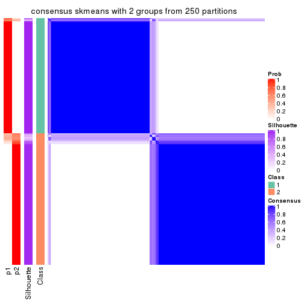</p>

</div>
<div id='tab-MAD-skmeans-consensus-heatmap-2'>
<pre><code class="r">consensus_heatmap(res, k = 3)
</code></pre>

<p></p>

</div>
<div id='tab-MAD-skmeans-consensus-heatmap-3'>
<pre><code class="r">consensus_heatmap(res, k = 4)
</code></pre>

<p></p>

</div>
<div id='tab-MAD-skmeans-consensus-heatmap-4'>
<pre><code class="r">consensus_heatmap(res, k = 5)
</code></pre>

<p>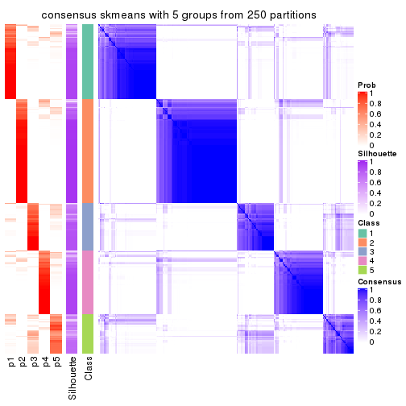</p>

</div>
<div id='tab-MAD-skmeans-consensus-heatmap-5'>
<pre><code class="r">consensus_heatmap(res, k = 6)
</code></pre>

<p>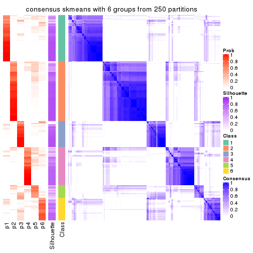</p>

</div>
</div>

Heatmaps for the membership of samples in all partitions to see how consistent they are:


<script>
$( function() {
	$( '#tabs-MAD-skmeans-membership-heatmap' ).tabs();
} );
</script>
<div id='tabs-MAD-skmeans-membership-heatmap'>
<ul>
<li><a href='#tab-MAD-skmeans-membership-heatmap-1'>k = 2</a></li>
<li><a href='#tab-MAD-skmeans-membership-heatmap-2'>k = 3</a></li>
<li><a href='#tab-MAD-skmeans-membership-heatmap-3'>k = 4</a></li>
<li><a href='#tab-MAD-skmeans-membership-heatmap-4'>k = 5</a></li>
<li><a href='#tab-MAD-skmeans-membership-heatmap-5'>k = 6</a></li>
</ul>
<div id='tab-MAD-skmeans-membership-heatmap-1'>
<pre><code class="r">membership_heatmap(res, k = 2)
</code></pre>

<p></p>

</div>
<div id='tab-MAD-skmeans-membership-heatmap-2'>
<pre><code class="r">membership_heatmap(res, k = 3)
</code></pre>

<p></p>

</div>
<div id='tab-MAD-skmeans-membership-heatmap-3'>
<pre><code class="r">membership_heatmap(res, k = 4)
</code></pre>

<p></p>

</div>
<div id='tab-MAD-skmeans-membership-heatmap-4'>
<pre><code class="r">membership_heatmap(res, k = 5)
</code></pre>

<p></p>

</div>
<div id='tab-MAD-skmeans-membership-heatmap-5'>
<pre><code class="r">membership_heatmap(res, k = 6)
</code></pre>

<p></p>

</div>
</div>

As soon as we have had the classes for columns, we can look for signatures
which are significantly different between classes which can be candidate marks
for certain classes. Following are the heatmaps for signatures.


Signature heatmaps where rows are scaled:


<script>
$( function() {
	$( '#tabs-MAD-skmeans-get-signatures' ).tabs();
} );
</script>
<div id='tabs-MAD-skmeans-get-signatures'>
<ul>
<li><a href='#tab-MAD-skmeans-get-signatures-1'>k = 2</a></li>
<li><a href='#tab-MAD-skmeans-get-signatures-2'>k = 3</a></li>
<li><a href='#tab-MAD-skmeans-get-signatures-3'>k = 4</a></li>
<li><a href='#tab-MAD-skmeans-get-signatures-4'>k = 5</a></li>
<li><a href='#tab-MAD-skmeans-get-signatures-5'>k = 6</a></li>
</ul>
<div id='tab-MAD-skmeans-get-signatures-1'>
<pre><code class="r">get_signatures(res, k = 2)
</code></pre>

<p></p>

</div>
<div id='tab-MAD-skmeans-get-signatures-2'>
<pre><code class="r">get_signatures(res, k = 3)
</code></pre>

<p></p>

</div>
<div id='tab-MAD-skmeans-get-signatures-3'>
<pre><code class="r">get_signatures(res, k = 4)
</code></pre>

<p></p>

</div>
<div id='tab-MAD-skmeans-get-signatures-4'>
<pre><code class="r">get_signatures(res, k = 5)
</code></pre>

<p></p>

</div>
<div id='tab-MAD-skmeans-get-signatures-5'>
<pre><code class="r">get_signatures(res, k = 6)
</code></pre>

<p></p>

</div>
</div>


Signature heatmaps where rows are not scaled:


<script>
$( function() {
	$( '#tabs-MAD-skmeans-get-signatures-no-scale' ).tabs();
} );
</script>
<div id='tabs-MAD-skmeans-get-signatures-no-scale'>
<ul>
<li><a href='#tab-MAD-skmeans-get-signatures-no-scale-1'>k = 2</a></li>
<li><a href='#tab-MAD-skmeans-get-signatures-no-scale-2'>k = 3</a></li>
<li><a href='#tab-MAD-skmeans-get-signatures-no-scale-3'>k = 4</a></li>
<li><a href='#tab-MAD-skmeans-get-signatures-no-scale-4'>k = 5</a></li>
<li><a href='#tab-MAD-skmeans-get-signatures-no-scale-5'>k = 6</a></li>
</ul>
<div id='tab-MAD-skmeans-get-signatures-no-scale-1'>
<pre><code class="r">get_signatures(res, k = 2, scale_rows = FALSE)
</code></pre>

<p></p>

</div>
<div id='tab-MAD-skmeans-get-signatures-no-scale-2'>
<pre><code class="r">get_signatures(res, k = 3, scale_rows = FALSE)
</code></pre>

<p></p>

</div>
<div id='tab-MAD-skmeans-get-signatures-no-scale-3'>
<pre><code class="r">get_signatures(res, k = 4, scale_rows = FALSE)
</code></pre>

<p></p>

</div>
<div id='tab-MAD-skmeans-get-signatures-no-scale-4'>
<pre><code class="r">get_signatures(res, k = 5, scale_rows = FALSE)
</code></pre>

<p></p>

</div>
<div id='tab-MAD-skmeans-get-signatures-no-scale-5'>
<pre><code class="r">get_signatures(res, k = 6, scale_rows = FALSE)
</code></pre>

<p></p>

</div>
</div>


Compare the overlap of signatures from different k:

```r
compare_signatures(res)
```


`get_signature()` returns a data frame invisibly. TO get the list of signatures, the function
call should be assigned to a variable explicitly. In following code, if `plot` argument is set
to `FALSE`, no heatmap is plotted while only the differential analysis is performed.

```r
# code only for demonstration
tb = get_signature(res, k = ..., plot = FALSE)
```

An example of the output of `tb` is:

```
#>   which_row         fdr    mean_1    mean_2 scaled_mean_1 scaled_mean_2 km
#> 1        38 0.042760348  8.373488  9.131774    -0.5533452     0.5164555  1
#> 2        40 0.018707592  7.106213  8.469186    -0.6173731     0.5762149  1
#> 3        55 0.019134737 10.221463 11.207825    -0.6159697     0.5749050  1
#> 4        59 0.006059896  5.921854  7.869574    -0.6899429     0.6439467  1
#> 5        60 0.018055526  8.928898 10.211722    -0.6204761     0.5791110  1
#> 6        98 0.009384629 15.714769 14.887706     0.6635654    -0.6193277  2
...
```

The columns in `tb` are:

1. `which_row`: row indices corresponding to the input matrix.
2. `fdr`: FDR for the differential test. 
3. `mean_x`: The mean value in group x.
4. `scaled_mean_x`: The mean value in group x after rows are scaled.
5. `km`: Row groups if k-means clustering is applied to rows.


UMAP plot which shows how samples are separated.


<script>
$( function() {
	$( '#tabs-MAD-skmeans-dimension-reduction' ).tabs();
} );
</script>
<div id='tabs-MAD-skmeans-dimension-reduction'>
<ul>
<li><a href='#tab-MAD-skmeans-dimension-reduction-1'>k = 2</a></li>
<li><a href='#tab-MAD-skmeans-dimension-reduction-2'>k = 3</a></li>
<li><a href='#tab-MAD-skmeans-dimension-reduction-3'>k = 4</a></li>
<li><a href='#tab-MAD-skmeans-dimension-reduction-4'>k = 5</a></li>
<li><a href='#tab-MAD-skmeans-dimension-reduction-5'>k = 6</a></li>
</ul>
<div id='tab-MAD-skmeans-dimension-reduction-1'>
<pre><code class="r">dimension_reduction(res, k = 2, method = &quot;UMAP&quot;)
</code></pre>

<p></p>

</div>
<div id='tab-MAD-skmeans-dimension-reduction-2'>
<pre><code class="r">dimension_reduction(res, k = 3, method = &quot;UMAP&quot;)
</code></pre>

<p></p>

</div>
<div id='tab-MAD-skmeans-dimension-reduction-3'>
<pre><code class="r">dimension_reduction(res, k = 4, method = &quot;UMAP&quot;)
</code></pre>

<p></p>

</div>
<div id='tab-MAD-skmeans-dimension-reduction-4'>
<pre><code class="r">dimension_reduction(res, k = 5, method = &quot;UMAP&quot;)
</code></pre>

<p></p>

</div>
<div id='tab-MAD-skmeans-dimension-reduction-5'>
<pre><code class="r">dimension_reduction(res, k = 6, method = &quot;UMAP&quot;)
</code></pre>

<p></p>

</div>
</div>


Following heatmap shows how subgroups are split when increasing `k`:

```r
collect_classes(res)
```


If matrix rows can be associated to genes, consider to use `GO_Enrichment(res,
...)` to perform function enrichment for the signature genes.


 

---------------------------------------------------


### MAD:pam


The object with results only for a single top-value method and a single partition method 
can be extracted as:

```r
res = res_list["MAD", "pam"]
# you can also extract it by
# res = res_list["MAD:pam"]
```

A summary of `res` and all the functions that can be applied to it:

```r
res
```

```
#> A 'ConsensusPartition' object with k = 2, 3, 4, 5, 6.
#>   On a matrix with 17723 rows and 374 columns.
#>   Top rows (1000, 2000, 3000, 4000, 5000) are extracted by 'MAD' method.
#>   Subgroups are detected by 'pam' method.
#>   Performed in total 1250 partitions by row resampling.
#>   Best k for subgroups seems to be 2.
#> 
#> Following methods can be applied to this 'ConsensusPartition' object:
#>  [1] "cola_report"             "collect_classes"         "collect_plots"          
#>  [4] "collect_stats"           "colnames"                "compare_signatures"     
#>  [7] "consensus_heatmap"       "dimension_reduction"     "functional_enrichment"  
#> [10] "get_anno_col"            "get_anno"                "get_classes"            
#> [13] "get_consensus"           "get_matrix"              "get_membership"         
#> [16] "get_param"               "get_signatures"          "get_stats"              
#> [19] "is_best_k"               "is_stable_k"             "membership_heatmap"     
#> [22] "ncol"                    "nrow"                    "plot_ecdf"              
#> [25] "rownames"                "select_partition_number" "show"                   
#> [28] "suggest_best_k"          "test_to_known_factors"
```

`collect_plots()` function collects all the plots made from `res` for all `k` (number of partitions)
into one single page to provide an easy and fast comparison between different `k`.

```r
collect_plots(res)
```


The plots are:

- The first row: a plot of the ECDF (Empirical cumulative distribution
  function) curves of the consensus matrix for each `k` and the heatmap of
  predicted classes for each `k`.
- The second row: heatmaps of the consensus matrix for each `k`.
- The third row: heatmaps of the membership matrix for each `k`.
- The fouth row: heatmaps of the signatures for each `k`.

All the plots in panels can be made by individual functions and they are
plotted later in this section.

`select_partition_number()` produces several plots showing different
statistics for choosing "optimized" `k`. There are following statistics:

- ECDF curves of the consensus matrix for each `k`;
- 1-PAC. [The PAC
  score](https://en.wikipedia.org/wiki/Consensus_clustering#Over-interpretation_potential_of_consensus_clustering)
  measures the proportion of the ambiguous subgrouping.
- Mean silhouette score.
- Concordance. The mean probability of fiting the consensus class ids in all
  partitions.
- Area increased. Denote $A_k$ as the area under the ECDF curve for current
  `k`, the area increased is defined as $A_k - A_{k-1}$.
- Rand index. The percent of pairs of samples that are both in a same cluster
  or both are not in a same cluster in the partition of k and k-1.
- Jaccard index. The ratio of pairs of samples are both in a same cluster in
  the partition of k and k-1 and the pairs of samples are both in a same
  cluster in the partition k or k-1.

The detailed explanations of these statistics can be found in [the cola
vignette](http://bioconductor.org/packages/devel/bioc/vignettes/cola/inst/doc/cola.html#toc_13).

Generally speaking, lower PAC score, higher mean silhouette score or higher
concordance corresponds to better partition. Rand index and Jaccard index
measure how similar the current partition is compared to partition with `k-1`.
If they are too similar, we won't accept `k` is better than `k-1`.

```r
select_partition_number(res)
```


The numeric values for all these statistics can be obtained by `get_stats()`.

```r
get_stats(res)
```

```
#>   k 1-PAC mean_silhouette concordance area_increased  Rand Jaccard
#> 2 2 0.886           0.936       0.973         0.4800 0.519   0.519
#> 3 3 0.884           0.898       0.947         0.2945 0.816   0.658
#> 4 4 0.895           0.864       0.939         0.1404 0.884   0.702
#> 5 5 0.746           0.707       0.859         0.0872 0.932   0.771
#> 6 6 0.747           0.417       0.734         0.0576 0.881   0.561
```

`suggest_best_k()` suggests the best $k$ based on these statistics. The rules are as follows:

- All $k$ with Jaccard index larger than 0.95 are removed because the increase of
  the partition number does not provides enough extra information. If all $k$ are removed,
  the best $k$ is assigned by `NA`.
- For $k$ with 1-PAC larger than 0.9, the maximal $k$ is taken as the "best k". Other $k$ is called "optional k".
- If it does not fit the second rule. The $k$ with the highest vote of highest
  1-PAC, mean silhouette and concordance is taken as the "best k".

```r
suggest_best_k(res)
```

```
#> [1] 2
```


Following shows the table of the partitions (You need to click the **show/hide
code output** link to see it). The membership matrix (columns with name `p*`)
is inferred by
[`clue::cl_consensus()`](https://www.rdocumentation.org/link/cl_consensus?package=clue)
function with the `SE` method. Basically the value in the membership matrix
represents the probability to belong to a certain group. The finall class
label for an item is determined with the group with highest probability it
belongs to.

In `get_classes()` function, the entropy is calculated from the membership
matrix and the silhouette score is calculated from the consensus matrix.


<script>
$( function() {
	$( '#tabs-MAD-pam-get-classes' ).tabs();
} );
</script>
<div id='tabs-MAD-pam-get-classes'>
<ul>
<li><a href='#tab-MAD-pam-get-classes-1'>k = 2</a></li>
<li><a href='#tab-MAD-pam-get-classes-2'>k = 3</a></li>
<li><a href='#tab-MAD-pam-get-classes-3'>k = 4</a></li>
<li><a href='#tab-MAD-pam-get-classes-4'>k = 5</a></li>
<li><a href='#tab-MAD-pam-get-classes-5'>k = 6</a></li>
</ul>

<div id='tab-MAD-pam-get-classes-1'>
<p><a id='tab-MAD-pam-get-classes-1-a' style='color:#0366d6' href='#'>show/hide code output</a></p>
<pre><code class="r">cbind(get_classes(res, k = 2), get_membership(res, k = 2))
</code></pre>

<pre><code>#&gt;            class entropy silhouette    p1    p2
#&gt; SRR660824      1  0.4431     0.8906 0.908 0.092
#&gt; SRR603858      2  0.0376     0.9722 0.004 0.996
#&gt; SRR817070      2  0.0000     0.9754 0.000 1.000
#&gt; SRR1486995     1  0.0000     0.9648 1.000 0.000
#&gt; SRR813043      2  0.0000     0.9754 0.000 1.000
#&gt; SRR656874      2  0.0000     0.9754 0.000 1.000
#&gt; SRR659037      1  0.8608     0.6316 0.716 0.284
#&gt; SRR662031      1  0.0000     0.9648 1.000 0.000
#&gt; SRR1081283     2  0.0000     0.9754 0.000 1.000
#&gt; SRR1481036     2  0.7139     0.7507 0.196 0.804
#&gt; SRR1434009     2  0.0000     0.9754 0.000 1.000
#&gt; SRR1376676     1  0.0000     0.9648 1.000 0.000
#&gt; SRR1396967     2  0.0000     0.9754 0.000 1.000
#&gt; SRR665429      2  0.0000     0.9754 0.000 1.000
#&gt; SRR1388025     2  0.0000     0.9754 0.000 1.000
#&gt; SRR600784      1  0.0000     0.9648 1.000 0.000
#&gt; SRR657611      1  0.0000     0.9648 1.000 0.000
#&gt; SRR1333659     2  0.0000     0.9754 0.000 1.000
#&gt; SRR1323896     2  0.0000     0.9754 0.000 1.000
#&gt; SRR1453971     1  0.0000     0.9648 1.000 0.000
#&gt; SRR1421010     1  0.0000     0.9648 1.000 0.000
#&gt; SRR1334490     1  0.0000     0.9648 1.000 0.000
#&gt; SRR1309468     1  0.0000     0.9648 1.000 0.000
#&gt; SRR1468637     1  0.5629     0.8489 0.868 0.132
#&gt; SRR1365489     2  0.0000     0.9754 0.000 1.000
#&gt; SRR627445      2  0.2603     0.9371 0.044 0.956
#&gt; SRR607863      2  0.0000     0.9754 0.000 1.000
#&gt; SRR1475524     1  0.0000     0.9648 1.000 0.000
#&gt; SRR1405504     2  0.0000     0.9754 0.000 1.000
#&gt; SRR615695      1  0.0000     0.9648 1.000 0.000
#&gt; SRR600900      2  0.0000     0.9754 0.000 1.000
#&gt; SRR601477      2  0.0000     0.9754 0.000 1.000
#&gt; SRR1487215     2  0.0000     0.9754 0.000 1.000
#&gt; SRR1310797     2  0.0000     0.9754 0.000 1.000
#&gt; SRR1362713     1  0.0000     0.9648 1.000 0.000
#&gt; SRR1431385     1  0.0000     0.9648 1.000 0.000
#&gt; SRR1379089     2  0.0000     0.9754 0.000 1.000
#&gt; SRR1102079     1  0.0000     0.9648 1.000 0.000
#&gt; SRR1357210     1  0.0000     0.9648 1.000 0.000
#&gt; SRR657659      2  0.0000     0.9754 0.000 1.000
#&gt; SRR663573      2  0.0000     0.9754 0.000 1.000
#&gt; SRR603188      2  0.0000     0.9754 0.000 1.000
#&gt; SRR1471200     2  0.0000     0.9754 0.000 1.000
#&gt; SRR1310975     2  0.0000     0.9754 0.000 1.000
#&gt; SRR627457      2  0.2603     0.9368 0.044 0.956
#&gt; SRR1367654     2  0.0000     0.9754 0.000 1.000
#&gt; SRR1488410     1  0.0000     0.9648 1.000 0.000
#&gt; SRR1457750     2  0.0000     0.9754 0.000 1.000
#&gt; SRR1099546     1  0.0000     0.9648 1.000 0.000
#&gt; SRR604480      2  0.0000     0.9754 0.000 1.000
#&gt; SRR1390477     2  0.0000     0.9754 0.000 1.000
#&gt; SRR1458447     2  0.0000     0.9754 0.000 1.000
#&gt; SRR1473161     2  0.0000     0.9754 0.000 1.000
#&gt; SRR1409813     2  0.0000     0.9754 0.000 1.000
#&gt; SRR612791      1  0.0000     0.9648 1.000 0.000
#&gt; SRR1470580     2  0.0000     0.9754 0.000 1.000
#&gt; SRR1444063     2  0.5178     0.8545 0.116 0.884
#&gt; SRR1355578     1  0.0000     0.9648 1.000 0.000
#&gt; SRR1429203     1  0.0000     0.9648 1.000 0.000
#&gt; SRR599154      2  0.0000     0.9754 0.000 1.000
#&gt; SRR814244      1  0.0000     0.9648 1.000 0.000
#&gt; SRR1404123     2  0.0000     0.9754 0.000 1.000
#&gt; SRR656934      1  0.0000     0.9648 1.000 0.000
#&gt; SRR1339029     2  0.0000     0.9754 0.000 1.000
#&gt; SRR821525      2  0.0000     0.9754 0.000 1.000
#&gt; SRR1443677     1  0.0000     0.9648 1.000 0.000
#&gt; SRR1406330     1  0.0000     0.9648 1.000 0.000
#&gt; SRR1338124     2  0.0000     0.9754 0.000 1.000
#&gt; SRR1391376     1  0.8661     0.6101 0.712 0.288
#&gt; SRR661842      2  0.0000     0.9754 0.000 1.000
#&gt; SRR1395699     1  0.4939     0.8735 0.892 0.108
#&gt; SRR1312209     1  0.0000     0.9648 1.000 0.000
#&gt; SRR1359469     1  0.0000     0.9648 1.000 0.000
#&gt; SRR658885      1  0.0000     0.9648 1.000 0.000
#&gt; SRR1414578     1  0.0000     0.9648 1.000 0.000
#&gt; SRR603620      2  0.0000     0.9754 0.000 1.000
#&gt; SRR604677      1  0.0000     0.9648 1.000 0.000
#&gt; SRR603800      2  0.0000     0.9754 0.000 1.000
#&gt; SRR602058      2  0.0000     0.9754 0.000 1.000
#&gt; SRR817488      2  0.0000     0.9754 0.000 1.000
#&gt; SRR655601      2  0.0000     0.9754 0.000 1.000
#&gt; SRR1434821     2  0.0000     0.9754 0.000 1.000
#&gt; SRR1349166     2  0.0000     0.9754 0.000 1.000
#&gt; SRR615129      2  0.0000     0.9754 0.000 1.000
#&gt; SRR607586      2  0.0000     0.9754 0.000 1.000
#&gt; SRR602680      2  0.0000     0.9754 0.000 1.000
#&gt; SRR1411070     2  0.0000     0.9754 0.000 1.000
#&gt; SRR663038      2  0.0000     0.9754 0.000 1.000
#&gt; SRR1489416     2  0.0000     0.9754 0.000 1.000
#&gt; SRR1479155     1  0.0000     0.9648 1.000 0.000
#&gt; SRR662162      1  0.0000     0.9648 1.000 0.000
#&gt; SRR1374567     1  0.0000     0.9648 1.000 0.000
#&gt; SRR1434048     2  0.0000     0.9754 0.000 1.000
#&gt; SRR2184865     2  0.0000     0.9754 0.000 1.000
#&gt; SRR2170135     1  0.0000     0.9648 1.000 0.000
#&gt; SRR615551      2  0.0000     0.9754 0.000 1.000
#&gt; SRR1335513     2  0.0000     0.9754 0.000 1.000
#&gt; SRR1370216     1  0.0000     0.9648 1.000 0.000
#&gt; SRR662954      2  0.0000     0.9754 0.000 1.000
#&gt; SRR1375738     1  0.5059     0.8693 0.888 0.112
#&gt; SRR1356577     1  0.0000     0.9648 1.000 0.000
#&gt; SRR1073119     1  0.0000     0.9648 1.000 0.000
#&gt; SRR663549      1  0.0000     0.9648 1.000 0.000
#&gt; SRR1478015     2  0.0000     0.9754 0.000 1.000
#&gt; SRR600632      2  0.0000     0.9754 0.000 1.000
#&gt; SRR811866      1  0.0000     0.9648 1.000 0.000
#&gt; SRR1401101     2  0.0000     0.9754 0.000 1.000
#&gt; SRR1477797     2  0.0000     0.9754 0.000 1.000
#&gt; SRR1402986     2  0.0000     0.9754 0.000 1.000
#&gt; SRR658897      2  0.0376     0.9722 0.004 0.996
#&gt; SRR1419869     1  0.0000     0.9648 1.000 0.000
#&gt; SRR1490700     1  0.0000     0.9648 1.000 0.000
#&gt; SRR601723      2  0.2043     0.9481 0.032 0.968
#&gt; SRR1384115     2  0.0000     0.9754 0.000 1.000
#&gt; SRR1476927     2  0.0000     0.9754 0.000 1.000
#&gt; SRR1387769     1  0.5059     0.8693 0.888 0.112
#&gt; SRR1322595     1  0.0000     0.9648 1.000 0.000
#&gt; SRR1370423     2  0.0376     0.9722 0.004 0.996
#&gt; SRR1314976     1  0.5408     0.8574 0.876 0.124
#&gt; SRR1319560     2  0.0000     0.9754 0.000 1.000
#&gt; SRR1352683     1  0.4690     0.8822 0.900 0.100
#&gt; SRR1473800     1  0.0000     0.9648 1.000 0.000
#&gt; SRR1326384     1  0.0000     0.9648 1.000 0.000
#&gt; SRR1360807     2  0.9460     0.4193 0.364 0.636
#&gt; SRR1332544     1  0.0000     0.9648 1.000 0.000
#&gt; SRR598695      1  0.0000     0.9648 1.000 0.000
#&gt; SRR807824      2  0.0000     0.9754 0.000 1.000
#&gt; SRR809296      1  0.0000     0.9648 1.000 0.000
#&gt; SRR657927      1  0.0000     0.9648 1.000 0.000
#&gt; SRR1440682     2  0.0000     0.9754 0.000 1.000
#&gt; SRR1454415     2  0.0000     0.9754 0.000 1.000
#&gt; SRR1419131     2  0.0000     0.9754 0.000 1.000
#&gt; SRR1404293     1  0.0000     0.9648 1.000 0.000
#&gt; SRR1473340     1  0.0000     0.9648 1.000 0.000
#&gt; SRR1345563     1  0.0000     0.9648 1.000 0.000
#&gt; SRR1323382     2  0.0000     0.9754 0.000 1.000
#&gt; SRR1480697     1  0.9000     0.5640 0.684 0.316
#&gt; SRR1321808     2  0.0000     0.9754 0.000 1.000
#&gt; SRR1382756     2  0.0000     0.9754 0.000 1.000
#&gt; SRR1312558     2  0.0000     0.9754 0.000 1.000
#&gt; SRR1417088     2  0.0000     0.9754 0.000 1.000
#&gt; SRR1433027     2  0.0000     0.9754 0.000 1.000
#&gt; SRR662257      2  0.0000     0.9754 0.000 1.000
#&gt; SRR600417      2  0.0000     0.9754 0.000 1.000
#&gt; SRR812493      2  0.3114     0.9247 0.056 0.944
#&gt; SRR612743      1  0.0000     0.9648 1.000 0.000
#&gt; SRR1361345     1  0.0000     0.9648 1.000 0.000
#&gt; SRR600584      2  0.0000     0.9754 0.000 1.000
#&gt; SRR1310520     2  0.0000     0.9754 0.000 1.000
#&gt; SRR1395595     2  0.9286     0.4859 0.344 0.656
#&gt; SRR1334074     2  0.0000     0.9754 0.000 1.000
#&gt; SRR654838      2  0.0000     0.9754 0.000 1.000
#&gt; SRR1376694     1  0.0000     0.9648 1.000 0.000
#&gt; SRR1433841     2  0.0000     0.9754 0.000 1.000
#&gt; SRR1366837     1  0.0000     0.9648 1.000 0.000
#&gt; SRR1467479     2  0.0000     0.9754 0.000 1.000
#&gt; SRR1459055     1  0.0000     0.9648 1.000 0.000
#&gt; SRR1471050     2  0.0000     0.9754 0.000 1.000
#&gt; SRR603004      2  0.0000     0.9754 0.000 1.000
#&gt; SRR814703      2  0.0000     0.9754 0.000 1.000
#&gt; SRR661937      2  0.0000     0.9754 0.000 1.000
#&gt; SRR614359      1  0.0000     0.9648 1.000 0.000
#&gt; SRR1071568     2  0.0000     0.9754 0.000 1.000
#&gt; SRR1389084     1  0.5059     0.8693 0.888 0.112
#&gt; SRR1337624     2  0.0000     0.9754 0.000 1.000
#&gt; SRR1344400     2  0.0000     0.9754 0.000 1.000
#&gt; SRR1414290     2  0.0000     0.9754 0.000 1.000
#&gt; SRR1413644     2  0.0000     0.9754 0.000 1.000
#&gt; SRR1098998     1  0.0000     0.9648 1.000 0.000
#&gt; SRR1481279     1  0.0000     0.9648 1.000 0.000
#&gt; SRR1315103     1  0.0000     0.9648 1.000 0.000
#&gt; SRR1099286     1  0.5408     0.8574 0.876 0.124
#&gt; SRR2166570     2  0.2043     0.9482 0.032 0.968
#&gt; SRR601445      1  0.0000     0.9648 1.000 0.000
#&gt; SRR1439719     2  0.0000     0.9754 0.000 1.000
#&gt; SRR1377026     2  0.0000     0.9754 0.000 1.000
#&gt; SRR1327386     1  0.0000     0.9648 1.000 0.000
#&gt; SRR654826      2  0.0000     0.9754 0.000 1.000
#&gt; SRR1460433     2  0.0000     0.9754 0.000 1.000
#&gt; SRR1469345     1  0.0000     0.9648 1.000 0.000
#&gt; SRR1421462     2  0.0000     0.9754 0.000 1.000
#&gt; SRR662966      1  0.0000     0.9648 1.000 0.000
#&gt; SRR1339175     1  0.0000     0.9648 1.000 0.000
#&gt; SRR1447736     2  0.0000     0.9754 0.000 1.000
#&gt; SRR1434671     2  0.0000     0.9754 0.000 1.000
#&gt; SRR660800      2  0.0000     0.9754 0.000 1.000
#&gt; SRR1465543     2  0.0000     0.9754 0.000 1.000
#&gt; SRR1342023     1  0.0000     0.9648 1.000 0.000
#&gt; SRR1335670     1  0.0000     0.9648 1.000 0.000
#&gt; SRR1400955     2  0.0000     0.9754 0.000 1.000
#&gt; SRR1072150     2  0.0000     0.9754 0.000 1.000
#&gt; SRR1442822     1  0.0000     0.9648 1.000 0.000
#&gt; SRR1364658     1  0.0000     0.9648 1.000 0.000
#&gt; SRR1098074     2  0.0000     0.9754 0.000 1.000
#&gt; SRR1442778     1  0.0000     0.9648 1.000 0.000
#&gt; SRR1086728     2  0.0000     0.9754 0.000 1.000
#&gt; SRR627464      2  0.1633     0.9553 0.024 0.976
#&gt; SRR1409193     1  0.0000     0.9648 1.000 0.000
#&gt; SRR2168286     2  0.0000     0.9754 0.000 1.000
#&gt; SRR615539      2  0.0000     0.9754 0.000 1.000
#&gt; SRR663623      2  0.9460     0.4202 0.364 0.636
#&gt; SRR1471989     2  0.9129     0.5221 0.328 0.672
#&gt; SRR1468828     2  0.0000     0.9754 0.000 1.000
#&gt; SRR1381934     1  0.0000     0.9648 1.000 0.000
#&gt; SRR1471098     1  0.0000     0.9648 1.000 0.000
#&gt; SRR1314749     1  0.0000     0.9648 1.000 0.000
#&gt; SRR2166874     2  0.0000     0.9754 0.000 1.000
#&gt; SRR821302      1  0.0000     0.9648 1.000 0.000
#&gt; SRR1435066     2  0.0000     0.9754 0.000 1.000
#&gt; SRR661601      2  0.0000     0.9754 0.000 1.000
#&gt; SRR1446546     2  0.0000     0.9754 0.000 1.000
#&gt; SRR1419784     2  0.3584     0.9129 0.068 0.932
#&gt; SRR1357233     2  0.0000     0.9754 0.000 1.000
#&gt; SRR1441889     1  0.0000     0.9648 1.000 0.000
#&gt; SRR1413940     1  0.0000     0.9648 1.000 0.000
#&gt; SRR1324250     2  0.0000     0.9754 0.000 1.000
#&gt; SRR1442862     2  0.0000     0.9754 0.000 1.000
#&gt; SRR662474      2  0.0000     0.9754 0.000 1.000
#&gt; SRR1416226     1  0.0000     0.9648 1.000 0.000
#&gt; SRR1417404     1  0.5294     0.8615 0.880 0.120
#&gt; SRR665466      2  0.0000     0.9754 0.000 1.000
#&gt; SRR658849      1  0.0000     0.9648 1.000 0.000
#&gt; SRR1460025     2  0.0000     0.9754 0.000 1.000
#&gt; SRR1408136     1  0.0000     0.9648 1.000 0.000
#&gt; SRR1489995     2  0.0000     0.9754 0.000 1.000
#&gt; SRR1374092     1  0.0000     0.9648 1.000 0.000
#&gt; SRR1488429     2  0.9896     0.2050 0.440 0.560
#&gt; SRR1087559     1  0.0000     0.9648 1.000 0.000
#&gt; SRR817004      2  0.0000     0.9754 0.000 1.000
#&gt; SRR1429660     2  0.0000     0.9754 0.000 1.000
#&gt; SRR604390      2  0.8713     0.5846 0.292 0.708
#&gt; SRR614936      2  0.0000     0.9754 0.000 1.000
#&gt; SRR1365938     2  0.0000     0.9754 0.000 1.000
#&gt; SRR1437324     1  0.0000     0.9648 1.000 0.000
#&gt; SRR613414      2  0.0000     0.9754 0.000 1.000
#&gt; SRR660414      2  0.5737     0.8330 0.136 0.864
#&gt; SRR1452185     1  0.0000     0.9648 1.000 0.000
#&gt; SRR1347020     1  0.0000     0.9648 1.000 0.000
#&gt; SRR1398036     2  0.0000     0.9754 0.000 1.000
#&gt; SRR1436674     1  0.0000     0.9648 1.000 0.000
#&gt; SRR603750      2  0.2603     0.9371 0.044 0.956
#&gt; SRR608630      2  0.7815     0.6931 0.232 0.768
#&gt; SRR655625      2  0.0000     0.9754 0.000 1.000
#&gt; SRR599059      2  0.0000     0.9754 0.000 1.000
#&gt; SRR615189      2  0.0000     0.9754 0.000 1.000
#&gt; SRR1466889     2  0.0000     0.9754 0.000 1.000
#&gt; SRR1084602     2  0.9977     0.0768 0.472 0.528
#&gt; SRR1335422     1  0.0000     0.9648 1.000 0.000
#&gt; SRR1356805     2  0.0000     0.9754 0.000 1.000
#&gt; SRR1385300     2  0.0938     0.9657 0.012 0.988
#&gt; SRR654814      1  0.0000     0.9648 1.000 0.000
#&gt; SRR658385      2  0.0000     0.9754 0.000 1.000
#&gt; SRR820596      1  0.0000     0.9648 1.000 0.000
#&gt; SRR1318118     1  0.0000     0.9648 1.000 0.000
#&gt; SRR1480766     2  0.0000     0.9754 0.000 1.000
#&gt; SRR1406539     1  0.5519     0.8532 0.872 0.128
#&gt; SRR1341833     2  0.0000     0.9754 0.000 1.000
#&gt; SRR1441826     2  0.1633     0.9553 0.024 0.976
#&gt; SRR1448051     1  0.0000     0.9648 1.000 0.000
#&gt; SRR1326752     1  0.4562     0.8856 0.904 0.096
#&gt; SRR665217      1  0.7299     0.7530 0.796 0.204
#&gt; SRR819186      2  0.0000     0.9754 0.000 1.000
#&gt; SRR661517      1  0.0000     0.9648 1.000 0.000
#&gt; SRR607166      2  0.0000     0.9754 0.000 1.000
#&gt; SRR809065      2  0.0000     0.9754 0.000 1.000
#&gt; SRR1415872     2  0.0000     0.9754 0.000 1.000
#&gt; SRR1415463     1  0.0000     0.9648 1.000 0.000
#&gt; SRR1381161     2  0.0000     0.9754 0.000 1.000
#&gt; SRR1442231     2  0.0000     0.9754 0.000 1.000
#&gt; SRR1374696     1  0.0000     0.9648 1.000 0.000
#&gt; SRR1451988     2  0.0000     0.9754 0.000 1.000
#&gt; SRR660555      1  0.0000     0.9648 1.000 0.000
#&gt; SRR657801      1  0.0000     0.9648 1.000 0.000
#&gt; SRR663344      2  0.0000     0.9754 0.000 1.000
#&gt; SRR1472462     2  0.0000     0.9754 0.000 1.000
#&gt; SRR1406176     2  0.0000     0.9754 0.000 1.000
#&gt; SRR656886      2  0.0000     0.9754 0.000 1.000
#&gt; SRR1498337     2  0.0000     0.9754 0.000 1.000
#&gt; SRR613066      1  0.0376     0.9620 0.996 0.004
#&gt; SRR1309490     1  0.0000     0.9648 1.000 0.000
#&gt; SRR602492      2  0.0000     0.9754 0.000 1.000
#&gt; SRR1447347     1  0.0000     0.9648 1.000 0.000
#&gt; SRR1475546     2  0.0000     0.9754 0.000 1.000
#&gt; SRR627459      2  0.5059     0.8629 0.112 0.888
#&gt; SRR1434332     2  0.0000     0.9754 0.000 1.000
#&gt; SRR1070358     2  0.0000     0.9754 0.000 1.000
#&gt; SRR1345936     2  0.1843     0.9518 0.028 0.972
#&gt; SRR665658      2  0.0000     0.9754 0.000 1.000
#&gt; SRR1321351     2  0.0000     0.9754 0.000 1.000
#&gt; SRR657880      2  0.0000     0.9754 0.000 1.000
#&gt; SRR1373903     2  0.0000     0.9754 0.000 1.000
#&gt; SRR657396      2  0.0000     0.9754 0.000 1.000
#&gt; SRR660981      2  0.0000     0.9754 0.000 1.000
#&gt; SRR818499      1  0.0000     0.9648 1.000 0.000
#&gt; SRR819658      2  0.0000     0.9754 0.000 1.000
#&gt; SRR1376316     1  0.0000     0.9648 1.000 0.000
#&gt; SRR1323723     2  0.0000     0.9754 0.000 1.000
#&gt; SRR1476719     1  0.0000     0.9648 1.000 0.000
#&gt; SRR1403478     2  0.0000     0.9754 0.000 1.000
#&gt; SRR1095695     2  0.8327     0.6463 0.264 0.736
#&gt; SRR1352391     1  0.3733     0.9085 0.928 0.072
#&gt; SRR1498813     2  0.0000     0.9754 0.000 1.000
#&gt; SRR627437      2  0.3114     0.9251 0.056 0.944
#&gt; SRR2185097     1  0.0000     0.9648 1.000 0.000
#&gt; SRR817166      1  0.7883     0.7138 0.764 0.236
#&gt; SRR1091670     2  0.0000     0.9754 0.000 1.000
#&gt; SRR603776      1  0.0000     0.9648 1.000 0.000
#&gt; SRR1479640     2  0.0000     0.9754 0.000 1.000
#&gt; SRR660152      1  0.0000     0.9648 1.000 0.000
#&gt; SRR1074769     2  0.0000     0.9754 0.000 1.000
#&gt; SRR656153      2  0.0000     0.9754 0.000 1.000
#&gt; SRR1392502     1  0.0000     0.9648 1.000 0.000
#&gt; SRR1359609     1  0.0000     0.9648 1.000 0.000
#&gt; SRR601925      2  0.0000     0.9754 0.000 1.000
#&gt; SRR2165182     2  0.0000     0.9754 0.000 1.000
#&gt; SRR608542      2  0.0000     0.9754 0.000 1.000
#&gt; SRR655064      2  0.0000     0.9754 0.000 1.000
#&gt; SRR1432430     2  0.1633     0.9556 0.024 0.976
#&gt; SRR808472      2  0.0000     0.9754 0.000 1.000
#&gt; SRR1414958     2  0.9754     0.3182 0.408 0.592
#&gt; SRR598484      2  0.0000     0.9754 0.000 1.000
#&gt; SRR612755      1  0.2778     0.9288 0.952 0.048
#&gt; SRR1365808     1  0.0000     0.9648 1.000 0.000
#&gt; SRR1391724     1  0.7745     0.7259 0.772 0.228
#&gt; SRR1322373     1  0.5059     0.8693 0.888 0.112
#&gt; SRR1489265     2  0.0000     0.9754 0.000 1.000
#&gt; SRR1359099     2  0.0000     0.9754 0.000 1.000
#&gt; SRR607279      2  0.0000     0.9754 0.000 1.000
#&gt; SRR810461      2  0.0000     0.9754 0.000 1.000
#&gt; SRR627427      1  0.6343     0.8155 0.840 0.160
#&gt; SRR612887      2  0.0000     0.9754 0.000 1.000
#&gt; SRR809807      2  0.0000     0.9754 0.000 1.000
#&gt; SRR663112      2  0.0000     0.9754 0.000 1.000
#&gt; SRR1346933     2  0.8813     0.5621 0.300 0.700
#&gt; SRR1487910     1  0.0000     0.9648 1.000 0.000
#&gt; SRR603092      2  0.0000     0.9754 0.000 1.000
#&gt; SRR1417680     2  0.0000     0.9754 0.000 1.000
#&gt; SRR1383785     1  0.0000     0.9648 1.000 0.000
#&gt; SRR1070015     2  0.0000     0.9754 0.000 1.000
#&gt; SRR1466222     2  0.0000     0.9754 0.000 1.000
#&gt; SRR1416119     1  0.0000     0.9648 1.000 0.000
#&gt; SRR819318      1  0.0000     0.9648 1.000 0.000
#&gt; SRR608288      2  0.0000     0.9754 0.000 1.000
#&gt; SRR811121      2  0.0000     0.9754 0.000 1.000
#&gt; SRR613138      2  0.0000     0.9754 0.000 1.000
#&gt; SRR810483      1  0.2948     0.9254 0.948 0.052
#&gt; SRR607839      1  0.0000     0.9648 1.000 0.000
#&gt; SRR1337031     1  0.0000     0.9648 1.000 0.000
#&gt; SRR601311      2  0.0000     0.9754 0.000 1.000
#&gt; SRR1406685     2  0.0000     0.9754 0.000 1.000
#&gt; SRR1467500     2  0.0000     0.9754 0.000 1.000
#&gt; SRR1308504     1  0.0000     0.9648 1.000 0.000
#&gt; SRR1312865     2  0.6801     0.7742 0.180 0.820
#&gt; SRR1312522     2  0.7056     0.7570 0.192 0.808
#&gt; SRR1490486     2  0.0000     0.9754 0.000 1.000
#&gt; SRR1325888     1  0.8016     0.6898 0.756 0.244
#&gt; SRR1472885     1  0.0000     0.9648 1.000 0.000
#&gt; SRR1098785     2  0.0000     0.9754 0.000 1.000
#&gt; SRR1084766     2  0.0000     0.9754 0.000 1.000
#&gt; SRR1102804     2  0.0000     0.9754 0.000 1.000
#&gt; SRR1336636     1  0.0000     0.9648 1.000 0.000
#&gt; SRR1347795     1  0.0000     0.9648 1.000 0.000
#&gt; SRR601900      2  0.0000     0.9754 0.000 1.000
#&gt; SRR1330989     2  0.0000     0.9754 0.000 1.000
#&gt; SRR658445      2  0.0000     0.9754 0.000 1.000
#&gt; SRR1368754     1  0.0000     0.9648 1.000 0.000
#&gt; SRR1460001     2  0.0000     0.9754 0.000 1.000
#&gt; SRR1414934     1  0.0000     0.9648 1.000 0.000
#&gt; SRR1326249     1  0.9993     0.0618 0.516 0.484
#&gt; SRR614948      1  0.0000     0.9648 1.000 0.000
#&gt; SRR1472952     1  0.9909     0.2085 0.556 0.444
#&gt; SRR1321528     1  0.5178     0.8658 0.884 0.116
#&gt; SRR627447      1  0.1843     0.9445 0.972 0.028
#&gt; SRR612239      1  0.8909     0.5850 0.692 0.308
</code></pre>

<script>
$('#tab-MAD-pam-get-classes-1-a').parent().next().next().hide();
$('#tab-MAD-pam-get-classes-1-a').click(function(){
  $('#tab-MAD-pam-get-classes-1-a').parent().next().next().toggle();
  return(false);
});
</script>
</div>

<div id='tab-MAD-pam-get-classes-2'>
<p><a id='tab-MAD-pam-get-classes-2-a' style='color:#0366d6' href='#'>show/hide code output</a></p>
<pre><code class="r">cbind(get_classes(res, k = 3), get_membership(res, k = 3))
</code></pre>

<pre><code>#&gt;            class entropy silhouette    p1    p2    p3
#&gt; SRR660824      1  0.6565      0.641 0.720 0.232 0.048
#&gt; SRR603858      3  0.4413      0.819 0.008 0.160 0.832
#&gt; SRR817070      2  0.0424      0.964 0.000 0.992 0.008
#&gt; SRR1486995     1  0.1753      0.930 0.952 0.000 0.048
#&gt; SRR813043      2  0.0000      0.964 0.000 1.000 0.000
#&gt; SRR656874      2  0.0000      0.964 0.000 1.000 0.000
#&gt; SRR659037      3  0.1999      0.889 0.036 0.012 0.952
#&gt; SRR662031      1  0.0000      0.942 1.000 0.000 0.000
#&gt; SRR1081283     3  0.1753      0.925 0.000 0.048 0.952
#&gt; SRR1481036     2  0.6565      0.623 0.232 0.720 0.048
#&gt; SRR1434009     2  0.0000      0.964 0.000 1.000 0.000
#&gt; SRR1376676     1  0.0000      0.942 1.000 0.000 0.000
#&gt; SRR1396967     2  0.0000      0.964 0.000 1.000 0.000
#&gt; SRR665429      2  0.0424      0.964 0.000 0.992 0.008
#&gt; SRR1388025     3  0.1753      0.925 0.000 0.048 0.952
#&gt; SRR600784      1  0.1031      0.938 0.976 0.000 0.024
#&gt; SRR657611      1  0.0000      0.942 1.000 0.000 0.000
#&gt; SRR1333659     2  0.0000      0.964 0.000 1.000 0.000
#&gt; SRR1323896     2  0.0424      0.964 0.000 0.992 0.008
#&gt; SRR1453971     1  0.0000      0.942 1.000 0.000 0.000
#&gt; SRR1421010     1  0.0000      0.942 1.000 0.000 0.000
#&gt; SRR1334490     1  0.1753      0.930 0.952 0.000 0.048
#&gt; SRR1309468     1  0.0000      0.942 1.000 0.000 0.000
#&gt; SRR1468637     3  0.5253      0.835 0.096 0.076 0.828
#&gt; SRR1365489     2  0.0237      0.964 0.000 0.996 0.004
#&gt; SRR627445      2  0.5167      0.744 0.172 0.804 0.024
#&gt; SRR607863      2  0.0237      0.964 0.000 0.996 0.004
#&gt; SRR1475524     1  0.0000      0.942 1.000 0.000 0.000
#&gt; SRR1405504     2  0.0424      0.964 0.000 0.992 0.008
#&gt; SRR615695      1  0.0000      0.942 1.000 0.000 0.000
#&gt; SRR600900      2  0.5785      0.460 0.000 0.668 0.332
#&gt; SRR601477      2  0.0000      0.964 0.000 1.000 0.000
#&gt; SRR1487215     2  0.0000      0.964 0.000 1.000 0.000
#&gt; SRR1310797     2  0.0237      0.964 0.000 0.996 0.004
#&gt; SRR1362713     1  0.5529      0.532 0.704 0.000 0.296
#&gt; SRR1431385     1  0.0000      0.942 1.000 0.000 0.000
#&gt; SRR1379089     2  0.0000      0.964 0.000 1.000 0.000
#&gt; SRR1102079     1  0.1031      0.938 0.976 0.000 0.024
#&gt; SRR1357210     1  0.0000      0.942 1.000 0.000 0.000
#&gt; SRR657659      2  0.0592      0.962 0.000 0.988 0.012
#&gt; SRR663573      3  0.1753      0.925 0.000 0.048 0.952
#&gt; SRR603188      2  0.0747      0.959 0.000 0.984 0.016
#&gt; SRR1471200     2  0.0000      0.964 0.000 1.000 0.000
#&gt; SRR1310975     2  0.0237      0.964 0.000 0.996 0.004
#&gt; SRR627457      2  0.2845      0.893 0.068 0.920 0.012
#&gt; SRR1367654     2  0.0000      0.964 0.000 1.000 0.000
#&gt; SRR1488410     1  0.0000      0.942 1.000 0.000 0.000
#&gt; SRR1457750     2  0.1015      0.956 0.012 0.980 0.008
#&gt; SRR1099546     1  0.1753      0.930 0.952 0.000 0.048
#&gt; SRR604480      2  0.0424      0.964 0.000 0.992 0.008
#&gt; SRR1390477     2  0.0000      0.964 0.000 1.000 0.000
#&gt; SRR1458447     2  0.0424      0.964 0.000 0.992 0.008
#&gt; SRR1473161     2  0.0424      0.964 0.000 0.992 0.008
#&gt; SRR1409813     2  0.0000      0.964 0.000 1.000 0.000
#&gt; SRR612791      1  0.1031      0.936 0.976 0.000 0.024
#&gt; SRR1470580     2  0.0424      0.964 0.000 0.992 0.008
#&gt; SRR1444063     2  0.1163      0.941 0.028 0.972 0.000
#&gt; SRR1355578     1  0.0000      0.942 1.000 0.000 0.000
#&gt; SRR1429203     1  0.0000      0.942 1.000 0.000 0.000
#&gt; SRR599154      2  0.0000      0.964 0.000 1.000 0.000
#&gt; SRR814244      3  0.5905      0.493 0.352 0.000 0.648
#&gt; SRR1404123     3  0.6045      0.463 0.000 0.380 0.620
#&gt; SRR656934      1  0.1031      0.938 0.976 0.000 0.024
#&gt; SRR1339029     2  0.0424      0.964 0.000 0.992 0.008
#&gt; SRR821525      3  0.1753      0.925 0.000 0.048 0.952
#&gt; SRR1443677     1  0.0000      0.942 1.000 0.000 0.000
#&gt; SRR1406330     1  0.0000      0.942 1.000 0.000 0.000
#&gt; SRR1338124     2  0.0592      0.956 0.000 0.988 0.012
#&gt; SRR1391376     1  0.3589      0.883 0.900 0.052 0.048
#&gt; SRR661842      3  0.1753      0.925 0.000 0.048 0.952
#&gt; SRR1395699     1  0.2173      0.925 0.944 0.008 0.048
#&gt; SRR1312209     1  0.0000      0.942 1.000 0.000 0.000
#&gt; SRR1359469     1  0.0000      0.942 1.000 0.000 0.000
#&gt; SRR658885      1  0.1753      0.930 0.952 0.000 0.048
#&gt; SRR1414578     1  0.0000      0.942 1.000 0.000 0.000
#&gt; SRR603620      3  0.1964      0.922 0.000 0.056 0.944
#&gt; SRR604677      1  0.1031      0.938 0.976 0.000 0.024
#&gt; SRR603800      2  0.0424      0.964 0.000 0.992 0.008
#&gt; SRR602058      3  0.1860      0.923 0.000 0.052 0.948
#&gt; SRR817488      2  0.0424      0.964 0.000 0.992 0.008
#&gt; SRR655601      3  0.1753      0.925 0.000 0.048 0.952
#&gt; SRR1434821     2  0.0237      0.964 0.000 0.996 0.004
#&gt; SRR1349166     2  0.0000      0.964 0.000 1.000 0.000
#&gt; SRR615129      2  0.0424      0.964 0.000 0.992 0.008
#&gt; SRR607586      2  0.0424      0.964 0.000 0.992 0.008
#&gt; SRR602680      2  0.0000      0.964 0.000 1.000 0.000
#&gt; SRR1411070     3  0.1753      0.925 0.000 0.048 0.952
#&gt; SRR663038      2  0.0424      0.964 0.000 0.992 0.008
#&gt; SRR1489416     2  0.0424      0.964 0.000 0.992 0.008
#&gt; SRR1479155     1  0.0000      0.942 1.000 0.000 0.000
#&gt; SRR662162      1  0.0000      0.942 1.000 0.000 0.000
#&gt; SRR1374567     1  0.1031      0.938 0.976 0.000 0.024
#&gt; SRR1434048     2  0.0237      0.964 0.000 0.996 0.004
#&gt; SRR2184865     3  0.1753      0.925 0.000 0.048 0.952
#&gt; SRR2170135     1  0.0000      0.942 1.000 0.000 0.000
#&gt; SRR615551      2  0.0237      0.964 0.000 0.996 0.004
#&gt; SRR1335513     2  0.0424      0.964 0.000 0.992 0.008
#&gt; SRR1370216     1  0.1753      0.930 0.952 0.000 0.048
#&gt; SRR662954      3  0.1860      0.923 0.000 0.052 0.948
#&gt; SRR1375738     1  0.1453      0.935 0.968 0.008 0.024
#&gt; SRR1356577     3  0.5465      0.605 0.288 0.000 0.712
#&gt; SRR1073119     1  0.1031      0.938 0.976 0.000 0.024
#&gt; SRR663549      1  0.1267      0.937 0.972 0.004 0.024
#&gt; SRR1478015     2  0.0424      0.964 0.000 0.992 0.008
#&gt; SRR600632      2  0.0424      0.964 0.000 0.992 0.008
#&gt; SRR811866      1  0.0424      0.941 0.992 0.000 0.008
#&gt; SRR1401101     2  0.0000      0.964 0.000 1.000 0.000
#&gt; SRR1477797     3  0.1860      0.923 0.000 0.052 0.948
#&gt; SRR1402986     2  0.0237      0.964 0.000 0.996 0.004
#&gt; SRR658897      2  0.1031      0.946 0.024 0.976 0.000
#&gt; SRR1419869     1  0.1753      0.930 0.952 0.000 0.048
#&gt; SRR1490700     1  0.0000      0.942 1.000 0.000 0.000
#&gt; SRR601723      3  0.1878      0.923 0.004 0.044 0.952
#&gt; SRR1384115     2  0.0000      0.964 0.000 1.000 0.000
#&gt; SRR1476927     2  0.0424      0.964 0.000 0.992 0.008
#&gt; SRR1387769     1  0.1453      0.935 0.968 0.008 0.024
#&gt; SRR1322595     1  0.0000      0.942 1.000 0.000 0.000
#&gt; SRR1370423     2  0.1647      0.937 0.004 0.960 0.036
#&gt; SRR1314976     3  0.6095      0.397 0.392 0.000 0.608
#&gt; SRR1319560     3  0.1964      0.922 0.000 0.056 0.944
#&gt; SRR1352683     1  0.4887      0.660 0.772 0.228 0.000
#&gt; SRR1473800     1  0.0000      0.942 1.000 0.000 0.000
#&gt; SRR1326384     1  0.2066      0.916 0.940 0.000 0.060
#&gt; SRR1360807     3  0.2031      0.914 0.016 0.032 0.952
#&gt; SRR1332544     1  0.1753      0.930 0.952 0.000 0.048
#&gt; SRR598695      1  0.1031      0.936 0.976 0.000 0.024
#&gt; SRR807824      2  0.0424      0.959 0.000 0.992 0.008
#&gt; SRR809296      1  0.1753      0.930 0.952 0.000 0.048
#&gt; SRR657927      1  0.0000      0.942 1.000 0.000 0.000
#&gt; SRR1440682     2  0.0237      0.964 0.000 0.996 0.004
#&gt; SRR1454415     2  0.0000      0.964 0.000 1.000 0.000
#&gt; SRR1419131     3  0.1753      0.925 0.000 0.048 0.952
#&gt; SRR1404293     1  0.0000      0.942 1.000 0.000 0.000
#&gt; SRR1473340     1  0.1753      0.930 0.952 0.000 0.048
#&gt; SRR1345563     1  0.0000      0.942 1.000 0.000 0.000
#&gt; SRR1323382     2  0.0237      0.964 0.000 0.996 0.004
#&gt; SRR1480697     1  0.5633      0.693 0.768 0.208 0.024
#&gt; SRR1321808     2  0.0237      0.964 0.000 0.996 0.004
#&gt; SRR1382756     2  0.0424      0.964 0.000 0.992 0.008
#&gt; SRR1312558     2  0.0000      0.964 0.000 1.000 0.000
#&gt; SRR1417088     3  0.6215      0.340 0.000 0.428 0.572
#&gt; SRR1433027     2  0.0424      0.964 0.000 0.992 0.008
#&gt; SRR662257      3  0.1753      0.925 0.000 0.048 0.952
#&gt; SRR600417      3  0.1753      0.925 0.000 0.048 0.952
#&gt; SRR812493      3  0.1860      0.923 0.000 0.052 0.948
#&gt; SRR612743      1  0.1031      0.938 0.976 0.000 0.024
#&gt; SRR1361345     1  0.6260      0.114 0.552 0.000 0.448
#&gt; SRR600584      2  0.0424      0.964 0.000 0.992 0.008
#&gt; SRR1310520     3  0.1753      0.925 0.000 0.048 0.952
#&gt; SRR1395595     1  0.6685      0.621 0.708 0.244 0.048
#&gt; SRR1334074     2  0.2959      0.869 0.000 0.900 0.100
#&gt; SRR654838      2  0.0424      0.964 0.000 0.992 0.008
#&gt; SRR1376694     1  0.0747      0.940 0.984 0.000 0.016
#&gt; SRR1433841     2  0.0424      0.958 0.008 0.992 0.000
#&gt; SRR1366837     1  0.1031      0.938 0.976 0.000 0.024
#&gt; SRR1467479     2  0.0424      0.964 0.000 0.992 0.008
#&gt; SRR1459055     1  0.0000      0.942 1.000 0.000 0.000
#&gt; SRR1471050     2  0.0237      0.964 0.000 0.996 0.004
#&gt; SRR603004      2  0.0000      0.964 0.000 1.000 0.000
#&gt; SRR814703      2  0.0237      0.964 0.000 0.996 0.004
#&gt; SRR661937      2  0.0424      0.964 0.000 0.992 0.008
#&gt; SRR614359      1  0.0892      0.939 0.980 0.000 0.020
#&gt; SRR1071568     2  0.0424      0.964 0.000 0.992 0.008
#&gt; SRR1389084     1  0.2173      0.925 0.944 0.008 0.048
#&gt; SRR1337624     2  0.0237      0.964 0.000 0.996 0.004
#&gt; SRR1344400     2  0.0424      0.964 0.000 0.992 0.008
#&gt; SRR1414290     2  0.0237      0.964 0.000 0.996 0.004
#&gt; SRR1413644     2  0.0000      0.964 0.000 1.000 0.000
#&gt; SRR1098998     1  0.0000      0.942 1.000 0.000 0.000
#&gt; SRR1481279     1  0.1753      0.930 0.952 0.000 0.048
#&gt; SRR1315103     1  0.2878      0.854 0.904 0.000 0.096
#&gt; SRR1099286     2  0.6267      0.177 0.452 0.548 0.000
#&gt; SRR2166570     2  0.1832      0.932 0.036 0.956 0.008
#&gt; SRR601445      1  0.0000      0.942 1.000 0.000 0.000
#&gt; SRR1439719     2  0.0424      0.964 0.000 0.992 0.008
#&gt; SRR1377026     3  0.3816      0.845 0.000 0.148 0.852
#&gt; SRR1327386     1  0.0000      0.942 1.000 0.000 0.000
#&gt; SRR654826      2  0.0424      0.964 0.000 0.992 0.008
#&gt; SRR1460433     3  0.1860      0.923 0.000 0.052 0.948
#&gt; SRR1469345     1  0.1031      0.936 0.976 0.000 0.024
#&gt; SRR1421462     2  0.0237      0.964 0.000 0.996 0.004
#&gt; SRR662966      1  0.1163      0.937 0.972 0.000 0.028
#&gt; SRR1339175     1  0.1031      0.936 0.976 0.000 0.024
#&gt; SRR1447736     2  0.0237      0.964 0.000 0.996 0.004
#&gt; SRR1434671     2  0.0000      0.964 0.000 1.000 0.000
#&gt; SRR660800      2  0.0424      0.964 0.000 0.992 0.008
#&gt; SRR1465543     2  0.0000      0.964 0.000 1.000 0.000
#&gt; SRR1342023     1  0.0000      0.942 1.000 0.000 0.000
#&gt; SRR1335670     1  0.0000      0.942 1.000 0.000 0.000
#&gt; SRR1400955     2  0.0000      0.964 0.000 1.000 0.000
#&gt; SRR1072150     2  0.0000      0.964 0.000 1.000 0.000
#&gt; SRR1442822     1  0.0000      0.942 1.000 0.000 0.000
#&gt; SRR1364658     1  0.1753      0.930 0.952 0.000 0.048
#&gt; SRR1098074     2  0.0000      0.964 0.000 1.000 0.000
#&gt; SRR1442778     1  0.0000      0.942 1.000 0.000 0.000
#&gt; SRR1086728     2  0.1753      0.923 0.000 0.952 0.048
#&gt; SRR627464      2  0.2796      0.887 0.000 0.908 0.092
#&gt; SRR1409193     1  0.0000      0.942 1.000 0.000 0.000
#&gt; SRR2168286     3  0.1753      0.925 0.000 0.048 0.952
#&gt; SRR615539      2  0.0424      0.964 0.000 0.992 0.008
#&gt; SRR663623      2  0.6685      0.600 0.244 0.708 0.048
#&gt; SRR1471989     1  0.6834      0.595 0.692 0.260 0.048
#&gt; SRR1468828     2  0.0424      0.964 0.000 0.992 0.008
#&gt; SRR1381934     1  0.0000      0.942 1.000 0.000 0.000
#&gt; SRR1471098     1  0.1753      0.930 0.952 0.000 0.048
#&gt; SRR1314749     1  0.0747      0.939 0.984 0.000 0.016
#&gt; SRR2166874     3  0.1964      0.922 0.000 0.056 0.944
#&gt; SRR821302      1  0.0000      0.942 1.000 0.000 0.000
#&gt; SRR1435066     2  0.0000      0.964 0.000 1.000 0.000
#&gt; SRR661601      2  0.0000      0.964 0.000 1.000 0.000
#&gt; SRR1446546     2  0.0237      0.964 0.000 0.996 0.004
#&gt; SRR1419784     2  0.5558      0.742 0.152 0.800 0.048
#&gt; SRR1357233     3  0.2066      0.921 0.000 0.060 0.940
#&gt; SRR1441889     1  0.0000      0.942 1.000 0.000 0.000
#&gt; SRR1413940     1  0.0000      0.942 1.000 0.000 0.000
#&gt; SRR1324250     2  0.2261      0.909 0.000 0.932 0.068
#&gt; SRR1442862     2  0.0000      0.964 0.000 1.000 0.000
#&gt; SRR662474      3  0.1753      0.925 0.000 0.048 0.952
#&gt; SRR1416226     1  0.1031      0.938 0.976 0.000 0.024
#&gt; SRR1417404     3  0.4178      0.770 0.172 0.000 0.828
#&gt; SRR665466      2  0.0424      0.964 0.000 0.992 0.008
#&gt; SRR658849      1  0.1753      0.930 0.952 0.000 0.048
#&gt; SRR1460025     2  0.0237      0.964 0.000 0.996 0.004
#&gt; SRR1408136     1  0.0000      0.942 1.000 0.000 0.000
#&gt; SRR1489995     2  0.0237      0.964 0.000 0.996 0.004
#&gt; SRR1374092     1  0.0237      0.941 0.996 0.000 0.004
#&gt; SRR1488429     1  0.7648      0.318 0.552 0.400 0.048
#&gt; SRR1087559     1  0.0000      0.942 1.000 0.000 0.000
#&gt; SRR817004      2  0.1182      0.947 0.012 0.976 0.012
#&gt; SRR1429660     2  0.0000      0.964 0.000 1.000 0.000
#&gt; SRR604390      2  0.9074      0.164 0.148 0.500 0.352
#&gt; SRR614936      2  0.0424      0.964 0.000 0.992 0.008
#&gt; SRR1365938     2  0.0475      0.962 0.004 0.992 0.004
#&gt; SRR1437324     1  0.0000      0.942 1.000 0.000 0.000
#&gt; SRR613414      3  0.1860      0.923 0.000 0.052 0.948
#&gt; SRR660414      2  0.4195      0.806 0.136 0.852 0.012
#&gt; SRR1452185     1  0.0000      0.942 1.000 0.000 0.000
#&gt; SRR1347020     1  0.1031      0.938 0.976 0.000 0.024
#&gt; SRR1398036     3  0.1753      0.925 0.000 0.048 0.952
#&gt; SRR1436674     1  0.0000      0.942 1.000 0.000 0.000
#&gt; SRR603750      2  0.5348      0.735 0.176 0.796 0.028
#&gt; SRR608630      3  0.2152      0.913 0.016 0.036 0.948
#&gt; SRR655625      3  0.1753      0.925 0.000 0.048 0.952
#&gt; SRR599059      2  0.0592      0.956 0.000 0.988 0.012
#&gt; SRR615189      2  0.5178      0.649 0.000 0.744 0.256
#&gt; SRR1466889     2  0.0000      0.964 0.000 1.000 0.000
#&gt; SRR1084602     3  0.2187      0.904 0.028 0.024 0.948
#&gt; SRR1335422     1  0.0000      0.942 1.000 0.000 0.000
#&gt; SRR1356805     2  0.0000      0.964 0.000 1.000 0.000
#&gt; SRR1385300     2  0.5435      0.753 0.144 0.808 0.048
#&gt; SRR654814      1  0.0000      0.942 1.000 0.000 0.000
#&gt; SRR658385      2  0.0237      0.964 0.000 0.996 0.004
#&gt; SRR820596      1  0.0000      0.942 1.000 0.000 0.000
#&gt; SRR1318118     1  0.0000      0.942 1.000 0.000 0.000
#&gt; SRR1480766     2  0.0424      0.964 0.000 0.992 0.008
#&gt; SRR1406539     1  0.6267      0.170 0.548 0.452 0.000
#&gt; SRR1341833     2  0.0000      0.964 0.000 1.000 0.000
#&gt; SRR1441826     3  0.1753      0.925 0.000 0.048 0.952
#&gt; SRR1448051     1  0.0000      0.942 1.000 0.000 0.000
#&gt; SRR1326752     1  0.1989      0.928 0.948 0.004 0.048
#&gt; SRR665217      1  0.2903      0.908 0.924 0.028 0.048
#&gt; SRR819186      2  0.0237      0.964 0.000 0.996 0.004
#&gt; SRR661517      1  0.1753      0.930 0.952 0.000 0.048
#&gt; SRR607166      2  0.0424      0.964 0.000 0.992 0.008
#&gt; SRR809065      2  0.0424      0.964 0.000 0.992 0.008
#&gt; SRR1415872     2  0.0237      0.964 0.000 0.996 0.004
#&gt; SRR1415463     1  0.1753      0.930 0.952 0.000 0.048
#&gt; SRR1381161     3  0.1860      0.923 0.000 0.052 0.948
#&gt; SRR1442231     2  0.0424      0.964 0.000 0.992 0.008
#&gt; SRR1374696     1  0.0000      0.942 1.000 0.000 0.000
#&gt; SRR1451988     2  0.2339      0.917 0.012 0.940 0.048
#&gt; SRR660555      1  0.1031      0.936 0.976 0.000 0.024
#&gt; SRR657801      1  0.0000      0.942 1.000 0.000 0.000
#&gt; SRR663344      2  0.0000      0.964 0.000 1.000 0.000
#&gt; SRR1472462     2  0.0424      0.964 0.000 0.992 0.008
#&gt; SRR1406176     2  0.0892      0.949 0.000 0.980 0.020
#&gt; SRR656886      2  0.0424      0.964 0.000 0.992 0.008
#&gt; SRR1498337     3  0.1753      0.925 0.000 0.048 0.952
#&gt; SRR613066      1  0.1753      0.930 0.952 0.000 0.048
#&gt; SRR1309490     1  0.0000      0.942 1.000 0.000 0.000
#&gt; SRR602492      3  0.1753      0.925 0.000 0.048 0.952
#&gt; SRR1447347     1  0.0000      0.942 1.000 0.000 0.000
#&gt; SRR1475546     2  0.0237      0.964 0.000 0.996 0.004
#&gt; SRR627459      3  0.1647      0.917 0.004 0.036 0.960
#&gt; SRR1434332     2  0.0424      0.964 0.000 0.992 0.008
#&gt; SRR1070358     3  0.1964      0.922 0.000 0.056 0.944
#&gt; SRR1345936     3  0.2096      0.921 0.004 0.052 0.944
#&gt; SRR665658      2  0.0237      0.964 0.000 0.996 0.004
#&gt; SRR1321351     2  0.0424      0.964 0.000 0.992 0.008
#&gt; SRR657880      2  0.0000      0.964 0.000 1.000 0.000
#&gt; SRR1373903     2  0.0424      0.964 0.000 0.992 0.008
#&gt; SRR657396      3  0.6192      0.323 0.000 0.420 0.580
#&gt; SRR660981      2  0.0424      0.964 0.000 0.992 0.008
#&gt; SRR818499      1  0.1031      0.936 0.976 0.000 0.024
#&gt; SRR819658      2  0.0000      0.964 0.000 1.000 0.000
#&gt; SRR1376316     1  0.0000      0.942 1.000 0.000 0.000
#&gt; SRR1323723     2  0.0000      0.964 0.000 1.000 0.000
#&gt; SRR1476719     1  0.0000      0.942 1.000 0.000 0.000
#&gt; SRR1403478     2  0.0000      0.964 0.000 1.000 0.000
#&gt; SRR1095695     1  0.7534      0.399 0.584 0.368 0.048
#&gt; SRR1352391     3  0.6079      0.411 0.388 0.000 0.612
#&gt; SRR1498813     3  0.1753      0.925 0.000 0.048 0.952
#&gt; SRR627437      3  0.2492      0.916 0.016 0.048 0.936
#&gt; SRR2185097     1  0.0000      0.942 1.000 0.000 0.000
#&gt; SRR817166      3  0.6045      0.373 0.380 0.000 0.620
#&gt; SRR1091670     2  0.0424      0.964 0.000 0.992 0.008
#&gt; SRR603776      1  0.1031      0.938 0.976 0.000 0.024
#&gt; SRR1479640     2  0.0424      0.964 0.000 0.992 0.008
#&gt; SRR660152      1  0.1753      0.930 0.952 0.000 0.048
#&gt; SRR1074769     2  0.0424      0.964 0.000 0.992 0.008
#&gt; SRR656153      2  0.0424      0.964 0.000 0.992 0.008
#&gt; SRR1392502     1  0.1411      0.934 0.964 0.000 0.036
#&gt; SRR1359609     1  0.0000      0.942 1.000 0.000 0.000
#&gt; SRR601925      2  0.0237      0.964 0.000 0.996 0.004
#&gt; SRR2165182     2  0.0237      0.964 0.000 0.996 0.004
#&gt; SRR608542      3  0.1860      0.923 0.000 0.052 0.948
#&gt; SRR655064      3  0.1753      0.925 0.000 0.048 0.952
#&gt; SRR1432430     2  0.5307      0.767 0.136 0.816 0.048
#&gt; SRR808472      3  0.4605      0.767 0.000 0.204 0.796
#&gt; SRR1414958     1  0.6302      0.676 0.744 0.208 0.048
#&gt; SRR598484      2  0.0237      0.964 0.000 0.996 0.004
#&gt; SRR612755      1  0.3551      0.798 0.868 0.132 0.000
#&gt; SRR1365808     1  0.0000      0.942 1.000 0.000 0.000
#&gt; SRR1391724     3  0.6267      0.160 0.452 0.000 0.548
#&gt; SRR1322373     1  0.2173      0.925 0.944 0.008 0.048
#&gt; SRR1489265     2  0.0237      0.964 0.000 0.996 0.004
#&gt; SRR1359099     2  0.0000      0.964 0.000 1.000 0.000
#&gt; SRR607279      2  0.0424      0.964 0.000 0.992 0.008
#&gt; SRR810461      2  0.0424      0.964 0.000 0.992 0.008
#&gt; SRR627427      1  0.6244      0.209 0.560 0.440 0.000
#&gt; SRR612887      2  0.1643      0.932 0.000 0.956 0.044
#&gt; SRR809807      2  0.0892      0.949 0.000 0.980 0.020
#&gt; SRR663112      2  0.1031      0.950 0.000 0.976 0.024
#&gt; SRR1346933     3  0.4369      0.871 0.040 0.096 0.864
#&gt; SRR1487910     1  0.0000      0.942 1.000 0.000 0.000
#&gt; SRR603092      3  0.1753      0.925 0.000 0.048 0.952
#&gt; SRR1417680     2  0.0424      0.964 0.000 0.992 0.008
#&gt; SRR1383785     1  0.0000      0.942 1.000 0.000 0.000
#&gt; SRR1070015     2  0.0000      0.964 0.000 1.000 0.000
#&gt; SRR1466222     2  0.0424      0.964 0.000 0.992 0.008
#&gt; SRR1416119     1  0.1753      0.930 0.952 0.000 0.048
#&gt; SRR819318      1  0.0000      0.942 1.000 0.000 0.000
#&gt; SRR608288      2  0.0424      0.964 0.000 0.992 0.008
#&gt; SRR811121      2  0.0000      0.964 0.000 1.000 0.000
#&gt; SRR613138      2  0.0237      0.964 0.000 0.996 0.004
#&gt; SRR810483      1  0.1525      0.935 0.964 0.004 0.032
#&gt; SRR607839      1  0.0000      0.942 1.000 0.000 0.000
#&gt; SRR1337031     1  0.0747      0.940 0.984 0.000 0.016
#&gt; SRR601311      3  0.1860      0.923 0.000 0.052 0.948
#&gt; SRR1406685     3  0.1753      0.925 0.000 0.048 0.952
#&gt; SRR1467500     3  0.1753      0.925 0.000 0.048 0.952
#&gt; SRR1308504     1  0.0000      0.942 1.000 0.000 0.000
#&gt; SRR1312865     2  0.5521      0.723 0.180 0.788 0.032
#&gt; SRR1312522     2  0.6723      0.597 0.248 0.704 0.048
#&gt; SRR1490486     2  0.0237      0.964 0.000 0.996 0.004
#&gt; SRR1325888     1  0.3263      0.896 0.912 0.040 0.048
#&gt; SRR1472885     1  0.0000      0.942 1.000 0.000 0.000
#&gt; SRR1098785     2  0.1163      0.949 0.000 0.972 0.028
#&gt; SRR1084766     3  0.1753      0.925 0.000 0.048 0.952
#&gt; SRR1102804     2  0.0424      0.964 0.000 0.992 0.008
#&gt; SRR1336636     1  0.1031      0.938 0.976 0.000 0.024
#&gt; SRR1347795     1  0.1753      0.930 0.952 0.000 0.048
#&gt; SRR601900      2  0.0000      0.964 0.000 1.000 0.000
#&gt; SRR1330989     2  0.5650      0.501 0.000 0.688 0.312
#&gt; SRR658445      2  0.0000      0.964 0.000 1.000 0.000
#&gt; SRR1368754     1  0.1031      0.938 0.976 0.000 0.024
#&gt; SRR1460001     2  0.0000      0.964 0.000 1.000 0.000
#&gt; SRR1414934     1  0.0000      0.942 1.000 0.000 0.000
#&gt; SRR1326249     1  0.6059      0.705 0.764 0.188 0.048
#&gt; SRR614948      1  0.0000      0.942 1.000 0.000 0.000
#&gt; SRR1472952     1  0.5371      0.773 0.812 0.140 0.048
#&gt; SRR1321528     1  0.6095      0.352 0.608 0.392 0.000
#&gt; SRR627447      1  0.1031      0.938 0.976 0.000 0.024
#&gt; SRR612239      3  0.2982      0.885 0.056 0.024 0.920
</code></pre>

<script>
$('#tab-MAD-pam-get-classes-2-a').parent().next().next().hide();
$('#tab-MAD-pam-get-classes-2-a').click(function(){
  $('#tab-MAD-pam-get-classes-2-a').parent().next().next().toggle();
  return(false);
});
</script>
</div>

<div id='tab-MAD-pam-get-classes-3'>
<p><a id='tab-MAD-pam-get-classes-3-a' style='color:#0366d6' href='#'>show/hide code output</a></p>
<pre><code class="r">cbind(get_classes(res, k = 4), get_membership(res, k = 4))
</code></pre>

<pre><code>#&gt;            class entropy silhouette    p1    p2    p3    p4
#&gt; SRR660824      3  0.0817     0.8452 0.024 0.000 0.976 0.000
#&gt; SRR603858      4  0.2814     0.7857 0.000 0.132 0.000 0.868
#&gt; SRR817070      2  0.1022     0.9702 0.000 0.968 0.000 0.032
#&gt; SRR1486995     3  0.0000     0.8509 0.000 0.000 1.000 0.000
#&gt; SRR813043      2  0.0000     0.9680 0.000 1.000 0.000 0.000
#&gt; SRR656874      2  0.0188     0.9687 0.000 0.996 0.000 0.004
#&gt; SRR659037      4  0.1211     0.8874 0.040 0.000 0.000 0.960
#&gt; SRR662031      1  0.0000     0.9230 1.000 0.000 0.000 0.000
#&gt; SRR1081283     4  0.0000     0.9171 0.000 0.000 0.000 1.000
#&gt; SRR1481036     3  0.1557     0.8080 0.000 0.056 0.944 0.000
#&gt; SRR1434009     2  0.0000     0.9680 0.000 1.000 0.000 0.000
#&gt; SRR1376676     1  0.0000     0.9230 1.000 0.000 0.000 0.000
#&gt; SRR1396967     2  0.0000     0.9680 0.000 1.000 0.000 0.000
#&gt; SRR665429      2  0.1022     0.9702 0.000 0.968 0.000 0.032
#&gt; SRR1388025     4  0.0000     0.9171 0.000 0.000 0.000 1.000
#&gt; SRR600784      3  0.3649     0.7180 0.204 0.000 0.796 0.000
#&gt; SRR657611      1  0.0000     0.9230 1.000 0.000 0.000 0.000
#&gt; SRR1333659     2  0.0000     0.9680 0.000 1.000 0.000 0.000
#&gt; SRR1323896     2  0.1022     0.9702 0.000 0.968 0.000 0.032
#&gt; SRR1453971     1  0.0188     0.9199 0.996 0.004 0.000 0.000
#&gt; SRR1421010     1  0.0000     0.9230 1.000 0.000 0.000 0.000
#&gt; SRR1334490     3  0.0188     0.8519 0.004 0.000 0.996 0.000
#&gt; SRR1309468     1  0.0000     0.9230 1.000 0.000 0.000 0.000
#&gt; SRR1468637     4  0.5746     0.3229 0.396 0.032 0.000 0.572
#&gt; SRR1365489     2  0.0707     0.9707 0.000 0.980 0.000 0.020
#&gt; SRR627445      3  0.6660     0.5424 0.104 0.268 0.620 0.008
#&gt; SRR607863      2  0.0817     0.9706 0.000 0.976 0.000 0.024
#&gt; SRR1475524     1  0.0000     0.9230 1.000 0.000 0.000 0.000
#&gt; SRR1405504     2  0.1022     0.9702 0.000 0.968 0.000 0.032
#&gt; SRR615695      1  0.0000     0.9230 1.000 0.000 0.000 0.000
#&gt; SRR600900      2  0.4761     0.3934 0.000 0.628 0.000 0.372
#&gt; SRR601477      2  0.0000     0.9680 0.000 1.000 0.000 0.000
#&gt; SRR1487215     2  0.0000     0.9680 0.000 1.000 0.000 0.000
#&gt; SRR1310797     2  0.0336     0.9687 0.000 0.992 0.000 0.008
#&gt; SRR1362713     1  0.0188     0.9212 0.996 0.000 0.004 0.000
#&gt; SRR1431385     1  0.0000     0.9230 1.000 0.000 0.000 0.000
#&gt; SRR1379089     2  0.0000     0.9680 0.000 1.000 0.000 0.000
#&gt; SRR1102079     3  0.4830     0.4681 0.392 0.000 0.608 0.000
#&gt; SRR1357210     1  0.0000     0.9230 1.000 0.000 0.000 0.000
#&gt; SRR657659      2  0.1118     0.9686 0.000 0.964 0.000 0.036
#&gt; SRR663573      4  0.0000     0.9171 0.000 0.000 0.000 1.000
#&gt; SRR603188      2  0.1211     0.9665 0.000 0.960 0.000 0.040
#&gt; SRR1471200     2  0.0000     0.9680 0.000 1.000 0.000 0.000
#&gt; SRR1310975     2  0.0469     0.9701 0.000 0.988 0.000 0.012
#&gt; SRR627457      2  0.3489     0.8908 0.068 0.880 0.020 0.032
#&gt; SRR1367654     2  0.0000     0.9680 0.000 1.000 0.000 0.000
#&gt; SRR1488410     1  0.0188     0.9212 0.996 0.000 0.004 0.000
#&gt; SRR1457750     2  0.1022     0.9702 0.000 0.968 0.000 0.032
#&gt; SRR1099546     3  0.0188     0.8519 0.004 0.000 0.996 0.000
#&gt; SRR604480      2  0.1022     0.9702 0.000 0.968 0.000 0.032
#&gt; SRR1390477     2  0.0000     0.9680 0.000 1.000 0.000 0.000
#&gt; SRR1458447     2  0.0921     0.9707 0.000 0.972 0.000 0.028
#&gt; SRR1473161     2  0.1022     0.9702 0.000 0.968 0.000 0.032
#&gt; SRR1409813     2  0.0000     0.9680 0.000 1.000 0.000 0.000
#&gt; SRR612791      1  0.4697     0.4252 0.644 0.000 0.356 0.000
#&gt; SRR1470580     2  0.1022     0.9702 0.000 0.968 0.000 0.032
#&gt; SRR1444063     2  0.3649     0.7222 0.204 0.796 0.000 0.000
#&gt; SRR1355578     1  0.0188     0.9212 0.996 0.000 0.004 0.000
#&gt; SRR1429203     1  0.0000     0.9230 1.000 0.000 0.000 0.000
#&gt; SRR599154      2  0.0000     0.9680 0.000 1.000 0.000 0.000
#&gt; SRR814244      1  0.3631     0.7388 0.824 0.004 0.004 0.168
#&gt; SRR1404123     4  0.4585     0.4891 0.000 0.332 0.000 0.668
#&gt; SRR656934      1  0.4746     0.3065 0.632 0.000 0.368 0.000
#&gt; SRR1339029     2  0.1022     0.9702 0.000 0.968 0.000 0.032
#&gt; SRR821525      4  0.0000     0.9171 0.000 0.000 0.000 1.000
#&gt; SRR1443677     1  0.0000     0.9230 1.000 0.000 0.000 0.000
#&gt; SRR1406330     1  0.0000     0.9230 1.000 0.000 0.000 0.000
#&gt; SRR1338124     2  0.0000     0.9680 0.000 1.000 0.000 0.000
#&gt; SRR1391376     3  0.0188     0.8519 0.004 0.000 0.996 0.000
#&gt; SRR661842      4  0.0000     0.9171 0.000 0.000 0.000 1.000
#&gt; SRR1395699     3  0.0188     0.8519 0.004 0.000 0.996 0.000
#&gt; SRR1312209     1  0.0188     0.9212 0.996 0.000 0.004 0.000
#&gt; SRR1359469     1  0.0000     0.9230 1.000 0.000 0.000 0.000
#&gt; SRR658885      3  0.0188     0.8519 0.004 0.000 0.996 0.000
#&gt; SRR1414578     1  0.0000     0.9230 1.000 0.000 0.000 0.000
#&gt; SRR603620      4  0.0921     0.9049 0.000 0.028 0.000 0.972
#&gt; SRR604677      3  0.4830     0.4681 0.392 0.000 0.608 0.000
#&gt; SRR603800      2  0.1022     0.9702 0.000 0.968 0.000 0.032
#&gt; SRR602058      4  0.0469     0.9134 0.000 0.012 0.000 0.988
#&gt; SRR817488      2  0.1022     0.9702 0.000 0.968 0.000 0.032
#&gt; SRR655601      4  0.0000     0.9171 0.000 0.000 0.000 1.000
#&gt; SRR1434821     2  0.0188     0.9685 0.000 0.996 0.000 0.004
#&gt; SRR1349166     2  0.0000     0.9680 0.000 1.000 0.000 0.000
#&gt; SRR615129      2  0.1022     0.9702 0.000 0.968 0.000 0.032
#&gt; SRR607586      2  0.1022     0.9702 0.000 0.968 0.000 0.032
#&gt; SRR602680      2  0.0000     0.9680 0.000 1.000 0.000 0.000
#&gt; SRR1411070     4  0.0000     0.9171 0.000 0.000 0.000 1.000
#&gt; SRR663038      2  0.1022     0.9702 0.000 0.968 0.000 0.032
#&gt; SRR1489416     2  0.1022     0.9702 0.000 0.968 0.000 0.032
#&gt; SRR1479155     1  0.0000     0.9230 1.000 0.000 0.000 0.000
#&gt; SRR662162      1  0.0000     0.9230 1.000 0.000 0.000 0.000
#&gt; SRR1374567     3  0.3528     0.7333 0.192 0.000 0.808 0.000
#&gt; SRR1434048     2  0.0817     0.9706 0.000 0.976 0.000 0.024
#&gt; SRR2184865     4  0.0000     0.9171 0.000 0.000 0.000 1.000
#&gt; SRR2170135     1  0.0000     0.9230 1.000 0.000 0.000 0.000
#&gt; SRR615551      2  0.0817     0.9706 0.000 0.976 0.000 0.024
#&gt; SRR1335513     2  0.1022     0.9702 0.000 0.968 0.000 0.032
#&gt; SRR1370216     3  0.0188     0.8519 0.004 0.000 0.996 0.000
#&gt; SRR662954      4  0.0469     0.9134 0.000 0.012 0.000 0.988
#&gt; SRR1375738     3  0.4804     0.4785 0.384 0.000 0.616 0.000
#&gt; SRR1356577     4  0.5016     0.3069 0.396 0.000 0.004 0.600
#&gt; SRR1073119     3  0.4804     0.4785 0.384 0.000 0.616 0.000
#&gt; SRR663549      3  0.4999     0.1812 0.492 0.000 0.508 0.000
#&gt; SRR1478015     2  0.1022     0.9702 0.000 0.968 0.000 0.032
#&gt; SRR600632      2  0.1022     0.9702 0.000 0.968 0.000 0.032
#&gt; SRR811866      1  0.2281     0.8292 0.904 0.000 0.096 0.000
#&gt; SRR1401101     2  0.0000     0.9680 0.000 1.000 0.000 0.000
#&gt; SRR1477797     4  0.0592     0.9118 0.000 0.016 0.000 0.984
#&gt; SRR1402986     2  0.0817     0.9706 0.000 0.976 0.000 0.024
#&gt; SRR658897      2  0.0817     0.9591 0.024 0.976 0.000 0.000
#&gt; SRR1419869     3  0.0188     0.8519 0.004 0.000 0.996 0.000
#&gt; SRR1490700     1  0.0000     0.9230 1.000 0.000 0.000 0.000
#&gt; SRR601723      4  0.0000     0.9171 0.000 0.000 0.000 1.000
#&gt; SRR1384115     2  0.0000     0.9680 0.000 1.000 0.000 0.000
#&gt; SRR1476927     2  0.1022     0.9702 0.000 0.968 0.000 0.032
#&gt; SRR1387769     3  0.4804     0.4785 0.384 0.000 0.616 0.000
#&gt; SRR1322595     1  0.0188     0.9199 0.996 0.004 0.000 0.000
#&gt; SRR1370423     2  0.4804     0.4262 0.000 0.616 0.384 0.000
#&gt; SRR1314976     1  0.4830     0.3356 0.608 0.000 0.000 0.392
#&gt; SRR1319560     4  0.1022     0.9018 0.000 0.032 0.000 0.968
#&gt; SRR1352683     1  0.0188     0.9212 0.996 0.000 0.004 0.000
#&gt; SRR1473800     1  0.0000     0.9230 1.000 0.000 0.000 0.000
#&gt; SRR1326384     3  0.4804     0.4785 0.384 0.000 0.616 0.000
#&gt; SRR1360807     4  0.0188     0.9155 0.004 0.000 0.000 0.996
#&gt; SRR1332544     3  0.0188     0.8519 0.004 0.000 0.996 0.000
#&gt; SRR598695      1  0.4585     0.4743 0.668 0.000 0.332 0.000
#&gt; SRR807824      2  0.0000     0.9680 0.000 1.000 0.000 0.000
#&gt; SRR809296      3  0.0188     0.8519 0.004 0.000 0.996 0.000
#&gt; SRR657927      1  0.0188     0.9212 0.996 0.000 0.004 0.000
#&gt; SRR1440682     2  0.0469     0.9701 0.000 0.988 0.000 0.012
#&gt; SRR1454415     2  0.0000     0.9680 0.000 1.000 0.000 0.000
#&gt; SRR1419131     4  0.0000     0.9171 0.000 0.000 0.000 1.000
#&gt; SRR1404293     1  0.0188     0.9212 0.996 0.000 0.004 0.000
#&gt; SRR1473340     3  0.0921     0.8412 0.028 0.000 0.972 0.000
#&gt; SRR1345563     1  0.0000     0.9230 1.000 0.000 0.000 0.000
#&gt; SRR1323382     2  0.0817     0.9706 0.000 0.976 0.000 0.024
#&gt; SRR1480697     3  0.4761     0.4986 0.372 0.000 0.628 0.000
#&gt; SRR1321808     2  0.0817     0.9706 0.000 0.976 0.000 0.024
#&gt; SRR1382756     2  0.1022     0.9702 0.000 0.968 0.000 0.032
#&gt; SRR1312558     2  0.0000     0.9680 0.000 1.000 0.000 0.000
#&gt; SRR1417088     4  0.4790     0.3700 0.000 0.380 0.000 0.620
#&gt; SRR1433027     2  0.1022     0.9702 0.000 0.968 0.000 0.032
#&gt; SRR662257      4  0.0188     0.9160 0.000 0.004 0.000 0.996
#&gt; SRR600417      4  0.0000     0.9171 0.000 0.000 0.000 1.000
#&gt; SRR812493      4  0.0817     0.9062 0.000 0.024 0.000 0.976
#&gt; SRR612743      1  0.5000    -0.1601 0.504 0.000 0.496 0.000
#&gt; SRR1361345     1  0.0000     0.9230 1.000 0.000 0.000 0.000
#&gt; SRR600584      2  0.1022     0.9702 0.000 0.968 0.000 0.032
#&gt; SRR1310520     4  0.0000     0.9171 0.000 0.000 0.000 1.000
#&gt; SRR1395595     3  0.0000     0.8509 0.000 0.000 1.000 0.000
#&gt; SRR1334074     2  0.2408     0.8728 0.000 0.896 0.000 0.104
#&gt; SRR654838      2  0.0921     0.9707 0.000 0.972 0.000 0.028
#&gt; SRR1376694     1  0.4134     0.5958 0.740 0.000 0.260 0.000
#&gt; SRR1433841     2  0.0000     0.9680 0.000 1.000 0.000 0.000
#&gt; SRR1366837     3  0.4804     0.4785 0.384 0.000 0.616 0.000
#&gt; SRR1467479     2  0.1022     0.9702 0.000 0.968 0.000 0.032
#&gt; SRR1459055     1  0.0000     0.9230 1.000 0.000 0.000 0.000
#&gt; SRR1471050     2  0.0592     0.9704 0.000 0.984 0.000 0.016
#&gt; SRR603004      2  0.0000     0.9680 0.000 1.000 0.000 0.000
#&gt; SRR814703      2  0.0817     0.9706 0.000 0.976 0.000 0.024
#&gt; SRR661937      2  0.1022     0.9702 0.000 0.968 0.000 0.032
#&gt; SRR614359      1  0.3942     0.6270 0.764 0.000 0.236 0.000
#&gt; SRR1071568     2  0.0921     0.9707 0.000 0.972 0.000 0.028
#&gt; SRR1389084     3  0.0188     0.8519 0.004 0.000 0.996 0.000
#&gt; SRR1337624     2  0.0817     0.9706 0.000 0.976 0.000 0.024
#&gt; SRR1344400     2  0.1022     0.9702 0.000 0.968 0.000 0.032
#&gt; SRR1414290     2  0.0336     0.9693 0.000 0.992 0.000 0.008
#&gt; SRR1413644     2  0.0000     0.9680 0.000 1.000 0.000 0.000
#&gt; SRR1098998     1  0.0000     0.9230 1.000 0.000 0.000 0.000
#&gt; SRR1481279     3  0.0188     0.8519 0.004 0.000 0.996 0.000
#&gt; SRR1315103     1  0.0000     0.9230 1.000 0.000 0.000 0.000
#&gt; SRR1099286     1  0.0188     0.9212 0.996 0.000 0.004 0.000
#&gt; SRR2166570     2  0.2399     0.9291 0.048 0.920 0.000 0.032
#&gt; SRR601445      1  0.0000     0.9230 1.000 0.000 0.000 0.000
#&gt; SRR1439719     2  0.0921     0.9706 0.000 0.972 0.000 0.028
#&gt; SRR1377026     4  0.2647     0.8055 0.000 0.120 0.000 0.880
#&gt; SRR1327386     1  0.0000     0.9230 1.000 0.000 0.000 0.000
#&gt; SRR654826      2  0.1022     0.9702 0.000 0.968 0.000 0.032
#&gt; SRR1460433     4  0.0188     0.9159 0.000 0.004 0.000 0.996
#&gt; SRR1469345     1  0.4941     0.2424 0.564 0.000 0.436 0.000
#&gt; SRR1421462     2  0.0707     0.9707 0.000 0.980 0.000 0.020
#&gt; SRR662966      3  0.4331     0.6208 0.288 0.000 0.712 0.000
#&gt; SRR1339175     1  0.4776     0.3825 0.624 0.000 0.376 0.000
#&gt; SRR1447736     2  0.0707     0.9707 0.000 0.980 0.000 0.020
#&gt; SRR1434671     2  0.0000     0.9680 0.000 1.000 0.000 0.000
#&gt; SRR660800      2  0.1022     0.9702 0.000 0.968 0.000 0.032
#&gt; SRR1465543     2  0.0000     0.9680 0.000 1.000 0.000 0.000
#&gt; SRR1342023     1  0.0000     0.9230 1.000 0.000 0.000 0.000
#&gt; SRR1335670     1  0.0000     0.9230 1.000 0.000 0.000 0.000
#&gt; SRR1400955     2  0.0000     0.9680 0.000 1.000 0.000 0.000
#&gt; SRR1072150     2  0.0000     0.9680 0.000 1.000 0.000 0.000
#&gt; SRR1442822     1  0.0000     0.9230 1.000 0.000 0.000 0.000
#&gt; SRR1364658     3  0.0188     0.8519 0.004 0.000 0.996 0.000
#&gt; SRR1098074     2  0.0000     0.9680 0.000 1.000 0.000 0.000
#&gt; SRR1442778     1  0.0000     0.9230 1.000 0.000 0.000 0.000
#&gt; SRR1086728     3  0.0188     0.8493 0.000 0.004 0.996 0.000
#&gt; SRR627464      2  0.2760     0.8809 0.000 0.872 0.000 0.128
#&gt; SRR1409193     1  0.0188     0.9212 0.996 0.000 0.004 0.000
#&gt; SRR2168286     4  0.0000     0.9171 0.000 0.000 0.000 1.000
#&gt; SRR615539      2  0.1022     0.9702 0.000 0.968 0.000 0.032
#&gt; SRR663623      3  0.0707     0.8467 0.020 0.000 0.980 0.000
#&gt; SRR1471989     3  0.0188     0.8519 0.004 0.000 0.996 0.000
#&gt; SRR1468828     2  0.1022     0.9702 0.000 0.968 0.000 0.032
#&gt; SRR1381934     1  0.0188     0.9212 0.996 0.000 0.004 0.000
#&gt; SRR1471098     3  0.0188     0.8519 0.004 0.000 0.996 0.000
#&gt; SRR1314749     1  0.4543     0.4308 0.676 0.000 0.324 0.000
#&gt; SRR2166874     4  0.1022     0.9018 0.000 0.032 0.000 0.968
#&gt; SRR821302      1  0.0000     0.9230 1.000 0.000 0.000 0.000
#&gt; SRR1435066     2  0.0000     0.9680 0.000 1.000 0.000 0.000
#&gt; SRR661601      2  0.0000     0.9680 0.000 1.000 0.000 0.000
#&gt; SRR1446546     2  0.0188     0.9685 0.000 0.996 0.000 0.004
#&gt; SRR1419784     3  0.0469     0.8459 0.000 0.012 0.988 0.000
#&gt; SRR1357233     4  0.1211     0.9002 0.000 0.040 0.000 0.960
#&gt; SRR1441889     1  0.0000     0.9230 1.000 0.000 0.000 0.000
#&gt; SRR1413940     1  0.0188     0.9212 0.996 0.000 0.004 0.000
#&gt; SRR1324250     2  0.2216     0.8960 0.000 0.908 0.000 0.092
#&gt; SRR1442862     2  0.0000     0.9680 0.000 1.000 0.000 0.000
#&gt; SRR662474      4  0.0000     0.9171 0.000 0.000 0.000 1.000
#&gt; SRR1416226     1  0.4898     0.1500 0.584 0.000 0.416 0.000
#&gt; SRR1417404     4  0.3528     0.7160 0.192 0.000 0.000 0.808
#&gt; SRR665466      2  0.1022     0.9702 0.000 0.968 0.000 0.032
#&gt; SRR658849      3  0.0188     0.8519 0.004 0.000 0.996 0.000
#&gt; SRR1460025     2  0.0707     0.9708 0.000 0.980 0.000 0.020
#&gt; SRR1408136     1  0.0000     0.9230 1.000 0.000 0.000 0.000
#&gt; SRR1489995     2  0.0817     0.9706 0.000 0.976 0.000 0.024
#&gt; SRR1374092     1  0.1302     0.8860 0.956 0.000 0.044 0.000
#&gt; SRR1488429     3  0.0000     0.8509 0.000 0.000 1.000 0.000
#&gt; SRR1087559     1  0.0000     0.9230 1.000 0.000 0.000 0.000
#&gt; SRR817004      2  0.0000     0.9680 0.000 1.000 0.000 0.000
#&gt; SRR1429660     2  0.0000     0.9680 0.000 1.000 0.000 0.000
#&gt; SRR604390      3  0.0000     0.8509 0.000 0.000 1.000 0.000
#&gt; SRR614936      2  0.1022     0.9702 0.000 0.968 0.000 0.032
#&gt; SRR1365938     2  0.0817     0.9706 0.000 0.976 0.000 0.024
#&gt; SRR1437324     1  0.0000     0.9230 1.000 0.000 0.000 0.000
#&gt; SRR613414      4  0.0336     0.9143 0.000 0.008 0.000 0.992
#&gt; SRR660414      2  0.4331     0.8057 0.136 0.820 0.016 0.028
#&gt; SRR1452185     1  0.0000     0.9230 1.000 0.000 0.000 0.000
#&gt; SRR1347020     3  0.4804     0.4785 0.384 0.000 0.616 0.000
#&gt; SRR1398036     4  0.0000     0.9171 0.000 0.000 0.000 1.000
#&gt; SRR1436674     1  0.0000     0.9230 1.000 0.000 0.000 0.000
#&gt; SRR603750      3  0.6784     0.5364 0.096 0.268 0.620 0.016
#&gt; SRR608630      4  0.0804     0.9090 0.012 0.008 0.000 0.980
#&gt; SRR655625      4  0.0000     0.9171 0.000 0.000 0.000 1.000
#&gt; SRR599059      2  0.0000     0.9680 0.000 1.000 0.000 0.000
#&gt; SRR615189      2  0.4277     0.6524 0.000 0.720 0.000 0.280
#&gt; SRR1466889     2  0.0000     0.9680 0.000 1.000 0.000 0.000
#&gt; SRR1084602     4  0.0921     0.8972 0.028 0.000 0.000 0.972
#&gt; SRR1335422     1  0.0000     0.9230 1.000 0.000 0.000 0.000
#&gt; SRR1356805     2  0.0000     0.9680 0.000 1.000 0.000 0.000
#&gt; SRR1385300     3  0.0188     0.8519 0.004 0.000 0.996 0.000
#&gt; SRR654814      1  0.0000     0.9230 1.000 0.000 0.000 0.000
#&gt; SRR658385      2  0.0817     0.9706 0.000 0.976 0.000 0.024
#&gt; SRR820596      1  0.0188     0.9212 0.996 0.000 0.004 0.000
#&gt; SRR1318118     1  0.0188     0.9212 0.996 0.000 0.004 0.000
#&gt; SRR1480766     2  0.1022     0.9702 0.000 0.968 0.000 0.032
#&gt; SRR1406539     1  0.0188     0.9192 0.996 0.004 0.000 0.000
#&gt; SRR1341833     2  0.0000     0.9680 0.000 1.000 0.000 0.000
#&gt; SRR1441826     4  0.0000     0.9171 0.000 0.000 0.000 1.000
#&gt; SRR1448051     1  0.0000     0.9230 1.000 0.000 0.000 0.000
#&gt; SRR1326752     3  0.0188     0.8519 0.004 0.000 0.996 0.000
#&gt; SRR665217      3  0.0000     0.8509 0.000 0.000 1.000 0.000
#&gt; SRR819186      2  0.0336     0.9687 0.000 0.992 0.000 0.008
#&gt; SRR661517      3  0.0000     0.8509 0.000 0.000 1.000 0.000
#&gt; SRR607166      2  0.0921     0.9707 0.000 0.972 0.000 0.028
#&gt; SRR809065      2  0.1022     0.9702 0.000 0.968 0.000 0.032
#&gt; SRR1415872     2  0.0469     0.9695 0.000 0.988 0.000 0.012
#&gt; SRR1415463     3  0.0592     0.8477 0.016 0.000 0.984 0.000
#&gt; SRR1381161     4  0.0707     0.9085 0.000 0.020 0.000 0.980
#&gt; SRR1442231     2  0.1022     0.9702 0.000 0.968 0.000 0.032
#&gt; SRR1374696     1  0.0188     0.9212 0.996 0.000 0.004 0.000
#&gt; SRR1451988     3  0.4697     0.3976 0.000 0.356 0.644 0.000
#&gt; SRR660555      1  0.4072     0.6157 0.748 0.000 0.252 0.000
#&gt; SRR657801      1  0.0000     0.9230 1.000 0.000 0.000 0.000
#&gt; SRR663344      2  0.0000     0.9680 0.000 1.000 0.000 0.000
#&gt; SRR1472462     2  0.1022     0.9702 0.000 0.968 0.000 0.032
#&gt; SRR1406176     2  0.1022     0.9588 0.000 0.968 0.032 0.000
#&gt; SRR656886      2  0.1022     0.9702 0.000 0.968 0.000 0.032
#&gt; SRR1498337     4  0.0000     0.9171 0.000 0.000 0.000 1.000
#&gt; SRR613066      3  0.0000     0.8509 0.000 0.000 1.000 0.000
#&gt; SRR1309490     1  0.0188     0.9212 0.996 0.000 0.004 0.000
#&gt; SRR602492      4  0.0000     0.9171 0.000 0.000 0.000 1.000
#&gt; SRR1447347     1  0.0188     0.9212 0.996 0.000 0.004 0.000
#&gt; SRR1475546     2  0.0921     0.9708 0.000 0.972 0.000 0.028
#&gt; SRR627459      4  0.0188     0.9156 0.000 0.000 0.004 0.996
#&gt; SRR1434332     2  0.1022     0.9702 0.000 0.968 0.000 0.032
#&gt; SRR1070358     4  0.1022     0.9018 0.000 0.032 0.000 0.968
#&gt; SRR1345936     4  0.1022     0.9018 0.000 0.032 0.000 0.968
#&gt; SRR665658      2  0.0817     0.9706 0.000 0.976 0.000 0.024
#&gt; SRR1321351     2  0.1022     0.9702 0.000 0.968 0.000 0.032
#&gt; SRR657880      2  0.0000     0.9680 0.000 1.000 0.000 0.000
#&gt; SRR1373903     2  0.1022     0.9702 0.000 0.968 0.000 0.032
#&gt; SRR657396      4  0.4866     0.3139 0.000 0.404 0.000 0.596
#&gt; SRR660981      2  0.1022     0.9702 0.000 0.968 0.000 0.032
#&gt; SRR818499      1  0.4804     0.3657 0.616 0.000 0.384 0.000
#&gt; SRR819658      2  0.0000     0.9680 0.000 1.000 0.000 0.000
#&gt; SRR1376316     1  0.0000     0.9230 1.000 0.000 0.000 0.000
#&gt; SRR1323723     2  0.0000     0.9680 0.000 1.000 0.000 0.000
#&gt; SRR1476719     1  0.0188     0.9212 0.996 0.000 0.004 0.000
#&gt; SRR1403478     2  0.0000     0.9680 0.000 1.000 0.000 0.000
#&gt; SRR1095695     3  0.0000     0.8509 0.000 0.000 1.000 0.000
#&gt; SRR1352391     1  0.2714     0.8157 0.884 0.000 0.004 0.112
#&gt; SRR1498813     4  0.0000     0.9171 0.000 0.000 0.000 1.000
#&gt; SRR627437      4  0.1362     0.9031 0.020 0.012 0.004 0.964
#&gt; SRR2185097     1  0.0000     0.9230 1.000 0.000 0.000 0.000
#&gt; SRR817166      1  0.5905     0.1381 0.564 0.000 0.396 0.040
#&gt; SRR1091670     2  0.1022     0.9702 0.000 0.968 0.000 0.032
#&gt; SRR603776      3  0.4817     0.4764 0.388 0.000 0.612 0.000
#&gt; SRR1479640     2  0.1022     0.9702 0.000 0.968 0.000 0.032
#&gt; SRR660152      3  0.0000     0.8509 0.000 0.000 1.000 0.000
#&gt; SRR1074769     2  0.1022     0.9702 0.000 0.968 0.000 0.032
#&gt; SRR656153      2  0.1022     0.9702 0.000 0.968 0.000 0.032
#&gt; SRR1392502     3  0.1940     0.8226 0.076 0.000 0.924 0.000
#&gt; SRR1359609     1  0.0000     0.9230 1.000 0.000 0.000 0.000
#&gt; SRR601925      2  0.0469     0.9695 0.000 0.988 0.000 0.012
#&gt; SRR2165182     2  0.0707     0.9708 0.000 0.980 0.000 0.020
#&gt; SRR608542      4  0.0817     0.9062 0.000 0.024 0.000 0.976
#&gt; SRR655064      4  0.0000     0.9171 0.000 0.000 0.000 1.000
#&gt; SRR1432430     3  0.0000     0.8509 0.000 0.000 1.000 0.000
#&gt; SRR808472      4  0.3123     0.7466 0.000 0.156 0.000 0.844
#&gt; SRR1414958     3  0.0188     0.8519 0.004 0.000 0.996 0.000
#&gt; SRR598484      2  0.0336     0.9687 0.000 0.992 0.000 0.008
#&gt; SRR612755      1  0.0188     0.9212 0.996 0.000 0.004 0.000
#&gt; SRR1365808     1  0.0000     0.9230 1.000 0.000 0.000 0.000
#&gt; SRR1391724     4  0.5158     0.0761 0.472 0.000 0.004 0.524
#&gt; SRR1322373     3  0.0188     0.8519 0.004 0.000 0.996 0.000
#&gt; SRR1489265     2  0.0921     0.9708 0.000 0.972 0.000 0.028
#&gt; SRR1359099     2  0.0000     0.9680 0.000 1.000 0.000 0.000
#&gt; SRR607279      2  0.1022     0.9702 0.000 0.968 0.000 0.032
#&gt; SRR810461      2  0.1022     0.9702 0.000 0.968 0.000 0.032
#&gt; SRR627427      1  0.1211     0.8765 0.960 0.040 0.000 0.000
#&gt; SRR612887      2  0.1716     0.9266 0.000 0.936 0.000 0.064
#&gt; SRR809807      2  0.0817     0.9533 0.000 0.976 0.024 0.000
#&gt; SRR663112      2  0.3172     0.8090 0.000 0.840 0.160 0.000
#&gt; SRR1346933     4  0.4799     0.6724 0.224 0.032 0.000 0.744
#&gt; SRR1487910     1  0.0000     0.9230 1.000 0.000 0.000 0.000
#&gt; SRR603092      4  0.0000     0.9171 0.000 0.000 0.000 1.000
#&gt; SRR1417680     2  0.1022     0.9702 0.000 0.968 0.000 0.032
#&gt; SRR1383785     1  0.0000     0.9230 1.000 0.000 0.000 0.000
#&gt; SRR1070015     2  0.0000     0.9680 0.000 1.000 0.000 0.000
#&gt; SRR1466222     2  0.0921     0.9707 0.000 0.972 0.000 0.028
#&gt; SRR1416119     3  0.0188     0.8519 0.004 0.000 0.996 0.000
#&gt; SRR819318      1  0.0000     0.9230 1.000 0.000 0.000 0.000
#&gt; SRR608288      2  0.1022     0.9702 0.000 0.968 0.000 0.032
#&gt; SRR811121      2  0.0000     0.9680 0.000 1.000 0.000 0.000
#&gt; SRR613138      2  0.0817     0.9706 0.000 0.976 0.000 0.024
#&gt; SRR810483      3  0.3172     0.7576 0.160 0.000 0.840 0.000
#&gt; SRR607839      1  0.0000     0.9230 1.000 0.000 0.000 0.000
#&gt; SRR1337031     1  0.4916     0.1115 0.576 0.000 0.424 0.000
#&gt; SRR601311      4  0.0592     0.9109 0.000 0.016 0.000 0.984
#&gt; SRR1406685     4  0.0000     0.9171 0.000 0.000 0.000 1.000
#&gt; SRR1467500     4  0.0000     0.9171 0.000 0.000 0.000 1.000
#&gt; SRR1308504     1  0.0000     0.9230 1.000 0.000 0.000 0.000
#&gt; SRR1312865     3  0.6075     0.6266 0.128 0.192 0.680 0.000
#&gt; SRR1312522     3  0.0000     0.8509 0.000 0.000 1.000 0.000
#&gt; SRR1490486     2  0.0817     0.9706 0.000 0.976 0.000 0.024
#&gt; SRR1325888     3  0.0188     0.8519 0.004 0.000 0.996 0.000
#&gt; SRR1472885     1  0.0000     0.9230 1.000 0.000 0.000 0.000
#&gt; SRR1098785     2  0.1474     0.9575 0.000 0.948 0.000 0.052
#&gt; SRR1084766     4  0.0000     0.9171 0.000 0.000 0.000 1.000
#&gt; SRR1102804     2  0.1022     0.9702 0.000 0.968 0.000 0.032
#&gt; SRR1336636     3  0.4804     0.4785 0.384 0.000 0.616 0.000
#&gt; SRR1347795     3  0.0188     0.8519 0.004 0.000 0.996 0.000
#&gt; SRR601900      2  0.0000     0.9680 0.000 1.000 0.000 0.000
#&gt; SRR1330989     2  0.4679     0.4871 0.000 0.648 0.000 0.352
#&gt; SRR658445      2  0.0000     0.9680 0.000 1.000 0.000 0.000
#&gt; SRR1368754     3  0.4804     0.4785 0.384 0.000 0.616 0.000
#&gt; SRR1460001     2  0.0188     0.9687 0.000 0.996 0.000 0.004
#&gt; SRR1414934     1  0.0000     0.9230 1.000 0.000 0.000 0.000
#&gt; SRR1326249     3  0.0188     0.8519 0.004 0.000 0.996 0.000
#&gt; SRR614948      1  0.0000     0.9230 1.000 0.000 0.000 0.000
#&gt; SRR1472952     3  0.0188     0.8519 0.004 0.000 0.996 0.000
#&gt; SRR1321528     1  0.0188     0.9212 0.996 0.000 0.004 0.000
#&gt; SRR627447      3  0.3726     0.7101 0.212 0.000 0.788 0.000
#&gt; SRR612239      4  0.1637     0.8697 0.060 0.000 0.000 0.940
</code></pre>

<script>
$('#tab-MAD-pam-get-classes-3-a').parent().next().next().hide();
$('#tab-MAD-pam-get-classes-3-a').click(function(){
  $('#tab-MAD-pam-get-classes-3-a').parent().next().next().toggle();
  return(false);
});
</script>
</div>

<div id='tab-MAD-pam-get-classes-4'>
<p><a id='tab-MAD-pam-get-classes-4-a' style='color:#0366d6' href='#'>show/hide code output</a></p>
<pre><code class="r">cbind(get_classes(res, k = 5), get_membership(res, k = 5))
</code></pre>

<pre><code>#&gt;            class entropy silhouette    p1    p2    p3    p4    p5
#&gt; SRR660824      3  0.1211     0.8011 0.024 0.000 0.960 0.000 0.016
#&gt; SRR603858      4  0.2921     0.7099 0.000 0.124 0.000 0.856 0.020
#&gt; SRR817070      2  0.2424     0.8096 0.000 0.868 0.000 0.000 0.132
#&gt; SRR1486995     3  0.0000     0.8131 0.000 0.000 1.000 0.000 0.000
#&gt; SRR813043      2  0.1197     0.8309 0.000 0.952 0.000 0.000 0.048
#&gt; SRR656874      2  0.1341     0.8292 0.000 0.944 0.000 0.000 0.056
#&gt; SRR659037      4  0.4451     0.1096 0.004 0.000 0.000 0.504 0.492
#&gt; SRR662031      1  0.1410     0.8890 0.940 0.000 0.000 0.000 0.060
#&gt; SRR1081283     4  0.0000     0.8335 0.000 0.000 0.000 1.000 0.000
#&gt; SRR1481036     3  0.2519     0.7208 0.000 0.100 0.884 0.000 0.016
#&gt; SRR1434009     2  0.3857     0.5395 0.000 0.688 0.000 0.000 0.312
#&gt; SRR1376676     1  0.0000     0.8928 1.000 0.000 0.000 0.000 0.000
#&gt; SRR1396967     5  0.3242     0.7167 0.000 0.216 0.000 0.000 0.784
#&gt; SRR665429      2  0.2329     0.8126 0.000 0.876 0.000 0.000 0.124
#&gt; SRR1388025     4  0.0000     0.8335 0.000 0.000 0.000 1.000 0.000
#&gt; SRR600784      3  0.3492     0.6934 0.188 0.000 0.796 0.000 0.016
#&gt; SRR657611      1  0.0000     0.8928 1.000 0.000 0.000 0.000 0.000
#&gt; SRR1333659     5  0.3242     0.7167 0.000 0.216 0.000 0.000 0.784
#&gt; SRR1323896     2  0.2648     0.8074 0.000 0.848 0.000 0.000 0.152
#&gt; SRR1453971     1  0.0162     0.8912 0.996 0.000 0.000 0.000 0.004
#&gt; SRR1421010     1  0.0000     0.8928 1.000 0.000 0.000 0.000 0.000
#&gt; SRR1334490     3  0.0000     0.8131 0.000 0.000 1.000 0.000 0.000
#&gt; SRR1309468     1  0.0000     0.8928 1.000 0.000 0.000 0.000 0.000
#&gt; SRR1468637     5  0.3437     0.5563 0.120 0.000 0.000 0.048 0.832
#&gt; SRR1365489     2  0.0000     0.8467 0.000 1.000 0.000 0.000 0.000
#&gt; SRR627445      3  0.5602     0.3194 0.024 0.380 0.560 0.000 0.036
#&gt; SRR607863      2  0.3837     0.6921 0.000 0.692 0.000 0.000 0.308
#&gt; SRR1475524     1  0.0000     0.8928 1.000 0.000 0.000 0.000 0.000
#&gt; SRR1405504     2  0.2648     0.8074 0.000 0.848 0.000 0.000 0.152
#&gt; SRR615695      1  0.1197     0.8915 0.952 0.000 0.000 0.000 0.048
#&gt; SRR600900      5  0.3495     0.5571 0.000 0.032 0.000 0.152 0.816
#&gt; SRR601477      2  0.0000     0.8467 0.000 1.000 0.000 0.000 0.000
#&gt; SRR1487215     2  0.1544     0.8194 0.000 0.932 0.000 0.000 0.068
#&gt; SRR1310797     5  0.1908     0.6355 0.000 0.092 0.000 0.000 0.908
#&gt; SRR1362713     1  0.1197     0.8915 0.952 0.000 0.000 0.000 0.048
#&gt; SRR1431385     1  0.1197     0.8915 0.952 0.000 0.000 0.000 0.048
#&gt; SRR1379089     2  0.2020     0.7973 0.000 0.900 0.000 0.000 0.100
#&gt; SRR1102079     3  0.5052     0.3195 0.412 0.000 0.552 0.000 0.036
#&gt; SRR1357210     1  0.0000     0.8928 1.000 0.000 0.000 0.000 0.000
#&gt; SRR657659      2  0.2424     0.8096 0.000 0.868 0.000 0.000 0.132
#&gt; SRR663573      4  0.4150     0.4235 0.000 0.000 0.000 0.612 0.388
#&gt; SRR603188      2  0.2605     0.8085 0.000 0.852 0.000 0.000 0.148
#&gt; SRR1471200     2  0.3857     0.5395 0.000 0.688 0.000 0.000 0.312
#&gt; SRR1310975     2  0.0000     0.8467 0.000 1.000 0.000 0.000 0.000
#&gt; SRR627457      2  0.4296     0.7235 0.024 0.756 0.016 0.000 0.204
#&gt; SRR1367654     2  0.0880     0.8397 0.000 0.968 0.000 0.000 0.032
#&gt; SRR1488410     1  0.1478     0.8877 0.936 0.000 0.000 0.000 0.064
#&gt; SRR1457750     2  0.1671     0.8118 0.000 0.924 0.000 0.000 0.076
#&gt; SRR1099546     3  0.0000     0.8131 0.000 0.000 1.000 0.000 0.000
#&gt; SRR604480      2  0.0162     0.8464 0.000 0.996 0.000 0.000 0.004
#&gt; SRR1390477     2  0.2891     0.7307 0.000 0.824 0.000 0.000 0.176
#&gt; SRR1458447     2  0.1121     0.8362 0.000 0.956 0.000 0.000 0.044
#&gt; SRR1473161     2  0.0404     0.8451 0.000 0.988 0.000 0.000 0.012
#&gt; SRR1409813     5  0.3913     0.5669 0.000 0.324 0.000 0.000 0.676
#&gt; SRR612791      1  0.4219     0.2588 0.584 0.000 0.416 0.000 0.000
#&gt; SRR1470580     2  0.0880     0.8391 0.000 0.968 0.000 0.000 0.032
#&gt; SRR1444063     2  0.3953     0.6483 0.168 0.784 0.000 0.000 0.048
#&gt; SRR1355578     1  0.1478     0.8877 0.936 0.000 0.000 0.000 0.064
#&gt; SRR1429203     1  0.0000     0.8928 1.000 0.000 0.000 0.000 0.000
#&gt; SRR599154      2  0.2424     0.7706 0.000 0.868 0.000 0.000 0.132
#&gt; SRR814244      5  0.6188     0.3000 0.284 0.000 0.000 0.176 0.540
#&gt; SRR1404123     4  0.6066     0.2607 0.000 0.352 0.000 0.516 0.132
#&gt; SRR656934      1  0.4225     0.3468 0.632 0.000 0.364 0.000 0.004
#&gt; SRR1339029     2  0.2424     0.8096 0.000 0.868 0.000 0.000 0.132
#&gt; SRR821525      4  0.0000     0.8335 0.000 0.000 0.000 1.000 0.000
#&gt; SRR1443677     1  0.0000     0.8928 1.000 0.000 0.000 0.000 0.000
#&gt; SRR1406330     1  0.0000     0.8928 1.000 0.000 0.000 0.000 0.000
#&gt; SRR1338124     2  0.4305    -0.2937 0.000 0.512 0.000 0.000 0.488
#&gt; SRR1391376     3  0.0000     0.8131 0.000 0.000 1.000 0.000 0.000
#&gt; SRR661842      4  0.0000     0.8335 0.000 0.000 0.000 1.000 0.000
#&gt; SRR1395699     3  0.0000     0.8131 0.000 0.000 1.000 0.000 0.000
#&gt; SRR1312209     1  0.1197     0.8915 0.952 0.000 0.000 0.000 0.048
#&gt; SRR1359469     1  0.0000     0.8928 1.000 0.000 0.000 0.000 0.000
#&gt; SRR658885      3  0.0000     0.8131 0.000 0.000 1.000 0.000 0.000
#&gt; SRR1414578     1  0.1197     0.8915 0.952 0.000 0.000 0.000 0.048
#&gt; SRR603620      4  0.3837     0.5922 0.000 0.000 0.000 0.692 0.308
#&gt; SRR604677      3  0.4787     0.2815 0.432 0.000 0.548 0.000 0.020
#&gt; SRR603800      2  0.0290     0.8460 0.000 0.992 0.000 0.000 0.008
#&gt; SRR602058      4  0.0000     0.8335 0.000 0.000 0.000 1.000 0.000
#&gt; SRR817488      2  0.0162     0.8464 0.000 0.996 0.000 0.000 0.004
#&gt; SRR655601      4  0.2424     0.7578 0.000 0.000 0.000 0.868 0.132
#&gt; SRR1434821     2  0.0794     0.8415 0.000 0.972 0.000 0.000 0.028
#&gt; SRR1349166     2  0.3857     0.5395 0.000 0.688 0.000 0.000 0.312
#&gt; SRR615129      2  0.1341     0.8232 0.000 0.944 0.000 0.000 0.056
#&gt; SRR607586      2  0.0290     0.8466 0.000 0.992 0.000 0.000 0.008
#&gt; SRR602680      2  0.0000     0.8467 0.000 1.000 0.000 0.000 0.000
#&gt; SRR1411070     4  0.0000     0.8335 0.000 0.000 0.000 1.000 0.000
#&gt; SRR663038      2  0.2377     0.8112 0.000 0.872 0.000 0.000 0.128
#&gt; SRR1489416     2  0.2329     0.8126 0.000 0.876 0.000 0.000 0.124
#&gt; SRR1479155     1  0.0000     0.8928 1.000 0.000 0.000 0.000 0.000
#&gt; SRR662162      1  0.0000     0.8928 1.000 0.000 0.000 0.000 0.000
#&gt; SRR1374567     3  0.3419     0.7010 0.180 0.000 0.804 0.000 0.016
#&gt; SRR1434048     2  0.0000     0.8467 0.000 1.000 0.000 0.000 0.000
#&gt; SRR2184865     4  0.2280     0.7626 0.000 0.000 0.000 0.880 0.120
#&gt; SRR2170135     1  0.0000     0.8928 1.000 0.000 0.000 0.000 0.000
#&gt; SRR615551      2  0.0000     0.8467 0.000 1.000 0.000 0.000 0.000
#&gt; SRR1335513     2  0.1608     0.8353 0.000 0.928 0.000 0.000 0.072
#&gt; SRR1370216     3  0.0000     0.8131 0.000 0.000 1.000 0.000 0.000
#&gt; SRR662954      4  0.0000     0.8335 0.000 0.000 0.000 1.000 0.000
#&gt; SRR1375738     3  0.4696     0.2995 0.428 0.000 0.556 0.000 0.016
#&gt; SRR1356577     4  0.4182     0.2387 0.400 0.000 0.000 0.600 0.000
#&gt; SRR1073119     3  0.4696     0.2995 0.428 0.000 0.556 0.000 0.016
#&gt; SRR663549      1  0.4746    -0.0725 0.504 0.000 0.480 0.000 0.016
#&gt; SRR1478015     2  0.0000     0.8467 0.000 1.000 0.000 0.000 0.000
#&gt; SRR600632      2  0.2280     0.8137 0.000 0.880 0.000 0.000 0.120
#&gt; SRR811866      1  0.3055     0.8306 0.864 0.000 0.072 0.000 0.064
#&gt; SRR1401101     5  0.3242     0.7167 0.000 0.216 0.000 0.000 0.784
#&gt; SRR1477797     4  0.0000     0.8335 0.000 0.000 0.000 1.000 0.000
#&gt; SRR1402986     2  0.0000     0.8467 0.000 1.000 0.000 0.000 0.000
#&gt; SRR658897      2  0.1197     0.8249 0.000 0.952 0.000 0.000 0.048
#&gt; SRR1419869     3  0.1197     0.7813 0.048 0.000 0.952 0.000 0.000
#&gt; SRR1490700     1  0.1197     0.8915 0.952 0.000 0.000 0.000 0.048
#&gt; SRR601723      4  0.1965     0.7954 0.000 0.000 0.000 0.904 0.096
#&gt; SRR1384115     5  0.3242     0.7167 0.000 0.216 0.000 0.000 0.784
#&gt; SRR1476927     2  0.2329     0.8126 0.000 0.876 0.000 0.000 0.124
#&gt; SRR1387769     3  0.4696     0.2995 0.428 0.000 0.556 0.000 0.016
#&gt; SRR1322595     5  0.4283     0.0395 0.456 0.000 0.000 0.000 0.544
#&gt; SRR1370423     3  0.6551    -0.2896 0.000 0.200 0.416 0.000 0.384
#&gt; SRR1314976     1  0.4171     0.3714 0.604 0.000 0.000 0.396 0.000
#&gt; SRR1319560     4  0.4210     0.4312 0.000 0.000 0.000 0.588 0.412
#&gt; SRR1352683     5  0.5481     0.0685 0.456 0.032 0.016 0.000 0.496
#&gt; SRR1473800     1  0.0000     0.8928 1.000 0.000 0.000 0.000 0.000
#&gt; SRR1326384     3  0.6472     0.4045 0.284 0.000 0.492 0.000 0.224
#&gt; SRR1360807     4  0.0000     0.8335 0.000 0.000 0.000 1.000 0.000
#&gt; SRR1332544     3  0.0000     0.8131 0.000 0.000 1.000 0.000 0.000
#&gt; SRR598695      1  0.4088     0.3734 0.632 0.000 0.368 0.000 0.000
#&gt; SRR807824      2  0.0000     0.8467 0.000 1.000 0.000 0.000 0.000
#&gt; SRR809296      3  0.0000     0.8131 0.000 0.000 1.000 0.000 0.000
#&gt; SRR657927      1  0.1725     0.8717 0.936 0.000 0.044 0.000 0.020
#&gt; SRR1440682     2  0.2690     0.8089 0.000 0.844 0.000 0.000 0.156
#&gt; SRR1454415     2  0.4015     0.5608 0.000 0.652 0.000 0.000 0.348
#&gt; SRR1419131     4  0.0000     0.8335 0.000 0.000 0.000 1.000 0.000
#&gt; SRR1404293     1  0.1270     0.8909 0.948 0.000 0.000 0.000 0.052
#&gt; SRR1473340     3  0.0609     0.8032 0.020 0.000 0.980 0.000 0.000
#&gt; SRR1345563     1  0.1197     0.8915 0.952 0.000 0.000 0.000 0.048
#&gt; SRR1323382     2  0.0000     0.8467 0.000 1.000 0.000 0.000 0.000
#&gt; SRR1480697     5  0.6433     0.1940 0.312 0.000 0.200 0.000 0.488
#&gt; SRR1321808     2  0.0000     0.8467 0.000 1.000 0.000 0.000 0.000
#&gt; SRR1382756     2  0.4304    -0.2733 0.000 0.516 0.000 0.000 0.484
#&gt; SRR1312558     2  0.0000     0.8467 0.000 1.000 0.000 0.000 0.000
#&gt; SRR1417088     4  0.6089     0.1428 0.000 0.408 0.000 0.468 0.124
#&gt; SRR1433027     2  0.2280     0.8137 0.000 0.880 0.000 0.000 0.120
#&gt; SRR662257      5  0.2230     0.5266 0.000 0.000 0.000 0.116 0.884
#&gt; SRR600417      4  0.0000     0.8335 0.000 0.000 0.000 1.000 0.000
#&gt; SRR812493      4  0.4297     0.1435 0.000 0.000 0.000 0.528 0.472
#&gt; SRR612743      1  0.4740    -0.0258 0.516 0.000 0.468 0.000 0.016
#&gt; SRR1361345     1  0.1197     0.8915 0.952 0.000 0.000 0.000 0.048
#&gt; SRR600584      2  0.2516     0.8063 0.000 0.860 0.000 0.000 0.140
#&gt; SRR1310520     4  0.0000     0.8335 0.000 0.000 0.000 1.000 0.000
#&gt; SRR1395595     3  0.0000     0.8131 0.000 0.000 1.000 0.000 0.000
#&gt; SRR1334074     2  0.2616     0.7860 0.000 0.880 0.000 0.100 0.020
#&gt; SRR654838      2  0.0162     0.8462 0.000 0.996 0.000 0.000 0.004
#&gt; SRR1376694     1  0.3534     0.6280 0.744 0.000 0.256 0.000 0.000
#&gt; SRR1433841     2  0.1341     0.8232 0.000 0.944 0.000 0.000 0.056
#&gt; SRR1366837     3  0.4696     0.2995 0.428 0.000 0.556 0.000 0.016
#&gt; SRR1467479     2  0.0000     0.8467 0.000 1.000 0.000 0.000 0.000
#&gt; SRR1459055     1  0.1197     0.8915 0.952 0.000 0.000 0.000 0.048
#&gt; SRR1471050     2  0.0162     0.8466 0.000 0.996 0.000 0.000 0.004
#&gt; SRR603004      5  0.3242     0.7167 0.000 0.216 0.000 0.000 0.784
#&gt; SRR814703      2  0.3932     0.6619 0.000 0.672 0.000 0.000 0.328
#&gt; SRR661937      2  0.2561     0.8096 0.000 0.856 0.000 0.000 0.144
#&gt; SRR614359      1  0.3274     0.6474 0.780 0.000 0.220 0.000 0.000
#&gt; SRR1071568     5  0.4307     0.2735 0.000 0.496 0.000 0.000 0.504
#&gt; SRR1389084     3  0.0000     0.8131 0.000 0.000 1.000 0.000 0.000
#&gt; SRR1337624     2  0.0000     0.8467 0.000 1.000 0.000 0.000 0.000
#&gt; SRR1344400     2  0.2280     0.8137 0.000 0.880 0.000 0.000 0.120
#&gt; SRR1414290     2  0.0000     0.8467 0.000 1.000 0.000 0.000 0.000
#&gt; SRR1413644     2  0.3837     0.5461 0.000 0.692 0.000 0.000 0.308
#&gt; SRR1098998     1  0.0000     0.8928 1.000 0.000 0.000 0.000 0.000
#&gt; SRR1481279     3  0.0000     0.8131 0.000 0.000 1.000 0.000 0.000
#&gt; SRR1315103     1  0.1197     0.8915 0.952 0.000 0.000 0.000 0.048
#&gt; SRR1099286     1  0.1478     0.8877 0.936 0.000 0.000 0.000 0.064
#&gt; SRR2166570     2  0.4237     0.7206 0.048 0.752 0.000 0.000 0.200
#&gt; SRR601445      1  0.1478     0.8877 0.936 0.000 0.000 0.000 0.064
#&gt; SRR1439719     2  0.0000     0.8467 0.000 1.000 0.000 0.000 0.000
#&gt; SRR1377026     4  0.4164     0.6680 0.000 0.096 0.000 0.784 0.120
#&gt; SRR1327386     1  0.1197     0.8915 0.952 0.000 0.000 0.000 0.048
#&gt; SRR654826      2  0.2424     0.8096 0.000 0.868 0.000 0.000 0.132
#&gt; SRR1460433     4  0.0000     0.8335 0.000 0.000 0.000 1.000 0.000
#&gt; SRR1469345     1  0.4306     0.0460 0.508 0.000 0.492 0.000 0.000
#&gt; SRR1421462     2  0.1197     0.8382 0.000 0.952 0.000 0.000 0.048
#&gt; SRR662966      3  0.4435     0.4853 0.336 0.000 0.648 0.000 0.016
#&gt; SRR1339175     1  0.4256     0.2084 0.564 0.000 0.436 0.000 0.000
#&gt; SRR1447736     2  0.0000     0.8467 0.000 1.000 0.000 0.000 0.000
#&gt; SRR1434671     2  0.3837     0.5461 0.000 0.692 0.000 0.000 0.308
#&gt; SRR660800      2  0.3684     0.7111 0.000 0.720 0.000 0.000 0.280
#&gt; SRR1465543     2  0.3837     0.5461 0.000 0.692 0.000 0.000 0.308
#&gt; SRR1342023     1  0.0000     0.8928 1.000 0.000 0.000 0.000 0.000
#&gt; SRR1335670     1  0.0290     0.8920 0.992 0.000 0.008 0.000 0.000
#&gt; SRR1400955     5  0.3242     0.7167 0.000 0.216 0.000 0.000 0.784
#&gt; SRR1072150     2  0.0000     0.8467 0.000 1.000 0.000 0.000 0.000
#&gt; SRR1442822     1  0.0000     0.8928 1.000 0.000 0.000 0.000 0.000
#&gt; SRR1364658     3  0.0000     0.8131 0.000 0.000 1.000 0.000 0.000
#&gt; SRR1098074     5  0.3242     0.7167 0.000 0.216 0.000 0.000 0.784
#&gt; SRR1442778     1  0.0000     0.8928 1.000 0.000 0.000 0.000 0.000
#&gt; SRR1086728     3  0.0000     0.8131 0.000 0.000 1.000 0.000 0.000
#&gt; SRR627464      2  0.4179     0.7514 0.000 0.776 0.000 0.072 0.152
#&gt; SRR1409193     1  0.1197     0.8915 0.952 0.000 0.000 0.000 0.048
#&gt; SRR2168286     4  0.2329     0.7613 0.000 0.000 0.000 0.876 0.124
#&gt; SRR615539      2  0.2329     0.8126 0.000 0.876 0.000 0.000 0.124
#&gt; SRR663623      3  0.2006     0.7896 0.024 0.020 0.932 0.000 0.024
#&gt; SRR1471989     3  0.0000     0.8131 0.000 0.000 1.000 0.000 0.000
#&gt; SRR1468828     2  0.2280     0.8137 0.000 0.880 0.000 0.000 0.120
#&gt; SRR1381934     1  0.1197     0.8761 0.952 0.000 0.048 0.000 0.000
#&gt; SRR1471098     3  0.0000     0.8131 0.000 0.000 1.000 0.000 0.000
#&gt; SRR1314749     1  0.4309     0.4742 0.676 0.000 0.308 0.000 0.016
#&gt; SRR2166874     4  0.4227     0.4423 0.000 0.000 0.000 0.580 0.420
#&gt; SRR821302      1  0.0000     0.8928 1.000 0.000 0.000 0.000 0.000
#&gt; SRR1435066     2  0.3837     0.6300 0.000 0.692 0.000 0.000 0.308
#&gt; SRR661601      2  0.3774     0.5628 0.000 0.704 0.000 0.000 0.296
#&gt; SRR1446546     5  0.3242     0.7167 0.000 0.216 0.000 0.000 0.784
#&gt; SRR1419784     3  0.2852     0.6994 0.000 0.000 0.828 0.000 0.172
#&gt; SRR1357233     5  0.3242     0.4811 0.000 0.000 0.000 0.216 0.784
#&gt; SRR1441889     1  0.0000     0.8928 1.000 0.000 0.000 0.000 0.000
#&gt; SRR1413940     1  0.1197     0.8915 0.952 0.000 0.000 0.000 0.048
#&gt; SRR1324250     5  0.3612     0.6948 0.000 0.172 0.000 0.028 0.800
#&gt; SRR1442862     5  0.3242     0.7167 0.000 0.216 0.000 0.000 0.784
#&gt; SRR662474      4  0.2280     0.7626 0.000 0.000 0.000 0.880 0.120
#&gt; SRR1416226     1  0.4666     0.1826 0.572 0.000 0.412 0.000 0.016
#&gt; SRR1417404     4  0.3160     0.6254 0.188 0.000 0.000 0.808 0.004
#&gt; SRR665466      2  0.2605     0.8085 0.000 0.852 0.000 0.000 0.148
#&gt; SRR658849      3  0.0000     0.8131 0.000 0.000 1.000 0.000 0.000
#&gt; SRR1460025     5  0.1792     0.6326 0.000 0.084 0.000 0.000 0.916
#&gt; SRR1408136     1  0.1197     0.8915 0.952 0.000 0.000 0.000 0.048
#&gt; SRR1489995     2  0.0000     0.8467 0.000 1.000 0.000 0.000 0.000
#&gt; SRR1374092     1  0.2172     0.8440 0.908 0.000 0.076 0.000 0.016
#&gt; SRR1488429     3  0.0000     0.8131 0.000 0.000 1.000 0.000 0.000
#&gt; SRR1087559     1  0.5213     0.1718 0.556 0.048 0.000 0.000 0.396
#&gt; SRR817004      2  0.3452     0.6599 0.000 0.756 0.000 0.000 0.244
#&gt; SRR1429660     5  0.3242     0.7167 0.000 0.216 0.000 0.000 0.784
#&gt; SRR604390      5  0.4306    -0.0359 0.000 0.000 0.492 0.000 0.508
#&gt; SRR614936      2  0.2280     0.8137 0.000 0.880 0.000 0.000 0.120
#&gt; SRR1365938     2  0.1270     0.8242 0.000 0.948 0.000 0.000 0.052
#&gt; SRR1437324     1  0.1197     0.8915 0.952 0.000 0.000 0.000 0.048
#&gt; SRR613414      4  0.0000     0.8335 0.000 0.000 0.000 1.000 0.000
#&gt; SRR660414      2  0.5524     0.6187 0.120 0.676 0.012 0.000 0.192
#&gt; SRR1452185     1  0.0000     0.8928 1.000 0.000 0.000 0.000 0.000
#&gt; SRR1347020     3  0.5044     0.3295 0.408 0.000 0.556 0.000 0.036
#&gt; SRR1398036     4  0.0000     0.8335 0.000 0.000 0.000 1.000 0.000
#&gt; SRR1436674     1  0.0000     0.8928 1.000 0.000 0.000 0.000 0.000
#&gt; SRR603750      3  0.5668     0.3235 0.028 0.376 0.560 0.000 0.036
#&gt; SRR608630      4  0.1121     0.8063 0.000 0.000 0.000 0.956 0.044
#&gt; SRR655625      4  0.0000     0.8335 0.000 0.000 0.000 1.000 0.000
#&gt; SRR599059      2  0.0510     0.8420 0.000 0.984 0.000 0.000 0.016
#&gt; SRR615189      2  0.3684     0.5567 0.000 0.720 0.000 0.280 0.000
#&gt; SRR1466889     2  0.3857     0.5395 0.000 0.688 0.000 0.000 0.312
#&gt; SRR1084602     4  0.0000     0.8335 0.000 0.000 0.000 1.000 0.000
#&gt; SRR1335422     1  0.0162     0.8931 0.996 0.000 0.000 0.000 0.004
#&gt; SRR1356805     5  0.3242     0.7167 0.000 0.216 0.000 0.000 0.784
#&gt; SRR1385300     3  0.0000     0.8131 0.000 0.000 1.000 0.000 0.000
#&gt; SRR654814      1  0.0000     0.8928 1.000 0.000 0.000 0.000 0.000
#&gt; SRR658385      2  0.3534     0.7477 0.000 0.744 0.000 0.000 0.256
#&gt; SRR820596      1  0.1701     0.8690 0.936 0.000 0.048 0.000 0.016
#&gt; SRR1318118     1  0.1478     0.8877 0.936 0.000 0.000 0.000 0.064
#&gt; SRR1480766     2  0.2280     0.8137 0.000 0.880 0.000 0.000 0.120
#&gt; SRR1406539     1  0.1410     0.8890 0.940 0.000 0.000 0.000 0.060
#&gt; SRR1341833     2  0.3039     0.7139 0.000 0.808 0.000 0.000 0.192
#&gt; SRR1441826     4  0.0000     0.8335 0.000 0.000 0.000 1.000 0.000
#&gt; SRR1448051     1  0.0000     0.8928 1.000 0.000 0.000 0.000 0.000
#&gt; SRR1326752     3  0.0000     0.8131 0.000 0.000 1.000 0.000 0.000
#&gt; SRR665217      3  0.0000     0.8131 0.000 0.000 1.000 0.000 0.000
#&gt; SRR819186      2  0.0162     0.8464 0.000 0.996 0.000 0.000 0.004
#&gt; SRR661517      3  0.0000     0.8131 0.000 0.000 1.000 0.000 0.000
#&gt; SRR607166      2  0.0404     0.8451 0.000 0.988 0.000 0.000 0.012
#&gt; SRR809065      2  0.2648     0.7996 0.000 0.848 0.000 0.000 0.152
#&gt; SRR1415872     2  0.3730     0.5971 0.000 0.712 0.000 0.000 0.288
#&gt; SRR1415463     3  0.1018     0.8040 0.016 0.000 0.968 0.000 0.016
#&gt; SRR1381161     4  0.0000     0.8335 0.000 0.000 0.000 1.000 0.000
#&gt; SRR1442231     2  0.2966     0.7817 0.000 0.816 0.000 0.000 0.184
#&gt; SRR1374696     1  0.1197     0.8915 0.952 0.000 0.000 0.000 0.048
#&gt; SRR1451988     3  0.6217    -0.1143 0.000 0.140 0.444 0.000 0.416
#&gt; SRR660555      1  0.3612     0.5714 0.732 0.000 0.268 0.000 0.000
#&gt; SRR657801      1  0.1043     0.8925 0.960 0.000 0.000 0.000 0.040
#&gt; SRR663344      5  0.3305     0.7091 0.000 0.224 0.000 0.000 0.776
#&gt; SRR1472462     2  0.3366     0.7567 0.000 0.768 0.000 0.000 0.232
#&gt; SRR1406176     2  0.0000     0.8467 0.000 1.000 0.000 0.000 0.000
#&gt; SRR656886      2  0.0000     0.8467 0.000 1.000 0.000 0.000 0.000
#&gt; SRR1498337     4  0.0000     0.8335 0.000 0.000 0.000 1.000 0.000
#&gt; SRR613066      3  0.0000     0.8131 0.000 0.000 1.000 0.000 0.000
#&gt; SRR1309490     1  0.0510     0.8889 0.984 0.000 0.000 0.000 0.016
#&gt; SRR602492      4  0.0000     0.8335 0.000 0.000 0.000 1.000 0.000
#&gt; SRR1447347     1  0.1197     0.8761 0.952 0.000 0.048 0.000 0.000
#&gt; SRR1475546     2  0.4030     0.6219 0.000 0.648 0.000 0.000 0.352
#&gt; SRR627459      4  0.3210     0.6751 0.000 0.000 0.000 0.788 0.212
#&gt; SRR1434332     2  0.2280     0.8137 0.000 0.880 0.000 0.000 0.120
#&gt; SRR1070358     4  0.3932     0.4809 0.000 0.000 0.000 0.672 0.328
#&gt; SRR1345936     4  0.4297     0.1435 0.000 0.000 0.000 0.528 0.472
#&gt; SRR665658      2  0.0000     0.8467 0.000 1.000 0.000 0.000 0.000
#&gt; SRR1321351     2  0.2424     0.8096 0.000 0.868 0.000 0.000 0.132
#&gt; SRR657880      2  0.3816     0.5531 0.000 0.696 0.000 0.000 0.304
#&gt; SRR1373903     2  0.2280     0.8137 0.000 0.880 0.000 0.000 0.120
#&gt; SRR657396      4  0.6764    -0.0353 0.000 0.268 0.000 0.368 0.364
#&gt; SRR660981      2  0.2329     0.8126 0.000 0.876 0.000 0.000 0.124
#&gt; SRR818499      1  0.4256     0.2091 0.564 0.000 0.436 0.000 0.000
#&gt; SRR819658      5  0.3242     0.7167 0.000 0.216 0.000 0.000 0.784
#&gt; SRR1376316     1  0.1197     0.8915 0.952 0.000 0.000 0.000 0.048
#&gt; SRR1323723     2  0.0000     0.8467 0.000 1.000 0.000 0.000 0.000
#&gt; SRR1476719     1  0.1197     0.8915 0.952 0.000 0.000 0.000 0.048
#&gt; SRR1403478     2  0.2966     0.7200 0.000 0.816 0.000 0.000 0.184
#&gt; SRR1095695     3  0.0404     0.8098 0.000 0.000 0.988 0.000 0.012
#&gt; SRR1352391     1  0.4269     0.7177 0.776 0.000 0.000 0.108 0.116
#&gt; SRR1498813     4  0.0000     0.8335 0.000 0.000 0.000 1.000 0.000
#&gt; SRR627437      4  0.4299     0.3872 0.000 0.004 0.000 0.608 0.388
#&gt; SRR2185097     1  0.1478     0.8877 0.936 0.000 0.000 0.000 0.064
#&gt; SRR817166      5  0.6427     0.2077 0.340 0.000 0.164 0.004 0.492
#&gt; SRR1091670     2  0.0000     0.8467 0.000 1.000 0.000 0.000 0.000
#&gt; SRR603776      3  0.5044     0.3295 0.408 0.000 0.556 0.000 0.036
#&gt; SRR1479640     5  0.4219    -0.0812 0.000 0.416 0.000 0.000 0.584
#&gt; SRR660152      3  0.0510     0.8084 0.000 0.000 0.984 0.000 0.016
#&gt; SRR1074769     2  0.0000     0.8467 0.000 1.000 0.000 0.000 0.000
#&gt; SRR656153      2  0.4138     0.5818 0.000 0.616 0.000 0.000 0.384
#&gt; SRR1392502     3  0.3906     0.6766 0.068 0.000 0.800 0.000 0.132
#&gt; SRR1359609     1  0.1197     0.8915 0.952 0.000 0.000 0.000 0.048
#&gt; SRR601925      2  0.0510     0.8452 0.000 0.984 0.000 0.000 0.016
#&gt; SRR2165182     2  0.2813     0.8056 0.000 0.832 0.000 0.000 0.168
#&gt; SRR608542      4  0.0000     0.8335 0.000 0.000 0.000 1.000 0.000
#&gt; SRR655064      4  0.0880     0.8191 0.000 0.000 0.000 0.968 0.032
#&gt; SRR1432430     3  0.0510     0.8084 0.000 0.000 0.984 0.000 0.016
#&gt; SRR808472      5  0.4620     0.0208 0.000 0.016 0.000 0.392 0.592
#&gt; SRR1414958     3  0.0000     0.8131 0.000 0.000 1.000 0.000 0.000
#&gt; SRR598484      2  0.4304    -0.2883 0.000 0.516 0.000 0.000 0.484
#&gt; SRR612755      1  0.1670     0.8862 0.936 0.000 0.012 0.000 0.052
#&gt; SRR1365808     1  0.0000     0.8928 1.000 0.000 0.000 0.000 0.000
#&gt; SRR1391724     5  0.6306     0.2852 0.328 0.000 0.000 0.172 0.500
#&gt; SRR1322373     3  0.0000     0.8131 0.000 0.000 1.000 0.000 0.000
#&gt; SRR1489265     2  0.0000     0.8467 0.000 1.000 0.000 0.000 0.000
#&gt; SRR1359099     2  0.2773     0.7409 0.000 0.836 0.000 0.000 0.164
#&gt; SRR607279      2  0.0794     0.8437 0.000 0.972 0.000 0.000 0.028
#&gt; SRR810461      2  0.0162     0.8464 0.000 0.996 0.000 0.000 0.004
#&gt; SRR627427      1  0.2813     0.8419 0.876 0.040 0.000 0.000 0.084
#&gt; SRR612887      2  0.4798     0.5151 0.000 0.580 0.000 0.024 0.396
#&gt; SRR809807      5  0.2966     0.7055 0.000 0.184 0.000 0.000 0.816
#&gt; SRR663112      5  0.4349     0.6858 0.000 0.176 0.068 0.000 0.756
#&gt; SRR1346933     5  0.6154     0.1160 0.144 0.000 0.000 0.348 0.508
#&gt; SRR1487910     1  0.1197     0.8915 0.952 0.000 0.000 0.000 0.048
#&gt; SRR603092      4  0.0000     0.8335 0.000 0.000 0.000 1.000 0.000
#&gt; SRR1417680     2  0.2280     0.8137 0.000 0.880 0.000 0.000 0.120
#&gt; SRR1383785     1  0.0000     0.8928 1.000 0.000 0.000 0.000 0.000
#&gt; SRR1070015     2  0.3684     0.5935 0.000 0.720 0.000 0.000 0.280
#&gt; SRR1466222     5  0.4307     0.2850 0.000 0.496 0.000 0.000 0.504
#&gt; SRR1416119     3  0.0000     0.8131 0.000 0.000 1.000 0.000 0.000
#&gt; SRR819318      1  0.1478     0.8877 0.936 0.000 0.000 0.000 0.064
#&gt; SRR608288      2  0.0000     0.8467 0.000 1.000 0.000 0.000 0.000
#&gt; SRR811121      2  0.0000     0.8467 0.000 1.000 0.000 0.000 0.000
#&gt; SRR613138      2  0.0000     0.8467 0.000 1.000 0.000 0.000 0.000
#&gt; SRR810483      3  0.3055     0.7265 0.144 0.000 0.840 0.000 0.016
#&gt; SRR607839      1  0.0000     0.8928 1.000 0.000 0.000 0.000 0.000
#&gt; SRR1337031     1  0.4060     0.3207 0.640 0.000 0.360 0.000 0.000
#&gt; SRR601311      4  0.0000     0.8335 0.000 0.000 0.000 1.000 0.000
#&gt; SRR1406685     4  0.0000     0.8335 0.000 0.000 0.000 1.000 0.000
#&gt; SRR1467500     4  0.0290     0.8304 0.000 0.000 0.000 0.992 0.008
#&gt; SRR1308504     1  0.0000     0.8928 1.000 0.000 0.000 0.000 0.000
#&gt; SRR1312865     3  0.6766     0.4915 0.096 0.188 0.604 0.000 0.112
#&gt; SRR1312522     3  0.0404     0.8098 0.000 0.000 0.988 0.000 0.012
#&gt; SRR1490486     2  0.0000     0.8467 0.000 1.000 0.000 0.000 0.000
#&gt; SRR1325888     3  0.0000     0.8131 0.000 0.000 1.000 0.000 0.000
#&gt; SRR1472885     1  0.0000     0.8928 1.000 0.000 0.000 0.000 0.000
#&gt; SRR1098785     2  0.4744     0.5074 0.000 0.572 0.000 0.020 0.408
#&gt; SRR1084766     4  0.0000     0.8335 0.000 0.000 0.000 1.000 0.000
#&gt; SRR1102804     2  0.0000     0.8467 0.000 1.000 0.000 0.000 0.000
#&gt; SRR1336636     3  0.4774     0.3058 0.424 0.000 0.556 0.000 0.020
#&gt; SRR1347795     3  0.0000     0.8131 0.000 0.000 1.000 0.000 0.000
#&gt; SRR601900      2  0.0162     0.8464 0.000 0.996 0.000 0.000 0.004
#&gt; SRR1330989     5  0.5263     0.3246 0.000 0.368 0.000 0.056 0.576
#&gt; SRR658445      5  0.3143     0.7136 0.000 0.204 0.000 0.000 0.796
#&gt; SRR1368754     3  0.5044     0.3295 0.408 0.000 0.556 0.000 0.036
#&gt; SRR1460001     2  0.0162     0.8466 0.000 0.996 0.000 0.000 0.004
#&gt; SRR1414934     1  0.1197     0.8915 0.952 0.000 0.000 0.000 0.048
#&gt; SRR1326249     3  0.0000     0.8131 0.000 0.000 1.000 0.000 0.000
#&gt; SRR614948      1  0.0000     0.8928 1.000 0.000 0.000 0.000 0.000
#&gt; SRR1472952     3  0.0000     0.8131 0.000 0.000 1.000 0.000 0.000
#&gt; SRR1321528     1  0.1478     0.8877 0.936 0.000 0.000 0.000 0.064
#&gt; SRR627447      3  0.3562     0.6851 0.196 0.000 0.788 0.000 0.016
#&gt; SRR612239      4  0.2408     0.7767 0.016 0.000 0.000 0.892 0.092
</code></pre>

<script>
$('#tab-MAD-pam-get-classes-4-a').parent().next().next().hide();
$('#tab-MAD-pam-get-classes-4-a').click(function(){
  $('#tab-MAD-pam-get-classes-4-a').parent().next().next().toggle();
  return(false);
});
</script>
</div>

<div id='tab-MAD-pam-get-classes-5'>
<p><a id='tab-MAD-pam-get-classes-5-a' style='color:#0366d6' href='#'>show/hide code output</a></p>
<pre><code class="r">cbind(get_classes(res, k = 6), get_membership(res, k = 6))
</code></pre>

<pre><code>#&gt;            class entropy silhouette    p1    p2    p3    p4    p5    p6
#&gt; SRR660824      3  0.3979   5.89e-01 0.004 0.000 0.540 0.000 0.456 0.000
#&gt; SRR603858      4  0.2624   7.05e-01 0.000 0.124 0.000 0.856 0.020 0.000
#&gt; SRR817070      6  0.0000   5.35e-01 0.000 0.000 0.000 0.000 0.000 1.000
#&gt; SRR1486995     3  0.0000   7.34e-01 0.000 0.000 1.000 0.000 0.000 0.000
#&gt; SRR813043      2  0.3823   1.47e-01 0.000 0.564 0.000 0.000 0.000 0.436
#&gt; SRR656874      2  0.3817   1.45e-01 0.000 0.568 0.000 0.000 0.000 0.432
#&gt; SRR659037      5  0.5373  -5.17e-02 0.008 0.084 0.000 0.432 0.476 0.000
#&gt; SRR662031      1  0.3602   7.24e-01 0.760 0.032 0.000 0.000 0.208 0.000
#&gt; SRR1081283     4  0.0000   8.53e-01 0.000 0.000 0.000 1.000 0.000 0.000
#&gt; SRR1481036     3  0.3847   5.91e-01 0.000 0.000 0.544 0.000 0.456 0.000
#&gt; SRR1434009     2  0.2003   3.15e-01 0.000 0.884 0.000 0.000 0.000 0.116
#&gt; SRR1376676     1  0.0000   8.35e-01 1.000 0.000 0.000 0.000 0.000 0.000
#&gt; SRR1396967     2  0.3847  -1.59e-01 0.000 0.544 0.000 0.000 0.456 0.000
#&gt; SRR665429      6  0.0146   5.35e-01 0.000 0.004 0.000 0.000 0.000 0.996
#&gt; SRR1388025     4  0.0000   8.53e-01 0.000 0.000 0.000 1.000 0.000 0.000
#&gt; SRR600784      3  0.4325   5.79e-01 0.020 0.000 0.524 0.000 0.456 0.000
#&gt; SRR657611      1  0.0000   8.35e-01 1.000 0.000 0.000 0.000 0.000 0.000
#&gt; SRR1333659     2  0.3847  -1.59e-01 0.000 0.544 0.000 0.000 0.456 0.000
#&gt; SRR1323896     6  0.0458   5.31e-01 0.000 0.016 0.000 0.000 0.000 0.984
#&gt; SRR1453971     1  0.0000   8.35e-01 1.000 0.000 0.000 0.000 0.000 0.000
#&gt; SRR1421010     1  0.0000   8.35e-01 1.000 0.000 0.000 0.000 0.000 0.000
#&gt; SRR1334490     3  0.0000   7.34e-01 0.000 0.000 1.000 0.000 0.000 0.000
#&gt; SRR1309468     1  0.0000   8.35e-01 1.000 0.000 0.000 0.000 0.000 0.000
#&gt; SRR1468637     5  0.4089   2.18e-01 0.000 0.468 0.000 0.008 0.524 0.000
#&gt; SRR1365489     6  0.3869  -1.01e-01 0.000 0.500 0.000 0.000 0.000 0.500
#&gt; SRR627445      3  0.3862   5.78e-01 0.000 0.000 0.524 0.000 0.476 0.000
#&gt; SRR607863      6  0.3050   3.71e-01 0.000 0.236 0.000 0.000 0.000 0.764
#&gt; SRR1475524     1  0.0000   8.35e-01 1.000 0.000 0.000 0.000 0.000 0.000
#&gt; SRR1405504     6  0.0713   5.27e-01 0.000 0.028 0.000 0.000 0.000 0.972
#&gt; SRR615695      1  0.2164   8.21e-01 0.900 0.032 0.000 0.000 0.068 0.000
#&gt; SRR600900      5  0.5128   2.19e-01 0.000 0.456 0.000 0.060 0.476 0.008
#&gt; SRR601477      6  0.3869  -1.01e-01 0.000 0.500 0.000 0.000 0.000 0.500
#&gt; SRR1487215     2  0.3789   1.64e-01 0.000 0.584 0.000 0.000 0.000 0.416
#&gt; SRR1310797     2  0.5034  -2.26e-01 0.000 0.472 0.000 0.000 0.456 0.072
#&gt; SRR1362713     1  0.2164   8.21e-01 0.900 0.032 0.000 0.000 0.068 0.000
#&gt; SRR1431385     1  0.2164   8.21e-01 0.900 0.032 0.000 0.000 0.068 0.000
#&gt; SRR1379089     2  0.3695   1.95e-01 0.000 0.624 0.000 0.000 0.000 0.376
#&gt; SRR1102079     3  0.3862   5.78e-01 0.000 0.000 0.524 0.000 0.476 0.000
#&gt; SRR1357210     1  0.0000   8.35e-01 1.000 0.000 0.000 0.000 0.000 0.000
#&gt; SRR657659      6  0.0000   5.35e-01 0.000 0.000 0.000 0.000 0.000 1.000
#&gt; SRR663573      4  0.5902   4.13e-01 0.000 0.084 0.000 0.608 0.220 0.088
#&gt; SRR603188      6  0.0632   5.28e-01 0.000 0.024 0.000 0.000 0.000 0.976
#&gt; SRR1471200     2  0.2003   3.15e-01 0.000 0.884 0.000 0.000 0.000 0.116
#&gt; SRR1310975     2  0.3869   7.79e-02 0.000 0.500 0.000 0.000 0.000 0.500
#&gt; SRR627457      6  0.4550   5.97e-02 0.000 0.036 0.000 0.000 0.420 0.544
#&gt; SRR1367654     2  0.3851   1.17e-01 0.000 0.540 0.000 0.000 0.000 0.460
#&gt; SRR1488410     1  0.4186   5.97e-01 0.656 0.032 0.000 0.000 0.312 0.000
#&gt; SRR1457750     6  0.5075  -2.42e-02 0.000 0.456 0.000 0.000 0.076 0.468
#&gt; SRR1099546     3  0.0000   7.34e-01 0.000 0.000 1.000 0.000 0.000 0.000
#&gt; SRR604480      6  0.3868  -9.53e-02 0.000 0.496 0.000 0.000 0.000 0.504
#&gt; SRR1390477     2  0.3309   2.55e-01 0.000 0.720 0.000 0.000 0.000 0.280
#&gt; SRR1458447     2  0.3833   1.36e-01 0.000 0.556 0.000 0.000 0.000 0.444
#&gt; SRR1473161     6  0.3868  -9.37e-02 0.000 0.492 0.000 0.000 0.000 0.508
#&gt; SRR1409813     2  0.4333  -8.51e-02 0.000 0.596 0.000 0.000 0.376 0.028
#&gt; SRR612791      1  0.3961   3.36e-01 0.556 0.000 0.440 0.000 0.004 0.000
#&gt; SRR1470580     2  0.4098   7.97e-02 0.000 0.496 0.000 0.000 0.008 0.496
#&gt; SRR1444063     6  0.6558   5.35e-02 0.136 0.328 0.000 0.000 0.068 0.468
#&gt; SRR1355578     1  0.3713   7.07e-01 0.744 0.032 0.000 0.000 0.224 0.000
#&gt; SRR1429203     1  0.0790   8.32e-01 0.968 0.000 0.000 0.000 0.032 0.000
#&gt; SRR599154      2  0.3563   2.24e-01 0.000 0.664 0.000 0.000 0.000 0.336
#&gt; SRR814244      5  0.6648   2.95e-01 0.220 0.084 0.000 0.180 0.516 0.000
#&gt; SRR1404123     6  0.2562   4.34e-01 0.000 0.000 0.000 0.172 0.000 0.828
#&gt; SRR656934      3  0.6100   2.11e-01 0.352 0.000 0.364 0.000 0.284 0.000
#&gt; SRR1339029     6  0.0000   5.35e-01 0.000 0.000 0.000 0.000 0.000 1.000
#&gt; SRR821525      4  0.0000   8.53e-01 0.000 0.000 0.000 1.000 0.000 0.000
#&gt; SRR1443677     1  0.0000   8.35e-01 1.000 0.000 0.000 0.000 0.000 0.000
#&gt; SRR1406330     1  0.0000   8.35e-01 1.000 0.000 0.000 0.000 0.000 0.000
#&gt; SRR1338124     5  0.5618   7.74e-02 0.000 0.152 0.000 0.000 0.480 0.368
#&gt; SRR1391376     3  0.0000   7.34e-01 0.000 0.000 1.000 0.000 0.000 0.000
#&gt; SRR661842      4  0.0000   8.53e-01 0.000 0.000 0.000 1.000 0.000 0.000
#&gt; SRR1395699     3  0.0000   7.34e-01 0.000 0.000 1.000 0.000 0.000 0.000
#&gt; SRR1312209     1  0.2046   8.24e-01 0.908 0.032 0.000 0.000 0.060 0.000
#&gt; SRR1359469     1  0.0000   8.35e-01 1.000 0.000 0.000 0.000 0.000 0.000
#&gt; SRR658885      3  0.0000   7.34e-01 0.000 0.000 1.000 0.000 0.000 0.000
#&gt; SRR1414578     1  0.2164   8.21e-01 0.900 0.032 0.000 0.000 0.068 0.000
#&gt; SRR603620      6  0.5818  -6.89e-02 0.000 0.228 0.000 0.280 0.000 0.492
#&gt; SRR604677      3  0.4456   5.76e-01 0.020 0.004 0.520 0.000 0.456 0.000
#&gt; SRR603800      6  0.3868  -9.53e-02 0.000 0.496 0.000 0.000 0.000 0.504
#&gt; SRR602058      4  0.0000   8.53e-01 0.000 0.000 0.000 1.000 0.000 0.000
#&gt; SRR817488      6  0.3868  -9.53e-02 0.000 0.496 0.000 0.000 0.000 0.504
#&gt; SRR655601      6  0.3869  -3.24e-01 0.000 0.000 0.000 0.500 0.000 0.500
#&gt; SRR1434821     2  0.3854   1.11e-01 0.000 0.536 0.000 0.000 0.000 0.464
#&gt; SRR1349166     2  0.2003   3.15e-01 0.000 0.884 0.000 0.000 0.000 0.116
#&gt; SRR615129      6  0.4992  -2.60e-02 0.000 0.460 0.000 0.000 0.068 0.472
#&gt; SRR607586      2  0.3869   7.65e-02 0.000 0.500 0.000 0.000 0.000 0.500
#&gt; SRR602680      2  0.3869   7.79e-02 0.000 0.500 0.000 0.000 0.000 0.500
#&gt; SRR1411070     4  0.0000   8.53e-01 0.000 0.000 0.000 1.000 0.000 0.000
#&gt; SRR663038      6  0.0146   5.35e-01 0.000 0.004 0.000 0.000 0.000 0.996
#&gt; SRR1489416     6  0.0146   5.35e-01 0.000 0.004 0.000 0.000 0.000 0.996
#&gt; SRR1479155     1  0.0000   8.35e-01 1.000 0.000 0.000 0.000 0.000 0.000
#&gt; SRR662162      1  0.0000   8.35e-01 1.000 0.000 0.000 0.000 0.000 0.000
#&gt; SRR1374567     3  0.4325   5.79e-01 0.020 0.000 0.524 0.000 0.456 0.000
#&gt; SRR1434048     2  0.3869   7.79e-02 0.000 0.500 0.000 0.000 0.000 0.500
#&gt; SRR2184865     4  0.3838   3.80e-01 0.000 0.000 0.000 0.552 0.000 0.448
#&gt; SRR2170135     1  0.0000   8.35e-01 1.000 0.000 0.000 0.000 0.000 0.000
#&gt; SRR615551      2  0.3869   7.79e-02 0.000 0.500 0.000 0.000 0.000 0.500
#&gt; SRR1335513     6  0.2003   4.55e-01 0.000 0.116 0.000 0.000 0.000 0.884
#&gt; SRR1370216     3  0.0000   7.34e-01 0.000 0.000 1.000 0.000 0.000 0.000
#&gt; SRR662954      4  0.0000   8.53e-01 0.000 0.000 0.000 1.000 0.000 0.000
#&gt; SRR1375738     3  0.4325   5.79e-01 0.020 0.000 0.524 0.000 0.456 0.000
#&gt; SRR1356577     4  0.4199   2.90e-01 0.380 0.000 0.000 0.600 0.020 0.000
#&gt; SRR1073119     3  0.5644   4.80e-01 0.188 0.000 0.524 0.000 0.288 0.000
#&gt; SRR663549      3  0.5034   5.16e-01 0.072 0.000 0.472 0.000 0.456 0.000
#&gt; SRR1478015     6  0.3868  -9.53e-02 0.000 0.496 0.000 0.000 0.000 0.504
#&gt; SRR600632      6  0.0146   5.35e-01 0.000 0.004 0.000 0.000 0.000 0.996
#&gt; SRR811866      5  0.5468  -1.74e-01 0.396 0.032 0.056 0.000 0.516 0.000
#&gt; SRR1401101     2  0.3847  -1.59e-01 0.000 0.544 0.000 0.000 0.456 0.000
#&gt; SRR1477797     4  0.0000   8.53e-01 0.000 0.000 0.000 1.000 0.000 0.000
#&gt; SRR1402986     6  0.3869  -1.01e-01 0.000 0.500 0.000 0.000 0.000 0.500
#&gt; SRR658897      6  0.4992  -2.83e-02 0.000 0.464 0.000 0.000 0.068 0.468
#&gt; SRR1419869     3  0.1387   6.71e-01 0.068 0.000 0.932 0.000 0.000 0.000
#&gt; SRR1490700     1  0.2164   8.21e-01 0.900 0.032 0.000 0.000 0.068 0.000
#&gt; SRR601723      4  0.5893   2.00e-01 0.000 0.000 0.000 0.424 0.372 0.204
#&gt; SRR1384115     2  0.3847  -1.59e-01 0.000 0.544 0.000 0.000 0.456 0.000
#&gt; SRR1476927     6  0.0146   5.35e-01 0.000 0.004 0.000 0.000 0.000 0.996
#&gt; SRR1387769     3  0.4325   5.79e-01 0.020 0.000 0.524 0.000 0.456 0.000
#&gt; SRR1322595     5  0.5516   2.10e-01 0.356 0.140 0.000 0.000 0.504 0.000
#&gt; SRR1370423     3  0.5191  -1.92e-01 0.000 0.088 0.456 0.000 0.456 0.000
#&gt; SRR1314976     1  0.3747   3.52e-01 0.604 0.000 0.000 0.396 0.000 0.000
#&gt; SRR1319560     6  0.5598   6.97e-02 0.000 0.356 0.000 0.152 0.000 0.492
#&gt; SRR1352683     5  0.4778   4.49e-01 0.200 0.116 0.004 0.000 0.680 0.000
#&gt; SRR1473800     1  0.0790   8.32e-01 0.968 0.000 0.000 0.000 0.032 0.000
#&gt; SRR1326384     5  0.5239  -4.40e-01 0.004 0.080 0.440 0.000 0.476 0.000
#&gt; SRR1360807     4  0.0000   8.53e-01 0.000 0.000 0.000 1.000 0.000 0.000
#&gt; SRR1332544     3  0.0000   7.34e-01 0.000 0.000 1.000 0.000 0.000 0.000
#&gt; SRR598695      1  0.3727   4.20e-01 0.612 0.000 0.388 0.000 0.000 0.000
#&gt; SRR807824      2  0.3869   7.79e-02 0.000 0.500 0.000 0.000 0.000 0.500
#&gt; SRR809296      3  0.0000   7.34e-01 0.000 0.000 1.000 0.000 0.000 0.000
#&gt; SRR657927      1  0.5076   1.89e-01 0.476 0.004 0.064 0.000 0.456 0.000
#&gt; SRR1440682     6  0.2135   4.89e-01 0.000 0.128 0.000 0.000 0.000 0.872
#&gt; SRR1454415     2  0.2996   2.37e-01 0.000 0.772 0.000 0.000 0.000 0.228
#&gt; SRR1419131     4  0.0000   8.53e-01 0.000 0.000 0.000 1.000 0.000 0.000
#&gt; SRR1404293     1  0.2487   8.13e-01 0.876 0.032 0.000 0.000 0.092 0.000
#&gt; SRR1473340     3  0.0000   7.34e-01 0.000 0.000 1.000 0.000 0.000 0.000
#&gt; SRR1345563     1  0.2164   8.21e-01 0.900 0.032 0.000 0.000 0.068 0.000
#&gt; SRR1323382     6  0.3869  -1.01e-01 0.000 0.500 0.000 0.000 0.000 0.500
#&gt; SRR1480697     5  0.5169   4.00e-01 0.144 0.084 0.072 0.000 0.700 0.000
#&gt; SRR1321808     2  0.3869   7.79e-02 0.000 0.500 0.000 0.000 0.000 0.500
#&gt; SRR1382756     5  0.5645   4.55e-02 0.000 0.152 0.000 0.000 0.456 0.392
#&gt; SRR1312558     2  0.3869   7.79e-02 0.000 0.500 0.000 0.000 0.000 0.500
#&gt; SRR1417088     6  0.2006   4.80e-01 0.000 0.004 0.000 0.104 0.000 0.892
#&gt; SRR1433027     6  0.0713   5.25e-01 0.000 0.028 0.000 0.000 0.000 0.972
#&gt; SRR662257      2  0.6413  -1.80e-01 0.000 0.432 0.000 0.040 0.156 0.372
#&gt; SRR600417      4  0.0000   8.53e-01 0.000 0.000 0.000 1.000 0.000 0.000
#&gt; SRR812493      4  0.5153   3.48e-02 0.000 0.084 0.000 0.460 0.456 0.000
#&gt; SRR612743      3  0.5190   5.01e-01 0.088 0.000 0.464 0.000 0.448 0.000
#&gt; SRR1361345     1  0.2164   8.21e-01 0.900 0.032 0.000 0.000 0.068 0.000
#&gt; SRR600584      6  0.0146   5.34e-01 0.000 0.000 0.000 0.000 0.004 0.996
#&gt; SRR1310520     4  0.0000   8.53e-01 0.000 0.000 0.000 1.000 0.000 0.000
#&gt; SRR1395595     3  0.0000   7.34e-01 0.000 0.000 1.000 0.000 0.000 0.000
#&gt; SRR1334074     2  0.5228   1.33e-01 0.000 0.524 0.000 0.100 0.000 0.376
#&gt; SRR654838      2  0.3868   8.68e-02 0.000 0.508 0.000 0.000 0.000 0.492
#&gt; SRR1376694     1  0.3151   6.15e-01 0.748 0.000 0.252 0.000 0.000 0.000
#&gt; SRR1433841     6  0.4992  -2.60e-02 0.000 0.460 0.000 0.000 0.068 0.472
#&gt; SRR1366837     3  0.5624   4.84e-01 0.180 0.000 0.524 0.000 0.296 0.000
#&gt; SRR1467479     6  0.3869  -1.01e-01 0.000 0.500 0.000 0.000 0.000 0.500
#&gt; SRR1459055     1  0.1649   8.29e-01 0.932 0.032 0.000 0.000 0.036 0.000
#&gt; SRR1471050     6  0.3869  -9.97e-02 0.000 0.500 0.000 0.000 0.000 0.500
#&gt; SRR603004      2  0.3847  -1.59e-01 0.000 0.544 0.000 0.000 0.456 0.000
#&gt; SRR814703      6  0.3126   3.56e-01 0.000 0.248 0.000 0.000 0.000 0.752
#&gt; SRR661937      6  0.0458   5.31e-01 0.000 0.016 0.000 0.000 0.000 0.984
#&gt; SRR614359      1  0.2793   6.42e-01 0.800 0.000 0.200 0.000 0.000 0.000
#&gt; SRR1071568     5  0.5795   7.05e-02 0.000 0.184 0.000 0.000 0.452 0.364
#&gt; SRR1389084     3  0.0000   7.34e-01 0.000 0.000 1.000 0.000 0.000 0.000
#&gt; SRR1337624     2  0.3869   7.79e-02 0.000 0.500 0.000 0.000 0.000 0.500
#&gt; SRR1344400     6  0.0363   5.34e-01 0.000 0.012 0.000 0.000 0.000 0.988
#&gt; SRR1414290     6  0.3869  -1.01e-01 0.000 0.500 0.000 0.000 0.000 0.500
#&gt; SRR1413644     2  0.2003   3.15e-01 0.000 0.884 0.000 0.000 0.000 0.116
#&gt; SRR1098998     1  0.0000   8.35e-01 1.000 0.000 0.000 0.000 0.000 0.000
#&gt; SRR1481279     3  0.0000   7.34e-01 0.000 0.000 1.000 0.000 0.000 0.000
#&gt; SRR1315103     1  0.2164   8.21e-01 0.900 0.032 0.000 0.000 0.068 0.000
#&gt; SRR1099286     1  0.4079   6.02e-01 0.680 0.032 0.000 0.000 0.288 0.000
#&gt; SRR2166570     6  0.3627   3.52e-01 0.004 0.020 0.000 0.000 0.224 0.752
#&gt; SRR601445      1  0.4020   6.47e-01 0.692 0.032 0.000 0.000 0.276 0.000
#&gt; SRR1439719     6  0.3868  -9.53e-02 0.000 0.496 0.000 0.000 0.000 0.504
#&gt; SRR1377026     6  0.3986  -2.44e-01 0.000 0.004 0.000 0.464 0.000 0.532
#&gt; SRR1327386     1  0.2164   8.21e-01 0.900 0.032 0.000 0.000 0.068 0.000
#&gt; SRR654826      6  0.0000   5.35e-01 0.000 0.000 0.000 0.000 0.000 1.000
#&gt; SRR1460433     4  0.0000   8.53e-01 0.000 0.000 0.000 1.000 0.000 0.000
#&gt; SRR1469345     1  0.3868   2.25e-01 0.508 0.000 0.492 0.000 0.000 0.000
#&gt; SRR1421462     2  0.3847   1.29e-01 0.000 0.544 0.000 0.000 0.000 0.456
#&gt; SRR662966      3  0.4250   5.82e-01 0.016 0.000 0.528 0.000 0.456 0.000
#&gt; SRR1339175     1  0.3857   2.84e-01 0.532 0.000 0.468 0.000 0.000 0.000
#&gt; SRR1447736     2  0.3869   7.79e-02 0.000 0.500 0.000 0.000 0.000 0.500
#&gt; SRR1434671     2  0.2003   3.15e-01 0.000 0.884 0.000 0.000 0.000 0.116
#&gt; SRR660800      6  0.2697   4.14e-01 0.000 0.188 0.000 0.000 0.000 0.812
#&gt; SRR1465543     2  0.2003   3.15e-01 0.000 0.884 0.000 0.000 0.000 0.116
#&gt; SRR1342023     1  0.0000   8.35e-01 1.000 0.000 0.000 0.000 0.000 0.000
#&gt; SRR1335670     1  0.0260   8.34e-01 0.992 0.000 0.008 0.000 0.000 0.000
#&gt; SRR1400955     2  0.3847  -1.59e-01 0.000 0.544 0.000 0.000 0.456 0.000
#&gt; SRR1072150     6  0.3869  -1.01e-01 0.000 0.500 0.000 0.000 0.000 0.500
#&gt; SRR1442822     1  0.0790   8.32e-01 0.968 0.000 0.000 0.000 0.032 0.000
#&gt; SRR1364658     3  0.0000   7.34e-01 0.000 0.000 1.000 0.000 0.000 0.000
#&gt; SRR1098074     2  0.3847  -1.59e-01 0.000 0.544 0.000 0.000 0.456 0.000
#&gt; SRR1442778     1  0.0000   8.35e-01 1.000 0.000 0.000 0.000 0.000 0.000
#&gt; SRR1086728     3  0.0000   7.34e-01 0.000 0.000 1.000 0.000 0.000 0.000
#&gt; SRR627464      6  0.1745   5.06e-01 0.000 0.000 0.000 0.056 0.020 0.924
#&gt; SRR1409193     1  0.1789   8.28e-01 0.924 0.032 0.000 0.000 0.044 0.000
#&gt; SRR2168286     4  0.3868   3.04e-01 0.000 0.000 0.000 0.504 0.000 0.496
#&gt; SRR615539      6  0.0146   5.35e-01 0.000 0.004 0.000 0.000 0.000 0.996
#&gt; SRR663623      3  0.3847   5.91e-01 0.000 0.000 0.544 0.000 0.456 0.000
#&gt; SRR1471989     3  0.0000   7.34e-01 0.000 0.000 1.000 0.000 0.000 0.000
#&gt; SRR1468828     6  0.0146   5.35e-01 0.000 0.004 0.000 0.000 0.000 0.996
#&gt; SRR1381934     1  0.2962   7.55e-01 0.848 0.000 0.068 0.000 0.084 0.000
#&gt; SRR1471098     3  0.0000   7.34e-01 0.000 0.000 1.000 0.000 0.000 0.000
#&gt; SRR1314749     1  0.6047  -1.78e-02 0.416 0.000 0.300 0.000 0.284 0.000
#&gt; SRR2166874     6  0.6489  -1.64e-01 0.000 0.208 0.000 0.320 0.032 0.440
#&gt; SRR821302      1  0.0000   8.35e-01 1.000 0.000 0.000 0.000 0.000 0.000
#&gt; SRR1435066     2  0.3868  -1.37e-01 0.000 0.504 0.000 0.000 0.000 0.496
#&gt; SRR661601      2  0.2135   3.13e-01 0.000 0.872 0.000 0.000 0.000 0.128
#&gt; SRR1446546     2  0.3847  -1.59e-01 0.000 0.544 0.000 0.000 0.456 0.000
#&gt; SRR1419784     3  0.4253   5.75e-01 0.000 0.016 0.524 0.000 0.460 0.000
#&gt; SRR1357233     2  0.5075  -2.55e-01 0.000 0.468 0.000 0.076 0.456 0.000
#&gt; SRR1441889     1  0.0000   8.35e-01 1.000 0.000 0.000 0.000 0.000 0.000
#&gt; SRR1413940     1  0.2164   8.21e-01 0.900 0.032 0.000 0.000 0.068 0.000
#&gt; SRR1324250     2  0.4080  -1.67e-01 0.000 0.536 0.000 0.000 0.456 0.008
#&gt; SRR1442862     2  0.3847  -1.59e-01 0.000 0.544 0.000 0.000 0.456 0.000
#&gt; SRR662474      4  0.3868   3.04e-01 0.000 0.000 0.000 0.504 0.000 0.496
#&gt; SRR1416226     5  0.5554  -4.46e-01 0.136 0.000 0.408 0.000 0.456 0.000
#&gt; SRR1417404     4  0.3319   6.31e-01 0.164 0.000 0.000 0.800 0.036 0.000
#&gt; SRR665466      6  0.0547   5.30e-01 0.000 0.020 0.000 0.000 0.000 0.980
#&gt; SRR658849      3  0.0000   7.34e-01 0.000 0.000 1.000 0.000 0.000 0.000
#&gt; SRR1460025     2  0.5075  -2.30e-01 0.000 0.468 0.000 0.000 0.456 0.076
#&gt; SRR1408136     1  0.1649   8.29e-01 0.932 0.032 0.000 0.000 0.036 0.000
#&gt; SRR1489995     2  0.3869   7.79e-02 0.000 0.500 0.000 0.000 0.000 0.500
#&gt; SRR1374092     5  0.5262  -1.77e-01 0.448 0.000 0.096 0.000 0.456 0.000
#&gt; SRR1488429     3  0.0000   7.34e-01 0.000 0.000 1.000 0.000 0.000 0.000
#&gt; SRR1087559     1  0.5365   1.47e-01 0.560 0.116 0.000 0.000 0.320 0.004
#&gt; SRR817004      2  0.3934   2.52e-01 0.000 0.708 0.000 0.000 0.032 0.260
#&gt; SRR1429660     2  0.3847  -1.59e-01 0.000 0.544 0.000 0.000 0.456 0.000
#&gt; SRR604390      5  0.4719   2.73e-01 0.000 0.084 0.272 0.000 0.644 0.000
#&gt; SRR614936      6  0.0146   5.35e-01 0.000 0.004 0.000 0.000 0.000 0.996
#&gt; SRR1365938     6  0.4992  -2.83e-02 0.000 0.464 0.000 0.000 0.068 0.468
#&gt; SRR1437324     1  0.1649   8.29e-01 0.932 0.032 0.000 0.000 0.036 0.000
#&gt; SRR613414      4  0.0000   8.53e-01 0.000 0.000 0.000 1.000 0.000 0.000
#&gt; SRR660414      6  0.4263   2.96e-01 0.016 0.024 0.004 0.000 0.244 0.712
#&gt; SRR1452185     1  0.0000   8.35e-01 1.000 0.000 0.000 0.000 0.000 0.000
#&gt; SRR1347020     3  0.3991   5.79e-01 0.004 0.000 0.524 0.000 0.472 0.000
#&gt; SRR1398036     4  0.0000   8.53e-01 0.000 0.000 0.000 1.000 0.000 0.000
#&gt; SRR1436674     1  0.0000   8.35e-01 1.000 0.000 0.000 0.000 0.000 0.000
#&gt; SRR603750      3  0.3862   5.78e-01 0.000 0.000 0.524 0.000 0.476 0.000
#&gt; SRR608630      4  0.2046   7.74e-01 0.000 0.032 0.000 0.908 0.060 0.000
#&gt; SRR655625      4  0.0000   8.53e-01 0.000 0.000 0.000 1.000 0.000 0.000
#&gt; SRR599059      2  0.3868   8.05e-02 0.000 0.504 0.000 0.000 0.000 0.496
#&gt; SRR615189      2  0.5822   1.16e-01 0.000 0.492 0.000 0.276 0.000 0.232
#&gt; SRR1466889     2  0.2092   3.11e-01 0.000 0.876 0.000 0.000 0.000 0.124
#&gt; SRR1084602     4  0.0000   8.53e-01 0.000 0.000 0.000 1.000 0.000 0.000
#&gt; SRR1335422     1  0.0458   8.35e-01 0.984 0.016 0.000 0.000 0.000 0.000
#&gt; SRR1356805     2  0.3847  -1.59e-01 0.000 0.544 0.000 0.000 0.456 0.000
#&gt; SRR1385300     3  0.0000   7.34e-01 0.000 0.000 1.000 0.000 0.000 0.000
#&gt; SRR654814      1  0.0000   8.35e-01 1.000 0.000 0.000 0.000 0.000 0.000
#&gt; SRR658385      6  0.2597   4.23e-01 0.000 0.176 0.000 0.000 0.000 0.824
#&gt; SRR820596      1  0.4377   5.63e-01 0.688 0.000 0.068 0.000 0.244 0.000
#&gt; SRR1318118     5  0.4534  -2.84e-01 0.476 0.032 0.000 0.000 0.492 0.000
#&gt; SRR1480766     6  0.0547   5.29e-01 0.000 0.020 0.000 0.000 0.000 0.980
#&gt; SRR1406539     1  0.3352   7.55e-01 0.792 0.032 0.000 0.000 0.176 0.000
#&gt; SRR1341833     2  0.3266   2.58e-01 0.000 0.728 0.000 0.000 0.000 0.272
#&gt; SRR1441826     4  0.0000   8.53e-01 0.000 0.000 0.000 1.000 0.000 0.000
#&gt; SRR1448051     1  0.0000   8.35e-01 1.000 0.000 0.000 0.000 0.000 0.000
#&gt; SRR1326752     3  0.0000   7.34e-01 0.000 0.000 1.000 0.000 0.000 0.000
#&gt; SRR665217      3  0.0000   7.34e-01 0.000 0.000 1.000 0.000 0.000 0.000
#&gt; SRR819186      2  0.3869   7.79e-02 0.000 0.500 0.000 0.000 0.000 0.500
#&gt; SRR661517      3  0.0000   7.34e-01 0.000 0.000 1.000 0.000 0.000 0.000
#&gt; SRR607166      6  0.3868  -9.88e-02 0.000 0.496 0.000 0.000 0.000 0.504
#&gt; SRR809065      6  0.0547   5.30e-01 0.000 0.000 0.000 0.000 0.020 0.980
#&gt; SRR1415872     2  0.2793   2.75e-01 0.000 0.800 0.000 0.000 0.000 0.200
#&gt; SRR1415463     3  0.3126   6.62e-01 0.000 0.000 0.752 0.000 0.248 0.000
#&gt; SRR1381161     4  0.0000   8.53e-01 0.000 0.000 0.000 1.000 0.000 0.000
#&gt; SRR1442231     6  0.2688   4.81e-01 0.000 0.064 0.000 0.000 0.068 0.868
#&gt; SRR1374696     1  0.1649   8.29e-01 0.932 0.032 0.000 0.000 0.036 0.000
#&gt; SRR1451988     5  0.6489   2.05e-01 0.000 0.080 0.392 0.000 0.428 0.100
#&gt; SRR660555      1  0.3330   5.70e-01 0.716 0.000 0.284 0.000 0.000 0.000
#&gt; SRR657801      1  0.1720   8.30e-01 0.928 0.032 0.000 0.000 0.040 0.000
#&gt; SRR663344      2  0.3971  -1.51e-01 0.000 0.548 0.000 0.000 0.448 0.004
#&gt; SRR1472462     6  0.2135   4.62e-01 0.000 0.128 0.000 0.000 0.000 0.872
#&gt; SRR1406176     6  0.3869  -1.01e-01 0.000 0.500 0.000 0.000 0.000 0.500
#&gt; SRR656886      6  0.3869  -1.01e-01 0.000 0.500 0.000 0.000 0.000 0.500
#&gt; SRR1498337     4  0.0000   8.53e-01 0.000 0.000 0.000 1.000 0.000 0.000
#&gt; SRR613066      3  0.0260   7.33e-01 0.000 0.000 0.992 0.000 0.008 0.000
#&gt; SRR1309490     1  0.2631   7.05e-01 0.820 0.000 0.000 0.000 0.180 0.000
#&gt; SRR602492      4  0.0000   8.53e-01 0.000 0.000 0.000 1.000 0.000 0.000
#&gt; SRR1447347     1  0.1387   8.10e-01 0.932 0.000 0.068 0.000 0.000 0.000
#&gt; SRR1475546     6  0.3266   3.34e-01 0.000 0.272 0.000 0.000 0.000 0.728
#&gt; SRR627459      5  0.3971  -1.29e-01 0.000 0.000 0.000 0.448 0.548 0.004
#&gt; SRR1434332     6  0.1387   5.00e-01 0.000 0.068 0.000 0.000 0.000 0.932
#&gt; SRR1070358     4  0.4057   3.49e-01 0.000 0.388 0.000 0.600 0.012 0.000
#&gt; SRR1345936     4  0.5153   3.48e-02 0.000 0.084 0.000 0.460 0.456 0.000
#&gt; SRR665658      2  0.3869   7.79e-02 0.000 0.500 0.000 0.000 0.000 0.500
#&gt; SRR1321351     6  0.0000   5.35e-01 0.000 0.000 0.000 0.000 0.000 1.000
#&gt; SRR657880      2  0.2048   3.15e-01 0.000 0.880 0.000 0.000 0.000 0.120
#&gt; SRR1373903     6  0.0146   5.35e-01 0.000 0.004 0.000 0.000 0.000 0.996
#&gt; SRR657396      6  0.5575   1.10e-01 0.000 0.304 0.000 0.168 0.000 0.528
#&gt; SRR660981      6  0.0146   5.35e-01 0.000 0.004 0.000 0.000 0.000 0.996
#&gt; SRR818499      1  0.3857   2.84e-01 0.532 0.000 0.468 0.000 0.000 0.000
#&gt; SRR819658      2  0.3847  -1.59e-01 0.000 0.544 0.000 0.000 0.456 0.000
#&gt; SRR1376316     1  0.1649   8.29e-01 0.932 0.032 0.000 0.000 0.036 0.000
#&gt; SRR1323723     6  0.3869  -1.01e-01 0.000 0.500 0.000 0.000 0.000 0.500
#&gt; SRR1476719     1  0.1649   8.29e-01 0.932 0.032 0.000 0.000 0.036 0.000
#&gt; SRR1403478     2  0.3330   2.56e-01 0.000 0.716 0.000 0.000 0.000 0.284
#&gt; SRR1095695     3  0.1714   7.13e-01 0.000 0.000 0.908 0.000 0.092 0.000
#&gt; SRR1352391     1  0.5326   4.95e-01 0.632 0.020 0.000 0.112 0.236 0.000
#&gt; SRR1498813     4  0.0000   8.53e-01 0.000 0.000 0.000 1.000 0.000 0.000
#&gt; SRR627437      5  0.4723   1.66e-01 0.000 0.064 0.000 0.296 0.636 0.004
#&gt; SRR2185097     1  0.3740   7.03e-01 0.740 0.032 0.000 0.000 0.228 0.000
#&gt; SRR817166      5  0.5267   4.03e-01 0.140 0.088 0.068 0.004 0.700 0.000
#&gt; SRR1091670     2  0.3869   7.79e-02 0.000 0.500 0.000 0.000 0.000 0.500
#&gt; SRR603776      3  0.4253   5.79e-01 0.016 0.000 0.524 0.000 0.460 0.000
#&gt; SRR1479640     6  0.3955   2.16e-01 0.000 0.384 0.000 0.000 0.008 0.608
#&gt; SRR660152      3  0.3101   6.63e-01 0.000 0.000 0.756 0.000 0.244 0.000
#&gt; SRR1074769     6  0.3867  -8.39e-02 0.000 0.488 0.000 0.000 0.000 0.512
#&gt; SRR656153      6  0.3499   2.89e-01 0.000 0.320 0.000 0.000 0.000 0.680
#&gt; SRR1392502     3  0.3948   4.70e-01 0.064 0.000 0.748 0.000 0.188 0.000
#&gt; SRR1359609     1  0.2164   8.21e-01 0.900 0.032 0.000 0.000 0.068 0.000
#&gt; SRR601925      2  0.3864   9.55e-02 0.000 0.520 0.000 0.000 0.000 0.480
#&gt; SRR2165182     6  0.2454   4.64e-01 0.000 0.160 0.000 0.000 0.000 0.840
#&gt; SRR608542      4  0.0000   8.53e-01 0.000 0.000 0.000 1.000 0.000 0.000
#&gt; SRR655064      4  0.1204   8.09e-01 0.000 0.000 0.000 0.944 0.000 0.056
#&gt; SRR1432430     3  0.3847   5.91e-01 0.000 0.000 0.544 0.000 0.456 0.000
#&gt; SRR808472      6  0.5759  -1.75e-01 0.000 0.088 0.000 0.360 0.032 0.520
#&gt; SRR1414958     3  0.0000   7.34e-01 0.000 0.000 1.000 0.000 0.000 0.000
#&gt; SRR598484      5  0.5741   4.84e-02 0.000 0.172 0.000 0.000 0.456 0.372
#&gt; SRR612755      5  0.4849  -2.73e-01 0.476 0.032 0.012 0.000 0.480 0.000
#&gt; SRR1365808     1  0.0790   8.32e-01 0.968 0.000 0.000 0.000 0.032 0.000
#&gt; SRR1391724     5  0.1387   3.45e-01 0.000 0.000 0.000 0.068 0.932 0.000
#&gt; SRR1322373     3  0.0000   7.34e-01 0.000 0.000 1.000 0.000 0.000 0.000
#&gt; SRR1489265     6  0.3869  -1.01e-01 0.000 0.500 0.000 0.000 0.000 0.500
#&gt; SRR1359099     2  0.3592   2.11e-01 0.000 0.656 0.000 0.000 0.000 0.344
#&gt; SRR607279      6  0.3828   9.51e-06 0.000 0.440 0.000 0.000 0.000 0.560
#&gt; SRR810461      6  0.3869  -1.01e-01 0.000 0.500 0.000 0.000 0.000 0.500
#&gt; SRR627427      1  0.5060   3.69e-01 0.504 0.064 0.000 0.000 0.428 0.004
#&gt; SRR612887      6  0.3852   2.36e-01 0.000 0.384 0.000 0.004 0.000 0.612
#&gt; SRR809807      2  0.3993  -1.81e-01 0.000 0.520 0.000 0.000 0.476 0.004
#&gt; SRR663112      2  0.4830  -2.00e-01 0.000 0.496 0.044 0.000 0.456 0.004
#&gt; SRR1346933     5  0.6553   1.33e-02 0.064 0.132 0.000 0.376 0.428 0.000
#&gt; SRR1487910     1  0.2164   8.21e-01 0.900 0.032 0.000 0.000 0.068 0.000
#&gt; SRR603092      4  0.0000   8.53e-01 0.000 0.000 0.000 1.000 0.000 0.000
#&gt; SRR1417680     6  0.0146   5.35e-01 0.000 0.004 0.000 0.000 0.000 0.996
#&gt; SRR1383785     1  0.0935   8.26e-01 0.964 0.000 0.004 0.000 0.032 0.000
#&gt; SRR1070015     2  0.2454   3.05e-01 0.000 0.840 0.000 0.000 0.000 0.160
#&gt; SRR1466222     5  0.5623   7.32e-02 0.000 0.152 0.000 0.000 0.476 0.372
#&gt; SRR1416119     3  0.0000   7.34e-01 0.000 0.000 1.000 0.000 0.000 0.000
#&gt; SRR819318      1  0.4534   3.34e-01 0.496 0.032 0.000 0.000 0.472 0.000
#&gt; SRR608288      6  0.3869  -1.01e-01 0.000 0.500 0.000 0.000 0.000 0.500
#&gt; SRR811121      2  0.3869   7.79e-02 0.000 0.500 0.000 0.000 0.000 0.500
#&gt; SRR613138      2  0.3869   7.79e-02 0.000 0.500 0.000 0.000 0.000 0.500
#&gt; SRR810483      3  0.4250   5.82e-01 0.016 0.000 0.528 0.000 0.456 0.000
#&gt; SRR607839      1  0.0000   8.35e-01 1.000 0.000 0.000 0.000 0.000 0.000
#&gt; SRR1337031     1  0.3563   4.03e-01 0.664 0.000 0.336 0.000 0.000 0.000
#&gt; SRR601311      4  0.0000   8.53e-01 0.000 0.000 0.000 1.000 0.000 0.000
#&gt; SRR1406685     4  0.0000   8.53e-01 0.000 0.000 0.000 1.000 0.000 0.000
#&gt; SRR1467500     4  0.0713   8.33e-01 0.000 0.000 0.000 0.972 0.000 0.028
#&gt; SRR1308504     1  0.0000   8.35e-01 1.000 0.000 0.000 0.000 0.000 0.000
#&gt; SRR1312865     3  0.3993   5.76e-01 0.000 0.004 0.520 0.000 0.476 0.000
#&gt; SRR1312522     3  0.1910   7.09e-01 0.000 0.000 0.892 0.000 0.108 0.000
#&gt; SRR1490486     2  0.3869   7.79e-02 0.000 0.500 0.000 0.000 0.000 0.500
#&gt; SRR1325888     3  0.0000   7.34e-01 0.000 0.000 1.000 0.000 0.000 0.000
#&gt; SRR1472885     1  0.0000   8.35e-01 1.000 0.000 0.000 0.000 0.000 0.000
#&gt; SRR1098785     6  0.3620   2.54e-01 0.000 0.352 0.000 0.000 0.000 0.648
#&gt; SRR1084766     4  0.0000   8.53e-01 0.000 0.000 0.000 1.000 0.000 0.000
#&gt; SRR1102804     2  0.3869   7.79e-02 0.000 0.500 0.000 0.000 0.000 0.500
#&gt; SRR1336636     3  0.4325   5.79e-01 0.020 0.000 0.524 0.000 0.456 0.000
#&gt; SRR1347795     3  0.0000   7.34e-01 0.000 0.000 1.000 0.000 0.000 0.000
#&gt; SRR601900      2  0.3868   8.28e-02 0.000 0.504 0.000 0.000 0.000 0.496
#&gt; SRR1330989     6  0.2436   4.58e-01 0.000 0.088 0.000 0.000 0.032 0.880
#&gt; SRR658445      2  0.3847  -1.59e-01 0.000 0.544 0.000 0.000 0.456 0.000
#&gt; SRR1368754     3  0.5688   4.53e-01 0.212 0.000 0.524 0.000 0.264 0.000
#&gt; SRR1460001     6  0.3869  -1.01e-01 0.000 0.500 0.000 0.000 0.000 0.500
#&gt; SRR1414934     1  0.2164   8.21e-01 0.900 0.032 0.000 0.000 0.068 0.000
#&gt; SRR1326249     3  0.0000   7.34e-01 0.000 0.000 1.000 0.000 0.000 0.000
#&gt; SRR614948      1  0.0000   8.35e-01 1.000 0.000 0.000 0.000 0.000 0.000
#&gt; SRR1472952     3  0.0146   7.33e-01 0.000 0.000 0.996 0.000 0.004 0.000
#&gt; SRR1321528     1  0.3978   6.56e-01 0.700 0.032 0.000 0.000 0.268 0.000
#&gt; SRR627447      3  0.4325   5.79e-01 0.020 0.000 0.524 0.000 0.456 0.000
#&gt; SRR612239      4  0.2255   7.94e-01 0.028 0.020 0.000 0.912 0.036 0.004
</code></pre>

<script>
$('#tab-MAD-pam-get-classes-5-a').parent().next().next().hide();
$('#tab-MAD-pam-get-classes-5-a').click(function(){
  $('#tab-MAD-pam-get-classes-5-a').parent().next().next().toggle();
  return(false);
});
</script>
</div>
</div>

Heatmaps for the consensus matrix. It visualizes the probability of two
samples to be in a same group.


<script>
$( function() {
	$( '#tabs-MAD-pam-consensus-heatmap' ).tabs();
} );
</script>
<div id='tabs-MAD-pam-consensus-heatmap'>
<ul>
<li><a href='#tab-MAD-pam-consensus-heatmap-1'>k = 2</a></li>
<li><a href='#tab-MAD-pam-consensus-heatmap-2'>k = 3</a></li>
<li><a href='#tab-MAD-pam-consensus-heatmap-3'>k = 4</a></li>
<li><a href='#tab-MAD-pam-consensus-heatmap-4'>k = 5</a></li>
<li><a href='#tab-MAD-pam-consensus-heatmap-5'>k = 6</a></li>
</ul>
<div id='tab-MAD-pam-consensus-heatmap-1'>
<pre><code class="r">consensus_heatmap(res, k = 2)
</code></pre>

<p></p>

</div>
<div id='tab-MAD-pam-consensus-heatmap-2'>
<pre><code class="r">consensus_heatmap(res, k = 3)
</code></pre>

<p></p>

</div>
<div id='tab-MAD-pam-consensus-heatmap-3'>
<pre><code class="r">consensus_heatmap(res, k = 4)
</code></pre>

<p></p>

</div>
<div id='tab-MAD-pam-consensus-heatmap-4'>
<pre><code class="r">consensus_heatmap(res, k = 5)
</code></pre>

<p></p>

</div>
<div id='tab-MAD-pam-consensus-heatmap-5'>
<pre><code class="r">consensus_heatmap(res, k = 6)
</code></pre>

<p></p>

</div>
</div>

Heatmaps for the membership of samples in all partitions to see how consistent they are:


<script>
$( function() {
	$( '#tabs-MAD-pam-membership-heatmap' ).tabs();
} );
</script>
<div id='tabs-MAD-pam-membership-heatmap'>
<ul>
<li><a href='#tab-MAD-pam-membership-heatmap-1'>k = 2</a></li>
<li><a href='#tab-MAD-pam-membership-heatmap-2'>k = 3</a></li>
<li><a href='#tab-MAD-pam-membership-heatmap-3'>k = 4</a></li>
<li><a href='#tab-MAD-pam-membership-heatmap-4'>k = 5</a></li>
<li><a href='#tab-MAD-pam-membership-heatmap-5'>k = 6</a></li>
</ul>
<div id='tab-MAD-pam-membership-heatmap-1'>
<pre><code class="r">membership_heatmap(res, k = 2)
</code></pre>

<p></p>

</div>
<div id='tab-MAD-pam-membership-heatmap-2'>
<pre><code class="r">membership_heatmap(res, k = 3)
</code></pre>

<p></p>

</div>
<div id='tab-MAD-pam-membership-heatmap-3'>
<pre><code class="r">membership_heatmap(res, k = 4)
</code></pre>

<p></p>

</div>
<div id='tab-MAD-pam-membership-heatmap-4'>
<pre><code class="r">membership_heatmap(res, k = 5)
</code></pre>

<p></p>

</div>
<div id='tab-MAD-pam-membership-heatmap-5'>
<pre><code class="r">membership_heatmap(res, k = 6)
</code></pre>

<p></p>

</div>
</div>

As soon as we have had the classes for columns, we can look for signatures
which are significantly different between classes which can be candidate marks
for certain classes. Following are the heatmaps for signatures.


Signature heatmaps where rows are scaled:


<script>
$( function() {
	$( '#tabs-MAD-pam-get-signatures' ).tabs();
} );
</script>
<div id='tabs-MAD-pam-get-signatures'>
<ul>
<li><a href='#tab-MAD-pam-get-signatures-1'>k = 2</a></li>
<li><a href='#tab-MAD-pam-get-signatures-2'>k = 3</a></li>
<li><a href='#tab-MAD-pam-get-signatures-3'>k = 4</a></li>
<li><a href='#tab-MAD-pam-get-signatures-4'>k = 5</a></li>
<li><a href='#tab-MAD-pam-get-signatures-5'>k = 6</a></li>
</ul>
<div id='tab-MAD-pam-get-signatures-1'>
<pre><code class="r">get_signatures(res, k = 2)
</code></pre>

<p>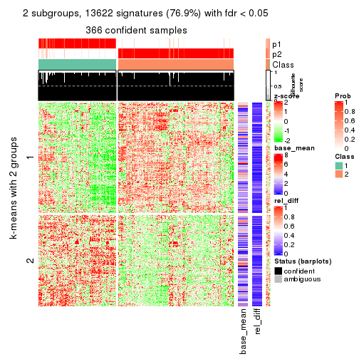</p>

</div>
<div id='tab-MAD-pam-get-signatures-2'>
<pre><code class="r">get_signatures(res, k = 3)
</code></pre>

<p></p>

</div>
<div id='tab-MAD-pam-get-signatures-3'>
<pre><code class="r">get_signatures(res, k = 4)
</code></pre>

<p></p>

</div>
<div id='tab-MAD-pam-get-signatures-4'>
<pre><code class="r">get_signatures(res, k = 5)
</code></pre>

<p></p>

</div>
<div id='tab-MAD-pam-get-signatures-5'>
<pre><code class="r">get_signatures(res, k = 6)
</code></pre>

<p></p>

</div>
</div>


Signature heatmaps where rows are not scaled:


<script>
$( function() {
	$( '#tabs-MAD-pam-get-signatures-no-scale' ).tabs();
} );
</script>
<div id='tabs-MAD-pam-get-signatures-no-scale'>
<ul>
<li><a href='#tab-MAD-pam-get-signatures-no-scale-1'>k = 2</a></li>
<li><a href='#tab-MAD-pam-get-signatures-no-scale-2'>k = 3</a></li>
<li><a href='#tab-MAD-pam-get-signatures-no-scale-3'>k = 4</a></li>
<li><a href='#tab-MAD-pam-get-signatures-no-scale-4'>k = 5</a></li>
<li><a href='#tab-MAD-pam-get-signatures-no-scale-5'>k = 6</a></li>
</ul>
<div id='tab-MAD-pam-get-signatures-no-scale-1'>
<pre><code class="r">get_signatures(res, k = 2, scale_rows = FALSE)
</code></pre>

<p></p>

</div>
<div id='tab-MAD-pam-get-signatures-no-scale-2'>
<pre><code class="r">get_signatures(res, k = 3, scale_rows = FALSE)
</code></pre>

<p></p>

</div>
<div id='tab-MAD-pam-get-signatures-no-scale-3'>
<pre><code class="r">get_signatures(res, k = 4, scale_rows = FALSE)
</code></pre>

<p></p>

</div>
<div id='tab-MAD-pam-get-signatures-no-scale-4'>
<pre><code class="r">get_signatures(res, k = 5, scale_rows = FALSE)
</code></pre>

<p></p>

</div>
<div id='tab-MAD-pam-get-signatures-no-scale-5'>
<pre><code class="r">get_signatures(res, k = 6, scale_rows = FALSE)
</code></pre>

<p></p>

</div>
</div>


Compare the overlap of signatures from different k:

```r
compare_signatures(res)
```


`get_signature()` returns a data frame invisibly. TO get the list of signatures, the function
call should be assigned to a variable explicitly. In following code, if `plot` argument is set
to `FALSE`, no heatmap is plotted while only the differential analysis is performed.

```r
# code only for demonstration
tb = get_signature(res, k = ..., plot = FALSE)
```

An example of the output of `tb` is:

```
#>   which_row         fdr    mean_1    mean_2 scaled_mean_1 scaled_mean_2 km
#> 1        38 0.042760348  8.373488  9.131774    -0.5533452     0.5164555  1
#> 2        40 0.018707592  7.106213  8.469186    -0.6173731     0.5762149  1
#> 3        55 0.019134737 10.221463 11.207825    -0.6159697     0.5749050  1
#> 4        59 0.006059896  5.921854  7.869574    -0.6899429     0.6439467  1
#> 5        60 0.018055526  8.928898 10.211722    -0.6204761     0.5791110  1
#> 6        98 0.009384629 15.714769 14.887706     0.6635654    -0.6193277  2
...
```

The columns in `tb` are:

1. `which_row`: row indices corresponding to the input matrix.
2. `fdr`: FDR for the differential test. 
3. `mean_x`: The mean value in group x.
4. `scaled_mean_x`: The mean value in group x after rows are scaled.
5. `km`: Row groups if k-means clustering is applied to rows.


UMAP plot which shows how samples are separated.


<script>
$( function() {
	$( '#tabs-MAD-pam-dimension-reduction' ).tabs();
} );
</script>
<div id='tabs-MAD-pam-dimension-reduction'>
<ul>
<li><a href='#tab-MAD-pam-dimension-reduction-1'>k = 2</a></li>
<li><a href='#tab-MAD-pam-dimension-reduction-2'>k = 3</a></li>
<li><a href='#tab-MAD-pam-dimension-reduction-3'>k = 4</a></li>
<li><a href='#tab-MAD-pam-dimension-reduction-4'>k = 5</a></li>
<li><a href='#tab-MAD-pam-dimension-reduction-5'>k = 6</a></li>
</ul>
<div id='tab-MAD-pam-dimension-reduction-1'>
<pre><code class="r">dimension_reduction(res, k = 2, method = &quot;UMAP&quot;)
</code></pre>

<p></p>

</div>
<div id='tab-MAD-pam-dimension-reduction-2'>
<pre><code class="r">dimension_reduction(res, k = 3, method = &quot;UMAP&quot;)
</code></pre>

<p></p>

</div>
<div id='tab-MAD-pam-dimension-reduction-3'>
<pre><code class="r">dimension_reduction(res, k = 4, method = &quot;UMAP&quot;)
</code></pre>

<p></p>

</div>
<div id='tab-MAD-pam-dimension-reduction-4'>
<pre><code class="r">dimension_reduction(res, k = 5, method = &quot;UMAP&quot;)
</code></pre>

<p></p>

</div>
<div id='tab-MAD-pam-dimension-reduction-5'>
<pre><code class="r">dimension_reduction(res, k = 6, method = &quot;UMAP&quot;)
</code></pre>

<p></p>

</div>
</div>


Following heatmap shows how subgroups are split when increasing `k`:

```r
collect_classes(res)
```


If matrix rows can be associated to genes, consider to use `GO_Enrichment(res,
...)` to perform function enrichment for the signature genes.


 

---------------------------------------------------


### MAD:mclust


The object with results only for a single top-value method and a single partition method 
can be extracted as:

```r
res = res_list["MAD", "mclust"]
# you can also extract it by
# res = res_list["MAD:mclust"]
```

A summary of `res` and all the functions that can be applied to it:

```r
res
```

```
#> A 'ConsensusPartition' object with k = 2, 3, 4, 5, 6.
#>   On a matrix with 17723 rows and 374 columns.
#>   Top rows (1000, 2000, 3000, 4000, 5000) are extracted by 'MAD' method.
#>   Subgroups are detected by 'mclust' method.
#>   Performed in total 1250 partitions by row resampling.
#>   Best k for subgroups seems to be 4.
#> 
#> Following methods can be applied to this 'ConsensusPartition' object:
#>  [1] "cola_report"             "collect_classes"         "collect_plots"          
#>  [4] "collect_stats"           "colnames"                "compare_signatures"     
#>  [7] "consensus_heatmap"       "dimension_reduction"     "functional_enrichment"  
#> [10] "get_anno_col"            "get_anno"                "get_classes"            
#> [13] "get_consensus"           "get_matrix"              "get_membership"         
#> [16] "get_param"               "get_signatures"          "get_stats"              
#> [19] "is_best_k"               "is_stable_k"             "membership_heatmap"     
#> [22] "ncol"                    "nrow"                    "plot_ecdf"              
#> [25] "rownames"                "select_partition_number" "show"                   
#> [28] "suggest_best_k"          "test_to_known_factors"
```

`collect_plots()` function collects all the plots made from `res` for all `k` (number of partitions)
into one single page to provide an easy and fast comparison between different `k`.

```r
collect_plots(res)
```


The plots are:

- The first row: a plot of the ECDF (Empirical cumulative distribution
  function) curves of the consensus matrix for each `k` and the heatmap of
  predicted classes for each `k`.
- The second row: heatmaps of the consensus matrix for each `k`.
- The third row: heatmaps of the membership matrix for each `k`.
- The fouth row: heatmaps of the signatures for each `k`.

All the plots in panels can be made by individual functions and they are
plotted later in this section.

`select_partition_number()` produces several plots showing different
statistics for choosing "optimized" `k`. There are following statistics:

- ECDF curves of the consensus matrix for each `k`;
- 1-PAC. [The PAC
  score](https://en.wikipedia.org/wiki/Consensus_clustering#Over-interpretation_potential_of_consensus_clustering)
  measures the proportion of the ambiguous subgrouping.
- Mean silhouette score.
- Concordance. The mean probability of fiting the consensus class ids in all
  partitions.
- Area increased. Denote $A_k$ as the area under the ECDF curve for current
  `k`, the area increased is defined as $A_k - A_{k-1}$.
- Rand index. The percent of pairs of samples that are both in a same cluster
  or both are not in a same cluster in the partition of k and k-1.
- Jaccard index. The ratio of pairs of samples are both in a same cluster in
  the partition of k and k-1 and the pairs of samples are both in a same
  cluster in the partition k or k-1.

The detailed explanations of these statistics can be found in [the cola
vignette](http://bioconductor.org/packages/devel/bioc/vignettes/cola/inst/doc/cola.html#toc_13).

Generally speaking, lower PAC score, higher mean silhouette score or higher
concordance corresponds to better partition. Rand index and Jaccard index
measure how similar the current partition is compared to partition with `k-1`.
If they are too similar, we won't accept `k` is better than `k-1`.

```r
select_partition_number(res)
```


The numeric values for all these statistics can be obtained by `get_stats()`.

```r
get_stats(res)
```

```
#>   k 1-PAC mean_silhouette concordance area_increased  Rand Jaccard
#> 2 2 0.665           0.913       0.952         0.4252 0.590   0.590
#> 3 3 0.775           0.856       0.923         0.4916 0.752   0.590
#> 4 4 0.797           0.902       0.909         0.1539 0.787   0.490
#> 5 5 0.601           0.524       0.719         0.0442 0.901   0.657
#> 6 6 0.665           0.716       0.799         0.0471 0.873   0.522
```

`suggest_best_k()` suggests the best $k$ based on these statistics. The rules are as follows:

- All $k$ with Jaccard index larger than 0.95 are removed because the increase of
  the partition number does not provides enough extra information. If all $k$ are removed,
  the best $k$ is assigned by `NA`.
- For $k$ with 1-PAC larger than 0.9, the maximal $k$ is taken as the "best k". Other $k$ is called "optional k".
- If it does not fit the second rule. The $k$ with the highest vote of highest
  1-PAC, mean silhouette and concordance is taken as the "best k".

```r
suggest_best_k(res)
```

```
#> [1] 4
```


Following shows the table of the partitions (You need to click the **show/hide
code output** link to see it). The membership matrix (columns with name `p*`)
is inferred by
[`clue::cl_consensus()`](https://www.rdocumentation.org/link/cl_consensus?package=clue)
function with the `SE` method. Basically the value in the membership matrix
represents the probability to belong to a certain group. The finall class
label for an item is determined with the group with highest probability it
belongs to.

In `get_classes()` function, the entropy is calculated from the membership
matrix and the silhouette score is calculated from the consensus matrix.


<script>
$( function() {
	$( '#tabs-MAD-mclust-get-classes' ).tabs();
} );
</script>
<div id='tabs-MAD-mclust-get-classes'>
<ul>
<li><a href='#tab-MAD-mclust-get-classes-1'>k = 2</a></li>
<li><a href='#tab-MAD-mclust-get-classes-2'>k = 3</a></li>
<li><a href='#tab-MAD-mclust-get-classes-3'>k = 4</a></li>
<li><a href='#tab-MAD-mclust-get-classes-4'>k = 5</a></li>
<li><a href='#tab-MAD-mclust-get-classes-5'>k = 6</a></li>
</ul>

<div id='tab-MAD-mclust-get-classes-1'>
<p><a id='tab-MAD-mclust-get-classes-1-a' style='color:#0366d6' href='#'>show/hide code output</a></p>
<pre><code class="r">cbind(get_classes(res, k = 2), get_membership(res, k = 2))
</code></pre>

<pre><code>#&gt;            class entropy silhouette    p1    p2
#&gt; SRR660824      1  0.0000     0.9373 1.000 0.000
#&gt; SRR603858      1  0.5059     0.8876 0.888 0.112
#&gt; SRR817070      1  0.8861     0.6683 0.696 0.304
#&gt; SRR1486995     1  0.0000     0.9373 1.000 0.000
#&gt; SRR813043      2  0.0000     0.9796 0.000 1.000
#&gt; SRR656874      2  0.0000     0.9796 0.000 1.000
#&gt; SRR659037      1  0.0000     0.9373 1.000 0.000
#&gt; SRR662031      1  0.0000     0.9373 1.000 0.000
#&gt; SRR1081283     1  0.5842     0.8724 0.860 0.140
#&gt; SRR1481036     1  0.0000     0.9373 1.000 0.000
#&gt; SRR1434009     2  0.0000     0.9796 0.000 1.000
#&gt; SRR1376676     1  0.0000     0.9373 1.000 0.000
#&gt; SRR1396967     1  0.5842     0.8724 0.860 0.140
#&gt; SRR665429      2  0.0000     0.9796 0.000 1.000
#&gt; SRR1388025     1  0.5842     0.8724 0.860 0.140
#&gt; SRR600784      1  0.0000     0.9373 1.000 0.000
#&gt; SRR657611      1  0.0000     0.9373 1.000 0.000
#&gt; SRR1333659     2  0.0000     0.9796 0.000 1.000
#&gt; SRR1323896     2  0.0000     0.9796 0.000 1.000
#&gt; SRR1453971     1  0.0000     0.9373 1.000 0.000
#&gt; SRR1421010     1  0.0000     0.9373 1.000 0.000
#&gt; SRR1334490     1  0.0000     0.9373 1.000 0.000
#&gt; SRR1309468     1  0.0000     0.9373 1.000 0.000
#&gt; SRR1468637     1  0.5842     0.8724 0.860 0.140
#&gt; SRR1365489     2  0.0000     0.9796 0.000 1.000
#&gt; SRR627445      1  0.0000     0.9373 1.000 0.000
#&gt; SRR607863      2  0.0000     0.9796 0.000 1.000
#&gt; SRR1475524     1  0.0000     0.9373 1.000 0.000
#&gt; SRR1405504     2  0.0000     0.9796 0.000 1.000
#&gt; SRR615695      1  0.0000     0.9373 1.000 0.000
#&gt; SRR600900      1  0.5842     0.8724 0.860 0.140
#&gt; SRR601477      2  0.0000     0.9796 0.000 1.000
#&gt; SRR1487215     2  0.0000     0.9796 0.000 1.000
#&gt; SRR1310797     2  0.0000     0.9796 0.000 1.000
#&gt; SRR1362713     1  0.4815     0.8916 0.896 0.104
#&gt; SRR1431385     1  0.0000     0.9373 1.000 0.000
#&gt; SRR1379089     2  0.0000     0.9796 0.000 1.000
#&gt; SRR1102079     1  0.0000     0.9373 1.000 0.000
#&gt; SRR1357210     1  0.0000     0.9373 1.000 0.000
#&gt; SRR657659      1  0.8267     0.7372 0.740 0.260
#&gt; SRR663573      1  0.5842     0.8724 0.860 0.140
#&gt; SRR603188      2  0.0000     0.9796 0.000 1.000
#&gt; SRR1471200     2  0.0000     0.9796 0.000 1.000
#&gt; SRR1310975     2  0.0000     0.9796 0.000 1.000
#&gt; SRR627457      1  0.0000     0.9373 1.000 0.000
#&gt; SRR1367654     2  0.0000     0.9796 0.000 1.000
#&gt; SRR1488410     1  0.0000     0.9373 1.000 0.000
#&gt; SRR1457750     1  0.5842     0.8724 0.860 0.140
#&gt; SRR1099546     1  0.0000     0.9373 1.000 0.000
#&gt; SRR604480      2  0.0000     0.9796 0.000 1.000
#&gt; SRR1390477     2  0.0000     0.9796 0.000 1.000
#&gt; SRR1458447     2  0.0000     0.9796 0.000 1.000
#&gt; SRR1473161     2  0.0000     0.9796 0.000 1.000
#&gt; SRR1409813     2  0.0000     0.9796 0.000 1.000
#&gt; SRR612791      1  0.0000     0.9373 1.000 0.000
#&gt; SRR1470580     1  0.0938     0.9326 0.988 0.012
#&gt; SRR1444063     1  0.5842     0.8724 0.860 0.140
#&gt; SRR1355578     1  0.0000     0.9373 1.000 0.000
#&gt; SRR1429203     1  0.0000     0.9373 1.000 0.000
#&gt; SRR599154      2  0.0000     0.9796 0.000 1.000
#&gt; SRR814244      1  0.4022     0.9032 0.920 0.080
#&gt; SRR1404123     1  0.9896     0.3601 0.560 0.440
#&gt; SRR656934      1  0.0000     0.9373 1.000 0.000
#&gt; SRR1339029     2  0.0000     0.9796 0.000 1.000
#&gt; SRR821525      1  0.5842     0.8724 0.860 0.140
#&gt; SRR1443677     1  0.0000     0.9373 1.000 0.000
#&gt; SRR1406330     1  0.0000     0.9373 1.000 0.000
#&gt; SRR1338124     1  0.4939     0.8896 0.892 0.108
#&gt; SRR1391376     1  0.0000     0.9373 1.000 0.000
#&gt; SRR661842      1  0.5842     0.8724 0.860 0.140
#&gt; SRR1395699     1  0.0000     0.9373 1.000 0.000
#&gt; SRR1312209     1  0.0000     0.9373 1.000 0.000
#&gt; SRR1359469     1  0.0000     0.9373 1.000 0.000
#&gt; SRR658885      1  0.0000     0.9373 1.000 0.000
#&gt; SRR1414578     1  0.0000     0.9373 1.000 0.000
#&gt; SRR603620      1  0.7528     0.7951 0.784 0.216
#&gt; SRR604677      1  0.0000     0.9373 1.000 0.000
#&gt; SRR603800      2  0.0000     0.9796 0.000 1.000
#&gt; SRR602058      1  0.5842     0.8724 0.860 0.140
#&gt; SRR817488      2  0.0000     0.9796 0.000 1.000
#&gt; SRR655601      1  0.6438     0.8512 0.836 0.164
#&gt; SRR1434821     2  0.0000     0.9796 0.000 1.000
#&gt; SRR1349166     2  0.0000     0.9796 0.000 1.000
#&gt; SRR615129      1  0.5842     0.8724 0.860 0.140
#&gt; SRR607586      2  0.0000     0.9796 0.000 1.000
#&gt; SRR602680      2  0.0000     0.9796 0.000 1.000
#&gt; SRR1411070     1  0.6247     0.8587 0.844 0.156
#&gt; SRR663038      2  0.0000     0.9796 0.000 1.000
#&gt; SRR1489416     2  0.0000     0.9796 0.000 1.000
#&gt; SRR1479155     1  0.0000     0.9373 1.000 0.000
#&gt; SRR662162      1  0.0000     0.9373 1.000 0.000
#&gt; SRR1374567     1  0.0000     0.9373 1.000 0.000
#&gt; SRR1434048     2  0.0000     0.9796 0.000 1.000
#&gt; SRR2184865     1  0.5842     0.8724 0.860 0.140
#&gt; SRR2170135     1  0.0000     0.9373 1.000 0.000
#&gt; SRR615551      2  0.0000     0.9796 0.000 1.000
#&gt; SRR1335513     2  0.8608     0.5460 0.284 0.716
#&gt; SRR1370216     1  0.0000     0.9373 1.000 0.000
#&gt; SRR662954      1  0.5842     0.8724 0.860 0.140
#&gt; SRR1375738     1  0.0000     0.9373 1.000 0.000
#&gt; SRR1356577     1  0.0000     0.9373 1.000 0.000
#&gt; SRR1073119     1  0.0000     0.9373 1.000 0.000
#&gt; SRR663549      1  0.0000     0.9373 1.000 0.000
#&gt; SRR1478015     2  0.2423     0.9370 0.040 0.960
#&gt; SRR600632      1  0.8327     0.7312 0.736 0.264
#&gt; SRR811866      1  0.0000     0.9373 1.000 0.000
#&gt; SRR1401101     2  0.0000     0.9796 0.000 1.000
#&gt; SRR1477797     1  0.5842     0.8724 0.860 0.140
#&gt; SRR1402986     2  0.0000     0.9796 0.000 1.000
#&gt; SRR658897      1  0.0000     0.9373 1.000 0.000
#&gt; SRR1419869     1  0.0000     0.9373 1.000 0.000
#&gt; SRR1490700     1  0.0000     0.9373 1.000 0.000
#&gt; SRR601723      1  0.0000     0.9373 1.000 0.000
#&gt; SRR1384115     1  0.5842     0.8724 0.860 0.140
#&gt; SRR1476927     2  0.0000     0.9796 0.000 1.000
#&gt; SRR1387769     1  0.0000     0.9373 1.000 0.000
#&gt; SRR1322595     1  0.0000     0.9373 1.000 0.000
#&gt; SRR1370423     1  0.0000     0.9373 1.000 0.000
#&gt; SRR1314976     1  0.0000     0.9373 1.000 0.000
#&gt; SRR1319560     1  0.7745     0.7802 0.772 0.228
#&gt; SRR1352683     1  0.0000     0.9373 1.000 0.000
#&gt; SRR1473800     1  0.0000     0.9373 1.000 0.000
#&gt; SRR1326384     1  0.0000     0.9373 1.000 0.000
#&gt; SRR1360807     1  0.5842     0.8724 0.860 0.140
#&gt; SRR1332544     1  0.0000     0.9373 1.000 0.000
#&gt; SRR598695      1  0.0000     0.9373 1.000 0.000
#&gt; SRR807824      2  0.9944     0.0273 0.456 0.544
#&gt; SRR809296      1  0.0000     0.9373 1.000 0.000
#&gt; SRR657927      1  0.0000     0.9373 1.000 0.000
#&gt; SRR1440682     2  0.0000     0.9796 0.000 1.000
#&gt; SRR1454415     2  0.0000     0.9796 0.000 1.000
#&gt; SRR1419131     1  0.5842     0.8724 0.860 0.140
#&gt; SRR1404293     1  0.0000     0.9373 1.000 0.000
#&gt; SRR1473340     1  0.0000     0.9373 1.000 0.000
#&gt; SRR1345563     1  0.0000     0.9373 1.000 0.000
#&gt; SRR1323382     2  0.0000     0.9796 0.000 1.000
#&gt; SRR1480697     1  0.0000     0.9373 1.000 0.000
#&gt; SRR1321808     2  0.0000     0.9796 0.000 1.000
#&gt; SRR1382756     1  0.6887     0.8329 0.816 0.184
#&gt; SRR1312558     2  0.3274     0.9141 0.060 0.940
#&gt; SRR1417088     1  0.8443     0.7191 0.728 0.272
#&gt; SRR1433027     1  0.8443     0.7193 0.728 0.272
#&gt; SRR662257      1  0.8081     0.7536 0.752 0.248
#&gt; SRR600417      1  0.5842     0.8724 0.860 0.140
#&gt; SRR812493      1  0.5842     0.8724 0.860 0.140
#&gt; SRR612743      1  0.0000     0.9373 1.000 0.000
#&gt; SRR1361345     1  0.0000     0.9373 1.000 0.000
#&gt; SRR600584      1  0.8443     0.7207 0.728 0.272
#&gt; SRR1310520     1  0.5842     0.8724 0.860 0.140
#&gt; SRR1395595     1  0.0000     0.9373 1.000 0.000
#&gt; SRR1334074     1  0.5842     0.8724 0.860 0.140
#&gt; SRR654838      2  0.0000     0.9796 0.000 1.000
#&gt; SRR1376694     1  0.0000     0.9373 1.000 0.000
#&gt; SRR1433841     1  0.5842     0.8724 0.860 0.140
#&gt; SRR1366837     1  0.0000     0.9373 1.000 0.000
#&gt; SRR1467479     2  0.0000     0.9796 0.000 1.000
#&gt; SRR1459055     1  0.0000     0.9373 1.000 0.000
#&gt; SRR1471050     2  0.0000     0.9796 0.000 1.000
#&gt; SRR603004      1  0.5842     0.8724 0.860 0.140
#&gt; SRR814703      2  0.0000     0.9796 0.000 1.000
#&gt; SRR661937      2  0.8207     0.6087 0.256 0.744
#&gt; SRR614359      1  0.0000     0.9373 1.000 0.000
#&gt; SRR1071568     2  0.0000     0.9796 0.000 1.000
#&gt; SRR1389084     1  0.0000     0.9373 1.000 0.000
#&gt; SRR1337624     1  0.6048     0.8657 0.852 0.148
#&gt; SRR1344400     2  0.0000     0.9796 0.000 1.000
#&gt; SRR1414290     2  0.0000     0.9796 0.000 1.000
#&gt; SRR1413644     2  0.0000     0.9796 0.000 1.000
#&gt; SRR1098998     1  0.0000     0.9373 1.000 0.000
#&gt; SRR1481279     1  0.0000     0.9373 1.000 0.000
#&gt; SRR1315103     1  0.0000     0.9373 1.000 0.000
#&gt; SRR1099286     1  0.0000     0.9373 1.000 0.000
#&gt; SRR2166570     1  0.0000     0.9373 1.000 0.000
#&gt; SRR601445      1  0.0000     0.9373 1.000 0.000
#&gt; SRR1439719     1  0.8763     0.6809 0.704 0.296
#&gt; SRR1377026     1  0.8763     0.6808 0.704 0.296
#&gt; SRR1327386     1  0.0000     0.9373 1.000 0.000
#&gt; SRR654826      2  0.0000     0.9796 0.000 1.000
#&gt; SRR1460433     1  0.5842     0.8724 0.860 0.140
#&gt; SRR1469345     1  0.0000     0.9373 1.000 0.000
#&gt; SRR1421462     2  0.0000     0.9796 0.000 1.000
#&gt; SRR662966      1  0.0000     0.9373 1.000 0.000
#&gt; SRR1339175     1  0.0000     0.9373 1.000 0.000
#&gt; SRR1447736     2  0.0000     0.9796 0.000 1.000
#&gt; SRR1434671     2  0.0000     0.9796 0.000 1.000
#&gt; SRR660800      2  0.0000     0.9796 0.000 1.000
#&gt; SRR1465543     2  0.0000     0.9796 0.000 1.000
#&gt; SRR1342023     1  0.0000     0.9373 1.000 0.000
#&gt; SRR1335670     1  0.0000     0.9373 1.000 0.000
#&gt; SRR1400955     2  0.0000     0.9796 0.000 1.000
#&gt; SRR1072150     2  0.0000     0.9796 0.000 1.000
#&gt; SRR1442822     1  0.0000     0.9373 1.000 0.000
#&gt; SRR1364658     1  0.0000     0.9373 1.000 0.000
#&gt; SRR1098074     1  0.7139     0.8201 0.804 0.196
#&gt; SRR1442778     1  0.0000     0.9373 1.000 0.000
#&gt; SRR1086728     1  0.0000     0.9373 1.000 0.000
#&gt; SRR627464      1  0.0376     0.9357 0.996 0.004
#&gt; SRR1409193     1  0.0000     0.9373 1.000 0.000
#&gt; SRR2168286     1  0.5842     0.8724 0.860 0.140
#&gt; SRR615539      2  0.0000     0.9796 0.000 1.000
#&gt; SRR663623      1  0.0000     0.9373 1.000 0.000
#&gt; SRR1471989     1  0.0000     0.9373 1.000 0.000
#&gt; SRR1468828     1  0.8555     0.7071 0.720 0.280
#&gt; SRR1381934     1  0.0000     0.9373 1.000 0.000
#&gt; SRR1471098     1  0.0000     0.9373 1.000 0.000
#&gt; SRR1314749     1  0.0000     0.9373 1.000 0.000
#&gt; SRR2166874     1  0.5842     0.8724 0.860 0.140
#&gt; SRR821302      1  0.0000     0.9373 1.000 0.000
#&gt; SRR1435066     2  0.0000     0.9796 0.000 1.000
#&gt; SRR661601      2  0.0000     0.9796 0.000 1.000
#&gt; SRR1446546     1  0.5842     0.8724 0.860 0.140
#&gt; SRR1419784     1  0.0000     0.9373 1.000 0.000
#&gt; SRR1357233     1  0.5842     0.8724 0.860 0.140
#&gt; SRR1441889     1  0.0000     0.9373 1.000 0.000
#&gt; SRR1413940     1  0.0000     0.9373 1.000 0.000
#&gt; SRR1324250     1  0.7453     0.8019 0.788 0.212
#&gt; SRR1442862     2  0.0000     0.9796 0.000 1.000
#&gt; SRR662474      1  0.8443     0.7192 0.728 0.272
#&gt; SRR1416226     1  0.0000     0.9373 1.000 0.000
#&gt; SRR1417404     1  0.0000     0.9373 1.000 0.000
#&gt; SRR665466      2  0.0000     0.9796 0.000 1.000
#&gt; SRR658849      1  0.0000     0.9373 1.000 0.000
#&gt; SRR1460025     1  0.5842     0.8724 0.860 0.140
#&gt; SRR1408136     1  0.0000     0.9373 1.000 0.000
#&gt; SRR1489995     2  0.0000     0.9796 0.000 1.000
#&gt; SRR1374092     1  0.0000     0.9373 1.000 0.000
#&gt; SRR1488429     1  0.0000     0.9373 1.000 0.000
#&gt; SRR1087559     1  0.0000     0.9373 1.000 0.000
#&gt; SRR817004      1  0.5842     0.8724 0.860 0.140
#&gt; SRR1429660     2  0.0000     0.9796 0.000 1.000
#&gt; SRR604390      1  0.0000     0.9373 1.000 0.000
#&gt; SRR614936      1  0.6148     0.8622 0.848 0.152
#&gt; SRR1365938     1  0.5842     0.8724 0.860 0.140
#&gt; SRR1437324     1  0.0000     0.9373 1.000 0.000
#&gt; SRR613414      1  0.5842     0.8724 0.860 0.140
#&gt; SRR660414      1  0.0000     0.9373 1.000 0.000
#&gt; SRR1452185     1  0.0000     0.9373 1.000 0.000
#&gt; SRR1347020     1  0.0000     0.9373 1.000 0.000
#&gt; SRR1398036     1  0.5842     0.8724 0.860 0.140
#&gt; SRR1436674     1  0.0000     0.9373 1.000 0.000
#&gt; SRR603750      1  0.0000     0.9373 1.000 0.000
#&gt; SRR608630      1  0.5842     0.8724 0.860 0.140
#&gt; SRR655625      1  0.5842     0.8724 0.860 0.140
#&gt; SRR599059      1  0.3584     0.9088 0.932 0.068
#&gt; SRR615189      1  0.5842     0.8724 0.860 0.140
#&gt; SRR1466889     2  0.0000     0.9796 0.000 1.000
#&gt; SRR1084602     1  0.5842     0.8724 0.860 0.140
#&gt; SRR1335422     1  0.0000     0.9373 1.000 0.000
#&gt; SRR1356805     2  0.0000     0.9796 0.000 1.000
#&gt; SRR1385300     1  0.0000     0.9373 1.000 0.000
#&gt; SRR654814      1  0.0000     0.9373 1.000 0.000
#&gt; SRR658385      2  0.0000     0.9796 0.000 1.000
#&gt; SRR820596      1  0.0000     0.9373 1.000 0.000
#&gt; SRR1318118     1  0.0000     0.9373 1.000 0.000
#&gt; SRR1480766     2  0.0000     0.9796 0.000 1.000
#&gt; SRR1406539     1  0.0000     0.9373 1.000 0.000
#&gt; SRR1341833     2  0.0000     0.9796 0.000 1.000
#&gt; SRR1441826     1  0.5842     0.8724 0.860 0.140
#&gt; SRR1448051     1  0.0000     0.9373 1.000 0.000
#&gt; SRR1326752     1  0.0000     0.9373 1.000 0.000
#&gt; SRR665217      1  0.0000     0.9373 1.000 0.000
#&gt; SRR819186      2  0.0000     0.9796 0.000 1.000
#&gt; SRR661517      1  0.0000     0.9373 1.000 0.000
#&gt; SRR607166      1  0.8555     0.7087 0.720 0.280
#&gt; SRR809065      1  0.5842     0.8724 0.860 0.140
#&gt; SRR1415872     2  0.0000     0.9796 0.000 1.000
#&gt; SRR1415463     1  0.0000     0.9373 1.000 0.000
#&gt; SRR1381161     1  0.5842     0.8724 0.860 0.140
#&gt; SRR1442231     1  0.5842     0.8724 0.860 0.140
#&gt; SRR1374696     1  0.0000     0.9373 1.000 0.000
#&gt; SRR1451988     1  0.0000     0.9373 1.000 0.000
#&gt; SRR660555      1  0.0000     0.9373 1.000 0.000
#&gt; SRR657801      1  0.0000     0.9373 1.000 0.000
#&gt; SRR663344      2  0.0000     0.9796 0.000 1.000
#&gt; SRR1472462     2  0.0000     0.9796 0.000 1.000
#&gt; SRR1406176     1  0.0000     0.9373 1.000 0.000
#&gt; SRR656886      1  0.5842     0.8724 0.860 0.140
#&gt; SRR1498337     1  0.5842     0.8724 0.860 0.140
#&gt; SRR613066      1  0.0000     0.9373 1.000 0.000
#&gt; SRR1309490     1  0.0000     0.9373 1.000 0.000
#&gt; SRR602492      1  0.5842     0.8724 0.860 0.140
#&gt; SRR1447347     1  0.0000     0.9373 1.000 0.000
#&gt; SRR1475546     2  0.0000     0.9796 0.000 1.000
#&gt; SRR627459      1  0.0000     0.9373 1.000 0.000
#&gt; SRR1434332     2  0.0000     0.9796 0.000 1.000
#&gt; SRR1070358     1  0.8861     0.6683 0.696 0.304
#&gt; SRR1345936     1  0.5842     0.8724 0.860 0.140
#&gt; SRR665658      1  0.7376     0.8045 0.792 0.208
#&gt; SRR1321351     1  0.9044     0.6394 0.680 0.320
#&gt; SRR657880      2  0.0000     0.9796 0.000 1.000
#&gt; SRR1373903     2  0.9983    -0.0816 0.476 0.524
#&gt; SRR657396      1  0.7453     0.7999 0.788 0.212
#&gt; SRR660981      2  0.0000     0.9796 0.000 1.000
#&gt; SRR818499      1  0.0000     0.9373 1.000 0.000
#&gt; SRR819658      2  0.0000     0.9796 0.000 1.000
#&gt; SRR1376316     1  0.0000     0.9373 1.000 0.000
#&gt; SRR1323723     2  0.0000     0.9796 0.000 1.000
#&gt; SRR1476719     1  0.0000     0.9373 1.000 0.000
#&gt; SRR1403478     2  0.0000     0.9796 0.000 1.000
#&gt; SRR1095695     1  0.0000     0.9373 1.000 0.000
#&gt; SRR1352391     1  0.0000     0.9373 1.000 0.000
#&gt; SRR1498813     1  0.5842     0.8724 0.860 0.140
#&gt; SRR627437      1  0.0000     0.9373 1.000 0.000
#&gt; SRR2185097     1  0.0000     0.9373 1.000 0.000
#&gt; SRR817166      1  0.0000     0.9373 1.000 0.000
#&gt; SRR1091670     2  0.0000     0.9796 0.000 1.000
#&gt; SRR603776      1  0.0000     0.9373 1.000 0.000
#&gt; SRR1479640     2  0.0000     0.9796 0.000 1.000
#&gt; SRR660152      1  0.0000     0.9373 1.000 0.000
#&gt; SRR1074769     2  0.0000     0.9796 0.000 1.000
#&gt; SRR656153      2  0.0000     0.9796 0.000 1.000
#&gt; SRR1392502     1  0.0000     0.9373 1.000 0.000
#&gt; SRR1359609     1  0.0000     0.9373 1.000 0.000
#&gt; SRR601925      1  0.9608     0.5053 0.616 0.384
#&gt; SRR2165182     2  0.0000     0.9796 0.000 1.000
#&gt; SRR608542      1  0.7674     0.7852 0.776 0.224
#&gt; SRR655064      1  0.5842     0.8724 0.860 0.140
#&gt; SRR1432430     1  0.0000     0.9373 1.000 0.000
#&gt; SRR808472      1  0.5842     0.8724 0.860 0.140
#&gt; SRR1414958     1  0.0000     0.9373 1.000 0.000
#&gt; SRR598484      1  0.9286     0.5920 0.656 0.344
#&gt; SRR612755      1  0.0000     0.9373 1.000 0.000
#&gt; SRR1365808     1  0.0000     0.9373 1.000 0.000
#&gt; SRR1391724     1  0.0000     0.9373 1.000 0.000
#&gt; SRR1322373     1  0.0000     0.9373 1.000 0.000
#&gt; SRR1489265     2  0.0000     0.9796 0.000 1.000
#&gt; SRR1359099     2  0.0000     0.9796 0.000 1.000
#&gt; SRR607279      2  0.0000     0.9796 0.000 1.000
#&gt; SRR810461      2  0.0000     0.9796 0.000 1.000
#&gt; SRR627427      1  0.0000     0.9373 1.000 0.000
#&gt; SRR612887      2  0.0000     0.9796 0.000 1.000
#&gt; SRR809807      1  0.5842     0.8724 0.860 0.140
#&gt; SRR663112      1  0.2948     0.9159 0.948 0.052
#&gt; SRR1346933     1  0.5842     0.8724 0.860 0.140
#&gt; SRR1487910     1  0.0000     0.9373 1.000 0.000
#&gt; SRR603092      1  0.5842     0.8724 0.860 0.140
#&gt; SRR1417680     2  0.0000     0.9796 0.000 1.000
#&gt; SRR1383785     1  0.0000     0.9373 1.000 0.000
#&gt; SRR1070015     2  0.0000     0.9796 0.000 1.000
#&gt; SRR1466222     1  0.0376     0.9357 0.996 0.004
#&gt; SRR1416119     1  0.0000     0.9373 1.000 0.000
#&gt; SRR819318      1  0.0000     0.9373 1.000 0.000
#&gt; SRR608288      2  0.0000     0.9796 0.000 1.000
#&gt; SRR811121      2  0.0000     0.9796 0.000 1.000
#&gt; SRR613138      2  0.0000     0.9796 0.000 1.000
#&gt; SRR810483      1  0.0000     0.9373 1.000 0.000
#&gt; SRR607839      1  0.0000     0.9373 1.000 0.000
#&gt; SRR1337031     1  0.0000     0.9373 1.000 0.000
#&gt; SRR601311      1  0.5842     0.8724 0.860 0.140
#&gt; SRR1406685     1  0.5842     0.8724 0.860 0.140
#&gt; SRR1467500     1  0.5842     0.8724 0.860 0.140
#&gt; SRR1308504     1  0.0000     0.9373 1.000 0.000
#&gt; SRR1312865     1  0.0000     0.9373 1.000 0.000
#&gt; SRR1312522     1  0.0000     0.9373 1.000 0.000
#&gt; SRR1490486     2  0.0000     0.9796 0.000 1.000
#&gt; SRR1325888     1  0.0000     0.9373 1.000 0.000
#&gt; SRR1472885     1  0.0000     0.9373 1.000 0.000
#&gt; SRR1098785     2  0.9460     0.3445 0.364 0.636
#&gt; SRR1084766     1  0.5842     0.8724 0.860 0.140
#&gt; SRR1102804     2  0.0000     0.9796 0.000 1.000
#&gt; SRR1336636     1  0.0000     0.9373 1.000 0.000
#&gt; SRR1347795     1  0.0000     0.9373 1.000 0.000
#&gt; SRR601900      2  0.0000     0.9796 0.000 1.000
#&gt; SRR1330989     1  0.5842     0.8724 0.860 0.140
#&gt; SRR658445      2  0.0000     0.9796 0.000 1.000
#&gt; SRR1368754     1  0.0000     0.9373 1.000 0.000
#&gt; SRR1460001     2  0.0000     0.9796 0.000 1.000
#&gt; SRR1414934     1  0.0000     0.9373 1.000 0.000
#&gt; SRR1326249     1  0.0000     0.9373 1.000 0.000
#&gt; SRR614948      1  0.0000     0.9373 1.000 0.000
#&gt; SRR1472952     1  0.0000     0.9373 1.000 0.000
#&gt; SRR1321528     1  0.0000     0.9373 1.000 0.000
#&gt; SRR627447      1  0.0000     0.9373 1.000 0.000
#&gt; SRR612239      1  0.0000     0.9373 1.000 0.000
</code></pre>

<script>
$('#tab-MAD-mclust-get-classes-1-a').parent().next().next().hide();
$('#tab-MAD-mclust-get-classes-1-a').click(function(){
  $('#tab-MAD-mclust-get-classes-1-a').parent().next().next().toggle();
  return(false);
});
</script>
</div>

<div id='tab-MAD-mclust-get-classes-2'>
<p><a id='tab-MAD-mclust-get-classes-2-a' style='color:#0366d6' href='#'>show/hide code output</a></p>
<pre><code class="r">cbind(get_classes(res, k = 3), get_membership(res, k = 3))
</code></pre>

<pre><code>#&gt;            class entropy silhouette    p1    p2    p3
#&gt; SRR660824      1  0.0592     0.9166 0.988 0.000 0.012
#&gt; SRR603858      3  0.5926     0.4033 0.356 0.000 0.644
#&gt; SRR817070      3  0.4346     0.7502 0.000 0.184 0.816
#&gt; SRR1486995     1  0.0747     0.9162 0.984 0.000 0.016
#&gt; SRR813043      2  0.0000     0.9346 0.000 1.000 0.000
#&gt; SRR656874      2  0.0000     0.9346 0.000 1.000 0.000
#&gt; SRR659037      1  0.4555     0.7954 0.800 0.000 0.200
#&gt; SRR662031      1  0.0592     0.9157 0.988 0.000 0.012
#&gt; SRR1081283     3  0.0592     0.9045 0.000 0.012 0.988
#&gt; SRR1481036     1  0.3482     0.8673 0.872 0.000 0.128
#&gt; SRR1434009     2  0.2165     0.9125 0.000 0.936 0.064
#&gt; SRR1376676     1  0.0592     0.9157 0.988 0.000 0.012
#&gt; SRR1396967     2  0.6026     0.4803 0.000 0.624 0.376
#&gt; SRR665429      2  0.0000     0.9346 0.000 1.000 0.000
#&gt; SRR1388025     3  0.0592     0.9045 0.000 0.012 0.988
#&gt; SRR600784      1  0.0592     0.9166 0.988 0.000 0.012
#&gt; SRR657611      1  0.1529     0.9140 0.960 0.000 0.040
#&gt; SRR1333659     2  0.2261     0.9103 0.000 0.932 0.068
#&gt; SRR1323896     2  0.1753     0.9185 0.000 0.952 0.048
#&gt; SRR1453971     1  0.2066     0.9036 0.940 0.000 0.060
#&gt; SRR1421010     1  0.0592     0.9157 0.988 0.000 0.012
#&gt; SRR1334490     1  0.0592     0.9166 0.988 0.000 0.012
#&gt; SRR1309468     1  0.0592     0.9157 0.988 0.000 0.012
#&gt; SRR1468637     3  0.3267     0.8258 0.116 0.000 0.884
#&gt; SRR1365489     2  0.0000     0.9346 0.000 1.000 0.000
#&gt; SRR627445      1  0.3412     0.8704 0.876 0.000 0.124
#&gt; SRR607863      2  0.1529     0.9211 0.000 0.960 0.040
#&gt; SRR1475524     1  0.0592     0.9157 0.988 0.000 0.012
#&gt; SRR1405504     2  0.1964     0.9140 0.000 0.944 0.056
#&gt; SRR615695      1  0.0747     0.9162 0.984 0.000 0.016
#&gt; SRR600900      1  0.8754     0.2559 0.508 0.116 0.376
#&gt; SRR601477      2  0.0000     0.9346 0.000 1.000 0.000
#&gt; SRR1487215     2  0.0000     0.9346 0.000 1.000 0.000
#&gt; SRR1310797     2  0.2261     0.9059 0.000 0.932 0.068
#&gt; SRR1362713     1  0.4796     0.7567 0.780 0.000 0.220
#&gt; SRR1431385     1  0.0592     0.9157 0.988 0.000 0.012
#&gt; SRR1379089     2  0.0000     0.9346 0.000 1.000 0.000
#&gt; SRR1102079     1  0.3340     0.8735 0.880 0.000 0.120
#&gt; SRR1357210     1  0.0592     0.9157 0.988 0.000 0.012
#&gt; SRR657659      3  0.1491     0.8975 0.016 0.016 0.968
#&gt; SRR663573      3  0.0592     0.9045 0.000 0.012 0.988
#&gt; SRR603188      2  0.2448     0.9039 0.000 0.924 0.076
#&gt; SRR1471200     2  0.0000     0.9346 0.000 1.000 0.000
#&gt; SRR1310975     2  0.0000     0.9346 0.000 1.000 0.000
#&gt; SRR627457      3  0.6008     0.3989 0.372 0.000 0.628
#&gt; SRR1367654     2  0.2165     0.9125 0.000 0.936 0.064
#&gt; SRR1488410     1  0.1643     0.9142 0.956 0.000 0.044
#&gt; SRR1457750     3  0.2261     0.8594 0.068 0.000 0.932
#&gt; SRR1099546     1  0.0000     0.9161 1.000 0.000 0.000
#&gt; SRR604480      2  0.0000     0.9346 0.000 1.000 0.000
#&gt; SRR1390477     2  0.0000     0.9346 0.000 1.000 0.000
#&gt; SRR1458447     2  0.0000     0.9346 0.000 1.000 0.000
#&gt; SRR1473161     2  0.0000     0.9346 0.000 1.000 0.000
#&gt; SRR1409813     2  0.2165     0.9125 0.000 0.936 0.064
#&gt; SRR612791      1  0.0592     0.9157 0.988 0.000 0.012
#&gt; SRR1470580     1  0.5650     0.6284 0.688 0.000 0.312
#&gt; SRR1444063     1  0.8135     0.0947 0.484 0.068 0.448
#&gt; SRR1355578     1  0.1753     0.9132 0.952 0.000 0.048
#&gt; SRR1429203     1  0.0592     0.9157 0.988 0.000 0.012
#&gt; SRR599154      2  0.2959     0.8891 0.000 0.900 0.100
#&gt; SRR814244      1  0.4178     0.8123 0.828 0.000 0.172
#&gt; SRR1404123     3  0.4452     0.7521 0.000 0.192 0.808
#&gt; SRR656934      1  0.3482     0.8673 0.872 0.000 0.128
#&gt; SRR1339029     2  0.0000     0.9346 0.000 1.000 0.000
#&gt; SRR821525      3  0.0592     0.9045 0.000 0.012 0.988
#&gt; SRR1443677     1  0.0592     0.9157 0.988 0.000 0.012
#&gt; SRR1406330     1  0.0592     0.9157 0.988 0.000 0.012
#&gt; SRR1338124     1  0.5621     0.6356 0.692 0.000 0.308
#&gt; SRR1391376     1  0.0592     0.9166 0.988 0.000 0.012
#&gt; SRR661842      3  0.0592     0.9045 0.000 0.012 0.988
#&gt; SRR1395699     1  0.0747     0.9162 0.984 0.000 0.016
#&gt; SRR1312209     1  0.1411     0.9139 0.964 0.000 0.036
#&gt; SRR1359469     1  0.0592     0.9157 0.988 0.000 0.012
#&gt; SRR658885      1  0.1163     0.9153 0.972 0.000 0.028
#&gt; SRR1414578     1  0.0592     0.9157 0.988 0.000 0.012
#&gt; SRR603620      3  0.1337     0.8982 0.016 0.012 0.972
#&gt; SRR604677      1  0.0892     0.9175 0.980 0.000 0.020
#&gt; SRR603800      2  0.2711     0.8952 0.000 0.912 0.088
#&gt; SRR602058      3  0.0592     0.9045 0.000 0.012 0.988
#&gt; SRR817488      2  0.0000     0.9346 0.000 1.000 0.000
#&gt; SRR655601      3  0.0592     0.9045 0.000 0.012 0.988
#&gt; SRR1434821     2  0.1031     0.9284 0.000 0.976 0.024
#&gt; SRR1349166     2  0.1860     0.9183 0.000 0.948 0.052
#&gt; SRR615129      3  0.2448     0.8526 0.076 0.000 0.924
#&gt; SRR607586      2  0.0000     0.9346 0.000 1.000 0.000
#&gt; SRR602680      2  0.0000     0.9346 0.000 1.000 0.000
#&gt; SRR1411070     3  0.0592     0.9045 0.000 0.012 0.988
#&gt; SRR663038      2  0.0000     0.9346 0.000 1.000 0.000
#&gt; SRR1489416     2  0.2448     0.9012 0.000 0.924 0.076
#&gt; SRR1479155     1  0.0592     0.9157 0.988 0.000 0.012
#&gt; SRR662162      1  0.0592     0.9157 0.988 0.000 0.012
#&gt; SRR1374567     1  0.0592     0.9166 0.988 0.000 0.012
#&gt; SRR1434048     2  0.0000     0.9346 0.000 1.000 0.000
#&gt; SRR2184865     3  0.0592     0.9045 0.000 0.012 0.988
#&gt; SRR2170135     1  0.0592     0.9157 0.988 0.000 0.012
#&gt; SRR615551      2  0.0000     0.9346 0.000 1.000 0.000
#&gt; SRR1335513     2  0.5431     0.6650 0.000 0.716 0.284
#&gt; SRR1370216     1  0.0592     0.9166 0.988 0.000 0.012
#&gt; SRR662954      3  0.1170     0.8965 0.016 0.008 0.976
#&gt; SRR1375738     1  0.3192     0.8788 0.888 0.000 0.112
#&gt; SRR1356577     3  0.6192     0.2407 0.420 0.000 0.580
#&gt; SRR1073119     1  0.0424     0.9180 0.992 0.000 0.008
#&gt; SRR663549      1  0.1643     0.9129 0.956 0.000 0.044
#&gt; SRR1478015     2  0.4796     0.7559 0.000 0.780 0.220
#&gt; SRR600632      3  0.2492     0.8795 0.016 0.048 0.936
#&gt; SRR811866      1  0.2356     0.9025 0.928 0.000 0.072
#&gt; SRR1401101     2  0.0000     0.9346 0.000 1.000 0.000
#&gt; SRR1477797     3  0.0592     0.9045 0.000 0.012 0.988
#&gt; SRR1402986     2  0.0000     0.9346 0.000 1.000 0.000
#&gt; SRR658897      3  0.6062     0.3692 0.384 0.000 0.616
#&gt; SRR1419869     1  0.0592     0.9166 0.988 0.000 0.012
#&gt; SRR1490700     1  0.6308     0.0401 0.508 0.000 0.492
#&gt; SRR601723      1  0.6111     0.4567 0.604 0.000 0.396
#&gt; SRR1384115     1  0.6737     0.4564 0.600 0.016 0.384
#&gt; SRR1476927     2  0.2448     0.9012 0.000 0.924 0.076
#&gt; SRR1387769     1  0.2796     0.8917 0.908 0.000 0.092
#&gt; SRR1322595     1  0.3116     0.8834 0.892 0.000 0.108
#&gt; SRR1370423     1  0.3267     0.8759 0.884 0.000 0.116
#&gt; SRR1314976     3  0.6299     0.0176 0.476 0.000 0.524
#&gt; SRR1319560     3  0.1491     0.8975 0.016 0.016 0.968
#&gt; SRR1352683     1  0.3482     0.8673 0.872 0.000 0.128
#&gt; SRR1473800     1  0.0592     0.9157 0.988 0.000 0.012
#&gt; SRR1326384     1  0.3482     0.8673 0.872 0.000 0.128
#&gt; SRR1360807     3  0.0592     0.9045 0.000 0.012 0.988
#&gt; SRR1332544     1  0.0424     0.9160 0.992 0.000 0.008
#&gt; SRR598695      1  0.0592     0.9157 0.988 0.000 0.012
#&gt; SRR807824      2  0.7180     0.6016 0.060 0.672 0.268
#&gt; SRR809296      1  0.0747     0.9162 0.984 0.000 0.016
#&gt; SRR657927      1  0.0592     0.9166 0.988 0.000 0.012
#&gt; SRR1440682     3  0.6008     0.4236 0.000 0.372 0.628
#&gt; SRR1454415     2  0.0000     0.9346 0.000 1.000 0.000
#&gt; SRR1419131     3  0.0592     0.9045 0.000 0.012 0.988
#&gt; SRR1404293     1  0.1753     0.9132 0.952 0.000 0.048
#&gt; SRR1473340     1  0.0592     0.9166 0.988 0.000 0.012
#&gt; SRR1345563     1  0.0747     0.9162 0.984 0.000 0.016
#&gt; SRR1323382     2  0.0000     0.9346 0.000 1.000 0.000
#&gt; SRR1480697     1  0.3482     0.8673 0.872 0.000 0.128
#&gt; SRR1321808     2  0.0000     0.9346 0.000 1.000 0.000
#&gt; SRR1382756     2  0.5988     0.4954 0.000 0.632 0.368
#&gt; SRR1312558     2  0.5241     0.8247 0.048 0.820 0.132
#&gt; SRR1417088     3  0.0747     0.9028 0.000 0.016 0.984
#&gt; SRR1433027     3  0.1647     0.8917 0.004 0.036 0.960
#&gt; SRR662257      3  0.0592     0.9045 0.000 0.012 0.988
#&gt; SRR600417      3  0.0592     0.9045 0.000 0.012 0.988
#&gt; SRR812493      3  0.0592     0.9045 0.000 0.012 0.988
#&gt; SRR612743      1  0.2796     0.8921 0.908 0.000 0.092
#&gt; SRR1361345     1  0.1753     0.9132 0.952 0.000 0.048
#&gt; SRR600584      3  0.3192     0.8287 0.000 0.112 0.888
#&gt; SRR1310520     3  0.0592     0.9045 0.000 0.012 0.988
#&gt; SRR1395595     1  0.2261     0.9021 0.932 0.000 0.068
#&gt; SRR1334074     1  0.6713     0.3823 0.572 0.012 0.416
#&gt; SRR654838      2  0.0000     0.9346 0.000 1.000 0.000
#&gt; SRR1376694     1  0.0592     0.9157 0.988 0.000 0.012
#&gt; SRR1433841     3  0.5319     0.7983 0.072 0.104 0.824
#&gt; SRR1366837     1  0.2165     0.9055 0.936 0.000 0.064
#&gt; SRR1467479     2  0.0000     0.9346 0.000 1.000 0.000
#&gt; SRR1459055     1  0.0747     0.9162 0.984 0.000 0.016
#&gt; SRR1471050     2  0.0000     0.9346 0.000 1.000 0.000
#&gt; SRR603004      2  0.6008     0.4869 0.000 0.628 0.372
#&gt; SRR814703      2  0.2261     0.9105 0.000 0.932 0.068
#&gt; SRR661937      2  0.4555     0.7772 0.000 0.800 0.200
#&gt; SRR614359      1  0.0592     0.9157 0.988 0.000 0.012
#&gt; SRR1071568     2  0.3340     0.8663 0.000 0.880 0.120
#&gt; SRR1389084     1  0.0592     0.9166 0.988 0.000 0.012
#&gt; SRR1337624     3  0.1337     0.8982 0.016 0.012 0.972
#&gt; SRR1344400     2  0.0000     0.9346 0.000 1.000 0.000
#&gt; SRR1414290     2  0.0000     0.9346 0.000 1.000 0.000
#&gt; SRR1413644     2  0.2165     0.9125 0.000 0.936 0.064
#&gt; SRR1098998     1  0.0592     0.9157 0.988 0.000 0.012
#&gt; SRR1481279     1  0.0592     0.9157 0.988 0.000 0.012
#&gt; SRR1315103     1  0.1411     0.9139 0.964 0.000 0.036
#&gt; SRR1099286     1  0.1753     0.9131 0.952 0.000 0.048
#&gt; SRR2166570     1  0.5098     0.7343 0.752 0.000 0.248
#&gt; SRR601445      1  0.1031     0.9169 0.976 0.000 0.024
#&gt; SRR1439719     3  0.1031     0.8990 0.000 0.024 0.976
#&gt; SRR1377026     3  0.1964     0.8763 0.000 0.056 0.944
#&gt; SRR1327386     1  0.0747     0.9162 0.984 0.000 0.016
#&gt; SRR654826      2  0.0000     0.9346 0.000 1.000 0.000
#&gt; SRR1460433     3  0.0592     0.9045 0.000 0.012 0.988
#&gt; SRR1469345     1  0.0424     0.9167 0.992 0.000 0.008
#&gt; SRR1421462     2  0.0000     0.9346 0.000 1.000 0.000
#&gt; SRR662966      1  0.0592     0.9157 0.988 0.000 0.012
#&gt; SRR1339175     1  0.0592     0.9157 0.988 0.000 0.012
#&gt; SRR1447736     2  0.0000     0.9346 0.000 1.000 0.000
#&gt; SRR1434671     2  0.2066     0.9146 0.000 0.940 0.060
#&gt; SRR660800      2  0.0000     0.9346 0.000 1.000 0.000
#&gt; SRR1465543     2  0.2711     0.8977 0.000 0.912 0.088
#&gt; SRR1342023     1  0.1163     0.9169 0.972 0.000 0.028
#&gt; SRR1335670     1  0.1411     0.9151 0.964 0.000 0.036
#&gt; SRR1400955     2  0.0000     0.9346 0.000 1.000 0.000
#&gt; SRR1072150     2  0.0000     0.9346 0.000 1.000 0.000
#&gt; SRR1442822     1  0.0592     0.9157 0.988 0.000 0.012
#&gt; SRR1364658     1  0.0592     0.9166 0.988 0.000 0.012
#&gt; SRR1098074     3  0.9976     0.1580 0.316 0.316 0.368
#&gt; SRR1442778     1  0.0592     0.9157 0.988 0.000 0.012
#&gt; SRR1086728     1  0.3482     0.8679 0.872 0.000 0.128
#&gt; SRR627464      3  0.4842     0.6904 0.224 0.000 0.776
#&gt; SRR1409193     1  0.2537     0.8990 0.920 0.000 0.080
#&gt; SRR2168286     3  0.0592     0.9045 0.000 0.012 0.988
#&gt; SRR615539      2  0.2066     0.9108 0.000 0.940 0.060
#&gt; SRR663623      1  0.3340     0.8735 0.880 0.000 0.120
#&gt; SRR1471989     1  0.1860     0.9092 0.948 0.000 0.052
#&gt; SRR1468828     3  0.3879     0.7913 0.000 0.152 0.848
#&gt; SRR1381934     1  0.2165     0.9055 0.936 0.000 0.064
#&gt; SRR1471098     1  0.0592     0.9166 0.988 0.000 0.012
#&gt; SRR1314749     1  0.1964     0.9089 0.944 0.000 0.056
#&gt; SRR2166874     3  0.1337     0.8982 0.016 0.012 0.972
#&gt; SRR821302      1  0.1289     0.9159 0.968 0.000 0.032
#&gt; SRR1435066     2  0.2165     0.9125 0.000 0.936 0.064
#&gt; SRR661601      2  0.0000     0.9346 0.000 1.000 0.000
#&gt; SRR1446546     1  0.8573     0.2944 0.524 0.104 0.372
#&gt; SRR1419784     1  0.3551     0.8645 0.868 0.000 0.132
#&gt; SRR1357233     3  0.0592     0.9045 0.000 0.012 0.988
#&gt; SRR1441889     1  0.0592     0.9157 0.988 0.000 0.012
#&gt; SRR1413940     1  0.0747     0.9162 0.984 0.000 0.016
#&gt; SRR1324250     2  0.5497     0.6207 0.000 0.708 0.292
#&gt; SRR1442862     2  0.2356     0.9078 0.000 0.928 0.072
#&gt; SRR662474      3  0.0592     0.9045 0.000 0.012 0.988
#&gt; SRR1416226     1  0.3340     0.8735 0.880 0.000 0.120
#&gt; SRR1417404     3  0.6111     0.3129 0.396 0.000 0.604
#&gt; SRR665466      2  0.3340     0.8684 0.000 0.880 0.120
#&gt; SRR658849      1  0.0592     0.9166 0.988 0.000 0.012
#&gt; SRR1460025     1  0.8754     0.2559 0.508 0.116 0.376
#&gt; SRR1408136     1  0.0592     0.9157 0.988 0.000 0.012
#&gt; SRR1489995     2  0.0237     0.9336 0.000 0.996 0.004
#&gt; SRR1374092     1  0.3412     0.8705 0.876 0.000 0.124
#&gt; SRR1488429     1  0.3116     0.8811 0.892 0.000 0.108
#&gt; SRR1087559     1  0.4887     0.7541 0.772 0.000 0.228
#&gt; SRR817004      1  0.5465     0.6612 0.712 0.000 0.288
#&gt; SRR1429660     2  0.2165     0.9125 0.000 0.936 0.064
#&gt; SRR604390      1  0.3551     0.8642 0.868 0.000 0.132
#&gt; SRR614936      3  0.1337     0.8982 0.016 0.012 0.972
#&gt; SRR1365938     3  0.2261     0.8590 0.068 0.000 0.932
#&gt; SRR1437324     1  0.0592     0.9157 0.988 0.000 0.012
#&gt; SRR613414      3  0.1015     0.9018 0.008 0.012 0.980
#&gt; SRR660414      1  0.4291     0.8193 0.820 0.000 0.180
#&gt; SRR1452185     1  0.0592     0.9157 0.988 0.000 0.012
#&gt; SRR1347020     1  0.0892     0.9174 0.980 0.000 0.020
#&gt; SRR1398036     3  0.0592     0.9045 0.000 0.012 0.988
#&gt; SRR1436674     1  0.0592     0.9157 0.988 0.000 0.012
#&gt; SRR603750      1  0.3340     0.8735 0.880 0.000 0.120
#&gt; SRR608630      3  0.1337     0.8982 0.016 0.012 0.972
#&gt; SRR655625      3  0.0592     0.9045 0.000 0.012 0.988
#&gt; SRR599059      1  0.5650     0.6284 0.688 0.000 0.312
#&gt; SRR615189      3  0.1337     0.8982 0.016 0.012 0.972
#&gt; SRR1466889     2  0.0000     0.9346 0.000 1.000 0.000
#&gt; SRR1084602     3  0.0592     0.8966 0.012 0.000 0.988
#&gt; SRR1335422     1  0.0592     0.9157 0.988 0.000 0.012
#&gt; SRR1356805     2  0.1860     0.9183 0.000 0.948 0.052
#&gt; SRR1385300     1  0.3038     0.8861 0.896 0.000 0.104
#&gt; SRR654814      1  0.0747     0.9178 0.984 0.000 0.016
#&gt; SRR658385      2  0.1964     0.9166 0.000 0.944 0.056
#&gt; SRR820596      1  0.2356     0.9026 0.928 0.000 0.072
#&gt; SRR1318118     1  0.1753     0.9119 0.952 0.000 0.048
#&gt; SRR1480766     2  0.0747     0.9304 0.000 0.984 0.016
#&gt; SRR1406539     1  0.1529     0.9152 0.960 0.000 0.040
#&gt; SRR1341833     2  0.1529     0.9231 0.000 0.960 0.040
#&gt; SRR1441826     3  0.0592     0.9045 0.000 0.012 0.988
#&gt; SRR1448051     1  0.0592     0.9157 0.988 0.000 0.012
#&gt; SRR1326752     1  0.0747     0.9162 0.984 0.000 0.016
#&gt; SRR665217      1  0.1964     0.9077 0.944 0.000 0.056
#&gt; SRR819186      2  0.0000     0.9346 0.000 1.000 0.000
#&gt; SRR661517      1  0.0747     0.9162 0.984 0.000 0.016
#&gt; SRR607166      2  0.5497     0.6366 0.000 0.708 0.292
#&gt; SRR809065      3  0.0592     0.9045 0.000 0.012 0.988
#&gt; SRR1415872     2  0.3816     0.8395 0.000 0.852 0.148
#&gt; SRR1415463     1  0.2625     0.8963 0.916 0.000 0.084
#&gt; SRR1381161     3  0.0592     0.9045 0.000 0.012 0.988
#&gt; SRR1442231     3  0.1289     0.8822 0.032 0.000 0.968
#&gt; SRR1374696     1  0.3267     0.8768 0.884 0.000 0.116
#&gt; SRR1451988     1  0.4346     0.8138 0.816 0.000 0.184
#&gt; SRR660555      1  0.0592     0.9157 0.988 0.000 0.012
#&gt; SRR657801      1  0.0592     0.9157 0.988 0.000 0.012
#&gt; SRR663344      2  0.0000     0.9346 0.000 1.000 0.000
#&gt; SRR1472462     2  0.0000     0.9346 0.000 1.000 0.000
#&gt; SRR1406176     1  0.5291     0.7002 0.732 0.000 0.268
#&gt; SRR656886      1  0.8586     0.2825 0.520 0.104 0.376
#&gt; SRR1498337     3  0.0592     0.9045 0.000 0.012 0.988
#&gt; SRR613066      1  0.0000     0.9161 1.000 0.000 0.000
#&gt; SRR1309490     1  0.0592     0.9157 0.988 0.000 0.012
#&gt; SRR602492      3  0.0592     0.9045 0.000 0.012 0.988
#&gt; SRR1447347     1  0.0424     0.9160 0.992 0.000 0.008
#&gt; SRR1475546     2  0.0000     0.9346 0.000 1.000 0.000
#&gt; SRR627459      1  0.5497     0.6657 0.708 0.000 0.292
#&gt; SRR1434332     2  0.0000     0.9346 0.000 1.000 0.000
#&gt; SRR1070358     3  0.3816     0.7856 0.000 0.148 0.852
#&gt; SRR1345936     3  0.6026     0.3069 0.376 0.000 0.624
#&gt; SRR665658      3  0.2703     0.8753 0.016 0.056 0.928
#&gt; SRR1321351     3  0.4452     0.7407 0.000 0.192 0.808
#&gt; SRR657880      2  0.0000     0.9346 0.000 1.000 0.000
#&gt; SRR1373903     3  0.5595     0.6962 0.016 0.228 0.756
#&gt; SRR657396      3  0.1491     0.8975 0.016 0.016 0.968
#&gt; SRR660981      2  0.2066     0.9110 0.000 0.940 0.060
#&gt; SRR818499      1  0.0592     0.9157 0.988 0.000 0.012
#&gt; SRR819658      2  0.0000     0.9346 0.000 1.000 0.000
#&gt; SRR1376316     1  0.0592     0.9157 0.988 0.000 0.012
#&gt; SRR1323723     2  0.2711     0.8977 0.000 0.912 0.088
#&gt; SRR1476719     1  0.1753     0.9119 0.952 0.000 0.048
#&gt; SRR1403478     2  0.2165     0.9125 0.000 0.936 0.064
#&gt; SRR1095695     1  0.1031     0.9164 0.976 0.000 0.024
#&gt; SRR1352391     1  0.3752     0.8542 0.856 0.000 0.144
#&gt; SRR1498813     3  0.0592     0.9045 0.000 0.012 0.988
#&gt; SRR627437      1  0.5529     0.6590 0.704 0.000 0.296
#&gt; SRR2185097     1  0.0747     0.9162 0.984 0.000 0.016
#&gt; SRR817166      1  0.3482     0.8673 0.872 0.000 0.128
#&gt; SRR1091670     2  0.0000     0.9346 0.000 1.000 0.000
#&gt; SRR603776      1  0.1529     0.9141 0.960 0.000 0.040
#&gt; SRR1479640     2  0.3752     0.8455 0.000 0.856 0.144
#&gt; SRR660152      1  0.0000     0.9161 1.000 0.000 0.000
#&gt; SRR1074769     2  0.0000     0.9346 0.000 1.000 0.000
#&gt; SRR656153      2  0.0000     0.9346 0.000 1.000 0.000
#&gt; SRR1392502     1  0.2066     0.9070 0.940 0.000 0.060
#&gt; SRR1359609     1  0.0747     0.9162 0.984 0.000 0.016
#&gt; SRR601925      2  0.4931     0.7345 0.000 0.768 0.232
#&gt; SRR2165182     2  0.0000     0.9346 0.000 1.000 0.000
#&gt; SRR608542      3  0.0592     0.9045 0.000 0.012 0.988
#&gt; SRR655064      3  0.0592     0.9045 0.000 0.012 0.988
#&gt; SRR1432430     1  0.2537     0.8967 0.920 0.000 0.080
#&gt; SRR808472      3  0.0592     0.9045 0.000 0.012 0.988
#&gt; SRR1414958     1  0.0747     0.9162 0.984 0.000 0.016
#&gt; SRR598484      2  0.5733     0.5933 0.000 0.676 0.324
#&gt; SRR612755      1  0.0592     0.9166 0.988 0.000 0.012
#&gt; SRR1365808     1  0.0592     0.9157 0.988 0.000 0.012
#&gt; SRR1391724     1  0.3879     0.8470 0.848 0.000 0.152
#&gt; SRR1322373     1  0.0747     0.9162 0.984 0.000 0.016
#&gt; SRR1489265     2  0.0000     0.9346 0.000 1.000 0.000
#&gt; SRR1359099     2  0.2165     0.9125 0.000 0.936 0.064
#&gt; SRR607279      2  0.0000     0.9346 0.000 1.000 0.000
#&gt; SRR810461      2  0.0000     0.9346 0.000 1.000 0.000
#&gt; SRR627427      1  0.3116     0.8841 0.892 0.000 0.108
#&gt; SRR612887      2  0.3686     0.8482 0.000 0.860 0.140
#&gt; SRR809807      1  0.7876     0.5063 0.612 0.080 0.308
#&gt; SRR663112      1  0.5926     0.5442 0.644 0.000 0.356
#&gt; SRR1346933     3  0.1289     0.8822 0.032 0.000 0.968
#&gt; SRR1487910     1  0.1643     0.9142 0.956 0.000 0.044
#&gt; SRR603092      3  0.0592     0.9045 0.000 0.012 0.988
#&gt; SRR1417680     2  0.3192     0.8746 0.000 0.888 0.112
#&gt; SRR1383785     1  0.0592     0.9157 0.988 0.000 0.012
#&gt; SRR1070015     2  0.2796     0.8945 0.000 0.908 0.092
#&gt; SRR1466222     1  0.5254     0.7088 0.736 0.000 0.264
#&gt; SRR1416119     1  0.0592     0.9166 0.988 0.000 0.012
#&gt; SRR819318      1  0.1031     0.9171 0.976 0.000 0.024
#&gt; SRR608288      2  0.2796     0.8952 0.000 0.908 0.092
#&gt; SRR811121      2  0.4002     0.8337 0.000 0.840 0.160
#&gt; SRR613138      2  0.0000     0.9346 0.000 1.000 0.000
#&gt; SRR810483      1  0.1411     0.9149 0.964 0.000 0.036
#&gt; SRR607839      1  0.0592     0.9157 0.988 0.000 0.012
#&gt; SRR1337031     1  0.0592     0.9157 0.988 0.000 0.012
#&gt; SRR601311      3  0.0592     0.9045 0.000 0.012 0.988
#&gt; SRR1406685     3  0.0592     0.9045 0.000 0.012 0.988
#&gt; SRR1467500     3  0.0592     0.9045 0.000 0.012 0.988
#&gt; SRR1308504     1  0.0747     0.9165 0.984 0.000 0.016
#&gt; SRR1312865     1  0.3267     0.8759 0.884 0.000 0.116
#&gt; SRR1312522     1  0.2165     0.9030 0.936 0.000 0.064
#&gt; SRR1490486     2  0.0000     0.9346 0.000 1.000 0.000
#&gt; SRR1325888     1  0.1289     0.9150 0.968 0.000 0.032
#&gt; SRR1472885     1  0.0592     0.9157 0.988 0.000 0.012
#&gt; SRR1098785     3  0.3116     0.8352 0.000 0.108 0.892
#&gt; SRR1084766     3  0.0592     0.9045 0.000 0.012 0.988
#&gt; SRR1102804     2  0.0000     0.9346 0.000 1.000 0.000
#&gt; SRR1336636     1  0.1411     0.9151 0.964 0.000 0.036
#&gt; SRR1347795     1  0.0000     0.9161 1.000 0.000 0.000
#&gt; SRR601900      2  0.0424     0.9330 0.000 0.992 0.008
#&gt; SRR1330989     3  0.0592     0.9045 0.000 0.012 0.988
#&gt; SRR658445      2  0.3038     0.8862 0.000 0.896 0.104
#&gt; SRR1368754     1  0.0424     0.9167 0.992 0.000 0.008
#&gt; SRR1460001     2  0.0000     0.9346 0.000 1.000 0.000
#&gt; SRR1414934     1  0.0592     0.9157 0.988 0.000 0.012
#&gt; SRR1326249     1  0.0747     0.9162 0.984 0.000 0.016
#&gt; SRR614948      1  0.0592     0.9157 0.988 0.000 0.012
#&gt; SRR1472952     1  0.0747     0.9162 0.984 0.000 0.016
#&gt; SRR1321528     1  0.1860     0.9121 0.948 0.000 0.052
#&gt; SRR627447      1  0.0592     0.9166 0.988 0.000 0.012
#&gt; SRR612239      3  0.5560     0.5419 0.300 0.000 0.700
</code></pre>

<script>
$('#tab-MAD-mclust-get-classes-2-a').parent().next().next().hide();
$('#tab-MAD-mclust-get-classes-2-a').click(function(){
  $('#tab-MAD-mclust-get-classes-2-a').parent().next().next().toggle();
  return(false);
});
</script>
</div>

<div id='tab-MAD-mclust-get-classes-3'>
<p><a id='tab-MAD-mclust-get-classes-3-a' style='color:#0366d6' href='#'>show/hide code output</a></p>
<pre><code class="r">cbind(get_classes(res, k = 4), get_membership(res, k = 4))
</code></pre>

<pre><code>#&gt;            class entropy silhouette    p1    p2    p3    p4
#&gt; SRR660824      3  0.3400     0.9584 0.180 0.000 0.820 0.000
#&gt; SRR603858      4  0.1975     0.9065 0.048 0.000 0.016 0.936
#&gt; SRR817070      4  0.2466     0.8860 0.000 0.096 0.004 0.900
#&gt; SRR1486995     3  0.3123     0.9398 0.156 0.000 0.844 0.000
#&gt; SRR813043      2  0.0000     0.9667 0.000 1.000 0.000 0.000
#&gt; SRR656874      2  0.0592     0.9654 0.000 0.984 0.016 0.000
#&gt; SRR659037      4  0.4789     0.7224 0.172 0.000 0.056 0.772
#&gt; SRR662031      1  0.0592     0.9354 0.984 0.000 0.016 0.000
#&gt; SRR1081283     4  0.0000     0.9202 0.000 0.000 0.000 1.000
#&gt; SRR1481036     3  0.3444     0.9589 0.184 0.000 0.816 0.000
#&gt; SRR1434009     2  0.2814     0.9251 0.000 0.868 0.132 0.000
#&gt; SRR1376676     1  0.0000     0.9322 1.000 0.000 0.000 0.000
#&gt; SRR1396967     4  0.2466     0.8852 0.000 0.096 0.004 0.900
#&gt; SRR665429      2  0.0188     0.9665 0.000 0.996 0.004 0.000
#&gt; SRR1388025     4  0.0000     0.9202 0.000 0.000 0.000 1.000
#&gt; SRR600784      3  0.3400     0.9584 0.180 0.000 0.820 0.000
#&gt; SRR657611      1  0.1389     0.9153 0.952 0.000 0.048 0.000
#&gt; SRR1333659     2  0.2814     0.9251 0.000 0.868 0.132 0.000
#&gt; SRR1323896     2  0.0188     0.9665 0.000 0.996 0.004 0.000
#&gt; SRR1453971     3  0.3266     0.9537 0.168 0.000 0.832 0.000
#&gt; SRR1421010     1  0.0188     0.9316 0.996 0.000 0.004 0.000
#&gt; SRR1334490     3  0.3400     0.9586 0.180 0.000 0.820 0.000
#&gt; SRR1309468     1  0.0592     0.9354 0.984 0.000 0.016 0.000
#&gt; SRR1468637     4  0.2522     0.8906 0.076 0.000 0.016 0.908
#&gt; SRR1365489     2  0.0188     0.9665 0.000 0.996 0.004 0.000
#&gt; SRR627445      3  0.3311     0.9558 0.172 0.000 0.828 0.000
#&gt; SRR607863      2  0.0000     0.9667 0.000 1.000 0.000 0.000
#&gt; SRR1475524     1  0.0188     0.9316 0.996 0.000 0.004 0.000
#&gt; SRR1405504     2  0.0188     0.9665 0.000 0.996 0.004 0.000
#&gt; SRR615695      1  0.0336     0.9307 0.992 0.000 0.008 0.000
#&gt; SRR600900      4  0.3181     0.8929 0.004 0.064 0.044 0.888
#&gt; SRR601477      2  0.0592     0.9654 0.000 0.984 0.016 0.000
#&gt; SRR1487215     2  0.0336     0.9663 0.000 0.992 0.008 0.000
#&gt; SRR1310797     2  0.0000     0.9667 0.000 1.000 0.000 0.000
#&gt; SRR1362713     1  0.3695     0.7381 0.828 0.000 0.016 0.156
#&gt; SRR1431385     1  0.0000     0.9322 1.000 0.000 0.000 0.000
#&gt; SRR1379089     2  0.0000     0.9667 0.000 1.000 0.000 0.000
#&gt; SRR1102079     3  0.3266     0.9537 0.168 0.000 0.832 0.000
#&gt; SRR1357210     1  0.0592     0.9354 0.984 0.000 0.016 0.000
#&gt; SRR657659      4  0.0779     0.9167 0.000 0.016 0.004 0.980
#&gt; SRR663573      4  0.0921     0.9140 0.000 0.000 0.028 0.972
#&gt; SRR603188      2  0.0000     0.9667 0.000 1.000 0.000 0.000
#&gt; SRR1471200     2  0.1118     0.9619 0.000 0.964 0.036 0.000
#&gt; SRR1310975     2  0.1211     0.9610 0.000 0.960 0.040 0.000
#&gt; SRR627457      4  0.4281     0.7597 0.180 0.000 0.028 0.792
#&gt; SRR1367654     2  0.2589     0.9323 0.000 0.884 0.116 0.000
#&gt; SRR1488410     1  0.1211     0.9223 0.960 0.000 0.040 0.000
#&gt; SRR1457750     4  0.1610     0.9121 0.032 0.000 0.016 0.952
#&gt; SRR1099546     3  0.3123     0.9398 0.156 0.000 0.844 0.000
#&gt; SRR604480      2  0.0000     0.9667 0.000 1.000 0.000 0.000
#&gt; SRR1390477     2  0.0000     0.9667 0.000 1.000 0.000 0.000
#&gt; SRR1458447     2  0.0188     0.9665 0.000 0.996 0.004 0.000
#&gt; SRR1473161     2  0.0188     0.9665 0.000 0.996 0.004 0.000
#&gt; SRR1409813     2  0.2589     0.9323 0.000 0.884 0.116 0.000
#&gt; SRR612791      1  0.0592     0.9354 0.984 0.000 0.016 0.000
#&gt; SRR1470580     4  0.2919     0.8792 0.044 0.000 0.060 0.896
#&gt; SRR1444063     4  0.3127     0.8974 0.060 0.028 0.016 0.896
#&gt; SRR1355578     1  0.0592     0.9271 0.984 0.000 0.016 0.000
#&gt; SRR1429203     1  0.0188     0.9316 0.996 0.000 0.004 0.000
#&gt; SRR599154      2  0.3308     0.9245 0.000 0.872 0.092 0.036
#&gt; SRR814244      1  0.5599     0.5453 0.664 0.000 0.048 0.288
#&gt; SRR1404123     4  0.4456     0.6676 0.000 0.280 0.004 0.716
#&gt; SRR656934      3  0.3444     0.9589 0.184 0.000 0.816 0.000
#&gt; SRR1339029     2  0.0188     0.9665 0.000 0.996 0.004 0.000
#&gt; SRR821525      4  0.0000     0.9202 0.000 0.000 0.000 1.000
#&gt; SRR1443677     1  0.0592     0.9354 0.984 0.000 0.016 0.000
#&gt; SRR1406330     1  0.0592     0.9271 0.984 0.000 0.016 0.000
#&gt; SRR1338124     4  0.2919     0.8792 0.044 0.000 0.060 0.896
#&gt; SRR1391376     3  0.3444     0.9589 0.184 0.000 0.816 0.000
#&gt; SRR661842      4  0.0000     0.9202 0.000 0.000 0.000 1.000
#&gt; SRR1395699     3  0.3123     0.9398 0.156 0.000 0.844 0.000
#&gt; SRR1312209     1  0.1118     0.9200 0.964 0.000 0.036 0.000
#&gt; SRR1359469     1  0.0469     0.9352 0.988 0.000 0.012 0.000
#&gt; SRR658885      3  0.3400     0.9586 0.180 0.000 0.820 0.000
#&gt; SRR1414578     1  0.0592     0.9354 0.984 0.000 0.016 0.000
#&gt; SRR603620      4  0.0188     0.9205 0.000 0.000 0.004 0.996
#&gt; SRR604677      1  0.1474     0.9156 0.948 0.000 0.052 0.000
#&gt; SRR603800      2  0.1489     0.9480 0.000 0.952 0.004 0.044
#&gt; SRR602058      4  0.0188     0.9205 0.000 0.000 0.004 0.996
#&gt; SRR817488      2  0.0188     0.9665 0.000 0.996 0.004 0.000
#&gt; SRR655601      4  0.0188     0.9200 0.000 0.004 0.000 0.996
#&gt; SRR1434821     2  0.0000     0.9667 0.000 1.000 0.000 0.000
#&gt; SRR1349166     2  0.2589     0.9323 0.000 0.884 0.116 0.000
#&gt; SRR615129      4  0.1488     0.9129 0.032 0.000 0.012 0.956
#&gt; SRR607586      2  0.0000     0.9667 0.000 1.000 0.000 0.000
#&gt; SRR602680      2  0.2011     0.9478 0.000 0.920 0.080 0.000
#&gt; SRR1411070     4  0.0524     0.9184 0.000 0.008 0.004 0.988
#&gt; SRR663038      2  0.0188     0.9665 0.000 0.996 0.004 0.000
#&gt; SRR1489416     2  0.0376     0.9658 0.000 0.992 0.004 0.004
#&gt; SRR1479155     1  0.0000     0.9322 1.000 0.000 0.000 0.000
#&gt; SRR662162      1  0.1389     0.9153 0.952 0.000 0.048 0.000
#&gt; SRR1374567     3  0.3444     0.9589 0.184 0.000 0.816 0.000
#&gt; SRR1434048     2  0.0000     0.9667 0.000 1.000 0.000 0.000
#&gt; SRR2184865     4  0.0000     0.9202 0.000 0.000 0.000 1.000
#&gt; SRR2170135     1  0.0592     0.9354 0.984 0.000 0.016 0.000
#&gt; SRR615551      2  0.1118     0.9621 0.000 0.964 0.036 0.000
#&gt; SRR1335513     4  0.4522     0.5906 0.000 0.320 0.000 0.680
#&gt; SRR1370216     3  0.3400     0.9582 0.180 0.000 0.820 0.000
#&gt; SRR662954      4  0.0188     0.9205 0.000 0.000 0.004 0.996
#&gt; SRR1375738     3  0.3400     0.9584 0.180 0.000 0.820 0.000
#&gt; SRR1356577     1  0.1389     0.9171 0.952 0.000 0.048 0.000
#&gt; SRR1073119     1  0.1389     0.9153 0.952 0.000 0.048 0.000
#&gt; SRR663549      3  0.3400     0.9584 0.180 0.000 0.820 0.000
#&gt; SRR1478015     4  0.5028     0.4277 0.000 0.400 0.004 0.596
#&gt; SRR600632      4  0.0188     0.9200 0.000 0.004 0.000 0.996
#&gt; SRR811866      1  0.1022     0.9209 0.968 0.000 0.032 0.000
#&gt; SRR1401101     2  0.1022     0.9630 0.000 0.968 0.032 0.000
#&gt; SRR1477797     4  0.0188     0.9205 0.000 0.000 0.004 0.996
#&gt; SRR1402986     2  0.0000     0.9667 0.000 1.000 0.000 0.000
#&gt; SRR658897      4  0.4446     0.7355 0.196 0.000 0.028 0.776
#&gt; SRR1419869     3  0.3444     0.9589 0.184 0.000 0.816 0.000
#&gt; SRR1490700     1  0.6028     0.3380 0.584 0.000 0.052 0.364
#&gt; SRR601723      4  0.3088     0.8730 0.052 0.000 0.060 0.888
#&gt; SRR1384115     4  0.2675     0.8869 0.044 0.000 0.048 0.908
#&gt; SRR1476927     2  0.0376     0.9658 0.000 0.992 0.004 0.004
#&gt; SRR1387769     3  0.3400     0.9584 0.180 0.000 0.820 0.000
#&gt; SRR1322595     4  0.5911     0.6223 0.196 0.000 0.112 0.692
#&gt; SRR1370423     3  0.3311     0.9558 0.172 0.000 0.828 0.000
#&gt; SRR1314976     1  0.5267     0.5999 0.712 0.000 0.048 0.240
#&gt; SRR1319560     4  0.0188     0.9205 0.000 0.000 0.004 0.996
#&gt; SRR1352683     3  0.3311     0.9558 0.172 0.000 0.828 0.000
#&gt; SRR1473800     1  0.0000     0.9322 1.000 0.000 0.000 0.000
#&gt; SRR1326384     3  0.3266     0.9537 0.168 0.000 0.832 0.000
#&gt; SRR1360807     4  0.0188     0.9205 0.000 0.000 0.004 0.996
#&gt; SRR1332544     3  0.3400     0.9586 0.180 0.000 0.820 0.000
#&gt; SRR598695      1  0.4008     0.6258 0.756 0.000 0.244 0.000
#&gt; SRR807824      4  0.3166     0.8895 0.012 0.080 0.020 0.888
#&gt; SRR809296      3  0.3123     0.9398 0.156 0.000 0.844 0.000
#&gt; SRR657927      3  0.3444     0.9589 0.184 0.000 0.816 0.000
#&gt; SRR1440682     2  0.1118     0.9511 0.000 0.964 0.000 0.036
#&gt; SRR1454415     2  0.0336     0.9663 0.000 0.992 0.008 0.000
#&gt; SRR1419131     4  0.0188     0.9205 0.000 0.000 0.004 0.996
#&gt; SRR1404293     1  0.0592     0.9271 0.984 0.000 0.016 0.000
#&gt; SRR1473340     1  0.3873     0.6419 0.772 0.000 0.228 0.000
#&gt; SRR1345563     1  0.0592     0.9271 0.984 0.000 0.016 0.000
#&gt; SRR1323382     2  0.0188     0.9666 0.000 0.996 0.004 0.000
#&gt; SRR1480697     3  0.3266     0.9537 0.168 0.000 0.832 0.000
#&gt; SRR1321808     2  0.0188     0.9665 0.000 0.996 0.004 0.000
#&gt; SRR1382756     4  0.2773     0.8697 0.000 0.116 0.004 0.880
#&gt; SRR1312558     2  0.3836     0.8130 0.000 0.816 0.016 0.168
#&gt; SRR1417088     4  0.0779     0.9167 0.000 0.016 0.004 0.980
#&gt; SRR1433027     4  0.1109     0.9153 0.000 0.028 0.004 0.968
#&gt; SRR662257      4  0.0524     0.9205 0.000 0.008 0.004 0.988
#&gt; SRR600417      4  0.0188     0.9198 0.000 0.000 0.004 0.996
#&gt; SRR812493      4  0.0188     0.9205 0.000 0.000 0.004 0.996
#&gt; SRR612743      1  0.2704     0.8287 0.876 0.000 0.124 0.000
#&gt; SRR1361345     1  0.0592     0.9271 0.984 0.000 0.016 0.000
#&gt; SRR600584      4  0.2334     0.8896 0.000 0.088 0.004 0.908
#&gt; SRR1310520     4  0.0000     0.9202 0.000 0.000 0.000 1.000
#&gt; SRR1395595     3  0.3266     0.9537 0.168 0.000 0.832 0.000
#&gt; SRR1334074     4  0.3089     0.8841 0.044 0.008 0.052 0.896
#&gt; SRR654838      2  0.0469     0.9659 0.000 0.988 0.012 0.000
#&gt; SRR1376694     1  0.0707     0.9323 0.980 0.000 0.020 0.000
#&gt; SRR1433841     4  0.2945     0.9006 0.032 0.052 0.012 0.904
#&gt; SRR1366837     3  0.3486     0.9565 0.188 0.000 0.812 0.000
#&gt; SRR1467479     2  0.0188     0.9665 0.000 0.996 0.004 0.000
#&gt; SRR1459055     1  0.0592     0.9271 0.984 0.000 0.016 0.000
#&gt; SRR1471050     2  0.0000     0.9667 0.000 1.000 0.000 0.000
#&gt; SRR603004      4  0.2805     0.8810 0.000 0.100 0.012 0.888
#&gt; SRR814703      2  0.3245     0.9184 0.000 0.880 0.056 0.064
#&gt; SRR661937      4  0.4964     0.4936 0.000 0.380 0.004 0.616
#&gt; SRR614359      1  0.0592     0.9354 0.984 0.000 0.016 0.000
#&gt; SRR1071568     2  0.1256     0.9538 0.000 0.964 0.008 0.028
#&gt; SRR1389084     3  0.3123     0.9398 0.156 0.000 0.844 0.000
#&gt; SRR1337624     4  0.0000     0.9202 0.000 0.000 0.000 1.000
#&gt; SRR1344400     2  0.1022     0.9631 0.000 0.968 0.032 0.000
#&gt; SRR1414290     2  0.0000     0.9667 0.000 1.000 0.000 0.000
#&gt; SRR1413644     2  0.2814     0.9251 0.000 0.868 0.132 0.000
#&gt; SRR1098998     1  0.0592     0.9354 0.984 0.000 0.016 0.000
#&gt; SRR1481279     3  0.3528     0.9233 0.192 0.000 0.808 0.000
#&gt; SRR1315103     1  0.1389     0.9171 0.952 0.000 0.048 0.000
#&gt; SRR1099286     3  0.3311     0.9558 0.172 0.000 0.828 0.000
#&gt; SRR2166570     4  0.3959     0.8220 0.092 0.000 0.068 0.840
#&gt; SRR601445      1  0.0188     0.9338 0.996 0.000 0.004 0.000
#&gt; SRR1439719     4  0.1661     0.9076 0.000 0.052 0.004 0.944
#&gt; SRR1377026     4  0.0188     0.9205 0.000 0.000 0.004 0.996
#&gt; SRR1327386     1  0.0592     0.9271 0.984 0.000 0.016 0.000
#&gt; SRR654826      2  0.0188     0.9665 0.000 0.996 0.004 0.000
#&gt; SRR1460433     4  0.0188     0.9205 0.000 0.000 0.004 0.996
#&gt; SRR1469345     3  0.3400     0.9586 0.180 0.000 0.820 0.000
#&gt; SRR1421462     2  0.0188     0.9665 0.000 0.996 0.004 0.000
#&gt; SRR662966      3  0.3726     0.9252 0.212 0.000 0.788 0.000
#&gt; SRR1339175     1  0.0592     0.9354 0.984 0.000 0.016 0.000
#&gt; SRR1447736     2  0.0336     0.9663 0.000 0.992 0.008 0.000
#&gt; SRR1434671     2  0.2814     0.9251 0.000 0.868 0.132 0.000
#&gt; SRR660800      2  0.0188     0.9665 0.000 0.996 0.004 0.000
#&gt; SRR1465543     2  0.3099     0.9302 0.000 0.876 0.104 0.020
#&gt; SRR1342023     1  0.0000     0.9322 1.000 0.000 0.000 0.000
#&gt; SRR1335670     1  0.1022     0.9209 0.968 0.000 0.032 0.000
#&gt; SRR1400955     2  0.0817     0.9645 0.000 0.976 0.024 0.000
#&gt; SRR1072150     2  0.2345     0.9409 0.000 0.900 0.100 0.000
#&gt; SRR1442822     1  0.0336     0.9348 0.992 0.000 0.008 0.000
#&gt; SRR1364658     1  0.4907     0.0154 0.580 0.000 0.420 0.000
#&gt; SRR1098074     4  0.3239     0.8896 0.000 0.068 0.052 0.880
#&gt; SRR1442778     1  0.0336     0.9348 0.992 0.000 0.008 0.000
#&gt; SRR1086728     3  0.7253     0.3555 0.152 0.000 0.484 0.364
#&gt; SRR627464      4  0.2915     0.8807 0.080 0.000 0.028 0.892
#&gt; SRR1409193     1  0.1389     0.9171 0.952 0.000 0.048 0.000
#&gt; SRR2168286     4  0.0000     0.9202 0.000 0.000 0.000 1.000
#&gt; SRR615539      2  0.0376     0.9658 0.000 0.992 0.004 0.004
#&gt; SRR663623      3  0.3311     0.9558 0.172 0.000 0.828 0.000
#&gt; SRR1471989     3  0.3266     0.9537 0.168 0.000 0.832 0.000
#&gt; SRR1468828     4  0.1389     0.9098 0.000 0.048 0.000 0.952
#&gt; SRR1381934     3  0.3444     0.9589 0.184 0.000 0.816 0.000
#&gt; SRR1471098     3  0.3172     0.9434 0.160 0.000 0.840 0.000
#&gt; SRR1314749     3  0.3444     0.9589 0.184 0.000 0.816 0.000
#&gt; SRR2166874     4  0.0188     0.9205 0.000 0.000 0.004 0.996
#&gt; SRR821302      1  0.2345     0.8615 0.900 0.000 0.100 0.000
#&gt; SRR1435066     2  0.2814     0.9251 0.000 0.868 0.132 0.000
#&gt; SRR661601      2  0.0707     0.9650 0.000 0.980 0.020 0.000
#&gt; SRR1446546     4  0.3029     0.8973 0.004 0.052 0.048 0.896
#&gt; SRR1419784     3  0.6437     0.7057 0.168 0.000 0.648 0.184
#&gt; SRR1357233     4  0.0336     0.9202 0.000 0.000 0.008 0.992
#&gt; SRR1441889     1  0.0592     0.9354 0.984 0.000 0.016 0.000
#&gt; SRR1413940     1  0.0592     0.9271 0.984 0.000 0.016 0.000
#&gt; SRR1324250     4  0.3831     0.7938 0.000 0.204 0.004 0.792
#&gt; SRR1442862     2  0.2814     0.9251 0.000 0.868 0.132 0.000
#&gt; SRR662474      4  0.0779     0.9167 0.000 0.016 0.004 0.980
#&gt; SRR1416226     3  0.3444     0.9589 0.184 0.000 0.816 0.000
#&gt; SRR1417404     1  0.1389     0.9171 0.952 0.000 0.048 0.000
#&gt; SRR665466      2  0.1398     0.9487 0.000 0.956 0.004 0.040
#&gt; SRR658849      3  0.3123     0.9398 0.156 0.000 0.844 0.000
#&gt; SRR1460025     4  0.2816     0.8965 0.000 0.064 0.036 0.900
#&gt; SRR1408136     1  0.0336     0.9348 0.992 0.000 0.008 0.000
#&gt; SRR1489995     2  0.0188     0.9666 0.000 0.996 0.000 0.004
#&gt; SRR1374092     3  0.3444     0.9589 0.184 0.000 0.816 0.000
#&gt; SRR1488429     3  0.3266     0.9537 0.168 0.000 0.832 0.000
#&gt; SRR1087559     4  0.3168     0.8696 0.056 0.000 0.060 0.884
#&gt; SRR817004      4  0.3215     0.8889 0.076 0.016 0.020 0.888
#&gt; SRR1429660     2  0.2814     0.9251 0.000 0.868 0.132 0.000
#&gt; SRR604390      3  0.3266     0.9537 0.168 0.000 0.832 0.000
#&gt; SRR614936      4  0.0000     0.9202 0.000 0.000 0.000 1.000
#&gt; SRR1365938     4  0.1209     0.9138 0.032 0.000 0.004 0.964
#&gt; SRR1437324     1  0.0592     0.9354 0.984 0.000 0.016 0.000
#&gt; SRR613414      4  0.0188     0.9205 0.000 0.000 0.004 0.996
#&gt; SRR660414      4  0.5528     0.6773 0.144 0.000 0.124 0.732
#&gt; SRR1452185     1  0.0188     0.9337 0.996 0.000 0.004 0.000
#&gt; SRR1347020     3  0.3444     0.9589 0.184 0.000 0.816 0.000
#&gt; SRR1398036     4  0.0188     0.9205 0.000 0.000 0.004 0.996
#&gt; SRR1436674     1  0.0592     0.9354 0.984 0.000 0.016 0.000
#&gt; SRR603750      3  0.3311     0.9558 0.172 0.000 0.828 0.000
#&gt; SRR608630      4  0.0188     0.9205 0.000 0.000 0.004 0.996
#&gt; SRR655625      4  0.0000     0.9202 0.000 0.000 0.000 1.000
#&gt; SRR599059      4  0.3081     0.8733 0.048 0.000 0.064 0.888
#&gt; SRR615189      4  0.1022     0.9142 0.032 0.000 0.000 0.968
#&gt; SRR1466889     2  0.0592     0.9654 0.000 0.984 0.016 0.000
#&gt; SRR1084602     4  0.0188     0.9205 0.000 0.000 0.004 0.996
#&gt; SRR1335422     1  0.0592     0.9354 0.984 0.000 0.016 0.000
#&gt; SRR1356805     2  0.2589     0.9323 0.000 0.884 0.116 0.000
#&gt; SRR1385300     4  0.6754     0.4651 0.204 0.000 0.184 0.612
#&gt; SRR654814      1  0.1389     0.9153 0.952 0.000 0.048 0.000
#&gt; SRR658385      2  0.2814     0.9251 0.000 0.868 0.132 0.000
#&gt; SRR820596      1  0.1557     0.9092 0.944 0.000 0.056 0.000
#&gt; SRR1318118     1  0.1389     0.9177 0.952 0.000 0.048 0.000
#&gt; SRR1480766     2  0.0376     0.9658 0.000 0.992 0.004 0.004
#&gt; SRR1406539     1  0.5398     0.0834 0.580 0.000 0.404 0.016
#&gt; SRR1341833     2  0.2500     0.9403 0.000 0.916 0.040 0.044
#&gt; SRR1441826     4  0.0000     0.9202 0.000 0.000 0.000 1.000
#&gt; SRR1448051     1  0.0707     0.9340 0.980 0.000 0.020 0.000
#&gt; SRR1326752     3  0.3266     0.9502 0.168 0.000 0.832 0.000
#&gt; SRR665217      3  0.3444     0.9589 0.184 0.000 0.816 0.000
#&gt; SRR819186      2  0.0376     0.9658 0.000 0.992 0.004 0.004
#&gt; SRR661517      3  0.3123     0.9398 0.156 0.000 0.844 0.000
#&gt; SRR607166      4  0.2593     0.8778 0.000 0.104 0.004 0.892
#&gt; SRR809065      4  0.0000     0.9202 0.000 0.000 0.000 1.000
#&gt; SRR1415872     2  0.0376     0.9667 0.000 0.992 0.004 0.004
#&gt; SRR1415463     3  0.3444     0.9589 0.184 0.000 0.816 0.000
#&gt; SRR1381161     4  0.0188     0.9205 0.000 0.000 0.004 0.996
#&gt; SRR1442231     4  0.1209     0.9138 0.032 0.000 0.004 0.964
#&gt; SRR1374696     1  0.1637     0.9143 0.940 0.000 0.060 0.000
#&gt; SRR1451988     3  0.3708     0.9324 0.148 0.000 0.832 0.020
#&gt; SRR660555      1  0.0707     0.9350 0.980 0.000 0.020 0.000
#&gt; SRR657801      1  0.0592     0.9354 0.984 0.000 0.016 0.000
#&gt; SRR663344      2  0.0592     0.9654 0.000 0.984 0.016 0.000
#&gt; SRR1472462     2  0.0000     0.9667 0.000 1.000 0.000 0.000
#&gt; SRR1406176     4  0.5929     0.4146 0.048 0.000 0.356 0.596
#&gt; SRR656886      4  0.3004     0.8944 0.000 0.060 0.048 0.892
#&gt; SRR1498337     4  0.0188     0.9205 0.000 0.000 0.004 0.996
#&gt; SRR613066      3  0.3444     0.9572 0.184 0.000 0.816 0.000
#&gt; SRR1309490     1  0.0592     0.9354 0.984 0.000 0.016 0.000
#&gt; SRR602492      4  0.0188     0.9205 0.000 0.000 0.004 0.996
#&gt; SRR1447347     3  0.4998     0.3246 0.488 0.000 0.512 0.000
#&gt; SRR1475546     2  0.0000     0.9667 0.000 1.000 0.000 0.000
#&gt; SRR627459      4  0.3245     0.8658 0.056 0.000 0.064 0.880
#&gt; SRR1434332     2  0.0376     0.9658 0.000 0.992 0.004 0.004
#&gt; SRR1070358     4  0.2053     0.8984 0.000 0.072 0.004 0.924
#&gt; SRR1345936     4  0.2300     0.8970 0.028 0.000 0.048 0.924
#&gt; SRR665658      4  0.1022     0.9145 0.000 0.032 0.000 0.968
#&gt; SRR1321351     4  0.2530     0.8835 0.000 0.100 0.004 0.896
#&gt; SRR657880      2  0.0921     0.9637 0.000 0.972 0.028 0.000
#&gt; SRR1373903     4  0.4406     0.6203 0.000 0.300 0.000 0.700
#&gt; SRR657396      4  0.0188     0.9205 0.000 0.000 0.004 0.996
#&gt; SRR660981      2  0.0376     0.9658 0.000 0.992 0.004 0.004
#&gt; SRR818499      1  0.0592     0.9354 0.984 0.000 0.016 0.000
#&gt; SRR819658      2  0.1022     0.9630 0.000 0.968 0.032 0.000
#&gt; SRR1376316     1  0.0000     0.9322 1.000 0.000 0.000 0.000
#&gt; SRR1323723     2  0.2530     0.9039 0.000 0.896 0.004 0.100
#&gt; SRR1476719     1  0.1389     0.9153 0.952 0.000 0.048 0.000
#&gt; SRR1403478     2  0.2814     0.9251 0.000 0.868 0.132 0.000
#&gt; SRR1095695     3  0.3444     0.9589 0.184 0.000 0.816 0.000
#&gt; SRR1352391     1  0.6915     0.3779 0.564 0.000 0.140 0.296
#&gt; SRR1498813     4  0.0376     0.9192 0.000 0.004 0.004 0.992
#&gt; SRR627437      4  0.3245     0.8658 0.056 0.000 0.064 0.880
#&gt; SRR2185097     1  0.0592     0.9354 0.984 0.000 0.016 0.000
#&gt; SRR817166      3  0.3266     0.9537 0.168 0.000 0.832 0.000
#&gt; SRR1091670     2  0.0188     0.9665 0.000 0.996 0.004 0.000
#&gt; SRR603776      1  0.1389     0.9153 0.952 0.000 0.048 0.000
#&gt; SRR1479640     2  0.1004     0.9571 0.000 0.972 0.004 0.024
#&gt; SRR660152      3  0.4477     0.7807 0.312 0.000 0.688 0.000
#&gt; SRR1074769     2  0.2081     0.9463 0.000 0.916 0.084 0.000
#&gt; SRR656153      2  0.0376     0.9658 0.000 0.992 0.004 0.004
#&gt; SRR1392502     3  0.3266     0.9537 0.168 0.000 0.832 0.000
#&gt; SRR1359609     1  0.0592     0.9271 0.984 0.000 0.016 0.000
#&gt; SRR601925      4  0.4647     0.6610 0.000 0.288 0.008 0.704
#&gt; SRR2165182     2  0.0469     0.9660 0.000 0.988 0.012 0.000
#&gt; SRR608542      4  0.0188     0.9205 0.000 0.000 0.004 0.996
#&gt; SRR655064      4  0.0000     0.9202 0.000 0.000 0.000 1.000
#&gt; SRR1432430     3  0.3444     0.9589 0.184 0.000 0.816 0.000
#&gt; SRR808472      4  0.0188     0.9205 0.000 0.000 0.004 0.996
#&gt; SRR1414958     3  0.3400     0.9586 0.180 0.000 0.820 0.000
#&gt; SRR598484      4  0.2799     0.8759 0.000 0.108 0.008 0.884
#&gt; SRR612755      3  0.3400     0.9584 0.180 0.000 0.820 0.000
#&gt; SRR1365808     1  0.0000     0.9322 1.000 0.000 0.000 0.000
#&gt; SRR1391724     3  0.3311     0.9558 0.172 0.000 0.828 0.000
#&gt; SRR1322373     3  0.3123     0.9398 0.156 0.000 0.844 0.000
#&gt; SRR1489265     2  0.0000     0.9667 0.000 1.000 0.000 0.000
#&gt; SRR1359099     2  0.2814     0.9251 0.000 0.868 0.132 0.000
#&gt; SRR607279      2  0.0188     0.9665 0.000 0.996 0.004 0.000
#&gt; SRR810461      2  0.0188     0.9665 0.000 0.996 0.004 0.000
#&gt; SRR627427      4  0.7121     0.3347 0.216 0.000 0.220 0.564
#&gt; SRR612887      2  0.1118     0.9511 0.000 0.964 0.000 0.036
#&gt; SRR809807      4  0.3363     0.8934 0.020 0.040 0.052 0.888
#&gt; SRR663112      4  0.2996     0.8764 0.044 0.000 0.064 0.892
#&gt; SRR1346933     4  0.1209     0.9138 0.032 0.000 0.004 0.964
#&gt; SRR1487910     1  0.0336     0.9307 0.992 0.000 0.008 0.000
#&gt; SRR603092      4  0.0000     0.9202 0.000 0.000 0.000 1.000
#&gt; SRR1417680     2  0.0779     0.9613 0.000 0.980 0.004 0.016
#&gt; SRR1383785     1  0.0592     0.9354 0.984 0.000 0.016 0.000
#&gt; SRR1070015     2  0.2918     0.9304 0.000 0.876 0.116 0.008
#&gt; SRR1466222     3  0.6077     0.0408 0.044 0.000 0.496 0.460
#&gt; SRR1416119     3  0.3400     0.9586 0.180 0.000 0.820 0.000
#&gt; SRR819318      1  0.0592     0.9354 0.984 0.000 0.016 0.000
#&gt; SRR608288      2  0.2831     0.8834 0.000 0.876 0.004 0.120
#&gt; SRR811121      2  0.3032     0.8736 0.000 0.868 0.008 0.124
#&gt; SRR613138      2  0.0592     0.9660 0.000 0.984 0.016 0.000
#&gt; SRR810483      3  0.3400     0.9584 0.180 0.000 0.820 0.000
#&gt; SRR607839      1  0.0336     0.9348 0.992 0.000 0.008 0.000
#&gt; SRR1337031     1  0.0592     0.9354 0.984 0.000 0.016 0.000
#&gt; SRR601311      4  0.0188     0.9205 0.000 0.000 0.004 0.996
#&gt; SRR1406685     4  0.0779     0.9167 0.000 0.016 0.004 0.980
#&gt; SRR1467500     4  0.0779     0.9167 0.000 0.016 0.004 0.980
#&gt; SRR1308504     1  0.0592     0.9354 0.984 0.000 0.016 0.000
#&gt; SRR1312865     3  0.3266     0.9537 0.168 0.000 0.832 0.000
#&gt; SRR1312522     3  0.3444     0.9589 0.184 0.000 0.816 0.000
#&gt; SRR1490486     2  0.0469     0.9659 0.000 0.988 0.012 0.000
#&gt; SRR1325888     3  0.3444     0.9589 0.184 0.000 0.816 0.000
#&gt; SRR1472885     1  0.0592     0.9354 0.984 0.000 0.016 0.000
#&gt; SRR1098785     2  0.3583     0.8240 0.000 0.816 0.004 0.180
#&gt; SRR1084766     4  0.0000     0.9202 0.000 0.000 0.000 1.000
#&gt; SRR1102804     2  0.0376     0.9658 0.000 0.992 0.004 0.004
#&gt; SRR1336636     3  0.3444     0.9589 0.184 0.000 0.816 0.000
#&gt; SRR1347795     3  0.3311     0.9561 0.172 0.000 0.828 0.000
#&gt; SRR601900      2  0.2589     0.9323 0.000 0.884 0.116 0.000
#&gt; SRR1330989     4  0.0000     0.9202 0.000 0.000 0.000 1.000
#&gt; SRR658445      2  0.3320     0.9133 0.000 0.876 0.056 0.068
#&gt; SRR1368754     3  0.3444     0.9589 0.184 0.000 0.816 0.000
#&gt; SRR1460001     2  0.1637     0.9548 0.000 0.940 0.060 0.000
#&gt; SRR1414934     1  0.0000     0.9322 1.000 0.000 0.000 0.000
#&gt; SRR1326249     3  0.3444     0.9589 0.184 0.000 0.816 0.000
#&gt; SRR614948      1  0.0592     0.9271 0.984 0.000 0.016 0.000
#&gt; SRR1472952     3  0.3444     0.9589 0.184 0.000 0.816 0.000
#&gt; SRR1321528     1  0.0921     0.9322 0.972 0.000 0.028 0.000
#&gt; SRR627447      3  0.3400     0.9584 0.180 0.000 0.820 0.000
#&gt; SRR612239      4  0.3168     0.8691 0.056 0.000 0.060 0.884
</code></pre>

<script>
$('#tab-MAD-mclust-get-classes-3-a').parent().next().next().hide();
$('#tab-MAD-mclust-get-classes-3-a').click(function(){
  $('#tab-MAD-mclust-get-classes-3-a').parent().next().next().toggle();
  return(false);
});
</script>
</div>

<div id='tab-MAD-mclust-get-classes-4'>
<p><a id='tab-MAD-mclust-get-classes-4-a' style='color:#0366d6' href='#'>show/hide code output</a></p>
<pre><code class="r">cbind(get_classes(res, k = 5), get_membership(res, k = 5))
</code></pre>

<pre><code>#&gt;            class entropy silhouette    p1    p2    p3    p4    p5
#&gt; SRR660824      3  0.1965    0.76949 0.096 0.000 0.904 0.000 0.000
#&gt; SRR603858      4  0.5030    0.62113 0.236 0.000 0.004 0.688 0.072
#&gt; SRR817070      2  0.4680   -0.18751 0.000 0.540 0.008 0.448 0.004
#&gt; SRR1486995     3  0.2411    0.76334 0.108 0.000 0.884 0.000 0.008
#&gt; SRR813043      2  0.4219   -0.19518 0.000 0.584 0.000 0.000 0.416
#&gt; SRR656874      2  0.4227   -0.20975 0.000 0.580 0.000 0.000 0.420
#&gt; SRR659037      4  0.5613    0.66541 0.120 0.000 0.088 0.716 0.076
#&gt; SRR662031      1  0.1671    0.83308 0.924 0.000 0.076 0.000 0.000
#&gt; SRR1081283     4  0.0000    0.82715 0.000 0.000 0.000 1.000 0.000
#&gt; SRR1481036     3  0.5907    0.70850 0.100 0.000 0.576 0.008 0.316
#&gt; SRR1434009     5  0.4219    0.74262 0.000 0.416 0.000 0.000 0.584
#&gt; SRR1376676     1  0.0609    0.83644 0.980 0.000 0.020 0.000 0.000
#&gt; SRR1396967     4  0.4803    0.66967 0.004 0.220 0.000 0.712 0.064
#&gt; SRR665429      2  0.4210   -0.18552 0.000 0.588 0.000 0.000 0.412
#&gt; SRR1388025     4  0.0609    0.82622 0.000 0.000 0.000 0.980 0.020
#&gt; SRR600784      3  0.1908    0.76742 0.092 0.000 0.908 0.000 0.000
#&gt; SRR657611      1  0.3803    0.74662 0.804 0.000 0.140 0.000 0.056
#&gt; SRR1333659     5  0.4219    0.74262 0.000 0.416 0.000 0.000 0.584
#&gt; SRR1323896     2  0.0451    0.29402 0.000 0.988 0.000 0.008 0.004
#&gt; SRR1453971     3  0.4522    0.74702 0.196 0.000 0.736 0.000 0.068
#&gt; SRR1421010     1  0.1043    0.82242 0.960 0.000 0.040 0.000 0.000
#&gt; SRR1334490     3  0.2583    0.77301 0.132 0.000 0.864 0.000 0.004
#&gt; SRR1309468     1  0.2970    0.74293 0.828 0.000 0.168 0.000 0.004
#&gt; SRR1468637     4  0.4419    0.70558 0.188 0.000 0.020 0.760 0.032
#&gt; SRR1365489     2  0.4210   -0.18552 0.000 0.588 0.000 0.000 0.412
#&gt; SRR627445      3  0.5956    0.72726 0.140 0.000 0.564 0.000 0.296
#&gt; SRR607863      2  0.1571    0.29569 0.000 0.936 0.004 0.060 0.000
#&gt; SRR1475524     1  0.1124    0.81880 0.960 0.000 0.036 0.000 0.004
#&gt; SRR1405504     2  0.0566    0.29547 0.000 0.984 0.000 0.012 0.004
#&gt; SRR615695      1  0.0912    0.83153 0.972 0.000 0.016 0.000 0.012
#&gt; SRR600900      4  0.4444    0.74945 0.008 0.116 0.004 0.784 0.088
#&gt; SRR601477      2  0.4235   -0.22514 0.000 0.576 0.000 0.000 0.424
#&gt; SRR1487215     2  0.4227   -0.20975 0.000 0.580 0.000 0.000 0.420
#&gt; SRR1310797     2  0.3210    0.26729 0.000 0.788 0.000 0.212 0.000
#&gt; SRR1362713     4  0.5446    0.28444 0.412 0.000 0.020 0.540 0.028
#&gt; SRR1431385     1  0.0963    0.84171 0.964 0.000 0.036 0.000 0.000
#&gt; SRR1379089     2  0.4219   -0.19518 0.000 0.584 0.000 0.000 0.416
#&gt; SRR1102079     3  0.6022    0.71518 0.136 0.000 0.540 0.000 0.324
#&gt; SRR1357210     1  0.1341    0.83805 0.944 0.000 0.056 0.000 0.000
#&gt; SRR657659      4  0.1168    0.82021 0.000 0.032 0.008 0.960 0.000
#&gt; SRR663573      4  0.1444    0.81793 0.000 0.000 0.012 0.948 0.040
#&gt; SRR603188      2  0.0671    0.29494 0.000 0.980 0.000 0.016 0.004
#&gt; SRR1471200     2  0.4262   -0.29399 0.000 0.560 0.000 0.000 0.440
#&gt; SRR1310975     2  0.4268   -0.31204 0.000 0.556 0.000 0.000 0.444
#&gt; SRR627457      4  0.6605    0.34635 0.344 0.000 0.056 0.524 0.076
#&gt; SRR1367654     5  0.4291    0.69781 0.000 0.464 0.000 0.000 0.536
#&gt; SRR1488410     1  0.2795    0.79797 0.880 0.000 0.056 0.000 0.064
#&gt; SRR1457750     4  0.4583    0.61020 0.256 0.000 0.004 0.704 0.036
#&gt; SRR1099546     3  0.2462    0.76045 0.112 0.000 0.880 0.000 0.008
#&gt; SRR604480      2  0.4210   -0.18552 0.000 0.588 0.000 0.000 0.412
#&gt; SRR1390477     2  0.4219   -0.19518 0.000 0.584 0.000 0.000 0.416
#&gt; SRR1458447     2  0.4219   -0.19518 0.000 0.584 0.000 0.000 0.416
#&gt; SRR1473161     2  0.3752   -0.02893 0.000 0.708 0.000 0.000 0.292
#&gt; SRR1409813     5  0.4268    0.72142 0.000 0.444 0.000 0.000 0.556
#&gt; SRR612791      1  0.2068    0.81769 0.904 0.000 0.092 0.000 0.004
#&gt; SRR1470580     3  0.7910    0.47217 0.068 0.004 0.400 0.244 0.284
#&gt; SRR1444063     4  0.6301    0.43693 0.328 0.020 0.016 0.568 0.068
#&gt; SRR1355578     1  0.2321    0.80954 0.916 0.000 0.044 0.016 0.024
#&gt; SRR1429203     1  0.0880    0.82845 0.968 0.000 0.032 0.000 0.000
#&gt; SRR599154      5  0.4713    0.70082 0.000 0.440 0.000 0.016 0.544
#&gt; SRR814244      4  0.6813    0.14602 0.404 0.000 0.068 0.456 0.072
#&gt; SRR1404123     4  0.4088    0.57956 0.000 0.304 0.008 0.688 0.000
#&gt; SRR656934      3  0.8096    0.50180 0.116 0.000 0.372 0.200 0.312
#&gt; SRR1339029     2  0.4210   -0.18552 0.000 0.588 0.000 0.000 0.412
#&gt; SRR821525      4  0.0609    0.82622 0.000 0.000 0.000 0.980 0.020
#&gt; SRR1443677     1  0.2020    0.81380 0.900 0.000 0.100 0.000 0.000
#&gt; SRR1406330     1  0.1281    0.81196 0.956 0.000 0.032 0.000 0.012
#&gt; SRR1338124     4  0.7984   -0.17595 0.064 0.004 0.296 0.344 0.292
#&gt; SRR1391376     3  0.2732    0.77492 0.160 0.000 0.840 0.000 0.000
#&gt; SRR661842      4  0.0609    0.82622 0.000 0.000 0.000 0.980 0.020
#&gt; SRR1395699     3  0.2411    0.75970 0.108 0.000 0.884 0.000 0.008
#&gt; SRR1312209     1  0.2661    0.81226 0.888 0.000 0.056 0.000 0.056
#&gt; SRR1359469     1  0.0963    0.84050 0.964 0.000 0.036 0.000 0.000
#&gt; SRR658885      3  0.2660    0.77788 0.128 0.000 0.864 0.000 0.008
#&gt; SRR1414578     1  0.2067    0.83485 0.920 0.000 0.048 0.000 0.032
#&gt; SRR603620      4  0.0510    0.82539 0.000 0.016 0.000 0.984 0.000
#&gt; SRR604677      1  0.2782    0.81311 0.880 0.000 0.072 0.000 0.048
#&gt; SRR603800      2  0.4930   -0.24949 0.000 0.580 0.000 0.032 0.388
#&gt; SRR602058      4  0.0000    0.82715 0.000 0.000 0.000 1.000 0.000
#&gt; SRR817488      2  0.4210   -0.18552 0.000 0.588 0.000 0.000 0.412
#&gt; SRR655601      4  0.0451    0.82725 0.000 0.008 0.004 0.988 0.000
#&gt; SRR1434821     2  0.0579    0.29390 0.000 0.984 0.000 0.008 0.008
#&gt; SRR1349166     5  0.4268    0.72142 0.000 0.444 0.000 0.000 0.556
#&gt; SRR615129      4  0.4302    0.61879 0.248 0.000 0.000 0.720 0.032
#&gt; SRR607586      2  0.4210   -0.18552 0.000 0.588 0.000 0.000 0.412
#&gt; SRR602680      2  0.4306   -0.53218 0.000 0.508 0.000 0.000 0.492
#&gt; SRR1411070     4  0.0162    0.82748 0.000 0.000 0.004 0.996 0.000
#&gt; SRR663038      2  0.4088   -0.14970 0.000 0.632 0.000 0.000 0.368
#&gt; SRR1489416     2  0.3551    0.26410 0.000 0.772 0.008 0.220 0.000
#&gt; SRR1479155     1  0.0703    0.83793 0.976 0.000 0.024 0.000 0.000
#&gt; SRR662162      1  0.4171    0.19171 0.604 0.000 0.396 0.000 0.000
#&gt; SRR1374567     3  0.2732    0.77329 0.160 0.000 0.840 0.000 0.000
#&gt; SRR1434048     2  0.4210   -0.18552 0.000 0.588 0.000 0.000 0.412
#&gt; SRR2184865     4  0.0290    0.82739 0.000 0.000 0.000 0.992 0.008
#&gt; SRR2170135     1  0.2930    0.75339 0.832 0.000 0.164 0.000 0.004
#&gt; SRR615551      2  0.4278   -0.34988 0.000 0.548 0.000 0.000 0.452
#&gt; SRR1335513     2  0.3596    0.23284 0.000 0.784 0.000 0.200 0.016
#&gt; SRR1370216     3  0.2798    0.77162 0.140 0.000 0.852 0.000 0.008
#&gt; SRR662954      4  0.1369    0.82698 0.008 0.000 0.008 0.956 0.028
#&gt; SRR1375738     3  0.5522    0.71205 0.092 0.000 0.600 0.000 0.308
#&gt; SRR1356577     4  0.5829    0.56223 0.252 0.000 0.052 0.644 0.052
#&gt; SRR1073119     1  0.3970    0.72529 0.788 0.000 0.156 0.000 0.056
#&gt; SRR663549      3  0.5373    0.72576 0.092 0.000 0.632 0.000 0.276
#&gt; SRR1478015     2  0.4159    0.24494 0.000 0.716 0.008 0.268 0.008
#&gt; SRR600632      4  0.0865    0.82349 0.000 0.024 0.004 0.972 0.000
#&gt; SRR811866      1  0.6226    0.48202 0.628 0.000 0.080 0.232 0.060
#&gt; SRR1401101     2  0.1341    0.26781 0.000 0.944 0.000 0.000 0.056
#&gt; SRR1477797     4  0.0609    0.82622 0.000 0.000 0.000 0.980 0.020
#&gt; SRR1402986     2  0.4219   -0.19518 0.000 0.584 0.000 0.000 0.416
#&gt; SRR658897      1  0.5920    0.34521 0.572 0.000 0.040 0.344 0.044
#&gt; SRR1419869     3  0.2930    0.77266 0.164 0.000 0.832 0.000 0.004
#&gt; SRR1490700     4  0.6205    0.51034 0.268 0.000 0.052 0.608 0.072
#&gt; SRR601723      4  0.4252    0.75005 0.056 0.000 0.048 0.812 0.084
#&gt; SRR1384115     4  0.5847    0.63727 0.052 0.032 0.008 0.640 0.268
#&gt; SRR1476927     2  0.3551    0.26410 0.000 0.772 0.008 0.220 0.000
#&gt; SRR1387769     3  0.5522    0.71205 0.092 0.000 0.600 0.000 0.308
#&gt; SRR1322595     1  0.7506   -0.03134 0.428 0.000 0.352 0.140 0.080
#&gt; SRR1370423     3  0.5905    0.72933 0.136 0.000 0.572 0.000 0.292
#&gt; SRR1314976     4  0.5663    0.63521 0.192 0.000 0.056 0.688 0.064
#&gt; SRR1319560     4  0.0609    0.82491 0.000 0.020 0.000 0.980 0.000
#&gt; SRR1352683     3  0.8107    0.53984 0.140 0.000 0.372 0.164 0.324
#&gt; SRR1473800     1  0.0794    0.83909 0.972 0.000 0.028 0.000 0.000
#&gt; SRR1326384     3  0.8150    0.50310 0.132 0.000 0.360 0.184 0.324
#&gt; SRR1360807     4  0.1041    0.82690 0.004 0.000 0.000 0.964 0.032
#&gt; SRR1332544     3  0.2674    0.77037 0.140 0.000 0.856 0.000 0.004
#&gt; SRR598695      1  0.3969    0.52849 0.692 0.000 0.304 0.000 0.004
#&gt; SRR807824      4  0.8057    0.11627 0.056 0.276 0.028 0.444 0.196
#&gt; SRR809296      3  0.2358    0.76073 0.104 0.000 0.888 0.000 0.008
#&gt; SRR657927      3  0.3551    0.78454 0.136 0.000 0.820 0.000 0.044
#&gt; SRR1440682     2  0.4288    0.09769 0.000 0.612 0.004 0.384 0.000
#&gt; SRR1454415     2  0.3480    0.01209 0.000 0.752 0.000 0.000 0.248
#&gt; SRR1419131     4  0.0609    0.82622 0.000 0.000 0.000 0.980 0.020
#&gt; SRR1404293     1  0.1914    0.82882 0.932 0.000 0.032 0.004 0.032
#&gt; SRR1473340     3  0.3932    0.64139 0.328 0.000 0.672 0.000 0.000
#&gt; SRR1345563     1  0.1485    0.80976 0.948 0.000 0.032 0.000 0.020
#&gt; SRR1323382     2  0.4227   -0.20975 0.000 0.580 0.000 0.000 0.420
#&gt; SRR1480697     3  0.6871    0.69675 0.148 0.000 0.496 0.032 0.324
#&gt; SRR1321808     2  0.4210   -0.18552 0.000 0.588 0.000 0.000 0.412
#&gt; SRR1382756     4  0.4679    0.67059 0.000 0.216 0.000 0.716 0.068
#&gt; SRR1312558     2  0.6095   -0.35007 0.000 0.460 0.000 0.124 0.416
#&gt; SRR1417088     4  0.1082    0.82203 0.000 0.028 0.008 0.964 0.000
#&gt; SRR1433027     4  0.1408    0.81511 0.000 0.044 0.008 0.948 0.000
#&gt; SRR662257      4  0.0794    0.82412 0.000 0.028 0.000 0.972 0.000
#&gt; SRR600417      4  0.0162    0.82733 0.000 0.000 0.000 0.996 0.004
#&gt; SRR812493      4  0.1116    0.82657 0.004 0.000 0.004 0.964 0.028
#&gt; SRR612743      3  0.6789    0.62399 0.264 0.000 0.492 0.012 0.232
#&gt; SRR1361345     1  0.5880    0.29202 0.568 0.000 0.040 0.352 0.040
#&gt; SRR600584      4  0.4564    0.47566 0.000 0.388 0.008 0.600 0.004
#&gt; SRR1310520     4  0.0609    0.82622 0.000 0.000 0.000 0.980 0.020
#&gt; SRR1395595     3  0.2563    0.77337 0.120 0.000 0.872 0.000 0.008
#&gt; SRR1334074     4  0.4726    0.75453 0.064 0.028 0.032 0.800 0.076
#&gt; SRR654838      2  0.4219   -0.19518 0.000 0.584 0.000 0.000 0.416
#&gt; SRR1376694     1  0.1484    0.82429 0.944 0.000 0.048 0.000 0.008
#&gt; SRR1433841     4  0.6245    0.54909 0.268 0.052 0.004 0.612 0.064
#&gt; SRR1366837     3  0.6221    0.71695 0.172 0.000 0.528 0.000 0.300
#&gt; SRR1467479     2  0.4210   -0.18552 0.000 0.588 0.000 0.000 0.412
#&gt; SRR1459055     1  0.1549    0.81332 0.944 0.000 0.040 0.000 0.016
#&gt; SRR1471050     2  0.4210   -0.18552 0.000 0.588 0.000 0.000 0.412
#&gt; SRR603004      4  0.6876    0.55239 0.004 0.212 0.040 0.568 0.176
#&gt; SRR814703      2  0.5114   -0.56484 0.000 0.492 0.000 0.036 0.472
#&gt; SRR661937      2  0.4206    0.22285 0.000 0.696 0.000 0.288 0.016
#&gt; SRR614359      1  0.4101    0.26297 0.628 0.000 0.372 0.000 0.000
#&gt; SRR1071568     2  0.1597    0.29188 0.000 0.940 0.000 0.048 0.012
#&gt; SRR1389084     3  0.2358    0.76073 0.104 0.000 0.888 0.000 0.008
#&gt; SRR1337624     4  0.0566    0.82642 0.000 0.012 0.000 0.984 0.004
#&gt; SRR1344400     2  0.4273   -0.32992 0.000 0.552 0.000 0.000 0.448
#&gt; SRR1414290     2  0.4210   -0.18552 0.000 0.588 0.000 0.000 0.412
#&gt; SRR1413644     5  0.4219    0.74262 0.000 0.416 0.000 0.000 0.584
#&gt; SRR1098998     1  0.0963    0.84050 0.964 0.000 0.036 0.000 0.000
#&gt; SRR1481279     3  0.4298    0.50491 0.352 0.000 0.640 0.000 0.008
#&gt; SRR1315103     1  0.4831    0.69525 0.772 0.000 0.056 0.108 0.064
#&gt; SRR1099286     3  0.6028    0.37680 0.416 0.000 0.468 0.000 0.116
#&gt; SRR2166570     4  0.4887    0.71664 0.068 0.000 0.084 0.772 0.076
#&gt; SRR601445      1  0.1251    0.84250 0.956 0.000 0.036 0.000 0.008
#&gt; SRR1439719     4  0.3421    0.71555 0.000 0.204 0.008 0.788 0.000
#&gt; SRR1377026     4  0.0703    0.82436 0.000 0.024 0.000 0.976 0.000
#&gt; SRR1327386     1  0.1117    0.81896 0.964 0.000 0.020 0.000 0.016
#&gt; SRR654826      2  0.4210   -0.18552 0.000 0.588 0.000 0.000 0.412
#&gt; SRR1460433     4  0.0162    0.82734 0.000 0.000 0.000 0.996 0.004
#&gt; SRR1469345     3  0.2674    0.77563 0.140 0.000 0.856 0.000 0.004
#&gt; SRR1421462     2  0.4210   -0.18552 0.000 0.588 0.000 0.000 0.412
#&gt; SRR662966      3  0.4942    0.38852 0.432 0.000 0.540 0.000 0.028
#&gt; SRR1339175     1  0.1704    0.83235 0.928 0.000 0.068 0.000 0.004
#&gt; SRR1447736     2  0.4235   -0.22552 0.000 0.576 0.000 0.000 0.424
#&gt; SRR1434671     5  0.4219    0.74262 0.000 0.416 0.000 0.000 0.584
#&gt; SRR660800      2  0.4210   -0.18552 0.000 0.588 0.000 0.000 0.412
#&gt; SRR1465543     5  0.4878    0.68316 0.000 0.440 0.000 0.024 0.536
#&gt; SRR1342023     1  0.1800    0.83107 0.932 0.000 0.020 0.000 0.048
#&gt; SRR1335670     1  0.2592    0.81416 0.892 0.000 0.052 0.000 0.056
#&gt; SRR1400955     2  0.1410    0.26539 0.000 0.940 0.000 0.000 0.060
#&gt; SRR1072150     5  0.4305    0.58092 0.000 0.488 0.000 0.000 0.512
#&gt; SRR1442822     1  0.0963    0.84050 0.964 0.000 0.036 0.000 0.000
#&gt; SRR1364658     3  0.3480    0.73096 0.248 0.000 0.752 0.000 0.000
#&gt; SRR1098074     4  0.7287    0.49970 0.000 0.152 0.064 0.488 0.296
#&gt; SRR1442778     1  0.1121    0.84198 0.956 0.000 0.044 0.000 0.000
#&gt; SRR1086728     3  0.5631    0.75777 0.124 0.000 0.672 0.016 0.188
#&gt; SRR627464      4  0.5852    0.50050 0.296 0.000 0.024 0.608 0.072
#&gt; SRR1409193     1  0.6706    0.25506 0.516 0.000 0.060 0.344 0.080
#&gt; SRR2168286     4  0.0510    0.82667 0.000 0.000 0.000 0.984 0.016
#&gt; SRR615539      2  0.1894    0.29427 0.000 0.920 0.008 0.072 0.000
#&gt; SRR663623      3  0.5974    0.72730 0.144 0.000 0.564 0.000 0.292
#&gt; SRR1471989     3  0.2771    0.77124 0.128 0.000 0.860 0.000 0.012
#&gt; SRR1468828     4  0.1697    0.80676 0.000 0.060 0.008 0.932 0.000
#&gt; SRR1381934     3  0.6308    0.72032 0.160 0.000 0.528 0.004 0.308
#&gt; SRR1471098     3  0.2411    0.76306 0.108 0.000 0.884 0.000 0.008
#&gt; SRR1314749     3  0.6144    0.71414 0.172 0.000 0.548 0.000 0.280
#&gt; SRR2166874     4  0.0566    0.82723 0.000 0.004 0.000 0.984 0.012
#&gt; SRR821302      3  0.5329    0.39073 0.432 0.000 0.516 0.000 0.052
#&gt; SRR1435066     5  0.4219    0.74262 0.000 0.416 0.000 0.000 0.584
#&gt; SRR661601      2  0.4242   -0.24154 0.000 0.572 0.000 0.000 0.428
#&gt; SRR1446546     4  0.7344    0.45694 0.032 0.044 0.100 0.516 0.308
#&gt; SRR1419784     3  0.6670    0.70556 0.128 0.000 0.544 0.036 0.292
#&gt; SRR1357233     4  0.1725    0.82483 0.004 0.024 0.004 0.944 0.024
#&gt; SRR1441889     1  0.3123    0.72435 0.812 0.000 0.184 0.000 0.004
#&gt; SRR1413940     1  0.1648    0.81208 0.940 0.000 0.040 0.000 0.020
#&gt; SRR1324250     4  0.4127    0.55184 0.000 0.312 0.000 0.680 0.008
#&gt; SRR1442862     5  0.4242    0.72229 0.000 0.428 0.000 0.000 0.572
#&gt; SRR662474      4  0.1168    0.82129 0.000 0.032 0.008 0.960 0.000
#&gt; SRR1416226     3  0.5835    0.71867 0.120 0.000 0.568 0.000 0.312
#&gt; SRR1417404     4  0.5887    0.58049 0.232 0.000 0.064 0.652 0.052
#&gt; SRR665466      2  0.3783    0.25497 0.000 0.740 0.008 0.252 0.000
#&gt; SRR658849      3  0.2411    0.75970 0.108 0.000 0.884 0.000 0.008
#&gt; SRR1460025     4  0.3704    0.77295 0.000 0.092 0.000 0.820 0.088
#&gt; SRR1408136     1  0.0963    0.84050 0.964 0.000 0.036 0.000 0.000
#&gt; SRR1489995     2  0.4242   -0.24204 0.000 0.572 0.000 0.000 0.428
#&gt; SRR1374092     3  0.5935    0.71092 0.104 0.000 0.576 0.008 0.312
#&gt; SRR1488429     3  0.5759    0.73676 0.128 0.000 0.596 0.000 0.276
#&gt; SRR1087559     4  0.6913    0.45653 0.256 0.000 0.092 0.560 0.092
#&gt; SRR817004      1  0.8199    0.06335 0.384 0.012 0.268 0.260 0.076
#&gt; SRR1429660     5  0.4219    0.74262 0.000 0.416 0.000 0.000 0.584
#&gt; SRR604390      5  0.8215   -0.60900 0.120 0.000 0.320 0.228 0.332
#&gt; SRR614936      4  0.0771    0.82482 0.000 0.020 0.000 0.976 0.004
#&gt; SRR1365938     4  0.4167    0.61551 0.252 0.000 0.000 0.724 0.024
#&gt; SRR1437324     1  0.1484    0.84114 0.944 0.000 0.048 0.000 0.008
#&gt; SRR613414      4  0.0162    0.82736 0.000 0.000 0.000 0.996 0.004
#&gt; SRR660414      4  0.5654    0.66898 0.068 0.000 0.104 0.712 0.116
#&gt; SRR1452185     1  0.0794    0.83909 0.972 0.000 0.028 0.000 0.000
#&gt; SRR1347020     3  0.4270    0.77098 0.112 0.000 0.776 0.000 0.112
#&gt; SRR1398036     4  0.0000    0.82715 0.000 0.000 0.000 1.000 0.000
#&gt; SRR1436674     1  0.2300    0.83000 0.908 0.000 0.052 0.000 0.040
#&gt; SRR603750      3  0.5972    0.72585 0.140 0.000 0.560 0.000 0.300
#&gt; SRR608630      4  0.1569    0.82600 0.012 0.000 0.008 0.948 0.032
#&gt; SRR655625      4  0.0609    0.82622 0.000 0.000 0.000 0.980 0.020
#&gt; SRR599059      4  0.7843   -0.09289 0.068 0.000 0.280 0.376 0.276
#&gt; SRR615189      4  0.2060    0.82039 0.016 0.008 0.000 0.924 0.052
#&gt; SRR1466889     2  0.4235   -0.22663 0.000 0.576 0.000 0.000 0.424
#&gt; SRR1084602     4  0.1124    0.82644 0.004 0.000 0.000 0.960 0.036
#&gt; SRR1335422     1  0.1502    0.83812 0.940 0.000 0.056 0.000 0.004
#&gt; SRR1356805     5  0.4262    0.72666 0.000 0.440 0.000 0.000 0.560
#&gt; SRR1385300     3  0.6506    0.46540 0.368 0.000 0.512 0.052 0.068
#&gt; SRR654814      1  0.3953    0.71632 0.784 0.000 0.168 0.000 0.048
#&gt; SRR658385      5  0.4219    0.74262 0.000 0.416 0.000 0.000 0.584
#&gt; SRR820596      3  0.6024    0.34101 0.432 0.000 0.472 0.008 0.088
#&gt; SRR1318118     1  0.3080    0.80243 0.872 0.000 0.060 0.008 0.060
#&gt; SRR1480766     2  0.0898    0.29632 0.000 0.972 0.008 0.020 0.000
#&gt; SRR1406539     1  0.4657    0.44683 0.668 0.000 0.296 0.000 0.036
#&gt; SRR1341833     2  0.4681   -0.00562 0.000 0.696 0.000 0.052 0.252
#&gt; SRR1441826     4  0.0609    0.82622 0.000 0.000 0.000 0.980 0.020
#&gt; SRR1448051     1  0.2871    0.81151 0.872 0.000 0.088 0.000 0.040
#&gt; SRR1326752     3  0.2488    0.76888 0.124 0.000 0.872 0.000 0.004
#&gt; SRR665217      3  0.2763    0.77847 0.148 0.000 0.848 0.000 0.004
#&gt; SRR819186      2  0.4219   -0.19518 0.000 0.584 0.000 0.000 0.416
#&gt; SRR661517      3  0.2358    0.76073 0.104 0.000 0.888 0.000 0.008
#&gt; SRR607166      5  0.6324    0.22686 0.000 0.412 0.000 0.156 0.432
#&gt; SRR809065      4  0.0510    0.82539 0.000 0.016 0.000 0.984 0.000
#&gt; SRR1415872     2  0.2462    0.28759 0.000 0.880 0.000 0.112 0.008
#&gt; SRR1415463     3  0.5088    0.73897 0.092 0.000 0.680 0.000 0.228
#&gt; SRR1381161     4  0.0000    0.82715 0.000 0.000 0.000 1.000 0.000
#&gt; SRR1442231     4  0.1399    0.82566 0.020 0.000 0.000 0.952 0.028
#&gt; SRR1374696     1  0.6710    0.12270 0.472 0.000 0.064 0.396 0.068
#&gt; SRR1451988     3  0.6559    0.69071 0.068 0.000 0.564 0.072 0.296
#&gt; SRR660555      1  0.2280    0.80480 0.880 0.000 0.120 0.000 0.000
#&gt; SRR657801      1  0.1197    0.83997 0.952 0.000 0.048 0.000 0.000
#&gt; SRR663344      2  0.2773    0.17102 0.000 0.836 0.000 0.000 0.164
#&gt; SRR1472462     2  0.0290    0.28883 0.000 0.992 0.000 0.000 0.008
#&gt; SRR1406176     3  0.7089    0.64918 0.068 0.000 0.524 0.128 0.280
#&gt; SRR656886      4  0.7228    0.50990 0.004 0.128 0.064 0.512 0.292
#&gt; SRR1498337     4  0.0290    0.82721 0.000 0.000 0.000 0.992 0.008
#&gt; SRR613066      3  0.3565    0.76353 0.176 0.000 0.800 0.000 0.024
#&gt; SRR1309490     1  0.0963    0.84050 0.964 0.000 0.036 0.000 0.000
#&gt; SRR602492      4  0.0162    0.82733 0.000 0.000 0.000 0.996 0.004
#&gt; SRR1447347     3  0.4262    0.30840 0.440 0.000 0.560 0.000 0.000
#&gt; SRR1475546     2  0.0404    0.28739 0.000 0.988 0.000 0.000 0.012
#&gt; SRR627459      4  0.6204    0.59858 0.068 0.000 0.084 0.644 0.204
#&gt; SRR1434332     2  0.4210   -0.18552 0.000 0.588 0.000 0.000 0.412
#&gt; SRR1070358     4  0.4088    0.51234 0.000 0.368 0.000 0.632 0.000
#&gt; SRR1345936     4  0.3163    0.79015 0.028 0.000 0.028 0.872 0.072
#&gt; SRR665658      4  0.4392    0.61374 0.004 0.200 0.000 0.748 0.048
#&gt; SRR1321351     2  0.4645   -0.13020 0.000 0.564 0.008 0.424 0.004
#&gt; SRR657880      2  0.4249   -0.25852 0.000 0.568 0.000 0.000 0.432
#&gt; SRR1373903     4  0.3010    0.72228 0.000 0.172 0.004 0.824 0.000
#&gt; SRR657396      4  0.0510    0.82539 0.000 0.016 0.000 0.984 0.000
#&gt; SRR660981      2  0.0992    0.29715 0.000 0.968 0.008 0.024 0.000
#&gt; SRR818499      1  0.2605    0.77286 0.852 0.000 0.148 0.000 0.000
#&gt; SRR819658      2  0.1608    0.25827 0.000 0.928 0.000 0.000 0.072
#&gt; SRR1376316     1  0.0880    0.84048 0.968 0.000 0.032 0.000 0.000
#&gt; SRR1323723     2  0.5529   -0.37673 0.000 0.512 0.000 0.068 0.420
#&gt; SRR1476719     1  0.3323    0.78776 0.844 0.000 0.100 0.000 0.056
#&gt; SRR1403478     5  0.4219    0.74262 0.000 0.416 0.000 0.000 0.584
#&gt; SRR1095695     3  0.2732    0.77329 0.160 0.000 0.840 0.000 0.000
#&gt; SRR1352391     4  0.6226    0.59061 0.192 0.000 0.080 0.648 0.080
#&gt; SRR1498813     4  0.0162    0.82733 0.000 0.000 0.000 0.996 0.004
#&gt; SRR627437      4  0.6337    0.57821 0.068 0.000 0.088 0.628 0.216
#&gt; SRR2185097     1  0.1282    0.84156 0.952 0.000 0.044 0.000 0.004
#&gt; SRR817166      3  0.8280    0.47029 0.140 0.000 0.328 0.208 0.324
#&gt; SRR1091670     2  0.4210   -0.18552 0.000 0.588 0.000 0.000 0.412
#&gt; SRR603776      1  0.4191    0.72440 0.780 0.000 0.156 0.004 0.060
#&gt; SRR1479640     2  0.3835    0.25214 0.000 0.732 0.008 0.260 0.000
#&gt; SRR660152      3  0.3662    0.73452 0.252 0.000 0.744 0.000 0.004
#&gt; SRR1074769     5  0.4307    0.53725 0.000 0.500 0.000 0.000 0.500
#&gt; SRR656153      2  0.0579    0.29276 0.000 0.984 0.000 0.008 0.008
#&gt; SRR1392502     3  0.6148    0.70616 0.160 0.000 0.536 0.000 0.304
#&gt; SRR1359609     1  0.1281    0.81196 0.956 0.000 0.032 0.000 0.012
#&gt; SRR601925      2  0.4898    0.14892 0.000 0.592 0.000 0.376 0.032
#&gt; SRR2165182     2  0.4219   -0.19518 0.000 0.584 0.000 0.000 0.416
#&gt; SRR608542      4  0.0609    0.82499 0.000 0.020 0.000 0.980 0.000
#&gt; SRR655064      4  0.0609    0.82622 0.000 0.000 0.000 0.980 0.020
#&gt; SRR1432430     3  0.3922    0.77254 0.180 0.000 0.780 0.000 0.040
#&gt; SRR808472      4  0.0000    0.82715 0.000 0.000 0.000 1.000 0.000
#&gt; SRR1414958     3  0.2660    0.77188 0.128 0.000 0.864 0.000 0.008
#&gt; SRR598484      2  0.4969    0.14879 0.000 0.588 0.000 0.376 0.036
#&gt; SRR612755      3  0.1908    0.76742 0.092 0.000 0.908 0.000 0.000
#&gt; SRR1365808     1  0.0510    0.83564 0.984 0.000 0.016 0.000 0.000
#&gt; SRR1391724     4  0.8115   -0.00261 0.132 0.000 0.176 0.368 0.324
#&gt; SRR1322373     3  0.2358    0.76073 0.104 0.000 0.888 0.000 0.008
#&gt; SRR1489265     2  0.3003    0.14419 0.000 0.812 0.000 0.000 0.188
#&gt; SRR1359099     5  0.4219    0.74262 0.000 0.416 0.000 0.000 0.584
#&gt; SRR607279      2  0.0865    0.28507 0.000 0.972 0.000 0.004 0.024
#&gt; SRR810461      2  0.4210   -0.18552 0.000 0.588 0.000 0.000 0.412
#&gt; SRR627427      1  0.7153    0.30094 0.504 0.000 0.304 0.120 0.072
#&gt; SRR612887      2  0.3790    0.24829 0.000 0.724 0.004 0.272 0.000
#&gt; SRR809807      3  0.7953    0.55543 0.060 0.020 0.428 0.176 0.316
#&gt; SRR663112      4  0.7646    0.15098 0.068 0.000 0.196 0.420 0.316
#&gt; SRR1346933     4  0.3243    0.76975 0.116 0.000 0.004 0.848 0.032
#&gt; SRR1487910     1  0.1364    0.84164 0.952 0.000 0.036 0.000 0.012
#&gt; SRR603092      4  0.0000    0.82715 0.000 0.000 0.000 1.000 0.000
#&gt; SRR1417680     2  0.3835    0.25101 0.000 0.732 0.008 0.260 0.000
#&gt; SRR1383785     1  0.2773    0.75091 0.836 0.000 0.164 0.000 0.000
#&gt; SRR1070015     5  0.4268    0.72142 0.000 0.444 0.000 0.000 0.556
#&gt; SRR1466222     3  0.7214    0.63370 0.068 0.000 0.500 0.136 0.296
#&gt; SRR1416119     3  0.2583    0.77288 0.132 0.000 0.864 0.000 0.004
#&gt; SRR819318      1  0.1282    0.84275 0.952 0.000 0.044 0.000 0.004
#&gt; SRR608288      2  0.5718   -0.39045 0.000 0.496 0.000 0.084 0.420
#&gt; SRR811121      2  0.5927   -0.40324 0.000 0.468 0.000 0.104 0.428
#&gt; SRR613138      2  0.4249   -0.25845 0.000 0.568 0.000 0.000 0.432
#&gt; SRR810483      3  0.4262    0.78147 0.124 0.000 0.776 0.000 0.100
#&gt; SRR607839      1  0.0963    0.84050 0.964 0.000 0.036 0.000 0.000
#&gt; SRR1337031     1  0.1571    0.84104 0.936 0.000 0.060 0.000 0.004
#&gt; SRR601311      4  0.0609    0.82622 0.000 0.000 0.000 0.980 0.020
#&gt; SRR1406685     4  0.0324    0.82759 0.000 0.004 0.004 0.992 0.000
#&gt; SRR1467500     4  0.0404    0.82572 0.000 0.012 0.000 0.988 0.000
#&gt; SRR1308504     1  0.3615    0.74522 0.808 0.000 0.156 0.000 0.036
#&gt; SRR1312865     3  0.5851    0.73095 0.132 0.000 0.580 0.000 0.288
#&gt; SRR1312522     3  0.2561    0.77713 0.144 0.000 0.856 0.000 0.000
#&gt; SRR1490486     2  0.4219   -0.19518 0.000 0.584 0.000 0.000 0.416
#&gt; SRR1325888     3  0.2732    0.77329 0.160 0.000 0.840 0.000 0.000
#&gt; SRR1472885     1  0.0963    0.84050 0.964 0.000 0.036 0.000 0.000
#&gt; SRR1098785     4  0.2843    0.75120 0.000 0.144 0.008 0.848 0.000
#&gt; SRR1084766     4  0.0609    0.82622 0.000 0.000 0.000 0.980 0.020
#&gt; SRR1102804     2  0.2966    0.14869 0.000 0.816 0.000 0.000 0.184
#&gt; SRR1336636     3  0.4364    0.74319 0.216 0.000 0.736 0.000 0.048
#&gt; SRR1347795     3  0.2763    0.77020 0.148 0.000 0.848 0.000 0.004
#&gt; SRR601900      5  0.4268    0.72142 0.000 0.444 0.000 0.000 0.556
#&gt; SRR1330989     4  0.0000    0.82715 0.000 0.000 0.000 1.000 0.000
#&gt; SRR658445      5  0.5283    0.60527 0.000 0.444 0.000 0.048 0.508
#&gt; SRR1368754     3  0.3958    0.76925 0.176 0.000 0.780 0.000 0.044
#&gt; SRR1460001     2  0.4294   -0.42265 0.000 0.532 0.000 0.000 0.468
#&gt; SRR1414934     1  0.0404    0.83472 0.988 0.000 0.012 0.000 0.000
#&gt; SRR1326249     3  0.2806    0.77485 0.152 0.000 0.844 0.000 0.004
#&gt; SRR614948      1  0.1281    0.81196 0.956 0.000 0.032 0.000 0.012
#&gt; SRR1472952     3  0.2648    0.77623 0.152 0.000 0.848 0.000 0.000
#&gt; SRR1321528     1  0.5722    0.59591 0.684 0.000 0.056 0.192 0.068
#&gt; SRR627447      3  0.1908    0.76742 0.092 0.000 0.908 0.000 0.000
#&gt; SRR612239      4  0.4381    0.74984 0.064 0.000 0.048 0.804 0.084
</code></pre>

<script>
$('#tab-MAD-mclust-get-classes-4-a').parent().next().next().hide();
$('#tab-MAD-mclust-get-classes-4-a').click(function(){
  $('#tab-MAD-mclust-get-classes-4-a').parent().next().next().toggle();
  return(false);
});
</script>
</div>

<div id='tab-MAD-mclust-get-classes-5'>
<p><a id='tab-MAD-mclust-get-classes-5-a' style='color:#0366d6' href='#'>show/hide code output</a></p>
<pre><code class="r">cbind(get_classes(res, k = 6), get_membership(res, k = 6))
</code></pre>

<pre><code>#&gt;            class entropy silhouette    p1    p2    p3    p4    p5    p6
#&gt; SRR660824      3  0.3366     0.8379 0.080 0.004 0.824 0.000 0.092 0.000
#&gt; SRR603858      4  0.7437     0.1044 0.328 0.136 0.004 0.356 0.176 0.000
#&gt; SRR817070      6  0.1588     0.7707 0.000 0.000 0.000 0.072 0.004 0.924
#&gt; SRR1486995     3  0.1657     0.8583 0.056 0.000 0.928 0.000 0.016 0.000
#&gt; SRR813043      2  0.3409     0.9021 0.000 0.700 0.000 0.000 0.000 0.300
#&gt; SRR656874      2  0.3409     0.9021 0.000 0.700 0.000 0.000 0.000 0.300
#&gt; SRR659037      4  0.5051     0.4086 0.044 0.004 0.012 0.560 0.380 0.000
#&gt; SRR662031      1  0.1649     0.8207 0.932 0.000 0.032 0.000 0.036 0.000
#&gt; SRR1081283     4  0.0146     0.7577 0.000 0.000 0.000 0.996 0.000 0.004
#&gt; SRR1481036     5  0.3372     0.7788 0.084 0.000 0.100 0.000 0.816 0.000
#&gt; SRR1434009     2  0.2944     0.8101 0.000 0.832 0.012 0.000 0.008 0.148
#&gt; SRR1376676     1  0.0508     0.8265 0.984 0.000 0.004 0.000 0.012 0.000
#&gt; SRR1396967     6  0.6263     0.4003 0.000 0.028 0.008 0.184 0.236 0.544
#&gt; SRR665429      2  0.3499     0.8895 0.000 0.680 0.000 0.000 0.000 0.320
#&gt; SRR1388025     4  0.0000     0.7569 0.000 0.000 0.000 1.000 0.000 0.000
#&gt; SRR600784      3  0.3366     0.8379 0.080 0.004 0.824 0.000 0.092 0.000
#&gt; SRR657611      1  0.2147     0.8154 0.896 0.000 0.020 0.000 0.084 0.000
#&gt; SRR1333659     2  0.3004     0.8064 0.000 0.832 0.012 0.000 0.012 0.144
#&gt; SRR1323896     6  0.0692     0.8096 0.000 0.020 0.000 0.000 0.004 0.976
#&gt; SRR1453971     3  0.5421     0.5203 0.216 0.000 0.580 0.000 0.204 0.000
#&gt; SRR1421010     1  0.1471     0.8196 0.932 0.000 0.004 0.000 0.064 0.000
#&gt; SRR1334490     3  0.2608     0.8670 0.080 0.000 0.872 0.000 0.048 0.000
#&gt; SRR1309468     1  0.1926     0.8063 0.912 0.000 0.068 0.000 0.020 0.000
#&gt; SRR1468637     4  0.7374     0.3156 0.256 0.136 0.004 0.416 0.188 0.000
#&gt; SRR1365489     2  0.3482     0.8924 0.000 0.684 0.000 0.000 0.000 0.316
#&gt; SRR627445      5  0.2912     0.8002 0.072 0.000 0.076 0.000 0.852 0.000
#&gt; SRR607863      6  0.0363     0.8110 0.000 0.012 0.000 0.000 0.000 0.988
#&gt; SRR1475524     1  0.1531     0.8180 0.928 0.000 0.004 0.000 0.068 0.000
#&gt; SRR1405504     6  0.0692     0.8096 0.000 0.020 0.000 0.000 0.004 0.976
#&gt; SRR615695      1  0.1714     0.8198 0.908 0.000 0.000 0.000 0.092 0.000
#&gt; SRR600900      5  0.4855     0.4315 0.000 0.000 0.004 0.272 0.640 0.084
#&gt; SRR601477      2  0.3390     0.9028 0.000 0.704 0.000 0.000 0.000 0.296
#&gt; SRR1487215     2  0.3390     0.9028 0.000 0.704 0.000 0.000 0.000 0.296
#&gt; SRR1310797     6  0.0547     0.8095 0.000 0.020 0.000 0.000 0.000 0.980
#&gt; SRR1362713     1  0.7301    -0.0348 0.356 0.136 0.000 0.336 0.172 0.000
#&gt; SRR1431385     1  0.0458     0.8295 0.984 0.000 0.000 0.000 0.016 0.000
#&gt; SRR1379089     2  0.3409     0.9021 0.000 0.700 0.000 0.000 0.000 0.300
#&gt; SRR1102079     5  0.3172     0.7931 0.092 0.000 0.076 0.000 0.832 0.000
#&gt; SRR1357210     1  0.1092     0.8244 0.960 0.000 0.020 0.000 0.020 0.000
#&gt; SRR657659      4  0.4029     0.5914 0.000 0.000 0.000 0.680 0.028 0.292
#&gt; SRR663573      4  0.1267     0.7532 0.000 0.000 0.000 0.940 0.060 0.000
#&gt; SRR603188      6  0.0692     0.8096 0.000 0.020 0.000 0.000 0.004 0.976
#&gt; SRR1471200     2  0.3351     0.9036 0.000 0.712 0.000 0.000 0.000 0.288
#&gt; SRR1310975     2  0.3468     0.9030 0.000 0.712 0.000 0.000 0.004 0.284
#&gt; SRR627457      1  0.7519     0.1188 0.352 0.108 0.008 0.184 0.344 0.004
#&gt; SRR1367654     2  0.3450     0.8504 0.000 0.772 0.012 0.000 0.008 0.208
#&gt; SRR1488410     1  0.2243     0.8095 0.880 0.004 0.004 0.000 0.112 0.000
#&gt; SRR1457750     4  0.7263     0.1332 0.328 0.136 0.000 0.372 0.164 0.000
#&gt; SRR1099546     3  0.1152     0.8428 0.044 0.000 0.952 0.000 0.004 0.000
#&gt; SRR604480      2  0.3409     0.9021 0.000 0.700 0.000 0.000 0.000 0.300
#&gt; SRR1390477     2  0.3409     0.9021 0.000 0.700 0.000 0.000 0.000 0.300
#&gt; SRR1458447     2  0.3409     0.9021 0.000 0.700 0.000 0.000 0.000 0.300
#&gt; SRR1473161     2  0.3864     0.5920 0.000 0.520 0.000 0.000 0.000 0.480
#&gt; SRR1409813     2  0.3359     0.8536 0.000 0.784 0.012 0.000 0.008 0.196
#&gt; SRR612791      1  0.0713     0.8255 0.972 0.000 0.028 0.000 0.000 0.000
#&gt; SRR1470580     5  0.4269     0.7775 0.020 0.000 0.072 0.076 0.796 0.036
#&gt; SRR1444063     1  0.8115     0.0182 0.352 0.116 0.012 0.304 0.184 0.032
#&gt; SRR1355578     1  0.4750     0.6903 0.688 0.128 0.004 0.000 0.180 0.000
#&gt; SRR1429203     1  0.1501     0.8214 0.924 0.000 0.000 0.000 0.076 0.000
#&gt; SRR599154      2  0.3655     0.8506 0.000 0.776 0.012 0.004 0.016 0.192
#&gt; SRR814244      1  0.7449     0.2789 0.436 0.136 0.012 0.240 0.176 0.000
#&gt; SRR1404123     6  0.3756     0.2087 0.000 0.000 0.000 0.400 0.000 0.600
#&gt; SRR656934      5  0.3618     0.7819 0.104 0.000 0.080 0.008 0.808 0.000
#&gt; SRR1339029     2  0.3482     0.8924 0.000 0.684 0.000 0.000 0.000 0.316
#&gt; SRR821525      4  0.0000     0.7569 0.000 0.000 0.000 1.000 0.000 0.000
#&gt; SRR1443677     1  0.1257     0.8229 0.952 0.000 0.028 0.000 0.020 0.000
#&gt; SRR1406330     1  0.1700     0.8138 0.916 0.000 0.004 0.000 0.080 0.000
#&gt; SRR1338124     5  0.3487     0.7769 0.016 0.000 0.060 0.100 0.824 0.000
#&gt; SRR1391376     3  0.3123     0.8622 0.112 0.000 0.832 0.000 0.056 0.000
#&gt; SRR661842      4  0.0146     0.7573 0.000 0.000 0.000 0.996 0.004 0.000
#&gt; SRR1395699     3  0.1124     0.8397 0.036 0.000 0.956 0.000 0.008 0.000
#&gt; SRR1312209     1  0.1858     0.8189 0.904 0.000 0.004 0.000 0.092 0.000
#&gt; SRR1359469     1  0.0260     0.8262 0.992 0.000 0.008 0.000 0.000 0.000
#&gt; SRR658885      3  0.2910     0.8630 0.080 0.000 0.852 0.000 0.068 0.000
#&gt; SRR1414578     1  0.0405     0.8280 0.988 0.000 0.004 0.000 0.008 0.000
#&gt; SRR603620      4  0.4220     0.6342 0.000 0.008 0.000 0.708 0.040 0.244
#&gt; SRR604677      1  0.1794     0.8242 0.924 0.000 0.040 0.000 0.036 0.000
#&gt; SRR603800      2  0.3847     0.8507 0.000 0.644 0.000 0.008 0.000 0.348
#&gt; SRR602058      4  0.0458     0.7590 0.000 0.000 0.000 0.984 0.000 0.016
#&gt; SRR817488      2  0.3515     0.8858 0.000 0.676 0.000 0.000 0.000 0.324
#&gt; SRR655601      4  0.2003     0.7327 0.000 0.000 0.000 0.884 0.000 0.116
#&gt; SRR1434821     6  0.0935     0.8059 0.000 0.032 0.000 0.000 0.004 0.964
#&gt; SRR1349166     2  0.3359     0.8536 0.000 0.784 0.012 0.000 0.008 0.196
#&gt; SRR615129      4  0.7137     0.2021 0.328 0.136 0.000 0.412 0.120 0.004
#&gt; SRR607586      2  0.3409     0.9021 0.000 0.700 0.000 0.000 0.000 0.300
#&gt; SRR602680      2  0.3240     0.8918 0.000 0.752 0.000 0.000 0.004 0.244
#&gt; SRR1411070     4  0.2302     0.7331 0.000 0.000 0.000 0.872 0.008 0.120
#&gt; SRR663038      2  0.3684     0.8240 0.000 0.628 0.000 0.000 0.000 0.372
#&gt; SRR1489416     6  0.0000     0.8106 0.000 0.000 0.000 0.000 0.000 1.000
#&gt; SRR1479155     1  0.0291     0.8253 0.992 0.000 0.004 0.000 0.004 0.000
#&gt; SRR662162      1  0.2980     0.6967 0.800 0.000 0.192 0.000 0.008 0.000
#&gt; SRR1374567     3  0.3276     0.8511 0.132 0.000 0.816 0.000 0.052 0.000
#&gt; SRR1434048     2  0.3528     0.9026 0.000 0.700 0.000 0.000 0.004 0.296
#&gt; SRR2184865     4  0.0937     0.7581 0.000 0.000 0.000 0.960 0.040 0.000
#&gt; SRR2170135     1  0.1682     0.8146 0.928 0.000 0.052 0.000 0.020 0.000
#&gt; SRR615551      2  0.3405     0.9009 0.000 0.724 0.000 0.000 0.004 0.272
#&gt; SRR1335513     6  0.2471     0.7795 0.000 0.056 0.000 0.052 0.004 0.888
#&gt; SRR1370216     3  0.1657     0.8579 0.056 0.000 0.928 0.000 0.016 0.000
#&gt; SRR662954      4  0.4319     0.6883 0.000 0.136 0.000 0.728 0.136 0.000
#&gt; SRR1375738     5  0.3685     0.7549 0.080 0.004 0.120 0.000 0.796 0.000
#&gt; SRR1356577     4  0.5322     0.5345 0.132 0.012 0.000 0.624 0.232 0.000
#&gt; SRR1073119     1  0.1926     0.8054 0.912 0.000 0.068 0.000 0.020 0.000
#&gt; SRR663549      5  0.4420     0.6744 0.088 0.004 0.192 0.000 0.716 0.000
#&gt; SRR1478015     6  0.0692     0.8055 0.000 0.000 0.000 0.020 0.004 0.976
#&gt; SRR600632      4  0.4067     0.6206 0.000 0.000 0.000 0.700 0.040 0.260
#&gt; SRR811866      1  0.3449     0.7152 0.780 0.000 0.016 0.008 0.196 0.000
#&gt; SRR1401101     6  0.2261     0.7545 0.000 0.104 0.008 0.000 0.004 0.884
#&gt; SRR1477797     4  0.0000     0.7569 0.000 0.000 0.000 1.000 0.000 0.000
#&gt; SRR1402986     2  0.3409     0.9021 0.000 0.700 0.000 0.000 0.000 0.300
#&gt; SRR658897      1  0.6238     0.5617 0.576 0.136 0.000 0.080 0.208 0.000
#&gt; SRR1419869     3  0.2538     0.8647 0.124 0.000 0.860 0.000 0.016 0.000
#&gt; SRR1490700     4  0.7245     0.3773 0.240 0.124 0.004 0.444 0.188 0.000
#&gt; SRR601723      4  0.4491     0.2406 0.012 0.000 0.012 0.516 0.460 0.000
#&gt; SRR1384115     5  0.4724     0.5910 0.004 0.000 0.016 0.188 0.712 0.080
#&gt; SRR1476927     6  0.0000     0.8106 0.000 0.000 0.000 0.000 0.000 1.000
#&gt; SRR1387769     5  0.3726     0.7506 0.080 0.004 0.124 0.000 0.792 0.000
#&gt; SRR1322595     1  0.6406     0.3640 0.508 0.052 0.068 0.028 0.344 0.000
#&gt; SRR1370423     5  0.3167     0.7914 0.072 0.000 0.096 0.000 0.832 0.000
#&gt; SRR1314976     4  0.4791     0.5622 0.064 0.012 0.000 0.656 0.268 0.000
#&gt; SRR1319560     4  0.4220     0.6342 0.000 0.008 0.000 0.708 0.040 0.244
#&gt; SRR1352683     5  0.3301     0.7942 0.100 0.000 0.068 0.004 0.828 0.000
#&gt; SRR1473800     1  0.0603     0.8279 0.980 0.000 0.004 0.000 0.016 0.000
#&gt; SRR1326384     5  0.2994     0.7979 0.080 0.000 0.064 0.004 0.852 0.000
#&gt; SRR1360807     4  0.1610     0.7424 0.000 0.000 0.000 0.916 0.084 0.000
#&gt; SRR1332544     3  0.2542     0.8671 0.080 0.000 0.876 0.000 0.044 0.000
#&gt; SRR598695      1  0.3419     0.7679 0.812 0.000 0.104 0.000 0.084 0.000
#&gt; SRR807824      2  0.7102     0.4580 0.008 0.536 0.012 0.132 0.148 0.164
#&gt; SRR809296      3  0.1265     0.8467 0.044 0.000 0.948 0.000 0.008 0.000
#&gt; SRR657927      3  0.4125     0.7946 0.100 0.004 0.756 0.000 0.140 0.000
#&gt; SRR1440682     6  0.1007     0.7982 0.000 0.000 0.000 0.044 0.000 0.956
#&gt; SRR1454415     6  0.3592     0.1159 0.000 0.344 0.000 0.000 0.000 0.656
#&gt; SRR1419131     4  0.0458     0.7576 0.000 0.000 0.000 0.984 0.016 0.000
#&gt; SRR1404293     1  0.4520     0.6998 0.704 0.128 0.000 0.000 0.168 0.000
#&gt; SRR1473340     3  0.3446     0.6973 0.308 0.000 0.692 0.000 0.000 0.000
#&gt; SRR1345563     1  0.2243     0.8076 0.880 0.004 0.004 0.000 0.112 0.000
#&gt; SRR1323382     2  0.3409     0.9021 0.000 0.700 0.000 0.000 0.000 0.300
#&gt; SRR1480697     5  0.3072     0.7954 0.084 0.000 0.076 0.000 0.840 0.000
#&gt; SRR1321808     2  0.3409     0.9021 0.000 0.700 0.000 0.000 0.000 0.300
#&gt; SRR1382756     6  0.5937     0.4311 0.000 0.020 0.000 0.180 0.252 0.548
#&gt; SRR1312558     2  0.5646     0.7218 0.000 0.628 0.000 0.056 0.096 0.220
#&gt; SRR1417088     4  0.3101     0.6616 0.000 0.000 0.000 0.756 0.000 0.244
#&gt; SRR1433027     4  0.3993     0.5816 0.000 0.000 0.000 0.676 0.024 0.300
#&gt; SRR662257      4  0.3647     0.5013 0.000 0.000 0.000 0.640 0.000 0.360
#&gt; SRR600417      4  0.0000     0.7569 0.000 0.000 0.000 1.000 0.000 0.000
#&gt; SRR812493      4  0.0865     0.7515 0.000 0.000 0.000 0.964 0.036 0.000
#&gt; SRR612743      5  0.4774     0.4958 0.332 0.000 0.068 0.000 0.600 0.000
#&gt; SRR1361345     1  0.6659     0.5204 0.552 0.128 0.004 0.136 0.180 0.000
#&gt; SRR600584      6  0.2300     0.7058 0.000 0.000 0.000 0.144 0.000 0.856
#&gt; SRR1310520     4  0.0937     0.7579 0.000 0.000 0.000 0.960 0.040 0.000
#&gt; SRR1395595     3  0.2688     0.8597 0.064 0.000 0.868 0.000 0.068 0.000
#&gt; SRR1334074     4  0.6571     0.3139 0.016 0.000 0.012 0.420 0.344 0.208
#&gt; SRR654838      2  0.3371     0.9031 0.000 0.708 0.000 0.000 0.000 0.292
#&gt; SRR1376694     1  0.1588     0.8164 0.924 0.000 0.004 0.000 0.072 0.000
#&gt; SRR1433841     4  0.8178     0.1049 0.324 0.108 0.004 0.332 0.172 0.060
#&gt; SRR1366837     5  0.4094     0.7421 0.168 0.000 0.088 0.000 0.744 0.000
#&gt; SRR1467479     2  0.3428     0.9004 0.000 0.696 0.000 0.000 0.000 0.304
#&gt; SRR1459055     1  0.2196     0.8101 0.884 0.004 0.004 0.000 0.108 0.000
#&gt; SRR1471050     2  0.3428     0.9003 0.000 0.696 0.000 0.000 0.000 0.304
#&gt; SRR603004      5  0.6061     0.3909 0.000 0.036 0.020 0.104 0.596 0.244
#&gt; SRR814703      2  0.4380     0.8601 0.000 0.712 0.012 0.040 0.004 0.232
#&gt; SRR661937      6  0.0837     0.8105 0.000 0.020 0.000 0.004 0.004 0.972
#&gt; SRR614359      1  0.3695     0.5651 0.712 0.000 0.272 0.000 0.016 0.000
#&gt; SRR1071568     6  0.1082     0.8043 0.000 0.040 0.000 0.000 0.004 0.956
#&gt; SRR1389084     3  0.1196     0.8432 0.040 0.000 0.952 0.000 0.008 0.000
#&gt; SRR1337624     4  0.4758     0.6676 0.000 0.036 0.000 0.704 0.056 0.204
#&gt; SRR1344400     2  0.3468     0.9024 0.000 0.712 0.000 0.000 0.004 0.284
#&gt; SRR1414290     2  0.3409     0.9021 0.000 0.700 0.000 0.000 0.000 0.300
#&gt; SRR1413644     2  0.3004     0.8064 0.000 0.832 0.012 0.000 0.012 0.144
#&gt; SRR1098998     1  0.0363     0.8263 0.988 0.000 0.012 0.000 0.000 0.000
#&gt; SRR1481279     3  0.3515     0.5180 0.324 0.000 0.676 0.000 0.000 0.000
#&gt; SRR1315103     1  0.3352     0.7658 0.796 0.016 0.004 0.004 0.180 0.000
#&gt; SRR1099286     1  0.5328     0.0648 0.456 0.000 0.104 0.000 0.440 0.000
#&gt; SRR2166570     4  0.4940     0.1230 0.028 0.000 0.020 0.476 0.476 0.000
#&gt; SRR601445      1  0.0713     0.8300 0.972 0.000 0.000 0.000 0.028 0.000
#&gt; SRR1439719     6  0.3695     0.2045 0.000 0.000 0.000 0.376 0.000 0.624
#&gt; SRR1377026     4  0.3555     0.6022 0.000 0.000 0.000 0.712 0.008 0.280
#&gt; SRR1327386     1  0.1863     0.8146 0.896 0.000 0.000 0.000 0.104 0.000
#&gt; SRR654826      2  0.3499     0.8895 0.000 0.680 0.000 0.000 0.000 0.320
#&gt; SRR1460433     4  0.1444     0.7505 0.000 0.000 0.000 0.928 0.072 0.000
#&gt; SRR1469345     3  0.2733     0.8656 0.080 0.000 0.864 0.000 0.056 0.000
#&gt; SRR1421462     2  0.3499     0.8895 0.000 0.680 0.000 0.000 0.000 0.320
#&gt; SRR662966      1  0.4747     0.5022 0.632 0.000 0.288 0.000 0.080 0.000
#&gt; SRR1339175     1  0.0632     0.8260 0.976 0.000 0.024 0.000 0.000 0.000
#&gt; SRR1447736     2  0.3390     0.9028 0.000 0.704 0.000 0.000 0.000 0.296
#&gt; SRR1434671     2  0.2944     0.8101 0.000 0.832 0.012 0.000 0.008 0.148
#&gt; SRR660800      2  0.3428     0.9003 0.000 0.696 0.000 0.000 0.000 0.304
#&gt; SRR1465543     2  0.3627     0.8561 0.000 0.772 0.012 0.004 0.012 0.200
#&gt; SRR1342023     1  0.1327     0.8261 0.936 0.000 0.000 0.000 0.064 0.000
#&gt; SRR1335670     1  0.0603     0.8279 0.980 0.000 0.004 0.000 0.016 0.000
#&gt; SRR1400955     6  0.2149     0.7514 0.000 0.104 0.004 0.000 0.004 0.888
#&gt; SRR1072150     2  0.3136     0.8849 0.000 0.768 0.000 0.000 0.004 0.228
#&gt; SRR1442822     1  0.0146     0.8269 0.996 0.000 0.004 0.000 0.000 0.000
#&gt; SRR1364658     3  0.2948     0.8303 0.188 0.000 0.804 0.000 0.008 0.000
#&gt; SRR1098074     5  0.6896     0.2392 0.000 0.072 0.040 0.088 0.508 0.292
#&gt; SRR1442778     1  0.0363     0.8298 0.988 0.000 0.000 0.000 0.012 0.000
#&gt; SRR1086728     5  0.4939     0.4788 0.048 0.000 0.336 0.016 0.600 0.000
#&gt; SRR627464      1  0.7641     0.0411 0.344 0.104 0.004 0.288 0.252 0.008
#&gt; SRR1409193     1  0.4862     0.6280 0.664 0.012 0.000 0.080 0.244 0.000
#&gt; SRR2168286     4  0.0790     0.7590 0.000 0.000 0.000 0.968 0.032 0.000
#&gt; SRR615539      6  0.0000     0.8106 0.000 0.000 0.000 0.000 0.000 1.000
#&gt; SRR663623      5  0.3221     0.7920 0.096 0.000 0.076 0.000 0.828 0.000
#&gt; SRR1471989     3  0.2625     0.8545 0.056 0.000 0.872 0.000 0.072 0.000
#&gt; SRR1468828     4  0.3853     0.5756 0.000 0.000 0.000 0.680 0.016 0.304
#&gt; SRR1381934     5  0.3956     0.7570 0.152 0.000 0.088 0.000 0.760 0.000
#&gt; SRR1471098     3  0.1219     0.8464 0.048 0.000 0.948 0.000 0.004 0.000
#&gt; SRR1314749     5  0.4392     0.7116 0.136 0.000 0.144 0.000 0.720 0.000
#&gt; SRR2166874     4  0.5102     0.7057 0.008 0.064 0.000 0.720 0.076 0.132
#&gt; SRR821302      1  0.4173     0.5359 0.688 0.000 0.268 0.000 0.044 0.000
#&gt; SRR1435066     2  0.3004     0.8064 0.000 0.832 0.012 0.000 0.012 0.144
#&gt; SRR661601      2  0.3371     0.9031 0.000 0.708 0.000 0.000 0.000 0.292
#&gt; SRR1446546     5  0.4136     0.7344 0.000 0.008 0.048 0.124 0.788 0.032
#&gt; SRR1419784     5  0.3426     0.7965 0.060 0.000 0.088 0.020 0.832 0.000
#&gt; SRR1357233     4  0.4680     0.6072 0.000 0.000 0.000 0.652 0.084 0.264
#&gt; SRR1441889     1  0.3062     0.7297 0.824 0.000 0.144 0.000 0.032 0.000
#&gt; SRR1413940     1  0.2462     0.8020 0.860 0.004 0.004 0.000 0.132 0.000
#&gt; SRR1324250     6  0.3971     0.0761 0.000 0.004 0.000 0.448 0.000 0.548
#&gt; SRR1442862     2  0.3296     0.7824 0.000 0.792 0.012 0.000 0.008 0.188
#&gt; SRR662474      4  0.3076     0.6656 0.000 0.000 0.000 0.760 0.000 0.240
#&gt; SRR1416226     5  0.3563     0.7750 0.108 0.000 0.092 0.000 0.800 0.000
#&gt; SRR1417404     4  0.5309     0.5370 0.128 0.012 0.000 0.624 0.236 0.000
#&gt; SRR665466      6  0.0363     0.8075 0.000 0.000 0.000 0.012 0.000 0.988
#&gt; SRR658849      3  0.1152     0.8428 0.044 0.000 0.952 0.000 0.004 0.000
#&gt; SRR1460025     4  0.5578     0.3371 0.000 0.000 0.000 0.492 0.360 0.148
#&gt; SRR1408136     1  0.0146     0.8269 0.996 0.000 0.004 0.000 0.000 0.000
#&gt; SRR1489995     2  0.3508     0.9032 0.000 0.704 0.000 0.000 0.004 0.292
#&gt; SRR1374092     5  0.3375     0.7782 0.088 0.000 0.096 0.000 0.816 0.000
#&gt; SRR1488429     5  0.4682     0.5485 0.076 0.000 0.284 0.000 0.640 0.000
#&gt; SRR1087559     5  0.6357     0.1588 0.344 0.000 0.044 0.144 0.468 0.000
#&gt; SRR817004      1  0.8516     0.2914 0.416 0.092 0.072 0.176 0.208 0.036
#&gt; SRR1429660     2  0.2944     0.8101 0.000 0.832 0.012 0.000 0.008 0.148
#&gt; SRR604390      5  0.3236     0.7986 0.048 0.000 0.060 0.040 0.852 0.000
#&gt; SRR614936      4  0.4786     0.6694 0.000 0.036 0.000 0.704 0.060 0.200
#&gt; SRR1365938     4  0.6983     0.2088 0.328 0.136 0.000 0.420 0.116 0.000
#&gt; SRR1437324     1  0.1411     0.8223 0.936 0.000 0.004 0.000 0.060 0.000
#&gt; SRR613414      4  0.4199     0.7105 0.000 0.020 0.000 0.764 0.072 0.144
#&gt; SRR660414      5  0.3851     0.7106 0.032 0.000 0.024 0.164 0.780 0.000
#&gt; SRR1452185     1  0.0260     0.8262 0.992 0.000 0.008 0.000 0.000 0.000
#&gt; SRR1347020     3  0.5787     0.2999 0.196 0.000 0.480 0.000 0.324 0.000
#&gt; SRR1398036     4  0.0260     0.7583 0.000 0.000 0.000 0.992 0.000 0.008
#&gt; SRR1436674     1  0.0260     0.8262 0.992 0.000 0.008 0.000 0.000 0.000
#&gt; SRR603750      5  0.2912     0.8004 0.076 0.000 0.072 0.000 0.852 0.000
#&gt; SRR608630      4  0.4462     0.6806 0.000 0.136 0.000 0.712 0.152 0.000
#&gt; SRR655625      4  0.0000     0.7569 0.000 0.000 0.000 1.000 0.000 0.000
#&gt; SRR599059      5  0.3823     0.7757 0.020 0.000 0.060 0.100 0.812 0.008
#&gt; SRR615189      4  0.5528     0.6732 0.060 0.016 0.004 0.696 0.080 0.144
#&gt; SRR1466889     2  0.3489     0.9031 0.000 0.708 0.000 0.000 0.004 0.288
#&gt; SRR1084602     4  0.1814     0.7386 0.000 0.000 0.000 0.900 0.100 0.000
#&gt; SRR1335422     1  0.1176     0.8243 0.956 0.000 0.024 0.000 0.020 0.000
#&gt; SRR1356805     2  0.3296     0.8475 0.000 0.792 0.012 0.000 0.008 0.188
#&gt; SRR1385300     1  0.5805     0.2141 0.484 0.000 0.344 0.004 0.168 0.000
#&gt; SRR654814      1  0.0891     0.8271 0.968 0.000 0.024 0.000 0.008 0.000
#&gt; SRR658385      2  0.3043     0.8052 0.000 0.828 0.012 0.000 0.012 0.148
#&gt; SRR820596      1  0.4823     0.3825 0.584 0.000 0.068 0.000 0.348 0.000
#&gt; SRR1318118     1  0.2489     0.7977 0.860 0.000 0.012 0.000 0.128 0.000
#&gt; SRR1480766     6  0.0146     0.8105 0.000 0.004 0.000 0.000 0.000 0.996
#&gt; SRR1406539     1  0.3946     0.7357 0.756 0.000 0.076 0.000 0.168 0.000
#&gt; SRR1341833     6  0.4767    -0.3176 0.000 0.444 0.004 0.040 0.000 0.512
#&gt; SRR1441826     4  0.0363     0.7571 0.000 0.000 0.000 0.988 0.012 0.000
#&gt; SRR1448051     1  0.0363     0.8271 0.988 0.000 0.012 0.000 0.000 0.000
#&gt; SRR1326752     3  0.1349     0.8523 0.056 0.000 0.940 0.000 0.004 0.000
#&gt; SRR665217      3  0.3901     0.8084 0.096 0.000 0.768 0.000 0.136 0.000
#&gt; SRR819186      2  0.3547     0.9023 0.000 0.696 0.000 0.000 0.004 0.300
#&gt; SRR661517      3  0.1196     0.8432 0.040 0.000 0.952 0.000 0.008 0.000
#&gt; SRR607166      2  0.5037     0.8052 0.000 0.640 0.000 0.056 0.028 0.276
#&gt; SRR809065      4  0.3865     0.6376 0.000 0.000 0.000 0.720 0.032 0.248
#&gt; SRR1415872     6  0.0692     0.8096 0.000 0.020 0.000 0.000 0.004 0.976
#&gt; SRR1415463     5  0.4972     0.4901 0.088 0.004 0.288 0.000 0.620 0.000
#&gt; SRR1381161     4  0.0790     0.7577 0.000 0.000 0.000 0.968 0.000 0.032
#&gt; SRR1442231     4  0.5619     0.6610 0.072 0.136 0.000 0.668 0.120 0.004
#&gt; SRR1374696     1  0.4937     0.5447 0.628 0.000 0.004 0.088 0.280 0.000
#&gt; SRR1451988     5  0.3411     0.7989 0.032 0.000 0.088 0.044 0.836 0.000
#&gt; SRR660555      1  0.2106     0.8203 0.904 0.000 0.032 0.000 0.064 0.000
#&gt; SRR657801      1  0.1738     0.8171 0.928 0.004 0.016 0.000 0.052 0.000
#&gt; SRR663344      6  0.3706    -0.0633 0.000 0.380 0.000 0.000 0.000 0.620
#&gt; SRR1472462     6  0.0790     0.8025 0.000 0.032 0.000 0.000 0.000 0.968
#&gt; SRR1406176     5  0.4394     0.7522 0.020 0.000 0.160 0.076 0.744 0.000
#&gt; SRR656886      5  0.5214     0.6437 0.000 0.012 0.036 0.104 0.704 0.144
#&gt; SRR1498337     4  0.0000     0.7569 0.000 0.000 0.000 1.000 0.000 0.000
#&gt; SRR613066      3  0.3570     0.8249 0.144 0.000 0.792 0.000 0.064 0.000
#&gt; SRR1309490     1  0.0260     0.8262 0.992 0.000 0.008 0.000 0.000 0.000
#&gt; SRR602492      4  0.0000     0.7569 0.000 0.000 0.000 1.000 0.000 0.000
#&gt; SRR1447347     1  0.5243     0.1306 0.512 0.004 0.400 0.000 0.084 0.000
#&gt; SRR1475546     6  0.1075     0.7939 0.000 0.048 0.000 0.000 0.000 0.952
#&gt; SRR627459      5  0.3110     0.7514 0.020 0.000 0.016 0.128 0.836 0.000
#&gt; SRR1434332     2  0.3747     0.7791 0.000 0.604 0.000 0.000 0.000 0.396
#&gt; SRR1070358     6  0.3101     0.5631 0.000 0.000 0.000 0.244 0.000 0.756
#&gt; SRR1345936     4  0.2969     0.6718 0.000 0.000 0.000 0.776 0.224 0.000
#&gt; SRR665658      4  0.6894     0.1515 0.000 0.264 0.000 0.436 0.068 0.232
#&gt; SRR1321351     6  0.1588     0.7707 0.000 0.000 0.000 0.072 0.004 0.924
#&gt; SRR657880      2  0.3489     0.9031 0.000 0.708 0.000 0.000 0.004 0.288
#&gt; SRR1373903     4  0.4445     0.3780 0.000 0.000 0.000 0.572 0.032 0.396
#&gt; SRR657396      4  0.4295     0.6393 0.000 0.008 0.000 0.708 0.048 0.236
#&gt; SRR660981      6  0.0146     0.8105 0.000 0.004 0.000 0.000 0.000 0.996
#&gt; SRR818499      1  0.2448     0.8070 0.884 0.000 0.064 0.000 0.052 0.000
#&gt; SRR819658      6  0.2400     0.7445 0.000 0.116 0.008 0.000 0.004 0.872
#&gt; SRR1376316     1  0.0547     0.8284 0.980 0.000 0.000 0.000 0.020 0.000
#&gt; SRR1323723     2  0.4266     0.8745 0.000 0.700 0.000 0.040 0.008 0.252
#&gt; SRR1476719     1  0.2176     0.8162 0.896 0.000 0.024 0.000 0.080 0.000
#&gt; SRR1403478     2  0.3004     0.8064 0.000 0.832 0.012 0.000 0.012 0.144
#&gt; SRR1095695     3  0.3023     0.8617 0.120 0.000 0.836 0.000 0.044 0.000
#&gt; SRR1352391     4  0.5866     0.4202 0.132 0.004 0.016 0.540 0.308 0.000
#&gt; SRR1498813     4  0.0000     0.7569 0.000 0.000 0.000 1.000 0.000 0.000
#&gt; SRR627437      5  0.3068     0.7558 0.020 0.000 0.016 0.124 0.840 0.000
#&gt; SRR2185097     1  0.1745     0.8256 0.924 0.000 0.020 0.000 0.056 0.000
#&gt; SRR817166      5  0.3104     0.7975 0.084 0.000 0.068 0.004 0.844 0.000
#&gt; SRR1091670     2  0.3482     0.8924 0.000 0.684 0.000 0.000 0.000 0.316
#&gt; SRR603776      1  0.2972     0.7766 0.836 0.000 0.036 0.000 0.128 0.000
#&gt; SRR1479640     6  0.0260     0.8091 0.000 0.000 0.000 0.008 0.000 0.992
#&gt; SRR660152      3  0.3404     0.7897 0.224 0.000 0.760 0.000 0.016 0.000
#&gt; SRR1074769     2  0.3298     0.8869 0.000 0.756 0.000 0.000 0.008 0.236
#&gt; SRR656153      6  0.0713     0.8053 0.000 0.028 0.000 0.000 0.000 0.972
#&gt; SRR1392502     5  0.4704     0.6779 0.160 0.000 0.156 0.000 0.684 0.000
#&gt; SRR1359609     1  0.2101     0.8096 0.892 0.004 0.004 0.000 0.100 0.000
#&gt; SRR601925      6  0.5011     0.5498 0.000 0.036 0.004 0.036 0.276 0.648
#&gt; SRR2165182     2  0.3390     0.9027 0.000 0.704 0.000 0.000 0.000 0.296
#&gt; SRR608542      4  0.2092     0.7301 0.000 0.000 0.000 0.876 0.000 0.124
#&gt; SRR655064      4  0.0547     0.7588 0.000 0.000 0.000 0.980 0.020 0.000
#&gt; SRR1432430     3  0.3206     0.8598 0.104 0.000 0.828 0.000 0.068 0.000
#&gt; SRR808472      4  0.1418     0.7622 0.000 0.000 0.000 0.944 0.032 0.024
#&gt; SRR1414958     3  0.2511     0.8608 0.064 0.000 0.880 0.000 0.056 0.000
#&gt; SRR598484      6  0.4129     0.7211 0.000 0.068 0.000 0.068 0.072 0.792
#&gt; SRR612755      3  0.3366     0.8379 0.080 0.004 0.824 0.000 0.092 0.000
#&gt; SRR1365808     1  0.0777     0.8281 0.972 0.000 0.004 0.000 0.024 0.000
#&gt; SRR1391724     5  0.3344     0.8019 0.088 0.000 0.040 0.032 0.840 0.000
#&gt; SRR1322373     3  0.1196     0.8432 0.040 0.000 0.952 0.000 0.008 0.000
#&gt; SRR1489265     6  0.3717    -0.1204 0.000 0.384 0.000 0.000 0.000 0.616
#&gt; SRR1359099     2  0.3004     0.8064 0.000 0.832 0.012 0.000 0.012 0.144
#&gt; SRR607279      6  0.1010     0.7995 0.000 0.036 0.000 0.000 0.004 0.960
#&gt; SRR810461      2  0.3464     0.8953 0.000 0.688 0.000 0.000 0.000 0.312
#&gt; SRR627427      1  0.6253     0.3856 0.504 0.092 0.072 0.000 0.332 0.000
#&gt; SRR612887      6  0.0146     0.8111 0.000 0.004 0.000 0.000 0.000 0.996
#&gt; SRR809807      5  0.4122     0.7624 0.000 0.008 0.064 0.084 0.800 0.044
#&gt; SRR663112      5  0.3497     0.7803 0.020 0.000 0.052 0.092 0.832 0.004
#&gt; SRR1346933     4  0.6790     0.4986 0.180 0.136 0.000 0.520 0.164 0.000
#&gt; SRR1487910     1  0.1500     0.8307 0.936 0.012 0.000 0.000 0.052 0.000
#&gt; SRR603092      4  0.0000     0.7569 0.000 0.000 0.000 1.000 0.000 0.000
#&gt; SRR1417680     6  0.0000     0.8106 0.000 0.000 0.000 0.000 0.000 1.000
#&gt; SRR1383785     1  0.1367     0.8195 0.944 0.000 0.044 0.000 0.012 0.000
#&gt; SRR1070015     2  0.3515     0.8500 0.000 0.780 0.012 0.000 0.016 0.192
#&gt; SRR1466222     5  0.3441     0.7870 0.020 0.000 0.072 0.076 0.832 0.000
#&gt; SRR1416119     3  0.2237     0.8651 0.068 0.000 0.896 0.000 0.036 0.000
#&gt; SRR819318      1  0.0692     0.8297 0.976 0.000 0.004 0.000 0.020 0.000
#&gt; SRR608288      2  0.4306     0.8702 0.000 0.700 0.000 0.044 0.008 0.248
#&gt; SRR811121      2  0.4671     0.8379 0.000 0.692 0.000 0.052 0.024 0.232
#&gt; SRR613138      2  0.3489     0.9031 0.000 0.708 0.000 0.000 0.004 0.288
#&gt; SRR810483      3  0.4928     0.6143 0.096 0.004 0.640 0.000 0.260 0.000
#&gt; SRR607839      1  0.0260     0.8262 0.992 0.000 0.008 0.000 0.000 0.000
#&gt; SRR1337031     1  0.0622     0.8302 0.980 0.000 0.008 0.000 0.012 0.000
#&gt; SRR601311      4  0.0000     0.7569 0.000 0.000 0.000 1.000 0.000 0.000
#&gt; SRR1406685     4  0.0458     0.7584 0.000 0.000 0.000 0.984 0.000 0.016
#&gt; SRR1467500     4  0.0713     0.7585 0.000 0.000 0.000 0.972 0.000 0.028
#&gt; SRR1308504     1  0.1320     0.8231 0.948 0.000 0.036 0.000 0.016 0.000
#&gt; SRR1312865     5  0.3602     0.7646 0.088 0.000 0.116 0.000 0.796 0.000
#&gt; SRR1312522     3  0.2962     0.8621 0.084 0.000 0.848 0.000 0.068 0.000
#&gt; SRR1490486     2  0.3508     0.9033 0.000 0.704 0.000 0.000 0.004 0.292
#&gt; SRR1325888     3  0.2901     0.8592 0.128 0.000 0.840 0.000 0.032 0.000
#&gt; SRR1472885     1  0.0363     0.8263 0.988 0.000 0.012 0.000 0.000 0.000
#&gt; SRR1098785     4  0.3659     0.4966 0.000 0.000 0.000 0.636 0.000 0.364
#&gt; SRR1084766     4  0.0000     0.7569 0.000 0.000 0.000 1.000 0.000 0.000
#&gt; SRR1102804     6  0.3684    -0.1260 0.000 0.372 0.000 0.000 0.000 0.628
#&gt; SRR1336636     3  0.5381     0.5647 0.296 0.000 0.560 0.000 0.144 0.000
#&gt; SRR1347795     3  0.2630     0.8609 0.064 0.000 0.872 0.000 0.064 0.000
#&gt; SRR601900      2  0.3390     0.8584 0.000 0.780 0.008 0.000 0.012 0.200
#&gt; SRR1330989     4  0.1649     0.7619 0.000 0.000 0.000 0.932 0.032 0.036
#&gt; SRR658445      2  0.3976     0.8517 0.000 0.760 0.012 0.020 0.012 0.196
#&gt; SRR1368754     3  0.4402     0.7812 0.168 0.000 0.716 0.000 0.116 0.000
#&gt; SRR1460001     2  0.3360     0.8987 0.000 0.732 0.000 0.000 0.004 0.264
#&gt; SRR1414934     1  0.1152     0.8278 0.952 0.000 0.004 0.000 0.044 0.000
#&gt; SRR1326249     3  0.2488     0.8677 0.076 0.000 0.880 0.000 0.044 0.000
#&gt; SRR614948      1  0.1897     0.8112 0.908 0.004 0.004 0.000 0.084 0.000
#&gt; SRR1472952     3  0.3066     0.8591 0.124 0.000 0.832 0.000 0.044 0.000
#&gt; SRR1321528     1  0.5266     0.6528 0.644 0.116 0.004 0.012 0.224 0.000
#&gt; SRR627447      3  0.3366     0.8379 0.080 0.004 0.824 0.000 0.092 0.000
#&gt; SRR612239      4  0.3566     0.6303 0.020 0.000 0.000 0.744 0.236 0.000
</code></pre>

<script>
$('#tab-MAD-mclust-get-classes-5-a').parent().next().next().hide();
$('#tab-MAD-mclust-get-classes-5-a').click(function(){
  $('#tab-MAD-mclust-get-classes-5-a').parent().next().next().toggle();
  return(false);
});
</script>
</div>
</div>

Heatmaps for the consensus matrix. It visualizes the probability of two
samples to be in a same group.


<script>
$( function() {
	$( '#tabs-MAD-mclust-consensus-heatmap' ).tabs();
} );
</script>
<div id='tabs-MAD-mclust-consensus-heatmap'>
<ul>
<li><a href='#tab-MAD-mclust-consensus-heatmap-1'>k = 2</a></li>
<li><a href='#tab-MAD-mclust-consensus-heatmap-2'>k = 3</a></li>
<li><a href='#tab-MAD-mclust-consensus-heatmap-3'>k = 4</a></li>
<li><a href='#tab-MAD-mclust-consensus-heatmap-4'>k = 5</a></li>
<li><a href='#tab-MAD-mclust-consensus-heatmap-5'>k = 6</a></li>
</ul>
<div id='tab-MAD-mclust-consensus-heatmap-1'>
<pre><code class="r">consensus_heatmap(res, k = 2)
</code></pre>

<p></p>

</div>
<div id='tab-MAD-mclust-consensus-heatmap-2'>
<pre><code class="r">consensus_heatmap(res, k = 3)
</code></pre>

<p></p>

</div>
<div id='tab-MAD-mclust-consensus-heatmap-3'>
<pre><code class="r">consensus_heatmap(res, k = 4)
</code></pre>

<p></p>

</div>
<div id='tab-MAD-mclust-consensus-heatmap-4'>
<pre><code class="r">consensus_heatmap(res, k = 5)
</code></pre>

<p></p>

</div>
<div id='tab-MAD-mclust-consensus-heatmap-5'>
<pre><code class="r">consensus_heatmap(res, k = 6)
</code></pre>

<p></p>

</div>
</div>

Heatmaps for the membership of samples in all partitions to see how consistent they are:


<script>
$( function() {
	$( '#tabs-MAD-mclust-membership-heatmap' ).tabs();
} );
</script>
<div id='tabs-MAD-mclust-membership-heatmap'>
<ul>
<li><a href='#tab-MAD-mclust-membership-heatmap-1'>k = 2</a></li>
<li><a href='#tab-MAD-mclust-membership-heatmap-2'>k = 3</a></li>
<li><a href='#tab-MAD-mclust-membership-heatmap-3'>k = 4</a></li>
<li><a href='#tab-MAD-mclust-membership-heatmap-4'>k = 5</a></li>
<li><a href='#tab-MAD-mclust-membership-heatmap-5'>k = 6</a></li>
</ul>
<div id='tab-MAD-mclust-membership-heatmap-1'>
<pre><code class="r">membership_heatmap(res, k = 2)
</code></pre>

<p></p>

</div>
<div id='tab-MAD-mclust-membership-heatmap-2'>
<pre><code class="r">membership_heatmap(res, k = 3)
</code></pre>

<p></p>

</div>
<div id='tab-MAD-mclust-membership-heatmap-3'>
<pre><code class="r">membership_heatmap(res, k = 4)
</code></pre>

<p></p>

</div>
<div id='tab-MAD-mclust-membership-heatmap-4'>
<pre><code class="r">membership_heatmap(res, k = 5)
</code></pre>

<p></p>

</div>
<div id='tab-MAD-mclust-membership-heatmap-5'>
<pre><code class="r">membership_heatmap(res, k = 6)
</code></pre>

<p></p>

</div>
</div>

As soon as we have had the classes for columns, we can look for signatures
which are significantly different between classes which can be candidate marks
for certain classes. Following are the heatmaps for signatures.


Signature heatmaps where rows are scaled:


<script>
$( function() {
	$( '#tabs-MAD-mclust-get-signatures' ).tabs();
} );
</script>
<div id='tabs-MAD-mclust-get-signatures'>
<ul>
<li><a href='#tab-MAD-mclust-get-signatures-1'>k = 2</a></li>
<li><a href='#tab-MAD-mclust-get-signatures-2'>k = 3</a></li>
<li><a href='#tab-MAD-mclust-get-signatures-3'>k = 4</a></li>
<li><a href='#tab-MAD-mclust-get-signatures-4'>k = 5</a></li>
<li><a href='#tab-MAD-mclust-get-signatures-5'>k = 6</a></li>
</ul>
<div id='tab-MAD-mclust-get-signatures-1'>
<pre><code class="r">get_signatures(res, k = 2)
</code></pre>

<p></p>

</div>
<div id='tab-MAD-mclust-get-signatures-2'>
<pre><code class="r">get_signatures(res, k = 3)
</code></pre>

<p></p>

</div>
<div id='tab-MAD-mclust-get-signatures-3'>
<pre><code class="r">get_signatures(res, k = 4)
</code></pre>

<p></p>

</div>
<div id='tab-MAD-mclust-get-signatures-4'>
<pre><code class="r">get_signatures(res, k = 5)
</code></pre>

<p></p>

</div>
<div id='tab-MAD-mclust-get-signatures-5'>
<pre><code class="r">get_signatures(res, k = 6)
</code></pre>

<p></p>

</div>
</div>


Signature heatmaps where rows are not scaled:


<script>
$( function() {
	$( '#tabs-MAD-mclust-get-signatures-no-scale' ).tabs();
} );
</script>
<div id='tabs-MAD-mclust-get-signatures-no-scale'>
<ul>
<li><a href='#tab-MAD-mclust-get-signatures-no-scale-1'>k = 2</a></li>
<li><a href='#tab-MAD-mclust-get-signatures-no-scale-2'>k = 3</a></li>
<li><a href='#tab-MAD-mclust-get-signatures-no-scale-3'>k = 4</a></li>
<li><a href='#tab-MAD-mclust-get-signatures-no-scale-4'>k = 5</a></li>
<li><a href='#tab-MAD-mclust-get-signatures-no-scale-5'>k = 6</a></li>
</ul>
<div id='tab-MAD-mclust-get-signatures-no-scale-1'>
<pre><code class="r">get_signatures(res, k = 2, scale_rows = FALSE)
</code></pre>

<p></p>

</div>
<div id='tab-MAD-mclust-get-signatures-no-scale-2'>
<pre><code class="r">get_signatures(res, k = 3, scale_rows = FALSE)
</code></pre>

<p></p>

</div>
<div id='tab-MAD-mclust-get-signatures-no-scale-3'>
<pre><code class="r">get_signatures(res, k = 4, scale_rows = FALSE)
</code></pre>

<p></p>

</div>
<div id='tab-MAD-mclust-get-signatures-no-scale-4'>
<pre><code class="r">get_signatures(res, k = 5, scale_rows = FALSE)
</code></pre>

<p></p>

</div>
<div id='tab-MAD-mclust-get-signatures-no-scale-5'>
<pre><code class="r">get_signatures(res, k = 6, scale_rows = FALSE)
</code></pre>

<p></p>

</div>
</div>


Compare the overlap of signatures from different k:

```r
compare_signatures(res)
```


`get_signature()` returns a data frame invisibly. TO get the list of signatures, the function
call should be assigned to a variable explicitly. In following code, if `plot` argument is set
to `FALSE`, no heatmap is plotted while only the differential analysis is performed.

```r
# code only for demonstration
tb = get_signature(res, k = ..., plot = FALSE)
```

An example of the output of `tb` is:

```
#>   which_row         fdr    mean_1    mean_2 scaled_mean_1 scaled_mean_2 km
#> 1        38 0.042760348  8.373488  9.131774    -0.5533452     0.5164555  1
#> 2        40 0.018707592  7.106213  8.469186    -0.6173731     0.5762149  1
#> 3        55 0.019134737 10.221463 11.207825    -0.6159697     0.5749050  1
#> 4        59 0.006059896  5.921854  7.869574    -0.6899429     0.6439467  1
#> 5        60 0.018055526  8.928898 10.211722    -0.6204761     0.5791110  1
#> 6        98 0.009384629 15.714769 14.887706     0.6635654    -0.6193277  2
...
```

The columns in `tb` are:

1. `which_row`: row indices corresponding to the input matrix.
2. `fdr`: FDR for the differential test. 
3. `mean_x`: The mean value in group x.
4. `scaled_mean_x`: The mean value in group x after rows are scaled.
5. `km`: Row groups if k-means clustering is applied to rows.


UMAP plot which shows how samples are separated.


<script>
$( function() {
	$( '#tabs-MAD-mclust-dimension-reduction' ).tabs();
} );
</script>
<div id='tabs-MAD-mclust-dimension-reduction'>
<ul>
<li><a href='#tab-MAD-mclust-dimension-reduction-1'>k = 2</a></li>
<li><a href='#tab-MAD-mclust-dimension-reduction-2'>k = 3</a></li>
<li><a href='#tab-MAD-mclust-dimension-reduction-3'>k = 4</a></li>
<li><a href='#tab-MAD-mclust-dimension-reduction-4'>k = 5</a></li>
<li><a href='#tab-MAD-mclust-dimension-reduction-5'>k = 6</a></li>
</ul>
<div id='tab-MAD-mclust-dimension-reduction-1'>
<pre><code class="r">dimension_reduction(res, k = 2, method = &quot;UMAP&quot;)
</code></pre>

<p></p>

</div>
<div id='tab-MAD-mclust-dimension-reduction-2'>
<pre><code class="r">dimension_reduction(res, k = 3, method = &quot;UMAP&quot;)
</code></pre>

<p></p>

</div>
<div id='tab-MAD-mclust-dimension-reduction-3'>
<pre><code class="r">dimension_reduction(res, k = 4, method = &quot;UMAP&quot;)
</code></pre>

<p></p>

</div>
<div id='tab-MAD-mclust-dimension-reduction-4'>
<pre><code class="r">dimension_reduction(res, k = 5, method = &quot;UMAP&quot;)
</code></pre>

<p></p>

</div>
<div id='tab-MAD-mclust-dimension-reduction-5'>
<pre><code class="r">dimension_reduction(res, k = 6, method = &quot;UMAP&quot;)
</code></pre>

<p></p>

</div>
</div>


Following heatmap shows how subgroups are split when increasing `k`:

```r
collect_classes(res)
```


If matrix rows can be associated to genes, consider to use `GO_Enrichment(res,
...)` to perform function enrichment for the signature genes.


 

---------------------------------------------------


### MAD:NMF**


The object with results only for a single top-value method and a single partition method 
can be extracted as:

```r
res = res_list["MAD", "NMF"]
# you can also extract it by
# res = res_list["MAD:NMF"]
```

A summary of `res` and all the functions that can be applied to it:

```r
res
```

```
#> A 'ConsensusPartition' object with k = 2, 3, 4, 5, 6.
#>   On a matrix with 17723 rows and 374 columns.
#>   Top rows (1000, 2000, 3000, 4000, 5000) are extracted by 'MAD' method.
#>   Subgroups are detected by 'NMF' method.
#>   Performed in total 1250 partitions by row resampling.
#>   Best k for subgroups seems to be 2.
#> 
#> Following methods can be applied to this 'ConsensusPartition' object:
#>  [1] "cola_report"             "collect_classes"         "collect_plots"          
#>  [4] "collect_stats"           "colnames"                "compare_signatures"     
#>  [7] "consensus_heatmap"       "dimension_reduction"     "functional_enrichment"  
#> [10] "get_anno_col"            "get_anno"                "get_classes"            
#> [13] "get_consensus"           "get_matrix"              "get_membership"         
#> [16] "get_param"               "get_signatures"          "get_stats"              
#> [19] "is_best_k"               "is_stable_k"             "membership_heatmap"     
#> [22] "ncol"                    "nrow"                    "plot_ecdf"              
#> [25] "rownames"                "select_partition_number" "show"                   
#> [28] "suggest_best_k"          "test_to_known_factors"
```

`collect_plots()` function collects all the plots made from `res` for all `k` (number of partitions)
into one single page to provide an easy and fast comparison between different `k`.

```r
collect_plots(res)
```


The plots are:

- The first row: a plot of the ECDF (Empirical cumulative distribution
  function) curves of the consensus matrix for each `k` and the heatmap of
  predicted classes for each `k`.
- The second row: heatmaps of the consensus matrix for each `k`.
- The third row: heatmaps of the membership matrix for each `k`.
- The fouth row: heatmaps of the signatures for each `k`.

All the plots in panels can be made by individual functions and they are
plotted later in this section.

`select_partition_number()` produces several plots showing different
statistics for choosing "optimized" `k`. There are following statistics:

- ECDF curves of the consensus matrix for each `k`;
- 1-PAC. [The PAC
  score](https://en.wikipedia.org/wiki/Consensus_clustering#Over-interpretation_potential_of_consensus_clustering)
  measures the proportion of the ambiguous subgrouping.
- Mean silhouette score.
- Concordance. The mean probability of fiting the consensus class ids in all
  partitions.
- Area increased. Denote $A_k$ as the area under the ECDF curve for current
  `k`, the area increased is defined as $A_k - A_{k-1}$.
- Rand index. The percent of pairs of samples that are both in a same cluster
  or both are not in a same cluster in the partition of k and k-1.
- Jaccard index. The ratio of pairs of samples are both in a same cluster in
  the partition of k and k-1 and the pairs of samples are both in a same
  cluster in the partition k or k-1.

The detailed explanations of these statistics can be found in [the cola
vignette](http://bioconductor.org/packages/devel/bioc/vignettes/cola/inst/doc/cola.html#toc_13).

Generally speaking, lower PAC score, higher mean silhouette score or higher
concordance corresponds to better partition. Rand index and Jaccard index
measure how similar the current partition is compared to partition with `k-1`.
If they are too similar, we won't accept `k` is better than `k-1`.

```r
select_partition_number(res)
```


The numeric values for all these statistics can be obtained by `get_stats()`.

```r
get_stats(res)
```

```
#>   k 1-PAC mean_silhouette concordance area_increased  Rand Jaccard
#> 2 2 0.966           0.957       0.982         0.4978 0.502   0.502
#> 3 3 0.568           0.689       0.839         0.3011 0.814   0.644
#> 4 4 0.714           0.790       0.871         0.1099 0.807   0.526
#> 5 5 0.824           0.831       0.910         0.0511 0.943   0.800
#> 6 6 0.714           0.637       0.817         0.0378 0.961   0.846
```

`suggest_best_k()` suggests the best $k$ based on these statistics. The rules are as follows:

- All $k$ with Jaccard index larger than 0.95 are removed because the increase of
  the partition number does not provides enough extra information. If all $k$ are removed,
  the best $k$ is assigned by `NA`.
- For $k$ with 1-PAC larger than 0.9, the maximal $k$ is taken as the "best k". Other $k$ is called "optional k".
- If it does not fit the second rule. The $k$ with the highest vote of highest
  1-PAC, mean silhouette and concordance is taken as the "best k".

```r
suggest_best_k(res)
```

```
#> [1] 2
```


Following shows the table of the partitions (You need to click the **show/hide
code output** link to see it). The membership matrix (columns with name `p*`)
is inferred by
[`clue::cl_consensus()`](https://www.rdocumentation.org/link/cl_consensus?package=clue)
function with the `SE` method. Basically the value in the membership matrix
represents the probability to belong to a certain group. The finall class
label for an item is determined with the group with highest probability it
belongs to.

In `get_classes()` function, the entropy is calculated from the membership
matrix and the silhouette score is calculated from the consensus matrix.


<script>
$( function() {
	$( '#tabs-MAD-NMF-get-classes' ).tabs();
} );
</script>
<div id='tabs-MAD-NMF-get-classes'>
<ul>
<li><a href='#tab-MAD-NMF-get-classes-1'>k = 2</a></li>
<li><a href='#tab-MAD-NMF-get-classes-2'>k = 3</a></li>
<li><a href='#tab-MAD-NMF-get-classes-3'>k = 4</a></li>
<li><a href='#tab-MAD-NMF-get-classes-4'>k = 5</a></li>
<li><a href='#tab-MAD-NMF-get-classes-5'>k = 6</a></li>
</ul>

<div id='tab-MAD-NMF-get-classes-1'>
<p><a id='tab-MAD-NMF-get-classes-1-a' style='color:#0366d6' href='#'>show/hide code output</a></p>
<pre><code class="r">cbind(get_classes(res, k = 2), get_membership(res, k = 2))
</code></pre>

<pre><code>#&gt;            class entropy silhouette    p1    p2
#&gt; SRR660824      1  0.0000     0.9754 1.000 0.000
#&gt; SRR603858      1  0.7528     0.7307 0.784 0.216
#&gt; SRR817070      2  0.0000     0.9859 0.000 1.000
#&gt; SRR1486995     1  0.0000     0.9754 1.000 0.000
#&gt; SRR813043      2  0.0000     0.9859 0.000 1.000
#&gt; SRR656874      2  0.0000     0.9859 0.000 1.000
#&gt; SRR659037      1  0.9686     0.3665 0.604 0.396
#&gt; SRR662031      1  0.0000     0.9754 1.000 0.000
#&gt; SRR1081283     2  0.0000     0.9859 0.000 1.000
#&gt; SRR1481036     1  0.2778     0.9337 0.952 0.048
#&gt; SRR1434009     2  0.0000     0.9859 0.000 1.000
#&gt; SRR1376676     1  0.0000     0.9754 1.000 0.000
#&gt; SRR1396967     2  0.0000     0.9859 0.000 1.000
#&gt; SRR665429      2  0.0000     0.9859 0.000 1.000
#&gt; SRR1388025     2  0.0000     0.9859 0.000 1.000
#&gt; SRR600784      1  0.0000     0.9754 1.000 0.000
#&gt; SRR657611      1  0.0000     0.9754 1.000 0.000
#&gt; SRR1333659     2  0.0000     0.9859 0.000 1.000
#&gt; SRR1323896     2  0.0000     0.9859 0.000 1.000
#&gt; SRR1453971     1  0.0000     0.9754 1.000 0.000
#&gt; SRR1421010     1  0.0000     0.9754 1.000 0.000
#&gt; SRR1334490     1  0.0000     0.9754 1.000 0.000
#&gt; SRR1309468     1  0.0000     0.9754 1.000 0.000
#&gt; SRR1468637     2  0.9993     0.0522 0.484 0.516
#&gt; SRR1365489     2  0.0000     0.9859 0.000 1.000
#&gt; SRR627445      1  0.3431     0.9186 0.936 0.064
#&gt; SRR607863      2  0.0000     0.9859 0.000 1.000
#&gt; SRR1475524     1  0.0000     0.9754 1.000 0.000
#&gt; SRR1405504     2  0.0000     0.9859 0.000 1.000
#&gt; SRR615695      1  0.0000     0.9754 1.000 0.000
#&gt; SRR600900      2  0.0000     0.9859 0.000 1.000
#&gt; SRR601477      2  0.0000     0.9859 0.000 1.000
#&gt; SRR1487215     2  0.0000     0.9859 0.000 1.000
#&gt; SRR1310797     2  0.0000     0.9859 0.000 1.000
#&gt; SRR1362713     1  0.0000     0.9754 1.000 0.000
#&gt; SRR1431385     1  0.0000     0.9754 1.000 0.000
#&gt; SRR1379089     2  0.0000     0.9859 0.000 1.000
#&gt; SRR1102079     1  0.0000     0.9754 1.000 0.000
#&gt; SRR1357210     1  0.0000     0.9754 1.000 0.000
#&gt; SRR657659      2  0.0000     0.9859 0.000 1.000
#&gt; SRR663573      2  0.0000     0.9859 0.000 1.000
#&gt; SRR603188      2  0.0000     0.9859 0.000 1.000
#&gt; SRR1471200     2  0.0000     0.9859 0.000 1.000
#&gt; SRR1310975     2  0.0000     0.9859 0.000 1.000
#&gt; SRR627457      2  0.0000     0.9859 0.000 1.000
#&gt; SRR1367654     2  0.0000     0.9859 0.000 1.000
#&gt; SRR1488410     1  0.0000     0.9754 1.000 0.000
#&gt; SRR1457750     2  0.9552     0.3909 0.376 0.624
#&gt; SRR1099546     1  0.0000     0.9754 1.000 0.000
#&gt; SRR604480      2  0.0000     0.9859 0.000 1.000
#&gt; SRR1390477     2  0.0000     0.9859 0.000 1.000
#&gt; SRR1458447     2  0.0000     0.9859 0.000 1.000
#&gt; SRR1473161     2  0.0000     0.9859 0.000 1.000
#&gt; SRR1409813     2  0.0000     0.9859 0.000 1.000
#&gt; SRR612791      1  0.0000     0.9754 1.000 0.000
#&gt; SRR1470580     2  0.0000     0.9859 0.000 1.000
#&gt; SRR1444063     1  0.9635     0.3784 0.612 0.388
#&gt; SRR1355578     1  0.0000     0.9754 1.000 0.000
#&gt; SRR1429203     1  0.0000     0.9754 1.000 0.000
#&gt; SRR599154      2  0.0000     0.9859 0.000 1.000
#&gt; SRR814244      1  0.0000     0.9754 1.000 0.000
#&gt; SRR1404123     2  0.0000     0.9859 0.000 1.000
#&gt; SRR656934      1  0.0000     0.9754 1.000 0.000
#&gt; SRR1339029     2  0.0000     0.9859 0.000 1.000
#&gt; SRR821525      2  0.0000     0.9859 0.000 1.000
#&gt; SRR1443677     1  0.0000     0.9754 1.000 0.000
#&gt; SRR1406330     1  0.0000     0.9754 1.000 0.000
#&gt; SRR1338124     2  0.5294     0.8573 0.120 0.880
#&gt; SRR1391376     1  0.0000     0.9754 1.000 0.000
#&gt; SRR661842      2  0.0000     0.9859 0.000 1.000
#&gt; SRR1395699     1  0.0000     0.9754 1.000 0.000
#&gt; SRR1312209     1  0.0000     0.9754 1.000 0.000
#&gt; SRR1359469     1  0.0000     0.9754 1.000 0.000
#&gt; SRR658885      1  0.0000     0.9754 1.000 0.000
#&gt; SRR1414578     1  0.0000     0.9754 1.000 0.000
#&gt; SRR603620      2  0.0000     0.9859 0.000 1.000
#&gt; SRR604677      1  0.0000     0.9754 1.000 0.000
#&gt; SRR603800      2  0.0000     0.9859 0.000 1.000
#&gt; SRR602058      2  0.0000     0.9859 0.000 1.000
#&gt; SRR817488      2  0.0000     0.9859 0.000 1.000
#&gt; SRR655601      2  0.0000     0.9859 0.000 1.000
#&gt; SRR1434821     2  0.0000     0.9859 0.000 1.000
#&gt; SRR1349166     2  0.0000     0.9859 0.000 1.000
#&gt; SRR615129      2  0.7299     0.7413 0.204 0.796
#&gt; SRR607586      2  0.0000     0.9859 0.000 1.000
#&gt; SRR602680      2  0.0000     0.9859 0.000 1.000
#&gt; SRR1411070     2  0.0000     0.9859 0.000 1.000
#&gt; SRR663038      2  0.0000     0.9859 0.000 1.000
#&gt; SRR1489416     2  0.0000     0.9859 0.000 1.000
#&gt; SRR1479155     1  0.0000     0.9754 1.000 0.000
#&gt; SRR662162      1  0.0000     0.9754 1.000 0.000
#&gt; SRR1374567     1  0.0000     0.9754 1.000 0.000
#&gt; SRR1434048     2  0.0000     0.9859 0.000 1.000
#&gt; SRR2184865     2  0.0000     0.9859 0.000 1.000
#&gt; SRR2170135     1  0.0000     0.9754 1.000 0.000
#&gt; SRR615551      2  0.0000     0.9859 0.000 1.000
#&gt; SRR1335513     2  0.0000     0.9859 0.000 1.000
#&gt; SRR1370216     1  0.0000     0.9754 1.000 0.000
#&gt; SRR662954      2  0.0000     0.9859 0.000 1.000
#&gt; SRR1375738     1  0.0000     0.9754 1.000 0.000
#&gt; SRR1356577     1  0.0000     0.9754 1.000 0.000
#&gt; SRR1073119     1  0.0000     0.9754 1.000 0.000
#&gt; SRR663549      1  0.0000     0.9754 1.000 0.000
#&gt; SRR1478015     2  0.0000     0.9859 0.000 1.000
#&gt; SRR600632      2  0.0000     0.9859 0.000 1.000
#&gt; SRR811866      1  0.0000     0.9754 1.000 0.000
#&gt; SRR1401101     2  0.0000     0.9859 0.000 1.000
#&gt; SRR1477797     2  0.0000     0.9859 0.000 1.000
#&gt; SRR1402986     2  0.0000     0.9859 0.000 1.000
#&gt; SRR658897      1  0.0000     0.9754 1.000 0.000
#&gt; SRR1419869     1  0.0000     0.9754 1.000 0.000
#&gt; SRR1490700     1  0.0000     0.9754 1.000 0.000
#&gt; SRR601723      2  0.0000     0.9859 0.000 1.000
#&gt; SRR1384115     2  0.0000     0.9859 0.000 1.000
#&gt; SRR1476927     2  0.0000     0.9859 0.000 1.000
#&gt; SRR1387769     1  0.0000     0.9754 1.000 0.000
#&gt; SRR1322595     1  0.0000     0.9754 1.000 0.000
#&gt; SRR1370423     1  0.4298     0.8941 0.912 0.088
#&gt; SRR1314976     1  0.6712     0.7897 0.824 0.176
#&gt; SRR1319560     2  0.0000     0.9859 0.000 1.000
#&gt; SRR1352683     1  0.0000     0.9754 1.000 0.000
#&gt; SRR1473800     1  0.0000     0.9754 1.000 0.000
#&gt; SRR1326384     1  0.0000     0.9754 1.000 0.000
#&gt; SRR1360807     2  0.6531     0.7934 0.168 0.832
#&gt; SRR1332544     1  0.0000     0.9754 1.000 0.000
#&gt; SRR598695      1  0.0000     0.9754 1.000 0.000
#&gt; SRR807824      2  0.0000     0.9859 0.000 1.000
#&gt; SRR809296      1  0.0000     0.9754 1.000 0.000
#&gt; SRR657927      1  0.0000     0.9754 1.000 0.000
#&gt; SRR1440682     2  0.0000     0.9859 0.000 1.000
#&gt; SRR1454415     2  0.0000     0.9859 0.000 1.000
#&gt; SRR1419131     2  0.0000     0.9859 0.000 1.000
#&gt; SRR1404293     1  0.0000     0.9754 1.000 0.000
#&gt; SRR1473340     1  0.0000     0.9754 1.000 0.000
#&gt; SRR1345563     1  0.0000     0.9754 1.000 0.000
#&gt; SRR1323382     2  0.0000     0.9859 0.000 1.000
#&gt; SRR1480697     1  0.1843     0.9518 0.972 0.028
#&gt; SRR1321808     2  0.0000     0.9859 0.000 1.000
#&gt; SRR1382756     2  0.0000     0.9859 0.000 1.000
#&gt; SRR1312558     2  0.0000     0.9859 0.000 1.000
#&gt; SRR1417088     2  0.0000     0.9859 0.000 1.000
#&gt; SRR1433027     2  0.0000     0.9859 0.000 1.000
#&gt; SRR662257      2  0.0000     0.9859 0.000 1.000
#&gt; SRR600417      2  0.0000     0.9859 0.000 1.000
#&gt; SRR812493      2  0.0000     0.9859 0.000 1.000
#&gt; SRR612743      1  0.0000     0.9754 1.000 0.000
#&gt; SRR1361345     1  0.0000     0.9754 1.000 0.000
#&gt; SRR600584      2  0.0000     0.9859 0.000 1.000
#&gt; SRR1310520     2  0.0000     0.9859 0.000 1.000
#&gt; SRR1395595     1  0.0000     0.9754 1.000 0.000
#&gt; SRR1334074     2  0.0376     0.9822 0.004 0.996
#&gt; SRR654838      2  0.0000     0.9859 0.000 1.000
#&gt; SRR1376694     1  0.0000     0.9754 1.000 0.000
#&gt; SRR1433841     2  0.2948     0.9347 0.052 0.948
#&gt; SRR1366837     1  0.0000     0.9754 1.000 0.000
#&gt; SRR1467479     2  0.0000     0.9859 0.000 1.000
#&gt; SRR1459055     1  0.0000     0.9754 1.000 0.000
#&gt; SRR1471050     2  0.0000     0.9859 0.000 1.000
#&gt; SRR603004      2  0.0000     0.9859 0.000 1.000
#&gt; SRR814703      2  0.0000     0.9859 0.000 1.000
#&gt; SRR661937      2  0.0000     0.9859 0.000 1.000
#&gt; SRR614359      1  0.0000     0.9754 1.000 0.000
#&gt; SRR1071568     2  0.0000     0.9859 0.000 1.000
#&gt; SRR1389084     1  0.0000     0.9754 1.000 0.000
#&gt; SRR1337624     2  0.0000     0.9859 0.000 1.000
#&gt; SRR1344400     2  0.0000     0.9859 0.000 1.000
#&gt; SRR1414290     2  0.0000     0.9859 0.000 1.000
#&gt; SRR1413644     2  0.0000     0.9859 0.000 1.000
#&gt; SRR1098998     1  0.0000     0.9754 1.000 0.000
#&gt; SRR1481279     1  0.0000     0.9754 1.000 0.000
#&gt; SRR1315103     1  0.0000     0.9754 1.000 0.000
#&gt; SRR1099286     1  0.0000     0.9754 1.000 0.000
#&gt; SRR2166570     1  0.9248     0.5044 0.660 0.340
#&gt; SRR601445      1  0.0000     0.9754 1.000 0.000
#&gt; SRR1439719     2  0.0000     0.9859 0.000 1.000
#&gt; SRR1377026     2  0.0000     0.9859 0.000 1.000
#&gt; SRR1327386     1  0.0000     0.9754 1.000 0.000
#&gt; SRR654826      2  0.0000     0.9859 0.000 1.000
#&gt; SRR1460433     2  0.0000     0.9859 0.000 1.000
#&gt; SRR1469345     1  0.0000     0.9754 1.000 0.000
#&gt; SRR1421462     2  0.0000     0.9859 0.000 1.000
#&gt; SRR662966      1  0.0000     0.9754 1.000 0.000
#&gt; SRR1339175     1  0.0000     0.9754 1.000 0.000
#&gt; SRR1447736     2  0.0000     0.9859 0.000 1.000
#&gt; SRR1434671     2  0.0000     0.9859 0.000 1.000
#&gt; SRR660800      2  0.0000     0.9859 0.000 1.000
#&gt; SRR1465543     2  0.0000     0.9859 0.000 1.000
#&gt; SRR1342023     1  0.0000     0.9754 1.000 0.000
#&gt; SRR1335670     1  0.0000     0.9754 1.000 0.000
#&gt; SRR1400955     2  0.0000     0.9859 0.000 1.000
#&gt; SRR1072150     2  0.0000     0.9859 0.000 1.000
#&gt; SRR1442822     1  0.0000     0.9754 1.000 0.000
#&gt; SRR1364658     1  0.0000     0.9754 1.000 0.000
#&gt; SRR1098074     2  0.0000     0.9859 0.000 1.000
#&gt; SRR1442778     1  0.0000     0.9754 1.000 0.000
#&gt; SRR1086728     1  0.6438     0.8056 0.836 0.164
#&gt; SRR627464      2  0.0000     0.9859 0.000 1.000
#&gt; SRR1409193     1  0.0000     0.9754 1.000 0.000
#&gt; SRR2168286     2  0.0000     0.9859 0.000 1.000
#&gt; SRR615539      2  0.0000     0.9859 0.000 1.000
#&gt; SRR663623      1  0.0000     0.9754 1.000 0.000
#&gt; SRR1471989     1  0.0000     0.9754 1.000 0.000
#&gt; SRR1468828     2  0.0000     0.9859 0.000 1.000
#&gt; SRR1381934     1  0.0000     0.9754 1.000 0.000
#&gt; SRR1471098     1  0.0000     0.9754 1.000 0.000
#&gt; SRR1314749     1  0.0000     0.9754 1.000 0.000
#&gt; SRR2166874     2  0.0000     0.9859 0.000 1.000
#&gt; SRR821302      1  0.0000     0.9754 1.000 0.000
#&gt; SRR1435066     2  0.0000     0.9859 0.000 1.000
#&gt; SRR661601      2  0.0000     0.9859 0.000 1.000
#&gt; SRR1446546     2  0.0000     0.9859 0.000 1.000
#&gt; SRR1419784     1  0.3879     0.9066 0.924 0.076
#&gt; SRR1357233     2  0.0000     0.9859 0.000 1.000
#&gt; SRR1441889     1  0.0000     0.9754 1.000 0.000
#&gt; SRR1413940     1  0.0000     0.9754 1.000 0.000
#&gt; SRR1324250     2  0.0000     0.9859 0.000 1.000
#&gt; SRR1442862     2  0.0000     0.9859 0.000 1.000
#&gt; SRR662474      2  0.0000     0.9859 0.000 1.000
#&gt; SRR1416226     1  0.0000     0.9754 1.000 0.000
#&gt; SRR1417404     1  0.6343     0.8107 0.840 0.160
#&gt; SRR665466      2  0.0000     0.9859 0.000 1.000
#&gt; SRR658849      1  0.0000     0.9754 1.000 0.000
#&gt; SRR1460025     2  0.0000     0.9859 0.000 1.000
#&gt; SRR1408136     1  0.0000     0.9754 1.000 0.000
#&gt; SRR1489995     2  0.0000     0.9859 0.000 1.000
#&gt; SRR1374092     1  0.0000     0.9754 1.000 0.000
#&gt; SRR1488429     1  0.0000     0.9754 1.000 0.000
#&gt; SRR1087559     1  0.3584     0.9135 0.932 0.068
#&gt; SRR817004      1  0.7602     0.7220 0.780 0.220
#&gt; SRR1429660     2  0.0000     0.9859 0.000 1.000
#&gt; SRR604390      1  0.8555     0.6256 0.720 0.280
#&gt; SRR614936      2  0.0000     0.9859 0.000 1.000
#&gt; SRR1365938     2  0.7950     0.6830 0.240 0.760
#&gt; SRR1437324     1  0.0000     0.9754 1.000 0.000
#&gt; SRR613414      2  0.0000     0.9859 0.000 1.000
#&gt; SRR660414      1  0.8144     0.6750 0.748 0.252
#&gt; SRR1452185     1  0.0000     0.9754 1.000 0.000
#&gt; SRR1347020     1  0.0000     0.9754 1.000 0.000
#&gt; SRR1398036     2  0.0000     0.9859 0.000 1.000
#&gt; SRR1436674     1  0.0000     0.9754 1.000 0.000
#&gt; SRR603750      1  0.0000     0.9754 1.000 0.000
#&gt; SRR608630      2  0.8386     0.6305 0.268 0.732
#&gt; SRR655625      2  0.0000     0.9859 0.000 1.000
#&gt; SRR599059      2  0.7219     0.7453 0.200 0.800
#&gt; SRR615189      2  0.0000     0.9859 0.000 1.000
#&gt; SRR1466889     2  0.0000     0.9859 0.000 1.000
#&gt; SRR1084602     2  0.7139     0.7525 0.196 0.804
#&gt; SRR1335422     1  0.0000     0.9754 1.000 0.000
#&gt; SRR1356805     2  0.0000     0.9859 0.000 1.000
#&gt; SRR1385300     1  0.0000     0.9754 1.000 0.000
#&gt; SRR654814      1  0.0000     0.9754 1.000 0.000
#&gt; SRR658385      2  0.0000     0.9859 0.000 1.000
#&gt; SRR820596      1  0.0000     0.9754 1.000 0.000
#&gt; SRR1318118     1  0.0000     0.9754 1.000 0.000
#&gt; SRR1480766     2  0.0000     0.9859 0.000 1.000
#&gt; SRR1406539     1  0.0000     0.9754 1.000 0.000
#&gt; SRR1341833     2  0.0000     0.9859 0.000 1.000
#&gt; SRR1441826     2  0.0000     0.9859 0.000 1.000
#&gt; SRR1448051     1  0.0000     0.9754 1.000 0.000
#&gt; SRR1326752     1  0.0000     0.9754 1.000 0.000
#&gt; SRR665217      1  0.0000     0.9754 1.000 0.000
#&gt; SRR819186      2  0.0000     0.9859 0.000 1.000
#&gt; SRR661517      1  0.0000     0.9754 1.000 0.000
#&gt; SRR607166      2  0.0000     0.9859 0.000 1.000
#&gt; SRR809065      2  0.0000     0.9859 0.000 1.000
#&gt; SRR1415872     2  0.0000     0.9859 0.000 1.000
#&gt; SRR1415463     1  0.0000     0.9754 1.000 0.000
#&gt; SRR1381161     2  0.0000     0.9859 0.000 1.000
#&gt; SRR1442231     2  0.0000     0.9859 0.000 1.000
#&gt; SRR1374696     1  0.0000     0.9754 1.000 0.000
#&gt; SRR1451988     1  0.9522     0.4355 0.628 0.372
#&gt; SRR660555      1  0.0000     0.9754 1.000 0.000
#&gt; SRR657801      1  0.0000     0.9754 1.000 0.000
#&gt; SRR663344      2  0.0000     0.9859 0.000 1.000
#&gt; SRR1472462     2  0.0000     0.9859 0.000 1.000
#&gt; SRR1406176     1  0.6801     0.7804 0.820 0.180
#&gt; SRR656886      2  0.0000     0.9859 0.000 1.000
#&gt; SRR1498337     2  0.0000     0.9859 0.000 1.000
#&gt; SRR613066      1  0.0000     0.9754 1.000 0.000
#&gt; SRR1309490     1  0.0000     0.9754 1.000 0.000
#&gt; SRR602492      2  0.0000     0.9859 0.000 1.000
#&gt; SRR1447347     1  0.0000     0.9754 1.000 0.000
#&gt; SRR1475546     2  0.0000     0.9859 0.000 1.000
#&gt; SRR627459      2  0.0000     0.9859 0.000 1.000
#&gt; SRR1434332     2  0.0000     0.9859 0.000 1.000
#&gt; SRR1070358     2  0.0000     0.9859 0.000 1.000
#&gt; SRR1345936     2  0.7219     0.7464 0.200 0.800
#&gt; SRR665658      2  0.0000     0.9859 0.000 1.000
#&gt; SRR1321351     2  0.0000     0.9859 0.000 1.000
#&gt; SRR657880      2  0.0000     0.9859 0.000 1.000
#&gt; SRR1373903     2  0.0000     0.9859 0.000 1.000
#&gt; SRR657396      2  0.0000     0.9859 0.000 1.000
#&gt; SRR660981      2  0.0000     0.9859 0.000 1.000
#&gt; SRR818499      1  0.0000     0.9754 1.000 0.000
#&gt; SRR819658      2  0.0000     0.9859 0.000 1.000
#&gt; SRR1376316     1  0.0000     0.9754 1.000 0.000
#&gt; SRR1323723     2  0.0000     0.9859 0.000 1.000
#&gt; SRR1476719     1  0.0000     0.9754 1.000 0.000
#&gt; SRR1403478     2  0.0000     0.9859 0.000 1.000
#&gt; SRR1095695     1  0.0000     0.9754 1.000 0.000
#&gt; SRR1352391     1  0.0000     0.9754 1.000 0.000
#&gt; SRR1498813     2  0.0000     0.9859 0.000 1.000
#&gt; SRR627437      2  0.0376     0.9822 0.004 0.996
#&gt; SRR2185097     1  0.0000     0.9754 1.000 0.000
#&gt; SRR817166      1  0.6801     0.7844 0.820 0.180
#&gt; SRR1091670     2  0.0000     0.9859 0.000 1.000
#&gt; SRR603776      1  0.0000     0.9754 1.000 0.000
#&gt; SRR1479640     2  0.0000     0.9859 0.000 1.000
#&gt; SRR660152      1  0.0000     0.9754 1.000 0.000
#&gt; SRR1074769     2  0.0000     0.9859 0.000 1.000
#&gt; SRR656153      2  0.0000     0.9859 0.000 1.000
#&gt; SRR1392502     1  0.0000     0.9754 1.000 0.000
#&gt; SRR1359609     1  0.0000     0.9754 1.000 0.000
#&gt; SRR601925      2  0.0000     0.9859 0.000 1.000
#&gt; SRR2165182     2  0.0000     0.9859 0.000 1.000
#&gt; SRR608542      2  0.0000     0.9859 0.000 1.000
#&gt; SRR655064      2  0.0000     0.9859 0.000 1.000
#&gt; SRR1432430     1  0.0000     0.9754 1.000 0.000
#&gt; SRR808472      2  0.0000     0.9859 0.000 1.000
#&gt; SRR1414958     1  0.0000     0.9754 1.000 0.000
#&gt; SRR598484      2  0.0000     0.9859 0.000 1.000
#&gt; SRR612755      1  0.0000     0.9754 1.000 0.000
#&gt; SRR1365808     1  0.0000     0.9754 1.000 0.000
#&gt; SRR1391724     1  0.9635     0.3879 0.612 0.388
#&gt; SRR1322373     1  0.0000     0.9754 1.000 0.000
#&gt; SRR1489265     2  0.0000     0.9859 0.000 1.000
#&gt; SRR1359099     2  0.0000     0.9859 0.000 1.000
#&gt; SRR607279      2  0.0000     0.9859 0.000 1.000
#&gt; SRR810461      2  0.0000     0.9859 0.000 1.000
#&gt; SRR627427      1  0.0000     0.9754 1.000 0.000
#&gt; SRR612887      2  0.0000     0.9859 0.000 1.000
#&gt; SRR809807      2  0.0000     0.9859 0.000 1.000
#&gt; SRR663112      2  0.0000     0.9859 0.000 1.000
#&gt; SRR1346933     2  0.2423     0.9471 0.040 0.960
#&gt; SRR1487910     1  0.0000     0.9754 1.000 0.000
#&gt; SRR603092      2  0.0000     0.9859 0.000 1.000
#&gt; SRR1417680     2  0.0000     0.9859 0.000 1.000
#&gt; SRR1383785     1  0.0000     0.9754 1.000 0.000
#&gt; SRR1070015     2  0.0000     0.9859 0.000 1.000
#&gt; SRR1466222     2  0.0000     0.9859 0.000 1.000
#&gt; SRR1416119     1  0.0000     0.9754 1.000 0.000
#&gt; SRR819318      1  0.0000     0.9754 1.000 0.000
#&gt; SRR608288      2  0.0000     0.9859 0.000 1.000
#&gt; SRR811121      2  0.0000     0.9859 0.000 1.000
#&gt; SRR613138      2  0.0000     0.9859 0.000 1.000
#&gt; SRR810483      1  0.0000     0.9754 1.000 0.000
#&gt; SRR607839      1  0.0000     0.9754 1.000 0.000
#&gt; SRR1337031     1  0.0000     0.9754 1.000 0.000
#&gt; SRR601311      2  0.0000     0.9859 0.000 1.000
#&gt; SRR1406685     2  0.0000     0.9859 0.000 1.000
#&gt; SRR1467500     2  0.0000     0.9859 0.000 1.000
#&gt; SRR1308504     1  0.0000     0.9754 1.000 0.000
#&gt; SRR1312865     1  0.1414     0.9588 0.980 0.020
#&gt; SRR1312522     1  0.0000     0.9754 1.000 0.000
#&gt; SRR1490486     2  0.0000     0.9859 0.000 1.000
#&gt; SRR1325888     1  0.0000     0.9754 1.000 0.000
#&gt; SRR1472885     1  0.0000     0.9754 1.000 0.000
#&gt; SRR1098785     2  0.0000     0.9859 0.000 1.000
#&gt; SRR1084766     2  0.0000     0.9859 0.000 1.000
#&gt; SRR1102804     2  0.0000     0.9859 0.000 1.000
#&gt; SRR1336636     1  0.0000     0.9754 1.000 0.000
#&gt; SRR1347795     1  0.0000     0.9754 1.000 0.000
#&gt; SRR601900      2  0.0000     0.9859 0.000 1.000
#&gt; SRR1330989     2  0.0000     0.9859 0.000 1.000
#&gt; SRR658445      2  0.0000     0.9859 0.000 1.000
#&gt; SRR1368754     1  0.0000     0.9754 1.000 0.000
#&gt; SRR1460001     2  0.0000     0.9859 0.000 1.000
#&gt; SRR1414934     1  0.0000     0.9754 1.000 0.000
#&gt; SRR1326249     1  0.0000     0.9754 1.000 0.000
#&gt; SRR614948      1  0.0000     0.9754 1.000 0.000
#&gt; SRR1472952     1  0.0000     0.9754 1.000 0.000
#&gt; SRR1321528     1  0.0000     0.9754 1.000 0.000
#&gt; SRR627447      1  0.0000     0.9754 1.000 0.000
#&gt; SRR612239      2  0.6973     0.7645 0.188 0.812
</code></pre>

<script>
$('#tab-MAD-NMF-get-classes-1-a').parent().next().next().hide();
$('#tab-MAD-NMF-get-classes-1-a').click(function(){
  $('#tab-MAD-NMF-get-classes-1-a').parent().next().next().toggle();
  return(false);
});
</script>
</div>

<div id='tab-MAD-NMF-get-classes-2'>
<p><a id='tab-MAD-NMF-get-classes-2-a' style='color:#0366d6' href='#'>show/hide code output</a></p>
<pre><code class="r">cbind(get_classes(res, k = 3), get_membership(res, k = 3))
</code></pre>

<pre><code>#&gt;            class entropy silhouette    p1    p2    p3
#&gt; SRR660824      1  0.2496    0.78704 0.928 0.068 0.004
#&gt; SRR603858      3  0.2356    0.62361 0.072 0.000 0.928
#&gt; SRR817070      2  0.5529    0.55702 0.000 0.704 0.296
#&gt; SRR1486995     1  0.2261    0.78495 0.932 0.068 0.000
#&gt; SRR813043      2  0.1163    0.84884 0.028 0.972 0.000
#&gt; SRR656874      2  0.1411    0.85900 0.000 0.964 0.036
#&gt; SRR659037      3  0.1919    0.68300 0.020 0.024 0.956
#&gt; SRR662031      1  0.3267    0.80308 0.884 0.000 0.116
#&gt; SRR1081283     3  0.5560    0.55915 0.000 0.300 0.700
#&gt; SRR1481036     1  0.3669    0.80954 0.896 0.040 0.064
#&gt; SRR1434009     2  0.1031    0.85041 0.024 0.976 0.000
#&gt; SRR1376676     1  0.5529    0.70486 0.704 0.000 0.296
#&gt; SRR1396967     2  0.1753    0.85590 0.000 0.952 0.048
#&gt; SRR665429      2  0.1964    0.85211 0.000 0.944 0.056
#&gt; SRR1388025     3  0.4121    0.67894 0.000 0.168 0.832
#&gt; SRR600784      1  0.2280    0.79515 0.940 0.052 0.008
#&gt; SRR657611      1  0.6154    0.56331 0.592 0.000 0.408
#&gt; SRR1333659     2  0.1289    0.84663 0.032 0.968 0.000
#&gt; SRR1323896     2  0.1753    0.85590 0.000 0.952 0.048
#&gt; SRR1453971     1  0.2066    0.78970 0.940 0.060 0.000
#&gt; SRR1421010     1  0.4974    0.75045 0.764 0.000 0.236
#&gt; SRR1334490     1  0.2356    0.78268 0.928 0.072 0.000
#&gt; SRR1309468     1  0.1964    0.81108 0.944 0.000 0.056
#&gt; SRR1468637     3  0.5285    0.68259 0.064 0.112 0.824
#&gt; SRR1365489     2  0.1031    0.85038 0.024 0.976 0.000
#&gt; SRR627445      1  0.7180    0.69089 0.716 0.168 0.116
#&gt; SRR607863      2  0.2796    0.82987 0.000 0.908 0.092
#&gt; SRR1475524     1  0.4702    0.76469 0.788 0.000 0.212
#&gt; SRR1405504     2  0.1860    0.85412 0.000 0.948 0.052
#&gt; SRR615695      1  0.6180    0.54984 0.584 0.000 0.416
#&gt; SRR600900      2  0.3551    0.79576 0.000 0.868 0.132
#&gt; SRR601477      2  0.0661    0.85606 0.008 0.988 0.004
#&gt; SRR1487215     2  0.1163    0.84884 0.028 0.972 0.000
#&gt; SRR1310797     2  0.2711    0.83277 0.000 0.912 0.088
#&gt; SRR1362713     3  0.2625    0.61133 0.084 0.000 0.916
#&gt; SRR1431385     1  0.5465    0.71201 0.712 0.000 0.288
#&gt; SRR1379089     2  0.1163    0.84884 0.028 0.972 0.000
#&gt; SRR1102079     1  0.1031    0.80989 0.976 0.000 0.024
#&gt; SRR1357210     1  0.2625    0.80982 0.916 0.000 0.084
#&gt; SRR657659      2  0.6026    0.36939 0.000 0.624 0.376
#&gt; SRR663573      3  0.5926    0.47314 0.000 0.356 0.644
#&gt; SRR603188      2  0.1753    0.85590 0.000 0.952 0.048
#&gt; SRR1471200     2  0.1163    0.84884 0.028 0.972 0.000
#&gt; SRR1310975     2  0.0747    0.85913 0.000 0.984 0.016
#&gt; SRR627457      2  0.2663    0.83870 0.044 0.932 0.024
#&gt; SRR1367654     2  0.0424    0.85501 0.008 0.992 0.000
#&gt; SRR1488410     3  0.6286   -0.29704 0.464 0.000 0.536
#&gt; SRR1457750     3  0.2982    0.65805 0.056 0.024 0.920
#&gt; SRR1099546     1  0.1753    0.79362 0.952 0.048 0.000
#&gt; SRR604480      2  0.0592    0.85395 0.012 0.988 0.000
#&gt; SRR1390477     2  0.1163    0.84884 0.028 0.972 0.000
#&gt; SRR1458447     2  0.1163    0.84884 0.028 0.972 0.000
#&gt; SRR1473161     2  0.0424    0.85813 0.000 0.992 0.008
#&gt; SRR1409813     2  0.1411    0.84423 0.036 0.964 0.000
#&gt; SRR612791      1  0.2796    0.80866 0.908 0.000 0.092
#&gt; SRR1470580     2  0.4062    0.71147 0.164 0.836 0.000
#&gt; SRR1444063     1  0.7476    0.13977 0.512 0.452 0.036
#&gt; SRR1355578     3  0.5706    0.16486 0.320 0.000 0.680
#&gt; SRR1429203     1  0.5465    0.71161 0.712 0.000 0.288
#&gt; SRR599154      2  0.3116    0.77949 0.108 0.892 0.000
#&gt; SRR814244      3  0.5327    0.29310 0.272 0.000 0.728
#&gt; SRR1404123     2  0.5835    0.46255 0.000 0.660 0.340
#&gt; SRR656934      3  0.5431    0.28199 0.284 0.000 0.716
#&gt; SRR1339029     2  0.1163    0.85961 0.000 0.972 0.028
#&gt; SRR821525      3  0.4796    0.64152 0.000 0.220 0.780
#&gt; SRR1443677     1  0.2165    0.81118 0.936 0.000 0.064
#&gt; SRR1406330     1  0.4702    0.76420 0.788 0.000 0.212
#&gt; SRR1338124     2  0.5138    0.58393 0.252 0.748 0.000
#&gt; SRR1391376     1  0.2625    0.77492 0.916 0.084 0.000
#&gt; SRR661842      3  0.4178    0.67692 0.000 0.172 0.828
#&gt; SRR1395699     1  0.2448    0.78030 0.924 0.076 0.000
#&gt; SRR1312209     3  0.6045   -0.03753 0.380 0.000 0.620
#&gt; SRR1359469     1  0.4504    0.77313 0.804 0.000 0.196
#&gt; SRR658885      1  0.2448    0.78030 0.924 0.076 0.000
#&gt; SRR1414578     1  0.5810    0.66319 0.664 0.000 0.336
#&gt; SRR603620      3  0.6291    0.18865 0.000 0.468 0.532
#&gt; SRR604677      1  0.5363    0.72243 0.724 0.000 0.276
#&gt; SRR603800      2  0.1411    0.84423 0.036 0.964 0.000
#&gt; SRR602058      3  0.5706    0.53302 0.000 0.320 0.680
#&gt; SRR817488      2  0.1289    0.84663 0.032 0.968 0.000
#&gt; SRR655601      3  0.6295    0.17502 0.000 0.472 0.528
#&gt; SRR1434821     2  0.1411    0.85900 0.000 0.964 0.036
#&gt; SRR1349166     2  0.1289    0.84672 0.032 0.968 0.000
#&gt; SRR615129      3  0.7507    0.56004 0.068 0.288 0.644
#&gt; SRR607586      2  0.1163    0.84884 0.028 0.972 0.000
#&gt; SRR602680      2  0.1163    0.84884 0.028 0.972 0.000
#&gt; SRR1411070     3  0.6180    0.34245 0.000 0.416 0.584
#&gt; SRR663038      2  0.1529    0.85816 0.000 0.960 0.040
#&gt; SRR1489416     2  0.3267    0.81021 0.000 0.884 0.116
#&gt; SRR1479155     1  0.4974    0.75063 0.764 0.000 0.236
#&gt; SRR662162      1  0.2356    0.81081 0.928 0.000 0.072
#&gt; SRR1374567     1  0.0661    0.80761 0.988 0.004 0.008
#&gt; SRR1434048     2  0.1289    0.85938 0.000 0.968 0.032
#&gt; SRR2184865     3  0.3116    0.70843 0.000 0.108 0.892
#&gt; SRR2170135     1  0.2878    0.80776 0.904 0.000 0.096
#&gt; SRR615551      2  0.1411    0.84423 0.036 0.964 0.000
#&gt; SRR1335513     2  0.1753    0.85590 0.000 0.952 0.048
#&gt; SRR1370216     1  0.2165    0.78691 0.936 0.064 0.000
#&gt; SRR662954      3  0.1411    0.70055 0.000 0.036 0.964
#&gt; SRR1375738     1  0.2860    0.81236 0.912 0.004 0.084
#&gt; SRR1356577     3  0.1643    0.64829 0.044 0.000 0.956
#&gt; SRR1073119     1  0.5216    0.73715 0.740 0.000 0.260
#&gt; SRR663549      1  0.2625    0.81167 0.916 0.000 0.084
#&gt; SRR1478015     2  0.2537    0.83835 0.000 0.920 0.080
#&gt; SRR600632      2  0.5882    0.44375 0.000 0.652 0.348
#&gt; SRR811866      3  0.5098    0.34769 0.248 0.000 0.752
#&gt; SRR1401101     2  0.1860    0.85412 0.000 0.948 0.052
#&gt; SRR1477797     3  0.4002    0.68354 0.000 0.160 0.840
#&gt; SRR1402986     2  0.1411    0.85900 0.000 0.964 0.036
#&gt; SRR658897      1  0.5733    0.67572 0.676 0.000 0.324
#&gt; SRR1419869     1  0.1753    0.79362 0.952 0.048 0.000
#&gt; SRR1490700     3  0.1964    0.63810 0.056 0.000 0.944
#&gt; SRR601723      3  0.5397    0.58434 0.000 0.280 0.720
#&gt; SRR1384115     2  0.2947    0.83659 0.060 0.920 0.020
#&gt; SRR1476927     2  0.3267    0.81021 0.000 0.884 0.116
#&gt; SRR1387769     1  0.2772    0.81267 0.916 0.004 0.080
#&gt; SRR1322595     1  0.2261    0.81123 0.932 0.000 0.068
#&gt; SRR1370423     1  0.5733    0.50064 0.676 0.324 0.000
#&gt; SRR1314976     3  0.1529    0.65187 0.040 0.000 0.960
#&gt; SRR1319560     2  0.6302    0.00195 0.000 0.520 0.480
#&gt; SRR1352683     1  0.6295    0.41605 0.528 0.000 0.472
#&gt; SRR1473800     1  0.5560    0.70045 0.700 0.000 0.300
#&gt; SRR1326384     1  0.6307    0.31720 0.512 0.000 0.488
#&gt; SRR1360807     3  0.1529    0.70253 0.000 0.040 0.960
#&gt; SRR1332544     1  0.1163    0.79998 0.972 0.028 0.000
#&gt; SRR598695      1  0.1529    0.81037 0.960 0.000 0.040
#&gt; SRR807824      2  0.5098    0.59860 0.248 0.752 0.000
#&gt; SRR809296      1  0.2261    0.78495 0.932 0.068 0.000
#&gt; SRR657927      1  0.1647    0.81261 0.960 0.004 0.036
#&gt; SRR1440682     2  0.4235    0.74609 0.000 0.824 0.176
#&gt; SRR1454415     2  0.2356    0.84326 0.000 0.928 0.072
#&gt; SRR1419131     3  0.2261    0.71512 0.000 0.068 0.932
#&gt; SRR1404293     3  0.5650    0.18804 0.312 0.000 0.688
#&gt; SRR1473340     1  0.1753    0.81137 0.952 0.000 0.048
#&gt; SRR1345563     1  0.6192    0.54239 0.580 0.000 0.420
#&gt; SRR1323382     2  0.0747    0.85913 0.000 0.984 0.016
#&gt; SRR1480697     1  0.1337    0.80842 0.972 0.012 0.016
#&gt; SRR1321808     2  0.1163    0.84884 0.028 0.972 0.000
#&gt; SRR1382756     2  0.1753    0.85590 0.000 0.952 0.048
#&gt; SRR1312558     2  0.4235    0.69678 0.176 0.824 0.000
#&gt; SRR1417088     2  0.6215    0.20673 0.000 0.572 0.428
#&gt; SRR1433027     2  0.5835    0.46245 0.000 0.660 0.340
#&gt; SRR662257      2  0.6225    0.19304 0.000 0.568 0.432
#&gt; SRR600417      3  0.5621    0.54858 0.000 0.308 0.692
#&gt; SRR812493      3  0.2448    0.71554 0.000 0.076 0.924
#&gt; SRR612743      1  0.6280    0.46912 0.540 0.000 0.460
#&gt; SRR1361345     3  0.2796    0.60235 0.092 0.000 0.908
#&gt; SRR600584      2  0.5650    0.52490 0.000 0.688 0.312
#&gt; SRR1310520     3  0.2448    0.71541 0.000 0.076 0.924
#&gt; SRR1395595     1  0.5327    0.57521 0.728 0.272 0.000
#&gt; SRR1334074     2  0.1753    0.83745 0.048 0.952 0.000
#&gt; SRR654838      2  0.1643    0.83850 0.044 0.956 0.000
#&gt; SRR1376694     1  0.1860    0.81099 0.948 0.000 0.052
#&gt; SRR1433841     2  0.2681    0.84902 0.028 0.932 0.040
#&gt; SRR1366837     1  0.5431    0.71703 0.716 0.000 0.284
#&gt; SRR1467479     2  0.1163    0.84884 0.028 0.972 0.000
#&gt; SRR1459055     3  0.6302   -0.33870 0.480 0.000 0.520
#&gt; SRR1471050     2  0.1753    0.85590 0.000 0.952 0.048
#&gt; SRR603004      2  0.2959    0.78917 0.100 0.900 0.000
#&gt; SRR814703      2  0.1753    0.85590 0.000 0.952 0.048
#&gt; SRR661937      2  0.3116    0.81730 0.000 0.892 0.108
#&gt; SRR614359      1  0.1289    0.80998 0.968 0.000 0.032
#&gt; SRR1071568     2  0.1289    0.85947 0.000 0.968 0.032
#&gt; SRR1389084     1  0.2356    0.78268 0.928 0.072 0.000
#&gt; SRR1337624     3  0.6260    0.25302 0.000 0.448 0.552
#&gt; SRR1344400     2  0.2066    0.85007 0.000 0.940 0.060
#&gt; SRR1414290     2  0.1163    0.84884 0.028 0.972 0.000
#&gt; SRR1413644     2  0.1163    0.84884 0.028 0.972 0.000
#&gt; SRR1098998     1  0.3879    0.79242 0.848 0.000 0.152
#&gt; SRR1481279     1  0.0424    0.80543 0.992 0.008 0.000
#&gt; SRR1315103     3  0.4346    0.47106 0.184 0.000 0.816
#&gt; SRR1099286     1  0.4605    0.77271 0.796 0.000 0.204
#&gt; SRR2166570     3  0.2152    0.66736 0.036 0.016 0.948
#&gt; SRR601445      1  0.6215    0.52976 0.572 0.000 0.428
#&gt; SRR1439719     2  0.5678    0.51660 0.000 0.684 0.316
#&gt; SRR1377026     2  0.5859    0.45296 0.000 0.656 0.344
#&gt; SRR1327386     1  0.6291    0.45216 0.532 0.000 0.468
#&gt; SRR654826      2  0.0747    0.85913 0.000 0.984 0.016
#&gt; SRR1460433     3  0.3038    0.70904 0.000 0.104 0.896
#&gt; SRR1469345     1  0.0424    0.80543 0.992 0.008 0.000
#&gt; SRR1421462     2  0.1015    0.85605 0.012 0.980 0.008
#&gt; SRR662966      1  0.0892    0.80919 0.980 0.000 0.020
#&gt; SRR1339175     1  0.2796    0.80866 0.908 0.000 0.092
#&gt; SRR1447736     2  0.1411    0.85900 0.000 0.964 0.036
#&gt; SRR1434671     2  0.1411    0.85900 0.000 0.964 0.036
#&gt; SRR660800      2  0.1411    0.85900 0.000 0.964 0.036
#&gt; SRR1465543     2  0.2625    0.80420 0.084 0.916 0.000
#&gt; SRR1342023     1  0.6126    0.57500 0.600 0.000 0.400
#&gt; SRR1335670     1  0.6045    0.60636 0.620 0.000 0.380
#&gt; SRR1400955     2  0.1753    0.85590 0.000 0.952 0.048
#&gt; SRR1072150     2  0.0424    0.85813 0.000 0.992 0.008
#&gt; SRR1442822     1  0.4178    0.78487 0.828 0.000 0.172
#&gt; SRR1364658     1  0.0892    0.80973 0.980 0.000 0.020
#&gt; SRR1098074     2  0.2711    0.80063 0.088 0.912 0.000
#&gt; SRR1442778     1  0.5138    0.74021 0.748 0.000 0.252
#&gt; SRR1086728     1  0.6267    0.18282 0.548 0.452 0.000
#&gt; SRR627464      2  0.2356    0.84509 0.000 0.928 0.072
#&gt; SRR1409193     3  0.3038    0.58827 0.104 0.000 0.896
#&gt; SRR2168286     3  0.2711    0.71335 0.000 0.088 0.912
#&gt; SRR615539      2  0.3116    0.81716 0.000 0.892 0.108
#&gt; SRR663623      1  0.1905    0.80513 0.956 0.028 0.016
#&gt; SRR1471989     1  0.5098    0.60704 0.752 0.248 0.000
#&gt; SRR1468828     2  0.5621    0.53329 0.000 0.692 0.308
#&gt; SRR1381934     1  0.4452    0.77578 0.808 0.000 0.192
#&gt; SRR1471098     1  0.1753    0.79360 0.952 0.048 0.000
#&gt; SRR1314749     1  0.3941    0.79127 0.844 0.000 0.156
#&gt; SRR2166874     3  0.6008    0.44249 0.000 0.372 0.628
#&gt; SRR821302      1  0.2878    0.80788 0.904 0.000 0.096
#&gt; SRR1435066     2  0.1411    0.85900 0.000 0.964 0.036
#&gt; SRR661601      2  0.0237    0.85600 0.004 0.996 0.000
#&gt; SRR1446546     2  0.1529    0.84160 0.040 0.960 0.000
#&gt; SRR1419784     1  0.4750    0.64790 0.784 0.216 0.000
#&gt; SRR1357233     2  0.5859    0.45343 0.000 0.656 0.344
#&gt; SRR1441889     1  0.1860    0.81113 0.948 0.000 0.052
#&gt; SRR1413940     3  0.6235   -0.21802 0.436 0.000 0.564
#&gt; SRR1324250     2  0.5178    0.62959 0.000 0.744 0.256
#&gt; SRR1442862     2  0.0892    0.85239 0.020 0.980 0.000
#&gt; SRR662474      2  0.6280    0.08658 0.000 0.540 0.460
#&gt; SRR1416226     1  0.3551    0.80115 0.868 0.000 0.132
#&gt; SRR1417404     3  0.1411    0.65464 0.036 0.000 0.964
#&gt; SRR665466      2  0.3941    0.76987 0.000 0.844 0.156
#&gt; SRR658849      1  0.2165    0.78691 0.936 0.064 0.000
#&gt; SRR1460025     2  0.4346    0.73776 0.000 0.816 0.184
#&gt; SRR1408136     1  0.5178    0.73683 0.744 0.000 0.256
#&gt; SRR1489995     2  0.1753    0.85590 0.000 0.952 0.048
#&gt; SRR1374092     1  0.5678    0.68499 0.684 0.000 0.316
#&gt; SRR1488429     1  0.3619    0.73314 0.864 0.136 0.000
#&gt; SRR1087559     1  0.8008    0.61670 0.656 0.152 0.192
#&gt; SRR817004      1  0.5497    0.54535 0.708 0.292 0.000
#&gt; SRR1429660     2  0.1163    0.84884 0.028 0.972 0.000
#&gt; SRR604390      1  0.5004    0.76964 0.840 0.088 0.072
#&gt; SRR614936      2  0.6267    0.11786 0.000 0.548 0.452
#&gt; SRR1365938     2  0.9857   -0.14560 0.308 0.416 0.276
#&gt; SRR1437324     1  0.5363    0.72215 0.724 0.000 0.276
#&gt; SRR613414      3  0.5397    0.58345 0.000 0.280 0.720
#&gt; SRR660414      3  0.2229    0.65879 0.044 0.012 0.944
#&gt; SRR1452185     1  0.5016    0.74865 0.760 0.000 0.240
#&gt; SRR1347020     1  0.2229    0.81291 0.944 0.012 0.044
#&gt; SRR1398036     3  0.6154    0.36220 0.000 0.408 0.592
#&gt; SRR1436674     1  0.5529    0.70437 0.704 0.000 0.296
#&gt; SRR603750      1  0.6462    0.74465 0.764 0.116 0.120
#&gt; SRR608630      3  0.1163    0.69614 0.000 0.028 0.972
#&gt; SRR655625      3  0.4702    0.64802 0.000 0.212 0.788
#&gt; SRR599059      2  0.6225    0.21454 0.432 0.568 0.000
#&gt; SRR615189      3  0.6302    0.14559 0.000 0.480 0.520
#&gt; SRR1466889     2  0.1411    0.85900 0.000 0.964 0.036
#&gt; SRR1084602     3  0.1411    0.70055 0.000 0.036 0.964
#&gt; SRR1335422     1  0.3192    0.80414 0.888 0.000 0.112
#&gt; SRR1356805     2  0.1031    0.85959 0.000 0.976 0.024
#&gt; SRR1385300     1  0.5621    0.52441 0.692 0.308 0.000
#&gt; SRR654814      1  0.5291    0.72872 0.732 0.000 0.268
#&gt; SRR658385      2  0.0747    0.85913 0.000 0.984 0.016
#&gt; SRR820596      1  0.6244    0.50804 0.560 0.000 0.440
#&gt; SRR1318118     3  0.6260   -0.25276 0.448 0.000 0.552
#&gt; SRR1480766     2  0.2878    0.82681 0.000 0.904 0.096
#&gt; SRR1406539     1  0.1643    0.81121 0.956 0.000 0.044
#&gt; SRR1341833     2  0.1753    0.85590 0.000 0.952 0.048
#&gt; SRR1441826     3  0.3267    0.70549 0.000 0.116 0.884
#&gt; SRR1448051     1  0.5363    0.72239 0.724 0.000 0.276
#&gt; SRR1326752     1  0.2261    0.78495 0.932 0.068 0.000
#&gt; SRR665217      1  0.4605    0.66170 0.796 0.204 0.000
#&gt; SRR819186      2  0.1411    0.84423 0.036 0.964 0.000
#&gt; SRR661517      1  0.2448    0.78030 0.924 0.076 0.000
#&gt; SRR607166      2  0.2066    0.82576 0.060 0.940 0.000
#&gt; SRR809065      3  0.6180    0.34116 0.000 0.416 0.584
#&gt; SRR1415872     2  0.2356    0.84326 0.000 0.928 0.072
#&gt; SRR1415463     1  0.2096    0.79371 0.944 0.052 0.004
#&gt; SRR1381161     3  0.6295    0.17502 0.000 0.472 0.528
#&gt; SRR1442231     3  0.3267    0.70476 0.000 0.116 0.884
#&gt; SRR1374696     3  0.3192    0.57828 0.112 0.000 0.888
#&gt; SRR1451988     1  0.6235    0.23268 0.564 0.436 0.000
#&gt; SRR660555      1  0.1643    0.81063 0.956 0.000 0.044
#&gt; SRR657801      1  0.2537    0.81031 0.920 0.000 0.080
#&gt; SRR663344      2  0.1411    0.85900 0.000 0.964 0.036
#&gt; SRR1472462     2  0.2356    0.84326 0.000 0.928 0.072
#&gt; SRR1406176     1  0.5988    0.41407 0.632 0.368 0.000
#&gt; SRR656886      2  0.2165    0.82247 0.064 0.936 0.000
#&gt; SRR1498337     3  0.4974    0.62732 0.000 0.236 0.764
#&gt; SRR613066      1  0.2066    0.78872 0.940 0.060 0.000
#&gt; SRR1309490     1  0.4605    0.76897 0.796 0.000 0.204
#&gt; SRR602492      3  0.5497    0.56913 0.000 0.292 0.708
#&gt; SRR1447347     1  0.1964    0.81206 0.944 0.000 0.056
#&gt; SRR1475546     2  0.2356    0.84326 0.000 0.928 0.072
#&gt; SRR627459      3  0.6008    0.44360 0.000 0.372 0.628
#&gt; SRR1434332     2  0.2356    0.84326 0.000 0.928 0.072
#&gt; SRR1070358     2  0.5465    0.57254 0.000 0.712 0.288
#&gt; SRR1345936     3  0.2537    0.71558 0.000 0.080 0.920
#&gt; SRR665658      2  0.2165    0.84784 0.000 0.936 0.064
#&gt; SRR1321351     2  0.5397    0.58760 0.000 0.720 0.280
#&gt; SRR657880      2  0.1031    0.85038 0.024 0.976 0.000
#&gt; SRR1373903     2  0.4062    0.76055 0.000 0.836 0.164
#&gt; SRR657396      2  0.6215    0.20793 0.000 0.572 0.428
#&gt; SRR660981      2  0.3038    0.82054 0.000 0.896 0.104
#&gt; SRR818499      1  0.1643    0.81086 0.956 0.000 0.044
#&gt; SRR819658      2  0.1753    0.85590 0.000 0.952 0.048
#&gt; SRR1376316     1  0.6008    0.61702 0.628 0.000 0.372
#&gt; SRR1323723     2  0.2959    0.78735 0.100 0.900 0.000
#&gt; SRR1476719     1  0.6280    0.46850 0.540 0.000 0.460
#&gt; SRR1403478     2  0.1163    0.85962 0.000 0.972 0.028
#&gt; SRR1095695     1  0.2959    0.76332 0.900 0.100 0.000
#&gt; SRR1352391     3  0.2066    0.63466 0.060 0.000 0.940
#&gt; SRR1498813     3  0.5706    0.53210 0.000 0.320 0.680
#&gt; SRR627437      3  0.5988    0.45180 0.000 0.368 0.632
#&gt; SRR2185097     1  0.3686    0.79659 0.860 0.000 0.140
#&gt; SRR817166      1  0.4845    0.74731 0.844 0.052 0.104
#&gt; SRR1091670     2  0.0747    0.85913 0.000 0.984 0.016
#&gt; SRR603776      1  0.5363    0.72288 0.724 0.000 0.276
#&gt; SRR1479640     2  0.4235    0.74654 0.000 0.824 0.176
#&gt; SRR660152      1  0.0475    0.80668 0.992 0.004 0.004
#&gt; SRR1074769     2  0.1163    0.84884 0.028 0.972 0.000
#&gt; SRR656153      2  0.2356    0.84326 0.000 0.928 0.072
#&gt; SRR1392502     1  0.2625    0.81012 0.916 0.000 0.084
#&gt; SRR1359609     1  0.4654    0.76685 0.792 0.000 0.208
#&gt; SRR601925      2  0.1411    0.84423 0.036 0.964 0.000
#&gt; SRR2165182     2  0.1529    0.85812 0.000 0.960 0.040
#&gt; SRR608542      3  0.6305    0.13080 0.000 0.484 0.516
#&gt; SRR655064      3  0.3192    0.70702 0.000 0.112 0.888
#&gt; SRR1432430     1  0.4121    0.70151 0.832 0.168 0.000
#&gt; SRR808472      3  0.5760    0.52072 0.000 0.328 0.672
#&gt; SRR1414958     1  0.4399    0.67991 0.812 0.188 0.000
#&gt; SRR598484      2  0.1647    0.85997 0.004 0.960 0.036
#&gt; SRR612755      1  0.1905    0.80504 0.956 0.028 0.016
#&gt; SRR1365808     1  0.5529    0.70433 0.704 0.000 0.296
#&gt; SRR1391724     3  0.4556    0.67333 0.080 0.060 0.860
#&gt; SRR1322373     1  0.2356    0.78268 0.928 0.072 0.000
#&gt; SRR1489265     2  0.1529    0.85816 0.000 0.960 0.040
#&gt; SRR1359099     2  0.1163    0.85962 0.000 0.972 0.028
#&gt; SRR607279      2  0.1411    0.85900 0.000 0.964 0.036
#&gt; SRR810461      2  0.1031    0.85038 0.024 0.976 0.000
#&gt; SRR627427      1  0.3370    0.79121 0.904 0.072 0.024
#&gt; SRR612887      2  0.4504    0.72047 0.000 0.804 0.196
#&gt; SRR809807      2  0.5678    0.49494 0.316 0.684 0.000
#&gt; SRR663112      2  0.4702    0.64861 0.212 0.788 0.000
#&gt; SRR1346933     3  0.3678    0.70540 0.028 0.080 0.892
#&gt; SRR1487910     1  0.6260    0.49308 0.552 0.000 0.448
#&gt; SRR603092      3  0.5560    0.55915 0.000 0.300 0.700
#&gt; SRR1417680     2  0.4062    0.76069 0.000 0.836 0.164
#&gt; SRR1383785     1  0.2537    0.81026 0.920 0.000 0.080
#&gt; SRR1070015     2  0.2356    0.81635 0.072 0.928 0.000
#&gt; SRR1466222     2  0.4504    0.66923 0.196 0.804 0.000
#&gt; SRR1416119     1  0.2261    0.78495 0.932 0.068 0.000
#&gt; SRR819318      1  0.5363    0.72302 0.724 0.000 0.276
#&gt; SRR608288      2  0.1411    0.84423 0.036 0.964 0.000
#&gt; SRR811121      2  0.3619    0.74689 0.136 0.864 0.000
#&gt; SRR613138      2  0.1411    0.85900 0.000 0.964 0.036
#&gt; SRR810483      1  0.1751    0.80388 0.960 0.028 0.012
#&gt; SRR607839      1  0.4121    0.78639 0.832 0.000 0.168
#&gt; SRR1337031     1  0.1860    0.81119 0.948 0.000 0.052
#&gt; SRR601311      3  0.4605    0.65472 0.000 0.204 0.796
#&gt; SRR1406685     3  0.6274    0.22753 0.000 0.456 0.544
#&gt; SRR1467500     3  0.6192    0.33189 0.000 0.420 0.580
#&gt; SRR1308504     1  0.3686    0.79650 0.860 0.000 0.140
#&gt; SRR1312865     1  0.5327    0.57566 0.728 0.272 0.000
#&gt; SRR1312522     1  0.3816    0.72161 0.852 0.148 0.000
#&gt; SRR1490486     2  0.1964    0.82899 0.056 0.944 0.000
#&gt; SRR1325888     1  0.2261    0.78495 0.932 0.068 0.000
#&gt; SRR1472885     1  0.4178    0.78466 0.828 0.000 0.172
#&gt; SRR1098785     2  0.5397    0.58804 0.000 0.720 0.280
#&gt; SRR1084766     3  0.2537    0.71502 0.000 0.080 0.920
#&gt; SRR1102804     2  0.1753    0.85590 0.000 0.952 0.048
#&gt; SRR1336636     1  0.3482    0.80209 0.872 0.000 0.128
#&gt; SRR1347795     1  0.1753    0.79362 0.952 0.048 0.000
#&gt; SRR601900      2  0.1411    0.84423 0.036 0.964 0.000
#&gt; SRR1330989     3  0.6008    0.44321 0.000 0.372 0.628
#&gt; SRR658445      2  0.3686    0.74391 0.140 0.860 0.000
#&gt; SRR1368754     1  0.0829    0.80530 0.984 0.012 0.004
#&gt; SRR1460001     2  0.1753    0.85590 0.000 0.952 0.048
#&gt; SRR1414934     1  0.5948    0.63327 0.640 0.000 0.360
#&gt; SRR1326249     1  0.3482    0.74020 0.872 0.128 0.000
#&gt; SRR614948      1  0.5327    0.72516 0.728 0.000 0.272
#&gt; SRR1472952     1  0.2448    0.78030 0.924 0.076 0.000
#&gt; SRR1321528     3  0.5678    0.17649 0.316 0.000 0.684
#&gt; SRR627447      1  0.2486    0.79214 0.932 0.060 0.008
#&gt; SRR612239      3  0.1753    0.70634 0.000 0.048 0.952
</code></pre>

<script>
$('#tab-MAD-NMF-get-classes-2-a').parent().next().next().hide();
$('#tab-MAD-NMF-get-classes-2-a').click(function(){
  $('#tab-MAD-NMF-get-classes-2-a').parent().next().next().toggle();
  return(false);
});
</script>
</div>

<div id='tab-MAD-NMF-get-classes-3'>
<p><a id='tab-MAD-NMF-get-classes-3-a' style='color:#0366d6' href='#'>show/hide code output</a></p>
<pre><code class="r">cbind(get_classes(res, k = 4), get_membership(res, k = 4))
</code></pre>

<pre><code>#&gt;            class entropy silhouette    p1    p2    p3    p4
#&gt; SRR660824      3  0.0524     0.8668 0.008 0.000 0.988 0.004
#&gt; SRR603858      1  0.3528     0.7696 0.808 0.000 0.000 0.192
#&gt; SRR817070      4  0.4331     0.7015 0.000 0.288 0.000 0.712
#&gt; SRR1486995     3  0.0000     0.8671 0.000 0.000 1.000 0.000
#&gt; SRR813043      2  0.0376     0.9451 0.004 0.992 0.004 0.000
#&gt; SRR656874      2  0.0000     0.9472 0.000 1.000 0.000 0.000
#&gt; SRR659037      4  0.2255     0.7736 0.068 0.000 0.012 0.920
#&gt; SRR662031      1  0.4122     0.7830 0.760 0.000 0.236 0.004
#&gt; SRR1081283     4  0.2944     0.8104 0.004 0.128 0.000 0.868
#&gt; SRR1481036     3  0.1677     0.8495 0.012 0.000 0.948 0.040
#&gt; SRR1434009     2  0.0000     0.9472 0.000 1.000 0.000 0.000
#&gt; SRR1376676     1  0.4017     0.8395 0.828 0.000 0.128 0.044
#&gt; SRR1396967     2  0.5628     0.0514 0.000 0.556 0.024 0.420
#&gt; SRR665429      2  0.0000     0.9472 0.000 1.000 0.000 0.000
#&gt; SRR1388025     4  0.2399     0.8015 0.032 0.048 0.000 0.920
#&gt; SRR600784      3  0.0524     0.8668 0.008 0.000 0.988 0.004
#&gt; SRR657611      1  0.5536     0.8060 0.724 0.000 0.180 0.096
#&gt; SRR1333659     2  0.1584     0.9140 0.012 0.952 0.000 0.036
#&gt; SRR1323896     2  0.0188     0.9464 0.000 0.996 0.000 0.004
#&gt; SRR1453971     3  0.0336     0.8670 0.008 0.000 0.992 0.000
#&gt; SRR1421010     1  0.3806     0.8351 0.824 0.000 0.156 0.020
#&gt; SRR1334490     3  0.0524     0.8656 0.008 0.000 0.988 0.004
#&gt; SRR1309468     3  0.4624     0.3255 0.340 0.000 0.660 0.000
#&gt; SRR1468637     1  0.2926     0.7330 0.888 0.004 0.012 0.096
#&gt; SRR1365489     2  0.0188     0.9465 0.004 0.996 0.000 0.000
#&gt; SRR627445      3  0.1598     0.8583 0.020 0.004 0.956 0.020
#&gt; SRR607863      2  0.0469     0.9430 0.000 0.988 0.000 0.012
#&gt; SRR1475524     1  0.3367     0.8208 0.864 0.000 0.108 0.028
#&gt; SRR1405504     2  0.0336     0.9452 0.000 0.992 0.000 0.008
#&gt; SRR615695      1  0.4130     0.8264 0.828 0.000 0.064 0.108
#&gt; SRR600900      4  0.4993     0.7269 0.000 0.260 0.028 0.712
#&gt; SRR601477      2  0.0188     0.9465 0.004 0.996 0.000 0.000
#&gt; SRR1487215     2  0.0376     0.9451 0.004 0.992 0.004 0.000
#&gt; SRR1310797     2  0.0817     0.9358 0.000 0.976 0.000 0.024
#&gt; SRR1362713     1  0.3400     0.7762 0.820 0.000 0.000 0.180
#&gt; SRR1431385     1  0.3672     0.8315 0.824 0.000 0.164 0.012
#&gt; SRR1379089     2  0.0376     0.9451 0.004 0.992 0.004 0.000
#&gt; SRR1102079     3  0.0336     0.8667 0.008 0.000 0.992 0.000
#&gt; SRR1357210     1  0.4406     0.7235 0.700 0.000 0.300 0.000
#&gt; SRR657659      2  0.1022     0.9302 0.000 0.968 0.000 0.032
#&gt; SRR663573      4  0.3528     0.7918 0.000 0.192 0.000 0.808
#&gt; SRR603188      2  0.0707     0.9385 0.000 0.980 0.000 0.020
#&gt; SRR1471200     2  0.0188     0.9465 0.004 0.996 0.000 0.000
#&gt; SRR1310975     2  0.0188     0.9465 0.004 0.996 0.000 0.000
#&gt; SRR627457      2  0.3326     0.8064 0.004 0.856 0.008 0.132
#&gt; SRR1367654     2  0.0000     0.9472 0.000 1.000 0.000 0.000
#&gt; SRR1488410     1  0.3862     0.7987 0.824 0.000 0.024 0.152
#&gt; SRR1457750     1  0.4452     0.7609 0.796 0.048 0.000 0.156
#&gt; SRR1099546     3  0.0469     0.8667 0.012 0.000 0.988 0.000
#&gt; SRR604480      2  0.0188     0.9465 0.004 0.996 0.000 0.000
#&gt; SRR1390477     2  0.0376     0.9451 0.004 0.992 0.004 0.000
#&gt; SRR1458447     2  0.0188     0.9463 0.000 0.996 0.004 0.000
#&gt; SRR1473161     2  0.0000     0.9472 0.000 1.000 0.000 0.000
#&gt; SRR1409813     2  0.0779     0.9387 0.000 0.980 0.004 0.016
#&gt; SRR612791      3  0.4543     0.3909 0.324 0.000 0.676 0.000
#&gt; SRR1470580     3  0.4492     0.5784 0.004 0.260 0.732 0.004
#&gt; SRR1444063     1  0.5590     0.0920 0.504 0.480 0.008 0.008
#&gt; SRR1355578     1  0.3356     0.7797 0.824 0.000 0.000 0.176
#&gt; SRR1429203     1  0.3958     0.8383 0.824 0.000 0.144 0.032
#&gt; SRR599154      2  0.0707     0.9373 0.000 0.980 0.020 0.000
#&gt; SRR814244      1  0.2867     0.7361 0.884 0.000 0.012 0.104
#&gt; SRR1404123     2  0.4804     0.2459 0.000 0.616 0.000 0.384
#&gt; SRR656934      4  0.5781     0.5636 0.072 0.000 0.252 0.676
#&gt; SRR1339029     2  0.0000     0.9472 0.000 1.000 0.000 0.000
#&gt; SRR821525      4  0.2198     0.8078 0.008 0.072 0.000 0.920
#&gt; SRR1443677     1  0.4431     0.7216 0.696 0.000 0.304 0.000
#&gt; SRR1406330     1  0.4017     0.8199 0.828 0.000 0.128 0.044
#&gt; SRR1338124     3  0.3726     0.6547 0.000 0.212 0.788 0.000
#&gt; SRR1391376     3  0.0376     0.8672 0.004 0.000 0.992 0.004
#&gt; SRR661842      4  0.2363     0.8042 0.024 0.056 0.000 0.920
#&gt; SRR1395699     3  0.0336     0.8671 0.008 0.000 0.992 0.000
#&gt; SRR1312209     1  0.4088     0.8095 0.820 0.000 0.040 0.140
#&gt; SRR1359469     1  0.3569     0.8170 0.804 0.000 0.196 0.000
#&gt; SRR658885      3  0.0469     0.8652 0.012 0.000 0.988 0.000
#&gt; SRR1414578     1  0.4387     0.8371 0.804 0.000 0.144 0.052
#&gt; SRR603620      2  0.2334     0.8730 0.004 0.908 0.000 0.088
#&gt; SRR604677      1  0.4188     0.8368 0.812 0.000 0.148 0.040
#&gt; SRR603800      2  0.1296     0.9266 0.004 0.964 0.028 0.004
#&gt; SRR602058      4  0.3024     0.8068 0.000 0.148 0.000 0.852
#&gt; SRR817488      2  0.0336     0.9451 0.000 0.992 0.008 0.000
#&gt; SRR655601      4  0.3801     0.7763 0.000 0.220 0.000 0.780
#&gt; SRR1434821     2  0.0188     0.9464 0.000 0.996 0.000 0.004
#&gt; SRR1349166     2  0.0188     0.9463 0.000 0.996 0.004 0.000
#&gt; SRR615129      1  0.4507     0.6066 0.756 0.224 0.000 0.020
#&gt; SRR607586      2  0.0188     0.9463 0.000 0.996 0.004 0.000
#&gt; SRR602680      2  0.0188     0.9463 0.000 0.996 0.004 0.000
#&gt; SRR1411070     4  0.3726     0.7834 0.000 0.212 0.000 0.788
#&gt; SRR663038      2  0.0000     0.9472 0.000 1.000 0.000 0.000
#&gt; SRR1489416     2  0.0336     0.9450 0.000 0.992 0.000 0.008
#&gt; SRR1479155     1  0.3718     0.8309 0.820 0.000 0.168 0.012
#&gt; SRR662162      3  0.2408     0.7911 0.104 0.000 0.896 0.000
#&gt; SRR1374567     3  0.0376     0.8672 0.004 0.000 0.992 0.004
#&gt; SRR1434048     2  0.0188     0.9465 0.004 0.996 0.000 0.000
#&gt; SRR2184865     4  0.2489     0.7863 0.068 0.020 0.000 0.912
#&gt; SRR2170135     3  0.4992    -0.2054 0.476 0.000 0.524 0.000
#&gt; SRR615551      2  0.0712     0.9406 0.004 0.984 0.008 0.004
#&gt; SRR1335513     2  0.0188     0.9464 0.000 0.996 0.000 0.004
#&gt; SRR1370216     3  0.0336     0.8671 0.008 0.000 0.992 0.000
#&gt; SRR662954      1  0.5126     0.3126 0.552 0.004 0.000 0.444
#&gt; SRR1375738     3  0.0927     0.8658 0.016 0.000 0.976 0.008
#&gt; SRR1356577     4  0.2408     0.7554 0.104 0.000 0.000 0.896
#&gt; SRR1073119     3  0.5681     0.1080 0.404 0.000 0.568 0.028
#&gt; SRR663549      3  0.0895     0.8652 0.020 0.000 0.976 0.004
#&gt; SRR1478015     2  0.2647     0.8296 0.000 0.880 0.000 0.120
#&gt; SRR600632      2  0.0469     0.9427 0.000 0.988 0.000 0.012
#&gt; SRR811866      4  0.5549     0.4456 0.280 0.000 0.048 0.672
#&gt; SRR1401101     2  0.0188     0.9464 0.000 0.996 0.000 0.004
#&gt; SRR1477797     4  0.2363     0.8042 0.024 0.056 0.000 0.920
#&gt; SRR1402986     2  0.0000     0.9472 0.000 1.000 0.000 0.000
#&gt; SRR658897      1  0.3984     0.8390 0.828 0.000 0.132 0.040
#&gt; SRR1419869     3  0.0336     0.8671 0.008 0.000 0.992 0.000
#&gt; SRR1490700     1  0.3908     0.7529 0.784 0.000 0.004 0.212
#&gt; SRR601723      4  0.3340     0.8080 0.004 0.144 0.004 0.848
#&gt; SRR1384115     3  0.8518     0.3207 0.124 0.308 0.484 0.084
#&gt; SRR1476927     2  0.0336     0.9450 0.000 0.992 0.000 0.008
#&gt; SRR1387769     3  0.0779     0.8662 0.016 0.000 0.980 0.004
#&gt; SRR1322595     1  0.3286     0.7362 0.876 0.000 0.044 0.080
#&gt; SRR1370423     3  0.0188     0.8672 0.004 0.000 0.996 0.000
#&gt; SRR1314976     4  0.2281     0.7605 0.096 0.000 0.000 0.904
#&gt; SRR1319560     2  0.2124     0.8915 0.008 0.924 0.000 0.068
#&gt; SRR1352683     4  0.5657     0.5862 0.068 0.000 0.244 0.688
#&gt; SRR1473800     1  0.3907     0.8383 0.828 0.000 0.140 0.032
#&gt; SRR1326384     4  0.5328     0.6212 0.064 0.000 0.212 0.724
#&gt; SRR1360807     4  0.2053     0.7764 0.072 0.004 0.000 0.924
#&gt; SRR1332544     3  0.1109     0.8593 0.028 0.000 0.968 0.004
#&gt; SRR598695      1  0.4500     0.7053 0.684 0.000 0.316 0.000
#&gt; SRR807824      2  0.1930     0.8931 0.004 0.936 0.056 0.004
#&gt; SRR809296      3  0.0336     0.8671 0.008 0.000 0.992 0.000
#&gt; SRR657927      3  0.0524     0.8669 0.008 0.000 0.988 0.004
#&gt; SRR1440682     2  0.0336     0.9450 0.000 0.992 0.000 0.008
#&gt; SRR1454415     2  0.0000     0.9472 0.000 1.000 0.000 0.000
#&gt; SRR1419131     4  0.2179     0.7834 0.064 0.012 0.000 0.924
#&gt; SRR1404293     1  0.3672     0.7906 0.824 0.000 0.012 0.164
#&gt; SRR1473340     3  0.0592     0.8654 0.016 0.000 0.984 0.000
#&gt; SRR1345563     1  0.2179     0.7569 0.924 0.000 0.012 0.064
#&gt; SRR1323382     2  0.0188     0.9465 0.004 0.996 0.000 0.000
#&gt; SRR1480697     3  0.2480     0.8106 0.008 0.000 0.904 0.088
#&gt; SRR1321808     2  0.0564     0.9432 0.004 0.988 0.004 0.004
#&gt; SRR1382756     4  0.6434     0.3457 0.000 0.432 0.068 0.500
#&gt; SRR1312558     2  0.1585     0.9115 0.004 0.952 0.040 0.004
#&gt; SRR1417088     2  0.5000    -0.1877 0.000 0.504 0.000 0.496
#&gt; SRR1433027     2  0.0592     0.9403 0.000 0.984 0.000 0.016
#&gt; SRR662257      4  0.4994     0.2409 0.000 0.480 0.000 0.520
#&gt; SRR600417      4  0.2868     0.8089 0.000 0.136 0.000 0.864
#&gt; SRR812493      4  0.2335     0.7883 0.060 0.020 0.000 0.920
#&gt; SRR612743      4  0.6817     0.1294 0.100 0.000 0.408 0.492
#&gt; SRR1361345     1  0.3400     0.7762 0.820 0.000 0.000 0.180
#&gt; SRR600584      4  0.4164     0.7325 0.000 0.264 0.000 0.736
#&gt; SRR1310520     4  0.2450     0.7831 0.072 0.016 0.000 0.912
#&gt; SRR1395595     3  0.0779     0.8627 0.016 0.000 0.980 0.004
#&gt; SRR1334074     2  0.6107     0.6406 0.176 0.708 0.016 0.100
#&gt; SRR654838      2  0.0592     0.9396 0.000 0.984 0.016 0.000
#&gt; SRR1376694     1  0.3144     0.7422 0.884 0.000 0.044 0.072
#&gt; SRR1433841     2  0.0779     0.9391 0.016 0.980 0.000 0.004
#&gt; SRR1366837     3  0.4364     0.7376 0.092 0.000 0.816 0.092
#&gt; SRR1467479     2  0.0564     0.9432 0.004 0.988 0.004 0.004
#&gt; SRR1459055     1  0.2999     0.7934 0.864 0.000 0.004 0.132
#&gt; SRR1471050     2  0.0000     0.9472 0.000 1.000 0.000 0.000
#&gt; SRR603004      3  0.5161     0.0921 0.000 0.476 0.520 0.004
#&gt; SRR814703      2  0.0000     0.9472 0.000 1.000 0.000 0.000
#&gt; SRR661937      2  0.4977    -0.0519 0.000 0.540 0.000 0.460
#&gt; SRR614359      3  0.1211     0.8524 0.040 0.000 0.960 0.000
#&gt; SRR1071568     2  0.0524     0.9444 0.000 0.988 0.008 0.004
#&gt; SRR1389084     3  0.0336     0.8671 0.008 0.000 0.992 0.000
#&gt; SRR1337624     2  0.1661     0.9077 0.004 0.944 0.000 0.052
#&gt; SRR1344400     2  0.0000     0.9472 0.000 1.000 0.000 0.000
#&gt; SRR1414290     2  0.0376     0.9451 0.004 0.992 0.004 0.000
#&gt; SRR1413644     2  0.0000     0.9472 0.000 1.000 0.000 0.000
#&gt; SRR1098998     1  0.4134     0.7688 0.740 0.000 0.260 0.000
#&gt; SRR1481279     3  0.0707     0.8641 0.020 0.000 0.980 0.000
#&gt; SRR1315103     1  0.3123     0.7826 0.844 0.000 0.000 0.156
#&gt; SRR1099286     3  0.6078     0.3648 0.312 0.000 0.620 0.068
#&gt; SRR2166570     4  0.2528     0.7716 0.080 0.004 0.008 0.908
#&gt; SRR601445      1  0.4181     0.8169 0.820 0.000 0.052 0.128
#&gt; SRR1439719     2  0.1792     0.8955 0.000 0.932 0.000 0.068
#&gt; SRR1377026     2  0.1118     0.9260 0.000 0.964 0.000 0.036
#&gt; SRR1327386     1  0.3999     0.8080 0.824 0.000 0.036 0.140
#&gt; SRR654826      2  0.0000     0.9472 0.000 1.000 0.000 0.000
#&gt; SRR1460433     4  0.2796     0.7740 0.092 0.016 0.000 0.892
#&gt; SRR1469345     3  0.1211     0.8521 0.040 0.000 0.960 0.000
#&gt; SRR1421462     2  0.0000     0.9472 0.000 1.000 0.000 0.000
#&gt; SRR662966      3  0.5631     0.6537 0.232 0.000 0.696 0.072
#&gt; SRR1339175     3  0.4888     0.0938 0.412 0.000 0.588 0.000
#&gt; SRR1447736     2  0.0188     0.9465 0.004 0.996 0.000 0.000
#&gt; SRR1434671     2  0.0000     0.9472 0.000 1.000 0.000 0.000
#&gt; SRR660800      2  0.0000     0.9472 0.000 1.000 0.000 0.000
#&gt; SRR1465543     2  0.1706     0.9155 0.000 0.948 0.016 0.036
#&gt; SRR1342023     1  0.4285     0.8287 0.820 0.000 0.076 0.104
#&gt; SRR1335670     1  0.4786     0.8322 0.788 0.000 0.108 0.104
#&gt; SRR1400955     2  0.0188     0.9464 0.000 0.996 0.000 0.004
#&gt; SRR1072150     2  0.0188     0.9465 0.004 0.996 0.000 0.000
#&gt; SRR1442822     1  0.3801     0.8004 0.780 0.000 0.220 0.000
#&gt; SRR1364658     3  0.0469     0.8663 0.012 0.000 0.988 0.000
#&gt; SRR1098074     3  0.6232     0.2787 0.004 0.400 0.548 0.048
#&gt; SRR1442778     1  0.3862     0.8362 0.824 0.000 0.152 0.024
#&gt; SRR1086728     3  0.1811     0.8448 0.028 0.020 0.948 0.004
#&gt; SRR627464      2  0.3208     0.7945 0.000 0.848 0.004 0.148
#&gt; SRR1409193     1  0.3688     0.7567 0.792 0.000 0.000 0.208
#&gt; SRR2168286     4  0.2300     0.7855 0.064 0.016 0.000 0.920
#&gt; SRR615539      2  0.0336     0.9450 0.000 0.992 0.000 0.008
#&gt; SRR663623      3  0.1004     0.8664 0.024 0.000 0.972 0.004
#&gt; SRR1471989     3  0.5007     0.7057 0.172 0.000 0.760 0.068
#&gt; SRR1468828     2  0.0188     0.9464 0.000 0.996 0.000 0.004
#&gt; SRR1381934     3  0.3168     0.8017 0.060 0.000 0.884 0.056
#&gt; SRR1471098     3  0.0336     0.8671 0.008 0.000 0.992 0.000
#&gt; SRR1314749     3  0.1151     0.8592 0.024 0.000 0.968 0.008
#&gt; SRR2166874     2  0.4525     0.7655 0.080 0.804 0.000 0.116
#&gt; SRR821302      3  0.0817     0.8610 0.024 0.000 0.976 0.000
#&gt; SRR1435066     2  0.0000     0.9472 0.000 1.000 0.000 0.000
#&gt; SRR661601      2  0.0000     0.9472 0.000 1.000 0.000 0.000
#&gt; SRR1446546     3  0.4482     0.5599 0.000 0.264 0.728 0.008
#&gt; SRR1419784     3  0.5497     0.6855 0.196 0.004 0.728 0.072
#&gt; SRR1357233     2  0.7396     0.1524 0.156 0.500 0.004 0.340
#&gt; SRR1441889     3  0.2773     0.7696 0.116 0.000 0.880 0.004
#&gt; SRR1413940     1  0.3591     0.7855 0.824 0.000 0.008 0.168
#&gt; SRR1324250     4  0.4222     0.7207 0.000 0.272 0.000 0.728
#&gt; SRR1442862     2  0.0592     0.9426 0.000 0.984 0.000 0.016
#&gt; SRR662474      4  0.4072     0.7444 0.000 0.252 0.000 0.748
#&gt; SRR1416226     3  0.2635     0.8181 0.020 0.000 0.904 0.076
#&gt; SRR1417404     4  0.2469     0.7526 0.108 0.000 0.000 0.892
#&gt; SRR665466      2  0.0336     0.9450 0.000 0.992 0.000 0.008
#&gt; SRR658849      3  0.0336     0.8671 0.008 0.000 0.992 0.000
#&gt; SRR1460025     4  0.4103     0.7400 0.000 0.256 0.000 0.744
#&gt; SRR1408136     1  0.3743     0.8331 0.824 0.000 0.160 0.016
#&gt; SRR1489995     2  0.0188     0.9465 0.004 0.996 0.000 0.000
#&gt; SRR1374092     3  0.6451    -0.0321 0.068 0.000 0.476 0.456
#&gt; SRR1488429     3  0.0188     0.8670 0.004 0.000 0.996 0.000
#&gt; SRR1087559     1  0.5725     0.7506 0.740 0.124 0.124 0.012
#&gt; SRR817004      2  0.6890     0.3040 0.312 0.576 0.104 0.008
#&gt; SRR1429660     2  0.0779     0.9376 0.004 0.980 0.000 0.016
#&gt; SRR604390      3  0.5498     0.2501 0.020 0.000 0.576 0.404
#&gt; SRR614936      2  0.0817     0.9343 0.000 0.976 0.000 0.024
#&gt; SRR1365938     1  0.4737     0.5675 0.728 0.252 0.000 0.020
#&gt; SRR1437324     1  0.3751     0.8193 0.800 0.000 0.196 0.004
#&gt; SRR613414      4  0.6089     0.6417 0.080 0.280 0.000 0.640
#&gt; SRR660414      4  0.2984     0.7588 0.084 0.000 0.028 0.888
#&gt; SRR1452185     1  0.3539     0.8261 0.820 0.000 0.176 0.004
#&gt; SRR1347020     3  0.0524     0.8668 0.008 0.000 0.988 0.004
#&gt; SRR1398036     4  0.3528     0.7917 0.000 0.192 0.000 0.808
#&gt; SRR1436674     1  0.4332     0.8277 0.792 0.000 0.176 0.032
#&gt; SRR603750      3  0.1811     0.8544 0.020 0.004 0.948 0.028
#&gt; SRR608630      1  0.4933     0.3422 0.568 0.000 0.000 0.432
#&gt; SRR655625      4  0.2222     0.8057 0.016 0.060 0.000 0.924
#&gt; SRR599059      3  0.4018     0.6492 0.004 0.224 0.772 0.000
#&gt; SRR615189      2  0.3311     0.7617 0.000 0.828 0.000 0.172
#&gt; SRR1466889     2  0.0000     0.9472 0.000 1.000 0.000 0.000
#&gt; SRR1084602     4  0.2125     0.7748 0.076 0.004 0.000 0.920
#&gt; SRR1335422     1  0.4855     0.5518 0.600 0.000 0.400 0.000
#&gt; SRR1356805     2  0.0000     0.9472 0.000 1.000 0.000 0.000
#&gt; SRR1385300     3  0.1492     0.8571 0.036 0.004 0.956 0.004
#&gt; SRR654814      1  0.4814     0.6881 0.676 0.000 0.316 0.008
#&gt; SRR658385      2  0.0000     0.9472 0.000 1.000 0.000 0.000
#&gt; SRR820596      4  0.6919     0.1563 0.112 0.000 0.388 0.500
#&gt; SRR1318118     1  0.4188     0.8077 0.812 0.000 0.040 0.148
#&gt; SRR1480766     2  0.0188     0.9464 0.000 0.996 0.000 0.004
#&gt; SRR1406539     1  0.4252     0.7697 0.744 0.000 0.252 0.004
#&gt; SRR1341833     2  0.0188     0.9464 0.000 0.996 0.000 0.004
#&gt; SRR1441826     4  0.2256     0.7889 0.056 0.020 0.000 0.924
#&gt; SRR1448051     1  0.4290     0.8074 0.772 0.000 0.212 0.016
#&gt; SRR1326752     3  0.0188     0.8670 0.004 0.000 0.996 0.000
#&gt; SRR665217      3  0.0000     0.8671 0.000 0.000 1.000 0.000
#&gt; SRR819186      2  0.0712     0.9406 0.004 0.984 0.008 0.004
#&gt; SRR661517      3  0.0336     0.8671 0.008 0.000 0.992 0.000
#&gt; SRR607166      2  0.0592     0.9396 0.000 0.984 0.016 0.000
#&gt; SRR809065      4  0.4188     0.7570 0.004 0.244 0.000 0.752
#&gt; SRR1415872     2  0.1022     0.9293 0.000 0.968 0.000 0.032
#&gt; SRR1415463     3  0.0376     0.8672 0.004 0.000 0.992 0.004
#&gt; SRR1381161     4  0.3726     0.7815 0.000 0.212 0.000 0.788
#&gt; SRR1442231     1  0.5042     0.7240 0.768 0.096 0.000 0.136
#&gt; SRR1374696     4  0.3910     0.6851 0.156 0.000 0.024 0.820
#&gt; SRR1451988     3  0.0712     0.8660 0.008 0.004 0.984 0.004
#&gt; SRR660555      1  0.4250     0.7536 0.724 0.000 0.276 0.000
#&gt; SRR657801      1  0.4560     0.7215 0.700 0.000 0.296 0.004
#&gt; SRR663344      2  0.0188     0.9464 0.000 0.996 0.000 0.004
#&gt; SRR1472462     2  0.0000     0.9472 0.000 1.000 0.000 0.000
#&gt; SRR1406176     3  0.2234     0.8261 0.008 0.064 0.924 0.004
#&gt; SRR656886      3  0.4277     0.5451 0.000 0.280 0.720 0.000
#&gt; SRR1498337     4  0.2480     0.8093 0.008 0.088 0.000 0.904
#&gt; SRR613066      3  0.1452     0.8533 0.036 0.000 0.956 0.008
#&gt; SRR1309490     1  0.3649     0.8116 0.796 0.000 0.204 0.000
#&gt; SRR602492      4  0.2647     0.8100 0.000 0.120 0.000 0.880
#&gt; SRR1447347     3  0.0657     0.8662 0.012 0.000 0.984 0.004
#&gt; SRR1475546     2  0.0000     0.9472 0.000 1.000 0.000 0.000
#&gt; SRR627459      4  0.3725     0.7970 0.000 0.180 0.008 0.812
#&gt; SRR1434332     2  0.0000     0.9472 0.000 1.000 0.000 0.000
#&gt; SRR1070358     2  0.4981    -0.0654 0.000 0.536 0.000 0.464
#&gt; SRR1345936     4  0.1339     0.7735 0.024 0.004 0.008 0.964
#&gt; SRR665658      2  0.0188     0.9465 0.004 0.996 0.000 0.000
#&gt; SRR1321351     4  0.4522     0.6516 0.000 0.320 0.000 0.680
#&gt; SRR657880      2  0.0000     0.9472 0.000 1.000 0.000 0.000
#&gt; SRR1373903     2  0.0000     0.9472 0.000 1.000 0.000 0.000
#&gt; SRR657396      2  0.1637     0.9053 0.000 0.940 0.000 0.060
#&gt; SRR660981      2  0.0000     0.9472 0.000 1.000 0.000 0.000
#&gt; SRR818499      1  0.4356     0.7365 0.708 0.000 0.292 0.000
#&gt; SRR819658      2  0.0188     0.9464 0.000 0.996 0.000 0.004
#&gt; SRR1376316     1  0.4274     0.8275 0.820 0.000 0.072 0.108
#&gt; SRR1323723     2  0.1082     0.9318 0.004 0.972 0.020 0.004
#&gt; SRR1476719     1  0.4753     0.8230 0.788 0.000 0.084 0.128
#&gt; SRR1403478     2  0.0000     0.9472 0.000 1.000 0.000 0.000
#&gt; SRR1095695     3  0.0524     0.8668 0.008 0.000 0.988 0.004
#&gt; SRR1352391     4  0.2125     0.7728 0.076 0.000 0.004 0.920
#&gt; SRR1498813     4  0.3024     0.8069 0.000 0.148 0.000 0.852
#&gt; SRR627437      4  0.3764     0.8000 0.000 0.172 0.012 0.816
#&gt; SRR2185097     1  0.3801     0.7971 0.780 0.000 0.220 0.000
#&gt; SRR817166      4  0.5506     0.1048 0.016 0.000 0.472 0.512
#&gt; SRR1091670     2  0.0188     0.9465 0.004 0.996 0.000 0.000
#&gt; SRR603776      1  0.6022     0.7320 0.656 0.000 0.260 0.084
#&gt; SRR1479640     2  0.0921     0.9324 0.000 0.972 0.000 0.028
#&gt; SRR660152      3  0.1118     0.8556 0.036 0.000 0.964 0.000
#&gt; SRR1074769     2  0.0000     0.9472 0.000 1.000 0.000 0.000
#&gt; SRR656153      2  0.0188     0.9464 0.000 0.996 0.000 0.004
#&gt; SRR1392502     3  0.4804     0.7360 0.160 0.000 0.776 0.064
#&gt; SRR1359609     1  0.3877     0.8197 0.840 0.000 0.112 0.048
#&gt; SRR601925      2  0.2777     0.8441 0.004 0.888 0.104 0.004
#&gt; SRR2165182     2  0.0000     0.9472 0.000 1.000 0.000 0.000
#&gt; SRR608542      4  0.4477     0.6551 0.000 0.312 0.000 0.688
#&gt; SRR655064      4  0.2489     0.7863 0.068 0.020 0.000 0.912
#&gt; SRR1432430     3  0.0844     0.8669 0.012 0.004 0.980 0.004
#&gt; SRR808472      4  0.3266     0.8016 0.000 0.168 0.000 0.832
#&gt; SRR1414958     3  0.3501     0.7760 0.132 0.000 0.848 0.020
#&gt; SRR598484      2  0.0376     0.9460 0.000 0.992 0.004 0.004
#&gt; SRR612755      3  0.0657     0.8666 0.012 0.000 0.984 0.004
#&gt; SRR1365808     1  0.3958     0.8383 0.824 0.000 0.144 0.032
#&gt; SRR1391724     4  0.4656     0.6836 0.056 0.000 0.160 0.784
#&gt; SRR1322373     3  0.0336     0.8671 0.008 0.000 0.992 0.000
#&gt; SRR1489265     2  0.0000     0.9472 0.000 1.000 0.000 0.000
#&gt; SRR1359099     2  0.0000     0.9472 0.000 1.000 0.000 0.000
#&gt; SRR607279      2  0.0188     0.9464 0.000 0.996 0.000 0.004
#&gt; SRR810461      2  0.0188     0.9465 0.004 0.996 0.000 0.000
#&gt; SRR627427      3  0.0804     0.8666 0.012 0.000 0.980 0.008
#&gt; SRR612887      2  0.0707     0.9384 0.000 0.980 0.000 0.020
#&gt; SRR809807      3  0.5855     0.6867 0.164 0.028 0.736 0.072
#&gt; SRR663112      3  0.3306     0.7218 0.000 0.156 0.840 0.004
#&gt; SRR1346933     1  0.4214     0.7444 0.780 0.016 0.000 0.204
#&gt; SRR1487910     1  0.4274     0.8274 0.820 0.000 0.072 0.108
#&gt; SRR603092      4  0.2999     0.8100 0.004 0.132 0.000 0.864
#&gt; SRR1417680     2  0.0336     0.9450 0.000 0.992 0.000 0.008
#&gt; SRR1383785     3  0.5151    -0.1470 0.464 0.000 0.532 0.004
#&gt; SRR1070015     2  0.3948     0.8096 0.068 0.852 0.008 0.072
#&gt; SRR1466222     3  0.3751     0.6670 0.000 0.196 0.800 0.004
#&gt; SRR1416119     3  0.0188     0.8670 0.004 0.000 0.996 0.000
#&gt; SRR819318      1  0.4100     0.8395 0.824 0.000 0.128 0.048
#&gt; SRR608288      2  0.0564     0.9432 0.004 0.988 0.004 0.004
#&gt; SRR811121      2  0.1398     0.9157 0.004 0.956 0.040 0.000
#&gt; SRR613138      2  0.0000     0.9472 0.000 1.000 0.000 0.000
#&gt; SRR810483      3  0.0524     0.8668 0.008 0.000 0.988 0.004
#&gt; SRR607839      1  0.3649     0.8110 0.796 0.000 0.204 0.000
#&gt; SRR1337031     1  0.4866     0.5404 0.596 0.000 0.404 0.000
#&gt; SRR601311      4  0.2255     0.8070 0.012 0.068 0.000 0.920
#&gt; SRR1406685     4  0.3764     0.7787 0.000 0.216 0.000 0.784
#&gt; SRR1467500     4  0.3726     0.7829 0.000 0.212 0.000 0.788
#&gt; SRR1308504     1  0.4992     0.3461 0.524 0.000 0.476 0.000
#&gt; SRR1312865     3  0.0188     0.8672 0.000 0.000 0.996 0.004
#&gt; SRR1312522     3  0.0524     0.8672 0.008 0.000 0.988 0.004
#&gt; SRR1490486     2  0.0844     0.9375 0.004 0.980 0.012 0.004
#&gt; SRR1325888     3  0.0188     0.8672 0.004 0.000 0.996 0.000
#&gt; SRR1472885     1  0.4250     0.7506 0.724 0.000 0.276 0.000
#&gt; SRR1098785     2  0.0469     0.9430 0.000 0.988 0.000 0.012
#&gt; SRR1084766     4  0.2255     0.7823 0.068 0.012 0.000 0.920
#&gt; SRR1102804     2  0.0000     0.9472 0.000 1.000 0.000 0.000
#&gt; SRR1336636     3  0.1305     0.8549 0.036 0.000 0.960 0.004
#&gt; SRR1347795     3  0.4605     0.7502 0.132 0.000 0.796 0.072
#&gt; SRR601900      2  0.0188     0.9463 0.000 0.996 0.004 0.000
#&gt; SRR1330989     4  0.3764     0.7814 0.000 0.216 0.000 0.784
#&gt; SRR658445      2  0.6729     0.6172 0.148 0.696 0.080 0.076
#&gt; SRR1368754     3  0.0592     0.8647 0.016 0.000 0.984 0.000
#&gt; SRR1460001     2  0.0000     0.9472 0.000 1.000 0.000 0.000
#&gt; SRR1414934     1  0.4231     0.8360 0.824 0.000 0.096 0.080
#&gt; SRR1326249     3  0.0188     0.8670 0.004 0.000 0.996 0.000
#&gt; SRR614948      1  0.2399     0.7881 0.920 0.000 0.032 0.048
#&gt; SRR1472952     3  0.0524     0.8668 0.008 0.000 0.988 0.004
#&gt; SRR1321528     1  0.3893     0.7732 0.796 0.000 0.008 0.196
#&gt; SRR627447      3  0.0524     0.8668 0.008 0.000 0.988 0.004
#&gt; SRR612239      4  0.2300     0.7858 0.064 0.016 0.000 0.920
</code></pre>

<script>
$('#tab-MAD-NMF-get-classes-3-a').parent().next().next().hide();
$('#tab-MAD-NMF-get-classes-3-a').click(function(){
  $('#tab-MAD-NMF-get-classes-3-a').parent().next().next().toggle();
  return(false);
});
</script>
</div>

<div id='tab-MAD-NMF-get-classes-4'>
<p><a id='tab-MAD-NMF-get-classes-4-a' style='color:#0366d6' href='#'>show/hide code output</a></p>
<pre><code class="r">cbind(get_classes(res, k = 5), get_membership(res, k = 5))
</code></pre>

<pre><code>#&gt;            class entropy silhouette    p1    p2    p3    p4    p5
#&gt; SRR660824      3  0.2199     0.8742 0.008 0.016 0.924 0.008 0.044
#&gt; SRR603858      1  0.2280     0.7614 0.880 0.000 0.000 0.120 0.000
#&gt; SRR817070      4  0.3170     0.7456 0.004 0.160 0.000 0.828 0.008
#&gt; SRR1486995     3  0.0324     0.8912 0.004 0.000 0.992 0.000 0.004
#&gt; SRR813043      2  0.0671     0.9453 0.000 0.980 0.000 0.004 0.016
#&gt; SRR656874      2  0.0510     0.9482 0.000 0.984 0.000 0.016 0.000
#&gt; SRR659037      4  0.1502     0.8730 0.004 0.000 0.000 0.940 0.056
#&gt; SRR662031      1  0.1862     0.8394 0.932 0.016 0.048 0.004 0.000
#&gt; SRR1081283     4  0.1948     0.8852 0.036 0.024 0.000 0.932 0.008
#&gt; SRR1481036     3  0.1608     0.8660 0.000 0.000 0.928 0.072 0.000
#&gt; SRR1434009     2  0.0324     0.9470 0.000 0.992 0.000 0.004 0.004
#&gt; SRR1376676     1  0.0794     0.8439 0.972 0.000 0.028 0.000 0.000
#&gt; SRR1396967     4  0.4089     0.7765 0.000 0.124 0.024 0.808 0.044
#&gt; SRR665429      2  0.0912     0.9489 0.000 0.972 0.000 0.016 0.012
#&gt; SRR1388025     4  0.0798     0.8871 0.016 0.008 0.000 0.976 0.000
#&gt; SRR600784      3  0.1934     0.8761 0.004 0.000 0.928 0.016 0.052
#&gt; SRR657611      1  0.3759     0.7642 0.792 0.000 0.180 0.024 0.004
#&gt; SRR1333659     2  0.1774     0.9210 0.000 0.932 0.000 0.016 0.052
#&gt; SRR1323896     2  0.0510     0.9482 0.000 0.984 0.000 0.016 0.000
#&gt; SRR1453971     3  0.0865     0.8899 0.000 0.000 0.972 0.004 0.024
#&gt; SRR1421010     1  0.1043     0.8444 0.960 0.000 0.040 0.000 0.000
#&gt; SRR1334490     3  0.0798     0.8909 0.008 0.000 0.976 0.000 0.016
#&gt; SRR1309468     3  0.4294    -0.0802 0.468 0.000 0.532 0.000 0.000
#&gt; SRR1468637     5  0.1740     0.8183 0.056 0.012 0.000 0.000 0.932
#&gt; SRR1365489     2  0.1444     0.9392 0.000 0.948 0.000 0.012 0.040
#&gt; SRR627445      3  0.3068     0.8548 0.012 0.016 0.880 0.076 0.016
#&gt; SRR607863      2  0.0992     0.9472 0.000 0.968 0.000 0.024 0.008
#&gt; SRR1475524     1  0.1648     0.8418 0.940 0.000 0.040 0.000 0.020
#&gt; SRR1405504     2  0.0703     0.9466 0.000 0.976 0.000 0.024 0.000
#&gt; SRR615695      1  0.0162     0.8384 0.996 0.000 0.004 0.000 0.000
#&gt; SRR600900      4  0.2774     0.8372 0.004 0.008 0.080 0.888 0.020
#&gt; SRR601477      2  0.0324     0.9474 0.000 0.992 0.000 0.004 0.004
#&gt; SRR1487215     2  0.0798     0.9431 0.000 0.976 0.000 0.008 0.016
#&gt; SRR1310797     2  0.0865     0.9459 0.000 0.972 0.000 0.024 0.004
#&gt; SRR1362713     1  0.0510     0.8325 0.984 0.000 0.000 0.016 0.000
#&gt; SRR1431385     1  0.1121     0.8435 0.956 0.000 0.044 0.000 0.000
#&gt; SRR1379089     2  0.0671     0.9453 0.000 0.980 0.000 0.004 0.016
#&gt; SRR1102079     3  0.2429     0.8531 0.004 0.000 0.900 0.076 0.020
#&gt; SRR1357210     1  0.3074     0.7621 0.804 0.000 0.196 0.000 0.000
#&gt; SRR657659      2  0.2377     0.8434 0.000 0.872 0.000 0.128 0.000
#&gt; SRR663573      4  0.0794     0.8855 0.000 0.028 0.000 0.972 0.000
#&gt; SRR603188      2  0.1197     0.9319 0.000 0.952 0.000 0.048 0.000
#&gt; SRR1471200     2  0.0451     0.9459 0.000 0.988 0.000 0.008 0.004
#&gt; SRR1310975     2  0.0992     0.9405 0.000 0.968 0.000 0.008 0.024
#&gt; SRR627457      2  0.4377     0.7260 0.000 0.756 0.008 0.192 0.044
#&gt; SRR1367654     2  0.0451     0.9455 0.000 0.988 0.000 0.008 0.004
#&gt; SRR1488410     1  0.0510     0.8325 0.984 0.000 0.000 0.016 0.000
#&gt; SRR1457750     1  0.1386     0.8238 0.952 0.016 0.000 0.032 0.000
#&gt; SRR1099546     3  0.0898     0.8896 0.020 0.000 0.972 0.000 0.008
#&gt; SRR604480      2  0.0671     0.9453 0.000 0.980 0.000 0.004 0.016
#&gt; SRR1390477     2  0.0510     0.9467 0.000 0.984 0.000 0.000 0.016
#&gt; SRR1458447     2  0.0451     0.9491 0.000 0.988 0.000 0.004 0.008
#&gt; SRR1473161     2  0.1626     0.9369 0.000 0.940 0.000 0.016 0.044
#&gt; SRR1409813     2  0.0955     0.9381 0.000 0.968 0.000 0.004 0.028
#&gt; SRR612791      1  0.4549     0.2547 0.528 0.000 0.464 0.000 0.008
#&gt; SRR1470580     3  0.4682     0.6844 0.004 0.128 0.780 0.040 0.048
#&gt; SRR1444063     1  0.4560     0.0770 0.508 0.484 0.000 0.008 0.000
#&gt; SRR1355578     1  0.0404     0.8345 0.988 0.000 0.000 0.012 0.000
#&gt; SRR1429203     1  0.1043     0.8439 0.960 0.000 0.040 0.000 0.000
#&gt; SRR599154      2  0.1299     0.9338 0.000 0.960 0.020 0.008 0.012
#&gt; SRR814244      5  0.1628     0.8186 0.056 0.000 0.008 0.000 0.936
#&gt; SRR1404123     2  0.4138     0.4001 0.000 0.616 0.000 0.384 0.000
#&gt; SRR656934      4  0.4370     0.4376 0.004 0.000 0.332 0.656 0.008
#&gt; SRR1339029     2  0.0912     0.9486 0.000 0.972 0.000 0.016 0.012
#&gt; SRR821525      4  0.0771     0.8867 0.020 0.004 0.000 0.976 0.000
#&gt; SRR1443677     1  0.3210     0.7479 0.788 0.000 0.212 0.000 0.000
#&gt; SRR1406330     1  0.1597     0.8426 0.940 0.000 0.048 0.000 0.012
#&gt; SRR1338124     3  0.3709     0.6792 0.004 0.164 0.808 0.012 0.012
#&gt; SRR1391376     3  0.1041     0.8900 0.000 0.000 0.964 0.004 0.032
#&gt; SRR661842      4  0.0579     0.8869 0.008 0.008 0.000 0.984 0.000
#&gt; SRR1395699     3  0.0579     0.8914 0.008 0.000 0.984 0.000 0.008
#&gt; SRR1312209     1  0.0566     0.8351 0.984 0.000 0.004 0.012 0.000
#&gt; SRR1359469     1  0.1671     0.8357 0.924 0.000 0.076 0.000 0.000
#&gt; SRR658885      3  0.0992     0.8870 0.000 0.000 0.968 0.008 0.024
#&gt; SRR1414578     1  0.0566     0.8408 0.984 0.000 0.012 0.004 0.000
#&gt; SRR603620      2  0.2077     0.8920 0.000 0.908 0.000 0.084 0.008
#&gt; SRR604677      1  0.1043     0.8422 0.960 0.000 0.040 0.000 0.000
#&gt; SRR603800      2  0.2201     0.9147 0.000 0.920 0.032 0.008 0.040
#&gt; SRR602058      4  0.1956     0.8624 0.008 0.076 0.000 0.916 0.000
#&gt; SRR817488      2  0.0798     0.9490 0.000 0.976 0.000 0.016 0.008
#&gt; SRR655601      4  0.1124     0.8830 0.004 0.036 0.000 0.960 0.000
#&gt; SRR1434821     2  0.0324     0.9494 0.000 0.992 0.000 0.004 0.004
#&gt; SRR1349166     2  0.0451     0.9455 0.000 0.988 0.000 0.008 0.004
#&gt; SRR615129      1  0.3419     0.6413 0.804 0.180 0.000 0.016 0.000
#&gt; SRR607586      2  0.0693     0.9496 0.000 0.980 0.000 0.012 0.008
#&gt; SRR602680      2  0.0693     0.9443 0.000 0.980 0.000 0.008 0.012
#&gt; SRR1411070     4  0.2660     0.8050 0.000 0.128 0.000 0.864 0.008
#&gt; SRR663038      2  0.0912     0.9489 0.000 0.972 0.000 0.016 0.012
#&gt; SRR1489416     2  0.0510     0.9482 0.000 0.984 0.000 0.016 0.000
#&gt; SRR1479155     1  0.0880     0.8443 0.968 0.000 0.032 0.000 0.000
#&gt; SRR662162      3  0.2891     0.7274 0.176 0.000 0.824 0.000 0.000
#&gt; SRR1374567     3  0.0671     0.8913 0.016 0.000 0.980 0.000 0.004
#&gt; SRR1434048     2  0.0404     0.9476 0.000 0.988 0.000 0.000 0.012
#&gt; SRR2184865     4  0.1478     0.8732 0.064 0.000 0.000 0.936 0.000
#&gt; SRR2170135     1  0.4210     0.4457 0.588 0.000 0.412 0.000 0.000
#&gt; SRR615551      2  0.1408     0.9295 0.000 0.948 0.000 0.008 0.044
#&gt; SRR1335513     2  0.2940     0.8843 0.000 0.876 0.004 0.072 0.048
#&gt; SRR1370216     3  0.0579     0.8914 0.008 0.000 0.984 0.000 0.008
#&gt; SRR662954      4  0.4624     0.5922 0.296 0.012 0.000 0.676 0.016
#&gt; SRR1375738     3  0.1978     0.8780 0.000 0.004 0.928 0.044 0.024
#&gt; SRR1356577     4  0.3171     0.7699 0.176 0.000 0.000 0.816 0.008
#&gt; SRR1073119     1  0.4348     0.5528 0.668 0.000 0.316 0.000 0.016
#&gt; SRR663549      3  0.1757     0.8807 0.000 0.004 0.936 0.012 0.048
#&gt; SRR1478015     2  0.1544     0.9214 0.000 0.932 0.000 0.068 0.000
#&gt; SRR600632      2  0.0510     0.9482 0.000 0.984 0.000 0.016 0.000
#&gt; SRR811866      1  0.4390     0.1412 0.568 0.000 0.004 0.428 0.000
#&gt; SRR1401101     2  0.0510     0.9482 0.000 0.984 0.000 0.016 0.000
#&gt; SRR1477797     4  0.1121     0.8790 0.044 0.000 0.000 0.956 0.000
#&gt; SRR1402986     2  0.0290     0.9482 0.000 0.992 0.000 0.000 0.008
#&gt; SRR658897      1  0.0404     0.8406 0.988 0.000 0.012 0.000 0.000
#&gt; SRR1419869     3  0.0451     0.8909 0.008 0.000 0.988 0.000 0.004
#&gt; SRR1490700     1  0.2561     0.7961 0.884 0.000 0.020 0.096 0.000
#&gt; SRR601723      4  0.1143     0.8815 0.004 0.008 0.012 0.968 0.008
#&gt; SRR1384115     5  0.2737     0.8353 0.000 0.032 0.052 0.020 0.896
#&gt; SRR1476927     2  0.0510     0.9482 0.000 0.984 0.000 0.016 0.000
#&gt; SRR1387769     3  0.1911     0.8801 0.000 0.004 0.932 0.028 0.036
#&gt; SRR1322595     5  0.1992     0.8352 0.032 0.000 0.044 0.000 0.924
#&gt; SRR1370423     3  0.0566     0.8919 0.004 0.000 0.984 0.000 0.012
#&gt; SRR1314976     4  0.1544     0.8713 0.068 0.000 0.000 0.932 0.000
#&gt; SRR1319560     2  0.1331     0.9351 0.000 0.952 0.000 0.040 0.008
#&gt; SRR1352683     4  0.2672     0.8000 0.004 0.000 0.116 0.872 0.008
#&gt; SRR1473800     1  0.1043     0.8439 0.960 0.000 0.040 0.000 0.000
#&gt; SRR1326384     4  0.2463     0.8206 0.004 0.000 0.100 0.888 0.008
#&gt; SRR1360807     4  0.1557     0.8772 0.052 0.000 0.000 0.940 0.008
#&gt; SRR1332544     3  0.1012     0.8900 0.012 0.000 0.968 0.000 0.020
#&gt; SRR598695      1  0.3607     0.7148 0.752 0.000 0.244 0.000 0.004
#&gt; SRR807824      2  0.1644     0.9240 0.000 0.940 0.004 0.008 0.048
#&gt; SRR809296      3  0.0451     0.8909 0.008 0.000 0.988 0.000 0.004
#&gt; SRR657927      3  0.0579     0.8919 0.008 0.000 0.984 0.000 0.008
#&gt; SRR1440682     2  0.0510     0.9482 0.000 0.984 0.000 0.016 0.000
#&gt; SRR1454415     2  0.0510     0.9482 0.000 0.984 0.000 0.016 0.000
#&gt; SRR1419131     4  0.1043     0.8795 0.040 0.000 0.000 0.960 0.000
#&gt; SRR1404293     1  0.0290     0.8351 0.992 0.000 0.000 0.008 0.000
#&gt; SRR1473340     3  0.1341     0.8697 0.056 0.000 0.944 0.000 0.000
#&gt; SRR1345563     1  0.1082     0.8339 0.964 0.000 0.000 0.008 0.028
#&gt; SRR1323382     2  0.0798     0.9435 0.000 0.976 0.000 0.008 0.016
#&gt; SRR1480697     3  0.3548     0.7033 0.004 0.000 0.796 0.188 0.012
#&gt; SRR1321808     2  0.1408     0.9295 0.000 0.948 0.000 0.008 0.044
#&gt; SRR1382756     2  0.6164     0.0304 0.000 0.472 0.116 0.408 0.004
#&gt; SRR1312558     2  0.1569     0.9268 0.000 0.944 0.004 0.008 0.044
#&gt; SRR1417088     2  0.3913     0.5379 0.000 0.676 0.000 0.324 0.000
#&gt; SRR1433027     2  0.0865     0.9479 0.000 0.972 0.000 0.024 0.004
#&gt; SRR662257      4  0.2439     0.8211 0.000 0.120 0.000 0.876 0.004
#&gt; SRR600417      4  0.0703     0.8866 0.000 0.024 0.000 0.976 0.000
#&gt; SRR812493      4  0.1059     0.8879 0.020 0.008 0.000 0.968 0.004
#&gt; SRR612743      3  0.4922     0.4840 0.028 0.000 0.636 0.328 0.008
#&gt; SRR1361345     1  0.0510     0.8325 0.984 0.000 0.000 0.016 0.000
#&gt; SRR600584      4  0.1730     0.8754 0.004 0.044 0.004 0.940 0.008
#&gt; SRR1310520     4  0.1732     0.8647 0.080 0.000 0.000 0.920 0.000
#&gt; SRR1395595     3  0.0671     0.8911 0.004 0.000 0.980 0.000 0.016
#&gt; SRR1334074     5  0.1278     0.8266 0.000 0.020 0.004 0.016 0.960
#&gt; SRR654838      2  0.0290     0.9489 0.000 0.992 0.000 0.008 0.000
#&gt; SRR1376694     5  0.2074     0.8352 0.036 0.000 0.044 0.000 0.920
#&gt; SRR1433841     2  0.1267     0.9398 0.024 0.960 0.000 0.012 0.004
#&gt; SRR1366837     3  0.2660     0.8136 0.008 0.000 0.864 0.128 0.000
#&gt; SRR1467479     2  0.1408     0.9295 0.000 0.948 0.000 0.008 0.044
#&gt; SRR1459055     1  0.0290     0.8351 0.992 0.000 0.000 0.008 0.000
#&gt; SRR1471050     2  0.0290     0.9489 0.000 0.992 0.000 0.008 0.000
#&gt; SRR603004      3  0.5041     0.3254 0.000 0.328 0.632 0.016 0.024
#&gt; SRR814703      2  0.0510     0.9482 0.000 0.984 0.000 0.016 0.000
#&gt; SRR661937      2  0.3816     0.5771 0.000 0.696 0.000 0.304 0.000
#&gt; SRR614359      3  0.1608     0.8578 0.072 0.000 0.928 0.000 0.000
#&gt; SRR1071568     2  0.0671     0.9481 0.000 0.980 0.000 0.016 0.004
#&gt; SRR1389084     3  0.0693     0.8920 0.008 0.000 0.980 0.000 0.012
#&gt; SRR1337624     2  0.1251     0.9329 0.036 0.956 0.000 0.008 0.000
#&gt; SRR1344400     2  0.0290     0.9489 0.000 0.992 0.000 0.008 0.000
#&gt; SRR1414290     2  0.0798     0.9432 0.000 0.976 0.000 0.008 0.016
#&gt; SRR1413644     2  0.0451     0.9455 0.000 0.988 0.000 0.008 0.004
#&gt; SRR1098998     1  0.2648     0.7968 0.848 0.000 0.152 0.000 0.000
#&gt; SRR1481279     3  0.1430     0.8723 0.052 0.000 0.944 0.000 0.004
#&gt; SRR1315103     1  0.3081     0.7108 0.832 0.000 0.000 0.012 0.156
#&gt; SRR1099286     1  0.4746     0.0517 0.504 0.000 0.480 0.000 0.016
#&gt; SRR2166570     4  0.1310     0.8779 0.020 0.000 0.024 0.956 0.000
#&gt; SRR601445      1  0.0451     0.8366 0.988 0.000 0.004 0.008 0.000
#&gt; SRR1439719     2  0.1478     0.9248 0.000 0.936 0.000 0.064 0.000
#&gt; SRR1377026     2  0.0703     0.9470 0.000 0.976 0.000 0.024 0.000
#&gt; SRR1327386     1  0.0290     0.8351 0.992 0.000 0.000 0.008 0.000
#&gt; SRR654826      2  0.1018     0.9482 0.000 0.968 0.000 0.016 0.016
#&gt; SRR1460433     4  0.3318     0.7711 0.180 0.012 0.000 0.808 0.000
#&gt; SRR1469345     3  0.1281     0.8834 0.032 0.000 0.956 0.000 0.012
#&gt; SRR1421462     2  0.0510     0.9482 0.000 0.984 0.000 0.016 0.000
#&gt; SRR662966      5  0.2020     0.8291 0.000 0.000 0.100 0.000 0.900
#&gt; SRR1339175     1  0.4331     0.4530 0.596 0.000 0.400 0.000 0.004
#&gt; SRR1447736     2  0.0798     0.9432 0.000 0.976 0.000 0.008 0.016
#&gt; SRR1434671     2  0.0451     0.9455 0.000 0.988 0.000 0.008 0.004
#&gt; SRR660800      2  0.0510     0.9482 0.000 0.984 0.000 0.016 0.000
#&gt; SRR1465543     2  0.3452     0.6757 0.000 0.756 0.000 0.000 0.244
#&gt; SRR1342023     1  0.0671     0.8415 0.980 0.000 0.016 0.004 0.000
#&gt; SRR1335670     1  0.0566     0.8399 0.984 0.000 0.012 0.004 0.000
#&gt; SRR1400955     2  0.0510     0.9482 0.000 0.984 0.000 0.016 0.000
#&gt; SRR1072150     2  0.0290     0.9461 0.000 0.992 0.000 0.008 0.000
#&gt; SRR1442822     1  0.1608     0.8370 0.928 0.000 0.072 0.000 0.000
#&gt; SRR1364658     3  0.1282     0.8777 0.044 0.000 0.952 0.000 0.004
#&gt; SRR1098074     5  0.2770     0.8365 0.000 0.044 0.076 0.000 0.880
#&gt; SRR1442778     1  0.0880     0.8447 0.968 0.000 0.032 0.000 0.000
#&gt; SRR1086728     3  0.1973     0.8811 0.008 0.020 0.936 0.008 0.028
#&gt; SRR627464      2  0.5503     0.4508 0.004 0.608 0.016 0.332 0.040
#&gt; SRR1409193     1  0.0880     0.8260 0.968 0.000 0.000 0.032 0.000
#&gt; SRR2168286     4  0.1041     0.8863 0.032 0.004 0.000 0.964 0.000
#&gt; SRR615539      2  0.0671     0.9488 0.000 0.980 0.000 0.016 0.004
#&gt; SRR663623      3  0.2451     0.8786 0.016 0.016 0.916 0.040 0.012
#&gt; SRR1471989     5  0.4219     0.3207 0.000 0.000 0.416 0.000 0.584
#&gt; SRR1468828     2  0.0510     0.9482 0.000 0.984 0.000 0.016 0.000
#&gt; SRR1381934     3  0.2822     0.8519 0.036 0.000 0.888 0.064 0.012
#&gt; SRR1471098     3  0.0324     0.8912 0.004 0.000 0.992 0.000 0.004
#&gt; SRR1314749     3  0.1331     0.8857 0.008 0.000 0.952 0.040 0.000
#&gt; SRR2166874     5  0.5927     0.5878 0.024 0.188 0.000 0.136 0.652
#&gt; SRR821302      3  0.1670     0.8712 0.052 0.000 0.936 0.000 0.012
#&gt; SRR1435066     2  0.0290     0.9461 0.000 0.992 0.000 0.008 0.000
#&gt; SRR661601      2  0.0290     0.9461 0.000 0.992 0.000 0.008 0.000
#&gt; SRR1446546     3  0.4219     0.6203 0.000 0.184 0.772 0.024 0.020
#&gt; SRR1419784     5  0.1502     0.8372 0.004 0.000 0.056 0.000 0.940
#&gt; SRR1357233     5  0.2264     0.8130 0.000 0.060 0.004 0.024 0.912
#&gt; SRR1441889     3  0.2997     0.7591 0.148 0.000 0.840 0.000 0.012
#&gt; SRR1413940     1  0.0404     0.8332 0.988 0.000 0.000 0.012 0.000
#&gt; SRR1324250     4  0.2835     0.8229 0.000 0.112 0.004 0.868 0.016
#&gt; SRR1442862     2  0.1117     0.9431 0.000 0.964 0.000 0.016 0.020
#&gt; SRR662474      4  0.2179     0.8251 0.000 0.112 0.000 0.888 0.000
#&gt; SRR1416226     3  0.2237     0.8544 0.004 0.000 0.904 0.084 0.008
#&gt; SRR1417404     4  0.2813     0.7823 0.168 0.000 0.000 0.832 0.000
#&gt; SRR665466      2  0.1478     0.9161 0.000 0.936 0.000 0.064 0.000
#&gt; SRR658849      3  0.0898     0.8924 0.008 0.000 0.972 0.000 0.020
#&gt; SRR1460025     4  0.2321     0.8666 0.000 0.056 0.024 0.912 0.008
#&gt; SRR1408136     1  0.0880     0.8448 0.968 0.000 0.032 0.000 0.000
#&gt; SRR1489995     2  0.0579     0.9452 0.000 0.984 0.000 0.008 0.008
#&gt; SRR1374092     3  0.4283     0.4587 0.000 0.000 0.644 0.348 0.008
#&gt; SRR1488429     3  0.0671     0.8910 0.004 0.000 0.980 0.000 0.016
#&gt; SRR1087559     1  0.5346     0.7109 0.728 0.036 0.172 0.052 0.012
#&gt; SRR817004      2  0.5670     0.3726 0.316 0.608 0.060 0.008 0.008
#&gt; SRR1429660     2  0.0579     0.9454 0.000 0.984 0.000 0.008 0.008
#&gt; SRR604390      4  0.4019     0.6655 0.004 0.000 0.200 0.768 0.028
#&gt; SRR614936      2  0.1087     0.9483 0.008 0.968 0.000 0.016 0.008
#&gt; SRR1365938     1  0.3355     0.6387 0.804 0.184 0.000 0.012 0.000
#&gt; SRR1437324     1  0.2629     0.8041 0.860 0.000 0.136 0.000 0.004
#&gt; SRR613414      4  0.3814     0.7911 0.068 0.124 0.000 0.808 0.000
#&gt; SRR660414      4  0.1195     0.8767 0.012 0.000 0.028 0.960 0.000
#&gt; SRR1452185     1  0.1197     0.8429 0.952 0.000 0.048 0.000 0.000
#&gt; SRR1347020     3  0.1862     0.8774 0.004 0.000 0.932 0.016 0.048
#&gt; SRR1398036     4  0.0880     0.8843 0.000 0.032 0.000 0.968 0.000
#&gt; SRR1436674     1  0.2179     0.8194 0.888 0.000 0.112 0.000 0.000
#&gt; SRR603750      3  0.3218     0.8231 0.000 0.016 0.856 0.108 0.020
#&gt; SRR608630      1  0.3876     0.4497 0.684 0.000 0.000 0.316 0.000
#&gt; SRR655625      4  0.1043     0.8795 0.040 0.000 0.000 0.960 0.000
#&gt; SRR599059      3  0.3671     0.5630 0.000 0.236 0.756 0.000 0.008
#&gt; SRR615189      2  0.3003     0.7724 0.000 0.812 0.000 0.188 0.000
#&gt; SRR1466889     2  0.0510     0.9482 0.000 0.984 0.000 0.016 0.000
#&gt; SRR1084602     4  0.1341     0.8761 0.056 0.000 0.000 0.944 0.000
#&gt; SRR1335422     1  0.3741     0.6886 0.732 0.000 0.264 0.000 0.004
#&gt; SRR1356805     2  0.0798     0.9475 0.000 0.976 0.000 0.016 0.008
#&gt; SRR1385300     3  0.2199     0.8794 0.008 0.016 0.924 0.008 0.044
#&gt; SRR654814      1  0.3480     0.7118 0.752 0.000 0.248 0.000 0.000
#&gt; SRR658385      2  0.0290     0.9461 0.000 0.992 0.000 0.008 0.000
#&gt; SRR820596      3  0.5881     0.2441 0.088 0.000 0.508 0.400 0.004
#&gt; SRR1318118     1  0.1251     0.8282 0.956 0.000 0.008 0.036 0.000
#&gt; SRR1480766     2  0.0671     0.9488 0.000 0.980 0.000 0.016 0.004
#&gt; SRR1406539     1  0.2199     0.8367 0.924 0.016 0.044 0.008 0.008
#&gt; SRR1341833     2  0.0290     0.9489 0.000 0.992 0.000 0.008 0.000
#&gt; SRR1441826     4  0.1087     0.8878 0.016 0.008 0.000 0.968 0.008
#&gt; SRR1448051     1  0.2648     0.7970 0.848 0.000 0.152 0.000 0.000
#&gt; SRR1326752     3  0.0579     0.8914 0.008 0.000 0.984 0.000 0.008
#&gt; SRR665217      3  0.0451     0.8912 0.004 0.000 0.988 0.000 0.008
#&gt; SRR819186      2  0.0898     0.9420 0.000 0.972 0.000 0.008 0.020
#&gt; SRR661517      3  0.0451     0.8912 0.004 0.000 0.988 0.000 0.008
#&gt; SRR607166      2  0.1211     0.9463 0.000 0.960 0.000 0.016 0.024
#&gt; SRR809065      4  0.2741     0.7878 0.004 0.132 0.000 0.860 0.004
#&gt; SRR1415872     2  0.0963     0.9414 0.000 0.964 0.000 0.036 0.000
#&gt; SRR1415463     3  0.0162     0.8917 0.000 0.000 0.996 0.004 0.000
#&gt; SRR1381161     4  0.1469     0.8829 0.000 0.036 0.000 0.948 0.016
#&gt; SRR1442231     1  0.1725     0.8070 0.936 0.044 0.000 0.020 0.000
#&gt; SRR1374696     4  0.4420     0.5811 0.280 0.000 0.028 0.692 0.000
#&gt; SRR1451988     3  0.0960     0.8886 0.004 0.000 0.972 0.016 0.008
#&gt; SRR660555      1  0.3039     0.7653 0.808 0.000 0.192 0.000 0.000
#&gt; SRR657801      1  0.3094     0.8126 0.868 0.012 0.100 0.008 0.012
#&gt; SRR663344      2  0.0510     0.9482 0.000 0.984 0.000 0.016 0.000
#&gt; SRR1472462     2  0.0510     0.9482 0.000 0.984 0.000 0.016 0.000
#&gt; SRR1406176     3  0.3463     0.7035 0.008 0.156 0.820 0.000 0.016
#&gt; SRR656886      3  0.3727     0.6845 0.000 0.152 0.812 0.020 0.016
#&gt; SRR1498337     4  0.1041     0.8848 0.032 0.004 0.000 0.964 0.000
#&gt; SRR613066      3  0.2708     0.8526 0.044 0.000 0.884 0.000 0.072
#&gt; SRR1309490     1  0.1478     0.8395 0.936 0.000 0.064 0.000 0.000
#&gt; SRR602492      4  0.0798     0.8874 0.008 0.016 0.000 0.976 0.000
#&gt; SRR1447347     3  0.1988     0.8791 0.008 0.000 0.928 0.016 0.048
#&gt; SRR1475546     2  0.0510     0.9482 0.000 0.984 0.000 0.016 0.000
#&gt; SRR627459      4  0.1029     0.8821 0.004 0.008 0.008 0.972 0.008
#&gt; SRR1434332     2  0.0290     0.9489 0.000 0.992 0.000 0.008 0.000
#&gt; SRR1070358     4  0.4575     0.4628 0.000 0.328 0.000 0.648 0.024
#&gt; SRR1345936     4  0.1788     0.8724 0.008 0.000 0.004 0.932 0.056
#&gt; SRR665658      2  0.1082     0.9382 0.000 0.964 0.000 0.008 0.028
#&gt; SRR1321351     4  0.3992     0.5364 0.004 0.280 0.000 0.712 0.004
#&gt; SRR657880      2  0.0290     0.9461 0.000 0.992 0.000 0.008 0.000
#&gt; SRR1373903     2  0.0510     0.9482 0.000 0.984 0.000 0.016 0.000
#&gt; SRR657396      2  0.0963     0.9408 0.000 0.964 0.000 0.036 0.000
#&gt; SRR660981      2  0.0510     0.9482 0.000 0.984 0.000 0.016 0.000
#&gt; SRR818499      1  0.3109     0.7592 0.800 0.000 0.200 0.000 0.000
#&gt; SRR819658      2  0.0510     0.9482 0.000 0.984 0.000 0.016 0.000
#&gt; SRR1376316     1  0.0451     0.8389 0.988 0.000 0.008 0.004 0.000
#&gt; SRR1323723     2  0.1644     0.9240 0.000 0.940 0.004 0.008 0.048
#&gt; SRR1476719     1  0.3043     0.8164 0.864 0.000 0.104 0.024 0.008
#&gt; SRR1403478     2  0.0290     0.9461 0.000 0.992 0.000 0.008 0.000
#&gt; SRR1095695     3  0.0992     0.8916 0.008 0.000 0.968 0.000 0.024
#&gt; SRR1352391     4  0.1299     0.8780 0.020 0.000 0.012 0.960 0.008
#&gt; SRR1498813     4  0.0794     0.8863 0.000 0.028 0.000 0.972 0.000
#&gt; SRR627437      4  0.1029     0.8821 0.004 0.008 0.008 0.972 0.008
#&gt; SRR2185097     1  0.1630     0.8407 0.944 0.016 0.036 0.004 0.000
#&gt; SRR817166      4  0.3527     0.7502 0.004 0.000 0.148 0.820 0.028
#&gt; SRR1091670     2  0.1331     0.9316 0.000 0.952 0.000 0.008 0.040
#&gt; SRR603776      1  0.6159     0.5446 0.600 0.000 0.224 0.164 0.012
#&gt; SRR1479640     2  0.1671     0.9050 0.000 0.924 0.000 0.076 0.000
#&gt; SRR660152      3  0.2069     0.8539 0.076 0.000 0.912 0.000 0.012
#&gt; SRR1074769     2  0.0162     0.9487 0.000 0.996 0.000 0.004 0.000
#&gt; SRR656153      2  0.0510     0.9482 0.000 0.984 0.000 0.016 0.000
#&gt; SRR1392502     5  0.4403     0.2669 0.004 0.000 0.436 0.000 0.560
#&gt; SRR1359609     1  0.1106     0.8433 0.964 0.000 0.024 0.000 0.012
#&gt; SRR601925      2  0.2952     0.8374 0.000 0.868 0.104 0.008 0.020
#&gt; SRR2165182     2  0.0671     0.9488 0.000 0.980 0.000 0.016 0.004
#&gt; SRR608542      4  0.2179     0.8317 0.000 0.112 0.000 0.888 0.000
#&gt; SRR655064      4  0.1341     0.8761 0.056 0.000 0.000 0.944 0.000
#&gt; SRR1432430     3  0.2680     0.8690 0.024 0.016 0.904 0.008 0.048
#&gt; SRR808472      4  0.1544     0.8658 0.000 0.068 0.000 0.932 0.000
#&gt; SRR1414958     3  0.2377     0.8229 0.000 0.000 0.872 0.000 0.128
#&gt; SRR598484      2  0.0671     0.9481 0.000 0.980 0.000 0.016 0.004
#&gt; SRR612755      3  0.2207     0.8763 0.012 0.012 0.924 0.008 0.044
#&gt; SRR1365808     1  0.0963     0.8441 0.964 0.000 0.036 0.000 0.000
#&gt; SRR1391724     4  0.1710     0.8646 0.004 0.000 0.040 0.940 0.016
#&gt; SRR1322373     3  0.0693     0.8920 0.008 0.000 0.980 0.000 0.012
#&gt; SRR1489265     2  0.0510     0.9482 0.000 0.984 0.000 0.016 0.000
#&gt; SRR1359099     2  0.0290     0.9461 0.000 0.992 0.000 0.008 0.000
#&gt; SRR607279      2  0.0671     0.9488 0.000 0.980 0.000 0.016 0.004
#&gt; SRR810461      2  0.0798     0.9483 0.000 0.976 0.000 0.008 0.016
#&gt; SRR627427      3  0.2214     0.8716 0.004 0.000 0.916 0.028 0.052
#&gt; SRR612887      2  0.0794     0.9453 0.000 0.972 0.000 0.028 0.000
#&gt; SRR809807      5  0.2690     0.7947 0.000 0.000 0.156 0.000 0.844
#&gt; SRR663112      3  0.1399     0.8792 0.000 0.028 0.952 0.000 0.020
#&gt; SRR1346933     1  0.5249     0.1209 0.508 0.012 0.000 0.024 0.456
#&gt; SRR1487910     1  0.0324     0.8383 0.992 0.000 0.004 0.004 0.000
#&gt; SRR603092      4  0.1854     0.8854 0.036 0.020 0.000 0.936 0.008
#&gt; SRR1417680     2  0.0510     0.9482 0.000 0.984 0.000 0.016 0.000
#&gt; SRR1383785     1  0.4066     0.6034 0.672 0.000 0.324 0.000 0.004
#&gt; SRR1070015     5  0.3932     0.5172 0.000 0.328 0.000 0.000 0.672
#&gt; SRR1466222     3  0.2198     0.8620 0.000 0.012 0.920 0.048 0.020
#&gt; SRR1416119     3  0.0566     0.8917 0.004 0.000 0.984 0.000 0.012
#&gt; SRR819318      1  0.0609     0.8423 0.980 0.000 0.020 0.000 0.000
#&gt; SRR608288      2  0.0865     0.9428 0.000 0.972 0.000 0.004 0.024
#&gt; SRR811121      2  0.1934     0.9175 0.000 0.932 0.020 0.008 0.040
#&gt; SRR613138      2  0.0798     0.9436 0.000 0.976 0.000 0.008 0.016
#&gt; SRR810483      3  0.1770     0.8822 0.008 0.000 0.936 0.008 0.048
#&gt; SRR607839      1  0.1270     0.8429 0.948 0.000 0.052 0.000 0.000
#&gt; SRR1337031     1  0.4066     0.6141 0.672 0.000 0.324 0.000 0.004
#&gt; SRR601311      4  0.0798     0.8871 0.016 0.008 0.000 0.976 0.000
#&gt; SRR1406685     4  0.1251     0.8830 0.000 0.036 0.000 0.956 0.008
#&gt; SRR1467500     4  0.2280     0.8164 0.000 0.120 0.000 0.880 0.000
#&gt; SRR1308504     1  0.4709     0.4648 0.584 0.000 0.400 0.008 0.008
#&gt; SRR1312865     3  0.1173     0.8856 0.004 0.000 0.964 0.020 0.012
#&gt; SRR1312522     3  0.1692     0.8842 0.008 0.016 0.948 0.008 0.020
#&gt; SRR1490486     2  0.1082     0.9382 0.000 0.964 0.000 0.008 0.028
#&gt; SRR1325888     3  0.0579     0.8918 0.008 0.000 0.984 0.000 0.008
#&gt; SRR1472885     1  0.3003     0.7692 0.812 0.000 0.188 0.000 0.000
#&gt; SRR1098785     2  0.0794     0.9449 0.000 0.972 0.000 0.028 0.000
#&gt; SRR1084766     4  0.0880     0.8848 0.032 0.000 0.000 0.968 0.000
#&gt; SRR1102804     2  0.1300     0.9444 0.000 0.956 0.000 0.016 0.028
#&gt; SRR1336636     3  0.2027     0.8793 0.008 0.000 0.928 0.024 0.040
#&gt; SRR1347795     5  0.2583     0.8100 0.004 0.000 0.132 0.000 0.864
#&gt; SRR601900      2  0.0798     0.9431 0.000 0.976 0.000 0.008 0.016
#&gt; SRR1330989     4  0.1851     0.8482 0.000 0.088 0.000 0.912 0.000
#&gt; SRR658445      5  0.1942     0.8227 0.000 0.068 0.012 0.000 0.920
#&gt; SRR1368754     3  0.1179     0.8879 0.004 0.000 0.964 0.016 0.016
#&gt; SRR1460001     2  0.0000     0.9480 0.000 1.000 0.000 0.000 0.000
#&gt; SRR1414934     1  0.0162     0.8384 0.996 0.000 0.004 0.000 0.000
#&gt; SRR1326249     3  0.0566     0.8923 0.004 0.000 0.984 0.000 0.012
#&gt; SRR614948      1  0.0912     0.8407 0.972 0.000 0.012 0.000 0.016
#&gt; SRR1472952     3  0.1248     0.8905 0.008 0.008 0.964 0.004 0.016
#&gt; SRR1321528     1  0.1638     0.8082 0.932 0.000 0.000 0.064 0.004
#&gt; SRR627447      3  0.1710     0.8808 0.004 0.000 0.940 0.016 0.040
#&gt; SRR612239      4  0.0775     0.8836 0.004 0.008 0.004 0.980 0.004
</code></pre>

<script>
$('#tab-MAD-NMF-get-classes-4-a').parent().next().next().hide();
$('#tab-MAD-NMF-get-classes-4-a').click(function(){
  $('#tab-MAD-NMF-get-classes-4-a').parent().next().next().toggle();
  return(false);
});
</script>
</div>

<div id='tab-MAD-NMF-get-classes-5'>
<p><a id='tab-MAD-NMF-get-classes-5-a' style='color:#0366d6' href='#'>show/hide code output</a></p>
<pre><code class="r">cbind(get_classes(res, k = 6), get_membership(res, k = 6))
</code></pre>

<pre><code>#&gt;            class entropy silhouette    p1    p2    p3    p4    p5    p6
#&gt; SRR660824      3  0.3996   -0.14542 0.000 0.000 0.512 0.000 0.004 0.484
#&gt; SRR603858      1  0.6251   -0.13672 0.340 0.004 0.000 0.324 0.000 0.332
#&gt; SRR817070      4  0.4702    0.57396 0.000 0.148 0.016 0.716 0.000 0.120
#&gt; SRR1486995     3  0.1257    0.66160 0.020 0.000 0.952 0.000 0.000 0.028
#&gt; SRR813043      2  0.0458    0.91173 0.000 0.984 0.000 0.000 0.000 0.016
#&gt; SRR656874      2  0.0363    0.91156 0.000 0.988 0.000 0.000 0.000 0.012
#&gt; SRR659037      4  0.1867    0.74342 0.000 0.000 0.000 0.916 0.064 0.020
#&gt; SRR662031      1  0.2706    0.77567 0.860 0.000 0.104 0.000 0.000 0.036
#&gt; SRR1081283     4  0.2249    0.73172 0.032 0.000 0.000 0.900 0.004 0.064
#&gt; SRR1481036     3  0.2912    0.56536 0.000 0.000 0.844 0.116 0.000 0.040
#&gt; SRR1434009     2  0.0865    0.90578 0.000 0.964 0.000 0.000 0.000 0.036
#&gt; SRR1376676     1  0.0632    0.80200 0.976 0.000 0.024 0.000 0.000 0.000
#&gt; SRR1396967     4  0.7466    0.10649 0.000 0.296 0.120 0.360 0.004 0.220
#&gt; SRR665429      2  0.0632    0.90974 0.000 0.976 0.000 0.000 0.000 0.024
#&gt; SRR1388025     4  0.0767    0.75342 0.004 0.012 0.000 0.976 0.000 0.008
#&gt; SRR600784      3  0.4218   -0.13034 0.000 0.000 0.556 0.016 0.000 0.428
#&gt; SRR657611      1  0.5105    0.62830 0.676 0.000 0.164 0.020 0.000 0.140
#&gt; SRR1333659     2  0.0725    0.90933 0.000 0.976 0.000 0.000 0.012 0.012
#&gt; SRR1323896     2  0.0363    0.91153 0.000 0.988 0.000 0.000 0.000 0.012
#&gt; SRR1453971     3  0.4468    0.51990 0.092 0.000 0.696 0.000 0.000 0.212
#&gt; SRR1421010     1  0.0865    0.80236 0.964 0.000 0.036 0.000 0.000 0.000
#&gt; SRR1334490     3  0.1562    0.66194 0.024 0.000 0.940 0.000 0.004 0.032
#&gt; SRR1309468     3  0.4276    0.15903 0.416 0.000 0.564 0.000 0.000 0.020
#&gt; SRR1468637     5  0.2454    0.55760 0.160 0.000 0.000 0.000 0.840 0.000
#&gt; SRR1365489     2  0.1531    0.88906 0.000 0.928 0.000 0.000 0.004 0.068
#&gt; SRR627445      6  0.5956    0.40575 0.000 0.000 0.380 0.188 0.004 0.428
#&gt; SRR607863      2  0.2201    0.87536 0.000 0.900 0.000 0.052 0.000 0.048
#&gt; SRR1475524     1  0.0858    0.80234 0.968 0.000 0.028 0.000 0.004 0.000
#&gt; SRR1405504     2  0.0717    0.90972 0.000 0.976 0.000 0.008 0.000 0.016
#&gt; SRR615695      1  0.0820    0.79970 0.972 0.000 0.012 0.000 0.000 0.016
#&gt; SRR600900      4  0.6406    0.18278 0.000 0.024 0.268 0.456 0.000 0.252
#&gt; SRR601477      2  0.0972    0.90658 0.000 0.964 0.008 0.000 0.000 0.028
#&gt; SRR1487215     2  0.1745    0.88321 0.000 0.920 0.012 0.000 0.000 0.068
#&gt; SRR1310797     2  0.3488    0.72354 0.000 0.780 0.000 0.036 0.000 0.184
#&gt; SRR1362713     1  0.0891    0.78801 0.968 0.000 0.000 0.024 0.000 0.008
#&gt; SRR1431385     1  0.1141    0.80070 0.948 0.000 0.052 0.000 0.000 0.000
#&gt; SRR1379089     2  0.0260    0.91206 0.000 0.992 0.000 0.000 0.000 0.008
#&gt; SRR1102079     3  0.5466    0.01721 0.000 0.000 0.556 0.164 0.000 0.280
#&gt; SRR1357210     1  0.3123    0.75772 0.832 0.000 0.112 0.000 0.000 0.056
#&gt; SRR657659      2  0.2709    0.79854 0.000 0.848 0.000 0.132 0.000 0.020
#&gt; SRR663573      4  0.1794    0.75077 0.000 0.040 0.000 0.924 0.000 0.036
#&gt; SRR603188      2  0.1168    0.90500 0.000 0.956 0.000 0.028 0.000 0.016
#&gt; SRR1471200     2  0.0632    0.91083 0.000 0.976 0.000 0.000 0.000 0.024
#&gt; SRR1310975     2  0.2420    0.84143 0.000 0.864 0.004 0.000 0.004 0.128
#&gt; SRR627457      6  0.6876    0.30488 0.004 0.160 0.148 0.144 0.004 0.540
#&gt; SRR1367654     2  0.0713    0.90999 0.000 0.972 0.000 0.000 0.000 0.028
#&gt; SRR1488410     1  0.2250    0.76198 0.896 0.000 0.000 0.040 0.000 0.064
#&gt; SRR1457750     1  0.1718    0.77647 0.932 0.044 0.000 0.008 0.000 0.016
#&gt; SRR1099546     3  0.1461    0.66317 0.044 0.000 0.940 0.000 0.000 0.016
#&gt; SRR604480      2  0.1141    0.89887 0.000 0.948 0.000 0.000 0.000 0.052
#&gt; SRR1390477     2  0.0260    0.91206 0.000 0.992 0.000 0.000 0.000 0.008
#&gt; SRR1458447     2  0.0260    0.91173 0.000 0.992 0.000 0.000 0.000 0.008
#&gt; SRR1473161     2  0.1910    0.86473 0.000 0.892 0.000 0.000 0.000 0.108
#&gt; SRR1409813     2  0.1644    0.89361 0.000 0.932 0.004 0.000 0.012 0.052
#&gt; SRR612791      3  0.4808   -0.04687 0.468 0.000 0.480 0.000 0.000 0.052
#&gt; SRR1470580     6  0.4979    0.45517 0.000 0.056 0.316 0.016 0.000 0.612
#&gt; SRR1444063     1  0.4709    0.26781 0.596 0.352 0.004 0.000 0.000 0.048
#&gt; SRR1355578     1  0.1088    0.78550 0.960 0.000 0.000 0.024 0.000 0.016
#&gt; SRR1429203     1  0.0865    0.80204 0.964 0.000 0.036 0.000 0.000 0.000
#&gt; SRR599154      2  0.4141    0.69012 0.000 0.740 0.092 0.000 0.000 0.168
#&gt; SRR814244      5  0.0458    0.60849 0.016 0.000 0.000 0.000 0.984 0.000
#&gt; SRR1404123     2  0.4161    0.14975 0.000 0.540 0.000 0.448 0.000 0.012
#&gt; SRR656934      4  0.5446    0.12275 0.000 0.000 0.316 0.540 0.000 0.144
#&gt; SRR1339029     2  0.0000    0.91127 0.000 1.000 0.000 0.000 0.000 0.000
#&gt; SRR821525      4  0.0622    0.75013 0.008 0.000 0.000 0.980 0.000 0.012
#&gt; SRR1443677     1  0.3489    0.61607 0.708 0.000 0.288 0.000 0.000 0.004
#&gt; SRR1406330     1  0.1204    0.79992 0.944 0.000 0.056 0.000 0.000 0.000
#&gt; SRR1338124     3  0.4376    0.56133 0.028 0.044 0.756 0.008 0.000 0.164
#&gt; SRR1391376     3  0.3819    0.09738 0.000 0.000 0.624 0.004 0.000 0.372
#&gt; SRR661842      4  0.0713    0.74884 0.000 0.000 0.000 0.972 0.000 0.028
#&gt; SRR1395699     3  0.1257    0.66233 0.020 0.000 0.952 0.000 0.000 0.028
#&gt; SRR1312209     1  0.0790    0.78915 0.968 0.000 0.000 0.032 0.000 0.000
#&gt; SRR1359469     1  0.1765    0.78623 0.904 0.000 0.096 0.000 0.000 0.000
#&gt; SRR658885      3  0.1556    0.64627 0.000 0.000 0.920 0.000 0.000 0.080
#&gt; SRR1414578     1  0.1237    0.80139 0.956 0.000 0.020 0.000 0.004 0.020
#&gt; SRR603620      2  0.1956    0.86058 0.000 0.908 0.000 0.080 0.004 0.008
#&gt; SRR604677      1  0.5083    0.51117 0.668 0.000 0.220 0.028 0.000 0.084
#&gt; SRR603800      2  0.2715    0.83806 0.000 0.860 0.024 0.000 0.004 0.112
#&gt; SRR602058      4  0.2020    0.72111 0.000 0.096 0.000 0.896 0.000 0.008
#&gt; SRR817488      2  0.0458    0.91117 0.000 0.984 0.000 0.000 0.000 0.016
#&gt; SRR655601      4  0.1492    0.75075 0.000 0.036 0.000 0.940 0.000 0.024
#&gt; SRR1434821     2  0.3230    0.74901 0.000 0.792 0.008 0.008 0.000 0.192
#&gt; SRR1349166     2  0.1387    0.89095 0.000 0.932 0.000 0.000 0.000 0.068
#&gt; SRR615129      1  0.3053    0.63394 0.812 0.168 0.000 0.000 0.000 0.020
#&gt; SRR607586      2  0.0260    0.91186 0.000 0.992 0.000 0.000 0.000 0.008
#&gt; SRR602680      2  0.2003    0.85778 0.000 0.884 0.000 0.000 0.000 0.116
#&gt; SRR1411070     4  0.4298    0.65321 0.000 0.088 0.000 0.732 0.004 0.176
#&gt; SRR663038      2  0.0790    0.90749 0.000 0.968 0.000 0.000 0.000 0.032
#&gt; SRR1489416     2  0.0260    0.91166 0.000 0.992 0.000 0.008 0.000 0.000
#&gt; SRR1479155     1  0.1075    0.80136 0.952 0.000 0.048 0.000 0.000 0.000
#&gt; SRR662162      3  0.3404    0.51088 0.224 0.000 0.760 0.000 0.000 0.016
#&gt; SRR1374567     3  0.1779    0.65349 0.016 0.000 0.920 0.000 0.000 0.064
#&gt; SRR1434048     2  0.0146    0.91153 0.000 0.996 0.000 0.000 0.000 0.004
#&gt; SRR2184865     4  0.1867    0.74309 0.036 0.000 0.000 0.924 0.004 0.036
#&gt; SRR2170135     3  0.4091   -0.04288 0.472 0.000 0.520 0.000 0.000 0.008
#&gt; SRR615551      2  0.2482    0.82348 0.000 0.848 0.000 0.000 0.004 0.148
#&gt; SRR1335513     6  0.5335    0.02521 0.000 0.428 0.012 0.072 0.000 0.488
#&gt; SRR1370216     3  0.1713    0.65903 0.028 0.000 0.928 0.000 0.000 0.044
#&gt; SRR662954      4  0.4406    0.07464 0.476 0.000 0.000 0.500 0.000 0.024
#&gt; SRR1375738     3  0.5929   -0.40347 0.000 0.000 0.412 0.180 0.004 0.404
#&gt; SRR1356577     4  0.3485    0.67605 0.152 0.000 0.000 0.800 0.004 0.044
#&gt; SRR1073119     1  0.6266   -0.01539 0.460 0.000 0.236 0.016 0.000 0.288
#&gt; SRR663549      6  0.4290    0.41320 0.000 0.000 0.364 0.020 0.004 0.612
#&gt; SRR1478015     2  0.2019    0.86030 0.000 0.900 0.000 0.088 0.000 0.012
#&gt; SRR600632      2  0.0000    0.91127 0.000 1.000 0.000 0.000 0.000 0.000
#&gt; SRR811866      4  0.5159    0.28570 0.400 0.000 0.008 0.532 0.004 0.056
#&gt; SRR1401101     2  0.0260    0.91151 0.000 0.992 0.000 0.000 0.000 0.008
#&gt; SRR1477797     4  0.1053    0.74994 0.020 0.000 0.000 0.964 0.004 0.012
#&gt; SRR1402986     2  0.0260    0.91149 0.000 0.992 0.000 0.000 0.000 0.008
#&gt; SRR658897      1  0.0458    0.79568 0.984 0.000 0.000 0.000 0.000 0.016
#&gt; SRR1419869     3  0.1616    0.66318 0.048 0.000 0.932 0.000 0.000 0.020
#&gt; SRR1490700     1  0.3910    0.69000 0.792 0.000 0.016 0.092 0.000 0.100
#&gt; SRR601723      4  0.3970    0.51767 0.000 0.000 0.028 0.692 0.000 0.280
#&gt; SRR1384115     3  0.7028    0.22705 0.000 0.036 0.492 0.076 0.292 0.104
#&gt; SRR1476927     2  0.0146    0.91163 0.000 0.996 0.000 0.004 0.000 0.000
#&gt; SRR1387769     6  0.5396    0.39899 0.000 0.000 0.396 0.116 0.000 0.488
#&gt; SRR1322595     5  0.4907    0.43341 0.244 0.000 0.064 0.000 0.668 0.024
#&gt; SRR1370423     3  0.2980    0.59568 0.012 0.000 0.808 0.000 0.000 0.180
#&gt; SRR1314976     4  0.1951    0.73916 0.076 0.000 0.000 0.908 0.000 0.016
#&gt; SRR1319560     2  0.1194    0.89851 0.000 0.956 0.000 0.032 0.004 0.008
#&gt; SRR1352683     6  0.6053    0.14822 0.000 0.000 0.256 0.368 0.000 0.376
#&gt; SRR1473800     1  0.1082    0.80223 0.956 0.000 0.040 0.000 0.000 0.004
#&gt; SRR1326384     4  0.4238    0.57366 0.000 0.000 0.092 0.728 0.000 0.180
#&gt; SRR1360807     4  0.1716    0.75072 0.028 0.000 0.000 0.932 0.004 0.036
#&gt; SRR1332544     3  0.2752    0.65243 0.044 0.000 0.880 0.000 0.024 0.052
#&gt; SRR598695      1  0.3890    0.39006 0.596 0.000 0.400 0.000 0.000 0.004
#&gt; SRR807824      2  0.4245    0.44744 0.000 0.604 0.016 0.000 0.004 0.376
#&gt; SRR809296      3  0.0891    0.66372 0.024 0.000 0.968 0.000 0.000 0.008
#&gt; SRR657927      3  0.2703    0.57055 0.000 0.000 0.824 0.000 0.004 0.172
#&gt; SRR1440682     2  0.0000    0.91127 0.000 1.000 0.000 0.000 0.000 0.000
#&gt; SRR1454415     2  0.0146    0.91153 0.000 0.996 0.000 0.000 0.000 0.004
#&gt; SRR1419131     4  0.0820    0.75048 0.016 0.000 0.000 0.972 0.000 0.012
#&gt; SRR1404293     1  0.0717    0.79252 0.976 0.000 0.000 0.008 0.000 0.016
#&gt; SRR1473340     3  0.1461    0.66190 0.044 0.000 0.940 0.000 0.000 0.016
#&gt; SRR1345563     1  0.0820    0.79357 0.972 0.000 0.000 0.000 0.016 0.012
#&gt; SRR1323382     2  0.0458    0.91153 0.000 0.984 0.000 0.000 0.000 0.016
#&gt; SRR1480697     3  0.4631    0.51208 0.020 0.000 0.708 0.068 0.000 0.204
#&gt; SRR1321808     2  0.3376    0.76536 0.000 0.792 0.024 0.000 0.004 0.180
#&gt; SRR1382756     2  0.7146   -0.00348 0.000 0.448 0.128 0.216 0.000 0.208
#&gt; SRR1312558     2  0.3721    0.67761 0.000 0.728 0.016 0.000 0.004 0.252
#&gt; SRR1417088     2  0.3619    0.52510 0.000 0.680 0.000 0.316 0.000 0.004
#&gt; SRR1433027     2  0.1657    0.88179 0.000 0.928 0.000 0.056 0.000 0.016
#&gt; SRR662257      4  0.3835    0.46511 0.000 0.300 0.000 0.684 0.000 0.016
#&gt; SRR600417      4  0.0909    0.75463 0.000 0.020 0.000 0.968 0.000 0.012
#&gt; SRR812493      4  0.1845    0.74480 0.008 0.004 0.000 0.916 0.000 0.072
#&gt; SRR612743      4  0.5784   -0.27907 0.000 0.000 0.176 0.412 0.000 0.412
#&gt; SRR1361345     1  0.1498    0.77944 0.940 0.000 0.000 0.032 0.000 0.028
#&gt; SRR600584      4  0.4255    0.63401 0.000 0.080 0.016 0.756 0.000 0.148
#&gt; SRR1310520     4  0.1807    0.74032 0.060 0.000 0.000 0.920 0.000 0.020
#&gt; SRR1395595     3  0.1409    0.66516 0.012 0.000 0.948 0.000 0.008 0.032
#&gt; SRR1334074     6  0.6232   -0.21157 0.000 0.004 0.044 0.100 0.416 0.436
#&gt; SRR654838      2  0.0363    0.91175 0.000 0.988 0.000 0.000 0.000 0.012
#&gt; SRR1376694     5  0.2537    0.58872 0.096 0.000 0.032 0.000 0.872 0.000
#&gt; SRR1433841     2  0.3470    0.67213 0.200 0.772 0.000 0.000 0.000 0.028
#&gt; SRR1366837     3  0.3875    0.47827 0.016 0.000 0.760 0.196 0.000 0.028
#&gt; SRR1467479     2  0.2695    0.82297 0.000 0.844 0.008 0.000 0.004 0.144
#&gt; SRR1459055     1  0.1003    0.78720 0.964 0.000 0.000 0.020 0.000 0.016
#&gt; SRR1471050     2  0.0260    0.91173 0.000 0.992 0.000 0.000 0.000 0.008
#&gt; SRR603004      3  0.6166    0.13716 0.000 0.260 0.504 0.020 0.000 0.216
#&gt; SRR814703      2  0.0363    0.91196 0.000 0.988 0.000 0.000 0.000 0.012
#&gt; SRR661937      2  0.4266    0.56211 0.000 0.700 0.008 0.252 0.000 0.040
#&gt; SRR614359      3  0.2527    0.63847 0.084 0.000 0.876 0.000 0.000 0.040
#&gt; SRR1071568     2  0.3064    0.82049 0.000 0.860 0.036 0.032 0.000 0.072
#&gt; SRR1389084     3  0.1498    0.66322 0.028 0.000 0.940 0.000 0.000 0.032
#&gt; SRR1337624     2  0.2886    0.83200 0.076 0.872 0.000 0.032 0.008 0.012
#&gt; SRR1344400     2  0.0000    0.91127 0.000 1.000 0.000 0.000 0.000 0.000
#&gt; SRR1414290     2  0.0363    0.91174 0.000 0.988 0.000 0.000 0.000 0.012
#&gt; SRR1413644     2  0.0260    0.91149 0.000 0.992 0.000 0.000 0.000 0.008
#&gt; SRR1098998     1  0.3468    0.62235 0.712 0.000 0.284 0.000 0.000 0.004
#&gt; SRR1481279     3  0.1584    0.65828 0.064 0.000 0.928 0.000 0.000 0.008
#&gt; SRR1315103     1  0.2527    0.74090 0.868 0.000 0.000 0.024 0.108 0.000
#&gt; SRR1099286     3  0.6633    0.10076 0.200 0.000 0.400 0.032 0.004 0.364
#&gt; SRR2166570     4  0.4780    0.53785 0.028 0.004 0.188 0.720 0.004 0.056
#&gt; SRR601445      1  0.1908    0.77403 0.916 0.000 0.000 0.028 0.000 0.056
#&gt; SRR1439719     2  0.3741    0.52337 0.000 0.672 0.000 0.320 0.000 0.008
#&gt; SRR1377026     2  0.2346    0.82116 0.000 0.868 0.000 0.124 0.000 0.008
#&gt; SRR1327386     1  0.0622    0.79352 0.980 0.000 0.000 0.008 0.000 0.012
#&gt; SRR654826      2  0.0000    0.91127 0.000 1.000 0.000 0.000 0.000 0.000
#&gt; SRR1460433     4  0.3536    0.66746 0.132 0.000 0.000 0.804 0.004 0.060
#&gt; SRR1469345     3  0.3319    0.56879 0.164 0.000 0.800 0.000 0.000 0.036
#&gt; SRR1421462     2  0.0363    0.91084 0.000 0.988 0.000 0.000 0.000 0.012
#&gt; SRR662966      5  0.5755    0.04864 0.004 0.000 0.164 0.000 0.500 0.332
#&gt; SRR1339175     1  0.4731    0.22698 0.524 0.000 0.428 0.000 0.000 0.048
#&gt; SRR1447736     2  0.0508    0.91154 0.000 0.984 0.000 0.000 0.004 0.012
#&gt; SRR1434671     2  0.1141    0.89928 0.000 0.948 0.000 0.000 0.000 0.052
#&gt; SRR660800      2  0.0000    0.91127 0.000 1.000 0.000 0.000 0.000 0.000
#&gt; SRR1465543     5  0.3954    0.33012 0.000 0.352 0.000 0.000 0.636 0.012
#&gt; SRR1342023     1  0.0363    0.80074 0.988 0.000 0.012 0.000 0.000 0.000
#&gt; SRR1335670     1  0.1624    0.79576 0.936 0.000 0.012 0.008 0.000 0.044
#&gt; SRR1400955     2  0.0146    0.91132 0.000 0.996 0.000 0.000 0.000 0.004
#&gt; SRR1072150     2  0.0458    0.91176 0.000 0.984 0.000 0.000 0.000 0.016
#&gt; SRR1442822     1  0.1814    0.78317 0.900 0.000 0.100 0.000 0.000 0.000
#&gt; SRR1364658     3  0.1564    0.66309 0.040 0.000 0.936 0.000 0.000 0.024
#&gt; SRR1098074     5  0.4236    0.52934 0.000 0.012 0.060 0.000 0.740 0.188
#&gt; SRR1442778     1  0.0865    0.80204 0.964 0.000 0.036 0.000 0.000 0.000
#&gt; SRR1086728     3  0.2051    0.63383 0.004 0.000 0.896 0.000 0.004 0.096
#&gt; SRR627464      6  0.7027    0.18971 0.000 0.220 0.084 0.272 0.000 0.424
#&gt; SRR1409193     1  0.1349    0.78470 0.940 0.000 0.000 0.056 0.000 0.004
#&gt; SRR2168286     4  0.1138    0.75139 0.012 0.004 0.000 0.960 0.000 0.024
#&gt; SRR615539      2  0.0260    0.91119 0.000 0.992 0.000 0.008 0.000 0.000
#&gt; SRR663623      3  0.5404    0.15602 0.004 0.000 0.600 0.132 0.004 0.260
#&gt; SRR1471989     3  0.3695    0.35645 0.000 0.000 0.624 0.000 0.376 0.000
#&gt; SRR1468828     2  0.0146    0.91160 0.000 0.996 0.000 0.000 0.000 0.004
#&gt; SRR1381934     3  0.4210    0.59560 0.024 0.000 0.776 0.068 0.004 0.128
#&gt; SRR1471098     3  0.1418    0.66271 0.032 0.000 0.944 0.000 0.000 0.024
#&gt; SRR1314749     3  0.2930    0.62600 0.020 0.000 0.856 0.020 0.000 0.104
#&gt; SRR2166874     5  0.6643    0.22433 0.024 0.388 0.000 0.156 0.412 0.020
#&gt; SRR821302      3  0.4111    0.56729 0.084 0.000 0.740 0.000 0.000 0.176
#&gt; SRR1435066     2  0.0000    0.91127 0.000 1.000 0.000 0.000 0.000 0.000
#&gt; SRR661601      2  0.0260    0.91149 0.000 0.992 0.000 0.000 0.000 0.008
#&gt; SRR1446546     3  0.5922    0.35404 0.004 0.096 0.604 0.060 0.000 0.236
#&gt; SRR1419784     5  0.0405    0.60647 0.000 0.000 0.008 0.000 0.988 0.004
#&gt; SRR1357233     5  0.3834    0.52005 0.000 0.144 0.000 0.084 0.772 0.000
#&gt; SRR1441889     3  0.5548    0.18758 0.172 0.000 0.540 0.000 0.000 0.288
#&gt; SRR1413940     1  0.1176    0.78487 0.956 0.000 0.000 0.024 0.000 0.020
#&gt; SRR1324250     4  0.6120    0.22168 0.000 0.324 0.008 0.448 0.000 0.220
#&gt; SRR1442862     2  0.2367    0.85950 0.000 0.900 0.020 0.012 0.004 0.064
#&gt; SRR662474      4  0.1858    0.73561 0.000 0.076 0.000 0.912 0.000 0.012
#&gt; SRR1416226     3  0.2532    0.63494 0.012 0.000 0.884 0.080 0.000 0.024
#&gt; SRR1417404     4  0.3107    0.68680 0.116 0.000 0.000 0.832 0.000 0.052
#&gt; SRR665466      2  0.1141    0.88905 0.000 0.948 0.000 0.052 0.000 0.000
#&gt; SRR658849      3  0.1856    0.66000 0.032 0.000 0.920 0.000 0.000 0.048
#&gt; SRR1460025     4  0.6897    0.32155 0.000 0.120 0.188 0.496 0.000 0.196
#&gt; SRR1408136     1  0.0508    0.80055 0.984 0.000 0.012 0.000 0.000 0.004
#&gt; SRR1489995     2  0.0405    0.91192 0.000 0.988 0.000 0.000 0.004 0.008
#&gt; SRR1374092     3  0.3558    0.41716 0.000 0.000 0.736 0.248 0.000 0.016
#&gt; SRR1488429     3  0.1124    0.65850 0.008 0.000 0.956 0.000 0.000 0.036
#&gt; SRR1087559     1  0.7125    0.05202 0.372 0.012 0.340 0.052 0.000 0.224
#&gt; SRR817004      2  0.5747    0.02313 0.368 0.476 0.152 0.000 0.000 0.004
#&gt; SRR1429660     2  0.0547    0.91054 0.000 0.980 0.000 0.000 0.000 0.020
#&gt; SRR604390      3  0.5954   -0.01352 0.000 0.000 0.408 0.372 0.000 0.220
#&gt; SRR614936      2  0.2265    0.87349 0.008 0.908 0.000 0.040 0.004 0.040
#&gt; SRR1365938     1  0.2389    0.69242 0.864 0.128 0.000 0.000 0.000 0.008
#&gt; SRR1437324     1  0.2006    0.78860 0.904 0.000 0.080 0.000 0.000 0.016
#&gt; SRR613414      4  0.3669    0.70987 0.056 0.052 0.000 0.824 0.000 0.068
#&gt; SRR660414      4  0.4891    0.37938 0.020 0.000 0.284 0.648 0.004 0.044
#&gt; SRR1452185     1  0.1141    0.80030 0.948 0.000 0.052 0.000 0.000 0.000
#&gt; SRR1347020     6  0.4715    0.33710 0.004 0.000 0.452 0.036 0.000 0.508
#&gt; SRR1398036     4  0.1225    0.75143 0.000 0.036 0.000 0.952 0.000 0.012
#&gt; SRR1436674     1  0.2191    0.77125 0.876 0.000 0.120 0.000 0.000 0.004
#&gt; SRR603750      6  0.6010    0.39431 0.000 0.000 0.384 0.200 0.004 0.412
#&gt; SRR608630      1  0.4028    0.44291 0.668 0.000 0.000 0.308 0.000 0.024
#&gt; SRR655625      4  0.1053    0.75038 0.020 0.000 0.000 0.964 0.004 0.012
#&gt; SRR599059      3  0.3913    0.40362 0.024 0.200 0.756 0.000 0.000 0.020
#&gt; SRR615189      2  0.4714    0.52565 0.052 0.664 0.000 0.268 0.000 0.016
#&gt; SRR1466889     2  0.0146    0.91132 0.000 0.996 0.000 0.000 0.000 0.004
#&gt; SRR1084602     4  0.1218    0.74986 0.028 0.000 0.000 0.956 0.004 0.012
#&gt; SRR1335422     1  0.3923    0.69480 0.748 0.000 0.192 0.000 0.000 0.060
#&gt; SRR1356805     2  0.1075    0.89642 0.000 0.952 0.000 0.000 0.000 0.048
#&gt; SRR1385300     3  0.3690    0.33876 0.000 0.000 0.684 0.000 0.008 0.308
#&gt; SRR654814      1  0.4453    0.22875 0.528 0.000 0.444 0.000 0.000 0.028
#&gt; SRR658385      2  0.0000    0.91127 0.000 1.000 0.000 0.000 0.000 0.000
#&gt; SRR820596      6  0.6683    0.24564 0.052 0.000 0.180 0.380 0.000 0.388
#&gt; SRR1318118     1  0.5420    0.28024 0.548 0.000 0.004 0.344 0.004 0.100
#&gt; SRR1480766     2  0.0000    0.91127 0.000 1.000 0.000 0.000 0.000 0.000
#&gt; SRR1406539     1  0.3789    0.64336 0.716 0.000 0.024 0.000 0.000 0.260
#&gt; SRR1341833     2  0.0777    0.91087 0.000 0.972 0.000 0.004 0.000 0.024
#&gt; SRR1441826     4  0.2333    0.72345 0.004 0.004 0.000 0.872 0.000 0.120
#&gt; SRR1448051     1  0.3984    0.51934 0.648 0.000 0.336 0.000 0.000 0.016
#&gt; SRR1326752     3  0.1745    0.65411 0.020 0.000 0.924 0.000 0.000 0.056
#&gt; SRR665217      3  0.1333    0.65660 0.008 0.000 0.944 0.000 0.000 0.048
#&gt; SRR819186      2  0.1327    0.88954 0.000 0.936 0.000 0.000 0.000 0.064
#&gt; SRR661517      3  0.1257    0.66598 0.020 0.000 0.952 0.000 0.000 0.028
#&gt; SRR607166      2  0.1327    0.89221 0.000 0.936 0.000 0.000 0.000 0.064
#&gt; SRR809065      4  0.4788    0.55489 0.000 0.112 0.008 0.688 0.000 0.192
#&gt; SRR1415872     2  0.1285    0.89211 0.000 0.944 0.000 0.052 0.000 0.004
#&gt; SRR1415463     3  0.1444    0.64809 0.000 0.000 0.928 0.000 0.000 0.072
#&gt; SRR1381161     4  0.1864    0.74969 0.000 0.040 0.000 0.924 0.004 0.032
#&gt; SRR1442231     1  0.1890    0.75863 0.916 0.060 0.000 0.000 0.000 0.024
#&gt; SRR1374696     4  0.4572    0.09790 0.460 0.000 0.016 0.512 0.000 0.012
#&gt; SRR1451988     3  0.0865    0.65610 0.000 0.000 0.964 0.000 0.000 0.036
#&gt; SRR660555      1  0.3409    0.60112 0.700 0.000 0.300 0.000 0.000 0.000
#&gt; SRR657801      1  0.3924    0.68195 0.740 0.000 0.052 0.000 0.000 0.208
#&gt; SRR663344      2  0.1007    0.89892 0.000 0.956 0.000 0.000 0.000 0.044
#&gt; SRR1472462     2  0.0000    0.91127 0.000 1.000 0.000 0.000 0.000 0.000
#&gt; SRR1406176     3  0.3526    0.58317 0.032 0.092 0.828 0.000 0.000 0.048
#&gt; SRR656886      3  0.5183    0.41981 0.000 0.116 0.672 0.028 0.000 0.184
#&gt; SRR1498337     4  0.0806    0.74898 0.008 0.000 0.000 0.972 0.000 0.020
#&gt; SRR613066      5  0.5815   -0.14215 0.028 0.000 0.432 0.000 0.448 0.092
#&gt; SRR1309490     1  0.1564    0.80325 0.936 0.000 0.040 0.000 0.000 0.024
#&gt; SRR602492      4  0.0508    0.75339 0.000 0.012 0.000 0.984 0.000 0.004
#&gt; SRR1447347     6  0.4227    0.25442 0.004 0.000 0.492 0.008 0.000 0.496
#&gt; SRR1475546     2  0.0000    0.91127 0.000 1.000 0.000 0.000 0.000 0.000
#&gt; SRR627459      4  0.3999    0.54500 0.000 0.000 0.032 0.696 0.000 0.272
#&gt; SRR1434332     2  0.0000    0.91127 0.000 1.000 0.000 0.000 0.000 0.000
#&gt; SRR1070358     4  0.4753    0.39955 0.000 0.328 0.000 0.620 0.028 0.024
#&gt; SRR1345936     4  0.1007    0.75127 0.000 0.000 0.000 0.956 0.044 0.000
#&gt; SRR665658      2  0.1285    0.89885 0.000 0.944 0.000 0.000 0.004 0.052
#&gt; SRR1321351     4  0.5091    0.48995 0.000 0.204 0.016 0.664 0.000 0.116
#&gt; SRR657880      2  0.0000    0.91127 0.000 1.000 0.000 0.000 0.000 0.000
#&gt; SRR1373903     2  0.0146    0.91153 0.000 0.996 0.000 0.000 0.000 0.004
#&gt; SRR657396      2  0.1003    0.90164 0.004 0.964 0.000 0.028 0.000 0.004
#&gt; SRR660981      2  0.0000    0.91127 0.000 1.000 0.000 0.000 0.000 0.000
#&gt; SRR818499      1  0.3489    0.61512 0.708 0.000 0.288 0.000 0.000 0.004
#&gt; SRR819658      2  0.0146    0.91132 0.000 0.996 0.000 0.000 0.000 0.004
#&gt; SRR1376316     1  0.0260    0.79579 0.992 0.000 0.000 0.008 0.000 0.000
#&gt; SRR1323723     2  0.4184    0.58696 0.000 0.672 0.028 0.000 0.004 0.296
#&gt; SRR1476719     1  0.4138    0.71390 0.772 0.000 0.112 0.016 0.000 0.100
#&gt; SRR1403478     2  0.0000    0.91127 0.000 1.000 0.000 0.000 0.000 0.000
#&gt; SRR1095695     3  0.1461    0.65722 0.016 0.000 0.940 0.000 0.000 0.044
#&gt; SRR1352391     4  0.3934    0.54856 0.000 0.000 0.020 0.676 0.000 0.304
#&gt; SRR1498813     4  0.1418    0.75387 0.000 0.032 0.000 0.944 0.000 0.024
#&gt; SRR627437      4  0.3970    0.53721 0.000 0.000 0.028 0.692 0.000 0.280
#&gt; SRR2185097     1  0.2457    0.78982 0.880 0.000 0.084 0.000 0.000 0.036
#&gt; SRR817166      4  0.5994   -0.03707 0.000 0.000 0.380 0.388 0.000 0.232
#&gt; SRR1091670     2  0.1788    0.88083 0.000 0.916 0.004 0.000 0.004 0.076
#&gt; SRR603776      6  0.7138    0.29828 0.180 0.000 0.144 0.220 0.000 0.456
#&gt; SRR1479640     2  0.1556    0.86422 0.000 0.920 0.000 0.080 0.000 0.000
#&gt; SRR660152      3  0.3896    0.49906 0.052 0.000 0.744 0.000 0.000 0.204
#&gt; SRR1074769     2  0.0000    0.91127 0.000 1.000 0.000 0.000 0.000 0.000
#&gt; SRR656153      2  0.0000    0.91127 0.000 1.000 0.000 0.000 0.000 0.000
#&gt; SRR1392502     3  0.5548    0.48807 0.052 0.000 0.660 0.004 0.180 0.104
#&gt; SRR1359609     1  0.0692    0.80190 0.976 0.000 0.020 0.000 0.004 0.000
#&gt; SRR601925      2  0.4136    0.67906 0.000 0.720 0.036 0.004 0.004 0.236
#&gt; SRR2165182     2  0.0790    0.90749 0.000 0.968 0.000 0.000 0.000 0.032
#&gt; SRR608542      4  0.1866    0.73015 0.000 0.084 0.000 0.908 0.000 0.008
#&gt; SRR655064      4  0.1636    0.74596 0.036 0.000 0.000 0.936 0.004 0.024
#&gt; SRR1432430     3  0.3830    0.20349 0.000 0.000 0.620 0.000 0.004 0.376
#&gt; SRR808472      4  0.2790    0.68769 0.000 0.132 0.000 0.844 0.000 0.024
#&gt; SRR1414958     3  0.3804    0.35259 0.000 0.000 0.656 0.000 0.336 0.008
#&gt; SRR598484      2  0.4244    0.67941 0.000 0.752 0.052 0.024 0.000 0.172
#&gt; SRR612755      3  0.3955    0.17370 0.000 0.000 0.608 0.000 0.008 0.384
#&gt; SRR1365808     1  0.0790    0.80200 0.968 0.000 0.032 0.000 0.000 0.000
#&gt; SRR1391724     4  0.4414    0.56895 0.000 0.000 0.064 0.676 0.000 0.260
#&gt; SRR1322373     3  0.1498    0.66322 0.028 0.000 0.940 0.000 0.000 0.032
#&gt; SRR1489265     2  0.0547    0.90920 0.000 0.980 0.000 0.000 0.000 0.020
#&gt; SRR1359099     2  0.0000    0.91127 0.000 1.000 0.000 0.000 0.000 0.000
#&gt; SRR607279      2  0.0146    0.91165 0.000 0.996 0.000 0.000 0.000 0.004
#&gt; SRR810461      2  0.0363    0.91174 0.000 0.988 0.000 0.000 0.000 0.012
#&gt; SRR627427      6  0.4565    0.38639 0.000 0.000 0.432 0.036 0.000 0.532
#&gt; SRR612887      2  0.1152    0.89530 0.000 0.952 0.000 0.044 0.000 0.004
#&gt; SRR809807      5  0.4834    0.42770 0.000 0.000 0.120 0.000 0.656 0.224
#&gt; SRR663112      3  0.4497    0.51730 0.020 0.012 0.716 0.028 0.000 0.224
#&gt; SRR1346933     1  0.4521    0.61685 0.732 0.036 0.000 0.012 0.196 0.024
#&gt; SRR1487910     1  0.0000    0.79806 1.000 0.000 0.000 0.000 0.000 0.000
#&gt; SRR603092      4  0.2173    0.73292 0.028 0.000 0.000 0.904 0.004 0.064
#&gt; SRR1417680     2  0.0000    0.91127 0.000 1.000 0.000 0.000 0.000 0.000
#&gt; SRR1383785     1  0.4369    0.65823 0.720 0.000 0.116 0.000 0.000 0.164
#&gt; SRR1070015     5  0.2527    0.53912 0.000 0.168 0.000 0.000 0.832 0.000
#&gt; SRR1466222     3  0.4428    0.29976 0.000 0.000 0.580 0.032 0.000 0.388
#&gt; SRR1416119     3  0.1492    0.65904 0.024 0.000 0.940 0.000 0.000 0.036
#&gt; SRR819318      1  0.4463    0.61196 0.732 0.000 0.160 0.012 0.000 0.096
#&gt; SRR608288      2  0.0363    0.91222 0.000 0.988 0.000 0.000 0.000 0.012
#&gt; SRR811121      2  0.4932    0.55130 0.000 0.656 0.116 0.000 0.004 0.224
#&gt; SRR613138      2  0.1010    0.90476 0.000 0.960 0.000 0.000 0.004 0.036
#&gt; SRR810483      6  0.3862    0.36422 0.000 0.000 0.388 0.000 0.004 0.608
#&gt; SRR607839      1  0.1204    0.80014 0.944 0.000 0.056 0.000 0.000 0.000
#&gt; SRR1337031     1  0.4010    0.36308 0.584 0.000 0.408 0.000 0.000 0.008
#&gt; SRR601311      4  0.2431    0.71654 0.000 0.008 0.000 0.860 0.000 0.132
#&gt; SRR1406685     4  0.3967    0.66608 0.000 0.092 0.000 0.760 0.000 0.148
#&gt; SRR1467500     4  0.2473    0.68491 0.000 0.136 0.000 0.856 0.000 0.008
#&gt; SRR1308504     1  0.5498    0.12239 0.464 0.000 0.408 0.000 0.000 0.128
#&gt; SRR1312865     3  0.4333   -0.22060 0.000 0.000 0.512 0.020 0.000 0.468
#&gt; SRR1312522     3  0.3634    0.24903 0.000 0.000 0.644 0.000 0.000 0.356
#&gt; SRR1490486     2  0.3052    0.74389 0.000 0.780 0.000 0.000 0.004 0.216
#&gt; SRR1325888     3  0.1088    0.66384 0.016 0.000 0.960 0.000 0.000 0.024
#&gt; SRR1472885     1  0.2994    0.70513 0.788 0.000 0.208 0.000 0.000 0.004
#&gt; SRR1098785     2  0.0603    0.90871 0.000 0.980 0.000 0.016 0.000 0.004
#&gt; SRR1084766     4  0.0891    0.75017 0.024 0.000 0.000 0.968 0.000 0.008
#&gt; SRR1102804     2  0.0547    0.91099 0.000 0.980 0.000 0.000 0.000 0.020
#&gt; SRR1336636     3  0.4556   -0.23133 0.008 0.000 0.516 0.020 0.000 0.456
#&gt; SRR1347795     5  0.1957    0.56762 0.000 0.000 0.112 0.000 0.888 0.000
#&gt; SRR601900      2  0.2320    0.84104 0.000 0.864 0.004 0.000 0.000 0.132
#&gt; SRR1330989     4  0.2544    0.69938 0.000 0.120 0.000 0.864 0.004 0.012
#&gt; SRR658445      5  0.1007    0.61387 0.000 0.044 0.000 0.000 0.956 0.000
#&gt; SRR1368754     6  0.4804    0.30046 0.012 0.000 0.464 0.008 0.016 0.500
#&gt; SRR1460001     2  0.0000    0.91127 0.000 1.000 0.000 0.000 0.000 0.000
#&gt; SRR1414934     1  0.0146    0.79745 0.996 0.000 0.000 0.000 0.000 0.004
#&gt; SRR1326249     3  0.1092    0.66400 0.020 0.000 0.960 0.000 0.000 0.020
#&gt; SRR614948      1  0.0260    0.80005 0.992 0.000 0.008 0.000 0.000 0.000
#&gt; SRR1472952     3  0.1957    0.61887 0.000 0.000 0.888 0.000 0.000 0.112
#&gt; SRR1321528     1  0.4431    0.61901 0.692 0.000 0.000 0.080 0.000 0.228
#&gt; SRR627447      3  0.4129   -0.10758 0.000 0.000 0.564 0.012 0.000 0.424
#&gt; SRR612239      4  0.2311    0.72439 0.000 0.000 0.016 0.880 0.000 0.104
</code></pre>

<script>
$('#tab-MAD-NMF-get-classes-5-a').parent().next().next().hide();
$('#tab-MAD-NMF-get-classes-5-a').click(function(){
  $('#tab-MAD-NMF-get-classes-5-a').parent().next().next().toggle();
  return(false);
});
</script>
</div>
</div>

Heatmaps for the consensus matrix. It visualizes the probability of two
samples to be in a same group.


<script>
$( function() {
	$( '#tabs-MAD-NMF-consensus-heatmap' ).tabs();
} );
</script>
<div id='tabs-MAD-NMF-consensus-heatmap'>
<ul>
<li><a href='#tab-MAD-NMF-consensus-heatmap-1'>k = 2</a></li>
<li><a href='#tab-MAD-NMF-consensus-heatmap-2'>k = 3</a></li>
<li><a href='#tab-MAD-NMF-consensus-heatmap-3'>k = 4</a></li>
<li><a href='#tab-MAD-NMF-consensus-heatmap-4'>k = 5</a></li>
<li><a href='#tab-MAD-NMF-consensus-heatmap-5'>k = 6</a></li>
</ul>
<div id='tab-MAD-NMF-consensus-heatmap-1'>
<pre><code class="r">consensus_heatmap(res, k = 2)
</code></pre>

<p></p>

</div>
<div id='tab-MAD-NMF-consensus-heatmap-2'>
<pre><code class="r">consensus_heatmap(res, k = 3)
</code></pre>

<p></p>

</div>
<div id='tab-MAD-NMF-consensus-heatmap-3'>
<pre><code class="r">consensus_heatmap(res, k = 4)
</code></pre>

<p></p>

</div>
<div id='tab-MAD-NMF-consensus-heatmap-4'>
<pre><code class="r">consensus_heatmap(res, k = 5)
</code></pre>

<p></p>

</div>
<div id='tab-MAD-NMF-consensus-heatmap-5'>
<pre><code class="r">consensus_heatmap(res, k = 6)
</code></pre>

<p></p>

</div>
</div>

Heatmaps for the membership of samples in all partitions to see how consistent they are:


<script>
$( function() {
	$( '#tabs-MAD-NMF-membership-heatmap' ).tabs();
} );
</script>
<div id='tabs-MAD-NMF-membership-heatmap'>
<ul>
<li><a href='#tab-MAD-NMF-membership-heatmap-1'>k = 2</a></li>
<li><a href='#tab-MAD-NMF-membership-heatmap-2'>k = 3</a></li>
<li><a href='#tab-MAD-NMF-membership-heatmap-3'>k = 4</a></li>
<li><a href='#tab-MAD-NMF-membership-heatmap-4'>k = 5</a></li>
<li><a href='#tab-MAD-NMF-membership-heatmap-5'>k = 6</a></li>
</ul>
<div id='tab-MAD-NMF-membership-heatmap-1'>
<pre><code class="r">membership_heatmap(res, k = 2)
</code></pre>

<p></p>

</div>
<div id='tab-MAD-NMF-membership-heatmap-2'>
<pre><code class="r">membership_heatmap(res, k = 3)
</code></pre>

<p></p>

</div>
<div id='tab-MAD-NMF-membership-heatmap-3'>
<pre><code class="r">membership_heatmap(res, k = 4)
</code></pre>

<p></p>

</div>
<div id='tab-MAD-NMF-membership-heatmap-4'>
<pre><code class="r">membership_heatmap(res, k = 5)
</code></pre>

<p></p>

</div>
<div id='tab-MAD-NMF-membership-heatmap-5'>
<pre><code class="r">membership_heatmap(res, k = 6)
</code></pre>

<p></p>

</div>
</div>

As soon as we have had the classes for columns, we can look for signatures
which are significantly different between classes which can be candidate marks
for certain classes. Following are the heatmaps for signatures.


Signature heatmaps where rows are scaled:


<script>
$( function() {
	$( '#tabs-MAD-NMF-get-signatures' ).tabs();
} );
</script>
<div id='tabs-MAD-NMF-get-signatures'>
<ul>
<li><a href='#tab-MAD-NMF-get-signatures-1'>k = 2</a></li>
<li><a href='#tab-MAD-NMF-get-signatures-2'>k = 3</a></li>
<li><a href='#tab-MAD-NMF-get-signatures-3'>k = 4</a></li>
<li><a href='#tab-MAD-NMF-get-signatures-4'>k = 5</a></li>
<li><a href='#tab-MAD-NMF-get-signatures-5'>k = 6</a></li>
</ul>
<div id='tab-MAD-NMF-get-signatures-1'>
<pre><code class="r">get_signatures(res, k = 2)
</code></pre>

<p></p>

</div>
<div id='tab-MAD-NMF-get-signatures-2'>
<pre><code class="r">get_signatures(res, k = 3)
</code></pre>

<p></p>

</div>
<div id='tab-MAD-NMF-get-signatures-3'>
<pre><code class="r">get_signatures(res, k = 4)
</code></pre>

<p></p>

</div>
<div id='tab-MAD-NMF-get-signatures-4'>
<pre><code class="r">get_signatures(res, k = 5)
</code></pre>

<p></p>

</div>
<div id='tab-MAD-NMF-get-signatures-5'>
<pre><code class="r">get_signatures(res, k = 6)
</code></pre>

<p></p>

</div>
</div>


Signature heatmaps where rows are not scaled:


<script>
$( function() {
	$( '#tabs-MAD-NMF-get-signatures-no-scale' ).tabs();
} );
</script>
<div id='tabs-MAD-NMF-get-signatures-no-scale'>
<ul>
<li><a href='#tab-MAD-NMF-get-signatures-no-scale-1'>k = 2</a></li>
<li><a href='#tab-MAD-NMF-get-signatures-no-scale-2'>k = 3</a></li>
<li><a href='#tab-MAD-NMF-get-signatures-no-scale-3'>k = 4</a></li>
<li><a href='#tab-MAD-NMF-get-signatures-no-scale-4'>k = 5</a></li>
<li><a href='#tab-MAD-NMF-get-signatures-no-scale-5'>k = 6</a></li>
</ul>
<div id='tab-MAD-NMF-get-signatures-no-scale-1'>
<pre><code class="r">get_signatures(res, k = 2, scale_rows = FALSE)
</code></pre>

<p></p>

</div>
<div id='tab-MAD-NMF-get-signatures-no-scale-2'>
<pre><code class="r">get_signatures(res, k = 3, scale_rows = FALSE)
</code></pre>

<p></p>

</div>
<div id='tab-MAD-NMF-get-signatures-no-scale-3'>
<pre><code class="r">get_signatures(res, k = 4, scale_rows = FALSE)
</code></pre>

<p></p>

</div>
<div id='tab-MAD-NMF-get-signatures-no-scale-4'>
<pre><code class="r">get_signatures(res, k = 5, scale_rows = FALSE)
</code></pre>

<p></p>

</div>
<div id='tab-MAD-NMF-get-signatures-no-scale-5'>
<pre><code class="r">get_signatures(res, k = 6, scale_rows = FALSE)
</code></pre>

<p></p>

</div>
</div>


Compare the overlap of signatures from different k:

```r
compare_signatures(res)
```


`get_signature()` returns a data frame invisibly. TO get the list of signatures, the function
call should be assigned to a variable explicitly. In following code, if `plot` argument is set
to `FALSE`, no heatmap is plotted while only the differential analysis is performed.

```r
# code only for demonstration
tb = get_signature(res, k = ..., plot = FALSE)
```

An example of the output of `tb` is:

```
#>   which_row         fdr    mean_1    mean_2 scaled_mean_1 scaled_mean_2 km
#> 1        38 0.042760348  8.373488  9.131774    -0.5533452     0.5164555  1
#> 2        40 0.018707592  7.106213  8.469186    -0.6173731     0.5762149  1
#> 3        55 0.019134737 10.221463 11.207825    -0.6159697     0.5749050  1
#> 4        59 0.006059896  5.921854  7.869574    -0.6899429     0.6439467  1
#> 5        60 0.018055526  8.928898 10.211722    -0.6204761     0.5791110  1
#> 6        98 0.009384629 15.714769 14.887706     0.6635654    -0.6193277  2
...
```

The columns in `tb` are:

1. `which_row`: row indices corresponding to the input matrix.
2. `fdr`: FDR for the differential test. 
3. `mean_x`: The mean value in group x.
4. `scaled_mean_x`: The mean value in group x after rows are scaled.
5. `km`: Row groups if k-means clustering is applied to rows.


UMAP plot which shows how samples are separated.


<script>
$( function() {
	$( '#tabs-MAD-NMF-dimension-reduction' ).tabs();
} );
</script>
<div id='tabs-MAD-NMF-dimension-reduction'>
<ul>
<li><a href='#tab-MAD-NMF-dimension-reduction-1'>k = 2</a></li>
<li><a href='#tab-MAD-NMF-dimension-reduction-2'>k = 3</a></li>
<li><a href='#tab-MAD-NMF-dimension-reduction-3'>k = 4</a></li>
<li><a href='#tab-MAD-NMF-dimension-reduction-4'>k = 5</a></li>
<li><a href='#tab-MAD-NMF-dimension-reduction-5'>k = 6</a></li>
</ul>
<div id='tab-MAD-NMF-dimension-reduction-1'>
<pre><code class="r">dimension_reduction(res, k = 2, method = &quot;UMAP&quot;)
</code></pre>

<p></p>

</div>
<div id='tab-MAD-NMF-dimension-reduction-2'>
<pre><code class="r">dimension_reduction(res, k = 3, method = &quot;UMAP&quot;)
</code></pre>

<p></p>

</div>
<div id='tab-MAD-NMF-dimension-reduction-3'>
<pre><code class="r">dimension_reduction(res, k = 4, method = &quot;UMAP&quot;)
</code></pre>

<p></p>

</div>
<div id='tab-MAD-NMF-dimension-reduction-4'>
<pre><code class="r">dimension_reduction(res, k = 5, method = &quot;UMAP&quot;)
</code></pre>

<p></p>

</div>
<div id='tab-MAD-NMF-dimension-reduction-5'>
<pre><code class="r">dimension_reduction(res, k = 6, method = &quot;UMAP&quot;)
</code></pre>

<p></p>

</div>
</div>


Following heatmap shows how subgroups are split when increasing `k`:

```r
collect_classes(res)
```


If matrix rows can be associated to genes, consider to use `GO_Enrichment(res,
...)` to perform function enrichment for the signature genes.


 

---------------------------------------------------


### ATC:hclust


The object with results only for a single top-value method and a single partition method 
can be extracted as:

```r
res = res_list["ATC", "hclust"]
# you can also extract it by
# res = res_list["ATC:hclust"]
```

A summary of `res` and all the functions that can be applied to it:

```r
res
```

```
#> A 'ConsensusPartition' object with k = 2, 3, 4, 5, 6.
#>   On a matrix with 17723 rows and 374 columns.
#>   Top rows (1000, 2000, 3000, 4000, 5000) are extracted by 'ATC' method.
#>   Subgroups are detected by 'hclust' method.
#>   Performed in total 1250 partitions by row resampling.
#>   Best k for subgroups seems to be 2.
#> 
#> Following methods can be applied to this 'ConsensusPartition' object:
#>  [1] "cola_report"             "collect_classes"         "collect_plots"          
#>  [4] "collect_stats"           "colnames"                "compare_signatures"     
#>  [7] "consensus_heatmap"       "dimension_reduction"     "functional_enrichment"  
#> [10] "get_anno_col"            "get_anno"                "get_classes"            
#> [13] "get_consensus"           "get_matrix"              "get_membership"         
#> [16] "get_param"               "get_signatures"          "get_stats"              
#> [19] "is_best_k"               "is_stable_k"             "membership_heatmap"     
#> [22] "ncol"                    "nrow"                    "plot_ecdf"              
#> [25] "rownames"                "select_partition_number" "show"                   
#> [28] "suggest_best_k"          "test_to_known_factors"
```

`collect_plots()` function collects all the plots made from `res` for all `k` (number of partitions)
into one single page to provide an easy and fast comparison between different `k`.

```r
collect_plots(res)
```


The plots are:

- The first row: a plot of the ECDF (Empirical cumulative distribution
  function) curves of the consensus matrix for each `k` and the heatmap of
  predicted classes for each `k`.
- The second row: heatmaps of the consensus matrix for each `k`.
- The third row: heatmaps of the membership matrix for each `k`.
- The fouth row: heatmaps of the signatures for each `k`.

All the plots in panels can be made by individual functions and they are
plotted later in this section.

`select_partition_number()` produces several plots showing different
statistics for choosing "optimized" `k`. There are following statistics:

- ECDF curves of the consensus matrix for each `k`;
- 1-PAC. [The PAC
  score](https://en.wikipedia.org/wiki/Consensus_clustering#Over-interpretation_potential_of_consensus_clustering)
  measures the proportion of the ambiguous subgrouping.
- Mean silhouette score.
- Concordance. The mean probability of fiting the consensus class ids in all
  partitions.
- Area increased. Denote $A_k$ as the area under the ECDF curve for current
  `k`, the area increased is defined as $A_k - A_{k-1}$.
- Rand index. The percent of pairs of samples that are both in a same cluster
  or both are not in a same cluster in the partition of k and k-1.
- Jaccard index. The ratio of pairs of samples are both in a same cluster in
  the partition of k and k-1 and the pairs of samples are both in a same
  cluster in the partition k or k-1.

The detailed explanations of these statistics can be found in [the cola
vignette](http://bioconductor.org/packages/devel/bioc/vignettes/cola/inst/doc/cola.html#toc_13).

Generally speaking, lower PAC score, higher mean silhouette score or higher
concordance corresponds to better partition. Rand index and Jaccard index
measure how similar the current partition is compared to partition with `k-1`.
If they are too similar, we won't accept `k` is better than `k-1`.

```r
select_partition_number(res)
```


The numeric values for all these statistics can be obtained by `get_stats()`.

```r
get_stats(res)
```

```
#>   k 1-PAC mean_silhouette concordance area_increased  Rand Jaccard
#> 2 2 0.704           0.854       0.937         0.4059 0.605   0.605
#> 3 3 0.528           0.721       0.854         0.4052 0.811   0.694
#> 4 4 0.539           0.621       0.802         0.0946 0.912   0.807
#> 5 5 0.503           0.575       0.754         0.0706 0.925   0.813
#> 6 6 0.516           0.370       0.712         0.0708 0.968   0.908
```

`suggest_best_k()` suggests the best $k$ based on these statistics. The rules are as follows:

- All $k$ with Jaccard index larger than 0.95 are removed because the increase of
  the partition number does not provides enough extra information. If all $k$ are removed,
  the best $k$ is assigned by `NA`.
- For $k$ with 1-PAC larger than 0.9, the maximal $k$ is taken as the "best k". Other $k$ is called "optional k".
- If it does not fit the second rule. The $k$ with the highest vote of highest
  1-PAC, mean silhouette and concordance is taken as the "best k".

```r
suggest_best_k(res)
```

```
#> [1] 2
```


Following shows the table of the partitions (You need to click the **show/hide
code output** link to see it). The membership matrix (columns with name `p*`)
is inferred by
[`clue::cl_consensus()`](https://www.rdocumentation.org/link/cl_consensus?package=clue)
function with the `SE` method. Basically the value in the membership matrix
represents the probability to belong to a certain group. The finall class
label for an item is determined with the group with highest probability it
belongs to.

In `get_classes()` function, the entropy is calculated from the membership
matrix and the silhouette score is calculated from the consensus matrix.


<script>
$( function() {
	$( '#tabs-ATC-hclust-get-classes' ).tabs();
} );
</script>
<div id='tabs-ATC-hclust-get-classes'>
<ul>
<li><a href='#tab-ATC-hclust-get-classes-1'>k = 2</a></li>
<li><a href='#tab-ATC-hclust-get-classes-2'>k = 3</a></li>
<li><a href='#tab-ATC-hclust-get-classes-3'>k = 4</a></li>
<li><a href='#tab-ATC-hclust-get-classes-4'>k = 5</a></li>
<li><a href='#tab-ATC-hclust-get-classes-5'>k = 6</a></li>
</ul>

<div id='tab-ATC-hclust-get-classes-1'>
<p><a id='tab-ATC-hclust-get-classes-1-a' style='color:#0366d6' href='#'>show/hide code output</a></p>
<pre><code class="r">cbind(get_classes(res, k = 2), get_membership(res, k = 2))
</code></pre>

<pre><code>#&gt;            class entropy silhouette    p1    p2
#&gt; SRR660824      2  0.8661      0.602 0.288 0.712
#&gt; SRR603858      2  0.9732      0.340 0.404 0.596
#&gt; SRR817070      2  0.0000      0.934 0.000 1.000
#&gt; SRR1486995     2  0.3114      0.897 0.056 0.944
#&gt; SRR813043      2  0.0938      0.930 0.012 0.988
#&gt; SRR656874      2  0.0000      0.934 0.000 1.000
#&gt; SRR659037      2  0.0000      0.934 0.000 1.000
#&gt; SRR662031      1  0.9963      0.146 0.536 0.464
#&gt; SRR1081283     2  0.0000      0.934 0.000 1.000
#&gt; SRR1481036     2  0.0000      0.934 0.000 1.000
#&gt; SRR1434009     2  0.0000      0.934 0.000 1.000
#&gt; SRR1376676     1  0.0000      0.917 1.000 0.000
#&gt; SRR1396967     2  0.0000      0.934 0.000 1.000
#&gt; SRR665429      2  0.0000      0.934 0.000 1.000
#&gt; SRR1388025     2  0.0000      0.934 0.000 1.000
#&gt; SRR600784      2  0.9044      0.541 0.320 0.680
#&gt; SRR657611      1  0.4161      0.879 0.916 0.084
#&gt; SRR1333659     1  0.7745      0.730 0.772 0.228
#&gt; SRR1323896     2  0.0000      0.934 0.000 1.000
#&gt; SRR1453971     1  0.7376      0.758 0.792 0.208
#&gt; SRR1421010     1  0.0000      0.917 1.000 0.000
#&gt; SRR1334490     2  0.9044      0.541 0.320 0.680
#&gt; SRR1309468     1  0.0000      0.917 1.000 0.000
#&gt; SRR1468637     1  0.7219      0.768 0.800 0.200
#&gt; SRR1365489     2  0.0376      0.933 0.004 0.996
#&gt; SRR627445      2  0.3431      0.891 0.064 0.936
#&gt; SRR607863      2  0.0000      0.934 0.000 1.000
#&gt; SRR1475524     1  0.0000      0.917 1.000 0.000
#&gt; SRR1405504     2  0.0000      0.934 0.000 1.000
#&gt; SRR615695      1  0.0000      0.917 1.000 0.000
#&gt; SRR600900      2  0.0000      0.934 0.000 1.000
#&gt; SRR601477      2  0.0938      0.930 0.012 0.988
#&gt; SRR1487215     2  0.0000      0.934 0.000 1.000
#&gt; SRR1310797     2  0.0000      0.934 0.000 1.000
#&gt; SRR1362713     1  0.0000      0.917 1.000 0.000
#&gt; SRR1431385     1  0.0672      0.915 0.992 0.008
#&gt; SRR1379089     2  0.0938      0.930 0.012 0.988
#&gt; SRR1102079     2  0.1184      0.927 0.016 0.984
#&gt; SRR1357210     1  0.0000      0.917 1.000 0.000
#&gt; SRR657659      2  0.0376      0.933 0.004 0.996
#&gt; SRR663573      2  0.0000      0.934 0.000 1.000
#&gt; SRR603188      2  0.0000      0.934 0.000 1.000
#&gt; SRR1471200     2  0.0000      0.934 0.000 1.000
#&gt; SRR1310975     2  0.0672      0.932 0.008 0.992
#&gt; SRR627457      1  0.0000      0.917 1.000 0.000
#&gt; SRR1367654     2  0.0000      0.934 0.000 1.000
#&gt; SRR1488410     1  0.0376      0.916 0.996 0.004
#&gt; SRR1457750     1  0.5946      0.832 0.856 0.144
#&gt; SRR1099546     1  0.2603      0.901 0.956 0.044
#&gt; SRR604480      2  0.0000      0.934 0.000 1.000
#&gt; SRR1390477     2  0.0938      0.930 0.012 0.988
#&gt; SRR1458447     2  0.0000      0.934 0.000 1.000
#&gt; SRR1473161     2  0.0000      0.934 0.000 1.000
#&gt; SRR1409813     2  0.0000      0.934 0.000 1.000
#&gt; SRR612791      1  0.0000      0.917 1.000 0.000
#&gt; SRR1470580     2  0.1633      0.922 0.024 0.976
#&gt; SRR1444063     1  0.0672      0.915 0.992 0.008
#&gt; SRR1355578     1  0.0000      0.917 1.000 0.000
#&gt; SRR1429203     1  0.0000      0.917 1.000 0.000
#&gt; SRR599154      2  0.0000      0.934 0.000 1.000
#&gt; SRR814244      1  0.5946      0.831 0.856 0.144
#&gt; SRR1404123     2  0.0000      0.934 0.000 1.000
#&gt; SRR656934      2  0.0000      0.934 0.000 1.000
#&gt; SRR1339029     2  0.0000      0.934 0.000 1.000
#&gt; SRR821525      2  0.0000      0.934 0.000 1.000
#&gt; SRR1443677     1  0.0000      0.917 1.000 0.000
#&gt; SRR1406330     1  0.0000      0.917 1.000 0.000
#&gt; SRR1338124     2  0.5178      0.841 0.116 0.884
#&gt; SRR1391376     2  0.8763      0.587 0.296 0.704
#&gt; SRR661842      2  0.0000      0.934 0.000 1.000
#&gt; SRR1395699     2  0.5059      0.844 0.112 0.888
#&gt; SRR1312209     1  0.3274      0.894 0.940 0.060
#&gt; SRR1359469     1  0.0000      0.917 1.000 0.000
#&gt; SRR658885      2  0.3114      0.897 0.056 0.944
#&gt; SRR1414578     1  0.0000      0.917 1.000 0.000
#&gt; SRR603620      2  0.9970      0.113 0.468 0.532
#&gt; SRR604677      2  0.9491      0.433 0.368 0.632
#&gt; SRR603800      2  0.0000      0.934 0.000 1.000
#&gt; SRR602058      2  0.0000      0.934 0.000 1.000
#&gt; SRR817488      2  0.0000      0.934 0.000 1.000
#&gt; SRR655601      2  0.0000      0.934 0.000 1.000
#&gt; SRR1434821     2  0.0000      0.934 0.000 1.000
#&gt; SRR1349166     2  0.0000      0.934 0.000 1.000
#&gt; SRR615129      1  0.2778      0.901 0.952 0.048
#&gt; SRR607586      2  0.0000      0.934 0.000 1.000
#&gt; SRR602680      2  0.0000      0.934 0.000 1.000
#&gt; SRR1411070     2  0.0376      0.933 0.004 0.996
#&gt; SRR663038      2  0.0000      0.934 0.000 1.000
#&gt; SRR1489416     2  0.0000      0.934 0.000 1.000
#&gt; SRR1479155     1  0.0000      0.917 1.000 0.000
#&gt; SRR662162      1  0.7139      0.771 0.804 0.196
#&gt; SRR1374567     2  0.9815      0.291 0.420 0.580
#&gt; SRR1434048     2  0.0376      0.933 0.004 0.996
#&gt; SRR2184865     2  0.0000      0.934 0.000 1.000
#&gt; SRR2170135     1  0.6887      0.789 0.816 0.184
#&gt; SRR615551      2  0.1414      0.925 0.020 0.980
#&gt; SRR1335513     2  0.0000      0.934 0.000 1.000
#&gt; SRR1370216     2  0.9044      0.541 0.320 0.680
#&gt; SRR662954      1  0.8016      0.705 0.756 0.244
#&gt; SRR1375738     2  0.0672      0.931 0.008 0.992
#&gt; SRR1356577     2  0.0376      0.933 0.004 0.996
#&gt; SRR1073119     2  0.9833      0.280 0.424 0.576
#&gt; SRR663549      2  0.1414      0.924 0.020 0.980
#&gt; SRR1478015     2  0.0000      0.934 0.000 1.000
#&gt; SRR600632      2  0.0672      0.932 0.008 0.992
#&gt; SRR811866      2  0.2778      0.904 0.048 0.952
#&gt; SRR1401101     2  0.0000      0.934 0.000 1.000
#&gt; SRR1477797     2  0.0000      0.934 0.000 1.000
#&gt; SRR1402986     2  0.0000      0.934 0.000 1.000
#&gt; SRR658897      1  0.2778      0.901 0.952 0.048
#&gt; SRR1419869     1  0.9833      0.285 0.576 0.424
#&gt; SRR1490700     1  0.5519      0.846 0.872 0.128
#&gt; SRR601723      2  0.0000      0.934 0.000 1.000
#&gt; SRR1384115     2  0.0000      0.934 0.000 1.000
#&gt; SRR1476927     2  0.0000      0.934 0.000 1.000
#&gt; SRR1387769     2  0.0672      0.931 0.008 0.992
#&gt; SRR1322595     1  0.7376      0.758 0.792 0.208
#&gt; SRR1370423     2  0.0000      0.934 0.000 1.000
#&gt; SRR1314976     2  0.0376      0.933 0.004 0.996
#&gt; SRR1319560     2  0.9970      0.113 0.468 0.532
#&gt; SRR1352683     2  0.9661      0.373 0.392 0.608
#&gt; SRR1473800     1  0.0000      0.917 1.000 0.000
#&gt; SRR1326384     2  0.0000      0.934 0.000 1.000
#&gt; SRR1360807     2  0.0000      0.934 0.000 1.000
#&gt; SRR1332544     1  0.2603      0.901 0.956 0.044
#&gt; SRR598695      1  0.0000      0.917 1.000 0.000
#&gt; SRR807824      2  0.4815      0.857 0.104 0.896
#&gt; SRR809296      2  0.1843      0.919 0.028 0.972
#&gt; SRR657927      2  0.8661      0.602 0.288 0.712
#&gt; SRR1440682     2  0.0000      0.934 0.000 1.000
#&gt; SRR1454415     2  0.0000      0.934 0.000 1.000
#&gt; SRR1419131     2  0.0000      0.934 0.000 1.000
#&gt; SRR1404293     1  0.0000      0.917 1.000 0.000
#&gt; SRR1473340     2  0.9044      0.541 0.320 0.680
#&gt; SRR1345563     1  0.0000      0.917 1.000 0.000
#&gt; SRR1323382     2  0.0000      0.934 0.000 1.000
#&gt; SRR1480697     2  0.0000      0.934 0.000 1.000
#&gt; SRR1321808     2  0.0000      0.934 0.000 1.000
#&gt; SRR1382756     2  0.0000      0.934 0.000 1.000
#&gt; SRR1312558     2  0.4815      0.857 0.104 0.896
#&gt; SRR1417088     2  0.0000      0.934 0.000 1.000
#&gt; SRR1433027     2  0.0000      0.934 0.000 1.000
#&gt; SRR662257      2  0.0000      0.934 0.000 1.000
#&gt; SRR600417      2  0.0000      0.934 0.000 1.000
#&gt; SRR812493      2  0.0000      0.934 0.000 1.000
#&gt; SRR612743      2  0.6623      0.777 0.172 0.828
#&gt; SRR1361345     1  0.1633      0.910 0.976 0.024
#&gt; SRR600584      2  0.0000      0.934 0.000 1.000
#&gt; SRR1310520     2  0.0376      0.933 0.004 0.996
#&gt; SRR1395595     2  0.0672      0.931 0.008 0.992
#&gt; SRR1334074     2  0.0376      0.933 0.004 0.996
#&gt; SRR654838      2  0.0938      0.930 0.012 0.988
#&gt; SRR1376694     1  0.0000      0.917 1.000 0.000
#&gt; SRR1433841     1  0.0672      0.915 0.992 0.008
#&gt; SRR1366837     2  0.2603      0.907 0.044 0.956
#&gt; SRR1467479     2  0.0000      0.934 0.000 1.000
#&gt; SRR1459055     1  0.0000      0.917 1.000 0.000
#&gt; SRR1471050     2  0.0000      0.934 0.000 1.000
#&gt; SRR603004      2  0.0000      0.934 0.000 1.000
#&gt; SRR814703      2  0.0000      0.934 0.000 1.000
#&gt; SRR661937      2  0.0000      0.934 0.000 1.000
#&gt; SRR614359      1  0.0000      0.917 1.000 0.000
#&gt; SRR1071568     2  0.0000      0.934 0.000 1.000
#&gt; SRR1389084     2  0.5178      0.839 0.116 0.884
#&gt; SRR1337624     2  0.0672      0.932 0.008 0.992
#&gt; SRR1344400     2  0.0672      0.932 0.008 0.992
#&gt; SRR1414290     2  0.0938      0.930 0.012 0.988
#&gt; SRR1413644     2  0.0938      0.930 0.012 0.988
#&gt; SRR1098998     1  0.0000      0.917 1.000 0.000
#&gt; SRR1481279     1  0.7139      0.771 0.804 0.196
#&gt; SRR1315103     1  0.2236      0.906 0.964 0.036
#&gt; SRR1099286     1  0.4431      0.872 0.908 0.092
#&gt; SRR2166570     2  0.0000      0.934 0.000 1.000
#&gt; SRR601445      1  0.0376      0.916 0.996 0.004
#&gt; SRR1439719     2  0.0000      0.934 0.000 1.000
#&gt; SRR1377026     2  0.0000      0.934 0.000 1.000
#&gt; SRR1327386     1  0.0000      0.917 1.000 0.000
#&gt; SRR654826      2  0.0000      0.934 0.000 1.000
#&gt; SRR1460433     2  0.0000      0.934 0.000 1.000
#&gt; SRR1469345     1  0.7139      0.771 0.804 0.196
#&gt; SRR1421462     2  0.0938      0.930 0.012 0.988
#&gt; SRR662966      1  0.9977      0.117 0.528 0.472
#&gt; SRR1339175     1  0.0000      0.917 1.000 0.000
#&gt; SRR1447736     2  0.0376      0.933 0.004 0.996
#&gt; SRR1434671     2  0.0000      0.934 0.000 1.000
#&gt; SRR660800      2  0.0000      0.934 0.000 1.000
#&gt; SRR1465543     2  0.0000      0.934 0.000 1.000
#&gt; SRR1342023     1  0.1184      0.913 0.984 0.016
#&gt; SRR1335670     1  0.4161      0.879 0.916 0.084
#&gt; SRR1400955     2  0.0000      0.934 0.000 1.000
#&gt; SRR1072150     2  0.4690      0.861 0.100 0.900
#&gt; SRR1442822     1  0.0000      0.917 1.000 0.000
#&gt; SRR1364658     2  0.9044      0.541 0.320 0.680
#&gt; SRR1098074     2  0.0000      0.934 0.000 1.000
#&gt; SRR1442778     1  0.1184      0.913 0.984 0.016
#&gt; SRR1086728     2  0.0000      0.934 0.000 1.000
#&gt; SRR627464      1  0.5629      0.843 0.868 0.132
#&gt; SRR1409193     1  0.5408      0.848 0.876 0.124
#&gt; SRR2168286     2  0.0000      0.934 0.000 1.000
#&gt; SRR615539      2  0.0000      0.934 0.000 1.000
#&gt; SRR663623      2  0.0938      0.929 0.012 0.988
#&gt; SRR1471989     2  0.0376      0.933 0.004 0.996
#&gt; SRR1468828     2  0.0376      0.933 0.004 0.996
#&gt; SRR1381934     2  0.0938      0.929 0.012 0.988
#&gt; SRR1471098     2  0.9044      0.541 0.320 0.680
#&gt; SRR1314749     2  0.9775      0.315 0.412 0.588
#&gt; SRR2166874     2  0.9661      0.373 0.392 0.608
#&gt; SRR821302      1  0.9815      0.298 0.580 0.420
#&gt; SRR1435066     2  0.0672      0.932 0.008 0.992
#&gt; SRR661601      2  0.0000      0.934 0.000 1.000
#&gt; SRR1446546     2  0.0000      0.934 0.000 1.000
#&gt; SRR1419784     2  0.1184      0.927 0.016 0.984
#&gt; SRR1357233     2  0.0938      0.930 0.012 0.988
#&gt; SRR1441889     1  0.0000      0.917 1.000 0.000
#&gt; SRR1413940     1  0.0000      0.917 1.000 0.000
#&gt; SRR1324250     2  0.0000      0.934 0.000 1.000
#&gt; SRR1442862     2  0.0000      0.934 0.000 1.000
#&gt; SRR662474      2  0.0000      0.934 0.000 1.000
#&gt; SRR1416226     2  0.0000      0.934 0.000 1.000
#&gt; SRR1417404     2  0.0376      0.933 0.004 0.996
#&gt; SRR665466      2  0.0000      0.934 0.000 1.000
#&gt; SRR658849      2  0.8443      0.629 0.272 0.728
#&gt; SRR1460025     2  0.0000      0.934 0.000 1.000
#&gt; SRR1408136     1  0.0000      0.917 1.000 0.000
#&gt; SRR1489995     2  0.0672      0.932 0.008 0.992
#&gt; SRR1374092     2  0.0376      0.933 0.004 0.996
#&gt; SRR1488429     2  0.1184      0.927 0.016 0.984
#&gt; SRR1087559     1  0.6531      0.807 0.832 0.168
#&gt; SRR817004      1  0.0000      0.917 1.000 0.000
#&gt; SRR1429660     2  0.0938      0.930 0.012 0.988
#&gt; SRR604390      2  0.0000      0.934 0.000 1.000
#&gt; SRR614936      2  0.0672      0.932 0.008 0.992
#&gt; SRR1365938     1  0.0000      0.917 1.000 0.000
#&gt; SRR1437324     1  0.0000      0.917 1.000 0.000
#&gt; SRR613414      2  0.0000      0.934 0.000 1.000
#&gt; SRR660414      2  0.0000      0.934 0.000 1.000
#&gt; SRR1452185     1  0.0000      0.917 1.000 0.000
#&gt; SRR1347020     2  0.9815      0.291 0.420 0.580
#&gt; SRR1398036     2  0.0000      0.934 0.000 1.000
#&gt; SRR1436674     1  0.0000      0.917 1.000 0.000
#&gt; SRR603750      2  0.3431      0.891 0.064 0.936
#&gt; SRR608630      2  0.0376      0.933 0.004 0.996
#&gt; SRR655625      2  0.0000      0.934 0.000 1.000
#&gt; SRR599059      2  0.1184      0.928 0.016 0.984
#&gt; SRR615189      1  0.7815      0.724 0.768 0.232
#&gt; SRR1466889     2  0.0000      0.934 0.000 1.000
#&gt; SRR1084602     2  0.0000      0.934 0.000 1.000
#&gt; SRR1335422     1  0.0000      0.917 1.000 0.000
#&gt; SRR1356805     2  0.0672      0.932 0.008 0.992
#&gt; SRR1385300     2  0.9286      0.490 0.344 0.656
#&gt; SRR654814      1  0.0000      0.917 1.000 0.000
#&gt; SRR658385      2  0.0672      0.932 0.008 0.992
#&gt; SRR820596      2  0.9775      0.315 0.412 0.588
#&gt; SRR1318118     2  0.9686      0.362 0.396 0.604
#&gt; SRR1480766     2  0.0000      0.934 0.000 1.000
#&gt; SRR1406539     1  0.0672      0.915 0.992 0.008
#&gt; SRR1341833     2  0.0938      0.930 0.012 0.988
#&gt; SRR1441826     2  0.0000      0.934 0.000 1.000
#&gt; SRR1448051     1  0.0000      0.917 1.000 0.000
#&gt; SRR1326752     2  0.6801      0.766 0.180 0.820
#&gt; SRR665217      2  0.3114      0.897 0.056 0.944
#&gt; SRR819186      2  0.0938      0.930 0.012 0.988
#&gt; SRR661517      2  0.1843      0.919 0.028 0.972
#&gt; SRR607166      2  0.4815      0.857 0.104 0.896
#&gt; SRR809065      2  0.0000      0.934 0.000 1.000
#&gt; SRR1415872     2  0.0000      0.934 0.000 1.000
#&gt; SRR1415463     2  0.7815      0.695 0.232 0.768
#&gt; SRR1381161     2  0.0000      0.934 0.000 1.000
#&gt; SRR1442231     1  0.8016      0.705 0.756 0.244
#&gt; SRR1374696     1  0.6148      0.824 0.848 0.152
#&gt; SRR1451988     2  0.0000      0.934 0.000 1.000
#&gt; SRR660555      1  0.0000      0.917 1.000 0.000
#&gt; SRR657801      1  0.0000      0.917 1.000 0.000
#&gt; SRR663344      2  0.0000      0.934 0.000 1.000
#&gt; SRR1472462     2  0.0000      0.934 0.000 1.000
#&gt; SRR1406176     2  0.5178      0.841 0.116 0.884
#&gt; SRR656886      2  0.0000      0.934 0.000 1.000
#&gt; SRR1498337     2  0.0000      0.934 0.000 1.000
#&gt; SRR613066      1  0.9983      0.102 0.524 0.476
#&gt; SRR1309490     1  0.0000      0.917 1.000 0.000
#&gt; SRR602492      2  0.0000      0.934 0.000 1.000
#&gt; SRR1447347     2  0.9815      0.291 0.420 0.580
#&gt; SRR1475546     2  0.0000      0.934 0.000 1.000
#&gt; SRR627459      2  0.0000      0.934 0.000 1.000
#&gt; SRR1434332     2  0.0000      0.934 0.000 1.000
#&gt; SRR1070358     2  0.0000      0.934 0.000 1.000
#&gt; SRR1345936     2  0.0000      0.934 0.000 1.000
#&gt; SRR665658      2  0.1184      0.928 0.016 0.984
#&gt; SRR1321351     2  0.0000      0.934 0.000 1.000
#&gt; SRR657880      2  0.0672      0.932 0.008 0.992
#&gt; SRR1373903     2  0.0000      0.934 0.000 1.000
#&gt; SRR657396      2  0.9970      0.113 0.468 0.532
#&gt; SRR660981      2  0.0000      0.934 0.000 1.000
#&gt; SRR818499      1  0.0000      0.917 1.000 0.000
#&gt; SRR819658      2  0.0000      0.934 0.000 1.000
#&gt; SRR1376316     1  0.0000      0.917 1.000 0.000
#&gt; SRR1323723     2  0.0672      0.932 0.008 0.992
#&gt; SRR1476719     1  0.3274      0.894 0.940 0.060
#&gt; SRR1403478     2  0.0672      0.932 0.008 0.992
#&gt; SRR1095695     2  0.7139      0.745 0.196 0.804
#&gt; SRR1352391     2  0.9775      0.317 0.412 0.588
#&gt; SRR1498813     2  0.0000      0.934 0.000 1.000
#&gt; SRR627437      2  0.0376      0.933 0.004 0.996
#&gt; SRR2185097     1  0.6887      0.789 0.816 0.184
#&gt; SRR817166      2  0.0000      0.934 0.000 1.000
#&gt; SRR1091670     2  0.0376      0.933 0.004 0.996
#&gt; SRR603776      2  0.4022      0.877 0.080 0.920
#&gt; SRR1479640     2  0.0000      0.934 0.000 1.000
#&gt; SRR660152      1  0.9983      0.102 0.524 0.476
#&gt; SRR1074769     2  0.0938      0.930 0.012 0.988
#&gt; SRR656153      2  0.0000      0.934 0.000 1.000
#&gt; SRR1392502     2  0.1184      0.927 0.016 0.984
#&gt; SRR1359609     1  0.0000      0.917 1.000 0.000
#&gt; SRR601925      2  0.0376      0.933 0.004 0.996
#&gt; SRR2165182     2  0.0000      0.934 0.000 1.000
#&gt; SRR608542      2  0.0000      0.934 0.000 1.000
#&gt; SRR655064      2  0.0000      0.934 0.000 1.000
#&gt; SRR1432430     2  0.7299      0.734 0.204 0.796
#&gt; SRR808472      2  0.0000      0.934 0.000 1.000
#&gt; SRR1414958     2  0.0376      0.933 0.004 0.996
#&gt; SRR598484      2  0.0938      0.930 0.012 0.988
#&gt; SRR612755      2  0.8661      0.602 0.288 0.712
#&gt; SRR1365808     1  0.0000      0.917 1.000 0.000
#&gt; SRR1391724     2  0.0000      0.934 0.000 1.000
#&gt; SRR1322373     2  0.5178      0.839 0.116 0.884
#&gt; SRR1489265     2  0.0938      0.930 0.012 0.988
#&gt; SRR1359099     2  0.0672      0.932 0.008 0.992
#&gt; SRR607279      2  0.0000      0.934 0.000 1.000
#&gt; SRR810461      2  0.0938      0.930 0.012 0.988
#&gt; SRR627427      1  0.0000      0.917 1.000 0.000
#&gt; SRR612887      2  0.0000      0.934 0.000 1.000
#&gt; SRR809807      2  0.0000      0.934 0.000 1.000
#&gt; SRR663112      2  0.0672      0.931 0.008 0.992
#&gt; SRR1346933     1  0.7219      0.768 0.800 0.200
#&gt; SRR1487910     1  0.2948      0.898 0.948 0.052
#&gt; SRR603092      2  0.0000      0.934 0.000 1.000
#&gt; SRR1417680     2  0.0000      0.934 0.000 1.000
#&gt; SRR1383785     1  0.0000      0.917 1.000 0.000
#&gt; SRR1070015     2  0.0000      0.934 0.000 1.000
#&gt; SRR1466222     2  0.0000      0.934 0.000 1.000
#&gt; SRR1416119     2  0.8813      0.579 0.300 0.700
#&gt; SRR819318      2  0.9491      0.433 0.368 0.632
#&gt; SRR608288      2  0.0672      0.932 0.008 0.992
#&gt; SRR811121      2  0.0000      0.934 0.000 1.000
#&gt; SRR613138      2  0.0672      0.932 0.008 0.992
#&gt; SRR810483      2  0.2603      0.907 0.044 0.956
#&gt; SRR607839      1  0.0000      0.917 1.000 0.000
#&gt; SRR1337031     1  0.7139      0.771 0.804 0.196
#&gt; SRR601311      2  0.0376      0.933 0.004 0.996
#&gt; SRR1406685     2  0.0000      0.934 0.000 1.000
#&gt; SRR1467500     2  0.0000      0.934 0.000 1.000
#&gt; SRR1308504     1  0.0000      0.917 1.000 0.000
#&gt; SRR1312865     2  0.1184      0.927 0.016 0.984
#&gt; SRR1312522     2  0.9815      0.291 0.420 0.580
#&gt; SRR1490486     2  0.4815      0.857 0.104 0.896
#&gt; SRR1325888     2  0.1843      0.919 0.028 0.972
#&gt; SRR1472885     1  0.0000      0.917 1.000 0.000
#&gt; SRR1098785     2  0.0000      0.934 0.000 1.000
#&gt; SRR1084766     2  0.0000      0.934 0.000 1.000
#&gt; SRR1102804     2  0.0938      0.930 0.012 0.988
#&gt; SRR1336636     2  0.9866      0.253 0.432 0.568
#&gt; SRR1347795     1  0.2603      0.901 0.956 0.044
#&gt; SRR601900      2  0.0000      0.934 0.000 1.000
#&gt; SRR1330989     2  0.0000      0.934 0.000 1.000
#&gt; SRR658445      2  0.0000      0.934 0.000 1.000
#&gt; SRR1368754     2  0.9970      0.128 0.468 0.532
#&gt; SRR1460001     2  0.0000      0.934 0.000 1.000
#&gt; SRR1414934     1  0.0000      0.917 1.000 0.000
#&gt; SRR1326249     2  0.8443      0.629 0.272 0.728
#&gt; SRR614948      1  0.0000      0.917 1.000 0.000
#&gt; SRR1472952     2  0.7299      0.734 0.204 0.796
#&gt; SRR1321528     1  0.2948      0.898 0.948 0.052
#&gt; SRR627447      2  0.9044      0.541 0.320 0.680
#&gt; SRR612239      2  0.0000      0.934 0.000 1.000
</code></pre>

<script>
$('#tab-ATC-hclust-get-classes-1-a').parent().next().next().hide();
$('#tab-ATC-hclust-get-classes-1-a').click(function(){
  $('#tab-ATC-hclust-get-classes-1-a').parent().next().next().toggle();
  return(false);
});
</script>
</div>

<div id='tab-ATC-hclust-get-classes-2'>
<p><a id='tab-ATC-hclust-get-classes-2-a' style='color:#0366d6' href='#'>show/hide code output</a></p>
<pre><code class="r">cbind(get_classes(res, k = 3), get_membership(res, k = 3))
</code></pre>

<pre><code>#&gt;            class entropy silhouette    p1    p2    p3
#&gt; SRR660824      3  0.3752     0.6827 0.000 0.144 0.856
#&gt; SRR603858      3  0.4737     0.6734 0.064 0.084 0.852
#&gt; SRR817070      2  0.0000     0.8711 0.000 1.000 0.000
#&gt; SRR1486995     3  0.6305    -0.1177 0.000 0.484 0.516
#&gt; SRR813043      2  0.3482     0.8413 0.000 0.872 0.128
#&gt; SRR656874      2  0.3340     0.8371 0.000 0.880 0.120
#&gt; SRR659037      2  0.3412     0.8383 0.000 0.876 0.124
#&gt; SRR662031      3  0.5850     0.5415 0.188 0.040 0.772
#&gt; SRR1081283     2  0.0424     0.8705 0.000 0.992 0.008
#&gt; SRR1481036     2  0.5706     0.6189 0.000 0.680 0.320
#&gt; SRR1434009     2  0.1289     0.8731 0.000 0.968 0.032
#&gt; SRR1376676     1  0.0000     0.8631 1.000 0.000 0.000
#&gt; SRR1396967     2  0.0237     0.8725 0.000 0.996 0.004
#&gt; SRR665429      2  0.3340     0.8371 0.000 0.880 0.120
#&gt; SRR1388025     2  0.0237     0.8704 0.000 0.996 0.004
#&gt; SRR600784      3  0.3038     0.6854 0.000 0.104 0.896
#&gt; SRR657611      1  0.6095     0.5454 0.608 0.000 0.392
#&gt; SRR1333659     3  0.7777     0.0181 0.416 0.052 0.532
#&gt; SRR1323896     2  0.0592     0.8724 0.000 0.988 0.012
#&gt; SRR1453971     3  0.6994    -0.0577 0.424 0.020 0.556
#&gt; SRR1421010     1  0.0000     0.8631 1.000 0.000 0.000
#&gt; SRR1334490     3  0.3038     0.6854 0.000 0.104 0.896
#&gt; SRR1309468     1  0.0000     0.8631 1.000 0.000 0.000
#&gt; SRR1468637     3  0.6836    -0.0786 0.412 0.016 0.572
#&gt; SRR1365489     2  0.2448     0.8668 0.000 0.924 0.076
#&gt; SRR627445      2  0.6286     0.2943 0.000 0.536 0.464
#&gt; SRR607863      2  0.0237     0.8704 0.000 0.996 0.004
#&gt; SRR1475524     1  0.0000     0.8631 1.000 0.000 0.000
#&gt; SRR1405504     2  0.0592     0.8724 0.000 0.988 0.012
#&gt; SRR615695      1  0.0000     0.8631 1.000 0.000 0.000
#&gt; SRR600900      2  0.0237     0.8704 0.000 0.996 0.004
#&gt; SRR601477      2  0.2878     0.8603 0.000 0.904 0.096
#&gt; SRR1487215     2  0.1529     0.8735 0.000 0.960 0.040
#&gt; SRR1310797     2  0.0592     0.8728 0.000 0.988 0.012
#&gt; SRR1362713     1  0.4555     0.7814 0.800 0.000 0.200
#&gt; SRR1431385     1  0.2711     0.8410 0.912 0.000 0.088
#&gt; SRR1379089     2  0.3482     0.8413 0.000 0.872 0.128
#&gt; SRR1102079     2  0.6095     0.4869 0.000 0.608 0.392
#&gt; SRR1357210     1  0.1411     0.8592 0.964 0.000 0.036
#&gt; SRR657659      2  0.4062     0.8076 0.000 0.836 0.164
#&gt; SRR663573      2  0.0237     0.8704 0.000 0.996 0.004
#&gt; SRR603188      2  0.0000     0.8711 0.000 1.000 0.000
#&gt; SRR1471200     2  0.0892     0.8734 0.000 0.980 0.020
#&gt; SRR1310975     2  0.3482     0.8426 0.000 0.872 0.128
#&gt; SRR627457      1  0.0424     0.8632 0.992 0.000 0.008
#&gt; SRR1367654     2  0.0747     0.8735 0.000 0.984 0.016
#&gt; SRR1488410     1  0.1964     0.8537 0.944 0.000 0.056
#&gt; SRR1457750     1  0.6948     0.3493 0.512 0.016 0.472
#&gt; SRR1099546     1  0.5016     0.7451 0.760 0.000 0.240
#&gt; SRR604480      2  0.1643     0.8720 0.000 0.956 0.044
#&gt; SRR1390477     2  0.3482     0.8413 0.000 0.872 0.128
#&gt; SRR1458447     2  0.1529     0.8728 0.000 0.960 0.040
#&gt; SRR1473161     2  0.1163     0.8740 0.000 0.972 0.028
#&gt; SRR1409813     2  0.1411     0.8727 0.000 0.964 0.036
#&gt; SRR612791      1  0.0237     0.8629 0.996 0.000 0.004
#&gt; SRR1470580     2  0.6215     0.3973 0.000 0.572 0.428
#&gt; SRR1444063     1  0.4702     0.7662 0.788 0.000 0.212
#&gt; SRR1355578     1  0.0000     0.8631 1.000 0.000 0.000
#&gt; SRR1429203     1  0.0000     0.8631 1.000 0.000 0.000
#&gt; SRR599154      2  0.3340     0.8445 0.000 0.880 0.120
#&gt; SRR814244      3  0.6678    -0.2592 0.480 0.008 0.512
#&gt; SRR1404123     2  0.0237     0.8704 0.000 0.996 0.004
#&gt; SRR656934      2  0.3412     0.8383 0.000 0.876 0.124
#&gt; SRR1339029     2  0.1289     0.8735 0.000 0.968 0.032
#&gt; SRR821525      2  0.0747     0.8730 0.000 0.984 0.016
#&gt; SRR1443677     1  0.1529     0.8573 0.960 0.000 0.040
#&gt; SRR1406330     1  0.0000     0.8631 1.000 0.000 0.000
#&gt; SRR1338124     2  0.6309     0.1227 0.000 0.500 0.500
#&gt; SRR1391376     3  0.3551     0.6851 0.000 0.132 0.868
#&gt; SRR661842      2  0.0237     0.8704 0.000 0.996 0.004
#&gt; SRR1395699     3  0.6045     0.2819 0.000 0.380 0.620
#&gt; SRR1312209     1  0.6079     0.5572 0.612 0.000 0.388
#&gt; SRR1359469     1  0.0000     0.8631 1.000 0.000 0.000
#&gt; SRR658885      3  0.6295    -0.0690 0.000 0.472 0.528
#&gt; SRR1414578     1  0.1031     0.8616 0.976 0.000 0.024
#&gt; SRR603620      3  0.9050     0.4903 0.168 0.296 0.536
#&gt; SRR604677      3  0.3461     0.6760 0.024 0.076 0.900
#&gt; SRR603800      2  0.3267     0.8479 0.000 0.884 0.116
#&gt; SRR602058      2  0.0424     0.8705 0.000 0.992 0.008
#&gt; SRR817488      2  0.1753     0.8728 0.000 0.952 0.048
#&gt; SRR655601      2  0.0747     0.8733 0.000 0.984 0.016
#&gt; SRR1434821     2  0.1031     0.8744 0.000 0.976 0.024
#&gt; SRR1349166     2  0.0747     0.8730 0.000 0.984 0.016
#&gt; SRR615129      1  0.6228     0.5890 0.624 0.004 0.372
#&gt; SRR607586      2  0.1643     0.8720 0.000 0.956 0.044
#&gt; SRR602680      2  0.1860     0.8726 0.000 0.948 0.052
#&gt; SRR1411070     2  0.1964     0.8715 0.000 0.944 0.056
#&gt; SRR663038      2  0.3340     0.8371 0.000 0.880 0.120
#&gt; SRR1489416     2  0.0237     0.8704 0.000 0.996 0.004
#&gt; SRR1479155     1  0.0000     0.8631 1.000 0.000 0.000
#&gt; SRR662162      1  0.6274     0.3721 0.544 0.000 0.456
#&gt; SRR1374567     3  0.4475     0.6597 0.072 0.064 0.864
#&gt; SRR1434048     2  0.2537     0.8651 0.000 0.920 0.080
#&gt; SRR2184865     2  0.2165     0.8686 0.000 0.936 0.064
#&gt; SRR2170135     1  0.6225     0.4304 0.568 0.000 0.432
#&gt; SRR615551      2  0.4033     0.8289 0.008 0.856 0.136
#&gt; SRR1335513     2  0.1163     0.8740 0.000 0.972 0.028
#&gt; SRR1370216     3  0.3038     0.6854 0.000 0.104 0.896
#&gt; SRR662954      3  0.7534     0.0871 0.368 0.048 0.584
#&gt; SRR1375738     2  0.5859     0.5785 0.000 0.656 0.344
#&gt; SRR1356577     2  0.1964     0.8632 0.000 0.944 0.056
#&gt; SRR1073119     3  0.4921     0.6601 0.084 0.072 0.844
#&gt; SRR663549      2  0.5560     0.6409 0.000 0.700 0.300
#&gt; SRR1478015     2  0.0237     0.8723 0.000 0.996 0.004
#&gt; SRR600632      2  0.2448     0.8555 0.000 0.924 0.076
#&gt; SRR811866      2  0.5016     0.7128 0.000 0.760 0.240
#&gt; SRR1401101     2  0.0237     0.8704 0.000 0.996 0.004
#&gt; SRR1477797     2  0.0237     0.8704 0.000 0.996 0.004
#&gt; SRR1402986     2  0.1529     0.8735 0.000 0.960 0.040
#&gt; SRR658897      1  0.6228     0.5890 0.624 0.004 0.372
#&gt; SRR1419869     3  0.6124     0.4836 0.220 0.036 0.744
#&gt; SRR1490700     3  0.6521    -0.2933 0.492 0.004 0.504
#&gt; SRR601723      2  0.1163     0.8742 0.000 0.972 0.028
#&gt; SRR1384115     2  0.3192     0.8491 0.000 0.888 0.112
#&gt; SRR1476927     2  0.0237     0.8704 0.000 0.996 0.004
#&gt; SRR1387769     2  0.5859     0.5785 0.000 0.656 0.344
#&gt; SRR1322595     3  0.6994    -0.0577 0.424 0.020 0.556
#&gt; SRR1370423     2  0.5926     0.5612 0.000 0.644 0.356
#&gt; SRR1314976     2  0.1964     0.8632 0.000 0.944 0.056
#&gt; SRR1319560     3  0.9050     0.4903 0.168 0.296 0.536
#&gt; SRR1352683     3  0.4887     0.6784 0.060 0.096 0.844
#&gt; SRR1473800     1  0.0000     0.8631 1.000 0.000 0.000
#&gt; SRR1326384     2  0.5650     0.6277 0.000 0.688 0.312
#&gt; SRR1360807     2  0.0424     0.8705 0.000 0.992 0.008
#&gt; SRR1332544     1  0.5016     0.7451 0.760 0.000 0.240
#&gt; SRR598695      1  0.1163     0.8610 0.972 0.000 0.028
#&gt; SRR807824      2  0.6026     0.6757 0.024 0.732 0.244
#&gt; SRR809296      2  0.6267     0.3296 0.000 0.548 0.452
#&gt; SRR657927      3  0.3752     0.6827 0.000 0.144 0.856
#&gt; SRR1440682     2  0.0592     0.8722 0.000 0.988 0.012
#&gt; SRR1454415     2  0.0237     0.8704 0.000 0.996 0.004
#&gt; SRR1419131     2  0.0424     0.8705 0.000 0.992 0.008
#&gt; SRR1404293     1  0.4452     0.7876 0.808 0.000 0.192
#&gt; SRR1473340     3  0.3038     0.6854 0.000 0.104 0.896
#&gt; SRR1345563     1  0.0000     0.8631 1.000 0.000 0.000
#&gt; SRR1323382     2  0.2066     0.8702 0.000 0.940 0.060
#&gt; SRR1480697     2  0.5363     0.6766 0.000 0.724 0.276
#&gt; SRR1321808     2  0.0747     0.8735 0.000 0.984 0.016
#&gt; SRR1382756     2  0.2448     0.8658 0.000 0.924 0.076
#&gt; SRR1312558     2  0.6026     0.6757 0.024 0.732 0.244
#&gt; SRR1417088     2  0.0237     0.8704 0.000 0.996 0.004
#&gt; SRR1433027     2  0.0592     0.8722 0.000 0.988 0.012
#&gt; SRR662257      2  0.1411     0.8735 0.000 0.964 0.036
#&gt; SRR600417      2  0.0237     0.8704 0.000 0.996 0.004
#&gt; SRR812493      2  0.0237     0.8704 0.000 0.996 0.004
#&gt; SRR612743      3  0.7050     0.3383 0.028 0.372 0.600
#&gt; SRR1361345     1  0.5431     0.7020 0.716 0.000 0.284
#&gt; SRR600584      2  0.0000     0.8711 0.000 1.000 0.000
#&gt; SRR1310520     2  0.1860     0.8647 0.000 0.948 0.052
#&gt; SRR1395595     2  0.6079     0.4939 0.000 0.612 0.388
#&gt; SRR1334074     2  0.5621     0.6358 0.000 0.692 0.308
#&gt; SRR654838      2  0.3340     0.8481 0.000 0.880 0.120
#&gt; SRR1376694     1  0.0237     0.8629 0.996 0.000 0.004
#&gt; SRR1433841     1  0.4702     0.7662 0.788 0.000 0.212
#&gt; SRR1366837     2  0.6154     0.4468 0.000 0.592 0.408
#&gt; SRR1467479     2  0.1289     0.8735 0.000 0.968 0.032
#&gt; SRR1459055     1  0.0000     0.8631 1.000 0.000 0.000
#&gt; SRR1471050     2  0.0747     0.8726 0.000 0.984 0.016
#&gt; SRR603004      2  0.5926     0.5612 0.000 0.644 0.356
#&gt; SRR814703      2  0.1031     0.8735 0.000 0.976 0.024
#&gt; SRR661937      2  0.0237     0.8704 0.000 0.996 0.004
#&gt; SRR614359      1  0.0237     0.8629 0.996 0.000 0.004
#&gt; SRR1071568     2  0.1289     0.8731 0.000 0.968 0.032
#&gt; SRR1389084     3  0.6026     0.2956 0.000 0.376 0.624
#&gt; SRR1337624     2  0.2448     0.8555 0.000 0.924 0.076
#&gt; SRR1344400     2  0.3340     0.8480 0.000 0.880 0.120
#&gt; SRR1414290     2  0.3116     0.8535 0.000 0.892 0.108
#&gt; SRR1413644     2  0.3412     0.8451 0.000 0.876 0.124
#&gt; SRR1098998     1  0.0000     0.8631 1.000 0.000 0.000
#&gt; SRR1481279     1  0.6274     0.3721 0.544 0.000 0.456
#&gt; SRR1315103     1  0.5733     0.6520 0.676 0.000 0.324
#&gt; SRR1099286     1  0.5621     0.6683 0.692 0.000 0.308
#&gt; SRR2166570     2  0.3879     0.8127 0.000 0.848 0.152
#&gt; SRR601445      1  0.1860     0.8541 0.948 0.000 0.052
#&gt; SRR1439719     2  0.0424     0.8731 0.000 0.992 0.008
#&gt; SRR1377026     2  0.0237     0.8704 0.000 0.996 0.004
#&gt; SRR1327386     1  0.0000     0.8631 1.000 0.000 0.000
#&gt; SRR654826      2  0.2448     0.8684 0.000 0.924 0.076
#&gt; SRR1460433     2  0.1163     0.8716 0.000 0.972 0.028
#&gt; SRR1469345     1  0.6274     0.3721 0.544 0.000 0.456
#&gt; SRR1421462     2  0.3412     0.8453 0.000 0.876 0.124
#&gt; SRR662966      3  0.5798     0.5536 0.176 0.044 0.780
#&gt; SRR1339175     1  0.0237     0.8629 0.996 0.000 0.004
#&gt; SRR1447736     2  0.2537     0.8651 0.000 0.920 0.080
#&gt; SRR1434671     2  0.0747     0.8735 0.000 0.984 0.016
#&gt; SRR660800      2  0.2165     0.8693 0.000 0.936 0.064
#&gt; SRR1465543     2  0.3340     0.8459 0.000 0.880 0.120
#&gt; SRR1342023     1  0.4291     0.7939 0.820 0.000 0.180
#&gt; SRR1335670     1  0.6095     0.5454 0.608 0.000 0.392
#&gt; SRR1400955     2  0.0237     0.8704 0.000 0.996 0.004
#&gt; SRR1072150     2  0.5903     0.6950 0.024 0.744 0.232
#&gt; SRR1442822     1  0.0000     0.8631 1.000 0.000 0.000
#&gt; SRR1364658     3  0.3038     0.6854 0.000 0.104 0.896
#&gt; SRR1098074     2  0.5926     0.5612 0.000 0.644 0.356
#&gt; SRR1442778     1  0.4291     0.7939 0.820 0.000 0.180
#&gt; SRR1086728     2  0.5835     0.5833 0.000 0.660 0.340
#&gt; SRR627464      3  0.6309    -0.3183 0.496 0.000 0.504
#&gt; SRR1409193     3  0.6309    -0.3105 0.496 0.000 0.504
#&gt; SRR2168286     2  0.3879     0.8127 0.000 0.848 0.152
#&gt; SRR615539      2  0.0237     0.8704 0.000 0.996 0.004
#&gt; SRR663623      2  0.5926     0.5619 0.000 0.644 0.356
#&gt; SRR1471989     2  0.6062     0.5031 0.000 0.616 0.384
#&gt; SRR1468828     2  0.1031     0.8738 0.000 0.976 0.024
#&gt; SRR1381934     2  0.5926     0.5590 0.000 0.644 0.356
#&gt; SRR1471098     3  0.4810     0.6867 0.028 0.140 0.832
#&gt; SRR1314749     3  0.4475     0.6670 0.064 0.072 0.864
#&gt; SRR2166874     3  0.5860     0.5978 0.024 0.228 0.748
#&gt; SRR821302      3  0.6168     0.4773 0.224 0.036 0.740
#&gt; SRR1435066     2  0.3412     0.8455 0.000 0.876 0.124
#&gt; SRR661601      2  0.2448     0.8684 0.000 0.924 0.076
#&gt; SRR1446546     2  0.5926     0.5612 0.000 0.644 0.356
#&gt; SRR1419784     2  0.5968     0.5451 0.000 0.636 0.364
#&gt; SRR1357233     2  0.3340     0.8486 0.000 0.880 0.120
#&gt; SRR1441889     1  0.0000     0.8631 1.000 0.000 0.000
#&gt; SRR1413940     1  0.0000     0.8631 1.000 0.000 0.000
#&gt; SRR1324250     2  0.0237     0.8704 0.000 0.996 0.004
#&gt; SRR1442862     2  0.2448     0.8658 0.000 0.924 0.076
#&gt; SRR662474      2  0.0237     0.8704 0.000 0.996 0.004
#&gt; SRR1416226     2  0.5706     0.6189 0.000 0.680 0.320
#&gt; SRR1417404     2  0.1964     0.8632 0.000 0.944 0.056
#&gt; SRR665466      2  0.0237     0.8704 0.000 0.996 0.004
#&gt; SRR658849      3  0.4002     0.6769 0.000 0.160 0.840
#&gt; SRR1460025     2  0.0237     0.8704 0.000 0.996 0.004
#&gt; SRR1408136     1  0.0424     0.8617 0.992 0.000 0.008
#&gt; SRR1489995     2  0.3482     0.8426 0.000 0.872 0.128
#&gt; SRR1374092     2  0.5785     0.5988 0.000 0.668 0.332
#&gt; SRR1488429     2  0.6045     0.5171 0.000 0.620 0.380
#&gt; SRR1087559     3  0.6936    -0.1883 0.460 0.016 0.524
#&gt; SRR817004      1  0.3340     0.8230 0.880 0.000 0.120
#&gt; SRR1429660     2  0.2959     0.8561 0.000 0.900 0.100
#&gt; SRR604390      2  0.5926     0.5612 0.000 0.644 0.356
#&gt; SRR614936      2  0.2448     0.8555 0.000 0.924 0.076
#&gt; SRR1365938     1  0.4555     0.7814 0.800 0.000 0.200
#&gt; SRR1437324     1  0.0000     0.8631 1.000 0.000 0.000
#&gt; SRR613414      2  0.1163     0.8716 0.000 0.972 0.028
#&gt; SRR660414      2  0.3879     0.8127 0.000 0.848 0.152
#&gt; SRR1452185     1  0.0000     0.8631 1.000 0.000 0.000
#&gt; SRR1347020     3  0.4475     0.6597 0.072 0.064 0.864
#&gt; SRR1398036     2  0.0237     0.8704 0.000 0.996 0.004
#&gt; SRR1436674     1  0.1289     0.8598 0.968 0.000 0.032
#&gt; SRR603750      2  0.6286     0.2943 0.000 0.536 0.464
#&gt; SRR608630      2  0.1860     0.8647 0.000 0.948 0.052
#&gt; SRR655625      2  0.0237     0.8704 0.000 0.996 0.004
#&gt; SRR599059      2  0.3715     0.8420 0.004 0.868 0.128
#&gt; SRR615189      3  0.7851     0.0319 0.412 0.056 0.532
#&gt; SRR1466889     2  0.1643     0.8720 0.000 0.956 0.044
#&gt; SRR1084602     2  0.0424     0.8705 0.000 0.992 0.008
#&gt; SRR1335422     1  0.1031     0.8616 0.976 0.000 0.024
#&gt; SRR1356805     2  0.2625     0.8630 0.000 0.916 0.084
#&gt; SRR1385300     3  0.4249     0.6871 0.028 0.108 0.864
#&gt; SRR654814      1  0.1289     0.8598 0.968 0.000 0.032
#&gt; SRR658385      2  0.3412     0.8455 0.000 0.876 0.124
#&gt; SRR820596      3  0.4475     0.6670 0.064 0.072 0.864
#&gt; SRR1318118     3  0.7318     0.5892 0.068 0.264 0.668
#&gt; SRR1480766     2  0.0237     0.8704 0.000 0.996 0.004
#&gt; SRR1406539     1  0.4605     0.7733 0.796 0.000 0.204
#&gt; SRR1341833     2  0.3038     0.8556 0.000 0.896 0.104
#&gt; SRR1441826     2  0.0237     0.8704 0.000 0.996 0.004
#&gt; SRR1448051     1  0.1289     0.8598 0.968 0.000 0.032
#&gt; SRR1326752     3  0.5497     0.5017 0.000 0.292 0.708
#&gt; SRR665217      3  0.6295    -0.0690 0.000 0.472 0.528
#&gt; SRR819186      2  0.3412     0.8453 0.000 0.876 0.124
#&gt; SRR661517      2  0.6267     0.3296 0.000 0.548 0.452
#&gt; SRR607166      2  0.6026     0.6757 0.024 0.732 0.244
#&gt; SRR809065      2  0.1163     0.8743 0.000 0.972 0.028
#&gt; SRR1415872     2  0.0000     0.8711 0.000 1.000 0.000
#&gt; SRR1415463     3  0.5681     0.6124 0.016 0.236 0.748
#&gt; SRR1381161     2  0.0237     0.8704 0.000 0.996 0.004
#&gt; SRR1442231     3  0.7534     0.0871 0.368 0.048 0.584
#&gt; SRR1374696     3  0.6489    -0.2051 0.456 0.004 0.540
#&gt; SRR1451988     2  0.5926     0.5612 0.000 0.644 0.356
#&gt; SRR660555      1  0.1163     0.8610 0.972 0.000 0.028
#&gt; SRR657801      1  0.0000     0.8631 1.000 0.000 0.000
#&gt; SRR663344      2  0.1411     0.8728 0.000 0.964 0.036
#&gt; SRR1472462     2  0.0237     0.8704 0.000 0.996 0.004
#&gt; SRR1406176     3  0.6309    -0.1396 0.000 0.500 0.500
#&gt; SRR656886      2  0.3619     0.8331 0.000 0.864 0.136
#&gt; SRR1498337     2  0.0237     0.8704 0.000 0.996 0.004
#&gt; SRR613066      3  0.5581     0.5575 0.168 0.040 0.792
#&gt; SRR1309490     1  0.0000     0.8631 1.000 0.000 0.000
#&gt; SRR602492      2  0.0237     0.8704 0.000 0.996 0.004
#&gt; SRR1447347     3  0.4475     0.6597 0.072 0.064 0.864
#&gt; SRR1475546     2  0.0237     0.8704 0.000 0.996 0.004
#&gt; SRR627459      2  0.1163     0.8742 0.000 0.972 0.028
#&gt; SRR1434332     2  0.0237     0.8704 0.000 0.996 0.004
#&gt; SRR1070358     2  0.0424     0.8705 0.000 0.992 0.008
#&gt; SRR1345936     2  0.0237     0.8704 0.000 0.996 0.004
#&gt; SRR665658      2  0.3715     0.8420 0.004 0.868 0.128
#&gt; SRR1321351     2  0.0000     0.8711 0.000 1.000 0.000
#&gt; SRR657880      2  0.3482     0.8444 0.000 0.872 0.128
#&gt; SRR1373903     2  0.0592     0.8722 0.000 0.988 0.012
#&gt; SRR657396      3  0.9050     0.4903 0.168 0.296 0.536
#&gt; SRR660981      2  0.0237     0.8704 0.000 0.996 0.004
#&gt; SRR818499      1  0.0592     0.8630 0.988 0.000 0.012
#&gt; SRR819658      2  0.0237     0.8704 0.000 0.996 0.004
#&gt; SRR1376316     1  0.0000     0.8631 1.000 0.000 0.000
#&gt; SRR1323723     2  0.3340     0.8475 0.000 0.880 0.120
#&gt; SRR1476719     1  0.6079     0.5572 0.612 0.000 0.388
#&gt; SRR1403478     2  0.3412     0.8455 0.000 0.876 0.124
#&gt; SRR1095695     3  0.5291     0.5464 0.000 0.268 0.732
#&gt; SRR1352391     3  0.4745     0.6703 0.068 0.080 0.852
#&gt; SRR1498813     2  0.0237     0.8704 0.000 0.996 0.004
#&gt; SRR627437      2  0.2261     0.8692 0.000 0.932 0.068
#&gt; SRR2185097     1  0.6225     0.4304 0.568 0.000 0.432
#&gt; SRR817166      2  0.5926     0.5612 0.000 0.644 0.356
#&gt; SRR1091670     2  0.2537     0.8651 0.000 0.920 0.080
#&gt; SRR603776      2  0.5497     0.6192 0.000 0.708 0.292
#&gt; SRR1479640     2  0.0237     0.8704 0.000 0.996 0.004
#&gt; SRR660152      3  0.5637     0.5555 0.172 0.040 0.788
#&gt; SRR1074769     2  0.3412     0.8452 0.000 0.876 0.124
#&gt; SRR656153      2  0.0237     0.8704 0.000 0.996 0.004
#&gt; SRR1392502     2  0.6095     0.4869 0.000 0.608 0.392
#&gt; SRR1359609     1  0.0000     0.8631 1.000 0.000 0.000
#&gt; SRR601925      2  0.2537     0.8664 0.000 0.920 0.080
#&gt; SRR2165182     2  0.3340     0.8371 0.000 0.880 0.120
#&gt; SRR608542      2  0.0237     0.8704 0.000 0.996 0.004
#&gt; SRR655064      2  0.2165     0.8686 0.000 0.936 0.064
#&gt; SRR1432430     3  0.5178     0.5676 0.000 0.256 0.744
#&gt; SRR808472      2  0.0237     0.8724 0.000 0.996 0.004
#&gt; SRR1414958     2  0.6062     0.5031 0.000 0.616 0.384
#&gt; SRR598484      2  0.3192     0.8529 0.000 0.888 0.112
#&gt; SRR612755      3  0.3752     0.6827 0.000 0.144 0.856
#&gt; SRR1365808     1  0.0000     0.8631 1.000 0.000 0.000
#&gt; SRR1391724     2  0.5363     0.6766 0.000 0.724 0.276
#&gt; SRR1322373     3  0.6026     0.2956 0.000 0.376 0.624
#&gt; SRR1489265     2  0.2959     0.8561 0.000 0.900 0.100
#&gt; SRR1359099     2  0.3412     0.8455 0.000 0.876 0.124
#&gt; SRR607279      2  0.1643     0.8720 0.000 0.956 0.044
#&gt; SRR810461      2  0.3619     0.8403 0.000 0.864 0.136
#&gt; SRR627427      1  0.0424     0.8632 0.992 0.000 0.008
#&gt; SRR612887      2  0.0237     0.8704 0.000 0.996 0.004
#&gt; SRR809807      2  0.5926     0.5612 0.000 0.644 0.356
#&gt; SRR663112      2  0.5810     0.5905 0.000 0.664 0.336
#&gt; SRR1346933     3  0.6859    -0.1025 0.420 0.016 0.564
#&gt; SRR1487910     1  0.5968     0.5973 0.636 0.000 0.364
#&gt; SRR603092      2  0.0424     0.8705 0.000 0.992 0.008
#&gt; SRR1417680     2  0.0237     0.8704 0.000 0.996 0.004
#&gt; SRR1383785     1  0.3879     0.8060 0.848 0.000 0.152
#&gt; SRR1070015     2  0.3340     0.8459 0.000 0.880 0.120
#&gt; SRR1466222     2  0.5926     0.5612 0.000 0.644 0.356
#&gt; SRR1416119     3  0.3482     0.6853 0.000 0.128 0.872
#&gt; SRR819318      3  0.3461     0.6760 0.024 0.076 0.900
#&gt; SRR608288      2  0.3551     0.8407 0.000 0.868 0.132
#&gt; SRR811121      2  0.3340     0.8445 0.000 0.880 0.120
#&gt; SRR613138      2  0.3482     0.8426 0.000 0.872 0.128
#&gt; SRR810483      2  0.6154     0.4468 0.000 0.592 0.408
#&gt; SRR607839      1  0.0000     0.8631 1.000 0.000 0.000
#&gt; SRR1337031     1  0.6274     0.3721 0.544 0.000 0.456
#&gt; SRR601311      2  0.1411     0.8712 0.000 0.964 0.036
#&gt; SRR1406685     2  0.0237     0.8704 0.000 0.996 0.004
#&gt; SRR1467500     2  0.0237     0.8704 0.000 0.996 0.004
#&gt; SRR1308504     1  0.0000     0.8631 1.000 0.000 0.000
#&gt; SRR1312865     2  0.6045     0.5171 0.000 0.620 0.380
#&gt; SRR1312522     3  0.4475     0.6597 0.072 0.064 0.864
#&gt; SRR1490486     2  0.6026     0.6757 0.024 0.732 0.244
#&gt; SRR1325888     2  0.6267     0.3296 0.000 0.548 0.452
#&gt; SRR1472885     1  0.0000     0.8631 1.000 0.000 0.000
#&gt; SRR1098785     2  0.0237     0.8704 0.000 0.996 0.004
#&gt; SRR1084766     2  0.0237     0.8704 0.000 0.996 0.004
#&gt; SRR1102804     2  0.3482     0.8413 0.000 0.872 0.128
#&gt; SRR1336636     3  0.5153     0.6490 0.100 0.068 0.832
#&gt; SRR1347795     1  0.5016     0.7451 0.760 0.000 0.240
#&gt; SRR601900      2  0.1860     0.8726 0.000 0.948 0.052
#&gt; SRR1330989     2  0.0592     0.8717 0.000 0.988 0.012
#&gt; SRR658445      2  0.3340     0.8459 0.000 0.880 0.120
#&gt; SRR1368754     3  0.5603     0.6181 0.136 0.060 0.804
#&gt; SRR1460001     2  0.0592     0.8724 0.000 0.988 0.012
#&gt; SRR1414934     1  0.0000     0.8631 1.000 0.000 0.000
#&gt; SRR1326249     3  0.4002     0.6769 0.000 0.160 0.840
#&gt; SRR614948      1  0.0000     0.8631 1.000 0.000 0.000
#&gt; SRR1472952     3  0.5178     0.5676 0.000 0.256 0.744
#&gt; SRR1321528     1  0.5968     0.5973 0.636 0.000 0.364
#&gt; SRR627447      3  0.3038     0.6854 0.000 0.104 0.896
#&gt; SRR612239      2  0.1031     0.8726 0.000 0.976 0.024
</code></pre>

<script>
$('#tab-ATC-hclust-get-classes-2-a').parent().next().next().hide();
$('#tab-ATC-hclust-get-classes-2-a').click(function(){
  $('#tab-ATC-hclust-get-classes-2-a').parent().next().next().toggle();
  return(false);
});
</script>
</div>

<div id='tab-ATC-hclust-get-classes-3'>
<p><a id='tab-ATC-hclust-get-classes-3-a' style='color:#0366d6' href='#'>show/hide code output</a></p>
<pre><code class="r">cbind(get_classes(res, k = 4), get_membership(res, k = 4))
</code></pre>

<pre><code>#&gt;            class entropy silhouette    p1    p2    p3    p4
#&gt; SRR660824      3  0.1833     0.5177 0.000 0.024 0.944 0.032
#&gt; SRR603858      3  0.4496     0.3638 0.012 0.008 0.768 0.212
#&gt; SRR817070      2  0.0524     0.8348 0.000 0.988 0.004 0.008
#&gt; SRR1486995     3  0.4624     0.4087 0.000 0.340 0.660 0.000
#&gt; SRR813043      2  0.4122     0.7265 0.000 0.760 0.236 0.004
#&gt; SRR656874      2  0.3653     0.7817 0.000 0.844 0.128 0.028
#&gt; SRR659037      2  0.3447     0.7860 0.000 0.852 0.128 0.020
#&gt; SRR662031      3  0.6552     0.0326 0.144 0.000 0.628 0.228
#&gt; SRR1081283     2  0.0657     0.8334 0.000 0.984 0.004 0.012
#&gt; SRR1481036     2  0.5132     0.2374 0.000 0.548 0.448 0.004
#&gt; SRR1434009     2  0.1211     0.8371 0.000 0.960 0.040 0.000
#&gt; SRR1376676     1  0.0000     0.8173 1.000 0.000 0.000 0.000
#&gt; SRR1396967     2  0.0469     0.8370 0.000 0.988 0.012 0.000
#&gt; SRR665429      2  0.3653     0.7817 0.000 0.844 0.128 0.028
#&gt; SRR1388025     2  0.0592     0.8320 0.000 0.984 0.000 0.016
#&gt; SRR600784      3  0.1302     0.4877 0.000 0.000 0.956 0.044
#&gt; SRR657611      4  0.6758     0.4869 0.400 0.000 0.096 0.504
#&gt; SRR1333659     4  0.8337     0.5535 0.312 0.020 0.256 0.412
#&gt; SRR1323896     2  0.1059     0.8358 0.000 0.972 0.012 0.016
#&gt; SRR1453971     4  0.7966     0.5481 0.316 0.004 0.268 0.412
#&gt; SRR1421010     1  0.0000     0.8173 1.000 0.000 0.000 0.000
#&gt; SRR1334490     3  0.1302     0.4887 0.000 0.000 0.956 0.044
#&gt; SRR1309468     1  0.0000     0.8173 1.000 0.000 0.000 0.000
#&gt; SRR1468637     4  0.5528     0.6276 0.144 0.000 0.124 0.732
#&gt; SRR1365489     2  0.3024     0.8016 0.000 0.852 0.148 0.000
#&gt; SRR627445      3  0.5268     0.2755 0.000 0.396 0.592 0.012
#&gt; SRR607863      2  0.0592     0.8320 0.000 0.984 0.000 0.016
#&gt; SRR1475524     1  0.0000     0.8173 1.000 0.000 0.000 0.000
#&gt; SRR1405504     2  0.1059     0.8358 0.000 0.972 0.012 0.016
#&gt; SRR615695      1  0.0000     0.8173 1.000 0.000 0.000 0.000
#&gt; SRR600900      2  0.0592     0.8320 0.000 0.984 0.000 0.016
#&gt; SRR601477      2  0.3219     0.7944 0.000 0.836 0.164 0.000
#&gt; SRR1487215     2  0.1557     0.8363 0.000 0.944 0.056 0.000
#&gt; SRR1310797     2  0.1174     0.8392 0.000 0.968 0.020 0.012
#&gt; SRR1362713     1  0.5189     0.2592 0.616 0.000 0.012 0.372
#&gt; SRR1431385     1  0.3710     0.6549 0.804 0.000 0.004 0.192
#&gt; SRR1379089     2  0.4122     0.7265 0.000 0.760 0.236 0.004
#&gt; SRR1102079     3  0.4985     0.0498 0.000 0.468 0.532 0.000
#&gt; SRR1357210     1  0.1576     0.7953 0.948 0.000 0.004 0.048
#&gt; SRR657659      2  0.4423     0.7400 0.000 0.792 0.168 0.040
#&gt; SRR663573      2  0.0592     0.8320 0.000 0.984 0.000 0.016
#&gt; SRR603188      2  0.0524     0.8348 0.000 0.988 0.004 0.008
#&gt; SRR1471200     2  0.0817     0.8381 0.000 0.976 0.024 0.000
#&gt; SRR1310975     2  0.4018     0.7401 0.000 0.772 0.224 0.004
#&gt; SRR627457      1  0.4776     0.3429 0.624 0.000 0.000 0.376
#&gt; SRR1367654     2  0.0921     0.8379 0.000 0.972 0.028 0.000
#&gt; SRR1488410     1  0.3486     0.6593 0.812 0.000 0.000 0.188
#&gt; SRR1457750     4  0.5881     0.6101 0.240 0.000 0.084 0.676
#&gt; SRR1099546     1  0.5609     0.5015 0.712 0.000 0.088 0.200
#&gt; SRR604480      2  0.1792     0.8331 0.000 0.932 0.068 0.000
#&gt; SRR1390477     2  0.4122     0.7265 0.000 0.760 0.236 0.004
#&gt; SRR1458447     2  0.1716     0.8344 0.000 0.936 0.064 0.000
#&gt; SRR1473161     2  0.1118     0.8379 0.000 0.964 0.036 0.000
#&gt; SRR1409813     2  0.1637     0.8348 0.000 0.940 0.060 0.000
#&gt; SRR612791      1  0.0592     0.8141 0.984 0.000 0.000 0.016
#&gt; SRR1470580     3  0.5257     0.1361 0.000 0.444 0.548 0.008
#&gt; SRR1444063     1  0.5008     0.5268 0.732 0.000 0.040 0.228
#&gt; SRR1355578     1  0.0000     0.8173 1.000 0.000 0.000 0.000
#&gt; SRR1429203     1  0.0000     0.8173 1.000 0.000 0.000 0.000
#&gt; SRR599154      2  0.3311     0.7801 0.000 0.828 0.172 0.000
#&gt; SRR814244      4  0.7044     0.6291 0.276 0.000 0.164 0.560
#&gt; SRR1404123     2  0.0592     0.8320 0.000 0.984 0.000 0.016
#&gt; SRR656934      2  0.3501     0.7823 0.000 0.848 0.132 0.020
#&gt; SRR1339029     2  0.1302     0.8375 0.000 0.956 0.044 0.000
#&gt; SRR821525      2  0.1059     0.8347 0.000 0.972 0.012 0.016
#&gt; SRR1443677     1  0.1389     0.7981 0.952 0.000 0.000 0.048
#&gt; SRR1406330     1  0.0000     0.8173 1.000 0.000 0.000 0.000
#&gt; SRR1338124     3  0.5560     0.2847 0.000 0.392 0.584 0.024
#&gt; SRR1391376     3  0.1724     0.5130 0.000 0.020 0.948 0.032
#&gt; SRR661842      2  0.0592     0.8320 0.000 0.984 0.000 0.016
#&gt; SRR1395699     3  0.4295     0.5527 0.000 0.240 0.752 0.008
#&gt; SRR1312209     4  0.6407     0.5027 0.384 0.000 0.072 0.544
#&gt; SRR1359469     1  0.0000     0.8173 1.000 0.000 0.000 0.000
#&gt; SRR658885      3  0.4741     0.4302 0.000 0.328 0.668 0.004
#&gt; SRR1414578     1  0.0921     0.8094 0.972 0.000 0.000 0.028
#&gt; SRR603620      4  0.8172     0.1280 0.020 0.232 0.288 0.460
#&gt; SRR604677      3  0.3760     0.4069 0.012 0.004 0.828 0.156
#&gt; SRR603800      2  0.3024     0.7980 0.000 0.852 0.148 0.000
#&gt; SRR602058      2  0.0779     0.8319 0.000 0.980 0.004 0.016
#&gt; SRR817488      2  0.1940     0.8328 0.000 0.924 0.076 0.000
#&gt; SRR655601      2  0.1059     0.8352 0.000 0.972 0.012 0.016
#&gt; SRR1434821     2  0.1109     0.8392 0.000 0.968 0.028 0.004
#&gt; SRR1349166     2  0.0707     0.8378 0.000 0.980 0.020 0.000
#&gt; SRR615129      4  0.5872     0.4768 0.384 0.000 0.040 0.576
#&gt; SRR607586      2  0.1940     0.8322 0.000 0.924 0.076 0.000
#&gt; SRR602680      2  0.2149     0.8305 0.000 0.912 0.088 0.000
#&gt; SRR1411070     2  0.2546     0.8264 0.000 0.900 0.092 0.008
#&gt; SRR663038      2  0.3653     0.7817 0.000 0.844 0.128 0.028
#&gt; SRR1489416     2  0.0592     0.8320 0.000 0.984 0.000 0.016
#&gt; SRR1479155     1  0.0000     0.8173 1.000 0.000 0.000 0.000
#&gt; SRR662162      1  0.7536    -0.1227 0.492 0.000 0.264 0.244
#&gt; SRR1374567     3  0.4824     0.3398 0.024 0.004 0.744 0.228
#&gt; SRR1434048     2  0.3123     0.7962 0.000 0.844 0.156 0.000
#&gt; SRR2184865     2  0.2413     0.8254 0.000 0.916 0.064 0.020
#&gt; SRR2170135     1  0.7394    -0.0761 0.520 0.000 0.236 0.244
#&gt; SRR615551      2  0.4453     0.7086 0.000 0.744 0.244 0.012
#&gt; SRR1335513     2  0.1118     0.8379 0.000 0.964 0.036 0.000
#&gt; SRR1370216     3  0.1302     0.4887 0.000 0.000 0.956 0.044
#&gt; SRR662954      4  0.6132     0.6236 0.100 0.020 0.168 0.712
#&gt; SRR1375738     2  0.4996     0.1254 0.000 0.516 0.484 0.000
#&gt; SRR1356577     2  0.3307     0.8040 0.000 0.868 0.104 0.028
#&gt; SRR1073119     3  0.4854     0.3272 0.020 0.004 0.732 0.244
#&gt; SRR663549      2  0.5349     0.4914 0.000 0.640 0.336 0.024
#&gt; SRR1478015     2  0.0469     0.8368 0.000 0.988 0.012 0.000
#&gt; SRR600632      2  0.3674     0.7913 0.000 0.848 0.116 0.036
#&gt; SRR811866      2  0.5678     0.5075 0.000 0.640 0.316 0.044
#&gt; SRR1401101     2  0.0188     0.8353 0.000 0.996 0.004 0.000
#&gt; SRR1477797     2  0.0592     0.8320 0.000 0.984 0.000 0.016
#&gt; SRR1402986     2  0.1474     0.8366 0.000 0.948 0.052 0.000
#&gt; SRR658897      4  0.5872     0.4768 0.384 0.000 0.040 0.576
#&gt; SRR1419869     3  0.6889    -0.1118 0.176 0.000 0.592 0.232
#&gt; SRR1490700     4  0.6868     0.6338 0.264 0.000 0.152 0.584
#&gt; SRR601723      2  0.1584     0.8379 0.000 0.952 0.036 0.012
#&gt; SRR1384115     2  0.3208     0.7960 0.000 0.848 0.148 0.004
#&gt; SRR1476927     2  0.0592     0.8320 0.000 0.984 0.000 0.016
#&gt; SRR1387769     2  0.4996     0.1254 0.000 0.516 0.484 0.000
#&gt; SRR1322595     4  0.7966     0.5481 0.316 0.004 0.268 0.412
#&gt; SRR1370423     2  0.4998     0.1116 0.000 0.512 0.488 0.000
#&gt; SRR1314976     2  0.3404     0.8042 0.000 0.864 0.104 0.032
#&gt; SRR1319560     4  0.8172     0.1280 0.020 0.232 0.288 0.460
#&gt; SRR1352683     3  0.4621     0.3779 0.012 0.012 0.764 0.212
#&gt; SRR1473800     1  0.0000     0.8173 1.000 0.000 0.000 0.000
#&gt; SRR1326384     2  0.5119     0.2557 0.000 0.556 0.440 0.004
#&gt; SRR1360807     2  0.0779     0.8319 0.000 0.980 0.004 0.016
#&gt; SRR1332544     1  0.5609     0.5015 0.712 0.000 0.088 0.200
#&gt; SRR598695      1  0.1211     0.8021 0.960 0.000 0.000 0.040
#&gt; SRR807824      2  0.5917     0.5093 0.000 0.624 0.320 0.056
#&gt; SRR809296      3  0.4866     0.2644 0.000 0.404 0.596 0.000
#&gt; SRR657927      3  0.1833     0.5177 0.000 0.024 0.944 0.032
#&gt; SRR1440682     2  0.0895     0.8385 0.000 0.976 0.020 0.004
#&gt; SRR1454415     2  0.0469     0.8334 0.000 0.988 0.000 0.012
#&gt; SRR1419131     2  0.0779     0.8319 0.000 0.980 0.004 0.016
#&gt; SRR1404293     1  0.5127     0.3077 0.632 0.000 0.012 0.356
#&gt; SRR1473340     3  0.1302     0.4887 0.000 0.000 0.956 0.044
#&gt; SRR1345563     1  0.0000     0.8173 1.000 0.000 0.000 0.000
#&gt; SRR1323382     2  0.2081     0.8300 0.000 0.916 0.084 0.000
#&gt; SRR1480697     2  0.4955     0.4825 0.000 0.648 0.344 0.008
#&gt; SRR1321808     2  0.0921     0.8379 0.000 0.972 0.028 0.000
#&gt; SRR1382756     2  0.2149     0.8278 0.000 0.912 0.088 0.000
#&gt; SRR1312558     2  0.5917     0.5093 0.000 0.624 0.320 0.056
#&gt; SRR1417088     2  0.0592     0.8320 0.000 0.984 0.000 0.016
#&gt; SRR1433027     2  0.0895     0.8385 0.000 0.976 0.020 0.004
#&gt; SRR662257      2  0.1888     0.8342 0.000 0.940 0.044 0.016
#&gt; SRR600417      2  0.0592     0.8320 0.000 0.984 0.000 0.016
#&gt; SRR812493      2  0.0592     0.8320 0.000 0.984 0.000 0.016
#&gt; SRR612743      3  0.5972     0.5301 0.008 0.244 0.680 0.068
#&gt; SRR1361345     1  0.5510    -0.1779 0.504 0.000 0.016 0.480
#&gt; SRR600584      2  0.0524     0.8348 0.000 0.988 0.004 0.008
#&gt; SRR1310520     2  0.3245     0.8064 0.000 0.872 0.100 0.028
#&gt; SRR1395595     3  0.4989     0.0434 0.000 0.472 0.528 0.000
#&gt; SRR1334074     2  0.4955     0.2558 0.000 0.556 0.444 0.000
#&gt; SRR654838      2  0.4018     0.7409 0.000 0.772 0.224 0.004
#&gt; SRR1376694     1  0.0336     0.8155 0.992 0.000 0.000 0.008
#&gt; SRR1433841     1  0.5008     0.5268 0.732 0.000 0.040 0.228
#&gt; SRR1366837     3  0.4967     0.1088 0.000 0.452 0.548 0.000
#&gt; SRR1467479     2  0.1211     0.8374 0.000 0.960 0.040 0.000
#&gt; SRR1459055     1  0.0000     0.8173 1.000 0.000 0.000 0.000
#&gt; SRR1471050     2  0.0707     0.8381 0.000 0.980 0.020 0.000
#&gt; SRR603004      2  0.4998     0.1116 0.000 0.512 0.488 0.000
#&gt; SRR814703      2  0.1022     0.8376 0.000 0.968 0.032 0.000
#&gt; SRR661937      2  0.0592     0.8320 0.000 0.984 0.000 0.016
#&gt; SRR614359      1  0.0592     0.8141 0.984 0.000 0.000 0.016
#&gt; SRR1071568     2  0.1211     0.8371 0.000 0.960 0.040 0.000
#&gt; SRR1389084     3  0.4262     0.5532 0.000 0.236 0.756 0.008
#&gt; SRR1337624     2  0.3674     0.7913 0.000 0.848 0.116 0.036
#&gt; SRR1344400     2  0.3945     0.7492 0.000 0.780 0.216 0.004
#&gt; SRR1414290     2  0.3908     0.7524 0.000 0.784 0.212 0.004
#&gt; SRR1413644     2  0.4053     0.7350 0.000 0.768 0.228 0.004
#&gt; SRR1098998     1  0.0000     0.8173 1.000 0.000 0.000 0.000
#&gt; SRR1481279     1  0.7536    -0.1227 0.492 0.000 0.264 0.244
#&gt; SRR1315103     4  0.5921     0.3423 0.448 0.000 0.036 0.516
#&gt; SRR1099286     1  0.6420     0.3386 0.640 0.000 0.132 0.228
#&gt; SRR2166570     2  0.4149     0.7461 0.000 0.804 0.168 0.028
#&gt; SRR601445      1  0.2216     0.7660 0.908 0.000 0.000 0.092
#&gt; SRR1439719     2  0.0779     0.8375 0.000 0.980 0.016 0.004
#&gt; SRR1377026     2  0.0592     0.8320 0.000 0.984 0.000 0.016
#&gt; SRR1327386     1  0.0000     0.8173 1.000 0.000 0.000 0.000
#&gt; SRR654826      2  0.2704     0.8160 0.000 0.876 0.124 0.000
#&gt; SRR1460433     2  0.2198     0.8276 0.000 0.920 0.072 0.008
#&gt; SRR1469345     1  0.7536    -0.1227 0.492 0.000 0.264 0.244
#&gt; SRR1421462     2  0.4018     0.7409 0.000 0.772 0.224 0.004
#&gt; SRR662966      3  0.6366     0.0600 0.120 0.000 0.640 0.240
#&gt; SRR1339175     1  0.0592     0.8141 0.984 0.000 0.000 0.016
#&gt; SRR1447736     2  0.3123     0.7962 0.000 0.844 0.156 0.000
#&gt; SRR1434671     2  0.0921     0.8379 0.000 0.972 0.028 0.000
#&gt; SRR660800      2  0.2473     0.8313 0.000 0.908 0.080 0.012
#&gt; SRR1465543     2  0.3444     0.7728 0.000 0.816 0.184 0.000
#&gt; SRR1342023     1  0.4452     0.5365 0.732 0.000 0.008 0.260
#&gt; SRR1335670     4  0.6758     0.4869 0.400 0.000 0.096 0.504
#&gt; SRR1400955     2  0.0188     0.8353 0.000 0.996 0.004 0.000
#&gt; SRR1072150     2  0.5857     0.5361 0.000 0.636 0.308 0.056
#&gt; SRR1442822     1  0.0000     0.8173 1.000 0.000 0.000 0.000
#&gt; SRR1364658     3  0.1302     0.4887 0.000 0.000 0.956 0.044
#&gt; SRR1098074     2  0.4998     0.1116 0.000 0.512 0.488 0.000
#&gt; SRR1442778     1  0.4452     0.5365 0.732 0.000 0.008 0.260
#&gt; SRR1086728     2  0.4977     0.1827 0.000 0.540 0.460 0.000
#&gt; SRR627464      4  0.5383     0.5006 0.100 0.000 0.160 0.740
#&gt; SRR1409193     4  0.6685     0.6292 0.268 0.000 0.132 0.600
#&gt; SRR2168286     2  0.4149     0.7461 0.000 0.804 0.168 0.028
#&gt; SRR615539      2  0.0592     0.8320 0.000 0.984 0.000 0.016
#&gt; SRR663623      2  0.5168     0.0804 0.000 0.504 0.492 0.004
#&gt; SRR1471989     3  0.4992     0.0257 0.000 0.476 0.524 0.000
#&gt; SRR1468828     2  0.2329     0.8307 0.000 0.916 0.072 0.012
#&gt; SRR1381934     2  0.5295     0.0795 0.000 0.504 0.488 0.008
#&gt; SRR1471098     3  0.3647     0.4965 0.000 0.040 0.852 0.108
#&gt; SRR1314749     3  0.4600     0.3419 0.012 0.004 0.744 0.240
#&gt; SRR2166874     4  0.7608    -0.0134 0.000 0.200 0.392 0.408
#&gt; SRR821302      3  0.6924    -0.1240 0.180 0.000 0.588 0.232
#&gt; SRR1435066     2  0.3982     0.7449 0.000 0.776 0.220 0.004
#&gt; SRR661601      2  0.2704     0.8160 0.000 0.876 0.124 0.000
#&gt; SRR1446546     2  0.4998     0.1116 0.000 0.512 0.488 0.000
#&gt; SRR1419784     3  0.5000    -0.0704 0.000 0.496 0.504 0.000
#&gt; SRR1357233     2  0.3982     0.7450 0.000 0.776 0.220 0.004
#&gt; SRR1441889     1  0.0000     0.8173 1.000 0.000 0.000 0.000
#&gt; SRR1413940     1  0.0000     0.8173 1.000 0.000 0.000 0.000
#&gt; SRR1324250     2  0.0592     0.8320 0.000 0.984 0.000 0.016
#&gt; SRR1442862     2  0.2149     0.8278 0.000 0.912 0.088 0.000
#&gt; SRR662474      2  0.0592     0.8320 0.000 0.984 0.000 0.016
#&gt; SRR1416226     2  0.5132     0.2374 0.000 0.548 0.448 0.004
#&gt; SRR1417404     2  0.3404     0.8042 0.000 0.864 0.104 0.032
#&gt; SRR665466      2  0.0592     0.8320 0.000 0.984 0.000 0.016
#&gt; SRR658849      3  0.1936     0.5228 0.000 0.032 0.940 0.028
#&gt; SRR1460025     2  0.0592     0.8320 0.000 0.984 0.000 0.016
#&gt; SRR1408136     1  0.0592     0.8093 0.984 0.000 0.000 0.016
#&gt; SRR1489995     2  0.4018     0.7401 0.000 0.772 0.224 0.004
#&gt; SRR1374092     2  0.4989     0.1695 0.000 0.528 0.472 0.000
#&gt; SRR1488429     3  0.4996    -0.0186 0.000 0.484 0.516 0.000
#&gt; SRR1087559     4  0.7652     0.5641 0.336 0.004 0.192 0.468
#&gt; SRR817004      1  0.3606     0.6940 0.844 0.000 0.024 0.132
#&gt; SRR1429660     2  0.3710     0.7690 0.000 0.804 0.192 0.004
#&gt; SRR604390      2  0.4998     0.1116 0.000 0.512 0.488 0.000
#&gt; SRR614936      2  0.3674     0.7913 0.000 0.848 0.116 0.036
#&gt; SRR1365938     1  0.5189     0.2592 0.616 0.000 0.012 0.372
#&gt; SRR1437324     1  0.0000     0.8173 1.000 0.000 0.000 0.000
#&gt; SRR613414      2  0.2198     0.8276 0.000 0.920 0.072 0.008
#&gt; SRR660414      2  0.4149     0.7461 0.000 0.804 0.168 0.028
#&gt; SRR1452185     1  0.0000     0.8173 1.000 0.000 0.000 0.000
#&gt; SRR1347020     3  0.4824     0.3398 0.024 0.004 0.744 0.228
#&gt; SRR1398036     2  0.0592     0.8320 0.000 0.984 0.000 0.016
#&gt; SRR1436674     1  0.1211     0.8029 0.960 0.000 0.000 0.040
#&gt; SRR603750      3  0.5268     0.2755 0.000 0.396 0.592 0.012
#&gt; SRR608630      2  0.3245     0.8064 0.000 0.872 0.100 0.028
#&gt; SRR655625      2  0.0592     0.8320 0.000 0.984 0.000 0.016
#&gt; SRR599059      2  0.4158     0.7387 0.000 0.768 0.224 0.008
#&gt; SRR615189      4  0.8414     0.5541 0.308 0.024 0.256 0.412
#&gt; SRR1466889     2  0.1867     0.8322 0.000 0.928 0.072 0.000
#&gt; SRR1084602     2  0.0779     0.8319 0.000 0.980 0.004 0.016
#&gt; SRR1335422     1  0.0921     0.8094 0.972 0.000 0.000 0.028
#&gt; SRR1356805     2  0.3448     0.7875 0.000 0.828 0.168 0.004
#&gt; SRR1385300     3  0.2795     0.4611 0.012 0.004 0.896 0.088
#&gt; SRR654814      1  0.1211     0.8029 0.960 0.000 0.000 0.040
#&gt; SRR658385      2  0.3982     0.7449 0.000 0.776 0.220 0.004
#&gt; SRR820596      3  0.4600     0.3419 0.012 0.004 0.744 0.240
#&gt; SRR1318118     3  0.7854     0.1805 0.024 0.204 0.536 0.236
#&gt; SRR1480766     2  0.0592     0.8320 0.000 0.984 0.000 0.016
#&gt; SRR1406539     1  0.4920     0.5698 0.756 0.000 0.052 0.192
#&gt; SRR1341833     2  0.3751     0.7666 0.000 0.800 0.196 0.004
#&gt; SRR1441826     2  0.0592     0.8320 0.000 0.984 0.000 0.016
#&gt; SRR1448051     1  0.1211     0.8029 0.960 0.000 0.000 0.040
#&gt; SRR1326752     3  0.3450     0.5567 0.000 0.156 0.836 0.008
#&gt; SRR665217      3  0.4741     0.4302 0.000 0.328 0.668 0.004
#&gt; SRR819186      2  0.4018     0.7409 0.000 0.772 0.224 0.004
#&gt; SRR661517      3  0.4866     0.2644 0.000 0.404 0.596 0.000
#&gt; SRR607166      2  0.5917     0.5093 0.000 0.624 0.320 0.056
#&gt; SRR809065      2  0.1510     0.8364 0.000 0.956 0.028 0.016
#&gt; SRR1415872     2  0.0188     0.8355 0.000 0.996 0.004 0.000
#&gt; SRR1415463     3  0.3958     0.5447 0.000 0.112 0.836 0.052
#&gt; SRR1381161     2  0.0592     0.8320 0.000 0.984 0.000 0.016
#&gt; SRR1442231     4  0.6132     0.6236 0.100 0.020 0.168 0.712
#&gt; SRR1374696     4  0.7188     0.6350 0.244 0.000 0.204 0.552
#&gt; SRR1451988     2  0.4998     0.1116 0.000 0.512 0.488 0.000
#&gt; SRR660555      1  0.1211     0.8021 0.960 0.000 0.000 0.040
#&gt; SRR657801      1  0.0000     0.8173 1.000 0.000 0.000 0.000
#&gt; SRR663344      2  0.1792     0.8334 0.000 0.932 0.068 0.000
#&gt; SRR1472462     2  0.0592     0.8320 0.000 0.984 0.000 0.016
#&gt; SRR1406176     3  0.5560     0.2847 0.000 0.392 0.584 0.024
#&gt; SRR656886      2  0.3486     0.7645 0.000 0.812 0.188 0.000
#&gt; SRR1498337     2  0.0592     0.8320 0.000 0.984 0.000 0.016
#&gt; SRR613066      3  0.6357     0.0713 0.124 0.000 0.644 0.232
#&gt; SRR1309490     1  0.0000     0.8173 1.000 0.000 0.000 0.000
#&gt; SRR602492      2  0.0592     0.8320 0.000 0.984 0.000 0.016
#&gt; SRR1447347     3  0.4824     0.3398 0.024 0.004 0.744 0.228
#&gt; SRR1475546     2  0.0376     0.8349 0.000 0.992 0.004 0.004
#&gt; SRR627459      2  0.1584     0.8379 0.000 0.952 0.036 0.012
#&gt; SRR1434332     2  0.0188     0.8342 0.000 0.996 0.000 0.004
#&gt; SRR1070358     2  0.0657     0.8334 0.000 0.984 0.004 0.012
#&gt; SRR1345936     2  0.0592     0.8320 0.000 0.984 0.000 0.016
#&gt; SRR665658      2  0.4158     0.7387 0.000 0.768 0.224 0.008
#&gt; SRR1321351     2  0.0524     0.8348 0.000 0.988 0.004 0.008
#&gt; SRR657880      2  0.4018     0.7418 0.000 0.772 0.224 0.004
#&gt; SRR1373903     2  0.0895     0.8385 0.000 0.976 0.020 0.004
#&gt; SRR657396      4  0.8172     0.1280 0.020 0.232 0.288 0.460
#&gt; SRR660981      2  0.0592     0.8320 0.000 0.984 0.000 0.016
#&gt; SRR818499      1  0.0469     0.8149 0.988 0.000 0.000 0.012
#&gt; SRR819658      2  0.0188     0.8353 0.000 0.996 0.004 0.000
#&gt; SRR1376316     1  0.0000     0.8173 1.000 0.000 0.000 0.000
#&gt; SRR1323723     2  0.3945     0.7474 0.000 0.780 0.216 0.004
#&gt; SRR1476719     4  0.6407     0.5027 0.384 0.000 0.072 0.544
#&gt; SRR1403478     2  0.3982     0.7449 0.000 0.776 0.220 0.004
#&gt; SRR1095695     3  0.3324     0.5552 0.000 0.136 0.852 0.012
#&gt; SRR1352391     3  0.4533     0.3457 0.012 0.004 0.752 0.232
#&gt; SRR1498813     2  0.0592     0.8320 0.000 0.984 0.000 0.016
#&gt; SRR627437      2  0.2928     0.8199 0.000 0.880 0.108 0.012
#&gt; SRR2185097     1  0.7394    -0.0761 0.520 0.000 0.236 0.244
#&gt; SRR817166      2  0.4998     0.1116 0.000 0.512 0.488 0.000
#&gt; SRR1091670     2  0.3123     0.7962 0.000 0.844 0.156 0.000
#&gt; SRR603776      2  0.5897     0.3678 0.000 0.588 0.368 0.044
#&gt; SRR1479640     2  0.0592     0.8320 0.000 0.984 0.000 0.016
#&gt; SRR660152      3  0.6374     0.0689 0.128 0.000 0.644 0.228
#&gt; SRR1074769     2  0.4018     0.7402 0.000 0.772 0.224 0.004
#&gt; SRR656153      2  0.0592     0.8320 0.000 0.984 0.000 0.016
#&gt; SRR1392502     3  0.4985     0.0498 0.000 0.468 0.532 0.000
#&gt; SRR1359609     1  0.0000     0.8173 1.000 0.000 0.000 0.000
#&gt; SRR601925      2  0.2999     0.8125 0.000 0.864 0.132 0.004
#&gt; SRR2165182     2  0.3653     0.7817 0.000 0.844 0.128 0.028
#&gt; SRR608542      2  0.0592     0.8320 0.000 0.984 0.000 0.016
#&gt; SRR655064      2  0.2413     0.8254 0.000 0.916 0.064 0.020
#&gt; SRR1432430     3  0.3335     0.5535 0.000 0.128 0.856 0.016
#&gt; SRR808472      2  0.1059     0.8369 0.000 0.972 0.012 0.016
#&gt; SRR1414958     3  0.4992     0.0257 0.000 0.476 0.524 0.000
#&gt; SRR598484      2  0.3870     0.7569 0.000 0.788 0.208 0.004
#&gt; SRR612755      3  0.1833     0.5177 0.000 0.024 0.944 0.032
#&gt; SRR1365808     1  0.0000     0.8173 1.000 0.000 0.000 0.000
#&gt; SRR1391724     2  0.4955     0.4825 0.000 0.648 0.344 0.008
#&gt; SRR1322373     3  0.4262     0.5532 0.000 0.236 0.756 0.008
#&gt; SRR1489265     2  0.3668     0.7722 0.000 0.808 0.188 0.004
#&gt; SRR1359099     2  0.3982     0.7449 0.000 0.776 0.220 0.004
#&gt; SRR607279      2  0.1792     0.8331 0.000 0.932 0.068 0.000
#&gt; SRR810461      2  0.4122     0.7305 0.000 0.760 0.236 0.004
#&gt; SRR627427      1  0.4776     0.3429 0.624 0.000 0.000 0.376
#&gt; SRR612887      2  0.0469     0.8334 0.000 0.988 0.000 0.012
#&gt; SRR809807      2  0.4998     0.1116 0.000 0.512 0.488 0.000
#&gt; SRR663112      2  0.5466     0.2606 0.000 0.548 0.436 0.016
#&gt; SRR1346933     4  0.5568     0.6270 0.152 0.000 0.120 0.728
#&gt; SRR1487910     4  0.6257     0.3959 0.436 0.000 0.056 0.508
#&gt; SRR603092      2  0.0657     0.8334 0.000 0.984 0.004 0.012
#&gt; SRR1417680     2  0.0592     0.8320 0.000 0.984 0.000 0.016
#&gt; SRR1383785     1  0.4057     0.6523 0.812 0.000 0.028 0.160
#&gt; SRR1070015     2  0.3444     0.7728 0.000 0.816 0.184 0.000
#&gt; SRR1466222     2  0.4998     0.1116 0.000 0.512 0.488 0.000
#&gt; SRR1416119     3  0.1913     0.5097 0.000 0.020 0.940 0.040
#&gt; SRR819318      3  0.3760     0.4069 0.012 0.004 0.828 0.156
#&gt; SRR608288      2  0.4088     0.7325 0.000 0.764 0.232 0.004
#&gt; SRR811121      2  0.3311     0.7801 0.000 0.828 0.172 0.000
#&gt; SRR613138      2  0.4018     0.7401 0.000 0.772 0.224 0.004
#&gt; SRR810483      3  0.4967     0.1088 0.000 0.452 0.548 0.000
#&gt; SRR607839      1  0.0000     0.8173 1.000 0.000 0.000 0.000
#&gt; SRR1337031     1  0.7536    -0.1227 0.492 0.000 0.264 0.244
#&gt; SRR601311      2  0.2255     0.8285 0.000 0.920 0.068 0.012
#&gt; SRR1406685     2  0.0592     0.8320 0.000 0.984 0.000 0.016
#&gt; SRR1467500     2  0.0592     0.8320 0.000 0.984 0.000 0.016
#&gt; SRR1308504     1  0.0000     0.8173 1.000 0.000 0.000 0.000
#&gt; SRR1312865     3  0.4996    -0.0186 0.000 0.484 0.516 0.000
#&gt; SRR1312522     3  0.4824     0.3398 0.024 0.004 0.744 0.228
#&gt; SRR1490486     2  0.5917     0.5093 0.000 0.624 0.320 0.056
#&gt; SRR1325888     3  0.4866     0.2644 0.000 0.404 0.596 0.000
#&gt; SRR1472885     1  0.0000     0.8173 1.000 0.000 0.000 0.000
#&gt; SRR1098785     2  0.0592     0.8320 0.000 0.984 0.000 0.016
#&gt; SRR1084766     2  0.0592     0.8320 0.000 0.984 0.000 0.016
#&gt; SRR1102804     2  0.4122     0.7265 0.000 0.760 0.236 0.004
#&gt; SRR1336636     3  0.4990     0.3063 0.060 0.000 0.756 0.184
#&gt; SRR1347795     1  0.5609     0.5015 0.712 0.000 0.088 0.200
#&gt; SRR601900      2  0.2149     0.8305 0.000 0.912 0.088 0.000
#&gt; SRR1330989     2  0.1059     0.8341 0.000 0.972 0.012 0.016
#&gt; SRR658445      2  0.3444     0.7728 0.000 0.816 0.184 0.000
#&gt; SRR1368754     3  0.5655     0.2273 0.084 0.000 0.704 0.212
#&gt; SRR1460001     2  0.0592     0.8380 0.000 0.984 0.016 0.000
#&gt; SRR1414934     1  0.0000     0.8173 1.000 0.000 0.000 0.000
#&gt; SRR1326249     3  0.1936     0.5228 0.000 0.032 0.940 0.028
#&gt; SRR614948      1  0.0000     0.8173 1.000 0.000 0.000 0.000
#&gt; SRR1472952     3  0.3335     0.5535 0.000 0.128 0.856 0.016
#&gt; SRR1321528     4  0.6252     0.4050 0.432 0.000 0.056 0.512
#&gt; SRR627447      3  0.1302     0.4877 0.000 0.000 0.956 0.044
#&gt; SRR612239      2  0.1297     0.8330 0.000 0.964 0.016 0.020
</code></pre>

<script>
$('#tab-ATC-hclust-get-classes-3-a').parent().next().next().hide();
$('#tab-ATC-hclust-get-classes-3-a').click(function(){
  $('#tab-ATC-hclust-get-classes-3-a').parent().next().next().toggle();
  return(false);
});
</script>
</div>

<div id='tab-ATC-hclust-get-classes-4'>
<p><a id='tab-ATC-hclust-get-classes-4-a' style='color:#0366d6' href='#'>show/hide code output</a></p>
<pre><code class="r">cbind(get_classes(res, k = 5), get_membership(res, k = 5))
</code></pre>

<pre><code>#&gt;            class entropy silhouette    p1    p2    p3    p4    p5
#&gt; SRR660824      3  0.3161     0.3089 0.000 0.004 0.860 0.092 0.044
#&gt; SRR603858      3  0.5347     0.1652 0.012 0.004 0.648 0.048 0.288
#&gt; SRR817070      2  0.1124     0.7881 0.000 0.960 0.004 0.036 0.000
#&gt; SRR1486995     3  0.3642     0.5171 0.000 0.232 0.760 0.008 0.000
#&gt; SRR813043      2  0.4757     0.5843 0.000 0.648 0.324 0.012 0.016
#&gt; SRR656874      2  0.5220     0.6037 0.000 0.712 0.124 0.152 0.012
#&gt; SRR659037      2  0.4679     0.6476 0.000 0.740 0.136 0.124 0.000
#&gt; SRR662031      3  0.6839    -0.0490 0.124 0.000 0.532 0.048 0.296
#&gt; SRR1081283     2  0.2414     0.7778 0.000 0.900 0.012 0.080 0.008
#&gt; SRR1481036     3  0.5149     0.2388 0.000 0.424 0.540 0.032 0.004
#&gt; SRR1434009     2  0.2054     0.7885 0.000 0.916 0.072 0.004 0.008
#&gt; SRR1376676     1  0.0000     0.8055 1.000 0.000 0.000 0.000 0.000
#&gt; SRR1396967     2  0.1364     0.7958 0.000 0.952 0.036 0.012 0.000
#&gt; SRR665429      2  0.5220     0.6037 0.000 0.712 0.124 0.152 0.012
#&gt; SRR1388025     2  0.1764     0.7814 0.000 0.928 0.008 0.064 0.000
#&gt; SRR600784      3  0.3536     0.2922 0.000 0.000 0.832 0.084 0.084
#&gt; SRR657611      5  0.5186     0.5992 0.340 0.000 0.040 0.008 0.612
#&gt; SRR1333659     5  0.6881     0.5553 0.296 0.004 0.172 0.020 0.508
#&gt; SRR1323896     2  0.1728     0.7930 0.000 0.940 0.020 0.036 0.004
#&gt; SRR1453971     5  0.7010     0.5454 0.284 0.000 0.176 0.036 0.504
#&gt; SRR1421010     1  0.0000     0.8055 1.000 0.000 0.000 0.000 0.000
#&gt; SRR1334490     3  0.3535     0.2914 0.000 0.000 0.832 0.088 0.080
#&gt; SRR1309468     1  0.0162     0.8052 0.996 0.000 0.000 0.000 0.004
#&gt; SRR1468637     5  0.3912     0.4820 0.096 0.000 0.036 0.040 0.828
#&gt; SRR1365489     2  0.3430     0.7175 0.000 0.776 0.220 0.000 0.004
#&gt; SRR627445      3  0.4726     0.4959 0.000 0.280 0.684 0.020 0.016
#&gt; SRR607863      2  0.1357     0.7846 0.000 0.948 0.004 0.048 0.000
#&gt; SRR1475524     1  0.0000     0.8055 1.000 0.000 0.000 0.000 0.000
#&gt; SRR1405504     2  0.1728     0.7930 0.000 0.940 0.020 0.036 0.004
#&gt; SRR615695      1  0.0000     0.8055 1.000 0.000 0.000 0.000 0.000
#&gt; SRR600900      2  0.1357     0.7851 0.000 0.948 0.000 0.048 0.004
#&gt; SRR601477      2  0.4161     0.6995 0.000 0.740 0.236 0.012 0.012
#&gt; SRR1487215     2  0.2284     0.7841 0.000 0.896 0.096 0.004 0.004
#&gt; SRR1310797     2  0.1996     0.7985 0.000 0.928 0.036 0.032 0.004
#&gt; SRR1362713     1  0.4383     0.1015 0.572 0.000 0.000 0.004 0.424
#&gt; SRR1431385     1  0.3274     0.6131 0.780 0.000 0.000 0.000 0.220
#&gt; SRR1379089     2  0.4757     0.5843 0.000 0.648 0.324 0.012 0.016
#&gt; SRR1102079     3  0.4633     0.4194 0.000 0.348 0.632 0.016 0.004
#&gt; SRR1357210     1  0.1571     0.7778 0.936 0.000 0.004 0.000 0.060
#&gt; SRR657659      2  0.6072     0.5141 0.000 0.648 0.152 0.168 0.032
#&gt; SRR663573      2  0.1478     0.7767 0.000 0.936 0.000 0.064 0.000
#&gt; SRR603188      2  0.1195     0.7921 0.000 0.960 0.012 0.028 0.000
#&gt; SRR1471200     2  0.1644     0.7964 0.000 0.940 0.048 0.008 0.004
#&gt; SRR1310975     2  0.4655     0.6050 0.000 0.660 0.312 0.024 0.004
#&gt; SRR627457      1  0.6220     0.1712 0.524 0.000 0.000 0.308 0.168
#&gt; SRR1367654     2  0.1662     0.7929 0.000 0.936 0.056 0.004 0.004
#&gt; SRR1488410     1  0.3274     0.6091 0.780 0.000 0.000 0.000 0.220
#&gt; SRR1457750     5  0.3734     0.5978 0.184 0.000 0.016 0.008 0.792
#&gt; SRR1099546     1  0.5181     0.4370 0.676 0.000 0.060 0.012 0.252
#&gt; SRR604480      2  0.2563     0.7740 0.000 0.872 0.120 0.000 0.008
#&gt; SRR1390477     2  0.4757     0.5843 0.000 0.648 0.324 0.012 0.016
#&gt; SRR1458447     2  0.2621     0.7781 0.000 0.876 0.112 0.004 0.008
#&gt; SRR1473161     2  0.1662     0.7934 0.000 0.936 0.056 0.004 0.004
#&gt; SRR1409813     2  0.2746     0.7774 0.000 0.872 0.112 0.008 0.008
#&gt; SRR612791      1  0.0609     0.8021 0.980 0.000 0.000 0.000 0.020
#&gt; SRR1470580     3  0.5156     0.4305 0.000 0.332 0.620 0.040 0.008
#&gt; SRR1444063     1  0.4433     0.4574 0.696 0.000 0.016 0.008 0.280
#&gt; SRR1355578     1  0.0000     0.8055 1.000 0.000 0.000 0.000 0.000
#&gt; SRR1429203     1  0.0000     0.8055 1.000 0.000 0.000 0.000 0.000
#&gt; SRR599154      2  0.4061     0.6797 0.000 0.740 0.240 0.016 0.004
#&gt; SRR814244      5  0.5361     0.6555 0.236 0.000 0.088 0.008 0.668
#&gt; SRR1404123     2  0.1197     0.7790 0.000 0.952 0.000 0.048 0.000
#&gt; SRR656934      2  0.4676     0.6468 0.000 0.740 0.140 0.120 0.000
#&gt; SRR1339029     2  0.2116     0.7898 0.000 0.912 0.076 0.004 0.008
#&gt; SRR821525      2  0.2189     0.7698 0.000 0.904 0.012 0.084 0.000
#&gt; SRR1443677     1  0.1410     0.7809 0.940 0.000 0.000 0.000 0.060
#&gt; SRR1406330     1  0.0000     0.8055 1.000 0.000 0.000 0.000 0.000
#&gt; SRR1338124     3  0.5562     0.4338 0.000 0.304 0.624 0.040 0.032
#&gt; SRR1391376     3  0.3461     0.3193 0.000 0.008 0.848 0.076 0.068
#&gt; SRR661842      2  0.1341     0.7790 0.000 0.944 0.000 0.056 0.000
#&gt; SRR1395699     3  0.4078     0.4743 0.000 0.160 0.792 0.028 0.020
#&gt; SRR1312209     5  0.4440     0.6118 0.324 0.000 0.012 0.004 0.660
#&gt; SRR1359469     1  0.0000     0.8055 1.000 0.000 0.000 0.000 0.000
#&gt; SRR658885      3  0.4295     0.5118 0.000 0.228 0.740 0.020 0.012
#&gt; SRR1414578     1  0.1043     0.7936 0.960 0.000 0.000 0.000 0.040
#&gt; SRR603620      5  0.7017    -0.0698 0.016 0.180 0.228 0.024 0.552
#&gt; SRR604677      3  0.4773     0.2046 0.004 0.000 0.716 0.064 0.216
#&gt; SRR603800      2  0.4109     0.7176 0.000 0.768 0.192 0.036 0.004
#&gt; SRR602058      2  0.1845     0.7861 0.000 0.928 0.016 0.056 0.000
#&gt; SRR817488      2  0.3099     0.7708 0.000 0.848 0.132 0.012 0.008
#&gt; SRR655601      2  0.2573     0.7615 0.000 0.880 0.016 0.104 0.000
#&gt; SRR1434821     2  0.1901     0.7970 0.000 0.928 0.056 0.012 0.004
#&gt; SRR1349166     2  0.1282     0.7960 0.000 0.952 0.044 0.004 0.000
#&gt; SRR615129      5  0.4453     0.5959 0.324 0.000 0.008 0.008 0.660
#&gt; SRR607586      2  0.2707     0.7704 0.000 0.860 0.132 0.000 0.008
#&gt; SRR602680      2  0.3167     0.7639 0.000 0.836 0.148 0.008 0.008
#&gt; SRR1411070     2  0.4795     0.7177 0.000 0.744 0.172 0.068 0.016
#&gt; SRR663038      2  0.5220     0.6037 0.000 0.712 0.124 0.152 0.012
#&gt; SRR1489416     2  0.1197     0.7790 0.000 0.952 0.000 0.048 0.000
#&gt; SRR1479155     1  0.0000     0.8055 1.000 0.000 0.000 0.000 0.000
#&gt; SRR662162      1  0.7168    -0.1452 0.460 0.000 0.204 0.032 0.304
#&gt; SRR1374567     3  0.5386     0.1788 0.012 0.004 0.640 0.048 0.296
#&gt; SRR1434048     2  0.3612     0.7081 0.000 0.764 0.228 0.000 0.008
#&gt; SRR2184865     2  0.3985     0.7132 0.000 0.804 0.072 0.120 0.004
#&gt; SRR2170135     1  0.7009    -0.1018 0.488 0.000 0.176 0.032 0.304
#&gt; SRR615551      2  0.4962     0.5603 0.000 0.632 0.332 0.012 0.024
#&gt; SRR1335513     2  0.1591     0.7939 0.000 0.940 0.052 0.004 0.004
#&gt; SRR1370216     3  0.3535     0.2914 0.000 0.000 0.832 0.088 0.080
#&gt; SRR662954      5  0.3769     0.4386 0.068 0.008 0.064 0.016 0.844
#&gt; SRR1375738     3  0.4995     0.3413 0.000 0.384 0.584 0.028 0.004
#&gt; SRR1356577     2  0.6014     0.6382 0.000 0.668 0.180 0.088 0.064
#&gt; SRR1073119     3  0.5476     0.1566 0.012 0.004 0.620 0.048 0.316
#&gt; SRR663549      2  0.6403     0.2097 0.000 0.520 0.332 0.136 0.012
#&gt; SRR1478015     2  0.1538     0.7952 0.000 0.948 0.036 0.008 0.008
#&gt; SRR600632      2  0.5867     0.6495 0.000 0.676 0.188 0.072 0.064
#&gt; SRR811866      2  0.6844     0.1617 0.000 0.468 0.388 0.072 0.072
#&gt; SRR1401101     2  0.1278     0.7946 0.000 0.960 0.020 0.016 0.004
#&gt; SRR1477797     2  0.1341     0.7790 0.000 0.944 0.000 0.056 0.000
#&gt; SRR1402986     2  0.2228     0.7851 0.000 0.900 0.092 0.004 0.004
#&gt; SRR658897      5  0.4453     0.5959 0.324 0.000 0.008 0.008 0.660
#&gt; SRR1419869     3  0.7107    -0.1690 0.152 0.000 0.492 0.048 0.308
#&gt; SRR1490700     5  0.4832     0.6527 0.216 0.000 0.060 0.008 0.716
#&gt; SRR601723      2  0.3386     0.7841 0.000 0.856 0.068 0.064 0.012
#&gt; SRR1384115     2  0.3901     0.7203 0.000 0.776 0.196 0.024 0.004
#&gt; SRR1476927     2  0.1197     0.7790 0.000 0.952 0.000 0.048 0.000
#&gt; SRR1387769     3  0.4995     0.3413 0.000 0.384 0.584 0.028 0.004
#&gt; SRR1322595     5  0.7010     0.5454 0.284 0.000 0.176 0.036 0.504
#&gt; SRR1370423     3  0.4564     0.3335 0.000 0.388 0.600 0.008 0.004
#&gt; SRR1314976     2  0.6014     0.6444 0.000 0.668 0.180 0.088 0.064
#&gt; SRR1319560     5  0.7017    -0.0698 0.016 0.180 0.228 0.024 0.552
#&gt; SRR1352683     3  0.5486     0.1823 0.012 0.008 0.648 0.052 0.280
#&gt; SRR1473800     1  0.0000     0.8055 1.000 0.000 0.000 0.000 0.000
#&gt; SRR1326384     3  0.5161     0.2184 0.000 0.432 0.532 0.032 0.004
#&gt; SRR1360807     2  0.2632     0.7839 0.000 0.892 0.032 0.072 0.004
#&gt; SRR1332544     1  0.5181     0.4370 0.676 0.000 0.060 0.012 0.252
#&gt; SRR598695      1  0.1197     0.7880 0.952 0.000 0.000 0.000 0.048
#&gt; SRR807824      2  0.6037     0.3217 0.000 0.512 0.396 0.016 0.076
#&gt; SRR809296      3  0.3884     0.5044 0.000 0.288 0.708 0.004 0.000
#&gt; SRR657927      3  0.3161     0.3089 0.000 0.004 0.860 0.092 0.044
#&gt; SRR1440682     2  0.2221     0.7945 0.000 0.912 0.052 0.036 0.000
#&gt; SRR1454415     2  0.1205     0.7845 0.000 0.956 0.004 0.040 0.000
#&gt; SRR1419131     2  0.2632     0.7839 0.000 0.892 0.032 0.072 0.004
#&gt; SRR1404293     1  0.4350     0.1614 0.588 0.000 0.000 0.004 0.408
#&gt; SRR1473340     3  0.3535     0.2914 0.000 0.000 0.832 0.088 0.080
#&gt; SRR1345563     1  0.0000     0.8055 1.000 0.000 0.000 0.000 0.000
#&gt; SRR1323382     2  0.3122     0.7757 0.000 0.852 0.120 0.024 0.004
#&gt; SRR1480697     2  0.4928     0.2001 0.000 0.548 0.428 0.020 0.004
#&gt; SRR1321808     2  0.1731     0.7921 0.000 0.932 0.060 0.004 0.004
#&gt; SRR1382756     2  0.2825     0.7724 0.000 0.860 0.124 0.016 0.000
#&gt; SRR1312558     2  0.6037     0.3217 0.000 0.512 0.396 0.016 0.076
#&gt; SRR1417088     2  0.1121     0.7806 0.000 0.956 0.000 0.044 0.000
#&gt; SRR1433027     2  0.2221     0.7945 0.000 0.912 0.052 0.036 0.000
#&gt; SRR662257      2  0.3359     0.7460 0.000 0.840 0.052 0.108 0.000
#&gt; SRR600417      2  0.1608     0.7736 0.000 0.928 0.000 0.072 0.000
#&gt; SRR812493      2  0.1341     0.7790 0.000 0.944 0.000 0.056 0.000
#&gt; SRR612743      3  0.5968     0.4401 0.008 0.168 0.684 0.044 0.096
#&gt; SRR1361345     5  0.4415     0.3466 0.444 0.000 0.000 0.004 0.552
#&gt; SRR600584      2  0.1124     0.7881 0.000 0.960 0.004 0.036 0.000
#&gt; SRR1310520     2  0.5647     0.6720 0.000 0.696 0.176 0.072 0.056
#&gt; SRR1395595     3  0.4298     0.4151 0.000 0.352 0.640 0.008 0.000
#&gt; SRR1334074     3  0.5014     0.2174 0.000 0.432 0.540 0.024 0.004
#&gt; SRR654838      2  0.4792     0.5978 0.000 0.656 0.312 0.020 0.012
#&gt; SRR1376694     1  0.0404     0.8036 0.988 0.000 0.000 0.000 0.012
#&gt; SRR1433841     1  0.4433     0.4574 0.696 0.000 0.016 0.008 0.280
#&gt; SRR1366837     3  0.4965     0.4501 0.000 0.320 0.640 0.032 0.008
#&gt; SRR1467479     2  0.1928     0.7905 0.000 0.920 0.072 0.004 0.004
#&gt; SRR1459055     1  0.0000     0.8055 1.000 0.000 0.000 0.000 0.000
#&gt; SRR1471050     2  0.1569     0.7970 0.000 0.944 0.044 0.008 0.004
#&gt; SRR603004      3  0.4564     0.3335 0.000 0.388 0.600 0.008 0.004
#&gt; SRR814703      2  0.1717     0.7938 0.000 0.936 0.052 0.008 0.004
#&gt; SRR661937      2  0.1197     0.7790 0.000 0.952 0.000 0.048 0.000
#&gt; SRR614359      1  0.0609     0.8021 0.980 0.000 0.000 0.000 0.020
#&gt; SRR1071568     2  0.2054     0.7885 0.000 0.916 0.072 0.004 0.008
#&gt; SRR1389084     3  0.4159     0.4727 0.000 0.160 0.788 0.032 0.020
#&gt; SRR1337624     2  0.5867     0.6495 0.000 0.676 0.188 0.072 0.064
#&gt; SRR1344400     2  0.4698     0.6212 0.000 0.664 0.304 0.028 0.004
#&gt; SRR1414290     2  0.4338     0.6297 0.000 0.684 0.300 0.008 0.008
#&gt; SRR1413644     2  0.4721     0.5938 0.000 0.656 0.316 0.016 0.012
#&gt; SRR1098998     1  0.0162     0.8052 0.996 0.000 0.000 0.000 0.004
#&gt; SRR1481279     1  0.7168    -0.1452 0.460 0.000 0.204 0.032 0.304
#&gt; SRR1315103     5  0.4449     0.5001 0.388 0.000 0.004 0.004 0.604
#&gt; SRR1099286     1  0.5816     0.2653 0.604 0.000 0.104 0.008 0.284
#&gt; SRR2166570     2  0.5716     0.5269 0.000 0.660 0.156 0.172 0.012
#&gt; SRR601445      1  0.2230     0.7363 0.884 0.000 0.000 0.000 0.116
#&gt; SRR1439719     2  0.1356     0.7961 0.000 0.956 0.028 0.012 0.004
#&gt; SRR1377026     2  0.1357     0.7864 0.000 0.948 0.004 0.048 0.000
#&gt; SRR1327386     1  0.0000     0.8055 1.000 0.000 0.000 0.000 0.000
#&gt; SRR654826      2  0.3488     0.7452 0.000 0.804 0.180 0.008 0.008
#&gt; SRR1460433     2  0.4756     0.7302 0.000 0.756 0.152 0.072 0.020
#&gt; SRR1469345     1  0.7168    -0.1452 0.460 0.000 0.204 0.032 0.304
#&gt; SRR1421462     2  0.4703     0.6062 0.000 0.660 0.312 0.016 0.012
#&gt; SRR662966      3  0.6640    -0.0395 0.100 0.000 0.532 0.044 0.324
#&gt; SRR1339175     1  0.0609     0.8021 0.980 0.000 0.000 0.000 0.020
#&gt; SRR1447736     2  0.3612     0.7081 0.000 0.764 0.228 0.000 0.008
#&gt; SRR1434671     2  0.1662     0.7929 0.000 0.936 0.056 0.004 0.004
#&gt; SRR660800      2  0.3248     0.7736 0.000 0.856 0.088 0.052 0.004
#&gt; SRR1465543     2  0.4057     0.6759 0.000 0.732 0.252 0.008 0.008
#&gt; SRR1342023     1  0.3816     0.4529 0.696 0.000 0.000 0.000 0.304
#&gt; SRR1335670     5  0.5186     0.5992 0.340 0.000 0.040 0.008 0.612
#&gt; SRR1400955     2  0.1278     0.7946 0.000 0.960 0.020 0.016 0.004
#&gt; SRR1072150     2  0.5975     0.3543 0.000 0.524 0.388 0.016 0.072
#&gt; SRR1442822     1  0.0000     0.8055 1.000 0.000 0.000 0.000 0.000
#&gt; SRR1364658     3  0.3535     0.2914 0.000 0.000 0.832 0.088 0.080
#&gt; SRR1098074     3  0.4564     0.3335 0.000 0.388 0.600 0.008 0.004
#&gt; SRR1442778     1  0.3816     0.4529 0.696 0.000 0.000 0.000 0.304
#&gt; SRR1086728     3  0.4637     0.2613 0.000 0.420 0.568 0.008 0.004
#&gt; SRR627464      4  0.4398     0.4366 0.000 0.000 0.040 0.720 0.240
#&gt; SRR1409193     5  0.4615     0.6575 0.220 0.000 0.052 0.004 0.724
#&gt; SRR2168286     2  0.5716     0.5269 0.000 0.660 0.156 0.172 0.012
#&gt; SRR615539      2  0.1357     0.7846 0.000 0.948 0.004 0.048 0.000
#&gt; SRR663623      3  0.5343     0.3581 0.000 0.380 0.572 0.036 0.012
#&gt; SRR1471989     3  0.4313     0.4072 0.000 0.356 0.636 0.008 0.000
#&gt; SRR1468828     2  0.4308     0.7537 0.000 0.788 0.128 0.072 0.012
#&gt; SRR1381934     3  0.4939     0.3494 0.000 0.380 0.592 0.020 0.008
#&gt; SRR1471098     3  0.4543     0.3071 0.000 0.024 0.768 0.048 0.160
#&gt; SRR1314749     3  0.5373     0.1624 0.008 0.004 0.624 0.048 0.316
#&gt; SRR2166874     4  0.7454     0.4787 0.000 0.104 0.216 0.520 0.160
#&gt; SRR821302      3  0.7136    -0.1791 0.156 0.000 0.488 0.048 0.308
#&gt; SRR1435066     2  0.4636     0.6120 0.000 0.664 0.308 0.024 0.004
#&gt; SRR661601      2  0.3488     0.7452 0.000 0.804 0.180 0.008 0.008
#&gt; SRR1446546     3  0.4564     0.3335 0.000 0.388 0.600 0.008 0.004
#&gt; SRR1419784     3  0.4937     0.3806 0.000 0.364 0.604 0.028 0.004
#&gt; SRR1357233     2  0.4774     0.6051 0.000 0.660 0.308 0.020 0.012
#&gt; SRR1441889     1  0.0162     0.8052 0.996 0.000 0.000 0.000 0.004
#&gt; SRR1413940     1  0.0000     0.8055 1.000 0.000 0.000 0.000 0.000
#&gt; SRR1324250     2  0.1357     0.7851 0.000 0.948 0.000 0.048 0.004
#&gt; SRR1442862     2  0.3053     0.7701 0.000 0.852 0.128 0.012 0.008
#&gt; SRR662474      2  0.1341     0.7780 0.000 0.944 0.000 0.056 0.000
#&gt; SRR1416226     3  0.5149     0.2388 0.000 0.424 0.540 0.032 0.004
#&gt; SRR1417404     2  0.6014     0.6444 0.000 0.668 0.180 0.088 0.064
#&gt; SRR665466      2  0.1197     0.7790 0.000 0.952 0.000 0.048 0.000
#&gt; SRR658849      3  0.3504     0.3146 0.000 0.012 0.844 0.100 0.044
#&gt; SRR1460025     2  0.1478     0.7767 0.000 0.936 0.000 0.064 0.000
#&gt; SRR1408136     1  0.0510     0.7974 0.984 0.000 0.000 0.000 0.016
#&gt; SRR1489995     2  0.4655     0.6050 0.000 0.660 0.312 0.024 0.004
#&gt; SRR1374092     3  0.5088     0.3176 0.000 0.392 0.572 0.032 0.004
#&gt; SRR1488429     3  0.4709     0.3798 0.000 0.364 0.612 0.024 0.000
#&gt; SRR1087559     5  0.6154     0.6024 0.308 0.000 0.108 0.016 0.568
#&gt; SRR817004      1  0.3280     0.6512 0.812 0.000 0.012 0.000 0.176
#&gt; SRR1429660     2  0.4336     0.6510 0.000 0.700 0.280 0.012 0.008
#&gt; SRR604390      3  0.4564     0.3335 0.000 0.388 0.600 0.008 0.004
#&gt; SRR614936      2  0.5867     0.6495 0.000 0.676 0.188 0.072 0.064
#&gt; SRR1365938     1  0.4383     0.1015 0.572 0.000 0.000 0.004 0.424
#&gt; SRR1437324     1  0.0000     0.8055 1.000 0.000 0.000 0.000 0.000
#&gt; SRR613414      2  0.4756     0.7302 0.000 0.756 0.152 0.072 0.020
#&gt; SRR660414      2  0.5716     0.5269 0.000 0.660 0.156 0.172 0.012
#&gt; SRR1452185     1  0.0000     0.8055 1.000 0.000 0.000 0.000 0.000
#&gt; SRR1347020     3  0.5386     0.1788 0.012 0.004 0.640 0.048 0.296
#&gt; SRR1398036     2  0.1341     0.7790 0.000 0.944 0.000 0.056 0.000
#&gt; SRR1436674     1  0.1270     0.7864 0.948 0.000 0.000 0.000 0.052
#&gt; SRR603750      3  0.4726     0.4959 0.000 0.280 0.684 0.020 0.016
#&gt; SRR608630      2  0.5647     0.6720 0.000 0.696 0.176 0.072 0.056
#&gt; SRR655625      2  0.1638     0.7807 0.000 0.932 0.004 0.064 0.000
#&gt; SRR599059      2  0.4888     0.5976 0.000 0.652 0.312 0.020 0.016
#&gt; SRR615189      5  0.6868     0.5509 0.292 0.004 0.172 0.020 0.512
#&gt; SRR1466889     2  0.2612     0.7723 0.000 0.868 0.124 0.000 0.008
#&gt; SRR1084602     2  0.2632     0.7839 0.000 0.892 0.032 0.072 0.004
#&gt; SRR1335422     1  0.1043     0.7936 0.960 0.000 0.000 0.000 0.040
#&gt; SRR1356805     2  0.4164     0.6822 0.000 0.728 0.252 0.012 0.008
#&gt; SRR1385300     3  0.4326     0.2617 0.004 0.000 0.776 0.080 0.140
#&gt; SRR654814      1  0.1270     0.7864 0.948 0.000 0.000 0.000 0.052
#&gt; SRR658385      2  0.4636     0.6120 0.000 0.664 0.308 0.024 0.004
#&gt; SRR820596      3  0.5373     0.1624 0.008 0.004 0.624 0.048 0.316
#&gt; SRR1318118     3  0.7812    -0.0858 0.012 0.140 0.440 0.080 0.328
#&gt; SRR1480766     2  0.1121     0.7806 0.000 0.956 0.000 0.044 0.000
#&gt; SRR1406539     1  0.4494     0.5099 0.720 0.000 0.024 0.012 0.244
#&gt; SRR1341833     2  0.4230     0.6538 0.000 0.704 0.280 0.008 0.008
#&gt; SRR1441826     2  0.1341     0.7790 0.000 0.944 0.000 0.056 0.000
#&gt; SRR1448051     1  0.1270     0.7864 0.948 0.000 0.000 0.000 0.052
#&gt; SRR1326752     3  0.3566     0.4325 0.000 0.088 0.848 0.032 0.032
#&gt; SRR665217      3  0.4295     0.5118 0.000 0.228 0.740 0.020 0.012
#&gt; SRR819186      2  0.4703     0.6062 0.000 0.660 0.312 0.016 0.012
#&gt; SRR661517      3  0.3884     0.5044 0.000 0.288 0.708 0.004 0.000
#&gt; SRR607166      2  0.6037     0.3217 0.000 0.512 0.396 0.016 0.076
#&gt; SRR809065      2  0.3134     0.7461 0.000 0.848 0.032 0.120 0.000
#&gt; SRR1415872     2  0.0798     0.7912 0.000 0.976 0.008 0.016 0.000
#&gt; SRR1415463     3  0.4189     0.3893 0.000 0.060 0.816 0.044 0.080
#&gt; SRR1381161     2  0.1341     0.7790 0.000 0.944 0.000 0.056 0.000
#&gt; SRR1442231     5  0.3769     0.4386 0.068 0.008 0.064 0.016 0.844
#&gt; SRR1374696     5  0.5270     0.6180 0.196 0.000 0.104 0.008 0.692
#&gt; SRR1451988     3  0.4564     0.3335 0.000 0.388 0.600 0.008 0.004
#&gt; SRR660555      1  0.1197     0.7880 0.952 0.000 0.000 0.000 0.048
#&gt; SRR657801      1  0.0000     0.8055 1.000 0.000 0.000 0.000 0.000
#&gt; SRR663344      2  0.2894     0.7716 0.000 0.860 0.124 0.008 0.008
#&gt; SRR1472462     2  0.1121     0.7805 0.000 0.956 0.000 0.044 0.000
#&gt; SRR1406176     3  0.5562     0.4338 0.000 0.304 0.624 0.040 0.032
#&gt; SRR656886      2  0.4044     0.6635 0.000 0.732 0.252 0.012 0.004
#&gt; SRR1498337     2  0.1704     0.7785 0.000 0.928 0.004 0.068 0.000
#&gt; SRR613066      3  0.6628    -0.0150 0.104 0.000 0.544 0.044 0.308
#&gt; SRR1309490     1  0.0000     0.8055 1.000 0.000 0.000 0.000 0.000
#&gt; SRR602492      2  0.1410     0.7802 0.000 0.940 0.000 0.060 0.000
#&gt; SRR1447347     3  0.5386     0.1788 0.012 0.004 0.640 0.048 0.296
#&gt; SRR1475546     2  0.1012     0.7916 0.000 0.968 0.012 0.020 0.000
#&gt; SRR627459      2  0.3733     0.7685 0.000 0.836 0.068 0.080 0.016
#&gt; SRR1434332     2  0.1386     0.7931 0.000 0.952 0.016 0.032 0.000
#&gt; SRR1070358     2  0.2414     0.7778 0.000 0.900 0.012 0.080 0.008
#&gt; SRR1345936     2  0.1478     0.7767 0.000 0.936 0.000 0.064 0.000
#&gt; SRR665658      2  0.4888     0.5976 0.000 0.652 0.312 0.020 0.016
#&gt; SRR1321351     2  0.1124     0.7881 0.000 0.960 0.004 0.036 0.000
#&gt; SRR657880      2  0.4655     0.6065 0.000 0.660 0.312 0.024 0.004
#&gt; SRR1373903     2  0.2221     0.7945 0.000 0.912 0.052 0.036 0.000
#&gt; SRR657396      5  0.7017    -0.0698 0.016 0.180 0.228 0.024 0.552
#&gt; SRR660981      2  0.1197     0.7790 0.000 0.952 0.000 0.048 0.000
#&gt; SRR818499      1  0.0510     0.8030 0.984 0.000 0.000 0.000 0.016
#&gt; SRR819658      2  0.1278     0.7946 0.000 0.960 0.020 0.016 0.004
#&gt; SRR1376316     1  0.0000     0.8055 1.000 0.000 0.000 0.000 0.000
#&gt; SRR1323723     2  0.4617     0.6153 0.000 0.668 0.304 0.024 0.004
#&gt; SRR1476719     5  0.4440     0.6118 0.324 0.000 0.012 0.004 0.660
#&gt; SRR1403478     2  0.4636     0.6120 0.000 0.664 0.308 0.024 0.004
#&gt; SRR1095695     3  0.3348     0.4158 0.000 0.068 0.864 0.036 0.032
#&gt; SRR1352391     3  0.5358     0.1560 0.012 0.004 0.636 0.044 0.304
#&gt; SRR1498813     2  0.2302     0.7763 0.000 0.904 0.008 0.080 0.008
#&gt; SRR627437      2  0.5298     0.6909 0.000 0.712 0.180 0.080 0.028
#&gt; SRR2185097     1  0.7009    -0.1018 0.488 0.000 0.176 0.032 0.304
#&gt; SRR817166      3  0.4564     0.3335 0.000 0.388 0.600 0.008 0.004
#&gt; SRR1091670     2  0.3612     0.7081 0.000 0.764 0.228 0.000 0.008
#&gt; SRR603776      3  0.6821     0.0010 0.000 0.420 0.440 0.068 0.072
#&gt; SRR1479640     2  0.1121     0.7806 0.000 0.956 0.000 0.044 0.000
#&gt; SRR660152      3  0.6701    -0.0166 0.108 0.000 0.544 0.048 0.300
#&gt; SRR1074769     2  0.4589     0.6036 0.000 0.660 0.316 0.020 0.004
#&gt; SRR656153      2  0.1197     0.7790 0.000 0.952 0.000 0.048 0.000
#&gt; SRR1392502     3  0.4633     0.4194 0.000 0.348 0.632 0.016 0.004
#&gt; SRR1359609     1  0.0000     0.8055 1.000 0.000 0.000 0.000 0.000
#&gt; SRR601925      2  0.4173     0.7170 0.000 0.756 0.212 0.020 0.012
#&gt; SRR2165182     2  0.5220     0.6037 0.000 0.712 0.124 0.152 0.012
#&gt; SRR608542      2  0.1608     0.7736 0.000 0.928 0.000 0.072 0.000
#&gt; SRR655064      2  0.3985     0.7132 0.000 0.804 0.072 0.120 0.004
#&gt; SRR1432430     3  0.3581     0.4081 0.000 0.068 0.852 0.044 0.036
#&gt; SRR808472      2  0.2054     0.7818 0.000 0.916 0.008 0.072 0.004
#&gt; SRR1414958     3  0.4313     0.4072 0.000 0.356 0.636 0.008 0.000
#&gt; SRR598484      2  0.4715     0.6222 0.000 0.672 0.296 0.020 0.012
#&gt; SRR612755      3  0.3161     0.3089 0.000 0.004 0.860 0.092 0.044
#&gt; SRR1365808     1  0.0000     0.8055 1.000 0.000 0.000 0.000 0.000
#&gt; SRR1391724     2  0.4928     0.2001 0.000 0.548 0.428 0.020 0.004
#&gt; SRR1322373     3  0.4159     0.4727 0.000 0.160 0.788 0.032 0.020
#&gt; SRR1489265     2  0.4313     0.6559 0.000 0.704 0.276 0.012 0.008
#&gt; SRR1359099     2  0.4636     0.6120 0.000 0.664 0.308 0.024 0.004
#&gt; SRR607279      2  0.2563     0.7740 0.000 0.872 0.120 0.000 0.008
#&gt; SRR810461      2  0.4724     0.5951 0.000 0.652 0.320 0.020 0.008
#&gt; SRR627427      1  0.6220     0.1712 0.524 0.000 0.000 0.308 0.168
#&gt; SRR612887      2  0.1205     0.7841 0.000 0.956 0.004 0.040 0.000
#&gt; SRR809807      3  0.4564     0.3335 0.000 0.388 0.600 0.008 0.004
#&gt; SRR663112      2  0.5900    -0.0416 0.000 0.468 0.448 0.076 0.008
#&gt; SRR1346933     5  0.4144     0.4909 0.108 0.000 0.040 0.040 0.812
#&gt; SRR1487910     5  0.4530     0.5359 0.376 0.000 0.008 0.004 0.612
#&gt; SRR603092      2  0.2414     0.7778 0.000 0.900 0.012 0.080 0.008
#&gt; SRR1417680     2  0.1121     0.7806 0.000 0.956 0.000 0.044 0.000
#&gt; SRR1383785     1  0.3596     0.5972 0.776 0.000 0.012 0.000 0.212
#&gt; SRR1070015     2  0.4057     0.6759 0.000 0.732 0.252 0.008 0.008
#&gt; SRR1466222     3  0.4564     0.3335 0.000 0.388 0.600 0.008 0.004
#&gt; SRR1416119     3  0.3582     0.3121 0.000 0.008 0.840 0.080 0.072
#&gt; SRR819318      3  0.4773     0.2046 0.004 0.000 0.716 0.064 0.216
#&gt; SRR608288      2  0.4692     0.5940 0.000 0.652 0.320 0.024 0.004
#&gt; SRR811121      2  0.4061     0.6797 0.000 0.740 0.240 0.016 0.004
#&gt; SRR613138      2  0.4655     0.6050 0.000 0.660 0.312 0.024 0.004
#&gt; SRR810483      3  0.4906     0.4461 0.000 0.324 0.640 0.028 0.008
#&gt; SRR607839      1  0.0162     0.8052 0.996 0.000 0.000 0.000 0.004
#&gt; SRR1337031     1  0.7168    -0.1452 0.460 0.000 0.204 0.032 0.304
#&gt; SRR601311      2  0.4932     0.7178 0.000 0.748 0.144 0.084 0.024
#&gt; SRR1406685     2  0.1608     0.7782 0.000 0.928 0.000 0.072 0.000
#&gt; SRR1467500     2  0.1121     0.7806 0.000 0.956 0.000 0.044 0.000
#&gt; SRR1308504     1  0.0162     0.8052 0.996 0.000 0.000 0.000 0.004
#&gt; SRR1312865     3  0.4709     0.3798 0.000 0.364 0.612 0.024 0.000
#&gt; SRR1312522     3  0.5386     0.1788 0.012 0.004 0.640 0.048 0.296
#&gt; SRR1490486     2  0.6037     0.3217 0.000 0.512 0.396 0.016 0.076
#&gt; SRR1325888     3  0.3884     0.5044 0.000 0.288 0.708 0.004 0.000
#&gt; SRR1472885     1  0.0162     0.8052 0.996 0.000 0.000 0.000 0.004
#&gt; SRR1098785     2  0.1121     0.7806 0.000 0.956 0.000 0.044 0.000
#&gt; SRR1084766     2  0.1952     0.7735 0.000 0.912 0.004 0.084 0.000
#&gt; SRR1102804     2  0.4757     0.5843 0.000 0.648 0.324 0.012 0.016
#&gt; SRR1336636     3  0.5758     0.1451 0.032 0.000 0.636 0.064 0.268
#&gt; SRR1347795     1  0.5181     0.4370 0.676 0.000 0.060 0.012 0.252
#&gt; SRR601900      2  0.3167     0.7639 0.000 0.836 0.148 0.008 0.008
#&gt; SRR1330989     2  0.2416     0.7675 0.000 0.888 0.012 0.100 0.000
#&gt; SRR658445      2  0.4057     0.6759 0.000 0.732 0.252 0.008 0.008
#&gt; SRR1368754     3  0.6009     0.0942 0.052 0.000 0.600 0.048 0.300
#&gt; SRR1460001     2  0.1492     0.7973 0.000 0.948 0.040 0.008 0.004
#&gt; SRR1414934     1  0.0000     0.8055 1.000 0.000 0.000 0.000 0.000
#&gt; SRR1326249     3  0.3395     0.3177 0.000 0.012 0.852 0.092 0.044
#&gt; SRR614948      1  0.0000     0.8055 1.000 0.000 0.000 0.000 0.000
#&gt; SRR1472952     3  0.3581     0.4081 0.000 0.068 0.852 0.044 0.036
#&gt; SRR1321528     5  0.4517     0.5427 0.372 0.000 0.008 0.004 0.616
#&gt; SRR627447      3  0.3536     0.2922 0.000 0.000 0.832 0.084 0.084
#&gt; SRR612239      2  0.2722     0.7919 0.000 0.892 0.040 0.060 0.008
</code></pre>

<script>
$('#tab-ATC-hclust-get-classes-4-a').parent().next().next().hide();
$('#tab-ATC-hclust-get-classes-4-a').click(function(){
  $('#tab-ATC-hclust-get-classes-4-a').parent().next().next().toggle();
  return(false);
});
</script>
</div>

<div id='tab-ATC-hclust-get-classes-5'>
<p><a id='tab-ATC-hclust-get-classes-5-a' style='color:#0366d6' href='#'>show/hide code output</a></p>
<pre><code class="r">cbind(get_classes(res, k = 6), get_membership(res, k = 6))
</code></pre>

<pre><code>#&gt;            class entropy silhouette    p1    p2    p3    p4    p5    p6
#&gt; SRR660824      3  0.0993     0.4385 0.000 0.000 0.964 0.024 0.000 0.012
#&gt; SRR603858      3  0.3927     0.3128 0.000 0.004 0.712 0.024 0.260 0.000
#&gt; SRR817070      2  0.1075     0.5295 0.000 0.952 0.000 0.048 0.000 0.000
#&gt; SRR1486995     3  0.5127     0.4728 0.000 0.112 0.616 0.268 0.000 0.004
#&gt; SRR813043      2  0.5762    -0.2578 0.000 0.428 0.148 0.420 0.004 0.000
#&gt; SRR656874      2  0.3808     0.2662 0.000 0.700 0.012 0.284 0.004 0.000
#&gt; SRR659037      2  0.4420     0.2875 0.000 0.716 0.088 0.192 0.000 0.004
#&gt; SRR662031      3  0.5346     0.0617 0.116 0.000 0.616 0.008 0.256 0.004
#&gt; SRR1081283     2  0.2631     0.4096 0.000 0.820 0.000 0.180 0.000 0.000
#&gt; SRR1481036     3  0.6074     0.1598 0.000 0.272 0.388 0.340 0.000 0.000
#&gt; SRR1434009     2  0.3312     0.4552 0.000 0.792 0.028 0.180 0.000 0.000
#&gt; SRR1376676     1  0.0000     0.8047 1.000 0.000 0.000 0.000 0.000 0.000
#&gt; SRR1396967     2  0.2234     0.5058 0.000 0.872 0.004 0.124 0.000 0.000
#&gt; SRR665429      2  0.3808     0.2662 0.000 0.700 0.012 0.284 0.004 0.000
#&gt; SRR1388025     2  0.1267     0.5080 0.000 0.940 0.000 0.060 0.000 0.000
#&gt; SRR600784      3  0.0632     0.4227 0.000 0.000 0.976 0.000 0.024 0.000
#&gt; SRR657611      5  0.4204     0.6388 0.272 0.000 0.036 0.000 0.688 0.004
#&gt; SRR1333659     5  0.6518     0.5514 0.268 0.004 0.152 0.048 0.524 0.004
#&gt; SRR1323896     2  0.1806     0.5257 0.000 0.908 0.004 0.088 0.000 0.000
#&gt; SRR1453971     5  0.6217     0.5280 0.260 0.000 0.212 0.024 0.504 0.000
#&gt; SRR1421010     1  0.0000     0.8047 1.000 0.000 0.000 0.000 0.000 0.000
#&gt; SRR1334490     3  0.0603     0.4239 0.000 0.000 0.980 0.000 0.016 0.004
#&gt; SRR1309468     1  0.0146     0.8044 0.996 0.000 0.000 0.000 0.004 0.000
#&gt; SRR1468637     5  0.2495     0.4817 0.020 0.000 0.024 0.008 0.900 0.048
#&gt; SRR1365489     2  0.5001     0.1242 0.000 0.596 0.096 0.308 0.000 0.000
#&gt; SRR627445      3  0.5499     0.3555 0.000 0.124 0.528 0.344 0.004 0.000
#&gt; SRR607863      2  0.0937     0.5286 0.000 0.960 0.000 0.040 0.000 0.000
#&gt; SRR1475524     1  0.0000     0.8047 1.000 0.000 0.000 0.000 0.000 0.000
#&gt; SRR1405504     2  0.1806     0.5257 0.000 0.908 0.004 0.088 0.000 0.000
#&gt; SRR615695      1  0.0000     0.8047 1.000 0.000 0.000 0.000 0.000 0.000
#&gt; SRR600900      2  0.0790     0.5237 0.000 0.968 0.000 0.032 0.000 0.000
#&gt; SRR601477      2  0.5276    -0.0169 0.000 0.540 0.112 0.348 0.000 0.000
#&gt; SRR1487215     2  0.3642     0.4264 0.000 0.760 0.036 0.204 0.000 0.000
#&gt; SRR1310797     2  0.2768     0.4757 0.000 0.832 0.012 0.156 0.000 0.000
#&gt; SRR1362713     1  0.3986     0.0589 0.532 0.000 0.000 0.000 0.464 0.004
#&gt; SRR1431385     1  0.3266     0.5538 0.728 0.000 0.000 0.000 0.272 0.000
#&gt; SRR1379089     2  0.5762    -0.2578 0.000 0.428 0.148 0.420 0.004 0.000
#&gt; SRR1102079     3  0.5779     0.3341 0.000 0.188 0.472 0.340 0.000 0.000
#&gt; SRR1357210     1  0.1668     0.7766 0.928 0.000 0.004 0.008 0.060 0.000
#&gt; SRR657659      2  0.4952     0.1851 0.000 0.636 0.024 0.300 0.032 0.008
#&gt; SRR663573      2  0.0713     0.5178 0.000 0.972 0.000 0.028 0.000 0.000
#&gt; SRR603188      2  0.1556     0.5245 0.000 0.920 0.000 0.080 0.000 0.000
#&gt; SRR1471200     2  0.2667     0.4985 0.000 0.852 0.020 0.128 0.000 0.000
#&gt; SRR1310975     2  0.5583    -0.2141 0.000 0.448 0.140 0.412 0.000 0.000
#&gt; SRR627457      1  0.3866     0.0922 0.516 0.000 0.000 0.000 0.000 0.484
#&gt; SRR1367654     2  0.2981     0.4714 0.000 0.820 0.020 0.160 0.000 0.000
#&gt; SRR1488410     1  0.3126     0.5894 0.752 0.000 0.000 0.000 0.248 0.000
#&gt; SRR1457750     5  0.2563     0.5989 0.108 0.000 0.008 0.004 0.872 0.008
#&gt; SRR1099546     1  0.4834     0.4535 0.656 0.000 0.080 0.008 0.256 0.000
#&gt; SRR604480      2  0.3947     0.3832 0.000 0.732 0.048 0.220 0.000 0.000
#&gt; SRR1390477     2  0.5762    -0.2578 0.000 0.428 0.148 0.420 0.004 0.000
#&gt; SRR1458447     2  0.3938     0.3770 0.000 0.728 0.044 0.228 0.000 0.000
#&gt; SRR1473161     2  0.2667     0.4997 0.000 0.852 0.020 0.128 0.000 0.000
#&gt; SRR1409813     2  0.4038     0.3470 0.000 0.712 0.044 0.244 0.000 0.000
#&gt; SRR612791      1  0.0547     0.8016 0.980 0.000 0.000 0.000 0.020 0.000
#&gt; SRR1470580     3  0.6319     0.3213 0.000 0.208 0.488 0.276 0.000 0.028
#&gt; SRR1444063     1  0.4271     0.4625 0.672 0.000 0.028 0.008 0.292 0.000
#&gt; SRR1355578     1  0.0000     0.8047 1.000 0.000 0.000 0.000 0.000 0.000
#&gt; SRR1429203     1  0.0000     0.8047 1.000 0.000 0.000 0.000 0.000 0.000
#&gt; SRR599154      2  0.5366     0.1247 0.000 0.568 0.148 0.284 0.000 0.000
#&gt; SRR814244      5  0.4601     0.6596 0.192 0.000 0.068 0.016 0.720 0.004
#&gt; SRR1404123     2  0.0260     0.5224 0.000 0.992 0.000 0.008 0.000 0.000
#&gt; SRR656934      2  0.4437     0.2859 0.000 0.716 0.092 0.188 0.000 0.004
#&gt; SRR1339029     2  0.3245     0.4612 0.000 0.800 0.028 0.172 0.000 0.000
#&gt; SRR821525      2  0.1610     0.4894 0.000 0.916 0.000 0.084 0.000 0.000
#&gt; SRR1443677     1  0.1444     0.7765 0.928 0.000 0.000 0.000 0.072 0.000
#&gt; SRR1406330     1  0.0000     0.8047 1.000 0.000 0.000 0.000 0.000 0.000
#&gt; SRR1338124     3  0.5995     0.2324 0.000 0.184 0.536 0.260 0.020 0.000
#&gt; SRR1391376     3  0.0993     0.4438 0.000 0.000 0.964 0.024 0.012 0.000
#&gt; SRR661842      2  0.0632     0.5169 0.000 0.976 0.000 0.024 0.000 0.000
#&gt; SRR1395699     3  0.4448     0.5241 0.000 0.076 0.724 0.188 0.000 0.012
#&gt; SRR1312209     5  0.3470     0.6592 0.248 0.000 0.012 0.000 0.740 0.000
#&gt; SRR1359469     1  0.0000     0.8047 1.000 0.000 0.000 0.000 0.000 0.000
#&gt; SRR658885      3  0.5330     0.4720 0.000 0.128 0.620 0.240 0.000 0.012
#&gt; SRR1414578     1  0.1075     0.7900 0.952 0.000 0.000 0.000 0.048 0.000
#&gt; SRR603620      5  0.6778     0.0767 0.000 0.136 0.168 0.140 0.548 0.008
#&gt; SRR604677      3  0.2884     0.3641 0.000 0.000 0.824 0.004 0.164 0.008
#&gt; SRR603800      2  0.4915     0.2647 0.000 0.632 0.108 0.260 0.000 0.000
#&gt; SRR602058      2  0.1814     0.4977 0.000 0.900 0.000 0.100 0.000 0.000
#&gt; SRR817488      2  0.4305     0.3148 0.000 0.684 0.056 0.260 0.000 0.000
#&gt; SRR655601      2  0.2092     0.4506 0.000 0.876 0.000 0.124 0.000 0.000
#&gt; SRR1434821     2  0.2945     0.4774 0.000 0.824 0.020 0.156 0.000 0.000
#&gt; SRR1349166     2  0.2450     0.5055 0.000 0.868 0.016 0.116 0.000 0.000
#&gt; SRR615129      5  0.3488     0.6528 0.244 0.000 0.004 0.000 0.744 0.008
#&gt; SRR607586      2  0.4122     0.3360 0.000 0.704 0.048 0.248 0.000 0.000
#&gt; SRR602680      2  0.4371     0.2540 0.000 0.664 0.052 0.284 0.000 0.000
#&gt; SRR1411070     2  0.4537    -0.4430 0.000 0.492 0.024 0.480 0.000 0.004
#&gt; SRR663038      2  0.3808     0.2662 0.000 0.700 0.012 0.284 0.004 0.000
#&gt; SRR1489416     2  0.0260     0.5224 0.000 0.992 0.000 0.008 0.000 0.000
#&gt; SRR1479155     1  0.0000     0.8047 1.000 0.000 0.000 0.000 0.000 0.000
#&gt; SRR662162      1  0.6169    -0.0718 0.444 0.000 0.244 0.008 0.304 0.000
#&gt; SRR1374567     3  0.3699     0.3204 0.000 0.004 0.728 0.008 0.256 0.004
#&gt; SRR1434048     2  0.5109     0.0764 0.000 0.572 0.100 0.328 0.000 0.000
#&gt; SRR2184865     2  0.2994     0.3622 0.000 0.788 0.004 0.208 0.000 0.000
#&gt; SRR2170135     1  0.6053    -0.0245 0.472 0.000 0.212 0.000 0.308 0.008
#&gt; SRR615551      4  0.6008     0.2442 0.000 0.412 0.160 0.416 0.012 0.000
#&gt; SRR1335513     2  0.2624     0.5025 0.000 0.856 0.020 0.124 0.000 0.000
#&gt; SRR1370216     3  0.0603     0.4239 0.000 0.000 0.980 0.000 0.016 0.004
#&gt; SRR662954      5  0.2444     0.4527 0.000 0.000 0.036 0.052 0.896 0.016
#&gt; SRR1375738     3  0.5915     0.2715 0.000 0.212 0.428 0.360 0.000 0.000
#&gt; SRR1356577     4  0.4352     0.7213 0.000 0.324 0.000 0.644 0.020 0.012
#&gt; SRR1073119     3  0.3971     0.3057 0.000 0.004 0.704 0.016 0.272 0.004
#&gt; SRR663549      2  0.6791    -0.1255 0.000 0.428 0.252 0.276 0.004 0.040
#&gt; SRR1478015     2  0.2520     0.4898 0.000 0.844 0.004 0.152 0.000 0.000
#&gt; SRR600632      4  0.5401     0.7204 0.000 0.400 0.020 0.528 0.036 0.016
#&gt; SRR811866      4  0.6109     0.4444 0.000 0.208 0.224 0.540 0.028 0.000
#&gt; SRR1401101     2  0.1957     0.5127 0.000 0.888 0.000 0.112 0.000 0.000
#&gt; SRR1477797     2  0.0790     0.5166 0.000 0.968 0.000 0.032 0.000 0.000
#&gt; SRR1402986     2  0.3551     0.4405 0.000 0.772 0.036 0.192 0.000 0.000
#&gt; SRR658897      5  0.3488     0.6528 0.244 0.000 0.004 0.000 0.744 0.008
#&gt; SRR1419869     3  0.5625    -0.0589 0.140 0.000 0.576 0.008 0.272 0.004
#&gt; SRR1490700     5  0.3903     0.6518 0.144 0.000 0.060 0.008 0.784 0.004
#&gt; SRR601723      2  0.3673     0.3205 0.000 0.736 0.016 0.244 0.000 0.004
#&gt; SRR1384115     2  0.4931     0.2638 0.000 0.648 0.136 0.216 0.000 0.000
#&gt; SRR1476927     2  0.0260     0.5224 0.000 0.992 0.000 0.008 0.000 0.000
#&gt; SRR1387769     3  0.5915     0.2715 0.000 0.212 0.428 0.360 0.000 0.000
#&gt; SRR1322595     5  0.6217     0.5280 0.260 0.000 0.212 0.024 0.504 0.000
#&gt; SRR1370423     3  0.5895     0.2720 0.000 0.208 0.436 0.356 0.000 0.000
#&gt; SRR1314976     4  0.4397     0.7265 0.000 0.336 0.000 0.632 0.020 0.012
#&gt; SRR1319560     5  0.6778     0.0767 0.000 0.136 0.168 0.140 0.548 0.008
#&gt; SRR1352683     3  0.4070     0.3308 0.000 0.004 0.716 0.028 0.248 0.004
#&gt; SRR1473800     1  0.0000     0.8047 1.000 0.000 0.000 0.000 0.000 0.000
#&gt; SRR1326384     3  0.6088     0.1333 0.000 0.280 0.380 0.340 0.000 0.000
#&gt; SRR1360807     2  0.2994     0.3710 0.000 0.788 0.000 0.208 0.000 0.004
#&gt; SRR1332544     1  0.4834     0.4535 0.656 0.000 0.080 0.008 0.256 0.000
#&gt; SRR598695      1  0.1141     0.7871 0.948 0.000 0.000 0.000 0.052 0.000
#&gt; SRR807824      2  0.7069    -0.3976 0.000 0.352 0.236 0.348 0.060 0.004
#&gt; SRR809296      3  0.5398     0.4189 0.000 0.136 0.544 0.320 0.000 0.000
#&gt; SRR657927      3  0.0993     0.4385 0.000 0.000 0.964 0.024 0.000 0.012
#&gt; SRR1440682     2  0.2631     0.4696 0.000 0.840 0.008 0.152 0.000 0.000
#&gt; SRR1454415     2  0.0547     0.5271 0.000 0.980 0.000 0.020 0.000 0.000
#&gt; SRR1419131     2  0.2994     0.3710 0.000 0.788 0.000 0.208 0.000 0.004
#&gt; SRR1404293     1  0.3971     0.1188 0.548 0.000 0.000 0.000 0.448 0.004
#&gt; SRR1473340     3  0.0603     0.4239 0.000 0.000 0.980 0.000 0.016 0.004
#&gt; SRR1345563     1  0.0000     0.8047 1.000 0.000 0.000 0.000 0.000 0.000
#&gt; SRR1323382     2  0.3864     0.4361 0.000 0.744 0.048 0.208 0.000 0.000
#&gt; SRR1480697     2  0.6213    -0.2612 0.000 0.384 0.288 0.324 0.000 0.004
#&gt; SRR1321808     2  0.2981     0.4709 0.000 0.820 0.020 0.160 0.000 0.000
#&gt; SRR1382756     2  0.3877     0.4433 0.000 0.764 0.076 0.160 0.000 0.000
#&gt; SRR1312558     2  0.7069    -0.3976 0.000 0.352 0.236 0.348 0.060 0.004
#&gt; SRR1417088     2  0.0146     0.5241 0.000 0.996 0.000 0.004 0.000 0.000
#&gt; SRR1433027     2  0.2631     0.4696 0.000 0.840 0.008 0.152 0.000 0.000
#&gt; SRR662257      2  0.2491     0.4187 0.000 0.836 0.000 0.164 0.000 0.000
#&gt; SRR600417      2  0.1204     0.5015 0.000 0.944 0.000 0.056 0.000 0.000
#&gt; SRR812493      2  0.0790     0.5166 0.000 0.968 0.000 0.032 0.000 0.000
#&gt; SRR612743      3  0.5563     0.4741 0.000 0.044 0.592 0.292 0.072 0.000
#&gt; SRR1361345     5  0.3830     0.4334 0.376 0.000 0.000 0.000 0.620 0.004
#&gt; SRR600584      2  0.1075     0.5295 0.000 0.952 0.000 0.048 0.000 0.000
#&gt; SRR1310520     4  0.4555     0.7260 0.000 0.392 0.000 0.576 0.020 0.012
#&gt; SRR1395595     3  0.5758     0.3394 0.000 0.184 0.476 0.340 0.000 0.000
#&gt; SRR1334074     3  0.6062     0.1487 0.000 0.268 0.396 0.336 0.000 0.000
#&gt; SRR654838      2  0.5587    -0.2555 0.000 0.432 0.140 0.428 0.000 0.000
#&gt; SRR1376694     1  0.0363     0.8030 0.988 0.000 0.000 0.000 0.012 0.000
#&gt; SRR1433841     1  0.4271     0.4625 0.672 0.000 0.028 0.008 0.292 0.000
#&gt; SRR1366837     3  0.5714     0.3392 0.000 0.176 0.484 0.340 0.000 0.000
#&gt; SRR1467479     2  0.3134     0.4666 0.000 0.808 0.024 0.168 0.000 0.000
#&gt; SRR1459055     1  0.0000     0.8047 1.000 0.000 0.000 0.000 0.000 0.000
#&gt; SRR1471050     2  0.2473     0.5071 0.000 0.856 0.008 0.136 0.000 0.000
#&gt; SRR603004      3  0.5895     0.2720 0.000 0.208 0.436 0.356 0.000 0.000
#&gt; SRR814703      2  0.2950     0.4875 0.000 0.828 0.024 0.148 0.000 0.000
#&gt; SRR661937      2  0.0260     0.5224 0.000 0.992 0.000 0.008 0.000 0.000
#&gt; SRR614359      1  0.0547     0.8016 0.980 0.000 0.000 0.000 0.020 0.000
#&gt; SRR1071568     2  0.3312     0.4552 0.000 0.792 0.028 0.180 0.000 0.000
#&gt; SRR1389084     3  0.4418     0.5261 0.000 0.076 0.728 0.184 0.000 0.012
#&gt; SRR1337624     4  0.5401     0.7204 0.000 0.400 0.020 0.528 0.036 0.016
#&gt; SRR1344400     2  0.5527    -0.2015 0.000 0.460 0.132 0.408 0.000 0.000
#&gt; SRR1414290     2  0.5513    -0.1607 0.000 0.476 0.132 0.392 0.000 0.000
#&gt; SRR1413644     2  0.5612    -0.2573 0.000 0.428 0.144 0.428 0.000 0.000
#&gt; SRR1098998     1  0.0146     0.8044 0.996 0.000 0.000 0.000 0.004 0.000
#&gt; SRR1481279     1  0.6169    -0.0718 0.444 0.000 0.244 0.008 0.304 0.000
#&gt; SRR1315103     5  0.3619     0.5651 0.316 0.000 0.000 0.000 0.680 0.004
#&gt; SRR1099286     1  0.5385     0.2901 0.580 0.000 0.116 0.008 0.296 0.000
#&gt; SRR2166570     2  0.4801     0.1803 0.000 0.632 0.028 0.316 0.012 0.012
#&gt; SRR601445      1  0.2219     0.7235 0.864 0.000 0.000 0.000 0.136 0.000
#&gt; SRR1439719     2  0.2302     0.5092 0.000 0.872 0.008 0.120 0.000 0.000
#&gt; SRR1377026     2  0.1267     0.5220 0.000 0.940 0.000 0.060 0.000 0.000
#&gt; SRR1327386     1  0.0000     0.8047 1.000 0.000 0.000 0.000 0.000 0.000
#&gt; SRR654826      2  0.4827     0.2367 0.000 0.632 0.092 0.276 0.000 0.000
#&gt; SRR1460433     2  0.4410    -0.4736 0.000 0.508 0.012 0.472 0.000 0.008
#&gt; SRR1469345     1  0.6169    -0.0718 0.444 0.000 0.244 0.008 0.304 0.000
#&gt; SRR1421462     2  0.5560    -0.2106 0.000 0.444 0.136 0.420 0.000 0.000
#&gt; SRR662966      3  0.5210     0.0649 0.088 0.000 0.612 0.008 0.288 0.004
#&gt; SRR1339175     1  0.0547     0.8016 0.980 0.000 0.000 0.000 0.020 0.000
#&gt; SRR1447736     2  0.5109     0.0764 0.000 0.572 0.100 0.328 0.000 0.000
#&gt; SRR1434671     2  0.2981     0.4714 0.000 0.820 0.020 0.160 0.000 0.000
#&gt; SRR660800      2  0.3150     0.4831 0.000 0.828 0.052 0.120 0.000 0.000
#&gt; SRR1465543     2  0.5440     0.0928 0.000 0.556 0.156 0.288 0.000 0.000
#&gt; SRR1342023     1  0.3659     0.3527 0.636 0.000 0.000 0.000 0.364 0.000
#&gt; SRR1335670     5  0.4204     0.6388 0.272 0.000 0.036 0.000 0.688 0.004
#&gt; SRR1400955     2  0.1957     0.5127 0.000 0.888 0.000 0.112 0.000 0.000
#&gt; SRR1072150     2  0.7040    -0.3945 0.000 0.360 0.224 0.352 0.060 0.004
#&gt; SRR1442822     1  0.0000     0.8047 1.000 0.000 0.000 0.000 0.000 0.000
#&gt; SRR1364658     3  0.0603     0.4239 0.000 0.000 0.980 0.000 0.016 0.004
#&gt; SRR1098074     3  0.5895     0.2720 0.000 0.208 0.436 0.356 0.000 0.000
#&gt; SRR1442778     1  0.3659     0.3527 0.636 0.000 0.000 0.000 0.364 0.000
#&gt; SRR1086728     3  0.6001     0.2002 0.000 0.248 0.424 0.328 0.000 0.000
#&gt; SRR627464      6  0.0858     0.5968 0.000 0.000 0.028 0.000 0.004 0.968
#&gt; SRR1409193     5  0.3564     0.6564 0.148 0.000 0.036 0.008 0.804 0.004
#&gt; SRR2168286     2  0.4801     0.1803 0.000 0.632 0.028 0.316 0.012 0.012
#&gt; SRR615539      2  0.0937     0.5286 0.000 0.960 0.000 0.040 0.000 0.000
#&gt; SRR663623      3  0.6053     0.2698 0.000 0.224 0.440 0.332 0.000 0.004
#&gt; SRR1471989     3  0.5779     0.3322 0.000 0.188 0.472 0.340 0.000 0.000
#&gt; SRR1468828     2  0.4409    -0.2235 0.000 0.588 0.016 0.388 0.004 0.004
#&gt; SRR1381934     3  0.5928     0.2638 0.000 0.180 0.416 0.400 0.004 0.000
#&gt; SRR1471098     3  0.3110     0.4385 0.000 0.004 0.848 0.052 0.092 0.004
#&gt; SRR1314749     3  0.3992     0.3082 0.000 0.004 0.700 0.016 0.276 0.004
#&gt; SRR2166874     6  0.7445     0.5906 0.000 0.080 0.088 0.244 0.096 0.492
#&gt; SRR821302      3  0.5656    -0.0702 0.144 0.000 0.572 0.008 0.272 0.004
#&gt; SRR1435066     2  0.5558    -0.2127 0.000 0.448 0.136 0.416 0.000 0.000
#&gt; SRR661601      2  0.4827     0.2367 0.000 0.632 0.092 0.276 0.000 0.000
#&gt; SRR1446546     3  0.5895     0.2720 0.000 0.208 0.436 0.356 0.000 0.000
#&gt; SRR1419784     3  0.5868     0.2925 0.000 0.204 0.448 0.348 0.000 0.000
#&gt; SRR1357233     2  0.5585    -0.2434 0.000 0.444 0.140 0.416 0.000 0.000
#&gt; SRR1441889     1  0.0146     0.8044 0.996 0.000 0.000 0.000 0.004 0.000
#&gt; SRR1413940     1  0.0000     0.8047 1.000 0.000 0.000 0.000 0.000 0.000
#&gt; SRR1324250     2  0.0790     0.5237 0.000 0.968 0.000 0.032 0.000 0.000
#&gt; SRR1442862     2  0.4136     0.4095 0.000 0.732 0.076 0.192 0.000 0.000
#&gt; SRR662474      2  0.0458     0.5194 0.000 0.984 0.000 0.016 0.000 0.000
#&gt; SRR1416226     3  0.6074     0.1598 0.000 0.272 0.388 0.340 0.000 0.000
#&gt; SRR1417404     4  0.4397     0.7265 0.000 0.336 0.000 0.632 0.020 0.012
#&gt; SRR665466      2  0.0260     0.5224 0.000 0.992 0.000 0.008 0.000 0.000
#&gt; SRR658849      3  0.1649     0.4422 0.000 0.000 0.932 0.036 0.000 0.032
#&gt; SRR1460025     2  0.0713     0.5178 0.000 0.972 0.000 0.028 0.000 0.000
#&gt; SRR1408136     1  0.0547     0.7951 0.980 0.000 0.000 0.000 0.020 0.000
#&gt; SRR1489995     2  0.5583    -0.2141 0.000 0.448 0.140 0.412 0.000 0.000
#&gt; SRR1374092     3  0.5939     0.2434 0.000 0.216 0.412 0.372 0.000 0.000
#&gt; SRR1488429     3  0.5970     0.2874 0.000 0.204 0.460 0.332 0.000 0.004
#&gt; SRR1087559     5  0.5601     0.5977 0.276 0.000 0.092 0.028 0.600 0.004
#&gt; SRR817004      1  0.3168     0.6471 0.792 0.000 0.016 0.000 0.192 0.000
#&gt; SRR1429660     2  0.5368    -0.1548 0.000 0.488 0.112 0.400 0.000 0.000
#&gt; SRR604390      3  0.5895     0.2720 0.000 0.208 0.436 0.356 0.000 0.000
#&gt; SRR614936      4  0.5401     0.7204 0.000 0.400 0.020 0.528 0.036 0.016
#&gt; SRR1365938     1  0.3986     0.0589 0.532 0.000 0.000 0.000 0.464 0.004
#&gt; SRR1437324     1  0.0000     0.8047 1.000 0.000 0.000 0.000 0.000 0.000
#&gt; SRR613414      2  0.4410    -0.4736 0.000 0.508 0.012 0.472 0.000 0.008
#&gt; SRR660414      2  0.4801     0.1803 0.000 0.632 0.028 0.316 0.012 0.012
#&gt; SRR1452185     1  0.0000     0.8047 1.000 0.000 0.000 0.000 0.000 0.000
#&gt; SRR1347020     3  0.3699     0.3204 0.000 0.004 0.728 0.008 0.256 0.004
#&gt; SRR1398036     2  0.0632     0.5180 0.000 0.976 0.000 0.024 0.000 0.000
#&gt; SRR1436674     1  0.1267     0.7834 0.940 0.000 0.000 0.000 0.060 0.000
#&gt; SRR603750      3  0.5499     0.3555 0.000 0.124 0.528 0.344 0.004 0.000
#&gt; SRR608630      4  0.4555     0.7260 0.000 0.392 0.000 0.576 0.020 0.012
#&gt; SRR655625      2  0.1444     0.5050 0.000 0.928 0.000 0.072 0.000 0.000
#&gt; SRR599059      2  0.5737    -0.2610 0.000 0.436 0.144 0.416 0.004 0.000
#&gt; SRR615189      5  0.6570     0.5485 0.268 0.004 0.152 0.052 0.520 0.004
#&gt; SRR1466889     2  0.4099     0.3499 0.000 0.708 0.048 0.244 0.000 0.000
#&gt; SRR1084602     2  0.2933     0.3837 0.000 0.796 0.000 0.200 0.000 0.004
#&gt; SRR1335422     1  0.1075     0.7900 0.952 0.000 0.000 0.000 0.048 0.000
#&gt; SRR1356805     2  0.5152    -0.0767 0.000 0.532 0.092 0.376 0.000 0.000
#&gt; SRR1385300     3  0.1913     0.4020 0.000 0.000 0.908 0.012 0.080 0.000
#&gt; SRR654814      1  0.1267     0.7834 0.940 0.000 0.000 0.000 0.060 0.000
#&gt; SRR658385      2  0.5558    -0.2127 0.000 0.448 0.136 0.416 0.000 0.000
#&gt; SRR820596      3  0.3992     0.3082 0.000 0.004 0.700 0.016 0.276 0.004
#&gt; SRR1318118     3  0.6839     0.0652 0.004 0.120 0.500 0.096 0.276 0.004
#&gt; SRR1480766     2  0.0146     0.5241 0.000 0.996 0.000 0.004 0.000 0.000
#&gt; SRR1406539     1  0.4306     0.5186 0.700 0.000 0.044 0.008 0.248 0.000
#&gt; SRR1341833     2  0.5449    -0.0969 0.000 0.504 0.128 0.368 0.000 0.000
#&gt; SRR1441826     2  0.0632     0.5169 0.000 0.976 0.000 0.024 0.000 0.000
#&gt; SRR1448051     1  0.1267     0.7834 0.940 0.000 0.000 0.000 0.060 0.000
#&gt; SRR1326752     3  0.3139     0.5252 0.000 0.032 0.816 0.152 0.000 0.000
#&gt; SRR665217      3  0.5330     0.4720 0.000 0.128 0.620 0.240 0.000 0.012
#&gt; SRR819186      2  0.5560    -0.2106 0.000 0.444 0.136 0.420 0.000 0.000
#&gt; SRR661517      3  0.5398     0.4189 0.000 0.136 0.544 0.320 0.000 0.000
#&gt; SRR607166      2  0.7069    -0.3976 0.000 0.352 0.236 0.348 0.060 0.004
#&gt; SRR809065      2  0.2340     0.4340 0.000 0.852 0.000 0.148 0.000 0.000
#&gt; SRR1415872     2  0.1075     0.5297 0.000 0.952 0.000 0.048 0.000 0.000
#&gt; SRR1415463     3  0.3393     0.4968 0.000 0.012 0.824 0.128 0.032 0.004
#&gt; SRR1381161     2  0.0632     0.5180 0.000 0.976 0.000 0.024 0.000 0.000
#&gt; SRR1442231     5  0.2444     0.4527 0.000 0.000 0.036 0.052 0.896 0.016
#&gt; SRR1374696     5  0.4510     0.6193 0.132 0.000 0.120 0.008 0.736 0.004
#&gt; SRR1451988     3  0.5895     0.2720 0.000 0.208 0.436 0.356 0.000 0.000
#&gt; SRR660555      1  0.1141     0.7871 0.948 0.000 0.000 0.000 0.052 0.000
#&gt; SRR657801      1  0.0000     0.8047 1.000 0.000 0.000 0.000 0.000 0.000
#&gt; SRR663344      2  0.4190     0.3153 0.000 0.692 0.048 0.260 0.000 0.000
#&gt; SRR1472462     2  0.0363     0.5237 0.000 0.988 0.000 0.012 0.000 0.000
#&gt; SRR1406176     3  0.5995     0.2324 0.000 0.184 0.536 0.260 0.020 0.000
#&gt; SRR656886      2  0.5420     0.1250 0.000 0.572 0.172 0.256 0.000 0.000
#&gt; SRR1498337     2  0.1267     0.5024 0.000 0.940 0.000 0.060 0.000 0.000
#&gt; SRR613066      3  0.5187     0.0908 0.096 0.000 0.628 0.008 0.264 0.004
#&gt; SRR1309490     1  0.0000     0.8047 1.000 0.000 0.000 0.000 0.000 0.000
#&gt; SRR602492      2  0.1204     0.5049 0.000 0.944 0.000 0.056 0.000 0.000
#&gt; SRR1447347     3  0.3699     0.3204 0.000 0.004 0.728 0.008 0.256 0.004
#&gt; SRR1475546     2  0.1141     0.5270 0.000 0.948 0.000 0.052 0.000 0.000
#&gt; SRR627459      2  0.3855     0.2504 0.000 0.704 0.016 0.276 0.000 0.004
#&gt; SRR1434332     2  0.1714     0.5168 0.000 0.908 0.000 0.092 0.000 0.000
#&gt; SRR1070358     2  0.2631     0.4096 0.000 0.820 0.000 0.180 0.000 0.000
#&gt; SRR1345936     2  0.0865     0.5183 0.000 0.964 0.000 0.036 0.000 0.000
#&gt; SRR665658      2  0.5737    -0.2610 0.000 0.436 0.144 0.416 0.004 0.000
#&gt; SRR1321351     2  0.1075     0.5295 0.000 0.952 0.000 0.048 0.000 0.000
#&gt; SRR657880      2  0.5561    -0.2066 0.000 0.440 0.136 0.424 0.000 0.000
#&gt; SRR1373903     2  0.2706     0.4624 0.000 0.832 0.008 0.160 0.000 0.000
#&gt; SRR657396      5  0.6778     0.0767 0.000 0.136 0.168 0.140 0.548 0.008
#&gt; SRR660981      2  0.0260     0.5224 0.000 0.992 0.000 0.008 0.000 0.000
#&gt; SRR818499      1  0.0547     0.8012 0.980 0.000 0.000 0.000 0.020 0.000
#&gt; SRR819658      2  0.1957     0.5127 0.000 0.888 0.000 0.112 0.000 0.000
#&gt; SRR1376316     1  0.0000     0.8047 1.000 0.000 0.000 0.000 0.000 0.000
#&gt; SRR1323723     2  0.5531    -0.2023 0.000 0.452 0.132 0.416 0.000 0.000
#&gt; SRR1476719     5  0.3470     0.6592 0.248 0.000 0.012 0.000 0.740 0.000
#&gt; SRR1403478     2  0.5558    -0.2127 0.000 0.448 0.136 0.416 0.000 0.000
#&gt; SRR1095695     3  0.2868     0.5174 0.000 0.028 0.840 0.132 0.000 0.000
#&gt; SRR1352391     3  0.3971     0.2998 0.000 0.004 0.704 0.016 0.272 0.004
#&gt; SRR1498813     2  0.2178     0.4437 0.000 0.868 0.000 0.132 0.000 0.000
#&gt; SRR627437      4  0.4785     0.5332 0.000 0.452 0.032 0.508 0.004 0.004
#&gt; SRR2185097     1  0.6053    -0.0245 0.472 0.000 0.212 0.000 0.308 0.008
#&gt; SRR817166      3  0.5895     0.2720 0.000 0.208 0.436 0.356 0.000 0.000
#&gt; SRR1091670     2  0.5109     0.0764 0.000 0.572 0.100 0.328 0.000 0.000
#&gt; SRR603776      4  0.6272     0.3495 0.000 0.196 0.280 0.496 0.028 0.000
#&gt; SRR1479640     2  0.0146     0.5241 0.000 0.996 0.000 0.004 0.000 0.000
#&gt; SRR660152      3  0.5209     0.0898 0.100 0.000 0.628 0.008 0.260 0.004
#&gt; SRR1074769     2  0.5611    -0.2213 0.000 0.436 0.144 0.420 0.000 0.000
#&gt; SRR656153      2  0.0260     0.5224 0.000 0.992 0.000 0.008 0.000 0.000
#&gt; SRR1392502     3  0.5786     0.3310 0.000 0.188 0.468 0.344 0.000 0.000
#&gt; SRR1359609     1  0.0000     0.8047 1.000 0.000 0.000 0.000 0.000 0.000
#&gt; SRR601925      2  0.4994    -0.0585 0.000 0.544 0.076 0.380 0.000 0.000
#&gt; SRR2165182     2  0.3808     0.2662 0.000 0.700 0.012 0.284 0.004 0.000
#&gt; SRR608542      2  0.1204     0.5015 0.000 0.944 0.000 0.056 0.000 0.000
#&gt; SRR655064      2  0.2994     0.3622 0.000 0.788 0.004 0.208 0.000 0.000
#&gt; SRR1432430     3  0.2926     0.5133 0.000 0.028 0.844 0.124 0.004 0.000
#&gt; SRR808472      2  0.1858     0.4910 0.000 0.904 0.004 0.092 0.000 0.000
#&gt; SRR1414958     3  0.5779     0.3322 0.000 0.188 0.472 0.340 0.000 0.000
#&gt; SRR598484      2  0.5531    -0.2274 0.000 0.452 0.132 0.416 0.000 0.000
#&gt; SRR612755      3  0.0993     0.4385 0.000 0.000 0.964 0.024 0.000 0.012
#&gt; SRR1365808     1  0.0000     0.8047 1.000 0.000 0.000 0.000 0.000 0.000
#&gt; SRR1391724     2  0.6213    -0.2612 0.000 0.384 0.288 0.324 0.000 0.004
#&gt; SRR1322373     3  0.4418     0.5261 0.000 0.076 0.728 0.184 0.000 0.012
#&gt; SRR1489265     2  0.5358    -0.1374 0.000 0.496 0.112 0.392 0.000 0.000
#&gt; SRR1359099     2  0.5558    -0.2127 0.000 0.448 0.136 0.416 0.000 0.000
#&gt; SRR607279      2  0.3947     0.3832 0.000 0.732 0.048 0.220 0.000 0.000
#&gt; SRR810461      2  0.5611    -0.2115 0.000 0.436 0.144 0.420 0.000 0.000
#&gt; SRR627427      1  0.3866     0.0922 0.516 0.000 0.000 0.000 0.000 0.484
#&gt; SRR612887      2  0.0363     0.5269 0.000 0.988 0.000 0.012 0.000 0.000
#&gt; SRR809807      3  0.5895     0.2720 0.000 0.208 0.436 0.356 0.000 0.000
#&gt; SRR663112      2  0.6447    -0.1680 0.000 0.412 0.360 0.200 0.000 0.028
#&gt; SRR1346933     5  0.2875     0.4908 0.032 0.000 0.028 0.008 0.880 0.052
#&gt; SRR1487910     5  0.3791     0.6012 0.300 0.000 0.008 0.000 0.688 0.004
#&gt; SRR603092      2  0.2631     0.4096 0.000 0.820 0.000 0.180 0.000 0.000
#&gt; SRR1417680     2  0.0146     0.5241 0.000 0.996 0.000 0.004 0.000 0.000
#&gt; SRR1383785     1  0.3680     0.5995 0.756 0.000 0.020 0.008 0.216 0.000
#&gt; SRR1070015     2  0.5440     0.0928 0.000 0.556 0.156 0.288 0.000 0.000
#&gt; SRR1466222     3  0.5895     0.2720 0.000 0.208 0.436 0.356 0.000 0.000
#&gt; SRR1416119     3  0.1138     0.4392 0.000 0.000 0.960 0.024 0.012 0.004
#&gt; SRR819318      3  0.2884     0.3641 0.000 0.000 0.824 0.004 0.164 0.008
#&gt; SRR608288      2  0.5634    -0.2368 0.000 0.436 0.148 0.416 0.000 0.000
#&gt; SRR811121      2  0.5366     0.1247 0.000 0.568 0.148 0.284 0.000 0.000
#&gt; SRR613138      2  0.5583    -0.2141 0.000 0.448 0.140 0.412 0.000 0.000
#&gt; SRR810483      3  0.5728     0.3373 0.000 0.180 0.484 0.336 0.000 0.000
#&gt; SRR607839      1  0.0146     0.8044 0.996 0.000 0.000 0.000 0.004 0.000
#&gt; SRR1337031     1  0.6169    -0.0718 0.444 0.000 0.244 0.008 0.304 0.000
#&gt; SRR601311      4  0.4129     0.4523 0.000 0.496 0.000 0.496 0.004 0.004
#&gt; SRR1406685     2  0.1075     0.5041 0.000 0.952 0.000 0.048 0.000 0.000
#&gt; SRR1467500     2  0.0146     0.5241 0.000 0.996 0.000 0.004 0.000 0.000
#&gt; SRR1308504     1  0.0146     0.8044 0.996 0.000 0.000 0.000 0.004 0.000
#&gt; SRR1312865     3  0.5970     0.2874 0.000 0.204 0.460 0.332 0.000 0.004
#&gt; SRR1312522     3  0.3699     0.3204 0.000 0.004 0.728 0.008 0.256 0.004
#&gt; SRR1490486     2  0.7069    -0.3976 0.000 0.352 0.236 0.348 0.060 0.004
#&gt; SRR1325888     3  0.5398     0.4189 0.000 0.136 0.544 0.320 0.000 0.000
#&gt; SRR1472885     1  0.0146     0.8044 0.996 0.000 0.000 0.000 0.004 0.000
#&gt; SRR1098785     2  0.0146     0.5241 0.000 0.996 0.000 0.004 0.000 0.000
#&gt; SRR1084766     2  0.1444     0.4983 0.000 0.928 0.000 0.072 0.000 0.000
#&gt; SRR1102804     2  0.5762    -0.2578 0.000 0.428 0.148 0.420 0.004 0.000
#&gt; SRR1336636     3  0.3874     0.2952 0.020 0.000 0.744 0.008 0.224 0.004
#&gt; SRR1347795     1  0.4834     0.4535 0.656 0.000 0.080 0.008 0.256 0.000
#&gt; SRR601900      2  0.4371     0.2540 0.000 0.664 0.052 0.284 0.000 0.000
#&gt; SRR1330989     2  0.1918     0.4894 0.000 0.904 0.008 0.088 0.000 0.000
#&gt; SRR658445      2  0.5440     0.0928 0.000 0.556 0.156 0.288 0.000 0.000
#&gt; SRR1368754     3  0.4448     0.2353 0.040 0.000 0.688 0.008 0.260 0.004
#&gt; SRR1460001     2  0.2362     0.5081 0.000 0.860 0.004 0.136 0.000 0.000
#&gt; SRR1414934     1  0.0000     0.8047 1.000 0.000 0.000 0.000 0.000 0.000
#&gt; SRR1326249     3  0.1492     0.4444 0.000 0.000 0.940 0.036 0.000 0.024
#&gt; SRR614948      1  0.0000     0.8047 1.000 0.000 0.000 0.000 0.000 0.000
#&gt; SRR1472952     3  0.2926     0.5133 0.000 0.028 0.844 0.124 0.004 0.000
#&gt; SRR1321528     5  0.3772     0.6065 0.296 0.000 0.008 0.000 0.692 0.004
#&gt; SRR627447      3  0.0632     0.4227 0.000 0.000 0.976 0.000 0.024 0.000
#&gt; SRR612239      2  0.2848     0.4503 0.000 0.828 0.008 0.160 0.000 0.004
</code></pre>

<script>
$('#tab-ATC-hclust-get-classes-5-a').parent().next().next().hide();
$('#tab-ATC-hclust-get-classes-5-a').click(function(){
  $('#tab-ATC-hclust-get-classes-5-a').parent().next().next().toggle();
  return(false);
});
</script>
</div>
</div>

Heatmaps for the consensus matrix. It visualizes the probability of two
samples to be in a same group.


<script>
$( function() {
	$( '#tabs-ATC-hclust-consensus-heatmap' ).tabs();
} );
</script>
<div id='tabs-ATC-hclust-consensus-heatmap'>
<ul>
<li><a href='#tab-ATC-hclust-consensus-heatmap-1'>k = 2</a></li>
<li><a href='#tab-ATC-hclust-consensus-heatmap-2'>k = 3</a></li>
<li><a href='#tab-ATC-hclust-consensus-heatmap-3'>k = 4</a></li>
<li><a href='#tab-ATC-hclust-consensus-heatmap-4'>k = 5</a></li>
<li><a href='#tab-ATC-hclust-consensus-heatmap-5'>k = 6</a></li>
</ul>
<div id='tab-ATC-hclust-consensus-heatmap-1'>
<pre><code class="r">consensus_heatmap(res, k = 2)
</code></pre>

<p></p>

</div>
<div id='tab-ATC-hclust-consensus-heatmap-2'>
<pre><code class="r">consensus_heatmap(res, k = 3)
</code></pre>

<p></p>

</div>
<div id='tab-ATC-hclust-consensus-heatmap-3'>
<pre><code class="r">consensus_heatmap(res, k = 4)
</code></pre>

<p></p>

</div>
<div id='tab-ATC-hclust-consensus-heatmap-4'>
<pre><code class="r">consensus_heatmap(res, k = 5)
</code></pre>

<p></p>

</div>
<div id='tab-ATC-hclust-consensus-heatmap-5'>
<pre><code class="r">consensus_heatmap(res, k = 6)
</code></pre>

<p></p>

</div>
</div>

Heatmaps for the membership of samples in all partitions to see how consistent they are:


<script>
$( function() {
	$( '#tabs-ATC-hclust-membership-heatmap' ).tabs();
} );
</script>
<div id='tabs-ATC-hclust-membership-heatmap'>
<ul>
<li><a href='#tab-ATC-hclust-membership-heatmap-1'>k = 2</a></li>
<li><a href='#tab-ATC-hclust-membership-heatmap-2'>k = 3</a></li>
<li><a href='#tab-ATC-hclust-membership-heatmap-3'>k = 4</a></li>
<li><a href='#tab-ATC-hclust-membership-heatmap-4'>k = 5</a></li>
<li><a href='#tab-ATC-hclust-membership-heatmap-5'>k = 6</a></li>
</ul>
<div id='tab-ATC-hclust-membership-heatmap-1'>
<pre><code class="r">membership_heatmap(res, k = 2)
</code></pre>

<p></p>

</div>
<div id='tab-ATC-hclust-membership-heatmap-2'>
<pre><code class="r">membership_heatmap(res, k = 3)
</code></pre>

<p></p>

</div>
<div id='tab-ATC-hclust-membership-heatmap-3'>
<pre><code class="r">membership_heatmap(res, k = 4)
</code></pre>

<p></p>

</div>
<div id='tab-ATC-hclust-membership-heatmap-4'>
<pre><code class="r">membership_heatmap(res, k = 5)
</code></pre>

<p></p>

</div>
<div id='tab-ATC-hclust-membership-heatmap-5'>
<pre><code class="r">membership_heatmap(res, k = 6)
</code></pre>

<p></p>

</div>
</div>

As soon as we have had the classes for columns, we can look for signatures
which are significantly different between classes which can be candidate marks
for certain classes. Following are the heatmaps for signatures.


Signature heatmaps where rows are scaled:


<script>
$( function() {
	$( '#tabs-ATC-hclust-get-signatures' ).tabs();
} );
</script>
<div id='tabs-ATC-hclust-get-signatures'>
<ul>
<li><a href='#tab-ATC-hclust-get-signatures-1'>k = 2</a></li>
<li><a href='#tab-ATC-hclust-get-signatures-2'>k = 3</a></li>
<li><a href='#tab-ATC-hclust-get-signatures-3'>k = 4</a></li>
<li><a href='#tab-ATC-hclust-get-signatures-4'>k = 5</a></li>
<li><a href='#tab-ATC-hclust-get-signatures-5'>k = 6</a></li>
</ul>
<div id='tab-ATC-hclust-get-signatures-1'>
<pre><code class="r">get_signatures(res, k = 2)
</code></pre>

<p></p>

</div>
<div id='tab-ATC-hclust-get-signatures-2'>
<pre><code class="r">get_signatures(res, k = 3)
</code></pre>

<p></p>

</div>
<div id='tab-ATC-hclust-get-signatures-3'>
<pre><code class="r">get_signatures(res, k = 4)
</code></pre>

<p></p>

</div>
<div id='tab-ATC-hclust-get-signatures-4'>
<pre><code class="r">get_signatures(res, k = 5)
</code></pre>

<p></p>

</div>
<div id='tab-ATC-hclust-get-signatures-5'>
<pre><code class="r">get_signatures(res, k = 6)
</code></pre>

<p></p>

</div>
</div>


Signature heatmaps where rows are not scaled:


<script>
$( function() {
	$( '#tabs-ATC-hclust-get-signatures-no-scale' ).tabs();
} );
</script>
<div id='tabs-ATC-hclust-get-signatures-no-scale'>
<ul>
<li><a href='#tab-ATC-hclust-get-signatures-no-scale-1'>k = 2</a></li>
<li><a href='#tab-ATC-hclust-get-signatures-no-scale-2'>k = 3</a></li>
<li><a href='#tab-ATC-hclust-get-signatures-no-scale-3'>k = 4</a></li>
<li><a href='#tab-ATC-hclust-get-signatures-no-scale-4'>k = 5</a></li>
<li><a href='#tab-ATC-hclust-get-signatures-no-scale-5'>k = 6</a></li>
</ul>
<div id='tab-ATC-hclust-get-signatures-no-scale-1'>
<pre><code class="r">get_signatures(res, k = 2, scale_rows = FALSE)
</code></pre>

<p></p>

</div>
<div id='tab-ATC-hclust-get-signatures-no-scale-2'>
<pre><code class="r">get_signatures(res, k = 3, scale_rows = FALSE)
</code></pre>

<p></p>

</div>
<div id='tab-ATC-hclust-get-signatures-no-scale-3'>
<pre><code class="r">get_signatures(res, k = 4, scale_rows = FALSE)
</code></pre>

<p></p>

</div>
<div id='tab-ATC-hclust-get-signatures-no-scale-4'>
<pre><code class="r">get_signatures(res, k = 5, scale_rows = FALSE)
</code></pre>

<p></p>

</div>
<div id='tab-ATC-hclust-get-signatures-no-scale-5'>
<pre><code class="r">get_signatures(res, k = 6, scale_rows = FALSE)
</code></pre>

<p>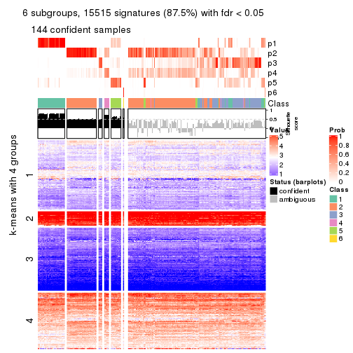</p>

</div>
</div>


Compare the overlap of signatures from different k:

```r
compare_signatures(res)
```

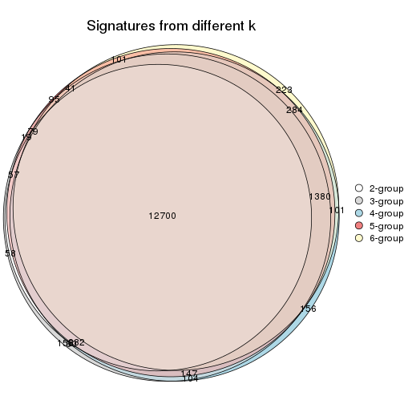

`get_signature()` returns a data frame invisibly. TO get the list of signatures, the function
call should be assigned to a variable explicitly. In following code, if `plot` argument is set
to `FALSE`, no heatmap is plotted while only the differential analysis is performed.

```r
# code only for demonstration
tb = get_signature(res, k = ..., plot = FALSE)
```

An example of the output of `tb` is:

```
#>   which_row         fdr    mean_1    mean_2 scaled_mean_1 scaled_mean_2 km
#> 1        38 0.042760348  8.373488  9.131774    -0.5533452     0.5164555  1
#> 2        40 0.018707592  7.106213  8.469186    -0.6173731     0.5762149  1
#> 3        55 0.019134737 10.221463 11.207825    -0.6159697     0.5749050  1
#> 4        59 0.006059896  5.921854  7.869574    -0.6899429     0.6439467  1
#> 5        60 0.018055526  8.928898 10.211722    -0.6204761     0.5791110  1
#> 6        98 0.009384629 15.714769 14.887706     0.6635654    -0.6193277  2
...
```

The columns in `tb` are:

1. `which_row`: row indices corresponding to the input matrix.
2. `fdr`: FDR for the differential test. 
3. `mean_x`: The mean value in group x.
4. `scaled_mean_x`: The mean value in group x after rows are scaled.
5. `km`: Row groups if k-means clustering is applied to rows.


UMAP plot which shows how samples are separated.


<script>
$( function() {
	$( '#tabs-ATC-hclust-dimension-reduction' ).tabs();
} );
</script>
<div id='tabs-ATC-hclust-dimension-reduction'>
<ul>
<li><a href='#tab-ATC-hclust-dimension-reduction-1'>k = 2</a></li>
<li><a href='#tab-ATC-hclust-dimension-reduction-2'>k = 3</a></li>
<li><a href='#tab-ATC-hclust-dimension-reduction-3'>k = 4</a></li>
<li><a href='#tab-ATC-hclust-dimension-reduction-4'>k = 5</a></li>
<li><a href='#tab-ATC-hclust-dimension-reduction-5'>k = 6</a></li>
</ul>
<div id='tab-ATC-hclust-dimension-reduction-1'>
<pre><code class="r">dimension_reduction(res, k = 2, method = &quot;UMAP&quot;)
</code></pre>

<p></p>

</div>
<div id='tab-ATC-hclust-dimension-reduction-2'>
<pre><code class="r">dimension_reduction(res, k = 3, method = &quot;UMAP&quot;)
</code></pre>

<p></p>

</div>
<div id='tab-ATC-hclust-dimension-reduction-3'>
<pre><code class="r">dimension_reduction(res, k = 4, method = &quot;UMAP&quot;)
</code></pre>

<p></p>

</div>
<div id='tab-ATC-hclust-dimension-reduction-4'>
<pre><code class="r">dimension_reduction(res, k = 5, method = &quot;UMAP&quot;)
</code></pre>

<p></p>

</div>
<div id='tab-ATC-hclust-dimension-reduction-5'>
<pre><code class="r">dimension_reduction(res, k = 6, method = &quot;UMAP&quot;)
</code></pre>

<p></p>

</div>
</div>


Following heatmap shows how subgroups are split when increasing `k`:

```r
collect_classes(res)
```


If matrix rows can be associated to genes, consider to use `GO_Enrichment(res,
...)` to perform function enrichment for the signature genes.


 

---------------------------------------------------


### ATC:kmeans**


The object with results only for a single top-value method and a single partition method 
can be extracted as:

```r
res = res_list["ATC", "kmeans"]
# you can also extract it by
# res = res_list["ATC:kmeans"]
```

A summary of `res` and all the functions that can be applied to it:

```r
res
```

```
#> A 'ConsensusPartition' object with k = 2, 3, 4, 5, 6.
#>   On a matrix with 17723 rows and 374 columns.
#>   Top rows (1000, 2000, 3000, 4000, 5000) are extracted by 'ATC' method.
#>   Subgroups are detected by 'kmeans' method.
#>   Performed in total 1250 partitions by row resampling.
#>   Best k for subgroups seems to be 2.
#> 
#> Following methods can be applied to this 'ConsensusPartition' object:
#>  [1] "cola_report"             "collect_classes"         "collect_plots"          
#>  [4] "collect_stats"           "colnames"                "compare_signatures"     
#>  [7] "consensus_heatmap"       "dimension_reduction"     "functional_enrichment"  
#> [10] "get_anno_col"            "get_anno"                "get_classes"            
#> [13] "get_consensus"           "get_matrix"              "get_membership"         
#> [16] "get_param"               "get_signatures"          "get_stats"              
#> [19] "is_best_k"               "is_stable_k"             "membership_heatmap"     
#> [22] "ncol"                    "nrow"                    "plot_ecdf"              
#> [25] "rownames"                "select_partition_number" "show"                   
#> [28] "suggest_best_k"          "test_to_known_factors"
```

`collect_plots()` function collects all the plots made from `res` for all `k` (number of partitions)
into one single page to provide an easy and fast comparison between different `k`.

```r
collect_plots(res)
```


The plots are:

- The first row: a plot of the ECDF (Empirical cumulative distribution
  function) curves of the consensus matrix for each `k` and the heatmap of
  predicted classes for each `k`.
- The second row: heatmaps of the consensus matrix for each `k`.
- The third row: heatmaps of the membership matrix for each `k`.
- The fouth row: heatmaps of the signatures for each `k`.

All the plots in panels can be made by individual functions and they are
plotted later in this section.

`select_partition_number()` produces several plots showing different
statistics for choosing "optimized" `k`. There are following statistics:

- ECDF curves of the consensus matrix for each `k`;
- 1-PAC. [The PAC
  score](https://en.wikipedia.org/wiki/Consensus_clustering#Over-interpretation_potential_of_consensus_clustering)
  measures the proportion of the ambiguous subgrouping.
- Mean silhouette score.
- Concordance. The mean probability of fiting the consensus class ids in all
  partitions.
- Area increased. Denote $A_k$ as the area under the ECDF curve for current
  `k`, the area increased is defined as $A_k - A_{k-1}$.
- Rand index. The percent of pairs of samples that are both in a same cluster
  or both are not in a same cluster in the partition of k and k-1.
- Jaccard index. The ratio of pairs of samples are both in a same cluster in
  the partition of k and k-1 and the pairs of samples are both in a same
  cluster in the partition k or k-1.

The detailed explanations of these statistics can be found in [the cola
vignette](http://bioconductor.org/packages/devel/bioc/vignettes/cola/inst/doc/cola.html#toc_13).

Generally speaking, lower PAC score, higher mean silhouette score or higher
concordance corresponds to better partition. Rand index and Jaccard index
measure how similar the current partition is compared to partition with `k-1`.
If they are too similar, we won't accept `k` is better than `k-1`.

```r
select_partition_number(res)
```


The numeric values for all these statistics can be obtained by `get_stats()`.

```r
get_stats(res)
```

```
#>   k 1-PAC mean_silhouette concordance area_increased  Rand Jaccard
#> 2 2 1.000           0.999       0.999         0.4427 0.557   0.557
#> 3 3 0.894           0.893       0.956         0.4197 0.757   0.585
#> 4 4 0.674           0.418       0.608         0.1479 0.738   0.422
#> 5 5 0.786           0.780       0.864         0.0872 0.893   0.637
#> 6 6 0.765           0.629       0.789         0.0409 0.962   0.833
```

`suggest_best_k()` suggests the best $k$ based on these statistics. The rules are as follows:

- All $k$ with Jaccard index larger than 0.95 are removed because the increase of
  the partition number does not provides enough extra information. If all $k$ are removed,
  the best $k$ is assigned by `NA`.
- For $k$ with 1-PAC larger than 0.9, the maximal $k$ is taken as the "best k". Other $k$ is called "optional k".
- If it does not fit the second rule. The $k$ with the highest vote of highest
  1-PAC, mean silhouette and concordance is taken as the "best k".

```r
suggest_best_k(res)
```

```
#> [1] 2
```


Following shows the table of the partitions (You need to click the **show/hide
code output** link to see it). The membership matrix (columns with name `p*`)
is inferred by
[`clue::cl_consensus()`](https://www.rdocumentation.org/link/cl_consensus?package=clue)
function with the `SE` method. Basically the value in the membership matrix
represents the probability to belong to a certain group. The finall class
label for an item is determined with the group with highest probability it
belongs to.

In `get_classes()` function, the entropy is calculated from the membership
matrix and the silhouette score is calculated from the consensus matrix.


<script>
$( function() {
	$( '#tabs-ATC-kmeans-get-classes' ).tabs();
} );
</script>
<div id='tabs-ATC-kmeans-get-classes'>
<ul>
<li><a href='#tab-ATC-kmeans-get-classes-1'>k = 2</a></li>
<li><a href='#tab-ATC-kmeans-get-classes-2'>k = 3</a></li>
<li><a href='#tab-ATC-kmeans-get-classes-3'>k = 4</a></li>
<li><a href='#tab-ATC-kmeans-get-classes-4'>k = 5</a></li>
<li><a href='#tab-ATC-kmeans-get-classes-5'>k = 6</a></li>
</ul>

<div id='tab-ATC-kmeans-get-classes-1'>
<p><a id='tab-ATC-kmeans-get-classes-1-a' style='color:#0366d6' href='#'>show/hide code output</a></p>
<pre><code class="r">cbind(get_classes(res, k = 2), get_membership(res, k = 2))
</code></pre>

<pre><code>#&gt;            class entropy silhouette    p1    p2
#&gt; SRR660824      2  0.0000      1.000 0.000 1.000
#&gt; SRR603858      1  0.0000      0.998 1.000 0.000
#&gt; SRR817070      2  0.0000      1.000 0.000 1.000
#&gt; SRR1486995     2  0.0000      1.000 0.000 1.000
#&gt; SRR813043      2  0.0000      1.000 0.000 1.000
#&gt; SRR656874      2  0.0000      1.000 0.000 1.000
#&gt; SRR659037      2  0.0000      1.000 0.000 1.000
#&gt; SRR662031      1  0.0000      0.998 1.000 0.000
#&gt; SRR1081283     2  0.0000      1.000 0.000 1.000
#&gt; SRR1481036     2  0.0000      1.000 0.000 1.000
#&gt; SRR1434009     2  0.0000      1.000 0.000 1.000
#&gt; SRR1376676     1  0.0000      0.998 1.000 0.000
#&gt; SRR1396967     2  0.0000      1.000 0.000 1.000
#&gt; SRR665429      2  0.0000      1.000 0.000 1.000
#&gt; SRR1388025     2  0.0000      1.000 0.000 1.000
#&gt; SRR600784      1  0.1184      0.983 0.984 0.016
#&gt; SRR657611      1  0.0000      0.998 1.000 0.000
#&gt; SRR1333659     1  0.0000      0.998 1.000 0.000
#&gt; SRR1323896     2  0.0000      1.000 0.000 1.000
#&gt; SRR1453971     1  0.0000      0.998 1.000 0.000
#&gt; SRR1421010     1  0.0000      0.998 1.000 0.000
#&gt; SRR1334490     1  0.1633      0.976 0.976 0.024
#&gt; SRR1309468     1  0.0000      0.998 1.000 0.000
#&gt; SRR1468637     1  0.0000      0.998 1.000 0.000
#&gt; SRR1365489     2  0.0000      1.000 0.000 1.000
#&gt; SRR627445      2  0.0000      1.000 0.000 1.000
#&gt; SRR607863      2  0.0000      1.000 0.000 1.000
#&gt; SRR1475524     1  0.0000      0.998 1.000 0.000
#&gt; SRR1405504     2  0.0000      1.000 0.000 1.000
#&gt; SRR615695      1  0.0000      0.998 1.000 0.000
#&gt; SRR600900      2  0.0000      1.000 0.000 1.000
#&gt; SRR601477      2  0.0000      1.000 0.000 1.000
#&gt; SRR1487215     2  0.0000      1.000 0.000 1.000
#&gt; SRR1310797     2  0.0000      1.000 0.000 1.000
#&gt; SRR1362713     1  0.0000      0.998 1.000 0.000
#&gt; SRR1431385     1  0.0000      0.998 1.000 0.000
#&gt; SRR1379089     2  0.0000      1.000 0.000 1.000
#&gt; SRR1102079     2  0.0000      1.000 0.000 1.000
#&gt; SRR1357210     1  0.0000      0.998 1.000 0.000
#&gt; SRR657659      2  0.0000      1.000 0.000 1.000
#&gt; SRR663573      2  0.0000      1.000 0.000 1.000
#&gt; SRR603188      2  0.0000      1.000 0.000 1.000
#&gt; SRR1471200     2  0.0000      1.000 0.000 1.000
#&gt; SRR1310975     2  0.0000      1.000 0.000 1.000
#&gt; SRR627457      1  0.0000      0.998 1.000 0.000
#&gt; SRR1367654     2  0.0000      1.000 0.000 1.000
#&gt; SRR1488410     1  0.0000      0.998 1.000 0.000
#&gt; SRR1457750     1  0.0000      0.998 1.000 0.000
#&gt; SRR1099546     1  0.0000      0.998 1.000 0.000
#&gt; SRR604480      2  0.0000      1.000 0.000 1.000
#&gt; SRR1390477     2  0.0000      1.000 0.000 1.000
#&gt; SRR1458447     2  0.0000      1.000 0.000 1.000
#&gt; SRR1473161     2  0.0000      1.000 0.000 1.000
#&gt; SRR1409813     2  0.0000      1.000 0.000 1.000
#&gt; SRR612791      1  0.0000      0.998 1.000 0.000
#&gt; SRR1470580     2  0.0000      1.000 0.000 1.000
#&gt; SRR1444063     1  0.0000      0.998 1.000 0.000
#&gt; SRR1355578     1  0.0000      0.998 1.000 0.000
#&gt; SRR1429203     1  0.0000      0.998 1.000 0.000
#&gt; SRR599154      2  0.0000      1.000 0.000 1.000
#&gt; SRR814244      1  0.0000      0.998 1.000 0.000
#&gt; SRR1404123     2  0.0000      1.000 0.000 1.000
#&gt; SRR656934      2  0.0000      1.000 0.000 1.000
#&gt; SRR1339029     2  0.0000      1.000 0.000 1.000
#&gt; SRR821525      2  0.0000      1.000 0.000 1.000
#&gt; SRR1443677     1  0.0000      0.998 1.000 0.000
#&gt; SRR1406330     1  0.0000      0.998 1.000 0.000
#&gt; SRR1338124     2  0.0000      1.000 0.000 1.000
#&gt; SRR1391376     2  0.0000      1.000 0.000 1.000
#&gt; SRR661842      2  0.0000      1.000 0.000 1.000
#&gt; SRR1395699     2  0.0000      1.000 0.000 1.000
#&gt; SRR1312209     1  0.0000      0.998 1.000 0.000
#&gt; SRR1359469     1  0.0000      0.998 1.000 0.000
#&gt; SRR658885      2  0.0000      1.000 0.000 1.000
#&gt; SRR1414578     1  0.0000      0.998 1.000 0.000
#&gt; SRR603620      2  0.0000      1.000 0.000 1.000
#&gt; SRR604677      1  0.0000      0.998 1.000 0.000
#&gt; SRR603800      2  0.0000      1.000 0.000 1.000
#&gt; SRR602058      2  0.0000      1.000 0.000 1.000
#&gt; SRR817488      2  0.0000      1.000 0.000 1.000
#&gt; SRR655601      2  0.0000      1.000 0.000 1.000
#&gt; SRR1434821     2  0.0000      1.000 0.000 1.000
#&gt; SRR1349166     2  0.0000      1.000 0.000 1.000
#&gt; SRR615129      1  0.0000      0.998 1.000 0.000
#&gt; SRR607586      2  0.0000      1.000 0.000 1.000
#&gt; SRR602680      2  0.0000      1.000 0.000 1.000
#&gt; SRR1411070     2  0.0000      1.000 0.000 1.000
#&gt; SRR663038      2  0.0000      1.000 0.000 1.000
#&gt; SRR1489416     2  0.0000      1.000 0.000 1.000
#&gt; SRR1479155     1  0.0000      0.998 1.000 0.000
#&gt; SRR662162      1  0.0000      0.998 1.000 0.000
#&gt; SRR1374567     1  0.0000      0.998 1.000 0.000
#&gt; SRR1434048     2  0.0000      1.000 0.000 1.000
#&gt; SRR2184865     2  0.0000      1.000 0.000 1.000
#&gt; SRR2170135     1  0.0000      0.998 1.000 0.000
#&gt; SRR615551      2  0.0000      1.000 0.000 1.000
#&gt; SRR1335513     2  0.0000      1.000 0.000 1.000
#&gt; SRR1370216     1  0.1633      0.976 0.976 0.024
#&gt; SRR662954      1  0.4815      0.885 0.896 0.104
#&gt; SRR1375738     2  0.0000      1.000 0.000 1.000
#&gt; SRR1356577     2  0.0000      1.000 0.000 1.000
#&gt; SRR1073119     1  0.0000      0.998 1.000 0.000
#&gt; SRR663549      2  0.0000      1.000 0.000 1.000
#&gt; SRR1478015     2  0.0000      1.000 0.000 1.000
#&gt; SRR600632      2  0.0000      1.000 0.000 1.000
#&gt; SRR811866      2  0.0000      1.000 0.000 1.000
#&gt; SRR1401101     2  0.0000      1.000 0.000 1.000
#&gt; SRR1477797     2  0.0000      1.000 0.000 1.000
#&gt; SRR1402986     2  0.0000      1.000 0.000 1.000
#&gt; SRR658897      1  0.0000      0.998 1.000 0.000
#&gt; SRR1419869     1  0.0000      0.998 1.000 0.000
#&gt; SRR1490700     1  0.0000      0.998 1.000 0.000
#&gt; SRR601723      2  0.0000      1.000 0.000 1.000
#&gt; SRR1384115     2  0.0000      1.000 0.000 1.000
#&gt; SRR1476927     2  0.0000      1.000 0.000 1.000
#&gt; SRR1387769     2  0.0000      1.000 0.000 1.000
#&gt; SRR1322595     1  0.0000      0.998 1.000 0.000
#&gt; SRR1370423     2  0.0000      1.000 0.000 1.000
#&gt; SRR1314976     2  0.0000      1.000 0.000 1.000
#&gt; SRR1319560     2  0.0000      1.000 0.000 1.000
#&gt; SRR1352683     2  0.0000      1.000 0.000 1.000
#&gt; SRR1473800     1  0.0000      0.998 1.000 0.000
#&gt; SRR1326384     2  0.0000      1.000 0.000 1.000
#&gt; SRR1360807     2  0.0000      1.000 0.000 1.000
#&gt; SRR1332544     1  0.0000      0.998 1.000 0.000
#&gt; SRR598695      1  0.0000      0.998 1.000 0.000
#&gt; SRR807824      2  0.0000      1.000 0.000 1.000
#&gt; SRR809296      2  0.0000      1.000 0.000 1.000
#&gt; SRR657927      2  0.0000      1.000 0.000 1.000
#&gt; SRR1440682     2  0.0000      1.000 0.000 1.000
#&gt; SRR1454415     2  0.0000      1.000 0.000 1.000
#&gt; SRR1419131     2  0.0000      1.000 0.000 1.000
#&gt; SRR1404293     1  0.0000      0.998 1.000 0.000
#&gt; SRR1473340     1  0.0000      0.998 1.000 0.000
#&gt; SRR1345563     1  0.0000      0.998 1.000 0.000
#&gt; SRR1323382     2  0.0000      1.000 0.000 1.000
#&gt; SRR1480697     2  0.0000      1.000 0.000 1.000
#&gt; SRR1321808     2  0.0000      1.000 0.000 1.000
#&gt; SRR1382756     2  0.0000      1.000 0.000 1.000
#&gt; SRR1312558     2  0.0000      1.000 0.000 1.000
#&gt; SRR1417088     2  0.0000      1.000 0.000 1.000
#&gt; SRR1433027     2  0.0000      1.000 0.000 1.000
#&gt; SRR662257      2  0.0000      1.000 0.000 1.000
#&gt; SRR600417      2  0.0000      1.000 0.000 1.000
#&gt; SRR812493      2  0.0000      1.000 0.000 1.000
#&gt; SRR612743      2  0.0000      1.000 0.000 1.000
#&gt; SRR1361345     1  0.0000      0.998 1.000 0.000
#&gt; SRR600584      2  0.0000      1.000 0.000 1.000
#&gt; SRR1310520     2  0.0000      1.000 0.000 1.000
#&gt; SRR1395595     2  0.0000      1.000 0.000 1.000
#&gt; SRR1334074     2  0.0000      1.000 0.000 1.000
#&gt; SRR654838      2  0.0000      1.000 0.000 1.000
#&gt; SRR1376694     1  0.0000      0.998 1.000 0.000
#&gt; SRR1433841     1  0.0000      0.998 1.000 0.000
#&gt; SRR1366837     2  0.0000      1.000 0.000 1.000
#&gt; SRR1467479     2  0.0000      1.000 0.000 1.000
#&gt; SRR1459055     1  0.0000      0.998 1.000 0.000
#&gt; SRR1471050     2  0.0000      1.000 0.000 1.000
#&gt; SRR603004      2  0.0000      1.000 0.000 1.000
#&gt; SRR814703      2  0.0000      1.000 0.000 1.000
#&gt; SRR661937      2  0.0000      1.000 0.000 1.000
#&gt; SRR614359      1  0.0000      0.998 1.000 0.000
#&gt; SRR1071568     2  0.0000      1.000 0.000 1.000
#&gt; SRR1389084     2  0.0000      1.000 0.000 1.000
#&gt; SRR1337624     2  0.0000      1.000 0.000 1.000
#&gt; SRR1344400     2  0.0000      1.000 0.000 1.000
#&gt; SRR1414290     2  0.0000      1.000 0.000 1.000
#&gt; SRR1413644     2  0.0000      1.000 0.000 1.000
#&gt; SRR1098998     1  0.0000      0.998 1.000 0.000
#&gt; SRR1481279     1  0.0000      0.998 1.000 0.000
#&gt; SRR1315103     1  0.0000      0.998 1.000 0.000
#&gt; SRR1099286     1  0.0000      0.998 1.000 0.000
#&gt; SRR2166570     2  0.0000      1.000 0.000 1.000
#&gt; SRR601445      1  0.0000      0.998 1.000 0.000
#&gt; SRR1439719     2  0.0000      1.000 0.000 1.000
#&gt; SRR1377026     2  0.0000      1.000 0.000 1.000
#&gt; SRR1327386     1  0.0000      0.998 1.000 0.000
#&gt; SRR654826      2  0.0000      1.000 0.000 1.000
#&gt; SRR1460433     2  0.0000      1.000 0.000 1.000
#&gt; SRR1469345     1  0.0000      0.998 1.000 0.000
#&gt; SRR1421462     2  0.0000      1.000 0.000 1.000
#&gt; SRR662966      1  0.0000      0.998 1.000 0.000
#&gt; SRR1339175     1  0.0000      0.998 1.000 0.000
#&gt; SRR1447736     2  0.0000      1.000 0.000 1.000
#&gt; SRR1434671     2  0.0000      1.000 0.000 1.000
#&gt; SRR660800      2  0.0000      1.000 0.000 1.000
#&gt; SRR1465543     2  0.0000      1.000 0.000 1.000
#&gt; SRR1342023     1  0.0000      0.998 1.000 0.000
#&gt; SRR1335670     1  0.0000      0.998 1.000 0.000
#&gt; SRR1400955     2  0.0000      1.000 0.000 1.000
#&gt; SRR1072150     2  0.0000      1.000 0.000 1.000
#&gt; SRR1442822     1  0.0000      0.998 1.000 0.000
#&gt; SRR1364658     1  0.0000      0.998 1.000 0.000
#&gt; SRR1098074     2  0.0000      1.000 0.000 1.000
#&gt; SRR1442778     1  0.0000      0.998 1.000 0.000
#&gt; SRR1086728     2  0.0000      1.000 0.000 1.000
#&gt; SRR627464      1  0.0000      0.998 1.000 0.000
#&gt; SRR1409193     1  0.0000      0.998 1.000 0.000
#&gt; SRR2168286     2  0.0000      1.000 0.000 1.000
#&gt; SRR615539      2  0.0000      1.000 0.000 1.000
#&gt; SRR663623      2  0.0000      1.000 0.000 1.000
#&gt; SRR1471989     2  0.0000      1.000 0.000 1.000
#&gt; SRR1468828     2  0.0000      1.000 0.000 1.000
#&gt; SRR1381934     2  0.0000      1.000 0.000 1.000
#&gt; SRR1471098     1  0.3114      0.942 0.944 0.056
#&gt; SRR1314749     1  0.0000      0.998 1.000 0.000
#&gt; SRR2166874     2  0.0000      1.000 0.000 1.000
#&gt; SRR821302      1  0.0000      0.998 1.000 0.000
#&gt; SRR1435066     2  0.0000      1.000 0.000 1.000
#&gt; SRR661601      2  0.0000      1.000 0.000 1.000
#&gt; SRR1446546     2  0.0000      1.000 0.000 1.000
#&gt; SRR1419784     2  0.0000      1.000 0.000 1.000
#&gt; SRR1357233     2  0.0000      1.000 0.000 1.000
#&gt; SRR1441889     1  0.0000      0.998 1.000 0.000
#&gt; SRR1413940     1  0.0000      0.998 1.000 0.000
#&gt; SRR1324250     2  0.0000      1.000 0.000 1.000
#&gt; SRR1442862     2  0.0000      1.000 0.000 1.000
#&gt; SRR662474      2  0.0000      1.000 0.000 1.000
#&gt; SRR1416226     2  0.0000      1.000 0.000 1.000
#&gt; SRR1417404     2  0.0000      1.000 0.000 1.000
#&gt; SRR665466      2  0.0000      1.000 0.000 1.000
#&gt; SRR658849      2  0.0000      1.000 0.000 1.000
#&gt; SRR1460025     2  0.0000      1.000 0.000 1.000
#&gt; SRR1408136     1  0.0000      0.998 1.000 0.000
#&gt; SRR1489995     2  0.0000      1.000 0.000 1.000
#&gt; SRR1374092     2  0.0000      1.000 0.000 1.000
#&gt; SRR1488429     2  0.0000      1.000 0.000 1.000
#&gt; SRR1087559     1  0.0000      0.998 1.000 0.000
#&gt; SRR817004      1  0.0000      0.998 1.000 0.000
#&gt; SRR1429660     2  0.0000      1.000 0.000 1.000
#&gt; SRR604390      2  0.0000      1.000 0.000 1.000
#&gt; SRR614936      2  0.0000      1.000 0.000 1.000
#&gt; SRR1365938     1  0.0000      0.998 1.000 0.000
#&gt; SRR1437324     1  0.0000      0.998 1.000 0.000
#&gt; SRR613414      2  0.0000      1.000 0.000 1.000
#&gt; SRR660414      2  0.0000      1.000 0.000 1.000
#&gt; SRR1452185     1  0.0000      0.998 1.000 0.000
#&gt; SRR1347020     1  0.0000      0.998 1.000 0.000
#&gt; SRR1398036     2  0.0000      1.000 0.000 1.000
#&gt; SRR1436674     1  0.0000      0.998 1.000 0.000
#&gt; SRR603750      2  0.0000      1.000 0.000 1.000
#&gt; SRR608630      2  0.0000      1.000 0.000 1.000
#&gt; SRR655625      2  0.0000      1.000 0.000 1.000
#&gt; SRR599059      2  0.0000      1.000 0.000 1.000
#&gt; SRR615189      1  0.0000      0.998 1.000 0.000
#&gt; SRR1466889     2  0.0000      1.000 0.000 1.000
#&gt; SRR1084602     2  0.0000      1.000 0.000 1.000
#&gt; SRR1335422     1  0.0000      0.998 1.000 0.000
#&gt; SRR1356805     2  0.0000      1.000 0.000 1.000
#&gt; SRR1385300     1  0.0672      0.991 0.992 0.008
#&gt; SRR654814      1  0.0000      0.998 1.000 0.000
#&gt; SRR658385      2  0.0000      1.000 0.000 1.000
#&gt; SRR820596      1  0.0000      0.998 1.000 0.000
#&gt; SRR1318118     1  0.0000      0.998 1.000 0.000
#&gt; SRR1480766     2  0.0000      1.000 0.000 1.000
#&gt; SRR1406539     1  0.0000      0.998 1.000 0.000
#&gt; SRR1341833     2  0.0000      1.000 0.000 1.000
#&gt; SRR1441826     2  0.0000      1.000 0.000 1.000
#&gt; SRR1448051     1  0.0000      0.998 1.000 0.000
#&gt; SRR1326752     2  0.0000      1.000 0.000 1.000
#&gt; SRR665217      2  0.0000      1.000 0.000 1.000
#&gt; SRR819186      2  0.0000      1.000 0.000 1.000
#&gt; SRR661517      2  0.0000      1.000 0.000 1.000
#&gt; SRR607166      2  0.0000      1.000 0.000 1.000
#&gt; SRR809065      2  0.0000      1.000 0.000 1.000
#&gt; SRR1415872     2  0.0000      1.000 0.000 1.000
#&gt; SRR1415463     2  0.0000      1.000 0.000 1.000
#&gt; SRR1381161     2  0.0000      1.000 0.000 1.000
#&gt; SRR1442231     1  0.0000      0.998 1.000 0.000
#&gt; SRR1374696     1  0.0000      0.998 1.000 0.000
#&gt; SRR1451988     2  0.0000      1.000 0.000 1.000
#&gt; SRR660555      1  0.0000      0.998 1.000 0.000
#&gt; SRR657801      1  0.0000      0.998 1.000 0.000
#&gt; SRR663344      2  0.0000      1.000 0.000 1.000
#&gt; SRR1472462     2  0.0000      1.000 0.000 1.000
#&gt; SRR1406176     2  0.0000      1.000 0.000 1.000
#&gt; SRR656886      2  0.0000      1.000 0.000 1.000
#&gt; SRR1498337     2  0.0000      1.000 0.000 1.000
#&gt; SRR613066      1  0.0000      0.998 1.000 0.000
#&gt; SRR1309490     1  0.0000      0.998 1.000 0.000
#&gt; SRR602492      2  0.0000      1.000 0.000 1.000
#&gt; SRR1447347     1  0.0000      0.998 1.000 0.000
#&gt; SRR1475546     2  0.0000      1.000 0.000 1.000
#&gt; SRR627459      2  0.0000      1.000 0.000 1.000
#&gt; SRR1434332     2  0.0000      1.000 0.000 1.000
#&gt; SRR1070358     2  0.0000      1.000 0.000 1.000
#&gt; SRR1345936     2  0.0000      1.000 0.000 1.000
#&gt; SRR665658      2  0.0000      1.000 0.000 1.000
#&gt; SRR1321351     2  0.0000      1.000 0.000 1.000
#&gt; SRR657880      2  0.0000      1.000 0.000 1.000
#&gt; SRR1373903     2  0.0000      1.000 0.000 1.000
#&gt; SRR657396      2  0.0000      1.000 0.000 1.000
#&gt; SRR660981      2  0.0000      1.000 0.000 1.000
#&gt; SRR818499      1  0.0000      0.998 1.000 0.000
#&gt; SRR819658      2  0.0000      1.000 0.000 1.000
#&gt; SRR1376316     1  0.0000      0.998 1.000 0.000
#&gt; SRR1323723     2  0.0000      1.000 0.000 1.000
#&gt; SRR1476719     1  0.0000      0.998 1.000 0.000
#&gt; SRR1403478     2  0.0000      1.000 0.000 1.000
#&gt; SRR1095695     2  0.0000      1.000 0.000 1.000
#&gt; SRR1352391     1  0.0000      0.998 1.000 0.000
#&gt; SRR1498813     2  0.0000      1.000 0.000 1.000
#&gt; SRR627437      2  0.0000      1.000 0.000 1.000
#&gt; SRR2185097     1  0.0000      0.998 1.000 0.000
#&gt; SRR817166      2  0.0000      1.000 0.000 1.000
#&gt; SRR1091670     2  0.0000      1.000 0.000 1.000
#&gt; SRR603776      2  0.0000      1.000 0.000 1.000
#&gt; SRR1479640     2  0.0000      1.000 0.000 1.000
#&gt; SRR660152      1  0.0000      0.998 1.000 0.000
#&gt; SRR1074769     2  0.0000      1.000 0.000 1.000
#&gt; SRR656153      2  0.0000      1.000 0.000 1.000
#&gt; SRR1392502     2  0.0000      1.000 0.000 1.000
#&gt; SRR1359609     1  0.0000      0.998 1.000 0.000
#&gt; SRR601925      2  0.0000      1.000 0.000 1.000
#&gt; SRR2165182     2  0.0000      1.000 0.000 1.000
#&gt; SRR608542      2  0.0000      1.000 0.000 1.000
#&gt; SRR655064      2  0.0000      1.000 0.000 1.000
#&gt; SRR1432430     2  0.0000      1.000 0.000 1.000
#&gt; SRR808472      2  0.0000      1.000 0.000 1.000
#&gt; SRR1414958     2  0.0000      1.000 0.000 1.000
#&gt; SRR598484      2  0.0000      1.000 0.000 1.000
#&gt; SRR612755      2  0.0000      1.000 0.000 1.000
#&gt; SRR1365808     1  0.0000      0.998 1.000 0.000
#&gt; SRR1391724     2  0.0000      1.000 0.000 1.000
#&gt; SRR1322373     2  0.0000      1.000 0.000 1.000
#&gt; SRR1489265     2  0.0000      1.000 0.000 1.000
#&gt; SRR1359099     2  0.0000      1.000 0.000 1.000
#&gt; SRR607279      2  0.0000      1.000 0.000 1.000
#&gt; SRR810461      2  0.0000      1.000 0.000 1.000
#&gt; SRR627427      1  0.0000      0.998 1.000 0.000
#&gt; SRR612887      2  0.0000      1.000 0.000 1.000
#&gt; SRR809807      2  0.0000      1.000 0.000 1.000
#&gt; SRR663112      2  0.0000      1.000 0.000 1.000
#&gt; SRR1346933     1  0.0000      0.998 1.000 0.000
#&gt; SRR1487910     1  0.0000      0.998 1.000 0.000
#&gt; SRR603092      2  0.0000      1.000 0.000 1.000
#&gt; SRR1417680     2  0.0000      1.000 0.000 1.000
#&gt; SRR1383785     1  0.0000      0.998 1.000 0.000
#&gt; SRR1070015     2  0.0000      1.000 0.000 1.000
#&gt; SRR1466222     2  0.0000      1.000 0.000 1.000
#&gt; SRR1416119     2  0.0000      1.000 0.000 1.000
#&gt; SRR819318      1  0.0000      0.998 1.000 0.000
#&gt; SRR608288      2  0.0000      1.000 0.000 1.000
#&gt; SRR811121      2  0.0000      1.000 0.000 1.000
#&gt; SRR613138      2  0.0000      1.000 0.000 1.000
#&gt; SRR810483      2  0.0000      1.000 0.000 1.000
#&gt; SRR607839      1  0.0000      0.998 1.000 0.000
#&gt; SRR1337031     1  0.0000      0.998 1.000 0.000
#&gt; SRR601311      2  0.0000      1.000 0.000 1.000
#&gt; SRR1406685     2  0.0000      1.000 0.000 1.000
#&gt; SRR1467500     2  0.0000      1.000 0.000 1.000
#&gt; SRR1308504     1  0.0000      0.998 1.000 0.000
#&gt; SRR1312865     2  0.0000      1.000 0.000 1.000
#&gt; SRR1312522     1  0.1633      0.976 0.976 0.024
#&gt; SRR1490486     2  0.0000      1.000 0.000 1.000
#&gt; SRR1325888     2  0.0000      1.000 0.000 1.000
#&gt; SRR1472885     1  0.0000      0.998 1.000 0.000
#&gt; SRR1098785     2  0.0000      1.000 0.000 1.000
#&gt; SRR1084766     2  0.0000      1.000 0.000 1.000
#&gt; SRR1102804     2  0.0000      1.000 0.000 1.000
#&gt; SRR1336636     1  0.0000      0.998 1.000 0.000
#&gt; SRR1347795     1  0.0000      0.998 1.000 0.000
#&gt; SRR601900      2  0.0000      1.000 0.000 1.000
#&gt; SRR1330989     2  0.0000      1.000 0.000 1.000
#&gt; SRR658445      2  0.0000      1.000 0.000 1.000
#&gt; SRR1368754     1  0.0000      0.998 1.000 0.000
#&gt; SRR1460001     2  0.0000      1.000 0.000 1.000
#&gt; SRR1414934     1  0.0000      0.998 1.000 0.000
#&gt; SRR1326249     2  0.0000      1.000 0.000 1.000
#&gt; SRR614948      1  0.0000      0.998 1.000 0.000
#&gt; SRR1472952     2  0.0000      1.000 0.000 1.000
#&gt; SRR1321528     1  0.0000      0.998 1.000 0.000
#&gt; SRR627447      1  0.0000      0.998 1.000 0.000
#&gt; SRR612239      2  0.0000      1.000 0.000 1.000
</code></pre>

<script>
$('#tab-ATC-kmeans-get-classes-1-a').parent().next().next().hide();
$('#tab-ATC-kmeans-get-classes-1-a').click(function(){
  $('#tab-ATC-kmeans-get-classes-1-a').parent().next().next().toggle();
  return(false);
});
</script>
</div>

<div id='tab-ATC-kmeans-get-classes-2'>
<p><a id='tab-ATC-kmeans-get-classes-2-a' style='color:#0366d6' href='#'>show/hide code output</a></p>
<pre><code class="r">cbind(get_classes(res, k = 3), get_membership(res, k = 3))
</code></pre>

<pre><code>#&gt;            class entropy silhouette    p1    p2    p3
#&gt; SRR660824      3  0.0237    0.91289 0.000 0.004 0.996
#&gt; SRR603858      3  0.0237    0.91089 0.004 0.000 0.996
#&gt; SRR817070      2  0.0000    0.95621 0.000 1.000 0.000
#&gt; SRR1486995     3  0.0237    0.91289 0.000 0.004 0.996
#&gt; SRR813043      2  0.0000    0.95621 0.000 1.000 0.000
#&gt; SRR656874      2  0.0000    0.95621 0.000 1.000 0.000
#&gt; SRR659037      2  0.0000    0.95621 0.000 1.000 0.000
#&gt; SRR662031      1  0.1964    0.93264 0.944 0.000 0.056
#&gt; SRR1081283     2  0.0000    0.95621 0.000 1.000 0.000
#&gt; SRR1481036     2  0.6309   -0.07185 0.000 0.504 0.496
#&gt; SRR1434009     2  0.0000    0.95621 0.000 1.000 0.000
#&gt; SRR1376676     1  0.0000    0.97288 1.000 0.000 0.000
#&gt; SRR1396967     2  0.0000    0.95621 0.000 1.000 0.000
#&gt; SRR665429      2  0.0000    0.95621 0.000 1.000 0.000
#&gt; SRR1388025     2  0.0000    0.95621 0.000 1.000 0.000
#&gt; SRR600784      3  0.0237    0.91089 0.004 0.000 0.996
#&gt; SRR657611      1  0.1964    0.93264 0.944 0.000 0.056
#&gt; SRR1333659     1  0.5810    0.52149 0.664 0.000 0.336
#&gt; SRR1323896     2  0.0000    0.95621 0.000 1.000 0.000
#&gt; SRR1453971     1  0.3038    0.88674 0.896 0.000 0.104
#&gt; SRR1421010     1  0.0000    0.97288 1.000 0.000 0.000
#&gt; SRR1334490     3  0.0237    0.91089 0.004 0.000 0.996
#&gt; SRR1309468     1  0.0000    0.97288 1.000 0.000 0.000
#&gt; SRR1468637     1  0.2448    0.91516 0.924 0.000 0.076
#&gt; SRR1365489     2  0.0000    0.95621 0.000 1.000 0.000
#&gt; SRR627445      3  0.0237    0.91289 0.000 0.004 0.996
#&gt; SRR607863      2  0.0000    0.95621 0.000 1.000 0.000
#&gt; SRR1475524     1  0.0000    0.97288 1.000 0.000 0.000
#&gt; SRR1405504     2  0.0000    0.95621 0.000 1.000 0.000
#&gt; SRR615695      1  0.0000    0.97288 1.000 0.000 0.000
#&gt; SRR600900      2  0.0000    0.95621 0.000 1.000 0.000
#&gt; SRR601477      2  0.0000    0.95621 0.000 1.000 0.000
#&gt; SRR1487215     2  0.0000    0.95621 0.000 1.000 0.000
#&gt; SRR1310797     2  0.0000    0.95621 0.000 1.000 0.000
#&gt; SRR1362713     1  0.0000    0.97288 1.000 0.000 0.000
#&gt; SRR1431385     1  0.0000    0.97288 1.000 0.000 0.000
#&gt; SRR1379089     2  0.0000    0.95621 0.000 1.000 0.000
#&gt; SRR1102079     3  0.0237    0.91289 0.000 0.004 0.996
#&gt; SRR1357210     1  0.0000    0.97288 1.000 0.000 0.000
#&gt; SRR657659      2  0.0000    0.95621 0.000 1.000 0.000
#&gt; SRR663573      2  0.0000    0.95621 0.000 1.000 0.000
#&gt; SRR603188      2  0.0000    0.95621 0.000 1.000 0.000
#&gt; SRR1471200     2  0.0000    0.95621 0.000 1.000 0.000
#&gt; SRR1310975     2  0.2165    0.89990 0.000 0.936 0.064
#&gt; SRR627457      1  0.0237    0.97032 0.996 0.000 0.004
#&gt; SRR1367654     2  0.0000    0.95621 0.000 1.000 0.000
#&gt; SRR1488410     1  0.0000    0.97288 1.000 0.000 0.000
#&gt; SRR1457750     1  0.0747    0.96227 0.984 0.000 0.016
#&gt; SRR1099546     1  0.0000    0.97288 1.000 0.000 0.000
#&gt; SRR604480      2  0.0000    0.95621 0.000 1.000 0.000
#&gt; SRR1390477     2  0.0000    0.95621 0.000 1.000 0.000
#&gt; SRR1458447     2  0.0000    0.95621 0.000 1.000 0.000
#&gt; SRR1473161     2  0.0000    0.95621 0.000 1.000 0.000
#&gt; SRR1409813     2  0.0000    0.95621 0.000 1.000 0.000
#&gt; SRR612791      1  0.0000    0.97288 1.000 0.000 0.000
#&gt; SRR1470580     3  0.0237    0.91289 0.000 0.004 0.996
#&gt; SRR1444063     1  0.0000    0.97288 1.000 0.000 0.000
#&gt; SRR1355578     1  0.0000    0.97288 1.000 0.000 0.000
#&gt; SRR1429203     1  0.0000    0.97288 1.000 0.000 0.000
#&gt; SRR599154      2  0.0000    0.95621 0.000 1.000 0.000
#&gt; SRR814244      1  0.1753    0.93892 0.952 0.000 0.048
#&gt; SRR1404123     2  0.0000    0.95621 0.000 1.000 0.000
#&gt; SRR656934      3  0.6307    0.11735 0.000 0.488 0.512
#&gt; SRR1339029     2  0.0000    0.95621 0.000 1.000 0.000
#&gt; SRR821525      2  0.0000    0.95621 0.000 1.000 0.000
#&gt; SRR1443677     1  0.0000    0.97288 1.000 0.000 0.000
#&gt; SRR1406330     1  0.0000    0.97288 1.000 0.000 0.000
#&gt; SRR1338124     3  0.0237    0.91289 0.000 0.004 0.996
#&gt; SRR1391376     3  0.0237    0.91289 0.000 0.004 0.996
#&gt; SRR661842      2  0.0000    0.95621 0.000 1.000 0.000
#&gt; SRR1395699     3  0.0237    0.91289 0.000 0.004 0.996
#&gt; SRR1312209     1  0.2625    0.90757 0.916 0.000 0.084
#&gt; SRR1359469     1  0.0000    0.97288 1.000 0.000 0.000
#&gt; SRR658885      3  0.0237    0.91289 0.000 0.004 0.996
#&gt; SRR1414578     1  0.0000    0.97288 1.000 0.000 0.000
#&gt; SRR603620      2  0.6126    0.34171 0.000 0.600 0.400
#&gt; SRR604677      3  0.0237    0.91089 0.004 0.000 0.996
#&gt; SRR603800      2  0.0000    0.95621 0.000 1.000 0.000
#&gt; SRR602058      2  0.0000    0.95621 0.000 1.000 0.000
#&gt; SRR817488      2  0.0000    0.95621 0.000 1.000 0.000
#&gt; SRR655601      2  0.0000    0.95621 0.000 1.000 0.000
#&gt; SRR1434821     2  0.0000    0.95621 0.000 1.000 0.000
#&gt; SRR1349166     2  0.0000    0.95621 0.000 1.000 0.000
#&gt; SRR615129      1  0.0000    0.97288 1.000 0.000 0.000
#&gt; SRR607586      2  0.0000    0.95621 0.000 1.000 0.000
#&gt; SRR602680      2  0.0000    0.95621 0.000 1.000 0.000
#&gt; SRR1411070     2  0.0000    0.95621 0.000 1.000 0.000
#&gt; SRR663038      2  0.0000    0.95621 0.000 1.000 0.000
#&gt; SRR1489416     2  0.0000    0.95621 0.000 1.000 0.000
#&gt; SRR1479155     1  0.0000    0.97288 1.000 0.000 0.000
#&gt; SRR662162      1  0.0000    0.97288 1.000 0.000 0.000
#&gt; SRR1374567     3  0.0237    0.91089 0.004 0.000 0.996
#&gt; SRR1434048     2  0.0000    0.95621 0.000 1.000 0.000
#&gt; SRR2184865     2  0.0000    0.95621 0.000 1.000 0.000
#&gt; SRR2170135     1  0.0000    0.97288 1.000 0.000 0.000
#&gt; SRR615551      2  0.6026    0.40448 0.000 0.624 0.376
#&gt; SRR1335513     2  0.0000    0.95621 0.000 1.000 0.000
#&gt; SRR1370216     3  0.0237    0.91089 0.004 0.000 0.996
#&gt; SRR662954      2  0.7901    0.21661 0.060 0.540 0.400
#&gt; SRR1375738     3  0.2261    0.87662 0.000 0.068 0.932
#&gt; SRR1356577     3  0.6204    0.25655 0.000 0.424 0.576
#&gt; SRR1073119     3  0.3267    0.81171 0.116 0.000 0.884
#&gt; SRR663549      3  0.0237    0.91289 0.000 0.004 0.996
#&gt; SRR1478015     2  0.0000    0.95621 0.000 1.000 0.000
#&gt; SRR600632      2  0.1964    0.90776 0.000 0.944 0.056
#&gt; SRR811866      3  0.0237    0.91289 0.000 0.004 0.996
#&gt; SRR1401101     2  0.0000    0.95621 0.000 1.000 0.000
#&gt; SRR1477797     2  0.0000    0.95621 0.000 1.000 0.000
#&gt; SRR1402986     2  0.0000    0.95621 0.000 1.000 0.000
#&gt; SRR658897      1  0.0000    0.97288 1.000 0.000 0.000
#&gt; SRR1419869     3  0.0237    0.91089 0.004 0.000 0.996
#&gt; SRR1490700     1  0.5621    0.57945 0.692 0.000 0.308
#&gt; SRR601723      2  0.0000    0.95621 0.000 1.000 0.000
#&gt; SRR1384115     2  0.0000    0.95621 0.000 1.000 0.000
#&gt; SRR1476927     2  0.0000    0.95621 0.000 1.000 0.000
#&gt; SRR1387769     3  0.2261    0.87662 0.000 0.068 0.932
#&gt; SRR1322595     3  0.6140    0.26901 0.404 0.000 0.596
#&gt; SRR1370423     3  0.5291    0.66207 0.000 0.268 0.732
#&gt; SRR1314976     2  0.5733    0.51277 0.000 0.676 0.324
#&gt; SRR1319560     2  0.5968    0.43367 0.000 0.636 0.364
#&gt; SRR1352683     3  0.0237    0.91289 0.000 0.004 0.996
#&gt; SRR1473800     1  0.0000    0.97288 1.000 0.000 0.000
#&gt; SRR1326384     3  0.5948    0.48406 0.000 0.360 0.640
#&gt; SRR1360807     2  0.0000    0.95621 0.000 1.000 0.000
#&gt; SRR1332544     1  0.0000    0.97288 1.000 0.000 0.000
#&gt; SRR598695      1  0.0000    0.97288 1.000 0.000 0.000
#&gt; SRR807824      3  0.0237    0.91289 0.000 0.004 0.996
#&gt; SRR809296      3  0.0237    0.91289 0.000 0.004 0.996
#&gt; SRR657927      3  0.0237    0.91289 0.000 0.004 0.996
#&gt; SRR1440682     2  0.0000    0.95621 0.000 1.000 0.000
#&gt; SRR1454415     2  0.0000    0.95621 0.000 1.000 0.000
#&gt; SRR1419131     2  0.0000    0.95621 0.000 1.000 0.000
#&gt; SRR1404293     1  0.0000    0.97288 1.000 0.000 0.000
#&gt; SRR1473340     3  0.0237    0.91089 0.004 0.000 0.996
#&gt; SRR1345563     1  0.0000    0.97288 1.000 0.000 0.000
#&gt; SRR1323382     2  0.0000    0.95621 0.000 1.000 0.000
#&gt; SRR1480697     2  0.6299    0.00783 0.000 0.524 0.476
#&gt; SRR1321808     2  0.0000    0.95621 0.000 1.000 0.000
#&gt; SRR1382756     2  0.0000    0.95621 0.000 1.000 0.000
#&gt; SRR1312558     3  0.0237    0.91289 0.000 0.004 0.996
#&gt; SRR1417088     2  0.0000    0.95621 0.000 1.000 0.000
#&gt; SRR1433027     2  0.0000    0.95621 0.000 1.000 0.000
#&gt; SRR662257      2  0.0000    0.95621 0.000 1.000 0.000
#&gt; SRR600417      2  0.0000    0.95621 0.000 1.000 0.000
#&gt; SRR812493      2  0.0000    0.95621 0.000 1.000 0.000
#&gt; SRR612743      3  0.0237    0.91289 0.000 0.004 0.996
#&gt; SRR1361345     1  0.0000    0.97288 1.000 0.000 0.000
#&gt; SRR600584      2  0.0000    0.95621 0.000 1.000 0.000
#&gt; SRR1310520     2  0.0000    0.95621 0.000 1.000 0.000
#&gt; SRR1395595     3  0.3267    0.83753 0.000 0.116 0.884
#&gt; SRR1334074     2  0.1289    0.92851 0.000 0.968 0.032
#&gt; SRR654838      2  0.4555    0.73367 0.000 0.800 0.200
#&gt; SRR1376694     1  0.0000    0.97288 1.000 0.000 0.000
#&gt; SRR1433841     1  0.0000    0.97288 1.000 0.000 0.000
#&gt; SRR1366837     3  0.0237    0.91289 0.000 0.004 0.996
#&gt; SRR1467479     2  0.0000    0.95621 0.000 1.000 0.000
#&gt; SRR1459055     1  0.0000    0.97288 1.000 0.000 0.000
#&gt; SRR1471050     2  0.0000    0.95621 0.000 1.000 0.000
#&gt; SRR603004      2  0.0000    0.95621 0.000 1.000 0.000
#&gt; SRR814703      2  0.0000    0.95621 0.000 1.000 0.000
#&gt; SRR661937      2  0.0000    0.95621 0.000 1.000 0.000
#&gt; SRR614359      1  0.0000    0.97288 1.000 0.000 0.000
#&gt; SRR1071568     2  0.0000    0.95621 0.000 1.000 0.000
#&gt; SRR1389084     3  0.0237    0.91289 0.000 0.004 0.996
#&gt; SRR1337624     2  0.4062    0.78476 0.000 0.836 0.164
#&gt; SRR1344400     2  0.0000    0.95621 0.000 1.000 0.000
#&gt; SRR1414290     2  0.0000    0.95621 0.000 1.000 0.000
#&gt; SRR1413644     2  0.1860    0.91154 0.000 0.948 0.052
#&gt; SRR1098998     1  0.0000    0.97288 1.000 0.000 0.000
#&gt; SRR1481279     1  0.0000    0.97288 1.000 0.000 0.000
#&gt; SRR1315103     1  0.0000    0.97288 1.000 0.000 0.000
#&gt; SRR1099286     1  0.0237    0.97032 0.996 0.000 0.004
#&gt; SRR2166570     3  0.5363    0.64919 0.000 0.276 0.724
#&gt; SRR601445      1  0.0000    0.97288 1.000 0.000 0.000
#&gt; SRR1439719     2  0.0000    0.95621 0.000 1.000 0.000
#&gt; SRR1377026     2  0.0000    0.95621 0.000 1.000 0.000
#&gt; SRR1327386     1  0.0000    0.97288 1.000 0.000 0.000
#&gt; SRR654826      2  0.0000    0.95621 0.000 1.000 0.000
#&gt; SRR1460433     2  0.0592    0.94664 0.000 0.988 0.012
#&gt; SRR1469345     1  0.2537    0.91146 0.920 0.000 0.080
#&gt; SRR1421462     2  0.0000    0.95621 0.000 1.000 0.000
#&gt; SRR662966      3  0.0237    0.91089 0.004 0.000 0.996
#&gt; SRR1339175     1  0.0000    0.97288 1.000 0.000 0.000
#&gt; SRR1447736     2  0.0000    0.95621 0.000 1.000 0.000
#&gt; SRR1434671     2  0.0000    0.95621 0.000 1.000 0.000
#&gt; SRR660800      2  0.0000    0.95621 0.000 1.000 0.000
#&gt; SRR1465543     2  0.0000    0.95621 0.000 1.000 0.000
#&gt; SRR1342023     1  0.0000    0.97288 1.000 0.000 0.000
#&gt; SRR1335670     1  0.1163    0.95384 0.972 0.000 0.028
#&gt; SRR1400955     2  0.0000    0.95621 0.000 1.000 0.000
#&gt; SRR1072150     2  0.5988    0.42406 0.000 0.632 0.368
#&gt; SRR1442822     1  0.0000    0.97288 1.000 0.000 0.000
#&gt; SRR1364658     3  0.0237    0.91089 0.004 0.000 0.996
#&gt; SRR1098074     2  0.4555    0.71882 0.000 0.800 0.200
#&gt; SRR1442778     1  0.0000    0.97288 1.000 0.000 0.000
#&gt; SRR1086728     2  0.6140    0.26414 0.000 0.596 0.404
#&gt; SRR627464      1  0.6260    0.23547 0.552 0.000 0.448
#&gt; SRR1409193     1  0.2537    0.91146 0.920 0.000 0.080
#&gt; SRR2168286     2  0.0000    0.95621 0.000 1.000 0.000
#&gt; SRR615539      2  0.0000    0.95621 0.000 1.000 0.000
#&gt; SRR663623      3  0.1964    0.88442 0.000 0.056 0.944
#&gt; SRR1471989     3  0.2448    0.87093 0.000 0.076 0.924
#&gt; SRR1468828     2  0.0000    0.95621 0.000 1.000 0.000
#&gt; SRR1381934     3  0.0237    0.91289 0.000 0.004 0.996
#&gt; SRR1471098     3  0.0237    0.91089 0.004 0.000 0.996
#&gt; SRR1314749     3  0.0237    0.91089 0.004 0.000 0.996
#&gt; SRR2166874     3  0.5926    0.44383 0.000 0.356 0.644
#&gt; SRR821302      3  0.0237    0.91089 0.004 0.000 0.996
#&gt; SRR1435066     2  0.0000    0.95621 0.000 1.000 0.000
#&gt; SRR661601      2  0.0000    0.95621 0.000 1.000 0.000
#&gt; SRR1446546     3  0.5706    0.56103 0.000 0.320 0.680
#&gt; SRR1419784     3  0.0237    0.91289 0.000 0.004 0.996
#&gt; SRR1357233     2  0.0000    0.95621 0.000 1.000 0.000
#&gt; SRR1441889     1  0.0000    0.97288 1.000 0.000 0.000
#&gt; SRR1413940     1  0.0000    0.97288 1.000 0.000 0.000
#&gt; SRR1324250     2  0.0000    0.95621 0.000 1.000 0.000
#&gt; SRR1442862     2  0.0000    0.95621 0.000 1.000 0.000
#&gt; SRR662474      2  0.0000    0.95621 0.000 1.000 0.000
#&gt; SRR1416226     3  0.4654    0.75003 0.000 0.208 0.792
#&gt; SRR1417404     2  0.0747    0.94366 0.000 0.984 0.016
#&gt; SRR665466      2  0.0000    0.95621 0.000 1.000 0.000
#&gt; SRR658849      3  0.0237    0.91289 0.000 0.004 0.996
#&gt; SRR1460025     2  0.0000    0.95621 0.000 1.000 0.000
#&gt; SRR1408136     1  0.0000    0.97288 1.000 0.000 0.000
#&gt; SRR1489995     2  0.3267    0.84389 0.000 0.884 0.116
#&gt; SRR1374092     3  0.1860    0.88695 0.000 0.052 0.948
#&gt; SRR1488429     3  0.2625    0.86465 0.000 0.084 0.916
#&gt; SRR1087559     1  0.4291    0.79184 0.820 0.000 0.180
#&gt; SRR817004      1  0.0000    0.97288 1.000 0.000 0.000
#&gt; SRR1429660     2  0.1031    0.93655 0.000 0.976 0.024
#&gt; SRR604390      3  0.2711    0.86147 0.000 0.088 0.912
#&gt; SRR614936      2  0.2066    0.90402 0.000 0.940 0.060
#&gt; SRR1365938     1  0.0000    0.97288 1.000 0.000 0.000
#&gt; SRR1437324     1  0.0000    0.97288 1.000 0.000 0.000
#&gt; SRR613414      2  0.0000    0.95621 0.000 1.000 0.000
#&gt; SRR660414      3  0.4654    0.74892 0.000 0.208 0.792
#&gt; SRR1452185     1  0.0000    0.97288 1.000 0.000 0.000
#&gt; SRR1347020     3  0.0237    0.91089 0.004 0.000 0.996
#&gt; SRR1398036     2  0.0000    0.95621 0.000 1.000 0.000
#&gt; SRR1436674     1  0.0000    0.97288 1.000 0.000 0.000
#&gt; SRR603750      3  0.0237    0.91289 0.000 0.004 0.996
#&gt; SRR608630      2  0.0000    0.95621 0.000 1.000 0.000
#&gt; SRR655625      2  0.0000    0.95621 0.000 1.000 0.000
#&gt; SRR599059      2  0.6008    0.40900 0.000 0.628 0.372
#&gt; SRR615189      3  0.6154    0.25715 0.408 0.000 0.592
#&gt; SRR1466889     2  0.0000    0.95621 0.000 1.000 0.000
#&gt; SRR1084602     2  0.0000    0.95621 0.000 1.000 0.000
#&gt; SRR1335422     1  0.0000    0.97288 1.000 0.000 0.000
#&gt; SRR1356805     2  0.0000    0.95621 0.000 1.000 0.000
#&gt; SRR1385300     3  0.0237    0.91089 0.004 0.000 0.996
#&gt; SRR654814      1  0.0000    0.97288 1.000 0.000 0.000
#&gt; SRR658385      2  0.5363    0.60703 0.000 0.724 0.276
#&gt; SRR820596      3  0.0237    0.91089 0.004 0.000 0.996
#&gt; SRR1318118     3  0.3752    0.77833 0.144 0.000 0.856
#&gt; SRR1480766     2  0.0000    0.95621 0.000 1.000 0.000
#&gt; SRR1406539     1  0.0000    0.97288 1.000 0.000 0.000
#&gt; SRR1341833     2  0.0000    0.95621 0.000 1.000 0.000
#&gt; SRR1441826     2  0.0000    0.95621 0.000 1.000 0.000
#&gt; SRR1448051     1  0.0000    0.97288 1.000 0.000 0.000
#&gt; SRR1326752     3  0.0237    0.91289 0.000 0.004 0.996
#&gt; SRR665217      3  0.0237    0.91289 0.000 0.004 0.996
#&gt; SRR819186      2  0.2066    0.90389 0.000 0.940 0.060
#&gt; SRR661517      3  0.0237    0.91289 0.000 0.004 0.996
#&gt; SRR607166      3  0.5254    0.63635 0.000 0.264 0.736
#&gt; SRR809065      2  0.0000    0.95621 0.000 1.000 0.000
#&gt; SRR1415872     2  0.0000    0.95621 0.000 1.000 0.000
#&gt; SRR1415463     3  0.0237    0.91289 0.000 0.004 0.996
#&gt; SRR1381161     2  0.0000    0.95621 0.000 1.000 0.000
#&gt; SRR1442231     1  0.5810    0.52140 0.664 0.000 0.336
#&gt; SRR1374696     3  0.2448    0.85309 0.076 0.000 0.924
#&gt; SRR1451988     3  0.4452    0.76778 0.000 0.192 0.808
#&gt; SRR660555      1  0.0000    0.97288 1.000 0.000 0.000
#&gt; SRR657801      1  0.0000    0.97288 1.000 0.000 0.000
#&gt; SRR663344      2  0.0000    0.95621 0.000 1.000 0.000
#&gt; SRR1472462     2  0.0000    0.95621 0.000 1.000 0.000
#&gt; SRR1406176     3  0.0237    0.91289 0.000 0.004 0.996
#&gt; SRR656886      2  0.0000    0.95621 0.000 1.000 0.000
#&gt; SRR1498337     2  0.0000    0.95621 0.000 1.000 0.000
#&gt; SRR613066      3  0.0237    0.91089 0.004 0.000 0.996
#&gt; SRR1309490     1  0.0000    0.97288 1.000 0.000 0.000
#&gt; SRR602492      2  0.0000    0.95621 0.000 1.000 0.000
#&gt; SRR1447347     3  0.0237    0.91089 0.004 0.000 0.996
#&gt; SRR1475546     2  0.0000    0.95621 0.000 1.000 0.000
#&gt; SRR627459      2  0.0000    0.95621 0.000 1.000 0.000
#&gt; SRR1434332     2  0.0000    0.95621 0.000 1.000 0.000
#&gt; SRR1070358     2  0.0000    0.95621 0.000 1.000 0.000
#&gt; SRR1345936     2  0.0000    0.95621 0.000 1.000 0.000
#&gt; SRR665658      2  0.4887    0.69209 0.000 0.772 0.228
#&gt; SRR1321351     2  0.0000    0.95621 0.000 1.000 0.000
#&gt; SRR657880      2  0.1643    0.91890 0.000 0.956 0.044
#&gt; SRR1373903     2  0.0000    0.95621 0.000 1.000 0.000
#&gt; SRR657396      2  0.6305    0.06920 0.000 0.516 0.484
#&gt; SRR660981      2  0.0000    0.95621 0.000 1.000 0.000
#&gt; SRR818499      1  0.0000    0.97288 1.000 0.000 0.000
#&gt; SRR819658      2  0.0000    0.95621 0.000 1.000 0.000
#&gt; SRR1376316     1  0.0000    0.97288 1.000 0.000 0.000
#&gt; SRR1323723     2  0.3752    0.81044 0.000 0.856 0.144
#&gt; SRR1476719     1  0.1964    0.93264 0.944 0.000 0.056
#&gt; SRR1403478     2  0.0424    0.94991 0.000 0.992 0.008
#&gt; SRR1095695     3  0.0237    0.91289 0.000 0.004 0.996
#&gt; SRR1352391     3  0.3192    0.81617 0.112 0.000 0.888
#&gt; SRR1498813     2  0.0000    0.95621 0.000 1.000 0.000
#&gt; SRR627437      2  0.0000    0.95621 0.000 1.000 0.000
#&gt; SRR2185097     1  0.2625    0.90757 0.916 0.000 0.084
#&gt; SRR817166      3  0.5948    0.48537 0.000 0.360 0.640
#&gt; SRR1091670     2  0.0000    0.95621 0.000 1.000 0.000
#&gt; SRR603776      3  0.0237    0.91289 0.000 0.004 0.996
#&gt; SRR1479640     2  0.0000    0.95621 0.000 1.000 0.000
#&gt; SRR660152      3  0.0237    0.91089 0.004 0.000 0.996
#&gt; SRR1074769     2  0.2165    0.89990 0.000 0.936 0.064
#&gt; SRR656153      2  0.0000    0.95621 0.000 1.000 0.000
#&gt; SRR1392502     3  0.0237    0.91289 0.000 0.004 0.996
#&gt; SRR1359609     1  0.0000    0.97288 1.000 0.000 0.000
#&gt; SRR601925      2  0.0000    0.95621 0.000 1.000 0.000
#&gt; SRR2165182     2  0.0000    0.95621 0.000 1.000 0.000
#&gt; SRR608542      2  0.0000    0.95621 0.000 1.000 0.000
#&gt; SRR655064      2  0.0000    0.95621 0.000 1.000 0.000
#&gt; SRR1432430     3  0.0237    0.91289 0.000 0.004 0.996
#&gt; SRR808472      2  0.0000    0.95621 0.000 1.000 0.000
#&gt; SRR1414958     3  0.2448    0.87093 0.000 0.076 0.924
#&gt; SRR598484      2  0.0000    0.95621 0.000 1.000 0.000
#&gt; SRR612755      3  0.0237    0.91289 0.000 0.004 0.996
#&gt; SRR1365808     1  0.0000    0.97288 1.000 0.000 0.000
#&gt; SRR1391724     2  0.4555    0.71882 0.000 0.800 0.200
#&gt; SRR1322373     3  0.0237    0.91289 0.000 0.004 0.996
#&gt; SRR1489265     2  0.0000    0.95621 0.000 1.000 0.000
#&gt; SRR1359099     2  0.1860    0.91154 0.000 0.948 0.052
#&gt; SRR607279      2  0.0000    0.95621 0.000 1.000 0.000
#&gt; SRR810461      2  0.0000    0.95621 0.000 1.000 0.000
#&gt; SRR627427      1  0.0237    0.97032 0.996 0.000 0.004
#&gt; SRR612887      2  0.0000    0.95621 0.000 1.000 0.000
#&gt; SRR809807      3  0.4062    0.79356 0.000 0.164 0.836
#&gt; SRR663112      3  0.5327    0.65557 0.000 0.272 0.728
#&gt; SRR1346933     1  0.0000    0.97288 1.000 0.000 0.000
#&gt; SRR1487910     1  0.0000    0.97288 1.000 0.000 0.000
#&gt; SRR603092      2  0.0000    0.95621 0.000 1.000 0.000
#&gt; SRR1417680     2  0.0000    0.95621 0.000 1.000 0.000
#&gt; SRR1383785     1  0.0000    0.97288 1.000 0.000 0.000
#&gt; SRR1070015     2  0.0000    0.95621 0.000 1.000 0.000
#&gt; SRR1466222     3  0.2625    0.86465 0.000 0.084 0.916
#&gt; SRR1416119     3  0.0237    0.91289 0.000 0.004 0.996
#&gt; SRR819318      3  0.0237    0.91089 0.004 0.000 0.996
#&gt; SRR608288      2  0.6008    0.40247 0.000 0.628 0.372
#&gt; SRR811121      2  0.6095    0.30030 0.000 0.608 0.392
#&gt; SRR613138      2  0.0000    0.95621 0.000 1.000 0.000
#&gt; SRR810483      3  0.1289    0.89861 0.000 0.032 0.968
#&gt; SRR607839      1  0.0000    0.97288 1.000 0.000 0.000
#&gt; SRR1337031     1  0.0000    0.97288 1.000 0.000 0.000
#&gt; SRR601311      2  0.0000    0.95621 0.000 1.000 0.000
#&gt; SRR1406685     2  0.0000    0.95621 0.000 1.000 0.000
#&gt; SRR1467500     2  0.0000    0.95621 0.000 1.000 0.000
#&gt; SRR1308504     1  0.0000    0.97288 1.000 0.000 0.000
#&gt; SRR1312865     3  0.2165    0.87924 0.000 0.064 0.936
#&gt; SRR1312522     3  0.0237    0.91089 0.004 0.000 0.996
#&gt; SRR1490486     3  0.4654    0.72611 0.000 0.208 0.792
#&gt; SRR1325888     3  0.1643    0.89177 0.000 0.044 0.956
#&gt; SRR1472885     1  0.0000    0.97288 1.000 0.000 0.000
#&gt; SRR1098785     2  0.0000    0.95621 0.000 1.000 0.000
#&gt; SRR1084766     2  0.0000    0.95621 0.000 1.000 0.000
#&gt; SRR1102804     2  0.1964    0.90776 0.000 0.944 0.056
#&gt; SRR1336636     3  0.0237    0.91089 0.004 0.000 0.996
#&gt; SRR1347795     1  0.0000    0.97288 1.000 0.000 0.000
#&gt; SRR601900      2  0.0000    0.95621 0.000 1.000 0.000
#&gt; SRR1330989     2  0.0000    0.95621 0.000 1.000 0.000
#&gt; SRR658445      2  0.0000    0.95621 0.000 1.000 0.000
#&gt; SRR1368754     1  0.2066    0.92990 0.940 0.000 0.060
#&gt; SRR1460001     2  0.0000    0.95621 0.000 1.000 0.000
#&gt; SRR1414934     1  0.0000    0.97288 1.000 0.000 0.000
#&gt; SRR1326249     3  0.0237    0.91289 0.000 0.004 0.996
#&gt; SRR614948      1  0.0000    0.97288 1.000 0.000 0.000
#&gt; SRR1472952     3  0.0237    0.91289 0.000 0.004 0.996
#&gt; SRR1321528     1  0.0000    0.97288 1.000 0.000 0.000
#&gt; SRR627447      3  0.0237    0.91089 0.004 0.000 0.996
#&gt; SRR612239      2  0.0000    0.95621 0.000 1.000 0.000
</code></pre>

<script>
$('#tab-ATC-kmeans-get-classes-2-a').parent().next().next().hide();
$('#tab-ATC-kmeans-get-classes-2-a').click(function(){
  $('#tab-ATC-kmeans-get-classes-2-a').parent().next().next().toggle();
  return(false);
});
</script>
</div>

<div id='tab-ATC-kmeans-get-classes-3'>
<p><a id='tab-ATC-kmeans-get-classes-3-a' style='color:#0366d6' href='#'>show/hide code output</a></p>
<pre><code class="r">cbind(get_classes(res, k = 4), get_membership(res, k = 4))
</code></pre>

<pre><code>#&gt;            class entropy silhouette    p1    p2    p3    p4
#&gt; SRR660824      3  0.8540    0.31240 0.060 0.160 0.460 0.320
#&gt; SRR603858      1  0.5143    0.34223 0.540 0.004 0.456 0.000
#&gt; SRR817070      4  0.4605    0.80773 0.000 0.336 0.000 0.664
#&gt; SRR1486995     3  0.7610    0.34759 0.000 0.220 0.460 0.320
#&gt; SRR813043      2  0.3172    0.57486 0.000 0.840 0.000 0.160
#&gt; SRR656874      2  0.4776    0.34784 0.000 0.624 0.000 0.376
#&gt; SRR659037      4  0.4522    0.79002 0.000 0.320 0.000 0.680
#&gt; SRR662031      1  0.0592    0.74441 0.984 0.000 0.016 0.000
#&gt; SRR1081283     4  0.4605    0.80773 0.000 0.336 0.000 0.664
#&gt; SRR1481036     4  0.5772   -0.05696 0.000 0.068 0.260 0.672
#&gt; SRR1434009     2  0.4585    0.42573 0.000 0.668 0.000 0.332
#&gt; SRR1376676     3  0.4977    0.06503 0.460 0.000 0.540 0.000
#&gt; SRR1396967     2  0.4643    0.39949 0.000 0.656 0.000 0.344
#&gt; SRR665429      2  0.4761    0.35993 0.000 0.628 0.000 0.372
#&gt; SRR1388025     4  0.4605    0.80773 0.000 0.336 0.000 0.664
#&gt; SRR600784      3  0.8215    0.18377 0.192 0.028 0.460 0.320
#&gt; SRR657611      1  0.0000    0.74893 1.000 0.000 0.000 0.000
#&gt; SRR1333659     1  0.2867    0.67940 0.884 0.104 0.012 0.000
#&gt; SRR1323896     2  0.4730    0.34539 0.000 0.636 0.000 0.364
#&gt; SRR1453971     1  0.0336    0.74790 0.992 0.000 0.008 0.000
#&gt; SRR1421010     3  0.4977    0.06503 0.460 0.000 0.540 0.000
#&gt; SRR1334490     3  0.8215    0.18377 0.192 0.028 0.460 0.320
#&gt; SRR1309468     3  0.4977    0.06503 0.460 0.000 0.540 0.000
#&gt; SRR1468637     1  0.0188    0.74843 0.996 0.004 0.000 0.000
#&gt; SRR1365489     2  0.3942    0.53738 0.000 0.764 0.000 0.236
#&gt; SRR627445      3  0.7610    0.34759 0.000 0.220 0.460 0.320
#&gt; SRR607863      4  0.4605    0.80773 0.000 0.336 0.000 0.664
#&gt; SRR1475524     3  0.4977    0.06503 0.460 0.000 0.540 0.000
#&gt; SRR1405504     4  0.4746    0.73731 0.000 0.368 0.000 0.632
#&gt; SRR615695      3  0.4977    0.06503 0.460 0.000 0.540 0.000
#&gt; SRR600900      4  0.4605    0.80773 0.000 0.336 0.000 0.664
#&gt; SRR601477      2  0.3219    0.57409 0.000 0.836 0.000 0.164
#&gt; SRR1487215     2  0.4164    0.51431 0.000 0.736 0.000 0.264
#&gt; SRR1310797     2  0.4624    0.40937 0.000 0.660 0.000 0.340
#&gt; SRR1362713     3  0.4977    0.06503 0.460 0.000 0.540 0.000
#&gt; SRR1431385     3  0.4977    0.06503 0.460 0.000 0.540 0.000
#&gt; SRR1379089     2  0.2647    0.58476 0.000 0.880 0.000 0.120
#&gt; SRR1102079     3  0.7620    0.34805 0.000 0.220 0.456 0.324
#&gt; SRR1357210     3  0.4977    0.06503 0.460 0.000 0.540 0.000
#&gt; SRR657659      2  0.4643   -0.00669 0.000 0.656 0.000 0.344
#&gt; SRR663573      4  0.4543    0.79566 0.000 0.324 0.000 0.676
#&gt; SRR603188      2  0.4730    0.34526 0.000 0.636 0.000 0.364
#&gt; SRR1471200     2  0.4585    0.42573 0.000 0.668 0.000 0.332
#&gt; SRR1310975     2  0.0469    0.57406 0.000 0.988 0.000 0.012
#&gt; SRR627457      3  0.4985    0.05289 0.468 0.000 0.532 0.000
#&gt; SRR1367654     2  0.4585    0.42573 0.000 0.668 0.000 0.332
#&gt; SRR1488410     1  0.2149    0.66623 0.912 0.000 0.088 0.000
#&gt; SRR1457750     1  0.0524    0.74689 0.988 0.004 0.008 0.000
#&gt; SRR1099546     1  0.3400    0.54532 0.820 0.000 0.180 0.000
#&gt; SRR604480      2  0.4585    0.42573 0.000 0.668 0.000 0.332
#&gt; SRR1390477     2  0.2647    0.58476 0.000 0.880 0.000 0.120
#&gt; SRR1458447     2  0.4585    0.42573 0.000 0.668 0.000 0.332
#&gt; SRR1473161     2  0.4585    0.42573 0.000 0.668 0.000 0.332
#&gt; SRR1409813     2  0.4164    0.51431 0.000 0.736 0.000 0.264
#&gt; SRR612791      3  0.4977    0.06503 0.460 0.000 0.540 0.000
#&gt; SRR1470580     3  0.7610    0.34759 0.000 0.220 0.460 0.320
#&gt; SRR1444063     3  0.4985    0.05289 0.468 0.000 0.532 0.000
#&gt; SRR1355578     3  0.4977    0.06503 0.460 0.000 0.540 0.000
#&gt; SRR1429203     3  0.4977    0.06503 0.460 0.000 0.540 0.000
#&gt; SRR599154      2  0.3801    0.54798 0.000 0.780 0.000 0.220
#&gt; SRR814244      1  0.0000    0.74893 1.000 0.000 0.000 0.000
#&gt; SRR1404123     4  0.4605    0.80773 0.000 0.336 0.000 0.664
#&gt; SRR656934      4  0.1637    0.23293 0.000 0.000 0.060 0.940
#&gt; SRR1339029     2  0.4522    0.44495 0.000 0.680 0.000 0.320
#&gt; SRR821525      4  0.4564    0.79922 0.000 0.328 0.000 0.672
#&gt; SRR1443677     3  0.4977    0.06503 0.460 0.000 0.540 0.000
#&gt; SRR1406330     3  0.4977    0.06503 0.460 0.000 0.540 0.000
#&gt; SRR1338124     3  0.7610    0.34759 0.000 0.220 0.460 0.320
#&gt; SRR1391376     3  0.8540    0.31240 0.060 0.160 0.460 0.320
#&gt; SRR661842      4  0.4605    0.80773 0.000 0.336 0.000 0.664
#&gt; SRR1395699     3  0.7610    0.34759 0.000 0.220 0.460 0.320
#&gt; SRR1312209     1  0.0000    0.74893 1.000 0.000 0.000 0.000
#&gt; SRR1359469     3  0.4977    0.06503 0.460 0.000 0.540 0.000
#&gt; SRR658885      3  0.7620    0.34805 0.000 0.220 0.456 0.324
#&gt; SRR1414578     3  0.4977    0.06503 0.460 0.000 0.540 0.000
#&gt; SRR603620      2  0.4907    0.01099 0.420 0.580 0.000 0.000
#&gt; SRR604677      1  0.5277    0.32868 0.532 0.000 0.460 0.008
#&gt; SRR603800      2  0.2760    0.57440 0.000 0.872 0.000 0.128
#&gt; SRR602058      4  0.4605    0.80773 0.000 0.336 0.000 0.664
#&gt; SRR817488      2  0.4164    0.51431 0.000 0.736 0.000 0.264
#&gt; SRR655601      4  0.4564    0.79922 0.000 0.328 0.000 0.672
#&gt; SRR1434821     2  0.4564    0.43236 0.000 0.672 0.000 0.328
#&gt; SRR1349166     2  0.4697    0.36879 0.000 0.644 0.000 0.356
#&gt; SRR615129      1  0.0707    0.73824 0.980 0.000 0.020 0.000
#&gt; SRR607586      2  0.3528    0.56007 0.000 0.808 0.000 0.192
#&gt; SRR602680      2  0.4250    0.50025 0.000 0.724 0.000 0.276
#&gt; SRR1411070     2  0.0469    0.58066 0.000 0.988 0.000 0.012
#&gt; SRR663038      2  0.4304    0.50909 0.000 0.716 0.000 0.284
#&gt; SRR1489416     4  0.4605    0.80773 0.000 0.336 0.000 0.664
#&gt; SRR1479155     3  0.4977    0.06503 0.460 0.000 0.540 0.000
#&gt; SRR662162      1  0.1211    0.72521 0.960 0.000 0.040 0.000
#&gt; SRR1374567     3  0.7175   -0.14441 0.404 0.000 0.460 0.136
#&gt; SRR1434048     2  0.3219    0.57409 0.000 0.836 0.000 0.164
#&gt; SRR2184865     4  0.4522    0.79002 0.000 0.320 0.000 0.680
#&gt; SRR2170135     1  0.1302    0.72769 0.956 0.000 0.044 0.000
#&gt; SRR615551      2  0.0592    0.57018 0.016 0.984 0.000 0.000
#&gt; SRR1335513     2  0.4776    0.30469 0.000 0.624 0.000 0.376
#&gt; SRR1370216     3  0.8215    0.18377 0.192 0.028 0.460 0.320
#&gt; SRR662954      1  0.7568    0.37057 0.544 0.132 0.024 0.300
#&gt; SRR1375738     3  0.7620    0.34805 0.000 0.220 0.456 0.324
#&gt; SRR1356577     4  0.9103    0.02808 0.144 0.288 0.128 0.440
#&gt; SRR1073119     1  0.5028    0.41024 0.596 0.004 0.400 0.000
#&gt; SRR663549      3  0.7647    0.34496 0.000 0.220 0.444 0.336
#&gt; SRR1478015     2  0.4624    0.40937 0.000 0.660 0.000 0.340
#&gt; SRR600632      2  0.1182    0.57413 0.016 0.968 0.000 0.016
#&gt; SRR811866      3  0.9229    0.25142 0.132 0.204 0.452 0.212
#&gt; SRR1401101     2  0.4624    0.40937 0.000 0.660 0.000 0.340
#&gt; SRR1477797     4  0.4605    0.80773 0.000 0.336 0.000 0.664
#&gt; SRR1402986     2  0.4624    0.40937 0.000 0.660 0.000 0.340
#&gt; SRR658897      1  0.0336    0.74656 0.992 0.000 0.008 0.000
#&gt; SRR1419869     3  0.7175   -0.14441 0.404 0.000 0.460 0.136
#&gt; SRR1490700     1  0.0657    0.74516 0.984 0.004 0.012 0.000
#&gt; SRR601723      4  0.4564    0.79182 0.000 0.328 0.000 0.672
#&gt; SRR1384115     4  0.4907    0.58648 0.000 0.420 0.000 0.580
#&gt; SRR1476927     4  0.4605    0.80773 0.000 0.336 0.000 0.664
#&gt; SRR1387769     3  0.7620    0.34805 0.000 0.220 0.456 0.324
#&gt; SRR1322595     1  0.4204    0.60672 0.788 0.020 0.192 0.000
#&gt; SRR1370423     3  0.7764    0.33580 0.000 0.252 0.424 0.324
#&gt; SRR1314976     4  0.7159    0.11789 0.016 0.436 0.084 0.464
#&gt; SRR1319560     2  0.4643    0.13449 0.344 0.656 0.000 0.000
#&gt; SRR1352683     3  0.8971    0.29209 0.088 0.204 0.456 0.252
#&gt; SRR1473800     3  0.4977    0.06503 0.460 0.000 0.540 0.000
#&gt; SRR1326384     4  0.7647   -0.40397 0.000 0.220 0.336 0.444
#&gt; SRR1360807     4  0.4605    0.80773 0.000 0.336 0.000 0.664
#&gt; SRR1332544     3  0.4977    0.06503 0.460 0.000 0.540 0.000
#&gt; SRR598695      3  0.4977    0.06503 0.460 0.000 0.540 0.000
#&gt; SRR807824      2  0.6942    0.10937 0.268 0.624 0.056 0.052
#&gt; SRR809296      3  0.7610    0.34759 0.000 0.220 0.460 0.320
#&gt; SRR657927      3  0.8540    0.31240 0.060 0.160 0.460 0.320
#&gt; SRR1440682     4  0.4605    0.80773 0.000 0.336 0.000 0.664
#&gt; SRR1454415     4  0.4605    0.80773 0.000 0.336 0.000 0.664
#&gt; SRR1419131     4  0.4605    0.80773 0.000 0.336 0.000 0.664
#&gt; SRR1404293     3  0.4977    0.06503 0.460 0.000 0.540 0.000
#&gt; SRR1473340     3  0.7858    0.15933 0.212 0.008 0.460 0.320
#&gt; SRR1345563     3  0.4977    0.06503 0.460 0.000 0.540 0.000
#&gt; SRR1323382     2  0.4522    0.44495 0.000 0.680 0.000 0.320
#&gt; SRR1480697     4  0.7117   -0.25679 0.000 0.180 0.264 0.556
#&gt; SRR1321808     2  0.4585    0.42573 0.000 0.668 0.000 0.332
#&gt; SRR1382756     2  0.4585    0.42573 0.000 0.668 0.000 0.332
#&gt; SRR1312558     2  0.6150   -0.00859 0.360 0.580 0.060 0.000
#&gt; SRR1417088     4  0.4605    0.80773 0.000 0.336 0.000 0.664
#&gt; SRR1433027     4  0.4605    0.80773 0.000 0.336 0.000 0.664
#&gt; SRR662257      4  0.4543    0.79402 0.000 0.324 0.000 0.676
#&gt; SRR600417      4  0.4605    0.80773 0.000 0.336 0.000 0.664
#&gt; SRR812493      4  0.4605    0.80773 0.000 0.336 0.000 0.664
#&gt; SRR612743      3  0.8093    0.33809 0.020 0.200 0.460 0.320
#&gt; SRR1361345     1  0.4967    0.07057 0.548 0.000 0.452 0.000
#&gt; SRR600584      4  0.4605    0.80773 0.000 0.336 0.000 0.664
#&gt; SRR1310520     4  0.4917    0.78627 0.008 0.336 0.000 0.656
#&gt; SRR1395595     3  0.7660    0.34603 0.000 0.228 0.448 0.324
#&gt; SRR1334074     4  0.7130    0.01412 0.000 0.396 0.132 0.472
#&gt; SRR654838      2  0.0000    0.57856 0.000 1.000 0.000 0.000
#&gt; SRR1376694     3  0.4977    0.06503 0.460 0.000 0.540 0.000
#&gt; SRR1433841     1  0.1118    0.72772 0.964 0.000 0.036 0.000
#&gt; SRR1366837     3  0.7868    0.34518 0.008 0.212 0.456 0.324
#&gt; SRR1467479     2  0.4679    0.37968 0.000 0.648 0.000 0.352
#&gt; SRR1459055     3  0.4977    0.06503 0.460 0.000 0.540 0.000
#&gt; SRR1471050     2  0.4624    0.40937 0.000 0.660 0.000 0.340
#&gt; SRR603004      2  0.1792    0.56922 0.000 0.932 0.000 0.068
#&gt; SRR814703      2  0.4624    0.40937 0.000 0.660 0.000 0.340
#&gt; SRR661937      4  0.4605    0.80773 0.000 0.336 0.000 0.664
#&gt; SRR614359      3  0.4992    0.03861 0.476 0.000 0.524 0.000
#&gt; SRR1071568     2  0.4713    0.35732 0.000 0.640 0.000 0.360
#&gt; SRR1389084     3  0.7610    0.34759 0.000 0.220 0.460 0.320
#&gt; SRR1337624     2  0.0927    0.57050 0.016 0.976 0.000 0.008
#&gt; SRR1344400     2  0.0707    0.57792 0.000 0.980 0.000 0.020
#&gt; SRR1414290     2  0.0592    0.58182 0.000 0.984 0.000 0.016
#&gt; SRR1413644     2  0.0000    0.57856 0.000 1.000 0.000 0.000
#&gt; SRR1098998     3  0.4977    0.06503 0.460 0.000 0.540 0.000
#&gt; SRR1481279     1  0.0592    0.74441 0.984 0.000 0.016 0.000
#&gt; SRR1315103     1  0.0000    0.74893 1.000 0.000 0.000 0.000
#&gt; SRR1099286     1  0.0707    0.74587 0.980 0.000 0.020 0.000
#&gt; SRR2166570     4  0.7036   -0.26274 0.000 0.212 0.212 0.576
#&gt; SRR601445      3  0.4977    0.06503 0.460 0.000 0.540 0.000
#&gt; SRR1439719     4  0.4605    0.80773 0.000 0.336 0.000 0.664
#&gt; SRR1377026     4  0.4605    0.80773 0.000 0.336 0.000 0.664
#&gt; SRR1327386     3  0.4977    0.06503 0.460 0.000 0.540 0.000
#&gt; SRR654826      2  0.4008    0.54115 0.000 0.756 0.000 0.244
#&gt; SRR1460433     2  0.5313   -0.13418 0.016 0.608 0.000 0.376
#&gt; SRR1469345     1  0.0707    0.74587 0.980 0.000 0.020 0.000
#&gt; SRR1421462     2  0.0000    0.57856 0.000 1.000 0.000 0.000
#&gt; SRR662966      1  0.4977    0.33929 0.540 0.000 0.460 0.000
#&gt; SRR1339175     3  0.4977    0.06503 0.460 0.000 0.540 0.000
#&gt; SRR1447736     2  0.3266    0.57249 0.000 0.832 0.000 0.168
#&gt; SRR1434671     2  0.4624    0.40937 0.000 0.660 0.000 0.340
#&gt; SRR660800      2  0.4624    0.40937 0.000 0.660 0.000 0.340
#&gt; SRR1465543     2  0.0188    0.57924 0.000 0.996 0.000 0.004
#&gt; SRR1342023     3  0.4977    0.06503 0.460 0.000 0.540 0.000
#&gt; SRR1335670     1  0.0592    0.74441 0.984 0.000 0.016 0.000
#&gt; SRR1400955     2  0.4679    0.37968 0.000 0.648 0.000 0.352
#&gt; SRR1072150     2  0.2530    0.49764 0.112 0.888 0.000 0.000
#&gt; SRR1442822     3  0.4977    0.06503 0.460 0.000 0.540 0.000
#&gt; SRR1364658     3  0.7653    0.03552 0.300 0.000 0.460 0.240
#&gt; SRR1098074     2  0.3428    0.50219 0.000 0.844 0.012 0.144
#&gt; SRR1442778     3  0.4999    0.00963 0.492 0.000 0.508 0.000
#&gt; SRR1086728     4  0.7072   -0.09016 0.000 0.172 0.268 0.560
#&gt; SRR627464      1  0.2658    0.70167 0.904 0.004 0.080 0.012
#&gt; SRR1409193     1  0.0188    0.74843 0.996 0.004 0.000 0.000
#&gt; SRR2168286     4  0.4522    0.79002 0.000 0.320 0.000 0.680
#&gt; SRR615539      4  0.4605    0.80773 0.000 0.336 0.000 0.664
#&gt; SRR663623      3  0.7620    0.34805 0.000 0.220 0.456 0.324
#&gt; SRR1471989     3  0.7620    0.34805 0.000 0.220 0.456 0.324
#&gt; SRR1468828     4  0.4941    0.59514 0.000 0.436 0.000 0.564
#&gt; SRR1381934     3  0.7620    0.34805 0.000 0.220 0.456 0.324
#&gt; SRR1471098     3  0.7869    0.15461 0.216 0.008 0.460 0.316
#&gt; SRR1314749     1  0.5685    0.31002 0.516 0.000 0.460 0.024
#&gt; SRR2166874     2  0.8464   -0.23152 0.388 0.420 0.124 0.068
#&gt; SRR821302      3  0.7206   -0.13745 0.400 0.000 0.460 0.140
#&gt; SRR1435066     2  0.0188    0.57957 0.000 0.996 0.000 0.004
#&gt; SRR661601      2  0.4164    0.51431 0.000 0.736 0.000 0.264
#&gt; SRR1446546     2  0.5090    0.15937 0.000 0.660 0.016 0.324
#&gt; SRR1419784     3  0.7620    0.34805 0.000 0.220 0.456 0.324
#&gt; SRR1357233     2  0.1716    0.58566 0.000 0.936 0.000 0.064
#&gt; SRR1441889     3  0.4977    0.06503 0.460 0.000 0.540 0.000
#&gt; SRR1413940     3  0.4977    0.06503 0.460 0.000 0.540 0.000
#&gt; SRR1324250     4  0.4605    0.80773 0.000 0.336 0.000 0.664
#&gt; SRR1442862     2  0.4406    0.47290 0.000 0.700 0.000 0.300
#&gt; SRR662474      4  0.4605    0.80773 0.000 0.336 0.000 0.664
#&gt; SRR1416226     3  0.7650    0.34626 0.000 0.224 0.448 0.328
#&gt; SRR1417404     4  0.5630    0.23965 0.016 0.432 0.004 0.548
#&gt; SRR665466      4  0.4605    0.80773 0.000 0.336 0.000 0.664
#&gt; SRR658849      3  0.8362    0.32635 0.040 0.180 0.460 0.320
#&gt; SRR1460025     4  0.4585    0.80377 0.000 0.332 0.000 0.668
#&gt; SRR1408136     3  0.4977    0.06503 0.460 0.000 0.540 0.000
#&gt; SRR1489995     2  0.0000    0.57856 0.000 1.000 0.000 0.000
#&gt; SRR1374092     3  0.7620    0.34805 0.000 0.220 0.456 0.324
#&gt; SRR1488429     3  0.7660    0.34603 0.000 0.228 0.448 0.324
#&gt; SRR1087559     1  0.0188    0.74843 0.996 0.004 0.000 0.000
#&gt; SRR817004      1  0.0817    0.73876 0.976 0.000 0.024 0.000
#&gt; SRR1429660     2  0.0000    0.57856 0.000 1.000 0.000 0.000
#&gt; SRR604390      3  0.7660    0.34603 0.000 0.228 0.448 0.324
#&gt; SRR614936      2  0.5130   -0.00410 0.016 0.652 0.000 0.332
#&gt; SRR1365938     3  0.4985    0.05289 0.468 0.000 0.532 0.000
#&gt; SRR1437324     3  0.4977    0.06503 0.460 0.000 0.540 0.000
#&gt; SRR613414      2  0.4679   -0.08378 0.000 0.648 0.000 0.352
#&gt; SRR660414      4  0.7540   -0.38007 0.000 0.216 0.304 0.480
#&gt; SRR1452185     3  0.4977    0.06503 0.460 0.000 0.540 0.000
#&gt; SRR1347020     1  0.4977    0.33929 0.540 0.000 0.460 0.000
#&gt; SRR1398036     4  0.4605    0.80773 0.000 0.336 0.000 0.664
#&gt; SRR1436674     3  0.4977    0.06503 0.460 0.000 0.540 0.000
#&gt; SRR603750      3  0.7620    0.34805 0.000 0.220 0.456 0.324
#&gt; SRR608630      2  0.5478   -0.28011 0.016 0.540 0.000 0.444
#&gt; SRR655625      4  0.4605    0.80773 0.000 0.336 0.000 0.664
#&gt; SRR599059      2  0.2222    0.51815 0.016 0.924 0.000 0.060
#&gt; SRR615189      1  0.4477    0.63622 0.808 0.108 0.084 0.000
#&gt; SRR1466889     2  0.4250    0.50025 0.000 0.724 0.000 0.276
#&gt; SRR1084602     4  0.4585    0.80377 0.000 0.332 0.000 0.668
#&gt; SRR1335422     3  0.4977    0.06503 0.460 0.000 0.540 0.000
#&gt; SRR1356805     2  0.3219    0.57409 0.000 0.836 0.000 0.164
#&gt; SRR1385300     3  0.7598   -0.00532 0.324 0.000 0.460 0.216
#&gt; SRR654814      3  0.4977    0.06503 0.460 0.000 0.540 0.000
#&gt; SRR658385      2  0.0469    0.57406 0.000 0.988 0.000 0.012
#&gt; SRR820596      1  0.5143    0.34223 0.540 0.004 0.456 0.000
#&gt; SRR1318118     1  0.5016    0.41467 0.600 0.004 0.396 0.000
#&gt; SRR1480766     4  0.4605    0.80773 0.000 0.336 0.000 0.664
#&gt; SRR1406539     1  0.0592    0.74441 0.984 0.000 0.016 0.000
#&gt; SRR1341833     2  0.3266    0.57249 0.000 0.832 0.000 0.168
#&gt; SRR1441826     4  0.4605    0.80773 0.000 0.336 0.000 0.664
#&gt; SRR1448051     3  0.4977    0.06503 0.460 0.000 0.540 0.000
#&gt; SRR1326752     3  0.7858    0.34433 0.008 0.212 0.460 0.320
#&gt; SRR665217      3  0.7610    0.34759 0.000 0.220 0.460 0.320
#&gt; SRR819186      2  0.0000    0.57856 0.000 1.000 0.000 0.000
#&gt; SRR661517      3  0.7620    0.34805 0.000 0.220 0.456 0.324
#&gt; SRR607166      2  0.5572    0.16006 0.296 0.668 0.012 0.024
#&gt; SRR809065      4  0.4543    0.79402 0.000 0.324 0.000 0.676
#&gt; SRR1415872     4  0.4605    0.80773 0.000 0.336 0.000 0.664
#&gt; SRR1415463     3  0.7858    0.34433 0.008 0.212 0.460 0.320
#&gt; SRR1381161     4  0.4605    0.80773 0.000 0.336 0.000 0.664
#&gt; SRR1442231     1  0.2542    0.69561 0.904 0.084 0.012 0.000
#&gt; SRR1374696     1  0.5088    0.38190 0.572 0.004 0.424 0.000
#&gt; SRR1451988     3  0.7764    0.33580 0.000 0.252 0.424 0.324
#&gt; SRR660555      3  0.4977    0.06503 0.460 0.000 0.540 0.000
#&gt; SRR657801      3  0.4977    0.06503 0.460 0.000 0.540 0.000
#&gt; SRR663344      2  0.4193    0.50998 0.000 0.732 0.000 0.268
#&gt; SRR1472462     4  0.4605    0.80773 0.000 0.336 0.000 0.664
#&gt; SRR1406176     3  0.8268    0.33100 0.032 0.188 0.460 0.320
#&gt; SRR656886      2  0.4543    0.44486 0.000 0.676 0.000 0.324
#&gt; SRR1498337     4  0.4605    0.80773 0.000 0.336 0.000 0.664
#&gt; SRR613066      1  0.5497    0.32212 0.524 0.000 0.460 0.016
#&gt; SRR1309490     3  0.4977    0.06503 0.460 0.000 0.540 0.000
#&gt; SRR602492      4  0.4605    0.80773 0.000 0.336 0.000 0.664
#&gt; SRR1447347     1  0.5497    0.32212 0.524 0.000 0.460 0.016
#&gt; SRR1475546     2  0.4790    0.29116 0.000 0.620 0.000 0.380
#&gt; SRR627459      4  0.4585    0.80377 0.000 0.332 0.000 0.668
#&gt; SRR1434332     4  0.4605    0.80773 0.000 0.336 0.000 0.664
#&gt; SRR1070358     4  0.4605    0.80773 0.000 0.336 0.000 0.664
#&gt; SRR1345936     4  0.4585    0.80377 0.000 0.332 0.000 0.668
#&gt; SRR665658      2  0.0592    0.57018 0.016 0.984 0.000 0.000
#&gt; SRR1321351     4  0.4605    0.80773 0.000 0.336 0.000 0.664
#&gt; SRR657880      2  0.0188    0.57730 0.000 0.996 0.000 0.004
#&gt; SRR1373903     4  0.4605    0.80773 0.000 0.336 0.000 0.664
#&gt; SRR657396      2  0.5300    0.00719 0.408 0.580 0.000 0.012
#&gt; SRR660981      4  0.4605    0.80773 0.000 0.336 0.000 0.664
#&gt; SRR818499      3  0.4977    0.06503 0.460 0.000 0.540 0.000
#&gt; SRR819658      2  0.4713    0.35732 0.000 0.640 0.000 0.360
#&gt; SRR1376316     3  0.4977    0.06503 0.460 0.000 0.540 0.000
#&gt; SRR1323723     2  0.0469    0.57069 0.000 0.988 0.000 0.012
#&gt; SRR1476719     1  0.0000    0.74893 1.000 0.000 0.000 0.000
#&gt; SRR1403478     2  0.0000    0.57856 0.000 1.000 0.000 0.000
#&gt; SRR1095695     3  0.7610    0.34759 0.000 0.220 0.460 0.320
#&gt; SRR1352391     1  0.5016    0.41467 0.600 0.004 0.396 0.000
#&gt; SRR1498813     4  0.4605    0.80773 0.000 0.336 0.000 0.664
#&gt; SRR627437      2  0.4985   -0.34542 0.000 0.532 0.000 0.468
#&gt; SRR2185097     1  0.0707    0.74587 0.980 0.000 0.020 0.000
#&gt; SRR817166      3  0.7792    0.33158 0.000 0.260 0.416 0.324
#&gt; SRR1091670     2  0.3311    0.57130 0.000 0.828 0.000 0.172
#&gt; SRR603776      3  0.9267    0.21028 0.176 0.164 0.456 0.204
#&gt; SRR1479640     4  0.4605    0.80773 0.000 0.336 0.000 0.664
#&gt; SRR660152      3  0.7206   -0.13745 0.400 0.000 0.460 0.140
#&gt; SRR1074769     2  0.0000    0.57856 0.000 1.000 0.000 0.000
#&gt; SRR656153      4  0.4605    0.80773 0.000 0.336 0.000 0.664
#&gt; SRR1392502     3  0.7620    0.34805 0.000 0.220 0.456 0.324
#&gt; SRR1359609     3  0.4977    0.06503 0.460 0.000 0.540 0.000
#&gt; SRR601925      2  0.2760    0.58433 0.000 0.872 0.000 0.128
#&gt; SRR2165182     2  0.4994   -0.14085 0.000 0.520 0.000 0.480
#&gt; SRR608542      4  0.4605    0.80773 0.000 0.336 0.000 0.664
#&gt; SRR655064      4  0.4543    0.79566 0.000 0.324 0.000 0.676
#&gt; SRR1432430     3  0.8478    0.31829 0.052 0.168 0.460 0.320
#&gt; SRR808472      4  0.4605    0.80773 0.000 0.336 0.000 0.664
#&gt; SRR1414958     3  0.7620    0.34805 0.000 0.220 0.456 0.324
#&gt; SRR598484      2  0.0188    0.57924 0.000 0.996 0.000 0.004
#&gt; SRR612755      3  0.8540    0.31240 0.060 0.160 0.460 0.320
#&gt; SRR1365808     3  0.4977    0.06503 0.460 0.000 0.540 0.000
#&gt; SRR1391724     4  0.3157    0.45801 0.000 0.144 0.004 0.852
#&gt; SRR1322373     3  0.7610    0.34759 0.000 0.220 0.460 0.320
#&gt; SRR1489265     2  0.2921    0.58118 0.000 0.860 0.000 0.140
#&gt; SRR1359099     2  0.0000    0.57856 0.000 1.000 0.000 0.000
#&gt; SRR607279      2  0.4585    0.42573 0.000 0.668 0.000 0.332
#&gt; SRR810461      2  0.2408    0.58614 0.000 0.896 0.000 0.104
#&gt; SRR627427      3  0.4977    0.06503 0.460 0.000 0.540 0.000
#&gt; SRR612887      4  0.4605    0.80773 0.000 0.336 0.000 0.664
#&gt; SRR809807      2  0.7904   -0.33151 0.000 0.368 0.308 0.324
#&gt; SRR663112      3  0.7919    0.29495 0.000 0.316 0.348 0.336
#&gt; SRR1346933     1  0.0336    0.74656 0.992 0.000 0.008 0.000
#&gt; SRR1487910     1  0.1022    0.73174 0.968 0.000 0.032 0.000
#&gt; SRR603092      4  0.4605    0.80773 0.000 0.336 0.000 0.664
#&gt; SRR1417680     4  0.4605    0.80773 0.000 0.336 0.000 0.664
#&gt; SRR1383785     3  0.4981    0.05897 0.464 0.000 0.536 0.000
#&gt; SRR1070015     2  0.3764    0.55064 0.000 0.784 0.000 0.216
#&gt; SRR1466222     3  0.7764    0.33580 0.000 0.252 0.424 0.324
#&gt; SRR1416119     3  0.8478    0.31829 0.052 0.168 0.460 0.320
#&gt; SRR819318      3  0.7206   -0.13745 0.400 0.000 0.460 0.140
#&gt; SRR608288      2  0.2408    0.49165 0.000 0.896 0.000 0.104
#&gt; SRR811121      2  0.4483    0.37809 0.000 0.712 0.004 0.284
#&gt; SRR613138      2  0.0469    0.57406 0.000 0.988 0.000 0.012
#&gt; SRR810483      3  0.7620    0.34805 0.000 0.220 0.456 0.324
#&gt; SRR607839      3  0.4977    0.06503 0.460 0.000 0.540 0.000
#&gt; SRR1337031     3  0.5000    0.00454 0.496 0.000 0.504 0.000
#&gt; SRR601311      2  0.5000   -0.43308 0.000 0.500 0.000 0.500
#&gt; SRR1406685     4  0.4605    0.80773 0.000 0.336 0.000 0.664
#&gt; SRR1467500     4  0.4605    0.80773 0.000 0.336 0.000 0.664
#&gt; SRR1308504     3  0.4977    0.06503 0.460 0.000 0.540 0.000
#&gt; SRR1312865     3  0.7641    0.34716 0.000 0.224 0.452 0.324
#&gt; SRR1312522     3  0.7630    0.01569 0.312 0.000 0.460 0.228
#&gt; SRR1490486     2  0.5376    0.01753 0.396 0.588 0.016 0.000
#&gt; SRR1325888     3  0.7620    0.34805 0.000 0.220 0.456 0.324
#&gt; SRR1472885     3  0.4977    0.06503 0.460 0.000 0.540 0.000
#&gt; SRR1098785     4  0.4605    0.80773 0.000 0.336 0.000 0.664
#&gt; SRR1084766     4  0.4605    0.80773 0.000 0.336 0.000 0.664
#&gt; SRR1102804     2  0.0000    0.57856 0.000 1.000 0.000 0.000
#&gt; SRR1336636     3  0.7653    0.03566 0.300 0.000 0.460 0.240
#&gt; SRR1347795     1  0.0592    0.74441 0.984 0.000 0.016 0.000
#&gt; SRR601900      2  0.3311    0.57053 0.000 0.828 0.000 0.172
#&gt; SRR1330989     4  0.4543    0.79566 0.000 0.324 0.000 0.676
#&gt; SRR658445      2  0.4222    0.51011 0.000 0.728 0.000 0.272
#&gt; SRR1368754     1  0.1867    0.72395 0.928 0.000 0.072 0.000
#&gt; SRR1460001     2  0.3942    0.52760 0.000 0.764 0.000 0.236
#&gt; SRR1414934     3  0.4977    0.06503 0.460 0.000 0.540 0.000
#&gt; SRR1326249     3  0.7610    0.34759 0.000 0.220 0.460 0.320
#&gt; SRR614948      3  0.4977    0.06503 0.460 0.000 0.540 0.000
#&gt; SRR1472952     3  0.8540    0.31240 0.060 0.160 0.460 0.320
#&gt; SRR1321528     1  0.0336    0.74656 0.992 0.000 0.008 0.000
#&gt; SRR627447      3  0.7858    0.15933 0.212 0.008 0.460 0.320
#&gt; SRR612239      4  0.4585    0.80377 0.000 0.332 0.000 0.668
</code></pre>

<script>
$('#tab-ATC-kmeans-get-classes-3-a').parent().next().next().hide();
$('#tab-ATC-kmeans-get-classes-3-a').click(function(){
  $('#tab-ATC-kmeans-get-classes-3-a').parent().next().next().toggle();
  return(false);
});
</script>
</div>

<div id='tab-ATC-kmeans-get-classes-4'>
<p><a id='tab-ATC-kmeans-get-classes-4-a' style='color:#0366d6' href='#'>show/hide code output</a></p>
<pre><code class="r">cbind(get_classes(res, k = 5), get_membership(res, k = 5))
</code></pre>

<pre><code>#&gt;            class entropy silhouette    p1    p2    p3    p4    p5
#&gt; SRR660824      3  0.0703     0.8973 0.000 0.024 0.976 0.000 0.000
#&gt; SRR603858      5  0.2864     0.7663 0.000 0.012 0.136 0.000 0.852
#&gt; SRR817070      4  0.1082     0.8799 0.000 0.028 0.000 0.964 0.008
#&gt; SRR1486995     3  0.0609     0.8979 0.000 0.020 0.980 0.000 0.000
#&gt; SRR813043      2  0.2790     0.7992 0.000 0.880 0.000 0.068 0.052
#&gt; SRR656874      2  0.5450     0.3742 0.000 0.496 0.000 0.444 0.060
#&gt; SRR659037      4  0.3579     0.8007 0.000 0.016 0.032 0.836 0.116
#&gt; SRR662031      5  0.3282     0.8448 0.188 0.008 0.000 0.000 0.804
#&gt; SRR1081283     4  0.0451     0.8871 0.000 0.004 0.000 0.988 0.008
#&gt; SRR1481036     3  0.4529     0.6562 0.000 0.008 0.732 0.220 0.040
#&gt; SRR1434009     2  0.4182     0.5637 0.000 0.600 0.000 0.400 0.000
#&gt; SRR1376676     1  0.0000     0.9603 1.000 0.000 0.000 0.000 0.000
#&gt; SRR1396967     2  0.4350     0.5470 0.000 0.588 0.000 0.408 0.004
#&gt; SRR665429      2  0.5386     0.4911 0.000 0.544 0.000 0.396 0.060
#&gt; SRR1388025     4  0.0451     0.8871 0.000 0.004 0.000 0.988 0.008
#&gt; SRR600784      3  0.1168     0.8844 0.000 0.008 0.960 0.000 0.032
#&gt; SRR657611      5  0.3391     0.8478 0.188 0.012 0.000 0.000 0.800
#&gt; SRR1333659     5  0.3226     0.8154 0.088 0.060 0.000 0.000 0.852
#&gt; SRR1323896     2  0.4304     0.3809 0.000 0.516 0.000 0.484 0.000
#&gt; SRR1453971     5  0.3492     0.8464 0.188 0.016 0.000 0.000 0.796
#&gt; SRR1421010     1  0.0000     0.9603 1.000 0.000 0.000 0.000 0.000
#&gt; SRR1334490     3  0.1168     0.8844 0.000 0.008 0.960 0.000 0.032
#&gt; SRR1309468     1  0.0324     0.9572 0.992 0.004 0.000 0.000 0.004
#&gt; SRR1468637     5  0.3565     0.8471 0.176 0.024 0.000 0.000 0.800
#&gt; SRR1365489     2  0.1952     0.8034 0.000 0.912 0.000 0.084 0.004
#&gt; SRR627445      3  0.0671     0.8975 0.000 0.016 0.980 0.004 0.000
#&gt; SRR607863      4  0.0963     0.8773 0.000 0.036 0.000 0.964 0.000
#&gt; SRR1475524     1  0.0000     0.9603 1.000 0.000 0.000 0.000 0.000
#&gt; SRR1405504     4  0.1908     0.8233 0.000 0.092 0.000 0.908 0.000
#&gt; SRR615695      1  0.0000     0.9603 1.000 0.000 0.000 0.000 0.000
#&gt; SRR600900      4  0.1121     0.8724 0.000 0.044 0.000 0.956 0.000
#&gt; SRR601477      2  0.1608     0.8049 0.000 0.928 0.000 0.072 0.000
#&gt; SRR1487215     2  0.2068     0.8018 0.000 0.904 0.000 0.092 0.004
#&gt; SRR1310797     2  0.4182     0.5624 0.000 0.600 0.000 0.400 0.000
#&gt; SRR1362713     1  0.0000     0.9603 1.000 0.000 0.000 0.000 0.000
#&gt; SRR1431385     1  0.0000     0.9603 1.000 0.000 0.000 0.000 0.000
#&gt; SRR1379089     2  0.2795     0.7974 0.000 0.880 0.000 0.064 0.056
#&gt; SRR1102079     3  0.0960     0.8968 0.000 0.016 0.972 0.004 0.008
#&gt; SRR1357210     1  0.0000     0.9603 1.000 0.000 0.000 0.000 0.000
#&gt; SRR657659      4  0.6724     0.0113 0.000 0.416 0.016 0.416 0.152
#&gt; SRR663573      4  0.0451     0.8867 0.000 0.004 0.000 0.988 0.008
#&gt; SRR603188      2  0.4273     0.4672 0.000 0.552 0.000 0.448 0.000
#&gt; SRR1471200     2  0.4171     0.5679 0.000 0.604 0.000 0.396 0.000
#&gt; SRR1310975     2  0.2747     0.7910 0.000 0.888 0.004 0.048 0.060
#&gt; SRR627457      1  0.2777     0.8387 0.864 0.016 0.000 0.000 0.120
#&gt; SRR1367654     2  0.4171     0.5679 0.000 0.604 0.000 0.396 0.000
#&gt; SRR1488410     5  0.3266     0.8372 0.200 0.004 0.000 0.000 0.796
#&gt; SRR1457750     5  0.3675     0.8469 0.188 0.024 0.000 0.000 0.788
#&gt; SRR1099546     5  0.4557     0.2922 0.476 0.008 0.000 0.000 0.516
#&gt; SRR604480      2  0.4161     0.5728 0.000 0.608 0.000 0.392 0.000
#&gt; SRR1390477     2  0.2795     0.7974 0.000 0.880 0.000 0.064 0.056
#&gt; SRR1458447     2  0.4161     0.5728 0.000 0.608 0.000 0.392 0.000
#&gt; SRR1473161     2  0.4321     0.5667 0.000 0.600 0.000 0.396 0.004
#&gt; SRR1409813     2  0.2011     0.8027 0.000 0.908 0.000 0.088 0.004
#&gt; SRR612791      1  0.1205     0.9308 0.956 0.004 0.000 0.000 0.040
#&gt; SRR1470580     3  0.0609     0.8979 0.000 0.020 0.980 0.000 0.000
#&gt; SRR1444063     1  0.1831     0.8938 0.920 0.004 0.000 0.000 0.076
#&gt; SRR1355578     1  0.0000     0.9603 1.000 0.000 0.000 0.000 0.000
#&gt; SRR1429203     1  0.0000     0.9603 1.000 0.000 0.000 0.000 0.000
#&gt; SRR599154      2  0.1831     0.8044 0.000 0.920 0.000 0.076 0.004
#&gt; SRR814244      5  0.3586     0.8474 0.188 0.020 0.000 0.000 0.792
#&gt; SRR1404123     4  0.0162     0.8873 0.000 0.004 0.000 0.996 0.000
#&gt; SRR656934      4  0.6322     0.1363 0.000 0.012 0.396 0.480 0.112
#&gt; SRR1339029     2  0.3913     0.6459 0.000 0.676 0.000 0.324 0.000
#&gt; SRR821525      4  0.0671     0.8868 0.000 0.004 0.000 0.980 0.016
#&gt; SRR1443677     1  0.0000     0.9603 1.000 0.000 0.000 0.000 0.000
#&gt; SRR1406330     1  0.0000     0.9603 1.000 0.000 0.000 0.000 0.000
#&gt; SRR1338124     3  0.1012     0.8957 0.000 0.020 0.968 0.000 0.012
#&gt; SRR1391376     3  0.0703     0.8973 0.000 0.024 0.976 0.000 0.000
#&gt; SRR661842      4  0.0451     0.8871 0.000 0.004 0.000 0.988 0.008
#&gt; SRR1395699     3  0.0609     0.8979 0.000 0.020 0.980 0.000 0.000
#&gt; SRR1312209     5  0.3586     0.8474 0.188 0.020 0.000 0.000 0.792
#&gt; SRR1359469     1  0.0000     0.9603 1.000 0.000 0.000 0.000 0.000
#&gt; SRR658885      3  0.0609     0.8979 0.000 0.020 0.980 0.000 0.000
#&gt; SRR1414578     1  0.0324     0.9572 0.992 0.004 0.000 0.000 0.004
#&gt; SRR603620      5  0.4262     0.2833 0.000 0.440 0.000 0.000 0.560
#&gt; SRR604677      5  0.3910     0.5980 0.000 0.008 0.272 0.000 0.720
#&gt; SRR603800      2  0.3013     0.7796 0.000 0.880 0.016 0.044 0.060
#&gt; SRR602058      4  0.0451     0.8871 0.000 0.004 0.000 0.988 0.008
#&gt; SRR817488      2  0.2011     0.8027 0.000 0.908 0.000 0.088 0.004
#&gt; SRR655601      4  0.0451     0.8867 0.000 0.004 0.000 0.988 0.008
#&gt; SRR1434821     2  0.4126     0.5872 0.000 0.620 0.000 0.380 0.000
#&gt; SRR1349166     2  0.4182     0.5637 0.000 0.600 0.000 0.400 0.000
#&gt; SRR615129      5  0.3675     0.8469 0.188 0.024 0.000 0.000 0.788
#&gt; SRR607586      2  0.1952     0.8034 0.000 0.912 0.000 0.084 0.004
#&gt; SRR602680      2  0.1965     0.8010 0.000 0.904 0.000 0.096 0.000
#&gt; SRR1411070     2  0.2727     0.7908 0.000 0.868 0.000 0.116 0.016
#&gt; SRR663038      2  0.4780     0.6778 0.000 0.692 0.000 0.248 0.060
#&gt; SRR1489416     4  0.0963     0.8773 0.000 0.036 0.000 0.964 0.000
#&gt; SRR1479155     1  0.0000     0.9603 1.000 0.000 0.000 0.000 0.000
#&gt; SRR662162      5  0.3582     0.8134 0.224 0.008 0.000 0.000 0.768
#&gt; SRR1374567     3  0.4557     0.0551 0.000 0.008 0.516 0.000 0.476
#&gt; SRR1434048     2  0.1544     0.8048 0.000 0.932 0.000 0.068 0.000
#&gt; SRR2184865     4  0.3122     0.8198 0.000 0.016 0.016 0.860 0.108
#&gt; SRR2170135     5  0.3353     0.8396 0.196 0.008 0.000 0.000 0.796
#&gt; SRR615551      2  0.2955     0.7953 0.000 0.876 0.004 0.060 0.060
#&gt; SRR1335513     2  0.4547     0.5527 0.000 0.588 0.000 0.400 0.012
#&gt; SRR1370216     3  0.1082     0.8863 0.000 0.008 0.964 0.000 0.028
#&gt; SRR662954      5  0.2426     0.7661 0.000 0.036 0.000 0.064 0.900
#&gt; SRR1375738     3  0.1285     0.8814 0.000 0.004 0.956 0.004 0.036
#&gt; SRR1356577     4  0.6076     0.2412 0.000 0.016 0.368 0.532 0.084
#&gt; SRR1073119     5  0.3732     0.7794 0.032 0.008 0.148 0.000 0.812
#&gt; SRR663549      3  0.2141     0.8650 0.000 0.016 0.916 0.004 0.064
#&gt; SRR1478015     2  0.4192     0.5573 0.000 0.596 0.000 0.404 0.000
#&gt; SRR600632      2  0.2795     0.7934 0.000 0.880 0.000 0.056 0.064
#&gt; SRR811866      3  0.3500     0.7695 0.000 0.016 0.808 0.004 0.172
#&gt; SRR1401101     2  0.4192     0.5573 0.000 0.596 0.000 0.404 0.000
#&gt; SRR1477797     4  0.0566     0.8859 0.000 0.004 0.000 0.984 0.012
#&gt; SRR1402986     2  0.4182     0.5637 0.000 0.600 0.000 0.400 0.000
#&gt; SRR658897      5  0.3675     0.8469 0.188 0.024 0.000 0.000 0.788
#&gt; SRR1419869     5  0.4637     0.1631 0.000 0.012 0.452 0.000 0.536
#&gt; SRR1490700     5  0.3881     0.8491 0.180 0.024 0.008 0.000 0.788
#&gt; SRR601723      4  0.2304     0.8474 0.000 0.004 0.020 0.908 0.068
#&gt; SRR1384115     4  0.4109     0.4266 0.000 0.288 0.000 0.700 0.012
#&gt; SRR1476927     4  0.0963     0.8773 0.000 0.036 0.000 0.964 0.000
#&gt; SRR1387769     3  0.1285     0.8814 0.000 0.004 0.956 0.004 0.036
#&gt; SRR1322595     5  0.3586     0.8273 0.080 0.024 0.048 0.000 0.848
#&gt; SRR1370423     3  0.1443     0.8861 0.000 0.044 0.948 0.004 0.004
#&gt; SRR1314976     4  0.5839     0.3475 0.000 0.016 0.336 0.576 0.072
#&gt; SRR1319560     2  0.4302    -0.0592 0.000 0.520 0.000 0.000 0.480
#&gt; SRR1352683     3  0.2264     0.8688 0.000 0.024 0.912 0.004 0.060
#&gt; SRR1473800     1  0.0000     0.9603 1.000 0.000 0.000 0.000 0.000
#&gt; SRR1326384     3  0.2798     0.8409 0.000 0.008 0.888 0.044 0.060
#&gt; SRR1360807     4  0.2026     0.8577 0.000 0.012 0.016 0.928 0.044
#&gt; SRR1332544     1  0.2674     0.8137 0.856 0.004 0.000 0.000 0.140
#&gt; SRR598695      1  0.0324     0.9572 0.992 0.004 0.000 0.000 0.004
#&gt; SRR807824      2  0.2519     0.7394 0.000 0.884 0.016 0.000 0.100
#&gt; SRR809296      3  0.0609     0.8979 0.000 0.020 0.980 0.000 0.000
#&gt; SRR657927      3  0.0609     0.8979 0.000 0.020 0.980 0.000 0.000
#&gt; SRR1440682     4  0.0290     0.8867 0.000 0.008 0.000 0.992 0.000
#&gt; SRR1454415     4  0.0963     0.8773 0.000 0.036 0.000 0.964 0.000
#&gt; SRR1419131     4  0.2026     0.8577 0.000 0.012 0.016 0.928 0.044
#&gt; SRR1404293     1  0.0000     0.9603 1.000 0.000 0.000 0.000 0.000
#&gt; SRR1473340     3  0.1168     0.8844 0.000 0.008 0.960 0.000 0.032
#&gt; SRR1345563     1  0.0000     0.9603 1.000 0.000 0.000 0.000 0.000
#&gt; SRR1323382     2  0.4165     0.6442 0.000 0.672 0.000 0.320 0.008
#&gt; SRR1480697     3  0.3764     0.7787 0.000 0.024 0.828 0.116 0.032
#&gt; SRR1321808     2  0.4161     0.5728 0.000 0.608 0.000 0.392 0.000
#&gt; SRR1382756     2  0.4321     0.5667 0.000 0.600 0.000 0.396 0.004
#&gt; SRR1312558     2  0.2969     0.7126 0.000 0.852 0.020 0.000 0.128
#&gt; SRR1417088     4  0.0162     0.8873 0.000 0.004 0.000 0.996 0.000
#&gt; SRR1433027     4  0.0290     0.8867 0.000 0.008 0.000 0.992 0.000
#&gt; SRR662257      4  0.2438     0.8484 0.000 0.040 0.000 0.900 0.060
#&gt; SRR600417      4  0.0451     0.8871 0.000 0.004 0.000 0.988 0.008
#&gt; SRR812493      4  0.0451     0.8871 0.000 0.004 0.000 0.988 0.008
#&gt; SRR612743      3  0.1153     0.8864 0.000 0.008 0.964 0.004 0.024
#&gt; SRR1361345     1  0.4473     0.0958 0.580 0.008 0.000 0.000 0.412
#&gt; SRR600584      4  0.0162     0.8873 0.000 0.004 0.000 0.996 0.000
#&gt; SRR1310520     4  0.2277     0.8509 0.000 0.016 0.016 0.916 0.052
#&gt; SRR1395595     3  0.1026     0.8955 0.000 0.024 0.968 0.004 0.004
#&gt; SRR1334074     3  0.5381     0.6951 0.000 0.040 0.724 0.128 0.108
#&gt; SRR654838      2  0.2747     0.7984 0.000 0.888 0.004 0.060 0.048
#&gt; SRR1376694     1  0.0162     0.9588 0.996 0.004 0.000 0.000 0.000
#&gt; SRR1433841     5  0.3492     0.8470 0.188 0.016 0.000 0.000 0.796
#&gt; SRR1366837     3  0.1116     0.8849 0.000 0.004 0.964 0.004 0.028
#&gt; SRR1467479     2  0.4182     0.5637 0.000 0.600 0.000 0.400 0.000
#&gt; SRR1459055     1  0.0000     0.9603 1.000 0.000 0.000 0.000 0.000
#&gt; SRR1471050     2  0.4182     0.5637 0.000 0.600 0.000 0.400 0.000
#&gt; SRR603004      2  0.2103     0.7994 0.000 0.920 0.020 0.056 0.004
#&gt; SRR814703      2  0.4182     0.5637 0.000 0.600 0.000 0.400 0.000
#&gt; SRR661937      4  0.1251     0.8760 0.000 0.036 0.000 0.956 0.008
#&gt; SRR614359      1  0.3171     0.7518 0.816 0.008 0.000 0.000 0.176
#&gt; SRR1071568     2  0.4287     0.4387 0.000 0.540 0.000 0.460 0.000
#&gt; SRR1389084     3  0.0609     0.8979 0.000 0.020 0.980 0.000 0.000
#&gt; SRR1337624     2  0.3255     0.7817 0.000 0.848 0.000 0.052 0.100
#&gt; SRR1344400     2  0.3527     0.7702 0.000 0.828 0.000 0.056 0.116
#&gt; SRR1414290     2  0.2795     0.7974 0.000 0.880 0.000 0.064 0.056
#&gt; SRR1413644     2  0.2955     0.7953 0.000 0.876 0.004 0.060 0.060
#&gt; SRR1098998     1  0.0000     0.9603 1.000 0.000 0.000 0.000 0.000
#&gt; SRR1481279     5  0.3282     0.8448 0.188 0.008 0.000 0.000 0.804
#&gt; SRR1315103     5  0.3586     0.8474 0.188 0.020 0.000 0.000 0.792
#&gt; SRR1099286     5  0.3282     0.8448 0.188 0.008 0.000 0.000 0.804
#&gt; SRR2166570     3  0.4892     0.7160 0.000 0.016 0.748 0.112 0.124
#&gt; SRR601445      1  0.0000     0.9603 1.000 0.000 0.000 0.000 0.000
#&gt; SRR1439719     4  0.0162     0.8873 0.000 0.004 0.000 0.996 0.000
#&gt; SRR1377026     4  0.0162     0.8873 0.000 0.004 0.000 0.996 0.000
#&gt; SRR1327386     1  0.0000     0.9603 1.000 0.000 0.000 0.000 0.000
#&gt; SRR654826      2  0.1768     0.8034 0.000 0.924 0.000 0.072 0.004
#&gt; SRR1460433     4  0.5006     0.6037 0.000 0.212 0.016 0.712 0.060
#&gt; SRR1469345     5  0.3488     0.8468 0.180 0.008 0.008 0.000 0.804
#&gt; SRR1421462     2  0.2888     0.7963 0.000 0.880 0.004 0.060 0.056
#&gt; SRR662966      5  0.3160     0.7395 0.000 0.004 0.188 0.000 0.808
#&gt; SRR1339175     1  0.0865     0.9438 0.972 0.004 0.000 0.000 0.024
#&gt; SRR1447736     2  0.1892     0.8048 0.000 0.916 0.000 0.080 0.004
#&gt; SRR1434671     2  0.4182     0.5637 0.000 0.600 0.000 0.400 0.000
#&gt; SRR660800      2  0.4425     0.5638 0.000 0.600 0.000 0.392 0.008
#&gt; SRR1465543     2  0.1788     0.8037 0.000 0.932 0.004 0.056 0.008
#&gt; SRR1342023     1  0.0000     0.9603 1.000 0.000 0.000 0.000 0.000
#&gt; SRR1335670     5  0.3282     0.8448 0.188 0.008 0.000 0.000 0.804
#&gt; SRR1400955     2  0.4249     0.5047 0.000 0.568 0.000 0.432 0.000
#&gt; SRR1072150     2  0.2490     0.7672 0.000 0.896 0.004 0.020 0.080
#&gt; SRR1442822     1  0.0000     0.9603 1.000 0.000 0.000 0.000 0.000
#&gt; SRR1364658     3  0.4339     0.4626 0.000 0.012 0.652 0.000 0.336
#&gt; SRR1098074     2  0.1990     0.7908 0.000 0.928 0.040 0.028 0.004
#&gt; SRR1442778     1  0.3838     0.5313 0.716 0.004 0.000 0.000 0.280
#&gt; SRR1086728     3  0.5234     0.5802 0.000 0.096 0.680 0.220 0.004
#&gt; SRR627464      5  0.3488     0.8145 0.072 0.040 0.032 0.000 0.856
#&gt; SRR1409193     5  0.3675     0.8469 0.188 0.024 0.000 0.000 0.788
#&gt; SRR2168286     4  0.3414     0.8080 0.000 0.020 0.020 0.844 0.116
#&gt; SRR615539      4  0.1341     0.8630 0.000 0.056 0.000 0.944 0.000
#&gt; SRR663623      3  0.0566     0.8916 0.000 0.000 0.984 0.004 0.012
#&gt; SRR1471989     3  0.0932     0.8967 0.000 0.020 0.972 0.004 0.004
#&gt; SRR1468828     4  0.5501     0.3406 0.000 0.356 0.016 0.584 0.044
#&gt; SRR1381934     3  0.1285     0.8814 0.000 0.004 0.956 0.004 0.036
#&gt; SRR1471098     3  0.1697     0.8656 0.000 0.008 0.932 0.000 0.060
#&gt; SRR1314749     5  0.3910     0.6079 0.000 0.008 0.272 0.000 0.720
#&gt; SRR2166874     5  0.5008     0.5292 0.000 0.140 0.152 0.000 0.708
#&gt; SRR821302      3  0.4653     0.0590 0.000 0.012 0.516 0.000 0.472
#&gt; SRR1435066     2  0.2955     0.7953 0.000 0.876 0.004 0.060 0.060
#&gt; SRR661601      2  0.2011     0.8027 0.000 0.908 0.000 0.088 0.004
#&gt; SRR1446546     2  0.2445     0.7349 0.000 0.884 0.108 0.004 0.004
#&gt; SRR1419784     3  0.1074     0.8959 0.000 0.016 0.968 0.004 0.012
#&gt; SRR1357233     2  0.2046     0.8044 0.000 0.916 0.000 0.068 0.016
#&gt; SRR1441889     1  0.0324     0.9572 0.992 0.004 0.000 0.000 0.004
#&gt; SRR1413940     1  0.0000     0.9603 1.000 0.000 0.000 0.000 0.000
#&gt; SRR1324250     4  0.1341     0.8630 0.000 0.056 0.000 0.944 0.000
#&gt; SRR1442862     2  0.3814     0.6863 0.000 0.720 0.000 0.276 0.004
#&gt; SRR662474      4  0.0162     0.8873 0.000 0.004 0.000 0.996 0.000
#&gt; SRR1416226     3  0.1525     0.8805 0.000 0.012 0.948 0.004 0.036
#&gt; SRR1417404     4  0.4969     0.6166 0.000 0.012 0.212 0.712 0.064
#&gt; SRR665466      4  0.1251     0.8760 0.000 0.036 0.000 0.956 0.008
#&gt; SRR658849      3  0.0609     0.8979 0.000 0.020 0.980 0.000 0.000
#&gt; SRR1460025     4  0.1408     0.8706 0.000 0.044 0.000 0.948 0.008
#&gt; SRR1408136     1  0.0000     0.9603 1.000 0.000 0.000 0.000 0.000
#&gt; SRR1489995     2  0.2955     0.7953 0.000 0.876 0.004 0.060 0.060
#&gt; SRR1374092     3  0.1518     0.8754 0.000 0.004 0.944 0.004 0.048
#&gt; SRR1488429     3  0.1026     0.8955 0.000 0.024 0.968 0.004 0.004
#&gt; SRR1087559     5  0.3106     0.8386 0.140 0.020 0.000 0.000 0.840
#&gt; SRR817004      5  0.3586     0.8462 0.188 0.020 0.000 0.000 0.792
#&gt; SRR1429660     2  0.2597     0.7997 0.000 0.896 0.004 0.060 0.040
#&gt; SRR604390      3  0.1026     0.8955 0.000 0.024 0.968 0.004 0.004
#&gt; SRR614936      4  0.6320     0.2330 0.000 0.364 0.016 0.512 0.108
#&gt; SRR1365938     1  0.1830     0.8925 0.924 0.008 0.000 0.000 0.068
#&gt; SRR1437324     1  0.0000     0.9603 1.000 0.000 0.000 0.000 0.000
#&gt; SRR613414      4  0.5877     0.3542 0.000 0.332 0.016 0.576 0.076
#&gt; SRR660414      3  0.4673     0.7421 0.000 0.020 0.768 0.084 0.128
#&gt; SRR1452185     1  0.0000     0.9603 1.000 0.000 0.000 0.000 0.000
#&gt; SRR1347020     5  0.3160     0.7395 0.000 0.004 0.188 0.000 0.808
#&gt; SRR1398036     4  0.0162     0.8873 0.000 0.004 0.000 0.996 0.000
#&gt; SRR1436674     1  0.0451     0.9549 0.988 0.004 0.000 0.000 0.008
#&gt; SRR603750      3  0.0671     0.8975 0.000 0.016 0.980 0.004 0.000
#&gt; SRR608630      4  0.4112     0.7324 0.000 0.124 0.016 0.804 0.056
#&gt; SRR655625      4  0.0451     0.8871 0.000 0.004 0.000 0.988 0.008
#&gt; SRR599059      2  0.3086     0.7857 0.000 0.876 0.016 0.048 0.060
#&gt; SRR615189      5  0.3485     0.8137 0.072 0.060 0.016 0.000 0.852
#&gt; SRR1466889     2  0.2011     0.8027 0.000 0.908 0.000 0.088 0.004
#&gt; SRR1084602     4  0.1728     0.8595 0.000 0.004 0.020 0.940 0.036
#&gt; SRR1335422     1  0.0566     0.9522 0.984 0.004 0.000 0.000 0.012
#&gt; SRR1356805     2  0.1608     0.8047 0.000 0.928 0.000 0.072 0.000
#&gt; SRR1385300     3  0.4201     0.4840 0.000 0.008 0.664 0.000 0.328
#&gt; SRR654814      1  0.1282     0.9249 0.952 0.004 0.000 0.000 0.044
#&gt; SRR658385      2  0.3395     0.7732 0.000 0.844 0.004 0.048 0.104
#&gt; SRR820596      5  0.3171     0.7427 0.000 0.008 0.176 0.000 0.816
#&gt; SRR1318118     5  0.3563     0.7800 0.028 0.008 0.140 0.000 0.824
#&gt; SRR1480766     4  0.0963     0.8773 0.000 0.036 0.000 0.964 0.000
#&gt; SRR1406539     5  0.3160     0.8452 0.188 0.004 0.000 0.000 0.808
#&gt; SRR1341833     2  0.1732     0.8043 0.000 0.920 0.000 0.080 0.000
#&gt; SRR1441826     4  0.0451     0.8871 0.000 0.004 0.000 0.988 0.008
#&gt; SRR1448051     1  0.0324     0.9572 0.992 0.004 0.000 0.000 0.004
#&gt; SRR1326752     3  0.0609     0.8979 0.000 0.020 0.980 0.000 0.000
#&gt; SRR665217      3  0.0609     0.8979 0.000 0.020 0.980 0.000 0.000
#&gt; SRR819186      2  0.2955     0.7953 0.000 0.876 0.004 0.060 0.060
#&gt; SRR661517      3  0.0671     0.8975 0.000 0.016 0.980 0.004 0.000
#&gt; SRR607166      2  0.2358     0.7403 0.000 0.888 0.008 0.000 0.104
#&gt; SRR809065      4  0.0798     0.8830 0.000 0.016 0.000 0.976 0.008
#&gt; SRR1415872     4  0.1484     0.8675 0.000 0.048 0.000 0.944 0.008
#&gt; SRR1415463     3  0.0510     0.8978 0.000 0.016 0.984 0.000 0.000
#&gt; SRR1381161     4  0.0162     0.8873 0.000 0.004 0.000 0.996 0.000
#&gt; SRR1442231     5  0.2654     0.8193 0.084 0.032 0.000 0.000 0.884
#&gt; SRR1374696     5  0.3257     0.7779 0.012 0.024 0.112 0.000 0.852
#&gt; SRR1451988     3  0.1365     0.8880 0.000 0.040 0.952 0.004 0.004
#&gt; SRR660555      1  0.0324     0.9572 0.992 0.004 0.000 0.000 0.004
#&gt; SRR657801      1  0.0000     0.9603 1.000 0.000 0.000 0.000 0.000
#&gt; SRR663344      2  0.1908     0.8021 0.000 0.908 0.000 0.092 0.000
#&gt; SRR1472462     4  0.0963     0.8773 0.000 0.036 0.000 0.964 0.000
#&gt; SRR1406176     3  0.0703     0.8973 0.000 0.024 0.976 0.000 0.000
#&gt; SRR656886      2  0.4632     0.5760 0.000 0.608 0.012 0.376 0.004
#&gt; SRR1498337     4  0.0451     0.8871 0.000 0.004 0.000 0.988 0.008
#&gt; SRR613066      5  0.3427     0.7340 0.000 0.012 0.192 0.000 0.796
#&gt; SRR1309490     1  0.0000     0.9603 1.000 0.000 0.000 0.000 0.000
#&gt; SRR602492      4  0.0451     0.8871 0.000 0.004 0.000 0.988 0.008
#&gt; SRR1447347     5  0.3427     0.7340 0.000 0.012 0.192 0.000 0.796
#&gt; SRR1475546     4  0.4305    -0.3160 0.000 0.488 0.000 0.512 0.000
#&gt; SRR627459      4  0.1074     0.8753 0.000 0.004 0.012 0.968 0.016
#&gt; SRR1434332     4  0.1557     0.8642 0.000 0.052 0.000 0.940 0.008
#&gt; SRR1070358     4  0.0451     0.8871 0.000 0.004 0.000 0.988 0.008
#&gt; SRR1345936     4  0.0833     0.8795 0.000 0.004 0.004 0.976 0.016
#&gt; SRR665658      2  0.2888     0.7936 0.000 0.880 0.004 0.056 0.060
#&gt; SRR1321351     4  0.1251     0.8760 0.000 0.036 0.000 0.956 0.008
#&gt; SRR657880      2  0.2819     0.7927 0.000 0.884 0.004 0.052 0.060
#&gt; SRR1373903     4  0.0162     0.8873 0.000 0.004 0.000 0.996 0.000
#&gt; SRR657396      5  0.4161     0.3527 0.000 0.392 0.000 0.000 0.608
#&gt; SRR660981      4  0.1251     0.8760 0.000 0.036 0.000 0.956 0.008
#&gt; SRR818499      1  0.0000     0.9603 1.000 0.000 0.000 0.000 0.000
#&gt; SRR819658      2  0.4297     0.4131 0.000 0.528 0.000 0.472 0.000
#&gt; SRR1376316     1  0.0000     0.9603 1.000 0.000 0.000 0.000 0.000
#&gt; SRR1323723     2  0.2804     0.7974 0.000 0.888 0.008 0.056 0.048
#&gt; SRR1476719     5  0.3586     0.8474 0.188 0.020 0.000 0.000 0.792
#&gt; SRR1403478     2  0.2955     0.7953 0.000 0.876 0.004 0.060 0.060
#&gt; SRR1095695     3  0.0609     0.8979 0.000 0.020 0.980 0.000 0.000
#&gt; SRR1352391     5  0.3601     0.7880 0.020 0.024 0.124 0.000 0.832
#&gt; SRR1498813     4  0.0451     0.8871 0.000 0.004 0.000 0.988 0.008
#&gt; SRR627437      4  0.5071     0.6244 0.000 0.192 0.036 0.724 0.048
#&gt; SRR2185097     5  0.3282     0.8448 0.188 0.008 0.000 0.000 0.804
#&gt; SRR817166      3  0.1934     0.8788 0.000 0.052 0.928 0.004 0.016
#&gt; SRR1091670     2  0.1952     0.8034 0.000 0.912 0.000 0.084 0.004
#&gt; SRR603776      3  0.3461     0.7748 0.000 0.016 0.812 0.004 0.168
#&gt; SRR1479640     4  0.1043     0.8751 0.000 0.040 0.000 0.960 0.000
#&gt; SRR660152      3  0.4552     0.0854 0.000 0.008 0.524 0.000 0.468
#&gt; SRR1074769     2  0.2955     0.7953 0.000 0.876 0.004 0.060 0.060
#&gt; SRR656153      4  0.1251     0.8760 0.000 0.036 0.000 0.956 0.008
#&gt; SRR1392502     3  0.0960     0.8968 0.000 0.016 0.972 0.004 0.008
#&gt; SRR1359609     1  0.0000     0.9603 1.000 0.000 0.000 0.000 0.000
#&gt; SRR601925      2  0.1704     0.8043 0.000 0.928 0.000 0.068 0.004
#&gt; SRR2165182     4  0.5414    -0.0998 0.000 0.412 0.000 0.528 0.060
#&gt; SRR608542      4  0.0162     0.8873 0.000 0.004 0.000 0.996 0.000
#&gt; SRR655064      4  0.1041     0.8785 0.000 0.004 0.000 0.964 0.032
#&gt; SRR1432430     3  0.0703     0.8973 0.000 0.024 0.976 0.000 0.000
#&gt; SRR808472      4  0.0451     0.8871 0.000 0.004 0.000 0.988 0.008
#&gt; SRR1414958     3  0.0932     0.8967 0.000 0.020 0.972 0.004 0.004
#&gt; SRR598484      2  0.1857     0.8037 0.000 0.928 0.004 0.060 0.008
#&gt; SRR612755      3  0.0703     0.8973 0.000 0.024 0.976 0.000 0.000
#&gt; SRR1365808     1  0.0000     0.9603 1.000 0.000 0.000 0.000 0.000
#&gt; SRR1391724     4  0.2929     0.8147 0.000 0.008 0.068 0.880 0.044
#&gt; SRR1322373     3  0.0609     0.8979 0.000 0.020 0.980 0.000 0.000
#&gt; SRR1489265     2  0.1478     0.8044 0.000 0.936 0.000 0.064 0.000
#&gt; SRR1359099     2  0.2955     0.7953 0.000 0.876 0.004 0.060 0.060
#&gt; SRR607279      2  0.4182     0.5637 0.000 0.600 0.000 0.400 0.000
#&gt; SRR810461      2  0.1638     0.8044 0.000 0.932 0.000 0.064 0.004
#&gt; SRR627427      1  0.0566     0.9511 0.984 0.012 0.000 0.000 0.004
#&gt; SRR612887      4  0.0963     0.8773 0.000 0.036 0.000 0.964 0.000
#&gt; SRR809807      3  0.4162     0.5930 0.000 0.312 0.680 0.004 0.004
#&gt; SRR663112      3  0.3209     0.8330 0.000 0.076 0.860 0.004 0.060
#&gt; SRR1346933     5  0.3675     0.8469 0.188 0.024 0.000 0.000 0.788
#&gt; SRR1487910     5  0.3621     0.8455 0.192 0.020 0.000 0.000 0.788
#&gt; SRR603092      4  0.0451     0.8871 0.000 0.004 0.000 0.988 0.008
#&gt; SRR1417680     4  0.1251     0.8760 0.000 0.036 0.000 0.956 0.008
#&gt; SRR1383785     1  0.2806     0.7960 0.844 0.004 0.000 0.000 0.152
#&gt; SRR1070015     2  0.1831     0.8044 0.000 0.920 0.000 0.076 0.004
#&gt; SRR1466222     3  0.1285     0.8902 0.000 0.036 0.956 0.004 0.004
#&gt; SRR1416119     3  0.0609     0.8979 0.000 0.020 0.980 0.000 0.000
#&gt; SRR819318      3  0.4562     0.0319 0.000 0.008 0.500 0.000 0.492
#&gt; SRR608288      2  0.2834     0.7870 0.000 0.888 0.012 0.040 0.060
#&gt; SRR811121      2  0.3944     0.6911 0.000 0.812 0.124 0.012 0.052
#&gt; SRR613138      2  0.3446     0.7715 0.000 0.840 0.004 0.048 0.108
#&gt; SRR810483      3  0.1202     0.8832 0.000 0.004 0.960 0.004 0.032
#&gt; SRR607839      1  0.0000     0.9603 1.000 0.000 0.000 0.000 0.000
#&gt; SRR1337031     1  0.3910     0.5569 0.720 0.008 0.000 0.000 0.272
#&gt; SRR601311      4  0.4213     0.4698 0.000 0.308 0.000 0.680 0.012
#&gt; SRR1406685     4  0.0162     0.8873 0.000 0.004 0.000 0.996 0.000
#&gt; SRR1467500     4  0.0162     0.8873 0.000 0.004 0.000 0.996 0.000
#&gt; SRR1308504     1  0.0324     0.9572 0.992 0.004 0.000 0.000 0.004
#&gt; SRR1312865     3  0.0932     0.8967 0.000 0.020 0.972 0.004 0.004
#&gt; SRR1312522     3  0.4183     0.4925 0.000 0.008 0.668 0.000 0.324
#&gt; SRR1490486     2  0.4283     0.0376 0.000 0.544 0.000 0.000 0.456
#&gt; SRR1325888     3  0.0671     0.8975 0.000 0.016 0.980 0.004 0.000
#&gt; SRR1472885     1  0.0000     0.9603 1.000 0.000 0.000 0.000 0.000
#&gt; SRR1098785     4  0.0963     0.8773 0.000 0.036 0.000 0.964 0.000
#&gt; SRR1084766     4  0.0898     0.8819 0.000 0.008 0.000 0.972 0.020
#&gt; SRR1102804     2  0.2955     0.7953 0.000 0.876 0.004 0.060 0.060
#&gt; SRR1336636     3  0.4165     0.5008 0.000 0.008 0.672 0.000 0.320
#&gt; SRR1347795     5  0.3282     0.8448 0.188 0.008 0.000 0.000 0.804
#&gt; SRR601900      2  0.1792     0.8036 0.000 0.916 0.000 0.084 0.000
#&gt; SRR1330989     4  0.1168     0.8804 0.000 0.008 0.000 0.960 0.032
#&gt; SRR658445      2  0.3128     0.7627 0.000 0.824 0.004 0.168 0.004
#&gt; SRR1368754     5  0.3815     0.8441 0.156 0.008 0.032 0.000 0.804
#&gt; SRR1460001     2  0.1792     0.8036 0.000 0.916 0.000 0.084 0.000
#&gt; SRR1414934     1  0.0000     0.9603 1.000 0.000 0.000 0.000 0.000
#&gt; SRR1326249     3  0.0609     0.8979 0.000 0.020 0.980 0.000 0.000
#&gt; SRR614948      1  0.0000     0.9603 1.000 0.000 0.000 0.000 0.000
#&gt; SRR1472952     3  0.0703     0.8973 0.000 0.024 0.976 0.000 0.000
#&gt; SRR1321528     5  0.3621     0.8455 0.192 0.020 0.000 0.000 0.788
#&gt; SRR627447      3  0.1168     0.8844 0.000 0.008 0.960 0.000 0.032
#&gt; SRR612239      4  0.0833     0.8795 0.000 0.004 0.004 0.976 0.016
</code></pre>

<script>
$('#tab-ATC-kmeans-get-classes-4-a').parent().next().next().hide();
$('#tab-ATC-kmeans-get-classes-4-a').click(function(){
  $('#tab-ATC-kmeans-get-classes-4-a').parent().next().next().toggle();
  return(false);
});
</script>
</div>

<div id='tab-ATC-kmeans-get-classes-5'>
<p><a id='tab-ATC-kmeans-get-classes-5-a' style='color:#0366d6' href='#'>show/hide code output</a></p>
<pre><code class="r">cbind(get_classes(res, k = 6), get_membership(res, k = 6))
</code></pre>

<pre><code>#&gt;            class entropy silhouette    p1    p2    p3    p4    p5    p6
#&gt; SRR660824      3  0.1078   0.763433 0.000 0.008 0.964 0.000 0.012 0.016
#&gt; SRR603858      5  0.3270   0.698500 0.000 0.008 0.072 0.000 0.836 0.084
#&gt; SRR817070      4  0.2841   0.704383 0.000 0.012 0.000 0.824 0.000 0.164
#&gt; SRR1486995     3  0.0458   0.779226 0.000 0.000 0.984 0.000 0.000 0.016
#&gt; SRR813043      2  0.1321   0.647357 0.000 0.952 0.000 0.020 0.024 0.004
#&gt; SRR656874      4  0.6199  -0.214602 0.000 0.324 0.000 0.392 0.004 0.280
#&gt; SRR659037      4  0.4226   0.401690 0.000 0.004 0.016 0.648 0.004 0.328
#&gt; SRR662031      5  0.1367   0.737531 0.044 0.000 0.000 0.000 0.944 0.012
#&gt; SRR1081283     4  0.0865   0.741797 0.000 0.000 0.000 0.964 0.000 0.036
#&gt; SRR1481036     3  0.5055   0.503821 0.000 0.012 0.624 0.064 0.004 0.296
#&gt; SRR1434009     2  0.5888   0.452246 0.000 0.460 0.000 0.320 0.000 0.220
#&gt; SRR1376676     1  0.0000   0.935238 1.000 0.000 0.000 0.000 0.000 0.000
#&gt; SRR1396967     2  0.5937   0.391282 0.000 0.428 0.000 0.352 0.000 0.220
#&gt; SRR665429      4  0.6231  -0.244465 0.000 0.332 0.000 0.368 0.004 0.296
#&gt; SRR1388025     4  0.1075   0.736821 0.000 0.000 0.000 0.952 0.000 0.048
#&gt; SRR600784      3  0.2961   0.645522 0.000 0.008 0.840 0.000 0.132 0.020
#&gt; SRR657611      5  0.2747   0.743969 0.044 0.000 0.000 0.000 0.860 0.096
#&gt; SRR1333659     5  0.3658   0.681310 0.000 0.032 0.000 0.000 0.752 0.216
#&gt; SRR1323896     4  0.5885  -0.186027 0.000 0.348 0.000 0.444 0.000 0.208
#&gt; SRR1453971     5  0.2134   0.744693 0.044 0.000 0.000 0.000 0.904 0.052
#&gt; SRR1421010     1  0.0146   0.935404 0.996 0.000 0.000 0.000 0.004 0.000
#&gt; SRR1334490     3  0.2063   0.724813 0.000 0.008 0.912 0.000 0.060 0.020
#&gt; SRR1309468     1  0.0363   0.933575 0.988 0.000 0.000 0.000 0.012 0.000
#&gt; SRR1468637     5  0.4283   0.698095 0.044 0.008 0.000 0.000 0.704 0.244
#&gt; SRR1365489     2  0.3460   0.678209 0.000 0.760 0.000 0.020 0.000 0.220
#&gt; SRR627445      3  0.1410   0.780047 0.000 0.008 0.944 0.000 0.004 0.044
#&gt; SRR607863      4  0.2768   0.706216 0.000 0.012 0.000 0.832 0.000 0.156
#&gt; SRR1475524     1  0.0146   0.935404 0.996 0.000 0.000 0.000 0.004 0.000
#&gt; SRR1405504     4  0.3771   0.649850 0.000 0.056 0.000 0.764 0.000 0.180
#&gt; SRR615695      1  0.0000   0.935238 1.000 0.000 0.000 0.000 0.000 0.000
#&gt; SRR600900      4  0.2932   0.704066 0.000 0.016 0.000 0.820 0.000 0.164
#&gt; SRR601477      2  0.2039   0.671323 0.000 0.904 0.000 0.020 0.000 0.076
#&gt; SRR1487215     2  0.3885   0.674696 0.000 0.736 0.000 0.044 0.000 0.220
#&gt; SRR1310797     2  0.5928   0.408872 0.000 0.436 0.000 0.344 0.000 0.220
#&gt; SRR1362713     1  0.1124   0.914544 0.956 0.000 0.000 0.000 0.008 0.036
#&gt; SRR1431385     1  0.1926   0.878364 0.912 0.000 0.000 0.000 0.068 0.020
#&gt; SRR1379089     2  0.1401   0.642882 0.000 0.948 0.000 0.020 0.028 0.004
#&gt; SRR1102079     3  0.2320   0.767726 0.000 0.000 0.864 0.000 0.004 0.132
#&gt; SRR1357210     1  0.0146   0.935404 0.996 0.000 0.000 0.000 0.004 0.000
#&gt; SRR657659      2  0.6101  -0.064221 0.000 0.508 0.000 0.248 0.016 0.228
#&gt; SRR663573      4  0.0260   0.747891 0.000 0.000 0.000 0.992 0.000 0.008
#&gt; SRR603188      2  0.5957   0.327272 0.000 0.400 0.000 0.380 0.000 0.220
#&gt; SRR1471200     2  0.5879   0.458352 0.000 0.464 0.000 0.316 0.000 0.220
#&gt; SRR1310975     2  0.1528   0.636438 0.000 0.944 0.000 0.016 0.028 0.012
#&gt; SRR627457      1  0.5008   0.472515 0.604 0.004 0.000 0.000 0.308 0.084
#&gt; SRR1367654     2  0.5841   0.479518 0.000 0.480 0.000 0.300 0.000 0.220
#&gt; SRR1488410     5  0.2328   0.740480 0.052 0.000 0.000 0.000 0.892 0.056
#&gt; SRR1457750     5  0.4376   0.695416 0.056 0.004 0.000 0.000 0.692 0.248
#&gt; SRR1099546     5  0.3136   0.638003 0.188 0.000 0.000 0.000 0.796 0.016
#&gt; SRR604480      2  0.5861   0.468703 0.000 0.472 0.000 0.308 0.000 0.220
#&gt; SRR1390477     2  0.1401   0.642882 0.000 0.948 0.000 0.020 0.028 0.004
#&gt; SRR1458447     2  0.5871   0.464211 0.000 0.468 0.000 0.312 0.000 0.220
#&gt; SRR1473161     2  0.5888   0.452246 0.000 0.460 0.000 0.320 0.000 0.220
#&gt; SRR1409813     2  0.3885   0.674696 0.000 0.736 0.000 0.044 0.000 0.220
#&gt; SRR612791      1  0.4110   0.437170 0.608 0.000 0.000 0.000 0.376 0.016
#&gt; SRR1470580     3  0.0622   0.769924 0.000 0.008 0.980 0.000 0.000 0.012
#&gt; SRR1444063     1  0.4682   0.502921 0.640 0.000 0.000 0.000 0.284 0.076
#&gt; SRR1355578     1  0.0000   0.935238 1.000 0.000 0.000 0.000 0.000 0.000
#&gt; SRR1429203     1  0.0000   0.935238 1.000 0.000 0.000 0.000 0.000 0.000
#&gt; SRR599154      2  0.3460   0.678209 0.000 0.760 0.000 0.020 0.000 0.220
#&gt; SRR814244      5  0.3969   0.715187 0.044 0.004 0.000 0.000 0.740 0.212
#&gt; SRR1404123     4  0.0000   0.748189 0.000 0.000 0.000 1.000 0.000 0.000
#&gt; SRR656934      6  0.6217  -0.166501 0.000 0.000 0.352 0.280 0.004 0.364
#&gt; SRR1339029     2  0.5680   0.536045 0.000 0.528 0.000 0.252 0.000 0.220
#&gt; SRR821525      4  0.0865   0.742714 0.000 0.000 0.000 0.964 0.000 0.036
#&gt; SRR1443677     1  0.0508   0.931964 0.984 0.000 0.000 0.000 0.004 0.012
#&gt; SRR1406330     1  0.0146   0.935404 0.996 0.000 0.000 0.000 0.004 0.000
#&gt; SRR1338124     3  0.1341   0.757490 0.000 0.028 0.948 0.000 0.000 0.024
#&gt; SRR1391376     3  0.1078   0.763433 0.000 0.008 0.964 0.000 0.012 0.016
#&gt; SRR661842      4  0.0865   0.741797 0.000 0.000 0.000 0.964 0.000 0.036
#&gt; SRR1395699     3  0.0632   0.779793 0.000 0.000 0.976 0.000 0.000 0.024
#&gt; SRR1312209     5  0.4112   0.710875 0.048 0.004 0.000 0.000 0.724 0.224
#&gt; SRR1359469     1  0.0146   0.935404 0.996 0.000 0.000 0.000 0.004 0.000
#&gt; SRR658885      3  0.1765   0.777027 0.000 0.000 0.904 0.000 0.000 0.096
#&gt; SRR1414578     1  0.1391   0.909245 0.944 0.000 0.000 0.000 0.040 0.016
#&gt; SRR603620      2  0.5797  -0.242740 0.000 0.488 0.000 0.000 0.208 0.304
#&gt; SRR604677      5  0.4461   0.550748 0.000 0.008 0.196 0.000 0.716 0.080
#&gt; SRR603800      2  0.4633   0.620893 0.000 0.636 0.016 0.024 0.004 0.320
#&gt; SRR602058      4  0.1075   0.738407 0.000 0.000 0.000 0.952 0.000 0.048
#&gt; SRR817488      2  0.3885   0.674696 0.000 0.736 0.000 0.044 0.000 0.220
#&gt; SRR655601      4  0.0260   0.747891 0.000 0.000 0.000 0.992 0.000 0.008
#&gt; SRR1434821     2  0.5783   0.504477 0.000 0.500 0.000 0.280 0.000 0.220
#&gt; SRR1349166     2  0.5922   0.416046 0.000 0.440 0.000 0.340 0.000 0.220
#&gt; SRR615129      5  0.4408   0.693591 0.060 0.004 0.000 0.000 0.692 0.244
#&gt; SRR607586      2  0.3460   0.678209 0.000 0.760 0.000 0.020 0.000 0.220
#&gt; SRR602680      2  0.3885   0.674696 0.000 0.736 0.000 0.044 0.000 0.220
#&gt; SRR1411070     2  0.3417   0.621916 0.000 0.812 0.000 0.132 0.004 0.052
#&gt; SRR663038      2  0.5623   0.579567 0.000 0.532 0.000 0.152 0.004 0.312
#&gt; SRR1489416     4  0.2768   0.706216 0.000 0.012 0.000 0.832 0.000 0.156
#&gt; SRR1479155     1  0.0146   0.935404 0.996 0.000 0.000 0.000 0.004 0.000
#&gt; SRR662162      5  0.2163   0.716399 0.092 0.000 0.000 0.000 0.892 0.016
#&gt; SRR1374567     5  0.4555   0.398497 0.000 0.008 0.328 0.000 0.628 0.036
#&gt; SRR1434048     2  0.1682   0.667351 0.000 0.928 0.000 0.020 0.000 0.052
#&gt; SRR2184865     4  0.3429   0.574908 0.000 0.004 0.000 0.740 0.004 0.252
#&gt; SRR2170135     5  0.2156   0.731829 0.048 0.000 0.020 0.000 0.912 0.020
#&gt; SRR615551      2  0.1616   0.638939 0.000 0.940 0.000 0.020 0.028 0.012
#&gt; SRR1335513     2  0.5973   0.367494 0.000 0.412 0.000 0.360 0.000 0.228
#&gt; SRR1370216     3  0.1434   0.753920 0.000 0.008 0.948 0.000 0.024 0.020
#&gt; SRR662954      5  0.5285   0.446231 0.004 0.076 0.000 0.008 0.564 0.348
#&gt; SRR1375738     3  0.3240   0.691839 0.000 0.000 0.752 0.000 0.004 0.244
#&gt; SRR1356577     4  0.5743  -0.090737 0.000 0.000 0.132 0.464 0.008 0.396
#&gt; SRR1073119     5  0.2644   0.706145 0.000 0.008 0.060 0.000 0.880 0.052
#&gt; SRR663549      3  0.3192   0.709189 0.000 0.004 0.776 0.000 0.004 0.216
#&gt; SRR1478015     2  0.5942   0.383320 0.000 0.424 0.000 0.356 0.000 0.220
#&gt; SRR600632      2  0.3140   0.549187 0.000 0.840 0.000 0.016 0.028 0.116
#&gt; SRR811866      3  0.5451   0.344454 0.000 0.004 0.528 0.000 0.116 0.352
#&gt; SRR1401101     2  0.5942   0.383320 0.000 0.424 0.000 0.356 0.000 0.220
#&gt; SRR1477797     4  0.0865   0.741797 0.000 0.000 0.000 0.964 0.000 0.036
#&gt; SRR1402986     2  0.5888   0.452246 0.000 0.460 0.000 0.320 0.000 0.220
#&gt; SRR658897      5  0.4408   0.693591 0.060 0.004 0.000 0.000 0.692 0.244
#&gt; SRR1419869     5  0.4246   0.496262 0.000 0.008 0.260 0.000 0.696 0.036
#&gt; SRR1490700     5  0.4222   0.697132 0.044 0.004 0.000 0.000 0.700 0.252
#&gt; SRR601723      4  0.3512   0.485430 0.000 0.000 0.008 0.720 0.000 0.272
#&gt; SRR1384115     4  0.5734   0.117283 0.000 0.256 0.000 0.516 0.000 0.228
#&gt; SRR1476927     4  0.2768   0.706216 0.000 0.012 0.000 0.832 0.000 0.156
#&gt; SRR1387769     3  0.3215   0.694566 0.000 0.000 0.756 0.000 0.004 0.240
#&gt; SRR1322595     5  0.3460   0.689973 0.000 0.020 0.000 0.000 0.760 0.220
#&gt; SRR1370423     3  0.3130   0.740269 0.000 0.048 0.828 0.000 0.000 0.124
#&gt; SRR1314976     4  0.5655  -0.036918 0.000 0.004 0.116 0.480 0.004 0.396
#&gt; SRR1319560     2  0.5549  -0.154577 0.000 0.532 0.000 0.000 0.164 0.304
#&gt; SRR1352683     3  0.2742   0.753224 0.000 0.008 0.872 0.000 0.044 0.076
#&gt; SRR1473800     1  0.0000   0.935238 1.000 0.000 0.000 0.000 0.000 0.000
#&gt; SRR1326384     3  0.3703   0.611294 0.000 0.000 0.688 0.004 0.004 0.304
#&gt; SRR1360807     4  0.2738   0.635486 0.000 0.000 0.000 0.820 0.004 0.176
#&gt; SRR1332544     5  0.4168   0.252457 0.400 0.000 0.000 0.000 0.584 0.016
#&gt; SRR598695      1  0.0363   0.933575 0.988 0.000 0.000 0.000 0.012 0.000
#&gt; SRR807824      2  0.1864   0.606746 0.000 0.924 0.004 0.000 0.040 0.032
#&gt; SRR809296      3  0.1204   0.780088 0.000 0.000 0.944 0.000 0.000 0.056
#&gt; SRR657927      3  0.1078   0.763433 0.000 0.008 0.964 0.000 0.012 0.016
#&gt; SRR1440682     4  0.1010   0.745935 0.000 0.004 0.000 0.960 0.000 0.036
#&gt; SRR1454415     4  0.2768   0.706216 0.000 0.012 0.000 0.832 0.000 0.156
#&gt; SRR1419131     4  0.2632   0.645693 0.000 0.000 0.000 0.832 0.004 0.164
#&gt; SRR1404293     1  0.0458   0.930024 0.984 0.000 0.000 0.000 0.000 0.016
#&gt; SRR1473340     3  0.3159   0.620634 0.000 0.008 0.820 0.000 0.152 0.020
#&gt; SRR1345563     1  0.0000   0.935238 1.000 0.000 0.000 0.000 0.000 0.000
#&gt; SRR1323382     2  0.5769   0.510156 0.000 0.504 0.000 0.276 0.000 0.220
#&gt; SRR1480697     3  0.4692   0.556505 0.000 0.016 0.648 0.032 0.004 0.300
#&gt; SRR1321808     2  0.5841   0.479393 0.000 0.480 0.000 0.300 0.000 0.220
#&gt; SRR1382756     2  0.5896   0.445218 0.000 0.456 0.000 0.324 0.000 0.220
#&gt; SRR1312558     2  0.3827   0.513146 0.000 0.808 0.096 0.000 0.060 0.036
#&gt; SRR1417088     4  0.0000   0.748189 0.000 0.000 0.000 1.000 0.000 0.000
#&gt; SRR1433027     4  0.1124   0.744968 0.000 0.008 0.000 0.956 0.000 0.036
#&gt; SRR662257      4  0.3380   0.662105 0.000 0.004 0.000 0.748 0.004 0.244
#&gt; SRR600417      4  0.0363   0.747738 0.000 0.000 0.000 0.988 0.000 0.012
#&gt; SRR812493      4  0.1007   0.738621 0.000 0.000 0.000 0.956 0.000 0.044
#&gt; SRR612743      3  0.3602   0.736417 0.000 0.008 0.784 0.000 0.032 0.176
#&gt; SRR1361345     5  0.5980   0.427971 0.304 0.004 0.000 0.000 0.472 0.220
#&gt; SRR600584      4  0.1349   0.739948 0.000 0.004 0.000 0.940 0.000 0.056
#&gt; SRR1310520     4  0.3636   0.446805 0.000 0.000 0.000 0.676 0.004 0.320
#&gt; SRR1395595     3  0.1957   0.774161 0.000 0.000 0.888 0.000 0.000 0.112
#&gt; SRR1334074     3  0.5022   0.372905 0.000 0.016 0.552 0.028 0.008 0.396
#&gt; SRR654838      2  0.1350   0.647816 0.000 0.952 0.000 0.020 0.020 0.008
#&gt; SRR1376694     1  0.1168   0.916797 0.956 0.000 0.000 0.000 0.028 0.016
#&gt; SRR1433841     5  0.4147   0.710384 0.064 0.004 0.000 0.000 0.736 0.196
#&gt; SRR1366837     3  0.2994   0.721438 0.000 0.000 0.788 0.000 0.004 0.208
#&gt; SRR1467479     2  0.5910   0.431248 0.000 0.448 0.000 0.332 0.000 0.220
#&gt; SRR1459055     1  0.0000   0.935238 1.000 0.000 0.000 0.000 0.000 0.000
#&gt; SRR1471050     2  0.5896   0.445365 0.000 0.456 0.000 0.324 0.000 0.220
#&gt; SRR603004      2  0.4177   0.625791 0.000 0.668 0.020 0.008 0.000 0.304
#&gt; SRR814703      2  0.5888   0.452246 0.000 0.460 0.000 0.320 0.000 0.220
#&gt; SRR661937      4  0.2841   0.704383 0.000 0.012 0.000 0.824 0.000 0.164
#&gt; SRR614359      5  0.4110   0.327022 0.376 0.000 0.000 0.000 0.608 0.016
#&gt; SRR1071568     2  0.5957   0.327272 0.000 0.400 0.000 0.380 0.000 0.220
#&gt; SRR1389084     3  0.0458   0.779226 0.000 0.000 0.984 0.000 0.000 0.016
#&gt; SRR1337624     2  0.3351   0.532435 0.000 0.820 0.000 0.016 0.028 0.136
#&gt; SRR1344400     2  0.2747   0.582057 0.000 0.868 0.000 0.020 0.016 0.096
#&gt; SRR1414290     2  0.1257   0.644429 0.000 0.952 0.000 0.020 0.028 0.000
#&gt; SRR1413644     2  0.1515   0.640877 0.000 0.944 0.000 0.020 0.028 0.008
#&gt; SRR1098998     1  0.0146   0.935404 0.996 0.000 0.000 0.000 0.004 0.000
#&gt; SRR1481279     5  0.1528   0.736138 0.048 0.000 0.000 0.000 0.936 0.016
#&gt; SRR1315103     5  0.4112   0.709256 0.048 0.004 0.000 0.000 0.724 0.224
#&gt; SRR1099286     5  0.1605   0.736654 0.044 0.000 0.004 0.000 0.936 0.016
#&gt; SRR2166570     3  0.4858   0.298177 0.000 0.004 0.532 0.032 0.008 0.424
#&gt; SRR601445      1  0.1168   0.913717 0.956 0.000 0.000 0.000 0.028 0.016
#&gt; SRR1439719     4  0.0260   0.748214 0.000 0.000 0.000 0.992 0.000 0.008
#&gt; SRR1377026     4  0.0000   0.748189 0.000 0.000 0.000 1.000 0.000 0.000
#&gt; SRR1327386     1  0.0000   0.935238 1.000 0.000 0.000 0.000 0.000 0.000
#&gt; SRR654826      2  0.3376   0.677538 0.000 0.764 0.000 0.016 0.000 0.220
#&gt; SRR1460433     4  0.5489   0.184297 0.000 0.124 0.000 0.532 0.004 0.340
#&gt; SRR1469345     5  0.1572   0.734252 0.036 0.000 0.028 0.000 0.936 0.000
#&gt; SRR1421462     2  0.1401   0.642882 0.000 0.948 0.000 0.020 0.028 0.004
#&gt; SRR662966      5  0.2240   0.707485 0.000 0.008 0.056 0.000 0.904 0.032
#&gt; SRR1339175     1  0.3871   0.580884 0.676 0.000 0.000 0.000 0.308 0.016
#&gt; SRR1447736     2  0.1616   0.666500 0.000 0.932 0.000 0.020 0.000 0.048
#&gt; SRR1434671     2  0.5896   0.445218 0.000 0.456 0.000 0.324 0.000 0.220
#&gt; SRR660800      2  0.5879   0.458352 0.000 0.464 0.000 0.316 0.000 0.220
#&gt; SRR1465543     2  0.1682   0.669223 0.000 0.928 0.000 0.020 0.000 0.052
#&gt; SRR1342023     1  0.0914   0.921255 0.968 0.000 0.000 0.000 0.016 0.016
#&gt; SRR1335670     5  0.1461   0.738056 0.044 0.000 0.000 0.000 0.940 0.016
#&gt; SRR1400955     2  0.5951   0.357209 0.000 0.412 0.000 0.368 0.000 0.220
#&gt; SRR1072150     2  0.1642   0.620635 0.000 0.936 0.000 0.004 0.028 0.032
#&gt; SRR1442822     1  0.0000   0.935238 1.000 0.000 0.000 0.000 0.000 0.000
#&gt; SRR1364658     3  0.4727   0.219158 0.000 0.008 0.568 0.000 0.388 0.036
#&gt; SRR1098074     2  0.3803   0.657652 0.000 0.724 0.020 0.004 0.000 0.252
#&gt; SRR1442778     5  0.3916   0.548333 0.300 0.000 0.000 0.000 0.680 0.020
#&gt; SRR1086728     3  0.6115   0.285826 0.000 0.064 0.584 0.144 0.000 0.208
#&gt; SRR627464      5  0.4686   0.645157 0.004 0.012 0.092 0.000 0.716 0.176
#&gt; SRR1409193     5  0.4222   0.695344 0.044 0.004 0.000 0.000 0.700 0.252
#&gt; SRR2168286     4  0.4388   0.332098 0.000 0.004 0.012 0.604 0.008 0.372
#&gt; SRR615539      4  0.3261   0.667455 0.000 0.016 0.000 0.780 0.000 0.204
#&gt; SRR663623      3  0.2558   0.756999 0.000 0.000 0.840 0.000 0.004 0.156
#&gt; SRR1471989     3  0.1910   0.774927 0.000 0.000 0.892 0.000 0.000 0.108
#&gt; SRR1468828     4  0.5633   0.223270 0.000 0.196 0.000 0.532 0.000 0.272
#&gt; SRR1381934     3  0.3265   0.689160 0.000 0.000 0.748 0.000 0.004 0.248
#&gt; SRR1471098     3  0.4080   0.488132 0.000 0.008 0.724 0.000 0.232 0.036
#&gt; SRR1314749     5  0.4394   0.552229 0.000 0.008 0.208 0.000 0.716 0.068
#&gt; SRR2166874     6  0.7104  -0.163569 0.000 0.240 0.104 0.000 0.220 0.436
#&gt; SRR821302      5  0.4525   0.410911 0.000 0.008 0.320 0.000 0.636 0.036
#&gt; SRR1435066     2  0.1515   0.640877 0.000 0.944 0.000 0.020 0.028 0.008
#&gt; SRR661601      2  0.3885   0.674696 0.000 0.736 0.000 0.044 0.000 0.220
#&gt; SRR1446546     2  0.4691   0.425837 0.000 0.672 0.220 0.000 0.000 0.108
#&gt; SRR1419784     3  0.2738   0.745118 0.000 0.000 0.820 0.000 0.004 0.176
#&gt; SRR1357233     2  0.1053   0.656586 0.000 0.964 0.000 0.020 0.004 0.012
#&gt; SRR1441889     1  0.0363   0.933575 0.988 0.000 0.000 0.000 0.012 0.000
#&gt; SRR1413940     1  0.0000   0.935238 1.000 0.000 0.000 0.000 0.000 0.000
#&gt; SRR1324250     4  0.3189   0.681464 0.000 0.020 0.000 0.796 0.000 0.184
#&gt; SRR1442862     2  0.5442   0.585560 0.000 0.576 0.000 0.204 0.000 0.220
#&gt; SRR662474      4  0.0000   0.748189 0.000 0.000 0.000 1.000 0.000 0.000
#&gt; SRR1416226     3  0.3215   0.694566 0.000 0.000 0.756 0.000 0.004 0.240
#&gt; SRR1417404     4  0.5133   0.116077 0.000 0.000 0.076 0.536 0.004 0.384
#&gt; SRR665466      4  0.2841   0.704383 0.000 0.012 0.000 0.824 0.000 0.164
#&gt; SRR658849      3  0.0717   0.768057 0.000 0.008 0.976 0.000 0.000 0.016
#&gt; SRR1460025     4  0.2859   0.704858 0.000 0.016 0.000 0.828 0.000 0.156
#&gt; SRR1408136     1  0.0000   0.935238 1.000 0.000 0.000 0.000 0.000 0.000
#&gt; SRR1489995     2  0.1798   0.634244 0.000 0.932 0.000 0.020 0.028 0.020
#&gt; SRR1374092     3  0.3265   0.687994 0.000 0.000 0.748 0.000 0.004 0.248
#&gt; SRR1488429     3  0.2048   0.772512 0.000 0.000 0.880 0.000 0.000 0.120
#&gt; SRR1087559     5  0.3507   0.697327 0.008 0.012 0.000 0.000 0.764 0.216
#&gt; SRR817004      5  0.3792   0.718223 0.044 0.004 0.000 0.000 0.764 0.188
#&gt; SRR1429660     2  0.1148   0.650127 0.000 0.960 0.000 0.020 0.016 0.004
#&gt; SRR604390      3  0.2146   0.772831 0.000 0.004 0.880 0.000 0.000 0.116
#&gt; SRR614936      2  0.6610  -0.244109 0.000 0.388 0.000 0.316 0.028 0.268
#&gt; SRR1365938     1  0.5067   0.528914 0.648 0.004 0.000 0.000 0.148 0.200
#&gt; SRR1437324     1  0.0000   0.935238 1.000 0.000 0.000 0.000 0.000 0.000
#&gt; SRR613414      4  0.5824   0.193852 0.000 0.200 0.000 0.536 0.008 0.256
#&gt; SRR660414      3  0.4794   0.309501 0.000 0.004 0.536 0.028 0.008 0.424
#&gt; SRR1452185     1  0.0146   0.935404 0.996 0.000 0.000 0.000 0.004 0.000
#&gt; SRR1347020     5  0.3231   0.669396 0.000 0.008 0.116 0.000 0.832 0.044
#&gt; SRR1398036     4  0.0260   0.748055 0.000 0.000 0.000 0.992 0.000 0.008
#&gt; SRR1436674     1  0.2896   0.788827 0.824 0.000 0.000 0.000 0.160 0.016
#&gt; SRR603750      3  0.2053   0.774599 0.000 0.000 0.888 0.000 0.004 0.108
#&gt; SRR608630      4  0.4686   0.285008 0.000 0.044 0.000 0.588 0.004 0.364
#&gt; SRR655625      4  0.0865   0.741797 0.000 0.000 0.000 0.964 0.000 0.036
#&gt; SRR599059      2  0.1930   0.625964 0.000 0.924 0.000 0.012 0.028 0.036
#&gt; SRR615189      5  0.3460   0.689973 0.000 0.020 0.000 0.000 0.760 0.220
#&gt; SRR1466889     2  0.3885   0.674696 0.000 0.736 0.000 0.044 0.000 0.220
#&gt; SRR1084602     4  0.2378   0.659082 0.000 0.000 0.000 0.848 0.000 0.152
#&gt; SRR1335422     1  0.3969   0.535110 0.652 0.000 0.000 0.000 0.332 0.016
#&gt; SRR1356805     2  0.3221   0.680712 0.000 0.792 0.000 0.020 0.000 0.188
#&gt; SRR1385300     3  0.4622   0.290623 0.000 0.008 0.608 0.000 0.348 0.036
#&gt; SRR654814      1  0.3986   0.514785 0.664 0.000 0.000 0.000 0.316 0.020
#&gt; SRR658385      2  0.1950   0.624421 0.000 0.924 0.000 0.016 0.028 0.032
#&gt; SRR820596      5  0.2703   0.703804 0.000 0.008 0.064 0.000 0.876 0.052
#&gt; SRR1318118     5  0.2325   0.719767 0.000 0.000 0.048 0.000 0.892 0.060
#&gt; SRR1480766     4  0.2768   0.706216 0.000 0.012 0.000 0.832 0.000 0.156
#&gt; SRR1406539     5  0.1934   0.739840 0.044 0.000 0.000 0.000 0.916 0.040
#&gt; SRR1341833     2  0.2301   0.675065 0.000 0.884 0.000 0.020 0.000 0.096
#&gt; SRR1441826     4  0.0865   0.741797 0.000 0.000 0.000 0.964 0.000 0.036
#&gt; SRR1448051     1  0.0820   0.927054 0.972 0.000 0.000 0.000 0.016 0.012
#&gt; SRR1326752     3  0.0405   0.772687 0.000 0.008 0.988 0.000 0.000 0.004
#&gt; SRR665217      3  0.0547   0.779550 0.000 0.000 0.980 0.000 0.000 0.020
#&gt; SRR819186      2  0.1401   0.642882 0.000 0.948 0.000 0.020 0.028 0.004
#&gt; SRR661517      3  0.1910   0.774927 0.000 0.000 0.892 0.000 0.000 0.108
#&gt; SRR607166      2  0.1418   0.618205 0.000 0.944 0.000 0.000 0.032 0.024
#&gt; SRR809065      4  0.1588   0.731242 0.000 0.004 0.000 0.924 0.000 0.072
#&gt; SRR1415872     4  0.3104   0.685492 0.000 0.016 0.000 0.800 0.000 0.184
#&gt; SRR1415463     3  0.1410   0.778541 0.000 0.008 0.944 0.000 0.004 0.044
#&gt; SRR1381161     4  0.0000   0.748189 0.000 0.000 0.000 1.000 0.000 0.000
#&gt; SRR1442231     5  0.4331   0.569471 0.004 0.028 0.000 0.000 0.636 0.332
#&gt; SRR1374696     5  0.4507   0.648675 0.000 0.004 0.052 0.000 0.660 0.284
#&gt; SRR1451988     3  0.2887   0.755094 0.000 0.036 0.844 0.000 0.000 0.120
#&gt; SRR660555      1  0.0363   0.933575 0.988 0.000 0.000 0.000 0.012 0.000
#&gt; SRR657801      1  0.0363   0.933575 0.988 0.000 0.000 0.000 0.012 0.000
#&gt; SRR663344      2  0.3885   0.674696 0.000 0.736 0.000 0.044 0.000 0.220
#&gt; SRR1472462     4  0.3037   0.690020 0.000 0.016 0.000 0.808 0.000 0.176
#&gt; SRR1406176     3  0.1699   0.747552 0.000 0.016 0.936 0.000 0.016 0.032
#&gt; SRR656886      2  0.6971   0.397150 0.000 0.396 0.064 0.284 0.000 0.256
#&gt; SRR1498337     4  0.1075   0.736821 0.000 0.000 0.000 0.952 0.000 0.048
#&gt; SRR613066      5  0.3461   0.638348 0.000 0.008 0.152 0.000 0.804 0.036
#&gt; SRR1309490     1  0.0000   0.935238 1.000 0.000 0.000 0.000 0.000 0.000
#&gt; SRR602492      4  0.0937   0.740492 0.000 0.000 0.000 0.960 0.000 0.040
#&gt; SRR1447347     5  0.3224   0.660177 0.000 0.008 0.128 0.000 0.828 0.036
#&gt; SRR1475546     4  0.5862  -0.087727 0.000 0.316 0.000 0.468 0.000 0.216
#&gt; SRR627459      4  0.2482   0.661411 0.000 0.000 0.000 0.848 0.004 0.148
#&gt; SRR1434332     4  0.3320   0.664384 0.000 0.016 0.000 0.772 0.000 0.212
#&gt; SRR1070358     4  0.0363   0.747738 0.000 0.000 0.000 0.988 0.000 0.012
#&gt; SRR1345936     4  0.1444   0.725789 0.000 0.000 0.000 0.928 0.000 0.072
#&gt; SRR665658      2  0.1710   0.636507 0.000 0.936 0.000 0.020 0.028 0.016
#&gt; SRR1321351     4  0.2841   0.704383 0.000 0.012 0.000 0.824 0.000 0.164
#&gt; SRR657880      2  0.1426   0.638567 0.000 0.948 0.000 0.016 0.028 0.008
#&gt; SRR1373903     4  0.1082   0.747495 0.000 0.004 0.000 0.956 0.000 0.040
#&gt; SRR657396      2  0.5836  -0.271086 0.000 0.472 0.000 0.000 0.208 0.320
#&gt; SRR660981      4  0.3014   0.690536 0.000 0.012 0.000 0.804 0.000 0.184
#&gt; SRR818499      1  0.0146   0.935404 0.996 0.000 0.000 0.000 0.004 0.000
#&gt; SRR819658      4  0.5939  -0.264531 0.000 0.372 0.000 0.412 0.000 0.216
#&gt; SRR1376316     1  0.0000   0.935238 1.000 0.000 0.000 0.000 0.000 0.000
#&gt; SRR1323723     2  0.1434   0.642953 0.000 0.948 0.000 0.020 0.024 0.008
#&gt; SRR1476719     5  0.3941   0.717989 0.044 0.004 0.000 0.000 0.744 0.208
#&gt; SRR1403478     2  0.1515   0.640877 0.000 0.944 0.000 0.020 0.028 0.008
#&gt; SRR1095695     3  0.0622   0.769690 0.000 0.008 0.980 0.000 0.000 0.012
#&gt; SRR1352391     5  0.4164   0.688903 0.000 0.012 0.040 0.000 0.728 0.220
#&gt; SRR1498813     4  0.0937   0.740492 0.000 0.000 0.000 0.960 0.000 0.040
#&gt; SRR627437      4  0.5473   0.283910 0.000 0.068 0.028 0.588 0.004 0.312
#&gt; SRR2185097     5  0.2001   0.733395 0.044 0.000 0.020 0.000 0.920 0.016
#&gt; SRR817166      3  0.3780   0.692077 0.000 0.028 0.744 0.000 0.004 0.224
#&gt; SRR1091670     2  0.3460   0.678209 0.000 0.760 0.000 0.020 0.000 0.220
#&gt; SRR603776      3  0.5160   0.441113 0.000 0.004 0.604 0.000 0.108 0.284
#&gt; SRR1479640     4  0.3037   0.690020 0.000 0.016 0.000 0.808 0.000 0.176
#&gt; SRR660152      5  0.4569   0.390971 0.000 0.008 0.332 0.000 0.624 0.036
#&gt; SRR1074769     2  0.1515   0.640877 0.000 0.944 0.000 0.020 0.028 0.008
#&gt; SRR656153      4  0.2841   0.704383 0.000 0.012 0.000 0.824 0.000 0.164
#&gt; SRR1392502     3  0.2320   0.767726 0.000 0.000 0.864 0.000 0.004 0.132
#&gt; SRR1359609     1  0.0000   0.935238 1.000 0.000 0.000 0.000 0.000 0.000
#&gt; SRR601925      2  0.3221   0.680712 0.000 0.792 0.000 0.020 0.000 0.188
#&gt; SRR2165182     4  0.6098  -0.000363 0.000 0.264 0.000 0.444 0.004 0.288
#&gt; SRR608542      4  0.0260   0.748055 0.000 0.000 0.000 0.992 0.000 0.008
#&gt; SRR655064      4  0.1910   0.703732 0.000 0.000 0.000 0.892 0.000 0.108
#&gt; SRR1432430     3  0.1167   0.761239 0.000 0.008 0.960 0.000 0.012 0.020
#&gt; SRR808472      4  0.0713   0.742627 0.000 0.000 0.000 0.972 0.000 0.028
#&gt; SRR1414958     3  0.1910   0.774927 0.000 0.000 0.892 0.000 0.000 0.108
#&gt; SRR598484      2  0.1983   0.672560 0.000 0.908 0.000 0.020 0.000 0.072
#&gt; SRR612755      3  0.1078   0.763433 0.000 0.008 0.964 0.000 0.012 0.016
#&gt; SRR1365808     1  0.0000   0.935238 1.000 0.000 0.000 0.000 0.000 0.000
#&gt; SRR1391724     4  0.5693   0.001816 0.000 0.000 0.172 0.532 0.004 0.292
#&gt; SRR1322373     3  0.0458   0.779226 0.000 0.000 0.984 0.000 0.000 0.016
#&gt; SRR1489265     2  0.2350   0.675697 0.000 0.880 0.000 0.020 0.000 0.100
#&gt; SRR1359099     2  0.1515   0.640877 0.000 0.944 0.000 0.020 0.028 0.008
#&gt; SRR607279      2  0.5871   0.464211 0.000 0.468 0.000 0.312 0.000 0.220
#&gt; SRR810461      2  0.2350   0.675697 0.000 0.880 0.000 0.020 0.000 0.100
#&gt; SRR627427      1  0.0837   0.919832 0.972 0.004 0.000 0.000 0.004 0.020
#&gt; SRR612887      4  0.2768   0.706216 0.000 0.012 0.000 0.832 0.000 0.156
#&gt; SRR809807      3  0.4454   0.477428 0.000 0.224 0.692 0.000 0.000 0.084
#&gt; SRR663112      3  0.3946   0.670623 0.000 0.052 0.752 0.000 0.004 0.192
#&gt; SRR1346933     5  0.4454   0.690017 0.060 0.004 0.000 0.000 0.684 0.252
#&gt; SRR1487910     5  0.4258   0.705759 0.068 0.004 0.000 0.000 0.724 0.204
#&gt; SRR603092      4  0.0937   0.740492 0.000 0.000 0.000 0.960 0.000 0.040
#&gt; SRR1417680     4  0.2841   0.704383 0.000 0.012 0.000 0.824 0.000 0.164
#&gt; SRR1383785     5  0.4141   0.293441 0.388 0.000 0.000 0.000 0.596 0.016
#&gt; SRR1070015     2  0.3460   0.678209 0.000 0.760 0.000 0.020 0.000 0.220
#&gt; SRR1466222     3  0.2404   0.768882 0.000 0.016 0.872 0.000 0.000 0.112
#&gt; SRR1416119     3  0.0717   0.768057 0.000 0.008 0.976 0.000 0.000 0.016
#&gt; SRR819318      5  0.5116   0.160699 0.000 0.008 0.432 0.000 0.500 0.060
#&gt; SRR608288      2  0.1426   0.638567 0.000 0.948 0.000 0.016 0.028 0.008
#&gt; SRR811121      2  0.5843   0.376520 0.000 0.540 0.204 0.004 0.004 0.248
#&gt; SRR613138      2  0.2307   0.612078 0.000 0.904 0.000 0.016 0.032 0.048
#&gt; SRR810483      3  0.3215   0.694566 0.000 0.000 0.756 0.000 0.004 0.240
#&gt; SRR607839      1  0.0146   0.935404 0.996 0.000 0.000 0.000 0.004 0.000
#&gt; SRR1337031     5  0.3629   0.565987 0.260 0.000 0.000 0.000 0.724 0.016
#&gt; SRR601311      4  0.4652   0.340213 0.000 0.288 0.000 0.640 0.000 0.072
#&gt; SRR1406685     4  0.0260   0.748055 0.000 0.000 0.000 0.992 0.000 0.008
#&gt; SRR1467500     4  0.0000   0.748189 0.000 0.000 0.000 1.000 0.000 0.000
#&gt; SRR1308504     1  0.0363   0.933575 0.988 0.000 0.000 0.000 0.012 0.000
#&gt; SRR1312865     3  0.1957   0.774161 0.000 0.000 0.888 0.000 0.000 0.112
#&gt; SRR1312522     3  0.4696   0.279905 0.000 0.008 0.600 0.000 0.352 0.040
#&gt; SRR1490486     2  0.4416   0.296570 0.000 0.716 0.000 0.000 0.124 0.160
#&gt; SRR1325888     3  0.1910   0.774927 0.000 0.000 0.892 0.000 0.000 0.108
#&gt; SRR1472885     1  0.0146   0.935404 0.996 0.000 0.000 0.000 0.004 0.000
#&gt; SRR1098785     4  0.2768   0.706216 0.000 0.012 0.000 0.832 0.000 0.156
#&gt; SRR1084766     4  0.1204   0.732434 0.000 0.000 0.000 0.944 0.000 0.056
#&gt; SRR1102804     2  0.1515   0.640877 0.000 0.944 0.000 0.020 0.028 0.008
#&gt; SRR1336636     3  0.4596   0.303770 0.000 0.008 0.616 0.000 0.340 0.036
#&gt; SRR1347795     5  0.1461   0.736931 0.044 0.000 0.000 0.000 0.940 0.016
#&gt; SRR601900      2  0.3156   0.680846 0.000 0.800 0.000 0.020 0.000 0.180
#&gt; SRR1330989     4  0.1910   0.703732 0.000 0.000 0.000 0.892 0.000 0.108
#&gt; SRR658445      2  0.4457   0.663282 0.000 0.704 0.012 0.056 0.000 0.228
#&gt; SRR1368754     5  0.1829   0.731997 0.036 0.000 0.028 0.000 0.928 0.008
#&gt; SRR1460001     2  0.2750   0.679966 0.000 0.844 0.000 0.020 0.000 0.136
#&gt; SRR1414934     1  0.0000   0.935238 1.000 0.000 0.000 0.000 0.000 0.000
#&gt; SRR1326249     3  0.0508   0.771497 0.000 0.004 0.984 0.000 0.000 0.012
#&gt; SRR614948      1  0.0146   0.935404 0.996 0.000 0.000 0.000 0.004 0.000
#&gt; SRR1472952     3  0.0976   0.764979 0.000 0.008 0.968 0.000 0.008 0.016
#&gt; SRR1321528     5  0.4361   0.698100 0.060 0.004 0.000 0.000 0.700 0.236
#&gt; SRR627447      3  0.3463   0.596962 0.000 0.008 0.800 0.000 0.160 0.032
#&gt; SRR612239      4  0.1863   0.701372 0.000 0.000 0.000 0.896 0.000 0.104
</code></pre>

<script>
$('#tab-ATC-kmeans-get-classes-5-a').parent().next().next().hide();
$('#tab-ATC-kmeans-get-classes-5-a').click(function(){
  $('#tab-ATC-kmeans-get-classes-5-a').parent().next().next().toggle();
  return(false);
});
</script>
</div>
</div>

Heatmaps for the consensus matrix. It visualizes the probability of two
samples to be in a same group.


<script>
$( function() {
	$( '#tabs-ATC-kmeans-consensus-heatmap' ).tabs();
} );
</script>
<div id='tabs-ATC-kmeans-consensus-heatmap'>
<ul>
<li><a href='#tab-ATC-kmeans-consensus-heatmap-1'>k = 2</a></li>
<li><a href='#tab-ATC-kmeans-consensus-heatmap-2'>k = 3</a></li>
<li><a href='#tab-ATC-kmeans-consensus-heatmap-3'>k = 4</a></li>
<li><a href='#tab-ATC-kmeans-consensus-heatmap-4'>k = 5</a></li>
<li><a href='#tab-ATC-kmeans-consensus-heatmap-5'>k = 6</a></li>
</ul>
<div id='tab-ATC-kmeans-consensus-heatmap-1'>
<pre><code class="r">consensus_heatmap(res, k = 2)
</code></pre>

<p></p>

</div>
<div id='tab-ATC-kmeans-consensus-heatmap-2'>
<pre><code class="r">consensus_heatmap(res, k = 3)
</code></pre>

<p></p>

</div>
<div id='tab-ATC-kmeans-consensus-heatmap-3'>
<pre><code class="r">consensus_heatmap(res, k = 4)
</code></pre>

<p></p>

</div>
<div id='tab-ATC-kmeans-consensus-heatmap-4'>
<pre><code class="r">consensus_heatmap(res, k = 5)
</code></pre>

<p></p>

</div>
<div id='tab-ATC-kmeans-consensus-heatmap-5'>
<pre><code class="r">consensus_heatmap(res, k = 6)
</code></pre>

<p></p>

</div>
</div>

Heatmaps for the membership of samples in all partitions to see how consistent they are:


<script>
$( function() {
	$( '#tabs-ATC-kmeans-membership-heatmap' ).tabs();
} );
</script>
<div id='tabs-ATC-kmeans-membership-heatmap'>
<ul>
<li><a href='#tab-ATC-kmeans-membership-heatmap-1'>k = 2</a></li>
<li><a href='#tab-ATC-kmeans-membership-heatmap-2'>k = 3</a></li>
<li><a href='#tab-ATC-kmeans-membership-heatmap-3'>k = 4</a></li>
<li><a href='#tab-ATC-kmeans-membership-heatmap-4'>k = 5</a></li>
<li><a href='#tab-ATC-kmeans-membership-heatmap-5'>k = 6</a></li>
</ul>
<div id='tab-ATC-kmeans-membership-heatmap-1'>
<pre><code class="r">membership_heatmap(res, k = 2)
</code></pre>

<p></p>

</div>
<div id='tab-ATC-kmeans-membership-heatmap-2'>
<pre><code class="r">membership_heatmap(res, k = 3)
</code></pre>

<p></p>

</div>
<div id='tab-ATC-kmeans-membership-heatmap-3'>
<pre><code class="r">membership_heatmap(res, k = 4)
</code></pre>

<p></p>

</div>
<div id='tab-ATC-kmeans-membership-heatmap-4'>
<pre><code class="r">membership_heatmap(res, k = 5)
</code></pre>

<p></p>

</div>
<div id='tab-ATC-kmeans-membership-heatmap-5'>
<pre><code class="r">membership_heatmap(res, k = 6)
</code></pre>

<p></p>

</div>
</div>

As soon as we have had the classes for columns, we can look for signatures
which are significantly different between classes which can be candidate marks
for certain classes. Following are the heatmaps for signatures.


Signature heatmaps where rows are scaled:


<script>
$( function() {
	$( '#tabs-ATC-kmeans-get-signatures' ).tabs();
} );
</script>
<div id='tabs-ATC-kmeans-get-signatures'>
<ul>
<li><a href='#tab-ATC-kmeans-get-signatures-1'>k = 2</a></li>
<li><a href='#tab-ATC-kmeans-get-signatures-2'>k = 3</a></li>
<li><a href='#tab-ATC-kmeans-get-signatures-3'>k = 4</a></li>
<li><a href='#tab-ATC-kmeans-get-signatures-4'>k = 5</a></li>
<li><a href='#tab-ATC-kmeans-get-signatures-5'>k = 6</a></li>
</ul>
<div id='tab-ATC-kmeans-get-signatures-1'>
<pre><code class="r">get_signatures(res, k = 2)
</code></pre>

<p></p>

</div>
<div id='tab-ATC-kmeans-get-signatures-2'>
<pre><code class="r">get_signatures(res, k = 3)
</code></pre>

<p></p>

</div>
<div id='tab-ATC-kmeans-get-signatures-3'>
<pre><code class="r">get_signatures(res, k = 4)
</code></pre>

<p></p>

</div>
<div id='tab-ATC-kmeans-get-signatures-4'>
<pre><code class="r">get_signatures(res, k = 5)
</code></pre>

<p></p>

</div>
<div id='tab-ATC-kmeans-get-signatures-5'>
<pre><code class="r">get_signatures(res, k = 6)
</code></pre>

<p></p>

</div>
</div>


Signature heatmaps where rows are not scaled:


<script>
$( function() {
	$( '#tabs-ATC-kmeans-get-signatures-no-scale' ).tabs();
} );
</script>
<div id='tabs-ATC-kmeans-get-signatures-no-scale'>
<ul>
<li><a href='#tab-ATC-kmeans-get-signatures-no-scale-1'>k = 2</a></li>
<li><a href='#tab-ATC-kmeans-get-signatures-no-scale-2'>k = 3</a></li>
<li><a href='#tab-ATC-kmeans-get-signatures-no-scale-3'>k = 4</a></li>
<li><a href='#tab-ATC-kmeans-get-signatures-no-scale-4'>k = 5</a></li>
<li><a href='#tab-ATC-kmeans-get-signatures-no-scale-5'>k = 6</a></li>
</ul>
<div id='tab-ATC-kmeans-get-signatures-no-scale-1'>
<pre><code class="r">get_signatures(res, k = 2, scale_rows = FALSE)
</code></pre>

<p></p>

</div>
<div id='tab-ATC-kmeans-get-signatures-no-scale-2'>
<pre><code class="r">get_signatures(res, k = 3, scale_rows = FALSE)
</code></pre>

<p></p>

</div>
<div id='tab-ATC-kmeans-get-signatures-no-scale-3'>
<pre><code class="r">get_signatures(res, k = 4, scale_rows = FALSE)
</code></pre>

<p></p>

</div>
<div id='tab-ATC-kmeans-get-signatures-no-scale-4'>
<pre><code class="r">get_signatures(res, k = 5, scale_rows = FALSE)
</code></pre>

<p></p>

</div>
<div id='tab-ATC-kmeans-get-signatures-no-scale-5'>
<pre><code class="r">get_signatures(res, k = 6, scale_rows = FALSE)
</code></pre>

<p></p>

</div>
</div>


Compare the overlap of signatures from different k:

```r
compare_signatures(res)
```


`get_signature()` returns a data frame invisibly. TO get the list of signatures, the function
call should be assigned to a variable explicitly. In following code, if `plot` argument is set
to `FALSE`, no heatmap is plotted while only the differential analysis is performed.

```r
# code only for demonstration
tb = get_signature(res, k = ..., plot = FALSE)
```

An example of the output of `tb` is:

```
#>   which_row         fdr    mean_1    mean_2 scaled_mean_1 scaled_mean_2 km
#> 1        38 0.042760348  8.373488  9.131774    -0.5533452     0.5164555  1
#> 2        40 0.018707592  7.106213  8.469186    -0.6173731     0.5762149  1
#> 3        55 0.019134737 10.221463 11.207825    -0.6159697     0.5749050  1
#> 4        59 0.006059896  5.921854  7.869574    -0.6899429     0.6439467  1
#> 5        60 0.018055526  8.928898 10.211722    -0.6204761     0.5791110  1
#> 6        98 0.009384629 15.714769 14.887706     0.6635654    -0.6193277  2
...
```

The columns in `tb` are:

1. `which_row`: row indices corresponding to the input matrix.
2. `fdr`: FDR for the differential test. 
3. `mean_x`: The mean value in group x.
4. `scaled_mean_x`: The mean value in group x after rows are scaled.
5. `km`: Row groups if k-means clustering is applied to rows.


UMAP plot which shows how samples are separated.


<script>
$( function() {
	$( '#tabs-ATC-kmeans-dimension-reduction' ).tabs();
} );
</script>
<div id='tabs-ATC-kmeans-dimension-reduction'>
<ul>
<li><a href='#tab-ATC-kmeans-dimension-reduction-1'>k = 2</a></li>
<li><a href='#tab-ATC-kmeans-dimension-reduction-2'>k = 3</a></li>
<li><a href='#tab-ATC-kmeans-dimension-reduction-3'>k = 4</a></li>
<li><a href='#tab-ATC-kmeans-dimension-reduction-4'>k = 5</a></li>
<li><a href='#tab-ATC-kmeans-dimension-reduction-5'>k = 6</a></li>
</ul>
<div id='tab-ATC-kmeans-dimension-reduction-1'>
<pre><code class="r">dimension_reduction(res, k = 2, method = &quot;UMAP&quot;)
</code></pre>

<p></p>

</div>
<div id='tab-ATC-kmeans-dimension-reduction-2'>
<pre><code class="r">dimension_reduction(res, k = 3, method = &quot;UMAP&quot;)
</code></pre>

<p></p>

</div>
<div id='tab-ATC-kmeans-dimension-reduction-3'>
<pre><code class="r">dimension_reduction(res, k = 4, method = &quot;UMAP&quot;)
</code></pre>

<p></p>

</div>
<div id='tab-ATC-kmeans-dimension-reduction-4'>
<pre><code class="r">dimension_reduction(res, k = 5, method = &quot;UMAP&quot;)
</code></pre>

<p></p>

</div>
<div id='tab-ATC-kmeans-dimension-reduction-5'>
<pre><code class="r">dimension_reduction(res, k = 6, method = &quot;UMAP&quot;)
</code></pre>

<p></p>

</div>
</div>


Following heatmap shows how subgroups are split when increasing `k`:

```r
collect_classes(res)
```


If matrix rows can be associated to genes, consider to use `GO_Enrichment(res,
...)` to perform function enrichment for the signature genes.


 

---------------------------------------------------


### ATC:skmeans*


The object with results only for a single top-value method and a single partition method 
can be extracted as:

```r
res = res_list["ATC", "skmeans"]
# you can also extract it by
# res = res_list["ATC:skmeans"]
```

A summary of `res` and all the functions that can be applied to it:

```r
res
```

```
#> A 'ConsensusPartition' object with k = 2, 3, 4, 5, 6.
#>   On a matrix with 17723 rows and 374 columns.
#>   Top rows (1000, 2000, 3000, 4000, 5000) are extracted by 'ATC' method.
#>   Subgroups are detected by 'skmeans' method.
#>   Performed in total 1250 partitions by row resampling.
#>   Best k for subgroups seems to be 4.
#> 
#> Following methods can be applied to this 'ConsensusPartition' object:
#>  [1] "cola_report"             "collect_classes"         "collect_plots"          
#>  [4] "collect_stats"           "colnames"                "compare_signatures"     
#>  [7] "consensus_heatmap"       "dimension_reduction"     "functional_enrichment"  
#> [10] "get_anno_col"            "get_anno"                "get_classes"            
#> [13] "get_consensus"           "get_matrix"              "get_membership"         
#> [16] "get_param"               "get_signatures"          "get_stats"              
#> [19] "is_best_k"               "is_stable_k"             "membership_heatmap"     
#> [22] "ncol"                    "nrow"                    "plot_ecdf"              
#> [25] "rownames"                "select_partition_number" "show"                   
#> [28] "suggest_best_k"          "test_to_known_factors"
```

`collect_plots()` function collects all the plots made from `res` for all `k` (number of partitions)
into one single page to provide an easy and fast comparison between different `k`.

```r
collect_plots(res)
```


The plots are:

- The first row: a plot of the ECDF (Empirical cumulative distribution
  function) curves of the consensus matrix for each `k` and the heatmap of
  predicted classes for each `k`.
- The second row: heatmaps of the consensus matrix for each `k`.
- The third row: heatmaps of the membership matrix for each `k`.
- The fouth row: heatmaps of the signatures for each `k`.

All the plots in panels can be made by individual functions and they are
plotted later in this section.

`select_partition_number()` produces several plots showing different
statistics for choosing "optimized" `k`. There are following statistics:

- ECDF curves of the consensus matrix for each `k`;
- 1-PAC. [The PAC
  score](https://en.wikipedia.org/wiki/Consensus_clustering#Over-interpretation_potential_of_consensus_clustering)
  measures the proportion of the ambiguous subgrouping.
- Mean silhouette score.
- Concordance. The mean probability of fiting the consensus class ids in all
  partitions.
- Area increased. Denote $A_k$ as the area under the ECDF curve for current
  `k`, the area increased is defined as $A_k - A_{k-1}$.
- Rand index. The percent of pairs of samples that are both in a same cluster
  or both are not in a same cluster in the partition of k and k-1.
- Jaccard index. The ratio of pairs of samples are both in a same cluster in
  the partition of k and k-1 and the pairs of samples are both in a same
  cluster in the partition k or k-1.

The detailed explanations of these statistics can be found in [the cola
vignette](http://bioconductor.org/packages/devel/bioc/vignettes/cola/inst/doc/cola.html#toc_13).

Generally speaking, lower PAC score, higher mean silhouette score or higher
concordance corresponds to better partition. Rand index and Jaccard index
measure how similar the current partition is compared to partition with `k-1`.
If they are too similar, we won't accept `k` is better than `k-1`.

```r
select_partition_number(res)
```


The numeric values for all these statistics can be obtained by `get_stats()`.

```r
get_stats(res)
```

```
#>   k 1-PAC mean_silhouette concordance area_increased  Rand Jaccard
#> 2 2 1.000           0.973       0.990         0.4844 0.516   0.516
#> 3 3 0.964           0.945       0.977         0.2804 0.830   0.680
#> 4 4 0.944           0.921       0.967         0.1915 0.856   0.633
#> 5 5 0.836           0.817       0.861         0.0422 0.910   0.687
#> 6 6 0.893           0.879       0.915         0.0348 0.967   0.859
```

`suggest_best_k()` suggests the best $k$ based on these statistics. The rules are as follows:

- All $k$ with Jaccard index larger than 0.95 are removed because the increase of
  the partition number does not provides enough extra information. If all $k$ are removed,
  the best $k$ is assigned by `NA`.
- For $k$ with 1-PAC larger than 0.9, the maximal $k$ is taken as the "best k". Other $k$ is called "optional k".
- If it does not fit the second rule. The $k$ with the highest vote of highest
  1-PAC, mean silhouette and concordance is taken as the "best k".

```r
suggest_best_k(res)
```

```
#> [1] 4
#> attr(,"optional")
#> [1] 2 3
```

There is also optional best $k$ = 2 3 that is worth to check.

Following shows the table of the partitions (You need to click the **show/hide
code output** link to see it). The membership matrix (columns with name `p*`)
is inferred by
[`clue::cl_consensus()`](https://www.rdocumentation.org/link/cl_consensus?package=clue)
function with the `SE` method. Basically the value in the membership matrix
represents the probability to belong to a certain group. The finall class
label for an item is determined with the group with highest probability it
belongs to.

In `get_classes()` function, the entropy is calculated from the membership
matrix and the silhouette score is calculated from the consensus matrix.


<script>
$( function() {
	$( '#tabs-ATC-skmeans-get-classes' ).tabs();
} );
</script>
<div id='tabs-ATC-skmeans-get-classes'>
<ul>
<li><a href='#tab-ATC-skmeans-get-classes-1'>k = 2</a></li>
<li><a href='#tab-ATC-skmeans-get-classes-2'>k = 3</a></li>
<li><a href='#tab-ATC-skmeans-get-classes-3'>k = 4</a></li>
<li><a href='#tab-ATC-skmeans-get-classes-4'>k = 5</a></li>
<li><a href='#tab-ATC-skmeans-get-classes-5'>k = 6</a></li>
</ul>

<div id='tab-ATC-skmeans-get-classes-1'>
<p><a id='tab-ATC-skmeans-get-classes-1-a' style='color:#0366d6' href='#'>show/hide code output</a></p>
<pre><code class="r">cbind(get_classes(res, k = 2), get_membership(res, k = 2))
</code></pre>

<pre><code>#&gt;            class entropy silhouette    p1    p2
#&gt; SRR660824      1  0.0000    0.98763 1.000 0.000
#&gt; SRR603858      1  0.0000    0.98763 1.000 0.000
#&gt; SRR817070      2  0.0000    0.99042 0.000 1.000
#&gt; SRR1486995     1  0.9323    0.46946 0.652 0.348
#&gt; SRR813043      2  0.0000    0.99042 0.000 1.000
#&gt; SRR656874      2  0.0000    0.99042 0.000 1.000
#&gt; SRR659037      2  0.0000    0.99042 0.000 1.000
#&gt; SRR662031      1  0.0000    0.98763 1.000 0.000
#&gt; SRR1081283     2  0.0000    0.99042 0.000 1.000
#&gt; SRR1481036     2  0.0000    0.99042 0.000 1.000
#&gt; SRR1434009     2  0.0000    0.99042 0.000 1.000
#&gt; SRR1376676     1  0.0000    0.98763 1.000 0.000
#&gt; SRR1396967     2  0.0000    0.99042 0.000 1.000
#&gt; SRR665429      2  0.0000    0.99042 0.000 1.000
#&gt; SRR1388025     2  0.0000    0.99042 0.000 1.000
#&gt; SRR600784      1  0.0000    0.98763 1.000 0.000
#&gt; SRR657611      1  0.0000    0.98763 1.000 0.000
#&gt; SRR1333659     1  0.0000    0.98763 1.000 0.000
#&gt; SRR1323896     2  0.0000    0.99042 0.000 1.000
#&gt; SRR1453971     1  0.0000    0.98763 1.000 0.000
#&gt; SRR1421010     1  0.0000    0.98763 1.000 0.000
#&gt; SRR1334490     1  0.0000    0.98763 1.000 0.000
#&gt; SRR1309468     1  0.0000    0.98763 1.000 0.000
#&gt; SRR1468637     1  0.0000    0.98763 1.000 0.000
#&gt; SRR1365489     2  0.0000    0.99042 0.000 1.000
#&gt; SRR627445      1  0.6712    0.78442 0.824 0.176
#&gt; SRR607863      2  0.0000    0.99042 0.000 1.000
#&gt; SRR1475524     1  0.0000    0.98763 1.000 0.000
#&gt; SRR1405504     2  0.0000    0.99042 0.000 1.000
#&gt; SRR615695      1  0.0000    0.98763 1.000 0.000
#&gt; SRR600900      2  0.0000    0.99042 0.000 1.000
#&gt; SRR601477      2  0.0000    0.99042 0.000 1.000
#&gt; SRR1487215     2  0.0000    0.99042 0.000 1.000
#&gt; SRR1310797     2  0.0000    0.99042 0.000 1.000
#&gt; SRR1362713     1  0.0000    0.98763 1.000 0.000
#&gt; SRR1431385     1  0.0000    0.98763 1.000 0.000
#&gt; SRR1379089     2  0.0000    0.99042 0.000 1.000
#&gt; SRR1102079     2  0.0000    0.99042 0.000 1.000
#&gt; SRR1357210     1  0.0000    0.98763 1.000 0.000
#&gt; SRR657659      2  0.0000    0.99042 0.000 1.000
#&gt; SRR663573      2  0.0000    0.99042 0.000 1.000
#&gt; SRR603188      2  0.0000    0.99042 0.000 1.000
#&gt; SRR1471200     2  0.0000    0.99042 0.000 1.000
#&gt; SRR1310975     2  0.0000    0.99042 0.000 1.000
#&gt; SRR627457      1  0.0000    0.98763 1.000 0.000
#&gt; SRR1367654     2  0.0000    0.99042 0.000 1.000
#&gt; SRR1488410     1  0.0000    0.98763 1.000 0.000
#&gt; SRR1457750     1  0.0000    0.98763 1.000 0.000
#&gt; SRR1099546     1  0.0000    0.98763 1.000 0.000
#&gt; SRR604480      2  0.0000    0.99042 0.000 1.000
#&gt; SRR1390477     2  0.0000    0.99042 0.000 1.000
#&gt; SRR1458447     2  0.0000    0.99042 0.000 1.000
#&gt; SRR1473161     2  0.0000    0.99042 0.000 1.000
#&gt; SRR1409813     2  0.0000    0.99042 0.000 1.000
#&gt; SRR612791      1  0.0000    0.98763 1.000 0.000
#&gt; SRR1470580     2  0.5519    0.84774 0.128 0.872
#&gt; SRR1444063     1  0.0000    0.98763 1.000 0.000
#&gt; SRR1355578     1  0.0000    0.98763 1.000 0.000
#&gt; SRR1429203     1  0.0000    0.98763 1.000 0.000
#&gt; SRR599154      2  0.0000    0.99042 0.000 1.000
#&gt; SRR814244      1  0.0000    0.98763 1.000 0.000
#&gt; SRR1404123     2  0.0000    0.99042 0.000 1.000
#&gt; SRR656934      2  0.0000    0.99042 0.000 1.000
#&gt; SRR1339029     2  0.0000    0.99042 0.000 1.000
#&gt; SRR821525      2  0.0000    0.99042 0.000 1.000
#&gt; SRR1443677     1  0.0000    0.98763 1.000 0.000
#&gt; SRR1406330     1  0.0000    0.98763 1.000 0.000
#&gt; SRR1338124     1  0.3733    0.91503 0.928 0.072
#&gt; SRR1391376     1  0.0000    0.98763 1.000 0.000
#&gt; SRR661842      2  0.0000    0.99042 0.000 1.000
#&gt; SRR1395699     2  0.9286    0.47108 0.344 0.656
#&gt; SRR1312209     1  0.0000    0.98763 1.000 0.000
#&gt; SRR1359469     1  0.0000    0.98763 1.000 0.000
#&gt; SRR658885      2  0.0000    0.99042 0.000 1.000
#&gt; SRR1414578     1  0.0000    0.98763 1.000 0.000
#&gt; SRR603620      1  0.0000    0.98763 1.000 0.000
#&gt; SRR604677      1  0.0000    0.98763 1.000 0.000
#&gt; SRR603800      2  0.0000    0.99042 0.000 1.000
#&gt; SRR602058      2  0.0000    0.99042 0.000 1.000
#&gt; SRR817488      2  0.0000    0.99042 0.000 1.000
#&gt; SRR655601      2  0.0000    0.99042 0.000 1.000
#&gt; SRR1434821     2  0.0000    0.99042 0.000 1.000
#&gt; SRR1349166     2  0.0000    0.99042 0.000 1.000
#&gt; SRR615129      1  0.0000    0.98763 1.000 0.000
#&gt; SRR607586      2  0.0000    0.99042 0.000 1.000
#&gt; SRR602680      2  0.0000    0.99042 0.000 1.000
#&gt; SRR1411070     2  0.0000    0.99042 0.000 1.000
#&gt; SRR663038      2  0.0000    0.99042 0.000 1.000
#&gt; SRR1489416     2  0.0000    0.99042 0.000 1.000
#&gt; SRR1479155     1  0.0000    0.98763 1.000 0.000
#&gt; SRR662162      1  0.0000    0.98763 1.000 0.000
#&gt; SRR1374567     1  0.0000    0.98763 1.000 0.000
#&gt; SRR1434048     2  0.0000    0.99042 0.000 1.000
#&gt; SRR2184865     2  0.0000    0.99042 0.000 1.000
#&gt; SRR2170135     1  0.0000    0.98763 1.000 0.000
#&gt; SRR615551      2  0.0000    0.99042 0.000 1.000
#&gt; SRR1335513     2  0.0000    0.99042 0.000 1.000
#&gt; SRR1370216     1  0.0000    0.98763 1.000 0.000
#&gt; SRR662954      1  0.0000    0.98763 1.000 0.000
#&gt; SRR1375738     2  0.0000    0.99042 0.000 1.000
#&gt; SRR1356577     2  0.0376    0.98657 0.004 0.996
#&gt; SRR1073119     1  0.0000    0.98763 1.000 0.000
#&gt; SRR663549      2  0.0000    0.99042 0.000 1.000
#&gt; SRR1478015     2  0.0000    0.99042 0.000 1.000
#&gt; SRR600632      2  0.0000    0.99042 0.000 1.000
#&gt; SRR811866      1  0.0000    0.98763 1.000 0.000
#&gt; SRR1401101     2  0.0000    0.99042 0.000 1.000
#&gt; SRR1477797     2  0.0000    0.99042 0.000 1.000
#&gt; SRR1402986     2  0.0000    0.99042 0.000 1.000
#&gt; SRR658897      1  0.0000    0.98763 1.000 0.000
#&gt; SRR1419869     1  0.0000    0.98763 1.000 0.000
#&gt; SRR1490700     1  0.0000    0.98763 1.000 0.000
#&gt; SRR601723      2  0.0000    0.99042 0.000 1.000
#&gt; SRR1384115     2  0.0000    0.99042 0.000 1.000
#&gt; SRR1476927     2  0.0000    0.99042 0.000 1.000
#&gt; SRR1387769     2  0.0000    0.99042 0.000 1.000
#&gt; SRR1322595     1  0.0000    0.98763 1.000 0.000
#&gt; SRR1370423     2  0.0000    0.99042 0.000 1.000
#&gt; SRR1314976     2  0.0000    0.99042 0.000 1.000
#&gt; SRR1319560     2  1.0000   -0.00798 0.500 0.500
#&gt; SRR1352683     1  0.0000    0.98763 1.000 0.000
#&gt; SRR1473800     1  0.0000    0.98763 1.000 0.000
#&gt; SRR1326384     2  0.0000    0.99042 0.000 1.000
#&gt; SRR1360807     2  0.0000    0.99042 0.000 1.000
#&gt; SRR1332544     1  0.0000    0.98763 1.000 0.000
#&gt; SRR598695      1  0.0000    0.98763 1.000 0.000
#&gt; SRR807824      1  0.0000    0.98763 1.000 0.000
#&gt; SRR809296      1  0.9954    0.15084 0.540 0.460
#&gt; SRR657927      1  0.0000    0.98763 1.000 0.000
#&gt; SRR1440682     2  0.0000    0.99042 0.000 1.000
#&gt; SRR1454415     2  0.0000    0.99042 0.000 1.000
#&gt; SRR1419131     2  0.0000    0.99042 0.000 1.000
#&gt; SRR1404293     1  0.0000    0.98763 1.000 0.000
#&gt; SRR1473340     1  0.0000    0.98763 1.000 0.000
#&gt; SRR1345563     1  0.0000    0.98763 1.000 0.000
#&gt; SRR1323382     2  0.0000    0.99042 0.000 1.000
#&gt; SRR1480697     2  0.0000    0.99042 0.000 1.000
#&gt; SRR1321808     2  0.0000    0.99042 0.000 1.000
#&gt; SRR1382756     2  0.0000    0.99042 0.000 1.000
#&gt; SRR1312558     1  0.0000    0.98763 1.000 0.000
#&gt; SRR1417088     2  0.0000    0.99042 0.000 1.000
#&gt; SRR1433027     2  0.0000    0.99042 0.000 1.000
#&gt; SRR662257      2  0.0000    0.99042 0.000 1.000
#&gt; SRR600417      2  0.0000    0.99042 0.000 1.000
#&gt; SRR812493      2  0.0000    0.99042 0.000 1.000
#&gt; SRR612743      1  0.0000    0.98763 1.000 0.000
#&gt; SRR1361345     1  0.0000    0.98763 1.000 0.000
#&gt; SRR600584      2  0.0000    0.99042 0.000 1.000
#&gt; SRR1310520     2  0.0000    0.99042 0.000 1.000
#&gt; SRR1395595     2  0.0000    0.99042 0.000 1.000
#&gt; SRR1334074     2  0.0000    0.99042 0.000 1.000
#&gt; SRR654838      2  0.0000    0.99042 0.000 1.000
#&gt; SRR1376694     1  0.0000    0.98763 1.000 0.000
#&gt; SRR1433841     1  0.0000    0.98763 1.000 0.000
#&gt; SRR1366837     2  0.3733    0.91549 0.072 0.928
#&gt; SRR1467479     2  0.0000    0.99042 0.000 1.000
#&gt; SRR1459055     1  0.0000    0.98763 1.000 0.000
#&gt; SRR1471050     2  0.0000    0.99042 0.000 1.000
#&gt; SRR603004      2  0.0000    0.99042 0.000 1.000
#&gt; SRR814703      2  0.0000    0.99042 0.000 1.000
#&gt; SRR661937      2  0.0000    0.99042 0.000 1.000
#&gt; SRR614359      1  0.0000    0.98763 1.000 0.000
#&gt; SRR1071568     2  0.0000    0.99042 0.000 1.000
#&gt; SRR1389084     1  0.8661    0.59790 0.712 0.288
#&gt; SRR1337624     2  0.0000    0.99042 0.000 1.000
#&gt; SRR1344400     2  0.0000    0.99042 0.000 1.000
#&gt; SRR1414290     2  0.0000    0.99042 0.000 1.000
#&gt; SRR1413644     2  0.0000    0.99042 0.000 1.000
#&gt; SRR1098998     1  0.0000    0.98763 1.000 0.000
#&gt; SRR1481279     1  0.0000    0.98763 1.000 0.000
#&gt; SRR1315103     1  0.0000    0.98763 1.000 0.000
#&gt; SRR1099286     1  0.0000    0.98763 1.000 0.000
#&gt; SRR2166570     2  0.0000    0.99042 0.000 1.000
#&gt; SRR601445      1  0.0000    0.98763 1.000 0.000
#&gt; SRR1439719     2  0.0000    0.99042 0.000 1.000
#&gt; SRR1377026     2  0.0000    0.99042 0.000 1.000
#&gt; SRR1327386     1  0.0000    0.98763 1.000 0.000
#&gt; SRR654826      2  0.0000    0.99042 0.000 1.000
#&gt; SRR1460433     2  0.0000    0.99042 0.000 1.000
#&gt; SRR1469345     1  0.0000    0.98763 1.000 0.000
#&gt; SRR1421462     2  0.0000    0.99042 0.000 1.000
#&gt; SRR662966      1  0.0000    0.98763 1.000 0.000
#&gt; SRR1339175     1  0.0000    0.98763 1.000 0.000
#&gt; SRR1447736     2  0.0000    0.99042 0.000 1.000
#&gt; SRR1434671     2  0.0000    0.99042 0.000 1.000
#&gt; SRR660800      2  0.0000    0.99042 0.000 1.000
#&gt; SRR1465543     2  0.0000    0.99042 0.000 1.000
#&gt; SRR1342023     1  0.0000    0.98763 1.000 0.000
#&gt; SRR1335670     1  0.0000    0.98763 1.000 0.000
#&gt; SRR1400955     2  0.0000    0.99042 0.000 1.000
#&gt; SRR1072150     2  0.4815    0.87784 0.104 0.896
#&gt; SRR1442822     1  0.0000    0.98763 1.000 0.000
#&gt; SRR1364658     1  0.0000    0.98763 1.000 0.000
#&gt; SRR1098074     2  0.0000    0.99042 0.000 1.000
#&gt; SRR1442778     1  0.0000    0.98763 1.000 0.000
#&gt; SRR1086728     2  0.0000    0.99042 0.000 1.000
#&gt; SRR627464      1  0.0000    0.98763 1.000 0.000
#&gt; SRR1409193     1  0.0000    0.98763 1.000 0.000
#&gt; SRR2168286     2  0.0000    0.99042 0.000 1.000
#&gt; SRR615539      2  0.0000    0.99042 0.000 1.000
#&gt; SRR663623      2  0.0000    0.99042 0.000 1.000
#&gt; SRR1471989     2  0.0000    0.99042 0.000 1.000
#&gt; SRR1468828     2  0.0000    0.99042 0.000 1.000
#&gt; SRR1381934     2  0.0000    0.99042 0.000 1.000
#&gt; SRR1471098     1  0.0000    0.98763 1.000 0.000
#&gt; SRR1314749     1  0.0000    0.98763 1.000 0.000
#&gt; SRR2166874     1  0.0000    0.98763 1.000 0.000
#&gt; SRR821302      1  0.0000    0.98763 1.000 0.000
#&gt; SRR1435066     2  0.0000    0.99042 0.000 1.000
#&gt; SRR661601      2  0.0000    0.99042 0.000 1.000
#&gt; SRR1446546     2  0.0000    0.99042 0.000 1.000
#&gt; SRR1419784     2  0.0000    0.99042 0.000 1.000
#&gt; SRR1357233     2  0.0000    0.99042 0.000 1.000
#&gt; SRR1441889     1  0.0000    0.98763 1.000 0.000
#&gt; SRR1413940     1  0.0000    0.98763 1.000 0.000
#&gt; SRR1324250     2  0.0000    0.99042 0.000 1.000
#&gt; SRR1442862     2  0.0000    0.99042 0.000 1.000
#&gt; SRR662474      2  0.0000    0.99042 0.000 1.000
#&gt; SRR1416226     2  0.0000    0.99042 0.000 1.000
#&gt; SRR1417404     2  0.0000    0.99042 0.000 1.000
#&gt; SRR665466      2  0.0000    0.99042 0.000 1.000
#&gt; SRR658849      1  0.0000    0.98763 1.000 0.000
#&gt; SRR1460025     2  0.0000    0.99042 0.000 1.000
#&gt; SRR1408136     1  0.0000    0.98763 1.000 0.000
#&gt; SRR1489995     2  0.0000    0.99042 0.000 1.000
#&gt; SRR1374092     2  0.0000    0.99042 0.000 1.000
#&gt; SRR1488429     2  0.0000    0.99042 0.000 1.000
#&gt; SRR1087559     1  0.0000    0.98763 1.000 0.000
#&gt; SRR817004      1  0.0000    0.98763 1.000 0.000
#&gt; SRR1429660     2  0.0000    0.99042 0.000 1.000
#&gt; SRR604390      2  0.0000    0.99042 0.000 1.000
#&gt; SRR614936      2  0.0000    0.99042 0.000 1.000
#&gt; SRR1365938     1  0.0000    0.98763 1.000 0.000
#&gt; SRR1437324     1  0.0000    0.98763 1.000 0.000
#&gt; SRR613414      2  0.0000    0.99042 0.000 1.000
#&gt; SRR660414      2  0.0000    0.99042 0.000 1.000
#&gt; SRR1452185     1  0.0000    0.98763 1.000 0.000
#&gt; SRR1347020     1  0.0000    0.98763 1.000 0.000
#&gt; SRR1398036     2  0.0000    0.99042 0.000 1.000
#&gt; SRR1436674     1  0.0000    0.98763 1.000 0.000
#&gt; SRR603750      2  0.0000    0.99042 0.000 1.000
#&gt; SRR608630      2  0.0000    0.99042 0.000 1.000
#&gt; SRR655625      2  0.0000    0.99042 0.000 1.000
#&gt; SRR599059      2  0.0000    0.99042 0.000 1.000
#&gt; SRR615189      1  0.0000    0.98763 1.000 0.000
#&gt; SRR1466889     2  0.0000    0.99042 0.000 1.000
#&gt; SRR1084602     2  0.0000    0.99042 0.000 1.000
#&gt; SRR1335422     1  0.0000    0.98763 1.000 0.000
#&gt; SRR1356805     2  0.0000    0.99042 0.000 1.000
#&gt; SRR1385300     1  0.0000    0.98763 1.000 0.000
#&gt; SRR654814      1  0.0000    0.98763 1.000 0.000
#&gt; SRR658385      2  0.0000    0.99042 0.000 1.000
#&gt; SRR820596      1  0.0000    0.98763 1.000 0.000
#&gt; SRR1318118     1  0.0000    0.98763 1.000 0.000
#&gt; SRR1480766     2  0.0000    0.99042 0.000 1.000
#&gt; SRR1406539     1  0.0000    0.98763 1.000 0.000
#&gt; SRR1341833     2  0.0000    0.99042 0.000 1.000
#&gt; SRR1441826     2  0.0000    0.99042 0.000 1.000
#&gt; SRR1448051     1  0.0000    0.98763 1.000 0.000
#&gt; SRR1326752     1  0.0000    0.98763 1.000 0.000
#&gt; SRR665217      2  0.7674    0.70748 0.224 0.776
#&gt; SRR819186      2  0.0000    0.99042 0.000 1.000
#&gt; SRR661517      2  0.0000    0.99042 0.000 1.000
#&gt; SRR607166      2  0.9993    0.05460 0.484 0.516
#&gt; SRR809065      2  0.0000    0.99042 0.000 1.000
#&gt; SRR1415872     2  0.0000    0.99042 0.000 1.000
#&gt; SRR1415463     1  0.0000    0.98763 1.000 0.000
#&gt; SRR1381161     2  0.0000    0.99042 0.000 1.000
#&gt; SRR1442231     1  0.0000    0.98763 1.000 0.000
#&gt; SRR1374696     1  0.0000    0.98763 1.000 0.000
#&gt; SRR1451988     2  0.0000    0.99042 0.000 1.000
#&gt; SRR660555      1  0.0000    0.98763 1.000 0.000
#&gt; SRR657801      1  0.0000    0.98763 1.000 0.000
#&gt; SRR663344      2  0.0000    0.99042 0.000 1.000
#&gt; SRR1472462     2  0.0000    0.99042 0.000 1.000
#&gt; SRR1406176     1  0.0000    0.98763 1.000 0.000
#&gt; SRR656886      2  0.0000    0.99042 0.000 1.000
#&gt; SRR1498337     2  0.0000    0.99042 0.000 1.000
#&gt; SRR613066      1  0.0000    0.98763 1.000 0.000
#&gt; SRR1309490     1  0.0000    0.98763 1.000 0.000
#&gt; SRR602492      2  0.0000    0.99042 0.000 1.000
#&gt; SRR1447347     1  0.0000    0.98763 1.000 0.000
#&gt; SRR1475546     2  0.0000    0.99042 0.000 1.000
#&gt; SRR627459      2  0.0000    0.99042 0.000 1.000
#&gt; SRR1434332     2  0.0000    0.99042 0.000 1.000
#&gt; SRR1070358     2  0.0000    0.99042 0.000 1.000
#&gt; SRR1345936     2  0.0000    0.99042 0.000 1.000
#&gt; SRR665658      2  0.0000    0.99042 0.000 1.000
#&gt; SRR1321351     2  0.0000    0.99042 0.000 1.000
#&gt; SRR657880      2  0.0000    0.99042 0.000 1.000
#&gt; SRR1373903     2  0.0000    0.99042 0.000 1.000
#&gt; SRR657396      1  0.0000    0.98763 1.000 0.000
#&gt; SRR660981      2  0.0000    0.99042 0.000 1.000
#&gt; SRR818499      1  0.0000    0.98763 1.000 0.000
#&gt; SRR819658      2  0.0000    0.99042 0.000 1.000
#&gt; SRR1376316     1  0.0000    0.98763 1.000 0.000
#&gt; SRR1323723     2  0.0000    0.99042 0.000 1.000
#&gt; SRR1476719     1  0.0000    0.98763 1.000 0.000
#&gt; SRR1403478     2  0.0000    0.99042 0.000 1.000
#&gt; SRR1095695     1  0.0938    0.97633 0.988 0.012
#&gt; SRR1352391     1  0.0000    0.98763 1.000 0.000
#&gt; SRR1498813     2  0.0000    0.99042 0.000 1.000
#&gt; SRR627437      2  0.0000    0.99042 0.000 1.000
#&gt; SRR2185097     1  0.0000    0.98763 1.000 0.000
#&gt; SRR817166      2  0.0000    0.99042 0.000 1.000
#&gt; SRR1091670     2  0.0000    0.99042 0.000 1.000
#&gt; SRR603776      1  0.0000    0.98763 1.000 0.000
#&gt; SRR1479640     2  0.0000    0.99042 0.000 1.000
#&gt; SRR660152      1  0.0000    0.98763 1.000 0.000
#&gt; SRR1074769     2  0.0000    0.99042 0.000 1.000
#&gt; SRR656153      2  0.0000    0.99042 0.000 1.000
#&gt; SRR1392502     2  0.7528    0.72067 0.216 0.784
#&gt; SRR1359609     1  0.0000    0.98763 1.000 0.000
#&gt; SRR601925      2  0.0000    0.99042 0.000 1.000
#&gt; SRR2165182     2  0.0000    0.99042 0.000 1.000
#&gt; SRR608542      2  0.0000    0.99042 0.000 1.000
#&gt; SRR655064      2  0.0000    0.99042 0.000 1.000
#&gt; SRR1432430     1  0.0000    0.98763 1.000 0.000
#&gt; SRR808472      2  0.0000    0.99042 0.000 1.000
#&gt; SRR1414958     2  0.0000    0.99042 0.000 1.000
#&gt; SRR598484      2  0.0000    0.99042 0.000 1.000
#&gt; SRR612755      1  0.0000    0.98763 1.000 0.000
#&gt; SRR1365808     1  0.0000    0.98763 1.000 0.000
#&gt; SRR1391724     2  0.0000    0.99042 0.000 1.000
#&gt; SRR1322373     1  0.8661    0.59790 0.712 0.288
#&gt; SRR1489265     2  0.0000    0.99042 0.000 1.000
#&gt; SRR1359099     2  0.0000    0.99042 0.000 1.000
#&gt; SRR607279      2  0.0000    0.99042 0.000 1.000
#&gt; SRR810461      2  0.0000    0.99042 0.000 1.000
#&gt; SRR627427      1  0.0000    0.98763 1.000 0.000
#&gt; SRR612887      2  0.0000    0.99042 0.000 1.000
#&gt; SRR809807      2  0.0000    0.99042 0.000 1.000
#&gt; SRR663112      2  0.0000    0.99042 0.000 1.000
#&gt; SRR1346933     1  0.0000    0.98763 1.000 0.000
#&gt; SRR1487910     1  0.0000    0.98763 1.000 0.000
#&gt; SRR603092      2  0.0000    0.99042 0.000 1.000
#&gt; SRR1417680     2  0.0000    0.99042 0.000 1.000
#&gt; SRR1383785     1  0.0000    0.98763 1.000 0.000
#&gt; SRR1070015     2  0.0000    0.99042 0.000 1.000
#&gt; SRR1466222     2  0.0000    0.99042 0.000 1.000
#&gt; SRR1416119     1  0.0000    0.98763 1.000 0.000
#&gt; SRR819318      1  0.0000    0.98763 1.000 0.000
#&gt; SRR608288      2  0.0000    0.99042 0.000 1.000
#&gt; SRR811121      2  0.0000    0.99042 0.000 1.000
#&gt; SRR613138      2  0.0000    0.99042 0.000 1.000
#&gt; SRR810483      2  0.0000    0.99042 0.000 1.000
#&gt; SRR607839      1  0.0000    0.98763 1.000 0.000
#&gt; SRR1337031     1  0.0000    0.98763 1.000 0.000
#&gt; SRR601311      2  0.0000    0.99042 0.000 1.000
#&gt; SRR1406685     2  0.0000    0.99042 0.000 1.000
#&gt; SRR1467500     2  0.0000    0.99042 0.000 1.000
#&gt; SRR1308504     1  0.0000    0.98763 1.000 0.000
#&gt; SRR1312865     2  0.0000    0.99042 0.000 1.000
#&gt; SRR1312522     1  0.0000    0.98763 1.000 0.000
#&gt; SRR1490486     1  0.0000    0.98763 1.000 0.000
#&gt; SRR1325888     2  0.0000    0.99042 0.000 1.000
#&gt; SRR1472885     1  0.0000    0.98763 1.000 0.000
#&gt; SRR1098785     2  0.0000    0.99042 0.000 1.000
#&gt; SRR1084766     2  0.0000    0.99042 0.000 1.000
#&gt; SRR1102804     2  0.0000    0.99042 0.000 1.000
#&gt; SRR1336636     1  0.0000    0.98763 1.000 0.000
#&gt; SRR1347795     1  0.0000    0.98763 1.000 0.000
#&gt; SRR601900      2  0.0000    0.99042 0.000 1.000
#&gt; SRR1330989     2  0.0000    0.99042 0.000 1.000
#&gt; SRR658445      2  0.0000    0.99042 0.000 1.000
#&gt; SRR1368754     1  0.0000    0.98763 1.000 0.000
#&gt; SRR1460001     2  0.0000    0.99042 0.000 1.000
#&gt; SRR1414934     1  0.0000    0.98763 1.000 0.000
#&gt; SRR1326249     1  0.7056    0.76074 0.808 0.192
#&gt; SRR614948      1  0.0000    0.98763 1.000 0.000
#&gt; SRR1472952     1  0.0000    0.98763 1.000 0.000
#&gt; SRR1321528     1  0.0000    0.98763 1.000 0.000
#&gt; SRR627447      1  0.0000    0.98763 1.000 0.000
#&gt; SRR612239      2  0.0000    0.99042 0.000 1.000
</code></pre>

<script>
$('#tab-ATC-skmeans-get-classes-1-a').parent().next().next().hide();
$('#tab-ATC-skmeans-get-classes-1-a').click(function(){
  $('#tab-ATC-skmeans-get-classes-1-a').parent().next().next().toggle();
  return(false);
});
</script>
</div>

<div id='tab-ATC-skmeans-get-classes-2'>
<p><a id='tab-ATC-skmeans-get-classes-2-a' style='color:#0366d6' href='#'>show/hide code output</a></p>
<pre><code class="r">cbind(get_classes(res, k = 3), get_membership(res, k = 3))
</code></pre>

<pre><code>#&gt;            class entropy silhouette    p1    p2    p3
#&gt; SRR660824      3  0.0000      0.931 0.000 0.000 1.000
#&gt; SRR603858      1  0.0000      0.979 1.000 0.000 0.000
#&gt; SRR817070      2  0.0000      0.988 0.000 1.000 0.000
#&gt; SRR1486995     3  0.0000      0.931 0.000 0.000 1.000
#&gt; SRR813043      2  0.0000      0.988 0.000 1.000 0.000
#&gt; SRR656874      2  0.0000      0.988 0.000 1.000 0.000
#&gt; SRR659037      2  0.0000      0.988 0.000 1.000 0.000
#&gt; SRR662031      1  0.0000      0.979 1.000 0.000 0.000
#&gt; SRR1081283     2  0.0000      0.988 0.000 1.000 0.000
#&gt; SRR1481036     3  0.4291      0.794 0.000 0.180 0.820
#&gt; SRR1434009     2  0.0000      0.988 0.000 1.000 0.000
#&gt; SRR1376676     1  0.0000      0.979 1.000 0.000 0.000
#&gt; SRR1396967     2  0.0000      0.988 0.000 1.000 0.000
#&gt; SRR665429      2  0.0000      0.988 0.000 1.000 0.000
#&gt; SRR1388025     2  0.0000      0.988 0.000 1.000 0.000
#&gt; SRR600784      3  0.0424      0.926 0.008 0.000 0.992
#&gt; SRR657611      1  0.0000      0.979 1.000 0.000 0.000
#&gt; SRR1333659     1  0.0000      0.979 1.000 0.000 0.000
#&gt; SRR1323896     2  0.0000      0.988 0.000 1.000 0.000
#&gt; SRR1453971     1  0.0000      0.979 1.000 0.000 0.000
#&gt; SRR1421010     1  0.0000      0.979 1.000 0.000 0.000
#&gt; SRR1334490     3  0.0000      0.931 0.000 0.000 1.000
#&gt; SRR1309468     1  0.0000      0.979 1.000 0.000 0.000
#&gt; SRR1468637     1  0.0000      0.979 1.000 0.000 0.000
#&gt; SRR1365489     2  0.0000      0.988 0.000 1.000 0.000
#&gt; SRR627445      3  0.0000      0.931 0.000 0.000 1.000
#&gt; SRR607863      2  0.0000      0.988 0.000 1.000 0.000
#&gt; SRR1475524     1  0.0000      0.979 1.000 0.000 0.000
#&gt; SRR1405504     2  0.0000      0.988 0.000 1.000 0.000
#&gt; SRR615695      1  0.0000      0.979 1.000 0.000 0.000
#&gt; SRR600900      2  0.0000      0.988 0.000 1.000 0.000
#&gt; SRR601477      2  0.0000      0.988 0.000 1.000 0.000
#&gt; SRR1487215     2  0.0000      0.988 0.000 1.000 0.000
#&gt; SRR1310797     2  0.0000      0.988 0.000 1.000 0.000
#&gt; SRR1362713     1  0.0000      0.979 1.000 0.000 0.000
#&gt; SRR1431385     1  0.0000      0.979 1.000 0.000 0.000
#&gt; SRR1379089     2  0.0000      0.988 0.000 1.000 0.000
#&gt; SRR1102079     3  0.0000      0.931 0.000 0.000 1.000
#&gt; SRR1357210     1  0.0000      0.979 1.000 0.000 0.000
#&gt; SRR657659      2  0.0000      0.988 0.000 1.000 0.000
#&gt; SRR663573      2  0.0000      0.988 0.000 1.000 0.000
#&gt; SRR603188      2  0.0000      0.988 0.000 1.000 0.000
#&gt; SRR1471200     2  0.0000      0.988 0.000 1.000 0.000
#&gt; SRR1310975     2  0.0000      0.988 0.000 1.000 0.000
#&gt; SRR627457      1  0.0000      0.979 1.000 0.000 0.000
#&gt; SRR1367654     2  0.0000      0.988 0.000 1.000 0.000
#&gt; SRR1488410     1  0.0000      0.979 1.000 0.000 0.000
#&gt; SRR1457750     1  0.0000      0.979 1.000 0.000 0.000
#&gt; SRR1099546     1  0.0000      0.979 1.000 0.000 0.000
#&gt; SRR604480      2  0.0000      0.988 0.000 1.000 0.000
#&gt; SRR1390477     2  0.0000      0.988 0.000 1.000 0.000
#&gt; SRR1458447     2  0.0000      0.988 0.000 1.000 0.000
#&gt; SRR1473161     2  0.0000      0.988 0.000 1.000 0.000
#&gt; SRR1409813     2  0.0000      0.988 0.000 1.000 0.000
#&gt; SRR612791      1  0.0000      0.979 1.000 0.000 0.000
#&gt; SRR1470580     3  0.0000      0.931 0.000 0.000 1.000
#&gt; SRR1444063     1  0.0000      0.979 1.000 0.000 0.000
#&gt; SRR1355578     1  0.0000      0.979 1.000 0.000 0.000
#&gt; SRR1429203     1  0.0000      0.979 1.000 0.000 0.000
#&gt; SRR599154      2  0.0000      0.988 0.000 1.000 0.000
#&gt; SRR814244      1  0.0000      0.979 1.000 0.000 0.000
#&gt; SRR1404123     2  0.0000      0.988 0.000 1.000 0.000
#&gt; SRR656934      3  0.4291      0.794 0.000 0.180 0.820
#&gt; SRR1339029     2  0.0000      0.988 0.000 1.000 0.000
#&gt; SRR821525      2  0.0000      0.988 0.000 1.000 0.000
#&gt; SRR1443677     1  0.0000      0.979 1.000 0.000 0.000
#&gt; SRR1406330     1  0.0000      0.979 1.000 0.000 0.000
#&gt; SRR1338124     3  0.0000      0.931 0.000 0.000 1.000
#&gt; SRR1391376     3  0.0000      0.931 0.000 0.000 1.000
#&gt; SRR661842      2  0.0000      0.988 0.000 1.000 0.000
#&gt; SRR1395699     3  0.0000      0.931 0.000 0.000 1.000
#&gt; SRR1312209     1  0.0000      0.979 1.000 0.000 0.000
#&gt; SRR1359469     1  0.0000      0.979 1.000 0.000 0.000
#&gt; SRR658885      3  0.0000      0.931 0.000 0.000 1.000
#&gt; SRR1414578     1  0.0000      0.979 1.000 0.000 0.000
#&gt; SRR603620      1  0.0000      0.979 1.000 0.000 0.000
#&gt; SRR604677      1  0.0000      0.979 1.000 0.000 0.000
#&gt; SRR603800      2  0.0000      0.988 0.000 1.000 0.000
#&gt; SRR602058      2  0.0000      0.988 0.000 1.000 0.000
#&gt; SRR817488      2  0.0000      0.988 0.000 1.000 0.000
#&gt; SRR655601      2  0.0000      0.988 0.000 1.000 0.000
#&gt; SRR1434821     2  0.0000      0.988 0.000 1.000 0.000
#&gt; SRR1349166     2  0.0000      0.988 0.000 1.000 0.000
#&gt; SRR615129      1  0.0000      0.979 1.000 0.000 0.000
#&gt; SRR607586      2  0.0000      0.988 0.000 1.000 0.000
#&gt; SRR602680      2  0.0000      0.988 0.000 1.000 0.000
#&gt; SRR1411070     2  0.0000      0.988 0.000 1.000 0.000
#&gt; SRR663038      2  0.0000      0.988 0.000 1.000 0.000
#&gt; SRR1489416     2  0.0000      0.988 0.000 1.000 0.000
#&gt; SRR1479155     1  0.0000      0.979 1.000 0.000 0.000
#&gt; SRR662162      1  0.0000      0.979 1.000 0.000 0.000
#&gt; SRR1374567     1  0.4555      0.742 0.800 0.000 0.200
#&gt; SRR1434048     2  0.0000      0.988 0.000 1.000 0.000
#&gt; SRR2184865     2  0.0000      0.988 0.000 1.000 0.000
#&gt; SRR2170135     1  0.0000      0.979 1.000 0.000 0.000
#&gt; SRR615551      2  0.0000      0.988 0.000 1.000 0.000
#&gt; SRR1335513     2  0.0000      0.988 0.000 1.000 0.000
#&gt; SRR1370216     3  0.0000      0.931 0.000 0.000 1.000
#&gt; SRR662954      1  0.0000      0.979 1.000 0.000 0.000
#&gt; SRR1375738     3  0.0000      0.931 0.000 0.000 1.000
#&gt; SRR1356577     2  0.7262      0.450 0.332 0.624 0.044
#&gt; SRR1073119     1  0.0000      0.979 1.000 0.000 0.000
#&gt; SRR663549      3  0.0000      0.931 0.000 0.000 1.000
#&gt; SRR1478015     2  0.0000      0.988 0.000 1.000 0.000
#&gt; SRR600632      2  0.0000      0.988 0.000 1.000 0.000
#&gt; SRR811866      1  0.5882      0.470 0.652 0.000 0.348
#&gt; SRR1401101     2  0.0000      0.988 0.000 1.000 0.000
#&gt; SRR1477797     2  0.0000      0.988 0.000 1.000 0.000
#&gt; SRR1402986     2  0.0000      0.988 0.000 1.000 0.000
#&gt; SRR658897      1  0.0000      0.979 1.000 0.000 0.000
#&gt; SRR1419869     1  0.4555      0.742 0.800 0.000 0.200
#&gt; SRR1490700     1  0.0000      0.979 1.000 0.000 0.000
#&gt; SRR601723      2  0.0000      0.988 0.000 1.000 0.000
#&gt; SRR1384115     2  0.0000      0.988 0.000 1.000 0.000
#&gt; SRR1476927     2  0.0000      0.988 0.000 1.000 0.000
#&gt; SRR1387769     3  0.0000      0.931 0.000 0.000 1.000
#&gt; SRR1322595     1  0.0000      0.979 1.000 0.000 0.000
#&gt; SRR1370423     3  0.1031      0.916 0.000 0.024 0.976
#&gt; SRR1314976     2  0.0000      0.988 0.000 1.000 0.000
#&gt; SRR1319560     2  0.6244      0.209 0.440 0.560 0.000
#&gt; SRR1352683     3  0.0424      0.926 0.008 0.000 0.992
#&gt; SRR1473800     1  0.0000      0.979 1.000 0.000 0.000
#&gt; SRR1326384     3  0.2711      0.869 0.000 0.088 0.912
#&gt; SRR1360807     2  0.0000      0.988 0.000 1.000 0.000
#&gt; SRR1332544     1  0.0000      0.979 1.000 0.000 0.000
#&gt; SRR598695      1  0.0000      0.979 1.000 0.000 0.000
#&gt; SRR807824      1  0.0000      0.979 1.000 0.000 0.000
#&gt; SRR809296      3  0.0000      0.931 0.000 0.000 1.000
#&gt; SRR657927      3  0.0000      0.931 0.000 0.000 1.000
#&gt; SRR1440682     2  0.0000      0.988 0.000 1.000 0.000
#&gt; SRR1454415     2  0.0000      0.988 0.000 1.000 0.000
#&gt; SRR1419131     2  0.0000      0.988 0.000 1.000 0.000
#&gt; SRR1404293     1  0.0000      0.979 1.000 0.000 0.000
#&gt; SRR1473340     3  0.0000      0.931 0.000 0.000 1.000
#&gt; SRR1345563     1  0.0000      0.979 1.000 0.000 0.000
#&gt; SRR1323382     2  0.0000      0.988 0.000 1.000 0.000
#&gt; SRR1480697     3  0.4555      0.769 0.000 0.200 0.800
#&gt; SRR1321808     2  0.0000      0.988 0.000 1.000 0.000
#&gt; SRR1382756     2  0.0000      0.988 0.000 1.000 0.000
#&gt; SRR1312558     1  0.0000      0.979 1.000 0.000 0.000
#&gt; SRR1417088     2  0.0000      0.988 0.000 1.000 0.000
#&gt; SRR1433027     2  0.0000      0.988 0.000 1.000 0.000
#&gt; SRR662257      2  0.0000      0.988 0.000 1.000 0.000
#&gt; SRR600417      2  0.0000      0.988 0.000 1.000 0.000
#&gt; SRR812493      2  0.0000      0.988 0.000 1.000 0.000
#&gt; SRR612743      3  0.0000      0.931 0.000 0.000 1.000
#&gt; SRR1361345     1  0.0000      0.979 1.000 0.000 0.000
#&gt; SRR600584      2  0.0000      0.988 0.000 1.000 0.000
#&gt; SRR1310520     2  0.0000      0.988 0.000 1.000 0.000
#&gt; SRR1395595     3  0.0000      0.931 0.000 0.000 1.000
#&gt; SRR1334074     2  0.1163      0.959 0.000 0.972 0.028
#&gt; SRR654838      2  0.0000      0.988 0.000 1.000 0.000
#&gt; SRR1376694     1  0.0000      0.979 1.000 0.000 0.000
#&gt; SRR1433841     1  0.0000      0.979 1.000 0.000 0.000
#&gt; SRR1366837     3  0.0000      0.931 0.000 0.000 1.000
#&gt; SRR1467479     2  0.0000      0.988 0.000 1.000 0.000
#&gt; SRR1459055     1  0.0000      0.979 1.000 0.000 0.000
#&gt; SRR1471050     2  0.0000      0.988 0.000 1.000 0.000
#&gt; SRR603004      2  0.0000      0.988 0.000 1.000 0.000
#&gt; SRR814703      2  0.0000      0.988 0.000 1.000 0.000
#&gt; SRR661937      2  0.0000      0.988 0.000 1.000 0.000
#&gt; SRR614359      1  0.0000      0.979 1.000 0.000 0.000
#&gt; SRR1071568     2  0.0000      0.988 0.000 1.000 0.000
#&gt; SRR1389084     3  0.0000      0.931 0.000 0.000 1.000
#&gt; SRR1337624     2  0.0000      0.988 0.000 1.000 0.000
#&gt; SRR1344400     2  0.0000      0.988 0.000 1.000 0.000
#&gt; SRR1414290     2  0.0000      0.988 0.000 1.000 0.000
#&gt; SRR1413644     2  0.0000      0.988 0.000 1.000 0.000
#&gt; SRR1098998     1  0.0000      0.979 1.000 0.000 0.000
#&gt; SRR1481279     1  0.0000      0.979 1.000 0.000 0.000
#&gt; SRR1315103     1  0.0000      0.979 1.000 0.000 0.000
#&gt; SRR1099286     1  0.0000      0.979 1.000 0.000 0.000
#&gt; SRR2166570     3  0.4605      0.764 0.000 0.204 0.796
#&gt; SRR601445      1  0.0000      0.979 1.000 0.000 0.000
#&gt; SRR1439719     2  0.0000      0.988 0.000 1.000 0.000
#&gt; SRR1377026     2  0.0000      0.988 0.000 1.000 0.000
#&gt; SRR1327386     1  0.0000      0.979 1.000 0.000 0.000
#&gt; SRR654826      2  0.0000      0.988 0.000 1.000 0.000
#&gt; SRR1460433     2  0.0000      0.988 0.000 1.000 0.000
#&gt; SRR1469345     1  0.0000      0.979 1.000 0.000 0.000
#&gt; SRR1421462     2  0.0000      0.988 0.000 1.000 0.000
#&gt; SRR662966      1  0.0000      0.979 1.000 0.000 0.000
#&gt; SRR1339175     1  0.0000      0.979 1.000 0.000 0.000
#&gt; SRR1447736     2  0.0000      0.988 0.000 1.000 0.000
#&gt; SRR1434671     2  0.0000      0.988 0.000 1.000 0.000
#&gt; SRR660800      2  0.0000      0.988 0.000 1.000 0.000
#&gt; SRR1465543     2  0.0000      0.988 0.000 1.000 0.000
#&gt; SRR1342023     1  0.0000      0.979 1.000 0.000 0.000
#&gt; SRR1335670     1  0.0000      0.979 1.000 0.000 0.000
#&gt; SRR1400955     2  0.0000      0.988 0.000 1.000 0.000
#&gt; SRR1072150     2  0.2448      0.896 0.076 0.924 0.000
#&gt; SRR1442822     1  0.0000      0.979 1.000 0.000 0.000
#&gt; SRR1364658     3  0.6280      0.151 0.460 0.000 0.540
#&gt; SRR1098074     2  0.5178      0.624 0.000 0.744 0.256
#&gt; SRR1442778     1  0.0000      0.979 1.000 0.000 0.000
#&gt; SRR1086728     3  0.4654      0.759 0.000 0.208 0.792
#&gt; SRR627464      1  0.0000      0.979 1.000 0.000 0.000
#&gt; SRR1409193     1  0.0000      0.979 1.000 0.000 0.000
#&gt; SRR2168286     2  0.0000      0.988 0.000 1.000 0.000
#&gt; SRR615539      2  0.0000      0.988 0.000 1.000 0.000
#&gt; SRR663623      3  0.0000      0.931 0.000 0.000 1.000
#&gt; SRR1471989     3  0.0000      0.931 0.000 0.000 1.000
#&gt; SRR1468828     2  0.0000      0.988 0.000 1.000 0.000
#&gt; SRR1381934     3  0.0000      0.931 0.000 0.000 1.000
#&gt; SRR1471098     3  0.6095      0.355 0.392 0.000 0.608
#&gt; SRR1314749     1  0.0000      0.979 1.000 0.000 0.000
#&gt; SRR2166874     1  0.0000      0.979 1.000 0.000 0.000
#&gt; SRR821302      1  0.4555      0.742 0.800 0.000 0.200
#&gt; SRR1435066     2  0.0000      0.988 0.000 1.000 0.000
#&gt; SRR661601      2  0.0000      0.988 0.000 1.000 0.000
#&gt; SRR1446546     3  0.6252      0.266 0.000 0.444 0.556
#&gt; SRR1419784     3  0.0000      0.931 0.000 0.000 1.000
#&gt; SRR1357233     2  0.0000      0.988 0.000 1.000 0.000
#&gt; SRR1441889     1  0.0000      0.979 1.000 0.000 0.000
#&gt; SRR1413940     1  0.0000      0.979 1.000 0.000 0.000
#&gt; SRR1324250     2  0.0000      0.988 0.000 1.000 0.000
#&gt; SRR1442862     2  0.0000      0.988 0.000 1.000 0.000
#&gt; SRR662474      2  0.0000      0.988 0.000 1.000 0.000
#&gt; SRR1416226     3  0.0000      0.931 0.000 0.000 1.000
#&gt; SRR1417404     2  0.0000      0.988 0.000 1.000 0.000
#&gt; SRR665466      2  0.0000      0.988 0.000 1.000 0.000
#&gt; SRR658849      3  0.0000      0.931 0.000 0.000 1.000
#&gt; SRR1460025     2  0.0000      0.988 0.000 1.000 0.000
#&gt; SRR1408136     1  0.0000      0.979 1.000 0.000 0.000
#&gt; SRR1489995     2  0.0000      0.988 0.000 1.000 0.000
#&gt; SRR1374092     3  0.0000      0.931 0.000 0.000 1.000
#&gt; SRR1488429     3  0.0000      0.931 0.000 0.000 1.000
#&gt; SRR1087559     1  0.0000      0.979 1.000 0.000 0.000
#&gt; SRR817004      1  0.0000      0.979 1.000 0.000 0.000
#&gt; SRR1429660     2  0.0000      0.988 0.000 1.000 0.000
#&gt; SRR604390      3  0.0000      0.931 0.000 0.000 1.000
#&gt; SRR614936      2  0.0000      0.988 0.000 1.000 0.000
#&gt; SRR1365938     1  0.0000      0.979 1.000 0.000 0.000
#&gt; SRR1437324     1  0.0000      0.979 1.000 0.000 0.000
#&gt; SRR613414      2  0.0000      0.988 0.000 1.000 0.000
#&gt; SRR660414      3  0.4605      0.764 0.000 0.204 0.796
#&gt; SRR1452185     1  0.0000      0.979 1.000 0.000 0.000
#&gt; SRR1347020     1  0.0000      0.979 1.000 0.000 0.000
#&gt; SRR1398036     2  0.0000      0.988 0.000 1.000 0.000
#&gt; SRR1436674     1  0.0000      0.979 1.000 0.000 0.000
#&gt; SRR603750      3  0.0000      0.931 0.000 0.000 1.000
#&gt; SRR608630      2  0.0000      0.988 0.000 1.000 0.000
#&gt; SRR655625      2  0.0000      0.988 0.000 1.000 0.000
#&gt; SRR599059      2  0.0000      0.988 0.000 1.000 0.000
#&gt; SRR615189      1  0.0000      0.979 1.000 0.000 0.000
#&gt; SRR1466889     2  0.0000      0.988 0.000 1.000 0.000
#&gt; SRR1084602     2  0.0000      0.988 0.000 1.000 0.000
#&gt; SRR1335422     1  0.0000      0.979 1.000 0.000 0.000
#&gt; SRR1356805     2  0.0000      0.988 0.000 1.000 0.000
#&gt; SRR1385300     1  0.4605      0.736 0.796 0.000 0.204
#&gt; SRR654814      1  0.0000      0.979 1.000 0.000 0.000
#&gt; SRR658385      2  0.0000      0.988 0.000 1.000 0.000
#&gt; SRR820596      1  0.0000      0.979 1.000 0.000 0.000
#&gt; SRR1318118     1  0.0000      0.979 1.000 0.000 0.000
#&gt; SRR1480766     2  0.0000      0.988 0.000 1.000 0.000
#&gt; SRR1406539     1  0.0000      0.979 1.000 0.000 0.000
#&gt; SRR1341833     2  0.0000      0.988 0.000 1.000 0.000
#&gt; SRR1441826     2  0.0000      0.988 0.000 1.000 0.000
#&gt; SRR1448051     1  0.0000      0.979 1.000 0.000 0.000
#&gt; SRR1326752     3  0.0000      0.931 0.000 0.000 1.000
#&gt; SRR665217      3  0.0000      0.931 0.000 0.000 1.000
#&gt; SRR819186      2  0.0000      0.988 0.000 1.000 0.000
#&gt; SRR661517      3  0.0000      0.931 0.000 0.000 1.000
#&gt; SRR607166      2  0.5859      0.486 0.344 0.656 0.000
#&gt; SRR809065      2  0.0000      0.988 0.000 1.000 0.000
#&gt; SRR1415872     2  0.0000      0.988 0.000 1.000 0.000
#&gt; SRR1415463     3  0.0000      0.931 0.000 0.000 1.000
#&gt; SRR1381161     2  0.0000      0.988 0.000 1.000 0.000
#&gt; SRR1442231     1  0.0000      0.979 1.000 0.000 0.000
#&gt; SRR1374696     1  0.0000      0.979 1.000 0.000 0.000
#&gt; SRR1451988     3  0.1643      0.902 0.000 0.044 0.956
#&gt; SRR660555      1  0.0000      0.979 1.000 0.000 0.000
#&gt; SRR657801      1  0.0000      0.979 1.000 0.000 0.000
#&gt; SRR663344      2  0.0000      0.988 0.000 1.000 0.000
#&gt; SRR1472462     2  0.0000      0.988 0.000 1.000 0.000
#&gt; SRR1406176     3  0.6126      0.334 0.400 0.000 0.600
#&gt; SRR656886      2  0.0000      0.988 0.000 1.000 0.000
#&gt; SRR1498337     2  0.0000      0.988 0.000 1.000 0.000
#&gt; SRR613066      1  0.0000      0.979 1.000 0.000 0.000
#&gt; SRR1309490     1  0.0000      0.979 1.000 0.000 0.000
#&gt; SRR602492      2  0.0000      0.988 0.000 1.000 0.000
#&gt; SRR1447347     1  0.0000      0.979 1.000 0.000 0.000
#&gt; SRR1475546     2  0.0000      0.988 0.000 1.000 0.000
#&gt; SRR627459      2  0.0000      0.988 0.000 1.000 0.000
#&gt; SRR1434332     2  0.0000      0.988 0.000 1.000 0.000
#&gt; SRR1070358     2  0.0000      0.988 0.000 1.000 0.000
#&gt; SRR1345936     2  0.0000      0.988 0.000 1.000 0.000
#&gt; SRR665658      2  0.0000      0.988 0.000 1.000 0.000
#&gt; SRR1321351     2  0.0000      0.988 0.000 1.000 0.000
#&gt; SRR657880      2  0.0000      0.988 0.000 1.000 0.000
#&gt; SRR1373903     2  0.0000      0.988 0.000 1.000 0.000
#&gt; SRR657396      1  0.0000      0.979 1.000 0.000 0.000
#&gt; SRR660981      2  0.0000      0.988 0.000 1.000 0.000
#&gt; SRR818499      1  0.0000      0.979 1.000 0.000 0.000
#&gt; SRR819658      2  0.0000      0.988 0.000 1.000 0.000
#&gt; SRR1376316     1  0.0000      0.979 1.000 0.000 0.000
#&gt; SRR1323723     2  0.0000      0.988 0.000 1.000 0.000
#&gt; SRR1476719     1  0.0000      0.979 1.000 0.000 0.000
#&gt; SRR1403478     2  0.0000      0.988 0.000 1.000 0.000
#&gt; SRR1095695     3  0.0000      0.931 0.000 0.000 1.000
#&gt; SRR1352391     1  0.0000      0.979 1.000 0.000 0.000
#&gt; SRR1498813     2  0.0000      0.988 0.000 1.000 0.000
#&gt; SRR627437      2  0.0000      0.988 0.000 1.000 0.000
#&gt; SRR2185097     1  0.0000      0.979 1.000 0.000 0.000
#&gt; SRR817166      3  0.4346      0.789 0.000 0.184 0.816
#&gt; SRR1091670     2  0.0000      0.988 0.000 1.000 0.000
#&gt; SRR603776      1  0.0892      0.961 0.980 0.000 0.020
#&gt; SRR1479640     2  0.0000      0.988 0.000 1.000 0.000
#&gt; SRR660152      1  0.4555      0.742 0.800 0.000 0.200
#&gt; SRR1074769     2  0.0000      0.988 0.000 1.000 0.000
#&gt; SRR656153      2  0.0000      0.988 0.000 1.000 0.000
#&gt; SRR1392502     3  0.0000      0.931 0.000 0.000 1.000
#&gt; SRR1359609     1  0.0000      0.979 1.000 0.000 0.000
#&gt; SRR601925      2  0.0000      0.988 0.000 1.000 0.000
#&gt; SRR2165182     2  0.0000      0.988 0.000 1.000 0.000
#&gt; SRR608542      2  0.0000      0.988 0.000 1.000 0.000
#&gt; SRR655064      2  0.0000      0.988 0.000 1.000 0.000
#&gt; SRR1432430     3  0.0000      0.931 0.000 0.000 1.000
#&gt; SRR808472      2  0.0000      0.988 0.000 1.000 0.000
#&gt; SRR1414958     3  0.0000      0.931 0.000 0.000 1.000
#&gt; SRR598484      2  0.0000      0.988 0.000 1.000 0.000
#&gt; SRR612755      3  0.0000      0.931 0.000 0.000 1.000
#&gt; SRR1365808     1  0.0000      0.979 1.000 0.000 0.000
#&gt; SRR1391724     3  0.5948      0.487 0.000 0.360 0.640
#&gt; SRR1322373     3  0.0000      0.931 0.000 0.000 1.000
#&gt; SRR1489265     2  0.0000      0.988 0.000 1.000 0.000
#&gt; SRR1359099     2  0.0000      0.988 0.000 1.000 0.000
#&gt; SRR607279      2  0.0000      0.988 0.000 1.000 0.000
#&gt; SRR810461      2  0.0000      0.988 0.000 1.000 0.000
#&gt; SRR627427      1  0.0000      0.979 1.000 0.000 0.000
#&gt; SRR612887      2  0.0000      0.988 0.000 1.000 0.000
#&gt; SRR809807      3  0.3752      0.826 0.000 0.144 0.856
#&gt; SRR663112      3  0.4178      0.803 0.000 0.172 0.828
#&gt; SRR1346933     1  0.0000      0.979 1.000 0.000 0.000
#&gt; SRR1487910     1  0.0000      0.979 1.000 0.000 0.000
#&gt; SRR603092      2  0.0000      0.988 0.000 1.000 0.000
#&gt; SRR1417680     2  0.0000      0.988 0.000 1.000 0.000
#&gt; SRR1383785     1  0.0000      0.979 1.000 0.000 0.000
#&gt; SRR1070015     2  0.0000      0.988 0.000 1.000 0.000
#&gt; SRR1466222     3  0.0000      0.931 0.000 0.000 1.000
#&gt; SRR1416119     3  0.0000      0.931 0.000 0.000 1.000
#&gt; SRR819318      1  0.4555      0.742 0.800 0.000 0.200
#&gt; SRR608288      2  0.0000      0.988 0.000 1.000 0.000
#&gt; SRR811121      2  0.6168      0.235 0.000 0.588 0.412
#&gt; SRR613138      2  0.0000      0.988 0.000 1.000 0.000
#&gt; SRR810483      3  0.0000      0.931 0.000 0.000 1.000
#&gt; SRR607839      1  0.0000      0.979 1.000 0.000 0.000
#&gt; SRR1337031     1  0.0000      0.979 1.000 0.000 0.000
#&gt; SRR601311      2  0.0000      0.988 0.000 1.000 0.000
#&gt; SRR1406685     2  0.0000      0.988 0.000 1.000 0.000
#&gt; SRR1467500     2  0.0000      0.988 0.000 1.000 0.000
#&gt; SRR1308504     1  0.0000      0.979 1.000 0.000 0.000
#&gt; SRR1312865     3  0.0000      0.931 0.000 0.000 1.000
#&gt; SRR1312522     1  0.6295      0.086 0.528 0.000 0.472
#&gt; SRR1490486     1  0.0000      0.979 1.000 0.000 0.000
#&gt; SRR1325888     3  0.0000      0.931 0.000 0.000 1.000
#&gt; SRR1472885     1  0.0000      0.979 1.000 0.000 0.000
#&gt; SRR1098785     2  0.0000      0.988 0.000 1.000 0.000
#&gt; SRR1084766     2  0.0000      0.988 0.000 1.000 0.000
#&gt; SRR1102804     2  0.0000      0.988 0.000 1.000 0.000
#&gt; SRR1336636     1  0.6154      0.296 0.592 0.000 0.408
#&gt; SRR1347795     1  0.0000      0.979 1.000 0.000 0.000
#&gt; SRR601900      2  0.0000      0.988 0.000 1.000 0.000
#&gt; SRR1330989     2  0.0000      0.988 0.000 1.000 0.000
#&gt; SRR658445      2  0.0000      0.988 0.000 1.000 0.000
#&gt; SRR1368754     1  0.0000      0.979 1.000 0.000 0.000
#&gt; SRR1460001     2  0.0000      0.988 0.000 1.000 0.000
#&gt; SRR1414934     1  0.0000      0.979 1.000 0.000 0.000
#&gt; SRR1326249     3  0.0000      0.931 0.000 0.000 1.000
#&gt; SRR614948      1  0.0000      0.979 1.000 0.000 0.000
#&gt; SRR1472952     3  0.0000      0.931 0.000 0.000 1.000
#&gt; SRR1321528     1  0.0000      0.979 1.000 0.000 0.000
#&gt; SRR627447      3  0.4291      0.752 0.180 0.000 0.820
#&gt; SRR612239      2  0.0000      0.988 0.000 1.000 0.000
</code></pre>

<script>
$('#tab-ATC-skmeans-get-classes-2-a').parent().next().next().hide();
$('#tab-ATC-skmeans-get-classes-2-a').click(function(){
  $('#tab-ATC-skmeans-get-classes-2-a').parent().next().next().toggle();
  return(false);
});
</script>
</div>

<div id='tab-ATC-skmeans-get-classes-3'>
<p><a id='tab-ATC-skmeans-get-classes-3-a' style='color:#0366d6' href='#'>show/hide code output</a></p>
<pre><code class="r">cbind(get_classes(res, k = 4), get_membership(res, k = 4))
</code></pre>

<pre><code>#&gt;            class entropy silhouette    p1    p2    p3    p4
#&gt; SRR660824      3  0.0000     0.9389 0.000 0.000 1.000 0.000
#&gt; SRR603858      1  0.0000     0.9683 1.000 0.000 0.000 0.000
#&gt; SRR817070      4  0.0000     0.9888 0.000 0.000 0.000 1.000
#&gt; SRR1486995     3  0.0000     0.9389 0.000 0.000 1.000 0.000
#&gt; SRR813043      2  0.0000     0.9497 0.000 1.000 0.000 0.000
#&gt; SRR656874      2  0.3444     0.7975 0.000 0.816 0.000 0.184
#&gt; SRR659037      4  0.0000     0.9888 0.000 0.000 0.000 1.000
#&gt; SRR662031      1  0.0000     0.9683 1.000 0.000 0.000 0.000
#&gt; SRR1081283     4  0.0000     0.9888 0.000 0.000 0.000 1.000
#&gt; SRR1481036     3  0.4907     0.3070 0.000 0.000 0.580 0.420
#&gt; SRR1434009     2  0.0469     0.9450 0.000 0.988 0.000 0.012
#&gt; SRR1376676     1  0.0000     0.9683 1.000 0.000 0.000 0.000
#&gt; SRR1396967     2  0.2589     0.8705 0.000 0.884 0.000 0.116
#&gt; SRR665429      2  0.4477     0.5992 0.000 0.688 0.000 0.312
#&gt; SRR1388025     4  0.0000     0.9888 0.000 0.000 0.000 1.000
#&gt; SRR600784      3  0.0000     0.9389 0.000 0.000 1.000 0.000
#&gt; SRR657611      1  0.0000     0.9683 1.000 0.000 0.000 0.000
#&gt; SRR1333659     1  0.0000     0.9683 1.000 0.000 0.000 0.000
#&gt; SRR1323896     2  0.2469     0.8782 0.000 0.892 0.000 0.108
#&gt; SRR1453971     1  0.0000     0.9683 1.000 0.000 0.000 0.000
#&gt; SRR1421010     1  0.0000     0.9683 1.000 0.000 0.000 0.000
#&gt; SRR1334490     3  0.0000     0.9389 0.000 0.000 1.000 0.000
#&gt; SRR1309468     1  0.0000     0.9683 1.000 0.000 0.000 0.000
#&gt; SRR1468637     1  0.0000     0.9683 1.000 0.000 0.000 0.000
#&gt; SRR1365489     2  0.0188     0.9484 0.000 0.996 0.000 0.004
#&gt; SRR627445      3  0.0000     0.9389 0.000 0.000 1.000 0.000
#&gt; SRR607863      4  0.0000     0.9888 0.000 0.000 0.000 1.000
#&gt; SRR1475524     1  0.0000     0.9683 1.000 0.000 0.000 0.000
#&gt; SRR1405504     2  0.4985     0.1906 0.000 0.532 0.000 0.468
#&gt; SRR615695      1  0.0000     0.9683 1.000 0.000 0.000 0.000
#&gt; SRR600900      4  0.0000     0.9888 0.000 0.000 0.000 1.000
#&gt; SRR601477      2  0.0000     0.9497 0.000 1.000 0.000 0.000
#&gt; SRR1487215     2  0.0000     0.9497 0.000 1.000 0.000 0.000
#&gt; SRR1310797     2  0.1637     0.9167 0.000 0.940 0.000 0.060
#&gt; SRR1362713     1  0.0000     0.9683 1.000 0.000 0.000 0.000
#&gt; SRR1431385     1  0.0000     0.9683 1.000 0.000 0.000 0.000
#&gt; SRR1379089     2  0.0000     0.9497 0.000 1.000 0.000 0.000
#&gt; SRR1102079     3  0.0000     0.9389 0.000 0.000 1.000 0.000
#&gt; SRR1357210     1  0.0000     0.9683 1.000 0.000 0.000 0.000
#&gt; SRR657659      4  0.0000     0.9888 0.000 0.000 0.000 1.000
#&gt; SRR663573      4  0.0000     0.9888 0.000 0.000 0.000 1.000
#&gt; SRR603188      2  0.4605     0.5462 0.000 0.664 0.000 0.336
#&gt; SRR1471200     2  0.0336     0.9468 0.000 0.992 0.000 0.008
#&gt; SRR1310975     2  0.0000     0.9497 0.000 1.000 0.000 0.000
#&gt; SRR627457      1  0.0000     0.9683 1.000 0.000 0.000 0.000
#&gt; SRR1367654     2  0.0336     0.9468 0.000 0.992 0.000 0.008
#&gt; SRR1488410     1  0.0000     0.9683 1.000 0.000 0.000 0.000
#&gt; SRR1457750     1  0.0000     0.9683 1.000 0.000 0.000 0.000
#&gt; SRR1099546     1  0.0000     0.9683 1.000 0.000 0.000 0.000
#&gt; SRR604480      2  0.0000     0.9497 0.000 1.000 0.000 0.000
#&gt; SRR1390477     2  0.0000     0.9497 0.000 1.000 0.000 0.000
#&gt; SRR1458447     2  0.0000     0.9497 0.000 1.000 0.000 0.000
#&gt; SRR1473161     2  0.1792     0.9110 0.000 0.932 0.000 0.068
#&gt; SRR1409813     2  0.0000     0.9497 0.000 1.000 0.000 0.000
#&gt; SRR612791      1  0.0000     0.9683 1.000 0.000 0.000 0.000
#&gt; SRR1470580     3  0.0000     0.9389 0.000 0.000 1.000 0.000
#&gt; SRR1444063     1  0.0000     0.9683 1.000 0.000 0.000 0.000
#&gt; SRR1355578     1  0.0000     0.9683 1.000 0.000 0.000 0.000
#&gt; SRR1429203     1  0.0000     0.9683 1.000 0.000 0.000 0.000
#&gt; SRR599154      2  0.0000     0.9497 0.000 1.000 0.000 0.000
#&gt; SRR814244      1  0.0000     0.9683 1.000 0.000 0.000 0.000
#&gt; SRR1404123     4  0.0000     0.9888 0.000 0.000 0.000 1.000
#&gt; SRR656934      4  0.1118     0.9510 0.000 0.000 0.036 0.964
#&gt; SRR1339029     2  0.0000     0.9497 0.000 1.000 0.000 0.000
#&gt; SRR821525      4  0.0000     0.9888 0.000 0.000 0.000 1.000
#&gt; SRR1443677     1  0.0000     0.9683 1.000 0.000 0.000 0.000
#&gt; SRR1406330     1  0.0000     0.9683 1.000 0.000 0.000 0.000
#&gt; SRR1338124     3  0.0000     0.9389 0.000 0.000 1.000 0.000
#&gt; SRR1391376     3  0.0000     0.9389 0.000 0.000 1.000 0.000
#&gt; SRR661842      4  0.0000     0.9888 0.000 0.000 0.000 1.000
#&gt; SRR1395699     3  0.0000     0.9389 0.000 0.000 1.000 0.000
#&gt; SRR1312209     1  0.0000     0.9683 1.000 0.000 0.000 0.000
#&gt; SRR1359469     1  0.0000     0.9683 1.000 0.000 0.000 0.000
#&gt; SRR658885      3  0.0000     0.9389 0.000 0.000 1.000 0.000
#&gt; SRR1414578     1  0.0000     0.9683 1.000 0.000 0.000 0.000
#&gt; SRR603620      1  0.0000     0.9683 1.000 0.000 0.000 0.000
#&gt; SRR604677      1  0.0000     0.9683 1.000 0.000 0.000 0.000
#&gt; SRR603800      2  0.0707     0.9410 0.000 0.980 0.000 0.020
#&gt; SRR602058      4  0.0000     0.9888 0.000 0.000 0.000 1.000
#&gt; SRR817488      2  0.0000     0.9497 0.000 1.000 0.000 0.000
#&gt; SRR655601      4  0.0000     0.9888 0.000 0.000 0.000 1.000
#&gt; SRR1434821     2  0.0000     0.9497 0.000 1.000 0.000 0.000
#&gt; SRR1349166     2  0.1557     0.9193 0.000 0.944 0.000 0.056
#&gt; SRR615129      1  0.0000     0.9683 1.000 0.000 0.000 0.000
#&gt; SRR607586      2  0.0000     0.9497 0.000 1.000 0.000 0.000
#&gt; SRR602680      2  0.0000     0.9497 0.000 1.000 0.000 0.000
#&gt; SRR1411070     4  0.0188     0.9846 0.000 0.004 0.000 0.996
#&gt; SRR663038      2  0.3074     0.8334 0.000 0.848 0.000 0.152
#&gt; SRR1489416     4  0.0000     0.9888 0.000 0.000 0.000 1.000
#&gt; SRR1479155     1  0.0000     0.9683 1.000 0.000 0.000 0.000
#&gt; SRR662162      1  0.0000     0.9683 1.000 0.000 0.000 0.000
#&gt; SRR1374567     1  0.4830     0.3417 0.608 0.000 0.392 0.000
#&gt; SRR1434048     2  0.0000     0.9497 0.000 1.000 0.000 0.000
#&gt; SRR2184865     4  0.0000     0.9888 0.000 0.000 0.000 1.000
#&gt; SRR2170135     1  0.0000     0.9683 1.000 0.000 0.000 0.000
#&gt; SRR615551      2  0.0000     0.9497 0.000 1.000 0.000 0.000
#&gt; SRR1335513     4  0.0000     0.9888 0.000 0.000 0.000 1.000
#&gt; SRR1370216     3  0.0000     0.9389 0.000 0.000 1.000 0.000
#&gt; SRR662954      1  0.0000     0.9683 1.000 0.000 0.000 0.000
#&gt; SRR1375738     3  0.1022     0.9175 0.000 0.000 0.968 0.032
#&gt; SRR1356577     4  0.0000     0.9888 0.000 0.000 0.000 1.000
#&gt; SRR1073119     1  0.0000     0.9683 1.000 0.000 0.000 0.000
#&gt; SRR663549      3  0.0000     0.9389 0.000 0.000 1.000 0.000
#&gt; SRR1478015     2  0.2345     0.8856 0.000 0.900 0.000 0.100
#&gt; SRR600632      2  0.4776     0.4147 0.000 0.624 0.000 0.376
#&gt; SRR811866      1  0.4277     0.6015 0.720 0.000 0.280 0.000
#&gt; SRR1401101     2  0.0336     0.9468 0.000 0.992 0.000 0.008
#&gt; SRR1477797     4  0.0000     0.9888 0.000 0.000 0.000 1.000
#&gt; SRR1402986     2  0.0000     0.9497 0.000 1.000 0.000 0.000
#&gt; SRR658897      1  0.0000     0.9683 1.000 0.000 0.000 0.000
#&gt; SRR1419869     1  0.3610     0.7319 0.800 0.000 0.200 0.000
#&gt; SRR1490700     1  0.0000     0.9683 1.000 0.000 0.000 0.000
#&gt; SRR601723      4  0.0000     0.9888 0.000 0.000 0.000 1.000
#&gt; SRR1384115     4  0.0000     0.9888 0.000 0.000 0.000 1.000
#&gt; SRR1476927     4  0.0000     0.9888 0.000 0.000 0.000 1.000
#&gt; SRR1387769     3  0.0000     0.9389 0.000 0.000 1.000 0.000
#&gt; SRR1322595     1  0.0000     0.9683 1.000 0.000 0.000 0.000
#&gt; SRR1370423     3  0.1302     0.9056 0.000 0.044 0.956 0.000
#&gt; SRR1314976     4  0.0000     0.9888 0.000 0.000 0.000 1.000
#&gt; SRR1319560     1  0.5607    -0.0082 0.492 0.488 0.000 0.020
#&gt; SRR1352683     3  0.0188     0.9361 0.004 0.000 0.996 0.000
#&gt; SRR1473800     1  0.0000     0.9683 1.000 0.000 0.000 0.000
#&gt; SRR1326384     4  0.4866     0.2662 0.000 0.000 0.404 0.596
#&gt; SRR1360807     4  0.0000     0.9888 0.000 0.000 0.000 1.000
#&gt; SRR1332544     1  0.0000     0.9683 1.000 0.000 0.000 0.000
#&gt; SRR598695      1  0.0000     0.9683 1.000 0.000 0.000 0.000
#&gt; SRR807824      2  0.1389     0.9072 0.048 0.952 0.000 0.000
#&gt; SRR809296      3  0.0000     0.9389 0.000 0.000 1.000 0.000
#&gt; SRR657927      3  0.0000     0.9389 0.000 0.000 1.000 0.000
#&gt; SRR1440682     4  0.0000     0.9888 0.000 0.000 0.000 1.000
#&gt; SRR1454415     4  0.0000     0.9888 0.000 0.000 0.000 1.000
#&gt; SRR1419131     4  0.0000     0.9888 0.000 0.000 0.000 1.000
#&gt; SRR1404293     1  0.0000     0.9683 1.000 0.000 0.000 0.000
#&gt; SRR1473340     3  0.0000     0.9389 0.000 0.000 1.000 0.000
#&gt; SRR1345563     1  0.0000     0.9683 1.000 0.000 0.000 0.000
#&gt; SRR1323382     2  0.0188     0.9484 0.000 0.996 0.000 0.004
#&gt; SRR1480697     3  0.4925     0.2848 0.000 0.000 0.572 0.428
#&gt; SRR1321808     2  0.0000     0.9497 0.000 1.000 0.000 0.000
#&gt; SRR1382756     2  0.2814     0.8545 0.000 0.868 0.000 0.132
#&gt; SRR1312558     2  0.4817     0.3584 0.388 0.612 0.000 0.000
#&gt; SRR1417088     4  0.0000     0.9888 0.000 0.000 0.000 1.000
#&gt; SRR1433027     4  0.0000     0.9888 0.000 0.000 0.000 1.000
#&gt; SRR662257      4  0.0000     0.9888 0.000 0.000 0.000 1.000
#&gt; SRR600417      4  0.0000     0.9888 0.000 0.000 0.000 1.000
#&gt; SRR812493      4  0.0000     0.9888 0.000 0.000 0.000 1.000
#&gt; SRR612743      3  0.0000     0.9389 0.000 0.000 1.000 0.000
#&gt; SRR1361345     1  0.0000     0.9683 1.000 0.000 0.000 0.000
#&gt; SRR600584      4  0.0000     0.9888 0.000 0.000 0.000 1.000
#&gt; SRR1310520     4  0.0000     0.9888 0.000 0.000 0.000 1.000
#&gt; SRR1395595     3  0.0000     0.9389 0.000 0.000 1.000 0.000
#&gt; SRR1334074     4  0.0000     0.9888 0.000 0.000 0.000 1.000
#&gt; SRR654838      2  0.0000     0.9497 0.000 1.000 0.000 0.000
#&gt; SRR1376694     1  0.0000     0.9683 1.000 0.000 0.000 0.000
#&gt; SRR1433841     1  0.0000     0.9683 1.000 0.000 0.000 0.000
#&gt; SRR1366837     3  0.0000     0.9389 0.000 0.000 1.000 0.000
#&gt; SRR1467479     2  0.2281     0.8894 0.000 0.904 0.000 0.096
#&gt; SRR1459055     1  0.0000     0.9683 1.000 0.000 0.000 0.000
#&gt; SRR1471050     2  0.1118     0.9318 0.000 0.964 0.000 0.036
#&gt; SRR603004      2  0.2011     0.9019 0.000 0.920 0.000 0.080
#&gt; SRR814703      2  0.2345     0.8855 0.000 0.900 0.000 0.100
#&gt; SRR661937      4  0.0000     0.9888 0.000 0.000 0.000 1.000
#&gt; SRR614359      1  0.0000     0.9683 1.000 0.000 0.000 0.000
#&gt; SRR1071568     2  0.2408     0.8819 0.000 0.896 0.000 0.104
#&gt; SRR1389084     3  0.0000     0.9389 0.000 0.000 1.000 0.000
#&gt; SRR1337624     4  0.2408     0.8720 0.000 0.104 0.000 0.896
#&gt; SRR1344400     2  0.0000     0.9497 0.000 1.000 0.000 0.000
#&gt; SRR1414290     2  0.0000     0.9497 0.000 1.000 0.000 0.000
#&gt; SRR1413644     2  0.0000     0.9497 0.000 1.000 0.000 0.000
#&gt; SRR1098998     1  0.0000     0.9683 1.000 0.000 0.000 0.000
#&gt; SRR1481279     1  0.0000     0.9683 1.000 0.000 0.000 0.000
#&gt; SRR1315103     1  0.0000     0.9683 1.000 0.000 0.000 0.000
#&gt; SRR1099286     1  0.0000     0.9683 1.000 0.000 0.000 0.000
#&gt; SRR2166570     4  0.0000     0.9888 0.000 0.000 0.000 1.000
#&gt; SRR601445      1  0.0000     0.9683 1.000 0.000 0.000 0.000
#&gt; SRR1439719     4  0.0000     0.9888 0.000 0.000 0.000 1.000
#&gt; SRR1377026     4  0.0000     0.9888 0.000 0.000 0.000 1.000
#&gt; SRR1327386     1  0.0000     0.9683 1.000 0.000 0.000 0.000
#&gt; SRR654826      2  0.0000     0.9497 0.000 1.000 0.000 0.000
#&gt; SRR1460433     4  0.0000     0.9888 0.000 0.000 0.000 1.000
#&gt; SRR1469345     1  0.0000     0.9683 1.000 0.000 0.000 0.000
#&gt; SRR1421462     2  0.0000     0.9497 0.000 1.000 0.000 0.000
#&gt; SRR662966      1  0.0000     0.9683 1.000 0.000 0.000 0.000
#&gt; SRR1339175     1  0.0000     0.9683 1.000 0.000 0.000 0.000
#&gt; SRR1447736     2  0.0000     0.9497 0.000 1.000 0.000 0.000
#&gt; SRR1434671     2  0.1716     0.9139 0.000 0.936 0.000 0.064
#&gt; SRR660800      2  0.0336     0.9468 0.000 0.992 0.000 0.008
#&gt; SRR1465543     2  0.0000     0.9497 0.000 1.000 0.000 0.000
#&gt; SRR1342023     1  0.0000     0.9683 1.000 0.000 0.000 0.000
#&gt; SRR1335670     1  0.0000     0.9683 1.000 0.000 0.000 0.000
#&gt; SRR1400955     2  0.1637     0.9167 0.000 0.940 0.000 0.060
#&gt; SRR1072150     2  0.0000     0.9497 0.000 1.000 0.000 0.000
#&gt; SRR1442822     1  0.0000     0.9683 1.000 0.000 0.000 0.000
#&gt; SRR1364658     3  0.4697     0.4490 0.356 0.000 0.644 0.000
#&gt; SRR1098074     2  0.0000     0.9497 0.000 1.000 0.000 0.000
#&gt; SRR1442778     1  0.0000     0.9683 1.000 0.000 0.000 0.000
#&gt; SRR1086728     3  0.6015     0.5495 0.000 0.268 0.652 0.080
#&gt; SRR627464      1  0.0000     0.9683 1.000 0.000 0.000 0.000
#&gt; SRR1409193     1  0.0000     0.9683 1.000 0.000 0.000 0.000
#&gt; SRR2168286     4  0.0000     0.9888 0.000 0.000 0.000 1.000
#&gt; SRR615539      4  0.0000     0.9888 0.000 0.000 0.000 1.000
#&gt; SRR663623      3  0.0000     0.9389 0.000 0.000 1.000 0.000
#&gt; SRR1471989     3  0.0000     0.9389 0.000 0.000 1.000 0.000
#&gt; SRR1468828     4  0.0000     0.9888 0.000 0.000 0.000 1.000
#&gt; SRR1381934     3  0.0000     0.9389 0.000 0.000 1.000 0.000
#&gt; SRR1471098     3  0.4103     0.6454 0.256 0.000 0.744 0.000
#&gt; SRR1314749     1  0.0000     0.9683 1.000 0.000 0.000 0.000
#&gt; SRR2166874     1  0.3649     0.7298 0.796 0.000 0.000 0.204
#&gt; SRR821302      1  0.4730     0.4149 0.636 0.000 0.364 0.000
#&gt; SRR1435066     2  0.0000     0.9497 0.000 1.000 0.000 0.000
#&gt; SRR661601      2  0.0000     0.9497 0.000 1.000 0.000 0.000
#&gt; SRR1446546     2  0.3172     0.7808 0.000 0.840 0.160 0.000
#&gt; SRR1419784     3  0.0000     0.9389 0.000 0.000 1.000 0.000
#&gt; SRR1357233     4  0.4624     0.4432 0.000 0.340 0.000 0.660
#&gt; SRR1441889     1  0.0000     0.9683 1.000 0.000 0.000 0.000
#&gt; SRR1413940     1  0.0000     0.9683 1.000 0.000 0.000 0.000
#&gt; SRR1324250     4  0.1211     0.9451 0.000 0.040 0.000 0.960
#&gt; SRR1442862     2  0.0188     0.9484 0.000 0.996 0.000 0.004
#&gt; SRR662474      4  0.0000     0.9888 0.000 0.000 0.000 1.000
#&gt; SRR1416226     3  0.1022     0.9175 0.000 0.000 0.968 0.032
#&gt; SRR1417404     4  0.0000     0.9888 0.000 0.000 0.000 1.000
#&gt; SRR665466      4  0.0000     0.9888 0.000 0.000 0.000 1.000
#&gt; SRR658849      3  0.0000     0.9389 0.000 0.000 1.000 0.000
#&gt; SRR1460025     4  0.0000     0.9888 0.000 0.000 0.000 1.000
#&gt; SRR1408136     1  0.0000     0.9683 1.000 0.000 0.000 0.000
#&gt; SRR1489995     2  0.0000     0.9497 0.000 1.000 0.000 0.000
#&gt; SRR1374092     3  0.0921     0.9204 0.000 0.000 0.972 0.028
#&gt; SRR1488429     3  0.0000     0.9389 0.000 0.000 1.000 0.000
#&gt; SRR1087559     1  0.0000     0.9683 1.000 0.000 0.000 0.000
#&gt; SRR817004      1  0.0000     0.9683 1.000 0.000 0.000 0.000
#&gt; SRR1429660     2  0.0000     0.9497 0.000 1.000 0.000 0.000
#&gt; SRR604390      3  0.0188     0.9362 0.000 0.004 0.996 0.000
#&gt; SRR614936      4  0.0000     0.9888 0.000 0.000 0.000 1.000
#&gt; SRR1365938     1  0.0000     0.9683 1.000 0.000 0.000 0.000
#&gt; SRR1437324     1  0.0000     0.9683 1.000 0.000 0.000 0.000
#&gt; SRR613414      4  0.0000     0.9888 0.000 0.000 0.000 1.000
#&gt; SRR660414      4  0.0000     0.9888 0.000 0.000 0.000 1.000
#&gt; SRR1452185     1  0.0000     0.9683 1.000 0.000 0.000 0.000
#&gt; SRR1347020     1  0.0000     0.9683 1.000 0.000 0.000 0.000
#&gt; SRR1398036     4  0.0000     0.9888 0.000 0.000 0.000 1.000
#&gt; SRR1436674     1  0.0000     0.9683 1.000 0.000 0.000 0.000
#&gt; SRR603750      3  0.0000     0.9389 0.000 0.000 1.000 0.000
#&gt; SRR608630      4  0.0000     0.9888 0.000 0.000 0.000 1.000
#&gt; SRR655625      4  0.0000     0.9888 0.000 0.000 0.000 1.000
#&gt; SRR599059      2  0.2149     0.8887 0.000 0.912 0.000 0.088
#&gt; SRR615189      1  0.0000     0.9683 1.000 0.000 0.000 0.000
#&gt; SRR1466889     2  0.0000     0.9497 0.000 1.000 0.000 0.000
#&gt; SRR1084602     4  0.0000     0.9888 0.000 0.000 0.000 1.000
#&gt; SRR1335422     1  0.0000     0.9683 1.000 0.000 0.000 0.000
#&gt; SRR1356805     2  0.0000     0.9497 0.000 1.000 0.000 0.000
#&gt; SRR1385300     1  0.4679     0.4440 0.648 0.000 0.352 0.000
#&gt; SRR654814      1  0.0000     0.9683 1.000 0.000 0.000 0.000
#&gt; SRR658385      2  0.0000     0.9497 0.000 1.000 0.000 0.000
#&gt; SRR820596      1  0.0000     0.9683 1.000 0.000 0.000 0.000
#&gt; SRR1318118     1  0.0000     0.9683 1.000 0.000 0.000 0.000
#&gt; SRR1480766     4  0.0000     0.9888 0.000 0.000 0.000 1.000
#&gt; SRR1406539     1  0.0000     0.9683 1.000 0.000 0.000 0.000
#&gt; SRR1341833     2  0.0000     0.9497 0.000 1.000 0.000 0.000
#&gt; SRR1441826     4  0.0000     0.9888 0.000 0.000 0.000 1.000
#&gt; SRR1448051     1  0.0000     0.9683 1.000 0.000 0.000 0.000
#&gt; SRR1326752     3  0.0000     0.9389 0.000 0.000 1.000 0.000
#&gt; SRR665217      3  0.0000     0.9389 0.000 0.000 1.000 0.000
#&gt; SRR819186      2  0.0000     0.9497 0.000 1.000 0.000 0.000
#&gt; SRR661517      3  0.0000     0.9389 0.000 0.000 1.000 0.000
#&gt; SRR607166      2  0.0000     0.9497 0.000 1.000 0.000 0.000
#&gt; SRR809065      4  0.0000     0.9888 0.000 0.000 0.000 1.000
#&gt; SRR1415872     4  0.0000     0.9888 0.000 0.000 0.000 1.000
#&gt; SRR1415463     3  0.0000     0.9389 0.000 0.000 1.000 0.000
#&gt; SRR1381161     4  0.0000     0.9888 0.000 0.000 0.000 1.000
#&gt; SRR1442231     1  0.0000     0.9683 1.000 0.000 0.000 0.000
#&gt; SRR1374696     1  0.0000     0.9683 1.000 0.000 0.000 0.000
#&gt; SRR1451988     3  0.1302     0.9056 0.000 0.044 0.956 0.000
#&gt; SRR660555      1  0.0000     0.9683 1.000 0.000 0.000 0.000
#&gt; SRR657801      1  0.0000     0.9683 1.000 0.000 0.000 0.000
#&gt; SRR663344      2  0.0000     0.9497 0.000 1.000 0.000 0.000
#&gt; SRR1472462     4  0.0000     0.9888 0.000 0.000 0.000 1.000
#&gt; SRR1406176     3  0.4843     0.3505 0.396 0.000 0.604 0.000
#&gt; SRR656886      2  0.2345     0.8856 0.000 0.900 0.000 0.100
#&gt; SRR1498337     4  0.0000     0.9888 0.000 0.000 0.000 1.000
#&gt; SRR613066      1  0.0000     0.9683 1.000 0.000 0.000 0.000
#&gt; SRR1309490     1  0.0000     0.9683 1.000 0.000 0.000 0.000
#&gt; SRR602492      4  0.0000     0.9888 0.000 0.000 0.000 1.000
#&gt; SRR1447347     1  0.0000     0.9683 1.000 0.000 0.000 0.000
#&gt; SRR1475546     2  0.1940     0.9058 0.000 0.924 0.000 0.076
#&gt; SRR627459      4  0.0000     0.9888 0.000 0.000 0.000 1.000
#&gt; SRR1434332     4  0.0000     0.9888 0.000 0.000 0.000 1.000
#&gt; SRR1070358     4  0.0000     0.9888 0.000 0.000 0.000 1.000
#&gt; SRR1345936     4  0.0000     0.9888 0.000 0.000 0.000 1.000
#&gt; SRR665658      2  0.0000     0.9497 0.000 1.000 0.000 0.000
#&gt; SRR1321351     4  0.0000     0.9888 0.000 0.000 0.000 1.000
#&gt; SRR657880      2  0.0000     0.9497 0.000 1.000 0.000 0.000
#&gt; SRR1373903     4  0.0000     0.9888 0.000 0.000 0.000 1.000
#&gt; SRR657396      1  0.0000     0.9683 1.000 0.000 0.000 0.000
#&gt; SRR660981      4  0.0000     0.9888 0.000 0.000 0.000 1.000
#&gt; SRR818499      1  0.0000     0.9683 1.000 0.000 0.000 0.000
#&gt; SRR819658      2  0.1867     0.9082 0.000 0.928 0.000 0.072
#&gt; SRR1376316     1  0.0000     0.9683 1.000 0.000 0.000 0.000
#&gt; SRR1323723     2  0.0000     0.9497 0.000 1.000 0.000 0.000
#&gt; SRR1476719     1  0.0000     0.9683 1.000 0.000 0.000 0.000
#&gt; SRR1403478     2  0.0000     0.9497 0.000 1.000 0.000 0.000
#&gt; SRR1095695     3  0.0000     0.9389 0.000 0.000 1.000 0.000
#&gt; SRR1352391     1  0.0000     0.9683 1.000 0.000 0.000 0.000
#&gt; SRR1498813     4  0.0000     0.9888 0.000 0.000 0.000 1.000
#&gt; SRR627437      4  0.0000     0.9888 0.000 0.000 0.000 1.000
#&gt; SRR2185097     1  0.0000     0.9683 1.000 0.000 0.000 0.000
#&gt; SRR817166      3  0.3610     0.7339 0.000 0.000 0.800 0.200
#&gt; SRR1091670     2  0.0000     0.9497 0.000 1.000 0.000 0.000
#&gt; SRR603776      1  0.0469     0.9572 0.988 0.000 0.012 0.000
#&gt; SRR1479640     4  0.0000     0.9888 0.000 0.000 0.000 1.000
#&gt; SRR660152      1  0.4790     0.3739 0.620 0.000 0.380 0.000
#&gt; SRR1074769     2  0.0000     0.9497 0.000 1.000 0.000 0.000
#&gt; SRR656153      4  0.0000     0.9888 0.000 0.000 0.000 1.000
#&gt; SRR1392502     3  0.0000     0.9389 0.000 0.000 1.000 0.000
#&gt; SRR1359609     1  0.0000     0.9683 1.000 0.000 0.000 0.000
#&gt; SRR601925      2  0.0000     0.9497 0.000 1.000 0.000 0.000
#&gt; SRR2165182     4  0.0000     0.9888 0.000 0.000 0.000 1.000
#&gt; SRR608542      4  0.0000     0.9888 0.000 0.000 0.000 1.000
#&gt; SRR655064      4  0.0000     0.9888 0.000 0.000 0.000 1.000
#&gt; SRR1432430     3  0.0000     0.9389 0.000 0.000 1.000 0.000
#&gt; SRR808472      4  0.0000     0.9888 0.000 0.000 0.000 1.000
#&gt; SRR1414958     3  0.0000     0.9389 0.000 0.000 1.000 0.000
#&gt; SRR598484      2  0.0000     0.9497 0.000 1.000 0.000 0.000
#&gt; SRR612755      3  0.0000     0.9389 0.000 0.000 1.000 0.000
#&gt; SRR1365808     1  0.0000     0.9683 1.000 0.000 0.000 0.000
#&gt; SRR1391724     4  0.0000     0.9888 0.000 0.000 0.000 1.000
#&gt; SRR1322373     3  0.0000     0.9389 0.000 0.000 1.000 0.000
#&gt; SRR1489265     2  0.0000     0.9497 0.000 1.000 0.000 0.000
#&gt; SRR1359099     2  0.0000     0.9497 0.000 1.000 0.000 0.000
#&gt; SRR607279      2  0.0000     0.9497 0.000 1.000 0.000 0.000
#&gt; SRR810461      2  0.0000     0.9497 0.000 1.000 0.000 0.000
#&gt; SRR627427      1  0.0000     0.9683 1.000 0.000 0.000 0.000
#&gt; SRR612887      4  0.0000     0.9888 0.000 0.000 0.000 1.000
#&gt; SRR809807      3  0.4564     0.5334 0.000 0.328 0.672 0.000
#&gt; SRR663112      3  0.4039     0.8140 0.000 0.080 0.836 0.084
#&gt; SRR1346933     1  0.0000     0.9683 1.000 0.000 0.000 0.000
#&gt; SRR1487910     1  0.0000     0.9683 1.000 0.000 0.000 0.000
#&gt; SRR603092      4  0.0000     0.9888 0.000 0.000 0.000 1.000
#&gt; SRR1417680     4  0.0000     0.9888 0.000 0.000 0.000 1.000
#&gt; SRR1383785     1  0.0000     0.9683 1.000 0.000 0.000 0.000
#&gt; SRR1070015     2  0.0000     0.9497 0.000 1.000 0.000 0.000
#&gt; SRR1466222     3  0.0000     0.9389 0.000 0.000 1.000 0.000
#&gt; SRR1416119     3  0.0000     0.9389 0.000 0.000 1.000 0.000
#&gt; SRR819318      1  0.3726     0.7136 0.788 0.000 0.212 0.000
#&gt; SRR608288      2  0.0000     0.9497 0.000 1.000 0.000 0.000
#&gt; SRR811121      2  0.3266     0.7694 0.000 0.832 0.168 0.000
#&gt; SRR613138      2  0.0000     0.9497 0.000 1.000 0.000 0.000
#&gt; SRR810483      3  0.0000     0.9389 0.000 0.000 1.000 0.000
#&gt; SRR607839      1  0.0000     0.9683 1.000 0.000 0.000 0.000
#&gt; SRR1337031     1  0.0000     0.9683 1.000 0.000 0.000 0.000
#&gt; SRR601311      4  0.0000     0.9888 0.000 0.000 0.000 1.000
#&gt; SRR1406685     4  0.0000     0.9888 0.000 0.000 0.000 1.000
#&gt; SRR1467500     4  0.0000     0.9888 0.000 0.000 0.000 1.000
#&gt; SRR1308504     1  0.0000     0.9683 1.000 0.000 0.000 0.000
#&gt; SRR1312865     3  0.0000     0.9389 0.000 0.000 1.000 0.000
#&gt; SRR1312522     3  0.4855     0.3397 0.400 0.000 0.600 0.000
#&gt; SRR1490486     1  0.3649     0.7318 0.796 0.204 0.000 0.000
#&gt; SRR1325888     3  0.0000     0.9389 0.000 0.000 1.000 0.000
#&gt; SRR1472885     1  0.0000     0.9683 1.000 0.000 0.000 0.000
#&gt; SRR1098785     4  0.0000     0.9888 0.000 0.000 0.000 1.000
#&gt; SRR1084766     4  0.0000     0.9888 0.000 0.000 0.000 1.000
#&gt; SRR1102804     2  0.0000     0.9497 0.000 1.000 0.000 0.000
#&gt; SRR1336636     1  0.4955     0.1843 0.556 0.000 0.444 0.000
#&gt; SRR1347795     1  0.0000     0.9683 1.000 0.000 0.000 0.000
#&gt; SRR601900      2  0.0000     0.9497 0.000 1.000 0.000 0.000
#&gt; SRR1330989     4  0.0000     0.9888 0.000 0.000 0.000 1.000
#&gt; SRR658445      2  0.0336     0.9468 0.000 0.992 0.000 0.008
#&gt; SRR1368754     1  0.0000     0.9683 1.000 0.000 0.000 0.000
#&gt; SRR1460001     2  0.0921     0.9364 0.000 0.972 0.000 0.028
#&gt; SRR1414934     1  0.0000     0.9683 1.000 0.000 0.000 0.000
#&gt; SRR1326249     3  0.0000     0.9389 0.000 0.000 1.000 0.000
#&gt; SRR614948      1  0.0000     0.9683 1.000 0.000 0.000 0.000
#&gt; SRR1472952     3  0.0000     0.9389 0.000 0.000 1.000 0.000
#&gt; SRR1321528     1  0.0000     0.9683 1.000 0.000 0.000 0.000
#&gt; SRR627447      3  0.2868     0.8132 0.136 0.000 0.864 0.000
#&gt; SRR612239      4  0.0000     0.9888 0.000 0.000 0.000 1.000
</code></pre>

<script>
$('#tab-ATC-skmeans-get-classes-3-a').parent().next().next().hide();
$('#tab-ATC-skmeans-get-classes-3-a').click(function(){
  $('#tab-ATC-skmeans-get-classes-3-a').parent().next().next().toggle();
  return(false);
});
</script>
</div>

<div id='tab-ATC-skmeans-get-classes-4'>
<p><a id='tab-ATC-skmeans-get-classes-4-a' style='color:#0366d6' href='#'>show/hide code output</a></p>
<pre><code class="r">cbind(get_classes(res, k = 5), get_membership(res, k = 5))
</code></pre>

<pre><code>#&gt;            class entropy silhouette    p1    p2    p3    p4    p5
#&gt; SRR660824      3  0.3983      0.796 0.000 0.000 0.660 0.000 0.340
#&gt; SRR603858      1  0.0000      0.967 1.000 0.000 0.000 0.000 0.000
#&gt; SRR817070      4  0.2329      0.821 0.000 0.124 0.000 0.876 0.000
#&gt; SRR1486995     3  0.3983      0.796 0.000 0.000 0.660 0.000 0.340
#&gt; SRR813043      5  0.4114      0.899 0.000 0.376 0.000 0.000 0.624
#&gt; SRR656874      2  0.3496      0.741 0.000 0.788 0.000 0.200 0.012
#&gt; SRR659037      4  0.0671      0.932 0.000 0.000 0.004 0.980 0.016
#&gt; SRR662031      1  0.0000      0.967 1.000 0.000 0.000 0.000 0.000
#&gt; SRR1081283     4  0.0992      0.943 0.000 0.024 0.000 0.968 0.008
#&gt; SRR1481036     3  0.3421      0.653 0.000 0.000 0.788 0.204 0.008
#&gt; SRR1434009     2  0.1608      0.759 0.000 0.928 0.000 0.072 0.000
#&gt; SRR1376676     1  0.0000      0.967 1.000 0.000 0.000 0.000 0.000
#&gt; SRR1396967     2  0.3081      0.757 0.000 0.832 0.012 0.156 0.000
#&gt; SRR665429      2  0.3690      0.731 0.000 0.764 0.000 0.224 0.012
#&gt; SRR1388025     4  0.0693      0.943 0.000 0.012 0.000 0.980 0.008
#&gt; SRR600784      3  0.3983      0.796 0.000 0.000 0.660 0.000 0.340
#&gt; SRR657611      1  0.0000      0.967 1.000 0.000 0.000 0.000 0.000
#&gt; SRR1333659     1  0.0290      0.961 0.992 0.000 0.000 0.000 0.008
#&gt; SRR1323896     2  0.2648      0.759 0.000 0.848 0.000 0.152 0.000
#&gt; SRR1453971     1  0.0000      0.967 1.000 0.000 0.000 0.000 0.000
#&gt; SRR1421010     1  0.0000      0.967 1.000 0.000 0.000 0.000 0.000
#&gt; SRR1334490     3  0.3983      0.796 0.000 0.000 0.660 0.000 0.340
#&gt; SRR1309468     1  0.0000      0.967 1.000 0.000 0.000 0.000 0.000
#&gt; SRR1468637     1  0.0290      0.961 0.992 0.000 0.000 0.000 0.008
#&gt; SRR1365489     2  0.1197      0.751 0.000 0.952 0.000 0.048 0.000
#&gt; SRR627445      3  0.1851      0.810 0.000 0.000 0.912 0.000 0.088
#&gt; SRR607863      2  0.4126      0.600 0.000 0.620 0.000 0.380 0.000
#&gt; SRR1475524     1  0.0000      0.967 1.000 0.000 0.000 0.000 0.000
#&gt; SRR1405504     2  0.3534      0.719 0.000 0.744 0.000 0.256 0.000
#&gt; SRR615695      1  0.0000      0.967 1.000 0.000 0.000 0.000 0.000
#&gt; SRR600900      2  0.4114      0.606 0.000 0.624 0.000 0.376 0.000
#&gt; SRR601477      2  0.4182     -0.461 0.000 0.600 0.000 0.000 0.400
#&gt; SRR1487215     2  0.0404      0.724 0.000 0.988 0.000 0.012 0.000
#&gt; SRR1310797     2  0.1792      0.761 0.000 0.916 0.000 0.084 0.000
#&gt; SRR1362713     1  0.0000      0.967 1.000 0.000 0.000 0.000 0.000
#&gt; SRR1431385     1  0.0000      0.967 1.000 0.000 0.000 0.000 0.000
#&gt; SRR1379089     5  0.4114      0.899 0.000 0.376 0.000 0.000 0.624
#&gt; SRR1102079     3  0.0566      0.800 0.000 0.000 0.984 0.012 0.004
#&gt; SRR1357210     1  0.0000      0.967 1.000 0.000 0.000 0.000 0.000
#&gt; SRR657659      4  0.1386      0.935 0.000 0.032 0.000 0.952 0.016
#&gt; SRR663573      4  0.0703      0.942 0.000 0.024 0.000 0.976 0.000
#&gt; SRR603188      2  0.3895      0.672 0.000 0.680 0.000 0.320 0.000
#&gt; SRR1471200     2  0.1197      0.751 0.000 0.952 0.000 0.048 0.000
#&gt; SRR1310975     5  0.4074      0.893 0.000 0.364 0.000 0.000 0.636
#&gt; SRR627457      1  0.0000      0.967 1.000 0.000 0.000 0.000 0.000
#&gt; SRR1367654     2  0.1121      0.749 0.000 0.956 0.000 0.044 0.000
#&gt; SRR1488410     1  0.0000      0.967 1.000 0.000 0.000 0.000 0.000
#&gt; SRR1457750     1  0.0290      0.961 0.992 0.000 0.000 0.000 0.008
#&gt; SRR1099546     1  0.0000      0.967 1.000 0.000 0.000 0.000 0.000
#&gt; SRR604480      2  0.0703      0.735 0.000 0.976 0.000 0.024 0.000
#&gt; SRR1390477     5  0.4114      0.899 0.000 0.376 0.000 0.000 0.624
#&gt; SRR1458447     2  0.0880      0.741 0.000 0.968 0.000 0.032 0.000
#&gt; SRR1473161     2  0.2179      0.763 0.000 0.888 0.000 0.112 0.000
#&gt; SRR1409813     2  0.0404      0.724 0.000 0.988 0.000 0.012 0.000
#&gt; SRR612791      1  0.0000      0.967 1.000 0.000 0.000 0.000 0.000
#&gt; SRR1470580     3  0.3966      0.796 0.000 0.000 0.664 0.000 0.336
#&gt; SRR1444063     1  0.0000      0.967 1.000 0.000 0.000 0.000 0.000
#&gt; SRR1355578     1  0.0000      0.967 1.000 0.000 0.000 0.000 0.000
#&gt; SRR1429203     1  0.0000      0.967 1.000 0.000 0.000 0.000 0.000
#&gt; SRR599154      2  0.0404      0.724 0.000 0.988 0.000 0.012 0.000
#&gt; SRR814244      1  0.0000      0.967 1.000 0.000 0.000 0.000 0.000
#&gt; SRR1404123     4  0.0963      0.936 0.000 0.036 0.000 0.964 0.000
#&gt; SRR656934      4  0.4298      0.446 0.000 0.000 0.352 0.640 0.008
#&gt; SRR1339029     2  0.0703      0.735 0.000 0.976 0.000 0.024 0.000
#&gt; SRR821525      4  0.0703      0.942 0.000 0.024 0.000 0.976 0.000
#&gt; SRR1443677     1  0.0000      0.967 1.000 0.000 0.000 0.000 0.000
#&gt; SRR1406330     1  0.0000      0.967 1.000 0.000 0.000 0.000 0.000
#&gt; SRR1338124     3  0.3983      0.796 0.000 0.000 0.660 0.000 0.340
#&gt; SRR1391376     3  0.3983      0.796 0.000 0.000 0.660 0.000 0.340
#&gt; SRR661842      4  0.0898      0.944 0.000 0.020 0.000 0.972 0.008
#&gt; SRR1395699     3  0.3966      0.796 0.000 0.000 0.664 0.000 0.336
#&gt; SRR1312209     1  0.0000      0.967 1.000 0.000 0.000 0.000 0.000
#&gt; SRR1359469     1  0.0000      0.967 1.000 0.000 0.000 0.000 0.000
#&gt; SRR658885      3  0.0000      0.803 0.000 0.000 1.000 0.000 0.000
#&gt; SRR1414578     1  0.0000      0.967 1.000 0.000 0.000 0.000 0.000
#&gt; SRR603620      5  0.4196      0.410 0.356 0.004 0.000 0.000 0.640
#&gt; SRR604677      1  0.0290      0.961 0.992 0.000 0.000 0.000 0.008
#&gt; SRR603800      2  0.2630      0.760 0.000 0.892 0.016 0.080 0.012
#&gt; SRR602058      4  0.0898      0.944 0.000 0.020 0.000 0.972 0.008
#&gt; SRR817488      2  0.0404      0.724 0.000 0.988 0.000 0.012 0.000
#&gt; SRR655601      4  0.0963      0.936 0.000 0.036 0.000 0.964 0.000
#&gt; SRR1434821     2  0.1043      0.747 0.000 0.960 0.000 0.040 0.000
#&gt; SRR1349166     2  0.1732      0.761 0.000 0.920 0.000 0.080 0.000
#&gt; SRR615129      1  0.0290      0.961 0.992 0.000 0.000 0.000 0.008
#&gt; SRR607586      2  0.0000      0.708 0.000 1.000 0.000 0.000 0.000
#&gt; SRR602680      2  0.0404      0.724 0.000 0.988 0.000 0.012 0.000
#&gt; SRR1411070     4  0.1331      0.937 0.000 0.040 0.000 0.952 0.008
#&gt; SRR663038      2  0.3496      0.741 0.000 0.788 0.000 0.200 0.012
#&gt; SRR1489416     2  0.4126      0.600 0.000 0.620 0.000 0.380 0.000
#&gt; SRR1479155     1  0.0000      0.967 1.000 0.000 0.000 0.000 0.000
#&gt; SRR662162      1  0.0000      0.967 1.000 0.000 0.000 0.000 0.000
#&gt; SRR1374567     1  0.6204      0.175 0.536 0.000 0.288 0.000 0.176
#&gt; SRR1434048     2  0.1341      0.636 0.000 0.944 0.000 0.000 0.056
#&gt; SRR2184865     4  0.0510      0.935 0.000 0.000 0.000 0.984 0.016
#&gt; SRR2170135     1  0.0000      0.967 1.000 0.000 0.000 0.000 0.000
#&gt; SRR615551      5  0.4101      0.898 0.000 0.372 0.000 0.000 0.628
#&gt; SRR1335513     2  0.4126      0.600 0.000 0.620 0.000 0.380 0.000
#&gt; SRR1370216     3  0.3983      0.796 0.000 0.000 0.660 0.000 0.340
#&gt; SRR662954      1  0.3304      0.758 0.816 0.000 0.000 0.168 0.016
#&gt; SRR1375738     3  0.1408      0.787 0.000 0.000 0.948 0.044 0.008
#&gt; SRR1356577     4  0.3203      0.751 0.000 0.000 0.168 0.820 0.012
#&gt; SRR1073119     1  0.0000      0.967 1.000 0.000 0.000 0.000 0.000
#&gt; SRR663549      3  0.2612      0.809 0.000 0.000 0.868 0.008 0.124
#&gt; SRR1478015     2  0.2605      0.759 0.000 0.852 0.000 0.148 0.000
#&gt; SRR600632      5  0.5144      0.812 0.000 0.292 0.000 0.068 0.640
#&gt; SRR811866      4  0.7091      0.138 0.228 0.000 0.316 0.436 0.020
#&gt; SRR1401101     2  0.1270      0.753 0.000 0.948 0.000 0.052 0.000
#&gt; SRR1477797     4  0.0290      0.943 0.000 0.008 0.000 0.992 0.000
#&gt; SRR1402986     2  0.1121      0.749 0.000 0.956 0.000 0.044 0.000
#&gt; SRR658897      1  0.0000      0.967 1.000 0.000 0.000 0.000 0.000
#&gt; SRR1419869     1  0.4852      0.602 0.716 0.000 0.184 0.000 0.100
#&gt; SRR1490700     1  0.0000      0.967 1.000 0.000 0.000 0.000 0.000
#&gt; SRR601723      4  0.0162      0.939 0.000 0.000 0.000 0.996 0.004
#&gt; SRR1384115     2  0.4444      0.613 0.000 0.624 0.012 0.364 0.000
#&gt; SRR1476927     2  0.4126      0.600 0.000 0.620 0.000 0.380 0.000
#&gt; SRR1387769     3  0.1331      0.789 0.000 0.000 0.952 0.040 0.008
#&gt; SRR1322595     1  0.0000      0.967 1.000 0.000 0.000 0.000 0.000
#&gt; SRR1370423     3  0.0963      0.787 0.000 0.036 0.964 0.000 0.000
#&gt; SRR1314976     4  0.0693      0.932 0.000 0.000 0.008 0.980 0.012
#&gt; SRR1319560     5  0.5885      0.698 0.172 0.176 0.000 0.012 0.640
#&gt; SRR1352683     3  0.4151      0.794 0.004 0.000 0.652 0.000 0.344
#&gt; SRR1473800     1  0.0000      0.967 1.000 0.000 0.000 0.000 0.000
#&gt; SRR1326384     3  0.4497      0.174 0.000 0.000 0.568 0.424 0.008
#&gt; SRR1360807     4  0.0290      0.939 0.000 0.000 0.000 0.992 0.008
#&gt; SRR1332544     1  0.0000      0.967 1.000 0.000 0.000 0.000 0.000
#&gt; SRR598695      1  0.0000      0.967 1.000 0.000 0.000 0.000 0.000
#&gt; SRR807824      5  0.4639      0.874 0.024 0.344 0.000 0.000 0.632
#&gt; SRR809296      3  0.0794      0.807 0.000 0.000 0.972 0.000 0.028
#&gt; SRR657927      3  0.3983      0.796 0.000 0.000 0.660 0.000 0.340
#&gt; SRR1440682     4  0.1251      0.938 0.000 0.036 0.000 0.956 0.008
#&gt; SRR1454415     2  0.4126      0.600 0.000 0.620 0.000 0.380 0.000
#&gt; SRR1419131     4  0.0290      0.939 0.000 0.000 0.000 0.992 0.008
#&gt; SRR1404293     1  0.0000      0.967 1.000 0.000 0.000 0.000 0.000
#&gt; SRR1473340     3  0.3983      0.796 0.000 0.000 0.660 0.000 0.340
#&gt; SRR1345563     1  0.0000      0.967 1.000 0.000 0.000 0.000 0.000
#&gt; SRR1323382     2  0.1478      0.757 0.000 0.936 0.000 0.064 0.000
#&gt; SRR1480697     3  0.3318      0.666 0.000 0.000 0.800 0.192 0.008
#&gt; SRR1321808     2  0.1043      0.747 0.000 0.960 0.000 0.040 0.000
#&gt; SRR1382756     2  0.2852      0.754 0.000 0.828 0.000 0.172 0.000
#&gt; SRR1312558     5  0.5668      0.682 0.196 0.172 0.000 0.000 0.632
#&gt; SRR1417088     4  0.1168      0.940 0.000 0.032 0.000 0.960 0.008
#&gt; SRR1433027     4  0.1251      0.938 0.000 0.036 0.000 0.956 0.008
#&gt; SRR662257      4  0.1670      0.917 0.000 0.052 0.000 0.936 0.012
#&gt; SRR600417      4  0.0992      0.943 0.000 0.024 0.000 0.968 0.008
#&gt; SRR812493      4  0.0404      0.943 0.000 0.012 0.000 0.988 0.000
#&gt; SRR612743      3  0.2873      0.809 0.000 0.000 0.860 0.020 0.120
#&gt; SRR1361345     1  0.0000      0.967 1.000 0.000 0.000 0.000 0.000
#&gt; SRR600584      4  0.1043      0.932 0.000 0.040 0.000 0.960 0.000
#&gt; SRR1310520     4  0.0290      0.939 0.000 0.000 0.000 0.992 0.008
#&gt; SRR1395595     3  0.0000      0.803 0.000 0.000 1.000 0.000 0.000
#&gt; SRR1334074     4  0.2408      0.852 0.000 0.000 0.092 0.892 0.016
#&gt; SRR654838      5  0.4126      0.896 0.000 0.380 0.000 0.000 0.620
#&gt; SRR1376694     1  0.0000      0.967 1.000 0.000 0.000 0.000 0.000
#&gt; SRR1433841     1  0.0290      0.961 0.992 0.000 0.000 0.000 0.008
#&gt; SRR1366837     3  0.0912      0.799 0.000 0.000 0.972 0.016 0.012
#&gt; SRR1467479     2  0.2732      0.757 0.000 0.840 0.000 0.160 0.000
#&gt; SRR1459055     1  0.0000      0.967 1.000 0.000 0.000 0.000 0.000
#&gt; SRR1471050     2  0.1732      0.761 0.000 0.920 0.000 0.080 0.000
#&gt; SRR603004      2  0.4630      0.673 0.000 0.736 0.176 0.088 0.000
#&gt; SRR814703      2  0.2690      0.758 0.000 0.844 0.000 0.156 0.000
#&gt; SRR661937      2  0.4126      0.600 0.000 0.620 0.000 0.380 0.000
#&gt; SRR614359      1  0.0000      0.967 1.000 0.000 0.000 0.000 0.000
#&gt; SRR1071568     2  0.2690      0.758 0.000 0.844 0.000 0.156 0.000
#&gt; SRR1389084     3  0.3983      0.796 0.000 0.000 0.660 0.000 0.340
#&gt; SRR1337624     4  0.4665      0.599 0.000 0.048 0.000 0.692 0.260
#&gt; SRR1344400     2  0.5042     -0.554 0.000 0.508 0.000 0.032 0.460
#&gt; SRR1414290     5  0.4114      0.899 0.000 0.376 0.000 0.000 0.624
#&gt; SRR1413644     5  0.4114      0.899 0.000 0.376 0.000 0.000 0.624
#&gt; SRR1098998     1  0.0000      0.967 1.000 0.000 0.000 0.000 0.000
#&gt; SRR1481279     1  0.0000      0.967 1.000 0.000 0.000 0.000 0.000
#&gt; SRR1315103     1  0.0000      0.967 1.000 0.000 0.000 0.000 0.000
#&gt; SRR1099286     1  0.0000      0.967 1.000 0.000 0.000 0.000 0.000
#&gt; SRR2166570     4  0.0671      0.932 0.000 0.000 0.004 0.980 0.016
#&gt; SRR601445      1  0.0000      0.967 1.000 0.000 0.000 0.000 0.000
#&gt; SRR1439719     4  0.0963      0.936 0.000 0.036 0.000 0.964 0.000
#&gt; SRR1377026     4  0.1251      0.938 0.000 0.036 0.000 0.956 0.008
#&gt; SRR1327386     1  0.0000      0.967 1.000 0.000 0.000 0.000 0.000
#&gt; SRR654826      2  0.1281      0.740 0.000 0.956 0.000 0.032 0.012
#&gt; SRR1460433     4  0.0290      0.939 0.000 0.000 0.000 0.992 0.008
#&gt; SRR1469345     1  0.0000      0.967 1.000 0.000 0.000 0.000 0.000
#&gt; SRR1421462     5  0.4114      0.899 0.000 0.376 0.000 0.000 0.624
#&gt; SRR662966      1  0.0000      0.967 1.000 0.000 0.000 0.000 0.000
#&gt; SRR1339175     1  0.0000      0.967 1.000 0.000 0.000 0.000 0.000
#&gt; SRR1447736     2  0.4015     -0.288 0.000 0.652 0.000 0.000 0.348
#&gt; SRR1434671     2  0.1965      0.762 0.000 0.904 0.000 0.096 0.000
#&gt; SRR660800      2  0.1478      0.757 0.000 0.936 0.000 0.064 0.000
#&gt; SRR1465543     2  0.0000      0.708 0.000 1.000 0.000 0.000 0.000
#&gt; SRR1342023     1  0.0000      0.967 1.000 0.000 0.000 0.000 0.000
#&gt; SRR1335670     1  0.0000      0.967 1.000 0.000 0.000 0.000 0.000
#&gt; SRR1400955     2  0.2020      0.762 0.000 0.900 0.000 0.100 0.000
#&gt; SRR1072150     5  0.4088      0.896 0.000 0.368 0.000 0.000 0.632
#&gt; SRR1442822     1  0.0000      0.967 1.000 0.000 0.000 0.000 0.000
#&gt; SRR1364658     3  0.6166      0.670 0.148 0.000 0.512 0.000 0.340
#&gt; SRR1098074     2  0.2864      0.664 0.000 0.852 0.136 0.012 0.000
#&gt; SRR1442778     1  0.0000      0.967 1.000 0.000 0.000 0.000 0.000
#&gt; SRR1086728     3  0.3177      0.603 0.000 0.208 0.792 0.000 0.000
#&gt; SRR627464      1  0.0404      0.958 0.988 0.000 0.000 0.000 0.012
#&gt; SRR1409193     1  0.0000      0.967 1.000 0.000 0.000 0.000 0.000
#&gt; SRR2168286     4  0.0510      0.935 0.000 0.000 0.000 0.984 0.016
#&gt; SRR615539      2  0.4114      0.606 0.000 0.624 0.000 0.376 0.000
#&gt; SRR663623      3  0.0693      0.799 0.000 0.000 0.980 0.012 0.008
#&gt; SRR1471989     3  0.0000      0.803 0.000 0.000 1.000 0.000 0.000
#&gt; SRR1468828     4  0.1168      0.940 0.000 0.032 0.000 0.960 0.008
#&gt; SRR1381934     3  0.1331      0.789 0.000 0.000 0.952 0.040 0.008
#&gt; SRR1471098     3  0.5396      0.747 0.072 0.000 0.588 0.000 0.340
#&gt; SRR1314749     1  0.0703      0.947 0.976 0.000 0.000 0.000 0.024
#&gt; SRR2166874     1  0.4167      0.631 0.724 0.000 0.000 0.252 0.024
#&gt; SRR821302      1  0.6102      0.252 0.560 0.000 0.264 0.000 0.176
#&gt; SRR1435066     5  0.4114      0.899 0.000 0.376 0.000 0.000 0.624
#&gt; SRR661601      2  0.0404      0.724 0.000 0.988 0.000 0.012 0.000
#&gt; SRR1446546     2  0.4003      0.476 0.000 0.704 0.288 0.008 0.000
#&gt; SRR1419784     3  0.1168      0.792 0.000 0.000 0.960 0.032 0.008
#&gt; SRR1357233     2  0.4183      0.658 0.000 0.668 0.000 0.324 0.008
#&gt; SRR1441889     1  0.0000      0.967 1.000 0.000 0.000 0.000 0.000
#&gt; SRR1413940     1  0.0000      0.967 1.000 0.000 0.000 0.000 0.000
#&gt; SRR1324250     2  0.4101      0.611 0.000 0.628 0.000 0.372 0.000
#&gt; SRR1442862     2  0.1121      0.749 0.000 0.956 0.000 0.044 0.000
#&gt; SRR662474      4  0.0963      0.936 0.000 0.036 0.000 0.964 0.000
#&gt; SRR1416226     3  0.1331      0.789 0.000 0.000 0.952 0.040 0.008
#&gt; SRR1417404     4  0.1195      0.915 0.000 0.000 0.028 0.960 0.012
#&gt; SRR665466      2  0.4126      0.600 0.000 0.620 0.000 0.380 0.000
#&gt; SRR658849      3  0.3983      0.796 0.000 0.000 0.660 0.000 0.340
#&gt; SRR1460025     2  0.4457      0.608 0.000 0.620 0.012 0.368 0.000
#&gt; SRR1408136     1  0.0000      0.967 1.000 0.000 0.000 0.000 0.000
#&gt; SRR1489995     5  0.4114      0.899 0.000 0.376 0.000 0.000 0.624
#&gt; SRR1374092     3  0.1408      0.787 0.000 0.000 0.948 0.044 0.008
#&gt; SRR1488429     3  0.0000      0.803 0.000 0.000 1.000 0.000 0.000
#&gt; SRR1087559     1  0.0290      0.961 0.992 0.000 0.000 0.000 0.008
#&gt; SRR817004      1  0.0000      0.967 1.000 0.000 0.000 0.000 0.000
#&gt; SRR1429660     5  0.4114      0.899 0.000 0.376 0.000 0.000 0.624
#&gt; SRR604390      3  0.0671      0.798 0.000 0.016 0.980 0.004 0.000
#&gt; SRR614936      4  0.0290      0.939 0.000 0.000 0.000 0.992 0.008
#&gt; SRR1365938     1  0.0290      0.961 0.992 0.000 0.000 0.000 0.008
#&gt; SRR1437324     1  0.0000      0.967 1.000 0.000 0.000 0.000 0.000
#&gt; SRR613414      4  0.0290      0.939 0.000 0.000 0.000 0.992 0.008
#&gt; SRR660414      4  0.0671      0.932 0.000 0.000 0.004 0.980 0.016
#&gt; SRR1452185     1  0.0000      0.967 1.000 0.000 0.000 0.000 0.000
#&gt; SRR1347020     1  0.0510      0.954 0.984 0.000 0.000 0.000 0.016
#&gt; SRR1398036     4  0.0703      0.942 0.000 0.024 0.000 0.976 0.000
#&gt; SRR1436674     1  0.0000      0.967 1.000 0.000 0.000 0.000 0.000
#&gt; SRR603750      3  0.0324      0.801 0.000 0.000 0.992 0.004 0.004
#&gt; SRR608630      4  0.0290      0.939 0.000 0.000 0.000 0.992 0.008
#&gt; SRR655625      4  0.0992      0.943 0.000 0.024 0.000 0.968 0.008
#&gt; SRR599059      5  0.5156      0.834 0.000 0.320 0.000 0.060 0.620
#&gt; SRR615189      1  0.0290      0.961 0.992 0.000 0.000 0.000 0.008
#&gt; SRR1466889     2  0.0404      0.724 0.000 0.988 0.000 0.012 0.000
#&gt; SRR1084602     4  0.0290      0.939 0.000 0.000 0.000 0.992 0.008
#&gt; SRR1335422     1  0.0000      0.967 1.000 0.000 0.000 0.000 0.000
#&gt; SRR1356805     2  0.0404      0.724 0.000 0.988 0.000 0.012 0.000
#&gt; SRR1385300     1  0.6743     -0.236 0.396 0.000 0.264 0.000 0.340
#&gt; SRR654814      1  0.0000      0.967 1.000 0.000 0.000 0.000 0.000
#&gt; SRR658385      5  0.4074      0.893 0.000 0.364 0.000 0.000 0.636
#&gt; SRR820596      1  0.0000      0.967 1.000 0.000 0.000 0.000 0.000
#&gt; SRR1318118     1  0.0000      0.967 1.000 0.000 0.000 0.000 0.000
#&gt; SRR1480766     2  0.4138      0.594 0.000 0.616 0.000 0.384 0.000
#&gt; SRR1406539     1  0.0000      0.967 1.000 0.000 0.000 0.000 0.000
#&gt; SRR1341833     2  0.0703      0.735 0.000 0.976 0.000 0.024 0.000
#&gt; SRR1441826     4  0.0693      0.943 0.000 0.012 0.000 0.980 0.008
#&gt; SRR1448051     1  0.0000      0.967 1.000 0.000 0.000 0.000 0.000
#&gt; SRR1326752     3  0.3983      0.796 0.000 0.000 0.660 0.000 0.340
#&gt; SRR665217      3  0.3949      0.797 0.000 0.000 0.668 0.000 0.332
#&gt; SRR819186      5  0.4114      0.899 0.000 0.376 0.000 0.000 0.624
#&gt; SRR661517      3  0.0000      0.803 0.000 0.000 1.000 0.000 0.000
#&gt; SRR607166      5  0.4088      0.896 0.000 0.368 0.000 0.000 0.632
#&gt; SRR809065      4  0.0609      0.943 0.000 0.020 0.000 0.980 0.000
#&gt; SRR1415872     2  0.4114      0.606 0.000 0.624 0.000 0.376 0.000
#&gt; SRR1415463     3  0.3534      0.803 0.000 0.000 0.744 0.000 0.256
#&gt; SRR1381161     4  0.0963      0.936 0.000 0.036 0.000 0.964 0.000
#&gt; SRR1442231     1  0.0290      0.961 0.992 0.000 0.000 0.000 0.008
#&gt; SRR1374696     1  0.0000      0.967 1.000 0.000 0.000 0.000 0.000
#&gt; SRR1451988     3  0.0963      0.787 0.000 0.036 0.964 0.000 0.000
#&gt; SRR660555      1  0.0000      0.967 1.000 0.000 0.000 0.000 0.000
#&gt; SRR657801      1  0.0000      0.967 1.000 0.000 0.000 0.000 0.000
#&gt; SRR663344      2  0.0404      0.724 0.000 0.988 0.000 0.012 0.000
#&gt; SRR1472462     2  0.4101      0.611 0.000 0.628 0.000 0.372 0.000
#&gt; SRR1406176     3  0.6368      0.636 0.180 0.000 0.488 0.000 0.332
#&gt; SRR656886      2  0.4916      0.682 0.000 0.716 0.160 0.124 0.000
#&gt; SRR1498337     4  0.0693      0.943 0.000 0.012 0.000 0.980 0.008
#&gt; SRR613066      1  0.0963      0.936 0.964 0.000 0.000 0.000 0.036
#&gt; SRR1309490     1  0.0000      0.967 1.000 0.000 0.000 0.000 0.000
#&gt; SRR602492      4  0.0992      0.943 0.000 0.024 0.000 0.968 0.008
#&gt; SRR1447347     1  0.1043      0.932 0.960 0.000 0.000 0.000 0.040
#&gt; SRR1475546     2  0.2690      0.758 0.000 0.844 0.000 0.156 0.000
#&gt; SRR627459      4  0.0404      0.938 0.000 0.000 0.000 0.988 0.012
#&gt; SRR1434332     2  0.4126      0.600 0.000 0.620 0.000 0.380 0.000
#&gt; SRR1070358     4  0.1251      0.938 0.000 0.036 0.000 0.956 0.008
#&gt; SRR1345936     4  0.0000      0.940 0.000 0.000 0.000 1.000 0.000
#&gt; SRR665658      5  0.4114      0.899 0.000 0.376 0.000 0.000 0.624
#&gt; SRR1321351     4  0.2471      0.802 0.000 0.136 0.000 0.864 0.000
#&gt; SRR657880      5  0.4114      0.899 0.000 0.376 0.000 0.000 0.624
#&gt; SRR1373903     4  0.1251      0.938 0.000 0.036 0.000 0.956 0.008
#&gt; SRR657396      5  0.4182      0.418 0.352 0.004 0.000 0.000 0.644
#&gt; SRR660981      2  0.4126      0.600 0.000 0.620 0.000 0.380 0.000
#&gt; SRR818499      1  0.0000      0.967 1.000 0.000 0.000 0.000 0.000
#&gt; SRR819658      2  0.2329      0.762 0.000 0.876 0.000 0.124 0.000
#&gt; SRR1376316     1  0.0000      0.967 1.000 0.000 0.000 0.000 0.000
#&gt; SRR1323723     5  0.4291      0.770 0.000 0.464 0.000 0.000 0.536
#&gt; SRR1476719     1  0.0000      0.967 1.000 0.000 0.000 0.000 0.000
#&gt; SRR1403478     5  0.4114      0.899 0.000 0.376 0.000 0.000 0.624
#&gt; SRR1095695     3  0.3983      0.796 0.000 0.000 0.660 0.000 0.340
#&gt; SRR1352391     1  0.0000      0.967 1.000 0.000 0.000 0.000 0.000
#&gt; SRR1498813     4  0.0992      0.943 0.000 0.024 0.000 0.968 0.008
#&gt; SRR627437      4  0.0404      0.938 0.000 0.000 0.000 0.988 0.012
#&gt; SRR2185097     1  0.0000      0.967 1.000 0.000 0.000 0.000 0.000
#&gt; SRR817166      3  0.1808      0.777 0.000 0.040 0.936 0.020 0.004
#&gt; SRR1091670     2  0.0404      0.724 0.000 0.988 0.000 0.012 0.000
#&gt; SRR603776      1  0.4774      0.681 0.744 0.000 0.020 0.180 0.056
#&gt; SRR1479640     2  0.4101      0.611 0.000 0.628 0.000 0.372 0.000
#&gt; SRR660152      1  0.6172      0.201 0.544 0.000 0.280 0.000 0.176
#&gt; SRR1074769     5  0.4114      0.899 0.000 0.376 0.000 0.000 0.624
#&gt; SRR656153      2  0.4126      0.600 0.000 0.620 0.000 0.380 0.000
#&gt; SRR1392502     3  0.0162      0.802 0.000 0.000 0.996 0.000 0.004
#&gt; SRR1359609     1  0.0000      0.967 1.000 0.000 0.000 0.000 0.000
#&gt; SRR601925      2  0.0404      0.724 0.000 0.988 0.000 0.012 0.000
#&gt; SRR2165182     2  0.4430      0.618 0.000 0.628 0.000 0.360 0.012
#&gt; SRR608542      4  0.1251      0.938 0.000 0.036 0.000 0.956 0.008
#&gt; SRR655064      4  0.0000      0.940 0.000 0.000 0.000 1.000 0.000
#&gt; SRR1432430     3  0.3983      0.796 0.000 0.000 0.660 0.000 0.340
#&gt; SRR808472      4  0.0880      0.939 0.000 0.032 0.000 0.968 0.000
#&gt; SRR1414958     3  0.0000      0.803 0.000 0.000 1.000 0.000 0.000
#&gt; SRR598484      2  0.0000      0.708 0.000 1.000 0.000 0.000 0.000
#&gt; SRR612755      3  0.3983      0.796 0.000 0.000 0.660 0.000 0.340
#&gt; SRR1365808     1  0.0000      0.967 1.000 0.000 0.000 0.000 0.000
#&gt; SRR1391724     4  0.4252      0.471 0.000 0.000 0.340 0.652 0.008
#&gt; SRR1322373     3  0.3983      0.796 0.000 0.000 0.660 0.000 0.340
#&gt; SRR1489265     2  0.0000      0.708 0.000 1.000 0.000 0.000 0.000
#&gt; SRR1359099     5  0.4114      0.899 0.000 0.376 0.000 0.000 0.624
#&gt; SRR607279      2  0.1043      0.747 0.000 0.960 0.000 0.040 0.000
#&gt; SRR810461      2  0.0000      0.708 0.000 1.000 0.000 0.000 0.000
#&gt; SRR627427      1  0.0000      0.967 1.000 0.000 0.000 0.000 0.000
#&gt; SRR612887      2  0.4126      0.600 0.000 0.620 0.000 0.380 0.000
#&gt; SRR809807      3  0.3586      0.568 0.000 0.264 0.736 0.000 0.000
#&gt; SRR663112      3  0.5744      0.591 0.000 0.160 0.688 0.112 0.040
#&gt; SRR1346933     1  0.0290      0.961 0.992 0.000 0.000 0.000 0.008
#&gt; SRR1487910     1  0.0000      0.967 1.000 0.000 0.000 0.000 0.000
#&gt; SRR603092      4  0.0992      0.943 0.000 0.024 0.000 0.968 0.008
#&gt; SRR1417680     2  0.4126      0.600 0.000 0.620 0.000 0.380 0.000
#&gt; SRR1383785     1  0.0000      0.967 1.000 0.000 0.000 0.000 0.000
#&gt; SRR1070015     2  0.0404      0.724 0.000 0.988 0.000 0.012 0.000
#&gt; SRR1466222     3  0.0000      0.803 0.000 0.000 1.000 0.000 0.000
#&gt; SRR1416119     3  0.3983      0.796 0.000 0.000 0.660 0.000 0.340
#&gt; SRR819318      1  0.5941      0.364 0.592 0.000 0.180 0.000 0.228
#&gt; SRR608288      5  0.4126      0.883 0.000 0.380 0.000 0.000 0.620
#&gt; SRR811121      2  0.2452      0.729 0.000 0.908 0.052 0.028 0.012
#&gt; SRR613138      5  0.4464      0.832 0.000 0.408 0.000 0.008 0.584
#&gt; SRR810483      3  0.0992      0.795 0.000 0.000 0.968 0.024 0.008
#&gt; SRR607839      1  0.0000      0.967 1.000 0.000 0.000 0.000 0.000
#&gt; SRR1337031     1  0.0000      0.967 1.000 0.000 0.000 0.000 0.000
#&gt; SRR601311      4  0.0992      0.943 0.000 0.024 0.000 0.968 0.008
#&gt; SRR1406685     4  0.0963      0.936 0.000 0.036 0.000 0.964 0.000
#&gt; SRR1467500     4  0.0963      0.936 0.000 0.036 0.000 0.964 0.000
#&gt; SRR1308504     1  0.0000      0.967 1.000 0.000 0.000 0.000 0.000
#&gt; SRR1312865     3  0.0000      0.803 0.000 0.000 1.000 0.000 0.000
#&gt; SRR1312522     3  0.6452      0.618 0.196 0.000 0.476 0.000 0.328
#&gt; SRR1490486     5  0.5019      0.508 0.316 0.052 0.000 0.000 0.632
#&gt; SRR1325888     3  0.0000      0.803 0.000 0.000 1.000 0.000 0.000
#&gt; SRR1472885     1  0.0000      0.967 1.000 0.000 0.000 0.000 0.000
#&gt; SRR1098785     2  0.4126      0.600 0.000 0.620 0.000 0.380 0.000
#&gt; SRR1084766     4  0.0290      0.939 0.000 0.000 0.000 0.992 0.008
#&gt; SRR1102804     5  0.4114      0.899 0.000 0.376 0.000 0.000 0.624
#&gt; SRR1336636     3  0.6804      0.472 0.296 0.000 0.364 0.000 0.340
#&gt; SRR1347795     1  0.0000      0.967 1.000 0.000 0.000 0.000 0.000
#&gt; SRR601900      2  0.0000      0.708 0.000 1.000 0.000 0.000 0.000
#&gt; SRR1330989     4  0.0162      0.942 0.000 0.004 0.000 0.996 0.000
#&gt; SRR658445      2  0.1626      0.751 0.000 0.940 0.016 0.044 0.000
#&gt; SRR1368754     1  0.0162      0.964 0.996 0.000 0.000 0.000 0.004
#&gt; SRR1460001     2  0.3176      0.689 0.000 0.856 0.000 0.064 0.080
#&gt; SRR1414934     1  0.0000      0.967 1.000 0.000 0.000 0.000 0.000
#&gt; SRR1326249     3  0.3983      0.796 0.000 0.000 0.660 0.000 0.340
#&gt; SRR614948      1  0.0000      0.967 1.000 0.000 0.000 0.000 0.000
#&gt; SRR1472952     3  0.3983      0.796 0.000 0.000 0.660 0.000 0.340
#&gt; SRR1321528     1  0.0000      0.967 1.000 0.000 0.000 0.000 0.000
#&gt; SRR627447      3  0.4252      0.792 0.008 0.000 0.652 0.000 0.340
#&gt; SRR612239      4  0.0000      0.940 0.000 0.000 0.000 1.000 0.000
</code></pre>

<script>
$('#tab-ATC-skmeans-get-classes-4-a').parent().next().next().hide();
$('#tab-ATC-skmeans-get-classes-4-a').click(function(){
  $('#tab-ATC-skmeans-get-classes-4-a').parent().next().next().toggle();
  return(false);
});
</script>
</div>

<div id='tab-ATC-skmeans-get-classes-5'>
<p><a id='tab-ATC-skmeans-get-classes-5-a' style='color:#0366d6' href='#'>show/hide code output</a></p>
<pre><code class="r">cbind(get_classes(res, k = 6), get_membership(res, k = 6))
</code></pre>

<pre><code>#&gt;            class entropy silhouette    p1    p2    p3    p4    p5    p6
#&gt; SRR660824      3  0.0458     0.8982 0.000 0.000 0.984 0.000 0.016 0.000
#&gt; SRR603858      1  0.0146     0.9656 0.996 0.000 0.000 0.000 0.004 0.000
#&gt; SRR817070      4  0.4310     0.3249 0.000 0.396 0.000 0.580 0.024 0.000
#&gt; SRR1486995     3  0.0547     0.8964 0.000 0.000 0.980 0.000 0.020 0.000
#&gt; SRR813043      6  0.1501     0.9369 0.000 0.076 0.000 0.000 0.000 0.924
#&gt; SRR656874      2  0.3743     0.8239 0.000 0.808 0.000 0.040 0.116 0.036
#&gt; SRR659037      4  0.3442     0.8228 0.000 0.016 0.000 0.796 0.172 0.016
#&gt; SRR662031      1  0.0363     0.9648 0.988 0.000 0.012 0.000 0.000 0.000
#&gt; SRR1081283     4  0.1219     0.9322 0.000 0.048 0.000 0.948 0.004 0.000
#&gt; SRR1481036     5  0.3101     0.8601 0.000 0.000 0.148 0.032 0.820 0.000
#&gt; SRR1434009     2  0.0260     0.9039 0.000 0.992 0.000 0.008 0.000 0.000
#&gt; SRR1376676     1  0.0000     0.9658 1.000 0.000 0.000 0.000 0.000 0.000
#&gt; SRR1396967     2  0.0547     0.9038 0.000 0.980 0.000 0.020 0.000 0.000
#&gt; SRR665429      2  0.4164     0.8055 0.000 0.780 0.000 0.068 0.116 0.036
#&gt; SRR1388025     4  0.1010     0.9329 0.000 0.036 0.000 0.960 0.004 0.000
#&gt; SRR600784      3  0.0260     0.8961 0.000 0.000 0.992 0.000 0.008 0.000
#&gt; SRR657611      1  0.0291     0.9660 0.992 0.000 0.004 0.000 0.004 0.000
#&gt; SRR1333659     1  0.1575     0.9396 0.936 0.000 0.000 0.000 0.032 0.032
#&gt; SRR1323896     2  0.0547     0.9038 0.000 0.980 0.000 0.020 0.000 0.000
#&gt; SRR1453971     1  0.0260     0.9656 0.992 0.000 0.008 0.000 0.000 0.000
#&gt; SRR1421010     1  0.0146     0.9658 0.996 0.000 0.004 0.000 0.000 0.000
#&gt; SRR1334490     3  0.0363     0.8975 0.000 0.000 0.988 0.000 0.012 0.000
#&gt; SRR1309468     1  0.0363     0.9648 0.988 0.000 0.012 0.000 0.000 0.000
#&gt; SRR1468637     1  0.1334     0.9477 0.948 0.000 0.000 0.000 0.032 0.020
#&gt; SRR1365489     2  0.0000     0.9029 0.000 1.000 0.000 0.000 0.000 0.000
#&gt; SRR627445      5  0.3515     0.7636 0.000 0.000 0.324 0.000 0.676 0.000
#&gt; SRR607863      2  0.2664     0.8466 0.000 0.848 0.000 0.136 0.016 0.000
#&gt; SRR1475524     1  0.0260     0.9656 0.992 0.000 0.008 0.000 0.000 0.000
#&gt; SRR1405504     2  0.1320     0.8974 0.000 0.948 0.000 0.036 0.016 0.000
#&gt; SRR615695      1  0.0458     0.9636 0.984 0.000 0.000 0.000 0.016 0.000
#&gt; SRR600900      2  0.1610     0.8819 0.000 0.916 0.000 0.084 0.000 0.000
#&gt; SRR601477      2  0.3847     0.0325 0.000 0.544 0.000 0.000 0.000 0.456
#&gt; SRR1487215     2  0.0260     0.8998 0.000 0.992 0.000 0.000 0.000 0.008
#&gt; SRR1310797     2  0.0260     0.9039 0.000 0.992 0.000 0.008 0.000 0.000
#&gt; SRR1362713     1  0.0935     0.9564 0.964 0.000 0.000 0.000 0.032 0.004
#&gt; SRR1431385     1  0.0458     0.9636 0.984 0.000 0.000 0.000 0.016 0.000
#&gt; SRR1379089     6  0.1501     0.9369 0.000 0.076 0.000 0.000 0.000 0.924
#&gt; SRR1102079     5  0.2664     0.8736 0.000 0.000 0.184 0.000 0.816 0.000
#&gt; SRR1357210     1  0.0260     0.9656 0.992 0.000 0.008 0.000 0.000 0.000
#&gt; SRR657659      4  0.3785     0.8512 0.000 0.036 0.000 0.804 0.120 0.040
#&gt; SRR663573      4  0.1700     0.9285 0.000 0.048 0.000 0.928 0.024 0.000
#&gt; SRR603188      2  0.1387     0.8884 0.000 0.932 0.000 0.068 0.000 0.000
#&gt; SRR1471200     2  0.0000     0.9029 0.000 1.000 0.000 0.000 0.000 0.000
#&gt; SRR1310975     6  0.0937     0.9207 0.000 0.040 0.000 0.000 0.000 0.960
#&gt; SRR627457      1  0.0260     0.9651 0.992 0.000 0.000 0.000 0.008 0.000
#&gt; SRR1367654     2  0.0000     0.9029 0.000 1.000 0.000 0.000 0.000 0.000
#&gt; SRR1488410     1  0.0000     0.9658 1.000 0.000 0.000 0.000 0.000 0.000
#&gt; SRR1457750     1  0.1334     0.9477 0.948 0.000 0.000 0.000 0.032 0.020
#&gt; SRR1099546     1  0.0458     0.9636 0.984 0.000 0.016 0.000 0.000 0.000
#&gt; SRR604480      2  0.0000     0.9029 0.000 1.000 0.000 0.000 0.000 0.000
#&gt; SRR1390477     6  0.1501     0.9369 0.000 0.076 0.000 0.000 0.000 0.924
#&gt; SRR1458447     2  0.0000     0.9029 0.000 1.000 0.000 0.000 0.000 0.000
#&gt; SRR1473161     2  0.0458     0.9042 0.000 0.984 0.000 0.016 0.000 0.000
#&gt; SRR1409813     2  0.0363     0.8980 0.000 0.988 0.000 0.000 0.000 0.012
#&gt; SRR612791      1  0.0547     0.9618 0.980 0.000 0.020 0.000 0.000 0.000
#&gt; SRR1470580     3  0.0865     0.8838 0.000 0.000 0.964 0.000 0.036 0.000
#&gt; SRR1444063     1  0.0146     0.9656 0.996 0.000 0.000 0.000 0.004 0.000
#&gt; SRR1355578     1  0.0547     0.9625 0.980 0.000 0.000 0.000 0.020 0.000
#&gt; SRR1429203     1  0.0458     0.9636 0.984 0.000 0.000 0.000 0.016 0.000
#&gt; SRR599154      2  0.0363     0.8980 0.000 0.988 0.000 0.000 0.000 0.012
#&gt; SRR814244      1  0.1049     0.9545 0.960 0.000 0.000 0.000 0.032 0.008
#&gt; SRR1404123     4  0.1616     0.9294 0.000 0.048 0.000 0.932 0.020 0.000
#&gt; SRR656934      5  0.1812     0.7189 0.000 0.000 0.008 0.080 0.912 0.000
#&gt; SRR1339029     2  0.0000     0.9029 0.000 1.000 0.000 0.000 0.000 0.000
#&gt; SRR821525      4  0.1549     0.9305 0.000 0.044 0.000 0.936 0.020 0.000
#&gt; SRR1443677     1  0.0146     0.9658 0.996 0.000 0.004 0.000 0.000 0.000
#&gt; SRR1406330     1  0.0000     0.9658 1.000 0.000 0.000 0.000 0.000 0.000
#&gt; SRR1338124     3  0.0632     0.8952 0.000 0.000 0.976 0.000 0.024 0.000
#&gt; SRR1391376     3  0.0458     0.8982 0.000 0.000 0.984 0.000 0.016 0.000
#&gt; SRR661842      4  0.1152     0.9331 0.000 0.044 0.000 0.952 0.004 0.000
#&gt; SRR1395699     3  0.0547     0.8964 0.000 0.000 0.980 0.000 0.020 0.000
#&gt; SRR1312209     1  0.0713     0.9597 0.972 0.000 0.000 0.000 0.028 0.000
#&gt; SRR1359469     1  0.0260     0.9656 0.992 0.000 0.008 0.000 0.000 0.000
#&gt; SRR658885      5  0.3126     0.8633 0.000 0.000 0.248 0.000 0.752 0.000
#&gt; SRR1414578     1  0.0260     0.9656 0.992 0.000 0.008 0.000 0.000 0.000
#&gt; SRR603620      6  0.2106     0.8367 0.064 0.000 0.000 0.000 0.032 0.904
#&gt; SRR604677      1  0.1408     0.9392 0.944 0.000 0.020 0.000 0.036 0.000
#&gt; SRR603800      2  0.2658     0.8389 0.000 0.864 0.000 0.000 0.100 0.036
#&gt; SRR602058      4  0.1049     0.9311 0.000 0.032 0.000 0.960 0.008 0.000
#&gt; SRR817488      2  0.0363     0.8980 0.000 0.988 0.000 0.000 0.000 0.012
#&gt; SRR655601      4  0.1700     0.9285 0.000 0.048 0.000 0.928 0.024 0.000
#&gt; SRR1434821     2  0.0000     0.9029 0.000 1.000 0.000 0.000 0.000 0.000
#&gt; SRR1349166     2  0.0458     0.9042 0.000 0.984 0.000 0.016 0.000 0.000
#&gt; SRR615129      1  0.1245     0.9502 0.952 0.000 0.000 0.000 0.032 0.016
#&gt; SRR607586      2  0.0632     0.8906 0.000 0.976 0.000 0.000 0.000 0.024
#&gt; SRR602680      2  0.0260     0.8998 0.000 0.992 0.000 0.000 0.000 0.008
#&gt; SRR1411070     4  0.1584     0.9255 0.000 0.064 0.000 0.928 0.008 0.000
#&gt; SRR663038      2  0.3743     0.8239 0.000 0.808 0.000 0.040 0.116 0.036
#&gt; SRR1489416     2  0.2744     0.8403 0.000 0.840 0.000 0.144 0.016 0.000
#&gt; SRR1479155     1  0.0260     0.9656 0.992 0.000 0.008 0.000 0.000 0.000
#&gt; SRR662162      1  0.0458     0.9636 0.984 0.000 0.016 0.000 0.000 0.000
#&gt; SRR1374567     3  0.3371     0.5121 0.292 0.000 0.708 0.000 0.000 0.000
#&gt; SRR1434048     2  0.1765     0.8490 0.000 0.904 0.000 0.000 0.000 0.096
#&gt; SRR2184865     4  0.3574     0.8281 0.000 0.016 0.000 0.804 0.144 0.036
#&gt; SRR2170135     1  0.0547     0.9618 0.980 0.000 0.020 0.000 0.000 0.000
#&gt; SRR615551      6  0.1327     0.9341 0.000 0.064 0.000 0.000 0.000 0.936
#&gt; SRR1335513     2  0.2573     0.8598 0.000 0.864 0.000 0.112 0.024 0.000
#&gt; SRR1370216     3  0.0363     0.8975 0.000 0.000 0.988 0.000 0.012 0.000
#&gt; SRR662954      1  0.4743     0.6224 0.684 0.000 0.000 0.240 0.044 0.032
#&gt; SRR1375738     5  0.2981     0.8666 0.000 0.000 0.160 0.020 0.820 0.000
#&gt; SRR1356577     4  0.1918     0.8531 0.000 0.000 0.000 0.904 0.088 0.008
#&gt; SRR1073119     1  0.0458     0.9636 0.984 0.000 0.016 0.000 0.000 0.000
#&gt; SRR663549      5  0.4459     0.3730 0.000 0.000 0.384 0.012 0.588 0.016
#&gt; SRR1478015     2  0.0547     0.9038 0.000 0.980 0.000 0.020 0.000 0.000
#&gt; SRR600632      6  0.1390     0.8979 0.000 0.016 0.000 0.032 0.004 0.948
#&gt; SRR811866      5  0.4479     0.3792 0.024 0.000 0.000 0.368 0.600 0.008
#&gt; SRR1401101     2  0.0260     0.9039 0.000 0.992 0.000 0.008 0.000 0.000
#&gt; SRR1477797     4  0.0790     0.9329 0.000 0.032 0.000 0.968 0.000 0.000
#&gt; SRR1402986     2  0.0000     0.9029 0.000 1.000 0.000 0.000 0.000 0.000
#&gt; SRR658897      1  0.0935     0.9564 0.964 0.000 0.000 0.000 0.032 0.004
#&gt; SRR1419869     1  0.3823     0.2037 0.564 0.000 0.436 0.000 0.000 0.000
#&gt; SRR1490700     1  0.0935     0.9564 0.964 0.000 0.000 0.000 0.032 0.004
#&gt; SRR601723      4  0.1391     0.9219 0.000 0.016 0.000 0.944 0.040 0.000
#&gt; SRR1384115     2  0.1866     0.8800 0.000 0.908 0.000 0.084 0.008 0.000
#&gt; SRR1476927     2  0.2744     0.8403 0.000 0.840 0.000 0.144 0.016 0.000
#&gt; SRR1387769     5  0.2981     0.8666 0.000 0.000 0.160 0.020 0.820 0.000
#&gt; SRR1322595     1  0.1049     0.9545 0.960 0.000 0.000 0.000 0.032 0.008
#&gt; SRR1370423     5  0.3240     0.8638 0.000 0.004 0.244 0.000 0.752 0.000
#&gt; SRR1314976     4  0.1462     0.8843 0.000 0.000 0.000 0.936 0.056 0.008
#&gt; SRR1319560     6  0.2207     0.8933 0.016 0.028 0.000 0.008 0.032 0.916
#&gt; SRR1352683     3  0.1204     0.8519 0.000 0.000 0.944 0.000 0.056 0.000
#&gt; SRR1473800     1  0.0458     0.9636 0.984 0.000 0.000 0.000 0.016 0.000
#&gt; SRR1326384     5  0.3235     0.8434 0.000 0.000 0.128 0.052 0.820 0.000
#&gt; SRR1360807     4  0.0665     0.9147 0.000 0.004 0.000 0.980 0.008 0.008
#&gt; SRR1332544     1  0.0458     0.9636 0.984 0.000 0.016 0.000 0.000 0.000
#&gt; SRR598695      1  0.0260     0.9656 0.992 0.000 0.008 0.000 0.000 0.000
#&gt; SRR807824      6  0.1075     0.9273 0.000 0.048 0.000 0.000 0.000 0.952
#&gt; SRR809296      5  0.3175     0.8566 0.000 0.000 0.256 0.000 0.744 0.000
#&gt; SRR657927      3  0.0458     0.8982 0.000 0.000 0.984 0.000 0.016 0.000
#&gt; SRR1440682     4  0.1682     0.9277 0.000 0.052 0.000 0.928 0.020 0.000
#&gt; SRR1454415     2  0.2830     0.8378 0.000 0.836 0.000 0.144 0.020 0.000
#&gt; SRR1419131     4  0.0665     0.9147 0.000 0.004 0.000 0.980 0.008 0.008
#&gt; SRR1404293     1  0.0713     0.9597 0.972 0.000 0.000 0.000 0.028 0.000
#&gt; SRR1473340     3  0.0260     0.8961 0.000 0.000 0.992 0.000 0.008 0.000
#&gt; SRR1345563     1  0.0547     0.9625 0.980 0.000 0.000 0.000 0.020 0.000
#&gt; SRR1323382     2  0.1321     0.8979 0.000 0.952 0.000 0.004 0.024 0.020
#&gt; SRR1480697     5  0.2692     0.8668 0.000 0.000 0.148 0.012 0.840 0.000
#&gt; SRR1321808     2  0.0000     0.9029 0.000 1.000 0.000 0.000 0.000 0.000
#&gt; SRR1382756     2  0.0547     0.9038 0.000 0.980 0.000 0.020 0.000 0.000
#&gt; SRR1312558     6  0.1434     0.9211 0.012 0.048 0.000 0.000 0.000 0.940
#&gt; SRR1417088     4  0.1528     0.9304 0.000 0.048 0.000 0.936 0.016 0.000
#&gt; SRR1433027     4  0.1682     0.9277 0.000 0.052 0.000 0.928 0.020 0.000
#&gt; SRR662257      4  0.4468     0.8126 0.000 0.092 0.000 0.756 0.116 0.036
#&gt; SRR600417      4  0.1219     0.9322 0.000 0.048 0.000 0.948 0.004 0.000
#&gt; SRR812493      4  0.0790     0.9329 0.000 0.032 0.000 0.968 0.000 0.000
#&gt; SRR612743      5  0.4153     0.6627 0.000 0.000 0.340 0.024 0.636 0.000
#&gt; SRR1361345     1  0.0935     0.9564 0.964 0.000 0.000 0.000 0.032 0.004
#&gt; SRR600584      4  0.1983     0.9122 0.000 0.072 0.000 0.908 0.020 0.000
#&gt; SRR1310520     4  0.0622     0.9107 0.000 0.000 0.000 0.980 0.012 0.008
#&gt; SRR1395595     5  0.3126     0.8633 0.000 0.000 0.248 0.000 0.752 0.000
#&gt; SRR1334074     5  0.4101     0.2738 0.000 0.008 0.000 0.352 0.632 0.008
#&gt; SRR654838      6  0.2003     0.9070 0.000 0.116 0.000 0.000 0.000 0.884
#&gt; SRR1376694     1  0.0260     0.9656 0.992 0.000 0.008 0.000 0.000 0.000
#&gt; SRR1433841     1  0.1151     0.9525 0.956 0.000 0.000 0.000 0.032 0.012
#&gt; SRR1366837     5  0.3017     0.8661 0.000 0.000 0.164 0.020 0.816 0.000
#&gt; SRR1467479     2  0.0458     0.9042 0.000 0.984 0.000 0.016 0.000 0.000
#&gt; SRR1459055     1  0.0458     0.9636 0.984 0.000 0.000 0.000 0.016 0.000
#&gt; SRR1471050     2  0.0458     0.9042 0.000 0.984 0.000 0.016 0.000 0.000
#&gt; SRR603004      2  0.2442     0.8064 0.000 0.852 0.000 0.004 0.144 0.000
#&gt; SRR814703      2  0.1003     0.9018 0.000 0.964 0.000 0.020 0.016 0.000
#&gt; SRR661937      2  0.2748     0.8490 0.000 0.848 0.000 0.128 0.024 0.000
#&gt; SRR614359      1  0.0547     0.9618 0.980 0.000 0.020 0.000 0.000 0.000
#&gt; SRR1071568     2  0.0547     0.9038 0.000 0.980 0.000 0.020 0.000 0.000
#&gt; SRR1389084     3  0.0547     0.8964 0.000 0.000 0.980 0.000 0.020 0.000
#&gt; SRR1337624     4  0.2944     0.7974 0.000 0.008 0.000 0.832 0.012 0.148
#&gt; SRR1344400     2  0.5442     0.2818 0.000 0.532 0.000 0.004 0.116 0.348
#&gt; SRR1414290     6  0.1610     0.9323 0.000 0.084 0.000 0.000 0.000 0.916
#&gt; SRR1413644     6  0.1501     0.9369 0.000 0.076 0.000 0.000 0.000 0.924
#&gt; SRR1098998     1  0.0260     0.9656 0.992 0.000 0.008 0.000 0.000 0.000
#&gt; SRR1481279     1  0.0458     0.9636 0.984 0.000 0.016 0.000 0.000 0.000
#&gt; SRR1315103     1  0.0935     0.9564 0.964 0.000 0.000 0.000 0.032 0.004
#&gt; SRR1099286     1  0.0363     0.9648 0.988 0.000 0.012 0.000 0.000 0.000
#&gt; SRR2166570     4  0.3958     0.7950 0.000 0.016 0.000 0.764 0.180 0.040
#&gt; SRR601445      1  0.0000     0.9658 1.000 0.000 0.000 0.000 0.000 0.000
#&gt; SRR1439719     4  0.1682     0.9277 0.000 0.052 0.000 0.928 0.020 0.000
#&gt; SRR1377026     4  0.1616     0.9294 0.000 0.048 0.000 0.932 0.020 0.000
#&gt; SRR1327386     1  0.0458     0.9636 0.984 0.000 0.000 0.000 0.016 0.000
#&gt; SRR654826      2  0.1225     0.8951 0.000 0.952 0.000 0.000 0.012 0.036
#&gt; SRR1460433     4  0.0622     0.9107 0.000 0.000 0.000 0.980 0.012 0.008
#&gt; SRR1469345     1  0.0458     0.9636 0.984 0.000 0.016 0.000 0.000 0.000
#&gt; SRR1421462     6  0.1501     0.9369 0.000 0.076 0.000 0.000 0.000 0.924
#&gt; SRR662966      1  0.0458     0.9636 0.984 0.000 0.016 0.000 0.000 0.000
#&gt; SRR1339175     1  0.0547     0.9618 0.980 0.000 0.020 0.000 0.000 0.000
#&gt; SRR1447736     2  0.3659     0.3883 0.000 0.636 0.000 0.000 0.000 0.364
#&gt; SRR1434671     2  0.0458     0.9042 0.000 0.984 0.000 0.016 0.000 0.000
#&gt; SRR660800      2  0.0692     0.9013 0.000 0.976 0.000 0.000 0.004 0.020
#&gt; SRR1465543     2  0.0632     0.8906 0.000 0.976 0.000 0.000 0.000 0.024
#&gt; SRR1342023     1  0.0458     0.9636 0.984 0.000 0.000 0.000 0.016 0.000
#&gt; SRR1335670     1  0.0363     0.9648 0.988 0.000 0.012 0.000 0.000 0.000
#&gt; SRR1400955     2  0.0458     0.9042 0.000 0.984 0.000 0.016 0.000 0.000
#&gt; SRR1072150     6  0.1075     0.9273 0.000 0.048 0.000 0.000 0.000 0.952
#&gt; SRR1442822     1  0.0260     0.9651 0.992 0.000 0.000 0.000 0.008 0.000
#&gt; SRR1364658     3  0.0458     0.8778 0.016 0.000 0.984 0.000 0.000 0.000
#&gt; SRR1098074     2  0.3271     0.6876 0.000 0.760 0.000 0.000 0.232 0.008
#&gt; SRR1442778     1  0.0260     0.9656 0.992 0.000 0.008 0.000 0.000 0.000
#&gt; SRR1086728     5  0.3883     0.8486 0.000 0.044 0.200 0.004 0.752 0.000
#&gt; SRR627464      1  0.1584     0.9221 0.928 0.000 0.000 0.000 0.064 0.008
#&gt; SRR1409193     1  0.0935     0.9564 0.964 0.000 0.000 0.000 0.032 0.004
#&gt; SRR2168286     4  0.3680     0.8236 0.000 0.016 0.000 0.796 0.148 0.040
#&gt; SRR615539      2  0.2358     0.8653 0.000 0.876 0.000 0.108 0.016 0.000
#&gt; SRR663623      5  0.2562     0.8725 0.000 0.000 0.172 0.000 0.828 0.000
#&gt; SRR1471989     5  0.3126     0.8633 0.000 0.000 0.248 0.000 0.752 0.000
#&gt; SRR1468828     4  0.1116     0.9293 0.000 0.028 0.000 0.960 0.008 0.004
#&gt; SRR1381934     5  0.2981     0.8666 0.000 0.000 0.160 0.020 0.820 0.000
#&gt; SRR1471098     3  0.0000     0.8910 0.000 0.000 1.000 0.000 0.000 0.000
#&gt; SRR1314749     1  0.2165     0.8738 0.884 0.000 0.108 0.000 0.008 0.000
#&gt; SRR2166874     1  0.5845     0.5561 0.628 0.000 0.000 0.144 0.160 0.068
#&gt; SRR821302      3  0.3515     0.4693 0.324 0.000 0.676 0.000 0.000 0.000
#&gt; SRR1435066     6  0.1501     0.9369 0.000 0.076 0.000 0.000 0.000 0.924
#&gt; SRR661601      2  0.0363     0.8980 0.000 0.988 0.000 0.000 0.000 0.012
#&gt; SRR1446546     2  0.4310     0.5556 0.000 0.684 0.044 0.000 0.268 0.004
#&gt; SRR1419784     5  0.2595     0.8695 0.000 0.000 0.160 0.004 0.836 0.000
#&gt; SRR1357233     2  0.2416     0.8307 0.000 0.844 0.000 0.156 0.000 0.000
#&gt; SRR1441889     1  0.0363     0.9648 0.988 0.000 0.012 0.000 0.000 0.000
#&gt; SRR1413940     1  0.0547     0.9625 0.980 0.000 0.000 0.000 0.020 0.000
#&gt; SRR1324250     2  0.1501     0.8846 0.000 0.924 0.000 0.076 0.000 0.000
#&gt; SRR1442862     2  0.0000     0.9029 0.000 1.000 0.000 0.000 0.000 0.000
#&gt; SRR662474      4  0.1682     0.9277 0.000 0.052 0.000 0.928 0.020 0.000
#&gt; SRR1416226     5  0.2454     0.8696 0.000 0.000 0.160 0.000 0.840 0.000
#&gt; SRR1417404     4  0.1462     0.8843 0.000 0.000 0.000 0.936 0.056 0.008
#&gt; SRR665466      2  0.2831     0.8428 0.000 0.840 0.000 0.136 0.024 0.000
#&gt; SRR658849      3  0.0458     0.8982 0.000 0.000 0.984 0.000 0.016 0.000
#&gt; SRR1460025     2  0.1814     0.8757 0.000 0.900 0.000 0.100 0.000 0.000
#&gt; SRR1408136     1  0.0146     0.9656 0.996 0.000 0.000 0.000 0.004 0.000
#&gt; SRR1489995     6  0.1204     0.9305 0.000 0.056 0.000 0.000 0.000 0.944
#&gt; SRR1374092     5  0.2981     0.8666 0.000 0.000 0.160 0.020 0.820 0.000
#&gt; SRR1488429     5  0.3076     0.8666 0.000 0.000 0.240 0.000 0.760 0.000
#&gt; SRR1087559     1  0.1334     0.9477 0.948 0.000 0.000 0.000 0.032 0.020
#&gt; SRR817004      1  0.0146     0.9656 0.996 0.000 0.000 0.000 0.004 0.000
#&gt; SRR1429660     6  0.1714     0.9274 0.000 0.092 0.000 0.000 0.000 0.908
#&gt; SRR604390      5  0.3126     0.8633 0.000 0.000 0.248 0.000 0.752 0.000
#&gt; SRR614936      4  0.0820     0.9076 0.000 0.000 0.000 0.972 0.012 0.016
#&gt; SRR1365938     1  0.1151     0.9525 0.956 0.000 0.000 0.000 0.032 0.012
#&gt; SRR1437324     1  0.0458     0.9636 0.984 0.000 0.000 0.000 0.016 0.000
#&gt; SRR613414      4  0.0779     0.9174 0.000 0.008 0.000 0.976 0.008 0.008
#&gt; SRR660414      4  0.3958     0.7950 0.000 0.016 0.000 0.764 0.180 0.040
#&gt; SRR1452185     1  0.0146     0.9658 0.996 0.000 0.004 0.000 0.000 0.000
#&gt; SRR1347020     1  0.1663     0.9029 0.912 0.000 0.088 0.000 0.000 0.000
#&gt; SRR1398036     4  0.1528     0.9304 0.000 0.048 0.000 0.936 0.016 0.000
#&gt; SRR1436674     1  0.0260     0.9656 0.992 0.000 0.008 0.000 0.000 0.000
#&gt; SRR603750      5  0.2912     0.8707 0.000 0.000 0.216 0.000 0.784 0.000
#&gt; SRR608630      4  0.0622     0.9107 0.000 0.000 0.000 0.980 0.012 0.008
#&gt; SRR655625      4  0.1219     0.9322 0.000 0.048 0.000 0.948 0.004 0.000
#&gt; SRR599059      6  0.3742     0.8013 0.000 0.056 0.000 0.148 0.008 0.788
#&gt; SRR615189      1  0.1575     0.9396 0.936 0.000 0.000 0.000 0.032 0.032
#&gt; SRR1466889     2  0.0363     0.8980 0.000 0.988 0.000 0.000 0.000 0.012
#&gt; SRR1084602     4  0.0520     0.9210 0.000 0.008 0.000 0.984 0.008 0.000
#&gt; SRR1335422     1  0.0363     0.9648 0.988 0.000 0.012 0.000 0.000 0.000
#&gt; SRR1356805     2  0.0458     0.8955 0.000 0.984 0.000 0.000 0.000 0.016
#&gt; SRR1385300     3  0.1556     0.7981 0.080 0.000 0.920 0.000 0.000 0.000
#&gt; SRR654814      1  0.0260     0.9656 0.992 0.000 0.008 0.000 0.000 0.000
#&gt; SRR658385      6  0.0937     0.9207 0.000 0.040 0.000 0.000 0.000 0.960
#&gt; SRR820596      1  0.0458     0.9636 0.984 0.000 0.016 0.000 0.000 0.000
#&gt; SRR1318118     1  0.0363     0.9648 0.988 0.000 0.012 0.000 0.000 0.000
#&gt; SRR1480766     2  0.2950     0.8322 0.000 0.828 0.000 0.148 0.024 0.000
#&gt; SRR1406539     1  0.0260     0.9656 0.992 0.000 0.008 0.000 0.000 0.000
#&gt; SRR1341833     2  0.0000     0.9029 0.000 1.000 0.000 0.000 0.000 0.000
#&gt; SRR1441826     4  0.0935     0.9322 0.000 0.032 0.000 0.964 0.004 0.000
#&gt; SRR1448051     1  0.0260     0.9656 0.992 0.000 0.008 0.000 0.000 0.000
#&gt; SRR1326752     3  0.0547     0.8964 0.000 0.000 0.980 0.000 0.020 0.000
#&gt; SRR665217      3  0.0937     0.8803 0.000 0.000 0.960 0.000 0.040 0.000
#&gt; SRR819186      6  0.1501     0.9369 0.000 0.076 0.000 0.000 0.000 0.924
#&gt; SRR661517      5  0.3126     0.8633 0.000 0.000 0.248 0.000 0.752 0.000
#&gt; SRR607166      6  0.1141     0.9291 0.000 0.052 0.000 0.000 0.000 0.948
#&gt; SRR809065      4  0.2679     0.8930 0.000 0.040 0.000 0.864 0.096 0.000
#&gt; SRR1415872     2  0.2112     0.8753 0.000 0.896 0.000 0.088 0.016 0.000
#&gt; SRR1415463     3  0.3244     0.4358 0.000 0.000 0.732 0.000 0.268 0.000
#&gt; SRR1381161     4  0.1616     0.9294 0.000 0.048 0.000 0.932 0.020 0.000
#&gt; SRR1442231     1  0.1492     0.9431 0.940 0.000 0.000 0.000 0.036 0.024
#&gt; SRR1374696     1  0.0713     0.9597 0.972 0.000 0.000 0.000 0.028 0.000
#&gt; SRR1451988     5  0.3215     0.8658 0.000 0.004 0.240 0.000 0.756 0.000
#&gt; SRR660555      1  0.0260     0.9656 0.992 0.000 0.008 0.000 0.000 0.000
#&gt; SRR657801      1  0.0260     0.9656 0.992 0.000 0.008 0.000 0.000 0.000
#&gt; SRR663344      2  0.0363     0.8980 0.000 0.988 0.000 0.000 0.000 0.012
#&gt; SRR1472462     2  0.2581     0.8558 0.000 0.860 0.000 0.120 0.020 0.000
#&gt; SRR1406176     3  0.0820     0.8875 0.016 0.000 0.972 0.000 0.012 0.000
#&gt; SRR656886      2  0.3012     0.7495 0.000 0.796 0.000 0.008 0.196 0.000
#&gt; SRR1498337     4  0.0891     0.9291 0.000 0.024 0.000 0.968 0.008 0.000
#&gt; SRR613066      1  0.2048     0.8665 0.880 0.000 0.120 0.000 0.000 0.000
#&gt; SRR1309490     1  0.0260     0.9656 0.992 0.000 0.008 0.000 0.000 0.000
#&gt; SRR602492      4  0.1196     0.9326 0.000 0.040 0.000 0.952 0.008 0.000
#&gt; SRR1447347     1  0.2048     0.8665 0.880 0.000 0.120 0.000 0.000 0.000
#&gt; SRR1475546     2  0.1141     0.8969 0.000 0.948 0.000 0.052 0.000 0.000
#&gt; SRR627459      4  0.1633     0.9137 0.000 0.024 0.000 0.932 0.044 0.000
#&gt; SRR1434332     2  0.2748     0.8490 0.000 0.848 0.000 0.128 0.024 0.000
#&gt; SRR1070358     4  0.1333     0.9321 0.000 0.048 0.000 0.944 0.008 0.000
#&gt; SRR1345936     4  0.0713     0.9319 0.000 0.028 0.000 0.972 0.000 0.000
#&gt; SRR665658      6  0.1501     0.9369 0.000 0.076 0.000 0.000 0.000 0.924
#&gt; SRR1321351     4  0.4366     0.2178 0.000 0.428 0.000 0.548 0.024 0.000
#&gt; SRR657880      6  0.1267     0.9322 0.000 0.060 0.000 0.000 0.000 0.940
#&gt; SRR1373903     4  0.1616     0.9294 0.000 0.048 0.000 0.932 0.020 0.000
#&gt; SRR657396      6  0.1575     0.8600 0.032 0.000 0.000 0.000 0.032 0.936
#&gt; SRR660981      2  0.2748     0.8490 0.000 0.848 0.000 0.128 0.024 0.000
#&gt; SRR818499      1  0.0260     0.9656 0.992 0.000 0.008 0.000 0.000 0.000
#&gt; SRR819658      2  0.0458     0.9042 0.000 0.984 0.000 0.016 0.000 0.000
#&gt; SRR1376316     1  0.0458     0.9636 0.984 0.000 0.000 0.000 0.016 0.000
#&gt; SRR1323723     6  0.3684     0.4885 0.000 0.372 0.000 0.000 0.000 0.628
#&gt; SRR1476719     1  0.0632     0.9612 0.976 0.000 0.000 0.000 0.024 0.000
#&gt; SRR1403478     6  0.1501     0.9369 0.000 0.076 0.000 0.000 0.000 0.924
#&gt; SRR1095695     3  0.0547     0.8964 0.000 0.000 0.980 0.000 0.020 0.000
#&gt; SRR1352391     1  0.0935     0.9564 0.964 0.000 0.000 0.000 0.032 0.004
#&gt; SRR1498813     4  0.1265     0.9326 0.000 0.044 0.000 0.948 0.008 0.000
#&gt; SRR627437      4  0.1616     0.9084 0.000 0.020 0.000 0.932 0.048 0.000
#&gt; SRR2185097     1  0.0547     0.9618 0.980 0.000 0.020 0.000 0.000 0.000
#&gt; SRR817166      5  0.2946     0.8721 0.000 0.012 0.176 0.000 0.812 0.000
#&gt; SRR1091670     2  0.0000     0.9029 0.000 1.000 0.000 0.000 0.000 0.000
#&gt; SRR603776      1  0.5982     0.3821 0.560 0.000 0.012 0.212 0.208 0.008
#&gt; SRR1479640     2  0.2311     0.8673 0.000 0.880 0.000 0.104 0.016 0.000
#&gt; SRR660152      3  0.3371     0.5121 0.292 0.000 0.708 0.000 0.000 0.000
#&gt; SRR1074769     6  0.1501     0.9369 0.000 0.076 0.000 0.000 0.000 0.924
#&gt; SRR656153      2  0.2748     0.8490 0.000 0.848 0.000 0.128 0.024 0.000
#&gt; SRR1392502     5  0.2793     0.8736 0.000 0.000 0.200 0.000 0.800 0.000
#&gt; SRR1359609     1  0.0458     0.9636 0.984 0.000 0.000 0.000 0.016 0.000
#&gt; SRR601925      2  0.0363     0.8980 0.000 0.988 0.000 0.000 0.000 0.012
#&gt; SRR2165182     2  0.4322     0.7974 0.000 0.768 0.000 0.080 0.116 0.036
#&gt; SRR608542      4  0.1075     0.9322 0.000 0.048 0.000 0.952 0.000 0.000
#&gt; SRR655064      4  0.1176     0.9302 0.000 0.024 0.000 0.956 0.020 0.000
#&gt; SRR1432430     3  0.0458     0.8982 0.000 0.000 0.984 0.000 0.016 0.000
#&gt; SRR808472      4  0.1549     0.9305 0.000 0.044 0.000 0.936 0.020 0.000
#&gt; SRR1414958     5  0.3126     0.8633 0.000 0.000 0.248 0.000 0.752 0.000
#&gt; SRR598484      2  0.0632     0.8906 0.000 0.976 0.000 0.000 0.000 0.024
#&gt; SRR612755      3  0.0458     0.8982 0.000 0.000 0.984 0.000 0.016 0.000
#&gt; SRR1365808     1  0.0458     0.9636 0.984 0.000 0.000 0.000 0.016 0.000
#&gt; SRR1391724     5  0.2697     0.6854 0.000 0.000 0.000 0.188 0.812 0.000
#&gt; SRR1322373     3  0.0547     0.8964 0.000 0.000 0.980 0.000 0.020 0.000
#&gt; SRR1489265     2  0.0632     0.8906 0.000 0.976 0.000 0.000 0.000 0.024
#&gt; SRR1359099     6  0.1501     0.9369 0.000 0.076 0.000 0.000 0.000 0.924
#&gt; SRR607279      2  0.0000     0.9029 0.000 1.000 0.000 0.000 0.000 0.000
#&gt; SRR810461      2  0.0632     0.8906 0.000 0.976 0.000 0.000 0.000 0.024
#&gt; SRR627427      1  0.0363     0.9644 0.988 0.000 0.000 0.000 0.012 0.000
#&gt; SRR612887      2  0.2790     0.8415 0.000 0.840 0.000 0.140 0.020 0.000
#&gt; SRR809807      5  0.4441     0.7898 0.000 0.092 0.208 0.000 0.700 0.000
#&gt; SRR663112      2  0.6546     0.2023 0.000 0.464 0.184 0.004 0.312 0.036
#&gt; SRR1346933     1  0.1334     0.9477 0.948 0.000 0.000 0.000 0.032 0.020
#&gt; SRR1487910     1  0.0713     0.9597 0.972 0.000 0.000 0.000 0.028 0.000
#&gt; SRR603092      4  0.1333     0.9321 0.000 0.048 0.000 0.944 0.008 0.000
#&gt; SRR1417680     2  0.2790     0.8460 0.000 0.844 0.000 0.132 0.024 0.000
#&gt; SRR1383785     1  0.0363     0.9648 0.988 0.000 0.012 0.000 0.000 0.000
#&gt; SRR1070015     2  0.0363     0.8980 0.000 0.988 0.000 0.000 0.000 0.012
#&gt; SRR1466222     5  0.3126     0.8633 0.000 0.000 0.248 0.000 0.752 0.000
#&gt; SRR1416119     3  0.0458     0.8982 0.000 0.000 0.984 0.000 0.016 0.000
#&gt; SRR819318      3  0.4028     0.4791 0.308 0.000 0.668 0.000 0.024 0.000
#&gt; SRR608288      6  0.2257     0.8727 0.000 0.116 0.000 0.000 0.008 0.876
#&gt; SRR811121      2  0.4341     0.6558 0.000 0.692 0.012 0.000 0.260 0.036
#&gt; SRR613138      6  0.5035     0.5088 0.000 0.296 0.000 0.000 0.104 0.600
#&gt; SRR810483      5  0.2981     0.8666 0.000 0.000 0.160 0.020 0.820 0.000
#&gt; SRR607839      1  0.0260     0.9656 0.992 0.000 0.008 0.000 0.000 0.000
#&gt; SRR1337031     1  0.0458     0.9636 0.984 0.000 0.016 0.000 0.000 0.000
#&gt; SRR601311      4  0.1333     0.9314 0.000 0.048 0.000 0.944 0.008 0.000
#&gt; SRR1406685     4  0.1141     0.9312 0.000 0.052 0.000 0.948 0.000 0.000
#&gt; SRR1467500     4  0.1616     0.9294 0.000 0.048 0.000 0.932 0.020 0.000
#&gt; SRR1308504     1  0.0363     0.9648 0.988 0.000 0.012 0.000 0.000 0.000
#&gt; SRR1312865     5  0.3076     0.8666 0.000 0.000 0.240 0.000 0.760 0.000
#&gt; SRR1312522     3  0.0713     0.8671 0.028 0.000 0.972 0.000 0.000 0.000
#&gt; SRR1490486     6  0.1367     0.8814 0.044 0.012 0.000 0.000 0.000 0.944
#&gt; SRR1325888     5  0.3126     0.8633 0.000 0.000 0.248 0.000 0.752 0.000
#&gt; SRR1472885     1  0.0260     0.9656 0.992 0.000 0.008 0.000 0.000 0.000
#&gt; SRR1098785     2  0.2872     0.8396 0.000 0.836 0.000 0.140 0.024 0.000
#&gt; SRR1084766     4  0.0777     0.9298 0.000 0.024 0.000 0.972 0.004 0.000
#&gt; SRR1102804     6  0.1501     0.9369 0.000 0.076 0.000 0.000 0.000 0.924
#&gt; SRR1336636     3  0.1007     0.8453 0.044 0.000 0.956 0.000 0.000 0.000
#&gt; SRR1347795     1  0.0458     0.9636 0.984 0.000 0.016 0.000 0.000 0.000
#&gt; SRR601900      2  0.0458     0.8955 0.000 0.984 0.000 0.000 0.000 0.016
#&gt; SRR1330989     4  0.1176     0.9302 0.000 0.024 0.000 0.956 0.020 0.000
#&gt; SRR658445      2  0.0000     0.9029 0.000 1.000 0.000 0.000 0.000 0.000
#&gt; SRR1368754     1  0.0547     0.9618 0.980 0.000 0.020 0.000 0.000 0.000
#&gt; SRR1460001     2  0.1644     0.8691 0.000 0.920 0.000 0.004 0.000 0.076
#&gt; SRR1414934     1  0.0458     0.9636 0.984 0.000 0.000 0.000 0.016 0.000
#&gt; SRR1326249     3  0.0547     0.8964 0.000 0.000 0.980 0.000 0.020 0.000
#&gt; SRR614948      1  0.0000     0.9658 1.000 0.000 0.000 0.000 0.000 0.000
#&gt; SRR1472952     3  0.0458     0.8982 0.000 0.000 0.984 0.000 0.016 0.000
#&gt; SRR1321528     1  0.0935     0.9564 0.964 0.000 0.000 0.000 0.032 0.004
#&gt; SRR627447      3  0.0260     0.8961 0.000 0.000 0.992 0.000 0.008 0.000
#&gt; SRR612239      4  0.1176     0.9259 0.000 0.024 0.000 0.956 0.020 0.000
</code></pre>

<script>
$('#tab-ATC-skmeans-get-classes-5-a').parent().next().next().hide();
$('#tab-ATC-skmeans-get-classes-5-a').click(function(){
  $('#tab-ATC-skmeans-get-classes-5-a').parent().next().next().toggle();
  return(false);
});
</script>
</div>
</div>

Heatmaps for the consensus matrix. It visualizes the probability of two
samples to be in a same group.


<script>
$( function() {
	$( '#tabs-ATC-skmeans-consensus-heatmap' ).tabs();
} );
</script>
<div id='tabs-ATC-skmeans-consensus-heatmap'>
<ul>
<li><a href='#tab-ATC-skmeans-consensus-heatmap-1'>k = 2</a></li>
<li><a href='#tab-ATC-skmeans-consensus-heatmap-2'>k = 3</a></li>
<li><a href='#tab-ATC-skmeans-consensus-heatmap-3'>k = 4</a></li>
<li><a href='#tab-ATC-skmeans-consensus-heatmap-4'>k = 5</a></li>
<li><a href='#tab-ATC-skmeans-consensus-heatmap-5'>k = 6</a></li>
</ul>
<div id='tab-ATC-skmeans-consensus-heatmap-1'>
<pre><code class="r">consensus_heatmap(res, k = 2)
</code></pre>

<p></p>

</div>
<div id='tab-ATC-skmeans-consensus-heatmap-2'>
<pre><code class="r">consensus_heatmap(res, k = 3)
</code></pre>

<p></p>

</div>
<div id='tab-ATC-skmeans-consensus-heatmap-3'>
<pre><code class="r">consensus_heatmap(res, k = 4)
</code></pre>

<p></p>

</div>
<div id='tab-ATC-skmeans-consensus-heatmap-4'>
<pre><code class="r">consensus_heatmap(res, k = 5)
</code></pre>

<p></p>

</div>
<div id='tab-ATC-skmeans-consensus-heatmap-5'>
<pre><code class="r">consensus_heatmap(res, k = 6)
</code></pre>

<p></p>

</div>
</div>

Heatmaps for the membership of samples in all partitions to see how consistent they are:


<script>
$( function() {
	$( '#tabs-ATC-skmeans-membership-heatmap' ).tabs();
} );
</script>
<div id='tabs-ATC-skmeans-membership-heatmap'>
<ul>
<li><a href='#tab-ATC-skmeans-membership-heatmap-1'>k = 2</a></li>
<li><a href='#tab-ATC-skmeans-membership-heatmap-2'>k = 3</a></li>
<li><a href='#tab-ATC-skmeans-membership-heatmap-3'>k = 4</a></li>
<li><a href='#tab-ATC-skmeans-membership-heatmap-4'>k = 5</a></li>
<li><a href='#tab-ATC-skmeans-membership-heatmap-5'>k = 6</a></li>
</ul>
<div id='tab-ATC-skmeans-membership-heatmap-1'>
<pre><code class="r">membership_heatmap(res, k = 2)
</code></pre>

<p></p>

</div>
<div id='tab-ATC-skmeans-membership-heatmap-2'>
<pre><code class="r">membership_heatmap(res, k = 3)
</code></pre>

<p></p>

</div>
<div id='tab-ATC-skmeans-membership-heatmap-3'>
<pre><code class="r">membership_heatmap(res, k = 4)
</code></pre>

<p></p>

</div>
<div id='tab-ATC-skmeans-membership-heatmap-4'>
<pre><code class="r">membership_heatmap(res, k = 5)
</code></pre>

<p></p>

</div>
<div id='tab-ATC-skmeans-membership-heatmap-5'>
<pre><code class="r">membership_heatmap(res, k = 6)
</code></pre>

<p></p>

</div>
</div>

As soon as we have had the classes for columns, we can look for signatures
which are significantly different between classes which can be candidate marks
for certain classes. Following are the heatmaps for signatures.


Signature heatmaps where rows are scaled:


<script>
$( function() {
	$( '#tabs-ATC-skmeans-get-signatures' ).tabs();
} );
</script>
<div id='tabs-ATC-skmeans-get-signatures'>
<ul>
<li><a href='#tab-ATC-skmeans-get-signatures-1'>k = 2</a></li>
<li><a href='#tab-ATC-skmeans-get-signatures-2'>k = 3</a></li>
<li><a href='#tab-ATC-skmeans-get-signatures-3'>k = 4</a></li>
<li><a href='#tab-ATC-skmeans-get-signatures-4'>k = 5</a></li>
<li><a href='#tab-ATC-skmeans-get-signatures-5'>k = 6</a></li>
</ul>
<div id='tab-ATC-skmeans-get-signatures-1'>
<pre><code class="r">get_signatures(res, k = 2)
</code></pre>

<p></p>

</div>
<div id='tab-ATC-skmeans-get-signatures-2'>
<pre><code class="r">get_signatures(res, k = 3)
</code></pre>

<p></p>

</div>
<div id='tab-ATC-skmeans-get-signatures-3'>
<pre><code class="r">get_signatures(res, k = 4)
</code></pre>

<p></p>

</div>
<div id='tab-ATC-skmeans-get-signatures-4'>
<pre><code class="r">get_signatures(res, k = 5)
</code></pre>

<p></p>

</div>
<div id='tab-ATC-skmeans-get-signatures-5'>
<pre><code class="r">get_signatures(res, k = 6)
</code></pre>

<p></p>

</div>
</div>


Signature heatmaps where rows are not scaled:


<script>
$( function() {
	$( '#tabs-ATC-skmeans-get-signatures-no-scale' ).tabs();
} );
</script>
<div id='tabs-ATC-skmeans-get-signatures-no-scale'>
<ul>
<li><a href='#tab-ATC-skmeans-get-signatures-no-scale-1'>k = 2</a></li>
<li><a href='#tab-ATC-skmeans-get-signatures-no-scale-2'>k = 3</a></li>
<li><a href='#tab-ATC-skmeans-get-signatures-no-scale-3'>k = 4</a></li>
<li><a href='#tab-ATC-skmeans-get-signatures-no-scale-4'>k = 5</a></li>
<li><a href='#tab-ATC-skmeans-get-signatures-no-scale-5'>k = 6</a></li>
</ul>
<div id='tab-ATC-skmeans-get-signatures-no-scale-1'>
<pre><code class="r">get_signatures(res, k = 2, scale_rows = FALSE)
</code></pre>

<p></p>

</div>
<div id='tab-ATC-skmeans-get-signatures-no-scale-2'>
<pre><code class="r">get_signatures(res, k = 3, scale_rows = FALSE)
</code></pre>

<p>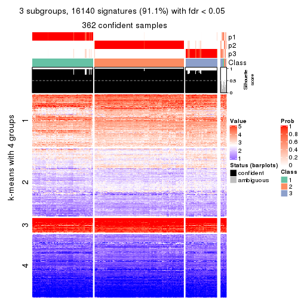</p>

</div>
<div id='tab-ATC-skmeans-get-signatures-no-scale-3'>
<pre><code class="r">get_signatures(res, k = 4, scale_rows = FALSE)
</code></pre>

<p></p>

</div>
<div id='tab-ATC-skmeans-get-signatures-no-scale-4'>
<pre><code class="r">get_signatures(res, k = 5, scale_rows = FALSE)
</code></pre>

<p></p>

</div>
<div id='tab-ATC-skmeans-get-signatures-no-scale-5'>
<pre><code class="r">get_signatures(res, k = 6, scale_rows = FALSE)
</code></pre>

<p></p>

</div>
</div>


Compare the overlap of signatures from different k:

```r
compare_signatures(res)
```


`get_signature()` returns a data frame invisibly. TO get the list of signatures, the function
call should be assigned to a variable explicitly. In following code, if `plot` argument is set
to `FALSE`, no heatmap is plotted while only the differential analysis is performed.

```r
# code only for demonstration
tb = get_signature(res, k = ..., plot = FALSE)
```

An example of the output of `tb` is:

```
#>   which_row         fdr    mean_1    mean_2 scaled_mean_1 scaled_mean_2 km
#> 1        38 0.042760348  8.373488  9.131774    -0.5533452     0.5164555  1
#> 2        40 0.018707592  7.106213  8.469186    -0.6173731     0.5762149  1
#> 3        55 0.019134737 10.221463 11.207825    -0.6159697     0.5749050  1
#> 4        59 0.006059896  5.921854  7.869574    -0.6899429     0.6439467  1
#> 5        60 0.018055526  8.928898 10.211722    -0.6204761     0.5791110  1
#> 6        98 0.009384629 15.714769 14.887706     0.6635654    -0.6193277  2
...
```

The columns in `tb` are:

1. `which_row`: row indices corresponding to the input matrix.
2. `fdr`: FDR for the differential test. 
3. `mean_x`: The mean value in group x.
4. `scaled_mean_x`: The mean value in group x after rows are scaled.
5. `km`: Row groups if k-means clustering is applied to rows.


UMAP plot which shows how samples are separated.


<script>
$( function() {
	$( '#tabs-ATC-skmeans-dimension-reduction' ).tabs();
} );
</script>
<div id='tabs-ATC-skmeans-dimension-reduction'>
<ul>
<li><a href='#tab-ATC-skmeans-dimension-reduction-1'>k = 2</a></li>
<li><a href='#tab-ATC-skmeans-dimension-reduction-2'>k = 3</a></li>
<li><a href='#tab-ATC-skmeans-dimension-reduction-3'>k = 4</a></li>
<li><a href='#tab-ATC-skmeans-dimension-reduction-4'>k = 5</a></li>
<li><a href='#tab-ATC-skmeans-dimension-reduction-5'>k = 6</a></li>
</ul>
<div id='tab-ATC-skmeans-dimension-reduction-1'>
<pre><code class="r">dimension_reduction(res, k = 2, method = &quot;UMAP&quot;)
</code></pre>

<p></p>

</div>
<div id='tab-ATC-skmeans-dimension-reduction-2'>
<pre><code class="r">dimension_reduction(res, k = 3, method = &quot;UMAP&quot;)
</code></pre>

<p></p>

</div>
<div id='tab-ATC-skmeans-dimension-reduction-3'>
<pre><code class="r">dimension_reduction(res, k = 4, method = &quot;UMAP&quot;)
</code></pre>

<p></p>

</div>
<div id='tab-ATC-skmeans-dimension-reduction-4'>
<pre><code class="r">dimension_reduction(res, k = 5, method = &quot;UMAP&quot;)
</code></pre>

<p></p>

</div>
<div id='tab-ATC-skmeans-dimension-reduction-5'>
<pre><code class="r">dimension_reduction(res, k = 6, method = &quot;UMAP&quot;)
</code></pre>

<p></p>

</div>
</div>


Following heatmap shows how subgroups are split when increasing `k`:

```r
collect_classes(res)
```


If matrix rows can be associated to genes, consider to use `GO_Enrichment(res,
...)` to perform function enrichment for the signature genes.


 

---------------------------------------------------


### ATC:pam**


The object with results only for a single top-value method and a single partition method 
can be extracted as:

```r
res = res_list["ATC", "pam"]
# you can also extract it by
# res = res_list["ATC:pam"]
```

A summary of `res` and all the functions that can be applied to it:

```r
res
```

```
#> A 'ConsensusPartition' object with k = 2, 3, 4, 5, 6.
#>   On a matrix with 17723 rows and 374 columns.
#>   Top rows (1000, 2000, 3000, 4000, 5000) are extracted by 'ATC' method.
#>   Subgroups are detected by 'pam' method.
#>   Performed in total 1250 partitions by row resampling.
#>   Best k for subgroups seems to be 3.
#> 
#> Following methods can be applied to this 'ConsensusPartition' object:
#>  [1] "cola_report"             "collect_classes"         "collect_plots"          
#>  [4] "collect_stats"           "colnames"                "compare_signatures"     
#>  [7] "consensus_heatmap"       "dimension_reduction"     "functional_enrichment"  
#> [10] "get_anno_col"            "get_anno"                "get_classes"            
#> [13] "get_consensus"           "get_matrix"              "get_membership"         
#> [16] "get_param"               "get_signatures"          "get_stats"              
#> [19] "is_best_k"               "is_stable_k"             "membership_heatmap"     
#> [22] "ncol"                    "nrow"                    "plot_ecdf"              
#> [25] "rownames"                "select_partition_number" "show"                   
#> [28] "suggest_best_k"          "test_to_known_factors"
```

`collect_plots()` function collects all the plots made from `res` for all `k` (number of partitions)
into one single page to provide an easy and fast comparison between different `k`.

```r
collect_plots(res)
```


The plots are:

- The first row: a plot of the ECDF (Empirical cumulative distribution
  function) curves of the consensus matrix for each `k` and the heatmap of
  predicted classes for each `k`.
- The second row: heatmaps of the consensus matrix for each `k`.
- The third row: heatmaps of the membership matrix for each `k`.
- The fouth row: heatmaps of the signatures for each `k`.

All the plots in panels can be made by individual functions and they are
plotted later in this section.

`select_partition_number()` produces several plots showing different
statistics for choosing "optimized" `k`. There are following statistics:

- ECDF curves of the consensus matrix for each `k`;
- 1-PAC. [The PAC
  score](https://en.wikipedia.org/wiki/Consensus_clustering#Over-interpretation_potential_of_consensus_clustering)
  measures the proportion of the ambiguous subgrouping.
- Mean silhouette score.
- Concordance. The mean probability of fiting the consensus class ids in all
  partitions.
- Area increased. Denote $A_k$ as the area under the ECDF curve for current
  `k`, the area increased is defined as $A_k - A_{k-1}$.
- Rand index. The percent of pairs of samples that are both in a same cluster
  or both are not in a same cluster in the partition of k and k-1.
- Jaccard index. The ratio of pairs of samples are both in a same cluster in
  the partition of k and k-1 and the pairs of samples are both in a same
  cluster in the partition k or k-1.

The detailed explanations of these statistics can be found in [the cola
vignette](http://bioconductor.org/packages/devel/bioc/vignettes/cola/inst/doc/cola.html#toc_13).

Generally speaking, lower PAC score, higher mean silhouette score or higher
concordance corresponds to better partition. Rand index and Jaccard index
measure how similar the current partition is compared to partition with `k-1`.
If they are too similar, we won't accept `k` is better than `k-1`.

```r
select_partition_number(res)
```


The numeric values for all these statistics can be obtained by `get_stats()`.

```r
get_stats(res)
```

```
#>   k 1-PAC mean_silhouette concordance area_increased  Rand Jaccard
#> 2 2 1.000           0.977       0.990         0.4247 0.573   0.573
#> 3 3 0.986           0.945       0.979         0.4443 0.772   0.616
#> 4 4 0.893           0.890       0.953         0.2139 0.862   0.648
#> 5 5 0.830           0.802       0.915         0.0420 0.957   0.835
#> 6 6 0.836           0.786       0.884         0.0325 0.951   0.792
```

`suggest_best_k()` suggests the best $k$ based on these statistics. The rules are as follows:

- All $k$ with Jaccard index larger than 0.95 are removed because the increase of
  the partition number does not provides enough extra information. If all $k$ are removed,
  the best $k$ is assigned by `NA`.
- For $k$ with 1-PAC larger than 0.9, the maximal $k$ is taken as the "best k". Other $k$ is called "optional k".
- If it does not fit the second rule. The $k$ with the highest vote of highest
  1-PAC, mean silhouette and concordance is taken as the "best k".

```r
suggest_best_k(res)
```

```
#> [1] 3
#> attr(,"optional")
#> [1] 2
```

There is also optional best $k$ = 2 that is worth to check.

Following shows the table of the partitions (You need to click the **show/hide
code output** link to see it). The membership matrix (columns with name `p*`)
is inferred by
[`clue::cl_consensus()`](https://www.rdocumentation.org/link/cl_consensus?package=clue)
function with the `SE` method. Basically the value in the membership matrix
represents the probability to belong to a certain group. The finall class
label for an item is determined with the group with highest probability it
belongs to.

In `get_classes()` function, the entropy is calculated from the membership
matrix and the silhouette score is calculated from the consensus matrix.


<script>
$( function() {
	$( '#tabs-ATC-pam-get-classes' ).tabs();
} );
</script>
<div id='tabs-ATC-pam-get-classes'>
<ul>
<li><a href='#tab-ATC-pam-get-classes-1'>k = 2</a></li>
<li><a href='#tab-ATC-pam-get-classes-2'>k = 3</a></li>
<li><a href='#tab-ATC-pam-get-classes-3'>k = 4</a></li>
<li><a href='#tab-ATC-pam-get-classes-4'>k = 5</a></li>
<li><a href='#tab-ATC-pam-get-classes-5'>k = 6</a></li>
</ul>

<div id='tab-ATC-pam-get-classes-1'>
<p><a id='tab-ATC-pam-get-classes-1-a' style='color:#0366d6' href='#'>show/hide code output</a></p>
<pre><code class="r">cbind(get_classes(res, k = 2), get_membership(res, k = 2))
</code></pre>

<pre><code>#&gt;            class entropy silhouette    p1    p2
#&gt; SRR660824      2  0.0000      0.995 0.000 1.000
#&gt; SRR603858      1  0.9522      0.436 0.628 0.372
#&gt; SRR817070      2  0.0000      0.995 0.000 1.000
#&gt; SRR1486995     2  0.0000      0.995 0.000 1.000
#&gt; SRR813043      2  0.0000      0.995 0.000 1.000
#&gt; SRR656874      2  0.0000      0.995 0.000 1.000
#&gt; SRR659037      2  0.0000      0.995 0.000 1.000
#&gt; SRR662031      1  0.0000      0.978 1.000 0.000
#&gt; SRR1081283     2  0.0000      0.995 0.000 1.000
#&gt; SRR1481036     2  0.0000      0.995 0.000 1.000
#&gt; SRR1434009     2  0.0000      0.995 0.000 1.000
#&gt; SRR1376676     1  0.0000      0.978 1.000 0.000
#&gt; SRR1396967     2  0.0000      0.995 0.000 1.000
#&gt; SRR665429      2  0.0000      0.995 0.000 1.000
#&gt; SRR1388025     2  0.0000      0.995 0.000 1.000
#&gt; SRR600784      2  0.1843      0.967 0.028 0.972
#&gt; SRR657611      1  0.0000      0.978 1.000 0.000
#&gt; SRR1333659     1  0.6343      0.811 0.840 0.160
#&gt; SRR1323896     2  0.0000      0.995 0.000 1.000
#&gt; SRR1453971     1  0.0000      0.978 1.000 0.000
#&gt; SRR1421010     1  0.0000      0.978 1.000 0.000
#&gt; SRR1334490     2  0.0938      0.983 0.012 0.988
#&gt; SRR1309468     1  0.0000      0.978 1.000 0.000
#&gt; SRR1468637     1  0.0000      0.978 1.000 0.000
#&gt; SRR1365489     2  0.0000      0.995 0.000 1.000
#&gt; SRR627445      2  0.0000      0.995 0.000 1.000
#&gt; SRR607863      2  0.0000      0.995 0.000 1.000
#&gt; SRR1475524     1  0.0000      0.978 1.000 0.000
#&gt; SRR1405504     2  0.0000      0.995 0.000 1.000
#&gt; SRR615695      1  0.0000      0.978 1.000 0.000
#&gt; SRR600900      2  0.0000      0.995 0.000 1.000
#&gt; SRR601477      2  0.0000      0.995 0.000 1.000
#&gt; SRR1487215     2  0.0000      0.995 0.000 1.000
#&gt; SRR1310797     2  0.0000      0.995 0.000 1.000
#&gt; SRR1362713     1  0.0000      0.978 1.000 0.000
#&gt; SRR1431385     1  0.0000      0.978 1.000 0.000
#&gt; SRR1379089     2  0.0000      0.995 0.000 1.000
#&gt; SRR1102079     2  0.0000      0.995 0.000 1.000
#&gt; SRR1357210     1  0.0000      0.978 1.000 0.000
#&gt; SRR657659      2  0.0000      0.995 0.000 1.000
#&gt; SRR663573      2  0.0000      0.995 0.000 1.000
#&gt; SRR603188      2  0.0000      0.995 0.000 1.000
#&gt; SRR1471200     2  0.0000      0.995 0.000 1.000
#&gt; SRR1310975     2  0.0000      0.995 0.000 1.000
#&gt; SRR627457      1  0.0000      0.978 1.000 0.000
#&gt; SRR1367654     2  0.0000      0.995 0.000 1.000
#&gt; SRR1488410     1  0.0000      0.978 1.000 0.000
#&gt; SRR1457750     1  0.0000      0.978 1.000 0.000
#&gt; SRR1099546     1  0.0000      0.978 1.000 0.000
#&gt; SRR604480      2  0.0000      0.995 0.000 1.000
#&gt; SRR1390477     2  0.0000      0.995 0.000 1.000
#&gt; SRR1458447     2  0.0000      0.995 0.000 1.000
#&gt; SRR1473161     2  0.0000      0.995 0.000 1.000
#&gt; SRR1409813     2  0.0000      0.995 0.000 1.000
#&gt; SRR612791      1  0.0000      0.978 1.000 0.000
#&gt; SRR1470580     2  0.0000      0.995 0.000 1.000
#&gt; SRR1444063     1  0.0000      0.978 1.000 0.000
#&gt; SRR1355578     1  0.0000      0.978 1.000 0.000
#&gt; SRR1429203     1  0.0000      0.978 1.000 0.000
#&gt; SRR599154      2  0.0000      0.995 0.000 1.000
#&gt; SRR814244      1  0.0000      0.978 1.000 0.000
#&gt; SRR1404123     2  0.0000      0.995 0.000 1.000
#&gt; SRR656934      2  0.0000      0.995 0.000 1.000
#&gt; SRR1339029     2  0.0000      0.995 0.000 1.000
#&gt; SRR821525      2  0.0000      0.995 0.000 1.000
#&gt; SRR1443677     1  0.0000      0.978 1.000 0.000
#&gt; SRR1406330     1  0.0000      0.978 1.000 0.000
#&gt; SRR1338124     2  0.0000      0.995 0.000 1.000
#&gt; SRR1391376     2  0.0000      0.995 0.000 1.000
#&gt; SRR661842      2  0.0000      0.995 0.000 1.000
#&gt; SRR1395699     2  0.0000      0.995 0.000 1.000
#&gt; SRR1312209     1  0.0000      0.978 1.000 0.000
#&gt; SRR1359469     1  0.0000      0.978 1.000 0.000
#&gt; SRR658885      2  0.0000      0.995 0.000 1.000
#&gt; SRR1414578     1  0.0000      0.978 1.000 0.000
#&gt; SRR603620      2  0.0000      0.995 0.000 1.000
#&gt; SRR604677      1  0.0376      0.974 0.996 0.004
#&gt; SRR603800      2  0.0000      0.995 0.000 1.000
#&gt; SRR602058      2  0.0000      0.995 0.000 1.000
#&gt; SRR817488      2  0.0000      0.995 0.000 1.000
#&gt; SRR655601      2  0.0000      0.995 0.000 1.000
#&gt; SRR1434821     2  0.0000      0.995 0.000 1.000
#&gt; SRR1349166     2  0.0000      0.995 0.000 1.000
#&gt; SRR615129      1  0.0000      0.978 1.000 0.000
#&gt; SRR607586      2  0.0000      0.995 0.000 1.000
#&gt; SRR602680      2  0.0000      0.995 0.000 1.000
#&gt; SRR1411070     2  0.0000      0.995 0.000 1.000
#&gt; SRR663038      2  0.0000      0.995 0.000 1.000
#&gt; SRR1489416     2  0.0000      0.995 0.000 1.000
#&gt; SRR1479155     1  0.0000      0.978 1.000 0.000
#&gt; SRR662162      1  0.0000      0.978 1.000 0.000
#&gt; SRR1374567     1  0.3114      0.928 0.944 0.056
#&gt; SRR1434048     2  0.0000      0.995 0.000 1.000
#&gt; SRR2184865     2  0.0000      0.995 0.000 1.000
#&gt; SRR2170135     1  0.0000      0.978 1.000 0.000
#&gt; SRR615551      2  0.0000      0.995 0.000 1.000
#&gt; SRR1335513     2  0.0000      0.995 0.000 1.000
#&gt; SRR1370216     2  0.4431      0.894 0.092 0.908
#&gt; SRR662954      2  0.8608      0.594 0.284 0.716
#&gt; SRR1375738     2  0.0000      0.995 0.000 1.000
#&gt; SRR1356577     2  0.0000      0.995 0.000 1.000
#&gt; SRR1073119     1  0.0000      0.978 1.000 0.000
#&gt; SRR663549      2  0.0000      0.995 0.000 1.000
#&gt; SRR1478015     2  0.0000      0.995 0.000 1.000
#&gt; SRR600632      2  0.0000      0.995 0.000 1.000
#&gt; SRR811866      2  0.0000      0.995 0.000 1.000
#&gt; SRR1401101     2  0.0000      0.995 0.000 1.000
#&gt; SRR1477797     2  0.0000      0.995 0.000 1.000
#&gt; SRR1402986     2  0.0000      0.995 0.000 1.000
#&gt; SRR658897      1  0.0000      0.978 1.000 0.000
#&gt; SRR1419869     1  0.0000      0.978 1.000 0.000
#&gt; SRR1490700     1  0.0000      0.978 1.000 0.000
#&gt; SRR601723      2  0.0000      0.995 0.000 1.000
#&gt; SRR1384115     2  0.0000      0.995 0.000 1.000
#&gt; SRR1476927     2  0.0000      0.995 0.000 1.000
#&gt; SRR1387769     2  0.0000      0.995 0.000 1.000
#&gt; SRR1322595     1  0.0000      0.978 1.000 0.000
#&gt; SRR1370423     2  0.0000      0.995 0.000 1.000
#&gt; SRR1314976     2  0.0000      0.995 0.000 1.000
#&gt; SRR1319560     2  0.0000      0.995 0.000 1.000
#&gt; SRR1352683     2  0.0000      0.995 0.000 1.000
#&gt; SRR1473800     1  0.0000      0.978 1.000 0.000
#&gt; SRR1326384     2  0.0000      0.995 0.000 1.000
#&gt; SRR1360807     2  0.0000      0.995 0.000 1.000
#&gt; SRR1332544     1  0.0000      0.978 1.000 0.000
#&gt; SRR598695      1  0.0000      0.978 1.000 0.000
#&gt; SRR807824      2  0.0000      0.995 0.000 1.000
#&gt; SRR809296      2  0.0000      0.995 0.000 1.000
#&gt; SRR657927      2  0.0000      0.995 0.000 1.000
#&gt; SRR1440682     2  0.0000      0.995 0.000 1.000
#&gt; SRR1454415     2  0.0000      0.995 0.000 1.000
#&gt; SRR1419131     2  0.0000      0.995 0.000 1.000
#&gt; SRR1404293     1  0.0000      0.978 1.000 0.000
#&gt; SRR1473340     1  0.8386      0.652 0.732 0.268
#&gt; SRR1345563     1  0.0000      0.978 1.000 0.000
#&gt; SRR1323382     2  0.0000      0.995 0.000 1.000
#&gt; SRR1480697     2  0.0000      0.995 0.000 1.000
#&gt; SRR1321808     2  0.0000      0.995 0.000 1.000
#&gt; SRR1382756     2  0.0000      0.995 0.000 1.000
#&gt; SRR1312558     2  0.0000      0.995 0.000 1.000
#&gt; SRR1417088     2  0.0000      0.995 0.000 1.000
#&gt; SRR1433027     2  0.0000      0.995 0.000 1.000
#&gt; SRR662257      2  0.0000      0.995 0.000 1.000
#&gt; SRR600417      2  0.0000      0.995 0.000 1.000
#&gt; SRR812493      2  0.0000      0.995 0.000 1.000
#&gt; SRR612743      2  0.0000      0.995 0.000 1.000
#&gt; SRR1361345     1  0.0000      0.978 1.000 0.000
#&gt; SRR600584      2  0.0000      0.995 0.000 1.000
#&gt; SRR1310520     2  0.0000      0.995 0.000 1.000
#&gt; SRR1395595     2  0.0000      0.995 0.000 1.000
#&gt; SRR1334074     2  0.0000      0.995 0.000 1.000
#&gt; SRR654838      2  0.0000      0.995 0.000 1.000
#&gt; SRR1376694     1  0.0000      0.978 1.000 0.000
#&gt; SRR1433841     1  0.0000      0.978 1.000 0.000
#&gt; SRR1366837     2  0.0000      0.995 0.000 1.000
#&gt; SRR1467479     2  0.0000      0.995 0.000 1.000
#&gt; SRR1459055     1  0.0000      0.978 1.000 0.000
#&gt; SRR1471050     2  0.0000      0.995 0.000 1.000
#&gt; SRR603004      2  0.0000      0.995 0.000 1.000
#&gt; SRR814703      2  0.0000      0.995 0.000 1.000
#&gt; SRR661937      2  0.0000      0.995 0.000 1.000
#&gt; SRR614359      1  0.0000      0.978 1.000 0.000
#&gt; SRR1071568     2  0.0000      0.995 0.000 1.000
#&gt; SRR1389084     2  0.0000      0.995 0.000 1.000
#&gt; SRR1337624     2  0.0000      0.995 0.000 1.000
#&gt; SRR1344400     2  0.0000      0.995 0.000 1.000
#&gt; SRR1414290     2  0.0000      0.995 0.000 1.000
#&gt; SRR1413644     2  0.0000      0.995 0.000 1.000
#&gt; SRR1098998     1  0.0000      0.978 1.000 0.000
#&gt; SRR1481279     1  0.0000      0.978 1.000 0.000
#&gt; SRR1315103     1  0.0000      0.978 1.000 0.000
#&gt; SRR1099286     1  0.0000      0.978 1.000 0.000
#&gt; SRR2166570     2  0.0000      0.995 0.000 1.000
#&gt; SRR601445      1  0.0000      0.978 1.000 0.000
#&gt; SRR1439719     2  0.0000      0.995 0.000 1.000
#&gt; SRR1377026     2  0.0000      0.995 0.000 1.000
#&gt; SRR1327386     1  0.0000      0.978 1.000 0.000
#&gt; SRR654826      2  0.0000      0.995 0.000 1.000
#&gt; SRR1460433     2  0.0000      0.995 0.000 1.000
#&gt; SRR1469345     1  0.0000      0.978 1.000 0.000
#&gt; SRR1421462     2  0.0000      0.995 0.000 1.000
#&gt; SRR662966      1  0.0000      0.978 1.000 0.000
#&gt; SRR1339175     1  0.0000      0.978 1.000 0.000
#&gt; SRR1447736     2  0.0000      0.995 0.000 1.000
#&gt; SRR1434671     2  0.0000      0.995 0.000 1.000
#&gt; SRR660800      2  0.0000      0.995 0.000 1.000
#&gt; SRR1465543     2  0.0000      0.995 0.000 1.000
#&gt; SRR1342023     1  0.0000      0.978 1.000 0.000
#&gt; SRR1335670     1  0.0000      0.978 1.000 0.000
#&gt; SRR1400955     2  0.0000      0.995 0.000 1.000
#&gt; SRR1072150     2  0.0000      0.995 0.000 1.000
#&gt; SRR1442822     1  0.0000      0.978 1.000 0.000
#&gt; SRR1364658     1  0.0000      0.978 1.000 0.000
#&gt; SRR1098074     2  0.0000      0.995 0.000 1.000
#&gt; SRR1442778     1  0.0000      0.978 1.000 0.000
#&gt; SRR1086728     2  0.0000      0.995 0.000 1.000
#&gt; SRR627464      1  0.8144      0.680 0.748 0.252
#&gt; SRR1409193     1  0.0000      0.978 1.000 0.000
#&gt; SRR2168286     2  0.0000      0.995 0.000 1.000
#&gt; SRR615539      2  0.0000      0.995 0.000 1.000
#&gt; SRR663623      2  0.0000      0.995 0.000 1.000
#&gt; SRR1471989     2  0.0000      0.995 0.000 1.000
#&gt; SRR1468828     2  0.0000      0.995 0.000 1.000
#&gt; SRR1381934     2  0.0000      0.995 0.000 1.000
#&gt; SRR1471098     2  0.0000      0.995 0.000 1.000
#&gt; SRR1314749     1  0.7453      0.743 0.788 0.212
#&gt; SRR2166874     2  0.0000      0.995 0.000 1.000
#&gt; SRR821302      1  0.0000      0.978 1.000 0.000
#&gt; SRR1435066     2  0.0000      0.995 0.000 1.000
#&gt; SRR661601      2  0.0000      0.995 0.000 1.000
#&gt; SRR1446546     2  0.0000      0.995 0.000 1.000
#&gt; SRR1419784     2  0.0000      0.995 0.000 1.000
#&gt; SRR1357233     2  0.0000      0.995 0.000 1.000
#&gt; SRR1441889     1  0.0000      0.978 1.000 0.000
#&gt; SRR1413940     1  0.0000      0.978 1.000 0.000
#&gt; SRR1324250     2  0.0000      0.995 0.000 1.000
#&gt; SRR1442862     2  0.0000      0.995 0.000 1.000
#&gt; SRR662474      2  0.0000      0.995 0.000 1.000
#&gt; SRR1416226     2  0.0000      0.995 0.000 1.000
#&gt; SRR1417404     2  0.0000      0.995 0.000 1.000
#&gt; SRR665466      2  0.0000      0.995 0.000 1.000
#&gt; SRR658849      2  0.0000      0.995 0.000 1.000
#&gt; SRR1460025     2  0.0000      0.995 0.000 1.000
#&gt; SRR1408136     1  0.0000      0.978 1.000 0.000
#&gt; SRR1489995     2  0.0000      0.995 0.000 1.000
#&gt; SRR1374092     2  0.0000      0.995 0.000 1.000
#&gt; SRR1488429     2  0.0000      0.995 0.000 1.000
#&gt; SRR1087559     1  0.0000      0.978 1.000 0.000
#&gt; SRR817004      1  0.0000      0.978 1.000 0.000
#&gt; SRR1429660     2  0.0000      0.995 0.000 1.000
#&gt; SRR604390      2  0.0000      0.995 0.000 1.000
#&gt; SRR614936      2  0.0000      0.995 0.000 1.000
#&gt; SRR1365938     1  0.0000      0.978 1.000 0.000
#&gt; SRR1437324     1  0.0000      0.978 1.000 0.000
#&gt; SRR613414      2  0.0000      0.995 0.000 1.000
#&gt; SRR660414      2  0.0000      0.995 0.000 1.000
#&gt; SRR1452185     1  0.0000      0.978 1.000 0.000
#&gt; SRR1347020     1  0.7602      0.731 0.780 0.220
#&gt; SRR1398036     2  0.0000      0.995 0.000 1.000
#&gt; SRR1436674     1  0.0000      0.978 1.000 0.000
#&gt; SRR603750      2  0.0000      0.995 0.000 1.000
#&gt; SRR608630      2  0.0000      0.995 0.000 1.000
#&gt; SRR655625      2  0.0000      0.995 0.000 1.000
#&gt; SRR599059      2  0.0000      0.995 0.000 1.000
#&gt; SRR615189      1  0.2236      0.947 0.964 0.036
#&gt; SRR1466889     2  0.0000      0.995 0.000 1.000
#&gt; SRR1084602     2  0.0000      0.995 0.000 1.000
#&gt; SRR1335422     1  0.0000      0.978 1.000 0.000
#&gt; SRR1356805     2  0.0000      0.995 0.000 1.000
#&gt; SRR1385300     2  0.9491      0.395 0.368 0.632
#&gt; SRR654814      1  0.0000      0.978 1.000 0.000
#&gt; SRR658385      2  0.0000      0.995 0.000 1.000
#&gt; SRR820596      1  0.0000      0.978 1.000 0.000
#&gt; SRR1318118     1  0.0000      0.978 1.000 0.000
#&gt; SRR1480766     2  0.0000      0.995 0.000 1.000
#&gt; SRR1406539     1  0.0000      0.978 1.000 0.000
#&gt; SRR1341833     2  0.0000      0.995 0.000 1.000
#&gt; SRR1441826     2  0.0000      0.995 0.000 1.000
#&gt; SRR1448051     1  0.0000      0.978 1.000 0.000
#&gt; SRR1326752     2  0.0000      0.995 0.000 1.000
#&gt; SRR665217      2  0.0000      0.995 0.000 1.000
#&gt; SRR819186      2  0.0000      0.995 0.000 1.000
#&gt; SRR661517      2  0.0000      0.995 0.000 1.000
#&gt; SRR607166      2  0.0000      0.995 0.000 1.000
#&gt; SRR809065      2  0.0000      0.995 0.000 1.000
#&gt; SRR1415872     2  0.0000      0.995 0.000 1.000
#&gt; SRR1415463     2  0.0000      0.995 0.000 1.000
#&gt; SRR1381161     2  0.0000      0.995 0.000 1.000
#&gt; SRR1442231     1  0.9710      0.351 0.600 0.400
#&gt; SRR1374696     1  0.0000      0.978 1.000 0.000
#&gt; SRR1451988     2  0.0000      0.995 0.000 1.000
#&gt; SRR660555      1  0.0000      0.978 1.000 0.000
#&gt; SRR657801      1  0.0000      0.978 1.000 0.000
#&gt; SRR663344      2  0.0000      0.995 0.000 1.000
#&gt; SRR1472462     2  0.0000      0.995 0.000 1.000
#&gt; SRR1406176     2  0.0000      0.995 0.000 1.000
#&gt; SRR656886      2  0.0000      0.995 0.000 1.000
#&gt; SRR1498337     2  0.0000      0.995 0.000 1.000
#&gt; SRR613066      1  0.0376      0.974 0.996 0.004
#&gt; SRR1309490     1  0.0000      0.978 1.000 0.000
#&gt; SRR602492      2  0.0000      0.995 0.000 1.000
#&gt; SRR1447347     1  0.0000      0.978 1.000 0.000
#&gt; SRR1475546     2  0.0000      0.995 0.000 1.000
#&gt; SRR627459      2  0.0000      0.995 0.000 1.000
#&gt; SRR1434332     2  0.0000      0.995 0.000 1.000
#&gt; SRR1070358     2  0.0000      0.995 0.000 1.000
#&gt; SRR1345936     2  0.0000      0.995 0.000 1.000
#&gt; SRR665658      2  0.0000      0.995 0.000 1.000
#&gt; SRR1321351     2  0.0000      0.995 0.000 1.000
#&gt; SRR657880      2  0.0000      0.995 0.000 1.000
#&gt; SRR1373903     2  0.0000      0.995 0.000 1.000
#&gt; SRR657396      2  0.0000      0.995 0.000 1.000
#&gt; SRR660981      2  0.0000      0.995 0.000 1.000
#&gt; SRR818499      1  0.0000      0.978 1.000 0.000
#&gt; SRR819658      2  0.0000      0.995 0.000 1.000
#&gt; SRR1376316     1  0.0000      0.978 1.000 0.000
#&gt; SRR1323723     2  0.0000      0.995 0.000 1.000
#&gt; SRR1476719     1  0.0000      0.978 1.000 0.000
#&gt; SRR1403478     2  0.0000      0.995 0.000 1.000
#&gt; SRR1095695     2  0.0000      0.995 0.000 1.000
#&gt; SRR1352391     1  0.7453      0.743 0.788 0.212
#&gt; SRR1498813     2  0.0000      0.995 0.000 1.000
#&gt; SRR627437      2  0.0000      0.995 0.000 1.000
#&gt; SRR2185097     1  0.0000      0.978 1.000 0.000
#&gt; SRR817166      2  0.0000      0.995 0.000 1.000
#&gt; SRR1091670     2  0.0000      0.995 0.000 1.000
#&gt; SRR603776      2  0.0000      0.995 0.000 1.000
#&gt; SRR1479640     2  0.0000      0.995 0.000 1.000
#&gt; SRR660152      1  0.0000      0.978 1.000 0.000
#&gt; SRR1074769     2  0.0000      0.995 0.000 1.000
#&gt; SRR656153      2  0.0000      0.995 0.000 1.000
#&gt; SRR1392502     2  0.0000      0.995 0.000 1.000
#&gt; SRR1359609     1  0.0000      0.978 1.000 0.000
#&gt; SRR601925      2  0.0000      0.995 0.000 1.000
#&gt; SRR2165182     2  0.0000      0.995 0.000 1.000
#&gt; SRR608542      2  0.0000      0.995 0.000 1.000
#&gt; SRR655064      2  0.0000      0.995 0.000 1.000
#&gt; SRR1432430     2  0.0000      0.995 0.000 1.000
#&gt; SRR808472      2  0.0000      0.995 0.000 1.000
#&gt; SRR1414958     2  0.0000      0.995 0.000 1.000
#&gt; SRR598484      2  0.0000      0.995 0.000 1.000
#&gt; SRR612755      2  0.0000      0.995 0.000 1.000
#&gt; SRR1365808     1  0.0000      0.978 1.000 0.000
#&gt; SRR1391724     2  0.0000      0.995 0.000 1.000
#&gt; SRR1322373     2  0.0000      0.995 0.000 1.000
#&gt; SRR1489265     2  0.0000      0.995 0.000 1.000
#&gt; SRR1359099     2  0.0000      0.995 0.000 1.000
#&gt; SRR607279      2  0.0000      0.995 0.000 1.000
#&gt; SRR810461      2  0.0000      0.995 0.000 1.000
#&gt; SRR627427      1  0.0000      0.978 1.000 0.000
#&gt; SRR612887      2  0.0000      0.995 0.000 1.000
#&gt; SRR809807      2  0.0000      0.995 0.000 1.000
#&gt; SRR663112      2  0.0000      0.995 0.000 1.000
#&gt; SRR1346933     1  0.0000      0.978 1.000 0.000
#&gt; SRR1487910     1  0.0000      0.978 1.000 0.000
#&gt; SRR603092      2  0.0000      0.995 0.000 1.000
#&gt; SRR1417680     2  0.0000      0.995 0.000 1.000
#&gt; SRR1383785     1  0.0000      0.978 1.000 0.000
#&gt; SRR1070015     2  0.0000      0.995 0.000 1.000
#&gt; SRR1466222     2  0.0000      0.995 0.000 1.000
#&gt; SRR1416119     2  0.0000      0.995 0.000 1.000
#&gt; SRR819318      1  0.4022      0.904 0.920 0.080
#&gt; SRR608288      2  0.0000      0.995 0.000 1.000
#&gt; SRR811121      2  0.0000      0.995 0.000 1.000
#&gt; SRR613138      2  0.0000      0.995 0.000 1.000
#&gt; SRR810483      2  0.0000      0.995 0.000 1.000
#&gt; SRR607839      1  0.0000      0.978 1.000 0.000
#&gt; SRR1337031     1  0.0000      0.978 1.000 0.000
#&gt; SRR601311      2  0.0000      0.995 0.000 1.000
#&gt; SRR1406685     2  0.0000      0.995 0.000 1.000
#&gt; SRR1467500     2  0.0000      0.995 0.000 1.000
#&gt; SRR1308504     1  0.0000      0.978 1.000 0.000
#&gt; SRR1312865     2  0.0000      0.995 0.000 1.000
#&gt; SRR1312522     2  0.2778      0.945 0.048 0.952
#&gt; SRR1490486     2  0.0000      0.995 0.000 1.000
#&gt; SRR1325888     2  0.0000      0.995 0.000 1.000
#&gt; SRR1472885     1  0.0000      0.978 1.000 0.000
#&gt; SRR1098785     2  0.0000      0.995 0.000 1.000
#&gt; SRR1084766     2  0.0000      0.995 0.000 1.000
#&gt; SRR1102804     2  0.0000      0.995 0.000 1.000
#&gt; SRR1336636     1  0.8016      0.693 0.756 0.244
#&gt; SRR1347795     1  0.0000      0.978 1.000 0.000
#&gt; SRR601900      2  0.0000      0.995 0.000 1.000
#&gt; SRR1330989     2  0.0000      0.995 0.000 1.000
#&gt; SRR658445      2  0.0000      0.995 0.000 1.000
#&gt; SRR1368754     1  0.0000      0.978 1.000 0.000
#&gt; SRR1460001     2  0.0000      0.995 0.000 1.000
#&gt; SRR1414934     1  0.0000      0.978 1.000 0.000
#&gt; SRR1326249     2  0.0000      0.995 0.000 1.000
#&gt; SRR614948      1  0.0000      0.978 1.000 0.000
#&gt; SRR1472952     2  0.0000      0.995 0.000 1.000
#&gt; SRR1321528     1  0.0000      0.978 1.000 0.000
#&gt; SRR627447      2  0.9358      0.437 0.352 0.648
#&gt; SRR612239      2  0.0000      0.995 0.000 1.000
</code></pre>

<script>
$('#tab-ATC-pam-get-classes-1-a').parent().next().next().hide();
$('#tab-ATC-pam-get-classes-1-a').click(function(){
  $('#tab-ATC-pam-get-classes-1-a').parent().next().next().toggle();
  return(false);
});
</script>
</div>

<div id='tab-ATC-pam-get-classes-2'>
<p><a id='tab-ATC-pam-get-classes-2-a' style='color:#0366d6' href='#'>show/hide code output</a></p>
<pre><code class="r">cbind(get_classes(res, k = 3), get_membership(res, k = 3))
</code></pre>

<pre><code>#&gt;            class entropy silhouette    p1    p2    p3
#&gt; SRR660824      3  0.0000     0.9495 0.000 0.000 1.000
#&gt; SRR603858      3  0.0892     0.9313 0.000 0.020 0.980
#&gt; SRR817070      2  0.0000     0.9810 0.000 1.000 0.000
#&gt; SRR1486995     3  0.0000     0.9495 0.000 0.000 1.000
#&gt; SRR813043      2  0.0000     0.9810 0.000 1.000 0.000
#&gt; SRR656874      2  0.0000     0.9810 0.000 1.000 0.000
#&gt; SRR659037      2  0.0000     0.9810 0.000 1.000 0.000
#&gt; SRR662031      1  0.0000     0.9890 1.000 0.000 0.000
#&gt; SRR1081283     2  0.0000     0.9810 0.000 1.000 0.000
#&gt; SRR1481036     3  0.4555     0.7376 0.000 0.200 0.800
#&gt; SRR1434009     2  0.0000     0.9810 0.000 1.000 0.000
#&gt; SRR1376676     1  0.0000     0.9890 1.000 0.000 0.000
#&gt; SRR1396967     2  0.0000     0.9810 0.000 1.000 0.000
#&gt; SRR665429      2  0.0000     0.9810 0.000 1.000 0.000
#&gt; SRR1388025     2  0.0000     0.9810 0.000 1.000 0.000
#&gt; SRR600784      3  0.0000     0.9495 0.000 0.000 1.000
#&gt; SRR657611      1  0.0000     0.9890 1.000 0.000 0.000
#&gt; SRR1333659     1  0.0661     0.9780 0.988 0.008 0.004
#&gt; SRR1323896     2  0.0000     0.9810 0.000 1.000 0.000
#&gt; SRR1453971     1  0.0000     0.9890 1.000 0.000 0.000
#&gt; SRR1421010     1  0.0000     0.9890 1.000 0.000 0.000
#&gt; SRR1334490     3  0.0000     0.9495 0.000 0.000 1.000
#&gt; SRR1309468     1  0.0000     0.9890 1.000 0.000 0.000
#&gt; SRR1468637     1  0.0000     0.9890 1.000 0.000 0.000
#&gt; SRR1365489     2  0.0000     0.9810 0.000 1.000 0.000
#&gt; SRR627445      3  0.0000     0.9495 0.000 0.000 1.000
#&gt; SRR607863      2  0.0000     0.9810 0.000 1.000 0.000
#&gt; SRR1475524     1  0.0000     0.9890 1.000 0.000 0.000
#&gt; SRR1405504     2  0.0000     0.9810 0.000 1.000 0.000
#&gt; SRR615695      1  0.0000     0.9890 1.000 0.000 0.000
#&gt; SRR600900      2  0.0000     0.9810 0.000 1.000 0.000
#&gt; SRR601477      2  0.0000     0.9810 0.000 1.000 0.000
#&gt; SRR1487215     2  0.0000     0.9810 0.000 1.000 0.000
#&gt; SRR1310797     2  0.0000     0.9810 0.000 1.000 0.000
#&gt; SRR1362713     1  0.0000     0.9890 1.000 0.000 0.000
#&gt; SRR1431385     1  0.0000     0.9890 1.000 0.000 0.000
#&gt; SRR1379089     2  0.0000     0.9810 0.000 1.000 0.000
#&gt; SRR1102079     3  0.0000     0.9495 0.000 0.000 1.000
#&gt; SRR1357210     1  0.0000     0.9890 1.000 0.000 0.000
#&gt; SRR657659      2  0.0000     0.9810 0.000 1.000 0.000
#&gt; SRR663573      2  0.0000     0.9810 0.000 1.000 0.000
#&gt; SRR603188      2  0.0000     0.9810 0.000 1.000 0.000
#&gt; SRR1471200     2  0.0000     0.9810 0.000 1.000 0.000
#&gt; SRR1310975     2  0.0000     0.9810 0.000 1.000 0.000
#&gt; SRR627457      1  0.0000     0.9890 1.000 0.000 0.000
#&gt; SRR1367654     2  0.0000     0.9810 0.000 1.000 0.000
#&gt; SRR1488410     1  0.0000     0.9890 1.000 0.000 0.000
#&gt; SRR1457750     1  0.0000     0.9890 1.000 0.000 0.000
#&gt; SRR1099546     1  0.0000     0.9890 1.000 0.000 0.000
#&gt; SRR604480      2  0.0000     0.9810 0.000 1.000 0.000
#&gt; SRR1390477     2  0.0000     0.9810 0.000 1.000 0.000
#&gt; SRR1458447     2  0.0000     0.9810 0.000 1.000 0.000
#&gt; SRR1473161     2  0.0000     0.9810 0.000 1.000 0.000
#&gt; SRR1409813     2  0.0000     0.9810 0.000 1.000 0.000
#&gt; SRR612791      1  0.0000     0.9890 1.000 0.000 0.000
#&gt; SRR1470580     3  0.1031     0.9278 0.000 0.024 0.976
#&gt; SRR1444063     1  0.0000     0.9890 1.000 0.000 0.000
#&gt; SRR1355578     1  0.0000     0.9890 1.000 0.000 0.000
#&gt; SRR1429203     1  0.0000     0.9890 1.000 0.000 0.000
#&gt; SRR599154      2  0.0000     0.9810 0.000 1.000 0.000
#&gt; SRR814244      1  0.0000     0.9890 1.000 0.000 0.000
#&gt; SRR1404123     2  0.0000     0.9810 0.000 1.000 0.000
#&gt; SRR656934      3  0.4555     0.7376 0.000 0.200 0.800
#&gt; SRR1339029     2  0.0000     0.9810 0.000 1.000 0.000
#&gt; SRR821525      2  0.0000     0.9810 0.000 1.000 0.000
#&gt; SRR1443677     1  0.0000     0.9890 1.000 0.000 0.000
#&gt; SRR1406330     1  0.0000     0.9890 1.000 0.000 0.000
#&gt; SRR1338124     3  0.0237     0.9460 0.000 0.004 0.996
#&gt; SRR1391376     3  0.0000     0.9495 0.000 0.000 1.000
#&gt; SRR661842      2  0.0000     0.9810 0.000 1.000 0.000
#&gt; SRR1395699     3  0.0000     0.9495 0.000 0.000 1.000
#&gt; SRR1312209     1  0.0000     0.9890 1.000 0.000 0.000
#&gt; SRR1359469     1  0.0000     0.9890 1.000 0.000 0.000
#&gt; SRR658885      3  0.0000     0.9495 0.000 0.000 1.000
#&gt; SRR1414578     1  0.0000     0.9890 1.000 0.000 0.000
#&gt; SRR603620      2  0.0000     0.9810 0.000 1.000 0.000
#&gt; SRR604677      3  0.0000     0.9495 0.000 0.000 1.000
#&gt; SRR603800      2  0.0000     0.9810 0.000 1.000 0.000
#&gt; SRR602058      2  0.0000     0.9810 0.000 1.000 0.000
#&gt; SRR817488      2  0.0000     0.9810 0.000 1.000 0.000
#&gt; SRR655601      2  0.0000     0.9810 0.000 1.000 0.000
#&gt; SRR1434821     2  0.0000     0.9810 0.000 1.000 0.000
#&gt; SRR1349166     2  0.0000     0.9810 0.000 1.000 0.000
#&gt; SRR615129      1  0.0000     0.9890 1.000 0.000 0.000
#&gt; SRR607586      2  0.0000     0.9810 0.000 1.000 0.000
#&gt; SRR602680      2  0.0000     0.9810 0.000 1.000 0.000
#&gt; SRR1411070     2  0.0000     0.9810 0.000 1.000 0.000
#&gt; SRR663038      2  0.0000     0.9810 0.000 1.000 0.000
#&gt; SRR1489416     2  0.0000     0.9810 0.000 1.000 0.000
#&gt; SRR1479155     1  0.0000     0.9890 1.000 0.000 0.000
#&gt; SRR662162      1  0.0000     0.9890 1.000 0.000 0.000
#&gt; SRR1374567     3  0.0000     0.9495 0.000 0.000 1.000
#&gt; SRR1434048     2  0.0000     0.9810 0.000 1.000 0.000
#&gt; SRR2184865     2  0.0000     0.9810 0.000 1.000 0.000
#&gt; SRR2170135     1  0.0000     0.9890 1.000 0.000 0.000
#&gt; SRR615551      2  0.0000     0.9810 0.000 1.000 0.000
#&gt; SRR1335513     2  0.0000     0.9810 0.000 1.000 0.000
#&gt; SRR1370216     3  0.0000     0.9495 0.000 0.000 1.000
#&gt; SRR662954      1  0.3267     0.8342 0.884 0.116 0.000
#&gt; SRR1375738     3  0.0000     0.9495 0.000 0.000 1.000
#&gt; SRR1356577     3  0.5948     0.4439 0.000 0.360 0.640
#&gt; SRR1073119     3  0.0000     0.9495 0.000 0.000 1.000
#&gt; SRR663549      3  0.0000     0.9495 0.000 0.000 1.000
#&gt; SRR1478015     2  0.0000     0.9810 0.000 1.000 0.000
#&gt; SRR600632      2  0.0000     0.9810 0.000 1.000 0.000
#&gt; SRR811866      3  0.0000     0.9495 0.000 0.000 1.000
#&gt; SRR1401101     2  0.0000     0.9810 0.000 1.000 0.000
#&gt; SRR1477797     2  0.0000     0.9810 0.000 1.000 0.000
#&gt; SRR1402986     2  0.0000     0.9810 0.000 1.000 0.000
#&gt; SRR658897      1  0.0000     0.9890 1.000 0.000 0.000
#&gt; SRR1419869     3  0.0000     0.9495 0.000 0.000 1.000
#&gt; SRR1490700     1  0.0592     0.9785 0.988 0.000 0.012
#&gt; SRR601723      2  0.0000     0.9810 0.000 1.000 0.000
#&gt; SRR1384115     2  0.0000     0.9810 0.000 1.000 0.000
#&gt; SRR1476927     2  0.0000     0.9810 0.000 1.000 0.000
#&gt; SRR1387769     3  0.0000     0.9495 0.000 0.000 1.000
#&gt; SRR1322595     1  0.4702     0.7303 0.788 0.000 0.212
#&gt; SRR1370423     2  0.6154     0.2853 0.000 0.592 0.408
#&gt; SRR1314976     2  0.5098     0.6581 0.000 0.752 0.248
#&gt; SRR1319560     2  0.0000     0.9810 0.000 1.000 0.000
#&gt; SRR1352683     3  0.5363     0.6195 0.000 0.276 0.724
#&gt; SRR1473800     1  0.0000     0.9890 1.000 0.000 0.000
#&gt; SRR1326384     3  0.0592     0.9390 0.000 0.012 0.988
#&gt; SRR1360807     2  0.0000     0.9810 0.000 1.000 0.000
#&gt; SRR1332544     1  0.0000     0.9890 1.000 0.000 0.000
#&gt; SRR598695      1  0.0000     0.9890 1.000 0.000 0.000
#&gt; SRR807824      2  0.4605     0.7298 0.000 0.796 0.204
#&gt; SRR809296      3  0.0000     0.9495 0.000 0.000 1.000
#&gt; SRR657927      3  0.0000     0.9495 0.000 0.000 1.000
#&gt; SRR1440682     2  0.0000     0.9810 0.000 1.000 0.000
#&gt; SRR1454415     2  0.0000     0.9810 0.000 1.000 0.000
#&gt; SRR1419131     2  0.0000     0.9810 0.000 1.000 0.000
#&gt; SRR1404293     1  0.0000     0.9890 1.000 0.000 0.000
#&gt; SRR1473340     3  0.0000     0.9495 0.000 0.000 1.000
#&gt; SRR1345563     1  0.0000     0.9890 1.000 0.000 0.000
#&gt; SRR1323382     2  0.0000     0.9810 0.000 1.000 0.000
#&gt; SRR1480697     3  0.5397     0.6204 0.000 0.280 0.720
#&gt; SRR1321808     2  0.0000     0.9810 0.000 1.000 0.000
#&gt; SRR1382756     2  0.0000     0.9810 0.000 1.000 0.000
#&gt; SRR1312558     2  0.5882     0.4539 0.000 0.652 0.348
#&gt; SRR1417088     2  0.0000     0.9810 0.000 1.000 0.000
#&gt; SRR1433027     2  0.0000     0.9810 0.000 1.000 0.000
#&gt; SRR662257      2  0.0000     0.9810 0.000 1.000 0.000
#&gt; SRR600417      2  0.0000     0.9810 0.000 1.000 0.000
#&gt; SRR812493      2  0.0000     0.9810 0.000 1.000 0.000
#&gt; SRR612743      3  0.0000     0.9495 0.000 0.000 1.000
#&gt; SRR1361345     1  0.0000     0.9890 1.000 0.000 0.000
#&gt; SRR600584      2  0.0000     0.9810 0.000 1.000 0.000
#&gt; SRR1310520     2  0.0000     0.9810 0.000 1.000 0.000
#&gt; SRR1395595     3  0.0000     0.9495 0.000 0.000 1.000
#&gt; SRR1334074     2  0.0000     0.9810 0.000 1.000 0.000
#&gt; SRR654838      2  0.0000     0.9810 0.000 1.000 0.000
#&gt; SRR1376694     1  0.0000     0.9890 1.000 0.000 0.000
#&gt; SRR1433841     1  0.0000     0.9890 1.000 0.000 0.000
#&gt; SRR1366837     3  0.0000     0.9495 0.000 0.000 1.000
#&gt; SRR1467479     2  0.0000     0.9810 0.000 1.000 0.000
#&gt; SRR1459055     1  0.0000     0.9890 1.000 0.000 0.000
#&gt; SRR1471050     2  0.0000     0.9810 0.000 1.000 0.000
#&gt; SRR603004      2  0.0000     0.9810 0.000 1.000 0.000
#&gt; SRR814703      2  0.0000     0.9810 0.000 1.000 0.000
#&gt; SRR661937      2  0.0000     0.9810 0.000 1.000 0.000
#&gt; SRR614359      1  0.0000     0.9890 1.000 0.000 0.000
#&gt; SRR1071568     2  0.0000     0.9810 0.000 1.000 0.000
#&gt; SRR1389084     3  0.0000     0.9495 0.000 0.000 1.000
#&gt; SRR1337624     2  0.0000     0.9810 0.000 1.000 0.000
#&gt; SRR1344400     2  0.0000     0.9810 0.000 1.000 0.000
#&gt; SRR1414290     2  0.0000     0.9810 0.000 1.000 0.000
#&gt; SRR1413644     2  0.0000     0.9810 0.000 1.000 0.000
#&gt; SRR1098998     1  0.0000     0.9890 1.000 0.000 0.000
#&gt; SRR1481279     1  0.0000     0.9890 1.000 0.000 0.000
#&gt; SRR1315103     1  0.0000     0.9890 1.000 0.000 0.000
#&gt; SRR1099286     1  0.0000     0.9890 1.000 0.000 0.000
#&gt; SRR2166570     2  0.0237     0.9775 0.000 0.996 0.004
#&gt; SRR601445      1  0.0000     0.9890 1.000 0.000 0.000
#&gt; SRR1439719     2  0.0000     0.9810 0.000 1.000 0.000
#&gt; SRR1377026     2  0.0000     0.9810 0.000 1.000 0.000
#&gt; SRR1327386     1  0.0000     0.9890 1.000 0.000 0.000
#&gt; SRR654826      2  0.0000     0.9810 0.000 1.000 0.000
#&gt; SRR1460433     2  0.0000     0.9810 0.000 1.000 0.000
#&gt; SRR1469345     1  0.0892     0.9712 0.980 0.000 0.020
#&gt; SRR1421462     2  0.0000     0.9810 0.000 1.000 0.000
#&gt; SRR662966      3  0.0000     0.9495 0.000 0.000 1.000
#&gt; SRR1339175     1  0.0000     0.9890 1.000 0.000 0.000
#&gt; SRR1447736     2  0.0000     0.9810 0.000 1.000 0.000
#&gt; SRR1434671     2  0.0000     0.9810 0.000 1.000 0.000
#&gt; SRR660800      2  0.0000     0.9810 0.000 1.000 0.000
#&gt; SRR1465543     2  0.0000     0.9810 0.000 1.000 0.000
#&gt; SRR1342023     1  0.0000     0.9890 1.000 0.000 0.000
#&gt; SRR1335670     1  0.0000     0.9890 1.000 0.000 0.000
#&gt; SRR1400955     2  0.0000     0.9810 0.000 1.000 0.000
#&gt; SRR1072150     2  0.0000     0.9810 0.000 1.000 0.000
#&gt; SRR1442822     1  0.0000     0.9890 1.000 0.000 0.000
#&gt; SRR1364658     3  0.0000     0.9495 0.000 0.000 1.000
#&gt; SRR1098074     2  0.0000     0.9810 0.000 1.000 0.000
#&gt; SRR1442778     1  0.0000     0.9890 1.000 0.000 0.000
#&gt; SRR1086728     3  0.6111     0.3639 0.000 0.396 0.604
#&gt; SRR627464      2  0.9898    -0.0618 0.308 0.404 0.288
#&gt; SRR1409193     1  0.0000     0.9890 1.000 0.000 0.000
#&gt; SRR2168286     2  0.0000     0.9810 0.000 1.000 0.000
#&gt; SRR615539      2  0.0000     0.9810 0.000 1.000 0.000
#&gt; SRR663623      3  0.0000     0.9495 0.000 0.000 1.000
#&gt; SRR1471989     3  0.0000     0.9495 0.000 0.000 1.000
#&gt; SRR1468828     2  0.0000     0.9810 0.000 1.000 0.000
#&gt; SRR1381934     3  0.0000     0.9495 0.000 0.000 1.000
#&gt; SRR1471098     3  0.0000     0.9495 0.000 0.000 1.000
#&gt; SRR1314749     3  0.0000     0.9495 0.000 0.000 1.000
#&gt; SRR2166874     2  0.0237     0.9775 0.000 0.996 0.004
#&gt; SRR821302      3  0.0000     0.9495 0.000 0.000 1.000
#&gt; SRR1435066     2  0.0000     0.9810 0.000 1.000 0.000
#&gt; SRR661601      2  0.0000     0.9810 0.000 1.000 0.000
#&gt; SRR1446546     2  0.0000     0.9810 0.000 1.000 0.000
#&gt; SRR1419784     3  0.0000     0.9495 0.000 0.000 1.000
#&gt; SRR1357233     2  0.0000     0.9810 0.000 1.000 0.000
#&gt; SRR1441889     1  0.0000     0.9890 1.000 0.000 0.000
#&gt; SRR1413940     1  0.0000     0.9890 1.000 0.000 0.000
#&gt; SRR1324250     2  0.0000     0.9810 0.000 1.000 0.000
#&gt; SRR1442862     2  0.0000     0.9810 0.000 1.000 0.000
#&gt; SRR662474      2  0.0000     0.9810 0.000 1.000 0.000
#&gt; SRR1416226     3  0.0000     0.9495 0.000 0.000 1.000
#&gt; SRR1417404     2  0.6140     0.3063 0.000 0.596 0.404
#&gt; SRR665466      2  0.0000     0.9810 0.000 1.000 0.000
#&gt; SRR658849      3  0.0000     0.9495 0.000 0.000 1.000
#&gt; SRR1460025     2  0.0000     0.9810 0.000 1.000 0.000
#&gt; SRR1408136     1  0.0000     0.9890 1.000 0.000 0.000
#&gt; SRR1489995     2  0.0000     0.9810 0.000 1.000 0.000
#&gt; SRR1374092     3  0.0000     0.9495 0.000 0.000 1.000
#&gt; SRR1488429     3  0.4605     0.7327 0.000 0.204 0.796
#&gt; SRR1087559     1  0.0000     0.9890 1.000 0.000 0.000
#&gt; SRR817004      1  0.0000     0.9890 1.000 0.000 0.000
#&gt; SRR1429660     2  0.0000     0.9810 0.000 1.000 0.000
#&gt; SRR604390      3  0.2066     0.8916 0.000 0.060 0.940
#&gt; SRR614936      2  0.0000     0.9810 0.000 1.000 0.000
#&gt; SRR1365938     1  0.0000     0.9890 1.000 0.000 0.000
#&gt; SRR1437324     1  0.0000     0.9890 1.000 0.000 0.000
#&gt; SRR613414      2  0.0000     0.9810 0.000 1.000 0.000
#&gt; SRR660414      2  0.0237     0.9775 0.000 0.996 0.004
#&gt; SRR1452185     1  0.0000     0.9890 1.000 0.000 0.000
#&gt; SRR1347020     3  0.0000     0.9495 0.000 0.000 1.000
#&gt; SRR1398036     2  0.0000     0.9810 0.000 1.000 0.000
#&gt; SRR1436674     1  0.0000     0.9890 1.000 0.000 0.000
#&gt; SRR603750      3  0.0000     0.9495 0.000 0.000 1.000
#&gt; SRR608630      2  0.0000     0.9810 0.000 1.000 0.000
#&gt; SRR655625      2  0.0000     0.9810 0.000 1.000 0.000
#&gt; SRR599059      2  0.0237     0.9775 0.000 0.996 0.004
#&gt; SRR615189      1  0.4339     0.8573 0.868 0.048 0.084
#&gt; SRR1466889     2  0.0000     0.9810 0.000 1.000 0.000
#&gt; SRR1084602     2  0.0000     0.9810 0.000 1.000 0.000
#&gt; SRR1335422     1  0.0000     0.9890 1.000 0.000 0.000
#&gt; SRR1356805     2  0.0000     0.9810 0.000 1.000 0.000
#&gt; SRR1385300     3  0.0000     0.9495 0.000 0.000 1.000
#&gt; SRR654814      1  0.0000     0.9890 1.000 0.000 0.000
#&gt; SRR658385      2  0.0237     0.9775 0.000 0.996 0.004
#&gt; SRR820596      3  0.0000     0.9495 0.000 0.000 1.000
#&gt; SRR1318118     3  0.6126     0.3068 0.400 0.000 0.600
#&gt; SRR1480766     2  0.0000     0.9810 0.000 1.000 0.000
#&gt; SRR1406539     1  0.0000     0.9890 1.000 0.000 0.000
#&gt; SRR1341833     2  0.0000     0.9810 0.000 1.000 0.000
#&gt; SRR1441826     2  0.0000     0.9810 0.000 1.000 0.000
#&gt; SRR1448051     1  0.0000     0.9890 1.000 0.000 0.000
#&gt; SRR1326752     3  0.0000     0.9495 0.000 0.000 1.000
#&gt; SRR665217      3  0.0000     0.9495 0.000 0.000 1.000
#&gt; SRR819186      2  0.0000     0.9810 0.000 1.000 0.000
#&gt; SRR661517      3  0.0000     0.9495 0.000 0.000 1.000
#&gt; SRR607166      2  0.0237     0.9775 0.000 0.996 0.004
#&gt; SRR809065      2  0.0000     0.9810 0.000 1.000 0.000
#&gt; SRR1415872     2  0.0000     0.9810 0.000 1.000 0.000
#&gt; SRR1415463     3  0.0000     0.9495 0.000 0.000 1.000
#&gt; SRR1381161     2  0.0000     0.9810 0.000 1.000 0.000
#&gt; SRR1442231     1  0.2339     0.9341 0.940 0.012 0.048
#&gt; SRR1374696     1  0.6154     0.3139 0.592 0.000 0.408
#&gt; SRR1451988     2  0.5835     0.4627 0.000 0.660 0.340
#&gt; SRR660555      1  0.0000     0.9890 1.000 0.000 0.000
#&gt; SRR657801      1  0.0000     0.9890 1.000 0.000 0.000
#&gt; SRR663344      2  0.0000     0.9810 0.000 1.000 0.000
#&gt; SRR1472462     2  0.0000     0.9810 0.000 1.000 0.000
#&gt; SRR1406176     3  0.0000     0.9495 0.000 0.000 1.000
#&gt; SRR656886      2  0.0000     0.9810 0.000 1.000 0.000
#&gt; SRR1498337     2  0.0000     0.9810 0.000 1.000 0.000
#&gt; SRR613066      3  0.0000     0.9495 0.000 0.000 1.000
#&gt; SRR1309490     1  0.0000     0.9890 1.000 0.000 0.000
#&gt; SRR602492      2  0.0000     0.9810 0.000 1.000 0.000
#&gt; SRR1447347     3  0.0000     0.9495 0.000 0.000 1.000
#&gt; SRR1475546     2  0.0000     0.9810 0.000 1.000 0.000
#&gt; SRR627459      2  0.0000     0.9810 0.000 1.000 0.000
#&gt; SRR1434332     2  0.0000     0.9810 0.000 1.000 0.000
#&gt; SRR1070358     2  0.0000     0.9810 0.000 1.000 0.000
#&gt; SRR1345936     2  0.0000     0.9810 0.000 1.000 0.000
#&gt; SRR665658      2  0.0000     0.9810 0.000 1.000 0.000
#&gt; SRR1321351     2  0.0000     0.9810 0.000 1.000 0.000
#&gt; SRR657880      2  0.0000     0.9810 0.000 1.000 0.000
#&gt; SRR1373903     2  0.0000     0.9810 0.000 1.000 0.000
#&gt; SRR657396      2  0.0237     0.9775 0.000 0.996 0.004
#&gt; SRR660981      2  0.0000     0.9810 0.000 1.000 0.000
#&gt; SRR818499      1  0.0000     0.9890 1.000 0.000 0.000
#&gt; SRR819658      2  0.0000     0.9810 0.000 1.000 0.000
#&gt; SRR1376316     1  0.0000     0.9890 1.000 0.000 0.000
#&gt; SRR1323723     2  0.0237     0.9775 0.000 0.996 0.004
#&gt; SRR1476719     1  0.0000     0.9890 1.000 0.000 0.000
#&gt; SRR1403478     2  0.0000     0.9810 0.000 1.000 0.000
#&gt; SRR1095695     3  0.0000     0.9495 0.000 0.000 1.000
#&gt; SRR1352391     3  0.0000     0.9495 0.000 0.000 1.000
#&gt; SRR1498813     2  0.0000     0.9810 0.000 1.000 0.000
#&gt; SRR627437      2  0.0000     0.9810 0.000 1.000 0.000
#&gt; SRR2185097     1  0.0424     0.9821 0.992 0.000 0.008
#&gt; SRR817166      2  0.6291     0.0868 0.000 0.532 0.468
#&gt; SRR1091670     2  0.0000     0.9810 0.000 1.000 0.000
#&gt; SRR603776      3  0.0000     0.9495 0.000 0.000 1.000
#&gt; SRR1479640     2  0.0000     0.9810 0.000 1.000 0.000
#&gt; SRR660152      3  0.0000     0.9495 0.000 0.000 1.000
#&gt; SRR1074769     2  0.0000     0.9810 0.000 1.000 0.000
#&gt; SRR656153      2  0.0000     0.9810 0.000 1.000 0.000
#&gt; SRR1392502     3  0.0000     0.9495 0.000 0.000 1.000
#&gt; SRR1359609     1  0.0000     0.9890 1.000 0.000 0.000
#&gt; SRR601925      2  0.0000     0.9810 0.000 1.000 0.000
#&gt; SRR2165182     2  0.0000     0.9810 0.000 1.000 0.000
#&gt; SRR608542      2  0.0000     0.9810 0.000 1.000 0.000
#&gt; SRR655064      2  0.0000     0.9810 0.000 1.000 0.000
#&gt; SRR1432430     3  0.0000     0.9495 0.000 0.000 1.000
#&gt; SRR808472      2  0.0000     0.9810 0.000 1.000 0.000
#&gt; SRR1414958     3  0.0000     0.9495 0.000 0.000 1.000
#&gt; SRR598484      2  0.0000     0.9810 0.000 1.000 0.000
#&gt; SRR612755      3  0.0000     0.9495 0.000 0.000 1.000
#&gt; SRR1365808     1  0.0000     0.9890 1.000 0.000 0.000
#&gt; SRR1391724     2  0.6244     0.1840 0.000 0.560 0.440
#&gt; SRR1322373     3  0.0000     0.9495 0.000 0.000 1.000
#&gt; SRR1489265     2  0.0000     0.9810 0.000 1.000 0.000
#&gt; SRR1359099     2  0.0000     0.9810 0.000 1.000 0.000
#&gt; SRR607279      2  0.0000     0.9810 0.000 1.000 0.000
#&gt; SRR810461      2  0.0000     0.9810 0.000 1.000 0.000
#&gt; SRR627427      1  0.0000     0.9890 1.000 0.000 0.000
#&gt; SRR612887      2  0.0000     0.9810 0.000 1.000 0.000
#&gt; SRR809807      2  0.0000     0.9810 0.000 1.000 0.000
#&gt; SRR663112      2  0.0237     0.9775 0.000 0.996 0.004
#&gt; SRR1346933     1  0.0000     0.9890 1.000 0.000 0.000
#&gt; SRR1487910     1  0.0000     0.9890 1.000 0.000 0.000
#&gt; SRR603092      2  0.0000     0.9810 0.000 1.000 0.000
#&gt; SRR1417680     2  0.0000     0.9810 0.000 1.000 0.000
#&gt; SRR1383785     1  0.0000     0.9890 1.000 0.000 0.000
#&gt; SRR1070015     2  0.0000     0.9810 0.000 1.000 0.000
#&gt; SRR1466222     3  0.2711     0.8628 0.000 0.088 0.912
#&gt; SRR1416119     3  0.0000     0.9495 0.000 0.000 1.000
#&gt; SRR819318      3  0.0000     0.9495 0.000 0.000 1.000
#&gt; SRR608288      2  0.0237     0.9775 0.000 0.996 0.004
#&gt; SRR811121      2  0.0000     0.9810 0.000 1.000 0.000
#&gt; SRR613138      2  0.0000     0.9810 0.000 1.000 0.000
#&gt; SRR810483      3  0.0000     0.9495 0.000 0.000 1.000
#&gt; SRR607839      1  0.0000     0.9890 1.000 0.000 0.000
#&gt; SRR1337031     1  0.0000     0.9890 1.000 0.000 0.000
#&gt; SRR601311      2  0.0000     0.9810 0.000 1.000 0.000
#&gt; SRR1406685     2  0.0000     0.9810 0.000 1.000 0.000
#&gt; SRR1467500     2  0.0000     0.9810 0.000 1.000 0.000
#&gt; SRR1308504     1  0.0000     0.9890 1.000 0.000 0.000
#&gt; SRR1312865     3  0.6062     0.3856 0.000 0.384 0.616
#&gt; SRR1312522     3  0.0000     0.9495 0.000 0.000 1.000
#&gt; SRR1490486     2  0.2625     0.8919 0.000 0.916 0.084
#&gt; SRR1325888     3  0.0000     0.9495 0.000 0.000 1.000
#&gt; SRR1472885     1  0.0000     0.9890 1.000 0.000 0.000
#&gt; SRR1098785     2  0.0000     0.9810 0.000 1.000 0.000
#&gt; SRR1084766     2  0.0000     0.9810 0.000 1.000 0.000
#&gt; SRR1102804     2  0.0000     0.9810 0.000 1.000 0.000
#&gt; SRR1336636     3  0.0000     0.9495 0.000 0.000 1.000
#&gt; SRR1347795     1  0.0424     0.9820 0.992 0.000 0.008
#&gt; SRR601900      2  0.0000     0.9810 0.000 1.000 0.000
#&gt; SRR1330989     2  0.0000     0.9810 0.000 1.000 0.000
#&gt; SRR658445      2  0.0000     0.9810 0.000 1.000 0.000
#&gt; SRR1368754     3  0.6274     0.1603 0.456 0.000 0.544
#&gt; SRR1460001     2  0.0000     0.9810 0.000 1.000 0.000
#&gt; SRR1414934     1  0.0000     0.9890 1.000 0.000 0.000
#&gt; SRR1326249     3  0.0000     0.9495 0.000 0.000 1.000
#&gt; SRR614948      1  0.0000     0.9890 1.000 0.000 0.000
#&gt; SRR1472952     3  0.0000     0.9495 0.000 0.000 1.000
#&gt; SRR1321528     1  0.0000     0.9890 1.000 0.000 0.000
#&gt; SRR627447      3  0.0000     0.9495 0.000 0.000 1.000
#&gt; SRR612239      2  0.0000     0.9810 0.000 1.000 0.000
</code></pre>

<script>
$('#tab-ATC-pam-get-classes-2-a').parent().next().next().hide();
$('#tab-ATC-pam-get-classes-2-a').click(function(){
  $('#tab-ATC-pam-get-classes-2-a').parent().next().next().toggle();
  return(false);
});
</script>
</div>

<div id='tab-ATC-pam-get-classes-3'>
<p><a id='tab-ATC-pam-get-classes-3-a' style='color:#0366d6' href='#'>show/hide code output</a></p>
<pre><code class="r">cbind(get_classes(res, k = 4), get_membership(res, k = 4))
</code></pre>

<pre><code>#&gt;            class entropy silhouette    p1    p2    p3    p4
#&gt; SRR660824      3  0.0000     0.9540 0.000 0.000 1.000 0.000
#&gt; SRR603858      3  0.0707     0.9365 0.000 0.020 0.980 0.000
#&gt; SRR817070      4  0.3569     0.7725 0.000 0.196 0.000 0.804
#&gt; SRR1486995     3  0.0000     0.9540 0.000 0.000 1.000 0.000
#&gt; SRR813043      2  0.0000     0.9307 0.000 1.000 0.000 0.000
#&gt; SRR656874      2  0.2921     0.7979 0.000 0.860 0.000 0.140
#&gt; SRR659037      4  0.0188     0.9252 0.000 0.004 0.000 0.996
#&gt; SRR662031      1  0.0000     0.9867 1.000 0.000 0.000 0.000
#&gt; SRR1081283     4  0.0188     0.9252 0.000 0.004 0.000 0.996
#&gt; SRR1481036     3  0.4568     0.7644 0.000 0.124 0.800 0.076
#&gt; SRR1434009     2  0.3569     0.7244 0.000 0.804 0.000 0.196
#&gt; SRR1376676     1  0.0188     0.9863 0.996 0.000 0.000 0.004
#&gt; SRR1396967     2  0.0000     0.9307 0.000 1.000 0.000 0.000
#&gt; SRR665429      2  0.4713     0.4136 0.000 0.640 0.000 0.360
#&gt; SRR1388025     4  0.0188     0.9252 0.000 0.004 0.000 0.996
#&gt; SRR600784      3  0.0000     0.9540 0.000 0.000 1.000 0.000
#&gt; SRR657611      1  0.0000     0.9867 1.000 0.000 0.000 0.000
#&gt; SRR1333659     1  0.0524     0.9778 0.988 0.008 0.004 0.000
#&gt; SRR1323896     2  0.4985     0.0784 0.000 0.532 0.000 0.468
#&gt; SRR1453971     1  0.0000     0.9867 1.000 0.000 0.000 0.000
#&gt; SRR1421010     1  0.0188     0.9863 0.996 0.000 0.000 0.004
#&gt; SRR1334490     3  0.0000     0.9540 0.000 0.000 1.000 0.000
#&gt; SRR1309468     1  0.0188     0.9863 0.996 0.000 0.000 0.004
#&gt; SRR1468637     1  0.0000     0.9867 1.000 0.000 0.000 0.000
#&gt; SRR1365489     2  0.0000     0.9307 0.000 1.000 0.000 0.000
#&gt; SRR627445      3  0.0000     0.9540 0.000 0.000 1.000 0.000
#&gt; SRR607863      4  0.0188     0.9252 0.000 0.004 0.000 0.996
#&gt; SRR1475524     1  0.0188     0.9863 0.996 0.000 0.000 0.004
#&gt; SRR1405504     4  0.3356     0.7920 0.000 0.176 0.000 0.824
#&gt; SRR615695      1  0.0188     0.9863 0.996 0.000 0.000 0.004
#&gt; SRR600900      4  0.3356     0.7920 0.000 0.176 0.000 0.824
#&gt; SRR601477      2  0.0000     0.9307 0.000 1.000 0.000 0.000
#&gt; SRR1487215     2  0.0000     0.9307 0.000 1.000 0.000 0.000
#&gt; SRR1310797     2  0.0592     0.9186 0.000 0.984 0.000 0.016
#&gt; SRR1362713     1  0.0000     0.9867 1.000 0.000 0.000 0.000
#&gt; SRR1431385     1  0.0000     0.9867 1.000 0.000 0.000 0.000
#&gt; SRR1379089     2  0.0000     0.9307 0.000 1.000 0.000 0.000
#&gt; SRR1102079     3  0.0000     0.9540 0.000 0.000 1.000 0.000
#&gt; SRR1357210     1  0.0188     0.9863 0.996 0.000 0.000 0.004
#&gt; SRR657659      2  0.0000     0.9307 0.000 1.000 0.000 0.000
#&gt; SRR663573      4  0.0188     0.9252 0.000 0.004 0.000 0.996
#&gt; SRR603188      4  0.3688     0.7594 0.000 0.208 0.000 0.792
#&gt; SRR1471200     2  0.0000     0.9307 0.000 1.000 0.000 0.000
#&gt; SRR1310975     2  0.0000     0.9307 0.000 1.000 0.000 0.000
#&gt; SRR627457      1  0.0000     0.9867 1.000 0.000 0.000 0.000
#&gt; SRR1367654     2  0.0000     0.9307 0.000 1.000 0.000 0.000
#&gt; SRR1488410     1  0.0000     0.9867 1.000 0.000 0.000 0.000
#&gt; SRR1457750     1  0.0000     0.9867 1.000 0.000 0.000 0.000
#&gt; SRR1099546     1  0.0000     0.9867 1.000 0.000 0.000 0.000
#&gt; SRR604480      2  0.0188     0.9278 0.000 0.996 0.000 0.004
#&gt; SRR1390477     2  0.0000     0.9307 0.000 1.000 0.000 0.000
#&gt; SRR1458447     2  0.0000     0.9307 0.000 1.000 0.000 0.000
#&gt; SRR1473161     2  0.2647     0.8208 0.000 0.880 0.000 0.120
#&gt; SRR1409813     2  0.0000     0.9307 0.000 1.000 0.000 0.000
#&gt; SRR612791      1  0.0000     0.9867 1.000 0.000 0.000 0.000
#&gt; SRR1470580     3  0.0817     0.9332 0.000 0.024 0.976 0.000
#&gt; SRR1444063     1  0.0000     0.9867 1.000 0.000 0.000 0.000
#&gt; SRR1355578     1  0.0188     0.9863 0.996 0.000 0.000 0.004
#&gt; SRR1429203     1  0.0188     0.9863 0.996 0.000 0.000 0.004
#&gt; SRR599154      2  0.0000     0.9307 0.000 1.000 0.000 0.000
#&gt; SRR814244      1  0.0000     0.9867 1.000 0.000 0.000 0.000
#&gt; SRR1404123     4  0.0188     0.9252 0.000 0.004 0.000 0.996
#&gt; SRR656934      4  0.3494     0.7687 0.000 0.004 0.172 0.824
#&gt; SRR1339029     2  0.0000     0.9307 0.000 1.000 0.000 0.000
#&gt; SRR821525      4  0.0188     0.9252 0.000 0.004 0.000 0.996
#&gt; SRR1443677     1  0.0000     0.9867 1.000 0.000 0.000 0.000
#&gt; SRR1406330     1  0.0188     0.9863 0.996 0.000 0.000 0.004
#&gt; SRR1338124     3  0.0188     0.9506 0.000 0.004 0.996 0.000
#&gt; SRR1391376     3  0.0000     0.9540 0.000 0.000 1.000 0.000
#&gt; SRR661842      4  0.0188     0.9252 0.000 0.004 0.000 0.996
#&gt; SRR1395699     3  0.0000     0.9540 0.000 0.000 1.000 0.000
#&gt; SRR1312209     1  0.0000     0.9867 1.000 0.000 0.000 0.000
#&gt; SRR1359469     1  0.0188     0.9863 0.996 0.000 0.000 0.004
#&gt; SRR658885      3  0.0000     0.9540 0.000 0.000 1.000 0.000
#&gt; SRR1414578     1  0.0000     0.9867 1.000 0.000 0.000 0.000
#&gt; SRR603620      2  0.0000     0.9307 0.000 1.000 0.000 0.000
#&gt; SRR604677      3  0.0000     0.9540 0.000 0.000 1.000 0.000
#&gt; SRR603800      2  0.0000     0.9307 0.000 1.000 0.000 0.000
#&gt; SRR602058      4  0.0188     0.9252 0.000 0.004 0.000 0.996
#&gt; SRR817488      2  0.0000     0.9307 0.000 1.000 0.000 0.000
#&gt; SRR655601      4  0.0188     0.9252 0.000 0.004 0.000 0.996
#&gt; SRR1434821     2  0.0000     0.9307 0.000 1.000 0.000 0.000
#&gt; SRR1349166     2  0.0000     0.9307 0.000 1.000 0.000 0.000
#&gt; SRR615129      1  0.0000     0.9867 1.000 0.000 0.000 0.000
#&gt; SRR607586      2  0.0000     0.9307 0.000 1.000 0.000 0.000
#&gt; SRR602680      2  0.0000     0.9307 0.000 1.000 0.000 0.000
#&gt; SRR1411070     2  0.0000     0.9307 0.000 1.000 0.000 0.000
#&gt; SRR663038      2  0.0000     0.9307 0.000 1.000 0.000 0.000
#&gt; SRR1489416     4  0.0188     0.9252 0.000 0.004 0.000 0.996
#&gt; SRR1479155     1  0.0188     0.9863 0.996 0.000 0.000 0.004
#&gt; SRR662162      1  0.0000     0.9867 1.000 0.000 0.000 0.000
#&gt; SRR1374567     3  0.0000     0.9540 0.000 0.000 1.000 0.000
#&gt; SRR1434048     2  0.0000     0.9307 0.000 1.000 0.000 0.000
#&gt; SRR2184865     4  0.0188     0.9252 0.000 0.004 0.000 0.996
#&gt; SRR2170135     1  0.0000     0.9867 1.000 0.000 0.000 0.000
#&gt; SRR615551      2  0.0000     0.9307 0.000 1.000 0.000 0.000
#&gt; SRR1335513     2  0.5000    -0.1362 0.000 0.500 0.000 0.500
#&gt; SRR1370216     3  0.0000     0.9540 0.000 0.000 1.000 0.000
#&gt; SRR662954      1  0.5731     0.6563 0.712 0.116 0.000 0.172
#&gt; SRR1375738     3  0.0000     0.9540 0.000 0.000 1.000 0.000
#&gt; SRR1356577     3  0.4948     0.2173 0.000 0.000 0.560 0.440
#&gt; SRR1073119     3  0.0000     0.9540 0.000 0.000 1.000 0.000
#&gt; SRR663549      3  0.0000     0.9540 0.000 0.000 1.000 0.000
#&gt; SRR1478015     2  0.0000     0.9307 0.000 1.000 0.000 0.000
#&gt; SRR600632      2  0.0000     0.9307 0.000 1.000 0.000 0.000
#&gt; SRR811866      3  0.0000     0.9540 0.000 0.000 1.000 0.000
#&gt; SRR1401101     2  0.0000     0.9307 0.000 1.000 0.000 0.000
#&gt; SRR1477797     4  0.0188     0.9252 0.000 0.004 0.000 0.996
#&gt; SRR1402986     2  0.3569     0.7244 0.000 0.804 0.000 0.196
#&gt; SRR658897      1  0.0000     0.9867 1.000 0.000 0.000 0.000
#&gt; SRR1419869     3  0.0000     0.9540 0.000 0.000 1.000 0.000
#&gt; SRR1490700     1  0.0469     0.9773 0.988 0.000 0.012 0.000
#&gt; SRR601723      4  0.3486     0.7830 0.000 0.188 0.000 0.812
#&gt; SRR1384115     4  0.4843     0.4022 0.000 0.396 0.000 0.604
#&gt; SRR1476927     4  0.0188     0.9252 0.000 0.004 0.000 0.996
#&gt; SRR1387769     3  0.0000     0.9540 0.000 0.000 1.000 0.000
#&gt; SRR1322595     1  0.3726     0.7295 0.788 0.000 0.212 0.000
#&gt; SRR1370423     2  0.4866     0.3036 0.000 0.596 0.404 0.000
#&gt; SRR1314976     4  0.5756     0.6160 0.000 0.084 0.224 0.692
#&gt; SRR1319560     2  0.0000     0.9307 0.000 1.000 0.000 0.000
#&gt; SRR1352683     3  0.4250     0.5951 0.000 0.276 0.724 0.000
#&gt; SRR1473800     1  0.0188     0.9863 0.996 0.000 0.000 0.004
#&gt; SRR1326384     4  0.3688     0.7260 0.000 0.000 0.208 0.792
#&gt; SRR1360807     4  0.0188     0.9252 0.000 0.004 0.000 0.996
#&gt; SRR1332544     1  0.0000     0.9867 1.000 0.000 0.000 0.000
#&gt; SRR598695      1  0.0188     0.9863 0.996 0.000 0.000 0.004
#&gt; SRR807824      2  0.3649     0.7237 0.000 0.796 0.204 0.000
#&gt; SRR809296      3  0.0000     0.9540 0.000 0.000 1.000 0.000
#&gt; SRR657927      3  0.0000     0.9540 0.000 0.000 1.000 0.000
#&gt; SRR1440682     2  0.3311     0.7609 0.000 0.828 0.000 0.172
#&gt; SRR1454415     2  0.4972     0.2182 0.000 0.544 0.000 0.456
#&gt; SRR1419131     4  0.0188     0.9252 0.000 0.004 0.000 0.996
#&gt; SRR1404293     1  0.0000     0.9867 1.000 0.000 0.000 0.000
#&gt; SRR1473340     3  0.0000     0.9540 0.000 0.000 1.000 0.000
#&gt; SRR1345563     1  0.0188     0.9863 0.996 0.000 0.000 0.004
#&gt; SRR1323382     2  0.0000     0.9307 0.000 1.000 0.000 0.000
#&gt; SRR1480697     3  0.4277     0.6059 0.000 0.280 0.720 0.000
#&gt; SRR1321808     2  0.0000     0.9307 0.000 1.000 0.000 0.000
#&gt; SRR1382756     2  0.0000     0.9307 0.000 1.000 0.000 0.000
#&gt; SRR1312558     2  0.4661     0.4682 0.000 0.652 0.348 0.000
#&gt; SRR1417088     4  0.0188     0.9252 0.000 0.004 0.000 0.996
#&gt; SRR1433027     2  0.3311     0.7609 0.000 0.828 0.000 0.172
#&gt; SRR662257      4  0.1118     0.9088 0.000 0.036 0.000 0.964
#&gt; SRR600417      4  0.0188     0.9252 0.000 0.004 0.000 0.996
#&gt; SRR812493      4  0.0188     0.9252 0.000 0.004 0.000 0.996
#&gt; SRR612743      3  0.0000     0.9540 0.000 0.000 1.000 0.000
#&gt; SRR1361345     1  0.0000     0.9867 1.000 0.000 0.000 0.000
#&gt; SRR600584      4  0.0188     0.9252 0.000 0.004 0.000 0.996
#&gt; SRR1310520     4  0.0188     0.9252 0.000 0.004 0.000 0.996
#&gt; SRR1395595     3  0.0000     0.9540 0.000 0.000 1.000 0.000
#&gt; SRR1334074     2  0.0000     0.9307 0.000 1.000 0.000 0.000
#&gt; SRR654838      2  0.0000     0.9307 0.000 1.000 0.000 0.000
#&gt; SRR1376694     1  0.0000     0.9867 1.000 0.000 0.000 0.000
#&gt; SRR1433841     1  0.0000     0.9867 1.000 0.000 0.000 0.000
#&gt; SRR1366837     3  0.0000     0.9540 0.000 0.000 1.000 0.000
#&gt; SRR1467479     2  0.4543     0.4971 0.000 0.676 0.000 0.324
#&gt; SRR1459055     1  0.0188     0.9863 0.996 0.000 0.000 0.004
#&gt; SRR1471050     2  0.0000     0.9307 0.000 1.000 0.000 0.000
#&gt; SRR603004      2  0.0000     0.9307 0.000 1.000 0.000 0.000
#&gt; SRR814703      4  0.4222     0.6682 0.000 0.272 0.000 0.728
#&gt; SRR661937      4  0.0188     0.9252 0.000 0.004 0.000 0.996
#&gt; SRR614359      1  0.0000     0.9867 1.000 0.000 0.000 0.000
#&gt; SRR1071568     2  0.4250     0.5940 0.000 0.724 0.000 0.276
#&gt; SRR1389084     3  0.0000     0.9540 0.000 0.000 1.000 0.000
#&gt; SRR1337624     2  0.0000     0.9307 0.000 1.000 0.000 0.000
#&gt; SRR1344400     2  0.0000     0.9307 0.000 1.000 0.000 0.000
#&gt; SRR1414290     2  0.0000     0.9307 0.000 1.000 0.000 0.000
#&gt; SRR1413644     2  0.0000     0.9307 0.000 1.000 0.000 0.000
#&gt; SRR1098998     1  0.0188     0.9863 0.996 0.000 0.000 0.004
#&gt; SRR1481279     1  0.0000     0.9867 1.000 0.000 0.000 0.000
#&gt; SRR1315103     1  0.0000     0.9867 1.000 0.000 0.000 0.000
#&gt; SRR1099286     1  0.0000     0.9867 1.000 0.000 0.000 0.000
#&gt; SRR2166570     4  0.3688     0.7594 0.000 0.208 0.000 0.792
#&gt; SRR601445      1  0.0000     0.9867 1.000 0.000 0.000 0.000
#&gt; SRR1439719     4  0.1118     0.9088 0.000 0.036 0.000 0.964
#&gt; SRR1377026     4  0.0188     0.9252 0.000 0.004 0.000 0.996
#&gt; SRR1327386     1  0.0188     0.9863 0.996 0.000 0.000 0.004
#&gt; SRR654826      2  0.0000     0.9307 0.000 1.000 0.000 0.000
#&gt; SRR1460433     4  0.3907     0.6975 0.000 0.232 0.000 0.768
#&gt; SRR1469345     1  0.0707     0.9701 0.980 0.000 0.020 0.000
#&gt; SRR1421462     2  0.0000     0.9307 0.000 1.000 0.000 0.000
#&gt; SRR662966      3  0.0188     0.9511 0.004 0.000 0.996 0.000
#&gt; SRR1339175     1  0.0000     0.9867 1.000 0.000 0.000 0.000
#&gt; SRR1447736     2  0.0000     0.9307 0.000 1.000 0.000 0.000
#&gt; SRR1434671     2  0.0000     0.9307 0.000 1.000 0.000 0.000
#&gt; SRR660800      2  0.0188     0.9278 0.000 0.996 0.000 0.004
#&gt; SRR1465543     2  0.0000     0.9307 0.000 1.000 0.000 0.000
#&gt; SRR1342023     1  0.0000     0.9867 1.000 0.000 0.000 0.000
#&gt; SRR1335670     1  0.0000     0.9867 1.000 0.000 0.000 0.000
#&gt; SRR1400955     2  0.0000     0.9307 0.000 1.000 0.000 0.000
#&gt; SRR1072150     2  0.0000     0.9307 0.000 1.000 0.000 0.000
#&gt; SRR1442822     1  0.0188     0.9863 0.996 0.000 0.000 0.004
#&gt; SRR1364658     3  0.0000     0.9540 0.000 0.000 1.000 0.000
#&gt; SRR1098074     2  0.0000     0.9307 0.000 1.000 0.000 0.000
#&gt; SRR1442778     1  0.0000     0.9867 1.000 0.000 0.000 0.000
#&gt; SRR1086728     3  0.4843     0.3443 0.000 0.396 0.604 0.000
#&gt; SRR627464      2  0.7844     0.0909 0.308 0.404 0.288 0.000
#&gt; SRR1409193     1  0.0000     0.9867 1.000 0.000 0.000 0.000
#&gt; SRR2168286     4  0.1118     0.9088 0.000 0.036 0.000 0.964
#&gt; SRR615539      4  0.2408     0.8638 0.000 0.104 0.000 0.896
#&gt; SRR663623      3  0.0000     0.9540 0.000 0.000 1.000 0.000
#&gt; SRR1471989     3  0.0000     0.9540 0.000 0.000 1.000 0.000
#&gt; SRR1468828     2  0.3311     0.7609 0.000 0.828 0.000 0.172
#&gt; SRR1381934     3  0.0000     0.9540 0.000 0.000 1.000 0.000
#&gt; SRR1471098     3  0.0000     0.9540 0.000 0.000 1.000 0.000
#&gt; SRR1314749     3  0.0000     0.9540 0.000 0.000 1.000 0.000
#&gt; SRR2166874     2  0.0921     0.9086 0.000 0.972 0.000 0.028
#&gt; SRR821302      3  0.0000     0.9540 0.000 0.000 1.000 0.000
#&gt; SRR1435066     2  0.0000     0.9307 0.000 1.000 0.000 0.000
#&gt; SRR661601      2  0.0000     0.9307 0.000 1.000 0.000 0.000
#&gt; SRR1446546     2  0.0000     0.9307 0.000 1.000 0.000 0.000
#&gt; SRR1419784     3  0.0000     0.9540 0.000 0.000 1.000 0.000
#&gt; SRR1357233     2  0.0000     0.9307 0.000 1.000 0.000 0.000
#&gt; SRR1441889     1  0.0188     0.9863 0.996 0.000 0.000 0.004
#&gt; SRR1413940     1  0.0188     0.9863 0.996 0.000 0.000 0.004
#&gt; SRR1324250     4  0.4855     0.3787 0.000 0.400 0.000 0.600
#&gt; SRR1442862     2  0.0000     0.9307 0.000 1.000 0.000 0.000
#&gt; SRR662474      4  0.0188     0.9252 0.000 0.004 0.000 0.996
#&gt; SRR1416226     3  0.0000     0.9540 0.000 0.000 1.000 0.000
#&gt; SRR1417404     4  0.0188     0.9210 0.000 0.000 0.004 0.996
#&gt; SRR665466      4  0.0188     0.9252 0.000 0.004 0.000 0.996
#&gt; SRR658849      3  0.0000     0.9540 0.000 0.000 1.000 0.000
#&gt; SRR1460025     4  0.2973     0.8242 0.000 0.144 0.000 0.856
#&gt; SRR1408136     1  0.0188     0.9863 0.996 0.000 0.000 0.004
#&gt; SRR1489995     2  0.0000     0.9307 0.000 1.000 0.000 0.000
#&gt; SRR1374092     3  0.0000     0.9540 0.000 0.000 1.000 0.000
#&gt; SRR1488429     3  0.3688     0.7245 0.000 0.208 0.792 0.000
#&gt; SRR1087559     1  0.0000     0.9867 1.000 0.000 0.000 0.000
#&gt; SRR817004      1  0.0000     0.9867 1.000 0.000 0.000 0.000
#&gt; SRR1429660     2  0.0000     0.9307 0.000 1.000 0.000 0.000
#&gt; SRR604390      3  0.1716     0.8949 0.000 0.064 0.936 0.000
#&gt; SRR614936      2  0.3688     0.7167 0.000 0.792 0.000 0.208
#&gt; SRR1365938     1  0.0000     0.9867 1.000 0.000 0.000 0.000
#&gt; SRR1437324     1  0.0188     0.9863 0.996 0.000 0.000 0.004
#&gt; SRR613414      4  0.4522     0.5415 0.000 0.320 0.000 0.680
#&gt; SRR660414      4  0.4624     0.5589 0.000 0.340 0.000 0.660
#&gt; SRR1452185     1  0.0188     0.9863 0.996 0.000 0.000 0.004
#&gt; SRR1347020     3  0.0000     0.9540 0.000 0.000 1.000 0.000
#&gt; SRR1398036     4  0.0188     0.9252 0.000 0.004 0.000 0.996
#&gt; SRR1436674     1  0.0000     0.9867 1.000 0.000 0.000 0.000
#&gt; SRR603750      3  0.0000     0.9540 0.000 0.000 1.000 0.000
#&gt; SRR608630      4  0.1118     0.9088 0.000 0.036 0.000 0.964
#&gt; SRR655625      4  0.0188     0.9252 0.000 0.004 0.000 0.996
#&gt; SRR599059      2  0.0000     0.9307 0.000 1.000 0.000 0.000
#&gt; SRR615189      1  0.3370     0.8652 0.872 0.048 0.080 0.000
#&gt; SRR1466889     2  0.0000     0.9307 0.000 1.000 0.000 0.000
#&gt; SRR1084602     4  0.0188     0.9252 0.000 0.004 0.000 0.996
#&gt; SRR1335422     1  0.0000     0.9867 1.000 0.000 0.000 0.000
#&gt; SRR1356805     2  0.0000     0.9307 0.000 1.000 0.000 0.000
#&gt; SRR1385300     3  0.0000     0.9540 0.000 0.000 1.000 0.000
#&gt; SRR654814      1  0.0000     0.9867 1.000 0.000 0.000 0.000
#&gt; SRR658385      2  0.0000     0.9307 0.000 1.000 0.000 0.000
#&gt; SRR820596      3  0.0000     0.9540 0.000 0.000 1.000 0.000
#&gt; SRR1318118     3  0.4866     0.3073 0.404 0.000 0.596 0.000
#&gt; SRR1480766     4  0.0188     0.9252 0.000 0.004 0.000 0.996
#&gt; SRR1406539     1  0.0000     0.9867 1.000 0.000 0.000 0.000
#&gt; SRR1341833     2  0.0000     0.9307 0.000 1.000 0.000 0.000
#&gt; SRR1441826     4  0.0188     0.9252 0.000 0.004 0.000 0.996
#&gt; SRR1448051     1  0.0188     0.9863 0.996 0.000 0.000 0.004
#&gt; SRR1326752     3  0.0000     0.9540 0.000 0.000 1.000 0.000
#&gt; SRR665217      3  0.0000     0.9540 0.000 0.000 1.000 0.000
#&gt; SRR819186      2  0.0000     0.9307 0.000 1.000 0.000 0.000
#&gt; SRR661517      3  0.0000     0.9540 0.000 0.000 1.000 0.000
#&gt; SRR607166      2  0.0000     0.9307 0.000 1.000 0.000 0.000
#&gt; SRR809065      4  0.0188     0.9252 0.000 0.004 0.000 0.996
#&gt; SRR1415872     4  0.3356     0.7920 0.000 0.176 0.000 0.824
#&gt; SRR1415463     3  0.0000     0.9540 0.000 0.000 1.000 0.000
#&gt; SRR1381161     4  0.0188     0.9252 0.000 0.004 0.000 0.996
#&gt; SRR1442231     1  0.1767     0.9375 0.944 0.012 0.044 0.000
#&gt; SRR1374696     1  0.4877     0.3102 0.592 0.000 0.408 0.000
#&gt; SRR1451988     2  0.4624     0.4640 0.000 0.660 0.340 0.000
#&gt; SRR660555      1  0.0188     0.9863 0.996 0.000 0.000 0.004
#&gt; SRR657801      1  0.0188     0.9863 0.996 0.000 0.000 0.004
#&gt; SRR663344      2  0.0000     0.9307 0.000 1.000 0.000 0.000
#&gt; SRR1472462     4  0.0188     0.9252 0.000 0.004 0.000 0.996
#&gt; SRR1406176     3  0.0000     0.9540 0.000 0.000 1.000 0.000
#&gt; SRR656886      2  0.0000     0.9307 0.000 1.000 0.000 0.000
#&gt; SRR1498337     4  0.0188     0.9252 0.000 0.004 0.000 0.996
#&gt; SRR613066      3  0.0188     0.9511 0.004 0.000 0.996 0.000
#&gt; SRR1309490     1  0.0188     0.9863 0.996 0.000 0.000 0.004
#&gt; SRR602492      4  0.0188     0.9252 0.000 0.004 0.000 0.996
#&gt; SRR1447347     3  0.0000     0.9540 0.000 0.000 1.000 0.000
#&gt; SRR1475546     2  0.3528     0.7506 0.000 0.808 0.000 0.192
#&gt; SRR627459      4  0.0188     0.9252 0.000 0.004 0.000 0.996
#&gt; SRR1434332     2  0.3726     0.7193 0.000 0.788 0.000 0.212
#&gt; SRR1070358     4  0.0188     0.9252 0.000 0.004 0.000 0.996
#&gt; SRR1345936     4  0.0188     0.9252 0.000 0.004 0.000 0.996
#&gt; SRR665658      2  0.0000     0.9307 0.000 1.000 0.000 0.000
#&gt; SRR1321351     4  0.3688     0.7594 0.000 0.208 0.000 0.792
#&gt; SRR657880      2  0.0000     0.9307 0.000 1.000 0.000 0.000
#&gt; SRR1373903     2  0.3311     0.7609 0.000 0.828 0.000 0.172
#&gt; SRR657396      2  0.0000     0.9307 0.000 1.000 0.000 0.000
#&gt; SRR660981      4  0.0188     0.9252 0.000 0.004 0.000 0.996
#&gt; SRR818499      1  0.0188     0.9863 0.996 0.000 0.000 0.004
#&gt; SRR819658      2  0.3356     0.7523 0.000 0.824 0.000 0.176
#&gt; SRR1376316     1  0.0188     0.9863 0.996 0.000 0.000 0.004
#&gt; SRR1323723     2  0.0000     0.9307 0.000 1.000 0.000 0.000
#&gt; SRR1476719     1  0.0000     0.9867 1.000 0.000 0.000 0.000
#&gt; SRR1403478     2  0.0000     0.9307 0.000 1.000 0.000 0.000
#&gt; SRR1095695     3  0.0000     0.9540 0.000 0.000 1.000 0.000
#&gt; SRR1352391     3  0.0000     0.9540 0.000 0.000 1.000 0.000
#&gt; SRR1498813     4  0.0188     0.9252 0.000 0.004 0.000 0.996
#&gt; SRR627437      4  0.5000     0.1336 0.000 0.496 0.000 0.504
#&gt; SRR2185097     1  0.0336     0.9808 0.992 0.000 0.008 0.000
#&gt; SRR817166      2  0.4985     0.1023 0.000 0.532 0.468 0.000
#&gt; SRR1091670     2  0.0000     0.9307 0.000 1.000 0.000 0.000
#&gt; SRR603776      3  0.0000     0.9540 0.000 0.000 1.000 0.000
#&gt; SRR1479640     4  0.0188     0.9252 0.000 0.004 0.000 0.996
#&gt; SRR660152      3  0.0000     0.9540 0.000 0.000 1.000 0.000
#&gt; SRR1074769     2  0.0000     0.9307 0.000 1.000 0.000 0.000
#&gt; SRR656153      4  0.0188     0.9252 0.000 0.004 0.000 0.996
#&gt; SRR1392502     3  0.0000     0.9540 0.000 0.000 1.000 0.000
#&gt; SRR1359609     1  0.0188     0.9863 0.996 0.000 0.000 0.004
#&gt; SRR601925      2  0.0000     0.9307 0.000 1.000 0.000 0.000
#&gt; SRR2165182     2  0.4804     0.3456 0.000 0.616 0.000 0.384
#&gt; SRR608542      4  0.0188     0.9252 0.000 0.004 0.000 0.996
#&gt; SRR655064      4  0.0188     0.9252 0.000 0.004 0.000 0.996
#&gt; SRR1432430     3  0.0000     0.9540 0.000 0.000 1.000 0.000
#&gt; SRR808472      4  0.1118     0.9088 0.000 0.036 0.000 0.964
#&gt; SRR1414958     3  0.0000     0.9540 0.000 0.000 1.000 0.000
#&gt; SRR598484      2  0.0000     0.9307 0.000 1.000 0.000 0.000
#&gt; SRR612755      3  0.0000     0.9540 0.000 0.000 1.000 0.000
#&gt; SRR1365808     1  0.0188     0.9863 0.996 0.000 0.000 0.004
#&gt; SRR1391724     4  0.4379     0.7613 0.000 0.036 0.172 0.792
#&gt; SRR1322373     3  0.0000     0.9540 0.000 0.000 1.000 0.000
#&gt; SRR1489265     2  0.0000     0.9307 0.000 1.000 0.000 0.000
#&gt; SRR1359099     2  0.0000     0.9307 0.000 1.000 0.000 0.000
#&gt; SRR607279      2  0.0000     0.9307 0.000 1.000 0.000 0.000
#&gt; SRR810461      2  0.0000     0.9307 0.000 1.000 0.000 0.000
#&gt; SRR627427      1  0.0188     0.9863 0.996 0.000 0.000 0.004
#&gt; SRR612887      4  0.3266     0.8006 0.000 0.168 0.000 0.832
#&gt; SRR809807      2  0.0000     0.9307 0.000 1.000 0.000 0.000
#&gt; SRR663112      2  0.0000     0.9307 0.000 1.000 0.000 0.000
#&gt; SRR1346933     1  0.0000     0.9867 1.000 0.000 0.000 0.000
#&gt; SRR1487910     1  0.0000     0.9867 1.000 0.000 0.000 0.000
#&gt; SRR603092      4  0.0188     0.9252 0.000 0.004 0.000 0.996
#&gt; SRR1417680     4  0.0188     0.9252 0.000 0.004 0.000 0.996
#&gt; SRR1383785     1  0.0000     0.9867 1.000 0.000 0.000 0.000
#&gt; SRR1070015     2  0.0000     0.9307 0.000 1.000 0.000 0.000
#&gt; SRR1466222     3  0.2216     0.8675 0.000 0.092 0.908 0.000
#&gt; SRR1416119     3  0.0000     0.9540 0.000 0.000 1.000 0.000
#&gt; SRR819318      3  0.0000     0.9540 0.000 0.000 1.000 0.000
#&gt; SRR608288      2  0.0000     0.9307 0.000 1.000 0.000 0.000
#&gt; SRR811121      2  0.0000     0.9307 0.000 1.000 0.000 0.000
#&gt; SRR613138      2  0.0000     0.9307 0.000 1.000 0.000 0.000
#&gt; SRR810483      3  0.0000     0.9540 0.000 0.000 1.000 0.000
#&gt; SRR607839      1  0.0188     0.9863 0.996 0.000 0.000 0.004
#&gt; SRR1337031     1  0.0000     0.9867 1.000 0.000 0.000 0.000
#&gt; SRR601311      2  0.0000     0.9307 0.000 1.000 0.000 0.000
#&gt; SRR1406685     4  0.0188     0.9252 0.000 0.004 0.000 0.996
#&gt; SRR1467500     4  0.0188     0.9252 0.000 0.004 0.000 0.996
#&gt; SRR1308504     1  0.0188     0.9863 0.996 0.000 0.000 0.004
#&gt; SRR1312865     3  0.4804     0.3511 0.000 0.384 0.616 0.000
#&gt; SRR1312522     3  0.0000     0.9540 0.000 0.000 1.000 0.000
#&gt; SRR1490486     2  0.2011     0.8637 0.000 0.920 0.080 0.000
#&gt; SRR1325888     3  0.0000     0.9540 0.000 0.000 1.000 0.000
#&gt; SRR1472885     1  0.0188     0.9863 0.996 0.000 0.000 0.004
#&gt; SRR1098785     4  0.0188     0.9252 0.000 0.004 0.000 0.996
#&gt; SRR1084766     4  0.0188     0.9252 0.000 0.004 0.000 0.996
#&gt; SRR1102804     2  0.0000     0.9307 0.000 1.000 0.000 0.000
#&gt; SRR1336636     3  0.0000     0.9540 0.000 0.000 1.000 0.000
#&gt; SRR1347795     1  0.0336     0.9807 0.992 0.000 0.008 0.000
#&gt; SRR601900      2  0.0000     0.9307 0.000 1.000 0.000 0.000
#&gt; SRR1330989     4  0.0188     0.9252 0.000 0.004 0.000 0.996
#&gt; SRR658445      2  0.0000     0.9307 0.000 1.000 0.000 0.000
#&gt; SRR1368754     3  0.4972     0.1675 0.456 0.000 0.544 0.000
#&gt; SRR1460001     2  0.0000     0.9307 0.000 1.000 0.000 0.000
#&gt; SRR1414934     1  0.0188     0.9863 0.996 0.000 0.000 0.004
#&gt; SRR1326249     3  0.0000     0.9540 0.000 0.000 1.000 0.000
#&gt; SRR614948      1  0.0188     0.9863 0.996 0.000 0.000 0.004
#&gt; SRR1472952     3  0.0000     0.9540 0.000 0.000 1.000 0.000
#&gt; SRR1321528     1  0.0000     0.9867 1.000 0.000 0.000 0.000
#&gt; SRR627447      3  0.0000     0.9540 0.000 0.000 1.000 0.000
#&gt; SRR612239      4  0.0188     0.9252 0.000 0.004 0.000 0.996
</code></pre>

<script>
$('#tab-ATC-pam-get-classes-3-a').parent().next().next().hide();
$('#tab-ATC-pam-get-classes-3-a').click(function(){
  $('#tab-ATC-pam-get-classes-3-a').parent().next().next().toggle();
  return(false);
});
</script>
</div>

<div id='tab-ATC-pam-get-classes-4'>
<p><a id='tab-ATC-pam-get-classes-4-a' style='color:#0366d6' href='#'>show/hide code output</a></p>
<pre><code class="r">cbind(get_classes(res, k = 5), get_membership(res, k = 5))
</code></pre>

<pre><code>#&gt;            class entropy silhouette    p1    p2    p3    p4    p5
#&gt; SRR660824      3  0.0000    0.94249 0.000 0.000 1.000 0.000 0.000
#&gt; SRR603858      3  0.1725    0.89751 0.044 0.020 0.936 0.000 0.000
#&gt; SRR817070      4  0.3508    0.68180 0.000 0.252 0.000 0.748 0.000
#&gt; SRR1486995     3  0.0000    0.94249 0.000 0.000 1.000 0.000 0.000
#&gt; SRR813043      2  0.0000    0.92883 0.000 1.000 0.000 0.000 0.000
#&gt; SRR656874      2  0.2561    0.79057 0.000 0.856 0.000 0.144 0.000
#&gt; SRR659037      4  0.0000    0.89591 0.000 0.000 0.000 1.000 0.000
#&gt; SRR662031      1  0.0000    0.80343 1.000 0.000 0.000 0.000 0.000
#&gt; SRR1081283     4  0.0000    0.89591 0.000 0.000 0.000 1.000 0.000
#&gt; SRR1481036     3  0.3934    0.74261 0.000 0.124 0.800 0.076 0.000
#&gt; SRR1434009     2  0.3109    0.71533 0.000 0.800 0.000 0.200 0.000
#&gt; SRR1376676     5  0.0000    0.79415 0.000 0.000 0.000 0.000 1.000
#&gt; SRR1396967     2  0.0000    0.92883 0.000 1.000 0.000 0.000 0.000
#&gt; SRR665429      2  0.4030    0.42741 0.000 0.648 0.000 0.352 0.000
#&gt; SRR1388025     4  0.0000    0.89591 0.000 0.000 0.000 1.000 0.000
#&gt; SRR600784      3  0.0000    0.94249 0.000 0.000 1.000 0.000 0.000
#&gt; SRR657611      1  0.0000    0.80343 1.000 0.000 0.000 0.000 0.000
#&gt; SRR1333659     1  0.2732    0.61711 0.840 0.160 0.000 0.000 0.000
#&gt; SRR1323896     2  0.4291    0.08116 0.000 0.536 0.000 0.464 0.000
#&gt; SRR1453971     1  0.0000    0.80343 1.000 0.000 0.000 0.000 0.000
#&gt; SRR1421010     5  0.0000    0.79415 0.000 0.000 0.000 0.000 1.000
#&gt; SRR1334490     3  0.0000    0.94249 0.000 0.000 1.000 0.000 0.000
#&gt; SRR1309468     5  0.4088    0.42851 0.368 0.000 0.000 0.000 0.632
#&gt; SRR1468637     1  0.0000    0.80343 1.000 0.000 0.000 0.000 0.000
#&gt; SRR1365489     2  0.0000    0.92883 0.000 1.000 0.000 0.000 0.000
#&gt; SRR627445      3  0.0000    0.94249 0.000 0.000 1.000 0.000 0.000
#&gt; SRR607863      4  0.0000    0.89591 0.000 0.000 0.000 1.000 0.000
#&gt; SRR1475524     5  0.0000    0.79415 0.000 0.000 0.000 0.000 1.000
#&gt; SRR1405504     4  0.3366    0.69888 0.000 0.232 0.000 0.768 0.000
#&gt; SRR615695      5  0.2605    0.74920 0.148 0.000 0.000 0.000 0.852
#&gt; SRR600900      4  0.3366    0.69888 0.000 0.232 0.000 0.768 0.000
#&gt; SRR601477      2  0.0000    0.92883 0.000 1.000 0.000 0.000 0.000
#&gt; SRR1487215     2  0.0000    0.92883 0.000 1.000 0.000 0.000 0.000
#&gt; SRR1310797     2  0.0510    0.91678 0.000 0.984 0.000 0.016 0.000
#&gt; SRR1362713     1  0.3561    0.54197 0.740 0.000 0.000 0.000 0.260
#&gt; SRR1431385     1  0.1671    0.76019 0.924 0.000 0.000 0.000 0.076
#&gt; SRR1379089     2  0.0000    0.92883 0.000 1.000 0.000 0.000 0.000
#&gt; SRR1102079     3  0.0000    0.94249 0.000 0.000 1.000 0.000 0.000
#&gt; SRR1357210     5  0.0703    0.79047 0.024 0.000 0.000 0.000 0.976
#&gt; SRR657659      2  0.0000    0.92883 0.000 1.000 0.000 0.000 0.000
#&gt; SRR663573      4  0.0000    0.89591 0.000 0.000 0.000 1.000 0.000
#&gt; SRR603188      4  0.3586    0.66956 0.000 0.264 0.000 0.736 0.000
#&gt; SRR1471200     2  0.0000    0.92883 0.000 1.000 0.000 0.000 0.000
#&gt; SRR1310975     2  0.0000    0.92883 0.000 1.000 0.000 0.000 0.000
#&gt; SRR627457      1  0.4278    0.16535 0.548 0.000 0.000 0.000 0.452
#&gt; SRR1367654     2  0.0000    0.92883 0.000 1.000 0.000 0.000 0.000
#&gt; SRR1488410     1  0.0162    0.80241 0.996 0.000 0.000 0.000 0.004
#&gt; SRR1457750     1  0.2648    0.67962 0.848 0.000 0.000 0.000 0.152
#&gt; SRR1099546     1  0.3876    0.52530 0.684 0.000 0.000 0.000 0.316
#&gt; SRR604480      2  0.0162    0.92602 0.000 0.996 0.000 0.004 0.000
#&gt; SRR1390477     2  0.0000    0.92883 0.000 1.000 0.000 0.000 0.000
#&gt; SRR1458447     2  0.0000    0.92883 0.000 1.000 0.000 0.000 0.000
#&gt; SRR1473161     2  0.2280    0.81861 0.000 0.880 0.000 0.120 0.000
#&gt; SRR1409813     2  0.0000    0.92883 0.000 1.000 0.000 0.000 0.000
#&gt; SRR612791      1  0.3876    0.52530 0.684 0.000 0.000 0.000 0.316
#&gt; SRR1470580     3  0.0703    0.92119 0.000 0.024 0.976 0.000 0.000
#&gt; SRR1444063     1  0.3876    0.52530 0.684 0.000 0.000 0.000 0.316
#&gt; SRR1355578     5  0.3003    0.71858 0.188 0.000 0.000 0.000 0.812
#&gt; SRR1429203     5  0.0000    0.79415 0.000 0.000 0.000 0.000 1.000
#&gt; SRR599154      2  0.0000    0.92883 0.000 1.000 0.000 0.000 0.000
#&gt; SRR814244      1  0.0000    0.80343 1.000 0.000 0.000 0.000 0.000
#&gt; SRR1404123     4  0.0000    0.89591 0.000 0.000 0.000 1.000 0.000
#&gt; SRR656934      4  0.3366    0.66416 0.000 0.000 0.232 0.768 0.000
#&gt; SRR1339029     2  0.0000    0.92883 0.000 1.000 0.000 0.000 0.000
#&gt; SRR821525      4  0.0000    0.89591 0.000 0.000 0.000 1.000 0.000
#&gt; SRR1443677     1  0.3003    0.64702 0.812 0.000 0.000 0.000 0.188
#&gt; SRR1406330     5  0.0000    0.79415 0.000 0.000 0.000 0.000 1.000
#&gt; SRR1338124     3  0.0162    0.93914 0.000 0.004 0.996 0.000 0.000
#&gt; SRR1391376     3  0.0000    0.94249 0.000 0.000 1.000 0.000 0.000
#&gt; SRR661842      4  0.0000    0.89591 0.000 0.000 0.000 1.000 0.000
#&gt; SRR1395699     3  0.0000    0.94249 0.000 0.000 1.000 0.000 0.000
#&gt; SRR1312209     1  0.0000    0.80343 1.000 0.000 0.000 0.000 0.000
#&gt; SRR1359469     5  0.0000    0.79415 0.000 0.000 0.000 0.000 1.000
#&gt; SRR658885      3  0.0000    0.94249 0.000 0.000 1.000 0.000 0.000
#&gt; SRR1414578     1  0.0703    0.79209 0.976 0.000 0.000 0.000 0.024
#&gt; SRR603620      2  0.0162    0.92611 0.004 0.996 0.000 0.000 0.000
#&gt; SRR604677      3  0.0510    0.93146 0.016 0.000 0.984 0.000 0.000
#&gt; SRR603800      2  0.0000    0.92883 0.000 1.000 0.000 0.000 0.000
#&gt; SRR602058      4  0.0000    0.89591 0.000 0.000 0.000 1.000 0.000
#&gt; SRR817488      2  0.0000    0.92883 0.000 1.000 0.000 0.000 0.000
#&gt; SRR655601      4  0.0000    0.89591 0.000 0.000 0.000 1.000 0.000
#&gt; SRR1434821     2  0.0000    0.92883 0.000 1.000 0.000 0.000 0.000
#&gt; SRR1349166     2  0.0000    0.92883 0.000 1.000 0.000 0.000 0.000
#&gt; SRR615129      1  0.3210    0.60566 0.788 0.000 0.000 0.000 0.212
#&gt; SRR607586      2  0.0000    0.92883 0.000 1.000 0.000 0.000 0.000
#&gt; SRR602680      2  0.0000    0.92883 0.000 1.000 0.000 0.000 0.000
#&gt; SRR1411070     2  0.0162    0.92596 0.000 0.996 0.000 0.004 0.000
#&gt; SRR663038      2  0.0000    0.92883 0.000 1.000 0.000 0.000 0.000
#&gt; SRR1489416     4  0.0000    0.89591 0.000 0.000 0.000 1.000 0.000
#&gt; SRR1479155     5  0.0000    0.79415 0.000 0.000 0.000 0.000 1.000
#&gt; SRR662162      1  0.0162    0.80241 0.996 0.000 0.000 0.000 0.004
#&gt; SRR1374567     3  0.0000    0.94249 0.000 0.000 1.000 0.000 0.000
#&gt; SRR1434048     2  0.0000    0.92883 0.000 1.000 0.000 0.000 0.000
#&gt; SRR2184865     4  0.0000    0.89591 0.000 0.000 0.000 1.000 0.000
#&gt; SRR2170135     1  0.0162    0.80241 0.996 0.000 0.000 0.000 0.004
#&gt; SRR615551      2  0.0000    0.92883 0.000 1.000 0.000 0.000 0.000
#&gt; SRR1335513     2  0.4262    0.10490 0.000 0.560 0.000 0.440 0.000
#&gt; SRR1370216     3  0.0000    0.94249 0.000 0.000 1.000 0.000 0.000
#&gt; SRR662954      1  0.5434    0.44545 0.648 0.120 0.000 0.232 0.000
#&gt; SRR1375738     3  0.0000    0.94249 0.000 0.000 1.000 0.000 0.000
#&gt; SRR1356577     3  0.4268    0.21371 0.000 0.000 0.556 0.444 0.000
#&gt; SRR1073119     3  0.0703    0.92627 0.024 0.000 0.976 0.000 0.000
#&gt; SRR663549      3  0.0000    0.94249 0.000 0.000 1.000 0.000 0.000
#&gt; SRR1478015     2  0.0000    0.92883 0.000 1.000 0.000 0.000 0.000
#&gt; SRR600632      2  0.0000    0.92883 0.000 1.000 0.000 0.000 0.000
#&gt; SRR811866      3  0.0000    0.94249 0.000 0.000 1.000 0.000 0.000
#&gt; SRR1401101     2  0.0000    0.92883 0.000 1.000 0.000 0.000 0.000
#&gt; SRR1477797     4  0.0000    0.89591 0.000 0.000 0.000 1.000 0.000
#&gt; SRR1402986     2  0.3109    0.71533 0.000 0.800 0.000 0.200 0.000
#&gt; SRR658897      1  0.1410    0.76731 0.940 0.000 0.000 0.000 0.060
#&gt; SRR1419869     3  0.0703    0.92627 0.024 0.000 0.976 0.000 0.000
#&gt; SRR1490700     1  0.0000    0.80343 1.000 0.000 0.000 0.000 0.000
#&gt; SRR601723      4  0.3395    0.70040 0.000 0.236 0.000 0.764 0.000
#&gt; SRR1384115     4  0.4201    0.37371 0.000 0.408 0.000 0.592 0.000
#&gt; SRR1476927     4  0.0000    0.89591 0.000 0.000 0.000 1.000 0.000
#&gt; SRR1387769     3  0.0000    0.94249 0.000 0.000 1.000 0.000 0.000
#&gt; SRR1322595     1  0.3177    0.57841 0.792 0.000 0.208 0.000 0.000
#&gt; SRR1370423     2  0.4192    0.29435 0.000 0.596 0.404 0.000 0.000
#&gt; SRR1314976     4  0.4958    0.58590 0.000 0.084 0.224 0.692 0.000
#&gt; SRR1319560     2  0.0162    0.92611 0.004 0.996 0.000 0.000 0.000
#&gt; SRR1352683     3  0.3661    0.57685 0.000 0.276 0.724 0.000 0.000
#&gt; SRR1473800     5  0.2605    0.74920 0.148 0.000 0.000 0.000 0.852
#&gt; SRR1326384     4  0.3586    0.62935 0.000 0.000 0.264 0.736 0.000
#&gt; SRR1360807     4  0.0000    0.89591 0.000 0.000 0.000 1.000 0.000
#&gt; SRR1332544     1  0.3876    0.52530 0.684 0.000 0.000 0.000 0.316
#&gt; SRR598695      5  0.4249    0.25631 0.432 0.000 0.000 0.000 0.568
#&gt; SRR807824      2  0.3143    0.71694 0.000 0.796 0.204 0.000 0.000
#&gt; SRR809296      3  0.0000    0.94249 0.000 0.000 1.000 0.000 0.000
#&gt; SRR657927      3  0.0000    0.94249 0.000 0.000 1.000 0.000 0.000
#&gt; SRR1440682     2  0.3366    0.67319 0.000 0.768 0.000 0.232 0.000
#&gt; SRR1454415     4  0.4302    0.00158 0.000 0.480 0.000 0.520 0.000
#&gt; SRR1419131     4  0.0000    0.89591 0.000 0.000 0.000 1.000 0.000
#&gt; SRR1404293     1  0.3534    0.54822 0.744 0.000 0.000 0.000 0.256
#&gt; SRR1473340     3  0.0000    0.94249 0.000 0.000 1.000 0.000 0.000
#&gt; SRR1345563     5  0.3003    0.71858 0.188 0.000 0.000 0.000 0.812
#&gt; SRR1323382     2  0.0000    0.92883 0.000 1.000 0.000 0.000 0.000
#&gt; SRR1480697     3  0.3684    0.59123 0.000 0.280 0.720 0.000 0.000
#&gt; SRR1321808     2  0.0000    0.92883 0.000 1.000 0.000 0.000 0.000
#&gt; SRR1382756     2  0.0000    0.92883 0.000 1.000 0.000 0.000 0.000
#&gt; SRR1312558     2  0.4151    0.47212 0.004 0.652 0.344 0.000 0.000
#&gt; SRR1417088     4  0.0000    0.89591 0.000 0.000 0.000 1.000 0.000
#&gt; SRR1433027     2  0.3366    0.67319 0.000 0.768 0.000 0.232 0.000
#&gt; SRR662257      4  0.0880    0.87585 0.000 0.032 0.000 0.968 0.000
#&gt; SRR600417      4  0.0000    0.89591 0.000 0.000 0.000 1.000 0.000
#&gt; SRR812493      4  0.0000    0.89591 0.000 0.000 0.000 1.000 0.000
#&gt; SRR612743      3  0.0000    0.94249 0.000 0.000 1.000 0.000 0.000
#&gt; SRR1361345     1  0.0162    0.80241 0.996 0.000 0.000 0.000 0.004
#&gt; SRR600584      4  0.0000    0.89591 0.000 0.000 0.000 1.000 0.000
#&gt; SRR1310520     4  0.0000    0.89591 0.000 0.000 0.000 1.000 0.000
#&gt; SRR1395595     3  0.0000    0.94249 0.000 0.000 1.000 0.000 0.000
#&gt; SRR1334074     2  0.0000    0.92883 0.000 1.000 0.000 0.000 0.000
#&gt; SRR654838      2  0.0000    0.92883 0.000 1.000 0.000 0.000 0.000
#&gt; SRR1376694     5  0.4297    0.08013 0.472 0.000 0.000 0.000 0.528
#&gt; SRR1433841     1  0.0000    0.80343 1.000 0.000 0.000 0.000 0.000
#&gt; SRR1366837     3  0.0000    0.94249 0.000 0.000 1.000 0.000 0.000
#&gt; SRR1467479     2  0.3932    0.48208 0.000 0.672 0.000 0.328 0.000
#&gt; SRR1459055     5  0.3003    0.71858 0.188 0.000 0.000 0.000 0.812
#&gt; SRR1471050     2  0.0000    0.92883 0.000 1.000 0.000 0.000 0.000
#&gt; SRR603004      2  0.0000    0.92883 0.000 1.000 0.000 0.000 0.000
#&gt; SRR814703      4  0.3876    0.58397 0.000 0.316 0.000 0.684 0.000
#&gt; SRR661937      4  0.0000    0.89591 0.000 0.000 0.000 1.000 0.000
#&gt; SRR614359      1  0.3876    0.52530 0.684 0.000 0.000 0.000 0.316
#&gt; SRR1071568     2  0.3684    0.58191 0.000 0.720 0.000 0.280 0.000
#&gt; SRR1389084     3  0.0000    0.94249 0.000 0.000 1.000 0.000 0.000
#&gt; SRR1337624     2  0.0000    0.92883 0.000 1.000 0.000 0.000 0.000
#&gt; SRR1344400     2  0.0000    0.92883 0.000 1.000 0.000 0.000 0.000
#&gt; SRR1414290     2  0.0000    0.92883 0.000 1.000 0.000 0.000 0.000
#&gt; SRR1413644     2  0.0000    0.92883 0.000 1.000 0.000 0.000 0.000
#&gt; SRR1098998     5  0.2732    0.72154 0.160 0.000 0.000 0.000 0.840
#&gt; SRR1481279     1  0.0000    0.80343 1.000 0.000 0.000 0.000 0.000
#&gt; SRR1315103     1  0.0000    0.80343 1.000 0.000 0.000 0.000 0.000
#&gt; SRR1099286     1  0.3003    0.67215 0.812 0.000 0.000 0.000 0.188
#&gt; SRR2166570     4  0.3586    0.66956 0.000 0.264 0.000 0.736 0.000
#&gt; SRR601445      1  0.0290    0.80106 0.992 0.000 0.000 0.000 0.008
#&gt; SRR1439719     4  0.0880    0.87585 0.000 0.032 0.000 0.968 0.000
#&gt; SRR1377026     4  0.0000    0.89591 0.000 0.000 0.000 1.000 0.000
#&gt; SRR1327386     5  0.0000    0.79415 0.000 0.000 0.000 0.000 1.000
#&gt; SRR654826      2  0.0000    0.92883 0.000 1.000 0.000 0.000 0.000
#&gt; SRR1460433     4  0.3366    0.66217 0.000 0.232 0.000 0.768 0.000
#&gt; SRR1469345     1  0.0162    0.80185 0.996 0.000 0.004 0.000 0.000
#&gt; SRR1421462     2  0.0000    0.92883 0.000 1.000 0.000 0.000 0.000
#&gt; SRR662966      3  0.3707    0.58711 0.284 0.000 0.716 0.000 0.000
#&gt; SRR1339175     1  0.3895    0.51797 0.680 0.000 0.000 0.000 0.320
#&gt; SRR1447736     2  0.0000    0.92883 0.000 1.000 0.000 0.000 0.000
#&gt; SRR1434671     2  0.0000    0.92883 0.000 1.000 0.000 0.000 0.000
#&gt; SRR660800      2  0.0162    0.92602 0.000 0.996 0.000 0.004 0.000
#&gt; SRR1465543     2  0.0000    0.92883 0.000 1.000 0.000 0.000 0.000
#&gt; SRR1342023     1  0.3452    0.56699 0.756 0.000 0.000 0.000 0.244
#&gt; SRR1335670     1  0.0000    0.80343 1.000 0.000 0.000 0.000 0.000
#&gt; SRR1400955     2  0.0000    0.92883 0.000 1.000 0.000 0.000 0.000
#&gt; SRR1072150     2  0.0000    0.92883 0.000 1.000 0.000 0.000 0.000
#&gt; SRR1442822     5  0.2732    0.74124 0.160 0.000 0.000 0.000 0.840
#&gt; SRR1364658     3  0.0000    0.94249 0.000 0.000 1.000 0.000 0.000
#&gt; SRR1098074     2  0.0000    0.92883 0.000 1.000 0.000 0.000 0.000
#&gt; SRR1442778     1  0.0162    0.80241 0.996 0.000 0.000 0.000 0.004
#&gt; SRR1086728     3  0.4171    0.35880 0.000 0.396 0.604 0.000 0.000
#&gt; SRR627464      1  0.5594    0.41699 0.632 0.232 0.136 0.000 0.000
#&gt; SRR1409193     1  0.0000    0.80343 1.000 0.000 0.000 0.000 0.000
#&gt; SRR2168286     4  0.0880    0.87585 0.000 0.032 0.000 0.968 0.000
#&gt; SRR615539      4  0.2179    0.81683 0.000 0.112 0.000 0.888 0.000
#&gt; SRR663623      3  0.0000    0.94249 0.000 0.000 1.000 0.000 0.000
#&gt; SRR1471989     3  0.0000    0.94249 0.000 0.000 1.000 0.000 0.000
#&gt; SRR1468828     2  0.3366    0.67319 0.000 0.768 0.000 0.232 0.000
#&gt; SRR1381934     3  0.0000    0.94249 0.000 0.000 1.000 0.000 0.000
#&gt; SRR1471098     3  0.0000    0.94249 0.000 0.000 1.000 0.000 0.000
#&gt; SRR1314749     3  0.0000    0.94249 0.000 0.000 1.000 0.000 0.000
#&gt; SRR2166874     2  0.0865    0.90817 0.004 0.972 0.000 0.024 0.000
#&gt; SRR821302      3  0.2230    0.83408 0.116 0.000 0.884 0.000 0.000
#&gt; SRR1435066     2  0.0000    0.92883 0.000 1.000 0.000 0.000 0.000
#&gt; SRR661601      2  0.0000    0.92883 0.000 1.000 0.000 0.000 0.000
#&gt; SRR1446546     2  0.0000    0.92883 0.000 1.000 0.000 0.000 0.000
#&gt; SRR1419784     3  0.0000    0.94249 0.000 0.000 1.000 0.000 0.000
#&gt; SRR1357233     2  0.0000    0.92883 0.000 1.000 0.000 0.000 0.000
#&gt; SRR1441889     5  0.4060    0.44637 0.360 0.000 0.000 0.000 0.640
#&gt; SRR1413940     5  0.3003    0.71858 0.188 0.000 0.000 0.000 0.812
#&gt; SRR1324250     4  0.4182    0.38483 0.000 0.400 0.000 0.600 0.000
#&gt; SRR1442862     2  0.0000    0.92883 0.000 1.000 0.000 0.000 0.000
#&gt; SRR662474      4  0.0000    0.89591 0.000 0.000 0.000 1.000 0.000
#&gt; SRR1416226     3  0.0000    0.94249 0.000 0.000 1.000 0.000 0.000
#&gt; SRR1417404     4  0.0000    0.89591 0.000 0.000 0.000 1.000 0.000
#&gt; SRR665466      4  0.0000    0.89591 0.000 0.000 0.000 1.000 0.000
#&gt; SRR658849      3  0.0000    0.94249 0.000 0.000 1.000 0.000 0.000
#&gt; SRR1460025     4  0.2648    0.77558 0.000 0.152 0.000 0.848 0.000
#&gt; SRR1408136     5  0.3796    0.58775 0.300 0.000 0.000 0.000 0.700
#&gt; SRR1489995     2  0.0000    0.92883 0.000 1.000 0.000 0.000 0.000
#&gt; SRR1374092     3  0.0000    0.94249 0.000 0.000 1.000 0.000 0.000
#&gt; SRR1488429     3  0.3177    0.69429 0.000 0.208 0.792 0.000 0.000
#&gt; SRR1087559     1  0.0000    0.80343 1.000 0.000 0.000 0.000 0.000
#&gt; SRR817004      1  0.0000    0.80343 1.000 0.000 0.000 0.000 0.000
#&gt; SRR1429660     2  0.0000    0.92883 0.000 1.000 0.000 0.000 0.000
#&gt; SRR604390      3  0.1478    0.87951 0.000 0.064 0.936 0.000 0.000
#&gt; SRR614936      2  0.3586    0.62549 0.000 0.736 0.000 0.264 0.000
#&gt; SRR1365938     1  0.3534    0.54822 0.744 0.000 0.000 0.000 0.256
#&gt; SRR1437324     5  0.3039    0.71566 0.192 0.000 0.000 0.000 0.808
#&gt; SRR613414      4  0.3895    0.52654 0.000 0.320 0.000 0.680 0.000
#&gt; SRR660414      4  0.4171    0.42848 0.000 0.396 0.000 0.604 0.000
#&gt; SRR1452185     5  0.0000    0.79415 0.000 0.000 0.000 0.000 1.000
#&gt; SRR1347020     3  0.0162    0.94000 0.004 0.000 0.996 0.000 0.000
#&gt; SRR1398036     4  0.0000    0.89591 0.000 0.000 0.000 1.000 0.000
#&gt; SRR1436674     1  0.3876    0.52530 0.684 0.000 0.000 0.000 0.316
#&gt; SRR603750      3  0.0000    0.94249 0.000 0.000 1.000 0.000 0.000
#&gt; SRR608630      4  0.0880    0.87585 0.000 0.032 0.000 0.968 0.000
#&gt; SRR655625      4  0.0000    0.89591 0.000 0.000 0.000 1.000 0.000
#&gt; SRR599059      2  0.0000    0.92883 0.000 1.000 0.000 0.000 0.000
#&gt; SRR615189      1  0.1251    0.77645 0.956 0.036 0.008 0.000 0.000
#&gt; SRR1466889     2  0.0000    0.92883 0.000 1.000 0.000 0.000 0.000
#&gt; SRR1084602     4  0.0000    0.89591 0.000 0.000 0.000 1.000 0.000
#&gt; SRR1335422     1  0.3305    0.64404 0.776 0.000 0.000 0.000 0.224
#&gt; SRR1356805     2  0.0000    0.92883 0.000 1.000 0.000 0.000 0.000
#&gt; SRR1385300     3  0.0000    0.94249 0.000 0.000 1.000 0.000 0.000
#&gt; SRR654814      1  0.3876    0.52530 0.684 0.000 0.000 0.000 0.316
#&gt; SRR658385      2  0.0000    0.92883 0.000 1.000 0.000 0.000 0.000
#&gt; SRR820596      3  0.2891    0.75365 0.176 0.000 0.824 0.000 0.000
#&gt; SRR1318118     1  0.3684    0.47726 0.720 0.000 0.280 0.000 0.000
#&gt; SRR1480766     4  0.0000    0.89591 0.000 0.000 0.000 1.000 0.000
#&gt; SRR1406539     1  0.0000    0.80343 1.000 0.000 0.000 0.000 0.000
#&gt; SRR1341833     2  0.0000    0.92883 0.000 1.000 0.000 0.000 0.000
#&gt; SRR1441826     4  0.0000    0.89591 0.000 0.000 0.000 1.000 0.000
#&gt; SRR1448051     5  0.4300    0.10503 0.476 0.000 0.000 0.000 0.524
#&gt; SRR1326752     3  0.0000    0.94249 0.000 0.000 1.000 0.000 0.000
#&gt; SRR665217      3  0.0000    0.94249 0.000 0.000 1.000 0.000 0.000
#&gt; SRR819186      2  0.0000    0.92883 0.000 1.000 0.000 0.000 0.000
#&gt; SRR661517      3  0.0000    0.94249 0.000 0.000 1.000 0.000 0.000
#&gt; SRR607166      2  0.0000    0.92883 0.000 1.000 0.000 0.000 0.000
#&gt; SRR809065      4  0.0000    0.89591 0.000 0.000 0.000 1.000 0.000
#&gt; SRR1415872     4  0.3366    0.69888 0.000 0.232 0.000 0.768 0.000
#&gt; SRR1415463     3  0.0000    0.94249 0.000 0.000 1.000 0.000 0.000
#&gt; SRR1381161     4  0.0000    0.89591 0.000 0.000 0.000 1.000 0.000
#&gt; SRR1442231     1  0.3532    0.63089 0.824 0.128 0.000 0.048 0.000
#&gt; SRR1374696     1  0.3876    0.41978 0.684 0.000 0.316 0.000 0.000
#&gt; SRR1451988     2  0.3983    0.45733 0.000 0.660 0.340 0.000 0.000
#&gt; SRR660555      5  0.3305    0.66403 0.224 0.000 0.000 0.000 0.776
#&gt; SRR657801      5  0.3305    0.66403 0.224 0.000 0.000 0.000 0.776
#&gt; SRR663344      2  0.0000    0.92883 0.000 1.000 0.000 0.000 0.000
#&gt; SRR1472462     4  0.0000    0.89591 0.000 0.000 0.000 1.000 0.000
#&gt; SRR1406176     3  0.0000    0.94249 0.000 0.000 1.000 0.000 0.000
#&gt; SRR656886      2  0.0000    0.92883 0.000 1.000 0.000 0.000 0.000
#&gt; SRR1498337     4  0.0000    0.89591 0.000 0.000 0.000 1.000 0.000
#&gt; SRR613066      3  0.3242    0.69665 0.216 0.000 0.784 0.000 0.000
#&gt; SRR1309490     5  0.3143    0.69444 0.204 0.000 0.000 0.000 0.796
#&gt; SRR602492      4  0.0000    0.89591 0.000 0.000 0.000 1.000 0.000
#&gt; SRR1447347     3  0.0703    0.92627 0.024 0.000 0.976 0.000 0.000
#&gt; SRR1475546     2  0.3305    0.70584 0.000 0.776 0.000 0.224 0.000
#&gt; SRR627459      4  0.0000    0.89591 0.000 0.000 0.000 1.000 0.000
#&gt; SRR1434332     2  0.3636    0.62080 0.000 0.728 0.000 0.272 0.000
#&gt; SRR1070358     4  0.0000    0.89591 0.000 0.000 0.000 1.000 0.000
#&gt; SRR1345936     4  0.0000    0.89591 0.000 0.000 0.000 1.000 0.000
#&gt; SRR665658      2  0.0000    0.92883 0.000 1.000 0.000 0.000 0.000
#&gt; SRR1321351     4  0.3586    0.66956 0.000 0.264 0.000 0.736 0.000
#&gt; SRR657880      2  0.0000    0.92883 0.000 1.000 0.000 0.000 0.000
#&gt; SRR1373903     2  0.3366    0.67319 0.000 0.768 0.000 0.232 0.000
#&gt; SRR657396      2  0.0162    0.92611 0.004 0.996 0.000 0.000 0.000
#&gt; SRR660981      4  0.0000    0.89591 0.000 0.000 0.000 1.000 0.000
#&gt; SRR818499      5  0.3857    0.53731 0.312 0.000 0.000 0.000 0.688
#&gt; SRR819658      2  0.2929    0.74387 0.000 0.820 0.000 0.180 0.000
#&gt; SRR1376316     5  0.1732    0.77831 0.080 0.000 0.000 0.000 0.920
#&gt; SRR1323723     2  0.0000    0.92883 0.000 1.000 0.000 0.000 0.000
#&gt; SRR1476719     1  0.0000    0.80343 1.000 0.000 0.000 0.000 0.000
#&gt; SRR1403478     2  0.0000    0.92883 0.000 1.000 0.000 0.000 0.000
#&gt; SRR1095695     3  0.0000    0.94249 0.000 0.000 1.000 0.000 0.000
#&gt; SRR1352391     3  0.3424    0.67415 0.240 0.000 0.760 0.000 0.000
#&gt; SRR1498813     4  0.0000    0.89591 0.000 0.000 0.000 1.000 0.000
#&gt; SRR627437      2  0.4268    0.08886 0.000 0.556 0.000 0.444 0.000
#&gt; SRR2185097     1  0.0000    0.80343 1.000 0.000 0.000 0.000 0.000
#&gt; SRR817166      2  0.4294    0.09064 0.000 0.532 0.468 0.000 0.000
#&gt; SRR1091670     2  0.0000    0.92883 0.000 1.000 0.000 0.000 0.000
#&gt; SRR603776      3  0.0000    0.94249 0.000 0.000 1.000 0.000 0.000
#&gt; SRR1479640     4  0.0000    0.89591 0.000 0.000 0.000 1.000 0.000
#&gt; SRR660152      3  0.0609    0.92880 0.020 0.000 0.980 0.000 0.000
#&gt; SRR1074769     2  0.0000    0.92883 0.000 1.000 0.000 0.000 0.000
#&gt; SRR656153      4  0.0000    0.89591 0.000 0.000 0.000 1.000 0.000
#&gt; SRR1392502     3  0.0000    0.94249 0.000 0.000 1.000 0.000 0.000
#&gt; SRR1359609     5  0.2929    0.72571 0.180 0.000 0.000 0.000 0.820
#&gt; SRR601925      2  0.0000    0.92883 0.000 1.000 0.000 0.000 0.000
#&gt; SRR2165182     2  0.4138    0.33733 0.000 0.616 0.000 0.384 0.000
#&gt; SRR608542      4  0.0000    0.89591 0.000 0.000 0.000 1.000 0.000
#&gt; SRR655064      4  0.0000    0.89591 0.000 0.000 0.000 1.000 0.000
#&gt; SRR1432430     3  0.0000    0.94249 0.000 0.000 1.000 0.000 0.000
#&gt; SRR808472      4  0.0880    0.87585 0.000 0.032 0.000 0.968 0.000
#&gt; SRR1414958     3  0.0000    0.94249 0.000 0.000 1.000 0.000 0.000
#&gt; SRR598484      2  0.0000    0.92883 0.000 1.000 0.000 0.000 0.000
#&gt; SRR612755      3  0.0000    0.94249 0.000 0.000 1.000 0.000 0.000
#&gt; SRR1365808     5  0.2605    0.74920 0.148 0.000 0.000 0.000 0.852
#&gt; SRR1391724     4  0.4192    0.65514 0.000 0.032 0.232 0.736 0.000
#&gt; SRR1322373     3  0.0000    0.94249 0.000 0.000 1.000 0.000 0.000
#&gt; SRR1489265     2  0.0000    0.92883 0.000 1.000 0.000 0.000 0.000
#&gt; SRR1359099     2  0.0000    0.92883 0.000 1.000 0.000 0.000 0.000
#&gt; SRR607279      2  0.0000    0.92883 0.000 1.000 0.000 0.000 0.000
#&gt; SRR810461      2  0.0000    0.92883 0.000 1.000 0.000 0.000 0.000
#&gt; SRR627427      5  0.0000    0.79415 0.000 0.000 0.000 0.000 1.000
#&gt; SRR612887      4  0.3274    0.71111 0.000 0.220 0.000 0.780 0.000
#&gt; SRR809807      2  0.0000    0.92883 0.000 1.000 0.000 0.000 0.000
#&gt; SRR663112      2  0.0000    0.92883 0.000 1.000 0.000 0.000 0.000
#&gt; SRR1346933     1  0.0000    0.80343 1.000 0.000 0.000 0.000 0.000
#&gt; SRR1487910     1  0.0000    0.80343 1.000 0.000 0.000 0.000 0.000
#&gt; SRR603092      4  0.0000    0.89591 0.000 0.000 0.000 1.000 0.000
#&gt; SRR1417680     4  0.0000    0.89591 0.000 0.000 0.000 1.000 0.000
#&gt; SRR1383785     1  0.3876    0.52530 0.684 0.000 0.000 0.000 0.316
#&gt; SRR1070015     2  0.0000    0.92883 0.000 1.000 0.000 0.000 0.000
#&gt; SRR1466222     3  0.1908    0.84856 0.000 0.092 0.908 0.000 0.000
#&gt; SRR1416119     3  0.0000    0.94249 0.000 0.000 1.000 0.000 0.000
#&gt; SRR819318      3  0.0000    0.94249 0.000 0.000 1.000 0.000 0.000
#&gt; SRR608288      2  0.0000    0.92883 0.000 1.000 0.000 0.000 0.000
#&gt; SRR811121      2  0.0000    0.92883 0.000 1.000 0.000 0.000 0.000
#&gt; SRR613138      2  0.0000    0.92883 0.000 1.000 0.000 0.000 0.000
#&gt; SRR810483      3  0.0000    0.94249 0.000 0.000 1.000 0.000 0.000
#&gt; SRR607839      5  0.2127    0.75609 0.108 0.000 0.000 0.000 0.892
#&gt; SRR1337031     1  0.3876    0.52530 0.684 0.000 0.000 0.000 0.316
#&gt; SRR601311      2  0.0000    0.92883 0.000 1.000 0.000 0.000 0.000
#&gt; SRR1406685     4  0.0000    0.89591 0.000 0.000 0.000 1.000 0.000
#&gt; SRR1467500     4  0.0000    0.89591 0.000 0.000 0.000 1.000 0.000
#&gt; SRR1308504     5  0.3305    0.66403 0.224 0.000 0.000 0.000 0.776
#&gt; SRR1312865     3  0.4138    0.35595 0.000 0.384 0.616 0.000 0.000
#&gt; SRR1312522     3  0.0000    0.94249 0.000 0.000 1.000 0.000 0.000
#&gt; SRR1490486     2  0.1892    0.85539 0.004 0.916 0.080 0.000 0.000
#&gt; SRR1325888     3  0.0000    0.94249 0.000 0.000 1.000 0.000 0.000
#&gt; SRR1472885     5  0.3109    0.68827 0.200 0.000 0.000 0.000 0.800
#&gt; SRR1098785     4  0.0000    0.89591 0.000 0.000 0.000 1.000 0.000
#&gt; SRR1084766     4  0.0000    0.89591 0.000 0.000 0.000 1.000 0.000
#&gt; SRR1102804     2  0.0000    0.92883 0.000 1.000 0.000 0.000 0.000
#&gt; SRR1336636     3  0.0000    0.94249 0.000 0.000 1.000 0.000 0.000
#&gt; SRR1347795     1  0.3336    0.63888 0.772 0.000 0.000 0.000 0.228
#&gt; SRR601900      2  0.0000    0.92883 0.000 1.000 0.000 0.000 0.000
#&gt; SRR1330989     4  0.0000    0.89591 0.000 0.000 0.000 1.000 0.000
#&gt; SRR658445      2  0.0000    0.92883 0.000 1.000 0.000 0.000 0.000
#&gt; SRR1368754     1  0.3932    0.44414 0.672 0.000 0.328 0.000 0.000
#&gt; SRR1460001     2  0.0000    0.92883 0.000 1.000 0.000 0.000 0.000
#&gt; SRR1414934     5  0.0000    0.79415 0.000 0.000 0.000 0.000 1.000
#&gt; SRR1326249     3  0.0000    0.94249 0.000 0.000 1.000 0.000 0.000
#&gt; SRR614948      5  0.0000    0.79415 0.000 0.000 0.000 0.000 1.000
#&gt; SRR1472952     3  0.0000    0.94249 0.000 0.000 1.000 0.000 0.000
#&gt; SRR1321528     1  0.0000    0.80343 1.000 0.000 0.000 0.000 0.000
#&gt; SRR627447      3  0.0000    0.94249 0.000 0.000 1.000 0.000 0.000
#&gt; SRR612239      4  0.0000    0.89591 0.000 0.000 0.000 1.000 0.000
</code></pre>

<script>
$('#tab-ATC-pam-get-classes-4-a').parent().next().next().hide();
$('#tab-ATC-pam-get-classes-4-a').click(function(){
  $('#tab-ATC-pam-get-classes-4-a').parent().next().next().toggle();
  return(false);
});
</script>
</div>

<div id='tab-ATC-pam-get-classes-5'>
<p><a id='tab-ATC-pam-get-classes-5-a' style='color:#0366d6' href='#'>show/hide code output</a></p>
<pre><code class="r">cbind(get_classes(res, k = 6), get_membership(res, k = 6))
</code></pre>

<pre><code>#&gt;            class entropy silhouette    p1    p2    p3    p4    p5    p6
#&gt; SRR660824      3  0.0000     0.9189 0.000 0.000 1.000 0.000 0.000 0.000
#&gt; SRR603858      5  0.3460     0.6178 0.000 0.020 0.220 0.000 0.760 0.000
#&gt; SRR817070      4  0.1267     0.8557 0.000 0.060 0.000 0.940 0.000 0.000
#&gt; SRR1486995     3  0.0000     0.9189 0.000 0.000 1.000 0.000 0.000 0.000
#&gt; SRR813043      2  0.0000     0.9334 0.000 1.000 0.000 0.000 0.000 0.000
#&gt; SRR656874      2  0.2300     0.7916 0.000 0.856 0.000 0.144 0.000 0.000
#&gt; SRR659037      4  0.0000     0.8769 0.000 0.000 0.000 1.000 0.000 0.000
#&gt; SRR662031      1  0.3652     0.6988 0.768 0.000 0.000 0.000 0.044 0.188
#&gt; SRR1081283     4  0.2178     0.8655 0.000 0.000 0.000 0.868 0.132 0.000
#&gt; SRR1481036     3  0.3534     0.7183 0.000 0.124 0.800 0.076 0.000 0.000
#&gt; SRR1434009     2  0.2793     0.7207 0.000 0.800 0.000 0.200 0.000 0.000
#&gt; SRR1376676     6  0.2730     0.7805 0.192 0.000 0.000 0.000 0.000 0.808
#&gt; SRR1396967     2  0.0000     0.9334 0.000 1.000 0.000 0.000 0.000 0.000
#&gt; SRR665429      2  0.3659     0.4160 0.000 0.636 0.000 0.364 0.000 0.000
#&gt; SRR1388025     4  0.2135     0.8583 0.000 0.000 0.000 0.872 0.128 0.000
#&gt; SRR600784      3  0.0937     0.8947 0.000 0.000 0.960 0.000 0.040 0.000
#&gt; SRR657611      1  0.3450     0.6898 0.780 0.000 0.000 0.000 0.032 0.188
#&gt; SRR1333659     5  0.3746     0.7851 0.048 0.000 0.000 0.000 0.760 0.192
#&gt; SRR1323896     2  0.3860     0.0661 0.000 0.528 0.000 0.472 0.000 0.000
#&gt; SRR1453971     5  0.3746     0.7851 0.048 0.000 0.000 0.000 0.760 0.192
#&gt; SRR1421010     6  0.2730     0.7805 0.192 0.000 0.000 0.000 0.000 0.808
#&gt; SRR1334490     3  0.0632     0.9054 0.000 0.000 0.976 0.000 0.024 0.000
#&gt; SRR1309468     1  0.3175     0.4679 0.744 0.000 0.000 0.000 0.000 0.256
#&gt; SRR1468637     5  0.4235     0.7917 0.084 0.000 0.000 0.000 0.724 0.192
#&gt; SRR1365489     2  0.0000     0.9334 0.000 1.000 0.000 0.000 0.000 0.000
#&gt; SRR627445      3  0.0000     0.9189 0.000 0.000 1.000 0.000 0.000 0.000
#&gt; SRR607863      4  0.0000     0.8769 0.000 0.000 0.000 1.000 0.000 0.000
#&gt; SRR1475524     6  0.2730     0.7805 0.192 0.000 0.000 0.000 0.000 0.808
#&gt; SRR1405504     4  0.1196     0.8673 0.000 0.040 0.000 0.952 0.008 0.000
#&gt; SRR615695      6  0.1007     0.7714 0.044 0.000 0.000 0.000 0.000 0.956
#&gt; SRR600900      4  0.2822     0.8577 0.000 0.040 0.000 0.852 0.108 0.000
#&gt; SRR601477      2  0.0000     0.9334 0.000 1.000 0.000 0.000 0.000 0.000
#&gt; SRR1487215     2  0.0000     0.9334 0.000 1.000 0.000 0.000 0.000 0.000
#&gt; SRR1310797     2  0.2358     0.8292 0.000 0.876 0.000 0.016 0.108 0.000
#&gt; SRR1362713     6  0.3288     0.4171 0.276 0.000 0.000 0.000 0.000 0.724
#&gt; SRR1431385     1  0.3221     0.6500 0.736 0.000 0.000 0.000 0.000 0.264
#&gt; SRR1379089     2  0.0000     0.9334 0.000 1.000 0.000 0.000 0.000 0.000
#&gt; SRR1102079     3  0.0000     0.9189 0.000 0.000 1.000 0.000 0.000 0.000
#&gt; SRR1357210     6  0.3531     0.6749 0.328 0.000 0.000 0.000 0.000 0.672
#&gt; SRR657659      2  0.0260     0.9277 0.000 0.992 0.000 0.008 0.000 0.000
#&gt; SRR663573      4  0.0000     0.8769 0.000 0.000 0.000 1.000 0.000 0.000
#&gt; SRR603188      4  0.1444     0.8472 0.000 0.072 0.000 0.928 0.000 0.000
#&gt; SRR1471200     2  0.0000     0.9334 0.000 1.000 0.000 0.000 0.000 0.000
#&gt; SRR1310975     2  0.0000     0.9334 0.000 1.000 0.000 0.000 0.000 0.000
#&gt; SRR627457      1  0.1297     0.7095 0.948 0.000 0.000 0.000 0.040 0.012
#&gt; SRR1367654     2  0.0000     0.9334 0.000 1.000 0.000 0.000 0.000 0.000
#&gt; SRR1488410     1  0.2730     0.7019 0.808 0.000 0.000 0.000 0.000 0.192
#&gt; SRR1457750     5  0.4282     0.7912 0.088 0.000 0.000 0.000 0.720 0.192
#&gt; SRR1099546     1  0.2001     0.6971 0.912 0.000 0.000 0.000 0.040 0.048
#&gt; SRR604480      2  0.0146     0.9304 0.000 0.996 0.000 0.004 0.000 0.000
#&gt; SRR1390477     2  0.0000     0.9334 0.000 1.000 0.000 0.000 0.000 0.000
#&gt; SRR1458447     2  0.0000     0.9334 0.000 1.000 0.000 0.000 0.000 0.000
#&gt; SRR1473161     2  0.2048     0.8192 0.000 0.880 0.000 0.120 0.000 0.000
#&gt; SRR1409813     2  0.0000     0.9334 0.000 1.000 0.000 0.000 0.000 0.000
#&gt; SRR612791      1  0.2001     0.6971 0.912 0.000 0.000 0.000 0.040 0.048
#&gt; SRR1470580     3  0.0632     0.8980 0.000 0.024 0.976 0.000 0.000 0.000
#&gt; SRR1444063     1  0.1075     0.7046 0.952 0.000 0.000 0.000 0.000 0.048
#&gt; SRR1355578     6  0.0000     0.7475 0.000 0.000 0.000 0.000 0.000 1.000
#&gt; SRR1429203     6  0.2730     0.7805 0.192 0.000 0.000 0.000 0.000 0.808
#&gt; SRR599154      2  0.0000     0.9334 0.000 1.000 0.000 0.000 0.000 0.000
#&gt; SRR814244      5  0.4252     0.7917 0.088 0.000 0.000 0.000 0.724 0.188
#&gt; SRR1404123     4  0.0790     0.8779 0.000 0.000 0.000 0.968 0.032 0.000
#&gt; SRR656934      4  0.0937     0.8610 0.000 0.000 0.040 0.960 0.000 0.000
#&gt; SRR1339029     2  0.0000     0.9334 0.000 1.000 0.000 0.000 0.000 0.000
#&gt; SRR821525      4  0.2003     0.8662 0.000 0.000 0.000 0.884 0.116 0.000
#&gt; SRR1443677     1  0.3101     0.7017 0.756 0.000 0.000 0.000 0.000 0.244
#&gt; SRR1406330     6  0.2730     0.7805 0.192 0.000 0.000 0.000 0.000 0.808
#&gt; SRR1338124     3  0.0146     0.9159 0.000 0.004 0.996 0.000 0.000 0.000
#&gt; SRR1391376     3  0.0000     0.9189 0.000 0.000 1.000 0.000 0.000 0.000
#&gt; SRR661842      4  0.3050     0.8318 0.000 0.000 0.000 0.764 0.236 0.000
#&gt; SRR1395699     3  0.0000     0.9189 0.000 0.000 1.000 0.000 0.000 0.000
#&gt; SRR1312209     1  0.5838    -0.0853 0.440 0.000 0.000 0.000 0.368 0.192
#&gt; SRR1359469     6  0.2730     0.7805 0.192 0.000 0.000 0.000 0.000 0.808
#&gt; SRR658885      3  0.0000     0.9189 0.000 0.000 1.000 0.000 0.000 0.000
#&gt; SRR1414578     1  0.2823     0.6983 0.796 0.000 0.000 0.000 0.000 0.204
#&gt; SRR603620      5  0.3288     0.5556 0.000 0.276 0.000 0.000 0.724 0.000
#&gt; SRR604677      3  0.0146     0.9171 0.000 0.000 0.996 0.000 0.004 0.000
#&gt; SRR603800      2  0.0000     0.9334 0.000 1.000 0.000 0.000 0.000 0.000
#&gt; SRR602058      4  0.3050     0.8318 0.000 0.000 0.000 0.764 0.236 0.000
#&gt; SRR817488      2  0.0000     0.9334 0.000 1.000 0.000 0.000 0.000 0.000
#&gt; SRR655601      4  0.0000     0.8769 0.000 0.000 0.000 1.000 0.000 0.000
#&gt; SRR1434821     2  0.0000     0.9334 0.000 1.000 0.000 0.000 0.000 0.000
#&gt; SRR1349166     2  0.0000     0.9334 0.000 1.000 0.000 0.000 0.000 0.000
#&gt; SRR615129      5  0.4282     0.7912 0.088 0.000 0.000 0.000 0.720 0.192
#&gt; SRR607586      2  0.0000     0.9334 0.000 1.000 0.000 0.000 0.000 0.000
#&gt; SRR602680      2  0.0000     0.9334 0.000 1.000 0.000 0.000 0.000 0.000
#&gt; SRR1411070     2  0.1910     0.8404 0.000 0.892 0.000 0.000 0.108 0.000
#&gt; SRR663038      2  0.0000     0.9334 0.000 1.000 0.000 0.000 0.000 0.000
#&gt; SRR1489416     4  0.2260     0.8642 0.000 0.000 0.000 0.860 0.140 0.000
#&gt; SRR1479155     6  0.2730     0.7805 0.192 0.000 0.000 0.000 0.000 0.808
#&gt; SRR662162      1  0.2730     0.7019 0.808 0.000 0.000 0.000 0.000 0.192
#&gt; SRR1374567     3  0.1075     0.8897 0.000 0.000 0.952 0.000 0.048 0.000
#&gt; SRR1434048     2  0.0000     0.9334 0.000 1.000 0.000 0.000 0.000 0.000
#&gt; SRR2184865     4  0.0000     0.8769 0.000 0.000 0.000 1.000 0.000 0.000
#&gt; SRR2170135     1  0.2730     0.7019 0.808 0.000 0.000 0.000 0.000 0.192
#&gt; SRR615551      2  0.0000     0.9334 0.000 1.000 0.000 0.000 0.000 0.000
#&gt; SRR1335513     4  0.3672     0.4327 0.000 0.368 0.000 0.632 0.000 0.000
#&gt; SRR1370216     3  0.0000     0.9189 0.000 0.000 1.000 0.000 0.000 0.000
#&gt; SRR662954      5  0.3017     0.7238 0.084 0.000 0.000 0.000 0.844 0.072
#&gt; SRR1375738     3  0.0000     0.9189 0.000 0.000 1.000 0.000 0.000 0.000
#&gt; SRR1356577     3  0.5507     0.1279 0.000 0.000 0.448 0.128 0.424 0.000
#&gt; SRR1073119     3  0.3797     0.3093 0.000 0.000 0.580 0.000 0.420 0.000
#&gt; SRR663549      3  0.0000     0.9189 0.000 0.000 1.000 0.000 0.000 0.000
#&gt; SRR1478015     2  0.0000     0.9334 0.000 1.000 0.000 0.000 0.000 0.000
#&gt; SRR600632      2  0.0000     0.9334 0.000 1.000 0.000 0.000 0.000 0.000
#&gt; SRR811866      3  0.0146     0.9171 0.000 0.000 0.996 0.000 0.004 0.000
#&gt; SRR1401101     2  0.0000     0.9334 0.000 1.000 0.000 0.000 0.000 0.000
#&gt; SRR1477797     4  0.2260     0.8642 0.000 0.000 0.000 0.860 0.140 0.000
#&gt; SRR1402986     2  0.2793     0.7207 0.000 0.800 0.000 0.200 0.000 0.000
#&gt; SRR658897      5  0.4282     0.7912 0.088 0.000 0.000 0.000 0.720 0.192
#&gt; SRR1419869     3  0.4252     0.3694 0.024 0.000 0.604 0.000 0.372 0.000
#&gt; SRR1490700     5  0.4282     0.7912 0.088 0.000 0.000 0.000 0.720 0.192
#&gt; SRR601723      4  0.1327     0.8530 0.000 0.064 0.000 0.936 0.000 0.000
#&gt; SRR1384115     4  0.3659     0.4747 0.000 0.364 0.000 0.636 0.000 0.000
#&gt; SRR1476927     4  0.2260     0.8642 0.000 0.000 0.000 0.860 0.140 0.000
#&gt; SRR1387769     3  0.0000     0.9189 0.000 0.000 1.000 0.000 0.000 0.000
#&gt; SRR1322595     5  0.4032     0.7904 0.068 0.000 0.000 0.000 0.740 0.192
#&gt; SRR1370423     2  0.3765     0.2777 0.000 0.596 0.404 0.000 0.000 0.000
#&gt; SRR1314976     4  0.6795     0.4883 0.000 0.084 0.224 0.488 0.204 0.000
#&gt; SRR1319560     5  0.3309     0.5523 0.000 0.280 0.000 0.000 0.720 0.000
#&gt; SRR1352683     3  0.3405     0.5312 0.000 0.272 0.724 0.000 0.004 0.000
#&gt; SRR1473800     6  0.1007     0.7714 0.044 0.000 0.000 0.000 0.000 0.956
#&gt; SRR1326384     4  0.1444     0.8408 0.000 0.000 0.072 0.928 0.000 0.000
#&gt; SRR1360807     4  0.3050     0.8318 0.000 0.000 0.000 0.764 0.236 0.000
#&gt; SRR1332544     1  0.1930     0.6983 0.916 0.000 0.000 0.000 0.036 0.048
#&gt; SRR598695      1  0.3076     0.4940 0.760 0.000 0.000 0.000 0.000 0.240
#&gt; SRR807824      2  0.2823     0.7045 0.000 0.796 0.204 0.000 0.000 0.000
#&gt; SRR809296      3  0.0000     0.9189 0.000 0.000 1.000 0.000 0.000 0.000
#&gt; SRR657927      3  0.0000     0.9189 0.000 0.000 1.000 0.000 0.000 0.000
#&gt; SRR1440682     2  0.1564     0.8809 0.000 0.936 0.000 0.040 0.024 0.000
#&gt; SRR1454415     2  0.4109     0.4800 0.000 0.648 0.000 0.328 0.024 0.000
#&gt; SRR1419131     4  0.3050     0.8318 0.000 0.000 0.000 0.764 0.236 0.000
#&gt; SRR1404293     6  0.3330     0.4027 0.284 0.000 0.000 0.000 0.000 0.716
#&gt; SRR1473340     3  0.0000     0.9189 0.000 0.000 1.000 0.000 0.000 0.000
#&gt; SRR1345563     6  0.0000     0.7475 0.000 0.000 0.000 0.000 0.000 1.000
#&gt; SRR1323382     2  0.0000     0.9334 0.000 1.000 0.000 0.000 0.000 0.000
#&gt; SRR1480697     3  0.3309     0.5580 0.000 0.280 0.720 0.000 0.000 0.000
#&gt; SRR1321808     2  0.0000     0.9334 0.000 1.000 0.000 0.000 0.000 0.000
#&gt; SRR1382756     2  0.0000     0.9334 0.000 1.000 0.000 0.000 0.000 0.000
#&gt; SRR1312558     2  0.4209     0.2759 0.000 0.596 0.020 0.000 0.384 0.000
#&gt; SRR1417088     4  0.1444     0.8748 0.000 0.000 0.000 0.928 0.072 0.000
#&gt; SRR1433027     2  0.1564     0.8809 0.000 0.936 0.000 0.040 0.024 0.000
#&gt; SRR662257      4  0.0790     0.8707 0.000 0.032 0.000 0.968 0.000 0.000
#&gt; SRR600417      4  0.3050     0.8318 0.000 0.000 0.000 0.764 0.236 0.000
#&gt; SRR812493      4  0.0260     0.8778 0.000 0.000 0.000 0.992 0.008 0.000
#&gt; SRR612743      3  0.0146     0.9171 0.000 0.000 0.996 0.000 0.004 0.000
#&gt; SRR1361345     1  0.2883     0.6947 0.788 0.000 0.000 0.000 0.000 0.212
#&gt; SRR600584      4  0.0000     0.8769 0.000 0.000 0.000 1.000 0.000 0.000
#&gt; SRR1310520     4  0.3050     0.8318 0.000 0.000 0.000 0.764 0.236 0.000
#&gt; SRR1395595     3  0.0000     0.9189 0.000 0.000 1.000 0.000 0.000 0.000
#&gt; SRR1334074     2  0.0000     0.9334 0.000 1.000 0.000 0.000 0.000 0.000
#&gt; SRR654838      2  0.0000     0.9334 0.000 1.000 0.000 0.000 0.000 0.000
#&gt; SRR1376694     1  0.1387     0.6943 0.932 0.000 0.000 0.000 0.000 0.068
#&gt; SRR1433841     5  0.5413     0.6123 0.228 0.000 0.000 0.000 0.580 0.192
#&gt; SRR1366837     3  0.0000     0.9189 0.000 0.000 1.000 0.000 0.000 0.000
#&gt; SRR1467479     2  0.3531     0.4916 0.000 0.672 0.000 0.328 0.000 0.000
#&gt; SRR1459055     6  0.0000     0.7475 0.000 0.000 0.000 0.000 0.000 1.000
#&gt; SRR1471050     2  0.0000     0.9334 0.000 1.000 0.000 0.000 0.000 0.000
#&gt; SRR603004      2  0.0000     0.9334 0.000 1.000 0.000 0.000 0.000 0.000
#&gt; SRR814703      4  0.2378     0.7742 0.000 0.152 0.000 0.848 0.000 0.000
#&gt; SRR661937      4  0.0000     0.8769 0.000 0.000 0.000 1.000 0.000 0.000
#&gt; SRR614359      1  0.2001     0.6971 0.912 0.000 0.000 0.000 0.040 0.048
#&gt; SRR1071568     2  0.3309     0.5916 0.000 0.720 0.000 0.280 0.000 0.000
#&gt; SRR1389084     3  0.0000     0.9189 0.000 0.000 1.000 0.000 0.000 0.000
#&gt; SRR1337624     2  0.0000     0.9334 0.000 1.000 0.000 0.000 0.000 0.000
#&gt; SRR1344400     2  0.0000     0.9334 0.000 1.000 0.000 0.000 0.000 0.000
#&gt; SRR1414290     2  0.0000     0.9334 0.000 1.000 0.000 0.000 0.000 0.000
#&gt; SRR1413644     2  0.0000     0.9334 0.000 1.000 0.000 0.000 0.000 0.000
#&gt; SRR1098998     6  0.3620     0.5953 0.352 0.000 0.000 0.000 0.000 0.648
#&gt; SRR1481279     1  0.2730     0.7019 0.808 0.000 0.000 0.000 0.000 0.192
#&gt; SRR1315103     5  0.5434     0.6052 0.232 0.000 0.000 0.000 0.576 0.192
#&gt; SRR1099286     1  0.1007     0.7108 0.956 0.000 0.000 0.000 0.044 0.000
#&gt; SRR2166570     4  0.1444     0.8472 0.000 0.072 0.000 0.928 0.000 0.000
#&gt; SRR601445      1  0.2730     0.7019 0.808 0.000 0.000 0.000 0.000 0.192
#&gt; SRR1439719     4  0.1418     0.8728 0.000 0.032 0.000 0.944 0.024 0.000
#&gt; SRR1377026     4  0.0632     0.8779 0.000 0.000 0.000 0.976 0.024 0.000
#&gt; SRR1327386     6  0.2730     0.7805 0.192 0.000 0.000 0.000 0.000 0.808
#&gt; SRR654826      2  0.0000     0.9334 0.000 1.000 0.000 0.000 0.000 0.000
#&gt; SRR1460433     4  0.4954     0.6059 0.000 0.232 0.000 0.640 0.128 0.000
#&gt; SRR1469345     1  0.2979     0.7031 0.804 0.000 0.004 0.000 0.004 0.188
#&gt; SRR1421462     2  0.0000     0.9334 0.000 1.000 0.000 0.000 0.000 0.000
#&gt; SRR662966      5  0.3376     0.6211 0.016 0.000 0.220 0.000 0.764 0.000
#&gt; SRR1339175     1  0.2001     0.6971 0.912 0.000 0.000 0.000 0.040 0.048
#&gt; SRR1447736     2  0.0000     0.9334 0.000 1.000 0.000 0.000 0.000 0.000
#&gt; SRR1434671     2  0.0000     0.9334 0.000 1.000 0.000 0.000 0.000 0.000
#&gt; SRR660800      2  0.0146     0.9304 0.000 0.996 0.000 0.004 0.000 0.000
#&gt; SRR1465543     2  0.0000     0.9334 0.000 1.000 0.000 0.000 0.000 0.000
#&gt; SRR1342023     6  0.3737     0.1273 0.392 0.000 0.000 0.000 0.000 0.608
#&gt; SRR1335670     1  0.2838     0.7025 0.808 0.000 0.000 0.000 0.004 0.188
#&gt; SRR1400955     2  0.0000     0.9334 0.000 1.000 0.000 0.000 0.000 0.000
#&gt; SRR1072150     2  0.0260     0.9275 0.000 0.992 0.000 0.000 0.008 0.000
#&gt; SRR1442822     6  0.0790     0.7661 0.032 0.000 0.000 0.000 0.000 0.968
#&gt; SRR1364658     3  0.1644     0.8743 0.028 0.000 0.932 0.000 0.040 0.000
#&gt; SRR1098074     2  0.0000     0.9334 0.000 1.000 0.000 0.000 0.000 0.000
#&gt; SRR1442778     1  0.2730     0.7019 0.808 0.000 0.000 0.000 0.000 0.192
#&gt; SRR1086728     3  0.3747     0.3718 0.000 0.396 0.604 0.000 0.000 0.000
#&gt; SRR627464      1  0.3912     0.4984 0.732 0.224 0.000 0.000 0.044 0.000
#&gt; SRR1409193     5  0.4252     0.7917 0.088 0.000 0.000 0.000 0.724 0.188
#&gt; SRR2168286     4  0.0790     0.8707 0.000 0.032 0.000 0.968 0.000 0.000
#&gt; SRR615539      4  0.1204     0.8590 0.000 0.056 0.000 0.944 0.000 0.000
#&gt; SRR663623      3  0.0000     0.9189 0.000 0.000 1.000 0.000 0.000 0.000
#&gt; SRR1471989     3  0.0000     0.9189 0.000 0.000 1.000 0.000 0.000 0.000
#&gt; SRR1468828     2  0.3083     0.7793 0.000 0.828 0.000 0.040 0.132 0.000
#&gt; SRR1381934     3  0.0000     0.9189 0.000 0.000 1.000 0.000 0.000 0.000
#&gt; SRR1471098     3  0.0000     0.9189 0.000 0.000 1.000 0.000 0.000 0.000
#&gt; SRR1314749     3  0.0146     0.9171 0.000 0.000 0.996 0.000 0.004 0.000
#&gt; SRR2166874     5  0.4294     0.5597 0.000 0.248 0.000 0.060 0.692 0.000
#&gt; SRR821302      3  0.5117     0.2812 0.092 0.000 0.548 0.000 0.360 0.000
#&gt; SRR1435066     2  0.0000     0.9334 0.000 1.000 0.000 0.000 0.000 0.000
#&gt; SRR661601      2  0.0000     0.9334 0.000 1.000 0.000 0.000 0.000 0.000
#&gt; SRR1446546     2  0.0000     0.9334 0.000 1.000 0.000 0.000 0.000 0.000
#&gt; SRR1419784     3  0.0000     0.9189 0.000 0.000 1.000 0.000 0.000 0.000
#&gt; SRR1357233     2  0.0000     0.9334 0.000 1.000 0.000 0.000 0.000 0.000
#&gt; SRR1441889     1  0.3288     0.4341 0.724 0.000 0.000 0.000 0.000 0.276
#&gt; SRR1413940     6  0.0000     0.7475 0.000 0.000 0.000 0.000 0.000 1.000
#&gt; SRR1324250     4  0.5058     0.5586 0.000 0.292 0.000 0.600 0.108 0.000
#&gt; SRR1442862     2  0.0000     0.9334 0.000 1.000 0.000 0.000 0.000 0.000
#&gt; SRR662474      4  0.0632     0.8779 0.000 0.000 0.000 0.976 0.024 0.000
#&gt; SRR1416226     3  0.0000     0.9189 0.000 0.000 1.000 0.000 0.000 0.000
#&gt; SRR1417404     4  0.3050     0.8318 0.000 0.000 0.000 0.764 0.236 0.000
#&gt; SRR665466      4  0.0632     0.8779 0.000 0.000 0.000 0.976 0.024 0.000
#&gt; SRR658849      3  0.0000     0.9189 0.000 0.000 1.000 0.000 0.000 0.000
#&gt; SRR1460025     4  0.2605     0.8631 0.000 0.028 0.000 0.864 0.108 0.000
#&gt; SRR1408136     6  0.2454     0.5857 0.160 0.000 0.000 0.000 0.000 0.840
#&gt; SRR1489995     2  0.0000     0.9334 0.000 1.000 0.000 0.000 0.000 0.000
#&gt; SRR1374092     3  0.0000     0.9189 0.000 0.000 1.000 0.000 0.000 0.000
#&gt; SRR1488429     3  0.2854     0.6663 0.000 0.208 0.792 0.000 0.000 0.000
#&gt; SRR1087559     5  0.4252     0.7917 0.088 0.000 0.000 0.000 0.724 0.188
#&gt; SRR817004      1  0.5748     0.0924 0.492 0.000 0.000 0.000 0.316 0.192
#&gt; SRR1429660     2  0.0000     0.9334 0.000 1.000 0.000 0.000 0.000 0.000
#&gt; SRR604390      3  0.1327     0.8566 0.000 0.064 0.936 0.000 0.000 0.000
#&gt; SRR614936      2  0.3384     0.7594 0.000 0.812 0.000 0.068 0.120 0.000
#&gt; SRR1365938     6  0.3351     0.3952 0.288 0.000 0.000 0.000 0.000 0.712
#&gt; SRR1437324     6  0.0000     0.7475 0.000 0.000 0.000 0.000 0.000 1.000
#&gt; SRR613414      4  0.4408     0.5016 0.000 0.320 0.000 0.636 0.044 0.000
#&gt; SRR660414      4  0.2823     0.7019 0.000 0.204 0.000 0.796 0.000 0.000
#&gt; SRR1452185     6  0.2730     0.7805 0.192 0.000 0.000 0.000 0.000 0.808
#&gt; SRR1347020     5  0.3076     0.6014 0.000 0.000 0.240 0.000 0.760 0.000
#&gt; SRR1398036     4  0.2135     0.8583 0.000 0.000 0.000 0.872 0.128 0.000
#&gt; SRR1436674     1  0.1075     0.7046 0.952 0.000 0.000 0.000 0.000 0.048
#&gt; SRR603750      3  0.0000     0.9189 0.000 0.000 1.000 0.000 0.000 0.000
#&gt; SRR608630      4  0.2815     0.8541 0.000 0.032 0.000 0.848 0.120 0.000
#&gt; SRR655625      4  0.3050     0.8318 0.000 0.000 0.000 0.764 0.236 0.000
#&gt; SRR599059      2  0.0000     0.9334 0.000 1.000 0.000 0.000 0.000 0.000
#&gt; SRR615189      5  0.4116     0.7786 0.048 0.024 0.000 0.000 0.764 0.164
#&gt; SRR1466889     2  0.0000     0.9334 0.000 1.000 0.000 0.000 0.000 0.000
#&gt; SRR1084602     4  0.3050     0.8318 0.000 0.000 0.000 0.764 0.236 0.000
#&gt; SRR1335422     1  0.1444     0.7121 0.928 0.000 0.000 0.000 0.000 0.072
#&gt; SRR1356805     2  0.0000     0.9334 0.000 1.000 0.000 0.000 0.000 0.000
#&gt; SRR1385300     3  0.0363     0.9126 0.000 0.000 0.988 0.000 0.012 0.000
#&gt; SRR654814      1  0.1075     0.7046 0.952 0.000 0.000 0.000 0.000 0.048
#&gt; SRR658385      2  0.0000     0.9334 0.000 1.000 0.000 0.000 0.000 0.000
#&gt; SRR820596      5  0.3989     0.5821 0.044 0.000 0.236 0.000 0.720 0.000
#&gt; SRR1318118     5  0.4313     0.7658 0.084 0.000 0.004 0.000 0.728 0.184
#&gt; SRR1480766     4  0.0632     0.8779 0.000 0.000 0.000 0.976 0.024 0.000
#&gt; SRR1406539     5  0.4085     0.7760 0.072 0.000 0.000 0.000 0.736 0.192
#&gt; SRR1341833     2  0.0000     0.9334 0.000 1.000 0.000 0.000 0.000 0.000
#&gt; SRR1441826     4  0.2883     0.8375 0.000 0.000 0.000 0.788 0.212 0.000
#&gt; SRR1448051     1  0.1556     0.6889 0.920 0.000 0.000 0.000 0.000 0.080
#&gt; SRR1326752     3  0.0000     0.9189 0.000 0.000 1.000 0.000 0.000 0.000
#&gt; SRR665217      3  0.0000     0.9189 0.000 0.000 1.000 0.000 0.000 0.000
#&gt; SRR819186      2  0.0000     0.9334 0.000 1.000 0.000 0.000 0.000 0.000
#&gt; SRR661517      3  0.0000     0.9189 0.000 0.000 1.000 0.000 0.000 0.000
#&gt; SRR607166      2  0.0000     0.9334 0.000 1.000 0.000 0.000 0.000 0.000
#&gt; SRR809065      4  0.0000     0.8769 0.000 0.000 0.000 1.000 0.000 0.000
#&gt; SRR1415872     4  0.0937     0.8655 0.000 0.040 0.000 0.960 0.000 0.000
#&gt; SRR1415463     3  0.0000     0.9189 0.000 0.000 1.000 0.000 0.000 0.000
#&gt; SRR1381161     4  0.0260     0.8778 0.000 0.000 0.000 0.992 0.008 0.000
#&gt; SRR1442231     5  0.4282     0.7912 0.088 0.000 0.000 0.000 0.720 0.192
#&gt; SRR1374696     5  0.4516     0.7883 0.068 0.000 0.020 0.000 0.724 0.188
#&gt; SRR1451988     2  0.3578     0.4478 0.000 0.660 0.340 0.000 0.000 0.000
#&gt; SRR660555      1  0.3482     0.3579 0.684 0.000 0.000 0.000 0.000 0.316
#&gt; SRR657801      1  0.3428     0.3846 0.696 0.000 0.000 0.000 0.000 0.304
#&gt; SRR663344      2  0.0000     0.9334 0.000 1.000 0.000 0.000 0.000 0.000
#&gt; SRR1472462     4  0.0146     0.8774 0.000 0.000 0.000 0.996 0.004 0.000
#&gt; SRR1406176     3  0.0000     0.9189 0.000 0.000 1.000 0.000 0.000 0.000
#&gt; SRR656886      2  0.0000     0.9334 0.000 1.000 0.000 0.000 0.000 0.000
#&gt; SRR1498337     4  0.3050     0.8318 0.000 0.000 0.000 0.764 0.236 0.000
#&gt; SRR613066      3  0.4109     0.4836 0.024 0.000 0.648 0.000 0.328 0.000
#&gt; SRR1309490     1  0.3695     0.0525 0.624 0.000 0.000 0.000 0.000 0.376
#&gt; SRR602492      4  0.3050     0.8318 0.000 0.000 0.000 0.764 0.236 0.000
#&gt; SRR1447347     3  0.3867     0.1035 0.000 0.000 0.512 0.000 0.488 0.000
#&gt; SRR1475546     2  0.2692     0.7846 0.000 0.840 0.000 0.148 0.012 0.000
#&gt; SRR627459      4  0.2823     0.8398 0.000 0.000 0.000 0.796 0.204 0.000
#&gt; SRR1434332     2  0.2176     0.8501 0.000 0.896 0.000 0.080 0.024 0.000
#&gt; SRR1070358     4  0.3050     0.8318 0.000 0.000 0.000 0.764 0.236 0.000
#&gt; SRR1345936     4  0.2003     0.8662 0.000 0.000 0.000 0.884 0.116 0.000
#&gt; SRR665658      2  0.0000     0.9334 0.000 1.000 0.000 0.000 0.000 0.000
#&gt; SRR1321351     4  0.1444     0.8472 0.000 0.072 0.000 0.928 0.000 0.000
#&gt; SRR657880      2  0.0000     0.9334 0.000 1.000 0.000 0.000 0.000 0.000
#&gt; SRR1373903     2  0.1564     0.8809 0.000 0.936 0.000 0.040 0.024 0.000
#&gt; SRR657396      5  0.3797     0.3117 0.000 0.420 0.000 0.000 0.580 0.000
#&gt; SRR660981      4  0.0000     0.8769 0.000 0.000 0.000 1.000 0.000 0.000
#&gt; SRR818499      6  0.3789     0.4859 0.416 0.000 0.000 0.000 0.000 0.584
#&gt; SRR819658      2  0.2631     0.7470 0.000 0.820 0.000 0.180 0.000 0.000
#&gt; SRR1376316     6  0.1957     0.7821 0.112 0.000 0.000 0.000 0.000 0.888
#&gt; SRR1323723     2  0.0000     0.9334 0.000 1.000 0.000 0.000 0.000 0.000
#&gt; SRR1476719     1  0.3587     0.6842 0.772 0.000 0.000 0.000 0.040 0.188
#&gt; SRR1403478     2  0.0000     0.9334 0.000 1.000 0.000 0.000 0.000 0.000
#&gt; SRR1095695     3  0.0000     0.9189 0.000 0.000 1.000 0.000 0.000 0.000
#&gt; SRR1352391     5  0.3715     0.6486 0.048 0.000 0.188 0.000 0.764 0.000
#&gt; SRR1498813     4  0.3050     0.8318 0.000 0.000 0.000 0.764 0.236 0.000
#&gt; SRR627437      4  0.5662     0.3880 0.000 0.364 0.000 0.476 0.160 0.000
#&gt; SRR2185097     1  0.3618     0.6987 0.768 0.000 0.000 0.000 0.040 0.192
#&gt; SRR817166      2  0.5307     0.1616 0.000 0.512 0.380 0.000 0.108 0.000
#&gt; SRR1091670     2  0.0000     0.9334 0.000 1.000 0.000 0.000 0.000 0.000
#&gt; SRR603776      3  0.0146     0.9171 0.000 0.000 0.996 0.000 0.004 0.000
#&gt; SRR1479640     4  0.0260     0.8778 0.000 0.000 0.000 0.992 0.008 0.000
#&gt; SRR660152      3  0.0937     0.8947 0.000 0.000 0.960 0.000 0.040 0.000
#&gt; SRR1074769     2  0.0000     0.9334 0.000 1.000 0.000 0.000 0.000 0.000
#&gt; SRR656153      4  0.0000     0.8769 0.000 0.000 0.000 1.000 0.000 0.000
#&gt; SRR1392502     3  0.0000     0.9189 0.000 0.000 1.000 0.000 0.000 0.000
#&gt; SRR1359609     6  0.0260     0.7529 0.008 0.000 0.000 0.000 0.000 0.992
#&gt; SRR601925      2  0.0000     0.9334 0.000 1.000 0.000 0.000 0.000 0.000
#&gt; SRR2165182     2  0.3737     0.3297 0.000 0.608 0.000 0.392 0.000 0.000
#&gt; SRR608542      4  0.2135     0.8583 0.000 0.000 0.000 0.872 0.128 0.000
#&gt; SRR655064      4  0.1910     0.8668 0.000 0.000 0.000 0.892 0.108 0.000
#&gt; SRR1432430     3  0.0000     0.9189 0.000 0.000 1.000 0.000 0.000 0.000
#&gt; SRR808472      4  0.0790     0.8707 0.000 0.032 0.000 0.968 0.000 0.000
#&gt; SRR1414958     3  0.0000     0.9189 0.000 0.000 1.000 0.000 0.000 0.000
#&gt; SRR598484      2  0.0000     0.9334 0.000 1.000 0.000 0.000 0.000 0.000
#&gt; SRR612755      3  0.0000     0.9189 0.000 0.000 1.000 0.000 0.000 0.000
#&gt; SRR1365808     6  0.1007     0.7714 0.044 0.000 0.000 0.000 0.000 0.956
#&gt; SRR1391724     4  0.3583     0.8479 0.000 0.032 0.040 0.820 0.108 0.000
#&gt; SRR1322373     3  0.0000     0.9189 0.000 0.000 1.000 0.000 0.000 0.000
#&gt; SRR1489265     2  0.0000     0.9334 0.000 1.000 0.000 0.000 0.000 0.000
#&gt; SRR1359099     2  0.0000     0.9334 0.000 1.000 0.000 0.000 0.000 0.000
#&gt; SRR607279      2  0.0000     0.9334 0.000 1.000 0.000 0.000 0.000 0.000
#&gt; SRR810461      2  0.0000     0.9334 0.000 1.000 0.000 0.000 0.000 0.000
#&gt; SRR627427      6  0.2730     0.7805 0.192 0.000 0.000 0.000 0.000 0.808
#&gt; SRR612887      4  0.1124     0.8694 0.000 0.036 0.000 0.956 0.008 0.000
#&gt; SRR809807      2  0.0000     0.9334 0.000 1.000 0.000 0.000 0.000 0.000
#&gt; SRR663112      2  0.0000     0.9334 0.000 1.000 0.000 0.000 0.000 0.000
#&gt; SRR1346933     5  0.4282     0.7912 0.088 0.000 0.000 0.000 0.720 0.192
#&gt; SRR1487910     5  0.4282     0.7912 0.088 0.000 0.000 0.000 0.720 0.192
#&gt; SRR603092      4  0.3050     0.8318 0.000 0.000 0.000 0.764 0.236 0.000
#&gt; SRR1417680     4  0.0632     0.8779 0.000 0.000 0.000 0.976 0.024 0.000
#&gt; SRR1383785     1  0.1930     0.6983 0.916 0.000 0.000 0.000 0.036 0.048
#&gt; SRR1070015     2  0.0000     0.9334 0.000 1.000 0.000 0.000 0.000 0.000
#&gt; SRR1466222     3  0.1714     0.8247 0.000 0.092 0.908 0.000 0.000 0.000
#&gt; SRR1416119     3  0.0000     0.9189 0.000 0.000 1.000 0.000 0.000 0.000
#&gt; SRR819318      3  0.0000     0.9189 0.000 0.000 1.000 0.000 0.000 0.000
#&gt; SRR608288      2  0.0000     0.9334 0.000 1.000 0.000 0.000 0.000 0.000
#&gt; SRR811121      2  0.0000     0.9334 0.000 1.000 0.000 0.000 0.000 0.000
#&gt; SRR613138      2  0.0000     0.9334 0.000 1.000 0.000 0.000 0.000 0.000
#&gt; SRR810483      3  0.0000     0.9189 0.000 0.000 1.000 0.000 0.000 0.000
#&gt; SRR607839      6  0.3409     0.6755 0.300 0.000 0.000 0.000 0.000 0.700
#&gt; SRR1337031     1  0.1075     0.7046 0.952 0.000 0.000 0.000 0.000 0.048
#&gt; SRR601311      2  0.2883     0.7271 0.000 0.788 0.000 0.000 0.212 0.000
#&gt; SRR1406685     4  0.2003     0.8662 0.000 0.000 0.000 0.884 0.116 0.000
#&gt; SRR1467500     4  0.0790     0.8779 0.000 0.000 0.000 0.968 0.032 0.000
#&gt; SRR1308504     1  0.3175     0.4791 0.744 0.000 0.000 0.000 0.000 0.256
#&gt; SRR1312865     3  0.3717     0.3502 0.000 0.384 0.616 0.000 0.000 0.000
#&gt; SRR1312522     3  0.0547     0.9079 0.000 0.000 0.980 0.000 0.020 0.000
#&gt; SRR1490486     5  0.3659     0.4518 0.000 0.364 0.000 0.000 0.636 0.000
#&gt; SRR1325888     3  0.0000     0.9189 0.000 0.000 1.000 0.000 0.000 0.000
#&gt; SRR1472885     1  0.3869    -0.2579 0.500 0.000 0.000 0.000 0.000 0.500
#&gt; SRR1098785     4  0.0000     0.8769 0.000 0.000 0.000 1.000 0.000 0.000
#&gt; SRR1084766     4  0.1765     0.8761 0.000 0.000 0.000 0.904 0.096 0.000
#&gt; SRR1102804     2  0.0000     0.9334 0.000 1.000 0.000 0.000 0.000 0.000
#&gt; SRR1336636     3  0.0632     0.9055 0.000 0.000 0.976 0.000 0.024 0.000
#&gt; SRR1347795     1  0.3464     0.6899 0.808 0.000 0.000 0.000 0.108 0.084
#&gt; SRR601900      2  0.0000     0.9334 0.000 1.000 0.000 0.000 0.000 0.000
#&gt; SRR1330989     4  0.0000     0.8769 0.000 0.000 0.000 1.000 0.000 0.000
#&gt; SRR658445      2  0.0000     0.9334 0.000 1.000 0.000 0.000 0.000 0.000
#&gt; SRR1368754     1  0.3989     0.5174 0.720 0.000 0.236 0.000 0.044 0.000
#&gt; SRR1460001     2  0.0000     0.9334 0.000 1.000 0.000 0.000 0.000 0.000
#&gt; SRR1414934     6  0.2730     0.7805 0.192 0.000 0.000 0.000 0.000 0.808
#&gt; SRR1326249     3  0.0000     0.9189 0.000 0.000 1.000 0.000 0.000 0.000
#&gt; SRR614948      6  0.2730     0.7805 0.192 0.000 0.000 0.000 0.000 0.808
#&gt; SRR1472952     3  0.0000     0.9189 0.000 0.000 1.000 0.000 0.000 0.000
#&gt; SRR1321528     1  0.3333     0.6902 0.784 0.000 0.000 0.000 0.024 0.192
#&gt; SRR627447      3  0.0937     0.8947 0.000 0.000 0.960 0.000 0.040 0.000
#&gt; SRR612239      4  0.1663     0.8724 0.000 0.000 0.000 0.912 0.088 0.000
</code></pre>

<script>
$('#tab-ATC-pam-get-classes-5-a').parent().next().next().hide();
$('#tab-ATC-pam-get-classes-5-a').click(function(){
  $('#tab-ATC-pam-get-classes-5-a').parent().next().next().toggle();
  return(false);
});
</script>
</div>
</div>

Heatmaps for the consensus matrix. It visualizes the probability of two
samples to be in a same group.


<script>
$( function() {
	$( '#tabs-ATC-pam-consensus-heatmap' ).tabs();
} );
</script>
<div id='tabs-ATC-pam-consensus-heatmap'>
<ul>
<li><a href='#tab-ATC-pam-consensus-heatmap-1'>k = 2</a></li>
<li><a href='#tab-ATC-pam-consensus-heatmap-2'>k = 3</a></li>
<li><a href='#tab-ATC-pam-consensus-heatmap-3'>k = 4</a></li>
<li><a href='#tab-ATC-pam-consensus-heatmap-4'>k = 5</a></li>
<li><a href='#tab-ATC-pam-consensus-heatmap-5'>k = 6</a></li>
</ul>
<div id='tab-ATC-pam-consensus-heatmap-1'>
<pre><code class="r">consensus_heatmap(res, k = 2)
</code></pre>

<p></p>

</div>
<div id='tab-ATC-pam-consensus-heatmap-2'>
<pre><code class="r">consensus_heatmap(res, k = 3)
</code></pre>

<p></p>

</div>
<div id='tab-ATC-pam-consensus-heatmap-3'>
<pre><code class="r">consensus_heatmap(res, k = 4)
</code></pre>

<p></p>

</div>
<div id='tab-ATC-pam-consensus-heatmap-4'>
<pre><code class="r">consensus_heatmap(res, k = 5)
</code></pre>

<p>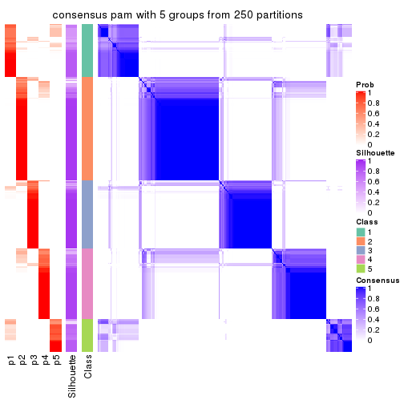</p>

</div>
<div id='tab-ATC-pam-consensus-heatmap-5'>
<pre><code class="r">consensus_heatmap(res, k = 6)
</code></pre>

<p></p>

</div>
</div>

Heatmaps for the membership of samples in all partitions to see how consistent they are:


<script>
$( function() {
	$( '#tabs-ATC-pam-membership-heatmap' ).tabs();
} );
</script>
<div id='tabs-ATC-pam-membership-heatmap'>
<ul>
<li><a href='#tab-ATC-pam-membership-heatmap-1'>k = 2</a></li>
<li><a href='#tab-ATC-pam-membership-heatmap-2'>k = 3</a></li>
<li><a href='#tab-ATC-pam-membership-heatmap-3'>k = 4</a></li>
<li><a href='#tab-ATC-pam-membership-heatmap-4'>k = 5</a></li>
<li><a href='#tab-ATC-pam-membership-heatmap-5'>k = 6</a></li>
</ul>
<div id='tab-ATC-pam-membership-heatmap-1'>
<pre><code class="r">membership_heatmap(res, k = 2)
</code></pre>

<p></p>

</div>
<div id='tab-ATC-pam-membership-heatmap-2'>
<pre><code class="r">membership_heatmap(res, k = 3)
</code></pre>

<p></p>

</div>
<div id='tab-ATC-pam-membership-heatmap-3'>
<pre><code class="r">membership_heatmap(res, k = 4)
</code></pre>

<p></p>

</div>
<div id='tab-ATC-pam-membership-heatmap-4'>
<pre><code class="r">membership_heatmap(res, k = 5)
</code></pre>

<p></p>

</div>
<div id='tab-ATC-pam-membership-heatmap-5'>
<pre><code class="r">membership_heatmap(res, k = 6)
</code></pre>

<p></p>

</div>
</div>

As soon as we have had the classes for columns, we can look for signatures
which are significantly different between classes which can be candidate marks
for certain classes. Following are the heatmaps for signatures.


Signature heatmaps where rows are scaled:


<script>
$( function() {
	$( '#tabs-ATC-pam-get-signatures' ).tabs();
} );
</script>
<div id='tabs-ATC-pam-get-signatures'>
<ul>
<li><a href='#tab-ATC-pam-get-signatures-1'>k = 2</a></li>
<li><a href='#tab-ATC-pam-get-signatures-2'>k = 3</a></li>
<li><a href='#tab-ATC-pam-get-signatures-3'>k = 4</a></li>
<li><a href='#tab-ATC-pam-get-signatures-4'>k = 5</a></li>
<li><a href='#tab-ATC-pam-get-signatures-5'>k = 6</a></li>
</ul>
<div id='tab-ATC-pam-get-signatures-1'>
<pre><code class="r">get_signatures(res, k = 2)
</code></pre>

<p></p>

</div>
<div id='tab-ATC-pam-get-signatures-2'>
<pre><code class="r">get_signatures(res, k = 3)
</code></pre>

<p>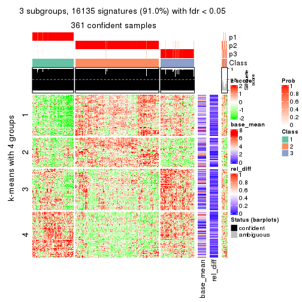</p>

</div>
<div id='tab-ATC-pam-get-signatures-3'>
<pre><code class="r">get_signatures(res, k = 4)
</code></pre>

<p></p>

</div>
<div id='tab-ATC-pam-get-signatures-4'>
<pre><code class="r">get_signatures(res, k = 5)
</code></pre>

<p></p>

</div>
<div id='tab-ATC-pam-get-signatures-5'>
<pre><code class="r">get_signatures(res, k = 6)
</code></pre>

<p></p>

</div>
</div>


Signature heatmaps where rows are not scaled:


<script>
$( function() {
	$( '#tabs-ATC-pam-get-signatures-no-scale' ).tabs();
} );
</script>
<div id='tabs-ATC-pam-get-signatures-no-scale'>
<ul>
<li><a href='#tab-ATC-pam-get-signatures-no-scale-1'>k = 2</a></li>
<li><a href='#tab-ATC-pam-get-signatures-no-scale-2'>k = 3</a></li>
<li><a href='#tab-ATC-pam-get-signatures-no-scale-3'>k = 4</a></li>
<li><a href='#tab-ATC-pam-get-signatures-no-scale-4'>k = 5</a></li>
<li><a href='#tab-ATC-pam-get-signatures-no-scale-5'>k = 6</a></li>
</ul>
<div id='tab-ATC-pam-get-signatures-no-scale-1'>
<pre><code class="r">get_signatures(res, k = 2, scale_rows = FALSE)
</code></pre>

<p></p>

</div>
<div id='tab-ATC-pam-get-signatures-no-scale-2'>
<pre><code class="r">get_signatures(res, k = 3, scale_rows = FALSE)
</code></pre>

<p></p>

</div>
<div id='tab-ATC-pam-get-signatures-no-scale-3'>
<pre><code class="r">get_signatures(res, k = 4, scale_rows = FALSE)
</code></pre>

<p></p>

</div>
<div id='tab-ATC-pam-get-signatures-no-scale-4'>
<pre><code class="r">get_signatures(res, k = 5, scale_rows = FALSE)
</code></pre>

<p></p>

</div>
<div id='tab-ATC-pam-get-signatures-no-scale-5'>
<pre><code class="r">get_signatures(res, k = 6, scale_rows = FALSE)
</code></pre>

<p></p>

</div>
</div>


Compare the overlap of signatures from different k:

```r
compare_signatures(res)
```


`get_signature()` returns a data frame invisibly. TO get the list of signatures, the function
call should be assigned to a variable explicitly. In following code, if `plot` argument is set
to `FALSE`, no heatmap is plotted while only the differential analysis is performed.

```r
# code only for demonstration
tb = get_signature(res, k = ..., plot = FALSE)
```

An example of the output of `tb` is:

```
#>   which_row         fdr    mean_1    mean_2 scaled_mean_1 scaled_mean_2 km
#> 1        38 0.042760348  8.373488  9.131774    -0.5533452     0.5164555  1
#> 2        40 0.018707592  7.106213  8.469186    -0.6173731     0.5762149  1
#> 3        55 0.019134737 10.221463 11.207825    -0.6159697     0.5749050  1
#> 4        59 0.006059896  5.921854  7.869574    -0.6899429     0.6439467  1
#> 5        60 0.018055526  8.928898 10.211722    -0.6204761     0.5791110  1
#> 6        98 0.009384629 15.714769 14.887706     0.6635654    -0.6193277  2
...
```

The columns in `tb` are:

1. `which_row`: row indices corresponding to the input matrix.
2. `fdr`: FDR for the differential test. 
3. `mean_x`: The mean value in group x.
4. `scaled_mean_x`: The mean value in group x after rows are scaled.
5. `km`: Row groups if k-means clustering is applied to rows.


UMAP plot which shows how samples are separated.


<script>
$( function() {
	$( '#tabs-ATC-pam-dimension-reduction' ).tabs();
} );
</script>
<div id='tabs-ATC-pam-dimension-reduction'>
<ul>
<li><a href='#tab-ATC-pam-dimension-reduction-1'>k = 2</a></li>
<li><a href='#tab-ATC-pam-dimension-reduction-2'>k = 3</a></li>
<li><a href='#tab-ATC-pam-dimension-reduction-3'>k = 4</a></li>
<li><a href='#tab-ATC-pam-dimension-reduction-4'>k = 5</a></li>
<li><a href='#tab-ATC-pam-dimension-reduction-5'>k = 6</a></li>
</ul>
<div id='tab-ATC-pam-dimension-reduction-1'>
<pre><code class="r">dimension_reduction(res, k = 2, method = &quot;UMAP&quot;)
</code></pre>

<p></p>

</div>
<div id='tab-ATC-pam-dimension-reduction-2'>
<pre><code class="r">dimension_reduction(res, k = 3, method = &quot;UMAP&quot;)
</code></pre>

<p></p>

</div>
<div id='tab-ATC-pam-dimension-reduction-3'>
<pre><code class="r">dimension_reduction(res, k = 4, method = &quot;UMAP&quot;)
</code></pre>

<p></p>

</div>
<div id='tab-ATC-pam-dimension-reduction-4'>
<pre><code class="r">dimension_reduction(res, k = 5, method = &quot;UMAP&quot;)
</code></pre>

<p></p>

</div>
<div id='tab-ATC-pam-dimension-reduction-5'>
<pre><code class="r">dimension_reduction(res, k = 6, method = &quot;UMAP&quot;)
</code></pre>

<p></p>

</div>
</div>


Following heatmap shows how subgroups are split when increasing `k`:

```r
collect_classes(res)
```


If matrix rows can be associated to genes, consider to use `GO_Enrichment(res,
...)` to perform function enrichment for the signature genes.


 

---------------------------------------------------


### ATC:mclust**


The object with results only for a single top-value method and a single partition method 
can be extracted as:

```r
res = res_list["ATC", "mclust"]
# you can also extract it by
# res = res_list["ATC:mclust"]
```

A summary of `res` and all the functions that can be applied to it:

```r
res
```

```
#> A 'ConsensusPartition' object with k = 2, 3, 4, 5, 6.
#>   On a matrix with 17723 rows and 374 columns.
#>   Top rows (1000, 2000, 3000, 4000, 5000) are extracted by 'ATC' method.
#>   Subgroups are detected by 'mclust' method.
#>   Performed in total 1250 partitions by row resampling.
#>   Best k for subgroups seems to be 2.
#> 
#> Following methods can be applied to this 'ConsensusPartition' object:
#>  [1] "cola_report"             "collect_classes"         "collect_plots"          
#>  [4] "collect_stats"           "colnames"                "compare_signatures"     
#>  [7] "consensus_heatmap"       "dimension_reduction"     "functional_enrichment"  
#> [10] "get_anno_col"            "get_anno"                "get_classes"            
#> [13] "get_consensus"           "get_matrix"              "get_membership"         
#> [16] "get_param"               "get_signatures"          "get_stats"              
#> [19] "is_best_k"               "is_stable_k"             "membership_heatmap"     
#> [22] "ncol"                    "nrow"                    "plot_ecdf"              
#> [25] "rownames"                "select_partition_number" "show"                   
#> [28] "suggest_best_k"          "test_to_known_factors"
```

`collect_plots()` function collects all the plots made from `res` for all `k` (number of partitions)
into one single page to provide an easy and fast comparison between different `k`.

```r
collect_plots(res)
```


The plots are:

- The first row: a plot of the ECDF (Empirical cumulative distribution
  function) curves of the consensus matrix for each `k` and the heatmap of
  predicted classes for each `k`.
- The second row: heatmaps of the consensus matrix for each `k`.
- The third row: heatmaps of the membership matrix for each `k`.
- The fouth row: heatmaps of the signatures for each `k`.

All the plots in panels can be made by individual functions and they are
plotted later in this section.

`select_partition_number()` produces several plots showing different
statistics for choosing "optimized" `k`. There are following statistics:

- ECDF curves of the consensus matrix for each `k`;
- 1-PAC. [The PAC
  score](https://en.wikipedia.org/wiki/Consensus_clustering#Over-interpretation_potential_of_consensus_clustering)
  measures the proportion of the ambiguous subgrouping.
- Mean silhouette score.
- Concordance. The mean probability of fiting the consensus class ids in all
  partitions.
- Area increased. Denote $A_k$ as the area under the ECDF curve for current
  `k`, the area increased is defined as $A_k - A_{k-1}$.
- Rand index. The percent of pairs of samples that are both in a same cluster
  or both are not in a same cluster in the partition of k and k-1.
- Jaccard index. The ratio of pairs of samples are both in a same cluster in
  the partition of k and k-1 and the pairs of samples are both in a same
  cluster in the partition k or k-1.

The detailed explanations of these statistics can be found in [the cola
vignette](http://bioconductor.org/packages/devel/bioc/vignettes/cola/inst/doc/cola.html#toc_13).

Generally speaking, lower PAC score, higher mean silhouette score or higher
concordance corresponds to better partition. Rand index and Jaccard index
measure how similar the current partition is compared to partition with `k-1`.
If they are too similar, we won't accept `k` is better than `k-1`.

```r
select_partition_number(res)
```


The numeric values for all these statistics can be obtained by `get_stats()`.

```r
get_stats(res)
```

```
#>   k 1-PAC mean_silhouette concordance area_increased  Rand Jaccard
#> 2 2 0.994           0.969       0.986         0.4793 0.523   0.523
#> 3 3 0.710           0.817       0.882         0.2966 0.860   0.737
#> 4 4 0.718           0.731       0.857         0.1687 0.840   0.616
#> 5 5 0.731           0.797       0.866         0.0726 0.893   0.642
#> 6 6 0.709           0.613       0.750         0.0375 0.972   0.877
```

`suggest_best_k()` suggests the best $k$ based on these statistics. The rules are as follows:

- All $k$ with Jaccard index larger than 0.95 are removed because the increase of
  the partition number does not provides enough extra information. If all $k$ are removed,
  the best $k$ is assigned by `NA`.
- For $k$ with 1-PAC larger than 0.9, the maximal $k$ is taken as the "best k". Other $k$ is called "optional k".
- If it does not fit the second rule. The $k$ with the highest vote of highest
  1-PAC, mean silhouette and concordance is taken as the "best k".

```r
suggest_best_k(res)
```

```
#> [1] 2
```


Following shows the table of the partitions (You need to click the **show/hide
code output** link to see it). The membership matrix (columns with name `p*`)
is inferred by
[`clue::cl_consensus()`](https://www.rdocumentation.org/link/cl_consensus?package=clue)
function with the `SE` method. Basically the value in the membership matrix
represents the probability to belong to a certain group. The finall class
label for an item is determined with the group with highest probability it
belongs to.

In `get_classes()` function, the entropy is calculated from the membership
matrix and the silhouette score is calculated from the consensus matrix.


<script>
$( function() {
	$( '#tabs-ATC-mclust-get-classes' ).tabs();
} );
</script>
<div id='tabs-ATC-mclust-get-classes'>
<ul>
<li><a href='#tab-ATC-mclust-get-classes-1'>k = 2</a></li>
<li><a href='#tab-ATC-mclust-get-classes-2'>k = 3</a></li>
<li><a href='#tab-ATC-mclust-get-classes-3'>k = 4</a></li>
<li><a href='#tab-ATC-mclust-get-classes-4'>k = 5</a></li>
<li><a href='#tab-ATC-mclust-get-classes-5'>k = 6</a></li>
</ul>

<div id='tab-ATC-mclust-get-classes-1'>
<p><a id='tab-ATC-mclust-get-classes-1-a' style='color:#0366d6' href='#'>show/hide code output</a></p>
<pre><code class="r">cbind(get_classes(res, k = 2), get_membership(res, k = 2))
</code></pre>

<pre><code>#&gt;            class entropy silhouette    p1    p2
#&gt; SRR660824      1  0.0000      0.985 1.000 0.000
#&gt; SRR603858      1  0.0000      0.985 1.000 0.000
#&gt; SRR817070      2  0.0000      0.989 0.000 1.000
#&gt; SRR1486995     1  0.0000      0.985 1.000 0.000
#&gt; SRR813043      2  0.0000      0.989 0.000 1.000
#&gt; SRR656874      2  0.0000      0.989 0.000 1.000
#&gt; SRR659037      1  0.0000      0.985 1.000 0.000
#&gt; SRR662031      1  0.0000      0.985 1.000 0.000
#&gt; SRR1081283     2  0.0000      0.989 0.000 1.000
#&gt; SRR1481036     1  0.0000      0.985 1.000 0.000
#&gt; SRR1434009     2  0.0000      0.989 0.000 1.000
#&gt; SRR1376676     1  0.0000      0.985 1.000 0.000
#&gt; SRR1396967     2  0.0000      0.989 0.000 1.000
#&gt; SRR665429      2  0.0000      0.989 0.000 1.000
#&gt; SRR1388025     2  0.1633      0.968 0.024 0.976
#&gt; SRR600784      1  0.0000      0.985 1.000 0.000
#&gt; SRR657611      1  0.0000      0.985 1.000 0.000
#&gt; SRR1333659     1  0.5946      0.837 0.856 0.144
#&gt; SRR1323896     2  0.0000      0.989 0.000 1.000
#&gt; SRR1453971     1  0.0000      0.985 1.000 0.000
#&gt; SRR1421010     1  0.0000      0.985 1.000 0.000
#&gt; SRR1334490     1  0.0000      0.985 1.000 0.000
#&gt; SRR1309468     1  0.0000      0.985 1.000 0.000
#&gt; SRR1468637     1  0.0000      0.985 1.000 0.000
#&gt; SRR1365489     2  0.0000      0.989 0.000 1.000
#&gt; SRR627445      1  0.0000      0.985 1.000 0.000
#&gt; SRR607863      2  0.0000      0.989 0.000 1.000
#&gt; SRR1475524     1  0.0000      0.985 1.000 0.000
#&gt; SRR1405504     2  0.0000      0.989 0.000 1.000
#&gt; SRR615695      1  0.0000      0.985 1.000 0.000
#&gt; SRR600900      2  0.0000      0.989 0.000 1.000
#&gt; SRR601477      2  0.0000      0.989 0.000 1.000
#&gt; SRR1487215     2  0.0000      0.989 0.000 1.000
#&gt; SRR1310797     2  0.0000      0.989 0.000 1.000
#&gt; SRR1362713     1  0.0000      0.985 1.000 0.000
#&gt; SRR1431385     1  0.0000      0.985 1.000 0.000
#&gt; SRR1379089     2  0.0000      0.989 0.000 1.000
#&gt; SRR1102079     1  0.0000      0.985 1.000 0.000
#&gt; SRR1357210     1  0.0000      0.985 1.000 0.000
#&gt; SRR657659      2  0.3114      0.937 0.056 0.944
#&gt; SRR663573      1  0.6048      0.832 0.852 0.148
#&gt; SRR603188      2  0.0000      0.989 0.000 1.000
#&gt; SRR1471200     2  0.0000      0.989 0.000 1.000
#&gt; SRR1310975     2  0.0000      0.989 0.000 1.000
#&gt; SRR627457      1  0.0000      0.985 1.000 0.000
#&gt; SRR1367654     2  0.0000      0.989 0.000 1.000
#&gt; SRR1488410     1  0.0000      0.985 1.000 0.000
#&gt; SRR1457750     1  0.0000      0.985 1.000 0.000
#&gt; SRR1099546     1  0.0000      0.985 1.000 0.000
#&gt; SRR604480      2  0.0000      0.989 0.000 1.000
#&gt; SRR1390477     2  0.0000      0.989 0.000 1.000
#&gt; SRR1458447     2  0.0000      0.989 0.000 1.000
#&gt; SRR1473161     2  0.0000      0.989 0.000 1.000
#&gt; SRR1409813     2  0.0000      0.989 0.000 1.000
#&gt; SRR612791      1  0.0000      0.985 1.000 0.000
#&gt; SRR1470580     1  0.0000      0.985 1.000 0.000
#&gt; SRR1444063     1  0.0000      0.985 1.000 0.000
#&gt; SRR1355578     1  0.0000      0.985 1.000 0.000
#&gt; SRR1429203     1  0.0000      0.985 1.000 0.000
#&gt; SRR599154      2  0.0000      0.989 0.000 1.000
#&gt; SRR814244      1  0.0000      0.985 1.000 0.000
#&gt; SRR1404123     2  0.0000      0.989 0.000 1.000
#&gt; SRR656934      1  0.0000      0.985 1.000 0.000
#&gt; SRR1339029     2  0.0000      0.989 0.000 1.000
#&gt; SRR821525      2  0.8661      0.591 0.288 0.712
#&gt; SRR1443677     1  0.0000      0.985 1.000 0.000
#&gt; SRR1406330     1  0.0000      0.985 1.000 0.000
#&gt; SRR1338124     1  0.0000      0.985 1.000 0.000
#&gt; SRR1391376     1  0.0000      0.985 1.000 0.000
#&gt; SRR661842      2  0.0000      0.989 0.000 1.000
#&gt; SRR1395699     1  0.0000      0.985 1.000 0.000
#&gt; SRR1312209     1  0.0000      0.985 1.000 0.000
#&gt; SRR1359469     1  0.0000      0.985 1.000 0.000
#&gt; SRR658885      1  0.0000      0.985 1.000 0.000
#&gt; SRR1414578     1  0.0000      0.985 1.000 0.000
#&gt; SRR603620      1  0.8081      0.682 0.752 0.248
#&gt; SRR604677      1  0.0000      0.985 1.000 0.000
#&gt; SRR603800      1  0.0376      0.981 0.996 0.004
#&gt; SRR602058      2  0.2603      0.949 0.044 0.956
#&gt; SRR817488      2  0.0000      0.989 0.000 1.000
#&gt; SRR655601      2  0.0000      0.989 0.000 1.000
#&gt; SRR1434821     2  0.0000      0.989 0.000 1.000
#&gt; SRR1349166     2  0.0000      0.989 0.000 1.000
#&gt; SRR615129      1  0.0000      0.985 1.000 0.000
#&gt; SRR607586      2  0.0000      0.989 0.000 1.000
#&gt; SRR602680      2  0.0000      0.989 0.000 1.000
#&gt; SRR1411070     2  0.1184      0.975 0.016 0.984
#&gt; SRR663038      2  0.0000      0.989 0.000 1.000
#&gt; SRR1489416     2  0.0000      0.989 0.000 1.000
#&gt; SRR1479155     1  0.0000      0.985 1.000 0.000
#&gt; SRR662162      1  0.0000      0.985 1.000 0.000
#&gt; SRR1374567     1  0.0000      0.985 1.000 0.000
#&gt; SRR1434048     2  0.0000      0.989 0.000 1.000
#&gt; SRR2184865     1  0.0000      0.985 1.000 0.000
#&gt; SRR2170135     1  0.0000      0.985 1.000 0.000
#&gt; SRR615551      2  0.0000      0.989 0.000 1.000
#&gt; SRR1335513     2  0.0000      0.989 0.000 1.000
#&gt; SRR1370216     1  0.0000      0.985 1.000 0.000
#&gt; SRR662954      1  0.0000      0.985 1.000 0.000
#&gt; SRR1375738     1  0.0000      0.985 1.000 0.000
#&gt; SRR1356577     1  0.0000      0.985 1.000 0.000
#&gt; SRR1073119     1  0.0000      0.985 1.000 0.000
#&gt; SRR663549      1  0.0000      0.985 1.000 0.000
#&gt; SRR1478015     2  0.0000      0.989 0.000 1.000
#&gt; SRR600632      2  0.9686      0.334 0.396 0.604
#&gt; SRR811866      1  0.0000      0.985 1.000 0.000
#&gt; SRR1401101     2  0.0000      0.989 0.000 1.000
#&gt; SRR1477797     1  0.6531      0.806 0.832 0.168
#&gt; SRR1402986     2  0.0000      0.989 0.000 1.000
#&gt; SRR658897      1  0.0000      0.985 1.000 0.000
#&gt; SRR1419869     1  0.0000      0.985 1.000 0.000
#&gt; SRR1490700     1  0.0000      0.985 1.000 0.000
#&gt; SRR601723      1  0.0000      0.985 1.000 0.000
#&gt; SRR1384115     1  0.5629      0.851 0.868 0.132
#&gt; SRR1476927     2  0.0000      0.989 0.000 1.000
#&gt; SRR1387769     1  0.0000      0.985 1.000 0.000
#&gt; SRR1322595     1  0.0000      0.985 1.000 0.000
#&gt; SRR1370423     1  0.0000      0.985 1.000 0.000
#&gt; SRR1314976     1  0.0000      0.985 1.000 0.000
#&gt; SRR1319560     1  0.9775      0.315 0.588 0.412
#&gt; SRR1352683     1  0.0000      0.985 1.000 0.000
#&gt; SRR1473800     1  0.0000      0.985 1.000 0.000
#&gt; SRR1326384     1  0.0000      0.985 1.000 0.000
#&gt; SRR1360807     1  0.1633      0.964 0.976 0.024
#&gt; SRR1332544     1  0.0000      0.985 1.000 0.000
#&gt; SRR598695      1  0.0000      0.985 1.000 0.000
#&gt; SRR807824      1  0.6343      0.816 0.840 0.160
#&gt; SRR809296      1  0.0000      0.985 1.000 0.000
#&gt; SRR657927      1  0.0000      0.985 1.000 0.000
#&gt; SRR1440682     2  0.0000      0.989 0.000 1.000
#&gt; SRR1454415     2  0.0000      0.989 0.000 1.000
#&gt; SRR1419131     1  0.3733      0.918 0.928 0.072
#&gt; SRR1404293     1  0.0000      0.985 1.000 0.000
#&gt; SRR1473340     1  0.0000      0.985 1.000 0.000
#&gt; SRR1345563     1  0.0000      0.985 1.000 0.000
#&gt; SRR1323382     2  0.0000      0.989 0.000 1.000
#&gt; SRR1480697     1  0.0000      0.985 1.000 0.000
#&gt; SRR1321808     2  0.0000      0.989 0.000 1.000
#&gt; SRR1382756     2  0.0000      0.989 0.000 1.000
#&gt; SRR1312558     2  0.5946      0.834 0.144 0.856
#&gt; SRR1417088     2  0.0000      0.989 0.000 1.000
#&gt; SRR1433027     2  0.0000      0.989 0.000 1.000
#&gt; SRR662257      2  0.2043      0.960 0.032 0.968
#&gt; SRR600417      2  0.0000      0.989 0.000 1.000
#&gt; SRR812493      1  0.5842      0.842 0.860 0.140
#&gt; SRR612743      1  0.0000      0.985 1.000 0.000
#&gt; SRR1361345     1  0.0000      0.985 1.000 0.000
#&gt; SRR600584      2  0.0000      0.989 0.000 1.000
#&gt; SRR1310520     1  0.0000      0.985 1.000 0.000
#&gt; SRR1395595     1  0.0000      0.985 1.000 0.000
#&gt; SRR1334074     1  0.0000      0.985 1.000 0.000
#&gt; SRR654838      2  0.0000      0.989 0.000 1.000
#&gt; SRR1376694     1  0.0000      0.985 1.000 0.000
#&gt; SRR1433841     1  0.0000      0.985 1.000 0.000
#&gt; SRR1366837     1  0.0000      0.985 1.000 0.000
#&gt; SRR1467479     2  0.0000      0.989 0.000 1.000
#&gt; SRR1459055     1  0.0000      0.985 1.000 0.000
#&gt; SRR1471050     2  0.0000      0.989 0.000 1.000
#&gt; SRR603004      1  0.0938      0.974 0.988 0.012
#&gt; SRR814703      2  0.0000      0.989 0.000 1.000
#&gt; SRR661937      2  0.0000      0.989 0.000 1.000
#&gt; SRR614359      1  0.0000      0.985 1.000 0.000
#&gt; SRR1071568     2  0.0000      0.989 0.000 1.000
#&gt; SRR1389084     1  0.0000      0.985 1.000 0.000
#&gt; SRR1337624     1  0.2236      0.953 0.964 0.036
#&gt; SRR1344400     2  0.0000      0.989 0.000 1.000
#&gt; SRR1414290     2  0.0000      0.989 0.000 1.000
#&gt; SRR1413644     2  0.0000      0.989 0.000 1.000
#&gt; SRR1098998     1  0.0000      0.985 1.000 0.000
#&gt; SRR1481279     1  0.0000      0.985 1.000 0.000
#&gt; SRR1315103     1  0.0000      0.985 1.000 0.000
#&gt; SRR1099286     1  0.0000      0.985 1.000 0.000
#&gt; SRR2166570     1  0.0000      0.985 1.000 0.000
#&gt; SRR601445      1  0.0000      0.985 1.000 0.000
#&gt; SRR1439719     2  0.0000      0.989 0.000 1.000
#&gt; SRR1377026     2  0.0000      0.989 0.000 1.000
#&gt; SRR1327386     1  0.0000      0.985 1.000 0.000
#&gt; SRR654826      2  0.0000      0.989 0.000 1.000
#&gt; SRR1460433     1  0.0000      0.985 1.000 0.000
#&gt; SRR1469345     1  0.0000      0.985 1.000 0.000
#&gt; SRR1421462     2  0.0000      0.989 0.000 1.000
#&gt; SRR662966      1  0.0000      0.985 1.000 0.000
#&gt; SRR1339175     1  0.0000      0.985 1.000 0.000
#&gt; SRR1447736     2  0.0000      0.989 0.000 1.000
#&gt; SRR1434671     2  0.0000      0.989 0.000 1.000
#&gt; SRR660800      2  0.0000      0.989 0.000 1.000
#&gt; SRR1465543     2  0.0000      0.989 0.000 1.000
#&gt; SRR1342023     1  0.0000      0.985 1.000 0.000
#&gt; SRR1335670     1  0.0000      0.985 1.000 0.000
#&gt; SRR1400955     2  0.0000      0.989 0.000 1.000
#&gt; SRR1072150     2  0.0000      0.989 0.000 1.000
#&gt; SRR1442822     1  0.0000      0.985 1.000 0.000
#&gt; SRR1364658     1  0.0000      0.985 1.000 0.000
#&gt; SRR1098074     1  0.8499      0.637 0.724 0.276
#&gt; SRR1442778     1  0.0000      0.985 1.000 0.000
#&gt; SRR1086728     1  0.0000      0.985 1.000 0.000
#&gt; SRR627464      1  0.0000      0.985 1.000 0.000
#&gt; SRR1409193     1  0.0000      0.985 1.000 0.000
#&gt; SRR2168286     1  0.0000      0.985 1.000 0.000
#&gt; SRR615539      2  0.0000      0.989 0.000 1.000
#&gt; SRR663623      1  0.0000      0.985 1.000 0.000
#&gt; SRR1471989     1  0.0000      0.985 1.000 0.000
#&gt; SRR1468828     2  0.5178      0.869 0.116 0.884
#&gt; SRR1381934     1  0.0000      0.985 1.000 0.000
#&gt; SRR1471098     1  0.0000      0.985 1.000 0.000
#&gt; SRR1314749     1  0.0000      0.985 1.000 0.000
#&gt; SRR2166874     1  0.0000      0.985 1.000 0.000
#&gt; SRR821302      1  0.0000      0.985 1.000 0.000
#&gt; SRR1435066     2  0.0000      0.989 0.000 1.000
#&gt; SRR661601      2  0.0000      0.989 0.000 1.000
#&gt; SRR1446546     1  0.5294      0.865 0.880 0.120
#&gt; SRR1419784     1  0.0000      0.985 1.000 0.000
#&gt; SRR1357233     2  0.0000      0.989 0.000 1.000
#&gt; SRR1441889     1  0.0000      0.985 1.000 0.000
#&gt; SRR1413940     1  0.0000      0.985 1.000 0.000
#&gt; SRR1324250     2  0.0000      0.989 0.000 1.000
#&gt; SRR1442862     2  0.0000      0.989 0.000 1.000
#&gt; SRR662474      2  0.0000      0.989 0.000 1.000
#&gt; SRR1416226     1  0.0000      0.985 1.000 0.000
#&gt; SRR1417404     1  0.0000      0.985 1.000 0.000
#&gt; SRR665466      2  0.0000      0.989 0.000 1.000
#&gt; SRR658849      1  0.0000      0.985 1.000 0.000
#&gt; SRR1460025     1  0.5842      0.842 0.860 0.140
#&gt; SRR1408136     1  0.0000      0.985 1.000 0.000
#&gt; SRR1489995     2  0.0000      0.989 0.000 1.000
#&gt; SRR1374092     1  0.0000      0.985 1.000 0.000
#&gt; SRR1488429     1  0.0000      0.985 1.000 0.000
#&gt; SRR1087559     1  0.0000      0.985 1.000 0.000
#&gt; SRR817004      1  0.0000      0.985 1.000 0.000
#&gt; SRR1429660     2  0.0000      0.989 0.000 1.000
#&gt; SRR604390      1  0.0000      0.985 1.000 0.000
#&gt; SRR614936      1  0.0000      0.985 1.000 0.000
#&gt; SRR1365938     1  0.0000      0.985 1.000 0.000
#&gt; SRR1437324     1  0.0000      0.985 1.000 0.000
#&gt; SRR613414      1  0.0000      0.985 1.000 0.000
#&gt; SRR660414      1  0.0000      0.985 1.000 0.000
#&gt; SRR1452185     1  0.0000      0.985 1.000 0.000
#&gt; SRR1347020     1  0.0000      0.985 1.000 0.000
#&gt; SRR1398036     2  0.0000      0.989 0.000 1.000
#&gt; SRR1436674     1  0.0000      0.985 1.000 0.000
#&gt; SRR603750      1  0.0000      0.985 1.000 0.000
#&gt; SRR608630      1  0.0000      0.985 1.000 0.000
#&gt; SRR655625      2  0.0000      0.989 0.000 1.000
#&gt; SRR599059      1  0.1414      0.967 0.980 0.020
#&gt; SRR615189      1  0.0000      0.985 1.000 0.000
#&gt; SRR1466889     2  0.0000      0.989 0.000 1.000
#&gt; SRR1084602     1  0.0000      0.985 1.000 0.000
#&gt; SRR1335422     1  0.0000      0.985 1.000 0.000
#&gt; SRR1356805     2  0.0000      0.989 0.000 1.000
#&gt; SRR1385300     1  0.0000      0.985 1.000 0.000
#&gt; SRR654814      1  0.0000      0.985 1.000 0.000
#&gt; SRR658385      2  0.0000      0.989 0.000 1.000
#&gt; SRR820596      1  0.0000      0.985 1.000 0.000
#&gt; SRR1318118     1  0.0000      0.985 1.000 0.000
#&gt; SRR1480766     2  0.0000      0.989 0.000 1.000
#&gt; SRR1406539     1  0.0000      0.985 1.000 0.000
#&gt; SRR1341833     2  0.0000      0.989 0.000 1.000
#&gt; SRR1441826     2  0.4022      0.911 0.080 0.920
#&gt; SRR1448051     1  0.0000      0.985 1.000 0.000
#&gt; SRR1326752     1  0.0000      0.985 1.000 0.000
#&gt; SRR665217      1  0.0000      0.985 1.000 0.000
#&gt; SRR819186      2  0.0000      0.989 0.000 1.000
#&gt; SRR661517      1  0.0000      0.985 1.000 0.000
#&gt; SRR607166      2  0.0000      0.989 0.000 1.000
#&gt; SRR809065      1  0.4562      0.892 0.904 0.096
#&gt; SRR1415872     2  0.0000      0.989 0.000 1.000
#&gt; SRR1415463     1  0.0000      0.985 1.000 0.000
#&gt; SRR1381161     2  0.0000      0.989 0.000 1.000
#&gt; SRR1442231     1  0.0000      0.985 1.000 0.000
#&gt; SRR1374696     1  0.0000      0.985 1.000 0.000
#&gt; SRR1451988     1  0.0000      0.985 1.000 0.000
#&gt; SRR660555      1  0.0000      0.985 1.000 0.000
#&gt; SRR657801      1  0.0000      0.985 1.000 0.000
#&gt; SRR663344      2  0.0000      0.989 0.000 1.000
#&gt; SRR1472462     2  0.0000      0.989 0.000 1.000
#&gt; SRR1406176     1  0.0000      0.985 1.000 0.000
#&gt; SRR656886      1  0.5408      0.861 0.876 0.124
#&gt; SRR1498337     2  0.6343      0.810 0.160 0.840
#&gt; SRR613066      1  0.0000      0.985 1.000 0.000
#&gt; SRR1309490     1  0.0000      0.985 1.000 0.000
#&gt; SRR602492      2  0.0000      0.989 0.000 1.000
#&gt; SRR1447347     1  0.0000      0.985 1.000 0.000
#&gt; SRR1475546     2  0.0000      0.989 0.000 1.000
#&gt; SRR627459      1  0.2603      0.946 0.956 0.044
#&gt; SRR1434332     2  0.0000      0.989 0.000 1.000
#&gt; SRR1070358     2  0.0000      0.989 0.000 1.000
#&gt; SRR1345936     1  0.0000      0.985 1.000 0.000
#&gt; SRR665658      2  0.0000      0.989 0.000 1.000
#&gt; SRR1321351     2  0.0000      0.989 0.000 1.000
#&gt; SRR657880      2  0.0000      0.989 0.000 1.000
#&gt; SRR1373903     2  0.0000      0.989 0.000 1.000
#&gt; SRR657396      1  0.9977      0.123 0.528 0.472
#&gt; SRR660981      2  0.0000      0.989 0.000 1.000
#&gt; SRR818499      1  0.0000      0.985 1.000 0.000
#&gt; SRR819658      2  0.0000      0.989 0.000 1.000
#&gt; SRR1376316     1  0.0000      0.985 1.000 0.000
#&gt; SRR1323723     2  0.3879      0.916 0.076 0.924
#&gt; SRR1476719     1  0.0000      0.985 1.000 0.000
#&gt; SRR1403478     2  0.0000      0.989 0.000 1.000
#&gt; SRR1095695     1  0.0000      0.985 1.000 0.000
#&gt; SRR1352391     1  0.0000      0.985 1.000 0.000
#&gt; SRR1498813     2  0.0000      0.989 0.000 1.000
#&gt; SRR627437      1  0.0000      0.985 1.000 0.000
#&gt; SRR2185097     1  0.0000      0.985 1.000 0.000
#&gt; SRR817166      1  0.0000      0.985 1.000 0.000
#&gt; SRR1091670     2  0.0000      0.989 0.000 1.000
#&gt; SRR603776      1  0.0000      0.985 1.000 0.000
#&gt; SRR1479640     2  0.0000      0.989 0.000 1.000
#&gt; SRR660152      1  0.0000      0.985 1.000 0.000
#&gt; SRR1074769     2  0.0000      0.989 0.000 1.000
#&gt; SRR656153      2  0.0000      0.989 0.000 1.000
#&gt; SRR1392502     1  0.0000      0.985 1.000 0.000
#&gt; SRR1359609     1  0.0000      0.985 1.000 0.000
#&gt; SRR601925      2  0.0000      0.989 0.000 1.000
#&gt; SRR2165182     2  0.0000      0.989 0.000 1.000
#&gt; SRR608542      2  0.0000      0.989 0.000 1.000
#&gt; SRR655064      1  0.0000      0.985 1.000 0.000
#&gt; SRR1432430     1  0.0000      0.985 1.000 0.000
#&gt; SRR808472      2  0.0000      0.989 0.000 1.000
#&gt; SRR1414958     1  0.0000      0.985 1.000 0.000
#&gt; SRR598484      2  0.0000      0.989 0.000 1.000
#&gt; SRR612755      1  0.0000      0.985 1.000 0.000
#&gt; SRR1365808     1  0.0000      0.985 1.000 0.000
#&gt; SRR1391724     1  0.0000      0.985 1.000 0.000
#&gt; SRR1322373     1  0.0000      0.985 1.000 0.000
#&gt; SRR1489265     2  0.0000      0.989 0.000 1.000
#&gt; SRR1359099     2  0.0000      0.989 0.000 1.000
#&gt; SRR607279      2  0.0000      0.989 0.000 1.000
#&gt; SRR810461      2  0.0000      0.989 0.000 1.000
#&gt; SRR627427      1  0.0000      0.985 1.000 0.000
#&gt; SRR612887      2  0.0000      0.989 0.000 1.000
#&gt; SRR809807      1  0.0000      0.985 1.000 0.000
#&gt; SRR663112      1  0.0000      0.985 1.000 0.000
#&gt; SRR1346933     1  0.0000      0.985 1.000 0.000
#&gt; SRR1487910     1  0.0000      0.985 1.000 0.000
#&gt; SRR603092      2  0.0000      0.989 0.000 1.000
#&gt; SRR1417680     2  0.0000      0.989 0.000 1.000
#&gt; SRR1383785     1  0.0000      0.985 1.000 0.000
#&gt; SRR1070015     2  0.0000      0.989 0.000 1.000
#&gt; SRR1466222     1  0.0000      0.985 1.000 0.000
#&gt; SRR1416119     1  0.0000      0.985 1.000 0.000
#&gt; SRR819318      1  0.0000      0.985 1.000 0.000
#&gt; SRR608288      2  0.3431      0.929 0.064 0.936
#&gt; SRR811121      1  0.0000      0.985 1.000 0.000
#&gt; SRR613138      2  0.0000      0.989 0.000 1.000
#&gt; SRR810483      1  0.0000      0.985 1.000 0.000
#&gt; SRR607839      1  0.0000      0.985 1.000 0.000
#&gt; SRR1337031     1  0.0000      0.985 1.000 0.000
#&gt; SRR601311      2  0.4431      0.897 0.092 0.908
#&gt; SRR1406685     2  0.0000      0.989 0.000 1.000
#&gt; SRR1467500     2  0.0000      0.989 0.000 1.000
#&gt; SRR1308504     1  0.0000      0.985 1.000 0.000
#&gt; SRR1312865     1  0.0000      0.985 1.000 0.000
#&gt; SRR1312522     1  0.0000      0.985 1.000 0.000
#&gt; SRR1490486     2  0.0000      0.989 0.000 1.000
#&gt; SRR1325888     1  0.0000      0.985 1.000 0.000
#&gt; SRR1472885     1  0.0000      0.985 1.000 0.000
#&gt; SRR1098785     2  0.0000      0.989 0.000 1.000
#&gt; SRR1084766     1  0.3733      0.918 0.928 0.072
#&gt; SRR1102804     2  0.0000      0.989 0.000 1.000
#&gt; SRR1336636     1  0.0000      0.985 1.000 0.000
#&gt; SRR1347795     1  0.0000      0.985 1.000 0.000
#&gt; SRR601900      2  0.0000      0.989 0.000 1.000
#&gt; SRR1330989     1  0.4690      0.888 0.900 0.100
#&gt; SRR658445      1  0.8861      0.579 0.696 0.304
#&gt; SRR1368754     1  0.0000      0.985 1.000 0.000
#&gt; SRR1460001     2  0.0000      0.989 0.000 1.000
#&gt; SRR1414934     1  0.0000      0.985 1.000 0.000
#&gt; SRR1326249     1  0.0000      0.985 1.000 0.000
#&gt; SRR614948      1  0.0000      0.985 1.000 0.000
#&gt; SRR1472952     1  0.0000      0.985 1.000 0.000
#&gt; SRR1321528     1  0.0000      0.985 1.000 0.000
#&gt; SRR627447      1  0.0000      0.985 1.000 0.000
#&gt; SRR612239      1  0.0000      0.985 1.000 0.000
</code></pre>

<script>
$('#tab-ATC-mclust-get-classes-1-a').parent().next().next().hide();
$('#tab-ATC-mclust-get-classes-1-a').click(function(){
  $('#tab-ATC-mclust-get-classes-1-a').parent().next().next().toggle();
  return(false);
});
</script>
</div>

<div id='tab-ATC-mclust-get-classes-2'>
<p><a id='tab-ATC-mclust-get-classes-2-a' style='color:#0366d6' href='#'>show/hide code output</a></p>
<pre><code class="r">cbind(get_classes(res, k = 3), get_membership(res, k = 3))
</code></pre>

<pre><code>#&gt;            class entropy silhouette    p1    p2    p3
#&gt; SRR660824      3  0.3752     0.9423 0.144 0.000 0.856
#&gt; SRR603858      1  0.1529     0.8224 0.960 0.000 0.040
#&gt; SRR817070      2  0.2448     0.9205 0.000 0.924 0.076
#&gt; SRR1486995     3  0.3752     0.9423 0.144 0.000 0.856
#&gt; SRR813043      2  0.0000     0.9394 0.000 1.000 0.000
#&gt; SRR656874      2  0.0237     0.9390 0.000 0.996 0.004
#&gt; SRR659037      1  0.5948     0.5895 0.640 0.000 0.360
#&gt; SRR662031      1  0.1289     0.8228 0.968 0.000 0.032
#&gt; SRR1081283     2  0.4605     0.7950 0.000 0.796 0.204
#&gt; SRR1481036     1  0.5810     0.6056 0.664 0.000 0.336
#&gt; SRR1434009     2  0.0000     0.9394 0.000 1.000 0.000
#&gt; SRR1376676     1  0.1643     0.8144 0.956 0.000 0.044
#&gt; SRR1396967     2  0.0424     0.9364 0.000 0.992 0.008
#&gt; SRR665429      2  0.0592     0.9377 0.000 0.988 0.012
#&gt; SRR1388025     2  0.9379     0.2421 0.208 0.504 0.288
#&gt; SRR600784      3  0.3752     0.9423 0.144 0.000 0.856
#&gt; SRR657611      1  0.1753     0.8223 0.952 0.000 0.048
#&gt; SRR1333659     1  0.5967     0.5988 0.752 0.216 0.032
#&gt; SRR1323896     2  0.0000     0.9394 0.000 1.000 0.000
#&gt; SRR1453971     1  0.1031     0.8242 0.976 0.000 0.024
#&gt; SRR1421010     1  0.1643     0.8144 0.956 0.000 0.044
#&gt; SRR1334490     3  0.3752     0.9423 0.144 0.000 0.856
#&gt; SRR1309468     1  0.1643     0.8144 0.956 0.000 0.044
#&gt; SRR1468637     1  0.1163     0.8243 0.972 0.000 0.028
#&gt; SRR1365489     2  0.0000     0.9394 0.000 1.000 0.000
#&gt; SRR627445      3  0.5327     0.7406 0.272 0.000 0.728
#&gt; SRR607863      2  0.2261     0.9232 0.000 0.932 0.068
#&gt; SRR1475524     1  0.1643     0.8144 0.956 0.000 0.044
#&gt; SRR1405504     2  0.1753     0.9295 0.000 0.952 0.048
#&gt; SRR615695      1  0.1643     0.8144 0.956 0.000 0.044
#&gt; SRR600900      2  0.2261     0.9232 0.000 0.932 0.068
#&gt; SRR601477      2  0.0000     0.9394 0.000 1.000 0.000
#&gt; SRR1487215     2  0.0000     0.9394 0.000 1.000 0.000
#&gt; SRR1310797     2  0.0000     0.9394 0.000 1.000 0.000
#&gt; SRR1362713     1  0.0747     0.8240 0.984 0.000 0.016
#&gt; SRR1431385     1  0.1031     0.8248 0.976 0.000 0.024
#&gt; SRR1379089     2  0.0000     0.9394 0.000 1.000 0.000
#&gt; SRR1102079     1  0.5706     0.6122 0.680 0.000 0.320
#&gt; SRR1357210     1  0.1643     0.8144 0.956 0.000 0.044
#&gt; SRR657659      2  0.5191     0.8032 0.112 0.828 0.060
#&gt; SRR663573      1  0.8573     0.4191 0.524 0.104 0.372
#&gt; SRR603188      2  0.1411     0.9326 0.000 0.964 0.036
#&gt; SRR1471200     2  0.0000     0.9394 0.000 1.000 0.000
#&gt; SRR1310975     2  0.0000     0.9394 0.000 1.000 0.000
#&gt; SRR627457      1  0.0592     0.8252 0.988 0.000 0.012
#&gt; SRR1367654     2  0.0000     0.9394 0.000 1.000 0.000
#&gt; SRR1488410     1  0.0892     0.8211 0.980 0.000 0.020
#&gt; SRR1457750     1  0.1163     0.8243 0.972 0.000 0.028
#&gt; SRR1099546     1  0.1163     0.8222 0.972 0.000 0.028
#&gt; SRR604480      2  0.0000     0.9394 0.000 1.000 0.000
#&gt; SRR1390477     2  0.0000     0.9394 0.000 1.000 0.000
#&gt; SRR1458447     2  0.0000     0.9394 0.000 1.000 0.000
#&gt; SRR1473161     2  0.0000     0.9394 0.000 1.000 0.000
#&gt; SRR1409813     2  0.0000     0.9394 0.000 1.000 0.000
#&gt; SRR612791      1  0.1163     0.8222 0.972 0.000 0.028
#&gt; SRR1470580     3  0.3941     0.9280 0.156 0.000 0.844
#&gt; SRR1444063     1  0.1031     0.8242 0.976 0.000 0.024
#&gt; SRR1355578     1  0.1643     0.8144 0.956 0.000 0.044
#&gt; SRR1429203     1  0.1643     0.8144 0.956 0.000 0.044
#&gt; SRR599154      2  0.0000     0.9394 0.000 1.000 0.000
#&gt; SRR814244      1  0.1031     0.8242 0.976 0.000 0.024
#&gt; SRR1404123     2  0.2448     0.9205 0.000 0.924 0.076
#&gt; SRR656934      1  0.5810     0.6056 0.664 0.000 0.336
#&gt; SRR1339029     2  0.0000     0.9394 0.000 1.000 0.000
#&gt; SRR821525      1  0.9716     0.2022 0.428 0.228 0.344
#&gt; SRR1443677     1  0.1643     0.8144 0.956 0.000 0.044
#&gt; SRR1406330     1  0.1643     0.8144 0.956 0.000 0.044
#&gt; SRR1338124     1  0.2711     0.8075 0.912 0.000 0.088
#&gt; SRR1391376     3  0.3752     0.9423 0.144 0.000 0.856
#&gt; SRR661842      2  0.6373     0.6572 0.028 0.704 0.268
#&gt; SRR1395699     3  0.3752     0.9423 0.144 0.000 0.856
#&gt; SRR1312209     1  0.1964     0.8208 0.944 0.000 0.056
#&gt; SRR1359469     1  0.1643     0.8144 0.956 0.000 0.044
#&gt; SRR658885      3  0.3752     0.9423 0.144 0.000 0.856
#&gt; SRR1414578     1  0.1643     0.8144 0.956 0.000 0.044
#&gt; SRR603620      1  0.4618     0.7198 0.840 0.136 0.024
#&gt; SRR604677      1  0.5016     0.7038 0.760 0.000 0.240
#&gt; SRR603800      3  0.5263     0.8602 0.088 0.084 0.828
#&gt; SRR602058      2  0.9240     0.3183 0.244 0.532 0.224
#&gt; SRR817488      2  0.0000     0.9394 0.000 1.000 0.000
#&gt; SRR655601      2  0.2448     0.9205 0.000 0.924 0.076
#&gt; SRR1434821     2  0.0000     0.9394 0.000 1.000 0.000
#&gt; SRR1349166     2  0.0000     0.9394 0.000 1.000 0.000
#&gt; SRR615129      1  0.1163     0.8243 0.972 0.000 0.028
#&gt; SRR607586      2  0.0000     0.9394 0.000 1.000 0.000
#&gt; SRR602680      2  0.0000     0.9394 0.000 1.000 0.000
#&gt; SRR1411070     2  0.3993     0.8764 0.052 0.884 0.064
#&gt; SRR663038      2  0.0892     0.9298 0.000 0.980 0.020
#&gt; SRR1489416     2  0.2261     0.9232 0.000 0.932 0.068
#&gt; SRR1479155     1  0.1643     0.8144 0.956 0.000 0.044
#&gt; SRR662162      1  0.1411     0.8234 0.964 0.000 0.036
#&gt; SRR1374567     1  0.2165     0.8199 0.936 0.000 0.064
#&gt; SRR1434048     2  0.0000     0.9394 0.000 1.000 0.000
#&gt; SRR2184865     1  0.6026     0.5760 0.624 0.000 0.376
#&gt; SRR2170135     1  0.1529     0.8233 0.960 0.000 0.040
#&gt; SRR615551      2  0.0237     0.9386 0.000 0.996 0.004
#&gt; SRR1335513     2  0.0892     0.9362 0.000 0.980 0.020
#&gt; SRR1370216     3  0.3752     0.9423 0.144 0.000 0.856
#&gt; SRR662954      1  0.2486     0.8186 0.932 0.008 0.060
#&gt; SRR1375738     1  0.5810     0.6056 0.664 0.000 0.336
#&gt; SRR1356577     1  0.5882     0.6113 0.652 0.000 0.348
#&gt; SRR1073119     1  0.1529     0.8224 0.960 0.000 0.040
#&gt; SRR663549      1  0.5760     0.6083 0.672 0.000 0.328
#&gt; SRR1478015     2  0.0000     0.9394 0.000 1.000 0.000
#&gt; SRR600632      1  0.7044     0.4013 0.620 0.348 0.032
#&gt; SRR811866      1  0.5706     0.6261 0.680 0.000 0.320
#&gt; SRR1401101     2  0.0000     0.9394 0.000 1.000 0.000
#&gt; SRR1477797     1  0.7671     0.5101 0.568 0.052 0.380
#&gt; SRR1402986     2  0.0000     0.9394 0.000 1.000 0.000
#&gt; SRR658897      1  0.1031     0.8242 0.976 0.000 0.024
#&gt; SRR1419869     1  0.2066     0.8210 0.940 0.000 0.060
#&gt; SRR1490700     1  0.1964     0.8208 0.944 0.000 0.056
#&gt; SRR601723      1  0.6026     0.5770 0.624 0.000 0.376
#&gt; SRR1384115     1  0.7925     0.5071 0.584 0.072 0.344
#&gt; SRR1476927     2  0.2261     0.9232 0.000 0.932 0.068
#&gt; SRR1387769     1  0.5810     0.6056 0.664 0.000 0.336
#&gt; SRR1322595     1  0.1031     0.8242 0.976 0.000 0.024
#&gt; SRR1370423     3  0.3816     0.9289 0.148 0.000 0.852
#&gt; SRR1314976     1  0.5882     0.6113 0.652 0.000 0.348
#&gt; SRR1319560     1  0.5643     0.6103 0.760 0.220 0.020
#&gt; SRR1352683     1  0.5098     0.6828 0.752 0.000 0.248
#&gt; SRR1473800     1  0.1643     0.8144 0.956 0.000 0.044
#&gt; SRR1326384     1  0.5810     0.6056 0.664 0.000 0.336
#&gt; SRR1360807     1  0.7032     0.5609 0.604 0.028 0.368
#&gt; SRR1332544     1  0.1289     0.8221 0.968 0.000 0.032
#&gt; SRR598695      1  0.1529     0.8159 0.960 0.000 0.040
#&gt; SRR807824      2  0.7360     0.1607 0.440 0.528 0.032
#&gt; SRR809296      3  0.3752     0.9423 0.144 0.000 0.856
#&gt; SRR657927      3  0.3752     0.9423 0.144 0.000 0.856
#&gt; SRR1440682     2  0.2448     0.9205 0.000 0.924 0.076
#&gt; SRR1454415     2  0.2261     0.9232 0.000 0.932 0.068
#&gt; SRR1419131     1  0.7032     0.5609 0.604 0.028 0.368
#&gt; SRR1404293     1  0.0747     0.8240 0.984 0.000 0.016
#&gt; SRR1473340     3  0.3752     0.9423 0.144 0.000 0.856
#&gt; SRR1345563     1  0.1643     0.8144 0.956 0.000 0.044
#&gt; SRR1323382     2  0.0000     0.9394 0.000 1.000 0.000
#&gt; SRR1480697     1  0.5810     0.6056 0.664 0.000 0.336
#&gt; SRR1321808     2  0.0000     0.9394 0.000 1.000 0.000
#&gt; SRR1382756     2  0.0000     0.9394 0.000 1.000 0.000
#&gt; SRR1312558     2  0.4551     0.7906 0.132 0.844 0.024
#&gt; SRR1417088     2  0.2625     0.9166 0.000 0.916 0.084
#&gt; SRR1433027     2  0.2537     0.9187 0.000 0.920 0.080
#&gt; SRR662257      2  0.3129     0.9090 0.008 0.904 0.088
#&gt; SRR600417      2  0.3686     0.8708 0.000 0.860 0.140
#&gt; SRR812493      1  0.7410     0.5242 0.576 0.040 0.384
#&gt; SRR612743      1  0.5650     0.6298 0.688 0.000 0.312
#&gt; SRR1361345     1  0.1753     0.8223 0.952 0.000 0.048
#&gt; SRR600584      2  0.2448     0.9205 0.000 0.924 0.076
#&gt; SRR1310520     1  0.6843     0.6004 0.640 0.028 0.332
#&gt; SRR1395595     3  0.3816     0.9289 0.148 0.000 0.852
#&gt; SRR1334074     1  0.5810     0.6056 0.664 0.000 0.336
#&gt; SRR654838      2  0.0000     0.9394 0.000 1.000 0.000
#&gt; SRR1376694     1  0.1643     0.8144 0.956 0.000 0.044
#&gt; SRR1433841     1  0.1163     0.8243 0.972 0.000 0.028
#&gt; SRR1366837     1  0.5810     0.6056 0.664 0.000 0.336
#&gt; SRR1467479     2  0.0592     0.9377 0.000 0.988 0.012
#&gt; SRR1459055     1  0.1643     0.8144 0.956 0.000 0.044
#&gt; SRR1471050     2  0.0000     0.9394 0.000 1.000 0.000
#&gt; SRR603004      3  0.5344     0.8610 0.092 0.084 0.824
#&gt; SRR814703      2  0.0000     0.9394 0.000 1.000 0.000
#&gt; SRR661937      2  0.2261     0.9232 0.000 0.932 0.068
#&gt; SRR614359      1  0.1163     0.8222 0.972 0.000 0.028
#&gt; SRR1071568     2  0.0000     0.9394 0.000 1.000 0.000
#&gt; SRR1389084     3  0.3752     0.9423 0.144 0.000 0.856
#&gt; SRR1337624     1  0.4887     0.7466 0.844 0.096 0.060
#&gt; SRR1344400     2  0.0000     0.9394 0.000 1.000 0.000
#&gt; SRR1414290     2  0.0000     0.9394 0.000 1.000 0.000
#&gt; SRR1413644     2  0.0237     0.9386 0.000 0.996 0.004
#&gt; SRR1098998     1  0.1643     0.8144 0.956 0.000 0.044
#&gt; SRR1481279     1  0.1031     0.8218 0.976 0.000 0.024
#&gt; SRR1315103     1  0.1753     0.8223 0.952 0.000 0.048
#&gt; SRR1099286     1  0.0592     0.8252 0.988 0.000 0.012
#&gt; SRR2166570     1  0.5810     0.6056 0.664 0.000 0.336
#&gt; SRR601445      1  0.0892     0.8211 0.980 0.000 0.020
#&gt; SRR1439719     2  0.2537     0.9187 0.000 0.920 0.080
#&gt; SRR1377026     2  0.2537     0.9187 0.000 0.920 0.080
#&gt; SRR1327386     1  0.1643     0.8144 0.956 0.000 0.044
#&gt; SRR654826      2  0.0000     0.9394 0.000 1.000 0.000
#&gt; SRR1460433     1  0.6726     0.6058 0.644 0.024 0.332
#&gt; SRR1469345     1  0.1643     0.8231 0.956 0.000 0.044
#&gt; SRR1421462     2  0.0000     0.9394 0.000 1.000 0.000
#&gt; SRR662966      1  0.1529     0.8240 0.960 0.000 0.040
#&gt; SRR1339175     1  0.0892     0.8211 0.980 0.000 0.020
#&gt; SRR1447736     2  0.0000     0.9394 0.000 1.000 0.000
#&gt; SRR1434671     2  0.0000     0.9394 0.000 1.000 0.000
#&gt; SRR660800      2  0.0000     0.9394 0.000 1.000 0.000
#&gt; SRR1465543     2  0.0000     0.9394 0.000 1.000 0.000
#&gt; SRR1342023     1  0.1031     0.8239 0.976 0.000 0.024
#&gt; SRR1335670     1  0.1753     0.8223 0.952 0.000 0.048
#&gt; SRR1400955     2  0.0000     0.9394 0.000 1.000 0.000
#&gt; SRR1072150     2  0.1636     0.9217 0.020 0.964 0.016
#&gt; SRR1442822     1  0.1643     0.8144 0.956 0.000 0.044
#&gt; SRR1364658     3  0.3941     0.9324 0.156 0.000 0.844
#&gt; SRR1098074     3  0.6737     0.5993 0.040 0.272 0.688
#&gt; SRR1442778     1  0.0892     0.8211 0.980 0.000 0.020
#&gt; SRR1086728     3  0.3816     0.9289 0.148 0.000 0.852
#&gt; SRR627464      1  0.0747     0.8248 0.984 0.000 0.016
#&gt; SRR1409193     1  0.1964     0.8208 0.944 0.000 0.056
#&gt; SRR2168286     1  0.5968     0.5864 0.636 0.000 0.364
#&gt; SRR615539      2  0.2261     0.9232 0.000 0.932 0.068
#&gt; SRR663623      1  0.5733     0.6101 0.676 0.000 0.324
#&gt; SRR1471989     3  0.3752     0.9423 0.144 0.000 0.856
#&gt; SRR1468828     2  0.9228     0.2509 0.316 0.508 0.176
#&gt; SRR1381934     1  0.5810     0.6056 0.664 0.000 0.336
#&gt; SRR1471098     1  0.5254     0.6685 0.736 0.000 0.264
#&gt; SRR1314749     1  0.3686     0.7811 0.860 0.000 0.140
#&gt; SRR2166874     1  0.2550     0.8185 0.932 0.012 0.056
#&gt; SRR821302      1  0.4002     0.7679 0.840 0.000 0.160
#&gt; SRR1435066     2  0.0000     0.9394 0.000 1.000 0.000
#&gt; SRR661601      2  0.0000     0.9394 0.000 1.000 0.000
#&gt; SRR1446546     3  0.5339     0.8466 0.080 0.096 0.824
#&gt; SRR1419784     1  0.5706     0.6122 0.680 0.000 0.320
#&gt; SRR1357233     2  0.0424     0.9376 0.000 0.992 0.008
#&gt; SRR1441889     1  0.1643     0.8144 0.956 0.000 0.044
#&gt; SRR1413940     1  0.1643     0.8144 0.956 0.000 0.044
#&gt; SRR1324250     2  0.2066     0.9259 0.000 0.940 0.060
#&gt; SRR1442862     2  0.0000     0.9394 0.000 1.000 0.000
#&gt; SRR662474      2  0.2448     0.9205 0.000 0.924 0.076
#&gt; SRR1416226     1  0.5810     0.6056 0.664 0.000 0.336
#&gt; SRR1417404     1  0.5882     0.6113 0.652 0.000 0.348
#&gt; SRR665466      2  0.2261     0.9232 0.000 0.932 0.068
#&gt; SRR658849      3  0.3752     0.9423 0.144 0.000 0.856
#&gt; SRR1460025     1  0.9118     0.3535 0.496 0.152 0.352
#&gt; SRR1408136     1  0.1643     0.8144 0.956 0.000 0.044
#&gt; SRR1489995     2  0.0661     0.9365 0.004 0.988 0.008
#&gt; SRR1374092     1  0.5810     0.6056 0.664 0.000 0.336
#&gt; SRR1488429     3  0.3816     0.9289 0.148 0.000 0.852
#&gt; SRR1087559     1  0.1163     0.8243 0.972 0.000 0.028
#&gt; SRR817004      1  0.1031     0.8242 0.976 0.000 0.024
#&gt; SRR1429660     2  0.0000     0.9394 0.000 1.000 0.000
#&gt; SRR604390      3  0.3816     0.9289 0.148 0.000 0.852
#&gt; SRR614936      1  0.3850     0.7958 0.884 0.028 0.088
#&gt; SRR1365938     1  0.1163     0.8243 0.972 0.000 0.028
#&gt; SRR1437324     1  0.1643     0.8144 0.956 0.000 0.044
#&gt; SRR613414      1  0.6794     0.6076 0.648 0.028 0.324
#&gt; SRR660414      1  0.5810     0.6056 0.664 0.000 0.336
#&gt; SRR1452185     1  0.1643     0.8144 0.956 0.000 0.044
#&gt; SRR1347020     1  0.1529     0.8224 0.960 0.000 0.040
#&gt; SRR1398036     2  0.2796     0.9120 0.000 0.908 0.092
#&gt; SRR1436674     1  0.0892     0.8211 0.980 0.000 0.020
#&gt; SRR603750      3  0.5497     0.6951 0.292 0.000 0.708
#&gt; SRR608630      1  0.6229     0.6131 0.652 0.008 0.340
#&gt; SRR655625      2  0.3686     0.8708 0.000 0.860 0.140
#&gt; SRR599059      1  0.4379     0.7813 0.868 0.072 0.060
#&gt; SRR615189      1  0.1751     0.8227 0.960 0.012 0.028
#&gt; SRR1466889     2  0.0000     0.9394 0.000 1.000 0.000
#&gt; SRR1084602     1  0.6527     0.5360 0.588 0.008 0.404
#&gt; SRR1335422     1  0.1031     0.8204 0.976 0.000 0.024
#&gt; SRR1356805     2  0.0000     0.9394 0.000 1.000 0.000
#&gt; SRR1385300     1  0.2878     0.8088 0.904 0.000 0.096
#&gt; SRR654814      1  0.0892     0.8211 0.980 0.000 0.020
#&gt; SRR658385      2  0.0000     0.9394 0.000 1.000 0.000
#&gt; SRR820596      1  0.1753     0.8220 0.952 0.000 0.048
#&gt; SRR1318118     1  0.2165     0.8192 0.936 0.000 0.064
#&gt; SRR1480766     2  0.2261     0.9232 0.000 0.932 0.068
#&gt; SRR1406539     1  0.1031     0.8242 0.976 0.000 0.024
#&gt; SRR1341833     2  0.0237     0.9386 0.000 0.996 0.004
#&gt; SRR1441826     2  0.9871    -0.1295 0.256 0.376 0.368
#&gt; SRR1448051     1  0.1643     0.8144 0.956 0.000 0.044
#&gt; SRR1326752     3  0.3752     0.9423 0.144 0.000 0.856
#&gt; SRR665217      3  0.3752     0.9423 0.144 0.000 0.856
#&gt; SRR819186      2  0.0000     0.9394 0.000 1.000 0.000
#&gt; SRR661517      3  0.3816     0.9360 0.148 0.000 0.852
#&gt; SRR607166      2  0.1919     0.9133 0.024 0.956 0.020
#&gt; SRR809065      1  0.7001     0.5379 0.588 0.024 0.388
#&gt; SRR1415872     2  0.2261     0.9232 0.000 0.932 0.068
#&gt; SRR1415463     3  0.4974     0.8076 0.236 0.000 0.764
#&gt; SRR1381161     2  0.2448     0.9205 0.000 0.924 0.076
#&gt; SRR1442231     1  0.2066     0.8203 0.940 0.000 0.060
#&gt; SRR1374696     1  0.3267     0.7971 0.884 0.000 0.116
#&gt; SRR1451988     3  0.3816     0.9289 0.148 0.000 0.852
#&gt; SRR660555      1  0.1529     0.8159 0.960 0.000 0.040
#&gt; SRR657801      1  0.1643     0.8144 0.956 0.000 0.044
#&gt; SRR663344      2  0.0000     0.9394 0.000 1.000 0.000
#&gt; SRR1472462     2  0.2261     0.9232 0.000 0.932 0.068
#&gt; SRR1406176     1  0.2066     0.8178 0.940 0.000 0.060
#&gt; SRR656886      3  0.5075     0.8762 0.096 0.068 0.836
#&gt; SRR1498337     2  0.9925    -0.0843 0.280 0.384 0.336
#&gt; SRR613066      1  0.1643     0.8231 0.956 0.000 0.044
#&gt; SRR1309490     1  0.1529     0.8159 0.960 0.000 0.040
#&gt; SRR602492      2  0.7272     0.6554 0.096 0.700 0.204
#&gt; SRR1447347     1  0.1964     0.8219 0.944 0.000 0.056
#&gt; SRR1475546     2  0.2261     0.9232 0.000 0.932 0.068
#&gt; SRR627459      1  0.7001     0.5379 0.588 0.024 0.388
#&gt; SRR1434332     2  0.2066     0.9259 0.000 0.940 0.060
#&gt; SRR1070358     2  0.2448     0.9205 0.000 0.924 0.076
#&gt; SRR1345936     1  0.6154     0.5439 0.592 0.000 0.408
#&gt; SRR665658      2  0.1337     0.9276 0.012 0.972 0.016
#&gt; SRR1321351     2  0.2356     0.9220 0.000 0.928 0.072
#&gt; SRR657880      2  0.0000     0.9394 0.000 1.000 0.000
#&gt; SRR1373903     2  0.2537     0.9187 0.000 0.920 0.080
#&gt; SRR657396      1  0.6217     0.5412 0.712 0.264 0.024
#&gt; SRR660981      2  0.2261     0.9232 0.000 0.932 0.068
#&gt; SRR818499      1  0.1643     0.8144 0.956 0.000 0.044
#&gt; SRR819658      2  0.0000     0.9394 0.000 1.000 0.000
#&gt; SRR1376316     1  0.1643     0.8144 0.956 0.000 0.044
#&gt; SRR1323723     2  0.3434     0.8668 0.032 0.904 0.064
#&gt; SRR1476719     1  0.1643     0.8231 0.956 0.000 0.044
#&gt; SRR1403478     2  0.0000     0.9394 0.000 1.000 0.000
#&gt; SRR1095695     3  0.3816     0.9289 0.148 0.000 0.852
#&gt; SRR1352391     1  0.1529     0.8224 0.960 0.000 0.040
#&gt; SRR1498813     2  0.4615     0.8476 0.020 0.836 0.144
#&gt; SRR627437      1  0.6473     0.6117 0.652 0.016 0.332
#&gt; SRR2185097     1  0.1643     0.8231 0.956 0.000 0.044
#&gt; SRR817166      1  0.6045     0.4877 0.620 0.000 0.380
#&gt; SRR1091670     2  0.0000     0.9394 0.000 1.000 0.000
#&gt; SRR603776      1  0.5650     0.6298 0.688 0.000 0.312
#&gt; SRR1479640     2  0.2261     0.9232 0.000 0.932 0.068
#&gt; SRR660152      1  0.2878     0.8085 0.904 0.000 0.096
#&gt; SRR1074769     2  0.0000     0.9394 0.000 1.000 0.000
#&gt; SRR656153      2  0.2261     0.9232 0.000 0.932 0.068
#&gt; SRR1392502     1  0.5733     0.6112 0.676 0.000 0.324
#&gt; SRR1359609     1  0.1643     0.8144 0.956 0.000 0.044
#&gt; SRR601925      2  0.0000     0.9394 0.000 1.000 0.000
#&gt; SRR2165182     2  0.1031     0.9353 0.000 0.976 0.024
#&gt; SRR608542      2  0.2711     0.9146 0.000 0.912 0.088
#&gt; SRR655064      1  0.6154     0.5439 0.592 0.000 0.408
#&gt; SRR1432430     3  0.3752     0.9423 0.144 0.000 0.856
#&gt; SRR808472      2  0.2878     0.9088 0.000 0.904 0.096
#&gt; SRR1414958     3  0.3752     0.9423 0.144 0.000 0.856
#&gt; SRR598484      2  0.0000     0.9394 0.000 1.000 0.000
#&gt; SRR612755      3  0.3752     0.9423 0.144 0.000 0.856
#&gt; SRR1365808     1  0.1643     0.8144 0.956 0.000 0.044
#&gt; SRR1391724     1  0.5810     0.6056 0.664 0.000 0.336
#&gt; SRR1322373     3  0.3752     0.9423 0.144 0.000 0.856
#&gt; SRR1489265     2  0.0000     0.9394 0.000 1.000 0.000
#&gt; SRR1359099     2  0.0000     0.9394 0.000 1.000 0.000
#&gt; SRR607279      2  0.0000     0.9394 0.000 1.000 0.000
#&gt; SRR810461      2  0.0000     0.9394 0.000 1.000 0.000
#&gt; SRR627427      1  0.1031     0.8210 0.976 0.000 0.024
#&gt; SRR612887      2  0.2261     0.9232 0.000 0.932 0.068
#&gt; SRR809807      3  0.4326     0.9258 0.144 0.012 0.844
#&gt; SRR663112      3  0.3816     0.9289 0.148 0.000 0.852
#&gt; SRR1346933     1  0.1163     0.8243 0.972 0.000 0.028
#&gt; SRR1487910     1  0.1031     0.8242 0.976 0.000 0.024
#&gt; SRR603092      2  0.3340     0.8897 0.000 0.880 0.120
#&gt; SRR1417680     2  0.2261     0.9232 0.000 0.932 0.068
#&gt; SRR1383785     1  0.1289     0.8221 0.968 0.000 0.032
#&gt; SRR1070015     2  0.0000     0.9394 0.000 1.000 0.000
#&gt; SRR1466222     3  0.3816     0.9289 0.148 0.000 0.852
#&gt; SRR1416119     3  0.3752     0.9423 0.144 0.000 0.856
#&gt; SRR819318      1  0.5560     0.6332 0.700 0.000 0.300
#&gt; SRR608288      2  0.3237     0.8713 0.056 0.912 0.032
#&gt; SRR811121      3  0.4859     0.9007 0.116 0.044 0.840
#&gt; SRR613138      2  0.0237     0.9386 0.000 0.996 0.004
#&gt; SRR810483      1  0.5810     0.6056 0.664 0.000 0.336
#&gt; SRR607839      1  0.1643     0.8144 0.956 0.000 0.044
#&gt; SRR1337031     1  0.0892     0.8211 0.980 0.000 0.020
#&gt; SRR601311      2  0.6807     0.6835 0.172 0.736 0.092
#&gt; SRR1406685     2  0.2448     0.9205 0.000 0.924 0.076
#&gt; SRR1467500     2  0.2537     0.9187 0.000 0.920 0.080
#&gt; SRR1308504     1  0.1643     0.8144 0.956 0.000 0.044
#&gt; SRR1312865     3  0.3816     0.9289 0.148 0.000 0.852
#&gt; SRR1312522     1  0.3412     0.7783 0.876 0.000 0.124
#&gt; SRR1490486     2  0.2550     0.8968 0.040 0.936 0.024
#&gt; SRR1325888     3  0.3752     0.9423 0.144 0.000 0.856
#&gt; SRR1472885     1  0.1643     0.8144 0.956 0.000 0.044
#&gt; SRR1098785     2  0.2261     0.9232 0.000 0.932 0.068
#&gt; SRR1084766     1  0.7099     0.5354 0.588 0.028 0.384
#&gt; SRR1102804     2  0.0237     0.9386 0.000 0.996 0.004
#&gt; SRR1336636     1  0.5098     0.6906 0.752 0.000 0.248
#&gt; SRR1347795     1  0.1163     0.8222 0.972 0.000 0.028
#&gt; SRR601900      2  0.0000     0.9394 0.000 1.000 0.000
#&gt; SRR1330989     1  0.6783     0.5361 0.588 0.016 0.396
#&gt; SRR658445      3  0.6521     0.6439 0.040 0.248 0.712
#&gt; SRR1368754     1  0.1163     0.8222 0.972 0.000 0.028
#&gt; SRR1460001     2  0.0000     0.9394 0.000 1.000 0.000
#&gt; SRR1414934     1  0.1643     0.8144 0.956 0.000 0.044
#&gt; SRR1326249     3  0.3752     0.9423 0.144 0.000 0.856
#&gt; SRR614948      1  0.1643     0.8144 0.956 0.000 0.044
#&gt; SRR1472952     3  0.3752     0.9423 0.144 0.000 0.856
#&gt; SRR1321528     1  0.0747     0.8240 0.984 0.000 0.016
#&gt; SRR627447      3  0.4002     0.9262 0.160 0.000 0.840
#&gt; SRR612239      1  0.6154     0.5439 0.592 0.000 0.408
</code></pre>

<script>
$('#tab-ATC-mclust-get-classes-2-a').parent().next().next().hide();
$('#tab-ATC-mclust-get-classes-2-a').click(function(){
  $('#tab-ATC-mclust-get-classes-2-a').parent().next().next().toggle();
  return(false);
});
</script>
</div>

<div id='tab-ATC-mclust-get-classes-3'>
<p><a id='tab-ATC-mclust-get-classes-3-a' style='color:#0366d6' href='#'>show/hide code output</a></p>
<pre><code class="r">cbind(get_classes(res, k = 4), get_membership(res, k = 4))
</code></pre>

<pre><code>#&gt;            class entropy silhouette    p1    p2    p3    p4
#&gt; SRR660824      3  0.1022     0.8256 0.032 0.000 0.968 0.000
#&gt; SRR603858      1  0.5110     0.6383 0.636 0.000 0.012 0.352
#&gt; SRR817070      2  0.3427     0.8325 0.000 0.860 0.028 0.112
#&gt; SRR1486995     3  0.1022     0.8256 0.032 0.000 0.968 0.000
#&gt; SRR813043      2  0.0188     0.9060 0.000 0.996 0.000 0.004
#&gt; SRR656874      2  0.0188     0.9069 0.000 0.996 0.000 0.004
#&gt; SRR659037      4  0.4920     0.5311 0.004 0.000 0.368 0.628
#&gt; SRR662031      1  0.2101     0.8426 0.928 0.000 0.012 0.060
#&gt; SRR1081283     4  0.5085     0.4702 0.000 0.260 0.032 0.708
#&gt; SRR1481036     4  0.5016     0.5070 0.004 0.000 0.396 0.600
#&gt; SRR1434009     2  0.0188     0.9069 0.000 0.996 0.000 0.004
#&gt; SRR1376676     1  0.0000     0.8470 1.000 0.000 0.000 0.000
#&gt; SRR1396967     2  0.1109     0.8941 0.000 0.968 0.028 0.004
#&gt; SRR665429      2  0.0188     0.9069 0.000 0.996 0.000 0.004
#&gt; SRR1388025     4  0.3215     0.6314 0.000 0.092 0.032 0.876
#&gt; SRR600784      3  0.1022     0.8256 0.032 0.000 0.968 0.000
#&gt; SRR657611      1  0.3751     0.7842 0.800 0.000 0.004 0.196
#&gt; SRR1333659     1  0.8064     0.2312 0.428 0.224 0.012 0.336
#&gt; SRR1323896     2  0.0188     0.9069 0.000 0.996 0.000 0.004
#&gt; SRR1453971     1  0.4844     0.6930 0.688 0.000 0.012 0.300
#&gt; SRR1421010     1  0.0000     0.8470 1.000 0.000 0.000 0.000
#&gt; SRR1334490     3  0.1022     0.8256 0.032 0.000 0.968 0.000
#&gt; SRR1309468     1  0.0000     0.8470 1.000 0.000 0.000 0.000
#&gt; SRR1468637     1  0.4844     0.6930 0.688 0.000 0.012 0.300
#&gt; SRR1365489     2  0.0000     0.9068 0.000 1.000 0.000 0.000
#&gt; SRR627445      3  0.1022     0.7974 0.000 0.000 0.968 0.032
#&gt; SRR607863      2  0.1637     0.8836 0.000 0.940 0.000 0.060
#&gt; SRR1475524     1  0.0000     0.8470 1.000 0.000 0.000 0.000
#&gt; SRR1405504     2  0.0188     0.9069 0.000 0.996 0.000 0.004
#&gt; SRR615695      1  0.0000     0.8470 1.000 0.000 0.000 0.000
#&gt; SRR600900      2  0.3863     0.7953 0.000 0.828 0.028 0.144
#&gt; SRR601477      2  0.0188     0.9060 0.000 0.996 0.000 0.004
#&gt; SRR1487215     2  0.0000     0.9068 0.000 1.000 0.000 0.000
#&gt; SRR1310797     2  0.0188     0.9069 0.000 0.996 0.000 0.004
#&gt; SRR1362713     1  0.2593     0.8345 0.892 0.000 0.004 0.104
#&gt; SRR1431385     1  0.2216     0.8383 0.908 0.000 0.000 0.092
#&gt; SRR1379089     2  0.0188     0.9060 0.000 0.996 0.000 0.004
#&gt; SRR1102079     3  0.5112    -0.1264 0.004 0.000 0.560 0.436
#&gt; SRR1357210     1  0.0000     0.8470 1.000 0.000 0.000 0.000
#&gt; SRR657659      2  0.6447     0.2413 0.068 0.484 0.000 0.448
#&gt; SRR663573      4  0.3335     0.6798 0.000 0.020 0.120 0.860
#&gt; SRR603188      2  0.0188     0.9069 0.000 0.996 0.000 0.004
#&gt; SRR1471200     2  0.0188     0.9069 0.000 0.996 0.000 0.004
#&gt; SRR1310975     2  0.0469     0.9050 0.000 0.988 0.000 0.012
#&gt; SRR627457      1  0.2805     0.8333 0.888 0.000 0.012 0.100
#&gt; SRR1367654     2  0.0188     0.9069 0.000 0.996 0.000 0.004
#&gt; SRR1488410     1  0.1743     0.8446 0.940 0.000 0.004 0.056
#&gt; SRR1457750     1  0.4844     0.6930 0.688 0.000 0.012 0.300
#&gt; SRR1099546     1  0.1888     0.8456 0.940 0.000 0.016 0.044
#&gt; SRR604480      2  0.0188     0.9069 0.000 0.996 0.000 0.004
#&gt; SRR1390477     2  0.0188     0.9060 0.000 0.996 0.000 0.004
#&gt; SRR1458447     2  0.0188     0.9069 0.000 0.996 0.000 0.004
#&gt; SRR1473161     2  0.0000     0.9068 0.000 1.000 0.000 0.000
#&gt; SRR1409813     2  0.0188     0.9069 0.000 0.996 0.000 0.004
#&gt; SRR612791      1  0.0469     0.8478 0.988 0.000 0.012 0.000
#&gt; SRR1470580     3  0.3649     0.6198 0.000 0.000 0.796 0.204
#&gt; SRR1444063     1  0.4844     0.6930 0.688 0.000 0.012 0.300
#&gt; SRR1355578     1  0.0000     0.8470 1.000 0.000 0.000 0.000
#&gt; SRR1429203     1  0.0000     0.8470 1.000 0.000 0.000 0.000
#&gt; SRR599154      2  0.0188     0.9060 0.000 0.996 0.000 0.004
#&gt; SRR814244      1  0.4844     0.6930 0.688 0.000 0.012 0.300
#&gt; SRR1404123     2  0.5404     0.5761 0.000 0.644 0.028 0.328
#&gt; SRR656934      4  0.5016     0.5070 0.004 0.000 0.396 0.600
#&gt; SRR1339029     2  0.0188     0.9069 0.000 0.996 0.000 0.004
#&gt; SRR821525      4  0.3156     0.6485 0.000 0.068 0.048 0.884
#&gt; SRR1443677     1  0.0000     0.8470 1.000 0.000 0.000 0.000
#&gt; SRR1406330     1  0.0000     0.8470 1.000 0.000 0.000 0.000
#&gt; SRR1338124     3  0.7045     0.3419 0.148 0.000 0.544 0.308
#&gt; SRR1391376     3  0.1022     0.8256 0.032 0.000 0.968 0.000
#&gt; SRR661842      4  0.3587     0.6270 0.000 0.104 0.040 0.856
#&gt; SRR1395699     3  0.1022     0.8256 0.032 0.000 0.968 0.000
#&gt; SRR1312209     1  0.3893     0.7827 0.796 0.000 0.008 0.196
#&gt; SRR1359469     1  0.0000     0.8470 1.000 0.000 0.000 0.000
#&gt; SRR658885      3  0.0707     0.8232 0.020 0.000 0.980 0.000
#&gt; SRR1414578     1  0.0000     0.8470 1.000 0.000 0.000 0.000
#&gt; SRR603620      1  0.8050     0.1783 0.404 0.212 0.012 0.372
#&gt; SRR604677      1  0.6537     0.6368 0.636 0.000 0.164 0.200
#&gt; SRR603800      3  0.5964     0.5333 0.000 0.108 0.684 0.208
#&gt; SRR602058      4  0.3342     0.6246 0.000 0.100 0.032 0.868
#&gt; SRR817488      2  0.0188     0.9069 0.000 0.996 0.000 0.004
#&gt; SRR655601      2  0.5022     0.6685 0.000 0.708 0.028 0.264
#&gt; SRR1434821     2  0.0188     0.9069 0.000 0.996 0.000 0.004
#&gt; SRR1349166     2  0.0188     0.9069 0.000 0.996 0.000 0.004
#&gt; SRR615129      1  0.4844     0.6930 0.688 0.000 0.012 0.300
#&gt; SRR607586      2  0.0000     0.9068 0.000 1.000 0.000 0.000
#&gt; SRR602680      2  0.0000     0.9068 0.000 1.000 0.000 0.000
#&gt; SRR1411070     2  0.6163     0.4550 0.060 0.576 0.000 0.364
#&gt; SRR663038      2  0.0779     0.8989 0.000 0.980 0.016 0.004
#&gt; SRR1489416     2  0.2402     0.8690 0.000 0.912 0.012 0.076
#&gt; SRR1479155     1  0.0000     0.8470 1.000 0.000 0.000 0.000
#&gt; SRR662162      1  0.1743     0.8446 0.940 0.000 0.004 0.056
#&gt; SRR1374567     3  0.4874     0.6312 0.180 0.000 0.764 0.056
#&gt; SRR1434048     2  0.0188     0.9060 0.000 0.996 0.000 0.004
#&gt; SRR2184865     4  0.3402     0.6651 0.004 0.000 0.164 0.832
#&gt; SRR2170135     1  0.2101     0.8427 0.928 0.000 0.012 0.060
#&gt; SRR615551      2  0.0469     0.9050 0.000 0.988 0.000 0.012
#&gt; SRR1335513     2  0.1733     0.8856 0.000 0.948 0.028 0.024
#&gt; SRR1370216     3  0.1022     0.8256 0.032 0.000 0.968 0.000
#&gt; SRR662954      1  0.5290     0.5680 0.584 0.000 0.012 0.404
#&gt; SRR1375738     4  0.5016     0.5070 0.004 0.000 0.396 0.600
#&gt; SRR1356577     4  0.3962     0.6119 0.152 0.000 0.028 0.820
#&gt; SRR1073119     1  0.4054     0.7890 0.796 0.000 0.016 0.188
#&gt; SRR663549      4  0.5016     0.5070 0.004 0.000 0.396 0.600
#&gt; SRR1478015     2  0.0188     0.9069 0.000 0.996 0.000 0.004
#&gt; SRR600632      2  0.8130    -0.0332 0.232 0.392 0.012 0.364
#&gt; SRR811866      4  0.6514     0.5124 0.212 0.000 0.152 0.636
#&gt; SRR1401101     2  0.0188     0.9069 0.000 0.996 0.000 0.004
#&gt; SRR1477797     4  0.1716     0.6853 0.000 0.000 0.064 0.936
#&gt; SRR1402986     2  0.0188     0.9069 0.000 0.996 0.000 0.004
#&gt; SRR658897      1  0.3479     0.8157 0.840 0.000 0.012 0.148
#&gt; SRR1419869     3  0.6235     0.1000 0.420 0.000 0.524 0.056
#&gt; SRR1490700     1  0.4353     0.7598 0.756 0.000 0.012 0.232
#&gt; SRR601723      4  0.2999     0.6788 0.004 0.000 0.132 0.864
#&gt; SRR1384115     4  0.4513     0.6636 0.000 0.076 0.120 0.804
#&gt; SRR1476927     2  0.2255     0.8735 0.000 0.920 0.012 0.068
#&gt; SRR1387769     4  0.5016     0.5070 0.004 0.000 0.396 0.600
#&gt; SRR1322595     1  0.4868     0.6883 0.684 0.000 0.012 0.304
#&gt; SRR1370423     3  0.1474     0.7884 0.000 0.000 0.948 0.052
#&gt; SRR1314976     4  0.2773     0.6569 0.072 0.000 0.028 0.900
#&gt; SRR1319560     4  0.8245    -0.0526 0.340 0.276 0.012 0.372
#&gt; SRR1352683     1  0.6644     0.4742 0.520 0.000 0.088 0.392
#&gt; SRR1473800     1  0.0000     0.8470 1.000 0.000 0.000 0.000
#&gt; SRR1326384     4  0.5016     0.5070 0.004 0.000 0.396 0.600
#&gt; SRR1360807     4  0.1151     0.6772 0.008 0.000 0.024 0.968
#&gt; SRR1332544     1  0.0469     0.8478 0.988 0.000 0.012 0.000
#&gt; SRR598695      1  0.1059     0.8485 0.972 0.000 0.012 0.016
#&gt; SRR807824      2  0.8191    -0.0306 0.260 0.400 0.012 0.328
#&gt; SRR809296      3  0.0921     0.8253 0.028 0.000 0.972 0.000
#&gt; SRR657927      3  0.1022     0.8256 0.032 0.000 0.968 0.000
#&gt; SRR1440682     2  0.3764     0.7669 0.000 0.784 0.000 0.216
#&gt; SRR1454415     2  0.1867     0.8776 0.000 0.928 0.000 0.072
#&gt; SRR1419131     4  0.1151     0.6772 0.008 0.000 0.024 0.968
#&gt; SRR1404293     1  0.2530     0.8352 0.896 0.000 0.004 0.100
#&gt; SRR1473340     3  0.1022     0.8256 0.032 0.000 0.968 0.000
#&gt; SRR1345563     1  0.0000     0.8470 1.000 0.000 0.000 0.000
#&gt; SRR1323382     2  0.0000     0.9068 0.000 1.000 0.000 0.000
#&gt; SRR1480697     4  0.4920     0.5306 0.004 0.000 0.368 0.628
#&gt; SRR1321808     2  0.0000     0.9068 0.000 1.000 0.000 0.000
#&gt; SRR1382756     2  0.0000     0.9068 0.000 1.000 0.000 0.000
#&gt; SRR1312558     2  0.5844     0.5141 0.048 0.648 0.004 0.300
#&gt; SRR1417088     2  0.5716     0.3866 0.000 0.552 0.028 0.420
#&gt; SRR1433027     2  0.4643     0.6002 0.000 0.656 0.000 0.344
#&gt; SRR662257      2  0.5677     0.5315 0.000 0.628 0.040 0.332
#&gt; SRR600417      4  0.4934     0.4852 0.000 0.252 0.028 0.720
#&gt; SRR812493      4  0.1557     0.6845 0.000 0.000 0.056 0.944
#&gt; SRR612743      4  0.5436     0.4967 0.024 0.000 0.356 0.620
#&gt; SRR1361345     1  0.3751     0.7842 0.800 0.000 0.004 0.196
#&gt; SRR600584      2  0.4057     0.7893 0.000 0.812 0.028 0.160
#&gt; SRR1310520     4  0.1733     0.6763 0.024 0.000 0.028 0.948
#&gt; SRR1395595     3  0.0000     0.8133 0.000 0.000 1.000 0.000
#&gt; SRR1334074     4  0.4313     0.6134 0.004 0.000 0.260 0.736
#&gt; SRR654838      2  0.0188     0.9060 0.000 0.996 0.000 0.004
#&gt; SRR1376694     1  0.0000     0.8470 1.000 0.000 0.000 0.000
#&gt; SRR1433841     1  0.4844     0.6930 0.688 0.000 0.012 0.300
#&gt; SRR1366837     4  0.5016     0.5070 0.004 0.000 0.396 0.600
#&gt; SRR1467479     2  0.0188     0.9069 0.000 0.996 0.000 0.004
#&gt; SRR1459055     1  0.0000     0.8470 1.000 0.000 0.000 0.000
#&gt; SRR1471050     2  0.0188     0.9069 0.000 0.996 0.000 0.004
#&gt; SRR603004      3  0.6102     0.5162 0.000 0.116 0.672 0.212
#&gt; SRR814703      2  0.0188     0.9069 0.000 0.996 0.000 0.004
#&gt; SRR661937      2  0.1389     0.8899 0.000 0.952 0.000 0.048
#&gt; SRR614359      1  0.0469     0.8478 0.988 0.000 0.012 0.000
#&gt; SRR1071568     2  0.0188     0.9069 0.000 0.996 0.000 0.004
#&gt; SRR1389084     3  0.1022     0.8256 0.032 0.000 0.968 0.000
#&gt; SRR1337624     1  0.7868     0.2046 0.408 0.176 0.012 0.404
#&gt; SRR1344400     2  0.0469     0.9050 0.000 0.988 0.000 0.012
#&gt; SRR1414290     2  0.0188     0.9060 0.000 0.996 0.000 0.004
#&gt; SRR1413644     2  0.0469     0.9050 0.000 0.988 0.000 0.012
#&gt; SRR1098998     1  0.0000     0.8470 1.000 0.000 0.000 0.000
#&gt; SRR1481279     1  0.2021     0.8430 0.932 0.000 0.012 0.056
#&gt; SRR1315103     1  0.3751     0.7842 0.800 0.000 0.004 0.196
#&gt; SRR1099286     1  0.5559     0.6568 0.696 0.000 0.240 0.064
#&gt; SRR2166570     4  0.5016     0.5070 0.004 0.000 0.396 0.600
#&gt; SRR601445      1  0.1867     0.8436 0.928 0.000 0.000 0.072
#&gt; SRR1439719     2  0.5442     0.5606 0.000 0.636 0.028 0.336
#&gt; SRR1377026     2  0.5254     0.6199 0.000 0.672 0.028 0.300
#&gt; SRR1327386     1  0.0000     0.8470 1.000 0.000 0.000 0.000
#&gt; SRR654826      2  0.0000     0.9068 0.000 1.000 0.000 0.000
#&gt; SRR1460433     4  0.1406     0.6771 0.016 0.000 0.024 0.960
#&gt; SRR1469345     1  0.4259     0.7788 0.816 0.000 0.128 0.056
#&gt; SRR1421462     2  0.0188     0.9060 0.000 0.996 0.000 0.004
#&gt; SRR662966      1  0.5070     0.7164 0.748 0.000 0.192 0.060
#&gt; SRR1339175     1  0.0524     0.8486 0.988 0.000 0.004 0.008
#&gt; SRR1447736     2  0.0000     0.9068 0.000 1.000 0.000 0.000
#&gt; SRR1434671     2  0.0188     0.9069 0.000 0.996 0.000 0.004
#&gt; SRR660800      2  0.0188     0.9069 0.000 0.996 0.000 0.004
#&gt; SRR1465543     2  0.0188     0.9060 0.000 0.996 0.000 0.004
#&gt; SRR1342023     1  0.2401     0.8376 0.904 0.000 0.004 0.092
#&gt; SRR1335670     1  0.3710     0.7859 0.804 0.000 0.004 0.192
#&gt; SRR1400955     2  0.0188     0.9069 0.000 0.996 0.000 0.004
#&gt; SRR1072150     2  0.2149     0.8577 0.000 0.912 0.000 0.088
#&gt; SRR1442822     1  0.0000     0.8470 1.000 0.000 0.000 0.000
#&gt; SRR1364658     3  0.1022     0.8256 0.032 0.000 0.968 0.000
#&gt; SRR1098074     3  0.6752     0.3761 0.000 0.280 0.588 0.132
#&gt; SRR1442778     1  0.1557     0.8452 0.944 0.000 0.000 0.056
#&gt; SRR1086728     3  0.3266     0.6683 0.000 0.000 0.832 0.168
#&gt; SRR627464      1  0.6098     0.6696 0.676 0.000 0.200 0.124
#&gt; SRR1409193     1  0.4576     0.7386 0.728 0.000 0.012 0.260
#&gt; SRR2168286     4  0.3539     0.6592 0.004 0.000 0.176 0.820
#&gt; SRR615539      2  0.0921     0.8992 0.000 0.972 0.000 0.028
#&gt; SRR663623      4  0.5016     0.5070 0.004 0.000 0.396 0.600
#&gt; SRR1471989     3  0.0921     0.8251 0.028 0.000 0.972 0.000
#&gt; SRR1468828     4  0.5355     0.1862 0.000 0.360 0.020 0.620
#&gt; SRR1381934     4  0.5016     0.5070 0.004 0.000 0.396 0.600
#&gt; SRR1471098     3  0.3732     0.7343 0.092 0.000 0.852 0.056
#&gt; SRR1314749     1  0.6912     0.5739 0.592 0.000 0.216 0.192
#&gt; SRR2166874     1  0.5378     0.4924 0.540 0.000 0.012 0.448
#&gt; SRR821302      3  0.5663     0.4934 0.264 0.000 0.676 0.060
#&gt; SRR1435066     2  0.0188     0.9060 0.000 0.996 0.000 0.004
#&gt; SRR661601      2  0.0000     0.9068 0.000 1.000 0.000 0.000
#&gt; SRR1446546     3  0.6050     0.5218 0.000 0.112 0.676 0.212
#&gt; SRR1419784     4  0.5016     0.5070 0.004 0.000 0.396 0.600
#&gt; SRR1357233     2  0.3402     0.8031 0.004 0.832 0.000 0.164
#&gt; SRR1441889     1  0.0000     0.8470 1.000 0.000 0.000 0.000
#&gt; SRR1413940     1  0.0000     0.8470 1.000 0.000 0.000 0.000
#&gt; SRR1324250     2  0.0188     0.9069 0.000 0.996 0.000 0.004
#&gt; SRR1442862     2  0.0000     0.9068 0.000 1.000 0.000 0.000
#&gt; SRR662474      2  0.5078     0.6584 0.000 0.700 0.028 0.272
#&gt; SRR1416226     4  0.5016     0.5070 0.004 0.000 0.396 0.600
#&gt; SRR1417404     4  0.2915     0.6532 0.080 0.000 0.028 0.892
#&gt; SRR665466      2  0.1716     0.8814 0.000 0.936 0.000 0.064
#&gt; SRR658849      3  0.1022     0.8256 0.032 0.000 0.968 0.000
#&gt; SRR1460025     4  0.4301     0.6648 0.000 0.064 0.120 0.816
#&gt; SRR1408136     1  0.0000     0.8470 1.000 0.000 0.000 0.000
#&gt; SRR1489995     2  0.1743     0.8830 0.004 0.940 0.000 0.056
#&gt; SRR1374092     4  0.5016     0.5070 0.004 0.000 0.396 0.600
#&gt; SRR1488429     3  0.0000     0.8133 0.000 0.000 1.000 0.000
#&gt; SRR1087559     1  0.4844     0.6930 0.688 0.000 0.012 0.300
#&gt; SRR817004      1  0.4844     0.6930 0.688 0.000 0.012 0.300
#&gt; SRR1429660     2  0.0188     0.9060 0.000 0.996 0.000 0.004
#&gt; SRR604390      3  0.0000     0.8133 0.000 0.000 1.000 0.000
#&gt; SRR614936      4  0.5372    -0.2928 0.444 0.000 0.012 0.544
#&gt; SRR1365938     1  0.4844     0.6930 0.688 0.000 0.012 0.300
#&gt; SRR1437324     1  0.0000     0.8470 1.000 0.000 0.000 0.000
#&gt; SRR613414      4  0.1284     0.6775 0.012 0.000 0.024 0.964
#&gt; SRR660414      4  0.5016     0.5070 0.004 0.000 0.396 0.600
#&gt; SRR1452185     1  0.0000     0.8470 1.000 0.000 0.000 0.000
#&gt; SRR1347020     1  0.6313     0.6344 0.652 0.000 0.220 0.128
#&gt; SRR1398036     4  0.5768    -0.1192 0.000 0.456 0.028 0.516
#&gt; SRR1436674     1  0.1474     0.8459 0.948 0.000 0.000 0.052
#&gt; SRR603750      3  0.0921     0.8005 0.000 0.000 0.972 0.028
#&gt; SRR608630      4  0.2300     0.6686 0.048 0.000 0.028 0.924
#&gt; SRR655625      4  0.5105     0.4357 0.000 0.276 0.028 0.696
#&gt; SRR599059      4  0.8147    -0.0508 0.336 0.244 0.012 0.408
#&gt; SRR615189      1  0.4957     0.6691 0.668 0.000 0.012 0.320
#&gt; SRR1466889     2  0.0000     0.9068 0.000 1.000 0.000 0.000
#&gt; SRR1084602     4  0.1743     0.6861 0.004 0.000 0.056 0.940
#&gt; SRR1335422     1  0.0376     0.8482 0.992 0.000 0.004 0.004
#&gt; SRR1356805     2  0.0000     0.9068 0.000 1.000 0.000 0.000
#&gt; SRR1385300     1  0.6229     0.3071 0.528 0.000 0.416 0.056
#&gt; SRR654814      1  0.0817     0.8486 0.976 0.000 0.000 0.024
#&gt; SRR658385      2  0.0188     0.9060 0.000 0.996 0.000 0.004
#&gt; SRR820596      1  0.4767     0.7371 0.724 0.000 0.020 0.256
#&gt; SRR1318118     1  0.4019     0.7809 0.792 0.000 0.012 0.196
#&gt; SRR1480766     2  0.2011     0.8726 0.000 0.920 0.000 0.080
#&gt; SRR1406539     1  0.4212     0.7710 0.772 0.000 0.012 0.216
#&gt; SRR1341833     2  0.0188     0.9067 0.000 0.996 0.000 0.004
#&gt; SRR1441826     4  0.2830     0.6720 0.000 0.040 0.060 0.900
#&gt; SRR1448051     1  0.0000     0.8470 1.000 0.000 0.000 0.000
#&gt; SRR1326752     3  0.0707     0.8232 0.020 0.000 0.980 0.000
#&gt; SRR665217      3  0.0817     0.8244 0.024 0.000 0.976 0.000
#&gt; SRR819186      2  0.0188     0.9060 0.000 0.996 0.000 0.004
#&gt; SRR661517      3  0.0000     0.8133 0.000 0.000 1.000 0.000
#&gt; SRR607166      2  0.1474     0.8853 0.000 0.948 0.000 0.052
#&gt; SRR809065      4  0.2704     0.6804 0.000 0.000 0.124 0.876
#&gt; SRR1415872     2  0.0188     0.9069 0.000 0.996 0.000 0.004
#&gt; SRR1415463     3  0.1284     0.8064 0.012 0.000 0.964 0.024
#&gt; SRR1381161     2  0.4361     0.7462 0.000 0.772 0.020 0.208
#&gt; SRR1442231     1  0.5268     0.5792 0.592 0.000 0.012 0.396
#&gt; SRR1374696     1  0.4882     0.7168 0.708 0.000 0.020 0.272
#&gt; SRR1451988     3  0.1389     0.7913 0.000 0.000 0.952 0.048
#&gt; SRR660555      1  0.0188     0.8477 0.996 0.000 0.000 0.004
#&gt; SRR657801      1  0.0000     0.8470 1.000 0.000 0.000 0.000
#&gt; SRR663344      2  0.0000     0.9068 0.000 1.000 0.000 0.000
#&gt; SRR1472462     2  0.1389     0.8896 0.000 0.952 0.000 0.048
#&gt; SRR1406176     3  0.7388     0.2894 0.192 0.000 0.504 0.304
#&gt; SRR656886      3  0.5530     0.5586 0.000 0.076 0.712 0.212
#&gt; SRR1498337     4  0.1211     0.6810 0.000 0.000 0.040 0.960
#&gt; SRR613066      1  0.5672     0.5947 0.668 0.000 0.276 0.056
#&gt; SRR1309490     1  0.0336     0.8482 0.992 0.000 0.000 0.008
#&gt; SRR602492      4  0.3638     0.6077 0.000 0.120 0.032 0.848
#&gt; SRR1447347     1  0.6705     0.5548 0.608 0.000 0.244 0.148
#&gt; SRR1475546     2  0.1211     0.8934 0.000 0.960 0.000 0.040
#&gt; SRR627459      4  0.1637     0.6859 0.000 0.000 0.060 0.940
#&gt; SRR1434332     2  0.0336     0.9062 0.000 0.992 0.000 0.008
#&gt; SRR1070358     2  0.5404     0.5760 0.000 0.644 0.028 0.328
#&gt; SRR1345936     4  0.2999     0.6788 0.004 0.000 0.132 0.864
#&gt; SRR665658      2  0.5118     0.7016 0.072 0.752 0.000 0.176
#&gt; SRR1321351     2  0.2949     0.8541 0.000 0.888 0.024 0.088
#&gt; SRR657880      2  0.0188     0.9060 0.000 0.996 0.000 0.004
#&gt; SRR1373903     2  0.5016     0.5049 0.000 0.600 0.004 0.396
#&gt; SRR657396      4  0.8256    -0.0369 0.332 0.284 0.012 0.372
#&gt; SRR660981      2  0.1118     0.8952 0.000 0.964 0.000 0.036
#&gt; SRR818499      1  0.0000     0.8470 1.000 0.000 0.000 0.000
#&gt; SRR819658      2  0.0188     0.9069 0.000 0.996 0.000 0.004
#&gt; SRR1376316     1  0.0000     0.8470 1.000 0.000 0.000 0.000
#&gt; SRR1323723     2  0.3840     0.7934 0.000 0.844 0.052 0.104
#&gt; SRR1476719     1  0.3751     0.7842 0.800 0.000 0.004 0.196
#&gt; SRR1403478     2  0.0188     0.9060 0.000 0.996 0.000 0.004
#&gt; SRR1095695     3  0.0000     0.8133 0.000 0.000 1.000 0.000
#&gt; SRR1352391     1  0.4844     0.6930 0.688 0.000 0.012 0.300
#&gt; SRR1498813     4  0.5344     0.3732 0.000 0.300 0.032 0.668
#&gt; SRR627437      4  0.2124     0.6880 0.008 0.000 0.068 0.924
#&gt; SRR2185097     1  0.2179     0.8421 0.924 0.000 0.012 0.064
#&gt; SRR817166      3  0.4888     0.0461 0.000 0.000 0.588 0.412
#&gt; SRR1091670     2  0.0000     0.9068 0.000 1.000 0.000 0.000
#&gt; SRR603776      4  0.6548     0.5149 0.176 0.000 0.188 0.636
#&gt; SRR1479640     2  0.1474     0.8877 0.000 0.948 0.000 0.052
#&gt; SRR660152      3  0.5636     0.5011 0.260 0.000 0.680 0.060
#&gt; SRR1074769     2  0.0188     0.9060 0.000 0.996 0.000 0.004
#&gt; SRR656153      2  0.1716     0.8814 0.000 0.936 0.000 0.064
#&gt; SRR1392502     4  0.5016     0.5070 0.004 0.000 0.396 0.600
#&gt; SRR1359609     1  0.0000     0.8470 1.000 0.000 0.000 0.000
#&gt; SRR601925      2  0.0000     0.9068 0.000 1.000 0.000 0.000
#&gt; SRR2165182     2  0.0336     0.9065 0.000 0.992 0.000 0.008
#&gt; SRR608542      2  0.5778     0.2402 0.000 0.500 0.028 0.472
#&gt; SRR655064      4  0.2999     0.6788 0.004 0.000 0.132 0.864
#&gt; SRR1432430     3  0.1022     0.8256 0.032 0.000 0.968 0.000
#&gt; SRR808472      2  0.5768     0.2937 0.000 0.516 0.028 0.456
#&gt; SRR1414958     3  0.0188     0.8158 0.004 0.000 0.996 0.000
#&gt; SRR598484      2  0.0188     0.9060 0.000 0.996 0.000 0.004
#&gt; SRR612755      3  0.1022     0.8256 0.032 0.000 0.968 0.000
#&gt; SRR1365808     1  0.0000     0.8470 1.000 0.000 0.000 0.000
#&gt; SRR1391724     4  0.4964     0.5215 0.004 0.000 0.380 0.616
#&gt; SRR1322373     3  0.0921     0.8253 0.028 0.000 0.972 0.000
#&gt; SRR1489265     2  0.0188     0.9060 0.000 0.996 0.000 0.004
#&gt; SRR1359099     2  0.0188     0.9060 0.000 0.996 0.000 0.004
#&gt; SRR607279      2  0.0188     0.9069 0.000 0.996 0.000 0.004
#&gt; SRR810461      2  0.0000     0.9068 0.000 1.000 0.000 0.000
#&gt; SRR627427      1  0.1722     0.8471 0.944 0.000 0.008 0.048
#&gt; SRR612887      2  0.1716     0.8814 0.000 0.936 0.000 0.064
#&gt; SRR809807      3  0.3908     0.6127 0.000 0.004 0.784 0.212
#&gt; SRR663112      3  0.3649     0.6245 0.000 0.000 0.796 0.204
#&gt; SRR1346933     1  0.4844     0.6930 0.688 0.000 0.012 0.300
#&gt; SRR1487910     1  0.2675     0.8345 0.892 0.000 0.008 0.100
#&gt; SRR603092      2  0.5724     0.3799 0.000 0.548 0.028 0.424
#&gt; SRR1417680     2  0.1302     0.8915 0.000 0.956 0.000 0.044
#&gt; SRR1383785     1  0.0469     0.8478 0.988 0.000 0.012 0.000
#&gt; SRR1070015     2  0.0188     0.9060 0.000 0.996 0.000 0.004
#&gt; SRR1466222     3  0.1118     0.7995 0.000 0.000 0.964 0.036
#&gt; SRR1416119     3  0.1022     0.8256 0.032 0.000 0.968 0.000
#&gt; SRR819318      4  0.7844     0.2168 0.308 0.000 0.288 0.404
#&gt; SRR608288      2  0.4017     0.7772 0.000 0.828 0.044 0.128
#&gt; SRR811121      3  0.5184     0.5764 0.000 0.056 0.732 0.212
#&gt; SRR613138      2  0.0469     0.9050 0.000 0.988 0.000 0.012
#&gt; SRR810483      4  0.5016     0.5070 0.004 0.000 0.396 0.600
#&gt; SRR607839      1  0.0000     0.8470 1.000 0.000 0.000 0.000
#&gt; SRR1337031     1  0.0804     0.8486 0.980 0.000 0.012 0.008
#&gt; SRR601311      2  0.6296     0.4017 0.064 0.548 0.000 0.388
#&gt; SRR1406685     2  0.4225     0.7673 0.000 0.792 0.024 0.184
#&gt; SRR1467500     2  0.5600     0.4799 0.000 0.596 0.028 0.376
#&gt; SRR1308504     1  0.0000     0.8470 1.000 0.000 0.000 0.000
#&gt; SRR1312865     3  0.0000     0.8133 0.000 0.000 1.000 0.000
#&gt; SRR1312522     3  0.3818     0.7295 0.108 0.000 0.844 0.048
#&gt; SRR1490486     2  0.4372     0.6425 0.000 0.728 0.004 0.268
#&gt; SRR1325888     3  0.0188     0.8158 0.004 0.000 0.996 0.000
#&gt; SRR1472885     1  0.0000     0.8470 1.000 0.000 0.000 0.000
#&gt; SRR1098785     2  0.1716     0.8817 0.000 0.936 0.000 0.064
#&gt; SRR1084766     4  0.1716     0.6862 0.000 0.000 0.064 0.936
#&gt; SRR1102804     2  0.0469     0.9050 0.000 0.988 0.000 0.012
#&gt; SRR1336636     3  0.4301     0.6940 0.120 0.000 0.816 0.064
#&gt; SRR1347795     1  0.2021     0.8430 0.932 0.000 0.012 0.056
#&gt; SRR601900      2  0.0000     0.9068 0.000 1.000 0.000 0.000
#&gt; SRR1330989     4  0.2216     0.6863 0.000 0.000 0.092 0.908
#&gt; SRR658445      3  0.6621     0.4239 0.000 0.244 0.616 0.140
#&gt; SRR1368754     1  0.4874     0.7299 0.764 0.000 0.180 0.056
#&gt; SRR1460001     2  0.0000     0.9068 0.000 1.000 0.000 0.000
#&gt; SRR1414934     1  0.0000     0.8470 1.000 0.000 0.000 0.000
#&gt; SRR1326249     3  0.1022     0.8256 0.032 0.000 0.968 0.000
#&gt; SRR614948      1  0.0000     0.8470 1.000 0.000 0.000 0.000
#&gt; SRR1472952     3  0.1022     0.8256 0.032 0.000 0.968 0.000
#&gt; SRR1321528     1  0.2805     0.8334 0.888 0.000 0.012 0.100
#&gt; SRR627447      3  0.1118     0.8232 0.036 0.000 0.964 0.000
#&gt; SRR612239      4  0.2814     0.6786 0.000 0.000 0.132 0.868
</code></pre>

<script>
$('#tab-ATC-mclust-get-classes-3-a').parent().next().next().hide();
$('#tab-ATC-mclust-get-classes-3-a').click(function(){
  $('#tab-ATC-mclust-get-classes-3-a').parent().next().next().toggle();
  return(false);
});
</script>
</div>

<div id='tab-ATC-mclust-get-classes-4'>
<p><a id='tab-ATC-mclust-get-classes-4-a' style='color:#0366d6' href='#'>show/hide code output</a></p>
<pre><code class="r">cbind(get_classes(res, k = 5), get_membership(res, k = 5))
</code></pre>

<pre><code>#&gt;            class entropy silhouette    p1    p2    p3    p4    p5
#&gt; SRR660824      3  0.0510     0.8884 0.016 0.000 0.984 0.000 0.000
#&gt; SRR603858      1  0.3876     0.8489 0.776 0.000 0.000 0.192 0.032
#&gt; SRR817070      5  0.2853     0.7966 0.000 0.052 0.000 0.072 0.876
#&gt; SRR1486995     3  0.0404     0.8887 0.012 0.000 0.988 0.000 0.000
#&gt; SRR813043      2  0.0000     0.8540 0.000 1.000 0.000 0.000 0.000
#&gt; SRR656874      2  0.3395     0.7974 0.000 0.764 0.000 0.000 0.236
#&gt; SRR659037      4  0.1043     0.8478 0.000 0.000 0.040 0.960 0.000
#&gt; SRR662031      1  0.3284     0.8724 0.828 0.000 0.000 0.148 0.024
#&gt; SRR1081283     5  0.4958     0.3905 0.000 0.032 0.000 0.400 0.568
#&gt; SRR1481036     4  0.1478     0.8418 0.000 0.000 0.064 0.936 0.000
#&gt; SRR1434009     2  0.3336     0.8025 0.000 0.772 0.000 0.000 0.228
#&gt; SRR1376676     1  0.0000     0.8927 1.000 0.000 0.000 0.000 0.000
#&gt; SRR1396967     2  0.3210     0.8131 0.000 0.788 0.000 0.000 0.212
#&gt; SRR665429      2  0.3612     0.7667 0.000 0.732 0.000 0.000 0.268
#&gt; SRR1388025     4  0.3876     0.6722 0.000 0.032 0.000 0.776 0.192
#&gt; SRR600784      3  0.0703     0.8864 0.024 0.000 0.976 0.000 0.000
#&gt; SRR657611      1  0.2813     0.8712 0.832 0.000 0.000 0.168 0.000
#&gt; SRR1333659     1  0.4858     0.8125 0.740 0.044 0.000 0.184 0.032
#&gt; SRR1323896     2  0.3895     0.6985 0.000 0.680 0.000 0.000 0.320
#&gt; SRR1453971     1  0.4074     0.8489 0.772 0.000 0.004 0.188 0.036
#&gt; SRR1421010     1  0.0000     0.8927 1.000 0.000 0.000 0.000 0.000
#&gt; SRR1334490     3  0.0609     0.8877 0.020 0.000 0.980 0.000 0.000
#&gt; SRR1309468     1  0.0000     0.8927 1.000 0.000 0.000 0.000 0.000
#&gt; SRR1468637     1  0.4161     0.8359 0.752 0.000 0.000 0.208 0.040
#&gt; SRR1365489     2  0.2280     0.8579 0.000 0.880 0.000 0.000 0.120
#&gt; SRR627445      3  0.2124     0.8681 0.004 0.000 0.900 0.096 0.000
#&gt; SRR607863      5  0.2110     0.7876 0.000 0.072 0.000 0.016 0.912
#&gt; SRR1475524     1  0.0000     0.8927 1.000 0.000 0.000 0.000 0.000
#&gt; SRR1405504     5  0.3424     0.5812 0.000 0.240 0.000 0.000 0.760
#&gt; SRR615695      1  0.0000     0.8927 1.000 0.000 0.000 0.000 0.000
#&gt; SRR600900      5  0.3704     0.7997 0.000 0.088 0.000 0.092 0.820
#&gt; SRR601477      2  0.0162     0.8550 0.000 0.996 0.000 0.000 0.004
#&gt; SRR1487215     2  0.2230     0.8585 0.000 0.884 0.000 0.000 0.116
#&gt; SRR1310797     2  0.4161     0.5702 0.000 0.608 0.000 0.000 0.392
#&gt; SRR1362713     1  0.3196     0.8582 0.804 0.000 0.000 0.192 0.004
#&gt; SRR1431385     1  0.1341     0.8954 0.944 0.000 0.000 0.056 0.000
#&gt; SRR1379089     2  0.0000     0.8540 0.000 1.000 0.000 0.000 0.000
#&gt; SRR1102079     3  0.3659     0.7415 0.012 0.000 0.768 0.220 0.000
#&gt; SRR1357210     1  0.0000     0.8927 1.000 0.000 0.000 0.000 0.000
#&gt; SRR657659      5  0.4968     0.6008 0.004 0.044 0.000 0.300 0.652
#&gt; SRR663573      4  0.3229     0.7569 0.000 0.000 0.032 0.840 0.128
#&gt; SRR603188      5  0.3074     0.6555 0.000 0.196 0.000 0.000 0.804
#&gt; SRR1471200     2  0.3074     0.8247 0.000 0.804 0.000 0.000 0.196
#&gt; SRR1310975     2  0.0510     0.8473 0.000 0.984 0.000 0.000 0.016
#&gt; SRR627457      1  0.3018     0.8866 0.872 0.000 0.008 0.084 0.036
#&gt; SRR1367654     2  0.3707     0.7481 0.000 0.716 0.000 0.000 0.284
#&gt; SRR1488410     1  0.1197     0.8961 0.952 0.000 0.000 0.048 0.000
#&gt; SRR1457750     1  0.4161     0.8359 0.752 0.000 0.000 0.208 0.040
#&gt; SRR1099546     1  0.3525     0.8769 0.836 0.000 0.012 0.120 0.032
#&gt; SRR604480      2  0.2648     0.8466 0.000 0.848 0.000 0.000 0.152
#&gt; SRR1390477     2  0.0000     0.8540 0.000 1.000 0.000 0.000 0.000
#&gt; SRR1458447     2  0.2605     0.8481 0.000 0.852 0.000 0.000 0.148
#&gt; SRR1473161     2  0.2929     0.8344 0.000 0.820 0.000 0.000 0.180
#&gt; SRR1409813     2  0.2471     0.8526 0.000 0.864 0.000 0.000 0.136
#&gt; SRR612791      1  0.1082     0.8965 0.964 0.000 0.008 0.028 0.000
#&gt; SRR1470580     3  0.3553     0.8420 0.016 0.024 0.832 0.128 0.000
#&gt; SRR1444063     1  0.4028     0.8455 0.768 0.000 0.000 0.192 0.040
#&gt; SRR1355578     1  0.0000     0.8927 1.000 0.000 0.000 0.000 0.000
#&gt; SRR1429203     1  0.0000     0.8927 1.000 0.000 0.000 0.000 0.000
#&gt; SRR599154      2  0.2377     0.8545 0.000 0.872 0.000 0.000 0.128
#&gt; SRR814244      1  0.4028     0.8455 0.768 0.000 0.000 0.192 0.040
#&gt; SRR1404123     5  0.4441     0.7149 0.000 0.044 0.000 0.236 0.720
#&gt; SRR656934      4  0.1043     0.8482 0.000 0.000 0.040 0.960 0.000
#&gt; SRR1339029     2  0.2377     0.8560 0.000 0.872 0.000 0.000 0.128
#&gt; SRR821525      4  0.3278     0.7358 0.000 0.000 0.020 0.824 0.156
#&gt; SRR1443677     1  0.0000     0.8927 1.000 0.000 0.000 0.000 0.000
#&gt; SRR1406330     1  0.0000     0.8927 1.000 0.000 0.000 0.000 0.000
#&gt; SRR1338124     2  0.6988     0.3177 0.044 0.532 0.248 0.176 0.000
#&gt; SRR1391376     3  0.0510     0.8884 0.016 0.000 0.984 0.000 0.000
#&gt; SRR661842      4  0.3984     0.7112 0.000 0.032 0.016 0.800 0.152
#&gt; SRR1395699     3  0.0510     0.8884 0.016 0.000 0.984 0.000 0.000
#&gt; SRR1312209     1  0.2813     0.8712 0.832 0.000 0.000 0.168 0.000
#&gt; SRR1359469     1  0.0000     0.8927 1.000 0.000 0.000 0.000 0.000
#&gt; SRR658885      3  0.0000     0.8876 0.000 0.000 1.000 0.000 0.000
#&gt; SRR1414578     1  0.0162     0.8932 0.996 0.000 0.000 0.004 0.000
#&gt; SRR603620      1  0.4814     0.8070 0.736 0.036 0.000 0.196 0.032
#&gt; SRR604677      4  0.2199     0.8132 0.060 0.000 0.008 0.916 0.016
#&gt; SRR603800      2  0.6320     0.6354 0.000 0.652 0.152 0.116 0.080
#&gt; SRR602058      4  0.4302     0.5897 0.000 0.032 0.000 0.720 0.248
#&gt; SRR817488      2  0.2329     0.8563 0.000 0.876 0.000 0.000 0.124
#&gt; SRR655601      5  0.3608     0.7771 0.000 0.040 0.000 0.148 0.812
#&gt; SRR1434821     2  0.3039     0.8278 0.000 0.808 0.000 0.000 0.192
#&gt; SRR1349166     2  0.3752     0.7373 0.000 0.708 0.000 0.000 0.292
#&gt; SRR615129      1  0.4161     0.8359 0.752 0.000 0.000 0.208 0.040
#&gt; SRR607586      2  0.0609     0.8570 0.000 0.980 0.000 0.000 0.020
#&gt; SRR602680      2  0.2127     0.8596 0.000 0.892 0.000 0.000 0.108
#&gt; SRR1411070     5  0.5603     0.6361 0.024 0.064 0.000 0.268 0.644
#&gt; SRR663038      2  0.2674     0.8533 0.000 0.856 0.000 0.004 0.140
#&gt; SRR1489416     5  0.3180     0.7983 0.000 0.068 0.000 0.076 0.856
#&gt; SRR1479155     1  0.0000     0.8927 1.000 0.000 0.000 0.000 0.000
#&gt; SRR662162      1  0.1544     0.8948 0.932 0.000 0.000 0.068 0.000
#&gt; SRR1374567     3  0.2661     0.8689 0.056 0.000 0.888 0.056 0.000
#&gt; SRR1434048     2  0.0000     0.8540 0.000 1.000 0.000 0.000 0.000
#&gt; SRR2184865     4  0.1043     0.8478 0.000 0.000 0.040 0.960 0.000
#&gt; SRR2170135     1  0.1671     0.8938 0.924 0.000 0.000 0.076 0.000
#&gt; SRR615551      2  0.0703     0.8431 0.000 0.976 0.000 0.000 0.024
#&gt; SRR1335513     5  0.3452     0.5751 0.000 0.244 0.000 0.000 0.756
#&gt; SRR1370216     3  0.0404     0.8887 0.012 0.000 0.988 0.000 0.000
#&gt; SRR662954      4  0.2694     0.7777 0.076 0.000 0.000 0.884 0.040
#&gt; SRR1375738     4  0.1478     0.8418 0.000 0.000 0.064 0.936 0.000
#&gt; SRR1356577     4  0.0992     0.8420 0.008 0.000 0.000 0.968 0.024
#&gt; SRR1073119     1  0.3760     0.8528 0.784 0.000 0.000 0.188 0.028
#&gt; SRR663549      4  0.4060     0.3705 0.000 0.000 0.360 0.640 0.000
#&gt; SRR1478015     2  0.4210     0.5250 0.000 0.588 0.000 0.000 0.412
#&gt; SRR600632      4  0.6924     0.2140 0.140 0.344 0.000 0.480 0.036
#&gt; SRR811866      4  0.1357     0.8278 0.048 0.000 0.004 0.948 0.000
#&gt; SRR1401101     2  0.3366     0.7989 0.000 0.768 0.000 0.000 0.232
#&gt; SRR1477797     4  0.2519     0.7968 0.000 0.000 0.016 0.884 0.100
#&gt; SRR1402986     2  0.2773     0.8415 0.000 0.836 0.000 0.000 0.164
#&gt; SRR658897      1  0.4028     0.8455 0.768 0.000 0.000 0.192 0.040
#&gt; SRR1419869     3  0.3176     0.8472 0.080 0.000 0.856 0.064 0.000
#&gt; SRR1490700     1  0.4021     0.8431 0.764 0.000 0.000 0.200 0.036
#&gt; SRR601723      4  0.0963     0.8477 0.000 0.000 0.036 0.964 0.000
#&gt; SRR1384115     4  0.5778     0.3574 0.000 0.064 0.024 0.608 0.304
#&gt; SRR1476927     5  0.2859     0.7979 0.000 0.068 0.000 0.056 0.876
#&gt; SRR1387769     4  0.1608     0.8379 0.000 0.000 0.072 0.928 0.000
#&gt; SRR1322595     1  0.4028     0.8455 0.768 0.000 0.000 0.192 0.040
#&gt; SRR1370423     3  0.2727     0.8575 0.000 0.016 0.868 0.116 0.000
#&gt; SRR1314976     4  0.0992     0.8420 0.008 0.000 0.000 0.968 0.024
#&gt; SRR1319560     1  0.7317     0.2793 0.432 0.252 0.000 0.284 0.032
#&gt; SRR1352683     4  0.2804     0.7984 0.068 0.000 0.044 0.884 0.004
#&gt; SRR1473800     1  0.0000     0.8927 1.000 0.000 0.000 0.000 0.000
#&gt; SRR1326384     4  0.1410     0.8435 0.000 0.000 0.060 0.940 0.000
#&gt; SRR1360807     4  0.1410     0.8376 0.000 0.000 0.000 0.940 0.060
#&gt; SRR1332544     1  0.1082     0.8965 0.964 0.000 0.008 0.028 0.000
#&gt; SRR598695      1  0.0703     0.8965 0.976 0.000 0.000 0.024 0.000
#&gt; SRR807824      2  0.3675     0.7008 0.016 0.828 0.000 0.124 0.032
#&gt; SRR809296      3  0.0000     0.8876 0.000 0.000 1.000 0.000 0.000
#&gt; SRR657927      3  0.0162     0.8882 0.004 0.000 0.996 0.000 0.000
#&gt; SRR1440682     5  0.3977     0.7242 0.000 0.032 0.000 0.204 0.764
#&gt; SRR1454415     5  0.1704     0.7811 0.000 0.068 0.000 0.004 0.928
#&gt; SRR1419131     4  0.1478     0.8362 0.000 0.000 0.000 0.936 0.064
#&gt; SRR1404293     1  0.2813     0.8712 0.832 0.000 0.000 0.168 0.000
#&gt; SRR1473340     3  0.1117     0.8929 0.016 0.000 0.964 0.020 0.000
#&gt; SRR1345563     1  0.0000     0.8927 1.000 0.000 0.000 0.000 0.000
#&gt; SRR1323382     2  0.2690     0.8451 0.000 0.844 0.000 0.000 0.156
#&gt; SRR1480697     4  0.1410     0.8431 0.000 0.000 0.060 0.940 0.000
#&gt; SRR1321808     2  0.3003     0.8297 0.000 0.812 0.000 0.000 0.188
#&gt; SRR1382756     2  0.3508     0.7810 0.000 0.748 0.000 0.000 0.252
#&gt; SRR1312558     2  0.3229     0.7136 0.000 0.840 0.000 0.128 0.032
#&gt; SRR1417088     5  0.4221     0.7023 0.000 0.032 0.000 0.236 0.732
#&gt; SRR1433027     5  0.4042     0.7168 0.000 0.032 0.000 0.212 0.756
#&gt; SRR662257      5  0.3365     0.7892 0.000 0.044 0.000 0.120 0.836
#&gt; SRR600417      4  0.4691     0.4938 0.000 0.044 0.000 0.680 0.276
#&gt; SRR812493      4  0.2777     0.7833 0.000 0.000 0.016 0.864 0.120
#&gt; SRR612743      4  0.1830     0.8331 0.040 0.000 0.028 0.932 0.000
#&gt; SRR1361345     1  0.2813     0.8712 0.832 0.000 0.000 0.168 0.000
#&gt; SRR600584      5  0.3019     0.7933 0.000 0.048 0.000 0.088 0.864
#&gt; SRR1310520     4  0.0880     0.8419 0.000 0.000 0.000 0.968 0.032
#&gt; SRR1395595     3  0.1908     0.8696 0.000 0.000 0.908 0.092 0.000
#&gt; SRR1334074     4  0.1121     0.8473 0.000 0.000 0.044 0.956 0.000
#&gt; SRR654838      2  0.0000     0.8540 0.000 1.000 0.000 0.000 0.000
#&gt; SRR1376694     1  0.0000     0.8927 1.000 0.000 0.000 0.000 0.000
#&gt; SRR1433841     1  0.4161     0.8359 0.752 0.000 0.000 0.208 0.040
#&gt; SRR1366837     4  0.1671     0.8358 0.000 0.000 0.076 0.924 0.000
#&gt; SRR1467479     2  0.4307     0.2780 0.000 0.500 0.000 0.000 0.500
#&gt; SRR1459055     1  0.0000     0.8927 1.000 0.000 0.000 0.000 0.000
#&gt; SRR1471050     2  0.3242     0.8113 0.000 0.784 0.000 0.000 0.216
#&gt; SRR603004      2  0.6599     0.6465 0.000 0.632 0.128 0.120 0.120
#&gt; SRR814703      2  0.3730     0.7414 0.000 0.712 0.000 0.000 0.288
#&gt; SRR661937      5  0.3967     0.7985 0.000 0.108 0.000 0.092 0.800
#&gt; SRR614359      1  0.1082     0.8965 0.964 0.000 0.008 0.028 0.000
#&gt; SRR1071568     2  0.3796     0.7269 0.000 0.700 0.000 0.000 0.300
#&gt; SRR1389084     3  0.0000     0.8876 0.000 0.000 1.000 0.000 0.000
#&gt; SRR1337624     4  0.2607     0.8138 0.024 0.032 0.000 0.904 0.040
#&gt; SRR1344400     2  0.2127     0.8621 0.000 0.892 0.000 0.000 0.108
#&gt; SRR1414290     2  0.0000     0.8540 0.000 1.000 0.000 0.000 0.000
#&gt; SRR1413644     2  0.0703     0.8431 0.000 0.976 0.000 0.000 0.024
#&gt; SRR1098998     1  0.0000     0.8927 1.000 0.000 0.000 0.000 0.000
#&gt; SRR1481279     1  0.1341     0.8964 0.944 0.000 0.000 0.056 0.000
#&gt; SRR1315103     1  0.2813     0.8712 0.832 0.000 0.000 0.168 0.000
#&gt; SRR1099286     1  0.3924     0.8631 0.800 0.000 0.012 0.156 0.032
#&gt; SRR2166570     4  0.1043     0.8478 0.000 0.000 0.040 0.960 0.000
#&gt; SRR601445      1  0.1197     0.8958 0.952 0.000 0.000 0.048 0.000
#&gt; SRR1439719     5  0.3321     0.7764 0.000 0.032 0.000 0.136 0.832
#&gt; SRR1377026     5  0.4062     0.7474 0.000 0.040 0.000 0.196 0.764
#&gt; SRR1327386     1  0.0000     0.8927 1.000 0.000 0.000 0.000 0.000
#&gt; SRR654826      2  0.2074     0.8601 0.000 0.896 0.000 0.000 0.104
#&gt; SRR1460433     4  0.1041     0.8413 0.000 0.004 0.000 0.964 0.032
#&gt; SRR1469345     1  0.3959     0.8660 0.808 0.000 0.028 0.140 0.024
#&gt; SRR1421462     2  0.0000     0.8540 0.000 1.000 0.000 0.000 0.000
#&gt; SRR662966      1  0.4086     0.8602 0.796 0.000 0.024 0.152 0.028
#&gt; SRR1339175     1  0.1082     0.8965 0.964 0.000 0.008 0.028 0.000
#&gt; SRR1447736     2  0.1043     0.8609 0.000 0.960 0.000 0.000 0.040
#&gt; SRR1434671     2  0.4088     0.6170 0.000 0.632 0.000 0.000 0.368
#&gt; SRR660800      2  0.2648     0.8466 0.000 0.848 0.000 0.000 0.152
#&gt; SRR1465543     2  0.0290     0.8544 0.000 0.992 0.000 0.000 0.008
#&gt; SRR1342023     1  0.1544     0.8944 0.932 0.000 0.000 0.068 0.000
#&gt; SRR1335670     1  0.2813     0.8712 0.832 0.000 0.000 0.168 0.000
#&gt; SRR1400955     2  0.3480     0.7852 0.000 0.752 0.000 0.000 0.248
#&gt; SRR1072150     2  0.1082     0.8378 0.000 0.964 0.000 0.008 0.028
#&gt; SRR1442822     1  0.0000     0.8927 1.000 0.000 0.000 0.000 0.000
#&gt; SRR1364658     3  0.1216     0.8921 0.020 0.000 0.960 0.020 0.000
#&gt; SRR1098074     2  0.4138     0.8082 0.000 0.808 0.092 0.016 0.084
#&gt; SRR1442778     1  0.1197     0.8961 0.952 0.000 0.000 0.048 0.000
#&gt; SRR1086728     3  0.2660     0.8483 0.000 0.008 0.864 0.128 0.000
#&gt; SRR627464      1  0.4198     0.8577 0.784 0.000 0.020 0.164 0.032
#&gt; SRR1409193     1  0.4428     0.7709 0.700 0.000 0.000 0.268 0.032
#&gt; SRR2168286     4  0.0963     0.8477 0.000 0.000 0.036 0.964 0.000
#&gt; SRR615539      5  0.2424     0.7390 0.000 0.132 0.000 0.000 0.868
#&gt; SRR663623      3  0.3932     0.5952 0.000 0.000 0.672 0.328 0.000
#&gt; SRR1471989     3  0.1469     0.8926 0.016 0.000 0.948 0.036 0.000
#&gt; SRR1468828     5  0.4642     0.6001 0.000 0.032 0.000 0.308 0.660
#&gt; SRR1381934     4  0.1197     0.8466 0.000 0.000 0.048 0.952 0.000
#&gt; SRR1471098     3  0.3090     0.8588 0.052 0.000 0.860 0.088 0.000
#&gt; SRR1314749     4  0.2958     0.7950 0.076 0.000 0.020 0.880 0.024
#&gt; SRR2166874     4  0.4514     0.5641 0.228 0.008 0.000 0.728 0.036
#&gt; SRR821302      3  0.2580     0.8656 0.064 0.000 0.892 0.044 0.000
#&gt; SRR1435066     2  0.0000     0.8540 0.000 1.000 0.000 0.000 0.000
#&gt; SRR661601      2  0.2074     0.8606 0.000 0.896 0.000 0.000 0.104
#&gt; SRR1446546     2  0.5563     0.6492 0.000 0.696 0.172 0.100 0.032
#&gt; SRR1419784     4  0.4283     0.4276 0.008 0.000 0.348 0.644 0.000
#&gt; SRR1357233     2  0.6350     0.3348 0.012 0.500 0.000 0.120 0.368
#&gt; SRR1441889     1  0.0000     0.8927 1.000 0.000 0.000 0.000 0.000
#&gt; SRR1413940     1  0.0000     0.8927 1.000 0.000 0.000 0.000 0.000
#&gt; SRR1324250     5  0.2773     0.7026 0.000 0.164 0.000 0.000 0.836
#&gt; SRR1442862     2  0.2648     0.8466 0.000 0.848 0.000 0.000 0.152
#&gt; SRR662474      5  0.4066     0.7567 0.000 0.044 0.000 0.188 0.768
#&gt; SRR1416226     4  0.1732     0.8333 0.000 0.000 0.080 0.920 0.000
#&gt; SRR1417404     4  0.0992     0.8420 0.008 0.000 0.000 0.968 0.024
#&gt; SRR665466      5  0.2233     0.7638 0.000 0.104 0.000 0.004 0.892
#&gt; SRR658849      3  0.0000     0.8876 0.000 0.000 1.000 0.000 0.000
#&gt; SRR1460025     4  0.4292     0.7290 0.000 0.032 0.032 0.788 0.148
#&gt; SRR1408136     1  0.0000     0.8927 1.000 0.000 0.000 0.000 0.000
#&gt; SRR1489995     2  0.2390     0.8216 0.012 0.912 0.000 0.044 0.032
#&gt; SRR1374092     4  0.1410     0.8434 0.000 0.000 0.060 0.940 0.000
#&gt; SRR1488429     3  0.1908     0.8696 0.000 0.000 0.908 0.092 0.000
#&gt; SRR1087559     1  0.4233     0.8336 0.748 0.000 0.000 0.208 0.044
#&gt; SRR817004      1  0.4028     0.8455 0.768 0.000 0.000 0.192 0.040
#&gt; SRR1429660     2  0.0000     0.8540 0.000 1.000 0.000 0.000 0.000
#&gt; SRR604390      3  0.2020     0.8655 0.000 0.000 0.900 0.100 0.000
#&gt; SRR614936      4  0.2152     0.8222 0.012 0.032 0.000 0.924 0.032
#&gt; SRR1365938     1  0.4161     0.8359 0.752 0.000 0.000 0.208 0.040
#&gt; SRR1437324     1  0.0000     0.8927 1.000 0.000 0.000 0.000 0.000
#&gt; SRR613414      4  0.2124     0.8223 0.000 0.028 0.000 0.916 0.056
#&gt; SRR660414      4  0.1043     0.8478 0.000 0.000 0.040 0.960 0.000
#&gt; SRR1452185     1  0.0000     0.8927 1.000 0.000 0.000 0.000 0.000
#&gt; SRR1347020     1  0.4082     0.8584 0.792 0.000 0.024 0.160 0.024
#&gt; SRR1398036     5  0.5036     0.3801 0.000 0.036 0.000 0.404 0.560
#&gt; SRR1436674     1  0.0703     0.8956 0.976 0.000 0.000 0.024 0.000
#&gt; SRR603750      3  0.2127     0.8602 0.000 0.000 0.892 0.108 0.000
#&gt; SRR608630      4  0.0992     0.8420 0.008 0.000 0.000 0.968 0.024
#&gt; SRR655625      4  0.4996     0.1182 0.000 0.032 0.000 0.548 0.420
#&gt; SRR599059      4  0.5207     0.4353 0.024 0.292 0.000 0.652 0.032
#&gt; SRR615189      1  0.4302     0.8308 0.744 0.000 0.000 0.208 0.048
#&gt; SRR1466889     2  0.0703     0.8579 0.000 0.976 0.000 0.000 0.024
#&gt; SRR1084602     4  0.1469     0.8469 0.000 0.000 0.016 0.948 0.036
#&gt; SRR1335422     1  0.0703     0.8965 0.976 0.000 0.000 0.024 0.000
#&gt; SRR1356805     2  0.0963     0.8608 0.000 0.964 0.000 0.000 0.036
#&gt; SRR1385300     3  0.2580     0.8650 0.064 0.000 0.892 0.044 0.000
#&gt; SRR654814      1  0.0794     0.8963 0.972 0.000 0.000 0.028 0.000
#&gt; SRR658385      2  0.0290     0.8511 0.000 0.992 0.000 0.000 0.008
#&gt; SRR820596      1  0.3710     0.8521 0.784 0.000 0.000 0.192 0.024
#&gt; SRR1318118     4  0.3496     0.6626 0.200 0.000 0.000 0.788 0.012
#&gt; SRR1480766     5  0.3234     0.7967 0.000 0.064 0.000 0.084 0.852
#&gt; SRR1406539     1  0.3876     0.8489 0.776 0.000 0.000 0.192 0.032
#&gt; SRR1341833     2  0.2074     0.8610 0.000 0.896 0.000 0.000 0.104
#&gt; SRR1441826     4  0.3011     0.7495 0.000 0.000 0.016 0.844 0.140
#&gt; SRR1448051     1  0.0000     0.8927 1.000 0.000 0.000 0.000 0.000
#&gt; SRR1326752     3  0.0000     0.8876 0.000 0.000 1.000 0.000 0.000
#&gt; SRR665217      3  0.0510     0.8884 0.016 0.000 0.984 0.000 0.000
#&gt; SRR819186      2  0.0162     0.8550 0.000 0.996 0.000 0.000 0.004
#&gt; SRR661517      3  0.0000     0.8876 0.000 0.000 1.000 0.000 0.000
#&gt; SRR607166      2  0.0880     0.8387 0.000 0.968 0.000 0.000 0.032
#&gt; SRR809065      4  0.2535     0.8164 0.000 0.000 0.032 0.892 0.076
#&gt; SRR1415872     5  0.2561     0.7294 0.000 0.144 0.000 0.000 0.856
#&gt; SRR1415463     3  0.1270     0.8873 0.000 0.000 0.948 0.052 0.000
#&gt; SRR1381161     5  0.4462     0.7580 0.000 0.064 0.000 0.196 0.740
#&gt; SRR1442231     1  0.4527     0.7782 0.700 0.000 0.000 0.260 0.040
#&gt; SRR1374696     4  0.2236     0.8034 0.068 0.000 0.000 0.908 0.024
#&gt; SRR1451988     3  0.2230     0.8563 0.000 0.000 0.884 0.116 0.000
#&gt; SRR660555      1  0.0000     0.8927 1.000 0.000 0.000 0.000 0.000
#&gt; SRR657801      1  0.0000     0.8927 1.000 0.000 0.000 0.000 0.000
#&gt; SRR663344      2  0.1197     0.8618 0.000 0.952 0.000 0.000 0.048
#&gt; SRR1472462     5  0.2286     0.7612 0.000 0.108 0.000 0.004 0.888
#&gt; SRR1406176     3  0.4291     0.7575 0.048 0.004 0.760 0.188 0.000
#&gt; SRR656886      3  0.7076     0.2634 0.000 0.336 0.464 0.164 0.036
#&gt; SRR1498337     4  0.3732     0.6922 0.000 0.032 0.000 0.792 0.176
#&gt; SRR613066      1  0.4280     0.8588 0.792 0.000 0.040 0.140 0.028
#&gt; SRR1309490     1  0.0290     0.8941 0.992 0.000 0.000 0.008 0.000
#&gt; SRR602492      4  0.4498     0.5299 0.000 0.032 0.000 0.688 0.280
#&gt; SRR1447347     1  0.4491     0.8462 0.776 0.000 0.052 0.148 0.024
#&gt; SRR1475546     5  0.3741     0.5269 0.000 0.264 0.000 0.004 0.732
#&gt; SRR627459      4  0.2209     0.8362 0.000 0.000 0.032 0.912 0.056
#&gt; SRR1434332     5  0.2648     0.7170 0.000 0.152 0.000 0.000 0.848
#&gt; SRR1070358     5  0.3995     0.7605 0.000 0.044 0.000 0.180 0.776
#&gt; SRR1345936     4  0.1568     0.8467 0.000 0.000 0.036 0.944 0.020
#&gt; SRR665658      2  0.2807     0.8066 0.020 0.892 0.000 0.056 0.032
#&gt; SRR1321351     5  0.2171     0.7933 0.000 0.064 0.000 0.024 0.912
#&gt; SRR657880      2  0.0162     0.8526 0.000 0.996 0.000 0.000 0.004
#&gt; SRR1373903     5  0.4221     0.6918 0.000 0.032 0.000 0.236 0.732
#&gt; SRR657396      2  0.6487     0.4293 0.180 0.596 0.000 0.192 0.032
#&gt; SRR660981      5  0.2471     0.7352 0.000 0.136 0.000 0.000 0.864
#&gt; SRR818499      1  0.0000     0.8927 1.000 0.000 0.000 0.000 0.000
#&gt; SRR819658      2  0.3534     0.7776 0.000 0.744 0.000 0.000 0.256
#&gt; SRR1376316     1  0.0000     0.8927 1.000 0.000 0.000 0.000 0.000
#&gt; SRR1323723     2  0.2005     0.8081 0.000 0.924 0.004 0.056 0.016
#&gt; SRR1476719     1  0.2813     0.8712 0.832 0.000 0.000 0.168 0.000
#&gt; SRR1403478     2  0.0000     0.8540 0.000 1.000 0.000 0.000 0.000
#&gt; SRR1095695     3  0.1671     0.8779 0.000 0.000 0.924 0.076 0.000
#&gt; SRR1352391     1  0.4028     0.8455 0.768 0.000 0.000 0.192 0.040
#&gt; SRR1498813     4  0.5024     0.0408 0.000 0.032 0.000 0.528 0.440
#&gt; SRR627437      4  0.1106     0.8428 0.000 0.012 0.000 0.964 0.024
#&gt; SRR2185097     1  0.2674     0.8776 0.856 0.000 0.004 0.140 0.000
#&gt; SRR817166      3  0.3774     0.6253 0.000 0.000 0.704 0.296 0.000
#&gt; SRR1091670     2  0.2020     0.8603 0.000 0.900 0.000 0.000 0.100
#&gt; SRR603776      4  0.1270     0.8250 0.052 0.000 0.000 0.948 0.000
#&gt; SRR1479640     5  0.2516     0.7311 0.000 0.140 0.000 0.000 0.860
#&gt; SRR660152      3  0.2580     0.8656 0.064 0.000 0.892 0.044 0.000
#&gt; SRR1074769     2  0.0000     0.8540 0.000 1.000 0.000 0.000 0.000
#&gt; SRR656153      5  0.4317     0.7911 0.000 0.112 0.000 0.116 0.772
#&gt; SRR1392502     3  0.4278     0.2702 0.000 0.000 0.548 0.452 0.000
#&gt; SRR1359609     1  0.0000     0.8927 1.000 0.000 0.000 0.000 0.000
#&gt; SRR601925      2  0.2074     0.8605 0.000 0.896 0.000 0.000 0.104
#&gt; SRR2165182     5  0.4297    -0.1467 0.000 0.472 0.000 0.000 0.528
#&gt; SRR608542      5  0.4384     0.7203 0.000 0.044 0.000 0.228 0.728
#&gt; SRR655064      4  0.1568     0.8467 0.000 0.000 0.036 0.944 0.020
#&gt; SRR1432430     3  0.0703     0.8864 0.024 0.000 0.976 0.000 0.000
#&gt; SRR808472      5  0.4221     0.6989 0.000 0.032 0.000 0.236 0.732
#&gt; SRR1414958     3  0.0579     0.8919 0.008 0.000 0.984 0.008 0.000
#&gt; SRR598484      2  0.0290     0.8563 0.000 0.992 0.000 0.000 0.008
#&gt; SRR612755      3  0.0609     0.8877 0.020 0.000 0.980 0.000 0.000
#&gt; SRR1365808     1  0.0000     0.8927 1.000 0.000 0.000 0.000 0.000
#&gt; SRR1391724     4  0.1121     0.8475 0.000 0.000 0.044 0.956 0.000
#&gt; SRR1322373     3  0.0000     0.8876 0.000 0.000 1.000 0.000 0.000
#&gt; SRR1489265     2  0.0000     0.8540 0.000 1.000 0.000 0.000 0.000
#&gt; SRR1359099     2  0.0000     0.8540 0.000 1.000 0.000 0.000 0.000
#&gt; SRR607279      2  0.2648     0.8466 0.000 0.848 0.000 0.000 0.152
#&gt; SRR810461      2  0.0703     0.8579 0.000 0.976 0.000 0.000 0.024
#&gt; SRR627427      1  0.1668     0.8951 0.940 0.000 0.000 0.032 0.028
#&gt; SRR612887      5  0.2136     0.7762 0.000 0.088 0.000 0.008 0.904
#&gt; SRR809807      3  0.5199     0.7310 0.000 0.140 0.720 0.124 0.016
#&gt; SRR663112      3  0.2825     0.8519 0.000 0.016 0.860 0.124 0.000
#&gt; SRR1346933     1  0.4161     0.8359 0.752 0.000 0.000 0.208 0.040
#&gt; SRR1487910     1  0.3093     0.8696 0.824 0.000 0.000 0.168 0.008
#&gt; SRR603092      5  0.4603     0.6148 0.000 0.032 0.000 0.300 0.668
#&gt; SRR1417680     5  0.2329     0.7455 0.000 0.124 0.000 0.000 0.876
#&gt; SRR1383785     1  0.1243     0.8966 0.960 0.000 0.008 0.028 0.004
#&gt; SRR1070015     2  0.2329     0.8557 0.000 0.876 0.000 0.000 0.124
#&gt; SRR1466222     3  0.2727     0.8575 0.000 0.016 0.868 0.116 0.000
#&gt; SRR1416119     3  0.0000     0.8876 0.000 0.000 1.000 0.000 0.000
#&gt; SRR819318      4  0.3506     0.7628 0.064 0.000 0.104 0.832 0.000
#&gt; SRR608288      2  0.2270     0.7911 0.000 0.908 0.004 0.072 0.016
#&gt; SRR811121      3  0.6533     0.1674 0.000 0.404 0.460 0.116 0.020
#&gt; SRR613138      2  0.1478     0.8602 0.000 0.936 0.000 0.000 0.064
#&gt; SRR810483      4  0.1671     0.8358 0.000 0.000 0.076 0.924 0.000
#&gt; SRR607839      1  0.0000     0.8927 1.000 0.000 0.000 0.000 0.000
#&gt; SRR1337031     1  0.0955     0.8967 0.968 0.000 0.004 0.028 0.000
#&gt; SRR601311      5  0.5318     0.3345 0.008 0.036 0.000 0.416 0.540
#&gt; SRR1406685     5  0.4035     0.7779 0.000 0.060 0.000 0.156 0.784
#&gt; SRR1467500     5  0.4233     0.7417 0.000 0.044 0.000 0.208 0.748
#&gt; SRR1308504     1  0.0000     0.8927 1.000 0.000 0.000 0.000 0.000
#&gt; SRR1312865     3  0.1908     0.8696 0.000 0.000 0.908 0.092 0.000
#&gt; SRR1312522     3  0.3459     0.8365 0.052 0.000 0.832 0.116 0.000
#&gt; SRR1490486     2  0.2824     0.7510 0.000 0.872 0.000 0.096 0.032
#&gt; SRR1325888     3  0.0510     0.8884 0.016 0.000 0.984 0.000 0.000
#&gt; SRR1472885     1  0.0000     0.8927 1.000 0.000 0.000 0.000 0.000
#&gt; SRR1098785     5  0.2338     0.7588 0.000 0.112 0.000 0.004 0.884
#&gt; SRR1084766     4  0.1981     0.8378 0.000 0.000 0.016 0.920 0.064
#&gt; SRR1102804     2  0.0703     0.8431 0.000 0.976 0.000 0.000 0.024
#&gt; SRR1336636     3  0.2230     0.8786 0.044 0.000 0.912 0.044 0.000
#&gt; SRR1347795     1  0.2995     0.8881 0.872 0.000 0.008 0.088 0.032
#&gt; SRR601900      2  0.1544     0.8620 0.000 0.932 0.000 0.000 0.068
#&gt; SRR1330989     4  0.2654     0.8089 0.000 0.000 0.032 0.884 0.084
#&gt; SRR658445      2  0.4223     0.8242 0.000 0.796 0.060 0.016 0.128
#&gt; SRR1368754     1  0.4126     0.8637 0.800 0.000 0.028 0.140 0.032
#&gt; SRR1460001     2  0.1965     0.8614 0.000 0.904 0.000 0.000 0.096
#&gt; SRR1414934     1  0.0000     0.8927 1.000 0.000 0.000 0.000 0.000
#&gt; SRR1326249     3  0.0510     0.8884 0.016 0.000 0.984 0.000 0.000
#&gt; SRR614948      1  0.0000     0.8927 1.000 0.000 0.000 0.000 0.000
#&gt; SRR1472952     3  0.0510     0.8884 0.016 0.000 0.984 0.000 0.000
#&gt; SRR1321528     1  0.3343     0.8660 0.812 0.000 0.000 0.172 0.016
#&gt; SRR627447      3  0.0880     0.8828 0.032 0.000 0.968 0.000 0.000
#&gt; SRR612239      4  0.1750     0.8447 0.000 0.000 0.036 0.936 0.028
</code></pre>

<script>
$('#tab-ATC-mclust-get-classes-4-a').parent().next().next().hide();
$('#tab-ATC-mclust-get-classes-4-a').click(function(){
  $('#tab-ATC-mclust-get-classes-4-a').parent().next().next().toggle();
  return(false);
});
</script>
</div>

<div id='tab-ATC-mclust-get-classes-5'>
<p><a id='tab-ATC-mclust-get-classes-5-a' style='color:#0366d6' href='#'>show/hide code output</a></p>
<pre><code class="r">cbind(get_classes(res, k = 6), get_membership(res, k = 6))
</code></pre>

<pre><code>#&gt;            class entropy silhouette    p1    p2    p3    p4    p5    p6
#&gt; SRR660824      3  0.0458   0.873758 0.000 0.000 0.984 0.000 0.000 0.016
#&gt; SRR603858      1  0.5378   0.749131 0.552 0.000 0.008 0.100 0.000 0.340
#&gt; SRR817070      5  0.1340   0.802681 0.000 0.040 0.000 0.008 0.948 0.004
#&gt; SRR1486995     3  0.0547   0.873411 0.000 0.000 0.980 0.000 0.000 0.020
#&gt; SRR813043      2  0.5290   0.049498 0.000 0.472 0.000 0.100 0.000 0.428
#&gt; SRR656874      2  0.2623   0.558723 0.000 0.852 0.000 0.000 0.132 0.016
#&gt; SRR659037      4  0.3531   0.714266 0.000 0.000 0.040 0.832 0.056 0.072
#&gt; SRR662031      1  0.4675   0.768257 0.580 0.000 0.000 0.052 0.000 0.368
#&gt; SRR1081283     5  0.2730   0.705249 0.000 0.000 0.000 0.192 0.808 0.000
#&gt; SRR1481036     4  0.3297   0.694730 0.000 0.000 0.112 0.820 0.000 0.068
#&gt; SRR1434009     2  0.2404   0.567216 0.000 0.872 0.000 0.000 0.112 0.016
#&gt; SRR1376676     1  0.0291   0.660544 0.992 0.000 0.004 0.004 0.000 0.000
#&gt; SRR1396967     2  0.1913   0.577055 0.000 0.908 0.000 0.000 0.080 0.012
#&gt; SRR665429      2  0.2783   0.549975 0.000 0.836 0.000 0.000 0.148 0.016
#&gt; SRR1388025     4  0.4139   0.493079 0.000 0.000 0.000 0.640 0.336 0.024
#&gt; SRR600784      3  0.0458   0.874080 0.000 0.000 0.984 0.000 0.000 0.016
#&gt; SRR657611      1  0.5054   0.758814 0.572 0.000 0.000 0.092 0.000 0.336
#&gt; SRR1333659     1  0.5684   0.715786 0.504 0.012 0.000 0.100 0.004 0.380
#&gt; SRR1323896     2  0.3156   0.524276 0.000 0.800 0.000 0.000 0.180 0.020
#&gt; SRR1453971     1  0.5176   0.753152 0.548 0.000 0.000 0.100 0.000 0.352
#&gt; SRR1421010     1  0.0291   0.660544 0.992 0.000 0.004 0.004 0.000 0.000
#&gt; SRR1334490     3  0.0363   0.873981 0.000 0.000 0.988 0.000 0.000 0.012
#&gt; SRR1309468     1  0.2006   0.688351 0.892 0.000 0.004 0.000 0.000 0.104
#&gt; SRR1468637     1  0.5220   0.739091 0.528 0.000 0.000 0.100 0.000 0.372
#&gt; SRR1365489     2  0.0405   0.584219 0.000 0.988 0.000 0.000 0.008 0.004
#&gt; SRR627445      3  0.1411   0.866376 0.000 0.000 0.936 0.060 0.000 0.004
#&gt; SRR607863      5  0.1967   0.785025 0.000 0.084 0.000 0.000 0.904 0.012
#&gt; SRR1475524     1  0.0146   0.661223 0.996 0.000 0.004 0.000 0.000 0.000
#&gt; SRR1405504     2  0.4246   0.245600 0.000 0.580 0.000 0.000 0.400 0.020
#&gt; SRR615695      1  0.0146   0.661677 0.996 0.000 0.000 0.004 0.000 0.000
#&gt; SRR600900      5  0.1563   0.802482 0.000 0.056 0.000 0.012 0.932 0.000
#&gt; SRR601477      2  0.5288   0.056946 0.000 0.476 0.000 0.100 0.000 0.424
#&gt; SRR1487215     2  0.2290   0.572809 0.000 0.892 0.000 0.004 0.020 0.084
#&gt; SRR1310797     2  0.3315   0.511219 0.000 0.780 0.000 0.000 0.200 0.020
#&gt; SRR1362713     1  0.5195   0.745537 0.540 0.000 0.000 0.100 0.000 0.360
#&gt; SRR1431385     1  0.3952   0.773507 0.672 0.000 0.000 0.020 0.000 0.308
#&gt; SRR1379089     2  0.5290   0.049498 0.000 0.472 0.000 0.100 0.000 0.428
#&gt; SRR1102079     3  0.2988   0.800424 0.000 0.000 0.824 0.152 0.000 0.024
#&gt; SRR1357210     1  0.1219   0.669924 0.948 0.000 0.004 0.000 0.000 0.048
#&gt; SRR657659      5  0.5258   0.579606 0.000 0.012 0.036 0.204 0.680 0.068
#&gt; SRR663573      4  0.3288   0.593891 0.000 0.000 0.000 0.724 0.276 0.000
#&gt; SRR603188      2  0.4049   0.363846 0.000 0.648 0.000 0.000 0.332 0.020
#&gt; SRR1471200     2  0.2311   0.570390 0.000 0.880 0.000 0.000 0.104 0.016
#&gt; SRR1310975     2  0.5288   0.056858 0.000 0.476 0.000 0.100 0.000 0.424
#&gt; SRR627457      1  0.4834   0.772499 0.596 0.000 0.004 0.060 0.000 0.340
#&gt; SRR1367654     2  0.2790   0.551487 0.000 0.840 0.000 0.000 0.140 0.020
#&gt; SRR1488410     1  0.3620   0.769441 0.648 0.000 0.000 0.000 0.000 0.352
#&gt; SRR1457750     1  0.5220   0.739091 0.528 0.000 0.000 0.100 0.000 0.372
#&gt; SRR1099546     1  0.5050   0.763141 0.568 0.000 0.020 0.044 0.000 0.368
#&gt; SRR604480      2  0.2318   0.588295 0.000 0.892 0.000 0.000 0.064 0.044
#&gt; SRR1390477     2  0.5290   0.049498 0.000 0.472 0.000 0.100 0.000 0.428
#&gt; SRR1458447     2  0.2389   0.587731 0.000 0.888 0.000 0.000 0.060 0.052
#&gt; SRR1473161     2  0.2060   0.576607 0.000 0.900 0.000 0.000 0.084 0.016
#&gt; SRR1409813     2  0.3223   0.573231 0.000 0.836 0.000 0.008 0.052 0.104
#&gt; SRR612791      1  0.4490   0.764839 0.596 0.000 0.008 0.024 0.000 0.372
#&gt; SRR1470580     3  0.2294   0.853296 0.000 0.000 0.892 0.072 0.000 0.036
#&gt; SRR1444063     1  0.5117   0.753904 0.548 0.000 0.000 0.092 0.000 0.360
#&gt; SRR1355578     1  0.0146   0.661677 0.996 0.000 0.000 0.004 0.000 0.000
#&gt; SRR1429203     1  0.0146   0.661677 0.996 0.000 0.000 0.004 0.000 0.000
#&gt; SRR599154      2  0.2182   0.577868 0.000 0.904 0.000 0.008 0.020 0.068
#&gt; SRR814244      1  0.5212   0.741541 0.532 0.000 0.000 0.100 0.000 0.368
#&gt; SRR1404123     5  0.2165   0.783815 0.000 0.008 0.000 0.108 0.884 0.000
#&gt; SRR656934      4  0.3663   0.708032 0.000 0.000 0.096 0.816 0.024 0.064
#&gt; SRR1339029     2  0.0865   0.585552 0.000 0.964 0.000 0.000 0.036 0.000
#&gt; SRR821525      4  0.3515   0.512053 0.000 0.000 0.000 0.676 0.324 0.000
#&gt; SRR1443677     1  0.0458   0.669661 0.984 0.000 0.000 0.000 0.000 0.016
#&gt; SRR1406330     1  0.0291   0.660544 0.992 0.000 0.004 0.004 0.000 0.000
#&gt; SRR1338124     3  0.5786   0.582441 0.004 0.104 0.656 0.104 0.000 0.132
#&gt; SRR1391376     3  0.0547   0.873411 0.000 0.000 0.980 0.000 0.000 0.020
#&gt; SRR661842      4  0.3672   0.546880 0.000 0.000 0.000 0.688 0.304 0.008
#&gt; SRR1395699     3  0.0547   0.873411 0.000 0.000 0.980 0.000 0.000 0.020
#&gt; SRR1312209     1  0.5133   0.756806 0.564 0.000 0.000 0.100 0.000 0.336
#&gt; SRR1359469     1  0.0146   0.661223 0.996 0.000 0.004 0.000 0.000 0.000
#&gt; SRR658885      3  0.0806   0.874282 0.000 0.000 0.972 0.008 0.000 0.020
#&gt; SRR1414578     1  0.3314   0.747982 0.740 0.000 0.004 0.000 0.000 0.256
#&gt; SRR603620      1  0.6684   0.655452 0.500 0.020 0.036 0.116 0.008 0.320
#&gt; SRR604677      4  0.6152   0.363231 0.132 0.000 0.044 0.528 0.000 0.296
#&gt; SRR603800      2  0.5989   0.162411 0.000 0.556 0.316 0.064 0.012 0.052
#&gt; SRR602058      5  0.4473  -0.065565 0.000 0.000 0.000 0.480 0.492 0.028
#&gt; SRR817488      2  0.3314   0.570622 0.000 0.828 0.000 0.008 0.052 0.112
#&gt; SRR655601      5  0.1333   0.802660 0.000 0.008 0.000 0.048 0.944 0.000
#&gt; SRR1434821     2  0.1462   0.583187 0.000 0.936 0.000 0.000 0.056 0.008
#&gt; SRR1349166     2  0.2945   0.541911 0.000 0.824 0.000 0.000 0.156 0.020
#&gt; SRR615129      1  0.5220   0.739091 0.528 0.000 0.000 0.100 0.000 0.372
#&gt; SRR607586      2  0.4351   0.195696 0.000 0.564 0.000 0.008 0.012 0.416
#&gt; SRR602680      2  0.1245   0.582696 0.000 0.952 0.000 0.000 0.016 0.032
#&gt; SRR1411070     5  0.5923   0.589429 0.000 0.080 0.036 0.164 0.660 0.060
#&gt; SRR663038      2  0.1575   0.587401 0.000 0.936 0.000 0.000 0.032 0.032
#&gt; SRR1489416     5  0.1718   0.803600 0.000 0.044 0.000 0.016 0.932 0.008
#&gt; SRR1479155     1  0.0935   0.664320 0.964 0.000 0.004 0.000 0.000 0.032
#&gt; SRR662162      1  0.4343   0.767340 0.592 0.000 0.004 0.020 0.000 0.384
#&gt; SRR1374567     3  0.4050   0.669526 0.024 0.000 0.744 0.024 0.000 0.208
#&gt; SRR1434048     2  0.4955   0.281986 0.000 0.608 0.000 0.096 0.000 0.296
#&gt; SRR2184865     4  0.3196   0.709146 0.000 0.000 0.004 0.824 0.136 0.036
#&gt; SRR2170135     1  0.4665   0.767850 0.588 0.000 0.016 0.024 0.000 0.372
#&gt; SRR615551      2  0.5754  -0.079084 0.000 0.456 0.028 0.072 0.004 0.440
#&gt; SRR1335513     2  0.4165   0.112194 0.000 0.536 0.000 0.000 0.452 0.012
#&gt; SRR1370216     3  0.0363   0.873981 0.000 0.000 0.988 0.000 0.000 0.012
#&gt; SRR662954      4  0.6936  -0.000399 0.232 0.000 0.036 0.400 0.012 0.320
#&gt; SRR1375738     4  0.3252   0.695399 0.000 0.000 0.108 0.824 0.000 0.068
#&gt; SRR1356577     4  0.4579   0.702106 0.004 0.000 0.036 0.744 0.060 0.156
#&gt; SRR1073119     1  0.5215   0.757217 0.568 0.000 0.004 0.096 0.000 0.332
#&gt; SRR663549      4  0.4664   0.292735 0.000 0.000 0.364 0.584 0.000 0.052
#&gt; SRR1478015     2  0.3189   0.520623 0.000 0.796 0.000 0.000 0.184 0.020
#&gt; SRR600632      1  0.8916   0.071295 0.284 0.068 0.036 0.264 0.112 0.236
#&gt; SRR811866      4  0.4431   0.696120 0.016 0.000 0.036 0.764 0.036 0.148
#&gt; SRR1401101     2  0.2250   0.571293 0.000 0.888 0.000 0.000 0.092 0.020
#&gt; SRR1477797     4  0.3244   0.607033 0.000 0.000 0.000 0.732 0.268 0.000
#&gt; SRR1402986     2  0.1588   0.583973 0.000 0.924 0.000 0.000 0.072 0.004
#&gt; SRR658897      1  0.5195   0.745537 0.540 0.000 0.000 0.100 0.000 0.360
#&gt; SRR1419869     3  0.4989   0.473686 0.040 0.000 0.612 0.028 0.000 0.320
#&gt; SRR1490700     1  0.5204   0.743423 0.536 0.000 0.000 0.100 0.000 0.364
#&gt; SRR601723      4  0.3414   0.717035 0.000 0.000 0.036 0.820 0.128 0.016
#&gt; SRR1384115     5  0.5214   0.067742 0.000 0.068 0.000 0.444 0.480 0.008
#&gt; SRR1476927     5  0.1757   0.801602 0.000 0.052 0.000 0.012 0.928 0.008
#&gt; SRR1387769     4  0.3297   0.692678 0.000 0.000 0.112 0.820 0.000 0.068
#&gt; SRR1322595     1  0.5212   0.741541 0.532 0.000 0.000 0.100 0.000 0.368
#&gt; SRR1370423     3  0.1970   0.861764 0.000 0.000 0.912 0.060 0.000 0.028
#&gt; SRR1314976     4  0.4560   0.714113 0.000 0.000 0.036 0.748 0.116 0.100
#&gt; SRR1319560     1  0.7328   0.555895 0.460 0.064 0.036 0.124 0.008 0.308
#&gt; SRR1352683     4  0.7651   0.082247 0.240 0.000 0.168 0.356 0.004 0.232
#&gt; SRR1473800     1  0.0146   0.661677 0.996 0.000 0.000 0.004 0.000 0.000
#&gt; SRR1326384     4  0.3252   0.695399 0.000 0.000 0.108 0.824 0.000 0.068
#&gt; SRR1360807     4  0.4359   0.696515 0.000 0.000 0.024 0.744 0.172 0.060
#&gt; SRR1332544     1  0.4426   0.764292 0.596 0.000 0.008 0.020 0.000 0.376
#&gt; SRR598695      1  0.3875   0.761298 0.700 0.000 0.004 0.016 0.000 0.280
#&gt; SRR807824      6  0.6083   0.495438 0.000 0.336 0.036 0.108 0.004 0.516
#&gt; SRR809296      3  0.0547   0.873411 0.000 0.000 0.980 0.000 0.000 0.020
#&gt; SRR657927      3  0.0547   0.873411 0.000 0.000 0.980 0.000 0.000 0.020
#&gt; SRR1440682     5  0.2702   0.772335 0.000 0.004 0.000 0.092 0.868 0.036
#&gt; SRR1454415     5  0.1901   0.790655 0.000 0.076 0.000 0.004 0.912 0.008
#&gt; SRR1419131     4  0.4293   0.689007 0.000 0.000 0.016 0.740 0.184 0.060
#&gt; SRR1404293     1  0.4938   0.762645 0.580 0.000 0.000 0.080 0.000 0.340
#&gt; SRR1473340     3  0.1616   0.858954 0.000 0.000 0.932 0.020 0.000 0.048
#&gt; SRR1345563     1  0.0146   0.661677 0.996 0.000 0.000 0.004 0.000 0.000
#&gt; SRR1323382     2  0.1075   0.585440 0.000 0.952 0.000 0.000 0.048 0.000
#&gt; SRR1480697     4  0.3435   0.689616 0.000 0.000 0.136 0.804 0.000 0.060
#&gt; SRR1321808     2  0.1838   0.579662 0.000 0.916 0.000 0.000 0.068 0.016
#&gt; SRR1382756     2  0.2402   0.563147 0.000 0.868 0.000 0.000 0.120 0.012
#&gt; SRR1312558     6  0.5709   0.575636 0.000 0.316 0.036 0.076 0.004 0.568
#&gt; SRR1417088     5  0.2100   0.779374 0.000 0.004 0.000 0.112 0.884 0.000
#&gt; SRR1433027     5  0.2844   0.770467 0.000 0.004 0.004 0.092 0.864 0.036
#&gt; SRR662257      5  0.2171   0.807941 0.000 0.032 0.000 0.040 0.912 0.016
#&gt; SRR600417      5  0.4057   0.178538 0.000 0.008 0.000 0.436 0.556 0.000
#&gt; SRR812493      4  0.3266   0.595991 0.000 0.000 0.000 0.728 0.272 0.000
#&gt; SRR612743      4  0.4576   0.688918 0.020 0.000 0.112 0.744 0.004 0.120
#&gt; SRR1361345     1  0.5087   0.755187 0.560 0.000 0.000 0.092 0.000 0.348
#&gt; SRR600584      5  0.0622   0.804534 0.000 0.008 0.000 0.012 0.980 0.000
#&gt; SRR1310520     4  0.4581   0.712163 0.000 0.000 0.036 0.744 0.132 0.088
#&gt; SRR1395595     3  0.0858   0.873926 0.000 0.000 0.968 0.028 0.000 0.004
#&gt; SRR1334074     4  0.4326   0.712550 0.000 0.000 0.112 0.772 0.060 0.056
#&gt; SRR654838      2  0.5290   0.049498 0.000 0.472 0.000 0.100 0.000 0.428
#&gt; SRR1376694     1  0.3547   0.759158 0.696 0.000 0.004 0.000 0.000 0.300
#&gt; SRR1433841     1  0.5220   0.739091 0.528 0.000 0.000 0.100 0.000 0.372
#&gt; SRR1366837     4  0.3341   0.691738 0.000 0.000 0.116 0.816 0.000 0.068
#&gt; SRR1467479     2  0.3514   0.480198 0.000 0.752 0.000 0.000 0.228 0.020
#&gt; SRR1459055     1  0.0146   0.661677 0.996 0.000 0.000 0.004 0.000 0.000
#&gt; SRR1471050     2  0.2163   0.573679 0.000 0.892 0.000 0.000 0.092 0.016
#&gt; SRR603004      2  0.5752   0.175419 0.000 0.580 0.304 0.072 0.012 0.032
#&gt; SRR814703      2  0.2783   0.548239 0.000 0.836 0.000 0.000 0.148 0.016
#&gt; SRR661937      5  0.2063   0.800851 0.000 0.060 0.000 0.008 0.912 0.020
#&gt; SRR614359      1  0.4581   0.764348 0.592 0.000 0.012 0.024 0.000 0.372
#&gt; SRR1071568     2  0.2859   0.542552 0.000 0.828 0.000 0.000 0.156 0.016
#&gt; SRR1389084     3  0.0547   0.873411 0.000 0.000 0.980 0.000 0.000 0.020
#&gt; SRR1337624     4  0.7067   0.546031 0.092 0.000 0.036 0.540 0.148 0.184
#&gt; SRR1344400     2  0.3670   0.523726 0.000 0.808 0.000 0.100 0.012 0.080
#&gt; SRR1414290     2  0.5290   0.049498 0.000 0.472 0.000 0.100 0.000 0.428
#&gt; SRR1413644     2  0.5419   0.036798 0.000 0.468 0.000 0.100 0.004 0.428
#&gt; SRR1098998     1  0.0935   0.664320 0.964 0.000 0.004 0.000 0.000 0.032
#&gt; SRR1481279     1  0.4610   0.763204 0.580 0.000 0.012 0.024 0.000 0.384
#&gt; SRR1315103     1  0.5065   0.757673 0.568 0.000 0.000 0.092 0.000 0.340
#&gt; SRR1099286     1  0.5393   0.760035 0.556 0.000 0.024 0.068 0.000 0.352
#&gt; SRR2166570     4  0.3307   0.703098 0.000 0.000 0.096 0.832 0.008 0.064
#&gt; SRR601445      1  0.3446   0.769285 0.692 0.000 0.000 0.000 0.000 0.308
#&gt; SRR1439719     5  0.1124   0.804020 0.000 0.008 0.000 0.036 0.956 0.000
#&gt; SRR1377026     5  0.1806   0.790636 0.000 0.004 0.000 0.088 0.908 0.000
#&gt; SRR1327386     1  0.0146   0.661677 0.996 0.000 0.000 0.004 0.000 0.000
#&gt; SRR654826      2  0.1219   0.576854 0.000 0.948 0.000 0.004 0.000 0.048
#&gt; SRR1460433     4  0.4589   0.712761 0.000 0.000 0.036 0.744 0.128 0.092
#&gt; SRR1469345     1  0.5100   0.759493 0.556 0.000 0.028 0.036 0.000 0.380
#&gt; SRR1421462     2  0.5290   0.049498 0.000 0.472 0.000 0.100 0.000 0.428
#&gt; SRR662966      1  0.5458   0.754801 0.544 0.000 0.024 0.072 0.000 0.360
#&gt; SRR1339175     1  0.4490   0.764839 0.596 0.000 0.008 0.024 0.000 0.372
#&gt; SRR1447736     2  0.4374   0.423400 0.000 0.712 0.000 0.096 0.000 0.192
#&gt; SRR1434671     2  0.3156   0.523903 0.000 0.800 0.000 0.000 0.180 0.020
#&gt; SRR660800      2  0.1856   0.588355 0.000 0.920 0.000 0.000 0.048 0.032
#&gt; SRR1465543     2  0.4704   0.362673 0.000 0.664 0.000 0.100 0.000 0.236
#&gt; SRR1342023     1  0.4181   0.773764 0.644 0.000 0.000 0.028 0.000 0.328
#&gt; SRR1335670     1  0.4957   0.762699 0.584 0.000 0.000 0.084 0.000 0.332
#&gt; SRR1400955     2  0.2536   0.562955 0.000 0.864 0.000 0.000 0.116 0.020
#&gt; SRR1072150     6  0.5835   0.385551 0.000 0.364 0.036 0.076 0.004 0.520
#&gt; SRR1442822     1  0.0146   0.661677 0.996 0.000 0.000 0.004 0.000 0.000
#&gt; SRR1364658     3  0.2623   0.789806 0.000 0.000 0.852 0.016 0.000 0.132
#&gt; SRR1098074     2  0.5214   0.430191 0.000 0.716 0.128 0.040 0.020 0.096
#&gt; SRR1442778     1  0.3620   0.769441 0.648 0.000 0.000 0.000 0.000 0.352
#&gt; SRR1086728     3  0.2145   0.856718 0.000 0.000 0.900 0.072 0.000 0.028
#&gt; SRR627464      1  0.5600   0.754428 0.544 0.000 0.040 0.064 0.000 0.352
#&gt; SRR1409193     1  0.5691   0.670993 0.468 0.000 0.000 0.164 0.000 0.368
#&gt; SRR2168286     4  0.3743   0.720963 0.000 0.000 0.036 0.808 0.116 0.040
#&gt; SRR615539      5  0.3221   0.700430 0.000 0.188 0.000 0.000 0.792 0.020
#&gt; SRR663623      3  0.4453   0.485417 0.000 0.000 0.624 0.332 0.000 0.044
#&gt; SRR1471989     3  0.0508   0.875051 0.000 0.000 0.984 0.012 0.000 0.004
#&gt; SRR1468828     5  0.4644   0.613483 0.000 0.000 0.036 0.196 0.716 0.052
#&gt; SRR1381934     4  0.3307   0.695970 0.000 0.000 0.108 0.820 0.000 0.072
#&gt; SRR1471098     3  0.2188   0.853203 0.020 0.000 0.912 0.036 0.000 0.032
#&gt; SRR1314749     4  0.6497   0.253080 0.176 0.000 0.048 0.480 0.000 0.296
#&gt; SRR2166874     4  0.7204  -0.104749 0.260 0.000 0.036 0.368 0.024 0.312
#&gt; SRR821302      3  0.4613   0.569389 0.032 0.000 0.676 0.028 0.000 0.264
#&gt; SRR1435066     2  0.5290   0.049498 0.000 0.472 0.000 0.100 0.000 0.428
#&gt; SRR661601      2  0.2565   0.561088 0.000 0.872 0.000 0.008 0.016 0.104
#&gt; SRR1446546     2  0.6422   0.107572 0.000 0.536 0.292 0.076 0.012 0.084
#&gt; SRR1419784     4  0.4852   0.066062 0.000 0.000 0.452 0.492 0.000 0.056
#&gt; SRR1357233     2  0.6794   0.103719 0.000 0.444 0.036 0.056 0.380 0.084
#&gt; SRR1441889     1  0.2442   0.705561 0.852 0.000 0.004 0.000 0.000 0.144
#&gt; SRR1413940     1  0.0146   0.661677 0.996 0.000 0.000 0.004 0.000 0.000
#&gt; SRR1324250     5  0.3432   0.652294 0.000 0.216 0.000 0.000 0.764 0.020
#&gt; SRR1442862     2  0.1124   0.587243 0.000 0.956 0.000 0.000 0.036 0.008
#&gt; SRR662474      5  0.1812   0.795201 0.000 0.008 0.000 0.080 0.912 0.000
#&gt; SRR1416226     4  0.3341   0.691738 0.000 0.000 0.116 0.816 0.000 0.068
#&gt; SRR1417404     4  0.4659   0.714332 0.004 0.000 0.036 0.748 0.108 0.104
#&gt; SRR665466      5  0.2491   0.762888 0.000 0.112 0.000 0.000 0.868 0.020
#&gt; SRR658849      3  0.0547   0.873411 0.000 0.000 0.980 0.000 0.000 0.020
#&gt; SRR1460025     4  0.4554   0.511130 0.000 0.028 0.000 0.640 0.316 0.016
#&gt; SRR1408136     1  0.0000   0.662341 1.000 0.000 0.000 0.000 0.000 0.000
#&gt; SRR1489995     2  0.5497   0.133406 0.000 0.512 0.004 0.100 0.004 0.380
#&gt; SRR1374092     4  0.3252   0.695399 0.000 0.000 0.108 0.824 0.000 0.068
#&gt; SRR1488429     3  0.1471   0.866250 0.000 0.000 0.932 0.064 0.000 0.004
#&gt; SRR1087559     1  0.5220   0.739091 0.528 0.000 0.000 0.100 0.000 0.372
#&gt; SRR817004      1  0.5204   0.743934 0.536 0.000 0.000 0.100 0.000 0.364
#&gt; SRR1429660     2  0.5290   0.049498 0.000 0.472 0.000 0.100 0.000 0.428
#&gt; SRR604390      3  0.1858   0.859943 0.000 0.000 0.912 0.076 0.000 0.012
#&gt; SRR614936      4  0.4690   0.711152 0.000 0.000 0.036 0.736 0.116 0.112
#&gt; SRR1365938     1  0.5220   0.739091 0.528 0.000 0.000 0.100 0.000 0.372
#&gt; SRR1437324     1  0.0146   0.661677 0.996 0.000 0.000 0.004 0.000 0.000
#&gt; SRR613414      4  0.4531   0.703875 0.000 0.000 0.036 0.744 0.148 0.072
#&gt; SRR660414      4  0.3150   0.697911 0.000 0.000 0.104 0.832 0.000 0.064
#&gt; SRR1452185     1  0.0291   0.660544 0.992 0.000 0.004 0.004 0.000 0.000
#&gt; SRR1347020     1  0.5692   0.748008 0.536 0.000 0.032 0.084 0.000 0.348
#&gt; SRR1398036     5  0.2595   0.741945 0.000 0.004 0.000 0.160 0.836 0.000
#&gt; SRR1436674     1  0.3728   0.766858 0.652 0.000 0.004 0.000 0.000 0.344
#&gt; SRR603750      3  0.1806   0.854395 0.000 0.000 0.908 0.088 0.000 0.004
#&gt; SRR608630      4  0.4657   0.714518 0.004 0.000 0.036 0.748 0.112 0.100
#&gt; SRR655625      5  0.3337   0.606744 0.000 0.000 0.000 0.260 0.736 0.004
#&gt; SRR599059      4  0.8394   0.297872 0.156 0.092 0.036 0.440 0.072 0.204
#&gt; SRR615189      1  0.5220   0.739091 0.528 0.000 0.000 0.100 0.000 0.372
#&gt; SRR1466889     2  0.4419   0.216695 0.000 0.568 0.000 0.008 0.016 0.408
#&gt; SRR1084602     4  0.4031   0.687624 0.000 0.000 0.004 0.748 0.188 0.060
#&gt; SRR1335422     1  0.4199   0.765928 0.620 0.000 0.004 0.016 0.000 0.360
#&gt; SRR1356805     2  0.3930   0.473983 0.000 0.764 0.000 0.092 0.000 0.144
#&gt; SRR1385300     3  0.3657   0.752602 0.036 0.000 0.808 0.028 0.000 0.128
#&gt; SRR654814      1  0.3864   0.767938 0.648 0.000 0.004 0.004 0.000 0.344
#&gt; SRR658385      2  0.5290   0.049498 0.000 0.472 0.000 0.100 0.000 0.428
#&gt; SRR820596      1  0.5750   0.730775 0.532 0.000 0.016 0.128 0.000 0.324
#&gt; SRR1318118     4  0.5583   0.227933 0.156 0.000 0.000 0.508 0.000 0.336
#&gt; SRR1480766     5  0.1230   0.804326 0.000 0.028 0.000 0.008 0.956 0.008
#&gt; SRR1406539     1  0.5087   0.759034 0.560 0.000 0.000 0.092 0.000 0.348
#&gt; SRR1341833     2  0.3268   0.520152 0.000 0.824 0.000 0.100 0.000 0.076
#&gt; SRR1441826     4  0.3534   0.592084 0.000 0.000 0.000 0.716 0.276 0.008
#&gt; SRR1448051     1  0.1010   0.664870 0.960 0.000 0.004 0.000 0.000 0.036
#&gt; SRR1326752     3  0.0000   0.874577 0.000 0.000 1.000 0.000 0.000 0.000
#&gt; SRR665217      3  0.0260   0.874452 0.000 0.000 0.992 0.000 0.000 0.008
#&gt; SRR819186      2  0.5290   0.049498 0.000 0.472 0.000 0.100 0.000 0.428
#&gt; SRR661517      3  0.0603   0.874401 0.000 0.000 0.980 0.016 0.000 0.004
#&gt; SRR607166      2  0.5785  -0.054657 0.000 0.464 0.036 0.064 0.004 0.432
#&gt; SRR809065      4  0.3221   0.608245 0.000 0.000 0.000 0.736 0.264 0.000
#&gt; SRR1415872     5  0.2981   0.726714 0.000 0.160 0.000 0.000 0.820 0.020
#&gt; SRR1415463     3  0.0790   0.874771 0.000 0.000 0.968 0.032 0.000 0.000
#&gt; SRR1381161     5  0.1956   0.794217 0.000 0.008 0.000 0.080 0.908 0.004
#&gt; SRR1442231     1  0.5425   0.717424 0.504 0.000 0.000 0.124 0.000 0.372
#&gt; SRR1374696     4  0.5773   0.417907 0.096 0.000 0.036 0.556 0.000 0.312
#&gt; SRR1451988     3  0.2066   0.858346 0.000 0.000 0.904 0.072 0.000 0.024
#&gt; SRR660555      1  0.3281   0.732055 0.784 0.000 0.004 0.012 0.000 0.200
#&gt; SRR657801      1  0.1219   0.666640 0.948 0.000 0.004 0.000 0.000 0.048
#&gt; SRR663344      2  0.3560   0.439513 0.000 0.732 0.000 0.008 0.004 0.256
#&gt; SRR1472462     5  0.2536   0.759418 0.000 0.116 0.000 0.000 0.864 0.020
#&gt; SRR1406176     3  0.4646   0.671785 0.028 0.000 0.732 0.096 0.000 0.144
#&gt; SRR656886      3  0.6166   0.401293 0.000 0.268 0.576 0.096 0.036 0.024
#&gt; SRR1498337     4  0.3916   0.564548 0.000 0.000 0.000 0.680 0.300 0.020
#&gt; SRR613066      1  0.5623   0.751635 0.540 0.000 0.048 0.056 0.000 0.356
#&gt; SRR1309490     1  0.1957   0.710537 0.888 0.000 0.000 0.000 0.000 0.112
#&gt; SRR602492      5  0.4276   0.202735 0.000 0.000 0.000 0.416 0.564 0.020
#&gt; SRR1447347     1  0.5774   0.744739 0.528 0.000 0.052 0.064 0.000 0.356
#&gt; SRR1475546     5  0.3541   0.615407 0.000 0.232 0.000 0.000 0.748 0.020
#&gt; SRR627459      4  0.3023   0.648074 0.000 0.000 0.000 0.768 0.232 0.000
#&gt; SRR1434332     5  0.3898   0.531260 0.000 0.296 0.000 0.000 0.684 0.020
#&gt; SRR1070358     5  0.1643   0.798504 0.000 0.008 0.000 0.068 0.924 0.000
#&gt; SRR1345936     4  0.2994   0.673702 0.000 0.000 0.000 0.788 0.208 0.004
#&gt; SRR665658      2  0.5748   0.140677 0.000 0.536 0.032 0.076 0.004 0.352
#&gt; SRR1321351     5  0.2056   0.787586 0.000 0.080 0.000 0.004 0.904 0.012
#&gt; SRR657880      2  0.5288   0.056809 0.000 0.476 0.000 0.100 0.000 0.424
#&gt; SRR1373903     5  0.3082   0.757515 0.000 0.004 0.004 0.112 0.844 0.036
#&gt; SRR657396      6  0.7376  -0.154967 0.272 0.084 0.036 0.116 0.008 0.484
#&gt; SRR660981      5  0.2981   0.721738 0.000 0.160 0.000 0.000 0.820 0.020
#&gt; SRR818499      1  0.1411   0.676048 0.936 0.000 0.004 0.000 0.000 0.060
#&gt; SRR819658      2  0.2907   0.544630 0.000 0.828 0.000 0.000 0.152 0.020
#&gt; SRR1376316     1  0.0146   0.661677 0.996 0.000 0.000 0.004 0.000 0.000
#&gt; SRR1323723     2  0.5223   0.303864 0.000 0.628 0.020 0.088 0.000 0.264
#&gt; SRR1476719     1  0.5054   0.758814 0.572 0.000 0.000 0.092 0.000 0.336
#&gt; SRR1403478     2  0.5290   0.049498 0.000 0.472 0.000 0.100 0.000 0.428
#&gt; SRR1095695     3  0.0713   0.875635 0.000 0.000 0.972 0.028 0.000 0.000
#&gt; SRR1352391     1  0.5212   0.741541 0.532 0.000 0.000 0.100 0.000 0.368
#&gt; SRR1498813     5  0.3778   0.566674 0.000 0.000 0.000 0.272 0.708 0.020
#&gt; SRR627437      4  0.4530   0.702155 0.000 0.000 0.036 0.740 0.160 0.064
#&gt; SRR2185097     1  0.4819   0.765305 0.572 0.000 0.016 0.032 0.000 0.380
#&gt; SRR817166      3  0.2915   0.764289 0.000 0.000 0.808 0.184 0.000 0.008
#&gt; SRR1091670     2  0.1411   0.569836 0.000 0.936 0.000 0.004 0.000 0.060
#&gt; SRR603776      4  0.4653   0.691581 0.020 0.000 0.040 0.748 0.036 0.156
#&gt; SRR1479640     5  0.3374   0.671178 0.000 0.208 0.000 0.000 0.772 0.020
#&gt; SRR660152      3  0.4949   0.492609 0.036 0.000 0.624 0.032 0.000 0.308
#&gt; SRR1074769     2  0.5290   0.049498 0.000 0.472 0.000 0.100 0.000 0.428
#&gt; SRR656153      5  0.2669   0.797850 0.000 0.072 0.000 0.016 0.880 0.032
#&gt; SRR1392502     3  0.4873   0.206540 0.000 0.000 0.520 0.420 0.000 0.060
#&gt; SRR1359609     1  0.0146   0.661677 0.996 0.000 0.000 0.004 0.000 0.000
#&gt; SRR601925      2  0.2034   0.566463 0.000 0.912 0.004 0.024 0.000 0.060
#&gt; SRR2165182     2  0.3738   0.435292 0.000 0.704 0.000 0.000 0.280 0.016
#&gt; SRR608542      5  0.2053   0.781771 0.000 0.004 0.000 0.108 0.888 0.000
#&gt; SRR655064      4  0.2912   0.665188 0.000 0.000 0.000 0.784 0.216 0.000
#&gt; SRR1432430     3  0.0000   0.874577 0.000 0.000 1.000 0.000 0.000 0.000
#&gt; SRR808472      5  0.2214   0.777081 0.000 0.000 0.000 0.096 0.888 0.016
#&gt; SRR1414958     3  0.0363   0.874524 0.000 0.000 0.988 0.012 0.000 0.000
#&gt; SRR598484      2  0.4095   0.458653 0.000 0.748 0.000 0.100 0.000 0.152
#&gt; SRR612755      3  0.0363   0.873981 0.000 0.000 0.988 0.000 0.000 0.012
#&gt; SRR1365808     1  0.0146   0.661677 0.996 0.000 0.000 0.004 0.000 0.000
#&gt; SRR1391724     4  0.3607   0.709166 0.000 0.000 0.048 0.828 0.056 0.068
#&gt; SRR1322373     3  0.0547   0.873411 0.000 0.000 0.980 0.000 0.000 0.020
#&gt; SRR1489265     2  0.5290   0.049498 0.000 0.472 0.000 0.100 0.000 0.428
#&gt; SRR1359099     2  0.5290   0.049498 0.000 0.472 0.000 0.100 0.000 0.428
#&gt; SRR607279      2  0.1564   0.588010 0.000 0.936 0.000 0.000 0.040 0.024
#&gt; SRR810461      2  0.5285   0.063620 0.000 0.480 0.000 0.100 0.000 0.420
#&gt; SRR627427      1  0.3773   0.753920 0.752 0.000 0.000 0.044 0.000 0.204
#&gt; SRR612887      5  0.2214   0.777884 0.000 0.096 0.000 0.000 0.888 0.016
#&gt; SRR809807      3  0.4905   0.663420 0.000 0.156 0.724 0.080 0.012 0.028
#&gt; SRR663112      3  0.2856   0.846960 0.000 0.012 0.876 0.072 0.012 0.028
#&gt; SRR1346933     1  0.5220   0.739091 0.528 0.000 0.000 0.100 0.000 0.372
#&gt; SRR1487910     1  0.5042   0.760725 0.576 0.000 0.000 0.092 0.000 0.332
#&gt; SRR603092      5  0.2302   0.765909 0.000 0.000 0.000 0.120 0.872 0.008
#&gt; SRR1417680     5  0.2981   0.726742 0.000 0.160 0.000 0.000 0.820 0.020
#&gt; SRR1383785     1  0.4313   0.766951 0.604 0.000 0.004 0.020 0.000 0.372
#&gt; SRR1070015     2  0.2563   0.575203 0.000 0.880 0.000 0.008 0.028 0.084
#&gt; SRR1466222     3  0.1908   0.863223 0.000 0.000 0.916 0.056 0.000 0.028
#&gt; SRR1416119     3  0.0547   0.873411 0.000 0.000 0.980 0.000 0.000 0.020
#&gt; SRR819318      4  0.6578   0.388536 0.108 0.000 0.104 0.504 0.000 0.284
#&gt; SRR608288      2  0.5589   0.169100 0.000 0.568 0.036 0.076 0.000 0.320
#&gt; SRR811121      3  0.5769   0.467312 0.000 0.236 0.624 0.084 0.012 0.044
#&gt; SRR613138      2  0.4745   0.387890 0.000 0.676 0.000 0.100 0.004 0.220
#&gt; SRR810483      4  0.3297   0.692678 0.000 0.000 0.112 0.820 0.000 0.068
#&gt; SRR607839      1  0.0146   0.661223 0.996 0.000 0.004 0.000 0.000 0.000
#&gt; SRR1337031     1  0.4323   0.765270 0.600 0.000 0.004 0.020 0.000 0.376
#&gt; SRR601311      5  0.5442   0.458156 0.000 0.004 0.036 0.272 0.620 0.068
#&gt; SRR1406685     5  0.1297   0.804325 0.000 0.012 0.000 0.040 0.948 0.000
#&gt; SRR1467500     5  0.1970   0.791658 0.000 0.008 0.000 0.092 0.900 0.000
#&gt; SRR1308504     1  0.1531   0.670683 0.928 0.000 0.004 0.000 0.000 0.068
#&gt; SRR1312865     3  0.1806   0.854031 0.000 0.000 0.908 0.088 0.000 0.004
#&gt; SRR1312522     3  0.2600   0.823741 0.004 0.000 0.876 0.036 0.000 0.084
#&gt; SRR1490486     6  0.5269   0.570631 0.000 0.280 0.036 0.052 0.004 0.628
#&gt; SRR1325888     3  0.0909   0.874024 0.000 0.000 0.968 0.012 0.000 0.020
#&gt; SRR1472885     1  0.1010   0.664870 0.960 0.000 0.004 0.000 0.000 0.036
#&gt; SRR1098785     5  0.2445   0.766288 0.000 0.108 0.000 0.000 0.872 0.020
#&gt; SRR1084766     4  0.3566   0.645071 0.000 0.000 0.000 0.744 0.236 0.020
#&gt; SRR1102804     2  0.5419   0.036798 0.000 0.468 0.000 0.100 0.004 0.428
#&gt; SRR1336636     3  0.2736   0.822591 0.020 0.000 0.876 0.028 0.000 0.076
#&gt; SRR1347795     1  0.4851   0.765064 0.572 0.000 0.012 0.040 0.000 0.376
#&gt; SRR601900      2  0.2790   0.528677 0.000 0.844 0.000 0.024 0.000 0.132
#&gt; SRR1330989     4  0.3244   0.602858 0.000 0.000 0.000 0.732 0.268 0.000
#&gt; SRR658445      2  0.4382   0.478905 0.000 0.776 0.116 0.024 0.016 0.068
#&gt; SRR1368754     1  0.5312   0.758280 0.552 0.000 0.032 0.048 0.000 0.368
#&gt; SRR1460001     2  0.2786   0.544358 0.000 0.860 0.000 0.056 0.000 0.084
#&gt; SRR1414934     1  0.0291   0.660544 0.992 0.000 0.004 0.004 0.000 0.000
#&gt; SRR1326249     3  0.0363   0.873981 0.000 0.000 0.988 0.000 0.000 0.012
#&gt; SRR614948      1  0.0291   0.660544 0.992 0.000 0.004 0.004 0.000 0.000
#&gt; SRR1472952     3  0.0363   0.873981 0.000 0.000 0.988 0.000 0.000 0.012
#&gt; SRR1321528     1  0.5127   0.753407 0.556 0.000 0.000 0.096 0.000 0.348
#&gt; SRR627447      3  0.0865   0.866410 0.000 0.000 0.964 0.000 0.000 0.036
#&gt; SRR612239      4  0.2912   0.664871 0.000 0.000 0.000 0.784 0.216 0.000
</code></pre>

<script>
$('#tab-ATC-mclust-get-classes-5-a').parent().next().next().hide();
$('#tab-ATC-mclust-get-classes-5-a').click(function(){
  $('#tab-ATC-mclust-get-classes-5-a').parent().next().next().toggle();
  return(false);
});
</script>
</div>
</div>

Heatmaps for the consensus matrix. It visualizes the probability of two
samples to be in a same group.


<script>
$( function() {
	$( '#tabs-ATC-mclust-consensus-heatmap' ).tabs();
} );
</script>
<div id='tabs-ATC-mclust-consensus-heatmap'>
<ul>
<li><a href='#tab-ATC-mclust-consensus-heatmap-1'>k = 2</a></li>
<li><a href='#tab-ATC-mclust-consensus-heatmap-2'>k = 3</a></li>
<li><a href='#tab-ATC-mclust-consensus-heatmap-3'>k = 4</a></li>
<li><a href='#tab-ATC-mclust-consensus-heatmap-4'>k = 5</a></li>
<li><a href='#tab-ATC-mclust-consensus-heatmap-5'>k = 6</a></li>
</ul>
<div id='tab-ATC-mclust-consensus-heatmap-1'>
<pre><code class="r">consensus_heatmap(res, k = 2)
</code></pre>

<p></p>

</div>
<div id='tab-ATC-mclust-consensus-heatmap-2'>
<pre><code class="r">consensus_heatmap(res, k = 3)
</code></pre>

<p></p>

</div>
<div id='tab-ATC-mclust-consensus-heatmap-3'>
<pre><code class="r">consensus_heatmap(res, k = 4)
</code></pre>

<p></p>

</div>
<div id='tab-ATC-mclust-consensus-heatmap-4'>
<pre><code class="r">consensus_heatmap(res, k = 5)
</code></pre>

<p></p>

</div>
<div id='tab-ATC-mclust-consensus-heatmap-5'>
<pre><code class="r">consensus_heatmap(res, k = 6)
</code></pre>

<p></p>

</div>
</div>

Heatmaps for the membership of samples in all partitions to see how consistent they are:


<script>
$( function() {
	$( '#tabs-ATC-mclust-membership-heatmap' ).tabs();
} );
</script>
<div id='tabs-ATC-mclust-membership-heatmap'>
<ul>
<li><a href='#tab-ATC-mclust-membership-heatmap-1'>k = 2</a></li>
<li><a href='#tab-ATC-mclust-membership-heatmap-2'>k = 3</a></li>
<li><a href='#tab-ATC-mclust-membership-heatmap-3'>k = 4</a></li>
<li><a href='#tab-ATC-mclust-membership-heatmap-4'>k = 5</a></li>
<li><a href='#tab-ATC-mclust-membership-heatmap-5'>k = 6</a></li>
</ul>
<div id='tab-ATC-mclust-membership-heatmap-1'>
<pre><code class="r">membership_heatmap(res, k = 2)
</code></pre>

<p></p>

</div>
<div id='tab-ATC-mclust-membership-heatmap-2'>
<pre><code class="r">membership_heatmap(res, k = 3)
</code></pre>

<p>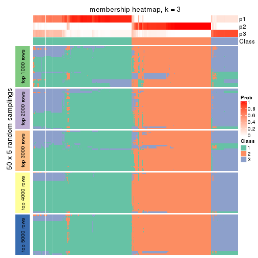</p>

</div>
<div id='tab-ATC-mclust-membership-heatmap-3'>
<pre><code class="r">membership_heatmap(res, k = 4)
</code></pre>

<p></p>

</div>
<div id='tab-ATC-mclust-membership-heatmap-4'>
<pre><code class="r">membership_heatmap(res, k = 5)
</code></pre>

<p></p>

</div>
<div id='tab-ATC-mclust-membership-heatmap-5'>
<pre><code class="r">membership_heatmap(res, k = 6)
</code></pre>

<p></p>

</div>
</div>

As soon as we have had the classes for columns, we can look for signatures
which are significantly different between classes which can be candidate marks
for certain classes. Following are the heatmaps for signatures.


Signature heatmaps where rows are scaled:


<script>
$( function() {
	$( '#tabs-ATC-mclust-get-signatures' ).tabs();
} );
</script>
<div id='tabs-ATC-mclust-get-signatures'>
<ul>
<li><a href='#tab-ATC-mclust-get-signatures-1'>k = 2</a></li>
<li><a href='#tab-ATC-mclust-get-signatures-2'>k = 3</a></li>
<li><a href='#tab-ATC-mclust-get-signatures-3'>k = 4</a></li>
<li><a href='#tab-ATC-mclust-get-signatures-4'>k = 5</a></li>
<li><a href='#tab-ATC-mclust-get-signatures-5'>k = 6</a></li>
</ul>
<div id='tab-ATC-mclust-get-signatures-1'>
<pre><code class="r">get_signatures(res, k = 2)
</code></pre>

<p>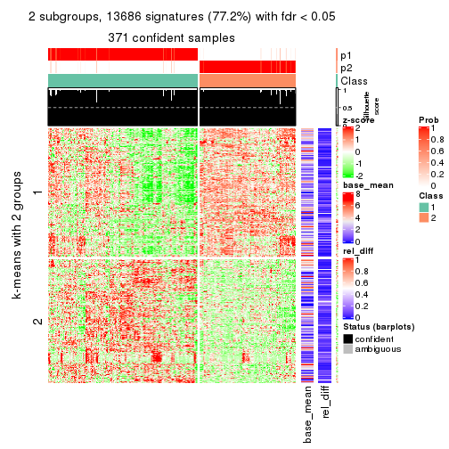</p>

</div>
<div id='tab-ATC-mclust-get-signatures-2'>
<pre><code class="r">get_signatures(res, k = 3)
</code></pre>

<p></p>

</div>
<div id='tab-ATC-mclust-get-signatures-3'>
<pre><code class="r">get_signatures(res, k = 4)
</code></pre>

<p></p>

</div>
<div id='tab-ATC-mclust-get-signatures-4'>
<pre><code class="r">get_signatures(res, k = 5)
</code></pre>

<p></p>

</div>
<div id='tab-ATC-mclust-get-signatures-5'>
<pre><code class="r">get_signatures(res, k = 6)
</code></pre>

<p></p>

</div>
</div>


Signature heatmaps where rows are not scaled:


<script>
$( function() {
	$( '#tabs-ATC-mclust-get-signatures-no-scale' ).tabs();
} );
</script>
<div id='tabs-ATC-mclust-get-signatures-no-scale'>
<ul>
<li><a href='#tab-ATC-mclust-get-signatures-no-scale-1'>k = 2</a></li>
<li><a href='#tab-ATC-mclust-get-signatures-no-scale-2'>k = 3</a></li>
<li><a href='#tab-ATC-mclust-get-signatures-no-scale-3'>k = 4</a></li>
<li><a href='#tab-ATC-mclust-get-signatures-no-scale-4'>k = 5</a></li>
<li><a href='#tab-ATC-mclust-get-signatures-no-scale-5'>k = 6</a></li>
</ul>
<div id='tab-ATC-mclust-get-signatures-no-scale-1'>
<pre><code class="r">get_signatures(res, k = 2, scale_rows = FALSE)
</code></pre>

<p></p>

</div>
<div id='tab-ATC-mclust-get-signatures-no-scale-2'>
<pre><code class="r">get_signatures(res, k = 3, scale_rows = FALSE)
</code></pre>

<p></p>

</div>
<div id='tab-ATC-mclust-get-signatures-no-scale-3'>
<pre><code class="r">get_signatures(res, k = 4, scale_rows = FALSE)
</code></pre>

<p></p>

</div>
<div id='tab-ATC-mclust-get-signatures-no-scale-4'>
<pre><code class="r">get_signatures(res, k = 5, scale_rows = FALSE)
</code></pre>

<p></p>

</div>
<div id='tab-ATC-mclust-get-signatures-no-scale-5'>
<pre><code class="r">get_signatures(res, k = 6, scale_rows = FALSE)
</code></pre>

<p></p>

</div>
</div>


Compare the overlap of signatures from different k:

```r
compare_signatures(res)
```


`get_signature()` returns a data frame invisibly. TO get the list of signatures, the function
call should be assigned to a variable explicitly. In following code, if `plot` argument is set
to `FALSE`, no heatmap is plotted while only the differential analysis is performed.

```r
# code only for demonstration
tb = get_signature(res, k = ..., plot = FALSE)
```

An example of the output of `tb` is:

```
#>   which_row         fdr    mean_1    mean_2 scaled_mean_1 scaled_mean_2 km
#> 1        38 0.042760348  8.373488  9.131774    -0.5533452     0.5164555  1
#> 2        40 0.018707592  7.106213  8.469186    -0.6173731     0.5762149  1
#> 3        55 0.019134737 10.221463 11.207825    -0.6159697     0.5749050  1
#> 4        59 0.006059896  5.921854  7.869574    -0.6899429     0.6439467  1
#> 5        60 0.018055526  8.928898 10.211722    -0.6204761     0.5791110  1
#> 6        98 0.009384629 15.714769 14.887706     0.6635654    -0.6193277  2
...
```

The columns in `tb` are:

1. `which_row`: row indices corresponding to the input matrix.
2. `fdr`: FDR for the differential test. 
3. `mean_x`: The mean value in group x.
4. `scaled_mean_x`: The mean value in group x after rows are scaled.
5. `km`: Row groups if k-means clustering is applied to rows.


UMAP plot which shows how samples are separated.


<script>
$( function() {
	$( '#tabs-ATC-mclust-dimension-reduction' ).tabs();
} );
</script>
<div id='tabs-ATC-mclust-dimension-reduction'>
<ul>
<li><a href='#tab-ATC-mclust-dimension-reduction-1'>k = 2</a></li>
<li><a href='#tab-ATC-mclust-dimension-reduction-2'>k = 3</a></li>
<li><a href='#tab-ATC-mclust-dimension-reduction-3'>k = 4</a></li>
<li><a href='#tab-ATC-mclust-dimension-reduction-4'>k = 5</a></li>
<li><a href='#tab-ATC-mclust-dimension-reduction-5'>k = 6</a></li>
</ul>
<div id='tab-ATC-mclust-dimension-reduction-1'>
<pre><code class="r">dimension_reduction(res, k = 2, method = &quot;UMAP&quot;)
</code></pre>

<p></p>

</div>
<div id='tab-ATC-mclust-dimension-reduction-2'>
<pre><code class="r">dimension_reduction(res, k = 3, method = &quot;UMAP&quot;)
</code></pre>

<p></p>

</div>
<div id='tab-ATC-mclust-dimension-reduction-3'>
<pre><code class="r">dimension_reduction(res, k = 4, method = &quot;UMAP&quot;)
</code></pre>

<p></p>

</div>
<div id='tab-ATC-mclust-dimension-reduction-4'>
<pre><code class="r">dimension_reduction(res, k = 5, method = &quot;UMAP&quot;)
</code></pre>

<p></p>

</div>
<div id='tab-ATC-mclust-dimension-reduction-5'>
<pre><code class="r">dimension_reduction(res, k = 6, method = &quot;UMAP&quot;)
</code></pre>

<p>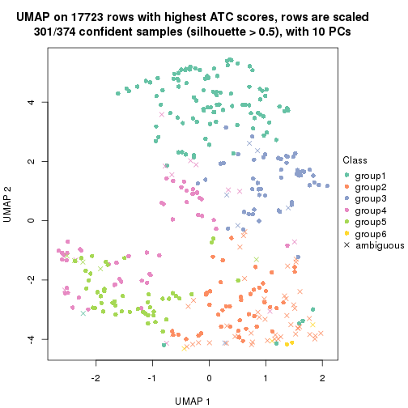</p>

</div>
</div>


Following heatmap shows how subgroups are split when increasing `k`:

```r
collect_classes(res)
```


If matrix rows can be associated to genes, consider to use `GO_Enrichment(res,
...)` to perform function enrichment for the signature genes.


 

---------------------------------------------------


### ATC:NMF*


The object with results only for a single top-value method and a single partition method 
can be extracted as:

```r
res = res_list["ATC", "NMF"]
# you can also extract it by
# res = res_list["ATC:NMF"]
```

A summary of `res` and all the functions that can be applied to it:

```r
res
```

```
#> A 'ConsensusPartition' object with k = 2, 3, 4, 5, 6.
#>   On a matrix with 17723 rows and 374 columns.
#>   Top rows (1000, 2000, 3000, 4000, 5000) are extracted by 'ATC' method.
#>   Subgroups are detected by 'NMF' method.
#>   Performed in total 1250 partitions by row resampling.
#>   Best k for subgroups seems to be 2.
#> 
#> Following methods can be applied to this 'ConsensusPartition' object:
#>  [1] "cola_report"             "collect_classes"         "collect_plots"          
#>  [4] "collect_stats"           "colnames"                "compare_signatures"     
#>  [7] "consensus_heatmap"       "dimension_reduction"     "functional_enrichment"  
#> [10] "get_anno_col"            "get_anno"                "get_classes"            
#> [13] "get_consensus"           "get_matrix"              "get_membership"         
#> [16] "get_param"               "get_signatures"          "get_stats"              
#> [19] "is_best_k"               "is_stable_k"             "membership_heatmap"     
#> [22] "ncol"                    "nrow"                    "plot_ecdf"              
#> [25] "rownames"                "select_partition_number" "show"                   
#> [28] "suggest_best_k"          "test_to_known_factors"
```

`collect_plots()` function collects all the plots made from `res` for all `k` (number of partitions)
into one single page to provide an easy and fast comparison between different `k`.

```r
collect_plots(res)
```


The plots are:

- The first row: a plot of the ECDF (Empirical cumulative distribution
  function) curves of the consensus matrix for each `k` and the heatmap of
  predicted classes for each `k`.
- The second row: heatmaps of the consensus matrix for each `k`.
- The third row: heatmaps of the membership matrix for each `k`.
- The fouth row: heatmaps of the signatures for each `k`.

All the plots in panels can be made by individual functions and they are
plotted later in this section.

`select_partition_number()` produces several plots showing different
statistics for choosing "optimized" `k`. There are following statistics:

- ECDF curves of the consensus matrix for each `k`;
- 1-PAC. [The PAC
  score](https://en.wikipedia.org/wiki/Consensus_clustering#Over-interpretation_potential_of_consensus_clustering)
  measures the proportion of the ambiguous subgrouping.
- Mean silhouette score.
- Concordance. The mean probability of fiting the consensus class ids in all
  partitions.
- Area increased. Denote $A_k$ as the area under the ECDF curve for current
  `k`, the area increased is defined as $A_k - A_{k-1}$.
- Rand index. The percent of pairs of samples that are both in a same cluster
  or both are not in a same cluster in the partition of k and k-1.
- Jaccard index. The ratio of pairs of samples are both in a same cluster in
  the partition of k and k-1 and the pairs of samples are both in a same
  cluster in the partition k or k-1.

The detailed explanations of these statistics can be found in [the cola
vignette](http://bioconductor.org/packages/devel/bioc/vignettes/cola/inst/doc/cola.html#toc_13).

Generally speaking, lower PAC score, higher mean silhouette score or higher
concordance corresponds to better partition. Rand index and Jaccard index
measure how similar the current partition is compared to partition with `k-1`.
If they are too similar, we won't accept `k` is better than `k-1`.

```r
select_partition_number(res)
```


The numeric values for all these statistics can be obtained by `get_stats()`.

```r
get_stats(res)
```

```
#>   k 1-PAC mean_silhouette concordance area_increased  Rand Jaccard
#> 2 2 0.924           0.943       0.975         0.3495 0.642   0.642
#> 3 3 0.783           0.857       0.937         0.7751 0.690   0.535
#> 4 4 0.776           0.809       0.907         0.1881 0.795   0.514
#> 5 5 0.726           0.713       0.857         0.0589 0.912   0.692
#> 6 6 0.664           0.584       0.776         0.0402 0.950   0.793
```

`suggest_best_k()` suggests the best $k$ based on these statistics. The rules are as follows:

- All $k$ with Jaccard index larger than 0.95 are removed because the increase of
  the partition number does not provides enough extra information. If all $k$ are removed,
  the best $k$ is assigned by `NA`.
- For $k$ with 1-PAC larger than 0.9, the maximal $k$ is taken as the "best k". Other $k$ is called "optional k".
- If it does not fit the second rule. The $k$ with the highest vote of highest
  1-PAC, mean silhouette and concordance is taken as the "best k".

```r
suggest_best_k(res)
```

```
#> [1] 2
```


Following shows the table of the partitions (You need to click the **show/hide
code output** link to see it). The membership matrix (columns with name `p*`)
is inferred by
[`clue::cl_consensus()`](https://www.rdocumentation.org/link/cl_consensus?package=clue)
function with the `SE` method. Basically the value in the membership matrix
represents the probability to belong to a certain group. The finall class
label for an item is determined with the group with highest probability it
belongs to.

In `get_classes()` function, the entropy is calculated from the membership
matrix and the silhouette score is calculated from the consensus matrix.


<script>
$( function() {
	$( '#tabs-ATC-NMF-get-classes' ).tabs();
} );
</script>
<div id='tabs-ATC-NMF-get-classes'>
<ul>
<li><a href='#tab-ATC-NMF-get-classes-1'>k = 2</a></li>
<li><a href='#tab-ATC-NMF-get-classes-2'>k = 3</a></li>
<li><a href='#tab-ATC-NMF-get-classes-3'>k = 4</a></li>
<li><a href='#tab-ATC-NMF-get-classes-4'>k = 5</a></li>
<li><a href='#tab-ATC-NMF-get-classes-5'>k = 6</a></li>
</ul>

<div id='tab-ATC-NMF-get-classes-1'>
<p><a id='tab-ATC-NMF-get-classes-1-a' style='color:#0366d6' href='#'>show/hide code output</a></p>
<pre><code class="r">cbind(get_classes(res, k = 2), get_membership(res, k = 2))
</code></pre>

<pre><code>#&gt;            class entropy silhouette    p1    p2
#&gt; SRR660824      2  0.0000      0.987 0.000 1.000
#&gt; SRR603858      2  0.0000      0.987 0.000 1.000
#&gt; SRR817070      2  0.0000      0.987 0.000 1.000
#&gt; SRR1486995     2  0.0000      0.987 0.000 1.000
#&gt; SRR813043      2  0.0000      0.987 0.000 1.000
#&gt; SRR656874      2  0.0000      0.987 0.000 1.000
#&gt; SRR659037      2  0.0000      0.987 0.000 1.000
#&gt; SRR662031      1  0.8327      0.690 0.736 0.264
#&gt; SRR1081283     2  0.0000      0.987 0.000 1.000
#&gt; SRR1481036     2  0.0000      0.987 0.000 1.000
#&gt; SRR1434009     2  0.0000      0.987 0.000 1.000
#&gt; SRR1376676     1  0.0000      0.929 1.000 0.000
#&gt; SRR1396967     2  0.0000      0.987 0.000 1.000
#&gt; SRR665429      2  0.0000      0.987 0.000 1.000
#&gt; SRR1388025     2  0.0000      0.987 0.000 1.000
#&gt; SRR600784      2  0.5294      0.848 0.120 0.880
#&gt; SRR657611      1  0.7299      0.770 0.796 0.204
#&gt; SRR1333659     2  0.0000      0.987 0.000 1.000
#&gt; SRR1323896     2  0.0000      0.987 0.000 1.000
#&gt; SRR1453971     1  0.9996      0.156 0.512 0.488
#&gt; SRR1421010     1  0.0000      0.929 1.000 0.000
#&gt; SRR1334490     2  0.0000      0.987 0.000 1.000
#&gt; SRR1309468     1  0.0000      0.929 1.000 0.000
#&gt; SRR1468637     2  0.7299      0.721 0.204 0.796
#&gt; SRR1365489     2  0.0000      0.987 0.000 1.000
#&gt; SRR627445      2  0.0000      0.987 0.000 1.000
#&gt; SRR607863      2  0.0000      0.987 0.000 1.000
#&gt; SRR1475524     1  0.0000      0.929 1.000 0.000
#&gt; SRR1405504     2  0.0000      0.987 0.000 1.000
#&gt; SRR615695      1  0.0000      0.929 1.000 0.000
#&gt; SRR600900      2  0.0000      0.987 0.000 1.000
#&gt; SRR601477      2  0.0000      0.987 0.000 1.000
#&gt; SRR1487215     2  0.0000      0.987 0.000 1.000
#&gt; SRR1310797     2  0.0000      0.987 0.000 1.000
#&gt; SRR1362713     1  0.0000      0.929 1.000 0.000
#&gt; SRR1431385     1  0.0000      0.929 1.000 0.000
#&gt; SRR1379089     2  0.0000      0.987 0.000 1.000
#&gt; SRR1102079     2  0.0000      0.987 0.000 1.000
#&gt; SRR1357210     1  0.0000      0.929 1.000 0.000
#&gt; SRR657659      2  0.0000      0.987 0.000 1.000
#&gt; SRR663573      2  0.0000      0.987 0.000 1.000
#&gt; SRR603188      2  0.0000      0.987 0.000 1.000
#&gt; SRR1471200     2  0.0000      0.987 0.000 1.000
#&gt; SRR1310975     2  0.0000      0.987 0.000 1.000
#&gt; SRR627457      2  0.0000      0.987 0.000 1.000
#&gt; SRR1367654     2  0.0000      0.987 0.000 1.000
#&gt; SRR1488410     1  0.0000      0.929 1.000 0.000
#&gt; SRR1457750     2  0.2043      0.954 0.032 0.968
#&gt; SRR1099546     1  0.0000      0.929 1.000 0.000
#&gt; SRR604480      2  0.0000      0.987 0.000 1.000
#&gt; SRR1390477     2  0.0000      0.987 0.000 1.000
#&gt; SRR1458447     2  0.0000      0.987 0.000 1.000
#&gt; SRR1473161     2  0.0000      0.987 0.000 1.000
#&gt; SRR1409813     2  0.0000      0.987 0.000 1.000
#&gt; SRR612791      1  0.0000      0.929 1.000 0.000
#&gt; SRR1470580     2  0.0000      0.987 0.000 1.000
#&gt; SRR1444063     1  0.0000      0.929 1.000 0.000
#&gt; SRR1355578     1  0.0000      0.929 1.000 0.000
#&gt; SRR1429203     1  0.0000      0.929 1.000 0.000
#&gt; SRR599154      2  0.0000      0.987 0.000 1.000
#&gt; SRR814244      1  0.9580      0.471 0.620 0.380
#&gt; SRR1404123     2  0.0000      0.987 0.000 1.000
#&gt; SRR656934      2  0.0000      0.987 0.000 1.000
#&gt; SRR1339029     2  0.0000      0.987 0.000 1.000
#&gt; SRR821525      2  0.0000      0.987 0.000 1.000
#&gt; SRR1443677     1  0.0000      0.929 1.000 0.000
#&gt; SRR1406330     1  0.0000      0.929 1.000 0.000
#&gt; SRR1338124     2  0.0000      0.987 0.000 1.000
#&gt; SRR1391376     2  0.0000      0.987 0.000 1.000
#&gt; SRR661842      2  0.0000      0.987 0.000 1.000
#&gt; SRR1395699     2  0.0000      0.987 0.000 1.000
#&gt; SRR1312209     1  0.7453      0.760 0.788 0.212
#&gt; SRR1359469     1  0.0000      0.929 1.000 0.000
#&gt; SRR658885      2  0.0000      0.987 0.000 1.000
#&gt; SRR1414578     1  0.0000      0.929 1.000 0.000
#&gt; SRR603620      2  0.0000      0.987 0.000 1.000
#&gt; SRR604677      2  0.0376      0.983 0.004 0.996
#&gt; SRR603800      2  0.0000      0.987 0.000 1.000
#&gt; SRR602058      2  0.0000      0.987 0.000 1.000
#&gt; SRR817488      2  0.0000      0.987 0.000 1.000
#&gt; SRR655601      2  0.0000      0.987 0.000 1.000
#&gt; SRR1434821     2  0.0000      0.987 0.000 1.000
#&gt; SRR1349166     2  0.0000      0.987 0.000 1.000
#&gt; SRR615129      1  0.8443      0.678 0.728 0.272
#&gt; SRR607586      2  0.0000      0.987 0.000 1.000
#&gt; SRR602680      2  0.0000      0.987 0.000 1.000
#&gt; SRR1411070     2  0.0000      0.987 0.000 1.000
#&gt; SRR663038      2  0.0000      0.987 0.000 1.000
#&gt; SRR1489416     2  0.0000      0.987 0.000 1.000
#&gt; SRR1479155     1  0.0000      0.929 1.000 0.000
#&gt; SRR662162      1  0.0376      0.927 0.996 0.004
#&gt; SRR1374567     2  0.8386      0.600 0.268 0.732
#&gt; SRR1434048     2  0.0000      0.987 0.000 1.000
#&gt; SRR2184865     2  0.0000      0.987 0.000 1.000
#&gt; SRR2170135     1  0.0000      0.929 1.000 0.000
#&gt; SRR615551      2  0.0000      0.987 0.000 1.000
#&gt; SRR1335513     2  0.0000      0.987 0.000 1.000
#&gt; SRR1370216     2  0.3879      0.904 0.076 0.924
#&gt; SRR662954      2  0.0000      0.987 0.000 1.000
#&gt; SRR1375738     2  0.0000      0.987 0.000 1.000
#&gt; SRR1356577     2  0.0000      0.987 0.000 1.000
#&gt; SRR1073119     2  0.0000      0.987 0.000 1.000
#&gt; SRR663549      2  0.0000      0.987 0.000 1.000
#&gt; SRR1478015     2  0.0000      0.987 0.000 1.000
#&gt; SRR600632      2  0.0000      0.987 0.000 1.000
#&gt; SRR811866      2  0.0000      0.987 0.000 1.000
#&gt; SRR1401101     2  0.0000      0.987 0.000 1.000
#&gt; SRR1477797     2  0.0000      0.987 0.000 1.000
#&gt; SRR1402986     2  0.0000      0.987 0.000 1.000
#&gt; SRR658897      1  0.8813      0.631 0.700 0.300
#&gt; SRR1419869     1  0.9710      0.423 0.600 0.400
#&gt; SRR1490700     2  0.0000      0.987 0.000 1.000
#&gt; SRR601723      2  0.0000      0.987 0.000 1.000
#&gt; SRR1384115     2  0.0000      0.987 0.000 1.000
#&gt; SRR1476927     2  0.0000      0.987 0.000 1.000
#&gt; SRR1387769     2  0.0000      0.987 0.000 1.000
#&gt; SRR1322595     2  0.1633      0.963 0.024 0.976
#&gt; SRR1370423     2  0.0000      0.987 0.000 1.000
#&gt; SRR1314976     2  0.0000      0.987 0.000 1.000
#&gt; SRR1319560     2  0.0000      0.987 0.000 1.000
#&gt; SRR1352683     2  0.0000      0.987 0.000 1.000
#&gt; SRR1473800     1  0.0000      0.929 1.000 0.000
#&gt; SRR1326384     2  0.0000      0.987 0.000 1.000
#&gt; SRR1360807     2  0.0000      0.987 0.000 1.000
#&gt; SRR1332544     1  0.0000      0.929 1.000 0.000
#&gt; SRR598695      1  0.0000      0.929 1.000 0.000
#&gt; SRR807824      2  0.0000      0.987 0.000 1.000
#&gt; SRR809296      2  0.0000      0.987 0.000 1.000
#&gt; SRR657927      2  0.0000      0.987 0.000 1.000
#&gt; SRR1440682     2  0.0000      0.987 0.000 1.000
#&gt; SRR1454415     2  0.0000      0.987 0.000 1.000
#&gt; SRR1419131     2  0.0000      0.987 0.000 1.000
#&gt; SRR1404293     1  0.0000      0.929 1.000 0.000
#&gt; SRR1473340     2  0.9732      0.246 0.404 0.596
#&gt; SRR1345563     1  0.0000      0.929 1.000 0.000
#&gt; SRR1323382     2  0.0000      0.987 0.000 1.000
#&gt; SRR1480697     2  0.0000      0.987 0.000 1.000
#&gt; SRR1321808     2  0.0000      0.987 0.000 1.000
#&gt; SRR1382756     2  0.0000      0.987 0.000 1.000
#&gt; SRR1312558     2  0.0000      0.987 0.000 1.000
#&gt; SRR1417088     2  0.0000      0.987 0.000 1.000
#&gt; SRR1433027     2  0.0000      0.987 0.000 1.000
#&gt; SRR662257      2  0.0000      0.987 0.000 1.000
#&gt; SRR600417      2  0.0000      0.987 0.000 1.000
#&gt; SRR812493      2  0.0000      0.987 0.000 1.000
#&gt; SRR612743      2  0.0000      0.987 0.000 1.000
#&gt; SRR1361345     1  0.0000      0.929 1.000 0.000
#&gt; SRR600584      2  0.0000      0.987 0.000 1.000
#&gt; SRR1310520     2  0.0000      0.987 0.000 1.000
#&gt; SRR1395595     2  0.0000      0.987 0.000 1.000
#&gt; SRR1334074     2  0.0000      0.987 0.000 1.000
#&gt; SRR654838      2  0.0000      0.987 0.000 1.000
#&gt; SRR1376694     1  0.0000      0.929 1.000 0.000
#&gt; SRR1433841     1  0.9963      0.239 0.536 0.464
#&gt; SRR1366837     2  0.0000      0.987 0.000 1.000
#&gt; SRR1467479     2  0.0000      0.987 0.000 1.000
#&gt; SRR1459055     1  0.0000      0.929 1.000 0.000
#&gt; SRR1471050     2  0.0000      0.987 0.000 1.000
#&gt; SRR603004      2  0.0000      0.987 0.000 1.000
#&gt; SRR814703      2  0.0000      0.987 0.000 1.000
#&gt; SRR661937      2  0.0000      0.987 0.000 1.000
#&gt; SRR614359      1  0.0000      0.929 1.000 0.000
#&gt; SRR1071568     2  0.0000      0.987 0.000 1.000
#&gt; SRR1389084     2  0.0000      0.987 0.000 1.000
#&gt; SRR1337624     2  0.0000      0.987 0.000 1.000
#&gt; SRR1344400     2  0.0000      0.987 0.000 1.000
#&gt; SRR1414290     2  0.0000      0.987 0.000 1.000
#&gt; SRR1413644     2  0.0000      0.987 0.000 1.000
#&gt; SRR1098998     1  0.0000      0.929 1.000 0.000
#&gt; SRR1481279     1  0.0000      0.929 1.000 0.000
#&gt; SRR1315103     1  0.0000      0.929 1.000 0.000
#&gt; SRR1099286     1  0.8327      0.690 0.736 0.264
#&gt; SRR2166570     2  0.0000      0.987 0.000 1.000
#&gt; SRR601445      1  0.0000      0.929 1.000 0.000
#&gt; SRR1439719     2  0.0000      0.987 0.000 1.000
#&gt; SRR1377026     2  0.0000      0.987 0.000 1.000
#&gt; SRR1327386     1  0.0000      0.929 1.000 0.000
#&gt; SRR654826      2  0.0000      0.987 0.000 1.000
#&gt; SRR1460433     2  0.0000      0.987 0.000 1.000
#&gt; SRR1469345     1  0.6973      0.786 0.812 0.188
#&gt; SRR1421462     2  0.0000      0.987 0.000 1.000
#&gt; SRR662966      2  0.8713      0.549 0.292 0.708
#&gt; SRR1339175     1  0.0000      0.929 1.000 0.000
#&gt; SRR1447736     2  0.0000      0.987 0.000 1.000
#&gt; SRR1434671     2  0.0000      0.987 0.000 1.000
#&gt; SRR660800      2  0.0000      0.987 0.000 1.000
#&gt; SRR1465543     2  0.0000      0.987 0.000 1.000
#&gt; SRR1342023     1  0.0000      0.929 1.000 0.000
#&gt; SRR1335670     1  0.5408      0.842 0.876 0.124
#&gt; SRR1400955     2  0.0000      0.987 0.000 1.000
#&gt; SRR1072150     2  0.0000      0.987 0.000 1.000
#&gt; SRR1442822     1  0.0000      0.929 1.000 0.000
#&gt; SRR1364658     1  0.9710      0.423 0.600 0.400
#&gt; SRR1098074     2  0.0000      0.987 0.000 1.000
#&gt; SRR1442778     1  0.0000      0.929 1.000 0.000
#&gt; SRR1086728     2  0.0000      0.987 0.000 1.000
#&gt; SRR627464      2  0.0000      0.987 0.000 1.000
#&gt; SRR1409193     2  0.0000      0.987 0.000 1.000
#&gt; SRR2168286     2  0.0000      0.987 0.000 1.000
#&gt; SRR615539      2  0.0000      0.987 0.000 1.000
#&gt; SRR663623      2  0.0000      0.987 0.000 1.000
#&gt; SRR1471989     2  0.0000      0.987 0.000 1.000
#&gt; SRR1468828     2  0.0000      0.987 0.000 1.000
#&gt; SRR1381934     2  0.0000      0.987 0.000 1.000
#&gt; SRR1471098     2  0.0376      0.983 0.004 0.996
#&gt; SRR1314749     2  0.0000      0.987 0.000 1.000
#&gt; SRR2166874     2  0.0000      0.987 0.000 1.000
#&gt; SRR821302      1  0.9795      0.381 0.584 0.416
#&gt; SRR1435066     2  0.0000      0.987 0.000 1.000
#&gt; SRR661601      2  0.0000      0.987 0.000 1.000
#&gt; SRR1446546     2  0.0000      0.987 0.000 1.000
#&gt; SRR1419784     2  0.0000      0.987 0.000 1.000
#&gt; SRR1357233     2  0.0000      0.987 0.000 1.000
#&gt; SRR1441889     1  0.0000      0.929 1.000 0.000
#&gt; SRR1413940     1  0.0000      0.929 1.000 0.000
#&gt; SRR1324250     2  0.0000      0.987 0.000 1.000
#&gt; SRR1442862     2  0.0000      0.987 0.000 1.000
#&gt; SRR662474      2  0.0000      0.987 0.000 1.000
#&gt; SRR1416226     2  0.0000      0.987 0.000 1.000
#&gt; SRR1417404     2  0.0000      0.987 0.000 1.000
#&gt; SRR665466      2  0.0000      0.987 0.000 1.000
#&gt; SRR658849      2  0.0938      0.975 0.012 0.988
#&gt; SRR1460025     2  0.0000      0.987 0.000 1.000
#&gt; SRR1408136     1  0.0000      0.929 1.000 0.000
#&gt; SRR1489995     2  0.0000      0.987 0.000 1.000
#&gt; SRR1374092     2  0.0000      0.987 0.000 1.000
#&gt; SRR1488429     2  0.0000      0.987 0.000 1.000
#&gt; SRR1087559     2  0.0000      0.987 0.000 1.000
#&gt; SRR817004      1  0.0000      0.929 1.000 0.000
#&gt; SRR1429660     2  0.0000      0.987 0.000 1.000
#&gt; SRR604390      2  0.0000      0.987 0.000 1.000
#&gt; SRR614936      2  0.0000      0.987 0.000 1.000
#&gt; SRR1365938     1  0.0000      0.929 1.000 0.000
#&gt; SRR1437324     1  0.0000      0.929 1.000 0.000
#&gt; SRR613414      2  0.0000      0.987 0.000 1.000
#&gt; SRR660414      2  0.0000      0.987 0.000 1.000
#&gt; SRR1452185     1  0.0000      0.929 1.000 0.000
#&gt; SRR1347020     2  0.4161      0.895 0.084 0.916
#&gt; SRR1398036     2  0.0000      0.987 0.000 1.000
#&gt; SRR1436674     1  0.0000      0.929 1.000 0.000
#&gt; SRR603750      2  0.0000      0.987 0.000 1.000
#&gt; SRR608630      2  0.0000      0.987 0.000 1.000
#&gt; SRR655625      2  0.0000      0.987 0.000 1.000
#&gt; SRR599059      2  0.0000      0.987 0.000 1.000
#&gt; SRR615189      2  0.0000      0.987 0.000 1.000
#&gt; SRR1466889     2  0.0000      0.987 0.000 1.000
#&gt; SRR1084602     2  0.0000      0.987 0.000 1.000
#&gt; SRR1335422     1  0.0000      0.929 1.000 0.000
#&gt; SRR1356805     2  0.0000      0.987 0.000 1.000
#&gt; SRR1385300     2  0.0000      0.987 0.000 1.000
#&gt; SRR654814      1  0.0000      0.929 1.000 0.000
#&gt; SRR658385      2  0.0000      0.987 0.000 1.000
#&gt; SRR820596      2  0.4815      0.870 0.104 0.896
#&gt; SRR1318118     2  0.4939      0.864 0.108 0.892
#&gt; SRR1480766     2  0.0000      0.987 0.000 1.000
#&gt; SRR1406539     1  0.7219      0.774 0.800 0.200
#&gt; SRR1341833     2  0.0000      0.987 0.000 1.000
#&gt; SRR1441826     2  0.0000      0.987 0.000 1.000
#&gt; SRR1448051     1  0.0000      0.929 1.000 0.000
#&gt; SRR1326752     2  0.0000      0.987 0.000 1.000
#&gt; SRR665217      2  0.0000      0.987 0.000 1.000
#&gt; SRR819186      2  0.0000      0.987 0.000 1.000
#&gt; SRR661517      2  0.0000      0.987 0.000 1.000
#&gt; SRR607166      2  0.0000      0.987 0.000 1.000
#&gt; SRR809065      2  0.0000      0.987 0.000 1.000
#&gt; SRR1415872     2  0.0000      0.987 0.000 1.000
#&gt; SRR1415463     2  0.0000      0.987 0.000 1.000
#&gt; SRR1381161     2  0.0000      0.987 0.000 1.000
#&gt; SRR1442231     2  0.0000      0.987 0.000 1.000
#&gt; SRR1374696     2  0.0000      0.987 0.000 1.000
#&gt; SRR1451988     2  0.0000      0.987 0.000 1.000
#&gt; SRR660555      1  0.0000      0.929 1.000 0.000
#&gt; SRR657801      1  0.0000      0.929 1.000 0.000
#&gt; SRR663344      2  0.0000      0.987 0.000 1.000
#&gt; SRR1472462     2  0.0000      0.987 0.000 1.000
#&gt; SRR1406176     2  0.0000      0.987 0.000 1.000
#&gt; SRR656886      2  0.0000      0.987 0.000 1.000
#&gt; SRR1498337     2  0.0000      0.987 0.000 1.000
#&gt; SRR613066      2  0.7602      0.693 0.220 0.780
#&gt; SRR1309490     1  0.0000      0.929 1.000 0.000
#&gt; SRR602492      2  0.0000      0.987 0.000 1.000
#&gt; SRR1447347     2  0.9775      0.219 0.412 0.588
#&gt; SRR1475546     2  0.0000      0.987 0.000 1.000
#&gt; SRR627459      2  0.0000      0.987 0.000 1.000
#&gt; SRR1434332     2  0.0000      0.987 0.000 1.000
#&gt; SRR1070358     2  0.0000      0.987 0.000 1.000
#&gt; SRR1345936     2  0.0000      0.987 0.000 1.000
#&gt; SRR665658      2  0.0000      0.987 0.000 1.000
#&gt; SRR1321351     2  0.0000      0.987 0.000 1.000
#&gt; SRR657880      2  0.0000      0.987 0.000 1.000
#&gt; SRR1373903     2  0.0000      0.987 0.000 1.000
#&gt; SRR657396      2  0.0000      0.987 0.000 1.000
#&gt; SRR660981      2  0.0000      0.987 0.000 1.000
#&gt; SRR818499      1  0.0000      0.929 1.000 0.000
#&gt; SRR819658      2  0.0000      0.987 0.000 1.000
#&gt; SRR1376316     1  0.0000      0.929 1.000 0.000
#&gt; SRR1323723     2  0.0000      0.987 0.000 1.000
#&gt; SRR1476719     1  0.7815      0.735 0.768 0.232
#&gt; SRR1403478     2  0.0000      0.987 0.000 1.000
#&gt; SRR1095695     2  0.0000      0.987 0.000 1.000
#&gt; SRR1352391     2  0.0000      0.987 0.000 1.000
#&gt; SRR1498813     2  0.0000      0.987 0.000 1.000
#&gt; SRR627437      2  0.0000      0.987 0.000 1.000
#&gt; SRR2185097     1  0.7376      0.765 0.792 0.208
#&gt; SRR817166      2  0.0000      0.987 0.000 1.000
#&gt; SRR1091670     2  0.0000      0.987 0.000 1.000
#&gt; SRR603776      2  0.0000      0.987 0.000 1.000
#&gt; SRR1479640     2  0.0000      0.987 0.000 1.000
#&gt; SRR660152      2  0.9775      0.219 0.412 0.588
#&gt; SRR1074769     2  0.0000      0.987 0.000 1.000
#&gt; SRR656153      2  0.0000      0.987 0.000 1.000
#&gt; SRR1392502     2  0.0000      0.987 0.000 1.000
#&gt; SRR1359609     1  0.0000      0.929 1.000 0.000
#&gt; SRR601925      2  0.0000      0.987 0.000 1.000
#&gt; SRR2165182     2  0.0000      0.987 0.000 1.000
#&gt; SRR608542      2  0.0000      0.987 0.000 1.000
#&gt; SRR655064      2  0.0000      0.987 0.000 1.000
#&gt; SRR1432430     2  0.0000      0.987 0.000 1.000
#&gt; SRR808472      2  0.0000      0.987 0.000 1.000
#&gt; SRR1414958     2  0.0000      0.987 0.000 1.000
#&gt; SRR598484      2  0.0000      0.987 0.000 1.000
#&gt; SRR612755      2  0.0000      0.987 0.000 1.000
#&gt; SRR1365808     1  0.0000      0.929 1.000 0.000
#&gt; SRR1391724     2  0.0000      0.987 0.000 1.000
#&gt; SRR1322373     2  0.0000      0.987 0.000 1.000
#&gt; SRR1489265     2  0.0000      0.987 0.000 1.000
#&gt; SRR1359099     2  0.0000      0.987 0.000 1.000
#&gt; SRR607279      2  0.0000      0.987 0.000 1.000
#&gt; SRR810461      2  0.0000      0.987 0.000 1.000
#&gt; SRR627427      1  0.1414      0.917 0.980 0.020
#&gt; SRR612887      2  0.0000      0.987 0.000 1.000
#&gt; SRR809807      2  0.0000      0.987 0.000 1.000
#&gt; SRR663112      2  0.0000      0.987 0.000 1.000
#&gt; SRR1346933     1  0.7376      0.765 0.792 0.208
#&gt; SRR1487910     1  0.7056      0.782 0.808 0.192
#&gt; SRR603092      2  0.0000      0.987 0.000 1.000
#&gt; SRR1417680     2  0.0000      0.987 0.000 1.000
#&gt; SRR1383785     1  0.0000      0.929 1.000 0.000
#&gt; SRR1070015     2  0.0000      0.987 0.000 1.000
#&gt; SRR1466222     2  0.0000      0.987 0.000 1.000
#&gt; SRR1416119     2  0.0000      0.987 0.000 1.000
#&gt; SRR819318      2  0.9833      0.178 0.424 0.576
#&gt; SRR608288      2  0.0000      0.987 0.000 1.000
#&gt; SRR811121      2  0.0000      0.987 0.000 1.000
#&gt; SRR613138      2  0.0000      0.987 0.000 1.000
#&gt; SRR810483      2  0.0000      0.987 0.000 1.000
#&gt; SRR607839      1  0.0000      0.929 1.000 0.000
#&gt; SRR1337031     1  0.0000      0.929 1.000 0.000
#&gt; SRR601311      2  0.0000      0.987 0.000 1.000
#&gt; SRR1406685     2  0.0000      0.987 0.000 1.000
#&gt; SRR1467500     2  0.0000      0.987 0.000 1.000
#&gt; SRR1308504     1  0.0000      0.929 1.000 0.000
#&gt; SRR1312865     2  0.0000      0.987 0.000 1.000
#&gt; SRR1312522     2  0.0000      0.987 0.000 1.000
#&gt; SRR1490486     2  0.0000      0.987 0.000 1.000
#&gt; SRR1325888     2  0.0000      0.987 0.000 1.000
#&gt; SRR1472885     1  0.0000      0.929 1.000 0.000
#&gt; SRR1098785     2  0.0000      0.987 0.000 1.000
#&gt; SRR1084766     2  0.0000      0.987 0.000 1.000
#&gt; SRR1102804     2  0.0000      0.987 0.000 1.000
#&gt; SRR1336636     2  0.6343      0.791 0.160 0.840
#&gt; SRR1347795     1  0.0000      0.929 1.000 0.000
#&gt; SRR601900      2  0.0000      0.987 0.000 1.000
#&gt; SRR1330989     2  0.0000      0.987 0.000 1.000
#&gt; SRR658445      2  0.0000      0.987 0.000 1.000
#&gt; SRR1368754     1  0.7453      0.760 0.788 0.212
#&gt; SRR1460001     2  0.0000      0.987 0.000 1.000
#&gt; SRR1414934     1  0.0000      0.929 1.000 0.000
#&gt; SRR1326249     2  0.0000      0.987 0.000 1.000
#&gt; SRR614948      1  0.0000      0.929 1.000 0.000
#&gt; SRR1472952     2  0.0000      0.987 0.000 1.000
#&gt; SRR1321528     1  0.7883      0.730 0.764 0.236
#&gt; SRR627447      2  0.1633      0.963 0.024 0.976
#&gt; SRR612239      2  0.0000      0.987 0.000 1.000
</code></pre>

<script>
$('#tab-ATC-NMF-get-classes-1-a').parent().next().next().hide();
$('#tab-ATC-NMF-get-classes-1-a').click(function(){
  $('#tab-ATC-NMF-get-classes-1-a').parent().next().next().toggle();
  return(false);
});
</script>
</div>

<div id='tab-ATC-NMF-get-classes-2'>
<p><a id='tab-ATC-NMF-get-classes-2-a' style='color:#0366d6' href='#'>show/hide code output</a></p>
<pre><code class="r">cbind(get_classes(res, k = 3), get_membership(res, k = 3))
</code></pre>

<pre><code>#&gt;            class entropy silhouette    p1    p2    p3
#&gt; SRR660824      3  0.0000     0.9472 0.000 0.000 1.000
#&gt; SRR603858      2  0.5138     0.7151 0.000 0.748 0.252
#&gt; SRR817070      2  0.0747     0.9188 0.000 0.984 0.016
#&gt; SRR1486995     3  0.0000     0.9472 0.000 0.000 1.000
#&gt; SRR813043      2  0.0000     0.9225 0.000 1.000 0.000
#&gt; SRR656874      2  0.1529     0.9096 0.000 0.960 0.040
#&gt; SRR659037      2  0.6168     0.4066 0.000 0.588 0.412
#&gt; SRR662031      1  0.6154     0.2838 0.592 0.000 0.408
#&gt; SRR1081283     2  0.0424     0.9211 0.000 0.992 0.008
#&gt; SRR1481036     3  0.0000     0.9472 0.000 0.000 1.000
#&gt; SRR1434009     2  0.2796     0.8792 0.000 0.908 0.092
#&gt; SRR1376676     1  0.0000     0.9091 1.000 0.000 0.000
#&gt; SRR1396967     2  0.6252     0.3198 0.000 0.556 0.444
#&gt; SRR665429      2  0.0000     0.9225 0.000 1.000 0.000
#&gt; SRR1388025     2  0.0000     0.9225 0.000 1.000 0.000
#&gt; SRR600784      3  0.0000     0.9472 0.000 0.000 1.000
#&gt; SRR657611      1  0.1031     0.8941 0.976 0.024 0.000
#&gt; SRR1333659     2  0.0000     0.9225 0.000 1.000 0.000
#&gt; SRR1323896     2  0.1289     0.9131 0.000 0.968 0.032
#&gt; SRR1453971     3  0.6235     0.2303 0.436 0.000 0.564
#&gt; SRR1421010     1  0.0000     0.9091 1.000 0.000 0.000
#&gt; SRR1334490     3  0.0000     0.9472 0.000 0.000 1.000
#&gt; SRR1309468     1  0.0000     0.9091 1.000 0.000 0.000
#&gt; SRR1468637     2  0.5058     0.6251 0.244 0.756 0.000
#&gt; SRR1365489     2  0.1964     0.9020 0.000 0.944 0.056
#&gt; SRR627445      3  0.0000     0.9472 0.000 0.000 1.000
#&gt; SRR607863      2  0.0000     0.9225 0.000 1.000 0.000
#&gt; SRR1475524     1  0.0000     0.9091 1.000 0.000 0.000
#&gt; SRR1405504     2  0.1289     0.9130 0.000 0.968 0.032
#&gt; SRR615695      1  0.0000     0.9091 1.000 0.000 0.000
#&gt; SRR600900      2  0.3816     0.8353 0.000 0.852 0.148
#&gt; SRR601477      2  0.0000     0.9225 0.000 1.000 0.000
#&gt; SRR1487215     2  0.2878     0.8762 0.000 0.904 0.096
#&gt; SRR1310797     2  0.0000     0.9225 0.000 1.000 0.000
#&gt; SRR1362713     1  0.1031     0.8944 0.976 0.024 0.000
#&gt; SRR1431385     1  0.0000     0.9091 1.000 0.000 0.000
#&gt; SRR1379089     2  0.0000     0.9225 0.000 1.000 0.000
#&gt; SRR1102079     3  0.0000     0.9472 0.000 0.000 1.000
#&gt; SRR1357210     1  0.0000     0.9091 1.000 0.000 0.000
#&gt; SRR657659      2  0.0000     0.9225 0.000 1.000 0.000
#&gt; SRR663573      2  0.4399     0.7940 0.000 0.812 0.188
#&gt; SRR603188      2  0.0237     0.9220 0.000 0.996 0.004
#&gt; SRR1471200     2  0.2448     0.8903 0.000 0.924 0.076
#&gt; SRR1310975     2  0.0000     0.9225 0.000 1.000 0.000
#&gt; SRR627457      3  0.0000     0.9472 0.000 0.000 1.000
#&gt; SRR1367654     2  0.2448     0.8905 0.000 0.924 0.076
#&gt; SRR1488410     1  0.0000     0.9091 1.000 0.000 0.000
#&gt; SRR1457750     2  0.4291     0.7313 0.180 0.820 0.000
#&gt; SRR1099546     3  0.4887     0.6734 0.228 0.000 0.772
#&gt; SRR604480      2  0.4399     0.7949 0.000 0.812 0.188
#&gt; SRR1390477     2  0.0000     0.9225 0.000 1.000 0.000
#&gt; SRR1458447     2  0.4235     0.8082 0.000 0.824 0.176
#&gt; SRR1473161     2  0.3752     0.8378 0.000 0.856 0.144
#&gt; SRR1409813     3  0.4796     0.6810 0.000 0.220 0.780
#&gt; SRR612791      3  0.1289     0.9210 0.032 0.000 0.968
#&gt; SRR1470580     3  0.0000     0.9472 0.000 0.000 1.000
#&gt; SRR1444063     1  0.0000     0.9091 1.000 0.000 0.000
#&gt; SRR1355578     1  0.0000     0.9091 1.000 0.000 0.000
#&gt; SRR1429203     1  0.0000     0.9091 1.000 0.000 0.000
#&gt; SRR599154      3  0.4002     0.7619 0.000 0.160 0.840
#&gt; SRR814244      1  0.6111     0.4210 0.604 0.396 0.000
#&gt; SRR1404123     2  0.0000     0.9225 0.000 1.000 0.000
#&gt; SRR656934      3  0.0000     0.9472 0.000 0.000 1.000
#&gt; SRR1339029     2  0.0424     0.9214 0.000 0.992 0.008
#&gt; SRR821525      2  0.1411     0.9114 0.000 0.964 0.036
#&gt; SRR1443677     1  0.0000     0.9091 1.000 0.000 0.000
#&gt; SRR1406330     1  0.0000     0.9091 1.000 0.000 0.000
#&gt; SRR1338124     3  0.0000     0.9472 0.000 0.000 1.000
#&gt; SRR1391376     3  0.0000     0.9472 0.000 0.000 1.000
#&gt; SRR661842      2  0.0237     0.9220 0.000 0.996 0.004
#&gt; SRR1395699     3  0.0000     0.9472 0.000 0.000 1.000
#&gt; SRR1312209     1  0.0747     0.8994 0.984 0.016 0.000
#&gt; SRR1359469     1  0.0000     0.9091 1.000 0.000 0.000
#&gt; SRR658885      3  0.0000     0.9472 0.000 0.000 1.000
#&gt; SRR1414578     1  0.0000     0.9091 1.000 0.000 0.000
#&gt; SRR603620      2  0.0000     0.9225 0.000 1.000 0.000
#&gt; SRR604677      3  0.0592     0.9383 0.012 0.000 0.988
#&gt; SRR603800      3  0.0000     0.9472 0.000 0.000 1.000
#&gt; SRR602058      2  0.0000     0.9225 0.000 1.000 0.000
#&gt; SRR817488      3  0.5178     0.6182 0.000 0.256 0.744
#&gt; SRR655601      2  0.0000     0.9225 0.000 1.000 0.000
#&gt; SRR1434821     2  0.4121     0.8165 0.000 0.832 0.168
#&gt; SRR1349166     2  0.1163     0.9148 0.000 0.972 0.028
#&gt; SRR615129      1  0.6280     0.2504 0.540 0.460 0.000
#&gt; SRR607586      2  0.2165     0.8975 0.000 0.936 0.064
#&gt; SRR602680      2  0.0237     0.9220 0.000 0.996 0.004
#&gt; SRR1411070     2  0.0000     0.9225 0.000 1.000 0.000
#&gt; SRR663038      2  0.4931     0.7420 0.000 0.768 0.232
#&gt; SRR1489416     2  0.0000     0.9225 0.000 1.000 0.000
#&gt; SRR1479155     1  0.0000     0.9091 1.000 0.000 0.000
#&gt; SRR662162      1  0.3816     0.7620 0.852 0.000 0.148
#&gt; SRR1374567     3  0.0000     0.9472 0.000 0.000 1.000
#&gt; SRR1434048     2  0.0000     0.9225 0.000 1.000 0.000
#&gt; SRR2184865     2  0.6026     0.4910 0.000 0.624 0.376
#&gt; SRR2170135     3  0.5431     0.5907 0.284 0.000 0.716
#&gt; SRR615551      2  0.0237     0.9220 0.000 0.996 0.004
#&gt; SRR1335513     2  0.4842     0.7523 0.000 0.776 0.224
#&gt; SRR1370216     3  0.0000     0.9472 0.000 0.000 1.000
#&gt; SRR662954      2  0.0000     0.9225 0.000 1.000 0.000
#&gt; SRR1375738     3  0.0000     0.9472 0.000 0.000 1.000
#&gt; SRR1356577     2  0.1643     0.9078 0.000 0.956 0.044
#&gt; SRR1073119     3  0.0000     0.9472 0.000 0.000 1.000
#&gt; SRR663549      3  0.0000     0.9472 0.000 0.000 1.000
#&gt; SRR1478015     2  0.0592     0.9202 0.000 0.988 0.012
#&gt; SRR600632      2  0.0000     0.9225 0.000 1.000 0.000
#&gt; SRR811866      2  0.6168     0.4036 0.000 0.588 0.412
#&gt; SRR1401101     2  0.0000     0.9225 0.000 1.000 0.000
#&gt; SRR1477797     2  0.1411     0.9115 0.000 0.964 0.036
#&gt; SRR1402986     2  0.0237     0.9220 0.000 0.996 0.004
#&gt; SRR658897      1  0.6079     0.4393 0.612 0.388 0.000
#&gt; SRR1419869     3  0.0000     0.9472 0.000 0.000 1.000
#&gt; SRR1490700     2  0.1031     0.9075 0.024 0.976 0.000
#&gt; SRR601723      2  0.5835     0.5667 0.000 0.660 0.340
#&gt; SRR1384115     2  0.6045     0.4821 0.000 0.620 0.380
#&gt; SRR1476927     2  0.0000     0.9225 0.000 1.000 0.000
#&gt; SRR1387769     3  0.0000     0.9472 0.000 0.000 1.000
#&gt; SRR1322595     2  0.5529     0.5222 0.296 0.704 0.000
#&gt; SRR1370423     3  0.0000     0.9472 0.000 0.000 1.000
#&gt; SRR1314976     2  0.2537     0.8869 0.000 0.920 0.080
#&gt; SRR1319560     2  0.0000     0.9225 0.000 1.000 0.000
#&gt; SRR1352683     3  0.0237     0.9437 0.000 0.004 0.996
#&gt; SRR1473800     1  0.0000     0.9091 1.000 0.000 0.000
#&gt; SRR1326384     3  0.0237     0.9437 0.000 0.004 0.996
#&gt; SRR1360807     2  0.0000     0.9225 0.000 1.000 0.000
#&gt; SRR1332544     3  0.6307     0.0343 0.488 0.000 0.512
#&gt; SRR598695      1  0.0000     0.9091 1.000 0.000 0.000
#&gt; SRR807824      3  0.5431     0.5642 0.000 0.284 0.716
#&gt; SRR809296      3  0.0000     0.9472 0.000 0.000 1.000
#&gt; SRR657927      3  0.0000     0.9472 0.000 0.000 1.000
#&gt; SRR1440682     2  0.0000     0.9225 0.000 1.000 0.000
#&gt; SRR1454415     2  0.0000     0.9225 0.000 1.000 0.000
#&gt; SRR1419131     2  0.0000     0.9225 0.000 1.000 0.000
#&gt; SRR1404293     1  0.1753     0.8765 0.952 0.048 0.000
#&gt; SRR1473340     3  0.0000     0.9472 0.000 0.000 1.000
#&gt; SRR1345563     1  0.0000     0.9091 1.000 0.000 0.000
#&gt; SRR1323382     2  0.1860     0.9039 0.000 0.948 0.052
#&gt; SRR1480697     3  0.0000     0.9472 0.000 0.000 1.000
#&gt; SRR1321808     2  0.3412     0.8546 0.000 0.876 0.124
#&gt; SRR1382756     2  0.5760     0.5899 0.000 0.672 0.328
#&gt; SRR1312558     3  0.1163     0.9202 0.000 0.028 0.972
#&gt; SRR1417088     2  0.0000     0.9225 0.000 1.000 0.000
#&gt; SRR1433027     2  0.0000     0.9225 0.000 1.000 0.000
#&gt; SRR662257      2  0.2796     0.8787 0.000 0.908 0.092
#&gt; SRR600417      2  0.0000     0.9225 0.000 1.000 0.000
#&gt; SRR812493      2  0.0424     0.9211 0.000 0.992 0.008
#&gt; SRR612743      3  0.0000     0.9472 0.000 0.000 1.000
#&gt; SRR1361345     1  0.0237     0.9066 0.996 0.004 0.000
#&gt; SRR600584      2  0.0000     0.9225 0.000 1.000 0.000
#&gt; SRR1310520     2  0.0000     0.9225 0.000 1.000 0.000
#&gt; SRR1395595     3  0.0000     0.9472 0.000 0.000 1.000
#&gt; SRR1334074     3  0.3551     0.7972 0.000 0.132 0.868
#&gt; SRR654838      3  0.6111     0.2841 0.000 0.396 0.604
#&gt; SRR1376694     1  0.0000     0.9091 1.000 0.000 0.000
#&gt; SRR1433841     1  0.6309     0.1273 0.504 0.496 0.000
#&gt; SRR1366837     3  0.0000     0.9472 0.000 0.000 1.000
#&gt; SRR1467479     2  0.1964     0.9021 0.000 0.944 0.056
#&gt; SRR1459055     1  0.0000     0.9091 1.000 0.000 0.000
#&gt; SRR1471050     2  0.0000     0.9225 0.000 1.000 0.000
#&gt; SRR603004      3  0.0000     0.9472 0.000 0.000 1.000
#&gt; SRR814703      2  0.2448     0.8900 0.000 0.924 0.076
#&gt; SRR661937      2  0.3686     0.8404 0.000 0.860 0.140
#&gt; SRR614359      3  0.1163     0.9244 0.028 0.000 0.972
#&gt; SRR1071568     2  0.4121     0.8164 0.000 0.832 0.168
#&gt; SRR1389084     3  0.0000     0.9472 0.000 0.000 1.000
#&gt; SRR1337624     2  0.0000     0.9225 0.000 1.000 0.000
#&gt; SRR1344400     2  0.0592     0.9203 0.000 0.988 0.012
#&gt; SRR1414290     2  0.0000     0.9225 0.000 1.000 0.000
#&gt; SRR1413644     2  0.0000     0.9225 0.000 1.000 0.000
#&gt; SRR1098998     1  0.0000     0.9091 1.000 0.000 0.000
#&gt; SRR1481279     3  0.6111     0.3307 0.396 0.000 0.604
#&gt; SRR1315103     1  0.3038     0.8309 0.896 0.104 0.000
#&gt; SRR1099286     3  0.0000     0.9472 0.000 0.000 1.000
#&gt; SRR2166570     2  0.6299     0.2202 0.000 0.524 0.476
#&gt; SRR601445      1  0.0000     0.9091 1.000 0.000 0.000
#&gt; SRR1439719     2  0.0592     0.9201 0.000 0.988 0.012
#&gt; SRR1377026     2  0.0000     0.9225 0.000 1.000 0.000
#&gt; SRR1327386     1  0.0000     0.9091 1.000 0.000 0.000
#&gt; SRR654826      2  0.2537     0.8874 0.000 0.920 0.080
#&gt; SRR1460433     2  0.0000     0.9225 0.000 1.000 0.000
#&gt; SRR1469345     3  0.1529     0.9149 0.040 0.000 0.960
#&gt; SRR1421462     2  0.0237     0.9220 0.000 0.996 0.004
#&gt; SRR662966      3  0.0000     0.9472 0.000 0.000 1.000
#&gt; SRR1339175     3  0.4796     0.6919 0.220 0.000 0.780
#&gt; SRR1447736     2  0.0000     0.9225 0.000 1.000 0.000
#&gt; SRR1434671     2  0.0000     0.9225 0.000 1.000 0.000
#&gt; SRR660800      2  0.1753     0.9058 0.000 0.952 0.048
#&gt; SRR1465543     3  0.2448     0.8669 0.000 0.076 0.924
#&gt; SRR1342023     1  0.0000     0.9091 1.000 0.000 0.000
#&gt; SRR1335670     1  0.3267     0.8000 0.884 0.000 0.116
#&gt; SRR1400955     2  0.0000     0.9225 0.000 1.000 0.000
#&gt; SRR1072150     2  0.0000     0.9225 0.000 1.000 0.000
#&gt; SRR1442822     1  0.0000     0.9091 1.000 0.000 0.000
#&gt; SRR1364658     3  0.0000     0.9472 0.000 0.000 1.000
#&gt; SRR1098074     3  0.0000     0.9472 0.000 0.000 1.000
#&gt; SRR1442778     1  0.0000     0.9091 1.000 0.000 0.000
#&gt; SRR1086728     3  0.0000     0.9472 0.000 0.000 1.000
#&gt; SRR627464      3  0.0000     0.9472 0.000 0.000 1.000
#&gt; SRR1409193     2  0.1753     0.8882 0.048 0.952 0.000
#&gt; SRR2168286     2  0.5465     0.6577 0.000 0.712 0.288
#&gt; SRR615539      2  0.0000     0.9225 0.000 1.000 0.000
#&gt; SRR663623      3  0.0000     0.9472 0.000 0.000 1.000
#&gt; SRR1471989     3  0.0000     0.9472 0.000 0.000 1.000
#&gt; SRR1468828     2  0.0000     0.9225 0.000 1.000 0.000
#&gt; SRR1381934     3  0.0000     0.9472 0.000 0.000 1.000
#&gt; SRR1471098     3  0.0000     0.9472 0.000 0.000 1.000
#&gt; SRR1314749     3  0.0000     0.9472 0.000 0.000 1.000
#&gt; SRR2166874     2  0.0000     0.9225 0.000 1.000 0.000
#&gt; SRR821302      3  0.0000     0.9472 0.000 0.000 1.000
#&gt; SRR1435066     2  0.0000     0.9225 0.000 1.000 0.000
#&gt; SRR661601      2  0.0237     0.9220 0.000 0.996 0.004
#&gt; SRR1446546     3  0.0000     0.9472 0.000 0.000 1.000
#&gt; SRR1419784     3  0.0000     0.9472 0.000 0.000 1.000
#&gt; SRR1357233     2  0.0000     0.9225 0.000 1.000 0.000
#&gt; SRR1441889     1  0.0000     0.9091 1.000 0.000 0.000
#&gt; SRR1413940     1  0.0000     0.9091 1.000 0.000 0.000
#&gt; SRR1324250     2  0.2066     0.8998 0.000 0.940 0.060
#&gt; SRR1442862     2  0.4974     0.7365 0.000 0.764 0.236
#&gt; SRR662474      2  0.0000     0.9225 0.000 1.000 0.000
#&gt; SRR1416226     3  0.0000     0.9472 0.000 0.000 1.000
#&gt; SRR1417404     2  0.2537     0.8867 0.000 0.920 0.080
#&gt; SRR665466      2  0.0000     0.9225 0.000 1.000 0.000
#&gt; SRR658849      3  0.0000     0.9472 0.000 0.000 1.000
#&gt; SRR1460025     2  0.6062     0.4733 0.000 0.616 0.384
#&gt; SRR1408136     1  0.0000     0.9091 1.000 0.000 0.000
#&gt; SRR1489995     2  0.0000     0.9225 0.000 1.000 0.000
#&gt; SRR1374092     3  0.0000     0.9472 0.000 0.000 1.000
#&gt; SRR1488429     3  0.0000     0.9472 0.000 0.000 1.000
#&gt; SRR1087559     2  0.1411     0.8983 0.036 0.964 0.000
#&gt; SRR817004      1  0.0000     0.9091 1.000 0.000 0.000
#&gt; SRR1429660     2  0.2537     0.8893 0.000 0.920 0.080
#&gt; SRR604390      3  0.0000     0.9472 0.000 0.000 1.000
#&gt; SRR614936      2  0.0000     0.9225 0.000 1.000 0.000
#&gt; SRR1365938     1  0.6008     0.4759 0.628 0.372 0.000
#&gt; SRR1437324     1  0.0000     0.9091 1.000 0.000 0.000
#&gt; SRR613414      2  0.0000     0.9225 0.000 1.000 0.000
#&gt; SRR660414      2  0.6235     0.3423 0.000 0.564 0.436
#&gt; SRR1452185     1  0.0000     0.9091 1.000 0.000 0.000
#&gt; SRR1347020     3  0.0000     0.9472 0.000 0.000 1.000
#&gt; SRR1398036     2  0.0000     0.9225 0.000 1.000 0.000
#&gt; SRR1436674     1  0.0000     0.9091 1.000 0.000 0.000
#&gt; SRR603750      3  0.0000     0.9472 0.000 0.000 1.000
#&gt; SRR608630      2  0.0000     0.9225 0.000 1.000 0.000
#&gt; SRR655625      2  0.0000     0.9225 0.000 1.000 0.000
#&gt; SRR599059      2  0.0000     0.9225 0.000 1.000 0.000
#&gt; SRR615189      2  0.0000     0.9225 0.000 1.000 0.000
#&gt; SRR1466889     2  0.0237     0.9220 0.000 0.996 0.004
#&gt; SRR1084602     2  0.0892     0.9177 0.000 0.980 0.020
#&gt; SRR1335422     1  0.0000     0.9091 1.000 0.000 0.000
#&gt; SRR1356805     2  0.0237     0.9220 0.000 0.996 0.004
#&gt; SRR1385300     3  0.0000     0.9472 0.000 0.000 1.000
#&gt; SRR654814      1  0.0000     0.9091 1.000 0.000 0.000
#&gt; SRR658385      2  0.3192     0.8649 0.000 0.888 0.112
#&gt; SRR820596      3  0.1860     0.9043 0.052 0.000 0.948
#&gt; SRR1318118     1  0.6468     0.1768 0.552 0.004 0.444
#&gt; SRR1480766     2  0.0000     0.9225 0.000 1.000 0.000
#&gt; SRR1406539     1  0.0237     0.9062 0.996 0.000 0.004
#&gt; SRR1341833     2  0.0000     0.9225 0.000 1.000 0.000
#&gt; SRR1441826     2  0.1031     0.9163 0.000 0.976 0.024
#&gt; SRR1448051     1  0.0000     0.9091 1.000 0.000 0.000
#&gt; SRR1326752     3  0.0000     0.9472 0.000 0.000 1.000
#&gt; SRR665217      3  0.0000     0.9472 0.000 0.000 1.000
#&gt; SRR819186      2  0.3192     0.8577 0.000 0.888 0.112
#&gt; SRR661517      3  0.0000     0.9472 0.000 0.000 1.000
#&gt; SRR607166      2  0.0747     0.9177 0.000 0.984 0.016
#&gt; SRR809065      2  0.4931     0.7405 0.000 0.768 0.232
#&gt; SRR1415872     2  0.4842     0.7523 0.000 0.776 0.224
#&gt; SRR1415463     3  0.0000     0.9472 0.000 0.000 1.000
#&gt; SRR1381161     2  0.0000     0.9225 0.000 1.000 0.000
#&gt; SRR1442231     2  0.0237     0.9205 0.004 0.996 0.000
#&gt; SRR1374696     2  0.5067     0.8283 0.052 0.832 0.116
#&gt; SRR1451988     3  0.0000     0.9472 0.000 0.000 1.000
#&gt; SRR660555      1  0.0000     0.9091 1.000 0.000 0.000
#&gt; SRR657801      1  0.0000     0.9091 1.000 0.000 0.000
#&gt; SRR663344      2  0.0237     0.9220 0.000 0.996 0.004
#&gt; SRR1472462     2  0.0000     0.9225 0.000 1.000 0.000
#&gt; SRR1406176     3  0.0000     0.9472 0.000 0.000 1.000
#&gt; SRR656886      3  0.0000     0.9472 0.000 0.000 1.000
#&gt; SRR1498337     2  0.0000     0.9225 0.000 1.000 0.000
#&gt; SRR613066      3  0.0000     0.9472 0.000 0.000 1.000
#&gt; SRR1309490     1  0.0000     0.9091 1.000 0.000 0.000
#&gt; SRR602492      2  0.0000     0.9225 0.000 1.000 0.000
#&gt; SRR1447347     3  0.0000     0.9472 0.000 0.000 1.000
#&gt; SRR1475546     2  0.0000     0.9225 0.000 1.000 0.000
#&gt; SRR627459      2  0.4842     0.7528 0.000 0.776 0.224
#&gt; SRR1434332     2  0.0000     0.9225 0.000 1.000 0.000
#&gt; SRR1070358     2  0.0000     0.9225 0.000 1.000 0.000
#&gt; SRR1345936     2  0.5650     0.6171 0.000 0.688 0.312
#&gt; SRR665658      2  0.0000     0.9225 0.000 1.000 0.000
#&gt; SRR1321351     2  0.0747     0.9188 0.000 0.984 0.016
#&gt; SRR657880      2  0.0237     0.9220 0.000 0.996 0.004
#&gt; SRR1373903     2  0.0000     0.9225 0.000 1.000 0.000
#&gt; SRR657396      2  0.0000     0.9225 0.000 1.000 0.000
#&gt; SRR660981      2  0.0000     0.9225 0.000 1.000 0.000
#&gt; SRR818499      1  0.0000     0.9091 1.000 0.000 0.000
#&gt; SRR819658      2  0.0000     0.9225 0.000 1.000 0.000
#&gt; SRR1376316     1  0.0000     0.9091 1.000 0.000 0.000
#&gt; SRR1323723     3  0.1529     0.9077 0.000 0.040 0.960
#&gt; SRR1476719     1  0.2680     0.8489 0.924 0.008 0.068
#&gt; SRR1403478     2  0.0000     0.9225 0.000 1.000 0.000
#&gt; SRR1095695     3  0.0000     0.9472 0.000 0.000 1.000
#&gt; SRR1352391     2  0.5431     0.6667 0.000 0.716 0.284
#&gt; SRR1498813     2  0.0000     0.9225 0.000 1.000 0.000
#&gt; SRR627437      2  0.5706     0.6051 0.000 0.680 0.320
#&gt; SRR2185097     3  0.4002     0.7809 0.160 0.000 0.840
#&gt; SRR817166      3  0.0000     0.9472 0.000 0.000 1.000
#&gt; SRR1091670     2  0.1964     0.9017 0.000 0.944 0.056
#&gt; SRR603776      3  0.6192     0.1635 0.000 0.420 0.580
#&gt; SRR1479640     2  0.0000     0.9225 0.000 1.000 0.000
#&gt; SRR660152      3  0.0000     0.9472 0.000 0.000 1.000
#&gt; SRR1074769     2  0.0592     0.9202 0.000 0.988 0.012
#&gt; SRR656153      2  0.0592     0.9201 0.000 0.988 0.012
#&gt; SRR1392502     3  0.0000     0.9472 0.000 0.000 1.000
#&gt; SRR1359609     1  0.0000     0.9091 1.000 0.000 0.000
#&gt; SRR601925      2  0.5882     0.5549 0.000 0.652 0.348
#&gt; SRR2165182     2  0.3340     0.8586 0.000 0.880 0.120
#&gt; SRR608542      2  0.0000     0.9225 0.000 1.000 0.000
#&gt; SRR655064      2  0.5058     0.7242 0.000 0.756 0.244
#&gt; SRR1432430     3  0.0000     0.9472 0.000 0.000 1.000
#&gt; SRR808472      2  0.0000     0.9225 0.000 1.000 0.000
#&gt; SRR1414958     3  0.0000     0.9472 0.000 0.000 1.000
#&gt; SRR598484      2  0.3038     0.8710 0.000 0.896 0.104
#&gt; SRR612755      3  0.0000     0.9472 0.000 0.000 1.000
#&gt; SRR1365808     1  0.0000     0.9091 1.000 0.000 0.000
#&gt; SRR1391724     3  0.1031     0.9244 0.000 0.024 0.976
#&gt; SRR1322373     3  0.0000     0.9472 0.000 0.000 1.000
#&gt; SRR1489265     2  0.1753     0.9058 0.000 0.952 0.048
#&gt; SRR1359099     2  0.0000     0.9225 0.000 1.000 0.000
#&gt; SRR607279      2  0.1860     0.9038 0.000 0.948 0.052
#&gt; SRR810461      2  0.5178     0.7117 0.000 0.744 0.256
#&gt; SRR627427      3  0.3340     0.8269 0.120 0.000 0.880
#&gt; SRR612887      2  0.0000     0.9225 0.000 1.000 0.000
#&gt; SRR809807      3  0.0000     0.9472 0.000 0.000 1.000
#&gt; SRR663112      3  0.0000     0.9472 0.000 0.000 1.000
#&gt; SRR1346933     1  0.6204     0.3532 0.576 0.424 0.000
#&gt; SRR1487910     1  0.3267     0.8206 0.884 0.116 0.000
#&gt; SRR603092      2  0.0000     0.9225 0.000 1.000 0.000
#&gt; SRR1417680     2  0.0000     0.9225 0.000 1.000 0.000
#&gt; SRR1383785     1  0.6252     0.1804 0.556 0.000 0.444
#&gt; SRR1070015     3  0.4002     0.7619 0.000 0.160 0.840
#&gt; SRR1466222     3  0.0000     0.9472 0.000 0.000 1.000
#&gt; SRR1416119     3  0.0000     0.9472 0.000 0.000 1.000
#&gt; SRR819318      3  0.0000     0.9472 0.000 0.000 1.000
#&gt; SRR608288      3  0.5216     0.6107 0.000 0.260 0.740
#&gt; SRR811121      3  0.0000     0.9472 0.000 0.000 1.000
#&gt; SRR613138      2  0.0000     0.9225 0.000 1.000 0.000
#&gt; SRR810483      3  0.0000     0.9472 0.000 0.000 1.000
#&gt; SRR607839      1  0.0000     0.9091 1.000 0.000 0.000
#&gt; SRR1337031     1  0.6235     0.2059 0.564 0.000 0.436
#&gt; SRR601311      2  0.0000     0.9225 0.000 1.000 0.000
#&gt; SRR1406685     2  0.0000     0.9225 0.000 1.000 0.000
#&gt; SRR1467500     2  0.0000     0.9225 0.000 1.000 0.000
#&gt; SRR1308504     1  0.0000     0.9091 1.000 0.000 0.000
#&gt; SRR1312865     3  0.0000     0.9472 0.000 0.000 1.000
#&gt; SRR1312522     3  0.0000     0.9472 0.000 0.000 1.000
#&gt; SRR1490486     2  0.0237     0.9220 0.000 0.996 0.004
#&gt; SRR1325888     3  0.0000     0.9472 0.000 0.000 1.000
#&gt; SRR1472885     1  0.0000     0.9091 1.000 0.000 0.000
#&gt; SRR1098785     2  0.0000     0.9225 0.000 1.000 0.000
#&gt; SRR1084766     2  0.0592     0.9201 0.000 0.988 0.012
#&gt; SRR1102804     2  0.0000     0.9225 0.000 1.000 0.000
#&gt; SRR1336636     3  0.0000     0.9472 0.000 0.000 1.000
#&gt; SRR1347795     1  0.6215     0.2259 0.572 0.000 0.428
#&gt; SRR601900      2  0.0237     0.9220 0.000 0.996 0.004
#&gt; SRR1330989     2  0.0892     0.9174 0.000 0.980 0.020
#&gt; SRR658445      3  0.0000     0.9472 0.000 0.000 1.000
#&gt; SRR1368754     3  0.0237     0.9436 0.004 0.000 0.996
#&gt; SRR1460001     2  0.0000     0.9225 0.000 1.000 0.000
#&gt; SRR1414934     1  0.0000     0.9091 1.000 0.000 0.000
#&gt; SRR1326249     3  0.0000     0.9472 0.000 0.000 1.000
#&gt; SRR614948      1  0.0000     0.9091 1.000 0.000 0.000
#&gt; SRR1472952     3  0.0000     0.9472 0.000 0.000 1.000
#&gt; SRR1321528     1  0.5988     0.4810 0.632 0.368 0.000
#&gt; SRR627447      3  0.0000     0.9472 0.000 0.000 1.000
#&gt; SRR612239      2  0.5785     0.5799 0.000 0.668 0.332
</code></pre>

<script>
$('#tab-ATC-NMF-get-classes-2-a').parent().next().next().hide();
$('#tab-ATC-NMF-get-classes-2-a').click(function(){
  $('#tab-ATC-NMF-get-classes-2-a').parent().next().next().toggle();
  return(false);
});
</script>
</div>

<div id='tab-ATC-NMF-get-classes-3'>
<p><a id='tab-ATC-NMF-get-classes-3-a' style='color:#0366d6' href='#'>show/hide code output</a></p>
<pre><code class="r">cbind(get_classes(res, k = 4), get_membership(res, k = 4))
</code></pre>

<pre><code>#&gt;            class entropy silhouette    p1    p2    p3    p4
#&gt; SRR660824      3  0.1211    0.92383 0.000 0.000 0.960 0.040
#&gt; SRR603858      4  0.4770    0.75739 0.004 0.048 0.168 0.780
#&gt; SRR817070      4  0.4836    0.53576 0.000 0.320 0.008 0.672
#&gt; SRR1486995     3  0.0188    0.93698 0.000 0.000 0.996 0.004
#&gt; SRR813043      2  0.0000    0.88410 0.000 1.000 0.000 0.000
#&gt; SRR656874      2  0.1890    0.87373 0.000 0.936 0.056 0.008
#&gt; SRR659037      4  0.1151    0.87296 0.000 0.008 0.024 0.968
#&gt; SRR662031      1  0.3681    0.75647 0.816 0.000 0.176 0.008
#&gt; SRR1081283     4  0.1211    0.88574 0.000 0.040 0.000 0.960
#&gt; SRR1481036     3  0.4992    0.00498 0.000 0.000 0.524 0.476
#&gt; SRR1434009     2  0.2530    0.84717 0.000 0.888 0.112 0.000
#&gt; SRR1376676     1  0.0000    0.91198 1.000 0.000 0.000 0.000
#&gt; SRR1396967     3  0.4624    0.39027 0.000 0.340 0.660 0.000
#&gt; SRR665429      2  0.0469    0.88211 0.000 0.988 0.000 0.012
#&gt; SRR1388025     4  0.1211    0.88574 0.000 0.040 0.000 0.960
#&gt; SRR600784      3  0.0592    0.93451 0.000 0.000 0.984 0.016
#&gt; SRR657611      4  0.4661    0.43012 0.348 0.000 0.000 0.652
#&gt; SRR1333659     2  0.0000    0.88410 0.000 1.000 0.000 0.000
#&gt; SRR1323896     2  0.1305    0.88077 0.000 0.960 0.036 0.004
#&gt; SRR1453971     1  0.6495    0.36909 0.560 0.084 0.356 0.000
#&gt; SRR1421010     1  0.0000    0.91198 1.000 0.000 0.000 0.000
#&gt; SRR1334490     3  0.0336    0.93627 0.000 0.000 0.992 0.008
#&gt; SRR1309468     1  0.0000    0.91198 1.000 0.000 0.000 0.000
#&gt; SRR1468637     2  0.3649    0.67547 0.204 0.796 0.000 0.000
#&gt; SRR1365489     2  0.2081    0.86238 0.000 0.916 0.084 0.000
#&gt; SRR627445      3  0.0188    0.93621 0.000 0.000 0.996 0.004
#&gt; SRR607863      2  0.4679    0.43986 0.000 0.648 0.000 0.352
#&gt; SRR1475524     1  0.0000    0.91198 1.000 0.000 0.000 0.000
#&gt; SRR1405504     2  0.2816    0.85933 0.000 0.900 0.064 0.036
#&gt; SRR615695      1  0.0000    0.91198 1.000 0.000 0.000 0.000
#&gt; SRR600900      4  0.2494    0.87431 0.000 0.036 0.048 0.916
#&gt; SRR601477      2  0.0000    0.88410 0.000 1.000 0.000 0.000
#&gt; SRR1487215     2  0.2216    0.86046 0.000 0.908 0.092 0.000
#&gt; SRR1310797     2  0.0336    0.88271 0.000 0.992 0.000 0.008
#&gt; SRR1362713     1  0.0469    0.90380 0.988 0.012 0.000 0.000
#&gt; SRR1431385     1  0.0000    0.91198 1.000 0.000 0.000 0.000
#&gt; SRR1379089     2  0.0000    0.88410 0.000 1.000 0.000 0.000
#&gt; SRR1102079     3  0.1637    0.89678 0.000 0.000 0.940 0.060
#&gt; SRR1357210     1  0.0000    0.91198 1.000 0.000 0.000 0.000
#&gt; SRR657659      2  0.2469    0.84074 0.000 0.892 0.000 0.108
#&gt; SRR663573      4  0.1004    0.88393 0.000 0.024 0.004 0.972
#&gt; SRR603188      2  0.0657    0.88286 0.000 0.984 0.004 0.012
#&gt; SRR1471200     2  0.2149    0.86204 0.000 0.912 0.088 0.000
#&gt; SRR1310975     2  0.0000    0.88410 0.000 1.000 0.000 0.000
#&gt; SRR627457      3  0.1545    0.92073 0.000 0.008 0.952 0.040
#&gt; SRR1367654     2  0.3392    0.83613 0.000 0.856 0.124 0.020
#&gt; SRR1488410     1  0.0000    0.91198 1.000 0.000 0.000 0.000
#&gt; SRR1457750     2  0.6077   -0.07899 0.460 0.496 0.000 0.044
#&gt; SRR1099546     3  0.1389    0.90753 0.048 0.000 0.952 0.000
#&gt; SRR604480      2  0.2921    0.83148 0.000 0.860 0.140 0.000
#&gt; SRR1390477     2  0.0000    0.88410 0.000 1.000 0.000 0.000
#&gt; SRR1458447     2  0.2973    0.82807 0.000 0.856 0.144 0.000
#&gt; SRR1473161     2  0.2760    0.83789 0.000 0.872 0.128 0.000
#&gt; SRR1409813     2  0.4543    0.60515 0.000 0.676 0.324 0.000
#&gt; SRR612791      3  0.1305    0.91791 0.036 0.000 0.960 0.004
#&gt; SRR1470580     3  0.0469    0.93539 0.000 0.000 0.988 0.012
#&gt; SRR1444063     1  0.1118    0.88916 0.964 0.036 0.000 0.000
#&gt; SRR1355578     1  0.0000    0.91198 1.000 0.000 0.000 0.000
#&gt; SRR1429203     1  0.0000    0.91198 1.000 0.000 0.000 0.000
#&gt; SRR599154      3  0.4996   -0.11672 0.000 0.484 0.516 0.000
#&gt; SRR814244      1  0.4012    0.74581 0.788 0.204 0.004 0.004
#&gt; SRR1404123     4  0.1792    0.87636 0.000 0.068 0.000 0.932
#&gt; SRR656934      4  0.2216    0.83333 0.000 0.000 0.092 0.908
#&gt; SRR1339029     2  0.0000    0.88410 0.000 1.000 0.000 0.000
#&gt; SRR821525      4  0.1022    0.88515 0.000 0.032 0.000 0.968
#&gt; SRR1443677     1  0.0000    0.91198 1.000 0.000 0.000 0.000
#&gt; SRR1406330     1  0.0000    0.91198 1.000 0.000 0.000 0.000
#&gt; SRR1338124     3  0.0779    0.93339 0.000 0.004 0.980 0.016
#&gt; SRR1391376     3  0.1118    0.92608 0.000 0.000 0.964 0.036
#&gt; SRR661842      4  0.1211    0.88574 0.000 0.040 0.000 0.960
#&gt; SRR1395699     3  0.0188    0.93698 0.000 0.000 0.996 0.004
#&gt; SRR1312209     4  0.4948    0.17874 0.440 0.000 0.000 0.560
#&gt; SRR1359469     1  0.0000    0.91198 1.000 0.000 0.000 0.000
#&gt; SRR658885      3  0.0188    0.93698 0.000 0.000 0.996 0.004
#&gt; SRR1414578     1  0.0000    0.91198 1.000 0.000 0.000 0.000
#&gt; SRR603620      2  0.0000    0.88410 0.000 1.000 0.000 0.000
#&gt; SRR604677      4  0.2149    0.85102 0.000 0.000 0.088 0.912
#&gt; SRR603800      3  0.1211    0.92383 0.000 0.000 0.960 0.040
#&gt; SRR602058      4  0.1302    0.88499 0.000 0.044 0.000 0.956
#&gt; SRR817488      2  0.4522    0.61206 0.000 0.680 0.320 0.000
#&gt; SRR655601      4  0.3311    0.79013 0.000 0.172 0.000 0.828
#&gt; SRR1434821     2  0.2973    0.82776 0.000 0.856 0.144 0.000
#&gt; SRR1349166     2  0.1211    0.88012 0.000 0.960 0.040 0.000
#&gt; SRR615129      1  0.5607    0.14817 0.496 0.484 0.000 0.020
#&gt; SRR607586      2  0.1557    0.87443 0.000 0.944 0.056 0.000
#&gt; SRR602680      2  0.0000    0.88410 0.000 1.000 0.000 0.000
#&gt; SRR1411070     4  0.4697    0.49289 0.000 0.356 0.000 0.644
#&gt; SRR663038      2  0.4677    0.75383 0.000 0.768 0.192 0.040
#&gt; SRR1489416     2  0.4916    0.25009 0.000 0.576 0.000 0.424
#&gt; SRR1479155     1  0.0000    0.91198 1.000 0.000 0.000 0.000
#&gt; SRR662162      1  0.1807    0.87678 0.940 0.000 0.052 0.008
#&gt; SRR1374567     3  0.0188    0.93621 0.000 0.000 0.996 0.004
#&gt; SRR1434048     2  0.0000    0.88410 0.000 1.000 0.000 0.000
#&gt; SRR2184865     4  0.0927    0.87537 0.000 0.008 0.016 0.976
#&gt; SRR2170135     1  0.4188    0.76602 0.812 0.000 0.148 0.040
#&gt; SRR615551      2  0.0000    0.88410 0.000 1.000 0.000 0.000
#&gt; SRR1335513     2  0.5257    0.72328 0.000 0.728 0.212 0.060
#&gt; SRR1370216     3  0.0188    0.93698 0.000 0.000 0.996 0.004
#&gt; SRR662954      4  0.1940    0.87145 0.000 0.076 0.000 0.924
#&gt; SRR1375738     4  0.3444    0.76482 0.000 0.000 0.184 0.816
#&gt; SRR1356577     4  0.1388    0.88409 0.000 0.028 0.012 0.960
#&gt; SRR1073119     4  0.4877    0.37070 0.000 0.000 0.408 0.592
#&gt; SRR663549      3  0.1637    0.91594 0.000 0.000 0.940 0.060
#&gt; SRR1478015     2  0.1109    0.88265 0.000 0.968 0.028 0.004
#&gt; SRR600632      2  0.0469    0.88113 0.000 0.988 0.000 0.012
#&gt; SRR811866      4  0.0779    0.87720 0.000 0.004 0.016 0.980
#&gt; SRR1401101     2  0.0000    0.88410 0.000 1.000 0.000 0.000
#&gt; SRR1477797     4  0.1118    0.88555 0.000 0.036 0.000 0.964
#&gt; SRR1402986     2  0.0188    0.88440 0.000 0.996 0.004 0.000
#&gt; SRR658897      1  0.4083    0.80184 0.832 0.068 0.000 0.100
#&gt; SRR1419869     3  0.0000    0.93683 0.000 0.000 1.000 0.000
#&gt; SRR1490700     4  0.1398    0.88510 0.004 0.040 0.000 0.956
#&gt; SRR601723      4  0.1059    0.87741 0.000 0.012 0.016 0.972
#&gt; SRR1384115     3  0.5647    0.66508 0.000 0.164 0.720 0.116
#&gt; SRR1476927     2  0.4817    0.35100 0.000 0.612 0.000 0.388
#&gt; SRR1387769     4  0.4996    0.12111 0.000 0.000 0.484 0.516
#&gt; SRR1322595     1  0.5151    0.23223 0.532 0.464 0.000 0.004
#&gt; SRR1370423     3  0.0000    0.93683 0.000 0.000 1.000 0.000
#&gt; SRR1314976     4  0.0921    0.88451 0.000 0.028 0.000 0.972
#&gt; SRR1319560     2  0.0000    0.88410 0.000 1.000 0.000 0.000
#&gt; SRR1352683     3  0.4382    0.53720 0.000 0.000 0.704 0.296
#&gt; SRR1473800     1  0.0000    0.91198 1.000 0.000 0.000 0.000
#&gt; SRR1326384     4  0.2216    0.84033 0.000 0.000 0.092 0.908
#&gt; SRR1360807     4  0.1211    0.88574 0.000 0.040 0.000 0.960
#&gt; SRR1332544     3  0.5000    0.00632 0.496 0.000 0.504 0.000
#&gt; SRR598695      1  0.0000    0.91198 1.000 0.000 0.000 0.000
#&gt; SRR807824      2  0.4103    0.70888 0.000 0.744 0.256 0.000
#&gt; SRR809296      3  0.0188    0.93621 0.000 0.000 0.996 0.004
#&gt; SRR657927      3  0.1211    0.92383 0.000 0.000 0.960 0.040
#&gt; SRR1440682     2  0.3801    0.69251 0.000 0.780 0.000 0.220
#&gt; SRR1454415     2  0.3726    0.70146 0.000 0.788 0.000 0.212
#&gt; SRR1419131     4  0.1211    0.88574 0.000 0.040 0.000 0.960
#&gt; SRR1404293     1  0.0000    0.91198 1.000 0.000 0.000 0.000
#&gt; SRR1473340     3  0.1022    0.92691 0.000 0.000 0.968 0.032
#&gt; SRR1345563     1  0.0000    0.91198 1.000 0.000 0.000 0.000
#&gt; SRR1323382     2  0.1940    0.86648 0.000 0.924 0.076 0.000
#&gt; SRR1480697     3  0.2281    0.86057 0.000 0.000 0.904 0.096
#&gt; SRR1321808     2  0.2814    0.83705 0.000 0.868 0.132 0.000
#&gt; SRR1382756     2  0.4776    0.50561 0.000 0.624 0.376 0.000
#&gt; SRR1312558     2  0.4222    0.68662 0.000 0.728 0.272 0.000
#&gt; SRR1417088     4  0.2868    0.82908 0.000 0.136 0.000 0.864
#&gt; SRR1433027     2  0.4382    0.55877 0.000 0.704 0.000 0.296
#&gt; SRR662257      2  0.6084    0.67563 0.000 0.676 0.120 0.204
#&gt; SRR600417      4  0.1211    0.88574 0.000 0.040 0.000 0.960
#&gt; SRR812493      4  0.1118    0.88555 0.000 0.036 0.000 0.964
#&gt; SRR612743      4  0.2469    0.83769 0.000 0.000 0.108 0.892
#&gt; SRR1361345     1  0.3528    0.74046 0.808 0.000 0.000 0.192
#&gt; SRR600584      4  0.3907    0.70593 0.000 0.232 0.000 0.768
#&gt; SRR1310520     4  0.1211    0.88574 0.000 0.040 0.000 0.960
#&gt; SRR1395595     3  0.0188    0.93698 0.000 0.000 0.996 0.004
#&gt; SRR1334074     4  0.5161    0.09530 0.000 0.004 0.476 0.520
#&gt; SRR654838      2  0.3172    0.81587 0.000 0.840 0.160 0.000
#&gt; SRR1376694     1  0.0000    0.91198 1.000 0.000 0.000 0.000
#&gt; SRR1433841     2  0.0817    0.87511 0.024 0.976 0.000 0.000
#&gt; SRR1366837     4  0.4830    0.34730 0.000 0.000 0.392 0.608
#&gt; SRR1467479     2  0.2861    0.85173 0.000 0.888 0.096 0.016
#&gt; SRR1459055     1  0.0000    0.91198 1.000 0.000 0.000 0.000
#&gt; SRR1471050     2  0.0000    0.88410 0.000 1.000 0.000 0.000
#&gt; SRR603004      3  0.0000    0.93683 0.000 0.000 1.000 0.000
#&gt; SRR814703      2  0.2216    0.85836 0.000 0.908 0.092 0.000
#&gt; SRR661937      2  0.6929    0.04397 0.000 0.452 0.108 0.440
#&gt; SRR614359      3  0.1022    0.92166 0.032 0.000 0.968 0.000
#&gt; SRR1071568     2  0.3172    0.81363 0.000 0.840 0.160 0.000
#&gt; SRR1389084     3  0.0188    0.93698 0.000 0.000 0.996 0.004
#&gt; SRR1337624     2  0.4431    0.55653 0.000 0.696 0.000 0.304
#&gt; SRR1344400     2  0.1733    0.87791 0.000 0.948 0.028 0.024
#&gt; SRR1414290     2  0.0336    0.88363 0.000 0.992 0.008 0.000
#&gt; SRR1413644     2  0.0000    0.88410 0.000 1.000 0.000 0.000
#&gt; SRR1098998     1  0.0000    0.91198 1.000 0.000 0.000 0.000
#&gt; SRR1481279     1  0.2868    0.80724 0.864 0.000 0.136 0.000
#&gt; SRR1315103     1  0.4819    0.46624 0.652 0.004 0.000 0.344
#&gt; SRR1099286     3  0.0188    0.93582 0.004 0.000 0.996 0.000
#&gt; SRR2166570     4  0.1118    0.86381 0.000 0.000 0.036 0.964
#&gt; SRR601445      1  0.0000    0.91198 1.000 0.000 0.000 0.000
#&gt; SRR1439719     4  0.2216    0.86243 0.000 0.092 0.000 0.908
#&gt; SRR1377026     4  0.4331    0.61355 0.000 0.288 0.000 0.712
#&gt; SRR1327386     1  0.0000    0.91198 1.000 0.000 0.000 0.000
#&gt; SRR654826      2  0.2216    0.85969 0.000 0.908 0.092 0.000
#&gt; SRR1460433     4  0.1211    0.88574 0.000 0.040 0.000 0.960
#&gt; SRR1469345     3  0.3311    0.77311 0.172 0.000 0.828 0.000
#&gt; SRR1421462     2  0.0000    0.88410 0.000 1.000 0.000 0.000
#&gt; SRR662966      3  0.1022    0.92078 0.000 0.000 0.968 0.032
#&gt; SRR1339175     3  0.1635    0.91072 0.044 0.000 0.948 0.008
#&gt; SRR1447736     2  0.0000    0.88410 0.000 1.000 0.000 0.000
#&gt; SRR1434671     2  0.0000    0.88410 0.000 1.000 0.000 0.000
#&gt; SRR660800      2  0.0921    0.88215 0.000 0.972 0.028 0.000
#&gt; SRR1465543     2  0.5040    0.52140 0.000 0.628 0.364 0.008
#&gt; SRR1342023     1  0.3400    0.75140 0.820 0.000 0.000 0.180
#&gt; SRR1335670     1  0.5130    0.47003 0.652 0.000 0.016 0.332
#&gt; SRR1400955     2  0.0000    0.88410 0.000 1.000 0.000 0.000
#&gt; SRR1072150     2  0.0000    0.88410 0.000 1.000 0.000 0.000
#&gt; SRR1442822     1  0.0000    0.91198 1.000 0.000 0.000 0.000
#&gt; SRR1364658     3  0.0188    0.93698 0.000 0.000 0.996 0.004
#&gt; SRR1098074     3  0.0188    0.93541 0.000 0.004 0.996 0.000
#&gt; SRR1442778     1  0.0000    0.91198 1.000 0.000 0.000 0.000
#&gt; SRR1086728     3  0.0188    0.93621 0.000 0.000 0.996 0.004
#&gt; SRR627464      3  0.1302    0.92282 0.000 0.000 0.956 0.044
#&gt; SRR1409193     4  0.1211    0.88574 0.000 0.040 0.000 0.960
#&gt; SRR2168286     4  0.0592    0.87122 0.000 0.000 0.016 0.984
#&gt; SRR615539      2  0.0817    0.87753 0.000 0.976 0.000 0.024
#&gt; SRR663623      3  0.0921    0.92976 0.000 0.000 0.972 0.028
#&gt; SRR1471989     3  0.0000    0.93683 0.000 0.000 1.000 0.000
#&gt; SRR1468828     4  0.3172    0.80195 0.000 0.160 0.000 0.840
#&gt; SRR1381934     4  0.2149    0.85102 0.000 0.000 0.088 0.912
#&gt; SRR1471098     3  0.0817    0.92644 0.000 0.000 0.976 0.024
#&gt; SRR1314749     4  0.4679    0.49764 0.000 0.000 0.352 0.648
#&gt; SRR2166874     2  0.1792    0.86685 0.000 0.932 0.000 0.068
#&gt; SRR821302      3  0.0000    0.93683 0.000 0.000 1.000 0.000
#&gt; SRR1435066     2  0.0000    0.88410 0.000 1.000 0.000 0.000
#&gt; SRR661601      2  0.0188    0.88440 0.000 0.996 0.004 0.000
#&gt; SRR1446546     3  0.0000    0.93683 0.000 0.000 1.000 0.000
#&gt; SRR1419784     3  0.2704    0.82428 0.000 0.000 0.876 0.124
#&gt; SRR1357233     2  0.0817    0.87661 0.000 0.976 0.000 0.024
#&gt; SRR1441889     1  0.0000    0.91198 1.000 0.000 0.000 0.000
#&gt; SRR1413940     1  0.0000    0.91198 1.000 0.000 0.000 0.000
#&gt; SRR1324250     2  0.3991    0.82480 0.000 0.832 0.120 0.048
#&gt; SRR1442862     2  0.3444    0.79145 0.000 0.816 0.184 0.000
#&gt; SRR662474      4  0.1716    0.87815 0.000 0.064 0.000 0.936
#&gt; SRR1416226     3  0.2589    0.83661 0.000 0.000 0.884 0.116
#&gt; SRR1417404     4  0.0817    0.88357 0.000 0.024 0.000 0.976
#&gt; SRR665466      2  0.1022    0.87301 0.000 0.968 0.000 0.032
#&gt; SRR658849      3  0.1211    0.92383 0.000 0.000 0.960 0.040
#&gt; SRR1460025     4  0.3895    0.76038 0.000 0.012 0.184 0.804
#&gt; SRR1408136     1  0.0000    0.91198 1.000 0.000 0.000 0.000
#&gt; SRR1489995     2  0.0000    0.88410 0.000 1.000 0.000 0.000
#&gt; SRR1374092     4  0.2216    0.84523 0.000 0.000 0.092 0.908
#&gt; SRR1488429     3  0.0469    0.93534 0.000 0.000 0.988 0.012
#&gt; SRR1087559     2  0.2010    0.84867 0.060 0.932 0.004 0.004
#&gt; SRR817004      1  0.4406    0.60323 0.700 0.300 0.000 0.000
#&gt; SRR1429660     2  0.1557    0.87354 0.000 0.944 0.056 0.000
#&gt; SRR604390      3  0.0188    0.93698 0.000 0.000 0.996 0.004
#&gt; SRR614936      4  0.1792    0.87558 0.000 0.068 0.000 0.932
#&gt; SRR1365938     1  0.4994    0.19429 0.520 0.480 0.000 0.000
#&gt; SRR1437324     1  0.0000    0.91198 1.000 0.000 0.000 0.000
#&gt; SRR613414      4  0.1211    0.88574 0.000 0.040 0.000 0.960
#&gt; SRR660414      4  0.1474    0.85646 0.000 0.000 0.052 0.948
#&gt; SRR1452185     1  0.0000    0.91198 1.000 0.000 0.000 0.000
#&gt; SRR1347020     3  0.0000    0.93683 0.000 0.000 1.000 0.000
#&gt; SRR1398036     4  0.1389    0.88421 0.000 0.048 0.000 0.952
#&gt; SRR1436674     1  0.0000    0.91198 1.000 0.000 0.000 0.000
#&gt; SRR603750      3  0.0707    0.92905 0.000 0.000 0.980 0.020
#&gt; SRR608630      4  0.0921    0.88451 0.000 0.028 0.000 0.972
#&gt; SRR655625      4  0.1211    0.88574 0.000 0.040 0.000 0.960
#&gt; SRR599059      4  0.4955    0.20708 0.000 0.444 0.000 0.556
#&gt; SRR615189      2  0.0000    0.88410 0.000 1.000 0.000 0.000
#&gt; SRR1466889     2  0.0188    0.88440 0.000 0.996 0.004 0.000
#&gt; SRR1084602     4  0.1211    0.88574 0.000 0.040 0.000 0.960
#&gt; SRR1335422     1  0.0000    0.91198 1.000 0.000 0.000 0.000
#&gt; SRR1356805     2  0.0469    0.88301 0.000 0.988 0.012 0.000
#&gt; SRR1385300     3  0.0817    0.93102 0.000 0.000 0.976 0.024
#&gt; SRR654814      1  0.0000    0.91198 1.000 0.000 0.000 0.000
#&gt; SRR658385      2  0.2466    0.86782 0.000 0.916 0.056 0.028
#&gt; SRR820596      4  0.2760    0.82525 0.000 0.000 0.128 0.872
#&gt; SRR1318118     4  0.1398    0.87206 0.004 0.000 0.040 0.956
#&gt; SRR1480766     2  0.4843    0.33823 0.000 0.604 0.000 0.396
#&gt; SRR1406539     1  0.2466    0.86472 0.916 0.028 0.056 0.000
#&gt; SRR1341833     2  0.0000    0.88410 0.000 1.000 0.000 0.000
#&gt; SRR1441826     4  0.1211    0.88574 0.000 0.040 0.000 0.960
#&gt; SRR1448051     1  0.0000    0.91198 1.000 0.000 0.000 0.000
#&gt; SRR1326752     3  0.0000    0.93683 0.000 0.000 1.000 0.000
#&gt; SRR665217      3  0.0592    0.93440 0.000 0.000 0.984 0.016
#&gt; SRR819186      2  0.1118    0.87915 0.000 0.964 0.036 0.000
#&gt; SRR661517      3  0.0336    0.93502 0.000 0.000 0.992 0.008
#&gt; SRR607166      2  0.0469    0.88301 0.000 0.988 0.012 0.000
#&gt; SRR809065      4  0.0469    0.87934 0.000 0.012 0.000 0.988
#&gt; SRR1415872     2  0.7235    0.38802 0.000 0.532 0.180 0.288
#&gt; SRR1415463     3  0.0469    0.93331 0.000 0.000 0.988 0.012
#&gt; SRR1381161     4  0.2408    0.85445 0.000 0.104 0.000 0.896
#&gt; SRR1442231     4  0.7387    0.38143 0.256 0.224 0.000 0.520
#&gt; SRR1374696     4  0.1004    0.88332 0.004 0.024 0.000 0.972
#&gt; SRR1451988     3  0.0188    0.93698 0.000 0.000 0.996 0.004
#&gt; SRR660555      1  0.0000    0.91198 1.000 0.000 0.000 0.000
#&gt; SRR657801      1  0.0000    0.91198 1.000 0.000 0.000 0.000
#&gt; SRR663344      2  0.0707    0.88105 0.000 0.980 0.020 0.000
#&gt; SRR1472462     2  0.0921    0.87577 0.000 0.972 0.000 0.028
#&gt; SRR1406176     3  0.0000    0.93683 0.000 0.000 1.000 0.000
#&gt; SRR656886      3  0.0000    0.93683 0.000 0.000 1.000 0.000
#&gt; SRR1498337     4  0.1211    0.88574 0.000 0.040 0.000 0.960
#&gt; SRR613066      3  0.0000    0.93683 0.000 0.000 1.000 0.000
#&gt; SRR1309490     1  0.0000    0.91198 1.000 0.000 0.000 0.000
#&gt; SRR602492      4  0.1211    0.88574 0.000 0.040 0.000 0.960
#&gt; SRR1447347     3  0.0817    0.92989 0.000 0.000 0.976 0.024
#&gt; SRR1475546     2  0.0336    0.88249 0.000 0.992 0.000 0.008
#&gt; SRR627459      4  0.1305    0.87487 0.000 0.004 0.036 0.960
#&gt; SRR1434332     2  0.0336    0.88249 0.000 0.992 0.000 0.008
#&gt; SRR1070358     4  0.1474    0.88316 0.000 0.052 0.000 0.948
#&gt; SRR1345936     4  0.0779    0.88196 0.000 0.016 0.004 0.980
#&gt; SRR665658      2  0.0000    0.88410 0.000 1.000 0.000 0.000
#&gt; SRR1321351     2  0.5399    0.09738 0.000 0.520 0.012 0.468
#&gt; SRR657880      2  0.0000    0.88410 0.000 1.000 0.000 0.000
#&gt; SRR1373903     4  0.5000    0.02036 0.000 0.496 0.000 0.504
#&gt; SRR657396      2  0.0000    0.88410 0.000 1.000 0.000 0.000
#&gt; SRR660981      2  0.0817    0.87741 0.000 0.976 0.000 0.024
#&gt; SRR818499      1  0.0000    0.91198 1.000 0.000 0.000 0.000
#&gt; SRR819658      2  0.0000    0.88410 0.000 1.000 0.000 0.000
#&gt; SRR1376316     1  0.0000    0.91198 1.000 0.000 0.000 0.000
#&gt; SRR1323723     3  0.5229    0.08837 0.000 0.428 0.564 0.008
#&gt; SRR1476719     1  0.5691    0.09351 0.508 0.000 0.024 0.468
#&gt; SRR1403478     2  0.0000    0.88410 0.000 1.000 0.000 0.000
#&gt; SRR1095695     3  0.0000    0.93683 0.000 0.000 1.000 0.000
#&gt; SRR1352391     4  0.4516    0.66518 0.000 0.012 0.252 0.736
#&gt; SRR1498813     4  0.1302    0.88499 0.000 0.044 0.000 0.956
#&gt; SRR627437      4  0.1398    0.87392 0.000 0.004 0.040 0.956
#&gt; SRR2185097     3  0.5915    0.25240 0.400 0.000 0.560 0.040
#&gt; SRR817166      3  0.1211    0.91512 0.000 0.000 0.960 0.040
#&gt; SRR1091670     2  0.1389    0.87687 0.000 0.952 0.048 0.000
#&gt; SRR603776      4  0.1004    0.87324 0.000 0.004 0.024 0.972
#&gt; SRR1479640     2  0.0336    0.88249 0.000 0.992 0.000 0.008
#&gt; SRR660152      3  0.0188    0.93621 0.000 0.000 0.996 0.004
#&gt; SRR1074769     2  0.0336    0.88435 0.000 0.992 0.008 0.000
#&gt; SRR656153      2  0.3694    0.79768 0.000 0.844 0.032 0.124
#&gt; SRR1392502     3  0.1389    0.90794 0.000 0.000 0.952 0.048
#&gt; SRR1359609     1  0.0000    0.91198 1.000 0.000 0.000 0.000
#&gt; SRR601925      2  0.5298    0.49334 0.000 0.612 0.372 0.016
#&gt; SRR2165182     2  0.4378    0.78420 0.000 0.796 0.164 0.040
#&gt; SRR608542      4  0.2868    0.82855 0.000 0.136 0.000 0.864
#&gt; SRR655064      4  0.0469    0.87934 0.000 0.012 0.000 0.988
#&gt; SRR1432430     3  0.0000    0.93683 0.000 0.000 1.000 0.000
#&gt; SRR808472      4  0.2345    0.85697 0.000 0.100 0.000 0.900
#&gt; SRR1414958     3  0.0000    0.93683 0.000 0.000 1.000 0.000
#&gt; SRR598484      2  0.2011    0.86595 0.000 0.920 0.080 0.000
#&gt; SRR612755      3  0.0188    0.93698 0.000 0.000 0.996 0.004
#&gt; SRR1365808     1  0.0000    0.91198 1.000 0.000 0.000 0.000
#&gt; SRR1391724     4  0.2149    0.85147 0.000 0.000 0.088 0.912
#&gt; SRR1322373     3  0.0188    0.93698 0.000 0.000 0.996 0.004
#&gt; SRR1489265     2  0.1302    0.87795 0.000 0.956 0.044 0.000
#&gt; SRR1359099     2  0.0000    0.88410 0.000 1.000 0.000 0.000
#&gt; SRR607279      2  0.1211    0.87995 0.000 0.960 0.040 0.000
#&gt; SRR810461      2  0.3172    0.81524 0.000 0.840 0.160 0.000
#&gt; SRR627427      3  0.1732    0.91932 0.008 0.004 0.948 0.040
#&gt; SRR612887      2  0.0921    0.87509 0.000 0.972 0.000 0.028
#&gt; SRR809807      3  0.0000    0.93683 0.000 0.000 1.000 0.000
#&gt; SRR663112      3  0.1211    0.92383 0.000 0.000 0.960 0.040
#&gt; SRR1346933     2  0.4981   -0.00783 0.464 0.536 0.000 0.000
#&gt; SRR1487910     1  0.1635    0.87970 0.948 0.008 0.000 0.044
#&gt; SRR603092      4  0.1211    0.88574 0.000 0.040 0.000 0.960
#&gt; SRR1417680     2  0.0188    0.88325 0.000 0.996 0.000 0.004
#&gt; SRR1383785     1  0.3907    0.68898 0.768 0.000 0.232 0.000
#&gt; SRR1070015     2  0.4955    0.34133 0.000 0.556 0.444 0.000
#&gt; SRR1466222     3  0.0000    0.93683 0.000 0.000 1.000 0.000
#&gt; SRR1416119     3  0.0188    0.93698 0.000 0.000 0.996 0.004
#&gt; SRR819318      3  0.2011    0.90286 0.000 0.000 0.920 0.080
#&gt; SRR608288      2  0.5821    0.45866 0.000 0.592 0.368 0.040
#&gt; SRR811121      3  0.1022    0.92838 0.000 0.000 0.968 0.032
#&gt; SRR613138      2  0.0188    0.88370 0.000 0.996 0.000 0.004
#&gt; SRR810483      3  0.3942    0.67011 0.000 0.000 0.764 0.236
#&gt; SRR607839      1  0.0000    0.91198 1.000 0.000 0.000 0.000
#&gt; SRR1337031     1  0.3975    0.65349 0.760 0.000 0.240 0.000
#&gt; SRR601311      4  0.1557    0.88266 0.000 0.056 0.000 0.944
#&gt; SRR1406685     4  0.2345    0.85729 0.000 0.100 0.000 0.900
#&gt; SRR1467500     4  0.2647    0.84242 0.000 0.120 0.000 0.880
#&gt; SRR1308504     1  0.0000    0.91198 1.000 0.000 0.000 0.000
#&gt; SRR1312865     3  0.0188    0.93621 0.000 0.000 0.996 0.004
#&gt; SRR1312522     3  0.0000    0.93683 0.000 0.000 1.000 0.000
#&gt; SRR1490486     2  0.0000    0.88410 0.000 1.000 0.000 0.000
#&gt; SRR1325888     3  0.0000    0.93683 0.000 0.000 1.000 0.000
#&gt; SRR1472885     1  0.0000    0.91198 1.000 0.000 0.000 0.000
#&gt; SRR1098785     2  0.0000    0.88410 0.000 1.000 0.000 0.000
#&gt; SRR1084766     4  0.0921    0.88451 0.000 0.028 0.000 0.972
#&gt; SRR1102804     2  0.0000    0.88410 0.000 1.000 0.000 0.000
#&gt; SRR1336636     3  0.0188    0.93698 0.000 0.000 0.996 0.004
#&gt; SRR1347795     1  0.4040    0.65275 0.752 0.000 0.248 0.000
#&gt; SRR601900      2  0.0000    0.88410 0.000 1.000 0.000 0.000
#&gt; SRR1330989     4  0.0817    0.88357 0.000 0.024 0.000 0.976
#&gt; SRR658445      3  0.0000    0.93683 0.000 0.000 1.000 0.000
#&gt; SRR1368754     3  0.0000    0.93683 0.000 0.000 1.000 0.000
#&gt; SRR1460001     2  0.0000    0.88410 0.000 1.000 0.000 0.000
#&gt; SRR1414934     1  0.0000    0.91198 1.000 0.000 0.000 0.000
#&gt; SRR1326249     3  0.0921    0.93011 0.000 0.000 0.972 0.028
#&gt; SRR614948      1  0.0000    0.91198 1.000 0.000 0.000 0.000
#&gt; SRR1472952     3  0.0188    0.93698 0.000 0.000 0.996 0.004
#&gt; SRR1321528     1  0.4574    0.66970 0.756 0.024 0.000 0.220
#&gt; SRR627447      3  0.0817    0.93168 0.000 0.000 0.976 0.024
#&gt; SRR612239      4  0.1151    0.87858 0.000 0.008 0.024 0.968
</code></pre>

<script>
$('#tab-ATC-NMF-get-classes-3-a').parent().next().next().hide();
$('#tab-ATC-NMF-get-classes-3-a').click(function(){
  $('#tab-ATC-NMF-get-classes-3-a').parent().next().next().toggle();
  return(false);
});
</script>
</div>

<div id='tab-ATC-NMF-get-classes-4'>
<p><a id='tab-ATC-NMF-get-classes-4-a' style='color:#0366d6' href='#'>show/hide code output</a></p>
<pre><code class="r">cbind(get_classes(res, k = 5), get_membership(res, k = 5))
</code></pre>

<pre><code>#&gt;            class entropy silhouette    p1    p2    p3    p4    p5
#&gt; SRR660824      5  0.2329   0.736073 0.000 0.000 0.124 0.000 0.876
#&gt; SRR603858      4  0.5361   0.601415 0.000 0.040 0.036 0.672 0.252
#&gt; SRR817070      4  0.5421   0.482702 0.000 0.276 0.000 0.628 0.096
#&gt; SRR1486995     3  0.3424   0.637916 0.000 0.000 0.760 0.000 0.240
#&gt; SRR813043      2  0.0451   0.846705 0.000 0.988 0.008 0.000 0.004
#&gt; SRR656874      2  0.3857   0.601573 0.000 0.688 0.000 0.000 0.312
#&gt; SRR659037      4  0.2124   0.825776 0.000 0.000 0.004 0.900 0.096
#&gt; SRR662031      1  0.3966   0.480781 0.664 0.000 0.336 0.000 0.000
#&gt; SRR1081283     4  0.0703   0.858735 0.000 0.000 0.024 0.976 0.000
#&gt; SRR1481036     4  0.4235   0.362561 0.000 0.000 0.424 0.576 0.000
#&gt; SRR1434009     2  0.0693   0.847682 0.000 0.980 0.012 0.000 0.008
#&gt; SRR1376676     1  0.0000   0.882006 1.000 0.000 0.000 0.000 0.000
#&gt; SRR1396967     2  0.4807   0.349664 0.000 0.532 0.448 0.000 0.020
#&gt; SRR665429      2  0.4030   0.524437 0.000 0.648 0.000 0.000 0.352
#&gt; SRR1388025     4  0.0290   0.861713 0.000 0.000 0.000 0.992 0.008
#&gt; SRR600784      5  0.4256   0.240196 0.000 0.000 0.436 0.000 0.564
#&gt; SRR657611      4  0.4655  -0.013754 0.476 0.000 0.012 0.512 0.000
#&gt; SRR1333659     2  0.0162   0.846245 0.000 0.996 0.004 0.000 0.000
#&gt; SRR1323896     2  0.2583   0.809625 0.000 0.864 0.132 0.000 0.004
#&gt; SRR1453971     3  0.5030   0.539816 0.220 0.080 0.696 0.000 0.004
#&gt; SRR1421010     1  0.0000   0.882006 1.000 0.000 0.000 0.000 0.000
#&gt; SRR1334490     5  0.4307   0.027269 0.000 0.000 0.500 0.000 0.500
#&gt; SRR1309468     1  0.0000   0.882006 1.000 0.000 0.000 0.000 0.000
#&gt; SRR1468637     2  0.4835   0.246897 0.380 0.592 0.000 0.000 0.028
#&gt; SRR1365489     2  0.0771   0.848229 0.000 0.976 0.020 0.000 0.004
#&gt; SRR627445      3  0.0798   0.766585 0.000 0.008 0.976 0.016 0.000
#&gt; SRR607863      2  0.3757   0.704532 0.000 0.772 0.000 0.208 0.020
#&gt; SRR1475524     1  0.0000   0.882006 1.000 0.000 0.000 0.000 0.000
#&gt; SRR1405504     2  0.1538   0.847142 0.000 0.948 0.036 0.008 0.008
#&gt; SRR615695      1  0.0000   0.882006 1.000 0.000 0.000 0.000 0.000
#&gt; SRR600900      4  0.4908   0.358770 0.000 0.020 0.416 0.560 0.004
#&gt; SRR601477      2  0.1430   0.841583 0.000 0.944 0.052 0.000 0.004
#&gt; SRR1487215     2  0.1270   0.842320 0.000 0.948 0.052 0.000 0.000
#&gt; SRR1310797     2  0.3550   0.737553 0.000 0.760 0.236 0.000 0.004
#&gt; SRR1362713     1  0.0000   0.882006 1.000 0.000 0.000 0.000 0.000
#&gt; SRR1431385     1  0.0000   0.882006 1.000 0.000 0.000 0.000 0.000
#&gt; SRR1379089     2  0.0162   0.846245 0.000 0.996 0.004 0.000 0.000
#&gt; SRR1102079     3  0.1205   0.755011 0.000 0.000 0.956 0.040 0.004
#&gt; SRR1357210     1  0.0000   0.882006 1.000 0.000 0.000 0.000 0.000
#&gt; SRR657659      5  0.4757   0.532308 0.000 0.204 0.000 0.080 0.716
#&gt; SRR663573      4  0.0404   0.861607 0.000 0.000 0.000 0.988 0.012
#&gt; SRR603188      2  0.0807   0.843709 0.000 0.976 0.000 0.012 0.012
#&gt; SRR1471200     2  0.3790   0.693045 0.000 0.724 0.272 0.000 0.004
#&gt; SRR1310975     2  0.1544   0.826254 0.000 0.932 0.000 0.000 0.068
#&gt; SRR627457      5  0.1043   0.757333 0.000 0.000 0.040 0.000 0.960
#&gt; SRR1367654     2  0.4066   0.630906 0.000 0.672 0.324 0.000 0.004
#&gt; SRR1488410     1  0.0000   0.882006 1.000 0.000 0.000 0.000 0.000
#&gt; SRR1457750     1  0.6541   0.341971 0.496 0.352 0.000 0.136 0.016
#&gt; SRR1099546     3  0.3452   0.590879 0.244 0.000 0.756 0.000 0.000
#&gt; SRR604480      2  0.3430   0.745693 0.000 0.776 0.220 0.000 0.004
#&gt; SRR1390477     2  0.0290   0.846709 0.000 0.992 0.008 0.000 0.000
#&gt; SRR1458447     2  0.3766   0.696459 0.000 0.728 0.268 0.000 0.004
#&gt; SRR1473161     2  0.1251   0.847837 0.000 0.956 0.036 0.000 0.008
#&gt; SRR1409813     2  0.4299   0.514124 0.000 0.608 0.388 0.000 0.004
#&gt; SRR612791      5  0.6239   0.250768 0.404 0.000 0.144 0.000 0.452
#&gt; SRR1470580     3  0.4060   0.426033 0.000 0.000 0.640 0.000 0.360
#&gt; SRR1444063     1  0.0880   0.857440 0.968 0.032 0.000 0.000 0.000
#&gt; SRR1355578     1  0.0000   0.882006 1.000 0.000 0.000 0.000 0.000
#&gt; SRR1429203     1  0.0000   0.882006 1.000 0.000 0.000 0.000 0.000
#&gt; SRR599154      2  0.4440   0.322757 0.000 0.528 0.468 0.000 0.004
#&gt; SRR814244      1  0.3122   0.764623 0.852 0.120 0.024 0.000 0.004
#&gt; SRR1404123     4  0.1124   0.855022 0.000 0.004 0.000 0.960 0.036
#&gt; SRR656934      4  0.2370   0.824120 0.000 0.000 0.040 0.904 0.056
#&gt; SRR1339029     2  0.0162   0.846245 0.000 0.996 0.004 0.000 0.000
#&gt; SRR821525      4  0.1197   0.851290 0.000 0.000 0.000 0.952 0.048
#&gt; SRR1443677     1  0.0000   0.882006 1.000 0.000 0.000 0.000 0.000
#&gt; SRR1406330     1  0.0000   0.882006 1.000 0.000 0.000 0.000 0.000
#&gt; SRR1338124     5  0.3816   0.521170 0.000 0.000 0.304 0.000 0.696
#&gt; SRR1391376     5  0.2773   0.705176 0.000 0.000 0.164 0.000 0.836
#&gt; SRR661842      4  0.0609   0.860034 0.000 0.000 0.020 0.980 0.000
#&gt; SRR1395699     3  0.4300   0.030532 0.000 0.000 0.524 0.000 0.476
#&gt; SRR1312209     1  0.4452   0.069297 0.500 0.000 0.004 0.496 0.000
#&gt; SRR1359469     1  0.0000   0.882006 1.000 0.000 0.000 0.000 0.000
#&gt; SRR658885      3  0.3242   0.670968 0.000 0.000 0.784 0.000 0.216
#&gt; SRR1414578     1  0.0000   0.882006 1.000 0.000 0.000 0.000 0.000
#&gt; SRR603620      2  0.0162   0.845121 0.000 0.996 0.000 0.000 0.004
#&gt; SRR604677      4  0.2424   0.801383 0.000 0.000 0.132 0.868 0.000
#&gt; SRR603800      5  0.1341   0.759764 0.000 0.000 0.056 0.000 0.944
#&gt; SRR602058      4  0.0000   0.862129 0.000 0.000 0.000 1.000 0.000
#&gt; SRR817488      2  0.3969   0.646738 0.000 0.692 0.304 0.000 0.004
#&gt; SRR655601      4  0.4357   0.700716 0.000 0.128 0.000 0.768 0.104
#&gt; SRR1434821     2  0.4310   0.514860 0.000 0.604 0.392 0.000 0.004
#&gt; SRR1349166     2  0.3521   0.737190 0.000 0.764 0.232 0.000 0.004
#&gt; SRR615129      1  0.5691   0.310587 0.524 0.412 0.000 0.016 0.048
#&gt; SRR607586      2  0.2536   0.810094 0.000 0.868 0.128 0.000 0.004
#&gt; SRR602680      2  0.1831   0.834657 0.000 0.920 0.076 0.000 0.004
#&gt; SRR1411070     4  0.6814   0.235104 0.000 0.272 0.288 0.436 0.004
#&gt; SRR663038      5  0.0671   0.743316 0.000 0.016 0.004 0.000 0.980
#&gt; SRR1489416     2  0.4435   0.506875 0.000 0.648 0.000 0.336 0.016
#&gt; SRR1479155     1  0.0000   0.882006 1.000 0.000 0.000 0.000 0.000
#&gt; SRR662162      1  0.3109   0.691457 0.800 0.000 0.200 0.000 0.000
#&gt; SRR1374567     3  0.0671   0.778108 0.000 0.000 0.980 0.004 0.016
#&gt; SRR1434048     2  0.0404   0.843427 0.000 0.988 0.000 0.000 0.012
#&gt; SRR2184865     5  0.3491   0.549548 0.000 0.000 0.004 0.228 0.768
#&gt; SRR2170135     5  0.2588   0.743855 0.060 0.000 0.048 0.000 0.892
#&gt; SRR615551      2  0.0290   0.846709 0.000 0.992 0.008 0.000 0.000
#&gt; SRR1335513     2  0.4847   0.770773 0.000 0.756 0.144 0.028 0.072
#&gt; SRR1370216     3  0.2690   0.733361 0.000 0.000 0.844 0.000 0.156
#&gt; SRR662954      4  0.0955   0.857109 0.000 0.004 0.000 0.968 0.028
#&gt; SRR1375738     4  0.4015   0.534504 0.000 0.000 0.348 0.652 0.000
#&gt; SRR1356577     4  0.0609   0.859600 0.000 0.000 0.020 0.980 0.000
#&gt; SRR1073119     3  0.3366   0.578376 0.000 0.000 0.784 0.212 0.004
#&gt; SRR663549      5  0.1671   0.757787 0.000 0.000 0.076 0.000 0.924
#&gt; SRR1478015     2  0.3554   0.752966 0.000 0.776 0.216 0.004 0.004
#&gt; SRR600632      2  0.1697   0.825841 0.000 0.932 0.000 0.008 0.060
#&gt; SRR811866      4  0.0510   0.860621 0.000 0.000 0.016 0.984 0.000
#&gt; SRR1401101     2  0.0955   0.846604 0.000 0.968 0.028 0.000 0.004
#&gt; SRR1477797     4  0.0290   0.861713 0.000 0.000 0.000 0.992 0.008
#&gt; SRR1402986     2  0.0162   0.846245 0.000 0.996 0.004 0.000 0.000
#&gt; SRR658897      1  0.5589   0.609424 0.680 0.060 0.000 0.044 0.216
#&gt; SRR1419869     3  0.0867   0.773336 0.008 0.008 0.976 0.000 0.008
#&gt; SRR1490700     4  0.0798   0.858640 0.016 0.000 0.000 0.976 0.008
#&gt; SRR601723      4  0.0451   0.862195 0.000 0.000 0.004 0.988 0.008
#&gt; SRR1384115     2  0.8284   0.078329 0.000 0.372 0.160 0.192 0.276
#&gt; SRR1476927     2  0.4138   0.615696 0.000 0.708 0.000 0.276 0.016
#&gt; SRR1387769     4  0.4360   0.588308 0.000 0.000 0.300 0.680 0.020
#&gt; SRR1322595     1  0.5080   0.549403 0.656 0.284 0.056 0.000 0.004
#&gt; SRR1370423     3  0.2516   0.746740 0.000 0.000 0.860 0.000 0.140
#&gt; SRR1314976     4  0.0290   0.861859 0.000 0.000 0.008 0.992 0.000
#&gt; SRR1319560     2  0.0162   0.845121 0.000 0.996 0.000 0.000 0.004
#&gt; SRR1352683     3  0.3636   0.503475 0.000 0.000 0.728 0.272 0.000
#&gt; SRR1473800     1  0.0000   0.882006 1.000 0.000 0.000 0.000 0.000
#&gt; SRR1326384     4  0.1571   0.843908 0.000 0.000 0.060 0.936 0.004
#&gt; SRR1360807     4  0.0290   0.861859 0.000 0.000 0.008 0.992 0.000
#&gt; SRR1332544     3  0.4249   0.290314 0.432 0.000 0.568 0.000 0.000
#&gt; SRR598695      1  0.0000   0.882006 1.000 0.000 0.000 0.000 0.000
#&gt; SRR807824      2  0.4321   0.502352 0.000 0.600 0.396 0.000 0.004
#&gt; SRR809296      3  0.1043   0.780970 0.000 0.000 0.960 0.000 0.040
#&gt; SRR657927      5  0.1851   0.754271 0.000 0.000 0.088 0.000 0.912
#&gt; SRR1440682     2  0.4210   0.677171 0.000 0.740 0.000 0.224 0.036
#&gt; SRR1454415     2  0.3197   0.767689 0.000 0.836 0.000 0.140 0.024
#&gt; SRR1419131     4  0.0162   0.862097 0.000 0.000 0.000 0.996 0.004
#&gt; SRR1404293     1  0.0510   0.872361 0.984 0.000 0.000 0.016 0.000
#&gt; SRR1473340     5  0.3561   0.596549 0.000 0.000 0.260 0.000 0.740
#&gt; SRR1345563     1  0.0000   0.882006 1.000 0.000 0.000 0.000 0.000
#&gt; SRR1323382     2  0.1544   0.826219 0.000 0.932 0.000 0.000 0.068
#&gt; SRR1480697     3  0.1410   0.746183 0.000 0.000 0.940 0.060 0.000
#&gt; SRR1321808     2  0.4029   0.635765 0.000 0.680 0.316 0.000 0.004
#&gt; SRR1382756     2  0.4425   0.702138 0.000 0.716 0.244 0.000 0.040
#&gt; SRR1312558     3  0.4450  -0.217330 0.000 0.488 0.508 0.000 0.004
#&gt; SRR1417088     4  0.1774   0.842137 0.000 0.016 0.000 0.932 0.052
#&gt; SRR1433027     2  0.4866   0.565403 0.000 0.664 0.000 0.284 0.052
#&gt; SRR662257      5  0.2149   0.707583 0.000 0.036 0.000 0.048 0.916
#&gt; SRR600417      4  0.0290   0.862452 0.000 0.000 0.000 0.992 0.008
#&gt; SRR812493      4  0.0290   0.861713 0.000 0.000 0.000 0.992 0.008
#&gt; SRR612743      4  0.2471   0.796687 0.000 0.000 0.136 0.864 0.000
#&gt; SRR1361345     1  0.3949   0.515614 0.668 0.000 0.000 0.332 0.000
#&gt; SRR600584      4  0.3911   0.710147 0.000 0.144 0.000 0.796 0.060
#&gt; SRR1310520     4  0.0510   0.860613 0.000 0.000 0.000 0.984 0.016
#&gt; SRR1395595     3  0.2424   0.751454 0.000 0.000 0.868 0.000 0.132
#&gt; SRR1334074     5  0.5865   0.317325 0.000 0.000 0.116 0.332 0.552
#&gt; SRR654838      2  0.4437   0.343714 0.000 0.532 0.464 0.000 0.004
#&gt; SRR1376694     1  0.0000   0.882006 1.000 0.000 0.000 0.000 0.000
#&gt; SRR1433841     2  0.1205   0.833091 0.040 0.956 0.000 0.000 0.004
#&gt; SRR1366837     4  0.5072   0.580959 0.000 0.000 0.116 0.696 0.188
#&gt; SRR1467479     2  0.1588   0.847505 0.000 0.948 0.028 0.008 0.016
#&gt; SRR1459055     1  0.0000   0.882006 1.000 0.000 0.000 0.000 0.000
#&gt; SRR1471050     2  0.0404   0.847133 0.000 0.988 0.012 0.000 0.000
#&gt; SRR603004      3  0.1041   0.780384 0.000 0.004 0.964 0.000 0.032
#&gt; SRR814703      2  0.0703   0.841272 0.000 0.976 0.000 0.000 0.024
#&gt; SRR661937      2  0.6039   0.429255 0.000 0.552 0.000 0.300 0.148
#&gt; SRR614359      3  0.6368   0.194228 0.356 0.000 0.472 0.000 0.172
#&gt; SRR1071568     2  0.2966   0.777899 0.000 0.816 0.184 0.000 0.000
#&gt; SRR1389084     3  0.4114   0.370915 0.000 0.000 0.624 0.000 0.376
#&gt; SRR1337624     2  0.5433   0.510624 0.000 0.620 0.000 0.288 0.092
#&gt; SRR1344400     2  0.4383   0.396720 0.000 0.572 0.000 0.004 0.424
#&gt; SRR1414290     2  0.1357   0.842488 0.000 0.948 0.048 0.000 0.004
#&gt; SRR1413644     2  0.0865   0.846818 0.000 0.972 0.024 0.000 0.004
#&gt; SRR1098998     1  0.0000   0.882006 1.000 0.000 0.000 0.000 0.000
#&gt; SRR1481279     1  0.4192   0.250777 0.596 0.000 0.404 0.000 0.000
#&gt; SRR1315103     1  0.4009   0.550461 0.684 0.000 0.004 0.312 0.000
#&gt; SRR1099286     3  0.2710   0.760303 0.064 0.008 0.892 0.000 0.036
#&gt; SRR2166570     5  0.1725   0.739840 0.000 0.000 0.020 0.044 0.936
#&gt; SRR601445      1  0.0000   0.882006 1.000 0.000 0.000 0.000 0.000
#&gt; SRR1439719     4  0.1153   0.857823 0.000 0.024 0.004 0.964 0.008
#&gt; SRR1377026     4  0.3336   0.767738 0.000 0.096 0.000 0.844 0.060
#&gt; SRR1327386     1  0.0000   0.882006 1.000 0.000 0.000 0.000 0.000
#&gt; SRR654826      2  0.1270   0.833576 0.000 0.948 0.000 0.000 0.052
#&gt; SRR1460433     4  0.0703   0.858700 0.000 0.000 0.000 0.976 0.024
#&gt; SRR1469345     1  0.3579   0.617308 0.756 0.000 0.240 0.000 0.004
#&gt; SRR1421462     2  0.0290   0.846709 0.000 0.992 0.008 0.000 0.000
#&gt; SRR662966      3  0.0932   0.764788 0.000 0.004 0.972 0.020 0.004
#&gt; SRR1339175     5  0.5331   0.554231 0.268 0.000 0.092 0.000 0.640
#&gt; SRR1447736     2  0.0404   0.843427 0.000 0.988 0.000 0.000 0.012
#&gt; SRR1434671     2  0.2674   0.806649 0.000 0.856 0.140 0.000 0.004
#&gt; SRR660800      2  0.1341   0.832185 0.000 0.944 0.000 0.000 0.056
#&gt; SRR1465543     2  0.3779   0.744346 0.000 0.776 0.200 0.000 0.024
#&gt; SRR1342023     1  0.3452   0.663715 0.756 0.000 0.000 0.244 0.000
#&gt; SRR1335670     1  0.4638   0.499572 0.648 0.000 0.028 0.324 0.000
#&gt; SRR1400955     2  0.0162   0.845095 0.000 0.996 0.000 0.000 0.004
#&gt; SRR1072150     2  0.1282   0.843399 0.000 0.952 0.044 0.000 0.004
#&gt; SRR1442822     1  0.0000   0.882006 1.000 0.000 0.000 0.000 0.000
#&gt; SRR1364658     3  0.3707   0.565773 0.000 0.000 0.716 0.000 0.284
#&gt; SRR1098074     3  0.1628   0.742622 0.000 0.056 0.936 0.000 0.008
#&gt; SRR1442778     1  0.0000   0.882006 1.000 0.000 0.000 0.000 0.000
#&gt; SRR1086728     3  0.0671   0.777992 0.000 0.004 0.980 0.000 0.016
#&gt; SRR627464      5  0.0703   0.753655 0.000 0.000 0.024 0.000 0.976
#&gt; SRR1409193     4  0.0404   0.861321 0.000 0.000 0.012 0.988 0.000
#&gt; SRR2168286     5  0.2011   0.703953 0.000 0.000 0.004 0.088 0.908
#&gt; SRR615539      2  0.0912   0.842768 0.000 0.972 0.000 0.016 0.012
#&gt; SRR663623      3  0.4560  -0.000536 0.000 0.000 0.508 0.008 0.484
#&gt; SRR1471989     3  0.1608   0.776880 0.000 0.000 0.928 0.000 0.072
#&gt; SRR1468828     4  0.2450   0.820114 0.000 0.052 0.000 0.900 0.048
#&gt; SRR1381934     4  0.3452   0.696333 0.000 0.000 0.244 0.756 0.000
#&gt; SRR1471098     3  0.0960   0.764860 0.000 0.008 0.972 0.016 0.004
#&gt; SRR1314749     4  0.4305   0.177393 0.000 0.000 0.488 0.512 0.000
#&gt; SRR2166874     5  0.1485   0.726294 0.000 0.020 0.000 0.032 0.948
#&gt; SRR821302      3  0.1341   0.780124 0.000 0.000 0.944 0.000 0.056
#&gt; SRR1435066     2  0.0162   0.846245 0.000 0.996 0.004 0.000 0.000
#&gt; SRR661601      2  0.0290   0.847038 0.000 0.992 0.008 0.000 0.000
#&gt; SRR1446546     3  0.1670   0.754646 0.000 0.052 0.936 0.000 0.012
#&gt; SRR1419784     3  0.1544   0.740979 0.000 0.000 0.932 0.068 0.000
#&gt; SRR1357233     2  0.1243   0.847528 0.000 0.960 0.028 0.008 0.004
#&gt; SRR1441889     1  0.0000   0.882006 1.000 0.000 0.000 0.000 0.000
#&gt; SRR1413940     1  0.0000   0.882006 1.000 0.000 0.000 0.000 0.000
#&gt; SRR1324250     2  0.4594   0.568233 0.000 0.620 0.364 0.012 0.004
#&gt; SRR1442862     2  0.2690   0.795331 0.000 0.844 0.156 0.000 0.000
#&gt; SRR662474      4  0.0771   0.859908 0.000 0.004 0.000 0.976 0.020
#&gt; SRR1416226     3  0.3151   0.663236 0.000 0.000 0.836 0.144 0.020
#&gt; SRR1417404     4  0.0162   0.862010 0.000 0.000 0.004 0.996 0.000
#&gt; SRR665466      2  0.1774   0.827203 0.000 0.932 0.000 0.016 0.052
#&gt; SRR658849      5  0.1908   0.752720 0.000 0.000 0.092 0.000 0.908
#&gt; SRR1460025     4  0.4015   0.523862 0.000 0.000 0.348 0.652 0.000
#&gt; SRR1408136     1  0.0000   0.882006 1.000 0.000 0.000 0.000 0.000
#&gt; SRR1489995     2  0.0609   0.841942 0.000 0.980 0.000 0.000 0.020
#&gt; SRR1374092     4  0.1671   0.836826 0.000 0.000 0.076 0.924 0.000
#&gt; SRR1488429     5  0.4306   0.062998 0.000 0.000 0.492 0.000 0.508
#&gt; SRR1087559     2  0.5503   0.645030 0.164 0.680 0.148 0.004 0.004
#&gt; SRR817004      1  0.3333   0.690155 0.788 0.208 0.000 0.000 0.004
#&gt; SRR1429660     2  0.3266   0.762998 0.000 0.796 0.200 0.000 0.004
#&gt; SRR604390      3  0.2329   0.756336 0.000 0.000 0.876 0.000 0.124
#&gt; SRR614936      4  0.1544   0.841071 0.000 0.000 0.000 0.932 0.068
#&gt; SRR1365938     1  0.4489   0.365487 0.572 0.420 0.000 0.000 0.008
#&gt; SRR1437324     1  0.0000   0.882006 1.000 0.000 0.000 0.000 0.000
#&gt; SRR613414      4  0.0290   0.861713 0.000 0.000 0.000 0.992 0.008
#&gt; SRR660414      5  0.1648   0.741397 0.000 0.000 0.020 0.040 0.940
#&gt; SRR1452185     1  0.0000   0.882006 1.000 0.000 0.000 0.000 0.000
#&gt; SRR1347020     3  0.1251   0.780592 0.000 0.008 0.956 0.000 0.036
#&gt; SRR1398036     4  0.0609   0.859626 0.000 0.000 0.000 0.980 0.020
#&gt; SRR1436674     1  0.0000   0.882006 1.000 0.000 0.000 0.000 0.000
#&gt; SRR603750      3  0.1059   0.762938 0.000 0.008 0.968 0.020 0.004
#&gt; SRR608630      4  0.0794   0.857412 0.000 0.000 0.000 0.972 0.028
#&gt; SRR655625      4  0.0162   0.862097 0.000 0.000 0.000 0.996 0.004
#&gt; SRR599059      4  0.6598   0.154050 0.000 0.352 0.188 0.456 0.004
#&gt; SRR615189      2  0.0613   0.846832 0.004 0.984 0.008 0.000 0.004
#&gt; SRR1466889     2  0.0290   0.846709 0.000 0.992 0.008 0.000 0.000
#&gt; SRR1084602     4  0.0404   0.861321 0.000 0.000 0.012 0.988 0.000
#&gt; SRR1335422     1  0.0162   0.878966 0.996 0.000 0.004 0.000 0.000
#&gt; SRR1356805     2  0.2629   0.807254 0.000 0.860 0.136 0.000 0.004
#&gt; SRR1385300     5  0.4297   0.124931 0.000 0.000 0.472 0.000 0.528
#&gt; SRR654814      1  0.0000   0.882006 1.000 0.000 0.000 0.000 0.000
#&gt; SRR658385      2  0.2773   0.765326 0.000 0.836 0.000 0.000 0.164
#&gt; SRR820596      3  0.4451  -0.144979 0.004 0.000 0.504 0.492 0.000
#&gt; SRR1318118     4  0.1043   0.853679 0.000 0.000 0.040 0.960 0.000
#&gt; SRR1480766     2  0.5008   0.536617 0.000 0.644 0.000 0.300 0.056
#&gt; SRR1406539     1  0.4774   0.553803 0.688 0.044 0.264 0.000 0.004
#&gt; SRR1341833     2  0.0566   0.847054 0.000 0.984 0.012 0.000 0.004
#&gt; SRR1441826     4  0.0290   0.861849 0.000 0.000 0.008 0.992 0.000
#&gt; SRR1448051     1  0.0000   0.882006 1.000 0.000 0.000 0.000 0.000
#&gt; SRR1326752     3  0.2020   0.767221 0.000 0.000 0.900 0.000 0.100
#&gt; SRR665217      5  0.4307   0.045518 0.000 0.000 0.496 0.000 0.504
#&gt; SRR819186      2  0.1270   0.842213 0.000 0.948 0.052 0.000 0.000
#&gt; SRR661517      3  0.1168   0.779926 0.000 0.000 0.960 0.008 0.032
#&gt; SRR607166      2  0.1282   0.843437 0.000 0.952 0.044 0.000 0.004
#&gt; SRR809065      4  0.1965   0.826388 0.000 0.000 0.000 0.904 0.096
#&gt; SRR1415872     2  0.6693   0.597851 0.000 0.608 0.100 0.196 0.096
#&gt; SRR1415463     3  0.0798   0.766585 0.000 0.008 0.976 0.016 0.000
#&gt; SRR1381161     4  0.1750   0.845364 0.000 0.028 0.000 0.936 0.036
#&gt; SRR1442231     4  0.7455   0.242332 0.276 0.188 0.000 0.472 0.064
#&gt; SRR1374696     4  0.0290   0.861859 0.000 0.000 0.008 0.992 0.000
#&gt; SRR1451988     3  0.2690   0.734773 0.000 0.000 0.844 0.000 0.156
#&gt; SRR660555      1  0.0000   0.882006 1.000 0.000 0.000 0.000 0.000
#&gt; SRR657801      1  0.0000   0.882006 1.000 0.000 0.000 0.000 0.000
#&gt; SRR663344      2  0.3430   0.746425 0.000 0.776 0.220 0.000 0.004
#&gt; SRR1472462     2  0.1568   0.834046 0.000 0.944 0.000 0.020 0.036
#&gt; SRR1406176     3  0.2628   0.767530 0.000 0.028 0.884 0.000 0.088
#&gt; SRR656886      3  0.1082   0.779392 0.000 0.008 0.964 0.000 0.028
#&gt; SRR1498337     4  0.0290   0.861713 0.000 0.000 0.000 0.992 0.008
#&gt; SRR613066      3  0.2280   0.757843 0.000 0.000 0.880 0.000 0.120
#&gt; SRR1309490     1  0.0000   0.882006 1.000 0.000 0.000 0.000 0.000
#&gt; SRR602492      4  0.0162   0.862097 0.000 0.000 0.000 0.996 0.004
#&gt; SRR1447347     3  0.4375   0.223819 0.000 0.000 0.576 0.004 0.420
#&gt; SRR1475546     2  0.0671   0.843329 0.000 0.980 0.000 0.004 0.016
#&gt; SRR627459      4  0.1965   0.826189 0.000 0.000 0.096 0.904 0.000
#&gt; SRR1434332     2  0.1357   0.832601 0.000 0.948 0.000 0.004 0.048
#&gt; SRR1070358     4  0.2352   0.825915 0.000 0.008 0.092 0.896 0.004
#&gt; SRR1345936     4  0.0510   0.860621 0.000 0.000 0.016 0.984 0.000
#&gt; SRR665658      2  0.0290   0.844205 0.000 0.992 0.000 0.000 0.008
#&gt; SRR1321351     2  0.5727   0.394310 0.000 0.560 0.000 0.340 0.100
#&gt; SRR657880      2  0.0510   0.842794 0.000 0.984 0.000 0.000 0.016
#&gt; SRR1373903     4  0.5204   0.285117 0.000 0.368 0.000 0.580 0.052
#&gt; SRR657396      2  0.1043   0.836593 0.000 0.960 0.000 0.000 0.040
#&gt; SRR660981      2  0.2707   0.794526 0.000 0.876 0.000 0.024 0.100
#&gt; SRR818499      1  0.0000   0.882006 1.000 0.000 0.000 0.000 0.000
#&gt; SRR819658      2  0.0000   0.845659 0.000 1.000 0.000 0.000 0.000
#&gt; SRR1376316     1  0.0000   0.882006 1.000 0.000 0.000 0.000 0.000
#&gt; SRR1323723     2  0.5409   0.532802 0.000 0.604 0.316 0.000 0.080
#&gt; SRR1476719     1  0.4935   0.440506 0.616 0.000 0.040 0.344 0.000
#&gt; SRR1403478     2  0.0162   0.846245 0.000 0.996 0.004 0.000 0.000
#&gt; SRR1095695     3  0.2813   0.724459 0.000 0.000 0.832 0.000 0.168
#&gt; SRR1352391     3  0.4283   0.462382 0.000 0.012 0.692 0.292 0.004
#&gt; SRR1498813     4  0.0609   0.860034 0.000 0.000 0.020 0.980 0.000
#&gt; SRR627437      4  0.2516   0.795489 0.000 0.000 0.140 0.860 0.000
#&gt; SRR2185097     5  0.1502   0.759786 0.004 0.000 0.056 0.000 0.940
#&gt; SRR817166      3  0.1270   0.750760 0.000 0.000 0.948 0.052 0.000
#&gt; SRR1091670     2  0.0579   0.846848 0.000 0.984 0.008 0.000 0.008
#&gt; SRR603776      4  0.0404   0.861321 0.000 0.000 0.012 0.988 0.000
#&gt; SRR1479640     2  0.0771   0.841763 0.000 0.976 0.000 0.004 0.020
#&gt; SRR660152      3  0.1270   0.780475 0.000 0.000 0.948 0.000 0.052
#&gt; SRR1074769     2  0.0609   0.847167 0.000 0.980 0.020 0.000 0.000
#&gt; SRR656153      2  0.2067   0.824343 0.000 0.920 0.000 0.048 0.032
#&gt; SRR1392502     3  0.2270   0.739099 0.000 0.000 0.904 0.076 0.020
#&gt; SRR1359609     1  0.0000   0.882006 1.000 0.000 0.000 0.000 0.000
#&gt; SRR601925      3  0.2170   0.701946 0.000 0.088 0.904 0.004 0.004
#&gt; SRR2165182     5  0.1251   0.727111 0.000 0.036 0.000 0.008 0.956
#&gt; SRR608542      4  0.1992   0.835070 0.000 0.044 0.000 0.924 0.032
#&gt; SRR655064      4  0.0703   0.859510 0.000 0.000 0.000 0.976 0.024
#&gt; SRR1432430     3  0.2648   0.737189 0.000 0.000 0.848 0.000 0.152
#&gt; SRR808472      4  0.2006   0.835064 0.000 0.012 0.000 0.916 0.072
#&gt; SRR1414958     3  0.1341   0.780048 0.000 0.000 0.944 0.000 0.056
#&gt; SRR598484      2  0.4196   0.578129 0.000 0.640 0.356 0.000 0.004
#&gt; SRR612755      3  0.4262   0.179300 0.000 0.000 0.560 0.000 0.440
#&gt; SRR1365808     1  0.0000   0.882006 1.000 0.000 0.000 0.000 0.000
#&gt; SRR1391724     4  0.3336   0.711825 0.000 0.000 0.228 0.772 0.000
#&gt; SRR1322373     3  0.3395   0.645586 0.000 0.000 0.764 0.000 0.236
#&gt; SRR1489265     2  0.2389   0.816554 0.000 0.880 0.116 0.000 0.004
#&gt; SRR1359099     2  0.0162   0.846245 0.000 0.996 0.004 0.000 0.000
#&gt; SRR607279      2  0.0880   0.846493 0.000 0.968 0.032 0.000 0.000
#&gt; SRR810461      2  0.1410   0.839934 0.000 0.940 0.060 0.000 0.000
#&gt; SRR627427      5  0.1502   0.760134 0.004 0.000 0.056 0.000 0.940
#&gt; SRR612887      2  0.1493   0.835035 0.000 0.948 0.000 0.024 0.028
#&gt; SRR809807      3  0.1251   0.779960 0.000 0.008 0.956 0.000 0.036
#&gt; SRR663112      5  0.1732   0.757090 0.000 0.000 0.080 0.000 0.920
#&gt; SRR1346933     1  0.6085   0.369347 0.528 0.372 0.000 0.016 0.084
#&gt; SRR1487910     1  0.0880   0.860765 0.968 0.000 0.000 0.032 0.000
#&gt; SRR603092      4  0.1205   0.853581 0.000 0.000 0.040 0.956 0.004
#&gt; SRR1417680     2  0.1830   0.822567 0.000 0.924 0.000 0.008 0.068
#&gt; SRR1383785     3  0.3861   0.564080 0.264 0.008 0.728 0.000 0.000
#&gt; SRR1070015     3  0.4390  -0.005338 0.000 0.428 0.568 0.000 0.004
#&gt; SRR1466222     3  0.1671   0.776176 0.000 0.000 0.924 0.000 0.076
#&gt; SRR1416119     3  0.2929   0.710293 0.000 0.000 0.820 0.000 0.180
#&gt; SRR819318      5  0.1544   0.759224 0.000 0.000 0.068 0.000 0.932
#&gt; SRR608288      5  0.4789   0.149024 0.000 0.392 0.024 0.000 0.584
#&gt; SRR811121      5  0.2179   0.744314 0.000 0.000 0.112 0.000 0.888
#&gt; SRR613138      2  0.2329   0.793322 0.000 0.876 0.000 0.000 0.124
#&gt; SRR810483      4  0.6630  -0.056989 0.000 0.000 0.376 0.404 0.220
#&gt; SRR607839      1  0.0000   0.882006 1.000 0.000 0.000 0.000 0.000
#&gt; SRR1337031     1  0.1544   0.823619 0.932 0.000 0.068 0.000 0.000
#&gt; SRR601311      4  0.3308   0.781124 0.000 0.020 0.144 0.832 0.004
#&gt; SRR1406685     4  0.1651   0.851002 0.000 0.036 0.012 0.944 0.008
#&gt; SRR1467500     4  0.2236   0.829118 0.000 0.024 0.000 0.908 0.068
#&gt; SRR1308504     1  0.0000   0.882006 1.000 0.000 0.000 0.000 0.000
#&gt; SRR1312865     3  0.1965   0.768511 0.000 0.000 0.904 0.000 0.096
#&gt; SRR1312522     3  0.0880   0.780770 0.000 0.000 0.968 0.000 0.032
#&gt; SRR1490486     2  0.0771   0.846995 0.000 0.976 0.020 0.000 0.004
#&gt; SRR1325888     3  0.1544   0.777919 0.000 0.000 0.932 0.000 0.068
#&gt; SRR1472885     1  0.0000   0.882006 1.000 0.000 0.000 0.000 0.000
#&gt; SRR1098785     2  0.1043   0.836479 0.000 0.960 0.000 0.000 0.040
#&gt; SRR1084766     4  0.0404   0.861312 0.000 0.000 0.000 0.988 0.012
#&gt; SRR1102804     2  0.0000   0.845659 0.000 1.000 0.000 0.000 0.000
#&gt; SRR1336636     3  0.2280   0.756962 0.000 0.000 0.880 0.000 0.120
#&gt; SRR1347795     3  0.3583   0.643798 0.192 0.012 0.792 0.000 0.004
#&gt; SRR601900      2  0.3300   0.764164 0.000 0.792 0.204 0.000 0.004
#&gt; SRR1330989     4  0.1043   0.853867 0.000 0.000 0.000 0.960 0.040
#&gt; SRR658445      3  0.3116   0.731493 0.000 0.076 0.860 0.000 0.064
#&gt; SRR1368754     3  0.2208   0.758232 0.072 0.000 0.908 0.000 0.020
#&gt; SRR1460001     2  0.0000   0.845659 0.000 1.000 0.000 0.000 0.000
#&gt; SRR1414934     1  0.0000   0.882006 1.000 0.000 0.000 0.000 0.000
#&gt; SRR1326249     5  0.2561   0.722011 0.000 0.000 0.144 0.000 0.856
#&gt; SRR614948      1  0.0000   0.882006 1.000 0.000 0.000 0.000 0.000
#&gt; SRR1472952     3  0.3074   0.695078 0.000 0.000 0.804 0.000 0.196
#&gt; SRR1321528     1  0.4292   0.600381 0.704 0.000 0.000 0.272 0.024
#&gt; SRR627447      5  0.4161   0.352274 0.000 0.000 0.392 0.000 0.608
#&gt; SRR612239      4  0.0510   0.860621 0.000 0.000 0.016 0.984 0.000
</code></pre>

<script>
$('#tab-ATC-NMF-get-classes-4-a').parent().next().next().hide();
$('#tab-ATC-NMF-get-classes-4-a').click(function(){
  $('#tab-ATC-NMF-get-classes-4-a').parent().next().next().toggle();
  return(false);
});
</script>
</div>

<div id='tab-ATC-NMF-get-classes-5'>
<p><a id='tab-ATC-NMF-get-classes-5-a' style='color:#0366d6' href='#'>show/hide code output</a></p>
<pre><code class="r">cbind(get_classes(res, k = 6), get_membership(res, k = 6))
</code></pre>

<pre><code>#&gt;            class entropy silhouette    p1    p2    p3    p4    p5    p6
#&gt; SRR660824      6  0.1398    0.74356 0.000 0.000 0.052 0.000 0.008 0.940
#&gt; SRR603858      4  0.7121    0.22878 0.052 0.020 0.016 0.460 0.120 0.332
#&gt; SRR817070      4  0.5775    0.17917 0.000 0.300 0.004 0.556 0.124 0.016
#&gt; SRR1486995     3  0.2320    0.68632 0.000 0.000 0.864 0.000 0.004 0.132
#&gt; SRR813043      2  0.1204    0.69622 0.000 0.944 0.000 0.000 0.056 0.000
#&gt; SRR656874      6  0.4408   -0.06850 0.000 0.488 0.000 0.000 0.024 0.488
#&gt; SRR659037      4  0.4254    0.41419 0.000 0.000 0.004 0.624 0.020 0.352
#&gt; SRR662031      3  0.3995    0.15377 0.480 0.000 0.516 0.000 0.004 0.000
#&gt; SRR1081283     4  0.1788    0.71520 0.000 0.004 0.012 0.928 0.052 0.004
#&gt; SRR1481036     4  0.5214    0.42851 0.000 0.000 0.288 0.596 0.112 0.004
#&gt; SRR1434009     2  0.4760    0.59452 0.000 0.668 0.120 0.000 0.212 0.000
#&gt; SRR1376676     1  0.0000    0.88181 1.000 0.000 0.000 0.000 0.000 0.000
#&gt; SRR1396967     2  0.6464    0.37287 0.000 0.448 0.232 0.028 0.292 0.000
#&gt; SRR665429      6  0.4664   -0.02326 0.000 0.480 0.000 0.004 0.032 0.484
#&gt; SRR1388025     4  0.1888    0.71194 0.000 0.012 0.000 0.916 0.068 0.004
#&gt; SRR600784      6  0.4152    0.13910 0.000 0.000 0.440 0.000 0.012 0.548
#&gt; SRR657611      4  0.4254    0.37354 0.312 0.000 0.000 0.656 0.028 0.004
#&gt; SRR1333659     2  0.1700    0.68100 0.004 0.916 0.000 0.000 0.080 0.000
#&gt; SRR1323896     2  0.5411    0.58444 0.000 0.616 0.048 0.048 0.284 0.004
#&gt; SRR1453971     3  0.6173    0.38465 0.244 0.056 0.572 0.000 0.124 0.004
#&gt; SRR1421010     1  0.0000    0.88181 1.000 0.000 0.000 0.000 0.000 0.000
#&gt; SRR1334490     6  0.4453    0.06106 0.000 0.000 0.444 0.000 0.028 0.528
#&gt; SRR1309468     1  0.0914    0.86912 0.968 0.000 0.016 0.000 0.016 0.000
#&gt; SRR1468637     2  0.5867   -0.01008 0.376 0.508 0.000 0.020 0.084 0.012
#&gt; SRR1365489     2  0.4131    0.64681 0.000 0.744 0.100 0.000 0.156 0.000
#&gt; SRR627445      3  0.2955    0.66813 0.000 0.008 0.816 0.000 0.172 0.004
#&gt; SRR607863      2  0.6270    0.25383 0.000 0.448 0.040 0.132 0.380 0.000
#&gt; SRR1475524     1  0.0000    0.88181 1.000 0.000 0.000 0.000 0.000 0.000
#&gt; SRR1405504     2  0.5977    0.47861 0.000 0.548 0.024 0.104 0.312 0.012
#&gt; SRR615695      1  0.0000    0.88181 1.000 0.000 0.000 0.000 0.000 0.000
#&gt; SRR600900      4  0.7024    0.14857 0.000 0.072 0.204 0.428 0.292 0.004
#&gt; SRR601477      2  0.4313    0.63823 0.000 0.728 0.124 0.000 0.148 0.000
#&gt; SRR1487215     2  0.4881    0.58273 0.000 0.656 0.136 0.000 0.208 0.000
#&gt; SRR1310797     2  0.5300    0.59731 0.000 0.652 0.172 0.020 0.156 0.000
#&gt; SRR1362713     1  0.0713    0.86893 0.972 0.000 0.000 0.000 0.028 0.000
#&gt; SRR1431385     1  0.0000    0.88181 1.000 0.000 0.000 0.000 0.000 0.000
#&gt; SRR1379089     2  0.1387    0.69446 0.000 0.932 0.000 0.000 0.068 0.000
#&gt; SRR1102079     3  0.3777    0.62432 0.000 0.000 0.788 0.084 0.124 0.004
#&gt; SRR1357210     1  0.0260    0.87996 0.992 0.000 0.000 0.000 0.008 0.000
#&gt; SRR657659      6  0.4178    0.60444 0.000 0.068 0.000 0.032 0.124 0.776
#&gt; SRR663573      4  0.0858    0.71181 0.000 0.000 0.000 0.968 0.028 0.004
#&gt; SRR603188      2  0.4626    0.56115 0.000 0.652 0.076 0.000 0.272 0.000
#&gt; SRR1471200     2  0.5989    0.43952 0.000 0.480 0.248 0.004 0.268 0.000
#&gt; SRR1310975     2  0.2538    0.65200 0.000 0.860 0.000 0.000 0.124 0.016
#&gt; SRR627457      6  0.1074    0.74572 0.000 0.000 0.012 0.000 0.028 0.960
#&gt; SRR1367654     3  0.6245   -0.10431 0.000 0.308 0.344 0.004 0.344 0.000
#&gt; SRR1488410     1  0.0000    0.88181 1.000 0.000 0.000 0.000 0.000 0.000
#&gt; SRR1457750     1  0.7847   -0.44318 0.256 0.252 0.000 0.232 0.256 0.004
#&gt; SRR1099546     3  0.3343    0.62565 0.176 0.000 0.796 0.000 0.024 0.004
#&gt; SRR604480      2  0.5798    0.41644 0.000 0.500 0.264 0.000 0.236 0.000
#&gt; SRR1390477     2  0.1327    0.69479 0.000 0.936 0.000 0.000 0.064 0.000
#&gt; SRR1458447     2  0.5643    0.48198 0.000 0.536 0.248 0.000 0.216 0.000
#&gt; SRR1473161     2  0.3387    0.68537 0.000 0.796 0.040 0.000 0.164 0.000
#&gt; SRR1409813     2  0.5800    0.23593 0.000 0.424 0.396 0.000 0.180 0.000
#&gt; SRR612791      6  0.6151    0.30856 0.296 0.000 0.204 0.000 0.016 0.484
#&gt; SRR1470580     3  0.4435    0.50106 0.000 0.004 0.648 0.000 0.040 0.308
#&gt; SRR1444063     1  0.2240    0.83560 0.908 0.016 0.032 0.000 0.044 0.000
#&gt; SRR1355578     1  0.0000    0.88181 1.000 0.000 0.000 0.000 0.000 0.000
#&gt; SRR1429203     1  0.0000    0.88181 1.000 0.000 0.000 0.000 0.000 0.000
#&gt; SRR599154      3  0.5440    0.34320 0.000 0.200 0.576 0.000 0.224 0.000
#&gt; SRR814244      1  0.4749    0.67650 0.760 0.072 0.044 0.012 0.108 0.004
#&gt; SRR1404123     4  0.2617    0.69918 0.000 0.040 0.000 0.876 0.080 0.004
#&gt; SRR656934      4  0.3027    0.65965 0.000 0.000 0.000 0.824 0.028 0.148
#&gt; SRR1339029     2  0.2942    0.68865 0.000 0.836 0.032 0.000 0.132 0.000
#&gt; SRR821525      4  0.1719    0.71221 0.000 0.000 0.000 0.924 0.060 0.016
#&gt; SRR1443677     1  0.0000    0.88181 1.000 0.000 0.000 0.000 0.000 0.000
#&gt; SRR1406330     1  0.0000    0.88181 1.000 0.000 0.000 0.000 0.000 0.000
#&gt; SRR1338124     6  0.5301    0.53187 0.000 0.076 0.088 0.000 0.148 0.688
#&gt; SRR1391376     6  0.2624    0.70125 0.000 0.000 0.124 0.000 0.020 0.856
#&gt; SRR661842      4  0.1866    0.71120 0.000 0.008 0.000 0.908 0.084 0.000
#&gt; SRR1395699     3  0.4110    0.37147 0.000 0.000 0.608 0.000 0.016 0.376
#&gt; SRR1312209     4  0.4153    0.27423 0.340 0.000 0.000 0.636 0.024 0.000
#&gt; SRR1359469     1  0.0260    0.88035 0.992 0.000 0.000 0.000 0.008 0.000
#&gt; SRR658885      3  0.2988    0.67584 0.000 0.000 0.828 0.000 0.028 0.144
#&gt; SRR1414578     1  0.0508    0.87810 0.984 0.000 0.004 0.000 0.012 0.000
#&gt; SRR603620      2  0.2402    0.67399 0.000 0.868 0.000 0.012 0.120 0.000
#&gt; SRR604677      4  0.4482    0.52976 0.012 0.000 0.232 0.700 0.056 0.000
#&gt; SRR603800      6  0.1865    0.73867 0.000 0.000 0.040 0.000 0.040 0.920
#&gt; SRR602058      4  0.1958    0.68397 0.000 0.004 0.000 0.896 0.100 0.000
#&gt; SRR817488      2  0.5267    0.43713 0.000 0.560 0.320 0.000 0.120 0.000
#&gt; SRR655601      4  0.5263    0.50840 0.000 0.144 0.000 0.688 0.112 0.056
#&gt; SRR1434821     2  0.6407    0.33070 0.000 0.408 0.304 0.016 0.272 0.000
#&gt; SRR1349166     2  0.5919    0.38284 0.000 0.464 0.248 0.000 0.288 0.000
#&gt; SRR615129      5  0.7072    0.32185 0.296 0.252 0.000 0.052 0.392 0.008
#&gt; SRR607586      2  0.4923    0.58029 0.000 0.656 0.176 0.000 0.168 0.000
#&gt; SRR602680      2  0.4653    0.62003 0.000 0.684 0.120 0.000 0.196 0.000
#&gt; SRR1411070     4  0.7456   -0.00276 0.000 0.224 0.168 0.416 0.188 0.004
#&gt; SRR663038      6  0.1015    0.74461 0.000 0.012 0.004 0.004 0.012 0.968
#&gt; SRR1489416     2  0.6032    0.27924 0.000 0.492 0.012 0.192 0.304 0.000
#&gt; SRR1479155     1  0.0146    0.88115 0.996 0.000 0.000 0.000 0.004 0.000
#&gt; SRR662162      1  0.2976    0.75667 0.844 0.000 0.124 0.012 0.020 0.000
#&gt; SRR1374567     3  0.2066    0.70655 0.000 0.000 0.904 0.000 0.072 0.024
#&gt; SRR1434048     2  0.0547    0.68821 0.000 0.980 0.000 0.000 0.020 0.000
#&gt; SRR2184865     6  0.2432    0.66092 0.000 0.000 0.000 0.100 0.024 0.876
#&gt; SRR2170135     6  0.1167    0.74598 0.020 0.000 0.012 0.000 0.008 0.960
#&gt; SRR615551      2  0.2911    0.68813 0.000 0.832 0.024 0.000 0.144 0.000
#&gt; SRR1335513     2  0.6571    0.45184 0.000 0.500 0.144 0.044 0.300 0.012
#&gt; SRR1370216     3  0.1657    0.71655 0.000 0.000 0.928 0.000 0.016 0.056
#&gt; SRR662954      4  0.3468    0.48966 0.000 0.000 0.000 0.712 0.284 0.004
#&gt; SRR1375738     4  0.4408    0.54829 0.000 0.000 0.244 0.692 0.060 0.004
#&gt; SRR1356577     4  0.1141    0.70216 0.000 0.000 0.000 0.948 0.052 0.000
#&gt; SRR1073119     4  0.6383    0.20995 0.000 0.000 0.308 0.436 0.236 0.020
#&gt; SRR663549      6  0.0458    0.74965 0.000 0.000 0.016 0.000 0.000 0.984
#&gt; SRR1478015     2  0.4813    0.63129 0.000 0.720 0.108 0.032 0.140 0.000
#&gt; SRR600632      2  0.3288    0.48469 0.000 0.724 0.000 0.000 0.276 0.000
#&gt; SRR811866      4  0.2257    0.68378 0.000 0.000 0.008 0.876 0.116 0.000
#&gt; SRR1401101     2  0.3109    0.68767 0.000 0.812 0.004 0.016 0.168 0.000
#&gt; SRR1477797     4  0.0458    0.70909 0.000 0.000 0.000 0.984 0.016 0.000
#&gt; SRR1402986     2  0.2775    0.69205 0.000 0.856 0.040 0.000 0.104 0.000
#&gt; SRR658897      1  0.6384   -0.06822 0.440 0.072 0.000 0.040 0.420 0.028
#&gt; SRR1419869     3  0.1219    0.71527 0.000 0.000 0.948 0.000 0.048 0.004
#&gt; SRR1490700     4  0.2925    0.68874 0.052 0.000 0.000 0.860 0.080 0.008
#&gt; SRR601723      4  0.1701    0.71255 0.000 0.000 0.000 0.920 0.072 0.008
#&gt; SRR1384115     5  0.6956   -0.18920 0.000 0.128 0.372 0.024 0.420 0.056
#&gt; SRR1476927     2  0.6082    0.31004 0.000 0.496 0.020 0.168 0.316 0.000
#&gt; SRR1387769     4  0.4321    0.59173 0.000 0.000 0.200 0.732 0.048 0.020
#&gt; SRR1322595     1  0.5189    0.50795 0.676 0.200 0.052 0.000 0.072 0.000
#&gt; SRR1370423     3  0.1720    0.72216 0.000 0.000 0.928 0.000 0.032 0.040
#&gt; SRR1314976     4  0.1152    0.71316 0.000 0.000 0.000 0.952 0.044 0.004
#&gt; SRR1319560     2  0.2755    0.66381 0.000 0.844 0.000 0.012 0.140 0.004
#&gt; SRR1352683     4  0.6853    0.28941 0.000 0.016 0.272 0.476 0.192 0.044
#&gt; SRR1473800     1  0.0000    0.88181 1.000 0.000 0.000 0.000 0.000 0.000
#&gt; SRR1326384     4  0.3168    0.67796 0.000 0.000 0.056 0.828 0.116 0.000
#&gt; SRR1360807     4  0.0790    0.70746 0.000 0.000 0.000 0.968 0.032 0.000
#&gt; SRR1332544     3  0.3816    0.48798 0.296 0.000 0.688 0.000 0.016 0.000
#&gt; SRR598695      1  0.0458    0.87801 0.984 0.000 0.000 0.000 0.016 0.000
#&gt; SRR807824      3  0.5820   -0.16753 0.000 0.400 0.416 0.000 0.184 0.000
#&gt; SRR809296      3  0.0146    0.71904 0.000 0.000 0.996 0.000 0.004 0.000
#&gt; SRR657927      6  0.0777    0.74945 0.000 0.000 0.024 0.000 0.004 0.972
#&gt; SRR1440682     2  0.3700    0.61601 0.000 0.780 0.000 0.068 0.152 0.000
#&gt; SRR1454415     2  0.3731    0.65760 0.000 0.796 0.000 0.072 0.124 0.008
#&gt; SRR1419131     4  0.1075    0.70233 0.000 0.000 0.000 0.952 0.048 0.000
#&gt; SRR1404293     1  0.0993    0.86423 0.964 0.000 0.000 0.012 0.024 0.000
#&gt; SRR1473340     6  0.2744    0.68778 0.000 0.000 0.144 0.000 0.016 0.840
#&gt; SRR1345563     1  0.0000    0.88181 1.000 0.000 0.000 0.000 0.000 0.000
#&gt; SRR1323382     2  0.4225    0.62593 0.000 0.728 0.040 0.000 0.216 0.016
#&gt; SRR1480697     3  0.6023    0.03977 0.000 0.004 0.472 0.352 0.164 0.008
#&gt; SRR1321808     2  0.6081    0.23654 0.000 0.384 0.340 0.000 0.276 0.000
#&gt; SRR1382756     2  0.5636    0.58568 0.000 0.624 0.188 0.016 0.164 0.008
#&gt; SRR1312558     3  0.5406    0.32644 0.000 0.272 0.568 0.000 0.160 0.000
#&gt; SRR1417088     4  0.4233    0.57111 0.000 0.080 0.000 0.736 0.180 0.004
#&gt; SRR1433027     2  0.5195    0.39575 0.000 0.636 0.000 0.220 0.136 0.008
#&gt; SRR662257      6  0.1949    0.71599 0.000 0.020 0.000 0.020 0.036 0.924
#&gt; SRR600417      4  0.2680    0.69732 0.000 0.032 0.000 0.860 0.108 0.000
#&gt; SRR812493      4  0.1900    0.71159 0.000 0.008 0.000 0.916 0.068 0.008
#&gt; SRR612743      4  0.2279    0.70479 0.000 0.000 0.048 0.900 0.048 0.004
#&gt; SRR1361345     1  0.4807    0.06792 0.484 0.000 0.000 0.464 0.052 0.000
#&gt; SRR600584      4  0.5419    0.37557 0.000 0.188 0.004 0.616 0.188 0.004
#&gt; SRR1310520     4  0.3482    0.46644 0.000 0.000 0.000 0.684 0.316 0.000
#&gt; SRR1395595     3  0.2134    0.72157 0.000 0.000 0.904 0.000 0.044 0.052
#&gt; SRR1334074     6  0.4743    0.42194 0.000 0.000 0.044 0.240 0.032 0.684
#&gt; SRR654838      3  0.5234    0.36428 0.000 0.260 0.596 0.000 0.144 0.000
#&gt; SRR1376694     1  0.0551    0.87588 0.984 0.000 0.008 0.000 0.004 0.004
#&gt; SRR1433841     2  0.3274    0.61437 0.080 0.824 0.000 0.000 0.096 0.000
#&gt; SRR1366837     4  0.5689    0.50921 0.000 0.000 0.072 0.648 0.124 0.156
#&gt; SRR1467479     2  0.5583    0.34951 0.000 0.480 0.124 0.004 0.392 0.000
#&gt; SRR1459055     1  0.0000    0.88181 1.000 0.000 0.000 0.000 0.000 0.000
#&gt; SRR1471050     2  0.2070    0.69072 0.000 0.896 0.000 0.012 0.092 0.000
#&gt; SRR603004      3  0.5041    0.51130 0.000 0.092 0.652 0.008 0.244 0.004
#&gt; SRR814703      2  0.3648    0.64873 0.000 0.740 0.016 0.000 0.240 0.004
#&gt; SRR661937      2  0.6811    0.24813 0.000 0.484 0.016 0.184 0.272 0.044
#&gt; SRR614359      3  0.5502    0.47041 0.164 0.000 0.624 0.000 0.020 0.192
#&gt; SRR1071568     2  0.5146    0.58599 0.000 0.640 0.172 0.004 0.184 0.000
#&gt; SRR1389084     3  0.4775    0.40711 0.000 0.000 0.588 0.000 0.064 0.348
#&gt; SRR1337624     5  0.6107    0.38752 0.000 0.316 0.012 0.160 0.504 0.008
#&gt; SRR1344400     6  0.5319   -0.04183 0.000 0.452 0.004 0.000 0.088 0.456
#&gt; SRR1414290     2  0.1934    0.70164 0.000 0.916 0.044 0.000 0.040 0.000
#&gt; SRR1413644     2  0.4675    0.60733 0.000 0.672 0.104 0.000 0.224 0.000
#&gt; SRR1098998     1  0.0363    0.87921 0.988 0.000 0.000 0.000 0.012 0.000
#&gt; SRR1481279     1  0.3426    0.64001 0.764 0.000 0.220 0.000 0.012 0.004
#&gt; SRR1315103     1  0.4824    0.17832 0.524 0.000 0.000 0.420 0.056 0.000
#&gt; SRR1099286     3  0.3697    0.68988 0.044 0.000 0.816 0.000 0.100 0.040
#&gt; SRR2166570     6  0.1059    0.74227 0.000 0.000 0.004 0.016 0.016 0.964
#&gt; SRR601445      1  0.0146    0.88115 0.996 0.000 0.000 0.000 0.004 0.000
#&gt; SRR1439719     4  0.3567    0.65223 0.000 0.052 0.008 0.804 0.136 0.000
#&gt; SRR1377026     4  0.5602    0.15871 0.000 0.196 0.000 0.540 0.264 0.000
#&gt; SRR1327386     1  0.0000    0.88181 1.000 0.000 0.000 0.000 0.000 0.000
#&gt; SRR654826      2  0.1802    0.66574 0.000 0.916 0.000 0.000 0.072 0.012
#&gt; SRR1460433     4  0.1958    0.68104 0.000 0.000 0.000 0.896 0.100 0.004
#&gt; SRR1469345     1  0.4324    0.65430 0.752 0.000 0.164 0.000 0.032 0.052
#&gt; SRR1421462     2  0.1471    0.68640 0.000 0.932 0.004 0.000 0.064 0.000
#&gt; SRR662966      3  0.1398    0.71137 0.000 0.000 0.940 0.000 0.052 0.008
#&gt; SRR1339175     6  0.3943    0.60012 0.168 0.000 0.040 0.000 0.020 0.772
#&gt; SRR1447736     2  0.2003    0.67338 0.000 0.884 0.000 0.000 0.116 0.000
#&gt; SRR1434671     2  0.5126    0.57014 0.000 0.624 0.160 0.000 0.216 0.000
#&gt; SRR660800      2  0.0717    0.68978 0.000 0.976 0.000 0.000 0.016 0.008
#&gt; SRR1465543     2  0.3646    0.64883 0.000 0.776 0.172 0.000 0.052 0.000
#&gt; SRR1342023     1  0.2320    0.75437 0.864 0.000 0.000 0.132 0.004 0.000
#&gt; SRR1335670     1  0.5210    0.24225 0.552 0.000 0.020 0.380 0.044 0.004
#&gt; SRR1400955     2  0.2450    0.68773 0.000 0.868 0.000 0.016 0.116 0.000
#&gt; SRR1072150     2  0.1967    0.69928 0.000 0.904 0.012 0.000 0.084 0.000
#&gt; SRR1442822     1  0.0000    0.88181 1.000 0.000 0.000 0.000 0.000 0.000
#&gt; SRR1364658     3  0.3374    0.60134 0.000 0.000 0.772 0.000 0.020 0.208
#&gt; SRR1098074     3  0.2350    0.70407 0.000 0.020 0.880 0.000 0.100 0.000
#&gt; SRR1442778     1  0.0146    0.88092 0.996 0.000 0.000 0.000 0.004 0.000
#&gt; SRR1086728     3  0.3230    0.63527 0.000 0.012 0.776 0.000 0.212 0.000
#&gt; SRR627464      6  0.0891    0.74576 0.000 0.000 0.008 0.000 0.024 0.968
#&gt; SRR1409193     4  0.2002    0.70916 0.012 0.000 0.000 0.908 0.076 0.004
#&gt; SRR2168286     6  0.1418    0.72775 0.000 0.000 0.000 0.032 0.024 0.944
#&gt; SRR615539      2  0.3858    0.63101 0.000 0.724 0.024 0.004 0.248 0.000
#&gt; SRR663623      6  0.4848   -0.01859 0.000 0.000 0.468 0.012 0.032 0.488
#&gt; SRR1471989     3  0.2356    0.70917 0.000 0.004 0.884 0.000 0.096 0.016
#&gt; SRR1468828     5  0.5539    0.25390 0.000 0.068 0.032 0.312 0.584 0.004
#&gt; SRR1381934     4  0.4573    0.56022 0.000 0.000 0.208 0.688 0.104 0.000
#&gt; SRR1471098     3  0.2884    0.70227 0.000 0.004 0.824 0.000 0.164 0.008
#&gt; SRR1314749     4  0.5156    0.53386 0.000 0.000 0.208 0.656 0.120 0.016
#&gt; SRR2166874     6  0.1863    0.72341 0.000 0.016 0.000 0.004 0.060 0.920
#&gt; SRR821302      3  0.2069    0.71238 0.004 0.000 0.908 0.000 0.068 0.020
#&gt; SRR1435066     2  0.2100    0.69602 0.000 0.884 0.004 0.000 0.112 0.000
#&gt; SRR661601      2  0.2442    0.69273 0.000 0.884 0.048 0.000 0.068 0.000
#&gt; SRR1446546     3  0.2201    0.70840 0.000 0.028 0.896 0.000 0.076 0.000
#&gt; SRR1419784     3  0.6360    0.15712 0.000 0.004 0.460 0.324 0.192 0.020
#&gt; SRR1357233     2  0.4313    0.61753 0.000 0.732 0.000 0.092 0.172 0.004
#&gt; SRR1441889     1  0.0914    0.87033 0.968 0.000 0.016 0.000 0.016 0.000
#&gt; SRR1413940     1  0.0000    0.88181 1.000 0.000 0.000 0.000 0.000 0.000
#&gt; SRR1324250     2  0.7178    0.25144 0.000 0.440 0.144 0.132 0.280 0.004
#&gt; SRR1442862     2  0.5565    0.48490 0.000 0.552 0.208 0.000 0.240 0.000
#&gt; SRR662474      4  0.4849    0.48169 0.000 0.036 0.028 0.636 0.300 0.000
#&gt; SRR1416226     3  0.4338    0.54043 0.000 0.000 0.732 0.164 0.100 0.004
#&gt; SRR1417404     4  0.0865    0.70345 0.000 0.000 0.000 0.964 0.036 0.000
#&gt; SRR665466      2  0.2685    0.67341 0.000 0.872 0.000 0.044 0.080 0.004
#&gt; SRR658849      6  0.0972    0.74930 0.000 0.000 0.028 0.000 0.008 0.964
#&gt; SRR1460025     4  0.6425    0.27239 0.000 0.036 0.252 0.512 0.196 0.004
#&gt; SRR1408136     1  0.0000    0.88181 1.000 0.000 0.000 0.000 0.000 0.000
#&gt; SRR1489995     2  0.2178    0.65713 0.000 0.868 0.000 0.000 0.132 0.000
#&gt; SRR1374092     4  0.3871    0.62465 0.000 0.000 0.084 0.768 0.148 0.000
#&gt; SRR1488429     3  0.3974    0.60689 0.000 0.000 0.728 0.000 0.048 0.224
#&gt; SRR1087559     2  0.8262    0.05559 0.164 0.420 0.112 0.100 0.200 0.004
#&gt; SRR817004      1  0.4188    0.53854 0.712 0.236 0.000 0.000 0.048 0.004
#&gt; SRR1429660     2  0.4548    0.56305 0.000 0.672 0.248 0.000 0.080 0.000
#&gt; SRR604390      3  0.3749    0.69662 0.000 0.004 0.796 0.004 0.128 0.068
#&gt; SRR614936      4  0.4844    0.04685 0.000 0.032 0.000 0.500 0.456 0.012
#&gt; SRR1365938     1  0.5052    0.08391 0.512 0.420 0.000 0.000 0.064 0.004
#&gt; SRR1437324     1  0.0000    0.88181 1.000 0.000 0.000 0.000 0.000 0.000
#&gt; SRR613414      4  0.2613    0.68462 0.000 0.012 0.000 0.848 0.140 0.000
#&gt; SRR660414      6  0.1053    0.74124 0.000 0.000 0.004 0.020 0.012 0.964
#&gt; SRR1452185     1  0.0000    0.88181 1.000 0.000 0.000 0.000 0.000 0.000
#&gt; SRR1347020     3  0.5453    0.60430 0.028 0.020 0.700 0.024 0.176 0.052
#&gt; SRR1398036     4  0.2527    0.69897 0.000 0.032 0.000 0.880 0.084 0.004
#&gt; SRR1436674     1  0.0820    0.87192 0.972 0.000 0.016 0.000 0.012 0.000
#&gt; SRR603750      3  0.2797    0.69261 0.000 0.008 0.844 0.004 0.140 0.004
#&gt; SRR608630      4  0.4041    0.28138 0.000 0.000 0.004 0.584 0.408 0.004
#&gt; SRR655625      4  0.1367    0.71276 0.000 0.012 0.000 0.944 0.044 0.000
#&gt; SRR599059      3  0.7642   -0.21134 0.000 0.228 0.308 0.188 0.276 0.000
#&gt; SRR615189      2  0.3293    0.63268 0.048 0.812 0.000 0.000 0.140 0.000
#&gt; SRR1466889     2  0.0858    0.69498 0.000 0.968 0.004 0.000 0.028 0.000
#&gt; SRR1084602     4  0.0458    0.71200 0.000 0.000 0.000 0.984 0.016 0.000
#&gt; SRR1335422     1  0.1225    0.86003 0.952 0.000 0.036 0.000 0.012 0.000
#&gt; SRR1356805     2  0.3107    0.68144 0.000 0.832 0.116 0.000 0.052 0.000
#&gt; SRR1385300     3  0.6047    0.39816 0.000 0.008 0.488 0.000 0.252 0.252
#&gt; SRR654814      1  0.3315    0.71162 0.804 0.000 0.156 0.000 0.040 0.000
#&gt; SRR658385      2  0.4544    0.40879 0.000 0.668 0.000 0.000 0.076 0.256
#&gt; SRR820596      4  0.6250    0.31589 0.024 0.000 0.288 0.508 0.176 0.004
#&gt; SRR1318118     4  0.1226    0.70973 0.000 0.000 0.004 0.952 0.040 0.004
#&gt; SRR1480766     2  0.5146    0.50678 0.000 0.664 0.004 0.168 0.156 0.008
#&gt; SRR1406539     1  0.4609    0.37245 0.608 0.016 0.352 0.000 0.024 0.000
#&gt; SRR1341833     2  0.2121    0.68711 0.000 0.892 0.000 0.012 0.096 0.000
#&gt; SRR1441826     4  0.1901    0.71167 0.000 0.008 0.000 0.912 0.076 0.004
#&gt; SRR1448051     1  0.1088    0.86561 0.960 0.000 0.024 0.000 0.016 0.000
#&gt; SRR1326752     3  0.2609    0.71616 0.000 0.000 0.868 0.000 0.096 0.036
#&gt; SRR665217      3  0.4129    0.23502 0.000 0.000 0.564 0.000 0.012 0.424
#&gt; SRR819186      2  0.2488    0.68898 0.000 0.880 0.044 0.000 0.076 0.000
#&gt; SRR661517      3  0.0806    0.71811 0.000 0.000 0.972 0.000 0.020 0.008
#&gt; SRR607166      2  0.3567    0.66788 0.000 0.800 0.100 0.000 0.100 0.000
#&gt; SRR809065      4  0.3247    0.64847 0.000 0.000 0.000 0.808 0.036 0.156
#&gt; SRR1415872     2  0.7533    0.28918 0.000 0.428 0.116 0.144 0.284 0.028
#&gt; SRR1415463     3  0.2275    0.70149 0.000 0.000 0.888 0.008 0.096 0.008
#&gt; SRR1381161     4  0.3822    0.65224 0.000 0.060 0.000 0.788 0.140 0.012
#&gt; SRR1442231     5  0.7143    0.26300 0.092 0.152 0.000 0.364 0.384 0.008
#&gt; SRR1374696     4  0.0458    0.71083 0.000 0.000 0.000 0.984 0.016 0.000
#&gt; SRR1451988     3  0.3628    0.66939 0.000 0.004 0.784 0.000 0.168 0.044
#&gt; SRR660555      1  0.0363    0.87921 0.988 0.000 0.000 0.000 0.012 0.000
#&gt; SRR657801      1  0.0508    0.87839 0.984 0.000 0.000 0.000 0.012 0.004
#&gt; SRR663344      2  0.4309    0.63944 0.000 0.724 0.172 0.000 0.104 0.000
#&gt; SRR1472462     2  0.2540    0.69456 0.000 0.872 0.004 0.020 0.104 0.000
#&gt; SRR1406176     3  0.5422    0.50787 0.000 0.096 0.628 0.000 0.244 0.032
#&gt; SRR656886      3  0.2263    0.70214 0.000 0.016 0.884 0.000 0.100 0.000
#&gt; SRR1498337     4  0.1010    0.70861 0.000 0.000 0.000 0.960 0.036 0.004
#&gt; SRR613066      3  0.2066    0.72112 0.000 0.000 0.908 0.000 0.040 0.052
#&gt; SRR1309490     1  0.0146    0.88115 0.996 0.000 0.000 0.000 0.004 0.000
#&gt; SRR602492      4  0.1285    0.71361 0.000 0.004 0.000 0.944 0.052 0.000
#&gt; SRR1447347     3  0.4783    0.17171 0.000 0.000 0.536 0.008 0.036 0.420
#&gt; SRR1475546     2  0.2669    0.68070 0.000 0.836 0.008 0.000 0.156 0.000
#&gt; SRR627459      4  0.2678    0.70184 0.000 0.000 0.020 0.860 0.116 0.004
#&gt; SRR1434332     2  0.3534    0.61237 0.000 0.740 0.016 0.000 0.244 0.000
#&gt; SRR1070358     4  0.4038    0.66232 0.000 0.036 0.048 0.784 0.132 0.000
#&gt; SRR1345936     4  0.0865    0.70754 0.000 0.000 0.000 0.964 0.036 0.000
#&gt; SRR665658      2  0.1285    0.68505 0.000 0.944 0.004 0.000 0.052 0.000
#&gt; SRR1321351     2  0.5823    0.20312 0.000 0.568 0.004 0.292 0.108 0.028
#&gt; SRR657880      2  0.2003    0.65341 0.000 0.884 0.000 0.000 0.116 0.000
#&gt; SRR1373903     4  0.6025   -0.16246 0.000 0.296 0.000 0.464 0.236 0.004
#&gt; SRR657396      2  0.2346    0.65775 0.000 0.868 0.000 0.000 0.124 0.008
#&gt; SRR660981      2  0.3306    0.66189 0.000 0.820 0.004 0.004 0.140 0.032
#&gt; SRR818499      1  0.0146    0.88115 0.996 0.000 0.000 0.000 0.004 0.000
#&gt; SRR819658      2  0.2538    0.68612 0.000 0.860 0.000 0.016 0.124 0.000
#&gt; SRR1376316     1  0.0000    0.88181 1.000 0.000 0.000 0.000 0.000 0.000
#&gt; SRR1323723     3  0.6232    0.02533 0.000 0.212 0.392 0.000 0.384 0.012
#&gt; SRR1476719     4  0.6594    0.12504 0.340 0.000 0.100 0.472 0.084 0.004
#&gt; SRR1403478     2  0.2312    0.69290 0.000 0.876 0.012 0.000 0.112 0.000
#&gt; SRR1095695     3  0.3876    0.68958 0.000 0.000 0.772 0.000 0.120 0.108
#&gt; SRR1352391     4  0.7402    0.09051 0.000 0.072 0.304 0.372 0.236 0.016
#&gt; SRR1498813     4  0.1610    0.71075 0.000 0.000 0.000 0.916 0.084 0.000
#&gt; SRR627437      4  0.3632    0.67231 0.000 0.004 0.040 0.792 0.160 0.004
#&gt; SRR2185097     6  0.0748    0.74964 0.004 0.000 0.016 0.000 0.004 0.976
#&gt; SRR817166      3  0.3002    0.68876 0.000 0.000 0.848 0.048 0.100 0.004
#&gt; SRR1091670     2  0.0972    0.69102 0.000 0.964 0.008 0.000 0.028 0.000
#&gt; SRR603776      4  0.1910    0.67875 0.000 0.000 0.000 0.892 0.108 0.000
#&gt; SRR1479640     2  0.1951    0.68662 0.000 0.908 0.000 0.016 0.076 0.000
#&gt; SRR660152      3  0.1644    0.71818 0.000 0.000 0.920 0.000 0.076 0.004
#&gt; SRR1074769     2  0.5059    0.55842 0.000 0.628 0.140 0.000 0.232 0.000
#&gt; SRR656153      2  0.4438    0.61331 0.000 0.708 0.000 0.080 0.208 0.004
#&gt; SRR1392502     3  0.3169    0.67372 0.000 0.000 0.848 0.052 0.084 0.016
#&gt; SRR1359609     1  0.0000    0.88181 1.000 0.000 0.000 0.000 0.000 0.000
#&gt; SRR601925      3  0.4389    0.60422 0.000 0.076 0.712 0.000 0.208 0.004
#&gt; SRR2165182     6  0.1148    0.73910 0.000 0.016 0.000 0.004 0.020 0.960
#&gt; SRR608542      4  0.4001    0.59258 0.000 0.128 0.000 0.760 0.112 0.000
#&gt; SRR655064      4  0.3352    0.61906 0.000 0.000 0.008 0.776 0.208 0.008
#&gt; SRR1432430     3  0.3707    0.68303 0.000 0.004 0.784 0.000 0.156 0.056
#&gt; SRR808472      4  0.4900    0.15989 0.000 0.040 0.004 0.504 0.448 0.004
#&gt; SRR1414958     3  0.1918    0.71433 0.000 0.000 0.904 0.000 0.088 0.008
#&gt; SRR598484      2  0.5406    0.48464 0.000 0.568 0.272 0.000 0.160 0.000
#&gt; SRR612755      3  0.3970    0.53456 0.000 0.000 0.692 0.000 0.028 0.280
#&gt; SRR1365808     1  0.0000    0.88181 1.000 0.000 0.000 0.000 0.000 0.000
#&gt; SRR1391724     4  0.3795    0.64301 0.000 0.000 0.136 0.784 0.076 0.004
#&gt; SRR1322373     3  0.3996    0.66028 0.000 0.000 0.752 0.000 0.080 0.168
#&gt; SRR1489265     2  0.2897    0.69440 0.000 0.852 0.088 0.000 0.060 0.000
#&gt; SRR1359099     2  0.2706    0.69012 0.000 0.852 0.024 0.000 0.124 0.000
#&gt; SRR607279      2  0.2508    0.69316 0.000 0.884 0.016 0.016 0.084 0.000
#&gt; SRR810461      2  0.2420    0.69843 0.000 0.884 0.076 0.000 0.040 0.000
#&gt; SRR627427      6  0.1074    0.74651 0.000 0.000 0.012 0.000 0.028 0.960
#&gt; SRR612887      2  0.3548    0.64469 0.000 0.812 0.000 0.068 0.112 0.008
#&gt; SRR809807      3  0.1643    0.71507 0.000 0.008 0.924 0.000 0.068 0.000
#&gt; SRR663112      6  0.0820    0.74982 0.000 0.000 0.016 0.000 0.012 0.972
#&gt; SRR1346933     2  0.6666   -0.19217 0.344 0.432 0.000 0.012 0.184 0.028
#&gt; SRR1487910     1  0.2432    0.79508 0.876 0.000 0.000 0.024 0.100 0.000
#&gt; SRR603092      4  0.2504    0.70699 0.000 0.004 0.028 0.880 0.088 0.000
#&gt; SRR1417680     2  0.1692    0.68598 0.000 0.932 0.000 0.012 0.048 0.008
#&gt; SRR1383785     3  0.4386    0.49601 0.260 0.004 0.684 0.000 0.052 0.000
#&gt; SRR1070015     3  0.5270    0.40003 0.000 0.180 0.604 0.000 0.216 0.000
#&gt; SRR1466222     3  0.1760    0.71925 0.000 0.004 0.928 0.000 0.048 0.020
#&gt; SRR1416119     3  0.2542    0.71569 0.000 0.000 0.876 0.000 0.044 0.080
#&gt; SRR819318      6  0.0862    0.74944 0.000 0.000 0.016 0.008 0.004 0.972
#&gt; SRR608288      6  0.7434   -0.15222 0.000 0.308 0.124 0.000 0.248 0.320
#&gt; SRR811121      6  0.6207    0.00635 0.000 0.028 0.388 0.000 0.148 0.436
#&gt; SRR613138      2  0.4871    0.46520 0.000 0.676 0.008 0.000 0.204 0.112
#&gt; SRR810483      4  0.6915    0.20699 0.000 0.000 0.284 0.460 0.112 0.144
#&gt; SRR607839      1  0.0146    0.88115 0.996 0.000 0.000 0.000 0.004 0.000
#&gt; SRR1337031     1  0.2159    0.81429 0.904 0.000 0.072 0.000 0.012 0.012
#&gt; SRR601311      4  0.4783    0.59929 0.000 0.044 0.040 0.708 0.204 0.004
#&gt; SRR1406685     4  0.4425    0.60618 0.000 0.104 0.016 0.744 0.136 0.000
#&gt; SRR1467500     4  0.3227    0.68103 0.000 0.052 0.000 0.840 0.096 0.012
#&gt; SRR1308504     1  0.1320    0.85664 0.948 0.000 0.036 0.000 0.016 0.000
#&gt; SRR1312865     3  0.1492    0.71966 0.000 0.000 0.940 0.000 0.036 0.024
#&gt; SRR1312522     3  0.1951    0.71885 0.000 0.000 0.908 0.000 0.076 0.016
#&gt; SRR1490486     2  0.2579    0.68567 0.000 0.872 0.040 0.000 0.088 0.000
#&gt; SRR1325888     3  0.1398    0.72164 0.000 0.000 0.940 0.000 0.052 0.008
#&gt; SRR1472885     1  0.0363    0.87921 0.988 0.000 0.000 0.000 0.012 0.000
#&gt; SRR1098785     2  0.2203    0.67850 0.000 0.896 0.000 0.016 0.084 0.004
#&gt; SRR1084766     4  0.0858    0.70733 0.000 0.000 0.000 0.968 0.028 0.004
#&gt; SRR1102804     2  0.1267    0.68928 0.000 0.940 0.000 0.000 0.060 0.000
#&gt; SRR1336636     3  0.2230    0.71902 0.000 0.000 0.892 0.000 0.084 0.024
#&gt; SRR1347795     3  0.4865    0.46235 0.264 0.008 0.656 0.000 0.068 0.004
#&gt; SRR601900      2  0.4801    0.59581 0.000 0.668 0.196 0.000 0.136 0.000
#&gt; SRR1330989     4  0.4464    0.38812 0.000 0.020 0.008 0.580 0.392 0.000
#&gt; SRR658445      3  0.4570    0.55386 0.000 0.104 0.704 0.000 0.188 0.004
#&gt; SRR1368754     3  0.5358    0.45944 0.288 0.004 0.612 0.000 0.072 0.024
#&gt; SRR1460001     2  0.3731    0.66884 0.000 0.736 0.000 0.020 0.240 0.004
#&gt; SRR1414934     1  0.0000    0.88181 1.000 0.000 0.000 0.000 0.000 0.000
#&gt; SRR1326249     6  0.1745    0.73376 0.000 0.000 0.068 0.000 0.012 0.920
#&gt; SRR614948      1  0.0000    0.88181 1.000 0.000 0.000 0.000 0.000 0.000
#&gt; SRR1472952     3  0.2536    0.69677 0.000 0.000 0.864 0.000 0.020 0.116
#&gt; SRR1321528     1  0.4900    0.42778 0.632 0.000 0.000 0.296 0.056 0.016
#&gt; SRR627447      6  0.3261    0.60977 0.000 0.000 0.204 0.000 0.016 0.780
#&gt; SRR612239      4  0.1387    0.71280 0.000 0.000 0.000 0.932 0.068 0.000
</code></pre>

<script>
$('#tab-ATC-NMF-get-classes-5-a').parent().next().next().hide();
$('#tab-ATC-NMF-get-classes-5-a').click(function(){
  $('#tab-ATC-NMF-get-classes-5-a').parent().next().next().toggle();
  return(false);
});
</script>
</div>
</div>

Heatmaps for the consensus matrix. It visualizes the probability of two
samples to be in a same group.


<script>
$( function() {
	$( '#tabs-ATC-NMF-consensus-heatmap' ).tabs();
} );
</script>
<div id='tabs-ATC-NMF-consensus-heatmap'>
<ul>
<li><a href='#tab-ATC-NMF-consensus-heatmap-1'>k = 2</a></li>
<li><a href='#tab-ATC-NMF-consensus-heatmap-2'>k = 3</a></li>
<li><a href='#tab-ATC-NMF-consensus-heatmap-3'>k = 4</a></li>
<li><a href='#tab-ATC-NMF-consensus-heatmap-4'>k = 5</a></li>
<li><a href='#tab-ATC-NMF-consensus-heatmap-5'>k = 6</a></li>
</ul>
<div id='tab-ATC-NMF-consensus-heatmap-1'>
<pre><code class="r">consensus_heatmap(res, k = 2)
</code></pre>

<p></p>

</div>
<div id='tab-ATC-NMF-consensus-heatmap-2'>
<pre><code class="r">consensus_heatmap(res, k = 3)
</code></pre>

<p></p>

</div>
<div id='tab-ATC-NMF-consensus-heatmap-3'>
<pre><code class="r">consensus_heatmap(res, k = 4)
</code></pre>

<p></p>

</div>
<div id='tab-ATC-NMF-consensus-heatmap-4'>
<pre><code class="r">consensus_heatmap(res, k = 5)
</code></pre>

<p></p>

</div>
<div id='tab-ATC-NMF-consensus-heatmap-5'>
<pre><code class="r">consensus_heatmap(res, k = 6)
</code></pre>

<p></p>

</div>
</div>

Heatmaps for the membership of samples in all partitions to see how consistent they are:


<script>
$( function() {
	$( '#tabs-ATC-NMF-membership-heatmap' ).tabs();
} );
</script>
<div id='tabs-ATC-NMF-membership-heatmap'>
<ul>
<li><a href='#tab-ATC-NMF-membership-heatmap-1'>k = 2</a></li>
<li><a href='#tab-ATC-NMF-membership-heatmap-2'>k = 3</a></li>
<li><a href='#tab-ATC-NMF-membership-heatmap-3'>k = 4</a></li>
<li><a href='#tab-ATC-NMF-membership-heatmap-4'>k = 5</a></li>
<li><a href='#tab-ATC-NMF-membership-heatmap-5'>k = 6</a></li>
</ul>
<div id='tab-ATC-NMF-membership-heatmap-1'>
<pre><code class="r">membership_heatmap(res, k = 2)
</code></pre>

<p></p>

</div>
<div id='tab-ATC-NMF-membership-heatmap-2'>
<pre><code class="r">membership_heatmap(res, k = 3)
</code></pre>

<p></p>

</div>
<div id='tab-ATC-NMF-membership-heatmap-3'>
<pre><code class="r">membership_heatmap(res, k = 4)
</code></pre>

<p></p>

</div>
<div id='tab-ATC-NMF-membership-heatmap-4'>
<pre><code class="r">membership_heatmap(res, k = 5)
</code></pre>

<p></p>

</div>
<div id='tab-ATC-NMF-membership-heatmap-5'>
<pre><code class="r">membership_heatmap(res, k = 6)
</code></pre>

<p></p>

</div>
</div>

As soon as we have had the classes for columns, we can look for signatures
which are significantly different between classes which can be candidate marks
for certain classes. Following are the heatmaps for signatures.


Signature heatmaps where rows are scaled:


<script>
$( function() {
	$( '#tabs-ATC-NMF-get-signatures' ).tabs();
} );
</script>
<div id='tabs-ATC-NMF-get-signatures'>
<ul>
<li><a href='#tab-ATC-NMF-get-signatures-1'>k = 2</a></li>
<li><a href='#tab-ATC-NMF-get-signatures-2'>k = 3</a></li>
<li><a href='#tab-ATC-NMF-get-signatures-3'>k = 4</a></li>
<li><a href='#tab-ATC-NMF-get-signatures-4'>k = 5</a></li>
<li><a href='#tab-ATC-NMF-get-signatures-5'>k = 6</a></li>
</ul>
<div id='tab-ATC-NMF-get-signatures-1'>
<pre><code class="r">get_signatures(res, k = 2)
</code></pre>

<p></p>

</div>
<div id='tab-ATC-NMF-get-signatures-2'>
<pre><code class="r">get_signatures(res, k = 3)
</code></pre>

<p></p>

</div>
<div id='tab-ATC-NMF-get-signatures-3'>
<pre><code class="r">get_signatures(res, k = 4)
</code></pre>

<p></p>

</div>
<div id='tab-ATC-NMF-get-signatures-4'>
<pre><code class="r">get_signatures(res, k = 5)
</code></pre>

<p></p>

</div>
<div id='tab-ATC-NMF-get-signatures-5'>
<pre><code class="r">get_signatures(res, k = 6)
</code></pre>

<p></p>

</div>
</div>


Signature heatmaps where rows are not scaled:


<script>
$( function() {
	$( '#tabs-ATC-NMF-get-signatures-no-scale' ).tabs();
} );
</script>
<div id='tabs-ATC-NMF-get-signatures-no-scale'>
<ul>
<li><a href='#tab-ATC-NMF-get-signatures-no-scale-1'>k = 2</a></li>
<li><a href='#tab-ATC-NMF-get-signatures-no-scale-2'>k = 3</a></li>
<li><a href='#tab-ATC-NMF-get-signatures-no-scale-3'>k = 4</a></li>
<li><a href='#tab-ATC-NMF-get-signatures-no-scale-4'>k = 5</a></li>
<li><a href='#tab-ATC-NMF-get-signatures-no-scale-5'>k = 6</a></li>
</ul>
<div id='tab-ATC-NMF-get-signatures-no-scale-1'>
<pre><code class="r">get_signatures(res, k = 2, scale_rows = FALSE)
</code></pre>

<p></p>

</div>
<div id='tab-ATC-NMF-get-signatures-no-scale-2'>
<pre><code class="r">get_signatures(res, k = 3, scale_rows = FALSE)
</code></pre>

<p></p>

</div>
<div id='tab-ATC-NMF-get-signatures-no-scale-3'>
<pre><code class="r">get_signatures(res, k = 4, scale_rows = FALSE)
</code></pre>

<p></p>

</div>
<div id='tab-ATC-NMF-get-signatures-no-scale-4'>
<pre><code class="r">get_signatures(res, k = 5, scale_rows = FALSE)
</code></pre>

<p></p>

</div>
<div id='tab-ATC-NMF-get-signatures-no-scale-5'>
<pre><code class="r">get_signatures(res, k = 6, scale_rows = FALSE)
</code></pre>

<p></p>

</div>
</div>


Compare the overlap of signatures from different k:

```r
compare_signatures(res)
```


`get_signature()` returns a data frame invisibly. TO get the list of signatures, the function
call should be assigned to a variable explicitly. In following code, if `plot` argument is set
to `FALSE`, no heatmap is plotted while only the differential analysis is performed.

```r
# code only for demonstration
tb = get_signature(res, k = ..., plot = FALSE)
```

An example of the output of `tb` is:

```
#>   which_row         fdr    mean_1    mean_2 scaled_mean_1 scaled_mean_2 km
#> 1        38 0.042760348  8.373488  9.131774    -0.5533452     0.5164555  1
#> 2        40 0.018707592  7.106213  8.469186    -0.6173731     0.5762149  1
#> 3        55 0.019134737 10.221463 11.207825    -0.6159697     0.5749050  1
#> 4        59 0.006059896  5.921854  7.869574    -0.6899429     0.6439467  1
#> 5        60 0.018055526  8.928898 10.211722    -0.6204761     0.5791110  1
#> 6        98 0.009384629 15.714769 14.887706     0.6635654    -0.6193277  2
...
```

The columns in `tb` are:

1. `which_row`: row indices corresponding to the input matrix.
2. `fdr`: FDR for the differential test. 
3. `mean_x`: The mean value in group x.
4. `scaled_mean_x`: The mean value in group x after rows are scaled.
5. `km`: Row groups if k-means clustering is applied to rows.


UMAP plot which shows how samples are separated.


<script>
$( function() {
	$( '#tabs-ATC-NMF-dimension-reduction' ).tabs();
} );
</script>
<div id='tabs-ATC-NMF-dimension-reduction'>
<ul>
<li><a href='#tab-ATC-NMF-dimension-reduction-1'>k = 2</a></li>
<li><a href='#tab-ATC-NMF-dimension-reduction-2'>k = 3</a></li>
<li><a href='#tab-ATC-NMF-dimension-reduction-3'>k = 4</a></li>
<li><a href='#tab-ATC-NMF-dimension-reduction-4'>k = 5</a></li>
<li><a href='#tab-ATC-NMF-dimension-reduction-5'>k = 6</a></li>
</ul>
<div id='tab-ATC-NMF-dimension-reduction-1'>
<pre><code class="r">dimension_reduction(res, k = 2, method = &quot;UMAP&quot;)
</code></pre>

<p></p>

</div>
<div id='tab-ATC-NMF-dimension-reduction-2'>
<pre><code class="r">dimension_reduction(res, k = 3, method = &quot;UMAP&quot;)
</code></pre>

<p></p>

</div>
<div id='tab-ATC-NMF-dimension-reduction-3'>
<pre><code class="r">dimension_reduction(res, k = 4, method = &quot;UMAP&quot;)
</code></pre>

<p></p>

</div>
<div id='tab-ATC-NMF-dimension-reduction-4'>
<pre><code class="r">dimension_reduction(res, k = 5, method = &quot;UMAP&quot;)
</code></pre>

<p></p>

</div>
<div id='tab-ATC-NMF-dimension-reduction-5'>
<pre><code class="r">dimension_reduction(res, k = 6, method = &quot;UMAP&quot;)
</code></pre>

<p></p>

</div>
</div>


Following heatmap shows how subgroups are split when increasing `k`:

```r
collect_classes(res)
```


If matrix rows can be associated to genes, consider to use `GO_Enrichment(res,
...)` to perform function enrichment for the signature genes.


 

## Session info


```r
sessionInfo()
```

```
#> R version 3.6.0 (2019-04-26)
#> Platform: x86_64-pc-linux-gnu (64-bit)
#> Running under: CentOS Linux 7 (Core)
#> 
#> Matrix products: default
#> BLAS:   /usr/lib64/libblas.so.3.4.2
#> LAPACK: /usr/lib64/liblapack.so.3.4.2
#> 
#> locale:
#>  [1] LC_CTYPE=en_US.UTF-8       LC_NUMERIC=C               LC_TIME=en_US.UTF-8       
#>  [4] LC_COLLATE=en_US.UTF-8     LC_MONETARY=en_US.UTF-8    LC_MESSAGES=en_US.UTF-8   
#>  [7] LC_PAPER=en_US.UTF-8       LC_NAME=C                  LC_ADDRESS=C              
#> [10] LC_TELEPHONE=C             LC_MEASUREMENT=en_US.UTF-8 LC_IDENTIFICATION=C       
#> 
#> attached base packages:
#>  [1] grid      parallel  stats4    stats     graphics  grDevices utils     datasets  methods  
#> [10] base     
#> 
#> other attached packages:
#>  [1] genefilter_1.66.0           ComplexHeatmap_2.1.1        markdown_1.1               
#>  [4] knitr_1.26                  cola_1.3.2                  SummarizedExperiment_1.14.1
#>  [7] DelayedArray_0.10.0         BiocParallel_1.18.1         matrixStats_0.55.0         
#> [10] Biobase_2.44.0              GenomicRanges_1.36.1        GenomeInfoDb_1.20.0        
#> [13] IRanges_2.18.3              S4Vectors_0.22.1            BiocGenerics_0.30.0        
#> [16] GetoptLong_0.1.7           
#> 
#> loaded via a namespace (and not attached):
#>  [1] bitops_1.0-6           bit64_0.9-7            doParallel_1.0.15      RColorBrewer_1.1-2    
#>  [5] httr_1.4.1             backports_1.1.5        tools_3.6.0            R6_2.4.1              
#>  [9] DBI_1.0.0              lazyeval_0.2.2         colorspace_1.4-1       withr_2.1.2           
#> [13] tidyselect_0.2.5       gridExtra_2.3          bit_1.1-14             compiler_3.6.0        
#> [17] xml2_1.2.2             microbenchmark_1.4-7   pkgmaker_0.28          slam_0.1-46           
#> [21] scales_1.1.0           NMF_0.23.6             stringr_1.4.0          digest_0.6.23         
#> [25] XVector_0.24.0         pkgconfig_2.0.3        bibtex_0.4.2           highr_0.8             
#> [29] rlang_0.4.2            GlobalOptions_0.1.1    RSQLite_2.1.2          impute_1.58.0         
#> [33] shape_1.4.4            mclust_5.4.5           dendextend_1.12.0      dplyr_0.8.3           
#> [37] RCurl_1.95-4.12        magrittr_1.5           GenomeInfoDbData_1.2.1 Matrix_1.2-17         
#> [41] Rcpp_1.0.3             munsell_0.5.0          viridis_0.5.1          lifecycle_0.1.0       
#> [45] stringi_1.4.3          zlibbioc_1.30.0        plyr_1.8.4             blob_1.2.0            
#> [49] crayon_1.3.4           lattice_0.20-38        splines_3.6.0          annotate_1.62.0       
#> [53] circlize_0.4.9         zeallot_0.1.0          pillar_1.4.2           rjson_0.2.20          
#> [57] rngtools_1.4           reshape2_1.4.3         codetools_0.2-16       XML_3.98-1.20         
#> [61] glue_1.3.1             evaluate_0.14          vctrs_0.2.0            png_0.1-7             
#> [65] foreach_1.4.7          polyclip_1.10-0        gtable_0.3.0           purrr_0.3.3           
#> [69] clue_0.3-57            assertthat_0.2.1       ggplot2_3.2.1          xfun_0.11             
#> [73] gridBase_0.4-7         eulerr_6.0.0           xtable_1.8-4           skmeans_0.2-11        
#> [77] survival_2.44-1.1      viridisLite_0.3.0      tibble_2.1.3           iterators_1.0.12      
#> [81] memoise_1.1.0          AnnotationDbi_1.46.1   registry_0.5-1         GTF_0.0.1             
#> [85] cluster_2.1.0          brew_1.0-6
```


